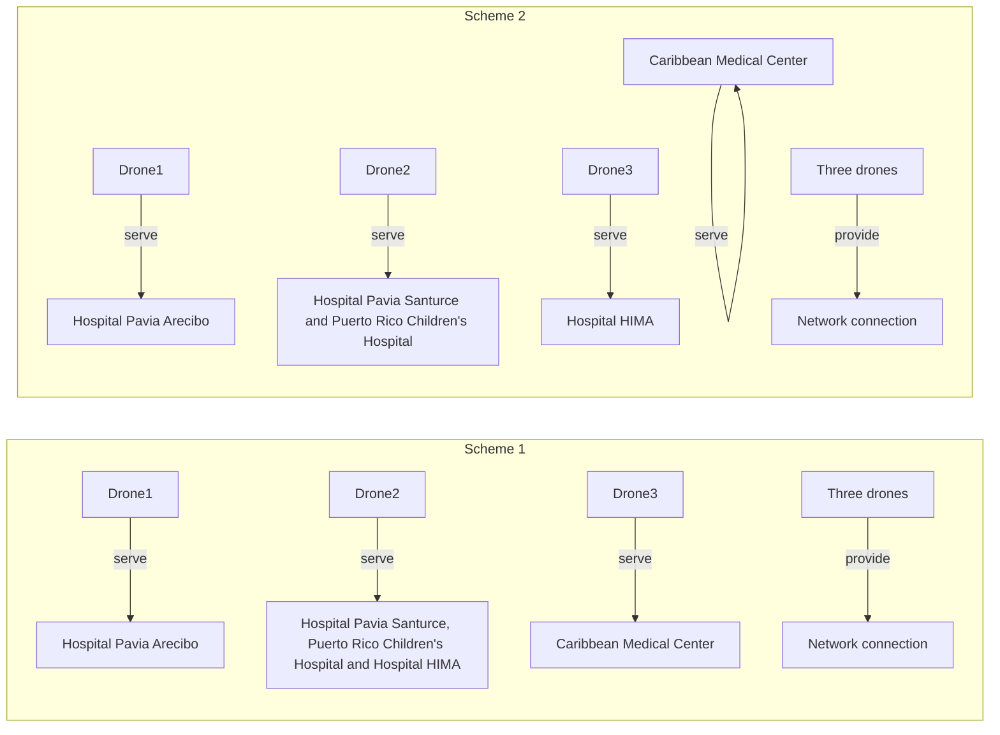
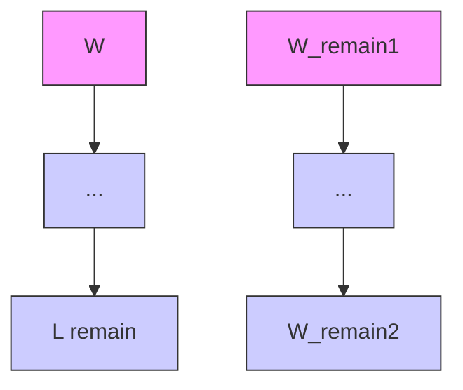
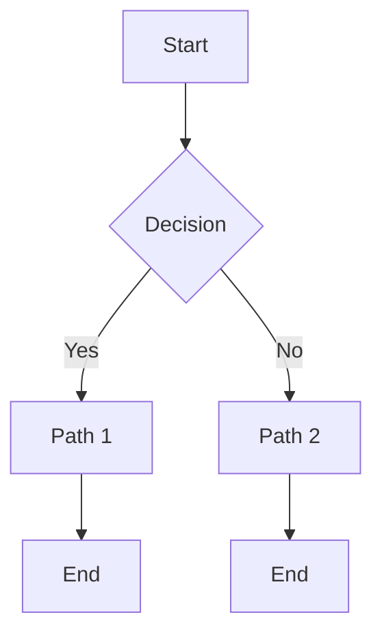
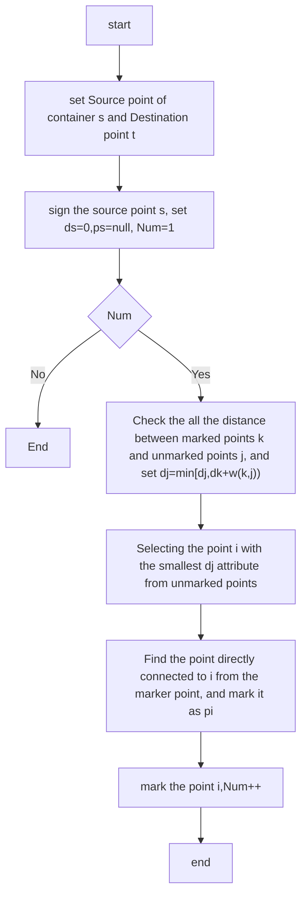
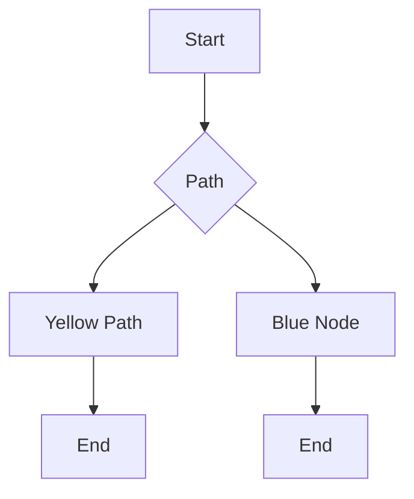

Team Control Number

For office use only

T1

T2

T3

T4

1924588

Problem Chosen

B

For office use only

F1

F2

F3

F4

2019

# MCM/ICM Summary Sheet

# Multi-Directional Comprehensive Disaster Response

# System Based on Optimization

## Summary

According to the actual situation of Puerto Rico, we designed a disaster response system from the perspective of disaster area demand, company cost, realizability and security.

First, we identified the number and type of UAVs(unmanned aerial vehicle) in the UAV fleet based on the geographical location and needs of Puerto Rican hospitals. Minimum UAVs are used to save costs. Solving this optimization problem, we get two schemes: scheme one needs four UAVs (B, C, D and H), the number of which is 1B, 1C, 1D and 3H; scheme two needs four UAVs (B, C, G and H), the number of which is 2B, 1C, 1G and 3H. Each scheme needs three containers.

Second, we designed the packaging configuration for containers. The number of medical packages is large, so the heuristic algorithm is not effective. We propose a one-dimensional maximum utilization packing scheme of “medical package first, UAV later”. It can not only realize the greater use of container space, but also be easy to achieve when loading containers. The maximum space utilization rate is 93.22% and the minimum utilization rate is 68.14%.

Third, we gridded the main roads in Puerto Rico's main disaster areas and transformed the continuous problems into discrete ones. We identified the optimal location of the disaster response system by using grid search method. The three containers’ locations are as follows: ( )18.47 , 66.N W55 , ( )18.34 , 66.N W03 , ( )18.34 , 65.N W69 .

Fourth, the payload packaging configuration of UAV is designed by using optimization methods. Drone B load 2MED1,drone C load 1MED1+1MED3, drone D load 4MED1+2MED3 or 3MED1+3MED2 or 2 MED1+1MED2+2MED3. UAV flight delivery routes need to avoid mountain and high buildings, so we use Voronio Diagram and Dijkstra algorithm to get delivery route. The flight schedule of UAV is obtained according to the delivery route.

Fifth, in order to make the UAV reconnaissance the road as wide as possible, flight schedule of the UAV are obtained by using ant colony optimization (ACO). It can use the limited flight time to reconnoitre the road as much as possible.

To sum up, we considered many factors to design DroneGo system.

Keywords: Optimization; ACO; Gridding; Voronio; Dijkstra

## Contents

1 Introduction.

1.1 Problem Background.  
1.2 Restatement of the Problem.  
1.3 Literature Review .

2 Assumptions and Justifications.  
3 Notations . 3  
4 Model Establishment.

4.1 Identify Drones and Medical Packages . 4

4.1.1 Determining the Number of Unmanned Aerial Vehicles . 4  
4.1.2 Selection of Unmanned Aerial Vehicle Types . 5  
4.1.3 Selection of Container Number and Cargo Loading Scheme. . 5

4.2 ISO Cargo Containers Packing Configuration. . 6  
4.3 Optimization model of the best container location 11

4.3.1 Road Grid Model. 11  
4.3.2 Mapping Hospital Location to Grid Model .12  
4.3.3. Establishment of Optimization Model. .12  
4.3.4 Result 13

4.4 Drone Payload Packaging Configuration .14  
4.5 UAV Delivery Route and Timetable. .14

4.5.1 Delivery Route Division .15  
4.5.2 Delivery Route Planning Model .15  
4.5.3 Delivery Route Solution . .16  
4.5.4 Delivery schedule. 17

4.6 Drone Flight Plan. 1

4.6.1 Model establishment. 17  
4.6.2 Using Ant Colony Optimization (ACO) to Solve the Problem .18  
4.6.3 Result . .19

5 Testing Our Model . ..20  
6 Evaluation of Our Model ..20

References.. .22

Appendix.. ..23

## MEMO

From: Team 1924588, MCM 2019

To: The Chief Operating Officer (CEO) of HELP, Inc.

Date: January 28, 2019

Subject: Findings and recommendations for DroneGo disaster response system

Dear CEO, we are honored to inform you our achievements and recommendations for you.

After a careful study of DroneGo system and the devastation in Puerto Rico, we get the following results. First of all, from the perspective of cost saving for HELP, Inc., we believe that drones used for disaster relief should not be disposable, but should be equipped with replaceable batteries during transportation or realize the reuse of drones by means of designing solar energy charging on the drone or something. On this premise, we figured out that the DroneGo system only needs six drones to achieve the disaster relief mission. Three drones are used for medical supply delivery and video reconnaissance, the other drones,which are named tethered drone, are uesd to provide wireless networks and transmit the data. As for the cargo containers' quantity, we think that three cargo containers can transport more medical packages so that the hospitals in Puerto Rico can last a longer time. And then, we designed a packaging scheme for cargo containers to keep as many medical packages as possible. Please refer to the text for the specific package plan. We have found the three best locations for cargo containers, respectively at ( )18.47 , 66.N W55 , ( )18.34 , 66.N W03 and ( ) 18.34 , 65. N W 69 . Next, we took the obstacles such as mountains and buildings into consideration, and designed a bunch of safe and efficient delivery routes for drones. At the same time, the delivery schedule are formulated for each of the drone. Finally, in order to enable the drone to reconnoitre the main roads as much as possible, we used ant colony optimization（ACO） algorithm to get the best reconnaissance routes of each drone, and work out the time plan of drone based on the combination of medical supply delivery and video reconnaissance.

Through our model analysis, we can draw the conclusion that a small number of drones can complete the medical supply delivery mission. However, if we want to achieve a wider range of road reconnaissance in disaster areas, we need to increase the number of drones invested.

Based on the results and conclusions above, we put forward the following suggestions for you:

Replaceable batteries or solar recharging devices should be designed to reuse the drones.  
Select the three best locations of ( )18.47 , 66.N W55 , ( )18.34 , 66.N W03 ( )18.34 , 65.N W69 ,which can not only reduce the number of drones used, but also make the reconnaissance range as large as possible.  
When planning the route of drones, then influence of obstacles should be considered carefully to complete the missions of medical supply delivery and video reconnaissance safely and successfully.  
If you think that all the main roads must be reconnoitred, you can achieve this goal by using more drones.

We sincerely hope that DroneGo disaster response system will be carried out perfectly.

Please contact us if you have any problems.

## 1 Introduction

## 1.1 Problem Background

The U.S. territory of Puerto Rico was hit by a severe hurricane in 2017 that caused significant damage. The combined destructive power of the hurricane's storm surge and wave action caused extensive damage to buildings and roads, particularly along the east and southeast coast of Puerto Rico. The storm left 3.4 million people on the island without power. The storm destroyed the majority of the island's cellular communication networks. The electrical power and the cell service outages lasted for up across indicates much of the island. Widespread flooding blocked and damaged many highways and roads across the island, making it nearly impossible for emergency services ground vehicles to plan and navigate their routes. Demand for medical services has continued to surge for some time as people with chronic diseases have turned to hospitals and temporary shelters for treatment.

## 1.2 Restatement of the Problem

Non-governmental organizations (NGOs) usually provide adequate and timely response to natural disasters. We need to design a transportable disaster response system called "DroneGo." for HELP, Inc. to improve its response capabilities. We also need to select some of the candidate drones to make up DroneGo fleet for medical supply and video reconnaissance. In addition, we also need to put drones and medical packages into ISO containers with reasonable design and deploy them to the affected areas. The simple structure of the DroneGo disaster response system is shown in figure 1:


<details>
<summary>flowchart</summary>


</details>

Figure 1 DroneGo disaster response system

In order to solve those problems, we will proceed as follows:

Recommend a drone fleet and set of medical packages for the HELP, Inc. DroneGo disaster response system.  
Design packaging configurations for ISO cargo containers to transport the system to disaster areas.  
Identify the best location to deploy the disaster response system's ISO cargo containers.  
Provide payload packaging configurations for medical packages packed in the drone's cargo bay.  
Establish the delivery routes for drones and give a schedule for the delivery of the medical package by the drones.  
Provides flight plans for unmanned aerial vehicles to conduct video reconnaissance.

## 1.3 Literature Review

Part of the problem involves packing problem. Packing problem is a traditional optimal combination problem, which has been studied a lot. The solution of three-dimensional packing problem is usually divided into two parts: heuristic placement method and search algorithm for better solution. S Martello proposed an accurate branch and bound algorithm and combined the original approximation algorithm[1]. E Falkenauer shows how the bin packing GGA can be enhanced with a local optimization inspired by the dominance criterion[2]. JO Berkey and PY Wang developed new bin-packing heuristics by adapting the bottom-left packing method and the next-fit, first-fit and best-fit level-oriented packing heuristics to the finite-bin case[3]. Kyungdaw Kang put forward a hybrid genetic algorithm with a new packing strategy for the three-dimensional bin packing problem[4].And so on.

## 2 Assumptions and Justifications

⚫ Considering the high cost of drones, the disaster response system is designed with fewer drones, which enables ISO cargo containers to deliver more medical packages.  
We don't think the drones are disposable. Drones are supposed to contain replaceable batteries when they arrive in disaster areas, so they can be reused. In addition, a certain time should be set aside between the two operations of the UAV to change the battery, and it is not allowed to work at night. We assume that this time needs about 3 to 4 hours, so the UAV can work up to three times a day.  
As for the H-type UAV, we cannot use it to transport medicine packages or detect problems in the road network according to its characteristics. The H-type UAV[5][6] has the function of providing mobile network. Since much of Puerto Rico's mobile communications network has been destroyed, each container should be equipped with an H-type drone to provide Internet connectivity.

⚫ When using container transport drones and medical packages, the transport time is long and the quantity of goods is large and the weight is large. Therefore, we believe that medical packages can only be positively placed in containers, not upright or inverted. Of course, medical packages can be rotated horizontally to increase the space utilization of containers while they are being placed. When the medical package is transported by UAVs, the transportation time is shorter, the quantity of the goods is less and the weight is smaller, so we think that the medical package can be placed in Drone cargo bay in various ways.  
Suppose that the longest flight time of UAV at full load is 2/3 of that at no load, and the maximum speed remains unchanged.  
Suppose UAVs take up one minute of flight time each as they go up and down.  
The number of medical packages delivered by UAVs is an integral multiple of the daily consumption of the target hospital.

## 3 Notations

Here are the notations and their meanings in our paper:

Table 1 notation explanation

<table><tr><td>meanings</td><td>Notation</td></tr><tr><td>Distance between hospital  $h_m$  and hospital  $h_n$ </td><td> $S(h_m, h_n)$ </td></tr><tr><td>The daily weight of medical required by hospital  $h_m$ </td><td> $Mp_m$ </td></tr><tr><td>The maximum flight distance of drone i</td><td> $D_i$ </td></tr><tr><td>The maximum load of drone i</td><td> $Z_i$ </td></tr><tr><td>The shipping container dimensions of drone i</td><td> $V_i$ </td></tr><tr><td>Represents whether the grid is passed by the road</td><td>TG</td></tr><tr><td>Real distance represented by unit length in grid Coordinate System</td><td> $G_{ave}$ </td></tr><tr><td>The location of cargo container k in grid Coordinate System</td><td> $P_k$ </td></tr></table>

## 4 Model Establishment

Before building the model, there are several issues that need to be addressed. First of all, in designing the number of UAVs and medical packages, designing delivery routes and other tasks, the most basic goal must be to enable UAVs to meet the daily needs of hospitals. Secondly, while meeting the needs, medical packages should be maintained for as long as possible to ensure that the five hospitals in the disaster area can rely on these packages to survive the months of the disaster. Third, considering the high cost of UAVs, we want to reduce the number of UAVs as much as possible, so that ISO cargo containers can have more space to load more medical packages.

In short, we need to select as few UAVs as possible to meet the needs of each hospital. Use the selected UAV for maximum video reconnaissance in the affected area.

## 4.1 Identify Drones and Medical Packages

To recommend a drone fleet and medical package for HELP, Inc. should first understand the basic situation of Puerto Rico's disaster. Five hospitals' location is in attachment 4, the location is shown in Figure 2 .


<details>
<summary>text_image</summary>

Puerto Rico
VORTAC
BORINQUEN
AGUADILLA
1207
(1200)
BAHÍA DE AGUADILLA
VOR DME
MAYAGUEZ
BANIONAL
MONTE CARLOS
PARGUERA
SAN GERMANY
PARGUERA
SAN JUAN
ROSEVELT ROADS
TACAN NDB
ROOSEVELT ROADS
MAYAGUEZ
CABO Rajo
VOR DME
MAYAGUEZ
CORO
UTUADO
COROVALENTA
COROVALENTA
COROVALENTA
COROVALENTA
COROVALENTA
COROVALENTA
COROVALENTA
COROVALENTA
COROVALENTA
COROVALENTA
COROVALENTA
COROVALENTA
COROVALENTA
COROVALENTA
COROVALENTA
CAYEY
R-7103A
PONCE
SANTA ISABEL
SANTA ISABEL 40
SANTA ISABEL 40
SANTA ISABEL 40
SANTA ISABEL 40
SANTA ISABEL 40
SANTA ISABEL 40
SANTA ISABEL 40
SANTA ISABEL 40
SANTA ISABEL 40
SANTA ISABEL 40
SANTA ISABEL 40
SANTA ISABEL 40
SANTA ISABEL 40
SANTA I SABEL
SANTA ISABEL 40
SANTA ISABEL 40
SANTA ISABEL 40
SANTA ISABEL 40
SANTA ISABEL 40
SANTA ISABEL 40
SANTA ISABEL 40
SANTA ISABEL 40
SANTA ISABEL 40
SANTA ISABEL 40
SANTA ISABEL 40
SANTA ISABEL 40
SANTANAISABEL 40
SANTANAISABEL 40
SANTANAISABEL 40
SANTANAISABEL 40
SANTANAISABEL 40
SANTANAISABEL 40
SANTANAISABEL 40
SANTANAISABEL 40
SANTANAISABEL 40
SANTANAISABEL 40
SANTANAISABEL 40
SANTANAISBELER 40
SANTANAISBELER 40
SANTANAISBELER 40
SANTANAISBELER 40
SANTANAISBELER 40
SANTANAISBELER 40
SANTANAISBELER 40
SANTANAISBELER 40
SANTANAISBELER 40
SANTANAISBELER 40
SANTANAISBELTER 40
SANTANAISBELTER 40
SANTANAISBELTER 40
SANTANAISBELTER 40
SANTANAISBELTER 40
SANTANAISBELTER 40
SANTANAISBELTER 40
SANTANAISBELTER 40
SANTANAISBELTER 40
SANTANAISBELTER 40
SANTANAISBELBER 40
SANTANAISBELBER 40
SANTANAISBELBER 40
SANTANAISBELBER 40
SANTANAISBELBER 40
SANTANAISBELBER 40
SANTANAISBELBER 40
SANTANAISBELBER 40
SANTANAISBELBER 40
SANTANAISBELBER 40
</details>

Figure 2 hospitals' location

## 4.1.1 Determining the Number of Unmanned Aerial Vehicles

According to the hospital location map and the full or no-load flight distance of UAV, we found that Hospital Pavia Arecibo is far away from other hospitals. As the distance between Hospital Pavia Arecibo and the nearest Puerto Rico Children's Hospital exceeds the maximum flight distance of any type of UAV, it is not possible to find an ISO cargo container placement point to deliver medical packages for Hospital Pavia Arecibo and other hospitals. Therefore, there must be an UAV and an ISO cargo container dedicated to this hospital. The other four hospitals except Hospital Pavia Arecibo are relatively close. Based on the idea of minimizing the number of UAVs. For two hospitals with distance $S ( h _ { m } , h _ { n } ) , ~ h _ { m }$ and $h _ { n }$ . The weights of the medical packages they need are $M { \boldsymbol { p } _ { m } }$ and $M { \boldsymbol { p } } _ { n }$ . As long as any UAV can be found, its maximum flight distance $D _ { i }$ and payload $Z _ { i }$ meet the requirements：

$$
\left\{ \begin{array}{l} S (h _ {m}, h _ {n}) \leq D _ {i} \\ M p _ {m} \leq Z _ {i} \\ M p _ {n} \leq Z _ {i} \end{array} \right. \tag {1}
$$

It is possible to use the same UAV to distribute medicines to multiple hospitals. Finally, we get two possible UAV fleet schemes：


<details>
<summary>flowchart</summary>


</details>

Figure 3 possible UAV fleet schemes

In solving the problem B later, we will decide which scheme to use according to the road investigation situation of the two schemes.

## 4.1.2 Selection of Unmanned Aerial Vehicle Types

For hospitals, UAVs serving them need to satisfy certain conditions and choose the most suitable UAV among them. This is a multi-objective programming problem. For UAVs serving only one hospital, the programming model is：

$$
\max \alpha_ {1} V _ {i} + \alpha_ {2} Z _ {i} + \alpha_ {3} D _ {i} s. t. Z _ {i} \geq M p _ {n} \tag {2}
$$

For UAVs serving multiple hospitals, the programming model is：

$$
\max \alpha_ {1} V _ {i} + \alpha_ {2} Z _ {i} + \alpha_ {3} D _ {i}
$$

$$
s. t. \left\{ \begin{array}{l} Z _ {i} \geq M p _ {1} \\ Z _ {i} \geq M p _ {2} \\ \vdots \\ Z _ {i} \geq M p _ {k} \\ S (h _ {m}, h _ {n}) \leq D _ {i}, m, n = 1, 2 \dots k, m \neq n \end{array} \right. \tag {3}
$$

Ultimately, the results of our selection of UAV models are as follows:：

The first option: a C-type UAV, a D-type UAV, a B-type UAV and three H-type UAVs.  
The second option：a C-type UAV, a D-type UAV, two B UAVs and three H UAVs are required.

## 4.1.3 Selection of Container Number and Cargo Loading Scheme

We choose three ISO cargo containers to pack UAVs and medical packages for two reasons.：

From the map, we can see that the location of five hospitals is too scattered. By analyzing the location of Caribbean Medical Center, Puerto Rico Children's Hospital and Hospital Pavia Arecibo, we can find that the distance between any two hospitals is greater than the maximum flight distance of UAV, so it is impossible to transport UAV and medical packages with two or less containers.

⚫ From the perspective of the disaster area, we need more containers to carry medical packages so that the medical needs of the hospitals in the disaster area can be satisfied for a longer period of time.

The three ISO cargo containers contain different cargo. The loading materials for each of the three containers of the two schemes are shown in table 2 and table 3.

## Scheme 1：

Table 2 Scheme 1

<table><tr><td>ISO cargo container</td><td>cargo container1</td><td>cargo container2</td><td>cargo container3</td></tr><tr><td>Type of Drone</td><td>B</td><td>C</td><td>D</td></tr><tr><td>Medical Package</td><td>MED1</td><td>MED1, MED2, MED3</td><td>MED1, MED3</td></tr></table>

In this scenario, cargo container1 serves Hospital Pavia Arecibo. Cargo container2 serves Hospital Pavia Santurce, Puerto Rico Children's Hospital and Hospital HIMA. Cargo container3 serves Caribbean Medical Center.

## Scheme 2：

Table 3 Scheme 2

<table><tr><td>ISO cargo container</td><td>cargo container 1</td><td>cargo container 2</td><td>cargo container3</td></tr><tr><td>Type of Drone</td><td>B</td><td>G</td><td>B and C</td></tr><tr><td>Medical Package</td><td>MED1</td><td>MED1,MED2,MED3</td><td>MED1,MED3</td></tr></table>

In this scheme, cargo container1 serves Hospital Pavia Arecibo. Cargo container2 serves Hospital Pavia Santurce and Puerto Rico Children's Hospital. Cargo container3 serves Hospital HIMA Caribbean Medical Center.

## 4.2 ISO Cargo Containers Packing Configuration

After analysis, we need to pack three containers. The goal is to make each container hold the required drones and as many medical packages as possible. This problem is regarded as a three-dimensional packing problem. It is a combinatorial optimization problem that focuses on how to achieve optimal space utilization in a limited space. The 3BP problem is a NP-hard problem. There are many solutions to typical three-dimensional packing problems, most of which use the heuristic algorithm to solve the problems and obtain an approximate solution. However, the heuristic algorithm is not suitable for solving the problems we need to solve here. First, in the disaster response system, the total number of medical packages and drones to be loaded in each container is very large. If we use heuristic algorithm to solve the problem, its convergence rate is too slow. Secondly, the packing scheme obtained by heuristic algorithm is too difficult to realize in practice.

Therefore, we propose a one-dimensional maximum utilization (ODMU) method of “medical package first, UAV later", which can not only use the space of ISO cargo container as much as possible, but also facilitate the loading of medical package into the container in the actual situation.

## 4.2.1 Model establishment

We can assume that: The ISO cargo containers is $\{ C _ { 1 } , C _ { 2 } , C _ { 3 } \}$ . The drone shipping containers is $U = \left\{ U _ { _ A } , U _ { _ B } , U _ { _ C } . . . , U _ { _ H } \right\}$ . The medical packages is $P = \left\{ P _ { 1 } , P _ { 2 } , P _ { 3 } \right\}$ .

Consider that the internal dimensions of ISO cargo containers are：Length is L . Width is  W . Height is  H . The volume is  V . The size of a drone transport container is：{ length $L _ { U _ { \mathrm { i } } }$ , width $W _ { { { U } _ { i } } }$ , height $H _ { { U _ { i } } }$ , volume $V _ { U _ { i } } \}$ , $i = A , . . . , H$ . The size of the emergency medical packages are：{length $L _ { P _ { j } }$ , width $W _ { P _ { j } }$ , height $H _ { P _ { j } }$ , volume $V _ { P _ { j } } \} , ~ j = 1 , 2 , 3$ . Let the sum of the volumes of all drones and medical packages be $\{ V _ { t 1 } , V _ { t 2 } , V _ { t 3 } \}$ ：

$$
V _ {t k} = \sum \left(c _ {i} V _ {U _ {i}} + n _ {j} V _ {P _ {j}}\right) \tag {4}
$$

$k = 1 , 2 , 3 \ , c _ { i }$ represents the number of drones of type  i , n represents the number of medical packages of type $j$ .

The assumption is that medical packages and drone shipping container cannot be inverted. "Medical package first, drone later" one-dimensional maximum utilization(ODMU) method steps are as follows：

Step1: Suppose the ISO cargo container only contains one kind of medical package. At the very beginning, only medical packages are considered, and drones are not considered. Fill the container with medical packages.

Step2: If there are two or three kinds of medical packages in the container, pack them proportionally according to the number of medical packages that need delivery every day. For example, if the ratio of three medical packages is 5:2:3, pack five No. 1 packages, two No. 2 packages, and three No. 3 packages together. Fill the container with packed medical packages until the packed medical packages cannot be put in.

Step3: When putting medical packages into ISO cargo containers, ODMU method is used to place them. This placement method can not only make space

more convenient, but also make it easier to place a large number of medical packages in containers. The specific steps are as follows：

Assume that the width of the medical package is  w , the length is $l ,$ and the height is  h . First consider minimizing the remaining length of one side (length or width) of the ISO cargo container. Making the best use of one side (long or wide) of the container when placing the medical package. By reasonable combination of length and width, the remaining length of this edge is minimized.  [ ] means take integer：

$$
L _ {\text { remain }} = L - n _ {1} l - n _ {2} w W _ {\text { remain1 }} = W - \left[ \frac {W}{l} \right] * l W _ {\text { remain2 }} = W - \left[ \frac {W}{w} \right] * w \tag {5}
$$

$$
\min (L - n _ {1} l - n _ {2} w, W - n _ {1} l - n _ {2} w)
$$

$$
s. t. \left\{ \begin{array}{l} n _ {1} \geq 0, n _ {1} \in N \\ n _ {2} \geq 0, n _ {2} \in N \\ n _ {1} l + n _ {2} w \leq L \text {   or   } n _ {1} l + n _ {2} w \leq W \end{array} \right. \tag {6}
$$

Calculate the maximum number of medical packages that can be placed on a twodimensional plane. (Since it is assumed that the medical package and the drone shipping container cannot be inverted, each two-dimensional plane is placed at the same height as the medical package）


<details>
<summary>flowchart</summary>


</details>

Figure 4 Two-dimensional plane placement

Place the medical packages overlapping until the top space is not enough to place the medical packages.


<details>
<summary>text_image</summary>

H$_{remain}$\nW$_{remain1}$\nW$_{remain2}$\nL$_{remain}$
</details>

Figure 5 Residual space

$$
H _ {\text { remain }} = H - \left[ \frac {H}{h} \right] * h \tag {7}
$$

Step4: Suppose the medical package is full of ISO containers. Consider removing a certain number of medical packages from containers until UAVs can be put in. After putting the medical package in place, there will be some gaps in the left (or right) side, front and upper side of the container. Therefore, when loading the UAV, priority should be given to removing the medical package from the slotted position. This will minimize the number of medical packages taken out.


<details>
<summary>text_image</summary>

After the medical package is taken out, put the drone back in
Get the medical package out of here
</details>

Figure 6 UAV placement

There are two ways to put UAVs in containers:

− The length direction of the UAV corresponds to the length direction of the container, and the width direction of the UAV corresponds to the width direction of the container.  
⚫ The length direction of the UAV corresponds to the width direction of the container, and the width direction of the UAV corresponds to the length direction of the container.

The number of medical packages to be removed from the height of the container is calculated as follows：

$$
n _ {H} = [ \frac {H _ {U _ {i}} - H _ {\text { remain }}}{h} ] + 1 \tag {8}
$$

The number of medical packages to be removed from the length of the container is calculated as follows：

$$
n _ {L 1} = \left[ \frac {L _ {U _ {i}} - L _ {\text {remain}}}{l} \right] + 1 \quad \text {or} \quad n _ {L 1} = \left[ \frac {L _ {U _ {i}} - L _ {\text {remain}}}{w} \right] + 1 \tag {9}
$$

$$
n _ {L 2} = \left[ \frac {W _ {U _ {i}} - L _ {\text {remain}}}{l} \right] + 1 \quad \text {or} \quad n _ {L 2} = \left[ \frac {W _ {U _ {i}} - L _ {\text {remain}}}{w} \right] + 1 \tag {10}
$$

The number of medical packages to be removed from the width of the container is calculated as follows：

$$
n _ {W 1} = \left[ \frac {W _ {U _ {i}} - W _ {\text {remain}}}{l} \right] + 1 \quad \text {or} \quad n _ {W 1} = \left[ \frac {W _ {U _ {i}} - W _ {\text {remain}}}{w} \right] + 1 \tag {11}
$$

$$
n _ {W 2} = \left[ \frac {L _ {U _ {i}} - W _ {\text {remain}}}{l} \right] + 1 \quad \text {or} \quad n _ {W 2} = \left[ \frac {L _ {U _ {i}} - W _ {\text {remain}}}{w} \right] + 1 \tag {12}
$$

The final number of medical packages to be removed is calculated as follows:

$$
\min \{n u m 1, n u m 2 \}
$$

$$
\operatorname{num1} = n _ {L 1} * n _ {W 1} * n _ {H}, \operatorname{num2} = n _ {L 2} * n _ {W 2} * n _ {H} \tag {13}
$$

Step5: Follow these steps to design the associated packing configuration for three ISO cargo containers. Finally, the corresponding number of medical packages and drones can be put into the ISO cargo container according to the designed scheme. This method can make full use of shipping container space.

## 4.2.2 Result

The size of the ISO container, the size of the medical package and the size of the UAV shipping container given in the attachment are substituted into the model for solving, and the results are shown in table 4：

## Scheme 1：

Table 4 ISO container scheme 1

<table><tr><td colspan="2">Container Number</td><td>1</td><td>2</td><td>3</td></tr><tr><td colspan="2">Proportion of three medical packages</td><td>(1:0:0)</td><td>(3:2:2)</td><td>(3:0:2)</td></tr><tr><td rowspan="3">Number</td><td>MED1</td><td>3352</td><td>1350</td><td>1983</td></tr><tr><td>MED2</td><td>0</td><td>900</td><td>0</td></tr><tr><td>MED3</td><td>0</td><td>900</td><td>1322</td></tr><tr><td colspan="2">Medical total volume (Cubic inch)</td><td>1642480</td><td>1143900</td><td>1415862</td></tr><tr><td colspan="2">UAV</td><td>1B+1H</td><td>1G+1H</td><td>1B+1C+1H</td></tr><tr><td colspan="2">UAV total volume (Cubic inch)</td><td>219675</td><td>217283</td><td>309675</td></tr><tr><td colspan="2">Spatial Utilization Rate</td><td>93.22%</td><td>68.14%</td><td>86.38%</td></tr></table>

## Scheme 2：

Table 4 ISO container scheme 1

<table><tr><td colspan="2">Container Number</td><td>1</td><td>2</td><td>3</td></tr><tr><td colspan="2">Proportion of three medical packages</td><td>(1:0:0)</td><td>(5:2:3)</td><td>(1:0:1)</td></tr><tr><td rowspan="3">Number</td><td>MED1</td><td>3352</td><td>1550</td><td>1847</td></tr><tr><td>MED2</td><td>0</td><td>620</td><td>0</td></tr><tr><td>MED3</td><td>0</td><td>930</td><td>1847</td></tr><tr><td>Medical total volume (Cubic inch)</td><td>1642480</td><td>1195980</td><td>1525622</td></tr><tr><td>UAV</td><td>1B+1H</td><td>1C+1H</td><td>1D+1H</td></tr><tr><td>UAV total volume (Cubic inch)</td><td>219675</td><td>289875</td><td>212375</td></tr><tr><td>Spatial Utilization Rate</td><td>93.22%</td><td>74.38%</td><td>87%</td></tr></table>

From table 4 and table 5, we can get the results of the two schemes. The number of medical packages is sufficient to provide long-term support to hospitals in Puerto Rico. In addition, we can see that the utilization rate of space is relatively high. If only package No. 1 is placed in the container, the space utilization rate can reach 93.22%. In the case of multiple packages placed in a container, because packages need to be packed proportionally first, and then put the packaged package into the container., the waste of space during packaging will make the space utilization rate relatively low. However, in terms of realizability, the use of this scheme loses part of the space utilization rate in exchange for greater convenience.

## 4.3 Optimization model of the best container location

According to the analysis in question A, we have come to the conclusion that the three containers of the DroneGo disaster-related system must be placed in three different locations. Under the condition of completing the distribution task of medical supplies, the road network should be reconnoitered as comprehensively as possible.

## 4.3.1 Road Grid Model

In order to describe the situation of road reconnaissance, we first grid the road. The main disaster area of Puerto Rico is transformed into a discrete space set by meshing. The length and area of each grid are equal. A distinction is made between a grid with a main road and a grid without a main road. The former is marked by 1, called "traversed grid"(TG). The latter is marked by 0, called " untraversed grid ".Set the symbol TG, if the grid is traversed grid, TG=1. Otherwise TG=0. Complete the discrete treatment of roads. We can construct a new coordinate system in a meshed graph, called " Grid coordinate system". The results of road gridding are shown in the figure 7.


<details>
<summary>line chart</summary>

| Index | Value |
|-------|-------|
| 0     | 7     |
| 10    | 6     |
| 20    | 5     |
| 30    | 5     |
| 40    | 4     |
| 50    | 3     |
| 60    | 2     |
| 70    | 1     |
| 80    | 1     |
| 90    | 2     |
</details>

Figure 7 The results of road gridding

According to the actual distance and the number of meshes, the transformation relationship between the real coordinates and the grid coordinates can be calculated, that is, the distance represented by the unit length in the Grid coordinate system is as follows：

$$
G _ {a v e} = \frac {1 1 3 . 9 9 k m}{9 1 c e l l s} = 1. 2 8 1 k m / c e l l
$$

## 4.3.2 Mapping Hospital Location to Grid Model

According to the location coordinates of the hospitals in attachment 4 and the corresponding relationship between the grid coordinates and the geographical coordinates, the positions of the hospitals in the grid coordinate system can be expressed. The results are as follows.：

Table 5 The positions of the hospitals

<table><tr><td>Hospital I</td><td>Hospital II</td><td>Hospital III</td><td>Hospital IV</td><td>Hospital V</td></tr><tr><td>(15, 92)</td><td>(25, 61)</td><td>(6, 57)</td><td>(11, 51)</td><td>(4, 4)</td></tr></table>

Represents in grid coordinates as shown in Figure $8 .$


<details>
<summary>flowchart</summary>


</details>

Figure 8 The positions of the hospitals

## 4.3.3. Establishment of Optimization Model

Determine the place where containers are put into operation, and optimize the objective of investigating the road network as comprehensively as possible. In the road grid model, if the container is placed at this location, we will take that location as the center of the circle. The area that the UAV can detect is a circular area with a radius of half of the maximum flight distance of the UAV. The larger the number of traversed grids included in the investigation area, the wider the range of roads that the UAV can detect. The constraints of the optimization model are that the distance between each container and its corresponding hospital is less than half of the maximum flight distance of the UAV.

For an UAV $F _ { i }$ in a container, the maximum flight distance of the cargo is $D _ { i }$ . If the position of ISO cargo container in grid coordinates is $P _ { k } ( x _ { i } , y _ { j } )$ .Take $( x _ { i } , y _ { j } )$ as the center of the circle, so a circle with radius $\frac { D _ { i } } { 2 }$ can be written as $C i r _ { i }$ .

The objective of optimization is：

$$
\max \sum T G, T G \subseteq C i r _ {i} \tag {14}
$$

For example, in scheme 1, ISO cargo Container2. If UAVs in containers need to serve multiple hospitals and the coordinates of the hospital are $h _ { { m } } ( p , q )$ , the constraint condition are：

$$
s. t. \left\{ \begin{array}{l} S (h _ {m}, P _ {k}) \leq \frac {D _ {i}}{2}, m = 1, 2, 3 \\ S (h _ {m}, P _ {k}) = \sqrt {(x _ {i} - p) ^ {2} + (y _ {j} - q) ^ {2}} \end{array} \right. \tag {15}
$$

For example, container3 in Scheme 2. If there are multiple UAVs in the container for transportation, the constraint condition is：

$$
s. t. \left\{ \begin{array}{l} S (h _ {m}, P _ {k}) \leq \frac {D _ {i}}{2}, m = 1, 2; i = 1, 2 \\ S (h _ {m}, P _ {k}) = \sqrt {(x _ {i} - p) ^ {2} + (y _ {j} - q) ^ {2}} \end{array} \right. \tag {16}
$$

## 4.3.4 Result

We found that there was no grid location in scheme 2, which could satisfy the need for two UAVs in cargo container3 to serve the target hospital at the same time. Therefore, we choose the scheme 1. The optimal grid points of three containers are obtained and the results are as follows:

Table 6 The optimal grid points of three containers

<table><tr><td></td><td>cargo container1</td><td>cargo container 2</td><td>cargo container 3</td></tr><tr><td>Coordinates</td><td>(4,19)</td><td>(15,61)</td><td>(15,89)</td></tr><tr><td>Latitude and longitude</td><td>(18.47, -66.5459)</td><td>(18.339, -66.0305)</td><td>(18.339, -65.6868)</td></tr></table>

The location in the map is shown in Figure 9, where the blue coordinates are the location of containers (red dots represent obstacles such as mountains, buildings, etc., which will be used in subsequent solutions).


<details>
<summary>text_image</summary>

Pixelated map or route diagram with red and green markers, showing a path from top-left to bottom-right with blue location pins.
</details>

Figure 9 The location of containers

# 4.4 Drone Payload Packaging Configuration

The drones deliver medical packages to hospitals, ensuring that each shipment will meet at least one day's hospital demand. If UAVs can deliver more than one day at a time to meet the needs of hospitals, then UAVs do not have to deliver medical packages to hospitals every day. UAV can use the extra time to accomplish some reconnaissance tasks. It has been assumed that the number of medical packages transported by UAVs is an integral multiple of the hospital's daily demand, and then the configuration of medical packages for Drone Cargo Bay is designed as follows[8].

Let the length of drone cargo bay type 1 be $L _ { b 1 }$ , width is $W _ { b 1 } ,$ , height is $H _ { b 1 }$ , the length of drone cargo bay type 2 is $L _ { b 2 }$ , width is $W _ { b 2 }$ , height is $H _ { b 2 }$ .

$$
\sum \left(n _ {i} w _ {j j} + n _ {j} l _ {i i}\right) \leq L _ {b k}, \sum \left(n _ {j} w _ {j j} + n _ {i} l _ {i i}\right) \leq W _ {b k}, \sum \left(n _ {j j} h _ {m} + n _ {i i} h _ {n}\right) \leq H _ {b k} \tag {17}
$$

$$
\sum \left(n _ {p 1} m _ {1} + n _ {p 2} m _ {2} + n _ {p 3} m _ {3}\right) \leq M _ {\max} \tag {18}
$$

$n _ { p 1 } , ~ n _ { p 2 } , ~ n _ { p 3 }$ is the number of three types of medical packages.

The final drone payload packing configurations are as follows（MED1 is green, MED2 is yellow, MED3 is blue）：

Drone B →HospitalⅤ: Drone D →HospitalⅠ: Drone C→HospitalⅡ:


<details>
<summary>text_image</summary>

5
8
10
14
</details>

Drone C→Hospital Ⅲ:


<details>
<summary>text_image</summary>

14
5
10
4
8
12
</details>


<details>
<summary>text_image</summary>

20
14
5
4
24
12
7
20
</details>

Drone C→Hospital Ⅳ:


<details>
<summary>text_image</summary>

20
5
14
7
24
5
8
20
</details>


<details>
<summary>text_image</summary>

12
4
7
20
5
8
14
5
24
20
</details>

Figure 10 Drone payload packing configurations

## 4.5 UAV Delivery Route and Timetable

Normally, non-military UAVs fly at altitudes between 100 and 500 meters. As can be seen from the topographic map of Puerto Rico in attachment 1, there are many mountains and buildings in parts of the disaster area. Therefore, these obstacles need to be avoided in the design of delivery routes to improve the safety of UAVs. Distribution of obstacles in parts of the disaster area is shown in Figure 11.


<details>
<summary>natural_image</summary>

Pixelated black outline of a stylized animal head on a grid background (no text or symbols)
</details>

Figure 11 Distribution of obstacles

## 4.5.1 Delivery Route Division

According to the figure above, we divide the UAV delivery into two types:

⚫ When there are many buildings or mountains near the container or UAV target hospital, the UAV delivery route planning model with threat source is constructed to solve the problem, which is suitable for UAV in cargo container2.  
When there are few buildings near the container and the target hospital, UAV flies to the nearest road, then to the target hospital along the highway or directly to the target hospital along the straight line. It is suitable for cargo container1 and cargo container3 (Delivery and reconnaissance tasks can be carried out simultaneously)

## 4.5.2 Delivery Route Planning Model

In order to avoid tall buildings and mountains during transportation, we consider mountains and buildings as a source of threat. Delivery routes are designed to find the nearest route to a destination hospital with minimal threat. Therefore, we first make the middle perpendicular of any two threat sources to form Voronio diagram. If the UAV flies along the edge of the Voronio diagram, the threat source will be the least, because the points on each edge of the Voronio diagram are equidistant from the corresponding two threat sources to ensure the security. Take cargo container2 as an example, and Voronio diagram is made according to the threat sources around it, as shown in figure 12.


<details>
<summary>line chart</summary>

| The ordinate of the grid | The abscissa of the grid |
| ------------------------ | ----------------------- |
| 50                       | 6                       |
| 52                       | 8                       |
| 54                       | 10                      |
| 56                       | 12                      |
| 58                       | 14                      |
| 60                       | 16                      |
| 62                       | 18                      |
</details>

Figure 12 Voronio diagram

Each intersection point and three hospital locations in the figure 12 are regarded as target nodes.

## 4.5.3 Delivery Route Solution

According to Voronio diagram, we select Dijkstra algorithm to select the shortest route from the cargo container to other nodes. It should be noted that, since the starting point and destination location are not on the safe route, it is necessary to adjust the optimal route obtained by the algorithm. The algorithm flow chart is as follows:：


<details>
<summary>flowchart</summary>


</details>

Figure 13 algorithm flow chart

By calculation, the delivery route of the delivering for the hospital is expressed in the grid coordinate system as follows:

Table 7 The delivery route

<table><tr><td>D-type UAV to Caribbean Medical Center</td><td>(15,89) → (15,92)</td></tr><tr><td>C-type UAV to Hospital HIMA</td><td>(15,61) → (25,61)</td></tr><tr><td>C-type UAV to Hospital Pavia Santurce</td><td>(15,61) → (13,58) → (11,58) → (6,57)</td></tr><tr><td>C-type to Puerto Rico Children&#x27;s Hospital</td><td>(15,61) → (11,54) → (11,51)</td></tr><tr><td>B-type UAV to Hospital Pavia Arecibo</td><td>(4,19) → (5,18) → (5,5) → (4,4)</td></tr></table>

All the delivery routes are shown in the grid coordinate system as shown in Figure 14：


<details>
<summary>flowchart</summary>


</details>

Figure 14 The delivery routes

## 4.5.4 Delivery schedule

According to the location of the container, the number and type of UAV, and the packing configuration of each medical package delivered by the UAV. We set the delivery schedule of the UAV as follows (only the time schedule for completing the delivery task is given, considering that the overall time schedule for the reconnaissance video task will be completed in Question C.b).

Table 8 Time schedule for the reconnaissance video task

<table><tr><td colspan="2">Day1</td><td colspan="2">Day2</td><td colspan="2">Day3</td></tr><tr><td>time of departure</td><td>time of return</td><td>time of departure</td><td>time of return</td><td>time of departure</td><td>time of return</td></tr><tr><td> $F_1 \rightarrow I$  8:30</td><td>8:41</td><td rowspan="3"> $F_1 \rightarrow I$  8:30</td><td rowspan="3">8:41</td><td> $F_1 \rightarrow I$  8:30</td><td>8:41</td></tr><tr><td> $F_2 \rightarrow II$  8:30</td><td>8:58</td><td> $F_2 \rightarrow II$  8:30</td><td>8:58</td></tr><tr><td> $F_3 \rightarrow V$  8:30</td><td>9:02</td><td> $F_3 \rightarrow V$  8:30</td><td>9:02</td></tr><tr><td> $F_2 \rightarrow III12:30$ </td><td>12:54</td><td rowspan="2"> $F_2 \rightarrow IV16:30$ </td><td rowspan="2">16:57</td><td rowspan="2"> $F_2 \rightarrow IV$  16:30</td><td rowspan="2">16:57</td></tr><tr><td> $F_2 \rightarrow IV16:30$ </td><td>16:57</td></tr></table>

（The UAV's fourth day schedule is the same as the first day, and the cycle is three days, so we only give a three-day schedule.）

## 4.6 Drone Flight Plan

## 4.6.1 Model establishment

The flight plan of the UAV includes two aspects: flight schedule and flight route arrangement. The time arrangement can be determined according to the working frequency of the UAV and the schedule of the delivery of medical packages by the UAV. Here we mainly discuss the arrangement of flight routes[7].

The ISO container where the drone is located is the starting point for each drone mission, while the TG near the container is the area the drone needs to reconnoitre. Our goal is to allow the drone to fly through all TG and back to the container within its own reconnaissance range with the minimum flight distance. Let's the starting point plus all the TG's in the range have N points. $V = \{ 1 , 2 , \cdots N \}$ is the set of points for all points to pass through.

The distance between each point is $d _ { i j } \left( i , j \in V \right)$ .

$$
x _ {i j} = \left\{ \begin{array}{l l} 1 & \text { The   connection   between   } i \text {   and   } j \text {   is   on   the   optimal   route   of   the   drone } \\ 0 & \text { otherwise } \end{array} \right.
$$

Then the UAV line planning model can be written in the following linear programming form:

$$
\min \sum_ {i \neq j} d _ {i j} x _ {i j}
$$

$$
s. t. \left\{ \begin{array}{l l} \sum_ {j = 1} ^ {N} x _ {i j} = 1 & i = 1, 2, \dots N \\ \sum_ {i = 1} ^ {N} x _ {i j} = 1 & j = 1, 2, \dots N \\ \sum_ {i, j \in K} x _ {i j} \leq | K | - 1 & K \subset V \\ x _ {i j} \in \{0, 1 \} & i, j \in V \end{array} \right. \tag {19}
$$

## 4.6.2 Using Ant Colony Optimization (ACO) to Solve the Problem

Step1: Parameter initialization, set the time t=0 and number of cycles $N _ { c } { = } 0 ,$ , Set the maximum number of cycles $N _ { c \operatorname* { m a x } }$ , put m ants in N locations, equalize pheromones on each path, $\tau _ { i j } = c o n s t$ .

Step2：Number of cycles plus 1.

Step3: Each individual ant chooses the next place to move forward according to the state transition probability formula.

$$
p _ {i j} ^ {k} (t) = \left\{ \begin{array}{c c} \frac {\left[ \tau_ {i j} (t) \right] ^ {\alpha} \left[ \eta_ {i j} (t) \right] ^ {\beta}}{\sum_ {s \subset J _ {k} (i)} \left[ T _ {i s} (t) \right] ^ {\alpha} \left[ \eta_ {i s} (t) \right] ^ {\beta}}, & j \in J _ {k} (i) \\ 0, & \text { otherwise } \end{array} \right. \tag {20}
$$

In the above formula, $J _ { \boldsymbol { k } } ( i ) = \{ 1 , 2 , \cdots n \} - \boldsymbol { \tau } _ { \boldsymbol { k } }$ represents the mesh points that ants are allowed to select next, $\tau _ { k }$ records the dots that ants have traveled through. $\eta _ { i j } ( t )$ is a heuristic factor, usually the reciprocal of the distance between grid point i and grid point $j$ .

Step4: If not all N grid points have been traversed, then jump to Step2.

Step5: When all ants complete a tour, the pheromones on each path are updated according to the formula:

$$
\tau_ {i j} (t + N) = (1 - \rho) \tau_ {i j} (t) + \Delta \tau_ {i j} (t)
$$

$$
\Delta \tau_ {i j} (t) = \sum_ {k = 1} ^ {m} \Delta \tau_ {i j} ^ {k} \tag {21}
$$

In the above formula, $\rho ( 0 < \rho < 1 )$ represents the pheromone Volatilization Coefficient on the path. $\Delta \tau _ { i j } ^ { k }$ represents the pheromone quantity that the $k _ { t h }$ ant leaves on the path in an iteration.

$$
\Delta \tau_ {i j} ^ {k} = \left\{ \begin{array}{l l} \frac {Q}{L _ {k}}, & \text { when   the   ant   k   passed   by   ij   on   this   tour } \\ 0, & \text { otherwise } \end{array} \right.
$$

$L _ { k }$ represents the length of the path that the $k _ { t h }$ ant travels during this tour.

Step6：If the number of cycles $N _ { c } > N _ { c \operatorname* { m a x } }$ , then the loop ends, otherwise jump to Step2.

## 4.6.3 Result

For the B-type UAV in cargo container 1, the left side of the container can be reconnoitered simultaneously during delivery, so the UAV only needs to perform the reconnaissance task on the right side of the container. Using ACO algorithm, the optimal route selection in the maximum flight range of UAV is obtained as follows：

$$
\text { route1: } (4, 1 9) \rightarrow (6, 1 8) \rightarrow (7, 1 9) \rightarrow (8, 2 0) \rightarrow (7, 2 0) \rightarrow (7, 2 5) \rightarrow (6, 3 2) \rightarrow (6, 2 6) \rightarrow (4, 1 9)
$$

For the D-type UAV in cargo container3, besides carrying medical packages, it can reconnaissance at most twice a day. In order to get the maximum scope of reconnaissance, we get two optimal reconnaissance routes.：

$$
\text { route2 }: (1 5, 8 9) \rightarrow (1 3, 8 9) \rightarrow (1 2, 8 8) \rightarrow (1 1, 8 7) \rightarrow (1 2, 8 7) \rightarrow (1 3, 8 8) \rightarrow (1 5, 8 9)
$$

$$
\text { route3: } (1 5, 8 9) \rightarrow (1 4, 9 1) \rightarrow (1 4, 9 2) \rightarrow (1 5, 9 2) \rightarrow (1 6, 9 3) \rightarrow (1 5, 8 9)
$$

For the C-type UAV in cargo container2, in order to reconnoiter more roads, it is necessary to reconnoiter in three directions by observing the road distribution grid. The three optimal paths are calculated as follows:：

$$
r o u t e 4: (1 5, 6 1) \rightarrow (1 0, 6 1) \rightarrow (9, 6 0) \rightarrow (8, 6 0) \rightarrow (9, 6 1) \rightarrow (1 0, 6 2) \rightarrow (1 0, 6 5) \rightarrow (1 1, 6 6) \rightarrow (1 5, 6 0)
$$

$$
\text { route5 }: (1 5, 6 1) \rightarrow (1 1, 5 8) \rightarrow (1 6, 5 8) \rightarrow (1 6, 5 9) \rightarrow (2 0, 5 9) \rightarrow (1 9, 6 0) \rightarrow (1 7, 6 0) \rightarrow (1 5, 6 1)
$$

$$
\text { route6: } (1 5, 6 1) \rightarrow (1 0, 5 4) \rightarrow (1 0, 5 3) \rightarrow (9, 5 4) \rightarrow (8, 5 5) \rightarrow (9, 5 5) \rightarrow (1 5, 6 1)
$$

All the optimal reconnaissance routes are shown in the grid coordinate system and on the map as shown in Figure 15.


<details>
<summary>text_image</summary>

route1
route4
route2
route3
route6
route5
</details>

Figure 15 Optimal reconnaissance routes

At the same time, we give the overall schedule of UAV operation as shown in table 10.

Table 9 Schedule of UAV operation

<table><tr><td colspan="2">Day1</td><td colspan="2">Day2</td><td colspan="2">Day3</td></tr><tr><td>time of departure</td><td>time of return</td><td>time of departure</td><td>time of return</td><td>time of departure</td><td>time of return</td></tr><tr><td> $F_1 \rightarrow I$  8:30</td><td>8:41</td><td> $F_1 \rightarrow I$  8:30</td><td>8:41</td><td> $F_1 \rightarrow I$  8:30</td><td>8:41</td></tr><tr><td> $F_2 \rightarrow II$  8:30</td><td>8:58</td><td rowspan="2"> $F_2 \xrightarrow{route4}$ 8:30</td><td rowspan="2">8:56</td><td> $F_2 \rightarrow II$  8:30</td><td>8:58</td></tr><tr><td> $F_3 \rightarrow V$  8:30</td><td>9:02</td><td> $F_3 \rightarrow V$  8:30</td><td>9:02</td></tr><tr><td> $F_2 \rightarrow III12:30$ </td><td>12:54</td><td> $F_3 \xrightarrow{route1}$ 12:30</td><td>13:01</td><td> $F_3 \xrightarrow{route1}$ 12:30</td><td>13:01</td></tr><tr><td> $F_3 \xrightarrow{route1}$ 12:30</td><td>13:01</td><td> $F_1 \xrightarrow{route2}$ 12:30</td><td>12:40</td><td> $F_1 \xrightarrow{route2}$ 12:30</td><td>12:40</td></tr><tr><td> $F_1 \xrightarrow{route2}$ 12:30</td><td>12:40</td><td> $F_2 \xrightarrow{route5}$ 12:30</td><td>13:55</td><td> $F_2 \xrightarrow{route6}$ 12:30</td><td>12:57</td></tr><tr><td> $F_2 \rightarrow IV16:30$ </td><td>16:57</td><td> $F_2 \rightarrow IV$  16:30</td><td>16:57</td><td> $F_2 \rightarrow IV$  16:30</td><td>16:57</td></tr><tr><td> $F_1 \xrightarrow{route3}$ 16:30</td><td>16:43</td><td> $F_1 \xrightarrow{route3}$ 16:30</td><td>16:43</td><td> $F_1 \xrightarrow{route3}$ 16:30</td><td>16:43</td></tr></table>

(The UAV's fourth day schedule is the same as the first day, and the cycle is three days)

## 5 Testing Our Model

In question C, we designed the delivery route and reconnaissance route of drone successfully. Because question C adds consideration to the effect of obstacles on the basis of question B, we need to test the designed delivery routes and reconnaissance routes and judge whether the tasks performed along these routes will exceed the maximum flight distance of the drone. If not, the result of the model is perfect. Otherwise, the model needs to be modified.

Table 11 is the result of inspection of delivery routes and reconnaissance routes.

Table 10 The result of inspection of delivery routes and reconnaissance routes

<table><tr><td>Maximum flight distance of  $F_1$ </td><td>The delivery distance of  $F_1$ </td><td>The Reconnaissance distance of  $F_1$ </td></tr><tr><td>11.7km</td><td>7.685km</td><td>10.329km,11.518m</td></tr><tr><td>Maximum flight distance of  $F_2$ </td><td>The delivery distance of  $F_2$ </td><td>The Reconnaissance distance of  $F_2$ </td></tr><tr><td>27.6km</td><td>25.616km, 25.816km,27.331km</td><td>26.449km,26.974m,27.070km</td></tr><tr><td>Maximum flight distance of  $F_3$ </td><td>The delivery distance of  $F_3$ </td><td>The Reconnaissance distance of  $F_3$ </td></tr><tr><td>40.5km</td><td>40.473km</td><td>40.237km</td></tr></table>

According to the results, all of the routes designed in question C meet the limit of maximum flight distance, which shows that the model established is reasonable.

## 6 Evaluation of Our Model

## Strength

Through detailed analysis and reasonable simplification of the model, we created a new three-dimensional packing method, which solves the packing problem of drone and medical packages in the cargo containers well and achieves satisfactory spatial utilization rate.

The longitude and latitude are meshed to get a new grid coordinate system, which makes the road usage easy to be measured. And the calculation of question B and C is simplified.  
Considering a lot of factors, such as flight distance, load limitation, obstacles and so on. Therefore, we obtain a more realistic result.  
Our model will save plenty of cost for HELP, Inc. realistically,

## Weakness

In order to reduce the number of drones and save money, some roads cannot be reconnoitred by drones.  
Due to the time relation, the exact formula of the maximum flight distance when the drone is loaded has not been solved

## References

[1] Martello S, Pisinger D, Vigo D. The three-dimensional bin packing problem[J]. Operations Research, 2000, 48(2): 256-267.  
[2] Falkenauer E. A hybrid grouping genetic algorithm for bin packing[J]. Journal of heuristics, 1996, 2(1): 5-30..  
[3] Berkey J O, Wang P Y. Two-dimensional finite bin-packing algorithms[J]. Journal of the operational research society, 1987, 38(5): 423-429.  
[4] Kang K, Moon I, Wang H. A hybrid genetic algorithm with a new packing strategy for the threedimensional bin packing problem[J]. Applied Mathematics and Computation, 2012, 219(3): 1287-1299.  
[5] Nicotra M M, Naldi R, Garone E. Nonlinear control of a tethered uav: The taut cable case[J]. Automatica, 2017, 78: 174-184.  
[6] Portmann H. Unmanned aerial vehicle catcher: U.S. Patent 7,264,204[P]. 2007-9-4.  
[7] Duan H, Li P. Uav path planning[M]//Bio-inspired Computation in Unmanned Aerial Vehicles. Springer, Berlin, Heidelberg, 2014: 99-142.  
[8] Wan Y, Liu J, Tsai P C. The assignment of storage locations to containers for a container stack[J]. Naval Research Logistics (NRL), 2009, 56(8): 699-713.

## Appendix

Establishment of grid coordinate system  
```matlab
grid.m
clear
p= imread('The path.jpg');
m=p(:,;2);
rows=size(m,1);
column=size(m,2);
for n=1:rows
    for k=1:column
    if m(n,k)>=200
    m(n,k)=255;
    end
    end
end
precision=5;
for i=1:fix(rows/precision)
    m(i*precision,:) = 0;
end
for j=1:fix(column/precision)
    m(:,precision*j)=0;
end
M=[];
Q=0;
T=zeros(fix(rows/precision),fix(column/precision));
for i=1:fix(rows/precision)
    for j=1:fix(column/precision)
    k=sum(m(((i-1)*precision+1):i*precision,((j-1)*precision+1):j*precision));
    k=sum(k,2);
    M=[M k];
    if k<(precision-1)*(precision-1.5)*255
    m(((i-1)*precision+1):i*precision,((j-1)*precision+1):j*precision)=0;
    Q=Q+1;
    T(i,j)=1;
    end
    end
end
imshow(m);
```

Three-dimensional packing  
```csv
packing.m
clear,clc
BOX=[231,92,94];%ISO container internal dimensions L × W × H
MED1=[14 7 5];%Medical Packagedimensionsl×w ×h
```

```matlab
%BOX_L Maximum capacity
l_max=fix(BOX(1)/MED1(1));
w_max=fix(BOX(1)/MED1(2));
M=[];
fori=0:l_max%
    I=fix(BOX(2)/MED1(2));%BOX_WCorresponding capacity
    II=mod(BOX(2),MED1(2));% Remaining length
    j=fix((BOX(1)-i*MED1(1))/MED1(2));
    J=fix(BOX(2)/MED1(1));
    JJ=mod(BOX(2),MED1(1));
    remain=BOX(1)-i*MED1(1)-j*MED1(2);
    M=[M;i,I,II,j,J,J,J,K,L,M,i*I+j*J];
end
[value,index]=max(M(:,end));
M(index,end)
```

The Optimum Location of Containers  
cargo.m  
```matlab
clc
clear
T=xlsread('T.xlsx')
S=113.990;
n=91;
Save=S/n;
Sd=39.5/2;
r=Sd/Save;
re=[];
maxsum=0;
suum=[];
for i=3:1:15
    for j=3:30
    if sqrt((4-i)^2+(4-j)^2)>r
    continue
    else
    ymin=max(1,ceil(i-r));
    ymax=min(30,floor(i+r));
    xmin=max(1,ceil(j-r));
    xmax=min(97,floor(j+r));
    sum=0;
    for p=ymin:ymax
    for q=xmin:xmax
    sum=sum+T(p,q);
    end
    end
    suum=[suum sum];
    if sum>=maxsum
```

```matlab
maxsum=sum;
re=[i,j,sum]
end
end
end
end
```

− The generation of Voronio diagrams  
```matlab
Vd.m
a=[
    12, 52
    4, 50
    8, 48
    21, 49
    11, 57
    11, 60
    19, 54
    21, 54
    20, 56
    23, 62]
x=[52 50 48 49 57 60 54 54 56 62]
y=[12 4 8 21 11 11 19 21 20 23]
voronoi(x, y)
hold on
plot(61, 15,'-xr',61, 25,'-*k',57, 6,'-*k',51, 11,'-*k')
legend('Obstacles','Safest route','Starting point','Destination')
ylabel('The abscissa of the grid')
xlabel('The ordinate of the grid')
set(gca,'XAxisLocation','top');
set(gca,'YDir','reverse');
```

ant colony optimization  
```matlab
Q4.m
function
[R_best,L_best,L_ave,Shortest_Route,Shortest_Length]=Q4(C,NC_max,m,Alpha,Beta,Rho,Q)
n=size(C,1);
D=zeros(n,n);
for i=1:n
for j=1:n
if i~=j
D(i,j)=(C(i,1)-C(j,1))^2+(C(i,2)-C(j,2))^2)^0.5;
else
D(i,j)=eps;
end
D(j,i)=D(i,j);
end
end
```

```matlab
Eta=1./D;
Tau=ones(n,n); Tabu=zeros(m,n);
NC=1;
R_best=zeros(NC_max,n);
L_best=inf.*ones(NC_max,1);
L_ave=zeros(NC_max,1);
```

```matlab
while NC<=NC_max
Randpos=[];
for i=1:(ceil(m/n))
Randpos=[Randpos,randperm(n)];
end
Tabu(:,1)=(Randpos(1,1:m))';
```

```matlab
for j=2:n
for i=1:m
visited=Tabu(i,1:(j-1));
J=zeros(1,(n-j+1));
P=J;
Jc=1;
for k=1:n
if length(find(visited==k))==0
J(Jc)=k;
Jc=Jc+1;
end
end
```

```matlab
for k=1:length(J)
P(k)=(Tau(visited(end),J(k))^Alpha)*(Eta(visited(end),J(k))^Beta);
end
P=P/(sum(P));
Pcum=cumsum(P);
Select=find(Pcum>=rand);
to_visit=J(Select(1));
Tabu(i,j)=to_visit;
end
end
```

```matlab
if NC>=2
Tabu(1,:) = R_best(NC-1,:);
end
```

```matlab
L=zeros(m,1);
for i=1:m
R=Tabu(i,:);
for j=1:(n-1)
L(i)=L(i)+D(R(j),R(j+1));
end
L(i)=L(i)+D(R(1),R(n));
end
```

```matlab
L_best(NC)=min(L); pos=find(L==L_best(NC));
R_best(NC,:)=Tabu(pos(1),:);
L_ave(NC)=mean(L);
NC=NC+1
```

```matlab
Delta_Tau=zeros(n,n);
for i=1:m
for j=1:(n-1)
Delta_Tau(Tabu(i,j),Tabu(i,j+1))=Delta_Tau(Tabu(i,j),Tabu(i,j+1))+Q/L(i);
end
Delta_Tau(Tabu(i,n),Tabu(i,1))=Delta_Tau(Tabu(i,n),Tabu(i,1))+Q/L(i);
end
Tau=(1-Rho).*Tau+Delta_Tau;
Tabu=zeros(m,n);
end
```

```matlab
Pos=find(L_best==min(L_best));
Shortest_Route=R_best(Pos(1), :) 
Shortest_Length=L_best(Pos(1))
figure(1)
DrawRoute(C, Shortest_Route)
figure(2)
plot(L_best)
title('The shortest distance')
```

```matlab
function DrawRoute(C,R)

N=length(R);
scatter(C(:,1),C(:,2));
hold on
plot([C(R(1),1),C(R(N),1)],[C(R(1),2),C(R(N),2)],'r')
hold on
for ii=2:N
plot([C(R(ii-1),1),C(R(ii),1)],[C(R(ii-1),2),C(R(ii),2)],'r')
hold on
end
hold on
plot(C(1,1),C(1,2),'-*k')
ylabel('The abscissa of the grid')
xlabel('The ordinate of the grid')
set(gca,'XAxisLocation','top');
set(gca,'YDir','reverse');
title('Optimization results of drone detection path')
```

Packing ISO cargo containers  
```matlab
ISO.m
clear,clc
BOX=[231,92,94];% ISO container internal dimensions L × W × H
MED1=[14 7 5];% Medical Package dimensions l×w ×h
% BOX_L Maximum capacity
l_max=fix(BOX(1)/MED1(1));
w_max=fix(BOX(1)/MED1(2));
M=[];
for i=0:l_max%
    I=fix(BOX(2)/MED1(2));% BOX_W Corresponding capacity
    II=mod(BOX(2),MED1(2)); % Remaining length
    j=fix((BOX(1)-i*MED1(1))/MED1(2));
    J=fix(BOX(2)/MED1(1));
    JJ=mod(BOX(2),MED1(1));
    remain=BOX(1)-i*MED1(1)-j*MED1(2);
    M=[M;i,I,II,j,J,JJ,remain,i*I+j*J];
end
[value,index]=max(M(:,end));
M(index,end)
%% BOX_W Maximum capacity
% l_max=fix(BOX(2)/MED1(1));
% w_max=fix(BOX(2)/MED1(2));
% M=[];
% for i=0:l_max%l 的个数
%    I=fix(BOX(1)/MED1(2)); % BOX_L Corresponding capacity
%    j=fix((BOX(2)-i*MED1(1))/MED1(2));
```

```matlab
% J=fix(BOX(1)/MED1(1));
% remain=BOX(2)-i*MED1(1)-j*MED1(2);
% M=[M;i,j,remain,i*I+j*J];
% end
% [value,index]=max(M(:,4));
% M(index,end)
```