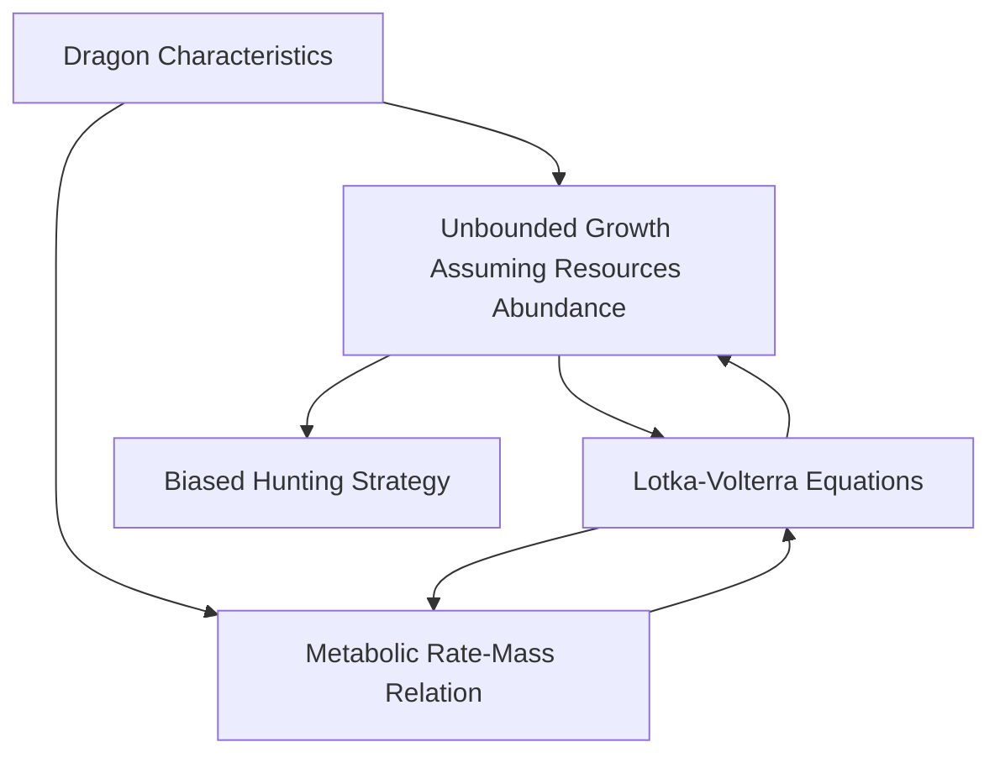

## 2019

## MCM/ICM

## Summary Sheet

## Here Be Dragons: The Ecology of Invasive Predators

Giant, fire-breathing dragons may exist in the A Song of Ice and Fire world created by George R. R. Martin, but how would they fare in our world? To answer this question, we sampled animal population data from representative regions around the world, fit a growth function to dragons based on data from the problem and from the A Song of Ice and Fire series, used modified allometric scaling laws, and Lotka-Volterra equations to build a model of how the dragons would interact with environments here on Earth.

Our model works well because it allows for the dragons to grow forever, but also limits their growth rate based on environmental factors in a meaningful way that is representative of real ecological pressures. Not only will dragons need different amounts of land in different climates, but they will also grow to different sizes based on the scarcity of prey. Also, our model allows for individual dragons to die off due to starvation which lets the remaining dragons have a better chance at survival. This flexibility in the model leads to some interesting results, such as one or more dragons surviving in a certain area, but if the area is tweaked slightly in either direction, the dragons die.

In a hot arid region, the dragons need 110,000 km $^{2}$ to survive and become stable at 86,000 kg each. In an arctic region, the dragons need 42,000 km $^{2}$ and reach 3,500,000 kg, and in a temperate region, they need only 570 km $^{2}$ and grow to 4,000,000 kg. As expected, the dragons' ability to survive is directly correlated with the availability and scarcity of prey.

While this three-dragon scenario is not likely to happen on earth, the beauty of this model is that it is dynamic enough to be highly generalizable. The hunting preference is robust enough that it can be applied to any animal in any position on the food chain. Based on the habits of any animal we can fit our model to imitate the hunting strategy it would take and apply it to novel scenarios to learn more about its behavior.

By slightly modifying the model used, we showed that we were able to model the growth of an invasive apex predator and see what will happen to the prey population given initial conditions. This could be used as a precaution to stop harmful invasive species from entering a sustainable and stable ecosystem.

Finally, using our analysis of dragons in different scenarios we recommended to George R. R. Martin that he not send Daenerys and Drogon to fight the white walkers in the North, as Drogon would not be able to meet his basal metabolic rate in such a sparse climate. We informed George that in order for Drogon to survive he must always stay in warm temperate regions where food is plentiful, and he can live sustainably within the ecosystem.

## Contents

1 INTRODUCTION 2  
2 ASSUMPTIONS AND JUSTIFICATIONS 3  
3 DRAGON CHARACTERISTICS 4

3.1 Unrestricted Dragon Growth 4  
3.2 Metabolism and Kleibler's Law 6  
3.3 Dragon Are Gluten Intolerant 6  
3.4 ODE Model 8

4 DRAGONS IN DIFFERING CLIMATES 9

4.1 Warm Temperate: Sheep on Sheep on Sheep 9  
4.2 Dry Arid: ...\*Tumbleweed\*... 11  
4.3 Arctic: A Depressingly Small Amount of Polar Bears ..... 12  
4.4 Generalizing the Model 15

5 SENSITIVITY ANALYSIS 15  
6 WEAKNESSES AND FUTURE IMPROVEMENTS 17

6.1 Better Population Data 17  
6.2 Dragon-Dragon and Prey-Prey Interactions 17  
6.3 Scarcity Coefficient Ambiguity 17

7 INFEASIBILITIES OF DRAGONS' EXISTENCE IN CONTEMPORARY WORLD 17

7.1 Thin legs 17  
7.2 Small wing area 17  
7.3 Immortality and unbounded growth 18

8 CONCLUSIONS 18  
9 A LETTER TO GEORGE R.R. MARTIN 19

<table><tr><td></td><td></td></tr></table>

## 1 INTRODUCTION

We are required to analyze dragons' characteristics, behavior, habits, diet and interaction with their environment. Then build a mathematical model to analyze the ecological impacts the dragons from Game of Thrones could introduce to our world. We decompose the problem into four subproblems:

- Build a model to estimate the growth of dragons.  
- Build a model to estimate energy expenditures of dragons.  
- Propose a hunting strategy for dragons.

\- Base our model on Lotka–Volterra equations, modify them and apply to multi-prey situations.

In the first step, we seek to determine the scaling law of a dragon's physique, using known data to estimate its size at maximum growth rate.

In the second step, we seek to use a $\frac{3}{4}$ allometric scaling power law to evaluate metabolic rate of dragons at given body masses. We will use a modified version of the scaling law to improve the accuracy additionally.

In the third step, we aim to propose a biased hunting strategy that is related to relative size of the prey, population density, and climate.

Finally, based on the already matured predator-prey model, we consider multiple species in different regions, justify the determination of several parameters, and put our model to the test.

flowchart

Figure 1: The logic framework of our paper.

<table><tr><td></td><td></td></tr></table>

## 2 ASSUMPTIONS AND JUSTIFICATIONS

- Whenever there is a discrepancy between the books and the TV show we will assume the TV show is correct. Because the problem references the television show directly and not the book.  
- Whenever there is a discrepancy between the world of Game of Thrones and physics we will assume the world described by George RR Martin is correct. We have to work within the rules given to us by the world creator. We chalk the discrepancy up to magic.  
- Given infinite resources the dragon will continue to grow indefinitely as mentioned in the problem's description.  
- All animals in a species will die of natural causes at the same age unless they are eaten by a dragon. This is a simplification  
- In each species population there is a uniform spread of ages throughout the group. If dogs live for ten years and there are one hundred dogs in a sample population, we assume there are ten dogs who are between zero and one years old, ten dogs who are between one and two years old, etc. In view of the fact that this simplification doesn’t affect the results much.  
- Dragons do not have a preference for any type of animal meat over another. The mass and population density of prey are the only parameters that matter in the dragons hunting strategy. We made this assumption as the TV show doesn't present the dragons' food preference whatsoever.  
- Drogon displays the maximum growth rate for a dragon in seasons 1 through 7 in Game of Thrones. The dragon has free access to roam as far as possible. We know keeping dragons in captivity stunts their growth, this does not affect Drogon. We see from the complaints of farmers that Drogon has access to livestock, which is essentially unlimited food that he doesn't have to hunt for. Therefore, we believe that it is reasonable to assume that Drogon grew as fast as a dragon could reasonably expect to grow.  
- Dragons, while they have the ability to grow much larger than other animals, basal metabolic rates scale with mass as other animals metabolic rates do. We are assuming that dragons are in the kingdom of Animalia and hence obey allometric scaling laws.  
- Although reptiles are mostly ectotherms, dragons breath fire, so we assume they are warm blooded and that their internal body temperature is similar to other mammals.  
- In our models the only interaction is between dragons and their prey. There are no dragon-dragon or prey-prey interactions. We made this assumption because dragons don't appear to practice cannibalism and we believe because of the size dragons can grow to, prey-prey interactions are insignificant compared to dragon-prey interactions.  
- The birth and death rates that we assume in our models encapsulates all natural factors including: perdition, disease, aging, and availability of resources.

- The current population of animals has already reached a steady state equilibrium. This assumption follows from the fact that we are assuming there is no prey-prey interaction.  
- The dragons are dropped into their environments today and are hatched as baby dragons. This assumption enables us to present a more complete model.  
- Each dragon has a preference to hunt something that is its own size rather than something smaller or larger than itself. However, we assume a dragon can hunt something up to about 3 times as large as itself as a dragon can breathe fire. The reason that a dragon would not prefer a larger prey is because there is a high energy cost to breathing fire.  
- There is a change in the amount of food a dragon can eat in a day based on how scarce food is. The amount this changes is dependent on the environment the dragon is in. We made this assumption because the density of food has an inverse relationship with hunting difficulty.  
- Each species is uniformly distributed throughout the area specified in each simulation. This is a simplification, in a better model the distribution would be based on the herd behavior of the species  
- If the mass of a dragon drops to 60% of its previous maximum mass, the dragon dies of starvation. Humans will die if they drop to 60% of their normal mass. Since dragons do not stop growing, we assume at any point their max mass was at once their "normal" mass.  
- Dragons all grow at the same rate if they are in the same environment. This is a simplification, there would likely be some random variation due to the different activity levels of the dragons and different genetic makeup.  
- Dragons are roughly $90\%$ efficient when they eat. $10\%$ of ingested mass becomes waste.  
- The energy density of meat is 2500 kcal/kg for all animals This is a simplification, in a perfect model we would find the energy density for all different types of meat.

## 3 DRAGON CHARACTERISTICS

## 3.1 Unrestricted Dragon Growth

Our first goal is to measure the growth rate of a dragon with infinite resources. It is stated in the problem that dragons "continue to grow throughout their life depending on the conditions and amount of food available to them." We know based on the show, however, that the rate of growth is not unrestricted. After a year of growth we know that the dragons have gained between 20 to 30 kg even thought they certainly had access to ample food and were not held in captivity. In order to find this growth rate we first gathered concrete data points on the size of Drogon as functions of his age, the results of which are shown in table 1. [7]

<table><tr><td>Age</td><td>Height (in)</td><td>Wingspan (in)</td><td>Mass (kg)</td><td>Standard Deviation of Height (in)</td><td>Standard Deviation of Wingspan (in)</td><td>Standard Deviation of Mass (kg)</td></tr><tr><td>0</td><td>9.5</td><td>-</td><td>10</td><td>0.71</td><td>-</td><td>0.5</td></tr><tr><td>1</td><td>16</td><td>-</td><td>35</td><td>0.5</td><td>-</td><td>7.07</td></tr><tr><td>1.5</td><td>64</td><td>240</td><td>-</td><td>11.31</td><td>6</td><td>-</td></tr><tr><td>6</td><td>-</td><td>2520.5</td><td>-</td><td>-</td><td>243.95</td><td>-</td></tr></table>

As mentioned in the assumptions and justifications section, we are assuming that Drogon grew at the maximum rate a dragon could grow. We believe this is reasonable since Drogon had unlimited range to travel and he was able to eat from livestock, he was able to find as much food as he wanted without having to hunt for it.

We were able to get an estimation of the height of Drogon at age six from his wingspan, we estimated his height to be 672 in. We then had four data points for height as a function of age. We know that mass is proportional to volume and volume is proportional to height cubed. Therefore, we were able to find the relationship of mass, m, to time, t, given a maximal growth rate: $m = ah^{3}$ . By fitting to the data we had, we found a = 0.01134408.

In order to model the growth of Drogon for a long time, we needed a sample dragon that grew at a maximal rate and grew older than Drogon is now. To do this we read through Game of Thrones lore and found Balerion, to be the best candidate. Balerion was the Aegon the Conqueror's Dragon first, and was the dragon of the current king until he died at age 200. Since he was the dragon of the king, it is reasonable to assume that he was able to eat as much as he wanted and achieve maximal growth.

Given that he grows maximally we would like to get an estimation for his size at a known age. To do this we follow the analysis by technology reporter, Robert Price [3], of a picture of Balerion that has been approved by George R. R. Martin as being realistic. The picture is shown below in Figure 2:

natural_image

Fantasy illustration of a giant dragon with multiple claws and sharp teeth, set against a dramatic sky (no text or symbols)

Figure 2: Aegon the Conquerer stands atop Balerion [5]

In season 7 of game of thrones we see that the skull of Balerion is kept under the red keep and his skull is comparable to the size shown in this picture. In this picture we know that Aegon was considered tall, so we estimate that he is 6 foot and 4 inches. Based on the picture we can estimate that the height of Balerion is about 4 times the height of Aegon. We use a Komodo dragon as a model for length-to-height of a dragon, which we know is 10:1. Therefore we can estimate the length of Balerion to be 76 meters long. Since Drogon is 61 meters long we can find the mass of Balerion using the ratio of the lengths and the cubic mass to length ratio used previously and find that Balerion was roughly 6,000,000 kg. This is a picture of Aegon on his conquest for Westeros, therefore we know that at the time of this picture Balerion was 100 years old. Since we know that 100 years later, when Balerion died, he was roughly the same size as he was in that picture. This means that at a certain point, although dragons may not ever stop growing, they do significantly slow their rate of growth. To model this we decided a sigmoidal curve would best fit this data. As it allows for the exponential growth we see at the beginning while also accounting for Balerion's obvious slow growth later in life.

This is a logistic function which will give the "S-shaped" sigmoidal curve that we are looking for:

$$
f (t) = \frac {L}{1 + e ^ {- k \left(t - t _ {0}\right)}} \tag {1}
$$

[4] We use the mass, height, and length relationships defined earlier to get mass as a function of time. Once we had a function for mass as a function of time we did a $\chi^{2}$ test to find the constants, L and k, that best fit the data. We found that L = 843.717523 and k = 0.71173635. We then take the derivative to get change in mass as a function of age when a dragon has been growing at its maximum rate. However, we don’t want our model to simply have the dragons grow at their maximum rate at all times, so we need to do a change of variables to convert to an equation that gives change in mass as a function of current mass. Doing so results in equation 2 with mass in kilograms and time in days.

$$
m _ {D} ^ {\prime} = \frac {d m _ {D}}{d t} = \frac {3}{3 6 5} m k (1 - (\frac {m}{a L ^ {3}}) ^ {1 / 3}) \tag {2}
$$

## 3.2 Metabolism and Kleibler's Law

Our goal is to find the energy expenditure that a dragon would require per day at a given mass, in other words: find the dragons basal metabolic rate as a function of mass. Since in season 7 Drogon is already bigger than any animal on our planet so we must make predictions about his basal metabolic rate and how it would scale as he continues to grow. Kleiber's law states that for the vast majority of animals, an animal's metabolic rate scales to the $\frac{3}{4}$ power of the animal's mass. Put into an equation, the metabolic rate, B, of animals is generally equal to $B = B_0M^{\frac{3}{4}}$ where M is the mass of the animal and $B_0$ is a constant. However, upon further reading from a Nature article written by Tom Kolokotrones on allometric scaling we see that Kleibler's law can be improved upon with equation 3:

$$
\log_ {1 0} B = \beta_ {0} + \beta_ {1} \log_ {1 0} M + \beta_ {2} (\log_ {1 0} M) ^ {2} + \frac {\beta_ {T}}{T} + \epsilon \tag {3}
$$

With $\beta_0 = 14.0149 \pm 1.1826$ , $\beta_1 = 0.5371 \pm 0.0305$ , $\beta_2 = 0.0294 \pm 0.0057$ , and $\beta_T = -4799.0$ . [6]

Using this model we can estimate the basal metabolic rate of the dragon as a function of its mass, which is what we set out to do.

## 3.3 Dragon Are Gluten Intolerant

The dragons in Game of Thrones are obligate carnivores. [7] This means all of their food must come from hunting animals. We will simulate the dragons eating and hunting habits in separate climates: a warm temperate climate, an arid climate, and an arctic climate. For each of these different climates we will provide a sample population based on data from The International Union for Conservation of Nature, which is the worlds most comprehensive information source on the global conservation status of animals. We will use this data to simulate the dragons growth in each climate.

In order to simulate an accurate hunting strategy we came up with a preference model that we will use to determine how likely the dragon is to go after a specific animal. As stated in the assumptions we assume that a dragon has a preference to hunt something that is its own size rather than something smaller or larger than itself. We constructed a probability density that the dragon will hunt an animal based on the animal's mass and it is shown below:

line chart

| ratio of species mass available to the mass of each dragon | probability that the dragon will prefer that species |
| ---------------------------------------------------------- | ---------------------------------------------------- |
| 0.0                                                        | 0.0                                                  |
| 0.5                                                        | 0.2                                                  |
| 1.0                                                        | 0.9                                                  |
| 1.5                                                        | 0.7                                                  |
| 2.0                                                        | 0.4                                                  |
| 2.5                                                        | 0.2                                                  |
| 3.0                                                        | 0.1                                                  |
| 3.5                                                        | 0.0                                                  |

$$
p \left(m _ {s} m _ {D}\right) = \left\{ \begin{array}{l l} A e ^ {- \frac {8 1}{8} (x - 1) ^ {2}} & 0 \leq x \leq 1 \\ A e ^ {\frac {9}{8} (x - 1) ^ {2}} & 1 \leq x \end{array} \right.
$$

Where $m_s$ is the mass of an individual in the species, $m_D$ is the mass of the dragon, and $A = 0.8976$ which was found from normalizing the function. We used a piece-wise Gaussian distribution for the dragon preference because in our assumptions we state that each species will be uniformly distributed throughout the area. When the dragon is roaming around looking for the next animal to hunt he will likely find something that is close to his size, assuming he has not yet outgrown all animals. This probability density accounts for the unlikely, but possible, scenario that the dragon cannot find something close to his size and will opt to hunt an animal that is smaller or larger than himself. We made the right side of the distribution wider than the left side because dragons are the most dangerous animal for a given size, so we think it is much more likely to punch above its weight class and take down something that is bigger than itself than it is to waste it's time chasing squirrels. Notice that as the dragon gets bigger the size of each animal matters less and less. This exemplifies the idea that to a giant a small ant is the same as a large ant.

We then multiplied this preference distribution by the weighted sum $\Sigma m_{i}n_{i}$ where $m_{i}$ is the mass of an individual in a species and $n_{i}$ is the population of that species. After summing over all species this will give us the total prey mass in the system. We raise this to the power of a scarcity factor that we will call $s_{f}$ . This scarcity factor encapsulates the difficulty to find food in the area given. This difficulty could come from many factors, but given our assumptions about the distribution of prey, the best method for determining this factor is basing it on the mass density, $\sigma_{m}$ , of available prey.

Knowing this helps, but it says nothing of the nature of the relationship between $\sigma_{m}$ and $s_{f}$ . To find this relationship, we looked at the plots of a wide range of both the areas in each region and the values for $s_{f}$ . We found values for each region that exhibited the behavior we expected, feeding when ample food is available, and struggling to feed when food is scarce. Using these values, we fit a power law function to the data as shown in equation 4, where $\alpha$ was found to be 13.2948 and $\gamma$ was found to be -0.425.

$$
s _ {f} = \alpha \sigma_ {m} ^ {\gamma} \tag {4}
$$

## 3.4 ODE Model

To model our predator prey system, we started with the Lotka-Volterra predator prey equations: [4]

$$
\frac {d x}{d t} = \alpha x - \beta x y \tag {5}
$$

$$
\frac {d y}{d t} = \delta x y - \gamma y \tag {6}
$$

Equation 5 is the prey equation and equation 6 is the predator equation. The mixed term in both is the predation term, and the others are the prey growth term and the predator death term, respectively. These equations are the simplest form of this type of system, and they only deal with interactions between two species. To make them work for our situation, they needed to be modified. [4]

For the prey side of things, we assumed that each environment that we drop the dragons into was in a roughly stable configuration before the dragons were introduced, and that the predation and other environment variables that affect population growth were taken into account in the birth and death rates of each species. With these assumptions, there is no need to have cross terms between each prey species, only between each of them and the dragons. The growth term for each species is simply its birth rate minus its death rate multiplied by its population. The decay term for each species is determined by how much mass of each species the dragons eat divided by the mass per individual of the species.

The amount of mass of each species the dragons eats is determined by equation 7, where $m_{i}$ is the mass of an individual in a prey species, n is the population of the species, $n_{0}$ is the starting population of the species, and N is the number of prey species. The 0.9 is the intake efficiency of the dragons [1], and the 2500 is the conversion factor to go from calories of meat to kilograms of meat.

$$
m _ {e} = \left[ \frac {m _ {i} n p}{\sum_ {j = 1} ^ {N} m _ {i j} n _ {j} p _ {i j}} \right] \left[ \frac {\sum_ {j = 1} ^ {N} m _ {i j} n _ {j}}{\sum_ {j = 1} ^ {N} m _ {i j} n _ {0 j}} \right] ^ {s _ {f}} \left(\frac {m _ {D} ^ {\prime}}{0 . 9} + 2 5 0 0 B\right) \tag {7}
$$

The resulting system of equations for the dragon and each prey species are as follows:

$$
\frac {d m _ {D}}{d t} = \left[ \sum_ {i = 1} ^ {N} m _ {e _ {i}} \right] - 2 5 0 0 B \tag {8}
$$

$$
\frac {d n _ {j}}{d t} = n _ {j} (r _ {\text { birth } _ {j}} - r _ {\text { death } _ {j}}) - \frac {m _ {e _ {j}}}{m _ {i _ {j}}} \tag {9}
$$

We used a python function that acts as a wrapper to the Fortran solver from ODEPACK to integrate this system of differential equations. It switches automatically between the nonstiff Adams method and the stiff BDF method.

## 4 DRAGONS IN DIFFERING CLIMATES

In this section we model dragon growth in three different climates: a warm temperate climate, an arid climate, and an arctic climate. In each one we choose a sample country to do our simulations. Once a country was chosen we attempted to get a representative sample of the animals available in that region that would be of interest to the dragon. Essentially, we attempted to find the species with the biggest total mass. This means that we would avoid small animals such as rats and animals with small populations, even if the individuals in that species were large.

## 4.1 Warm Temperate: Sheep on Sheep on Sheep

For this climate we chose our representative sample country to be New Zealand. Since the country is completely surrounded by water the animal population is well defined and there is comprehensive data on the major species in the country. The table below shows the data we picked to represent New Zealand; there is a significant amount of livestock in the country, so those numbers dominate the country. [2]

<table><tr><td>Species</td><td>Population</td><td>Average Mass (Kg)</td><td>Offspring Produced Per Year Per Female</td></tr><tr><td>Dairy Cattle</td><td>6,618,800</td><td>771</td><td>0.5</td></tr><tr><td>Beef Cattle</td><td>3,533,054</td><td>887</td><td>0.5</td></tr><tr><td>Deer</td><td>834,608</td><td>57</td><td>1.3</td></tr><tr><td>Sheep</td><td>27,583,673</td><td>87</td><td>1.1</td></tr><tr><td>New Zealand</td><td>100,000</td><td>80</td><td>0.7</td></tr><tr><td>Fur Seal</td><td></td><td></td><td></td></tr></table>

In this first simulation we restrict the 3 dragons to an area of $600\mathrm{km}^2$ . For this simulation and all simulations following we start with three dragons freshly hatched from their eggs. (Drogon, Rhaegal, and Viserion. It should be noted that, although this has no consequential meaning to the model, when a dragon dies Viserion is the first to die as he is the weakest dragon of the three, then Rhaegal, and then Drogon. Always in that order) The simulation is show here:

<table><tr><td></td><td></td></tr></table>

line chart

| time (days) | Dragon       | Dairy Cattle | Beef Cattle | Deer        | Sheep       | New Zealand Fur Seal |
| ----------- | ------------ | ------------ | ----------- | ----------- | ----------- | -------------------- |
| 0           | 0            | 1.15e7       | 0           | 0           | 1.5e7       | 0                    |
| 2000        | 0.65e7       | 0.8e7        | 0.65e7      | 0           | 1.5e7       | 0                    |
| 4000        | 0.55e7       | 0.3e7        | 0.3e7       | 0           | 1.5e7       | 0                    |
| 6000        | 0.45e7       | 0.1e7        | 0.1e7       | 0           | 1.5e7       | 0                    |
| 8000        | 0.45e7       | 0            | 0           | 0           | 1.5e7       | 0                    |
| 10000       | 0.45e7       | 0            | 0           | 0           | 1.5e7       | 0                    |

As we can see, given these initial conditions the community reaches a steady state where the deer, sheep, and New Zealand Fur Seal all survive while the Beef and Dairy Cattle are completely eaten. In this simulation the three dragons together reach a peak of about $6.5 \times 10^{6}$ kg and stabilize together at a total of about $4.4 \times 10^{6}$ kg.

Our next simulation is a bit more interesting. We restrict the dragons to an area of $570 \, km^{2}$ , only $30 \, km^{2}$ less area than previously, but something drastically different happens.

line chart

| time (days) | Dragon       | Dairy Cattle | Beef Cattle | Deer        | Sheep       | New Zealand Fur Seal |
| ----------- | ------------ | ------------ | ----------- | ----------- | ----------- | -------------------- |
| 0           | 0            | 1.1e7        | 6.7e7       | 0           | 5.0e7       | 0                    |
| 2500        | 6.5e7        | 6.0e7        | 4.0e7       | 0           | 5.0e7       | 0                    |
| 5000        | 5.0e7        | 3.0e7        | 1.5e7       | 0           | 5.0e7       | 0                    |
| 7500        | 4.5e7        | 1.0e7        | 0           | 0           | 5.0e7       | 0                    |
| 10000       | 4.0e7        | 0            | 0           | 0           | 4.5e7       | 0                    |
| 12500       | 2.8e7        | 0            | 0           | 0           | 1.0e7       | 0                    |
| 15000       | 0            | 0            | 0           | 0           | 0           | 0                    |
| 17500       | 0            | 0            | 0           | 0           | 0           | 0                    |

The dragons still peak at around $6.5 \times 10^{6}$ kg, however this time, after about 11,000 days the dragons have eaten so much of the sheep population that one dragon (Viserion) dies. Recall from the assumptions that this happens when the dragons drops to 60% of its max mass. Now that there is one less dragon eating sheep, the other two dragons actually start to gain weight back. Unfortunately, at this point the sheep population is too small and they are not able to repopulate fast enough, the dragons wipe out most of the sheep population, and they both starve on the same day.

## 4.2 Dry Arid: ...\*Tumbleweed\*...

For this climate we chose our representative sample country to be Western Sahara. This was the arid region that we could find the most animal data in, this was the region that was the hardest to find data for, so the data we picked are highly estimated. The table below shows the data we picked to represent Western Sahara; this is the most sparsely populated area we simulate by two orders of magnitude. [2]

<table><tr><td>Species</td><td>Population</td><td>Average Mass (Kg)</td><td>Offspring Produced Per Year Per Female</td></tr><tr><td>Rüppell&#x27;s Fox</td><td>100,000</td><td>3.2</td><td>2.1</td></tr><tr><td>Honey Badger</td><td>10,000</td><td>9.5</td><td>1.0</td></tr><tr><td>Egyptian Mongoose</td><td>10,000</td><td>2.6</td><td>2.2</td></tr><tr><td>Caracal</td><td>13,600</td><td>11.7934</td><td>2.8</td></tr><tr><td>Barbary Sheep</td><td>5,000</td><td>120</td><td>0.9</td></tr></table>

In this simulation we see a very interesting phenomenon. Since this was such a low density region we had to give the dragons a lot of room in order for them not to immediately starve. We restricted the dragons to an area of $80,000 \, km^{2}$ and let the system evolve.

line chart

| time (days) | Dragon | Rüppell's Fox | honey Badger | Egyptian Mongoose | caracal | Barbary sheep |
| ----------- | ------ | ------------- | ------------ | ----------------- | ------- | ------------- |
| 0           | 0      | 100000        | 25000        | 10000             | 45000   | 180000        |
| 1000        | 310000 | 10000         | 2500         | 1000              | 4500    | 13500         |
| 2000        | 60000  | 1000          | 2500         | 100               | 4500    | 16500         |
| 3000        | 200000 | 100           | 2500         | 10                | 4500    | 13800         |
| 4000        | 195000 | 10            | 2500         | 1                 | 4500    | 13750         |
| 5000        | 195000 | 1             | 2500         | 1                 | 4500    | 13750         |
| 6000        | 195000 | 1             | 2500         | 1                 | 4500    | 13750         |
| 7000        | 195000 | 1             | 2500         | 1                 | 4500    | 13750         |
| 8000        | 195000 | 1             | 2500         | 1                 | 4500    | 13750         |
| 9000        | 195000 | 1             | 2500         | 1                 | 4500    | 13750         |
| 10000       | 195000 | 1             | 2500         | 1                 | 4500    | 13750         |

We see that at about 800 days the dragons reach a collective peak at around 320,000 kg. We see that almost all of their mass gain has come from the Barbary Sheep, which are by far the biggest animals in this climate.at around day 1,450 we see that one dragon has died. Now that there are two dragons left they are able to both grow with renewed speed, while also not draining the community they are in of its resources. Notice that the only population that is affected by the dragons is the Barbary Sheep population. This is because the Barbary Sheep is two orders of magnitude more massive than all the other animals and has the smallest initial population out of any other animal. This means that once the dragon becomes larger he will be more likely to go after the Barbary sheep, and when he does, the effect it will have on the population of the sheep will be greater. The two dragons now reach a new equilibrium and achieve a steady state with the community with a combined mass of 200,000 kg.

## 4.3 Arctic: A Depressingly Small Amount of Polar Bears

For our third and final climate we chose our representative sample country to be Alaska. Alaska is large, has a lot of population data, and had more biodiversity than other arctic regions. The table below shows the data we picked to represent Alaska. [2]

<table><tr><td>Species</td><td>Population</td><td>Average Mass (kg)</td><td>Offspring Produced Per Year Per Female</td></tr><tr><td>Alaska Moose</td><td>200,000</td><td>635</td><td>1.235</td></tr><tr><td>Squirrel</td><td>500,000</td><td>0.7</td><td>1.167</td></tr><tr><td>Brown Bear</td><td>30,000</td><td>184.5</td><td>0.96</td></tr><tr><td>Caribou</td><td>750,000</td><td>135</td><td>0.9</td></tr><tr><td>Arctic Fox</td><td>10,000</td><td>4.7</td><td>4.67</td></tr><tr><td>Eurasian Lynx</td><td>5,000</td><td>12</td><td>2.571</td></tr><tr><td>Wolf</td><td>9000</td><td>40.5</td><td>4.125</td></tr><tr><td>Wolverine</td><td>10,000</td><td>40.5</td><td>1.861</td></tr><tr><td>Mountain Goat</td><td>30,000</td><td>104</td><td>0.815</td></tr><tr><td>Polar Bear</td><td>3,333</td><td>695</td><td>1.652</td></tr><tr><td>Bison</td><td>625</td><td>600</td><td>0.933</td></tr></table>

In this simulation we restrict the dragons to an area of $27,300 \, km^{2}$ and lets the system evolve.

line chart

| time (days) | Dragon | Alaska moose | Arctic ground squirrel | Brown bear | Caribou | Arctic fox | Eurasian lynx | Wolf | Wolverine | Mountain goat | Polar Bear | Bison |
| --- | --- | --- | --- | --- | --- | --- | --- | --- | --- | --- | --- | --- |
| 0 | 0 | 200000 | 0 | 0 | 1600000 | 0 | 0 | 0 | 0 | 0 | 300000 | 200000 |
| 1000 | 3900000 | 200000 | 0 | 0 | 1600000 | 0 | 0 | 0 | 0 | 0 | 300000 | 200000 |
| 2000 | 2400000 | 160000 | 0 | 0 | 800000 | 0 | 0 | 0 | 0 | 0 | 250000 | 200000 |
| 3000 | 2600000 | 200000 | 0 | 0 | 500000 | 0 | 0 | 0 | 0 | 0 | 250000 | 200000 |
| 4500 | 2350000 | 205000 | 0 | 0 | 350000 | 0 | 0 | 2.5 | 2.5 | 2.5 | 25 | 25 |
| 6500 | 1950000 | 215000 | 0 | 0 | 350000 | 2.5 | 2.5 | 2.5 | 2.5 | 2.5 | 25 | 25 |
| 8500 | 195000 | 21500 | 1 | 1 | 3500 | 2.5 | 2.5 | 2.5 | 2.5 | 2.5 | 25 | 25 |
| 10567 | 195 | 215 | 1 | 1 | 35 | 2.5 | 2.5 | 2.5 | 2.5 | 2.5 | 2.5 | 25 |
| Total |  |  |  |  |  |  |  |  |  |  |  |  |
| Arctic Ground Squirrel (days) |  |  |  |  |  |  |  |  |  |  |  |  |
| Brown bear |  |  |  |  |  |  |  |  |  |  |  |  |
| Caribou |  |  |  |  |  |  |  |  |  |  |  |  |
| Eurasian lynx |  |  |  |  |  |  |  |  |  |  |  |  |
| Wolf |  |  |  |  |  |  |  |  |  |  |  |  |
| Wolverine |  |  |  |  |  |  |  |  |  |  |  |  |
| Mountain goat |  |  |  |  |  |  |  |  |  |  |  |  |
| Polar Bear |  |  |  |  |  |  |  |  |  |  |  |  |
| Bison |  |  |  |  |  |  |  |  |  |  |  |  |

We see that we get to a collective mass maximum at about day 1,200. Then both the Alaska Moose and Caribou population start to fall quickly. Soon the moose population begins to grow and returns to it's initial population while the Caribou continues to fall. Around day 4,800 one dragon dies and the two remaining dragon grow slightly and end up reaching a steady state with the community with a mass of about $270,000\mathrm{kg}$ . What's interesting about this simulation is that no animal was driven extinct, since there were so many moose and Caribou, and the likelihood the dragon eats a certain species is proportional to the number of species in that population the other animals were hardly touched by the dragon, leaving a completely stable community.

We now complete our final simulation. We restrict our three dragons to an area of $400 \, km^{2}$ in "Alaska" and let the simulation run. Observe that this is significantly less area than we allowed our dragons originally in Alaska.

line chart

| Species             | Total Mass (kg) | Remaining Dragons |
|---------------------|-----------------|-------------------|
| Dragon              | ~80000          | ~3                |
| Alaska moose        | ~30000          | ~1                |
| Arctic ground squirrel | ~25000         | ~0.5              |
| Brown bear          | ~1500           | ~0.2              |
| Caribou             | ~23000          | ~0.8              |
| Arctic fox          | ~10000          | ~0.3              |
| Eurasian lynx       | ~9000           | ~0.1              |
| Wolf                | ~8000           | ~0                |
| Wolverine           | ~1000           | ~0                |
| Mountain goat       | ~1000           | ~0                |
| Polar Bear          | ~5000           | ~0.1              |
| Bison               | ~1000           | ~0                |

Not surprisingly the dragon population grows quickly, overeats, and all three dragons quickly starve once food has run out. We will now run this exact same simulation, however, this time we will turn off the dragon death function. Instead of killing a dragon when it falls to 60% of its maximum mass, we allow the dragons to get arbitrarily smaller than its maximum mass. Observe the results:

line chart

| time (days) | Dragon | Alaska moose | Arctic ground squirrel | Brown bear | Caribou | Arctic fox | Eurasian lynx | Wolf | Wolverine | Mountain goat | Polar Bear | Bison |
| --- | --- | --- | --- | --- | --- | --- | --- | --- | --- | --- | --- | --- |
| 0 | 0 | 0 | 0 | 0 | 0 | 0 | 0 | 0 | 0 | 0 | 0 | 0 |
| 500 | 80000 | 30000 | 0 | 0 | 23000 | 0 | 0 | 3 | 0 | 0 | 0 | 30000 |
| 1000 | 50000 | 25000 | 0 | 0 | 15000 | 0 | 0 | 3 | 0 | 0 | 0 | 25000 |
| 2000 | 15000 | 12000 | 0 | 0 | 17000 | 0 | 0 | 3 | 0 | 0 | 12000 | 13000 |
| 3000 | 32000 | 14000 | 0 | 0 | 14000 | 0 | 0 | 3 | 0 | 0 | 3200 | 9500 |
| 4000 | 25000 | 16000 | 0 | 0 | 18000 | 0 | 1 | 3 | 0 | 0 | 2500 | 950 |
| 5000 | 22000 | 18000 | 0 | 0 | 21000 | 1 | 2 | 3 | 1 | 1 | 2200 | 85 |
| 6000 | 21000 | 21000 | 1 | 1 | 22500 | 2 | 3 | 3 | 1 | 2 | 2155 | 75 |
| 7500 | 21500 | 23555 | 1 | 1 | 23555 | 3 | 4 | 3 | 1 | 3 | 2155 | 65 |
| 8500 | 21555 | 24555 | 1 | 1 | 24555 | 4 | 5 | 3 | 1 | 4 | 2155 | 65 |
| 9500 | 21555 | 24555 | 1 | 1 | 24555 | 5 | 6 | 3 | 1 | 5 | 2155 | 65 |
| 10500 | 17555 | 24555 | 1 | 1 | - | - | - | - | - | - | - | - |

reaches a population number such that they are able to increase their population as the dragon oscillates, however, the moose population was not so lucky. In this simulation it is not quite clear whether the moose population would eventually go extinct. However, since the dragon's mass function is decreasing quickly at the end of this simulation, it is safe to say that the Caribou will remain at full population and the moose will not quite go extinct. It is unknown whether it will be able to return to its former glory, further simulations would be needed to determine end behavior.

## 4.4 Generalizing the Model

This is where this highly specified Lotka-Volterra model that describes how 3 dragons interact with a community becomes more generalizable. If instead of looking at the dragons as 3 large creatures, we assume it is a population full of invasive apex predators that are introduced to a stable ecosystem then the model we have created here will simulate the results. By taking off the death rate of dragons we allow the population to be completely continuous. This could be used to advise a government whether or not their countries ecosystem could handle a species they are considering importing. If there is a community with a prey population that is getting out of control our model could illuminate whether adding a specific predator into the community would help restrict prey growth or attack other animals, instigating the problem and increasing the growing prey population. Our model would be valuable in managing the risks and rewards associated with introducing a predator into a stable community.

In the early 2000's stinkbugs were introduced into the United States ecosystem. There was an initial boom of reproduction and the stinkbug population skyrocketed. It was wondered if the stinkbugs reign would continue indefinitely in the US or whether it would die out. Our model would be able to predict what would happen and how long it would take to do so.

## 5 SENSITIVITY ANALYSIS

When we ran our tests we modified the behavior around our results slightly to see what would happen, in the figures below we see that as one increases the land available to the dragons the longer the dragons are able to survive until they reach a critical point where both the dragon and prey populations are stable.

This simulated graphs ranging from areas of $20,000 \, km^{2}$ to $30,000 \, km^{2}$ in $1,000 \, km^{2}$ increments. (Note: these graphs are not in order) In this simulation we see that at $27,000 \, km^{2}$ the dragons die and at $28,000 \, km^{2}$ we reach a stable community. We wished to further investigate the behavior or the model in between those ranges so we refined our search.

This simulated graphs ranging from areas of $27,000 \, km^{2}$ to $28,000 \, km^{2}$ in $100 \, km^{2}$ increments. From simulation we are able to see more finely where the transition from sustainable to unsustainable. In this simulation $27,100 \, km^{2}$ is the area needed to sustain three dragons in alaska.

## 6 WEAKNESSES AND FUTURE IMPROVEMENTS

## 6.1 Better Population Data

We got virtually all of our population data from International Union for Conservation of Nature's (IUCN) Red List of Endangered Species [6]. Although this is accepted as the world's most comprehensive information source on the global conservation status of animal, fungi and plant species, there was not population data on everything that we wanted and there was several times that we had to make estimations, and in some cases, guesses, based on population density.

## 6.2 Dragon-Dragon and Prey-Prey Interactions

In our models we have assumed that there is only interaction between dragons and their prey. In reality there would be some competition between dragons for prey and for mates. There would also be an entire ecosystem of "prey" for the dragon. As the dragon ate one type of animal it could disrupt the entire ecosystem and our functions would become much more complicated and realistic.

## 6.3 Scarcity Coefficient Ambiguity

To find our scarcity factor we looked at a vast array of plots that varied in both areas and $s_{f}$ values and saw the plots where the dragons survived, but had a noticeable effect on the population. We found values for $s_{f}$ where the data was most sensitive to initial conditions and resembled population dynamics that we know exist in nature. This type of factor manipulation is questionable and does take away from the validity of the factor.

## 7 INFEASIBILITIES OF DRAGONS' EXISTENCE IN CONTEMPORARY WORLD

Dragons, the mythical reptiles, they've been at the center of folklore of various cultures for eternity. They breath fire, fly around, have a insatiable thirst for blood. However, there has never been a reliable report on the observance of dragons. Why it seems that dragons don't exist out of the imaginary world? What's wrong with the physiology presented in the TV show?

## 7.1 Thin legs

Dragons are depicted as capable of crawling, yet hatched dragons linearly scaled body parts length ratio as adult dragons. New born dragons weigh about 10 kilograms, while adult dragons weigh more than $10^{4}$ kilograms. Since the proportion of body parts of dragons scales almost linearly by eyesight on TV, we know that weight scales as cubic of length, the cross-sectional area of legs scales as square of length, so suppose the height of a dragon scales 10 times from infant to adult, then the pressure on the legs scales as $\frac{10^{3}}{10^{2}} = 10$ times. This is a considerable increase for an ordinary bone structure.

## 7.2 Small wing area

A defining concept for flying and gliding animals is wing loading, it is the ratio weight. Birds have wing loading at $0 \sim 20\mathrm{kg/m}^2$ [?], so for a $10^{4}$ kilograms dragon, its wing area needs to be at

least 500m $^{4}$ .

## 7.3 Immortality and unbounded growth

By the Second Law of Thermodynamics, entropy always increases. So as dragons keep growing by feasting on their preys, disorders appear as damages to cells. There is simply no escape to mortality. As for growth, animals appear to obey the $\frac{3}{4}$ scaling law of metabolic rate change to body mass change [8]. The relation is sub-linear, which means, by an imaginary experiment, suppose a dragon quadruples its weight in its first year of life, then the metabolic rate only increases by only $4^{\frac{3}{4}} \approx 2.8$ times. Therefore the energy needed for maintenance outpaces the increase of energy supply. Eventually, the amount of energy available for growth reduces to zero. Hence, unbounded growth doesn’t exist in real animals.

line chart

| mass | metabolic rate (blue line) | metabolic rate (orange line) |
|------|-----------------------------|------------------------------|
| 0    | 0                           | 0                            |
| 1    | ~0.5                        | ~1.0                         |
| 2    | ~1.0                        | ~2.0                         |
| 3    | ~1.5                        | ~3.0                         |
| 4    | ~2.0                        | ~4.0                         |
| 5    | ~2.5                        | ~5.0                         |
| 6    | ~3.0                        | ~6.0                         |
| 7    | ~3.5                        | ~7.0                         |
| 8    | ~4.0                        | ~8.0                         |
| 9    | ~4.5                        | ~9.0                         |
| 10   | ~5.0                        | ~10.0                        |

Figure 3: Mismatch between energy supply and demand. Blue line denotes energy supply, orange line denotes energy demand.

## 8 CONCLUSIONS

We were tasked with analyzing the dragons from Game of Thrones to find the characteristics, behavior, habits, diets, and interaction of the dragons with their environment if they were in our world today. To do this we gathered size and mass data from the book and fit a logistic growth curve to the data. We then derived an equation for the maximum mass growth rate of a dragon. We simulated three dragons growing in three different climates: a hot arid region, an arctic region, and a temperate region.

Using species population data from the IUCN Red List for each region, we built a profile of the most common animals in each, their population density, mass, and birth/death rates. Using this data and the mass growth rate we fit to the dragons, we modeled the interactions between the dragons and the different environments.

We ran many simulations for each environment and found the area needed to support all three dragons, as well as other area sizes that exhibit interesting patterns or may support only one or two dragons. In a hot arid region, (western Sahara desert), the dragons need 110,000 km $^{2}$ to survive and become stable at 86,000 kg each. In an arctic region (Alaska), the dragons need 42,000 km $^{2}$ and reach 3,500,000 kg, and in a temperate region (New Zealand), they need only 570 km $^{2}$ and grow to 4,000,000 kg. As expected, the dragons' ability to survive is directly correlated with the availability and scarcity of prey.

## 9 A LETTER TO GEORGE R.R. MARTIN

Hello Mr. Martin,

First off we'd like to say that it is an honor to have the opportunity to give you our input, and although we may criticize some aspects of the books for its questionable and often estranged relationship with physics; it does not mean that we think any less of your work or don't appreciate it for what it is: One of the best fantasy series of our time. Now onto our guidance:

Under the current laws you have set, there are about to be dragon deaths on your hands depending on how you handle the upcoming season and whether you take our advice or not. While we do not know the exact animal makeup of the Game of Thrones universe, we have no reason to believe that it is much different from ours in terms of basic animal population, besides the dragons of course. While there may be the rare dire-wolf sighting, or a more giants than we usually see in our world, the baseline ecosystems seem comparable. We have built a model that simulates the growth of dragons and how they interact with local ecosystems as they grow. We studied three different climates: arid, temperate, and arctic, and after our analysis we see an alarming situation about to unfold. The biggest problem that will face Drogon in the next season is not the Night King and his ice dragon, it is migration and starvation.

The problem is that for the past year Drogon has lived around Dragonstone with unlimited space to travel, eat, and grow. Because of this, as seen in the show, he was able to grow incredibly quickly and gain an astounding amount of mass. While this extra mass is intimidating to all his foes, it requires a massive amount of energy to keep running. Based off our calculations we were able to estimate Drogon's mass during season 7 at 3,444,574 kg. With some help with our friends at Nature, we are then able to estimate Drogon's basal metabolic rate and in turn find the amount of food Drogon must eat every day to stay alive. Drogon must eat an astounding 5,392 kg per day in order to remain at his same size, and this doesn't even account for all the energy he would expand walking, flying, and breathing fire. Now, in his current climate this level of food take, while adventurous, is possible. Based on a simulation we ran using New Zealand as a substitute for the ecosystem around Dragonstone we found that Drogon could feed himself indefinitely at Dragonstone, the community is able to adapt and reaches a new steady state relationship with Drogon as the apex predator.

While Drogon can sustain himself in a temperate climate, if he moves to any other climate he will quickly starve. Using Alaska as a model for the North in Game of Thrones we were able to simulate the growth of Drogon in an arctic environment, and the results are not promising for Drogon. If we put Drogon in the north starting as a baby, there is still a chance he may not survive. It is possible if Drogon is not careful that he over eats. Since the population in arctic region is much more sparse than in that of a temperate region; it is very easy for Drogon to eat so much that his basal metabolic rate exceeds the rate at which animals in that region are able to reproduce. In this scenario Drogon eats as much as he can for as long as he can, but eventually he eats all the animals up and dies quickly behind them. While when doing our simulations this was not an unlikely scenario, there were ways to avoid this. If Drogon does not grow as quickly as possible at first, he is able to more sustainably integrate himself into the arctic climate.

However that is not the situation Drogon has found himself in. When we last left last season Daenerys was planning on taking Drogon deep into the North to fight the Night King and his army of the dead. This would be a fatal mistake. Drogon has far outgrown the size that he would be sustainable in the North. Even if he spent all his time hunting the most calorie dense food in the North, he would not be able to gather enough food. He would quickly eat through the entire animal population of the North and then starve. On top of that the massive amounts of energy it would take for Drogon to fight would make his uninevitable death approach much more quickly. The nights watch nor the wildlings would be able to spare that much food to save Drogon, they can barely feed themselves at the moment. Unfortunately, since the Dothraki Sea is surrounded by an arid region, which is even more sparsely populated than an arctic region, Drogon will never be able to return to his birthplace.

For better or worse, Drogon can never leave his temperate climate for more than a few days. What he has gained in size he has lost in mobility. We would advise Daenerys to stay at Dragonstone and wait for the Night King and his army of the dead to come to them, otherwise Drogon will starve, for winter is coming.

Sincerely,

Team #1924781

## References

[1] Feces | biology | Britannica.com.  
[2] The IUCN Red List of Threatened Species.  
[3] The illustrated guide to the best dragons in fantasy, April 2014.  
[4] Lotka–Volterra equations, January 2019. Page Version ID: 876662594.  
[5] Erica Gonzales. The Dragons in 'Game of Thrones' Season 7 Are Literally the Size of Airplanes, March 2017.  
[6] Tom Kolokotrones, Van Savage, Eric J. Deeds, and Walter Fontana. Curvature in metabolic scaling. Nature, 464(7289):753–756, April 2010.  
[7] George R. R. Martin. A clash of kings: a song of fire and ice [book 2]. Martin, George R. R. bk. 2. Song of ice and fire; Bantam Books, New York, 1999.  
[8] Geoffrey B. West. Scale: the universal laws of growth, innovation, sustainability, and the pace of life in organisms, cities, economies, and companies. Penguin Press, New York, 2017.