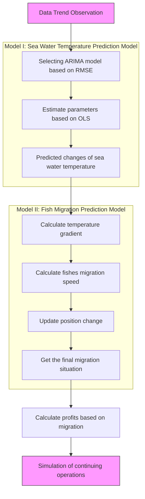

# Forecasts for the Ecology and Fisheries Economy of Scottish herring and mackerel

As the favorable food for Scotch, the herring and mackerel bring generous profits to fishing companies. Due to the hotter ocean, more fish move to the north to seek better habitats, laying a negative impact on the fishing industry. The aim of this report is to build a migratory prediction model to evaluate the influences on the income of fishing companies. We are expected to provide some strategies for fishing companies who can adapt to the migration of fish under the constraints of various objective conditions and prevent themselves from going bankrupt as much as possible. Three models are established: Model I: Seawater Temperature Prediction Model; Model II: Fish Migration Prediction Model; Model III: Fishing Company Earnings Evaluation Model.

For Model I, global ocean temperature date monthly from 1960 to 2019 is firstly collected. Then, based on the analysis of intrinsic trend of the data and the verification of the stationarity, the validation of using ARIMA model to predict temperature is proved. Next, historical data is used to fit the parameters of ARIMA, with introduction of k-fold cross validation to identify the final prediction model as ARIMA(1,1,0). Finally, according to ARIMA(1,1,0), bootstrap method is used to simulate 10000 possible prediction cases, which lays a great foundation to predict the migration of fish.

For Model II, firstly, according to the data of the migration speed and the ocean temperature, it is determined that the temperature gradient is the main factor affecting the migration speed and direction. And the corresponding empirical equation is established to determine the impact of temperature on fish migration. Then based on the 10000 temperature change samples generated by bootstrap method in Model I, migration situation of each sample is simulated to identify the most likely locations of the fish. It was finally shown that the fish are mainly distributed in the area between Iceland and the Faroe Islands 50 years later and the results are shown in figure 9.

For Model III, the profit evaluation equation of fishing companies is determined by the economic principle, and the parameters involved are estimated by introducing the actual management data, the results are shown in table 4; then based on the 10000 samples of fish migration from Model II, the profit change of fishing companies is simulated for each sample and the profit trend over time is shown in figure 10. Finally, it can be seen that the worst case is in 2030, fishing companies will go bankrupt due to fish migration with a probability of 0.02%, the best case is that they will not go bankrupt in 50 years with a probability of 5.27% and the most likely case is that in 2039, fishing companies will go bankrupt due to fish migration with a probability of 8.25%.

In addition, this report discusses the effective response to the fish migration for small fishing companies, together with effective response strategies. Without considering the policies and legal issues brought by the territorial sea, small fishing companies should transfer their ports to Iceland, which is closer to the fish. Finally, based on simulation of this strategys effect, 100.00% of companies can avoid bankruptcy. As for considering the policies and legal issues, small fishing companies should upgrade their fishing vessels to extend the shelf life of fish. After simulation, 62.68% of companies can avoid bankruptcy.

Eventually, robustness and sensitivity analysis of the model are tested. When the initial distribution of the fish is randomly generated from the uniform random distribution, the final convergence distribution of the model has little difference. As for the factors that affect the model, social profit rate and fishing boat navigation radius, it is found that the increase of these two factors will significantly reduce the bankruptcy probability of fishing companies.

Keywords: ARIMA; Fish Migration; Earnings Evaluation; Computer Simulation

## Contents

1 Introduction 1

1.1 Problem Background 1  
1.2 Restatement of the Problem  
1.3 Our Approach . 1

2 General Assumptions and Model Overview . . 2

3 Model Preparation . . 3

3.1 Notations . . 3  
3.2 The Data . . 3

3.2.1 Data Collection . . 4  
3.2.2 Data Cleaning . . . . 4

3.3 Geographic Coordinate System 4

4 Model I: Seawater Temperature Prediction Model . 5

4.1 Description of Temperature Field 5  
4.2 Autoregressive Prediction Model 5  
4.3 Results 7

4.3.1 Parameter Estimation 7  
4.3.2 Calaculation Results 7

5 Model II: Fish Migration Prediction Model 8

5.1 Kinematics of Migration . . . 8  
5.2 Kinetics of Migration 9

5.3 Results 9

5.3.1 Estimation of ∇u . . . 9  
5.3.2 Estimation of f (∇u, v) . . . 9  
5.3.3 Migration Simulation Algorithm . . 10  
5.3.4 Calaculation Results . . 10

6 Model III: Fishing Company Earnings Evaluation Model . . . 11

6.1 Fishing Company Operating Model 11

6.1.1 Assessment of Fishing Costs 11  
6.1.2 Assessment of Fishing Income . . 11  
6.1.3 Assessment of Fishing Profit 11

6.2 Results 11

6.2.1 Parameter Estimation 11  
6.2.2 Migration Simulation Algorithm . . 12  
6.2.3 Calaculation Results 13

6.3 Discussion 14

6.3.1 The Management Strategies without Consider of Territorial Sea . . . . 14  
6.3.2 The Management Strategies with Consider of Territorial Sea . . 15

7 Test the Model 16

7.1 Sensitivity Analysis . . . 16

7.2 Robustness Analysis 17

8 Conclusion 17

8.1 Summary of Results . 17

8.1.1 Result of Problem 1 . 17

8.1.2 Result of Problem 2 . 18

8.1.3 Result of Problem 3 . 19

8.1.4 Result of Problem 4 . 19

8.2 Strength 20

8.3 Possible Improvements . 20

References . 20

Appendices 22

Appendix A Tools and software 22

Appendix B The Codes . . 22

B.1 ARIMA Model Parameter Estimation and Ordering Code . . 22

B.2 Bootstrap Simulation Codes . . . 24

## 1 Introduction

## 1.1 Problem Background

Global ocean temperatures affect the quality of habitats for certain ocean-dwelling species. When temperature changes are too great for their continued thriving, these species move to seek other habitats better suited to their present and future living and reproductive success. The consortium wants to gain a better understanding of issues related to the potential migration of Scottish herring and mackerel from their current habitats near Scotland if and when global ocean temperatures increase. These two fish species represent a signficant economic contribution to the Scottish fishing industry. Changes in population locations of herring and mackerel could make it economically impractical for smaller Scotland-based fishing companies, who use fishing vessels without on-board refrigeration, to harvest and deliver fresh fish to markets in Scotland fishing ports.


<details>
<summary>natural_image</summary>

Side view of a fish against a black background (no text or symbols visible)
</details>

(a) Herring


<details>
<summary>natural_image</summary>

Side view of a fish with fins and scales against black background (no text or symbols)
</details>

(b) Mackerel  
Figure 1: Target fish: (a) Scottish herring: Atlantic herring are widely distributed throughout the north-east Atlantic, ranging from the Arctic ocean in the north to the English Channel in the south; (b) Scottish mackerel: Each year, the number of mackerel in the sea depends on the number of young fish which survive from spawning to enter the adult fishery as recruits.

## 1.2 Restatement of the Problem

• Build a mathematical model to identify the most likely locations for these two fish species over the next 50 years.  
• Based upon how rapidly the ocean water temperature change occurs, use your model to predict best case, worst case, and most likely elapsed time(s) until these populations will be too far away for small fishing companies to harvest if the small fishing companies continue to operate out of their current locations.  
• In light of your predictive analysis, should these small fishing companies make changes to their operations?  
• Use your model to address how your proposal is affected if some proportion of the fisherymoves into the territorial waters (sea) of another country.

## 1.3 Our Approach

The topic requires us to predict the migration of two kinds of fish in the next 50 years and discuss the business strategies and prospects of fishing companies according to the migration of the fish. Our work mainly includes the following:

• Based on the historical data of ocean temperature, a prediction model of ocean temperature is established;  
• The probability distribution of fish migration is given and the influence of randomness on the model is considered;  
• Based on the economic benefit model of fishing companies, this article evaluates the benefits of various fishing strategies under the background of fish migration and gives reasonable suggestions for the improvement of them.

## 2 General Assumptions and Model Overview

To simplify the problem, we make the following basic assumptions, each of which is properly justified.

• Assumption 1: The migration direction of population is predictable.

,→ Justification: Although the swimming direction of each individual does not necessarily follow the law of migration, according to the law of large numbers, the behavior of the group will exclude the existence of unpredictable accidental factors, so we can predict the migration direction of fish by predicting the change of ocean temperature.

• Assumption 2: The migration of fish is carried out at the same depth.

,→ Justification: We assume that the change of ocean depth is ignored in the process of fish migration, because in a relatively long time span, the migration range of fish is far larger than its depth change range, so the depth change in the process of migration can be ignored.

• Assumption 3: No macro-economic indicators, trade environment and technological breakthroughs in the research time.

,→ Justification: Because the model considers the impact of ocean temperature change on the migration direction of fish, and then compares and analyzes the fishing strategies adopted by fishing companies before and after the migration of fish. Only when the external conditions are consistent can such a comparison be meaningful.

• Assumption 4:Assume the research data is accurate.

,→ Justification:We assume that the historical ocean surface temperature data, fishing data and financial data of fishing companies do not show obvious measurement deviation and are believed that they are fake, so we can establish a more reasonable quantitative model based on it.

Firstly, set the Seawater Temperature Prediction Model. We use historical data of seawater temperature to predict seawater temperature changes in the target sea area in the next 50 years. Secondly, set the Fish Migration Prediction Model. We describe the correlation between seawater temperature changes and fish migration directions, and then simulate fish migration directions based on seawater temperature changes in the target sea area over the next 50 years. Finally, set the Fishing Company Earnings Evaluation Model. We assess changes in the profitability of fishing companies based on the migration of fish in the next 50 years, and discuss strategies to deal with such changes subject to some objective conditions.

In summary, the whole modeling process can be shown as follows


<details>
<summary>flowchart</summary>


</details>

Model III: Fishing Company Earnings Evaluation Model  
Figure 2: Model Overview

## 3 Model Preparation

## 3.1 Notations

Important notations used in this paper are listed in Table 1,

Table 1: Notations

<table><tr><td>Symbol</td><td>Description</td><td>Unit</td></tr><tr><td>x</td><td>longitude</td><td> $^{\circ}$ </td></tr><tr><td>y</td><td>latitude</td><td> $^{\circ}$ </td></tr><tr><td>t</td><td>The time from now</td><td>year</td></tr><tr><td>u(x,y,t)</td><td>The temperature after t years at the location with Coordinates(x,y)</td><td> $^{\circ}C$ </td></tr><tr><td>v(x,y,t)</td><td>The speed after t years at the location with Coordinates(x,y)</td><td>km/year</td></tr><tr><td>C(t)</td><td>The cost for fishing t years later</td><td>$</td></tr><tr><td>P(t)</td><td>The income for fishing t years later</td><td>$</td></tr><tr><td>I(t)</td><td>The profit for fishing t years later</td><td>$</td></tr></table>

## 3.2 The Data

Since the amount of data is large a not intuitive, we directly visualize some of the data for display.

## 3.2.1 Data Collection

The data we used mainly include historical seawater temperature data, fishery fishing data, fish distribution data, and financial indicators of some fishing companies. The data sources are summarized in Table 2.

Table 2: Data source collation

<table><tr><td>Database Names</td><td>Database Websites</td><td>Data Type</td></tr><tr><td>APDRC</td><td>http://apdrc.soest.hawaii.edu/</td><td>Geography</td></tr><tr><td>NOAA</td><td>https://www.noaa.gov/</td><td>Geography</td></tr><tr><td>Sea around us</td><td>http://www.seaaroundus.org/</td><td>Geography</td></tr><tr><td>FAO</td><td>http://www.fao.org/home/en/</td><td>Industry Report</td></tr><tr><td>Google Scholar</td><td>https://scholar.google.com/</td><td>Academic paper</td></tr></table>

## 3.2.2 Data Cleaning

The data is divided into groups by years and calculate the average value of the key data from April to July in each group. For the missing value in the data, we try to skip it and only seek the effective mean value. For the complete missing group from April to July, the values were recorded as a missing one. Then, the missing values are interpolated linearly along the time axis. If four or more missing values are in one column, the data in this column is considered as invalid. Finally, the location of invalid data column is set to be unreachable, which is ignored in model calculation.


<details>
<summary>line chart</summary>

| Year | Value |
| ---- | ----- |
| 2017 | 5.5   |
| 2018 | 6.0   |
| 2019 | 6.5   |
</details>

Figure 3: Data cleaning

## 3.3 Geographic Coordinate System

The spherical coordinate is applied on the dataset to represent points. In order to obtain the true distance relation in the map, we regard the observed map area as a plane quadrilateral approximately. After using the geodesic equation (GRS80 sphere) to solve the quadrilateral length, we fit a projection transformation to get the corresponding relationship between the spherical coordinates and the plane coordinates. In this way, the Euclidean distance between points is approximately the geodesic distance on the sphere.


<details>
<summary>text_image</summary>

z
y
x
O
x
</details>

Figure 4: Spherical coordinate transformation

## 4 Model I: Seawater Temperature Prediction Model

The temperature change of ocean is determined by various factors, namely sun radiation, heat loss and heat exchange of marine organisms, they can cause a significant change of ocean temperature. Therefore, for such a complex dynamic system, a method of multiple time series vector autoregression is applied to solve it. Formally, vector autoregression algorithm can consider the spatial-temporal correlation of each variable at the same time, and mine the data information to the maximum without introducing exogenous factors. Thus, the prediction based on Autoregressive Integrated Moving Average model (ARIMA) is a good approximation to the temperature field.

## 4.1 Description of Temperature Field

According to the Assumption 2, the change of ocean temperature in the vertical plane is not considered. Therefore, for the target ocean area, based on longitude and latitude, a coordinate system is established to describe the location of each point. Therefore, the temperature u of any point $A \in \Omega$ at time t can be expressed as

$$
u (x, y, t) \tag {1}
$$

where $( x , y )$ is the coordinate of the point A, the abscissa represents the longitude and the ordinate represents the latitude.

## 4.2 Autoregressive Prediction Model

The temperature series data of the i-th $( i = 1 , 2 , \cdots , 6 9 0 )$ marked fishing point in the target sea area i is numbered as $\{ u _ { i , t } \} _ { t = 1 } ^ { 6 0 }$ . Firstly, the temperature change of each series in the past 60 years is plotted as shown in the Figure 5,


<details>
<summary>line chart</summary>

| Year | Temperature (°C) |
|------|------------------|
| 1960 | ~0 to ~15        |
| 1970 | ~0 to ~20        |
| 1980 | ~0 to ~15        |
| 1990 | ~0 to ~15        |
| 2000 | ~0 to ~15        |
| 2010 | ~0 to ~15        |
| 2020 | ~0 to ~15        |
</details>

Figure 5: Sea surface temperature in past 60 years (Spring)

It can be seen that the overall temperature variation has no obvious trend. Therefore, a model is applied to $\mathrm { A R I M A } ( p , d , 0 )$ model the temperature series data. For the i-th temperature series, the general situation of the model is as following

$$
\Delta^ {(d)} u _ {i, t} = \sum_ {j = 1} ^ {p} \alpha_ {i, j} \Delta^ {(d)} u _ {i, t - j} + \epsilon_ {i, t}, \tag {2}
$$

Where, $\Delta ^ { ( d ) }$ represents the difference operator of order. $\epsilon _ { i , t } \sim N \left( 0 , \varepsilon _ { i , t } ^ { 2 } \right)$ is the residual value of the model. Therefore, the first-order difference prediction value of the i-th series after the next t years can be obtained as

$$
\mathrm{E} \left(\Delta^ {(d)} u _ {i, t}\right) = \sum_ {j = 1} ^ {p} \hat {\alpha} _ {i, j} \mathrm{E} \left(\Delta^ {(d)} u _ {i, t - j}\right) \tag {3}
$$

Furthermore, on the basis of the assumption from ARIMA model and the practical experience, the prediction values meet the normal distribution as $u _ { i , t } | u _ { i , t - 1 } \sim N \bar { ( } \mu _ { i , t } , \sigma _ { i } ^ { 2 } )$ . Therefore, with the consideration of randomness, the initial temperature prediction formula (4) of time t can be modified as

$$
\hat {u} _ {i, t} = \mathrm{E} (\Delta u _ {i, t}) + \hat {u} _ {i, t - 1} + \epsilon_ {i, t} \tag {4}
$$

Different predictions can be obtained, based on the accumulation of the randomness in the process of progressively prediction. These relevant results which are related to the temperature change of ocean can lead the migration of fish to change. Therefore, the location of fish can be in different areas after 50 years, which lay a great impact on the fishing companies.

## 4.3 Results

## 4.3.1 Parameter Estimation

Referring to the OLS method in the linear regression model, write out the linear equations corresponding to equation (2) as follows

$$
\left[ \begin{array}{c c c c} \Delta u _ {i, p} & \Delta u _ {i, p - 1} & \dots & \Delta u _ {i, 1} \\ \Delta u _ {i, p + 1} & \Delta u _ {i, p} & \dots & \Delta u _ {i, 2} \\ \vdots & \vdots & \ddots & \vdots \\ \Delta u _ {i, 5 9} & \Delta u _ {i, 5 8} & \dots & \Delta u _ {i, 6 0 - p} \end{array} \right] \left[ \begin{array}{c} \alpha_ {i, 1} \\ \alpha_ {i, 2} \\ \vdots \\ \alpha_ {i, p} \end{array} \right] = \left[ \begin{array}{c} \Delta u _ {i, p + 1} \\ \Delta u _ {i, p + 2} \\ \vdots \\ \Delta u _ {i, p + 6 0} \end{array} \right] \tag {5}
$$

That is $\left( X ^ { T } X \right) \pmb { \alpha } = X ^ { T } Y$ , so the closed-form solution of the corresponding parameter α is

$$
\hat {\alpha} = \left(X ^ {T} X\right) ^ {- 1} X ^ {T} Y \tag {6}
$$

Therefore, OLS method can be used to estimate the parameters of formula. It is noted that there are lag order and difference order in the model, so we need to perform k-fold cross validation on the estimation results of the model, and find the model with the best prediction effect in the given alternative models. The solution results are shown in Figure 6,


<details>
<summary>box plot</summary>

| Parameters | Root Mean Square Error(°C) |
| ---------- | -------------------------- |
| (p=1, d=1) | ~1.0                       |
| (p=1, d=2) | ~5.0                       |
| (p=2, d=1) | ~1.0                       |
| (p=2, d=2) | ~5.0                       |
</details>

Figure 6: Choose ARIMA model by using RMSE with 6-fold cross validation

It can be seen from the figure that when the lag and difference orders are both 1, the prediction ability of the model is the best. So, we choose the optimal overall performance ARIMA(1,1,0) model.

## 4.3.2 Calaculation Results

We can get the predicted temperature distribution of target sea area Ω after 50 years according to the above parameter estimation and prediction formula, as shown in Figure 7,


<details>
<summary>polar heatmap</summary>

| Region         | Value     |
| -------------- | --------- |
| Ocean          | 5×10⁶     |
| Land, Islands  | 0–5×10⁶   |
| Edinburgh      | 0–5×10⁶   |
</details>

Figure 7: Temperature forecast after 50 years

## 5 Model II: Fish Migration Prediction Model

The migration effect of fish need to be considered from two aspects: one is to explore the motivation and speed of fish migration based on dynamics; the other is to explore the relationship between the position change and migration speed of fish migration based on kinematics. A dynamic fish migration model can be obtained by combining these two aspects. These two parts will be described separately below.

## 5.1 Kinematics of Migration

For each point , the corresponding fish situation is shown in the Figure 8,


<details>
<summary>text_image</summary>

C
C → D
B
A
Migration Direction
</details>

Figure 8: Fishes migration mechanism

It can be seen that, for the area shown in Figure 8, the migration direction of fish is A → $B  C  D$ due to $u _ { A } > u _ { B } > u _ { C } > u _ { D }$ . From the view of kinematics, after determining the moving speed of fish, the position updating condition can be calculated. Therefore, the expression of the corresponding moving speed based on the position calculation is

$$
(\mathrm{d} x, \mathrm{d} y) = \boldsymbol {v} \mathrm{d} t \tag {7}
$$

There, the updated formula for position $( x , y )$ is

$$
\left(x _ {t}, y _ {t}\right) = \left(x _ {t - 1}, y _ {t - 1}\right) + (\mathrm{d} x, \mathrm{d} y) \tag {8}
$$

## 5.2 Kinetics of Migration

After the kinematic description of fish migration, it is necessary to describe and model fish migration from the dynamic point of view. According to the living habits description of the two kinds of fish in Section 1, the fish tend to transfer to the area with lower temperature, so we believe that the relationship between the migration speed and the temperature field is

$$
\boldsymbol {v} (x, y, t) = f (\nabla u (x, y, t)) \tag {9}
$$

Where $f ( \cdot )$ is an undetermined relation equation. We will refer to the actual data in section 5.3.2 to determine the specific form of $f .$ .

## 5.3 Results

## 5.3.1 Estimation of $\nabla u$

For the equation (9), the calculation method of $\nabla u$ should be determined first. Based on definition, the expression for ∇u should be

$$
\nabla u (x, y, t) = \left(\frac {\partial u (x , y , t)}{\partial x}, \frac {\partial u (x , y , t)}{\partial y}\right). \tag {10}
$$

We have the following approximation for $\nabla u ,$ ,

$$
\begin{array}{l} \frac {\partial u (x , y , t)}{\partial x} = \frac {u (x + \mathrm{d} x , y , t + \mathrm{d} t) - u (x , y , t)}{\mathrm{d} t} \\ \frac {\partial x}{\partial y} = \frac {u (x , y + \mathrm{d} y , t + \mathrm{d} t) - u (x , y , t)}{\mathrm{d} t} \tag {11} \\ \end{array}
$$

Therefore, the temperature gradient at each location can be calculated by equation (11).

## 5.3.2 Estimation of $f ( \nabla u , v )$

According to the migration speed of Scottish herring and mackerel and the temperature change, it is lim $\Delta u \to \infty  \upsilon \to \upsilon _ { \mathrm { m a x } }$ and lim $_ { \Delta u  0 } v  0$ . Therefore, to simplify the model, based on the structure form of function logistic regression, the new formula can be get as follows in the strict approximations of equation (9)

$$
\boldsymbol {v} (x, y, t) = \operatorname{sign} (\Delta u) \frac {\nabla u (x , y , t)}{\| \nabla u \| + \beta} v _ {\max} \tag {12}
$$

where sign(·) is the functional symbol; $v _ { \mathrm { m a x } }$ is the maximum migration speed of fish; $\beta$ is the temperature scaling coefficient. According to the data, the estimated results can be represented as table 3.

Table 3: Parameter estimation results

<table><tr><td>Parameter</td><td>Value</td><td>Unit</td></tr><tr><td> $\beta$ </td><td>1.0499e-5</td><td>–</td></tr><tr><td> $v_{\text{max}}$ </td><td>188.5671</td><td>km/year</td></tr><tr><td> $u_{\text{min}}$ </td><td>2</td><td>°C</td></tr><tr><td> $u_{\text{max}}$ </td><td>6</td><td>°C</td></tr></table>

## 5.3.3 Migration Simulation Algorithm

On the basis of the estimation of $\nabla u$ and $f ,$ the process of re-identification of the fishs location can be get as follows,

Algorithm 1: The process of location change of fish  
Input: $\rho(x,y,0)$ , $\beta$ , $v_{max}$ , $u_{min}$ , $u_{max}$ Output: $\rho(x,y,50)$ for t = 1 to 50 do

The random distractor $\epsilon_{t}$ can be get in the process of identification of variance

The dispersed $u(x,y,t)$ can be predicted based on the model ARIMA(1,1,0) and the $u(x,y,t-1)$ The continuous $u(x,y,t)$ can be get based on the linear interposition of value of the dispersed $u(x,y,t)$ The continuous $\nabla u$ can be identified based on the equation (11)

The continuous $v(x,y,t)$ can be calculated based on the equation (12)

The location change of each fish can be calculated based on equation (7)

The $\rho_{t}(x,y)$ of each fish can be refreshed based on the equation (8)

end

## 5.3.4 Calaculation Results

Based on the process of relocation, the initial distribution of fish and the distribution after 50 years can be obtained in Figure 9


<details>
<summary>heatmap</summary>

| Longitude(°) | Latitude(°) | Probability % |
| ------------ | ----------- | ------------- |
| -25          | 75          | 0             |
| -20          | 70          | 0.5           |
| -15          | 65          | 1.0           |
| -10          | 60          | 1.5           |
| -5           | 55          | 2.0           |
| 0            | 50          | 2.5           |
| 5            | 45          | 3.0           |
| 10           | 40          | 2.5           |
| 15           | 35          | 2.0           |
| 20           | 30          | 1.5           |
| 25           | 25          | 1.0           |
| 30           | 20          | 0.5           |
| 35           | 15          | 0.0           |
| 40           | 10          | 0.5           |
| 45           | 5           | 1.0           |
| 50           | 0           | 1.5           |
| 55           | -5          | 2.0           |
| 60           | -10         | 2.5           |
| 65           | -15         | 3.0           |
| 70           | -20         | 2.5           |
| 75           | -25         | 2.0           |
</details>

(a) The most likely location of fishes


<details>
<summary>heatmap</summary>

| Latitude(°) | Longitude(°) | Probability % |
|-------------|--------------|---------------|
| 75          | -25          | 0.1           |
| 75          | -20          | 0.2           |
| 75          | -15          | 0.3           |
| 75          | -10          | 0.4           |
| 75          | -5           | 0.5           |
| 75          | 0            | 0.6           |
| 75          | 5            | 0.5           |
| 75          | 10           | 0.4           |
| 70          | -25          | 0.2           |
| 70          | -20          | 0.3           |
| 70          | -15          | 0.4           |
| 70          | -10          | 0.5           |
| 70          | -5           | 0.6           |
| 70          | 0            | 0.5           |
| 70          | 5            | 0.4           |
| 70          | 10           | 0.3           |
| 65          | -25          | 0.3           |
| 65          | -20          | 0.4           |
| 65          | -15          | 0.5           |
| 65          | -10          | 0.6           |
| 65          | -5           | 0.5           |
| 65          | 0            | 0.4           |
| 65          | 5            | 0.3           |
| 65          | 10           | 0.2           |
| 60          | -25          | 0.4           |
| 60          | -20          | 0.5           |
| 60          | -15          | 0.6           |
| 60          | -10          | 0.5           |
| 60          | -5           | 0.4           |
| 60          | 0            | 0.3           |
| 60          | 5            | 0.2           |
| 60          | 10           | 0.1           |
| 55          | -25          | 0.5           |
| 55          | -20          | 0.6           |
| 55          | -15          | 0.5           |
| 55          | -10          | 0.4           |
| 55          | -5           | 0.3           |
| 55          | 0            | 0.2           |
| 55          | 5            | 0.1           |
| 55          | 10           | 0.0           |
| 50          | -25          | 0.6           |
| 50          | -20          | 0.5           |
| 50          | -15          | 0.4           |
| 50          | -10          | 0.3           |
| 50          | -5           | 0.2           |
| 50          | 0            | 0.1           |
| 50          | 5            | 0.0           |
| 50          | 10           | 0.1           |
</details>

(b) The location of fishes (std)  
Figure 9: Prediction location of fishes over the next 50 years

## 6 Model III: Fishing Company Earnings Evaluation Model

For the fishing companies without considering the policy factors, whether the fishing activities can bring positive profits to the companies is the decisive factor to decide whether they are going to sea. Therefore, it is necessary to make an effective evaluation of the cost and benefit on fishing activities in order to determine the fishing strategy.

## 6.1 Fishing Company Operating Model

## 6.1.1 Assessment of Fishing Costs

The cost of fishing is mainly divided into two parts: fixed cost and variable cost. Fixed cost refers to the equipment and workers’ fixed wages that must be used in each fishing operation; variable cost refers to the materials consumed with the increase of navigation distance in the fishing process. So, the cost of fishing $C ( x , y )$ is expressed as

$$
C (x, y) = C _ {0} + a d (x, y), \tag {13}
$$

where $C _ { 0 }$ is the fixed cost of fishing; a is the variable cost of fishing; $d ( x , y )$ is the distance between the fishing site and the port.

## 6.1.2 Assessment of Fishing Income

The income mainly comes from catching fish, in which the number of fish harvested is positively related to the density of fish at the target fishing site as $I ( x , y ) \propto \rho ( x , y )$ . Considering that there is no refrigeration on the fishing vessels, as the fishing operation time increases, the price of the catching fish will decline along the negative index as $I ( x , y )$ ∝ $e ^ { - d ( x , y ) }$ . So, the income $I ( x , y )$ from fishing is expressed as

$$
I (x, y) = \rho (x, y) \cdot \theta e ^ {- \lambda d (x, y)}. \tag {14}
$$

where λ is the price decay coefficient.

## 6.1.3 Assessment of Fishing Profit

Due to the defination of profits, the fishing profit $P ( x , y )$ of fishing vessels is

$$
I (x, y) = \rho (x, y) \cdot \theta e ^ {- \lambda d (x, y)} - a d (x, y) - C _ {0} \tag {15}
$$

## 6.2 Results

## 6.2.1 Parameter Estimation

Note that in equation (15) four parameters need to be estimated and the ranges of them are discussed as follows.

For the attenuation coefficient λ, according to the navigation records of fishing boats, the maximum navigation radius of general fishing boats can be obtained, so the maximum navigation range can be expressed as

$$
\hat {L} = \frac {1}{N} \sum_ {i = 1} ^ {N} d _ {\max, i} \tag {16}
$$

Besides, according to the equation (15), which is corresponding to the negative index attenuation, we can get $e ^ { - \lambda \hat { L } } = 0 . 5$ , which can be changed into the estimated equation of λ

$$
\hat {\lambda} = \frac {\ln 2}{\hat {L}} \tag {17}
$$

For variable cost coefficient a and fixed cost coefficient $C _ { 0 } ,$ , based on the investigation of fishing boats oil consumption and fishery companies financial data conducted by the Food and Agriculture Organization of the United Nations, the values of aˆ and $\hat { C } _ { 0 }$ are estimated. For the fishing coefficient $\theta ,$ assuming initially $\forall ( x , y ) \in \Omega$ can satisfy $\rho ( x , y ) = 1$ , then

$$
\hat {\theta} = \frac {C _ {\text { mean }}}{P _ {\text { mean }}} (1 + r _ {\text { mean }}) \tag {18}
$$

where $\begin{array} { r } { C _ { \mathrm { m e a n } } = \sum _ { ( x , y ) \in \Omega } \left[ C _ { 0 } + a d ( x , y ) \right] } \end{array}$ is average cost per unit fishing; $r _ { \mathrm { m e a n } }$ is the average profit per unit fishing and $\begin{array} { r } { P _ { \mathrm { m e a n } } = \sum _ { ( x , y ) \in \Omega } e ^ { - \lambda d ( x , y ) } } \end{array}$ is the average income per unit fishing.

According to the data about the financial status of fishery companies investigated by the Food and Agriculture Organization of the United Nations, the estimated fishing coefficient can be obtained by substituting equation (18). In summary, the estimation results of each parameter are shown in Table 4,

Table 4: Parameter estimation results

<table><tr><td>Parameter</td><td>Value</td><td>Unit</td></tr><tr><td> $L$ </td><td>1000</td><td>km</td></tr><tr><td> $r_{mean}$ </td><td>0.03</td><td>-</td></tr><tr><td> $C_{mean}$ </td><td>4040000</td><td>$</td></tr><tr><td> $\theta$ </td><td>9440.73</td><td>-</td></tr><tr><td> $\lambda$ </td><td>6.93e-4</td><td>year/km</td></tr><tr><td> $C_0$ </td><td>1616</td><td>$</td></tr><tr><td> $a$ </td><td>3.01</td><td>$/km</td></tr></table>

## 6.2.2 Migration Simulation Algorithm

Combined with the dynamic migration process of fish in the previous section, real-time profit simulation is added to the simulation process of fish migration, and the simulation

process is as follows,

Algorithm 2: The process of migration of fish with consider of randomness  
Input: $\rho(x,y,0)$ , $\beta$ , $v_{max}$ , $u_{min}$ , $u_{max}$ , $\theta$ , $\lambda$ , $C_{0}$ , a
Output: $\rho(x,y,50)$ , $P(x,y,t)$ for n = 1 to 10000 do
    for t = 1 to 50 do
    The random distractor $\epsilon_{t}$ can be get in the process of identification of variance
    The dispersed $u(x,y,t)$ can be predicted based on the model ARIMA(1,1,0) and the $u(x,y,t-1)$ The continuous $u(x,y,t)$ can be get based on the linear interposition of value of the dispersed $u(x,y,t)$ The continuous $\nabla u$ can be identified based on the equation (11)
    The continuous $v(x,y,t)$ can be calculated based on the equation (12)
    The location change of each fish can be calculated based on equation (7)
    The $\rho_{t}(x,y)$ of each fish can be refreshed based on the equation (8) The determination of profit for each single fish based on the equation (15)
    end
end

## 6.2.3 Calaculation Results

With the help of matlab, the above modeling process can be achieved, to get the relationship between the yearly profit of fishing companies and the time


<details>
<summary>line chart</summary>

| Year | μ (Annual profit) | μ±3σ (Annual profit) | Worst case (Annual profit) |
|------|-------------------|----------------------|----------------------------|
| 2020 | 2.0×10⁵           | 2.0×10⁵              | —                          |
| 2030 | 1.0×10⁵           | -1.0×10⁵             | 0.0×10⁵                    |
| 2040 | 0.5×10⁵           | -1.0×10⁵             | —                          |
| 2050 | 0.5×10⁵           | -1.0×10⁵             | —                          |
| 2060 | 0.5×10⁵           | -1.0×10⁵             | —                          |
| 2070 | 0.5×10⁵           | -1.0×10⁵             | —                          |
</details>

(a) Profit trends


<details>
<summary>bar chart</summary>

| Time(year) | Probability Density | Most likely elapsed time |
| ---------- | ------------------- | ------------------------ |
| 10         | 0.00                | 0.00                     |
| 15         | 0.07                | 0.08                     |
| 20         | 0.06                | 0.08                     |
| 25         | 0.04                | 0.04                     |
| 30         | 0.02                | 0.02                     |
| 35         | 0.01                | 0.01                     |
| 40         | 0.01                | 0.01                     |
| 45         | 0.01                | 0.01                     |
| 50         | 0.05                | 0.01                     |
| 55         | 0.00                | 0.00                     |
</details>

(b) Bankruptcy Time Distribution Histogram  
Figure 10: Simulation results of fishing company operations over the next 50 years

It can be seen that, under the condition that the initial distribution of fish is set as uniform distribution, with the simulation of fish gradually enriched, such enrichment effect has brought increasing profits for fishing companies. But as time went on, the fish gradually left the coastal area and swam to the north, which led to a gradual decline in the profits of fishing companies. In the worst case, there will be no fishing companies to continue fishing in $2 0 3 0 ;$ in the best case, fishing activities of fishing companies can last until 2070. The empirical distribution of fishing companies unable to continue fishing time points obtained by bootstrap method is shown in Figure 10. It can be seen that the time point of continuous operation with the greatest probability is 2039.

## 6.3 Discussion

## 6.3.1 The Management Strategies without Consider of Territorial Sea

For the solution result of question 2, the result marked with migration direction is shown in Figure 11, It can be seen that in the next 50 years, the temperature of ocean water will gradually increase, which led to the migration of fish to the north, and the density of fish in the offshore area will gradually decrease, which led to the gradual profits decline of small fishing companies. Therefore, in order to deal with this situation, the fishing strategy of fishing companies needs to be changed.


<details>
<summary>text_image</summary>

Map showing a coastal region with marked locations and directional arrows indicating flow or movement, including a red cross marker.
</details>

Figure 11: Fishing company port transfers

Referring to the migration direction of fish, transfer the initial position of the port to Iceland, and repeat the simulation process of section 6.2.2 with other conditions unchanged. The change trend of annual profit of fishing companies over time is shown in Figure 12,


<details>
<summary>line chart</summary>

| Year | μ (mean) | μ±3σ (mean) | Sample series (min) | Sample series (max) |
|------|----------|-------------|---------------------|---------------------|
| 2020 | 20000    | 20000       | 20000               | 20000               |
| 2025 | 35000    | 45000       | 30000               | 55000               |
| 2030 | 40000    | 55000       | 35000               | 65000               |
| 2035 | 42000    | 60000       | 38000               | 72000               |
| 2040 | 43000    | 63000       | 40000               | 75000               |
| 2045 | 44000    | 65000       | 42000               | 78000               |
| 2050 | 44500    | 67000       | 43000               | 81000               |
| 2055 | 45000    | 69000       | 44000               | 84000               |
| 2060 | 45500    | 71000       | 45000               | 87000               |
| 2065 | 46000    | 73000       | 46000               | 91000               |
| 2070 | 46500    | 75000       | 47000               | 95000               |
</details>

Figure 12: Simulation results of fishing company operations over the next 50 years

As the location of the new port is closer to the migration direction of the fish in the future, the profits of fishing companies will gradually increase and eventually stabilize with the migration of the fish. Therefore, for small fishing companies, to effectively improve their survival rate and profit margin, it is necessary to flexibly select the area closer to the distribution of fish as the port of departure.

## 6.3.2 The Management Strategies with Consider of Territorial Sea

Reconsider the strategy in the previous section, because the migration range of fish is beyond the British territorial sea and a large number of fish enter the territorial sea of Iceland, considering the relevant policy and law that Scotland’s fishing companies cannot enter this area for fishing activities.


<details>
<summary>geographic map chart</summary>

| Location         | Type              |
| ---------------- | ----------------- |
| Territory blocks| White circle     |
| Land, Islands    | Grey outline      |
| Edinburgh        | Red star          |
</details>

Figure 13: Discretize territorial seas into blocks

Therefore, in view of this situation, we will reconsider the fishing situation of fishing companies with randomness after excluding the territorial waters of Iceland and Norway. It can provide on-board refrigeration equipment for fishing boats, which can greatly improve the fresh-keeping situation of fish and thus enhance the fishing income. Using such a strategy to simulate, finally, the annual profit trend of the fishing company over time is shown in Figure 14,


<details>
<summary>line chart</summary>

| Year | μ (mean) | μ ± 3σ (lower) | μ ± 3σ (upper) | Worst case ($) |
|------|----------|----------------|----------------|----------------|
| 2020 | 2.0      | 2.0            | 3.0            | -              |
| 2030 | 1.8      | 1.5            | 3.5            | -              |
| 2040 | 1.5      | 1.0            | 3.5            | -              |
| 2050 | 1.2      | 0.5            | 3.5            | -              |
| 2060 | 1.0      | 0.0            | 3.5            | -              |
| 2070 | 1.0      | -0.5           | 3.5            | -              |
</details>


<details>
<summary>histogram</summary>

| Time(year) | Probability Density | Most likely elapsed time |
| ---------- | ------------------- | ------------------------ |
| 20         | 0.01                | 0.00                     |
| 30         | 0.02                | 0.00                     |
| 40         | 0.01                | 0.00                     |
| 50         | 0.01                | 0.60                     |
</details>

Figure 14: Simulation results of fishing company operations over the next 50 years

It can be seen that after the installation of refrigeration equipment, the declining trend of the profits of fishing companies has been well contained. In the worst case, in 2036, the fishing company is unable to continue fishing; in the best case, the fishing activities of the fishing company can last until 2070. See figure 14 for the empirical distribution of fishing companies that can adapt to the migration of fish by using bootstrap method. Most fishing companies can stick to the end, which shows that our improvement strategy is effective.

## 7 Test the Model

## 7.1 Sensitivity Analysis

In section 5.3.2, two exogenous factors are introduced to estimate the parameters of the profit evaluation model of fishing companies: social profit rate and average navigation distance. Therefore, the relationship between the final survival rate of fishing companies and these two factors is approximated by first-order difference,

$$
\begin{array}{l} \frac {\partial \eta}{\partial r} \approx \frac {\eta (r + \Delta r) - \eta (r)}{\Delta r} \\ \frac {\partial \eta}{\partial L} \approx \frac {\eta (r + \Delta L) - \eta (L)}{\Delta L} \end{array} \tag {19}
$$

Therefore, the calculation results are shown in Figure 15


<details>
<summary>line chart</summary>

| r(%) | Survival rate(%) |
| ---- | ---------------- |
| 0    | 20               |
| 10   | 20               |
| 20   | 21               |
| 30   | 23               |
| 40   | 25               |
| 50   | 27               |
| 60   | 29               |
| 70   | 30               |
| 80   | 33               |
| 90   | 33               |
| 100  | 33               |
</details>


<details>
<summary>line chart</summary>

| L̂(km) | Value |
| ----- | ----- |
| 0     | 2.0   |
| 100   | 2.0   |
| 200   | 4.0   |
| 300   | 6.0   |
| 400   | 8.0   |
| 500   | 10.0  |
| 600   | 12.0  |
| 700   | 14.0  |
| 800   | 16.0  |
| 900   | 18.0  |
| 1000  | 20.0  |
</details>

Figure 15: Sensitivity analysis of r and L

It is indicated that the ultimate survival rate of fishing companies increased with the social profit margin, which reflects the feedback effect of social development on fishing companies; correspondingly, the ultimate survival rate of fishing companies is also increase with the average navigation distance, which shows the importance of long-distance navigation ability in promoting the profitability of fishing companies. The trend of the model obtained by sensitivity test is consistent with the actual situation, which also proves the rationality and robustness of the profit evaluation model of fishing companies.

## 7.2 Robustness Analysis

For model 2, it is significant to consider whether the final migration states can be stable under different initial distribution samples. Therefore, the migration of fish based on model 2 under different initial distribution conditions is simulated, and the final distribution for ith is expressed as $\Phi _ { i } ( x , y | x , y \in \Omega )$ . Then the degree of fit between any two final distributions ${ \mathrm { R M S E } } _ { i j }$ is calculated by

$$
\mathrm{RMSE} _ {i j} = \sqrt {\frac {1}{N} \sum_ {(x , y) \in \Omega} \left[ \Phi_ {i} (x , y) - \Phi_ {j} (x , y) \right] ^ {2}} \tag {20}
$$

And ${ \mathrm { R M S E } } _ { i j }$ is combined into pair series to draw a Q-Q plot as


<details>
<summary>scatterplot</summary>

| Standard Normal Quantiles | Quantiles of Input Sample |
| ------------------------- | ------------------------- |
| -4.0                      | 2.75                      |
| -3.5                      | 2.90                      |
| -3.0                      | 3.00                      |
| -2.5                      | 3.10                      |
| -2.0                      | 3.20                      |
| -1.5                      | 3.30                      |
| -1.0                      | 3.40                      |
| -0.5                      | 3.50                      |
| 0.0                       | 3.60                      |
| 0.5                       | 3.70                      |
| 1.0                       | 3.80                      |
| 1.5                       | 3.90                      |
| 2.0                       | 4.00                      |
| 2.5                       | 4.05                      |
| 3.0                       | 4.10                      |
| 3.5                       | 4.15                      |
| 4.0                       | 4.20                      |
</details>

Figure 16: QQ Plot of RMSE v.s. Standard Normal

It can be seen that the scattered points of the figure are distributed on the straight line, which shows that the overall fit situation is stable. It means that the similar final fish distribution can be obtained on the premise of different initial fish distribution, which verifies the decisive role of temperature change on fish migration and reflects the stability of the model.

## 8 Conclusion

## 8.1 Summary of Results

## 8.1.1 Result of Problem 1

According to the calculation results from Model I and II, the distribution of two kinds of fishes after 50 years can be determined as follows：


<details>
<summary>heatmap</summary>

| Longitude(°) | Latitude(°) | Probability % |
| ------------ | ----------- | ------------- |
| -25          | 75          | 0             |
| -20          | 70          | 0             |
| -15          | 65          | 1.5           |
| -10          | 60          | 2.0           |
| -5           | 55          | 2.5           |
| 0            | 50          | 3             |
| 5            | 55          | 2.5           |
| 10           | 60          | 2             |
| 15           | 65          | 1.5           |
| 20           | 70          | 1             |
| 25           | 75          | 0             |
</details>

Figure 17: The most likely location of fishes over the next 50 years

## 8.1.2 Result of Problem 2

According to the prediction for the migration of fish in the next 50 years, take use of the Model III to evaluate the management of the companies to achieve the histogram:


<details>
<summary>heatmap</summary>

| Longitude(°) | Latitude(°) | Probability % |
| ------------ | ----------- | ------------- |
| -25          | 75          | 0.8           |
| -20          | 70          | 0.7           |
| -15          | 65          | 0.6           |
| -10          | 60          | 0.5           |
| -5           | 55          | 0.4           |
| 0            | 50          | 0.3           |
| 5            | 55          | 0.4           |
| 10           | 60          | 0.5           |
| 15           | 65          | 0.6           |
| 20           | 70          | 0.7           |
| 25           | 75          | 0.8           |
</details>

(a) The location of fishes (mean)


<details>
<summary>heatmap</summary>

| Longitude(°) | Latitude(°) | Probability % |
| ------------ | ----------- | ------------- |
| -25          | 50          | 0.1           |
| -20          | 55          | 0.3           |
| -15          | 60          | 0.4           |
| -10          | 65          | 0.5           |
| -5           | 70          | 0.6           |
| 0            | 75          | 0.6           |
| 5            | 70          | 0.5           |
| 10           | 65          | 0.4           |
| 15           | 60          | 0.3           |
| 20           | 55          | 0.2           |
| 25           | 50          | 0.1           |
</details>

(b) The location of fishes (std)  
Figure 18: Prediction location of fishes over the next 50 years


<details>
<summary>line chart</summary>

| Year | μ (Annual profit) | μ±3σ (Annual profit) | Worst case (Annual profit) |
|------|-------------------|----------------------|----------------------------|
| 2020 | ~2.0×10⁵          | ~2.8×10⁵             | —                          |
| 2030 | ~0.5×10⁵          | ~-0.5×10⁵           | 0.0                        |
| 2040 | ~0.5×10⁵          | ~-0.5×10⁵           | —                          |
| 2050 | ~0.5×10⁵          | ~-0.5×10⁵           | —                          |
| 2060 | ~0.5×10⁵          | ~-0.5×10⁵           | —                          |
| 2070 | ~0.5×10⁵          | ~-0.5×10⁵           | —                          |
</details>

(a) Profit trends


<details>
<summary>bar chart</summary>

| Time(year) | Probability Density | Most likely elapsed time |
| ---------- | ------------------- | ------------------------ |
| 10         | 0.00                | 0.00                     |
| 15         | 0.07                | 0.08                     |
| 20         | 0.06                | 0.08                     |
| 25         | 0.04                | 0.04                     |
| 30         | 0.02                | 0.02                     |
| 35         | 0.01                | 0.01                     |
| 40         | 0.01                | 0.01                     |
| 45         | 0.01                | 0.01                     |
| 50         | 0.05                | 0.01                     |
</details>

(b) Bankruptcy Time Distribution Histogram  
Figure 19: Simulation results of fishing company operations over the next 50 years

The best and worst situation will lead the companies to maintain their business until 2070 and 2030, respectively, while 2039 is the most likely year that the companies cannot maintain their fishing.

## 8.1.3 Result of Problem 3

Taking account that the fish has trend to move north, the strategy given is changing the fishing port to Iceland. The later management trend curve can be get using Model III:


<details>
<summary>line chart</summary>

| Year | μ (mean) | μ ± 3σ (lower) | μ ± 3σ (upper) | Sample series (min) | Sample series (max) |
|------|----------|----------------|----------------|---------------------|---------------------|
| 2020 | 2.0e5    | 1.8e5          | 2.2e5          | 1.6e5               | 2.4e5               |
| 2025 | 3.5e5    | 3.0e5          | 4.5e5          | 3.0e5               | 5.5e5               |
| 2030 | 4.0e5    | 3.5e5          | 5.5e5          | 3.5e5               | 6.5e5               |
| 2035 | 4.2e5    | 3.8e5          | 6.0e5          | 3.8e5               | 7.0e5               |
| 2040 | 4.3e5    | 4.0e5          | 6.2e5          | 4.0e5               | 7.2e5               |
| 2045 | 4.4e5    | 4.1e5          | 6.3e5          | 4.1e5               | 7.3e5               |
| 2050 | 4.5e5    | 4.2e5          | 6.4e5          | 4.2e5               | 7.4e5               |
| 2055 | 4.6e5    | 4.3e5          | 6.5e5          | 4.3e5               | 7.5e5               |
| 2060 | 4.7e5    | 4.4e5          | 6.6e5          | 4.4e5               | 7.6e5               |
| 2065 | 4.8e5    | 4.5e5          | 6.7e5          | 4.5e5               | 7.7e5               |
| 2070 | 4.9e5    | 4.6e5          | 6.8e5          | 4.6e5               | 7.8e5               |
</details>

Figure 20: Simulation results of fishing company operations over the next 50 years

It can be concluded that after changing the initial seaport, the management situation can be greatly improved, and by 2070, 100% of fishing operations can be maintained.

## 8.1.4 Result of Problem 4

Taking the related policies and laws about territorial water, fishing companies cannot change their departure ports to Iceland. The corresponding strategy given by us is the improvement of the ships technology, which can improve the profit at the price of higher cost. For this strategy, the profit trend curve can be determined with the help of Model III. It can be seen in Figure 21, if the departure ports are changed, 62.68% companies can keep their fishing business 50 years later thanks to the better business situation.


<details>
<summary>line chart</summary>

| Year | μ (mean) | μ ±3σ (lower) | μ ±3σ (upper) | Worst case ($) |
|------|----------|---------------|---------------|----------------|
| 2020 | 2.5e5    | 2.0e5         | 3.5e5         |                |
| 2030 | 2.0e5    | 1.5e5         | 3.5e5         |                |
| 2040 | 1.5e5    | 1.0e5         | 3.5e5         |                |
| 2050 | 1.2e5    | 0.8e5         | 3.4e5         |                |
| 2060 | 1.1e5    | 0.7e5         | 3.4e5         |                |
| 2070 | 1.0e5    | 0.6e5         | 3.4e5         |                |
</details>

(a) Profit trends


<details>
<summary>bar chart</summary>

| Time(year) | Probability Density | Most likely elapsed time |
| ---------- | ------------------- | ------------------------ |
| 20         | 0.0                 | 0.0                      |
| 30         | 0.01                | 0.0                      |
| 40         | 0.01                | 0.0                      |
| 50         | 0.0                 | 0.6                      |
| 60         | 0.0                 | 0.6                      |
</details>

(b) Bankruptcy Time Distribution Histogram  
Figure 21: Simulation results of fishing company operations over the next 50 years

## 8.2 Strength

• The sea temperature prediction model based on time series is scientific and reasonable, and can pass various statistical tests. The predictions obtained have a reliable statistical description;  
• The sensitivity analysis of the model demonstrates the effectiveness of the model under different parameter combinations and prove the robustness of the model;  
• The business strategies are evaluated scientifically based on large sample data, which is convenient for the managers of the companies to make rational decisions according to the actual situation.

## 8.3 Possible Improvements

• The analysis of fish migration can be more accurate if we have more complete data;  
• Some approximate analysis methods are applied to model the management of fishing companies, which may lead to the situation contrary to the actual in extreme cases.

## References

[1] Corten, A. (2001). Northern distribution of North Sea herring as a response to high water temperatures and/or low food abundance. F isheriesResearch, 50(1-2), 189-204.  
[2] Jansen, T., Campbell, A., Kelly, C., Hatun, H., & Payne, M. R. (2012). Migration and fisheries of North East Atlantic mackerel (Scomber scombrus) in autumn and winter. P LoSOne, 7(12).  
[3] Nøttestad, L., Misund, O. A., Melle, W., Hoddevik Ulvestad, B. K., & Orvik, K. A. (2007). Herring at the Arctic front: influence of temperature and prey on their spatiotemporal distribution and migration. M arineEcology, 28, 123-133.  
[4] Misund, O. A., Vilhjálmsson, H., Jákupsstovu, S. H. Í., Røttingen, I., Belikov, S., Asthorsson, O., ... & Sveinbjórnsson, S. (1998). Distribution, migration and abundance of Norwegian spring spawning herring in relation to the temperature and zooplankton biomass in the Norwegian Sea as recorded by coordinated surveys in spring and summer 1996. Sarsia, 83(2), 117-127.  
[5] Peer, A. C., & Miller, T. J. (2014). Climate change, migration phenology, and fisheries management interact with unanticipated consequences. NorthAmericanJournalofF isheriesM anagement, 34(1), 94-110.

## Watch for fish migration

I am a fish researcher from MCM. As known to all, herring and mackerel not only play the role as the favorable food for the Scotch, but also provide generous income to the Scottish fisherman.

However, the fifth evaluation report concerning global warming from Intergovernmental Panel on Climate Change indicates that, since 1870, the observational data shows the continuing and accelerating rises of global ocean temperature, which rises more than one degree. Herring and mackerel have to leave current habitats due to the continued rises of ocean temperature to seek better habitat northly, which lay a burden on the Scottish fisherman. Because the distant fish increase the fishing expenses, while the amount of capture will decrease inevitably.

Based on our research, under the current technical level and business strategy, facing the possible large-scale migration of fish in the next 50 years, the survival probability of small fishing companies, which is the way most people to make a living, is worrying. Following figure shows our estimated survival rate distribution.


<details>
<summary>heatmap</summary>

| Latitude(°) | Longitude(°) | Probability % |
|-------------|--------------|---------------|
| 75          | -25          | 0             |
| 75          | -20          | 0             |
| 75          | -15          | 0             |
| 75          | -10          | 0             |
| 75          | -5           | 0             |
| 75          | 0            | 0             |
| 75          | 5            | 0             |
| 75          | 10           | 0             |
| 70          | -25          | 0             |
| 70          | -20          | 0             |
| 70          | -15          | 0             |
| 70          | -10          | 0             |
| 70          | -5           | 0             |
| 70          | 0            | 0             |
| 70          | 5            | 0             |
| 70          | 10           | 0             |
| 65          | -25          | 0             |
| 65          | -20          | 0             |
| 65          | -15          | 0             |
| 65          | -10          | 0             |
| 65          | -5           | 0             |
| 65          | 0            | 0             |
| 65          | 5            | 0             |
| 65          | 10           | 0             |
| 60          | -25          | 0             |
| 60          | -20          | 0             |
| 60          | -15          | 0             |
| 60          | -10          | 0             |
| 60          | -5           | 0             |
| 60          | 0            | 0             |
| 60          | 5            | 0             |
| 60          | 10           | 0             |
| 55          | -25          | 0             |
| 55          | -20          | 0             |
| 55          | -15          | 0             |
| 55          | -10          | 0             |
| 55          | -5           | 0             |
| 55          | 0            | 0             |
| 55          | 5            | 0             |
| 55          | 10           | 0             |
| 50          | -25          | 0             |
| 50          | -20          | 0             |
| 50          | -15          | 0             |
| 50          | -10          | 0             |
| 50          | -5           | 0             |
| 50          | 0            | 0             |
| 50          | 5            | 0             |
| 50          | 10           | 0             |
</details>


<details>
<summary>histogram</summary>

| Time(year) | Frequency |
| ---------- | --------- |
| 10         | 0.00      |
| 15         | 0.07      |
| 20         | 0.08      |
| 25         | 0.06      |
| 30         | 0.04      |
| 35         | 0.02      |
| 40         | 0.01      |
| 45         | 0.005     |
| 50         | 0.05      |
</details>

After 10000 times simulation of fish migration and the corresponding income of small fishing companies, the worst-case is that in 2030, the probability of fishing companies going bankrupt due to fish.migration is 0.02%; as for the most likely case, the probability is 8.25% in 2039. The best situation is that it has not been bankrupt for 50 years, with a probability of 5.27%.

Finally, our research of the relationship between the social return rate and the maximum navigation radius of fishing boats indicates that the increase of the social return rate and the maximum navigation radius can both significantly reduce the probability of bankruptcy. Based on this, our advice is to actively participate in the industry with better overall development and improve the technology of fishing boat, expand the navigation radius, and always achieve low-carbon travel, energy conservation and environmental protection, contribute to slowing down global warming, so that you can enjoy the fun brought from fishing in a longer period of time while maintaining due benefits.


<details>
<summary>text_image</summary>

Kindechbervie
Lechluver
Starnesway
Ullapool
Portree
Mallaig
Oban
Camboltown
Ayr
Sheffield
Oisney
Wick
Frosterburgh
Potseshoad
Aberdeen
Pitenweem
Eysemouth
</details>

MCM

17th Feb 2020

## Appendices

## Appendix A Tools and software

Paper written and generated via LATEX, free distribution. Graph generated and calculation using MATLAB R2019a.

## Appendix B The Codes

Here are simulation programmes we used in our model as follow.

B.1 ARIMA Model Parameter Estimation and Ordering Code  
```matlab
clc();
clf();
clear();
import('preprocess.*');
% parameters
dir = '~/Downloads/'; % file path
sstname = [dir,'sst.mean.nc']; % file name
moi = 4:7; % months of interest
latoi = [50,75]; % latitude of interest(N)
lonoi = [-25,10]; % longitude of interest(E)
geodetic2cartesian(0,0,latoi,lonoi,1);
landthreshold = 1/16; % min ratio of NaNs in land

sst = readncsstname); % read dataset
sst.time = datetime(1800,1,1)+sst.time; % day, from 1800.1.1
sst = filtbymonth(sst,moi);
sst = meanbyyear(sst);
sst = trimlongitude(sst); % use negative present W. lat instead of 180+
sst = filtbylatlon(sst,latoi,lonoi);
sst.sst = permute(sst.sst,[2,1,3]); % permute to make imshow() convenience
[sst,landmask] = landclear(sst,round(landthreshold*numel(sst.time))); % filter land NaNs
sst.sst = reshape(sst.sst,[],60).';
sst.sst = sst.sst(:,any(sst.sst));
Y = sst.sst;

A = [
    crossvalidation(Y,[1:50,    []],51:60)
    crossvalidation(Y,[1:40,51:60],41:50)
    crossvalidation(Y,[1:30,41:60],31:40)
    crossvalidation(Y,[1:20,31:60],21:30)
    crossvalidation(Y,[1:10,21:60],11:20)
    crossvalidation(Y,[    [],11:60], 1:10)
];
A = sort(sqrt(A));
% plot(A(:,[1,3]))
b = boxplot(A,'Labels','(p=1, d=1)','(p=1, d=2)','(p=2, d=1)','(p=2, d=2)'...
);

grid('on');
```

```matlab
set(gca,'YScale','Log');
title(['Choose ARIMA model by using RMSE',newline,'with six fold cross validation'])
% legend 1_0 1_1 2_0 2_1
xlabel('Parameters');
ylabel('Root Mean Square Error(a)');
set(gca,'fontsize',22,'fontname','times new roman')
% fastprint('ARIMAfit')
function eps = crossvalidation(Y,ins,oos)
    ins = Y(ins,:);
    oos = Y(oos,:);
    mdl = fitAR(ins,1,1);
    [~,eps1] = forecast(oos,mdl);
    mdl = fitAR(ins,1,2);
    [~,eps2] = forecast(oos,mdl);
    mdl = fitAR(ins,2,1);
    [~,eps3] = forecast(oos,mdl);
    mdl = fitAR(ins,2,2);
    [~,eps4] = forecast(oos,mdl);
    eps = [mean(eps1.^2);mean(eps2.^2);mean(eps3.^2);mean(eps4.^2)].';
end

function mdl = fitAR(Y,p,d)
    for i = 1:d
    Y = diff(Y,1,1);
    end
    n = size(Y,1);
    mdl.p = p;
    mdl.d = d;
    mdl.beta = zeros(0,p+1);
    v = zeros(n-p,0);
    for y = Y
    A = ones(n-p,p+1);
    for i = 1:p
    A(:,i) = y(i:end-p-1+i);
    end
    mdl.beta(end+1,:) = A\y(p+1:end);
    v(:,end+1) = A*mdl.beta(end,:).'; %#ok<AGROW>
    end
    mdl.sigma = cov(Y(p+1:end,:) -v);
end

function [v,eps] = forecast(Y,mdl)
    assert(size(mdl.beta,1) == size(Y,2));
    assert(size(Y,1) > mdl.p+mdl.d);
    Y0 = Y;
    head = zeros(mdl.d,size(Y,2));
    for i = 1:mdl.d
    head(i,:) = Y(1,:);
    Y = diff(Y,1,1);
    end
    n = size(Y,1);
    v = zeros(n-mdl.p,0);
    for i = 1:size(Y,2)
    v(:,end+1) = conv(Y(1:end-1,i),mdl.beta(i,end-1:-1:1),'valid') + mdl.beta(i,end); %#ok<AGROW>
    end
    v = [Y(1:mdl.p,:);v];
    for i = mdl.d:-1:1
    v = cumsum([head(i,:);v],1);
    end
```

```prolog
v = v(mdl.p+mdl.d+1:end, :);
eps = Y0(mdl.p+mdl.d+1:end, :) - v;
end
```

B.2 Bootstrap Simulation Codes  
```matlab
clc();
clf();
clear();
rng('default');
bs = false;
% parameters
dir = '~/Downloads/'; % file path
sstname = [dir,'sst.mean.nc']; % file name
moi = 4:7; % months of interest
latoi = [50,75]; % latitude of interest(N)
lonoi = [-25,10]; % longitude of interest(E)
landthreshold = 1/16; % min ratio of NaNs in land
[sst,landmask] = getsstsstname,moi,latoi,lonoi,landthreshold);
[lon,lat] = meshgridsst.lon,sst.lat);
[y,x,~,~,tform] = geodetic2cartesian(lat,lon,latoi,lonoi,1);

[dTdx,dTdy] = gradsst.sst,x,y);
dT = sqrt(dTdx.^2+dTdy.^2);
logistic_b = median(dT(~isnan(dT)));
d1 = sqrt(diff(x,1,1).^2+diff(y,1,1).^2);
d2 = sqrt(diff(x,1,2).^2+diff(y,1,2).^2);
vmax = 2.5*(nanmean(d1(:)) + nanmean(d2(:))) / 2;

sst.sst = reshapesst.sst,[],60).';
sst.sst = sst.sst(:,any(sst.sst));

if bs
    bsN = 10000; %#ok<*UNRCH>
else
    bsN = 1;
end
seed = sst.sst(end-1:end,:);
mdl = fitARsst.sst,1,1);
rec = cell(2,bsN);
tic()
for i = 1:bsN
    cla();
    hold('on');
    value = simulate(seed,mdl,2070-2018+1,bs);
    map = getMap(landmask,value);
    [dTdx,dTdy] = grad(map,x,y);
    px = zeros(size(map));
    py = zeros(size(map));
    px(:,:,1) = x;
    py(:,:,1) = y;
    px(:,:,1,1) = px(:,:,1,1)+1e-6;
    px(:,:,end,1) = px(:,:,end,1)-1e-6;
    py(1,:,1) = py(1,:,1)-1e-6;
    pvx = zeros(size(x));
```

```matlab
pvy = zeros(size(y));
for t = 1:size(map,3)
    [pxidx,pyidx] = transformPointsInverse(tform,px(:,:,t),py(:,:,t));
    pxdx_ = pxdx;pyidx_ = pyidx;
    for j = 1:2
    % get gradT or NaN
    pxdT = round(pxdx)-lonoi(1);
    pydT = latoi(2)-round(pyidx);
    valid = 1<=pxdT&pxdT<=size(pxdT,2)-1 & 1<=pydT&pydT<=size(pydT,1)-1;
    idx = (t-1)*size(dT,1)*size(dT,2)+sub2ind(size(valid)-1,pydT(valid),pxdT(valid);
    pdTdx = NaN(size(pxdT));
    pdTdy = NaN(size(pydT));
    pdTdx(valid) = dTdx(idx);
    pdTdy(valid) = dTdy(idx);
    % get T or NaN
    pXT = round(pxdx+0.5)-lonoi(1);
    pyT = latoi(2)-round(pyidx-0.5);
    valid = 1<=pxT&pxT<=size(pxt,2) & 1<=pyT&pyT<=size(pyt,1);
    idx = (t-1)*numel(valid)+sub2ind(size(valid),pyT(valid),pxt(valid));
    pT = NaN(size(pxt));
    pT(valid) = map(idx);
    % calc speed
    [pvx_,pvy_] = odefun(pT,pdTdx,pdTdy,logistic_b,vmax);
    switch j
    case 1
    pvx = pvx_;pvy = pvy_;
    [pxidx,pyidx] = transformPointsInverse(tform,px(:,:,t)+pvx_,py(:,:,t)+
    case 2
    invalid = isnan(pvx_) | isnan(pvy_);
    pvx(invalid) = 0;
    pvy(invalid) = 0;
    end
    end
    % update position
    if t ~= size(map,3)
    px(:,:,t+1) = px(:,:,t)+pvx;
    py(:,:,t+1) = py(:,:,t)+pvy;
    end
end
rec{1,i} = px;
rec{2,i} = py;
if i-floor(i/10)*10 == 1
    [pxidx,pyidx] = transformPointsInverse(tform,px(:,:,end),py(:,:,end));
    cla();
    hold('on');
    sf = surf(lon,lat,zeros(size(landmask)),map(:,:,end),'FaceColor','interp');
    qv = quiver(pxdx,pyidx,pvx,pvy,'marker','.',','AutoScaleFactor',2);
    qv.MarkerFaceColor = qv.Color;
    title(num2str(i));
    drawnow();
end
end
toc()
function [vx,vy] = odefun(T,dTdx,dTdy,beta,v_max)
    delta_u = zeros(size(T));
    delta_u(T > 6) = -1;
    delta_u(T < 2) = 1;
    dT = sqrt(dTdx.^2+dTdy.^2);
```

```matlab
factor = delta_u./(dT+beta).*v_max;
vx = factor.*dTdx;
vy = factor.*dTdy;

end

function [dTdx,dTdy] = grad(map,x,y)
    dTdx = diff(map,1,2)./diff(x,1,2);
    dTdy = diff(map,1,1)./diff(y,1,1);
    dTdx = (dTdx(1:end-1,:,:) +dTdx(2:end,:,:))./2;
    dTdy = (dTdy(:,1:end-1,:)+dTdy(:,2:end,:))./2;

end

function map = getMap(landmask,v)
    map = NaN(size(v,1),numel(landmask));
    map(:,~landmask) = v;
    map = reshape(map.',[size(landmask),size(v,1)]);
end

function mdl = fitAR(Y,p,d)
    for i = 1:d
    Y = diff(Y,1,1);
    end
    n = size(Y,1);
    mdl.p = p;
    mdl.d = d;
    mdl.beta = zeros(0,p+1);
    v = zeros(n-p,0);
    for y = Y
    A = ones(n-p,p+1);
    for i = 1:p
    A(:,i) = y(i:end-p-1+i);
    end
    mdl.beta(end+1,:) = A\y(p+1:end);
    v(:,end+1) = A*mdl.beta(end,:).'; %#ok<AGROW>
    end
    mdl.sigma = cov(Y(p+1:end,:) -v);
end

function Y = simulate(Y,mdl,totalTicks,bs)
    assert(isequal(size(Y),[mdl.p+mdl.d,size(mdl.beta,1)]));
    outerTicks = totalTicks-size(Y,1);
    head = zeros(mdl.d,size(Y,2));
    for i = 1:mdl.d
    head(i,:) = Y(1,:);
    Y = diff(Y,1,1);
    end
    p = mdl.p;
    Y(totalTicks-mdl.d,:) = 0;
    beta = mdl.beta(:,end-1:-1:1).';
    inception = mdl.beta(:,end).';
    rnd = mvnrand(zeros(1,size(Y,2)),mdl.sigma,outerTicks);
    for i = 1:outerTicks
    Y(p+i,:) = sum(Y(i:p+i-1,:).*beta,1)+inception+bs.*rnd(i,:);
    end
    for i = mdl.d:-1:1
    Y = cumsum([head(i,:);Y],1);
    end
    Y = Y(mdl.p+mdl.d+1:end,:);
end

function r = mvnrand(mu,sigma,cases)
    persistent rnd i
    if isempty(rnd) || i > 1000*cases
```

```matlab
rnd = mvnrnd(mu, sigma, 1000*cases);
i = 1;
end
r = rnd(i:i+cases-1,:);
i = i+cases;
```

end