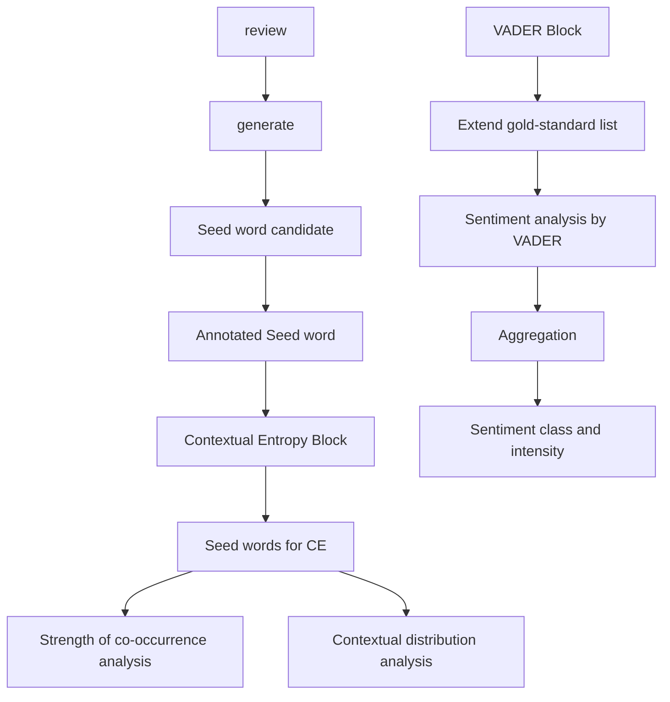

# Riddle of Sphinx: Cracking the Secret of Amazon’s Ratings and Reviews

Summary

We have witnessed the rise of mass online marketplaces. For example Amazon, one of the biggest online platforms, is worth around \$ 915 billion. Guided by the customer obsession principle, it provides an opportunity for the customers to rate the products from 1 to 5. Moreover, buyers can submit a text-based message, namely review, to express their feeling towards the products. The massive data of those ratings and reviews offer a wealth of information remained to be mined. Analysis of text-based messages or rating-based values has received wide attention, yet there is not a method severs as the combination of both, especially for the case of an online marketplace.

To address the above-mentioned challenge, we propose a novel CE-VADER hybrid model for sentiment analysis in reviews, classifying messages into five groups of strong positive, weak positive, moderate, weak negative and strong negative. Empirical results indicate that the proposed five-group classification model correlates to the five-star rating system well. Then a state-of-art informative evaluation model is proposed as the combination of the text-based and rating-based measures. We pick out 1% most informative reviews and ratings of each product to evaluate the properties and propose sales strategies.

We propose the “reputation” rate based on the differential equation model in the literature to evaluate the reputation of the product. Then we employ an Auto Regression (AR) model as the time series forecasting method to predict future “reputation” rate and the potential success or the failure of each product. AR model shows high accuracy on the validation set with a maximum Root Mean Square Error (RMSE) of 0.131. Pacifiers have a good reputation and predicted to be successful while microwaves and hair dryers have bad reputations and predicted to fail. The results show relevance with the proportions of the continuous five-star or one-star rating sequence. Lastly, we analyze specific words and descriptors to find their correlation to the ratings.

According to our empirical results, we propose some confident sales strategies and recommendations for the online marketplace, e.g., the timing choice of introducing products into market, targeted adjustment according to star ratings, etc. We write a letter to the marketing director of Sunshine Company to summarize our analysis and results, together with our recommendations.

Our framework shows a strong accuracy, robustness. It can be easily implemented to other data with our source codes.

Keywords: Text-Based Measure, Informative Text Selection, Reputation Quantification, Sales Strategy Formation.

# Riddle of Sphinx: Cracking the Secret of Amazon’s Ratings and Reviews

March 9, 2020

## Contents

1 Introduction 3  
2 Assumptions and Notations 4

2.1 Assumptions . . . 4  
2.2 Notations . . 4

3 Informative Evaluation Model 4

3.1 Vector Encoding Forms of Star Ratings . . 5  
3.2 Contextual Entropy VADER Hybrid Model for Text-Based Measures 5

3.2.1 Manually Annotating the Seed Word 7  
3.2.2 Contextual Entropy Block (CE) 7  
3.2.3 VADER Block . . 9  
3.2.4 Proposed CE-VADER for Sentiment Analysis 9

3.3 Combination of Text-Based and Rating-Based Measures . 10  
3.4 Model Implementation, Sensitivity Analysis and Results 11

4 Difference Equation to Measure Time-Based Pattern 11

4.1 Difference Equation Based Model . . . 11  
4.2 Model Implementation, Sensitivity Analysis and Results 12

5 Predict Potential Success or Failure 14

5.1 Time Series Forecasting for Predicting Future Reputation . 14  
5.2 Evaluating the Success or Failure potential 14  
5.3 Model Implementation and Results . 14

6 Specific Ratings and Descriptors Analysis 15

6.1 Specific Star Ratings Relevance to Rating Frequency . . 16  
6.2 Specific Quality Descriptors’ Relevance to Rating Levels 18

6.2.1 Naive Bayesian Model for Evaluation . . . . . . . . . . . . 18 18

6.2.2 Model Implementation and Results 19

7 Attractiveness Analysis of Design Features 20  
8 Sales Strategies and Recommendations 2 0  
9 Strengths and Weaknesses 21

9.1 Strengths 21  
9.2 Weaknesses 22

10 Conclusion 22  
11 A Letter to the Marketing Director of Sunshine Company 22

Appendices 24

Appendix A Annotated Seed Words and Frequency 24

Appendix B The Number of Keyword Occurrences in Different Keyword Groups 25

Appendix C Top 1% Most Informative Ratings and Reviews 26

Appendix D Source Code for VADER Sentiment Analysis 36

Appendix E Source Code for Informative Algorithm 36

Appendix F Source Code for Reputation Calculation 37

Appendix G Source Code for Beyes Model 37

Appendix H Source Code for Time Series Prediction 38

Appendix I Source Code for Wordcloud Picture 38

## 1 Introduction

Our society has witnessed the rise of many online marketplaces, with a total worldwide market value of 4.3 trillion dollars [1]. One salient feature of the online marketplace compared with traditional platforms is the massive review of texts and ratings. Among all of them, Amazon has received the most attention, as its greatest success [1]. Amazon also provides customers with chances to freely express their feeling and rate the products that they have purchased.

Previous work [2] indicates that customers will largely refer to the reviews and ratings before they buy the product on the platforms. Platforms can adjust their sales strategy by checking these comments. Hence, the ratings and the reviews both provide references to other potential buyers and massive data to analyze the demand of the customers, which can help to develop adaptive strategies. By making full use of these data, we can achieve a win-win situation for both the buyers and the platform.

One of the biggest challenges is the complexity and diversity of the texts of the reviews [3, 4]. In this paper, we propose a novel sentiment analysis model as the text-based measure to address this issue. In this paper, we develop a series of models as the combination of text-based, ratingbased, and time-based measures to pick out the most informative ratings and reviews to track. We also construct a novel evaluation framework to quantify the reputation of each product and predict potential success or failure. Then, we analyze the correlation between continuous same star ratings, word descriptors and the reputation of the products. We implement our model on the real data set generated from three different types of products, namely the pacifier, microwave, and the hair dryer.

Researchers have pointed out the necessity to study when and how the online platforms should adjust their marketing communication strategy in response to consumer reviews or ratings [5]. We propose several sales strategies and recommendations in this paper based on our analysis and results.

The rest of the paper is organized as follows. In section 2, we list the main assumptions in model construction and introduce the notations which will be frequently used in this paper. In section 3, a novel Information Evaluation Model is proposed. It is made up of a hybrid the state-of-art CE [6] and VADER [7] for sentiment analysis in the review text. Then we propose the "importance" rate as a combination of text-based measure (i.e., our proposed CE-VADER model) and ratings-based measure (i.e., the star-rating and the helpful votes) to indicate how informative the review and the rating are. To the best of our knowledge, we are the first to propose a review-text-based sentiment analysis model. In section 4, we employ a difference equation model as the backbone to measure the time pattern of each product. Moreover, the "reputation" rate is proposed in this section to measure the growth or the decline of the reputation. In section 5, we employ an Auto Regression model (AR) to predict the change of reputation in the future time domain and propose a fuzzy system to predict the potential success or failure of each product. More details about the results of our model implemented on given data can be found in section $^ { 6 , 7 , 8 }$ . The strengths and weaknesses of the proposed model and framework are discussed in section 9. We conclude in section 10. All source codes are attached to the Appendix D-I and can be easily implemented to other data sets.

## 2 Assumptions and Notations

## 2.1 Assumptions

To simplify our model and eliminate the complexity, we make the following main assumptions in this literature. All assumptions will be re-emphasized once they are used in the construction of our model.

Assumption 1. The online marketplace operates stably. And there were no situations such as an outbreak of an epidemic which would seriously affect the production chain of online shopping.

Assumption 2. The ratings and reviews depict customers’ real experience and feeling about their purchased products. The sentiment in the review text reflects one’s feelings on the products.

Assumption 3. The vast majority of individual differences of customers e.g., economic status and educational level, are ignored.

Assumption 4. It takes some time for shipping the product. Some customers would prefer making reviews sometime after receiving the purchased products.

Assumption 5. Consumers pay more attention to the negative comments e.g., low-star rating or nega tive reviews when purchasing the products.

## 2.2 Notations

In this work, we use the nomenclature in Table 1 in the model construction. Other nonefrequent-used symbols will be introduced once they are used.

Table 1: Notations used in this literature

<table><tr><td>Symbol</td><td>Definition</td><td>Type</td></tr><tr><td>id</td><td>review id</td><td>String</td></tr><tr><td>sid</td><td>Star rate, subscript is its associated review id</td><td>Scalar</td></tr><tr><td>hvid</td><td>Helpful votes, subscript is its associated review id</td><td>Scalar</td></tr><tr><td>Rid</td><td>Review text, subscript is its associated review id</td><td>String</td></tr><tr><td>rdid</td><td>Review date, subscript is its associated review id</td><td>Date</td></tr><tr><td>VEC</td><td>Vector encoding of the star rating</td><td>Mapping</td></tr><tr><td>INT</td><td>Vector encoding of intensity relevant to 5-class seed words</td><td>Mapping</td></tr><tr><td>IMP</td><td>Importance rate of review and associated rating</td><td>Mapping</td></tr><tr><td>REP</td><td>Reputation rate of product at some time</td><td>Mapping</td></tr></table>

## 3 Informative Evaluation Model

In this section, we proposed the "importance" to evaluate how informative the review text and star rates are. The most informative factor we take into account is the sentiment of the review text. In this literature, we propose a CE-VADER model to address the sentiment analysis issue in the review text. Our model will classify the text into five groups: strong positive, weak positive, moderate, weak negative and strong negative in the consistency of the five-star rating scheme. Then our proposed "importance" will incorporate the text-based measure, sta r rating with their fidelity, correlation. The higher the importance, the more informative it is. The rest of the section is arranged as follows. In section 3.1, we covert the integral star rate to vector form. In section 3.2, we propose the CE-VADER, a hybrid model for the text-based measures. In section 3.3, we introduce the "importance" to calculate how informative the review and the star rating together are. In section 3.4, we implemented our model on real data set of 3 types of products to indicate 1% most informative review and star ratings, and analyze the model sensitivity.

## 3.1 Vector Encoding Forms of Star Ratings

Consumers can freely express their comments on the products on Amazon by rating one to five stars after purchasing. A one-star rating is associated with the least satisfaction while five-star with the highest satisfaction. The one-to-five star rating itself is a sufficient measure. To combine the ratings-based measure with the text-based measure which we will discuss in the next section. We would like to convert the star-rating to vector forms in this section.

Firstly, we calculate the ration of each star rate of hair dryers, baby pacifiers, and microwaves from the given data respectively, as shown in Figure 1. We observe that baby pacifiers have received the highest percentage of high star rating, while microwaves a lower star rating. Products with high technology content also face more quality problems, which is in line with actual expectations, indicating that star ratings can indeed reflect consumer satisfaction.

However, we would like to convert the rating to an equivalent 5−dimension vector encoding forms. Denote the star-rate as $s \in \{ 1 , 2 , 3 , 4 , 5 \}$ , the vector encoding forms of s can be formulated by $\mathbb { V } \mathbb { E } \mathbb { C } ( s ) = ( v e c _ { s } ^ { 1 } , \cdot \cdot \cdot , v e c _ { s } ^ { 5 } ) ^ { T } \in \mathbb { R } ^ { 5 }$ where the components defined by:

$$
v e c _ {s} ^ {i} = \frac {e ^ {\frac {| i - s | ^ {2}}{2 \sigma_ {0}}}}{\sum_ {j = 1} ^ {5} e ^ {\frac {| j - s | ^ {2}}{2 \sigma_ {0}}}} \tag {1}
$$

where $\sigma _ { 0 }$ is a tunable parameter, determining the robustness of our model, the bigger the more robust. The mapping VEC is one-to-one, hence we claim the converted form is equivalent to the star-rating. Moreover, by our definition, we can find: i) $s = a r g m a x _ { i } \{ v e c _ { s } ^ { i } \} , \mathrm { i i } ) \hat { \sum } _ { i = 1 } ^ { 5 } v e c _ { s } ^ { i } = 1$ . VEC(s) encoding as a probabilistic vector with each component represents their possibility to be rated by the associated star e.g., the 4-star rate has the highest probability to be rated 4 stars, second-highest possibility to be rated as 3 or 5 stars.

## 3.2 Contextual Entropy VADER Hybrid Model for Text-Based Measures

In this literature, we construct a novel model for sentiment analysis based on the review text. To the sake of simplicity, the sentiment scored by the text is regarded as the only fact to measure the success or the failure of the product e.g., the positive attitudes usually indicate a higher potential of the product success while on the contrary, negative attitudes indicate a higher possibility for the product failure.

In this section, we propose a contextual entropy and VADER [7] hybrid model, namely the CE-VADER to address the sentiment analysis challenge in the review text. The model is made up of the two blocks: the contextual entropy (CE) block and the VADER block. CE model shows its high capability in sentiment analysis of the stock market news [6] but its limitation in short context e.g., the review in this literature. While the VADER model outperforms the state-of-art nature language model in short online texture but their accuracy depends a lot on the pre-listed lexicon words. The two blocks of CE-VADER will separative outcome a 5−dimension probabilistic vector with each component represents the probability of being its associated group. After a voting block, our proposed model will classify the review into one of the five groups together with an intensity showing how intense it is to be classified into the group. By hybridizing both models, we show CE-VADER can classify the review context into five groups in the consistency of the star rating.


<details>
<summary>stacked bar chart</summary>

| Item | Total number |
| :--- | :--- |
| pacifier | 18939 |
| microwave | 1615 |
| hair dryer | 11470 |
</details>

Figure 1: Star rating distribution of pacifier, microwave and hair dryer based on the given data.

The rest of this section is arranged as follows. Firstly we show our strategy to generate the seed words for the CE model and expanding the gold-standard list of the VADER block. Then we introduce the CE and VADER model superlatively. Finial we propose the hybrid CE-VADER model. Our model will classify the review context into five classes: strong positive, weak positive, moderate, weak negative and strong negative, with its intensity. In the next section, we will propose a review fidelity based on the classification results and the intensity.


<details>
<summary>flowchart</summary>


</details>

Figure 2: The overall architecture of our proposed CE-VADER model. The model is made up of two blocks, namely the CE block and the VADER block.

## 3.2.1 Manually Annotating the Seed Word

We put 80% of the data as the training set and all the rest 20% as the testing set of evaluations. Sentences in the review body from the training set are broken down into separated words, among which are statistically calculated their frequency. The high-frequency emotion words are picked out as seed words and manually annotated by us, while the low-frequency ones are discarded. The annotator (one of our group members) will incorporate his expertise natural-language processing knowledge for the classifying all the selected emotion words into five groups i.e., strong positive, weak positive, moderate, weak negative and strong negative. Instead of coarse two-group annotations of either "positive" or "negative" [6], we detailedly sub-classify each one into "strong" and "weak" subgroups and set aside one more group labeled as "moderate". The five-group annotation strategies aim to correlate with the one-to-five-starrating score $\mathrm { e . g . }$ , "weak positive" maps to the four-star-rating. We denote the five groups of the seed word as $\mathbf { G } _ { i } ,$ with i = 1, 2, 3, 4, 5.

Representative words generated from the training set with "positive" or "negative" labels are depicted in Figure 3 with the cold tone or warm tone respectively. Annotated five-class seed words are attached to Appendix A.


<details>
<summary>text_image</summary>

right
fit
better
easy
clean
perfect
able
cute want
good
great
happy
recommend
wish
perfectly
excellent
problem
trouble
hit
broken
disaster
less pain
yet
sucks
hard
disappointed
difficult
wrong
shit
waste
</details>

Figure 3: Demonstration of some representative seed words. Words annotated as "positive" are colored in light tone while the "negative" ones in a dark tone. The bigger the size, the higher word frequency.

## 3.2.2 Contextual Entropy Block (CE)

The contextual entropy block employs a part-contextual entropy model [6] as the backbone architecture. A part-contextual entropy model can consider both the strength of the cooccurrence and the contextual distribution between the candidate of the most representative words from the review context and the generated seed words.

We employ a vector to encode the strength between word and its context in the review. To be more specific, denote the left and the right context of the $k ^ { t h }$ word $w _ { k }$ in the n-word review context $R = w _ { 1 } w _ { 2 } \cdot \cdot \cdot w _ { k } w _ { k + 1 } \cdot \cdot \cdot w _ { n }$ are $\left\{ w _ { 1 } w _ { 2 } \cdot \cdot \cdot w _ { k - 1 } \right\}$ and $\{ w _ { k + 1 } w _ { k + 2 } \cdot \cdot \cdot w _ { n } \}$ respectively. Note that we set review as a complete target instead of breaking it into sentences as in the ref.[6], in consideration of the short contextual style of online comments. The dimension of the vector depends on the length of the review $\mathrm { i } . \mathrm { e } . , n$ . Denote the vector to record the left context of word

$w _ { k }$ as $\mathbf { v } ^ { l e f t } ( w _ { k } ) = ( v _ { w _ { k } 1 } ^ { \ l e f t } , v _ { w _ { k } 2 } ^ { l e f t } , \cdot \cdot \cdot , v _ { w _ { k } N } ^ { l e f t } )$ , v wkN ) and the vector to record the right context as vrigh ntextas r $( v _ { w _ { k } 1 } ^ { r i g h t } , v _ { w _ { k } 2 } ^ { r i g h t } , \cdot \cdot \cdot , v _ { w _ { k } N } ^ { r i g h t } )$ $i ^ { t h }$ $v _ { w _ { k } i }$ representing the co-occurrence strength between the $w _ { k }$ and $w _ { i }$ . To calculate the possibility distance we will discuss soon validate, all the vectors have to be in the form of probabilistic representation. $N \leq n$ is the dimension of the context vector, it counts the number of distinct words in the context of the review $R .$

The weight $v _ { w _ { k } i }$ is formulated by:

$$
v _ {w _ {k} i} = \sum_ {j} e ^ {- \frac {| j - k | ^ {2}}{2 \sigma}} \tag {2}
$$

It takes both the spatial factor and the distance factor into consideration. Here we employ a Gaussian function to measure the distance as we hold the assumption that the closer, the more weight it gains. Then to make the vector into probabilistic representations, we normalize it by:

$$
v _ {w _ {k} i} \leftarrow \frac {v _ {w _ {k} i}}{\sum_ {i} v _ {w _ {k} i}} \tag {3}
$$

Then we change the candidate words or the seed words into probability vector representations. Then we will employ a Kullback–Leibler $( \mathrm { K L } )$ distance[8] (denoted as $\mathbb { K L } ( \cdot \| \cdot ) \bar { ) }$ to measure the distance between the vector $\mathbf { v } ( c _ { i } ) = ( \mathbf { v } ( c _ { i } ) ^ { l e f t } , \mathbf { v } ( c _ { i } ) ^ { r i g h t } )$ of the $i ^ { t h }$ candidate word and $\mathbf { v } ( s e e d _ { j } ) = ( \mathbf { v } ( s e e d _ { j } ) ^ { l e f t } , \mathbf { v } ( s e e d _ { j } ) ^ { r i g h t } )$ of the $j ^ { t h }$ seed word, that is:

$$
\mathbb {D} \left(c _ {i} \| \text { seed } _ {j}\right) := \mathbb {K L} \left(\mathbf {v} \left(c _ {i}\right) \| \mathbf {v} \left(\text { seed } _ {j}\right)\right) = \sum_ {k = 1} ^ {N} P \left(d _ {k} \mid c _ {i}\right) \log \frac {P \left(d _ {k} \mid c _ {i}\right)}{P \left(d _ {k} \mid \text { seed } _ {j}\right)} \tag {4}
$$

where $P ( d _ { k } | c _ { i } )$ and $P ( d _ { k } | s e e d _ { j }$ denote probabilistic weights of the $k ^ { t h }$ dimension of the left (or right) context vector of $c _ { i }$ and $s e e d _ { j }$ respectively and $N$ is the dimensional of the context probabilistic vector. Due to the non-symmetry of the KL-distance $\lvert . . . , \mathbb { D } ( c _ { i } \lVert s e e d _ { j } ) \neq \mathbb { D } ( s e e d _ { j } \lVert c _ { i } )$ , we employ the following symmetry distance (denoted as $\mathbb { S } \mathbb { D } ( \cdot , \cdot ) )$ :

$$
\mathbb {S D} \left(\text { seed } _ {j}, c _ {i}\right) = \mathbb {S D} \left(c _ {i}, \text { seed } _ {j}\right) := \mathbb {D} \left(c _ {i} \| \text { seed } _ {j}\right) + \mathbb {D} \left(\text { seed } _ {j} \| c _ {i}\right) \tag {5}
$$

The addition of $\mathbb { D } ( c _ { i } \Vert s e e d _ { j } )$ and $\mathbb { D } ( s e e d _ { j } \Vert c _ { i } )$ not only makes the symmetry of the $\mathbb { S } \mathbb { D } ( \cdot , \cdot )$ but also accounts for both their left and right contextual distributions. Then we will define the similarity (denoted as $\mathbb { S } \mathbb { I } ( \cdot , \cdot ) )$ between the candidate word $c _ { i }$ and seed word $s e e d _ { j }$ based on the symmetry distance by:

$$
\mathbb {S I} \left(c _ {i}, \text { seed } _ {j}\right) := \frac {1}{1 + \mathbb {S D} \left(c _ {i} , \text { seed } _ {j}\right)} \tag {6}
$$

$\mathbb { S I } ( c _ { i } , s e e d _ { j } ) \in ( 0 , 1 ]$ measures the similarity between two words, with the bigger the more similarity they share. In particular, $\mathbb { S I } ( c _ { i } , s e e d _ { j } )$ equals 1 if and only if $c _ { i } = s e e d _ { j }$ . After the calculation of the similarity of candidate word and seed word, we will propose the similarity between the candidate word $c _ { i }$ and one of the five groups $\mathbf { G } _ { j }$ by:

$$
\mathbb {S I} \left(c _ {i}, \mathbf {G} _ {j}\right) := \frac {1}{| \mathbf {G} _ {j} |} \sum_ {\text { seed } _ {k} \in \mathbf {G} _ {j}} \mathbb {S I} \left(c _ {i}, \text { seed } _ {k}\right) \tag {7}
$$

$\mathbb { S I } ( c _ { i } , \mathbf { G } _ { j } ) \in ( 0 , 1 ]$ measures the similarity of candidate word $c _ { i }$ to the $j ^ { t h }$ group of the sentimental seed words. The similarity of review $R$ to $\mathbf { G } _ { j }$ is defined by:

$$
\mathbb {S I} (R, \mathbf {G} _ {j}) := \frac {1}{N} \sum_ {i = 1} ^ {N} \mathbb {S I} (c _ {i}, \mathbf {G} _ {j})
$$

SI $( R , \mathbf G _ { j } ) \in ( 0 , 1 ]$ measures the similarity of review R to the $j ^ { t h }$ group of the sentimental seed words, the bigger the more similarity. The output of the CE block is a 5−dimension probabilistic vector $C E ( R ) = ( C E _ { R } ^ { 1 } , \cdot \cdot \cdot , C E _ { R } ^ { 5 } ) ^ { T } \in \mathbb { R } ^ { 5 }$ . The $j ^ { t h }$ component $C E _ { R } ^ { j }$ is the intensity associated with group $\mathbf { G } _ { j } ,$ it is defined by:

$$
C E _ {R} ^ {j} = \frac {\mathbb {S I I} (R , \mathbf {G} _ {j})}{\sum_ {i = 1} ^ {5} \mathbb {S I I} (R , \mathbf {G} _ {i})} \tag {9}
$$

## 3.2.3 VADER Block

VADER [7] is a simple rule-based model for general sentiment analysis, especially for the social media text style. Based on manually generated a gold-standard list of lexical features [7], VADER does not require any training data, which shows its promising potential to extend to a wide range of tasks of sentiment analysis. Hence, in this literature, we extend the goodstandard list of lexical features based on our generated seed words to address the sentiment analysis of the review context. Moreover, we also extend the original four group prediction results to five group prediction results, i.e., strong positive, weak positive, moderate, weak negative and strong negative in the consistency of our CE block. Readers are referred to ref.[7] for more details about the framework of the VADER. The extended gold-standard list is attached to Appendix A. The outcome of the VADER Block is also a 5−dimension probabilistic vector with the $j ^ { t h }$ component is the intensity corresponds to the $j ^ { t h }$ seed word group $\mathbb { G } _ { j }$ . Denoted the outcome vector of review R as $V A D \dot { E } R ( R ) \hat { = } ( V A D E R _ { R } ^ { 1 } , \allowbreak \cdots , V A D E R _ { R } ^ { 5 } ) ^ { T } \dot { \in } \mathbb { R } ^ { 5 }$ .

## 3.2.4 Proposed CE-VADER for Sentiment Analysis

Our proposed CE-VADER hybrid model is made up of two blocks: CE block and VADER block. Both of the two blocks will provide a 5−dimension probabilistic vector $C E ( R )$ and $V A D E R ( R )$ to a review context R with each component is the intensity to its corresponding group $\mathbf { G } _ { j }$ . We will employ a smoothing convex linear combination of the two vectors as the final intensity probabilistic vector of our CE-VADER model (denoted as INT(·)) i.e.,

$$
\mathbb {I N T} (R) := \text { softmax } (\lambda C E (R) + (1 - \lambda) V A D E R (R)) \tag {10}
$$

where lambda is the fused coefficient, in this literature we set $\lambda \ : = \ : 0 . 5$ to equally weigh the outcome of the two blocks. We employ sof tmax(·) as our smoothing function, which is defined by:

$$
\operatorname{softmax} \left(x _ {1}, x _ {2}, \dots , x _ {s}\right) = \frac {1}{\sum_ {i = 1} ^ {s} e ^ {x _ {i}}} \left(e ^ {x _ {1}}, e ^ {x _ {2}}, \dots , e ^ {x _ {s}}\right) \tag {11}
$$

As our empirical results show after smoothing, the intensity vector will show a strong consistency to the star-rating.

The sentiment classification result of the proposed CE-VADER on the review R is the group name of $\mathbf { G } _ { j }$ associated with the component of $\mathbb { \hat { N T } } ( R ) = ( i n t _ { R } ^ { 1 } , \cdot \cdot \cdot , i n t _ { R } ^ { 5 } )$ with the largest value, formulated by $j _ { 0 } = a r g m a x _ { j } \{ i n t _ { R } ^ { j } \}$ , with its corresponding intensity $i n t _ { R } ^ { j _ { 0 } }$ .

## 3.3 Combination of Text-Based and Rating-Based Measures

The unique review id is denoted as id. Review headline $R h _ { i d } ,$ , review body $R b _ { i d } ,$ star rating $s _ { i d } ,$ review date $r d _ { i d } ,$ helpful votes $h v _ { i d } ,$ product title $p t _ { i d } ,$ product id $p _ { i d } \in \{ B , M , H \}$ (B, M, H stand for baby pacifier, microwave, and hair dryer respectively) are all associated with the subscript review id. Due to the strong relevant relationship (difference occurs lease than 0.01% in total) between product title, product parent and product id, namely, once one of them is given we can almost uniquely tell the other two, we only use the product title to depicts the product in this literature. We do not take the marketplace into account, since all of them are from the US. Denote the pair $P ( i d ) = ( R _ { i d } , s _ { i d } , h v _ { i d } , r d _ { i d } , p t _ { i d } , p _ { i d } )$ , where $R _ { i d } = ( R h _ { i d } , R b _ { i d } )$ is the whole review text including the headline and body.

We propose the importance rate (denoted as IMP) of each review by taking its helpful votes, correspondence between the star-rating measure $\mathbb { V E C } ( s _ { i d } )$ and the text-based measure $\mathbb { N T } ( R _ { i d } ,$ review text clarity. It is defined by the following formula.

$$
\mathbb {I M P} (i d) := \left(1 + h v _ {i d}\right) \cdot e x p \left[ - \alpha \left(1 - \frac {\mathbb {I N T} \left(R _ {i d}\right) \cdot \mathbb {V E C} \left(s _ {i d}\right)}{\| \mathbb {I N T} \left(R _ {i d}\right) \| \| \mathbb {V E C} \left(s _ {i d}\right) \|}\right) \right] \cdot e x p \left[ \beta \left(\sum_ {i = 1} ^ {5} i n t _ {R} ^ {i} l o g \left(i n t _ {R} ^ {i}\right)\right) \right] \tag {12}
$$

Where the $\begin{array} { r l } { 1 - \frac { \mathbb { I N T } ( R _ { i d } ) \cdot \mathbb { V E C } ( s _ { i d } ) } { \| \mathbb { I N T } ( R _ { i d } ) \| \| \mathbb { V E C } ( s _ { i d } ) \| } } & { } \end{array}$ is the cosine distance between text-based measure and ratingbased measure, calculating the fidelity of correspondence between two, $\alpha > 0$ is its associated weight. $- \textstyle \sum _ { i = 1 } ^ { 5 } i n t _ { R } ^ { i } l o g ( i n t _ { R } ^ { i } )$ is the entropy of the text context, the low the more clarity, $\beta > 0$ is the associated weight. The higher the importance, the more informative the review text and the rating are.

  
Figure 4: Implemented our proposed model on "Hair dryer" data set. We demonstrate the distribution of the top $1 \%$ most informative reviews and associated ratings generated by different parameters $( \alpha , \beta )$ . The longer the liner, the more informative our model indicates. The settings of $( \alpha , \beta )$ are: $\mathrm { a ) ( 1 , 1 ) ; b ) ( 1 , 3 ) ; c ) ( 1 , 5 ) ; d ) ( 2 , 1 ) ; e ) ( 4 , 1 ) ; f ) ( 5 , 5 ) }$ . As depicted in the figure, our model shows robustness on the two parameters.

## 3.4 Model Implementation, Sensitivity Analysis and Results

We implement our proposed model for the given data. We set the parameter $\sigma _ { 0 } = 1$ in Eq.(1). The model proposed in section 3.3 contains two parameters $\alpha , \beta$ . We first analyze the sensitivity of these two parameters.

As shown in Figure 4, we implemented our proposed model on "Hair dryer" data set, the top 1% most informative reviews indicated by our model show strong robustness on two parameters α and $\beta .$ We also employ the DTW similarity to quantify the robustness of our model on two parameters, as shown in Figure 5. The smaller DTW similarity, the more similar two rankings are. Readers are referred to ref.[9] for more details about the DTW similarity. We set $\alpha 1 = 1 , \beta = 1$ as the baseline and calculate the DTW similarity, the maximum is 14.3, which is a small value in the case of 11470 pieces of reviews. Again, our model shows a strong robustness of α and $\beta .$ .

Top 1% most informative reviews and the associated ratings listed by their rankings of three kinds of products are attached to Appendix C.


<details>
<summary>heatmap</summary>

| | α=1,β=1 | α=1,β=3 | α=1,β=5 | α=2,β=1 | α=2,β=3 | α=3,β=4 | α=4,β=1 | α=5,β=5 | α=5,β=7 | α=10,β=10 |
|---|---|---|---|---|---|---|---|---|---|---|
| α=1,β=1 | 0.0 | 6.9 | 6.9 | 11.6 | 9.8 | 11.3 | 11.4 | 13.0 | 13.7 | 14.3 |
| α=1,β=3 | 6.9 | 0.0 | 5.7 | 10.9 | 11.3 | 9.5 | 11.5 | 11.5 | 12.0 | 13.6 |
| α=1,β=5 | 6.9 | 5.7 | 0.0 | 11.7 | 12.3 | 11.0 | 12.4 | 12.2 | 13.0 | 16.0 |
| α=2,β=1 | 11.6 | 10.9 | 11.7 | 0.0 | 7.5 | 9.3 | 9.7 | 10.3 | 10.3 | 13.1 |
| α=2,β=3 | 9.8 | 11.3 | 12.3 | 7.5 | 0.0 | 9.8 | 11.0 | 10.9 | 11.3 | 12.9 |
| α=3,β=4 | 11.3 | 9.5 | 11.0 | 9.3 | 9.8 | 0.0 | 9.2 | 9.7 | 10.2 | 11.8 |
| α=4,β=1 | 11.4 | 11.5 | 12.4 | 9.7 | 11.0 | 9.2 | 0.0 | 8.3 | 10.2 | 11.1 |
| α=5,β=5 | 13.0 | 11.5 | 12.2 | 10.3 | 10.9 | 9.7 | 8.3 | 0.0 | 4.0 | 10.7 |
| α=5,β=7 | 13.7 | 12.0 | 13.0 | 10.3 | 11.3 | 10.2 | 10.2 | 4.0 | 0.0 | 10.3 |
| α=10,β=10 | 14.3 | 13.6 | 16.0 | 13.1 | 12.9 | 11.8 | 11.1 | 10.7 | 10.3 | 0.0 |
</details>

Figure 5: DTW similarity of our model implemented on "Hair dryer" data set with different value of α and $\beta .$ We set $\overset { \cdot } { \alpha } = 1 , \beta = 1$ as the baseline. The maximum similarity is 14.3 which is a small value considering our case of 11470 total reviews. It shows the robustness of our model.

## 4 Difference Equation to Measure Time-Based Pattern

In this section, we construct a difference equation based model to formulate the change of product’s reputation. The rest of this section is arranged as follows. In section 4.1, we detailedly formulated our model. In section 4.2, we analyze the model sensitivity and implement the model on three kinds of products.

## 4.1 Difference Equation Based Model

We propose the "reputation" to formulate the reputation of product $P$ around time T . Denote reputation as REP. However, we assume that the reputation of products w adually ill change gr by buyer’s review text and the star rates. We will employ a difference equation to formulate the reputation. The difference of the reputation (i.e., the growth rate of the reputation) can be formulated as follows.

$$
\Delta \mathbb {R} \mathbb {E} \mathbb {P} _ {t _ {0}, \theta} (T, P) := \frac {1}{2 z} (\sum_ {T - t _ {0} \leq r d _ {i d} \leq T, p _ {i d} = P} \mathbb {I M P} (i d) \cdot (\theta s _ {i d} + (1 - \theta) a r g m a x _ {j} \{i n t _ {R _ {i d}} ^ {j} \} - 3) \tag {13}
$$

where Z is the normalization constant defined by:

$$
Z = \sum_ {T - t _ {0} \leq r d _ {i d} \leq T, p _ {i d} = P} \mathbb {I M P} (i d) \tag {14}
$$

For the sake of simplicity, we normalize the value of $\Delta \mathbb { R E P } _ { t _ { 0 } , \theta } ( T , P )$ to $[ - 1 , 1 ]$ , with negative value associated with the negative feels or one-star and two-star ratings while the positive value with the positive feels or four-star or five-star ratings.

Parameter $\theta _ { 0 } \in [ 0 , 1 ]$ is the weight coefficient for the star rating and the text-based measure by our proposed CE-VADER model in section 3.2. We hold the assumption that it takes some time for shipping the product and some customers prefer making review sometime later after purchasing. Hence, we consider all id satisfying $T ^ { - } - t _ { 0 } \leq r d _ { i d } \leq T$ as the time tag, where $t _ { 0 }$ is a threshold. Note that buyers have almost 90 days to leave feedback, hence $t _ { 0 } \le 9 0$ . In this literature, we set $\theta = 0 . 5$ for the equal weight of star rate and the review context. And we set $t _ { 0 } = 1 0$ is this literature. Then, the reputation can be formulated by the following difference equation:

$$
\mathbb {R} \mathbb {E} \mathbb {P} _ {t _ {0}, \theta} (T, P) - \mathbb {R} \mathbb {E} \mathbb {P} _ {t _ {0}, \theta} (T - 1, P) = \Delta \mathbb {R} \mathbb {E} \mathbb {P} _ {t _ {0}, \theta} (T, P) - \mathbb {P} \mathbb {E} \mathbb {N} (T, P) \tag {15}
$$

Where the $\mathbb { P } \mathbb { E } \mathbb { N } ( T , P )$ is the penalty factor formulates how much the low-star rating or negative reviews destroys the reputations as we assume buyers pay more attention to those negative comments. It is formulated as follows.

$$
\mathbb {P} \mathbb {E} \mathbb {N} (T, P) = k _ {2} \times \operatorname{sigmoid} \left(k _ {1} \times \mathbb {R E P} _ {t _ {0}, \theta} (T - 1, P)\right) \times \frac {\# \left\{i d \mid \theta s _ {i d} + (1 - \theta) \operatorname{argmax} _ {j} \left\{\operatorname{int} _ {R i d} ^ {j} \right\} \leq k _ {3} \right\}}{\# \left\{i d \mid T - t _ {0} \leq r d _ {i d} \leq T , p _ {i d} = P \right\}} \tag {16}
$$

$\boldsymbol { k } _ { 1 } , \boldsymbol { k } _ { 2 } , \boldsymbol { k } _ { 3 }$ are the thresholds for the penalty factor. We set $k _ { 3 } = 2$ as the threshold to quantify $\nRightarrow \nRightarrow \{ i d | \theta s _ { i d } + ( 1 - \theta ) a r g m a x _ { j } \{ i n t _ { R _ { i d } } ^ { j } \} \leq k _ { 3 } \}$ is the propagation of "negative the "negative comments". Hence, #{id|T −t0≤rdid≤T,pid=P } comments". The sigmoid is defined by $\begin{array} { r } { s i g m o i d ( x ) = \frac { 1 } { 1 + e ^ { - x } } \in [ 0 , 1 ] } \end{array}$ . We set the sigmoid items to intimate the social behavior that once a product wins a good reputation, people will put more emphasis on the "negative comments". $k _ { 2 }$ values how much the penalty factor is comparing with the growth rate $\mathrm { i . e . , } \Delta \mathbb { R } \mathbb { P }$ .

## 4.2 Model Implementation, Sensitivity Analysis and Results

As the construction of our model in 4.1, there are two tunable parameters $\mathrm { i . e . , } \ k _ { 1 } , k _ { 2 }$ . We implement our proposed model on the data of three types of products. And show the sensitivity of our model on these two parameters.

Figure 6 depicts the reputation curve with the parameter settings of $k _ { 1 } = 0 . 5$ and $k _ { 2 } = 2 0$ . As shown, "microwave" owns a bad reputation for the negative valued reputation rate; while "pacifier" wins a good reputation. None of the products have a steady or monotonic growth or a decline in reputation rate. Then, we analyze the sensitivity of our model on the two parameters i.e., k1 and $k _ { 2 } .$ . Our model shows extremely strong robustness on $k _ { 1 }$ and a gentle sensitivity on $k _ { 2 }$ in Figure 7. As depicted in Figure 7-B, different settings of $k _ { 2 }$ will lead to a different growth rate of the reputation rate on the data of "pacifier", but sharing the same tendency. But, the small value of $k _ { 2 }$ will lead to an exponential large reputation growth rate. As we have discussed before, the small setting of $k _ { 2 }$ indicates less attention to negative comments.


<details>
<summary>line chart</summary>

| time axis | hair dryer | microwave | pacifier |
| --- | --- | --- | --- |
| 0 | 0 | 0 | 0 |
| 10 | 5 | -5 | 10 |
| 20 | 10 | -10 | 20 |
| 30 | 15 | -15 | 30 |
| 40 | 20 | -20 | 40 |
| 50 | 25 | -25 | 50 |
| 60 | 30 | -30 | 60 |
| 70 | 35 | -35 | 70 |
| 80 | 40 | -40 | 80 |
| 90 | 45 | -45 | 90 |
| 100 | 50 | -50 | 100 |
| 110 | 55 | -55 | 110 |
| 120 | 60 | -60 | 120 |
| 130 | 65 | -65 | 130 |
| 140 | 70 | -70 | 140 |
| 150 | 75 | -75 | 150 |
| 160 | 80 | -80 | 160 |
| 170 | 85 | -85 | 170 |
| 180 | 90 | -90 | 180 |
| 190 | 95 | -95 | 190 |
| 200 | 100 | -100 | 200 |
| 210 | 105 | -105 | 210 |
| 220 | 110 | -110 | 220 |
| 230 | 115 | -115 | 230 |
| 240 | 120 | -120 | 240 |
| 250 | 125 | -125 | 250 |
| 260 | 130 | -130 | 260 |
| 270 | 135 | -135 | 270 |
| 280 | 140 | -140 | 280 |
| 290 | 145 | -145 | 290 |
| 300 | 150 | -150 | 300 |
| 310 | 155 | -155 | 310 |
| 320 | 160 | -160 | 320 |
| 330 | 165 | -165 | 330 |
| 340 | 170 | -170 | 340 |
| 350 | 175 | -175 | 350 |
| 360 | 180 | -180 | 360 |
| 370 | 185 | -185 | 370 |
| 380 | 190 | -190 | 380 |
| 390 | 195 | -195 | 390 |
| 400 | 200 | -200 | 400 |
| 410 | 205 | -205 | 410 |
| 420 | 210 | -210 | 420 |
| 430 | 215 | -215 | 430 |
| 440 | 220 | -220 | 440 |
| 450 | 225 | -225 | 450 |
| 460 | 230 | -230 | 460 |
| 470 | 235 | -235 | 470 |
| 480 | 240 | -240 | 480 |
| 490 | 245 | -245 | 490 |
| 500 | 250 | -250 | 500 |
| 510 | 255 | -255 | 510 |
| 520 | 260 | -260 | 520 |
| 530 | 265 | -265 | 530 |
| 540 | 270 | -270 | 540 |
| 550 | 275 | -275 | 550 |
| 560 | 280 | -280 | 560 |
| 570 | 285 | -285 | 570 |
| 580 | 290 | -290 | 580 |
| 590 | 295 | -295 | 590 |
| 600 | 300 | -300 | 600 |
| 610 | 305 | -305 | 610 |
| 620 | 310 | -310 | 620 |
| 630 | 315 | -315 | 630 |
| 640 | 320 | -320 | 640 |
| 650 | 325 | -325 | 650 |
| 660 | 330 | -330 | 660 |
| 670 | 335 | -335 | 670 |
| 680 | 340 | -340 | 680 |
| 690 | 345 | -345 | 690 |
| 700 | 350 | -350 | 700 |
| 710 | 355 | -355 | 710 |
| 720 | 360 | -360 | 720 |
| 730 | 365 | -365 | 730 |
| 740 | 370 | -370 | 740 |
| 750 | 375 | -375 | 750 |
| 760 | 380 | -380 | 760 |
| 770 | 385 | -385 | 770 |
| 780 | 390 | -390 | 780 |
| 790 | 395 | -395 | 790 |
| 800 | 400 | -400 | 800 |
| ... | ... | ... | ... |
| ... | ... | ... | ... |
| ... | ... | ... | ... |
| ... | ... | ... | ... |
| ... | ... | ... | ... |
| ... | ... | ... | ... |
| ... | ... | ... | ... |
| ... | ... | ... | ... |
| ... | ... = ... | ... = ... | ... |
| ... = ... | ... = ... | ... = ... | ... |
| ... = ... | ... = ... | ... = ... | ... |
| ... = ... | ... = ... | ... = ... | ... |
| ... = ... | ... = ... | ... = ... | ... |
| ... = ... | ... = ... | ... = ... | ... |
</details>

Figure 6: The reputation curve of products with $k _ { 1 } = 0 . 5$ and $k _ { 2 } = 2 0$ .


<details>
<summary>line chart</summary>

| time       | k1=0.3 | k1=0.5 | k1=0.1 | k1=3 | k1=5 | k1=10 | k1=25 |
| ---------- | ------ | ------ | ------ | ---- | ---- | ----- | ----- |
| 2003/4/27  | ~60    | ~55    | ~50    | ~45  | ~40  | ~35   | ~30   |
| 2007/1/1   | ~55    | ~50    | ~45    | ~40  | ~35  | ~30   | ~25   |
| 2011/1/1   | ~105   | ~100   | ~95    | ~90  | ~85  | ~80   | ~75   |
| 2015/8/31  | ~55    | ~50    | ~45    | ~40  | ~35  | ~30   | ~25   |
</details>


<details>
<summary>area chart</summary>

| Time       | k2=10  | k2=11  | k2=12  | k2=13  | k2=15  | k2=20  |
| ---------- | ------ | ------ | ------ | ------ | ------ | ------ |
| 2003/4/27  | ~0     | ~0     | ~0     | ~0     | ~0     | ~0     |
| 2007/1/1   | ~500   | ~400   | ~300   | ~200   | ~100   | ~50    |
| 2011/1/1   | ~1500  | ~1200  | ~900   | ~600   | ~400   | ~200   |
| 2015/8/31  | ~3500  | ~2500  | ~1800  | ~1200  | ~800   | ~400   |
</details>

Figure 7: Sensitivity analysis of the parameters $k _ { 1 }$ and $k _ { 2 } . \mathrm { ~ A } )$ Our model shows extreme strong robustness on $k _ { 1 }$ . B)Our model shows sensitivity on $k _ { 2 }$ .

## 5 Predict Potential Success or Failure

In the last section, we construct a mapping REP $\mathsf { \Pi } _ { t _ { 0 } \theta } ^ { \mathsf { D } } : [ T _ { 0 } , T _ { 1 } ] \times \{ B , M , H \}  \mathbb { R } _ { + }$ where $[ T _ { 0 } , T _ { 1 } ]$ is the time range of the given review date. In this section, we will employ time series forecasting method to predict the value of $\mathbb { R E P } _ { t _ { 0 } \theta }$ on extended future domain, namely $[ T _ { 1 } , T _ { 2 } ] \times \{ B , M , H \bar { \} }$ for some $T _ { 2 } > T _ { 1 }$ in section 5.1. Based on the forecasted $\mathbb { R E P } _ { t _ { 0 } \theta }$ in the future time domain, we will evaluate the success or failure potential of each product in 5.2. We show the results on the real data and predicted their potential success or failure in section 5.3.

## 5.1 Time Series Forecasting for Predicting Future Reputation

We employ an auto regressive model (AR) as the time series forecasting to predict future growth or the decline of the reputation rate. The AR model can be depicted by the following difference equation.

$$
\mathbb {R} \mathbb {E} \mathbb {P} _ {t _ {0}, \theta} (T, P)) = a _ {0} + \sum_ {k = 1} ^ {p} a _ {k} \mathbb {R} \mathbb {E} \mathbb {P} _ {t _ {0}, \theta} (T - k, P)) + \varepsilon_ {T} \tag {17}
$$

where $\varepsilon _ { T }$ is the white noise. AR model goes to search the coefficient $( a _ { 0 } , a _ { 1 } , \cdots , a _ { p } )$ in $\operatorname { E q . } ( 1 7 )$ to fit the given data in the time domain $[ T _ { 0 } , T _ { 1 } ]$ with the least root mean square error (RMSE).

## 5.2 Evaluating the Success or Failure potential

We define the average reputation of product P from $T _ { 0 }$ to $T _ { 1 }$ as:

$$
\overline {{\mathbb {R E P} _ {t _ {0} , \theta} ^ {T _ {0} T _ {1}} (P)}} := \frac {1}{T _ {1} - T _ {0}} \int_ {T _ {0}} ^ {T _ {1}} \mathbb {R E P} _ {t _ {0}, \theta} (T, P) d T \tag {18}
$$

Similarly, we can define the predicted average reputation of product P in the future time domain $[ T _ { 1 } , t ]$ for $t < T _ { 2 }$ based on the model constructed in section 5.1 as follows.

$$
\overline {{\mathbb {R E P} _ {t _ {0} , \theta} ^ {T _ {1} t} (P)}} := \frac {1}{t - T _ {1}} \int_ {T _ {1}} ^ {t} \mathbb {R E P} _ {t _ {0}, \theta} (T, P) d T \tag {19}
$$

The ration of the calculated average reputation by the given data and the predicted average reputation from Eq. (18) and Eq. (18) is defined as the reputation change rate. It is defined as:

$$
\gamma (t, P) := \overline {{\mathbb {R E P} _ {t _ {0} , \theta} ^ {T _ {1} t} (P)}} / \overline {{\mathbb {R E P} _ {t _ {0} , \theta} ^ {T _ {0} T _ {1}} (P)}} \tag {20}
$$

We propose a fuzzy evaluation system for predicting the success or the failure of the product P . The overall architecture of the system is depicted in Figure 8. We category the outcome into four classes, namely "strong success", "weak success", "weak failure", "strong failure".

## 5.3 Model Implementation and Results

We implement our model to the given data with $p = 5 0$ in Eq.(17). We set 3 of the data in given time domain ([T0, T1]) i.e., [T0, 3 T1 + 1 T0] to fit the regression coefficients (a0, a1, · · · , ap). 0 . , ap).


<details>
<summary>flowchart</summary>

```mermaid
graph TD
  A["START"] --> B{REF_{t₀,θ}^{T₀,T}(P) > 0 ?}
  B -->|F| C{γ(t) > 0 ?}
  B -->|T| D{T}
  C -->|F| E{|γ(t)| > 1 ?}
  C -->|T| F["Strong Failure"]
  D -->|F| G{|γ(t)| > 1 ?}
  E -->|T| H["Success"]
  G -->|F| I["Weak Success"]
  G -->|T| J["Weak Failure"]
  H --> K["Strong Failure"]
```
</details>

Figure 8: The overall architecture of our proposed fuzzy evaluation system for predicting the potential success or the failure of each product.

The latter $\textstyle { \frac { 1 } { 4 } }$ to evaluate the AR model i.e., on the time domain $[ \frac { 3 } { 4 } T _ { 1 } + \frac { 1 } { 4 } T _ { 0 } , T _ { 1 } ]$ . In the evaluation domain, we find the model can fit and predict the "reputation" rate surprisingly well, with the maximum RMSE rate of 0.031. We evaluate the potential success or failure on the domain $[ T _ { 1 } , T _ { 2 } ]$ with $\begin{array} { r } { T _ { 2 } - T _ { 1 } = \frac { 1 } { 2 } ( T _ { 1 } - T _ { 0 } ) } \end{array}$ . The predicted reputation rates of pacifier, microwave and hair dryer are shown in Figure 9,10,11 respectively. They are predicted to be "weak success", "strong failure" and "strong failure" based on the proposed framework in section 5.2.


<details>
<summary>line chart</summary>

| Time Period              | Value     |
| ------------------------ | --------- |
| 3/4 of total time        | 232987.38 |
| latter 1/4 time for test | (not labeled) |
| predicted future         | 81296.57  |
</details>

Figure 9: Model implementation on "pacifier" data. Predicted to be a weak success.

## 6 Specific Ratings and Descriptors Analysis

In this section, we analyze the specific ratings and descriptors repetitively in section 6.1 and section 6.2.


<details>
<summary>line chart</summary>

| Time Period           | Reputation Value |
| --------------------- | ---------------- |
| 3/4 of total time     | -16421.38        |
| later 1/4 time for test | -8337.91         |
</details>

Figure 10: Model implementation on "microwave" data. Predicted to be a strong failure.


<details>
<summary>line chart</summary>

| Time Interval             | Reputation |
| ------------------------- | ---------- |
| 3/4 of total time         | -7290.09   |
| latter 1/4 time for test  | -3510.17   |
</details>

Figure 11: Model implementation on "hair dryer" data. Predicted to be a strong failure.

## 6.1 Specific Star Ratings Relevance to Rating Frequency

In this section, we first analyzed the relationship between the specific star-rating with the reputation rate i.e., strong negative cases of one-star rating and strong positive case of five-star rating. We employ our propose reputation rate as the text-based measure. As shown in Figure 12, we can observe that the growth in the five-star rating proportion leads to an instant increase in the "reputation" rate. While after the peak of the five-star rating proportion, the reputation rate decay immediately. The growth of the reputation rate is also strongly associated with the decline of the one-star rating proportion.

Then, we evaluate the correlation between star-ratings to the helpful votes in Figure 13. Once again, the five-star rating shows a much strong correlation to the helpful votes than the other four ratings among all types of the data i.e., baby pacifiers, microwaves and hair dryers.

Moreover, researches in previous work [10] have also pointed out that people perceive extreme cases among all online comments (both positive and negative)as more useful information instead of the moderate ones e.g., the review text classified as "strong positive" or "strong negative" and the one-star or five-star rate in our issue.

Hence, in this literature, we would like to lay our emphasis on the impact of extreme ratings i.e., the one-star and five-star rating rather than two to four stars’ rates based on the above mentioned three facts.

  
Figure 12: Correlation between the "reputation" rate and one-star or five-star rating proportion. The blue line indicates the reputation time series, the green line for the five-star rating proportion and the orange line for the one-star rating proportion. Red circles highlight typical examples that a higher percentage of five-star rating leads instant an increase in the reputation rate while one-star rating leads drop.


<details>
<summary>radar chart</summary>

| Rating | Baby pacifier | Microwave | Hair dryer |
|---|---|---|---|
| One-star | 4000 | 1500 | 2000 |
| Five-star | 11000 | 3000 | 4000 |
| Four-stars | 2000 | 1000 | 1500 |
| Three-star | 1500 | 800 | 1200 |
| Two-star | 1000 | 600 | 800 |
</details>

Figure 13: Correlation between the star ratings with the helpful votes. Reviews associated with five-star ratings are always voted as helpful.

By verifying the pattern of review text word-frequency related to products rated as one or five stars we find that consumers are less likely to purchase those products associated with lowstar ratings and are more delighted to buy those with high-star ratings. We take a specific case of the consecutive occurrence of x reviews associated with one-star or five-star rates presented stapratesp to people as the baseline with $x = 1 0$ for hairdryer, pacifier, and $x = 5$ for microwave. Due to the low percentage of five-star rating and the bad reputation it has (as we have previously discussed in section 4.2) the microwave compared to the other two cases, we set the $x = 5$ for it specifically for the low five-star rating proportion. Our empirical results show that a smaller x leads to a higher frequency while a bigger one leads to the lower frequency. For the sake of simplicity, we set a moderate x as mentioned above.

As shown in Table 2, more reviews were incited after the consecutive occurrence of fivestar ratings in both cases of owning a good or bad reputation (reputation is formulated by our model in section 4). It suggests that people are much more willing to rate the products after seeing a consecutive occurrence of high-star ratings. while after the consecutive occurrence of one-star ratings, people were less incited to rate in the case of products with bad reputation i.e., microwave and hair dryer. People were strongly incited to rate the products with a good reputation on seeing the consecutive occurrence of one-star ratings.

Table 2: Comparison between rating frequency with a series of extreme ratings cases, overall rating frequency and the average reputation of a baby pacifier, microwave, and hair dryer data. The smaller the frequency, the more frequent buyers rate the products. The consecutive occurrence of five-star ratings always incites people to rate. The consecutive occurrence of one-star ratings of bad-reputation products leads to a much lower rate frequency while strongly incited people to vote for the good-reputation products.

<table><tr><td>Product</td><td>Rating Frequency after a Series of Five-star Ratings(day)</td><td>Rating Frequency after a Series of One-star Ratings(day)</td><td>Overall Rating Frequency(day)</td><td>Reputation</td></tr><tr><td>Baby pacifier</td><td>1.9444</td><td>1.56000</td><td>2.37828</td><td>good</td></tr><tr><td>Microwave</td><td>8.66667</td><td>30.61904</td><td>24.39975</td><td>bad</td></tr><tr><td>Hair dryer</td><td>1.58207</td><td>16.37500</td><td>4.29293</td><td>bad</td></tr></table>

Figure 14 indicates the total number of monthly star ratings and the number of one-star and five-star ratings when the total number of ratings changed significantly on the hair dryer from August 31, 2012, to August 31, 2015. We can observe that the concentration of five-star ratings is always associated with an increase in the total number of ratings, while a series of one-star ratings lead to a decline.

## 6.2 Specific Quality Descriptors’ Relevance to Rating Levels

## 6.2.1 Naive Bayesian Model for Evaluation

Some words are often strongly associated with the emotional feeling which leads to different rating levels as e.g., "enthusiastic" with positive and delighted feeling may lead to higher stars’ rating and “disappointed” with negative feelings. In this section, we employ the Naïve Bayesian Model to identify how the specific word is associated with the rating levels. The Naïve Bayesian distribution probability of star-rating s of specific word w is depicted as follows:

$$
P (s | w) = \frac {P (w | s) P (s)}{P (w)} \tag {21}
$$

By evaluating the probability P (s|w), we can measure the correlation between specific word w and star rate s.


<details>
<summary>bar-line hybrid chart</summary>

| time axis    | Overall star ratings | Five-star ratings | One-star ratings |
| ------------ | -------------------- | ------------------ | ---------------- |
| 8/31/2012    | 60                   | 70                 | -                |
| 8/31/2013    | 190                  | 75                 | -                |
| 8/31/2014    | 300                  | 250                | -                |
| 8/31/2015    | 370                  | 140                | -                |
</details>

Figure 14: A representative example showing the correlation between the one-star rates or fivestar rates with the overall star ratings on hair dryer data from August 31, 2012, to August 31, 2015.

## 6.2.2 Model Implementation and Results

The higher $P ( s | w )$ , the stronger correlation of word s and star rating s. With provided the massive data, we use the frequency to approximate the probability in Eq. (21) $\mathbf { i . e . , } p ( s ) =$ #{id|sid=s}#{id} . We demonstrated the top ten words associated with five-star ratings and one-star $\frac { \# \{ i d \vert s _ { i d } = s \} } { \# \{ i d \} }$ ratings respectively in Table 3.

Table 3: top ten words associated to five-star ratings and one-star ratings respectively.

<table><tr><td>Words strongly associated with 5-star rating</td><td>P(s=5|w)</td><td>Words strongly associated with 1-star rating</td><td>P(s=1|w)</td></tr><tr><td>easy</td><td>0.8518</td><td>or</td><td>0.1416</td></tr><tr><td>popcorn</td><td>0.8333</td><td>out</td><td>0.1434</td></tr><tr><td>love</td><td>0.7809</td><td>not</td><td>0.1483</td></tr><tr><td>feature</td><td>0.7778</td><td>no</td><td>0.1513</td></tr><tr><td>button</td><td>0.7692</td><td>back</td><td>0.1546</td></tr><tr><td>great</td><td>0.7685</td><td>hot</td><td>0.1718</td></tr><tr><td>much</td><td>0.7452</td><td>because</td><td>0.1759</td></tr><tr><td>high</td><td>0.7250</td><td>months</td><td>0.1940</td></tr><tr><td>can</td><td>0.7200</td><td>off</td><td>0.2083</td></tr><tr><td>also</td><td>0.7196</td><td>dryer</td><td>0.2125</td></tr></table>

## 7 Attractiveness Analysis of Design Features

In this section, we extract keywords describing the performance, appearance, etc. of the baby pacifier, microwave and hair dryer from the top 1% most informative reviews. By calculating the frequency of these keywords in all reviews and analyzing the content of the top 1% most informative reviews, we inform some design features attractive to consumers, and the groups of keywords and number of keyword occurrences are present in Appendix B.

1. Baby pacifier: Size, appearance, convenience, and safety of baby pacifiers are most concerned by consumers according to Table 4. People are more concerned about whether it is suitable and safe for babies, so various alternatives of size and safe materials are necessary. Besides, cute patterns are popular with babies.  
2. Microwave: Appearance, price, and component of microwaves are most concerned by consumers according to Table 5, which shows that people focus on the cost performance of the microwave. Many reviews welcome the multifunctional but expensive microwave. People prefer to get as many features as possible when the product costs a lot, such as rotating grills, accurate timers, and multiple usage patterns.  
3. Hair dryer: Power and appearance of the hair dryer are most concerned by consumers according to Table 6, indicating that consumers prefer a portable hair dryer with high power. Simultaneously, safety and working volume affect the user experience, making it significant for Sunshine Company to maintain the balance between increased power a safe and quiet operating environment. In particular, some special designs may stimulate consumers to buy, e.g. a folding handle can improve the portability of the hair dryer.

## 8 Sales Strategies and Recommendations

In this section, we propose confident online marketing strategies and recommendations for Sunshine Company based on results generated in previous sections for three precise products: baby pacifier, microwave and hair dryer. Our most confident recommendations including the specific justifications (to the Sunshine Company) are listed as follows:

• (General recommendations) Reviews with high helpful votes and associated with strong feelings are often informative ones. Collect those reviews and star ratings in real-time. Pay attention to text-based reviews equally as the star ratings.  
• (General recommendations) Always keep high proportion five-star ratings, as it is strongly associated with the reputation of the products.  
• (General recommendations) Lay more emphasis on the negative reviews or ones associated with low-star ratings if the products have a bad reputation e.g. high proportion of low-star ratings. And make feedbacks and adjustments immediately, as those reviews or ratings will keep ruining the reputation of the product. Most people who rate one-star state that they will update my review once they have heard or not head from the company. Around 30% of one-star ratings are associated with the untimely warranty service  
or feedback from the companies.

• (Specific justification for hair dryer) The condition for the hair dryer seems to be poor. From the top 100 most informative review we evaluated, 13 reviews have reported a case of smoking or throwing out sparks or breaking down, which may lead to some danger. Due to the decreasing reputation of the hair dryer, we recommend you do not put hair dryers into the market until its reputation increases, which is beneficial for the smooth start of the product.  
• (Specific justification for microwave) Microwave has the worst reputation among all of the three products. It has the highest percentage of one-star ratings and strong negative reviews. Among the top 100 most informative reviews, people have widely complained about the bad condition, the potential danger of catching fire. Our model suggests its potential failure. Hence, we recommend that wait until the reputation of microwaves recovers and remains stable.  
• (Specific justification for pacifier) Pacifier has a good reputation, with the highest proportion of positive reviews and five-star ratings. It is also predicted to be a success by our model, so it’s good timing to put it into the market. However, among the top 1% most informative reviews, they have reported cases of leaking water. Companies should pay attention to the connection or the joint part.  
• (General recommendations) As low-cost products, pacifiers, microwave and hair dryer have low professional requirements on consumers at the same time. The more complete the product information is, the less loss will be caused by the unequal information between buyers and sellers. Of course, the authenticity of the information needs to be guaranteed.  
• (General recommendations) Our results indicate that a series of five-star ratings can incite consumer reviews. Therefore, we recommend that you increase your promotional efforts when there are more five-star ratings of your products to form positive feedback.  
• (General recommendations) Creative and engaging advertising will increase product sales. The online marketplace makes it easier for consumers to browse multiple alternatives of the commodity, which leads to fierce competition among companies. Designing interesting and eye-catching advertisements can effectively enhance the competitiveness of products, so Sunshine Company should make the appropriate investments in advertising to make more profit. Top 1% of most informative reviews suggest some consumers pay much attention to the company websites.

## 9 Strengths and Weaknesses

## 9.1 Strengths

1. Novelty. To the best of our knowledge, we are the first to propose a CE-VADER hybrid model for review text-based sentiment evaluations on an online marketplace.  
2. Accuracy. The maximum RMSE of the 50 order AR model is 0.031 on the validation time domain. The text-based measures correlate well with the rating-based measures.

3. Generalization. Our proposed framework can freely be implemented to any data set e.g., reviews and star-ratings of any products from any online platforms.  
4. Robustness. Our model shows great robustness to most of the parameters.

## 9.2 Weaknesses

1. Time consuming manual annotations. Annotating the seed words generated from reviews for CE-VADER model manually is time-consuming.  
2. CE-VADER model can not identify different forms of the same word with special variation rules. CE-VADER model cannot identify the past form of verbs, plural of nouns and comparative forms of adjectives with special variation e.g., is (v.s. was), children (v.s. child) and better (v.s. good).  
3. Missing other potentially relevant factors. We do not take marketing strategies of Amazonlike sales promotion into consideration when analyzing specific ratings and descriptors.

## 10 Conclusion

To crack the secret of Amazon’s ratings and reviews, we proposed a series of novel models to address the sub-issues from selecting the most informative reviews to identifying reviews’ quality descriptors. The proposed model achieves high accuracy and robustness.

1. Information Evaluation Model can combine the text-based measure with the rating-based measure, where we propose a novel CE-VADER hybrid model for the sentiment analysis as the text-based measure. We can rank how informative each review and the rating is with the proposed model. The informative rate correlates to the helpful votes. To be more specific, the more help votes there the more five-star ratings they own and the longer review bodies are, the more likely they are evaluated as informative reviews. However, PLEASE REMEMBER that moderately-rated reviews with high information entropy, which have both positive and negative comments, marked by words like ”however” and “but” also have great reference value.  
2. We employ the Difference Equation Model to construct a “reputation rate” to quantify the reputation of three products, namely baby pacifier, microwave and hair dryer. Baby pacifier has a positive reputation, hair dryer has a weak negative one, and the microwave has the worst reputation. With a modified AR algorithm, we predicted the future reputation tendency of these three products.  
3. In analyzing the distribution of star ratings and specific words, we identified special review descriptors by employing a continuous extreme rating and a set of special words. Continuous extreme ratings can obviously affect the total sale volume and special words’ appearance can judge the rating of reviews with high probability.

## 11 A Letter to the Marketing Director of Sunshine Company

Dear Marketing Director of Sunshine Company,

According to your requirements, we analyze the ratings and reviews of competitive products on Amazon for baby pacifier, microwave and hair dryer to be introduced and sold by your company. We form three models dubbed as Informative Evaluation Model to assess the amount of information of each review, Difference Equation Based Model to formulate the change of product’s reputation and Time Series Forecasting Based Evaluation Model to predict potential success or failure of the product. And we get some meaningful results, which contribute to attract consumers and develop adaptable online sales strategies.

First of all, We construct the Informative Evaluation Model to help you track informative reviews and ratings conveniently. This model can assess whether each review is informative based on star rating, review text, and helpful votes, then rank the reviews based on the amount of information. We believe this informative evaluation is critical to your work when handling a large amount of review information, for informative reviews often provide more constructive input into the design features and therefore are more referential in reputation analysis.

We get consumer’s preferences and concerns by sifting through the top 1% most informative ratings and reviews of baby pacifier, microwave and hair dryer. The popular design features by our analysis are as follows:

• Baby pacifier: Various alternatives to size and safe materials are necessary. Besides, cute patterns are popular with babies.  
• Microwaves: Multifunctional microwaves with rotating grills, accurate timers, multiple usage patterns, etc. are welcomed by consumers.  
• Hair dryer: Consumers prefer hair dryers small with high-power (on the premise of safety). Some additional designs like folding handle are beneficial to attracting consumers.

Then we establish time-based measures to predict the increase or decrease of product reputation in the online marketplace. Our model can accurately predict the reputation change of a product over a long period of time in the future. This precise prediction makes sense for you to generate strategies before the decrease of the reputation.

Based on the reputation prediction, we stipulate that the degree to which reputation will increase or decrease in the future as judgment of the potential success or failure of the product. Our analysis shows that, overall, baby pacifiers are potentially successful products, while microwaves and hair dryers are at greater risk of failure.

According to our analysis results, we formulate reasonable sales strategies for your company: (1) We recommend that you put microwaves and hair dryers into the market when the reputation rises. While the reputation of baby pacifiers is on the rise, and it’s best to put them on the market now. (2) The more complete the product information is, the less loss will be caused by the unequal information between buyers and sellers. (3) We recommend that you increase your promotional efforts when there are more five-star ratings of your products to form positive feedback. (4) When your product’s reputation declines, focus on one-star ratings and reviews.

Thanks for taking the time out of your busy schedule to read my letter. Hope our advice can help.

MCM Team # 2002116

## References

[1] Peter C Evans and Annabelle Gawer. The rise of the platform enterprise: a global survey. 2016.  
[2] Seyed Pouyan Eslami, Maryam Ghasemaghaei, and Khaled Hassanein. Which online reviews do consumers find most helpful? a multi-method investigation. Decision Support Systems, 113:32 – 42, 2018.  
[3] Understanding the determinants of online review helpfulness: A meta-analytic investigation. Decision Support Systems, 102:1 – 11, 2017.  
[4] Ya-Han Hu and Kuanchin Chen. Predicting hotel review helpfulness: The impact of review visibility, and interaction between hotel stars and review ratings. International Journal of Information Management, 36(6, Part A):929 – 944, 2016.  
[5] Y.Chen and J.Xie. Online consumer review: word-of-mouth as a new element of marketing communication mix. Management Science, 54(3):477–491, 2008.  
[6] Liang-Chih Yu, Jheng-Long Wu, Pei-Chann Chang, and Hsuan-Shou Chu. Using a contextual entropy model to expand emotion words and their intensity for the sentiment classification of stock market news. Knowledge-Based Systems, 41:89 – 97, 2013.  
[7] Clayton J Hutto and Eric Gilbert. Vader: A parsimonious rule-based model for sentiment analysis of social media text. In Eighth international AAAI conference on weblogs and social media, 2014.  
[8] Solomon Kullback. Information theory and statistics. john riley and sons. Inc. New York, 1959.  
[9] Ira Assent, Marc Wichterich, Ralph Krieger, Hardy Kremer, and Thomas Seidl. Anticipatory dtw for efficient similarity search in time series databases. Proceedings of the VLDB Endowment, 2(1):826–837, 2009.  
[10] Sangwon Park and Juan L. Nicolau. Asymmetric effects of online consumer reviews. Annals of Tourism Research, 50:67 – 83, 2015.

## Appendices

## Appendix A Annotated Seed Words and Frequency

We manually annotated seed words in to five groups, shown as follows.

1. Strong Positive: great (3006), recommend (1174), perfect (761), best (656), favorite (368), perfectly (183), awesome (125), excellent(114).

2. Weak Positive: like (3624), love (2766), loves (2753), easy (2154), good (1424), well (1286), could (1054), cute (1002), loved (876), nice (855), better (821), able (738), fit (731), right (687), likes (647) wish (644), want (585), happy (577), easier (521), fits (395), liked (360), helps (311), glad (229), clean (193), adorable (191), cute (191), fun (181), Love (163), well (157), fine (153), helped (152), pleased (141), Easy (131), wonderful (131), excited (118), comfort (114), warm (114), LOVES (103), cute! (99), enjoy (96), enjoys (86), cool (85).  
3. Moderate: baby (4998), her (3852), she (3678), he (3537), can (2913), his (2658), use (2446), son (2239), daughter (2114), more (1867), him (1184), She (763), babies (626), easily (619), gift (556), worth (513), super (489), toy (448), wanted (437), well (407), won’t (400), smaller (302), wouldn’t (303), girl (293), attached (293), exactly (282), given (251), might (218), throw (213), heavy (210), friend (205), bigger (189), brands (171), issue (169), larger (167), anyone (166), worry (166), attach (165), clear (160), fast (159), prefers (158), lose (157), care (157), replace (157), stuck (151), granddaughter (150), issues (146), quick (142), cheap (142), daughter’s (140), safety (139), tiny (136), deal (136), expecting (131), wants (129), expected (128), prefer (128), clean (123), holes (123), gift (120), easily (118), simple (118), strong (113), cheaper (110), unless (106), original (107), slightly (105), nursing (103), gifts (98), thin (94), nephew (94), save (94), loose (93), adjust (92), better (92), dirty (87).  
4. Weak Negative: doesn’t (1283), didn’t (1011), can’t (780), hard (734), less (354), problem (346), wasn’t (297), couldn’t (285), however (252), difficult (248), yet (244), cannot (211), however (175), Not (173), problems (149), aren’t (143), However (132), hit (126), against (124), harder (118), waste (118), wrong (102), trouble (101), pain (90), though (180).  
5. Strong Negative: but (7128), disappointed (170), NOT (90), No (113).

# Appendix B The Number of Keyword Occurrences in Different Keyword Groups

The number of keyword occurrences of baby pacifier is listed in Table 4 in a total of 18937 reviews.

Table 4: The number of keyword occurrences in different keyword groups of baby pacifier

<table><tr><td>Group</td><td>The number of keyword occurrences</td></tr><tr><td>Size</td><td>3402</td></tr><tr><td>Appearance</td><td>3399</td></tr><tr><td>Convenience</td><td>3138</td></tr><tr><td>Safety</td><td>2374</td></tr><tr><td>Component</td><td>706</td></tr></table>

The number of keyword occurrences of hair dryer is listed in Table 5 in a total of 1616 reviews.

The number of keyword occurrences of hair dryer is listed in Table 6 in a total of 11470 reviews.

Table 5: The number of keyword occurrences in different keyword groups of microwave

<table><tr><td>Group</td><td>The number of keyword occurrences</td></tr><tr><td>Appearance</td><td>2350</td></tr><tr><td>Component</td><td>2289</td></tr><tr><td>Price</td><td>2234</td></tr><tr><td>Setting</td><td>1049</td></tr><tr><td>Safety</td><td>617</td></tr><tr><td>Power</td><td>594</td></tr></table>

Table 6: The number of keyword occurrences in different keyword groups of hair dryer

<table><tr><td>Group</td><td>The number of keyword occurrences</td></tr><tr><td>Power</td><td>6774</td></tr><tr><td>Appearance</td><td>4656</td></tr><tr><td>Special design</td><td>3973</td></tr><tr><td>Hair quality</td><td>2666</td></tr><tr><td>Safety</td><td>1544</td></tr><tr><td>Working volume</td><td>1542</td></tr></table>

## Appendix C Top 1% Most Informative Ratings and Reviews

We list following top 1% most informative reviews and their associated ratings according the the "importance" rate our model predicted on "Hair dryer" data set.

1. <No problems>(5-star rating): Better than expected. Great product, excellent delivery.  
2. <GREAT - Powerful and small for travel>(5-star rating): I am small with shoulder problems and this is very compact and light weight. It packs a punch with power!  
3. <Good product.. love it!>(5-star rating): I have frizzy thick hair and using this product makes it more manageable. Adds shine and softness.. not oily/heavy.. love it.  
4. <good purchase great quality>(5-star rating): I use it a lot, i am a stylist and use this with my really curly hair clients and it never disappoint me. great price, great quality, great buy.  
5. <Thick hair, no worries.>(5-star rating): Love this dryer, works so great and fast too. Bought it for my mom as a gift and she absolutely loves it! She has very thick hair and hair dryer worked great for her.  
6. <Excellent! Perfect for my thick hair.>(5-star rating): I have thick shoulder length hair, that usually takes 35 - 40 minutes to dry. With this dryer, I’m done in 20 minutes and my hair looks smooth and soft. I was skeptical about the whole thing, but it has made a big difference with my hair. The removable<BR>filter was the deciding factor. I’ve thrown away dryers just because I couldn’t clean them. Excellent product!  
7. <LOVE this dryer!!!!>(5-star rating): being a professional hairstylist i got so tired of expensive blowdryers that dont dry the hair any better than the cheap ones. THEN, i read the reviews for this dryer and again i thought, yeah right. SOOO, i bought it and i must

say, this blow dryer rocks. it dries the hair in half the time and leaves it smooth and shiny!!! FINALLY, i found one that delivers on its promise

8. <great dryer, great price>(5-star rating): great dryer, works well. Lots of heat and volume when I need it, nice cooling button. Dries my hair fast. Amazon got it to me overnight when mine died, so I only went 1 day with bad hair. Not bad, because I don’t have time to shop at the brick and mortar.  
9. <Excellent value!>(5-star rating): This was so cheap but the product is NOT - excellent quality!! LOVE it and use it a lot!

10. <excellent, powerful action>(5-star rating): We’ve been using this hair dryer for a few weeks now on a constant basis. Overall, this is a powerful blower that gets your hair dry quickly with excellent balance of heat. No hot spots that cheapo dryers can develop. Yes, it is on the heavy and bulky side but that’s because of the quality construction. I have no doubt this dryer will continue to last for years to come.

11. <Pretty neat little dryer>(5-star rating): My wife used one of these at a motel we stayed in. She really wanted one so I bought it. Your old lady will dig it too because it is powerful and has a cord reel. You will hate yourself later when you have to disassemble it to dig her hair out of it because she complains about it not blowing hard like it used to. But women are like that.........blah blah blah complain blah blah.....<br />If you can disassemble this thing, clean it and re-assemble it in working order before she needs it to dry her wet head consider yourself lucky. I think a nuclear bomb would be easier to work on.

12. <Great product, great price.>(5-star rating): This is my second hair blower of the exact same model. (Conair Ionic Conditioning Pro Style 1875-Watt Hair Dryer)[[ASIN:B00005O0MZ Conair Ionic Conditioning Pro Style 1875-Watt Hair Dryer]] I would by it again.

13. <luv it!!!! best dryer ever>(5-star rating): It let my hair so nice and without freeze!!!!! im so sad that i drop mine by mistake after 3 years that i have it with me, but ill defenetly buy it again!!!

14. <Great for fine hair!>(5-star rating): I have very fine hair that doesn’t like to be styled. Using this dryer, I have;<br /><br />Volume<br />Body<br />Curl<br /><br />AND, I don’t have to use any product to get it that way. I believe the key is not only the dryer, but, the shampoo you use. I use a Keratin infused shampoo with Ion ultra light weight conditioner. Bottom line- this blow dryer is incredible!

15. <Good dryer for a good price>(5-star rating): I have VERY thick hair, and this really did cut down on my drying time. I use the cold button when I’m done and it seems to make my hair a little more manageable.

16. <Best investment!!!>(5-star rating): I will now be saving money by going less to my hairstylist. This blowdryer dried my hair 2x faster than a previous blowdryer I had. I wished I had bought this blowdryer years ago!

17. <Excellent!!!>(5-star rating): I have one in my guest bathroom and my visitors can use it. You dont have to looking one in the lower of the lavatory.

18. <T>(5-star rating): This dryer is wonderful, the power you have is second to none .., a little heavy but worth it for the results it leaves. I am very happy.  
19. <My wife loves it (I did good on this one)>(5-star rating): It will seriously dim the lights in your house, but man can it dry hair!  
20. <I LOVE this hair dryer!>(5-star rating): It dries my hair quickly, is small enough to pack in my suitcase, has a retractable cord, and makes my hair incredibly silky and smooth. And you can’t beat the price either. I’m never buying another dryer brand/model as long as this one is in production.  
21. <Love it!>(5-star rating): Small but packs some serious heat and power!  
22. <Love it!>(5-star rating): I probably bought and returned five other hair dryers before keeping this one. My kids and I all have LOTS of hair that takes forever to dry. This hair dryer is the best; it dries our hair much faster than our old one did. No worrying about accidentally turning it off or changing the setting, you don’t have to hold the button for the cold shot, and if the regular setting isn’t quick enough for you, there’s even a turbo setting. This saves us so much time in the mornings! I’m thinking about buying a second one to have in the other bathroom so two of us can dry our hair at once. It did seem a bit big at first, but it didn’t take long to get used to it. Other dryers had too much air flow and I couldn’t control how I was styling my hair, or the high heat setting was too hot, but the settings on this one are just right.  
23. <Convienience as well as a great product.>(5-star rating): Exactly what we were looking for.  
24. <Colored Hair no longer dry looking>(5-star rating): I bought this because of the great reviews. I color my hair (to cover gray) and blow drying always takes too long and hair looks dry and have some sticking up all over. I bought this and OMG!!! It took half the time to dry and no fly-away hair!! I have gotten so many compliments. I loved it but never thought anyone would notice. I really do get such nice compliments. Remember I am over the hill and hair seems to get dryer with the years and coloring doesn’t help that except cover the gray which I am so happy for that. But if you feel your hair is getting too dry and/or frizzy, fly-away hair — this will take care of it. Its a one-time purchase and so worth it. 3-temperatures and a cool button which I love. What can I say, oh it is not all that heavy, regular weight as other unless you want a little blow and a lot of noise from a much cheaper hair blower. Been there done that... this is the BOMB!!! Don’t waste more time or money on frustrating hair blowers, be good to yourself and buy this awesome hair blower. Take care and you will not regret it for one second.  
25. <Works great!>(5-star rating): Very affordable, reviews were accurate. It is quieter than my old one and quick. No need to spend a lot of money on a dryer when you have the quality with Conair.  
26. <Great dryer!>(5-star rating): Discovered this little gem in a hotel in NYC. Dries hair without leaving frizz or fly-aways. Folding handle makes it convenient for storing and travel.

27. <Great hairdryer!>(5-star rating): This hairdryer is the lightest and quietest I’ve ever used. In fact, my husband now wants one of his own!  
28. <so hot. love Nd low noise>(5-star rating): I love love love this hair dryer....wash my hair seat for 30 min Nd I’m done...  
29. <LOVE IT!!!>(5-star rating): Every day I used to dread blow drying my hair. It’s long and thick and after a half an hour it still wouldn’t be dry. This hair dryer gets my hair completely dry in 3-4 minutes max. It has totally changed my life. I have bought one more just to have on hand. You never know how long a hair dryer will last.  
30. <Love it!>(5-star rating): I got this dryer to replace my old one and wow does it make a difference. My hair is so soft and shiny. I can even use this to dry my 1 year old daughter’s hair and I couldn’t to that with my old one because it would get too hot even on the lower setting. It dries fast without burning. Definitely worth every cent!  
31. <Super little dynamo!!>(5-star rating): I already have one of these, but because I travel a lot, I have one at home and one for my travel trailer. Lots of heat & power in a small little dryer.  
32. <IN LOVE>(5-star rating): I LOVEEEEEEEEEE IT  
33. <love it>(5-star rating): Still using this after a year.....love the retractable cord  
34. <I love it>(5-star rating): It is faster compared to my old one, the cord doesn’t use extra space as it rolls inside, which I find very convenient.  
35. <love it>(5-star rating): use it every day  
36. <I love it>(5-star rating): Was everything they said it was takes up very little space and does the job  
37. <Love it>(5-star rating): This is a replacement for the one I have had for many years.  
38. <Great!!>(5-star rating): Expensive but worth every penny. professional hair dryer with professional results. Cuts time spent in the bathroom drying my hair  
39. <Love it!>(5-star rating): I have thick hair and this baby gets my hair dry quickly and WITHOUT frizzies! Love it!  
40. <great low dryer>(5-star rating): This blow dryer is great for traveling. The fold up han dle allows for easy packing. The cord retractor is great  
41. <It works like a dryer... :)>(5-star rating): I don’t use my hair dryer for much more than drying purposes... Lol... It’s simple, in-expensive, and it blows a lot of hot air... ;)<br /><br />It serves its purpose well...  
42. <Love it!>(5-star rating): It dries so fast it is great! I had brought one over from France that my mom had gotten years and years ago but unfortunately I was never able to get the same power due to the voltage difference. I ordered this one and it is the same to the T (except color). Cut down my hair routine in half.<br />It does fume and heats up A LOT  
so be careful!<br />(I have black relaxed hair)

43. <Works like a charm!>(5-star rating): I considered shelling out some serious cash to buy a high end blow-dryer but then I realized that’s stupid...and I’m cheap, so I bought this instead and I honestly could not be happier! I have long hair (like to the middle of my back) and it’s pretty thick and this dryer dries my hair in under 10 minutes. My last dryer took FOR.EV.ER so to avoid getting stared down by my husband and watching the hate build in his eyes because I was taking so long to get ready and thus withholding whatever meal we are trying to go eat from him, I would just not bother drying and curling my hair and instead would just rock my natural fro but with this new dryer I can do my hair and still get out of the house quickly (relatively, anyway).<br /><br />I recommend this dryer highly! No need to waste your hard earned cash on a high end dryer; this one does the job!  
44. <Looks great>(5-star rating): Return is no longer needed  
45. <Awesome product>(5-star rating): We had one of these over 18yrs old and it finally gave out! The new one outdoes the previous model!  
46. <Great dryer>(5-star rating): This was purchased to replace the one that got stomped (by accident). It is of a very professional quality, without the high price tag.  
47. <Great power>(5-star rating): Fast drying with lots of shine - I was first introduced to this hair dryer at a 5-star hotel I stayed at - it dries hair fast with lots of shine.  
48. <Great dryer>(5-star rating): Wanted same brand and wattage they have on the wall at our Y.<br />Perfect. Just what my spouse was looking for.  
49. <Great dryer>(5-star rating): My hair is so soft with this dryer and it doesnt frizz out. Also, it isnt as loud as my previous cheaper dryer.  
50. <Great hairdryer>(5-star rating): This hair dryer has a lot of power. The wall mount keeps it out of the way, but readily accessible when needed. This is a replacement hair dryer for us and we purchased the same one when the other quit working.  
51. <Great Product!>(5-star rating): I read about the John Frieda Full Volume Hair Dryer in a magazine, and it has more than lived up to its review. Dries quickly, leaves hair soft, WITH NO FRIZZIES, and with lots of body. It’s made my wavy, mind-of-its-own hair behave for the first time. I highly recommend this product. Couldn’t live without it.  
52. <Great>(5-star rating): This dryer is exactly what I wanted very lightweight and does the job  
53. <Great>(5-star rating): Exactly as expected  
54. <No more tangled cords!>(5-star rating): This hairdryer has great power and different heat settings. The price and quality are great, it is very heavy duty. The automatically recoiling cord is a bonus!  
55. <Great Dryer!>(5-star rating): I bought this hair dryer to replace my previous Hot Tools hair dryer that had broken after many years of use. This hair dryer is even better than my old one! It is much lighter and still has the same fast drying power of the last one. I take it everywhere because no other hair dryer can dry my long layered hair as quickly and easily.

56. <Wonderful. Steamy. Affordable. sets up in few mins. excellent>(5-star rating): Sets up very easily and quickly. No tools needed. Literally just a few minutes. I put in a bar stool to sit on and a towel over the vent holes. As others have said, the towel over the fresh air hole is needed in order to keep the steam in. I don’t know why people complain about the air vent holes. For 2 bucks you can buy a towel for them or for \$2000 you can buy a different style of steam sauna. Seriously folks, buy a towel. Add a little aromatherapy salts and it is bliss! Hard to find this kind of bliss for a mere 200 bucks. I get mine almost painfully hot in 30 mins then lower the temp, get in, and reset the timer. The picture displayed is a little off as the door opens from one side and not down the middle as pictured. No worries though. It’s nice. I would buy it again.  
57. <Best blowdryer on earth!>(5-star rating): awesome!!!!!!!!!!!!!!!!!!!!  
58. <Love this Hair Dryer!>(5-star rating): This hair dryer is great–it’s lightweight and dries my hair in half the time of all other hair dryers I’ve used.  
59. <Great Hair Dryer for a low price>(5-star rating): I was really surprised when I received this hair dryer because the quality of the product IT IS GREAT<br />The dryer is very affordable and has a great look and feel and puts out nice heat. I would definitely recommend this product to friends and am very happy with it.  
60. <we love it>(5-star rating): I add the conditioner to my routine. My husband found that it really helped when he use both the shampoo and the conditioner and left the conditioner on for a couple of minutes  
61. <Love my hairdryer>(5-star rating): I couldn’t live without it!  
62. <the best around>(5-star rating): This is the third wall mount I have purchased. Love the convenience and that I don’t have to keep in a drawer.  
63. <Best darn hair dryer I’ve ever had!!!>(5-star rating): None available.  
64. <Love it>(5-star rating): I bought this hair dryer a few months ago to replace my old one (a different brand). This new hair dryer is as powerful as my last one (which I loved), but much quieter and my hair does not feel frizzy afterwards. My only complaint is that the handle is peeling a little at the bottom.  
65. <Super quiet>(5-star rating): This is very, very quiet. It has the longest cord. I have ever seen on a dryer. I don’t understand the ion thing.  
66. <Excellent!>(5-star rating): This has cut my drying time in half! It’s a bit heavier than I was expecting but still exceeded expectations.  
67. <Excellent!!!>(5-star rating): This stuff worked miracles on my callused feet and my cuticles. Along with being antimicrobial you can’t miss with this product. Very little goes along way so it will last you.  
68. <Great Blow Dryer>(5-star rating): Live this hairdryer  
69. <Great Hair Dryer>(5-star rating): This hair dryer really dose make your hair softer, I have had it a month now and I use it only if I have wet hair before bed or going out and it only takes about 5 min to dry my hair (my older one took 30) I highly recimend it.

70. <A great dryer.>(5-star rating): When you don’t feel like itting under a dryer or blw drying your hair this is what you need. I can carry it around the house whille it drys your hair.  
71. <perfect>(5-star rating): I took one hair drier from my country. but it doesn’t work because of .different voltages.<br /><br />so I had to buy a new one, then I select it, I got it in two days. it is so fast!<br /><br />It is perfect@!  
72. <Perfect>(5-star rating): Just what I wanted. Small, but powerfull.  
73. <Great product!>(5-star rating): This is a great dryer! My first one finally died after 5 years of constant use and I ended up trying a similar Gold N Hot and it stopped working and overheated on the first use. I quickly ordered the Andis and have had no issues! I have long curly hair and it drys my hair in under 20 min. I will definitely purchase this product a third time once I’ve worn the one I just bought out.  
74. <great idea>(5-star rating): we have a tiny bathroom with no storage.this hair dryer is so perfect.it’s out of the way when not in use.does not take up drawer space.even has a night light.  
75. <great product>(5-star rating): Dries fast and leaves my hair shiny and straight. Its a little loud, but it puts out a lot of air so I guess that is to be expected.  
76. <Great Product>(5-star rating): Dryer is lightweight and delivers a lot of heat. Dries and smoothes hair quickly. Cuts down drying time down in half. Wont go back to standard dryers.  
77. <Amazing!>(5-star rating): This will curl even the thinnest finest hair and the curls last all day.Instantly heats up and doesn’t burn hair. Hairspray and/or styling gel will extend the life of the curls but is not necessary.I can do my whole head myself in around 15- 20minutes and i have long hair. The only down side I have found is that if you burn yourself-you DEFINATELY know it. Not safe for kids to use because of how hot it gets.  
78. <Works great!>(5-star rating): Drys my hair quickly. My hair is thick this dryer cuts my time in half. I would recommend it for anyone.  
79. <Great Product>(5-star rating): I’ve been using this exact same hair dryer for 20 years! There’s a reason I keep buying it even though it seems to die after 4-5 yrs of constant use. The nightlight is perfect for the master bath. Now we don’t wake each other up in the middle of the night by turning on the normal light.  
80. <Amazing :)>(5-star rating): i been using this face wash for last 3 years now and all i can say is this face wash does wonders, it cleared away all my acne, all my scars that were left by the acne, and made my skin way softer, of course this wasnt only because the face wash, i had to put on facial lotion as well for the acne to really go away but this face wash does what it does and not heavy on your skin compare to many other acne facial wash i tried  
81. <There’s no such thing as a quiet hair-dryer.>(5-star rating): This dryer is not quiet but the noise is so much more tolerable compared to some dryers that has whistling noise or

just super loud. I love that it is foldable and retractable - makes it easier for storage and for traveling.

82. <Awesome Dryer>(5-star rating): I have wanted this for Christmas two years in a row and finally someone in my family purchased it, NOW they want one!  
83. <The best>(5-star rating): Best hair dryer I’ve ever had. My first one lasted 12 to 15 years of daily use, lost count of how old it was. My guess that it died at age 110 in hair dyer years.  
84. <awesome dryer>(5-star rating): I picked up this dryer when I was staying some nights at my fiancee’s apartment, so I could stash it out of his way when I wasn’t there. It folds in half and the cord retracts into the handle, making it very small. I was immediately impressed with the power, I have pretty thick hair but I could completely dry it in just a few minutes. When we got married and bought a house it has stayed on with me, becoming my primary hair dryer. I have used it daily for about 3 years now and it has not faltered, definitely worth it!  
85. <Great buy.>(5-star rating): Although I bought this for travel, I like it more then my regular sized dryer.<br />Its pink but appears purple in the picture, thats the only reason I gave it a 4 instead of a 5.  
86. <great hair dryer!>(5-star rating): I never realized a hair dryer could actually make your hair feel soft! This one does that and dries my hair in 2 seconds. Okay - maybe not 2 seconds, but it really is fast.  
87. <Happy Customer>(5-star rating): Met my expectations.  
88. <Perfect product>(5-star rating): Product was shipped promptly, is exactly as advertised. Not too much, not too little.....does the job to dry both my hair and my Chihuahua’s after a bath.  
89. <best>(5-star rating): Had the blow dryer for several months now... no problem does not over heat.... best investment  
90. <The Best>(5-star rating): The only hair dryer manufactured with the vents on the side. This is essential for my work, the newer backk vent ones are worthless to me.  
91. <Love it.>(5-star rating): Dryer was delivered on time. It is powerful, dries my short hair in 2 minutes and isn’t heavy. Love it.  
92. <The BEST I have ever owned>(5-star rating): I can not say enough good things about this hair dryer. I have long curly hair that took over an hour to dry. Now I can actually leave for work on time. My previous dryer was more expensive and not even close to being as good or as fast. No reason to ever spend more money again. I am a very satified customer. Without a doubt, I will be a repeat customer next time I need a new hair dryer.  
93. <I love it>(5-star rating): Ingenious product. Simple and convenient. I glued it to my mirror and stayed there. No more trouble holding the dryer on one hand and brushing my hair with the other one! worth every penny

94. <Five Stars>(5-star rating): Great air pressure

95. <THE BEST BLOWDRYER I HAVE EVER HAD!>(5-star rating): Quickly dries your hair without frying it !!!

96. <works great>(5-star rating): it does everything a good dryer should do. The retractable cord doesn’t work as well as it should unfortunately but can be managed.

97. <LOVE IT!!! Couldn’t be happier with my purchase.>(5-star rating): I bought this hair dryer to replace one that I borrowed from a friend that burnt out because I used the electric converter incorrectly. Because the price was so reasonable and because I had to reach \$25 for free shipping, I bought two and kept one for myself. I use this dryer every day and couldn’t be happier with it. My hair is somewhat long (little below shoulders) and this dryer is light, powerful, and drys my hair quickly. It would make a terrific travel dryer. It works much better than those found in most hotel rooms. At this price you can’t go wrong. The fact that it has the dual voltage is a nice plus.

98. <Love it>(5-star rating): Love this hair dryer. Everything as described. Seriously people, hold the plug while you push the button to retract and no one gets hurt!

99. <i love it>(5-star rating): have everything i want, go ooo oo o o o o o o o o o o oo o o d

100. <Great travel blow dryer.>(5-star rating): Just the right size and power for travel.

101. <This thing is awesome!>(5-star rating): I was actually looking for something else when I stumbled upon this and thought &#34;why not&#34;. I am very pleased with this purchase. I have fine shoulder length hair and it did not take an hour to dry, as another reviewer stated. (Of course, I didn’t attempt to dry my hair when it is dripping wet either. I wrap my hair in a towel and do other things for a while before attempting to blow dry.) Anyway, I was worried at first because the packaging and most of the instructions are in Japanese. But I used it on the lower voltage and it was fine. I used the regular brush to dry my hair, as I’m not sure how to use the round brush yet. I dried most of my hair and then used this upside down to give my hair some lift and bounce, which it did. Also, my hair does not look frizzy, like it does at times when using a regular blow dryer (I believe because sometimes a regular blow dryer both damages and tends to tangle your hair). My hair actually looks shiny as well as smooth (as if I flat ironed it). I would give this a try if you are someone who likes the look of their hair when it is blow dried and/or flat ironed but with what seems much less damage. I think you could get away with using just this dryer and a little serum (depending on how naturally straight your hair is). I am excited to use this and try to figure out the round brush too.

102. <Great product>(5-star rating): My wife has tried many hairdryers and I couldn’t believe how satisfied she was with this hair dryer... Totally worth it!

103. <love it>(5-star rating): Three speeds (noise) and two heat settings. My 4yr old no longer complains about blow dfying his hair cause of the queiter speeds. Great buy for yhe price.

104. <Great value!>(5-star rating): Heats instantly, dries hair very quickly and it’s much quieter than any other brand I’ve ever had...well worth the price.

105. <Perfect>(5-star rating): Does exactly what it needs to do. Solid and durable. Gets so hot makes you wanna smack yo mama. Buy it.  
106. <Love this dryer>(5-star rating): This one dries so much more quickly than my previous hair dryer and seems to provide a smoother finish. Recommended.  
107. <Best Damn Hair Dryer...Period!>(5-star rating): True Story....I have spent approximately 500−700 on different hair and blow dryers. I have all from the cheap ones to the expensive ones and this is by far the best damn blow/hair dryer I’ve owned. I am a black woman with natural 4c hair that means thick and coarse and typically when blow drying my hair it feels crunchy but this dryer did not make my hair feel like that. Of course I used the LOC method with Alikay Naturals products before blow drying my hair and it turned out straight like I needed it to be. I’m super happy and satisfied. Also I used the hair pick yo blow dry my hair and it did not pop off nor did I break the teeth in the pick. Dynamite! If it pick does pop off just use heat resistant double side tape to keep it on.  
108. <Love this hair dryer>(5-star rating): I had this hair dryer for years until the surge protector button on the plug kept popping out. I bought a Conair hair dryer at Wal Mart to replace it, got home, plugged it in, and couldn’t believe how cheap and loud it sounded. I returned it immediately, and was happy to find that the Remington was available from Amazon.com. I’m completely sold on this hair dryer. The motor is quiet and drying time is short. The only problem is that it felt slightly heavy at first. But after using it a few times, I suppose I got used to it because now that’s not an issue.  
109. <Don’t Let The Cheap Price Fool Ya>(5-star rating): I was in need of a new hair dryer after mine broke and I discovered that they don’t make it anymore. I purchased a hairdryer at a local beauty supply chain, thinking that it would work about as well as my dearly departed one. Wrong! It left my hair feeling very dry, in spite of the product I use on my hair prior to blowing it dry. I was going to invest in a CHI, but after reading mostly negative reviews on that model, I decided to save my money and get this Andis hair dryer. I have very thick, coarse, long hair (4 inches past my shoulders), and I’m transitioning from relaxer to natural. I have about 3-4 inches of new growth, and the rest is still relaxed, so straighter styles work for the time being. This hair dryer is EVERYTHING! Not only was it easy on the wallet, it gets my hair dry super quickly, while not sucking all of the moisture out of my hair. It takes less than 20 minutes to dry my hair, which is quicker than even my original blow dryer, and gets my roots pretty straight (I use the small tooth comb attachment). It’s easy to hold and gets hot without burning my scalp. Coupled with my Sedu flat iron, my hair is almost salon quality, super soft and shiny! I would recommend this to anyone with the same hair texture as me. I am VERY pleased!  
110. <Great Blow Dryer>(5-star rating): I bought this to replace another Remington that I’d used for a few years. So far, I’ve been really happy with my purchase. I chose this because of the quality of Remingtons I’ve had in the past, and this one seems to be just the same as the others. Quality. The blow dryer does have a slight rubbery feel. I’ve never had one like that. Can’t say I care; it’s just different. Not better or worse.<br /><br />I did choose this one specifically because of the attached diffuser. Essential for those of us with curly hair, and it works well.

111. <Great dryer...>(5-star rating): Own this for a while. No problems so far. Worked as well as it did on the first day I purchased it. Some nice features for the money  
112. <honest>(5-star rating): my wife and I have used this product for at least 10 years every day and it finally wore out so I had to buy a new one.  
113. <Great hair dryer wrapped into a small size!>(5-star rating): Perfect size. Does just what I want!!! No complaints!  
114. <Great Product>(5-star rating): I had an Andis Hair Dryer for at least 8 years until it died on me recently.<br />The replacement is wonderful; product still as reliable as it was before!  
115. <Great dryer>(5-star rating): It worked well for me, since I use it everyday. No complaints on this product. Easy to use and handle.

## Appendix D Source Code for VADER Sentiment Analysis

```python
from vaderSentiment.vaderSentiment import SentimentIntensityAnalyzer
#VADER is freely available athttps://github.com/cjhutto/vaderSentiment
data = pd.read_csv(loadurl, sep='t')[['star_rating', 'review_headline', 'review_body']
]
#VADER Model
def transform(df):
    d=df.values.tolist()
    for element in d:
    vs1 = analyzer.polarity_scores(str(element[1]))
    l1=list(vs1.values())
    vs2 = analyzer.polarity_scores(str(element[2]))
    l2=list(vs2.values())
    element.append(l1,l2)
    return pd.DataFrame(d)
data=transform(data)
data.columns=['star', 'head', 'body', 'h_sn', 'h_wn', 'h_m', 'h_wp', 'h_sp', 'b_sn', 'b_wn', 'b_m', 'b_wp', 'b_sp']
data.to_csv(outputurl)
```

## Appendix E Source Code for Informative Algorithm

```python
def cosdistance(v1,v2):
    vec1=v1
    vec2=v2
    fenmu1=1
    fenmu2=math.sqrt(vec2[0]*vec2[0]+vec2[1]*vec2[1]+vec2[2]*vec2[2]+vec2[3]*vec2[3]+vec2[4]*vec2[4])
    fenzi=vec1[0]*vec2[0]+vec1[1]*vec2[1]+vec1[2]*vec2[2]+vec1[3]*vec2[3]+vec1[4]*vec2[4]
    return 1-fenzi/(fenmu1*fenmu2)
def entropy(v1):
    total=0
    vec=v1
    for i in range(5):
    total+= vec[i]*math.log(vec[i])
    return total
#change data to one-hot-vector form
def onehotvec(df):
    data=df.values.tolist()
    result=np.zeros([len(data),5]).tolist()
    for i in range(len(data)):
    result[i][data[i]-1]=1
    return pd.DataFrame(result)
```

```python
#data import
data=pd.read_csv(loadurl)
intvec=onehotvec(data['star']).values.tolist()
vecvec=data[['p1','p2','p3','p4','p5']].values.tolist()
help=pd.read_csv(r'D:\Problem_C_Data\hair_dryer.tsv',sep=' \t')['helpful_votes'].values.tolist()
date=pd.read_csv(r'D:\Problem_C_Data\hair_dryer.tsv',sep=' \t')['review_date']
#get informative value
cal=[]
for i in range(len(help)):
    x=(1+help[i])*pow(np.e,(-1)*cosdistance(intvec[i],vecvec[i]))*pow(np.e,1*entropy(vecvec[i]))
    cal.append(x)
result=pd.DataFrame(cal)
```

## Appendix F Source Code for Reputation Calculation

```python
def sigmoid(x):
    return 1/(1+pow(np.e, (-1)*x))
def get_reputation(df):
    data=df.values.tolist()
    data=data[::-1]
    curve=np.zeros(len(data)).tolist()
    curve[0]=1
    #param set
    p=0.75
    n=0.25
    k1=25
    k2=20
    #k=2
    for i in range(1,len(data)):
    if data[i][0]>=0:
    if data[i][3]==0:
    curve[i]=curve[i-1]+(p-n)*data[i][0]
    else:
    curve[i]=curve[i-1]+(p-n)*data[i][0]-sigmoid(k1*curve[i-1])*k2*data[i][1]/data[i][3]
    else:
    if data[i][3]==0:
    curve[i]=curve[i-1]+(p+n)*data[i][0]
    else:
    curve[i]=curve[i-1]+(p+n)*data[i][0]-sigmoid(k1*curve[i-1])*k2*data[i][2]/data[i][3]
    return pd.DataFrame(curve)
#calculate
curvel=get_reputation(inputdata)
```

## Appendix G Source Code for Beyes Model

```python
def word_freq(df,s):
    data=df['body'].values.tolist()
    count=0
    for i in range(len(data)):
    if s in data[i]:
    count+=1
    return count/len(data)
def countfive_prob(data):
    d=data['star'].values.tolist()
    total=len(d)
    count=0
    for i in range(len(d)):
    if d[i]==5:
    count+=1
    return count/total
def countfive_word(df,s):
    count=0
    total=0
    data=df[['star','body']].values.tolist()
```

```python
for i in range(len(data)):
    if data[i][0]==5:
    total+=1
    if s in str(data[i][1]):
    count+=1
return count/total

def train(str):
    s=str
    data=pd.concat([data1,data2,data3],axis=0)
    data=data[['head','body','0','star']]
    five_prob=countfive_prob(data)
    word_star=countfive_word(data,s)
    word_frequency=word_freq(data,s)
    result=word_star*five_prob/word_frequency
    return result

textdata=pd.read_csv(loadurl)[['review_body','review_head']]
wordlist=pd.read_csv(loadurl2)

#get beyes prob value of each highly frequent word
result=[]
for i in word:
    result.append([i,train(i)])
r=pd.DataFrame(result)
```

## Appendix H Source Code for Time Series Prediction

```python
from statsmodels.tsa.ar_model import AR
# train autoregression
model = AR(train)
model_fit = model.fit()
window = model_fit.k_ar
coef = model_fit.params
# walk forward over time steps in test
history = train[len(train)-window:]
history = [history[i] for i in range(len(history))]
predictions = list()
for t in range(len(test)):
    length = len(history)
    lag = [history[i] for i in range(length-window,length)]
    yhat = coef[0]
    for d in range(window):
    yhat += coef[d+1] * lag[window-d-1]
    predictions.append(yhat)
error = mean_squared_error(test, predictions)
print('Test MSE: %.3f' % error)
print('Test RMSE: %.3f' % math.sqrt(error))
```

## Appendix I Source Code for Wordcloud Picture

```python
from wordcloud import WordCloud, ImageColorGenerator, STOPWORDS
txt=pd.read_csv(loadurl)
my_wordcloud = WordCloud(
    background_color='white',
    mask=imageio.imread(pictureurl), #param set
    max_words=100,
    max_font_size=100,
    random_state=50,
    width=1000,
    min_font_size=20,
    relative_scaling=0.4,
    color_func=genclr,
).generate(txt)
# show word cloud picture
plt.imshow(my_wordcloud)
```