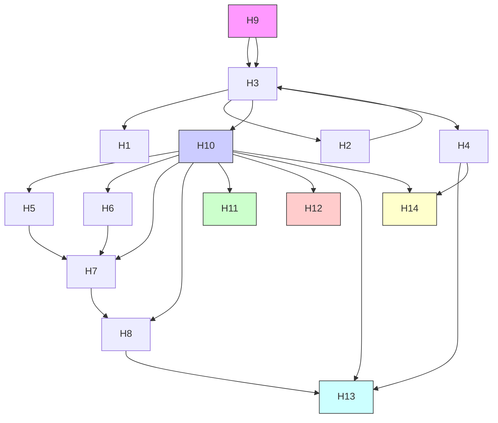
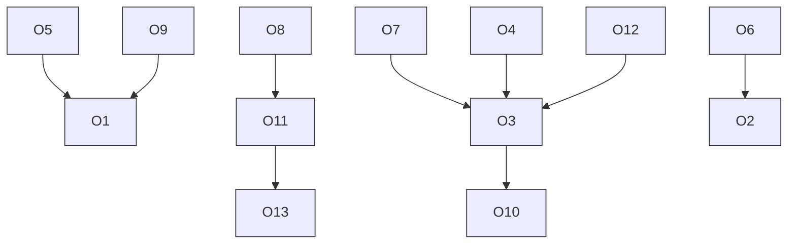
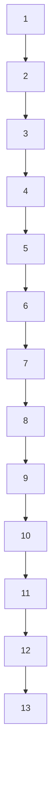
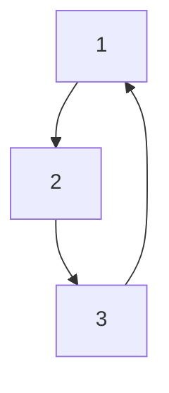

## Improving Team Performance During a Football Match Summary

The interaction and cooperation between players in a football match can affect their success and score goals. To explore this and develop strategies to help Huskies perform better next season, we quantified and formalized the team's structural and dynamic characteristics, using several indicators to describe the team's performance in many aspects and making targeted strategies.

For the first problem, we used Social Network Analysis to construct the passing network, and explained the basic attributes of the Network. Furthermore, specific network characteristics are analyzed from the perspective of whole network, local networks and individual networks. The whole network: weighted proximity matrix, the centroid, weighted center dispersion and maximum radius. Local networks: identify the network patterns, including Core/Periphery Analysis to obtain the Core players and the Periphery players and their relationship, and the analysis of configurations that constructs the 3-node sub-network to obtain the types and frequencies of its motifs happened, namely the specific configurations of dyadic and triadic. The index of individual network: Degree Centrality of node. Finally, we draw the timeline to analysis the dynamics of passing over time.

In the second question, combining the social network analysis and the actual situation of football matches, we found three performance indicators: one team's total number of passes in one match, average contribution to the team and pass-possession rate, and four team level processes: aggregation, extension, tempo and connected configuration ratio. They were then combined with goal difference as the independent variable to draw the scatter plots and conduct multiple linear regression analysis. Finally, three significant variables that can effectively measure the level of team cooperation were selected and the performance model of passing network passed the test as a whole at a 95% significance level. And Root MSE equals to 1.5, which is of low level. The Huskies team is then described from three aspects: structure, configuration and dynamics.

Based on the summary of the effective indicators of winning the game, the coach is advised to strengthen the cooperation training of three-member groups, improve the passing quality according to the opponent's Control opening attack routine and pay attention to the player's physical and skill training in order to achieve a better performance in the future.

For the fourth problem, our findings are summarized from the perspective of model indicators pi1, tp2, tp3 and tp4. In the design of a generalized model the factors to be considered are frequent and close interaction, affecting all aspects of the task for division of labor, being gradual, full interaction or communication within a subgroup. Others include collective consciousness, the cores and team trust.

The model established in this paper makes full use of the obtained data of passes to describe and quantify the team cooperation level from multiple aspects. It is validated by statistical tests and can be applied to assess the level of teamwork of multiple teams and predict the outcome of matches. The indicators selected by the model can be widely used to describe other social teamwork levels.

Key words: network; indicators; social network analysis; motif;

## Contents

## 1. Introduction..

1.1 Background.

1.2 Problem Restatement

2. Basic Assumption ..

3. Symbols...

4. Models....

4.1 Data Pre-processing 4

4.2 The Football Passing Network 4

4.2.1 The whole network. 4

4.2.2 Network patterns and properties 5

4.2.3 The timeline of passes in a match 8

4.3 The Performance Indicators and Team Level Processes 8

4.3.1 Performance indicators. 8

4.3.2 Team level processes. 9

4.4 Screening and Testing Indicators. .10

4.4.1 Descriptive analysis of indicators . 10

4.4.2 Regression and analysis. 11

4.5 Performance Model of Passing Network and Description of Team Cooperation...13

4.5.1 Structure . 13

4.5.2 Configuration. 13

4.5.3 Dynamic . 13

4.6 Strategies .14

4.6.1 Cooperation training of three-member groups. 14

4.6.2 The importance of physical training . 14

4.6.3 Control of opening attack routine and training of personal skills. . 15

4.7 Design of a Generalized Model . 16

4.7.1 Findings and applications in a generalized model . . 16

4.7.2 Other aspects. . 16

## 5. Evaluation and Promotion of Model.. 17

5.1 Strength and Weakness 17

5.1.1 Strength. . 17

5.1.2 Weakness: . . 17

5.2 Promotion 17

6. Conclusions.... 17

## References .... 19

## Appendix .. 19

## 1. Introduction

## 1.1 Background

Since the globalization of the world economy and the deepening of information technology, human development is facing more challenges. To cope with the high speed of development, teamwork makes it possible for humans to deal with a wide variety of complex problems by working together with many people to complete a single task. Whether team cooperation is more efficient depends not only on the ability of individuals in the team, but also on whether each individual in the team can fully cooperate and support each other. Therefore, team management and cooperation strategy are particularly important. This has led to a series of approaches to teamwork, such as the introduction of relevant sociological theories and big data methods.

As a common competitive team sport, football requires a high level of teamwork. Many games have provided evidence that high individual ability does not necessarily mean good results. A team's ability to organize offense, defense, division of labor, tactics or strategies, and the opponent's abilities all have an important impact on the outcome of the game. This requires the use of relevant methods to develop effective teamwork programs.

## 1.2 Problem Restatement

At the request of the Huskies coach, ICM based on detailed data from last season (including 38 games against 19 opponents). This figure covers 23,429 passes between 366 players (30 Huskies players and 336 players from opposing teams) and 59,271 match events, and we need to address:

Build a team passing network.  
l Determine the indicators to measure the effectiveness of teamwork and use them to measure the attributes of the passing network.  
l Put forward feasible and effective suggestions for team cooperation.  
l From the analysis we get the key factors to build an effective cooperative team.

## 2. Basic Assumption

All types of passes are the best for the passer at the moment.  
l The difference between home and away and the coach have no effect on the players.  
l It is assumed that the competition is in a natural state and not disturbed by various accidental factors.  
l Players with different responsibilities have specific areas of play.Players do not have complete freedom of movement

## 3. Symbols

<table><tr><td>Symbols</td><td>Definition</td></tr><tr><td> $(x_0, y_0)$ </td><td>The x, y coordinates of the network centroid</td></tr><tr><td>N</td><td>One team&#x27;s total number of passes in one match</td></tr><tr><td>Cdw</td><td>The weighted centroid dispersion</td></tr><tr><td>A</td><td>The weighted adjacency matrix</td></tr><tr><td>rm</td><td>The maximum radius of the network</td></tr></table>

Other symbols that are used only once will be described later.

## 4. Models

## 4.1 Data Pre-processing

l For the convenience of the adjacency matrix, the players of each game are arranged in terms of 1,2,3....  
l Huskies’ and opponents’ passing data were divided to separate their passing networks.

## 4.2 The Football Passing Network

As the interaction between players in football matches is similar to the relationship between individuals in social networks, Social Network Analysis[1] is adopted to analyze the football passing network. Taking the first match as an example, the data of the first match is used to explain the structure of the passing network and the structural indicators and properties of the network.

## 4.2.1 The whole network


<details>
<summary>flowchart</summary>


</details>

Fig1. Huskies’ passing network of match 1


<details>
<summary>flowchart</summary>


</details>

Fig2. The opponent’s passing network of match 1

As shown in the figure 2, the nodes in the network represent the players and the number of nodes corresponds to the number of players on the field. The size of a node circle depends on its degree of nodes, and the larger the degree of nodes, the larger the circle. Moreover, the node degree corresponds to the degree centrality of the node, indicating that the importance of the player is positively correlated with the number of passes made by the player. Because passing is one-way, the link is one-way, meaning passing from one player to another. The width of the link indicates the weight, which is the number of passes contained in this link. The more times, the wider the link. The position of each node depends on its average position, the average of the coordinates of each player passing the ball.

In addition, the court is square and the x-coordinate and the y-coordinate are in the range [0, 100].

## 4.2.2 Network patterns and properties

In order to study the structure of passing network, this paper analyzes the whole network, local network and individual network. Furthermore, network patterns will be identified during the local network analysis.

## (1) The whole network

On the whole network, structural indicators and network properties include the weighted adjacency matrix[2] , the network centroid[2] , the weighted centroid dispersion and the maximum radius of the network.

The weighted adjacency matrix.

Adjacency matrix is a square matrix that represents the relationship between nodes. Its dimension is the number of nodes. The weighted adjacency matrix is the adjacency matrix that gives weights to the relationships. In the passing network, the row i and column j element $a _ { i j }$ of the weighted adjacency matrix corresponds to the number of passes made by player i to player j in a match. For example, the weighted adjacency matrix of huskies in match1 is shown below:

$$
\begin{array}{ccccccccccccccccc}
1 & 2 & 3 & 4 & 5 & 6 & 7 & 8 & 9 & 10 & 11 & 12 & 13 & 14 \\
-- & -- & -- & -- & -- & -- & -- & -- & -- & -- & -- & -- & -- & -- \\
1 & 0 & 14 & 8 & 1 & 3 & 3 & 3 & 1 & 2 & 11 & 1 & 4 & 1 & 0 \\
2 & 11 & 0 & 18 & 0 & 0 & 1 & 3 & 0 & 1 & 1 & 0 & 1 & 0 & 0 \\
3 & 6 & 6 & 0 & 9 & 0 & 1 & 2 & 1 & 6 & 4 & 5 & 6 & 1 & 1 \\
4 & 0 & 1 & 4 & 0 & 0 & 1 & 2 & 2 & 0 & 1 & 3 & 2 & 1 & 0 \\
5 & 1 & 0 & 0 & 0 & 2 & 1 & 8 & 0 & 0 & 4 & 0 & 1 & 0 & 0 \\
6 & 2 & 0 & 0 & 0 & 1 & 0 & 5 & 1 & 0 & 1 & 0 & 0 & 0 & 1 \\
7 & 3 & 0 & 4 & 2 & 4 & 3 & 0 & 1 & 0 & 14 & 0 & 4 & 2 & 1 \\
8 & 0 & 1 & 1 & 0 & 0 & 1 & 3 & 0 & 0 & 0 & 1 & 2 & 0 & 0 \\
9 & 0 & 0 & 2 & 0 & 1 & 2 & 0 & 0 & 0 & 3 & 0 & 0 & 0 & 0 \\
10 & 13 & 3 & 0 & 3 & 2 & 5 & 10 & 2 & 1 & 1 & 1 & 8 & 2 & 1 \\
11 & 0 & 2 & 2 & 4 & 0 & 1 & 0 & 2 & 1 & 1 & 0 & 7 & 0 & 0 \\
12 & 6 & 3 & 8 & 2 & 6 & 0 & 6 & 1 & 0 & 9 & 4 & 0 & 0 & 0 \\
13 & 0 & 0 & 0 & 2 & 0 & 0 & 2 & 2 & 0 & 1 & 0 & 2 & 0 & 0 \\
14 & 0 & 0 & 0 & 0 & 0 & 0 & 2 & 0 & 0 & 0 & \mathbf{O} = \mathbf{O}^{\mathrm{a}}(\mathbf{O})\\
\end{array}
$$

Fig3.Huskies’ weighted adjacency matrix in match 1

The network centroid.

The network centroid is the average position of all passes of the passing network：

$$
\left(x _ {0}, y _ {0}\right) = \left(\frac {\sum_ {i} x _ {i}}{N}, \frac {\sum_ {i} y _ {i}}{N}\right) \tag {1}
$$

$( x _ { i } , y _ { i } )$ is the position of a pass.

The weighted centroid dispersion.

The weighted centroid dispersion is the weighted standard deviation of the distances of the players with regard to the position of the network centroid, measuring the network’s coverage. The importance of the player who passes is different and the simple standard deviation of the distances fails to reflect that. For example, bench players make very few passes, but the simple standard deviation would give them the same weight as others that pass a lot, which doesn't make sense for discrete degree of a football passing network. Therefore, weights are necessary. The formula for the centroid dispersion:

$$
C d w = \sqrt {\frac {\sum_ {i} n _ {i} (d _ {i 0} - \bar {d}) 2}{N}} \tag {2}
$$

$n _ { i } \mathrm { i s }$ the number of passes made by player i; $\bar { d }$ is the average distances of the players with regard to the position of the network centroid; $d _ { i 0 }$ is distances of the player i with regard to the position of the network centroid.

The maximum radius of the network.

The maximum network radius is the maximum among distances between each player and the network centroid of the network. The larger the radius, the higher the network’s elongation.

## (2) Local networks---identification of patterns

The core-periphery analysis[1]

According to the importance and degree of affinity of nodes, the nodes in the network are divided into core nodes and edge nodes so as to simplify the complex network and focus on the key structure of the network.[1] Through the method of the core-periphery analysis, we can get the core and periphery players of a team. The core player is generally a player as a critical node that can connect the periphery player with the other core players. There will be more passes between the core players and between the core players and the periphery players. Implemented by Ucinet software, the results are as follows:

Core/Periphery Class Memberships:

$$
\begin{array}{c c c c c c c c c c c} 1: & 1 & 2 & 3 & 4 & 5 & 6 & 7 & 1 0 & 1 1 & 1 2 \\ 2: & 8 & 9 & 1 3 & 1 4 \end{array}
$$

Fig4.Huskies’ the result of the core-periphery analysis (partly)

It can be learned that the team is formed by the core players 1, 2, 3, 4, 5, 6, 7, 10, 11 and 12, and the periphery players 8, 9, 13 and 14. Combined with the positions of these players, link thickness and the number of links connecting them in Fig1, it can be found that the core players above really play a role of interconnection and interaction.

The configurations of a team

Teams are configured in dyadic and triadic configurations. Dyadic configuration refers to the interaction between two players and triadic configuration refers to the interaction between three players. In order to analyze the specific passing patterns between players, consider the subnetwork of three nodes. The three nodes in the subnetwork form a dyadic configuration in pairs, and a triadic configuration together.

In biology, the motif is used to explain the spatial structure of proteins. Here it can be used in the analysis of football passing network to obtain the local configuration of the team.[4] There are 13 kinds of motifs, as shown in figure 4. Apparently, the connectivity of 3-node network increases from 1 to 13. Motif 12 is almost completely connected and Motif 13 is completely connected.

The higher the connectivity of the 3-node network, the higher the flexibility of the three-way configuration of passing, rather than a fixed passing pattern.


<details>
<summary>flowchart</summary>


</details>

Fig5. 13 kinds of motifs of 3-node network

R software was used to calculate the occurrence frequency of each motif of a team in a game, and the commonly used motif type of the team could be obtained. The frequency order and the most commonly used motif image of Huskies team's motif are as follows:


<details>
<summary>flowchart</summary>


</details>

<table><tr><td>motif</td><td>frequency</td></tr><tr><td>12</td><td>68</td></tr><tr><td>8</td><td>46</td></tr><tr><td>13</td><td>45</td></tr><tr><td>7</td><td>43</td></tr><tr><td>3</td><td>19</td></tr><tr><td>10</td><td>15</td></tr><tr><td>11</td><td>13</td></tr><tr><td>5</td><td>11</td></tr><tr><td>6</td><td>9</td></tr><tr><td>4</td><td>4</td></tr><tr><td>2</td><td>3</td></tr><tr><td>1</td><td>2</td></tr><tr><td>9</td><td>0</td></tr></table>

Fig6. The frequency order and the most commonly used motif

The Huskies used Motif 12 most frequently in this match, showing that the dyadic configuration between nodes 1, 2 and 1, 3 was of a two-way pass, with an only one-way pass between nodes 2 and 3. And its triadic configuration has high connectivity.

## (3) Individual networks

## Degree centrality[1]

Degree centrality of a node is the amount of information output to the node in the network. In a passing network, degree centrality is the number of passes made by a player. The more degree centrality a player has, the more involved he is in passing.

## 4.2.3 The timeline of passes in a match

The timeline of passes can reflect the dynamic progress of the game, which is the change of total passes in time. The Huskies' timeline is as follows:


<details>
<summary>line chart</summary>

| time(s) | total amount of passing |
| ------- | ----------------------- |
| 0       | 0                       |
| 500     | 80                      |
| 1000    | 140                     |
| 1500    | 240                     |
| 2000    | 310                     |
| 2500    | 350                     |
| 2800    | 365                     |
</details>

Fig7. The frequency order and the most commonly used motif

The Huskies' passing volume increased evenly over all, with a flurry of passes occurring about 1,400 seconds after the game began.

## 4.3 The Performance Indicators and Team Level Processes

## 4.3.1 Performance indicators

l First of all, this paper selects one team's total number of passes in one match N to describe whether the team performs well in a certain match. Better teamwork means more successful passes between players, and when a team's chances of ball control increase, its chances of scoring and the number of successful shots increase, too. Therefore, N can directly reflect the team's cooperation, which is denoted as $p i _ { 1 }$ .  
From a personal perspective, we choose CV（coefficient of variation）of the passes number of each member in one team as an average contribution to the team. This indicator can reflect whether the main passes in a team distributed on several players or on each player while eliminating the total passing difference influence on the result. It can also reflect the configuration of the individual ability to pass inside a team and part of its structure. Before CV is calculated, the number of individual passes less than 10 should be excluded to avoid the decisive impact of substitutions on the indicator which is denoted as $p i _ { 2 }$ < .  
Finally, the ratio of the number of midfielders divided by the number of core players per game is selected to measure the pass-possession rate $\mathrm { o f } ^ { \infty } \mathrm { a }$ team's pass-possession ability”. If a team wants to attack, there must be a process of passing the ball from the back to the midfield and then to the front. In the first question, we can obtain the number of core players in each game through the core-edge analysis. We then use Matlab programming to find the average position of the players corresponding to the number so as to select the number of core players in the midfield. On the premise that the total number of core players is fixed, the more midfield players there are, the more passes the team has in the midfield so the team is aggressive in attack. This indicator is denoted as $p i _ { 3 }$ .

$$
\text { Pass   -   possess   Rate } = \frac {\text { Number   of   Midfielders }}{\text { Number   of   Core   Players }} \tag {3}
$$

## 4.3.2 Team level processes

l In the first question, we introduced the weighted standard to reflect the dispersion of the team members in the whole game. It can measure whether a team is able to pass the ball at different positions on the court within the allowed time, so the weighted standard can be used to depict the aggregation of catching the ball. When the players are less concentrated on the court, the ability to control the ball in the whole court will be stronger. This index is denoted as $t p _ { 1 }$ .  
l The network maximum radius introduced in the first question can be used to characterize the other aspect of team dispersion, which is defined as the extension in this question. When the maximum radius of the network is large, the pass radius is also large, which means that the pass covers a large area of the court and has a high extension. This metric is denoted as $t p _ { 2 }$ .  
l Secondly, from the perspective of time, this paper selects the time taken to reach the first 50 passes in a game to represent the team's tempo. The shorter the time it takes, the more times the team holds the ball and passes it quickly after the start of the game. After a while, the team gradually gets used to the game and the pace is decided by the mutual influence of both sides, which is not considered here. This metric is denoted as $t p _ { 3 }$ .  
l Finally, the connected configuration ratio is introduced and denoted as $t p _ { 4 }$ . Taking the data from the first match as an example, the analysis of the first question drew 26 player configuration model motifs for both sides among which the connected configuration model motif12 and motif13 appeared more frequently. We define the connected configuration ratio as the ratio of the sum of the frequencies of the two connected configuration models to the frequency of the total configuration model, which is used as flexibility to reflect the degree of communication between small groups in a game. The higher the ratio is, the more consistent the passes are and the more flexible the team is throughout the game.

$$
\text {   Connected   Configuration   Ratio   } = \frac {\text {   Frequency   of   Motif12   and   Motif13   }}{\text {   Total   Frequency   }} \tag {4}
$$

## 4.4 Screening and Testing Indicators

## 4.4.1 Descriptive analysis of indicators

Because the score directly affected by the level of teamwork, in the choice of the dependent variable, this article will connect indicators with score together and select goal difference of every game (Huskies team's scoring minus the counterparties’. This value shows whether Huskies team has the superior) so as to show that the series of indicators can reflect the success of team work. This variable is better than the dummy variable obtained only by the teams' wins and losses because it contains more information about the outcome of the game.

In addition, in order to eliminate the influence of the dimensions of each independent variable on further data processing, all variables were standardized so that their standard deviations were 1.


<details>
<summary>scatterplot</summary>

| pi1 | goal difference |
| --- | --- |
| -3.5 | -2.0 |
| -2.0 | 0.0 |
| -1.0 | -3.0 |
| -0.5 | -4.0 |
| 0.0 | 1.0 |
| 0.5 | 2.0 |
| 1.0 | 1.0 |
| 0.5 | 2.0 |
| 0.0 | 1.0 |
| -0.5 | -2.0 |
| -1.0 | -3.0 |
| -1.5 | -4.0 |
| 0.5 | 4.0 |
| 1.0 | 2.0 |
| 0.5 | 1.0 |
| 0.0 | 0.0 |
| -0.5 | -2.0 |
| -1.0 | -3.0 |
| -1.5 | -4.0 |
| 0.5 | -3.0 |
| 1.0 | -2.0 |
| 0.5 | -1.0 |
| 0.0 | 0.0 |
| -0.5 | 1.0 |
| -1.0 | 2.0 |
| -1.5 | 3.0 |
| 0.5 | 4.0 |
| 1.0 | 2.0 |
| 0.5 | 1.0 |
| 0.0 | 0.0 |
| -0.5 | -1.0 |
| -1.0 | -2.0 |
| -1.5 | -3.0 |
| 0.5 | 2.0 |
| 1.0 | 1.0 |
| 0.5 | 0.0 |
| 0.0 | -1.0 |
| -0.5 | -2.0 |
| -1.0 | -3.0 |
| 0.5 | 3.0 |
| 1.0 | 2.0 |
| 0.5 | 1.0 |
| 0.0 | 0.0 |
| -0.5 | -1.0 |
| -1.0 | -2.0 |
| 0.5 | 2.0 |
| 1.0 | 1.0 |
| 0.5 | 0.0 |
| 0.0 | -1.0 |
| -0.5 | -2.0 |
| -1.0 | -3.0 |
| 0.5 | 3.0 |
| 1.0 | 2.0 |
| 0.5 | 1<nl>
</details>


<details>
<summary>scatterplot</summary>

| pi2 | goal difference |
| --- | --- |
| -2.8 | -1.0 |
| -2.5 | -2.0 |
| -1.8 | -3.0 |
| -1.2 | 0.0 |
| -1.0 | 2.0 |
| -0.8 | 0.0 |
| -0.6 | 1.0 |
| -0.4 | -1.0 |
| -0.2 | -4.0 |
| 0.0 | 4.0 |
| 0.2 | 2.0 |
| 0.4 | 0.0 |
| 0.6 | -2.0 |
| 0.8 | -3.0 |
| 1.0 | 2.0 |
| 1.2 | 1.0 |
| 1.4 | 1.0 |
| 1.6 | -1.0 |
| 1.8 | 1.0 |
| 2.0 | 1.0 |
</details>


<details>
<summary>scatterplot</summary>

| p3   | goal difference |
| ---- | --------------- |
| -1.8 | 0.0             |
| -1.5 | 2.0             |
| -1.2 | 0.0             |
| -1.0 | -2.0            |
| -0.8 | -2.0            |
| -0.6 | -3.0            |
| -0.4 | -2.0            |
| -0.2 | 0.0             |
| 0.0  | 2.0             |
| 0.2  | 1.0             |
| 0.4  | 1.0             |
| 0.6  | 0.0             |
| 0.8  | -1.0            |
| 1.0  | -1.0            |
| 1.2  | 4.0             |
| 1.4  | 1.0             |
| 1.6  | 2.0             |
| 1.8  | 1.0             |
| 2.0  | 0.0             |
</details>


<details>
<summary>scatterplot</summary>

| tp1 | goal difference |
| --- | --- |
| -2.0 | 4.0 |
| -1.5 | 1.0 |
| -1.0 | 1.0 |
| -0.5 | 2.0 |
| 0.0 | 1.0 |
| 0.5 | 2.0 |
| 1.0 | 1.0 |
| 1.5 | 2.0 |
| 2.0 | 2.0 |
| -1.5 | -3.0 |
| -1.0 | -3.0 |
| -0.5 | -3.0 |
| 0.0 | -4.0 |
| 0.5 | -2.0 |
| 1.0 | -2.0 |
| 1.5 | -4.0 |
| 2.0 | -4.0 |
</details>


<details>
<summary>scatterplot</summary>

| tp2 | goal difference |
| --- | --- |
| -1.5 | 4.0 |
| -1.0 | 1.0 |
| -0.5 | 2.0 |
| -0.5 | 1.0 |
| -0.5 | 0.0 |
| -0.5 | -1.0 |
| -0.5 | -2.0 |
| -0.5 | -3.0 |
| -0.5 | -4.0 |
| 0.0 | 2.0 |
| 0.0 | 1.0 |
| 0.0 | 0.0 |
| 0.0 | -1.0 |
| 0.0 | -2.0 |
| 0.0 | -3.0 |
| 1.0 | 2.0 |
| 1.5 | 1.0 |
| 2.0 | -2.0 |
| 2.5 | 2.0 |
| 2.5 | 1.0 |
| -1.5 | -2.0 |
| -1.0 | 0.0 |
| -1.0 | -4.0 |
| -0.5 | 1.0 |
| -0.5 | 0.0 |
| -0.5 | -1.0 |
| -0.5 | -3.0 |
| -1.5 | 1.0 |
| -1.5 | 4.0 |
| 0.5 | 1.0 |
| 1.5 | 1.0 |
| 2.5 | 2.0 |
| 2.5 | 1.0 |
| 2.5 | -2.0 |
| 3.0 | 1.0 |
| 3.0 | 2.0 |
| 3.0 | -2.0 |
| 3.0 | -3.0 |
| 3.0 | -4.0 |
| 3.0 | -5.0 |
| 3.0 | -6.0 |
| 3.0 | -7.0 |
| 3.0 | -8.0 |
| 3.0 | -9.0 |
| 3.0 | -10.0 |
| 3.0 | -11.0 |
| 3.0 | -12.0 |
| 3.0 | -13.0 |
| 3.0 | -14.0 |
| 3.0 | -15.0 |
| 3.0 | -16.0 |
| 3.0 | -17.0 |
| 3.0 | -18.0 |
| 3.0 | -19.0 |
| 3.0 | -20.0 |
| 3.0 | -21.0 |
| 3.0 | -22.0 |
| 3.0 | -23.0 |
| 3.0 | -24.0 |
| 3.0 | -25.0 |
| 3.0 | -26.0 |
| 3.0 | -27.0 |
| 3.0 | -28.0 |
| 3.0 | -29.0 |
| 3.0 | -30.0 |
| 3.0 | -31.0 |
| 3.0 | -32.0 |
| 3.0 | -33.0 |
| 3.0 | -34.0 |
| 3.0 | -35.0 |
| 3.0 | -36.0 |
| 3.0 | -37.0 |
| 3.0 | -38.0 |
| 3.0 | -39.0 |
| 3.0 | -40.0 |
| 3.5 | 4.5 |
| 3.5 | 4.5 |
| 3.5 | 4.5 |
| 3.5 | 4.5 |
| 3.5 | 4.5 |
| 3.5 | 4.5 |
| 3.5 | 4.5 |
| 3.5 | 4.5 |
| 3.5 | 4.5 |
| 3.5 | 4.5 |
</details>


<details>
<summary>scatterplot</summary>

| tp3  | goal difference |
| ---- | --------------- |
| -2.8 | 2.0             |
| -2.5 | 2.0             |
| -1.5 | 1.0             |
| -1.0 | 1.0             |
| -0.8 | 1.0             |
| -0.5 | 0.0             |
| -0.3 | -1.0            |
| -0.2 | -2.0            |
| 0.0  | 2.0             |
| 0.2  | 1.0             |
| 0.5  | 1.0             |
| 0.7  | 0.0             |
| 0.9  | -1.0            |
| 1.0  | -2.0            |
| 1.2  | -3.0            |
| 1.5  | -4.0            |
</details>


<details>
<summary>scatterplot</summary>

| tp4 | goal difference |
| --- | --- |
| -3.0 | -2.0 |
| -2.0 | 0.0 |
| -1.5 | -3.0 |
| -1.0 | -4.0 |
| -0.5 | -3.0 |
| 0.0 | 2.0 |
| 0.5 | 1.0 |
| 1.0 | 4.0 |
| 1.5 | 1.0 |
| 2.0 | 0.0 |
</details>

Figure 8: Scatter Diagram of Independent and Dependent Variables

As shown in Figure 8, $p i _ { 1 } , \ t p _ { 2 }$ and $t p _ { 4 }$ show significant positive correlation with dependent variables while $p i _ { 3 }$ shows weak positive correlation. Among all the 7 independent variables, only $t p _ { 3 }$ showed significant negative correlation with the dependent variable. The scatter plot of the other two variables $p i _ { 2 }$ and $t p _ { 1 }$ showed no obvious trend, indicating that there is a linear correlation between them and the dependent variable.

## 4.4.2 Regression and analysis

Since scatter plots show that the independent variables $p i _ { 2 }$ and $t p _ { 1 }$ have no significant influence, they are removed from the independent variables. Because the collected data represent the differences between the two teams in the same game, it is sectional data.

$$
G o a l D i f f e r e n c e = \beta_ {0} + \beta_ {1} p i _ {1} + \beta_ {2} p i _ {3} + \beta_ {3} t p _ {2} + \beta_ {4} t p _ {3} + \beta_ {5} t p _ {4} + \varepsilon
$$

In order to avoid the influence of heteroscedasticity caused by section data, the Robust method is adopted to eliminate the possible errors. The results are shown in Figure 9 as follows:

. reg score pil pi3 tp2 tp3 tp4,r

<table><tr><td rowspan="5">Linear regression</td><td>Number of obs</td><td>=</td><td>38</td></tr><tr><td>F(5, 32)</td><td>=</td><td>6.68</td></tr><tr><td>Prob &gt; F</td><td>=</td><td>0.0002</td></tr><tr><td>R-squared</td><td>=</td><td>0.4656</td></tr><tr><td>Root MSE</td><td>=</td><td>1.5117</td></tr></table>

<table><tr><td rowspan="2">score</td><td colspan="6">Robust</td></tr><tr><td>Coef.</td><td>Std. Err.</td><td>t</td><td>P&gt;|t|</td><td colspan="2">[95% Conf. Interval]</td></tr><tr><td>pi1</td><td>-.9696161</td><td>.6198724</td><td>-1.56</td><td>0.128</td><td>-2.232255</td><td>.2930227</td></tr><tr><td>pi3</td><td>.0116669</td><td>.2830546</td><td>0.04</td><td>0.967</td><td>-.5648964</td><td>.5882302</td></tr><tr><td>tp2</td><td>.3989247</td><td>.24374</td><td>1.64</td><td>0.111</td><td>-.0975575</td><td>.8954069</td></tr><tr><td>tp3</td><td>-1.153789</td><td>.3374152</td><td>-3.42</td><td>0.002</td><td>-1.841081</td><td>-.4664967</td></tr><tr><td>tp4</td><td>1.317863</td><td>.5520652</td><td>2.39</td><td>0.023</td><td>.1933432</td><td>2.442383</td></tr><tr><td>_cons</td><td>-.3684213</td><td>.2452309</td><td>-1.50</td><td>0.143</td><td>-.8679402</td><td>.1310977</td></tr></table>

. reg score tp2 tp3 tp4,r

<table><tr><td rowspan="5">Linear regression</td><td>Number of obs</td><td>=</td><td>38</td></tr><tr><td>F(3, 34)</td><td>=</td><td>13.05</td></tr><tr><td>Prob &gt; F</td><td>=</td><td>0.0000</td></tr><tr><td>R-squared</td><td>=</td><td>0.4138</td></tr><tr><td>Root MSE</td><td>=</td><td>1.536</td></tr></table>

<table><tr><td>score</td><td>Coef.</td><td>Robust Std. Err.</td><td>t</td><td>P&gt;|t|</td><td colspan="2">[95% Conf. Interval]</td></tr><tr><td>tp2</td><td>.524801</td><td>.2002085</td><td>2.62</td><td>0.013</td><td>.1179283</td><td>.9316737</td></tr><tr><td>tp3</td><td>-.8538361</td><td>.2403833</td><td>-3.55</td><td>0.001</td><td>-1.342354</td><td>-.3653185</td></tr><tr><td>tp4</td><td>.6204307</td><td>.1995516</td><td>3.11</td><td>0.004</td><td>.2148931</td><td>1.025968</td></tr><tr><td>_cons</td><td>-.3684216</td><td>.2491781</td><td>-1.48</td><td>0.148</td><td>-.8748125</td><td>.1379692</td></tr></table>

Figure 9: linear regression results

The first multiple linear regression results shows that when the significance level was set to 0.05, the variables $t p _ { 3 }$ and $t p _ { 4 }$ passed the t-test while the p-values of $p i _ { 1 }$ and $t p _ { 2 }$ are larger, but the regression coefficient of $p i _ { 1 }$ is negative, which is inconsistent with the actual significance. Considering that the relationship between the goal difference of the dependent variable and the total number of passes is complicated, there may be no obvious causal relationship between the two, but there is a correlation resulting in the wrong estimation of the coefficient so that this variable is discarded in the regression. Meanwhile, the p-value of $p i _ { 3 }$ is greater than 0.9 so it should be discarded.

The second regression was conducted after the variables $p i _ { 1 }$ and $p i _ { 3 }$ were discarded and it can be seen that the remained variables all passed the t-test. On the whole, the F-value was significantly lower than 0.05 and the goodness of fit value is 0.4138 showing a high level. The VIF（variance inflation factors）of the three variables are calculated and the results are shown in Figure 10, indicating that there is no multicollinearity problem with the independent variables in the model. It can be further considered that the indicators in this model can reflect the cooperation level of the team from different aspects.

  
Figure 10: calculation results of VIF of the model

The above regression analysis shows that the overall regression effect of the model is good. Combined with the root-mean-square error value of 1.5, it indicates that the model has a significant effect on the goal difference of the team. In other words, the Huskies' victory and defeat in the 38 matches last season can be effectively predicted by three selected indicators. Due to the p-value said the degree of significance of variable size, so for elected to the three indicators, $t p _ { 3 }$ as a performance indicator is the most effective team work process and the coefficient is negative, which means a fast-paced opening tend to negative influence on the whole process of team cooperation. The second is $t p _ { 4 }$ , connected configuration ratio, which has good effect on team cooperation measure and $t p _ { 2 }$ has general one. Both of these are consistent with the intuitive results.

For the indicators discarded in the first step of regression, the relationship between them and dependent variables should be further explored. Therefore, the correlation coefficient between the dependent variable and $p i _ { 1 }$ is calculated to be 0.32, so it can be considered that there is a weak positive correlation between the total number of passes and the goal difference (0.3<0.32<0.8). The correlation coefficient between the dependent variable and $p i _ { 3 }$ is 0.05, so we give up considering $p i _ { 3 }$ , which means the ability of transmission and control cannot be used as a performance factor that can reflect the level of team cooperation.

The strategy of a team mainly includes the placement of people and communication arrangement. Among the selected indicators, the extension degree represents the position arrangement of the team, and the positive effect is significant; the connectivity configuration ratio represents the communication arrangement of the team, and the positive effect is significant, and the overall model is significant. Therefore, the strategy is generally effective, and it is unnecessary to consider the anti-strategy phenomenon of the opponents. The reason for the loss of the game can be explained by the lack of indicators.

The strategy of a team mainly includes the placement of people and communication arrangement. Among the selected indicators, the extension degree represents the position arrangement of the team with significant positive effect; the connectivity configuration ratio represents the communication arrangement of the team with significant positive effect and significant overall model; therefore, the strategy is generally effective with no need to consider the anti-strategy phenomenon of the opponents. The reason for the loss of the game can be explained by the lack of certain indicators.

## 4.5 Performance Model of Passing Network and Description of Team

## Cooperation

Combining the network model analysis in the first question and the multiple linear regression analysis above, we can establish a Performance model of passing network to describe the team passing network. This model can turn the collected data into indicators to describe the level of team cooperation, which can further predict the outcome of the competition.

## 4.5.1 Structure

The Huskies' average extension is 43.42, ranking the 2nd out of 20 teams. The model shows that there is a positive correlation between Huskies' extension and the level of teamwork, so Huskies players are spread out throughout the game and can cover all areas of the field.

## 4.5.2 Configuration

Team configuration is defined as uneven distribution of the number of passes and players' abilities, which can be explained by the connected configuration ratio. Triadic configurations in the index to reflect the team configuration in proportion to the total configuration mode. triadic configurations not only mean that the two nodes have high interactivity, namely two contact are more closely, the two players can also show the interactivity between two nodes is also very high, the players bidirectional pass number is more, and the connectivity of the whole team is strong. The Huskie, with an average ratio of 0.3658 ranked 15th out of 20 teams, at the bottom of the pack. It shows that the team is not enough in triadic configurations quantity and passing consistency needs to be strengthened, including passing accuracy and offensive ability.

## 4.5.3 Dynamic

Dynamic is the introduction of time to observe the team's performance between the time segments of each game and between multiple games. On a micro level, the team made an average of 50 passes in 803.87 seconds after the start of the game, ranking 7th out of 20 teams. On a macro level, the team averaged 287.24 passes per game over 38 games, ranking ninth, with a mediocre total. The two measures resulted in a very contradictory facts: Huskies team in the opening will usually choose faster pace. But from the point of a normal game, its total number of passes ranking is back, which suggests that the opening tempo does negative impact on the score difference, making the team on the number of passes in the second half of a game Huskies team fell. This could be a big reason that its season result.

## 4.6 Strategies

## 4.6.1 Cooperation training of three-member groups

In chapter above, from the perspective of players' local coordination, motif concept was used to summarize the inter-player passing pattern. Motif, which shows specific directed connections between a certain number of nodes, can be used for local microscopic analysis in the context of complex networks. There are 13 different types of motifs with directed links between the three nodes, and motifs that satisfy the requirement that links occur between any two points are defined as ternary structures, with a total of 7 different forms, and the rest are binary structures. In Figure5 motif No.12 and No.13 reflect that the three-node motifs are closely connected, with the highest connectivity among all 7 3-node motifs.

From the perspective of soccer ball network investigation, these two motifs can reflect three players passing moves’ high flexibility and diversity, so in chapter three we using a total of 38 games in the competition between players passing the analysis data fetching out three nodes of various types of motif game both sides use frequency, add the frequency of motif No.12 and No.13 and normalized variable tp4.

In the multiple linear regression of Huskies goal difference with tp2, tp3 and tp4 these three variables , found that motif No.12 and No.13 had a significant positive correlation with a regression coefficient of 1.32 for the number of Huskies' goal difference at the end of the match at a significance level of 0.05, other things being equal. Thus, it can be seen that increasing the relative frequency of the 12th and 13th motif patterns can increase the number of goal difference, which has a positive effect on the final good results of the game. Starting from the actual combat of the football match can be more image understanding of the law: 12th, and 13th kinds of motifs can be as comprehensive and flexible three-people cooperate mode, the two sides compete for the ball in the game, the other players will be on the ball players from the vision, mental to physical conflicts of a series of interference, make originally flexible comprehensive coordination is interrupted or mistakes, thereby losing players, in a passive situation.

The key to the formation of motif is the connectivity of nodes, which is characterized by player configuration in teams. Team configuration is the uneven distribution of the number of passes and players' abilities. The Huskies have an average pass-through ability of 0.5952, ranking 9th out of 20 teams, meaning that the Huskies have an average midfield arrangement without considering the number of core players. The Huskies, with an average of 0.3658, ranked 15th out of 20 in terms of connectivity ratio, a lower ranking that suggests the team is not doing as well in triads and duals, where passing consistency needs to be improved, both in passing accuracy and offense.

Therefore, it is suggested that in daily training, the coach can divide the whole team members into groups each including 3 or more numbers and led by the core players according to the positions they are professional at, and carry out the combat training from group to group to mixed groups. And because every game played roster has change, so the new and old players within the team sheet needs more running-in before the real match in a group size of three or more people to enhance the ability of passing between each other and the tacit cooperation degree, thus improving the actual game can play a more complete and flexible with probability, to better organize offense and defense, from the perspective of the quantitative analysis of the 12th and 13th kinds of motif of relative frequency, thus creating more scoring opportunities.

## 4.6.2 The importance of physical training

The maximum radius of the network of passes can be used to describe the dispersion degree of teams, and tp2 reflects the maximum radius of the passing network by virtue of the maximum distance between nodes and the center of mass in the passing network. The model shows that the extent of extension is positively correlated with the level of teamwork. When the radius is large, the radius of passing is also large, which means that the area covered by passing is large and the extent of passing is high. Based on last season's data, the Huskies had an average of 43.42, the second highest among 20 teams, indicating that Huskies players are reasonably distributed and can cover all areas of the court.

It is suggested that the coach summarize the successful experience in this respect and add physical training programs to the training to help the players improve their physical fitness to support a wider range of movement. In actual football matches, the area near the middle of the field is where the players of both sides have a high density, which is also where the center of mass is usually located. On the periphery of the field, players are sparse and there is a large distance between people. The success of passing requires not only the tacit understanding between the three-member groups, but also the safe position of both sides. Better physical ability can support the receiver to move quickly to a weak defensive position in a short time, so as to improve the success rate of passing.

## 4.6.3 Control of opening attack routine and training of personal skills

By looking at how teams perform between the time segments of each game and between multiple games. From the micro point of view, tp3 reflects the time when a team achieves 50 passes for the first time after the start of the match. In the past season, the team achieved an average of 50 passes at 803.87 seconds after the start of the game, ranking 7th among 20 teams. The regression results from the model indicated that this index had a negative effect on the final goal difference at a significance level of 0.01, indicating that an active attack routine at the beginning of the game would not necessarily contribute to the victory, but might expose the pre-planned tactical strategy and be counterattacked by the opponent. Along with 50 times passing through the description of the type of passes, simple pass is the majority. In a football match it is the opening when both teams are full of mental and physical, so wanting to create a better shot is relatively difficult, therefore this fast opening routine of 50 times passes can not cause much of the threat to the stronger enemy, instead of wasting Huskies players' physical strength.

Therefore it is suggested that the coaches points on the basis of the enemy strength to specify the opening game: if it is in the face of strong teams, we had better not apply the strategy of quick attack at the beginning, but better cooperation between those three-number groups to achieve the more comprehensive and flexible passing motifs, 12th and 13th motifs, in destroying opponents attack, and at the same time, seizing the opportunity to have the organization, and create more opportunities for goal. But on the other hand, when the opponent makes mistakes at the start, our team definitely can take these chances to attack with a fast passing routine.

From a macro perspective, the total Huskies pass volume reflected by pi1 in a single game did not pass the significance test in the overall regression model, but from the descriptive analysis, it can be found that high scores are often accompanied by high pass volume, so pass volume is still an important indicator to reflect the success of teamwork. The team averaged 287.24 passes per game over 38 games, ranking ninth, with a mediocre total.

So coaches shall focus on design diversified passing style training in training and help the team improve the quality of passing success rate and passing, and focus on coaching players in actual combat all kinds of possible situations (enemy defensive situation: hinder in the front or from both left and right sides, etc) to choose the optimal passing ability, improve the player's "football IQ", and on the basis of improving pass number and improve the quality of the ball.

## 4.7 Design of a Generalized Model

## 4.7.1 Findings and applications in a generalized model

According to the football model of team performance obtained from the study, there are mainly four aspects to reflect the effect of team cooperation, namely pi1, tp2, tp3 and tp4.

l From pi1, the total number of passes reflects the frequency of team interaction. It has been found that a high goal difference is often accompanied by a high pass count. Therefore, in order to work well as a team, there must be frequent and close interaction between members.  
l From tp2, the maximum network radius of a team is the larger, and the more extensive the network is, and the more the team can cover the field. For a generalized model, covering the field is like covering all aspects of the task, such as the overall outline and details. Therefore, in order to achieve good teamwork results, the team should try to consider all aspects of the task and divide the work.  
l From tp3, the faster the opening tempo of a team, the excessive consumption of its strength in the early stage may lead to the failure of successful team cooperation in the later stage. For this reason, in a typical team, it is important to be gradual, that is, to spread the workload evenly throughout the work week.  
From tp4, the interconnectivity of small and medium-sized groups within a team is very important. The high connectivity of 3-node subgroups in the passing network is conducive to good results. Therefore, full interaction or communication within a subgroup to achieve a high flow of information may have an important impact on improving the effect of teamwork.

## 4.7.2 Other aspects

Collective consciousness. Only when the goals of the team and the goals of the individual match, can the team achieve efficient cooperation. Otherwise, individuals will belittle teamwork and think that their own goals are more important, that is, without collective consciousness, it will be hard to achieve effective teamwork.  
l The cores. A team need to have a core member to play a core leadership role, from the overall perspective of the direction of a team. In addition, each subgroup also needs a core responsible for the work of the subgroup. In this way, the team can work more effectively and improve the coordination of the whole group.  
l Team trust. Team members trust each other to work effectively. Mutual suspicion can make it difficult for members to devote themselves to their work and exert their abilities. Therefore, the trust of each member of the team to others will affect the effect of teamwork.

# 5. Evaluation and Promotion of Model

## 5.1 Strength and Weakness

## 5.1.1 Strength

l Based on the social network analysis and the actual situation of football, a number of indicators that can describe network attributes and team cooperation are selected, including the indicators of connected configuration ratio extracted from team motif with excellent fitting effect and strong description.  
l The three main indexes can explain the goal difference at the significance level of 95%, indicating that the indicator effect is good.  
l The model is highly innovative. On the basis of the Weighted centrality dispersion in centrality dispersion correction, more in line with the characteristics of passing network, can better reflect the network loosely. Most of the metrics are original and reflect team performance in a unique way.

## 5.1.2 Weakness:

l In the first question, this paper takes the first game as an example to conduct basic social network analysis, without considering the information contained in time scales smaller than the whole game, such as the time of each pass and the difference between the first and second half of the game.  
l In the follow-up to the problem solving, only the cases of successful passes between teams were examined in detail, with no consideration given to the types of passes, such as 'Free Kick', 'Duel', 'Pass', 'Others on the ball', 'Foul', 'leaving line', or the actual complications of the ball being intercepted or out of bounds.  
l The influence of home and away factors and the change of coach on the team score was not taken into account.

## 5.2 Promotion

The impact of the type of pass and the position of the field can be quantified as a set index, and then combined with the result or score.

## 6. Conclusions

In conclusion, there are various effective indicators of winning the game. Firstly, those closely connected modes of motif enjoy the highest connectivity among their counterparts, which leads to three players passing moves’ high flexibility and diversity. Increase the relative frequency of the 12th and 13th motif patterns can increase the number of goal difference, which has a positive effect on the final good results of the game. This idea of motifs that specific directed connections between a certain number of nodes, can be used in analysing other social network’s microscopic and this idea also focuses on the development of the nodes which are people in the real world, which can better imitate the teamwork in reality.

The maximum radius of the network of passes can be used to describe the dispersion degree of teams, the extent of extension is positively correlated with the level of teamwork. In the study of social network, this idea can be used to measure the degree of teamwork coverage. The opening attack routine has a passive effect on the final score indicating that at the start it is better to make a comprehensive and practical plan rather than heading ahead directedly.

## References

[1] Feasibility Analysis of Passing Performance in Football Match by Social Network Analysis， Li Bo, Wang Lei, Journal Of Beijing Sport University, 10.19582/j.cnki.11- 3785/g8.2017.08.018  
[2] Buldú, J.M., Busquets, J., Echegoyen, I. et al. (2019). Defining a historic football team: Using Network Science to analyze Guardiola’s F.C. Barcelona. Sci Rep, 9, 13602.  
[3] GÜRSAKAL, N., YILMAZ, F., ÇOBANOĞLU, H., ÇAĞLIYOR, S. (2018). Network Motifs in Football. Turkish Journal of Sport and Exercise, 20 (3), 263-272.  
[4] Visualization Analysis on Passing Technique of Spanish Tiki-Taka Tactics Based on Social Network Analysis Method ， Cao Weihua ， Journal of Chengdu Sport University ， 10.15942/j.jcsu.2019.04.011

## Appendix

1.

1.1 Passing network adjacency matrix for each team in each game，matlab da=xlsread('aaa.xlsx',1,'C2:D366'); N=14;

from=da(:,1);to=da(:,2); A=zeros(N);sum=0; for m=1:N for n=1:N for i=1:length(from)

if (from(i)==m)&&(to(i)==n) sum=sum+1; end

end A(m,n)=sum;sum=0; end end xlswrite('H1 adjacency matrix.xlsx',A);

1.2 Indicator of transmission and control ability, matlab clear

da=xlsread('aaa.xlsx',1,'A10037:K10309');

OriginalID=da(:,3);

Originalx=da(:,8);

core=[1 2 3 4 5 6 7 8 9 10 11 12];

totalnum=length(core); num=0;

for i=1:totalnum

numx=0;sumx=0; for j=1:length(OriginalID) if OriginalID(j)==core(i) sumx=sumx+Originalx(j);

```txt
numx=numx+1;
end
end
avex=sumx/numx;
if avex>=40
    if avex<=60
    num=num+1;
    end
end
end
rate=num/totalnum;
```

```matlab
1.3 Contribution averaging indicator, matlab clear;
da=xlsread('bbb.xlsx',23,'B2:Q17');
person=sum(da,2);
num=find(person>=10);
for i=1:length(num)
    remain(i)=person(num(i));
end
ave=mean(remain);
cv=std(remain)/ave;
```

```r
1.4 Find the various motif frequencies of the passing network of each team in each game and the number of the maximum frequency motif, R
library(igraph)
data<-read.csv("Opr.csv", header=T, as.is=T)
sink('result4.txt',append=T,split=T)
for (i in 1:38){data1<-subset(data,match==i,select=c(from:weight))
network<-graph_from_data_frame(d=data1,directed=T)
plot(network)
motif<-graph.motifs(network,size=4)
n=which.max(motif)
n=as.numeric(n)
motifn=c(motif,n)
print(motifn)
yourfilename=paste("4P",i,".png",sep = "")
jpeg(file=yourfilename)
g=graph.isocreate(size=4,number=n)
plot(g)
dev.off()}
sink()
```

2.

2.1 Original data of multiple regression model

```csv
pi1 tp2 tp3 tp1 pi2 pi3 tp4 score e1 scorehat pi1sqr
1.30112 -0.45175 -0.93644 -1.1913 0.75626 0.23638 0.34413 1 1.280188 -
0.28019 1.692913
-0.45975 -0.12979 0.55794 -0.8036 -1.33304 -1.52369 -1.33081 0
2.376089 -2.37609 0.21137
```

<table><tr><td colspan="9">0.03842 0.12656 -0.1542 0.0676 -0.77013 -1.04372 -0.35468 -2 -1.35382 -0.64618 0.001476</td></tr><tr><td colspan="9">0.49714 -0.34338 -0.88089 0.4126 0.34912 -0.72358 -0.60012 -3 -2.23259-0.76741 0.247148</td></tr><tr><td colspan="9">0.59578 -0.73926 0.82607 0.7455 -0.53849 1.27024 0.38212 -4 -2.30872 -1.69128 0.354954</td></tr><tr><td colspan="9">0.68457 0.46428 -1.09198 1.6990 1.95593 -0.92948 -0.20151 1 0.8554470.144553 0.468636</td></tr><tr><td colspan="9">1.27646 0.20295 -0.53341 0.5358 1.23016 0.68947 0.42861 -1 -0.65338 -0.346621.62935</td></tr><tr><td colspan="9">0.69937 -0.31496 -0.5995 0.9370 0.84426 0.35637 0.92619 0 -0.74088 0.7408790.489118</td></tr><tr><td colspan="9">-1.36239 0.35099 1.44065 -1.2847 -1.69315 -0.40343 -1.4583 -3 -0.50822-2.49178 1.856107</td></tr><tr><td colspan="9">0.99038 -2.36939 -0.45636 0.1081 0.26213 -0.79749 0.66332 -2 -1.12156 -0.87844 0.980853</td></tr><tr><td colspan="9">-0.36604 1.53326 0.41013 -0.5422 -0.53141 0.15958 0.22633 1 0.5712650.428735 0.133985</td></tr><tr><td colspan="9">-1.17002 -0.15333 1.15965 -1.9961 -1.33254 2.15628 -0.96468 01.904505 -1.90451 1.368947</td></tr><tr><td colspan="9">-0.5436 -0.23847 1.22112 -0.7842 -0.06611 -0.2436 -0.4685 -3 -1.03739 -1.96261 0.295501</td></tr><tr><td colspan="9">0.28011 -1.221 -0.4352 -1.8017 -0.1617 0.89106 0.84861 4 3.50674 0.493260.078462</td></tr><tr><td colspan="9">0.49714 0.0514 0.90522 0.3917 -0.85763 -0.2436 0.35344 2 3.407485 -1.407490.247148</td></tr><tr><td colspan="9">-2.29955 0.33671 -0.8102 -0.1824 -0.85409 0.59588 -2.19524 0 -0.034270.034271 5.28793</td></tr><tr><td colspan="9">-0.0109 -0.28733 -0.50852 -0.7711 -0.40042 1.35664 0.25079 1 0.5552360.444764 0.000119</td></tr><tr><td colspan="9">0.3245 0.05103 -0.12728 2.1337 0.76486 0.38517 0.85181 2 1.390583 0.6094170.1053</td></tr><tr><td colspan="9">-0.94806 -0.99367 0.79688 0.0053 -0.09393 -0.12937 -0.11571 00.916665 -0.91667 0.898818</td></tr><tr><td colspan="9">0.24558 -1.05535 0.55502 0.7498 0.26163 -0.2436 0.61517 0 0.856921 -0.856920.06031</td></tr><tr><td colspan="9">1.07423 -0.52282 -0.89953 -0.8286 1.128 0.75379 0.3887 -1 -0.92831 -0.07169 1.15397</td></tr><tr><td colspan="9">-0.9086 -0.15159 0.09276 1.0393 0.1362 -0.45671 -1.44437 -2 -0.43774 -1.56226 0.825554</td></tr><tr><td colspan="9">-0.80502 -0.50885 0.92234 0.0688 0.48871 2.04204 -1.06833 -4 -1.73457 -2.26543 0.648057</td></tr><tr><td colspan="9">0.92626 -0.39928 -0.63828 0.6978 0.39515 -0.47207 1.53427 0 -1.33511.335096 0.857958</td></tr><tr><td colspan="9">0.142 2.68373 0.28829 0.0492 0.909 1.6763 0.99187 1 -0.54864 1.548640.020164</td></tr><tr><td colspan="9">-0.9086 -0.59279 1.61814 -0.8483 -0.05245 -0.85029 -0.09203 -4 -2.29025 -1.70975 0.825554</td></tr><tr><td colspan="9">0.58592 -0.45297 -2.30988 -0.3718 0.69911 -1.44354 -0.54304 21.174838 0.825162 0.343302</td></tr><tr><td colspan="9">0.16173 -0.55523 0.83578 -1.1562 -2.6106 0.68947 0.46187 -1 0.101192 -</td></tr><tr><td colspan="9">1.10119 0.026157</td></tr><tr><td colspan="3">0.12227 0.48501 0.86013 -1.3421</td><td>-0.33012</td><td>0.55604 0.6359</td><td>-1</td><td>-0.55631</td><td>-</td><td></td></tr><tr><td colspan="9">0.44369 0.01495</td></tr><tr><td colspan="2">0.98545 1.16267 -2.58114</td><td>1.3653</td><td>0.90799 -0.42839</td><td colspan="2">0.86971 2</td><td>-1.26503</td><td></td><td></td></tr><tr><td>3.265031</td><td>0.971112</td><td></td><td></td><td></td><td></td><td></td><td></td><td></td></tr><tr><td colspan="2">0.81281 0.31606 -0.79125</td><td>1.0075</td><td>1.40212 -0.09817</td><td colspan="2">0.26452 1</td><td>0.770129</td><td></td><td></td></tr><tr><td>0.229871</td><td>0.66066</td><td></td><td></td><td></td><td></td><td></td><td></td><td></td></tr><tr><td>-3.50306</td><td>1.92845 0.85301</td><td>0.8240</td><td>-2.3299 -0.2436</td><td>-3.27931</td><td>-2</td><td>-0.49214</td><td>-</td><td></td></tr><tr><td colspan="9">1.50786 12.27143</td></tr><tr><td>-0.88887</td><td>0.54451 0.62329</td><td>1.2007</td><td>-0.73422</td><td>-1.84384</td><td>-0.46169</td><td>0</td><td>0.614728</td><td></td></tr><tr><td>-0.61473</td><td>0.79009</td><td></td><td></td><td></td><td></td><td></td><td></td><td></td></tr><tr><td>0.48727 -0.26988</td><td>0.36931</td><td>-1.2068</td><td>0.44926 -0.50087</td><td colspan="2">0.51846 0</td><td>0.690734</td><td>-</td><td></td></tr><tr><td colspan="9">0.69073 0.237432</td></tr><tr><td>0.77828 -1.53651</td><td>-1.50621</td><td>-0.0198</td><td>0.87967 -0.42839</td><td colspan="2">1.47939 1</td><td>-0.95099</td><td></td><td></td></tr><tr><td>1.950986</td><td>0.60572</td><td></td><td></td><td></td><td></td><td></td><td></td><td></td></tr><tr><td>0.28997 2.59981</td><td>-0.40897</td><td>1.2375</td><td>-0.05043</td><td colspan="2">1.61102 0.71716 2</td><td>0.188263</td><td></td><td></td></tr><tr><td>1.811738</td><td>0.084083</td><td></td><td></td><td></td><td></td><td></td><td></td><td></td></tr><tr><td>0.4922</td><td>0.26215</td><td>-0.00598</td><td>-0.3889</td><td>0.77245 -1.04372</td><td>0.555</td><td>0</td><td>0.001238</td><td>-</td></tr><tr><td>0.00124</td><td>0.242261</td><td></td><td></td><td></td><td></td><td></td><td></td><td></td></tr><tr><td>-0.11448</td><td>0.18804</td><td>1.33947</td><td>0.2437</td><td>0.14833 -1.33458</td><td>0.27095 -2</td><td>-0.63234</td><td>-</td><td></td></tr><tr><td>1.36766</td><td>0.013106</td><td></td><td></td><td></td><td></td><td></td><td></td><td></td></tr></table>

2.2 The frequencies of 3-node motifs in all 38 matches between Huskies and opponents and the serial number of the most frequent one

For Huskies:

<table><tr><td>[1] NA NA</td><td>2 NA 13 19</td><td>4 11</td><td>9 43 46</td><td>0 15 13 68 45 12</td></tr><tr><td>[1] NA NA</td><td>11 NA 18 29</td><td>9 9</td><td>5 30 21</td><td>5 16 10 40 19 12</td></tr><tr><td>[1] NA NA</td><td>8 NA 23 36</td><td>8 11</td><td>10 42 19</td><td>4 24 13 63 39 12</td></tr><tr><td>[1] NA NA</td><td>5 NA 18 21</td><td>7 9</td><td>12 38 31</td><td>1 27 9 90 45 12</td></tr><tr><td>[1] NA NA</td><td>3 NA 11 32</td><td>7 7</td><td>9 47 26</td><td>2 15 15 63 72 13</td></tr><tr><td>[1] NA NA</td><td>16 NA 7 23</td><td>1 7</td><td>5 40 51</td><td>1 13 26 49 47 8</td></tr><tr><td>[1] NA NA</td><td>4 NA 9 29</td><td>7 4</td><td>5 40 43</td><td>2 18 13 69 76 13</td></tr><tr><td>[1] NA NA</td><td>4 NA 12 21</td><td>6 3</td><td>7 32 13</td><td>3 17 7 56 43 12</td></tr><tr><td>[1] NA NA</td><td>8 NA 19 34</td><td>5 5</td><td>6 41 29</td><td>0 18 5 46 31 12</td></tr><tr><td>[1] NA NA</td><td>3 NA 4 21</td><td>6 6</td><td>6 46 55</td><td>1 14 15 58 60 13</td></tr><tr><td>[1] NA NA</td><td>5 NA 28 24</td><td>12 11</td><td>9 48 21</td><td>3 24 20 53 22 12</td></tr><tr><td>[1] NA NA</td><td>18 NA 23 41</td><td>12 14</td><td>13 31 18</td><td>9 21 12 31 10 3</td></tr><tr><td>[1] NA NA</td><td>7 NA 13 26</td><td>9 6</td><td>5 33 54</td><td>1 11 11 66 39 12</td></tr><tr><td>[1] NA NA</td><td>6 NA 5 27</td><td>5 6</td><td>14 34 41</td><td>1 15 11 51 42 12</td></tr><tr><td>[1] NA NA</td><td>4 NA 15 38</td><td>6 5</td><td>9 43 37</td><td>1 9 9 52 47 12</td></tr><tr><td>[1] NA NA</td><td>15 NA 36 28</td><td>15 16</td><td>7 25 6 10</td><td>10 5 9 0 2</td></tr><tr><td>[1] NA NA</td><td>9 NA 7 33</td><td>1 4</td><td>5 15 40</td><td>0 9 5 42 46 13</td></tr><tr><td>[1] NA NA</td><td>4 NA 3 18</td><td>3 13</td><td>3 33 34</td><td>1 10 13 52 51 12</td></tr><tr><td>[1] NA NA</td><td>5 NA 20 44</td><td>2 8</td><td>14 25 47</td><td>1 12 8 63 32 12</td></tr><tr><td>[1] NA NA</td><td>5 NA 13 26</td><td>4 8</td><td>6 39 36</td><td>2 9 12 56 34 12</td></tr><tr><td>[1] NA NA</td><td>7 NA 12 31</td><td>10 7</td><td>13 37 33</td><td>1 18 23 73 57 12</td></tr><tr><td>[1] NA NA</td><td>9 NA 24 30</td><td>11 8</td><td>12 20 23</td><td>6 23 21 53 27 12</td></tr><tr><td>[1] NA NA</td><td>7 NA 9 28</td><td>5 6</td><td>7 36 32</td><td>1 16 8 48 34 12</td></tr><tr><td>[1] NA NA</td><td>3 NA 9 33</td><td>4 3</td><td>5 43 47</td><td>0 9 8 56 60 13</td></tr><tr><td>[1] NA NA</td><td>3 NA 5 24</td><td>6 7</td><td>14 15 14</td><td>1 11 10 55 36 12</td></tr><tr><td>[1] NA NA</td><td>7 NA 10 28</td><td>7 9</td><td>14 42 26</td><td>4 23 20 68 47 12</td></tr></table>

[1] NA NA 13 NA 16 33 4 15 13 22 30 2 18 10 65 38 12

[1] NA NA 7 NA 16 38 8 8 12 30 28 1 13 13 57 37 12

[1] NA NA 4 NA 5 20 6 9 13 34 27 1 22 21 58 40 12

[1] NA NA 6 NA 14 31 2 4 13 26 42 2 9 7 55 43 12

[1] NA NA 8 NA 17 22 8 8 5 26 23 2 16 20 67 47 12

[1] NA NA 14 NA 22 23 14 10 4 34 21 6 15 12 15 5 7

[1] NA NA 5 NA 11 35 9 5 8 35 43 2 13 6 45 34 12

[1] NA NA 5 NA 10 22 4 3 8 21 20 2 13 14 57 51 12

[1] NA NA 1 NA 4 14 1 1 14 10 14 0 17 7 71 59 12

[1] NA NA 3 NA 7 23 3 3 11 30 23 0 3 13 62 59 12

[1] NA NA 7 NA 20 24 7 7 6 28 21 4 20 8 53 32 12

[1] NA NA 3 NA 10 15 8 6 7 28 22 2 12 17 58 36 12

For opponents:

<table><tr><td colspan="14">[1] NA NA 5 NA 23 13 5 13 3 27 35 1 15 6 48 44 12</td></tr><tr><td colspan="14">[1] NA NA 0 NA 1 11 0 1 3 37 77 0 3 6 55</td></tr><tr><td colspan="14">[16] 106 13</td></tr><tr><td colspan="14">[1] NA NA 2 NA 10 38 4 1 7 21 49 1 9 11 51 74 13</td></tr><tr><td colspan="14">[1] NA NA 1 NA 5 18 2 1 2 22 26 1 10 7 68 64 12</td></tr><tr><td colspan="14">[1] NA NA 7 NA 9 21 6 5 0 46 32 0 12 15 63 50 12</td></tr><tr><td colspan="14">[1] NA NA 3 NA 6 19 2 2 4 41 22 2 6 9 42 42 12</td></tr><tr><td colspan="14">[1] NA NA 4 NA 3 11 4 6 10 15 8 3 21 6 47 23 12</td></tr><tr><td colspan="14">[1] NA NA 5 NA 20 40 0 8 11 30 31 1 14 5 45 40 12</td></tr><tr><td colspan="14">[1] NA NA 1 NA 5 16 3 1 5 21 40 0 8 7 73 90 13</td></tr><tr><td colspan="14">[1] NA NA 8 NA 11 25 5 4 6 33 22 0 12 9 43 27 12</td></tr><tr><td colspan="14">[1] NA NA 11 NA 15 34 14 10 10 33 24 1 12 7 32 35 13</td></tr><tr><td colspan="14">[1] NA NA 3 NA 11 29 6 5 8 34 32 1 16 10 41 51 13</td></tr><tr><td colspan="14">[1] NA NA 1 NA 2 21 2 1 1 28 55 0 6 1 45 74 13</td></tr><tr><td colspan="14">[1] NA NA 2 NA 18 31 9 12 6 40 36 3 19 12 43 27 12</td></tr><tr><td colspan="14">[1] NA NA 8 NA 13 26 5 0 4 19 39 2 13 5 40 33 12</td></tr><tr><td colspan="14">[1] NA NA 1 NA 5 36 3 2 5 35 49 2 11 4 53 79 13</td></tr><tr><td colspan="14">[1] NA NA 0 NA 8 11 8 7 14 35 27 0 5 22 56 42 12</td></tr><tr><td colspan="14">[1] NA NA 13 NA 3 46 3 4 5 34 30 1 14 4 45 37 3</td></tr><tr><td colspan="14">[1] NA NA 3 NA 4 27 6 4 11 43 39 1 14 6 53 56 13</td></tr><tr><td colspan="14">[1] NA NA 10 NA 5 37 9 3 4 37 26 2 10 11 39 30 12</td></tr><tr><td colspan="14">[1] NA NA 4 NA 11 27 15 6 14 20 19 1 17 8 59 32 12</td></tr><tr><td colspan="14">[1] NA NA 0 NA 2 6 2 0 0 18 33 1 3 4 25 74 13</td></tr><tr><td colspan="14">[1] NA NA 2 NA 2 25 3 1 2 25 45 1 7 3 58 98 13</td></tr><tr><td colspan="14">[1] NA NA 16 NA 25 21 15 11 12 29 11 6 25 15 32 18 12</td></tr><tr><td colspan="14">[1] NA NA 2 NA 9 28 9 5 4 51 39 1 6 13 46 40 7</td></tr><tr><td colspan="14">[1] NA NA 1 NA 4 23 3 1 2 20 41 0 8 5 36 50 13</td></tr><tr><td colspan="14">[1] NA NA 2 NA 5 13 0 5 14 13 11 1 6 4 37 40 13</td></tr><tr><td colspan="14">[1] NA NA 2 NA 4 25 7 0 4 45 63 0 9 13 36 47 8</td></tr><tr><td colspan="14">[1] NA NA 6 NA 6 24 3 2 15 17 17 3 21 16 38 24 12</td></tr><tr><td colspan="14">[1] NA NA 4 NA 11 22 8 4 7 33 21 5 10 10 31 25 7</td></tr><tr><td colspan="14">[1] NA NA 3 NA 7 18 5 2 6 16 26 0 8 4 37 35 12</td></tr><tr><td colspan="14">[1] NA NA 1 NA 3 20 0 0 1 14 46 0 6 1 54</td></tr><tr><td colspan="14">[16] 156 13</td></tr><tr><td colspan="14">[1] NA NA 3 NA 4 27 2 7 7 25 27 1 18 9 55 48 12</td></tr><tr><td colspan="14">[1] NA NA 6 NA 11 24 3 8 3 31 26 0 19 8 51 56 13</td></tr><tr><td colspan="14">[1] NA NA 5 NA 11 26 2 3 9 38 38 2 11 13 65 48 12</td></tr></table>

[1] NA NA 6 NA 16 24 6 6 9 21 14 3 22 11 63 44 12  
[1] NA NA 9 NA 23 34 10 4 4 32 35 2 20 5 41 42 13  
[1] NA NA 6 NA 14 33 2 3 8 26 34 0 13 16 63 52 12