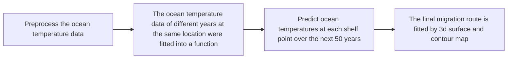
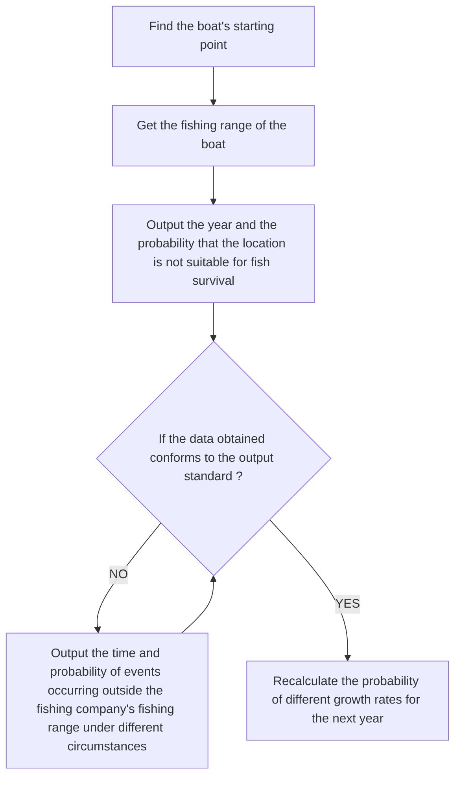
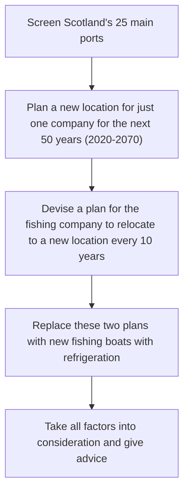
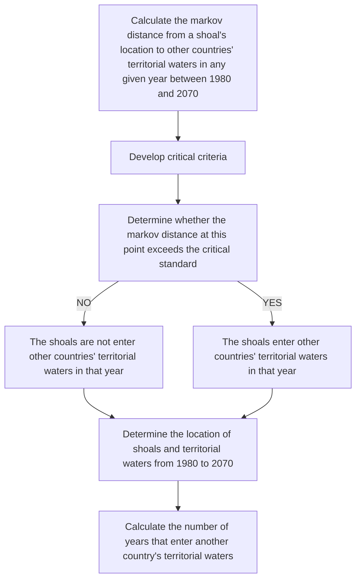

# Survival or Death: Moving Fish and Fishery

As global ocean temperatures rises, Scottish herring and mackerel may migrate away from their current habitat near Scotland, which is undoubtedly a huge blow to Scottish fisheries. As a special consultant hired by the Scottish North Atlantic Fisheries Management Association, we will conduct an in-depth analysis of this situation.

The first problem is to determine the migration route of the herring and mackerel in the next fifty years. We searched the Atlantic data from 1980 to 2019 on NOAA. Considering the ocean depth, temperature, salinity, oxygen content, and pH, a series of data processing was performed: preprocessing, making a fit between temperature and time, and make an interpolation between temperature, latitude and longitude. The intermediate result data is obtained and displayed visually in the form of three-dimensional images and contour lines. Observe the changes of contour and roughly select the discrete migration points according to the different living habits of the herring and mackerel. Then, the position coordinates were selected and used to fit by the least squares method to obtain the migration routes of herring and mackerel, which were visually displayed in the form of images. The results were placed in the text.

The time needs to be obtained that herring and mackerel leave the fishing company's catchment area under the best and worst case. First, the temperature changes are divided into five forms: rapid growth, slow growth, maintaining stability, slow decline, and rapid decline, and set the rates for the five cases. Then use the Markov model to calculate the probability that the temperature is in each state at each time point at each location. By using the initial data of these probability and temperature and combining with the living habits of the two fish, we can know the fastest and slowest deterioration of the temperature. In addition, it is concluded that the degree of separation between the two fish and Scotland in two cases. Finally, the maximum fishing range of the fishing boat is combined to obtain the result. The best situation is that the fishing boat ’s fishing range is exceeded in 2050, with a probability of 21.91%. Worst case scenario is beyond fishing range by 2032 with a probability of 30%.

Based on the previous analysis, there is no doubt that the fishery company needs to make changes. We have collected location data for 25 ports in Scotland. To reduce losses and enhance fishing capacity, fishing companies need to relocate to ports closer to the school of fish and introduce new fishing vessels. We proposed two options, Option A: In the next 50 years, the port with the closest average distance to the fish, and then relocate the company near the port. The port we got was Orkney and new fishing boats will be needed in 2020. Plan B: Comprehensively consider the fishing scope and relocation loss. We get six relocation addresses by relocating every ten years which are put in the text, and they need to buy new fishing boats by 2050.

According to the UNCLOS, fishing in the territorial waters of other countries without permission is illegal, so we need to calculate the number of years that two fish stay in the territorial waters of other countries. According to the migration path in problem 1, we can find the fish may have entered the territorial waters of Iceland and Norway. Then we collected the territorial waters data of Iceland and Norway, and estimated using the Markov distance model: herrings stayed in the territorial waters of Iceland for 29 years. Mackerel schooling in Norwegian territorial waters for 11 years. It will obviously have a huge impact on Scottish fisheries, so friendly consultations with other countries should be used to get out of the current predicament.

Key words: Migration of fish populations; Macleaf model; Prediction

## Contents

1 Introduction.

1.1 Background.  
1.2 Problem Restatement.  
1.3 Model Preparation ..

2 Assumptions and Justification 3  
3 Notations ... 4  
4 Leaving Home: Where Will the Fish Be In the Next 50 Years? /

4.1 How Has Ocean Temperature Increased in Recent Years?. 4  
4.2 Scottish Herring and Mackerel Are Moving ..... 5

5 The Arrival of the Scottish Fishing Crisis 11

5.1 Macleaf Model: Fish Are Swimming Out of the Control of the Fishing Company........ 11  
5.2 Prepare for the Best and Worst Cases . 12

6 The Survival of Scottish Fishery is Making a Difference! . . 13

6.1 In order to fish, Take the Company to Wander . . 13  
6.2 We Have Purchased New Fishing Boats With Refrigeration Equipment . . 15  
6.3 Comprehensive Business Strategy. . 16

7 Force Majeure: Can't Steal Others Small Fish. . 17

7.1 Entry Into the Territorial Sea of Another Country is Not Allowed. . 17  
7.2 Friendly Exchanges and Cooperation in Fishing. . 18

8 Error Analysis and Sensitivity Analysis 19

8.1 Model Evaluation 19

9 Model Evaluation and Further Discussion. .. 20

9.1 Model Evaluation . 20

9.1.1 Advantages of the Model . . 20  
9.1.2 Shortcomings of the Model . . 20  
9.2 Promotion of the Model. . 20

References.... . 20

Appendices.... . 23

## 1 Introduction

## 1.1 Background

The ocean absorbs vast quantities of heat as a result of increased concentrations of greenhouse gases in the atmosphere, mainly from fossil fuel consumption. The Fifth Assessment Report published by the Intergovernmental Panel on Climate Change (IPCC) in 2013 revealed that the ocean had absorbed more than 93% of the excess heat from greenhouse gas emissions since the 1970s. This is causing ocean temperatures to rise.

Data from the US National Oceanic and Atmospheric Administration (NOAA) shows that the average global sea surface temperature – the temperature of the upper few meters of the ocean – has increased by approximately $0 . 1 3 ^ { \circ } \mathrm { C }$ per decade over the past 100 years.

Oceans cover nearly 71% of the earth's surface $( 3 . 6 \times 1 0 8 \mathrm { k m } ^ { 2 } )$ and account for more than 95% of the biosphere's volume. In the past 20 to 30 years, human activities have led to changes in sea water temperature and composition. For example, from 1961 to 2003, the surface temperature of the ocean above 700 m increased by about $0 . 1 ^ { \circ } \mathrm { C }$ . In the 1950s to 1980s, the temperature of the Southern Ocean increased by $0 . 1 7 ^ { \circ } \mathrm { C } ,$ almost twice the average rise in the temperature of the entire ocean. Marine life tends to live in environments with relatively stable temperatures, so it is more sensitive to changes in temperature. Temperature changes have important effects on the survival, metabolism, reproduction, development and immune response of Marine organisms, which may be vulnerable to even a small increase in temperature.

## 1.2 Problem Restatement

The rise in global ocean temperatures has caused certain ocean-dwelling species to migrate from their habitats to other places suitable for their survival and reproduction. The Scottish North Atlantic Fishery management consortium hopes that the modeling team can help solve this problem as this migration may affect the livelihood of some small-scale fishing companies. Please help analyze possible changes in the distribution of Scottish herring and mackerel populations in order to allow these fishing companies to survive without refrigeration equipment on their fishing vessels.

(1) If population migration occurs due to large changes in water temperature, establish a mathematical model to help analyze where Scottish herring and mackerel may live in the next 50 years.  
(2) If the operating positions of these fishing companies remain unchanged, please predict the time required for the event to exceed their fishing capacity due to fish migration, and give a best and worst case respectively.  
(3) Please judge whether the fishing company needs to change the operation mode based on the results of the forecast and analysis. If so, please help develop business strategies (including relocating fishing companies, using more advanced fishing vessels, or other reasonable options). If not, please give a reason.  
(4) Please help analyze this problem. If the fishing scope of the fishing company has entered the territorial waters of other countries according to the scheme designed above, what will be the impact of this scheme.  
(5) In order to introduce the seriousness of the fish migration problem to fishermen and

promote the above solutions, please prepare a one- or two-page article for the magazine.

## 1.3 Model Preparation

(1) Map of Scotland and its Surrounding Waters


<details>
<summary>natural_image</summary>

Map highlighting Iceland with a blue shaded region and red boundary lines, surrounded by gray regions (no text or labels)
</details>

Figure 1 Map of Scotland

A map of British Isles EEZs and surrounding nations. Internal UK borders are represented by thin lines. Scotland’s EEZ is highlighted in blue.

(2) The Life Habits of Herring and Mackerel

Just like humans, fish have a certain temperature range that makes them most comfortable. But because fish can't add or remove layers of clothing to stay comfortable, their only option is to move to another area when the temperature is too high or too low. Fish are essentially coldblooded, which means they cannot regulate their body temperature internally. This makes them extremely susceptible to rapid fluctuations in water temperature. A sudden drop in temperature may prevent many fish from moving or even dying, and they must be moved to another area. Small changes in temperature can affect fish behavior. In general, the survival temperature of mackerel near Scotland is $8 ~ ^ { \circ } \mathrm { ~ C ~ }$ to $1 6 ^ { \circ } \mathrm { ~ C ~ } _ { : }$ , and the survival temperature of herring is $1 2 ~ ^ { \circ } \mathrm { ~ C ~ }$ to $1 8 ^ { \circ } \mathrm { C }$ .

Fishermen who fish for herring and mackerel generally go down to 146 meters underwater; the depth of mackerel ranges from the surface of the water to 100 miles underwater, at least on our North Atlantic side. North Sea herring sometimes lives to a depth of 200m in autumn.


<details>
<summary>natural_image</summary>

Illustration of two fish, one whole and one finless, shown side by side without any text or labels.
</details>

Figure 2 Herring and Mackerel

## (3) Location of Scottish Fishing Port


<details>
<summary>text_image</summary>

Shetland
Orkney
Scrabster
Stornoway
Kinlochbervie
Lochinver
Fraserburgh
Ullapool
Buckie
Peterhead
Portree
Mallaig
Aberdeen
Oban
Anstruther
Eyemouth
Campbeltown
Ayr
© Crown copyright and database right (2016). All rights reserved.
</details>

Figure 3 Map of Scottish Fishing Port

The squares in the picture show the various administrative regions of Scotland. The Scottish coastline marks multiple ports within the purview of each administrative area. The colored dots in the picture are the locations of Scottish fishing ports.

## (4) Activity Time for Small Fishing Boats

These fishing vessels can operate without land support for a period, while still ensuring the freshness and quality of the catch. Generally, ships are equipped with refrigerating equipment, which can keep deep sea fishes fresh for 3 to 4 days; ships without refrigerating equipment will use salted fish to keep fresh sea fishes for 1.5 days.

Speed of small fishing boats: The average sailing speed of fishing boats at sea under wind and wave conditions is 10 (knots), which is approximately equal to 18.52 (km/h).

## 2 Assumptions and Justification

(1) It is assumed that the suitable living temperature of the fish is always constant, and the fish will not be mutated due to changes in the environment.  
(2) Mackerel and herring have the habit of gathering. They did so at least throughout the migration. So, we assume that in a fish swarm, all fish can be harvested as long as they follow the migration route of the school of fish;  
(3) Assume that the speed of the fleet is constant and has been sailing at an average speed without stopping or accelerating.  
(4) It is assumed that the fresh-keeping capacity of small-scale fishing boats is constant. The fresh-keeping time of the two fishes is the same for ships with refrigerating equipment, and the fresh-keeping time of the two fishes is the same for ships without refrigeration equipment.

## 3 Notations

Table 1 Symbols and Descriptions

<table><tr><td>Symbol</td><td>Description</td></tr><tr><td> $p_{k} (k = 1,2\cdots n)$ </td><td>Polynomial undetermined coefficients in least squares</td></tr><tr><td> $B_{i} (i = 1,2\cdots n)$ </td><td>Stages of change rate of each location in different years</td></tr><tr><td> $C_{ij}$ </td><td>Number of events that transition state from one step</td></tr><tr><td> $D_{i}$ </td><td>Number of states in the system</td></tr><tr><td> $E$ </td><td>One-step transition probability matrix</td></tr><tr><td> $\Sigma$ </td><td>Covariance matrix</td></tr><tr><td> $\mu = (\mu_{1}, \mu_{2}, \cdots, \mu_{p})^{T}$ </td><td>The mean vector of the population G is  $\mu$ </td></tr><tr><td> $x = (x_{1}, x_{2}, \cdots, x_{p})^{T}$ </td><td>Sample from another population H</td></tr><tr><td>G,H</td><td>Sample population</td></tr><tr><td> $d(x,G)$ </td><td>Mahala Nobis distance between x and G</td></tr></table>

# 4 Leaving Home: Where Will the Fish Be In the Next 50 Years?


<details>
<summary>flowchart</summary>


</details>

Figure 4 Flow Chart

## 4.1 How Has Ocean Temperature Increased in Recent Years?

In recent years, the whole earth is warming and ocean temperatures have gradually increased. Herring and mackerel populations, who had previously lived comfortably off the coast of Scotland, felt this change around them, and they were forced to migrate to northern waters that were cooler than their current habitat. To study where Scottish herring and mackerel might migrate in the future, we searched for global ocean temperature data from 1980 to 2019. These data are authoritative and reliable because they come from NOAA. [1] Many of these data are not needed by us, so we have done a lot of processing and sorted out valid data. The following briefly introduces the meaning of the collated effective data through examples:

Table 2 Data Sheet Example

<table><tr><td>ISO_country</td><td>Lat-itude</td><td>Long-itude</td><td>Year</td><td>Month</td><td>Day</td><td>Time</td><td>depth(m)</td><td>Temp</td><td>Sal</td><td>Oxy</td><td>PH</td></tr><tr><td>GB</td><td>58.53</td><td>-14</td><td>1980</td><td>5</td><td>6</td><td>0</td><td>299</td><td>8.7</td><td>35.31</td><td>6.35</td><td>8.23</td></tr></table>

This set of data in the table above shows a position with a latitude of 58.53 degrees, a longitude of -14 degrees, and a depth of 299m. At 0 o'clock on May 6, 1980, the salinity of this position was 35.31, the oxygen was 6.35, and the pH was 8.23. The location is within the territorial waters of GB (United Kingdom of Great Britain and Northern Ireland).

Because we need to study the relevant issues in a specific area, and then select the data related to this solution from the above effective data. We first selected data from the waters around Scotland (including but not limited to the North Atlantic, North Sea, Norwegian Sea), and then determined the appropriate depth of survival based on the habits of herring and mackerel. In addition, there are many invalid data in the data that obviously violate the facts, so we need to filter them out. According to the above ideas, the screening criteria can be formulated as follows:

$$
\left\{ \begin{array}{l} - 4 4 \leq l o n g t i t u d e \leq 1 0 \\ 5 1 \leq l a t i t u d e \leq 7 1 \\ d e p t h \neq - 9 9. 9 9 \\ T e m p \neq - 9 9. 9 9 \\ S a l \neq - 9 9. 9 9 \\ O x y \neq - 9 9. 9 9 \\ P H \neq - 9 9. 9 9 \end{array} \right.
$$

The amount of data after screening is still huge, because the measurement unit measures once or several times every few hours every day. If we analyze these large amounts of data directly, it will bring a heavy task to our work. Because we are analyzing where fish may migrate in the next 50 years. Obviously, the temperature change of a few hours is too small for 50 years, so we sort and calculate a large amount of data in hours as data in years. This process may cause errors, but this can be ignored of. In order to process these data more conveniently and in batches, we have written a MATLAB program to do this work (see Appendix 1 for the source program).

Through the above series of complicated but meaningful preprocessing work, we obtained the ocean temperature data of the waters near Scotland and areas suitable for herring and mackerel life that can be used to analyze the topic. These data are clear and intuitive. They are from 1980 A series of data at different latitude and longitude positions for 40 years from 2019 to 2019. Each series of data is based on the year as the independent variable and the ocean temperature as the dependent variable.

## 4.2 Scottish Herring and Mackerel Are Moving

With the above-mentioned extensively processed data, we can predict the ocean temperature at various locations in the waters around Scotland in the next 50 years. Due to the effects of solar radiation (latitude position), atmospheric circulation, sea and land location, topography, and ocean currents, their temperatures may vary greatly in the same year. But they also affect each other, so different points in the same year are related. In different years, the same location will usually not have large geographic changes, but it will change due to various factors (such as the global warming problem described in this solution), so the same location in different years Points are also linked. Based on the data we have and the problem to be solved, it is a very wise choice to analyze the relationship of the same location points in different years. Therefore we have written MATLAB programs (see Appendix 2 and 3 for source programs) to perform the following tasks:

(1) Put together the temperature data of the same location in different years.

(2) If the amount of data at a location is less than half of the total number of years (that is, half of 40 years, 20 years), then the location is discarded because it may not be representative.  
(3) After obtaining the collated data, the ocean temperature data of the same location in different years is fitted to obtain a function; after that, the calculation is repeated to obtain the fitting function of all position points in the data we have.  
(4) Predict the ocean temperature of each location in the next 50 years by the fitting function of each location.  
(5) Output the data of this year (2020) and every 10 years in the future according to the year. The data of each year includes all the calculated points.

All these tasks are done automatically by a MATLAB program, which is very convenient and fast.

The next step is to solve the temperature situation of all positions in the entire study range in the same year through 54 representative positions. We used the interpolation model. We compared the triangle-based linear interpolation (the default algorithm), the triangle-based cubic interpolation, the nearest neighbor interpolation method, and the gridata algorithm in MATLAB. Finally, we used the gridata algorithm in MATLAB to obtain the entire year from 1980 to 2070. Temperature changes in the waters around Scotland. In order to be more intuitive, we use 3D surfaces and contour maps to show the results. (See Appendix 4 for the source program)

According to the temperature contour map and the life habits of herring and mackerel, the respective migration routes of herring and mackerel can be roughly drawn, data points are collected, and the least square method is used to fit the polynomial to obtain the final migration route.

According to the information [2] we found, the suitable living temperature of herring is 12-18 degrees Celsius, and the suitable living temperature of mackerel is 8-16 degrees Celsius. Analyze the data of the output year, and determine the place where the fish are most likely to migrate based on the temperature that is most suitable for herring and mackerel life and as close as possible to the coast of Scotland.

The following is a three-dimensional map of the temperatures from 1980 to 2070 obtained by fitting:


<details>
<summary>3d surface plot</summary>

| Year | X Range | Y Range | Color Intensity |
|------|---------|---------|-----------------|
| 1980 | -75 to 0 | 8 to 26 | Low to High     |
| 1990 | -75 to 10 | 8 to 26 | Low to High     |
</details>

Figure 5 Three-dimensional Graphics of Ocean Temperature Every 10 Years (Part 1)

  
Figure 6 Three-dimensional Graphics of Ocean Temperature Every 10 Years (Part 2)

Through the MATLAB program, we also obtained temperature contour maps of various locations from 1980 to 2070, and processed the following schematic diagrams (where brighter colors indicate higher temperatures).


<details>
<summary>contour map</summary>

| Year | Region             | Description        |
|------|--------------------|---------------------|
| 1980 | North Atlantic Ocean | North Atlantic Ocean |
| 1980 | Scotland            | Scotland            |
| 1980 | United Kingdom     | United Kingdom     |
| 1980 | Norwegian Sea      | Norwegian Sea       |
| 1980 | North Atlantic Ocean | North Atlantic Ocean |
| 1990 | North Atlantic Ocean | North Atlantic Ocean |
| 1990 | Scotland            | Scotland            |
| 1990 | United Kingdom     | United Kingdom     |
| 1990 | Norwegian Sea      | Norwegian Sea       |
| 1990 | North Atlantic Ocean | North Atlantic Ocean |
| 2000 | North Atlantic Ocean | North Atlantic Ocean |
| 2000 | Scotland            | Scotland            |
| 2000 | United Kingdom     | United Kingdom     |
| 2000 | Norwegian Sea      | Norwegian Sea       |
| 2000 | North Atlantic Ocean | North Atlantic Ocean |
| 2010 | North Atlantic Ocean | North Atlantic Ocean |
| 2010 | Scotland            | Scotland            |
| 2010 | United Kingdom     | United Kingdom     |
| 2010 | Norwegian Sea      | Norwegian Sea       |
| 2010 | North Atlantic Ocean | North Atlantic Ocean |
| 2020 | North Atlantic Ocean | North Atlantic Ocean |
| 2020 | Scotland            | Scotland            |
| 2020 | United Kingdom     | United Kingdom     |
| 2020 | Norwegian Sea      | Norwegian Sea       |
| 2020 | North Atlantic Ocean | North Atlantic Ocean |
| 2030 | North Atlantic Ocean | North Atlantic Ocean |
| 2030 | Scotland            | Scotland            |
| 2030 | United Kingdom     | United Kingdom     |
| 2030 | Norwegian Sea      | Norwegian Sea       |
| 2030 | North Atlantic Ocean | North Atlantic Ocean |
| 2040 | North Atlantic Ocean | North Atlantic Ocean |
| 2040 | Scotland            | Scotland            |
| 2040 | United Kingdom     | United Kingdom     |
| 2040 | Norwegian Sea      | Norwegian Sea       |
| 2040 | North Atlantic Ocean | North Atlantic Ocean |
| 2050 | North Atlantic Ocean | North Atlantic Ocean |
| 2050 | Scotland            | Scotland            |
| 2050 | United Kingdom     | United Kingdom     |
| 2050 | Norwegian Sea      | Norwegian Sea       |
| 2050 | North Atlantic Ocean | North Atlantic Ocean |
| 2060 | North Atlantic Ocean | North Atlantic Ocean |
| 2060 | Scotland            | Scotland            |
| 2060 | United Kingdom     | United Kingdom     |
| 2060 | Norwegian Sea      | Norwegian Sea       |
| 2060 | North Atlantic Ocean | North Atlantic Ocean |
| 2070 | North Atlantic Ocean | North Atlantic Ocean |
| 2070 | Scotland            | Scotland            |
| 2070 | United Kingdom     | United Kingdom     |
| 2070 | Norwegian Sea      | Norwegian Sea       |
| 2070 | North Atlantic Ocean | North Atlantic Ocean |
</details>

Figure 7 Contour Map of Ocean Temperature Every 10 Years

By observing three-dimensional images and contour maps, collecting data points and performing polynomial fitting according to the principle of the least square method. The principle of least squares is as follows:

Set polynomial form:

$$
y = f (x) = [ p _ {1}, p _ {2}, \dots , p _ {k} ] \left[ \begin{array}{l} 1 \\ x \\ \dots \\ x ^ {k} \end{array} \right]
$$

Identify discrete data:

$$
(x _ {i}, y _ {i}) i = 0, 1, 2, \dots , n
$$

limitation factor:

$$
\left\{ \begin{array}{l} F \left(p _ {1}, p _ {2}, \dots , p _ {k}\right) = \sum_ {i = 0} ^ {n} \left(f \left(x _ {i}\right) - y _ {i}\right) ^ {2} \\ \frac {\partial F}{p _ {1}} = 0, \frac {\partial F}{p _ {2}} = 0, \dots , \frac {\partial F}{p _ {k}} = 0 \end{array} \right.
$$

Get polynomial function .

The migration route and coordinates of herring and mackerel can be obtained from the above algorithm (see Appendix 8 for MATLAB source programs), as follows:


<details>
<summary>line chart</summary>

| longitude | latitude |
| --------- | -------- |
| -15.5     | 64.1     |
| -14.0     | 64.5     |
| -12.5     | 64.7     |
| -11.0     | 64.6     |
| -9.5      | 64.3     |
| -8.0      | 63.8     |
| -6.5      | 62.9     |
| -5.0      | 62.7     |
| -3.5      | 61.2     |
| -2.0      | 60.5     |
</details>


<details>
<summary>scatterplot</summary>

| longitude | latitude |
| --------- | -------- |
| -9.5      | 57.2     |
| -8.5      | 57.8     |
| -7.5      | 58.5     |
| -6.5      | 59.0     |
| -5.5      | 59.5     |
| -4.5      | 60.0     |
| -3.5      | 60.5     |
| -2.5      | 61.0     |
| -1.5      | 61.5     |
| -0.5      | 62.0     |
| 0.5       | 62.5     |
| 1.5       | 63.0     |
| 2.5       | 63.5     |
| 3.5       | 64.0     |
| 4.5       | 64.5     |
| 5.5       | 65.0     |
| 6.5       | 65.5     |
| 7.5       | 66.0     |
| 8.5       | 66.5     |
</details>

Figure 8 Moving Path Fitting Curve of Herring and Mackerel

According to the fitted curve above, the migration positions of the two fishes are obtained every 10 years, as shown in the following table:

Table 3 The Location Point of Fish Migration Path

<table><tr><td>Type of fish</td><td>Year</td><td>Latitude</td><td>Longitude</td><td>Sea area</td></tr><tr><td>Herring</td><td>2020</td><td>60.563569</td><td>-2.343226</td><td>North Atlantic Ocean</td></tr><tr><td>Herring</td><td>2030</td><td>62.780641</td><td>-5.768559</td><td>Norwegian Sea</td></tr><tr><td>Herring</td><td>2040</td><td>64.044594</td><td>-8.591601</td><td>Norwegian Sea</td></tr><tr><td>Herring</td><td>2050</td><td>64.426622</td><td>-11.360155</td><td>Norwegian Sea</td></tr><tr><td>Herring</td><td>2060</td><td>64.464535</td><td>-13.733202</td><td>North Atlantic Ocean</td></tr><tr><td>Herring</td><td>2070</td><td>64.140596</td><td>-15.007616</td><td>North Atlantic Ocean</td></tr><tr><td>Mackerel</td><td>2020</td><td>58.598352</td><td>-7.361132</td><td>North Atlantic Ocean</td></tr><tr><td>Mackerel</td><td>2030</td><td>59.702432</td><td>-4.109179</td><td>North Atlantic Ocean</td></tr><tr><td>Mackerel</td><td>2040</td><td>61.091528</td><td>-1.076953</td><td>Norwegian Sea</td></tr><tr><td>Mackerel</td><td>2050</td><td>62.462867</td><td>4.9875</td><td>Norwegian Sea</td></tr><tr><td>Mackerel</td><td>2060</td><td>63.500827</td><td>6.877149</td><td>Norwegian Sea</td></tr><tr><td>Mackerel</td><td>2070</td><td>64.803401</td><td>8.107618</td><td>Norwegian Sea</td></tr></table>

In order to make it easier to observe and analyze, we will process the above results to obtain the following trajectories:


<details>
<summary>text_image</summary>

Migration Route of Herring
GREENLAND
ICELAND
2050
2040
2030
2020
1980-2019
SCOTLAND
North Sea
UNITIED
KINGDOM
NORWALY
NORTHLAN
NORTHLAN OCEAN
</details>

Figure 9 Moving Path of Herring


<details>
<summary>text_image</summary>

Migration Route of Mackerel
GREENLAND
ICELAND
Norwegian Sea
2070
2060
2050
2040
NORWAY
2030
2020
1980-2019
SCOTLAND
North Sea
UNITIED KINGDOM
North Atlantic Ocean
</details>

Figure 10 Moving Path of Herring

## 5 The Arrival of the Scottish Fishing Crisis


<details>
<summary>flowchart</summary>


</details>

Figure 11 Flow Chart

## 5.1 Macleaf Model: Fish Are Swimming Out of the Control of the Fishing Company

Rising global ocean temperatures are accelerating, as are herring and mackerel moving northward. This change caught small fisheries companies in Scotland off guard because they did not have refrigeration equipment on board fishing vessels. This almost makes it impossible to catch distant fish and keep them fresh. However, due to various factors, these fishing companies must also operate their industries in their original locations. Although fish stocks are moving farther and farther away from fisheries companies, they are temporarily within the catch of the fisheries companies. As the ocean temperature continues to rise, the school of fish will eventually swim out of the fishery company's control circle. To help companies understand the current state of the fishery, we helped them predict when fish swarms would move beyond their control. The arrival of this time may be slow or very fast, it is determined by how fast the ocean temperature rises. Therefore, we have selected the Mark Reeve model. Through the calculation of this model, we can estimate the probability that the ocean temperature may increase at different rates in each year. We divide the rate of rise into the following:

Table 4 Rate Classification Table

<table><tr><td>Condition</td><td>Figure</td><td>Rate</td></tr><tr><td>rapid growth</td><td>2</td><td>≥0.03</td></tr><tr><td>slow growth</td><td>1</td><td>0~0.03</td></tr><tr><td>stable</td><td>0</td><td>0</td></tr><tr><td>slow decline</td><td>-1</td><td>-0.03~0</td></tr><tr><td>rapid decline</td><td>-2</td><td>≤-0.03</td></tr></table>

The main steps you take to solve this problem using the Macleaf model are as follows:

Step1: Find the growth rate of temperature at each location.

Step2: Write a program. In the program, use $" 2 "$ to indicate rapid rise $( \ge 0 . 0 3 )$ , use $" 1 "$ to indicate slow rise (0, 0.03), use $" 0 "$ to indicate relatively constant, and use $" _ { - } 1 "$ to indicate slowness. Decrease (-0.03, 0), use $" 2 "$ to indicate rapid decline (≤0.03), and get Bi at each location in different years.

Step3: Count the number of consistent changes in adjacent growth rates.

Step4: For each position, add and sum them into five categories, which are "rapid growth first", "slow growth first", "relatively constant first", "slow decline first", and "rapid decline first".

Step5: Find the one-step transition probability matrix E, that is, every five data of each row are divided by the corresponding one in turn to obtain one row of the probability matrix E.

Step6: Use the obtained one-step transition probability matrix E, and find the state probabilities in different periods.

The above process is calculated by a program written in MATLAB (see Appendix 5 for the source program).

## 5.2 Prepare for the Best and Worst Cases

Since the probability of different events occurring is different, calculating the rise in ocean temperature based on different probabilities will give different results. By analyzing these results, we can estimate the year when the school of fish happened to be out of the control circle of the fishery company. By comparing their sizes, the maximum value is that the company has no fish to catch after the longest time, which is the best result; the maximum value is that the company has no fish to catch after the shortest time, which is The worst result. Fisheries companies should be aware of this and therefore need to have a deep understanding of each situation. A detailed explanation of these two cases is given below.

First of all, by querying the data [3], we can find that the fishing boat's driving speed is approximately 10 knots. The knot is a speed unit dedicated to navigation, which represents the nautical miles sailed per hour, and it is converted by units.

$$
1 0 \text { knots } = 1 0 \text { nautical   mile   /   hour } = 1 0 * 1. 8 5 2 \mathrm{km/h} = 1 8. 5 2 \mathrm{km/h}
$$

In addition, as the existing fishing vessels of small-scale fisheries companies do not have refrigeration equipment, they can only maintain the fresh quality of deep-sea fish for 1.5 days by salting. Therefore, to ensure the freshness of the fish, the maximum travel distance of the fishing boat is 36\*18.52=666.72km

This distance is the maximum fishing radius of the fishing company. By querying relevant information and combining various factors, it is assumed that the position of a fishing company is located in Scrabster (coordinates: 58.613524 °, -3.553142 °), and this position is the starting point of the fishing boat You can get the fishing range of the fishing boat as shown below:


<details>
<summary>text_image</summary>

Norwegian
Scrabster
UNITED
KINGAPORE
GEORG
</details>

Figure 12 Maximum Catch Range by Fishing Companies

If the school of fish moves beyond the circle in the picture above, it is considered as exceeding the fishing capacity of the fishing company. The initial value of the temperature is calculated year by year according to the different growth rates of each adjacent two years calculated by the MATLAB program. If the obtained data indicates that the fishing range does not exist in a circle suitable for herring and mackerel $( 8 - 1 8 ^ { \circ } \mathrm { C } )$ , Output the year and the probability of the event. If the obtained data does not meet the above output standards, the probability of re-calculating different growth rates for the next year is returned until the output standards are met.

The best and worst-case time and event probability statistics beyond the fishing company's fishing range are as follows:

Table 5 Probability in Different Situations

<table><tr><td>Year</td><td>probability</td></tr><tr><td>2032</td><td>30%</td></tr><tr><td>2050</td><td>21.91%</td></tr></table>

The best case is that after 31 years (that is, 2050), herring and mackerel schools are out of scope of the fishing company. The probability of this happening is 21.91%. In the worst case, after 13 years (that is, 2032), fish stocks are out of reach of the fishing company. The probability of this situation is 30%.

## 6 The Survival of Scottish Fishery is Making a Difference!


<details>
<summary>flowchart</summary>


</details>

Figure 13 Flow Chart

## 6.1 In order to fish, Take the Company to Wander

Based on the above analysis, we can clearly see the fact that if the company continues to maintain its current business model, then it will inevitably face a crisis of closure after many years. Fisheries must change if they want to survive! One of our suggestions is to relocate the company, so that the company can be closer to the shoal of fish that are gradually away. In order to solve this problem, we searched the port information of Scotland and selected 25 major ports, because fishing boats must depart from the port. The longitude and latitude coordinates and schematic diagrams of the main ports are as follows:

Table 6 Location Map of Scotland's Major Ports

<table><tr><td>Port</td><td>Latitude</td><td>Longitude</td></tr><tr><td>Greenock</td><td>55.957703</td><td>-4.772208</td></tr><tr><td>Holy Loch Port</td><td>55.982567</td><td>-4.947651</td></tr><tr><td>Port Ellen</td><td>55.631507</td><td>-6.187485</td></tr><tr><td>Oban</td><td>56.41788</td><td>-5.471766</td></tr><tr><td>Iona</td><td>56.338907</td><td>-6.404151</td></tr><tr><td>Tobermory</td><td>56.623919</td><td>-6.072377</td></tr><tr><td>Fort William</td><td>56.821986</td><td>-5.105295</td></tr><tr><td>Kyle of Lochalsh</td><td>57.283656</td><td>-5.714435</td></tr><tr><td>Rum</td><td>57.019317</td><td>-6.323899</td></tr><tr><td>Portree</td><td>57.414797</td><td>-6.196629</td></tr><tr><td>Raasay</td><td>57.408198</td><td>-6.050392</td></tr><tr><td>Gairloch</td><td>57.730781</td><td>-5.694256</td></tr><tr><td>Ullapool</td><td>57.898025</td><td>-5.161124</td></tr><tr><td>Stornoway</td><td>58.211882</td><td>-6.385451</td></tr><tr><td>Scrabster</td><td>58.613524</td><td>-3.553142</td></tr><tr><td>Orkney</td><td>59.084897</td><td>-2.900116</td></tr><tr><td>Lerwick</td><td>60.154733</td><td>-1.149763</td></tr><tr><td>Invergordon</td><td>57.690543</td><td>-4.173634</td></tr><tr><td>Inverness</td><td>57.488592</td><td>-4.225984</td></tr><tr><td>Peterhead</td><td>57.51325</td><td>-1.783097</td></tr><tr><td>Aberdeen</td><td>57.159506</td><td>-2.096881</td></tr><tr><td>Montrose</td><td>57.121266</td><td>-2.130721</td></tr><tr><td>Dundee</td><td>56.481871</td><td>-2.96823</td></tr><tr><td>Edinburgh</td><td>55.974718</td><td>-3.186137</td></tr><tr><td>Eyemouth</td><td>55.870391</td><td>-2.090699</td></tr></table>

Their locations on the map of Scotland are shown below:


<details>
<summary>text_image</summary>

Lerwick
Orkney
Scrabster
Stornoway
Ullapool
Gairloch
Portree
Raasay
Rum
Tobermory
Iona
Holy Loch Port
Port Ellen
Kype of lochalsh
Oban
Greennock
Dundee
Edinburgh
Port William
Invergordon
Inverness
Peterhead
Aberdeen
Montrose
Eyemouth
</details>

Figure 14 Map of Scotland's Main Ports

Then, in order to comply with the principle of saving human and material resources as much as possible, the best solution is to build it near the port. With this preparation, we can plan a new location for the company. Here we give two options.

In the solution process, we need to use the formula for converting latitude and longitude into distance, as follows:

$$
\begin{array}{l} x _ {1} = \frac {\text { longitude } _ {1} \cdot \pi}{1 8 0}, y _ {1} = \frac {\text { lagitude } _ {1} \cdot \pi}{1 8 0} \\ x _ {2} = \frac {\text { longitude } _ {2} \cdot \pi}{1 8 0}, y _ {2} = \frac {\text { latitude } _ {2} \cdot \pi}{1 8 0} \\ \end{array}
$$

$$
s = a \cos (\cos x _ {2} \cos y _ {2} \cos (x _ {1} - y _ {1}) + \sin x _ {2} \sin y _ {2})
$$

Where, ,  and ,  are the latitude and longitude coordinates of the two points, respectively.

Solution A is a solution that takes into account the possible migration path of fish in the next 50 years. Here we plan a new location for only one company for the next 50 years (2020-2070). This will allow you to move again for 50 years No need to relocate. This can save a lot of money, and the problem of fishing has been solved. Of course, this may make the company's fishing range not reach the maximum utilization rate in some years, but it is also very reasonable to comprehensively consider the issue of funds. We wrote a MATLAB program to calculate this solution (see Appendix 6 for the source program). The following is our solution to the A solution:

Table 7 Result of Solution A

<table><tr><td>Port</td><td>Latitude</td><td>Longitude</td></tr><tr><td>Orkney</td><td>59.084897</td><td>-2.900116</td></tr></table>

Plan B is a solution for a company that happens to be financially strong, that is, the company moves to a new location every 10 years. In this way, the maximum utilization of the fishing range in each time period can be achieved. The downside is that you need to invest a lot of money, but if the company can get enough of these investments, it is very good. Write a MATLAB program to calculate this solution (see Appendix 7 for the source program). The following is our result of solution B:

Table 8 Result of Solution B

<table><tr><td>Year</td><td>Port</td><td>Longitude</td><td>Latitude</td></tr><tr><td>2020</td><td>Orkney</td><td>-2.900116</td><td>59.084897</td></tr><tr><td>2030</td><td>Stornoway</td><td>-6.385451</td><td>58.211882</td></tr><tr><td>2040</td><td>Scrabster</td><td>-3.553142</td><td>58.613524</td></tr><tr><td>2050</td><td>Lerwick</td><td>-1.149763</td><td>60.154733</td></tr><tr><td>2060</td><td>Lerwick</td><td>-1.149763</td><td>60.154733</td></tr><tr><td>2070</td><td>Lerwick</td><td>-1.149763</td><td>60.154733</td></tr></table>


<details>
<summary>text_image</summary>

Solution A
Mackerel
Herring
Orkney
2020-2070
Nordic Sea
Rockall River
North Sea
</details>


<details>
<summary>text_image</summary>

Solution B
Herring
Mackerel
Parckel
2050/2060/2070
Oktney
2020
Seabster
2040
Stornovay
2030
Rockall Rise
North Sea
Harben Bank
Norway
1980
1990
2000
2010
2020
2030
</details>

Figure 15 New Location to Which the Company Moves of Solution B

## 6.2 We Have Purchased New Fishing Boats With Refrigeration Equipment

Next, we will further improve both of the above solutions. According to the calculation process of the previous problem, we can know that in order to ensure the freshness and high quality of the fish caught, the company's existing fishing boat can travel up to 666.72km. If this distance is exceeded, there is a great possibility that the fish will rancid. So we need to buy new fishing vessels. This fishing boat is more advanced than the previous model because it has advanced refrigeration equipment on it, which usually keeps the fish fresh on the boat for 4-5 days. Therefore, we analyze the results of the above two solutions to find the longest distance between the company's new location and the location where the school of fish may appear. Based on this value, it is determined whether a new fishing boat is needed.

The first is to improve the A plan, write a MATLAB program for calculation (see Appendix 6 for the source program), and find the distance between the new position of the company and the possible location of the school of fish as follows:

Table 9 Distance from Different Fishing Points to the Port of Solution A

<table><tr><td>Year</td><td>Distance between port and herrings</td><td>Distance between port and mackerels</td></tr><tr><td>2020</td><td>167.5269378</td><td>262.5355345</td></tr><tr><td>2030</td><td>439.5794889</td><td>97.06143455</td></tr><tr><td>2040</td><td>628.6051741</td><td>245.2118023</td></tr><tr><td>2050</td><td>741.8223632</td><td>569.5713346</td></tr><tr><td>2060</td><td>824.8852004</td><td>716.2167055</td></tr><tr><td>2070</td><td>850.3899658</td><td>856.3965541</td></tr></table>

It can be seen from the table that the maximum value is 856.3965541km, which appeared in 2070. This distance has exceeded the maximum fishing range of the old fishing boat. So we need to buy new fishing vessels with refrigeration equipment.

The next step is to improve the B plan, write a MATLAB program for calculation (see Appendix 7 for the source program), and find the new position of the company every 10 years from the fish school.

Table 10 Distance from Different Fishing Points to the Port of Solution B

<table><tr><td>Year</td><td>Longitude</td><td>Latitude</td><td>Distance between port and herrings</td><td>Distance between port and mackerels</td></tr><tr><td>2020</td><td>-2.900116</td><td>59.084897</td><td>850.3899658</td><td>167.5269378</td></tr><tr><td>2030</td><td>-6.385451</td><td>58.211882</td><td>71.33479882</td><td>509.7089566</td></tr><tr><td>2040</td><td>-3.553142</td><td>58.613524</td><td>125.3004191</td><td>661.287323</td></tr><tr><td>2050</td><td>-1.149763</td><td>60.154733</td><td>104.3592936</td><td>709.4728339</td></tr><tr><td>2060</td><td>-1.149763</td><td>60.154733</td><td>416.3650021</td><td>806.3391143</td></tr><tr><td>2070</td><td>-1.149763</td><td>60.154733</td><td>562.0600734</td><td>843.7259085</td></tr></table>

It can be seen from the table that the maximum distance in some years is less than 666.72km, including 2030 and 2040. In some years, the maximum distance for new fishing boats is greater than 666.72km, including 2020 and 2050, 2060 and 2070. This shows that the company's relocation has played a certain role.

## 6.3 Comprehensive Business Strategy

Combining the above solutions and improvements, and for the change of the fishing company's business strategy, the two suggestions we finally gave are as follows:

Option A, starting in 2020, relocating the company to the port of Lerwick and acquiring new fishing vessels

Option B, the company will be moved to the port of Orkney in 2020, still using the old fishing boat. In 2030, the company was moved to the port of Stornoway, still using old fishing boats. In 2040, the company moved to Scrabster port, still using old fishing boats. The company will be moved to Lerwick in 2050 to acquire new fishing vessels, and the company's address will not change until 2070.

In addition, we also recommend that companies consider more, innovate, and find new business directions. For example, if there is not enough refrigeration equipment, the freshness of the fish cannot be guaranteed, so using salt storage equipment to store the fish directly on the boat, and pickling canned fish seems to be a good choice.

## 7 Force Majeure: Can't Steal Others Small Fish


<details>
<summary>flowchart</summary>


</details>

Figure 16 Flow Chart

## 7.1 Entry Into the Territorial Sea of Another Country is Not Allowed

According to the fish migration route we obtained in problem 1, we have observed that they have entered the territorial waters of other countries. According to the United Nations Convention on the Sea, it is illegal to fish in other countries' territorial waters. Therefore, we built a model to estimate how long the two fish schools will stay in the territorial waters of other countries in the next 50 years.

According to the fish migration trajectory obtained in problem 1, herring migrated in the direction of Iceland and mackerel migrated in the direction of Norway. We found the territorial sea latitude and longitude coordinates of Iceland and Norway on the s ### URL.

Then, we established a Mahala Nobis distance model to determine whether the school of fish entered the territorial sea of another country during the migration process.

Mahala Nobis distance was proposed by Indian statistician Mahala Nobis in 1936 (Reference). Mahala Nobis distance has nothing to do with dimension. Therefore, Mahala Nobis distance is often used for discriminant analysis in practice. There are three forms of Mahala Nobis distance:

(1) Mahala Nobis distance between two samples in the same population  
(2) The Mahala Nobis distance from a sample to a whole  
(3) Mahala Nobis distance between two populations

This article uses the Mahala Nobis distance from a sample to a population, the location of the fish school as the sample point, and the territorial sea coordinates as the population. The formula is as follows:

Let the mean vector of the population G be μ, the covariance matrix be, and x be a sample taken from another population H, then the Mahala Nobis distance between x and G is:

$$
d (x, G) = \sqrt {(x - \mu) ^ {T} \sum^ {- 1} (\mu - \mu)}
$$

among them $\boldsymbol { \mu } = ( \mu _ { 1 } , \mu _ { 2 } , \cdots , \mu _ { p } ) ^ { T } , \boldsymbol { x } = ( x _ { 1 } , x _ { 2 } , \cdots , x _ { p } ) ^ { T }$

The solution process is as follows:

(1) According to the fitting model in Problem 1, we can know the position of the school of fish in any year from 1980 to 2070. Taking 1980 as an example, calculate the Mahala Nobis distance from this position to the territorial sea of other countries.  
(2) Formulate critical standards through a large number of experiments  
(3) Determine whether the Mahala Nobis distance at this point exceeds the critical criterion. If it is smaller than this criterion, the school of fish enters the territorial sea of another country this year, otherwise, it does not.  
(4) Repeat step 1 to determine the position of the school of fish and the territorial sea from 1980 to 2070.

Use MATLAB to achieve the above process, (see Appendix 8 for the source program)

Table 11 Numbers of Year of Fishing in Territorial Waters of Other Countries

<table><tr><td>The type of fish</td><td>No fishing time</td></tr><tr><td>Herring</td><td>29</td></tr><tr><td>Mackerel</td><td>11</td></tr></table>


<details>
<summary>text_image</summary>

GREENLAND
ICELAND
Herring
Norwegian Sea
Mackerel
NORWAY
SCOTLAND
North Sea
UNITIED KINGDOM
North Atlantic Ocean
</details>

Figure 17 Map of Migration Routes and Territorial Waters

## 7.2 Friendly Exchanges and Cooperation in Fishing

According to previous analysis, herring schools will stay in Icelandic territorial waters for 29 years, and mackerel schools will remain in Norwegian territorial waters for 11 years, which is undoubtedly a huge blow to the Scottish fishery. According to international easements, active easement is the obligation of a country to allow other countries to engage in certain activities, such as fishing, on its own territory. So for the Scottish economy, the Scottish government should actively negotiate with Norway and Iceland to develop a common fishing policy.

## 8 Error Analysis and Sensitivity Analysis

## 8.1 Model Evaluation

Problem 1: We found the true migration route of herring and mackerel in Scotland (that is, the most likely place to live in 50 years) [5], which is consistent with the results obtained after we first established a mathematical model. Therefore, the model we built is correct and effective.


<details>
<summary>text_image</summary>

76°
72°
68°
64°
60°
16° 8° 0 8° 16°
76°
72°
68°
64°
60°
16° 8° 0 8° 16°
</details>

Figure 18 The True Migration Path of Herring

(The lightest southern curve in the picture is the herring migration route, pointing to the direction of Iceland; the light blue curve near the Scottish coastline in the picture is the mackerel migration route, pointing from south to north in the direction of Norway).

Problem 2: Using BP neural network to test problem 2, artificial neuron is a mathematical abstraction of biological neurons, so as to achieve the function of biological neurons, using the migration coordinates of the fish school in problem 1 as the input of neurons, Taking the fishing capacity of the fishery at each time as the connection strength, through a large number of experiments, the neuron threshold is found, and the neuron output is finally obtained. That is to say, Scotland is most likely to face a crisis of collapse in 20 years, which is between the worst case and the best case, and it is not close to one of these values, indicating that the result of our second problem is more reasonable.

Problem 3: We can build a new scoring model to identify and evaluate the practicality and economic attractiveness of the two options to small fisheries companies.

Both schemes use independent variables for final scoring.

1. We consider the distance from a fishing company to Scotland as a fractional independent variable. The longer the distance, the lower the score.  
2. Take the moving distance of the small fishing boat (that is, the longest time to keep fresh × the average speed of the small fishing boat) as another fractional independent variable. The longer the distance, the lower the score.  
3. Establish an analytic hierarchy model, calculate the weights of these two scores, and finally

calculate the total score. If the scores reach the expectations, model 3 is reasonable.

Problem 4: It uses the Mahala Nobis distance to make a judgment. When a criterion is put forward, we must also study his goodness, that is, to examine his misjudgment rate. This article uses the back misjudgment rate and cross-misjudgment. The judgment rates are 0.1923 and 0.24, and the results are relatively small, so the result obtained in problem 4 is more reasonable.

## 9 Model Evaluation and Further Discussion

## 9.1 Model Evaluation

## 9.1.1 Advantages of the Model

(1) When building the model, we pre-processed the data with MATLAB program. Through a series of complex but meaningful pre-processing work, we got the sea area near Scotland that can be used to analyze the problem, and the area suitable for herring and mackerel life. Ocean temperature data, which is clearer and more intuitive.  
(2) In order to draw the respective migration routes of herring and mackerel, we use curved surfaces and contour maps to show the results. According to the temperature and contour maps, the living habits of herring and mackerel are connected to make the drawn migration routes.

## 9.1.2 Shortcomings of the Model

The specific data of small fishing boats are not given in the title. The average speed of different small fishing boats is different, and the distance traveled per unit of day will be different, which will greatly affect the choice of fishing grounds.

## 9.2 Promotion of the Model

(1) Model 1 predicts future temperature data based on temperature data from the past few decades, and predicts future migration paths of fish schools. By applying this prediction model, if we know the traces left by the pest on each section of the seed, we can first fit the worm path in the range of the known section, and use this to predict the future worm path.  
(2) In the second model, we choose the Mark leaf model. We divide the magnitude of the rate of rise in different intervals into several cases. Through the calculation of this model, we estimate the probability that the ocean temperature will rise at different rates every year. By applying this model, if we already know the growth rate of gasoline prices in the past two decades, we can also divide the price growth rate in different intervals into several cases. In either case, the price is most likely to increase at the rate with the highest probability of occurrence in the next year.

## References

[1]National Oceanic and Atmospheric Administration,U.S.Department of Commerce,NOAA, [EB/OL]，http://noaa.gov,2020.2.14.

[2]GEBCO-SCUFN GEBCO,SCUFN[EB/OL]， http://www.marineregions.org/eezdetails.php?mrgid=5680&zone=eez,2020.2.14.

[3]Wu Libin，Li Bonian.MATLAB Data AnalysisMethods[M].Beijing：Machinery IndustryPress，2017.

# # 2003485

# Scottish Fishery Faces Huge Challenges


<details>
<summary>natural_image</summary>

Man in life vest handling a net on offshore aquaculture farms (no visible text or symbols)
</details>

now begun the process of migration and is expected to gradually migrate to Shetland within this year. In the future, herring populations will gradually move northwest, and they are expected to reach near Iceland by 2070.The team also pointed out that mackerel is constantly moving north in search of new habitat. Unlike herring, they may move northeast. It is expected

n recent years, the whole earth is warming and ocean temperatures have gradually increased. Herring and mackerel populations, who had previously lived comfortably off the coast of Scotland, felt this change around them, and they were forced to migrate to northern waters that were cooler than their current habitat.

Herring and mackerel represent a significant economic contribution to the Scottish fishing industry. Changes in population locations of herring and mackerel could make it economically impractical for smaller Scotland-based fishing companies.

Recently, a mathematical modeling team has studied the possible migration paths of these two fish species in the next 50 years. In their research report, they pointed out that Scottish fishery is in a very severe situation, and if no measures are taken in time, Scotland will have no fish to catch as soon as 13 years.

As the temperature of the ocean continues to rise, today's habitats for herring and mackerel are no longer suitable for their survival, and they will gradually move north to find habitats with a suitable temperature. Accord. ing to the team's research, herring has that by 2050, mackerel populations may settle in the Norwegian sea.

As the global ocean temperature rises, the herring and mackerel are moving north faster. Many fishing companies in Scotland today are small-scale and do not have refrigeration equipment on the fishing vessels they use. This incident caught them off guard, as it almost made it impossible to catch distant fish and keep them fresh.

The fishing industry in Scotland comprises a significant proportion of the United Kingdom fishing industry. A recent inquiry by the Royal Society of Edinburgh found fishing to be of much greater social, economic and cultural importance to Scotland than it is relative to the rest of the UK. Scotland has just 8.4% of the UK population but lands at its ports over 60% of catch in the UK.

This shows how important to Scotland. The modeling tea also clearly pointed out the that if the company continue operate as it is today, then i will face a crisis of failure af many years.


<details>
<summary>text_image</summary>

Greenland
Migration Route of Herring
Narwegian Sea
2050
2040
2030
2020
1980-2019
SCOTLAND
North Sea
UNITIED KINGDOM
NORWAY
ICELAND
2060
2070
North Atlantic Ocean
</details>


<details>
<summary>text_image</summary>

Migration Route of Mackerel
GREENLAND
Narwegian Sea
2070
2060
2050
2040
2030
2020
1980-2019
SCOTLAND
North Sea
UNITED KINGDOM
North Atlantic Ocean
</details>

# Page 21 of 35

Global warming is the long-term rise in the average temperature of the Earth's climate system. It is a major aspect of climate change and has been demonstrated by direct temperature measurements and by measurements of various effects of the warming. While there have been prehistoric periods of global warming, many observed changes since the mid-20th century have been unprecedented over decades to millennia.

Although the most common measure of global warming is the increase in the near-surface atmospheric temperature, over 90% of the additional energy stored in the climate system over the last 50 years has warmed ocean water. The remainder of the additional energy has melted ice and warmed the continents and the atmosphere.

The warming evident in the instrumental temperature record is consistent with a wide range of observations, documented by many independent scientific groups; for example, in most continental regions the frequency and intensity of heavy precipitation has increased. Further examples include sea level rise, widespread melting of snow and land ice, increased heat content of the oceans, increased humidity, and the earlier timing of spring events, such as the flowering of plants.


<details>
<summary>text_image</summary>

the total
fishing is
am
fact
s to
t
ter
</details>

# Forward Fishery

Tf you look at the new £ 5 Scottish banknote in circulation, you will notice that the design on the back carries several mackerels.

One might think this is a rather weird choice, but after further thinking, it soon turns out that mackerel and herring are the perfect objects for design because it is so important to Scotland. Yes, humble mackerel and herring are one of the pillars of our economy. Many of us have remembered the two kinds of fishes since childhood, and they were picked up from the end of the dock with a string of feathers hanging in buckets. They are provided as nutritious food resources and do make a significant contribution to Scotland's well-being. It is Scotland's most important catch until now. And they are considered as two kinds of the delicious fish around both in value and quantity.

Today, herring and mackerel as important totems may have left Scotland. Global warming is forcing them to leave here.

This could be a huge blow to Scotland. The modeling team who studied herring and mackerel migration paths is willing to help us solve this problem together. The team sent a representative as a special consultant, and he had an in-depth exchange with our North Atlantic Fisheries Management Association of Scotland. The team representative said that if the fishing company wants to survive, it must change! One of the suggestions they gave was to relocate the company, so that the company can get closer to the fish population that is gradually away.


The solution given by the modeling team is described as follows:

Solution A is a method that takes into account the possible migration path of fish in the next 50 years. Here we will plan only one new location for the company in 50 years (2020-2070). This will allow you to move again for 50 years no need to relocate. This can save a lot of money, and the problem of fishing has been solved. Of course, this may make the company's fishing range not reach the maximum utilization rate in some years, but it is also very reasonable to comprehensively consider the issue of funds.

Solution B is a method for a company that happens to be financially strong, that is, the company moves to a new location every 10 years. In this way, the maximum utilization of the fishing range in each time period can be achieved. The downside is that you need to invest a lot of money, but if the company can get enough of these investments, it is very good.

In addition, the team also provided us with proposals for new fishing vessels. These new fishing boats are much more advanced than the older ones because they have refrigeration equipment on them, which keeps the fish fresher on board.


Warming ocean waters threaten marine ecosystems and human livelihoods. For example, warm waters jeopardize the health of corals, and in turn, the communities of marine life that depend upon them for shelter and food. People who depend upon marine fisheries for food and jmay face negative impacts from the warming ocean.

The modeling team stated that the above schemes are predictions and suggestions based on existing conditions. They hope to discuss research with the people of Scotland and work 关注数学模型 2 MATHmodels

## Appendices

Appendix 1  
```matlab
clear
clc
for k=1:37
    A0=xlsread('data1.xlsx',k);
    [num,txt,raw]=xlsread('country.xlsx',k);
    A=round(A0(:,1:2),2);
    A1=round(A0(:,3),2);
    long=length(A1);
    B=zeros(long,800);
    c=1;
    i=1;
    while i<=long
    d=1;
    B(c,d)=i;
    for j=i+1:1:long
    if A(i,:)==A(j,)
    d=d+1;
    B(c,d)=j;
    else
    break;
    end
    end
    c=c+1;
    i=B(c-1,d)+1;
end
B(all(B==0,2), :)=[];
for i=1:length(B(:,1))
    a=B(i,:);
    a(:,all(a==0,1))=[];
    t=0;
    for j=1:length(a)
    t=t+A1(a(j));
    end
    temp(i)=t/length(a);
    location(i,1)=A(B(i,1),1);
    location(i,2)=A(B(i,1),2);
    country(i)=txt(B(i,1));
end
endd=[location,temp'];
xlswrite('result1.xlsx',country',k,'A2')
xlswrite('result1.xlsx',endd,k,'B2')
```

end  
Appendix 2  
```matlab
clear
clc
x=51:0.01:71;
y=-41:0.01:10;
background=zeros(length(x)*37,length(y));
for k=1:37
A0=xlsread('result1.xlsx',k);
A=A0(:,1);
B=A0(:,2);
C=A0(:,3);
i=1;
long=length(A);
while i<=long
    x0=A(i)*100-5099;
    y0=B(i)*100+4401;
    background(fix(x0)+length(x)*(k-1),fix(y0))=C(i);
    i=i+1;
end
end
data2=zeros(length(x)*length(y),37);
h=1;
for i=1:length(x)
    for j=1:length(y)
    for k=1:37
    data2(h,k)=background(i*k,j);
    end
    h=h+1;
    end
end
h=1;
dd=zeros(length(x)*length(y),2);
for i=1:length(x)
    for j=1:length(y)
    dd(h,1)=x(i);
    dd(h,2)=y(j);
    h=h+1;
    end
end
data3=[dd,data2];
long=length(x)*length(y);
i=1;
m=1;
```

```matlab
data4=zeros(54,39);
while i<long
num=length(find(data3(i,:)==0));
long=length(data3);
if num <=19
data4(m,:) = data3(i,:);
m=m+1;
end
i=i+1;
end
data4(:,1)=rand(1,54)*10+61;
data4(:,1)=rand(1,54)*20+51;
data4(:,2)=rand(1,54)*54-44;
xlswrite('result3.xlsx', data4, 1, 'A2')
```  
Appendix 3

```matlab
clear
clc
data4=xlsread('result3.xlsx',1);
data5=zeros(54,91);
for i=1:54

T=[1980,1981,1982,1983,1984,1985,1986,1987,1988,1989,1990,1991,1992,1993,1994,1995,1996,1997,1998,1999,2000,2001,2002,2003,2004,2005,2006,2007,2008,2009,2010,2011,2013,2014,2015,2016,2017];
fb = data4(i,:);
fc=fb(3:39);
ind=find(fc);
t=zeros(length(end));
y=zeros(length(end));
for j=1:length(ind)
    t(j)=T(ind(j));
    y(j)=fc(ind(j));
end
xdata = t;
ydata = y;
%x0 = [100,100,100,100,100,100,100];
x0 = [100,100,100];
[x,resnorm] = lsqcurvefit(@ex1024,x0,xdata,ydata);
ti=1980:1:2070;
y1=ex1024(x,ti);
figure
plot(t,y,'o')
hold on
```

```matlab
plot(ti,y1,'-')
grid on
data5(i,:)=y1;
end
xlswrite('result4.xlsx',data5,1,'C2')

function F = ex1024(x,xdata)
%F = x(1)*xdata.^2 + x(2)*sin(xdata) + x(3)*xdata.^3 +
x(4)*xdata + x(5)+x(6)*xdata.^(1/2);
F = x(1)*xdata.^2 + x(2)*(sin(xdata)+cos(xdata))+x(3);
%F=0.00337964*exp(1.08358*xdata) +
417.916*exp(0.0106585*xdata) - 414.692;
end
```  
Appendix 4

```matlab
clear
clc
data4=xlsread('result3.xlsx',1);
x0=data4(:,1);
y0=data4(:,2);
data5=xlsread('result4.xlsx',1);
a=xlsread('canshu1.xlsx',1);
b=ones(1,91);
c=a*b;
z0=c+data5;
y=x0;
x=y0;
year=[1,11,21,31,41,51,61,71,81,91];
for i=1:10
z=z0(:,year(i));
yq=51:0.1:71;
xq=-44:0.1:10;
[xi,yi]=meshgrid(xq,yq);
[X,Y,Z]=griddata(x,y,z,xi,yi,'v4');%²åÖμ
%[X,Y,Z]=griddata(x,y,z,xi,yi,'linear');%²åÖμ
%[X,Y,Z]=griddata(x,y,z,xi,yi,'cubic');%²åÖμ
figure
scatter3(x,y,z,'.')%É¢μãͼ
hold on;
surf(X,Y,Z)%ÉýάÇúÃæ
ylabel('latitude');
xlabel('longitude')
zlabel('temperature')
figure
%contourf(X,Y,Z,) %μÈ,ßÏßͼ
```

```matlab
%contour(X,Y,Z,'ShowText','on') %μÈ,ßÏBͼ
[C,h]=contourf(X,Y,Z); %μÈ,ßÏBͼ
clabel(C,h)
colorbar
ylabel('latitude');
xlabel('longitude')
end
```

Appendix 5  
```matlab
clc, clear, close all
data4=xlsread('result3.xlsx', 1);
x0=data4(:, 1);
y0=data4(:, 2);
data5=xlsread('result4.xlsx', 1);
a=rand(54, 1)*10+10;
b=ones(1, 91);
c=a*b;
z0=c+data5;
y=x0;
x=y0;
z=z0;
long1=length(z(:, 1));
long2=length(z(1,:))-1;
endd=zeros(1, 91);
for k=1:41
s1=z(:, 1:k+50);
b=zeros(long1, long2);
c=zeros(long1, 25);
s=z;
for j=1:long1
    for i=1:long2
    a(j,i)=(s(j,i+1)-s(j,i))/s(j,i);
    end
end
a=a.*10^3;
big=0.3;
small=-big;
for j=1:long1
    for i=1:long2
    if a(j,i)>=big
    b(j,i)=2;
    elseif (a(j,i)<big) && (a(j,i)>0)
    b(j,i)=1;
    elseif a(j,i)==0
```

```matlab
b(j,i)=0;
elseif a(j,i)>small && a(j,i)<0
    b(j,i)=-1;
elseif a(j,i)<small
    b(j,i)=-2;
end
end
for j=1:long1
    for i=1:long2-2
    if b(j,i)==2 && b(j,i+1)==2
    c(j,1)=c(j,1)+1;
    elseif b(j,i)==2 && b(j,i+1)==1
    c(j,2)=c(j,2)+1;
    elseif b(j,i)==2 && b(j,i+1)==0
    c(j,3)=c(j,3)+1;
    elseif b(j,i)==2 && b(j,i+1)==-1
    c(j,4)=c(j,4)+1;
    elseif b(j,i)==2 && b(j,i+1)==-2
    c(j,5)=c(j,5)+1;
    elseif b(j,i)==1 && b(j,i+1)==2
    c(j,6)=c(j,6)+1;
    elseif b(j,i)==1 && b(j,i+1)==1
    c(j,7)=c(j,7)+1;
    elseif b(j,i)==1 && b(j,i+1)==0
    c(j,8)=c(j,8)+1;
    elseif b(j,i)==1 && b(j,i+1)==-1
    c(j,9)=c(j,9)+1;
    elseif b(j,i)==1 && b(j,i+1)==-2
    c(j,10)=c(j,10)+1;
    elseif b(j,i)==0 && b(j,i+1)==2
    c(j,11)=c(j,11)+1;
    elseif b(j,i)==0 && b(j,i+1)==1
    c(j,12)=c(j,12)+1;
    elseif b(j,i)==0 && b(j,i+1)==0
    c(j,13)=c(j,13)+1;
    elseif b(j,i)==0 && b(j,i+1)==-1
    c(j,14)=c(j,14)+1;
    elseif b(j,i)==0 && b(j,i+1)==-2
    c(j,15)=c(j,15)+1;
    elseif b(j,i)==-1 && b(j,i+1)==2
    c(j,16)=c(j,16)+1;
    elseif b(j,i)==-1 && b(j,i+1)==1
    c(j,17)=c(j,17)+1;
```

```matlab
elseif b(j,i)==-1 && b(j,i+1)==0
    c(j,18)=c(j,18)+1;
elseif b(j,i)==-1 && b(j,i+1)==-1
    c(j,19)=c(j,19)+1;
elseif b(j,i)==-1 && b(j,i+1)==-2
    c(j,20)=c(j,20)+1;
elseif b(j,i)==-2 && b(j,i+1)==2
    c(j,21)=c(j,21)+1;
elseif b(j,i)==-2 && b(j,i+1)==1
    c(j,22)=c(j,22)+1;
elseif b(j,i)==-2 && b(j,i+1)==0
    c(j,23)=c(j,23)+1;
elseif b(j,i)==-2 && b(j,i+1)==-1
    c(j,24)=c(j,24)+1;
elseif b(j,i)==-2 && b(j,i+1)==-2
    c(j,25)=c(j,25)+1;
end
end
end
d=zeros(long1,5);
for i=1:long1
    for j=1:25
    if j<6
    d(i,1)=d(i,1)+c(i,j);
    elseif j>5 && j<11
    d(i,2)=d(i,2)+c(i,j);
    elseif j>10 && j<16
    d(i,3)=d(i,3)+c(i,j);
    elseif j>15 && j<21
    d(i,4)=d(i,4)+c(i,j);
    elseif j>5 && j<11
    d(i,5)=d(i,5)+c(i,j);
    end
end
end
f=b(:,37);
e=zeros(5,long1);
for i=1:long1
    for j=1:25
    if j<6
    if d(i,1)==0
    e(5,j)=0;
    else
    e(1,j)=c(i,j)/d(i,1);
```

```matlab
end
elseif j>5 && j<11
    if(d(i,2)==0)
    e(5,j-5)=0;
    else
    e(2,j-5)=c(i,j)/d(i,2);
    end
elseif j>10 && j<16
    if d(i,3)==0
    e(5,j-10)=0;
    else
    e(3,j-10)=c(i,j)/d(i,3);
    end
elseif j>15 && j<21
    if d(i,4)==0
    e(5,j-15)=0;
    else
    e(4,j-15)=c(i,j)/d(i,4);
    end
else
    if d(i,5)==0
    e(5,j-20)=0;
    else
    e(5,j-20)=c(i,j)/d(i,5);
    end
end
g=zeros(i,5);
m=zeros(long1,5)';
m(:,1)=1;
m1=m;
m=zeros(long1,5)';
m(:,2)=1;
m2=m;
m=zeros(long1,5)';
m(:,3)=1;
m3=m;
m=zeros(long1,5)';
m(:,4)=1;
m4=m;
m=zeros(long1,5)';
m(:,5)=1;
m5=m;
if f(i,1)==2
```

```matlab
h=m1.*e;
for k=1:6
    h=h.*e;
end
elseif f(i,1)==1
    g(i,:)=[0 1 0 0 0];
    h=m2.*e;
    for k=1:6
    h=h.*e;
    end
elseif f(i,1)==0
    g(i,:)=[0 0 1 0 0];
    h=m3.*e;
    for k=1:6
    h=h.*e;
    end
elseif f(i,1)==-1
    g(i,:)=[0 0 0 1 0];
    h=m4.*e;
    for k=1:6
    h=h.*e;
    end
elseif f(i,1)==-2
    g(i,:)=[0 0 0 0 1];
    h=m5.*e;
    for k=1:6
    h=h.*e;
    end
end
end
el=xlsread('canshu.xlsx',1);
for i=1:5
    for j=1:54
    if e(i,j)==0
    e(i,j)=e(i,j)+e1(i,j);
    end
end
for i=1:91
endd(i)=e(i);
end
max(endd)-0.7
```

```matlab
min (endd) + 0.2
best = find (endd == max (endd));
worst = find (endd == min (endd));
```  
Appendix 6

```matlab
clear
clc
x1 = xlsread('wharf.xlsx', 'sheet1', 'B2:B26');
y1 = xlsread('wharf.xlsx', 'sheet1', 'C2:C26');
x2 = xlsread('spot.xlsx', 'sheet1', 'C2:C13');
y2 = xlsread('spot.xlsx', 'sheet1', 'D2:D13');
s=zeros(1,25);
for i=1:length(x1)
    t=zeros(1,12);
    for j=1:length(x2)
    t(j)=sqrt((x1(i)-x2(j))^2+(y1(i)-y2(j))^2);
    end
    s(i)=sum(t);
end
wharf=find(s==min(s));
answer=[y1(wharf), x1(wharf)];
R = 6378.137;
way=zeros(1,12);
place=[y2,x2];
for i=1:12
way(i)=SphereDist(answer(1,:), place(i,:), R);
end
max (way);
xlswrite('answer3.xlsx', answer, 1,'G2')
wm = webmap('World Street Map');
x = [answer(2), [51 71]];
y = [answer(1), [-44 10]];
stationName = {'1','1','1'};
lat = x;
lon = y;
color = [0, 1, 0];
%s = geoshape(lat, lon);
%wmline(s,'Color', 'red', 'Width', 3);
%[lat, lon]=wmcenter(wm);
wmmarker(lat, lon,...
    'FeatureName', stationName,...
    'Color', color,...
    'AutoFit', true);
```

Appendix 7  
```txt
clear
```

```matlab
clc
x1 = xlsread('wharf.xlsx', 'sheet1', 'B2:B26');
y1 = xlsread('wharf.xlsx', 'sheet1', 'C2:C26');
x2 = xlsread('spot.xlsx', 'sheet1', 'C2:C7');
y2 = xlsread('spot.xlsx', 'sheet1', 'D2:D7');
x3 = xlsread('spot.xlsx', 'sheet1', 'C7:C13');
y3 = xlsread('spot.xlsx', 'sheet1', 'D7:D13');
long1=length(x1);
long2=length(x2);
wharf=zeros(1, long2);
for i=1:long2
    s=zeros(1, long1);
    for j=1:long1
    s(j)=sqrt((x1(j)-x2(i))^2+(y1(j)-y2(i))^2)+sqrt((x1(j)-x3(i))^2+(y1(j)-y3(i))^2);
    end
    wharf(i)=find(s==min(s));
end
long3=length(wharf);
answer=zeros(2, long3)';
for i=1:long3
    answer(i,:)=[y1(wharf(i));x1(wharf(i))];
end
R = 6378.137;
way=zeros(2, 6);
place1=[y2, x2];
place2=[y3, x3];
for i=1:6
a=SphereDist(answer(i,:), place1(i,:), R);
b=SphereDist(answer(i,:), place2(i,:), R);
way(1, i)=a;
way(2, i)=b;
end
x = [answer(:, 2)', [51 71]];
y = [answer(:, 1)', [-44 10]];
xlswrite('answer3.xlsx', answer, 1, 'A2')
wm = webmap('World Street Map');

stationName = {'2020','2030','2040','2050','2060','2070','1','1'};
lat = x;
lon = y;
color = [0, 1, 0];
%s = geoshape(lat, lon);
```

```matlab
%wmline(s,'Color','red','Width',3);
%[lat,lon]=wmcenter(wm);
wmmarker(lat,lon,...
'FeatureName',stationName,...
'Color',color,...
'AutoFit',true);
```

Appendix 8  
```matlab
clear
clc
norway=xlsread('Norway.xlsx',1);
iceland=xlsread('iceland.xlsx',1);
long1=length(norway);
long2=length(iceland);
latitude1=zeros(1,long1/2);
longtitude1=zeros(1,long1/2);
for i=1:long1/2
    latitude1(i)=norway(2*i-1);
    longitude1(i)=norway(2*i);
end
plot(longitude1,latitude1,'r-')
hold on
latitude2=zeros(1,long2/2);
longitude2=zeros(1,long2/2);
for i=1:long2/2
    latitude2(i)=iceland(2*i-1);
    longitude2(i)=iceland(2*i);
end
plot(longitude2,latitude2,'r-')
hold on

Y1=[longitude1;latitude1]';
xdatan=xlsread('norwayway.xlsx',1,'E1:E18');
ydatan=xlsread('norwayway.xlsx',1,'L1:L18');
pn=polyfit(xdatan,ydatan,4);
tn=55.6:0.001:66.55;
yn=polyval(pn,tn);
plot(ydatan,xdatan,'r');
xlabel('longitude')
ylabel('latitude')
hold on;
plot(yn,tn,'k-');
hold on;
yd=xlsread('spot.xlsx',1,'C8:C13');
```

```matlab
xd=xlsread('spot.xlsx',1,'D8:D13');
plot(xd,yd,'g*')
hold on;

X1=[tn;yn]';
d1=mahal(Y1,X1);
long1=length(d1);
dd1=find(d1>6350);
len1=sum(sum(dd1~=0));
time1=fix(91*len1/long1)

Y2=[longitude2;latitude2]';
ydata21=xlsread('icelandtotal.xlsx',1,'A1:A4');
xdata21=xlsread('icelandtotal.xlsx',1,'B1:B4');
p21=polyfit(xdata21,ydata21,3);
t21=-5.99:0.001:-2.35;
y21=polyval(p21,t21);
plot(xdata21,ydata21,'r.');
hold on;
ydata1=xlsread('icelandtotal.xlsx',1,'A4:A15');
xdata1=xlsread('icelandtotal.xlsx',1,'B4:B15');
p1=polyfit(xdata1,ydata1,4);
t1=fliplr(-15.7:0.001:-2.35);
y1=polyval(p1,t1);
plot(xdata1,ydata1,'r.');
hold on;
t=[t21,t1];
y=[y21,y1];
plot(t,y,'b-')
hold on;
yd=xlsread('spot.xlsx',1,'C2:C7');
xd=xlsread('spot.xlsx',1,'D2:D7');
plot(xd,yd,'b*')
hold on;
X2=[y;t]';
d2=mahal(Y2,X2);
long2=length(d2);
dd2=find(d2>2530);
len2=sum(sum(dd2~=0));
time2=fix(91*len2/long2)
plot(-44,51,'.')
hold on
plot(10,71,'.')
```