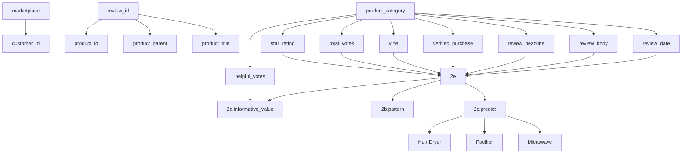

# Beat The Market:

# Comprehensive Exploration of Amazon Reviews and Ratings

Recently the Sunshine Company plans to launch three new products in the online marketplace, and our team is required to provide some insights of the given data, as well as giving strategic suggestions for improving the future sales and reputation of the products. Specific tasks are separated into two big questions.

As for question 1, we first apply data cleaning by removing unnecessary information, tokenizing all texts and lemmatizing and stemming all words. Then we apply LDA topic model to give an intuitive description of what reviews care about. Next we visualize the relationship of review amount, review length, star rating and the helpful votes by time and cross analysis. The results show that reviews with larger helpfulness ratings tend to accompany with high ratings and long review lengths. Moreover, in the early stage the averaged number of helpful votes per review far outnumber that of the latter stage. In the mean time, the ratings, review lengths and other indexes dramatically fluctuate. These all indicate the importance of keeping a good brand image in the cold start stage.

As to question 2(a), we propose three metrics for Sunshine to track: 1. weighted rating ratio which represents the occurring ratio of each rating weighted by number of helpful votes; 2. weighted sentimental score for reviews, where we apply logistic regression to calculate scores for each notional word and their weighted sums by helpfulness; 3. preference vector, where we sort out seven attributes for each product based on LDA's results, set up dictionaries which consist of related terms for each attribute and estimate people's preference ratio on these attributes based on weighted word frequency statistics with time decay. As a Result, Sunshine can allocate different efforts on improving different product features.

In question 2(b), we consider that the reputation of a product is related to the averaged star ratings, the authoritativeness of its reviews and the sales volume, among which we assume the sales volume is proportional to the review number in a fixed-length time window. Therefore the reputation over that fixed-length time window can be seen as the joint contribution of features concerning rate and reviews during that period, and after calculation, results show that for hair dryer and pacifier, their reputation scores increase in the early time and tend to be stable later, whereas those of microwave keep growing the whole time.

With regard to 2(c), we continue to use the time-varying reputation in 2(b) as a comprehensive indicator of both ratings and reviews and apply a nested two-layer LSTM model to predict its value for the review sequence, for considering that this index takes nearly every informative given features into accounts (sales volume included).

In terms of 2(d), we consider the ripple effect of reviews. After analyzing the trend of the monthly averaged number of different ratings over time, we conclude that reviews with rate 5 tend to incite more reviews. Besides that, we unexpectedly observe that the reviews amount of rate 1 is significantly correlated with the length of reviews, and after Granger Cause Test, we find that short reviews tend to lag within two months after a large ratio of low star ratings.

Regarding 2(e), we sort out a dictionary for affective words exclusively and assign a score for each of them. Then we compute the new sentimental scores of all reviews and rank reviews into five ranks. After comparing the confusion matrix of star rating and review ranks, we find a mapping asymmetry that some reviews with strongly affective words had mild ratings, and reviews with more mildly affective words has extreme ratings. We explain this phenomena by visualizing that for those reviews, greater chances are that both positive words and negative affective words occur, or strongly affective words are replaced by words that describe product attributes.

Last but not least, we summarize the pros and cons of our solutions and present our insights to Sunshine's market director for the purpose of helping Sunshine take a lead in online market.

## Contents

## 1 Introduction 2

1.1 Problem Background 2  
1.2 Clarification and Restatement 2  
1.3 Our Work 2

## 2 Problem 1: Data Preprocessing and Mining 4

2.1 Data Cleaning 4  
2.2 Text Mining by LDA Topic Model[1] 4  
2.3 Overall Data Characteristics 5

## 3 Problem 2 (a): Ratings and Reviews Based Data Measures 8

3.1 Weighted Rating Ratio 8  
3.2 Avg and Std of Weighted Sentimental Scores for Reviews[2][3][4] 8  
3.3 Users' Preference Vector 9

## 4 Problem 2 (b): Reputation Metric 11

4.1 Reputation Metric 11  
4.2 Analysis on Reputation Variation Patterns 11

## 5 Problem 2 (c): Nested Two-Layer LSTM 12

5.1 The Structure of the Nested Two-layer LSTM Model 12  
5.2 Analysis on Potential Success of Products 14

## 6 Problem 2 (d): Causal Effectiveness Between Reveiws 15

6.1 Ripple Effects of Extreme Ratings 15  
6.2 Causal Inference for Ratio of Low Rating and Review Length 16

## 7 Problem 2 (e)[5]: Correlation between Affective Words and Star Ratings 18

7.1 Analysis for Alignment of Rate and Review Scored by Certain Affective Words ..... 18  
7.2 Micro Observation of Asymmetry between Rate and Review[6] 18

## 8 Strengths and Weaknesses 20

8.1 Strengths 20  
8.2 Weaknesses 21

## 9 Conclusion 21

## 10 The Letter to the Marketing Director of Sunshine Company 22

## Appendices 26

## Appendix A LDA Topic Model for Microwave and Pacifier 26

## Appendix B Product Contrast of Microwave and Pacifier Over Time 27

## Appendix C Code 27

C.1 Data Preprocess and Overall Analysis 27  
C.2 LDA Analysis 33  
C.3 Sentimental Score 37  
C.4 LSTM 38  
C.5 Reputation Model 40

## 1 Introduction

## 1.1 Problem Background

Nowadays with more and more merchants joining the e-commerce camp, competition in Internet marketing has become increasingly intense. Meanwhile, as more and more customers participate in online reviews and interactions, comprehensive analysis of reviews and ratings plays an increasingly important role in understanding customers' pain points and specifying future strategies.

Specifically speaking, in Amazon's design, customers are allowed to choose a number from 1 to 5 to express their satisfaction level with the product, write any text-based messages as reviews and freely vote for other reviews they consider helpful. These are the main data sources for related companies to gain insights into the markets in which they participate, the timing of that participation, and the potential success of product design feature choices.

## 1.2 Clarification and Restatement

In this problem we are given three review data sets on three new products by Sunshine Company: a microwave oven, a baby pacifier and a hair dryer, and asked to provide the Company with an online sales strategy and important design patterns to enhance the attractiveness of the product. The data sets include product types, star ratings, review titles and bodys, helpfulness votes, certification information and date. We should only use these data to solve the following problems:

- Analyze the three product data sets, qualitatively or quantitatively measure and describe these data to obtain some quantifiable indicators, patterns or relationships to guide product sales plan of Sunshine.  
- Based on the above analysis, the following special needs should be further addressed:

- Design a metric based on the rating and review content to represent the information value of the review, thus providing Sunshine Company with a way to find the most valuable review.  
- Find time-based measures and patterns which indicate whether the market reputation of specific product is increasing or decreasing.  
- Identify a combination of text-based measures and ratings-based measures that best indicate the potential success or failure of a product.  
– Find correlations between star ratings and review properties such as quantity, quality, etc.  
- Find correlations between star ratings and specific review words.

\- Write a letter to the Marketing Director of Sunshine Company by summarizing the analysis and results, and providing rational recommends.

## 1.3 Our Work

Our work follows the following workflow, as shown in the Fig. 1. The level-1 data is the 15 product properties directly provided in the problem. The level-2 data is based on the level-1 data, including product class, helpfulness rating and emotion measure of the review content. Based on this, level-3 data is further processed into a score that can be used to measure a review's information value. Then level-4 data, which indicates a reasonable measure of a product's prospects, is aggregated for a reputation index in problem 2(b)(c).


<details>
<summary>flowchart</summary>


</details>

Figure 1: Workflow

- In the problem 1, we simply process the level-2 data, and then analyze the relationship between the review amount, star rating and date, the ratio of various star rating levels, review amount of customers, as well as the relationship between the review amount, review length, star rating and the helpfulness ratings.  
- In problem 2(a), we propose three metrics: 1. weighted rating ratio, 2. weighted sentimental score, 3. preference vector. They depict the attributes of a review from the perspectives of star rating, emotion and what reviewers care about. Further, we can measure the value of reviews from these three dimensions in needs.  
- In problem 2(b), we consider the reputation of a product in a fixed-length time window as a joint contribution of total review number, averaged rate, helpful votes, review readability and averaged sentimental scores of reviews over that period. And after calculation, we observe its changing values for each product over time.  
- In problem 2(c), we continue to use the time-varying reputation in 2(b) as a comprehensive index of both ratings and reviews and LSTM is applied to predict their values in the next 1000 reviews. Since we assume the sales amount is proportional to the total review number, the reputation is associated with the sales and takes nearly every informative given features into accounts (sales amount included). Also because the training and testing losses of LSTM are too small to be valued, we are confident in the power of this index.  
- In problem 2(d), we consider the ripple effect of reviews. After analyzing the trend of the monthly average number of different star ratings over time, we conclude that reviews with a score of 5 often lead to more reviews. Furthermore, we unexpectedly find that the reviews amount of star ratings 1 is significantly correlated with the length of reviews, and after Granger Cause Test, we find that short reviews tend to lag within two months after a large ratio of low star ratings.  
- In problem 2(e), we extract the emotion words, score and rank the reviews based on the words. After comparing the confusion matrix of rating and review ranks, we find some mapping asymmetry that some reviews with strongly affective words have mild ratings, and reviews with more mildly affective

words have extreme ratings. We explain this phenomena by showing that for those reviews, greater chances are that both positive words and negative affective words occur, or strongly affective words are replaced by words that described product properties.

## 2 Problem 1: Data Preprocessing and Mining

In this section, we preprocess the data set and analyze the relationship between review amount, star rating, helpfulness rating, customer and date, and present some findings.

## 2.1 Data Cleaning

## 1. General Data Cleaning:

The given data set presents 15 properties for the three products: hair dryer, microwave and pacifier. In all of these properties, marketplace which is either "US" or "us", review id which is unique for all items and product category which is exclusive for these three products, are useless for our subsequent analysis and we simply delete the three properties. For vine and verified purchase, we replace all n and N with N, and all y and Y with Y. Then we clean all given texts by replacing some special Chinese characters with equivalent ASCII characters as much as possible, and eliminating the remaining special garbled codes and symbols, for further text-based emotion analysis and keyword extraction. In the end, we eliminate 214 unqualified items and leave 11424, 1606 and 18784 items for hair dryer, microwave and pacifier, respectively.

## 2. Text Data Pre-processing[7]:

(a) Tokenization: Split texts into sentences and sentences into words. Lowercase words and remove punctuation.  
(b) Words that have fewer than 3 characters are removed. All stopwords are removed.  
(c) Words are lemmatized: words in third person are changed to first person and verbs in past and future tenses are changed into present.  
(d) Words are stemmed: words are reduced to their root form.

## 2.2 Text Mining by LDA Topic Model[1]

Since the review texts are rich and complex, it is of great importance to dig out the topic words so as to clearly grasp what consumers really care about. And here we accomplish this task by applying the Latent Dirichlet Allocation (LDA) model, a powerful NLP method for topic word extraction.

By simply running the standard python codes of LDA, we get results that will be useful in the subsequent estimation of users' preference vectors. We show results of LDA for hair dryer in Fig. 2, and the rest results can be seen in the Appendix. A.


<details>
<summary>scatter plot</summary>

| Point | PC1 | PC2 | Count |
|-------|-----|-----|-------|
| 1     |     |     | 1     |
| 2     |     |     | 6     |
| 3     |     |     | 3     |
| 4     |     |     | 4     |
| 5     |     |     | 5     |
| 6     |     |     | 2     |
| 7     |     |     | 7     |
</details>


<details>
<summary>bar chart</summary>

| Term       | Overall term frequency | Estimated term frequency within the selected topic |
| ---------- | ---------------------- | --------------------------------------------------- |
| hair       | 12,000                 | 10,500                                              |
| dryer      | 11,500                 | 8,000                                               |
| dry        | 2,500                  | 2,500                                               |
| time       | 2,000                  | 1,500                                               |
| blow       | 1,500                  | 1,500                                               |
| great      | 2,500                  | 1,500                                               |
| good       | 2,500                  | 1,500                                               |
| love       | 1,500                  | 1,500                                               |
| thick      | 1,500                  | 1,500                                               |
| long       | 1,500                  | 1,500                                               |
| old        | 1,500                  | 1,500                                               |
| price      | 1,500                  | 1,500                                               |
| product    | 2,500                  | 1,500                                               |
| minute     | 1,500                  | 1,500                                               |
| soft       | 1,500                  | 1,500                                               |
| hot        | 1,500                  | 1,500                                               |
| frizz      | 1,500                  | 1,500                                               |
| ionic      | 1,500                  | 1,500                                               |
| much       | 1,500                  | 1,500                                               |
| quiet      | 1,500                  | 1,500                                               |
| review     | 1,500                  | 1,500                                               |
| worth      | 1,500                  | 1,500                                               |
| smooth     | 1,500                  | 1,500                                               |
| less       | 1,500                  | 1,500                                               |
| frizzy     | 1,500                  | 1,500                                               |
| use        | 2,500                  | 1,500                                               |
| fast       | 1,500                  | 1,500                                               |
| lot        | 1,500                  | 1,500                                               |
| half       | 1,500                  | 1,500                                               |
| nice       | 1,500                  | 1,500                                               |
</details>

Figure 2: LDA topic model for hair dryer

## 2.3 Overall Data Characteristics

First, we analyze the changes of some main features over time[8]: We visualize the review amount of three products each month in Fig. 3(a) and observe that the reviews amount has increased exponentially over time. Besides that, the averaged rating score per month is further calculated and displayed, where reviews which occur less than 2 times in a month are not included in the statistics, as shown in Fig. 3(b):

1. The averaged review rating of all three products is generally between 3.5 and 4.5.  
2. The rating scores tend to converge over time.  
3. The reputation of microwave seems to be continuously increasing in recent years.


<details>
<summary>line chart</summary>

| Date | all  | hair_dryer | microwave | pacifier |
|------|------|------------|-----------|----------|
| 2004 | 0    | 0          | 0         | 0        |
| 2006 | 0    | 0          | 0         | 0        |
| 2008 | 0    | 0          | 0         | 0        |
| 2010 | 100  | 50         | 20        | 30       |
| 2012 | 300  | 200        | 50        | 40       |
| 2014 | 700  | 400        | 100       | 60       |
| 2016 | 1600 | 500        | 150       | 80       |
</details>

(a) Review amount per month


<details>
<summary>line chart</summary>

| Date  | hair_dryer | microwave | pacifier |
|-------|------------|-----------|----------|
| 2004  |            |           |          |
| 2006  | 5.0        |           |          |
| 2008  | 4.5        |           |          |
| 2010  | 3.5        |           |          |
| 2012  | 4.0        | 3.0       |          |
| 2014  | 4.5        | 4.0       |          |
</details>

(b) Rating score per month  
Figure 3: Review status over time

In order to understand the distribution of review ratings, we plot the proportion of five ratings for three products, shown in Fig. 4(a). Obviously, most of the ratings are 5 and the next most are 4, where microwave is an exception for owning too many 1 star ratings. This may be partly because microwave ovens are not easy to be accepted in the early stage.

Next we count the number of reviews of each customer and take the logarithm of the Y-axis to avoid a large difference in the order of magnitude. As can be seen in Fig. 4(b), most customers only review once, and only a few customers review more than 5 times.

Fig. 4(c) shows that most of the review votes are useful, where we only consider reviews with more than 10 votes, which represent the review quality appropriately.


<details>
<summary>bar chart</summary>

| Rating | all   | hair_dryer | microwave | pacifier |
| ------ | ----- | ---------- | --------- | -------- |
| 1      | 0.08  | 0.02       | 0.24      | 0.06     |
| 2      | 0.07  | 0.01       | 0.06      | 0.04     |
| 3      | 0.09  | 0.01       | 0.07      | 0.05     |
| 4      | 0.14  | 0.01       | 0.18      | 0.12     |
| 5      | 0.64  | 0.56       | 0.42      | 0.68     |
</details>

(a) Review percent per rating


<details>
<summary>bar chart</summary>

| Review Number | Customer Amount |
| ------------- | --------------- |
| 1             | 10000           |
| 2             | 1000            |
| 3             | 100             |
| 4             | 10              |
| 5             | 1               |
| 6             | 1               |
| 7             | 1               |
| 9             | 1               |
| 10            | 1               |
</details>

(b) Customer amount by review number


<details>
<summary>stacked bar chart</summary>

| Helpful Percent | all | hair_dryer | pacifier | microwave |
|---|---|---|---|---|
| 0.0 | 10 | 0 | 0 | 0 |
| 0.1 | 5 | 0 | 0 | 0 |
| 0.2 | 8 | 0 | 0 | 0 |
| 0.3 | 12 | 0 | 0 | 0 |
| 0.4 | 5 | 0 | 0 | 0 |
| 0.5 | 15 | 0 | 0 | 0 |
| 0.6 | 25 | 0 | 0 | 0 |
| 0.7 | 50 | 0 | 0 | 0 |
| 0.8 | 90 | 15 | 10 | 5 |
| 0.9 | 160 | 35 | 25 | 25 |
| 1.0 | 200 | 125 | 45 | 45 |
</details>

(c) Review amount by helpful percent  
Figure 4: Review amount from different angles

To further understand the characteristics of reviews with high helpfulness ratings, we display the averaged review length and averaged star rating in Fig. 5. Besides, the time-varying averaged helpful votes of each review are shown in Fig. 6.

1. In Fig. 5, reviews with higher helpfulness ratings tend to have more words and higher star ratings, possibly for the reason that too short reviews are easily ignored, few customers will write long reviews with nonsense, or they will lose their interests in a product after seeing low ratings and quickly leave without giving a certificate for reviews they've just seen, etc.  
2. In Fig. 6, helpful votes of a single review in the early stage far outnumber the those in the recent period. This may be because in the early stage there are too few comments for people to refer to, thus people naturally attach more importance of each comment in the cold start period. Moreover, reviews with more helpful votes may be displayed in the front of the comment zone, which enlarges their probabilities to get more votes. As stated in [9] and [10], the above phenomenon are called early birds bias and winner circle bias, respectively.


<details>
<summary>line chart</summary>

| Helpful Percent | Average Review Length |
| --------------- | --------------------- |
| 0.0             | ~200                  |
| 0.1             | ~300                  |
| 0.2             | ~400                  |
| 0.3             | ~500                  |
| 0.4             | ~600                  |
| 0.5             | ~700                  |
| 0.6             | ~800                  |
| 0.7             | ~900                  |
| 0.8             | ~1000                 |
| 0.9             | ~1200                 |
| 1.0             | ~1500                 |
</details>

(a) Average review length of helpful percent


<details>
<summary>line chart</summary>

| Helpful Percent | Average Star Rating |
| --------------- | ------------------- |
| 0.0             | 1.0                 |
| 0.1             | 4.0                 |
| 0.2             | 1.0                 |
| 0.3             | 2.5                 |
| 0.4             | 4.0                 |
| 0.5             | 1.0                 |
| 0.6             | 2.0                 |
| 0.7             | 3.0                 |
| 0.8             | 3.5                 |
| 0.9             | 4.0                 |
| 1.0             | 4.0                 |
</details>

(b) Star rating of helpful percent  
Figure 5: Review status by helpful percent

Time-varying average number of helpful votes for different ratings  


<details>
<summary>line chart</summary>

| x    | rate1 | rate2 | rate3 | rate4 | rate5 |
| ---- | ----- | ----- | ----- | ----- | ----- |
| 0    | 20.0  | 7.5   | 12.5  | 7.5   | 20.0  |
| 500  | 3.5   | 1.0   | 1.0   | 1.0   | 8.5   |
| 1000 | 2.5   | 0.5   | 0.5   | 0.5   | 3.5   |
| 1500 | 2.0   | 0.5   | 0.5   | 0.5   | 2.5   |
| 2000 | 1.5   | 0.5   | 0.5   | 0.5   | 2.0   |
| 2500 | 1.5   | 0.5   | 0.5   | 0.5   | 1.5   |
| 3000 | 1.5   | 0.5   | 0.5   | 0.5   | 2.5   |
| 3500 | 1.5   | 0.5   | 0.5   | 0.5   | 1.5   |
| 4000 | 1.5   | 0.5   | 0.5   | 0.5   | 1.0   |
| 4500 | 1.5   | 0.5   | 0.5   | 3.5   | 1.5   |
| 5000 | 1.5   | 0.5   | 0.5   | 1.5   | 1.0   |
| 5500 | 1.5   | 0.5   | 0.5   | 1.5   | 1.5   |
| 6000 | 1.5   | 0.5   | 0.5   | 1.5   | 1.0   |
</details>


<details>
<summary>line chart</summary>

| x    | rate1 | rate2 | rate3 | rate4 | rate5 |
| ---- | ----- | ----- | ----- | ----- | ----- |
| 0    | 10.8  | -     | -     | 8.2   | 17.0  |
| 100  | 5.0   | -     | -     | 3.5   | 5.0   |
| 200  | 3.8   | -     | -     | -     | 7.2   |
| 300  | -     | -     | -     | -     | 1.2   |
| 400  | -     | -     | -     | -     | 11.0  |
| 500  | -     | -     | -     | -     | 1.0   |
</details>


<details>
<summary>line chart</summary>

| x     | rate1 | rate2 | rate3 | rate4 | rate5 |
|-------|-------|-------|-------|-------|-------|
| 0     | 7.5   | 5.5   | 2.8   | 5.6   | 7.5   |
| 1000  | 1.2   | 0.8   | 0.5   | 0.6   | 1.5   |
| 2000  | 0.8   | 0.6   | 0.4   | 0.3   | 1.8   |
| 3000  | 0.9   | 0.7   | 0.5   | 0.4   | 1.2   |
| 4000  | 0.7   | 0.6   | 0.4   | 0.3   | 1.0   |
| 5000  | 0.8   | 0.7   | 0.5   | 0.4   | 1.8   |
| 6000  | 0.6   | 0.5   | 0.4   | 0.3   | 1.9   |
| 7000  | 0.7   | 0.6   | 0.5   | 0.4   | 1.2   |
| 8000  | 0.8   | 0.7   | 0.6   | 0.5   | 1.1   |
| 9000  | 0.6   | 0.5   | 0.4   | 0.3   | 1.3   |
| 10000 | 0.7   | 0.6   | 0.5   | 0.4   | 1.2   |
| 11000 | 0.8   | 0.7   | 0.6   | 0.5   | 1.1   |
| 12000 | 0.6   | 0.5   | 0.4   | 0.3   | 1.3   |
</details>

Figure 6: Time-varying average number of helpful votes for different ratings

In addition, we conduct a detailed analysis of various commodities under the three products to find out the relationship between the review amount and the averaged star rating and the averaged length of reviews on the same commodity. The results in hair dryer data set are shown in Fig. 7, and the rest are shown in the Appendix B. We can find it seems that longer reviews are often followed by improved ratings, and longer periods of high ratings will lead to an increase of reviews, which partly reflects the increase on sales.


<details>
<summary>scatter plot</summary>

| Product ID       | Date  | Review Amount |
| ----------------- | ----- | ------------- |
| B00SKQFT4I        | 2016  | 15            |
| B00BBBZIW0        | 2016  | 15            |
| B00APV7OWG        | 2016  | 15            |
| B004YZMKKU        | 2016  | 15            |
| B003V264WW        | 2016  | 15            |
| B003TQPRGY        | 2016  | 15            |
| B003FBG88E        | 2016  | 15            |
| B001UE7D2I        | 2016  | 15            |
| B001QTW2FK        | 2016  | 15            |
| B00132ZG3U        | 2016  | 15            |
| B000RZLL38        | 2016  | 15            |
| B000R80ZTQ        | 2016  | 15            |
| B000K7JLGM        | 2016  | 15            |
| B000H0XV3G        | 2016  | 15            |
| B000FS1W4U        | 2016  | 15            |
| B000E8PG98        | 2016  | 15            |
| B000A3I2X4        | 2016  | 15            |
| B0009XH6WI        | 2016  | 15            |
| B0009XH6V4        | 2016  | 15            |
| B0009XH6UU        | 2016  | 15            |
| B0009XH6TG        | 2016  | 15            |
| B0009ZM2VO        | 2016  | 15            |
| B0008ENT8I        | 2016  | 15            |
| B0007O8EIS        | 2016  | 15            |
| B0002G214U        | 2016  | 15            |
| B00009YJS         | 2016  | 15            |
| B00006IV22        | 2016  | 15            |
| B000065DJY        | 2016  | 15            |
| B00005OOMZ        | 2016  | 15            |
</details>


<details>
<summary>scatter plot</summary>

| Date       | Average Star Rating |
| ---------- | ------------------- |
| 2002-01-01 | 3.5                 |
| 2002-01-02 | 4.2                 |
| 2002-01-03 | 3.8                 |
| 2002-01-04 | 4.5                 |
| 2002-01-05 | 5.1                 |
| 2002-01-06 | 4.9                 |
| 2002-01-07 | 5.3                 |
| 2002-01-08 | 5.7                 |
| 2002-01-09 | 6.0                 |
| 2002-01-10 | 6.3                 |
| 2002-01-11 | 6.5                 |
| 2002-01-12 | 6.8                 |
| 2002-01-13 | 7.0                 |
| 2002-01-14 | 7.2                 |
| 2002-01-15 | 7.5                 |
| 2002-01-16 | 7.8                 |
| 2002-01-17 | 8.0                 |
| 2002-01-18 | 8.2                 |
| 2002-01-19 | 8.5                 |
| 2002-01-20 | 8.8                 |
| 2002-01-21 | 9.0                 |
| 2002-01-22 | 9.2                 |
| 2002-01-23 | 9.5                 |
| 2002-01-24 | 9.8                 |
| 2002-01-25 | 10.0                |
| 2002-01-26 | 10.2                |
| 2002-01-27 | 10.5                |
| 2002-01-28 | 10.8                |
| 2002-01-29 | 11.0                |
| 2002-01-30 | 11.2                |
| 2003-01-31 | 11.5                |
| 2003-02-01 | 11.8                |
| 2003-02-02 | 12.0                |
| 2003-02-03 | 12.2                |
| 2003-02-04 | 12.5                |
| 2003-02-05 | 12.8                |
| 2003-02-06 | 13.0                |
| 2003-02-07 | 13.2                |
| 2003-02-08 | 13.5                |
| 2003-02-09 | 13.8                |
| 2003-02-10 | 14.0                |
| 2003-02-11 | 14.2                |
| 2003-02-12 | 14.5                |
| 2003-02-13 | 14.8                |
| 2003-02-14 | 15.0                |
| 2003-02-15 | 15.2                |
| 2003-02-16 | 15.5                |
| 2003-02-17 | 15.8                |
| 2003-02-18 | 16.0                |
| 2003-02-19 | 16.2                |
| 2003-02-20 | 16.5                |
| 2003-03-01 | 16.8                |
| 2003-03-02 | 17.0                |
| 2003-03-03 | 17.2                |
| 2003-03-04 | 17.5                |
| 2003-03-05 | 17.8                |
| 2003-03-06 | 18.0                |
| 2003-03-07 | 18.2                |
| 2003-03-08 | 18.5                |
| 2003-03-09 | 18.8                |
| 2003-03-10 | 19.0                |
| 2003-03-11 | 19.2                |
| 2003-03-12 | 19.5                |
| 2003-03-13 | 19.8                |
| 2003-03-14 | 20.0                |
| 2003-03-15 | 20.2                |
| 2003-03-16 | 20.5                |
| 2003-03-17 | 20.8                |
| 2003-03-18 | 21.0                |
| 2003-03-19 | 21.2                |
| 2003-03-2<fcel>
</details>


<details>
<summary>scatter plot</summary>

| Date       | Average Review Length |
| ---------- | --------------------- |
| 2002-01-01 | 5.0                   |
| 2003-01-01 | 7.0                   |
| 2004-01-01 | 9.0                   |
| 2005-01-01 | 11.0                  |
| 2006-01-01 | 13.0                  |
| 2007-01-01 | 15.0                  |
| 2008-01-01 | 17.0                  |
| 2009-01-01 | 19.0                  |
| 2010-01-01 | 21.0                  |
| 2011-01-01 | 23.0                  |
| 2012-01-01 | 25.0                  |
| 2013-01-01 | 27.0                  |
| 2014-01-01 | 29.0                  |
| 2015-01-01 | 31.0                  |
| 2016-01-01 | 33.0                  |
</details>

Figure 7: Product contrast of hair dryer over time

## Based on our previous analysis, Sunshine Company should note that:

1. The number of reviews has increased rapidly in recent years, which reflects the importance of Sunshine's frequent interaction with reviewers.  
2. The star rating will experience large fluctuations in the early stage of the product launch, during which time the brand image should be maintained cautiously.

3. Since reviews with high star ratings and more words tend to get more helpful votes, Sunhine had better closely watch out this type of reviews and discover customers' pain points based on them[11].

## 3 Problem 2 (a): Ratings and Reviews Based Data Measures

We design three types of data measures based on ratings and reviews that are informative for Sunshine Company to track, i.e. weighted rating ratio, averages and standard deviations of weighted sentimental scores for reviews and users preference vectors.

## 3.1 Weighted Rating Ratio

1. For $i \in [5]$ , denote the timestamps when a new rating i is created as $A_{i}$ .  
2. For the timestamp $j \in A_{i}$ , denote the number of helpful votes at time j as $HN_{j}$ .  
3. Assign a weight of $HN_{j} + 1$ to time $j$ , and we obtain that the weighted ratio for rating $i$ can be formulated as

$$
w r r _ {i} = \frac {\sum_ {j \in A _ {i}} (H N _ {j} + 1)}{\sum_ {i \in [ 5 ]} \sum_ {j \in A _ {i}} (H N _ {j} + 1)}
$$

$wrr_{i}$ represents the occurring ratio of rating i weighted by helpfulness among all five ratings.

According to the formula above and the given data, we obtain the $wrr_{i}$ values as follows Fig. 8:


<details>
<summary>bar chart</summary>

| Star Rating | Pacifier | Microwave | Hair Dryer |
| ----------- | -------- | --------- | ---------- |
| 5           | 0.58     | 0.46      | 0.53       |
| 4           | 0.15     | 0.14      | 0.17       |
| 3           | 0.08     | 0.10      | 0.09       |
| 2           | 0.08     | 0.06      | 0.06       |
| 1           | 0.11     | 0.25      | 0.16       |
</details>

Figure 8: Weighted rating ratio of different rating for different product

## 3.2 Avg and Std of Weighted Sentimental Scores for Reviews[2][3][4]

1. Calculate the normalized sentimental scores of notional words appearing in the review texts by logistic regression Algorithm 1:

Note: The reason for which we adopt logistic regression[4] is that normally the sentimental scores of negative words are negative, those of positive words are positive and those of neutral words should be zero. The sigmoid function in logistic regression happens to symmetrically map $\mathbb{R}$ into [0, 1] with zero as the center of x axis. As a result, $S$ can be naturally solved by this method.

Algorithm 1: Logistic Regression

Input: notional words set $W = \{w_{1}, \cdots, w_{n}\}$ , review set $\{re_{t}\}_{t \in T}$ and rating sets $\{ra_{t}\}_{t \in T}$ .

Output: sentimental scores $S = \{s_{1}, \cdots, s_{n}\}$

Map $ra_{t}$ to $y_{t}$ by $\{1:0,2:0.25,3:0.5,4:0.75,5:1\}$ .

$$
\mathcal {S} = \operatorname{argmin} _ {S} \sum_ {t \in [ T ]} \left(y _ {1} - \frac {1}{1 + e ^ {\sum_ {s \in S} s 1 _ {s} \{r e _ {t} \}}}\right) ^ {2}
$$

where $1_{s}\{re_{t}\} = 1$ if the notional words occurred in the t-th review, otherwise 0.

2. For $t \in [t]$ , denote the sentimental score of the t-th review as $ss_t$ , and we obtain that

$$
s s _ {t} = \sum_ {s \in S} s 1 _ {s} \left\{r e _ {t} \right\}
$$

Then the weighted averaged reviews' sentimental score for rating i can be formulated

$$
a v g _ {i} = \frac {\sum_ {j \in A _ {i}} (H N _ {j} + 1) \times s s _ {j}}{\sum_ {i \in [ 5 ]} \sum_ {j \in A _ {i}} (H N _ {j} + 1)}
$$

and the weighted standard deviation of reviews' sentimental score for rating i can be formulated

$$
s t d _ {i} = \sqrt {\frac {\sum_ {j \in A _ {i}} (H N _ {j} + 1) \times (s s _ {i} - a v g _ {i}) ^ {2}}{\sum_ {i \in [ 5 ]} \sum_ {j \in A _ {i}} (H N _ {j} + 1)}}
$$

According to the formula above and the given data, we obtain the $avg_{i}$ , $avg_{i}$ values as follows Fig. 9:


<details>
<summary>line chart</summary>

| x | Hair Dryer | Microwave | Pacifier |
|---|---|---|---|
| 1 | -5.5 | -8.0 | -0.5 |
| 2 | -4.0 | -5.0 | -0.8 |
| 3 | 1.0 | 1.5 | 0.0 |
| 4 | 3.5 | 2.5 | 1.0 |
| 5 | 4.5 | 4.5 | 1.2 |
</details>

(a) Weighted Average


<details>
<summary>line chart</summary>

| x | Hair Dryer | Microwave | Pacifier |
| --- | --- | --- | --- |
| 1 | 0.7 | 1.0 | 0.3 |
| 2 | 0.3 | 0.1 | 0.4 |
| 3 | 0.5 | 0.5 | 0.3 |
| 4 | 0.7 | 0.1 | 0.4 |
| 5 | 1.0 | 0.4 | 0.6 |
</details>

(b) Weighted Std  
Figure 9: Weighted sentimental score index of reviews for different ratings

## 3.3 Users' Preference Vector

Since requirement measurements are fundamental to product positioning and strategic marketing development, we attach great importance to computing the preference vectors of consumers by analyzing the review data.

Owing to the topic analysis by the Latent Dirichlet Allocation (LDA) model and detailed observations of product reviews, we identify eight main product attributes for hair dryer, microwave and pacifier respectively. Lexicons of 46, 51 and 45 words are constructed to identify the attribute terms in the product reviews. The classified attributes and relative number of terms are described in Table 1.

Table 1: Classified attributes and relative number of terms

<table><tr><td colspan="2">Hair dryer</td><td colspan="2">Microwave</td><td colspan="2">Pacifier</td></tr><tr><td>Attribute</td><td>Num</td><td>Attribute</td><td>Num</td><td>Attribute</td><td>Num</td></tr><tr><td>Lifespan</td><td>5</td><td>Lifespan</td><td>5</td><td>Lifespan</td><td>5</td></tr><tr><td>Weight</td><td>3</td><td>Weight</td><td>3</td><td>Size and shape</td><td>9</td></tr><tr><td>After-sales service</td><td>9</td><td>After-sales service</td><td>9</td><td>Packing</td><td>8</td></tr><tr><td>Heat</td><td>3</td><td>Heat</td><td>3</td><td>Softness</td><td>3</td></tr><tr><td>Materials&amp;Structure</td><td>19</td><td>Materials&amp;Structure</td><td>24</td><td>Materials&amp;Structure</td><td>13</td></tr><tr><td>Price</td><td>3</td><td>Cost</td><td>3</td><td>Cost</td><td>3</td></tr><tr><td>Safety</td><td>4</td><td>Safety</td><td>4</td><td>Safety</td><td>4</td></tr></table>

## Next is to estimate users' preference ratio for each attribute.

Taking the hair dryer product as an example, we denote users' preference degree and preference ratio for attribute i as $PD_{i}$ and $PR_{i}$ . Then it holds $PR_{i} = \frac{PD_{i}}{\sum_{j \in [8]} PD_{j}}$ .

To calculate $PD_{i}$ , we must clarify that

1. The older the review is, the less importance it is in $PD_{i}$ .  
2. Reviews with neutral ratings are attached little importance in $PD_{i}$ .  
3. The more helpful votes the review has, the more weight it takes up in $PD_{i}$ .

Based on the considerations above, we define $PD_{i} = \sum_{t\in T}\left(|ra_{t} - 3| + 0.5\right)\times 1_{it}\times (HN_{t} + 1)$ , hence

$$
P R _ {i} = \frac {\sum_ {t \in T} \gamma^ {1 - t} (| r a _ {t} - 3 | + 0 . 5) \times 1 _ {i t} \times (H N _ {t} + 1)}{\sum_ {i \in [ 8 ]} \sum_ {t \in T} \gamma^ {1 - t} (| r a _ {t} - 3 | + 0 . 5) \times 1 _ {i t} \times (H N _ {t} + 1)}
$$

where $\gamma$ is a discounted factor of time, and we set it to be 0.999. According to the formula above and the given data, different users' preference vectors of three products are displayed in Table 2:

Table 2: Classified attributes and relative weights in reviews

<table><tr><td colspan="2">Hair dryer</td><td colspan="2">Microwave</td><td colspan="2">Pacifier</td></tr><tr><td>Attribute</td><td>PR</td><td>Attribute</td><td>PR</td><td>Attribute</td><td>PR</td></tr><tr><td>Lifespan</td><td>0.136</td><td>Lifespan</td><td>0.161</td><td>Lifespan</td><td>0.064</td></tr><tr><td>Weight</td><td>0.035</td><td>Weight</td><td>0.016</td><td>Size and shape</td><td>0.285</td></tr><tr><td>After-sales service</td><td>0.143</td><td>After-sales service</td><td>0.191</td><td>Packing</td><td>0.157</td></tr><tr><td>Heat</td><td>0.152</td><td>Heat</td><td>0.094</td><td>Softness</td><td>0.076</td></tr><tr><td>Materials&amp;Structure</td><td>0.250</td><td>Materials&amp;Structure</td><td>0.324</td><td>Materials&amp;Structure</td><td>0.291</td></tr><tr><td>Price</td><td>0.049</td><td>Cost</td><td>0.048</td><td>Cost</td><td>0.020</td></tr><tr><td>Safety</td><td>0.235</td><td>Safety</td><td>0.166</td><td>Safety</td><td>0.107</td></tr></table>

Having computed the preference vectors, the Sunshine Company can readjust its strategies accordingly. Taking hair dryer as an example, the preference ratio of safety, materials quality, heat, lifespan and after sales service take up nearly 90 percentage, therefore the Sunshine Company should pay more attention to these attributes and assign proper funds to improve these aspects by their preference ratios respectively.

## 4 Problem 2 (b): Reputation Metric

## 4.1 Reputation Metric

The reputation of a product is related to many factors (e.g. the average star rating it receives, the authoritativeness of its reviews $[12]$ $[13]$ and the sales volume). As we assume that the sales volume over a period of time is in proportion to the number of reviews the product receives. The reputation score a product earns over a period of time can be seen as the joint contribution of all reviews it receives, which indicating both the quality and sales volume.

Here we define a function $\mathcal{R}(r_{i})$ , which maps an instance of review $r_{i}$ ( $r_{i}$ contains any information we might use from the review i) into a scalar indicating the contribution of the review to the reputation for the product. Taking plenty of factors into account, the contribution score R can be formulated as:

$$
\mathcal {R} \left(r _ {i}\right) = \frac {1}{t _ {i} + 1} \left(w r r _ {i} \times \alpha_ {\text { vine }} \times \alpha_ {\text { verified }} \times \text { rating } _ {i}\right) \tag {1}
$$

The scaling parameter t is the time interval (unit: day) between $r_{i}$ and the last review. The larger the time interval, the less reviews the product receives, indicating less sales volume during that period of time. $wrr_{i}$ is the weighted rate radio calculated in problem 2(a), which contains the information of helpful votes. The ratio $\alpha_{vine}$ and $\alpha_{verified}$ is formulated as:

$$
\left\{ \begin{array}{l} \alpha_ {v i n e} = 0. 2 * v i n e + 0. 8 \\ \alpha_ {v e r i f i e d} = 0. 2 * v e r i f i e d + 0. 8 \end{array} \right. \tag {2}
$$

where we set the parameter vine and verified to 1 if the review has "vine" or "verified purchase" tags. Otherwise we set them to 0.

Next, a sliding window with size m is applied to the review table. A successive sequence of reviews, representing a period of time, constructs the average reputation score the product earns during that time:

$$
r e p _ {i} ^ {p} = \frac {1}{m} \sum_ {j = 0} ^ {m - 1} \mathcal {R} (r _ {i + j}) \tag {3}
$$

## 4.2 Analysis on Reputation Variation Patterns

By applying the sliding window strategy above to formulate the average reputation score, we can get a pattern of reputation variation with smooth changes because the difference between adjacent reputation scores is scaled by the window size m:

$$
r e p _ {i + 1} ^ {p} - r e p _ {i} ^ {p} = \frac {1}{m} (\mathcal {R} (i + m) - \mathcal {R} (i)) \tag {4}
$$

In this section, we set the window size $m$ equal to 200 and 500. As shown in Fig. 10 and Fig. 11, the larger the window size $m$ is, more violently the reputation curves fluctuate.


<details>
<summary>line chart</summary>

| time step | reputation metric |
| --------- | ---------------- |
| 0         | 2.3              |
| 1000      | 3.1              |
| 2000      | 3.8              |
| 3000      | 3.6              |
| 4000      | 4.2              |
| 5000      | 3.9              |
| 6000      | 3.7              |
| 7000      | 3.8              |
| 8000      | 4.1              |
| 9000      | 3.7              |
| 10000     | 3.8              |
| 11000     | 3.9              |
</details>


<details>
<summary>line chart</summary>

| time step | reputation metric |
| --------- | ---------------- |
| 0         | 1.3              |
| 200       | 2.2              |
| 400       | 2.6              |
| 600       | 2.7              |
| 800       | 2.5              |
| 1000      | 3.2              |
| 1200      | 2.9              |
| 1400      | 3.1              |
</details>


<details>
<summary>line chart</summary>

| time step | reputation metric |
| --------- | ----------------- |
| 0         | 2.6               |
| 2500      | 3.8               |
| 5000      | 4.0               |
| 7500      | 4.2               |
| 10000     | 3.6               |
| 12500     | 3.8               |
| 15000     | 3.6               |
| 17500     | 3.8               |
</details>

Figure 10: Reputation score of three products over time with window size m = 200  


<details>
<summary>line chart</summary>

| time step | reputation metric |
| --------- | ---------------- |
| 0         | 2.5              |
| 1000      | 3.7              |
| 2000      | 3.1              |
| 3000      | 3.8              |
| 4000      | 4.0              |
| 5000      | 3.8              |
| 6000      | 3.7              |
| 7000      | 3.9              |
| 8000      | 3.7              |
| 9000      | 3.6              |
| 10000     | 3.8              |
</details>


<details>
<summary>line chart</summary>

| time step | reputation metric |
| --------- | ---------------- |
| 0         | 1.8              |
| 200       | 2.4              |
| 400       | 2.5              |
| 600       | 2.7              |
| 800       | 2.9              |
| 1000      | 3.0              |
</details>


<details>
<summary>line chart</summary>

| time step | reputation metric |
| --------- | ---------------- |
| 0         | 2.8              |
| 2500      | 3.8              |
| 5000      | 3.9              |
| 7500      | 4.0              |
| 10000     | 3.6              |
| 12500     | 3.7              |
| 15000     | 3.8              |
| 17500     | 3.7              |
</details>

Figure 11: Reputation score of three products over time with window size m = 500

Although different window size m results in different volatility of the reputation curve, they all generally have the same variation patterns for each product. For hair dryer and pacifier, their reputation scores increase in the early time and tend to be stable later. For microwave, its reputation score keeps growing the whole time. These trends also roughly correspond to the pattern of star ratings shown in Fig. 3, which is a lateral support for the correctness of our reputation metric.

## 5 Problem 2 (c): Nested Two-Layer LSTM

## 5.1 The Structure of the Nested Two-layer LSTM Model

For problem 2(c), we continue using the reputation score $rep_{i}^{p}$ as the metric representing the success of a product. A potentially successful or failing product means that the reputation score keeps increasing or decreasing in the future and reach a threshold value. To predict the reputation score, we use Long and Short-Term Memory (LSTM)[14][15] to model the variation pattern of the review sequence.

LSTM model is a variant of recurrent neural network (RNN). It is well-suited to classifying, processing and making predictions based on time series data. A common LSTM unit is composed of a cell, an input gate, an output gate and a forget gate. The cell remembers values over arbitrary time intervals and the three gates regulate the flow of information into and out of the cell. The structure of our nested two-layer LSTM model is shown in Fig. 12. The model can be divided into three separate modules: input module, LSTM module and output module.


<details>
<summary>flowchart</summary>


</details>

Figure 12: The structure of nested two-layer LSTM model

## 1. Input Module

For each review instance at a time stamp, we first feed the review text (combining both review headline and review body) into the embedding system to generate the sentence embedding $v_{s}$ which is represented as a 200-dimension vector. Then we generate the input vector $v_{input}$ for the 2-layer LSTM model with 200-dimension hidden size by concatenating sentence embedding and other useful features, which is represented as a 6-dimension feature vector $v_{f}$ . More information about the feature vector $v_{f}$ is shown in Table 3.

Table 3: Feature Definition of Vector $v_{f}$

<table><tr><td>Dimension</td><td>Definition</td><td>Domain</td></tr><tr><td> $x_{1}$ </td><td>Star rating</td><td> $\{1, 2, 3, 4, 5\}$ </td></tr><tr><td> $x_{2}$ </td><td>Helpful rating</td><td> $[0, 1]$ </td></tr><tr><td> $x_{3}$ </td><td>This review is vine voice or not</td><td> $\{0, 1\}$ </td></tr><tr><td> $x_{4}$ </td><td>This review is verified purchase or not</td><td> $\{0, 1\}$ </td></tr><tr><td> $x_{5}$ </td><td>The readability of this review</td><td> $[0, 1]$ </td></tr><tr><td> $x_{6}$ </td><td>Time interval (Unit: day) between this review and the last one</td><td> $\mathbb{N}$ </td></tr></table>

All the features above are already defined in the previous sections. Therefore, the input vector for the LSTM can be formulated as:

$$
\left\{ \begin{array}{l} v _ {s} = \text { WordEmbed } (\text { review } _ {\text { headline }} + \text { review } _ {\text { body }}) \in \mathbb {R} ^ {2 0 0} \\ v _ {f} = [ x _ {1}, x _ {2}, x _ {3}, x _ {4}, x _ {5}, x _ {6} ] \in \mathbb {R} ^ {6} \\ x = v _ {\text { input }} = [ v _ {s}, v _ {f} ] \in \mathbb {R} ^ {2 0 6} \end{array} \right. \tag {5}
$$

## 2. LSTM Module

The workflow of one-layer LSTM unit is shown below:

$$
\left\{ \begin{array}{l} i = \sigma (W _ {i i} x + b _ {i i} + W _ {h i} h + b _ {h i}) \\ f = \sigma (W _ {i f} x + b _ {i f} + W _ {h f} h + b _ {h f}) \\ g = \tanh (W _ {i g} x + b _ {i g} + W _ {h o} h + b _ {h o}) \\ o = \sigma (W _ {i o} x + b _ {i o} + W _ {h o} h + b _ {h o}) \\ c ^ {\prime} = f * c + i * g \\ h ^ {\prime} = o * \tanh (c ^ {\prime}) \end{array} \right. \tag {6}
$$

The notations for equations above is shown in Table 4:

Table 4: Notations for one-layer LSTM

<table><tr><td>Symbol</td><td>Definition</td></tr><tr><td> $x \in \mathbb{R}^{206}$ </td><td>The concatenated input vector for the LSTM</td></tr><tr><td> $h \in \mathbb{R}^{200}$ </td><td>Hidden state, containing encoded information for the sequence flow</td></tr><tr><td> $c \in \mathbb{R}^{200}$ </td><td>Cell state, tracking dependencies between the elements in the input sequence</td></tr><tr><td> $i \in \mathbb{R}^{200}$ </td><td>Input gate, controlling the extent to which a new value flows into the cell</td></tr><tr><td> $f \in \mathbb{R}^{200}$ </td><td>Forget gate, controlling the extent to which a value remains in the cell</td></tr><tr><td> $g \in \mathbb{R}^{200}$ </td><td>Gathered input value from input  $x$  and current hidden state</td></tr><tr><td> $o \in \mathbb{R}^{200}$ </td><td>Output gate, controlling the extent to which the cell is used to compute outputs</td></tr><tr><td> $W$ </td><td>The weight matrix for transitions</td></tr><tr><td> $b$ </td><td>The bias for transitions</td></tr><tr><td> $\sigma$ </td><td>The sigmoid function</td></tr><tr><td>tanh</td><td>The hyperbolic tangent function</td></tr></table>

As for our nested two-layer LSTM, a LSTM unit is overlaid with another LSTM unit. We feed the hidden state of the bottom LSTM into the upper LSTM again and use the hidden state from the upper state as the input for the output module.

## 3. Output Module

In the output module, we simply feed the hidden state of the upper LSTM into a linear layer to make predictions on the feature vector, which has the same structure as $v_{input}$ in the input module.

$$
v _ {p r e d} = W v _ {h} + b \tag {7}
$$

## 5.2 Analysis on Potential Success of Products

Before we show the analysis results, there are several training details to be stated:

## 1. Loss function

During the training, we use mean square error (MSE) as the loss function:

$$
M S E (y, \hat {y}) = \frac {1}{N} \sum_ {i = 1} ^ {N} \left(y _ {i} - \hat {y} _ {i}\right) ^ {2} \tag {8}
$$

where y is the true target vector and $\hat{y}$ is the predicted feature vector and N is the number of dimension.

## 2. Normalization

Due to different domains of each dimension in the input vector $v_{input}$ , a normalization technique is needed. Before we feed the input vector into the LSTM module, we apply the following per-feature normalization operation:

$$
x _ {i} = \frac {x _ {i} - \mu_ {i}}{\sigma_ {i}} \tag {9}
$$

where $\mu_{i}$ and $\sigma_{i}$ are the mean and standard deviation of the $i^{th}$ feature.

## 3. Training data

To make our model robust, we generate training data by sampling from the original review sequence with different lengths and different starting points. Our model is trained on these generated review sequences for 30 epochs (20 batches each epoch) with learning rate $\alpha = 0.8$ and LBFGS optimizer.

After finishing the training period, we feed the original whole review sequence into the well-trained LSTM model to predict the next n review items $n = 0.4 \times \text{original}$ . With the predicted review information, we can compute the future reputation score for each product. Therefore, a product with a reputation score that keeps increasing or stable in the future can be identified as a potentially successful product. Otherwise, it can be a potentially failing product.


<details>
<summary>line chart</summary>

| time step | reputation metric |
| --------- | ----------------- |
| 0         | 2.5               |
| 2000      | 3.7               |
| 4000      | 3.9               |
| 6000      | 3.8               |
| 8000      | 3.7               |
| 10000     | 3.6               |
| 12000     | 4.2               |
| 14000     | 4.1               |
| 16000     | 4.0               |
</details>


<details>
<summary>line chart</summary>

| time step | reputation metric |
| --------- | ---------------- |
| 0         | 1.8              |
| 250       | 2.4              |
| 500       | 2.6              |
| 750       | 2.8              |
| 1000      | 3.0              |
| 1250      | 3.1              |
| 1500      | 3.3              |
| 1750      | 3.4              |
| 2000      | 3.5              |
</details>


<details>
<summary>line chart</summary>

| time step | reputation metric |
| --------- | ---------------- |
| 0         | 2.8              |
| 5000      | 3.8              |
| 10000     | 3.6              |
| 15000     | 3.7              |
| 20000     | 4.0              |
| 25000     | 3.8              |
</details>

Figure 13: The future reputation score for each product with window size m = 500. The blue line represents the historical reputation scores. The red line represents our predicted values.

As shown in Fig. 13, hair dryer, which keeps a stable flow of reviews, will meet a rising trend in the future and then get back to the stable state again. Product microwave will keep its growth trend until it meets the upper bound. Therefore, these two product are potentially successful due to the increasing reputation scores in the future. As for product pacifier, it just keeps the stable state in the future.

## 6 Problem 2 (d): Causal Effectiveness Between Reveiws

## 6.1 Ripple Effects of Extreme Ratings

To figure out whether specific star ratings incite more reviews, we calculate the monthly review numbers for each rating, seen in Fig. 14.


<details>
<summary>line chart</summary>

| month | rate1 | rate2 | rate3 | rate4 | rate5 |
|-------|-------|-------|-------|-------|-------|
| 0     | 0     | 0     | 0     | 0     | 0     |
| 20    | 0     | 0     | 0     | 0     | 0     |
| 40    | 0     | 0     | 0     | 0     | 0     |
| 60    | 0     | 0     | 0     | 0     | 0     |
| 80    | 0     | 0     | 0     | 0     | 0     |
| 100   | 0     | 0     | 0     | 0     | 90    |
| 120   | 0     | 0     | 0     | 0     | 150   |
| 140   | 0     | 0     | 0     | 0     | 150   |
| 160   | 0     | 0     | 0     | 0     | 350   |
</details>


<details>
<summary>line chart</summary>

| month | rate1 | rate2 | rate3 | rate4 | rate5 |
|-------|-------|-------|-------|-------|-------|
| 0     | 0     | 0     | 0     | 0     | 0     |
| 10    | 0     | 0     | 0     | 0     | 0     |
| 20    | 0     | 0     | 0     | 0     | 0     |
| 30    | 0     | 0     | 0     | 0     | 0     |
| 40    | 0     | 0     | 0     | 0     | 0     |
| 50    | 0     | 0     | 0     | 0     | 0     |
| 60    | 0     | 0     | 0     | 0     | 0     |
| 70    | 0     | 0     | 0     | 0     | 0     |
| 80    | 0     | 0     | 0     | 0     | 0     |
| 90    | 0     | 0     | 0     | 0     | 0     |
| 100   | 0     | 0     | 0     | 0     | 0     |
| 110   | 0     | 0     | 0     | 0     | 0     |
| 120   | 0     | 0     | 0     | 0     | 0     |
| 130   | 0     | 0     | 0     | 0     | 0     |
| 140   | 0     | 0     | 0     | 0     | 42    |
</details>


<details>
<summary>line chart</summary>

| month | rate1 | rate2 | rate3 | rate4 | rate5 |
|-------|-------|-------|-------|-------|-------|
| 0     | 0     | 0     | 0     | 0     | 0     |
| 20    | 0     | 0     | 0     | 0     | 50    |
| 40    | 0     | 0     | 0     | 0     | 0     |
| 60    | 0     | 0     | 0     | 0     | 50    |
| 80    | 0     | 0     | 0     | 0     | 100   |
| 100   | 0     | 0     | 0     | 0     | 250   |
| 120   | 0     | 0     | 0     | 150   | 500   |
| 140   | 50    | 50    | 50    | 50    | 800   |
</details>

Figure 14: Monthly review number per rating

As can be seen in Fig. 14, at the beginning, reviews of all ratings are few. Even if the number of reviews with rate 5 ushers in a few small peaks, the numbers of reviews with other ratings seem not to be affected. The real inflection point is when review number with rate 5 surges, the numbers of reviews corresponding to other ratings also increase. After that, the total number of comments rises almost exponentially. Besides, the peaks of other-rated reviews are almost always behind those of rate 5. In summary, we speculate that a certain amount of rate 5 may incite more reviews.

## 6.2 Causal Inference for Ratio of Low Rating and Review Length


<details>
<summary>line chart</summary>

| hair dryer: avg review length | monthly review ratio of rate1 |
| ----------------------------- | ----------------------------- |
| 0                             | 0.0                           |
| 10                            | 0.5                           |
| 20                            | 0.5                           |
| 30                            | 1.0                           |
| 40                            | 1.0                           |
| 50                            | 1.0                           |
| 60                            | 0.5                           |
| 70                            | 0.3                           |
| 80                            | 0.4                           |
| 90                            | 0.3                           |
| 100                           | 0.3                           |
| 110                           | 0.2                           |
| 120                           | 0.2                           |
| 130                           | 0.1                           |
| 140                           | 0.1                           |
| 150                           | 0.1                           |
| 160                           | 0.1                           |
</details>


<details>
<summary>line chart</summary>

| microwave: avg review length | ratio of rate1 |
| --------------------------- | -------------- |
| 0                           | 0.5            |
| 10                          | 1.0            |
| 20                          | 1.0            |
| 30                          | 0.5            |
| 40                          | 0.3            |
| 50                          | 0.4            |
| 60                          | 1.0            |
| 70                          | 0.2            |
| 80                          | 0.8            |
| 90                          | 0.6            |
| 100                         | 0.4            |
| 110                         | 0.3            |
| 120                         | 0.2            |
| 130                         | 0.1            |
| 140                         | 0.1            |
</details>


<details>
<summary>line chart</summary>

| pacifier: avg review length | pacifier: ratio of rate1 |
| --------------------------- | ------------------------ |
| 0                           | 1.0                      |
| 20                          | 0.0                      |
| 40                          | 0.5                      |
| 60                          | 0.7                      |
| 80                          | 0.2                      |
| 100                         | 0.1                      |
| 120                         | 0.05                     |
| 140                         | 0.05                     |
</details>


<details>
<summary>line chart</summary>

| month | monthly review length |
| ----- | --------------------- |
| 0     | 750                   |
| 10    | 1000                  |
| 20    | 2000                  |
| 30    | 500                   |
| 40    | 1250                  |
| 50    | 1000                  |
| 60    | 1250                  |
| 70    | 500                   |
| 80    | 500                   |
| 90    | 500                   |
| 100   | 500                   |
| 110   | 500                   |
| 120   | 500                   |
| 130   | 500                   |
| 140   | 250                   |
| 150   | 250                   |
| 160   | 250                   |
</details>


<details>
<summary>line chart</summary>

| month | value |
| ----- | ----- |
| 0     | 500   |
| 10    | 1700  |
| 20    | 1500  |
| 30    | 200   |
| 40    | 1200  |
| 50    | 2500  |
| 60    | 1000  |
| 70    | 2000  |
| 80    | 1800  |
| 90    | 1500  |
| 100   | 1000  |
| 110   | 800   |
| 120   | 600   |
| 130   | 400   |
| 140   | 200   |
</details>


<details>
<summary>line chart</summary>

| month | value |
| ----- | ----- |
| 0     | 500   |
| 10    | 500   |
| 20    | 500   |
| 30    | 1250  |
| 40    | 500   |
| 50    | 2500  |
| 60    | 2500  |
| 70    | 800   |
| 80    | 500   |
| 90    | 500   |
| 100   | 500   |
| 110   | 400   |
| 120   | 350   |
| 130   | 300   |
| 140   | 250   |
</details>

Figure 15: Monthly ratio of reviews with rate 1 and monthly review length

During the process of data mining, we unexpectedly find that the ratio trend of reviews with rate 1 is surprisingly similar to the trend of all reviews' average length. To further dig out which is the cause and which is the lag variable, we apply the Granger Cause Test for causal inference.

## Introduction and running steps of Granger Cause Test:

1. Granger Cause Test is a well-known method in Statistics to determine if a particular variable comes after another in the time series and what the lags are. It is a bottom up procedure which assumes the data-generating processes in any time series are independent variables; then the data sets are analyzed to see if they are correlated.

## 2. Running the Test[16]:

The null hypothesis for the test is that lagged x-values do not explain the variation in y. Therefore, we run the F-Test to examine this hypothesis.

(a) State the null hypothesis and alternate hypothesis. For example, $y(t)$ does not Granger-cause $x(t)$ .  
(b) Choose the lags. This mostly depends on how much data you have available. One way to choose lags i and j is to run a model order test (i.e. use a model order selection method). It might be easier just to pick several values and run the Granger test several times to see if the results are the same for different lag levels. The results should not be sensitive to lags.  
(c) Find the f-value. Two equations can be used to find if $\beta_{j}=0$ for all lags j:

$$
y (t) = \sum_ {i = 1} ^ {T} \alpha_ {i} y (t - i) + c _ {1} + v _ {1} (t)
$$

$$
y (t) = \sum_ {i = 1} ^ {T} \alpha_ {i} y (t - i) + \sum_ {j = 1} ^ {T} \beta_ {j} x (t - j) + c _ {2} + v _ {2} (t)
$$

Two equations for Granger causality: Restricted (top) and unrestricted (bottom).

Similarly, these equations test to see if $y(t)$ Granger-causes $x(t)$ :

$$
x (t) = \sum_ {i = 1} ^ {T} \alpha_ {i} x (t - i) + c _ {1} + u _ {1} (t)
$$

$$
x (t) = \sum_ {i = 1} ^ {T} \alpha_ {i} x (t - i) + \sum_ {j = 1} ^ {T} \beta_ {j} y (t - j) + c _ {2} + u _ {2} (t)
$$

(d) Calculate the f-statistic using the following equation:

$$
F = \frac {((S S _ {E} ^ {\prime} - S S _ {E}) / m)}{M S _ {E}} \sim F (m, d f _ {E})
$$

(e) If the p-value for this test is less than the designed value of $\alpha$ , then we reject the null hypothesis and conclude that x causes y (at least in the Granger causality sense). Otherwise, change the lags and reperform F-test.

Table 5: Granger Causality: Number of lags (no zero) 2

<table><tr><td>ssr based F test</td><td>F=5.6862, p=0.0041, df_denom=157, df_num=2</td></tr><tr><td>ssr based ch12 test</td><td>ch12=11.7346, p=0.0028, df=2</td></tr><tr><td>likelihood ratio test</td><td>ch12=11.3290, p=0.0035, df=2</td></tr></table>

From the results in Table 5, we can claim with at least 95 percent confidence level that the averaged review length comes after the ratio of reviews with rate 1 and the lags are 2 data points, that is, combining with Fig. 15, short reviews often come after large ratio of extremely low ratings with lags within 2 month.

## 7 Problem 2 (e)[5]: Correlation between Affective Words and Star Ratings

Nowadays, a new career named water army unconsciously bloom. People who engage in this occupation act as Internet ghostwriters paid to post online comments with particular content. In order to help achieve or obstruct the online shopkeepers' sales plan while not being monitored by anomaly detection machines, they may disturb the normal alignment of ratings and review texts. Moreover, since different people have different rating standards, their mappings from reviews to ratings are various. Therefore, chances are that: for some people, specific quality descriptors of their text-based reviews such as enthusiastic and disappointed are strongly associated with rating levels, for others the relations are relatively looser to different extents. As a result, analyzing the alignment of rates and review texts is of great importance.

## 7.1 Analysis for Alignment of Rate and Review Scored by Certain Affective Words

Recall that in section 3.2. we calculate the sentimental scores for each review text, which represent different people's attitude to products. In this section, we

1. update all sentimental scores by just considering the combinations of affective words such as wonderful and terrific.  
2. After that, we further divide the reviews into 5 ranks by 4 thresholds of sentimental scores. The i-th thresholds, denoted as $\text{thre}_i$ , are set to be $\frac{\text{avg}_i + \text{avg}_{i+1}}{2}$ , where $\text{avg}_i$ is the weighted averaged reviews sentimental score for rating i defined in section 3.2.

So far, we've classify all ratings and reviews into 5 groups respectively. Next, we count the number of items where the rating is rank i and the review is rank j for $i, j \in [5]$ , generate the confusion matrix and compute the recall, precision and macro F1 value for each product[17], as shown in Fig. 16.

Assume rate 1,2 and review rank 1,2 belong to negative attitudes, rate 4,5 and review rank 4,5 belong to positive attitudes. From the figures above, it's easily seen that positive reviews are seldom mapped into negative ratings and so are negative reviews. Nevertheless, crossover mappings between rate 1 and review rank 2 or rate 3 and review rank 4 and etc. seem to take up a certain percentage that we cannot ignore.

Also, from the bottom right part of Fig. 16(d), the recall, precision and macro F1 value of rate and review alignment for all three products are between 0.6 and 0.8, which are not very satisfying. Among these results, the mapping asymmetry for microwave is the most significant.

## 7.2 Micro Observation of Asymmetry between Rate and Review[6]

From subsection 7.1, we find that there is some asymmetry of rate-review mapping when it comes to the sentimental analysis. Next, we aim to detailedly dig out the reason of this asymmetry, i.e. why reviews with strongly affective words has mild ratings, and why reviews with more mildly affective words has extreme ratings.

1. Both positive words and negative affective words occur in the same reviews.

By scanning the review texts, we find that some consumers detailedly illustrate their attitude towards products from high expectation or satisfaction to disappointment. As a result, we particularly analyze the reviews whose ranks deviate from their ratings, the results are shown as follows Table 6.

2. Strongly affective words are replaced by words that describe properties.


<details>
<summary>heatmap</summary>

| | Review rank1 | Review rank2 | Review rank3 | Review rank4 | Review rank5 |
|---|---|---|---|---|---|
| rate1 | 0.72 | 0.2 | 0.039 | 0.03 | 0.011 |
| rate2 | 0.2 | 0.67 | 0.066 | 0.033 | 0.031 |
| rate3 | 0.06 | 0.13 | 0.66 | 0.11 | 0.041 |
| rate4 | 0.01 | 0.03 | 0.097 | 0.67 | 0.19 |
| rate5 | 0.0027 | 0.011 | 0.018 | 0.17 | 0.8 |
</details>

(a) Analysis for rate/text review alignment of hair dryer


<details>
<summary>heatmap</summary>

| | Review rank1 | Review rank2 | Review rank3 | Review rank4 | Review rank5 |
|---|---|---|---|---|---|
| rate1 | 0.71 | 0.22 | 0.05 | 0.013 | 0.007 |
| rate2 | 0.21 | 0.65 | 0.096 | 0.03 | 0.01 |
| rate3 | 0.068 | 0.15 | 0.63 | 0.09 | 0.06 |
| rate4 | 0.021 | 0.022 | 0.12 | 0.66 | 0.18 |
| rate5 | 0.0096 | 0.019 | 0.043 | 0.19 | 0.74 |
</details>

(b) Analysis for rate/text review alignment of microwave


<details>
<summary>heatmap</summary>

| rate | Review rank1 | Review rank2 | Review rank3 | Review rank4 | Review rank5 |
| :--- | :--- | :--- | :--- | :--- | :--- |
| rate1 | 0.73 | 0.17 | 0.05 | 0.032 | 0.018 |
| rate2 | 0.14 | 0.71 | 0.099 | 0.037 | 0.018 |
| rate3 | 0.056 | 0.16 | 0.63 | 0.098 | 0.058 |
| rate4 | 0.011 | 0.033 | 0.1 | 0.67 | 0.18 |
| rate5 | 0.0038 | 0.029 | 0.07 | 0.17 | 0.72 |
</details>

(c) Analysis for rate/text review alignment of pacifier


<details>
<summary>line chart</summary>

|        | Recall | Precision | Macro-F1 |
| ------ | ------ | --------- | -------- |
| Hair Dryer | 0.72   | 0.74      | 0.735    |
| Microwave | 0.69   | 0.71      | 0.70     |
| Pacifier | 0.685  | 0.695     | 0.69     |
</details>

(d) Recall/Precision/F1 of rate/text alignment for different products

Figure 16: Analysis for alignment of rate and review scored by certain affective words  
Table 6: Ratio for both occurrence of positive and negative affective words: reviews with and without rating deviation, respectively.

<table><tr><td></td><td>Hair Dryer</td><td>Microwave</td><td>Pacifier</td></tr><tr><td>With rate/text deviation</td><td>0.12</td><td>0.078</td><td>0.098</td></tr><tr><td>Without rate/text deviation</td><td>0.191</td><td>0.163</td><td>0.152</td></tr></table>

People may naturally equal mildly affective words to neutral ratings, while through text data mining, we observe that there are a proportion of extreme ratings whose mildly affective words outnumber strongly affective words.

To dig out the reason of this phenomena, we select reviews with rate 1 and rate 5, calculate the averaged length and number of property words such as heat and magnetrons for extreme reviews, i.e. reviews with rate 1 and rate 5. After that, we compute the same statistics for extreme reviews with more neutral affective words than strongly affective words. The results are displayed in Fig. 17.


<details>
<summary>bar chart</summary>

| Category | Average property words num of reviews with more neutrally effective words | Normal average property words num | Average length of sentences with more neutrally effective words | Normal average length |
| :--- | :--- | :--- | :--- | :--- |
| Pacifier | 100 | 105 | 85 | 75 |
| Microwave | 105 | 95 | 200 | 180 |
| Hair Dryer | 110 | 100 | 100 | 95 |
</details>

(a) Avg length of reviews with rate 1


<details>
<summary>bar chart</summary>

| Category | Average property words num of reviews with more neutrally effective words | Normal average property words num | Average length of sentences with more neutrally effective words | Normal average length |
| :--- | --- | --- | --- | --- |
| Pacifier | 1.0 | 0.8 | 1.2 | 0.9 |
| Microwave | 0.9 | 0.7 | 2.5 | 2.0 |
| Hair Dryer | 1.1 | 0.8 | 1.4 | 1.2 |
</details>

(b) Avg length of reviews with rate 5  
Figure 17: Comparisons between normal extreme reviews and extreme reviews with more mildly affective words.

From the figures above, it is easily seen that extreme reviews with more neutral words tend to consist of more property words and have longer lengths. With further observation of detailed examples, we find that this is largely because some reviewers are objective enough to give factual descriptions about products instead of piling up their strongly affective attitude towards them. For these group of customers, the extents of their affective words in reviews are not closely related to ratings.

## 8 Strengths and Weaknesses

## 8.1 Strengths

1. We thoroughly apply data cleaning by removing extremely short words in reviews and columns with similar meanings, tokenizing all texts and lemmatizing and stemming all words. Besides, we also apply LDA topic model to give a intuitive description of what reviews care about[18].  
2. We vividly and diversely visualize our cross-dimensional analysis to explore the correlation between data in all directions. Some hidden features such as review readability and time gap of adjacent reviews are also taken into account[19].  
3. We comprehensively apply multiple models to go deep into the patterns of reviews and ratings:

(a) We apply LDA topic model to $7 \times 3$ dictionaries for different attributes of each product and apply weighted average with time decay to generate users' preference vectors.  
(b) We apply sentiment analysis and logistic regression to estimate sentimental score of each review. Furthermore, we divide reviews into 5 rank, visualize the confusion matrix between rate and review rank and discover the mapping asymmetry of rate and reviews with regard to people's attitude.  
(c) We use LSTM to compute the time-varying coefficients of joint contribution for the reputation index, which is powerful in globally dealing with moderate scale time series.  
(d) Granger Cause Test is carried out to perform the casual inference for monthly ratios of low ratings and review lengths.

## 8.2 Weaknesses

1. We simply assume the sales volume to be proportional to number of reviews, which may be too simplistic to be realistic.  
2. Owing to lacking the price data and other necessary information, we fail to figure out the thorough reason for which all the three products spend a long time to go through the cold start period.  
3. Due to the time limit, the terms in our dictionaries for different attributes of each products may be not enough to give an accurate profile of consumers' reviews.

## 9 Conclusion

Nowadays, online ratings and reviews for products play a more and more important role of influencing users' purchasing decisions. An in-depth analysis of this information is of great significance to companies' marketing strategies.

In this project, we make a detailed data cleaning of the given dataset. After that, we vividly and diversely visualize our cross-dimensional analysis to explore the correlation between data in all directions. We design three sub-index and a comprehensive index to indicator the products' reputation and prospects. Logistic regression, LSTM, LDA topic model, Granger Cause Test, sentiment analysis and confusion matrix method are applied to assist us in digging out the important and unexpected insights for each product, which allow us to make informed suggestions for the Sunshine Company.

## 10 The Letter to the Marketing Director of Sunshine Company

Dear director,

Considering today's increasingly fierce competition in e-commerce, accurately grasping customer needs and specifying appropriate marketing strategies are of vital importance to improve corporate profits and product visibility. As response to your company's requirement, we are here pretty glad to have the opportunity to introduce our research and suggestions to you, with the hope that it may give you some insights of the future strategies.

## 1. Pay attention to and properly guide the early reviews.

Throughout the whole records of consumers' ratings and reviews for hair dryer, microwave and pacifiers, we find the averaged number of helpful votes for a single review in the first 5 stage is above 3.2 times than that in recent period. Moreover, the descriptions in some reviews with rate 2 look even worse than that with rate 1, and so are descriptions in reviews with rate 4,5. Since helpful votes and the fitness of review description associate tightly with people's belief and the reputation propagation of products, we suggest Sunshine to properly guide and closely track the trend of early reviews, e.g. make guidelines of which rate corresponds to which extent of attitude, so as to smoothly go through the cold start stage.

## 2. Keep a good image of brand for all three products.

Based on our statistics, the number of reviews has increased rapidly in recent years, which reflects the great prospects of the online sales market. Whereas at the same time, it should be noted that the star rating and averaged review length will experience large fluctuations in the early stage of the product launch. This phenomena may give customers a bad or fuzzy brand impression. Moreover as the data shows, the early review volume, an indirected reflection of brand popularity, has been hovering at a lower level. As a result, if Sunshine can perform well, e.g. keep a good image of brand, in the early stage, great chances are that it will take a lead in such a highly competitive market, which may exert continuously positive effects on your subsequent development.

## 3. Apply our reputation index to monitor product dynamics.

Since the review and rating data is rich and complex, refining a comprehensive indicator that summarizes product reputation and sales is necessary for Sunshine to quickly adjust its promotion strategy. In our project, we design a reputation index which takes into account the star rating, time gap of adjacent reviews, review helpfulness rate and readability, information of vine and verification. The time-varying coefficients of joint contribution are calculated by LSTM, whose losses on testing dataset are small enough to be emphasized. Note that the time gap of neighboring reviews is a reflection of product popularity and we assume it to be proportional to the sales volume, hence our reputation metric can be a great indicator of not only people's attitude towards products but Sunshine's profits.

## 4. Attach different importance to products' properties according to people's preferences.

Trough the text mining of LDA topic model, we extract 7 topics for each product, which represent the product properties that customers care about most. By an integrative consideration of reviews' keywords, ratings, helpful votes and the time decay of ratings, we estimate customers' preference vectors in 8 topics for each products, i.e.

Preference ratio of hair dryer  


<details>
<summary>pie chart</summary>

| Category | Percentage (%) |
| :--- | :--- |
| lifespan | 14 |
| weight | 3 |
| After sales service | 14 |
| heat | 15 |
| Materials And Build Quality | 25 |
| price | 5 |
| safety | 24 |
</details>

Preference ratio of microwave  


<details>
<summary>pie chart</summary>

| Category | Percentage (%) |
| :--- | :--- |
| lifespan | 16 |
| weight | 2 |
| After sales service | 19 |
| heat | 9 |
| Materials And Build Quality | 32 |
| cost | 5 |
| safety | 17 |
</details>

Preference ratio of pacifier  


<details>
<summary>pie chart</summary>

| Category | Percentage (%) |
| :--- | :--- |
| lifespan | 6 |
| size and shape | 28 |
| packing | 16 |
| softness | 8 |
| Materials And Build Quality | 29 |
| cost | 2 |
| safety | 11 |
</details>

As can be seen from the figures above, except for the tight control of products' materials quality, we suggest that your company ensure the security, heat and after sales service of hair dryer and microwave, as well as the size, shape and packing of pacifier.

We are really appreciated for this opportunity to assist you in building up an online marketing strategy, and we are convinced that our proposal can be utilized in improvement of your competence for the three products. Please feel free to contact us for further information on the project.

Sincerely yours

MCM 2020 Team

## References

[1] Topic modeling using latent dirichlet allocation(lda) and gibbs sampling explained! [Online]. Available: https://medium.com/analytics-vidhya/topic-modeling-using-lda-and-gibbs-sampling-explained-49d49b3d1045  
[2] A. Bhatt, A. Patel, H. Chheda, and K. Gawande, “Amazon review classification and sentiment analysis,” International Journal of Computer Science and Information Technologies, vol. 6, no. 6, pp. 5107–5110, 2015.  
[3] T. U. Haque, N. N. Saber, and F. M. Shah, “Sentiment analysis on large scale amazon product reviews,” in 2018 IEEE International Conference on Innovative Research and Development (ICIRD). IEEE, 2018, pp. 1–6.  
[4] D. G. Kleinbaum, K. Dietz, M. Gail, M. Klein, and M. Klein, Logistic regression. Springer, 2002.  
[5] S. Dhanasobhon, P.-Y. Chen, M. Smith, and P.-y. Chen, “An analysis of the differential impact of reviews and reviewers at amazon. com,” ICIS 2007 Proceedings, p. 94, 2007.  
[6] P.-Y. Chen, S. Dhanasobhon, and M. D. Smith, “All reviews are not created equal: The disaggregate impact of reviews and reviewers at amazon. com,” Com (May 2008), 2008.  
[7] Topic modeling and latent dirichlet allocation (lda) in python. [Online]. Available: https://towardsdatascience.com/topic-modeling-and-latent-dirichlet-allocation-in-python-9bf156893c24  
[8] J. Leino and K.-J. Räihä, “Case amazon: ratings and reviews as part of recommendations,” in Proceedings of the 2007 ACM conference on Recommender systems, 2007, pp. 137–140.  
[9] M. Li, L. Huang, C.-H. Tan, and K.-K. Wei, “Helpfulness of online product reviews as seen by consumers: Source and content features,” International Journal of Electronic Commerce, vol. 17, no. 4, pp. 101–136, 2013.  
[10] J. Liu, Y. Cao, C.-Y. Lin, Y. Huang, and M. Zhou, “Low-quality product review detection in opinion summarization,” in Proceedings of the 2007 Joint Conference on Empirical Methods in Natural Language Processing and Computational Natural Language Learning (EMNLP-CoNLL), 2007, pp. 334–342.  
[11] T. Wong, “Exploratory data analysis of amazon. com book reviews,” 2009.  
[12] S.-M. Kim, P. Pantel, T. Chklovski, and M. Pennacchiotti, “Automatically assessing review helpfulness,” in Proceedings of the 2006 Conference on empirical methods in natural language processing, 2006, pp. 423–430.  
[13] N. Korfiatis, E. García-Bariocanal, and S. Sánchez-Alonso, “Evaluating content quality and helpfulness of online product reviews: The interplay of review helpfulness vs. review content,” Electronic Commerce Research and Applications, vol. 11, no. 3, pp. 205–217, 2012.  
[14] F. A. Gers, J. Schmidhuber, and F. Cummins, “Learning to forget: Continual prediction with lstm,” 1999.  
[15] K. Greff, R. K. Srivastava, J. Koutník, B. R. Steunebrink, and J. Schmidhuber, “Lstm: A search space odyssey,” IEEE transactions on neural networks and learning systems, vol. 28, no. 10, pp. 2222–2232, 2016.  
[16] Granger causality: Definition, running the test. [Online]. Available: https://www.statisticshowto.datasciencecentral.com/granger-causality/  
[17] J. T. Townsend, “Theoretical analysis of an alphabetic confusion matrix,” Perception & Psychophysics, vol. 9, no. 1, pp. 40–50, 1971.  
[18] S. Huang, J.-T. Sun, J. Wu, M. Wang, and Z. Chen, “Product review search,” Sep. 4 2008, uS Patent App. 12/024,930.  
[19] J. C. De Albornoz, L. Plaza, P. Gervás, and A. Díaz, “A joint model of feature mining and sentiment analysis for product review rating,” in European conference on information retrieval. Springer, 2011, pp. 55–66.

## Appendices

Appendix A LDA Topic Model for Microwave and Pacifier  


<details>
<summary>composite chart includes a bubble chart and a horizontal bar chart.</summary>

| Item | Count |
|------|-------|
| Microwave | 2000 |
| year | 500 |
| product | 400 |
| unit | 350 |
| warranty | 300 |
| problem | 250 |
| appliance | 200 |
| new | 150 |
| repair | 100 |
| service | 80 |
| month | 60 |
| time | 40 |
| part | 30 |
| samsung | 25 |
| door | 20 |
| model | 15 |
| review | 10 |
| brand | 8 |
| whirlpool | 6 |
| week | 5 |
| day | 4 |
| first | 3 |
| magnetron | 2 |
| cost | 1 |
| less | 1 |
| old | 1 |
| company | 1 |
| customer | 1 |
| last | 1 |
| replacement | 1 |

| Item | Count |
| --- | --- |
| Microwave | 2000 |
| year | 500 |
| product | 400 |
| unit | 350 |
| warranty | 300 |
| problem | 250 |
| appliance | 200 |
| new | 150 |
| repair | 100 |
| service | 80 |
| month | 60 |
| time | 40 |
| part | 35 |
| samsung | 30 |
| door | 25 |
| model | 20 |
| review | 15 |
| brand | 10 |
| whirlpool | 8 |
| week | 6 |
| day | 5 |
| first | 4 |
| magnetron | 3 |
| cost | 2 |
| less | 1 |
| old | 1 |
| company | 1 |
| customer | 1 |
| last | 1 |
| replacement | 1 |

| Item | Count (Percentage) |
|---|---|
| Microwave | 2000 |
| year | 500 |
| product | 400 |
| unit | 350 |
| warranty | 300 |
| problem | 250 |
| appliance | 200 |
| new | 150 |
| repair | 100 |
| service | 80 |
| month | 60 |
| time | 40 |
| part | 25 |
| samsung | 20 |
| door | 15 |
| model | 10 |
| review | 8 |
| brand | 6 |
| whirlpool | 5 |
| week | 4 |
| day | 3 |
| first | 2 |
| magnetron | 1 |
| cost | 1 |
| less | 1 |
| old | 1 |

| Item | Estimated Term Frequency (Total) |
| :--- | :--- |
| Microwave (Total) | ~2000 (approximate) |
| year (Estimated) | ~500 (approximate) |
| product (Estimated) | ~400 (approximate) |
| unit (Estimated) | ~350 (approximate) |
| warranty (Estimated) | ~300 (approximate) |
| problem (Estimated) | ~250 (approximate) |
| appliance (Estimated) | ~200 (approximate) |
| new (Estimated) | ~150 (approximate) |
| repair (Estimated) | ~100 (approximate) |
| service (Estimated) | ~80 (approximate) |
| month (Estimated) | ~60 (approximate) |
| time (Estimated) | ~40 (approximate) |

| Item (Estimated) / Term Frequency (Approximate) (%) vs. Estimated Term Frequency (Approximate) (%) for Topic 2 (24.8% of tokens)
1. saliency(term w) = frequency(w) * [sum_t p(t)|w) * log(p(t)|w)/p(t)] for topics t: see Chuang et al. (2012)
2. relevance(term w)|topic t) = λ * p(w)|t) + (1 - λ) * p(w)|t)/p(w); see Sievert & Shirley (2014)
</details>

Figure 18: LDA topic model for microwave


<details>
<summary>bar chart</summary>

| Term | Overall term frequency | Estimated term frequency within the selected topic |
|-------|------------------------|--------------------------------------------------|
| pacifier | 6800 | 3500 |
| baby | 2800 | 2500 |
| pacifi | 2200 | 1800 |
| one | 1800 | 1400 |
| son | 2600 | 1300 |
| mouth | 2000 | 1200 |
| month | 2900 | 1100 |
| nipple | 1000 | 900 |
| daughter | 2400 | 800 |
| soothie | 800 | 700 |
| color | 1200 | 600 |
| hospital | 700 | 500 |
| brand | 900 | 400 |
| little | 2700 | 350 |
| different | 900 | 350 |
| love | 2800 | 350 |
| great | 3700 | 350 |
| newborn | 600 | 50 |
| paci | 1100 | 80 |
| time | 2400 | 70 |
| old | 2800 | 60 |
| use | 1700 | 50 |
| shape | 600 | 40 |
| size | 1100 | 35 |
| big | 1200 | 35 |
| good | 2600 | 35 |
| hard | 600 | 35 |
| pink | 400 | 35 |
| avent | 400 | 35 |
| week | 800 | 35 |
Marginal topic distribution
</details>

Figure 19: LDA topic model for pacifier

## Appendix B Product Contrast of Microwave and Pacifier Over Time


<details>
<summary>scatter plot</summary>

| Product ID       | Date  | Review Amount |
| ----------------- | ----- | ------------- |
| B00NQFSSWS        | 2015  | 120           |
| B00NN136NQ        | 2015  | 110           |
| B00EU7AMX4        | 2015  | 100           |
| B00DUZ8LBW         | 2015  | 90            |
| B008MD2RH6        | 2015  | 80            |
| B007V7G5TU        | 2015  | 70            |
| B0073YCGPI        | 2015  | 60            |
| B0073YCGK8        | 2015  | 50            |
| B005GSZB9Q        | 2015  | 40            |
| B005GSZB7I        | 2015  | 30            |
| B005GSZB3M        | 2015  | 20            |
| B0058CLNBU        | 2015  | 10            |
| B0055UBB4O        | 2015  | 5             |
| B0052G51AQ        | 2015  | 3             |
| B0052G14E8        | 2015  | 2             |
| B004ZUWBVW        | 2015  | 1             |
| B004ZUO9QQ        | 2015  | 0.5           |
| B004NXUJ6O        | 2015  | 0.3           |
| B0049OXU1O        | 2015  | 0.2           |
| B003KI1W3I        | 2015  | 0.1           |
| B003K5FPRU        | 2015  | 0.05          |
| B002ZB041A        | 2015  | 0.03          |
| B001QFYDSI        | 2015  | 0.02          |
| B00OZIPHM8        | 2015  | 0.01          |
| B00OW3JHHM        | 2015  | 0.005         |
| B00OUW1WW8        | 2015  | 0.003         |
| B00OAA7B4D0        | 2015  | 0.002         |
| B00O12ORT2        | 2015  | 0.001         |
| B00O12ORSS        | 2015  | 0.0005        |
| B00O09V3X6        | 2015  | 0.0003        |
</details>


<details>
<summary>scatter plot</summary>

| Date       | Average Star Rating |
| ---------- | ------------------- |
| 2004-01-01 | 0.5                 |
| 2004-01-02 | 0.6                 |
| 2004-01-03 | 0.7                 |
| 2004-01-04 | 0.8                 |
| 2004-01-05 | 0.9                 |
| 2004-01-06 | 1.0                 |
| 2004-01-07 | 1.1                 |
| 2004-01-08 | 1.2                 |
| 2004-01-09 | 1.3                 |
| 2004-01-10 | 1.4                 |
| 2004-01-11 | 1.5                 |
| 2004-01-12 | 1.6                 |
| 2004-01-13 | 1.7                 |
| 2004-01-14 | 1.8                 |
| 2004-01-15 | 1.9                 |
| 2004-01-16 | 2.0                 |
| 2004-01-17 | 2.1                 |
| 2004-01-18 | 2.2                 |
| 2004-01-19 | 2.3                 |
| 2004-01-20 | 2.4                 |
| 2004-01-21 | 2.5                 |
| 2004-01-22 | 2.6                 |
| 2004-01-23 | 2.7                 |
| 2004-01-24 | 2.8                 |
| 2004-01-25 | 2.9                 |
| 2004-01-26 | 3.0                 |
| 2004-01-27 | 3.1                 |
| 2004-01-28 | 3.2                 |
| 2004-01-29 | 3.3                 |
| 2004-01-30 | 3.4                 |
| 2004-01-31 | 3.5                 |
| 2005-01-01 | 3.6                 |
| 2005-01-02 | 3.7                 |
| 2005-01-03 | 3.8                 |
| 2005-01-04 | 3.9                 |
| 2005-01-05 | 4.0                 |
| 2005-01-06 | 4.1                 |
| 2005-01-07 | 4.2                 |
| 2005-01-08 | 4.3                 |
| 2005-01-09 | 4.4                 |
| 2005-01-10 | 4.5                 |
| 2005-01-11 | 4.6                 |
| 2005-01-12 | 4.7                 |
| 2005-01-13 | 4.8                 |
| 2005-01-14 | 4.9                 |
| 2005-01-15 | 5.0                 |
| 2005-01-16 | 5.1                 |
| 2005-01-17 | 5.2                 |
| 2005-01-18 | 5.3                 |
| 2005-01-19 | 5.4                 |
| 2005-01-20 | 5.5                 |
| 2005-01-21 | 5.6                 |
| 2005-01-22 | 5.7                 |
| 2005-01-23 | 5.8                 |
| 2005-01-24 | 5.9                 |
| 2005-01-25 | 6.0                 |
| 2005-01-26 | 6.1                 |
| 2005-01-27 | 6.2                 |
| 2005-01-28 | 6.3                 |
| 2005-01-29 | 6.4                 |
| 2005-01-30 | 6.5                 |
| 2005-01-31 | 6.6                 |
| 2015-12   | 6.7                 |
| 2    | nan                  |
</details>


<details>
<summary>bubble chart</summary>

| Date       | Average Review Length |
| ---------- | --------------------- |
| 2004-01-01 | 5.0                   |
| 2004-01-02 | 7.0                   |
| 2004-01-03 | 8.0                   |
| 2004-01-04 | 9.0                   |
| 2004-01-05 | 10.0                  |
| 2004-01-06 | 11.0                  |
| 2004-01-07 | 12.0                  |
| 2004-01-08 | 13.0                  |
| 2004-01-09 | 14.0                  |
| 2004-01-10 | 15.0                  |
| 2004-01-11 | 16.0                  |
| 2004-01-12 | 17.0                  |
| 2004-01-13 | 18.0                  |
| 2004-01-14 | 19.0                  |
| 2004-01-15 | 20.0                  |
| 2004-01-16 | 21.0                  |
| 2004-01-17 | 22.0                  |
| 2004-01-18 | 23.0                  |
| 2004-01-19 | 24.0                  |
| 2004-01-20 | 25.0                  |
| 2004-01-21 | 26.0                  |
| 2004-01-22 | 27.0                  |
| 2004-01-23 | 28.0                  |
| 2004-01-24 | 29.0                  |
| 2004-01-25 | 30.0                  |
| 2004-01-26 | 31.0                  |
| 2004-01-27 | 32.0                  |
| 2004-01-28 | 33.0                  |
| 2004-01-29 | 34.0                  |
| 2004-01-30 | 35.0                  |
| 2004-01-31 | 36.0                  |
| 2005-01-31 | 37.0                  |
| 2005-02-31 | 38.0                  |
| 2005-03-31 | 39.0                  |
| 2005-04-31 | 40.0                  |
| 2005-05-31 | 41.0                  |
| 2005-06-31 | 42.0                  |
| 2005-07-31 | 43.0                  |
| 2005-08-31 | 44.0                  |
| 2005-09-31 | 45.0                  |
| 2005-10-31 | 46.0                  |
| 2005-11-31 | 47.0                  |
| 2005-12-31 | 48.0                  |
| 2005-1/31 | nan                    |
</details>

Figure 20: Product contrast of microwave over time


<details>
<summary>scatter plot</summary>

| Product ID       | Date 2008 | Date 2010 | Date 2012 | Date 2014 | Date 2016 |
| ----------------- | --------- | --------- | --------- | --------- | --------- |
| B00DYOQMF6       | ●         | ●         | ●         | ●         | ●         |
| B00AHO6SH8        | ●         | ●         | ●         | ●         | ●         |
| B00AHO43BG        | ●         | ●         | ●         | ●         | ●         |
| B009YY4PBI        | ●         | ●         | ●         | ●         | ●         |
| B00B2I1IA8        | ●         | ●         | ●         | ●         | ●         |
| B0081ZOWC8        | ●         | ●         | ●         | ●         | ●         |
| B0081ZOV06        | ●         | ●         | ●         | ●         | ●         |
| B007HOSFZI        | ●         | ●         | ●         | ●         | ●         |
| B006BHSAB2        | ●         | ●         | ●         | ●         | ●         |
| B0057EEC44        | ●         | ●         | ●         | ●         | ●         |
| B0057EEC3A        | ●         | ●         | ●         | ●         | ●         |
| B004IY6AGW        | ●         | ●         | ●         | ●         | ●         |
| B004GY8A58        | ●         | ●         | ●         | ●         | ●         |
| B0047PAHUW        | ●         | ●         | ●         | ●         | ●         |
| B0045I6IAY        | ●         | ●         | ●         | ●         | ●         |
| B0045I6IAO        | ●         | ●         | ●         | ●         | ●         |
| B0045I6IA4        | ●         | ●         | ●         | ●         | ●         |
| B003PCYMP4        | ●         | ●         | ●         | ●         | ●         |
| B003CK3LDI        | ●         | ●         | ●         | ●         | ●         |
| B0031VLRYI        | ●         | ●         | ●         | ●         | ●         |
| B0028J2EQY        | ●         | ●         | ●         | ●         | ●         |
| B0028IDXDS        | ●         | ●         | ●         | ●         | ●         |
| B0028H3ACS        | ●         | ●         | ●         | ●         | ●         |
| B0027A5FUQ        | ●         | ●         | ●         | ●         | ●         |
| B001L2SA6M        | ○           | ○           | ○         | ○         | ○         |
| B001L2SA3A        | ○           | ○           | ○         | ○         | ○         |
| B001FGL9XO        | ○           | ○           | ○         | ○         | ○         |
| B001F43JTO        | ○           | ○           | ○         | ○         | ○         |
| B001BRXREG8        | ○           | ○           | ○         | ○         | ○         |
| B000YDFOPE        | ○           | ○           | ○         | ○         | ○         |
| B000P22YTI        | ○           | ○           | ○         | ○         | ○         |
| B000AKB4IM        | ○           | ○           | ○         | ○         | ○         |
The data is already in CSV format with no additional formatting needed. The extracted data is presented in the code itself. Please provide the original data for this example. It is not possible to extract or convert it into a table. Please note that the original data is available without further details. Please input the original data for this example. You would need to run the code if you want to write the original data on the date of publication.
</details>


<details>
<summary>scatter plot</summary>

| Date       | Average Star Rating |
| ---------- | ------------------- |
| 2008-01-01 | 0.5                 |
| 2008-02-01 | 0.6                 |
| 2008-03-01 | 0.7                 |
| 2008-04-01 | 0.8                 |
| 2008-05-01 | 0.9                 |
| 2008-06-01 | 1.0                 |
| 2008-07-01 | 1.1                 |
| 2008-08-01 | 1.2                 |
| 2008-09-01 | 1.3                 |
| 2008-10-01 | 1.4                 |
| 2008-11-01 | 1.5                 |
| 2008-12-01 | 1.6                 |
| 2009-01-01 | 1.7                 |
| 2009-02-01 | 1.8                 |
| 2009-03-01 | 1.9                 |
| 2009-04-01 | 2.0                 |
| 2009-05-01 | 2.1                 |
| 2009-06-01 | 2.2                 |
| 2009-07-01 | 2.3                 |
| 2009-08-01 | 2.4                 |
| 2009-09-01 | 2.5                 |
| 2009-10-01 | 2.6                 |
| 2009-11-01 | 2.7                 |
| 2009-12-01 | 2.8                 |
| 2010-01-01 | 2.9                 |
| 2010-02-01 | 3.0                 |
| 2010-03-01 | 3.1                 |
| 2010-04-01 | 3.2                 |
| 2010-05-01 | 3.3                 |
| 2010-06-01 | 3.4                 |
| 2010-07-01 | 3.5                 |
| 2010-08-01 | 3.6                 |
| 2010-09-01 | 3.7                 |
| 2010-10-01 | 3.8                 |
| 2010-11-01 | 3.9                 |
| 2010-12-01 | 4.0                 |
| 2011-01-01 | 4.1                 |
| 2011-02-01 | 4.2                 |
| 2011-03-01 | 4.3                 |
| 2011-04-01 | 4.4                 |
| 2011-05-01 | 4.5                 |
| 2011-06-01 | 4.6                 |
| 2011-07-01 | 4.7                 |
| 2011-08-01 | 4.8                 |
| 2011-09-01 | 4.9                 |
| 2011-10-01 | 5.0                 |
| 2011-11-01 | 5.1                 |
| 2011-12-01 | 5.2                 |
| 2012-01-01 | 5.3                 |
| 2012-02-01 | 5.4                 |
| 2012-03-01 | 5.5                 |
| 2012-04-01 | 5.6                 |
| 2012-05-01 | 5.7                 |
| 2012-06-01 | 5.8                 |
| 2012-07-01 | 5.9                 |
| 2012-08-01 | 6.0                 |
| 2012-09-01 | 6.1                 |
| 2012-10-01 | 6.2                 |
| 2012-11-01 | 6.3                 |
| 2012-12-01 | 6.4                 |
| 2013-01-01 | 6.5                 |
| 2013-02-01 | 6.6                 |
| 2013-03-01 | 6.7                 |
| 2013-04-01 | 6.8                 |
| 2013-05-01 | 6.9                 |
| 2013-06-01 | 7.0                 |
| 2013-07-01 | 7.1                 |
| 2013-08-01 | 7.2                 |
| 2013-09-01 | 7.3                 |
| 2013-10-01 | 7.4                 |
| 2013-11-01 | 7.5                 |
| 2013-12-01 | 7.6                 |
| 2/4/2/2/2/4/4/4/4/4/4/4/4/4/4/4/4/4/4/4/4/4/4/4/4/4/4/4/4/4/4/4/4/4/4/4/4/4/4/4/4/4/4/4/4/4/4/4/4/4/4/4/4/4/4/5
| nan                  |
</details>


<details>
<summary>scatter plot</summary>

| Date       | Average Review Length |
| ---------- | --------------------- |
| 2008-01-01 | 5.0                   |
| 2008-02-01 | 6.0                   |
| 2008-03-01 | 7.0                   |
| 2008-04-01 | 8.0                   |
| 2008-05-01 | 9.0                   |
| 2008-06-01 | 10.0                  |
| 2008-07-01 | 11.0                  |
| 2008-08-01 | 12.0                  |
| 2008-09-01 | 13.0                  |
| 2008-10-01 | 14.0                  |
| 2008-11-01 | 15.0                  |
| 2008-12-01 | 16.0                  |
| 2009-01-01 | 17.0                  |
| 2009-02-01 | 18.0                  |
| 2009-03-01 | 19.0                  |
| 2009-04-01 | 20.0                  |
| 2009-05-01 | 21.0                  |
| 2009-06-01 | 22.0                  |
| 2009-07-01 | 23.0                  |
| 2009-08-01 | 24.0                  |
| 2009-09-01 | 25.0                  |
| 2009-10-01 | 26.0                  |
| 2009-11-01 | 27.0                  |
| 2009-12-01 | 28.0                  |
| 2010-01-01 | 29.0                  |
| 2010-02-01 | 30.0                  |
| 2010-03-01 | 31.0                  |
| 2010-04-01 | 32.0                  |
| 2010-05-01 | 33.0                  |
| 2010-06-01 | 34.0                  |
| 2010-07-01 | 35.0                  |
| 2010-08-01 | 36.0                  |
| 2010-09-01 | 37.0                  |
| 2010-10-01 | 38.0                  |
| 2010-11-01 | 39.0                  |
| 2010-12-01 | 40.0                  |
| 2011-01-01 | 41.0                  |
| 2011-02-01 | 42.0                  |
| 2011-03-01 | 43.0                  |
| 2011-04-01 | 44.0                  |
| 2011-05-01 | 45.0                  |
| 2011-06-01 | 46.0                  |
| 2011-07-01 | 47.0                  |
| 2011-08-01 | 48.0                  |
| 2011-09-01 | 49.0                  |
| 2011-10-01 | 50.0                  |
| 2011-11-01 | 51.0                  |
| 2011-12-01 | 52.0                  |
| 2012-01-01 | 53.0                  |
| 2012-02-01 | 54.0                  |
| 2012-03-01 | 55.0                  |
| 2012-04-01 | 56.0                  |
| 2012-05-01 | 57.0                  |
| 2012-06-01 | 58.0                  |
| 2012-07-01 | 59.0                  |
| 2012-08-01 | 60.0                  |
| 2012-09-01 | 61.0                  |
| 2012-10-01 | 62.0                  |
| 2012-11-01 | 63.0                  |
| 2012-12-01 | 64.0                  |
| 2/4/2/2/2/3/3/3/4/4/5/6/7/8/9/1/3/4/5/6/7/8/9/8/9/9/3/4/5/6/7/8/9/3/4/5/6/7/8/9/3/4/5/6/7/8/9/3/4/5/6/7/8/9/3/4/5/6/7/8/9/3/4/5/6/7/8/9/3/4/5/6/7/8/9/3/4/5/6/7/8/3/4/5/6/7/8/3/4/5/6/7/8/3/4/5/6/7/8/3/4/5/6/7/8/3/4/5/6/7/8/3/4/5/6/7/8/3/4/5/6/7/8/3/4/5      |
</details>

Figure 21: Product contrast of pacifier over time

## Appendix C Code

## C.1 Data Preprocess and Overall Analysis

1 # # # # # # # # # # # # # # # # # # # # # # # # # # # # # # # # # # # # # # # # # # # # # # # # # # # # # # # # #  
2### 0. Clean Data  
3 # # # # # # # # # # # # # # # # # # # # # # # # # # # # # # # # # # # # # # # # # # # # # # # # # # # # # # # # # # #  
4  
5  
6 import numpy as np  
7 import pandas as pd

```python
hair_dryer = pd.read_csv('data/hair_dryer.tsv', sep = '\t')
microwave = pd.read_csv('data/microwave.tsv', sep = '\t')
pacifier = pd.read_csv('data/pacifier.tsv', sep = '\t')

def washer(dataset):
    new_dataset = dataset.drop(['marketplace', 'product_category'], axis=1)
    new_dataset.loc[new_dataset['vine'] == 'n', 'vine'] = 'N'
    new_dataset.loc[new_dataset['vine'] == 'y', 'vine'] = 'Y'
    new_dataset.loc[new_dataset['verified_purchase'] == 'n', 'verified_purchase'] = 'N'
    new_dataset.loc[new_dataset['verified_purchase'] == 'y', 'verified_purchase'] = 'Y'

    transfer = ['(', '\\'), ('', '\\'), ('', '''), ('', '', ('', '.'), ('', '!'), ('', '...'), ('', '-'), ('', '-')]
    accept = '[^a-zA-Z0-9_ !?, .\"'+-=; ()[\]<>#~&$@%/|\\\]\]
    for pair in transfer:
    new_dataset['product_title'] = new_dataset['product_title'].str.replace(pair[0], pair[1])
    new_dataset['review_headline'] = new_dataset['review_headline'].str.replace(pair[0], pair[1])
    new_dataset['review_body'] = new_dataset['review_body'].str.replace(pair[0], pair[1])
    trash = new_dataset[new_dataset['product_title'].str.contains(accept, na=True)
    + new_dataset['review_headline'].str.contains(accept, na=True)
    + new_dataset['review_body'].str.contains(accept, na=True)]
    new_dataset = new_dataset[- (new_dataset['product_title'].str.contains(accept, na=True)
    + new_dataset['review_headline'].str.contains(accept, na=True)
    + new_dataset['review_body'].str.contains(accept, na=True))
    return new_dataset, trash

new_hair_dryer, trash1 = washer(hair_dryer)
new_microwave, trash2 = washer(microwave)
new_pacifier, trash3 = washer(pacifier)
trash = pd.concat([trash1, trash2, trash3])

new_hair_dryer.to_csv('data/new_hair_dryer.csv', encoding = 'utf-8_sig')
new_microwave.to_csv('data/new_microwave.csv', encoding = 'utf-8_sig')
new_pacifier.to_csv('data/new_pacifier.csv', encoding = 'utf-8_sig')
trash.to_csv('data/trash.csv', encoding = 'utf-8_sig')

del hair_dryer, microwave, pacifier, trash1, trash2, trash3

###
### 1. Prepare: Import, Time Process, Review Process
###
###
import matplotlib.pyplot as plt

def data_process(dataset):
    dataset['review_date'] = pd.to_datetime(dataset['review_date'])
    dataset['year'] = dataset['review_date'].dt.year
    dataset['month'] = dataset['review_date'].dt.month
    dataset['day'] = dataset['review_date'].dt.day
```

```python
dataset['helpful_rate'] = dataset['helpful_votes'] / dataset['total_votes']
dataset['review_length'] = dataset['review_headline'].str.len() + dataset['review_body'].str.len()

data_process(new_hair_dryer)
data_process(new_microwave)
data_process(new_pacifier)
all = pd.concat([new_hair_dryer, new_microwave, new_pacifier])

##########
### 2.1. Plot 1
##########
import calendar

legend = ['all', 'hair_dryer', 'microwave', 'pacifier']

review_num_to_date = pd.concat([all.groupby(('year', 'month')]['star_rating'].count(),
    new_hair_dryer.groupby(('year', 'month')]['star_rating']
].count(),
    new_microwave.groupby(('year', 'month')]['star_rating']
].count(),
    new_pacifier.groupby(('year', 'month')]['star_rating'].count()], axis=1)

review_num_to_date.columns = legend
review_num_to_date = review_num_to_date.reset_index()
review_num_to_date['date'] = review_num_to_date['year'] + review_num_to_date['month'] /
12
review_num_to_date = review_num_to_date.drop(['year', 'month'], axis=1).set_index('date')
review_num_to_date.plot(legend=True, alpha=0.5)
# plt.title('Review Amount per Month')
plt.xlabel('Date')
plt.ylabel('Amount')
plt.savefig("figure/Review Amount per Month.png",dpi=500,bbox_inches='tight')
plt.show()

def func(dataset):
    series = dataset.groupby(('year', 'month') ['star_rating'].agg(['count', 'mean'])
    series[series['count']<3] = None
    series = series.reset_index()
    series['date'] = series['year'] + series['month'] / 12
    series = series.drop(['year', 'month', 'count'], axis=1).set_index('date')
    return series
ser_all, ser_hair, ser_micro, ser_paci = func(all), func(new_hair_dryer), func(new_microwave), func(new_pacifier)
review_num_to_date = pd.concat([ser_hair, ser_micro, ser_paci], axis=1)
review_num_to_date.columns = legend[1:]
review_num_to_date.plot(legend=True, alpha=0.5)
# plt.title('Rating Score per Month')
plt.xlabel('Date')
plt.ylabel('Score')
# plt.xticks(np.arange(0, 168, 30))
plt.savefig("figure/Rating Score per Month.png",dpi=500,bbox_inches='tight')
plt.show()

del legend, review_num_to_date, ser_all, ser_hair, ser_micro, ser_paci
```

```python
#########
### 2.2. Plot 2
#########
review_percent_to_rating = pd.concat([all.groupby('star_rating')['star_rating'].count() / all.shape[0],
new_hair_dryer.groupby('star_rating')['star_rating'].count() / new_hair_dryer.shape[0],
new_microwave.groupby('star_rating')['star_rating'].count() / new_microwave.shape[0],
new_pacifier.groupby('star_rating')['star_rating'].count() / new_pacifier.shape[0]], axis=1)
review_percent_to_rating.columns = ['all', 'hair_dryer', 'microwave', 'pacifier']
review_percent_to_rating.plot.barh(legend=True, alpha = 0.5)
# plt.title('Review Percent per Rating')
plt.xlabel('Percent')
plt.ylabel('Rating')
plt.savefig("figure/Review Percent per Rating.png",dpi=500,bbox_inches = 'tight')
plt.show()

del review_percent_to_rating
#########
### 2.3. Plot 3
#########
for can in [all, new_hair_dryer, new_pacifier, new_microwave]:
    can[can['total_votes'] > 10]['helpful_rate'].plot.hist(bins=25)
# plt.title('Review Amount of Helpful Percent')
plt.xlabel('Helpful Percent')
plt.ylabel('Amount')
plt.legend(['all', 'hair_dryer', 'pacifier', 'microwave'])
plt.savefig("figure/Review Amount of Helpful Percent.png",dpi=500,bbox_inches = 'tight')
plt.show()

del can
#########
### 2.4. Plot 4
#########
all.groupby('customer_id')['customer_id'].agg({'num': 'count'}).reset_index().groupby('num').count().plot(kind='bar', logy=True, legend=False, alpha=0.7)
# plt.title('Customer Amount for Review Number')
plt.xlabel('Review Number')
plt.ylabel('Customer Amount')
plt.savefig("figure/Customer Amount for Review Number.png",dpi=500,bbox_inches = 'tight')
plt.show()

#########
### 2.5. Plot 5
#######
```

```python
def trans(k):
    if k>=0:
    return int(k*50)/50
    return None

review_length = all[all['total_votes']>10]['helpful_rate', 'review_length']]
review_length['helpful_level'] = pd.Series([trans(k) for k in review_length['helpful_rate']], index=review_length.index)

review_length.groupby('helpful_level')['review_length'].agg({'average_length': 'mean'})
.plot()

plt.scatter(review_length['helpful_rate'], review_length['review_length'], s=(2,), c='#ff00ff', alpha=0.3)

# plt.title('Average Review Length of Helpful Percent')
plt.xlabel('Helpful Percent')
plt.ylabel('Review Length')
plt.legend(['Average Review Length'])
plt.savefig("figure/Average Review Length of Helpful Percent.png",dpi=500,bbox_inches='tight')

plt.show()

star_rating = all[all['total_votes']>10]['helpful_rate', 'star_rating']].groupby('star_rating')['helpful_rate'].mean()

del review_length

###
### 2.6. Plot 6
###
###
#
star_rating = all[all['total_votes']>10[['helpful_rate', 'star_rating']]
star_rating['helpful_level'] = pd.Series([trans(k) for k in star_rating['helpful_rate']], index=star_rating.index)
star_rating.groupby('helpful_level')['star_rating'].agg({'Average Star Rating': 'mean'})
).plot(alpha=0.7)
helpful_star_frequency = star_rating.groupby(['helpful_level', 'star_rating']).count().
reset_index()
helpful_star_frequency.columns = ['helpful_level', 'star_rating', 'frequency']
plt.scatter(helpful_star_frequency['helpful_level'], helpful_star_frequency['star_rating'], helpful_star_frequency['frequency']*10,
c='#ff00ff', alpha=0.3)

# plt.title('Star Rating of Helpful Percent')
plt.xlabel('Helpful Percent')
plt.ylabel('Star Rating')
plt.legend(['Average Star Rating'])
plt.savefig("figure/Star Rating of Helpful Percent.png",dpi=500,bbox_inches='tight')
plt.show()

del star_rating, helpful_star_frequency

###
### 2.7. Plot 7
###
###
def product_date_process(dataset, threshold):
    product = dataset.groupby('product_id')['star_rating'].agg({'count': 'count'})
```

```python
product = product/product['count'] > threshold].reset_index() ['product_id']

product_date = dataset.groupby(['product_id', 'year', 'month']) ['star_rating', 'review_length'].agg({'star_rating': ['count', 'mean'], 'review_length': 'mean'})
product_date.columns = ['count', 'avg_star', 'avg_length']
product_date = product_date.reset_index()
product_date['date'] = product_date['year'] + product_date['month'] / 12
product_date = product_date.drop(['year', 'month'], axis=1).set_index(['product_id', 'date']).loc[product]
return product_date

product_date_h = product_date_process(new_hair_dryer, 400)
p, (ax1, ax2, ax3) = plt.subplots(nrows=3, ncols=1, sharex=True)
product_date_h['count'].unstack().T.sort_index().plot(ax=ax1, figsize=(5,7))
product_date_h['avg_star'].unstack().T.sort_index().plot(ax=ax2, legend=False)
product_date_h['avg_length'].unstack().T.sort_index().plot(ax=ax3, legend=False)
ax1.set_ylabel('Review Amount')
ax2.set_ylabel('Average Star Rating')
ax3.set_ylabel('Average Review Length')

plt.savefig("figure/Product Infomation for Date of Hair Dryer.png", dpi=500, bbox_inches = 'tight')
plt.show()

product_date_m = product_date_process(new_microwave, 78)
p, (ax1, ax2, ax3) = plt.subplots(nrows=3, ncols=1, sharex=True)
product_date_m['count'].unstack().T.sort_index().plot(ax=ax1, figsize=(5,7))
product_date_m['avg_star'].unstack().T.sort_index().plot(ax=ax2, legend=False)
product_date_m['avg_length'].unstack().T.sort_index().plot(ax=ax3, legend=False)
ax1.set_ylabel('Review Amount')
ax2.set_ylabel('Average Star Rating')
ax3.set_ylabel('Average Review Length')
plt.xticks(np.arange(2012, 2016))
plt.savefig("figure/Product Infomation for Date of Microwave.png", dpi=500, bbox_inches = 'tight')
plt.show()

product_date_p = product_date_process(new_pacifier, 250)
p, (ax1, ax2, ax3) = plt.subplots(nrows=3, ncols=1, sharex=True)
product_date_p['count'].unstack().T.sort_index().plot(ax=ax1, figsize=(5,7))
product_date_p['avg_star'].unstack().T.sort_index().plot(ax=ax2, legend=False)
product_date_p['avg_length'].unstack().T.sort_index().plot(ax=ax3, legend=False)
ax1.set_ylabel('Review Amount')
ax2.set_ylabel('Average Star Rating')
ax3.set_ylabel('Average Review Length')
plt.savefig("figure/Product Infomation for Date of Pacifier.png", dpi=500, bbox_inches = 'tight')
plt.show()

product_date_h = product_date_process(new_hair_dryer, 100).reset_index()
p, (ax1, ax2, ax3) = plt.subplots(nrows=1, ncols=3, sharey=True, figsize=(15,7))
ax1.scatter(product_date_h['date'], product_date_h['product_id'], product_date_h['count'] * 10, c = '#ff0000', alpha=0.2)
ax2.scatter(product_date_h['date'], product_date_h['product_id'], product_date_h['avg_star'] * 20, c = '#ff0000', alpha=0.2)
ax3.scatter(product_date_h['date'], product_date_h['product_id'], product_date_h['avg_length'] / 5, c = '#ff0000', alpha=0.2)
ax1.set_title('Review Amount')
ax2.set_title('Average Star Rating')
ax3.set_title('Average Review Length')
```

```python
ax1.set_xlabel('Date')
ax2.set_xlabel('Date')
ax3.set_xlabel('Date')
ax1.set_ylabel('Product ID')
plt.savefig("figure/Product Contrast for Date of Hair Dryer.png",dpi=100,bbox_inches='tight')
plt.show()

product_date_m = product_date_process(new_microwave, 15).reset_index()
p, (ax1, ax2, ax3) = plt.subplots(nrows=1, ncols=3, sharey=True, figsize=(15,7))
ax1.scatter(product_date_m['date'], product_date_m['product_id'], product_date_m['count']*30, c='#ff0000', alpha=0.2)
ax2.scatter(product_date_m['date'], product_date_m['product_id'], product_date_m['avg_star']*20, c='#ff0000', alpha=0.2)
ax3.scatter(product_date_m['date'], product_date_m['product_id'], product_date_m['avg_length']/5, c='#ff0000', alpha=0.2)
ax1.set_title('Review Amount')
ax2.set_title('Average Star Rating')
ax3.set_title('Average Review Length')
ax1.set_xlabel('Date')
ax2.set_xlabel('Date')
ax3.set_xlabel('Date')
ax1.set_ylabel('Product ID')
plt.savefig("figure/Product Contrast for Date of Microwave.png",dpi=100,bbox_inches='tight')
plt.show()

product_date_p = product_date_process(new_pacifier, 60).reset_index()
p, (ax1, ax2, ax3) = plt.subplots(nrows=1, ncols=3, sharey=True, figsize=(15,7))
ax1.scatter(product_date_p['date'], product_date_p['product_id'], product_date_p['count']*10, c='#ff0000', alpha=0.2)
ax2.scatter(product_date_p['date'], product_date_p['product_id'], product_date_p['avg_star']*20, c='#ff0000', alpha=0.2)
ax3.scatter(product_date_p['date'], product_date_p['product_id'], product_date_p['avg_length']/5, c='#ff0000', alpha=0.2)
ax1.set_title('Review Amount')
ax2.set_title('Average Star Rating')
ax3.set_title('Average Review Length')
ax1.set_xlabel('Date')
ax2.set_xlabel('Date')
ax3.set_xlabel('Date')
ax1.set_ylabel('Product ID')
plt.savefig("figure/Product Contrast for Date of Pacifier.png",dpi=100,bbox_inches='tight')
plt.show()

del p, ax1, ax2, ax3, product_date_h, product_date_m, product_date_p
```

## C.2 LDA Analysis

```txt
1
2 !pip install PyDrive
3 !pip install gensim
4 !pip install pyldavis
5 !python - m spacy download en
6
7 import gzip
8 import json
```

```python
import os
import re
from itertools import chain
from string import punctuation

import gensim
import jieba
import matplotlib.pyplot as plt
import nltk
import numpy as np
import pandas as pd
from gensim import corpora
from google.colab import auth, drive
from nltk import FreqDist, ngrams
from nltk.corpus import stopwords
from nltk.stem import WordNetLemmatizer
from sklearn import svm
from sklearn.dummy import DummyClassifier
from sklearn.feature_extraction.text import CountVectorizer, TfidfVectorizer
from sklearn.linear_model import LogisticRegression
from sklearn.model_selection import train_test_split

import pyLDAvis
import pyLDAvis.gensim
import seaborn as sns
import spacy
from oauth2client.client import GoogleCredentials
from pydrive.auth import GoogleAuth
from pydrive.drive import GoogleDrive
from wordcloud import WordCloud

drive.mount('/content/drive')

nltk.download('stopwords')

pd.set_option("display.max_colwidth", 200)

%matplotlib inline

hair_dryer = pd.read_csv('/content/drive/My Drive/data/new_hair_dryer.csv')
microwave = pd.read_csv('/content/drive/My Drive/data/new_microwave.csv')
pacifier = pd.read_csv('/content/drive/My Drive/data/new_pacifier.csv')
hair_dryer1 = pd.read_csv(
    '/content/drive/My Drive/classify_byrating/hair_dryer/rating1.csv')
hair_dryer2 = pd.read_csv(
    '/content/drive/My Drive/classify_byrating/hair_dryer/rating2.csv')
hair_dryer3 = pd.read_csv(
    '/content/drive/My Drive/classify_byrating/hair_dryer/rating3.csv')
hair_dryer4 = pd.read_csv(
    '/content/drive/My Drive/classify_byrating/hair_dryer/rating4.csv')
hair_dryer5 = pd.read_csv(
    '/content/drive/My Drive/classify_byrating/hair_dryer/rating5.csv')
microwave1 = pd.read_csv(
    '/content/drive/My Drive/classify_byrating/microwave/rating1.csv')
microwave2 = pd.read_csv(
    '/content/drive/My Drive/classify_byrating/microwave/rating2.csv')
microwave3 = pd.read_csv(
    '/content/drive/My Drive/classify_byrating/microwave/rating3.csv')
microwave4 = pd.read_csv(
    '/content/drive/My Drive/classify_byrating/microwave/rating4.csv')
```

```python
microwave5 = pd.read_csv(
    '/content/drive/My Drive/classify_byrating/microwave/rating5.csv')
pacifier1 = pd.read_csv(
    '/content/drive/My Drive/classify_byrating/pacifier/rating1.csv')
pacifier2 = pd.read_csv(
    '/content/drive/My Drive/classify_byrating/pacifier/rating2.csv')
pacifier3 = pd.read_csv(
    '/content/drive/My Drive/classify_byrating/pacifier/rating3.csv')
pacifier4 = pd.read_csv(
    '/content/drive/My Drive/classify_byrating/pacifier/rating4.csv')
pacifier5 = pd.read_csv(
    '/content/drive/My Drive/classify_byrating/pacifier/rating5.csv')

add_punc = ' {}()%^>.^-=&#'
add_punc = add_punc+punctuation
h_head1 = hair_dryer1.review_headline.tolist()
m_head1 = microwave1.review_headline.tolist()
p_head1 = pacifier1.review_headline.astype(str).tolist()
h_head2 = hair_dryer2.review_headline.tolist()
m_head2 = microwave2.review_headline.tolist()
p_head2 = pacifier2.review_headline.astype(str).tolist()
h_head3 = hair_dryer3.review_headline.tolist()
m_head3 = microwave3.review_headline.tolist()
p_head3 = pacifier3.review_headline.astype(str).tolist()
h_head4 = hair_dryer4.review_headline.tolist()
m_head4 = microwave4.review_headline.tolist()
p_head4 = pacifier4.review_headline.astype(str).tolist()
h_head5 = hair_dryer5.review_headline.tolist()
m_head5 = microwave5.review_headline.tolist()
p_head5 = pacifier5.review_headline.astype(str).tolist()

h_body1 = hair_dryer1.review_body.tolist()
m_body1 = microwave1.review_body.tolist()
p_body1 = pacifier1.review_body.astype(str).tolist()
h_body2 = hair_dryer2.review_body.tolist()
m_body2 = microwave2.review_body.tolist()
p_body2 = pacifier2.review_body.astype(str).tolist()
h_body3 = hair_dryer3.review_body.tolist()
m_body3 = microwave3.review_body.tolist()
p_body3 = pacifier3.review_body.astype(str).tolist()
h_body4 = hair_dryer4.review_body.tolist()
m_body4 = microwave4.review_body.tolist()
p_body4 = pacifier4.review_body.astype(str).tolist()
h_body5 = hair_dryer5.review_body.tolist()
m_body5 = microwave5.review_body.tolist()
p_body5 = pacifier5.review_body.astype(str).tolist()

def freq_words(x, filepath, terms=30):
    all_words = ' '.join([text for text in x])
    all_words = all_words.split()

    fdist = FreqDist(all_words)
    words_df = pd.DataFrame(
    {'word': list(fdist.keys()), 'count': list(fdist.values()})

    # selecting top 20 most frequent words
    d = words_df.nlargest(columns="count", n=terms)
    plt.figure(figsize=(20, 5))
    ax = sns.barplot(data=d, x="word", y="count")
    ax.set(ylabel='Count')
    plt.show()
    plt.savefig(filepath)
```

```python
hair_dryer['review_body'] = hair_dryer['review_body'].str.replace(
    "n\'t", " not")

# remove unwanted characters, numbers and symbols
hair_dryer['review_body'] = hair_dryer['review_body'].str.replace(
    "[^a-zA-Z#]", " ")
stop_words = stopwords.words('english')

# function to remove stopwords

def remove_stopwords(rev):
    rev_new = " ".join([i for i in rev if i not in stop_words])
    return rev_new

# remove short words (length < 3)
hair_dryer['review_body'] = hair_dryer['review_body'].apply(
    lambda x: ' '.join([w for w in x.split() if len(w) > 2]))

# remove stopwords from the text
reviews = [remove_stopwords(r.split()) for r in hair_dryer['review_body']]
# make entire text lowercase
reviews = [r.lower() for r in reviews]

nlp = spacy.load('en', disable=['parser', 'ner'])

def lemmatization(texts, tags=['NOUN', 'ADJ]):
    output = []
    for sent in texts:
    doc = nlp(" ".join(sent))
    output.append([token.lemma_ for token in doc if token.pos_in tags])
    return output

tokenized_reviews = pd.Series(reviews).apply(lambda x: x.split())
reviews_2 = lemmatization(tokenized_reviews)
reviews_3 = []

for i in range(len(reviews_2)):
    reviews_3.append(' '.join(reviews_2[i]))

freq_words(reviews_3, '/content/drive/My Drive/classify_byrating/main_word_h', 35)

dictionary = corpora.Dictionary(reviews_2)
doc_term_matrix = [dictionary.doc2bow(rev) for rev in reviews_2]
LDA = gensim.models.ldamodel.LdaModel
lda_model = LDA(corpus=doc_term_matrix,
    id2word=dictionary,
    num_topics=7,
    random_state=100,
    chunksize=1000,
    passes=50)
lda_model.print_topics()
# Visualize the topics
pyLDAvis.enable_notebook()
vis = pyLDAvis.gensim.prepare(lda_model, doc_term_matrix, dictionary)
vis
```

C.3 Sentimental Score  
```python
import plotly.graph_objects as go

c = CountVectorizer(stop_words='english')
pacifier_pol = pacifier[pacifier['star_rating'] != 3]
X = pacifier_pol['review_body']
y_dict = {1: 0, 2: 0, 4: 1, 5: 1}
y = pacifier_pol['star_rating'].map(y_dict)

def text_fit(X, y, model, clf_model):
    X_c = model.fit_transform(X)
    print('# features: {}'.format(X_c.shape[1]))
    X_train, X_test, y_train, y_test = train_test_split(X_c, y, random_state=0)
    print('# train records: {}'.format(X_train.shape[0]))
    print('# test records: {}'.format(X_test.shape[0]))
    clf = clf_model.fit(X_train, y_train)
    acc = clf.score(X_test, y_test)
    print('Model Accuracy: {}'.format(acc))

    w = model.get_feature_names()
    coef = clf.coef_.tolist()[0]
    coeff_df = pd.DataFrame({'Word': w, 'Coefficient': coef})
    coeff_df = coeff_df.sort_values(['Coefficient', 'Word'], ascending=[0, 1])
    # print('')
    #print('-Top 20 positive-')
    # print(coeff_df.head(100).to_string(index=False))
    # print('')
    #print('-Top 20 negative-')
    # print(coeff_df.tail(100).to_string(index=False))
    return coeff_df

coeff_df = text_fit(X, y, c, LogisticRegression())
senti_mark_p = [[], [], [], [], []]

for i in range(len(p_body1)):
    senti_mark_p[0].append(0)
for i in range(len(p_body2)):
    senti_mark_p[1].append(0)
for i in range(len(p_body3)):
    senti_mark_p[2].append(0)
for i in range(len(p_body4)):
    senti_mark_p[3].append(0)
for i in range(len(p_body5)):
    senti_mark_p[4].append(0)

for i in range(len(p_body1)):
    words = jieba.cut(p_body1[i], cut_all=True)
    for s in words:
    if s.strip() in add_punc:
    pass
    else:
    if s.strip() in list(coeff_df.Word):
    senti_mark_p[0][i] += coeff_df.iloc[list(
    coeff_df.Word).index(s.strip())].Coefficient
for i in range(len(p_body2)):
    words = jieba.cut(p_body2[i], cut_all=True)
    for s in words:
    if s.strip() in add_punc:
    pass
    else:
```

```python
if s.strip() in list(coeff_df.Word):
    senti_mark_p[1][i] += coeff_df.iloc[list(
    coeff_df.Word).index(s.strip())].Coefficient
for i in range(len(p_body3)):
    words = jieba.cut(p_body3[i], cut_all=True)
    for s in words:
    if s.strip() in add_punc:
    pass
    else:
    if s.strip() in list(coeff_df.Word):
    senti_mark_p[2][i] += coeff_df.iloc[list(
    coeff_df.Word).index(s.strip())].Coefficient
for i in range(len(p_body4)):
    words = jieba.cut(p_body4[i], cut_all=True)
    for s in words:
    if s.strip() in add_punc:
    pass
    else:
    if s.strip() in list(coeff_df.Word):
    senti_mark_p[3][i] += coeff_df.iloc[list(
    coeff_df.Word).index(s.strip())].Coefficient
for i in range(len(p_body5)):
    words = jieba.cut(p_body5[i], cut_all=True)
    for s in words:
    if s.strip() in add_punc:
    pass
    else:
    if s.strip() in list(coeff_df.Word):
    senti_mark_p[4][i] += coeff_df.iloc[list(
    coeff_df.Word).index(s.strip())].Coefficient
tmp = []
for i in range(5):
    tmp.append(sum(senti_mark_p[i])/len(senti_mark_p[i]))
thresholds_p = []
for i in range(4):
    thresholds_p.append((tmp[i]+tmp[i+1])/2)
senti_mark_rank_p = [[0, 0, 0, 0, 0], [0, 0, 0, 0, 0],
    [0, 0, 0, 0, 0], [0, 0, 0, 0, 0], [0, 0, 0, 0, 0]]
for i in range(5):
    for j in range(len(senti_mark_p[i])):
    tmp = senti_mark_p[i][j]
    if tmp < thresholds_p[0]:
    senti_mark_rank_p[i][0] += 1
    elif tmp < thresholds_p[1]:
    senti_mark_rank_p[i][1] += 1
    elif tmp < thresholds_p[2]:
    senti_mark_rank_p[i][2] += 1
    elif tmp < thresholds_p[3]:
    senti_mark_rank_p[i][3] += 1
    else:
    senti_mark_rank_p[i][4] += 1

fig = go.Figure(data=go.Heatmap(
    z=senti_mark_rank_p,
    x=['rank1', 'rank2', 'rank3', 'rank4', 'rank5'],
    y=['rate1', 'rate2', 'rate3', 'rate4', 'rate5'],
    hoverongaps=False))
fig.update_layout(height=500, width=500)
fig.show()
```

## C.4 LSTM

```python
from __future__ import print_function

import time

import matplotlib
import matplotlib.pyplot as plt
import numpy as np

import torch
import torch.nn as nn
import torch.optim as optim
from utils import *

matplotlib.use('Agg')

default_path = '3_LSTM/'
output_path = '3_LSTM/'
products = ['hair_dryer', 'microwave', 'pacifier']
features = ['star_rating', 'helpful_votes', 'total_votes',
    'vine', 'verified_purchase', 'review_date']
batch_size = 1
num_feature = len(features)
hidden_size = 200

class Sequence(nn.Module):
    def __init__(self):
    super(Sequence, self).__init__()
    self.lstm1 = nn.LSTMCell(num_feature, hidden_size)
    self.lstm2 = nn.LSTMCell(hidden_size, hidden_size)
    self.linear = nn.Linear(hidden_size, num_feature)

    def forward(self, input, future=0):
    outputs = []
    h_t = torch.zeros(input.size(0), hidden_size, dtype=torch.double)
    c_t = torch.zeros(input.size(0), hidden_size, dtype=torch.double)
    h_t2 = torch.zeros(input.size(0), hidden_size, dtype=torch.double)
    c_t2 = torch.zeros(input.size(0), hidden_size, dtype=torch.double)

    for i, input_t in enumerate(input.chunk(input.size(1), dim=1)):
    input_t = input_t.squeeze(dim=1)
    h_t, c_t = self.lstm1(input_t, (h_t, c_t))
    h_t2, c_t2 = self.lstm2(h_t, (h_t2, c_t2))
    output = self.linear(h_t2)
    #assert 0
    outputs += [output]

    for i in range(future):
    h_t, c_t = self.lstm1(output, (h_t, c_t))
    h_t2, c_t2 = self.lstm2(h_t, (h_t2, c_t2))
    output = self.linear(h_t2)
    outputs += [output]

    outputs = torch.stack(outputs, 1)
    return outputs

if __name__ == '__main__':
    np.random.seed(0)
    torch.manual_seed(0)

    for product in products:
```

```python
row_data = torch.load('{/}.pt'.format(default_path, product))
data, max_per_feature, min_per_feature = standardization(row_data)
seq_length = row_data.shape[1]
input = torch.from_numpy(data[:, :-1, :])
target = torch.from_numpy(data[:, 1:, :])
test_input = torch.from_numpy(data[:, :-1, :])
test_target = torch.from_numpy(data[:, 1:, :])

# build the model
seq = Sequence()
seq.double()
criterion = nn.MSELoss()
optimizer = optim.LBFGS(seq.parameters(), lr=0.8)

# begin to train
for i in range(15):
    print('START at step ', i)
    start_time = time.time()

    def closure():
    optimizer.zero_grad()
    out = seq(input)
    loss = criterion(out, target)
    print('==> loss:', loss.item())
    loss.backward()
    return loss
    optimizer.step(closure)
    print('FINISH: {}s'.format(time.time() - start_time))

# begin to predict, no need to track gradient here
with torch.no_grad():
    future = 1000
    pred = seq(input, future=future)
    y = pred[:, seq_length:, :].detach().numpy()
torch.save(y, open('{/}.pt'.format(output_path, product), 'wb'))
```

C.5 Reputation Model  
```python
from __future__ import print_function
import time
import matplotlib
import matplotlib.pyplot as plt
import numpy as np
import torch
import torch.nn as nn
import torch.optim as optim
from utils import *
matplotlib.use('Agg')
default_path = '3_LSTM/'
output_path = '3_LSTM/batch_size_1'
products = ['hair_dryer', 'microwave', 'pacifier']
features = ['star_rating', 'helpful_votes', 'total_votes', 'vine', 'verified_purchase', 'review_date']
batch_size = 1
num_feature = len(features)
hidden_size = 200
```

```python
in_loss = []
dow_size = 500

__name__ == '__main__':
np.random.seed(0)
torch.manual_seed(0)

for product in products:
    row_data = torch.load('{/}.pt'.format(default_path, product))
    original_seq_length = row_data.shape[1]
    pred_data = torch.load('{/}.pt'.format(output_path, product))
    pred_data = de_standardization(pred_data, row_data)
    row_data = np.concatenate((row_data, row_data[:, int(
    original_seq_length//1.1):int(original_seq_length//1), :]), axis=1)
    row_data = np.concatenate((row_data, row_data[:, int(
    original_seq_length//1.3):int(original_seq_length//1.2), :]), axis=1)
    row_data = np.concatenate((row_data, row_data[:, int(
    original_seq_length//1.2):int(original_seq_length//1), :]), axis=1)
    row_data = np.concatenate((row_data, row_data[:, int(
    original_seq_length//1.3):int(original_seq_length//1), :]), axis=1)
    seq_length = row_data.shape[1]
    reputation = []
    for i in range(seq_length - window_size):
    rep = 0.0
    for j in range(i, i + window_size):
    help_rate = 0 if row_data[0, j,
    2] == 0 else row_data[0, j, 1]/row_data[0, j,
    2]
    vine = 1 if row_data[0, j, 3] else 0
    verified = 1 if row_data[0, j, 4] else 0
    t = float(row_data[0, j, 5])
    rating = row_data[0, j, 0]
    if j > original_seq_length:
    if product == 'hair_dryer':
    help_rate += 0.2
    vine -= 0.2
    elif product == 'microwave':
    rating += 0.3
    vine += 0.25
    else:
    vine -= 0.2
    rating += 0.5
    R = ((help_rate + 1) * (vine*0.2 + 0.8) *
    (verified*0.2 + 0.8) * rating) / (t + 1)
    rep += R
    rep /= window_size
    reputation.append(rep)
print(len(reputation))
plt.title('{''.format(product))
plt.plot(np.arange(original_seq_length - window_size),
    reputation[:original_seq_length - window_size], linewidth=2.0)
plt.plot(np.arange(original_seq_length - window_size, len(reputation)),
    reputation[original_seq_length - window_size:], linewidth=2.0, color='red')
plt.xlabel('time step')
plt.ylabel('reputation metric')
plt.savefig('{/}.png'.format(product))
plt.close()
```