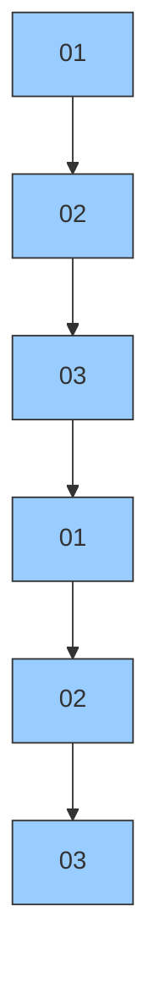
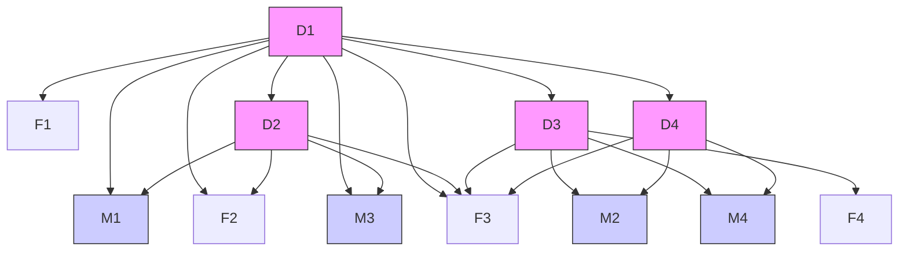
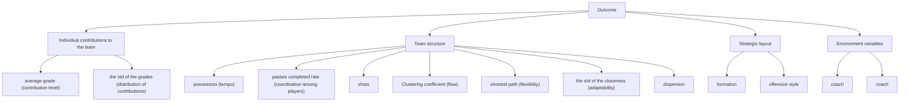
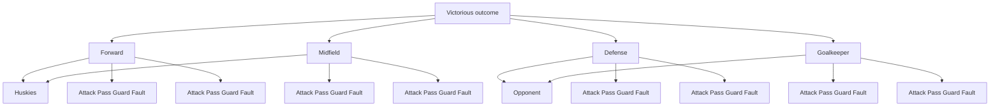

## Teaming Strategies in Football: Patterns and Effects

Objective analysis of the football team's performance is the main way to set training targets, and improve the team's level. Existing analysis of team performance is mostly based on the traditional technical statistics of individual athletes, but seldom discusses the important roles of the interrelationships and synergies between athletes. In view of this, this paper adopts the perspective of players' cooperation network, constructs the analysis framework of "identifying cooperation network–expanding cooperation model-exploring influence effect–putting forward suggestions", quantitatively analyzes the cooperation relationship of Huskies football team and its influence law on competition performance. We have mainly solved the following four problems:

Firstly, in order to identify the cooperation network, this paper constructs a complex network model based on directional weighted graph based on the characteristics and data of passing the ball. This paper constructs cooperation network indicators and other structural indicators from multiple scales. We refer to gene coding types to distinguish binary and ternary structures, use the simulation chart of competition field to mine the team formation rules, and adopt heterogeneity analysis to explore the relationship between individual players and the team, as well as the change rules of different network indicators with time.

Secondly, in order to measure team cooperation performance more comprehensively, this paper constructs a comprehensive evaluation index system by integrating Individual contributions to the team, Team structure, Strategic layout, Environment variables and 13 sub-indicators. Among them, in order to make clear the Individual contribution to the team, this paper combines subjective and objective weights, uses AHP and entropy weight to construct a sub-model of player scoring.

Thirdly, we research the mechanism where team strategy and other factors affect victory. For heterogeneity analysis, we build multi-classification undirected logistic regression models from two levels, winning and losing situations and score results to distinguish team formations. We also deal with multiple collinearity and other issues. The results show that Huskies is suitable to adopt an attack-defense balanced formation and a right-wing attack style, and it is more effective to adopt counter-strategies appropriately according to the opponent's situation.

Fourthly, according to Huskies' network structure and relevant research conclusions, it is believed that the overall framework and contingency mechanisms, individual and collective factors, subjective and objective factors, long-term and short-term situations should be considered in order to form an excellent football team. Extended to other types of teams, other factors such as leadership, gender composition and team culture should be considered as well.

To sum up, the advantages of this paper are as follows: (1)Pertinence: choose statistical indicators and models that can better reflect the characteristics of football matches and player networks; (2)Clear hierarchy：make different analysis and comparison from the angles of attack style, team formation, sample range and consider the outcome of the match; (3)Reliability: use robust analysis method and multiple tests; (4)Extensibility: put forward practical suggestions to the football team and even the broader competition team.

Key words: Team Strategy, Football, Network Science, Logistic Regression

## Contents

## 1 INTRODUCTION . 3

1.1 Background .... . 3  
1.2 Restatement of the Problem....... 3  
1.3 Our Work ..

## 2 ASSUMPTIONS AND JUSTIFICATIONS..

## 3 NOTATIONS...

## 4 COMPLEX NETWORK MODEL ..

4.1 Network of One Match.. 5  
4.2 Match Networks summary ..... 8  
4.3 Time Dimension Exploration... 8

## 5 TEAMWORK MODEL ..

5.1 Individual contributions sub-model . . 10  
5.2 Construction of Team’s Network Structure and Strategic Layout Index.... 13  
5.3 Regression Model... . 14  
5.4 Multicollinearity Analysis ...... . 14

## 6 STRUCTURAL STRATEGY ANALYSIS AND SUGGESTIONS... 17

6.1 Results of Team Performance Model of Huskies Team...... 17  
6.2 Suggestions Based on Data Analysis Results . 18

## 7 EXTENSION OF THE MODEL . 19

7.1 Sorting out the Existing Conclusions..... 19  
7.2 Dimension Extension..... 20

## 8 STRENGTHS AND WEAKNESSES .. 21

8.1 Strengths.... . 21  
8.2 Weaknesses ...... . 22

## 9 CONCLUSION... 22

## REFERENCE 23

## APPENDIX 24

## 1 Introduction

## 1.1 Background

As one of the three popular ball games, football's charm is not only because of its entertainment and sports, but also a project that embodies team cooperation and collective wisdom. Football is a team sport with complex interactions between players (Duch et.al 2010) [1]. In the process of team cooperation, the performance and cooperation of the team members are very important. Due to the interaction and cooperation of team members, there are relatively complex relationships in the team, which can be regarded as a complex network. Network science is a field to study complex network relations, and its application in group sports is more and more extensive and in-depth. FanBu et.al constructed the basketball passing network and proposed an evaluation model to describe each player's role in the group passing network [2]. J. M. BuldúJ. showed the different levels of indicators and dimensions of many football match networks [3]. Victor Martins Maimone applies complex network analysis not only to competitions but also to the prediction of results[4]. The perfection of complex network analysis indexes and dimensions provides us with many references for our research. According to many indicators of complex network construction, it will provide important basis for us to further analyze the structure, configuration and dynamics of team cooperation.

## 1.2 Restatement of the Problem

To solve the problem of model construction and application of team cooperation, we need to solve the following problems:

First of all, we need to construct a passing network for the host and the guest of each match according to the known data set, and construct and solve many structural indexes and network attributes, and need to construct it in multiple dimensions.

Then we need to establish a successful team cooperation model combining the passing network and other indicators. This model mainly considers the performance indicators and cooperation process of the team in the competition, grasps the structure, configuration and dynamic aspects of team cooperation, and considers the universality and particularity of the model.

Next, we need to analyze according to the passing network and team cooperation model, and put forward specific suggestions for husky's team's structural strategy.

Finally, we need to extend the model from special to general, and extend the model from the field of football competition to other fields. We need to think about how to design an effective team, and point out the idea of extending the model and the conditions that we need to know before extending.

## 1.3 Our Work

In response to the questions and requests, we have done the following:

For the construction of the passing network, we used the method and index of complex network analysis to visualize the model of the passing network and many indexes of the network, and recorded the indexes in the data set.

For the construction of team work model, we use logistic regression analysis method and divide the explanatory variables into four aspects: Individual contributions, Team structure ,Strategic layout and environmental variables. Among them, aiming at the variables of Individual contributions, we established a sub-model to score everyone in the team by combining analytic hierarchy process and entropy weight method. We use the methods of literature review and data mining to obtain other variables. After that, we showed, analyzed and corrected the regression results, and gained some inspiration from it.

As for the suggestions of Husky team, we will refine the team cooperation model established by all teams to Husky team and make a more detailed analysis of the model.

For the development and application of team work model, we have made some reflections on the existing model and team cooperation, consulted a large number of documents, and summarized and sorted out the conclusions.

The remainder of this study is organized as follows. The second chapter describes the assumptions we use and explains the rationality of the assumptions. The third chapter describes the symbols we use and their meanings. The fourth chapter shows the passing network model we have built and many indicators. In the chapter 5, the team performance model is constructed by using 15 dimensions such as passing network parameters. We also test and modify the model. In the chapter 6, we analyzed the potential items of the Husky team according to the model, and put forward suggestions on different aspects of the Husky team such as formation. In the chapter 7, we consider the generalized model of team performance. In the chapter 8, we evaluate the validity and limitation of the model. In the chapter 9,we draw the conclusion.

## 2 Assumptions and Justifications

⚫ The principle of difference in the same position: each player has his or her own main responsibilities set in advance. even if players in different positions do the same behavior, the importance of the behavior will be different.  
⚫ When players in the same position are replaced, the team's tactical style will not change. When players in different positions are replaced, the tactical style may be changed.。  
⚫ The behavior on the court can be divided into four types: attack, defense, passing and mistake. Among them, effective offense, defense and passing are positively affected, while mistakes negatively affect the overall performance.  
⚫ Team formation is mainly divided into offensive, defensive and court balance. The more forwards, the more offensive, and the more defenders, the more defensive.  
⚫ The tactical style of the same team in a match remains stable and depends on the formation with the longest duration in the match.

## 3 Notations

The notations for the model under study are shown below.

Table1.Notations of the model

<table><tr><td>Symbols</td><td>Definition</td><td>Symbols</td><td>Definition</td></tr><tr><td>C</td><td>Clustering coefficient</td><td>L</td><td>Offensive style</td></tr><tr><td>d</td><td>Shortest-path length</td><td> ${L}_{1}$ </td><td>Offensive style 1</td></tr><tr><td>Pct</td><td>Pass completion percentage</td><td> ${L}_{2}$ </td><td>Offensive style 2</td></tr><tr><td> ${X}_{1}$ </td><td>Ball keeping rate</td><td> ${L}_{3}$ </td><td>Offensive style 3</td></tr><tr><td> ${X}_{2}$ </td><td>Goal attempts</td><td> ${E}_{1}$ </td><td>Coach</td></tr><tr><td> ${X}_{3}$ </td><td>Shortest path</td><td> ${E}_{2}$ </td><td>Opponent</td></tr><tr><td> ${X}_{4}$ </td><td>The std of the closeness</td><td> ${E}_{3}$ </td><td>Side</td></tr><tr><td> ${X}_{5}$ </td><td>Dispersion</td><td> ${Z}_{1}$ </td><td>Average grade</td></tr><tr><td>S</td><td>Formation</td><td> ${Z}_{2}$ </td><td>The std of the grades</td></tr><tr><td> ${S}_{1}$ </td><td>Offensive formation</td><td> ${k}_{i}$ </td><td>Number of passes of one player and others</td></tr><tr><td> ${S}_{2}$ </td><td>Defensive formation</td><td> ${k'}_{ij}$ </td><td>Number of passes of two players</td></tr><tr><td> ${S}_{3}$ </td><td>Balance formation</td><td> ${A}_{ij}/{a}_{ij}$ </td><td>If there was a pass between the players</td></tr></table>

## 4 Complex Network Model

In this chapter, we create a directional weighted passing network for passing between players in football matches [5]. In this network, each player is a node and each pass is an arc between players. Using this passing network, we can not only identify common passing patterns, but also find out the classical football evaluation indexes and attribute indexes and present these results visually.

## 4.1 Network of One Match

Let's take a match as an example, set each player as a node, set each pass as an arc between players, set the number of directional passes between players as a weight, and create adjacency matrix $A _ { i j }$ and directional weighted pass network ??. According to the passing network, we can identify passing patterns, such as triads, formations, etc. We can solve the classical football evaluation indexes, such as passing rate, Goal attempts, etc. We can solve the network parameters, such as clustering coefficient, maximum eigenvector, maximum eigenvector centrality of players in the team, etc. We can also visualize these results.

## 4.1.1 Structural Indicators

We consider Dyad Configurations. There are two types of dyadic configurations, one is the most common i to j, j to others, called "double pass"; The other is I to j, j next to I, called "single pass". We will count the team's highest frequency patterns of dyadic configurations in a match and analyze their passing characteristics. Taking the Huskies in the first game, the Huskies did 46 "double pass" and 280 "single pass".

We consider Triadic Configurations. Complex networks often have motifs, which can also be called subgraphs. Among them, the most common mode is[6]. If we select three vertices and the lines among them in the directed network, we always get one of the 16 combinations. The subgraph on three vertices is called a triad. And triads labeling is generally known.

From the established passing model, we select the triads pattern with the largest frequency used by husky team in this match by counting each extracted triads subgraph. Figure1 is its pattern diagram.


<details>
<summary>flowchart</summary>


</details>

Figure1.Schema of main triplet

We consider Team Formations. There are many modes of complex networks. For football matches, besides passing tactics, the overall arrangement of troops is also very important. As shown in Figure2, we present the results of Team Formations in the form of a schematic plan of the stadium. In Figure 2, players are represented by round nodes, and the position of each player is determined by the average of all passing positions of the player in the match. The thickness of the arc indicates its weight, which is determined by the number of directional passes through the arc. This diagram covers many factors that are crucial to the match, such as passing the ball and the player's performance.


<details>
<summary>flowchart</summary>


</details>

Figure2. Schematic illustration of a football passing network

## 4.1.2 Classical Football Metrics

According to the passing network, we can not only get network-related indicators, but also get many indicators to evaluate the game. We found out the values of a series of indexes of husky team and opponents in this match, and presented the results in the form of bar chart. In Figure3, we respectively show the comparison chart of Shots, on Target, Off Target, Possession, Passes, Passes Completed, Passes Completed Rate.

The basic indexes of both sides in the match are clear at a glance.


<details>
<summary>bar chart</summary>

| Category | Huskies | STATISTIC | Opponent1 |
| :--- | :--- | :--- | :--- |
| 8 | Shots | 0 | 10 |
| 1 | On Target | 0 | 0 |
| 7 | Off Target | 0 | 10 |
| 51.4% | Possession | 0 | 48.6% |
| 482 | Passes | 0 | 267 |
| 369 | Passes Completed | 0 | 197 |
| 76% | Passes Completed Rate | 0 | 73% |
</details>

Figure3.Comparison of 6 Classical Football Metrics

## 4.1.3 Network Properties

There are many parameters to describe the complex network. We selected the most authoritative three indicators to describe the structural characteristics of the passing network, and compared the Husky team with its opponents, and presented the results in the form of column chart. The first graph of Figure4 shows the comparison of C (clustering coefficient).Clustering coefficient is an indicator of the local robustness of the network, because when a triangle connecting three players (nodes) exists, it cannot pass the ball between the two players and can reach another node through the other two sides of the triangle. Therefore, in football, the clustering coefficient is used to coordinate the triangular relationship among the three players. When i, j and k represent different player Numbers, the calculation formula is as follows:

$$
C _ {i} = \frac {\Sigma_ {j , k} \omega_ {i j k} a _ {i j} a _ {i k} a _ {j k}}{k _ {i} (k _ {i} - 1)}
$$

$$
A _ {i j} = \left(a _ {i j}\right)
$$

$$
\omega_ {i j} = \frac {1}{(a _ {i})} \frac {a _ {i j} + a _ {j k}}{2}
$$

The third graph of Figure4 shows the index of the standard deviation of closeness $( X _ { 4 } )$ .The most central units according to closeness centrality can quickly interact to all others because they are close to all others. This measures is preferable to degree centrality, because it does not take into account only indirect connections. When i and j respectively represent different player labels, the calculation formula is as follows:

$$
C l o s s n e s s (i) = \frac {1}{\Sigma_ {j \in U} D (i , j)}
$$

$$
D (i, j) = \frac {1}{k _ {i j} ^ {\prime}}
$$

$$
X _ {4} = \operatorname{std} (\text { C   l   o   s   s   n   e   s   s } (i))
$$

The second graph of Figure4 shows the index of the dispersion of the players $( X _ { 5 } )$ ）.Figure4 shows the index of the dispersion of the players $( X _ { 5 } )$ . Spatial dispersion of nodes around the network center. We use the average distance between the player's position and the center of the team network to measure this indicator.


<details>
<summary>bar chart</summary>

|        | Clustering coefficient |
| ------ | ---------------------- |
| Huskies | 0.9                    |
| Opponent1 | 0.9                   |
</details>


<details>
<summary>bar chart</summary>

|        | The shortest path |
| ------ | ----------------- |
| Huskies | 2.0               |
| Opponent1 | 2.0             |
</details>


<details>
<summary>bar chart</summary>

|        | Sd(Closeness) |
| ------ | ------------- |
| Huskies | 0.008         |
| Opponent1 | 0.011       |
</details>

Figure4.Comparison of 3 network parameters

## 4.2 Match Networks summary

In the previous section, we described the process of designing a passing model for a game and getting a set of metrics. In this section, we do the same processing analysis for each game and get these indicators separately. Due to the overlapping of content and the limitation of space, we do not show each game one by one, the detailed code and the result table can be seen in the appendix.

## 4.3 Time Dimension Exploration

The ball passing network we build is a static network. Further, we explored the changes of three important indicators over time and presented the results in the form of a line graph. Figure5 shows the movement ratio of the vertical distance to the horizontal distance of the center point of the network of the two teams in a game, as well as the variation of the standard deviation close to the centrality over time. Among them, the ratio of the vertical distance to the horizontal distance of the center of the network reflects the style of the team. If the ratio is small, then the vertical movement range of the team is larger than the horizontal range, reflecting its offensive. In addition, the change of its trend can also reflect the change of team strategy. For example, there is a tendency for the ratio to increase, which reflects that the team gradually adopts more offensive strategies over time, etc.


<details>
<summary>line chart</summary>

| Time       | Δy/Δx ratio | centroid coordinate (field units) | Standard deviation closeness |
| ---------- | ----------- | ---------------------------------- | ---------------------------- |
| 1min       | ~150        | ~100                               | ~0.005                       |
| First half | ~0          | ~50                                | ~0.01                        |
| 45min      | ~-150       | ~75                                | ~0.02                        |
| Second half| ~-100       | ~100                               | ~0.025                       |
| 93min      | ~-50        | ~150                               | ~0.03                        |
</details>

Figure5.Two indicators in the time series

## 5 Teamwork Model

Team cooperation embodied in the performance of the passing network will affect the results of the competition, thus affecting team performance. In order to explore the influence of the structure, configuration and dynamics of team work on successful team cooperation, we take individual contributions to the team, Team structure ,Strategic layout as independent variables, the competition results as dependent variables, use the known data to train the multiple logistic regression model, and test, explain and correct the model[8]. We use the method of combining analytic hierarchy process and entropy weight to build the sub-model of individual contributions to the team index. Since the research on passing network belongs to the cross research between network science and football, the indicators of Team structure include two parts: typical football indicators and typical network indicators already reflected in the previous chapter. Strategic layout indicators include formation and Offensive style, which will be obtained by mining existing data. The indicators of the entire Teamwork Model are shown in Figure6.


<details>
<summary>flowchart</summary>


</details>

Figure6.Classification of regression indicators

## 5.1 Individual contributions sub-model

In a team, how much contribution each member has made to the team and the distribution of individual contributions is one of the effective indicators to measure team performance. In a team, players in different positions have different responsibilities and division of labor. Therefore, it is illogical to evaluate each player's contribution with a unified standard. In this section, we consider that players in different positions will have different effects if they act with the same nature and will form a new scoring standard by combining subjective and objective methods. We combine analytic hierarchy process and entropy weight method to obtain different weights of different positions and action types on the results, form scoring rules, evaluate the contribution of each player, and then we can analyze the contribution distribution of each team player in each match.

## 5.1.1 Input Items of Personal Contribution Sub-model

Table2.Event classification

<table><tr><td>EventType</td><td>EventSubType</td><td>Class</td></tr><tr><td rowspan="4">Duel</td><td>Air duel</td><td>Defense</td></tr><tr><td>Ground attacking duel</td><td>Offence</td></tr><tr><td>Ground defending duel</td><td>Defense</td></tr><tr><td>Ground loose ball duel</td><td>Offence</td></tr><tr><td>Free Kick</td><td>All</td><td>Offence</td></tr><tr><td>Pass</td><td>All</td><td>Passing</td></tr><tr><td>Others on the ball</td><td>All</td><td>Defense</td></tr><tr><td>Foul</td><td>All</td><td>Error</td></tr><tr><td>Goalkeeper leaving line</td><td>All</td><td>Error</td></tr><tr><td>Offside</td><td>All</td><td>Error</td></tr><tr><td>Save attempt</td><td>All</td><td>Defense</td></tr><tr><td>Shot</td><td>All</td><td>Offence</td></tr><tr><td>Interruption</td><td>All</td><td>Error</td></tr></table>

## 5.1.2 Application of AHP in Establishment

In this part, we use AHP to form a set of scoring rules. Analytic Hierarchy Process (AHP) are in line with common sense, but there is a subjective problem in index construction.

Construction of Hierarchical Structure Model


<details>
<summary>flowchart</summary>


</details>

Figure7. Hierarchical structure model

## Construction of Judgment matrix

First, we construct the judgment matrix according to the rule of experience and normalize it.

$$
K _ {i j} = K _ {i j} \div \sum_ {i, j = 1} ^ {n} K _ {i j}
$$

Then we calculate the weight vector according to the normalized judgment matrix and obtain the eigenvalues.

## Inspection and Evolution

We use the consistency index CR to test, and CR<0.1 is found, so the consistency test is passed.

## 5.1.3 Application of Entropy Weight Method in Establishment

The effect of each player's action on the result depends to a large extent on the difference of the same type of action performed by players in the same position. Based on this principle, entropy weight method can objectively evaluate the scoring rules. The entropy weight method comprises the following steps:

## Construction of matrix

Normalization of Indicators. As indicators are positive indicators, we homogenize heterogeneous indicators according to the formula.

$$
y _ {i j} = \frac {x _ {i j} - m i n (x _ {. j})}{m a x (x _ {. j}) - m i n (x _ {. j})}
$$

Find the information entropy of each variable. For the jth variable, its information entropy:

$$
\begin{array}{l} H _ {j} = - \frac {1}{\ln n} \sum_ {i = 1} ^ {n} p _ {i j} * \ln p _ {i j} \\ p _ {i j} = \frac {y _ {i j}}{\sum_ {i = 1} ^ {n} y _ {i j}} \\ \end{array}
$$

## The calculation of the weight of each indicator

The information entropy of J variables can be calculated above： $H _ { 1 } , H _ { 2 } , \ldots , H _ { j }$

$$
W _ {j} = \frac {1 - H _ {j}}{P - \sum_ {j = 1} ^ {p} H _ {j}}
$$

## 5.1.4 Establishment of Personal Contribution Sub-model

We have respectively obtained two different scoring weights. Because they are subjective and objective respectively, we combine them to carry out equal weight average calculation on the weights obtained by the two methods.

Table3.Three methods of scoring weight table

<table><tr><td colspan="4">Entropy method</td></tr><tr><td colspan="2">Forward</td><td colspan="2">Midfield</td></tr><tr><td>Attack</td><td>0.036</td><td>Attack</td><td>0.045</td></tr><tr><td>Guard</td><td>0.050</td><td>Guard</td><td>0.054</td></tr><tr><td>Pass</td><td>0.055</td><td>Pass</td><td>0.055</td></tr><tr><td>Fault</td><td>0.089</td><td>Fault</td><td>0.162</td></tr><tr><td colspan="2">Defense</td><td colspan="2">Goalkeeper</td></tr><tr><td>Attack</td><td>0.037</td><td>Attack</td><td>0.058</td></tr><tr><td>Guard</td><td>0.023</td><td>Guard</td><td>0.066</td></tr><tr><td>Pass</td><td>0.038</td><td>Pass</td><td>0.039</td></tr><tr><td>Fault</td><td>0.071</td><td>Fault</td><td>0.123</td></tr></table>

<table><tr><td colspan="4">AHP</td></tr><tr><td colspan="2">Forward</td><td colspan="2">Midfield</td></tr><tr><td>Attack</td><td>0.132</td><td>Attack</td><td>0.049</td></tr><tr><td>Guard</td><td>0.027</td><td>Guard</td><td>0.045</td></tr><tr><td>Pass</td><td>0.075</td><td>Pass</td><td>0.131</td></tr><tr><td>Fault</td><td>0.015</td><td>Fault</td><td>0.029</td></tr><tr><td colspan="2">Defense</td><td colspan="2">Goalkeeper</td></tr><tr><td>Attack</td><td>0.028</td><td>Attack</td><td>0.011</td></tr><tr><td>Guard</td><td>0.133</td><td>Guard</td><td>0.053</td></tr><tr><td>Pass</td><td>0.049</td><td>Pass</td><td>0.039</td></tr><tr><td>Fault</td><td>0.020</td><td>Fault</td><td>0.164</td></tr></table>


<table><tr><td colspan="2">Weighted combination of entropy method and AHP</td></tr><tr><td colspan="2">Forward</td></tr><tr><td>Attack</td><td>0.084</td></tr><tr><td>Guard</td><td>0.039</td></tr><tr><td>Pass</td><td>0.065</td></tr><tr><td>Fault</td><td>0.052</td></tr><tr><td colspan="2">Midfield</td></tr><tr><td>Attack</td><td>0.047</td></tr><tr><td>Guard</td><td>0.050</td></tr><tr><td>Pass</td><td>0.093</td></tr><tr><td>Fault</td><td>0.096</td></tr><tr><td colspan="2">Defense</td></tr><tr><td>Attack</td><td>0.032</td></tr><tr><td>Guard</td><td>0.078</td></tr><tr><td>Pass</td><td>0.044</td></tr><tr><td>Fault</td><td>0.045</td></tr><tr><td colspan="2">Goalkeeper</td></tr><tr><td>Attack</td><td>0.034</td></tr><tr><td>Guard</td><td>0.059</td></tr><tr><td>Pass</td><td>0.039</td></tr><tr><td>Fault</td><td>0.143</td></tr></table>

Table3 presents the weights calculated in three ways. We count n the number of

actions taken by players at four positions in each match, and calculate the score s of each position player according to the weight w calculated by combining subjective and objective factors.

$$
s _ {i} = \sum_ {j = 1} ^ {4} w _ {i j} * N i, \forall i = 1, 2, 3, 4
$$

## 5.1.5 Variables Constructed by Combining Individual Contributions

We include the mean and standard deviation of players' scores in the variables of the regression model. The average score of a player represents the overall contribution level of a team member, and the standard deviation of a player's score represents the distribution of a team member's contribution level. These two indicators explain the general level and difference of individual performance in the team and reflect the influence of team members.

## 5.2 Construction of Team’s Network Structure and Strategic Layout Index

## 5.2.1 Team’s Network Structure Index

In football matches, the frequent interaction between players makes the whole team like a network structure, closely linked. Combined with the passing network we have built, we supplement and screen the important indicators analyzed in the previous chapter. We will determine this kind of index from two aspects. We have selected several most representative indexes on the two aspects of Classical Football Metrics and network quality indexes by consulting literature and other methods. A detailed explanation of these indicators will be described below.

## Typical football indicators

We chose the more commonly used "the classical football metrics", including ball playing rate, pass completion and goal attempt.

The ball playing rate is one of the data used to test who controls the initiative and rhythm of a match. Generally, the higher the ball playing rate of a team, the better the team's mastery of the match.pass completion is used to detect the interaction efficiency between players. Generally speaking, the higher the pass completion of a team, the better the coordination and cooperation between players of the team.Goal attempts are one of the commonly used indexes in football matches, which can reflect the attacking rhythm of the team.Therefore, we include ball playing rate, pass completion and goal attempt into the variables of the regression model.

## Typical network indicators

After analysis, we selected clustering coefficient, shortest-path length, dispersion of players, std of the players' centrality. These indicators reflect the process information at the team level, and were obtained in the previous chapter. We incorporated them into the variables of the regression model. The clustering coefficient measures the flow of the network. The shortest path length reflects the flexibility of the team. The dispersion of players describes the average distance between the players' average position and the team centroid. The sd of closeness

reflects the adaptability of the team.

## 5.2.2 Team's Strategic Layout Index

## ⚫ Formation

Football formation refers to the arrangement of team members' positions and division of responsibilities on the field. The common formations are 4-3-3, 4-4-2, etc. We divide the formation into three types: offensive, defensive and court balance. According to these three types of formations, classification variables are constructed and included in the independent variables of the regression model.

Table4.Formation classification

<table><tr><td>Type</td><td>Value</td><td>Formation</td></tr><tr><td>Offensive</td><td>1</td><td>4-3-3, 4-2-4</td></tr><tr><td>Court Balance</td><td>2</td><td>3-5-2, 4-4-2, 5-3-2</td></tr><tr><td>Defensive</td><td>3</td><td>4-5-1, 5-4-1</td></tr></table>

## Offensive style

Different teams have different offensive style, and even the same team will try different offensive styles in different matches. Sometimes the team attacks from the left side, the right side and other flanks, which is conducive to the development of offensive speed. Sometimes the team will choose to attack in the middle, this tactic is convenient to shoot directly, but shooting is difficult. We divided the attack style into three types: left attack, right attack and middle attack. According to the most attack style used in the whole match, the attack style was taken as the evaluation standard of the team and included in the independent variables of the regression model.

## 5.3 Regression Model

We use the results of the competition as dependent variables and the above-mentioned individual contributions to the team, Team structure and Strategic layout variables, as well as the environment variables as supporting variables as independent variables, to establish a logical regression model. Environmental variables include coaches, opponents and home and away games. These variables are known and reflect the most basic situation of the competition. The structure of this logistic regression model is as follows.

$$
\begin{array}{l} O u t c o m e = C _ {1} * X _ {1} + C _ {2} * P c t + C _ {3} * X _ {2} + C _ {4} * X _ {3} + C _ {5} * X _ {4} + C _ {6} * X _ {5} + C _ {7} * S _ {1} \\ + C _ {8} * S _ {2} + C _ {9} * L _ {1} + C _ {1 0} * L _ {2} + C _ {1 1} * E _ {1} + C _ {1 2} * E _ {2} + C _ {1 3} * E _ {3} + C \\ \end{array}
$$

## 5.4 Multicollinearity Analysis

Due to the small amount of data, there is a great possibility of multicollinearity. Therefore, we use VIF (Variance Inflation Factor) to test multi-collinearity

$$
. V I F = \frac {1}{1 - R ^ {2}}
$$

Table5.Multicollinearity checklist

<table><tr><td>Explaining variable</td><td>Tolerance</td><td>VIF</td></tr><tr><td>Ball playing rate</td><td>0.391</td><td>2.559</td></tr><tr><td>Pass completion</td><td>0.425</td><td>2.351</td></tr><tr><td>Goal attempts</td><td>0.545</td><td>1.836</td></tr><tr><td>The std of the closeness</td><td>0.827</td><td>1.209</td></tr><tr><td>Shortest path</td><td>0.820</td><td>1.220</td></tr><tr><td>Dispersion</td><td>0.815</td><td>1.227</td></tr><tr><td>Clustering coefficient</td><td>0.565</td><td>1.769</td></tr><tr><td>Average grade</td><td>0.066</td><td>15.113</td></tr><tr><td>The std of the grades</td><td>0.080</td><td>12.513</td></tr><tr><td>Side</td><td>0.935</td><td>1.069</td></tr><tr><td>Coach</td><td>0.732</td><td>1.366</td></tr><tr><td>Offensive style</td><td>0.847</td><td>1.180</td></tr><tr><td>Formation</td><td>0.674</td><td>1.484</td></tr></table>

It can be seen from the table that the model has serious multicollinearity. So we use VIF test and stepwise regression to establish a logical regression model.

## 5.5 Results and tests

In this part, we will obtain the equation of logical regression according to the above stepwise regression method, and carry out significance test and robustness test on the results to further analyze the results.

## 5.5.1 Results Display and Inspection

After we corrected multi-collinearity, the results are shown in Table6.

Table6.Logistic regression results

<table><tr><td rowspan="2">Explaining variable</td><td colspan="2">(3 types of Offensive style)</td><td colspan="2">(5 types of Offensive style)</td></tr><tr><td>Coefficient</td><td>Significance level</td><td>Coefficient</td><td>Significance level</td></tr><tr><td>ball playing rate</td><td>-61.106***</td><td>0.000</td><td>-59.352***</td><td>0.000</td></tr><tr><td>pass completion</td><td>-2.601*</td><td>0.084</td><td>-3.043*</td><td>0.097</td></tr><tr><td>the std of the closness</td><td>-550.704**</td><td>0.030</td><td>-620.396***</td><td>0.001</td></tr><tr><td>the std of the grades</td><td>3.405***</td><td>0.000</td><td>3.694***</td><td>0.042</td></tr><tr><td>side</td><td>5.165*</td><td>0.062</td><td>5.098**</td><td>0.014</td></tr><tr><td>coach</td><td>-17.316***</td><td>0.000</td><td>-18.209**</td><td>0.021</td></tr><tr><td>[offensive style=1]</td><td>-1.498</td><td>0.615</td><td>-1.69</td><td>0.728</td></tr><tr><td>[offensive style=2]</td><td>-11.289**</td><td>0.028</td><td>-11.905</td><td>0.239</td></tr><tr><td>[offensive style=3]</td><td>-</td><td>-</td><td>-5.203</td><td>0.132</td></tr><tr><td>[offensive style=4]</td><td>-</td><td>-</td><td>-12.491***</td><td>0.007</td></tr><tr><td>P-value</td><td colspan="2">0.032</td><td colspan="2">0.0015</td></tr><tr><td>R2</td><td colspan="2">0.713</td><td colspan="2">0.734</td></tr></table>

\* Statistical significance at the 1%,5%,and 10% levels is denoted by \*\*\*, \*\*, and \* respectively.

From the results, it can be seen that the overall fitting effect of the model is better, whose R2 is close to 1 and has a significant p-value. Most of the variables are significant, while there are still some under the significance level of 0.1, including the shooting times, clustering coefficient, dispersion of players and formation did not pass the significance test.

We will expand the offensive style from three categories to five categories, and subdivide it according to the fineness of position coordinates. It can be seen that the results of the upper and lower regression have passed the significance test. In other words, the logistic regression model is robust.

## 5.5.2 Heterogeneity analysis

As the opponent's formation may affect the selection and change of the team's formation, we use the method of grouping and returning. On the basis of opponents of different formations, the whole data set is divided into 3 types (offensive, defensive, court balanced) of smaller data sets, and regression is made respectively. The results of heterogeneous regression are displayed by matrix. Taking our offensive strategy as the control group, the following conclusions are obtained.

When the opponent mainly uses offensive formation, our formation has no significant influence on the result of the match.  
When the opponent mainly uses the offensive and defensive balanced formation, if we choose the offensive and defensive balanced formation, it has no significant influence on the result of the match. If the defensive type is selected, the probability of winning the competition is 19% of the offensive type.  
⚫ When the opponent mainly uses a balanced offensive and defensive formation, if we choose a defensive formation, it has no significant influence on the result of the match. If you choose the court balance type, the probability of winning the competition is 4 times that of adopting the offensive strategy.

Table7.Logistic regression results

<table><tr><td>Offensive</td><td>Offensive Control group</td><td>Court Balance Control group</td><td>Defensive Control group</td></tr><tr><td>Court Balance</td><td>-</td><td>-</td><td>4**</td></tr><tr><td>Defensive</td><td>-</td><td>0.19***</td><td>-</td></tr><tr><td>P-value</td><td>0.046</td><td>0.009</td><td>0.013</td></tr><tr><td> $R^2$ </td><td>0.625</td><td>0.723</td><td>0.701</td></tr></table>

\* ""represents it is non-significant

## 5.5.3 Interpretation of Result

Through the above analysis, we have the following variables that affect the team's performance:

The standard deviation of scoring has a positive effect on the result of the competition. Scoring refers to the standard deviation of scoring the players in the team according to the scoring sub-model constructed above, which reflects the distribution of the contributions of the players in the team. In other words, the more dispersed the contribution distribution of the team members, the better the performance of the team under the same other conditions. Therefore, the success of team cooperation tends to be heterogeneous in composition.

⚫ The success rate of passing the ball has a positive effect on the result of the match.  
⚫ The possession rate has a negative influence on the result of the match. Under normal circumstances, the possession rate represents the initiative of a team, which is often proud of its high possession rate. However, the analysis results show that high ball possession rate may reflect reasons such as slow pace, which is not conducive to the results of the competition.  
The standard deviation near the center has a negative influence on the result of the competition. Thus, we can see that the success of team cooperation tends to the combination with smaller differences in communication times between team members  
⚫ Home and away games have a significant impact on the competition results. Home court advantage will have a positive impact on the competition.  
⚫ Offensive style has a significant influence on the result of the competition.  
⚫ The formation is influenced by the opponent's strategy on the result of the match.In addition, we used the model to predict the results of the competition. Of the 76 data, only 3 were predicted incorrectly, with an accuracy of 96.1%, which also proves the validity of the model.

## 6 Structural Strategy Analysis and Suggestions

In the existing analysis, we have constructed the network attributes and team cooperation indicators in the network model. In this part, we will analyze the above indicators again to design a more effective structural strategy for the Huskies team and propose suggestions to its coaches for improvement next season.

## 6.1 Results of Team Performance Model of Huskies Team

In order to judge the influence of each index and network attribute on the outcome of the match, we take the above indexes as independent variables and the outcome of the match as dependent variables, and carry out two logistic regression analyses according to the different formations and offensive styles.

Table8.Heterogeneous regression results of Huskies

<table><tr><td rowspan="2">Explaining variable</td><td colspan="2">(Sort by formation)</td><td colspan="2">(Sort by offensive style)</td></tr><tr><td>Coefficient</td><td>Significance level</td><td>Coefficient</td><td>Significance level</td></tr><tr><td>Ball keeping rate</td><td>-92.251***</td><td>0.006</td><td>-61.106**</td><td>0.045</td></tr><tr><td>Pass completion percentage</td><td>9.913</td><td>0.489</td><td>2.601</td><td>0.358</td></tr><tr><td>Goal attempts</td><td>0.299</td><td>0.328</td><td>0.174</td><td>0.214</td></tr><tr><td>Clustering coefficient</td><td>-15.561</td><td>0.227</td><td>-3.502</td><td>0.968</td></tr><tr><td>Shortest path</td><td>-1.609**</td><td>0.027</td><td>-2.42</td><td>0.443</td></tr><tr><td>The std of the closness</td><td>-508.421*</td><td>0.084</td><td>-550.704***</td><td>0.009</td></tr><tr><td>Dispersion</td><td>1.312</td><td>0.34</td><td>0.445</td><td>0.267</td></tr><tr><td>Formation1</td><td>0.004**</td><td>0.046</td><td>-</td><td>-</td></tr><tr><td>Formation2</td><td>0.122**</td><td>0.047</td><td>-</td><td>-</td></tr><tr><td>Offensive style1</td><td>-</td><td>-</td><td>0.023**</td><td>0.015</td></tr><tr><td>Offensive style2</td><td>-</td><td>-</td><td>0.007***</td><td>0.008</td></tr><tr><td>P-value</td><td colspan="2">0.000</td><td colspan="2">0.012</td></tr><tr><td>R2</td><td colspan="2">0.821</td><td colspan="2">0.752</td></tr></table>

\* The coefficient in Formation1/2 and Offensive style 1/2 is Exp(value

In this regression, we also used the test of multicollinearity, and the results are shown in Table8 after removing the variables with greater influence.

## 6.2 Suggestions Based on Data Analysis Results

## 6.2.1 Suggestions Based on Structural Strategies

Choosing an effective structural strategy means choosing a match formation that can make the performance indicators and team processes that reflect successful team cooperation have a more positive impact on the result of the match.

## Choose the defensive formation of 4-5-1 or 5-4-1 formation

First of all, considering the influence of team formation and observing the regression results in Table8, we can find that the indexes such as ball playing rate, the std of the closeness, shortest path, dispersion and formation have significant influence on the outcome of the match. The regression results show that the defensive formation (4-5-1, 5-4-1) has a significant impact on the result of the draw, while others have no significant impact.

At the same time, according to our analysis, Huskies team has won 13 games, lost 15 games, scored 44 goals and conceded 58 goals in this season, belonging to the lower and middle level team. Therefore, we suggest that for teams of this level, defensive counterattack is an effective way to obtain competition results. Thus, 4-5-1 and 5-4-1,which are mainly defensive counterattack, can be used to strengthen the middle and back court ability. The significance of defensive formation coefficient also confirms this view.

## Adhere to the right-wing offensive style

Secondly, when considering the influence of offensive style, we focus on the variable of offensive style in the regression results of figure 2. We can find that the right attack has a significant impact on the victory of the competition, and the larger the proportion of right attack, the better the victory of the competition.

Based on the above analysis, we suggest that when coaching a team of Huskie's level, the coach should mainly use a balanced attack-defense formation to strengthen the middle and back court ability, carry out defensive counter-attacks, and at the same time, carry out more threatening right-wing attacks.

## 6.2.2 Suggestions Based on Network Analysis

Different network attribute values reflect different behaviors of the team. By improving the behavior level represented by significant network attributes, team performance can be effectively improved.

Logistic regression results in Table9 show that, the regression coefficients of the shortest path, the std of the closeness and dispersion in the network attribute are significant, which respectively represent the flexibility of team passing, whether the number of players passing is average, and attack rhythm. The symbols corresponding to the regression coefficients are negative, negative and positive respectively. The clustering coefficient is not significant, which represents the attack rhythm of the team.

Therefore, in order to achieve the ideal competition results, we should strive to reduce the minimum distance and center deviation, and improve the dispersion degree of the players, while the clustering coefficient does not need too much attention.

Table 9.Comparison Diagram of Huskies and Others

<table><tr><td>Explaining variable</td><td>Huskies</td><td>Opponent</td></tr><tr><td>Average of the std of the closeness</td><td>0.011</td><td>0.011</td></tr><tr><td>Average of Clustering coefficient</td><td>0.888</td><td>0.891</td></tr><tr><td>Average of shortest path</td><td>2.079</td><td>2.105</td></tr><tr><td>Average of dispersion</td><td>23.592</td><td>23.900</td></tr></table>

Then we compared the average value of the Huskies team with the average level of the opponents (as shown in Table9), and put forward the following suggestions:

Maintain and expand advantages in passing flexibility

The Huskies team's minimum distance is lower than the average, indicating that the passing flexibility is higher than the average, which is beneficial. It is necessary to exert its advantages.

Pay attention to the level balance of players

The number of passes received by different players varies greatly, and the positions of players vary greatly. Coaches should pay attention to the balance between players. Different players should be treated roughly equally to get higher scores.

Strengthen the player's sense of movement

The scatter of Huskies players is lower than the average level, and their movements are too concentrated. According to the above results, teams with scattered positions are more likely to win the match. Therefore, spreading their positions as far as possible can they control the whole match.

## 7 Extension of the model

## 7.1 Sorting out the Existing Conclusions

Under the controllable environment of football matches, we have established a model with strong pertinence. According to the index considered in the model, we will extend it to the common team cooperation. The expansion of our conclusion is as follows.

## 7.1.1 Individual Contributions to the Team

Different positions of players have different scoring systems, which can be extended to different treatment of performance appraisal. Different criteria are adopted to judge people with different division of labor in the team, which is conducive to the formation of a more effective team.

The sd of the grades can be extended to the difference of individual contributions. The contribution of everyone in the team tends to be heterogeneous, which is conducive to the formation of a more effective team.

## 7.1.2 Team Structure

⚫ The standard deviation of Closeness can be extended to the coverage of communication in a team. The team should not have a number of key figures to shift the center of the network. As far as possible, the transmission of information can cover every member evenly, which is conducive to the formation of a more effective team.  
Clustering coefficient can be extended to the frequency of communication among team members. Members of the team should not communicate as often as possible. They should pay attention to the efficiency of communication.  
⚫ Shortest path can be extended to the hierarchical mode. The more complex the hierarchical structure of the team organization, the more the shortest path will be added, while the flattening mode will have the smaller shortest path. The size of the shortest path has no significant effect on team performance, therefore, for the hierarchical model, the appropriate one is the best.  
⚫ Pass completion can be extended to the effectiveness of communication. Effective communication is conducive to the formation of more effective teams.

## 7.1.3 Strategic Layout

Formation can be extended to team strategy. The formation of the team is closely related to its opponents. Therefore, when the team determines its own strategy, it is helpful to form a more effective team by carefully analyzing the environment, trends and other people's strategies.  
Offensive style can be extended to team work style. Team style is very important, but it is hard to say which style is good or bad. Choosing the right style is conducive to the formation of a more effective team.

## 7.1.4 Environment Variables

In the process of influencing team performance, many objective factors will be encountered, such as unpredictable competitors, uncontrollable emergencies, and the influence of macro background. Since the number of objective factors is difficult to measure reliably in uncontrollable environments, it will not be repeated here.

## 7.1.5 Summary

The model of controllable system is also of appropriate guiding significance to a wider group, and the specific operation needs to quantify the index according to its actual situation so as to solve the problem more efficiently.

## 7.2 Dimension Extension

A team is often much more complicated than a football team simplified by models. In the cooperation model we established for the team, we only considered the positions and actions of the players, the interaction between the players, and the arrangement of troops, but also lacked the dimensions of leadership and team culture. Players also have gender, personality, stability and other factors that have not been considered.

## 7.2.1 Dimensions of Leadership

Lena Zander and Christina L. Butler focus on leadership modes and multicultural team composition and argue that leadership modes should be an informed strategic choice[9]. Therefore, it is very necessary to obtain the internal centrality of leaders in SNA (Social Network Analysis) and the frequency of information exchange with subordinates when developing common models. The former can be obtained through the nature of networks, while the latter can be obtained through the number of contacts.

## 7.2.2 Dimensions of Gender

More and more studies show that women's ability in leadership or their role in the board of directors is not inferior to that of men. According to the research of Brian M. Doornenbal, Liselore A. Havermans. (2015), when gender diversity is promoted, it can have a positive impact on team performance[10]. When developing a common model, we can include the proportion of gender.

## 7.2.3 Dimensions of Team Culture

Team culture can not only improve team cohesion, but also improve team efficiency and team performance by relieving member pressure.Samia Jamshed and Nauman Majeed found that team culture can significantly increase team performance through lens of knowledge sharing and team emotional intelligence[11]. At the same time，when developing a common model, you can also include the existence of enterprise Logo, slogan, etc.

## 8 Strengths and Weaknesses

## 8.1 Strengths

Based on the controllable environment of football matches, we have set up as comprehensive a dimension as possible for all measurable data and constructed professional variables, such as ball possession rate, which improves the information purity of the data. It is worth mentioning that the four dimensions we have constructed are consistent with the current research by scholars.  
The model results are accurate. First of all, when evaluating the score of individual behavior, we adopt a subjective and objective method. In addition, we conducted multicollinearity and robustness processing, and the prediction accuracy of the competition results exceeded 95%.  
The method of network analysis is used. In the past studies, information such as passing the ball and the position of the players were seldom considered, while the

passing network between us was constructed and analyzed, and the characteristic indexes of the network were incorporated into the consideration scope of the model, which has popularization significance.

## 8.2 Weaknesses

The sample size is small. According to the use conditions of the model, the amount of data is preferably more than 10 times of the construction index. However, due to the limited data available in this paper, the results may be unstable, which needs further consideration after collecting more reliable data.  
The transactional analysis between the two players is relatively simple. In the analysis of network construction and so on, because it is difficult to quantify the instantaneous positions of both parties and we have not considered the obstacles of our opponents, we will analyze after obtaining more accurate GPS data.

## 9 Conclusion

Team cooperation is an important factor in understanding the complexity of football matches. With the arrival of the big data era, the acquisition of massive competition data provides the necessary data basis for quantitative analysis of team relationships and tactical strategies. This study is based on the microscopic data of husky team matches, and from the perspective of network science, it shows that establishing an effective team model is an effective way to improve team performance, thus providing quantifiable evaluation tools for team leaders.

This paper uses social network analysis to study the passing characteristics of football matches. Firstly, the network types and characteristics are identified by constructing a directed weighted graph network model. On this basis, combined with individual contributions to the team, Team structure, Strategic layout, and Environment variables, a comprehensive index system to comprehensively measure cooperation performance is constructed and evaluated. Based on this index system, this paper studies the effect mechanism of cooperation performance and other factors on team victory. Finally, according to Husky's network structure and relevant research conclusions, some suggestions are put forward to help football teams and other teams improve team performance.

The advantages of this study lie in choosing models and indicators from a new perspective and in combination with the characteristics of team cooperation of football teams. The analysis level is clear, the results are stable, and the conclusions and suggestions are practical. At the same time, there are still some unsolved problems in this paper, such as limitations in the process of selecting indicators, difficulty in quantifying the instantaneous positions of teammates and inability to obtain the obstruction degree of opponents, etc. All of these require in-depth research on the basis of expanding the number of indicators and sample size.

## Reference

[1] Duch J., Waitzman J.S., Amaral L.A.N. (2010). Quantifying the performance of individualplayers in a team activity. PLoS ONE, 5: e10937.  
[2]Fan Bu, Sonia Xu, Katherine Heller, Alexander Volfovsky(2018). SMOGS: Social Network Metrics of Game SuccessPMLR 2019 89:2406-2414  
[3] Buldú, J.M., Busquets, J., Echegoyen, I. et al. (2019). Defining a historic football team: UsingNetwork Science to analyze Guardiola’s F.C. Barcelona. Sci Rep, 9, 13602.  
[4] Victor Martins Maimone, Taha Yasseri (2019)Football is becoming boring; Network analysis of 88 thousands matches in 11 major leaguesPhysics and Society physics.soc-pharXiv:1908.08991 [physics.soc-ph]  
[5] Ramos, J., Lopes, R. J. & Araújo, D. What’s Next in Complex Networks? Capturing the Concept of Attacking Play in Invasive Team Sports. Sports Med. 48, 17–28 (2018).  
[6] GÜRSAKAL, N., YILMAZ, F., ÇOBANOĞLU, H., ÇAĞLIYOR, S. (2018). Network Motifs in Football. Turkish Journal of Sport and Exercise, 20 (3), 263-272.  
[7] The analytic hierarchy process applied to maintenance strategy selection[J] . M Bevilacqua, M Braglia. Reliability Engineering and System Safety . 2000 (1)  
[8]Huang Cheng,Lv Xiong-Wen,Xu Tao,Ni Ming-Ming,Xia Jia-Lu,Cai Shuang-Peng,Zhou Qun,Li Xing,Yang Yang,Zhang Lei,Yao Hong-Wei,Meng Xiao-Ming,Wang Hua,Li Jun. Alcohol use in Hefei in relation to alcoholic liver disease: A multivariate logistic regression analysis.[J]. Alcohol (Fayetteville, N.Y.),2018,71  
[9] Lena Zander,Christina L. Butler. Leadership modes: Success strategies for multicultural teams[J]. Scandinavian Journal of Management,2010,26(3)  
[10]Brian M. Doornenbal,Liselore A. Havermans. Gender Diversity and Team Identification[J]. Procedia - Social and Behavioral Sciences,2015,194.  
[11]Samia Jamshed,Nauman Majeed. Relationship between team culture and team performance through lens of knowledge sharing and team emotional intelligence[J]. Journal of Knowledge Management,2019,23(1).

## Appendix

Match networks summary

<table><tr><td>ID*</td><td colspan="2">Closeness</td><td colspan="2">d</td><td colspan="2">C</td><td colspan="2">Pct</td></tr><tr><td>1</td><td>0.0081</td><td>0.0044</td><td>3</td><td>2</td><td>0.0081</td><td>0.0025</td><td>0.7378</td><td>0.7651</td></tr><tr><td>2</td><td>0.0066</td><td>0.0024</td><td>2</td><td>2</td><td>0.0066</td><td>0.0137</td><td>0.7985</td><td>0.6522</td></tr><tr><td>3</td><td>0.0098</td><td>0.0032</td><td>2</td><td>2</td><td>0.0098</td><td>0.0072</td><td>0.8366</td><td>0.7733</td></tr><tr><td>4</td><td>0.0209</td><td>0.0105</td><td>2</td><td>2</td><td>0.0209</td><td>0.0119</td><td>0.7582</td><td>0.6880</td></tr><tr><td>5</td><td>0.0102</td><td>0.0086</td><td>2</td><td>2</td><td>0.0102</td><td>0.0202</td><td>0.7970</td><td>0.6923</td></tr><tr><td>6</td><td>0.0090</td><td>0.0078</td><td>2</td><td>2</td><td>0.0090</td><td>0.0130</td><td>0.7406</td><td>0.7523</td></tr><tr><td>7</td><td>0.0080</td><td>0.0235</td><td>2</td><td>2</td><td>0.0080</td><td>0.0107</td><td>0.6370</td><td>0.8085</td></tr><tr><td>8</td><td>0.0195</td><td>0.0133</td><td>2</td><td>2</td><td>0.0195</td><td>0.0133</td><td>0.7309</td><td>0.7587</td></tr><tr><td>9</td><td>0.0027</td><td>0.0075</td><td>2</td><td>2</td><td>0.0027</td><td>0.0179</td><td>0.6308</td><td>0.7126</td></tr><tr><td>10</td><td>0.0110</td><td>0.0126</td><td>2</td><td>2</td><td>0.0110</td><td>0.0129</td><td>0.7181</td><td>0.6769</td></tr><tr><td>11</td><td>0.0089</td><td>0.0097</td><td>2</td><td>2</td><td>0.0089</td><td>0.0107</td><td>0.7172</td><td>0.7723</td></tr><tr><td>12</td><td>0.0127</td><td>0.0091</td><td>2</td><td>2</td><td>0.0127</td><td>0.0108</td><td>0.8353</td><td>0.7651</td></tr><tr><td>13</td><td>0.0134</td><td>0.0093</td><td>2</td><td>2</td><td>0.0134</td><td>0.0066</td><td>0.7671</td><td>0.5989</td></tr><tr><td>14</td><td>0.0097</td><td>0.0122</td><td>2</td><td>2</td><td>0.0097</td><td>0.0130</td><td>0.7140</td><td>0.6571</td></tr><tr><td>15</td><td>0.0108</td><td>0.0118</td><td>2</td><td>2</td><td>0.0108</td><td>0.0084</td><td>0.5926</td><td>0.8296</td></tr><tr><td>16</td><td>0.0127</td><td>0.0206</td><td>2</td><td>2</td><td>0.0082</td><td>0.0129</td><td>0.8310</td><td>0.7399</td></tr><tr><td>17</td><td>0.0134</td><td>0.0084</td><td>2</td><td>2</td><td>0.0119</td><td>0.0093</td><td>0.8027</td><td>0.7402</td></tr><tr><td>18</td><td>0.0097</td><td>0.0110</td><td>2</td><td>2</td><td>0.0097</td><td>0.0106</td><td>0.7744</td><td>0.7552</td></tr><tr><td>19</td><td>0.0108</td><td>0.0113</td><td>2</td><td>3</td><td>0.0029</td><td>0.0098</td><td>0.7345</td><td>0.8065</td></tr></table>

\* Opponent ID

## Code

```r
1 Network analysis by R
rm(list = ls())
library(readxl)
inside <- read_excel("C:/Users/Administrator/Desktop/inside.xlsx")
View(inside)
library('igraph')
network <- graph_from_data_frame(d = inside, directed = T)
motif = graph.motifs(network, size = 3)
motif
ga = closeness(network, mode="in")
sd(ga)
transitivity(network)
shortest.paths(network)
```

2 Weight calculation by Matlab

2.1 Entropy weight method  
```matlab
[m,n] = size(data);
a1 = zeros(m,n);
for i = 1:n
    a1(:,i) = (data(:,i)-min(data(:,i)))/(max(data(:,i))-min(data(:,i)));
end
ex=sum(a1);
a2=zeros(m,n);
for i=1:m
    for j=1:n
    a2(i,j)=a1(i,j)/ex(j);
    end
end
a3=a2.*log(a2);
a4=a3;
a4(find(isnan(a4)==1)) = 0;
ex=sum(a4);
ex1=-1/log(m)*ex;
weightAHP=(1-ex1)/(n-sum(ex1));
```

2.2 AHP  
```matlab
[m,n]=size(A);
[V,D]=eig(A);
tempNum1=D(1,1);
pos=1;
for h=1:n
    if D(h,h)>tempNum1
    tempNum1=D(h,h);
    pos=h;
    end
end
w=abs(V(:,pos));
w=w/sum(w);
t=D(pos,pos);
CI=(t-n)/(n-1);
RI=a;
CR=CI/RI(n);
if CR<0.10
    disp('Succce to pass');
    disp('CI=');disp(CI);
    disp('CR=');disp(CR);
else disp('Fail to pass');
end
```