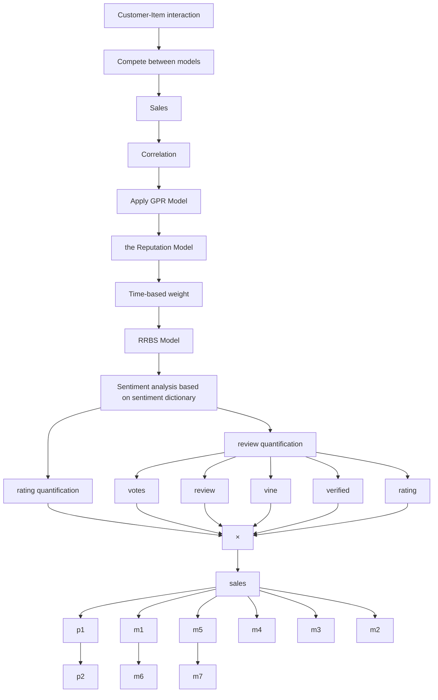

# Good Morning Sunshine: A Rating and Review Based Analysis

Summary

The Review and Rating System has been playing a huge role during the evolution of E-commerce. Customers use it to help make the best purchase decisions, while vendors can utilize it to collect opinions on how to make improvements. Therefore, in a vendor’s perspective, it is of essential to learn to most efficiently extract the most valuable information out of mountains of customers’ voices.

Firstly, based on the attributes we find useful in the provided data sets, we propose the Rating and Review Based Score (RRBS) Model, which defines a product’s score—a data measure based on information refined from ratings and reviews— that finely quantifies and describes customers’ responses to a product. Based on the RRBS Model, we further introduce the Reputation Model, which gives a timebased quantification of a product’s reputation over time periods. Our model evaluation results show that a quantified reputation has a strong correlation with the corresponding product’s sales in terms of trend. This fact intuitively proves our models’ correctness.

Then, in order to predict a product’s potential success or failure in the future, we propose the the Successfulness Prediction Model, utilizing the knowledge basis established from our previously proposed models. Based on the premise that a product’s success is closely connected to its sales, we are able to address the successfulness prediction task by predicting a product’s future reputation with calculated reputation series, followed by comparison between the predicted values and a pre-set threshold. As a result, the successfulness of products can be effectively predicted.

Next, we evaluate star ratings’ incitement to custmoers’ specific reviews by recording customers’ reviews right after a series of same ratings (either high or low), and calculate the chance of them being either positive, negative or neutral. It turns out a series of high ratings do incite more positive reviews; at the other end, we cannot confidently determine a series of low ratings’ incitement to negative reviews. Subsequently, we discover the association between rating levels and specific quality descriptors from review text by matching review contents with graded-words. The results reveal strong connection between postive words and high ratings, and similarly, negative words and low ratings.

Finally, to assist with Sunshine Company’s upcoming business, we propose our devised marketing strategies and some important design features for each product.

Keywords: the RRBS Model; the Reputation Model; Correlation Analysis;

## Contents

## 1 Introduction 2

1.1 Problem Restatement 2  
1.2 Literature Review 2  
1.3 Data Cleaning . . 3  
1.4 Modeling Framework . 3

## 2 Assumptions & Nomenclature 3

## 3 the RRBS Model 4

3.1 Model Overview 5  
3.2 the Rating Vector 5  
3.3 the Review Vector . . 6  
3.3.1 The Review-based Measure Equation . . 8  
3.3.2 the Sentiment Polarity Matrix . . 9

## 4 the Reputation Model 10

4.1 Time Weight Sequence 10  
4.2 Quantification of Reputation . . 11  
4.3 Model Evaluation 11  
4.3.1 Trend Similarity between Quantified Reputation and Sales . . . . . . . . . 11  
4.3.2 Kendall’s Tau Method 12

## 5 the Successfulness Prediction Model 13

5.1 Gaussian Process Regression . . . 14  
5.2 Reputation Mapping . . . 15  
5.3 Successfulness Threshold 15

## 6 Results 16

6.1 Evaluation of Star Rating’s Incitement . . . 16  
6.2 Association between Review Wording and Rating Levels 18  
6.3 Our Strategies . . 19  
6.3.1 Marketing Strategies . 19  
6.3.2 Important Design Features 19

## 7 Sensitivity Analysis 20

## 8 Strengths and Weaknesses 20

8.1 Strengths 20  
8.2 Weaknesses 21

## 9 Conclusion 21

## 10 Our Letter 22

Appendices

## 1 Introduction

"Amazing things will happen when you listen to the consumer."

—Jonathan Midenhall, CMO of Airbnb

E-commerce has sprouted for the last few decades all over the world, and now it has become one of the most prosperous and promising modern industries. During this process, the Review and Rating System has been playing a huge role all along. Not only does it help customers find out what is best for them when making purchase decisions, but also it helps sellers realize what problems their products have and thus things can be improved. Therefore, it is significant for companies to know how to make the most use of it and apply the knowledge to improving product designs and marketing strategies.

## 1.1 Problem Restatement

Sunshine Company is about to launch three new products in the marketplace, including a microwave, a baby pacifier and a hair dryer. Data of customer-supplied reviews and ratings for microwave ovens, baby pacifiers and hair dryers sold on Amazon.com are supplied, each of which has a time label on. Analysis of customers’ ratings and reviews of other companies’s competing products is required in order to figure out the optimal online marketing strategies and possible design features they can employ to make their products more desirable to customers.

To achieve our goals, specifically, we need to:

• Identify the most informative data measures based on reviews and ratings for Sunshine Company to track, once they launch their three new products in the online marketplace.  
• Discover time-based measures and patterns that can suggest a product’s reputation’s trend of increase or decrease.  
• Combine text-based measures and rating-based measures to discover measures that best indicate a product’s potential success or faliure.  
• Find out whether specific star ratings incite more reviews.  
• Find out whether rating levels and specific quality descriptors of text-based reviews are strongly associated.

## 1.2 Literature Review

Early work have proposed several methods for utilizing reviews and ratings of online products. In 2009, Koren et al. [4] proposed Latent Factor Models (LFM) to address the rating prediction task. In 2013, McAuley et al. [5] took advantage of the abundunt information in reviews using Latent Dirichlet Allocation (LDA) to achieve topic distributions. Later in 2016, Tan et al. [8] proposed the Rating-Boosted Latent Topics (RBLT) Framework, combining textual reviews with users’ sentiment orientations, and thus recommendations are made more accurate.

However, some of the valuable information in reviews is not fully utilized in the introduced din thelintroduced 关注works, such as varying text lengths of different reviews and the sentiment intensity of specific ntensit yrof specifie we " poy words (e.g. "fine" is less positively intense compared with "good"). Moreover, other important attributes in modern E-commerce recommendation systems, such as helpfulness ratings, reviewers’ credibility and whether or not reviewers are verified buyers, are rarely taken into account. The quantification of reviews and ratings’ combinations are not yet proposed, and data measures based on reivews and ratings are not provided either.

## 1.3 Data Cleaning

Upon observation on the provided data, we notice there are some misplaced data in each data set, where some review items belong to products of wrong categories. For example, in the file hair\_dryer.tsv the review item with the product\_parent value #466871293 (which uniquely identifies a product) belongs to a hair spray product, instead of a hair dryer. Similarly, in the file microwave.tsv the review item with the product\_parent value #311592014 belongs to a fridge, instead of a microwave. We find these mistakes almost exclusively happen to those products with single digit review records. Along with the perception that sparse data do not contribute to our modeling well, we omit all product items with single digit review records.

## 1.4 Modeling Framework

Our modeling framework can be illustrated as shown in Figure 1.


<details>
<summary>flowchart</summary>


</details>

Figure 1: Modeling Framework

## 2 Assumptions & Nomenclature

To simplify our modeling, we make the following assumptions:

Asm. 1 Provided data do not include spam reviews, either from competitors or mischievous customers.

Asm. 2 Contents of every review are legitimate and unbiased.

Asm. 3 The number of review records of a product equals to the sales of the same product aggregated since it was launched, i.e., there are no missed or excluded records in any of the provided data sets.

Asm. 4 Customers’ reviews and ratings were posted the same day they purchased the products, i.e., the time consumption of procedures such as packaging, delivery and users confirmation of quality is neglected.

Asm. 5 Each customer has at most one review and rating record on one type of product (either a microwave, a pacifier or a hair dryer).

We have a list of the main notations we define during our modeling, as shown in Table 1.

## 3 the RRBS Model

In this section, we propose the RRBS Model (viz., the Rating and Review Based Score Model) to serve as a data measure, combining star ratings and textual information from reviews. When determining the quantification process, we take into account nearly all influencing attributes from the provided data. As a result, a highly informative data measure is presented for Sunshine Company to track, once their three new products are launched.

Table 1: Notations we use in future discussion.

<table><tr><td>Symbol</td><td>Description</td></tr><tr><td>i</td><td>Product type (either Microwaves, Pacifiers or Hair dryers), i = 1, 2, 3</td></tr><tr><td>k</td><td>Unique model identifier of a type of products</td></tr><tr><td>t</td><td>Timestamp identifier (unit: Month)</td></tr><tr><td>n</td><td>Number of rating and review records of a model within a specific month</td></tr><tr><td> $score_{i,k}^{(t)}$ </td><td>Measure for customer responses a product model receives</td></tr><tr><td>α</td><td>Rating vector—an n-dimensional row vector</td></tr><tr><td>β</td><td>Review vector—an n-dimensional column vector</td></tr><tr><td>λ</td><td>Rating weight parameter</td></tr><tr><td>A</td><td>Sentiment polarity matrix—an n-by-n diagonal matrix</td></tr><tr><td>Φ</td><td>Review-quantifying vector—an n-dimensional column vector</td></tr><tr><td>θj</td><td>Vine factor</td></tr><tr><td>sj</td><td>Sentiment intensity factor</td></tr><tr><td>vj</td><td>Validity factor</td></tr><tr><td>hj</td><td>Helpfulness-rating factor</td></tr><tr><td>Lj</td><td>Review-length factor</td></tr><tr><td>εj</td><td>Correction term</td></tr><tr><td>score</td><td>Time series of a model&#x27;s scores</td></tr><tr><td> $Rep_{i,k}^{(t)}$ </td><td>Quantified reputation</td></tr></table>

## 3.1 Model Overview

As part of our metric, we define score as a measure for a company’s particular product, based on the ratings and reviews it receives. It quantitatively indicates whether a product does well or badly in terms of receiving positive responses from customers. We define our metric as:

$$
\operatorname{score} _ {i, k} ^ {(t)} = \boldsymbol {\alpha} ^ {\circ \lambda} \boldsymbol {\beta} \tag {1}
$$

where:

• $i \in \{ 1 , 2 , 3 \}$ denotes products of the $i _ { t h }$ type;  
• k denotes the $k _ { t h }$ model (uniquely identified by the "product\_parent" value) of the $i _ { t h } -$ type products;  
• t denotes the $t _ { t h }$ month;  
• α is an n-dimensional row vector whose value is determined by star ratings;  
• β is an n-dimensional column vector whose value is determining by reviews and other influencing factors;  
• λ is an impact factor that decides the weight of ratings in terms of impacting the score value. We initially set its value as 1.

## 3.2 Definition of α—the Rating Vector

The value of α is directly connected to a product’s star ratings, which vary from 1 to 5. And the value of 1 indicates "very unsatisfied" while the value of 5 indicating "very satisfied". We consider two star ratings, one with a value of 1 and the other one with a value of 5, have the same degree of intensity $( i . e . ,$ one indicates "very" unsatisfied and the other one indicated "very" satisfied). Similarly, a 4-star rating is considerd having the same degree of intensity as a 2-star rating’s. And a 3-star rating represents a neutral stance, which we consider relatively less intense. Therefore, we conduct a mapping process, as shown in Table 2, so as to quantify the degree of both positivity and negativity of a star rating with a uniform measure.

Table 2: Mapping from star rating values to their corresponding mapped rating values (viz., degree of intensity).

<table><tr><td>Star Rating</td><td>Mapped Rating</td></tr><tr><td>1-star &amp; 5-star</td><td>3</td></tr><tr><td>2-star &amp; 4-star</td><td>2</td></tr><tr><td>3-star</td><td>1</td></tr></table>

As stated above, α is an n-dimensional row vector that is exclusively associated with star ratings. The n non-zero elements in α represent n mapped rating values of a product within a month. We can obtain:

$$
\boldsymbol {\alpha} = \left( \begin{array}{c c c c c c} \alpha_ {i, k, 1} ^ {(t)} & \alpha_ {i, k, 2} ^ {(t)} & \dots & \alpha_ {i, k, j} ^ {(t)} & \dots & \alpha_ {i, k, n} ^ {(t)} \end{array} \right) \tag {2}
$$

where α i,k,j (t) ∈ {1, 2, 3}.

## 3.3 Definition of β—the Review Vector

$\beta$ is an n-dimensional column vector whose value is strongly associated with reviews and some other influencing factors. It comprehensively takes into account of the sentiment intensity of review text, varying lengths of different reviews, helpfulness ratings, the authority of reviewers (i.e., whether or not he/she is an Amazon Vine Reviewer 1) and whether or not the reviewers are verified buyers. Therefore, it is made possible to fully exploit the information within the provided data and effectively integrate textual reviews and other non-numerical influencing factors into our data measure.

We define it as:

$$
\boldsymbol {\beta} = \boldsymbol {A} \boldsymbol {\Phi} = \left( \begin{array}{c c c c c c} \beta_ {i, k, 1} ^ {(t)} & \beta_ {i, k, 2} ^ {(t)} & \dots & \beta_ {i, k, j} ^ {(t)} & \dots & \beta_ {i, k, n} ^ {(t)} \end{array} \right) \tag {3}
$$

where:

• A is an n-by-n diagonal matrix used to describe the sentiment polarity of reviews;  
• Φ is an n-dimensional column vector used to quantify the semantic information and other influencing attributes of reviews.

## Definition of Φ—the Review-quantifying Vector

To quantify the semantic information and other influencing attributes of reviews, we define Φ as an n-dimensional column vector, as is shown in Equation (4):

$$
\boldsymbol {\Phi} = \left( \begin{array}{c c c c c c} \phi_ {i, k, 1} ^ {(t)} & \phi_ {i, k, 2} ^ {(t)} & \dots & \phi_ {i, k, j} ^ {(t)} & \dots & \phi_ {i, k, n} ^ {(t)} \end{array} \right) ^ {T} \tag {4}
$$

where ϕ(t)i,k,j $\phi _ { i , k , j } ^ { ( t ) }$ is the measure for semantic information, along with other influencing attributes, of a textual review, which is from the $j _ { t h }$ order of the $k _ { t h }$ model of the $i _ { t h } \mathrm { - t y p e }$ products.

We define this measure as:

$$
\phi_ {i, k, j} ^ {(t)} = \theta_ {j} \cdot s _ {j} ^ {v _ {j}} \cdot h _ {j} \cdot L _ {j} \tag {5}
$$

## Definition of $\theta _ { j } \mathrm { - } \mathbf { t h e }$ Vine Factor

According to Amazon.com [1], the most trusted reviewers identified by Amazon.com are invited to Amazon’s Vine Program, where they can post opinions about new and pre-release items to help their fellow customers make informed purchase decisions.

While Vine reviewers make independent opinions on offered products, the vendor cannot influence, modify or edit the reviews. Therefore, we have reason to believe that a review posted by Vine reviewers is more professional and trustworthy than regular reviews. Accordingly, we make our measure value contents of a review more when it is a Vine review, by defining $\theta _ { j }$ as:

$$
\theta_ {j} = \left\{ \begin{array}{l l} 2, & \text { if   the   review   is   made   by   a   Vine   reviewer } \\ 1, & \text { otherwise } \end{array} \right. \tag {6}
$$

## Definition of $s _ { j }$ —the Sentiment Intensity Factor

Most of the time, when people post reviews about products they have purchased, they tend to include specific words that express some explicit sentiments and attitudes. It is also noticing that the sentiment intensities of reviewers’ chosen words vary. For example, "good" expresses a higher intensity of positiveness than "fine" does. That is to say, we are able to quantify different sentiment intensities of different words, and thus the message a review is trying to express is made gradable when measuring semantic information.

With this mindset, we attempt to find an existing data set that contains a decent amount of common adjectives, (most importantly) each one of which has a grade that indicates its sentiment intensity. Fortunately—thanks to the great open-source community—we are able to acquire a Python library called Afinn [6] that consists of $^ { 2 , 4 7 7 }$ graded-words, which fulfills our exact requirements. We then use this word set to match contents of all the reviews in the provided data, filtering out words that do not appear in any of the reviews (which we do not need).

As a result, we obtain a graded-word table (part of which is shown in Table 3) that categorizes both positive and negative words into 3 groups of different grades (with 3 being the highest and 1 being the lowest).

Table 3: A fraction of the graded-word table acquired by matching the Afinn word set with contents of all reviews. Some of the most frequently-appeared graded-words are listed in this table. Note: We modify a few words’ grades with our own understanding of their sentiment intensities.

<table><tr><td>Grade</td><td>Positive</td><td>Negative</td></tr><tr><td>3</td><td>outstanding, thrilled, awesome, wonderful, fantastic, fabulous, brilliant, terrific</td><td>catastrophic, horrible, dead, ridiculous, awful, crappy, obnoxious, desperate</td></tr><tr><td>2</td><td>good, cute, powerful, comfortable, clean, useful, satisfied, helpful</td><td>bad, disappointed, wrong, useless, negative, poor, unhappy, annoying</td></tr><tr><td>1</td><td>fair, fine, easy, cool, clear, safe, acceptable, capable</td><td>strange, hard, difficult, noisy, limited, silly, unsure, false</td></tr></table>

Hence, we can define $s _ { j }$ as the sentiment intensity of the textual review contents of the $j _ { t h }$ order (of the $k _ { t h }$ model of the $i _ { t h } \mathrm { - t y p e }$ products). Its value is defined as:

$$
s _ {j} = \left\{ \begin{array}{l l} \eta & \text {   if   matched   words   have   a   maximum   grade   of   } \eta \\ 0, & \text {   otherwise   } \end{array} \right. \tag {7}
$$

## Definition of $v _ { j }$ —the Validity Factor

Intuitively, if a review is not posted by a verified buyer, the validity of it is somewhat dubious. Therefore, considering the potential inauthenticity of reviews from unverified buyers, we reduce the weights of such reviews in our measure. We define $v _ { j }$ to represent a review’s validity, when it is low, the corresponding review has a less influence to our measure of the product’s score.

$$
v _ {j} = \left\{ \begin{array}{l l} 1, & \text { if   the   reviewer   is   a   verified   buyer } \\ 0. 1, & \text { otherwise } \end{array} \right.
$$

## Definition of $h _ { j }$ —the Helpfulness-rating Factor

Undoubtedly, the helpfulness ratings of a review as an influence factor to our measure cannot be left out. Not only does it illustrate a review’s trustworthiness and overall quality, but also it exposes a review’s potential junk nature (being misleading or misconceived). This makes it easier to decide on a review should have whether more or less weights in our measure.

Therefore, we define $h _ { j }$ as the helpfulness score in our measure, as shown in Equation (9). Its value should be 1 when nobody has yet voted its helpful, making it have the original weight in our measured in terms of helpfulness. If the "helpful" votes to total votes ratio is larger than 0.5, we consider this review a helpful review, thus should have a weight higher than 1; on the other hand, it is not helpful if the ratio is lower than 0.5 and should have a weight less than 1.

$$
h _ {j} = \left\{ \begin{array}{l l} e ^ {\frac {\text { helpful\_votes } _ {j}}{\text { total\_votes } _ {j}} - 0. 5}, & \text { if   total\_votes } _ {j} > 0 \\ 1, & \text { otherwise } \end{array} \right. \tag {9}
$$

where $h e l p f u l _ { - } v o t e s _ { j }$ is the number of "helpful" votes and $t o t a l _ { - } v o t e s _ { j }$ is the number of total votes on a review.

## Definition of $L _ { j }$ —the Review-length Factor

Chua et al. [3] provided insight that a review’s helpfulness is positively related to its depth/length. Empirically, we know if a review is long to some degree, it is reasonable to assume it has more description on its target and the accuracy is more likely to be guaranteed.

Therefore, we can define $L _ { j }$ as a measure of a review’s helpfulness solely contributed by the review’s length. The more words a review contains, the more valuable we consider the review is. Yet it should be noted that the growth of $L _ { j }$ by review length should be non-linear and the growth rate should reduce as review length increases, otherwise it can affect our measure for products’ score too much. Hence, we define $L _ { j }$ as:

$$
L _ {j} = \frac {1}{2} \log_ {1 0} l e n _ {j} \tag {10}
$$

where $l e n _ { j }$ is the literal number of words in the review of the $j _ { t h }$ order (of the $k _ { t h }$ model of the $i _ { t h } \mathrm { - t y p e }$ products).

## 3.3.1 The Review-based Measure Equation

By substituting Equation (6), (7), (8), (9) and (10) into Equation (5), we obtain:

$$
\phi_ {i, k, j} ^ {(t)} = \theta_ {j} \cdot s _ {j} ^ {v _ {j}} \cdot e ^ {\frac {\text { helpful\_votes } _ {j}}{\text { total\_votes } _ {j}} - 0. 5} \cdot \frac {1}{2} \log_ {1 0} \text { len } _ {j} \tag {11}
$$

This is the equation we define to measure semantic information and other influencing attributes of a textual review, taking into account of reviewers’ authority, reviews’ validity, reviews’ sentiment intensities, reviews’ helpfulness ratings and reviews’ textual lengths.

Note that the value of $s _ { j }$ can be 0, for:

• The wording of a review might be quite neutral and a clear sentiment (eith positivnegative) can not be inferred;

• Some specific words within a review might suggest a sentiment and has some degree of intensity, but are not included in the graded-word set from Afinn, making the evaluation of such reviews’ sentiment intensities infeasible.

$s _ { j }$ $\phi _ { i , k , j } ^ { ( t ) }$ being 0, meaning the measure treats such a review as a "entirely-junk" review; this makes the multiplication of this review by its corresponding star rating result in a value of 0, meaning the rating loses its effect indirectly. This is not appropriate and we want to preserve our data measure ’s effect in this scenario. Therefore, we address this problem by introducing an correction term $\epsilon _ { j } ;$ its value is defined as:

$$
\epsilon_ {j} = \left\{ \begin{array}{l l} 1, & \text { if } s _ {j} = 0 \\ 0, & \text { otherwise } \end{array} \right. \tag {12}
$$

By adding this correction term to our measure (Equation (11)), we have:

$$
\phi_ {i, k, j} ^ {(t)} = \theta_ {j} \cdot s _ {j} ^ {v _ {j}} \cdot e ^ {\frac {\text { helpful\_votes } _ {j}}{\text { total\_votes } _ {j}} - 0. 5} \cdot \frac {1}{2} \log_ {1 0} l e n _ {j} + \epsilon_ {j} \tag {13}
$$

$\phi _ { i , k , j } ^ { ( t ) }$ will be 1 if the value of $s _ { j }$ is 0, making the corresponding review have an initial weight; thus, from Equation (1) we know that the score which the review and its corresponding star rating collectively decide will solely depend on the star rating in this case.

By integrating nearly all useful information of reviews in a reasonable way, we can effectively measure reviews’ value , and thus can filter out poorly-written reviews with little value for paying attention to and retain valuable information from reviews which are worth listening to.

## 3.3.2 the Sentiment Polarity Matrix

A is an n-by-n diagonal matrix and is used to describe the sentiment polarity of reviews. We assign the value +1 to an element of A, if and only if the corresponding review (of the element) is measured as positive. Similarly, we assign the value −1 to the element if the corresponding review is measured as negative, as shown in Equation (14):

$$
a _ {i, k, j} ^ {(t)} = \left\{ \begin{array}{l l} + 1, & \text { if   the   corresponding   review   suggests   a   positive   sentiment } \\ - 1, & \text { if   the   corresponding   review   suggests   a   negative   sentiment } \end{array} \right. \tag {14}
$$

As for how to decide a review is whether positive or negative, we know that the Afinn word set we use when matching reviews is comprised of graded-words with signs. For example, in the word set, the word "perfect" has a grade of +3 and the word "imperfect" has a grade of −2. Therefore, after a matching process of sentiment words and review contents, we extract the sign of the result and examine it. If it is a positive sign, we think of the review as positive; similarly, if is a negative sign, we consider the review negative.

For A, we have:

$$
\boldsymbol {A} = \mathrm{diag} (a _ {i, k, 1} ^ {(t)}, a _ {i, k, 2} ^ {(t)}, \ldots , a _ {i, k, j} ^ {(t)}, \ldots , a _ {i, k, n} ^ {(t)})
$$

We also take into account of the possibility that some reviews may contain words like "not" that invert the meaning of their next words. To assess the influence of such cases, we conduct statistics analysis. If the frequency of appearance of "negative-adjective" combinations $( e . g . ,$ "not good") is low enough to be neglected, then we can be convinced this possibility has little effect on our results, if not addressed. As shown in Table 4, the percentage of such words’ appearance is $1 1 6 6 / 1 0 1 4 3 5 = 1 . 1 5 \% ;$ thus, it is reasonable to ignore them.

## 4 the Reputation Model

In Section 3.1, we define score to measure the positiveness/negativeness of customers’s overall responses for a product, based on the ratings and reviews it receives. On the grounds of this, in this section, we further introduce a time-based indicator—reputation—which intuitively describes a product’s accumulated reputation over time periods. Accordingly, we build our Reputation Model to quantify a product’s time-based reputation, based on the measure provided by the RRBS Model (Section 3).

## 4.1 Time Weight Sequence

Intuitively, a reputation at a certain time is somewhat dependent to its previous reputation, instead of abruptly changes regardless of its states in the past or future. Generally, a product’s reputation at a certain time is closely connected to its reputations throughout its lifespan. With this mindset, we define the concept of Time Weight Sequence to describe the influences of previous reputations in a reputation at time $t ,$ denoted by a t-dimensional row vector γ:

$$
\boldsymbol {\gamma} = \left( \begin{array}{l l l l l l} \gamma_ {1} & \gamma_ {2} & \dots & \gamma_ {m} & \dots & \gamma_ {t} \end{array} \right) \tag {16}
$$

where $\gamma _ { m }$ is the influence weight of a score in the $m _ { t h }$ month (with the $1 _ { s t }$ month being the first month when a product is launched). We consider a reputation of a product in the $m _ { t h }$ month is more prone to be affected by the previous reputation in the $( m - 1 ) _ { t h }$ month than the one in the $( m - 2 ) _ { t h }$ month. We assume the growth of $\gamma _ { m }$ by time is exponential and perform normalization on this basis; thus, we obtain:

$$
\gamma_ {j} = \frac {a ^ {j}}{a ^ {t}}, \quad a > 1 \tag {17}
$$

where a is a constant whose value is set as 1.1.

Table 4: Appearance counts of common adjectives (like "good") and "neg-adj" combinations (like "not good") within all of the reviews. Adjectives are distinguished by an open-source Python word-processing library [2] and appearance is counted using Excel.

<table><tr><td></td><td>Common Adjective</td><td>Count</td><td>&quot;Neg-adj&quot; Combo.</td><td>Count</td></tr><tr><td rowspan="4"></td><td>great</td><td>4466</td><td>not sure</td><td>148</td></tr><tr><td>good</td><td>3055</td><td>not heavy</td><td>40</td></tr><tr><td>little</td><td>2963</td><td>not worth</td><td>34</td></tr><tr><td>...</td><td>...</td><td>...</td><td>...</td></tr><tr><td>Total</td><td></td><td>101435</td><td></td><td>1166</td></tr></table>

## 4.2 Quantification of Reputation

Firstly, based on Equation (1) we define a t-dimensional column vector denoted by score, to represent a product’s t months of scores:

$$
\boldsymbol {s c o r e} = \left( \begin{array}{c c c c c c} s c o r e _ {i, k} ^ {(1)} & s c o r e _ {i, k} ^ {(2)} & \dots & s c o r e _ {i, k} ^ {(m)} & \dots & s c o r e _ {i, k} ^ {(t)} \end{array} \right) ^ {T} \tag {18}
$$

where score(m)i,k $s c o r e _ { i , k } ^ { ( m ) }$ is the score of the $k _ { t h }$ model of $i _ { t h } \mathrm { - t y p e }$ products in the $m _ { t h }$ month.

We then define the quantification of reputation as $R e p _ { i , k } ^ { ( t ) } ,$ as shown in Equation (19)

$$
R e p _ {i, k} ^ {(t)} = \boldsymbol {\gamma} \cdot \mathbf {s c o r e} \tag {19}
$$

where i denotes the type of a product model; k denotes the $k _ { t h }$ model of $i _ { t h } \mathrm { - t y p e }$ products; t denotes the $t _ { t h }$ month (since the product is launched).

From Equation (17) we know the Time Weight Sequence γ follows a monotonically increasing exponential pattern, which means a product’s score from a recent month impacts more on the new reputation than a score from a distant month does. Therefore, with the quantification of products’ reputations, we should be able to address the task of observing and predicting products’ reputational increase or decrease in the online marketplace.

## 4.3 Model Evaluation

Based on empirical knowledge, a product with a good reputation (viz., the opinion customers have about how good it is) can induce more sales than one with a poorer reputation does. On the grounds of this, it is rational to say that a growth in a product’s reputation can stimulate a porportional amount of sales increase, and on the other hand, when a product’s reputation suffers, a decrease in sales is likely to happen.

With that being said, we can address the task of evaluating our models and measures correctness—which is tricky because the term reputation is quite abstract and there are no statistics of it for us to refer to—by comparing the trend of our quantified reputation to the trend of a product’s actual sales (derived from the rating and review records). Hence, after we quantify a product’s reputation with our measure, we can perform a comparison between the quantified reputation’s trend and the actual sales trend; thus the correctness of our models and measures are evaluated.

## 4.3.1 Trend Similarity between Quantified Reputation and Sales

We select 3 best-selling models from each of the 3 types of products to present and compare the trend of their reputation and their sales. Then, for each product model, we obtain a time series2 of quantified reputations and a time series of sales, and respectively present them in a scatter plot with points roughly connected to reveal trends. The result for each product model is shown in Figure 2. Next, for more comprehensiveness, we also select 1 rather poor-selling model from each type of products and perform the same operation, with results shown in Figure 3.

With results in both figures, we can see trends of our quantified reputation and actual sales are very similar and might be highly correlated. To further prove this idea, we then conduct a correlation analysis.


<details>
<summary>line chart</summary>

| time | reputation | sales |
| ---- | ---------- | ----- |
| 0    | 0          | 0     |
| 20   | 0          | 0     |
| 40   | 0          | 0     |
| 60   | 200        | 20    |
| 80   | 600        | 40    |
</details>


<details>
<summary>line chart</summary>

| time | reputation | sales |
| ---- | ---------- | ----- |
| 0    | 0          | 0     |
| 20   | 0          | 0     |
| 40   | 100        | 5     |
| 60   | 0          | 0     |
| 80   | 0          | 0     |
</details>


<details>
<summary>line chart</summary>

| time | reputation | sales |
| ---- | ---------- | ----- |
| 0    | 0          | 0     |
| 20   | 0          | 0     |
| 40   | 0          | 0     |
| 60   | 100        | 5     |
| 80   | 50         | 0     |
</details>


<details>
<summary>line chart</summary>

| time (s) | reputation | sales |
| -------- | ---------- | ----- |
| 0        | -100       | 0     |
| 10       | -50        | 5     |
| 20       | 0          | 10    |
| 30       | 100        | 15    |
| 40       | 200        | 20    |
| 50       | 300        | 25    |
| 60       | 400        | 30    |
| 70       | 600        | 35    |
| 80       | 800        | 40    |
</details>


<details>
<summary>line chart</summary>

| time | reputation | sales |
| ---- | ---------- | ----- |
| 0    | -100       | 0     |
| 20   | 100        | 5     |
| 40   | 300        | 15    |
| 60   | 500        | 25    |
| 80   | 600        | 35    |
</details>


<details>
<summary>line chart</summary>

| time | reputation | sale |
| ---- | ---------- | ---- |
| 0    | 0          | 0    |
| 10   | 50         | 5    |
| 20   | 100        | 10   |
| 30   | 200        | 15   |
| 40   | 300        | 20   |
| 50   | 400        | 25   |
| 60   | 500        | 30   |
| 70   | 600        | 35   |
| 80   | 700        | 40   |
</details>


<details>
<summary>line chart</summary>

| time | reputation | sales |
|------|------------|-------|
| 0    | -100       | 0     |
| 20   | 0          | 5     |
| 40   | 200        | 15    |
| 60   | 600        | 30    |
| 80   | 1000       | 40    |
</details>


<details>
<summary>line chart</summary>

| time | reputation | sales |
| ---- | ---------- | ----- |
| 0    | -100       | 0     |
| 10   | -50        | 5     |
| 20   | 0          | 10    |
| 30   | 50         | 15    |
| 40   | 100        | 20    |
| 50   | 150        | 25    |
| 60   | 200        | 30    |
| 70   | 250        | 35    |
| 80   | 300        | 40    |
</details>


<details>
<summary>line chart</summary>

| time | reputation | sales |
| ---- | ---------- | ----- |
| 0    | -100       | 0     |
| 10   | -50        | 5     |
| 20   | 0          | 10    |
| 30   | 50         | 15    |
| 40   | 100        | 20    |
| 50   | 150        | 25    |
| 60   | 200        | 30    |
| 70   | 250        | 35    |
</details>

Figure 2: Visualization trends of reputation and sales of 3 best-selling models from each of the 3 types of products.


<details>
<summary>line chart</summary>

| time | reputation | sales |
|------|------------|-------|
| 50   | 0          | 0     |
| 55   | 0          | 0     |
| 60   | 20         | 5     |
| 65   | -40        | 0     |
| 70   | -30        | 5     |
</details>


<details>
<summary>line chart</summary>

| time | reputation | sales |
|------|-----------|-------|
| 30   | 0         | 0     |
| 35   | 20        | 1     |
| 40   | 40        | 2     |
| 45   | 80        | 4     |
| 50   | 140       | 6     |
| 55   | 100       | 2     |
| 60   | 20        | 0     |
| 65   | 0         | 0     |
| 70   | 0         | 0     |
| 75   | 0         | 0     |
</details>


<details>
<summary>line chart</summary>

| time | reputation | sales |
|------|------------|-------|
| 50   | 0          | 0     |
| 51   | 0          | 0     |
| 52   | 0          | 0     |
| 53   | 0          | 0     |
| 54   | 0          | 0     |
| 55   | 0          | 0     |
| 56   | 0          | 0     |
| 57   | 0          | 0     |
| 58   | 0          | 0     |
| 59   | 0          | 0     |
| 60   | 20         | -20   |
| 61   | 10         | -10   |
| 62   | 10         | -10   |
| 63   | 10         | -10   |
| 64   | 10         | -10   |
| 65   | 10         | -10   |
| 66   | 10         | -10   |
| 67   | 10         | -10   |
| 68   | 10         | -10   |
| 69   | 10         | -10   |
| 70   | 10         | -10   |
| 71   | 10         | -10   |
| 72   | 10         | -10   |
| 73   | 10         | -10   |
| 74   | 10         | -10   |
| 75   | 10         | -10   |
| 76   | 10         | -10   |
| 77   | 10         | -10   |
| 78   | 10         | -10   |
| 79   | 10         | -10   |
| 80   | 10         | -10   |
</details>

Figure 3: Visualization trends of reputation and sales of 1 rather poor-selling model from each of the 3 types of products.

## 4.3.2 Kendall’s Tau Method

To evaluate the trend similarity between reputation and sales, we adopt Kendall’s Tau Method [9] to study the correlation between trends of reputation and trends of sales.

The procedure of Kendall’s Tau Method is as follows: suppose $\{ x _ { 1 } , \cdot \cdot \cdot , x _ { i } , \cdot \cdot \cdot , x _ { T } \}$ and $\{ \ y _ { 1 } , \cdot \cdot \cdot , y _ { i } , \cdot \cdot \cdot , y _ { T } \}$ are two randomly generated time series where $i = 1 , 2 , \cdots , T ,$ , we perform sorting operation on both series respectively by the values of $x _ { i }$ and $y _ { i } .$ . Then, we obtain two sorted time series—say, $\{ x _ { ( 1 ) } , x _ { ( 2 ) } , \cdot \cdot \cdot , x _ { ( T ) } \}$ (termed the order statistics of the time series $\{ x _ { 1 } , \cdot \cdot \cdot , x _ { i } , \cdot \cdot \cdot , x _ { T } \} )$ and $\{ y _ { ( 1 ) } , y _ { ( 2 ) } , \cdot \cdot \cdot , y _ { ( T ) } \}$ (termed the order statistics of the time series $\{ y _ { 1 } , \cdot \cdot \cdot , y _ { i } , \cdot \cdot \cdot , y _ { T } \} )$ —where $x _ { ( 1 ) } \leq x _ { ( 2 ) } \leq \cdot \cdot \cdot \leq x _ { ( T ) }$ and $y _ { ( 1 ) } \leq y _ { ( 2 ) } \leq \cdot \cdot \cdot \leq y _ { ( T ) }$ .

Take $x _ { j }$ from the sorted series $\{ x _ { ( 1 ) } , x _ { ( 2 ) } , \cdots , x _ { ( T ) } \}$ and suppose it is at its $k _ { t h }$ position, the number of $1 \leq k \leq T$ is termed the rank of $x _ { j }$ and is denoted by $p _ { j }$ . Similarly, from the sorted 关注series {y(1), y(2), · · · , y(T )} we acquire the rank of yj denoted by qj. Let (xi, yi) and (xj, yj) with Lr $i = 1 , \cdots , T$ and $j = i + 1 , \cdot \cdot \cdot , T$ be two data-pairs from the original time series. If $( p _ { j } \mathrm { ~ - ~ }$ $p _ { i } ) ( q _ { j } - q _ { i } ) > 0 .$ , we say the two data-pairs are concordant; otherwise, we say they are discordant. Let P denote the number of concordant pairs and Q denote the number of discordant pairs, it follows that $P + Q = N ( N - 1 ) / 2$ , and Kendall’s tau can be defined as:

$$
\tau_ {K} (X, Y) \triangleq \frac {P - Q}{P + Q} = \frac {P - Q}{N (N - 1) / 2} \tag {20}
$$

Hence, we know when two time series $\{ x _ { 1 } , \cdot \cdot \cdot , x _ { i } , \cdot \cdot \cdot , x _ { T } \}$ and $\{ y _ { 1 } , \cdot \cdot \cdot , y _ { i } , \cdot \cdot \cdot , y _ { T } \}$ have the exact same trend, then we have $\tau _ { K } ( X , Y )  1 ;$ when the two series have the exact opposite trend, we have $\tau _ { K } ( X , Y )  - 1 ;$ ; and when the two series are not correlated at all, we have $\tau _ { K } ( X , Y ) \ \to \ 0$ . That is to say, $| \tau _ { K } ( X , Y ) | \approx 1$ suggests trends of the two series are highly correlated while $| \tau _ { K } ( X , Y ) | \approx 0$ suggests they are not correlated at all.

By adopting this method, with time series $\{ x _ { 1 } , \cdot \cdot \cdot , x _ { i } , \cdot \cdot \cdot , x _ { T } \}$ being the quantified reputations and $\{ y _ { 1 } , \cdot \cdot \cdot , y _ { i } , \cdot \cdot \cdot , y _ { T } \}$ being the sales, we obtain results (shown in Figure 4) that suggest a high correlation between trends of reputation and sales: most of the calculated correlations are over 0.6, which is considered storng. The correlations calculated in the pacifier group are close to 0.8, which also indicates that a pacifier’s reputation is most correlated with its sales.


<details>
<summary>bar chart</summary>

| Category | top1 | top2 | top3 | top4 | top5 |
| :--- | :--- | :--- | :--- | :--- | :--- |
| microwave | 0.73 | 0.17 | 0.63 | 0.50 | 0.63 |
| hair dryer | 0.64 | 0.70 | 0.63 | 0.59 | 0.57 |
| pacifier | 0.77 | 0.75 | 0.80 | 0.77 | 0.72 |
</details>

Figure 4: Calculated correlations of different models sperated into 3 groups by product types. Each group contains correlations of 5 models, with top1 meaning the best-selling model in this group, top2 meaning the second-best-selling one and the ramaining 3 denoted the same way.

## 5 the Successfulness Prediction Model

Based on economic knowledge, a product’s success can be well quantified by its number of sales/orders over time. The more sales a product reaches, the greater the superiority it has in the marketplace, for it can gain fine profits to make room for possible enhancement (which costs money).

In Section 4.3.1 we learn that a product’s sales trend is highly correlated with its reputation trend. Combining the knowledge we have, if a product’s reputation increases, then its sales are likely to increase within a similar degree, and thus we can suppose that this product is likely to succeed; on the other hand, a product’s reputational decrease might suggest its potential failure. Besides, we notice that the sales we have are of some degree of votality; thus, if we regress a product’s successfulness against its sales to predict the product’s future success or failure, the predictions can be highly error-prone.

The RRBS Model we build in Section 3 effectively combines star-rating levels and information within text-based reviews, while the Reputation Model introduced in Section 4 provides a time-based measure that well quantifies a product’s reputation over time. Considering our previously presented models’ strong capability and the fact the reputation changes much less abruptly compared with sales, we realize that by substituting our reputation measure for actual sales when predicting a product’s successfulness and by predicting the product’s future reputation based on calculated reputation series, might turn out to be a good approach.

## 5.1 Gaussian Process Regression

Gaussian Processes (GP) are a generic supervised learning method designed to solve regression and probabilistic classification problems, while inference of continuous values with a Gaussian process prior is known as Gaussian Process Regression (GPR) [7]. We recognize GPR has several attributes we find handy, e.g., it works well on small datasets and has the ability to provide uncertainty measurements on the predictions.

Therefore, we adopt GPR to fit a product’s reputation series, hence predicting the product’s reputation in the future (later than the latest labeled-date in the provided data), and finally making it possible to predict the product’s future successfulness.

We first try estimating the reputation of the best-selling pacifier model (with the "parent\_product" value #246038397). Its rating and review records are within a date range of Jan.2010 to Aug. 2015. We first obtain a time series of its reputations calculated with our Reputation Model, then we fit the time series (leaving out values of July and August, 2015) by adopting GPR, and make predictions on its reputation in July and August, 2015, with a confidence interval of 95%. The result shows that such short-term predictions have a high reliability, as seen in Figure 5.


<details>
<summary>line chart</summary>

| time | original data | GPR model | 95% confidence interval (lower) | 95% confidence interval (upper) |
|------|---------------|---------|----------------------------------|----------------------------------|
| 0    | 0             | 0       | -100                             | 100                              |
| 10   | -50           | -60     | -120                             | -40                              |
| 20   | -30           | -40     | -140                             | -50                              |
| 30   | 0             | 0       | -80                              | 20                               |
| 40   | 200           | 210     | 170                              | 230                              |
| 50   | 350           | 360     | 320                              | 410                              |
| 60   | 300           | 310     | 270                              | 350                              |
| 70   | 600           | 610     | 570                              | 650                              |
| 80   | 650           | 660     | 620                              | 700                              |
</details>

(a)


<details>
<summary>line chart</summary>

| time | original data | GPR model | 95% confidence interval (lower) | 95% confidence interval (upper) |
|------|---------------|---------|----------------------------------|----------------------------------|
| 0    | 0             | 0       | -100                             | 100                              |
| 10   | 0             | 0       | -100                             | 100                              |
| 20   | 0             | 0       | -100                             | 100                              |
| 30   | 0             | 0       | -100                             | 100                              |
| 40   | 200           | 200     | 150                              | 250                              |
| 50   | 350           | 350     | 300                              | 450                              |
| 60   | 300           | 300     | 250                              | 450                              |
| 70   | 600           | 600     | 550                              | 750                              |
| 80   | 650           | 650     | 600                              | 850                              |
</details>

(b)  
Figure 5: Subfigure (a) is the result of conducted short-term predictions (predicting reputations in a few months); subfigure (b) is the result of long-term predictions (predicting reputations in a few years).

Upon observations we realize the possibility of overfitting, so we obtain a time series (with a trimmed date range of Jan. 2010 to Dec. 2014) of the same model’s reput ation, and predict 关注its reputation after Jan. 2014. As shown in Figure 5(b), some real data points fall beyond the ts fall bevond thew "poru confidence interval, indicating errors of our predictions. After deep analysis, we come up with the conclusion that the errors occur because the calculation of reputations is with a weight sequence of time (Section 4.1), making distant reputations have less effect. Therefore, it might be somewhat inaccurate when predicting reputations in the distant future; and thus all existing records should be used when performing predictions.

## 5.2 Reputation Mapping

Considering predicted reputations after Aug. 2015 may vary a lot in values, we might not effectively find an interval of convergence, which makes it hard to evaluate a product’s successfulness. Therefore, we seek to find a mapping approach to map our non-converging reputation predictions so that mapped reputations fluctuate within an distinct interval of convergence, while the reputation values before and after mapping should indicate the same trend. We adopt the following function as our mapping approach:

$$
p _ {i, k} (t) = \frac {1}{1 + e ^ {- R e p _ {i , k} ^ {(t)}}} \tag {21}
$$

where $- R e p _ { i , k } ^ { ( t ) }$ is the predicted reputation in the $t _ { t h }$ month. It can be seen that $p ( t )  1$ if $- \hat { R e p } _ { i , k } ^ { ( t ) } \to + \infty ;$ while $p ( t ) \to 0 \mathrm { i f } - R e p _ { i , k } ^ { ( t ) } \to - \infty$ . Therefore, our mapped reputation $p ( t )$ has an interval of convergence, while also having the same trend as the original’s.

## 5.3 Successfulness Threshold

To decide a product is either successful or failed, we need to determine a threshold. At first define our threshold as a constant and set its value at 0.5:

$$
\operatorname{threshold} _ {i, k} ^ {(t)} = 0. 5 \tag {22}
$$

When evaluating the future successfulness of a product, we first obtain a time series of its reputations calculated by its rating and review records with our Reputation Model, next we run regression analysis on the obtained time series and predict the product’s future reputation, then we map the predicted reputation to $p _ { i , k } ( t )$ , and finally, we decide a product will have $p _ { i , k } ( t ) \geq t h r e s h o l d _ { i , k } ^ { ( t ) }$ $p _ { i , k } ( t ) < t h r e s h o l d _ { i , k } ^ { ( t ) }$

Using our method stated above, we perform predictions on some models’ potential successfulness in the future. Some of the results are listed in Table 5.

Table 5: A fraction of product models’ successfulness predictions.

<table><tr><td>Prediction/Product type</td><td>Hair dryers</td><td>Microwaves</td><td>Pacifiers</td></tr><tr><td>Will succeed</td><td>#732252283, #47684938, #486774008, #328811288...</td><td>#423421857, #109226352, #771401205, #943347999...</td><td>#246038397, #392768822 #667171015, #343148814...</td></tr><tr><td>Doomed to failure</td><td>#862140913, #932955324 #945323010, #768062995...</td><td>#392967251, #618770050...</td><td>#565545704, #671647927 #130912179, #181638405...</td></tr></table>

However, because different models in a set of products vary much in terms of their launch date (decided by the date of their first rating and review records), our successfulness predictions could be inaccurate if we set the threshold as a constant. Suppose a newly-designed

microwave is launched near Aug. 2015 and has great business potential, yet since it is a young product and has a relatively low reputation at the beginning, it might be considered a failure in the future—which it is likely not—if we neglect the consideration of products’ age when evaluating future successfulness. Accordingly, we modify our threshold for successfulness and make it a function of time, as shown in Equation (23):

$$
\operatorname{threshold} _ {i, k} ^ {(t)} = 0. 5 - 0. 1 e ^ {- \frac {1}{1 0} (t - \tau)} \tag {23}
$$

where $\tau < t$ denotes the $\tau _ { t h }$ is month when the product is launched.

After the modification, we re-evaluate the same set of models above and obtain a slightly different result, where Hair dryer #945323010, #767062995 and Pacifier #130912179, #181638405 re-predicted as potentially successful in the future. By looking up their review and sales in the data sets, we find these re-predictions reasonable, for they appear to seem promising statistically. Therefore, our model is reliable when predicting a product’s future successfulness.

## 6 Results

## 6.1 Evaluation of Star Rating’s Incitement

When discovering whether or not specific star ratings incite more some type of reviews, we mainly consider two scenarios: When seeing a series of high ratings, do customers tend to write some type of reviews? And when seeing a series of low ratings, do customers tend to write some type of reviews?

We define a high rating as a star rating of either 4 or 5, and a low rating as a star rating of either 1 or 2. To better address this section’s task, we also categorize reviews into three different types, including positive reviews, neutral reviews and negativive reviews. As previously defined in Section 3.3, similar to the process of review score calculation—yet this time we do not include the correction term ϵ —we consider a review with $\beta _ { i , k , j } ^ { ( t ) } > 0$ (t) as a positive review; a review with $\beta _ { i , k , j } ^ { ( t ) } < 0$ $\beta _ { i , k , j } ^ { ( t ) } = 0$ = 0 is considered a neutral review.

In order to observe the particular type of reviews that customers post after seeing a series of high ratings, we can sort a set of reviews (which are of the same product model, identified by the "parent\_product" attribute) by time order and then record the type of reviews that are posted right after several high ratings occur. To make our solution more lucid, we define the event that k ratings (either of the type "high" or "low") subsequently occur as the k-event. Thus, once a k-event of high ratings occurs, we can record the type of the very next review, and after repeating this process for a good amount of times—enough for frequency to indicate probability. By varying the value of k, we can infer whether customers would write some type of reviews after seeing different numbers of subsequent specific ratings.

We first apply our method while only considering top-5 models that have the largest sales throughout their lifespan (derived from the numbers of their review and rating records) of all three types of products, to find out some patterns. The selected models are listed in Table 6.

We then iterate through their k-events (k = 2, 3, 4, 5) of both high ratings and low ratings, record the type of review right after every k-event; thus we can obtain frequency of the three types of reviews (following k-events). By performing weighted summation with edels.' bers of orders being the weights, we can obtain the approximate probabilitie ypes s of different t ypes of reviews which customers might post after a k-event. Results are listed in Table 7 and Table 8.

Table 6: Top-5 models with largest sales.

<table><tr><td>Product Type</td><td>Top-5 Models with Largest Sales</td></tr><tr><td>Hair Dryer</td><td>#732252283, #758099411, #47684938, #235105995, #694290590</td></tr><tr><td>Microwave</td><td>#423421857, #544821753, #109226352, #771401205, #827502283</td></tr><tr><td>Pacifier</td><td>#246038397, #392768822, #572944212, #450475749, #812583172</td></tr></table>

Table 7: Estimated probabilities of three types of reviews’s apperance following after k-events $( k = 2 , 3 , 4 , 5 )$ of high ratings, respectively measured for each type of products. Note: $P _ { + }$ is the probability of a review being type "positive"; $P _ { 0 }$ is the probability of a review being type "neutral"; $P _ { - }$ is the probability of a review being type "negative".

<table><tr><td> $P_{+}/P_{0}/P_{-}$ </td><td>k=2</td><td>k=3</td><td>k=4</td><td>k=5</td></tr><tr><td>Hair Dryer</td><td>0.5875/0.2040/0.2085</td><td>0.5899/0.2022/0.2078</td><td>0.5721/0.2141/0.2137</td><td>0.5723/0.2142/0.2134</td></tr><tr><td>Microwave</td><td>0.4856/0.2981/0.2163</td><td>0.4710/0.3032/0.2258</td><td>0.5088/0.2982/0.1930</td><td>0.5301/0.2892/0.1807</td></tr><tr><td>Pacifier</td><td>0.5839/0.2579/0.1582</td><td>0.5753/0.2650/0.1597</td><td>0.5892/0.2593/0.1515</td><td>0.5891/0.2518/0.1591</td></tr></table>

Table 8: Estimated probabilities of three types of reviews’s apperance following after k-events $( k = 2 , 3 , 4 , 5 )$ of high ratings, respectively measured for each type of products.

<table><tr><td> $P_{+}/P_{0}/P_{-}$ </td><td>k=2</td><td>k=3</td><td>k=4</td><td>k=5</td></tr><tr><td>Hairdryer</td><td>0.3040/0.1486/0.5472</td><td>0.3472/0.1736/0.4791</td><td>0.1666/0.1666/0.6665</td><td>0/0/1</td></tr><tr><td>microwave</td><td>0.3750/0.2083//0.4167</td><td>0.2500/0.2500/0.5000</td><td>0.5000/0/0.5000</td><td>0.5000/0/0.5000</td></tr><tr><td>pacifier</td><td>0.0714/0.6429/0.2857</td><td>0.4120/0.1675/0.4205</td><td>0.2675/0.3089/0.4236</td><td>0.1156/0.2320/0.6524</td></tr></table>

From Table 7 we can see three types of products share some similarities: when seeing a k-event of high ratings take place, customers of all types of products are mostly likely to post positive reviews, with an average probability of 55.23%. Therefore, we can draw a rough conclusion that customers are incited to write positive reviews after seeing a series of high ratings being posted.

However, in comparison, results in Table 8 do not look very ideal. For hair dryers, the probability of negative reviews following a series of low ratings is the largest among those of positive and neutral reviews, which is reasonable. Yet for microwaves, untrustworthy results appear when k = 4, 5, where probabilities of negative and positive reviews are equal.

In fact, we find out the number of low ratings on top selling models is significantly lower than the number of high ratings—which makes sense since they are best sellers. Therefore, it is rare for subsequent low ratings to appear, making our measure error-prone. To draw a finer conclusion, instead of covering merely hot-selling models, we broaden our coverage to 95% of models among each type of products in our measure. Nevertheless, the frequency of more than 4 subsequent low ratings appearing is still rather low compared with that of high ratings. Hence, we are not able to assess low ratings’ incitement to customers’ negative reviews with confidence.

To sum it up, we do find high ratings incite more positive reviews; at the other end, we cannot determine whether low ratings’ incitement to negative reviews.

## 6.2 Association between Review Wording and Rating Levels

Empirically, we suppose when people are giving ratings based on their feelings—which can be inferred by their reviews—towards products, the rating levels are likely somewhat associated with the reviews’ contents.

To verify our theory, we calculate our graded-words’ appearance in all of the reviews, recording their (viz., the reviews the words appear in) different corresponding star-rating levels at the same time. Note that multiple apperances of a word within the same review is only counted once. On the grounds of this, we define a word’s star-rate as its particular rating level’s percentage of all the ratings it is connected to.

Particularly, we achieve a list of top-5 words with the largest 5-star-rates (Table 9). As shown in the results, all of the words are positive adjectives and 4 out of 5 have a grade of 3 (the highest intensity level), with every one of them having a 5-star-rate over 80%. On the other hand, we also achieve a list of top-5 words with the largest 1-star-rates (Table 10). And from the results, we can see all of the words are negative words and 3 out of 5 have a grade of 3, with every one of them having a 1-star-rate over 35% (which is still a high percentage for one star ratings—people usually do not rate that low).

Since a small sample size cannot prove it all, we then calculate the high star-rates (with a star rating over 3) of all the frequent words (words appear more than 50 times among all reviews). And our result show that 37.84% of the words have high star-rates over 80%; all of these words are positive words while 60.87% of them have the highest level of positivity intensity. At the other end, we also calculate the low star-rates (with a star rating below 3) of all the frequent words, and 10.29% of the words have low star-rates over 50%, all of which are negative words and 100% of them have a level of negativity intensity equal or more than 2. Such results reveal strong associations between sentiment words (which also serve as quality descriptors) and rating levels.

Table 9: Top-5 words with the largest 5-star-rates. For the full top-30 one, see Table 13 in Appendices.

<table><tr><td>Word</td><td>Count</td><td>Grade</td><td>1-Star-Rate</td><td>2-Star-Rate</td><td>3-Star-Rate</td><td>4-Star-Rate</td><td>5-Star-Rate</td></tr><tr><td>awesome</td><td>92</td><td>3</td><td>0.0435</td><td>0.0109</td><td>0.0435</td><td>0.0326</td><td>0.8696</td></tr><tr><td>wonderful</td><td>138</td><td>3</td><td>0.0072</td><td>0.0145</td><td>0.0290</td><td>0.0870</td><td>0.8623</td></tr><tr><td>love</td><td>52</td><td>3</td><td>0.0192</td><td>0.0192</td><td>0.0192</td><td>0.0962</td><td>0.8462</td></tr><tr><td>adorable</td><td>241</td><td>3</td><td>0.0166</td><td>0.0249</td><td>0.0332</td><td>0.0954</td><td>0.8299</td></tr><tr><td>favorite</td><td>258</td><td>2</td><td>0.0078</td><td>0.0271</td><td>0.0271</td><td>0.1085</td><td>0.8295</td></tr></table>

Table 10: Top-5 words with the largest 1-star-rates. For the full top-20 one, see Table 14 in Appendices.

<table><tr><td>Word</td><td>Count</td><td>Grade</td><td>1-Star-Rate</td><td>2-Star-Rate</td><td>3-Star-Rate</td><td>4-Star-Rate</td><td>5-Star-Rate</td></tr><tr><td>dangerous</td><td>52</td><td>3</td><td>0.6346</td><td>0.0962</td><td>0.0769</td><td>0.0385</td><td>0.1538</td></tr><tr><td>terrible</td><td>54</td><td>3</td><td>0.5000</td><td>0.1111</td><td>0.0741</td><td>0.1481</td><td>0.1667</td></tr><tr><td>poor</td><td>94</td><td>2</td><td>0.4255</td><td>0.2447</td><td>0.1383</td><td>0.0638</td><td>0.1277</td></tr><tr><td>disappointed</td><td>196</td><td>2</td><td>0.3622</td><td>0.2245</td><td>0.1837</td><td>0.0867</td><td>0.1429</td></tr><tr><td>horrible</td><td>61</td><td>3</td><td>0.3607</td><td>0.1639</td><td>0.1475</td><td>0.1148</td><td>0.2131</td></tr></table>

## 6.3 Our Strategies

For Sunshine Company to improve their competition in the marketplace, we fully utilize our knowledge gained with our models, and come up with some marketing strategies and possibly important design features they can adopt.

## 6.3.1 Marketing Strategies

We notice the potential intensity of competition that comes along with entrance into different specific markets may vary, due to customers’ different established preference towards particular products within a specific market. For example, if a large fraction of customers are loyal customers to—hypothetically speaking —Moonlight Company’s pacifiers, it can be hard for Sunshine Company to induce those customers into buying their pacifiers.

To measure this "preference" that customers have, we can utilize our reputation measure. We can perform weighted average of all product models’ reputations, which are weighted by the products’ sales. Then, by the scale of the results, we can tell if some strong loyalty in a market is established. Using this method, we obtain Table 11. As it can be seen, the pacifier market has the strongest loyalty while the microwaves has the weakest. That is to say, it takes the most effort to compete in the pacifier market.

Accordingly, we propose following marketing strategies:

• If Sunshine Company has enough effort to spare, we suggest they put more effort in selling pacifiers, e.g., allocating more of their advertising budget to their pacifier;  
• If Sunshine Company does not have enough effort to spare (due to shorthanded-ness or limited budget), we suggest they put more of their limited effort in selling microwaves, for they can pursue superiority in at least one market;  
• No matter what, Sunshine Company should constantly track our score and reputation measure of their products, for they can finely reflect customers’ opinion on the products.

## 6.3.2 Important Design Features

To identify what important features customers care most about, we calculate appearance of words among all reviews of each type of products. Some operations are carried out to extract quality descriptors that indicate design features:

1 Leave out words that are not nouns, for nouns describe what specific features customers need;  
2 Leave out words that do not refer to specific qualites of products.

Table 11: Estimated competition intensity in three different markets.

<table><tr><td>Product type</td><td>Reputation weight average</td></tr><tr><td>Hair dryers</td><td>239.7633</td></tr><tr><td>Microwaves</td><td>184.0208</td></tr><tr><td>Pacifiers</td><td>305.3781</td></tr></table>

Then we obtain a table of top-3 most mentioned features of each type of products, as shown in Table 12, which represent the most important features that Sunshine Company should consider most when designing their products. From it we can suppose customers expect a reasonable price for all three types of products. While specifically:

• Customers might want a hair dryer to be able to produce enough heat and to have a high-quality cord;  
• Microwaves are expected to have a sufficient space and customer service is also valued since machines can break down any second;  
• Pacifiers are for babies, reasonably parents expect them to have a good quality and appropriate size so that babies feel comfortable biting on it.

Table 12: Top-3 most mentioned features of each type of products.

<table><tr><td></td><td>Hair dryers</td><td>Microwaves</td><td>Pacifiers</td></tr><tr><td rowspan="3">Word(Count)</td><td>price(1063)</td><td>space(183)</td><td>quality(405)</td></tr><tr><td>heat(960)</td><td>price(147)</td><td>size(395)</td></tr><tr><td>cord(805)</td><td>service(137)</td><td>price(333)</td></tr></table>

## 7 Sensitivity Analysis

We carry out sensitivity analysis on two main parameters: λ (Equation (1)) and a (Equation (17)). First, we change the value of a from −10% to +10%, each time a step of 5%. The results, as shown in Figure 6(a), show that the reputation trend only slightly vary roughly before the $3 8 _ { t h }$ month, but it becomes quite sensitive as the timestamp moves on. It is reasonable since the score in the RRBS Model is exponentially weighted and summed up to acquire the reputation. Therefore, a is a critical parameter that should be carefully determined. Then, similarly, we change the value of λ from −10% to +10%, and evaluate its sensitivity. As shown in Figure 6(b), it does not appear to be noticeably sensitive.

To sum it up, one of our two parameters—a—is tested out to be a sensitive parameter. But in general, our models have a fair degree of robustness.

## 8 Strengths and Weaknesses

## 8.1 Strengths

• Full utilization of information: When designing our measures, not only do we combine star ratings and review contents, but also we consider other useful attributes in the provided data;  
• Great model performance: The high correlation between trends of our quantified reputation and acutal sales suggests our models have great performance and that our measures are accurate;  
• Good choice of methodology: We reveal the strong connections between positive words enpositivey and high ratings, negative and low ratings, thanks to our choice of methodology; hodologv 关注


<details>
<summary>line chart</summary>

| sensitivity analysis of α | reputation (line 1) | reputation (line 2) | reputation (line 3) | reputation (line 4) | reputation (line 5) |
| ------------------------- | ------------------- | ------------------- | ------------------- | ------------------- | ------------------- |
| 0                         | 0                   | 0                   | 0                   | 0                   | 0                   |
| 10                        | -50                 | -20                 | -10                 | -30                 | -40                 |
| 20                        | -100                | -50                 | -30                 | -60                 | -70                 |
| 30                        | -50                 | 0                   | 10                  | 20                  | 30                  |
| 40                        | 200                 | 150                 | 180                 | 220                 | 250                 |
| 50                        | 600                 | 500                 | 450                 | 480                 | 520                 |
| 60                        | 1000                | 900                 | 850                 | 880                 | 920                 |
| 70                        | 1450                | 1350                | 1300                | 1250                | 1280                |
</details>

(a)


<details>
<summary>line chart</summary>

| sensitivity analysis of λ | reputation |
| -------------------------- | ---------- |
| 0                          | 0          |
| 10                         | -50        |
| 20                         | -20        |
| 30                         | 0          |
| 40                         | 250        |
| 50                         | 400        |
| 60                         | 550        |
| 70                         | 700        |
</details>

(b)  
Figure 6: Sensitivity analysis results of our two main parameters: λ and a.

• High robustness: In general, our models are not insensitive to value change of parameters.

## 8.2 Weaknesses

• Certain degree of arbitrariness in model designs: We adopt an arbitrary mindset when designing part of our models;  
• Limitations of our acquired word set: The word set we use to match review contents in the RBSS Model lacks in size to some degree, leaving out some information when measuring products’ scores;

## 9 Conclusion

In our work, we propose the RRBS Model and the Reputation Model to provide a rating-based, review-based and time-based measure that finely describes a product’s reputation over time periods. Using this measure, we are able to predict a product’s potential success or failure in the future. We also find out that a sequence of high ratings can incite more positive reviews, yet cannot determine whether sequences of low ratings have similar effects. A strong association between rating levels and specific quality descriptors of reviews is also found by word matching and appearance calculation. Finally, we provide Sunshine Company our devised marketing strategies and point out some design features of products they can work on to, so as to improve their overall competitiveness in the marketplace.

## 10 Our Letter

From: Team #2004647

To: Marketing Director of Sunshine Company

Date: March 9, 2020

Dear Marketing Director of Sunshine Company,

Thank you for hiring us as your consultants! We are informed of your specified requirements and have fully evaluated the feasibility of our tasks. Here we present to you with our detailed solutions.

We thoroughly examined the data of reviews and ratings associated with our competitors’ products. We discovered that a lot of the attributes of the data can be utilized, along with the actual rating levels and review contents, to figure out an fairly informative measure for you to track. To perform quantification on them, we proposed the Rating and Review Based Score Model, which introduces our defined data measure—score. In our model, a product’s score describes customers’ responses to the product. It is based on both ratings and text reviews. When calculating the score of a product, we take into account of:

• Its received rating levels;  
• Whether its reviews are from Vine reviewers;  
• The sentiment intensity of the review contents (as "fair" is less intense than "wonderful", with both being positive words);  
• Whether its reviews are from verified buyers;  
• The helpness-ratings of its reviews, which help filtering out reviews that are already unhelpful to other customers;  
• The lengths of its reviews.

By combining these factors altogether, our measure should be able to pick out the most valuable ones among all kinds of voices, which your company should attach great importance to once your products are launched—because they contain crucial information for you to know what problems your products have and how you can improve.

Based on our score measure, we further proposed the Reputation Model, which straightforwardly defines the reputation of a product—which is a time-based measure for quantifying a product’s reputations among customers over time periods. The measure was proved to be fairly accurate in terms of describing a product’s actual (but abstract) reputation, supported by the strong correlation between trends of the quantified reputations and the product’s sales.

Empirical knowledge suggests the successfulness of a product is closely connected to its sales. Since we know our reputation measure is reliable and strongly correlated with the product’s sales, we can utilize it to indicate a product’s future successfulness. We approached this by adopting Gaussian Process Regression, and it turns out we can finely predict a product’s reputations in the near future based on time series of its calculated reputations. Therefore, we are able to predict a product’s potential success or failure in the future in the short term; though it lacks in accuracy when making long-term predictions.

As for the specific questions you are concerned about, we seeked to find r a se- a se ries of specific ratings can incite some type of reviews. By recording custo ers’ reviews right iews ht after a series of same ratings, by calculating the chance of them being either positive, negative or neutral, we managed to find out that a series of high ratings do incite more positive reviews—which indicates a significant reputational increase. However, due to lack of evidence, we cannot determine for sure whether a series of low ratings incite negative reviews.

To address the other question that whether specific quality descriptors are strongly associated with rating levels, we first obtained a word set of 2,477 words, all of which are graded by its sentiment intensity (say "wonderful" is more positively intense than "fair"). Then we match all of the review contents in the provided data and calculate words’ appearance and associated rating levels. The results reveal noticeably strong connections between them. For example, of all the reviews that contain the word "awesome" (which has a maximum of positiveness intensity), 86.96% of them are associated with a 5-star rating. On the other hand, of all the reviews that contain "dangerous" (which has a maximum of negativeness intensity), 63.46% of them are associated with a 1-star rating.

Finally, with our modeling and methodology, we have devised a set of marketing strategies you can adopt, and a set of design features for each product that customers value the most. We first performed weighted average of all product models’ reputations in each market, which are weighted by the products’ sales, and thus we have a measure for the potential competition that your company will encounter, for average reputations in a market can indicate the market’s customer loyalty. The results reveal that it takes the most effort to compete in the pacifier market and the least in the microwave market. Therefore, we present following marketing strategies:

• If your company has enough effort to spare, we suggest you put more effort in selling pacifiers, e.g., allocating more of your advertising budget to your pacifier;  
• If your company does not have enough effort to spare (due to shorthanded-ness or limited budget), we suggest you put more of your limited effort in selling microwaves, for you can pursue superiority in at least one market;  
• No matter what, your company should constantly track our score and reputation measure of your products, for they can finely reflect customers’ opinion on the products.

Subsequently, we matched the reviews with quality specifying nouns and calculated their appearance. Then we picked 3 words with most appearance for each product, which indicate design features customers value the most. The results show that customers expect a reasonable price for all three types of products. While specificly:

• Customers might want a hair dryer to be able to produce enough heat and to have a high-quality cord;  
• Microwaves are expected to have a sufficient space and customer service is also valued since machines can break down any second;  
• Pacifiers are for babies, reasonably parents expect them to have a good quality and appropriate size so that babies feel comfortable biting on it.

If you want to know more details, please refer to our thesis. We will be glad to discuss with you on our solution details.

## References

[1] I. AMAZON.COM, What is amazon vine?, accessed March 7, 2020.  
[2] S. BIRD AND E. LOPER, NLTK: The natural language toolkit, in Proceedings of the ACL Interactive Poster and Demonstration Sessions, Barcelona, Spain, July 2004, Association for Computational Linguistics, pp. 214–217.  
[3] A. CHUA AND S. BANERJEE, Understanding review helpfulness as a function of reviewer reputation, review rating, and review depth, Journal of the Association for Information Science and Technology, 66 (2014).  
[4] Y. KOREN, R. BELL, AND C. VOLINSKY, Matrix factorization techniques for recommender systems, Computer, 42 (2009), pp. 30–37.  
[5] J. MCAULEY AND J. LESKOVEC, Hidden factors and hidden topics: Understanding rating dimensions with review text, in Proceedings of the 7th ACM Conference on Recommender Systems, RecSys 13, New York, NY, USA, 2013, Association for Computing Machinery, p. 165172.  
[6] F. Å. NIELSEN, Afinn, mar 2011.  
[7] C. E. RASMUSSEN AND C. K. I. WILLIAMS, Gaussian Processes for Machine Learning (Adaptive Computation and Machine Learning), The MIT Press, 2005.  
[8] Y. TAN, M. ZHANG, Y. LIU, AND S. MA, Rating-boosted latent topics: Understanding users and items with ratings and reviews, in Proceedings of the Twenty-Fifth International Joint Conference on Artificial Intelligence, IJCAI16, AAAI Press, 2016, p. 26402646.  
[9] W. XU, C. CHANG, Y. S. HUNG, S. K. KWAN, AND P. C. W. FUNG, Order statistics correlation coefficient as a novel association measurement with applications to biosignal analysis, IEEE Transactions on Signal Processing, 55 (2007), pp. 5552–5563.

## Appendices

afinn-matcher.py  
```python
# This program is used to match reviews with graded-words provided by Afinn word set
import csv
import nltk
import re
from afinn import Afinn

def split(delimiters, string, maxsplit=0):
    regexPattern = '|'.join(map(re.escape, delimiters))
    return re.split(regexPattern, string, maxsplit)

delims = ",.;?<>() ! "
af = Afinn(language='en')
adjs = {}
files = ["pacifier.csv", "microwave.csv", "hair_dryer.csv"]

cnt = 0
for file in files:
    with open(file, "r", encoding="utf-8", errors='ignore') as f:
    reader = csv.DictReader(f)
    for line in reader:
    cnt += 1
    if cnt % 100 == 0:
    print("Reading line " + str(cnt) +
    ", dict size=" + str(len(adjs)))
    review = line["review_headline"] + line["review_body"]
    toks = split(delims, review)
    toks = set(filter(None, toks))
    # print(toks)
    words = nltk.pos_tag(toks)
    for i in range(len(words)):
    tup = words[i]
    if tup[1] == "JJ":
    word = tup[0]
    word = word.lower()
    score = af.score(word)
    if score == 0:
    continue
    adjs[word] = [sum(x) for x in zip(
    adjs.get(word, [0] * 7), [1, 0, 0, 0, 0, 0, 0], 0)]
    rating = int(line["star_rating"])
    if rating > 5 or rating < 1:
    continue
    adjs[word][rating] += 1
    adjs[word][6] = score

out = "matched_words.csv"

with open(out, "w", encoding="utf-8") as f:
    writer = csv.writer(f, delimiter=",")
    for key, value in adjs.items():
    row = [key] + value
    writer.writerow(row)
```

RRBS-reputation.m  
```matlab
for i=2:length(S(:,1))
    index=find(item==cell2mat(S(i,5)));
    if mod(timer,12)~=0
    if review_date(i,2)~=mod(timer,12)
    timer=timer+1;
    end
    else
    if review_date(i,2)==1
    timer=timer+1;
    end
end
if ~isempty(index)
    if K(i,1)==0
    beta=1;
    else
    if K(i,1)>0
    beta=vine(i,1)*K(i,1)^verified(i,1)*exp(helpful_of_total_votes(i,1))*0.5*lo
    else
    beta=vine(i,1)*(-1)*(abs(K(i,1)))^verified(i,1)*exp(helpful_of_total_votes(
    end
    end
    record(timer,1,index)=record(timer,1,index)+1;
    record(timer,2,index)=record(timer,2,index)+rating_123(i,1).*beta;
end
end

begin=zeros(1,top);
alpha=1.1;
for index=1:length(record(1,1,:))
    exponent_window_origina=[];
    begin(1,index)=find(record(:,1,index)>0, 1, 'first');
    record(1:begin(1,index)-1,3,index)=zeros(begin(1,index)-1,1);
    for j=1:length(record(:,1,1))-begin(1,index)+1
    exponent_window_origina=[exponent_window_origina,alpha^j];
    end
    for i=begin(1,index):length(record(:,1,1))
    exponent_window=exponent_window_origina./alpha^(i-begin(1,index)+1);
    record(i,3,index)=exponent_window(1,1:i-begin(1,index)+1)*record(begin(1,index):i,2);
    end
end
```

Table 13: Top-30 words with the largest 5-star-rates

<table><tr><td>Word</td><td>Count</td><td>Grade</td><td>1-Star-Rate</td><td>2-Star-Rate</td><td>3-Star-Rate</td><td>4-Star-Rate</td><td>5-Star-Rate</td></tr><tr><td>awesome</td><td>92</td><td>3</td><td>0.043478261</td><td>0.010869565</td><td>0.043478261</td><td>0.032608696</td><td>0.869565217</td></tr><tr><td>wonderful</td><td>138</td><td>3</td><td>0.007246377</td><td>0.014492754</td><td>0.028985507</td><td>0.086956522</td><td>0.862318841</td></tr><tr><td>love</td><td>52</td><td>3</td><td>0.019230769</td><td>0.019230769</td><td>0.019230769</td><td>0.096153846</td><td>0.846153846</td></tr><tr><td>adorable</td><td>241</td><td>3</td><td>0.01659751</td><td>0.024896266</td><td>0.033195021</td><td>0.095435685</td><td>0.829875519</td></tr><tr><td>favorite</td><td>258</td><td>2</td><td>0.007751938</td><td>0.027131783</td><td>0.027131783</td><td>0.108527132</td><td>0.829457364</td></tr><tr><td>durable</td><td>174</td><td>2</td><td>0.011494253</td><td>0.040229885</td><td>0.040229885</td><td>0.103448276</td><td>0.804597701</td></tr><tr><td>fantastic</td><td>102</td><td>3</td><td>0.029411765</td><td>0.029411765</td><td>0.058823529</td><td>0.078431373</td><td>0.803921569</td></tr><tr><td>perfect</td><td>467</td><td>3</td><td>0.023554604</td><td>0.019271949</td><td>0.029978587</td><td>0.160599572</td><td>0.766595289</td></tr><tr><td>excellent</td><td>164</td><td>3</td><td>0.042682927</td><td>0</td><td>0.036585366</td><td>0.158536585</td><td>0.762195122</td></tr><tr><td>beautiful</td><td>57</td><td>3</td><td>0.087719298</td><td>0.01754386</td><td>0.070175439</td><td>0.087719298</td><td>0.736842105</td></tr><tr><td>cute</td><td>338</td><td>2</td><td>0.00591716</td><td>0.026627219</td><td>0.082840237</td><td>0.147928994</td><td>0.736686391</td></tr><tr><td>affordable</td><td>56</td><td>2</td><td>0</td><td>0</td><td>0.071428571</td><td>0.196428571</td><td>0.732142857</td></tr><tr><td>glad</td><td>59</td><td>3</td><td>0.016949153</td><td>0.033898305</td><td>0.016949153</td><td>0.203389831</td><td>0.728813559</td></tr><tr><td>easy</td><td>1490</td><td>1</td><td>0.01409396</td><td>0.019463087</td><td>0.040268456</td><td>0.203355705</td><td>0.722818792</td></tr><tr><td>pleased</td><td>222</td><td>3</td><td>0.018018018</td><td>0.022522523</td><td>0.031531532</td><td>0.207207207</td><td>0.720720721</td></tr><tr><td>satisfied</td><td>55</td><td>2</td><td>0.018181818</td><td>0.054545455</td><td>0.054545455</td><td>0.163636364</td><td>0.709090909</td></tr><tr><td>super</td><td>204</td><td>3</td><td>0.034313725</td><td>0.029411765</td><td>0.078431373</td><td>0.156862745</td><td>0.700980392</td></tr><tr><td>healthy</td><td>50</td><td>2</td><td>0.04</td><td>0.08</td><td>0.04</td><td>0.14</td><td>0.7</td></tr><tr><td>great</td><td>3706</td><td>3</td><td>0.031840259</td><td>0.036157582</td><td>0.062601187</td><td>0.177010254</td><td>0.692390718</td></tr><tr><td>funny</td><td>78</td><td>3</td><td>0.064102564</td><td>0.064102564</td><td>0.051282051</td><td>0.128205128</td><td>0.692307692</td></tr><tr><td>free</td><td>208</td><td>1</td><td>0.057692308</td><td>0.033653846</td><td>0.067307692</td><td>0.158653846</td><td>0.682692308</td></tr><tr><td>happy</td><td>848</td><td>3</td><td>0.053066038</td><td>0.048349057</td><td>0.036556604</td><td>0.183962264</td><td>0.678066038</td></tr><tr><td>loved</td><td>163</td><td>3</td><td>0.055214724</td><td>0.049079755</td><td>0.049079755</td><td>0.171779141</td><td>0.674846626</td></tr><tr><td>clean</td><td>494</td><td>2</td><td>0.046558704</td><td>0.046558704</td><td>0.062753036</td><td>0.172064777</td><td>0.672064777</td></tr><tr><td>recommend</td><td>114</td><td>2</td><td>0.087719298</td><td>0.070175439</td><td>0.052631579</td><td>0.122807018</td><td>0.666666667</td></tr><tr><td>effective</td><td>55</td><td>2</td><td>0.072727273</td><td>0.036363636</td><td>0.018181818</td><td>0.218181818</td><td>0.654545455</td></tr><tr><td>natural</td><td>243</td><td>1</td><td>0.057613169</td><td>0.037037037</td><td>0.065843621</td><td>0.189300412</td><td>0.650205761</td></tr><tr><td>worth</td><td>299</td><td>2</td><td>0.107023411</td><td>0.043478261</td><td>0.053511706</td><td>0.157190635</td><td>0.638795987</td></tr><tr><td>powerful</td><td>792</td><td>2</td><td>0.025252525</td><td>0.041666667</td><td>0.112373737</td><td>0.198232323</td><td>0.622474747</td></tr><tr><td>reliable</td><td>52</td><td>2</td><td>0.096153846</td><td>0.038461538</td><td>0.096153846</td><td>0.153846154</td><td>0.615384615</td></tr></table>

Table 14: Top-20 words with the largest 1-star-rates

<table><tr><td>Word</td><td>Count</td><td>Grade</td><td>1-Star-Rate</td><td>2-Star-Rate</td><td>3-Star-Rate</td><td>4-Star-Rate</td><td>5-Star-Rate</td></tr><tr><td>dangerous</td><td>52</td><td>-2</td><td>0.634615385</td><td>0.096153846</td><td>0.076923077</td><td>0.038461538</td><td>0.153846154</td></tr><tr><td>terrible</td><td>54</td><td>-3</td><td>0.5</td><td>0.111111111</td><td>0.074074074</td><td>0.148148148</td><td>0.166666667</td></tr><tr><td>poor</td><td>94</td><td>-2</td><td>0.425531915</td><td>0.244680851</td><td>0.138297872</td><td>0.063829787</td><td>0.127659574</td></tr><tr><td>disappointed</td><td>196</td><td>-2</td><td>0.362244898</td><td>0.224489796</td><td>0.183673469</td><td>0.086734694</td><td>0.142857143</td></tr><tr><td>horrible</td><td>61</td><td>-3</td><td>0.360655738</td><td>0.163934426</td><td>0.147540984</td><td>0.114754098</td><td>0.213114754</td></tr><tr><td>useless</td><td>56</td><td>-2</td><td>0.321428571</td><td>0.25</td><td>0.196428571</td><td>0.142857143</td><td>0.089285714</td></tr><tr><td>wrong</td><td>129</td><td>-2</td><td>0.271317829</td><td>0.108527132</td><td>0.131782946</td><td>0.100775194</td><td>0.387596899</td></tr><tr><td>bad</td><td>353</td><td>-3</td><td>0.246458924</td><td>0.101983003</td><td>0.144475921</td><td>0.175637394</td><td>0.331444759</td></tr><tr><td>positive</td><td>56</td><td>2</td><td>0.232142857</td><td>0.107142857</td><td>0.089285714</td><td>0.107142857</td><td>0.464285714</td></tr><tr><td>certain</td><td>51</td><td>1</td><td>0.176470588</td><td>0.058823529</td><td>0.215686275</td><td>0.215686275</td><td>0.333333333</td></tr><tr><td>weak</td><td>57</td><td>-2</td><td>0.175438596</td><td>0.245614035</td><td>0.263157895</td><td>0.140350877</td><td>0.175438596</td></tr><tr><td>safe</td><td>111</td><td>1</td><td>0.171171171</td><td>0.045045045</td><td>0.063063063</td><td>0.135135135</td><td>0.585585586</td></tr><tr><td>clear</td><td>149</td><td>1</td><td>0.167785235</td><td>0.046979866</td><td>0.134228188</td><td>0.22147651</td><td>0.429530201</td></tr><tr><td>difficult</td><td>234</td><td>-1</td><td>0.132478632</td><td>0.128205128</td><td>0.183760684</td><td>0.247863248</td><td>0.307692308</td></tr><tr><td>loose</td><td>50</td><td>-3</td><td>0.12</td><td>0.12</td><td>0.12</td><td>0.08</td><td>0.56</td></tr><tr><td>top</td><td>123</td><td>2</td><td>0.113821138</td><td>0.146341463</td><td>0.089430894</td><td>0.170731707</td><td>0.479674797</td></tr><tr><td>hard</td><td>372</td><td>-1</td><td>0.112903226</td><td>0.10483871</td><td>0.13172043</td><td>0.174731183</td><td>0.475806452</td></tr><tr><td>want</td><td>63</td><td>1</td><td>0.111111111</td><td>0.063492063</td><td>0.111111111</td><td>0.158730159</td><td>0.555555556</td></tr><tr><td>worth</td><td>299</td><td>2</td><td>0.107023411</td><td>0.043478261</td><td>0.053511706</td><td>0.157190635</td><td>0.638795987</td></tr><tr><td>negative</td><td>123</td><td>-2</td><td>0.105691057</td><td>0.032520325</td><td>0.056910569</td><td>0.284552846</td><td>0.520325203</td></tr></table>