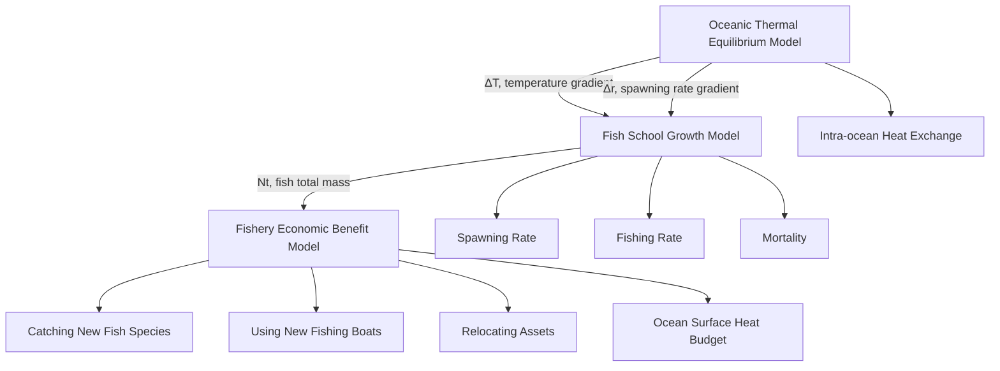
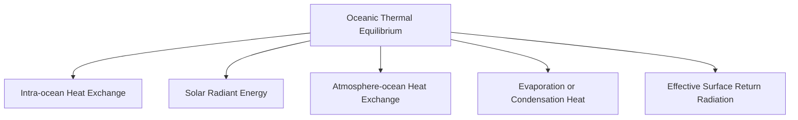

# Analysis and Prediction of Fish Migration via Oceanic

# Thermal Equilibrium Model

This article analyzes the relationship between the seawater warming and fisheries in Scotland by establishing an oceanic thermal equilibrium model, and further predicts the possible migration routes of fisheries.

For the first question, we first take the Atlantic Ocean with a latitude range of $5 5 ^ { \circ } \mathrm { N } \sim$ $6 5 \mathrm { { ^ \circ N } }$ as the research region, and synthesize the ocean surface heat budget and intra-ocean heat exchange to establish an oceanic thermal equilibrium model. Then, we predict the annual seawater temperature change rate of the sea within 50 years, and obtain the conclusion that the temperature will increase $2 . 6 ~ ^ { \circ } \mathrm { C }$ over 50 years. Finally, we further predict the possible migration routes of two fish species within 50 years based on the seawater temperature change.

For question two, according to the temperature change rate in question 1, we establish a fish school growth model. Then, we consider that the minimum temperature change rate is the best case, and the maximum is the worst case for the increasing of temperature change rate can promote the reduction of the total fish population. Finally, we set 10% of the ini tial fish weight as the threshold for fishing. Below this value, almost no fish can be caught. Through the simulation, we obtain that the times of almost no fish are: at best, it is the $4 6 ^ { \mathrm { { i h } } }$ or the $4 5 ^ { \mathrm { { \mathrm { t h } } } }$ year; at worst, it is the $1 7 ^ { \mathrm { t h } }$ year; and the most likely time is the $3 1 ^ { \mathrm { s t } }$ year.

For question three, we can get conclusion that both species are in decline. Therefore, the companies should change their operations. Then, we set up the economic benefit model, and analysis the benefits of the four business methods: not changing the operation, relocating assets (mode 1), using new fishing boats (mode 2), and catching new fish species (mode 3). The analysis results validate our judgment, and show that among the three new operation modes, the mode 1 has the most development potential; both the mode 2 and 3 can make up for the decline in returns, and the mode 2 has great benefits.

For question four, according to international law of the sea, we consider the fish migrating to the territorial of other countries as non-fishing. Then, we introduce the influence parameter of neighboring countries to modify the economic benefit model. The parameter indicates that the proportion of fish has not migrated to the territorial sea of other countries. It can be concluded that as the influence parameter becoming smaller, the economic benefits of mode 1 and the mode 2 will decrease, while mode 3 will not be affected.

At the end, we provide two-page suggestion for Hook Line and Sinker Magazine. According to conclusions drawn from the article, we help fishermen understand the impact of warming seawater well, and propose three ways to change their management to deal with this situation. In addition, we conduct a sensitivity analysis of the model, and the results show that the model has strong stability.

Keywords: Oceanic Thermal Equilibrium Model, Fish School Growth Model, Fishery Company Economic Benefit Model, Fish Migration

## CONTENTS

## Analysis and Prediction of Fish Migration via Oceanic Thermal Equilibrium Model .....1

1. Introduction.

1.1 Problem background  
1.2 Restatement.

2. Symbols..  
3. Our work .  
4. Simplifying assumptions.....  
5. Models and solutions . /

5.1 Oceanic thermal equilibrium model.

5.1.1 Ocean surface heat budget .  
5.1.2 Intra-ocean heat exchange. 6  
5.1.3 Oceanic thermal equilibrium. 6

5.2 Solution of problem 1 .  
5.3 Fish school growth model . .8

5.3.1 Analyze 8  
5.3.2 Algorithm design 9

5.4 Solution of problem 2 . C  
5.5 Fishery company economic benefit model . .10

5.5.1 Not changing the operation .  
5.5.2 Relocating assets . 1  
5.5.3 Using new fishing boats .. 1  
5.5.4 Catching new fish species . 12

5.6 Solution of problem 3 . .12

5.6.1 Relocating assets . 12  
5.6.2 Using new fishing boats . 13  
5.6.3 Catching new fish species . 14

5.7 Solution of problem 4 . .14

5.7.1 Impact on relocating assets 14  
5.7.2 Impact on using new fishing boats. 15

6. Sensitivity analysis. .16  
7. Strength and weakness ... 17

7.1 Strength. 17  
7.2 Weakness . 17

8. Model extension.. 18

9. An article to Hook Line and Sinker Magazine .  
10. References .. .3  
11. Appendix.. ′

11.1 Python code.  
11.2 MATLAB code . 10

## 1. Introduction

## 1.1 Problem background

Some ocean species have to change their habitats because the oceans are ge tting warmer. The fishing industry is also badly affected. Over the past half century or so, there has been a growing awareness of global warming, and ocean temperature have warmed with it[1].

Scientists have studied the distribution of 36 species of fish that live on the bottom of the North Sea. Since 1962, the temperature of currents on the bottom of the North Sea has risen by about 1 degree Celsius[2]. Scientists have found that 15 of the 36 fish species there have moved north following the cold water flow, and another six have swam deeper. The maximum migration distance of these fish is more than 400 kilometers[3]. However, not all local fish have joined the "Exile Army". This implies that with the migration of some predators or passive predators, the local marine ecosystem is in chaos, and the number of cold water fish will decrease sharply[4], and the number of fish that do not like cold water will increase sharply. Scientists expect fingerlings such as blue cod and red fish to disappear from the North Sea by 2050.Reisafjorden, in Norway’s Far North, has become one of the winter habitats of killer whale in recent years. While over the last few decades, their favorite meal herring[5] have been migrating north, forcing killer whales to follow suit.

We plot the temperature change curve about the world’s ocean by collecting data from ICCES. From 1940 to 2019, global ocean temperature shows an upward trend.


<details>
<summary>line chart</summary>

| Time/year | Mean Change (°C) | 95% CI Lower (°C) | 95% CI Upper (°C) |
| --------- | ---------------- | ----------------- | ----------------- |
| 1940      | -0.08            | -0.13             | -0.03             |
| 1945      | -0.06            | -0.11             | -0.02             |
| 1950      | -0.07            | -0.10             | -0.02             |
| 1955      | -0.05            | -0.09             | -0.02             |
| 1960      | -0.04            | -0.08             | -0.02             |
| 1965      | -0.03            | -0.07             | -0.02             |
| 1970      | -0.02            | -0.06             | -0.02             |
| 1975      | -0.01            | -0.05             | -0.02             |
| 1980      | 0.00             | -0.04             | -0.02             |
| 1985      | 0.01             | -0.03             | -0.02             |
| 1990      | 0.02             | -0.02             | -0.01             |
| 1995      | 0.03             | -0.01             | 0.01              |
| 2000      | 0.04             | 0.00              | 0.02              |
| 2005      | 0.05             | 0.01              | 0.03              |
| 2010      | 0.06             | 0.02              | 0.04              |
| 2015      | 0.07             | 0.03              | 0.05              |
| 2020      | 0.10             | 0.08              | 0.12              |
</details>

Figure 1. Ocean temperatures change curve

## 1.2 Restatement

Now we are consultants hired by a Scottish North Atlantic fishery management consortium. We need to help them solve the following problems:

What problems we should solve:

 Problem 1: Assuming that ocean temperatures are going to change, and cause the populations of the two fish species to move. Where will be the most likely locations for the two species over the next 50 years?  
 Problem 2: If the small fishing companies operate out of their current locations, what will be the best case and worst case, and when will that happen with no harvest?  
 Problem 3: Should these small fishing companies change their operations? If yes, please provide some economically attractive strategies for them. If no, justify reasons for your refection.  
 Problem 4: If some fisheries move into the territorial sea of another country, how is your proposal affected?

## 2. Symbols

Table 1. Symbol Definition Instruction

<table><tr><td>Symbol</td><td>Definition</td></tr><tr><td> $Q_s$ </td><td>Solar radiant energy</td></tr><tr><td> $Q_b$ </td><td>Energy of effective surface return radiation</td></tr><tr><td> $Q_e$ </td><td>Evaporation or condensation heat</td></tr><tr><td> $Q_h$ </td><td>Heat exchange atmosphere-ocean</td></tr><tr><td> $Q_z$ </td><td>Heat transport in the vertical direction</td></tr><tr><td> $Q_a$ </td><td>Heat transport in the horizontal direction</td></tr><tr><td>i</td><td>The kind of fish, i = {1,Herring2,Mackerel}</td></tr><tr><td> $p_i$ </td><td>Unit price of the  $i_{th}$  fish</td></tr><tr><td> $N_i$ </td><td>Total mass of the  $i_{th}$  fish</td></tr><tr><td> $d_i$ </td><td>Mortality of the  $i_{th}$  fish</td></tr><tr><td> $f_i$ </td><td>Fishing rate of of the  $i_{th}$  fish</td></tr><tr><td> $r_i$ </td><td>Spawning rate of of the  $i_{th}$  fish</td></tr><tr><td> $S_0$ </td><td>Target profit (reference profit)</td></tr><tr><td> $\Delta T$ </td><td>Temperature gradient</td></tr></table>

\*Other symbols instructions will be given in the text.  
\* All latitude and longitude representations in this article are (longitude, latitude).

## 3. Our work

We establish three models to solve the problems in our paper.

An oceanic thermal equilibrium model is used to predict temperature change in the seas around Scotland. Comprehensive considering ocean surface heat budget such as solar radiant energy, effective surface return radiation and intra-ocean heat exchange, we build an oceanic thermal equilibrium model to study the waters around Scotland at 55° to 65° North Latitude. After learning the proper temperature for herring and mackerel life, we can get the migration trajectory of the fish school based on the prediction temperature change.

Considering the rate of temperature change affects the spawning rate of the fish school, which in turn affects the number of the fish school. A fish school growth model is built based on the oceanic thermal equilibrium model. Then we can study the change of fish growth under different temperature change rates. When the number of fishes decreases and reaches a certain value, fishing companies can hardly catch fish.

To analyze the economic benefits of different business models, we establish a fishery company economic benefit model. In the model, we mainly discuss the economic benefits of the three business methods relocating assets, using new fishing boats and catching new fish species. Besides, based on the fish school growth model, we make a series of assumptions about the range of fish swarms, fishing boats, and the unit price of fish. So, we continue to compare the three new business methods with not changing the operation and evaluate the four business methods.

Subjected to international law of the sea[12], we consider the fish migrating to the territorial of other countries as non-fishing. Hence, based on the fishery company economic benefit model, we introduce the influence parameter of neighboring countries. By analyzing the new model modified after adding this parameter, we get how the three new business methods are affected.


<details>
<summary>flowchart</summary>


</details>

Figure 2. Solving strategy

## 4. Simplifying assumptions

By adequate analysis of the problem, to simplify our model, we make the following well-justified assumptions.

Assumption1: The effect of heat transport in the vertical direction is small and negligible.

Heat transport in the vertical direction is a type of intra-ocean heat exchange. It is mainly carried out by turbulence[6]. The heat on the sea surface is transported downward, and the cold water in the lower layer surges up. In this paper, we only consider the oceanic thermal equilibrium in shallow water, so we ignore heat transfer in the vertical direction.

Assumption2: Ignore the effect of evaporation on the total volume of seawater.

The ocean evaporates approximately 126 cm of seawater each year[7], which is insignificant to the ocean.

Assumption3: The small fishing companies make their money mainly from herring and mackerel.

Herring and mackerel are important economic sources of the Scottish fisheries. To facilitate the discussion and analysis of the economic benefits of these fishery companies, we consider their profit coming from herring and mackerel.

Assumption4: The boats of the small fishing companies have no on-board refrigeration at first.

The number of fish around Scotland is huge, and fish can be caught offshore. Although fishing boats without refrigerators cannot be kept fresh, they are low in cost and easy to use.

Assumption5: The number of fish around Scotland remains the same, except that some fish are found close to Scotland, while others maybe farther away.

People will limit the fishing rate and keep the number of fish stocks stable to ensure the stable development of fisheries. We estimate the total number of fish near Scotland based on the latest statistics from the Scottish Marine Information Authority. As the temperature changes, some fish will migrate to other places and some will remain near Scotland.

Assumption6:Price of every kind of fish remains unchanged.

The price of fish is related to factors such as supply and demand, government regulation, and seasonal changes. Analyzing its change rules is complicated. To simplify the problem and establish a feasible model, we believe that the price of every kind of fish is constant.

## 5. Models and solutions

We plot the heat maps of the world’s oceans by collecting data from ICCES. The heat map every 20 years from 1955 to 2015 is shown below. It can be seen from the figure that the global ocean temperature is rising.


<details>
<summary>heatmap</summary>

| Latitude | Longitude | Current Density (10^9 Joules m^-2) |
| -------- | --------- | ---------------------------------- |
| 60°N     | 0°        | ~3                                 |
| 60°S     | 0°        | ~-2                                |
| 30°N     | 0°        | ~1                                 |
| 30°S     | 0°        | ~-1                                |
| 60°E     | 120°E     | ~-3                                |
| 60°W     | 180°W     | ~-2                                |
| 60°W     | 120°W     | ~0                                 |
| 60°W     | 60°W      | ~1                                 |
| 60°S     | 0°        | ~2                                 |
| 30°S     | 0°        | ~3                                 |
| 30°N     | 0°        | ~4                                 |
Unit: 10^9 Joules m^-2
</details>

In November 1955


<details>
<summary>heatmap</summary>

| Latitude | Longitude | Current Density (10^9 Joules m^-2) |
| -------- | --------- | --------------------------------- |
| 60°N     | 0°        | ~3                                |
| 60°N     | 30°S      | ~2                                |
| 60°N     | 60°S      | ~1                                |
| 60°N     | 90°N      | ~0                                |
| 30°N     | 0°        | ~2                                |
| 30°N     | 30°S      | ~1                                |
| 30°N     | 60°S      | ~0                                |
| 30°N     | 90°N      | ~-1                               |
| 0°       | 0°        | ~1                                |
| 0°       | 30°S      | ~0                                |
| 0°       | 60°S      | ~-1                               |
| 0°       | 90°N      | ~-2                               |
| -30°S    | 0°        | ~-1                               |
| -30°S    | 30°S      | ~-2                               |
| -30°S    | 60°S      | ~-1                               |
| -30°S    | 90°N      | ~-2                               |
| -60°E    | 0°        | ~-2                               |
| -60°E    | 30°E      | ~-1                               |
| -60°E    | 60°E      | ~0                                |
| -60°E    | 90°E      | ~-1                               |
| -60°W    | 0°        | ~-2                               |
| -60°W    | 30°W      | ~-1                               |
| -60°W    | 60°W      | ~0                                |
| -60°W    | 90°W      | ~-1                               |
| -60°W    | 90°N      | ~-2                               |
| -30°W    | 0°        | ~-2                               |
| -30°W    | 30°W      | ~-1                               |
| -30°W    | 60°W      | ~0                                |
| -30°W    | 90°W      | ~-1                               |
| -60°S    | 0°        | ~-2                               |
| -60°S    | 30°S      | ~-1                               |
| -60°S    | 60°S      | ~0                                |
| -60°S    | 90°S      | ~-1                               |
| -60°E    | 0°        | ~-2                               |
| -60°E    | 30°E      | ~-1                               |
| -60°E    | 60°E      | ~0                                |
| -60°E    | 90°E      | ~-1                               |
| -60°W    | 0°        | ~-2                               |
| -58°E    | 30°E      | ~-1                               |
| -58°E    | 60°E      | ~0                                |
| -58°E    | 90°E      | ~-1                               |
| -58°E    | 90°N      | ~-2                               |
| -58°W    | 0°        | ~-2                               |
| -58°W    | 30°W      | ~-1                               |
| -58°W    | 60°W      | ~0                                |
| -58°W    | 90°W      | ~-1                               |
| -58°W    | 90°N      | ~-2                               |
Unit: 10^9 Joules m^-2; Color scale: -4 to +4; Unit: 10^9 Joules m^-2; Color legend: Blue = Low, Red = High; Color scale: Medium, Light Blue = Medium; Color scale: High; Color scale: Dark Blue = High; Color scale: Very High; Color scale: Very Low; Color scale: Very Low; Color scale: Very High; Color scale: Very Low; Color scale: Very Low; Color scale: Very High; Color scale: Very Low; Color scale: Very Low; Color scale: Very High; Color scale: Very Low; Color scale: Very Low; Color scale: Very High; Color scale: Very Low; Color scale: Very Low; Color scale: Very High; Color scale: Very Low; Color scale: Very Low; Color scale: Very Low; Color scale: Very High; Color scale: Very Low; Color scale: Very Low; Color scale: Very High; Color scale: Very Low; Color scale: Very Low; Color scale: Very High; Color scale: Very Low; Color scale: Very Low; Color scale: Very Low; Color scale: Very High; Color scale: Very Low; Color scale: Very Low; Color scale: Very High; Color scale : Very Low; Color scale : Very Low; Color scale : Very High; Color scale : Very Low; Color scale : Very High; Color scale : Very High; Color scale : Very Low; Color scale : Very Low; Color scale : Very High; Color scale : Very Low; Color scale : Very Low; Color scale : Very High; Color scale : Very Low; Color scale : Very Low; Color scale : Very High; Color scale : Very Low; Color scale : Very Low; Color scale : Very High; Color scale : Very Low; Color scale : Very Low; Color scale : Very High; Color scale : Very Low; Color scale : Very Low; Color scale : Very High; Color scale: Very Low; Color scale: Very Low; Color scale: Very High; Color scale: Very Low; Color scale: Very Low; Color scale: Very High; Color scale: Very Low; Color scale: Very Low; Color scale: Very High; Color scale: Very Low; Color scale: Very Low; Color scale: Very High; Color scale: Very Low; Color scale: Very Low; Color scale: Very High; Color scale: Very Low; Cyan = Low, Orange = Medium, Yellow = High, Blue = Medium, Green = High, Red = High, Cyan = Medium, Orange = Medium, Yellow = Medium, Blue = Medium, Green = Medium, Red = Medium, Cyan = Medium, Orange = Medium, Yellow = Medium, Blue = Medium, Green = Medium, Red = Medium, Cyan = Medium, Orange = Medium, Cyan = Medium, Blue = Medium, Cyan = Medium, Orange = Medium, Cyan = Medium, Cyan = Medium, Cyan = Medium, Cyan = Medium, Cyan = Medium, Cyan = Medium, Cyan = Medium, Cyan = Medium, Cyan = Medium, Cyan = Medium, Cyan = Medium, Cyan = Medium, Cyan = Medium, Cyan = Medium, Cyan = Medium, Cyan = Medium, Cyan = Medium, Cyan = Medium, Cyan = Medium, Cyan = Medium, Cyan = Medium, Cyan = Medium, Cyan = Medium, Cyan = Medium, Cyan = Medium, Tan = Low, Tan = Medium, Tan = High, Tan = Medium, Tan = High, Tan = Medium, Tan = Medium, Tan = Medium, Tan = Medium, Tan = Medium, Tan = Medium, Tan = Medium, Tan = Medium, Tan = Medium, Tan = Medium, Tan = Medium, Tan = Medium, Tan = Medium, Tan = Medium, Tan = Medium, Tan = Medium, Tan = Medium, Tan = Medium, Tan = Medium, Tan = Medium, Tan = Medium, Tan = Medium, Tan = Medium, Tan = Medium, Tan = Medium, Tan = Small<nl>

</details>

In November 1975


<details>
<summary>heatmap</summary>

| Latitude | Longitude | Value (10^9 Joules m^-2) |
| -------- | --------- | ------------------------ |
| 90°N     | 60°E      | -3                       |
| 90°N     | 120°E     | -2                       |
| 90°N     | 180°W     | -1                       |
| 90°N     | 120°W     | 0                        |
| 90°N     | 60°W      | 1                        |
| 90°N     | 0°        | 2                        |
| 90°N     | 30°S      | 3                        |
| 90°N     | 60°S      | 4                        |
| 60°N     | 60°E      | -3                       |
| 60°N     | 120°E     | -2                       |
| 60°N     | 180°W     | -1                       |
| 60°N     | 120°W     | 0                        |
| 60°N     | 60°W      | 1                        |
| 60°N     | 0°        | 2                        |
| 60°N     | 30°S      | 3                        |
| 60°N     | 60°S      | 4                        |
Unit: 10^9 Joules m^-2
</details>

In November 1995


<details>
<summary>heatmap</summary>

| Latitude | Longitude | Value (10^9 Joules m^-2) |
| --- | --- | --- |
| 90°N | 60°E | -3 |
| 60°N | 120°E | -2 |
| 30°N | 180°W | -1 |
| 0° | 120°W | 0 |
| 30°S | 60°W | 1 |
| 60°S | 60°E | 2 |
| 90°S | 120°E | 3 |
| 60°S | 180°W | 4 |
| 30°S | 120°W | -1 |
| 60°S | 60°W | -2 |
| 90°S | 120°W | -3 |
| 60°S | 180°W | -4 |
| 30°S | 120°W | -1 |
| 60°S | 60°W | 0 |
| 90°S | 120°W | 1 |
| 60°S | 180°W | 2 |
| 30°S | 120°W | 3 |
| 60°S | 60°W | 4 |
| 90°S | 120°W | -1 |
| 60°S | 180°W | -2 |
| 30°S | 120°W | -3 |
| 60°S | 60°W | -4 |
| 90°S | 120°W | -1 |
| 60°S | 180°W | 0 |
| 30°S | 120°W | 1 |
| 60°S | 60°W | 2 |
| 90°S | 120°W | 3 |
| 60°S | 180°W | 4 |
| 30°S | 120°W | -1 |
| 60°S | 180°W | -2 |
| 90°S | 120°W | -3 |
| 60°S | 180°W | -4 |
| 30°S | 120°W | -1 |
| 60°S | 60°W | 0 |
| 90°S | 120°W } \) | 1 |
| 60°S | 180°W } \) | 2 |
| 30°S | 120°W } \) | 3 |
| 60°S | 60°W } \) | 4 |
</details>

In November 2015  
Figure 3. Heat map of the world's oceans

In this section, we build three models to solve the four questions. First, temperature change is important for fish to migrate. Hence, we develop an oceanic thermal equilibrium model to analyze the temperature in the waters off Scotland. Then, to solve the time when the small fishing companies will hardly catch any fish, we built a fish school growth model. At the end, we use a fishery company economic benefit model to analyze and identify practical and economically attractive strategies.

## 5.1 Oceanic thermal equilibrium model

The survival and reproduction of fish are closely related to the ocean temperature. Due to the change of global ocean temperature, fish must move to the appropriate temperature location, so there is an inevitable relationship between the fluctuation of ocean water temperature and the change of survival location. In order to study the relationship between the water temperature and the migration of fish species in the future, we should first make clear the mathematical relationship between the ocean temperature and various kinds of heat in the nature. In the ocean thermal equilibrium model, the exchange ways of ocean heat are mainly as shown in Figure 4.

Oceanic thermal equilibrium includes ocean surface heat budget and intra-ocean heat exchange. Especially intra-ocean heat exchange is the focus[8], which mainly has solar radiant energy, evaporation or condensation heat, heat exchange atmosphere-ocean, effective surface return radiation.


<details>
<summary>flowchart</summary>


</details>

Figure 4. Oceanic thermal equilibrium schematic diagram

## 5.1.1 Ocean surface heat budget

## Solar radiant energy

As an important source of heat, Solar radiant energy refers to the energy transmitted by the sun in the form of electromagnetic waves.

$$
Q _ {s} = Q _ {s 0} (1 - 0. 7 C) \left(1 - A _ {s}\right) \sin H. \tag {1-1}
$$

The total amount of radiation reaching the upper boundary of the atmosphere is the solar constant $Q _ { s 0 } = 3 4 4 W \cdot m ^ { - 2 } [ 9 ]$ , but these energies are difficult to be directly absorbed by the sea water, and in the process, some of them are intercepted by clouds and some of them are reflected by the sea. The energy of cloud interception is related to the amount of cloud. Set the correlation coefficient as $\mathsf C = 0 { \sim } 1$ (its value is about 0.5) and the sea surface reflectivity as $A _ { s } = 7 \%$ .

Solar altitude angle is the acute angle between the incident direction of the sunlight and the ground plane, its value is between 0 and $9 0 ~ ^ { \circ } .$ And when it is $9 0 ~ ^ { \circ } ,$ it is called direct sunlight[7].

Calculation formula based on the solar altitude angle: $\mathrm { H } = 9 0 ^ { \circ } - | \beta \pm \gamma | [ 5 ]$ ,where represents the local geographic latitude; represents the geographic latitude of the direct sun point; when the requested geographic latitude is in the same hemisphere as the direct sun, take the $^ { 6 6 } - \mathrm { ^ { 6 6 } s i g n }$ , and otherwise take the $^ { 6 6 } + \mathrm { ^ { 6 6 } s i g n }$ . The average latitude coordinate of the North Atlantic Ocean is set to 60N. When the sun directly hits the Tropic of Cancer (23.5N), the annual maximum solar height can be obtained as $5 3 . 5 \ \mathrm { ~ \AA ~ }$ when the sun is directly hit on the Tropic of Cancer (23.5S), the minimum annual solar height can be obtained as $6 . 5$ °; here we take the annual average Height $H = 3 8 . 5 ^ { \circ } .$ .

## Effective surface return radiation

Any object with a temperature higher than absolute zero is radiating heat outwards. We see sea’s as effective surface return radiation:

$$
Q _ {b} = A - B. \tag {1-2}
$$

is sea surface long wave radiation, it is $9 0 \% Q _ { s 0 }$ ; is atmospheric return, it is $5 0 \% Q _ { s 0 } [ 8 ]$ .

Evaporation or condensation heat

Evaporation or condensation heat is

$$
Q _ {e} = L \cdot E = L \cdot k \cdot (e _ {0} - e _ {z}) \cdot W, \tag {1-3}
$$

where is latent heat of evaporation, it can be calculated by Dietrich empirical formula[9]; is the amount of evaporation; is wind speed, we take the average annual wind speed here; is a coefficient related to the wind speed; $e _ { 0 }$ is the vapor pressure calculated based on the temperature of the sea surface; $e _ { z }$ is the vapor pressure calculated by air temperature at height $z _ { m }$ .

Heat exchange atmosphere-ocean

$$
Q _ {h} = 10 \% Q _ {w}. \tag{1 - 4}
$$

Due to the difference in sea-air temperature, heat is exchanged through heat conduction, and the ocean sends heat to the atmosphere through sensible heat exchange, and the heat is equivalent to 10% of the ocean surface heat budget.

Through the above analysis, we drive:

$$
Q _ {w} = Q _ {s} - Q _ {b} \pm Q _ {e} \pm Q _ {h}. \tag {1-5}
$$

In the formula, $Q _ { w }$ is ocean surface heat budge, if $Q _ { w } > 0$ , seawater gains heat; if $Q _ { w } < 0$ ,seawater loses heat. $Q _ { s }$ represents solar radiant energy, $Q _ { b }$ is effective surface return radiation, $Q _ { e }$ is evaporation or condensation heat, and $Q _ { h }$ is heat exchange atmosphere-ocean.

## 5.1.2 Intra-ocean heat exchange

Based on Assumption1,we ignore the heat transport in the vertical direction $\mathrm { Q } _ { \mathrm { z } }$ .

The heat transport in the horizontal direction $Q _ { a }$ is:

$$
Q _ {a} = - C _ {p} \cdot \rho \cdot v \frac {\partial T}{\partial n}, \tag {1-6}
$$

where $C _ { p }$ is constant pressure heat capacity; $\rho$ is density of sea water, which is equal to 1.05 $\times 1 0 ^ { 3 } \mathrm { k g } / m ^ { 3 } ; v$ is the velocity of seawater; $\frac { \partial T } { \partial n }$ is the water temperature gradient in the direction of the ocean current. It is the key to influence the change of the thermal condition of the ocean current passing through the sea area. The direction of heat transfer is opposite to the direction of the temperature gradient.

## 5.1.3 Oceanic thermal equilibrium

The sea surface heat balance equation (ocean surface heat budget) is only applicable to the global ocean, but we are studying the sea area near Scotland. This sea area is a local area, so it should be calculated using the heat balance applicable to any time period and local sea area.

Based on the sea surface heat balance equation, and considering the intra-ocean heat exchange , we derive:

$$
Q _ {t} = Q _ {s} - Q _ {b} \pm Q _ {e} \pm Q _ {h} \pm Q _ {z} \pm Q _ {a}. \tag {1-7}
$$

When $Q _ { t } > 0$ , the sea water temperature will rise, while if $Q _ { t } < 0$ , the sea water temperature will drop

The specific heat capacity of sea water is about $4 0 9 6 J / k g \cdot ^ { \circ } \mathsf { C } ,$ , and we estimate the total shallow water mass in the waters off Scotland is about $3 . 2 5 5 \times 1 0 ^ { 1 4 } k g$ , according to the data from Scottish Marine Information Authority. Based on the formula $Q _ { t } = c m \Delta T$ , we derive:

$$
\Delta T = \frac {d T}{d t} = \frac {Q _ {t}}{c m}. \tag {1-8}
$$

## 5.2 Solution of problem 1

We study the Atlantic waters between 55N and 65N near Scotland. Calculating the heat budget according to the formulas (1-1) \~ (1-7), we get the change curve of the total heat budget $Q _ { t }$ in the sea in 50 years. From Equation (1-8) $\Delta T = \frac { Q _ { t } } { c m } ,$ we can know the multiple relationship between the temperature gradient and the total heat budget. The temperature gradient curve in the past fifty years is shown in the figure 5(b).


<details>
<summary>line chart</summary>

| Year | Q₁ (×10¹⁴) |
| ---- | ---------- |
| 2020 | 150        |
| 2025 | 250        |
| 2030 | 350        |
| 2035 | 450        |
| 2040 | 600        |
| 2045 | 750        |
| 2050 | 850        |
| 2055 | 950        |
| 2060 | 1050       |
| 2065 | 1100       |
| 2070 | 1150       |
</details>

a. (total heat budget)


<details>
<summary>line chart</summary>

| Year | Temperature(°C) |
| ---- | --------------- |
| 2020 | 0.01            |
| 2025 | 0.015           |
| 2030 | 0.025           |
| 2035 | 0.03            |
| 2040 | 0.04            |
| 2045 | 0.05            |
| 2050 | 0.06            |
| 2055 | 0.07            |
| 2060 | 0.08            |
| 2065 | 0.085           |
| 2070 | 0.09            |
</details>

b. (temperature gradient)  
Figure 5. Total heat budget and temperature gradient curve

According to the annual temperature gradient predicted in the above figure for the next 50 years, we can get:

$$
\sum_ {i = 1} ^ {5 0} \Delta T \approx 2. 6 ^ {\circ} \mathrm{C}.
$$

Therefore, the temperature of the Atlantic Ocean between 55°N and 65°N will increase by approximately $2 . 6 ~ ^ { \circ } \dot { \mathrm { { C } } }$ in the next 50 years.

Based on the ocean temperature data provided by Met Office Hadley Centre, we draw a heat map of the waters around Scotland in 2019, as shown in Figure 6 (a). Then according to the ocean thermal equilibrium mode, the temperature in this sea area rises by $2 . 6 ~ ^ { \circ } \mathrm { C }$ after 50 years, so we can get the heat map of 2070, as shown in Figure 6 (b).


<details>
<summary>heatmap</summary>

| Location       | Value |
| -------------- | ----- |
| Island         | High  |
| United Kingdom | Medium|
| Ireland        | Low   |
| Lohre          | Medium|
| Deutschland   | High  |
| France         | Low   |
| Barcelona      | Low   |
| España         | Low   |
| Sverige        | Low   |
| Stockholm      | Low   |
| Lie            | Low   |
| Polska         | Low   |
| Cesko          | Low   |
| Slovenska      | Low   |
| Magyarország   | Low   |
| Ror            | Low   |
| Hyvatika       | Low   |
| Copleja        | Low   |
| Italia         | Low   |
| Exome          | Low   |
</details>

(a)2019 heat map


<details>
<summary>heatmap</summary>

| Location       | Value |
| -------------- | ----- |
| Island         | High  |
| United Kingdom | Medium|
| Ireland        | Medium|
| Lorraine       | Low   |
| Deutschland    | Medium|
| France         | Low   |
| Germany        | Medium|
| Netherlands    | Low   |
| Switzerland    | Low   |
| Sweden         | Low   |
| Finland        | Low   |
| Denmark        | Low   |
| Norway         | Low   |
| Iceland        | Low   |
| Estonia        | Low   |
| Latvia         | Low   |
| Lithuania      | Low   |
| Luxembourg     | Low   |
| Monaco          | Low   |
| Ireland        | Low   |
| Germany        | Low   |
| Netherlands    | Low   |
| Switzerland    | Low   |
| Sweden         | Low   |
| Finland        | Low   |
| Iceland        | Low   |
| Estonia        | Low   |
| Lithuania      | Low   |
| Monaco          | Low   |
| Germany        | Low   |
| Netherlands    | Low   |
| Switzerland    | Low   |
| Sweden         | Low   |
| Finland        | Low   |
| Iceland        | Low   |
| Estonia        | Low   |
| Lithuania      | Low   |
| Monaco          | Low   |
| Germany        | Low   |
| Netherlands    | Low   |
| Switzerland    | Low   |
| Sweden         | Low   |
| Finland        | Lowest|
| Estonia        | Lowest|
| Lithuania      | Lowest|
| Monaco          | Lowest|
| Germany        | Lowest|
| Netherlands    | Lowest|
| Switzerland    | Lowest|
| Sweden         | Lowest|
| Finland        | Lowest|
| Iceland        | Lowest|
| Estonia        | Lowest|
| Lithuania      | Lowest|
| Monaco          | Lowest|
| Germany        | Lowest|
| Netherlands    | Lowest|
| Switzerland    | Lowest|
| Sweden         | Lowest|
| Finland        | Lowest|
| Iceland        | Lowest|
| Estonia        | Lowest|
| Lithuania      | Lowest|
| Monaco          | Lowest|
| Germany        | Lowest|
| Netherlands    | Lowest|
| Switzerland    | Lowest|
| Sweden         | Lowest|
</details>

(b)Predicted heat map for 2070  
Figure 6. Heat map of the sea off Scotland

Both herring and mackerel live in shallow water. The temperature suitable for herring is about $8 . 8 ~ ^ { \circ } \mathrm { C } \sim 9 . 8 ~ ^ { \circ } \mathrm { C } ,$ and that for mackerel is about $8 . 8 6 \sim 9 . 6 ^ { \circ } \mathrm { C } [ 1 6 ]$ . From the updated waters, looking for a location that matches the living temperature of herring and mackerel is the direction in which these two fish move. According to data from the Scottish Marine Information Authority, in 2016 herrings near Scotland were mainly distributed around (-1.3, 60) and (-7.4, 58), and mackerel were mainly distributed around (-5, 58.5) and (0, 58.5) .

Table 2. Predicted main locations for herring and mackerel

<table><tr><td>Year</td><td colspan="2">Herring</td><td colspan="2">Mackerel</td></tr><tr><td>2030</td><td>(2 °W, 61°N)</td><td>(5 °W, 58° N)</td><td>(9 °E,55° N)</td><td>(1 °E,54° N)</td></tr><tr><td>2040</td><td>(8 °E, 64° N)</td><td>(2 °W,57° N)</td><td>(3 °W,62° N)</td><td>(9 °E,58° N)</td></tr><tr><td>2050</td><td>(2 °E,60° N)</td><td>(24 °W,58° N)</td><td>(9 °E, 67° N)</td><td>(4 °W,62° N)</td></tr><tr><td>2060</td><td>(2 °W,64° N)</td><td>(5 °E,61° N)</td><td>(1 °E,66° N)</td><td>(1 °W,63° N)</td></tr><tr><td>2070</td><td>(8 °E,64° N)</td><td>(10 °E,54° N)</td><td>(4 °W,63° N)</td><td>(7 °W,64° N)</td></tr></table>

After 50 years, the most likely locations for herring are near (8,64) and (10,54), and the most likely locations for mackerel are near (-4,63) and (-7,64). The migration of the two fish is shown below


<details>
<summary>text_image</summary>

Map showing flight routes and circular markers across Iceland with labeled locations and connecting lines
</details>

(a) Herring migration illustration


<details>
<summary>text_image</summary>

Map showing locations of a network with blue and red markers connected by dotted lines across Iceland, including labeled nodes and a highlighted region.
</details>

(b) mackerel migration illustration  
Figure 7. Herring and mackerel school migration illustration in 50 year

## 5.3 Fish school growth model

## 5.3.1 Analyze

We build a fish school growth model based on the Logistic model to study the changes in fish weight in the seas around Scotland. The change in the total number of fish is directly related to spawning rate, fishing rate and mortality, so we get:

$$
\left\{ \begin{array}{l} \frac {d N _ {i} (t)}{d t} = (r _ {i} - f _ {i} - d _ {i}) \cdot N _ {i} (t), \\ N _ {i} (t _ {0}) = N _ {0 i} \end{array} \right. \tag {2-1}
$$

where $N _ { i } ( t )$ is the total mass of fish in the waters off Scotland； $r _ { i }$ is spawning rate，it is related to temperature changes. The faster the temperature changes, the more fishes migrate to other places, the lower the spawning rate there; $f _ { i }$ indicates the fishing rate. In order to maintain the stable development of fisheries, people keep the fishing rate within a certain range[10], so as not to reduce the fishery production the following year due to excessive fishing； $d _ { i }$ represents mortality, mainly from the killing of natural enemies and natural disasters[11]. The growth of the school of fish is initially maintained in a balanced state, $d _ { i } =$ $r _ { 0 i } - f _ { i }$ .

Information from the Scottish Maritime Information Authority shows: the weight of herring caught in 2016 was 84059 tonnes，fishing rate is 0.27，spawning rate is 0.30. b 2

Therefore we estimate the total amount of herring $N _ { 0 1 }$ to be 311330 tonnes; the weight of mackerel caught in 2016 was 210218 tonnes，fishing rate $f _ { 2 }$ is 0.22，spawning rate $r _ { 2 }$ is 0.41. Therefore we estimate the total amount of mackerel $N _ { 0 2 }$ to be 955536 tonnes.

Spawning rate is affected by the rate of temperature change:

$$
\frac {d r}{d t} = - a \frac {d T (t)}{d t}. \tag {2-2}
$$

In the above formula is the influence factor of the temperature change rate on the spawning rate. The faster the temperature changes, the greater the impact on the spawning rate, and the smaller the impact.

Table 3. Parameter value

<table><tr><td></td><td> $f_i$ (Fishing rate)</td><td> $r_i$ (Recruitment rate)</td><td> $d_i$ (Mortality )</td><td> $a_i$ (Impact factor)</td></tr><tr><td>Herring</td><td>0.27</td><td>0.36</td><td>0.09</td><td>0.1</td></tr><tr><td>Mackerel</td><td>0.22</td><td>0.41</td><td>0.19</td><td>0.2</td></tr></table>

## 5.3.2 Algorithm design

We design a micro-element iterative method to simulate the fish school growth model:

Step1. Initialize, and input $N _ { i } ( t ) = N _ { 0 i } , \ r _ { i } ( t ) = r _ { 0 i } , \ f _ { i } , \ d _ { i } \ , T ( t )$ ;

Step2. Update the variation of spawning rate: $\begin{array} { r } { \Delta r _ { i } = - a \frac { d T ( t ) } { d t } ; } \end{array}$ ( )

Step3. Calculate $r _ { i } ( t + 1 ) = r _ { i } ( t ) + \Delta r _ { i } ;$

Step4. Update fish stock change rate: $\Delta N _ { i } = ( r _ { i } ( t ) - f _ { i } - d _ { i } ) \cdot N _ { i } ( t )$ ;

Step5. Calculate $N _ { i } ( t + 1 ) = N _ { i } ( t ) + \Delta r _ { i } ;$

Step6. Update $t \colon t { = } t { + } I$ . Determine where $N _ { i }$ reaches the threshold. If so, it ends; else, return to Step2.

## 5.4 Solution of problem 2

According to the fish school growth model of 5.3, we can get the growth of herring and mackerel in the waters around Scotland. With $1 0 \% N _ { 0 i }$ as the threshold, it is considered that when $N _ { i } ( t )$ is less than the threshold, fisheries companies can hardly catch fish.

Since the temperature change gradient affects the total number of fish by affecting the spawning rate, according to formula (2-2), we can know that the smaller , the smaller the trend of reducing the spawning rate, and the slower the total fish population decreases. Therefore, the best case is $\Delta T = m i n ( \Delta T )$ , and the worst case is $\Delta T = m a x ( \Delta T )$ . From the figure 5 (b) we obtained in 5.2, we can know that $\Delta T = 0 . 0 1 1$ is the best case and $\Delta T =$ is the worst case.

The parameters in the fish school growth model are shown in Table 3. According to the iterative method of 5.3.2, the growth curves of herring and mackerel can be obtained as shown in Figure.


<details>
<summary>line chart</summary>

| Time/year | Most Likely Case | Worst Case | Best Case | Threshold |
| --------- | ---------------- | ---------- | --------- | --------- |
| 17        | 3.1              | 3.1        | 3.1       | 0.3       |
| 31        | 0.3              | 0.3        | 0.3       | 0.3       |
| 46        | 0.0              | 0.0        | 0.0       | 0.3       |
</details>

Figure 8 . The weight of herring in different case

From the curve of herring weight in the figure above, we can see that under the predicted temperature change (most likely case identified in the figure), herring can hardly be caught in the $3 1 ^ { \mathrm { s t } }$ year; in the worst case, the threshold is reached at the $1 7 ^ { \mathrm { t h } }$ year; and in the best case, the time to reach the threshold is the $4 6 ^ { \mathrm { t h } }$ year.

As for Mackerel, the times of almost no fish are: at best, it is the $4 5 ^ { \mathrm { t h } }$ year; at worst, it is about the $1 7 ^ { \mathrm { t h } }$ year; and the most likely time is about the $3 1 ^ { \mathrm { s t } }$ year.


<details>
<summary>line chart</summary>

| Time/year | Most Likely Case | Worst Case | Best Case | Threshold |
| --------- | ---------------- | ---------- | --------- | --------- |
| 16.9      | 1                | 1          | 1         | 1         |
| 30.5      | 1                | 0          | 1         | 1         |
| 45.2      | 0                | 0          | 1         | 1         |
</details>

Figure 9 . The weight of mackerel in different case

## 5.5 Fishery company economic benefit model

Key parameter description:

$S _ { 0 }$ ： the profit in 2019,we set it as reference profit, its value is ￡108.19million.

$$
S _ {0} = \sum_ {i = 1} ^ {2} f _ {0 i} \cdot N _ {0 i} \cdot p _ {i} = f _ {0 1} \cdot N _ {0 1} \cdot p _ {1} + f _ {0 1} \cdot N _ {0 1} \cdot p _ {1}
$$

$N _ { i } ( t )$ ：total weight of $i _ { t h }$ fish in year t.

$f _ { 0 i } \colon$ reference fishing rate for $i _ { t h }$ fish ， $f _ { 0 1 } = 0 . 2 7 , f _ { 0 2 } = 0 . 2 2$ .

$N _ { 0 i }$ : total weight of $i _ { t h }$ in the waters near Scotland ， $N _ { 0 1 } = 3 1 1 3 3 0 t o n n e s$ ， $N _ { 0 2 } = 9 5 5 5 3 6$ tonnes.

$p _ { i } \colon$ unit price of $i _ { t h }$ fish， $p _ { 1 } = 9 9 . 8 1 \ : \mathcal { L } / t o n n e , \ : \ : p _ { 2 } = 4 7 4 . 7 5 \ : \mathcal { L } / t o n n e$

## 5.5.1 Not changing the operation

When the operation mode is not changed, the relationship between the total weight of fish near the company and the year can be obtained from the fish growth model, which is $N _ { i } ( t )$ (t). Assuming that the unit profit of fish is always $p _ { i }$ (unit: $\mathcal { L } / t o n n e )$ , fishing rate is $f _ { 0 i }$ , so the profit is expressed as follows:

$$
S (t) = \sum_ {i = 1} ^ {2} N _ {i} (t) \cdot f _ {0 i} \cdot p _ {i.} \tag {3-1}
$$

## 5.5.2 Relocating assets

The assets of the small fishing companies were transferred $a ( a < 1 )$ near the fish school migration, and the cost of migrating assets is paid from the reference income $S _ { 0 }$ , which is $a S _ { 0 }$ , that is, the company with a proportion of $1 - a$ is still in its original location.

Fishing revenue at the original location

$$
S _ {b} (t) = \sum_ {i = 1} ^ {2} N _ {i} (t) \cdot p _ {0 i} \cdot f _ {0 i} \cdot (1 - a). \tag {3-2}
$$

In the formula, $N _ { i } ( t )$ is the total weight of $i _ { t h }$ fish in year t. Due to asset transfers, the fishing rate at the original part drops to $f _ { i } ( 1 - a )$ .

Fishing revenue after relocation

$$
S _ {a} (t) = \sum_ {i = 1} ^ {2} \left[ N _ {0 i} - N _ {i} (t) \right] \cdot p _ {0 i} \cdot f _ {0 i} \cdot a. \tag {3-3}
$$

In the formula, $N _ { 0 i }$ is the total weight of $i _ { t h }$ in the waters near Scotland. After the asset transfer, the assets of the new company are of the original total assets, so compared to the reference fishing rate, the fishing rate drops to $f _ { i } a$ .

The total revenue is composed of origin capture revenue and relocation capture revenue, so the expression that can obtain the total revenue S (t) is shown in (3-4).

$$
S (t) = S _ {b} (t) + S _ {a} (t). \tag {3-4}
$$

From the formula (3-2)\~(3-4), we can know that when $a = 0$ ,the total profit of this new mode is equal to the profit of not changing the operation.

## 5.5.3 Using new fishing boats

The original fishing boat do not have a cooling function, but the new fishing boat has. Replace $b ( b < 1 ) \mathrm { o f }$ the original fishing boat with a new fishing boat, and the replacement cost is paid by the reference profit $S _ { 0 }$ , that is $b S _ { 0 }$ .

Fishing revenue from the original fishing boat

Profit from the original fishing boat:

$$
S _ {b} (t) = \sum_ {i = 1} ^ {2} N _ {i} (t) \cdot p _ {0 i} \cdot f _ {0 i} \cdot (1 - b). \tag {3-5}
$$

After replacing the fishing boat, the original fishing boat is left $( 1 - b )$ , so the profit is (1-b) times that of the fishing boat without replacement.

Fishing revenue from the new fishing boat

Because the new fishing boat has a fresh-keeping function, there is no need to worry about the fresh-keeping problem of the fish, and it can fishing in far-off seas. Therefore, we assume that this fishing boat can go to any habitat of the two kinds of fish. That means the whole school of fish $N _ { 0 i }$ can be caught by the new fishing boat. And the fishing rate is equal to the reference fishing rate $f _ { 0 i }$ . so the profit of the new fishing boat is:

$$
S _ {a} (t) = \sum_ {i = 1} ^ {2} N _ {0 i} \cdot f _ {0 i} \cdot p _ {0 i} \cdot b. \tag {3-6}
$$

The total income is composed of the fishing income of the original fishing boat and the fishing income of the new fishing boat. Their relationship is as follows:

$$
S (t) = S _ {b} (t) + S _ {a} (t). \tag {3-7}
$$

From the formula (3-5), (3-6) and (3-7), we can know that when $b = 0$ ,the total profit of this new mode is equal to the profit of not changing the operation.

## 5.5.4 Catching new fish species

Suppose the unit price of the new fish species is c times the average unit price of the two $c \overline { { p _ { \imath } } } , \ \overline { { p _ { \imath } } } = \frac { p _ { 1 } + p _ { 2 } } { 2 } = 2 8 7 . 2 8 \mathcal { L } / t o n n e$ 2

Suppose that the total weight of the new species can reach the average total weight of the two species, $\overline { { N _ { 0 l } } } = \frac { N _ { 0 1 } + N _ { 0 2 } } { 2 } = 6 3 3 4 3 3 t o n n e s$ N01+N02 = 633433tonnes; 2

Suppose that the fishing rate of the new species is the average fishing rate of the two species, $\begin{array} { r } { \overline { { f _ { l } } } = \frac { f _ { 0 1 } + f _ { 0 2 } } { 2 } = 0 . 2 4 5 } \end{array}$ 2 .

Profit from fishing herring and mackerel:

$$
S _ {b} (t) = \sum_ {i = 1} ^ {2} N _ {i} (t) \cdot f _ {0 i} \cdot p _ {0 i}. \tag {3-8}
$$

Profit of fishing new fish:

$$
S _ {a} (t) = c \overline {{p _ {\iota}}} \cdot \overline {{N _ {0 \iota}}} \cdot \overline {{f _ {\iota}}}. \tag {3-9}
$$

The sum of the profit from fishing the original two fishes (herring and mackerel) and the new one is the total income:

$$
S (t) = S _ {b} (t) + S _ {a} (t). \tag {3-10}
$$

From the above analysis, we know that when $c = 0$ , the profit is equal to the profit of not changing the operation.

## 5.6 Solution of problem 3

## 5.6.1 Relocating assets

We use MATLAB to calculate the profit of relocating assets, the figure is shown as follow.

In about 20 years, the benefits of relocating assets are lower than those of non-moving or moving a small part. While after 20 years, the benefits of moving assets are higher. From the analysis of trends, the profit of relocating assets shows an upward trend, while the benefits of not moving or relocating a small portion continue to decline until it approaches zero.


<details>
<summary>line chart</summary>

| Time/year | Income Value (£) for α = 0.05 | Income Value (£) for α = 0.1 | Income Value (£) for α = 0.95 | Income Value (£) for α = 1 |
| --------- | ----------------------------- | ---------------------------- | ----------------------------- | -------------------------- |
| 20.5      | 5.43                          | 5.43                         | 5.43                          | 5.43                       |
</details>

Figure 10. Profit of relocating assets

Consequently, relocating assets is better than not changing the operation.

Besides, we calculate the time it takes for cumulative benefits to reach cost. Because the cost is $a S _ { 0 }$ , we can use: $\textstyle \sum _ { j = 1 } ^ { t } S ( t ) \geq a S _ { 0 }$ .

Table 4. Time to cumulative benefits to cost

<table><tr><td>α</td><td>0.05</td><td>0.25</td><td>0.5</td><td>0.75</td><td>1</td></tr><tr><td>t</td><td>2</td><td>2</td><td>2</td><td>4</td><td>12</td></tr></table>

## 5.6.2 Using new fishing boats

We use formula (3-5), (3-6) and (3-7) to calculate the profit of using new fishing boats. The results show that the profit increases with increasing b. Compared with relocating assets, this strategy can quickly make up for lost profit, but in the long run, it is not as profitable as the former.


<details>
<summary>line chart</summary>

| Time/year | Income Value (£) for b = 0 | Income Value (£) for b = 0.05 | Income Value (£) for b = 0.95 | Income Value (£) for b = 0.90 | Income Value (£) for b = 1 |
| --------- | -------------------------- | ----------------------------- | ----------------------------- | ----------------------------- | --------------------------- |
| 0         | 11000000                   | 11000000                      | 11000000                      | 11000000                      | 11000000                    |
| 5         | ~10800000                  | ~10750000                     | ~10700000                     | ~10650000                     | ~10600000                   |
| 10        | ~10200000                  | ~10150000                     | ~10100000                     | ~10050000                     | ~10000000                   |
| 15        | ~8500000                   | ~8450000                      | ~8400000                      | ~8350000                      | ~8300000                    |
| 20        | ~6500000                   | ~6450000                      | ~6400000                      | ~6350000                      | ~6300000                    |
| 25        | ~4500000                   | ~4450000                      | ~4400000                      | ~4350000                      | ~4300000                    |
| 35        | ~2500000                   | ~2450000                      | ~2400000                      | ~2350000                      | ~2300000                    |
| 45        | ~150000                    | ~145000                       | ~140000                       | ~135000                       | ~130000                     |
</details>

Figure 11. Profit Of Using New Fishing Boats

Evidently, relocating assets is also better than not changing the operation.

Besides, we calculate the time it takes for cumulative benefits to reach cost. Because the cost is $b S _ { 0 }$ , we can use: $\textstyle \sum _ { j = 1 } ^ { t } S ( t ) \geq b S _ { 0 }$ .

Table 5.Time to cumulative benefits to cost

<table><tr><td>b</td><td>0.05</td><td>0.25</td><td>0.5</td><td>0.75</td><td>1</td></tr><tr><td>t</td><td>1</td><td>1</td><td>1</td><td>1</td><td>1</td></tr></table>

## 5.6.3 Catching new fish species

Based on the model in 5.5.4, we plot the profit over time as c took on different values when catching new fish species.


<details>
<summary>line chart</summary>

| Time/year | Income Value (£) for c = 0 | Income Value (£) for c = 0.05 | Income Value (£) for c = 0 | Income Value (£) for c = 0.9 | Income Value (£) for c = 0.95 | Income Value (£) for c = 1 |
| --------- | -------------------------- | ----------------------------- | -------------------------- | --------------------------- | ---------------------------- | -------------------------- |
| 0         | ~11.5e7                    | ~11.2e7                       | ~11.3e7                    | ~11.6e7                     | ~11.8e7                      | ~12.0e7                    |
| 5         | ~11.0e7                    | ~10.8e7                       | ~10.9e7                    | ~11.2e7                     | ~11.4e7                      | ~11.6e7                    |
| 10        | ~10.0e7                    | ~9.8e7                        | ~9.9e7                     | ~10.2e7                     | ~10.4e7                      | ~10.6e7                    |
| 15        | ~8.5e7                     | ~8.2e7                        | ~8.3e7                     | ~8.6e7                      | ~8.8e7                       | ~9.0e7                     |
| 20        | ~6.5e7                     | ~6.2e7                        | ~6.3e7                     | ~6.6e7                      | ~6.8e7                       | ~7.0e7                     |
| 25        | ~4.5e7                     | ~4.2e7                        | ~4.3e7                     | ~4.6e7                      | ~4.8e7                       | ~5.0e7                     |
| 30        | ~3.0e7                     | ~2.8e7                        | ~2.9e7                     | ~3.2e7                      | ~3.4e7                       | ~3.6e7                     |
| 35        | ~2.0e7                     | ~1.8e7                        | ~1.9e7                     | ~2.2e7                      | ~2.4e7                       | ~2.6e7                     |
| 40        | ~1.5e7                     | ~1.3e7                        | ~1.4e7                     | ~1.7e7                      | ~1.9e7                       | ~2.1e7                     |
| 45        | ~1.2e7                     | ~1.0e7                        | ~1.1e7                     | ~1.4e7                      | ~1.6e7                       | ~1.8e7                     |
</details>

Figure 12. Profit of catching new fish species

When c is set to 1, the profit is greatest. And when c is 0, the profit is the smallest, which is the profit when no strategy is adopted. The profit decreases as c decreases.

## 5.7 Solution of problem 4

We consider the fish migrating to the territorial of other countries as non-fishing, according to international law of the sea. We introduce the influence parameter of neighboring countries to modify the economic benefit model. The parameter indicates the proportion of fish have not migrated to the territorial sea of other countries[13]. According to problem three, it can be solved: Of the four management methods, only the two methods of relocating assets and using new fishing boats will be affected by the migration of some fisheries to the territorial sea of other countries, so we only analyze these two methods. .

## 5.7.1 Impact on relocating assets

We modify formula (3-3) as:

$$
S _ {a} (t) = \sum_ {i = 1} ^ {2} (1 - \alpha) \cdot [ N _ {0 i} - N _ {i} (t) ] \cdot p _ {0 i} \cdot f _ {0 i} a.
$$

Formulas (3-2) and (3-4) are unchanged:

$$
S _ {b} (t) = \sum_ {i = 1} ^ {2} N _ {i} (t) \cdot p _ {0 i} \cdot f _ {0 i} \cdot (1 - a);
$$

$$
S (t) = S _ {b} (t) + S _ {a} (t).
$$

Then we take the transfer asset ratio a as 0.2 and 0.8 respectively for analysis. In these two cases, we take the influence parameter of neighboring countries α from 0 to 1 and take 20 copies, with an interval of 0.05. Using MATLAB to solve can get the following figure:


<details>
<summary>line chart</summary>

| Time/year | α' = 0.2 | α' = 0.8 | α' = 1 | α' = 0 | α' = 0.05 | α' = 0 | α' = 0.95 |
| --------- | -------- | -------- | ------ | ------ | --------- | ------ | --------- |
| 0         | 8.8e7    | 2.2e7    | 2.2e7  | 2.2e7  | 2.2e7     | 2.2e7  | 2.2e7     |
| 5         | 8.6e7    | 2.1e7    | 2.1e7  | 2.1e7  | 2.1e7     | 2.1e7  | 2.1e7     |
| 10        | 8.3e7    | 2.0e7    | 2.0e7  | 2.0e7  | 2.0e7     | 2.0e7  | 2.0e7     |
| 15        | 7.8e7    | 1.9e7    | 1.9e7  | 1.9e7  | 1.9e7     | 1.9e7  | 1.9e7     |
| 20        | 7.2e7    | 1.8e7    | 1.8e7  | 1.8e7  | 1.8e7     | 1.8e7  | 1.8e7     |
| 25        | 6.5e7    | 1.7e7    | 1.7e7  | 1.7e7  | 1.7e7     | 1.7e7  | 1.7e7     |
| 30        | 5.8e7    | 1.6e7    | 1.6e7  | 1.6e7  | 1.6e7     | 1.6e7  | 1.6e7     |
| 35        | 5.2e7    | 1.5e7    | 1.5e7  | 1.5e7  | 1.5e7     | 1.5e7  | 1.5e7     |
| 40        | 4.8e7    | 1.4e7    | 1.4e7  | 1.4e7  | 1.4e7     | 1.4e7  | 1.4e7     |
| 45        | 4.5e7    | 1.3e7    | 1.3e7  | 1.3e7  | 1.3e7     | 1.3e7  | 1.3e7     |
</details>

Figure 13. Income value-time of relocating assets

As shown in the figure above, whether the transfer asset ratio a is 0.2 or 0.8, the economic benefits decrease with the decrease of the influence parameter α of neighboring countries. The reason is that with the decrease of α , the number of fish that can be caught in the sea area is gradually reduced, and the number of fish that can be caught by the transferred fishery assets is reduced, resulting in a decline in economic benefits. Therefore, in the mode of asset migration, the economic benefits decrease with the decrease of the influence parameter α of neighboring countries.

## 5.7.2 Impact on using new fishing boats

We take the ratio b of the new fishing boat to be 0.2 and 0.8 for analysis. The treatment method of the influence parameter α of the neighboring countries is the same as the above 5.7.1. Modify formula (3-3) as:

$$
S _ {a} (t) = \sum_ {i = 1} ^ {2} (1 - \alpha) N _ {0 i} \cdot f _ {0 i} \cdot p _ {0 i} \cdot b.
$$

Using MATLAB to solve it, we can get the following figure:


<details>
<summary>line chart</summary>

| Time/year | Income Value (£) for α = 0 | Income Value (£) for α = 1 | Income Value (£) for α' = 0.95 | Income Value (£) for α' = 0.90 | Income Value (£) for α' = 1 | Income Value (£) for α' = 0.8 |
| --------- | -------------------------- | -------------------------- | ----------------------------- | ----------------------------- | --------------------------- | ---------------------------- |
| 0         | ~10^7                      | ~10^7                      | ~10^7                         | ~10^7                         | ~10^7                       | ~10^7                        |
| 5         | ~9.5×10⁶                   | ~10×10⁷                    | ~9.5×10⁶                      | ~10×10⁷                       | ~10×10⁷                     | ~9.5×10⁶                     |
| 10        | ~8.5×10⁶                   | ~9×10⁷                     | ~8.5×10⁶                      | ~9.5×10⁷                      | ~9.5×10⁷                    | ~8.5×10⁶                     |
| 15        | ~7.5×10⁶                   | ~8.5×10⁷                   | ~7.5×10⁶                      | ~8.5×10⁷                      | ~8.5×10⁷                    | ~7.5×10⁶                     |
| 20        | ~6.5×10⁶                   | ~7.5×10⁷                   | ~6.5×10⁶                      | ~7.5×10⁷                      | ~7.5×10⁷                    | ~6.5×10⁶                     |
| 25        | ~5.5×10⁶                   | ~6.5×10⁷                   | ~5.5×10⁶                      | ~6.5×10⁷                      | ~6.5×10⁷                    | ~5.5×10⁶                     |
| 30        | ~4.5×10⁶                   | ~5.5×10⁷                   | ~4.5×10⁶                      | ~5.5×10⁷                      | ~5.5×10⁷                    | ~4.5×10⁶                     |
| 35        | ~3.5×10⁶                   | ~4.5×10⁷                   | ~3.5×10⁶                      | ~4.5×10⁷                      | ~4.5×10⁷                    | ~3.5×10⁶                     |
| 40        | ~2.5×10⁶                   | ~3.5×10⁷                   | ~2.5×10⁶                      | ~3.5×10⁷                      | ~3.5×10⁷                    | ~2.5×10⁶                     |
| 45        | ~1.5×10⁶                   | ~2.5×10⁷                   | ~1.5×10⁶                      | ~2.5×10⁷                      | ~2.5×10⁷                    | ~1.5×10⁶                     |
</details>

Figure 14. Income value-time of using new fish boats

As shown in the figure above, we can conclude that at this time the economic benefits decrease as the influence parameter α of the neighboring countries decreases. The reason is that with the decrease of the influence parameter α , the number of fish that can be aught in the sea area is gradually reduced, and the number of fish that can be caught by new fishing boats is reduced, resulting in a decline in economic benefits. Therefore, under the new fishing boat mode, the economic benefits decrease with the decrease of the influence parameter α of neighboring countries.

## 6. Sensitivity analysis

Because the fish growth model of question two is the core of this article, we perform a sensitivity analysis on the model of question two. From question two, we can know that the rate of change of seawater temperature $\frac { d T ( t ) } { d t }$ will affect the quality of the fishery, so we adjust the rate of change of seawater temperature in question two to perform sensitivity analysis on the model.

Impact of $\frac { d T ( t ) } { d t }$ on best case time

In question two, we set the temperature change rate corresponding to the best case to 0.011, and we adjusted the value of the temperature change rate from 0.009 to 0.013, with a step size of 0.001. Then, plugging it into the fish growth model in question two, we can get the following results:

Table 6. Best case of herring-time

<table><tr><td> $\frac{dT(t)}{dt}$ </td><td>0.009</td><td>0.010</td><td>0.011</td><td>0.012</td><td>0.013</td></tr><tr><td> $(\Delta \frac{dT(t)}{dt})\%$ </td><td>-18.18%</td><td>-9.09%</td><td>0</td><td>9.09%</td><td>18.18%</td></tr><tr><td>Time/year</td><td>51.6</td><td>49</td><td>46</td><td>45</td><td>43</td></tr><tr><td>Change rate</td><td>12.17%</td><td>6.52%</td><td>0</td><td>-2.17%</td><td>-6.52%</td></tr></table>

According to the results, we can conclude that with the change of $\frac { d T ( t ) } { d t }$ , the change rate of the best case is less than the change rate of ${ \frac { d T ( t ) } { d t } } { \mathrm { i t s e l f } } \left( \Delta { \frac { d T ( t ) } { d t } } \right)$ . And the absolute value is controlled within 15%, which proves that the best case herring growth model has stronger sensitivity.

Table 7. Best case of mackerel-time

<table><tr><td> $\frac{dT(t)}{dt}$ </td><td>0.009</td><td>0.010</td><td>0.011</td><td>0.012</td><td>0.013</td></tr><tr><td> $(\Delta \frac{dT(t)}{dt})\%$ </td><td>-18.18%</td><td>-9.09%</td><td>0</td><td>9.09%</td><td>18.18%</td></tr><tr><td>Time/year</td><td>50.3</td><td>48</td><td>45.2</td><td>44.05</td><td>42.1</td></tr><tr><td>Change rate</td><td>11.28%</td><td>6.19%</td><td>0</td><td>-2.54%</td><td>-6.86%</td></tr></table>

According to the results, we can conclude that with the change of $\frac { \mathrm { d } \mathrm { T } ( \mathrm { t } ) } { \mathrm { d t } } .$ the change rate of the best case is less than the change rate of $\frac { \mathrm { d } \mathrm { T ( t ) } } { \mathrm { d t } } \mathrm { i t s e l f } \left( \Delta \frac { \mathrm { d T ( t ) } } { \mathrm { d t } } \right) \%$ . And the absolute value is controlled within 12%, which proves that the best case mackerel growth model has stronger sensitivity.

Impact of $\frac { d T ( t ) } { d t }$ on worst case time

In question two, we set the temperature change rate corresponding to the worst case to 0.087, and we adjusted the value of the temperature change rate from 0.085 to 0.089 in 0.001 steps. Then, plugging it into the fish growth model in question two, we can get the following results:

Table 8. Worst case of herring-time

<table><tr><td> $\frac{dT(t)}{dt}$ </td><td>0.085</td><td>0.086</td><td>0.087</td><td>0.088</td><td>0.089</td></tr><tr><td> $(\Delta \frac{dT(t)}{dt})\%$ </td><td>-2.3%</td><td>-1.15%</td><td>0</td><td>1.15%</td><td>2.3%</td></tr><tr><td>Time/year</td><td>17.4</td><td>17.2</td><td>17</td><td>16.95</td><td>16.9</td></tr><tr><td>Change rate</td><td>2.35%</td><td>1.18%</td><td>0</td><td>-0.29%</td><td>-0.59%</td></tr></table>

According to the results, we can conclude that with the change of ${ \frac { d T ( t ) } { d t } } .$ the change rate of the worst case is less than the change rate of $\frac { d T ( t ) } { d t }$ itself $\left( \Delta \frac { d T ( t ) } { d t } \right) ^ { \~ }$ . And the absolute value is controlled within 3%, which proves that the best case mackerel growth model has stronger sensitivity.

Table 9. Worst case of mackerel-time

<table><tr><td> $\frac{dT(t)}{dt}$ </td><td>0.085</td><td>0.086</td><td>0.087</td><td>0.088</td><td>0.089</td></tr><tr><td> $(\Delta \frac{dT(t)}{dt})\%$ </td><td>-2.3%</td><td>-1.15%</td><td>0</td><td>1.15%</td><td>2.3%</td></tr><tr><td>Time/year</td><td>17.01</td><td>17</td><td>16.9</td><td>16.8</td><td>16.76</td></tr><tr><td>Change rate</td><td>0.65%</td><td>0.59%</td><td>0</td><td>-0.59%</td><td>0.83%</td></tr></table>

According to the results, we can conclude that with the change of ${ \frac { d T ( t ) } { d t } }$ the change rate of the best case is less than the change rate of $\frac { d T ( t ) } { d t }$ itself $\left( \Delta \frac { d T ( t ) } { d t } \right)$ . And the absolute value is controlled within 1%, which proves that the best case mackerel growth model has stronger sensitivity.

In summary, under the condition that the rate of change of seawater temperature changes, the two cases correspond to the two fish species with good sensitivity, so the fish growth model in question 2 is stable.

## 7. Strength and weakness

## 7.1 Strength

 The ocean heat balance model established in this paper is applicable to the calculation of seawater heat balance in any period and local sea area.  
 In question two, two extreme and one normal fish groups growth models are considered, and the population changes in the three cases are predicted. The fishing rate, mortality rate, and spawning rate of the two fish species are considered. The accuracy of the model is strong.  
 In question three, in addition to analyzing the given two methods of changing the management method, we also propose a new management method to change the fishing type of fishermen. According to the results of the solution, the economic benefits of this method are very high.  
 We conduct a sensitivity analysis on the model in this paper. The analysis results show that the model is very stable.

## 7.2 Weakness

 The ocean heat balance model in this paper assumes that the vertical heat transfer within the ocean is ignored. Although the model is simplified, the authenticity of the model is reduced.

 In question three, we assume that the total number of fish groups in the North Atlantic Ocean has remained stable over the years, but there may be some errors from the actual situation.

## 8. Model extension

The model in this paper can be extended to other sea areas, such as the Mediterranean Sea, the sea near Hokkaido, and the coastal areas of Peru.

The ocean heat balance model in this paper can be applied to the calculation of sea water heat balance at any time and in the local sea area. Therefore, it can be applied to sea water heat balance calculation in the seas such as the Mediterranean Sea, Hokkaido, and the coastal areas of Peru. According to this model, the change rate of seawater temperature in a certain sea area can be solved, and the change of the fishery industry in this sea area can be predicted. Taking the sea area near Hokkaido as an example, we can modify the model in this paper according to the characteristics of the ocean thermal budget in the sea area of Hokkaido. The rate of change in seawater temperature in the waters of Hokkaido can be obtained, and the changes in the fishery industry in the waters of Hokkaido can be predicted in order to make corresponding industrial adjustments in advance. In addition, the economic benefit model proposed in this article also gives some references to the adjustment of the fishery industry.

# 9. An article to Hook Line and Sinker Magazine

## Study on fish migration in the waters off Scotland

To: Hook Line and Sinker Magazine

From: Team 2004833

Data: Monday, February 17, 2020

We pay attention to the temperature around us every day, which affects our daily life. Similarly, ocean temperature is closely related to the survival and reproduction of fish. But the bad news is that global warming is coming every day, which means the life of many lives on earth will change. If you reside by the sea or fish for a living, you must take a good look at this article, which is very necessary and useful.

Near the coast, fishery is especially prosperous because of its unique geographical resources. A fleet full of fish, a company with a large income. But these images are facing a potential crisis. With the deterioration of the earth's environment and the soaring carbon content in the air, the earth, like a furnace, is not releasing enough heat and is constantly warming up, which is known as the "greenhouse effect".

This change in air temperature will also affect the vast waters. We have made a survey and statistics on the North Atlantic, especially near the coast of Scotland, and calculated and predicted the migration and distribution of economic fish in the near future b y taking herring and mackerel as reference. The research shows that due to the increase of global temperature, in order to find a suitable habitat for themselves and their food, and also for the smooth reproduction of their offspring, in a short period of time, there will be a general migration trend from south to north. This process will not take too long. At today's global warming rate, fish will move out of their habitats in large quantities in 50 years or even less, or even to the sea areas of other countries. It is very serious. This will not only lead to great changes in the ecosystem of the coastal areas, affect social economy, but also directly hinder the development of fisheries nearby. Most likely, unless they have the ability of long-distance navigation and fresh transportation, most fishermen will have no fish to catch, so they will lose their main economic source, and a large number of fishery companies will suffer heavy losses and thus transform.

By establishing the heat balance equation of the ocean, we analyze the temperature change of the North Atlantic Ocean and predict the annual temperature change rate in the next 50 years. Taking the minimum value of 0.011 ℃ as the worst case, it is predicted that there will be no herring around Scotland in 2066 and no mackerel around Scotland in 2065 under the condition of this change rate; taking the maximum value of 0.087 ℃ as the worst case, it is predicted that there will be no herring and mackerel around Scotland in 2037 under the condition of this change rate It can be fished. In order to improve the future business prospects of fishermen, we put forward three new management methods, and compare the economic benefits of these three methods.

First of all, we analyze the economic benefits of not changing the way of operation. In the above analysis, we can know that the fish group moves northward with the increase of ocean temperature. As a result, the herring and mackerel that fishermen can catch will gradually decrease over time if the business model is not changed. As time goes on, fishermen will have no fish to catch. Obviously, this approach is not desirable.

Mode 1: transfer assets. Move some or all of the fishing company's assets from the current location of the Scottish port to the vicinity of both fish stocks. We take into account the additional cost of migrating assets and the change of fishing income in the migration area, and establish the economic benefit model to analyze these factors quantitatively. The conclusion is that although this method will lead to low income at the beginning, the income will gradually increase over time, which is suitable for the long-term development of fishermen.

Mode 2: use new fishing boats. Using a certain proportion of new fishing vessels, these vessels can operate for a period of time without land support, while still ensuring the freshness and high quality of catches. We consider the cost of using new fishing boats, the benefits of new fishing boats and other factors, and establish an economic benefit model for analysis. The conclusion is: this method has the biggest income in 50 years, but it is not as good as method one in the long run.

Mode 3: catch new fish species. With the rise of the sea temperature, the fish species in the south of the North Atlantic will gradually migrate to the North Atlantic, and fishermen live by catching new fish species. We set up an economic benefit model to analyze the factors such as the price and quantity of new fish species. The conclusion is: this method basically has no cost, and can make up for the loss of fishermen. But we need to consider whether the new fish species can be accepted by consumers and other factors.

In addition, some fish species may migrate to the territorial waters of other countries. According to the international law of the sea, fishermen cannot carry out fishing activities in the territorial waters of other countries. Therefore, we consider the impact of this situation on the economic benefits of fishermen. After analysis, the economic benefits of mode 1 and mode 2 will not be affected if the operation mode and mode 3 are not changed. The economic benefits of mode 1 and mode 2 will decrease with the increase of fish migration to the territorial waters of other countries.

To sum up, we believe that fishermen should change their business methods to ensure the future business prospects. Among them, mode 1 is suitable for long-term development consideration; mode 2 is suitable for short-term development consideration; mode 3 ranks first among them, but it needs to consider the influence of other factors such as consumer acceptance ability.

## 10. References

[1] Barman R , Jain A K , Liang M . Climate-driven uncertainties in modeling terrestrial energy and water fluxes: a site-level to global-scale analysis[J]. Global Change Biology, 2014, 20(6):1885-1900:16.  
[2] John, Eleanor H, Wilson, Jamie D, Pearson, Paul N. Temperature-dependent remineralization and carbon cycling in the warm Eocene oceans[J]. Palaeogeography Palaeoclimatology Palaeoecology, 413:158-166.  
[3] Zickfeld K , Eby M , Alexander K , et al. Long-Term Climate Change Commitment and Reversibility: An EMIC Intercomparison[J]. Journal of Climate, 2013, 26(16):5782– 5809.  
[4] Sarmento H , Montoya J M , Vazquez-Dominguez E , et al. Warming effects on marine microbial food web processes: how far can we go when it comes to predictions?[J]. Philosophical Transactions of the Royal Society B: Biological Sciences, 2010, 365(1549):2137-2149.  
[5] Matthews H D , Cao L , Caldeira K . Sensitivity of ocean acidification to geoengineered climate stabilization[J]. Geophysical Research Letters, 2009, 36(10):92-103.  
[6] Kai Myrberg,Samuli Korpinen,Laura Uusitalo. Physical oceanography sets the scene for the Marine Strategy Framework Directive implementation in the Baltic Sea[J]. Marine Policy,2019:107.  
[7] Johnson R S. Application of the ideas and techniques of classical fluid mechanics to some problems in physical oceanography.[J]. Philosophical transactions. Series A, Mathematical, physical, and engineering sciences,2018:376(2111).  
[8] Biological oceanography Apparatus and methods[J]. ,1982:29(2).  
[9] Berta Biescas,Barry Ruddick,Jean Korma,Valentí Sallarès,Mladen R Nedimovic,Sandro Carniel. Synthetic Modeling for an Acoustic Exploration System for Physical Oceanography[J]. Journal of Atmospheric and Oceanic Technology,2016:33(1).  
[10] Garcia S M , Staples D J . Sustainability reference systems and indicators for responsible marine capture fisheries: a review of concepts and elements for a set of guidelines[J]. Marine & Freshwater Research, 2000, 51(5):385-426.  
[11] GARCIA, S. M , D. J , et al. The FAO guidelines for the development and use of indicators for sustainable development of marine capture fisheries and an Australian example of their application[J]. Ocean & Coastal Management, 1999, 43(7):537-556.  
[12] Roberts, Julian. Protecting Sensitive Marine Environments: The Role and Application of Ships\" Routeing Measures[J]. The International Journal of Marine and Coastal Law, 2005, 20(1):135-159.  
[13] International Court of Justice,Case Concerning Maritime Delimitation in the Area Between Greenland and JanMayen (Danmark V.Norway),Judgement of 14 June 1993. Reports of Judgements,Advisory Opinions and Orders,1993:471-482.  
[14] Rayner, N. A.; Parker, D. E.; Horton, E. B.; Folland, C. K.; Alexander, L. V.; Rowell, D. P.; Kent, E. C.; Kaplan, A. (2003) Global analyses of sea surface temperature, sea ice, and night marine air temperature since the late nineteenth century J. Geophys. Res.Vol. 108, No. D14, 4407 10.1029/2002JD002670 (pdf \~9Mb)  
[15] Scottish Marine Information Authority [DB/OL]. http://marine.gov.scot/,15 February 2020.

## 11. Appendix

## 11.1 Python code

#Draw the heatmap of the North Atlantic and North Sea regions.

import numpy as np

import pandas as pd

import folium

from folium.plugins import HeatMap

posi=pd.read\_excel("./data/dataf2.xlsx")

num = 354

lat = np.array(posi["lat"][0:num])

lon = np.array(posi["lon"][0:num])

weight = np.array(posi["weight"][0:num],dtype=float)

data1 = [[lat[i],lon[i],weight[i]] for i in range(num)]

map\_osm = folium.Map(location=[1,2],zoom\_start=1)

HeatMap(data1).add\_to(map\_osm)

file\_path = "./data/HeatMap01.html"

map\_osm.save(file\_path)

fish = pd.read\_excel("./data/Mackerel2019.xlsx")

incidents = folium.map.FeatureGroup()

for lat, lon in zip(fish.lat, fish.lon):

```python
incidents.add_child(
    folium.CircleMarker(
    [lat, lon],
    radius = 7,
    color = 'yellow',
    fill = True,
    fill_color = 'red',
    fill_opacity = 0.4
)
```

```python
kw1 = {
    'color': 'blue',
    'fill': True,
    'radius': 28
}
kw2 = {
    'color': 'blue',
    'fill': True,
    'radius': 20
}
```

san\_map = folium.Map(location=[1,2], zoom\_start=1)

san\_map.add\_child(incidents)

folium.CircleMarker([60.35, -1.2], \*\*kw1).add\_to(san\_map)

folium.CircleMarker([58.73, -7.35], \*\*kw1).add\_to(san\_map)

folium.CircleMarker([55.35, -9.3], \*\*kw2).add\_to(san\_map)

folium.CircleMarker([57.55, -1.6], \*\*kw2).add\_to(san\_map)

\# Map the habitats and migration routes of herring and mackerel.

```txt
file_path = "./data/Mackerel2019.html"
san_map.save(file_path)

fish50 = pd.read_excel("./data/Mackerel50.xlsx")
incidents = folium.map.FeatureGroup()
for lat, lon in zip(fish50.lat, fish50.lon):
    incidents.add_child(
    folium.CircleMarker(
    [lat, lon],
    radius = 7,
    color = 'red',
    fill = True,
    fill_color = 'yellow',
    fill_opacity = 0.4
    )
    )
    lati = list(fish50.lat)
longi = list(fish50.lon)
```

for lat, lng in zip(lati, longi):folium.Marker([lat, lng]).add\_to(san\_map)

```txt
# add incidents to map
san_map.add_child(incidents)
file_path = "./data/Mackerel50.html"
san_map.save(file_path)
```

```python
danger_line = folium.PolyLine(
    [[60.1, -1.2],
    [67, 1]],
    weight=0,
    color='orange',
    opacity=0.8
).add_to(san_map)
```

```txt
attr = {'fill': 'red'}
```

```python
plugins.PolyLineTextPath(
    danger_line,
    '<',
    repeat=True,
    offset=2,
    attributes=attr
).add_to(san_map)
```

```python
danger_line = folium.PolyLine(
    [[60.1, -1.2],
    [67, 4]],
    weight=0,
    color='orange',
    opacity=0.8
).add_to(san_map)
```

```txt
attr = {'fill': 'red'}
```

```python
plugins.PolyLineTextPath(
    danger_line,
    '<',
    repeat=True,
    offset=2,
    attributes=attr
).add_to(san_map)
```

```python
danger_line = folium.PolyLine(
    [[58.46, -7.3],
    [64, -1]],
    weight=0,
    color='orange',
    opacity=0.8
).add_to(san_map)
```

```txt
attr = {'fill': 'red'}
```

```python
plugins.PolyLineTextPath(
    danger_line,
    '<',
    repeat=True,
    offset=2,
    attributes=attr
).add_to(san_map)
```

```python
danger_line = folium.PolyLine(
    [[58.46, -7.3],
    [63, -4]],
    weight=0,
    color='orange',
    opacity=0.8
```

```python
).add_to(san_map)
attr = {'fill': 'red'}
```

```python
plugins.PolyLineTextPath(
    danger_line,
    '<',
    repeat=True,
    offset=2,
    attributes=attr
).add_to(san_map)
```

```python
danger_line = folium.PolyLine(
    [[55.3, -9.4],
    [58.3, -10.4],
    [63, -11]],
    weight=0,
    color='orange',
    opacity=0.8
).add_to(san_map)
```

```txt
attr = {'fill': 'red'}
```

```python
plugins.PolyLineTextPath(
    danger_line,
    '<',
    repeat=True,
    offset=2,
    attributes=attr
).add_to(san_map)
```

```python
danger_line = folium.PolyLine(
    [[57.6, -1.7],
    [63, -9]],
    weight=0,
    color='orange',
    opacity=0.8
).add_to(san_map)
```

```txt
attr = {'fill': 'red'}
```

```python
plugins.PolyLineTextPath(
    danger_line,
    '<',
    repeat=True,
    offset=2,
    attributes=attr
).add_to(san_map)
```

```python
danger_line = folium.PolyLine(
    [[57.6, -1.7],
    [64, -2]],
    weight=0,
    color='orange',
    opacity=0.8
).add_to(san_map)
```

```txt
attr = {'fill': 'red'}
```

```python
plugins.PolyLineTextPath(
danger_line,
'>',
repeat=True,
offset=2,
attributes=attr
```

).add\_to(san\_map)  
```python
file_path = "./data/Mackerel50.html"
san_map.save(file_path)
```

```python
from folium import plugins
danger_line = folium.PolyLine(
    [[59, 0],
    [53, 3]],
    weight=0,
    color='orange',
    opacity=0.8
```

```txt
).add_to(san_map)
```

```txt
attr = {'fill': 'red'}
```

```python
plugins.PolyLineTextPath(
    danger_line,
    '<',
    repeat=True,
    offset=2,
    attributes=attr
).add_to(san_map)
```

```python
danger_line = folium.PolyLine(
    [[59, 0],
    [65, 1]],
    weight=0,
    color='orange',
    opacity=0.8
).add_to(san_map)
```

```txt
attr = {'fill': 'red'}
```

```python
plugins.PolyLineTextPath(
    danger_line,
    '<',
    repeat=True,
    offset=2,
    attributes=attr
).add_to(san_map)
```

```python
danger_line = folium.PolyLine(
    [[58.7, -5],
    [63, -4]],
    weight=0,
    color='orange',
    opacity=0.8
).add_to(san_map)

attr = {'fill': 'red'}
```

```txt
plugins.PolyLineTextPath(
danger_line,
```

```python
', repeat=True, offset=2, attributes=attr).add_to(san_map)

danger_line = folium.PolyLine([59.5, -2.5], [64, -12]], weight=0, color='orange', opacity=0.8).add_to(san_map)

attr = {'fill': 'red'

plugins.PolyLineTextPath(danger_line, '<>, repeat=True, offset=2, attributes=attr).add_to(san_map)

danger_line = folium.PolyLine([57.8, -8.2], [60, -16], [64, -23]], weight=0, color='orange', opacity=0.8).add_to(san_map)

attr = {'fill': 'red'

plugins.PolyLineTextPath(danger_line, '<>, repeat=True, offset=2, attributes=attr).add_to(san_map)

danger_line = folium.PolyLine([60.2, -4.57], [63, -4], [65, 1]], weight=0, color='orange', opacity=0.8).add_to(san_map)

attr = {'fill': 'blue'}
```

```python
plugins.PolyLineTextPath(
    danger_line,
    '<',
    repeat=True,
    offset=2,
    attributes=attr
).add_to(san_map)
```

```python
file_path = "./data/Herring50.html"
san_map.save(file_path)
```

## 11.2 MATLAB code

%Draw the curve of ocean temperature.

%%

clear;

clc;

data = xlsread('data.xlsx');

year = data(:,1);

month = data(:,2);

Celsius\_Change0 = data(:,3);

Celsius\_Change1 = [];

error = data(:,4);

%%

x0 = linspace(1940,2019,960);

x1 = linspace(1940, 2019, 96);

plot(x0, Celsius\_Change0, 'linewidth', 1.5);grid;hold on;

errorbar(x1, Celsius\_Change0(1:10:960), error(1:10:960), 'linewidth', 1.5);

xlabel('Time/year', 'FontSize', 18, 'FontWeight','bold');

ylabel('Ocean 0-700m Averaged Temperature Change(℃)', 'FontSize', 18,

'FontWeight','bold');

legend('Mean Change', '%95 CI');

title('Temperature Change-Time(Period=80)', 'FontSize', 18, 'FontWeight','bold');

set(gca,'FontSize',16);

%%

for i = 1:80

temp = 0;

for j = 1:12

temp = temp + Celsius\_Change0(12\*(i-1)+j);

end

Celsius\_Change1(i) = temp/12;

end

plot(1940:2019, Celsius\_Change1, 'linewidth', 1.5);

xlabel('Time/year', 'FontSize', 18, 'FontWeight','bold');

ylabel('Ocean 0-700m Averaged Temperature Change(℃)', 'FontSize', 18,

'FontWeight','bold');

legend('');

title('Temperature Change-Time(Period=80)', 'FontSize', 18, 'FontWeight','bold');

set(gca,'FontSize',16);

```matlab
%%  
data2 = xlsread('data2.xlsx');  
x3 = linspace(1955, 2019, 780)  
year2 = data2(:,1);  
OHC = data2(:,3);  
plot(x3, OHC, 'linewidth', 1.5); grid;  
xlabel('Time/year', 'FontSize', 18, 'FontWeight', 'bold');  
ylabel('Atlantic 0-700m Oceanic Heat Content (10^2^2J/m^2)', 'FontSize', 18, 'FontWeight', 'bold');  
legend('OHC');  
title('Atlantic"s OHC-Time(Period=65)', 'FontSize', 18, 'FontWeight', 'bold');  
set(gca, 'FontSize', 16);  
%%  
y=[4,4], t=[-10,10]; plot(t,y);
```

```matlab
% Processing of ocean temperature data.
%% 
clear;
clc;
data = xlsread('map.xlsx');
sdata = zeros(2,3);
k = 1;
for i = 1:20
    for j = 1:35
    if data(i, j) ~= -1000 && data(i, j) ~= -32768
    sdata(k, 1) = j - 25;
    sdata(k, 2) = 68 - i;
    sdata(k, 3) = data(i, j) / 100;
    k = k + 1;
    end
    end
end
```

% Compute the state about migration of fishes and income.  
```matlab
%%  
clear;  
clc;  
drdt = xlsread('drdt.xlsx');  
p = [];  
%%  
t1 = 1:50;  
r = [0.36, 0.41];  
f = [0.27, 0.22];
```

```matlab
d = [0.09, 0.19];
N = [955536];
a = 0.2;
for i = 1:49
    N(i+1) = N(i) + (r(2) - f(2) - d(2))*N(i);
    r(2) = r(2) - a * drdt(i);
```  
end  
plot(t1, N, 'linewidth', 1.5);hold on;

$\% \%$ t3 = 1:30;   
r = [0.3, 0.41];   
f = [0.27, 0.22];   
N = [955536];   
a = 0.2;   
for i = 1:29 $\mathrm{N(i + 1) = N(i) + (r(2) - f(2) - d(2))*N(i)}$ $\mathrm{r}(2) = \mathrm{r}(2) - \mathrm{a}*\mathrm{drdt}(50);$  
end

plot(t3, N, 'linewidth', 1.5);hold on;grid;  
$\% \%$ t2 = 1:80;   
r = [0.3, 0.41];   
f = [0.27, 0.22];   
N = [955536];   
a = 0.2;   
for i = 1:79 N(i+1) = N(i) + (r(2) - f(2) - d(2))*N(i); r(2) = r(2) - a * drdt(1);

end  
```matlab
plot(t2, N, 'linewidth', 1.5); hold on;
y = [1*10^5, 1*10^5];
plot([0,80], y, '--', 'linewidth', 1.5); hold on;
```

```matlab
plot(16.9,1*10^5,'.', 'markersize',18,'color','R');
plot(30.5,1*10^5,'.', 'markersize',18,'color','R');
plot(45.2,1*10^5,'.', 'markersize',18,'color','R');
```

legend('Most Likely Case', 'Worst Case', 'Best Case', 'Threshold');

xlabel('Time/year', 'FontSize', 18, 'FontWeight','bold'); ylabel('The Quality of Mackerel(tonne)', 'FontSize', 18, 'FontWeight','bold'); title('The Quality of Mackerel-Time(N\_{02}=955,536)', 'FontSize', 18, 'FontWeight','bold'); set(gca,'FontSize',16);

%%

clear;

clc;

drdt = xlsread('drdt.xlsx');

p = [99.81, 474.75];

r = [0.36, 0.41];

f = [0.27, 0.22];

d = [0.09, 0.19];

a = [0.1, 0.2];

N1 = [311330];

N2 = [955536];

for i = 1:44

N1(i+1) = N1(i) + (r(1) - f(1) - d(1))\*N1(i);

r(1) = r(1) - a(1) \* drdt(i);

end

for i = 1:44

N2(i+1) = N2(i) + (r(2) - f(2) - d(2))\*N2(i);

r(2) = r(2) - a(2) \* drdt(i);

end

Sb1 = [];

Sb2 = [];

Sb = [];

Sa1 = [];

Sa2 = [];

Sa = [];

S0 = 1.0819\*10^8;

S = [];

temp = 0;

aa = 0;

while(aa <= 1)

for i = 1:45

Sb1(ceil(aa\*20+1), i) = N1(i)\*p(1)\*f(1)\*(1-aa);

end

for i = 1:45

Sb2(ceil(aa\*20+1), i) = N2(i)\*p(2)\*f(2)\*(1-aa);

end

for i = 1:45

Sa1(ceil(aa\*20+1), i) = (N1(1)-N1(i))\*p(1)\*f(1)\*(aa);

end

for i = 1:45

Sa2(ceil(aa\*20+1), i) = (N2(1)-N2(i))\*p(2)\*f(2)\*(aa);

end

for i = 1:45

Sb(ceil(aa\*20+1), i) = Sb1(ceil(aa\*20+1), i) + Sb2(ceil(aa\*20+1), i);

Sa(ceil(aa\*20+1), i) = Sa1(ceil(aa\*20+1), i) + Sa2(ceil(aa\*20+1), i);

end

for i = 1:45

S(ceil(aa\*20+1), i) = Sa(ceil(aa\*20+1), i) + Sb(ceil(aa\*20+1), i);

end

fprintf('value of sum(S) : %d\n',ceil(aa\*20+1));

plot([1:45], S(ceil(aa\*20+1),:),'linewidth',1.5);hold on;

xlabel('Time/year', 'FontSize', 18, 'FontWeight','bold');

```matlab
ylabel('Income Value(£)', 'FontSize', 18, 'FontWeight','bold');
title('Icome Value-Time(period=45)', 'FontSize', 18, 'FontWeight','bold');
set(gca,'FontSize',16);
aa = aa + 0.05;
end

alpha = 0;
%% 
while(alpha<=1)
    for i = 1:45
    Sb1(ceil(alpha*20+1),i) = N1(i)*p(1)*f(1)*0.8;
    Sb2(ceil(alpha*20+1),i) = N2(i)*p(2)*f(2)*0.8;
    Sb(ceil(alpha*20+1),i) = Sb1(ceil(alpha*20+1),i) + Sb2(ceil(alpha*20+1),i);
    Sa1(ceil(alpha*20+1),i) = (N1(1)-N1(i))*p(1)*f(1)*0.2*alpha;
    Sa2(ceil(alpha*20+1),i) = (N2(1)-N2(i))*p(2)*f(2)*0.2*alpha;
    Sa(ceil(alpha*20+1),i) = Sa1(ceil(alpha*20+1),i) + Sa2(ceil(alpha*20+1),i);
    S(ceil(alpha*20+1),i) = Sa(ceil(alpha*20+1),i) + Sb(ceil(alpha*20+1),i);
    end
    plot([1:45], S(ceil(alpha*20+1),:),'linewidth',1.5);hold on;grid on;
    alpha = alpha + 0.05;
end 

%% 
alpha = 0;
while(alpha<=1)
    for i = 1:45
    Sb1(ceil(alpha*20+1),i) = N1(i)*p(1)*f(1)*0.2;
    Sb2(ceil(alpha*20+1),i) = N2(i)*p(2)*f(2)*0.2;
    Sb(ceil(alpha*20+1),i) = Sb1(ceil(alpha*20+1),i) + Sb2(ceil(alpha*20+1),i);
    Sa1(ceil(alpha*20+1),i) = (N1(1)-N1(i))*p(1)*f(1)*0.8*alpha;
    Sa2(ceil(alpha*20+1),i) = (N2(1)-N2(i))*p(2)*f(2)*0.8*alpha;
    Sa(ceil(alpha*20+1),i) = Sa1(ceil(alpha*20+1),i) + Sa2(ceil(alpha*20+1),i);
    S(ceil(alpha*20+1),i) = Sa(ceil(alpha*20+1),i) + Sb(ceil(alpha*20+1),i);
    end
    plot([1:45], S(ceil(alpha * 20+1),:),'linewidth',1.5);hold on;grid on;
    xlabel('Time/year', 'FontSize', 18, 'FontWeight','bold');
    ylabel('Income Value(£)', 'FontSize', 18, 'FontWeight','bold');
    title('Icome Value-Time(a=0.2&a=0.8)', 'FontSize', 18, 'FontWeight','bold');
    set(gca,'FontSize',16);
    alpha = alpha + 0.05;
end
```