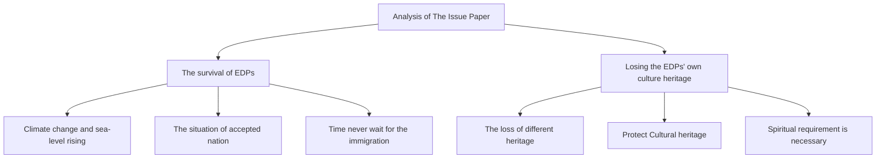

# The Wandering Homeland

## Summary

Global warming has caused the rising of sea level, making the seawater flooded the land, leaving some people homeless and becoming Environmentally Displaced Person (EDP). However, there is not a single unified policy for solving the EDP problem in the world. As the sea level continues to rise, the land area of small island countries and some coastal countries is decreasing, and the EDP problem is becoming increasingly urgent.

We analyse the Issue Paper and find the main problems in EDPs’ survival and cultural protection. To address these problems, we propose a policy named ’the Wandering Homeland Policy’.

According to the sea level rising data in recent years, with the land area and altitude data from 4 countries, we use geometric knowledge to build a cone model to predict the annual growth of EDP in Small Island Developing States (SIDS) over the next 50 years. Taking only small island developing countries into consideration, there will be 18,230,968 EDPs worldwide in the next 50 years to come. Then, we use Greenhouse Gas emission (GG), GDP per capita, Arable Land per capita (AL), and Renewable Freshwater Resources (RFR) per capita as factors to determine the receiving country and the receiving share. After that, we use the Entropy Weight Method (EWM) to obtain the weights of these four indicators by Matlab, which is [0.259 0.239 0.139 0.363], and get its scores of 50 countries. Then we identify 20 countries that receive EDP and redistribute their proportion of recipients.

Based on the Lotka-Volterra Model, we build a competing model between local cultures and foreign cultures, mapping the relationship between local and foreign cultures over time and illustrate the need to implement a protection policy for EDPs’ culture.

We establish a model to estimate the economic impact of EDP on the receiving countries, integrating the forecast data of EDP in the next 50 years, obtaining the income curve of each receiving country in the next 50 years, and analysing the income and expenditure of countries with different economic conditions. The results show that our policy is brilliant for the economic development of developed countries, but not good for some of the developing countries.

Moreover, we analyse the results of our model and evaluate it objectively to help us improve our policy. Combining with the actual situation, we explain the necessity and strengths of implement our policy.

At the end of our paper, we make sensitivity analysis, the result of which proves that our model has a good stability.

## Contents

## 1 Introduction 1

1.1 Literature Review . -  
1.2 Restatement of the Tasks

## 2 Analysis of the Issue Paper 2

2.1 The survival of the EDPs at risk . . . 2  
2.2 The risk of losing the EDPs’ own culture heritage . . . . 3

## 3 The ’Wandering Homeland Policy’ on EDPs given by our team 4

3.1 Assumptions for the ’Wandering Homeland Policy’ . . . 4  
3.2 The statement of ’Wandering Homeland Policy’ . . . 4

## 4 Notations 5

## 5 The Models 6

5.1 Model 1: The number of EDPs by Geometry math 6  
5.2 Model 2: The distribution of EDPs of principal responsible countries using the Entropy Weight Method 8

5.2.1 Our primary indicator system . . . 8  
5.2.2 Calculate weights of each country by EWM . . . 9

5.3 Model 3: The competing model between foreign culture native cultures by the Lotka-Volterra model . 10

5.4 Model 4: The model of Economic Impact . . . 12  
5.5 Results of the Economic Benefit of EDPs in 20 received countries . . . . . 13

## 6 The Improvements and Weaknesses in our policies 15

## 7 The Importance and Strengths of implementing our policies 17

## 8 Sensitivity Analysis 18

## 9 Conclusion 18

## References 20

## 1 Introduction

## 1.1 Literature Review

Nowadays, many researchers have done researches which bring the miserable situation that the global environment has been facing during the past decades to us human beings, who emphasize that the ecological system will be worse inevitably if we maintain our living behavior.

The word Environmentally Displaced Persons (EDP) is used to describe some people whose homeland becomes uninhabitable due to some environmental stressors, for example, the climate change[1]; or describe groups of persons who, for compelling reasons of sudden or progressive changes in the environment that adversely affect their lives or living conditions, are obliged to leave their habitual homes either temporarily or permanently, and who move either within their country or abroad[2].

There are many researchers identifying some of the island nations being in the danger of sea levels rising. It is better for the EDPs to relocate their address to safer places since their homeland is at the risk of being drowned by the ocean. However, there are still many problems they will meet in future, such as being discriminated as refugees, losing their own culture heritage, facing with difficulties in being received by groups from different circumstances, and so on.

Fortunately, the United Nations High Commission on Refugees (UNHCR) has discovered the dilemma the EDPs may meet. In a recent ruling during the last several years[3], UNHCR has acknowledged that some of the EDPs can be recognized as refugees. There are also many scholars who make presentations to a number of international policymaking fora, helping to raise the profile of these issues and to shape international responses[4]. With receiving many assistance from politicians and scholars all over the world, we are full of confidence that the problem of EDPs will be brought to a satisfactory settlement in the upcoming years.

## 1.2 Restatement of the Tasks

In order to clarify our tasks, we simplify our team’s 5 tasks below:

Task 1 Analyze the scope of the Issue Paper from some necessary prospectives, such as the number of people at risk, the risk of loss of EDPs’ own culture, and so on.

Task 2 Give our team’s Proposed Policies, which address EDPs in terms of both human rights and cultural preservation.

Task 3 Develop Models to measure the potential impact of our proposed policies.

Task 4 Explain how our models work or improve our proposed policies.

Task 5 Demonstrate the importance of implementing our proposed policies backed by our analysis in Task 1.

## 2 Analysis of the Issue Paper

Since there are so many political problems appeared in the Issue Paper, our team has analyzed the scope of the issue from the following prospectives to help us solving the tough problems.

flowchart

Figure 1: The mindmap of our issue analysis

## 2.1 The survival of the EDPs at risk

• Climate change has made damaged to the safety of EDPs. Due to the rapid development of industry, most of the industrialized countries emit large amounts of carbon emission in the form of CO2, making the greenhouse effect worse. At the same time, the periodic changes of sea surface temperature lead to global warming, which melts the sea ice and raises the sea levels, causing the land in some areas being in salinization or flooded. This tragic event makes the land unable to produce food, even losing the capability of dwelling for human, which is the reason for these EDPs why they have to migrate to another place. Based on this, we think that carbon emissions are an important factor in measuring the amount of EDPs received by a country.

stacked bar chart

| Cities               | The sea level rising (m) |
| -------------------- | ------------------------ |
| Shanghai             | 6                        |
| New Orleans          | 5                        |
| Los Angeles          | 4                        |
| San Francisco        | 3                        |
| Lower Manhattan      | 2                        |
| Hamburg Sanit Petersburg | 1                        |
| Amsterdam            | 1                        |
| Venice               | 1                        |

Figure 2: Heights above sea level vary across cities. Source[5]: IPCC, NASA, Realclimate.org, NewScientist.com, Potsdam institute, Sea Level Explorer.

• The conditions of the receiving country may not meet the basic survival requirements of the EDPs. As a human being, an EDP has his or her own basic survival needs, for example, getting enough food to sustain his or her life. The carrying capacity of human beings in an environment is the maximum population size that the environment can sustain indefinitely, given the food, habitat, water, and other necessities available in the environment using the local or other resources and intellectual and technical conditions[6]. When considering the number of EDPs a country can receive, not only do we need to consider its carbon emissions to determine how much responsibility it should take for its EDP receiving country, but also need to think of its carrying capacity.

• It is necessary to make plans for the migration process of the EDPs on a time scale. Depending on the different geography of each country, the scope of the effects of sea-level rising and other environmental stresses is in connection with the time. For example, the situation of EDPs is often not formed in a short time, but gradually formed in the face of continuous climate changes. Therefore, it is necessary to make some plans on the time scale to avoid or minimize the loss of the countries (e.g. the problem of the EDPs) caused by climate change.

## 2.2 The risk of losing the EDPs’ own culture heritage

• Different types of cultural heritage may suffer different levels of losses. Cultural heritage includes tangible culture, intangible culture (e.g. folklore, traditions, language, and knowledge) and natural heritage (including culturally significant landscapes, and biodiversity), and the tangible cultural heritage is generally split into two groups of movable (e.g.books, documents, moveable artworks, machines and clothing) and immovable heritage (e.g. historical buildings, monuments, landscapes and artifacts)[7]. In the process of the sea level rise, the loss of these categories of cultural heritage is obviously different, due to their inherent property.  
• We endeavor to protect the cultural heritage of the EDPs under the premise of ensuring to house the EDPs. Since the cultural heritage is the precious wealth of human civilization, our human beings are obliged to preserve that the culture will not be lost by migration. Just like the menu costs in economic principles. If a manufacturer changes the price of their products, he needs to inform his customers of the new price and give a suitable reason for this change. All this incurs a new cost. If the EDPs migrate to a new place, they need to spend a cost to settle down, learn to adapt to the new environment and new social norms. In conclusion, we need to carefully consider various factors to make a decision where the EDPs will immigrate.  
• The EDPs has spiritual needs besides living requirements. As they come from their own country, they have basic cultural demands, such as preserving or inherit their previous culture and religious beliefs, living a normal life in the new society without discrimination. As a result, it is significant to consider and assess the social stability, cultural diversity and nationalist orientation of the received country, which may lead to some injury to the EDPs.

## 3 The ’Wandering Homeland Policy’ on EDPs given by our team

Based on the analysis above, affected by the climate change, the EDP is at risk in terms of personal safety and culture protection. For one thing, the EDPs face great danger of sea level rising and the shortage of the existence needs. For another, they may lost their spiritual requirement in the foreign land where their culture may not appear. Therefore, our team decides to propose our policies to help the EDPs from all over the world to have a more comfortable life, which is called ’Wandering Homeland Policy’.

## 3.1 Assumptions for the ’Wandering Homeland Policy

• Our policies are only suitable for the EDPs whose homeland is destroyed by the sea-level rising. Refugees triggered by other elements of climate or meteological disaster, such as the hurricane, flood, and earthquake, are not in consideration for these policies.  
• Assumed that all the EDPs, including potential ones, all agree to immigrate. Since the sea-level rising has threatened their safety, they all agree to relocate to make ends meet.  
• Supposed that the global political situation will remain stable for a considerable period of time. The countries that is now without war will remain the situation in the upcoming years.

## 3.2 The statement of ’Wandering Homeland Policy

i) Each country has an obligation to give assistance to the EDPs. Greenhouse effects and the carbon emission made by all human beings are the major cause of the rising of sea levels, which threaten the personal safety of EDPs. As we are obliged to build a community of shared future for mankind, people all around the world should take their own responsibilities.  
ii) The main type of assistance to EDPs from each country is Direct assistance (DA). The receiving country should be responsible for the financial contributions of EDPs.  
iii) Arrange the responsibilities of each country. The list of these indicators are determined: the greenhouse gas emission (GG), the GDP per capita, the arable land per capita (AL) and the renewable freshwater resources per capita (RF R). With the datum in the past decades, we can arrange the responsible percentage of each country on the problem of EDPs.  
iv) For environmentally forced refugees, based on "non-refoulement obligations" in the receiving countries have an obligation to obrieation td protect environmental refugees who have migrated to their countries. As the 关注数学模型

original places of residence of the EDPs has been lost, the receiving countries cannot repatriate the EDP and can only develop appropriate policies to help the EDPs settle or obtain citizenships in that country.

v) Cultural classification for EDPs: (1) Material culture: Material culture that can be relocated, material culture that cannot be relocated; (2) Intangible culture: Language, skills, customs, religions, etc. (Consider the culture carried by EDPs)  
vi) The relocatable material culture shall be resolved through consultations between the EDPs’ local governments, UNESCO and donations, museum collections, and auctions shall be conducted to ensure that these material cultures are properly kept.  
vii) For the non-removable material culture, measures such as data collection, technical protection and remote reproduction shall be carried out by the EDPs local governments and UNESCO.  
viii) Receiving countries should implement an open and inclusive protective policy to protect the culture of EDPs when it receives EDPs.

## 4 Notations

The primary notations used in this paper are listed in Table 1.

Table 1: Notations

<table><tr><td>Symbol</td><td>Abbreviation</td></tr><tr><td>EDP</td><td>Environmentally Displaced Person</td></tr><tr><td>UNHCR</td><td>the United Nations High Commission on Refugees</td></tr><tr><td> $h_0$ </td><td>the original height of the cone Island nations</td></tr><tr><td> $R_0$ </td><td>The original base radius of our hypothetical cone</td></tr><tr><td>h</td><td>The altitude of a point on the cone</td></tr><tr><td>r</td><td>The latest base radius of the cone affected by the rise of sea level</td></tr><tr><td> $\Delta h$ </td><td>Change in the sea level</td></tr><tr><td> $ρ_0$ </td><td>the population density of those island nations</td></tr><tr><td>γ</td><td>the growth rate of population of those island nations</td></tr><tr><td>t</td><td>the time of model evolution</td></tr><tr><td>v</td><td>The velocity of sea level rising</td></tr><tr><td>NEDP(t)</td><td>The number of EDPs in the year t</td></tr><tr><td>GG</td><td>Greenhouse gas emission</td></tr><tr><td>AL</td><td>Arable land per capita</td></tr><tr><td>RFR</td><td>Renewable freshwater resources per capita</td></tr></table>

## 5 The Models

## 5.1 Model 1: The number of EDPs by Geometry math

As most of the small islands are from developing states with small size, high population density, finite funds and weak resistance to natural disasters, we regard them as the source of EDPs.

For one thing, some researchers have found that the sea level rises linearly, which is 3.44 mm per year.

line chart

| Year | Original sea level data | Linear fitting |
|------|--------------------------|----------------|
| 1995 | ~0.003                   | ~0.003         |
| 1997 | ~0.01                    | ~0.01          |
| 1999 | ~0.015                   | ~0.015         |
| 2001 | ~0.02                    | ~0.02          |
| 2003 | ~0.025                   | ~0.025         |
| 2005 | ~0.03                    | ~0.03          |
| 2007 | ~0.035                   | ~0.035         |
| 2009 | ~0.04                    | ~0.04          |
| 2011 | ~0.045                   | ~0.045         |
| 2013 | ~0.05                    | ~0.05          |
| 2015 | ~0.06                    | ~0.06          |
| 2017 | ~0.07                    | ~0.07          |
| 2019 | ~0.08                    | ~0.08          |

Figure 3: The original sea level data and its linear fitting. Data source: [8]

We can express the relationship between time and the change of sea level as below.

$$
\Delta h = v t \tag {1}
$$

where

• ∆h represents the height change in sea level.  
• v represents the velocity of the sea level rising, which is 3.44 mm per year.  
• t represents the time.

For another, there will be around 65 million people in 2070, who are living in developing island nations, where the population density ρ is 444 person per square kilometer, and the growth rate γ is 2.3% now[9]. Since almost all the island nations consist mainly of a number of island chains, they have a low altitude, and the highest natural point are lower than 10 meters. In conclusion, we use the four countries given by the problem as representatives, which are The Maldives, Tuvalu, Kiribati, and The Marshall Islands and are all facing the difficulty of losing their homeland due to the sea level rising. The total amount of population of the four countries is 584,408, and the total area is 1,316 square kilometers.

We decide to approximate these four island nations as a regular con figure below. The new cone island has a base area of 444 square kilometers, a bas radium R of 20 kilometers, and an origin altitude h of 2 meters. MEY

text_image

h₀
h
r
the sea surface
O
R₀
EDP

Figure 4: A cone island model

The rise of the sea level is equivalent to our cone being partly submerged from the bottom. The base area of the cone is equal to the total area of the four island nations. With the time passing, the rising of sea level will cause the cone to form a new underside, the radius of which is $r$ and the new height is $h .$ .

When the sea floods parts of the island countries, the high population density and birth rate in these developing countries make it impossible for people living in the dangerous areas to move inland. So we let these people become EDPs at risk, and direct them to move to other countries or regions instead of inland. Therefore, we assume that their population density $\rho _ { 0 }$ will not be affected by migration.

We assume that the population density of our cone island $\rho _ { 0 }$ increases with time, while the growth rate of population keeps $\gamma$ unchanged, regardless of the relation between $\rho$ and h or r.

$$
\rho (t) = (1 + \gamma) ^ {(t - 1)} \rho_ {0} \quad (t = 1, 2, \dots) \tag {2}
$$

To estimate the total number of EDPs each year, we assume that all the islands are in the same situation. They have the same base radium $R _ { 0 } ,$ , same altitude $h _ { 0 }$ and the same population density $\rho _ { 0 }$ .

We already know the total number of environmental refugees around the world by 2070, which is 65 million. Therefore, we need to calculate the relation of the number of EDPs in one cone island over time to obtain the relation in the whole world, according to the proportion of the refugees.

text_image

h
h₀
r
Δh
R₀

Figure 5: The sketch map of sea level rising

Let the slope of the cone $k _ { 1 }$ be:

$$
k _ {1} = \frac {h _ {0}}{R _ {0}} \tag {3}
$$

We can see from the geometry relation and equation(1) that,

$$
\Delta h = v t = h _ {0} - k _ {1} r
$$

And we can get the relationship between r and t.

$$
r = R _ {0} - \frac {\Delta h}{k _ {1}} \tag {5}
$$

So that the total submerged area S(t) until the year t and the year t − 1:

$$
S (t) = \pi [ R _ {0} ^ {2} - r ^ {2} (t) ]
$$

$$
\begin{array}{l} S (t) = \pi [ R _ {0} - r ^ {2} (t) ] \\ S (t - 1) = \pi \left[ R _ {0} ^ {2} - r ^ {2} (t - 1) \right] \end{array} \tag {6}
$$

We can get the submerged area in the year t:

$$
\Delta S (t) = S (t) - S (t - 1) = \pi [ r ^ {2} (t - 1) - r ^ {2} (t) ] \tag {7}
$$

And the number of new EDPs in the year t is:

$$
N E D P (t) = \rho (t) \cdot \Delta S (t)
$$

$$
\begin{array}{l} p (t) = \Delta s (t) \\ = (1 + \gamma) ^ {t - 1} \rho_ {0} \pi [ r ^ {2} (t - 1) - r ^ {2} (t) ] \end{array} \tag {8}
$$

The predicted worldwide annual number of new EDPs is shown below. To sum up, there will be 18,230,968 EDPs in the following 50 years in total.

bar-line hybrid chart

| Year | The global new EDPs per year (×10⁵) |
|---|---|
| 2020 | 2.1 |
| 2021 | 2.15 |
| 2022 | 2.2 |
| 2023 | 2.25 |
| 2024 | 2.3 |
| 2025 | 2.35 |
| 2026 | 2.4 |
| 2027 | 2.45 |
| 2028 | 2.5 |
| 2029 | 2.55 |
| 2030 | 2.6 |
| 2031 | 2.65 |
| 2032 | 2.7 |
| 2033 | 2.75 |
| 2034 | 2.8 |
| 2035 | 2.85 |
| 2036 | 2.9 |
| 2037 | 2.95 |
| 2038 | 3.0 |
| 2039 | 3.05 |
| 2040 | 3.1 |
| 2041 | 3.15 |
| 2042 | 3.2 |
| 2043 | 3.25 |
| 2044 | 3.3 |
| 2045 | 3.35 |
| 2046 | 3.4 |
| 2047 | 3.45 |
| 2048 | 3.5 |
| 2049 | 3.55 |
| 2050 | 3.6 |
| 2051 | 3.65 |
| 2052 | 3.7 |
| 2053 | 3.75 |
| 2054 | 3.8 |
| 2055 | 3.85 |
| 2056 | 3.9 |
| 2057 | 3.95 |
| 2058 | 4.0 |
| 2059 | 4.05 |
| 2060 | 4.1 |
| 2061 | 4.15 |
| 2062 | 4.2 |
| 2063 | 4.25 |
| 2064 | 4.3 |
| 2065 | 4.35 |
| 2066 | 4.4 |
| 2067 | 4.45 |
| 2068 | 4.5 |
| 2069 | 4.55 |
| 2070 | 4.6 |

Figure 6: The predicted result of amount of new EDP per year

## 5.2 Model 2: The distribution of EDPs of principal responsible countries using the Entropy Weight Method

## 5.2.1 Our primary indicator system

We select the top 50 countries of total greenhouse gas emissions for the year 1970 to 2018 as the list of states which should take responsibility in receiving EDP, as their total emissions account for 89.7% of the world’s total greenhouse gas emissions.

We assume that:

• Without regard to the impact of the sea level rising on these 50 countries. The land area of them will remain unchanged.  
• Free trade. One unit of a currency can buy the same quality and same quantit sa 1 Fqua of goods in every country in the world. M

## 5.2.2 Calculate weights of each country by EWM

As an objective weighting method, the Entropy Weight Method determines the weights of indicators according to the information provided by the data of each indicator.

In order to consider the fairness of selecting countries, their receiving capacity, economic and sustainable development, we use MATLAB to help us analyze the datum of Greenhouse gas emissions (GG), Arable land per person (AL), GDP per capita (GDP ) and Freshwater resources per capita (RF R)[10] of the 50 countries in the past 40 years to determine their weights.

First, we calculate the proportion $p _ { i j }$ of the $j ^ { t h }$ indicator of the $i ^ { t h }$ country.

$$
p _ {i j} = \frac {v _ {i j}}{\sum_ {i = 1} ^ {n} v _ {i j}} \tag {9}
$$

• i represents the ordinal number of the 50 countries.  
• j represents the ordinal number of the 4 indicators.  
• $v _ { i j }$ means the value of the corresponding indicator.  
• n represents the number of the countries, which is equal to 50 in our model.

Then we get the Entropy Value E of the $j ^ { t h }$ indicator as below.

$$
E _ {j} = - k \sum_ {i = 1} ^ {n} (p _ {i j} \times \ln p _ {i j}) \tag {10}
$$

where k = ln n. So that we can get the weight $q _ { j }$ of the $j ^ { t h }$ indicator.

$$
q _ {j} = \frac {1 - E _ {j}}{\sum_ {j = 1} ^ {m} (1 - E _ {j})}, \quad \sum_ {j = 1} ^ {m} q _ {j} = 1, \quad q _ {j} \in [ 0, 1 ] \tag {11}
$$

where m is the number of the indicators, which is equal to 4 in our model.

Finally we get the Weights of these four indicators as the table below shows.

Table 2: The weight of indicators by EWM

<table><tr><td>Indicators</td><td>GG</td><td>AL</td><td>GDP</td><td>RFR</td></tr><tr><td>Weights</td><td>0.259</td><td>0.239</td><td>0.139</td><td>0.363</td></tr></table>

We can see that GG, AL and RF R are highly weighted, which is very close to what we have expected. Since AL and RF R are the indicators which can maintain life existence, and GG is an important factor of our society, the result of the weights is reliable.

Since we have the datum of 4 indicators for these 50 countries and get the weights of each indicator, we can calculate the weights of receiving EDPs for each country and get the score and rank of these 50 countries. Then we get the datum of the top 20 countries, which account for 74.6% of the world’s total greenhouse gas emissions. We believe that these 20 countries should take the main responsibilities to task of receiving EDPs. The initial datum and the weight result of each country ar shown below.

Table 3: The weight of each country by EWM and original data

<table><tr><td>Country</td><td>GG (kt)</td><td>AL (hectares per person)</td><td>GDP per capita (constant 2010 US$)</td><td>RFR per capita (cubic meters)</td><td>Weight</td></tr><tr><td>the weight of index</td><td>0.259</td><td>0.239</td><td>0.139</td><td>0.363</td><td></td></tr><tr><td>Canada</td><td>3.07E+07</td><td>1.212</td><td>51151</td><td>85014</td><td>0.163</td></tr><tr><td>Australia</td><td>2.74E+07</td><td>1.904</td><td>56095</td><td>22815</td><td>0.121</td></tr><tr><td>United States</td><td>2.69E+08</td><td>0.471</td><td>53356</td><td>9245</td><td>0.120</td></tr><tr><td>Russian Federation</td><td>1.23E+08</td><td>0.853</td><td>11470</td><td>29991</td><td>0.092</td></tr><tr><td>Brazil</td><td>6.91E+07</td><td>0.393</td><td>10990</td><td>29408</td><td>0.062</td></tr><tr><td>China</td><td>2.12E+08</td><td>0.086</td><td>7308</td><td>2119</td><td>0.057</td></tr><tr><td>Japan</td><td>5.40E+07</td><td>0.033</td><td>48439</td><td>3370</td><td>0.042</td></tr><tr><td>Germany</td><td>5.05E+07</td><td>0.143</td><td>46917</td><td>1312</td><td>0.042</td></tr><tr><td>France</td><td>2.51E+07</td><td>0.275</td><td>43002</td><td>3106</td><td>0.039</td></tr><tr><td>United Kingdom</td><td>3.18E+07</td><td>0.092</td><td>43011</td><td>2332</td><td>0.034</td></tr><tr><td>Myanmar</td><td>2.48E+07</td><td>0.206</td><td>1489</td><td>19983</td><td>0.029</td></tr><tr><td>Spain</td><td>1.32E+07</td><td>0.265</td><td>32283</td><td>2478</td><td>0.029</td></tr><tr><td>Italy</td><td>2.11E+07</td><td>0.109</td><td>35098</td><td>3097</td><td>0.028</td></tr><tr><td>Ukraine</td><td>2.56E+07</td><td>0.728</td><td>2995</td><td>1188</td><td>0.027</td></tr><tr><td>Congo, Dem. Rep.</td><td>4.38E+07</td><td>0.090</td><td>409</td><td>14671</td><td>0.024</td></tr><tr><td>Indonesia</td><td>4.82E+07</td><td>0.090</td><td>4120</td><td>8504</td><td>0.021</td></tr><tr><td>Poland</td><td>2.10E+07</td><td>0.285</td><td>15845</td><td>1407</td><td>0.020</td></tr><tr><td>India</td><td>6.59E+07</td><td>0.118</td><td>1987</td><td>1201</td><td>0.017</td></tr><tr><td>Korea, Rep.</td><td>1.50E+07</td><td>0.028</td><td>26152</td><td>1316</td><td>0.017</td></tr><tr><td>Mexico</td><td>2.05E+07</td><td>0.183</td><td>10301</td><td>3664</td><td>0.016</td></tr></table>

## 5.3 Model 3: The competing model between foreign culture native cultures by the Lotka-Volterra model

Before we create the model, we assume that:

• A person can only have one cultural background, and cannot have two or more at the same time.  
• Culture needs people to pass it on.  
• The ratio of the population with a cultural background to total population can be used as an indicator of cultural evaluation.  
• Native culture is best suited to national conditions.

We define some variables as follows:

• $N _ { 1 }$ represents the ratio of the population with native cultural background to total population (the population of native cultural species).

• $N _ { 2 }$ represents the ratio of the population with foreign cultural background to total population (the population of foreign cultural species).

• $\alpha _ { 1 2 }$ means the effect species 2 has on the population of species 1.

• α21 means the effect native culture has on the ratio of the populati cultural background to total population.

• $K _ { 1 }$ represents the maximum population of native cultural species.  
• $K _ { 2 }$ represents the maximum population of foreigner cultural species.

Define the ratio of population with cultural background to total population as the population of cultural species. When the culture goes extinct, the ratio becomes 0. The maximum value of the ratio is 100 %.

Factors such as the population, language, and geography of a country constrain the development of culture, which can be regarded as resources required by culture. When a foreign culture enters a country, it will compete with the native culture for same resources such as the population that recognizes the culture, similar to species invasion. We build a competing model between foreign culture and native culture based on the Lotka-Volterra model.

$$
\left\{ \begin{array}{l} \frac {d N _ {1}}{d t} = N _ {1} \cdot (1 - \frac {N _ {1}}{K _ {1}} - \alpha_ {2 1} \cdot \frac {N _ {2}}{K _ {1}}) \\ \frac {d N _ {2}}{d t} = N _ {2} \cdot (1 - \frac {N _ {2}}{K _ {2}} - \alpha_ {1 2} \cdot \frac {N _ {1}}{K _ {2}}) \end{array} \right. \tag {12}
$$

Take Canada as an example to study the competition between local culture and culture of EDP. In the model, the culture of EDP is foreign culture and Canadian culture is native culture.

Using a logistic curve to fit the Canadian population over a period of 2000 to 2019[11], the Canadian population in 2070 is predicted to be $3 . 8 \times 1 0 ^ { 7 }$ . Use Model 1 and Model 2 to predict that $\bar { 2 } . 9 7 \times 1 0 ^ { 6 }$ EDPs will move into Canada by 2070. So the initial value of $N _ { 1 }$ is equal to 92.7%, and that of $N _ { 2 }$ is equal to 7.3%.

Without interference, the native culture has a stronger ability to adapt to the local environment and use resources, so it has an advantage in cultural competition. In this condition, $0 < \alpha _ { 2 1 } < \alpha _ { 1 2 }$ .

line chart

| time(year) | local culture | culture of EDPs |
| --- | --- | --- |
| 0 | 93 | 8 |
| 1 | 95 | 6 |
| 2 | 96 | 4 |
| 3 | 97 | 3 |
| 4 | 98 | 2 |
| 5 | 99 | 1 |
| 6 | 99 | 1 |
| 7 | 99 | 1 |
| 8 | 99 | 1 |
| 9 | 99 | 1 |
| 10 | 99 | 1 |
| 11 | 99 | 1 |
| 12 | 99 | 1 |
| 13 | 99 | 1 |
| 14 | 99 | 1 |
| 15 | 99 | 1 |
| 16 | 99 | 1 |
| 17 | 99 | 1 |
| 18 | 99 | 1 |
| 19 | 99 | 1 |
| 20 | 99 | 1 |
| 21 | 99 | 1 |
| 22 | 99 | 1 |
| 23 | 99 | 1 |
| 24 | 99 | 1 |
| 25 | 99 | 1 |
| 26 | 99 | 1 |
| 27 | 99 | 1 |
| 28 | 99 | 1 |
| 29 | 99 | 1 |
| 30 | 99 | 1 |
| 31 | 99 | 1 |
| 32 | 99 | 1 |
| 33 | 99 | 1 |
| 34 | 99 | 1 |
| 35 | 99 | 1 |
| 36 | 99 | 1 |
| 37 | 99 | 1 |
| 38 | 99 | 1 |
| 39 | 99 | 1 |
| 40 | 99 | 1 |
| 41 | 99 | 1 |
| 42 | 99 | 1 |
| 43 | 99 | 1 |
| 44 | 99 | 1 |
| 45 | 99 | 1 |
| 46 | 99 | 1 |
| 47 | 99 | 1 |
| 48 | 99 | 1 |
| 49 | 99 | 1 |
| 50 | 99 | 1 |

Figure 7: Population of culture over time

If the UN policy to protect the EDP culture is implemented, the competitiveness of EDP culture in cultural competition will increase. In this condition, 0 < α21 , 0 < α12 , $0 < \alpha _ { 2 1 } \ : , 0 < \alpha _ { 1 2 }$ $\alpha _ { 1 2 } \approx \alpha _ { 2 1 }$ .

line chart

| time(year) | local culture | culture of EDPs |
| --- | --- | --- |
| 0 | 93 | 8 |
| 1 | 92 | 9 |
| 2 | 91 | 10 |
| 3 | 90 | 11 |
| 4 | 89 | 12 |
| 5 | 88 | 13 |
| 6 | 87 | 14 |
| 7 | 86 | 15 |
| 8 | 85 | 16 |
| 9 | 84 | 17 |
| 10 | 83 | 18 |
| 11 | 82 | 19 |
| 12 | 81 | 20 |
| 13 | 80 | 21 |
| 14 | 79 | 22 |
| 15 | 78 | 23 |
| 16 | 77 | 24 |
| 17 | 76 | 25 |
| 18 | 75 | 26 |
| 19 | 74 | 27 |
| 20 | 73 | 28 |
| 21 | 72 | 29 |
| 22 | 71 | 30 |
| 23 | 70 | 31 |
| 24 | 69 | 32 |
| 25 | 68 | 33 |
| 26 | 67 | 34 |
| 27 | 66 | 35 |
| 28 | 65 | 36 |
| 29 | 64 | 37 |
| 30 | 63 | 38 |
| 31 | 62 | 39 |
| 32 | 61 | 40 |
| 33 | 60 | 41 |
| 34 | 59 | 42 |
| 35 | 58 | 43 |
| 36 | 57 | 44 |
| 37 | 56 | 45 |
| 38 | 55 | 46 |
| 39 | 54 | 47 |
| 40 | 53 | 48 |
| 41 | 52 | 49 |
| 42 | 51 | 50 |
| 43 | 50 | 51 |
| 44 | 49 | 52 |
| 45 | 48 | 53 |
| 46 | 47 | 54 |
| 47 | 46 | 55 |
| 48 | 45 | 56 |
| 49 | 44 | 57 |
| 50 | 43 | 58 |
| 51 | 42 | 59 |
| 52 | 41 | 60 |
| 53 | 40 | 61 |
| 54 | 39 | 62 |
| 55 | 38 | 63 |
| 56 | 37 | 64 |
| 57 | 36 | 65 |
| 58 | 35 | 66 |
| 59 | 34 | 67 |
| 60 | 33 | 68 |
| 61 | 32 | 69 |
| 62 | 31 | 70 |
| 63 | 30 | 71 |
| 64 | 29 | 72 |
| 65 | 28 | 73 |
| 66 | 27 | 74 |
| 67 | 26 | 75 |
| 68 | 25 | 76 |
| 69 | 24 | 77 |
| 70 | 23 | 78 |
| 71 | 22 | 79 |
| 72 | 21 | 80 |
| 73 | 20 | 81 |
| 74 | 19 | 82 |
| 75 | 18 | 83 |
| 76 | 17 | 84 |
| 77 | 16 | 85 |
| 78 | 15 | 86 |
| 79 | 14 | 87 |
| 80 | - | - |
| ... | ... | ... |
| ... | ... | ... |
| ... | ... | ... |
| ... | ... | ... |
| ... | ... | ... |
| ... | ... | ... |
| ... | ... | ... |
| ... | ... | ... |
| ... | ... | ... |
| ... | ... | ... |
| ... | ... | ... |

Figure 8: Population of culture over time

Contrast Figure 7 with Figure 8, the implementation of cultural protection policy makes the existence of EDP culture longer.

## 5.4 Model 4: The model of Economic Impact

Before we begin to explain Model 4, we consider it necessary to describe the parameters involved in this model.

• From the internet[12], we can know the receiving countries’ Cost of living per $\mathsf { z a p i t a ^ { \prime } } C _ { i }$ .  
• The low development level of small island developing States restricts the employment options of EDPs. We assume that the annual social value of EDP is 0.75 per capita GDP of the receiving country)  
• The ratio of the number of laborable EDPs $( E D P _ { w o r k } )$ to the number of EDPs is the same as that of the world population 15 to 64 years old, which is 65.33%.  
• All labor-capable EDPs are willing to work and create value.  
• It is believed that EDP can create value only after staying in the receiving country for one year, according to the European Union’s policy of providing only one year of resettlement costs for refugees.  
• EDP has the same per capita resettlement cost and living cost in the same receiving country, regardless of age, gender, and ethnicity.

The $i ^ { t h }$ receiving country provides per capita resettlement costs $A _ { i }$ for newly received EDPs. The cost of living of EDPs per capita in the country is $C _ { i }$ . After one year of learning adaptation period, the EDPs start to create value $M _ { i }$ for the society. Every year, there are new EDPs $p _ { i } ( t )$ that need to be resettled. We can observe the economic impact of EDPs on the country i over time.

Table 4: The Economic data

<table><tr><td>Country</td><td>Weight</td><td> $A_i$  (dollars)</td><td> $C_i$  (dollars)</td><td> $M_i$  (dollars)</td></tr><tr><td>Canada</td><td>0.163</td><td>9207.136</td><td>4101</td><td>38363.066</td></tr><tr><td>Australia</td><td>0.121</td><td>10097.134</td><td>4433</td><td>42071.390</td></tr><tr><td>United States</td><td>0.120</td><td>9604.123</td><td>4465</td><td>40017.177</td></tr><tr><td>Russian Federation</td><td>0.092</td><td>2064.542</td><td>2150</td><td>8602.257</td></tr><tr><td>Brazil</td><td>0.062</td><td>1978.233</td><td>2200</td><td>8242.639</td></tr><tr><td>China</td><td>0.057</td><td>1315.452</td><td>2500</td><td>5481.049</td></tr><tr><td>Japan</td><td>0.042</td><td>8718.990</td><td>4600</td><td>36329.126</td></tr><tr><td>Germany</td><td>0.042</td><td>8445.028</td><td>4115</td><td>35187.618</td></tr><tr><td>France</td><td>0.039</td><td>7740.286</td><td>4150</td><td>32251.193</td></tr><tr><td>United Kingdom</td><td>0.034</td><td>7741.927</td><td>4225</td><td>32258.030</td></tr><tr><td>Myanmar</td><td>0.029</td><td>268.051</td><td>2125</td><td>1116.879</td></tr><tr><td>Spain</td><td>0.029</td><td>5810.923</td><td>3400</td><td>24212.178</td></tr><tr><td>Italy</td><td>0.028</td><td>6317.707</td><td>4225</td><td>26323.778</td></tr><tr><td>Ukraine</td><td>0.027</td><td>539.014</td><td>1950</td><td>2245.893</td></tr><tr><td>Congo, Dem. Rep.</td><td>0.024</td><td>73.606</td><td>300</td><td>306.694</td></tr><tr><td>Indonesia</td><td>0.021</td><td>741.677</td><td>2225</td><td>3090.321</td></tr><tr><td>Poland</td><td>0.020</td><td>2852.145</td><td>2500</td><td>11883.936</td></tr><tr><td>India</td><td>0.017</td><td>357.721</td><td>1475</td><td>1490.506</td></tr><tr><td>Korea, Rep.</td><td>0.017</td><td>4707.366</td><td>4108</td><td>19614.023</td></tr><tr><td>Mexico</td><td>0.016</td><td>1854.244</td><td>2100</td><td>7726.018</td></tr></table>

We use MATLAB to process these datum, and the result and analysis is given in 5.5.

## 5.5 Results of the Economic Benefit of EDPs in 20 received countries

We can see from the Economic Benefit result of total 20 countries:

line chart

| Year | Canada | Australia | United States | Russian Federation | Brazil | China | Japan | Germany | France | United Kingdom | Myanmar | Spain | Italy | Ukraine | Congo, Dem. Rep. | Indonesia | Poland | India | Korea, Rep. | Mexico |
| --- | --- | --- | --- | --- | --- | --- | --- | --- | --- | --- | --- | --- | --- | --- | --- | --- | --- | --- | --- | --- |
| 2020 | 0 | 0 | 0 | 0 | 0 | 0 | 0 | 0 | 0 | 0 | 0 | 0 | 0 | 0 | 0 | 0 | 0 | 0 | 0 | 0 |
| 2030 | 0 | 0 | 0 | 0 | 0 | 0 | 0 | 0 | 0 | 0 | 0 | 0 | 0 | 0 | 0 | 0 | 0 | 0 | 0 | 0 |
| 2040 | 1e9 | 1e9 | 1e9 | 1e9 | 1e9 | 1e9 | 1e9 | 1e9 | 1e9 | 1e9 | 1e9 | 1e9 | 1e9 | 1e9 | 1e9 | 1e9 | 1e9 | 1e9 | 1e9 | 1e9 |
| 2050 | 2e9 | 2e9 | 2e9 | 2e9 | 2e9 | 2e9 | 2e9 | 2e9 | 2e9 | 2e9 | 2e9 | 2e9 | 2e9 | 2e9 | 2e9 | 2e9 | 2e9 | 2e9 | 2e9 | 2e9 |
| 2060 | 3e9 | 3e9 | 3e9 | 3e9 | 3e9 | 3e9 | 3e9 | 3e9 | 3e9 | 3e9 | 3e9 | 3e9 | 3e9 | 3e9 | 3e9 | 3e9 | 3e9 | 3e9 | 3e9 | 3e9 |
| 2070 | 6e9 | 5e9 | 5e9 | 5e9 | 5e9 | 5e9 | 5e9 | 5e9 | 5e9 | 5e9 | 5e9 | 5e9 | 5e9 | 5e9 | 5e9 | 5e9 | 5e9 | 5e9 | 5e9 | 5e9 |

line chart

| Year | Canada | Australia | United States | Russian Federation | Brazil | China | Japan | Germany | France | United Kingdom | Myanmar | Spain | Italy | Ukraine | Congo, Dem. Rep. | Indonesia | Poland | India | Korea, Rep. | Mexico |
| --- | --- | --- | --- | --- | --- | --- | --- | --- | --- | --- | --- | --- | --- | --- | --- | --- | --- | --- | --- | --- |
| 2020 | -0.5 | -0.3 | -0.2 | -0.1 | 0.0 | 0.0 | 0.0 | 0.0 | 0.0 | 0.0 | 0.0 | 0.0 | 0.0 | 0.0 | 0.0 | 0.0 | 0.0 | 0.0 | 0.0 | 0.0 |
| 2021 | -0.4 | -0.2 | -0.1 | 0.0 | 0.0 | 0.0 | 0.0 | 0.0 | 0.0 | 0.0 | 0.0 | 0.0 | 0.0 | 0.0 | 0.0 | 0.0 | 0.0 | 0.0 | 0.0 | 0.0 |
| 1921 | -0.3 | -0.1 | 0.0 | 0.1 | 0.1 | 0.1 | 0.1 | 0.1 | 0.1 | 0.1 | 0.1 | 0.1 | 0.1 | 0.1 | 0.1 | 0.1 | 0.1 | 0.1 | 0.1 | 0.1 |
| 2022 | -0.2 | 0.1 | 0.2 | 0.2 | 0.2 | 0.2 | 0.2 | 0.2 | 0.2 | 0.2 | 0.2 | 0.2 | 0.2 | 0.2 | 0.2 | 0.2 | 0.2 | 0.2 | 0.2 | 0.2 |
| 2023 | -0.1 | 0.2 | 0.4 | 0.3 | 0.3 | 0.3 | 0.3 | 0.3 | 0.3 | 0.3 | 0.3 | 0.3 | 0.3 | 0.3 | 0.3 | 0.3 | 0.3 | 0.3 | 0.3 | 0.3 |
| 2024 | 0.1 | 0.3 | 0.6 | 0.4 | 0.4 | 0.4 | 0.4 | 0.4 | 0.4 | 0.4 | 0.4 | 0.4 | 0.4 | 0.4 | 0.4 | 0.4 | 0.4 | 0.4 | 0.4 | 0.4 |
| 2025 | 3e7 | 2e7 | 2e7 | 1e7 | 1e7 | 1e7 | 1e7 | 1e7 | 1e7 | 1e7 | 1e7 | 1e7 | 1e7 | 1e7 | 1e7 | 1e7 | 1e7 | 1e7 | 1e7 | 1e7 |

Figure 9: The economic benefit result of 20 countries

In the long run, there is a clear trend difference in the economic impact of receiving EDPs on countries. It can be observed that individual developed countries can get very obvious benefits in the EDPs migration process, and some countries’ economy can be supported to a certain extent in the EDPs migration wave.But there are still about 1/2 of the countries in the EDP migration process,whose net value created by EDPs is less than the governments’ financial expenditure on them.It brings a considerable burden to their national economy.

Through analysing the data, we found that in the process of EDPs more developed the economy, the wider the country and the richer the natural resources available to everyone, the shorter the time required for the investment in EDPs to turn from loss to surplus, the greater their total return in 50 years.

And we can see from countries with different levels of economic development:

line chart

| Year | Canada | Australia | United States |
| ---- | ------ | --------- | ------------- |
| 2020 | 0      | 0         | 0             |
| 2030 | 0      | 0         | 0             |
| 2040 | 1e9    | 1e9       | 1e9           |
| 2050 | 2e9    | 2e9       | 2e9           |
| 2060 | 4e9    | 3e9       | 3e9           |
| 2070 | 6e9    | 5e9       | 4.5e9         |

line chart

| Year | Canada | Australia | United States |
|------|--------|-----------|---------------|
| 2020 | -0.4   | -0.3      | -0.3          |
| 2021 | -0.5   | -0.4      | -0.4          |
| 2022 | 0.0    | 0.0       | 0.0           |
| 2023 | 0.6    | 0.4       | 0.5           |
| 2024 | 1.5    | 1.2       | 1.4           |
| 2025 | 3.0    | 2.2       | 2.5           |

Figure 10: The economic benefit result of Canada, Australia and the United States

Take Canada, Australia and the US, which are the best cases, for example. After implementing our proposed policies in 2020, they have all completed the transition from deficit to surplus in more than 2 years. 50 years later, they have achieved the most dazzling economic achievements in the 20 countries we surveyed, with gains of more than $5 \times 1 0 ^ { 9 }$ .

line chart

| Year | Japan | Germany | France | United Kingdom | Spain | Italy |
|------|-------|---------|--------|----------------|-------|-------|
| 2020 | 0     | 0       | 0      | 0              | 0     | 0     |
| 2030 | ~5×10^8 | ~5×10^8 | ~5×10^8 | ~5×10^8        | ~5×10^8 | ~5×10^8 |
| 2040 | ~1×10^9 | ~1.5×10^9 | ~2×10^9 | ~2×10^9        | ~2×10^9 | ~2×10^9 |
| 2050 | ~2×10^9 | ~3×10^9 | ~4×10^9 | ~4×10^9        | ~3×10^9 | ~3×10^9 |
| 2060 | ~4×10^9 | ~6×10^9 | ~8×10^9 | ~7×10^9        | ~5×10^9 | ~5×10^9 |
| 2070 | ~6×10^9 | ~12×10^9 | ~11×10^9 | ~10×10^9       | ~6×10^9 | ~6×10^9 |

line chart

| Year | Japan | Germany | France | United Kingdom | Spain | Italy |
|------|-------|---------|--------|----------------|-------|-------|
| 2020 | -0.5  | -0.6    | -0.7   | -0.8           | -0.9  | -0.4  |
| 2021 | -0.8  | -0.9    | -1.0   | -1.1           | -1.2  | -0.7  |
| 2022 | -0.3  | -0.4    | -0.5   | -0.6           | -0.7  | -0.2  |
| 2023 | 0.1   | 0.2     | 0.3    | 0.4            | 0.5   | 0.1   |
| 2024 | 3.0   | 3.5     | 4.0    | 4.5            | 5.0   | 3.5   |
| 2025 | 6.5   | 6.8     | 5.0    | 4.5            | 2.5   | 2.0   |

Figure 11: The economic benefit result of Japan, Germany, France, the United Kingdom, Spain and Italy

The remaining capitalist developed countries with strong economic strength are limited by their land area and natural resources. For sustainable development, they have a limited number of EDPs allocated to them.As a result, these countries won’t get the same total revenue after 50 years as Canada, Australia and the US. But they also completed the transition from deficit to surplus in just two to three years.

line chart

| Year | Russian Federation | Brazil | Poland | Korea, Rep. | Mexico |
|------|---------------------|--------|--------|-------------|--------|
| 2020 | 0                   | 0      | 0      | 0           | 0      |
| 2030 | ~5×10⁷              | ~2×10⁷ | ~1×10⁷ | ~1×10⁷      | ~0.5×10⁷ |
| 2040 | ~1×10⁸              | ~5×10⁷ | ~3×10⁷ | ~3×10⁷      | ~1×10⁷  |
| 2050 | ~2×10⁸              | ~1×10⁸ | ~6×10⁷ | ~6×10⁷      | ~2×10⁷  |
| 2060 | ~3×10⁸              | ~1.5×10⁸ | ~9×10⁷ | ~1×10⁸      | ~3×10⁷  |
| 2070 | ~4×10⁸              | ~2×10⁸ | ~1.5×10⁸ | ~1.8×10⁸    | ~4×10⁷  |

line chart

| Year | Russian Federation | Brazil | Poland | Korea, Rep. | Mexico |
|------|---------------------|--------|--------|-------------|--------|
| 2020 | -0.5×10⁶           | -0.8×10⁶ | -0.2×10⁶ | -0.1×10⁶   | -0.1×10⁶ |
| 2022 | -1.0×10⁶           | -1.0×10⁶ | -0.3×10⁶ | -0.1×10⁶   | -0.1×10⁶ |
| 2024 | -1.5×10⁶           | -1.2×10⁶ | -0.4×10⁶ | 0.0×10⁶    | -0.1×10⁶ |
| 2026 | 0.0×10⁶            | -0.5×10⁶ | 0.5×10⁶ | 1.0×10⁶    | 0.0×10⁶ |
| 2028 | 2.0×10⁶            | 1.0×10⁶ | 1.5×10⁶ | 2.5×10⁶    | 0.5×10⁶ |
| 2030 | 5.5×10⁶            | 2.5×10⁶ | 3.0×10⁶ | 4.0×10⁶    | 1.0×10⁶ |

Figure 12: The economic benefit result of Russian, Brazil, Poland, Korea and Mexico

For some developed countries with relatively small populations and developing countries with vast areas, strong development and rich natural resources, although the time from deficit to surplus is 4 to 8 years, it is still longer than two types of countries above. After 50 years, they can still make a profit.

line chart

| Year | China | Myanmar | Ukraine | Congo, Dem. Rep. | Indonesia | India |
|------|-------|---------|---------|------------------|-----------|-------|
| 2020 | 0     | 0       | 0       | 0                | 0         | 0     |
| 2030 | -0.1  | -0.2    | -0.15   | -0.05            | -0.1      | -0.08 |
| 2040 | -0.3  | -0.5    | -0.35   | -0.15            | -0.25     | -0.2  |
| 2050 | -0.5  | -0.8    | -0.6    | -0.25            | -0.4      | -0.35 |
| 2060 | -0.7  | -1.1    | -0.85   | -0.35            | -0.6      | -0.5  |
| 2070 | -0.9  | -1.4    | -1.1    | -0.45            | -0.8      | -0.65 |

line chart

| Year | China | Myanmar | Ukraine | Congo, Dem. Rep. | Indonesia | India |
|------|-------|---------|---------|------------------|-----------|-------|
| 2020 | 0     | 0       | 0       | 0                | 0         | 0     |
| 2022 | -1    | -1      | -1      | -1               | -1        | -1    |
| 2024 | -2    | -2      | -2      | -2               | -2        | -2    |
| 2026 | -3    | -3      | -3      | -3               | -3        | -3    |
| 2028 | -4    | -4      | -4      | -4               | -4        | -4    |
| 2030 | -5    | -5      | -5      | -5               | -5        | -5    |
| 2032 | -6    | -6      | -6      | -6               | -6        | -6    |

Figure 13: The economic benefit result of China, Myanmar, Ukraine, Congo,Dem., Indonesia and India

But for most developing countries, whose existing economic conditions and resources are not enough to support them to effectively assist EDP. Providing active assistance to EDPs is a significant burden on the countries’ economic development and finances. Their income and expenditure chart lines show deficits throughout, and there is no room for profit.

## 6 The Improvements and Weaknesses in our policies

• Our proposed policy only considers the direct migrants from SIDS due to rising of sea level, and does not consider the impact of secondary disasters, economic damage and environmental pollution on human survival and development caused by its rising. But despite this simple optimism estimate, our model shows that by 2069, these small islands will generate more than 18 million EDPs, which illustrates the seriousness of the problem. If we take into ac in sea levels for other countries, the number of EDPs will far ex ceed mates. Due to the irreversibility of rising sea levels in the future f

the UN should not only grant true environmental refugee status to EDPs who urgently need cross-border migration, but also establish relevant international legal frameworks and legal mechanisms as soon as possible.

• Our policy does not take into account the differences in national development in the process of receiving EDP, the complex and changing international situation, etc.Which has led some developing countries’ long-term losses due to the current weak economy through model calculations. However, in fact, some of these are developing rapidly, which are very likely that they will turn from loss to profit in the process of receiving EDP after a period of time.And countries may suffer economic damage and rapid decline in social stability due to wars, large-scale sudden disasters or other reasons, and they cannot continue to receive EDP. For example, Ukraine ’s democratic political crisis and its resulting economic decline and social stability have prevented the country from fully receiving the allocated EDP[13]. Therefore, we improved our policy: The selection of responsible countries and the allocation of responsibilities are periodically updated based on their carbon emissions, economic development, and per capita resources (tentatively tentatively 5 years). Countries recognized by the UN as special circumstances can reduce or exempt EDP reception.  
• The initial data and models highlight that some developing countries are in the period of vigorously developing industrial construction.Their carbon emissions are higher than those of some less developed countries or developed countries who have already completed industrial construction, leading them to become responsible receivers. However, the reception of refugees has adversely affected the countries’ economy, and even the state assistance can not guarantee the survival needs of these EDPs. In consideration of the development needs of developing countries and the protection of the human rights of EDPs, we have improved the proposed policies: The UN establishes a foundation for EDPs,and the foundation is under the responsibility of UNHCR. The foundation mainly provides support to such receiving countries and assistance in cultural protection of EDP.Countries have the power to supervise the foundation.  
• From the models and literatures[14], we can see that the receiving countries have very limited protection capabilities for material cultural heritage. To a large extent, the EDP Foundation must cooperate with other cultural protection organizations for multilateral cultrual presevation. At the same time, the risk prevention of cultural heritage disasters is one of the important concepts and activities of cultural heritage protection. For the cultural protection of the EDPs’ original countries, we must not only consider salvage protection. Multilateral cultrual presevation must also focus on cultural statistics and management evaluation, such as The Heritage Center, The International Council on Monuments and Sites (ICOMS) who are the main organizers and advocates of heritage risk prevention activities, can help us to promote our policies.  
• From the data and image distribution of wikipedia website[15], the religious beliefs of these countries are different from the proportion of the world ’s religious population. From the perspective of the main religion, the proportion of different religions is approximately: Christianity: 54%, Islam: 30%, Buddhism: 6%, Hinduism: 2%, Non-belief: 8%. Religious conflicts are an important aspect that affects peace. Our policies must also consider the religious beliefs of EDP. Under

the premise of ensuring proper resettlement, as far as possible, EDPs with religious beliefs are assigned to those with similar beliefs or cultural tolerance High recipient countries; For distribution relationships that cannot meet the above conditions,the UN should guarantee EDPs’ rights to protect basic human rights through litigation and other means.

## 7 The Importance and Strengths of implementing our policies

• Our policies takes into account the plight of today’s climate migrants in the protection of international law. The existing international refugee conventions, international human rights law, climate change legislation, etc. have insufficient protection for climate migration, which has made it difficult for climate migration to obtain protection through litigation and other methods[16]. Therefore, we propose that the UN has a unified definition of climate immigration and a policy that establishes relevant international legal frameworks and legal mechanisms, which is of great significance to guaranteeing basic human rights such as the right to life, health, and food of EDPs.  
• In our previous analysis, it was pointed out that the receiving country may not meet the survival needs of the EDPs. If it is mandatory to receive excess EDPs, the social stability and economic development of the receiving country will be adversely affected, which will further cause the receiving country’s willingness to receive EDP , assistance support and a decline in tolerance. Therefore, based on the fairness of the relationship between responsibility and carbon emissions, our policies’ allocation of responsibility to the receiving country also takes into account the natural resources and economic strength of the receiving country.It will reduce the risk of conflicts, crimes and other social problems caused by the existence of EDP in the life of the receiving country. This reflects the rationality and importance of our policies.  
• Culture carries people’s values and sense of identity. In our analysis, we point out that the different attributes of cultural heritage have different degrees of impact at different stages of sea level rise. In improved policy, we propose a multilateral cooperation mechanism for the protection of EDP culture,and further propose a policy for statistical and management evaluation of cultures that have not been damaged. In the long run, it will provide a solid foundation to more complex EDP cultural protection issues.  
• As a special cultural phenomenon in the development of human society, religion is an important part of human traditional culture, and it affects people’s ideology, customs and other aspects. In our improved policies, we have put forward the principle of resettlement for religious EDPs, which has universal significance in reducing the risk of religious conflicts caused by EDP migration.

## 8 Sensitivity Analysis

While we calculate the number of EDPs all over the world, we use the velocity of the sea level rising v to get the final result of new worldwide EDPs per year. We set v = 3.44mm/year and here we will analyze the sensitivity of v.

We set v = 3.04, 3.24, 3.44, 3.64, 3.84 respectively and get the results here:

line chart

| Year | v=3.04 mm/year | v=3.24 mm/year | v=3.44 mm/year | v=3.64 mm/year | v=3.84 mm/year |
|------|----------------|----------------|----------------|----------------|----------------|
| 2020 | ~1.9           | ~2.0           | ~2.1           | ~2.2           | ~2.3           |
| 2030 | ~2.3           | ~2.5           | ~2.7           | ~2.9           | ~3.1           |
| 2040 | ~2.8           | ~3.1           | ~3.4           | ~3.7           | ~4.0           |
| 2050 | ~3.4           | ~3.8           | ~4.2           | ~4.6           | ~5.0           |
| 2060 | ~4.1           | ~4.7           | ~5.4           | ~5.9           | ~6.3           |
| 2065 | ~4.5           | ~5.1           | ~5.8           | ~6.2           | ~6.5           |

Figure 14: The analysis of v

This figure indicates that there is no change in the trend of new EDPs per year when the value of v is changing, which shows that our model is stable.

## 9 Conclusion

• We analyse the Issue Paper and find the main problems of EDPs, which are their survival and cultural protection problem. And we propose a policy named ’the Wandering Homeland Policy’ to solve these problems.  
• We build a cone model to predict the annual growth of EDP in SIDS over the next 50 years. There will be 18,230,968 EDPs worldwide in the next 50 years to come.  
• Then, we use four indicators as factors to determine the receiving share. After that, we use EWM to determine the weights of four factors [0.259 0.239 0.139 0.363]and 50 countries’ scores. Then we identify 20 countries that receive EDP and redistribute their proportion of recipients, which are Canada, Australia, the United States, Russian Federation, Brazil, China, Japan, Germany, France, the United Kingdom, Myanmar, Spain, Italy, Ukraine, Congo, Dem. Rep., Indonesia, Poland, India, Korea, Rep. and Mexico.  
• We establish a model to estimate the economic impact of EDP on the receiving countries, obtaining the income curve of each country in the next 50 years and analysing the income and expenditure with different economic cond results show that our policy is good for the developed countries (e.g. Canada,

Australia, the United States, etc.), but not so good for some of the developing countries (e.g. China, Myanmar, India, etc.).

• We analyse the results of our model and evaluate it to help us improve our policy. We explain the necessity and strengths of implement our policy combining with the actual situation.  
• At the end of our paper, we make sensitivity analysis, proving that our model has a good stability.

## References

[1] Camillo Boano, Roger Zetter, Tim Morris. Environmentally displaced people: Understanding the linkages between environmental change, livelihoods and forced migration.  
https://www.unicef.org/socialpolicy/files/Environmentally\_ displaces\_people.pdf  
[2] IOM (International Organisation for Migration) 2007 Discussion Note: Migration and the Environment (MC/INF/288 – 1 November 2007 – Ninety Fourth Session), International Organization for Migration, Geneva. 14 February.  
[3] Climate Refugees Refused UN Protection & Denied Rights Under International Law.  
http://www.ipsnews.net/2019/12/climate-refugees-refused-u n-protection-denied-rights-international-law/  
[4] Environmentally Displaced People – Refugee Studies Centre.  
https://www.rsc.ox.ac.uk/policy/environmentally-displaced -people  
[5] When Sea Levels Attack! — Information is Beautiful.  
https://informationisbeautiful.net/visualizations/when-sea -levels-attack-2/  
[6] Carrying capacity - Wikipedia.  
https://en.wikipedia.org/wiki/Carrying\_capacity  
[7] Cultural heritage - Wikipedia.  
https://en.wikipedia.org/wiki/Cultural\_heritage  
[8] Products and images selection\_without SARAL (old): Aviso+.  
https://www.aviso.altimetry.fr/en/data/products/ocean-ind icators-products/mean-sea-level/products-images.html?tdsou rcetag=s\_pctim\_aiomsg  
[9] International Year of Small Island Developing States.  
https://www.un.org/zh/events/islands2014/didyouknow.shtml ?tdsourcetag=s\_pctim\_aiomsg  
[10] Climate Watch: Data for Climate Action - GHG emissions.  
https://www.un.org/en/events/islands2014/didyouknow.shtml  
[11] World Bank Open Data | Data.  
https://data.worldbank.org.cn/  
[12] Cost of Living.  
https://www.numbeo.com/cost-of-living/  
[13] Havlik P. Economic consequences of the Ukraine conflict[R]. Policy Notes and Reports, 2014.  
[14] Zhou Ping, Qi Yang. Development and current situation of risk prevention of international cultural heritage [J]. Scientific research on Chinese cultural relics, 2015 (04) : 79-84.  
[15] Wikipedia, the free encyclopedia. https://en.wikipedia.org/wiki/Main\_Page  
[16] Black R, Kniveton D, Schmidt-Verkerk K. Migration and climate change: towards an integrated assessment of sensitivity[J]. Environment and Planning A, 2011, 43(2): 431-450.