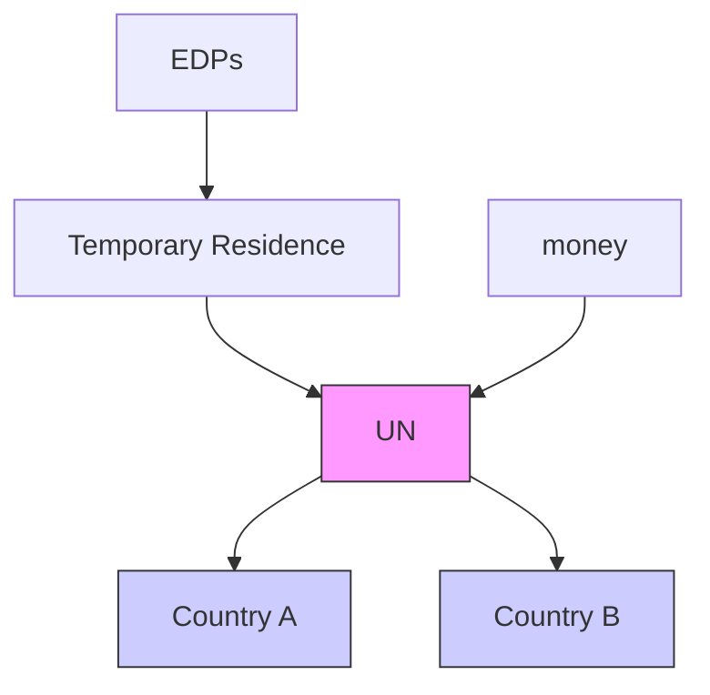
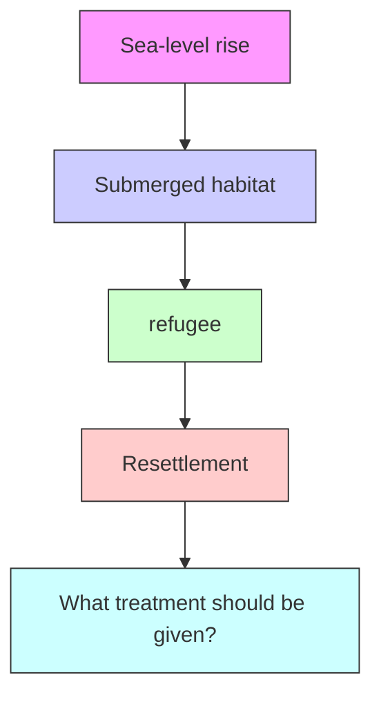
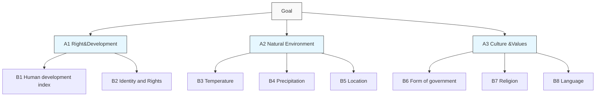
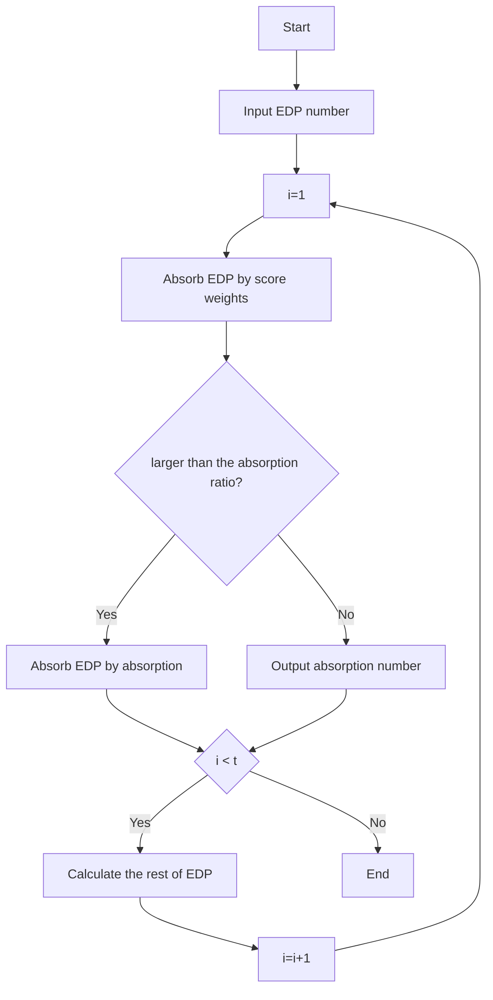

## NOT ME,US!

## Summary

This paper designed a complete system to predict and solve the problem caused by sea level raising. Our model has the ability to handle rapid shocks, population shocks.

First, we developed a we established a time-series regression model for sea level rise prediction, and use geometric methods to estimate the affected land and population. On this basis, we designed a cultural value measurement model to estimate the cultural losses in the disaster affected countries.Next, we designed a Immigration Decision System, which contains six submodel, to help those country at risk.

The first sub-model, Analytic Hierarchy Process(AHP), is used to find the suitable destination for immigration. The optimization plan takes the maximum protection of the culture and human rights of the disaster affected country, and promotes the local integration and development of EDPs as the guiding principles. It uses the analytic hierarchy process to quantify the matching degree between the two countries, and obtains the country with the highest degree of natural and humanistic matching.

The second sub-model, immigration stress level model(ISL), is designed for estimating the proper EDPs quantity a host country can accept. Based on realistic politics, this model focus on the political stress citizens exerted on the government. Meanwhile it also combined utility theory to judge the individual’s altitude.

The third sub-model, nonlinear programming model, is combined the first and second model to derive the best migration scheme in a given time. Additionally, we designed an exclusive algorithm for it.

The fourth sub-model, cost and obligation model, is used to evaluate the migration cost and how to sharing the responsibilities. Based on the historical emission proportion, we add an encourage factor to inspire those countries that try to reduce emission recently to encourage reducing carbon emissions in the future.

The fifth sub-model, temporary residence model, is a strategy prepared for short-term shocks. Some sudden disaster may make the UN unable to respond timely in a usual process. Therefore, from the perspective of space distance and population inflow carrying capacity, we have formulated a relief program in the temporary country to provide rapid assistance to these affected people.

Finally, we choose Maldives, a country has a huge climate risk, as an example to demonstrate the realistic usage of the whole system. The results indicate that Maldives will no longer suitable for residence around 2050 , due to the sea level rise 1.44m while the global temperature rise 1 Centigrade. In order to do the best for Maldivians and the Maldivians culture, the UN should take an active action to migrate Maldivians to Malaysia 7 years earlier than 2050, that is 2044. Around 70,000 to 80,000 immigration is the maximum that won’t exceed the immigration stress level threshold. The total cost is about 3.43 billion which is paid by G20 countries who account for the most in the global warming.

Furthermore, we considered a sudden disaster attacked Japan which will lead to half the population homeless. The fifth model, Temporary Residence Model, was active. China, Russia, and South Korea will be the temporary residence for those refugees before they are decided where to settle.The results of two cases is reasonable, strongly supporting the effectiveness of our models.

## Table of content

Summary.......

Table of content...

1.Our Recommendation..

2.Introduction. 3

2.1Background.. (  
2.2 Problem Restatement.. 3

3. Model Design: Forecasting the quantity of climate refugees and cultural loss........ .. 4

3.1 Model Ⅰ-1： Forecasting Number of Climate Refugees By Time.......

3.1.1Problem analysis.  
3.1.2 Statement of our model.. 4  
3.2 Model Ⅰ-2：Culture Loss Evaluation Model.. 6

4. Model Ⅱ：Immigration Decision System. F

4.1 Problem Analysis....  
4.2 Model Ⅱ-1:AHP.. 8  
4.3 Model Ⅱ-2:Immigration stress Level Model.. 11  
4.4 Model Ⅱ-3:Nonlinear Programming Model. 13  
4.5 model Ⅱ-4:Cost and obligation model. 14  
4.6 Model Ⅲ： Temporary Residence Model. . 15

5.Case I：Save Maldives...... 17

Maldives At Stake... 17

Lay Out A Scheme.. .18

The Cost And Obligation. .19

6.Case Ⅱ: Fragile Japan. .20

Reference:. . 22

## 1.Our Recommendation

Some countries are at risk of disappearing due to the Rising sea levels, and residents of these countries will become climate refugees, or EDPs. How the refugees are resettled is of common concern to the international community. By building models and analyzing data, we have come up with recommendations for these climate refugee resettlement methods, which are listed below.

## Predictable gradual sea level rise

In this case, we estimate the population of possible EDP through the refugee number prediction model, and then use the AHP model to find the optimal livable country with the highest consistency. Then we make a migration plans based on the pressure index and sea-level rise of refugees in livable countries. Finally, according to the carbon emission level of each country, the responsible party of the climate disaster is determined to bear the cost of resettlement.

## Sudden tsunami situation

If an unexpected climate disaster is encountered, a Temporary Residence Model will be used to determine the most suitable temporary country, to migrate to the local area as soon as possible. During this period ， International Institution provide some short-term aid to the EDPs. Furthermore, we use the AHP model to find the optimal livable country and plan for the new immigration. , And then refer to the predictable situation for further arrangement. As for the temporary cost, it is also paid by the overemissions country.


<details>
<summary>flowchart</summary>


</details>

Figure.1:Unexpected Immigration Process Diagram

## 2.Introduction

## 2.1Background

In the past few decades, human society has developed rapidly, but with it comes a negative effect that cannot be ignored a large amount of greenhouse gas emissions. As many meteorologists have warned, this large amount of greenhouse gas emissions has caused a catastrophic rise in global sea levels, potentially flooding the entire territory of some low-altitude countries. The populations of these countries will therefore lose their original places of residence and be forced to become climate refugees, or EDPs.As these climate refugees are different from war refugees or other types of refugees—there is no established “persecutor”, so they do not fully apply the relevant international conventions before [1].Its proper civil rights and living conditions have become urgent issues.

## 2.2 Problem Restatement

As described in the background, some island nations are at risk of disappearing entirely because of rising sea levels. What we have to do is to make resettlement decisions based on three basic ideas: human rights, nation-state responsibility, and personal choice. The issues that must be considered include: how many people need to be resettled, how much cultural value may be lost and whether it is likely to be retained; when third-party organizations need to be involved in resettlement; those countries should accept these refugees and how to resettle; What rights should be given to these resettled residents.

The problems that need to be solved are shown in the figure below.


<details>
<summary>flowchart</summary>


</details>

Figure.2:Overview of Problem Restatement

## 3. Model Design: Forecasting quantity of climate refugees and cultural loss

## 3.1 Model Ⅰ-1： Forecasting Number of Climate Refugees By Time

## 3.1.1Problem analysis

As mentioned in the restatement of the problem, to formulate a reasonable resettlement plan and program, we need to know how many people will be affected by the disaster, in the crisis of rising sea levels. So we have to figure out the amount of land area that will be flooded by rising sea levels over time and then estimate the population that inhabits it.

We decided to get the relationship between sea level rise and flooded land area in two separate steps. The first is to use historical data of sea level rise as the explanatory variables, and to use historical data of global average annual temperature and time trend as explanatory

variables to perform regression to obtain the regression function of sea level rise. Based on this, the extent of sea level rise at a certain average temperature at a future point in time is estimated.

Next, we need to consider the impact of rising sea levels on countries and people. Since the altitude is negligible relative to the span of the territory, to simplify the analysis, we consider the land as a flat circle. We suspect that the distance between sea level rise and sea erosion land is linear. According to references, it is known that the proportional relationship is roughly: a 35cm rise in sea level will flood a kilometer of land[2]. At this time we can calculate the area of land eroded when sea level rises. The model is simplified as shown bel


<details>
<summary>text_image</summary>

r
R
</details>

Figure.3:Model simplified diagram

It can be seen from the literature that nearly half of the world's population is concentrated within 150 kilometers of the coast [3]. It may be assumed that 50% of the world's population is evenly distributed in this area, and the remaining population is equally distributed in the remaining area. At this time, we can Estimate the number of people affected by this.

Based on the above model, if a certain year is selected, the degree of rise can be predicted by a regression function of sea level rise. Then bring this data and the altitude of each country into the regression function of seawater intrusion area to get the estimated affected country. According to the population distribution, the affected population can be obtained.

## 3.1.2 Statement of our model

Rising temperatures will cause glaciers to melt and sea levels rise.We need to know the relationship between sea level rise and temperature, so construct regression models.

$$
S L = c + \beta_ {1} * t e m p + \beta_ {2} * t e m p ^ {2} + \beta_ {3} * t + \mu \tag {1}
$$

Where, SL is sea level, temp Global is annual average temperature， t is time trend,using annual data, is residual.

Then we perform a stationarity test on these data and use first-order difference to eliminate non-stationarity

$$
\Delta x = x _ {i} - x _ {i - 1}, i \geq 2
$$

The regression equation becomes a difference：

$$
\Delta S L = c + \beta_ {1} * \Delta t e m p + \beta_ {2} * \Delta t e m p ^ {2} + \beta_ {3} * t + \mu
$$

In the IPCC report, we can obtain data on the global average temperature and sea level rise. By using historical data for regression, we can get the regression result of (1).

$$
\Delta \hat {S L} = 8. 8 2 6 - 2. 0 8 6 \Delta t e m p + 0. 0 7 1 \Delta t e m p ^ {2} + 0. 0 0 3 t
$$

Next, a planar seawater erosion land area model is constructed. From the foregoing, in order to simplify the analysis, we consider the territory as a circle, and the following model can be constructed to determine the area of the territory that is submerged when the sea level rises.

$$
\left\{ \begin{array}{c} S _ {s u b m} = \Pi * [ R ^ {2} - (R - r) ^ {2} ] \\ r = \beta * S L \\ R = \sqrt {\frac {S _ {w o r l d}}{\Pi}} \end{array} \right.
$$

Where， $S _ { s u b m }$ is the area of submerged land, R is the radius from the center of the land to the coastline, r is the radius of the ring eroded by seawater ， $\beta$ is the ratio of seawater rising height to intrusion depth.

After knowing the area of the territory eroded by seawater, we next construct a model for calculating the population affected by the disaster. After assuming the proportion a of the world's population in the seafront, we can calculate the proportion of the affected population from the proportion of eroded land. Multiply it by the total world population to get the total affected population. It is worth noting that, considering the different degrees of seawater erosion, there are two scenarios for calculating the affected population.

$$
P = \left\{ \begin{array}{l} \frac {S _ {\text { subm }}}{S _ {\text { offshore }}} * P _ {\text { world }} * \gamma (r \leq r _ {\text { offshore }}) \\ \frac {S _ {\text { subm }} - S _ {\text { offshore }}}{S _ {\text { world }} - S _ {\text { offshore }}} * P _ {\text { world }} * (1 - \gamma) + P _ {\text { world }} * \gamma (r > r _ {\text { offshore }}) \end{array} \right.
$$

Where， $S _ { o f f s h o r e }$ refers to the land area offshore (in accordance with general international regulations, offshore areas refer to the range of 150 kilometers from the coastline)， $S _ { w o r l d }$ refers to the world land area ， $P _ { w o r l d }$ is the world population ， $\gamma$ is the proportion of the world's population living in offshore areas ， $r _ { o f f s h o r e }$ refers to the radius of the circular land in the offshore part when the land is approximately circular。

## 3.2 Model Ⅰ-2：Culture Loss Evaluation Model

According to relevant research literature, the cultural value of a specific area is mainly carried by three types of things: cultural heritage, natural landscape, dialects and customs[4]

Therefore, the overall valuation of culture is represented by the following model

$$
V = \omega_ {h} ^ {*} h e r i t a g e + \omega_ {l} ^ {*} l a n d s c a p e + \omega_ {c} ^ {*} c u s t o m
$$

where ， represents the contribution coefficient of different cultures to the overall culture ， It is weighted by the comprehensive moving average of the years, comprehensive economic income, and radiation range 。 custom indicates customs and dialects in a specific area。

For cultural heritage, the determination method is to fully refer to the World Cultural Heritage List and determine its approximate value by querying the valuation of official organizations such as the World Bank. In terms of protection methods, referring to relevant papers and existing protection measures, the following measures can be preserved after resettlement. For material cultural heritage, 3D modeling can be used in conjunction with virtual preservation of VR glasses. For intangible cultural heritage, special personnel can be established for protection through official institutions such as UNESCO. We can also tap its commercial value to preserve it creatively in a market manner.

For natural landscapes, we believe that we can use the tourism industry data as a reference for valuation. The model of valuation of landscape, $V _ { l a n d s }$ is as follows.

$$
V _ {\text { lands }} = \sum_ {i = 1} ^ {n} A V E _ {i} * I _ {i}
$$

Where ， AEV represents annual valuation. $I _ { i }$ b represents the economic index of a particular year, so the result of multiplying the two can predict the actual landscape value of the year。Because not all landscapes can be maintained forever, a landscape duration is set, and the total output value loss within the lifetime is calculated by summation. Users can also use the inflation rate or the expected rate of return for discount calculations in actual calculations as needed.And the value of customs and habits lies in national cohesion and identity, so it is difficult to estimate a specific economic value. Therefore, it is calculated by multiplying the adjustment coefficient a by the GDP of certain flooded country. At the same time, we believe that when we want to quantify cultural value, different cultural components contribute differently to quantified cultural value, so we introduce weights. In theory, different countries will have different weights.So the final calculation model is

$$
V = \omega_ {h} * h e r i t a g e + \omega_ {l} * \sum_ {i = 1} ^ {n} A V E _ {i} * I _ {i} + \omega_ {c} * \lambda * G D P
$$

## 4. Model Ⅱ：Immigration Decision System

## 4.1 Problem Analysis

We already learned in the first part that over time those countries and how many people will be affected, and the corresponding cultural loss is estimated, then the next step is to think about a decision-making method for the reasonable resettlement of these refugees.

The overall idea is that the relevant human rights organizations, as intermediary organizational coordinators, choose refugees with similar natural and geographical environments, while referring to the opinion of the receiving countries, and then organize refugee immigration. At the same time, it collects the fees of the countries that should bear the obligation to compensate for carbon emissions, and sponsors the refugee receiving countries to compensate their refugee acceptance expenses.The specific process is shown in the right figure.


<details>
<summary>flowchart</summary>

```mermaid
graph TD
  A["EDPs"] --> B["Country A"]
  A --> C["Country B"]
  B --> D["UN"]
  C --> D
  D --> E["money"]
  D --> F["quota"]
  D --> G["quota"]
    style D fill:#f9f,stroke:#333,stroke-width:2px
    note right of D "Other Obligatory Countries"
```
</details>

Figure.4:Immigration Process Diagram

By referring to corresponding papers and logical thinking, we decided to complete model Ⅱ，the entire refugee immigration decision-making system ，through four sub-models.

The first sub-model,modelⅡ-1 ， aims to find those “suitable for immigration countries”. Here, we use the guiding principles of protecting the culture and human rights of the affected countries to the greatest extent, and promoting the local integration and development of EDPs. , Countries or regions with relatively close cultural environments. Therefore, we analyze the above eight factors, including nature and humanities, through the analytic hierarchy process. Finally, we can get the ranking of the most "habitable country" for the affected countries.


<details>
<summary>flowchart</summary>


</details>

Figure.5: analytic hierarchy process Diagram

The purpose of The model Ⅱ-2 is to analyze whether a country is suitable to accept refugees from the perspective of the receiving country based on political reality. Here, we take the principle of minimizing the local impact of EDPs. Based on realistic political considerations, in order to allow countries to actively participate in the governance of global warming and to actively assume international responsibilities, an immigration plan within the host country's refugee capacity should be formulated. If host country refugees are under too much pressure and popular opposition rises, then the government is likely to reject refugees and no longer fulfill their responsibilities. With reference to recent countries' responses to war refugees and related papers, most countries have shown varying degrees of resistance to refugee acceptance because of law and order, economics, employment, and ethnicity. We combined these factors to set up a "stress index" to measure the country's overall resistance to refugees. At the same time, a "threshold value" is set. When the "stress index" is higher than this value, the country will close the refugees. According to the actual situation, above this threshold, citizens will support the opposition parties to take office, and the entire country will refuse to accept refugees. We will calculate this "stress index" for several "habitable countries" obtained in the sub-model 1, and finally the number of refugees that can be accommodated by quotas in countries with different indexes.

The third model, model II-3, is used to plan how many people we should emigrate at what time. For example, we know that country A will be completely submerged in ten years, then we should start to formulate and implement the entire immigration plan in the first few years.

The forth sub-model ,model II-4, is to calculate the compensation costs of refugee immigration due to excessive carbon emissions in other countries. At the same time, in order to encourage these countries to reduce carbon emissions in the future, we have also considered the efforts of each country to reduce emissions, which is measured by the reduction in the emissions per unit GDP of each country. We can find the immigration costs under different treatments by consulting related papers. Therefore, from the data provided by the above model, such as the number of refugees and the country of immigration, the total cost can be calculated, and then the cost that each country should bear can be obtained.

## 4.2 Model Ⅱ-1:AHP

First of all, we must find those countries that are “suitable for immigration”, that is, look for countries or regions that are relatively close to the natural and cultural environment of the flooded countries. Therefore, we select eight indicators for analysis by using the analytic hierarchy process with two criterion layers. Establish a hierarchical model .

Table.1: Eight Indicators For Analysis

<table><tr><td>Goal</td><td>Criteria</td><td>Sub-criteria</td><td>Alternatives</td></tr><tr><td rowspan="6">Host Country Decision</td><td rowspan="2">A1 Right&amp; development</td><td>B1 Human development index</td><td rowspan="6"> $N_i$  $i \in N$ Preset alternatives nations</td></tr><tr><td>B2 Identity and Rights</td></tr><tr><td rowspan="3">A2 Natural environment</td><td>B3 Temperature</td></tr><tr><td>B4 Precipitation</td></tr><tr><td>B5 Location</td></tr><tr><td>A3 Culture &amp;</td><td>B6 Form of</td></tr><tr><td rowspan="3">Values</td><td>government</td></tr><tr><td colspan="3">B7 Religion</td></tr><tr><td colspan="3">B8Language</td></tr></table>

Then we define the above indicators:

①A1 Right&development

B1:Human development index

This indicator is to measure the degree to which a country suitable for migration can guarantee the rights of immigrants and future development opportunities. Based on the difficulty and authority of the survey, we decided to measure this indicator directly with the Human Development Index released by the United Nations.It is：

$$
B 1 = H D I
$$

B2：Identity and Rights

Different countries give immigrants different levels of treatment, which means different levels of rights. We divide them into 3 categories and give them quantitative scores.

Table.2: Levels Of Treatment&Scores

<table><tr><td>Type</td><td>Score</td></tr><tr><td>national treatment</td><td> $B1 = 4$ </td></tr><tr><td>refugee treatment</td><td> $B1 = 3$ </td></tr><tr><td>non-refugee treatment</td><td> $B1 = 2$ </td></tr></table>

②A2 Natural environment

B3 Temperature:

This indicator actually measures the matching degree of temperature.It is calculated by subtracting the latest-decade average annual temperature of the two regions (receiving country and immigrant country):

$$
B 3 = D A T _ {\text { in }} - D A T _ {\text { out }}
$$

DAT means decade average temperate.

B4 Precipitation

This indicator measures the degree of matching of precipitation in the two places. The calculation method is also to subtract the ten-year average precipitation in the two places. Formula analogy B3.

B5 Location

This indicator measures how well the two countries are located. The calculation method is to first calculate the ratio of the borderline and coastline of the two countries, and then subtract the two ratios. Formula analogy B3.

③A3 Culture &Values

B6 Form of government

This indicator measures the differences between the two regions' . We first divide different polities into different ranks.

Table.3: Types Of Political Systems&Ranks

<table><tr><td>Type</td><td>Rank</td></tr><tr><td>Republic</td><td>3</td></tr><tr><td>Constitutional Monarchy</td><td>2</td></tr><tr><td>Monarchy</td><td>1</td></tr></table>

This indicator is intended to calculate the differences between the two regimes, so the calculation method is to subtract the ratings of the two places and then take the absolute value.

$$
R D = | R a n k _ {i n} - R a n k _ {o u t} |
$$

The numerical matrix is as follows

$$
B 6 = R D =
$$

<table><tr><td></td><td>Republic</td><td>Constitutional Monarchy</td><td>Monarchy</td></tr><tr><td>Republic</td><td>0</td><td>1</td><td>2</td></tr><tr><td>Constitutional Monarchy</td><td>1</td><td>0</td><td>1</td></tr><tr><td>Monarchy</td><td>2</td><td>1</td><td>0</td></tr></table>

## B7 Religion

Religious acceptance index(RAI)as follow.

Table.4: Types Of Religion&Ranks

<table><tr><td>Type</td><td>Score</td></tr><tr><td>Same religion&amp; same factions</td><td>5</td></tr><tr><td>Same religion&amp; different factions</td><td>3</td></tr><tr><td>Different religion</td><td>1</td></tr></table>

## B8 Language

Language applicability index as follow.

Table.5: Types Of Language Match&Ranks

<table><tr><td>Type</td><td>Score</td></tr><tr><td>First languages of two country matches</td><td>4</td></tr><tr><td>First language matches language</td><td>3</td></tr><tr><td>Second languages of two country matches</td><td>2</td></tr><tr><td>No languages matches</td><td>1</td></tr></table>

Then we calculate the scores of the above indicators to obtain the appropriate immigration scores of each candidate country, and then construct a comparison matrix based on the scores. Then calculate the relative importance weight of each factor in each level with respect to the overall goal (the highest level). The calculation method is :

$$
P _ {i} = \sum b _ {i, j, k} * a _ {j, k} * w _ {k} \quad j = 1, \dots , 8 \quad , \quad k = 1, 2, 3
$$

Then we performed a hierarchical total sorting consistency check

$$
C R = \frac {\sum_ {k = 1} ^ {n} \sum_ {j = 1} ^ {m} C I _ {j k} * a _ {j k} * w _ {k}}{\sum_ {k = 1} ^ {n} \sum_ {j = 1} ^ {m} R I _ {j k} * a _ {j k} * w _ {k}}
$$

If the consistency check of the total ranking passes, the importance index of P-O is obtained.

## 4.3 Model Ⅱ-2:Immigration stress Level Model

We believe that for countries to take an active role in international responsibility, an immigration plan within the host country's refugee capacity should be developed. Otherwise, when the emotions against refugees exceed a certain limit, the people will vote for the government against refugees. When such governments come to power, they will refuse refugee entry. For example, the United States once withdrew from the Paris agreement after refugee Trump took office, and once denied the entry of citizens in some areas. Therefore, we refer to related papers and set up a "stress index" to measure the overall resistance of the country to refugees by combining these factors in law, order, economy, employment, and race.

Economy, culture and society are the vital concerns leading to a surging negative emotion towards refugees of the local citizens. Economy is the most significant factor. We chose three important and widely used indicators, GDP growth, unemployment rate and inflation. These indicators is closely related to the citizens’ income, occupation, and life quality. Following is society concern for which we chose crime rate to stand. The public react sensitively to those immigration criminals. For culture, as we already considered the culture similarity in the above model, it has a subtle influence in the model. But as a key factor, we still put it into the model and chose population growth variable. It is because a great number of famous politicians have publicly expressed their worries about the changing population structure will harm the local culture. Additionally, we also considered the human characteristic and individual utility change pattern. The detailed design is following.

First，the variables are defined as following.

Table.6: Variables Definition Of Model Ⅱ-2

<table><tr><td>Symbol</td><td>Representation</td></tr><tr><td> $I_{i,t}$ </td><td>the inflation of country i in year t</td></tr><tr><td> $U_{i,t}$ </td><td>The unemployment of country i in year t</td></tr><tr><td> $CR_{i,t}$ </td><td>The crime rate of country i in year t</td></tr><tr><td> $PG_{i,t}$ </td><td>The population growth rate of country i in year t</td></tr><tr><td> $GC_{i,t}$ </td><td>The GDP growth rate per capita of country i in year t</td></tr></table>

In order to prepare the standardized value for the following calculation, we project all variables to [1,2] interval.

$$
X ^ {\prime} = (X - \mu) / (\text { MaxValue } - \text { MinValue })
$$

The normalized variables correspond to the following.

Table.7: Variables &Standardization

<table><tr><td>Symbol</td><td>After standardization</td></tr><tr><td> $I_{i,t}$ </td><td> $ZI_{i,t}$ </td></tr><tr><td> $U_{i,t}$ </td><td> $ZU_{i,t}$ </td></tr><tr><td> $CR_{i,t}$ </td><td> $ZCR_{i,t}$ </td></tr><tr><td> $PG_{i,t}$ </td><td> $ZPG_{i,t}$ </td></tr><tr><td> $GC_{i,t}$ </td><td> $ZGC_{i,t}$ </td></tr><tr><td> $CR_{i,t}$ </td><td> $ZCR_{i,t}$ </td></tr><tr><td> $NP_{i,t}$ </td><td> $ZNP_{i,t}$ </td></tr></table>

Then, we derive the index system. There are two kinds of variables, positive correlation variables, and negative correlation variables. When the value of a positive variable increase, the immigration stress goes up as well, and the negative correlation variables are on the contrary. So we define them in two way. We divide 2 ZNP by a positive correlation variable, and multiple 2 ZNP by a negative correlation variable. However , the method will produce two different value ranges. We project them both to [0,4] interval.

$$
P I _ {i, t} = Z I _ {i, t} * Z N P _ {i, t} ^ {2} * 3. 7 5 / 4 - 1 / 3. 7 5
$$

$$
P U _ {i, t} = Z U _ {i, t} * Z N P _ {i, t} ^ {2} * 3. 7 5 / 4 - 1 / 3. 7 5
$$

$$
P C R _ {i, t} = Z C R _ {i, t} * Z N P _ {i, t} ^ {2} * 3. 7 5 / 4 - 1 / 3. 7 5
$$

$$
P G C _ {i, t} = \frac {Z N P _ {i , t} ^ {2}}{Z G C _ {i , t}} * 4 / 7 - 4 / 7
$$

$$
P P G _ {i, t} = \frac {Z N P _ {i , t} ^ {2}}{Z G C _ {i , t}} * 4 / 7 - 4 / 7
$$

Using the weighted average method, we combine all the indicators above to get the final immigration stress level.

$$
\text { stress } = w _ {1} * P I _ {i, t} + w _ {2} * P U _ {i, t} + w _ {3} * P C R _ {i, t} + w _ {4} * P G C _ {i, t} + w _ {5} * P P G _ {i, t}
$$

The weight metric is refer to :[2,1,2,0.5,1]

Now, the stress variable is the immigration stress level of a country. The higher it is, the more negative emotion is spreading in the country. Once it exceeds a specific threshold, the local citizen will vote for immigration rejection, which indicates the country can’t receive more EPDs.

We are going to have a further discussion on the model. First , we combined the marginal utility theory with the model by using the square term of ZNP .

According to the utility theory, people diminish the marginal utility of gain, but increase their marginal aversion to loss. Therefore, as refugees increase, people's disgust rises faster. To reflect this feature, we use the square term. Obviously, when the number of refugees is constant, economic growth and the growth of the indigenous population will reduce the pressure on refugees, and rising inflation, unemployment and crime will increase the pressure on refugees, which is in line with reality. In addition, the time variable, t, revels an important human characteristic. The subjective emotions of the people depend on the relative changes in their recent situation, are more sensitive to recent events, and are easy to forget about events that happened a long time ago, so our model examined Is the relative pressure level in recent years. People's attitudes will gradually change over time and social conditions, which is also reflected in the calculation of relative stress levels.

## A Realistic Stress Threshold

In this part, we are going to derive the realistic stress threshold based on the recent political events. Trump won the election in 2016. In 2018, Italy's right-wing party, the Five-Star Alliance, won the highest votes, and Hungary's right-wing party also won. The refugee crisis plays a significant role in these political events, which indicates the immigration stress level have exceeded the threshold. Thus we calculated the stress level of these three countries using the IPL Model to find the threshold in today ’s realistic world.


<details>
<summary>line chart</summary>

| Year | USA   | Italy | Hungary |
|------|-------|-------|---------|
| 2008 | 11.00 | 7.50  | 12.00   |
| 2009 | 14.00 | 7.50  | 11.50   |
| 2010 | 12.50 | 7.50  | 9.00    |
| 2011 | 9.50  | 8.00  | 9.50    |
| 2012 | 9.50  | 8.50  | 6.00    |
| 2013 | 11.00 | 9.50  | 6.00    |
| 2014 | 10.50 | 10.50 | 9.50    |
| 2015 | 10.00 | 12.50 | 10.50   |
| 2016 | 13.50 | 14.50 | 11.50   |
| 2017 | 8.00  | 16.50 | 13.50   |
| 2018 | 4.50  | 18.60 | 15.17   |
</details>

Figure.6: Immigration Stress Level Of The Three Countries

We calculated the immigration stress level of the three countries from 2008 to 2018. From this we can see that when Trump came to power, the immigration pressure in the United States was about 13, and in 2018 the corresponding immigration pressure index when the right-wing parties in Hungary and Italy won About 15 and 18. Since political elections are held only every 4-5 years, political party lags behind the public sentiment. After comprehensive consideration, we believe that the global immigration pressure threshold should now be around 12.

## 4.4 Model Ⅱ-3:Nonlinear Programming Model

Combined the above two models, we established a nonlinear programming model to set up a proper immigration plan for both the EPDs and host country. Given the time span of the immigration action, the model can put forward a plan that maximize the welfare of the EPDs within the political tolerant threshold.

$$
\begin{array}{l} \text {max} \quad w e l f a r e = \sum W _ {i, j} * m a r k _ {i. j} \\ s. t \left\{ \begin{array}{l} t \leq t _ {0} \\ s t r e s s _ {j, t} \leq s t r e s s _ {0} \\ W _ {i} = \sum N _ {i, t} \\ \sum W _ {i, j} = 1 \end{array} \right. \end{array}
$$

$$
\text { stress } _ {j, t} = I S L
$$

$t _ { 0 } : \mathrm { A }$ limited to execute the immigration plan

welfare :An indicator quantitatively describes how well the EPDs will be treat and how well their culture will be protected.

$s t r e s s _ { j , t }$ : We use the ISL model,model Ⅱ-2, to calculate this value An indicator describes the immigration stress level each year of each country under a immigration scale $N _ { i , t }$

stress ： immigration stress level threshold

$W _ { i , j }$ : proportion of the EPDs from country i that country j will receive

From the model, obviously, the more urgent the event is, the more country will involve in. However, the country which get a lower score in the model I is not an ideal choice for culture protection, social inclusion and individual development. Thus, the earlier UN take an action, the better for those EPDs, and we will display a detailed immigration plan subsequently.

The monotonicity of welfare decides the more EDPs move to a higher marked country, the greater welfare will be. Thus, given $t _ { 0 }$ ， $\mathrm { P r } e s s _ { 0 }$ and mark metrics from the modelⅡ-1, we can solve the model by two steps. First, calculate the maximum immigration scale each year of each country $( N _ { i , t } )$ while the immigration stress level beneath the specific Pr $e s s _ { 0 }$ . Next, with the given immigration scale , we can easily get the result of Wi, j . $W _ { i , j }$

## 4.5 model Ⅱ-4:Cost and obligation model

In this part, we designed a model to estimate the total cost of resettlement and the obligations that each country should assume.

First of all, for the measurement of resettlement costs, we consider the cost of different treatment in the place of immigration, and the expenditure for protecting the culture of the affected country. The resettlement cost varies with different treatment that the receiving country offers to environmentally displaced persons. We clarify the treatments and cost as following.

Table.8: Rank &Identity

<table><tr><td>Rank</td><td>Identity</td><td>USD/per</td></tr><tr><td>3</td><td>national treatment</td><td>6000</td></tr><tr><td>2</td><td>refugee treatment</td><td>3750</td></tr><tr><td>1</td><td>non-refugee treatment</td><td>2000</td></tr></table>

which refers to news reports and previous studies.

Thus, we derived the following model.

$$
\text { Total   cost } = \text { resettlement   cost } + \text { culture   protection   cost }
$$

$$
= N * c o s t _ {p e r} + V _ {c u l t u r e} * c o s t _ {c u l p t c}
$$

: The total number of EDPs

$c o s t _ { p e r }$ ：Resettlement cost of each person

$V _ { c u l t u r e } \mathrm { : }$ The culture value of the nation at risk

$c o s t _ { c u l p t c } \mathrm { : }$ A ratio need to compensation of their culture loss and further protection

Then, the resettlement obligations that each country should assume are determined based on historical carbon emissions and emission reduction efforts. There is no doubt that countries with higher emissions in history should bear more responsibility for the consequences of global warming. At the same time, we have added the incentive coefficient variable. Countries with a decrease in emission per capital within a certain period of time can reduce their obligations accordingly. In this way, countries are encouraged to reduce carbon emissions and delay the rate of global warming. The specific model is as follows.

$$
p a y m e n t _ {i} = T o t a l c o s t * \frac {e n c o u r a g e _ {i} * h i s t o r y e m i s s i o n _ {i}}{\sum e n c o u r a g e _ {j} * h i s t o r y e m i s s i o n _ {j}}
$$

$$
e n c o u r a g e _ {i} = \sqrt [ n ]{\prod_ {t = 2} ^ {n} \frac {\text { emission } _ {i , t} - \text { emission } _ {i , t - 1}}{\text { emission } _ {i , t - 1}}}
$$

Where, $e n c o u r a g e _ { i }$ is the incentive coefficient variable ， n is the number of years we reviewed.We define the incentive coefficient as the geometric mean of the emission per capital change of a country in the past n years. As a result, countries with large emission reductions can reduce their own expenditures, while countries with high levels of carbon emissions need additional expenditures. This encourages countries to further reduce carbon emissions.

## 4.6 Model Ⅲ： Temporary Residence Model

Such as the tsunami that happened once in a century, some rapid changes in the situation may make the international community unable to respond. It is important to know that even if the resettled country assumes its aid obligations, it still needs time to prepare for the relief conditions. Therefore, a temporary relief plan is needed at this time to provide assistance to these affected people.

Based on the temporary and urgency of the problem, the temporary shelter should be as close as possible to the affected area, and these areas can withstand the impact of short-term population inflows. In view of the above considerations, we have established an evaluation system for the optimal country of residence.

The system includes the following dimensions, see the table for specific connotations and symbols.

①Spatial distance ：

space distance between the capital of the affected country and the capital of the receiving country.

This indicator is used to measure the spatial distance of population movement. Should be as short as possible

② Population carrying capacity :

Proportion of population in two countries: $P _ { O u t } / P _ { I n }$

This indicator measures the impact of population inflows.Should be as small as possible

Area of receiving country:

This indicator measures the carrying capacity of the land. The bigger the better.

In order to make the indicators in the same direction, the spatial distance, L and the Proportion of population in two countries ${ \cal P } _ { O u t } / { \cal P } _ { I n }$ are counted down:

i(Extent of spatial compactness); ${ \cdot } P _ { I n } / P _ { O u t }$ (Inflow multiplier);(Area of receiving country)

At the same time, in order to eliminate the influence of the dimension, the adjusted index is standardized by the extreme value processing method so that the variables are all in the range of [0,1].

$$
x _ {i j} ^ {*} = \frac {x _ {i j} - m _ {j}}{M _ {j} - m _ {j}}
$$

Where, $M _ { j } = \operatorname* { m a x } \left\{ x _ { i j } \right\} \mathrm { ~ , ~ } m _ { j } = \operatorname* { m i n } \left\{ x _ { i j } \right\}$

Then, we can get a temporary residence country evaluation model, where C represents thei i score of a receiving country, the higher the score, the more appropriate

$$
C = \omega_ {1} * \frac {1}{L} + \omega_ {2} * \frac {P _ {I n}}{P _ {O u t}} + \omega_ {3} * S
$$

It can be seen from the literature that the weight $( \omega _ { 1 } , \omega _ { 2 } , \omega _ { 3 } )$ of the evaluation system should be $( 0 . 4 , 0 . 3 , 0 . 3 ) ^ { [ 6 ] }$ . We can obtain the score C for each country.

Next, we take the upper limit $00 \%$ of local residents as EDPs. Add populations to countries in descending order of scores until the total population can absorb all EDPs.

$$
P _ {a l l i n} = \sum_ {i = 1} ^ {t} P _ {i n, t} * \alpha \%
$$

䛐晦晦   䛐晦 h𢡄䁡༁晦 䛐晦h $P _ { a l l i n } * \alpha \% \gg P _ { O u t }$

After that, we use the weighted average of the scores of the temporary countries as the separate proportion of their EDPs intake, and then obtain the number of refugees they absorbed.

$$
C _ {i} ^ {'} = \frac {C _ {i}}{\sum_ {i = 1} ^ {n} C _ {i}}
$$

EDPs intake of countries $C _ { i } * P _ { O u t }$

At the same time, considering that the absorption rate will be affected by the large population countries, once the EDP absorbed by a country reaches 5%, it will no longer absorb EDP, and the remaining unabsorbed people will be allocated by other countries according to the proportion of the weighted average. And so on until all EDPs are arranged.

The algorithm flowchart is as follows.


<details>
<summary>flowchart</summary>


</details>

Figure.5: Flow Diagram

## 5.Case I：Save Maldives

The Republic of Maldives, an archipelago country in the Indian Ocean. It is about 600 kilometers south of India and about 750 kilometers southwest of Sri Lanka. Twenty-six natural atolls and 1,192 coral islands are distributed in the 90,000 square kilometers of sea, of which about 200 are inhabited. With a land area of 298 square kilometers, it is the smallest country in Asia.

Table.9 The Basic Information Of Maldives

<table><tr><td>Population 552,147</td><td>Position South Aisa</td><td>Climate Tropical Monsoon</td><td>Language Dhivehi</td><td>Religion Islam</td><td>Regime Republic</td></tr><tr><td></td><td></td><td></td><td></td><td></td><td></td></tr></table>

Figure.7 Maldives Landscape and Location

On October 17, 2009, the Maldives convened the world ’s first underwater cabinet meeting. All participating ministers put on a rebreather to meet at the bottom of the sea, calling on people to pay attention to the risk of the Maldives being submerged, and to alert the world exert more effort to prevent global warming.

## Maldives At Stake

Maldives has an average elevation of 1.8 meters and is surrounded by the sea, with great climate risk. Using the sea level change model, we predicted the situation that Maldives will encounter.

$$
\sum \Delta S L _ {i} = \sum \left(c + \beta_ {1} * \Delta t e m p _ {i} + \beta_ {2} * \Delta t e m p _ {i} ^ {2} + \beta_ {3} * t + \mu\right)
$$

The results show that if the global average temperature is 15.35. By 2035, sea level will rise by 0.67 meters. And if the global temperature rises by 1 degree Celsius, then by 20450, sea level should rise to 1.44 meters. It can be said that the Maldives will have a greater climate threat in the middle of this century, based on an optimistic estimate that sea level will only rise by 1 degree Celsius.

<table><tr><td>Years</td><td>2019</td><td>2035</td><td>2050</td></tr><tr><td>Temperature (°C)</td><td>14.85</td><td>15.35</td><td>15.85</td></tr><tr><td>Sea level change (m)</td><td>0</td><td>0.67</td><td>1.44</td></tr></table>

$$
V = \omega_ {h} * h e r i t a g e + \omega_ {l} * \sum_ {i = 1} ^ {n} A V E _ {i} * I _ {i} + \omega_ {c} * \lambda * G D P
$$

We use the culture loss evaluation model to evaluate the culture loss of Maldives. For the first part of the model, Maldives does not have a recognized world heritage, but there are some local historical remains such as forest temples, whose valuation is about 17.524 billion Rufiyaa. Its weight is 0.26. Next, the Maldivian tourism industry's average annual gross output is 6.74 billion Rufiyaa, with an estimated duration of 75 years and a weight of 0.69. For the third part of the formula, Maldives' annual GDP is 224.7 Rufiyaa, the multiplier λ is 0.43, and the weight is 0.05.Therefore, the total quantified loss of cultural is 349.734 billion Rufiyaa, or approximately 22.462 billion US dollars, using the 2019 exchange rate to calculate.

## Find A Residence

In order to save the Maldives at stake, we use the analytic hierarchy model to find the best host country for Maldives people. Several countries were selected as candidates for immigration, and the method of analytic hierarchy process was used to calculate the most suitable country for the Maldivians to move.

Starting from the first layer of the hierarchy, we use the formulas of the above indicators to obtain the relative scores of each indicator of each alternative scheme in order to construct a comparison matrix (Appendix 1). We list the indicators of natural environment, culture, and values for the livable country's choices (Appendix 2). By calculating the weights of the three factors in the hierarchy, we get the maximum eigenvalue of 3.007 and the consistency ratio CR = 0.0068, which meets the requirements of the consistency ratio of AHP. Follow the above steps and adjust the comparison matrix until the consistency ratio CR of each matrix passes the test.

Due to paper limitations, comparison matrixes are display in appendix. Finally, the weights are shown in the table below (Appendix 3). Multiply the weights and add them according to the hierarchical model to get the weight of the alternative migrant country for choosing a suitable host country . The following table displayed the results with a higher rank in the left. From the results, Malaysia, India and Indonesia are the most suitable host country for Maldivians.

Table.10 Criteria weights of hierarchy 1-4

<table><tr><td>Country</td><td>Malaysia</td><td>India</td><td>Indonesia</td><td>South Africa</td><td>Thailand</td><td>China</td><td>Turkey</td><td>Saudi Arabia</td><td>Australia</td><td>America</td></tr><tr><td>Mark</td><td>0.118566</td><td>0.112362</td><td>0.109584</td><td>0.108555</td><td>0.107305</td><td>0.10443</td><td>0.103245</td><td>0.098151</td><td>0.074149</td><td>0.073604</td></tr></table>

## Lay Out A Scheme

With the results derived from the AHP model, we now use the ISL model and the nonlinear programming model to design a detailed migration plan.

For the data required by the ISL model, we use the following methods to obtain. The forecast data of population, economic growth rate, and GDP per capita growth rate are from the World Bank, which is combined with Mont Carlo simulation to add uncertain factors to simulate the economic crisis. Unemployment and inflation rates are estimated using the Phillips curve and Okun ’s law, based on forecasts of GDP growth for that year. The crime rate is estimated based on historical data using Monte Carlo simulation. Here we set 晦  . T is not restricted in the first scenario, and restricted within 5 years in the second scenario.

Scenario I：Take an action early enough in the crisis and have sufficient time to gradually migrate. The model results are as follows.


<details>
<summary>line chart</summary>

| Category | EDPs number | ISL  |
| -------- | ----------- | ---- |
| 1        | 73000       | 10.2 |
| 2        | 90000       | 10.8 |
| 3        | 81000       | 10.5 |
| 4        | 83000       | 11.0 |
| 5        | 64000       | 11.5 |
| 6        | 74000       | 10.8 |
| 7        | 89000       | 11.5 |
</details>

<table><tr><td>Year</td><td>EDPs number</td><td>ISL</td></tr><tr><td>2044</td><td>72822</td><td>10.35</td></tr><tr><td>2045</td><td>89816</td><td>11.06</td></tr><tr><td>2046</td><td>80791</td><td>10.63</td></tr><tr><td>2047</td><td>82186</td><td>11.21</td></tr><tr><td>2048</td><td>64182</td><td>11.49</td></tr><tr><td>2049</td><td>73998</td><td>11.00</td></tr><tr><td>2050</td><td>88353</td><td>11.51</td></tr></table>

According to the calculation results of the model, only Malaysia needs to receive EDPs. The entire immigration plan takes 7 years. The number of immigrants is about 70,000 to 80,000 each year. In the fifth year of the simulation, Malaysia experienced an economic crisis, the GDP growth rate dropped sharply, and the immigration stress level increased rapidly, so the number of EDPs accepted in that year fell a lot. As the economy recovers, the number of EDPs accepted continues to grow. The peak of immigration of the whole plan does not exceed 90,000 people per year, which is reasonable.

Scenario Ⅱ：Threat accelerating, requires full evacuation from Maldives within 5 years.


<details>
<summary>line chart</summary>

| Year | EDPs number | ISL  |
| ---- | ----------- | ---- |
| 1    | 72000       | 6000 |
| 2    | 68000       | 5800 |
| 3    | 82000       | 5000 |
| 4    | 70000       | 1100 |
| 5    | 75000       | 6500 |
</details>

<table><tr><td>Year</td><td>EDPs number</td><td>ISL</td></tr><tr><td>2046</td><td>77344</td><td>10.80</td></tr><tr><td>2047</td><td>70414</td><td>10.44</td></tr><tr><td>2048</td><td>86000</td><td>9.79</td></tr><tr><td>2049</td><td>73292</td><td>11.80</td></tr><tr><td>2050</td><td>79275</td><td>10.75</td></tr></table>


<details>
<summary>line chart</summary>

| Year | EDPs number | IMM Press |
| ---- | ----------- | --------- |
| 1    | 33000       | 41000     |
| 2    | 50000       | 53000     |
| 3    | 51000       | 38000     |
| 4    | 49000       | 46000     |
| 5    | 51000       | 45000     |
</details>

<table><tr><td>Year</td><td>EDPs number</td><td>ISL</td></tr><tr><td>2046</td><td>32888</td><td>4.61</td></tr><tr><td>2047</td><td>49556</td><td>6.14</td></tr><tr><td>2048</td><td>50743</td><td>4.35</td></tr><tr><td>2049</td><td>49122</td><td>5.22</td></tr><tr><td>2050</td><td>50835</td><td>5.07</td></tr></table>

According to model results, evacuating all citizen of Maldives within five years requires Malaysia and India to receive EDPs together. Malaysia accepts about 70,000 to 80,000 people each year, and India accepts about 40,000 to 50,000 people each year. The immigration stress level of Malaysia is higher than India, because it receives more EDPs than India for it’s a better choice for the EDPs and the Maldives culture protection.

Form these two scenarios, we find if we try our best to protect the Maldives culture and people, UN should take an active action 7 years before the Maldives islands is unsuitable for residence.

## The Cost And Obligation

We plan to evacuate 552,147 people from the Maldives, assuming national all EDPs will get a national treatment. According to relevant research, the cost of granting refugees with national treatment is about \$ 6,000 per person. At the same time, the inundation of the Maldives also caused a cultural loss of USD 22.462 billion. In order to protect the existing Maldivian cultural heritage, the UN should invest 5% of its cultural value to protect Maldivian culture. The total cost is calculated as follows.

$T o t a l ~ c o s t = r e s e t t l e m e n t ~ c o s t + c u l t u r e ~ p r o t e c t i o n ~ c o s t$

$$
= 5 5 2 1 4 7 \times 6 0 0 0 + 2 2. 4 6 b * 0. 0 5 = 3, 4 2 5, 1 8 2, 0 0 0 U S D
$$

The G20 is composed of the former G8 and the remaining twelve important economies. The G20 aims to promote open and constructive discussions on substantive issues between developed countries and emerging market countries. These countries account for about 85% of the world ‘s GDP, and their population is nearly two-thirds of the world population. These countries have important obligations for international governance of global development So we have chosen G20 members to take responsibility for the consequences of global warming.

According to the total carbon emissions and emission per capital of G20 countries from 1990 to 2016, using the allocation allocation model, we get the following results (EU means other EU member states besides British, French, German and Italian). Based on the total cost estimated above and the proportion of obligations that each G20 member should undertake, we calculated the fees that each G20 member should pay for this migration plan.

<table><tr><td>Nation</td><td>Proportion</td><td>Amount</td><td>Nation</td><td>Proportion</td><td>Amount</td></tr><tr><td>EU</td><td>4.34%</td><td>US$ 148,756,937</td><td>Japan</td><td>3.95%</td><td>US$ 135,414,748</td></tr><tr><td>Argentina</td><td>1.37%</td><td>US$ 46,954,955</td><td>Mexico</td><td>1.93%</td><td>US$ 66,145,819</td></tr><tr><td>Australia</td><td>1.91%</td><td>US$ 65,267,173</td><td>Russia</td><td>8.45%</td><td>US$ 289,296,966</td></tr><tr><td>Brazil</td><td>5.20%</td><td>US$ 178,258,490</td><td>Saudi Arabia</td><td>1.30%</td><td>US$ 44,517,753</td></tr><tr><td>Canada</td><td>2.68%</td><td>US$ 91,933,540</td><td>South Africa</td><td>1.38%</td><td>US$ 47,220,269</td></tr><tr><td>China</td><td>23.19%</td><td>US$ 794,248,342</td><td>South Korea</td><td>1.67%</td><td>US$ 57,039,872</td></tr><tr><td>France</td><td>1.39%</td><td>US$ 47,696,378</td><td>Turkey</td><td>0.92%</td><td>US$ 31,423,556</td></tr><tr><td>Germany</td><td>3.06%</td><td>US$ 104,973,521</td><td>United Kingdom</td><td>2.11%</td><td>US$ 72,323,969</td></tr><tr><td>India</td><td>6.73%</td><td>US$ 230,666,831</td><td>United States</td><td>20.32%</td><td>US$ 696,132,347</td></tr><tr><td>Indonesia</td><td>6.61%</td><td>US$ 226,403,002</td><td>Italy</td><td>1.47%</td><td>US$ 50,507,533</td></tr></table>

OBLIGATION ALLOCATION


<details>
<summary>pie chart</summary>

| Country | Percentage (%) |
| :--- | :--- |
| China | 23 |
| India | 7 |
| Indonesia | 7 |
| Germany | 3 |
| France | 1 |
| Italy | 1 |
| Japan | 4 |
| Mexico | 2 |
| United States | 20 |
| Russia | 8 |
| United Kingdom | 2 |
| Turkey | 1 |
| South Korea | 2 |
| Saudi Arabia | 1 |
| Argentina | 1 |
| Canada | 3 |
| Australia | 2 |
| EU | 4 |
| Other | 23 |
</details>

## 6.Case Ⅱ: Fragile Japan

Japan is a country with frequent natural disasters. With a large scale of population and numerous nuclear power plant located everywhere, it has been the ranked first in the Global Climate Risk Index 2020, published by GERMANWATCH. Fukushima nuclear power plant leaks in the earthquake is a example of the nation’s fragility. Thus, it is necessary to propose a scheme for such an urgent disaster event.

If Japan suffers a sudden catastrophic disaster or a secondary disaster, such as a tsunami or a nuclear leak, 50% of the Japanese population will be affected, and it is urgent to find a temporary residence country for short-term hedging. Considering that Japan's population is large, the absorption ratio 1.45% increase by 2.5 times. Calculate the temporarily absorbed population scores of neighboring countries, and then accumulate the population in descending order of scores. The top three scores of Russia, China, and South Korea are sufficient to accept Japan's safe-haven population.

<table><tr><td>Nation</td><td>Location</td><td>Population(million)</td><td>Territory area(Km2)</td><td>Score</td></tr><tr><td>Russia(Vladivostok)</td><td>43°08′N, 131°54′E</td><td>145.5301</td><td>17098.246</td><td>0.725983</td></tr><tr><td>China</td><td>39°55′N 116°23′E</td><td>1421.0218</td><td>9600</td><td>0.652853</td></tr><tr><td>South Korea</td><td>37°33′N 126°58′E</td><td>51.0964</td><td>100.2839</td><td>0.380582</td></tr><tr><td>North Korea</td><td>38.954135,125.776042</td><td>25.4298</td><td>120.538</td><td>0.342609</td></tr><tr><td>Australia</td><td>35°18′29″S 149°07′28″E</td><td>24.5846</td><td>7692.06</td><td>0.133989</td></tr><tr><td>Philippines</td><td>14.529149,121.011142</td><td>105.1729</td><td>300</td><td>0.125431</td></tr></table>

We conducted a percentage of recruits weighted by the scores in the above-mentioned recipient countries, and adjusted the countries that have reached the absorption ratio. The results obtained are as follows.

After the disaster, they will either go back home or being arranged to other host country following the above Immigration Decision System. The process is the same with case I, so there is no more details.

<table><tr><td>Nation</td><td>Recipient percentage at first time</td><td>Number of EDPs received at first time</td><td>Recipient percentage at second time</td><td>Recipient number after adjustment</td></tr><tr><td>China</td><td>0.371062042</td><td>18.82921677</td><td>1</td><td>43.61640938</td></tr><tr><td>Russia</td><td>0.412626665</td><td>20.93837701</td><td>-</td><td>5.275466125</td></tr><tr><td>Korea</td><td>0.216311293</td><td>10.97652622</td><td>-</td><td>1.8522445</td></tr></table>

## Reference:

[1]Feng S. The Disappearance of State: Sea Level Rise and the Response of International Law [J]. Modern Law Science,2019,41(02):177-195.  
[2]Feng S. The Disappearance of State: Sea Level Rise and the Response of International Law [J]. Modern Law Science,2019,41(02):177-195.  
[3]Data: AVISO+ https://www.aviso.altimetry.fr/data.html  
[4]Feng S. The Disappearance of State: Sea Level Rise and the Response of International Law [J]. Modern Law Science,2019,41(02):177-195.  
[5]Feng S. The Disappearance of State: Sea Level Rise and the Response of International Law [J]. Modern Law Science,2019,41(02):177-195.  
[6]Data: AVISO+ https://www.aviso.altimetry.fr/data.html  
[7]Wikipediahttps://zh.wikipedia.org/wiki/%E5%90%84%E5%9B%BD%E6%B5%B7%E5%B2%B8%E7%BA%BF%E9%95%BF%E5%BA%A6%E5%88%97%E8%A1%A8  
[8]Chen Xiurong，Chen Jianyi，Xiu Zonghu. The Modeling Study of the Network-flow for the European Refugee Crisis[J]. Mathematical Modeling and Its Applications,2016,5(02):9-15+36.

## Appendix:

function result=imm_index(rawdata,weight)
year=11;%»ØËYÄê·Ý
n_var=6;%±äÁ¿Êý
middata(year,n_var)=0;
zhishu=2;
%±ê× $^{1/4}$ »-
for i=1:n_var
    mean0=mean(rawdata(:,i));
    max0=max(rawdata(:,i));
    min0=min(rawdata(:,i));
    for i2=1:year

```matlab
mid0=rawdata(i2,i);
middata(i2,i)=(mid0-mean0)/(max0-min0))/2+1.5;
end
end
reefu=middata(:,1);
outdata(year,n_var)=0;
%Ö,±ê¼ÆËä
for i2=1:year%DD
    outdata(i2,1)=reefu(i2)^zhishu/middata(i2,2)/3.75*4-(1/3.75);%gdpÕö³¤
    outdata(i2,2)=middata(i2,3)/reefu(i2)^zhishu*4/7-4/7;%Í"ÕÍ
    outdata(i2,3)=middata(i2,4)/reefu(i2)^zhishu*4/7-4/7;%ʧҵ
    outdata(i2,4)=reefu(i2)^zhishu/middata(i2,5)/3.75*4-(1/3.75);%ÊË¿Ú
    outdata(i2,5)=middata(i2,6)/reefu(i2)^zhishu*4/7-4/7;%•,×ï
end
%¼ÕÈ"ƽ¾ù
weight=[2 2 2 1 2];
result=zeros(year,1);
for i=1:year
    for i2=1:n_var-1
    result(i)=weight(i2)*outdata(i,i2)+result(i);
    end
end
end
```

<table><tr><td>america</td><td>raw data</td><td></td><td></td><td></td><td></td><td></td><td></td><td></td></tr><tr><td>year</td><td>REFUGEE</td><td>population</td><td>REFUGEE</td><td>gdp growth</td><td>inflation</td><td>unemploye</td><td>population</td><td>crime(per ·</td></tr><tr><td>2018</td><td>22405.00</td><td>327,096,265</td><td>6.85</td><td>2.86%</td><td>2.44%</td><td>3.93%</td><td>0.62%</td><td>5.00</td></tr><tr><td>2017</td><td>53691.00</td><td>325,084,756</td><td>16.52</td><td>2.22%</td><td>2.13%</td><td>4.36%</td><td>0.64%</td><td>5.00</td></tr><tr><td>2016</td><td>84988.00</td><td>323,015,995</td><td>26.31</td><td>1.57%</td><td>1.26%</td><td>4.87%</td><td>0.67%</td><td>5.35</td></tr><tr><td>2015</td><td>69920.00</td><td>320,878,310</td><td>21.79</td><td>2.88%</td><td>0.12%</td><td>5.28%</td><td>0.69%</td><td>4.96</td></tr><tr><td>2014</td><td>69975.00</td><td>318,673,411</td><td>21.96</td><td>2.45%</td><td>1.62%</td><td>6.17%</td><td>0.72%</td><td>4.46</td></tr><tr><td>2013</td><td>69909.00</td><td>316,400,538</td><td>22.10</td><td>1.84%</td><td>1.46%</td><td>7.38%</td><td>0.75%</td><td>4.54</td></tr><tr><td>2012</td><td>58179.00</td><td>314,043,885</td><td>18.53</td><td>2.25%</td><td>2.07%</td><td>8.07%</td><td>0.79%</td><td>4.74</td></tr><tr><td>2011</td><td>56384.00</td><td>311,584,047</td><td>18.10</td><td>1.55%</td><td>3.16%</td><td>8.95%</td><td>0.83%</td><td>4.71</td></tr><tr><td>2010</td><td>73293.00</td><td>309,011,475</td><td>23.72</td><td>2.56%</td><td>1.64%</td><td>9.63%</td><td>0.88%</td><td>4.77</td></tr><tr><td>2009</td><td>74602.00</td><td>306,307,567</td><td>24.36</td><td>-2.54%</td><td>-0.36%</td><td>9.25%</td><td>0.93%</td><td>5.03</td></tr><tr><td>2008</td><td>60107.00</td><td>303,486,012</td><td>19.81</td><td>-0.14%</td><td>3.84%</td><td>5.78%</td><td>0.96%</td><td>5.43</td></tr></table>

<table><tr><td rowspan="2">america year</td><td colspan="2">standardize</td><td></td><td></td><td></td><td></td><td>exp</td><td>2</td><td>2</td><td>1</td><td>2</td><td>0.5</td><td>2</td><td>weight</td></tr><tr><td></td><td>population</td><td>REFUGEE</td><td>gdp growth</td><td>inflation</td><td>unemploye</td><td>population</td><td>crime(per</td><td>x1</td><td>x2</td><td>x3</td><td>x4</td><td>x5</td><td>y</td></tr><tr><td>2018</td><td>22405</td><td>327,096,265</td><td>1.1621</td><td>1.6433</td><td>1.5807</td><td>1.2573</td><td>1.2781</td><td>1.5473</td><td>0.609897</td><td>0.648404</td><td>0.398779</td><td>0.860404</td><td>0.622624</td><td>4.341207</td></tr><tr><td>2017</td><td>53691</td><td>325,084,756</td><td>1.4104</td><td>1.5709</td><td>1.5438</td><td>1.2950</td><td>1.3075</td><td>1.5473</td><td>1.084123</td><td>1.183545</td><td>0.900655</td><td>1.356265</td><td>1.187521</td><td>8.206276</td></tr><tr><td>2016</td><td>84988</td><td>323,015,995</td><td>1.6621</td><td>1.4630</td><td>1.4403</td><td>1.3397</td><td>1.3516</td><td>1.7277</td><td>1.747537</td><td>1.702157</td><td>1.543435</td><td>1.91349</td><td>2.155974</td><td>13.55279</td></tr><tr><td>2015</td><td>69920</td><td>320,878,310</td><td>1.5459</td><td>1.5521</td><td>1.3045</td><td>1.3757</td><td>1.3810</td><td>1.5267</td><td>1.375801</td><td>1.210168</td><td>1.307312</td><td>1.579276</td><td>1.513575</td><td>10.39318</td></tr><tr><td>2014</td><td>69975</td><td>318,673,411</td><td>1.5503</td><td>1.5807</td><td>1.4831</td><td>1.4537</td><td>1.4251</td><td>1.2690</td><td>1.355152</td><td>1.465368</td><td>1.425035</td><td>1.532135</td><td>1.171287</td><td>10.13438</td></tr><tr><td>2013</td><td>69909</td><td>316,400,538</td><td>1.5538</td><td>1.5305</td><td>1.4641</td><td>1.5599</td><td>1.4693</td><td>1.3102</td><td>1.41589</td><td>1.448342</td><td>1.58053</td><td>1.486047</td><td>1.236091</td><td>10.65639</td></tr><tr><td>2012</td><td>58179</td><td>314,043,885</td><td>1.4621</td><td>1.5681</td><td>1.5367</td><td>1.6204</td><td>1.5281</td><td>1.4133</td><td>1.187415</td><td>1.305668</td><td>1.407942</td><td>1.22552</td><td>1.154957</td><td>9.419056</td></tr><tr><td>2011</td><td>56384</td><td>311,584,047</td><td>1.4510</td><td>1.5312</td><td>1.6665</td><td>1.6976</td><td>1.5869</td><td>1.3978</td><td>1.200053</td><td>1.43354</td><td>1.471027</td><td>1.148583</td><td>1.110371</td><td>9.570734</td></tr><tr><td>2010</td><td>73293</td><td>309,011,475</td><td>1.5955</td><td>1.5298</td><td>1.4855</td><td>1.7573</td><td>1.6604</td><td>1.4288</td><td>1.508244</td><td>1.589406</td><td>1.984712</td><td>1.368629</td><td>1.506892</td><td>12.27341</td></tr><tr><td>2009</td><td>74602</td><td>306,307,567</td><td>1.6118</td><td>1.1433</td><td>1.2474</td><td>1.7239</td><td>1.7340</td><td>1.5628</td><td>2.157185</td><td>1.280467</td><td>1.987911</td><td>1.33156</td><td>1.748696</td><td>13.73383</td></tr><tr><td>2008</td><td>60107</td><td>303,486,012</td><td>1.4950</td><td>1.3871</td><td>1.7474</td><td>1.4195</td><td>1.7781</td><td>1.7690</td><td>1.451991</td><td>1.660144</td><td>1.241434</td><td>1.074043</td><td>1.687698</td><td>10.95941</td></tr></table>