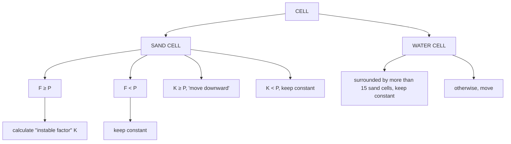
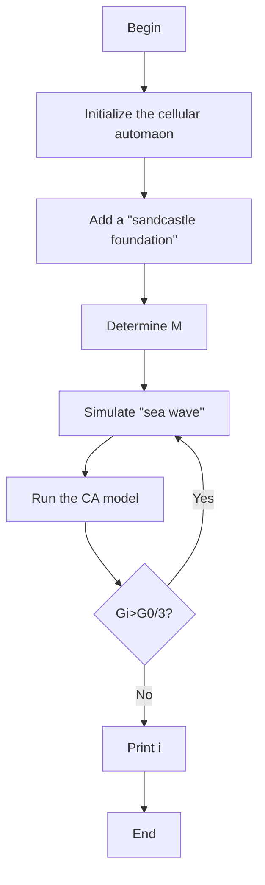
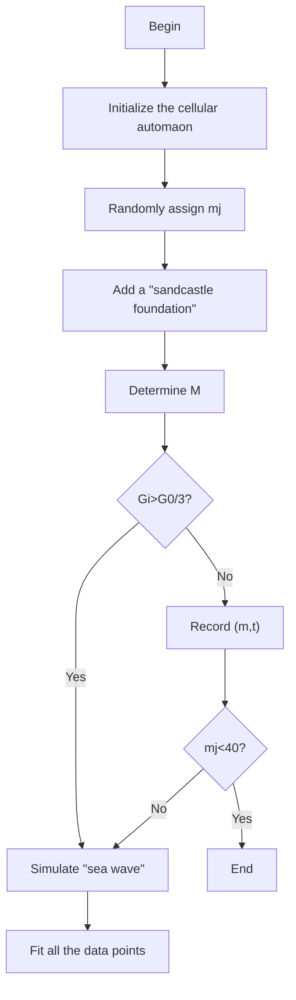
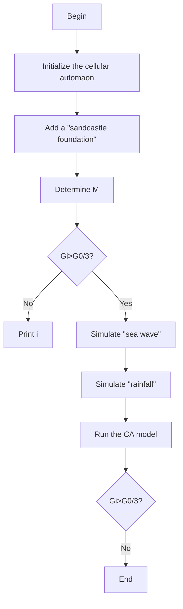

# A Simulation Based Assessment of Sandcastle Foundation

Summary

Sandcastle building is a common way to recreating for beach goers. Sand lovers always rack their brains to build a stronger castle and take pride in it. Still, sandcastle is inevitably eroded by the waves and tides. Therefore, how to establish a stable foundation is of great significance to the duration of sand castles.

In order to explore the most stable three-dimensional geometric shape, we establish a periodic sand-water cell automaton model to experiment with the most likely multiple geometric shapes. We discretize the sand base into a three-dimensional geometry consisting of a stack of rigid sand cells and water cells. Based on the knowledge of engineering mechanics and the feasibility in practice, we select five types of inertial frustum which has significant characteristics: triangular frustum, square frustum, sixarris frustum, conical frustum, ellipse frustum and so on for simulation experiments. The optimum geometric shape we obtain is triangle frustum.

In the model, we formulate the state transition rules through multivariate analysis based on multi-criteria judgments, and carry out quantitative calculations on the waves’ sediment carrying and capillary phenomena between sand and water. We employ complex trigonometric functions to simulate and reproduce the tidal waves in three dimensions. Therefore, through regression analysis of the data obtained from multiple experiments on each frustum, we have obtained a reliable and optimal geometric shape result. Besides, it can be quantified and visualized.

In the practice of building sand castles, it was found that different sand-to-water mixture ratios also played a crucial role in the sand foundations’ stability. By using the sand-water cell automaton model of problem 1, we use the concentration gradient method to adjust the water-sand ratio and obtain a series of data points on the sand-to-water proportion and the sand-based stability. Then we use the least squares polynomial function approximation to fit the curve of these data. Therefore, we obtain an estimated function of sand-to-water ratio and sand-base stability. Then we can find that the optimal sand-to-water mixture proportion is 0.55.

In order to study rain’s effect on the result, we introduce a rainfall module based on the original model. It will work on the sandy base with the wave tide module. Similarly, we get a series of data for regression analysis. We find that the original best geometry does not the only one which perform well under rainfall conditions, and ellipse frustum is the another better geometry when it is rainy.

Sensitivity analysis shows the strong robustness of our model. Meanwhile, we also propose some other strategies for increasing the stability of the sandy base. Subsequently, we summarize the experimental models and conclusions into plain language for publication on Fun in the Sun.

In addition, our model is easy to implement and extend. By changing few parameters in our code, we can stimulate more complex conditions on the beach.

## Contents

## 1 Introduction 2

1.1 Problem Background . 2  
1.2 Literature Review . 2  
1.3 Our work . . 3

## 2 Preparation of the Models 3

2.1 Analysis of Problems . 3  
2.2 Assumptions . . 4  
2.3 Notations . . 4

## 3 The Optimal 3D Geometric Shape 5

3.1 Model Preparation 5

3.1.1 Model Principle . . 5  
3.1.2 Model Assumption . . 5  
3.1.3 Model Construction 6  
3.1.4 The Rules 6  
3.1.5 The Steps of the Algorithm . . . 8  
3.1.6 Estimation of P and M . . . . 8

3.2 Result . . 9

## 4 The Optimal Sand-to-Water Mixture Proportion 11

4.1 Model Preparation 11

4.1.1 The Principle of Model . . . . 11  
4.1.2 The Steps of Algorithm 11

4.2 Result . . 12

## 5 The Optimal Shape in Rainy Day 13

5.1 Modified CA Model . . . 13

5.1.1 Model Assumption . . . 13  
5.1.2 Similarities and Difference from Basic Model . 13  
5.1.3 The Steps of Algorithm 13

5.2 Result . . 14

## 6 Sensitivity Analysis 16

## 7 Strengths and Weaknesses 17

7.1 Strengths . . . 17  
7.2 Weaknesses 18  
7.3 Promption . 18

## 8 Strategies to Make sandcastle More Lasting 18

## 9 Conclusion 19

## Article 20

## References 21

## 1 Introduction

## 1.1 Problem Background

Playing is the nature of human, but it is not easy to get some kind of inspiration while playing. There are castles of various shapes on the beach, either simple or delicate. Even under the same condition, some castles can be maintained for a long time, while some castles can’t withstand a wave and disappear without a trace. How to make our castles more durable is a question that most poeple are curious about. There are many factors which influence the firmness of sandcastles, such as sand-to-water mixture proportion, the type of sand, weather etc.

In this paper, we attempt to explore a three-dimensional geometric model of a sandcastle foundation having the best stability. First, we need to build a mathematical model that analyzes the optimal three-dimensional geometry shape. Second, based on this model, we are required to consider the optimal sand-to-water mixture proportion to achieve the best adhesion between the sands. Furthermore, taking the impact of the weather into consideration, we need investigate the optimal 3D geometric shape once again.

## 1.2 Literature Review

Since the last century, the interaction between water and sediment has been the focus of scholars in related fields. They have carried out a large number of experiments and researches to explore water-sand interactions and their effects on stability.

Sandpile problem. Mason, TG and Levine, AJ and Erta¸s, D and Halsey, TC (1999)[11] had studied the critical angle of wet sandpiles. Dumont, Serge and IGBIDA, Noureddine (2009) [4] based on implict Euler dicretization in time, improved formula in Prigozhin model.J.P. Bouchaud, J.-P. and Cates, M. E. and Prakash, J. Ravi and Edwards, S. F. (1995) [1] propose a new continuum description of the dynamic of sandpile surfaces and found a "spinodal" angle at which the surface of sandpile will be unstable. Dumont, Serge and Igbida, Noureddine (2011)[5] analysed this problem by using the collapsing model introduced by Evans.

Sediment mathematical model. Emiro ˘glu, Mehmet and Yalama, Ahmet and Erdo ˘gdu, Yasemin (2015)[6] explored the ratio of the water and the clay/sand to study the material’s satablity. Then they found the optimal ratio was between 0.43 and 0.66. Gröger, Torsten and Tüzün, Ugur and Heyes, David M (2003)[8] used CDEM to measure od cohesion in wet granular materials and proved Rumpf’s equation’s genaral agreement.

Slope stability. "Slope stability is one of the basic problems in geotechnical mechanics and engineering." Research on this topic is significant for river and traffic safety. After reviewing literatures, we find that the mainstream analysis method is still around the traditional three methods: limit equilibrium, limit analysis and numerical analysis method. These three methods are kind of a generalization from two-dimensional to three-dimensional space, and thus have various limitations(Gao, Wang & Zhang, 2009[15]). Futhermore, more and more literatures have begun to consider changes in slope stability under different weather conditions(Yeh, Lee & Chang, 2020[14]; Chen Liu & Li, 2020[2]). In this paper, we employ cellular automata, etc.

Sandcastle problem. Halsey, Thomas C and Levine, Alex J (1997)[9] thought the capillary force significantlly affect the sandpiles’ stability and the critical angle is costant in the limit of large system. Then they analyzed the reason why sandcastle will fall. Coincidently, at the same year, Hornbaker, DJ and Albert, Réka and Albert, István and Barabási, A-L and Schiffer, Peter (1997) [10] expored why sandcastles can stand and drew the conclusion that wetting liquid can change the properties of qranular media resulting in a great increase of citicle angle. Fraysse, N and Thomé, H and Petit, L(1999) [7] also explored the influence of humidity on the castles’ stability. Recent year, Pakpour, Maryam and Habibi, Mehdi and Møller, Peder and Bonn, Daniel(2012) [12] demonstrated how to build the perfect castle from the prospect of sandcastles’ height.

The sandcastle foundation has the same principle as the slope stability, and relate to above several problems. There are varying methods to deal with simlilar problems. Inspired by cell automaton, We hope to provide a new solution to the study of slope stability through the sandcastle foundation model.

## 1.3 Our work

Under the assumption that castles are built at roughly the same distance from the water on the same beach with the same type and amount of sand. We establish a model based on cellular automata to formulate the problem.

Task 1˜ We use periodic cellular automaton to simulate the environment of the sandcastle to find the optimal 3D model. We suppose several most likely geometric shapes as alternative shape. Then we formulate State Transition Rules through multivariate analysis based on multi-criteria judgments. By running the cellular automaton several times, we explore the most stable shape of the sandcastle foundation.

Task 2˜ We address the problem of optimal sand-to-water mixture proportion by fitting function of the lasting time and sand-to-water proportion. Based on the 3D geometric shape we sort out in Task 1, we adjust the ratio accourding to the concentration gradient method. Record the duration of the model with different sand-to-water ratio. The longest lasting sandy foundation’s sand-to-water proportion is the target value we anticipate.

Task 3 ˜ Considering the effect of rainfall, we adjust our cellular automaton and repeat the procedure in Task 1. Then we find out the optimal 3D geometric shape in this case.

## 2 Preparation of the Models

## 2.1 Analysis of Problems

Different from the analysis of the sandpile problem, the sand castle on the beach is the result of mixing water and sand. On one hand, with the degree of sand adhesion increases, the stability of the sand castle will increase. On the other hand, the sand castle will also be affected by external forces. Continuously being eroded and tides, will accelerate the destruction of the sand castle. Therefore, we nee to find 2 model that can comprehensively consider the impact of two aspects on the sandcastles

## 2.2 Assumptions

We make the following assumptions about our Cellular Automaton Simulation Process:

• The sandcastle foundation is only a mixture of sand and water, and all air has been exhausted. In reality, it is impossible for us to turn the inside of the sand pile into a vacuum with bare hands. For the accuracy of the experiment, the sandcastle foundation used is carefully designed so that all the air in the sandwater mixture can be considered exhausted.  
• The side of the sandcastle foundation is sloped. The stability of the triangle shows that the sloped side has higher stability.  
• Only the damaging effect of the waves on the surface of sandcastle foundation is considered. In fact, there are both waves and tides having an influence on the surface and structure. However, we do not consider the structural damage caused by the waves. Because people usually build sand castles at a certain distance from the sea, and the side of the slope is enough to greatly reduce the impact of the waves on the sandcastle.  
• The sandy base is stable. Sandcastle foundation will not collapse by the nonwave factor.  
• The waves will not change the water-sand mixture ratio of the sandcastle foundation, but will only corrode the foundation from the surface. The mixture of sand and water has a capillarity phenomenon, and the surface of the sand base can block most of the water from entering the interior.  
• Sea waves take sand from the surface of sandy bases with their maximum capacity for sand transport.The relationship between sediment content and sediment transport capacity is expressed by Dou Guoren’s equation[3]

$$
\frac {\partial (h s)}{\partial t} + \frac {\partial (h v s)}{\partial x} + \alpha \omega (S - S _ {*}) = 0
$$

At the ideal state,we have

$$
\frac {\partial (h s)}{\partial t} + \frac {\partial (h v s)}{\partial x} = 0
$$

Hence, the sediment transport capacity is equal to the sediment content.

• The beach sand is composed of natural sand, white bakelite sand and brown bakelite sand. The wave’s sediment carrying capacity of volume $S _ { v }$ is estimated at 55%[13] on the beach.

Additional assumptions are made to simplify analysis for individuals sections. These assumptions will be discussed at the appropriate locations.

## 2.3 Notations

The primary notations used in this paper are listed in table 1.

Table 1: Notations

<table><tr><td>Symbol</td><td>Definition</td></tr><tr><td> $S_v$ </td><td>Waves&#x27; sediment carrying of volume</td></tr><tr><td>F</td><td>Number of water cells adjacent to sand cells</td></tr><tr><td> $U_j$ </td><td>Number of the water cells around the each surrounding sand cell</td></tr><tr><td>M,m</td><td>Sand-to-water proportion</td></tr><tr><td>P</td><td>Boundary conditions for the &quot;fall&quot; of sand cells</td></tr><tr><td>K</td><td>Instable factors</td></tr><tr><td>L</td><td>Cell space size</td></tr><tr><td>H</td><td>Maximum height of sandcastle foundation</td></tr><tr><td>d</td><td>Width of sandcastle foundation</td></tr><tr><td> $G_i$ </td><td>Number of the cells on the top of the foundation</td></tr><tr><td> $G_{min}$ </td><td>=  $\frac{G_0}{2}$ , Collapsed boundary conditions</td></tr><tr><td> $t_j$ </td><td>Lasting time of the sand foundation</td></tr><tr><td>σ</td><td>Stability Coefficient</td></tr></table>

## 3 The Optimal 3D Geometric Shape

In this section, we will use cellular automata to simulate the interaction between sand and water. We do experiment with several simple geometries to find the most stable one of the sandy base.

## 3.1 Model Preparation

## 3.1.1 Model Principle

Theoretically, the sandcastle base with a inclined side is the most stable. For a geometric shape, the arris are the most prominent features of the side. Therefore, We choose the most representative shape to do experiment, such as triangular, square, six-arris, conical, ellipse frustum and so on(shown in Figure 1). We carry out several experiments to study the influence of arris on the stability of sandy bases.

Many complex problems can be modeled by cellular automata. Cellular automaton is essentially a dynamic system defined in a cell space composed of cells with discrete and finite states. According to certain local rules, these cells evolve in discrete time dimensions. The dynamic system has evolved in the time dimension has been widely applied to various fields of social, economic, military and scientific research.

This model is a periodic cellular automaton model.

## 3.1.2 Model Assumption

• Both sand and water can be regarded as incompressible particles.  
• The sand and water can be mixed together in a certain ratio, and a relatively stable sand foundation can be built at the same time.  
• We do not take water evaporation into consideration.

  
Figure 1: Geometric Shape to be Tested

• The contact between the waves and the sandy base is mild and will not cause water and sand splashes.

## 3.1.3 Model Construction

We physically characterize the system in following aspects.

• Cell is the most basic unit of cellular automata.  
• Cells can memorize storage status.  
• Each cell of the cellular automaton have three states, namely empty cell, water cell, and sand cell.  
• The state of any cell at the next moment is determined by its own state and the states of its 26 neighbors, with certain rules.This is shown in Figure2.


<details>
<summary>natural_image</summary>

3D wireframe cube with a red wireframe cube inside, no text or symbols present
</details>

Figure 2: The Schematic Diagram

## 3.1.4 The Rules

1. All cells cannot move upward and each time tne cells can only move to the grid adjacent to itself.

2. If there are ${ \cal { F } } \left( { \cal { F } } \geq { \cal { P } } \right)$ water cells and n sand cells adjacent to the sand cell, let this cell’s "instable $\mathrm { f a c t o r " }$ to be K. Then,

$$
K = F - \sigma \sum_ {j = 1} ^ {n} U _ {j}
$$

Where,

K is the stability of the sand cell considering the viscosity between sand and water $U _ { j }$ is the number of the sand cells around the center sand cell

3. If $K \geq P ,$ the sand cell begin to "move downward" follow the principle:

Sand cells can only move downward or horizontally, and preferentially in the direction downward and with the most water cells. The target position change into a sand cell, and the original position becomes a water cell.

When the sand cell moves down, the water cell in the middle change first. If the middle one is not a water cell, both neighboring cell will change in the same probability.

If there are no water cell below the sand cell, the sand cell will move to the water or empty cell on its right. Otherwise, move to the cell adhere.

4. If there are less than P water cells adjacent to the sand cell, the state of the cell holds still.


<details>
<summary>flowchart</summary>


</details>

Figure 3: Transition Rule of Sand and Water Cell

5. If the water cell is adjacent to 15 or more sand cells, the cell keep constant.  
6. If there are empty cells below the water cell, the water cell preferentially moves to the empty cells below with equal probability; if not, the cell moves with equal probability to other empty cells. After the target cell becomes a water cell, the original cell becomes empty.  
7. "Sea waves" (composed of water cells) appear on the left side of the model with a certain pattern.

neighboring cell can change in the same probability). The original water cell is converted into an empty cell.

If there is no empty cell on the right side of the "sea wave", the water cell moves with equal probability in other directions. This process is repeated until all water cells meet the empty cells and cause a change in state.

8. The sand cells and empty cells at the bottom no longer convert state.

## 3.1.5 The Steps of the Algorithm

Step 1 Initialize the cellular automata to make all cells empty.

Step 2 Add a "sandcastle foundation" to the cellular automaton which at an appropriate distance from the cellular automaton.

Step 3 Randomly assign the cells. Let the san-to-water proportion of the sandcastle foundation to be M, and assign $i = 0$ .

Step 4 At the left end of the cellular automaton, a "sea wave"(composed of water cells) is simulated with width L and height h.And the formula for h is

$$
h = \left\{ \begin{array}{l l} 2 H \sin \left(\frac {2 \pi}{d} i\right) & , 2 k d <   i <   (2 k + 1)   d \\ 0 & , (2 k + 1)   d <   i <   (2 k + 2)   d \end{array} \right. (k = 0, 1, 2, \ldots)
$$

Where

L is the cell space size

H is the maximum height of the sand base

d is the width of the sand substrate surface

Step 5 Run the cellular automaton once and count the cells on the top of the tested geometry $G _ { i }$ .

Step 6 If $( 2 k + 1 ) d < i < ( 2 k + 2 ) d , ( k = 0 , 1 , 2 )$ , water cells at the bottom will infiltrate into the ground and disappear at a certain probabilityv. $\begin{array} { r } { ( v = \frac { H } { 2 d } ) } \end{array}$ .

Step 7 If $\begin{array} { r } { G _ { i } > \frac { G _ { 0 } } { 2 } } \end{array}$ , set $i = i + 1$ , return to Step 4.

Step 8 The value of output i is the time that the sandy of the geometry persists.

This algorithm’s flowchat can be viewed in Figure4.

## 3.1.6 Estimation of P and M

Suppose the waves’ sediment carrying capacity is $S _ { v }$ . While the number of water cell satisfies $\begin{array} { r } { \frac { p } { 2 7 } > = 1 - S _ { v } } \end{array}$ , this cell begins to move downward.

Here we suppose $S _ { v } = 2 5 \%$ . Plugging $S _ { v }$ into the equation above, we obtain $P = 1 2$ .

From information above, we know M represent the ratio of sand cells to The optimal value of M will be discussed in Chapter 4. Here we suppose M = 3. temporarily.


<details>
<summary>flowchart</summary>


</details>

Figure 4: The Schematic of Algorithm 1

## 3.2 Result

The result of stimulation is shown in Figure 5-9.

## Analysis of Result

From the results of Matlab simulation, it is not difficult to see that the Triangular Frustum has been the longest lasting in the beating of waves. This seems to contradict our common sense. Because in daily life, the most common is a round-shaped sandy base. However, from the inspiration that nature, in order to reduce the stress, the formation of the returning geese is usually herringbone. In terms of fluid dynamics, this shape can reduce the force on the following geese by the leading geese. Therefore, this structure is also conducive to the stability of the second half of our geometry when the waves are washing sand base. Therefore, our sandy foundation can be built into a triangular shape that protrudes like the coast, and then our "castle" is built in the second half of the sandy base, so that our foundation will last longer and our castle will be even more Firm.

In real life, we also have many applications of this conclusion. For example, the bow of a ship is always designed in the shape of an inverted triangle. These are all inspired by the principles of fluid dynamics. Then, in the process of playing, we can


<details>
<summary>3d scatter plot with a color-coded density visualization</summary>

| x  | y  | z  |
|----|----|----|
| 0  | 0  | 0  |
| 20 | 20 | 20 |
| 40 | 40 | 40 |
| 60 | 60 | 60 |
| 80 | 80 | 80 |
</details>

(a) Begin


<details>
<summary>3d scatter plot with color-coded density regions</summary>

| x  | y  | value |
|----|----|-------|
| 0  | 0  | 60    |
| 20 | 20 | 40    |
| 40 | 40 | 20    |
| 60 | 60 | 0     |
| 80 | 80 | 0     |
</details>

(b) In the Process


<details>
<summary>3d scatter plot with color-coded regions</summary>

| x  | y  | z  |
|----|----|----|
| 0  | 0  | 0  |
| 20 | 20 | 20 |
| 40 | 40 | 40 |
| 60 | 60 | 60 |
| 80 | 80 | 80 |
| 10 | 10 | 10 |
</details>

Figure 5: Triangular Frustum

(c)  


<details>
<summary>text_image</summary>

End
MATH digital
</details>

关注数学模型 获取更多资讯


<details>
<summary>3d scatter plot with a highlighted region</summary>

| x  | y  | z  |
|----|----|----|
| 0  | 0  |    |
| 10 | 10 |    |
| 20 | 20 |    |
| 30 | 30 |    |
| 40 | 40 |    |
| 50 | 50 |    |
| 60 | 60 |    |
| 70 | 70 |    |
| 80 | 80 |    |
| 90 | 90 |    |
| 100| 100|    |
| 110| 110|    |
| 120| 120|    |
| 130| 130|    |
| 140| 140|    |
| 150| 150|    |
| 160| 160|    |
| 170| 170|    |
| 180| 180|    |
| 190| 190|    |
| 200| 200|    |
| 210| 210|    |
| 220| 220|    |
| 230| 230|    |
| 240| 240|    |
| 250| 250|    |
| 260| 260|    |
| 270| 270|    |
| 280| 280|    |
| 290| 290|    |
| 300| 300|    |
| 310| 310|    |
| 320| 320|    |
| 330| 330|    |
| 340| 340|    |
| 350| 350|    |
| 360| 360|    |
| 370| 370|    |
| 380| 380|    |
| 390| 390|    |
| 400| 400|    |
| 410| 410|    |
| 420| 420|    |
| 430| 430|    |
| 440| 440|    |
| 450| 450|    |
| 460| 460|    |
| 470| 470|    |
| 480| 480|    |
| 490| 490|    |
| 500| 500|    |
| Note: The y-axis values are estimated based on the provided code snippet. The x-axis label 'G=143' appears to be an identifier or annotation in the image. There is no additional data series in this code. |
</details>

(a) Begin


<details>
<summary>scatterplot</summary>

| x  | y  | group |
|----|----|-------|
| 0  | 0  | A     |
| 10 | 20 | B     |
| 20 | 40 | A     |
| 30 | 60 | B     |
| 40 | 80 | A     |
| 50 | 60 | B     |
| 60 | 40 | A     |
| 70 | 20 | B     |
| 80 | 0  | A     |
| 90 | -20| B     |
| 100| -40| A     |
| 110| -60| B     |
| 120| -80| A     |
| 130| -60| B     |
| 140| -40| A     |
| 150| -20| B     |
| 160| 0   | A     |
| 170| 20 | B     |
| 180| 40 | A     |
| 190| 60 | B     |
| 200| 80 | A     |
| 210| -20| B     |
| 220| -40| A     |
| 230| -60| B     |
| 240| -80| A     |
| 250| -60| B     |
| 260| -40| A     |
| 270| -20| B     |
| 280| 0   | A     |
| 290| 20 | B     |
| 300| 40 | A     |
| 310| 60 | B     |
| 320| 80 | A     |
| 330| -20| B     |
| 340| -40| A     |
| 350| -60| B     |
| 360| -80| A     |
| 370| -60| B     |
| 380| -40| A     |
| 390| -20| B     |
| 400| 0   | A     |
| 410| 20 | B     |
| 420| 40 | A     |
| 430| 60 | B     |
| 440| 80 | A     |
| 450| -20| B     |
| 460| -40| A     |
| 470| -60| B     |
| 480| -80| A     |
| 490| -60| B     |
| 500| -40| A     |
| 510| -20| B     |
| 520| 0   | A     |
| 530| 20 | B     |
| 540| 40 | A     |
| 550| 60 | B     |
| 560| 80 | A     |
| 570| -20| B     |
| 580| -40| A     |
| 590| -60| B     |
| 600| -80| A     |
| 610| -60| B     |
| 620| -40| A     |
| 630| -20| B     |
| 640| 0   | A     |
| 650| 20 | B     |
| 660| 40 | A     |
| 670| 60 | B     |
| 680| 80 | A     |
| 690| -20| B     |
| 700| -40| A     |
| 710| -60| B     |
| 720| -80| A     |
| 730| -60| B     |
| 740| -40| A     |
| 750| -20| B     |
| 760| 0   | A     |
| 770| 20 | B     |
| 780| 40 | A     |
| 790| 60 | B     |
| 800| 80 | A     |
| 810| -20| B     |
| 820| -40| A     |
| 830| -60| B     |
| 840| -80| A     |
| 850| -60| B     |
| 860| -40| A     |
| 870| -20| B     |
| 880| 0   | A     |
| 890| 20 | B     |
|
| 900+    |      |       |
</details>

(b) In the Process


<details>
<summary>scatterplot</summary>

| x | y | z |
| --- | --- | --- |
| 60 | 0 |  |
| 40 | 20 |  |
| 20 | 40 |  |
| 0 | 60 |  |
| 20 | 80 |  |
| 40 |  |  |
| 60 |  |  |
| 80 |  |  |
| 10 |  |  |
| 10 |  |  |
| 10 |  |  |
| 10 |  |  |
| 10 |  |  |
| 10 |  |  |
| 10 |  |  |
| 10 |  |  |
| 10 |  |  |
| 10 |  |  |
| 10 |  |  |
| 15 |  |  |
| 25 |  |  |
| 35 |  |  |
| 45 |  |  |
| 55 |  |  |
| 65 |  |  |
| 75 |  |  |
| 85 |  |  |
| 95 |  |  |
| 105 |  |  |
| 115 |  |  |
| 125 |  |  |
| 135 |  |  |
| 145 |  |  |
| 155 |  |  |
| 165 |  |  |
| 175 |  |  |
| 185 |  |  |
| 195 |  |  |
| 205 |  |  |
| 215 |  |  |
| 225 |  |  |
| 235 |  |  |
| 245 |  |  |
| 255 |  |  |
| 265 |  |  |
| 275 |  |  |
| 285 |  |  |
| 295 |  |  |
| 305 |  |  |
| 315 |  |  |
| 325 |  |  |
| 335 |  |  |
| 345 |  |  |
| 355 |  |  |
| 365 |  |  |
| 375 |  |  |
| 385 |  |  |
| 395 |  |  |
| 405 |  |  |
| 415 |  |  |
| 425 |  |  |
| 435 |  |  |
| 445 |  |  |
| 455 |  |  |
| 465 |  |  |
| 475 |  |  |
| 485 |  |  |
| 495 |  |  |
| 505 |  |  |
| 515 |  |  |
| 525 |  |  |
| 535 |  |  |
| 545 |  |  |
| 555 |  |  |
| 565 |  |  |
| 575 |  |  |
| 585 |  |  |
| 595 |  |  |
| 605 |  |  |
| 615 |  |  |
| 625 |  |  |
| 635 |  |  |
| 645 |  |  |
| 655 |  |  |
| 665 |  |  |
| 675 |  |  |
| 685 |  |  |
| 695 |  |  |
| 705 |  |  |
| 715 |  |  |
| 725 |  |  |
| 735 |  |  |
| 745 |  |  |
| 755 |  |  |
| 765 |  |  |
| 775 |  |  |
| 785 |  |  |
| 795 |  |  |
| 805 |  |  |
| 815 |  |  |
| 825 |  |  |
| 835 |  |  |
| 845 |  |  |
| 855 |  |  |
| 865 |  |  |
| 875 |  |  |
| 885 |  |  |
| 895 |  |  |
| 905 |  |  |
| 915 |  |  |
| 925 |  |  |
| 935 |  |  |
| 945 |  |  |
| 955 |  |  |
| 965 |  |  |
| 975 |  |  |
| 985 |  |  |
| 995 |  |  |
</details>

(c) End

Figure 6: Square Frustum  


<details>
<summary>3d scatter plot with a color-coded legend</summary>

| x  | y  | z  |
|----|----|----|
| 0  | 0  |    |
| 10 | 10 |    |
| 20 | 20 |    |
| 30 | 30 |    |
| 40 | 40 |    |
| 50 | 50 |    |
| 60 | 60 |    |
| 70 | 70 |    |
| 80 | 80 |    |
| 90 | 90 |    |
| 100| 100|    |
| 110| 110|    |
| 120| 120|    |
| 130| 130|    |
| 140| 140|    |
| 150| 150|    |
| 160| 160|    |
| 170| 170|    |
| 180| 180|    |
| 190| 190|    |
| 200| 200|    |
| 210| 210|    |
| 220| 220|    |
| 230| 230|    |
| 240| 240|    |
| 250| 250|    |
| 260| 260|    |
| 270| 270|    |
| 280| 280|    |
| 290| 290|    |
| 300| 300|    |
| 310| 310|    |
| 320| 320|    |
| 330| 330|    |
| 340| 340|    |
| 350| 350|    |
| 360| 360|    |
| 370| 370|    |
| 380| 380|    |
| 390| 390|    |
| 400| 400|    |
| 410| 410|    |
| 420| 420|    |
| 430| 430|    |
| 440| 440|    |
| 450| 450|    |
| 460| 460|    |
| 470| 470|    |
| 480| 480|    |
| 490| 490|    |
| 500| 500|    |
| Note: The y-axis values are estimated based on the provided code snippet. The x-axis label 'time=0' and y-axis label 'G=150' are not explicitly provided in the image. There is only one data series labeled 'G'.
</details>

(a) Begin


<details>
<summary>3d scatter plot with color-coded density</summary>

| x | y | z |
| --- | --- | --- |
| 0 | 0 |  |
| 10 | 10 |  |
| 20 | 20 |  |
| 30 | 30 |  |
| 40 | 40 |  |
| 50 | 50 |  |
| 60 | 60 |  |
| 70 | 70 |  |
| 80 | 80 |  |
| 90 | 90 |  |
| 100 | 100 |  |
| 110 | 110 |  |
| 120 | 120 |  |
| 130 | 130 |  |
| 140 | 140 |  |
| 150 | 150 |  |
| 160 | 160 |  |
| 170 | 170 |  |
| 180 | 180 |  |
| 190 | 190 |  |
| 200 | 200 |  |
| 210 | 210 |  |
| 220 | 220 |  |
| 230 | 230 |  |
| 240 | 240 |  |
| 250 | 250 |  |
| 260 | 260 |  |
| 270 | 270 |  |
| 280 | 280 |  |
| 290 | 290 |  |
| 300 | 300 |  |
| 310 | 310 |  |
| 320 | 320 |  |
| 330 | 330 |  |
| 340 | 340 |  |
| 350 | 350 |  |
| 360 | 360 |  |
| 370 | 370 |  |
| 380 | 380 |  |
| 390 | 390 |  |
| 400 | 400 |  |
| 410 | 410 |  |
| 420 | 420 |  |
| 430 | 430 |  |
| 440 | 440 |  |
| 450 | 450 |  |
| 460 | 460 |  |
| 470 | 470 |  |
| 480 | 480 |  |
| 490 | 490 |  |
| 500 | 500 |  |
</details>

(b) In the Process


<details>
<summary>3d scatter plot with color-coded density regions</summary>

| x  | y  | z  |
|----|----|----|
| 0  | 0  | 0  |
| 10 | 10 | 10 |
| 20 | 20 | 20 |
| 30 | 30 | 30 |
| 40 | 40 | 40 |
| 50 | 50 | 50 |
| 60 | 60 | 60 |
| 70 | 70 | 70 |
| 80 | 80 | 80 |
</details>

(c) End

Figure 7: Six-arris Frustum  


<details>
<summary>3d area chart</summary>

| x  | y  | z  |
|----|----|----|
| 0  | 0  | 0  |
| 10 | 60 | 60 |
| 20 | 40 | 40 |
| 30 | 20 | 20 |
| 40 | 0  | 0  |
</details>

(a) Begin


<details>
<summary>scatterplot</summary>

| x  | y  | z  |
|----|----|----|
| 30 | 0  | 0  |
| 20 | 20 | 20 |
| 10 | 40 | 40 |
| 0  | 60 | 60 |
| 10 | 80 | 80 |
</details>

(b) In the Process


<details>
<summary>line chart</summary>

| x    | y (cyan) | y (orange) | y (yellow) |
| ---- | -------- | ---------- | ---------- |
| 40   | 0        | 0          | 0          |
| 35   | 10       | 0          | 0          |
| 30   | 15       | 0          | 0          |
| 25   | 20       | 0          | 0          |
| 20   | 25       | 0          | 0          |
| 15   | 25       | 25         | 0          |
| 10   | 20       | 20         | 0          |
| 5    | 10       | 10         | 0          |
| 0    | 5        | 5          | 0          |
| 30   | 10       | 10         | 0          |
</details>

(c) End

Figure 8: Conical frustum  


<details>
<summary>3d scatter plot with a highlighted region</summary>

| x  | y  | z  |
|----|----|----|
| 70 | 0  |    |
| 60 | 20 |    |
| 50 | 40 |    |
| 40 | 60 |    |
| 30 |    |    |
| 20 |    |    |
| 10 |    |    |
</details>

(a) Begin


<details>
<summary>scatterplot</summary>

| x  | y  | z  |
|----|----|----|
| 30 | 20 | 10 |
| 40 | 40 | 10 |
| 50 | 60 | 10 |
| 60 | 80 | 10 |
| 70 | 80 | 10 |
</details>

(b) In the Process

  
(c) End  
Figure 9: Ellipse Frustum

also apply these principles.

## 4 The Optimal Sand-to-Water Mixture Proportion

## 4.1 Model Preparation

## 4.1.1 The Principle of Model

We do experiment with different water-sand mixture proportion m . After each experiment, we record the time $( t _ { j } )$ it takes to make the sandy base disappear completely, and write down the data points $( m _ { j } , t _ { j } )$ . By fitting function curve of these points, we obtain the best fitting curve. Then we can calculate the optimum proportion of sandto-water.

## 4.1.2 The Steps of Algorithm

Using the same model we determine in the Section 3.1.3, we test the stability of sandcastle foundation with different sand-to-water ratio.

Step 1 Set $j = 1$ .  
Step 2 Initialize the cell automaton: Let $\begin{array} { r } { m _ { j } = \frac { j } { 2 } } \end{array}$ and generate a cell space large enough. Assign all cells to be empty. At an appropriate distance from cell space, generate the sandcastle base of the best geometry according to the result of Section 3.1.3.  
Step 3 Randomly assign the value of sand-to-water ratio (satisty sand : $w a t e r = m _ { i } )$ , and assign $i = 0$ .  
Step 4 At the left end of the cellular automaton, a "sea wave" is simulated with width L and height h.And the formula for h is

$$
h = \left\{ \begin{array}{l l} 2 H \sin \left(\frac {2 \pi}{d} i\right) & , 2 k d <   i <   (2 k + 1)   d \\ 0 & , (2 k + 1)   d <   i <   (2 k + 2)   d \end{array} \right. (k = 0, 1, 2, \ldots)
$$

Where

L is the cell space size

H is the maximum height of the sand base

d is the width of the sand substrate surface

Step 5 Run the cellular automaton once and count the cells on the top of the tested geometry $G _ { i }$ .

Step 6 If $( 2 k + 1 ) d < i < ( 2 k + 2 ) d , ( k = 0 , 1 , 2 )$ , the water cells at the bottom will infiltrate into the ground and disappear with certain probabilityv $= \textstyle { \frac { H } { 2 d } }$

Step 7 If $\begin{array} { r } { G _ { i } > \frac { G _ { 0 } } { 2 } } \end{array}$ , set $i = i + 1$ , return to Step 4.

Step 8 Let $t _ { j } = i ,$ record the data points $( m _ { j } , t _ { j } )$ . If $m _ { j } < 4 0 ,$ , set $j = j + 1$ , return Step 2.

Step 9 Get the fit function of the curve by the fitting all the data points.


<details>
<summary>flowchart</summary>


</details>

Figure 10: The Schematic of Algorithm 2

## 4.2 Result

Using the perodic cellular automata, we collect the duration as a function of the sand-to-water ratio.The table below is data points generated from our experiment.

Table 2: Duration of Different Water-sand proportion

<table><tr><td>water:sand</td><td>0.0200</td><td>0.0500</td><td>0.0800</td><td>0.1100</td><td>0.1400</td><td>0.1700</td><td>0.2000</td><td>0.2300</td><td>0.2600</td></tr><tr><td>time</td><td>163</td><td>209</td><td>163</td><td>147</td><td>150</td><td>90</td><td>88</td><td>34</td><td>33</td></tr></table>

Then we fit the above results with a ten-degree polynomial, and we get the following picture(Figure 11).


<details>
<summary>line chart</summary>

| water:sand | time |
| ---------- | ---- |
| 0.02       | 163  |
| 0.05       | 210  |
| 0.08       | 163  |
| 0.11       | 147  |
| 0.14       | 150  |
| 0.17       | 90   |
| 0.20       | 88   |
| 0.23       | 34   |
| 0.26       | 33   |
</details>

Figure 11: Fitting Curve

## Analysis of Result

Through the concentration gradient method research on the water-sand ratio and stability, we have obtained a series of data. By approximating the fitting with a poly nomial function based on the least squares, the fitting curve is obtained. The curve shows that the optimal water-to-sand ratio is around 0.05.

## 5 The Optimal Shape in Rainy Day

## 5.1 Modified CA Model

## 5.1.1 Model Assumption

• The capillary phenomenon of water and sand on the surface of the sand base is strong enough. Thence rainwater can only slowly affect the surface of the foundation without changing the internal structure of it.  
• Although the sand-to-water ratio changes gradually, the sand-to-water ratio does not affect the stability of the geometric shape, so the effect of sand-to-water ratio can be ignored.  
• Rainfall and waves affect sandy foundation together, but do not affect the penetration rate of water on the bottom surface.  
• The rainfall’s intensity will not cause the sand foundation to collapse suddenly.

## 5.1.2 Similarities and Difference from Basic Model

## Difference

A rainfall module was added to the original model. The impact of the waves on the sandy base still exists besides rain erosion.

## Similarities

Still choose the most representative triangular, square, six-arris and conical, ellipse frustum for experiments, and study the influence of different geometric upper surface on the stability of the sand foundation.

## 5.1.3 The Steps of Algorithm

Step 1 Initialize the cellular automata, namely generate a large enough cell space and initialize all cells to empty.  
Step 2 Add the "Sandcastle Foundation" to the cellular automaton which at an appropriate distance from the cellular automata.  
Step 3 Randomly assign the cells. Set the sand-to-water proportion of the sandcastle foundation to be M, and assign i = 0.  
Step 4 At the left end of the cellular automaton, a "sea wave"(water cells) is simulated with width L and height h.And the formula for h is

$$
h = \left\{ \begin{array}{l l} 2 H \sin \left(\frac {2 \pi}{d} i\right) & , 2 k d <   i <   (2 k + 1)   d \\ 0 & , (2 k + 1)   d <   i <   (2 k + 2)   d \end{array} \right. (k = 0, 1, 2, \dots)
$$


<details>
<summary>flowchart</summary>


</details>

Figure 12: The Schematic of Algorithm 3

Where

L is the cell space size

H is the maximum height of the sand base

d is the width of the sand substrate surface

Step 5 At the top of the cell space, the cell will transform itself into a water cell with a certain probability $\begin{array} { r } { u \doteq \frac { H } { 2 0 d } } \end{array}$ .

Step 6 Run the cellular automaton once and count the cells on the top of the tested geometry $G _ { i }$ .

Step 7 If $( 2 k + 1 ) d < i < ( 2 k + 2 ) d , ( k = 0 , 1 , 2 )$ , water cells at the bottom will infiltrate into the ground and disappear at a certain probability v. Here we suppose $\begin{array} { r } { v = \frac { H } { 2 d } . } \end{array}$ v = H .

Step 8 If $\begin{array} { r } { G _ { i } > \frac { G _ { 0 } } { 2 } . } \end{array}$ , set $i = i + 1$ , return to Step 4.

Step 9 The value of output i is the time that the sandy of the geometry persists.

This algorithm’s flowchat can be viewed in Figure12.

## 5.2 Result

The result of stimulation is shown in Figure 13-17.

## Analysis of Result

From the results, we can see that when there is rainfall, the stability of the geometry changes. The advantage of the triangular prism to reduce the impact force is not obvious. The performance of the ellipse frustum is slightly better. Presumably because of the rainfall and the same amount of sand, the surface area of the trian 6 is larger than that of the ellipse frustum. Therefore, when interference occurs fro above, the ellipse frustum can reduce the force to a certain extent in 2  the horizonta direction and reduce the contact area in the vertical direction. At the same time, th ellipse frustum has no edges and corners, so it is not easy to collapse in some parts.


<details>
<summary>scatterplot</summary>

| x    | y    |
| ---- | ---- |
| 60   | 0    |
| 50   | 10   |
| 40   | 20   |
| 30   | 30   |
| 20   | 35   |
| 10   | 35   |
| 0    | 35   |
</details>

(a) Begin


<details>
<summary>scatterplot</summary>

| x  | y  |
|----|----|
| 50 | 0  |
| 40 | 20 |
| 30 | 40 |
| 20 | 60 |
| 10 | 80 |
| 0  | 60 |
| 20 | 40 |
| 40 | 20 |
| 60 | 0  |
</details>

(b) Outcome

Figure 13: Triangular Frustum  


<details>
<summary>scatterplot</summary>

| x    | y    |
| ---- | ---- |
| 45   | 35   |
| 40   | 35   |
| 35   | 35   |
| 30   | 35   |
| 25   | 35   |
| 20   | 35   |
| 15   | 35   |
| 10   | 35   |
| 5    | 35   |
| 0    | 35   |
</details>

(a) Begin


<details>
<summary>scatterplot</summary>

| x | y |
| --- | --- |
| 45 | 10 |
| 40 | 30 |
| 35 | 35 |
| 30 | 35 |
| 25 | 35 |
| 20 | 35 |
| 15 | 35 |
| 10 | 35 |
| 5 | 35 |
| 0 | 35 |
| 40 | 35 |
| 40 | 20 |
| 40 | 10 |
| 40 | 0 |
| 40 | -10 |
| 40 | -20 |
| 40 | -30 |
| 40 | -40 |
| 40 | -50 |
| 40 | -60 |
| 40 | -70 |
| 40 | -80 |
| 40 | -90 |
| 40 | -100 |
| 40 | -110 |
| 40 | -120 |
| 40 | -130 |
| 40 | -140 |
| 40 | -150 |
| 40 | -160 |
| 40 | -170 |
| 40 | -180 |
| 40 | -190 |
| 40 | -200 |
| 40 | -210 |
| 40 | -220 |
| 40 | -230 |
| 40 | -240 |
| 40 | -250 |
| 40 | -260 |
| 40 | -270 |
| 40 | -280 |
| 40 | -290 |
| 40 | -300 |
| 40 | -310 |
| 40 | -320 |
| 40 | -330 |
| 40 | -340 |
| 40 | -350 |
| 40 | -360 |
| 40 | -370 |
| 40 | -380 |
| 40 | -390 |
| 40 | -400 |
| 40 | -410 |
| 40 | -420 |
| 40 | -430 |
| 40 | -440 |
| 40 | -450 |
| 40 | -460 |
| 40 | -470 |
| 40 | -480 |
| 40 | -490 |
| 40 | -500 |
| 41 | -15 |
| 41 | -15 |
| 41 | -15 |
| 41 | -15 |
| 41 | -15 |
| 41 | -15 |
| 41 | -15 |
| 41 | -15 |
| 41 | -15 |
| 41 | -15 |
</details>

(b) Outcome

Figure 14: Square Frustum  


<details>
<summary>scatterplot</summary>

| x  | y  | group |
|----|----|-------|
| 50 | 20 | blue  |
| 40 | 30 | cyan  |
| 30 | 40 | red   |
| 20 | 50 | orange|
| 10 | 60 | teal  |
| 0  | 70 | blue  |
| 20 | 80 | cyan  |
</details>

(a) Begin


<details>
<summary>scatterplot</summary>

| x  | y  | z  |
|----|----|----|
| 0  | 0  | 0  |
| 10 | 10 | 10 |
| 20 | 20 | 20 |
| 30 | 30 | 30 |
| 40 | 40 | 40 |
| 50 | 50 | 50 |
| 60 | 60 | 60 |
| 70 | 70 | 70 |
| 80 | 80 | 80 |
| 90 | 90 | 90 |
| 100| 100| 100|
</details>

(b) Outcome

Figure 15: Six-arris Frustum  


<details>
<summary>scatterplot</summary>

| x  | y  | z  |
|----|----|----|
| 30 | 0  | 0  |
| 20 | 20 | 20 |
| 10 | 40 | 40 |
| 0  | 60 | 60 |
| 10 | 80 | 80 |
</details>

(a) Begin


<details>
<summary>scatterplot</summary>

| x  | y  | z  |
|----|----|----|
| 30 | 0  | 10 |
| 20 | 20 | 15 |
| 10 | 40 | 20 |
| 0  | 60 | 25 |
| 30 | 80 | 30 |
| 20 | 60 | 25 |
| 10 | 40 | 20 |
| 0  | 20 | 15 |
| 30 | 0  | 10 |
| 20 | -20| 5  |
| 10 | -40| 0  |
| 0  | -60| -5 |
| 30 | -80| -10|
| 20 | -60| -15|
| 10 | -40| -20|
| 0  | -20| -25|
| 30 | -0 | -30|
| 20 | 10 | -35|
| 10 | 30 | -40|
| 0  | 50 | -45|
| 30 | 70 | -50|
| 20 | 90 | -55|
| 10 | 110| -60|
| 0  | 134| -65|
| 30 | 154| -70|
| 20 | 174| -75|
| 10 | 194| -80|
| 0  | 214| -85|
| 30 | 234| -90|
| 20 | 254| -95|
| 10 | 274| -100|
| 0  | 294| -105|
| 30 | 314| -110|
| 20 | 334| -115|
| 10 | 354| -120|
| 0  | 374| -125|
| 30 | 394| -130|
| 20 | 414| -135|
| 10 | 434| -140|
| 0  | 454| -145|
| 30 | 474| -150|
| 20 | 494| -155|
| 10 | 514| -160|
| 0  | 534| -165|
| 30 | 554| -170|
| 20 | 574| -175|
| 10 | 594| -180|
| 0  | 614| -185|
| 30 | 634| -190|
| 20 | 654| -195|
| 10 | 674| -200|
| 0  | 694| -205|
| 30 | 714| -210|
| 20 | 734| -215|
| 10 | 754| -220|
| 0  | 774| -225|
| 30 | 794| -230|
| 20 | 814| -235|
| 10 | 834| -240|
| 0  | 854| -245|
| 30 | 874| -250|
| 20 | 894| -255|
| 10 | 914| -260|
| 0  | 934| -265|
| 30 | 954| -270|
| 20 | 974| -275|
| 10 | 994| -280|
| 0  | 1014| -285|
| ... (additional points) are not explicitly labeled in the image. The chart contains a legend for the data series: 'time' and 'G'. The values are estimated based on the provided code.
</details>

(b) Outcome  
Figure 16: Conical frustum


<details>
<summary>scatterplot</summary>

| x | y | z |
| --- | --- | --- |
| 10 | 60 | 20 |
| 20 | 40 | 25 |
| 30 | 30 | 30 |
| 40 | 20 | 35 |
| 50 | 10 | 40 |
| 60 | 5 | 45 |
| 70 | 0 | 50 |
| 80 | -5 | 55 |
| 90 | -10 | 60 |
| 100 | -15 | 65 |
| 110 | -20 | 70 |
| 120 | -25 | 75 |
| 130 | -30 | 80 |
| 140 | -35 | 85 |
| 150 | -40 | 90 |
| 160 | -45 | 95 |
| 170 | -50 | 100 |
| 180 | -55 | 105 |
| 190 | -60 | 110 |
| 200 | -65 | 115 |
| 210 | -70 | 120 |
| 220 | -75 | 125 |
| 230 | -80 | 130 |
| 240 | -85 | 135 |
| 250 | -90 | 140 |
| 260 | -95 | 145 |
| 270 | -100 | 150 |
| 280 | -105 | 155 |
| 290 | -110 | 160 |
| 300 | -115 | 165 |
| 310 | -120 | 170 |
| 320 | -125 | 175 |
| 330 | -130 | 180 |
| 340 | -135 | 185 |
| 350 | -140 | 190 |
| 360 | -145 | 195 |
| 370 | -150 | 200 |
| 380 | -155 | 205 |
| 390 | -160 | 210 |
| 400 | -165 | 215 |
| 410 | -170 | 220 |
| 420 | -175 | 225 |
| 430 | -180 | 230 |
| 440 | -185 | 235 |
| 450 | -190 | 240 |
| 460 | -195 | 245 |
| 470 | -200 | 250 |
| 480 | -205 | 255 |
| 490 | -210 | 260 |
| 500 | -215 | 265 |
| 510 | -220 | 270 |
| 520 | -225 | 275 |
| 530 | -230 | 280 |
| 540 | -235 | 285 |
| 550 | -240 | 290 |
| 560 | -245 | 295 |
| 570 | -250 | 300 |
| 580 | -255 | 305 |
| 590 | -260 | 310 |
| 600 | -265 | 315 |
| 610 | -270 | 320 |
| 620 | -275 | 325 |
| 630 | -280 | 330 |
| 640 | -285 | 335 |
| 650 | -290 | 340 |
| 660 | -295 | 345 |
| 670 | -300 | 350 |
| 680 | -305 | 355 |
| 690 | -310 | 360 |
| 700 | -315 | 365 |
| 710 | -320 | 370 |
| 720 | -325 | 375 |
| 730 | -330 | 380 |
| 740 | -335 | 385 |
| 750 | -340 | 390 |
| 760 | -345 | 395 |
| 770 | -350 | 400 |
| 780 | -355 | 405 |
| 790 | -360 | 410 |
| 800 | -365 | 415 |
| 810 | -370 | 420 |
| 820 | -375 | 425 |
| 830 | -380 | 430 |
| 840 | -385 | 435 |
| 850 | -390 | 440 |
| 860 | -395 | 445 |
| 870 | -400 | 450 |
| 880 | -405 | 455 |
| 890 | -410 | 460 |
| 900 | -415 | 465 |
| 910 | -420 | 470 |
| 920 | -425 | 475 |
| 930 | -430 | 480 |
| 940 | -435 | 485 |
| 950 | -440 | 490 |
| 960 | -445 | 495 |
| 970 | nan | <chart_precise> |
</details>

(a) Begin


<details>
<summary>scatterplot</summary>

| x  | y  | z  |
|----|----|----|
| 50 | 0  |    |
| 40 | 20 |    |
| 30 | 40 |    |
| 20 | 60 |    |
| 10 | 80 |    |
| 0  |    |    |
| 15 |    |    |
| 25 |    |    |
| 35 |    |    |
| 45 |    |    |
| 55 |    |    |
time=363 G=74
</details>

(b) Outcome  
Figure 17: Ellipse Cone

Triangular frustum has a strong ability to resist the waves, which to some extent offsets the influence brought by his edges and corners. Therefore, on rainy days, the triangular and ellipse frustums have considerable stability.

## 6 Sensitivity Analysis

Through the above analysis, we obtained the optimal shape of the sand base and the optimal sand-water ratio. At the same time, we presume many parameters in the model. In order to ensure the robustness of the model, we test the model from the following aspects.(Due to time constraints, analysis is only performed on the triangular prism.)

First of all, the sediment carrying of the waves. Waves of different sizes can cause varying degrees’ impacts on the surface of the sandy foundation. It will also affect the persistence of foundation. In the previous model, we obtained from the sediment transport equation of Dou.

$$
\frac {\partial (h s)}{\partial t} + \frac {\partial (h v s)}{\partial x} = 0
$$

Under ideal experimental conditions, the capacity of sediment transport is equal to the sediment content. And we set $S _ { v } = 5 5 \%$ .

Second, the width of the sand base. According to common sense, items with a large base area stand more stable than those with a small base area. For sandy foundations, larger sandy foundations are good for dispersing the impact of the waves. It is also possible to last longer. This parameter’s selection may have an influence on the selection of the optimal sandy model.

Furthermore, the stability factor of sand. In the simulation process, we assumed the stability factor to be $\sigma ,$ so that the instability factor of the sand was calculated based on it. Thereby, it is judged whether or not the sand will move according to K. Depending on the stability factor, the calculated instability factors of the sand are also different. Then, the steady state of the sandy base may also change.

Finally, the critical condition of the upper surface being destroyed. Since the castle is to be built on the mound, it is important to have a stable one. In the above experiment, when $\begin{array} { r } { G _ { i } < \frac { G _ { 0 } } { 2 } } \end{array}$ , it is considered that the surface of the sandy base has been damaged, and it is not qualified for building a castle. So $\begin{array} { r } { G _ { m i n } = \frac { G _ { 0 } } { 2 } } \end{array}$ G0 hen we change en w e the value of $G _ { m i n } ,$ , the best sandy model may change.

Our model design allows us to change these parameters. Next we develop a detailed analysis of following elements’ impact on the model.

• Sediment Capacity  
• Geometric Shape’s Length Attribute  
• Unstable Factors  
• Sand Foundation Damage Judgment

We record the results in each case with changes of 10%, 5%, -5%, and -10%. And the table 3 has shown the results.

Table 3: Results of Sensitivity Analysis

<table><tr><td></td><td>-10%</td><td>-5%</td><td>0</td><td>5%</td><td>10%</td></tr><tr><td> $S_v$ </td><td>time out</td><td>1684i</td><td>875i</td><td>796i</td><td>615i</td></tr><tr><td>H</td><td>636i</td><td>726i</td><td>875i</td><td>1354i</td><td>time out</td></tr><tr><td>d</td><td>702i</td><td>835i</td><td>875i</td><td>926i</td><td>953i</td></tr><tr><td>σ</td><td>693i</td><td>805i</td><td>875i</td><td>948i</td><td>1062i</td></tr><tr><td> $G_{min}$ </td><td>1242i</td><td>966i</td><td>875i</td><td>801i</td><td>762i</td></tr></table>

According the above data, we can see these parameters’ impact extend on the stability.

The analysis results of the sediment capacity analysis indicate that the effect of the sediment capacity on the sand foundation cannot be underestimated. To build a stable sand foundation, choosing the appropriate sand is essential. We should try to find sand with strong adhesion, so as to relatively reduce the ability of the waves’ sediment.

The analysis results of the geometric properties of sand foundation show that establishing a wider sand foundation is also a good method to improve its stability. The wider the sand dunes, the more likely it is to disperse the impact of the waves. It is possible for the sandy base to persist longer.

The analysis results of instability factors show that the adhesion between sand and water also has a huge impact on the stability of sand foundation.

The analysis result of the sensitivity of sandy damage judgment shows that no matter what is used as the judgment basis, it does not affect the final result of the model.

## 7 Strengths and Weaknesses

## 7.1 Strengths

• Our model is formulated on a certain theoretical basis. After consulting a lot of literature, we carefully selected the parameters of the model. In this way ,we can make our model as close to reality as possible.  
• We carry out reasonable simplification, and establish a cellular automato to solve the problem. The results are consistent with actual prac high credibility.

• We take the reality conditions into account and test several basic geometric shape. Then we obtain a much meaningful model. What’s more, the experimental results are all easy-to-implement geometric shapes with high Operability.  
• Though we did not do experiment on every shapes, our model has enough flexibility to test more conditions. We just need to alter a few parameters to do deeper research. For example, the model can test the stability of the sand foundation of any geometric shape, and what will be different if we built the castle a little farther from the sea.  
• The model can also be tested according to the type of sand used to find its optimal sand-to-water mixture ratio. As long as some parameters of this type of sand are known, we can meet the requirements of different sandcastle enthusiasts.

## 7.2 Weaknesses

• Limited to the limitation of equipment, the cellular automaton model is not quite exact, and the quality may not meet our higher expectations.  
• Ignore the impact of the enormous waves, so the applicability on the beach with violent waves needs to further improve the model.  
• Indeed, the assumptions may be not hold in some cases. There still be some controversy about our model.

## 7.3 Promption

We tried to simulate the situation on the beach with simulation methods. However, due to time constraints, we made many assumptions about the real situation. For example, regardless of the evaporation of water, setting the frequency of the waves to a relatively fixed value, and so on. Next, we can try to release some assumptions, so that the sand castle can also change more vividly according to reality. We can explore more possibilities by changing some parameters of the program and adding more rules.

## 8 Strategies to Make sandcastle More Lasting

Based on the results of the sensitivity analysis and our discussions, we find out the strategies below to increase the stability of the sandy foundation.

• Look for different sands on the beach. The stability of the sandcastle foundation formed by mixing different sands may show very different stability. If we could select different sand and admix some water, we can test the sand by hand. If the sand could be pressed into a ball and could be rolled back and forth without spreading out, then the sand is suitable.  
• Since it is a "castle", the site selection is also very important. We had better to choose a place some distance from the waves the high tide of the there may be a trouble that we need to pay more efforts to fetch wa ter. To addres - H 2this problem, we may dig a deep enough hole near your "construction site" D

• Try to tamp the sand to drain excess water. Too much water makes the sand flow around and is not easy to fix. Too little water makes the sand lack of stickiness. So we need to accurately grasp the proportion of sand and water. From the above conclusions we can know, the optimal water-sand ratio ? . If we do not have the right tools to control the proportion, we may choose some sand that has been soaked in seawater in the place washed by the waves.

Ensure that each grain of sand is moist. When building a sandy foundation, we can get some inspiration from stirring cement. Build a âAIJannulus⢠A˘ ˙I on the top of your foundation and pour water into the crater until it is as high as the outer edge. Afterwards, in order to accelerate the infiltration of water, we can continuously churn the sand with your hands until the water basically infiltrates. More importantly, during the construction of the castle, as the water evaporates, the sand on the surface will become more and more dry, so we need to constantly spray water on the castle surface. Or take other measures to ensure that the sand is moist.

• Establish a larger sand foundation within the circumstances of the force. This can enhance its anti-interference ability. If possible, use stones, wooden boards, plastic plates, etc. to block the waves or reinforce the sandy surface.

## 9 Conclusion

In our experiments, we design a periodic sand-water cell automaton model. The model simulates the actual situation on the beach. Employing multivariate analysis methods, we designed the rules of state changes of various cells in cell space. First, we set up the sand-foundaion module and the wave module, and simulate their interaction in cell space to find the best geometry. It is triangle frustum. We then use the least squares method to fit the curve of snad-to-water proportion and duration. Analyze the function image to determine the best water-sand ratio. Since it is outdoors, we have to consider the impact of the weather. After adding the rainfall module to the model, we found that the results of Problem 1 have some changes and the optimal shape is triangular and ellipse frustum. After sensitivity analysis, our results have good robustness and the results are credible. Although our model has good scalability and flexibility, there are certain defects in the model. Too many assumptions make the model still have a certain gap with the actual situation. However, we have discussed some practical ways to enhance the stability of sand castles. For example, how to choose the sand and construction site, how to achieve the sand-water ratio and so on. In the future, we still have the opportunity to continue to optimize our model.

## Article

## The Secret of Sandcastle Building


<details>
<summary>natural_image</summary>

Illustration of a beach scene with a colorful beach umbrella and castle-like buildings (no text or symbols)
</details>

Resource:www.photophoto.com

"Oh, no! My ’castle’ is wrecked by waves once again."A guy shouted.

Have you ever been confused about how to make your sandcastle more lasting? Do you wonder what is the hardest sandcastle in the world? Now let me tell you the secret of it.

Since many factors have an influence on the sandcastle. We design an automatic model to simulate the foundation of the sandcastle. By set the surroundings and materials, we invite computers to be our "designer". It can stimulate the surroundings on the beach automatically. After trying again and again, it can tell us

which shape is most beneficial for our "castle" to hold longer.

The first step, build the foundation of your castle. The shape of the sandcastle foundation determines the force it bears. Sandy bases come in various shapes. We find that there is a common ground of them—-they all have sloped sides. Therefore, we pick several typical inertial frustum to test their stability. For example, triangular, square, six-arris, triangular and ellipse frustum and so on.

By trying many times, our "designer" tells us the most lasting geometric shape is Triangular Frustum for this shape can minimizes the impact on the second half of the sandy foundation. In our experiment, it can stand on the beach much longer than others. So it is suggested that you make a foundation like this.

The next step is to admix sand with water. Since you know the best shape of sandacastle foundation, you may wonder how much water we should add to the sand.

As it is known to all, sands are too loose to be fixed. It is all down to water that enable sand grain to "humble" each other. "Too much water and your sand will flow, too little and it will crumble."1 So, how much is appropriate? In our experiment, we determine the optimal sand-to-water mixture proportion by plotting the function graph of the duration and the sand-to-water ratio. And the results are shown in the figure below. As the image demonstrated, the best water-to-sand ratio is around 0.05.

So far, we assume the weather is sunny. What if it is rainy? Does the "secret" still work? Again, we run our model but there should be some adjustments for our castle. To mimic the process of rain, we added raindrop on top of the sand. Then, we can find that the deformation process of the sand pile shows different characteristics. It is more likely to be washed over the sand. The optimal geometry this time is an Triangular Frustum or Ellipse Frustum.

Although in rainy day you don’t need to constantly do everything possible to keep the sand pile moist in this case, you need to be more carefull about the water-sand


<details>
<summary>line chart</summary>

| water:sand | time |
| ---------- | ---- |
| 0.02       | 163  |
| 0.05       | 210  |
| 0.08       | 163  |
| 0.11       | 147  |
| 0.14       | 150  |
| 0.17       | 90   |
| 0.20       | 89   |
| 0.23       | 35   |
| 0.26       | 33   |
</details>

Figure 18: Fitting Curve

ratio.

Besides, you try to admix different kinds of sand. While you are curving you castle, do not forget to keep your castle moist. But be cautious of adding too much water into your model. If possible, you even can make use of your feet to drain redudant water and tamper your foundation.

Certainly there are many other strategies that you can apply to build your castle. But what I want to remind you is that practice makes perfect. If you want to become a master, you need to master more skills. Don’t lose heart just because of failure. There are still numerous secrets of building castle waiting for you to discover.

The next time you go to the beach, you may try these techniques out and see whether it is effective. "Real knowledge comes from practice." To be a real great master, you need to find the secret that suits you.


<details>
<summary>natural_image</summary>

Illustration of a castle with two red stars and golden-topped domes on a sandy shore (no text or symbols)
</details>

Resource:www.51yuansu.com

## References

[1] J.-P. Bouchaud, M. E. Cates, J. Ravi Prakash, and S. F. Edwards. Hysteresis and metastability in a continuum sandpile model. Phys. Rev. Lett., 74:1982–1985, Mar 1995.  
[2] You-Liang Chen, Geng-Tun Liu, Ning Li, Xi Du, Su-Ran Wang, and Ragfig Azzam. Stability evaluation of slope subjected to semismic effect combined with consequent rainfall. Engineering Geologe, 266, 202.  
[3] Guoren Dou, Fengwu Dong, and Xibing Dou. The sediment carrying capacity of waves and trides. Science Bulleitn, pages 443–446, 1995. 11-1784/N.  
[4] Serge Dumont and Noureddine IGBIDA. On a dual formulation fo sandpile problem. European Journal of Applied Mathematics, 20(2):16 2–185, 2009.  
[5] Serge Dumont and Noureddine Igbida. On the collapsing sandpile problem. 2011.  
[6] Mehmet Emiro ˘glu, Ahmet Yalama, and Yasemin Erdo ˘gdu. Performance of readymixed clay plasters produced with different clay/sand ratios. Applied Clay Science, 115:221–229, 2015.  
[7] N Fraysse, H Thomé, and L Petit. Humidity effects on the stability of a sandpile. The European Physical Journal B-Condensed Matter and Complex Systems, 11(4):615– 619, 1999.  
[8] Torsten Gröger, Ugur Tüzün, and David M Heyes. Modelling and measuring of cohesion in wet granular materials. Powder Technology, 133(1-3):203–215, 2003.  
[9] Thomas C Halsey and Alex J Levine. How sandcastles fall. Physical Review Letters, 80(14):3141, 1998.  
[10] DJ Hornbaker, Réka Albert, István Albert, A-L Barabási, and Peter Schiffer. What keeps sandcastles standing? Nature, 387(6635):765–765, 1997.  
[11] TG Mason, AJ Levine, D Erta¸s, and TC Halsey. Critical angle of wet sandpiles. Physical Review E, 60(5):R5044, 1999.  
[12] Maryam Pakpour, Mehdi Habibi, Peder Møller, and Daniel Bonn. How to construct the perfect sandcastle. Scientific reports, 2(1):1–3, 2012.  
[13] Yangui Wang, Zhaoyin Wang, Qinghua Zeng, and Xiuzhen Lv. Experimental study and similar analysis of physical properties of simulated sand. Journal of Sediment Research, 1992.  
[14] Po-Tsun Yeh, Kevin Zeh-Zon, and Kuang-Tsung Chang. 3d effects of permeability and strength abistropy in the stability of weakly cemented rock slopes subjected to reainfall infiltaction. 266, 2020.  
[15] GAO Yufeng, WANG Di, and ZHANG Fei. Current research and propects od 3d earth slope stability analysis methods. 43:456–464, 2015.

## Appendix: Our Code

```matlab
function createSandWorld(long, width, height, ratio)
close;
space = zeros(3*width, 2*long, 4*height);
space(:, 1:end, 1) = 2;
d=10;
space = createThreePyramid(space, long, width, height, .5, d, ratio);
G=getSandNum(space, height);
Gi=getSandNum(space, height);
time=0; draw(space, time, Gi)
while Gi>=(G/2)
time=time+1; space = createWave(space, time, width, height);
draw(space, time, Gi)
space = moveWater(space);
space = permeate(space, time, width, height);
draw(space, time, Gi)
space = moveSand(space);
draw(space, time, Gi)
Gi=getSandNum(space, height);
end end
    function sixPyramid=createSixPyramid(B, L, H, s, d, p)
dim=size(B);
pos=sym('pos', [9, 3]);
pos(1,:)=[dim(1)-1-d, round(dim(2)/2-L/4), 2];
pos(2,:)=[pos(1, 1), round(dim(2)/2+L/4), 2];
pos(3,:)=[round(pos(1, 1)-sqrt(3)*L/4), round(pos(2, 2)+L/4), 2];
pos(4,:)=[round(pos(1, 1)-sqrt(3)*L/2), pos(2, 2), 2];
pos(5,:)=[pos(4, 1), pos(1, 2), 2];
pos(6,:)=[pos(3, 1), round(pos(1, 2)-L/4), 2];
pos(7,:)=[pos(6, 1), round(dim(2)/2-L*s/2), H+pos(1, 3)-1]; pos(8,:)=[round(pos(7, 1)+sqrt(3)*s*L/4), round(pos(7, 2)+3*s*L/4), H+pos(1, 3)-1];
pos(9,:)=[pos(7, 1), round(dim(2)/2+L*s/2), H+pos(1, 3)-1];
plane=sym('plane', [1, 6]);
plane(1)=getPlane(pos(1,:), pos(2,:), pos(8,:));
plane(2)=getPlane(pos(2,:), pos(8,:), pos(3,:));
plane(3)=getPlane(pos(4,:), pos(9,:), pos(3,:));
syms x
plane(4)=subs(plane(1), x, 2*pos(3, 1)-x);
plane(5)=getPlane(pos(5,:), pos(6,:), pos(7,:));
plane(6)=getPlane(pos(1,:), pos(6,:), pos(7,:));
z1=double(pos(8, 3)); z2=double(pos(1, 3));
x1=double(pos(4, 1)); x2=double(pos(1, 1));
y1=double(pos(6, 2)); y2=double(pos(3, 2));
for z=z1:-1:z2
for x=x1:x2
for y=y1:y2
if eval(plane(1))>=z && eval(plane(2))>=z && eval(plane(3))>=z
&& eval(plane(4))>=z && eval(plane(5))>=z && eval(plane(6))>=z
```

```matlab
B(x,y,z)=1;
end
end
end
end
B=insertWater(B,p);
sixPyramid=B;
end
function circular=createCircular(B,L,W,H,d,p)
dim=size(B);
a=W/2;b=L/2;c=dim(3)-1;
pos=sym('pos',[4,3]);
pos(1,:)=[dim(1)-1-d,ceil(dim(2)/2),2];
pos(2,:)=[ceil(pos(1,1)-a),ceil(pos(1,2)+b),2];
pos(3,:)=[ceil(pos(1,1)-2*a),pos(1,2),2];
pos(4,:)=[pos(2,1),ceil(pos(1,2)-b),2];
x1=double(pos(3,1));x2=double(pos(1,1));
y1=double(pos(4,2));y2=double(pos(2,2));
for z=H+1:-1:2
for x=x1:x2
for y=y1:y2
if z <= c+1-sqrt(c2*((x-pos(2,1))2/a2+(y-pos(1,2))2/b2))
B(x,y,z)=1;
end
end
end
end
B=insertWater(B,p);
circular=B;
end
```

```matlab
function fourPyramid=createFourPyramid(B,L,W,H,s,d,p)
pos=sym('pos',[4,3]);
dim=size(B);
pos(1,:)=[dim(1)-1-d,round((dim(2)-L)/2),2];
pos(2,:)=[pos(1,1),pos(1,2)+L,2];
pos(3,:)=[pos(1,1)-W,pos(2,2),2];
pos(4,:)=[round((pos(1,1)+pos(3,1))/2+(W*s)/2),...
round((pos(1,2)+pos(2,2))/2+(L*s)/2),...
H+pos(1,3)-1];
plane=sym('plane',[1,4]);
plane(1)=getPlane(pos(1,:),pos(2,:),pos(4,:));
plane(2)=getPlane(pos(2,:),pos(3,:),pos(4,:));
syms x y
plane(3)=subs(plane(1),x,pos(1,1)+pos(3,1)-x);
plane(4)=subs(plane(2),y,pos(1,2)+pos(2,2)-y);
z1=double(pos(4,3));z2=double(pos(1,3));
x1=double(pos(3,1));x2=double(pos(1,1));
y1=double(pos(1,2));y2=double(pos(3,2));
for z=z1:-1:z2
```

```matlab
for x=x1:x2
    for y=y1:y2
    if eval(plane(1))>=z && eval(plane(2))>=z && eval(plane(3))>=z
    && eval(plane(4))>=z
    B(x,y,z)=1;
    end
    end
    end
    end
    B=insertWater(B,p);
    fourPyramid=B;
end
```

```matlab
function threePyramid=createThreePyramid(B,L,W,H,s,d,p)
dim=size(B); pos=sym('pos',[5,3]);
pos(1,:)=[dim(1)-1-d,round(dim(2)/2),2];
pos(2,:)=[pos(1,1)-W,pos(1,2)-round(L/2),2];
pos(3,:)=[pos(2,1),pos(1,2)+round(L/2),2];
pos(4,:)=[pos(1,1)+round((2/3)*W*(s-1)),pos(1,2),H+pos(1,3)-1];
pos(5,:)=[pos(4,1)-W*s,pos(4,2)+round((L*s)/2),pos(4,3)];
plane=sym('plane',[1,3]);
plane(1)=getPlane(pos(1,:),pos(2,:),pos(4,:));
plane(2)=getPlane(pos(1,:),pos(3,:),pos(4,:));
plane(3)=getPlane(pos(3,:),pos(2,:),pos(5,:));
z1=double(pos(4,3));z2=double(pos(1,3));
x1=double(pos(3,1));x2=double(pos(1,1));
y1=double(pos(2,2));y2=double(pos(3,2));
for z=z1:-1:z2
for x=x1:x2
for y=y1:y2
if eval(plane(1))>=z && eval(plane(2))>=z && eval(plane(3))>=z
B(x,y,z)=1;
end
end
end
end
B=insertWater(B,p);
threePyramid=B;
end
```

```matlab
function rain=createRain(B,W,H)
dim=size(B);
p=H/(20*W);
for x=2:dim(1)-1
for y=2:dim(2)-1
if rand(1)<p
B(x,y,dim(3)-50)=-1;
end end end rain=B; end
    function water=insertWater(B,p)
if p<1 waterNum = round(length(find(B==1))* (1-p));
    sx,sy,sz
```

=getSandPos(B); sand=[sx,sy,sz]; for i=1:waterNum inserted=0; while inserted==0 randIndex=randi(length(sand)); point=sand(randIndex,:); if B(point(1),point(2),point(3))==- 1

continue else B(point(1),point(2),point(3))=-1; inserted=1; end end end end water=B; end

function pos=moveSand(B)

```matlab
P=12; [sx,sy,sz]=getSandPos(B); sands = [sx,sy,sz].';
for sand = sands x=sand(1);y=sand(2);z=sand(3);
if y<1 continue end if x<2 || y==1 B(x,y,z)=0; continue end
if B(x,y,z-1)==0 B(x,y,z)=0; B(x,y,z-1)=1; continue end
U=getClassNum(B,[x,y,z],1,-1); if U<P continue else K=getUnstableFactor(B,[x,y,z],U);
if K<P continue
else if (isempty(find(B(x-1:x+1,y-1:y+1,z-1)==-1,1))
&& isempty(find(B(x-1:x+1,y-1:y+1,z-1)==0,1)))if B(x,y,z-1)==-1 B(x,y,z)=-1; B(x,y,z-1)=1;
continue
end
set1=B(x-1,y-1:y+1,z-1).'; set2=B(x+1,y-1:y+1,z-1).';
set3=B(x-1:x+1,y-1,z-1); set4=B(x-1:x+1,y+1,z-1);
sets=[set1,set2,set3,set4]; nums=zeros(1,4); for i=1:4
nums(i)=length(find(sets(:,i)==-1));
end
```

num,index

```matlab
=max(nums); if index==1 if B(x-1,y,z-1)==0 B(x,y,z)=0; B(x-1,y,z-1)=1;
elseif B(x+1,y,z-1)==-1 B(x,y,z)=-1; B(x-1,y,z-1)=1;
else if num==2 B(x,y,z)=-1;
B(x-1,y+(-1)randi(2),z-1)=1; elseif num==1 if B(x-1,y-1,z-1)==-1
B(x,y,z)=-1; B(x-1,y-1,z-1)=1; else
B(x,y,z)=-1; B(x-1,y+1,z-1)=1; end end end
```

elseif index==2 if B(x+1,y,z-1)==0 B(x,y,z)=0; B(x+1,y,z-1)=1;

```matlab
elseif B(x+1,y,z-1)==-1 B(x,y,z)=-1; B(x+1,y,z-1)=1;
else if num==2 B(x,y,z)=-1; B(x+1,y+(-1)randi(2),z-1)=1;
elseif num==1 if B(x+1,y-1,z-1)==-1 B(x,y,z)=-1; B(x+1,y-1,z-1)=1;
else B(x,y,z)=-1; B(x+1,y+1,z-1)=1; end end end
```

elseif index==3 if B(x,y-1,z-1)==0 B(x,y,z)=0; B(x,y-1,z-1)=1;

```matlab
elseif B(x,y-1,z-1)==-1 B(x,y,z)=-1; B(x,y-1,z-1)=1; else
if num==2 B(x,y,z)=-1; B(x+(-1)randi(2),y-1,z-1)=1; elseif num==1 if B(x-1,y-1,z-1)==-1
B(x,y,z)=-1; B(x-1,y-1,z-1)=1; else B(x,y,z)=-1; B(x+1,y-1,z-1)=1; end end end
```

else if B(x,y+1,z-1)==0 B(x,y,z)=0; B(x,y+1,z-1)=1; elseif B(x,y+1,z-1)==-1

B(x,y,z)=-1; B(x,y+1,z-1)=1; else if num==2 B(x,y,z)=-1; B(x+(-1) $\hat{randi}(2),y+1,z-1$ )=1;
elseif num==1 if B(x-1,y+1,z-1)==-1 B(x,y,z)=-1; B(x-1,y+1,z-1)=1; else B(x,y,z)=-1; B(x+1,y+1,z-1)=1;
end end end end continue else
peerArea=B(x-1:x,y-1:y+1,z); peerClass=vertcat(find(peerArea==0),find(peerArea==-1));
peerClassNum=length(peerClass); if peerClassNum>0 if isempty(find(mod(peerClass,2)==1, 1))
k=find(mod(peerClass,2)==1); index=peerClass(k).'; randIndex=randi(length(index));

offset=index(randIndex); if B(x-1,y-1+floor(offset/2),z)==-1
B(x,y,z)=-1; B(x-1,y-1+floor(offset/2),z)=1;
else B(x,y,z)=0; B(x-1,y-1+floor(offset/2),z)=1;
end continue else if length(find(mod(peerClass,2)==0))==2
if B(x,y+(-1) $\hat{\text{randi}}(2),z$ )==-1 B(x,y,z)=-1; B(x,y+(-1) $\hat{\text{randi}}(2),z$ =1;
else B(x,y,z)=0; B(x,y+(-1) $\hat{\text{randi}}(2),z$ =1; end else offset=peerClass/2; if B(x,y-2+offset,z)==-1
B(x,y,z)=-1; B(x,y-2+offset,z)=1; else B(x,y,z)=0; B(x,y-2+offset,z)=1;
end end continue end end end end end pos = B; end

```matlab
function pos=moveWater(B)[wx,wy,wz]=getWaterPos(B); sea=[wx,wy,wz].'; dim=size(B); for water = sea x=water(1);y=water(2);z=water(3); if (x==1 || y==1 || x>dim(1)-1 || y>dim(2)-1)&& y=0
B(x,y,z)=0; continue elseif y==0 || x==0 continue end if getClassNum(B,[x,y,z],-1,1) >= 12
continue else underArea=B(x-1:x+1,y-1:y+1,z-1); underNull=find(underArea==0); underNullNum=length(underNull);
peerArea=B(x-1:x+1,y-1:y+1,z); peerNull=find(peerArea==0); peerNullNum=length(peerNull);
if underNullNum > 0 offset=getOffset(underNull); if mod(offset,3)==2 B(x,y,z)=0;
B(x,y-1+floor(offset/3),z-1)=-1; elseif mod(offset,3)==0 B(x,y,z)=0; B(x+1,y-2+floor(offset/3),z-1)=-1;
elseif mod(offset,3)==1 B(x,y,z)=0; B(x-1,y-1+floor(offset/3),z-1)=-1;
end continue elseif peerNullNum>0 offset=getOffset(peerNull);
if mod(offset,3)==2 B(x,y,z)=0; B(x,y-1+floor(offset/3),z)=-1;
elseif mod(offset,3)==0 B(x,y,z)=0; B(x+1,y-2+floor(offset/3),z)=-1;
elseif mod(offset,3)==1 B(x,y,z)=0; B(x-1,y-1+floor(offset/3),z)=-1;
end continue end end end pos = B; end
```

```matlab
function pos=permeate(B,time,W,H) [wx,wy,wz]=getWaterPos(B); sea=[wx,wy,wz]; groundIndexs=find(wz==2).';
p=H/(2*W); a1 = time/(2*W); a2 = round(a1); if (a1<=a2) && isempty(groundIndexs) for index=groundIndexs if rand(1)<=p x=sea(index,1);y=sea(index,2);z=sea(index,3); if x==0 || y==0 continue end B(x,y,z)=0; end end end pos=B; end
```

```matlab
function wave=createWave(B,time,W,H) d = size(B); x = d(1)-1; a1 = time/(2*W); a2 = round(a1);
if a1<=a2 wave=B; else h=ceil(2*H*sin(2*pi*time/W)); if h<2 h=2;
end B(x,:,2:h+1) = -1; wave=B; end end
```

```matlab
function equation=getPlane(A,B,C) syms x y jz D=[ones(4,1),[[x,y,jz];A;B;C]];detd=det(D);z=solve(detd,jz);equation=z; end
```

```matlab
function k=getUnstableFactor(B,Pos,factor) x=Pos(1);y=Pos(2);z=Pos(3);
p=0.02; area=B(x-1:x+1,y-1:y+1,z-1:z+1);
angles=[1,3,7,9,19,21,25,27];
edges=[2,4,6,8,10,12,16,18,20,22,24,26];
centers=[5,11,13,15,17,23]; indexs=find(area==1).'; for index=indexs dz=ceil(index/9);
dx=mod(mod(index,9),3); if dx==0 dx=3; end
dy=ceil(mod(index,9)/3); if dy==0 dy=3; end
```

```matlab
if isempty(find(angles==index,1)) if dx>2 a=area(2:dx,:,:); else a=area(dx:2,:,:);
end if dy>2 a=a(:,2:dy,:); else a=a(:,dy:2,:);
end if dz>2 a=a(:,2:dz); else a=a(:,dz:2);
end count=length(find(a==-1)); factor=factor-(p*count); elseif isempty(find(edges==index,1))
if dx==-2 if dy>2 a=area(:,2:dy,:); else a=area(:,dy:2,:); end
if dz>2 a=a(:,2:dz); else a=a(:,dz:2); end
elseif dy==-2 if dx>2 a=area(2:dx,:,:); else a=area(dx:2,:,:); end
if dz>2 a=a(:,2:dz); else a=a(:,dz:2); end
elseif dz==-2 if dy>2 a=area(:,2:dy,:); else a=area(:,dy:2,:); end if dx>2 a=a(2:dx,:,:); else
a=a(dx:2,:,:); end end
count=length(find(a==-1)); factor=factor-(p*count); elseif isempty(find(centers==index,1))
if dx =2 if dx>2 a=area(2:dx,:,:); else a=area(dx:2,:,:); end
elseif dy =2 if dy>2 a=area(:,2:dy,:); else a=area(:,dy:2,:); end
elseif dz =2 if dz>2 a=area(:,2:dz); else a=area(:,dz:2); end end
count=length(find(a==-1)); factor=factor-(p*count); else factor=factor+0; end end k=factor;
end
```

```matlab
function offset=getOffset(posNull)
if isempty(find(mod(posNull,3)==1, 1))
k=find(mod(posNull,3)==1);
index=posNull(k).'; randIndex=randi(length(index)); offset=index(randIndex); else randIndex=randi(length(posNull)); offset=posNull(randIndex);
end end
```

```matlab
function num=getClassNum(B,Pos,rowClass,assignClass)
x=Pos(1);y=Pos(2);z=Pos(3);
area=B(x-1:x+1,y-1:y+1,z-1:z+1);
num=length(find(area==assignClass));
if rowClass==assignClass num=num-1; end end
```

```matlab
function num=getSandNum(B,h)
num=length(find(z==(h+1))); end
```

```matlab
function draw(B,time,g)
dim=size(B); [x1,y1,z1]=getWaterPos(B); [x2,y2,z2]=getSandPos(B); [x3,y3,z3]=getLandPos(B);
figure(1) clf('reset'); hold off
h3=scatter3(x3,y3,z3,'MarkerEdgeColor',[1.75 0],'MarkerFaceColor',[1.75 0]);
h3.DisplayName='Land Cell'; xlim([0 dim(1)]) ylim([1 dim(2)]) zlim([0 dim(3)])
title(['time=',num2str(time),' G=',num2str(g)]);
hold on
h1=scatter3(x1,y1,z1,'MarkerEdgeColor',[0.75.75],'MarkerFaceColor',[0.75.75]);
h1.DisplayName='Water Cell'; hold on
h2=scatter3(x2,y2,z2,'MarkerEdgeColor',[.6.2 0],'MarkerFaceColor',[.6.2 0]);
h2.DisplayName='Sand Cell'; view(218,46); end
```

```matlab
function [x,y,z]=getWaterPos(B)
dim = size(B);
wX,wY
= find(B==-1);
water = [wX,mod(wY,dim(2)),ceil(wY./dim(2))];
x=water(:,1);y=water(:,2);z=water(:,3);end
```

```matlab
function [x,y,z]=getSandPos(B)
dim = size(B);
```

```matlab
sX,sY
= find(B==1);
sand = [sX,mod(sY,dim(2)),ceil(sY./dim(2))];
x=sand(:,1);y=sand(:,2);z=sand(:,3); end
function [x,y,z]=getLandPos(B)
dim = size(B);
lX,lY
= find(B==2);
land = [lX,mod(lY,dim(2)),ceil(lY./dim(2))]; x=land(:,1);y=land(:,2);z=land(:,3); end
```