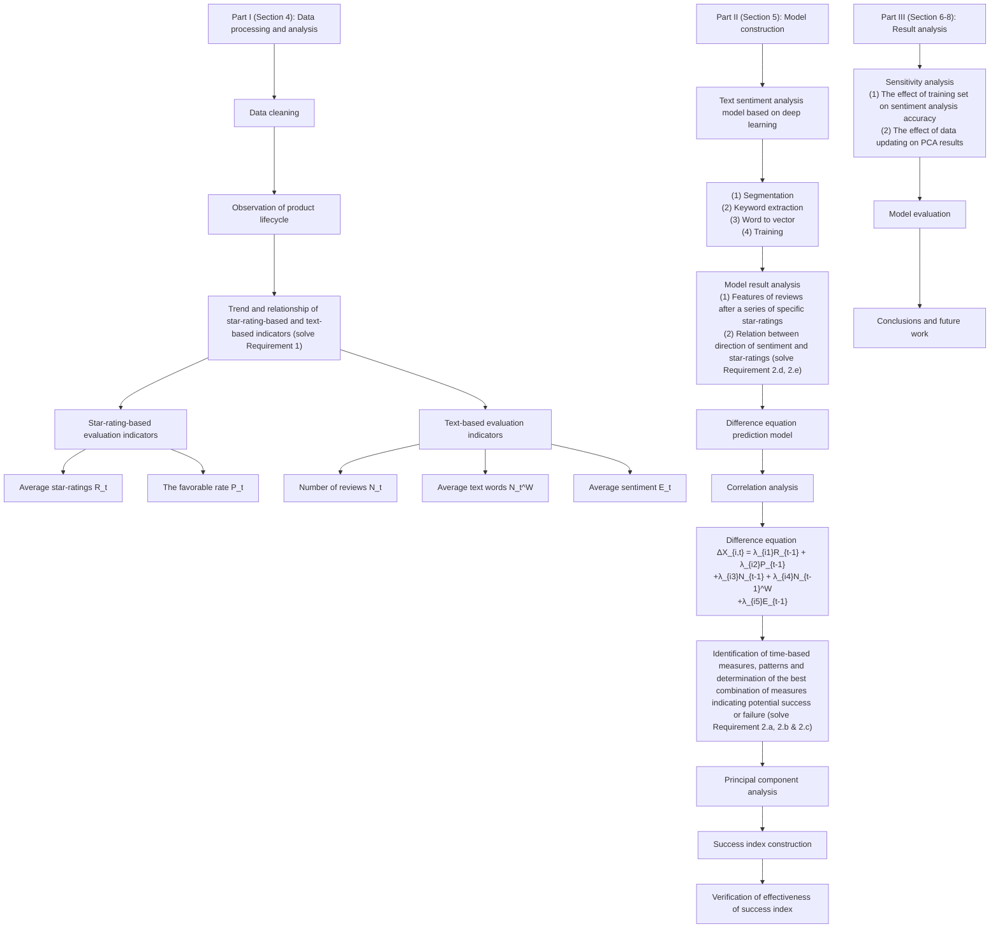
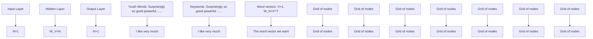
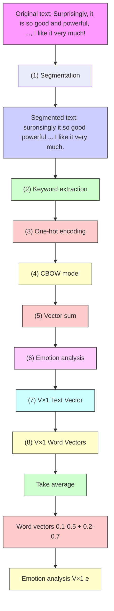

# Strategies to Online Sales: A Review-tracking System Combined with Deep Learning and Difference Equation Model

With the booming online shopping platforms, online reviews play an increasingly significant role in customer purchase decisions. How to identify the time-based patterns of reviews and future reputation of newly launched products is a major concern for companies.

In order to address this problem, we make statistics on review indicators of the hair dryers, pacifiers, and microwaves. With a preliminary understanding of data, we set five evaluation indicators based on star-ratings and text-based reviews, namely the average star-rating, favorable rate, number of reviews, average number of review words, and average review sentiment value. We then build a text sentiment analysis model based on deep learning, extract keywords in the reviews by Term Frequency-Inverse Document Frequency (TF-IDF) algorithm, and calculate the sentiment value of reviews by the back propagation (BP) neural network. In this way, we explore the specific relationship between review sentiment and star-rating levels and propose design focus for the three products. Later, we build a difference equation model to identify the changing patterns of each evaluation indicator as time and other indicators change based on the correlation test results of the five evaluation indicators. Finally, we construct the success index by principal component analysis (PCA) based on the evaluation indicators, which provides the company with an easy and convenient system to track potential successes or failures of a product.

We find some insightful conclusions based on our results as follows. (1) Star-ratings, favorable rate, number of review words, and review sentiment value all decline over time. For hair dryers, high review sentiment value will reduce the increase in star-ratings in the next quarter. Similarly, high star-ratings and favorable rate will also lower the review sentiment value in the next quarter. (2) Reviews with low star-ratings cause an increase in negative sentiment, while those with high star-ratings have no significant effect. Also, favorable reviews are strongly associated with high star-ratings, but negative ones are not significantly related to them. (3) The emotional words rank the first in the importance of reviews, followed by descriptive adjectives and characteristics words of products. (4) The success index effectively reflects the operating conditions and future reputations, which is a valid evaluation indicator.

Based on the above analysis, we provide some strategies on product sales and design for Sunshine Company, which includes (1) the design of hair dryers, pacifiers and microwaves should focus on high-power, light, portable asily installed, suitable size, timely repaired , respectively; (2) increase the yield to reduce concentrated negative reviews instead of pursuing favorable reviews blindly; and (3) ensure that the future product reputation is above the average by employing the success index for timely tracking.

In the end, we make sensitivity analysis, and verify the model s robustness and result adaptability. In a nutshell, our model is accurate in sentiment analysis, consistent with the reality, as well as simple, effective and practical in tracking future operating conditions.

Key words: Online Sales Strategies, Text Sentiment Analysis, Deep Learning, Difference Model, Principal Component Analysis

## Contents

1 Introduction . . 3  
2 Assumptions . . . 4  
3 Nomenclature . . . 4  
4 Data Processing and Analysis . . . 5

4.1 Data Cleaning 5  
4.2 Insights of Data 5

4.2.1 Observation of Product Lifecycle . . 5  
4.2.2 Trend of Star-rating-based and Text-based Indicators . 5  
4.2.3 Relationship Between Star-rating-based and Text-based Indicators . . . . . 7  
4.2.4 Determination of Evaluation Indicators Based on Star-ratings and Text . . 8

5 Model Construction . . 9

5.1 A Text Sentiment Analysis Model Based on Deep Learning . . . 9

5.1.1 Steps of the Text Sentiment Analysis Model . . 9  
5.1.2 Analysis of Model Results . . 12

5.2 A Difference Equation Prediction Model 15

5.2.1 Correlation Analysis of Evaluation Indicators . 15  
5.2.2 Construction of Difference Equation Model . 16  
5.2.3 Results and Analysis of Parameter Fitting 16

5.3 A Principal Component Analysis Model . . 18

5.3.1 Principle Introduction . . 18  
5.3.2 Model Results and Construction of the Success Index . 18  
5.3.3 Effectiveness and Application of the Success Index . . 19

6 Sensitivity Analysis . . . 20  
7 Model Evaluation . . 21

7.1 Strengths . . 21

7.2 Weaknesses 21

8 Conclusions and Future Work . 21  
9 A Letter to the Marketing Director of Sunshine Company . . . 23

Appendices.. 25

Appendix A Judgement Words for Positive Reviews . . 25

Appendix B The Stop Word List . 25

Appendix C ACF and PACF Results of Microwaves and Pacifiers . . 29

Appendix D Pearson correlation coefficient of microwave and pacifier indicators. . . 30

Appendix E Parameter Fitting Results of the Difference Equation Models for Microwaves and Pacifiers. . . 30

Appendix F PCA Results of Microwaves and Pacifiers . . . 31

Appendix G Sensitivity Analysis Results of Number of Data on the Success Index . . 31

## 1 Introduction

Would you refer to online reviews before you purchase a product online? The past decade has witnessed the booming e-commerce. In this context, customers prefer to shop online for convenience, lower cost, and diverse products [3]. Although online shopping makes it easier to reduce cost and match the demand, it also increases the risks of information asymmetry. In order to address the problem, major platforms provide online reviews for potential customers.

Generally, online reviews refer to the positive or negative opinions towards products or service published on websites by consumers [4]. They provide convenience for both customers and companies. For customers, they can rate their purchases and give feedbacks on these platforms, which provides valuable reference for other potential customers. For companies, they can get insightful findings by exploiting the online review data [13]. According to Jupiter Research, online reviews play an increasingly important role in the online market1.

Online reviews have caught the attention of a multitude of scholars. They mainly focus on content characteristics, such as star-ratings [6], content length [9], and positive or negative reviews [11]. Other scholars try to figure out the impacts of reviewer characteristic, such as reviewer verification [1], and the number of published comments [5]. These literatures study the impacts of online reviews from the aspects of reviews and reviewers.

In this work, we are required to (1) identify relationships among the parameters in textbased and rating-based reviews through time-based data interaction; and (2) provide Sunshine Company with insightful findings on new product launch.

The overview of this work is presented in Figure 1.

flowchart

Figure 1: Overview of this work, including data processing and analysis, model construction, and result analysis.

## 2 Assumptions

To simplify the problem, we make the following assumptions.

(1) The data given in the problem are true and reliable. The instruction sets the restriction that the data files provided contain the only data we should use for this problem, and our analyses are valid only if these data are true and reliable.  
(2) The impacts of the external environment on product sales and evaluation are not considered, such as the change of commodity demand. According to the microeconomic theory, the demand of life necessities (i.e., hair dryers, microwaves, and pacifiers) seldom changes sharply [8], so we do not take these factors into account.  
(3) The impacts of Amazon's internal system on product sales and evaluation are not considered, such as the evaluation and supervision system. Due to lack of these data, we neglect these impacts to simplify the modeling process.

## 3 Nomenclature

We put the symbols that we use in the model and their explanations in Table 1. They are divided into global variables and local variables in Section 5.1.1 by a solid black line.

Table 1: Symbols and explanations.

<table><tr><td>Symbol</td><td>Explanation</td></tr><tr><td> $t$ </td><td>The  $t$ th quarter in one year*</td></tr><tr><td> $r_j$ </td><td>The star-ratings of the  $j$ th review</td></tr><tr><td> $P_t$ </td><td>The favorable rate of the  $t$ th quarter</td></tr><tr><td> $S^i$ </td><td>The success index of the  $i$ th product</td></tr><tr><td> $e_j$ </td><td>The sentiment value of the  $j$ th review</td></tr><tr><td> $N_t$ </td><td>The number of reviews of the  $t$ th quarter</td></tr><tr><td> $R_t$ </td><td>The average star-ratings of the  $t$ th quarter</td></tr><tr><td> $v_j$ </td><td>The number of the helpfulness votes of the  $j$ th review</td></tr><tr><td> $N_t^W$ </td><td>The average word number of all reviews of the  $t$ th quarter</td></tr><tr><td> $E_t$ </td><td>The average sentiment value of the reviews of the  $t$ th quarter</td></tr><tr><td> $\lambda_{mn}$ </td><td>The impact degree of the  $m$ th evaluation indicator on the  $n$ th indicator</td></tr><tr><td> $N_C$ </td><td>The number of reviews in  $C$ </td></tr><tr><td> $I_i$ </td><td>The importance of the  $i$ th word</td></tr><tr><td> $C$ </td><td>The collection of all the reviews</td></tr><tr><td> $TF_i$ </td><td>The term frequency of the  $i$ th word</td></tr><tr><td> $c_i$ </td><td>The number of reviews containing the  $i$ th word</td></tr><tr><td> $IDF_i$ </td><td>The inverse document frequency of the  $i$ th word</td></tr><tr><td> $n_i$ </td><td>The number of times that the  $i$ th word appears in  $C$ </td></tr></table>

Note\*: t = 1 denotes the first quarter in 2010.

## 4 Data Processing and Analysis

## 4.1 Data Cleaning

Before we build the model, we first process and remove the following three types of data: (1) Missing and abnormal data. We find that there are less than 1% data with missing or garbled body and date, which may affect structure uniformity. (2) Product data with only one review These data make it difficult to analyze the impacts of their star-ratings and text on reputation since they lack continuous reviews in the long term. (3) The transaction data before 2010. The transactions of the three products (hair dryers, microwaves, and pacifiers) before 2010 (excluding 2010) are not continuous, that is, no one purchased such products for a long time (more than 3 months). Since they only account for less than 5%, we delete them for simplified analysis

## 4.2 Insights of Data

## 4.2.1 Observation of Product Lifecycle

We define the product lifecycle as the time between the first and last review of the product Based on this definition, we calculate the lifecycle of the three products, and the results are shown in Figure 2. Clearly, they show different survival patterns. For hair dryers, as time increases, their quantities also increase, which indicates their lifecycle is very long. Similarly. most microwaves have a lifecycle of 3-4 years, and their technology develops at a low speed. Different from hair dryers and microwaves, most pacifiers have a short lifecycle with commonly 3 months to 1 year, and more than 65% of them are eliminated within 2 years. This implies that pacifiers are updated very quickly with plenty of new products appearing in 1 year.

bar chart

| Time Period | Hair dryer | Microwave | Pacifier |
|---|---|---|---|
| 0 - 3 months | 3 | 0 | 153 |
| 3 months - 1 year | 11 | 3 | 401 |
| 1 year - 2 years | 9 | 4 | 350 |
| 2 years - 3 years | 15 | 10 | 233 |
| 3 years - 4 years | 19 | 13 | 126 |
| 4 years - 5 years | 31 | 9 | 63 |
| Over 5 years | 41 | 3 | 27 |

Figure 2: Lifecycle of three products, including hair dryers, microwaves, and pacifiers.

In order to explore the time patterns of evaluation indicators, it is necessary to specify the observation interval. Since most of the three products can survive over one quarter, we set the interval as one quarter. Accordingly, the time unit in the model is also set as one quarter.

## 4.2.2 Trend of Star-rating-based and Text-based Indicators

In the dataset, the star-ratings and text-based reviews are two main indicators of products, so we calculate the star-ratings and evaluation changes of the three products over time. In addition, we find that reviews with higher helpfulness ratings will be preferentially seen by buyers2, which indicates that they have great impacts on the sales. Therefore, we count the star-ratings and reviews with helpful votes greater than O separately. The results are shown in Figure 3.

line chart

| Year     | Hair dryer | Hair dryer (helpful) | Pacifier | Pacifier (helpful) | Microwave | Microwave (helpful) |
| -------- | ---------- | --------------------- | -------- | ------------------ | --------- | ------------------- |
| 2010 S1  | 4.0        | 1.8                   | 4.3      | 2.2                | 3.2       | 2.5                 |
| 2011 S1  | 3.8        | 1.9                   | 4.3      | 1.3                | 3.8       | 2.6                 |
| 2012 S1  | 3.9        | 1.7                   | 4.2      | 1.4                | 2.7       | 2.5                 |
| 2013 S1  | 4.2        | 1.3                   | 4.3      | 0.9                | 3.0       | 2.7                 |
| 2014 S1  | 4.2        | 1.1                   | 4.3      | 0.8                | 3.2       | 2.2                 |
| 2015 S1  | 4.3        | 0.7                   | 4.4      | 0.5                | 3.8       | 1.5                 |
| 2016 S1  | 4.3        | 0.6                   | 4.4      | 0.5                | 3.9       | 1.0                 |

Figure 3: Changes of star-ratings over time, including hair dryers, microwaves, and pacifiers.

When we calculate the star-ratings of all reviews, the average star-ratings of hair dryers and pacifiers are in a relatively stable trend without dramatic changes, while those of microwaves are in an upward trend. However, when we only calculate those with helpful votes, the average star-ratings of three products have a downward trend to varying degrees. Interestingly, for products with high average star-ratings in all reviews, the average star-ratings displayed by helpful reviews are low. Based on this, if we want to predict their future business conditions, we need tofocus on those reviews with more helpfulness ratings, because the higher the product's average star-ratings of a helpful review, the more attractive it is to potential customers.

We define reviews with 4 to 5 star-ratings as favorable reviews, and we calculate the favorable rate of all quarters. As is shown in Figure 4, the favorable rate and average star-ratings show aucorrelation. In other words, the previous reviews will take effect for a long time.

line chart

| Year     | Hair dryer | Pacifier | Microwave |
| -------- | ---------- | -------- | --------- |
| 2010 S1  | 0.78       | 0.80     | 0.55      |
| 2011 S1  | 0.68       | 0.83     | 0.33      |
| 2012 S1  | 0.74       | 0.79     | 0.38      |
| 2013 S1  | 0.78       | 0.82     | 0.55      |
| 2014 S1  | 0.79       | 0.81     | 0.50      |
| 2015 S1  | 0.80       | 0.83     | 0.65      |
| 2015 S1  | 0.79       | 0.82     | 0.72      |

Figure 4: Changes of the favorable rate over time, including hair dryers, microwaves, and pacifiers.

As for text-based reviews, we count the number of reviews and the average text word number of each quarter. As shown in Figure 5, the number of reviews of the three products has an upward trend, while the average text word number has a downward trend. Similarly, there is evident autocorrelation in the number of reviews and the average text word number

The sentiment tendency of reviews is also an important indicator of product sales. Since

bar-line hybrid chart

| Year | Hair dryer (reviews) | Pacifier (reviews) | Hair dryer (words) | Pacifier (words) | Microwave (reviews) | Microwave (words) |
| :--- | :--- | :--- | :--- | :--- | :--- | :--- |
| 2010 S1 | 100 | 1300 | 120 | 1300 | 200 | 140 |
| 2011 S1 | 150 | 1200 | 125 | 1250 | 60 | 180 |
| 2012 S1 | 150 | 300 | 130 | 1300 | 150 | 170 |
| 2013 S1 | 300 | 500 | 90 | 900 | 100 | 140 |
| 2014 S1 | 600 | 1000 | 80 | 800 | 120 | 160 |
| 2015 S1 | 900 | 2200 | 40 | 400 | 120 | 60 |

Figure 5: Changes of the number of reviews and average text word number over time, including hair dryers, microwaves, and pacifiers.

we have not built complete analysis model for text sentiment in this section, we define reviews that meet the following two requirements as favorable reviews: (1) words containing positive sentiment; and (2) words without negative sentiment or negators (see Appendix A).

In this way, we can get the percentage of favorable reviews of three products in each quarter, as shown in Figure 6. Since favorable reviews are generally paired with high star-ratings, the percentage of favorable reviews and average star-ratings show similar patterns. The difference lies in that the favorable percentage of helpful reviews for microwaves has remained the same trend as the favorable percentage of all reviews until the third quarter of 2012, but showed the opposite trend subsequently. According to Figure 6, we can draw a similar conclusion that the favorable review percentage has strong autocorrelation.

line chart

| Year | Hair dryer | Hair dryer (helpful) | Pacifier | Pacifier (helpful) | Microwave | Microwave (helpful) |
|------|------------|------------------------|----------|---------------------|-----------|----------------------|
| 2010 S1 | 0.75 | 0.35 | 0.85 | 0.45 | 0.85 | 0.75 |
| 2011 S1 | 0.80 | 0.38 | 0.88 | 0.35 | 1.00 | 0.45 |
| 2012 S1 | 0.78 | 0.36 | 0.87 | 0.32 | 0.75 | 0.60 |
| 2013 S1 | 0.76 | 0.25 | 0.86 | 0.18 | 0.65 | 0.55 |
| 2014 S1 | 0.78 | 0.22 | 0.85 | 0.15 | 0.70 | 0.45 |
| 2015 S1 | 0.79 | 0.12 | 0.84 | 0.12 | 0.72 | 0.35 |
| 2016 S1 | 0.79 | 0.12 | 0.83 | 0.12 | 0.73 | 0.22 |

Figure 6: Changes of the percentage of favorable reviews over time, including hair dryers, microwaves, and pacifiers.

## 4.2.3 Relationship Between Star-rating-based and Text-based Indicators

Next, we observe the relationship between star-rating indicators and text indicators. We visualize the star-ratings and percentage of favorable reviews, as well as the number of reviews and average text word number, as shown in Figure 7 and Figure 8, respectively. Obviously, there is a positive correlation between star-ratings and percentage of favorable reviews—the higher the star-ratings, the higher the percentage. Moreover, the number of reviews has no evident impacts on the percentage of favorable reviews. In addition, the average text word number does not have fixed effects on the percentage of favorable reviews—for microwaves, the average text word number has a significantly negative correlation with it, but this is not obvious for hair dryers and pacifiers.

bar-line hybrid chart

| Year | Hair dryer (rating) | Pacifier (rating) | Microwave (rating) | Hair dryer (positive percentage) | Pacifier (positive percentage) | Microwave (positive percentage) |
|------|---------------------|-------------------|--------------------|----------------------------------|-------------------------------|---------------------------------|
| 2010 S1 | 4.0 | 4.3 | 3.2 | 0.7 | 0.8 | 0.5 |
| 2011 S1 | 3.8 | 4.4 | 2.5 | 0.6 | 0.9 | 0.4 |
| 2012 S1 | 3.9 | 4.5 | 2.8 | 0.7 | 0.8 | 0.5 |
| 2013 S1 | 4.1 | 4.6 | 3.0 | 0.8 | 0.9 | 0.6 |
| 2014 S1 | 4.2 | 4.7 | 3.2 | 0.8 | 0.9 | 0.6 |
| 2015 S1 | 4.3 | 4.8 | 3.5 | 0.9 | 0.9 | 0.7 |

Figure 7: The relationship between star-ratings and percentage of favorable reviews, including hair dryers, microwaves, and pacifiers.  

bar-line hybrid chart

| Year     | Hair dryer (rating) | Pacifier (rating) | Microwave (rating) | Hair dryer (number) | Pacifier (number) | Microwave (number) |
|----------|---------------------|-------------------|--------------------|----------------------|-------------------|--------------------|
| 2010 S1  | 4.5                 | 4.8               | 3.5                | 100                  | 150               | 120                |
| 2011 S1  | 4.6                 | 4.7               | 3.6                | 90                   | 140               | 130                |
| 2012 S1  | 4.7                 | 4.6               | 3.7                | 80                   | 130               | 120                |
| 2013 S1  | 4.8                 | 4.5               | 3.8                | 70                   | 120               | 110                |
| 2014 S1  | 4.9                 | 4.4               | 3.9                | 60                   | 110               | 100                |
| 2015 S1  | 5.0                 | 4.3               | 4.0                | 50                   | 100               | 90                 |

Figure 8: The relationship among star-ratings, number of reviews, and average text word number, including hair dryers, microwaves, and pacifiers.

## 4.2.4 Determination of Evaluation Indicators Based on Star-ratings and Text

Based on the above analysis, we determine the evaluation indicators based on star-ratings and text. Above all, the average star-ratings of a product in one quarter is an important indicator, but according to Figure 3, if we simply average the star-ratings of all the reviews, it may not be able to find the future impacts of helpful reviews. Therefore, we introduce the number of helpful votes in the average star-ratings as a weight, and consider the impacts of verified purchase and vine, and then we determine the average star-ratings $R _ { t }$ of a product in the tth quarter as

$$
R _ {t} = \frac {\sum_ {j = 1} ^ {N _ {t}} r _ {j} \min \left\{1 + \frac {v _ {j}}{2 0} , 5 \right\} \left(\frac {1}{2} + \frac {1}{2} \mathbf {I} _ {\text {Verified}}\right) \left(1 + \frac {1}{2} \mathbf {I} _ {\text {Vine}}\right)}{N _ {t}}, \tag {1}
$$

where $N _ { t }$ is the product's number of received reviews in the tth quarter, $r _ { j }$ is the star-ratings of the jth review, vj is the helpfulness votes of the jth review, and Iverified as well as Ivine are

indicator functions.

We have defined the favorable rate $P _ { t }$ in Section 4.2.2—the percentage of the reviews with star-ratings of more than 4 in all reviews, and its calculation formula is as follows,

$$
P _ {t} = \frac {\sum_ {j = 1} ^ {N _ {t}} \mathbf {I} _ {r j \geq 4}}{N _ {t}}. \tag {2}
$$

As shown in Eq.(2), when $r _ { j } \ge 4 , \mathbf { I } _ { \mathrm { V e r i f i e d } } = 1$ ; otherwise, it is 0.

With rating-based indicators determined, we further determine the text-based indicators. Tc begin with, the number of reviews $N _ { t }$ reflects the popularity of a product. Furthermore, according to Figure 8, the average text word number $N _ { t } ^ { W }$ has possible impacts on average star-ratings. Additionally, text sentiment is also significant. Although favorable review percentage can be regarded as a kind of sentiment expression, it cannot reflect all the sentiment—the sentiment intensity of different favorable reviews is not the same, i.e., "Perfect! I love $i t ! ^ { \dag 3 }$ is obviously more intense than "Good.", which has different impacts on the potential customers. Therefore, we need to get a more specific indicator to express reviews' sentiment intensity. We build this indicator by a text sentiment analysis model. Assume that the review's sentiment value obtained by the subsequent model is $e _ { j }$ , the average sentiment value $E _ { t }$ of the product in the t quarter is

$$
E _ {t} = \frac {\sum_ {j = 1} ^ {N _ {t}} e _ {j} \min \left\{1 + \frac {v _ {j}}{2 0} , 5 \right\} \left(\frac {1}{2} + \frac {1}{2} \mathbf {I} _ {\text {Verified}}\right) \left(1 + \frac {1}{2} \mathbf {I} _ {\text {Vine}}\right)}{N _ {t}}. \tag {3}
$$

In Eq.(3), the average sentiment value $E _ { t }$ is basically the same as the average star-ratings. Next we start to build a text sentiment analysis model to calculate the sentiment value of the reviews.

## 5 Model Construction

## 5.1 A Text Sentiment Analysis Model Based on Deep Learning

## 5.1.1 Steps of the Text Sentiment Analysis Model

After collecting text data, we judge the sentiment of the text and its degree as follows.

## (1) Segmentation.

Usually, it starts with judging the keywords in the sentence. The sentiment contained in the keywords reflects most information in the whole sentence [7], so we need to segment the sentence into several words. First, we use spaces and punctuation as separators to segment a sentence. Then, we delete the stop words that appear very frequently with no practical meanings, i.e., "a, is", as well as "and"—because they increase the storage space but help little with sentiment judgements. Here, we delete 891 stop words in total, and the stop word list is attached in Appendix B.

## (2) Extract keywords by TF-IDF.

Next, we extract the keywords in each sentence. Here, keywords refer to those words appearing frequently in the text with practical meanings, such as "great", "bad", "love", and "hate" After that, we make sentiment judgement on these keywords, and get the sentiment orientation (positive, neutral, and negative) and their degrees.

In this work, we use the TF-IDF algorithm to extract keywords. The main idea of this algorithm is that the importance of a word is directly proportional to its word frequency in the entire text database $C ,$ but inversely proportional to the number of reviews containing the word. Therefore, for the ith word, there are two indicators—Term Frequency (TF) and Inverse Document Frequency (IDF), and their calculation formulas are as follows,

$$
T F _ {i} = \frac {n _ {i}}{\sum n _ {i}}, \tag {4}
$$

$$
I D F _ {i} = \ln \frac {N _ {C}}{c _ {i} + 1}, \tag {5}
$$

, where $n _ { i }$ denotes the word frequency, $N _ { c }$ denotes the number of all reviews, and $c _ { i }$ denotes the number of reviews containing the word. In Eq.(4), $T F _ { i }$ reflects the proportion of the word frequency in all words—the bigger the $T F _ { i }$ , the more important the word. In Eq.(5), $I D F _ { i }$ reflects the word frequency in all the reviews (we add 1 to the denominator to prevent it from being 0)—the more frequent the word, the more likely that it is a common word in general sentences, i.e., the article (the, a), conjunction (and, so), and preposition (in, about). Based on these two indicators, the importance of the ith word is defined as

$$
I _ {i} = T F _ {i} \times I D F _ {i}. \tag {6}
$$

As Eq.(6) indicates, the more important the word, the more frequently it appears in the reviews, and the less number of reviews containing it.

With stop words removed, the average word number in a review is about 75. According to [2], the useful information accounts for $2 0 \%$ in a sentence. Therefore, we extract 20% useful information, or rather, the top 15 most important words for each review (if the review contains less than 15 words, all words are used as keywords).

## (3) Turn all keywords into word vectors.

There are two ways to judge text sentiment. One is to refer to the sentiment dictionary: since the sentiment value of all keywords is determined, we can get the sentiment value of the keywords in the text by summarizing them. We use this simple and fast method originally to analyze the text sentiment, but it is at a disadvantage in less comprehensive consideration. When sentence expressions are changed without sentiment changes, there are great changes in the sentiment value, resulting in inaccuracy of sentiment value in some sentences, as shown in Table 2.

The other is the deep learning model. With the development of science and technology. deep learning models in text sentiment analysis are gaining increasing popularity. Analysis based on deep learning makes for the lack of context in the sentiment dictionary, and improves the judgement accuracy effectively. It mainly converts keywords into mathematical vectors, inputs them into the neural network, and trains the network.

Here, we adopt deep learning to judge the text sentiment. We convert the extracted keywords into mathematical vectors. First of all, we count the number of keywords and encode them with one-hot encoding: the vector corresponding to each keyword is a column vector, and the number of rows is the number of keywords—the value of the row that the keyword is in equals 1, and the others' are all O. In this way, all the keywords have their own vectors, as shown in Figure 9

Table 2: Some problems in judging sentiment value based on a sentiment dictionary.

<table><tr><td>Original Review</td><td>Sentiment Value*</td><td>Review</td><td>Actual Sentiment Value**</td></tr><tr><td>Good</td><td>6</td><td>Correct, because “good” is a positive word and should have positive value</td><td>6</td></tr><tr><td>Works good</td><td>8.4</td><td>Wrong, because “works” cannot add any positive sentiment here</td><td>6</td></tr><tr><td>Good as expected</td><td>0</td><td>Wrong, “as expected” does not change any sentiment here so the review should have same value with “Good”</td><td>6</td></tr><tr><td>Good experience will order again</td><td>6</td><td>Wrong, “order again” increases the positive sentiment and should have higher value</td><td>10</td></tr></table>

\*Based on sentiment directory  
\*\*Based on subjective judgment

$$
\begin{array}{c}{\cal N}\\ {\rm words}\end{array}\left\{\begin{array}{c}{\rm Good}\longrightarrow [1;0;0;\dots\dots;0;0]\\ {\rm Great}\longrightarrow [0;1;0;\dots\dots;0;0]\\ {\rm Bad}\longrightarrow [0;0;1;\dots\dots;0;0]\\ \dots\dots\\ {\rm Perfect}\longrightarrow [0;0;0;\dots\dots;1;0]\\ {\rm Complaint}\longrightarrow [0;0;0;\dots\dots;0;1] \end{array}\right\} \begin{array}{c}{\cal N\times 1}\\ {\rm Vectors}\end{array}
$$

Figure 9: A schematic diagram of one-hot encoding.

However, if there are too many keywords, the length of the vectors will be too long. If we directly put them into the neural network, it will lead to dimensionality curse and long-time training. To prevent this, we employ the Continuous Bag-of-Word (CBOW) model to reduce the dimensions. It puts the one-hot vectors of the neighboring keywords of the ith keyword in the text as independent variables into the neural network (the number of selected neighboring keywords is also called the window). There is only one neuron in the one hidden layer, which is the final converted word vector, and the output layer is the one-hot vector of the ith keyword.

Figure 10 is an example of CBOW. We set the window to 2 after extracting the keywords, that is, the one-hot vectors of the two neighboring keywords of each keyword are put into the neural network as independent variables. If we use "so" as the keyword, the input is "surprisedly". "good", and "powerful", respectively. After that, we train the weight matrix $W _ { V \times N }$ to minimize the difference between the result vector of the output laver and the original one-hot vectors of the keyword "so". Then, we can get a word vector with reduced dimensions by multiplying this matrix with the original one-hot vectors.

## (4) Turn word vectors into sentence vectors and train them by the neural network.

After we convert all the keywords into word vectors, we add all these word vectors, and take the average as the vector of this review. Then, we input this review vector into a new neura network model, where the output layer is the final text sentiment value.

Notice that the neural network needs a part of reviews with sentiment values as the training samples. Therefore, we first use the sentiment dictionary (SentiWordNet3) to calculate sentiment value of the top 200 reviews of the three products, and then manually adjust the problematic ones. After that, we put these reviews and sentiment words into the neural network for training. Figure 11 is the whole framework of the text sentiment analysis model based on deep learning.

flowchart

Figure 10: A schematic diagram of CBOW.

flowchart

Figure 11: The framework of the text sentiment analysis model based on deep learning.

## 5.1.2 Analysis of Model Results

The trained deep learning model works well, and the mean absolute percentage error (MAPE) after fitting on the training set is 6.34%. In this way, we get all the sentiment value of the text after applying the deep learning model to analyze the text of the non-training set.

Next, we focus on the relationship between review sentiment and star-ratings. Figure 12 shows the average sentiment value, favorable rate, and negative rate (the percentage of the reviews with star-ratings less than 2 in all the reviews in the quarter) of the three products in each quarter. To further explore the impacts of star-ratings on sentiment value, we also examine the average sentiment value of positive and negative reviews. Please note that the sentiment of positive reviews are greater than O; otherwise, it is less than O.

According to Figure 12, during 2010 and 2012, the average sentiment value of all the reviews and the average sentiment value of positive reviews were generally positively related tc the favorable rate. Nevertheless, after 2012, the relationship between the favorable rate and the average sentiment value was not obvious.

In terms of the negative rate, the relationship between the negative rate and the average sentiment value of negative reviews are obvious in the three products—the higher the negative rate, the smaller the average negative sentiment value, and this pattern persisted during 2010 and 2015. It indicates that when customers see a series of low star-rating reviews, they are more likely to make more negative reviews, which is likely to persist for a long time in the future.

We also observe the number of high and low star-ratings in positive and negative reviews,

bar-line hybrid chart

| Category     | Average sentiment | Average sentiment (positive) | Average sentiment (negative) |
| ------------ | ----------------- | ---------------------------- | ----------------------------- |
| Hair dryer   | ~28               | ~30                          | ~-15                          |
| Pacifier     | ~27               | ~29                          | ~-14                          |
| Microwave    | ~26               | ~28                          | ~-13                          |

Figure 12: The relationship among the average sentiment value, favorable rate, and negative rate, including hair dryers, microwaves, and pacifiers.

as shown in Figure 13 and 14, respectively. For all the three products, high star-ratings account for the majority of positive reviews.

Nevertheless, it is hard to relate negative reviews with specific star-ratings. Since the third quarter of 2010, there have been high star-ratings in negative reviews of hair dryers and pacifiers, and the proportion of high and low star-ratings in each quarter was roughly the same. For microwaves, although low star-ratings still accounted for the majority, there was an upward trend for the high star-rating reviews.

Last but not least, we observe the keywords extracted by TF-IDF, with the aim to provide suggestions on product design for Sunshine Company. We select the top 200 notional keywords (i.e., noun, verb, adjective, etc.) in the reviews of hair dryers, pacifiers, and microwaves. As shown in Figure 15, the bigger the word, the more important it is to the product

In Figure 15, the most important keywords are emotional words (i.e., great, love, well, and good), followed by descriptive adjectives (i.e., hot, cool, new, clean, and small). Coming last are feature words of products (i.e., heat, cord, nipple, suck, cooking, and fix). The sequence of importance indicates that most people express their feelings after using the product, followed by the product description. This provides design ideas for Sunshine Company. For hair dryers. words like hot, cool, heat, light, small, heayy, cord, settings, and button are more important, sc the company should design high-power, light, and portable products. For pacifiers, cute, soft. such, small, new, cat, size, clean, and hard are frequent, so it should focus on designing products with cute apparency, soft texture, and clean material. As for microwaves, the most important keywords are small, cooking, fix, big, works, repair, install, size, and $~ \mathscr { f l } x ,$ , so the design should be focused on easy installation, medium size, and easy repair.

stacked bar chart

| Category     | Low star-ratings & positive | High star-ratings & positive |
| ------------ | ---------------------------- | ----------------------------- |
| Hair dryer   | 0                            | 0                             |
| Pacifier     | 0                            | 0                             |
| Microwave    | 0                            | 0                             |

Figure 13: The number of high and low star-ratings in positive reviews, including hair dryers, microwaves, and pacifiers.  

stacked bar chart

| Category     | Low star-ratings & negative | High star-ratings & negative |
| ------------ | ---------------------------- | ----------------------------- |
| Hair dryer   | 0                            | 10                            |
| Pacifier     | 0                            | 15                            |
| Microwave    | 0                            | 20                            |

Figure 14: The number of high and low star-ratings in negative reviews, including hair dryers, pacifiers, and microwaves.

text_image

Best
Well
Old
Heat
Settings
Price
Little Works
Drying
Air
Great Time
Light
Cool
Hot
Cord
Nice
Top
Pacifier
Well
Love
Clean
Nipple
Size
Easy
Cute Baby
Perfect
Recommend
Suck-Quality Best
All Power
Big
Good Small Cooking Well Love
Fix
Big
Install Perfect
Price
Fine
Warranty Light
Fan
Microwave
Well
Works
Kitcher's Little
Great Size Oven Fit
Repair
New

Figure 15: Keywords in reviews, including hair dryers, pacifiers, and microwaves in sequence.

## 5.2 A Difference Equation Prediction Model

## 5.2.1 Correlation Analysis of Evaluation Indicators

In Section 4.2.4, we define five evaluation indicators based on star-ratings and text, namely the average star-ratings $R _ { t }$ , favorable rate $P _ { t }$ , number of reviews $N _ { t }$ , average text word number $N _ { t } ^ { W }$ , and average review sentiment value $E _ { t }$ . To explore their changing patterns, it is necessary to obtain their influencing factors—whether the change of one indicator will be affected by itself or the others. To address this problem, we make the correlation analysis.

We calculate the autocorrelation coefficient (ACF) and partial autocorrelation coefficient (PACF) of the indicators by

$$
A C F = \frac {E \left[ (X _ {t} - E X _ {t}) (X _ {t - k} - E X _ {t}) \right]}{E (X _ {t} - E X _ {t}) ^ {2}}, \tag {7}
$$

$$
P A C F = \frac {E \left[ (X _ {t} - E X _ {t}) (X _ {t - k} - E X _ {t - k}) \right]}{E (X _ {t - k} - E X _ {t - k}) ^ {2}}, \tag {8}
$$

where k denotes the lags, $X _ { t }$ denotes the indicator value of the tth quarter. Table 3 shows the ACF and PACF results of the five indicators of hair dryers. Due to space limitations, the results of microwaves and pacifiers are shown in the Appendix C

Table 3: The ACF and PACF of Hair dryers' indicators.

<table><tr><td></td><td colspan="2"> $R_t$ </td><td colspan="2"> $P_t$ </td><td colspan="2"> $N_t$ </td><td colspan="2"> $N_t^W$ </td><td colspan="2"> $E_t$ </td></tr><tr><td>Lags</td><td>ACF</td><td>PACF</td><td>ACF</td><td>PACF</td><td>ACF</td><td>PACF</td><td>ACF</td><td>PACF</td><td>ACF</td><td>PACF</td></tr><tr><td>1</td><td>0.325</td><td>0.325</td><td>0.499</td><td>0.499</td><td>0.816</td><td>0.816</td><td>0.838</td><td>0.838</td><td>0.481</td><td>0.481</td></tr><tr><td>3</td><td>0.091</td><td>0.117</td><td>0.264</td><td>0.331</td><td>0.442</td><td>0.151</td><td>0.539</td><td>-0.127</td><td>0.342</td><td>0.070</td></tr><tr><td>5</td><td>0.058</td><td>0.076</td><td>0.251</td><td>0.218</td><td>0.259</td><td>-0.063</td><td>0.309</td><td>0.116</td><td>0.159</td><td>0.042</td></tr><tr><td>7</td><td>-0.247</td><td>-0.296</td><td>-0.002</td><td>0.073</td><td>0.091</td><td>0.076</td><td>0.145</td><td>0.025</td><td>0.092</td><td>0.044</td></tr><tr><td>9</td><td>-0.122</td><td>-0.271</td><td>-0.068</td><td>-0.367</td><td>-0.096</td><td>-0.235</td><td>-0.134</td><td>-0.178</td><td>-0.023</td><td>-0.010</td></tr></table>

If the first-order ACF of the indicator is large and trailing, and the first-order PACF is truncated, it indicates that the indicator has a strong first-order autocorrelation. The results indicate that $N _ { t }$ shows obvious autocorrelation in all the three products, $P _ { t }$ and $N _ { t } ^ { W }$ show autocorrelation in pacifiers and microwaves, but $R _ { t }$ and $E _ { t }$ show autocorrelation only in hair dryers. Apart from the average star-ratings and average sentiment value, the conclusion mentioned in Section 4.2.2 that the other three indicators have autocorrelation has been verified. After setting different weights for helpfulness ratings, verified purchase, and vine, the average star-ratings and sentiment value remain basically stable in each quarter. This indicates that these two indicators may be mainly affected by other indicators, rather than themselves.

After that, we observe the correlation between the variables. We make the correlation analysis on the indicators of the (t  1)th and tth quarter. We calculate the Pearson correlation

coefficient for the five indicators in pairs by

$$
\rho_ {X Y} = \frac {E \left[ (X _ {t} - E X _ {t}) (Y _ {t - 1} - E Y _ {t - 1}) \right]}{\sigma_ {X} \sigma_ {Y}}, \tag {9}
$$

where $\sigma _ { X }$ and $\sigma _ { Y }$ denote the standard deviations of the indicator $X$ and $Y$ , respectively.

The specific values of the Pearson correlation coefficient of hair dryer indicators are shown in Table 4 (see Appendix D for those of microwaves and pacifiers). According to the principle of correlation judgment, we identify the combinations of variables with correlations, including $( R _ { t - 1 } , E _ { t } ) , ( P _ { t - 1 } , R _ { t } ) , ( N _ { t - 1 } , R _ { t } ) , ( N _ { t - 1 } , E _ { t } ) , ( N _ { t - 1 } ^ { W } , R _ { t } )$ , and $( E _ { t - 1 } , R _ { t } )$

Table 4: Pearson correlation coefficient of the hair dryer indicators.

<table><tr><td></td><td> $R_t$ </td><td> $P_t$ </td><td> $N_t$ </td><td> $N_t^W$ </td><td> $E_t$ </td></tr><tr><td> $R_{t-1}$ </td><td>-</td><td>-0.221</td><td>0.046</td><td>-0.198</td><td>-0.461*</td></tr><tr><td> $P_{t-1}$ </td><td>-0.770**</td><td>-</td><td>-0.044</td><td>-0.121</td><td>-0.204</td></tr><tr><td> $N_{t-1}$ </td><td>-0.437*</td><td>-0.056</td><td>-</td><td>-0.150</td><td>-0.418*</td></tr><tr><td> $N_{t-1}^W$ </td><td>0.455*</td><td>0.132</td><td>0.001</td><td>-</td><td>-0.012</td></tr><tr><td> $E_{t-1}$ </td><td>-0.469*</td><td>-0.173</td><td>-0.054</td><td>-0.062</td><td>-</td></tr></table>

\*\*. Significant at $\alpha = 0 . 0 1$  
\*. Significant at $\alpha = 0 . 0 5$

## 5.2.2 Construction of Difference Equation Model

After determining each indicator's autocorrelation and the correlation with other variables, we establish a difference equation as follows,

$$
\left\{ \begin{array}{l} \Delta R _ {t} = \alpha_ {1} + \lambda_ {1 1} R _ {t - 1} + \lambda_ {1 2} P _ {t - 1} + \lambda_ {1 3} N _ {t - 1} + \lambda_ {1 4} N _ {t - 1} ^ {W} + \lambda_ {1 5} E _ {t - 1} \\ \Delta P _ {t} = \alpha_ {2} + \lambda_ {2 1} R _ {t - 1} + \lambda_ {2 2} P _ {t - 1} + \lambda_ {2 3} N _ {t - 1} + \lambda_ {2 4} N _ {t - 1} ^ {W} + \lambda_ {2 5} E _ {t - 1} \\ \Delta N _ {t} = \alpha_ {3} + \lambda_ {3 1} R _ {t - 1} + \lambda_ {3 2} P _ {t - 1} + \lambda_ {3 3} N _ {t - 1} + \lambda_ {3 4} N _ {t - 1} ^ {W} + \lambda_ {3 5} E _ {t - 1} \\ \Delta N _ {t} ^ {W} = \alpha_ {4} + \lambda_ {4 1} R _ {t - 1} + \lambda_ {4 2} P _ {t - 1} + \lambda_ {4 3} N _ {t - 1} + \lambda_ {4 4} N _ {t - 1} ^ {W} + \lambda_ {4 5} E _ {t - 1} \\ \Delta E _ {t} = \alpha_ {5} + \lambda_ {5 1} R _ {t - 1} + \lambda_ {5 2} P _ {t - 1} + \lambda_ {5 3} N _ {t - 1} + \lambda_ {5 4} N _ {t - 1} ^ {W} + \lambda_ {5 5} E _ {t - 1} \end{array} . \right. \tag {10}
$$

According to the correlation analysis, if there is no autocorrelation in the mth indicator, then $\lambda _ { m m } = 0$ in the corresponding difference equation; and if there is no correlation between the mth variable and the nth variable, then $\lambda _ { m n } = \lambda _ { n m } = 0$ .

## 5.2.3 Results and Analysis of Parameter Fitting

We put the indicators of the three products in each quarter into the model for fitting, and get the parameters in Eq.(10). We take hair dryers for an example, and the results are shown in Table 5. Please see the Appendix E for the parameter fitting results of pacifier and microwave.

By analyzing the parameter fitting results, we find that the increase in star-ratings is negatively correlated to the star-ratings and sentiment value in the previous quarter. Similarly. the increase in the favorable rate, number of reviews, the sentiment value are also negatively correlated to the indicators of the previous quarter. This shows that the large number of high star-ratings or positive reviews in one quarter cannot increase the performance of indicators in the next quarter, and may even bring negative growth. To explore its reasons, we find that there have been related reports4 reflecting the phenomenon of Amazon's click farming5. The eyecatching favorable reviews highlighted on the shopping platforms might instead give customers the feeling of "intentionally clicking farming for sales", which reduces the customers' desire to buy or affect subsequent product reviews [12]. This is consistent with the obseravtion in Section 4.2.2—the average star-ratings are always high without considering the helpfulness, but they decrease after taking the helpfulness into account. Consistently favorable reviews bring negative reviews in the future, until they reach a level that can actually reflect the product conditions.

line chart

| X  | Acutal value | Fitted value |
|----|--------------|--------------|
| 0  | -0.5         | -0.3         |
| 5  | 0.4          | 0.3          |
| 10 | 0.6          | 0.5          |
| 15 | -0.7         | -0.8         |
| 20 | 0.5          | 0.4          |

line chart

| X  | Acutal value | Fitted value |
|----|--------------|--------------|
| 0  | -0.15        | -0.08        |
| 5  | 0.05         | 0.03         |
| 10 | -0.12        | -0.05        |
| 15 | 0.01         | 0.00         |
| 20 | -0.02        | -0.04        |

line chart

| X  | Acutal value | Fitted value |
|----|--------------|--------------|
| 0  | 3.5          | 3.5          |
| 1  | -7.5         | -4.0         |
| 2  | 5.0          | 4.0          |
| 3  | -6.0         | -5.0         |
| 4  | 4.0          | 3.0          |
| 5  | -2.0         | -1.0         |
| 6  | -8.0         | -9.0         |
| 7  | 1.0          | 2.0          |
| 8  | -10.0        | -11.0        |
| 9  | 6.0          | 7.0          |
| 10 | -12.0        | -13.0        |
| 11 | 10.0         | 9.0          |
| 12 | -14.0        | -15.0        |
| 13 | 3.0          | 2.0          |
| 14 | -8.0         | -6.0         |
| 15 | 4.0          | 3.0          |
| 16 | 13.0         | 12.0         |
| 17 | -9.0         | -7.0         |
| 18 | -5.0         | -4.0         |
| 19 | 2.0          | 1.0          |
| 20 | 3.0          | 4.0          |

line chart

| X  | Acutal value | Fitted value |
|----|--------------|--------------|
| 0  | 0            | 0            |
| 5  | 140          | 130          |
| 10 | -20          | -10          |
| 15 | 10           | 5            |
| 20 | -40          | -30          |

line chart

| X  | Acutal value | Fitted value |
|----|--------------|--------------|
| 0  | -4           | 11           |
| 1  | 11           | -5           |
| 2  | -3           | 7            |
| 3  | 6            | -2           |
| 4  | -8           | 6            |
| 5  | 10           | -7           |
| 6  | -2           | 2            |
| 7  | 2            | -1           |
| 8  | -1           | -2           |
| 9  | -3           | -4           |
| 10 | -2           | -5           |
| 11 | 2            | -3           |
| 12 | 1            | -2           |
| 13 | -1           | -1           |
| 14 | -2           | -2           |
| 15 | -3           | -3           |
| 16 | -4           | -4           |
| 17 | -5           | -5           |
| 18 | -6           | -6           |
| 19 | -7           | -7           |
| 20 | -8           | -8           |

Figure 16: Results of parameter fitting of hair dryers, including $\Delta R , \Delta P , \Delta N , \Delta N ^ { W }$ , and $\Delta E .$ .

Table 5: Parameter fitting results of the difference equation model for hair dryers

<table><tr><td rowspan="3">m</td><td rowspan="3"> $\alpha_m$ </td><td colspan="5"> $\lambda_{mn}$ </td></tr><tr><td colspan="5">n</td></tr><tr><td>1</td><td>2</td><td>3</td><td>4</td><td>5</td></tr><tr><td>1</td><td>3.38</td><td>-1.05</td><td>0</td><td>0</td><td>0</td><td>-0.02</td></tr><tr><td>2</td><td>1.06</td><td>-0.29</td><td>-0.16</td><td>0</td><td>0</td><td>0</td></tr><tr><td>3</td><td>958.81</td><td>-75.21</td><td>0</td><td>-0.29</td><td>0</td><td>-38.99</td></tr><tr><td>4</td><td>-50.94</td><td>15.85</td><td>0</td><td>0</td><td>-0.03</td><td>0</td></tr><tr><td>5</td><td>17.8</td><td>-4.66</td><td>0</td><td>0</td><td>0</td><td>-0.22</td></tr></table>

## 5.3 A Principal Component Analysis Model

## 5.3.1 Principle Introduction

Principal component analysis (PCA) is a multivariate statistical method often used for reducing dimensionality. It transforms a group of variables with possible correlation into linearly unrelated ones through orthogonal transformation, and the converted variables are called principal components [10]. It believes that the amount of information contained in a variable is usually measured by the variance or the sum of squared deviations, and the number of principal components is selected according to the variance contribution rate.

## 5.3.2 Model Results and Construction of the Success Index

Here, we employ PCA to construct the success index $S ^ { i }$ . Firstly, we standardize the data by

$$
X _ {1} = \frac {R - \mu_ {R}}{\sigma_ {R}}, X _ {2} = \frac {P - \mu_ {P}}{\sigma_ {P}}, X _ {3} = \frac {N - \mu_ {N}}{\sigma_ {N}}, X _ {4} = \frac {N ^ {w} - \mu_ {N ^ {W}}}{\sigma_ {N ^ {W}}}, X _ {5} = \frac {E - \mu_ {E}}{\sigma_ {E}}, \tag {11}
$$

where $\mu$ is the mean, $\sigma$ is the standard deviation, and $X$ is the standardized data. More specifically, $X _ { 1 }$ is the average star-ratings, $X _ { 2 }$ is the favorable rate, $X _ { 3 }$ is the sentiment value, $X _ { 4 }$ is the word number of the review, and $X _ { 5 }$ is the number of reviews.

$$
\left\{ \begin{array}{l} Z _ {1} = c _ {1 1} X _ {1} + c _ {1 2} X _ {2} + \dots + c _ {1 p} X _ {P} \\ Z _ {2} = c _ {2 1} X _ {1} + c _ {2 2} X _ {2} + \dots + c _ {2 p} X _ {P} \\ \dots \\ Z _ {P} = c _ {p 1} X _ {1} + c _ {p 2} X _ {2} + \dots + c _ {p p} X _ {P} \end{array} \right. \tag {12}
$$

In Eq.(12), for each $i , ( 1 ) c _ { i 1 } ^ { 2 } + c _ { i 2 } ^ { 2 } + . . . + c _ { i p } ^ { 2 } = 1$ , and $[ c _ { 1 1 } , c _ { 1 2 } , \ldots , c _ { 1 p } ]$ maximizes the variance of $Z _ { 1 } ; ( 2 ) \ \left[ c _ { 2 1 } , c _ { 2 2 } , \ldots , c _ { 2 p } \right]$ is orthogonal to $[ c _ { 1 1 } , c _ { 1 2 } , \ldots , c _ { 1 p } ]$ , and it maximizes the variance of $Z _ { 2 } ;$ and $( 3 ) [ c _ { 3 1 } , c _ { 3 2 } , . . . , c _ { 3 p } ]$ is orthogonal to $\left[ c _ { 1 1 } , c _ { 1 2 } , \ldots , c _ { 1 p } \right]$ and $\left[ c _ { 2 1 } , c _ { 2 2 } , \ldots , c _ { 2 p } \right]$ , and it maximizes the variance of $Z _ { 3 }$ . Similarly, we can get all the $p$ and principal components.

Generally, we select the cumulative variance contribution rate of the first few principal components as the analyzed principal components. In other words, most information can be described by these comprehensive evaluation indicators. Here, we select the principal components whose cumulative variance contribution reaches 90%. The PCA results of hair dryers are shown in Table 6.

Table 6: Results of Principal component analysis of hair dryers

<table><tr><td>No.</td><td>Characteristic root</td><td>Variance contribution rate</td><td>Cumulative variance contribution rate</td></tr><tr><td>1</td><td>2.05</td><td>40.92%</td><td>40.92%</td></tr><tr><td>2</td><td>1.20</td><td>23.93%</td><td>64.85%</td></tr><tr><td>3</td><td>0.93</td><td>18.51%</td><td>83.35%</td></tr><tr><td>4</td><td>0.51</td><td>10.21%</td><td>93.56%</td></tr><tr><td>5</td><td>0.32</td><td>6.44%</td><td>100%</td></tr></table>

$$
\left\{ \begin{array}{l} Z _ {1} = 0. 6 2 5 1 X _ {1} + 0. 5 0 8 8 X _ {2} + 0. 5 5 8 4 X _ {3} + 0. 0 7 3 1 X _ {4} + 0. 1 8 2 6 X _ {5} \\ Z _ {2} = - 0. 0 6 7 8 X _ {1} - 0. 3 5 9 4 X _ {2} + 0. 2 3 1 7 X _ {3} - 0. 5 2 2 9 X _ {4} + 0. 7 3 4 3 X _ {5} \\ Z _ {3} = - 0. 0 1 1 8 X _ {1} - 0. 3 3 5 2 X _ {2} + 0. 0 7 3 3 X _ {3} + 0. 8 4 3 8 X _ {4} + 0. 4 1 2 6 X _ {5} \\ Z _ {4} = 0. 0 4 7 2 X _ {1} + 0. 5 2 0 8 X _ {2} - 0. 6 9 2 8 X _ {3} + 0. 0 2 5 3 X _ {4} + 0. 4 9 5 9 X _ {5} \end{array} . \right. \tag {13}
$$

We can calculate the success index of hair dryers $S ^ { 1 }$ by

$$
S ^ {1} = 0. 4 0 9 2 Z _ {1} + 0. 2 3 9 3 Z _ {2} + 0. 1 8 5 1 Z _ {3} + 0. 1 0 2 1 Z _ {4}, \tag {14}
$$

and then we put the value of Z into Eq.(14) and get

$$
S ^ {1} = 0. 2 4 2 2 X _ {1} + 0. 1 1 3 3 X _ {2} + 0. 2 2 6 7 X _ {3} + 0. 0 6 3 5 X _ {4} + 0. 3 7 7 4 X _ {5}. \tag {15}
$$

Then we destandardize X and get

$$
S ^ {1} = 0. 0 9 6 2 R + 0. 3 0 3 2 P + 0. 0 0 6 2 E + 0. 0 0 8 5 N + 0. 0 0 6 4 N ^ {W} - 1. 3 1 9 9. \tag {16}
$$

Similarly, we can obtain the success index of microwaves and pacifiers as follows,

$$
S ^ {2} = 0. 0 7 2 7 R + 0. 3 1 5 8 P + 0. 0 0 4 2 E + 0. 0 2 4 4 N + 0. 0 2 6 0 N ^ {W} - 0. 9 2 2 6, \tag {17}
$$

$$
S ^ {3} = 0. 0 9 6 2 R + 0. 1 1 9 7 P + 0. 0 0 6 9 E + 0. 0 5 4 8 N + 0. 0 0 6 1 N ^ {W} - 1. 1 1 9 0. \tag {18}
$$

Here, Eq.(16)(17)(18) represents the influence of main information on the success index. The specific PCA results of hair dryers and pacifiers are attached in Appendix F.

## 5.3.3 Effectiveness and Application of the Success Index

To verify the effectiveness of the success index, we calculate the average success index of hair dryers with the top 50% and bottom 50% of the number of reviews in each quarter since 2014, as shown in Figure 17. We set 2014 as the starting point because these representative products sold in 2014 continued to be sold afterwards without being eliminated.

As Figure 17 indicates, the success index is a good indicator of the difference between

line chart

| Year     | Success index (top 50% of number of reviews) | Success index (bottom 50% of number of reviews) | Success index (all) |
| -------- | -------------------------------------------- | ---------------------------------------------- | ------------------- |
| 2014 S1  | 0.91                                         | 0.79                                           | 0.85                |
| 2014 S2  | 0.97                                         | 0.79                                           | 0.88                |
| 2014 S3  | 0.74                                         | 0.58                                           | 0.66                |
| 2014 S4  | 0.82                                         | 0.60                                           | 0.71                |
| 2015 S1  | 0.88                                         | 0.66                                           | 0.77                |
| 2015 S2  | 0.81                                         | 0.61                                           | 0.71                |

Figure 17: Comparison of the success index of top 50% and bottom 50% of the number of reviews in each quarter during 2014 and 2015.

successful and unsuccessful products. The sales volume with the top 50% number of reviews ranks the top, and its success index is always above the average during 2014 and 2015. Instead, the success index of products with less sales volume is generally smaller than the average.

In brief, the success index does effectively reflect a product's operating conditions, future reputation and success possibility. For Sunshine Company, it can calculate the expected success index of its products for this quarter through the difference equation model. If the index is greater than the average, the company develops well with its current strategies. Otherwise, it should change the sales plan to improve reviews of this quarter, such as lowering the price and increasing the yield rate, to raise the actual success index of this quarter above the average.

## 6 Sensitivity Analysis

In the text sentiment analysis, we employ a text sentiment analysis model based on deep learning. We obtain the training set of the model by manually adjusting the sentiment value of the top 200 reviews of various products based on the sentiment dictionary. To verify the stability of the deep learning algorithm, we randomly select 5% and 10% text of the training set without manual correction, and observe how this affects the final overall sentiment value, respectively

  
Figure 18: The sentiment value of pacifiers, including normal text, reduced manually-corrected text by 5% and 10%, respectively.

Table 7: Changes of sentiment value for three products with 5% and 10% reduced text\*.

<table><tr><td></td><td>Hair dryer</td><td>Pacifier</td><td>Microwave</td></tr><tr><td>Reduced manually-corrected text by 5%</td><td>0.72%</td><td>0.80%</td><td>1.10%</td></tr><tr><td>Reduced manually-corrected text by 10%</td><td>1.15%</td><td>1.29%</td><td>1.33%</td></tr></table>

\*The percentage change in sentiment score.

According to the results shown in Figure 18 and Table 7, reducing manually-corrected text by 5% and 10% only exert little effect. This verifies the robustness and adaptability of our deep learning model, and the generated sentiment value is accurate and reliable.

In addition, we analyze the effect of the number of data on each coefficient of the product's success index. We use data for 22 quarters to calculate the success index, so we reduce the data by 2 and 4 quarters to explore the impacts of the number of data on the coefficient of the index. We take hair dryers for an example, and as Table 18 indicates, the number of data have no significant impacts on the PCA model since the coefficients are not obviously changed.

Table 8: Changes of coefficient, including data for 22 quarters, 20 quarters, and 18 quarters.

<table><tr><td></td><td> $R^{*}$ </td><td> $P^{*}$ </td><td> $N^{*}$ </td><td> $N_{w}^{*}$ </td><td> $E^{*}$ </td><td>Constant</td></tr><tr><td>Data for 22 quarters</td><td>0.0962</td><td>0.3032</td><td>0.0085</td><td>0.0064</td><td>0.0062</td><td>-1.3199</td></tr><tr><td>Data for 20 quarters</td><td>0.0964</td><td>0.3001</td><td>0.0086</td><td>0.0062</td><td>0.0061</td><td>-1.2999</td></tr><tr><td>Data for 18 quarters</td><td>0.0960</td><td>0.3049</td><td>0.0086</td><td>0.0063</td><td>0.0063</td><td>-1.3156</td></tr><tr><td>Average change</td><td>0.21%</td><td>1.58%</td><td>1.18%</td><td>1.56%</td><td>1.61%</td><td>1.22%</td></tr></table>

\*The coefficient of the parameter.

## 7 Model Evaluation

## 7.1 Strengths

(1) Improve sentiment analysis accuracy by advanced deep learning model. In text sentiment analysis, compared with traditional sentiment dictionary models, we employ a more advanced deep learning model to overcome the shortcoming of less comprehensive consideration and get more accurate sentiment analysis results (see Section 5.1)  
(2) Explore the time-based measures and patterns in the review data which are consistent with the real data. In our difference equation model, the results obtained in the correlation analysis and parameter fitting are consistent with the statistical analysis of reviews, which indicates that our model successfully explores the decisive measures contained in the reviews and their time-based changing patterns (see Section 5.2)  
(3) Provide a simple, effective, and practical tracking system for companies. By PCA, we get the equation for calculating the success index of the three products. For Sunshine Company, after calculating the review sentiment value by the trained neural network, it can calculate the success index of its products and compare them with other companies' products to make accurate business plans in time without tedious calculations or procedures (see Section 5.3).

## 7.2 Weaknesses

(1) The training of neural network requires longer time and more data sets. The training of neural networks in text sentiment analysis model takes a long time. In addition, to improve the accuracy, we need to manually fix the training set. However, once the network is trained, it can be used for a long time, so the time cost is relatively small  
(2) Our discussions are confined to 2015, but the evaluation indicator model may change after that. We give the conclusions based on data for a given time period. However, the patterns might change in the future, so it will be better to use the latest data.

## 8 Conclusions and Future Work

In this work, we build a simple and convenient business tracking system and provide insight on sales strategies on new product launch for Sunshine Company.

To begin with, we perform statistical analysis on the lifecycle and review indicators of hair dryers, pacifiers, and microwaves, and set five star-rating-based and text-based evaluation indicators, namely the average star-ratings, favorable rate, number of reviews, average word number of reviews, and average review sentiment value. Here, we set different weights for helpfulness, verified purchase, and vine in these indicators, respectively. After that, we build a text sentiment analysis model based on deep learning, extract review keywords by TF-IDF, reduce word vector dimension by CBOW, train the word vectors by BP neural network, and get the sentiment value of reviews. Later, we explore the interaction between review sentiment and star-ratings, and provide suggestions on product design based on the ranking of keyword importance. Then, we verify the autocorrelation and correlation between indicators by ACF, PACF and Pearson correlation coefficient, select the variables with strong correlations to establish a difference equation model. and discuss the changing patterns of the indicator increment with itself and other indicators. Finally, we design a success index equation by PCA, and verify its effectiveness, which provides a practical tracking system for success or failure.

Our results indicate that there is incomplete correlation between star-ratings and review sentiment—low star-ratings often lead to negative reviews, but high star-ratings have little effect on review sentiment; and favorable reviews are usually with high star-ratings, but negative reviews are not apparently correlated with star-ratings. Moreover, emotional words are most common in reviews, followed by descriptive adjectives, and feature words of products. Additionally, star-ratings, favorable rate, word number, and sentiment value all decline over time to varying degrees with negative autocorrelation, and the degree of interaction between them varies. Taking the hair dryer for an example, we find that high review sentiment value will reduce the star-rating improvement in the next quarter, and higher star-ratings as well as favorable rate show similar patterns in reducing the review sentiment value in the next quarter. On the contrary, the increment of number of words in reviews is positively related to star-ratings. In brief, the construction of the success index effectively reflects the operating conditions and future reputation of products, which can provide guidance for companies on sales strategies.

In a nutshell, our model is accurate in sentiment analysis, consistent with the reality, as wel as effective in tracking future operating conditions. But due to time limitation, there still exists some imperfection in our model. In the future, we can do the following jobs for improvement.

(1) Collect the latest data. In order the overcome the second weakness mentioned in Section 7.2, we need to collect updated data. such as review data during 2016 and 2019. to re-apply our  
7.2, we need to collect updated data, such as review data during 2016 a analysis and model to get the latest time-based measures and patterns.  
(2) Collect more representative reviews and make more accurate judgments about the review sentiment value. We obtain the training set by manually adjusting the top 200 reviews of various products based on the sentiment dictionary. To the model's sentiment analysis ability, we can put newly-collected reviews with higher helpfulness into the training set, and make more accurate judgments on the sentiment values through questionnaires, experts, and so on.  
(3) Introduce more review features to find more convincing indicators. The provided data contain most of the review features, but we can introduce more review features, such as the number of pictures in reviews, and the relevance between these pictures to the product. Also, we can consider reviewers' number of published reviews and received helpfulness votes.

# 9 A Letter to the Marketing Director of Sunshine Company

To: The marketing director of Sunshine Company

From: Team # 2007707 of 2020 MCM

Date: March 9, 2020

Subject: Findings on Sales and Design Strategies of New Products

## Dear Sir or Madam:

It is our great honor to be employed as your sales consultants to provide sales and design strategies for your new products (the microwave oven, baby pacifier, and hair dryer). Based on the star-ratings and reviews in the provided data files, we build mathematical models to identify their changing patterns over time, and devise a simply, convenient, and practical business tracking system for you. Our approaches, findings, and suggestions are as follows.

First, we conduct statistical analysis of the review data, including the star-ratings, favorable rate, number of reviews, number of words in reviews, and number of favorable reviews of the three products in each quarter. To accurately analyze the sentiment degree expressed in the textbased reviews, we use advanced models to extract their keywords, and calculate the sentiment value. Also, we build a model to figure out the changing patterns of an indicator while changing time and other indicators. Finally, we put forward the success index to track the future product operating conditions, and verify its effectiveness.

Here are some findings based on our results.

During the past few years, the number of reviews and their contained number of words were constantly increasing and decreasing, respectively. As for star-ratings, favorable rate, and positive sentiment value, they ascended initially and reached the plateau afterwards. However, if we only focus on reviews with helpfulness votes, the overall reputation of the three products were continually declining.  
The interaction degree between star-ratings and reviews is limited. Customers will make more negative reviews after they read a series of reviews with low star-ratings, but high star-ratings cannot increase their positive sentiment. Also, favorable reviews usually correspond to high star-ratings, but negative reviews are not associated with a specific star-rating level.  
•Among the review keywords of the three products, emotional words rank the first, followed by descriptive adjectives and features words of products. In other words, buyers prefer to express their feelings after using the product in the reviews, and then describe the product.  
Among the keywords of hair dryers, words related to power, weight, and portability are most important. As for pacifiers, customers focus on their shape, material and safety. In terms of microwaves, customers pay more attention to their installation, size, and after-sales service.  
If the star-ratings, favorable rate, or review sentiment value in a quarter are too high, they are very likely to decrease sharply in the next quarter. Also, the higher they are in this

quarter, the more sharply they will decrease in the next quarter. Nevertheless, the higher the star-ratings, the less the number of words in reviews will reduce in the next quarter Moreover, the number of reviews is not related to other indicators.

The success index we define effectively distinguishes between the top 50% and the bottom 50% products. It is an valid business evaluation indicator for companies.

Based on these findings, we put forward some sales and design strategies as follows.

Do not pursue 100% high star-ratings blindly, because this will not help with future reputation. Instead, they might leave a bad impression of "deliberately clicking farming" on customers, or give them too high product expectations. You only need to ensure that the average star-ratings of the product maintain at a normal level, and the reputation of the product will rank the top among other competing products in the future.  
•Ensure that the yield rate of each quarter is basically the same without a reduction in the product quality in a certain quarter, because a series of low star-ratings will result in increase in negative sentiment and decrease in purchase desire.  
Since people pay more attention to the reviews with more helpful votes published by reviewers with vine, you had better increase their star-ratings and positiveness. You can keep an eye on these trustworthy and helpful reviews of other competing products and improve them on the issues mentioned in those reviews.  
• As for pacifiers, you can focus on the cuteness of the shape, i.e., some animals such as cats and elephants are popular. Moreover, you should ensure that the pacifiers are made of soft materials, and their production process is hygienic and safe, because the buyers are usually parents, and they pay more attention to whether the pacifier is suitable and safe for baby teething.  
•In terms of microwaves, since they update at a low speed, you can concentrate on other aspects, i.e., installation convenience, and suitable size. Additionally, customers particularly want microwaves to be repaired in time, so it would be a good way for you to invest enough energy in microwave after-sales service.  
Finally, you can track the success index of your products and other competing products according to the equation provided in Sectioin 5.3.2 to ensure that the success index of your company's product is above the average. Once the success index is below the average, it is necessary for you to adjust the sales strategies in time, such as the low-price strategy.

We hope our suggestions are helpful. If you have any question, please feel free to contact us

Sincerely,

Team # 2007707 of 2020 MCM

## Appendices

## Appendix A Judgement Words for Positive Reviews

(1) Included: great, good, excellent, perfect, okay, nice, well, ok, awesome, love, powerful, fantastic, like, best, quality, surprised, safe, enjoy, worth, and strong.

(2) Not included: no, not, bad, terrible, and hate.

Appendix B The Stop Word List

<table><tr><td>'d</td><td>'ll</td><td>'m</td><td>'re</td><td>'s</td><td>'t</td></tr><tr><td>'ve</td><td>ZT</td><td>ZZ</td><td>a</td><td>a's</td><td>able</td></tr><tr><td>about</td><td>above</td><td>abst</td><td>accordance</td><td>according</td><td>accordingly</td></tr><tr><td>across</td><td>act</td><td>actually</td><td>added</td><td>adj</td><td>adopted</td></tr><tr><td>affected</td><td>affecting</td><td>affects</td><td>after</td><td>afterwards</td><td>again</td></tr><tr><td>against</td><td>ah</td><td>ain't</td><td>all</td><td>allow</td><td>allows</td></tr><tr><td>almost</td><td>alone</td><td>along</td><td>already</td><td>also</td><td>although</td></tr><tr><td>always</td><td>am</td><td>among</td><td>amongst</td><td>an</td><td>and</td></tr><tr><td>announce</td><td>another</td><td>any</td><td>anybody</td><td>anyhow</td><td>anymore</td></tr><tr><td>anyone</td><td>anything</td><td>anyway</td><td>anyways</td><td>anywhere</td><td>apart</td></tr><tr><td>apparently</td><td>appear</td><td>appreciate</td><td>appropriate</td><td>approximately</td><td>are</td></tr><tr><td>area</td><td>areas</td><td>aren</td><td>aren't</td><td>arent</td><td>arise</td></tr><tr><td>around</td><td>as</td><td>aside</td><td>ask</td><td>asked</td><td>asking</td></tr><tr><td>asks</td><td>associated</td><td>at</td><td>auth</td><td>available</td><td>away</td></tr><tr><td>awfully</td><td>b</td><td>back</td><td>backed</td><td>backing</td><td>backs</td></tr><tr><td>be</td><td>became</td><td>because</td><td>become</td><td>becomes</td><td>becoming</td></tr><tr><td>been</td><td>before</td><td>beforehand</td><td>began</td><td>begin</td><td>beginning</td></tr><tr><td>beginnings</td><td>begins</td><td>behind</td><td>being</td><td>beings</td><td>believe</td></tr><tr><td>below</td><td>beside</td><td>besides</td><td>best</td><td>better</td><td>between</td></tr><tr><td>beyond</td><td>big</td><td>biol</td><td>both</td><td>brief</td><td>briefly</td></tr><tr><td>but</td><td>by</td><td>c</td><td>c'mon</td><td>c's</td><td>ca</td></tr><tr><td>came</td><td>can</td><td>can't</td><td>cannot</td><td>cant</td><td>case</td></tr><tr><td>cases</td><td>cause</td><td>causes</td><td>certain</td><td>certainly</td><td>changes</td></tr><tr><td>clear</td><td>clearly</td><td>co</td><td>com</td><td>come</td><td>comes</td></tr><tr><td>concerning</td><td>consequently</td><td>consider</td><td>considering</td><td>contain</td><td>containing</td></tr><tr><td>contains</td><td>corresponding</td><td>could</td><td>couldn't</td><td>couldnt</td><td>course</td></tr><tr><td>currently</td><td>d</td><td>date</td><td>definitely</td><td>describe</td><td>described</td></tr><tr><td>despite</td><td>did</td><td>didn't</td><td>differ</td><td>different</td><td>differently</td></tr><tr><td>discuss</td><td>do</td><td>does</td><td>doesn't</td><td>doing</td><td>don't</td></tr><tr><td>done</td><td>down</td><td>downed</td><td>downing</td><td>downs</td><td>downwards</td></tr><tr><td>due</td><td>during</td><td>e</td><td>each</td><td>early</td><td>ed</td></tr><tr><td>edu</td><td>effect</td><td>eg</td><td>eight</td><td>eighty</td><td>either</td></tr><tr><td>else</td><td>elsewhere</td><td>end</td><td>ended</td><td>ending</td><td>ends</td></tr><tr><td>enough</td><td>entirely</td><td>especially</td><td>et</td><td>et-al</td><td>etc</td></tr><tr><td>even</td><td>evenly</td><td>ever</td><td>every</td><td>everybody</td><td>everyone</td></tr><tr><td>everything</td><td>everywhere</td><td>ex</td><td>exactly</td><td>example</td><td>except</td></tr><tr><td>f</td><td>face</td><td>faces</td><td>fact</td><td>facts</td><td>far</td></tr><tr><td>felt</td><td>few</td><td>ff</td><td>fifth</td><td>find</td><td>finds</td></tr><tr><td>first</td><td>five</td><td>fix</td><td>followed</td><td>following</td><td>follows</td></tr><tr><td>for</td><td>former</td><td>formerly</td><td>forth</td><td>found</td><td>four</td></tr><tr><td>from</td><td>full</td><td>fully</td><td>further</td><td>furthered</td><td>furthering</td></tr><tr><td>furthermore</td><td>furthers</td><td>g</td><td>gave</td><td>general</td><td>generally</td></tr><tr><td>get</td><td>gets</td><td>getting</td><td>give</td><td>given</td><td>gives</td></tr><tr><td>giving</td><td>go</td><td>goes</td><td>going</td><td>gone</td><td>good</td></tr><tr><td>goods</td><td>got</td><td>gotten</td><td>great</td><td>greater</td><td>greatest</td></tr><tr><td>greetings</td><td>group</td><td>grouped</td><td>grouping</td><td>groups</td><td>h</td></tr><tr><td>had</td><td>hadn't</td><td>happens</td><td>hardly</td><td>has</td><td>hasn't</td></tr><tr><td>have</td><td>haven't</td><td>having</td><td>he</td><td>he's</td><td>hed</td></tr><tr><td>hello</td><td>help</td><td>hence</td><td>her</td><td>here</td><td>here's</td></tr><tr><td>hereafter</td><td>hereby</td><td>herein</td><td>heres</td><td>hereupon</td><td>hers</td></tr><tr><td>herself</td><td>hes</td><td>hi</td><td>hid</td><td>high</td><td>higher</td></tr><tr><td>highest</td><td>him</td><td>himself</td><td>his</td><td>hither</td><td>home</td></tr><tr><td>hopefully</td><td>how</td><td>howbeit</td><td>however</td><td>hundred</td><td>i</td></tr><tr><td>i'd</td><td>i'll</td><td>i'm</td><td>i've</td><td>id</td><td>ie</td></tr><tr><td>if</td><td>ignored</td><td>im</td><td>immediate</td><td>immediately</td><td>importance</td></tr><tr><td>important</td><td>in</td><td>inasmuch</td><td>inc</td><td>include</td><td>indeed</td></tr><tr><td>index</td><td>indicate</td><td>indicated</td><td>indicates</td><td>information</td><td>inner</td></tr><tr><td>insofar</td><td>instead</td><td>interest</td><td>interested</td><td>interesting</td><td>interests</td></tr><tr><td>into</td><td>invention</td><td>inward</td><td>is</td><td>isn't</td><td>it</td></tr><tr><td>it'd</td><td>it'll</td><td>it's</td><td>itd</td><td>its</td><td>itself</td></tr><tr><td>j</td><td>just</td><td>k</td><td>keep</td><td>keeps</td><td>kept</td></tr><tr><td>keys</td><td>kg</td><td>kind</td><td>km</td><td>knew</td><td>know</td></tr><tr><td>known</td><td>knows</td><td>l</td><td>large</td><td>largely</td><td>last</td></tr><tr><td>lately</td><td>later</td><td>latest</td><td>latter</td><td>latterly</td><td>least</td></tr><tr><td>less</td><td>lest</td><td>let</td><td>let's</td><td>lets</td><td>like</td></tr><tr><td>liked</td><td>likely</td><td>line</td><td>little</td><td>long</td><td>longer</td></tr><tr><td>longest</td><td>look</td><td>looking</td><td>looks</td><td>ltd</td><td>m</td></tr><tr><td>made</td><td>mainly</td><td>make</td><td>makes</td><td>making</td><td>man</td></tr><tr><td>many</td><td>may</td><td>maybe</td><td>me</td><td>mean</td><td>means</td></tr><tr><td>meantime</td><td>meanwhile</td><td>member</td><td>members</td><td>men</td><td>merely</td></tr><tr><td>mg</td><td>might</td><td>million</td><td>miss</td><td>ml</td><td>more</td></tr><tr><td>moreover</td><td>most</td><td>mostly</td><td>mr</td><td>mrs</td><td>much</td></tr><tr><td>mugna</td><td>mustname</td><td>mynamely</td><td>myselfnay</td><td>nnd</td><td>n'tnear</td></tr><tr><td>nearly</td><td>necessarily</td><td>necessary</td><td>need</td><td>needed</td><td>needing</td></tr><tr><td>needs</td><td>neither</td><td>never</td><td>nevertheless</td><td>new</td><td>newer</td></tr><tr><td>newest</td><td>next</td><td>nine</td><td>ninety</td><td>no</td><td>nobody</td></tr><tr><td>non</td><td>none</td><td>nonetheless</td><td>noone</td><td>nor</td><td>normally</td></tr><tr><td>nos</td><td>not</td><td>noted</td><td>nothing</td><td>novel</td><td>now</td></tr><tr><td>nowhere</td><td>number</td><td>numbers</td><td>o</td><td>obtain</td><td>obtained</td></tr><tr><td>obviously</td><td>of</td><td>off</td><td>often</td><td>oh</td><td>ok</td></tr><tr><td>okay</td><td>old</td><td>older</td><td>oldest</td><td>omitted</td><td>on</td></tr><tr><td>once</td><td>one</td><td>ones</td><td>only</td><td>onto</td><td>open</td></tr><tr><td>opened</td><td>opening</td><td>opens</td><td>or</td><td>ord</td><td>order</td></tr><tr><td>ordered</td><td>ordering</td><td>orders</td><td>other</td><td>others</td><td>otherwise</td></tr><tr><td>ought</td><td>our</td><td>ours</td><td>ourselves</td><td>out</td><td>outside</td></tr><tr><td>over</td><td>overall</td><td>owing</td><td>own</td><td>p</td><td>page</td></tr><tr><td>pages</td><td>part</td><td>parted</td><td>particular</td><td>particularly</td><td>parting</td></tr><tr><td>parts</td><td>past</td><td>per</td><td>perhaps</td><td>place</td><td>placed</td></tr><tr><td>places</td><td>please</td><td>plus</td><td>point</td><td>pointed</td><td>pointing</td></tr><tr><td>points</td><td>poorly</td><td>possible</td><td>possibly</td><td>potentially</td><td>pp</td></tr><tr><td>predominantly</td><td>present</td><td>presented</td><td>presenting</td><td>presents</td><td>presumably</td></tr><tr><td>previously</td><td>primarily</td><td>probably</td><td>problem</td><td>problems</td><td>promptly</td></tr><tr><td>proud</td><td>provides</td><td>put</td><td>puts</td><td>q</td><td>que</td></tr><tr><td>quickly</td><td>quite</td><td>qv</td><td>r</td><td>ran</td><td>rather</td></tr><tr><td>rd</td><td>re</td><td>readily</td><td>really</td><td>reasonably</td><td>recent</td></tr><tr><td>recently</td><td>ref</td><td>refs</td><td>regarding</td><td>regardless</td><td>regards</td></tr><tr><td>related</td><td>relatively</td><td>research</td><td>respectively</td><td>resulted</td><td>resulting</td></tr><tr><td>results</td><td>right</td><td>room</td><td>rooms</td><td>run</td><td>s</td></tr><tr><td>said</td><td>same</td><td>saw</td><td>say</td><td>saying</td><td>says</td></tr><tr><td>sec</td><td>second</td><td>secondly</td><td>seconds</td><td>section</td><td>see</td></tr><tr><td>seeing</td><td>seem</td><td>seemed</td><td>seeming</td><td>seems</td><td>seen</td></tr><tr><td>sees</td><td>self</td><td>selves</td><td>sensible</td><td>sent</td><td>serious</td></tr><tr><td>seriously</td><td>seven</td><td>several</td><td>shall</td><td>she</td><td>she'll</td></tr><tr><td>shed</td><td>shes</td><td>should</td><td>shouldn't</td><td>show</td><td>showed</td></tr><tr><td>showing</td><td>shown</td><td>showns</td><td>shows</td><td>side</td><td>sides</td></tr><tr><td>significant</td><td>significantly</td><td>similar</td><td>similarly</td><td>since</td><td>six</td></tr><tr><td>slightly</td><td>small</td><td>smaller</td><td>smallest</td><td>so</td><td>some</td></tr><tr><td>somebody</td><td>somehow</td><td>someone</td><td>somethan</td><td>something</td><td>sometime</td></tr><tr><td>sometimes</td><td>somewhat</td><td>somewhere</td><td>soon</td><td>sorry</td><td>specifically</td></tr><tr><td>specified</td><td>specify</td><td>specifying</td><td>state</td><td>states</td><td>still</td></tr><tr><td>stop</td><td>strongly</td><td>sub</td><td>substantially</td><td>successfully</td><td>such</td></tr><tr><td>sufficiently</td><td>suggest</td><td>sup</td><td>sure</td><td>t</td><td>t's</td></tr><tr><td>take</td><td>taken</td><td>taking</td><td>tell</td><td>tends</td><td>th</td></tr><tr><td>than</td><td>thank</td><td>thanks</td><td>thanx</td><td>that</td><td>that'll</td></tr><tr><td>that's</td><td>that've</td><td>thats</td><td>the</td><td>their</td><td>theirs</td></tr><tr><td>them</td><td>themselves</td><td>then</td><td>thence</td><td>there</td><td>there'll</td></tr><tr><td>there's</td><td>there've</td><td>thereafter</td><td>thereby</td><td>thered</td><td>therefore</td></tr><tr><td>therein</td><td>thereof</td><td>therere</td><td>theres</td><td>thereto</td><td>thereupon</td></tr><tr><td>these</td><td>they</td><td>they'd</td><td>they'll</td><td>they're</td><td>they've</td></tr><tr><td>theyd</td><td>theyre</td><td>thing</td><td>things</td><td>think</td><td>thinks</td></tr><tr><td>third</td><td>this</td><td>thorough</td><td>thoroughly</td><td>those</td><td>thou</td></tr><tr><td>though</td><td>thoughh</td><td>thought</td><td>thoughts</td><td>thousand</td><td>three</td></tr><tr><td>through</td><td>through</td><td>throughout</td><td>thru</td><td>thus</td><td>til</td></tr><tr><td>tip</td><td>to</td><td>today</td><td>together</td><td>too</td><td>took</td></tr><tr><td>toward</td><td>towards</td><td>tried</td><td>tries</td><td>truly</td><td>try</td></tr><tr><td>trying</td><td>ts</td><td>turn</td><td>turned</td><td>turning</td><td>turns</td></tr><tr><td>twice</td><td>two</td><td>u</td><td>un</td><td>under</td><td>unfortunately</td></tr><tr><td>unless</td><td>unlike</td><td>unlikely</td><td>until</td><td>unto</td><td>up</td></tr><tr><td>upon</td><td>ups</td><td>us</td><td>use</td><td>used</td><td>useful</td></tr><tr><td>usefully</td><td>usefulness</td><td>uses</td><td>using</td><td>usually</td><td>uucp</td></tr><tr><td>v</td><td>value</td><td>various</td><td>very</td><td>via</td><td>viz</td></tr><tr><td>vol</td><td>vols</td><td>vs</td><td>w</td><td>want</td><td>wanted</td></tr><tr><td>wanting</td><td>wants</td><td>was</td><td>wasn't</td><td>way</td><td>ways</td></tr><tr><td>we</td><td>we'd</td><td>we'll</td><td>we're</td><td>we've</td><td>wed</td></tr><tr><td>welcome</td><td>well</td><td>wells</td><td>went</td><td>were</td><td>weren't</td></tr><tr><td>what</td><td>what'll</td><td>what's</td><td>whatever</td><td>whats</td><td>when</td></tr><tr><td>whence</td><td>whenever</td><td>where</td><td>where's</td><td>whereafter</td><td>whereas</td></tr><tr><td>whereby</td><td>wherein</td><td>wheres</td><td>whereupon</td><td>wherever</td><td>whether</td></tr><tr><td>which</td><td>while</td><td>whim</td><td>whither</td><td>who</td><td>who'll</td></tr><tr><td>who's</td><td>whod</td><td>whoever</td><td>whole</td><td>whom</td><td>whomever</td></tr><tr><td>whos</td><td>whose</td><td>why</td><td>widely</td><td>will</td><td>willing</td></tr><tr><td>wish</td><td>with</td><td>within</td><td>without</td><td>won't</td><td>wonder</td></tr><tr><td>words</td><td>work</td><td>worked</td><td>working</td><td>works</td><td>world</td></tr><tr><td>would</td><td>wouldn't</td><td>www</td><td>x</td><td>y</td><td>year</td></tr><tr><td>years</td><td>yes</td><td>yet</td><td>you</td><td>you'd</td><td>you'll</td></tr><tr><td>you're</td><td>you've</td><td>youd</td><td>young</td><td>younger</td><td>youngest</td></tr><tr><td>your</td><td>youre</td><td>yours</td><td>yourself</td><td>yourselves</td><td>z</td></tr><tr><td>zero</td><td>zt</td><td>zz</td><td></td><td></td><td></td></tr></table>

# Appendix C ACF and PACF Results of Microwaves and Pacifiers

Table 10: The ACF and PACF results of microwaves.

<table><tr><td></td><td colspan="2"> $R_t$ </td><td colspan="2"> $P_t$ </td><td colspan="2"> $N_t$ </td><td colspan="2"> $N_t^W$ </td><td colspan="2"> $E_t$ </td></tr><tr><td>Lags</td><td>ACF</td><td>PACF</td><td>ACF</td><td>PACF</td><td>ACF</td><td>PACF</td><td>ACF</td><td>PACF</td><td>ACF</td><td>PACF</td></tr><tr><td>1</td><td>-0.26</td><td>-0.26</td><td>0.302</td><td>0.302</td><td>0.821</td><td>0.821</td><td>0.285</td><td>0.285</td><td>-0.138</td><td>-0.138</td></tr><tr><td>2</td><td>0.232</td><td>0.177</td><td>0.179</td><td>0.096</td><td>0.604</td><td>-0.217</td><td>-0.072</td><td>-0.167</td><td>-0.033</td><td>-0.053</td></tr><tr><td>3</td><td>0.082</td><td>0.197</td><td>0.325</td><td>0.274</td><td>0.47</td><td>0.142</td><td>0.188</td><td>0.291</td><td>-0.226</td><td>-0.243</td></tr><tr><td>4</td><td>0.115</td><td>0.157</td><td>0.308</td><td>0.169</td><td>0.379</td><td>-0.014</td><td>0.416</td><td>0.296</td><td>-0.228</td><td>-0.325</td></tr><tr><td>5</td><td>0.127</td><td>0.154</td><td>0.094</td><td>-0.082</td><td>0.287</td><td>-0.054</td><td>0.131</td><td>-0.038</td><td>0.272</td><td>0.167</td></tr><tr><td>6</td><td>0.058</td><td>0.068</td><td>0.113</td><td>-0.004</td><td>0.15</td><td>-0.186</td><td>-0.01</td><td>0.035</td><td>0.044</td><td>0.037</td></tr><tr><td>7</td><td>-0.067</td><td>-0.154</td><td>-0.007</td><td>-0.19</td><td>0.067</td><td>0.113</td><td>0.02</td><td>-0.126</td><td>0.003</td><td>-0.109</td></tr><tr><td>8</td><td>0.054</td><td>-0.112</td><td>-0.102</td><td>-0.161</td><td>-0.015</td><td>-0.191</td><td>-0.033</td><td>-0.208</td><td>-0.055</td><td>-0.026</td></tr><tr><td>9</td><td>0.046</td><td>0.019</td><td>-0.072</td><td>-0.047</td><td>-0.093</td><td>-0.003</td><td>-0.076</td><td>-0.076</td><td>-0.037</td><td>0.108</td></tr><tr><td>10</td><td>-0.166</td><td>-0.181</td><td>-0.113</td><td>-0.066</td><td>-0.171</td><td>-0.12</td><td>-0.011</td><td>0.009</td><td>-0.083</td><td>-0.164</td></tr></table>

Table 11: The ACF and PACF results of pacifiers.

<table><tr><td></td><td colspan="2"> $R_t$ </td><td colspan="2"> $P_t$ </td><td colspan="2"> $N_t$ </td><td colspan="2"> $N_t^W$ </td><td colspan="2"> $E_t$ </td></tr><tr><td>Lags</td><td>ACF</td><td>PACF</td><td>ACF</td><td>PACF</td><td>ACF</td><td>PACF</td><td>ACF</td><td>PACF</td><td>ACF</td><td>PACF</td></tr><tr><td>1</td><td>-0.03</td><td>-0.03</td><td>0.245</td><td>0.245</td><td>0.804</td><td>0.804</td><td>0.763</td><td>0.763</td><td>0.59</td><td>0.59</td></tr><tr><td>2</td><td>0.065</td><td>0.065</td><td>0.125</td><td>0.069</td><td>0.612</td><td>-0.096</td><td>0.644</td><td>0.147</td><td>0.556</td><td>0.32</td></tr><tr><td>3</td><td>-0.232</td><td>-0.229</td><td>-0.14</td><td>-0.198</td><td>0.421</td><td>-0.118</td><td>0.531</td><td>-0.002</td><td>0.32</td><td>-0.157</td></tr><tr><td>4</td><td>0.37</td><td>0.378</td><td>0.189</td><td>0.286</td><td>0.287</td><td>0.034</td><td>0.344</td><td>-0.235</td><td>0.27</td><td>0.01</td></tr><tr><td>5</td><td>-0.076</td><td>-0.085</td><td>0.037</td><td>-0.054</td><td>0.252</td><td>0.177</td><td>0.248</td><td>0.023</td><td>0.072</td><td>-0.152</td></tr><tr><td>6</td><td>0.016</td><td>-0.077</td><td>0.057</td><td>-0.035</td><td>0.173</td><td>-0.182</td><td>0.174</td><td>0.036</td><td>0.119</td><td>0.124</td></tr><tr><td>7</td><td>-0.157</td><td>0.031</td><td>-0.039</td><td>0.058</td><td>0.092</td><td>-0.084</td><td>0.108</td><td>0.018</td><td>-0.016</td><td>-0.075</td></tr><tr><td>8</td><td>0.172</td><td>0.013</td><td>0.075</td><td>0.022</td><td>0.011</td><td>-0.005</td><td>0.006</td><td>-0.187</td><td>-0.028</td><td>-0.086</td></tr><tr><td>9</td><td>0.049</td><td>0.101</td><td>-0.034</td><td>-0.075</td><td>-0.092</td><td>-0.122</td><td>-0.162</td><td>-0.332</td><td>-0.087</td><td>0.004</td></tr><tr><td>10</td><td>-0.038</td><td>-0.095</td><td>-0.121</td><td>-0.136</td><td>-0.202</td><td>-0.205</td><td>-0.252</td><td>-0.048</td><td>-0.215</td><td>-0.274</td></tr></table>

# Appendix D Pearson correlation coefficient of microwave and pacifier indicators.

Table 12: Pearson correlation coefficient of the microwave indicators.

<table><tr><td></td><td> $R_t$ </td><td> $P_t$ </td><td> $N_t$ </td><td> $N_t^W$ </td><td> $E_t$ </td></tr><tr><td> $R_{t-1}$ </td><td>-</td><td>-0.426*</td><td>0.032</td><td>0.13</td><td>-0.441*</td></tr><tr><td> $P_{t-1}$ </td><td>-0.443*</td><td>-</td><td>0.014</td><td>0.207</td><td>-0.421*</td></tr><tr><td> $N_{t-1}$ </td><td>-0.101</td><td>0.484*</td><td>-</td><td>-0.411*</td><td>-0.104</td></tr><tr><td> $N_{t-1}^W$ </td><td>0.206</td><td>0.569**</td><td>-0.163</td><td>-</td><td>-0.474*</td></tr><tr><td> $E_{t-1}$ </td><td>-0.537**</td><td>-0.157</td><td>-0.091</td><td>0.451*</td><td>-</td></tr></table>

\*\*. Significant at $\alpha = 0 . 0 1$  
\*. Significant at $\alpha = 0 . 0 5$

Table 13: Pearson correlation coefficient of the pacifier indicators.

<table><tr><td></td><td> $R_t$ </td><td> $P_t$ </td><td> $N_t$ </td><td> $N_t^W$ </td><td> $E_t$ </td></tr><tr><td> $R_{t-1}$ </td><td>-</td><td>-0.495*</td><td>-0.052</td><td>-0.235</td><td>-0.443*</td></tr><tr><td> $P_{t-1}$ </td><td>-0.445*</td><td>-</td><td>-0.044</td><td>-0.118</td><td>-0.264</td></tr><tr><td> $N_{t-1}$ </td><td>-0.322</td><td>0.057</td><td>-</td><td>-0.157</td><td>-0.554**</td></tr><tr><td> $N_{t-1}^W$ </td><td>-0.401*</td><td>-0.410*</td><td>0.043</td><td>-</td><td>-0.069</td></tr><tr><td> $E_{t-1}$ </td><td>-0.740**</td><td>-0.598**</td><td>-0.062</td><td>-0.144</td><td>-</td></tr></table>

\*\*. Significant at $\alpha = 0 . 0 1$  
\*. Significant at $\alpha = 0 . 0 5$

# Appendix E Parameter Fitting Results of the Difference Equation Models for Microwaves and Pacifiers.

Table 14: Parameter fitting results of the difference equation model for microwaves.

<table><tr><td rowspan="3">m</td><td rowspan="3"> $\alpha_m$ </td><td colspan="5"> $\lambda_{mn}$ </td></tr><tr><td colspan="5">n</td></tr><tr><td>1</td><td>2</td><td>3</td><td>4</td><td>5</td></tr><tr><td>1</td><td>4.71</td><td>0</td><td>-6.85</td><td>0</td><td>0</td><td>-0.01</td></tr><tr><td>2</td><td>0.42</td><td>-0.05</td><td>-0.47</td><td>0</td><td>0</td><td>0.003</td></tr><tr><td>3</td><td>-46.46</td><td>0</td><td>14.02</td><td>1.26</td><td>6.1</td><td>0</td></tr><tr><td>4</td><td>-0.33</td><td>0</td><td>0.18</td><td>0</td><td>0</td><td>-0.01</td></tr><tr><td>5</td><td>-189.47</td><td>33.78</td><td>0</td><td>0</td><td>7.02</td><td>0</td></tr></table>

Table 15: Parameter fitting results of the difference equation model for pacifiers.

<table><tr><td rowspan="3">m</td><td rowspan="3"> $\alpha_m$ </td><td colspan="5"> $\lambda_{mn}$ </td></tr><tr><td colspan="5">n</td></tr><tr><td>1</td><td>2</td><td>3</td><td>4</td><td>5</td></tr><tr><td>1</td><td>4.86</td><td>-0.87</td><td>-1.71</td><td>0</td><td>0</td><td>-0.02</td></tr><tr><td>2</td><td>0.617</td><td>-0.03</td><td>-0.66</td><td>0</td><td>0</td><td>0</td></tr><tr><td>3</td><td>822.09</td><td>0</td><td>0</td><td>-0.17</td><td>0</td><td>-30.62</td></tr><tr><td>4</td><td>116.57</td><td>-10.5</td><td>-85.79</td><td>0</td><td>-0.19</td><td>0</td></tr><tr><td>5</td><td>74.8</td><td>-7.99</td><td>-47.94</td><td>0</td><td>0</td><td>-0.4</td></tr></table>

# Appendix F PCA Results of Microwaves and Pacifiers

The PCA results of microwaves and pacifiers are shown in Table 16 and 17.

Table 16: The PCA results of microwaves.

<table><tr><td>No.</td><td>Characteristic root</td><td>Variance contribution rate</td><td>Cumulative variance contribution rate</td></tr><tr><td>1</td><td>2.03</td><td>40.51%</td><td>40.51%</td></tr><tr><td>2</td><td>1.21</td><td>24.19%</td><td>64.70%</td></tr><tr><td>3</td><td>0.9</td><td>17.89%</td><td>82.59%</td></tr><tr><td>4</td><td>0.54</td><td>10.84%</td><td>93.43%</td></tr><tr><td>5</td><td>0.33</td><td>6.57%</td><td>100%</td></tr></table>

Table 17: The PCA results of pacifiers.

<table><tr><td>No.</td><td>Characteristic root</td><td>Variance contribution rate</td><td>Cumulative variance contribution rate</td></tr><tr><td>1</td><td>2.03</td><td>40.64%</td><td>40.64%</td></tr><tr><td>2</td><td>1.28</td><td>25.65%</td><td>66.29%</td></tr><tr><td>3</td><td>0.98</td><td>19.67%</td><td>85.96%</td></tr><tr><td>4</td><td>0.41</td><td>8.25%</td><td>94.21%</td></tr><tr><td>5</td><td>0.29</td><td>5.79%</td><td>100%</td></tr></table>

# Appendix G Sensitivity Analysis Results of Number of Data on the Success Index

Table 18: The change percentage of the success index with changed number of data, including hair dryers, pacifiers, and microwaves.

<table><tr><td></td><td>Hair dryer</td><td>Pacifier</td><td>Microwave</td></tr><tr><td>Average coefficient change</td><td>1.47%</td><td>0.98%</td><td>1.34%</td></tr></table>

## References

[1] Aakash, A., Jaiswal, A.: Segmentation and ranking of online reviewer community: The role of reviewers' frequency, helpfulness, and recency. International Journal of E-Adoption (IJEA) 12(1), 6383 (2020)  
[2] Chen, K.Y., Luesukprasert, L., Seng-cho, T.C.: Hot topic extraction based on timeline analysis and multidimensional sentence modeling. IEEE transactions on knowledge and data engineering 19(8), 10161025 (2007)  
[3] Chiang, K.P., Dholakia, R.R.: Factors driving consumer intention to shop online: an empirical investigation. Journal of Consumer psychology 13(1), 177183 (2003)  
[4] Duan, W., Gu, B., Whinston, A.B.: Do online reviews matter? an empirical investigation of panel data. Decision support systems 45(4), 10071016 (2008)  
[5] Jensen, M.L., Averbeck, J.M., Zhang, Z., Wright, K.B.: Credibility of anonymous online product reviews: A language expectancy perspective. Journal of Management Information Systems 30(1), 293324 (2013)  
[6] Korfiatis, N., GarcíA-Bariocanal, E., SáNchez-Alonso, S.: Evaluating content quality and helpfulness of online product reviews: The interplay of review helpfulness vs. review content. Electronic Commerce Research and Applications 11(3), 205217 (2012)  
[7] Lin, C., He, Y.: Joint sentiment/topic model for sentiment analysis. In: Proceedings of the 18th ACM conference on Information and knowledge management. pp. 375384 (2009)  
[8] Mankiw, N.G.: Principles of economics. Cengage Learning (2020)  
[9] Mudambi, S.M., Schuff, D.: Research note: What makes a helpful online review? a study of customer reviews on amazon. com. MIS Quarterly 34, 185200 (2010)  
[10] Pearson, K.: Liii. on lines and planes of closest fit to systems of points in space. The London, Edinburgh, and Dublin Philosophical Magazine and Journal of Science 2(11), 559572 (1901)  
[11] Schlosser, A.E.: Can including pros and cons increase the helpfulness and persuasiveness of online reviews? the interactive effects of ratings and arguments. Journal of Consumer Psychology 21(3), 226239 (2011)  
[12] Tu, R., Ge, J., Feng, W.: The moderating effect of reference group on positive word-ofmouth effect. Enterprise Economy (10), 17 (2018)  
[13] Yang, B., Liu, Y., Liang, Y., Tang, M.: Exploiting user experience from online customer reviews for product design. International Journal of Information Management 46, 173186 (2019)