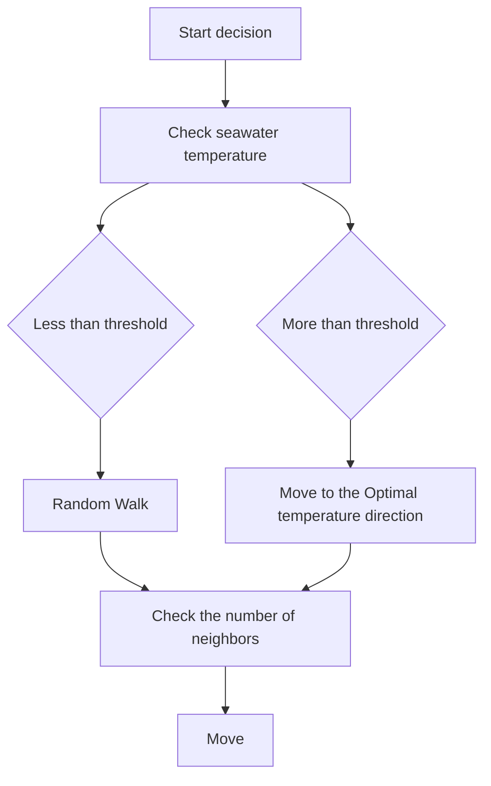

# Under Global Warming: Small Scottish Fishing Companies Business Strategies with Species Migration

Summary

Changes in global ocean temperature affect a large number of marine lives in colder environments. As a consultant to the Scottish North Atlantic Fisheries Management Consortium, our paper studied Scottish fishing companies’ business strategies with species migration

First, we collected sea surface temperature changes in the Northeast Atlantic and North Sea over the past forty years and use the Power Function to describe the temperature development trend and Trigonometric Function to describe the periodic temperature change, then we build a superposing model to predict sea temperature in the next fifty years. In order to identify the position of herring and mackerel, we established a Moore-type Cellular Automaton. Combined with predicted temperature data, the model shows herring will live in the sea near Alesund, Norway, which is 801 km northeast of Scotland, mackerel will live in the sea which is 268km northwest of Bergen, Norway and 544 km northeast of Scotland in 2070. Secondly, we studied the relationship between speeds and vessel design parameters and established a speed estimation formula. Combined with the fish preservation time for fresh, we established a Maximum Range of Fishing Vessel Model. Model shows the maximum range of a middle fishing vessel is a circle with a radius of 108.6km. Next, we selected 10 typical port locations in Scotland, substituted the range into the CA cell space, use the SST prediction data of best case and worst case to simulate the elapsed time of each port. The results show that the average elapsed time of each port in the best and worst case are 21.2 years and 13.7 years respectively and most ports will be unavailable after 2050.

Based on the above analysis, we believe that small fisheries companies should change their operations. In order to quantify the migration routes of herring and mackerel, we used Fourth-Order Polynomials to fit, so as to calculate the distance relations among ports, fishing boats and fish stocks. Then, we use above formula establish a Cost-Benefit Model to measure the benefits of two options that one is only relocating company to the port near fish population without buy new vessel, one is only buy ship with refrigeration without relocating. Model showed that between 2020 and 2040, the return of option 1 as a strategy is much higher than that of option 2, between 2040 and 2070, only option 2 as a strategy because option 1 fails. We also assess impact of the transfer of fisheries to the territorial waters of neighboring countries.

Not only that, we explore the factors that affect the return of options in the sensitivity analysis, namely the speed of the fishing boat, the cargo capacity and the price of fish to explore the role these factors play in the choice of strategy. Last but not least, we wrote an article for Hook Line and Sinker magazine to help fishermen analyze the seriousness of the current problem and provide them with solutions to improve their business in a straightforward way.

## Contents

## 1 Introduction .

1.1 Restatement of the Problem .  
1.2 Analysis of the Problem

## 2 Assumption ..

## 3 Notation .. . 3

## 4 Survival position of two fish species over next 50 years ..

4.1 Description of ocean temperature ..

4.1.1 Single-point model for prediction of sea temperature change. 3  
4.1.2 Ocean temperature changes in the overall research area . 5  
4.2 Cellular automaton model of fish migration .. 6

## 5 Duration that small fisheries companies can still harvest. . 8

5.1 Maximum range of fishing vessel model . 8  
5.2 the elapsed time of the catch at best and worst case . .. 10

## 5 Strategies of small fishing companies and future impact. 1

5.1 A fitting equation for the movement of a shoal of fish..  
5.2 The cost-benefit model of the two options . 12  
5.3 The impact of the transfer of fisheries to neighboring territorial waters . . 14

## 6 Sensitivity analysis. . 14

6.1 Impact of ship speed on strategy revenue .... . 14  
6.2 Impact of carrying capacity on strategy revenue ... .. 15  
6.3 Impact of fish price on strategy revenue .... . 16

## 7 Model Evaluation and Discussion . 17

7.1 Model Evaluation 17  
7.2 Further Discussion .. 18

## 9 An Article for Hook Line and Sinker (next page) . . 18

## References .. .. 21

## Appendices .... .. 22

Appendix A Plots . . 22  
Appendix B Code . . 24  
Appendix A Data..... . 28

## 1 Introduction

## 1.1 Restatement of the Problem

Global warming is an objective fact that people all over the world have to face. Since 1980, global temperatures have risen rapidly. According to satellite temperature detection, the tropospheric temperature has risen by 0.12 to 0.22 degrees (Celsius) every ten years. Relatively stable, but since 2015, ocean surface temperatures have increased year by year [1]. One of the immediate effects of global warming is rising sea temperatures, with summer temperatures in the North-East Atlantic off Scotland rising at 0.0048 degrees per year [2], rising seawater temperatures have led to the migration of marine habitats near Scotland, especially herring and mackerel, which are important for Scottish fisheries. The migration of herring and mackerel can make the fishing economy impractical for some smaller fisheries companies. Our team was hired as a consultant by the Scottish North Atlantic Fisheries Management Consortium to help study species migration and company management related issues. Under some assumptions, we need to model to solve the following series of problems:

1. Based on historical observation data of the Northeast Atlantic, study the trend of sea temperature change and the biological characteristics of two fish species, establish mathematical models to predict sea temperature changes and the most likely locations for mackerel and herring to survive in the next 50 years.  
2. Based on the sea temperature change model, determine the best- and worst-case sea temperature changes. Based on surveys of actual Scottish ports and small fishing vessels, establish a fishing cost model for small fishing vessels to determine the elapse time that can’t harvest.  
3. By investigating fishery data, modeling the revenues of small fisheries companies, and assessing whether business operation should be changed. At the same time, we need to study the influence of various strategies on the company's operations, determine the optimal port migration location, the number of small fishing vessels, etc. Finally, the effect of fishery transfer to the territorial sea of another country is need to be studied.

## 1.2 Analysis of the Problem

The scope of all our research objects is limited to the oceans around the United Kingdom and the adjacent European continent. The related oceans include the Northeast Atlantic Ocean, the North Sea, and the Norwegian Sea. The scope of the study is the past 40 years and the next 50 years (2070-2080). The types of marine organisms studied include herring and mackerel, which are two types of fish with significant changes in migration. The area of the study refers to Figure 1.

First of all, considering that the sea temperature changes have a clear trend over time, and that the internal temperature changes every year are periodic. We assume that the overall upward trend is constant, so we established a superposition fitting equation, using a power function to fit the overall trend, and then using a periodic function to fit the periodic changes in sea temperature. The fitting is closer to the actual data, and we use this model to predict the temperature change in the study area.

Biological population migration is a group behavior, including chaos and randomness, so we use cellular automata to simulate the migration behavior of fish schools. We simulated the land and sea terrain of the study area and divided the entire range into 7x7 blocks, each of which changed in temperature over time. Here we assume that the biggest factor influencing fish migration is seawater temperature, so the driving force for cell movements comes largely from the pursuit of an appropriate temperature. The results show that after 50 years, both species will move far north.

Secondly, for fishing boats without refrigeration equipment, the most important factor restricting the voyage size is the freshness of the fishing products. Fishes without refrigeration will lose their freshness after a period of time at room temperature, leading to spoilage. Before the deterioration, it is necessary to ensure that the fishing boat can return to the port, so the range of the fishing boat is limited. We have established speed models for fishing boats of different sizes and powers. It is assumed that fishing companies use medium-sized fishing boats to harvest and find their speed to obtain a circular driving range with a maximum range. Beyond this range, fishing boats will not be able to operate due to fish spoilage. Next, we analyze each of the main fish ports in Scotland, and superimpose the fishing range and fish


<details>
<summary>text_image</summary>

67
65
Norwegian sea
60
Shetland Is
North Sea
55
Scotland
50
Celtic sea
-18 -15 -10 0 5 10
</details>

Figure 1: Map of study area

migration process. The fishing range and the fish migration process are superimposed to obtain the time point at which the school of fish intersects and leaves the fishing range, and calculates the duration of operation. Next, we need to substitute the slowest heating rate and the fastest heating rate model into the cellular automaton to find the fishing duration in two extreme cases.

Thirdly, based on the movement of fish group in the next 50 years, we need to analyze different fishing ports and choose the best option for them. For option 1, we assume that the fishing port will be relocated once a year, each time moving to a coastal area with proper distance to keep the fish fresh, so that the income will be the same as usual. For option 2, we need to get the relationship between the position and time of the fish group through the predicted moving track, and calculate the distance between the fish group and the port every year, then calculate the number of fishing boats going to sea every year through the distance, finally get the total fishing amount and income. For each fishing port, compare the income of the two options and select a better alternative. It is worth noting that after a certain time point, the fish may be too far away to execute option 1, only option 2.

## 2 Assumption

Our models rely on the following assumptions. Some assumptions are throughout the text. These assumptions will simplify the problem. Other assumptions may not be as follows, but will be put forward in the model push.

1. Sea temperature rise is mainly caused by the absorption of heat generated by global warming. The trend of sea temperature changes is consistent with the previous years and will not rise or fall suddenly. Only float within a certain range.

2. The population of mackerel and herring will not change in 50 years. Regardless of the predator, living environment and human activities, each fish in the school is an adult fish, and it is sensitive to temperature.  
3. Small fishery companies' ships do not have refrigeration units and return to port immediately after catching fish without intermediate stops.  
4. Fishing boats equipped with refrigeration can keep fish fresh indefinitely.  
5. In order to ignore the rest time of fishermen, it is believed that every fishing boat works 24 hours a day without rest

## 3 Notation

We begin by defining a list of nomenclature (symbols) used in this report, cf. Table1.

Table 1: Symbols and Description

<table><tr><td>Symbols</td><td>Description</td></tr><tr><td>a</td><td>The coefficient of temperature growth rate</td></tr><tr><td>b</td><td>The exponential of the rate of temperature increase</td></tr><tr><td>c</td><td>The base of temperature increase</td></tr><tr><td> $t_{optimal}$ </td><td>The optimum temperature of fish school to survive</td></tr><tr><td> $t_{current}$ </td><td>The temperature of the block where the fish is currently located</td></tr><tr><td> $p_{stimulate}$ </td><td>The degree of stimulation of the fish school by the temperature</td></tr><tr><td> $p_{threshold}$ </td><td>The threshold of fish school for temperature changes</td></tr><tr><td> $v_{vessel}$ </td><td>The speed of fishing vessels</td></tr><tr><td> $D_{max}$ </td><td>Maximum range of a fishing vessel</td></tr><tr><td> $p_i$ </td><td>Fish coordination</td></tr><tr><td> $T_i$ </td><td>The ship period</td></tr><tr><td> $d_i$ </td><td>Distance between ship and fish stock</td></tr><tr><td> $T_y$ </td><td>Time of 365 days multiply 24 hours</td></tr><tr><td> $W_{max}$ </td><td>Maximum carrying capacity of a ship</td></tr><tr><td>R</td><td>Revenue of a company</td></tr><tr><td>R1</td><td>Revenue of a company in option1</td></tr><tr><td>R2</td><td>Revenue of a company in option2</td></tr><tr><td>S</td><td>Fish price</td></tr></table>

## 4 Survival position of two fish species over next 50 years

## 4.1 Description of ocean temperature

## 4.1.1 Single-point model for prediction of sea temperature change

We collected temperature data from the NOAA in the study sea area from 1990, and fitted the data from 2012. The reason for selecting data after 2012 is that the changes in ocean temperature were gentle before 2012 and after 2012 The temperature data began to rise, and we assume that the temperature change will continue in this trend in the future. Figure 3 shows the changes in SST over the northeast Atlantic in western Scotland since 1990.

In order to make calculations convenient and convenient for later modeling, we divide the study area into 7×7 blocks, each block is given a number, cf. Figure 2, the longitude and latitude spanned by each block are 4 ° and 3 ° respectively. We assume that the sea temperature in each block is the same. Take the block's center point temperature as a representative of the block temperature, and study 49 blocks separately. Each block is regarded as a point to predict the temperature change.

The SST curve can be regarded as a periodic function with an upward trend. We tried to predict the time series model. The results show that the model


<details>
<summary>text_image</summary>

1
2
3
4
5
6
7
1
2
3
4
5
6
7
</details>

Figure 2: 7×7 map division


<details>
<summary>line chart</summary>

| year | temperature |
| ---- | ----------- |
| 1990 | ~1.5        |
| 1991 | ~9.5        |
| 1992 | ~1.5        |
| 1993 | ~8.5        |
| 1994 | ~1.5        |
| 1995 | ~9.5        |
| 1996 | ~1.5        |
| 1997 | ~10.5       |
| 1998 | ~1.5        |
| 1999 | ~8.5        |
| 2000 | ~10.5       |
| 2001 | ~4.5        |
| 2002 | ~9.5        |
| 2003 | ~12.5       |
| 2004 | ~2.5        |
| 2005 | ~11.5       |
| 2006 | ~1.5        |
| 2007 | ~11.5       |
| 2008 | ~12.5       |
| 2009 | ~9.5        |
| 2010 | ~11.5       |
| 2011 | ~1.5        |
| 2012 | ~6.5        |
| 2013 | ~12.5       |
| 2014 | ~1.5        |
| 2015 | ~10.5       |
| 2016 | ~12.5       |
| 2017 | ~3.5        |
| 2018 | ~12.5       |
| 2019 | ~3.5        |
</details>

Figure 3: SST curve in the Northeast Atlantic in western Scotland since 1990

distortion is very serious over a 50-year span. Therefore, we use a simple power function and a periodic function superposition to solve problem. Let the power function (1) represent the overall trend, the growth rate of temperature depends mainly on the coefficient a in front of x and the exponent b of x

$$
f (x) = a x ^ {b} + c \tag {1}
$$

Where x represents time, unit is day. Let the periodic function of temperature change throughout the year be (2)

$$
g (x) = p \sin (q x + r) \tag {2}
$$

Combining (1) and (2) linearly to obtain the overall prediction equation

$$
p r e (x) = p \sin (q x + r) + a x ^ {b} + c \tag {3}
$$

Taking block (3,3) as an example, the overall prediction equation is substituted into the historical data, and the parameters obtained are (4)

$$
p = 4. 1 9 4, q = 0. 0 1 7 2, r = 2. 3 5 4 2 5, a = 1. 2 8 9 e ^ {- 1 1}, b = 2. 3 4 8, c = 1. 3 9 9 \tag {4}
$$

Figure 4 shows its fitted image and prediction curve.  


<details>
<summary>line chart</summary>

| time | temperature |
| ---- | ----------- |
| 2012 | ~1.5        |
| 2013 | ~9.5        |
| 2014 | ~1.5        |
| 2015 | ~9.5        |
| 2016 | ~1.5        |
| 2017 | ~9.5        |
| 2018 | ~1.5        |
| 2019 | ~9.5        |
| 2020 | ~1.5        |
| 2021 | ~9.5        |
| 2022 | ~1.5        |
| 2023 | ~9.5        |
| 2024 | ~1.5        |
| 2025 | ~9.5        |
| 2026 | ~1.5        |
| 2027 | ~9.5        |
| 2028 | ~1.5        |
| 2029 | ~9.5        |
| 2030 | ~1.5        |
| 2031 | ~9.5        |
| 2032 | ~1.5        |
| 2033 | ~9.5        |
| 2034 | ~1.5        |
| 2035 | ~9.5        |
| 2036 | ~1.5        |
| 2037 | ~9.5        |
| 2038 | ~1.5        |
| 2039 | ~9.5        |
| 2040 | ~1.5        |
| 2041 | ~9.5        |
| 2042 | ~1.5        |
| 2043 | ~9.5        |
| 2044 | ~1.5        |
| 2045 | ~9.5        |
| 2046 | ~1.5        |
| 2047 | ~9.5        |
| 2048 | ~1.5        |
| 2049 | ~9.5        |
| 2050 | ~1.5        |
| 2051 | ~9.5        |
| 2052 | ~1.5        |
| 2053 | ~9.5        |
| 2054 | ~1.5        |
| 2055 | ~9.5        |
| 2056 | ~1.5        |
| 2057 | ~9.5        |
| 2058 | ~1.5        |
| 2059 | ~9.5        |
| 2060 | ~1.5        |
| 2061 | ~9.5        |
| 2062 | ~1.5        |
| 2063 | ~9.5        |
| 2064 | ~1.5        |
| 2065 | ~9.5        |
| 2066 | ~1.5        |
| 2067 | ~9.5        |
| 2068 | ~1.5        |
| 2069 | ~9.5        |
| 2070 | ~1.5        |
| 2071 | ~9.5        |
| 2072 | ~1.5        |
| 2073 | ~9.5        |
| 2074 | ~1.5        |
| 2075 | ~9.5        |
| 2076 | ~1.5        |
</details>

Figure 4: Prediction curve of block (3,3)

It can be seen from the figure 4 that the first half of the prediction equation fits the historical data to a high degree, and the second half without red line is slow climb, as shown in the figure 4, in the next 10 years, which is 2030, the temperature reached 6 , the highest temperature occurred in summer, about 10 , and the lowest temperature occurred in winter, about 2 . After 50 years, that is, 2070, the annual average temperature reached 9 . The highest temperature is 12.2 and the lowest temperature is 4.2 . Refer to Appendix A for the temperature prediction diagram for all blocks.

## 4.1.2 Ocean temperature changes in the overall research area

We plot the temperature of the research area at different points in time over the next 50 years, the temperature situation is displayed at an interval every ten years, and the temperature is taken as the average temperature of the year, cf. Figure 5


<details>
<summary>heatmap</summary>

| | 1 | 2 | 3 | 4 | 5 | 6 | 7 |
|---|---|---|---|---|---|---|---|
| 1 | 5.5 | 5.3 | 4 | 3.1 | 3.6 |     |     |
| 2 | 6.8 | 7 | 6 | 5.4 | 5.1 | 4 |     |
| 3 | 7 | 6.9 | 6.7 | 6.1 | 6.4 |     |     |
| 4 | 7.4 | 7.6 | 6.8 | 5.6 | 6.7 |     |     |
| 5 | 7.5 | 7.8 | 6.9 | 5.9 | 7.2 | 7.4 |     |
| 6 | 7.9 | 7.6 |     |     | 8 |     |     |
| 7 | 8 | 8.2 | 8.3 |     |     |     |     |
</details>


<details>
<summary>heatmap</summary>

| Region | 1   | 2   | 3   | 4   | 5   | 6   | 7   |
|--------|-----|-----|-----|-----|-----|-----|-----|
| 1      | 7.8 | 7   | 6.6 | 5.2 | 4.6 |     |     |
| 2      | 7   | 7.8 | 7   | 6.9 | 6.8 | 5.2 |     |
| 3      | 7.5 | 7.9 | 7.4 | 7   | 7.2 |     |     |
| 4      | 7.8 | 8.1 | 7.5 | 7.4 | 7.2 |     |     |
| 5      | 7.9 | 8.3 | 7.8 | 7.9 | 7.5 | 7.1 |     |
| 6      | 8.5 | 8.3 |     |     |     |     |     |
| 7      | 8.4 | 8.6 | 8.7 | 9.6 |     |     |     |
</details>


<details>
<summary>heatmap</summary>

| | 1 | 2 | 3 | 4 | 5 | 6 | 7 |
|---|---|---|---|---|---|---|---|
| 1 | 8 | 7.5 | 6.9 | 7.2 | 6 |  |  |
| 2 | 7.5 | 8.4 | 8 | 8 | 8.1 | 7 |  |
| 3 | 8 | 8.8 | 8.3 | 8.1 | 8.4 |  |  |
| 4 | 8.2 | 8.7 | 8.1 | 8.4 | 8.3 |  |  |
| 5 | 8.4 | 9.1 | 8.3 | 8.3 | 8.4 | 8 |  |
| 6 | 9.1 | 8.9 | 9.2 | 9.9 | 9 |  |  |
| 7 | 8.9 | 9.3 | 9.2 | 9.9 |  |  |  |
</details>

Figure 5: Temperature over next 50 years, from left to right is 2030,2050,2070

Conclusion From Figure 5 that the temperature of the sea area near Scotland gradually rises with time. It will be about 6.5 degrees in the Northeast Atlantic in 2030, and 4 degrees in the Norwegian sea. By 2050, the temperature in these two regions will be 7 degrees and 5 degrees at the same time, the temperature near the Celtic Sea and the English Channel rose to 9 degrees. In 2070, the Norwegian Sea warmed to 6-7 degrees, the Northeast Atlantic warmed to 8 degrees, and the Celtic Sea rose to 10 degrees. From 2030 to 2070, the Northeast Atlantic rises by an average of 0.0375 per year, and the Norwegian Sea rises by an average of 0.075 degrees per year.

## 4.2 Cellular automaton model of fish migration

The North Atlantic mackerel lives in the ocean at a depth of 0-200 meters per year. For the convenience of calculation, we assume that the adult fish is about 27cm in length, and regardless of the characteristics of the mackerel close to the continental shelf during the spawning period, it is believed that the habitat migration of mackerel is mainly affected by temperature, and the survival temperature range of mackerel is 7-17.5 , and the optimal temperature is $6 . 6 \mathcal { C }$ [3]. Similarly, Atlantic herrings live in the ocean at a depth of 0-364 meters. For the convenience of calculation, we assume that the adult fish body length is 30cm, and Regardless of the impact of other marine factors on fish migration, it is believed that the habitat of herring depends mainly on the temperature of the ocean, and that the survival temperature range of herring is 0.5-11.2 , and the optimal temperature is $5 . 6 \mathcal { C }$ [4]. In the future changes, the numbers of these two fish species will not change.

We use the Moore-type cellular automaton to build the fish migration model. The neighbors of the Moore-type cellular automaton are 8 cells around the cell, while 4 cells of the Von Neuman-type cell. Set the research area as cell space with a size of 300x300 pixels, similar to the SST model, divided into 7x7 blocks, each block is 43x43 pixels. Each block has a different temperature. Based on the above assumptions for fish, in each step, every small school of fish, that is, a cell, has two modes of action. When fish school is in an appropriate temperature area, they will choose a random nearby position and move randomly. The probability depends on the number of nearby fishes. The more nearby fishes, the greater the probability of moving. This is to simulate the behavior of fishes in allocating living resources, because the unit area of plankton that the fish prey on is certain. When the temperature of the area where fish school exceeds the threshold of fish school temperature, fish school will move to the block near the appropriate temperature, and fish school still has a chance to move randomly at this time. The cell’s mode of action is shown in Figure 6.


<details>
<summary>flowchart</summary>


</details>

Figure 6: Cell action mode

In order to better reflect the sensitivity of the organism to temperature, we assume that the sensitivity of the fish to the temperature changes conforms to the S-curve, so we use the Sigmoid function to represent the degree of stimulation of the fish to different temperatures. Let $t _ { o p t i m a l }$ denote the optimum temperature of fish school, $t _ { c u r r e n t }$ denote the temperature of the school where the school is currently located, and $p _ { s t i m u l a t e }$ denote the degree of stimulation of the fish school by the temperature difference from the appropriate temperature. $p _ { t h r e s h o l d }$ represents the threshold of fish school for temperature changes. Thus, the degree of temperature difference stimulus can be expressed as (5).

$$
p _ {\text { stimulate }} = \frac {1}{1 + e ^ {- (| t _ {\text { current }} - t _ {\text { optimal }} | - 5)}} \tag {5}
$$

The sigmoid function maps values in the real range to values in [0,1], so $p _ { t h r e s h o l d } \in [ 0 , 1 ]$ . When $p _ { t h r e s h o l d } > p _ { s t i m u l a t e }$ , the temperature change is not enough to drive fish school to move, and fish school does random motion. When $p _ { t h r e s h o l d } < p _ { s t i m u l a t e }$ , the temperature drives fish school to move towards a suitable place.

The sea temperature model prediction data is substituted into the cell automata block. From the literature we obtained the initial habitat of herring [5] and mackerel [6] respectively. Here we assume that the two fish parameters are generally shown in Table 2, the model operation results are shown in Table 3, and the position distribution is shown in Figure 7.

Table 2: Initial parameters of two fish

<table><tr><td>Species</td><td>Parameter</td><td>Value</td></tr><tr><td rowspan="3">Herring</td><td> $t_{optimal}$  (°C)</td><td>5.6</td></tr><tr><td> $p_{threshold}$ </td><td>0.2</td></tr><tr><td>Initial position</td><td>55°N 3°E (In the middle of North Sea)</td></tr><tr><td rowspan="3">Mackerel</td><td> $t_{optimal}$  (°C)</td><td>6.6</td></tr><tr><td> $p_{threshold}$ </td><td>0.1</td></tr><tr><td>Initial position</td><td>59°N 5°W (114 km northwest of Shetland)</td></tr></table>


<details>
<summary>text_image</summary>

1
2
3
4
5
6
7
1
2
3
4
5
6
7
2020
</details>


<details>
<summary>text_image</summary>

1 2 3 4 5 6 7
1
2
3
4
5
6
7
2030
</details>


<details>
<summary>text_image</summary>

1 2 3 4 5 6 7
1
2
3
4
5
6
7
2040
</details>


<details>
<summary>text_image</summary>

1
2
3
4
5
6
7
1
2
3
4
5
6
7
2050
</details>


<details>
<summary>text_image</summary>

1 2 3 4 5 6 7
1
2
3
4
5
6
7
2060
</details>


<details>
<summary>text_image</summary>

1
2
3
4
5
6
7
1
2
3
4
5
6
7
2070
</details>

Figure 7 (a): Future distribution of herring in the North Sea


<details>
<summary>text_image</summary>

1 2 3 4 5 6 7
1
2
3
4
5
6
7
2020
1
2
3
4
5
6
7
2030
1 2 3 4 5 6 7
1
2
3
4
5
6
7
2040
1 2 3 4 5 6 7
1
2
3
4
5
6
7
2050
1
2
3
4
5
6
7
2060
1
2
3
4
5
6
7
2070
</details>

Figure 7 (b): Future distribution of mackerel

Conclusion about most likely location For herrings living in the North Sea, the possible location of herring in the next 50 years will gradually move northward, leaving the North Sea and close to the Norwegian Sea. In 2030, 10 years later, the fish school will move north to about 544 km west of Scotland, and 20 years later, it will move 230 km north in 2040. It will be close to the waters near the port of Åkrehamn in Norway. In 2050, 30 years later, the school of fish will continue moved 109 km north to reach the waters near Bergen, Norway, and in 2060, 40 years later, it traveled 194 km north. Finally it moved 310 km northeast in 2070, which is 50 years later, to reach the sea near Namsos.

For mackerel living in the Northeast Atlantic, the possible location of mackerel in the next 50 years will also gradually move northeast, gradually leaving the waters near Scotland and reaching the coast of Norway. By 2030, 10 years later, the mackerel school will move to the middle of Scotland and Norway. By 2040, 20 years later, the mackerel school will continue to move 222km westward and reach the waters near Stavanger, Norway. Between 2050 and 2060, the school of fish migrated northward, until 2070, 50 years later, the school of fish's habitat moved to 268km northwest of Bergen, Norway.

## 5 Duration that small fisheries companies can still harvest

Based on the results of our current analysis, we can know the migration rate and location of the two fish schools in the next 50 years. At the same time, we also know that for the different values of the parameters a , b , and c in the temperature prediction model, different heating rates can be obtained, and different seawater temperature changes will lead to different rates of fish migration, that is, although fish migration the route is the same, but at different rates of temperature change, the time to reach the same location may be different. Here we insist on the assumption that small fishing vessels have no refrigeration equipment and return to port immediately after harvesting fish at a certain point.

## 5.1 Maximum range of fishing vessel model

There are many factors that limit the reach of small fishing vessels, such as the maximum voyage, the cost-effectiveness ratio of fishing and fuel consumption value, etc. We believe that the most important factor in the current situation is to maintain the freshness of marine fish and avoid rotting when transported to the fishing port. In the absence of refrigeration equipment, we assume that the maximum time a fish stays fresh is $t _ { \mathit { f r e s h } }$ and the speed of the fishing boat is $\nu _ { \nu e s s e l }$ . According to the fishing boat speed evaluation formula [7], the speed of a vessel is (6)

$$
v _ {v e s s e l} = 1. 8 4 \left(\frac {P}{\Delta}\right) ^ {0. 2 3 7} \sqrt {L} \tag {6}
$$

Where P is main engine power (kW),  is displacement (ton), L is the length between perpendiculars, that is, the horizontal distance between the forward and aft perpendiculars (m). Therefore, let us denote the longest voyage distance of a medium-sized fishing boat as $D _ { \mathrm { m a x } }$ , then $D _ { \mathrm { m a x } }$ can be expressed as (7)

$$
D _ {\max} = t _ {f r e s h} v _ {v e s s e l} \tag {7}
$$

Based on the information consulted, fishing boats generally less than 12m in length are classified as small fishing boats, and 12-24m are classified as medium-sized fishing boats. According to the Scottish Sea fisheries report, we set the hull length L is 24m, power P is 440kw, and displacement  is 70t [8] . We get $\nu _ { v e s s e l } = 1 8 . 1 k m / s$ . Set $t _ { \mathit { f r e s h } }$ to 6 hours, then the boat can travel $D _ { \mathrm { m a x } } = 1 0 8 . 6 k m$ . At this speed, the medium-sized fishing boat can travel up to 108.6km after catching the fish. Beyond this voyage, the fish will be spoiled because the preservation period has passed. At the capture point, the area of action of the fishing boat is about 74066km2.

There are many fishing ports in Scotland. According to Scottish fishery statistics, we have simplified the distribution of Scottish ports to one region correspond one port [9]. Then the activity range of each port for fishing boat is a circular area with a radius of about 108km in the vicinity, cf. Figure 8.


<details>
<summary>text_image</summary>

r = 108.6 km
v = 18.1 km/s
S = 74066 km²
→
Shetland
Orkney
Kinlochbervie
Stormoway
Portree
Campbeltown
Ayr
Fraseburgh
Anstruther
Eyemouth
</details>

Figure 8: Fishing port and range of a fishing boat

## 5.2 the elapsed time of the catch at best and worst case

For the carbon emissions in the next 50 years assessed by different experts, we adjust the a b c, , parameters in the temperature prediction model to get the best- and worst-case sea temperature changes. Still taking (3,3) blocks as an example, the adjusted best case the following parameters are

$$
a = 1. 3 1 4 e ^ {- 1 1}, b = 2. 3 4, c = 3. 8 9 9 \tag {8}
$$

While worst case is

$$
a = 1. 2 8 9 e ^ {- 1 1}, b = 2. 3 4 8, c = 1. 3 9 9 \tag {9}
$$

Finally, we have a possible sea temperature change interval in the next 50 years. In the worst case, the temperature of block (3,3) will reach 9 degrees in 2070, and in the best case, the temperature of block (3,3) will reach 7.1 degrees.cf. Figure 9.


<details>
<summary>line chart</summary>

| time | best case | worst case | real data |
|------|-----------|------------|-----------|
| 2012 | 3.0       | 1.0        | 1.0       |
| 2014 | 9.0       | 1.0        | 10.0      |
| 2016 | 9.0       | 1.0        | 1.0       |
| 2018 | 9.0       | 1.0        | 1.0       |
| 2020 | 9.0       | 1.0        | 11.0      |
| 2022 | 9.0       | 1.0        | 1.0       |
| 2024 | 9.0       | 1.0        | 1.0       |
| 2026 | 9.0       | 1.0        | 1.0       |
| 2028 | 9.0       | 1.0        | 1.0       |
| 2030 | 9.0       | 1.0        | 1.0       |
| 2032 | 9.0       | 1.0        | 1.0       |
| 2034 | 9.0       | 1.0        | 1.0       |
| 2036 | 9.0       | 1.0        | 1.0       |
| 2038 | 9.0       | 1.0        | 1.0       |
| 2040 | 9.0       | 1.0        | 1.0       |
| 2042 | 9.0       | 1.0        | 1.0       |
| 2044 | 9.0       | 1.0        | 1.0       |
| 2046 | 9.0       | 1.0        | 1.0       |
| 2048 | 9.0       | 1.0        | 1.0       |
| 2050 | 9.0       | 1.0        | 2.0       |
| 2052 | 9.0       | 1.0        | 1.0       |
| 2054 | 9.0       | 1.0        | 1.0       |
| 2056 | 9.0       | 1.0        | 1.0       |
| 2058 | 9.0       | 1.0        | 1.0       |
| 2060 | 9.0       | 1.0        | 1.0       |
| 2062 | 9.0       | 1.0        | 1.0       |
| 2064 | 9.0       | 1.0        | 1.0       |
| 2066 | 9.0       | 1.0        | 1.0       |
| 2068 | 9.0       | 1.0        | 1.0       |
| 2070 | 9.0       | 1.0        | 1.0       |
| 2072 | 9.0       | 1.0        | 1.0       |
| 2074 | 9.0       | 1.0        | 1.0       |
| 2076 | 9.0       | 1.0        | 1.0       |
| ... (approximate values)<lcel><lcel><lcel><lcel><nl>
</details>

Figure 9: block (3,3) temperature prediction

In the case of accelerated temperature rise, the migration of fish will accelerate. When the coverage of a port and the habitat of fish no longer intersect, we reckon that the distance is too far to harvest at this time point. After substituting the temperature prediction equation and the port range into the cellular automaton, the model results are shown in Table 3.

Conclusion In the best case, elapsed time is 33 years, after that all fishery companies in each port except Shetland will not be able to capture because they are too far away. In the worst case, the elapsed time is approximately 21 years. One interesting fact is that the small fishing companies on Shetland won't be able to fish until 2020-2035, but after that, both mackerel and herring habitat have moved to Shetland, allowing the company to harvest until 2070. Despite low initial value, Shetland has huge fishing potential in the future of global warming.

Table 3: The elapsed time (year) in two cases the ports cannot harvest

<table><tr><td>Fishing Port</td><td colspan="2">Best Case</td><td colspan="2">Worst Case</td></tr><tr><td>Fish Type</td><td>herring</td><td>mackerel</td><td>herring</td><td>mackerel</td></tr><tr><td>Shetland</td><td>30(2050-2070)</td><td>10(2060-2070)</td><td>30(2035-2055)</td><td>20(2050-2070)</td></tr><tr><td>Orkney</td><td>0</td><td>33(2020-2053)</td><td>0</td><td>21(2020-2041)</td></tr><tr><td>Kinlochbervie</td><td>0</td><td>25(2020-2045)</td><td>0</td><td>15(2020-2035)</td></tr><tr><td>Stornoway</td><td>0</td><td>29(2020-2049)</td><td>0</td><td>14(2020-2034)</td></tr><tr><td>Portree</td><td>0</td><td>20(2020-2040)</td><td>0</td><td>6(2020-2026)</td></tr><tr><td>Campbeltown</td><td>0</td><td>20(2020-2040)</td><td>0</td><td>5(2020-2025)</td></tr><tr><td>Ayr</td><td>0</td><td>0</td><td>0</td><td>0</td></tr><tr><td>Fraseburgh</td><td>23(2020-2043)</td><td>0</td><td>13(2020-2033)</td><td>0</td></tr><tr><td>Anstruther</td><td>13(2020-2033)</td><td>0</td><td>8(2020-2028)</td><td>0</td></tr><tr><td>Eyemouth</td><td>9(2020-2029)</td><td>0</td><td>5(2020-2025)</td><td>0</td></tr></table>

## 5 Strategies of small fishing companies and future impact

Based on the above analysis, we know that in the worst case, except for the port in Shetland, the rest of the ports that rely on fishing vessels without refrigeration devices will not be able to catch two kinds of fish. Without any action, these small fisheries company will go bankrupt because it has no income. Therefore, we believe that these small fishing companies should make changes to their operations. After determining that small-scale fisheries companies should change their operations, we should clearly define two strategic options.

(Option 1) Does not buy new fishing boats. The port should be relocated every once in a while, and the cost of the relocation is expressed by $C _ { r e l }$ . After the relocation, the port always guarantees that the fish population is within $D _ { \mathrm { m a x } } = 1 0 8 . 6 k m$ . Assuming that the boat does not rest, it will return from the port to the school after catching the fish, and all will fish according to the longest distance of 108.6km.  
(Option 2) Does not replace fishing port location. Boat switch to a new type of refrigerated fishing boat. Assume that this kind of boat can keep unlimited freshness power, and the speed is $\nu _ { \nu e s s e l } = 1 8 .$ .1 / km h like a boat without refrigerating device. There is no distance limit. Use $C _ { b o a t }$ to indicate the cost of purchasing a boat

## 5.1 A fitting equation for the movement of a shoal of fish

In Section 4.2, we used a cellular automaton to simulate the movement course of the school of fish. In order to quantitatively describe the relationship between the migration route of herring and mackerel and time, we need to establish a fitting equation for the two fish routes fitting. We define the location of a fish's habitat (that is, this school of fish) as the geometric center of its overall range. The coordinates of the two fish migration routes are shown in Table 4. The fourth-order polynomial is used to fit the changes in longitude and latitude. The fitting formula is (10)

$$
\text { position } = p _ {1} i ^ {4} + p _ {2} i ^ {3} + p _ {3} i ^ {2} + p _ {4} i ^ {1} \tag {10}
$$

Where i the number of year. The fitting results are shown in Figure 10. The polynomial parameters are shown in Appendix C. The position coordinates of the school of fish in the i year are expressed as (11)

$$
p _ {i} = (l o n (i), l a t (i)) \tag {11}
$$

Where $p _ { i }$ is the fish coordinates, $l o n ( i )$ is the longitude, and $l a t ( i )$ is the latitude.

Table 4: Route Position

<table><tr><td>Time</td><td>Herring</td><td>Mackerel</td></tr><tr><td>2020</td><td>55, 3</td><td>58, -6</td></tr><tr><td>2030</td><td>58, 4</td><td>59, -0.4</td></tr><tr><td>2040</td><td>59.5, 4.4</td><td>58, 3.2</td></tr><tr><td>2050</td><td>61, 4.2</td><td>59, 4.6</td></tr><tr><td>2060</td><td>62, 4</td><td>60, 4</td></tr><tr><td>2070</td><td>65, 8</td><td>60, 0.1</td></tr></table>


<details>
<summary>line chart</summary>

| time | latitude |
| ---- | -------- |
| 2020 | 3.0      |
| 2030 | 4.0      |
| 2040 | 4.5      |
| 2050 | 4.3      |
| 2060 | 4.5      |
| 2070 | 8.0      |
</details>


<details>
<summary>line chart</summary>

| time | latitude |
| ---- | -------- |
| 2020 | 55       |
| 2030 | 58       |
| 2040 | 60       |
| 2050 | 61       |
| 2060 | 63       |
| 2070 | 65       |
</details>

Figure 10 (a): Herring fitting curve


<details>
<summary>line chart</summary>

| time | longitude |
| ---- | --------- |
| 2020 | -6        |
| 2030 | -2        |
| 2040 | 3         |
| 2050 | 5         |
| 2060 | 3         |
| 2070 | 0         |
</details>


<details>
<summary>line chart</summary>

| time | latitude |
| ---- | -------- |
| 2020 | 58.0     |
| 2030 | 58.8     |
| 2040 | 58.3     |
| 2050 | 59.0     |
| 2060 | 60.5     |
| 2070 | 60.1     |
</details>

Figure 10 (b): Mackerel fitting curve

## 5.2 The cost-benefit model of the two options

When a fishing boat starts fishing from the port, it needs to travel one round trip. We define the fishing boat from departure to the position of the school of fish. The time of returning to the port is a period $T$ . The position of the school of fish changes every year, in the i year. The period is denoted by $T _ { i }$ , we define $d _ { i }$ as the distance from the port to the school of fish in the i year, and the distance can be expressed as (12)

$$
d (i) = \left| p (i) - p _ {\text { port }} \right| \tag {12}
$$

Where $p _ { p o r t }$ is the position of fishing port. Since we know the $\nu _ { v e s s e l }$ , so we can represent $T _ { i }$ as

$$
T (i) = \frac {2 d (i)}{v _ {\text { vessel }}} \tag {13}
$$

We assume that the fishing boat works 24 hours a day for 365 days, and time is $T _ { y }$ . The weight of the cargo carried by each trip is $W _ { \mathrm { m a x } }$ , and the price of fish is S . Then the total revenue R of a fishing boat in year i is

$$
R (i) = \frac {T _ {y}}{T (i)} W _ {\max} S \tag {14}
$$

As for Option 1, because it does not include ships with refrigeration, the solution can only be implemented until 2040. Assuming that the port location needs to be changed every 5 years, the revenue R1 is

$$
R 1 = \sum_ {i = 2 0 2 0} ^ {2 0 4 0} R (i) - 1 0 C _ {r e l} \tag {15}
$$

Where $C _ { r e l }$ is cost of relocation and $d ( i ) \in ( 0 , D _ { \operatorname* { m a x } } ]$ . For the option 2, since it is not a replaceable port, but the navigation distance of the ship is not limited, this option can be implemented until 2070, and its total revenue R2 is

$$
R 2 = \sum_ {i = 2 0 2 0} ^ {2 0 7 0} R (i) - a C _ {\text { boat }} \tag {16}
$$

Where $C _ { b o a t }$ is cost of buying a new refrigerated fishing boat and a is number of boats, we assume it is 1.

The data collection The average selling prices of herring and mackerel obtained from the Scottish Fisheries Statistics Report are $S _ { h e r r i n g } = 4 4 4 . 7 5$ pound and $S _ { m a c \ker e l } = 8 8 3 . 7 5$ pound respectively [10]. At the same time, we checked the information to find that the cost of a relocation $R _ { r e l }$ is 750,000 pounds, and the price of buying a fishing boat with refrigeration $R _ { b o a t }$ is 220,000 pounds. At the same time we can know the coordinates of the port, see Appendix C, substitute the cost-benefit model for calculation, and calculate the benefits of 10 ports under the two schemes respectively. After comparison, it is learned that the benefit of option 1 is much higher than that of option 2 in 2020 to 2040. Figure 11 shows Eyemouth port as an example to show the difference revenue comparison by year, for all ports revenue info, refer Appendix A.


<details>
<summary>line chart</summary>

| year | option1 | option2 |
| ---- | ------- | ------- |
| 2020 | 0.4e8   | 0.05e8  |
| 2022 | 0.2e8   | 0.05e8  |
| 2024 | 0.8e8   | 0.05e8  |
| 2026 | 2.6e8   | 0.05e8  |
| 2028 | 0.5e8   | 0.05e8  |
| 2030 | 0.3e8   | 0.05e8  |
| 2032 | 0.3e8   | 0.05e8  |
| 2034 | 1.6e8   | 0.05e8  |
| 2036 | 2.0e8   | 0.05e8  |
| 2038 | 0.7e8   | 0.05e8  |
| 2040 | 0.7e8   | 0.05e8  |
</details>

Figure 11: A comparison of the benefits of the two options at the port of Eyemouth

The strategy of small fishing companies In the interval from 2020 to 2040, the benefits of Option 1 in the 10 ports are far greater than Option 2, and at this time, Option 1, relocation is an optimal choice. After 2040, since all ports except Shetland will not be able to use Option 1, in the period from 2040 to 2070, we cannot compare the advantages and disadvantages of the two options, and we can only choose Option 2 and purchase fishing boats with refrigeration devices to harvest.

## 5.3 The impact of the transfer of fisheries to neighboring territorial waters

As the temperature of the ocean continues to rise, the fish populations in the waters around Scotland, including herring and mackerel, will gradually migrate northward, eventually migrating to the Norwegian Sea and distributed along the Norwegian coastline. At this time, the fishery has entered the territorial sea of the neighboring country. For our strategy, the biggest impact is that offshore fishing may not be possible, because at this time option 1 has expired, and only new fishing vessels of option 2 are available. However, fishing vessels face the problem of being unable to enter Norwegian territorial waters to compete for Norwegian fishing quotas. The European Union has divided fishing areas for each country along the North Atlantic Ocean, and each country has fishing quotas. As a matter of fact, as early as 2009, there was a serious loss of mackerel in Norway due to early sea temperature changes due to sea temperature changes [11]. Our model cannot specifically estimate the impact, but can only be assessed through data.

## 6 Sensitivity analysis

When deciding a business strategy for a small fishery company, the speed of the ship $\nu _ { \nu e s s e l }$ , the price of the fish S , and the weight of the cargo that the ship can carry $W _ { \mathrm { m a x } }$ will affect the decision-making income. Here we fix two of these variables and observe the change in the other variable Impact.

## 6.1 Impact of ship speed on strategy revenue

The speed of a fishing boat can affect the length of its period time. We fixed the price of the fish S at 883.75 pound and the payload $W _ { \mathrm { m a x } }$ of 30 tons. We increased the ship speed $\nu _ { \nu e s s e l }$ from 14.1km/h linearly in steps of 2 to 22.1km/h. The income curve corresponding to the two options was plot and shown in Figure 12 and Figure 13


<details>
<summary>line chart</summary>

| time | 14.1 | 16.1 | 18.1 | 20.1 | 22.1 |
| ---- | ---- | ---- | ---- | ---- | ---- |
| 2020 | 11.5e8 | 13.0e8 | 15.0e8 | 16.5e8 | 17.5e8 |
| 2022 | 2.5e8 | 3.0e8 | 3.5e8 | 4.0e8 | 4.5e8 |
| 2024 | 1.0e8 | 1.5e8 | 2.0e8 | 2.5e8 | 3.0e8 |
| 2026 | 1.5e8 | 2.0e8 | 2.5e8 | 3.0e8 | 3.5e8 |
| 2028 | 1.0e8 | 1.5e8 | 2.0e8 | 2.5e8 | 3.0e8 |
| 2030 | 3.0e8 | 3.5e8 | 4.0e8 | 4.5e8 | 5.0e8 |
| 2032 | 2.0e8 | 2.5e8 | 3.0e8 | 3.5e8 | 4.0e8 |
| 2034 | 1.5e8 | 2.0e8 | 2.5e8 | 3.0e8 | 3.5e8 |
| 2036 | 1.0e8 | 1.5e8 | 2.0e8 | 2.5e8 | 3.0e8 |
| 2038 | 2.5e8 | 3.0e8 | 3.5e8 | 4.0e8 | 4.5e8 |
| 2040 | 1.0e8 | 1.5e8 | 2.0e8 | 2.5e8 | 3.0e8 |
</details>

Figure 12: Vessel speed on option1


<details>
<summary>line chart</summary>

| time | 14.1 | 16.1 | 18.1 | 20.1 | 22.1 |
|------|------|------|------|------|------|
| 2020 | 1.8e7 | 2.0e7 | 2.3e7 | 2.5e7 | 2.8e7 |
| 2022 | 2.0e7 | 2.3e7 | 2.6e7 | 2.9e7 | 3.2e7 |
| 2024 | 2.3e7 | 2.7e7 | 3.1e7 | 3.5e7 | 3.9e7 |
| 2026 | 2.7e7 | 3.2e7 | 3.6e7 | 4.1e7 | 4.6e7 |
| 2028 | 3.1e7 | 3.7e7 | 4.2e7 | 4.8e7 | 5.4e7 |
| 2030 | 3.5e7 | 4.2e7 | 4.8e7 | 5.5e7 | 6.1e7 |
| 2032 | 3.3e7 | 4.0e7 | 4.6e7 | 5.3e7 | 5.8e7 |
| 2034 | 3.0e7 | 3.7e7 | 4.3e7 | 5.0e7 | 5.4e7 |
| 2036 | 2.8e7 | 3.5e7 | 4.0e7 | 4.7e7 | 5.0e7 |
| 2038 | 2.6e7 | 3.3e7 | 3.8e7 | 4.5e7 | 4.7e7 |
| 2040 | 2.4e7 | 3.1e7 | 3.6e7 | 4.3e7 | 4.4e7 |
</details>

Figure 13: Vessel speed on option2

It can be seen from the figure that the benefit of option 1 is much higher than that of option 2. The speed is proportional to the income of all options. This is also intuitive. The higher the speed, the shorter the period and the greater the number of running fish. Option 2 also shows an interesting phenomenon. The income reached its maximum in 2030. This may be because after 2030, the school of fish is getting farther and farther from the port, leading to higher costs and lower income.

## 6.2 Impact of carrying capacity on strategy revenue

The carrying capacity determines the carrying capacity of the ship, which indirectly affects the level of revenue. We fixed the ship speed $\nu _ { \nu e s s e l }$ at 18.1 km/h, and the price of fish S was 883.75 pound. We increased the payload $W _ { \mathrm { m a x } }$ linearly from 10 ton in steps of 10 to 50 ton, and plotted the income change curves corresponding to the two options, as shown in Figure 14 and Figure 15.


<details>
<summary>line chart</summary>

| time | 10 | 20 | 30 | 40 | 50 |
| --- | --- | --- | --- | --- | --- |
| 2020 | 1.3e8 | 2.7e8 | 4.0e8 | 5.3e8 | 6.7e8 |
| 2022 | 0.3e8 | 1.0e8 | 1.2e8 | 1.5e8 | 1.8e8 |
| 2024 | 0.1e8 | 0.5e8 | 0.6e8 | 0.7e8 | 0.8e8 |
| 2026 | 0.2e8 | 0.6e8 | 0.7e8 | 0.8e8 | 0.9e8 |
| 2028 | 0.1e8 | 0.4e8 | 0.5e8 | 0.6e8 | 0.7e8 |
| 2030 | 0.3e8 | 0.7e8 | 0.9e8 | 1.1e8 | 1.3e8 |
| 2032 | 0.2e8 | 0.6e8 | 0.8e8 | 0.9e8 | 1.1e8 |
| 2034 | 0.1e8 | 0.5e8 | 0.6e8 | 0.7e8 | 0.9e8 |
| 2036 | 0.2e8 | 0.6e8 | 0.7e8 | 0.8e8 | 1.0e8 |
| 2038 | 0.3e8 | 0.7e8 | 0.9e8 | 1.1e8 | 1.3e8 |
| 2040 | 0.1e8 | 0.4e8 | 0.5e8 | 0.6e8 | 0.7e8 |
</details>

Figure 14: Carrying capacity on option1


<details>
<summary>line chart</summary>

| year | 10 | 20 | 30 | 40 | 50 |
|------|----|----|----|----|----|
| 2020 | 0.2 | 0.4 | 0.6 | 0.8 | 1.0 |
| 2022 | 0.3 | 0.5 | 0.7 | 0.9 | 1.2 |
| 2024 | 0.35 | 0.6 | 0.85 | 1.1 | 1.5 |
| 2026 | 0.4 | 0.75 | 1.0 | 1.3 | 1.8 |
| 2028 | 0.45 | 0.9 | 1.2 | 1.5 | 2.4 |
| 2030 | 0.45 | 1.0 | 1.5 | 2.0 | 2.5 |
| 2032 | 0.4 | 0.9 | 1.3 | 1.8 | 2.3 |
| 2034 | 0.35 | 0.75 | 1.1 | 1.5 | 1.9 |
| 2036 | 0.3 | 0.65 | 0.95 | 1.3 | 1.6 |
| 2038 | 0.25 | 0.55 | 0.85 | 1.1 | 1.3 |
| 2040 | 0.2 | 0.45 | 0.75 | 0.95 | 1.1 |
</details>

Figure 15: Carrying capacity on option2

It can be seen from the figure that the benefit of option 1 is still much higher than that of option 2. The carrying capacity is proportional to the income of all options. This is also intuition. The larger the carrying capacity, the greater the number of fish in one run. Option 2 once again presents an interesting phenomenon. As the carrying capacity gradually increases, the influence of this factor on income has become increasingly prominent. This may be because the higher the carrying capacity, the higher the cost-effective ratio in long-distance transportation.

## 6.3 Impact of fish price on strategy revenue

The price of fish directly affects the company's revenue. We fixed the ship speed $\nu _ { \nu e s s e l }$ at 18.1km/h and the payload $W _ { \mathrm { m a x } }$ capacity at 30 tons. We increased the price of fish linearly from 683.75 pound in steps of 100 to 1083.75 pound, and plotted the income change curves corresponding to the two options, shown in Figure 16 and Figure 17.


<details>
<summary>line chart</summary>

| time | 683.75 | 783.75 | 883.75 | 963.75 | 1083.75 |
| ---- | ------ | ------ | ------ | ------ | ------- |
| 2020 | 3.1    | 3.2    | 3.3    | 3.4    | 4.9     |
| 2021 | 0.8    | 0.9    | 1.0    | 1.1    | 1.5     |
| 2022 | 0.6    | 0.7    | 0.8    | 0.9    | 1.2     |
| 2023 | 1.2    | 1.3    | 1.4    | 1.5    | 1.9     |
| 2024 | 0.3    | 0.4    | 0.5    | 0.6    | 0.8     |
| 2025 | 0.2    | 0.3    | 0.4    | 0.5    | 0.7     |
| 2026 | 0.4    | 0.5    | 0.6    | 0.7    | 0.9     |
| 2027 | 0.5    | 0.6    | 0.7    | 0.8    | 1.0     |
| 2028 | 0.3    | 0.4    | 0.5    | 0.6    | 0.8     |
| 2029 | 0.4    | 0.5    | 0.6    | 0.7    | 0.9     |
| 2030 | 0.5    | 0.6    | 0.7    | 0.8    | 1.1     |
| 2031 | 1.4    | 1.5    | 1.6    | 1.7    | 1.9     |
| 2032 | 0.6    | 0.7    | 0.8    | 0.9    | 1.1     |
| 2033 | 0.5    | 0.6    | 0.7    | 0.8    | 1.0     |
| 2034 | 0.4    | 0.5    | 0.6    | 0.7    | 0.9     |
| 2035 | 0.3    | 0.4    | 0.5    | 0.6    | 0.8     |
| 2036 | 0.4    | 0.5    | 0.6    | 0.7    | 0.9     |
| 2037 | 0.5    | 0.6    | 0.7    | 0.8    | 1.0     |
| 2038 | 1.1    | 1.2    | 1.3    | 1.4    | 1.6     |
| 2039 | 0.3    | 0.4    | 0.5    | 0.6    | 0.8     |
| 2040 | 0.4    | 0.5    | 0.6    | 0.7    | 0.9     |
</details>

Figure 16: Fish Price on option1  


<details>
<summary>line chart</summary>

| time | 603.75 | 783.75 | 883.75 | 983.75 | 1083.75 |
|------|--------|--------|--------|--------|---------|
| 2020 | 0.45   | 0.55   | 0.60   | 0.65   | 0.75    |
| 2022 | 0.55   | 0.65   | 0.75   | 0.85   | 0.95    |
| 2024 | 0.65   | 0.75   | 0.85   | 0.95   | 1.05    |
| 2026 | 0.75   | 0.85   | 0.95   | 1.05   | 1.15    |
| 2028 | 0.85   | 0.95   | 1.05   | 1.15   | 1.25    |
| 2030 | 0.95   | 1.05   | 1.15   | 1.25   | 1.35    |
| 2032 | 1.05   | 1.15   | 1.25   | 1.35   | 1.45    |
| 2034 | 1.15   | 1.25   | 1.35   | 1.45   | 1.55    |
| 2036 | 1.25   | 1.35   | 1.45   | 1.55   | 1.65    |
| 2038 | 1.35   | 1.45   | 1.55   | 1.65   | 1.75    |
| 2040 | 1.45   | 1.55   | 1.65   | 1.75   | 1.85    |
</details>

Figure 17: Fish Price on option2

It can be seen from the figure that the benefit of option 1 is still much higher than that of option 2. The price of fish is proportional to the income of all options. The higher the unit price, the higher the total price.

## 7 Model Evaluation and Discussion

## 7.1 Model Evaluation

It is a very valuable topic to discuss the problem of biological migration and the related industry shocks caused by it in the context of global warming. The fact of global warming is clear, and the impact it brings can already be felt. In the light of an unknown future, making predictions and taking actions to turn disadvantages into opportunities is a challenge but valuable things. As a consultant, in order to predict sea temperature changes, we establish a simple but effective sea temperature prediction model. In order to simulate the operation of fish populations in the natural environment, we have established a cellular automaton model to set the cell's action mode. The data of ocean temperature changes were input into an automaton to simulate real fish school behavior. At the same time, we set up the xx model to make decisions for small fisheries companies.

We obtained real data from the official report for evaluation, so the model has real reference. At the same time, we conducted a sensitivity analysis of the model to analyze how our decisions will change under the influence of different parameters, and also proved that in some aspects, our model is stable.

Our innovation lies in the combination of cellular automata and temperature model to simulate the behavior of fish in the natural environment, and simulate the morphological changes and migration routes of fish.

But our model still has obvious flaws:

The temperature prediction model is just a simple function superposition, which follows the trend of data changes since 2012 without considering the data of previous years, and the fitting is simpler. Temperature changes can be affected by many factors, and our model has fewer considerations.  
In order to simplify the analysis, in the cellular automata, we simply considered the effect of temperature on biological migration, superimposed a layer of temperature on the cellular space, and did not consider other factors, making the simulation behavior simple and not well fitted the actual situation.  
In the maximum range voyage model, because the company's ship parameters are different, the maximum range is also different, we can only predict the duration under one parameter.  
In the cost-benefit model, for option 1, we did not consider the optimal addressing algorithm, but assumed that the location was randomly selected during migration, which caused the model to have some randomness and not close to reality.

## 7.2 Further Discussion

If we add more influential factors to the cellular automaton, such as ocean depth, ocean current factors, coastline, etc., we can more accurately fit the migration of biological habitats and some other behaviors.

In fact, some of the models we have a wider range of uses. Cellular automata models can arbitrarily add multiple factors, set complex behavior patterns to simulate real environments, or extend to land to simulate the evolution of terrestrial biological communities. Our value appraisal model can evaluate any task that fits the purchase of equipment and relocation.

## 9 An Article for Hook Line and Sinker (next page)

# Ready for the impact of global warming on fisheries?

Team # 207799

As we all know, our world is getting hotter and hotter. Global warming has led to drastic changes in the ecological environment around the world. For small fishing companies in Scotland, this impact is also happening. As a consultant to the Scottish North Atlantic Fisheries Management Association, we are invited to publish our research in an article published in this magazine, in which we will analyze the effects of ocean warming on fish around Scotland, especially herring and mackerel The impact of habitat changes will also predict future fishery changes and provide strategic advice for the development and transformation of small fisheries companies.

Based on data from 2012, we have established a combined power and trigonometric function model to predict the temperature of the seas around Scotland. The result of the prediction surprised us. In the next 20 years, the temperature in the waters around Scotland will reach 7 degrees Celsius, and the current temperature is only about 6 degrees C. In the next 50 years, 2070, the temperature in the seas around Scotland will reach 8 degrees The temperature in the English Channel rises to 9 degrees, and the waters near Norway will rise to 6.5 degrees.

As fishermen, we all know that herring and mackerel near Scotland are marine creatures that prefer low-temperature environments. The suitable temperature for herring is 5.6 degrees Celsius and mackerel is 6.6 degrees Celsius. In order to understand the changes in their habitats, we have established a cellular automaton to simulate the migration of two organisms in the next 50 years, see Figure 1. Both herring and mackerel habitats gradually moved northward. Herrings set off from the North Sea, all the way along the European continent to the Norwegian coast, and mackerel moved westward from Scotland and finally northward to Shetland. In 2070, herring will live in the sea near Alesund, Norway, which is 801 km northeast of Scotland, mackerel will live in the sea which is 268km northwest of Bergen, Norway and 544 km northeast of Scotland.

But how will these migrations affect fisheries? So, we studied the range of a medium-sized fishing boat without refrigeration, and added this range to 10 Scottish ports. It is calculated that the maximum range of a medium-sized fishing boat is a circle with a radius of 108km, that is to say, fishermen can only operate around 108km of the port. After comparing the migration route of herring and mackerel with the operating range of the port, we have come to a more serious conclusion. In the case of the fastest temperature rise in the world, all ports except Shetland will not be able to fish after 21 years (2041). With these two species, at the slowest temperature changes, all ports except Shetland will not be able to fish after 33 years (2053).

In other words, if the company's business strategy is not changed, the company will face bankruptcy after 21 years. At that time, you will face the risk of losing job. By the way, Shetland has great potential in the future. Therefore, it is inevitable for small fisheries companies to change their operations. To this end, our team has established a value


<details>
<summary>text_image</summary>

mackerel
herring
2030
2050
2070
2070
2050
2030
2030
</details>

Figure 1: Migration route

evaluation model and provided two solutions for the company.

1. When the school of fish is gradually moving away from the port where the company is located, move some or all of the assets of the fishery company from the current location of the current port to a place closer to where both fish are moving  
2. Purchase refrigerated fishing boats, increase the sailing range, expand the current operating range of the port, and wrap the school of fish in this range

Since all ports will not be able to reach fish schools after 2040, the purchase of refrigerated fishing vessels will become the only strategy. Therefore, we analyze the situation before 2040 and conclude that strategy 1 is more cost-effective. But after 2040, the purchase of new refrigerated fishing boats has become the only option for small Scottish fishing companies, and fishermen must drive new fishing vessels to begin their fishing operations. So, 2040 is an important time point to change the strategy.

In addition, the movement of fish stocks may lead to the invalidation of the previous EU fishing resource quotas, because in the future, fish resources will be more concentrated in the cold sea waters near Norway, and it will be more difficult for Scottish fishers to harvest in their own area. In addition to the cost of buying fishing boats, fishing companies should also make longterm plans for future resource disputes with Norway.

In conclusion, we make the following recommendations for fishermen and small fisheries companies

1. Before 2040, if herring and mackerel are too far away from the port, choosing to move to a closer port is a good choice  
2. After 2040, if the same situation happens, choose to buy a new type of refrigerated fishing boat  
3. Call on the Scottish Government to reassign fishery resource quotas with other countries or regions as soon as possible, and call on Scottish fishermen to be treated fairly under climate change  
4. Choose Shetland as the new address, the place is promising after 2050  
5. Choose to catch other fish in warm environments and reduce the proportion of herring and mackerel

2020.2.17

## References

[1] Schmidt, Gavin. NOAA temperature record updates and the 'hiatus'. RealClimate.2015-06- 04.  
[2] MA Yewei, Tsingtao Meteorological Administration. Seasonal Characteristic and Longterm Trend of the SST in the North Atlantic Ocean[J]. Journal of Anhui Agricultural Sciences, 2013.  
[3] https://www.fishbase.de/Summary/SpeciesSummary.php?ID=118&AT=Atlantic+mackere l  
[4] www.fishbase.org/Summary/SpeciesSummary.php?ID=24&AT=Atlantic+Herring  
[5] Corten A. Recruitment depressions in North Sea herring[J]. ICES Journal of Marine Science, 2013, 70(1): 1-15.  
[6] Jansen T, Campbell A, Kelly C, et al. Migration and fisheries of North East Atlantic mackerel (Scomber scombrus) in autumn and winter[J]. PLoS One, 2012, 7(12).  
[7] Ming L I . Speed estimation for fishing vessels[J]. Journal of Dalian Fisheries University, 2000.  
[8] https://www.gov.scot/publications/scottish-sea-fisheries-statistics-2016- 9781788512169/pages/58  
[9] https://www.gov.scot/publications/scottish-sea-fisheries-statistics-2016-9781788512169/p ages/69/  
[10]https://www.gov.scot/publications/scottish-sea-fisheries-statistics-2018/pages/41/  
[11]Jansen T, Campbell A, Kelly C, et al. Migration and fisheries of North East Atlantic mackerel (Scomber scombrus) in autumn and winter[J]. PLoS One, 2012, 7(12).

## Appendices

## Appendix A Plots

Temperature Plots  


<details>
<summary>heatmap</summary>

| Region | Value |
|--------|-------|
| 1      | 5.5   |
| 2      | 5.3   |
| 3      | 4     |
| 4      | 3.1   |
| 5      | 3.6   |
| 6      | 6.8   |
| 7      | 7     |
| 8      | 6     |
| 9      | 5.4   |
| 10     | 5.1   |
| 11     | 4.2   |
| 12     | 6.4   |
| 13     | 6.7   |
| 14     | 6.1   |
| 15     | 6.4   |
| 16     | 6.7   |
| 17     | 7.2   |
| 18     | 7     |
| 19     | 7.6   |
| 20     | 6.8   |
| 21     | 6.6   |
| 22     | 5.6   |
| 23     | 6.7   |
| 24     | 7.2   |
| 25     | 7     |
| 26     | 7.5   |
| 27     | 8     |
| 28     | 8.4   |
| 29     | 8     |
| 30     | 8     |
| 31     | 8.1   |
| 32     | 8.4   |
| 33     | 8     |
| 34     | 8.8   |
| 35     | 8.3   |
| 36     | 8.1   |
| 37     | 8.4   |
| 38     | 8.3   |
| 39     | 8.2   |
| 40     | 8.4   |
| 41     | 9.1   |
| 42     | 8.9   |
| 43     | 9.3   |
| 44     | 9.2   |
| 45     | 9.9   |
| 46     | 9     |
| 47     | 8.9   |
| 48     | 8.2   |
| 49     | 8.5   |
| 50     | 8.5   |
| 51     | 8.2   |
| 52     | 8.5   |
| 53     | 9.4   |
| 54     | 8.2   |
| 55     | 7     |
| 56     | 6.9   |
| 57     | 6.4   |
| 58     | 6     |
| 59     | 5.7   |
| 60     | 5     |
| 61     | 7.3   |
| 62     | 7.1   |
| 63     | 7     |
| 64     | 6.5   |
| 65     | 6.9   |
| 66     | 7     |
| 67     | 7.6   |
| 68     | 7.9   |
| 69     | 7.1   |
| 70     | 7.8   |
| 71     | 8     |
| 72     | 8.1   |
| 73     | 7.1   |
| 74     | 7.3   |
| 75     | 7     |
| 76     | 8.2   |
| 77     | 8     |
| 78     | 8.5   |
| 79     | 8.2   |
| 80     | 8.5   |
| 81     | 8.2   |
| 82     | 8.2   |
| 83     | 8.5   |
| 84     | 9     |
| Note: The values in the 'Value' column are estimated based on the provided code snippet and not explicitly labeled in the original image.
</details>


<details>
<summary>heatmap</summary>

| Region | Value |
|--------|-------|
| 1      | 7.8   |
| 2      | 7     |
| 3      | 6.6   |
| 4      | 5.2   |
| 5      | 4.6   |
| 6      | 7.9   |
| 7      | 7.3   |
| 8      | 6.6   |
| 9      | 6     |
| 10     | 5.1   |
| 11     | 7.8   |
| 12     | 7     |
| 13     | 6.9   |
| 14     | 6.8   |
| 15     | 5     |
| 16     | 7.2   |
| 17     | 7.5   |
| 18     | 7.9   |
| 19     | 7.4   |
| 20     | 7.8   |
| 21     | 8.1   |
| 22     | 7.5   |
| 23     | 7.4   |
| 24     | 7.2   |
| 25     | 7.5   |
| 26     | 7     |
| 27     | 8     |
| 28     | 8.4   |
| 29     | 8     |
| 30     | 8.1   |
| 31     | 8.9   |
| 32     | 8.8   |
| 33     | 8.5   |
| 34     | 8     |
| 35     | 8.3   |
| 36     | 8.5   |
| 37     | 8.7   |
| 38     | 8.6   |
| 39     | 8.7   |
| 40     | 9.6   |
| 41     | 8.3   |
| 42     | 8.8   |
| 43     | 8.7   |
| 44     | 8.8   |
| 45     | 9.1   |
| 46     | 9.8   |
| 47     | 8.9   |
| 48     | 8.9   |
| 49     | 7.9   |
| 50     | 7.3   |
| 51     | 7.2   |
| 52     | 7.6   |
| 53     | 7.4   |
| 54     | 7.9   |
| 55     | 7.6   |
| 56     | 7.9   |
| 57     | 8     |
| 58     | 8.4   |
| 59     | 8.1   |
| 60     | 8.5   |
| 61     | 8.9   |
| 62     | 8.1   |
| 63     | 8.5   |
| 64     | 8.9   |
| 65     | 7.9   |
| 66     | 7.6   |
| 67     | 7.6   |
| 68     | 7.9   |
| 69     | 7.8   |
| 70     | 7    |
| Note: The values in the 'Value' column are estimated based on the provided code snippet in the heatmap data.
</details>

Port Revenue  


<details>
<summary>line chart</summary>

| time | income |
| ---- | ------ |
| 2020 | 0.4    |
| 2022 | 0.2    |
| 2024 | 0.9    |
| 2026 | 2.6    |
| 2028 | 0.5    |
| 2030 | 0.3    |
| 2032 | 0.4    |
| 2034 | 1.6    |
| 2036 | 2.0    |
| 2038 | 0.8    |
| 2040 | 0.7    |
</details>


<details>
<summary>line chart</summary>

| year | income (×10⁶) |
| ---- | ------------- |
| 2020 | 5.8           |
| 2022 | 5.9           |
| 2024 | 6.0           |
| 2026 | 6.1           |
| 2028 | 6.2           |
| 2030 | 6.1           |
| 2032 | 6.0           |
| 2034 | 5.8           |
| 2036 | 5.6           |
| 2038 | 5.3           |
| 2040 | 5.0           |
</details>


<details>
<summary>line chart</summary>

| time | income |
| ---- | ------ |
| 2020 | 0.3    |
| 2022 | 0.3    |
| 2023 | 2.4    |
| 2024 | 0.3    |
| 2025 | 0.3    |
| 2026 | 0.5    |
| 2027 | 1.2    |
| 2028 | 1.1    |
| 2029 | 0.3    |
| 2030 | 6.3    |
| 2031 | 3.5    |
| 2032 | 0.3    |
| 2033 | 0.8    |
| 2034 | 0.5    |
| 2035 | 0.2    |
| 2036 | 1.9    |
| 2037 | 0.2    |
| 2038 | 0.3    |
| 2039 | 0.5    |
| 2040 | 1.3    |
</details>

## Appendix B Code

MATLAB Source Code: Befit-Cost Model  
```matlab
year_time = 365*24;%total hours of a year
vessel_speed = 18.1;%vessel speed (km/h)
mackerel_price = 883.75;%price of mackerel (Pound)
max_weight = 30;%max weight for a vessel to load

distances_1 = unifrnd(0,108.6,10,50);%random distances from new port positions to fish group for option1

for i = 1:10
    for j = 1:50
    distances_2(i,j) = distance(P(i,:),[Lat_m(2020+j),Lon_m(2020+j)],6371);%Calculate distances base on predicted moving tracks for option2
    end
end

for i = 1:10
    for j = 1:50
    incomes_2(i,j) = 0.5 * year_time * vessel_speed * max_weight * mackerel_price / distances_2(i,j);%get the income of every year of option2
    end
end

for i = 1:10
    for j = 1:50
    incomes_1(i,j) = 0.5 * year_time * vessel_speed * max_weight * mackerel_price / distances_1(i,j);%get the income of every year of option1
    end
end

plot(2021:2040,incomes_2(10,1:20),'LineWidth',2,'Color',[0.93 0.57 0.13]);
```

title('option1 vs option2 - Eyemouth - income change','Fontname', 'Times New Roman','FontSize',12);

xlabel('time','Fontname', 'Times New Roman','FontSize',12);

ylabel('income','Fontname', 'Times New Roman','FontSize',12);

hold on;

plot(2021:2040,incomes\_1(10,1:20),'LineWidth',2,'Color',[0.2 0.63 0.79]);

xlabel('time','Fontname', 'Times New Roman','FontSize',12);

ylabel('income','Fontname', 'Times New Roman','FontSize',12);

legend('option2','option1')

function result = Lat\_m(i) %relationship between mackerel's latitude and time

p1 = -1.02564110268265e-05;

p2 = 0.0838756861891964;

p3 = -257.214494926180;

p4 = 350557.892310225;

p5 = -179160687.207539;

result = p1\*i.^4 + p2\*i.^3 + p3\*i.^2 + p4\*i + p5;

end

function result = Lon\_m(i) %relationship between mackerel's lontitude and time

p1 = 3.31002303239508e-06;

p2 = -0.0271224530551578;

p3 = 83.3267494669017;

p4 = -113758.376474619;

p5 = 58228997.7952488;

result = p1\*i.^4 + p2\*i.^3 + p3\*i.^2 + p4\*i + p5;

end

function result = Lat\_h(i) %relationship between herring's latitude and time

p1 = -6.99300851104721e-07;

p2 = 0.00585781010041642;

p3 = -18.3904758421972;

p4 = 25646.9972197086;

p5 = -13405718.3436972;

result = p1\*i.^4 + p2\*i.^3 + p3\*i.^2 + p4\*i + p5;

end

function result = Lon\_h(i) %relationship between herring's lontitude and time

p1 = 5.82750624265166e-06;

p2 = -0.0474655822679289;

p3 = 144.974974325811;

```matlab
p4 = -196793.870276591;
p5 = 100172408.915139;
result = p1*i.^4 + p2*i.^3 + p3*i.^2 + p4*i + p5;
end
```

MATLAB Source Code: CA  
```matlab
for i=135:2:165
    for j=105:2:120
    if cells(i,j)==1
    continue
    end
    cells(i,j)=2;
    end
end

escape = 0.8;
idle = 0.1;
optimalDegree = 10.2;
degreeCubic = ones(7,7) * 10.2;
sensitive = 0.1;
sch=[];
skz=[];
t=1;
[x,y]=size(cells);
run=0;
freeze=0;
stop=0;
while (stop==0)
    if(run==1)
    for i=2:x-1
    for j=2:y-1
    if(cells(i,j)~=1 && cells(i,j)~=0)
    eindex = abs(degreeCubic(idivide(int32(i),50,'floor') + 2, idivide(int32(j),50,'floor') + 2) - optimalDegree) - 5;
    sigmoid = 1/(1+exp(-eindex));
    if (sigmoid < sensitive)
    if(rand<escape
    count = countNeighbor(i,j,cells);

    movchance = count / 8 + 0.2;
    if rand < movchance
    dx = rand; dy = rand;
    if(dx<0.3) dx=-1;
    elseif(dx<0.6) dx = 0;
```

```matlab
else dx = 1;
end
if(dy<0.3) dy=-1;
elseif(dy <0.6) dy = 0;
else dy = 1;
end
cells(i,j)=0;
if cells(i+dx,j+dy) ~= 1 && cells(i+dx,j+dy) ~= 2
    cells(i+dx,j+dy)=2;
else
    cells(i,j)=2;
end
end
else
if(rand<escape)
if(rand < idle)
    dx = rand; dy = rand;
    if(dx<0.3) dx=-1;
    elseif(dx <0.6) dx = 0;
    else dx = 1;
    end
    if(dy<0.3) dy=-1;
    elseif(dy <0.6) dy = 0;
    else dy = 1;
    end
    cells(i,j)=0;
    if cells(i+dx,j+dy) ~= 1 && cells(i+dx,j+dy) ~= 2
    cells(i+dx,j+dy)=2;
    else
    cells(i,j)=2;
    end
    continue;
end

cx = idivide(int32(i),50,'floor') + 2;
cy = idivide(int32(j),50,'floor') + 2;
[dx,dy] = choseOptimalDegree(cx,cy, optimalDegree, degreeCubic);
cells(i,j)=0;
if (cells(i+dx,j+dy) ~= 1 && cells(i+dx,j+dy) ~= 2)
    cells(i+dx,j+dy)=2;
else
    cells(i,j)=2;
end
```

```txt
end
end
end
end
end
```

## Appendix A Data

Polynomial fitting parameters

Table: longitude

<table><tr><td>Name</td><td>Value</td></tr><tr><td>P1</td><td>3.31002303239508e-06</td></tr><tr><td>P2</td><td>-0.0271224530551578</td></tr><tr><td>P3</td><td>83.3267494669017</td></tr><tr><td>P4</td><td>-113758.376474619</td></tr><tr><td>P5</td><td>58228997.7952488</td></tr></table>

Table: latitude

<table><tr><td>Name</td><td>Value</td></tr><tr><td>P1</td><td>-1.02564110268265e-05;</td></tr><tr><td>P2</td><td>0.0838756861891964</td></tr><tr><td>P3</td><td>257.214494926180</td></tr><tr><td>P4</td><td>350557.892310225</td></tr><tr><td>P5</td><td>179160687.207539</td></tr></table>

Fishing port coordinates

<table><tr><td>Port</td><td>Latitude</td><td>Longitude</td><td>Port</td><td>Latitude</td><td>Longitude</td></tr><tr><td>Shetland</td><td>60</td><td>-1</td><td>Campbeltown</td><td>55</td><td>-5</td></tr><tr><td>Orkney</td><td>59</td><td>-3</td><td>Ayr</td><td>55</td><td>-5</td></tr><tr><td>Kinlochbervie</td><td>58</td><td>-5</td><td>Fraseburgh</td><td>57.5</td><td>-1.9</td></tr><tr><td>Stornoway</td><td>58</td><td>-6</td><td>Anstruther</td><td>56</td><td>-2.7</td></tr><tr><td>Portree</td><td>56</td><td>-6</td><td>Eyemouth</td><td>55.7</td><td>-2</td></tr></table>