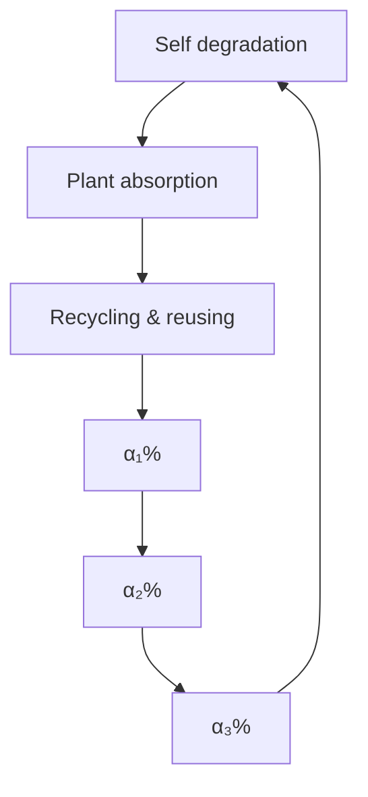
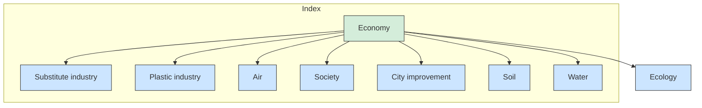

## Less Waste & better World

While the plastic worldwide is being produced at a frighteningly-increasing speed, our poor nature fails to adapt to the prosperous plastic-favored society. The price of enjoying the convenience of plastic bag is to add insult to the existing environmental injuries. The severe impact of excess plastic is coming to the surface: destruction of land, ingestion of poisonous fragments by marine organism and decline in human living standards. Hence, the efficient plastic-recycling problems has received our attention.

First, two basic model are established for better analysis. One is the model of maximum level, built on the basis of different ways of recycling plastics: industrial recycling, incineration and discarded into the environment. Another is the policy-driven plastic impact index (PII) model in which all basic factors are spilt into three aspects: Ecosystem Degree $( E D _ { 1 } )$ , Economy Degree $( E D _ { 2 } )$ and Society Degree (SD).

Second, we apply the first model in Task 1. Taking the recovering ability of soil, ocean and industrial-process in account, the maximum plastic production level with no more environmental damage is calculated to be 96.77 million tons annually.

Third, the second model (PII) is applied in Task 2. Through utilizing data from global, East-Asia and Europe, we obtain the current PII of each to be 58, 32, 78. Furthermore, stimulation is done to find the most ideal plastic production of them to be 32.45, 37.09, 78.91 kg per capita annually. Eventually, we test the two policies on the above two continents and get distinct results.

Fourth, for Task 3, we modify the initial model by taking time into account and generate a new index CICI accordingly. Through trial and error, the optimal solution is calculated to be 28.1 kg per capital annually and 40% recycling rate where CICI has a minimum value of 45. Further discussion is carried out into the potential impacts.

Fifth, for Task 4, with the combination of GE matrix and CICI, the waste conditions in 6 continents are separately measured. Then the interventions are put forward to raise the overall global level and minimize variance.

Sixth, we write a memo to the ICM describing the achievable minimum level, the timeline to reach it and the accelerating or obstructive circumstances in the progress to achieve the target.

Sensitivity analysis is made at the end. Our models are more sensitive to AP (the first one) and the conditions of packaging industry (the second one).

Keywords: PII, comprehensive evaluation, GE Matrix,

## Contents

## 1. Introduction .

1.1 Background.  
1.2 Our work .. 2

## 2. Assumptions and Notation

2.1 Assumptions .  
2.2 Notation 3

## 3. Models of plastic waste ′

3.1 Model of Maximum level ′

3.1.1 Industrial recycling. 4  
3.1.2 Incineration.  
3.1.3 Discarded into the environment

3.2 Policy-driven plastic impact index model (PII). 6

3.2.1 Overview .  
3.2.2 Ecosystem, Economy and Society Degrees .

## 4. Analysis .... 9

4.1 Measurement of maximum levels. 9  
4.2 Discussion of waste levels . 10

4.2.1 Global Conditions . 10  
4.2.2 Case Study: East-Asia and Europe.. 1  
4.2.3 Policy-driven Conditions. 13

4.3 Target setting.. 14

4.3.1 Combination of model and discussion . 14  
4.3.2 Prediction of the minimum level. 15  
4.3.3 Impacts . 16

4.4 Inequity issues solving. 17  
4.5 Memo.. 19

## 5. Model evaluation.. . 20

5.1 Sensitivity analysis ... . 20  
5.2 Strengths and Weaknesses .. . 20

## 6. Conclusion... . 21

## Reference.. . 24

## 1. Introduction

## 1.1 Background

Plastic is a kind of material with great social benefit and wide application. We can make plastic at low cost, with its lightweight, adaptable properties and myriad applications in every aspect of daily life, including food packaging, consumer products, medical equipment and buildings.

However, because plastic has outstripped most other man-made materials, its development has long been noted. According to the data[1], if current production and waste management trends continue, 33 billion tons of plastic is expected to be added to the planet by 2050, with about 12,000 tons of plastic waste destined for landfills or the natural environment. Given the high biodegradability of plastic polymers currently in use, this continued influx of complex materials is a significant risk to human and environmental health[2].

## 1.2 Our work

In identifying the impact of plastic waste on the environment, we establish an assessment model that considers multiple factors. In our model, plastic production and recycling are considered to be important factors affecting the environment[3][4][5]. Aiming at the first question, we established the estimation model of the maximum production of plastic products according to the bearing capacity of the environment to plastic waste. Explaining the ability of both the human and nature to recycle plastic waste. In the second question, we define an index to evaluate the severity of the existing plastic garbage[6][7]. After building and improving our models and discussing the relationship between the influencing factors and outcomes, an achievable level was predicted by the program. When the minimum is reached, all the timevarying factors remain unchanged, the most important factors are production and recovery rate. And the value of them are what we want most.

Then we use the two models we built to analyze the cases of East-Asia and Europe to find the lowest possible level of plastic production. Plastic wastes pollution is a global problem. To solve this problem, we must face some equity problems. Therefore, we analyze equity, propose solutions to the unfair phenomenon and do simulation. Next we analyze the sensitivity of the model and evaluate its stability. Finally, we wrote a memo combining the model and the conclusion.

## 2. Assumptions and Notation

## 2.1 Assumptions

Plastic waste disposal is a complex and interdisciplinary problem with international significance. Relevant questions involve subjects like politics, economics, culture, human biology, ecology, geology, and many others. It is impossible to model every possible circumstance. So, we made a couple of assumptions and simplifications, each of which is properly justified.

The data we collect from online databases is accurate, reliable and mutually consistent. Because our data sources are all websites of international organizations, it’s reasonable to assume the high quality of their data.  
In model verification, the indicator data from countries that we neglect has little impact on the calculation of the weights and the results.  
The amount of plastic produced minus the amount recycled is plastic waste  
We assume the country as an overall unit without considering the differences of regions within the country. The assumption is a prerequisite for us to do intensive study.  
Only differences between continents are considered when related to policies

## 2.2 Notation

Notation that we use in the model are shown in the following table.

<table><tr><td>symbols</td><td>Definition</td></tr><tr><td> $\alpha_i$ </td><td>Percentages of different treatments</td></tr><tr><td>M</td><td>Maximum level</td></tr><tr><td>R</td><td>Industrial recovery rate</td></tr><tr><td>AP</td><td>Annual production of plastic product</td></tr><tr><td> $C_i$ </td><td>Total amount of existing plastics</td></tr><tr><td> $\gamma_i$ </td><td>Degradation rate</td></tr><tr><td>PII</td><td>Policy-driven plastic impact index model</td></tr><tr><td>ED</td><td>Ecosystem Degree</td></tr><tr><td>SD</td><td>Society Degree</td></tr><tr><td>WIE</td><td>Waste In the Environment</td></tr><tr><td>CICI</td><td>Comprehensive impact coefficient index</td></tr><tr><td>SDC</td><td>Sustainable development coefficient</td></tr></table>

## 3. Models of plastic waste

## 3.1 Model of Maximum level

In the assessment of the maximum levels of single-use or disposable plastic product waste that can safely be mitigated without further environmental damage, we need to consider how much plastic waste could get industrial-treated or degrade in the environment. The amount of specific plastic waste handled determines the output of the corresponding plastic products, namely the maximum level of that. According to statistics, aside from the vast waste generated by various industries, more plastic exists in the current natural environment. In the end, there are three main methods for handling these plastics: industrial recycling, incineration and discarding into nature. In our model, $\alpha _ { 1 }$ of the plastic waste is disposed in industrial processes, $\alpha _ { 2 }$ of plastic waste burnt, and the remaining part $\alpha _ { 3 }$ ends up into the ocean or landfill. The recovery rates of nature environment reacts differently to these three methods. The specific classifications and proportions are as follows, as shown in the Figure 1. $( \alpha _ { 1 } , \alpha _ { 2 }$ and $\alpha _ { 3 }$ are all percentages in our model.)

According to the data [8], from Geyer et al, there are 407 million tons plastic produced in various industrial sectors including packaging and construction industry which take up the largest shares of plastic production. If we can’t handle these plastic waste in a specific way, say humans can make these vanish, the environment is bound to suffer further damage.

In our model, we define ?? as the maximum level of single-use or disposable plastic product waste. The definition formula of ?? is as follows,

$$
M = R _ {1} + R _ {2} + R _ {3}
$$

Where $R _ { 1 } , R _ { 2 } , R _ { 3 }$ respectively refer to the industrial recovery rate, incineration efficiency and degradation rate.

flowchart

Figure 1 Schematic of model 1

## 3.1.1 Industrial recycling

Industrial recycling mainly includes three ways: mechanical recycling, chemical recycling and composting. Mechanical recycling means sorting, washing, drying and pelletizing.[9]. Relatively speaking, chemical recycling is more intricate, yet more effective than mechanical recycling in most cases. Nevertheless, note that usually chemical recycling is of high cost. Furthermore, the process had to be ceased if the resources to process the waste are not available, such as some catalysts and compatibilizer.

The value of $R _ { 1 }$ is determined by the following formula.

$$
R _ {1} = \alpha_ {1} \times A P
$$

Where ???? refers to the annual production of plastic product worldwide.

## 3.1.2 Incineration

Burning plastic waste is nowhere near a wise choice. While incineration reduces the amount of plastic waste going into landfill, more hazardous substances are inevitably released into the environment. The net costs of plastic waste recycling are higher than those for incineration, but emissions of $C O _ { 2 }$ from the waste incineration are far beyond those from recycling.

The value of $R _ { 2 }$ is determined by the following formula.

$$
R _ {2} = \alpha_ {2} \times A P
$$

The formula of $R _ { 2 }$ is similar to that of $R _ { 1 }$ . In fact, industrial recycling and incineration have many similarities. Put another way, incineration could be regarded as a kind of special industrialization. It’s just that incineration is way more destructive than industrial recycling to the environment since the incineration of plastic would produce Dioxin, a kind of highly toxic carcinogen.

## 3.1.3 Discarded into the environment

The plastic waste that could not be recycled effectively eventually goes into landfill or the ocean. For many countries, this is a convenient but environment-costly option. The ability of soil and ocean to degrade plastic waste is extremely limited. Even so, most countries continue to handle plastic waste in this way which directly causes further damage to the environment. According to the statistics, the recovery rate of plastic waste in some developing countries is almost zero [10]. This means a mass of plastic waste goes into the natural environment with no cleaning process.

Reassuringly, some public service organization, such as WWF and Ocean Conservancy, are trying to improve the present situation, they pay a lot of human and financial resources to collect the plastics along the coast, such as straws and plastic bottles. Whereas, the collection activities have little effect on the terrible status of the ocean.

$R _ { 3 }$ is the degradation rate of plastic waste in the nature. Its value is determined by the following formula.

$$
R _ {3} = \gamma_ {1} C _ {1} + \gamma_ {2} C _ {2}
$$

Where $C _ { 1 }$ refers to the total amount of existing plastics in the soil, $C _ { 2 }$ refers to the total amount of existing plastics in the ocean, $\gamma _ { 1 } ^ { - 1 }$ refers to the time required for plastics to degrade in the soil, $\gamma _ { 2 } ^ { - 1 }$ refers to the time required for plastics to degrade in the ocean.

Considering it takes varied time for each kind of plastic to degrade in different ways, $C _ { 1 }$ and $C _ { 2 }$ represent the average degrading time. Meanwhile, we regard the reciprocal of the total time of degradation as annual degradation rate.

## 3.2 Policy-driven plastic impact index model (PII)

## 3.2.1 Overview

To better estimate the sophisticated impact plastic and its potential substitutes may have on multiple aspects, for instance lives of citizens and environment quality, in this section we combine several related indicators to reach a comprehensive index: the PII index. It can be

illustrated by Figure 2.

PII serves to reveal to which extend plastic-related affairs are damaging our surroundings, consequently the higher PII score one region obtains, the worse process it is going through at the time being.

Three second-class indicators scored out of 100 are introduced in this model which are Ecosystem Degree $( E D _ { 1 } )$ , Economy Degree $( E D _ { 2 } )$ and Society Degree (SD). PII is the average of the above three indicators, expressed as

$$
P P I = \left(E D _ {1} + E D _ {2} + S D\right) / 3
$$

flowchart

Figure 2 Schematic of model 2

While policy-related degrees are not included in second-class indicators, the impact of policy will be applied to the model separately since different policies have varied effects in regions. It can be shown in following parts: Task 2.

The basic parameters mentioned in this model is listed as follows, as the Table 1 show.

Table 1 The basic parameters

<table><tr><td>Industry</td><td>Pa</td><td>Te</td><td>C&amp;I</td><td>Tr</td><td>BC</td><td>E/E</td><td>Others</td></tr><tr><td> $w_{1ia}$ </td><td>1.2</td><td>1.17</td><td>1.09</td><td>0.93</td><td>1.05</td><td>0.8</td><td>0.89</td></tr><tr><td> $w_{2ia}$ </td><td>0.3</td><td>0.24</td><td>0.27</td><td>0.87</td><td>0.69</td><td>1.03</td><td>0.49</td></tr><tr><td> $w_{1iw}$ </td><td>0.7</td><td>0.63</td><td>0.94</td><td>1.08</td><td>0.87</td><td>1.53</td><td>0.82</td></tr><tr><td> $w_{2iw}$ </td><td>0.4</td><td>0.32</td><td>0.56</td><td>0.77</td><td>0.61</td><td>0.99</td><td>0.52</td></tr><tr><td> $w_{1is}$ </td><td>0.21</td><td>0.19</td><td>0.28</td><td>0.32</td><td>0.26</td><td>0.46</td><td>0.25</td></tr><tr><td> $w_{2is}$ </td><td>0.6</td><td>0.45</td><td>0.84</td><td>1.16</td><td>0.92</td><td>1.49</td><td>0.78</td></tr><tr><td> $w_{1i}$ </td><td>30%</td><td>27%</td><td>35%</td><td>7%</td><td>5%</td><td>2%</td><td>15%</td></tr><tr><td> $w_{2i}$ </td><td>1.18</td><td>0.92</td><td>0.84</td><td>0.3</td><td>0.43</td><td>0.17</td><td>0.54</td></tr></table>

Pa, Te and so on respectively represents Packaging, Textiles, Consumer & Institutional Products, Transportation, Building and Construction, Electrical/Electronic.

## 3.2.2 Ecosystem, Economy and Society Degrees

## 1. Ecosystem

Different ways of handling plastic waste have varied impacts on ecosystem. While water, air and soil make up the basic elements of our live, here we define $E D _ { 1 }$ to be the average score of Air, Water and Soil Conditions, expressed as

$$
E D _ {1} = (A i r + W a t e r + S o i l) / 3
$$

Air Condition is evaluated based on two aspects: contributions to global warming and emission of noxious gas. Among various kinds of gas leading to global warming, $C O _ { 2 }$ counts the most, thus Air condition can be represented as

$$
A i r = \sum_ {i = 1} ^ {7} \left(w _ {1 i a} + w _ {2 i a}\right) p l a s t i c _ {i}
$$

Where plastic refers to the amount of plastic produced annual sorted according to its usage, $w _ { 1 i a }$ and $w _ { 2 i a }$ respectively being the coefficients describing plastic’s ability of emitting $C O _ { 2 }$ and noxious gas based on its components and mainstream handling methods (incineration, recycling and landfill).

Water Condition focus on water contamination of both freshwater lakes and oceans. Furthermore, poor water quality gives rise to diseases among aquatic life which eventually threatens citizens’ health. Thus food contamination is also taken into account. Water condition is determined is as follows

$$
\text { Water } = \sum_ {i = 1} ^ {7} w _ {1 i w} \left(1 + w _ {2 i w}\right) \text { plastic } _ {i}
$$

Where $w _ { 1 i w }$ refers to the coefficient describing plastic’s water contamination potential based on its components and mainstream handling methods and $w _ { 2 i w }$ reveals the probability of causing harm to our health due to water contamination.

Soil Condition, similar to Water Condition, is assessed by two factors: soil contamination and its potential to damage health through polluted agricultural products. The function of Soil Condition can be represented by

$$
\text { Soil } = \sum_ {i = 1} ^ {7} w _ {1 i s} \left(1 + w _ {2 i s}\right) \text { plastic } _ {i}
$$

Where $w _ { 1 i s }$ refers to the coefficient describing plastic’s soil contamination potential based on its components and mainstream handling methods and $w _ { 2 i w }$ reveals the probability of causing harm to our health due to soil contamination.

## 2. Economy Degree

In this part, we focus on the potential economy benefit or loss through partly using substitutes in plastic industry. Two obvious conflicts of interests are studied under this circumstance. On one hand, plastic industry will experience economy loss due to both less raw material and plastic products sales. On another, substitute industries such as paper and fiber industries earn more by taking over part of plastic industry’s trade. The economy degree can be represented by follows.

$$
E D _ {2} = 1 0 0 \left(P l a s t i c _ {\text { loss }} - S u b s t i t u t e _ {\text { earn }}\right) / P l a s t i c _ {\text { total }}
$$

Where $P l a s t i c _ { l o s s }$ and $S u b s t i t u t e _ { e a r n }$ respectively stands for the parameters determined by the annual financial loss of plastic industry and financial profit of substitute industry.

Among the seven main industries mentioned in this paper, in some industries plastic is replaceable while others can’t be substituted easily. For instance, packaging industry can use recyclable paper to replace plastic while building industry usually can’t use other materials due to plastic’s favorable features. Consequently, we separately consider the above industries feasibility of substitutes and obtain the function of the loss of plastic industry.

$$
\text { Plastic } _ {\text { loss }} = \sum_ {i = 1} ^ {7} w _ {1 i} \text { Value } _ {i}
$$

Where $w _ { 1 i }$ refers to the percentage of financial loss in the specific industry.

With regard to substitute industries’ extra profit, it is much related to the share plastic industry loses and fluctuates around a certain value. Similarly, each industry has different profit potential due to what has been mentioned above. Here we use $\mathrm { P l a s t i c } _ { l o s s }$ to be the reference value and represent extra earning as follows

$$
\text { Substitute } _ {\text { earn }} = \sum_ {i = 1} ^ {7} w _ {2 i} w _ {1 i} \text { Value } _ {i}
$$

Where $w _ { 1 i w }$ refers to the potential of substitute industry to turn the economy loss in plastic industry into profit.

## 3. Society Degree

Plastic and its products have permeated all aspects of our society ever since it is invented and brings pros and cons to our society simultaneously. For instance, plastic bags are favored by manufacturers and citizens for its low price and high efficiency. Meanwhile, plastic is also the prime culprit of the worldwide worsening white pollution phenomenon. This leads to contradictory feelings to the replacement of plastic where people wish to improve cities environment but heavily rely on plastic products at the same time. Hence the social degree can be represented by follows

$$
S D = \text { Reliance } - \text { Improvement }
$$

Where ???????????????? and ?????????????????????? respectively stand for the citizens’ negative feelings towards replacing plastic and the overall society improvement due to plastic’s change.

According to the survey carried out by researchers[8], we can draw the following conclusions.

Countries with the high and above par GDP per capita tend to produce way more plastic per capita annually than countries where citizens have comparatively lower income. Normally, more plastic products lead to higher reliance and makes it hard to substitute plastic by a large margin within a short period. As a result, countries with higher GDP per capita score more with respect to reliance.  
While facilities’ purification and recycling abilities are much or less related to GDP, countries with lower revenue produces less plastic, making it unnecessary to handle as much plastic as middle-revenue countries do. Meanwhile rich countries are capable of handling the majority of plastic they made annually. The more plastic is handled improperly, the greater potential a city has to improve its environment. Therefore the improvement degree corresponds to GDP per capita with an upturned ‘U’ relation. Eventually, reliance and improvement degrees can be determined as shown in Figure 3.

$$
R e l i a n c e = f _ {r e} (G D P)
$$

$$
I m p r o v e m e n t = f _ {i m} (G D P)
$$

line chart

| GDP per capita | Reliance Degree |
| -------------- | --------------- |
| 15             | 15              |
| 30             | 30              |
| 45             | 60              |
| 60             | 90              |
| 75             | 80              |
| 90             | 55              |

line chart

| GDP per capita | Improvement Degree |
| -------------- | ------------------- |
| 15             | 5                   |
| 30             | 13                  |
| 45             | 29                  |
| 60             | 29                  |
| 75             | 21                  |
| 90             | 5                   |

Figure 3 Reliance and Improvement degrees

## 4. Analysis

## 4.1 Measurement of maximum levels

We build the maximum level model to measure the ability to mitigate the plastic waste without further damaging the environment. Subsequently, we seek out the global data and bring it into our model.

After analyzing the data from Geyer et al, we draw a conclusion that 407 million tons plastic waste was produced from 8 different industrial sectors, so the value of ???? is 407. Furthermore, according to the statistics, ${ \mathfrak { a } } _ { 1 } , \ { \mathfrak { a } } _ { 2 }$ and $\alpha _ { 3 }$ are respectively set as 9%, 12% and 79%[11]. As mentioned before, the degrading rate of plastic waste in the soil is completely different from that in the ocean. The value of $\alpha _ { 3 }$ is 79%, with 76% in the soil and 3% in the ocean. Meanwhile, the periods required for plastics to degrade in the soil and the ocean are different. According to the statistics, the values of $\Upsilon _ { 1 } ^ { - 1 }$ and $\Upsilon _ { 2 } ^ { - 1 }$ are approximately 800 and 400[12]. In this case, the value of $R _ { 3 }$ is determined by Waste In the Environment(?????? ) through which we obtain the final formula for $R _ { 3 }$ . After simulating degradation of the existing plastic waste and the past annual production, we set ?????? as 83 billion tonnes.

$$
R _ {3} = (76 \% \gamma_ {1} + 3 \% \gamma_ {2}) \times W I E
$$

After bringing all data into the model, we draw the pie chart as Figure 4 which reveals the recovery speed of industrial recycling, incineration and discarding into the environment.

pie chart

| Category | Value |
|---|---|
| R1 | 36.63 |
| R2 | 48.84 |
| R3 | 11.3 |

Figure 4 Amount of waste mitigated in three ways

Since ?? is the sum of $R _ { 1 } , \ R _ { 2 }$ and $R _ { 3 } { \mathrm { : } }$ , we work out the maximum level of single-use or disposable ability to be 96.77 million tons. It is the amount of both maximum recovery and plastic production with no further environmental damage.

## 4.2 Discussion of waste levels

In this section, the Policy-driven plastic impact index model (PII) is applied to analysis how to reduce as much plastic waste as possible within the environmentally safe level. First, we use the global data as the basic sample to achieve a general level. Then, East-Asia and Europe are chosen as two distinct countries for our case study. Eventually, through applying policies of varied areas to East-Asia and Europe, regional differences are shown with regard to policy effectiveness.

Certain points are listed as follows

In section 4.2.1-3 where global, East-Asia and Europe conditions are analyzed, policy factors are not taken into account.  
Policies affect the PII model through changing basic components. For instance, the proportion of production among different plastic industries or the annual plastic production, etc.

## 4.2.1 Global Conditions

According to the existing data collected from authoritative papers[13][14][15], the raw data related in the global plastic condition is listed as shown in Table 2.

Table 2 Global plastic condition

<table><tr><td>Industry</td><td>Pa</td><td>Te</td><td>C&amp;I</td><td>Tr</td><td>BC</td><td>E/E</td><td>Others</td></tr><tr><td>Volumn/bt</td><td>167.7</td><td>30.9</td><td>44.2</td><td>20.1</td><td>29.4</td><td>15.4</td><td>51.3</td></tr><tr><td>Percentage</td><td>46.7%</td><td>8.6%</td><td>12.3%</td><td>5.6%</td><td>8.2%</td><td>4.3%</td><td>14.3%</td></tr><tr><td>Value/billion</td><td>297</td><td>110</td><td>396</td><td>77</td><td>88</td><td>77</td><td>55</td></tr><tr><td>Percentage</td><td>27%</td><td>10%</td><td>36%</td><td>7%</td><td>8%</td><td>7%</td><td>5%</td></tr></table>

Combining the global data with our model, the impact of plastic in varied fields can be displayed by Figure 5.

stacked bar chart

| Category | Value |
|---|---|
| Global | 60.0 |
| Ecology | 25.0 |
| Society | 30.0 |
| Economy | 25.0 |

Figure 5 Impact of plastic in varied fields

line chart

| Annual plastic per capita/kg | Global PII |
| ---------------------------- | ---------- |
| 32.45                        | 42.05      |

Figure 6 Global PII scores

As is shown above, the PII in our current world is around 58 scored out 100, indicating a negative circumstance where most creatures are being over-affected by the plastic industry nowadays. To be specific,

1. Air and Water scores are far beyond the average, corresponding to the worsening atmosphere of global warming and water pollution.  
2. With respect to economy and society aspect, it can be drawn that the positive scores can hardly compare with negative ones since it is hard for manufacturers to find materials both superior to plastic considering price and effectiveness and citizens actually can’t abandon plastic for its convenience and lightness.

Through changing the production of plastic per capita, global PII scores react as optimal which is listed above.

The optimal solution of plastic production on a global scale can be expressed as 32.45 kg per capita annually where the global PII has a minimum value of 42.05. It indicates that with the development of modern recycling technology and more-diversified materials market, sooner or later plastic will be partly replaced by more environmental-friendly substitutes.

## 4.2.2 Case Study: East-Asia and Europe

In this section, PII model is applied to two distinct regions. While East-Asia dominates the majority plastic import and improperly handles the plastic waste to great extend, Europe produces a large part of the plastic worldwide and barely ignore the harm plastic can have. The raw data used is listed as Table 3

Table 3 Raw data

<table><tr><td colspan="2">Industry</td><td>Pa</td><td>Te</td><td>C&amp;I</td><td>Tr</td><td>BC</td><td>E/E</td><td>Others</td></tr><tr><td rowspan="4">East-Asia</td><td>Volumn/bt</td><td>38.1</td><td>3.5</td><td>6.7</td><td>7.7</td><td>8</td><td>3.8</td><td>7.4</td></tr><tr><td>Percentage</td><td>50.7%</td><td>4.63%</td><td>8.85%</td><td>10.3%</td><td>10.7%</td><td>5.03%</td><td>9.8%</td></tr><tr><td>Value/billion</td><td>65</td><td>39</td><td>29</td><td>34</td><td>72</td><td>26</td><td>62</td></tr><tr><td>Percentage</td><td>20%</td><td>12%</td><td>8.9%</td><td>10.3%</td><td>22%</td><td>7.9%</td><td>18.9%</td></tr><tr><td rowspan="4">Europe</td><td>Volumn/bt</td><td>24.5</td><td>2.5</td><td>5.6</td><td>6.2</td><td>8.5</td><td>3.8</td><td>10.6</td></tr><tr><td>Percentage</td><td>39.7%</td><td>4.1%</td><td>9%</td><td>10.1%</td><td>13.8%</td><td>6.2%</td><td>17.1%</td></tr><tr><td>Value/billion</td><td>30.1</td><td>17.7</td><td>12.5</td><td>36.8</td><td>22.1</td><td>33.1</td><td>30.9</td></tr><tr><td>Percentage</td><td>16.8%</td><td>9.6%</td><td>6.8%</td><td>20%</td><td>12%</td><td>18%</td><td>16.8%</td></tr></table>

Utilizing the PII model, the impact of plastic in Europe and East-Asia can be displayed by Figure 7.

stacked bar chart

| Region    | Ecology | Society | Economy |
| --------- | ------- | ------- | ------- |
| Europe    | 10.0    | 20.0    | 2.0     |
| East Asia | 27.0    | 25.0    | 26.0    |

Figure 7 The impact of plastic in Europe and East-Asia

From the charts, Europe and East-Asia respectively scores 32 and 78. What is interesting, though, is that while people in Europe produces more plastic than that of East-Asia, plastic condition is in fact better in Europe. This could be explained by the fact that Europe exports a large part of the plastic products, only a few are left domestic, let alone its great recycling capability. Nevertheless, East-Asia scores more for its high import volume, comparatively weaker handling capabilities and environment-protection awareness.

Next, to find out the potential minimum level of plastic production for these two regions, we observe the change of PII as Figure 8.

line chart

| Annual plastic per capita/kg | East-Asia PII |
| ---------------------------- | ------------- |
| 37.09                        | 59.04         |

line chart

| Annual plastic per capita/kg | Europe PII |
| ---------------------------- | ---------- |
| 78.91                        | 29.64      |

Figure 8 Change of PII in Europe and East-Asia

The optimal solution of plastic production in East-Asia and Europe can be expressed as 38.07 and 78.91 kg per capita annually where the regional PII has a minimum value of 29.46 in Europe and 59.04 in East-Asia. We can draw the following conclusions.

1. For Europe, plastic export contributes much to the whole society and most countries can take care of the plastic waste they produce. Thus only a minor decrease is required to reach the optimal solution.  
2. For East-Asia, despite the heavy reliance on plastic, the environment currently is overloaded with plastic waste and negatively affects citizens’ health. Thus decreasing plastic production by a large margin has far more ecosystem and society benefits than economy drawbacks.

## 4.2.3 Policy-driven Conditions

Among all factors influencing the plastic production, policy can play a key role in limiting, promoting certain kinds of plastic or even completely prohibiting citizens from using it. Nevertheless, due to the diversity of regional conditions, there is no perfect policy universally beneficial to all. Thus, we put forward two policies by reference to the existing ones[16][17][18] and test their feasibility in Europe and East-Asia which can be expressed as follows

1. Permanent ban on non-industrial plastic import  
2. Extra taxes on plastic products

Utilizing European and East-Asia’s data from 4.2.2, PII of two regions determined by the extend to which aforementioned policies are carried out can be shown as Figure 9 show.

line chart

| Extra rate | East-Asia PII | Europe PII |
| ---------- | ------------- | ---------- |
| 0          | 78            | 32         |
| 1          | 75            | 31         |
| 2          | 72            | 30         |
| 3          | 70            | 29         |
| 4          | 69            | 28         |
| 5          | 68            | 28         |
| 6          | 69            | 29         |
| 7          | 70            | 30         |
| 8          | 72            | 32         |
| 9          | 74            | 34         |
| 10         | 76            | 36         |

line chart

| Executing rate | East-Asia PII | Europe PII |
| -------------- | ------------- | ---------- |
| 0              | 76            | 32.5       |
| 10             | 74            | 32.0       |
| 20             | 71            | 31.5       |
| 30             | 68            | 31.0       |
| 40             | 65            | 30.5       |
| 50             | 63            | 30.5       |
| 60             | 63            | 30.5       |
| 70             | 62            | 30.7       |
| 80             | 61            | 30.9       |
| 90             | 60            | 31.1       |
| 100            | 60            | 31.2       |

Figure 9 PII of East-Asia and Europe

1. With regard to Policy 1, while the general trends in Europe and East-Asia remain the same before approximately 55% execution, obvious difference appears right after the 55% point where Europe PII continues to decrease gently, East-Asia PII takes on a gradual increasing trend. This is due mainly to the structure of plastic industry in East-Asia which depends on importing plastic for processing and selling processed products to the market. In contrast, plastic industry in Europe focus more on exportation so that restriction on import actually won’t have much negative effect on Europe.

2. With regard to Policy 2, the whole trends of PII in Europe and East-Asia seem similar. Nevertheless, there are still minor differences worth mentioning. First, the turning point of PII in Europe is slightly ahead of that of East-Asia. Second, by adding extra taxes to 10%, eventually Europe scores more than the initial while PII of East-Asia is lower than the initial throughout our analysis. The reason here resembles the former since Europe plastic industry has high values in exportation, indicating tremendous domestic plastic production. Thus adding taxes in production severely damages European manufactures’ interests.

## 4.3 Target setting

## 4.3.1 Combination of model and discussion

Previously, we build the maximum level model to explore plastic waste’s recovering and utilizing capability, then discuss the extent to which the waste could be reduced by considering social, environmental and political factors. On the basis of our model and discussion, we search for the minimal achievable level of global waste of single-use or disposable plastic products. Note that,

The factors that impact the level can be separated into two types: time-varying and time-invariant. The production and recovery rate are time-invariant and the other factors are invariant including the plastic dependence of citizens and environmental quality, etc.

Another characteristic of our model is that the annual production will have an indirect impact on the levels for the next few years. Specifically speaking, if the environment is severely damaged due to the high level of plastic waste in the first year, this kind of influence will still show up in the second and third year. By limiting the influence of current level to last three years, the iteration formula could be expressed as follows.

$$
C I C I (t) = F (t, \text { production }, \text { recovery }) + \sum_ {i = 1} ^ {3} (1 - \frac {i}{3}) C I C I (t - i)
$$

With the production and recovery fixed as constants, the formula for ??????????(??) could be simplified as follows.

$$
C I C I (t) = F (t) + \sum_ {i = 1} ^ {3} \left(1 - \frac {i}{3}\right) C I C I (t - i)
$$

Where ??(??) reveals the influence on the index (or the level) of all relevant factors except the production and recovery. The definition of ??(??) refers to what was defined in our discussion. When time is taken into account, we get the following expression.

$$
F (t) = E D _ {1} (t) + S D (t)
$$

## 4.3.2 Prediction of the minimum level

Setting a minimum level of plastic is bound to have great impact on not only world at the time being, but also many years to come. Therefore,

The minimum level is estimated by the time when the index in 4.3.1 becomes stable.  
The minimum level is the combination of global annual plastic production per capita and recycling. In our discussion the level corresponds to the above parameters when the index is minimum at the estimated time.  
− The minimum level is related to three parameters: annual plastic production per capita, recycling rate and time.  
The exact estimated year may have impact on the minimum level. In our discussion, it is estimated 15 years from now.  
Utilizing the control variate method, the relation among level, production and time is discussed under a fixed recycling rate. The rate shall be changed each time the minimum level is calculated.

Taking the above principles into account, the index and potential minimum levels are shown as shown in Figure 10.

3d surface plot chart

| Year | CICI |
|------|------|
| 43   | 58   |
| 45   | 58   |
| 47   | 58   |
| 49   | 58   |
| 51   | 50   |
| 3    | 66   |
| 6    | 62   |
| 9    | 58   |
| 12   | 58   |
| 15   | 58   |

Figure 10 The index and potential minimum levels

Table 4 Data of Minimum CICI

<table><tr><td>Recycling rate</td><td>30%</td><td>32%</td><td>34%</td><td>36%</td><td>38%</td><td>40%</td><td>42%</td><td>44%</td><td>46%</td><td>48%</td><td>50%</td></tr><tr><td>Minimum CICI</td><td>49</td><td>48.3</td><td>47.4</td><td>46.6</td><td>45.9</td><td>45.3</td><td>46</td><td>48.1</td><td>50.3</td><td>52.7</td><td>51.4</td></tr><tr><td>Production per capita</td><td>35.1</td><td>33.4</td><td>31.8</td><td>30.3</td><td>28.9</td><td>28.1</td><td>28</td><td>29.3</td><td>29.7</td><td>30.4</td><td>31.1</td></tr></table>

From the Table 4, the optimal plastic minimum level is 28.1 kg per capital annually and 40% recycling rate where the index reaches approximately 45.

Note that the plastic production level suitable for humans is almost two thirds of the current one, recycling rate being much better than now, it can be deduced that with the development of science and technology, despite the up-growing population, more mature substitutes will gradually take the place of plastic and only a minor amount plastic compared to nowadays is improperly handled due to regional difference. The condition can even get better after maybe 30 years from now which is not discussed in our paper.

## 4.3.3 Impacts

In this section, the impact of the plastic minimum level in 4.3.2 will be discussed in three respects: society, ecosystem and plastic industry.

Society and ecosystem impact is measured by SD(t) and $\mathrm { E D } _ { 1 } ( t )$ .  
Impact on plastic industry is measured by the estimated shrinkage of its value.

Considering the above three functions, the growing trend of each can be shown as follows

area chart

| Year | Net Loss | Sub Value | Pla Value |
| ---- | -------- | --------- | --------- |
| 0    | 0%       | 0%        | 100%      |
| 3    | 0%       | 20%       | 80%       |
| 6    | 0%       | 30%       | 60%       |
| 9    | 10%      | 40%       | 40%       |
| 12   | 15%      | 45%       | 25%       |
| 15   | 20%      | 50%       | 15%       |

bar chart

| Year | Society | Ecosystem |
| :--- | :--- | :--- |
| 0 | 60 | 64 |
| 3 | 57 | 56 |
| 6 | 52 | 49.5 |
| 9 | 48 | 44.5 |
| 12 | 46 | 41 |
| 15 | 45 | 39 |

Figure 11 The growing trend of three functions

## Analysis:

1. Plastic Industry: From the Chart, plastic industry shrinks to about 55% of its initial size. With the market competitor-substitute industry favored by the political and economic environment, in the first few years the plastic industry plunges with nearly 6% per year. Nevertheless, when sub-industry develops to its peak, the market share between these two industries takes on a stable trend. Eventually, plastic industry loses approximately 45% of the initial value and while sub-industry can’t make as much as plastic industry, about 10% profit is wasted annually.  
2. Society: While the general trend of society score is decreasing, we notice that the first 3-years’ decrease is actually less than those of the second and third. Citizens need time to adapt to the new plastic-free environment, consequently in the first few years they may feel weird living in a world where paper bag and plastic for repeated usage dominates their daily life. However, when they realize the benefits it brings them, the society will react way more positive.  
3. Ecosystem: With less plastic produced and more recycled, the environment is bound to get cleaner since the total volume of waste is decreasing. With the decreasing waste volume gets stable after a few years, the environment reacts accordingly where air condition, water quality and global temperature turns back to its normal standard.

## 4.4 Inequity issues solving

Although plastic waste pollution is a global problem, the causes of the problem vary from country to country, as do the effects or hazards.

Since this is a question of equity, we modify the model that we've built before to introduce the concept of SDC (sustainable development coefficient). Countries in the world are classified according to continents, and the average sustainable development coefficients of all countries in each continent are calculated respectively. Finally, the variance of these different sustainable development coefficients is calculated. The smaller the variance value is, the fairer the world will be.

In calculating the sustainability coefficient, we use the GE (McKinsey Matrix) matrix. Here, we consider using the GE matrix to describe the sustainability of the region. Although there are differences between countries and companies in terms of operations, management and revenues, a reasonable analogy can be drawn. On the one hand, the attractiveness of a company indicates the strength of a company's operating profit. Correspondingly, a country's sustainable development index describes the country's development strength. On the other hand, the competitiveness of the company and the coordinated development coefficient of the country reflect the ability of sustainable development. Therefore, the GE matrix is introduced here, shown in Figure 12 and two related indicators are defined according to the actual situation: GDP and CICI (comprehensive impact coefficient index), and the indicators are divided into three grades.

heatmap

|  | 0.1 | 0.2 | 0.3 | 0.4 | 0.5 | 0.6 | 0.7 | 0.8 | 0.9 | 1 |
| --- | --- | --- | --- | --- | --- | --- | --- | --- | --- | --- |
| I | 0.1 | 0.2 | 0.3 | 0.4 | 0.5 | 0.6 | 0.7 | 0.8 | 0.9 | 1 |

Figure 12 GE matrix diagram

Table 5 Indicators classification

<table><tr><td>The value of GDP</td><td>Level of development</td><td>The value of CICI</td><td>Level of effect</td></tr><tr><td>0~0.5</td><td>Low</td><td>0~0.5</td><td>Low</td></tr><tr><td>0.5~0.8</td><td>Medium</td><td>0.5~0.8</td><td>Medium</td></tr><tr><td>0.8~1</td><td>High</td><td>0.8~1</td><td>High</td></tr></table>

GDP per capita is used to represent the economic development level of each region, and CICI is used to represent the comprehensive impact of plastic waste. The breakdown of GDP and CICI is shown in Table 5. Therefore, we can determine its coordinate position in the GE matrix. The distance between the coordinate position and the most significant position (1,1) can be considered as the SDC (sustainable development coefficient) of the region. The lower the value is, the stronger the country's sustainable development strength is.

Using the GE matrix we calculated the SC of every continent except Antarctica. GDP is obtained from the Internet[19] and CICI data is obtained from the second question. We preprocessed the data and normalized the data so that the value was between (0,1). Then we plot these points on the graph, and see the blue points in the graph. The point that represents the best case is called the OP (optimum point), as Figure 13 show. It is easy to draw from the figure that sustainability varies greatly from region to region, which is unfair.

scatterplot

| Country | CICI | GDP |
| :--- | :--- | :--- |
| AF | 0.05 | 0.58 |
| AS | 0.13 | 0.20 |
| SA | 0.16 | 0.67 |
| I | 0.24 | 0.21 |
| IV | 0.27 | 0.65 |
| VII | 0.54 | 0.91 |
| EU | 0.55 | 0.70 |
| V | 0.57 | 0.68 |
| VI | 0.86 | 0.69 |
| VII | 0.93 | 0.91 |
| VIII | 0.67 | 0.91 |
| IX | 0.92 | 0.72 |
| IA | 0.99 | 0.71 |
| OA | 0.99 | 0.71 |
| OP | 1.00 | 1.00 |
| II | 0.56 | 0.20 |

Figure 13 SDC and change diagram

In response, we have put forward a series of proposals and solutions aimed at improving regional inequality and promoting global sustainable development.

1. Developing countries should appropriately reduce plastic production, improve the quality of plastic production, and reform the plastic production industry, with some turning to other environment-friendly plastic substitutes.  
2. The international community, particularly developed countries, should establish foundations to provide economic support to developing countries to improve the structure and quality of plastics production enterprises.  
3. Advocate for reducing the use of plastics globally and recommend the use of environmentally friendly non-plastic products.

In combination with the previous model, the results of these measures are predicted by program simulation. We conducted simulation with a five-year cycle and found that after five years, the SDC in these regions changed significantly, which is shown in red dots in the figure. After five years, the SDC value decreased from 0.658 to 0.584, and the variance of SDC in six continents decreased from 0.85 to 0.74, indicating that the improvement effect was very good, the global overall sustainability was improved, and the gap between continents was smaller, meeting the requirements.

## 4.5 Memo

The memo is listed in the last pages.

## 5. Model evaluation

Model validation has been implemented in each section of the above modeling. Here, we do the sensitivity analysis and assess the strengths, weaknesses.

## 5.1 Sensitivity analysis

In this section, we tested the sensitivity of the two models related in our work through changing parameters and comparing the difference between the original results and changed results.

The first model respectively changes three parameters: $\Upsilon _ { 1 , 2 }$ and AP.  
− The second model separately increases the percentage of value and plastic production in certain industry and keeps others’ share same as their original point.

line chart

| Parameter Value | Soil rate | Ocean rate | AP   |
| --------------- | --------- | ---------- | ---- |
| 0               | 96.5      | 94.8       | 86.2 |
| 1               | 97.2      | 95.0       | 88.5 |
| 2               | 98.0      | 95.5       | 90.8 |
| 3               | 99.0      | 96.8       | 93.2 |
| 4               | 101.5     | 97.5       | 96.0 |
| 5               | 102.8     | 98.0       | 98.2 |

line chart

| Increasing rate | Pa   | Te   | C&I  |
| --------------- | ---- | ---- | ---- |
| 0               | 58   | 58   | 58   |
| 2               | 59   | 58.5 | 58.2 |
| 4               | 60   | 59.2 | 58.5 |
| 6               | 61.5 | 59.8 | 58.8 |
| 8               | 63   | 60.5 | 59   |
| 10              | 64   | 61   | 59.2 |

Figure 14 Sensitivity analysis, the left and right picture corresponds to the first and second model

From the left figure corresponding to the first model, ?? has a growing trend with parameters increasing. While the three parameters affects ?? to different degrees, compared to $\Upsilon _ { 1 }$ and $\Upsilon _ { 2 }$ , the variation of ???? has a bigger impact on ??.

From the right figure corresponding to the second model, while all industries’ expanding could have a negative impact, or higher PII scores, Packaging industry significantly outweighs others in affecting PII and adversely polluting our world.

## 5.2 Strengths and Weaknesses

## Strengths

The model uses accurate and latest databases to guarantee the reliability of results. The results have high reference value and can be applied in real life immediately.

Both of our models quantify levels of plastic waste, making it intuitive to show the results of models.

The model comprehensively evaluates the level and all the factors selected are objective. Through comprehensive evaluation, our model can output the compellent results. With subjective factors excluded, the model is more stable in the evaluation progress.

## Weaknesses

Some indicators are missing. To get the index, it requires extra weighting of the indicators, which means the Model can be complex sometimes.

We assume that all the countries or regions will actively cooperate with interventions we put forward. Neglecting those passive countries, there may be some deviations between the practical outcome and that we predicted.

## 6. Conclusion

To sum up, the global plastic waste management problem is not caused by any single factor. Instead, it's a cross-disciplinary problem, made up of a set of variables. We first set up an assessment model for the impact of plastic waste on the environment and analyzed the limits of plastic production from multiple perspectives.

Although the algorithm model focuses on raw data and data analysis, the assessment and optimization based on the assessment results also take social and environmental factors into account. While our model cannot account for all these factors, it uses a representative crosssection of available data to show the current state of the global plastic waste problem and clearly defines the global trend in plastic waste management. Our model suggests that it is possible to improve global plastic waste pollution, and that the most important factor for intervention is socio-economic. Finally, we propose some suggestions for these results.

## MEMORANDUM

TO: ICM

FROM: Team 2008521

DATE: February 17, 2020

RE: Target of the minimum level of plastic waste

Today, the natural and environment and human life are increasingly affected by plenty of single-use or disposable plastic waste, some measures must be taken to deal with the situation. To better measure the extent of the damage of the countless plastic waste and forecast how low the extent can be reduced to by human intervention, we build two fundamental models, one explaining the ability of both human and nature to recycle plastic waste, the other defining an index to evaluate the severity of existing plastic waste.

After building and improving our models and discuss the relationship between the influencing factors and outcomes, a achievable level was predicted by the program. When the minimum is reached, all the time-varying factors remain unchanged, the most important factors are production and recovery rate. And the value of them are what we want most.

As simulated in our model, with human intervention, the index that reveals the level of plastic waste, could decline to approximately 45, the minimum value it could be. At this level, the production fell by two thirds and the recovery rose from nearly 20 percent to 40 percent. What’s more, if the state intervenes forcefully enough, this level could be reached in 15 years. The situation after reaching this level is on longer considered.

What’s need to be further explained is that the realistic minimum level of single-use or disposable plastic waste is not completely unchanged. There will still exist slight fluctuations, but the fluctuations are so tiny that they don’t affect the whole.

And yet, there exist some circumstances that impact the progress of reaching the minimum level explained above. Some of them may accelerate the progress and the other hinder the achievement. There are three detectable circumstances that are beneficial to the progress and two circumstances hindering the progress.

The three accelerating circumstances are as follows.

Advances in science and technology and inventions of new materials.

The current familiar varieties of plastic we use in daily lives are PE, PP, PVC, PET, EPS, ABS, PA, etc. Among them, PE includes plastic greenhouse materials, industrial packaging films, lactic acid beverage bottles, detergent bottles, etc. PP includes woven bags, packing straps, strapping ropes, some automobile bumpers, etc. PVC includes plastic door and window profiles, pipes, etc. PET includes Cola, Sprite and other tea beverage bottles; EPS is commonly known as foam plastic. Most of these materials are recycled at a high cost. Here’s the difficulty of plastic recovery, plastic recycling may not be done all at once, and the dispose of the sewage and waste gas are also difficult to deal with. Under this circumstance, the closed-loop recycling is hard to accomplish. Thanks to the appearance of new plastics, the recycling problem has been eased a bit. For instance, researchers at the US Department of Energy's Lawrence Berkeley National Laboratory have designed a new kind of plastic polymer that can be broken down and built up again with the simplicity of a molecular Lego brick.

## − National consensus on plastic waste recycling.

Due to the different development conditions in different countries. The phenomenon we can see is that some developed European countries are doing a good job in plastic waste disposal, but not in some countries of Africa and Asia Pacific. Plastic waste recovery requires joint action by all countries. Many hands make light work, with worldwide cooperation, the progress of plastic waste is accelerated. Although national laws and policies on waste recovery still vary considerably, the core ideas of them are pretty consistent.

## Policy support.

Favorable policies for plastic recycling are born gradually. This depends largely on state intervention. In the treatment of plastics, the government give support to the enterprises and individuals. For example, businesses can get financial support for plastic recycling, individuals prefer to participate in plastic recycling due to container-deposit legislation. The legislation is establish to encourage recycling and complement existing curbside recycling programs, to reduce energy and material usage for plastic containers.

The two obstructive circumstances are as follows.

## Choosing economy over environment.

In the progress of development, some enterprises or even countries only focus on the rapid development of economy and neglect the protection of environment. This is an act of irresponsibility, and that’s why so much plastic waste are thrown into the ocean instead of recycling factories. Exactly because of this, the level of plastic waste can hardly decline at the top speed. If it goes on like this, someday humans will discover that they have been making a rod for their own back. As a matter of fact, environmental damage is hard to reverse.

## The long accumulation of garbage in the past.

As mentioned above and what explained in our model and discussion. The environmental damage caused from plastic waste can last a few years. In other words, a year's damage to the environment can take years to recover. Ever since plastic was invented, there is a growing demand for them, so more and more plastic is produced every year. If humans continue to dispose of plastic waste in current way, the level will decline slowly or even begin to increase.

## Reference

[1] Galloway, T. S. (2015). Micro-and nano-plastics and human health. In Marine anthropogenic litter, pp. 343-366.  
[2] Plastic Pollution. (2018, 9). Retrieved from Our World in Data: https://ourworldindata.org/plastic-pollution#how-does-plastic-impact-wildlife-andhuman-health  
[3] Gourmelon, G. (2015). Global plastic production rises, recycling lags. New Worldwatch Institute analysis explores trends in global plastic consumption and recycling. Recuperado de http://www. worldwatch. org, 208.  
[4] Bergmann, M., Gutow, L., & Klages, M. (Eds.). (2015). Marine anthropogenic litter. Springer.  
[5] Lebreton, L., Slat, B., Ferrari, F., Sainte-Rose, B., Aitken, J., Marthouse, R., ... & Noble, K. (2018). Evidence that the Great Pacific Garbage Patch is rapidly accumulating plastic. Scientific reports, 8(1), 1-15.  
[6] Jalil, M. A., Mian, M. N., & Rahman, M. K. (2013). Using plastic bags and its damaging impact on environment and agriculture: An alternative proposal. International Journal of Learning & Development, 3(4), 1-14.  
[7] Shih, Y. H., Kasaon, S. J. E., Tseng, C. H., Wang, H. C., Chen, L. L., & Chang, Y. M. (2016). Health risks and economic costs of exposure to PCDD/Fs from open burning: a case study in Nairobi, Kenya. Air Quality, Atmosphere & Health, 9(2), 201-211.  
[8] Geyer, R., Jambeck, J. R., & Law, K. L. (2017). Production, use, and fate of all plastics ever made. Science Advances, 3(7).  
[9] Scalenghe, R. (2018). Resource or waste? A perspective of plastics degradation in soil with a focus on end-of-life options. Heliyon, 4(12), e00941.  
[10]Is burning plastic waste a good idea? (2019, 3 12). Retrieved from national geographic: https://www.nationalgeographic.com/environment/2019/03/should-we-burn-plasticwaste/  
[11]Plastic Waste: Environmental Effects of Plastic Pollution. (2019, 1 29). Retrieved from Thrive global: https://thriveglobal.com/stories/plastic-waste-environmental-effects-ofplastic-pollution/  
[12]RICK LEBLANC. (2019, 10 22). The Decomposition of Waste in Landfills. Retrieved from The balance small businuss: https://www.thebalancesmb.com/how-long-does-it-takegarbage-to-decompose-2878033#plastic-waste  
[13] Jambeck, J. R., Geyer, R., Wilcox, C., Siegler, T. R., Perryman, M., Andrady, A., ... & Law, K. L. (2015). Plastic waste inputs from land into the ocean. Science, 347(6223), 768-771.  
[14]Mersiowsky, I. (2002). Long-term fate of PVC products and their additives in landfills. Progress in polymer science, 27(10), 2227-2277.  
[15] Liu, E. K., He, W. Q., & Yan, C. R. (2014). ‘White revolution’to ‘white pollution’— agricultural plastic film mulch in China. Environmental Research Letters, 9(9), 091001.  
[16]Brooks, A. L., Wang, S., & Jambeck, J. R. (2018). The Chinese import ban and its impact on global plastic waste trade. Science advances, 4(6), eaat0131.  
[17]Luís, I. P., & Spínola, H. (2010). The influence of a voluntary fee in the consumption of plastic bags on supermarkets from Madeira Island (Portugal). Journal of Environmental Planning and Management, 53(7), 883-889.  
[18]Convery, F., McDonnell, S., & Ferreira, S. (2007). The most popular tax in Europe? Lessons from the Irish plastic bags levy. Environmental and resource economics, 38(1), 1- 11.  
[19]List of continents by GDP (nominal). (2020, 2). Retrieved from Wikipedia: https://en.wikipedia.org/wiki/List\_of\_continents\_by\_GDP\_(nominal)