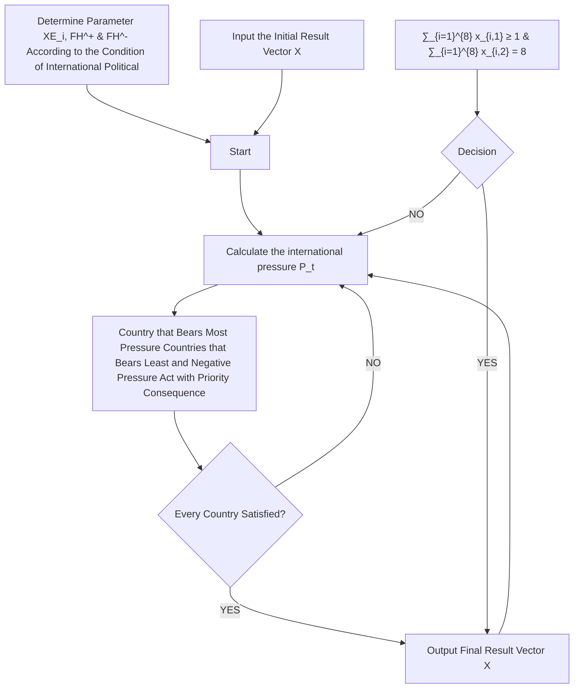

# Disaster for Island Country but Games of Big Power: Find new home for EDPs and their culture

Summary

Research has identified a fact that several island countries are at risk of completely disappearing due to the raising sea level. This put the problem of relocating Environmentally Displaced Persons (EDPs) and protecting their unique culture forward for the international society.

To measure the severity of the problem, a circular cone model is built to simulate the world geography and two kinds of conditions are discussed: raising in a constant speed and in an accelerated speed. By 2050, the sea level will raise 0.16 m and about thirty million people will be affected directly. Eleven countries including Tuvalu, Maldives, Marshall, Tonga, Palau, Kiribati, Micronesia, Fiji, Bahamas and Gambia will sink and about five million people will be EDPs by then.

To find the countries who are in responsibility for the terrible disaster, we built the site selection and moving model based on the game theory. We built the responsibility index with three chosen factors: population density, accumulative carbon emission and GDP. Finally, eight countries are selected to accept EDPs and other countries should share the duty to provide economical supports. We use game theory to simulate the negotiation between big powers in order to select the specific country who accepts the refugees. Considering the complexity of political conflicts, international pressure is defined and it pushes the country change their action. Finally we give a schedule for international society which includes when and which country will submerge and who should accept the EDPs.

To show how the culture will evolve as locals and the EDPs are mixing, we use the non-linear ordinary differencial equation build National Culture Changing model and use the Lyapunov’s second method to solve it. We use the number of people who master the culture to measure the existence of culture and we use differential equation to describe the change of the number of people who master of the culture. In the model, two important factors that the possibility of marriage between two groups of people and the possibility of inheriting the culture of mixed-blood crowd are stressed. We separately calculate the range of two parameters that makes the culture protected best. Then we analysis five single policies and six combined policies and give the suggested policy: inhabit and education combined policy in the initial decades and scatter and powerful culture protection combined policy.

Finally, the models and results are tested. The circular cone model performs well under the present condition. In the National Culture Changing model, two parameters act well with the test and show well robustness, which ensure the efficiency of our work.

Keywords: circular cone simulating, EDPs and refugees, game theory and political simulating, National culture changing model, combined policies, Lyapunov’s second method.

## Contents

## 1 Introduction 1

1.1 Background . .  
1.2 Our works . . .

## 2 Assumptions of models 1

## 3 Notations and signs 2

## 4 Countries at risk model 2

4.1 The way of simulating a island country . . . 2

4.1.1 Simulation of the world geography . . . 2  
4.1.2 Simulation of the distribution of people . . 3

4.2 The timetable of countries sunk . . . 4

4.2.1 The speed of sea level rising . . 4  
4.2.2 The result of sea level rising . . 5

## 5 Site selection of refugees moving model 7

5.1 Countries in responsibility 7  
5.2 The basic attitude towards EDPs 8  
5.3 Game of great power 9

5.3.1 International pressure simulation . . 10  
5.3.2 Game rules 10

5.4 The solution and result of the game theory model 11

## 6 The protection and inheritage of culture 13

6.1 Change of people and culture . . . 13  
6.2 The solution to the model . 14

6.2.1 The numerical solution in some special cases 15  
6.2.2 The tendency analysis based on Lyapunov’s second method 15

6.3 Politics design guided by the model 16

## 7 Exhibition of results 17

## 8 Sensitivity analysis 18

8.1 When the circular cone model be accurate 18  
8.2 The countries who have to accept refugees. 19  
8.3 Sensitivity analysis of the protection and inheritage of culture model . . 19

## 9 Strengthes and Weaknesses 20

9.1 The strengthes of the model . . 20  
9.2 The weaknesses of the model . 20

## References 20

## 1 Introduction

## 1.1 Background

Some low attitude countries will disappear due to the rising sea level in the near future, which will not only bring lots of environmentally displaced persons but also put their unique and valuable culture into a dangerous situation. Therefore, It’s necessary to relocate people and protect their culture.

The environmentally displaced persons (EDPs) need a new home, but what they need is not only a piece of land. The EDPs should have some human rights, and some scholars think the country that lost their land is still a country. Therefore, the policy that the accepting countries apply to them is also a problem.

## 1.2 Our works

In order to help the UN to relocate the EDPs and protect their culture, we have completed the following tasks:

• We use the circular cone to simulating the real geography of the submerged island and we assume the population density decreases linearly with altitude. Then we calculated the sea level in the future when the sea level rises at a constant speed and accelerated. We assume that if 30% population is influenced, the persons in the island should migrate so we predict the migration timetable.  
• In order to determine where the EDPs should migrate, first, we choose some candidate countries. We build a comprehensive index to measure the responsibility and ability of a country and we choose eight candidate countries. Then we use the Game Theory to simulate the negotiation process, finally we predict four countries that will accept EDPs in the future 50 years, including Australia, Canada, The USA, Russian.  
• We use the number of persons who get command of the culture to measure the decrease of the culture. We use a differential equation to describe the change of different kind of people and we get the numerical solution.

## 2 Assumptions of models

1. The population density on the island decreases linearly with the elevation. Most people live in the plant, because the mountain is not suitable for farming and fishing. In order to simplify the question, we can assume it decreases linearly.  
2. The EDPs from a country should migrate to another country as a whole part instead of separately move to several countries. The number of EDPs from a country is just about several ten thousands, and some may be less. The country that accept them has the ability to accept a whole country. And it’s better to  
3. It’s harmful for a country to accept EDPs or donate some money and suppliers if we only consider the economic factors. The government will spend money to offer them jobs, living space and some social welfare, and the coming of the EDPs may cause the discontent of the discontent local people.

4. The policy to the problem of EDPs will be influenced by the pressure from other countries. The problem of EDPs is a worldwide problem, if a country refuse to contribute to solve the problem, other countries will give him some of the sanction.  
5. If the EDPs move to another country, they should join another country and have the nationality of another country, at the same time, they will have the same rights with citizens of another country. If the country of the EDPs still exists, it’s hard for another country to accept them. If some EDPs aren’t willing to change their nationality, they can negotiate with another country before they have to migrate, the UN only gives them a guaranteed option.

## 3 Notations and signs

Table 1 shows the main notations and signs used in this paper. Other notations and signs will be declaired or defined when using.

Table 1: Declaration of notations and signs

<table><tr><td>Symbols</td><td>Unit</td><td>Description</td></tr><tr><td>H</td><td>m</td><td>Altitude of land</td></tr><tr><td>L</td><td>m</td><td>Length of generatrix</td></tr><tr><td>h</td><td>m</td><td>Raised height of sea level</td></tr><tr><td>P or p</td><td>-</td><td>Population in a country</td></tr><tr><td>v</td><td> $m \cdot a^{-1}$ </td><td>The speed of raising sea level</td></tr><tr><td>a</td><td> $m \cdot a^{-2}$ </td><td>The acceleration of raising sea level</td></tr><tr><td>R</td><td>-</td><td>Responsibility index</td></tr><tr><td>w</td><td>-</td><td>The weight of specific factor</td></tr><tr><td>X</td><td>-</td><td>The result vector of game theory</td></tr><tr><td>XE</td><td>-</td><td>The expectation of the solution</td></tr><tr><td>XD</td><td>-</td><td>The difference between reality and expectation</td></tr><tr><td>Pt</td><td>-</td><td>the international pressure</td></tr><tr><td>FH</td><td>-</td><td>favor or hate index between two country</td></tr></table>

## 4 Countries at risk model

## 4.1 The way of simulating a island country

## 4.1.1 Simulation of the world geography

There are almost two hundred countries in the world but some of them will never be effected by the raising sea level in two hundred years because they are inland countries. So here we select countries with coastline as research objects.

In this problem, we need to consider two major aspects: how much the land will be submerged and how many people will be affected. The first question is directly relating to the geography of the country. But the real terrain and coastline of a country are too rough. So we need to find a wa to simplify the geography. Here we select two major character to simulating the real geography:

elevation and national territorial area. the simplest but most useful geometry is circular cone. See the following figure 1 to get more details

text_image

Average Altitude
H
Generatrix L
Bottom Radius R
Angle
A
National Territory Area
S

Figure 1: Using the Circular Cone to Simulating the Real Geography

In the figure 1, H means the average altitude of the country and S means the national territory area of it. These two parameters are given by the real world. Other parameters that play an important role for the following model can be inferred from the given data by elementary geometry and elementary calculus:

$$
\left\{ \begin{array}{l} R = \sqrt {\frac {- H ^ {2} + \sqrt {H ^ {4} + \frac {4 S ^ {2}}{\pi^ {2}}}}{2}} \\ L = \frac {S}{\pi} \sqrt {\frac {2}{- H ^ {2} + \sqrt {H ^ {2} + \frac {4 S ^ {2}}{\pi^ {2}}}}} \\ A = \frac {R}{L} \end{array} \right. \tag {1}
$$

The equations (1) above show how to infer the basic parameters of a circular cone. Now we get the point on simulating the nature geography environment.

## 4.1.2 Simulation of the distribution of people

A parameter ρ which means the population density is introduced. The simplest idea is assuming population are uniform distribution. But it gives an obvious error because people always live in the cities that the density is far away from uniform distribution. Fortunately, we find a group of data that describing how many people are living in the land under five meters’ sea level in the database of World Bank. So we use this data to correct the density. See the distribution in the Figure 2.

Firstly we assume the linear relation between ρ and l:

$$
\rho = k l \tag {2}
$$

The equation (2) means the out layer of the sector shares more density which means we assuming more population are distributing on the bottom of the country and less people are living in the mountains. This is much more close than uniform distribution. And then we calculate the ρ under the condition of Linear Distribution:

$$
\int_ {0} ^ {L} A \cdot 2 \pi l \rho d l = \int_ {0} ^ {L} A k \cdot 2 \pi l ^ {2} d l = \frac {2}{3} A k \pi L ^ {3} = P _ {A} \Rightarrow k = \frac {3 P _ {A}}{2 A \pi L}
$$

关注数学模型(3) 获取更多资讯

text_image

Uniform Distribution
of Population
L
ρ is a constant

text_image

Linear Distribution
of Population
ρ = kl
D
ρ varies with radius

Figure 2: Simulating Population Distribution on Circular Cone

Following the equation (3), we can get the coefficient k to describe the linear relation. But this also can be improved by the data that describing how many people are living in the land under five meters’ sea level. We can solve it similarly that

$$
k = \frac {2 P _ {p}}{2 A \pi \left(3 D L ^ {2} + D ^ {3} - 3 L D ^ {2}\right)} \tag {4}
$$

In the equation (4), $P _ { p }$ means the population living in the land under five meters’ sea level. Using the equation, we obtain the corrected linear relation of population in the circular cone.

## 4.2 The timetable of countries sunk

## 4.2.1 The speed of sea level rising

As we all know, some nations may disappear slowly, while other nations may be wiped out in a catastrophic disaster such as tsunami. But it’s too hard to predict when the sudden disaster will happen, so we use probability of disaster happening to describe when the people should migrate. We use the number of persons who is influenced by the rising sea level to measure the probability of disaster happening. So, by this way, we turn an uncertain problem into a definite problem.

The raising sea level is definitely the directly cause of the risks. Now we have measures to simulate the geography, we need to know how the sea level is raising, and then we can give the direct answer to the questions that when the territory will be submerged and how many people will be affected.

According to the research conducted by the former people, we get to know the basic description of the question. The sea level is raising at the speed of $1 . 3 - 1 . 9 \ : \mathrm { m m \cdot a ^ { - 1 } }$ since the twentieth century. The trend is accelerating when the world stepped into the 1990s. The speed is about 3.1 mm $\cdot \mathbf { a } ^ { - \mathrm { i } }$ . In the latest research, The latest speed is 3.8 mm · $\mathbf { a } ^ { - 1 }$ . And we will use the speed to measure the raising of sea level. So use a character here:

$$
v _ {0} = 3. 8 \mathrm{mm} \cdot \mathrm{a} ^ {- 1}
$$

However, we notice a fact that the trend is accelerating: the value of speed is 2.72 mm · $\mathbf { a } ^ { - 1 }$ in 2002, but in 2014 the value is about 3.83 mm $\cdot \mathbf { a } ^ { - 1 }$ . Within twelve years the speed has added a half, so we couldn’t ignore the accelerating trend. So we assume that the accelerating trend is described by a which means the accelerating speed. The value can be acquired by the equation:

$$
a = \frac {v _ {2 0 1 4} - v _ {2 0 0 2}}{2 0 1 4 - 2 0 0 2} = 0. 0 9 2 5 \mathrm{mm} \cdot \mathrm{a} ^ {- 2} \approx 0. 0 1 \mathrm{mm} \cdot \mathrm{a} ^ {- 1}
$$

Now we can describe the raising sea level. as the years go, the sea level will raising the following height:

$$
h _ {y} = v _ {0} y + \frac {a}{2} y ^ {2} \tag {6}
$$

In the equation (6), y means the added year since 2020, $h _ { y }$ means the raised height of sea level. But we need an extra transfer, to make the height map the d in the sector:

$$
\frac {h _ {y}}{H} = \frac {d _ {y}}{L} \Rightarrow d _ {y} = \frac {h _ {y} L}{H} \tag {7}
$$

Using the equation (7) to transfer the height to submerged area in the sector.

## 4.2.2 The result of sea level rising

Combing the simulation of geography and the model of raising sea level, we can answer the two question: when and how severe the risk is. We show the link between the two models in the following figure 3.

text_image

Raising Sea Line
Base Sea Line
Submerged Area
Submerged Area
dy = h_y L / H

Figure 3: Raising Sea Level is Submerging the Circular Cone Country

The meanings in the figure 3 is as followings: the sea level at present is the bottom of the circular cone. With the sea level raising, the sea will submerge the circular cone and the layer will also sink into the ocean. The submerged area represents the sink territory. Then we spread the surface, and use equation (4) to calculate the population who are suffering.

Before we point out which country will be at risk, we do the work on the world to figure out how severely the problem will be.

First we assuming every country will take no more attention to the raising sea level and the sea level will raise with accelerate speed. The outcome are showed in the following table 2.

Table 2: World-accelerate condition

<table><tr><td>Year (since 2020)</td><td>Raised Sea Level(m)</td><td>Sink territory (km2)</td><td>influenced people</td></tr><tr><td>2050</td><td>0.16</td><td>63,183/0.05%1</td><td>26,566,782/0.31%</td></tr><tr><td>2100</td><td>0.62</td><td>247,864/0.22%</td><td>104,179,229/1.21%</td></tr><tr><td>2170</td><td>1.70</td><td>672,668/0.58%</td><td>282,468,896/3.30%</td></tr><tr><td>2220</td><td>2.76</td><td>1,094,319/0.95%</td><td>459,111,711/5.37%</td></tr></table>

There are a few conclusions summarized from the table 2. First, With the accelerating speed, the sea level will raise rapidly and will reach 2.76m in 2220. By then, about 460 million people will be influenced directly and several billion people will be influenced indirectly with reasonable inference. Second, within about one hundred years, about 2% population will lose their homeland and it may affect about 10% people in the world and cause international problem. So the raising sea level really present big problem for the whole world.

But the inference is somehow unreal because countries will do something to stop the awful trend. If major countries, such as American, China and Russia, are aware of the seriousness of the problem, they will take measures to stop the sea level raising so rapid. To show this condition ,we recalculate the result under the condition of a constant speed.

Table 3: World-Constant condition

<table><tr><td>Year (since 2020)</td><td>Raised Sea Level(m)</td><td>Sink territory (km2)</td><td>influenced people</td></tr><tr><td>2050</td><td>0.11</td><td>45,303/0.04%</td><td>19,046,347/0.22%</td></tr><tr><td>2100</td><td>0.304</td><td>120,787/0.11%</td><td>50,781,761/0.59%</td></tr><tr><td>2170</td><td>0.57</td><td>226,425/0.20%</td><td>95,172,506/1.11%</td></tr><tr><td>2220</td><td>0.76</td><td>301,851/0.26%</td><td>126,855,452/1.48%</td></tr></table>

In the table 3, we can know that even if the sea level is raising at a constant speed, by 2220 there will be 127 million people will lose place to live and about one billion people will be influenced. So on the level of world, sea level raising is really a big problem that may destroy the whole modern society.

For island countries such as Maldives, their homeland will be submerged within several years, and their population will transfer into EDPs. For them the problem is so disastrous that they will never overcome it without any support from the international world. To provide support, we need to illustrate when and which country will face the disaster. To figure out the solution, we calculate all of the countries in the world and find eleven countries are at risk within 200 years with constant raising speed. They are Tuvalu, Maldives, Tonga, Marshall, Samoa, Palau, Kiribati, Micronesia, Fiji, Bahamas, Gambia. Put them in a world map and we can get the figure 4.

text_image

Palau
Micronesia
Fiji
Marshall
Tuvalu
Samoa
Tonga
Kiribati
Bahamas
Gambia
Maldives

Figure 4: Countries at Risk in the World Map

In the figure 4, we can get the conclusion that most of them are island countries in the middle of major oceans. To give the international world a much more detailed time schedule, we list the predicted time for these eleven countries with four standards which based on the influenced population.

Table 4 show all of the countries that will be effected by the raising sea level within 200 years with constant raising speed. Here we give four standard to judge whether the country is iry at risk:

Table 4: When and which country is at risk2

<table><tr><td>country</td><td>100%</td><td>80%</td><td>50%</td><td>30%</td><td>country</td><td>100%</td><td>80%</td><td>50%</td><td>30%</td></tr><tr><td>Tuvalu</td><td>2054</td><td>2047</td><td>2037</td><td>2030</td><td>Kiribati</td><td>2158</td><td>2128</td><td>2085</td><td>2058</td></tr><tr><td>Maldives</td><td>2094</td><td>2078</td><td>2055</td><td>2041</td><td>Micronesia</td><td>2161</td><td>2130</td><td>2086</td><td>2059</td></tr><tr><td>Tonga</td><td>2098</td><td>2081</td><td>2057</td><td>2042</td><td>Fiji</td><td>2207</td><td>2166</td><td>2108</td><td>2071</td></tr><tr><td>Marshall</td><td>2123</td><td>2100</td><td>2069</td><td>2049</td><td>Bahamas</td><td>no risk</td><td>no risk</td><td>2193</td><td>2122</td></tr><tr><td>Samoa</td><td>2142</td><td>2115</td><td>2077</td><td>2054</td><td>Gambia</td><td>no risk</td><td>no risk</td><td>2194</td><td>2123</td></tr><tr><td>Palau</td><td>2153</td><td>2124</td><td>2083</td><td>2057</td><td></td><td></td><td></td><td></td><td></td></tr></table>

1. 30% people are affected means the problem is severe enough that the government must start to act to find support in the international society.  
2. The line of 50% means the citizens should start to leave their homeland because the original land couldn’t support all of the citizens.  
3. 80% means final year for the country to remove all the citizens from the homeland to other countries.  
4. 100% means the country lose all their land and the nation has disappeared. The country is disappeared in the meanings of geography. The government becomes an Exile government. The international society should judge whether they could still be called nations.

## 5 Site selection of refugees moving model

## 5.1 Countries in responsibility

All eleven countries are suffering from the sea level, and all of their citizens become EDPs. According to the research about the raising sea level, the major reason is global warming caused by greenhouse gases. Since industry revolution in 18th century, countries around the world is exhausting gases by using fossil fuels. And most of them become developed countries who shares most GDP in the world. But the consequence caused by them is making small island countries in Pacific disappear. So all the countries who pollute the earth environment should take the responsibility to support the countries at risk.

To find out which countries are in the most responsibility, we build the Responsibility Index $R _ { \mathrm { c o u n t r y } }$ to describe the fact. We include three major factors:

1. Accumulative carbon emission of a country since 18th is used to measure the direct responsibility in causing the raising sea level.  
2. Total GDP in a year of a country is included to show the international morality and justice. Because the developed country should concentrate more on the global affairs to build the world a better one.  
3. Population density of a country. This measures the objective condition for a country to accept refugees. If a country have too much citizens, they won’t have extra resources to support added people, and this also create difficulty in preserving the unique culture of EDPs.

To build the Responsibility Index, we use the equation below:

$$
R _ {\text { country }} = w _ {\text { carbon }} \cdot C B ^ {*} + W _ {\mathrm{GDP}} \cdot G D P ^ {*} + W _ {\mathrm{PD}} \cdot P D ^ {*} \tag {8}
$$

In equation 8, w means the weight distributed among three factors. $C B ^ { * }$ means the carbon emission of a country. $G D P ^ { * }$ means the gross domestic product, and $P D ^ { * }$ means the population density of a country. All three factors in the equation should be normalized to remove dimension and create comparability. Also they are transferred into maximum type index.

We use the index to calculate the responsibility of each country. How they deal with the EDPs problem should be discussed now. There are two basic ways to help refugees: supply economic aids or accept refugees. The way to accept EDPs is relating to many international law problems, we will discuss in the following part but not here. Here we just assume that one country need to accept refugees from one sink country. As for supplying economic support, we think it is a 0-1 variable that we’ll not discuss the specific number. But a fact that we need to notice is not all country can accept refugees for various reasons, such as tiny territory, weak economic power or small number of original citizens. So here we spread countries into two group — Group A countries are countries that can provide economic and accept refugees; Group B countries are countries that only provide economic support.

Then we calculate $R _ { \mathrm { c o u n t r y } }$ for almost 200 countries. Here we make $w _ { \mathrm { c a r b o n } } = 0 . 5$ , wGDP = 0.3 and $W _ { \mathrm { P D } } = 0 . 2$ and do the rank in the table 5.

Table 5: Ranks of Countries Responsibility

<table><tr><td>Country</td><td> $R_{country}$ </td><td>Country</td><td> $R_{country}$ </td></tr><tr><td>The United States</td><td>0.99123124</td><td>Canada</td><td>0.276076</td></tr><tr><td>China</td><td>0.67102307</td><td>French</td><td>0.258283</td></tr><tr><td>Japan</td><td>0.31580978</td><td>Brazil</td><td>0.256073</td></tr><tr><td>Russian</td><td>0.30011196</td><td>Australia</td><td>0.249246</td></tr></table>

All eight countries above are selected into the group A country for they have the direct responsibility to deal with international problems. The following countries that share less responsibility are spread into Group B countries.

Table 6: Countries in Group B

<table><tr><td>Country</td><td> $R_{country}$ </td><td>Country</td><td> $R_{country}$ </td><td>Country</td><td> $R_{country}$ </td></tr><tr><td>Germany</td><td>0.24279395</td><td>South Africa</td><td>0.225945</td><td>Argentina</td><td>0.215719</td></tr><tr><td>The British</td><td>0.23614349</td><td>Iran</td><td>0.223709</td><td>Poland</td><td>0.214322</td></tr><tr><td>Mexico</td><td>0.23563659</td><td>Spain</td><td>0.223441</td><td>India</td><td>0.213933</td></tr><tr><td>Saudi Arabia</td><td>0.23044163</td><td>Italy</td><td>0.221203</td><td>The Swedish</td><td>0.210407</td></tr></table>

Up to now we have illustrated three things: how severe the problem is, which countries are at risk and which country need to take the responsibility to deal with the EDPs. But the refugee problem is so complex that we need discuss the definition in law of EDPs and we couldn’t solve it with simple optimization model.

## 5.2 The basic attitude towards EDPs

According to the research conducted by international law experts, a countr or y without territ 关注2 couldn’t be called modern national country. So, if a humane country is willing to donate them a piece • ther

of land to help them rebuild the modern national country, they are not refugees. But if not, they should be defined as refugees and the international society should treat them fairly.

Out of the concern of international morality, the great power should provide them with an option that ensures the basic human right for the refugees. But this option couldn’t ensure the existence of the original country or government. Because EDP refugees have no choice, there must be a country who accept them permanent. To ensure them with human right, they should be the citizens of the new country. At the same time, a small island country has little population and a big country have the ability to accept them as a whole. This also give benefits to protect their culture. Also, relocating is a costly work, every country should provide economic supports.

Now we obtain the basic attitude to EDPs:

1. The international society will provide EDPs with the last choice if they don’t find the humane country;  
2. The last choice should ensure the basic right for EDPs but not nation or government. All the refugees should be the new citizens of the new country and be governed by the country. EDPs from one country should be accept as a whole for benefits of protecting culture.  
3. Countries in the world should provide economic support to EDPs.

## 5.3 Game of great power

After illustrating the basic points about EDPs, we have to discuss the pairing question: which big country will accept which disappearing country. Take a glance at the refugee problem of Syria and we know accepting refugees isn’t optimization among international society but is the game among great powers. They will negotiate for years to decide who take the duty. So here using the game theory fits the problem better.

In this problem, the selected eight countries are players and we use i $( i = 1 , 2 . . . 8 )$ to represent them, and we rank it by table 5 in the last section. They should do the decision on whether accept refugees and whether provide large quantity of economic supports. So decision domain includes four solutions:

$$
x _ {i} = (x _ {i 1}, x _ {i 2}) \in \{(0, 0), (0, 1), (1, 0), (1, 1) \} \tag {9}
$$

In this equation, xi means the decision vector of the country, and the decision is a 0-1 type variable. xi1 represents accept refugees and $x _ { i 2 }$ represents providing economical supports. One country has four basic solutions. We can easily give the priority sequence among four solutions out of the concern of national interest:

$$
x _ {i} = (0, 0) \rightarrow x _ {i} = (0, 1) \rightarrow x _ {i} = (1, 0) \rightarrow x _ {i} = (1, 1) \tag {10}
$$

This rank show that a country will protect their own interest and avoid doing more in this problem. If they have to change their solution, they will improve the solution gradually. But if a country shares the smallest and negative pressure, he can improve the solution backwards to meet his interest. Then for all eight countries, we have the processing and result vector X:

$$
X = \left(x _ {1}, x _ {2}, \dots , x _ {8}\right) = \left[ \begin{array}{l l l l} x _ {1 1} & x _ {2 1} & \dots & x _ {8 1} \\ x _ {1 2} & x _ {2 2} & \dots & x _ {8 1} \end{array} \right] \tag {11}
$$

ble solution. The solution space is so big that we couldn’t solve it with pure game There are in total 48 kinds of mathematical solution. Now we have to consider how to obtain feasi- $4 ^ { 8 }$ hoy to obtaie theory mathematic theoryma athen method, so we introduce simulating theory into the game to decide the actions order of the country to find the final conclusion.

But the game may not make every country satisfied. If so, we have to set an end condition: at least one country have decided to accept the EDPs and all the other countries provide supplies. This can be defined:

$$
\left\{ \begin{array}{l} \sum_ {i = 1} ^ {8} x _ {i 1} \geq 1 \\ \sum_ {i = 1} ^ {8} x _ {i 2} = 8 \end{array} \right.
$$

## 5.3.1 International pressure simulation

The simulation index we introduce is the international pressure. The reason we choose it is international pressure always is the final factor to push a country act to face an international problem. The pressure in political can be produced in many ways such as censuring, economic sanctions or isolation policy. Here we define a matrix to show the international pressure:

$$
P _ {t} = [ p _ {i j} ] _ {8 \times 8}
$$

$p _ { i j }$ is an index that measures how much pressure the country i gives to the country $j$ which is influenced by many factors. And then we know the pressure that the county j bears is:

$$
p _ {j} = \sum_ {i = 1} ^ {8} p _ {i j}
$$

The country that bears most pressure will give in and act to change his solution $x _ { j }$ by the priority sequence.

## 5.3.2 Game rules

The problem turns into how we give the specific value to international pressure matrix X. This should be reasonable to ensure the final solution is reasonable. Here we give some quantitatively described game rules to give the specific value.

1. Higher rank means higher pressure. In the analysis of $r _ { \mathrm { c o u n t r y } }$ , they ate the cake of greenhouse gases emission, but the island countries eat the poison. So in this problem, biggest power should bear the biggest pressure. to make it quantitatively, we have:

$$
\sum_ {i = 1} ^ {8} | p _ {i j} | > \sum_ {i = 1} ^ {8} | p _ {i (j + 1)} |
$$

2. Bigger power can put more pressure on others. In international political games, the country with more military force, gross domestic product or extreme government like North Korean will have more weight in negotiation. This is related to the strength of a country and it is objective. At the same time, one country has limited influence on this issue so the pressure given by the biggest power have an upper limit and we make it is 8.0 here. So we can get:

$$
\left\{ \begin{array}{l} 8 \geq \sum_ {j = 1} ^ {8} | p _ {1 j} | \\ \sum_ {j = 1} ^ {8} | p _ {i j} | \geq \sum_ {j = 1} ^ {8} | p _ {(i + 1) j} | \end{array} \right.
$$

3. The exact pressure value is decided by the difference between reality and expectation. We assume that each country has their own ideas about the best solution for the refugee problem. To present it, we define result vector:

$$
X E _ {i} = (x e _ {1}, x e _ {2}, \ldots , x e _ {8}) _ {i} = \left[ \begin{array}{c c c c} x e _ {1 1} & x e _ {2 1} & \dots & x e _ {8 1} \\ x e _ {1 2} & x e _ {2 2} & \dots & x e _ {8 2} \end{array} \right] _ {i}
$$

In this equation, $X E _ { i }$ represents the best solution that country i expects. $x e _ { j }$ means the detailed expectation for country $j .$ . The expectation may be different from the real condition represented by vector X. We use the vector to show it:

$$
X D _ {i} = (x d _ {1}, \dots , x d _ {8}) _ {i} = \{(x e _ {1 1}) _ {i} - x _ {1 1} + 2 ((x e _ {1 2}) _ {i} - x _ {1 2}), \dots , (x e _ {8 1}) _ {i} - x _ {8 1} + 2 ((x e _ {8 2}) _ {i} - x _ {8 2}) \}
$$

In the equation, $X D _ { i }$ represents the difference between the real condition and expectation of country $i . \ x d _ { j }$ is the detailed difference of country j. Also every country don’t want to accepting EDPs, so it 2 times difference. Here we should pay special attention that the real condition may be better than the expectation. So xd could be a negative number. That means the country i will stand with country j and say words for him to prevent country j to do so much. And this means the negative international pressure.

However, the difference couldn’t decide the final pressure and another two factor should be concluded. Firstly, $x d _ { i }$ and pressure couldn’t linear relation. Bigger difference means much bigger pressure. Here we make the relation in cubic function. Another factor is that many countries have their own political favors or hates, so the coefficient couldn’t be the same for the function. We define the coefficient matrix:

$$
\left\{ \begin{array}{l} F H ^ {+} = [ f h _ {i j} ^ {+} ] _ {8 \times i} \\ F H ^ {-} = [ f h _ {i j} ^ {-} ] _ {8 \times i} \end{array} \right.
$$

In the equation, $f h _ { i j }$ means the coefficient for the cubic function. The meanings in reality means the relations between two countries. If country i and country j are in good relation, they will share smaller $f h _ { i j } ^ { + }$ and larger $f h _ { i j } ^ { - }$ . If their relation is bad, the consequence of fh will be a reversal. Also, $f h$ should be a positive number. Now we can get the exact international pressure value that country i give to country j:

$$
p _ {i j} = \left\{ \begin{array}{l l} f h _ {i j} ^ {+} (x d _ {j}) _ {i} ^ {3}, & (x d _ {j}) _ {i} > 0 \\ f h _ {i j} ^ {-} (x d _ {j}) _ {i} ^ {3}, & (x d _ {j}) _ {i} <   0 \end{array} \right.
$$

So with the quantitative formula to calculate the pressure, we can summarize the final gaming theory model as follows:

Figure 5 shows how we use the game theory to simulating the game among big powers to decide the final results in the game. According to the model, at least one country will accept the EDPs and other countries will provide the economic supports. But the model have two parts that couldn’t be a quantitative factor: the judgement of expectation of one country and the relation between two countries. So the reasonable result should be built in the well judgment of international politics.

## 5.4 The solution and result of the game theory model

The game theory is a totally abstract one. To get the final results, we need to do plenty of works. Here we select one circle to show how the model is running.

In the circle, we have the solution:

$$
X = \{(1, 0), (0, 0), (0, 0), (1, 0), (0, 0), (1, 0), (1, 0) (0, 0) \}
$$

flowchart

Figure 5: The Progress of Game Theory Simulating

This means America, Russia, France and Brazil are going to donate help to the disappearing country, but now no country is willing to accept the EDPs. so we have to run a circle now. This solution is totally different from the expectation of America:

$$
X E _ {1} = \{(0, 0), (1, 1), (1, 0), (1, 1), (0, 0), (1, 0), (1, 0), (0, 1) \}
$$

America expects China and Russia provide economic support and provide candidate habitats for EDPs, but he doesn’t want himself and his alliances to do anything. And other countries should provide suppliers within their ability. So we can get:

$$
X D _ {1} = (- 1, 2, 1, 1, 0, 0, 0, 1)
$$

The value means that America will put pressure on China, Japan, Russia and Australia. Combined with the pressure calculating formula, we can get the pressure given by America in this circle:

$$
(p _ {1}) _ {t} = (- 0. 8, 0. 9 9 5, 0. 3 3 6, 0. 6 4, 0, 0, 0, 0. 4 2 5)
$$

This value means America is trying to tell the world that he should stop from providing assistance. But China and Russia should take the responsibility because they doesn’t full fill their duty. As for Japan and Australia, they need step a little forward to meet the demand of America. Also, America will tell the world that Canada, French and Brazil have done the right thing.

We need to repeat this work for eight times to get the international pressure and finally we can get the result

$$
P = (- 0. 1 2 8, 3. 6 8 5, 1. 2 2 9, 3. 4 2 1, 0. 2 6 3, 0. 5 2 8, 0. 3 5 5, 2. 3 3 5)
$$

In the pressure matrix, we can know that China are bearing biggest international pressure and he need to change his decision. After this circle game, we get the new solution matrix:

$$
X = \{(1, 0), (1, 0), (0, 0), (1, 0), (0, 0), (1, 0), (1, 0) (0, 0) \}
$$

The only difference is China agree to provide economic assistance due to the international pressure. Then we do the circle again and again till the solution reach the end condition. We record this progress.

In table 7 we can see the gaming between eight countries. At first no country wants to do anything. But with the circle going on, we almost every country is going to donate. Then the gaming actually le gaming acti

Table 7: The process of gaming theory

<table><tr><td>Circle</td><td>1</td><td>2</td><td>3</td><td>4</td><td>5</td><td>6</td><td>7</td><td>8</td><td>9</td><td>10</td><td>11</td><td>12</td><td>13</td><td>14</td><td>15</td><td>16</td></tr><tr><td>America</td><td></td><td></td><td></td><td> $D^{3}$ </td><td></td><td></td><td>D</td><td></td><td></td><td>D</td><td></td><td>D</td><td></td><td>D</td><td></td><td>D</td></tr><tr><td>China</td><td></td><td></td><td></td><td></td><td>D</td><td>D</td><td>D</td><td>D</td><td>D</td><td>D</td><td>D</td><td>A</td><td>A</td><td>D</td><td>D</td><td>D</td></tr><tr><td>Japan</td><td></td><td></td><td></td><td></td><td></td><td>D</td><td>D</td><td>D</td><td>D</td><td>D</td><td>D</td><td>D</td><td>D</td><td>D</td><td>D</td><td>D</td></tr><tr><td>Russia</td><td>D</td><td>D</td><td>D</td><td>D</td><td>D</td><td>D</td><td>D</td><td>D</td><td></td><td></td><td>D</td><td></td><td>D</td><td></td><td>D</td><td>D</td></tr><tr><td>Canada</td><td></td><td></td><td></td><td></td><td></td><td></td><td></td><td>D</td><td>D</td><td>D</td><td>D</td><td>D</td><td>D</td><td>D</td><td>D</td><td>D</td></tr><tr><td>France</td><td></td><td>D</td><td>D</td><td>D</td><td>D</td><td>D</td><td>D</td><td>D</td><td>D</td><td>D</td><td>D</td><td>D</td><td>D</td><td>D</td><td>D</td><td>D</td></tr><tr><td>Brazil</td><td></td><td></td><td>D</td><td>D</td><td>D</td><td>D</td><td>D</td><td>D</td><td>D</td><td>D</td><td>D</td><td>D</td><td>D</td><td>D</td><td>D</td><td>D</td></tr><tr><td>Australia</td><td></td><td></td><td></td><td></td><td></td><td></td><td>D</td><td>D</td><td>A</td><td>A</td><td>A</td><td>D</td><td>D</td><td>D</td><td>A</td><td>A</td></tr></table>

is playing between big powers: America, China and Russia. There is no possibility to make every country satisfied, so the game end in circle 16. The condition is Australia agree to accept EDPs, other seven countries agree to donate.

In the front part, we know eight countries are going to sink. So we run the model for five times and get the final schedule for the EDPs in all five countries.

Table 8: Schedule for accepting EDPs

<table><tr><td>The sinking country</td><td>The countries accepting the EDPs</td><td>Year of the game</td></tr><tr><td>Tuvalu</td><td>Australia</td><td>2030</td></tr><tr><td>Maldives</td><td>America</td><td>2041</td></tr><tr><td>Tonga</td><td>Canada</td><td>2042</td></tr><tr><td>Marshall</td><td>China</td><td>2049</td></tr><tr><td>Samoa</td><td>Russian</td><td>2054</td></tr></table>

## 6 The protection and inheritage of culture

In order to find the best way to protect the culture from the sunk countries, we should find the rule in national culture inheriting. There is three main ways in inheriting a kind of culture: inheriting with the development of the nation, spreading and being accepted by other peoples (especially the native people) and being recorded in literatures and books.

The first way is the most common and easy way to inherit a culture, while the other two is remedial measures preparing for the worst situation which we should try our best to avoid. Therefore, we should analyse and predict the change of the people in the nation.

## 6.1 Change of people and culture

Once a island country sink and move to another country, we can consider it a new nation in the country it moves to. They will marry freely and raise their children, grandchildren and even further descendents, which mainly inherit the culture of the nation. We divide the people into three categories:

• The aborigines or assimilated immigrations who have few knowledge of culture of the immi- rejof the m grant nation, marked A;

• The immigrations who completely master knowledge of the immigrant nation, marked I;  
• The mix-bloods or other amateurs who partly master and spread knowledge of the immigrant nation, marked M.

A country accepting refugees usually have more than 10 million people and usually accept no more than 100 thousand refugees. Therefore, we assume the number of A is far more than M or I in a long time.

Considering that both of parents will influnce their children more or less (especially in their culture attribution), the kind of children is depended by parents in probabilities. The rule of six kind of family $( A \times A , A \times B , A \times C , B \times B , B \times C , C \times C )$ is shown as Table 9.

Table 9: The table of translation

<table><tr><td>Parents</td><td>A</td><td>M</td><td>I</td></tr><tr><td>A</td><td>A</td><td> $(1 - \alpha)A + \alpha M$ </td><td>M</td></tr><tr><td>M</td><td> $(1 - \alpha)A + \alpha M$ </td><td>M</td><td>M</td></tr><tr><td>I</td><td>M</td><td>M</td><td>I</td></tr></table>

The α in this table is two constants in [0, 1] dependent by nation relationship and policy.

Considering the relationship between the diffenent nations, for a people of M and I, the probablity to marry with A can be considered as a constant, marked $p .$ . In other situation, M and I will marry randomly and freely. We can use a differencial equation to describe the change of diffenent kind of people:

$$
\left\{ \begin{array}{l} \frac {d M}{d t} = k _ {b} \left[ p \alpha M + (1 - p) \left(\frac {M}{2 (M + I)} + \frac {I}{M + I}\right) + p I \right] - k _ {d} M \\ \frac {d I}{d t} = k _ {b} (1 - p) \frac {I}{2 (M + I)} - k _ {d} I \end{array} \right.
$$

Which $k _ { b }$ and $k _ { d }$ are birth and death rate which are two constants close to each other. Simplify this two equations and considering the starting value $M ( 0 ) = 0 , I ( 0 ) = I _ { 0 }$ , we can get the culture develop model:

$$
\left\{ \begin{array}{l} \frac {d M}{d t} = (k _ {b} p \alpha - k _ {d}) M + k _ {b} p I + k _ {b} \frac {1 - p}{2} \left(1 + \frac {I}{M + I}\right) \\ \frac {d I}{d t} = - k _ {d} I + k _ {b} (1 - p) \frac {I}{2 (M + I)} \\ M (0) = 0, I (0) = I _ {0} \end{array} \right. \tag {12}
$$

We need to solve the model and accept or reject them under the guide of the model.

## 6.2 The solution to the model

Model (12) is a starting value problem of a nonlinear differencial equation. In order to find the possible situation of the equation, we solve it numerically in some spacial situations.

## 6.2.1 The numerical solution in some special cases

Situation 1 We let $k _ { b } = 0 . 0 1 5 5 , k _ { d } = 0 . 0 1 5 , p = 0 . 9 , \alpha = 0 . 4$ . The result is shown in Figure 6(a). In this situation, $p$ is very large but α is not so large. We can see from Figure 6(a) that the culture deciline quickly and finally get almost lost after 700 years. This is the situation that the nation completely integrate into the host nation and accept its culture in a very short time.

line chart

| t/year | The data of M | The data of I |
| ------ | ------------- | ------------- |
| 0      | 0             | 10000         |
| 100    | 2800          | 3000          |
| 200    | 2200          | 1000          |
| 300    | 1800          | 600           |
| 400    | 1700          | 500           |
| 500    | 1700          | 500           |
| 600    | 1700          | 500           |
| 700    | 1700          | 500           |

(a) Situation 2

line chart

| t/year | The data of M | The data of I |
| ------ | ------------- | ------------- |
| 0      | 0             | 10000         |
| 100    | 4200          | 3500          |
| 200    | 2500          | 1000          |
| 300    | 1500          | 200           |
| 400    | 800           | 50            |
| 500    | 400           | 20            |
| 600    | 200           | 10            |
| 700    | 100           | 5             |

(b) Situation 1  
Figure 6: The tendency of the model in some special situations

Situation 2 We let $k _ { b } = 0 . 0 1 5 5 , k _ { d } = 0 . 0 1 5 , p = 0 . 0 5 , \alpha = 0 . 8$ . The result is shown as Figure 6(b). In this situation, $p$ is much smaller but α is larger. We can see from Figure 6(b) that the culture have a period of deciline and finally converge into a stable situation. This is the situation that the nation have their own society envionment and have a limit communication with the host nation.

## 6.2.2 The tendency analysis based on Lyapunov’s second method

The model itself is obviously impossible to solve the equation analytically. Therefore, we use the Lyapunov’s second method to analyze the tendency and stability of the solution to the equation. The differencial equation (12) has the only constant solution:

$$
\left\{ \begin{array}{l} M _ {*} = \frac {(p k _ {b} ^ {2} + 2 k _ {d} ^ {2}) (1 - p)}{2 k _ {d} ^ {2} - p (1 - 2 \alpha) k _ {b} ^ {2}} \\ I _ {*} = \frac {p \alpha (1 - p) k _ {b} ^ {2}}{2 k _ {d} ^ {2} - p (1 - 2 \alpha) k _ {b} ^ {2}} \end{array} \right.
$$

Let the Lyapunov function $f ( M , I ) = a ( M - M _ { * } ) ^ { 2 } + b ( I - I _ { * } ) ^ { 2 } + c ( M - M _ { * } ) ( I - I _ { * } )$ , then in the direction of the equation, we have

$$
\begin{array}{l} \frac {d f}{d t} = \frac {\partial f}{\partial M} \frac {d M}{d t} + \frac {\partial f}{\partial I} \frac {d I}{d t} = (2 a x + c y) \left((k _ {b} p \alpha - k _ {d}) x + k _ {p} b y + \frac {k _ {b} (1 - p) y}{2 (M + I)}\right) \\ + (2 b y + c x) \left(- k _ {d} y - \frac {k _ {b} (1 - p) x}{2 (M + I)}\right) \\ \end{array}
$$

which x := M − M∗, y := I − I∗. Let a = b = 1, c = 2kb p , we get

  
关注数学模型 获取更多资讯

$$
\frac {d f}{d t} = 2 \left(k _ {b} p \alpha - k _ {d}\right) x ^ {2} - \left(2 k _ {d} - \frac {2 k _ {b} ^ {2} p ^ {2}}{k _ {b} p \alpha - k _ {d}}\right) y ^ {2} - \frac {k _ {b} ^ {2} p (1 - p)}{k _ {b} p \alpha - 2 k _ {d}} \frac {x ^ {2} + y ^ {2}}{M + I} \tag {13}
$$

When $\begin{array} { r } { p < \frac { k _ { d } } { k _ { b } } } \end{array}$ , we can get that $\begin{array} { r } { \frac { d f } { d t } \leq 0 } \end{array}$ . Moreover,

$$
\Delta_ {f} = c ^ {2} - 4 a b = \frac {4 k _ {b} ^ {2} (k _ {b} (p + p \alpha) - 2 k _ {d}) (k _ {b} (p - p \alpha) + 2 k _ {d})}{(k _ {b} p \alpha - 2 k _ {d}) ^ {2}} \tag {14}
$$

then it’s obvious that $\begin{array} { r } { \Delta f \le 0 \Longleftrightarrow \alpha \ge \frac { 2 k _ { d } } { k _ { b } p } - 1 } \end{array}$ − 1.

Therefore, when $\begin{array} { r } { p < \frac { k _ { d } } { k _ { b } } } \end{array}$ and $\begin{array} { r } { \alpha \geq \frac { 2 k _ { d } } { k _ { b } p } - 1 } \end{array}$ 2kd − 1, there is f > 0 and d f ≤ 0 for all (M, I) 6= (M∗, I∗). From kb p $f > 0$ $\begin{array} { r } { \frac { d f } { d t } \leq 0 } \end{array}$ $\left( M , I \right) \neq \left( M _ { * } , I _ { * } \right)$ the Luapunov’s theorem we can konw that the constant solution $\left( M , I \right) \equiv \left( M _ { * } , I _ { * } \right)$ is stable. Because $( M _ { * } , I _ { * } )$ is in the first quartile, the solution will converge into a positive point, which means that the culture development will go into a stable balance situation rather than disappear gradually.

In order to protect the immegrate culture and lead it into a stable balance, we should control p in a small number but let α as big as possible. Therefore, out policy need to decrease excessive communication between nations and increase the effect of the immigrate culture.

## 6.3 Politics design guided by the model

Now we have use mathematical method to obtain the conclusion that controlling parameter p and enlarging α makes the unique culture be protected well.

Here we list four different policies:

1. Strong culture protect policy. such as organizing associations relative, applying for intangible cultural heritage for their culture and so on;  
2. Receive local education policy. Require the refugees to receive the politics, culture education systematically of the host country.  
3. Encourage non-government communication policy. This means the government will give less barrier for people to communicate with each other.  
4. Inhabit policy. This means that the government will spread a piece of land to settle the refugees.  
5. Scatter policy. This means the refugees can move around the country and settle at anywhere they like.

According to the research conducted by socialist, we can list the change of p and α with different policies.

From the table 10 we know a fact that no policy is all-powerful. If we want to protect the culture well, we need to pay the price. Sometimes the cost is unacceptable. If we control the EDPs with in a limited area, we can surely protect the culture well but the international society may accuse the policy is another kind of discrimination. But if we make all the EDPs act as local people, it may arouse the wave of nationalism in the country and the local people will refuse the EDPs and totally destroy the culture which is gradually disappearing. So we need to push a series of policies to maximum the

effect of protecting and minimum the cost.

Table 10: Single Policies that Influence Parameters

<table><tr><td>Policy number</td><td>α</td><td>p</td><td>Culture protection</td><td>other influence</td></tr><tr><td>1</td><td>↑</td><td>↓</td><td>Well</td><td>Discrimination</td></tr><tr><td>2</td><td>↓</td><td>↑</td><td>Bad</td><td>Nationalism</td></tr><tr><td>3</td><td>↑</td><td>—</td><td>Very Well</td><td>Costly</td></tr><tr><td>4</td><td>↑</td><td>↑</td><td>Unknown</td><td>Unknown</td></tr><tr><td>5</td><td>↓</td><td>—</td><td>Bad</td><td>Better adapts to new environment</td></tr></table>

Table 11: Policy combination

<table><tr><td>tradeoff</td><td>culture</td><td>other</td><td>cost</td><td>culture</td><td>other</td><td>cost</td></tr><tr><td>Policy</td><td colspan="3">Inhabit</td><td colspan="3">scatter</td></tr><tr><td>culture protection</td><td>Excellent</td><td>D &amp; N</td><td>plenty</td><td>Good</td><td>N</td><td>lot</td></tr><tr><td>unofficial connection</td><td>Good</td><td>A</td><td>Middle</td><td>Good</td><td>W</td><td>Very few</td></tr><tr><td>local education</td><td>Good</td><td>A &amp; W</td><td>middle</td><td>Bad</td><td>W</td><td>few</td></tr></table>

\*D: discrimination; N: nationalism; A: adapt well; W: get along well with other

In the table 2, we can easily know that culture protection may arouse the nationalism in all condition and may be costly. If the government encourage non-government communication between locals and EDPs, they could get along well with each other but the culture is at high risk disappearing. As for the local education, it can make EDPs adapt well and give a better chance for the government to take culture protect policy.

So take a conclusion, the best policies the local government takes should be:

1. The government should take inhabit policy when the EDPs going into their territory. At the same time, providing EDPs with local education till two kinds of people get along well with each other. This policy combination may last few decades.  
2. Then take the policy combination of strong culture protection and scatter. Because two kinds of people are getting well with each other, so there is low risk in nationalism and discrimination.

## 7 Exhibition of results

Now we have done all the work about modeling and solving. Here we will answer all five questions in the Problem.

According to our circular cone model and the prediction of sea level, the sea level will raise 0.16m and 63,183 km2 (0.05%) territory will sink. About 26,566,782 people (0.31% of all population) will be affected directly and more than one hundred million people will be influenced indirectly around the world. At the same time, eleven countries will disappear. They are Tuvalu, Maldives, Tonga, Marshall, Samoa, Palau, Kiribati, Micronesia, Fiji, Bahamas, Gambia (ranked by the sink time). About 4,680,563 people in total will be affected and Eleven kind of unique culture will be at risk.

According to analysis international laws, EDPs should be treated as refugees and be treated wit all basic rights. But the government or the national country may not be last if no humane countr is 2willing to accept the government. If no country accepts the EDPs, the international society should H select a country to receive all refugees of a country as a whole. But all of them should be citizens of the new country but listen to the local government. Also, other countries who didn’t accept EDPs should provide economical supports.

To help the international society to select one, we use game theory and political simulating to find the solution. And finally we get the schedule: Australia should accept Tuvalu in 2030; America should accept Maldives in 2041; Canada should accept Tonga in 2042; China should accept Marshall in 2049 and Russia should accept Samoa in 2054. Other countries who didn’t accept refugees should provide enough supports.

To answer the question 3 and 4, we build Nation culture changing model to describe the possible influence about the culture after the EDPs moves to new country. We use the population who know the culture well to describe the existence of one specific culture. In the model, we use p representing the probability to marry and α representing the probability of inheriting the culture of the mixed-blood crowd to be the major factors that influence the inherit condition. Then we use specialized mathematic method to find the stable point of the model to find the best value of solution. We get the point that p should be a small number but α should be big. Then we give five single policy that influence the two parameter to find the possible consequence of the policy. To optimize the policy, we do research on policy combination and finally find the best policy combination: in the initial decades, inhabit and education policy should be used, and scatter and strong culture protection policy should be used afterwards. On this way can find the best condition that avoid the discrimination and nationalism, also receive well effect on culture protection.

If no country accepts the EDPs, one of the most merciless things will happen in the modern international society. If the country that receiving the EDPs take the wrong policy into use, they may face the problem of discrimination or nationalism. There also another possibility that cost a lot but receive no effect on protecting.

## 8 Sensitivity analysis

## 8.1 When the circular cone model be accurate

When we simulate the raise of the sea level, we list two conditions: raising at a constant speed of 3.8 mm $\mathbf { a } ^ { - 1 }$ and raising with accelerate speed of 0.01 mm $\cdot { \bf { a } } ^ { - 2 }$ . Then we obtain the conclusion that the problem is really awful. Now we’ll research the sensitivity of the two parameters to perfect our discussion. Here we use algebraic expression to show the sensitivity.

In the part of calculating sink area, we have:

$$
\left\{ \begin{array}{l} \frac {\partial S}{\partial v _ {0}} = \frac {\pi L ^ {2}}{H ^ {2}} \left(\frac {2 H}{y} - 2 v _ {0} - a y\right) \\ \frac {\partial^ {2} S}{\partial v _ {0} ^ {2}} = - \frac {2 \pi L ^ {2}}{H ^ {2}} \end{array} \right. \tag {15}
$$

We can conclude that the circular cone model has well robustness at the beginning of the year. In other words, higher value of $\nu _ { 0 }$ means less added sink area. it is the same for a. Also, if we use the population equation, it will be the same because there are more people living in the bottom.

So the model has limited work area: 1) at the initial time of the raising sea level; 2) relatively small raising speed. 3) can predict recent hundreds years well but will lose veracity after thousand years. In our solving part, the height of every country is well bigger than the rai level, so sed the is 4 关 solving part is reasonable.

## 8.2 The countries who have to accept refugees.

In the solving part of selecting humane countries, we make $w _ { \mathrm { c a r b o n } } = 0 . 5$ , $w _ { \mathrm { G D P } } = 0 . 3$ and $w _ { \mathrm { P D } } =$ 0.2. But do these weight matter a lot? Here we change the weight to show the sensitivity.

line chart

| Country | Value |
|---|---|
| America | 1.0 |
| China | 0.68 |
| Japan | 0.35 |
| Russian | 0.32 |
| Canada | 0.29 |
| French | 0.27 |
| Brial | 0.26 |
| Australia | 0.25 |

Figure 7: $r _ { \mathrm { c o u n t r y } }$ vary with $w _ { \mathrm { c a r b o n } }$ and wGDP

In the figure 7 we can see that the value don’t vary much as the $w _ { \mathrm { c a r b o n } }$ is raising. And the rank didn’t change so much. This is to say, under our model, the final selected country won’t change so much especially the big powers.

## 8.3 Sensitivity analysis of the protection and inheritage of culture model

In this model, we need to analyse the sensitivity of the model parameters $p$ and α. We fix one and move another, in order to observe the change of rate of converge.

Fix $\alpha = 0 . 4$ and move $p ,$ the result of M is shown in Figure 8:

line chart

| t/year | p = 0.8, α = 0.4 | p = 0.6, α = 0.4 | p = 0.2, α = 0.4 | p = 0.05, α = 0.4 |
| ------ | ---------------- | ---------------- | ---------------- | ----------------- |
| 0      | 0                | 0                | 0                | 0                 |
| 100    | 4300             | 4000             | 4200             | 5300              |
| 200    | 3500             | 3200             | 3600             | 4500              |
| 300    | 2500             | 2200             | 2600             | 3500              |
| 400    | 1500             | 1200             | 1600             | 2500              |
| 500    | 800              | 600              | 900              | 2000              |
| 600    | 400              | 300              | 500              | 1700              |
| 700    | 200              | 150              | 350              | 1500              |

Figure 8: Sensitivity of $p$

From the figure we can see that the change of converge rate and converge point is not sensitive with $p$ when $p$ is close to 1, but sensitive when $p$ is close to 0.

Fix p = 0.05 and move α, the result is shown in Figure 9:

line chart

| t/year | p = 0.05, α = 0.9 | p = 0.05, α = 0.6 | p = 0.05, α = 0.2 | p = 0.05, α = 0.05 |
| ------ | ----------------- | ----------------- | ----------------- | ------------------ |
| 0      | 0                 | 0                 | 0                 | 0                  |
| 100    | 5300              | 5250              | 5200              | 5150               |
| 200    | 4500              | 4450              | 4400              | 4350               |
| 300    | 3500              | 3450              | 3400              | 3350               |
| 400    | 2500              | 2450              | 2400              | 2350               |
| 500    | 1800              | 1750              | 1700              | 1650               |
| 600    | 1600              | 1550              | 1500              | 1450               |
| 700    | 1500              | 1450              | 1400              | 1350               |

Figure 9: Sensitivity of α

From the figure we can know that not only the point and the rate of convergence is not sensitive with α changing.

## 9 Strengthes and Weaknesses

## 9.1 The strengthes of the model

1. Close to the reality. We consider the population density in the island and let the EDPs migrate when thirty percent persons are influenced, which conforms to the reality. And we use the Game Theory to simulate the negotiation process between several countries, which reflect the way that countries deal with international problems.  
2. Practical to the culture protection. We measure the culture protection by people who get command of it, which make the protection quantified. So, we can change the probability to marry EDPs and change the probability that the descendants get command of the culture to protect the culture.  
3. Both responsibility and ability are token into consideration. When we choose the candidate countries to accept the EDPs, we give thought to the carbon emissions, population density and average GDP. It’s fair to set up burden-sharing based on nations’ relative contributions to the rising of sea level and it’s rational to ask the great power to take on more responsibility because the small countries cannot accept too many EDPs.

## 9.2 The weaknesses of the model

Although we try our best to improve our models, but there are still some weaknesses in our models. When we use the game theory to simulate the negotiation process, we cannot predict every country’s future action accurately, and when we make the policy to protect the culture, we cannot predict how much the policy will influence the possibility that the local people marry EDPs and the possibility that the descendants still get command of the culture, which make it difficult to specify our policy. zou ur n C

## References

[1] Cai Rongshuo, Tan Hongjian. Interpretation of Sea Level Rise and Its Impact on Low Altitude Islands, Coastal Areas and Society [J]. Progress in Climate Change Research, 2020: 0-0.  
[2] Ji Young K O. Study on International Environmental Law Issues of Sea Level Rise Caused by Climate Change-Taking the Center for the Protection of Small Island States as an Example [J]. Law Expo, 2019 (34): 40.  
[3] Yu Linjuan, Huang Fojun, Zhu Shuangling, Nurbia Abdulkyumu. The Development Process of Confucius Institutes along "the belt and road initiative"-Based on the Theory of Cultural Diffusion [J]. Journal of hubei university of arts and science, 2019,40(10):66-73.  
[4] Luo Binbin. Study on the Death of Contemporary Ethnic Cultural Symbols [J]. Guizhou Ethnic Studies, 2016,37(07):102-105.  
[5] Wadhams P, Munk W. Ocean freshening, sea level rising, sea ice melting[J]. Geophysical Research Letters, 2004, 31(11).  
[6] Lopez A. The protection of environmentally-displaced persons in international law[J]. Environmental Law, 2007: 365-409.  
[7] Moberg K K. Extending refugee definitions to cover environmentally displaced persons displaces necessary protection[J]. Iowa L. Rev., 2008, 94: 1107.  
[8] Havard B. Seeking protection: Recognition of environmentally displaced persons under international human rights law[J]. Vill. Envtl. LJ, 2007, 18: 65.  
[9] Brams S J. Game theory and politics[M]. Courier Corporation, 2011.  
[10] Snidal D. The game theory of international politics[J]. World Politics, 1985, 38(1): 25-57.  
[11] Straffin Jr P D. Power and stability in politics[J]. Handbook of game theory with economic applications, 1994, 2: 1127-1151.  
[12] Hathaway J C. The law of refugee status[M]. Toronto: Butterworths, 1991.  
[13] Dustmann C, Vasiljeva K, Piil Damm A. Refugee migration and electoral outcomes[J]. The Review of Economic Studies, 2019, 86(5): 2035-2091.  
[14] Hangartner D, Dinas E, Marbach M, et al. Does exposure to the refugee crisis make natives more hostile?[J]. American Political Science Review, 2019, 113(2): 442-455.