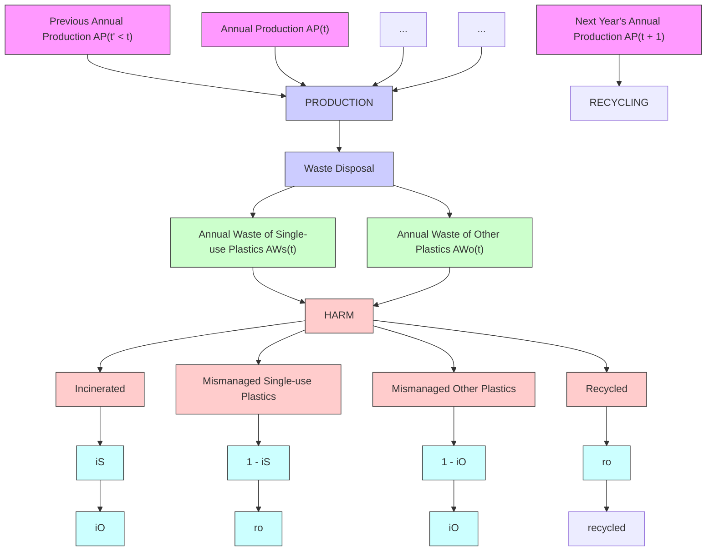
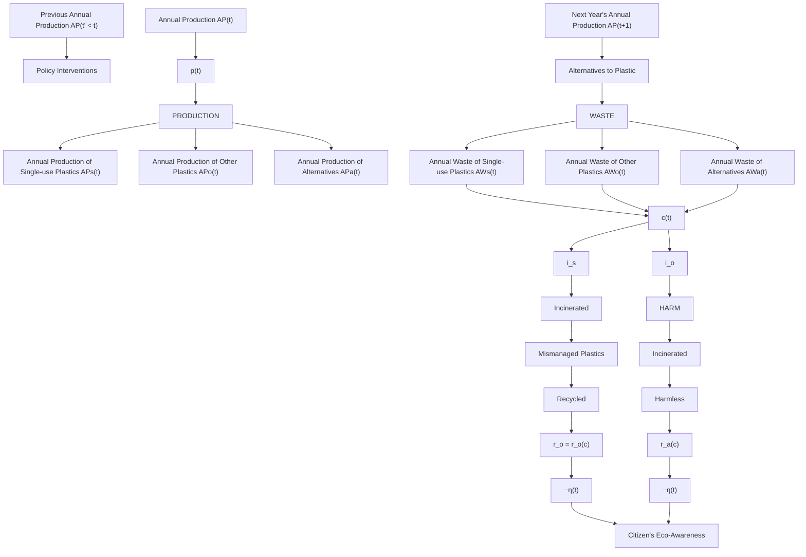
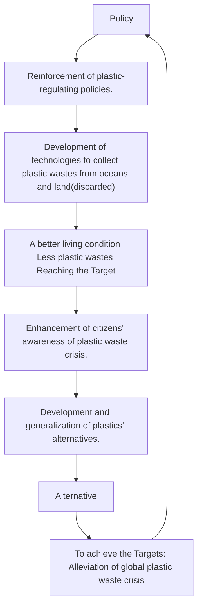

# An Integrated Production-Waste-Harm Model Based on Combination Prediction and Dynamic Programming

Summary

In recent years, the issue of plastic waste has arose wide concerns. Its continuously growing trend posts severe threat on the environment and on human-kind. Thus, with an attempt to mitigate this plastic crisis, we proceed as follows.

Firstly, we devise a PWH model to simulate the Production-Waste-Harm life circle of plastics. PWH model is based on collected data of annual plastic production, plastics’ life-time, annual recycle and incinerate rates. PWH model outputs annual wastes and harm generated respectively by single-use or disposable plastics and other plastics (We have introduced a function to quantify the harm).

Secondly, we used the PWH model to determine maximum levels of single-use plastic waste alleviated without further environmental harm: by 2020, at a singleuse plastic ratio 27.8%, annual waste generated by single-use plastics of 10.97 million tonnes, the maximum mitigation is 3.43 million tonnes.

Thirdly, we integrate the PWH model into IPWH model by adding to it multiple impacting factors: plastics’ alternatives; policy intervention; the rise of citizens’ eco-awareness; and the removal of accumulated plastic wastes from oceans and land. Apart from the same outputs with PWH model, IPWH also outputs growth trend of plastics’ alternatives, accumulated plastic harm.

Then, we use the IPWH model to make predictions with the help of linear regression and compare them against predictions with PWH model. Based on this, by using the Dynamic Programming, we set targets for the minimal achievable plastic waste levels: Target 1, decrease of annual plastic waste generated by single-use plastics, achieved by 2125; Target 2, decrease of plastic harm, achieved by 2131.

Next, we studied the impacts of achieving the aforementioned targets by using results of IPWH. By the time when Target 1 is achieved: on the environmental level: 489 million tonnes (46.0%) of annual single-use plastic wastes and 44.9 billion tonnes (58.2%) of accumulated mismanaged plastic wastes would have been reduced; on the economical level, there would be an economic loss of 37.64% for traditional plastic industry, while there would be 9.61% new jobs provided in the plastics’ alternative industry; finally, human living conditions would improve.

Finally, we analyze the regional difference of plastic waste levels on a globe-wide scale. Using the AHP method and K-means Algorithm, we establish a metric system and provided graded scores for 186 countries. We offer solutions to the global equity issues: improvement of waste manage systems and multilateral cooperation.

Keywords: Plastic waste, Single-use or disposable plastic, Dynamic Programming, AHP, K-means Algorithm

# An Integrated Production-Waste-Harm Model Based on Combination Prediction and Dynamic Programming

February 18, 2020

## Contents

## 1 Introduction 3

1.1 Problem Background 3  
1.2 Restatement of the Problem 3

## 2 General Assumptions 4

## 3 Notation 4

## 4 PWH(Production-Waste-Harm) Plastics’ Life-Circle Simulation Model 4

4.1 Production Model . 6  
4.2 Waste Model . 6  
4.3 Harm Model . 7  
4.4 Plastics Classification and Life-time Distribution . 7

## 5 Implementation of PWH Model 8

## 6 IPWH (Integrated Production-Waste-Harm) Model 10

6.1 Alternatives of plastic material 10  
6.2 Policy Intervention 12  
6.3 Citizens’ Eco-Awareness 12  
6.4 Harm Recovery . 13

## 7 Implementation of IPWH Model 13

7.1 Targets of Minimal Achievable Goal of Plastic Waste Level . . 13

7.1.1 Targets Setting 13  
7.1.2 Results . . .

7.2 Impacts of Achieving the Targets . . 15

7.2.1 Impact on Environment . 15  
7.2.2 Impact on Traditional Plastic Industry . . 16  
7.2.3 Impact on Plastic Alternative Industry . . . 16  
7.2.4 Impact on Human Life . . 16

## 8 Global Disparity and Regional Constraints 17

8.1 Metric System of Plastic Waste Level . . 17  
8.2 Equity Issues . . 18  
8.3 Possible Solutions . 19

8.3.1 Improvement in “Serious” Level Countries to Increase Adequate and Good Waste Management 19  
8.3.2 Multilateral Cooperation 19

## 9 Sensitivity Analysis 20

10 Strength and Weakness 20  
11 Conclusion 21  
12 Memo 23

## Appendices 26

Appendix A Scores and Levels for All 186 Countries and Regions 26  
Appendix B Code for PWH Model 27  
Appendix C Code for Task 1 28  
Appendix D Code for IPWH Model & Task 2,3 30

## 1 Introduction

## 1.1 Problem Background

The large-scale plastic production industry has thrived since the 1950s. On the one hand, this is as an inevitable result of the increasing demand of plastic products: domestic, industrial, medical, etc after the World War II. Furthermore, plastics have prevailed thanks to its cheapness, versatility, light weight and resistance. [1]

However, due to their corrosion-resistant properties, most plastics are difficult to break down, and will persist in the environment for up to a century. [2] This has arose growing concerns to the problems of plastic wastes. According to previous researches, in 2015, primary plastic production was 407 million tonnes; around three-quarters (302 million tonnes) ended up as waste, yet only 9% of them was properly recycled. [1] And among these mismanaged plastics, single-use or disposable plastics make up a vast majority.

Making the situation worse, the mismanaged plastics do significant harm to the environment. Those discarded into oceans are regularly ingested by and easily entangle marine creatures such as seabirds and sea turtles. In terms of human health, “Bisphenol A” –a chemical used to make plastic beverage containers that causes endocrine health effects– was found in 93% of urine samples taken from people above six. [3]

Thus, an accurate model is in urgent need to evaluate and predict current, and future plastic waste situations, and to therefore provide reasonable plans accordingly to alleviate the plastic waste crisis.


<details>
<summary>natural_image</summary>

Beach scene with numerous plastic bottles and plastic containers, a lighthouse, and birds flying in the sky (no text or symbols visible)
</details>

Figure 1: Plastic Wastes in Ghana [4]

## 1.2 Restatement of the Problem

We are first required to establish a model to assess the maximum levels of singleuse or disposable plastics without worsening the current environmental level of plastic pollution. Then we need to develop a further comprehensive model witch takes into account multiple factors influencing the plastic waste severity (usage of single-use or disposable plastics ; policies monitoring this usage; its possible non-harmful alternatives...). Then we use this integrated model to make predictions of future trends, figure out ideal alleviation strategies, and assess possible impacts of alleviation. Finally, we are asked to consider the regional differences concerning the plastic waste problems and to discuss its equity issues.

## 2 General Assumptions

Our model makes the following general assumptions. Other assumption based on different models will be listed in the following model-related sections.

1. We ignore the plastic wastes generated before 1950.  
2. The production proportions between one another of annual plastics other than “Packagings” remain constant.  
3. Plastic products of all kinds are put into use once they are manufactured. There is no time lag between production and usage.  
4. All single-use or disposable plastics are unable to be recycled.  
5. Successfully recycled plastic wastes will be used in next year’s annual total plastic production.

## 3 Notation

In this paper we adopt the notation in table 1.

## 4 PWH(Production-Waste-Harm) Plastics’ Life-Circle Simulation Model

In this section, we devise a model PWH (Production-Waste-Harm) to simulate the process of annual Production, usage and consequent Waste, and the Harm, or pollution done to the environment by plastics. In this model, we distinguish 2 kinds of plastics: single-use or disposable plastics and other plastics.

In terms of programming, we adopt the Dynamic Programming instead of recursive prediction. This way, calculation efficiency and accuracy of the model can be largely improved while solving the optimization problems.

Input data collected and used in the PWH model include annual plastic production, recycle rate, incinerate rate, discarded rate and different plastic’s life-time information from [1] and [5].

Table 1: Notation

<table><tr><td>Symbol</td><td>Definition</td></tr><tr><td>t</td><td>Time (year)</td></tr><tr><td>s</td><td>Percentage of plastics that are single-use or disposable</td></tr><tr><td> $\alpha_s$ </td><td>Percentage of single-use or disposable plastics replaced by plastics&#x27; alternatives</td></tr><tr><td> $\alpha_o$ </td><td>Percentage of other plastics replaced by plastics&#x27; alternatives</td></tr><tr><td>AP(t)</td><td>Total annual production of plastics of year t</td></tr><tr><td> $AP_s(t)$ </td><td>Annual production of single-use or disposable plastics of year t</td></tr><tr><td> $AP_o(t)$ </td><td>Annual production of other plastics of year t</td></tr><tr><td> $AP_a(t)$ </td><td>Annual production of plastics&#x27; alternatives of year t</td></tr><tr><td> $AW_s(t)$ </td><td>Annual production of single-use plastic wastes of year t</td></tr><tr><td> $AW_o(t)$ </td><td>Annual production of other plastic wastes of year t</td></tr><tr><td> $AW_a(t)$ </td><td>Annual production of plastics&#x27; alternatives&#x27; wastes of year t</td></tr><tr><td>i</td><td>The type of plastics</td></tr><tr><td> $\beta_i$ </td><td>Production proportion of the type i plastics</td></tr><tr><td>j</td><td>Life-time of one plastic product</td></tr><tr><td> $D_i(j)$ </td><td>Life-time distribution of the type i plastics</td></tr><tr><td> $i_s(t)$ </td><td>Incinerate rate of single-use or disposable plastics in year t</td></tr><tr><td> $i_o(t)$ </td><td>Incinerate rate of other plastics in year t</td></tr><tr><td> $r_o(t)$ </td><td>Rate of successful recycling of plastics other plastics in year t</td></tr><tr><td> $r_a(t)$ </td><td>Rate of successful recycling of plastics&#x27; alternatives in year t</td></tr><tr><td>H(t)</td><td>Harm to the environment done in year t</td></tr><tr><td>p(t)</td><td>Policies&#x27; strength level in year t</td></tr><tr><td>c(t)</td><td>Citizens&#x27; eco-awareness level in year t</td></tr><tr><td> $\eta(t)$ </td><td>Annual removal of accumulated plastic wastes in year t</td></tr></table>


<details>
<summary>flowchart</summary>


</details>

Figure 2: Flow Chart Illustration of the PWH Model


关注数学模型 获取更多资讯

Assumption In this model, we assume that $s = \beta _ { 1 }$ . This is based on two facts: A majority of present plastic packages are of single use; packaging plastics have the shortest life-time among all sectors (Section 4.4), which accords with the “single-use” property.

## 4.1 Production Model

Based on the assumption above, we admit that the rate of single-use or disposable plastics production is equal to $\beta _ { 1 }$ , therefore we have,

$$
A P _ {s} (t) = \beta_ {1} \times A P (t) \tag {1}
$$

$$
A P _ {o} (t) = \left(1 - \beta_ {1}\right) \times A P (t) \tag {2}
$$

## 4.2 Waste Model

In our model we define the “Annual Waste” of a year as the plastics (produced year or years before) whose usage terminate on that year .

Thus previous annual total production in Equation 1,2 enable us to calculate the annual waste by summing up all types of previously-produced plastics that reach their end of life-time this year [1].

$$
A W _ {s} (t) = \sum_ {j = 1} ^ {t - 1 9 5 0} A P _ {s} (t - 1) D _ {1} (j) \tag {3}
$$

$$
A W _ {o} (t) = \sum_ {j = 1} ^ {t - 1 9 5 0} \sum_ {i = 2} ^ {8} A P _ {o, i} (t - j) D _ {i} (j) \tag {4}
$$

where the distribution of different plastics’ life-time will be extrapolated in Section 4.4.


<details>
<summary>line chart</summary>

| Year | AW_s | AW_o | Total |
|------|------|------|-------|
| 1951 | 0    | 0    | 0     |
| 1954 | 0    | 0    | 0     |
| 1957 | 0    | 0    | 0     |
| 1960 | 0    | 0    | 0     |
| 1963 | 0    | 0    | 0     |
| 1966 | 0    | 0    | 0     |
| 1969 | 0    | 0    | 0     |
| 1972 | 0    | 0    | 0     |
| 1975 | 0    | 0    | 0     |
| 1978 | 0    | 0    | 0     |
| 1981 | 0    | 0    | 0     |
| 1984 | 0    | 0    | 0     |
| 1987 | 0    | 0    | 0     |
| 1990 | 0    | 0    | 0     |
| 1993 | 0    | 0    | 0     |
| 1996 | 0    | 0    | 0     |
| 1999 | 0    | 0    | 0     |
| 2002 | 0    | 0    | 0     |
| 2005 | 0    | 0    | 0     |
| 2008 | 0    | 0    | 0     |
| 2011 | 0    | 0    | 0     |
| 2014 | 0    | 0    | 0     |
</details>

Figure 3: Results of PWH model on annual plastic wastes generated

## 4.3 Harm Model

This section describes the process of waste management when plastics become wastes (expire their usage life-time). Currently, there exists several ways of disposal: incineration, recycling, landfill, discarded into rivers and oceans. Among processed wastes, those who pose overwhelming threat to the environment are mismanaged wastes.

Mismanaged waste is material which is at high risk of entering the ocean via wind or tidal transport, or carried to coastlines from inland waterways. Mismanaged waste is the sum of material which is either littered or inadequately disposed. [1]

In our model, it is equal to wastes that are neither recycled nor incinerated. Thus we define the annual “Harm” done to the environment H as the total amount of mismanaged plastic wastes,

$$
H (t) = A W _ {s} (t) \times \left(1 - i _ {s}\right) + A W _ {o} (t) \times \left(1 - i _ {o} - r _ {o}\right) \tag {5}
$$


<details>
<summary>line chart</summary>

| Year | Production (million tonnes) |
|---|---|
| 1951 | 0 |
| 1954 | 0 |
| 1955 | 0 |
| 1956 | 0 |
| 1957 | 0 |
| 1958 | 0 |
| 1959 | 0 |
| 1960 | 0 |
| 1961 | 0 |
| 1962 | 0 |
| 1963 | 0 |
| 1964 | 0 |
| 1965 | 0 |
| 1966 | 0 |
| 1967 | 0 |
| 1968 | 0 |
| 1969 | 0 |
| 1970 | 0 |
| 1971 | 0 |
| 1972 | 0 |
| 1973 | 0 |
| 1974 | 0 |
| 1975 | 0 |
| 1976 | 0 |
| 1977 | 0 |
| 1978 | 0 |
| 1979 | 0 |
| 1980 | 0 |
| 1981 | 0 |
| 1982 | 0 |
| 1983 | 0 |
| 1984 | 0 |
| 1985 | 0 |
| 1986 | 0 |
| 1987 | 0 |
| 1988 | 0 |
| 1989 | 0 |
| 1990 | 0 |
| 1991 | 0 |
| 1992 | 0 |
| 1993 | 0 |
| 1994 | 0 |
| 1995 | 0 |
| 1996 | 0 |
| 1997 | 0 |
| 1998 | 0 |
| 1999 | 0 |
| 2000 | 0 |
| 2001 | 0 |
| 2002 | 0 |
| 2003 | 0 |
| 2004 | 0 |
| 2005 | 0 |
| 2006 | 0 |
| 2007 | 0 |
| 2008 | 0 |
| 2009 | 0 |
| 2010 | 0 |
| 2011 | 0 |
| 2012 | 0 |
| 2013 | 0 |
| 2014 | 0 |
| 2015 | 0 |
</details>

Figure 4: Results of PWH model on annual harm plastic results in

## 4.4 Plastics Classification and Life-time Distribution

In our model, we classify all plastics produced into several categories. And we collect data of their production rates, as well as each category’s average life-time and standard deviation.

We adopt the Log Normal Distribution as the model of plastic life-times. This is based on the fact that Log Normal Distribution can be used to describe the lives of industrial units, of which we can make an analogy with lives of plastics. Thus, with the average plastic life-times and standard deviations provided, we are able to calculate the probability distribution of their lifetimes as follows.

Since we know,

$$
E (X) = e ^ {\mu + \frac {\sigma^ {2}}{2}} \tag {6}
$$

$$
\operatorname{var} (X) = \left(e ^ {\sigma^ {2}} - 1\right) \cdot e ^ {2 \mu + \sigma^ {2}} \tag {7}
$$

Table 2: Plastics’ categories and their life-time [5]

<table><tr><td>Category</td><td>Production Ratio</td><td>Average Life -Time(year)</td><td>Standard Deviation</td></tr><tr><td>Packaging</td><td>35.9%</td><td>0.5</td><td>0.1</td></tr><tr><td>Transportation</td><td>6.6%</td><td>13</td><td>3</td></tr><tr><td>Building and Construction</td><td>16.0%</td><td>35</td><td>7</td></tr><tr><td>Electronic</td><td>4.4%</td><td>8</td><td>2</td></tr><tr><td>Consumer and Institutional Products</td><td>10.3%</td><td>3</td><td>1</td></tr><tr><td>Industrial Machinery</td><td>0.7%</td><td>20</td><td>3</td></tr><tr><td>Textile</td><td>11.5 %</td><td>5</td><td>1.5</td></tr><tr><td>Other</td><td>14.5%</td><td>5</td><td>1.5</td></tr></table>

we are able to calculate $\mu$ and $\sigma$ for programming with

$$
\mu = \ln (E (X)) - \frac {1}{2} \ln (1 + \frac {\operatorname{var} (X)}{E (X) ^ {2}}) \tag {8}
$$

$$
\sigma^ {2} = \ln (1 + \frac {\operatorname{var} (X)}{E (X) ^ {2}}) \tag {9}
$$

Finally, we have

$$
D (x; \mu ; \sigma) = \frac {1}{\sqrt {2 \pi}} \cdot e ^ {- \frac {(l n x - \mu) ^ {2}}{2 \sigma^ {2}}} \tag {10}
$$


<details>
<summary>line chart</summary>

| Year | Packaging | Transportation | Building and Construction | Electrical/Electronic | Consumer & Institutional Products | Industrial Machinery | Other | Textiles |
|------|-----------|----------------|----------------------------|------------------------|------------------------------------|----------------------|-------|----------|
| 0    | 1.0       | 0.0            | 0.0                        | 0.0                    | 0.0                                | 0.0                  | 0.0   | 0.0      |
| 5    | 0.0       | 0.0            | 0.0                        | 0.2                    | 0.4                                | 0.0                  | 0.0   | 0.3      |
| 10   | 0.0       | 0.1            | 0.0                        | 0.1                    | 0.0                                | 0.0                  | 0.0   | 0.1      |
| 15   | 0.0       | 0.1            | 0.0                        | 0.0                    | 0.0                                | 0.1                  | 0.0   | 0.1      |
| 20   | 0.0       | 0.1            | 0.0                        | 0.0                    | 0.0                                | 0.1                  | 0.0   | 0.1      |
| 25   | 0.0       | 0.1            | 0.0                        | 0.0                    | 0.0                                | 0.1                  | 0.0   | 0.1      |
| 30   | 0.0       | 0.1            | 0.1                        | 0.0                    | 0.0                                | 0.1                  | 0.0   | 0.1      |
| 35   | 0.0       | 0.1            | 0.1                        | 0.0                    | 0.0                                | 0.1                  | 0.0   | 0.1      |
| 40   | 0.0       | 0.1            | 0.1                        | 0.0                    | 0.0                                | 0.1                  | 0.0   | 0.1      |
| 45   | 0.0       | 0.1            | 0.1                        | 0.0                    | 0.0                                | 0.1                  | 0.0   | 0.1      |
| 50   | 0.0       | 0.1            | 0.1                        | 0.0                    | 0.0                                | 0.1                  | 0.0   | 0.1      |
| 55   | 0.0       | 0.1            | 0.1                        | 0.0                    | 0.0                                | 0.1                  | 0.0   | 0.1      |
| 60   | 0.0       | 0.1            | 0.1                        | 0.0                    | 0.0                                | 0.1                  | 0.0   | 0.1      |
| 65   | 0.0       | 0.1            | 0.1                        | 0.0                    | 0.0                                | 0.1                  | 0.0   | 0.1      |
| 70   | 0.0       | 0.1            | 0.1                        | 0.0                    | 0.0                                | 0.1                  | 0.0   | 0.1      |
</details>

Figure 5: Probability distribution of different plastics’ lifetimes $D _ { i } ( j )$

## 5 Implementation of PWH Model

From Figure 3, we observe that although the rate of single-use or disposable plastics among all plastic production(35.9%) is considerably lower than the rate of other plastics(64.1%), the annual wastes resulting from the two $\because A W _ { s } ( t ) , A W _ { o } ( t ) )$ are close. Moreover, the former cannot be recycled, contributing to a worse case in the annual harm. We also observe from the figures that the growth rates continue to accelerate, and thus show no signs of slowing down.

Thus it’s reasonable to conclude that we’ve verified: single-use or disposable plastics wastes contribute to a major part of plastic waste crisis. This accords perfectly with reality. In other words, mitigating single-use or disposable plastics levels is crucial to alleviating the whole crisis.

Therefore, in this section, we implement the established PWH model to tackle task1: assess the maximum levels of single-use or disposable plastics wastes that can be mitigated without making further environmental damage.

We first have to define several terms.

Further Environmental Damage Due to technological limits, we are currently unable to: dispose of single-use wastes; recycle or incinerate all plastic products. This means we’re unable to stop damaging the environment unless we eradicate a majority of plastic usage, which is impossible. Thus, we define “without further environmental damage”as: able to slow down the current annual harm to an extent (here we choose 10%).

Maximum Levels In this task, we aim to maximize the mitigation of single-use plastic wastes as follows: change $\beta _ { 1 }$ of this year; calculate the new $A W _ { s } ( t + 1 ) _ { \beta _ { 1 } }$ associated; calculate its maximum difference with $A W _ { s } ( t + 1 ) _ { o r i g i n a l }$ before changing $\beta _ { 1 }$ .

To conclude,

$$
\max \quad Mitigation = AW_{s}(t + 1)_{\beta_{1} = 35.9\%} - AW_{s}(t + 1)_{\beta_{1}}
$$

$$
\mathbf {s}. \mathbf {t} \quad 0 \leq \beta_ {1} \leq 1, \tag {11}
$$

$$
H (t + 1) _ {\beta_ {1}} \leq H (t + 1) _ {\beta_ {1} = 35.9 \%} \times (1 - 10 \%)
$$

where,

$$
H (t + 1) _ {\beta_ {1}} = A W _ {s} (t + 1) _ {\beta_ {1}} \times \left(1 - i _ {s} (t + 1)\right) + A W _ {o} (t + 1) _ {\beta_ {1}} \times \left(1 - i _ {o} (t + 1) - r _ {o} (t + 1)\right) \tag {12}
$$

$$
A W _ {s} (t + 1) _ {\beta_ {1}} = A W _ {s} (t + 1) _ {\beta_ {1} = 35.9 \%} + \left(\beta_ {1} - 35.9 \%\right) \times A P (t) \tag{13}
$$

Method of Optimization in Programming According to the regressive prediction of the model, we adopt the idea of Dynamic Programming to calculate a maximum H(t) within any time span. We take each year’s predicted H as a new state, and make new decisions according to the variation of parameters to predict the value of the objective function, in order to achieve an optimal choice. (Full codes are provided in the Appendix.)

Equation 12, 13 are based on the following modeling assumptions: annual waste of single-use plastic result from the previous year’s production; other plastic wastes have a life-time longer than a year and therefore we can ignore their relationship with last year’s production.

Results of Task1 We solve the optimization problem of Equation 11 with the PWH model. Solutions are provided in Table 3 and Figure 6.


<details>
<summary>radar chart</summary>

| Year | AW_s(t)_β1 (milliontonnes) | AW_s(t)_β1=35.9% (milliontonnes) |
|------|-----------------------------|-----------------------------------|
| 2016 | ~10.00                      | ~14.00                            |
| 2017 | ~9.00                       | ~13.50                            |
| 2018 | ~8.50                       | ~13.00                            |
| 2019 | ~8.00                       | ~12.50                            |
| 2020 | ~7.50                       | ~12.00                            |
| 2021 | ~7.00                       | ~11.50                            |
| 2022 | ~6.50                       | ~11.00                            |
| 2023 | ~6.00                       | ~10.50                            |
| 2024 | ~5.50                       | ~10.00                            |
</details>

Figure 6: Results of Task1: Annual Single-Use Plastic Wastes’ and Maximum Mitigation

Table 3: Solution Of Task1

<table><tr><td>Year</td><td>Single-Use Ratio</td><td>Annual Single-Use Waste (million tonnes)</td><td>Maximum Mitigation (million tonnes)</td></tr><tr><td>2016</td><td>27.6%</td><td>10.28</td><td>3.09</td></tr><tr><td>2017</td><td>27.6%</td><td>10.62</td><td>3.19</td></tr><tr><td>2018</td><td>27.6%</td><td>10.97</td><td>3.30</td></tr><tr><td>2019</td><td>27.8%</td><td>11.41</td><td>3.32</td></tr><tr><td>2020</td><td>27.8%</td><td>11.77</td><td>3.43</td></tr><tr><td>2021</td><td>27.8%</td><td>12.14</td><td>3.54</td></tr><tr><td>2022</td><td>28.0%</td><td>12.61</td><td>3.56</td></tr><tr><td>2023</td><td>28.0%</td><td>13.00</td><td>3.67</td></tr><tr><td>2024</td><td>28.2%</td><td>13.48</td><td>3.68</td></tr></table>

## 6 IPWH (Integrated Production-Waste-Harm) Model

In this section, we integrate the previous PWH model by adding into it multiple factors impacting the levels of plastic waste. (Task2)

## 6.1 Alternatives of plastic material

Currently, plastics’ substitutes are partly recyclable materials such as paper or glass and partly biodegradable materials such as PLA polyesters, starch-based Polymers, etc. [6] Meanwhile, some bent on making conventional thermoplastics biodegradab le by adding additives called prodegradant concentrates (PDCs). [6]

In our integrated model, we discuss the influence of the aforementioned types of alternatives.


<details>
<summary>flowchart</summary>


</details>

Figure 7: Flow chart illustration of the IPWH Model

## Assumptions

• We assume that all plastic alternatives wastes considered are either recyclable with an recycle rate $r _ { a } ,$ or biodegradable (totally harmless to the environment) with a rate of $1 - r _ { a }$ .  
• Since some packages are replaced by recyclable alternatives, the assumption made in Section 4 is no longer solid. Instead, we have $s = \beta _ { 1 } \times ( 1 - \alpha _ { s } )$  
• There were no alternatives manufactured before 2015.  
• There exists upper limits for all recycle rates and alternative rates due to technological limits. We assume these limits in Equation 16, Equation 17.

We also consider the different percentage of single-use plastics between other plastics that are replaced by alternatives. We set the initial alternative ratios at 2015 (αs,initial, $\alpha _ { o , i n i t i a l } )$ . Specifically, we acknowledge that single-use plastics are easier to be replaced, because they are more widely used; they are more easily manufactured.

$$
0 \leq \alpha_ {s} <   \alpha_ {o} \leq 1
$$

Thus we are able to calculate the annual production and waste of plastic alternatives.

$$
A P _ {a} (t) = A P (t) \times \beta_ {1} \times \alpha_ {s} + A P (t) \times \left(1 - \beta_ {1}\right) \times \alpha_ {o} \tag {14}
$$

$$
A W _ {a} (t) = \sum_ {j = 1} ^ {t - 2 0 1 5} A P (t - 1) \beta_ {1} \alpha_ {s} D _ {1} (j) + \sum_ {i = 2} ^ {8} \sum_ {j = 1} ^ {t - 2 0 1 5} A P (t - j) (1 - \beta_ {1}) \alpha_ {o} D _ {i} (j) \tag {15}
$$

## 6.2 Policy Intervention

Policies have been implemented across nations to alleviate the plastic waste crisis. Notably, the number of policies regulating single-use or disposable plastics at the national level increased steeply after 2015. [7]

Therefore, in this section, we emphasize on the effectiveness of policy intervention after 2015 by defining the parameter $p ( t )$ that depict the policies’ “strength” level. We simulate with a convex function with initial value $p ( 0 ) = 1$ (we adopt exponential) because we believe the development rate will increase since it is a process of propagation across the globe.

We assume that annual demand of products (that were previously made from plastic) remains its current growth trend. Since policy intervention decreases plastic products, it results directly to the increase of amount of plastics replaced by alternatives. In other words, $\alpha _ { s }$ and $\alpha _ { o }$ are positively related to $p ( t )$ . We devise this relationship as follows.

$$
p (t) = e ^ {a _ {p} \times (t - 2 0 1 6)}
$$

$a _ { p }$ is a constant that controls the growth rate of policies’ strength.

$$
\alpha_ {s} (t) = \min \left(\alpha_ {s, \text {initial}} \times p (t), 0. 8\right) \tag {16}
$$

$$
\alpha_ {o} (t) = \min (\alpha_ {o, i n i t i a l} \times p (t), 0. 5)
$$


<details>
<summary>line chart</summary>

| Year | Policy Level p(t) |
| ---- | ----------------- |
| 2000 | 1.0               |
| 2020 | 1.5               |
| 2040 | 2.5               |
| 2060 | 3.5               |
| 2080 | 5.5               |
| 2100 | 9.5               |
| 2120 | 14.5              |
</details>

(a) Policies’ strength level


<details>
<summary>line chart</summary>

| Year | Citizen's Awareness |
| ---- | --------------------- |
| 2000 | 1.0                   |
| 2040 | 1.5                   |
| 2080 | 3.0                   |
| 2120 | 5.5                   |
</details>

(b) Citizens’ eco-awareness  
Figure 8: Quantified measures (new parameters $p , c )$ that control alternatives’ ratio and recycle rates

## 6.3 Citizens’ Eco-Awareness

Social awareness of the plastic waste crisis is essential to slow down the environmental damage. Its impact is focused on the reuse and recycling of resources, encouraging responsible use and minimization of waste generation and litter. [7]

We imitate the gradual process of citizens gaining environmental awareness with $c ( t )$ (Figure 8b). And in this model, we focus on the impact of citizens’ awareness on the recycling process. It functions similarly with the policies’ impact on the alternatives’ ratio. Specifically, $r _ { a }$ and $r _ { o }$ are positively related to $c ( t )$ . We devise $c ( t )$ and its relationship with r as follows.

$$
c (t) = e ^ {a _ {c} \times (t - 2 0 1 6)}
$$

$a _ { c }$ is a constant that controls the growth rate of citizens’ eco-awareness.

$$
r _ {a} (t) = \min (r _ {a, i n i t i a l} (t) \times c (t), 1)
$$

$$
\begin{array}{l} r _ {a} (t) = \min \left(r _ {a, i n i t i a l} (t) \times c (t), 1\right) \\ r _ {o} (t) = \min \left(r _ {o, i n i t i a l} (t) \times c (t), 0. 5\right) \end{array} \tag {17}
$$

## 6.4 Harm Recovery

Assumption All accumulated wastes removed are not recyclable, but can be disposed of in a harmless manner.

In recent years, efforts have been made and technologies have been developed in order to recollect and reprocess the accumulated plastic wastes on earth. We define this process as “Harm Recovery”, and we use $\eta ( t )$ to denote the annual removal of accumulated plastic wastes.

$$
H (t) = H (t) _ {\text { original }} - \eta (t) \tag {18}
$$

$$
\eta (t) = \eta_ {\text { ocean }} (t) + \eta_ {\text { land }} (t) \tag {19}
$$

We separate the annual removal into removal from ocean and from land. For the ocean removal, in the past, manta trawlers, a hybrid between a fish trawler and a plankton tow, were used for plastic collection from oceans. [8] Currently, an estimated 7.25 million t of plastic debris could be collected and removed from the ocean. [9] And for the land removal, we assume that future human will be able to recover the previously land-filled plastic wastes.

We assume the growth rate of removal to be linear and their equations. $b _ { o c e a n } , b _ { l a n d }$ in Equation 20 are constants that describe the exact growth rate of annual removal.

$$
\eta_ {o c e a n} (t) = b _ {o c e a n} \times t + 7. 2 5 \times 1 0 ^ {6}
$$

$$
\eta_ {\text {land}} (t) = b _ {\text {land}} \times t \tag {20}
$$

## 7 Implementation of IPWH Model

In this section, we use our IPWH model to set target for a minimal achievable level of global single-use plastic wastes. Then we discuss multiple impact of achieving our goal. (Task3)

## 7.1 Targets of Minimal Achievable Goal of Plastic Waste Level

## 7.1.1 Targets Setting

As we have previously discussed in Section 5 and shown in Figure 3 and $4 , A W _ { s } ( t )$ and H(t) will continue to grow exceedingly fast and will not converge if no measure is adopted.

Thus we set 2 different targets for our IPWH model.

• Target 1: $A W _ { s } ( t )$ starts to decrease.  
• Target 2: H(t) starts to decrease.

The reasons are explained as follows. Firstly, with our IPWH model, we are able to slow down the growth rates of $A W _ { s } ( t )$ and H (t) because IPWH is an integration of multiple measures that alleviate the plastic waste crisis. Then, for $A W _ { s } ( t )$ , since single-use plastic wastes are harmful, we need to restrain its annual growth as much as possible; for H(t), it represents the total harm done by all plastics.

Therefore, the turning point Target 1 represents the success of alleviation of plastic waste crisis in terms of single-use plastic; Target 2 represents alleviation in terms of the entire plastic industry.

## 7.1.2 Results


<details>
<summary>line chart</summary>

| Year | AW_s by PWH model (million tonnes) | AW_s by IPWH model (million tonnes) |
|------|------------------------------------|-------------------------------------|
| 1950 | 0                                  | 0                                   |
| 1961 | 0                                  | 0                                   |
| 1972 | 0                                  | 0                                   |
| 1983 | 50                                 | 0                                   |
| 1994 | 100                                | 0                                   |
| 2005 | 200                                | 0                                   |
| 2016 | 400                                | 400                                 |
| 2027 | 600                                | 600                                 |
| 2038 | 800                                | 800                                 |
| 2049 | 1000                               | 1000                                |
| 2060 | 1200                               | 1200                                |
| 2071 | 1400                               | 1400                                |
| 2082 | 1600                               | 1600                                |
| 2093 | 1800                               | 1800                                |
| 2104 | 2000                               | 2000                                |
| 2115 | 2200                               | 2200                                |
| 2126 | 2400                               | 2400                                |
| 2137 | 2600                               | 2600                                |
| 2148 | 2800                               | 2800                                |
</details>

Figure 9: Comparison of AW (t) by PWH and IPWH model.

Our calculation with IPWH shows that Target 1 can be achieved by year 2125, and Target 2 by 2131 with the following parameter values.

<table><tr><td>Parameter</td><td> $\alpha_{s,initial}$ </td><td> $\alpha_{s,initial}$ </td><td> $a_p$ </td><td> $a_c$ </td><td> $b_{ocean}$ </td><td> $b_{land}$ </td></tr><tr><td>Value</td><td>0.1</td><td>0.05</td><td>0.014</td><td>0.007</td><td> $2.5 \times 10^5$ </td><td> $2.5 \times 10^5$ </td></tr></table>

It is specially noteworthy that we can also calculate the difference between the result of IPWH and the prediction made by the PWH model:

$$
\begin{array}{l} \Delta A W _ {s} (t) = A W _ {s, P W H} (t) - A W _ {s, I P W H} (t) \\ = 4 8 9, 4 4 0, 6 0 2 \quad t o n n e s \\ \Delta H (t) = H _ {P W H} (t) - H _ {I P W H} (t) \tag {21} \\ = 1, 4 1 6, 3 5 2, 7 2 5 \quad t o n n e s \\ \end{array}
$$

$$
\begin{array}{l} \Delta H (t) = H _ {P W H} (t) - H _ {I P W H} (t) \tag {21} \\ = 1, 4 1 6, 3 5 2, 7 2 5 \quad t o n n e s \\ \end{array}
$$

$$
\Delta H _ {\text { accumulated }} (t) = H _ {\text { accumulated }, P W H} (t) - H _ {\text { accumulated }, I P W H} (t)
$$

$$
= 4 4, 9 2 2, 8 0 7, 2 3 3 \quad t o n n e s
$$


<details>
<summary>line chart</summary>

| Year | H(t) by PWH model (million tonnes) | H(t) by IPWH model (million tonnes) |
|------|------------------------------------|-------------------------------------|
| 1950 | 0                                  | 0                                   |
| 1961 | 0                                  | 0                                   |
| 1972 | 0                                  | 0                                   |
| 1983 | 50                                 | 0                                   |
| 1994 | 100                                | 0                                   |
| 2005 | 150                                | 0                                   |
| 2016 | 200                                | 150                                 |
| 2027 | 200                                | 150                                 |
| 2038 | 200                                | 150                                 |
| 2049 | 250                                | 150                                 |
| 2060 | 350                                | 200                                 |
| 2071 | 500                                | 250                                 |
| 2082 | 650                                | 300                                 |
| 2093 | 850                                | 350                                 |
| 2104 | 1150                               | 375                                 |
| 2115 | 1450                               | 400                                 |
| 2126 | 1750                               | 425                                 |
| 2137 | 2150                               | 450                                 |
| 2148 | 2650                               | 425                                 |
</details>

Figure 10: Comparison of H(t) by PWH and IPWH model.  


<details>
<summary>line chart</summary>

| Year | H_accumulated by PWH model | H_accumulated by IPWH model |
|------|-----------------------------|------------------------------|
| 1950 | 0                           | 0                            |
| 1961 | 0                           | 0                            |
| 1972 | 0                           | 0                            |
| 1983 | 0                           | 0                            |
| 1994 | 0                           | 0                            |
| 2005 | 0                           | 0                            |
| 2016 | 0                           | 0                            |
| 2027 | 0                           | 0                            |
| 2038 | 0                           | 0                            |
| 2049 | 0                           | 0                            |
| 2060 | 0                           | 0                            |
| 2071 | 0                           | 0                            |
| 2082 | 0                           | 0                            |
| 2093 | 0                           | 0                            |
| 2104 | 0                           | 0                            |
| 2115 | 0                           | 0                            |
| 2126 | 0                           | 0                            |
| 2137 | 0                           | 0                            |
| 2148 | 0                           | 0                            |
</details>

Figure 11: Comparison of $H _ { a c c u m u l a t e d } ( t )$ by PWH and IPWH model.

## 7.2 Impacts of Achieving the Targets

## 7.2.1 Impact on Environment

The impact on environment can be directly described by the change of H(t). From Equation 21, we know the exact reduced amount of plastic wastes and harm: When Target 1 is achieved, 489 million tonnes, 46.0% of annual single-use plastic wastes; 44.9 billion tonnes, 58.2% of accumulated mismanaged plastic wastes would have been reduced thanks to the measures integrated in IPWH model.

## 7.2.2 Impact on Traditional Plastic Industry

Firstly, due to the appearance of plastics’ alternatives, the growth rate of production $A P _ { o } ( t )$ and $A P _ { s } ( t )$ are slowed down, especially the latter.

Secondly, the increase of recycle rate $r _ { o } ( t )$ plays a role to decrease the manufacture cost of plastic products. Because the recycled plastic are used in next year’s production.

## Assumptions

• All plastic products are regarded as the same, and have same manufacture cost b and profit.  
• 70% of cost can be saved from recycling one plastic product.  
• The profit of manufacturing one plastic product is 50% of its cost.

We calculate the economic loss of traditional plastic industry when Target 1 is achieved.

$$
\text { Original   Profit } = \left(A P _ {o} + A P _ {s} + A P _ {a}\right) \times \left(50 \% + 70 \% \cdot r _ {o, \text { original }} \cdot \beta_ {1}\right) \times b
$$

Profit After Achieving Targets $= ( ( A P _ { o } + A P _ { s } ) \times 5 0 \% + A P _ { o } \times 5 0 \% \cdot r _ { o } ) \times b$

$$
\begin{array}{l} \text { Loss   of   Plastic   Industry } = 1 - \frac {\text { Profit   After   Achieving   Targets }}{\text { Original   Profit }} \\ = 37.64 \% \tag{22} \\ \end{array}
$$

## 7.2.3 Impact on Plastic Alternative Industry

Though plastic industry is negatively impacted to a great extent, the new manners enable the plastic alternative industry to usher in a spring.

Due to the greater need of research and development; more complicated process of manufacture, plastics’ alternatives industry needs a relatively larger scale of recruitment. We suppose 30% larger. Then we can calculate the new jobs provided in the plastics’ alternative industry at the time of achieving our targets.

$$
\text { New Jobs Provided} (\%) = 30 \% \times \frac {A P _ {a}}{A P _ {o} + A P _ {s} + A P _ {a}} \tag{23}
$$

$$
= 9.61\%
$$

## 7.2.4 Impact on Human Life

Plastic is not inert, but contains several chemicals with toxic potential. Though levels still uncertain, there are impact of chemicals on humans, either contained in plastic or transported by plastic waste. [10] Thus the reduction of plastic waste and pollution by the achievement of targets can relieve the negative impact on human health.

Other impacts include: higher availability of safer sea-food and sea-products; increase of annual expenditure on commodities (due to the higher price of plastics’ alternatives); wider awareness of environmental protection in future generations.

## 8 Global Disparity and Regional Constraints

The plastic waste crisis is a global problem, the causes and effects are not equally distributed. Thus in this section, we discuss the global disparity in plastic waste levels and the equity problems. (Task 4)

## 8.1 Metric System of Plastic Waste Level

Data Collection We choose three indicators in terms of both cause and effect of plastic waste levels as our metric indexes: Plastic waste generation per capita (cause); Share of plastic inadequately managed (effect); Share of global mismanaged wastes (effect). We collected valid data for 186 countries from Database [1].

Data Normalization Since the three indicators are of different dimensions, we normalize the data into values between 0 and 1 with Equation 24. Besides, our indexes are all cost indexes: the bigger they are, the more serious the situation is.

$$
\begin{array}{l} a _ {i, j, \text {normalized}} = \frac {a _ {i , j} - \min _ {i ^ {\prime} \in \{1 , 2 , \dots 1 8 6 \}} a _ {i ^ {\prime} , j}}{\max _ {i ^ {\prime} \in \{1 , 2 , \dots 1 8 6 \}} a _ {i ^ {\prime} , j} - \min _ {i ^ {\prime} \in \{1 , 2 , \dots 1 8 6 \}} a _ {i ^ {\prime} , j}} \\ \begin{array}{l} \iota \in \{1, 2, \dots 1 0 0 \} - \iota , j \\ i \in \{1, 2, \dots 1 8 6 \}, \end{array} \tag {24} \\ j \in \{1, 2, 3 \} \\ \end{array}
$$

Weight Determination We use the AHP method to determine the weights of the indexes.

Table 4: Weights of indexes determined by AHP

<table><tr><td>Index (I)</td><td> $I_1$ : Plastic waste ge-neration per capita</td><td> $I_2$ : Share of plasticinadequately managed</td><td> $I_3$ : Share of globalmismanaged wastes</td></tr><tr><td>Weight (w)</td><td>0.242637</td><td>0.66941</td><td>0.087946</td></tr></table>

Final Score We can calculate the final score for each country with Equation 25 . How high the score is depicts the severity of plastic waste crisis.

$$
\text { Final   Score } = w _ {1} \cdot I _ {1} + w _ {2} \cdot I _ {2} + w _ {3} \cdot I _ {3} \tag {25}
$$

Scales of Plastic Waste Severity We categorize all 186 countries into three levels of plastic waste severity: Serious, Moderate, Slight, by clustering the dataset into three clusters using the K-means Algorithm.


<details>
<summary>bar chart</summary>

| Category | Final Score |
|---|---|
| Serious | 0.77 |
| Moderate | 0.44 |
| Slight | 0.19 |
</details>

Table 5: Categories’ Information Based by K-means Algorithm

<table><tr><td>Level of severity</td><td>Slight</td><td>Moderate</td><td>Serious</td></tr><tr><td>Maximum score</td><td>0.185724755</td><td>0.43091417</td><td>0.764190323</td></tr><tr><td>Minimum score</td><td>0.013298209</td><td>0.19443249</td><td>0.467481143</td></tr><tr><td>Number of countries</td><td>80</td><td>39</td><td>67</td></tr></table>

Scores and levels for all 186 countries and regions are provided in Appendix A.

## 8.2 Equity Issues

We calculate the score of all countries and regions considered by using the aforementioned metric. We made Figure 13 to analyze the regional distribution of plastic waste level.

The distribution is geographically uneven. On a continental level, the most severe levels of plastic waste crisis appear principally in South-East Asia and Mid-East Africa. An overall better situation is observed in North America and Southern and Northern Europe.


<details>
<summary>scatterplot</summary>

| Country | Score |
|---------|-------|
| 1       | 0.5   |
| 2       | 0.6   |
| 3       | 0.7   |
| 4       | 0.8   |
| 5       | 0.9   |
| 6       | 0.6   |
| 7       | 0.7   |
| 8       | 0.8   |
| 9       | 0.9   |
| 10      | 0.6   |
| 11      | 0.7   |
| 12      | 0.8   |
| 13      | 0.9   |
| 14      | 0.6   |
| 15      | 0.7   |
| 16      | 0.8   |
| 17      | 0.9   |
| 18      | 0.6   |
| 19      | 0.7   |
| 20      | 0.8   |
| 21      | 0.9   |
| 22      | 0.6   |
| 23      | 0.7   |
| 24      | 0.8   |
| 25      | 0.9   |
| 26      | 0.6   |
| 27      | 0.7   |
| 28      | 0.8   |
| 29      | 0.9   |
| 30      | 0.6   |
| 31      | 0.7   |
| 32      | 0.8   |
| 33      | 0.9   |
| 34      | 0.6   |
| 35      | 0.7   |
| 36      | 0.8   |
| 37      | 0.9   |
| 38      | 0.6   |
| 39      | 0.7   |
| 40      | 0.8   |
| 41      | 0.9   |
| 42      | 0.6   |
| 43      | 0.7   |
| 44      | 0.8   |
| 45      | 0.9   |
| 46      | 0.6   |
| 47      | 0.7   |
| 48      | 0.8   |
| 49      | 0.9   |
| 50      | 0.6   |
| 51      | 0.7   |
| 52      | 0.8   |
| 53      | 0.9   |
| 54      | 0.6   |
| 55      | 0.7   |
| 56      | 0.8   |
| 57      | 0.9   |
| 58      | 0.6   |
| 59      | 0.7   |
| 60      | 0.8   |
| 61      | 0.9   |
| 62      | 0.6   |
| 63      | 0.7   |
| 64      | 0.8   |
| 65      | 0.9   |
| 66      | 0.6   |
| 67      | 0.7   |
| 68      | 0.8   |
| 69      | 0.9   |
| 70      | 0.6   |
| 71      | 0.7   |
| 72      | 0.8   |
| 73      | 0.9   |
| 74      | 0.6   |
| 75      | 0.7   |
| 76      | 0.8   |
| 77      | 0.9   |
| 78      | 0.6   |
| 79      | 0.7   |
| 80      | 0.8   |
| 81      | 0.9   |
| 82      | 0.6   |
| 83      | 0.7   |
| 84      | 0.8   |
| 85      | 0.9   |
| 86      | 0.6   |
| 87      | 0.7   |
| 88      | 0.8   |
| 89      | 0.9   |
| 90      | 0.6   |
| 91      | 0.7   |
| 92      | 0.8   |
| 93      | 0.9   |
| 94      | 0.6   |
| 95      | 0.7   |
| 96      | 0.8   |
| 97      | 0.9   |
| 98      | 0.6   |
| 99      | 0.7   |
| Note: The actual scores are not provided in the code image, so they are represented as placeholders (e.g., “Serious” and “Moderate Slight”).
</details>

Figure 12: Polarized distribution of countries’ plastic waste level

The distribution is polarized. As we can tell from Figure 12 and Table 5, countries are somewhat concentrated at two poles, and relatively few countries are categorized at the “Moderate” level. This may be due to the disparate economic levels worldwide that leads to the imbalanced measures and awareness to deal with the plastic waste crisis.


<details>
<summary>heatmap</summary>

| Country       | Value |
| ------------- | ----- |
| United States | 0.9   |
| Canada        | 0.8   |
| Mexico        | 0.7   |
| Brazil        | 0.6   |
| Argentina     | 0.5   |
| Germany       | 0.4   |
| France        | 0.3   |
| United Kingdom| 0.2   |
| Italy         | 0.1   |
| Spain         | 0.0   |
| Russia        | 0.9   |
| China         | 1.0   |
| India         | 0.8   |
| Japan         | 0.7   |
| Australia     | 0.6   |
| South Africa  | 0.5   |
| Nigeria       | 0.4   |
| Egypt         | 0.3   |
| Saudi Arabia  | 0.2   |
| Iran          | 0.1   |
| Saudi Arabia  | 0.0   |
| Turkey        | 0.9   |
| Indonesia     | 0.8   |
| Pakistan      | 0.7   |
| Bangladesh    | 0.6   |
| Kenya         | 0.5   |
| Ethiopia      | 0.4   |
| Uganda        | 0.3   |
| Tanzania      | 0.2   |
| Ghana         | 0.1   |
| Ivory Coast   | 0.0   |
| Senegal       | 0.9   |
| Madagascar    | 0.8   |
| Mali          | 0.7   |
| Niger         | 0.6   |
| Zambia        | 0.5   |
| Mozambique    | 0.4   |
| Malawi        | 0.3   |
| Eritrea       | 0.2   |
| Senegal       | 0.1   |
| Guinea        | 0.0   |
| Yemen         | 0.9   |
| Yemen         | 1.0   |
The chart displays a world map with countries as labels and a color scale from light to dark red indicating the value scale on the right side of the map.
</details>

Figure 13: Heat Map of Global Score Distribution

## 8.3 Possible Solutions

## 8.3.1 Improvement in “Serious” Level Countries to Increase Adequate and Good Waste Management

It is noteworthy to cite U.S. as an example: U.S. has a final score of 0.119; it belongs to “Slight”. However, 0.34kg plastic waste is generated per person per day in U.S., which almost tops the global list. But this is balanced with U.S.’s global share of mismanaged waste, only 0.86%.

We note that this is a common trend for developed countries. Germany ranks first in terms of daily plastic waste generation per person (0.56kg), but proper waste management (0.1%of global mismanaged share) still puts Germany in the ’Slight’ category.

Thus we attribute the mild level of plastic waste greatly to the high level of appropriate plastic waste management. And this should be especially paid attention to in “Serious” level countries that generate a great amount of plastic wastes but largely mismanage them.

## 8.3.2 Multilateral Cooperation

We observe that the severity distribution of plastic waste levels accords with economic levels to some extent.

Developing countries tend to have lower scores, especially in Asia and Africa. Furthermore, these countries also have a lower capability and availability to precess plastic wastes properly. This is due to their economical and technological constraints.

Meanwhile, as is mentioned in the Section 8.3.1, developed countries have a better situation thanks to their adequate waste management levels.

Thus, we suggest that multilateral cooperation should be established between “Slight” level countries that can better tackle plastic challenges and “Serious” level countries. After all, the plastic waste crisis is a challenge we all share as Earth’s habitants.

## 9 Sensitivity Analysis


<details>
<summary>3d bar chart</summary>

| αs   | H(t=2050) |
|------|-----------|
| 0.02 | 190       |
| 0.06 | 180       |
| 0.1  | 170       |
| 0.14 | 160       |
| 0.18 | 150       |
| 0.22 | 140       |
| 0.26 | 130       |
| 0.3  | 120       |
| 0.34 | 110       |
| 0.38 | 100       |
| 0.42 | 90        |
| 0.46 | 80        |
| 0.5  | 70        |
| 0.54 | 60        |
| 0.58 | 50        |
| 0.62 | 40        |
| 0.66 | 30        |
| 0.7  | 20        |
| 0.74 | 10        |
| 0.78 | 5         |
| 0.82 | 2         |
| 0.86 | 1         |
| 0.9  | 0.5       |
| 0.94 | 0.2       |
| 1.0  | 0.1       |
</details>

Figure 14: Influence of $\alpha _ { s , o r i g i n a l }$ and $\alpha _ { o , o r i g i n a l }$ on harm at 2015 $H ( t = 2 0 5 0 )$ )

In our IPWH Model, the structure of the model is decided by two pairs of parameters: $( \alpha _ { s , i n i t i a l } , \alpha _ { o , i n i t i a l } )$ and $( p , c )$ . Parameter pair $( \alpha _ { s , i n i t i a l } , \alpha _ { o , i n i t i a l } )$ is related to the percentage of alternatives to plastic while parameter pair $( p , c )$ is related to policies and citizens’ eco-awareness. In our process of establishment, these parameters are assumed by us due to the lack or relative data. Thus we analyze their sensitivities.

Sensitivity of $\alpha _ { s , i n i t i a l }$ and $\alpha _ { o , i n i t i a l }$ From Figure 14, we can tell that $H ( t )$ is sensitive to $\alpha _ { s , i n i t i a l }$ and insensitive to $\alpha _ { o , i n i t i a l } .$ .

Sensitivity of $p ( t )$ and $c ( t )$ In previous sections, we determined the analytic formulas of $p ( t ) , c ( t )$ in Equation 16 and Equation 17: we assume that their growth trends are respectively determined by $a _ { p }$ and $\boldsymbol { a } _ { c }$ . Thus this analysis is performed by the changing of $a _ { p }$ and $a _ { c }$ . From Figure 15, we can tell that $H ( t )$ is sensitive to $p ( t )$ and insensitive to $c ( t )$ .

## 10 Strength and Weakness

Strength


<details>
<summary>3d bar chart</summary>

| p | 0.09 | 0.15 | 0.21 | 0.27 |
| --- | --- | --- | --- | --- |
| 0.03 | 175 | 165 | 155 | 145 |
| 0.09 | 170 | 160 | 150 | 140 |
| 0.15 | 165 | 155 | 145 | 135 |
| 0.21 | 160 | 150 | 140 | 130 |
| 0.27 | 155 | 145 | 135 | 125 |
| c | 150 | 140 | 130 | 120 |
|  |  |  |  |  |
|  |  |  |  |  |
|  |  |  |  |  |
|  |  |  |  |  |
|  |  |  |  |  |
|  |  |  |  |  |
|  |  |  |  |  |
|  |  |  |  |  |
|  |  |  |  |  |
|  |  |  |  |  |
</details>

Figure 15: Influence of p(t) and c(t) on harm at 2015 H(t = 2050)

1. We draw inspiration from [5] to devise our AW (t) equation. We optimize its core algorithm and take into consideration the variation of multiple data sets. Thus our model possess uniqueness and high accuracy in prediction.  
2. Comprehensiveness of parameters: We introduce policy function $p ( t )$ , human impact function c(t) to quantify non-numeric influences; We adopt different functions of recycle rates, incinerate rates, alternatives rates with respect to different categories of plastics.  
3. We devise function H to quantify the pollution level (harm to the environment) of plastic wastes.  
4. According to different trends of collected data, we use regression fitting to be able to make long-term prediction.  
5. Our program possess high velocity due to usage of Dynamic Programming.  
6. Scalability: Our models can be used to simulate and predict situations of any country or region, as long as relative data is provided.

## Weakness

1. When prediction requests a vast time span, relatively big prediction error may occur.  
2. In terms of long-term prediction, we lack information on recycle and incinerate rates, while prediction of these rates completely based on current trends lead to big error, especially when they are approaching there upper limits, objective function H(t) tends to become linear to time t.

## 11 Conclusion

In our paper, we establish the PWH and IPWH model to analyze the relationship among plastic production, waste and its harm. Firstly, according to the data we collected about plastic production, we forecast the future trend of plastics production and different parts of its waste. Secondly, by times of iteration we get the future values of harm produced by plastic. In the meantime, we find that single-use plastic makes up the largest proportion of all plastics. And then we introduce a new alternative material to reduce the origin annual harm. Also, we use c(t) and p(t) to describe the effects of citizens’ eco-awareness and policies. With the help of the modified model and those data we set an achievable goal to reduce the single-use plastic as much as possible. Finally, we also analyze the global difference and regional constraints.

## 12 Memo

## MEMO

TO: International Council of Plastic Waste Management(ICM)

FROM: Team #2010035

DATE: 2020.2.17

SUBJECT: Alleviating Plastic Crisis

Dear Sir or Madame,

In accordance to your requests, we have designed two models: PWH model and IPWH model to simulate the Production-Waste-Harm of plastic life-circles. With the help of them, we have provided a realistic, achievable target goal level of alleviating the global plastic waste crisis (noted as Target in short).

## 1. Prerequisite Circumstances of Achieving the Target

Current Status: Based on simulation with PWH, we observe that the current plastic waste growth trend will not slow down unless measures of alleviation are adopted.

Thus we provide the following suggested measures.


<details>
<summary>flowchart</summary>


</details>

## 2. The Target

• Target Goals Based on prediction of IPWH, we set two achievable targets. Target Goal 1: decrease of annual plastic waste generated by single-use or disposal plastics; Target Goal 2: decrease of annual harm done by plastic waste to the environment.  
• Time-Lines Based on IPWH, Target 1 can be achieved by year 2125 and Target 2 by year 2131.

## 3. Impacts of Achieving the Target

The achievement of the aforementioned Target brings about various impacts, the majority of which are of huge benefits.

• Environmental 489 million tonnes, 46.0% of annual single-use plastic wastes; 44.9 billion tonnes, 58.2% of accumulated mismanaged plastic wastes could be reduced.  
• Traditional Plastic Industry An economic loss of 37.64% would occur to the plastic industry due to the wide-spread of plastics’ alternatives.  
• Plastics’ Alternative Industry 9.61 % of new jobs would be provided in this industry.  
• Human Life The threats of toxic plastic chemicals on human health will be lightened.

We also analyze the global difference and regional constraints of plastic waste level. Specifically, we have established a metric system, and we provide the graded scores and levels of severity for 186 countries.


<details>
<summary>heatmap</summary>

| Country/Region | Value |
| -------------- | ----- |
| North America  | 0.9   |
| Europe         | 0.8   |
| Asia           | 0.7   |
| Africa         | 0.6   |
| South America  | 0.5   |
| Australia      | 0.4   |
| Oceania        | 0.3   |
| Middle East    | 0.2   |
| Russia         | 0.1   |
| Canada         | 0.0   |
| United States  | 0.1   |
| Mexico         | 0.2   |
| Brazil         | 0.3   |
| Argentina      | 0.4   |
| France         | 0.5   |
| Germany        | 0.6   |
| Italy          | 0.7   |
| Spain          | 0.8   |
| Japan          | 0.9   |
| China          | 1.0   |
| India          | 0.8   |
| Nigeria       | 0.6   |
| Egypt          | 0.5   |
| Saudi Arabia   | 0.4   |
| Iran           | 0.3   |
| Turkey         | 0.2   |
| South Africa   | 0.1   |
| Argentina      | 0.0   |
| Chile          | 0.2   |
| Peru           | 0.3   |
| Colombia       | 0.4   |
| Venezuela     | 0.5   |
| Ecuador        | 0.6   |
| Bolivia        | 0.7   |
| Paraguay       | 0.8   |
| Uruguay         | 0.9   |
| Costa Rica     | 0.8   |
| Panama         | 0.7   |
| Jordan         | 0.6   |
| Bahrain        | 0.5   |
| Israel         | 0.4   |
| United Kingdom  | 0.3   |
| Ireland        | 0.2   |
| Portugal       | 0.1   |
| Greece         | 0.0   |
| Poland         | 0.2   |
| Romania        | 0.3   |
| Bulgaria       | 0.4   |
| Ukraine        | 0.5   |
| Kazakhstan     | 0.6   |
| Uzbekistan     | 0.7   |
| Iraq           | 0.8   |
| Azerbaijan     | 0.9   |
| Georgia        | 0.8   |
| Armenia        | 0.7   |
| Azerbaijan     | 0.6   |
| Belarus        | 0.5   |
| Moldova        | 0.4   |
| Kyrgyzstan     | 0.3   |
| Mongolia       | 0.2   |
| Sri Lanka      | 0.1   |
| Nepal          | 0.2   |
| Bhutan         | 0.3   |
| Mozambique     | 0.4   |
| Madagascar    | 0.5   |
| Guinea         | 0.6   |
| Cameroon       | 0.7   |
| Angola         | 0.8   |
| Zambiae         | 0.9   |
| Somalia       | 1.0   |
The chart includes a color-coded legend for the data series.
</details>

Figure 16: Heat Map of Global Score Distribution

Ultimately, both our PWH and IPWH models and our metric system have good scalability, and can be used to make simulation and prediction of any given region if data is provided. (If your are interested, please see Appendix A.)

We sincerely hope that our models, results and suggestions could provide you with valuable information.

## References

[1] H. R. M. Roser, “Plastic pollution,” Our World in Data, 2020, https://ourworldindata.org/plastic-pollution.  
[2] A. L. P. G. L. D. BAI Mengyu1, ZHU Lixin, “Estimation and prediction of plastic waste annual input into the sea from china,” 2018.  
[3] C. for Disease Control and Prevention, “National report on human exposure to environmental chemicals,” 2018. [Online]. Available: https://www.cdc.gov/exposurereport/index.html  
[4] Wikipedia, “Plastic pollution.” [Online]. Available: https://en.wikipedia.org/wiki/Plastic\_pollution  
[5] K. L. L. Roland Geyer, Jenna R. Jambeck, “Production, use, and fate of all plastics ever made,” 2017.  
[6] P. J. K. . V. M. G. Maria Trimarchi, “Top 10 eco-friendly substitutes for plastic,” 2019. [Online]. Available: https://science.howstuffworks.com/environmental/ green-tech/sustainable/5-plastic-substitutes3.htm  
[7] UNEP, SINGLE-USE PLASTICS: A Roadmap for Sustainability, 2018.  
[8] T. H. F. . F. L. Li, W. C., “Plastic waste in the marine environment: A review of sources, occurrence and effects.” 2016.  
[9] H. S. K. J. K. O. J. M. H. G. Song, Y.K., “Large accumulation of micro-sized synthetic polymer particles in the sea surface microlayer.” 2014.  
[10] D. E. N. A. Service, “Plastic waste: Ecological and human health impacts,” 2011.

## Appendices

## Appendix A Scores and Levels for All 186 Countries and Regions

<table><tr><td>Entity</td><td>Score</td><td>Level</td><td>Entity</td><td>Score</td><td>Level</td><td>Entity</td><td>Score</td><td>Level</td></tr><tr><td>Albania</td><td>0.364</td><td>moderate</td><td>Germany</td><td>0.171</td><td>slight</td><td>North Korea</td><td>0.688</td><td>serious</td></tr><tr><td>Algeria</td><td>0.494</td><td>serious</td><td>Ghana</td><td>0.628</td><td>serious</td><td>MNP</td><td>0.087</td><td>slight</td></tr><tr><td>Angola</td><td>0.559</td><td>serious</td><td>Gibraltar</td><td>0.087</td><td>slight</td><td>Norway</td><td>0.097</td><td>slight</td></tr><tr><td>Anguilla</td><td>0.102</td><td>slight</td><td>Greece</td><td>0.068</td><td>slight</td><td>Oman</td><td>0.057</td><td>slight</td></tr><tr><td>ATG</td><td>0.279</td><td>moderate</td><td>Greenland</td><td>0.087</td><td>slight</td><td>Pakistan</td><td>0.692</td><td>serious</td></tr><tr><td>Argentina</td><td>0.155</td><td>slight</td><td>Grenada</td><td>0.250</td><td>moderate</td><td>Palau</td><td>0.474</td><td>serious</td></tr><tr><td>Aruba</td><td>0.094</td><td>slight</td><td>Guadeloupe</td><td>0.238</td><td>moderate</td><td>Palestine</td><td>0.065</td><td>slight</td></tr><tr><td>Australia</td><td>0.037</td><td>slight</td><td>Guam</td><td>0.087</td><td>slight</td><td>Panama</td><td>0.186</td><td>slight</td></tr><tr><td>Bahamas</td><td>0.144</td><td>slight</td><td>Guatemala</td><td>0.372</td><td>moderate</td><td>PNG</td><td>0.688</td><td>serious</td></tr><tr><td>Bahrain</td><td>0.120</td><td>slight</td><td>Guernsey</td><td>0.087</td><td>slight</td><td>Peru</td><td>0.240</td><td>moderate</td></tr><tr><td>Bangladesh</td><td>0.678</td><td>serious</td><td>Guinea</td><td>0.646</td><td>serious</td><td>Philippines</td><td>0.658</td><td>serious</td></tr><tr><td>Barbados</td><td>0.231</td><td>moderate</td><td>GNB</td><td>0.647</td><td>serious</td><td>Poland</td><td>0.123</td><td>slight</td></tr><tr><td>Belgium</td><td>0.025</td><td>slight</td><td>Guyana</td><td>0.481</td><td>serious</td><td>Portugal</td><td>0.092</td><td>slight</td></tr><tr><td>Belize</td><td>0.279</td><td>moderate</td><td>Haiti</td><td>0.388</td><td>moderate</td><td>Puerto Rico</td><td>0.102</td><td>slight</td></tr><tr><td>Benin</td><td>0.644</td><td>serious</td><td>Honduras</td><td>0.369</td><td>moderate</td><td>Qatar</td><td>0.054</td><td>slight</td></tr><tr><td>Bermuda</td><td>0.087</td><td>slight</td><td>Hong Kong</td><td>0.147</td><td>slight</td><td>Reunion</td><td>0.048</td><td>slight</td></tr><tr><td>BIH</td><td>0.353</td><td>moderate</td><td>Iceland</td><td>0.097</td><td>slight</td><td>Romania</td><td>0.209</td><td>moderate</td></tr><tr><td>Brazil</td><td>0.129</td><td>slight</td><td>India</td><td>0.653</td><td>serious</td><td>Russia</td><td>0.159</td><td>slight</td></tr><tr><td>VGB</td><td>0.087</td><td>slight</td><td>Indonesia</td><td>0.665</td><td>serious</td><td>Saint Helena</td><td>0.238</td><td>moderate</td></tr><tr><td>Brunei</td><td>0.013</td><td>slight</td><td>Iran</td><td>0.431</td><td>moderate</td><td>KNA</td><td>0.277</td><td>moderate</td></tr><tr><td>Bulgaria</td><td>0.288</td><td>moderate</td><td>Iraq</td><td>0.513</td><td>serious</td><td>Saint Lucia</td><td>0.336</td><td>moderate</td></tr><tr><td>Cambodia</td><td>0.682</td><td>serious</td><td>Ireland</td><td>0.151</td><td>slight</td><td>SPM</td><td>0.087</td><td>slight</td></tr><tr><td>Cameroon</td><td>0.629</td><td>serious</td><td>Israel</td><td>0.111</td><td>slight</td><td>VCT</td><td>0.236</td><td>moderate</td></tr><tr><td>Canada</td><td>0.030</td><td>slight</td><td>Italy</td><td>0.045</td><td>slight</td><td>Samoa</td><td>0.642</td><td>serious</td></tr><tr><td>Cape Verde</td><td>0.583</td><td>serious</td><td>Jamaica</td><td>0.214</td><td>moderate</td><td>STP</td><td>0.650</td><td>serious</td></tr><tr><td>Cayman Islands</td><td>0.087</td><td>slight</td><td>Japan</td><td>0.059</td><td>slight</td><td>Saudi Arabia</td><td>0.113</td><td>slight</td></tr><tr><td>Channel Islands</td><td>0.087</td><td>slight</td><td>Jordan</td><td>0.489</td><td>serious</td><td>Senegal</td><td>0.660</td><td>serious</td></tr><tr><td>Chile</td><td>0.093</td><td>slight</td><td>Kenya</td><td>0.638</td><td>serious</td><td>Seychelles</td><td>0.406</td><td>moderate</td></tr><tr><td>China</td><td>0.691</td><td>serious</td><td>Kiribati</td><td>0.672</td><td>serious</td><td>Sierra Leone</td><td>0.650</td><td>serious</td></tr><tr><td>CXR</td><td>0.087</td><td>slight</td><td>Kuwait</td><td>0.243</td><td>moderate</td><td>Singapore</td><td>0.066</td><td>slight</td></tr><tr><td>Cocos Islands</td><td>0.087</td><td>slight</td><td>Latvia</td><td>0.148</td><td>slight</td><td>Sint Maarten</td><td>0.087</td><td>slight</td></tr><tr><td>Colombia</td><td>0.209</td><td>moderate</td><td>Lebanon</td><td>0.289</td><td>moderate</td><td>Slovenia</td><td>0.056</td><td>slight</td></tr><tr><td>Comoros</td><td>0.701</td><td>serious</td><td>Liberia</td><td>0.666</td><td>serious</td><td>SLB</td><td>0.688</td><td>serious</td></tr><tr><td>Congo</td><td>0.607</td><td>serious</td><td>Libya</td><td>0.224</td><td>moderate</td><td>Somalia</td><td>0.663</td><td>serious</td></tr><tr><td>Cook Islands</td><td>0.322</td><td>moderate</td><td>Lithuania</td><td>0.150</td><td>slight</td><td>South Africa</td><td>0.500</td><td>serious</td></tr><tr><td>Costa Rica</td><td>0.211</td><td>moderate</td><td>Macao</td><td>0.129</td><td>slight</td><td>South Korea</td><td>0.037</td><td>slight</td></tr><tr><td>Cote d'Ivoire</td><td>0.659</td><td>serious</td><td>Madagascar</td><td>0.641</td><td>serious</td><td>Spain</td><td>0.096</td><td>slight</td></tr><tr><td>Croatia</td><td>0.155</td><td>slight</td><td>Malaysia</td><td>0.495</td><td>serious</td><td>Sri Lanka</td><td>0.764</td><td>serious</td></tr><tr><td>Cuba</td><td>0.204</td><td>moderate</td><td>Maldives</td><td>0.614</td><td>serious</td><td>Sudan</td><td>0.642</td><td>serious</td></tr><tr><td>Curacao</td><td>0.087</td><td>slight</td><td>Malta</td><td>0.119</td><td>slight</td><td>Suriname</td><td>0.169</td><td>slight</td></tr><tr><td>Cyprus</td><td>0.085</td><td>slight</td><td>MHL</td><td>0.651</td><td>serious</td><td>Sweden</td><td>0.014</td><td>slight</td></tr><tr><td>COD</td><td>0.659</td><td>serious</td><td>Martinique</td><td>0.087</td><td>slight</td><td>Syria</td><td>0.556</td><td>serious</td></tr><tr><td>Denmark</td><td>0.013</td><td>slight</td><td>Mauritania</td><td>0.636</td><td>serious</td><td>Taiwan</td><td>0.087</td><td>slight</td></tr><tr><td>Djibouti</td><td>0.589</td><td>serious</td><td>Mauritius</td><td>0.467</td><td>serious</td><td>Tanzania</td><td>0.644</td><td>serious</td></tr><tr><td>Dominica</td><td>0.194</td><td>moderate</td><td>Mexico</td><td>0.120</td><td>slight</td><td>Thailand</td><td>0.614</td><td>serious</td></tr><tr><td>DOM</td><td>0.239</td><td>moderate</td><td>Micronesia</td><td>0.650</td><td>serious</td><td>Togo</td><td>0.656</td><td>serious</td></tr><tr><td>Ecuador</td><td>0.278</td><td>moderate</td><td>Monaco</td><td>0.087</td><td>slight</td><td>Tokelau</td><td>0.657</td><td>serious</td></tr><tr><td>Egypt</td><td>0.580</td><td>serious</td><td>Montenegro</td><td>0.276</td><td>moderate</td><td>Tonga</td><td>0.670</td><td>serious</td></tr><tr><td>El Salvador</td><td>0.301</td><td>moderate</td><td>Montserrat</td><td>0.139</td><td>slight</td><td>TTO</td><td>0.124</td><td>slight</td></tr><tr><td>GNQ</td><td>0.276</td><td>moderate</td><td>Morocco</td><td>0.528</td><td>serious</td><td>Tunisia</td><td>0.507</td><td>serious</td></tr><tr><td>Eritrea</td><td>0.598</td><td>serious</td><td>Mozambique</td><td>0.641</td><td>serious</td><td>Turkey</td><td>0.199</td><td>moderate</td></tr><tr><td>Estonia</td><td>0.128</td><td>slight</td><td>Myanmar</td><td>0.690</td><td>serious</td><td>TCA</td><td>0.087</td><td>slight</td></tr><tr><td>Faeroe Islands</td><td>0.087</td><td>slight</td><td>Namibia</td><td>0.550</td><td>serious</td><td>Tuvalu</td><td>0.603</td><td>serious</td></tr><tr><td>FLK</td><td>0.087</td><td>slight</td><td>Nauru</td><td>0.558</td><td>serious</td><td>Ukraine</td><td>0.407</td><td>moderate</td></tr><tr><td>Fiji</td><td>0.658</td><td>serious</td><td>Netherlands</td><td>0.149</td><td>slight</td><td>ARE</td><td>0.068</td><td>slight</td></tr><tr><td>Finland</td><td>0.080</td><td>slight</td><td>ANT</td><td>0.087</td><td>slight</td><td>GBR</td><td>0.074</td><td>slight</td></tr><tr><td>France</td><td>0.066</td><td>slight</td><td>NCL</td><td>0.087</td><td>slight</td><td>United States</td><td>0.119</td><td>slight</td></tr><tr><td>French Guiana</td><td>0.238</td><td>moderate</td><td>New Zealand</td><td>0.115</td><td>slight</td><td>Uruguay</td><td>0.148</td><td>slight</td></tr><tr><td>PYF</td><td>0.110</td><td>slight</td><td>Nicaragua</td><td>0.391</td><td>moderate</td><td>Vanuatu</td><td>0.719</td><td>serious</td></tr><tr><td>Gabon</td><td>0.274</td><td>moderate</td><td>Nigeria</td><td>0.658</td><td>serious</td><td>Venezuela</td><td>0.126</td><td>slight</td></tr><tr><td>Gambia</td><td>0.653</td><td>serious</td><td>Niue</td><td>0.087</td><td>slight</td><td>Vietnam</td><td>0.706</td><td>serious</td></tr></table>

## Appendix B Code for PWH Model

```python
import numpy as np
import pandas as pd
import csv
from scipy.stats import lognorm
import math
import matplotlib.pyplot as plt
D = [0.1, 3, 7, 2, 1, 3, 1.5, 1.5] # plastic lifetime standard deviation
E = [0.5, 13, 35, 8, 3, 20, 5, 5] # plastic lifetime expectation
b = 0.359
```

```python
def use_age(kind, year):
    d = D[kind] ** 2
    s = math.log((1 + d / (E[kind] ** 2))) ** 0.5
    mu = math.log(E[kind]) - 0.5 * math.log((1 + D[kind] / (E[kind] ** 2)))
    res = lognorm.cdf(year, s, scale=math.exp(mu)) - lognorm.cdf(year-1, s, scale=math.exp(mu))
    return res
```

```python
class Plastic(object):
    def __init__(self, total, year, discard=100, inc=0, rec=0):
    self.Total = total
    self.Year = year
    self.Trans = total * 0.066
    self.Pack = total * b
    self.Bui_Cons = total * 0.160
    self.Elect = total * 0.044
    self.Cons_Indus = total * 0.103
    self.IndMach = total * 0.007
    self.Other = total * 0.145
    self.Tef = total * 0.115
    self.DisRatio = discard / 100
    self.Inc = inc / 100
    self.Rec = rec / 100

    def Recycle(self, rec):
    self.Total += rec
    self.Trans += rec * 0.067
    self.Pack += rec * 0.448
    self.Bui_Cons += rec * 0.188
    self.Elect += rec * 0.038
```

```python
self.Cons_Indus += rec * 0.008
self.Other += rec * 0.132

# Read the annual plastic productions
Global_plastics_production_file = 'global-plastics-production.csv'
df_AP = pd.read_csv(Global_plastics_production_file, usecols=[2, 3])
df_AP_list = np.array(df_AP)
Ap_list = df_AP_list.tolist()
AP = list(Plastic(item[1], item[0]) for item in Ap_list)

# Read the ratios
G_P_F = 'global-plastic-fate.csv'
df_R = pd.read_csv(G_P_F, usecols=[0, 2, 3])
df_R_list = np.array(df_R)
R_list = df_R_list.tolist()

for item in R_list:
    if item[0] == 'Discarded':
    AP[item[1] - 1950].DisRatio = item[2] / 100
    elif item[0] == 'Incinerated':
    AP[item[1] - 1950].Inc = item[2] / 100
    elif item[0] == 'Recycled':
    AP[item[1] - 1950].Rec = item[2] / 100

AW_s = np.zeros(66)
AW_o = np.zeros(66)
AW = np.zeros(66)
Plt = np.zeros(66)

for t in range(1, 66):
    AW_s[t] += AP[t-1].Pack * use_age(0, 1)
    AW_s[t] += AP[t-2].Pack * use_age(0, 2) # calculate the annual waste
# of single-use plastic

    for j in range(1, t+1):
    AW_o[t] += AP[t - j].Trans * use_age(1, j)
    AW_o[t] += AP[t - j].Bui_Cons * use_age(2, j)
    AW_o[t] += AP[t - j].Elect * use_age(3, j)
    AW_o[t] += AP[t - j].Cons_Indus * use_age(4, j)
    AW_o[t] += AP[t - j].IndMach * use_age(5, j)
    AW_o[t] += AP[t - j].Other * use_age(6, j)
    AW_o[t] += AP[t - j].Tef * use_age(7, j)

    AW[t] = AW_s[t] + AW_o[t]
    AP[(t+1) % 66].Recycle(AW_o[t] * AP[t].Rec)
    Plt[t] = AW_s[t] * (1 - AP[t].Inc) + AW_o[t] * (1 - AP[t].Inc - AP[t].Rec)

with open('data_1951-2015.csv', 'w', newline="") as csvfile:
    writer = csv.writer(csvfile)
    writer.writerow(["Year", "AW_s", "AW_o", "AW", "Pollution"])
    for i in range(1, 66):
    writer.writerow([i+1950, AW_s[i], AW_o[i], AW[i], Plt[i]])
x = np.arange(1951, 2016, 1)
plt.subplot(121)
plt.plot(x, AW_o[1:], label='AW_o', color='r')
plt.plot(x, AW_s[1:], label='AW_s', color='b')
plt.plot(x, AW[1:], label='Total', color='g')
plt.legend()

plt.subplot(122)
plt.plot(x, Plt[1:], label='Pollution', color='y')
plt.legend()
plt.show()
```

## Appendix C Code for Task 1

```python
import numpy as np
import matplotlib.pyplot as plt
from scipy.stats import lognorm
import math
a = 104580.93
b = 409084324.46
c = 400055166835.44
```

```python
D = [0.1, 3, 7, 2, 1, 3, 1.5, 1.5]
E = [0.5, 13, 35, 8, 3, 20, 5, 5]

ratio = [0, 0.103, 0.250, 0.069, 0.161, 0.011, 0.226, 0.179]
beta = 0.359 # the ratio of single-use plastic

def use_age(kind, year):
    d = D[kind] ** 2
    s = math.log((1 + d / (E[kind] ** 2))) ** 0.5
    mu = math.log(E[kind]) - 0.5 * math.log((1 + D[kind] / (E[kind] ** 2)))
    res = lognorm.cdf(year, s, scale=math.exp(mu)) - lognorm.cdf(year-1, s, scale=math.exp(mu))
    return res

def AP(t):
    return a*(t**2) - b*t + c

def AW_s(t, x):
    res = 0
    res += AP(t-1) * x * use_age(0, 1)
    res += AP(t-2) * x * use_age(0, 2)
    return res

def AW_o(t):
    res = 0
    for i in range(1, t+1):
    for j in range(1, 8):
    res += AP(t-i) * ratio[j] * use_age(j, i)
    return res

def Hp_test(year, x):
    res = 0
    t = year - 1950
    res = AW_s(t, x)*(1 - (0.7045*year - 1394)/100) + AW_o(t)*(1 - (0.7045*year - 1394)/100 - (0.7*year - 1391)/100)
    return res

" " "x stands for the ratio of single-use plastic""

if __name__ == '__main__':
    _Hp = [0]
    for i in range(2016, 2026):
    res = Hp_test(i, beta)
    _Hp.append(res)

    error = 0
    for i in range(1, 10):
    x = 0.3
    min_x = x
    while x > 0:
    x -= 0.002
    flag = False
    error = abs(Hp_test(2015+i, x) / _Hp[i] - 1)
    if error < 0.1:
    flag = True
    if flag is True:
    if x < min_x:
    min_x = x

    else:
    break
    print(str(2015+i) + ": the minimum beta is " + format(min_x, '.3f') + ', AW_s is ' +
    format(AW_s(i+2015, min_x), '.2f') + ', AW_o is ' +
    format(AW_o(i+2015), '.2f') + " and Pull is " +
    format(Hp_test(i+2015, min_x), '.2f') + ". The error is " + format(error, '.4f'))
    print(" the origin beta is " + format(beta, '.3f') +
    ', AW_s is ' + format(AW_s(i+2015, beta), '.2f') +
    ', AW_o is ' + format(AW_o(i+2015), '.2f') + ' and Pull is ' + format(Hp_test(i+2015, beta), '.2f'))
```

## Appendix D Code for IPWH Model & Task 2,3

```python
import numpy as np
import math
import matplotlib.pyplot as plt
from scipy.stats import lognorm
import time
import csv

AP = np.zeros(202)
APs = np.zeros(202)
APo = np.zeros(202)
AP1a = np.zeros(202)
APoa = np.zeros(202)

AWs = np.zeros(202)
AWo = np.zeros(202)
AW1a = np.zeros(202)
AWoa = np.zeros(202)

a = 104580.93
b = 409084324.46
c = 400055166835.44
D = [0.1, 3, 7, 2, 1, 3, 1.5, 1.5] # plastic lifetime standard deviation
E = [0.5, 13, 35, 8, 3, 20, 5, 5] # plastic lifetime expectation
ratio = [0.359, 0.066, 0.160, 0.044, 0.103, 0.007, 0.145, 0.115] # plastic ratio
a1 = 0.1
ao = 0.05
C = 0
P = 0

def use_age(kind, year):
    d = D[kind] ** 2
    s = math.log((1 + d / (E[kind] ** 2))) ** 0.5
    mu = math.log(E[kind]) - 0.5 * math.log((1 + D[kind] / (E[kind] ** 2)))
    res = lognorm.cdf(year, s, scale=math.exp(mu)) - lognorm.cdf(year-1, s, scale=math.exp(mu))
    return res

def AP_Func(t):
    # Forecast the future plastic production
    return a*(t**2) - b*t + c

def AP_Gene(t):
    for i in range(0, t):
    tmp = AP_Func(1950+i)
    AP[i] = tmp
    for i in range(0, t):
    tmp = AP_s(i)
    APs[i] = tmp
    tmp = AP_o(a(i)
    APoa[i] = tmp
    tmp = AP_o(i)
    APo[i] = tmp
    tmp = AP1_a(i)
    APla[i] = tmp

def AW_Gene(t):
    for i in range(1, t):
    tmp = AW_s(i)
    AWs[i] = tmp
    tmp = AW_o(i)
    AWo[i] = tmp
    tmp = AW1_a(i)
    AWla[i] = tmp
    tmp = AWo_a(i)
    AWoa[i] = tmp

def ratio_a1(t):
    # Alternative material ratio in single-use plastic
    return min(a1 * P_Func(t), 0.8)

def ratio_a2(t):
    # Alternative material ratio in other plastic
    return min(ao * P_Func(t), 0.5)
```

```python
def AP_s(t):
    # Single-use plastic production (alternated)
    return AP[t] * ratio[0] * (1 - ratio_a1(t))

def AP1_a(t):
    # Alternative material production in packaging
    if t < 67:
    return 0
    return AP[t] * ratio[0] * ratio_a1(t)

def AP_o(t):
    # Other plastic production
    return AP[t] * (1 - ratio[0]) * (1 - ratio_a2(t))

def APo_a(t):
    # Alternative material production in other plastic
    if t < 67:
    return 0
    return AP[t] * (1 - ratio[0]) * ratio_a2(t)

def AW_s(t):
    # Annual waste in single-use plastic
    res = 0
    if t < 67:
    res += AP[t-1] * ratio[0] * use_age(0, 1)
    res += AP[t-2] * ratio[0] * use_age(0, 2)
    else:
    res += AP_s(t-1) * use_age(0, 1)
    res += AP_s(t-2) * use_age(0, 2)
    return res

def AW_o(t):
    # Annual waste in other plastic
    # t = year - 1950
    res = 0
    if t < 67:
    for i in range(1, t):
    for j in range(1, 8):
    res += AP[t - i] * ratio[j] * use_age(j, i)
    else:
    for i in range(1, 67):
    for j in range(1, 8):
    res += AP[67 - i] * ratio[j] * use_age(j, i)
    for i in range(67, t):
    for j in range(1, 8):
    tmp = AP_o(t - i) * ratio[j] * use_age(j, i-66)
    res += tmp
    return res

def AW1_a(t):
    # Alternative material's waste in packaging
    res = 0
    if t < 67:
    pass
    elif t == 67:
    res += AP1_a(t-1) * use_age(0, 1)
    else:
    res += AP1_a(t - 1) * use_age(0, 1)
    res += AP1_a(t - 2) * use_age(0, 2)
    return res

def AWo_a(t):
    # Alternative material's waste in other plastic
    if t < 67:
    return 0
    else:
    res = 0
    for i in range(67, t):
    for j in range(1, 8):
    res += APo_a(t - i) * ratio[j] * use_age(j, i-66)
    return res

def C_Func(t):
    if t < 66:
    return 1
```

```python
else:
    return math.exp(C * (t - 65))

def P_Func(t):
    if t < 66:
    return 1
    else:
    return math.exp(P * (t - 65))

def i_o(t):
    # incineration ratio in other plastic
    year = t + 1950
    return min((0.7045*year - 1394) / 100, (0.8 - r_o(t)), 0.5)

def i_s(t):
    # incineration ratio in single-use plastic
    year = t + 1950
    return min((0.7045*year - 1394) / 100, 0.5)

def r_o(t):
    # recycling ratio in other plastic
    year = t + 1950
    return min((0.7*year - 1391)/100 * C_Func(t), 0.5)

def J(t):
    # human's recollection of the plastic waste
    year = t + 1950
    if year < 2013:
    return 0
    res = 500000 * (year-2013) - 7500000
    return res

def Hp(t):
    # harm
    return AWs[t]*(1 - i_s(t)) + AWo[t]*(1 - i_o(t) - r_o(t))

def Hp_origin(t):
    # origin harm
    res1 = 0
    res1 += AP[t - 1] * 0.359 * use_age(0, 1)
    res1 += AP[t - 2] * 0.359 * use_age(0, 2)

    res2 = 0
    for i in range(1, t + 1):
    for j in range(1, 8):
    res2 += AP[t - i] * ratio[j] * use_age(j, i)
    year = t+1950
    r10 = (0.7045*year - 1394)/100 # origin incineration ratio
    r20 = (0.7*year - 1391)/100 # origin recycling ratio
    r2 = min(r20, 0.5, 0.8-r10)
    r1 = min(r10, 0.5)
    res = res1*(1 - r1) + res2*(1 - r1 - r2)
    return res

def max_H(Pollu):
    maxh = 0
    max_h_year = 1950
    t = 0
    for h in Pollu:
    t += 1
    if h > maxh:
    maxh = h
    max_h_year = 1950 + t
    print(str(max_h_year) + ": " + "Max H is " + format(maxh, '.2f'))
def figure():
    plt.figure(1)
    plt.subplot(121)
    plt.plot(Year, Origin, label='Original', color='b')
    plt.plot(Year, Pollution, label='Alter', color='r')
    plt.plot(Year, H_J, label='H-J', color='g')
    plt.title('Pollution')
    plt.legend()
    plt.subplot(122)
```

```python
plt.plot(Year, Accum, label='Alter', color='r')
plt.plot(Year, Acc_origin, label='Origin', color='b')
plt.title('Accumulation')
plt.legend()

plt.figure(3)
plt.plot(Year, AWs[:200], label='AW_s')
plt.legend()
plt.figure(3)
plt.subplot(121)
plt.plot(Year, Origin, label='Original', color='b')
plt.plot(Year, Pollution, label='Alter', color='r')
plt.plot(Year, H_J, label='H-J', color='g')
plt.title('Pollution')
plt.legend()

plt.subplot(122)
plt.plot(Year, Accum, label='Alter', color='r')
plt.plot(Year, Acc_origin, label='Origin', color='b')
plt.title('Accumulation')
plt.legend()

plt.figure(2)
plt.plot(Year, AWs[:200], label='AW_s')
plt.legend()

plt.show()

def write():
    with open('full_data_1951-2150.csv', 'w', newline="") as csvfile:
    writer = csv.writer(csvfile)
    writer.writerow(['Year", "AP", "AP_o", "AP_s", "APo_a",
    "AP1_a", "AW_o", "AW_s", "AWo_a", "AW1_a", "H", "H-J"])
    for i in T:
    writer.writerow([i + 1950, AP[i], APo[i], APs[i], APoa[i], APla[i], AWo[i],
    AWs[i], AWoa[i], AWla[i], Pollution[i],
    H_J[i]])
if __name__ == '__main__':
    with open('pc_data.csv', 'w', newline="") as csvfile:
    writer = csv.writer(csvfile)
    writer.writerow(['a1', 'ao', 'H(2120)'])
    while C < 0.020:
    C += 0.002
    P = 0
    while P < 0.03:
    P += 0.003
    AP_Gene(130)
    AW_Gene(130)
    res = Hp(100)-J(100)
    print("p: " + str(P) + ", c: " + str(C) + ", H: " +
    format(res, '.2f') + " AW_s: "
    + format(AWs[100], '.2f') + " AW_o: " +
    format(AWo[100], '.2f'))
    writer.writerow([P, C, format(res, '.2f')])

AP_Gene(201)
AW_Gene(201)
Year = np.arange(1951, 2151)
T = Year - 1950
Pollution = []
H_J = []
Origin = []
Accum = []
Acc_origin = []
for i in T:
    Origin.append(Hp_origin(i))
    H0 = Hp(i)
    Pollution.append(H0)
    HJ = Hp(i) - J(i)
    H_J.append(HJ)
res = 0
for item in Pollution:
    res += item
    Accum.append(res)
res = 0
for item in Origin:
    res += item
    Acc_origin.append(res)
```

```python
AWs_origin = []
for i in T:
    res = AP[i - 1] * ratio[0] * use_age(0, 1) + AP[i - 2] * ratio[0] *
    use_age(0, 2)
    AWs_origin.append(res)

max_H(Pollution)
max_H(H_J)
with open('714_1951-2150.csv', 'w', newline="") as csvfile:
    writer = csv.writer(csvfile)
    writer.writerow(["Year", "AP", "AP_o", "AP_s", "APo_a",
    "AP1_a", "AW_o", "AW_s", "AWo_a", "AW1_a", "H",
    "H-J", "H_origin", "Accum", "Accum_origin"])
    for t in T:
    i = t - 1
    writer.writerow(
    [i + 1950, AP[i], APo[i], APs[i], APoa[i], APla[i], AWo[i],
    AWs[i], AWoa[i], AWla[i], Pollution[i],
    H_J[i], Origin[i], Accum[i], Acc_origin[i]])
```