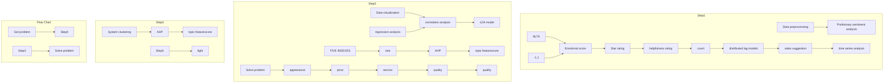
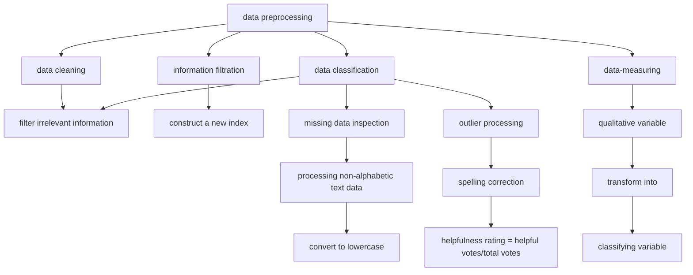
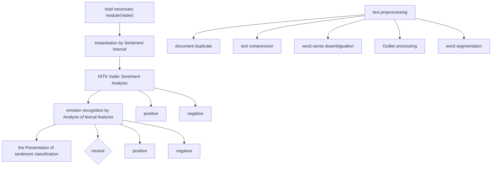
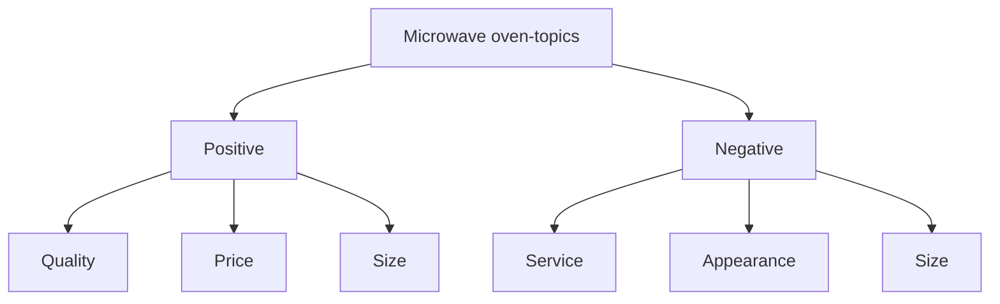
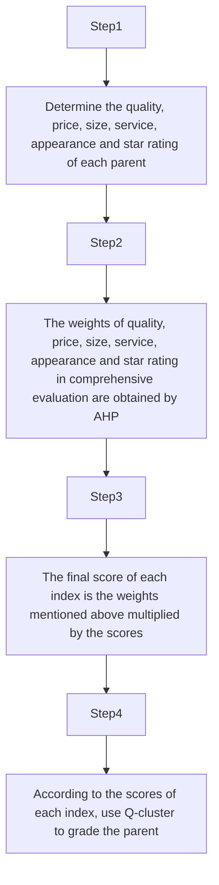
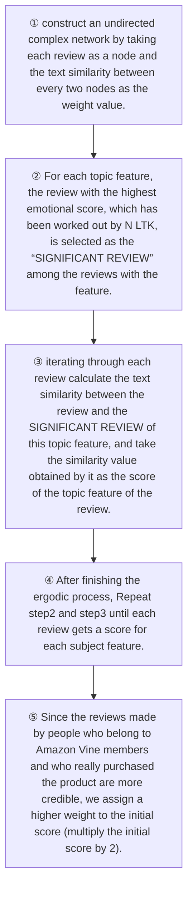

# Sales Strategy Recommendation Based on Commodity Data Mining

## Summary

We conduct data analysis and information mining from the following four aspects: correlation between review, star rating and helpfulness rating, product brand rating, prediction of product’s reputation and impact of star rating on reviews, so as to propose reliable sales strategies and suggestions for product improvement.

Firstly, after data pre-processing, We perform word segmentation and preliminary sentiment analysis on the text data through the NLTK tool, and quantify it as emotion score, ranging from [-1,1].We adopt the methods of data visualization, descriptive statistics and correlation analysis, and further construct a multivariate Logistic regression model to analyze the relationship between helpfulness rating and review length, star rating and compound. The results show that helpfulness rating has an inverted "U-type" relationship with review length and a positive "U-type" relationship with star rating.

The next step, we conduct analysis based on the rating and evaluation model. The LDA analysis model is constructed to find the topic feature of each product, based on which we can propose suggestions for improvement of products. At the same time, we summarize five indexes that affect the product sales from the topic features, namely quality, price, appearance, service and size. Then a computer search algorithm based on the text similarity is used to calculate the index score of each review. In addition, we combine the score with the analytic hierarchy process to determine the weight of each index and build a weighted brand scoring system. Finally, we cluster all product brands through systematic clustering to select potential high-quality brands and recommend them to sunshine company.

Further, we calculate the comprehensive score of review and star rating, and take it as the product’s reputation, which is conducive to forecast the future reputation of three products through time series analysis. And it depicts that the three products have seasonal characteristics and will probably maintain a stable seasonal cycle in the near future. However, the peak time of reputation comprehensive score of the three products is discrepant, and further analysis illustrates that the product sales figure is larger during the peak period of reputation score, according to which sunshine company can make a sales plan.

Finally, we analyze the relationship between star rating and review. Through the establishment of distributed lag model, it is found that customers' reviews in the current period will be affected by other customers' ratings and reviews. Meanwhile, we observe the time-varying synchrony between emotional score and star rating, which is clear that reviews containing positive words result in higher star ratings, while reviews containing negative words result in lower star ratings. In other words, there is a strong correlation between star ratings and specific quality descriptors.

Key words: correlation analysis, multinomial logistic regression, natural language processing, time series analysis

## Content

## 1. INTRODUCTION ..

1.1 Background. 2  
1.2 Problems Restatement..

## 2. ASSUMPTIONS AND NOMENCLATURE.................

2.1 Assumptions 3  
2.2 Nomenclature...

## 3. MODEL 1-ANALYSIS OF STAR RATING, HELPFULNESS RATING AND REVIEW............... ... 4

3.1 Data Pre-processing 4  
3.2 Word Segmentation and Sentiment Analysis 5  
3.3 Data Description and Visual Analysis. 6  
3.4 Correlation Analysis  
3.5 Multinomial Logistic Regression Model

## 4. MODEL 2-ESTABLISH A SCORING SYSTEM TO DETERMINE PRODUCT POSITIONING... 9

4 1 LDA Model C  
4.2 Determine index score 1  
4.3 Analytic hierarchy process (AHP) . 12

4.3.1 The introduction of analytic hierarchy process . 12  
4.3.2 AHP Consistency Test .. 13  
4.3.3 Results of AHP . 13

4.4System Clustering Analysis .. 14

4.4.1 Model establishment. 14

4.4.2 Classification results. 14

## 5. MODEL 3-TIME SERIES ANALYSIS.. 15

## 6. MODEL 4-DISTRIBUTED LAG MODEL..... . 17

6.1 Distributed lag model. . 17  
6.2 Almon Method . .. 18  
6.3 Correlation Analysis between Star Rating and Comments . . 18

## 7. SENSITIVITY ANALYSIS .. 19

## 8. MODEL ASSESSMENT ..... . 20

8.1 Strengths .. 20  
8.2 Weaknesses .... ... 20

## REFERENCE. 20

## LETTER..

## APPENDIX....

## 1. Introduction

## 1.1 Background

With the popularization and development of the Internet, online sales are gradually replacing offline sales and occupy a major position in the sales industry. The transformation of sales mode will also be a huge challenge for commodity companies. Analyzing and mining market information and consumer feedback has become the key of network marketing.

The online marketplace created by Amazon provides an opportunity for customers to evaluate their purchases. Customers can use quantities from 1 (low rating, low satisfaction) to 5 (high rating, high satisfaction) to express their satisfaction with the product. In addition, customers can submit their own reviews on the products to express their opinions. Other customers can use these reviews to gain an initial understanding of the product before purchasing it, and to distinguish between the reviews (called "helpfulness ratings") that are helpful or not. The data will be fed back to the company which can use the data to conduct in-depth analysis of the markets, determine the timing of their participation, and modify products based on customer suggestions.

## 1.2 Problems Restatement

Sunshine Company plans to launch and sell microwave ovens, hair dryers and baby pacifiers in the online marketplace. In order to understand these three commodity markets and develop sales strategies, it is necessary to analyze the customer feedback data. We will accomplish the following tasks according to the given data:

(1) Develop sales strategy for sunshine company.  
(2) Identify potential important design features that would enhance product desirability.

In order to accomplish the above two tasks, our specific work is as follows:

Analyze the relationship between star rating, helpful vote and review.  
Make in-depth analysis of reviews and ratings, and distinguish the advantages and disadvantages of products, so as to make suggestions for product improvement.  
Establish a product rating system based on the analysis of reviews and ratings, and select high-quality brand products to recommend to Sunshine Company for sales.  
Establish the reputation scoring system and predict the development trend of reputation.  
Analyze whether current reviews are influenced by prior star ratings and reviews.  
Analyze whether specific quality descriptors of text-based reviews strongly associated with rating levels.


<details>
<summary>flowchart</summary>


</details>

Figure 1: The Flow Chart in This Paper

## 2. Assumptions and Nomenclature

## 2.1Assumptions

We make several assumptions in our model. Later we may relax some of these assumptions to optimize our model making it more applicable in the complex reality environment.

All reviews are from customers and there is no automated review.  
There is no deliberate attempt to smear the product in customer rating and review.  
Unverified orders are not sold on Amazon. The sum of confirmed sales in the data set is total sales.  
The review of members certified by Amazon Vine has high credibility.

## 2.2Nomenclature

<table><tr><td>Symbols</td><td>Definition</td></tr><tr><td>SS</td><td>Star ratings squared</td></tr><tr><td>count</td><td>The number of words in each review.</td></tr><tr><td>CS</td><td>The number of words squared</td></tr><tr><td>compound</td><td>Emotional score</td></tr><tr><td> $H_r$ </td><td>The percentage of helpful votes in the total votes.</td></tr><tr><td> $w_i$ </td><td>The weight of the  $i^{th}$  index</td></tr><tr><td>SQ</td><td>Total score of six indexes(quality、size、service、price、appearance、star ratings)</td></tr><tr><td>SR</td><td>Total score of product reputation</td></tr></table>

## 3. Model 1-Analysis of Star rating, Helpfulness rating and Review

## 3.1 Data Pre-processing

Before data analysis, the availability of data must be guaranteed. No measures, regardless of its value, can provide accurate assessments if based on unreliable data. We first remove useless information including product title, marketplace and product category, on the basis of which we can carry out data pre-processing.

To ameliorate the condition of data set, there are four steps: data classification, data cleaning, information filtration, set-up of new attribute and data-measuring, as shown in the figure.


<details>
<summary>flowchart</summary>


</details>

Figure 2: Data Pre-processing Flow Chart

Step 1: Firstly, divide the data into numeric and textual types and process them separately.

Step 2: In the stage of data cleaning, initially we check the missing value by using the “duplicated () method” in python, while no item with a missing value was found.

Step 3: Outlier processing is mainly used in the text data. Take the pacifier as an example, it includes the following contents:

Processing non-alphabetic text data. There are some non-alphabetic data like : ， ，❤， ,They can't be recognized by a computer program, while their emotional inclination can be intuitively identified by us. As a result, we transform all of them into "five stars”, so as to facilitate the later computer programming.  
Spelling correction. Generally, English text may contain spelling errors, so a spelling check is required. Based on “PyEnchant library” in python program, all the review texts are checked and corrected.  
 Lowercase: the computer will react differently to the two texts: “Five stars” and “five stars”, whereas we expect them to be the same word when we count them. Therefore, we unify all text data to lowercase characters.

Step 4: After the above steps, our data set has become more acceptable, but when we look more closely at the review content, we find that a lot of the review content is irrelevant to the product and can be regarded as redundant information, such as:

“good cleaning cloths”  
“I bought hits basket to store magazines and newspapers. It looks very nice in our room”  
“I received this blanket as a gift from my mom and have never felt anything so soft.”

Take the pacifier as an example, reviews that have nothing to do with the pacifier is needed to be weeded out. We identify the redundant information according to the text similarity, and the process is as follows:

The product review is regarded as a set of words, and the feature vector of the text is established by calculating the number of each word in the text. Afterwards, the cosine similarity between vectors is used to calculate the similarity between texts. If the average similarity between a review and others is less than the threshold value set by us, the review is removed.

Step 5:Set-up of new attribute. To better analyze the usefulness of reviews, we establish a new attribute named helpfulness rating (Hr), which is obtained by dividing “helpful votes” by “total votes”

## 3.2 Word Segmentation and Sentiment Analysis

Although the text data has been initially processed aforementioned, the information from reviews is s till needed to assess.However, the review data is unstructured and requires a different mechanism to ex tract the information. Emotion analysis or opinion mining is the process of computing to identify wh ether the author's attitude towards a text is positive, negative or neutral. For the review data, we con ducted a preliminary Sentiment analysis through data mining to determine and quantify the emotional inclination of each review, and further analysis will be discussed in the following questions. Based on this, NLTK (natural language toolkit),which is a leading platform that is able to work with human langu age data by python program, is used for sentiment analysis.

A basic sentiment analysis model is built in Python 3 using the NLTK library. The preprocessin g is operated by marking the text, normalizing the words, and removing the noise. Next, the NTLK emotional analyzer is used to build a model and associate the text with a specific emotion and quant ify it.


<details>
<summary>flowchart</summary>


</details>

Figure 3: Implementation process

## 3.3 Data Description and Visual Analysis

The table below describes the total, average and variance of the star rating of these three products. The average of the helpful votes and the number of the words in the review are also calculated. The figures below describe their distribution.

Table 1: Data Statistic

<table><tr><td>Descriptive statistics</td><td>Total</td><td>Star rating average</td><td>Star rating variance</td><td>Helpful votes average</td><td>Count</td><td>Count average</td></tr><tr><td>Pacifier</td><td>18939</td><td>4.30456</td><td>1.19043</td><td>0.827182</td><td>4841870</td><td>256</td></tr><tr><td>Microwave oven</td><td>1615</td><td>3.44458</td><td>1.64524</td><td>5.62167</td><td>748130</td><td>463</td></tr><tr><td>Hair dryer</td><td>11470</td><td>4.11604</td><td>1.30033</td><td>2.17908</td><td>3268716</td><td>285</td></tr></table>


<details>
<summary>box plot</summary>

| Category     | Value  |
| ------------ | ------ |
| pacifier     | 0.50   |
| pacifier     | -0.25  |
| pacifier     | -0.75  |
| microwave    | 0.25   |
| microwave    | -0.75  |
| microwave    | 0.00   |
| microwave    | -0.25  |
| microwave    | 0.75   |
| hair_dryer   | 0.00   |
| hair_dryer   | -0.25  |
| hair_dryer   | 0.75   |
</details>

Figure 4: Box Figure


<details>
<summary>stacked bar chart</summary>

| Category | Descriptive statistics | pacifier | microwave | hair_dryer |
|---|---|---|---|---|
| total | 0.75 | 0.65 | -0.35 | -0.15 |
| sr_avg | 0.05 | 0.05 | -0.25 | -0.05 |
| sr_std | -0.15 | -0.15 | 0.15 | -0.15 |
| hv_avg | -0.85 | -0.45 | 0.75 | -0.65 |
| rb_sum | 0.65 | 0.55 | -0.75 | -0.25 |
| rb_avg | -0.35 | -0.25 | 0.35 | -0.45 |
</details>

Figure 5: Stacked Barplot


<details>
<summary>bar-line hybrid chart</summary>

| star_rating | bar_height | line_value |
| ----------- | ---------- | ---------- |
| 1           | 0.9        | 0.3        |
| 2           | 0.2        | 0.0        |
| 3           | 0.3        | 0.0        |
| 4           | 0.7        | 0.2        |
| 5           | 2.4        | 2.5        |
</details>

Figure 6:Star Rating Distributon

The data is visualized to dig into the inherent rules, which is helpful for modeling.

The figures below describe the relationship between the helpfulness rating, and star ratings, review length and emotional score.


<details>
<summary>heatmap</summary>

| | sr | cp | hr | ct |
|---|---|---|---|---|
| sr | 0.85 | 0.62 | 0.71 | 0.59 |
| cp | 0.73 | 0.84 | 0.68 | 0.65 |
| hr | 0.69 | 0.79 | 0.82 | 0.76 |
| ct | 0.81 | 0.74 | 0.86 | 0.83 |
</details>


<details>
<summary>heatmap</summary>

| | sr | cp | hr | ct |
|---|---|---|---|---|
| sr | 1.0 | 0.8 | 0.0 | 0.0 |
| cp | 0.8 | 0.8 | 0.0 | 0.0 |
| hr | 0.0 | 0.0 | 1.0 | 0.0 |
| ct | 0.8 | 0.2 | 0.4 | 0.8 |
</details>


<details>
<summary>heatmap</summary>

| | sr | cp | hr | ct |
|---|---|---|---|---|
| sr | 0.95 | 0.65 | 0.15 | 0.15 |
| cp | 0.85 | 0.95 | 0.15 | 0.25 |
| hr | 0.15 | 0.75 | 0.95 | 0.15 |
| ct | 0.15 | 0.35 | 0.95 | 0.95 |
</details>

Figure 7:Heat Map of Correlation

Note: sr represents “star rating”; cp represents “compound”; ct represents “count”; hr represents “helpfulness rating”

The darker the color in the figure is, the greater the correlation between the two indicators will be. We can find that the emotional score and star ratings has a strong correlation in the three figures. The helpfulness rating and the review length has a light correlation.

## 3.4 Correlation Analysis

We apply the methods of correlation analysis on the percentage of helpful votes $\left( H _ { r } \right)$ , star ratings, the number of words in each review (count) and emotional score (compound)., which is measured by Pearson correlation coefficient is as follows:

$$
r = \frac {\sum_ {i = 1} ^ {n} (X _ {i} - \bar {X}) (Y _ {i} - \bar {Y})}{\sqrt {\sum_ {i = 1} ^ {n} (X _ {i} - \bar {X}) ^ {2}} \sqrt {\sum_ {i = 1} ^ {n} (Y _ {i} - \bar {Y}) ^ {2}}} \tag {1}
$$

$X _ { i }$ represents the star rating, review length, emotional score, etc. $Y _ { i }$ represents the helpfulness rating,. $\overline { { X } }$ , $Y$ represents the average number of these indexes. The r is the correlation coefficient between $H _ { r }$ and star rating, count, compound, etc.

The results of the correlation analysis are

Table 2: Correlation Coefficient

<table><tr><td>Index</td><td>Correlation coefficient(Microwave oven)</td><td>Correlation coefficient(Hair dryer)</td><td>Correlation coefficient(Pacifier)</td></tr><tr><td>star rating</td><td>-0.149**</td><td>-0.138**</td><td>-0.151**</td></tr><tr><td>count</td><td>-0.071**</td><td>0.356**</td><td>0.332**</td></tr><tr><td>compound</td><td>-0.024**</td><td>0.057**</td><td>-0.101**</td></tr></table>

Note: \*\* means the result is significant at 0.01 level (two-side test)

From the table above we can see that, for the three data sets, there is a significant correlation between $H _ { r }$ and star rating, count and compound (all of which are significant in the two-tailed test), which is consistent with the results of visual analysis. More concretely, the star rating and emotional score of microwave oven, hair dryer and pacifier are negatively correlated with $H _ { r }$ . The counts of hair dryer and pacifier are positively correlated with $H _ { r }$ , while the counts of microwave oven are negatively correlated with $H _ { r }$ . Besides, there is a negative correlation between the compound of microwave oven, pacifier and $H _ { r }$ , while the correlation between the compound of hair dryer and $H _ { r }$ is positive.

## 3.5 Multinomial Logistic Regression Model

Multinomial logistic regression model is adopted to further analyze the impact of star rating, review length and emotional score on the helpfulness rating. In fact, the helpfulness rating is the cumulative result of each consumer’s voting (yes or no) . Therefore, the number of helpful votes is subject to binomial distribution, and logistic model is suitable for empirical analysis of such kind of data.

Multivariate logistic regression can determine the role and intensity of the explanatory variable $X _ { n }$ in predicting the probability of occurrence of strain Y. Suppose X is the response variable and P is the response probability of the model, and the corresponding regression model is as follows:

$$
\ln \left(\frac {p _ {1}}{1 - p _ {1}}\right) = \alpha + \sum_ {k = 1} ^ {k} \beta_ {k} x _ {k i} \tag {2}
$$

$p _ { 1 } = P ( \mathbf { y } _ { i } = 1 | x _ { 1 i } , \mathbf { x } _ { 2 i } , \cdots , \mathbf { x } _ { k i } )$ is the possibility that case i happens in case the values of $x _ { 1 i } , { \bf X } _ { 2 i } , \cdots , { \bf X } _ { k i }$ are given. Also $p _ { 1 }$ is a binomial distribution parameter, which is the probability that a review receives a helpful vote. $x _ { k i }$ represents a series of independent variables. β is the corresponding estimation coefficient, and α is the intercept, which reflects the random effect at the product level.

The probability of an event happening of an event is a non-linear function composed of the explanatory variable $\mathrm { X } _ { i }$ . Here is the expression:

$$
p = \frac {\exp (\alpha + \beta_ {1} \mathrm{X} _ {1} + \beta_ {2} \mathrm{X} _ {2} + \dots + \beta_ {n} \mathrm{X} _ {n})}{1 + \exp (\alpha + \beta_ {1} \mathrm{X} _ {1} + \beta_ {2} \mathrm{X} _ {2} + \dots + \beta_ {n} \mathrm{X} _ {n})} \tag {3}
$$

On top of these 3 indexes, we introduce two additional variables: star rating square(SQ) and review length square(CS) in order to further explore the influence of star rating and review length on the helpfulness ratings of reviews.

Meanwhile, considering the impact of whether the customers are vine members and whether the purchase is verified on the authenticity and validity of reviews, we take these two indicators as independent variables.

Independent variables are divided into three levels, which represent the intuitive evaluation (star rating, star rating square) respectively, characteristics of review content (review length, review length square, emotional score), and characteristics (vine, VP), to explore the various reasons that affect the helpfulness ratings in detail.

As for dependent variables, we divide them into four categories according to their numerical values, namely:

$$
\text { helpfulness   ratings } = \left\{ \begin{array}{c} 1, 0. 7 5 <   \text { compound } \leq 1 \\ 2, 0. 5 0 <   \text { compound } \leq 0. 7 5 \\ 3, 0. 2 5 <   \text { compound } \leq 0. 5 0 \\ 4, 0 \leq \text { compound } \leq 0. 2 5 \end{array} \right. \tag {4}
$$

The independent variables are divided into blocks and do regression analysis respectively. The independent variables in models 1, 2 and 3 and the regression coefficients obtained by SPSS are summarized as Table.For reasons of space, the results of hair dryer and pacifier are included in the appendix.

<table><tr><td></td><td>independent variables</td><td>Abbreviations</td><td>Model 1</td><td>Model 2</td><td>Model 3</td></tr><tr><td rowspan="2">Intuitive evaluation</td><td>star rating</td><td>star rating</td><td>0.213**</td><td>0.469**</td><td>0.423**</td></tr><tr><td>star rating square</td><td>SS</td><td>0.314**</td><td>0.207**</td><td>0.110**</td></tr><tr><td rowspan="3">Characteristics of review content</td><td>review length</td><td>count</td><td></td><td>-0.020**</td><td>-0.019**</td></tr><tr><td>review length square</td><td>CS</td><td></td><td>0.002**</td><td>0.002**</td></tr><tr><td>emotional score</td><td>compound</td><td></td><td>-0.146**</td><td>-0.160**</td></tr><tr><td rowspan="2">Reviewers&#x27; characteristics</td><td>vine</td><td>vine</td><td></td><td></td><td>0.033**</td></tr><tr><td>verified purchase</td><td>verified purchase</td><td></td><td></td><td>0.398**</td></tr></table>

Table 3: Index and regression coefficient  
Note:\*: p<0.05; \*\*: p<0.01; +: p<0.1; ns: not significant

It is clear from the above table, each variable passed the significance test. The regression coefficients of star ratings of microwave oven, hair dryer and pacifier are all positive, and the regression coefficients of star rating square terms are also positive. It indicates that there is a "U-type” relationship between star ratings and the helpfulness ratings of reviews, which is contrary to the research conclusions of Mudambi and Schuff [8]. Our analysis suggests that the reviewers who score higher or lower star ratings may be more willing to express a clear attitude towards the products, so as to provide more valuable reviews; while the reviewers who give intermediate star ratings may lack reference value due to their less distinctive attitude.

Based on model 1, review length, review length square and emotion score are added into the model. From the data in the table, it is clear that the regression coefficient of the review length term is negative, while one of the square term of the review length is positive, which indicates that the review length and helpfulness rating are of an inverted-U-type. According to our analysis, reviews that are too short are often limited in content and cannot provide sufficient useful information. However, overlong reviews may provide a lot of valuable information though, other customers may not be patient to spend time and energy reading them. Therefore, reviews with high helpfulness ratings should be of moderate length.

On the basis of model 2, in model 3 we introduce other reviewer-related features such as Vine and Verified Purchase. It can be seen that most customers are not vine members and many purchase are not verified in the sample data, thus it is difficult to analyze and draw valuable conclusions about these two indicators. In spite of this, they make the model more complete and more applicable.

## 4. Model 2-Establish a Scoring System to Determine Product Positioning

According to the three data sets, each product has hundreds of different brands. If sunshine company hopes to enter the market of microwave oven, hair dryer and pacifier, it is of great significance to accurately grasp the market positioning of each brand. The market positioning of different brands is mainly determined by the star rating and review from customers. The processing of star rating is relatively simple, so we mainly process text of customers’ reviews in detail.

## 4.1 LDA Model

Latent Dirichlet Allocation is a generative thematic model proposed by Blei et al [2] in 2003. It is also known as three-tier Bayesian probability model with three-tier structure of document (d), topic (z) and word (W), which can effectively model the text. Based on LDA topic model, we are able to mine the potential topics in the data set, and then analyze the main information of the data sets and related feature words.

Table 4:Symbol Explanation

<table><tr><td>α, β</td><td>prior parameters of the Dirichlet function</td></tr><tr><td>θ, φ</td><td>the parameter of the topic&#x27;s multiple distribution in the document.</td></tr></table>

LDA model assumes that each review is randomly mixed by each subject according to a certain proportion. And the mixing proportion is subject to multiple distribution, which is recorded as follows:

Z | θ=Multionmial(θ)

(5)

Each topic is made up of the words in the glossary in a certain proportion, and the proportion of the mixture is also subject to multiple distribution.

$$
W \mid Z, \phi = \text { Multionmial } (\phi) \tag {6}
$$

Under the condition of review $d _ { j }$ , the probability of generating word $w _ { i }$ is expressed as:

$$
P (w _ {j} \mid d _ {j}) = \sum_ {i = 1} ^ {K} P (w _ {i} \mid z = s) \times P (z = s \mid d _ {j}) \tag {7}
$$

$P ( w _ { i } \mid z = s )$ is the probability that the word $w _ { i }$ belongs to the $s ^ { t h }$ topic. $P ( z = s \mid d _ { j } )$ indicates the probability that the $s ^ { t h }$ topic is in the review.

After sentiment analysis based on LDA , the review text is gathered into three topics, as a result 10 most frequently used words and their corresponding probability are generated under each topic. Table 5 shows the potential topics in the positive evaluation text of microwave ovens, and the other one depicts the negative evaluation. Considering the limited space of the article, we put the results of hair dryer and pacifier in the appendix.

Table 5:Microwave Oven Positive Topics

<table><tr><td>Theme 1</td><td>Theme 2</td><td>Theme 3</td><td>Theme 1</td><td>Theme 2</td><td>Theme 3</td></tr><tr><td>great</td><td>good</td><td>well</td><td>product</td><td>product</td><td>small</td></tr><tr><td>well</td><td>great</td><td>great</td><td>space</td><td>no</td><td>nice</td></tr><tr><td>like</td><td>well</td><td>good</td><td>price</td><td>price</td><td>easy</td></tr><tr><td>good</td><td>use</td><td>use</td><td>use</td><td>nice</td><td>product</td></tr><tr><td>no</td><td>small</td><td>size</td><td>like</td><td>like</td><td>like</td></tr></table>

Table 6:Microwave Oven Negative Topics

<table><tr><td>Theme 1</td><td>Theme 2</td><td>Theme 3</td><td>Theme 1</td><td>Theme 2</td><td>Theme 3</td></tr><tr><td>new</td><td>no</td><td>like</td><td>time</td><td>time</td><td>no</td></tr><tr><td>use</td><td>use</td><td>new</td><td>more</td><td>service</td><td>old</td></tr><tr><td>easy</td><td>like</td><td>use</td><td>product</td><td>great</td><td>more</td></tr><tr><td>no</td><td>more</td><td>service</td><td>model</td><td>small</td><td>small</td></tr><tr><td>like</td><td>new</td><td>time</td><td>service</td><td>good</td><td>well</td></tr></table>

According to the extraction of three potential subject words for positive and negative evaluation, we can determine the customer's attitudes towards 5 aspects of microwave oven characteristics.


<details>
<summary>flowchart</summary>


</details>

Figure 8:Index of Microwave Oven


<details>
<summary>text_image</summary>

recommend
well works blow microwaving nice
strong price price plate
long Works Really Really Well
easy
microwave microwave
quality quality great great
perfect love countertop
food complain
size size time hot hot
small small week high
service service dry
cute cute good good grill
far bulkier powder heat heat
</details>

Figure 9:Word Cloud

These high-frequency words in reviews can also reflect the focus of customers when purchasing microwave ovens, that is the quality, price, size, service and appearance. These five indicators can reflect a product comprehensively. We conduct the same analysis on pacifiers and hair dryers, then it is found that these five indicators can also be taken as the criteria to consider whether they are worth purchasing.

Taking the quality, price, size, service, appearance and star rating as the evaluation indexes, we establish a scoring system to comprehensively evaluate these 3 product sold in the current market, so as to obtain the accurate market positioning of each brand of products, and then formulate a good sales strategy for sunshine company.

The steps of our brand scoring system are as below:


<details>
<summary>flowchart</summary>


</details>

## 4.2 Determine index score

After implementing LDA algorithm, complex network is introduced to calculate the importance degree of each review. We use traversing search algorithm to implement the process, through which we can get weighted average score of each topic feature for all products. Here is the algorithm:


<details>
<summary>flowchart</summary>


</details>

## 4.3 Analytic hierarchy process (AHP)

## 4.3.1 The introduction of analytic hierarchy process

Analytic hierarchy process (AHP) can be used deeply analyze the essence, influencing factors and their internal relations of complex decision problems. It makes use of less quantitative information to make the thinking process of decision mathematical, so as to provide a simple method for complex decision problems. AHP can decompose the evaluation criteria into different hierarchical structures, and then calculate the weight of each factor by solving the eigenvectors of judgment matrix.

According to the LDA model, the indicators we extracted are quality, appearance, price, size and service satisfaction level. Now we construct the judgment matrix of the first-level evaluation index:

$$
A = \left[ \begin{array}{c c c c c c} \frac {W _ {1}}{W _ {1}} & \frac {W _ {1}}{W _ {2}} & \frac {W _ {1}}{W _ {3}} & \frac {W _ {1}}{W _ {4}} & \frac {W _ {1}}{W _ {5}} & \frac {W _ {1}}{W _ {6}} \\ \frac {W _ {2}}{W _ {1}} & \frac {W _ {2}}{W _ {2}} & \frac {W _ {2}}{W _ {3}} & \frac {W _ {2}}{W _ {4}} & \frac {W _ {2}}{W _ {5}} & \frac {W _ {2}}{W _ {6}} \\ \frac {W _ {3}}{W _ {1}} & \frac {W _ {3}}{W _ {2}} & \frac {W _ {3}}{W _ {3}} & \frac {W _ {3}}{W _ {4}} & \frac {W _ {3}}{W _ {5}} & \frac {W _ {3}}{W _ {6}} \\ \frac {W _ {4}}{W _ {1}} & \frac {W _ {4}}{W _ {2}} & \frac {W _ {4}}{W _ {3}} & \frac {W _ {4}}{W _ {4}} & \frac {W _ {4}}{W _ {5}} & \frac {W _ {4}}{W _ {6}} \\ \frac {W _ {5}}{W _ {1}} & \frac {W _ {5}}{W _ {2}} & \frac {W _ {5}}{W _ {3}} & \frac {W _ {5}}{W _ {4}} & \frac {W _ {5}}{W _ {5}} & \frac {W _ {5}}{W _ {6}} \\ \frac {W _ {6}}{W _ {1}} & \frac {W _ {6}}{W _ {2}} & \frac {W _ {6}}{W _ {3}} & \frac {W _ {6}}{W _ {4}} & \frac {W _ {6}}{W _ {5}} & \frac {W _ {6}}{W _ {7}} \end{array} \right] \tag {8}
$$

Calculate the product of the elements:

$$
M _ {i} = \Pi_ {i = 1} ^ {n} a _ {i j} (i = 1, 2, 3, 4, 5, 6) \tag {9}
$$

Take the NTH root of $M _ { i }$

$$
\overline {{{W _ {i}}}} = \sqrt [ n ]{M _ {i}} \tag {10}
$$

Calculate the eigenvector:

$$
W _ {i} = \frac {\overline {{W _ {i}}}}{\sum_ {j = 1} ^ {n} \overline {{W _ {j}}}} \tag {11}
$$

Calculate the maximum eigenvalue：

$$
\lambda_ {\max} = \frac {1}{n} \sum_ {i = 1} ^ {n} \frac {(A W) _ {i}}{W _ {i}} \tag {12}
$$

Where W=[W W2 W3 W4 W5 W6]

## 4.3.2 AHP Consistency Test

After the judgment matrix is constructed, the relative weight of each element in two levels is calculated by the judgment matrix, and the consistency test is carried out. It is not allowed for the judgment to deviate too much from the consistency, so the consistency test of the judgment matrix is needed. The specific test steps are as follows:

Step1: Calculated consistency index CI :

$$
C I = \frac {\lambda_ {\max} - n}{n - 1} \tag {13}
$$

Step2:Check the criteria for testing the consistency of the judgement matrix from the relevant data RI(n)

Table 7: Relation Between RI and n

<table><tr><td>n</td><td>1</td><td>2</td><td>3</td><td>4</td><td>5</td><td>6</td><td>7</td><td>8</td><td>9</td></tr><tr><td>RI</td><td>0</td><td>0</td><td>0.52</td><td>0.89</td><td>1.12</td><td>1.26</td><td>1.36</td><td>1.41</td><td>1.46</td></tr></table>

Note: if the consistency ratio is less than 0.1, the judgment matrix of AHP has satisfactory consistency

Step3:Calculate the random consistency ratio of the judgment matrix CR ：

$$
C R = \frac {C I}{R I} ^ {1} \tag {14}
$$

If the consistency ratio is less than 0.1, the judgement matrix of AHP has satisfactory consistency, namely its consistency degree is acceptable.

## 4.3.3 Results of AHP

After the sentiment analysis based on LDA , we screened out 5 indexes with significant influence, and combined with the star ratings, there were 6 evaluation indexes. The judgment matrix of each index is given by the expert scoring method to reflect its relative critical degree. According to the result of data processing, the judgment matrix of these indexes has passed the consistency test, which is shown in the appendix.

Table 8:Index judgment matrix

<table><tr><td></td><td>quality</td><td>appearance</td><td>price</td><td>size</td><td>service</td><td>star ratings</td></tr><tr><td>quality</td><td>1</td><td>2</td><td>1</td><td>2</td><td>2</td><td>1</td></tr><tr><td>appearance</td><td>0.5</td><td>1</td><td>1</td><td>1</td><td>2</td><td>1</td></tr><tr><td>price</td><td>1</td><td>1</td><td>1</td><td>2</td><td>1</td><td>1</td></tr><tr><td>size</td><td>0.5</td><td>1</td><td>0.5</td><td>1</td><td>0.5</td><td>1</td></tr><tr><td>service</td><td>0.5</td><td>0.5</td><td>1</td><td>2</td><td>1</td><td>0.5</td></tr></table>

Table 9:Evaluation Index and Weight

<table><tr><td></td><td>quality</td><td>appearance</td><td>price</td><td>size</td><td>service</td><td>star ratings</td></tr><tr><td>Weight(microwave oven)</td><td>0.21</td><td>0.13</td><td>0.20</td><td>0.13</td><td>0.13</td><td>0.20</td></tr><tr><td>Weight(hair dryer)</td><td>0.22</td><td>0.14</td><td>0.21</td><td>0.10</td><td>0.13</td><td>0.20</td></tr><tr><td>Weight(pacifier)</td><td>0.28</td><td>0.27</td><td>0.10</td><td>0.15</td><td>0.10</td><td>0.10</td></tr></table>

## 4.4System Clustering Analysis

## 4.4.1 Model establishment

Cluster analysis is a method of classification step by step. Its main idea is to reasonably merge and classify the research objects according to certain similarity indexes. It is called system clustering when it is used to solve the classification problem of samples and R-clustering when it is used to solve the classification problem of variables. We mainly uses cluster analysis to solve the problem of brand classification and evaluation. According to the observation indexes (star rating, quality, service, appearance, price, size) and system clustering algorithm of different brands, it calculates the similarity degree between brands, and classifies the similar brands into one category and the different brands into another. The closely related to a small classification unit, the not closely related to a large classification unit.

In a word, the result of system clustering analysis is to form a large to small classification pedigree or cluster diagram. Clustering graph can not only intuitively represent the similarity relationship and classification among the research objects, but also reflect all kinds of brands and quantitatively indicate the degree of similarity, so as to provide a good basis for the comprehensive evaluation.

Distance coefficient is a common statistic in system cluster analysis. If n brands observed on m variables are regarded as n points in m dimension space, the similarity between any two brands points $x _ { j }$ and $x _ { k }$ can be expressed by the distance between two points in m dimension space, then the distance coefficient is defined as:

$$
d _ {j k} = \left[ \frac {1}{m} \sum_ {i = 1} ^ {m} \left(\mathrm{x} _ {i j} - \mathrm{x} _ {i k}\right) ^ {2} \right] ^ {\frac {1}{2}} \tag {15}
$$

Similarity coefficient is a measure of similarity between brands. Each brand is regarded as a vector of m-dimensional space, and the similarity between two brands $x _ { j }$ and $x _ { k }$ is defined as the cosine of the angle between two vectors, that is

$$
\cos \theta_ {j k} = \frac {\sum_ {i = 1} ^ {m} x _ {i j} x _ {i k}}{\sqrt {\sum_ {i = 1} ^ {m} x _ {i j} {} ^ {2} \cdot \sum_ {i = 1} ^ {m} x _ {i j} {} ^ {2}}} \tag {16}
$$

## 4.4.2 Classification results

We use SPSS to cluster different parents and divide them into 10 grades. The first-class products are the best, and the tenth class products are the worst. In our sales strategy, we will recommend the first-class brands with better response in the sales market of sunshine company. Limited to space, only 5 first-class brands of each product are listed in the text.

Table 10:Part of Classification results

<table><tr><td>Microwave oven</td><td>862802057</td><td>423421857</td><td>692404913</td><td>464779766</td><td>423421857</td></tr><tr><td>Hair dryer</td><td>244516305</td><td>266176173</td><td>468944538</td><td>741916038</td><td>112413045</td></tr><tr><td>Pacifier</td><td>22060147</td><td>22189989</td><td>51496920</td><td>62352351</td><td>79207704</td></tr></table>

Note: The number in the table corresponds to the product parent.

## 5. Model 3-Time Series Analysis

In this section, we construct a time series analysis model to analyze microwave reputation, hair dryer reputation and pacifier reputation. Afterwards the product reputation could be predicted after analyzing the reviews and star ratings about the products.

The product reputation is consisted with star rating and emotional inclination. According to statist ics, the customers are apt to pay more attention to the reviews when they buy goods, so the review shows greater impact on the product reputation than the star rating. Because of this, we assign 70% weight to the average emotional score and 30% weight to the average star rating. The sum of them is the comprehensive score of product reputation.

Due to hypotheses, the product reputation score will be influenced by autocorrelation in time seri es. As a consequence, we choose $p ^ { t h }$ -order Auto-Regression Model to fit curve, namely AR(p).

$$
Y _ {n} = a _ {1} Y _ {n - 1} + a _ {2} Y _ {n - 2} + \dots + a _ {p} Y _ {n - p} + \mu_ {n} \tag {17}
$$

Where Y represents the product reputation score in year n.

$a _ { 1 } \ldots . . . a _ { p }$ represent the influential coefficients of different lag orders.

$\mu _ { n }$ represents the error term whose mean value is 0 and variance is $\sigma ^ { 2 }$ .The distribution matches White Noise Process WN(0, 2  ) $\mathrm { W N } ( 0 , \sigma ^ { 2 } )$

Firstly, we collected the time series data of three products’ reputation scores. Then we solve the auto-regession model of the reputation score and calculate the time-series autocorrelation function and partial autocorrelation function of the reputation scores to identify the order, and specifically calculated the parameter $p$ .

The sequence correlation of the comprehensive scores of each product's reputation depicts an obvious autoregressive structure AR1, which means the involved functions don’t possess the property of truncation, and the partial functions possess the property of truncation. Therefore, we conclude that p=1 and the reputation score of all the three products share the same model setting.

$$
N _ {t} = \phi_ {1} N _ {t - 1} + \varepsilon_ {t} \tag {18}
$$

The mean variance of the coefficient $\phi _ { 1 }$ and the error term $\varepsilon$ is different from the reputation changing. By calculation, we apply the MLE to estimate the coefficient of these three products. Here we list the results:

Table 11: ARE Model for Different Products

<table><tr><td>product</td><td>AR (1)</td><td>σ</td><td>P-Value</td><td>R2</td></tr><tr><td>Hair dryer</td><td>0.125</td><td>0.046</td><td>0.007</td><td>0.901</td></tr><tr><td>pacifier</td><td>0.054</td><td>0.043</td><td>0.021</td><td>0.930</td></tr><tr><td>Microwave oven</td><td>-0.075</td><td>0.050</td><td>0.000</td><td>0.952</td></tr></table>

It is clear that the results of coefficients testing are significant, meanwhile the overall fitting gets a good result with a high R-squared.

Afterwards we conduct over-fitting and under fitting test, which contributes to the accuracy of p=1.The test uses the Algorithm of information guidelines to consider both the error term and the parameters’ complexity.

$$
A I C = \ln \sigma^ {2} + \frac {2 p}{n} \tag {19}
$$

$$
B I C = \ln \sigma^ {2} + \frac {p}{n} \ln n \tag {20}
$$

Where represents the size of sample.

The test illustrates that when p=1, AIC and BIC get the minimum value. Therefore, we consider the fitting of AR(1) is reasonable.

The AR (1) model is constructed to predict the comprehensive scores of product reputations. The results are as follows:

Taking the hair dryer as an example, in order to observe the relationship between the comprehensive score of product reputation and the time changing trends, we analyzed and predicted the time series in SPSS.


<details>
<summary>line chart</summary>

| Date | SMEAN(compound) |
| --- | --- |
| 10/02/NFF | 98.0 |
| 10/03-UN | 50.0 |
| 10/03-UN | 95.0 |
| 10/03-UN | 55.0 |
| 10/03-UN | 50.0 |
| 10/03-UN | 55.0 |
| 10/03-UN | 50.0 |
| 10/03-UN | 55.0 |
| 10/03-UN | 50.0 |
| 10/03-UN | 55.0 |
| 10/12-TY | 98.0 |
| 10/12-UN | 55.0 |
| 10/12-UN | 50.0 |
| 10/12-UN | 55.0 |
| 10/12-UN | 50.0 |
| 10/12-UN | 55.0 |
| 10/12-UN | 50.0 |
| 10/12-UN | 55.0 |
| 10/27-TY | 98.0 |
| 10/27-UN | 55.0 |
| 10/27-UN | 50.0 |
| 10/27-UN | 55.0 |
| 10/27-UN | 50.0 |
| 10/27-UN | 55.0 |
| 10/27-UN | 50.0 |
| 10/27-UN | 55.0 |
| 10/34-TY | 98.0 |
| 10/34-UN | 55.0 |
| 10/34-UN | 50.0 |
| 10/34-UN | 55.0 |
| 10/34-UN | 50.0 |
| 10/34-UN | 55.0 |
| 10/34-UN | 50.0 |
| 10/34-UN | 55.0 |
| 10/42-TY | 98.0 |
| 10/42-UN | 55.0 |
| 10/42-UN | 50.0 |
| 10/42-UN | 55.0 |
| 10/42-UN | 50.0 |
| 10/42-UN | 55.0 |
| 10/42-UN | 50.0 |
| 10/42-UN | 55.0 |
| 11/26-TY | 98.0 |
| 11/26-UN | 55.0 |
| 11/26-UN | 50.0 |
| 11/26-UN | 55.0 |
| 11/26-UN | 50.0 |
| 11/26-UN | 55.0 |
| 11/26-UN | 50.0 |
| 11/26-UN | 55.0 |
| 11/33-TY | 98.0 |
| 11/33-UN | 55.0 |
| 11/33-UN | 50.0 |
| 11/33-UN | 55.0 |
| 11/33-UN | 50.0 |
| 11/33-UN | 55.0 |
| 11/33-UN | 50.0 |
| 11/33-UN | 55.0 |
| 12/26-TY | 98.0 |
| 12/26-UN | 55.0 |
| 12/26-UN | 50.0 |
| 12/26-UN | 55.0 |
| 12/26-UN | 50.0 |
| 12/26-UN | 55.0 |
| 12/26-UN | 50.0 |
| 12/26-UN | 55.0 |
| ... | ... |
| ... | ... |
| ... | ... |
| ... | ... |
| ... | ... |
| ... | ... |
| ... | ... |
| ... | ... |
| ... | ... |
| ... | ... |
| ... | ... |
| ... | ... |
| ... | ... |
| ... | ... |
| ... | ... |
</details>

Figure 10: Sequence Figure

Through the above sequence diagram, we find that the seasonal fluctuation of the time series is basically constant, so we choose the addition model to decompose the seasonal factors. After removing the seasonal factors, the value of error sequence is very small, so the long-term trend and cyclic change sequence (long-term trend + cyclic change) and the sequence after seasonal factor correction (long-term trend + cyclic change + irregular change, that is, error Poor) can basically coincide.


<details>
<summary>line chart</summary>

| MONTH, period 12 | Seasonal factors for compound 1 from SEASON, MOD_I, ADD EQU_12 |
| --- | --- |
| 135791 | -15000 |
| 135791 | 0 |
| 135791 | 0.5 |
| 135791 | 0.8 |
| 135791 | 0.6 |
| 135791 | 0.4 |
| 135791 | 0 |
| 135791 | -0.2 |
| 135791 | -0.6 |
| 135791 | -0.8 |
| 135791 | -0.4 |
| 135791 | -0.2 |
| 135791 | 0 |
| 135791 | 0.2 |
| 135791 | 0.4 |
| 135791 | 0.6 |
| 135791 | 0.8 |
| 135791 | 0.6 |
| 135791 | 0.4 |
| 135791 | 0 |
| 135791 | -0.2 |
| 135791 | -0.6 |
| 135791 | -0.8 |
| 135791 | -0.4 |
| 135791 | -0.2 |
| 134791 | 0 |
| 134791 | 0.2 |
| 134791 | 0.4 |
| 134791 | 0.6 |
| 134791 | 0.8 |
| 134791 | 0.6 |
| 134791 | 0.4 |
| 134791 | 0 |
| 134791 | -0.2 |
| 134791 | -0.6 |
| 134791 | -0.8 |
| 134791 | -0.4 |
| 134791 | -0.2 |
| 134791 | 0 |
| 134791 | 0.2 |
| 134791 | 0.4 |
| 134791 | 0.6 |
| 134791 | 0.8 |
| 134791 | -0 |
| 134791 | -0.2 |
| 134791 | -0.6 |
| 134791 | -0.8 |
| 134791 | -0.4 |
| 134791 | -0.2 |
| 134791 | 0 |
| 6/6/6 | -0.2 |
| 6/6/6 | -0.6 |
| 6/6/6 | -0.8 |
| 6/6/6 | -0.4 |
| 6/6/6 | -0.2 |
| 6/6/6 | 0 |
| 6/6/6 | 0.2 |
| 6/6/6 | 0.4 |
| 6/6/6 | 0.6 |
| 6/6/6 | 0.8 |
| 6/6/6 | -0 |
| 6/6/6 | -0.2 |
| 6/6/6 | -0.6 |
| 6/6/6 | -0.8 |
| 6/6/6 | -0.4 |
| 6/6/6 | -0.2 |
| 6/6/6 | 0 |
| 6/6/6 (end) | -0.2 |
| 6/6/6 (end) | -0.6 |
| end | -0 |
</details>

Figure 11:A sequence chart that eliminates seasonal trends  
Figure 12:The original sequence

By analyzing the seasonal trend, it can be found that the trend first drops in the first quarter of each year, then rises to the first peak. Then after a sharp decline, there is an obvious upward trend, reaching the second peak in about the eighth month, then comes a small decline. After that it reaches the peak in about October, and then falling till the beginning of the next year. In order to analyze the reasons for the seasonal changes, we introduced the annual sales volume with the time chart. It can be seen that the timing of reputation and sales have roughly the same seasonal trend, indicating that with the increase of sales, customers are more likely to give favorable reviews. So we conclude that it is consistent with the actual situation. In summer, people wash their hair more frequently. Therefore, they are apt to buy hair dryers from June to August and have a higher probability of making favorable reviews. However, when winter comes around October, the temperature is colder and the blowing time becomes longer, which might also improve the demand and reputation of hair dryer.


<details>
<summary>line chart</summary>

| Date       | Observed | Fit     | UCL     | LCL     | Forecast |
| ---------- | -------- | ------- | ------- | ------- | -------- |
| Jan 2004   | 1.0      | 0.6     | 1.1     | 0.3     | 0.6      |
| Sep 2005   | -0.5     | 0.5     | 1.0     | 0.2     | 0.5      |
| May 2007   | -0.8     | 0.4     | 0.9     | 0.1     | 0.4      |
| Jan 2009   | 0.6      | 0.5     | 1.0     | 0.2     | 0.5      |
| Sep 2010   | 0.7      | 0.6     | 1.0     | 0.2     | 0.5      |
| May 2012   | 0.8      | 0.6     | 1.0     | 0.2     | 0.5      |
| Jan 2014   | 0.7      | 0.6     | 1.0     | 0.2     | 0.5      |
| Sep 2015   | 0.6      | 0.6     | 1.0     | 0.2     | 0.5      |
| May 2017   | 0.5      | 0.5     | 1.0     | 0.2     | 0.5      |
| Jan 2019   | 0.6      | 0.6     | 1.0     | 0.2     | 0.5      |
</details>


<details>
<summary>line chart</summary>

| date       | pacifier | microwave | hair_dryer |
| ---------- | -------- | --------- | ---------- |
| 2013/2/28  | 26       | 9         | 27         |
| 2013/4/30  | 27       | 10        | 28         |
| 2013/6/30  | 27       | 9         | 27         |
| 2013/8/31  | 27       | 10        | 27         |
| 2013/10/31 | 27       | 12        | 27         |
| 2013/12/31 | 27       | 15        | 27         |
| 2014/2/28  | 27       | 16        | 27         |
| 2014/4/30  | 27       | 18        | 27         |
| 2014/6/30  | 27       | 19        | 27         |
| 2014/8/31  | 27       | 18        | 27         |
| 2014/10/31 | 27       | 19        | 27         |
| 2014/12/31 | 27       | 20        | 27         |
| 2015/2/28  | 27       | 21        | 27         |
| 2015/4/30* | 27       | 22        | 27         |
| 2015/6/30* | 27       | 23        | 27         |
| 2015/8/31* | 27       | 24        | 27         |
</details>

Figure 13: Time Series Forecasting  
Figure 14:Annual sales for Three products

Through the prediction of time series, the data of 2016-2019 are obtained. It is found that the reputation and demand of hair dryer are highly related to the seasonality, and it is very likely to maintain a stable seasonal cycle mode in the future. Microwave ovens and pacifiers are about the same. The comprehensive score of the microwave oven reaches the peak in April and October, and that of the pacifier reaches the peak in November.

From the analysis above, it is believed that the market of hair dryer, microwave oven and pacifier is roughly stable. By referring to seasonal trend, sunshine company is capable to increase the sales share when the score of the product reputation rises up, or reduce the sales investment before the score is about to slump .

## 6. Model 4-Distributed lag model

## 6.1 Distributed lag model

In this part, we apply the distributed lag model to determine if the customer's reviews will be affected by others’ star ratings.

The distributed lag model is based on the fact that the explained variables are affected by the explanatory variables and distributed on the lagged values of the explanatory variables in different periods.

$$
Y _ {t} = \alpha + \beta_ {0} X _ {t} + \beta_ {1} X _ {t - 1} + \dots + \beta_ {s} X _ {t - s} \tag {21}
$$

s is the lag length.

Each coefficient in this model reflects the different influence of each lag value of the explanatory variable on the explained variable, which is commonly referred to as multiplier effect:

$\beta _ { 0 }$ ：Short-term multiplier, which represents the average influence of one unit of star rating change on the emotional score of the review;

$\beta _ { i }$ ：Delay multiplier, which represents the average influence of the change of one unit in the previous period star rating on the emotional score of the review;

$\sum _ { i = 0 } ^ { s } \beta _ { i }$ ：The long-term multiplier, which indicates the total impact of the star rating changing due to the lag effect.

## 6.2 Almon Method

The second-order Almon polynomial distribution lag model with a lag of 3 periods is used to establish the regression equation between current reviews and previous star ratings and reviews, so as to determine whether there is a phenomenon that previous star ratings affect current customer reviews. We select the data of the hair dryer whose product parent is 732252283, the pacifier of 392768822 and the microwave oven of 423421857 for analysis.

The following finite distribution lag model is estimated by Almon method. And the coefficients are approximated by quadratic polynomials.

$$
Y _ {t} = \alpha + \beta_ {0} X _ {t} + \beta_ {1} X _ {t - 1} + \beta_ {2} X _ {t - 2} + \beta_ {3} X _ {t - 3} + u _ {t}
$$

$$
\beta_ {0} = \alpha_ {0}
$$

$$
\beta_ {1} = \alpha_ {0} + \alpha_ {1} + \alpha_ {2} \tag {22}
$$

$$
\beta_ {2} = \alpha_ {0} + 2 \alpha_ {1} + 4 \alpha_ {2}
$$

$$
\beta_ {3} = \alpha_ {0} + 3 \alpha_ {1} + 9 \alpha_ {2}
$$

Then the original model can be transformed into

$$
Y _ {t} = \alpha + \alpha_ {0} Z _ {0 t} + \alpha_ {1} Z _ {1 t} + \alpha_ {2} Z _ {2 t} + \mu_ {t}
$$

$$
Z _ {0 t} = X _ {t} + X _ {t - 1} + X _ {t - 2} + X _ {t - 3}
$$

$$
Z _ {1 t} = X _ {t - 1} + 2 X _ {t - 2} + 3 X _ {t - 3}
$$

$$
Z _ {2 t} = X _ {t - 1} + 4 X _ {t - 2} + 9 X _ {t - 3} \tag {23}
$$

The final estimation formula of the distribution lag model can be obtained by regression. The regression results are as follows:

Table 12:Regression Results

<table><tr><td></td><td> $\beta_0$ </td><td> $\beta_1$ </td><td> $\beta_2$ </td><td> $\beta_3$ </td><td> $R^2$ </td></tr><tr><td>Hair dryer</td><td>1.13221**</td><td>0.32379**</td><td>-0.05354</td><td>0.00020</td><td>0.902197</td></tr><tr><td>Pacifier</td><td>0.79191**</td><td>0.21743**</td><td>-0.03039 (0)</td><td>0.04845</td><td>0.929296</td></tr><tr><td>Microwave</td><td>1.05871**</td><td>0.17710**</td><td>-0.13628</td><td>0.11858</td><td>0.835728</td></tr></table>

oveNote:\*: $p { < } 0 . 0 5 ,$ \*\*: $p { < } 0 . 0 I ; { + } ; p { < } 0 . I ; { }$ ns: not significant

The regression equation between the comprehensive scores of past star ratings and the emotional score of the current reviews of the three products is as follows:

$$
Y _ {t} = - 0. 3 4 2 4 7 2 + 1. 1 3 2 2 1 \mathrm{X} _ {t} + 0. 3 2 3 7 9 X _ {t - 1}
$$

$$
Y _ {t} = - 0. 0 5 4 5 3 7 + 0. 7 9 1 9 1 \mathrm{X} _ {t} + 0. 2 1 7 4 3 X _ {t - 1} \tag {24}
$$

$$
Y _ {t} = - 0. 2 2 6 3 8 8 + 1. 0 5 8 7 1 \mathrm{X} _ {t} + 0. 1 7 7 1 0 X _ {t - 1}
$$

Therefore, it can be explained that there is a correlation between the current reviews of customers and the past star ratings and reviews, that is, the current evaluation of customers will be affected by the past ratings and evaluations.

## 6.3 Correlation Analysis between Star Rating and Comments

According to the time series model, the inflection points of customer reviews can be gotten quickly. By analyzing the specific quality descriptors in the reviews corresponding to these inflection points, and comparing them with the star ratings corresponding to the reviews, it is easy to know whether these words are closely related to the star ratings. In the above model, the average score of reviews and star ratings in each time period has been obtained. By comparing the synchronicity of the two changes over time, we can draw the conclusion that the star ratings corresponding to the reviews with positive words are higher, while the star ratings corresponding to the reviews with negative words are lower. (Due to the space, we only put the picture of microwave oven in the text, the picture of hair dryer and pacifier in the appendix.)


<details>
<summary>line chart</summary>

| Date       | star_rating | compound |
| ---------- | ----------- | -------- |
| 2004/6/1   | 1.0         | 0.5      |
| 2005/3/1   | 5.0         | 4.0      |
| 2005/12/1  | 3.0         | 1.0      |
| 2006/9/1   | 5.0         | 3.0      |
| 2007/6/1   | 4.0         | 2.0      |
| 2008/3/1   | 3.0         | 1.0      |
| 2008/12/1  | 5.0         | 4.0      |
| 2009/9/1   | 2.0         | 0.5      |
| 2010/6/1   | 3.0         | 1.0      |
| 2011/3/1   | 1.0         | 0.5      |
| 2011/12/1  | 5.0         | 3.0      |
| 2012/9/1   | 3.0         | 2.0      |
| 2013/6/1   | 3.5         | 2.5      |
| 2014/3/1   | 3.5         | 3.0      |
| 2014/12/1  | 4.0         | 3.5      |
</details>

Figure 15: Sequence Diagram of Star rating and Review

However, it still can be seen from the diagrams that some reviews with higher star ratings have lower emotional scores, so it is not excluded that there are high scores, poor reviews (or vice versa) and false reviews.

## 7. Sensitivity Analysis

In the time series analysis model, we give star ratings and reviews 0.3 and 0.7 weight respectively, representing the comprehensive evaluation of each customer on the products they buy. Based on the principle that the importance of reviews is higher than that of star ratings, in order to test the rationality of the weight, we change the weight of star ratings to test whether the results of the model change significantly under the weight ratio of 0.4 and 0.2 respectively. The results are as follows:

Table 13: Sensitivity Analysis on Weight of Star Rating

<table><tr><td>Product</td><td> $AR (1)^a$ </td><td>Change (in %)</td><td> $AR (1)^b$ </td><td>Change (in %)</td></tr><tr><td>Hair Dryer</td><td>0.126</td><td>0.8%</td><td>0.127</td><td>20%</td></tr><tr><td>Pacifier</td><td>0.054</td><td>-0.9%</td><td>0.054</td><td>18%</td></tr><tr><td>Microwave Oven</td><td>-0.075</td><td>0.3%</td><td>-0.074</td><td>-0.6%</td></tr></table>

Note: $A R ( 1 ) ^ { a } .$ weight of star ratings: 0.4 ; $A R ( 1 ) ^ { b } .$ : weight of star ratings: 0.2

From the table, we can see that the deviation of regression coefficient is not more than 1.8%, which shows that the change of weight has no significant impact on the results of the model, so the weight of 0.3 and 0.7 we set has certain rationality.

## 8. Model Assessment

## 8.1 Strengths

Data visualization technology is applied to interpret the original data, and the results are presented intuitively and concisely.  
Through the analysis of LDA topic model, the strengths and weaknesses of the products can be given, which is helpful for the design of products.  
Our products brand rating system has a wide range of applicability, which can help sales companies grasp customer reviews on the market.

## 8.2 Weaknesses

Our product scoring system uses AHP to determine the weight of each index, which is to some extent subjective.  
Our time series model uses monthly data, which is not very accurate and does not take into account special circumstances such as holidays, and may have a large gap with the actual results, and cannot effectively predict the product’s reputation in the long term.

## Reference

[1]Arreola Elsa Vazquez,Wilson Jeffrey R. Bayesian multiple membership multiple classification logistic regression model on student performance with random effects in university instructors and majors.[J]. PloS one,2020,15(1).  
[2]Blei D M, Ng A Y, Jordan M I. Latent dirichlet allocation[J]. Journal of Machine Learning Research, 2003, 3:2003.  
[3]Cao Juan, Xia Tian, Li Jin Tao, A density method for adaptive LDA model selection[J]. Neurocomputing 2009(72):1775-1781.  
[4]Connors, L., Mudambi, S.M., Schuff, D.. Is It the Review or the Reviewer? a Multi-Method Approach to Determine the Antecedents of Online Review Helpfulness[P]. System Sciences (HICSS), 2011 44th Hawaii International Conference on,2011.  
[5]Changxuan Wan,Yun Peng,Keli Xiao,Xiping Liu,Tengjiao Jiang,Dexi Liu. An association-constrained LDA model for joint extraction of product aspects and opinions[J]. Information Sciences,2020,519.  
[6]Cheung, Christy M. K., and Dimple R. Thadani. “The Effectiveness of Electronic Word-of-Mouth Communication: A Literature Analysis.” Bled EConference, 2010, p. 18.  
[7]Kim, Soo-Min, et al. “Automatically Assessing Review Helpfulness.” Proceedings of the 2006 Conference on Empirical Methods in Natural Language Processing, 2006, pp. 423–430.  
[8]Mudambi, Susan M.,Schuff, David,Zhang, Zhewei. Why Aren't the Stars Aligned? An Analysis of Online Review Content and Star Ratings[P]. ,2014.  
[9]Yan Leng,Weiwei Zhao,Chan Lin,Chengli Sun,Rongyan Wang,Qi Yuan,Dengwang Li. LDA-based data augmentation algorithm for acoustic scene classification[J]. Knowledge-Based Systems,2020.

## Letter

Dear Sunshine Company Marketing Director:

We are honored to inform you of our recommendations for product improvement and sales strategies for your company after data analysis and modeling. The following are some suggestions based on our analysis.

1. Suggestions for product improvement

We apply the LDA analysis model to find the topic feature of each product, in which the negative topic words can reflect the customers' dissatisfaction with the existing products in the market.

Analysis of the review text revealed that the words like "cost", "heavy", "smoking" and "noise" appeared on the top of the list of negative reviews on the hair dryer. After analyzing these high-frequency words one by one, we discovered that there were some drawbacks with hair dryers from the customers’ point of view:

Inefficiency: it takes a long time to blow-dry.  
Weight: it is too heavy to use conveniently.  
 Bad quality: when using the product, there will be a lot of noise sometimes.

Therefore, according to the feedback above, we believe that the improvement of hair dryer products is supposed to start from improving the working efficiency and quality of hair dryer. Lightweight materials can be used in the production, reducing the weight of the hair dryer, should also reduce the noise when it works. For instance, lightweight materials can be used to reduce the weight of the hair dryer and reduce the noise while it is working.

As for microwave oven, words like "service" and "small" appeared on the top of the list of negative reviews. According to the feedback, we believe that the microwave oven may have the following defects:

 Size: someone considered that microwave ovens are too small, while others reckon that small ones are more convenient to use.  
 Service: the after-sale service of some microwave ovens is not consummate.

In view of the above two points, we hold that microwave oven products can be designed in different sizes to meet the diverse needs of different customers. Moreover, improving service level and customer satisfaction is also a top priority.

"Hot" is the most frequently used negative word for a pacifier. Some customers think that the insulation function of the pacifier is poor, which reminds us that we should enhance the thermal insulation function in the design of the pacifier. In addition, we have noticed that customers attach great importance to the "appearance" of the pacifier and hence the cute product design will help to sell the product.

## 2. Sales strategy

Through the in-depth analysis of star ratings and reviews, we will propose sales suggestions and strategies from three aspects: the product brand, the time of selling products and the evaluation psychology of customers.

 Recommend the product brand for sale.

Based on the analysis of star rating and review, we summarized five indexes that affect product sales, namely quality, price, appearance, service and size, as well as index weight, then built a brand scoring system based on this. Through the systematic clustering of each score, all product brands were clustered, and the high-quality product brands were selected eventually. The product parent of some premium brands is as follows:

<table><tr><td>microwave</td><td>862802057</td><td>423421857</td><td>692404913</td><td>464779766</td><td>423421857</td></tr><tr><td>Hair-dryer</td><td>244516305</td><td>266176173</td><td>468944538</td><td>741916038</td><td>112413045</td></tr><tr><td>pacifier</td><td>22060147</td><td>22189989</td><td>51496920</td><td>62352351</td><td>79207704</td></tr></table>

Our brand rating system takes full account of the characteristics of each product, so the conclusions are very reliable. It is believed that the high quality brands recommended for sale will be favored by more customers.

 Sales opportunities analysis.

we predict the future reputation of the three products through time series analysis. The results demonstrate that the three products are highly correlated with seasonality, and the seasonal cycle pattern is likely to be stable in the future. However, the peaks of reputation composite scores of the three products occurred at different times.

Pacifiers peaked around November, hairdryers around August and October, and microwave ovens around April and October. The peak of reputation will lead to an increase in sales, so we suggest that your company adjust the sales structure according to the peak time of different products. When the product reputation is about to peak, your company can increase the sales investment of the product to obtain higher revenue.

 Psychological analysis of customer reviews.

We analyze the relationship between star rating and review. Through the research of distributed lag model, it is found that customers' reviews in the current period will be influenced by other customers' ratings and reviews. Therefore, we suggest that your company should still pay attention to the customer's rating of the goods after selling the products, and try to make the rating of its own products at a high level, so as not to gain a bad impact on future sales. To sum up, by keeping an eye on customers' preferences and regarding them as standards for improving products and services, your company can gradually increase product sales and market share.

These are all suggestions and strategies our team has provided to your company. Thank you again for taking the time to read our suggestions.

Hope that our models and these suggestions can be helpful to you!

Sincerely,

MCM Team Members

## Appendix

Appendix 1  


<details>
<summary>bar chart</summary>

| Variable | Value |
| --- | --- |
| binoaginosa | 0.00 |
| dhuco | 0.00 |
| lon latigrel | 0.00 |
| pindian_tawke | 0.00 |
| cation/sox | 0.00 |
| pindian_tawke (top) | 0.1 |
| pindian_tawke (bottom) | 0.05 |
| pindian_tawke (right) | 0.1 |
| pindian_tawke (left) | 0.05 |
| pindian_tawke (right) | 0.05 |
| pindian_tawke (bottom) | 0.1 |
| pindian_tawke (top) (top) | 0.1 |
| pindian_tawke (bottom) (top) | 0.1 |
| pindian_tawke (top) (bottom) | 0.1 |
| pindian_tawke (bottom) | 0.1 |
| pindian_tawke (top) (top) | 0.1 |
| pindian_tawke (bottom) | 0.1 |
| pindian_tawke (top) (top) | 0.1 |
| pindian_tawke (bottom) | 0.1 |
| pindian_tawke (top) (top) | 0.1 |
| pindian_tawke (bottom) | 0.1 |
| pindian_tawne | 0.00 |
| pindian_tawne (bottom) | 0.05 |
| pindian_tawne (top) | 0.1 |
| pindian_tawne (bottom) | 0.1 |
| pindian_tawne (top) | 0.1 |
| pindian_tawne (bottom) | 0.1 |
| pindian_tawne (top) | 0.1 |
| pindian_tawne (bottom) | 0.1 |
| pindian_tawne (top) | 0.1 |
| pindian_tawne (bottom) | 0.1 |
| pincidium_273 | 0.00 |
| pincidium_274 | 0.05 |
| pincidium_275 | 0.1 |
| pincidium_276 | 0.1 |
| pincidium_277 | 0.1 |
| pincidium_278 | 0.1 |
| pincidium_279 | 0.1 |
| pincidium_280 | 0.1 |
| pincidium_281 | 0.1 |
| pincidium_282 | 0.1 |
| pincidium_283 | 0.1 |
| pincidium_284 | 0.1 |
| pincidium_285 | 0.1 |
| pincidium_286 | 0.1 |
| pincidium_287 | 0.1 |
| pincidium_288 | 0.1 |
| pincidium_289 | 0.1 |
| pincidium_290 | 0.1 |
| pincidium_291 | 0.1 |
| pincidium_292 | 0.1 |
| pincidium_293 | 0.1 |
| pincidium_294 | 0.1 |
| pincidium_295 | 0.1 |
| pincidium_296 | 0.1 |
| pincidium_297 | 0.1 |
| pincidium_298 | 0.1 |
| pincidium_299 | 0.1 |
| pincidium_300 | 0.1 |
| pincidium_301 | 0.1 |
| pincidium_302 | 0.1 |
| pincidium_303 | 0.1 |
| pincidium_304 | 0.1 |
| pincidium_305 | 0.1 |
| pincidium_306 | 0.1 |
| pincidium_307 | 0.1 |
| pincidium_308 | 0.1 |
| pincidium_309 | 0.1 |
| pincidium_310 | 0.1 |
| pincidium_311 | 0.1 |
| pincidium_312 | 0.1 |
| pincidium_313 | 0.1 |
| pincidium_314 | 0.1 |
| pincidium_315 | 0.1 |
| pincidium_316 | 0.1 |
| pincidium_317 | 0.1 |
| pincidium_318 | 0.1 |
| pincidium_319 | 0.1 |
| pincidium_320 | 0.1 |
| pincidium_321 | 0.1 |
| pincidium_322 | 0.1 |
| pincidium_323 | 0.1 |
| pincidium_324 | 0.1 |
| pincidium_325 | 0.1 |
| pincidium_326 | 0.1 |
| pincidium_327 | 0.1 |
| pincidium_328 | 0.1 |
| pincidium_329 | 0.1 |
| pincidium_330 | 0.1 |
| pincidium_331 | 0.1 |
| pincidium_332 | 0.1 |
| pincidium_333 | 0.1 |
| pincidium_334 | 0.1 |
| pincidium_335 | 0.1 |
| pincidium_336 | 0.1 |
| pincidium_337 | 0.1 |
| pincidium_338 | 0.1 |
| pincidium_339 | 0.1 |
| pincidium_340 | 0.1 |
| pincidium_341 | 0.1 |
| pincidium_342 | 0.1 |
| pincidium_343 | 0.1 |
| pincidium_344 | 0.1 |
| pincidium_345 | 0.1 |
| pincidium_346 | 0.1 |
| pincidium_347 | 0.1 |
| pincidium_348 | 0.1 |
| pincidium_349 | 0.1 |
| pincidium_350 | 0.1 |
| pincidium_351 | 0.1 |
| pincidium_352 | 0.1 |
| pincidium_353 | 0.1 |
| pincidium_354 | 0.1 |
| pincidium_355 | 0.1 |
| pincidium_356 | 0.1 |
| pincidium_357 | 0.1 |
| pincidium_358 | 0.1 |
| pincidium_359 | 0.1 |
| pincidium_360 | 0.1 |
| pincidium_361 | 0.1 |
| pincidium_362 | 0.1 |
| pincidium_363 | 0.1 |
| pincidium_364 | 0.1 |
| pincidium_365 | 0.1 |
| pincidium_366 | 0.1 |
| pincidium_367 | 0.1 |
| pincidium_368 | 0.1 |
| pincidium_369 | 0.1 |
| pincidium_370 | 0.1 |
| pincidium_371 | 0.1 |
| pincidium_372 | 0.1 |
| pincidium_373 | 0.1 |
| pincidium_374 | 0.1 |
| pincidium_375 | 0.1 |
| pincidium_376 | 0.1 |
| pincidium_377 | 0.1 |
| pincidium_378 | 0.1 |
| pincidium_379 | 0.1 |
| pincidium_380 | 0.1 |
| pincidium_381 | 0.1 |
| pincidium_382 | 0.1 |
| pincidium_383 | 0.1 |
| pincidium_384 | 0.1 |
| pincidium_385 | 0.1 |
| pincidium_386 | 0.1 |
| pincidium_387 | 0.1 |
| pincidium_388 | 0.1 |
| pincidium_389 | 0.1 |
| pincidium_390 | 0.1 |
| pincidium_391 | 0.1 |
| pincidium_392 | 0.1 |
| pincidium_393 | 0.1 |
| pincidium_394 | 0.1 |
| pincidium_395 | 0.1 |
| pincidium_396 | 0.1 |
| pincidium_397 | 0.1 |
| pincidium_398 | 0.1 |
| pincidium_399 | 0.1 |
| pincidium_400 | 0.1 |
</details>

Correlation analysis


<details>
<summary>histogram</summary>

| counts | density |
| ------ | ------- |
| 0      | 0.016   |
| 50     | 0.011   |
| 100    | 0.005   |
| 150    | 0.003   |
| 200    | 0.001   |
| 250    | 0.0005  |
| 300    | 0.0002  |
| 350    | 0.0001  |
| 400    | 0.0001  |
| 450    | 0.0001  |
| 500    | 0.0001  |
| 550    | 0.0001  |
| 600    | 0.0001  |
| 650    | 0.0001  |
| 700    | 0.0001  |
| 750    | 0.0001  |
| 800    | 0.0001  |
| 850    | 0.0001  |
| 900    | 0.0001  |
| 950    | 0.0001  |
| 1000   | 0.0001  |
| 1050   | 0.0001  |
| 1100   | 0.0001  |
| 1150   | 0.0001  |
| 1200   | 0.0001  |
| 1250   | 0.0001  |
</details>

The distribution of the number of words

## Consistency test of AHP

Consistency check ratio table

<table><tr><td>Consistency ratio</td><td>quality</td><td>appearance</td><td>price</td><td>size</td><td>service</td><td>Star ratings</td></tr><tr><td>CR</td><td>0.0000</td><td>0.00857</td><td>0.00688</td><td>0.000817</td><td>0.00053</td><td>0.00047</td></tr></table>

## Appendix 2

Regression results of distribution lag model

1. Hair dryer

<table><tr><td>Variable</td><td>Coefficien</td><td>Std.Error</td><td>t-Statistic</td><td>Prob.</td></tr><tr><td></td><td>-0.34247</td><td>0.06643</td><td></td><td></td></tr><tr><td>C</td><td>2</td><td>0</td><td>-5.155354</td><td>0.0000</td></tr><tr><td></td><td></td><td>0.04057</td><td></td><td></td></tr><tr><td>PDL01</td><td>0.323795</td><td>2</td><td>7.980680</td><td>0.0000</td></tr><tr><td></td><td>-0.59287</td><td>0.04035</td><td></td><td></td></tr><tr><td>PDL02</td><td>8</td><td>2</td><td>-14.69277</td><td>0.0000</td></tr><tr><td></td><td></td><td>0.02861</td><td></td><td></td></tr><tr><td>PDL03</td><td>0.215540</td><td>2</td><td>7.533150</td><td>0.0000</td></tr></table>

<table><tr><td></td><td></td><td></td><td>0.64829</td></tr><tr><td>R-squared</td><td>0.902197</td><td>Mean dependent var</td><td>3</td></tr><tr><td></td><td></td><td></td><td>0.22365</td></tr><tr><td>Adjusted R-squared</td><td>0.896444</td><td>S.D. dependent var</td><td>9</td></tr><tr><td></td><td></td><td></td><td>-2.3550</td></tr><tr><td>S.E. of regression</td><td>0.071974</td><td>Akaike info criterion</td><td>86</td></tr><tr><td></td><td></td><td></td><td>-2.2090</td></tr><tr><td>Sum squared resid</td><td>0.264190</td><td>Schwarz criterion</td><td>99</td></tr><tr><td></td><td></td><td></td><td>-2.2986</td></tr><tr><td>Log likelihood</td><td>68.76488</td><td>Hannan-Quinn criter.</td><td>32</td></tr><tr><td></td><td></td><td></td><td>1.71152</td></tr><tr><td>F-statistic</td><td>156.8187</td><td>Durbin-Watson stat</td><td>2</td></tr><tr><td>Prob(F-statistic)</td><td>0.000000</td><td></td><td></td></tr></table>

<table><tr><td colspan="2">Lag Distribution of TOTAL</td><td>Coeffici ent</td><td>Std. Error</td><td>t-Statistic c</td></tr><tr><td>.</td><td>*|</td><td>1.13221</td><td>0.05595</td><td>20.2356</td></tr><tr><td>.</td><td>* |</td><td>0.32379</td><td>0.04057</td><td>7.98068</td></tr><tr><td></td><td></td><td>-0.0535</td><td></td><td>-1.3294</td></tr><tr><td>*.</td><td>|</td><td>4</td><td>0.04027</td><td>8</td></tr><tr><td>*</td><td>|</td><td>0.00020</td><td>0.05539</td><td>0.00358</td></tr><tr><td></td><td></td><td rowspan="2">Sum of Lags</td><td>1.4026</td><td>15.175</td></tr><tr><td></td><td></td><td>6</td><td>0.09243</td></tr></table>

2. Pacifier

<table><tr><td>Variable</td><td>Coefficien</td><td>Std. Error</td><td>t-Statistic</td><td>Prob.</td></tr><tr><td></td><td>-0.05453</td><td>0.10941</td><td></td><td></td></tr><tr><td>C</td><td>7</td><td>9</td><td>-0.498424</td><td>0.6201</td></tr><tr><td></td><td></td><td>0.05220</td><td></td><td></td></tr><tr><td>PDL01</td><td>0.217428</td><td>1</td><td>4.165216</td><td>0.0001</td></tr><tr><td></td><td>-0.41115</td><td>0.05242</td><td></td><td></td></tr><tr><td>PDL02</td><td>2</td><td>4</td><td>-7.842873</td><td>0.0000</td></tr><tr><td></td><td></td><td>0.03664</td><td></td><td></td></tr><tr><td>PDL03</td><td>0.163331</td><td>1</td><td>4.457639</td><td>0.0000</td></tr><tr><td></td><td></td><td></td><td></td><td>0.73679</td></tr><tr><td>R-squared</td><td>0.629296</td><td colspan="2">Mean dependent var</td><td>9</td></tr><tr><td></td><td></td><td></td><td></td><td>0.16242</td></tr><tr><td>Adjusted R-squared</td><td>0.609786</td><td colspan="2">S.D. dependent var</td><td>3</td></tr><tr><td></td><td></td><td></td><td></td><td>-1.6749</td></tr><tr><td>S.E. of regression</td><td>0.101461</td><td colspan="2">Akaike info criterion</td><td>65-1.5365</td></tr><tr><td>Sum squared resid</td><td>0.586774</td><td colspan="2">Schwarz criterion</td><td>47</td></tr><tr><td></td><td></td><td colspan="2"></td><td>-1.6207</td></tr><tr><td>Log likelihood</td><td>55.08642</td><td colspan="2">Hannan-Quinn criter.</td><td>17</td></tr><tr><td></td><td></td><td colspan="2"></td><td>1.59103</td></tr><tr><td>F-statistic</td><td>32.25389</td><td colspan="2">Durbin-Watson stat</td><td>8</td></tr><tr><td>Prob(F-statistic)</td><td>0.000000</td><td colspan="2"></td><td></td></tr></table>

<table><tr><td colspan="2">Lag Distribution of TOTAL</td><td>Coeffici ent</td><td>Std. Error</td><td>t-Statistic c</td></tr><tr><td>.</td><td>*|</td><td>0.79191</td><td>0.08171</td><td>9.69200</td></tr><tr><td>.</td><td>* |</td><td>0.21743</td><td>0.05220</td><td>4.16522</td></tr><tr><td></td><td></td><td>-0.0303</td><td></td><td>-0.6099</td></tr><tr><td>*.</td><td>|</td><td>9</td><td>0.04982</td><td>9</td></tr><tr><td>.*</td><td>|</td><td>0.04845</td><td>0.06081</td><td>0.79669</td></tr><tr><td></td><td></td><td rowspan="2">Sum of Lags</td><td>1.0273</td><td>7.2225</td></tr><tr><td></td><td></td><td>9</td><td>0.14225</td></tr></table>

3. Microwave oven

<table><tr><td>Variable</td><td>Coefficien</td><td>Std. Error</td><td>t-Statistic</td><td>Prob.</td></tr><tr><td></td><td>-0.22638</td><td>0.07200</td><td></td><td></td></tr><tr><td>C</td><td>8</td><td>6</td><td>-3.144010</td><td>0.0030</td></tr><tr><td></td><td></td><td>0.05482</td><td></td><td></td></tr><tr><td>PDL01</td><td>0.177103</td><td>2</td><td>3.230494</td><td>0.0023</td></tr><tr><td></td><td>-0.59749</td><td>0.05752</td><td></td><td></td></tr><tr><td>PDL02</td><td>4</td><td>5</td><td>-10.38663</td><td>0.0000</td></tr><tr><td></td><td></td><td>0.04604</td><td></td><td></td></tr><tr><td>PDL03</td><td>0.284116</td><td>5</td><td>6.170329</td><td>0.0000</td></tr><tr><td></td><td></td><td></td><td></td><td>0.52140</td></tr><tr><td>R-squared</td><td>0.835728</td><td colspan="2">Mean dependent var</td><td>9</td></tr><tr><td></td><td></td><td></td><td></td><td>0.22024</td></tr><tr><td>Adjusted R-squared</td><td>0.824528</td><td colspan="2">S.D. dependent var</td><td>0</td></tr><tr><td></td><td></td><td></td><td></td><td>-1.8488</td></tr><tr><td>S.E. of regression</td><td>0.092257</td><td colspan="2">Akaike info criterion</td><td>16</td></tr><tr><td></td><td></td><td></td><td></td><td>-1.6928</td></tr><tr><td>Sum squared resid</td><td>0.374502</td><td colspan="2">Schwarz criterion</td><td>83</td></tr><tr><td></td><td></td><td></td><td></td><td>-1.7898</td></tr><tr><td>Log likelihood</td><td>48.37159</td><td colspan="2">Hannan-Quinn criter.</td><td>89</td></tr><tr><td></td><td></td><td></td><td></td><td>1.49272</td></tr><tr><td>F-statistic</td><td>74.61626</td><td colspan="2">Durbin-Watson stat</td><td>4</td></tr></table>

Prob(F-statistic) 0.000000

<table><tr><td colspan="2">Lag Distribution of TOTAL</td><td>Coeffici ent</td><td>Std. Error</td><td>t-Statistic</td></tr><tr><td>.</td><td>*|</td><td>1.05871</td><td>0.07634</td><td>13.8681</td></tr><tr><td>.*</td><td>|</td><td>0.17710</td><td>0.05482</td><td>3.23049</td></tr><tr><td></td><td></td><td>-0.1362</td><td></td><td>-2.4775</td></tr><tr><td>*.</td><td>|</td><td>8</td><td>0.05500</td><td>9</td></tr><tr><td>.*</td><td>|</td><td>0.11858</td><td>0.07611</td><td>1.55802</td></tr><tr><td></td><td></td><td rowspan="2">Sum of Lags</td><td>1.2181</td><td>10.594</td></tr><tr><td></td><td></td><td>2</td><td>0.11498</td></tr></table>

## Appendix 3

Partial system clustering results  
1.

<table><tr><td>Microwave oven</td><td>10 clusters</td><td>9 clusters</td><td>8 clusters</td><td>7 clusters</td><td>6 clusters</td><td>5 clusters</td></tr><tr><td>1:109226352</td><td>1</td><td>1</td><td>1</td><td>1</td><td>1</td><td>1</td></tr><tr><td>2:147401377</td><td>2</td><td>2</td><td>2</td><td>2</td><td>2</td><td>2</td></tr><tr><td>3:149559260</td><td>3</td><td>3</td><td>3</td><td>3</td><td>3</td><td>3</td></tr><tr><td>4:155528792</td><td>2</td><td>2</td><td>2</td><td>2</td><td>2</td><td>2</td></tr><tr><td>5:166483932</td><td>4</td><td>4</td><td>4</td><td>4</td><td>4</td><td>2</td></tr><tr><td>6:168181302</td><td>4</td><td>4</td><td>4</td><td>4</td><td>4</td><td>2</td></tr><tr><td>7:215953885</td><td>2</td><td>2</td><td>2</td><td>2</td><td>2</td><td>2</td></tr><tr><td>8:242727854</td><td>5</td><td>5</td><td>4</td><td>4</td><td>4</td><td>2</td></tr><tr><td>9:295520151</td><td>4</td><td>4</td><td>4</td><td>4</td><td>4</td><td>2</td></tr><tr><td>10:305608994</td><td>1</td><td>1</td><td>1</td><td>1</td><td>1</td><td>1</td></tr><tr><td>11:309267414</td><td>1</td><td>1</td><td>1</td><td>1</td><td>1</td><td>1</td></tr><tr><td>12:311592014</td><td>6</td><td>6</td><td>5</td><td>5</td><td>5</td><td>4</td></tr><tr><td>13:313983847</td><td>7</td><td>7</td><td>6</td><td>6</td><td>6</td><td>5</td></tr><tr><td>14:379992322</td><td>4</td><td>4</td><td>4</td><td>4</td><td>4</td><td>2</td></tr><tr><td>15:392967251</td><td>2</td><td>2</td><td>2</td><td>2</td><td>2</td><td>2</td></tr><tr><td>16:423421857</td><td>1</td><td>1</td><td>1</td><td>1</td><td>1</td><td>1</td></tr><tr><td>17:454581724</td><td>7</td><td>7</td><td>6</td><td>6</td><td>6</td><td>5</td></tr><tr><td>18:459626087</td><td>1</td><td>1</td><td>1</td><td>1</td><td>1</td><td>1</td></tr><tr><td>19:464779766</td><td>4</td><td>4</td><td>4</td><td>4</td><td>4</td><td>2</td></tr><tr><td>20:486381187</td><td>5</td><td>5</td><td>4</td><td>4</td><td>4</td><td>2</td></tr><tr><td>21:494028413</td><td>2</td><td>2</td><td>2</td><td>2</td><td>2</td><td>2</td></tr><tr><td>22:494668275</td><td>5</td><td>5</td><td>4</td><td>4</td><td>4</td><td>2</td></tr><tr><td>23:522487135</td><td>6</td><td>6</td><td>5</td><td>5</td><td>5</td><td>4</td></tr><tr><td>24:523301568</td><td>1</td><td>1</td><td>1</td><td>1</td><td>1</td><td>1</td></tr><tr><td>25:539049610</td><td>2</td><td>2</td><td>2</td><td>2</td><td>2</td><td>2</td></tr><tr><td>26:542519500</td><td>5</td><td>5</td><td>4</td><td>4</td><td>4</td><td>2</td></tr><tr><td>27:542731946</td><td>2</td><td>2</td><td>2</td><td>2</td><td>2</td><td>2</td></tr><tr><td>28:544821753</td><td>2</td><td>2</td><td>2</td><td>2</td><td>2</td><td>2</td></tr><tr><td>29:550562680</td><td>8</td><td>8</td><td>7</td><td>7</td><td>5</td><td>4</td></tr></table>

2.

<table><tr><td>Pacifier</td><td>10 clusters</td><td>9 clusters</td><td>8 clusters</td><td>7 clusters</td><td>6 clusters</td><td>5 clusters</td></tr><tr><td>1: 723849</td><td>1</td><td>1</td><td>1</td><td>1</td><td>1</td><td>1</td></tr><tr><td>2: 1006724</td><td>2</td><td>2</td><td>2</td><td>2</td><td>2</td><td>2</td></tr><tr><td>3:1398002</td><td>3</td><td>3</td><td>1</td><td>1</td><td>1</td><td>1</td></tr><tr><td>4:1439995</td><td>3</td><td>3</td><td>1</td><td>1</td><td>1</td><td>1</td></tr><tr><td>5:1448183</td><td>4</td><td>2</td><td>2</td><td>2</td><td>2</td><td>2</td></tr><tr><td>6:1696639</td><td>3</td><td>3</td><td>1</td><td>1</td><td>1</td><td>1</td></tr><tr><td>7:1892472</td><td>4</td><td>2</td><td>2</td><td>2</td><td>2</td><td>2</td></tr><tr><td>8:2143250</td><td>5</td><td>4</td><td>3</td><td>3</td><td>3</td><td>3</td></tr><tr><td>9:2332208</td><td>4</td><td>2</td><td>2</td><td>2</td><td>2</td><td>2</td></tr><tr><td>10:2341622</td><td>4</td><td>2</td><td>2</td><td>2</td><td>2</td><td>2</td></tr><tr><td>11:2775015</td><td>4</td><td>2</td><td>2</td><td>2</td><td>2</td><td>2</td></tr><tr><td>12:3090006</td><td>6</td><td>5</td><td>4</td><td>4</td><td>3</td><td>3</td></tr><tr><td>13:3146962</td><td>3</td><td>3</td><td>1</td><td>1</td><td>1</td><td>1</td></tr><tr><td>14:3179934</td><td>5</td><td>4</td><td>3</td><td>3</td><td>3</td><td>3</td></tr><tr><td>15:3729223</td><td>2</td><td>2</td><td>2</td><td>2</td><td>2</td><td>2</td></tr><tr><td>16:3916839</td><td>4</td><td>2</td><td>2</td><td>2</td><td>2</td><td>2</td></tr><tr><td>17:4145037</td><td>1</td><td>1</td><td>1</td><td>1</td><td>1</td><td>1</td></tr><tr><td>18:4569674</td><td>4</td><td>2</td><td>2</td><td>2</td><td>2</td><td>2</td></tr><tr><td>19:4649401</td><td>3</td><td>3</td><td>1</td><td>1</td><td>1</td><td>1</td></tr><tr><td>20:4792175</td><td>2</td><td>2</td><td>2</td><td>2</td><td>2</td><td>2</td></tr><tr><td>21:5180901</td><td>2</td><td>2</td><td>2</td><td>2</td><td>2</td><td>2</td></tr><tr><td>22:5471085</td><td>2</td><td>2</td><td>2</td><td>2</td><td>2</td><td>2</td></tr><tr><td>23:5645959</td><td>4</td><td>2</td><td>2</td><td>2</td><td>2</td><td>2</td></tr><tr><td>24:5747909</td><td>4</td><td>2</td><td>2</td><td>2</td><td>2</td><td>2</td></tr><tr><td>25: 5749221</td><td>4</td><td>2</td><td>2</td><td>2</td><td>2</td><td>2</td></tr><tr><td>26: 5848633</td><td>4</td><td>2</td><td>2</td><td>2</td><td>2</td><td>2</td></tr><tr><td>27: 5981131</td><td>4</td><td>2</td><td>2</td><td>2</td><td>2</td><td>2</td></tr><tr><td>28: 6156155</td><td>2</td><td>2</td><td>2</td><td>2</td><td>2</td><td>2</td></tr><tr><td>29: 6744486</td><td>2</td><td>2</td><td>2</td><td>2</td><td>2</td><td>2</td></tr><tr><td>30: 6784496</td><td>2</td><td>2</td><td>2</td><td>2</td><td>2</td><td>2</td></tr><tr><td>31: 7090204</td><td>4</td><td>2</td><td>2</td><td>2</td><td>2</td><td>2</td></tr></table>

3.

<table><tr><td>Hair dryer</td><td>10 clusters</td><td>9 clusters</td><td>8 clusters</td><td>7 clusters</td><td>6 clusters</td></tr><tr><td>1: 423960</td><td>1</td><td>1</td><td>1</td><td>1</td><td>1</td></tr><tr><td>2: 4120409</td><td>2</td><td>2</td><td>2</td><td>1</td><td>1</td></tr><tr><td>3: 11468070</td><td>3</td><td>3</td><td>3</td><td>2</td><td>2</td></tr><tr><td>4: 12536427</td><td>2</td><td>2</td><td>2</td><td>1</td><td>1</td></tr><tr><td>5: 14552349</td><td>2</td><td>2</td><td>2</td><td>1</td><td>1</td></tr><tr><td>6: 16483457</td><td>1</td><td>1</td><td>1</td><td>1</td><td>1</td></tr><tr><td>7: 16983648</td><td>2</td><td>2</td><td>2</td><td>1</td><td>1</td></tr><tr><td>8: 21033180</td><td>2</td><td>2</td><td>2</td><td>1</td><td>1</td></tr><tr><td>9: 21750700</td><td>2</td><td>2</td><td>2</td><td>1</td><td>1</td></tr><tr><td>10: 26711891</td><td>1</td><td>1</td><td>1</td><td>1</td><td>1</td></tr><tr><td>11: 30965255</td><td>3</td><td>3</td><td>3</td><td>2</td><td>2</td></tr><tr><td>12: 44138644</td><td>4</td><td>4</td><td>4</td><td>3</td><td>3</td></tr><tr><td>13: 44703144</td><td>5</td><td>5</td><td>5</td><td>4</td><td>4</td></tr><tr><td>14:45575190</td><td>1</td><td>1</td><td>1</td><td>1</td><td>1</td></tr><tr><td>15:46450049</td><td>2</td><td>2</td><td>2</td><td>1</td><td>1</td></tr><tr><td>16:46677591</td><td>2</td><td>2</td><td>2</td><td>1</td><td>1</td></tr><tr><td>17:47684938</td><td>1</td><td>1</td><td>1</td><td>1</td><td>1</td></tr><tr><td>18:50000317</td><td>2</td><td>2</td><td>2</td><td>1</td><td>1</td></tr><tr><td>19:54378879</td><td>2</td><td>2</td><td>2</td><td>1</td><td>1</td></tr><tr><td>20:54987170</td><td>4</td><td>4</td><td>4</td><td>3</td><td>3</td></tr><tr><td>21:55445525</td><td>1</td><td>1</td><td>1</td><td>1</td><td>1</td></tr><tr><td>22:55520986</td><td>2</td><td>2</td><td>2</td><td>1</td><td>1</td></tr><tr><td>23:57056668</td><td>1</td><td>1</td><td>1</td><td>1</td><td>1</td></tr><tr><td>24:61225676</td><td>4</td><td>4</td><td>4</td><td>3</td><td>3</td></tr><tr><td>25:62808517</td><td>6</td><td>1</td><td>1</td><td>1</td><td>1</td></tr><tr><td>26:64142513</td><td>2</td><td>2</td><td>2</td><td>1</td><td>1</td></tr><tr><td>27:66014174</td><td>1</td><td>1</td><td>1</td><td>1</td><td>1</td></tr><tr><td>28:66259499</td><td>1</td><td>1</td><td>1</td><td>1</td><td>1</td></tr><tr><td>29:66279275</td><td>2</td><td>2</td><td>2</td><td>1</td><td>1</td></tr><tr><td>30:68100320</td><td>1</td><td>1</td><td>1</td><td>1</td><td>1</td></tr><tr><td>31:68816102</td><td>2</td><td>2</td><td>2</td><td>1</td><td>1</td></tr><tr><td>32:71698270</td><td>4</td><td>4</td><td>4</td><td>3</td><td>3</td></tr><tr><td>33:74202592</td><td>7</td><td>6</td><td>6</td><td>5</td><td>5</td></tr><tr><td>34:74735317</td><td>1</td><td>1</td><td>1</td><td>1</td><td>1</td></tr><tr><td>35:77898021</td><td>2</td><td>2</td><td>2</td><td>1</td><td>1</td></tr><tr><td>36:80193353</td><td>8</td><td>7</td><td>7</td><td>6</td><td>2</td></tr><tr><td>37:84440271</td><td>1</td><td>1</td><td>1</td><td>1</td><td>1</td></tr><tr><td>38:91277457</td><td>2</td><td>2</td><td>2</td><td>1</td><td>1</td></tr><tr><td>39:98133587</td><td>1</td><td>1</td><td>1</td><td>1</td><td>1</td></tr><tr><td>40:99665579</td><td>2</td><td>2</td><td>2</td><td>1</td><td>1</td></tr><tr><td>41:107341965</td><td>1</td><td>1</td><td>1</td><td>1</td><td>1</td></tr><tr><td>42:108191918</td><td>1</td><td>1</td><td>1</td><td>1</td><td>1</td></tr><tr><td>43:109106777</td><td>1</td><td>1</td><td>1</td><td>1</td><td>1</td></tr><tr><td>44:110935305</td><td>2</td><td>2</td><td>2</td><td>1</td><td>1</td></tr><tr><td>45:112413045</td><td>9</td><td>8</td><td>5</td><td>4</td><td>4</td></tr><tr><td>46:115264052</td><td>2</td><td>2</td><td>2</td><td>1</td><td>1</td></tr></table>

## Appendix 4

Part of the monthly score of review and star rating

1. Hair dryer

<table><tr><td>review_date</td><td>star_rating</td><td>compound</td></tr><tr><td>2002/3/31</td><td>3</td><td>0.9736</td></tr><tr><td>2002/4/30</td><td>5</td><td>0.7313</td></tr><tr><td>2002/5/31</td><td>3.829601</td><td>0.505325</td></tr><tr><td>2002/6/30</td><td>3.829601</td><td>0.505325</td></tr><tr><td>2002/7/31</td><td>5</td><td>0.9592</td></tr><tr><td>2002/8/31</td><td>3</td><td>0.5793</td></tr><tr><td>2002/9/30</td><td>3.829601</td><td>0.505325</td></tr><tr><td>2002/10/31</td><td>3.829601</td><td>0.505325</td></tr><tr><td>2002/11/30</td><td>4</td><td>0.9261</td></tr><tr><td>2002/12/31</td><td>5</td><td>-0.1297</td></tr><tr><td>2003/1/31</td><td>4.5</td><td>0.7576</td></tr><tr><td>2003/2/28</td><td>4</td><td>0.899</td></tr><tr><td>2003/3/31</td><td>4</td><td>0.88425</td></tr><tr><td>2003/4/30</td><td>5</td><td>0.8294</td></tr><tr><td>2003/5/31</td><td>3.829601</td><td>0.505325</td></tr><tr><td>2003/6/30</td><td>3.829601</td><td>0.505325</td></tr><tr><td>2003/7/31</td><td>3.829601</td><td>0.505325</td></tr><tr><td>2003/8/31</td><td>3.829601</td><td>0.505325</td></tr><tr><td>2003/9/30</td><td>3.829601</td><td>0.505325</td></tr><tr><td>2003/10/31</td><td>3.829601</td><td>0.505325</td></tr><tr><td>2003/11/30</td><td>3.829601</td><td>0.505325</td></tr><tr><td>2003/12/31</td><td>3.829601</td><td>0.505325</td></tr><tr><td>2004/1/31</td><td>2.5</td><td>0.08485</td></tr><tr><td>2004/2/29</td><td>3.829601</td><td>0.505325</td></tr><tr><td>2004/3/31</td><td>5</td><td>0.95955</td></tr><tr><td>2004/4/30</td><td>3.829601</td><td>0.505325</td></tr><tr><td>2004/5/31</td><td>1</td><td>-0.4767</td></tr><tr><td>2004/6/30</td><td>3.829601</td><td>0.505325</td></tr><tr><td>2004/7/31</td><td>3.829601</td><td>0.505325</td></tr><tr><td>2004/8/31</td><td>2</td><td>0.4588</td></tr><tr><td>2004/9/30</td><td>3.829601</td><td>0.505325</td></tr><tr><td>2004/10/31</td><td>3.829601</td><td>0.505325</td></tr><tr><td>2004/11/30</td><td>4</td><td>0.15315</td></tr><tr><td>2004/12/31</td><td>3.829601</td><td>0.505325</td></tr><tr><td>2005/1/31</td><td>3.829601</td><td>0.505325</td></tr><tr><td>2005/2/28</td><td>3.829601</td><td>0.505325</td></tr><tr><td>2005/3/31</td><td>3.829601</td><td>0.505325</td></tr><tr><td>2005/4/30</td><td>1</td><td>-0.4714</td></tr><tr><td>2005/5/31</td><td>1</td><td>-0.2966</td></tr><tr><td>2005/6/30</td><td>5</td><td>0.2008</td></tr><tr><td>2005/7/31</td><td>5</td><td>-0.4066</td></tr><tr><td>2005/8/31</td><td>3</td><td>0.8255</td></tr><tr><td>2005/9/30</td><td>4.333333</td><td>0.8087</td></tr><tr><td>2005/10/31</td><td>5</td><td>0.839467</td></tr><tr><td>2005/11/30</td><td>3.5</td><td>0.88995</td></tr><tr><td>2005/12/31</td><td>4.5</td><td>0.68685</td></tr><tr><td>2006/1/31</td><td>3.357143</td><td>0.667943</td></tr><tr><td>2006/2/28</td><td>2.875</td><td>0.453613</td></tr><tr><td>2006/3/31</td><td>3.309524</td><td>0.2146</td></tr><tr><td>2006/4/30</td><td>3</td><td>0.396333</td></tr><tr><td>2006/5/31</td><td>1.666667</td><td>0.2426</td></tr><tr><td>2006/6/30</td><td>2</td><td>0.37806</td></tr><tr><td>2006/7/31</td><td>3.333333</td><td>0.447167</td></tr></table>

2. Pacifier

<table><tr><td>review_date</td><td>star_rating</td><td>compound</td></tr><tr><td>2003/4/30</td><td>2</td><td>0.5835</td></tr><tr><td>2003/5/31</td><td>4.4</td><td>0.60842</td></tr><tr><td>2003/6/30</td><td>4.333333</td><td>0.770685</td></tr><tr><td>2003/7/31</td><td>3.375</td><td>0.742837</td></tr><tr><td>2003/8/31</td><td>4.111111</td><td>0.487467</td></tr><tr><td>2003/9/30</td><td>4.210547</td><td>0.571278</td></tr><tr><td>2003/10/31</td><td>4.55</td><td>0.751675</td></tr><tr><td>2003/11/30</td><td>3.605442</td><td>0.523395</td></tr><tr><td>2003/12/31</td><td>1</td><td>0.92</td></tr><tr><td>2004/1/31</td><td>4.137209</td><td>0.697009</td></tr><tr><td>2004/2/29</td><td>4.196297</td><td>0.703307</td></tr><tr><td>2004/3/31</td><td>4.146052</td><td>0.45704</td></tr><tr><td>2004/4/30</td><td>4.5</td><td>0.6737</td></tr><tr><td>2004/5/31</td><td>2</td><td>0.9186</td></tr><tr><td>2004/6/30</td><td>2</td><td>0.8108</td></tr><tr><td>2004/7/31</td><td>4.499116</td><td>0.653345</td></tr><tr><td>2004/8/31</td><td>4.455441</td><td>0.646819</td></tr><tr><td>2004/9/30</td><td>4.361652</td><td>0.581429</td></tr><tr><td>2004/10/31</td><td>4.452883</td><td>0.646562</td></tr><tr><td>2004/11/30</td><td>4.379498</td><td>0.662509</td></tr><tr><td>2004/12/31</td><td>4.344347</td><td>0.62298</td></tr><tr><td>2005/1/31</td><td>4.333011</td><td>0.593006</td></tr><tr><td>2005/2/28</td><td>5</td><td>0.9696</td></tr><tr><td>2005/3/31</td><td>3.534091</td><td>0.492098</td></tr><tr><td>2005/4/30</td><td>3.883333</td><td>0.639112</td></tr><tr><td>2005/5/31</td><td>4.391507</td><td>0.50169</td></tr><tr><td>2005/6/30</td><td>4.296748</td><td>0.49209</td></tr><tr><td>2005/7/31</td><td>4.434554</td><td>0.525116</td></tr><tr><td>2005/8/31</td><td>4.332839</td><td>0.495799</td></tr><tr><td>2005/9/30</td><td>4.344876</td><td>0.519694</td></tr><tr><td>2005/10/31</td><td>5</td><td>0.8472</td></tr><tr><td>2005/11/30</td><td>5</td><td>0.9689</td></tr><tr><td>2005/12/31</td><td>4.541667</td><td>0.724842</td></tr><tr><td>2006/1/31</td><td>4.6375</td><td>0.759315</td></tr><tr><td>2006/2/28</td><td>4</td><td>0.9406</td></tr><tr><td>2006/3/31</td><td>5</td><td>0.9494</td></tr><tr><td>2006/4/30</td><td>3.534091</td><td>0.492098</td></tr><tr><td>2006/5/31</td><td>2.7</td><td>0.75511</td></tr><tr><td>2006/6/30</td><td>3.666667</td><td>0.21575</td></tr><tr><td>2006/7/31</td><td>4.267442</td><td>0.540129</td></tr><tr><td>2006/8/31</td><td>5</td><td>0.9691</td></tr><tr><td>2006/9/30</td><td>4.25</td><td>0.735613</td></tr><tr><td>2006/10/31</td><td>5</td><td>0.95905</td></tr><tr><td>2006/11/30</td><td>3</td><td>0.7349</td></tr></table>

3. Microwave oven

<table><tr><td>review_date</td><td>star_rating</td><td>compound</td></tr><tr><td>2004/6/30</td><td>4</td><td>0.705233</td></tr><tr><td>2004/7/31</td><td>3</td><td>-0.7992</td></tr><tr><td>2004/8/31</td><td>1</td><td>-0.4215</td></tr><tr><td>2004/9/30</td><td>1.333333</td><td>0.241867</td></tr><tr><td>2004/10/31</td><td>5</td><td>0.9925</td></tr><tr><td>2004/11/30</td><td>3</td><td>0.5063</td></tr><tr><td>2004/12/31</td><td>3</td><td>0.9818</td></tr><tr><td>2005/1/31</td><td>5</td><td>0.9854</td></tr><tr><td>2005/2/28</td><td>3</td><td>0.347794</td></tr><tr><td>2005/3/31</td><td>2.773333</td><td>0.169515</td></tr><tr><td>2005/4/30</td><td>2.865385</td><td>0.360717</td></tr><tr><td>2005/5/31</td><td>3</td><td>0.320475</td></tr><tr><td>2005/6/30</td><td>3</td><td>0.418019</td></tr><tr><td>2005/7/31</td><td>5</td><td>-0.5267</td></tr><tr><td>2005/8/31</td><td>2.773333</td><td>0.169515</td></tr><tr><td>2005/9/30</td><td>2.865385</td><td>0.360717</td></tr><tr><td>2005/10/31</td><td>4</td><td>0.874467</td></tr><tr><td>2005/11/30</td><td>5</td><td>0.9925</td></tr><tr><td>2005/12/31</td><td>2</td><td>-0.5707</td></tr><tr><td>2006/1/31</td><td>3.294118</td><td>0.253166</td></tr><tr><td>2006/2/28</td><td>3.857143</td><td>0.4814</td></tr><tr><td>2006/3/31</td><td>3.177083</td><td>0.290946</td></tr><tr><td>2006/4/30</td><td>3.15625</td><td>0.352928</td></tr><tr><td>2006/5/31</td><td>3.115385</td><td>0.602631</td></tr><tr><td>2006/6/30</td><td>1</td><td>-0.4215</td></tr><tr><td>2006/7/31</td><td>3.634921</td><td>0.319398</td></tr><tr><td>2006/8/31</td><td>3.384615</td><td>0.126777</td></tr><tr><td>2006/9/30</td><td>3.291667</td><td>0.510772</td></tr><tr><td>2006/10/31</td><td>3.533333</td><td>0.445201</td></tr><tr><td>2006/11/30</td><td>3.793333</td><td>0.313961</td></tr><tr><td>2006/12/31</td><td>3.378788</td><td>0.290235</td></tr><tr><td>2007/1/31</td><td>5</td><td>0.9868</td></tr><tr><td>2007/2/28</td><td>4.5</td><td>0.9294</td></tr><tr><td>2007/3/31</td><td>5</td><td>0.9459</td></tr><tr><td>2007/4/30</td><td>3.177083</td><td>0.290946</td></tr><tr><td>2007/5/31</td><td>3.15625</td><td>0.352928</td></tr><tr><td>2007/6/30</td><td>5</td><td>0.8613</td></tr><tr><td>2007/7/31</td><td>4</td><td>0.6808</td></tr><tr><td>2007/8/31</td><td>3</td><td>0.5866</td></tr><tr><td>2007/9/30</td><td>4</td><td>-0.5529</td></tr><tr><td>2007/10/31</td><td>2.364583</td><td>-0.08993</td></tr><tr><td>2007/11/30</td><td>4.5</td><td>0.7006</td></tr><tr><td>2007/12/31</td><td>5</td><td>0.977667</td></tr><tr><td>2008/1/31</td><td>2.364583</td><td>-0.08993</td></tr><tr><td>2008/2/29</td><td>3.666667</td><td>-0.28567</td></tr><tr><td>2008/3/31</td><td>3</td><td>0.6705</td></tr><tr><td>2008/4/30</td><td>2</td><td>-0.5106</td></tr><tr><td>2008/5/31</td><td>3.4</td><td>0.41524</td></tr><tr><td>2008/6/30</td><td>2.865385</td><td>0.360717</td></tr><tr><td>2008/7/31</td><td>2.666667</td><td>-0.13823</td></tr><tr><td>2008/8/31</td><td>3.666667</td><td>0.795633</td></tr><tr><td>2008/9/30</td><td>2.364583</td><td>-0.08993</td></tr><tr><td>2008/10/31</td><td>3.433333</td><td>0.172403</td></tr><tr><td>2008/11/30</td><td>2.364583</td><td>-0.08993</td></tr><tr><td>2008/12/31</td><td>4</td><td>0.6369</td></tr><tr><td>2009/1/31</td><td>3.1</td><td>0.22467</td></tr><tr><td>2009/2/28</td><td>3</td><td>0.214</td></tr><tr><td>2009/3/31</td><td>2.865385</td><td>0.360717</td></tr><tr><td>2009/4/30</td><td>5</td><td>0.9257</td></tr><tr><td>2009/5/31</td><td>2.25</td><td>0.089067</td></tr><tr><td>2009/6/30</td><td>5</td><td>0.49495</td></tr><tr><td>2009/7/31</td><td>1</td><td>-0.8516</td></tr><tr><td>2009/8/31</td><td>1</td><td>0</td></tr></table>

## Appendix 5

## 1. Code of LDA model

import pandas as pd

from snownlp import SnowNLP

import re

from gensim import corpora,models

#from nltk.tokenize import word\_tokenize

data = pd.DataFrame(test2)

print(type(data))

#data\_null = data.drop\_duplicates()

#data\_null.to\_csv(&apos;C:/Users/lenovo/Desktop/comments\_null.csv&apos;)

#data\_null\_comments = data\_null[&apos;contents&apos;]

#data\_null\_comments.to\_csv(&apos;C:/Users/lenovo/Desktop/contents.txt&apos;,index=False,enco

ding=&apos;utf-8&apos;)

#data\_len = data\_null\_comments[data\_null\_comments.str.len()>4]

#print(data\_len)

#data\_len.to\_csv(&apos;contents.txt&apos;,index=False,encoding=&apos;utf-8&apos;)

coms = []

coms = data[0].apply(lambda x:SnowNLP(x).sentiments)

data\_post = data[coms>=0.01]

data\_neg = data[coms<0.01]

print(data\_post)

print(data\_neg)

data\_post[0].to\_csv(&apos;C:/Users/lenovo/Desktop/comments\_positive.txt&apos;,encoding=&apos

;utf-8&apos;,header=None)

data\_neg[0].to\_csv(&apos;C:/Users/lenovo/Desktop/comments\_negative.txt&apos;,encoding=&apos

;utf-8-sig&apos;,header=None)

with open(&apos;C:/Users/lenovo/Desktop/comments\_positive.txt&apos;,encoding=&apos;utf-8&ap

os;) as fn1:

string\_data1 = fn1.read()

pattern = re.compile(u&apos;\t|\n|\.|-|——|：|！|、|，|,|。|;|\)|\(|\?|"&apos;)

string\_data1 = re.sub(pattern, &apos;&apos;, string\_data1)

print(string\_data1)

fp = open(&apos;C:/Users/lenovo/Desktop/comments\_post.txt&apos;,&apos;a&apos;,encoding

=&apos;utf8&apos;)

```python
fp.write(string_data1 + &apos;\n&apos;)
fp.close()
with open(&apos;C:/Users/lenovo/Desktop/comments_nagative.txt&apos;,encoding=&apos;utf-8&apos;) as fn2:
string_data2 = fn2.read()
pattern = re.compile(u&apos;\t|\n|\.||——|: |! |、|, |,|。|;|)\\(|\?|"&apos;) 
string_data2 = re.sub(pattern, &apos;&apos;, string_data2)
print(string_data2)
fp = open(&apos;C:/Users/lenovo/Desktop/comments_neg.txt&apos;,&apos;a&apos;,encoding=&apos;utf8&apos;) 
fp.write(string_data2 + &apos;\n&apos;) 
fp.close()
data1 = pd.read_csv(&apos;C:/Users/lenovo/Desktop/comments_post.txt&apos;,encoding=&apos;utf-8&apos;,header=None)
data2 = pd.read_csv(&apos;C:/Users/lenovo/Desktop/comments_neg.txt&apos;,encoding=&apos;utf-8&apos;,header=None)
#mycut = lambda s: &apos; &apos;.join(word_tokenize(s))
#data1 = data1[0].apply(mycut)
#data2 = data2[0].apply(mycut)
#mycut = lambda s: &apos; &apos;.join(word_tokenize(s))
data1 = data1[0]
data2 = data2[0]
data1.to_csv(&apos;C:/Users/lenovo/Desktop/comments_post_cut.txt&apos;,index=False,header=False,encoding=&apos;utf-8&apos;) 
data2.to_csv(&apos;C:/Users/lenovo/Desktop/comments_neg_cut.txt&apos;,index=False,header=False,encoding=&apos;utf-8&apos;) 
print(data2)
post = pd.read_csv(&apos;C:/Users/lenovo/Desktop/comments_post_cut.txt&apos;,encoding=&apos;utf-8&apos;,header=None,error_bad_lines=False)
neg = pd.read_csv(&apos;C:/Users/lenovo/Desktop/comments_neg_cut.txt&apos;,encoding=&apos;utf-8&apos;,header=None,error_bad_lines=False)
stop = pd.read_csv(&apos;C:/Users/lenovo/Desktop/stoplist.txt&apos;,encoding=&apos;utf-8&apos;,header=None,sep=&apos;tipdm&apos;,engine=&apos;python&apos;) 
stop = [&apos; &apos;,&apos;&apos;]+ list(stop[0])
post[1] = post[0].apply(lambda s: s.split(&apos; &apos;))
post[2] = post[1].apply(lambda x: [i for i in x if i not in stop])
neg[1] = neg[0].apply(lambda s: s.split(&apos; &apos;))
neg[2] = neg[1].apply(lambda x: [i for i in x if i not in stop])
post_dict = corpora.Dictionary(post[2])
post_corpus = [post_dict.doc2bow(i) for i in post[2]]
post_lda = models.LdaModel(post_corpus, num_topics=4, id2word=post_dict)
for i in range(3):
    print(post_lda.print_topic(i))
print(&apos)
```

```python
neg_dict = corpora.Dictionary(neg[2])
neg_corpus = [neg_dict.doc2bow(i) for i in neg[2]]
neg_lda = models.LdaModel(neg_corpus, num_topics=4, id2word=neg_dict)
for i in range(3):
    print(neg_lda.print_topic(i))
```

```python
2. Code of word segmentation and NLTK model
import pandas as pd
import seaborn as sns
import numpy as np
from nltk.tokenize import word_tokenize,sent_tokenize
import matplotlib.pyplot as plt
pacifier=pd.read_csv(&apos;C:/Users/lenovo/Desktop/pacifier.tsv&apos;, sep=&apos;\t&apos;) 
b = pacifier[&apos;review_body&apos];.duplicated()
pacifier[&apos;marketplace&apos;]= pacifier[&apos;marketplace&apos;].str.lower()
pacifier[&apos;product_category&apos;]= pacifier[&apos;product_category&apos;].str.lower()
pacifier[&apos;vine&apos;]= pacifier[&apos;vine&apos;].str.lower()
pacifier[&apos;verified_purchase&apos;]= pacifier[&apos;verified_purchase&apos;].str.lower()
text_a_count = []
for i in pacifier[&apos;review_body&apos;]:
    if isinstance(i,str):
    print(i,type(i))
    print(len(i))
    elif isinstance(i,float):
    print(i,type(i))
    i = str(i)
    text_a_count.append(len(i))
#plt.figure(figsize=(8,6))
u = pacifier[&apos;helpful_votes&apos;]
x = np.array(text_a_count)
y = np.array(u)
p = pd.DataFrame({&apos;review_body_length&apos::x,&apos;helpful_votes&apos::y})
#p = p.drop_duplicates([&apos;helpful_votes&apos;])
#color = [&apos;r&apos;&apos;y&apos;&apos;k&apos;&apos;g&apos;&apos;m&apos;]
#plt.scatter(p[&apos;review_body_length&apos;],p[&apos;helpful_votes&apos;],c=color,marker=& 
  apos;>&apos;) 
#plt.legend()
#plt.show()
v = pacifier.describe()
    import pandas as pd
import nltk
import numpy as np
from nltk.tokenize import word_tokenize,sent_tokenize
pacifier=pd.read_excel(&apos;C:/Users/lenovo/Desktop
```

```python
/pacifier_lower.xlsx&apos;, sep=&apos;\t&apos;)  
b = pacifier[&apos;review_body&apos].duplicated()  
test11 = pacifier.groupby(&apos;product_parent&apos).sum()  
pacifier[&apos;marketplace&apos;] = pacifier[&apos;marketplace&apos.];str.lower()  
pacifier[&apos;product_category&apos;] = pacifier[&apos;product_category&apos.];str.lower()  
pacifier[&apos;vine&apos;] = pacifier[&apos;vine&apos.];str.lower()  
pacifier[&apos;verified_purchase&apos;] = pacifier[&apos;verified_purchase&apos.];str.lower()  
test2 = pacifier[&apos;review_body&apos.];tolist()  
text_a_count = []  
text_b_count = []  
for sent in test2:  
    words = word_tokenize(sent)  
    text_b_count.append(words)  
    for word in words:  
    if word.isalpha() == False:  
    words.remove(word)  
text_a_count.append(len(words))  
counts1 = {}  
    for word in words:  
    counts1[word] = counts1.get(word,0) + 1  
    items = list(counts1.items())  
    items.sort(key=lambda x:x[1], reverse=True)  
    for i in range(len(items)):  
    word, count1 = items[i]  
    print ("{0:<10} {1:>5}".format(word, count1))  
    from collections import Counter  
import pandas as pd  
import numpy as np  
c={"counts": text_a_count,  
    "split": text_b_count}  
data=pd.DataFrame(c)  
w = Counter(text_a_count)  
print(w)  
w1 = set(text_a_count)  
print(text_a_count)  
w2 = w.most_common(len(w))  
m = []  
for i in range(305):  
    m.append(list(w2[i]))  
df = pd.DataFrame(m, columns=[&apos;number&apos;, &apos;count&apos;])  
color = [&apos;r&apos;, &apos;y&apos;, &apos;k&apos;, &apos;g&apos;, &apos;m&apos;]  
plt.scatter(df[&apos;number&apos;],df[&apos;count&apos;],c=color,marker=&apos;>&apos;)  
plt.legend()  
plt.show()
```