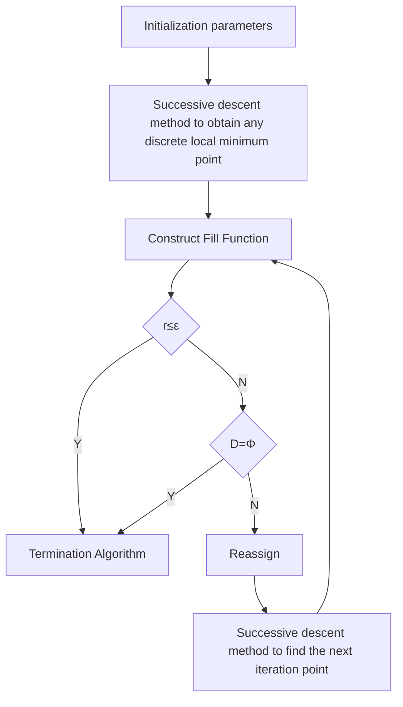

# How to build a durable sandcastle foundation?

## Summary

In recent years, as sand castle art has become more popular, more and more ingenious sand castle art works have been created. However, perfect works of art will disappear, and how to be preserved for a long time becomes an obstacle to the advancement of Sandcastle art.

First, the optimal geometry considering the dual erosion effects of waves and tides is determined. On the basis of reasonably limiting the shape selection range,by establishing the Dynamic Model of the Sandcastle Foundation based on the evaluation index of the comprehensive sand and sand carrying capacity of waves and tides, we use COMSOL to accurately simulate the movement state of the sand castle foundation. On this basis, by creating the Sandcastle Foundation Damage Index, we reasonably determine the duration of the sandcastle. Finally, we use a Discrete Global Optimization Algorithm Based on Successive Descent Methods to determine the shape of the optimal sandcastle foundation as a cylinder.

Secondly, the optimal water-sand mixing ratio is determined. Based on Model 1, a model of Water-sand Aggregation-water-sand Ratio Relationship was first established. By limiting the allowed degree of polymerization, the water-sand ratio is limited to a reasonable range. We again use the discrete global optimization algorithm based on the successive descent method to efficiently find the optimal water-sand mix ratio of 0.739.

Further, an optimal geometry considering rain erosion is determined. We define the sandcastle collapse limit coefficient, and comprehensively establish the Rainwater Erosion Resistance Quantification Model by integrating the ability to resist rainwater infiltration and the evacuation ratio of the sandcastle structure. Further, A Quantified Model of Sandcastle's Ability to Resist Wave Erosion was established. Considering two indicators of anti-erosion ability and establishing a fuzzy comprehensive evaluation model, we determine that the optimal shape is still a cylinder.

Finally, we use the method of humidifying and spraying the adhesive when the air humidity is the lowest to improve the stability of the sand castle foundation. A Humidity Prediction Model Based on the RBF Neural Network Algorithm was established, and we used the model to test the humidity of Venice Beach on August 1. Based on the air humidity data obtained in the previous month, we divided the weather conditions into sunny and cloudy days, and predicted the air humidity trends for sunny and cloudy days on August 1, respectively. Finally, we decided to humidify the sandcastle foundation and spray the adhesive at 13:30 on a cloudy day and 13:00 on a sunny day.

## Contents

## 1. Introduction.......................

1.1 Background..  
1.2 Restatement of the Problem.

## 2.Assumption and Justification........

## 3.Glossary and Notation........

3.1 Glossary.. .4  
3.2 Notation.. 4

## 4. Optimal Shape Model Based on Sandcastle Foundation Dynamics Model..

4.1 Model Overview... 4  
4.2 Quantitative model of sand-bearing capacity. 5  
4.3 Sandcastle Foundation dynamics equation model. 5  
4.4 Solution of Sandcastle Foundation Dynamics Equation Model. 6  
4.5 Geometric Shape Solving Model Based on Discrete Global Optimization Algorithm....... .. 9

## 5. Optimal water and sand ratio model... 11

5.1 Model Overview.. 11  
5.2 Quantitative model of Water and sand polymerization degree. 11  
5.3 Solving the Model. 12

## 6.Fuzzy comprehensive evaluation model based on rain erosion resistance.......... .. 13

6.1 Model Overview.. .13  
6.2 Evaluation model for rain erosion resistance. 13  
6.3 Optimal Shape Fuzzy Comprehensive Evaluation Model. .14

## 7. Humidity Prediction Model Based on RBF Neural Network Algorithm......... .... 16

7.1 Model Overviw... .16  
7.2 Model Preparation. 16  
7.3 RBF neural network algorithm. 17

## 8. Sensitivity Analysis....... .... 18

8.1 Sensitivity Analysis of Most Shaped Model . . 18  
8.2 Sensitivity Analysis of Optimal Water-Sand Mixing Model. . 18  
8.3 Sensitivity Analysis of A Fuzzy Comprehensive Evaluation Mode. .. 20  
8.4 Sensitivity Analysis of Sandcastle warning protection Model. .20

## 9. Evaluation and Promotion of Model.. .21

9.1 Strength and Weakness.. ..21  
9.2 Promotion.. . 22

## 10. Conclusions...... .22

## References... .23

## Memo.... .24

## Appendix.. .25

## 1. Introduction

## 1.1 Background

Nowadays, people always face heavy schooling or busy work, and spending some time at the beach allows people to enjoy the cool sea breeze, warm sunshine, and soft beaches. Therefore, more and more people choose to go to the beach for leisure. Building sandcastles is a must-do item for beach leisure. It can develop children's creativity and reduce adults' stress to a great extent. When people build sandcastles, they always want their sandcastles to be beautiful and to last longer. Therefore, it is necessary to study how to keep the sandcastle on the beach for the longest time.

## 1.2 Restatement of the Problem

Building sandcastles is one of the most popular activities item for children on the beach. Every child wants his sandcastle to last for a long time on the beach. Therefore, we were asked to study the persistent retention of sandcastles on the beach. The specific issues are as follows:

Below environmental factors are assumed to be the same, such as: the distance of the beach from the water, the kind of sand, the amount of sand, the same water-sand ratio. We were asked to build a model under the action of waves and tides to explore the basic geometry of the sandcastle that can last for the longest time on the beach.  
Without using any additional additives, how to change the water-sand ratio of the sandcastle foundation can make our sandcastle last for the longest time on the beach.  
Built on the original model, we have considered the impact of rain on the foundation of the sandcastle, and upgrade and optimize the model to further explore the optimal geometry of the sandcastle.  
By consulting some relevant literatures, other strategies have been investigated to improve the retention time of sandcastles.

## 2.Assumption and Justification

We make some general assumptions to simplify our model. These assumptions and corresponding justification are listed below:

It is assumed that the base area and height of each considered shape are the same, and that there is no significant difference in the sand quality and sand quantity of our sandcastle foundation.  
Sandcastle foundations are built at approximately the same distance from the water.  
In the process of natural erosion, ignore the situation of huge waves and winds sweeping the sandcastle far from the original location.  
We only consider the impact of waves, tides and rain on the water-sand ratio of the sandcastle foundation.  
The sand particles at the sandcastle foundation are evenly distributed.  
Assume that people will spray the adhesive in time after the warning occurs, and the adhesive viscosity lasts at least 8 hours.

More detailed assumptions will be listed if needed.

## 3.Glossary and Notation

## 3.1 Glossary

Wave current: refers to the combined effect of waves and tides.  
Damage index: It takes the change of the base area and height of the sandcastle as a measuring factor to describe the damage degree of the sandcastles.

## 3.2 Notation

Table 1 Notation

<table><tr><td>Symbols</td><td>Definition</td></tr><tr><td> $F_s$ </td><td>sand-bearing capacity</td></tr><tr><td>G</td><td>Damage Index</td></tr><tr><td>Q</td><td>Water and sand polymerization degree</td></tr><tr><td> $n_p$ </td><td>Water-sand ratio</td></tr><tr><td> $F_u^i$ </td><td>ability to resist rainwater infiltration</td></tr><tr><td> $R^i$ </td><td>sandcastle structure evacuation ratio</td></tr><tr><td> $H_1^i$ </td><td>rain erosion resistance</td></tr><tr><td> $H_2^i$ </td><td>wave current erosion resistance</td></tr><tr><td>g(●)</td><td>Neural Network Radial Basis Function</td></tr></table>

## 4. Optimal Shape Model Based on Sandcastle Foundation Dynamics Model

## 4.1 Model Overview

In terms of shape selection, considering the common sandcastle basic shapes that people are accustomed to using, we only consider the most suitable ones from a cuboid with a certain aspect ratio, an elliptical cylinder with a certain aspect ratio, and a sector with a certain radius and arc length ratio. Excellent shape.First, we have established a model for assessing the sand-bearing capacity of waves. Based on this, the basic dynamics equation of the sandcastle foundation is established. Secondly, by creating a sandcastle foundation damage index, we have determined the duration of a sandcastle of a

specific shape. Further, based on the duration of some specific shape sandcastles, we have used a discrete global optimization algorithm based on successive descent methods to determine the optimal sandcastle shape in the global state[1].

## 4.2 Quantitative model of sand-bearing capacity

Because wave and tide are the two main driving forces in the sand movement of sandcastles, we first have considered how the sandcastles are impacted under the action of waves and tides, and choose to define this ability using the capacity of sand-bearing.

Considering tidal and wave sand-bearing capacity:

$$
C _ {*} = C _ {* C} + C _ {* W} \tag {1}
$$

The capacity of sand-bearing under tide effect can be expressed as:

$$
C _ {* C} = \beta_ {C} \frac {n _ {p} V}{1 - n _ {p}} \frac {\left(u ^ {2} + v ^ {2}\right)}{C _ {z} {} ^ {2} h _ {w} \omega_ {s}} \tag {2}
$$

Where,

$n _ { p }$ represents the initial value of the water-sand ratio of the sandcastle foundation, which is determined by the volume ratio; $V$ is the initial value of the sandy volume of the sandcastle foundation; u and v represents the components of the water flow velocity x and y the sum of the waves under the action of waves and tides; $h _ { \scriptscriptstyle w }$ is the height of seawater level; $\beta _ { c }$ is the positive definite coefficient; $\omega _ { s }$ indicates sand-bearing speed.

Regarding the capacity of sand-bearing under the action of waves, we consider the unbroken wave and the broken wave respectively, which can be expressed as:

$$
C _ {* W} = \beta_ {1} \frac {n _ {p} V}{1 - n _ {p}} \frac {f _ {W} H _ {\text { rms }} ^ {3}}{T ^ {3} g h \omega_ {s} \sinh_ {w} ^ {3} \left(k h _ {w}\right)} + \beta_ {2} \frac {1}{1 - n _ {p}} \frac {D _ {B}}{h _ {w} \omega_ {s}} \tag {3}
$$

Where,

$\beta _ { 1 }$ and $\beta _ { 2 }$ are respectively the positive definite coefficients of the unbroken wave and the broken wave; $f _ { w }$ represents the wave friction coefficient; $H _ { r m s }$ is the mean square wave height, $H _ { r m s } = H _ { s } \big / \sqrt { 2 }$ ， $H _ { s }$ Is the effective wave height; T is the wave period; k is the wave quantization value of one period; $D _ { B }$ represents the wave energy dissipation due to the wave breaking.

We build the capacity of sand-bearing $F _ { s }$ as:

$$
F _ {s} = \alpha_ {r} \omega_ {s} (C _ {*} - V) \tag {4}
$$

Where,

$\alpha _ { r }$ indicates the sand settling coefficient.

## 4.3 Sandcastle Foundation dynamics equation model

We use the right-angle vertex of the three-dimensional geometry as the coordinate center to establish a three-dimensional right-angle coordinate system. Then,changes of $x , y$ and h over time t of our sandcastle foundation satisfy the following equations in dynamic

$$
\frac {\partial (h V)}{\partial t} + \frac {\partial (h u V)}{\partial x} + \frac {\partial (h v V)}{\partial y} = \frac {\partial}{\partial x} \left(v _ {x} \frac {\partial (h V)}{\partial x}\right) + \frac {\partial}{\partial y} \left(v _ {y} \frac {\partial (h V)}{\partial y}\right) + F _ {s} \tag {5}
$$

Where,

h indicates the height of the sandcastle foundation; $\nu _ { x }$ and $\nu _ { y }$ is the horizontal diffusion coefficient.

In the dynamic simulation process, we give the constraint that the normal flux is 0 to determine the solid boundary condition as:

$$
\bar {\phi} \frac {\partial V}{\partial \overline {{{n}}}} = 0 \tag {6}
$$

Where,

$\vec { \phi }$ represents the total flux through the sandcastle foundation; $\vec { n }$ represents the normal vector.

At the same time, we give the time course of the sand volume as the open boundary condition:

$$
V = V (x, y, t) \tag {7}
$$

## 4.4 Solution of Sandcastle Foundation Dynamics Equation Model

## 4.4.1 Solution of Cuboid Dynamics Simulation

Step1. Initialize the parameters of the sandcastle foundation dynamics equation. We take the optimal shape of a cuboid as an example and define the aspect ratio of the bottom of the cuboid as its shape factor, which is $e _ { 1 } = l : w$ . The initial values of $x , y$ in the equation correspond to $l , w$ , respectively. In combination with relevant literature, the parameter initialization values in the given dynamic equation are shown in the following table

Table 2 Parameter Determination

<table><tr><td>symbol</td><td>Numerical value</td><td>symbol</td><td>Numerical value</td><td>symbol</td><td>Numerical value</td></tr><tr><td> $\beta_{C}$ </td><td>0.023</td><td> $\beta_{1}$ </td><td>0.300</td><td>T</td><td>5.000</td></tr><tr><td> $C_{z}$ </td><td>0.249</td><td> $\beta_{2}$ </td><td>0.001</td><td> $H_{rms}$ </td><td>5.185</td></tr><tr><td> $\omega_{s}$ </td><td>1.489</td><td> $f_{W}$ </td><td>1.570</td><td> $D_{B}$ </td><td>6.301</td></tr></table>

Table 3 Assignment Table for Initialization Variables

<table><tr><td>symbol</td><td>Numerical value</td><td>symbol</td><td>Numerical value</td></tr><tr><td> $h_w$ </td><td>900</td><td> $n_p$ </td><td>6.0</td></tr><tr><td>u</td><td>30</td><td>x</td><td>1.0</td></tr><tr><td>v</td><td>30</td><td>y</td><td>1.0</td></tr><tr><td> $V_1$ </td><td>100</td><td></td><td></td></tr></table>

heatmap

| x \ y | 700 Pa | 750 Pa | 800 Pa | 850 Pa | 900 Pa |
|-------|--------|--------|--------|--------|--------|
| 0     | 900    | 850    | 800    | 750    | 700    |
| 1     | 850    | 800    | 750    | 700    | 650    |
| 2     | 800    | 750    | 700    | 650    | 600    |
| 3     | 750    | 700    | 650    | 600    | 550    |
| 4     | 700    | 650    | 600    | 550    | 500    |
| 5     | 650    | 600    | 550    | 500    | 450    |
| 6     | 600    | 550    | 500    | 450    | 400    |
| 7     | 550    | 500    | 450    | 400    | 350    |
| 8     | 500    | 450    | 400    | 350    | 300    |
| 9     | 450    | 400    | 350    | 300    | 250    |
| 10    | 400    | 350    | 300    | 250    | 200    |
| 11    | 350    | 300    | 250    | 200    | 150    |
| 12    | 300    | 250    | 200    | 150    | 100    |
| 13    | 250    | 200    | 150    | 100    | 50     |
| 14    | 200    | 150    | 100    | 50     | 25     |
| 15    | 150    | 100    | 50     | 25     | 10     |
| 16    | 100    | 50     | 25     | 10     | 5      |
| 17    | 50     | 25     | 10     | 5      | 2      |
| 18    | 25     | 10     | 5      | 2      | 1      |
| 19    | 10     | 5      | 2      | 1      | 1      |
| 20+   | -      | -      | -      | -      | -      |

FIG 1. Cuboid simulation diagram when t is equal to zero

We use COMSOL to solve the dynamic equations and simulate the pressure effect of wave current on the bottom surface of $e _ { \mathrm { 1 } } { = } 1 . 0$ cuboid. The pressure distribution at time $t = 0$ shown in the figure above is obtained. Among them, the wave current starts from the red part and the pressure gradually decreases.

Step2. Establish a damage index indicator model. In order to describe the degree of damage of the sandcastle and better explain the meaning of duration, we take the change in base area and height as the measuring factor, and give the definition of damage index as

$$
G = \mu_ {s} \Delta S + \mu_ {h} \Delta h \tag {8}
$$

Where,

S and h represent respectively the increase in the bottom area of the sandcastle and the decrease in the minimum height of the sandcastle, over a period of time; $\mu _ { s }$ and $\mu _ { h }$ are the influence factors of the change in the bottom area and the height, respectively.

It should be noted that in the real practice, changes are both uncertain of base areas and heights. The sandcastle foundation undergoes the process of waves and tidal effects. The sand at the bottom layer will spread under the effect of erosion, resulting in a reduction in the height of the sandcastle foundation and an increase in its bottom area. The impact of the simplified process on the sandcastle is shown in FIG 1. below:

text_image

State before erosion
State after erosion
Δh
x
y
z
Δs

FIG 2. Simplified model of sandcastle foundation erosion

The cubic three-dimensional geometry in the figure represents the original state of the sandcastle foundation, and the dashed line represents the existing state after the sandcastle has been eroded. The increase of the base area and the decrease of the height of the existing state compared with the original state are the quantity of the damage index.

Step3. Find the relationship between the damage index over time. We obtain that the sand level is eroded by the waves and tides for a period of time, and the water level $h _ { w } ^ { \prime }$ at the new time and wave current velocity in the x and y directions are $u ^ { \prime }$ and $\nu ^ { \prime }$ , the water-sand ratio ${ n _ { p } } ^ { \prime }$ , and the S and $\Delta h$ of the sandcastle foundation. We discretize the time, set the completion time of the sandcastle to zero, that is, t  0 is the initial time point, and then take the time points at equal intervals to draw a scatter plot as shown in the figure.

line chart

| Time (day) | Damage index |
| ---------- | ------------ |
| 0          | 0            |
| 1          | 1.52         |
| 2          | 24.4         |
| 3          | 46.9         |

FIG 3. Damage index over time

The diagram illustrates the damage indicator function established and the line connecting the points at equal intervals. It should be shown that the discrete points after point B are almost on the same horizontal line. As a result, it is revealed that the sandcastle is completely damaged, with a corresponding damage index $G _ { \mathrm { m a x } }$ . Based on that, damage factor is defined with coefficient being $\mu = 0 . 5 2$ , that is, when $G = 0 . 5 2 G _ { \mathrm { m a x } }$ , it is considered that the sandcastle has been damaged to the maximum bearing degree. On this basis, we take point A as the critical time point, which refers to the corresponding time to the maximum degree of damage which could bear, and the time corresponding to that point is the duration T/day .

At the same time, we define the duration of any sandcastle foundation constructed from a threedimensional geometric shape from the stacking to the critical time point as T . The longer the duration, the better the shape corresponds to the sandcastle foundation.

We simulate the damage index and duration of 10 groups of cuboids with different shape factors $e _ { \mathrm { 1 } }$ under the action of waves and tides. It should be noted that the 10 sets of data we have obtained are only the first step in obtaining the global optimal solution. The next step is shown in the next model. The 10 sets of data are shown in the following table:

Table 4 Corresponding duration of cuboids with different aspect ratios

<table><tr><td>Shape factor</td><td>Duration</td><td>Shape factor</td><td>Duration</td></tr><tr><td>1.0</td><td>2.5</td><td>3.5</td><td>1.2</td></tr><tr><td>1.5</td><td>2.4</td><td>4.0</td><td>1.4</td></tr><tr><td>2.0</td><td>2.1</td><td>4.5</td><td>2.8</td></tr><tr><td>2.5</td><td>2</td><td>5.0</td><td>2.0</td></tr><tr><td>3.0</td><td>1.8</td><td>5.5</td><td>2.6</td></tr></table>

## 4.4.2 Simulation solution of dynamics equations of elliptic cylinder and sector cylinder

We consider the damage index and duration corresponding to the parameters of the other two common three-dimensional geometric shapes. The detailed data results of the simulation are shown in the appendix.

We define the ratio of the long axis to the short axis of the ellipse as its shape factor, which is $e _ { 2 } = a : b$ . Based on this, a dynamic equation solving model is established, and the simulation simulation graph at $e _ { 2 } = 1$ is shown as follows:  
Taking the ratio of the radius r of the sector cylinder to the arc length l as the coefficient $e _ { 3 }$ , we take the sector cylinder of $e _ { 3 } = 1 / \pi$ as an example to make the following simulation:

text_image

Surface: stress tensor (Pa)
y
x

FIG 4. Cylinder simulation diagram

heatmap

| x    | y    | stress tensor (Pa) |
| ---- | ---- | ------------------ |
| 0    | 0    | 900                |
| 1    | 0    | 850                |
| 2    | 0    | 800                |
| 3    | 0    | 750                |
| 4    | 0    | 700                |
| 5    | 0    | 750                |
| 6    | 0    | 800                |
| 7    | 0    | 850                |
| 8    | 0    | 900                |
| 9    | 0    | 850                |
| 10   | 0    | 800                |
| 11   | 0    | 750                |
| 12   | 0    | 700                |
| 13   | 0    | 750                |
| 14   | 0    | 800                |
| 15   | 0    | 850                |
| 16   | 0    | 900                |
| 17   | 0    | 850                |
| 18   | 0    | 800                |
| 19   | 0    | 750                |
| 20   | 0    | 700                |
| 21   | 0    | 750                |
| 22   | 0    | 800                |
| 23   | 0    | 850                |
| 24   | 0    | 900                |
| 25   | 0    | 850                |
| 26   | 0    | 800                |
| 27   | 0    | 750                |
| 28   | 0    | 700                |
| 29   | 0    | 750                |
| 30   | 0    | 800                |
| 31   | 0    | 850                |
| 32   | 0    | 900                |
| 33   | 0    | 850                |
| 34   | 0    | 800                |
| 35   | 0    | 750                |
| 36   | 0    | 700                |
| 37   | 0    | 750                |
| 38   | 0    | 800                |
| 39   | 0    | 850                |
| 40   | 0    | 900                |
| 41   | 0    | 850                |
| 42   | 0    | 800                |
| 43   | 0    | 750                |
| 44   | 0    | 700                |
| 45   | 0    | 750                |
| 46   | 0    | 800                |
| 47   | 0    | 850                |
| 48   | 0    | 900                |
| 49   | 0    | 850                |
| 50   | 0    | 800                |
| 51   | 0    | 750                |
| 52   | 0    | 700                |
| 53   | 0    | 750                |
| 54   | 0    | 800                |
| 55   | 0    | 850                |
| 56   | 0    | 900                |
| 57   | 0    | 850                |
| 58   | 0    | 800                |
| 59   | 0    | 750                |
| 60   | 0    | 700                |
| Note: The x and y values are estimated based on the provided code. The data is presented in a CSV format with two columns: 'x' and 'y'. The values are calculated using the formula `np.exp(-x/3) * np.exp(-x/3)`.

FIG 5. Sector cylinder simulation diagram

## 4.5 Geometric Shape Solving Model Based on Discrete Global Optimization Algorithm

## 4.5.1 Model Overview

By solving the dynamic equation of the sandcastle foundation, we can get the duration $T _ { i } ( i = 1 , 2 , 3 )$ of sandcastle foundation shape under the control of $e _ { i } ( i = 1 , 2 , 3 )$ . However, in order to find the optima value of $T _ { i }$ , we try to establish an optimal three-dimensional geometric model with a Discrete Global Optimization Algorithm as the core. On this basis, we can find the optimal coefficient value $e _ { i } ( i = 1 , 2 , 3 )$ of any of the three shapes, so that the shape we choose has the longest duration.

## 4.5.2 Model establishment and solution

We still take the cuboid as an example. Through simulation, we can obtain the duration under multiple sets of coefficients. In this regard, we use these data to deduce the Discrete Global Optimization Algorithm based on the successive descent method. The specific steps are as follows:

Step1. Successive Descent method to find discrete local minimum points. (1) set the set $E$ as the Cuboid shape factor selection point, satisfy $E \subset R ^ { n } { \mathrm { i f ~ } } f \left( e _ { k } + d ^ { + } \right) \geq f \left( e _ { k } \right)$ , let $\Omega \langle = \Omega \backslash d ^ { + }$ , cycle this

step;determine whether  is 0 to determine whether to update the discrete local minima, after ,we get the discrete global minima $e _ { k } ^ { + }$ .

Step2. Construct a discrete fill function. Let initialization conditions $\varepsilon = 1 0 ^ { - 5 } \ , \ r = 1 \ , \ q _ { 0 } = 0 . 0 1 \ ; \ V = V _ { 0 } = \left\{ \pm p _ { , } j = 1 , 2 , \cdots , n \right\}$ . The constructed discrete fill function is:

flowchart

$$
F \left(e _ {k}, e _ {k} ^ {+}, q, r\right) = \frac {1}{q + \left\| e _ {k} - e _ {k} ^ {+} \right\|} \varphi_ {q} \left(\max \left\{f \left(e _ {k}\right) - f \left(e _ {k} ^ {+}\right) + r, 0 \right\}\right) \tag {9}
$$

Step3 .If $r \leq \varepsilon$ , the algorithm is terminated, and local variable $e _ { k } ^ { + }$ can be used as the discrete global minimum, otherwise, the next step is performed.

Step4. If $D \neq \phi , { \bf g } _ { 0 }$ to step $^ { 6 , }$ otherwise, go to the next step.

Step5. If $q < \varepsilon \times 1 0 ^ { - 2 }$ , then make $r = r / 1 0 , q = q _ { 0 } / 1 0$ , $D = D _ { 0 }$ , go to the step 2, otherwise, let $q = q / 1 0$ , go to the step2

Step6. Take any direction $d \in D$ , so that $D = D - d$ , enter the inner loop phase, change the initial value of D , and cycle the

corresponding steps. When the parameter r are sufficiently small, it is believed that there is no better local minimum point in the selected point set $E$ .

From the dynamic model, we can get the corresponding duration T for each assignment, and with $K = 1 / T$ as the objective function, we optimize it by the algorithm:

$$
\min K = \left\{f \left(e _ {k}\right), e _ {k} \in R ^ {n} \right\} \tag {10}
$$

$$
\max T = \frac {1}{K} \tag {11}
$$

Similarly to the other two shape models, we can use the Discrete Global Optimization Algorithm to find the maximum T in the duration controlled by the three shape scale as shown in the following table:

Table 5 Table of the best shape parameters for the three shapes

<table><tr><td>Geometric shape</td><td>shape factor</td><td>Duration</td></tr><tr><td>Cuboid</td><td>1.46</td><td>2.9</td></tr><tr><td>Elliptic cylinder</td><td>1.00</td><td>4.8</td></tr><tr><td>Sector cylinder</td><td>0.3π</td><td>3.7</td></tr></table>

From the data in the above table, we can clearly conclude that when the base area is constant and the ratio of the long axis to the short axis is 1, the sandcastle foundation can last the longest time. We approximate it as a cylinder with a maximum duration of 4.8 days.

## 5. Optimal water and sand ratio model

## 5.1 Model Overview

We use the optimal shape model based on the sandcastle foundation dynamics model to obtain the optimal shape of the sandcastle foundation with the longest duration when the water-sand ratio is constant. However, the size of the water-sand ratio will also directly affect the erosion resistance of the sandcastle foundation. We have introduced the equation of the relationship between the water-sand polymerization degree and the water-sand ratio, and at the same time limit the allowed polymerization degree range to obtain a reasonable water-sand ratio Range, and then by solving the model, the optimal water-sand ratio is obtained[2].

## 5.2 Quantitative model of Water and sand polymerization degree

We consider the aggregation of water and sand, leading to the concept of the degree of water-sand polymerization. We give the definition of the degree of polymerization of water and sand based on the volume change of the water and sand specific gravity before and after polymerization:

$$
Q = \left(1 - \frac {\frac {1}{\gamma_ {1}} V _ {1} + \frac {1}{\gamma_ {2}} V _ {2}}{V _ {1} + V _ {2}}\right) \times 100 \% \tag{12}
$$

Where,

$V _ { 1 } , V _ { 2 }$ respectively represent the volume of sand and water before mixing; $\gamma _ { 1 }$ and $\gamma _ { 2 }$ represent the water absorption coefficient and water solubility coefficient, respectively. We use these two coefficients to express the polymerization ability of water and sand. We simplify the equation with the water-sand ratio $n _ { p }$ :

$$
Q = \left(1 - \frac {\left(\frac {n _ {p}}{\gamma_ {1}} + \frac {1}{\gamma_ {2}}\right)}{n _ {p} + 1}\right) \times 100 \% \tag{13}
$$

We use MATLAB to solve this equation and get the relationship curve between the degree of Water and sand polymerization and the ratio of water and sand, as shown in FIG 6.

line chart

| The ratio of water to sand | Degree of convergence of water and sand |
| -------------------------- | ----------------------------------------- |
| 0.7                        | 0.476                                     |
| 0.85                       | 0.487                                     |

FIG 6.Degree of convergence of water and sand

The degree of water-sand polymerization increases with the increase of water-sand ratio. We must consider not only the relatively large cohesiveness, but also the optimization of erosion resistance, that is, the longest duration. In combination with the actual situation, we choose a two-point interval with a large viscosity range as shown in our figure as our optimization constraint.

## 5.3 Solving the Model

We use the sandcastle foundation dynamics model in Question 1 as the basis, use the optimal proportion of the best shape we selected, and use the initial value of the water-sand ratio $n _ { p }$ as a variable to discretely process the target T in the same way:

First put into the dynamic equation (1), according to the change of sandcastle foundations $\Delta S$ and $\Delta h$ , the relationship between the damage index and time is obtained, and the constraint condition is added:

$$
0. 7 <   n _ {p} <   0. 8 5 \tag {14}
$$

Find the duration table record of $n _ { p }$ equally spaced points:  
Table 6 Corresponding duration of different water-sand ratios

<table><tr><td>Water-sand ratio</td><td>Duration</td><td>Water-sand ratio</td><td>Duration</td></tr><tr><td>0.70</td><td>4.7</td><td>0.78</td><td>5.1</td></tr><tr><td>0.72</td><td>4.9</td><td>0.80</td><td>5.0</td></tr><tr><td>0.74</td><td>5.2</td><td>0.82</td><td>4.3</td></tr><tr><td>0.76</td><td>4.8</td><td>0.84</td><td>4.2</td></tr></table>

Using the Discrete Global Optimization Algorithm of the best shape model in Problem 1, we can conclude that when the water-sand ratio is $n _ { p } = 0 . 7 3 9$ , the longest duration of the sandcastle foundation is achieved under the condition of ensuring good shape adhesion.

## 6.Fuzzy comprehensive evaluation model based on rain erosion resistance

## 6.1 Model Overview

Aiming at the erosion of sandcastles by waves and tides, we have established some models to obtain the optimal shape of the sandcastle foundation as a cylinder.However, the actual erosion risk facing sandcastles is not limited to the effects of waves and tides. We should also consider the erosion of rainwater.Based on the cuboids, ellipses, and sectors at the optimal shape coefficients obtained in Problem 1, we have further addressed the problem of rain erosion., we define the sandcastle collapse limit coefficient, and comprehensively establish the rain erosion resistance assessment model by comprehensively ability to resist rainwater infiltration and sandcastle structure evacuation ratio. On this basis, an evaluation model of sandcastle anti-wave erosion ability is constructed. Finally, a fuzzy comprehensive evaluation model is established to evaluate the optimal sandcastle shape under the action of waves and rain[3].

## 6.2 Evaluation model for rain erosion resistance

## 6.2.1 Establishment of Model

Before establishing a fuzzy comprehensive evaluation model for the optimal shape of the sandcastle foundation, we set up the evaluation model of rain erosion resistance as follows:

First, the sandcastle's ability to resist rainwater infiltration is established as follows[4]:

$$
F _ {u} ^ {i} = \sqrt {2 R _ {a} ^ {i} - 1} + \left(R _ {a} ^ {i} - \sqrt {2 R _ {a} ^ {i} - 1}\right) \tag {15}
$$

Where,

$F _ { u } ^ { i } \big ( i = 1 , 2 , 3 \big )$ represents the ability of the cuboid, cylinder and sector cylinder to resist rain infiltration. $\mathcal { Q } ^ { i }$ represents the degree of aggregation of the three shapes of gravel, respectively. $R _ { a } ^ { i } = \kappa _ { 1 } \cdot n _ { p } \cdot n _ { c o l l a p s e } ^ { i } \cdot \kappa _ { 1 }$ represents positive definite coefficient. $n _ { c o l l a p s e } ^ { i } ( i = 1 , 2 , 3 )$ represents the sandcastle collapse limit coefficients of the three shapes, respectively.

Secondly, the evacuation ratio indicators for establishing the sandcastle structure are as follows:

$$
R ^ {i} = \kappa_ {2} / \left[ Q ^ {i} \left(V _ {f} - V _ {D L}\right) \right] \tag {16}
$$

Where,

$R ^ { i } \left( i = 1 , 2 , 3 \right) . ~ \kappa _ { 2 }$ represents positive definite coefficient. $V _ { f }$ represents the shear capacity of sandcastle gravel. $V _ { D L }$ represents the shear force on the sand under the rain gravity load.

Finally, an assessment model for rainwater erosion resistance is established:

$$
H _ {1} ^ {i} = F _ {u} ^ {i} \cdot n _ {\text {collapse}} ^ {i} / R ^ {i} \tag {17}
$$

Where,

$H _ { 1 } ^ { i } { \big ( } i = 1 , 2 , 3 { \big ) }$ represents rainwater erosion resistance of the three shapes.

## 6.2.2 Solution of Model

In order to solve the model, we consulted some literatures and defined below parameters as shown in the following table:

Table 7 Number of rain erosion resistance model

<table><tr><td>Symbols</td><td>Numerical value</td></tr><tr><td> $(\kappa_1, \kappa_2)$ </td><td>(10.6,12.1)</td></tr><tr><td> $n_p$ </td><td>0.125</td></tr><tr><td> $(n^{1}_{collapse}, n^{2}_{collapse}, n^{3}_{collapse})$ </td><td>(1,1.24,1.56)</td></tr><tr><td> $V_f$ </td><td>305</td></tr><tr><td> $V_{DL}$ </td><td>355</td></tr></table>

Then, we obtained the rainwater erosion resistance of cuboids, cylinders, and sectors as shown in the following table:

Table 8 Resistance to rain erosion

<table><tr><td>Geometric shape</td><td>Numerical value</td></tr><tr><td>cuboid</td><td>50.6</td></tr><tr><td>cylinder</td><td>63.5</td></tr><tr><td>thick sector</td><td>68.1</td></tr></table>

## 6.3 Optimal Shape Fuzzy Comprehensive Evaluation Model

## 6.3.1 Establishment of Model

Based on the evaluation model of sandcastle resistance to rain erosion, we first establish the evaluation model of sandcastle resistance to wave current erosion as follows:

$$
H _ {2} ^ {i} = \kappa_ {3} T _ {i} \tag {18}
$$

Where,

$H _ { 2 } ^ { i } { \big ( } i = 1 , 2 , 3 { \big ) }$ represents the resistance to wave current erosion of the three shapes. $\kappa _ { 3 }$ stands for positive definite coefficient.

It should be noted that, in order to determine whether the cuboid, elliptic cylinder and fan-shaped body are still optimal with the optimal shape coefficient, we have established the optimal shape fuzzy synthesis based on the numerical values of the different capabilities of the three shapes. The evaluation model is as follows:

Step1.Determine membership function. We take the ratio of the ability to resist wave current erosion or rain erosion to the total shape of the three shapes as the membership, so we establish membership functions as follows:

$$
\mu_ {H 1} \left(H _ {1} ^ {i}\right) = \frac {H _ {1} ^ {i}}{\sum_ {i = 1} ^ {3} H _ {1} ^ {i}} \tag {19}
$$

$$
\mu_ {H 2} \left(H _ {2} ^ {i}\right) = \frac {H _ {2} ^ {i}}{\sum_ {i = 1} ^ {3} H _ {2} ^ {i}} \tag {20}
$$

Step2.Calculate membership table based on membership function. We substitute the values of the two capabilities of the three shapes into Formula 19,20 , calculate the membership table of the optimal shape, and establish a fuzzy relation matrix.  
Step3.Determine the weight of the two capabilities in the optimal evaluation. We have considered that when our sandcastle faces seawater, tidal erosion and rainwater erosion at the same time, the erosion degree of rainwater on sandcastle is much greater than that of seawater and tide on sandcastle. Therefore, we set the weight of the two capabilities in decision making to $A = \left( 0 . 3 , 0 . 7 \right)$ :  
Step4：Calculate comprehensive evaluation results. The calculation formula for the comprehensive evaluation results is as follows:

$$
B = A \cdot R \tag {21}
$$

## 6.3.2 Solution of Model

In order to solve the model, we have determined the calculation parameters and calculation results by referring to the online information and citing reference parameters:

Table 9 Number of wave current erosion resistance model

<table><tr><td>Symbols</td><td>Numerical value</td></tr><tr><td> $\kappa_3$ </td><td>13.44</td></tr><tr><td> $(T_1, T_2, T_3)$ </td><td>(2.6,6.8,5.2)</td></tr></table>

Then, we obtained the anti-wave erosion ability of cuboid, cylinder and fan-shape cylinder as shown in the following table:

Table 10 Resistance to wave erosion

<table><tr><td>Geometric shape</td><td>Numerical value</td></tr><tr><td>rectangle</td><td>34.94</td></tr><tr><td>roundness</td><td>91.39</td></tr><tr><td>sector</td><td>69.89</td></tr></table>

The membership degrees corresponding to the three shapes according to the membership function are shown in Table 11:

Table 11 Competency assessment membership scale

<table><tr><td>Evaluation index</td><td>Cuboid</td><td>Cylinder</td><td>Sector cylinder</td></tr><tr><td>Rain erosion resistance</td><td>0.278</td><td>0.348</td><td>0.374</td></tr><tr><td>wave current erosion resistance</td><td>0.178</td><td>0.466</td><td>0.356</td></tr></table>

This determines the fuzzy relation matrix:

$$
R = \left[ \begin{array}{l l l} 0. 2 7 8 & 0. 3 4 8 & 0. 3 7 4 \\ 0. 1 7 8 & 0. 4 6 6 & 0. 3 5 6 \end{array} \right] \tag {22}
$$

Since the weight of the project in decision-making is $A = \left( 0 . 3 , 0 . 7 \right)$ ,the comprehensive evaluation obtained is:

$$
B = A \cdot R = (0. 2 0 8, 0. 4 3 0, 0. 3 6 1) \tag {23}
$$

It can be seen that the stability of cuboids, cylinders, and fan-shape cylinders under the combined action of wave erosion and rain erosion is 0.208, 0.430, and 0361, respectively. By comparison, we can know that the stability of cylinders under double erosion is the highest.

## 7. Humidity Prediction Model Based on RBF Neural Network Algorithm

## 7.1 Model Overviw

Sandcastles are products of mixing sand and water. In order to improve the duration of sandcastles, the most important thing is the humidity of the sandcastle and the protection after the production is completed. After consulting the relevant literature, we know that the adhesive protection after the production is also determined by the humidity of the sandcastle. Therefore, when we know the general trend of humidity, we can make the sandcastle last longer. We selected the RBF neural network algorithm as the prediction network, combined with the daily changing characteristics of the beach temperature as an input factor, and proposed a sandcastle humidity prediction model suitable for better extending the sandcastle duration[5].

## 7.2 Model Preparation

We take a typical beach, Venice Beach, as an example. The humidity data from August 1 to 3, 2019 was obtained from the U.S. Meteorological Administration. It is worth mentioning that because of the similar sandy conditions and weather conditions of the beach, the Venice Beach we selected is very typical[6].

## Index screening:

The humidity of the beach is the result of the combination of many factors, which are closely related to solar radiation, wind, beach temperature, and ground vegetation. We used principal

component analysis to find that temperature changes caused by the sun's light intensity had the most significant effect on beach humidity. Therefore, we explore the change of the humidity of the beach under different time and different weather conditions.

Through observation data, we found that there is a clear correlation between the beach environment humidity and beach temperature, specifically: no matter whether it is sunny or cloudy, as the beach temperature changes over time, the humidity will also change accordingly; however, under sunny weather, Humidity changes on the beach are greater than on cloudy days.

In summary, the humidity of the beach is indeed mainly affected by the change of the ambient temperature, and it has a negative correlation with it. We select the ambient temperature at different time periods of the day as the input factor, select 500 input samples, 50 simulated samples, and 50 predicted samples.

## 7.3 RBF neural network algorithm

The RBF neural network algorithm has strong non-linear fitting property. It not only has good best approximation performance for complex functions, but also has fast convergence speed.

Assume that the input vector is $X = \left[ x _ { 1 } , x _ { 2 } , \cdots , x _ { n } \right] ^ { T }$ , n is the number of input samples, $W = [ w _ { 1 } , w _ { 2 } , \cdots , w _ { n } ] ^ { T }$ is the output weight vector, m is the number of hidden nodes, d is the offset, $h ( X )$ is the network output, and $g ( \bullet )$ is the radial basis function. Gaussian functions are usually used:

$$
g \left(\left\| X - C _ {i} \right\|\right) = \exp \left(- \left\| X - C _ {i} \right\| ^ {2} / \sigma_ {i} ^ {2}\right) \tag {24}
$$

Where, $\left. \bullet \right.$ is the European norm, and $C _ { i }$ is the i data center in the network. In this case, the output of the neural network is:

$$
h (X) = d + \sum_ {i = 1} ^ {m} w _ {i} \varphi (\| X - C _ {i} \|) \tag {25}
$$

Through the RBF neural network algorithm, we obtained the humidity change map under sunny and cloudy conditions. Starting from 7:00 am, samples were taken every 30 minutes, as shown in the figure below:

line chart

| Number of records | Relative humidity on sunny days (%) | Relative humidity on a cloudy day (%) |
| ----------------- | ------------------------------------ | -------------------------------------- |
| 0                 | 76                                   | 84                                     |
| 5                 | 70                                   | 83                                     |
| 10                | 55                                   | 70                                     |
| 15                | 20                                   | 53                                     |
| 20                | 25                                   | 57                                     |
| 25                | 35                                   | 65                                     |
| 30                | 45                                   | 72                                     |
| 35                | 55                                   | 76                                     |
| 40                | 65                                   | 80                                     |
| 45                | 75                                   | 83                                     |
| 50                | 76                                   | 84                                     |

FIG 7. Moderate forecast curves for sunny and cloudy days

As can be seen from the figure, we should humidify the glue in a timely manner at 13:30 on a cloudy day and at 13:00 on a sunny day. We know that the glue can maintain its viscosity for at least 8 hours, so the humidity starts to increase to 15:00 sandcastles can be protected before reaching basic stability at 21:00. By predicting the change in humidity, humidity prediction of the sandcastle situation is carried out to ensure the longest lasting time.

## 8. Sensitivity Analysis

## 8.1 Sensitivity Analysis of Most Shaped Model Based on Sandcastle Foundation Dynamics Model

It should be noted that maximum damage coefficients can be selected differently by other people. If the value of $\mu$ is different, the maximum duration corresponding to each shape will change, and the change trend is complex and difficult to determine. Therefore, we need to explore whether there is a stable result (the cylinder has the strongest endurance) for different $\mu$ to prove the stability of the model. Here we continue to determine the stability of the cylinder by continuously taking the $\mu$ value to determine whether the cylinder is still the best shape. The results are as follows:

scatterplot

| Withstand damage factor | Judging results |
| :--- | :--- |
| 0.08 | 0 |
| 0.96 | 0 |

FIG 8. Judging results

As shown in the figure, with $\Delta \mu = 0 . 0 4$ as the time interval, we take 24 sample points around $\mu = 0 . 5 2$ for analysis. Through graphical analysis, when $\mu \in \left( 0 . 0 8 , 0 . 9 6 \right)$ , a cylinder is still the optimal shape. When $\mu \not \in \left( 0 . 0 8 , 0 . 9 6 \right)$ , the optimal shape becomes a fan or cuboid. Therefore, we believe that our model is stable when it can withstand the maximum damage factor $\mu \in \left( 0 . 0 8 , 0 . 9 6 \right)$ . In other words, our model is very robust.

## 8.2 Sensitivity Analysis of Optimal Water-Sand Mixing Model

Based on the introduction of the equation of the relationship between water-sand polymerization degree and water-sand ratio, by limiting the allowable degree of polymerization, we have obtained a reasonable range of water-sand ratio. However, the relationship between the degree of polymerization

and the ratio of water to sand is affected by two parameters of $\gamma , \gamma ^ { \prime }$ . When the value of $\gamma , \gamma ^ { \prime }$ is not accurate, the results of the model could be questionable. Therefore, we continuously adjust the value of $\gamma , \gamma ^ { \prime }$ , as shown in FIG 9. Based on this, the robustness of the model is finally judged by calculating the error of the model result.

line chart

| The ratio of water to sand | γ1=1.56, γ2=2.86 | γ1=1.58, γ2=2.88 | γ1=1.59, γ2=2.89 | γ1=1.54, γ2=2.84 | γ1=1.53, γ2=2.83 |
| -------------------------- | ---------------- | ---------------- | ---------------- | ---------------- | ---------------- |
| 0.0                        | 0.37             | 0.37             | 0.37             | 0.36             | 0.35             |
| 0.1                        | 0.39             | 0.39             | 0.39             | 0.38             | 0.37             |
| 0.2                        | 0.41             | 0.41             | 0.41             | 0.40             | 0.39             |
| 0.3                        | 0.43             | 0.43             | 0.43             | 0.42             | 0.41             |
| 0.4                        | 0.45             | 0.45             | 0.45             | 0.44             | 0.43             |
| 0.5                        | 0.47             | 0.47             | 0.47             | 0.46             | 0.45             |
| 0.6                        | 0.48             | 0.48             | 0.48             | 0.47             | 0.46             |
| 0.7                        | 0.49             | 0.49             | 0.49             | 0.48             | 0.47             |
| 0.8                        | 0.50             | 0.50             | 0.50             | 0.49             | 0.48             |
| 0.9                        | 0.51             | 0.51             | 0.51             | 0.50             | 0.49             |
| 1.0                        | 0.52             | 0.52             | 0.52             | 0.51             | 0.50             |

FIG 9. Degree of polymerization curve

As shown in the figure, based on the original coefficients, we increase and decrease the data by 1% and 2% respectively (note that its initial parameter $\gamma = 1 . 5 6 , \gamma ^ { \prime } = 2 . 8 6 )$ , so as to obtain the graph of the degree of aggregation-water-sand ratio in five cases. Based on this, we apply Model 2 again and combine the initial results of Model 2 to calculate the error table of the three shapes as follows:

Table 12 Error of the table

<table><tr><td>Error/% $\left( \gamma, \gamma' \right)$ </td><td>Cuboid</td><td>Cylinder</td><td>Sector cylinder</td></tr><tr><td>(1.58,2.88)</td><td>2.3</td><td>3.9</td><td>3.6</td></tr><tr><td>(1.59,2.89)</td><td>4.9</td><td>4.9</td><td>5.0</td></tr><tr><td>(1.54,2.84)</td><td>3.1</td><td>3.3</td><td>2.9</td></tr><tr><td>(1.53,2.83)</td><td>3.8</td><td>4.8</td><td>4.6</td></tr></table>

From the above table, we can observe that when $\gamma , \gamma ^ { \prime }$ increases and decreases 1% and 2% respectively, the final error of all shapes is within 5%. Therefore, it shows that our model is more robust when $\gamma , \gamma ^ { \prime }$ has some errors.

## 8.3 Sensitivity Analysis of A Fuzzy Comprehensive Evaluation Model Based on the Ability to Resist Rain Erosion

In order to make the fuzzy comprehensive evaluation model valid, we must ensure that the fuzzy comprehensive evaluation index (resistance to rainwater erosion and resistance to wave erosion) is accurate and reliable. In determining the values of the two capabilities, we have introduced three positive definite coefficients $\kappa _ { 1 } , \kappa _ { 2 } , \kappa _ { 3 }$ to assist the calculation. However, since the values of the three positive definite coefficients are not very reliable, we continuously adjust the values of the three positive definite coefficients to determine whether the cylinder has always been the optimal shape and thus to judge the stability of the model. The judgment results are as follows:

scatterplot

| Coefficient | Change in value (%) |
| --- | --- |
| Coefficient 1 | -0.05 |
| Coefficient 2 | -0.05 |
| Coefficient 3 | -1.0 |
| Coefficient 3 | -1.0 |
| Coefficient 3 | -1.0 |
| Coefficient 3 | -1.0 |
| Coefficient 3 | -1.0 |
| Coefficient 3 | -1.0 |
| Coefficient 3 | -1.0 |
| Coefficient 3 | -1.0 |
| Coefficient 3 | -1.0 |
| Coefficient 3 | -1.0 |

FIG 10. Stability judgment

By observing the figure, we clearly know that when $\kappa _ { 1 }$ increases to 130% and above, the cylinder is no longer the optimal shape, and the optimal shape is the fan-shape cylinder. When $\kappa _ { 2 }$ is reduced to 75% and below, the cylinder is no longer the optimal shape, and the optimal shape is a cuboid. When $\kappa _ { 3 }$ fluctuates at 30% of its original value, the cylinder is still the optimal shape. Therefore, we can tell that when the three positive definite coefficients fluctuate within 25% of the original value, the results of our model have not changed much and have shown strong robustness.

## 8.4 Sensitivity Analysis of Sandcastle warning protection Model

The advantage of the sandcastle humidity prediction model is that it can predict the trend graph of beach humidity in advance and remediate sandcastles in time. If the error between the actual value and the predicted value of the beach humidity does not exceed 10%, we consider that the sandcastle humidity prediction model based on the RBF neural network algorithm is highly reliable.

The simulated was performed using MATLAB. First, we choose the mean square error to be 0.02 and the expansion speed of the radial basis function to be 0.8. Then we input the samples to build the RBF neural network and simulate the model. Finally, the average relative error between the predicted value and the actual value of the beach humidity is 4.32%. The comparison chart between the predicate value and the actual value using ORIGIN fitting is shown in FIG 11, which illustrates that the sandcastle humidity prediction model based on the RBF neural network algorithm can predict the humidity basic trend.

scatterplot

| Sample | The actual data | The forecast data |
| ------ | --------------- | ----------------- |
| 0      | 81.0            | 90.0              |
| 2      | 81.0            | 89.0              |
| 4      | 81.0            | 88.0              |
| 6      | 81.0            | 86.5              |
| 8      | 81.0            | 84.5              |
| 10     | 81.0            | 77.0              |
| 12     | 81.0            | 77.5              |
| 14     | 81.0            | 78.5              |
| 16     | 81.0            | 79.0              |
| 18     | 81.0            | 79.0              |
| 20     | 81.0            | 79.0              |
| 22     | 81.0            | 79.0              |
| 24     | 81.0            | 79.0              |
| 26     | 81.0            | 79.0              |
| 28     | 81.0            | 79.0              |
| 30     | 81.0            | 79.0              |
| 32     | 81.0            | 79.0              |
| 34     | 81.0            | 79.0              |
| 36     | 81.0            | 79.0              |
| 38     | 81.0            | 79.0              |
| 40     | 81.0            | 79.0              |
| 42     | 81.0            | 79.0              |
| 44     | 81.0            | 79.0              |
| 46     | 81.0            | 79.0              |
| 48     | 81.0            | 79.0              |
| 50     | 81.0            | 79.0              |

FIG 11. Actual vs. predicted curve

## 9. Evaluation and Promotion of Model

## 9.1 Strength and Weakness

## 9.1.1 Strengths

Have fully considered the erosion of sandcastles caused by waves and tidal effects and established a sand-bearing capability indicator.  
Considering the change in the bottom area and height of the sandcastle foundation during the movement, we create a sandcastle damage index to quantify the sandcastle damage reasonably.  
Based on some solutions obtained from the sandcastle dynamics simulation, the discrete global optimization method based on the successive descent has been used to obtain the global optimal solution.  
 The equation of the relationship between water-sand polymerization degree and water-sand ratio is introduced.The reasonable water-sand ratio range is obtained by limiting the allowable polymerization degree range.  
( On the issue of rain erosion, we put forward the collapse limit coefficient of sandcastle specifically. Considering the ability of resisting rain infiltration and the evacuation ratio of sandcastle structure comprehensively, we established an evaluation model to determine the stability of the selected shape.  
 Because the RBF neural network overcomes slow convergence and local minimization of the other neural network algorithms, when designing the sandcastle early warming protection mechanism, we have chosen the RBF neural network model to predict when to apply adhesive to enhance the duration of sandcastle

When using the RBF neural network algorithm, we have selected input factors based on the changing characteristics of the ambient temperature to accurately and reasonably predict the daily humidity change trend, thereby effectively humidity prediction the sandcastle and extending its duration.

## 9.1.2 Weaknesses

We did not consider three-dimensional shapes other than cuboids, elliptical cylinders, and sector cylinders, and only selected the three types of shapes most commonly used in sandcastles.  
 We only have considered sandcastles under various water erosion conditions, but not the impact of other factors in nature.  
The accuracy of some selected coefficients from other literatures may affect some final conclusions.  
We only have considered the situation when the waves and tides are relatively calm. When the waves and tides significantly fluctuate, the sandcastle might not collapse in the way we have expected.

## 9.2 Promotion

Considering the impact of water erosion on sandcastle alone, our model is very robust. Therefore, our model is suitable when the quantitative factors of water erosion fluctuate within a certain range. However, under objective natural conditions, the factors affecting the stability of sandcastles may not be limited to water erosion (such as wind erosion, light, etc.). Therefore, our strategy may need to be slightly modified to cope with the sandcastle foundation under different natural and objective conditions. Further, based on the original model, we tried to establish the basic dynamics equation of the sandcastle considering the combined effects of wind erosion and light, making the solution of the problem more practical. In addition, we believe that the final choice of the cylinder is the most stable of the three proposed shapes, but the problem is that the shape is diverse and there is no guarantee that the cylinder will still be the best of all shapes. Therefore, it is necessary to solve the problem of limited shape being considered.

We have two potential solutions to address that only three shapes have been investigated:

1. Perform cluster analysis on multiple shapes to find more sandcastle foundations that are applicable to actual situations.  
2. Introduce the proportion of base area and height, have more shapes under consideration and find out the best three-dimensional aspect ratio of each shape.

## 10. Conclusions

A detailed strategy to extend the duration of sandcastle foundation was provided in this paper. Firstly, the most stable shape of the sandcastle which was affected by both of the wave and tide was found to be the cylinder. It showed the highest resistance to the wave current erosion among all the considered shapes, according to the optimal shape model based on the dynamics equation of sandcastle foundation. Secondly, the optimum water-sand ratio was worked out to be 0.32 by taking the watersand polymerization degree into account. Then, the cylinder was confirmed to be the most stable shape by fuzzy comprehensive evaluation, and the rain erosion resistance and resistance to wave current

erosion of the sandcastle were also taken into account. Finally, an humidity prediction model of sandcastle was proposed based on RBF neural network, and the daily humidity trend was predicted accurately by the model. When the predicted humidity reached its limit, adhesive should be used in time to keep the bonding effect and stabilize the sandcastle foundation.

## References

[1] Cui Jie. Research on two-dimensional mathematical model of sediment under the action of wave and current [D]. Tianjin University, 2014.  
[2] Yang Yongjian. Several deterministic algorithms for global optimization [D]. Shanghai University, 2005.  
[3] Lu Yehong. Test and simulation of the damage resistance of building roof structure in rainy season  
[J]. Computer Simulation, 2018, 35 (12): 176-180.  
[4] Yu Gaofeng, Qiu Jinming. Analysis of Teaching Effect Analysis and Optimization of Mathematical Modeling Based on Fuzzy Comprehensive Evaluation——Taking Sanming University as an Example [J]. Journal of Lanzhou University of Arts and Sciences (Natural Science Edition), 2018, 32 (05): 112- 115.  
[5] Xu Tongyu, Wang Yan, Zhang Xiaobo, Chen Chunling, Xu Hui, Zhou Yuncheng. Application of RBF neural network to the simulation and prediction of humidity in northern sunlight greenhouse [J]. Journal of Shenyang Agricultural University, 2014, 45 (06): 726-730 .  
[6] Wang Chengwu, Guo Songlin, Wang Wei. Research on short-term power load forecasting by improved particle swarm optimization RBF neural network [J] .Electronic Test, 2020 (03): 45-46 + 101.

## Memo

## TO:Fun in the Sun

## Topic: Teach you how to build the longest-lasting sandcastle

Dear Vacation Magazine Editor：

In recent years, the sandcastle related art works have become increasingly popular. After the creation of great sandcastle art works, how to preserve these art works for a long time becomes an obstacle to promoting this type of activities. Our team has developed a complete sandcastle humidity prediction strategy to achieve the purpose of extending the duration of sandcastles. We appreciate this opportunity to introduce you to our strategy.

The most stable shape of a sandcastle under the action of sea waves and tides: In general, the most durable sandcastle can be piled with the optimal size ratio. These sandcastle shapes have the longest duration: the cuboid with an aspect ratio of 1.46, the elliptical cylinder with an aspect ratio of 1.00, and the fan-shape cylinder with a radius and arc length ratio of A.

The best mixing ratio of water and sand: sandcastles are products of the mixture of sand and water. When the water and sand ratio is 0.739, the sandcastle has the longest duration.

The most stable shape choice for rainy days: Rainy days are also a huge threat for sandcastles. It has been proven that the cylinder is the most stable and longest lasting sandcastle shape.

Measures to extend the duration of the sandcastle: The sandcastles cannot last long without proper humidity. We have found the lowest humidity on sunny and cloudy days happens at 13: 00-13: 30 in the afternoon. Adhesive is recommended to be used to enhance the sandcastle duration during this time period with low humidity.

The above is the optimal sandcastle shape and humidity prediction system that we have proposed. We are eager to help you build the longest lasting sandcastles. If you have any questions about our solution, please feel free to contact us. Our team members are willing to solve any questions you have.

Regards，

Team: 2010821

March 9 2020

## Appendix

Table 13 Corresponding duration of Cylinder with different aspect ratios

<table><tr><td>Shape factor</td><td>Duration</td><td>Shape factor</td><td>Duration</td></tr><tr><td>1.0</td><td>4.8</td><td>3.5</td><td>3</td></tr><tr><td>1.5</td><td>3.4</td><td>4.0</td><td>4.6</td></tr><tr><td>2.0</td><td>2.5</td><td>4.5</td><td>4.7</td></tr><tr><td>2.5</td><td>4</td><td>5.0</td><td>2.0</td></tr><tr><td>3.0</td><td>4.2</td><td>5.5</td><td>3.6</td></tr></table>

Table 14 Corresponding duration of sector Cylinder with different aspect ratios

<table><tr><td>Shape factor</td><td>Duration</td><td>Shape factor</td><td>Duration</td></tr><tr><td>0.1π</td><td>3.5</td><td>0.6π</td><td>3.2</td></tr><tr><td>0.2π</td><td>3.6</td><td>0.7π</td><td>2.8</td></tr><tr><td>0.3π</td><td>3.7</td><td>0.8π</td><td>2.9</td></tr><tr><td>0.4π</td><td>2</td><td>0.9π</td><td>3</td></tr><tr><td>0.5π</td><td>1.8</td><td>π</td><td>3.5</td></tr></table>