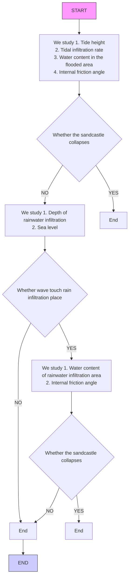

## The Longest Lasting Sandcastle

A variety of sandcastles can be found on the seashore, range from simple mounds of sand to complex castle replicas. Over time, there is no doubt that rain and waves will gradually erode the sandcastle. However, the degree of erosion of different types of sandcastles is different. Even if the building size and the distance from the water on the same beach are roughly same. Therefore, we wonder if there exits an optimal 3D geometric shape to use as sandcastle foundation.

In task 1, in order to identity the best 3D geometric shape of sandcastle foundation, firstly, our team choose six common geometric shapes to analyze. Then, we introduce Mohr-Coulomb Yielding Criteria to check the strength of sandcastle foundation, Horton’s equation to calculate infiltration rate of seawater, further Van Genuchten Model to obtain water retention curve. Based on the study of water content, we use internal friction angle to determine whether the sandcastle is stable or not. Finally,we work out the cuboid is the best, of which lasting time is 50min.What’s more, by traversing the aspect ratio of the cuboid, we find that the narrower the width of the water surface is, the longer lasting time is.

In task 2, take sand-to-water mixture proportion into consideration. Because the sand-to-water ratio is related to the structural stability of the sandcastle, by establishing the function relationship between sand-to-water mixing ratio and internal friction angle, then programming traversal, we find that the optimal solution is when the water-to-sand ratio is 15%, and lasting time of the sandcastle 64.43min.

In task 3, we divide the impact of rainwater on the sandcastle into two parts: scour and infiltration. We find that the cuboid is still the optimal geometry, confirming the reliability of our model. Besides, ANSYS simulation analysis is used to verify the theoretical results, and results are very similar.

To sum up, by consulting a large amount of data, we establish wave erosion, tidal immersion, rain scour, and rain immersion models. The model establishment has a gradual optimization process, and the results of rain immersion are analyzed using ANSYS simulation. It is in good agreement with the theoretical calculation, which verifies the correctness of our model.

Keywords: Mohr-Coulomb Yielding Criteria, Horton’s equation, Van Genuchten Model, Internal friction angle, ANSYS simulation.

## Content

1. Introduction..

1.1Background . 2  
1.2 Our work. 2

2. Assumptions .. 2  
3. Symbols.. . 3  
4. Task 1: Identify the Best Three-Dimensional Geometric Shape 3

4.1 Only consider the force of seawater on the sandcastle 4

4.1.1 Airy wave theory . 4  
4.1.2 The Morison Equation.  
4.1.3 Mohr-Coulomb Yielding Criteria. 6

4.2 Consider changes of water content in Sandcastle. 8

4.2.1 Horton’s equation . 8  
4.2.2 Van Genuchten Model. 8

4.3 Conclusion. 9

4.3.1 Take the cuboid as an example 9  
4.3.2 Best Three-dimensional geometric shape. 10  
4.3.3 Sensitivity analysis . 11

5. Task 2: Take Sand-to-Water Mixture Proportion into Consideration 12  
6. Task 3: Take Effect of Rain into Consideration 13

6.1 Precipitation model. . 13  
6.2 Sartor-Boyd scour model . 14  
6.3 Seepage process. .. 15  
6.4 ANSYS simulation. . 17

7. Task 4：Other Strategies to Make Sandcastles Last Longer . 17  
8. Strengths and Weaknesses. 18

8.1 Strengths. 18  
8.2 Weaknesses . .. 18

Article.. 19

Reference. . 21

## 1. Introduction

## 1.1 Background

A variety of sandcastles can be found on the seashore, range from simple mounds of sand to complex castle replicas. In all these, one typically forms an initial foundation consisting of a single, nondescript mound of wetted sand, and then proceeds to cut and shape this base into a recognizable 3-dimensional geometric shape, thereby building more castle-defining features.

Over time, there is no doubt that rain and waves will gradually erode the sandcastle. However, the degree of erosion of different types of sandcastles is different. Even if the building size and the distance from the water on the same beach are roughly same.

Therefore, in order to achieve highest robustness and longest lasting time, we wonder if there exits an optimal 3D geometric shape to use as the foundation of a sandcastle.

## 1.2 Our work

To further present our solutions, we arrange our paper as follows:

In task 1, we use six common geometric shapes for research. By establishing tide immersion model and wave erosion model, we calculate that the cuboid is the optimal geometric model. Further research, through the study of cuboids with different aspect ratios, we find that the smaller the width of the cuboid facing the water, the longer the model exists.  
In task 2, different sand-to-water mixing ratios will affect the strength of sandcastles. By establishing the function relationship between different sandto-water mixing ratios and internal friction angles, we find 15% is the best.  
In task 3, we divide the impact of rainwater on the sandcastle into two parts: scour and infiltration. Through ANSYS simulation. we get the effects of rainfall on the six geometries, which are very similar to the theory.  
In task 4, we consider two aspects of reducing seawater infiltration and reducing wave erosion to extend the lasting time of the sandcastle

## 2. Assumptions

Assume that the bottom of the model is at a horizontal plane.  
Suppose the waves are moving without amplitude attenuation.  
Disregard the impact of sandcastle's own gravity.

Assume that the seawater penetrates into the sandcastle uniformly.

## 3. Symbols

<table><tr><td>Symbol</td><td>Description</td></tr><tr><td>V</td><td>Volume of sandcastle</td></tr><tr><td>a</td><td>Wave amplitude</td></tr><tr><td>u</td><td>Wave speed</td></tr><tr><td> $\dot{u}$ </td><td>Wave acceleration</td></tr><tr><td>F</td><td>Wave total inline force</td></tr><tr><td>w</td><td>Water content in sand</td></tr><tr><td> $\sigma_n$ </td><td>Normal stress on the cross section</td></tr><tr><td> $\tau_n$ </td><td>Shear stress on the cross section</td></tr><tr><td> $\phi$ </td><td>Internal friction angle</td></tr><tr><td> $V_m$ </td><td>Average final speed of raindrops</td></tr></table>

## 4.Task 1: Identify the Best Three-Dimensional Geometric Shape

In this problem, according to the situation of people building sandcastles on the beach, we analyze six common 3D geometries with relatively stable structures to select the best. Assume that they have the same volume and height.

  
Figure 1. Six 3D geometries we select

Considering that tide will destroy the sandcastle, and as the tide rises, the tide will gradually flood the bottom of the sandcastle, and the water content of the sandcastle will continue to rise. When the sandcastle is completely immersed in seawater, we have no need to explore it. Therefore, we divide the whole process into three stages:

1) The sandcastle is not flooded. In this case, we mainly consider the force of tide on the sandcastle.  
2) Seawater begin to flood the sandcastle. In this case, water content of the infiltrated part will change.  
3) Seawater completely flood the sandcastle.

Taking a beach in Sandy Hook, USA as an example, we query the tide curve of the place on March 6, 2020 [1].

line chart

| Time (Hrs) | Tide Height (cm) |
|---|---|
| 00:00 | 30 |
| 01:00 | 62 |
| 02:00 | 98 |
| 03:00 | 128 |
| 04:00 | 148 |
| 05:00 | 152 |
| 06:00 | 138 |
| 07:00 | 112 |
| 08:00 | 76 |
| 09:00 | 40 |
| 10:00 | 12 |
| 11:00 | -2 |
| 12:00 | 3 |
| 13:00 | 26 |
| 14:00 | 58 |
| 15:00 | 92 |
| 16:00 | 121 |
| 17:00 | 135 |
| 18:00 | 133 |
| 19:00 | 112 |
| 20:00 | 81 |
| 21:00 | 45 |
| 22:00 | 15 |
| 23:00 | -2 |

Figure 2. Tide curve of Sandy Hook on March 6, 2020

As can be seen from the figure above, the initial height of the tide at 00:00 is 30cm, and the relationship between tide height and time is:

$$
h (t) = 1 2 5 6 \sin (0. 0 0 0 8 7 7 6 t + 3. 0 7 4) + 7 0. 9 8 \sin (0. 4 9 7 1 t - 0. 8 1 8 5) \tag {1}
$$

Where

t is time(h); h t( ) is the height of tide relative to the tidal height datum plane.

## 4.1 Only consider the force of seawater on the sandcastle

## 4.1.1 Airy wave theory

To study the force of waves on the sandcastle, we need to know how waves move. Airy wave theory [2] is often applied in ocean engineering and coastal engineering for the modelling of random sea states. Airy wave theory is a linear theory for the propagation of waves on the surface of a potential flow and above a horizontal bottom.

The free surface elevation $\eta ( \mathbf { x } , \mathbf { t } )$ of one wave component is sinusoidal, as a function of horizontal position x and time t.

$$
\eta (x, t) = a \cdot \cos (k x - \omega t) \tag {2}
$$

Where

a is the wave amplitude in meter, here, we take $a = 0 . 1 5 \mathrm { m } ^ { [ 3 ] }$ . k is the angular wavenumber in radian per meter, related to the wavelength  as $k = \frac { 2 \pi } { \lambda }$ here, we assume $\lambda = 8 . 5 \mathrm { m }$ . is the angular frequency in radian per second, related to the period T and frequency f by $\omega = { \frac { 2 \pi } { T } }$ , here, we assume $T = 1 0 \mathrm { s }$ .

Then, we can get the speed (m/s) and acceleration $( \mathrm { m } / \mathrm { s } ^ { 2 } )$ of the waves.

$$
u = \frac {\partial \eta}{\partial t} = a \omega \sin (k x - \omega t) \tag {3}
$$

$$
\dot {u} = \frac {\partial u}{\partial t} = - a \omega^ {2} \cos (k x - \omega t) \tag {4}
$$

## 4.1.2 The Morison Equation

Knowing the equation of motion of the wave, we further explore the total inline force on the wave. The Morison Equation [4] is the sum of two force components: an inertia force in phase with the local flow acceleration and a drag force proportional to the square of the instantaneous flow velocity.

$$
F = \rho C _ {m} V \dot {u} + \frac {1}{2} \rho C _ {d} A u | u | \tag {5}
$$

Where

F is the total inline force on the wave; $C _ { m }$ is the inertia coefficient, here, we take $C _ { m } { = } 1 . 5$ ; V is the volume of sandcastle; $\rho$ is the density of seawater, $\rho { = } 1 . 0 3 \mathrm { g / c m } ^ { 3 } ;$ ; $C _ { d }$ is the drag coefficient, which is related to the shape of the material. A is the area of the surface facing the sea water.

table

| Shape           | Drag Coefficient |
| --------------- | ---------------- |
| Sphere          | 0.47             |
| Half-sphere     | 0.42             |
| Cone            | 0.50             |
| Cube            | 1.05             |
| Angled Cube     | 0.80             |
| Long Cylinder   | 0.82             |
| Short Cylinder  | 1.15             |
| Streamlined Body| 0.04             |
| Streamlined Half-body | 0.09         |

Figure 3. Drag coefficient of different shapes

## 4.1.3 Mohr-Coulomb Yielding Criteria

In order to discuss the effect of waves on the structure of the sandcastle, we consult relevant data and select the internal friction angle of the sandcastle as the research object.

Mohr-Coulomb Yielding Criteria [6] is short for C-M Criteria. The C-M criteria is a yield theory that takes into account the maximum or single shear stress acting on normal or average stress, that is, when the ratio of shear stress to normal stress on the shear plane reaches the maximum, the material yields to failure. Its expression is:

$$
\tau_ {n} = C + \sigma_ {n} \tan \phi \tag {6}
$$

$$
\sigma_ {n} = \frac {F}{S} \tag {7}
$$

$$
\tau_ {n} = \frac {F}{A} \tag {8}
$$

Where

C is cohesion of sand; $\phi$ is internal friction angle of sand; $\sigma _ { n }$ is the normal stress on the cross section; $\tau _ { n }$ is the shear stress on the cross section; A is the area of shear plane; S is the area of the force contact surface.

To sand, $C { = } 0 ^ { [ 7 ] }$ , therefore:

$$
\tau_ {n} = \sigma_ {n} \tan \phi \tag {9}
$$

$$
\phi = \tan^ {- 1} (\frac {\tau_ {n}}{\sigma_ {n}}) \tag {10}
$$

Experiments show that the water content has a certain effect on the internal friction angle, and different water content corresponds to different internal friction angles. According to the relevant data found [8] [9], we find the relationship between internal friction angle and water content of the sand, the formula is as follows:

$$
g (w) = - 1 4 0 w ^ {2} + 5 6 w + 2 8. 5 \tag {11}
$$

Where, w is water content in sand.

line chart

| water content (%) | Internal friction angle φ (°) |
| ----------------- | ----------------------------- |
| 0                 | 29.0                          |
| 5                 | 29.7                          |
| 10                | 30.8                          |
| 15                | 31.7                          |
| 20                | 30.7                          |
| 30                | 28.5                          |

Figure 4. Curve of internal friction angle and water content

From the figure we can see that, as the water content increases, the internal friction angle increases first and then decreases. The main reason is that sand particles exhibit cohesiveness under a certain water content. To make the sand slide relative to each other, it must overcome not only the friction between sand, but also the cohesion between sand. Beyond a certain water content, all the sand particles are infiltrated in the water, and the lubricating effect of water reduces the friction between the particles.

Therefore, we assume that, when $g \left( w \right) < \phi$ , that is, when the internal friction angle of the external force acting on the sandcastle is greater than the value of the maximum internal friction angle that can be stabilized at the water content of the sand, the sandcastle will collapse; when $g \left( w \right) \geq \phi$ , The sandcastle will not collapse.

## 4.2 Consider changes of water content in Sandcastle

## 4.2.1 Horton's equation

When seawater begins to submerge the sandcastle, in order to learn how the water content of the sandcastle changes, we must first know the infiltration rate of waves.

Horton’s equation is an empirical formula for calculating the infiltration curve, and its expression is [10]:

$$
f (t) = f _ {c} + \left(f _ {0} - f _ {c}\right) e ^ {- k t} \tag {12}
$$

Where

$f \left( t \right)$ is the infiltration rate at time t; $f _ { 0 }$ is the initial infiltration rate, take $f _ { 0 } { = } 0$ ; $f _ { c }$ is the constant infiltration rate after the roil has been saturated or minimum infiltration rate, here, we assume $f _ { c } { = } 1$ mm/min;  k is the decay constant specific to the sand, take $k { = } 2$ [12].

## 4.2.2 Van Genuchten Model

We already know the infiltration rate at time t, and what is the relationship between f t( ) and water content of the sandcastle? Here, we use Van Genuchten Model.

The shape of water retention curves can be characterized by several models, one of them as the Van Genuchten Model [12] [13].

$$
\theta (\psi) = \theta_ {r} + \frac {\theta_ {s} - \theta_ {r}}{\left[ 1 + (\alpha | \psi | ^ {n}) \right] ^ {1 - \frac {1}{n}}} \tag {13}
$$

Where

$\theta ( \psi )$ is the water retention curve; $\left| \psi \right|$ is cm of water; $\theta _ { s }$ is saturated water content, take $\theta _ { s } = 0 . 3 ~ [ 1 4 ] ; ~ \theta _ { r }$ is residual water content, take $\theta _ { r } = 0 . 0 5 ~ ^ { \ [ 1 4 } ] ;$ is related to the inverse of the air entry suction, $\alpha > 0$ , take $\alpha { = } 0 . 0 1 \mathrm { c m ^ { - 1 } } \ : ^ { [ 1 4 ] }$ ; n is a measure of the pore-size distribution, $n > 1$ , take $n { = } 3$ .

Note that $\left| \psi \right|$ and $f \left( t \right)$ have the same physical meaning, so we take equation (12) into (13) to get the water retention curve.

line chart

| Time (min) | Water content (%) |
| ---------- | ----------------- |
| 0          | 1.0               |
| 10         | 3.0               |
| 20         | 12.0              |
| 30         | 27.0              |
| 40         | 29.5              |
| 50         | 29.8              |
| 60         | 29.9              |

Figure 5. Curve of water retention

Then use formula (11) to calculate the internal friction angle of the submerged part and compare it with $\phi$ .

## 4.3 Conclusion

## 4.3.1 Take the cuboid as an example

Assume that the size of the cuboid is 0.4m0.3m0.3m, where the height is 0.3m. Considering that the larger the area, the greater the force, so we choose the surface with size 0.3m0.3m as water-side face. Then, the area of shear plane $A { = } 0 . 4 \mathrm { m } { \times } 0 . 3 \mathrm { m }$ , the area of the force contact surface S=0.3m0.3m.

According to Figure 2, initial height of the tide is 30cm, and a = 0.15m( formula (2)), we place the sandcastle at 45cm relative to the tidal height datum plane, which is the maximum height of the tide.

Then, it can be obtained from Figure 2 that the time taken for the tide to rise from the initial value to the location of the sandcastle is 40 minutes, which is the first stage in our model. It takes 50 minutes for the tide to continue rising to just completely submerge the sandcastle, which is the second stage.

Assume that the initial moisture content of the sandcastle is 20%. The internal friction angle of the sandcastle $g \left( w \right)$ under this water content can be obtained from Figure 4.

In the first stage, it is calculated that the internal friction angle generated by wave $\phi$ is smaller than $g \left( w \right)$ , that is, the cuboid model can exist stably in the first stage.

In the second stage, as the seawater began to submerge the sandcastle, the water content of the sandcastle gradually increased with time. From Figure 4, it can be seen that the internal friction angle continue to decrease. When it decrease to less than the internal friction angle generated by wave, the sandcastle will collapse. The specific change process is shown in the following figure.

line chart

| Time (min) | Internal friction angle φ (°) |
| ---------- | ----------------------------- |
| 0          | 29.0                          |
| 10         | 27.0                          |
| 20         | 26.3                          |
| 30         | 26.2                          |
| 40         | 26.2                          |
| 50         | 26.2                          |
| 60         | 26.2                          |

Figure 6. Curve of internal friction angle changing with time

It can be seen from the figure above that the lasting time of the cuboid sandcastle in the second stage is 10 minutes, that is, the total lasting time is about 50 minutes.

When analyzing the stability of the other five geometries, the method is similar. Due to space limitations, it will not be described again.

## 4.3.2 Best Three-dimensional geometric shape

We obtain the lasting time of the six geometries with the same volume and height, and the effective height of the first wave action. The specific results are shown in the following table.

Table 1. Lasting time and effective wave height in the first stage of six geometries

<table><tr><td>Geometric shapes</td><td>Lasting time (min)</td><td>Effective wave height in the first stage (m)</td></tr><tr><td>Cuboid</td><td>about 50min</td><td>&gt;0.2</td></tr><tr><td>Cylinder</td><td>Less than 40min</td><td>&lt;0.18</td></tr><tr><td>Equilateral triangular cylinder</td><td>Less than 40min</td><td>&lt;0.13</td></tr><tr><td>Frustum of a cone</td><td>Less than 40min</td><td>&lt;0.10</td></tr><tr><td>Three trustum of a pyramid</td><td>Collapse in a short time</td><td>&lt;0.17</td></tr><tr><td>Four trustum of a pyramid</td><td>Less than 40min</td><td>&lt;0.14</td></tr></table>

As can be seen from the table, except for the cuboid, the other five geometries collapse in the first stage. We know that the higher the wave, the greater the impact force, so a larger value of the effective height of the wave indicates that the geometry is more stable. In summary, the cuboid is an optimal 3D geometric shape.

## 4.3.3 Sensitivity analysis

It can be known from equations (7) and (8) that the larger the area of A and S, the smaller the damage to the sandcastle. So next we change the length and width of the cuboid, and further analyze the effect of the size on the stability of the sandcastle.

Use formula (10) to calculate the change of the internal friction angle with lengthwidth ratio, and draw the figure.

line chart

| Length-width ratio n | Internal friction angle φ (°) |
| --------------------- | ----------------------------- |
| 0.0                   | 68.0                          |
| 0.5                   | 45.0                          |
| 1.0                   | 30.0                          |
| 1.5                   | 20.0                          |
| 2.0                   | 15.0                          |
| 2.5                   | 12.0                          |
| 3.0                   | 10.0                          |
| 3.5                   | 8.0                           |
| 4.0                   | 7.0                           |
| 4.5                   | 6.0                           |
| 5.0                   | 5.0                           |

Figure 7. Curve of internal friction angle changing with length-width ratio

From the figure above, we learn that the larger length-width ratio, the smaller the internal friction angle generated by external forces, and the more stable the sandcastle. This is consistent with the actual situation.

## 5. Task 2: Take Sand-to-Water Mixture Proportion into Consideration

In Task 1, we set the initial water content to 20% and use the internal friction angle to determine whether the sandcastle structure is stable. The internal friction angle is related to the water content, so it is necessary to find the optimal sand-water ratio to make the sandcastle last longer.

First, by changing the initial water content and then the internal friction angle, the sandcastle satisfies $g \left( w \right) \geq \phi$ , and the sand-to-water mixing ratio range that keeps the sandcastle intact in the first stage is 5% -25%. Then, in the second stage, a curve of the sandcastle collapse time changing with the initial water content in the sand is drawn.

line chart

| Initial water content (%) | Sandcastle collapse time (min) |
| ------------------------- | ------------------------------- |
| 5                         | 27.0                            |
| 10                        | 26.0                            |
| 15                        | 24.5                            |
| 20                        | 21.0                            |
| 25                        | 1.0                             |

Figure 8. Curve of the sandcastle collapse time with the initial water content

We can see that as the initial water content in the sand increases, the lasting time of the sandcastle gradually decreases. When the initial water content is 5%, the total lasting time of the sandcastle is the longest, which is 67 min.

However, in Figure 4, when the water content $w = 1 5 \%$ , the internal friction angle is the largest and the sandcastle has the best stability. From the above figure, we get that the total lasting time of the sandcastle under this condition is 64.43min.

In fact, there is no contradiction between the two. Because when the initial water content is small, the starting point of the rise is low, and accordingly the duration of the sandcastle is longer. Considering the viscosity of the sand [15], and the difference between the two is not large, we choose 15% as the best water-to-sand mixing ratio.

## 6. Task 3: Take Effect of Rain into Consideration

## 6.1 Precipitation model

In order to study the impact of rain on sandcastles, we first need to understand some of the motion characteristics of rain.

Suppose the rain drops vertically. The falling raindrops have large kinetic energy. When they hit the sandcastle, they will destroy the structure of the sandcastle and also change the water content of the sandcastle. Therefore, we divide the impact of rainwater on the sandcastle into two parts: scour and infiltration.

Raindrop final speed calculation formula [16]:

$$
V _ {m} = \left\{ \begin{array}{l l} \sqrt {\left(3 8 . 9 \frac {\nu}{d}\right) ^ {2} + 2 4 0 0 g d} - 3 8. 9 \frac {\nu}{d} & d \leq 3 \mathrm{mm} \\ \frac {d}{0 . 1 1 3 + 0 . 8 4 5 d} & 3 <   d \leq 6 \mathrm{mm} \end{array} \right. \tag {14}
$$

Where is viscosity coefficient of air movement. When $\mathrm { T } { = } 2 0 \ \mathrm { ^ \circ C } = 2 9 3 \mathrm { K } .$ , $= 1 . 8 1 0 7 4 1 5 5 5 { \times } 1 0 ^ { - 5 } \mathrm { P a } { \cdot } \mathrm { S }$ .

Considering raindrops as spheres. According to the momentum formula $q = m V _ { m }$ and energy formula $E = \frac { 1 } { 2 } m V _ { m } ^ { 2 }$ can be obtained, and the relationship between raindrop diameter and momentum and energy can be further obtained.

However, in the actual calculation of rainfall kinetic energy and other rainfall characteristics, there is often only data of rainfall or rainfall intensity, and observation data of raindrop diameter is lacking. In order to facilitate production applications, the final raindrop speed can be expressed as a function of rain intensity. According to the analysis of measured data, there is a power function relationship between the median diameter of raindrops and the rain intensity [16]:

$$
d _ {5 0} = 2. 5 2 i ^ {0. 3 2} \tag {15}
$$

Where $d _ { 5 0 }$ is median diameter of raindrops(mm); i is rain intensity(mm/min).

By taking equation (15) into (14), we get the formula for calculating the average final speed of raindrops from rainfall intensity.

$$
V _ {m} = \left\{ \begin{array}{l l} \sqrt {\left(1 . 5 4 4 \frac {\nu}{i ^ {0 . 2 3}}\right) ^ {2} + 6 . 0 4 8 g i ^ {0 . 2 3}} - 1. 5 4 4 \frac {\nu}{i ^ {0 . 2 3}} & i \leq 2. 1 3 \\ \frac {i ^ {0 . 2 3}}{0 . 0 4 4 8 + 0 . 0 8 4 5 i ^ {0 . 2 3}} & 2. 1 3 <   i \leq 4 3. 4 6 \end{array} \right. \tag {16}
$$

Through calculation, we get the relationship between precipitation and raindrop speed, energy and momentum, as shown in the following figure:

line chart

| Rainfall (mm/min) | Raindrop final speed (m/s) |
| ----------------- | -------------------------- |
| 0                 | 7.6                        |
| 5                 | 8.8                        |
| 10                | 9.2                        |
| 15                | 9.4                        |
| 20                | 9.5                        |
| 25                | 9.6                        |
| 30                | 9.7                        |
| 35                | 9.75                       |
| 40                | 9.8                        |
| 45                | 9.8                        |

line chart

| Rainfall (mm/min) | Raindrop final kinetic energy (kJ) |
| ----------------- | ----------------------------------- |
| 0                 | 0                                   |
| 5                 | 0                                   |
| 10                | 0                                   |
| 15                | 0                                   |
| 20                | 0                                   |
| 25                | 0                                   |
| 30                | 0                                   |
| 35                | 0                                   |
| 40                | 0                                   |
| 45                | 0                                   |

line chart

| Rainfall (mm/min) | Raindrop final momentum (kg m/s) |
| ----------------- | --------------------------------- |
| 0                 | 0                                 |
| 5                 | 0.5                               |
| 10                | 1                                 |
| 15                | 1.5                               |
| 20                | 2                                 |
| 25                | 2.5                               |
| 30                | 3                                 |
| 35                | 3.5                               |
| 40                | 4                                 |
| 45                | 4.5                               |

Figure 9. Relationship between precipitation and raindrop speed, energy, momentum

## 6.2 Sartor-Boyd scour model

After knowing the relevant motion parameters of raindrops, we also need to analyze the impact of raindrops on the sandcastle.

The Sartor-Boyd scour model [17] is mainly applicable to the rainfall process with initial scouring effect, as shown in formula (17):

$$
\frac {\mathrm{d} \mathrm{P}}{\mathrm{d} t} = K _ {2} \operatorname * {P r} \tag {17}
$$

Where $K _ { 2 }$ is the erosion coefficient (empirical value), $\mathrm { m m } ^ { - 1 }$ ; P is the volume of sandcastle at the beginning, $\mathrm { m } ^ { 3 } ;$ ; r is rainwater runoff per unit time per unit area, that is, rainfall intensity, mm / min; t is time, min.

In our model, $K _ { \ i }$ is taken as 0.201 [17] to obtain the change of the volume of sand washed away with precipitation, as shown in the figure below:

line chart

| Time (min) | Volume of sand scoured (m³) |
| ---------- | ---------------------------- |
| 0          | 0.0000                       |
| 10         | 0.0225                       |
| 20         | 0.0310                       |
| 30         | 0.0345                       |
| 40         | 0.0355                       |
| 50         | 0.0360                       |
| 60         | 0.0360                       |

Figure 10. Change of the volume of sand washed away with precipitation

## 6.3 Seepage process

flowchart

Figure 11. Flow chart for seepage process

When the sandcastle is affected by rain, we use Matlab to fit the relationship between the internal friction angle of the sandcastle and the water content, as follows [18]:

$$
\phi = 0. 8 4 6 2 w + 5. 2 5 6 \tag {18}
$$

scatterplot

| water content (%) | Internal friction angle φ (°) |
| ----------------- | ----------------------------- |
| 40                | 39                            |
| 42                | 41                            |
| 44                | 39                            |
| 45                | 45                            |
| 46                | 47                            |
| 47                | 48                            |
| 48                | 49                            |
| 49                | 50                            |
| 50                | 51                            |
| 51                | 52                            |
| 52                | 53                            |
| 53                | 54                            |
| 54                | 55                            |
| 55                | 56                            |
| 56                | 57                            |
| 57                | 58                            |
| 58                | 59                            |
| 59                | 60                            |
| 60                | 61                            |
| 61                | 62                            |
| 62                | 63                            |
| 63                | 64                            |
| 64                | 65                            |
| 65                | 66                            |
| 66                | 67                            |
| 67                | 68                            |
| 68                | 69                            |
| 69                | 70                            |
| 70                | 71                            |
| 71                | 72                            |
| 72                | 73                            |
| 73                | 74                            |
| 74                | 75                            |
| 75                | 76                            |

Figure 12. Relationship between internal friction angle and water content when the sandcastle is affected by rain

In precipitation model, we have obtained the formula for calculating the final velocity of raindrops. Then, bring it into equation (13) to get the water content of the sandcastle. According to formula (18), we can get internal friction angle of sandcastle while raining. Finally, compare the relationship between $\mathbf { \nabla } _ { \cdot } \phi$ and $g \left( w \right)$ , and draw the conclusion.

Table 2. Effective height of the six geometries when it rains

<table><tr><td>Geometric shapes</td><td>Effective height</td></tr><tr><td>Cuboid</td><td>0.20m</td></tr><tr><td>Cylinder</td><td>0.15m</td></tr><tr><td>Equilateral triangular cylinder</td><td>0.11m</td></tr><tr><td>Frustum of a cone</td><td>0.08m</td></tr><tr><td>Three trustum of a pyramid</td><td>0.15m</td></tr><tr><td>Four trustum of a pyramid</td><td>0.15m</td></tr></table>

The results show that rainwater has a certain effect on the structural stability of sand castles. Comparing the effective heights of the six geometries, we find that the cuboid is still the optimal geometry, confirming the reliability of our model.

## 6.4 ANSYS simulation

After theoretical calculations, ANSYS simulation analysis is used to verify the theoretical results. Through the simulation analysis of the rainfall scouring model, we get the pressure, tension and deformation maps of the model. By comparing with the theoretical results, the results are very similar. The following figure shows the simulation analysis of six models:

text_image

A: Static Structural
Static Principal Structure
Type: Multiple Principal Structure
Unit: Mpa
Time: 1
07/06/2019 2:00
Simulation A: Max
0.00075 ± 5
0.00175 ± 5
0.00115 ± 4
0.000115± 3
0.00017± 2
0.00017± 1
0.00017± 3
0.00017± 4
0.00017± 5
ANSYS
R18.3
2.00
350.20 (mm)
15.20

text_image

A: Static Standard
Equivalent Static Strain
Type Equivalent Static Strain
Unit dimensions
Total 1
2000/yr 2.65
51400e-8 Max
47700e-8
42700e-8
39875e-8
34275e-8
32075e-8
31500e-8
29750e-8
27250e-8
12575e-8
ANSYS
R18.3
0.60
100.00 (mm)
100.00

heatmap

| X | Y | Z | Color Scale (mm²) |
| --- | --- | --- | --- |
| (various values) | (various values) | (various values) | 200000–700000 |
| (various values) | (various values) | (various values) | 50000–100000 |
| (various values) | (various values) | (various values) | 10000–15000 |
| (various values) | (various values) | (various values) | 1500–2000 |
| (various values) | (various values) | (various values) | 200–250 |
| (various values) | (various values) | (various values) | 250–300 |
| (various values) | (various values) | (various values) | 300–350 |
| (various values) | (various values) | (various values) | 350–400 |
| (various values) | (various values) | (various values) | 400–450 |
| (various values) | (various values) | (various values) | 450–500 |
| (various values) | (various values) | (various values) | 500–550 |
| (various values) | (various values) | (various values) | 550–600 |
| (various values) | (various values) | (various values) | 600–650 |
| (various values) | (various values) | (various values) | 650–700 |
| (various values) | (various values) | (various values) | 700–750 |
| (various values) | (various values) | (various values) | 750–800 |
| (various values) | (various values) | (various values) | 800–850 |
| (various values) | (various values) | (various values) | 850–900 |
| (various values) | (various values) | (various values) | 900–950 |
| (various values) | (various values) | (various values) | 950–1000 |
| (various values) | (various values) | (various values) | 1000–1050 |
| (various values) | (various values) | (various values) | 1050–1100 |
| (various values) | (various values) | (various values) | 1100–1150 |
| (various values) | (various values) | (various values) | 1150–1200 |
| (various values) | (various values) | (various values) | 1200–1250 |
| (various values) | (various values) | (various values) | 1250–1300 |
| (various values) | (various values) | (various values) | 1300–1350 |
| (various values) | (various values) | (various values) | 1350–1400 |
| (various values) | (various values) | (various values) | 1400–1450 |
| (various values) | (various values) | (various values) | 1450–1500 |
| (various values) | (various values) | (various values) | 1500–1550 |
| (various values) | (various values) | (various values) | 1550–1600 |
| (various values) | (various values) | (various values) | 1600–1650 |
| (various values) | (various values) | (various values) | 1650–1700 |
| (various values) | (various values) | (various values) | 1700–1750 |
| (various values) | (various values) | (various values) | 1750–1800 |
| (various values) | (various values) | (various values) | 1800–1850 |
| (various values) | (various values) | (various values) | 1850–1900 |
| (various values) | (various values) | (various values) | 1900–1950 |
| (various values) | (various values) | (various values) | 1950–2000 |
| (various values) | (various values) | (various values) | 2000–2050 |
| (various values) | (various values) | (various values) | 2050–2100 |
| (various values) | (various values) | (various values) | 2100–2150 |
| (various values) | (various values) | (various values) | 2150–2200 |
| (various values) | (various values) | (various values) | 2200–2250 |
| (various values) | (various values) | (various values) | 2250–2300 |
| (various values) | (various values) | (various values) | 2300–2350 |
| (various values) | (various values) | (various values) | 2350–2400 |
| (various values) | (various values) | (various values) | 2400–2450 |
| (various values) | (various values) | (various values) | 2450–2500 |
| (various values) | (various values) | (various values) | 2500–2550 |
| (various values) | (various values) | (various values) | 2550–2600 |
| (various values) | (various values) | (various values) | 2600–2650 |
| (various values) | (various values) | (various values) | 2650–2700 |
| (various values) | (various values) | (various values) | 2700–2750 |
| (various values) | (various values) | (various values) | 2750–2800 |
| (various values) | (various values) | (various values) | 2800–2850 |
| (various values) | (various values) | (various values) | 2850–2900 |
| (various values) | (various values) | (various values) | 2900–2950 |
| (various values) | (various values) | (various values) | 2950–3000 |
| (various values) | (various values) | (various values) | 3000–3050 |
| (various values) | (various values) | (various values) | 3050–3100 |
| (various values) | (various values) | (various values) | 3100–3150 |
| (various values) | (various values) | (various values) | 3150–3200 |
| (various values) | (various values) | (various values) | 3200–3250 |
| (various values) | (various values) | (various values) | 3250–3300 |
| (various values) | (various values) | (various values) | 3300–3350 |
| (various values) | (various values) | (various values) | 3350–3400 |
| (various values) | (various values) | (various values) | 3400–3450 |
| (various values) | (various values) | (various values) | 3450–3500 |
| (various values) | (various values) | (various values) | 3500–3550 |
| (various values) | (various values) | (various values) | 3550–3600 |

Figure 13. The pressure, tension and deformation cloud of the cuboid

text_image

S. State Shadowed
Multi-Phase Stress
Type: Multi-Phase Stress
G=0.001%
Process 1
2.94 (mg·s) MPa
1.56 (kPa) s
7.4 (kPa) s
0.88 (1.41)
0.88 (1.71)
0.88 (2.07)
0.88 (2.34)
0.88 (2.61)
0.88 (2.90)
0.88 (3.20)
0.88 (3.50)
0.88 (3.80)
ANSYS
F10.2
G=0.001% MPa
P=0
20000 V/MPa
100.00

text_image

S. Static Stressed
Molecular Permeable States
Type: Molecule Permeable States
Line: 0.01s
Time: 1
00:00:57.6:497
SUBSTOCK MAX
-1.5cm x 5
-1.6274x 5
-1.8824x 5
-2.0001x12
-2.0001x17
-2.0002x19
-2.0002x143
-2.0006x117
SUBSTOCK MAX
ANSYS
F1A.2
0.00
19.00
0.00
(0.00,0.00) (mm)

text_image

A: Finite Element
Formula: Perigree (H)
Type: Mechanical Concrete Struts
Time:
2008/12/2011
3.2675e-4 Min
-2.011e-8
-4.0375e-9
-7.2435e-10
-9.6475e-11
-0.0001717
-0.0001439
-0.0001271
-0.0001111
-0.0000747 Max
ANSYS
ANSYS
ANSYS
ANSYS
ANSYS
ANSYS
ANSYS
ANSYS
ANSYS
ANSYS
ANSYS
ANSYS
ANSYS
ANSYS
ANSYS
ANSYS
ANSYS
ANSYS
ANSYS
ANSYS
ANSYS
ANSYS
ANSYS
ANSYS
ANSYS
ANSYS
ANSYS
ANSYS
ANSYS
ANSYS
ANSYS
ANSYS
ANSYS
ANSYS

text_image

A: Metal Structure
Anisotropic Shear Stress
Type: Mechanical Shear Stress
Unit: MPa
Time: 1
0.0000000000
1.0000000000
2.0000000000
3.0000000000
4.0000000000
5.0000000000
6.0000000000
7.0000000000
8.0000000000
9.0000000000
10.0000000000
ANSYS
S126.3
1.5Mpa/3 Max
-1.275Pa/3
-1.417Pa/3
-1.588Pa/3
-1.826Pa/3
-2.127Pa/3
-2.456Pa/3
-2.856Pa/3
-3.256Pa/3
-3.656Pa/3
-4.156Pa/3
-4.566Pa/3
-5.156Pa/3
-5.656Pa/3
-6.256Pa/3
-6.756Pa/3
-7.356Pa/3
-7.856Pa/3
-8.456Pa/3
-9.156Pa/3
-9.756Pa/3
-10.456Pa/3
-11.156Pa/3
-11.756Pa/3
-12.456Pa/3
-13.156Pa/3
-13.756Pa/3
-14.456Pa/3
-15.156Pa/3
-15.756Pa/3
-16.456Pa/3
-17.156Pa/3
-17.756Pa/3
-18.456Pa/3
-19.156Pa/3
-19.756Pa/3
-20.456Pa/3
-21.156Pa/3
-21.756Pa/3
-22.456Pa/3
-23.156Pa/3
-23.756Pa/3
-24.456Pa/3
-25.156Pa/3
-25.756Pa/3
-26.456Pa/3
-27.156Pa/3
-27.756Pa/3
-28.456Pa/3
-29.156Pa/3
-29.756Pa/3
-30.456Pa/3
-31.156Pa/3
-31.756Pa/3
-32.456Pa/3
-33.156Pa/3
-33.756Pa/3
-34.456Pa/3
-35.156Pa/3
-35.756Pa/3
-36.456Pa/3
-37.156Pa/3
-37.756Pa/3
-38.456Pa/3
-39.156Pa/3
-39.756Pa/3
-40.456Pa/3
-41.156Pa/3
-41.756Pa/3
-42.456Pa/3
-43.156Pa/3
-43.756Pa/3
-44.456Pa/3
-45.156Pa/3
-45.756Pa/3
-46.456Pa/3
-47.156Pa/3
-47.756Pa/3
-48.456Pa/3
-49.156Pa/3
-49.756Pa/3
-50.456Pa/3

text_image

Sr. Static Structural
Schematic Structural Stress
Layer Marks: Practical Stress
Junctional
Thermal
-0.0057124 mm
2.400e-5 Max
0.2079e-5
0.617e-5
0.787e-5
0.188e-5
0.6481247
0.6481247
0.6481247
0.6481247
0.6481247
ANSYS
R.S.R.
0.00
100.00
0.00
100.00
0.00
100.00
0.00
100.00
ANSYS

Figure 14. Pressure distribution of the other five models

## 7. Task 4: Other Strategies to Make Sandcastles Last Longer

From the analysis of the first three questions, in order to extend the lasting time of the sandcastle, we can consider two aspects: reducing seawater infiltration and reducing wave erosion.

On the one hand, we can cover the sandcastle, for example, placing a shield in front of the sandcastle to reduce the impact of the waves on the sandcastle. Another example is to use a plastic bag to wrap the sandcastle. This can eliminate the infiltration of rainwater and seawater, also avoid contact with the waves, thereby reducing the erosion of the waves.

On the other hand, we can also place some stone or wooden supports in the sandcastle, which can improve the sandcastle's ability to resist the waves. Alternatively, we can also mix some clay into the sand. Because clay absorbs water less than sand, and its internal friction angle is greater than sand. Therefore, adding other materials into the sandcastle can improve the ability to resist sea waves and reduce the penetration of waves.

## 8. Strengths and Weaknesses

## 8.1 Strengths

We select six types of 3-dimensional geometric shape for analysis and comparison, and finally determine that the cuboid is the optimal model by calculating the lasting time of the sandcastle and the effective height of the wave action, which has a certain rationality.  
When analyzing the effect of the waves on the sandcastle, we establish a wave force equation and perform a strong check using the Mohr-Coulomb Yielding Criteria  
By consulting the data, Horton’s equation is used to measure the infiltration rate, and the Van Genuchen Model is used to establish the relationship between the infiltration rate and water content in sand.  
The structure of the entire model is rigorous and reasonable. It is suitable for the problem conditions and can be applied to beaches in any area. It has good universality.

## 8.2 Weaknesses

When considering wave motion, Airy Wave Theory simply considers the wave as a sinusoidal form, but in fact, the amplitude of the wave is not constant as it moves forward.  
Water seepage is not a uniform process. The water content on the surface of an object should be greater than the water content inside the object, but for the sake of calculation, we consider this a uniform process.  
Raindrops are uneven when falling and with the change of the tilt angle, it is difficult to deduce its effect on the sandcastle by formula.

## Article

# The Longest Lasting Sandcastle

The sea has infinite appeal to people. When you play on the coast, have you noticed the countless sandcastles of different sizes and shapes on the beach? Some are broken by the wash of the waves, while others remain intact. It is true that they may not be built in time, but have you thought of any other factors that have caused this result and how this will guide us in the construction of sandcastles?

In order to answer this question, we take Sandy Hooke in the United States as an example to build a model of a sandcastle under the impact of waves and tide. Based on this model, we studied sandcastles of six basic geometries of the same volume-cuboids, cylinders, triangular prisms, triangular pyramids, quadrangular pyramids, and circular pyramids.

We can see that the cuboid sandcastle can exist for the longest time. At the same time, we should keep the width of the water front as small as possible while maintaining a certain cross-section of the sandcastle. This will make the sandcastle exist longer.

In addition, we also considered that as the tide rises, the seawater will gradually flood the sandcastle, causing the water content of the sandcastle to change, which will affect the age of the sandcastle. Therefore, we studied the relationship between the water content in the sandcastle and its age. We have reached the conclusion that the optimal moisture content of the sandcastle should be 15%. When the water content is too large, the sand castle will collapse under the impact of the waves. In fact, we will not measure the specific value of sand moisture content during the construction of the sand castle. Therefore, we can do a small experiment at the beach. we gradually add water to the sand, and then see how tight they are. When we feel that the sand is the strongest, stop adding water and use this as the material for building the sandcastle.

Finally, we studied the impact of rain on the sandcastle. On the one hand, the infiltration of rainwater will increase the water content of the sandcastle. On the other hand, rainwater on the sandcastle will have a strong effect on it. These will accelerate the collapse of the sand castle so rain is not good for sand castles.

In short, in order to make the sandcastle have the longest lasting, we should choose to use sand with a higher degree of tightness in rainless weather, build a cuboid as the foundation of the sand castle, and make the width of the water front as narrow as possible, so that we can build a "perfect" sandcastle. Of course, some people may say that we can wrap a sandcastle with a plastic sheet, or add stones and soil to the sand.

These can also make the sandcastle exist longer. However, we do not recommend doing this. After people leave, if these materials are not taken away in time, they will become rubbish and pollute the sea. At the same time, stones on the beach will leave danger to people who don't pay attention. When we enjoy life at the beach, we must remember to protect the environment and others.

## Reference

[1] https://www.cnss.com.cn/tide/  
[2] https://en.wikipedia.org/wiki/Airy\_wave\_theory  
[3] https://en.wikipedia.org/wiki/Wind\_wave  
[4] https://en.wikipedia.org/wiki/Morison\_equatio  
[5] Zhang Boping, Wang Li, Yuan Haizhi. Quantitative analysis of the effect of water content on the structural strength of loess [J]. Journal of Northwest Agricultural University, 1994 (01): 54-60.  
[6] https://en.wikipedia.org/wiki/Mohr%E2%80%93Coulomb\_theory?wprov=sfla1  
[7] https://wenku.baidu.com/view/4eb7356cbed5b9f3f80f1c1c.html  
[8] Chen Lei, Zhao Jian. Effect of moisture content on shear strength parameters of clay in dumping ground [J]. Coal Technology, 2016, 35 (12): 170-172.  
[9] Fan Zhijie, Qu Jianjun, Zhou Huan. The relationship between the friction angle in sand and the particle size, water content and natural slope angle [J] .China Desert, 2015,35 (02): 301-305.  
[10] https://en.wikipedia.org/wiki/Infiltration\_(hydrology)  
[11] http://www.soilmanagementindia.com/soil/permeability-ofsoils/permeability-of-soil-definition-darcys-law-and-tests-soil-engineering/16472  
[12] Young-Suk Song, Kyeong-Su Kim, Sueng-Won Jeong, and Choon-Oh Lee. Estimation on unsaturated characteristic curves of tailings obtained from waste dump of imgi mine in busan.Journal of the Korean Geotechnical Society, 30:47– 58, 03 2014.  
[13] https://en.wikipedia.org/wiki/Water\_retention\_curve  
[14] Stingaciu, L. R., et al. "Determination of pore size distribution and hydraulic properties using nuclear magnetic resonance relaxometry: A comparative study of laboratory methods." Water Resources Research 46.11 (2010).  
[15] Zhang Junhong, Shi Xuchao, Zhang Xinjuan. Experimental Study on the Influence of Water Content of Loess on Structure [J]. Henan Science, 2010, 28 (12): 1575-1578.  
[16] Yao Wenyi, Chen Guoxiang.Rainfall Drop Speed and Final Speed Formula [J] .Journal of Hohai University, 1993 (03): 21-27.  
[17] Zhao Xiaojia, Wang Shaopo, Yu He, Qiu Chunsheng, Sun Liping, Wang Chenchen, Zhao Lejun, Song Xiancai.Characteristics of Erosion and Pollution Erosion by Rainfall and Runoff on Typical Underlying Surfaces in Tianjin City Center [J] .Environmental Engineering, 2019,37 (07): 34-38 + 87 .

[18] Estela Nadal-Romero, Teodoro Lasanta, David Regües, N. Lana-Renault, and Artemi Cerdà. Hydrological response and sediment production und r different land cover in abandoned farmland fields in a mediterranean mountain e nvironment. Boletín de la Asociación de Geógrafos Españoles, 55:303- 323, 01 2011.