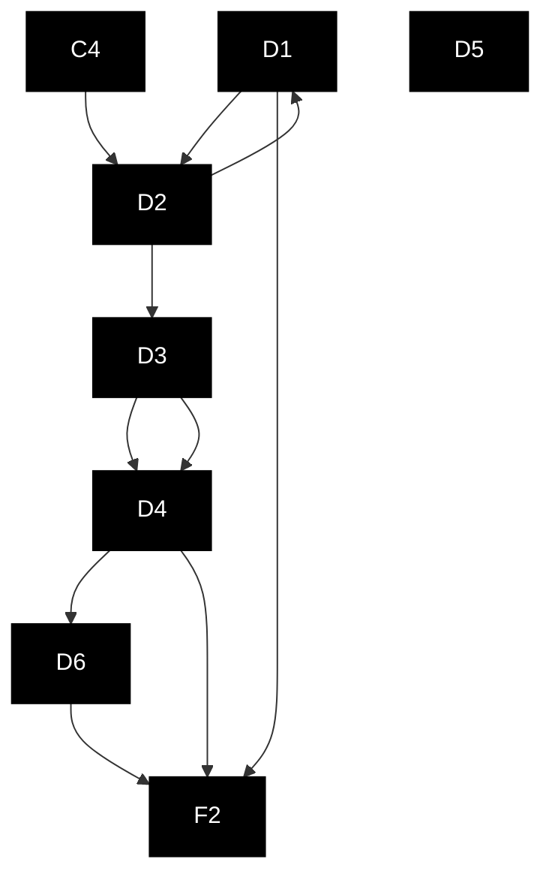
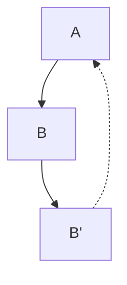
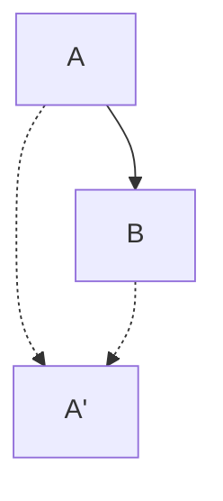
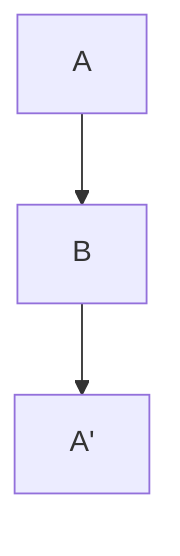
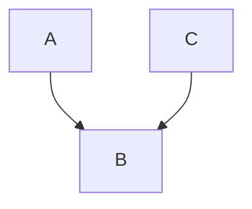
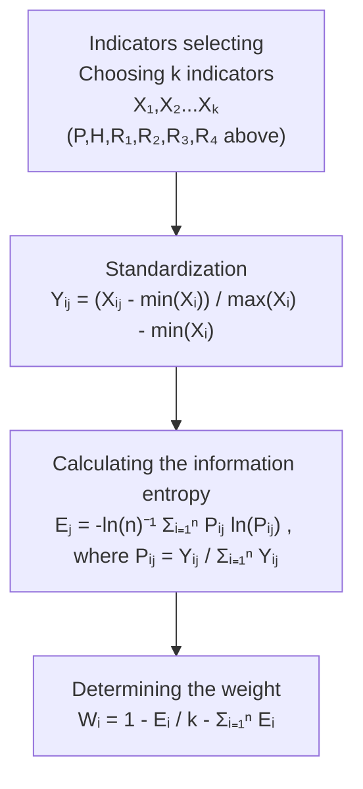
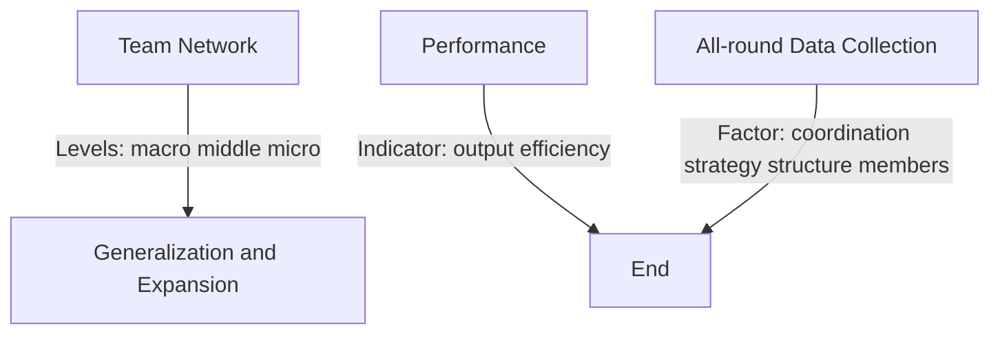

## Make Your Team Stronger: Analysis on Network and Team Performance

Summary

Facing the increasingly close cooperation and connection in modern society, it has become an important development direction of modern data science to comprehensively analyze and evaluate team performance with data. By establishing a multi-level network analysis model and multi-angle team performance evaluation model, our work developed the performance evaluation method for the need of Huskies' coach, and a sensitivity analysis was carried out. Then, we provided three suggestions for further improvement, and ultimately extended the models to similar scenes with teamwork in life.

First, we analyzed the team's performance from three levels: macro, micro and middle. At the macro level, we used the data of the third match of the season to determine the common players of the team according to the average passing times of each player. According to the average position of passing and the passing times between two players, the basic formation of the team was determined and the network diagram of the field was established. At the micro level, we identified four large range cooperation tactics (BPBP, OPSP, DPOP, LRT) and analyzed how often they were used over the course of the season. At the middle level, considering the common tactical styles of modern football, we used data to identify four tactical styles of teams and found out the changes of tactical styles in each match.

Then we identified the attributional factors that determined a team's actual performance. The first step was to use a common indicator, goal difference, to represent a team's actual performance based on results. In the second step, we established six attributional factors that might cause different team performance. They were: Pezzali score, H indicator, the number of small-range tactical teamwork, the player's ability, the team's tactical adaptability and the team's flexibility. Then, we used the entropy weight method (EWM) to integrate these six factors into a total attributional indicator. In the third step, we used statistical correlation analysis method to draw the conclusion that the team's goal difference had a significant positive correlation with the total factor, with a significance of 0.024, proving that the total attributional indicator constituted by these six factors can greatly affect the team's final performance. In this way, we have achieved a comprehensive assessment of the team's performance.

After these two closely-related models had been established, a sensitivity analysis was followed. When Pezzali indicator fluctuated as other indicators remained the average level of the season, we obtained confidence intervals of 90% and 95% for TAI, which were [2.6381, 3.9982] and [2.5079, 4.1285]. TAI had confidence intervals of 90% and 95% respectively, which were [2.8962, 3.7401] and [2.8154, 3.8209] when H index fluctuates. Thus, we found that the fluctuation of a single indicator does not lead to a big change in the total indicator.

Next, we used the models and combined the data of the whole season to propose suggestions for improving the team's performance from three prospects, which are the team formation, the team players' ability and the team's best squad. In terms of formation, we had three pieces of advice: Huskies should use 4-3-3 when opponents use 4-4-2; don't get too stuck with the 4-4- 2; it's better to use a 5-defender formation. In terms of players' abilities, we have given the values of ability indicators of all players under the different standards for examining players at different positions, and found out that F6 was the best forward, M13 was the best midfield and D8 was the best defender. Using the model, the head coach could measure the ability value of players quantitatively. In terms of the best squad, we gave two best squads for managers to refer.

Finally, we extended the model to other real-life team collaboration scenarios. Firstly, the analysis method of this model could have reference significance for the analysis of social network. Secondly, the evaluation model of team performance may be applicable to the scenario of investigating the performance of the whole team. Finally, this model provides suggestions and references for how to better use the data to evaluate the team's performance.

Key words: Multi-level Network Analysis Model Entropy Weight Method Multi-angle Team Performance Evaluation Model Team Improvement Sug

## Contents

1 Introduction.

1.1 Restatement of the Problem .  
1.2 Literature Review.  
1.3 Our Work ..

2 Assumptions and Notations 2

3 Model Establishment and Solution 3

3.1 Model 1: Multi-level Network Analysis Model. 3

3.1.1 Determination of the Main Players and Team Formation at the Macro Level .. 3  
3.1.2 Small-scale Tactical Identification at the Micro Level 4  
3.1.3 Analysis of the Team's Tactical Play at the Middle Level 7

3.2 Multi-angle Team Performance Evaluation Model 8

3.2.1 Measurement of the Team’s Actual Performance. 8  
3.2.2 Measurement of Attributional Factors for Team Performance. 9  
3.2.3 Correlation Analysis and Model Test . 12

3.3 Sensitivity Analysis .. 13

3.4 Suggestions for the team based on the established model 14

3.4.1 Team Formation Analysis and Suggestions.. . 14  
3.4.2 Analysis of Players' Overall Individual Abilities in the Season . .. 16  
3.4.3 The Two Best Teams 16

4 Generalization and Expansion of the Model 17  
5 Analysis of the Advantages and Disadvantages of the Model. . 19

5.1 Model Advantages 19  
5.2 Model Disadvantages. 19

References.. .. 20

## 1 Introduction

## 1.1 Restatement of the Problem

As the largest sport in the world, soccer has a wide range of fans all over the world, and the performance of the team’s players also affects the hearts of every fan who cares about the team's performance. In the early days of the game, managers could only judge the performance of their teams by their own feelings and subjective perception of the situation. With advances in the science of data and information, data on player performance and team play, collected with modern technology, provides the basis for a more accurate assessment of player performance and team collaboration. Therefore, using these data to build mathematical models to analyze team performance more accurately has become a key link in the technical analysis of modern football. At the same time, the analysis of the phenomenon of teamwork reflected in such a complex sport as soccer is also helpful for us to analyze the teamwork in many aspects of life, including business, scientific research and artistic creation.

The mathematical models we build should finish four tasks:

Task 1. Establish the network model of passing and other possible structural indicators to analyze the cooperation of a small range of players and the overall cooperation performance of all players, as well as the performance of players in a single game and the whole season.

Task 2. Establish a general evaluation model of indicators that can evaluate team cooperation, so as to dynamically analyze the structure and flexibility of team cooperation.

Task 3. Use the established model to advise Huskies’ coach on how to improve the team's performance to achieve greater success.

Task 4. Generalize the conclusions obtained in the process of solving the above problems, and give the measures that should be taken to better promote the effect of teamwork, as well as the additional factors to be considered.

## 1.2 Literature Review

A number of researchers have previously contributed to data analysis models for soccer matches. The study of Duch J et al. used the method of network analysis to divide players into different groups and extend the performance of the group to the performance of the whole team to establish a model[1]. Cintia P et al. established the overall evaluation index H and analyzed the correlation between H and team success[2]. The literature of Luca et al. also shows that it is a better analysis method to use different dots to represent different players and establish the network connection between players[3]. Buldú, J.M. et al. 's research, combined with the previous emergence of a variety of network measurement research methods, focused on the analysis of reasons for great success of Guardiola's Barcelona[4]. GÜRSAKAL Necmi and other Turkish scientists have also used data from their national team to provide us with ideas for analyzing small areas of cooperation between three or four players[5]. Barabási A.L et al. 's research provided us with a reference to the underlying rationale: ideas and methods for analyzing the dynamic topology of complex network systems[6]. Roger Guimerà’s and Whitfield John’s literature gave us a way to extend the model to more applications in the teamwork in real life[7][8].

## 1.3 Our Work

We mainly build two models to solve the problem, and set up a series of tactic, play styles and indicators. After establishing the model, we carry out sensitivity analysis, give some suggestions to Huskies’ coach based on the models and then extend the established models to more scenarios. The specific work was as follows:

```mermaid
graph TD
  A["Our Work"] --> B["Multi-level Network Analysis Model"]
  A --> C["Multi-angle TemPerformance Evaluation Model"]

  B --> D["Determination of Team's Formation"]
  B --> E["Macro Level"]
  B --> F["Small-scale Tactic"]
  B --> G["Micro Level"]
  B --> H["Middle Level"]
  B --> I["Defensive Counterattack"]
  B --> J["Ticks-Taka"]
  B --> K["Gegenpressing"]

  C --> L["Sensitivity Analysis"]
  C --> M["Suggestion for the Team"]
  C --> N["Model Generalization and Extension"]

  D --> O["BPBC"]
  D --> P["OPSP"]
  D --> Q["DPOP"]
  D --> R["LRT"]

  E --> S["Team's Tactical play"]
  E --> T["Pressure Attack"]
  E --> U["Tiki-taka"]
  E --> V["Gegenpressing"]

  F --> W["Pezzali Score"]
  F --> X["H Indicator"]

  G --> Y["Formation Analysis"]
  G --> Z["Player Analysis"]
  G --> AA["Two Best Squad"]

  H --> AB["Team's Actual Performance-goal Difference"]
  H --> AC["Total Attributional Indicator"]

  I --> AD["Social Network Analysis"]
  I --> AE["Multi-factor Relationship"]
  I --> AF["Data Collection and Process"]

  J --> AG["The Number of Small-range Teamwork"]
  J --> AH["The Player's Ability"]
  J --> AI["The Team's Tactical Adaptability"]
  J --> AJ["The Team's Flexibility"]

  K --> AK["Pezzali Score"]
  K --> AL["H Indicator"]

  L --> AM["Pezzali Score"]
  L --> AN["H Indicator"]

  M --> AO["Pezzali Score"]
  M --> AP["H Indicator"]

  N --> AQ["Social Network Analysis"]
  N --> AR["Multi-factor Relationship"]
  N --> AS["Data Collection and Process"]
```


<details>
<summary>flowchart</summary>


</details>

Figure 1 flow chart of our work

## 2 Assumptions and Notations

The following assumptions are made:

1. Particle assumption. The player can be regarded as a particle, while the transmission route of the ball is regarded as a simple connection between particles. This assumption is made considering the complexity of the player's form and the ball's trajectory, which are not necessary to consider.  
2. Two-dimensional plane assumption. In our analysis, we only consider the tactics on the two-dimensional plane, not the movement in the vertical space. In modern soccer tactical analysis, most of the players' arrangement, space occupation and coordination in twodimensional space are considered, so there is no need to consider three-dimensional space.  
3. Linear summation assumption. When the entropy weight method (EWM) is used to analyze the problem, the superposition of indicators is linear addition, rather than exponential or other forms of superposition. This is necessary by the requirement of the entropy weight method.  
4. Player’s position assumption. The manager doesn't put players in positions they're not good at. For example, a striker will not be assigned to the position of defender, and a defender will not be assigned to the position of striker. Players' position and ability characteristics are relatively fixed in modern soccer, and we do not consider the situation where the manager does not arrange the formation according to the players' good position.

The main parameters adopted in this paper are shown in the following table:  
Table 1 Main Parameters and Their Descriptions

<table><tr><td>Parameters</td><td>Descriptions</td></tr><tr><td>GD</td><td>Goal Difference</td></tr><tr><td>TAI</td><td>Total Attributional Indicator</td></tr><tr><td>P</td><td>Pezzali Score</td></tr><tr><td>H</td><td>H Indicator</td></tr><tr><td> $R_1$ </td><td>The Number of Small-range Tactical Teamwork</td></tr><tr><td> $R_2$ </td><td>The Player’s Ability</td></tr><tr><td> $R_3$ </td><td>The Team’s Tactical Adaptability</td></tr><tr><td> $R_4$ </td><td>The Team’s Flexibility</td></tr></table>

## 3 Model Establishment and Solution

## 3.1 Model 1: Multi-level Network Analysis Model

In this part, a multi-level network analysis model will be set up to analyze the team's performance from three levels: macro, micro and middle. At the macro level, we will choose the third match in the season of Huskies for analysis, using the number of passes to determine the number of regular players, and using the average position of the passes to determine their positions in the macro team formation. At the micro level, we’re going to look at four tactics commonly used in soccer matches and identify the number of times Huskies used these four tactics to coordinate from the data. At the middle level, we shall look at the possession rate and the position of the ball in each game to identify the tactics and styles adopted.

## 3.1.1 Determination of the Main Players and Team Formation at the Macro Level

At the macro level, we identify the main formations and the main players. We obtain the total number of passes per player over the course of the season from the given data, and determine the team's main players according to the number of passes. Subsequently, in modern soccer games, the head coach will arrange the formation of the game before the players go on the field. Therefore, from the macro perspective of a game, the activities of the players are mainly around the positions arranged by the coach before the game. To find out, looking at the team formation in the third match of the season, we selected the team's starting players for the third match and obtained the average position coordinates of all their respective passing positions to represent the team's formation. In this way, the formation and main players of the team from the macro perspective are determined, as shown in figure 2:


<details>
<summary>flowchart</summary>


</details>

Figure 2: Team Network Diagram

In this diagram, the main formation of the team is a 5-4-1, that is, five defenders, four midfielders and a single arrow forward. Two full-backs, the D4 and D6, are in position for forward penetration. The single arrow forward F2 is set in the front, leading the team's attack.

The positions of goalkeeper and defender are also normal, in line with the normal position of players in modern football.

In order to better reflect the network connection between players in the team, we use the width of the arrows between players to represent the number of passes between players: the thicker the arrow connection, the more passes between two players, the closer the connection. At the same time, we also use the size of the circle representing the player to reflect the number of passes the player made, showing the player's significance in the field, or the level of activity.

In this way, at the macro level, the team's main players and formation are determined, and their connections between each other are well shown using a network analysis model.

## 3.1.2 Small-scale Tactical Identification at the Micro Level

At the micro level, we identify the use of these four tactics by the team according to the four tactics commonly used in soccer matches.

First, we introduce the four tactics and give the mathematical expressions adopted to screen out the usage of these tactics from the data. These four tactics are back pass back cut (BPBC), oblique pass straight penetration (OPSP), direct pass oblique penetration (DPOP), and large range triangulation (LRT). The relevant schematic diagram is shown in figure 3:


<details>
<summary>flowchart</summary>


</details>

() BPBC


<details>
<summary>flowchart</summary>


</details>

(b) OPSP


<details>
<summary>flowchart</summary>


</details>

c) DPOP


<details>
<summary>flowchart</summary>


</details>

(d) LRT


  
Figure 3: Schematic Diagram of 4 Tactics

Below, we will describe the four tactics and the mathematical expressions used to screen them.

## ·Back Pass Back Cut (BPBC)

The tactic shown in Figure 3(a) is called Back Pass Back Cut, with two passes and one cut through. This tactic uses the combination of short passes between player A and player B, with player B passing the ball back to player A as soon as he receives the pass from player A. At the same time, player B immediately reverses direction and runs in the opposite direction, so that player A quickly passes the ball back to player B who is already running forward, thus achieving the goal of shaking off the defender.

In the coordinates of the course, the relation is expressed by inequality, as shown in formula 1:

$$
x _ {A} <   x _ {B}
$$

$$
x _ {A} ^ {\prime} <   x _ {B} ^ {\prime} \tag {1}
$$

$$
x _ {B} <   x _ {B} ^ {\prime}
$$

The Huskies have used this tactic 14 times throughout the season.

## ·Oblique Pass Straight Penetration (OPSP)

The tactic shown in Figure 3(b) is called Oblique Pass Straight Penetration (OPSP), which includes two-pass tactics of oblique passing. This tactic uses direct coordination between player A and player B. Player B basically stays in the original position, while player A passes to player B, who then passes the ball forward. Player B takes advantage of the situation and passes the ball to the open position in front of player A to realize player A's forward breakthrough. This tactic can quickly achieve a small range of escape, to achieve a superior goal.

The relevant mathematical expressions are shown in formula 2:

$$
\begin{array}{l} x _ {A} <   x _ {B} \\ x _ {A} ^ {\prime} > x _ {B} \tag {2} \\ \left| y _ {A} ^ {\prime} - y _ {A} \right| <   \left| y _ {A} ^ {\prime} - y _ {B} \right| \\ \end{array}
$$

This tactic happened 89 times over the course of the season, which was very common.

## ·Direct Pass Oblique Penetration (DPOP)

Figure 3(c) shows the two-pass tactic of direct pass oblique insertion. This tactic is similar in principle to the oblique forward play, except that player A runs forward at an oblique angle and player B passes forward to allow player A to push forward. Mathematically, the inequality relation for the satisfaction of such tactical coordination is shown in formula 3:

$$
\begin{array}{l} x _ {A} <   x _ {B} \\ x _ {A} ^ {\prime} > x _ {B} \tag {3} \\ \left| y _ {A} ^ {\prime} - y _ {A} \right| > \left| y _ {A} ^ {\prime} - y _ {B} \right| \\ \end{array}
$$

The team used this tactic 40 times throughout the season.

## ·Large Range Triangulation (LRT)

Figure 3(d) shows the cooperation of three players in a large range. This tactic reflects the quick passing and transfer of the ball. If player A has a large number of defenders nearby, he or she can pass the ball back to player B, who then transfers the ball to player C to move the opposing defenders away and consume his or her overall defensive energy. This tactic makes good use of the width of the pitch, resulting in wide ball movement.

In mathematics, this kind of tactic is shown in formula 4:

$$
\begin{array}{l} x _ {A} > x _ {B} \\ x _ {C} > x _ {B} \tag {4} \\ \left| y _ {A} - y _ {C} \right| > 5 0 \\ \end{array}
$$

The team has used this tactic 53 times this season, which was quite a lot.

After analyzing these small range of coordination tactics, in order to show the application of these tactics in the whole season more easily, we make a broken line chart of the use times of each tactic in each game through the whole season, as shown in the figure 4:


<details>
<summary>line chart</summary>

| Match | Times of Use |
|-------|--------------|
| 2     | 0            |
| 4     | 1            |
| 6     | 2            |
| 8     | 1            |
| 10    | 0            |
| 12    | 0            |
| 14    | 0            |
| 16    | 2            |
| 18    | 0            |
| 20    | 0            |
| 22    | 0            |
| 24    | 1            |
| 26    | 0            |
| 28    | 0            |
| 30    | 0            |
| 32    | 0            |
| 34    | 2            |
| 36    | 0            |
| 38    | 1            |
</details>


<details>
<summary>line chart</summary>

| Match | Times of Use |
| ----- | ------------ |
| 2     | 4            |
| 4     | 3            |
| 6     | 4            |
| 8     | 4            |
| 10    | 4            |
| 12    | 3            |
| 14    | 2            |
| 16    | 6            |
| 18    | 2            |
| 20    | 2            |
| 22    | 4            |
| 24    | 4            |
| 26    | 3            |
| 28    | 1            |
| 30    | 9            |
| 32    | 3            |
| 34    | 2            |
| 36    | 4            |
| 38    | 1            |
</details>


<details>
<summary>line chart</summary>

| Match | Times of Match |
|-------|----------------|
| 2     | 2              |
| 4     | 1              |
| 6     | 3              |
| 8     | 1              |
| 10    | 0              |
| 12    | 0              |
| 14    | 4              |
| 16    | 0              |
| 18    | 1              |
| 20    | 1              |
| 22    | 2              |
| 24    | 4              |
| 26    | 1              |
| 28    | 3              |
| 30    | 1              |
| 32    | 2              |
| 34    | 2              |
| 36    | 1              |
| 38    | 0              |
</details>


<details>
<summary>line chart</summary>

| Match | Times of Use |
|-------|--------------|
| 2     | 0            |
| 4     | 2            |
| 6     | 1            |
| 8     | 4            |
| 10    | 2            |
| 12    | 0            |
| 14    | 2            |
| 16    | 3            |
| 18    | 2            |
| 20    | 2            |
| 22    | 5            |
| 24    | 2            |
| 26    | 4            |
| 28    | 2            |
| 30    | 0            |
| 32    | 2            |
| 34    | 0            |
| 36    | 0            |
| 38    | 2            |
</details>

Figure 4 Number of Tactical Uses per Game

From this figure, it can be found out that OPSP is the common tactical combination of the team, followed by LRT and DPOP, while BPBC is rarely used by the team, whose average number of times used is less than one per game. At the same time, the number of applications of each tactic per game also fluctuates. Next, we make the broken line chart of the total cooperative tactic used by the team members in the whole season, as shown in figure 5:


<details>
<summary>line chart</summary>

| Match | Total Tactic Usage |
|-------|---------------------|
| 2     | 7                   |
| 4     | 10                  |
| 6     | 9                   |
| 8     | 7                   |
| 10    | 6                   |
| 12    | 3                   |
| 14    | 8                   |
| 16    | 9                   |
| 18    | 6                   |
| 20    | 5                   |
| 22    | 7                   |
| 24    | 10                  |
| 26    | 4                   |
| 28    | 10                  |
| 30    | 12                  |
| 32    | 4                   |
| 34    | 8                   |
| 36    | 7                   |
| 38    | 4                   |
</details>

Figure 5 Tactical Totals per Game

From the graph, we can see that the number of tactical cooperation varies from match to match. The highest was a total of 12 tactical plays in the Huskies' 30th game, which ended with a 2-0 home win, while the lowest happened in the second game and the ninth game, when the team did not complete any tactical cooperation. The second match ended in an acceptable draw away from home. However, the 2-5 home defeat in match 9 even led to the manager's dismissal. It can be seen that the tactical cooperation at the micro level also has a certain influence on the result of the game.

Next, we’ll take a look at the Huskies' style of play at a middle level.

## 3.1.3 Analysis of the Team's Tactical Play at the Middle Level

At middle level of the team's overall tactical, according to the possession rate of the ball and the ball's position, we examine the four tactical style teams might use on the pitch by the use of data, identifying these tactical style changes every 15 minutes per game, and then use the data of some matches to do the whole analysis.

According to the possession rate and the position of the ball, the team's possible tactical styles can be divided into four categories: defensive counterattack, pressure attack, tiki-taka and gegenpressing. Here, we introduce each of these tactical styles.

## ·Defensive Counterattack

Within 15 minutes, if the other team has the upper hand in possession and the ball is in our own half most of the time, then the team can be considered to be on the defensive counterattack. This tactic allows the opposing team to take advantage of the fact that most of their players are up front and unable to get back, and launch a quick counter-attack to score a goal.

## ·Pressure Attack

In 15 minutes, if our possession rate is in the ascendant and the ball is in the opposing half for the majority of the time, then the team can be considered to be using a pressure attack strategy. Under such tactic we can easily turn the attack into goals and keep winning games. This is often the case when a strong team is playing against a weak one.

## ·Tiki-taka

This tactic, pioneered by a Dutchman, Johan Cruyff, has been a huge success for many teams. The essence of this tactic is to use constant possession to keep the opponent on the run, and it is also known as the tiki-taka tactic because of the sound of the ball being kicked in succession. In 15 minutes, if our possession rate is dominant and most of the ball is in our half, then the team can be considered to be using tiki-taka.

## ·Gegenpressing

In 15 minutes, if the opponent's possession rate is dominant and most of the ball is in the opponent's half, then the team can be considered to be using gegenpressing tactics. When using this tactic, the other side can only control the ball at their own feet, but limited by our high closing down, it is difficult to advance.

A matrix diagram as shown in figure 6 is made to better reflect these four tactics:


<details>
<summary>scatterplot</summary>

| Position of the Ball | Possession Rate of the Ball | Category |
| :--- | :--- | :--- |
| Own Half | High | Tiki-taka |
| The Other's Half | High | Pressure Attack |
| Defensive Counterattack | Low | Gegenpressing |
| The Other's Half | Low | Tiki-taka |
</details>

Figure 6 Matrix Diagram

Then, we look at some typical Huskies’ games this season, using some of the tactics we've learned above. First up, the ninth game of the season. In this match, the team's tactical style changes over time are shown in table 2:

Table 2 Tactical Changes in Game 9

<table><tr><td>Game time</td><td>00:00-15:00</td><td>15:01-30:00</td><td>30:00-45:00</td><td>45:01-60:00</td><td>60:01-75:00</td><td>75:01-90:00</td></tr><tr><td>Tactical style</td><td>Defensive counterattack</td><td>Defensive counterattack</td><td>Defensive counterattack</td><td>Defensive counterattack</td><td>Pressure attack</td><td>Defensive counterattack</td></tr></table>

We find that the team spent a lot of time on the counter-attack. This means that the team is constantly attacked by the other team most of the time, and only for a short period of time they could form a pressure-attack force against the other team. It was difficult to win in the face of prolonged passivity and the game ended in a 2-5 defeat for the home side, marking the departure of the first manager. Based on our examination of the number of shots, it is found that the shots in this match was 6:26, reflecting Huskies' passivity.

Next, we look at tactical changes in the team for the 15th match in table 3:

Table 3 Tactical Changes in Game 15

<table><tr><td>Game time</td><td>00:00-15:00</td><td>15:01-30:00</td><td>30:00-45:00</td><td>45:01-60:00</td><td>60:01-75:00</td><td>75:01-90:00</td></tr><tr><td>Tactical style</td><td>Tiki-taka</td><td>Tiki-taka</td><td>Defensive counterattack</td><td>Defensive counterattack</td><td>Gegenpressing</td><td>Tiki-taka</td></tr></table>

We find that the tactical style of the team in Game 15 was very flexible. For the first 30 minutes, the team took possession of the ball, finding its own form through passing and holding When facing of the attack, the team took a defensive counterattack, and at the end of the game, Huskies used high closing down strategy to consume the opponent's physical strength, continuing to attack. Finally Huskies still controlled the ball, saving the fruits of victory to the final time. The Huskies' 2-0 home win was a textbook victory in their debut of the new coach.

In this way, on the whole, we have completed the establishment of model 1 and realized the comprehensive analysis of the team through three levels of macro, middle and micro.

## 3.2 Model 2: Multi-angle Team Performance Evaluation Model

In this part, we mainly use statistical correlation analysis to establish the relationship between the actual team performance and the attributional factors that may lead to these performances. To examine the factors that may influence a team's actual performance, we divide the attribution factors that lead to a team's actual performance into six aspects: Pezzali score, which measures the attack and defense efficiency of the team; H indicator, which measures the team's coordination and teamwork; the number of small range tactical coordination; the player's ability; the team's formation; the team's tactical adaptability and the player's flexibility. We determine these factors from multiple dimensions and the entropy weight method is used to establish the total attribution index to measure the team performance. In other words, there is a statistically significant correlation between the actual performance of the team and the total attributions we choose for the team's performance. Then we choose the team's goal difference to measure the team's actual performance. Finally, statistical correlation analysis is used to obtain the relationship between the team's actual performance and its total attributional indicator (TAI).

## 3.2.1 Measurement of the Team’s Actual Performance.

We start with a results-oriented approach with the goal difference of the team. Goal difference (GD) is the result of a team's performance on the field in a match. When a team is winning the game at 1:0 or winning the game 5:0, although the number of points is the same, the two results obviously reflect that the content of the game is different. Therefore, the use of a team's goal difference can be a more detailed picture of the team's performance. Using this indicator, we can distinguish the performance of each game from the result. So, goal difference (GD) is a good indicator to measure the team’s actual performance.

## 3.2.2 Measurement of Attributional Factors for Team Performance

In this part, we select six factors to find out the reasons for the team's performance. They are, Pezzali score, H indicator, the number of small range tactical coordination, the player's ability, the team's tactical adaptability and the player's flexibility.

## ·Pezzali Score

This indicator comes from the literature of Cintia et $\mathrm { a l } ^ { [ 9 ] }$ .After reading the literature, we believe the Pezzali score mentioned in the literature is indeed an excellent indicator to measure both offensive and defensive efficiency. The calculation method of this indicator is shown in the formula 5:

$$
\text { Pezzali   Score } = \frac {\text { goals(team) }}{\text { attempts(team)}} \cdot \frac {\text { attempts opponent })}{\text { goals opponent })} \tag {5}
$$

From the calculation formula of the indicator, it can be found that if the team's shooting success rate is high, that is to say, the ratio of the number of goals scored to the number of shots is relatively high, then it indicates that the team is more efficient in the offensive end, with only a few shots getting the lead. If the team is inefficient on the defensive end, then it is obvious that the opposition's few shots can be converted into their goals. And when we multiply these two things, the Pezzali score is got. Therefore, it is a good indicator of both attack and defensive efficiency.

## ·H Indicator

The H indicator we quote is also from Cintia et al. 's research[9].In this article, the H indicator was constructed from the five aspects, which were total number of passes by the team, the average and variance of the number of passes by the players, the average and variance of number of passes in given zones. Relevant measurement indicators are shown in table 4:

Table 4 Indicators of Teamwork

<table><tr><td>Measure</td><td>Description</td></tr><tr><td> $\omega$ </td><td>Total passing volume</td></tr><tr><td> $\mu_p$ </td><td>Average passing volume of players</td></tr><tr><td> $\sigma_p$ </td><td>Variance pf players&#x27; passing volume</td></tr><tr><td> $\mu_z$ </td><td>Average passing volume of zones</td></tr><tr><td> $\sigma_z$ </td><td>Variance of zones&#x27; passing volume</td></tr><tr><td>H</td><td>Combination of above measures</td></tr></table>

In the table, $\omega$ is the total number of passes passed by the team. $\mu _ { p }$ and $\sigma _ { p }$ measure the mean and variance of players' passes respectively. We then divide the field into 10x10 zones, with $\mu _ { z }$ and $\sigma _ { z }$ measuring the mean and variance that took place in different zones. Then, we refer to the literature and get the calculation formula of H indicator, as shown in formula 7:

$$
H = \frac {5}{\frac {1}{\omega} + \frac {1}{\mu_ {p}} + \frac {1}{\sigma_ {p}} + \frac {1}{\mu_ {z}} + \frac {1}{\sigma_ {z}}} \tag {7}
$$

·The Number of Small-range Tactical Teamwork $R _ { 1 }$

This number is the total number of the four tactics (BPBC,OPSP,DPOP,LRT) used by the team in a game as shown in figure 4 of 3.1.2 above.

## ·The Player's Ability

When measuring the ability value of a player, we start from the five aspects, which are passing successful rate, ground duel ability, air duel ability, smart pass ability and acceleration ability. Then we calculate the index value of each aspect and then standardize it. Finally, analytic hierarchy process (AHP) method is used to get the total ability measurement index of the player. Relevant indicators are shown in table 5:

Table 5 Indicators and Descriptions of  Measurement

<table><tr><td>Indicator</td><td>Description</td></tr><tr><td>Pass Successful Rate  $\beta_1$ </td><td>Ratio of the number of successful passes to the player&#x27;s total number of passes</td></tr><tr><td>Ground Duel Ability  $\beta_2$ </td><td>The times of ground duel in each minute</td></tr><tr><td>Air Duel Ability  $\beta_3$ </td><td>The times of air duel in each minute</td></tr><tr><td>Smart Pass Ability  $\beta_4$ </td><td>The times of smart pass in each minute</td></tr><tr><td>Acceleration Ability  $\beta_5$ </td><td>The times of acceleration in each minute</td></tr></table>

We know that players in different positions on the field have different demands on these abilities. For example, the ability to duel is a more important indicator for the defender, but not for the striker; passing success rate and smart passing are more important measures of midfield. A forward who is good at sprinting is a great attack weapon. In this way, after standardizing these indicators, we use the analytic hierarchy process to give the judgment matrices respectively, which are shown in the appendix.

In this way, we obtain the formula for calculating the total index of the ability of players at different positions, as shown in equation 8:

$$
F = 0. 1 9 9 8 \beta_ {1} + 0. 0 8 7 3 \beta_ {2} + 0. 1 1 3 5 \beta_ {3} + 0. 2 5 9 1 \beta_ {4} + 0. 3 4 0 4 \beta_ {5}
$$

$$
M = 0. 3 7 5 7 \beta_ {1} + 0. 0 8 5 0 \beta_ {2} + 0. 1 2 6 8 \beta_ {3} + 0. 2 8 5 7 \beta_ {4} + 0. 1 2 6 8 \beta_ {5} \tag {8}
$$

$$
D = 0. 0 9 5 8 \beta_ {1} + 0. 2 8 5 0 \beta_ {2} + 0. 3 7 5 0 \beta_ {3} + 0. 0 9 5 8 \beta_ {4} + 0. 1 4 8 3 \beta_ {5}
$$

In order to better reflect the different requirements of players in different positions of the team, we make the radar chart shown in figure 7 to visually reflect the different characteristics of players in different positions:


<details>
<summary>radar chart</summary>

|        | F    | M    | D    |
| ------ | ---- | ---- | ---- |
| β1     | 0.6  | 3.4  | 0.2  |
| β2     | 0.4  | 0.3  | 2.0  |
| β3     | 0.5  | 0.4  | 2.8  |
| β4     | 0.7  | 2.5  | 0.3  |
| β5     | 2.9  | 0.5  | 0.6  |
</details>

Figure 7 Radar Diagram of Player Requirements at Different Positions

In this way, the individual abilities of players at different positions can be measured.

## ·The Team's Tactical Adaptability

The tactical adaptation of the team here is based on the tactical analysis method at the middle levels of 3.1.3. Starting from the beginning of the game, we use the method in 3.1.3 to judge the team's tactical style every 15 minutes to give the team's tactical style changes throughout the game. Tactical adaptability is measured by the number of changes in tactical style. For example, when a team's style switches from counter-attack to pressure attack and then back to counterattack, it counts as a change of style for twice.

Measuring the tactical adaptability of the team by the number of style changes can not only examine whether the team could adjust to the things happening on the field in time, but also reflect the team's execution of the coach's tactics, so is a good indicator.

## ·The Team’s Flexibility

The team's flexibility here measures the team's ability to pass quickly, to characterize the team's speed in passing. We take the average of the time which took three players to finish one pass of the ball to calculate this indicator.

In this way, we have given the factors that influence a team's actual performance in six dimensions. Then, we use the entropy weight method (EWM) to weight these indicators to get a total attributional indicator (TAI) of the team.

According to the explanation of the basic principle of information theory, information is a measure of the degree of system order, and entropy is a measure of the degree of system disorder[10]. If the information entropy of the index is larger, the information provided by the index is larger, and the role it plays in the comprehensive evaluation should be larger, therefore the weight should be higher. So, the information entropy tool can be used to calculate the weight of each indicator, providing a basis for the comprehensive evaluation of multiple indicators. The process of calculation is as follows:

1) Standardize the data of each indicator.

Assume that k indicators $X _ { 1 } , X _ { 2 } , . . . , X _ { k }$ are given, where $X _ { i } = \left\{ x _ { 1 } , x _ { 2 } , . . . , x _ { n } \right\}$ . If the standardized values of the indicators are $Y _ { 1 } , Y _ { 2 } , . . . , Y _ { k }$ , then, we have

$$
Y _ {i j} = \frac {X _ {i j} - \min (X _ {i})}{\max (X _ {i}) - \min (X _ {i})} \tag {9}
$$

2)Find the information entropy of each indicator.

According to the definition of information entropy in information theory, the information entropy of a group of data satisfies:

$$
E _ {j} = - \ln (n) ^ {- 1} \sum_ {i = 1} ^ {n} P _ {i j} \ln (P _ {i j}), \text { where } P _ {i j} = \frac {Y _ {i j}}{\sum_ {i = 1} ^ {n} Y _ {i j}} \tag {10}
$$

If $P _ { i j } = 0$ , then define

$$
\lim _ {P _ {i j} \rightarrow 0} P _ {i j} \ln P _ {i j} = 0 \tag {11}
$$

3)Determine the weight of each indicator.

According to the calculation formula of information entropy, the information entropy of each index is calculated as $E _ { 1 } , E _ { 2 } , . . . , E _ { k }$ . The weight of each index is calculated through information entropy, as shown in equation 12:

$$
W _ {i} = \frac {1 - E _ {i}}{k - \sum_ {i = 1} ^ {k} E _ {i}} \tag {12}
$$

The calculation flow chart of entropy weight method is shown in figure 8,


<details>
<summary>flowchart</summary>


</details>

Figure 8 Flow Chart of EWM

where, X represents the indicator, Y is the standardized indicator, E represents the information entropy, and W is the weight.

That's the entropy weight method. The calculation formula of the total attributional indicator obtained by entropy weight method is shown as follows in formula 13:

$$
T A I = 0. 3 5 7 5 P + 0. 0 9 0 8 H + 0. 1 6 2 5 R _ {1} + 0. 1 1 6 8 R _ {2} + 0. 1 8 8 3 R _ {3} + 0. 0 8 4 2 R _ {4} \tag {13}
$$

In this way, we get the formula for calculating the total attribution indicator. Next, we use statistical correlation analysis method to analyze the correlation between this index and the actual performance of the team, which is represented by the goal difference (GD).

## 3.2.3 Correlation Analysis and Model Test

Here, SPSS is used to analyze the correlation between the actual team performance obtained in 3.2.1 (represented by GD) and the total attributional indicator obtained in 3.2.2 (represented by TAI). The value of statistical significance between them is 0.024, indicating that there is a significant positive correlation.

In order to better reflect the positive correlation between the two, we calculate the GD value and TAI value in each game. Then, we standardize TAI using z-score method, whose relevant calculation is shown in formula 14,

$$
x ^ {*} = \frac {x - \overline {{{x}}}}{\sigma} \tag {14}
$$

where x is the mean value of the original data and is the variance of the original data.

After standardization, we obtain the polygraph of the correlation between the two values over the whole season, as shown in figure 9:


<details>
<summary>line chart</summary>

| Match ID | TAI  | GD   |
| -------- | ---- | ---- |
| 1        | 1.0  | 1.0  |
| 2        | -1.0 | 0.0  |
| 3        | -0.5 | -2.0 |
| 4        | 0.5  | -3.0 |
| 5        | 0.0  | -4.0 |
| 6        | -0.5 | -1.0 |
| 7        | 0.0  | -1.0 |
| 8        | -1.5 | -3.0 |
| 9        | -0.5 | -2.0 |
| 10       | -1.0 | -1.0 |
| 11       | -1.5 | 1.0  |
| 12       | -2.0 | -3.0 |
| 13       | -1.5 | -3.0 |
| 14       | 0.5  | 4.0  |
| 15       | 1.0  | 2.0  |
| 16       | 3.0  | 1.0  |
| 17       | 1.0  | 2.0  |
| 18       | 0.5  | 0.0  |
| 19       | 1.0  | -1.0 |
| 20       | -0.5 | -2.0 |
| 21       | -1.0 | -4.0 |
| 22       | -1.5 | -2.0 |
| 23       | -1.0 | -4.0 |
| 24       | 1.0  | 0.0  |
| 25       | -1.0 | -4.0 |
| 26       | -1.5 | -4.0 |
| 27       | 1.5  | 2.0  |
| 28       | -1.0 | -1.0 |
| 29       | -1.5 | -1.0 |
| 30       | -2.0 | 2.0  |
| 31       | -1.5 | -2.0 |
| 32       | -1.0 | -2.0 |
| 33       | -1.5 | -2.0 |
| 34       | -1.0 | -2.0 |
| 35       | 0.5  | 2.0  |
| 36       | 0.5  | -2.0 |
| 37       | -1.0 | -2.0 |
</details>

Figure 9 correlation between GD and TAI over the course of the season

We can intuitively observe the obvious positive correlation between TAI and GD from the graph, which proves that the team can improve the TAI value by improving the performance of the six indicators involved in calculating TAI, in order to improve the possibility of the team getting more goal difference.

To further prove and test the statistical correlation between the two indicators, we use the commonly used Q-Q graph in statistics to reflect this relationship. The Q-Q diagram made is shown in figure 10:


<details>
<summary>scatterplot</summary>

| TAI Quantiles | DG Quantiles |
| ------------- | ------------ |
| -4            | -1.5         |
| -3            | -1.0         |
| -2            | -0.5         |
| -1            | 0.0          |
| 0             | 0.5          |
| 1             | 1.0          |
| 2             | 1.5          |
| 4             | 2.5          |
</details>

Figure 10 Q-Q Diagram

By observing this figure, we can see that the sample points represented by the scatter are generally distributed around the relationship curve represented by DG and TAI, thus verifying the significant positive correlation between DG and TAI.

## 3.3 Sensitivity Analysis

As the Pezzali indicator and H indicator of the team are easily influenced by the coach and the players, we carry out sensitivity analysis on the influence of Pezzali indicator and H indicator on total attributional indicator (TAI) established in model 2.

First, we use the data to calculate the season average of the six sub-indexes that made up TAI according to the calculation methods given in Model 2. In the calculation process, we find that the Pezzali indicator of the $1 6 ^ { \mathrm { t h } }$ game is as high as 12.5, which is much higher than that of other games. We find that the mean Pezzali indicator for the whole season was 1.9538, with a standard deviation of 2.0765. This means that the Pezzali indicator in Game 16 deviates from the mean by more than 5 standard deviations, which is an event with a very low probability. So, we stripe it out to make the mean value reasonable.

Next, we use the knowledge of mathematical statistics for sensitivity analysis. When we fluctuate the Pezzali indicator, we fix other indicators to the season average. When it fluctuate continuously, we obtain the confidence interval of 90% and 95% of TAI, as shown in the figure 11:


<details>
<summary>area chart</summary>

| Interval | Value   |
| -------- | ------- |
| 1        | 2.5079  |
| 2        | 2.6381  |
| 3        | 3.3182  |
| 4        | 3.9982  |
| 5        | 4.1285  |
| 6        | 5.7897  |
</details>

Figure 11 Confidence interval of TAI when Pezzali indicator fluctuates

This means that, at a confidence level of 90%, we are 90% sure that with the normal fluctuation of the Pezzali indicator, TAI value will fall within the interval of [2.6381,3.9982]; when the confidence level is 95%, we are 95% sure that with the normal fluctuation of the Pezzali indicator, TAI value will fall within the interval of [2.5079,4.1285]. In this figure, the numbers on the left and right represent the maximum and minimum values of the TAI, which are 2.1569 and 5.7897. We use the same method to investigate the influence of H indicator’s fluctuation on TAI, and the results are shown in the figure 12 below:


<details>
<summary>bar chart</summary>

| Interval | Value   |
| -------- | ------- |
| 95%      | 2.1569  |
| 30%      | 2.8962  |
| 90%      | 3.3182  |
| 90%      | 3.8209  |
| 90%      | 5.7897  |
</details>

Figure 12 Confidence interval of TAI when H indicator fluctuates

This means that, for the fluctuation of H indicator, the 90% confidence interval of the indicator is [2.8962,3.7401], and the 95% confidence interval is [2.8154,3.8209].

In this way, we have completed the sensitivity analysis of the model.

## 3.4 Suggestions for the team based on the established model

In this part, we make use of the model established above. Firstly, we focus on the formation of the team, continuing to analyze the role of formation factors in this season, and give some targeted suggestions to the team. We then analyze the players' performances over the course of the season for the reference of the manager. In the end, we put together the best two squads of the season.

## 3.4.1 Team Formation Analysis and Suggestions

First of all, if we look at the whole season, we can see that there is a mutual restraint between different formations. Teams cannot rely on only one formation to complete the whole season. This shows that the team's tactical effectiveness is not universal from the point of view of the whole season. The left figure in Figure 13 reflects this:


<details>
<summary>bar chart</summary>

| Category | TAI | PezzaliScore | Average Goal Difference | Points per game |
| :--- | :--- | :--- | :--- | :--- |
| 433 | 3.4 | 1.7 | 0.3 | 1.5 |
| 433 VS 442 | 4.4 | 2.4 | 1.2 | 2.5 |
| 433 VS other formation | 2.8 | 1.2 | -0.1 | 0.8 |
</details>


<details>
<summary>bar chart</summary>

| Category | TAI | PezzaliScore | Average Goal Difference | Points per game |
| :--- | :--- | :--- | :--- | :--- |
| All Season | 3.45 | 1.95 | -0.15 | 1.3 |
| 442 | 3.2 | 1.05 | -1.25 | 1.0 |
</details>

Figure 13 Diagram of the Mutual Restraint Formation of the Team

The first cluster bar chart represents the average value of indicators of the 10 games in which the team has used 4-3-3 over the course of the season. The second cluster represents the average of the games in which a team has used 4-3-3 against an opponent who used 4-4-2, and the third cluster represents the average of the games against a non-4-4-2 opponent. We can see the Huskies' 4-3-3 formation is well against the 4-4-2 formation. Therefore, when the opponent is playing 4-4-2, we advise the manager to play 4-3-3 to win the opponent.

Secondly, we find that the Huskies' most common formation was 4-4-2, but the effect was not ideal, as also shown in the right of figure 13. We find that the average performance indicators of a team playing in a 4-4-2 formation was lower than the team's season average. Therefore, we advise the manager to change the formation flexibly, not to stick to the 4-4-2 formation, and to further pursue the diversity of the formation.

Then, we find that teams with a five-defender formation (541, 532) often work well, as shown in figure 14:


<details>
<summary>bar chart</summary>

| Category | TAI | PezzaliScore | Average Goal Difference | Points per game |
|---|---|---|---|---|
| All Season | 3.4 | 1.9 | -0.2 | 1.3 |
| 541 | 4.3 | 5.1 | 0.7 | 2.0 |
| 532 | 3.7 | 2.4 | -0.1 | 1.6 |
</details>


<details>
<summary>bar chart</summary>

| Category | TAI | PezzaliScore | Average Goal Difference | Points per game |
|---|---|---|---|---|
| All Season | 3.4 | 1.9 | -0.2 | 1.3 |
| VS 5 defenders | 3.1 | 1.2 | -1.5 | 0.4 |
| VS other formation | 3.5 | 2.1 | -0.1 | 1.4 |
</details>

Figure 14 The Effect of a Five-defender Formation

As can be seen from the chart, the team's performance with five defenders is better than the season average. Therefore, in conjunction with the previous suggestion, we hope the manager will try more 5-4-1 or 5-3-2, and less 4-4-2.

Finally, we find that although the team was good at using the 5-back formation, it was difficult to make achievements when the opponent also used the 5-back formation, as shown in the right of figure 14. As can be seen from the picture, Huskies often failed to score against a 5-back formation, with all indicators below average. They did better when opponents stopped using this formation. So, we suggest that the head coach think more about how to break down the opponent's dense defense, such as introducing a tall player to dual at the high point, or strengthening the team's attacking penetration, etc.

In this way, we have given the manager four suggestions to improve the team's performance based on the overall performance of the season.

## 3.4.2 Analysis of Players' Overall Individual Abilities in the Season

In order to help the coach to better understand and analyze each player’s ability to determine which player to play, we use the model 2 in 3.2.2 to build the comprehensive analysis of the individual ability based on the data through the whole season except the goalkeeper (since the team only had one goalkeeper, and in view of the particularity of goalkeeper position, we did not measure the ability of the goalkeeper), as shown in figure 15:


<details>
<summary>bar chart</summary>

| Player | F | M | D |
| :--- | :--- | :--- | :--- |
| F | F6 | M13 | D8 |
| F | F5 | M12 | 0.48 |
| F | F4 | M9 | 0.47 |
| F | F3 | M6 | 0.45 |
| F | F2 | M5 | 0.44 |
| F | F1 | M1 | 0.45 |
| M | M11 | M10 | 0.38 |
| M | M8 | M7 | 0.42 |
| M | M7 | M4 | 0.41 |
| M | M3 | M2 | 0.37 |
| M | M2 | M1 | 0.59 |
| D | D10 | 0.24 | 0.32 |
| D | D3 | 0.37 | 0.41 |
| D | D2 | 0.49 | 0.48 |
| D | D5 | 0.59 | 0.46 |
| D | D6 | 0.58 | 0.45 |
| D | D7 | 0.56 | 0.45 |
| D | D9 | 0.55 | 0.45 |
| D | D8 | 0.56 | 0.45 |
| D | D10 | 0.24 | 0.32 |
The chart displays player's ability scores for different players (M1 to M13). The values are estimated based on the 'player's ability' column.
</details>

Figure 15 Average Individual Abilities of Players during the Season

The figure reflects the ability values of forwards, midfielders and defenders compared with each other. We find that F6, M13, M9, M6, M1, D8 and D1 have outstanding ability values, which can constitute the main players of the team. Other players can be considered as a rotation, or play as the main players’ substitute, which is also the ideal personnel arrangement. Therefore, our ability value figure provides useful suggestions and evaluations for the selection of coaches.

## 3.4.3 The Two Best Teams

According to the above analysis, we select the best players in all positions, and then provided the team manager with two sets of best squads that could serve as the starting line-up according to the formation the team was good at, as shown in figure 16 and 17:


<details>
<summary>text_image</summary>

G1
D1
D5
M6
D6
M13
M1
F6
D7
D8
M9
</details>

Figure 16 The First Best Squad

The best line-up is a 5-4-1 formation with the best players from all positions. The formation is primarily defensive and then focuses on the efficiency of the team's offensive and defensive ends. In the analysis of 3.4.1, we found that the team can often achieve good performance when using this formation, which is also an important reason for us to recommend this line-up. Tactically, the defense of this line-up is very balanced, using player F6 as a single arrow at the forward position to give full play to their outstanding individual abilities.


<details>
<summary>text_image</summary>

G1
D1
D5
M6
D6
M13
F2
F6
D7
M1
D8
</details>

Figure 17 The Second Best Squad

This line-up also includes the best players in every position. At the same time, the team in the use of this formation can also achieve good performance. Therefore, the squad can also be a good set of squad a manager can take.

In this way, we have given the Huskies detailed advice on how to improve their performance in three major aspects.

## 4 Generalization and Expansion of the Model

This model was initially established for soccer teams. However, given the similarity of the structure and collaboration of other types of teams, this model can be internally extended to many team organizations. These organizations are not limited to related team sports like basketball but also include organizations with specific goals, such as business organizations, innovative research and development teams, etc. We can use the research ideas, analysis methods and contents of this model for reference when studying the teamwork of these teams. The figure 18 below summaries the extensions we make:


<details>
<summary>flowchart</summary>


</details>

Figure 18 Extensions of the models

Firstly, social network analysis within the team can be divided into three levels: micro, middle and macro. From a macro perspective, the network within a team is a variety of forms of "interaction" between the nodes of each team existing in the process of team operation, which can be embodied in various forms such as information exchange and inter-department handover. These interactions can be both vertical and horizontal in an organization, thus forming a complex social network. From the middle point of view, organizations can adjust their targets and strategies according to the actual situation, which can be reflected in the formulation of mid-term decisions. From the micro point of view, the convenience and effectiveness of the ways of communication and interaction between people in an organization are important levels to measure the internal social network of an organization. To be specific, the three levels, such as internal communication channels and supervision and reporting channels, are interrelated. Therefore, in the analysis of the social network within the team, we can learn from the analysis ideas of the three levels in the model to give a more comprehensive and multi-angle research perspective.

Secondly, the success of an organization is determined by a number of factors, such as the ability of personnel within the organization, the turnover of personnel, the adaptability of the organization to the external response, the relationship (interaction) with competing organizations, and whether its operation strategy is compatible with the ability or habits of personnel, etc. For example, as for the centralized organization, people adapt to centralized management and decision-making for a long time, while a sudden change to other forms of management is detrimental to the performance of the organization. According to these factors, we can refer to the building method of the model, to build up a comprehensive evaluation system, and analyze the corresponding performance indicators for production personnel, budget completion rate, etc. Thus, in this way we assist management decision to optimize the team structure model of the system. In order to test the model, statistical analysis can also be conducted on the correlation between these evaluation indicators and actual performance to determine whether the evaluation indicators can truly and fairly reflect the working ability and working level of personnel.

Finally, we should not only collect the data of the personnel or activities directly related to the performance indicators in a team, but also collect the detailed data of the overall operation of the team or group, such as the performance of other personnel and dynamic activities, so as to accurately grasp the implementation degree and effect of the overall strategy of the enterprise. The grasp of personnel and activities should be meticulous to facilitate subsequent analysis. For example, R&D teams should accurately grasp the ability of their personnel and distinguish whether they are proficient in a certain field or able to accept knowledge from different sources. Through sensitivity analysis of different factors, it is possible to identify and pay attention to the important aspects of team ability improvement in the construction, thus providing guidance for team construction and operation. Therefore, the processing and collection of data is also a part worthy of reference.

## 5 Analysis of the Advantages and Disadvantages of the Model

## 5.1 Model Advantages

1. In dealing with the team's tactical style on the field and the problem of its switching, our work innovatively proposed to analyze the main tactics of this period based on the 15min time interval commonly used in the soccer field.  
2. Our work analyzed the network of the soccer team from three levels, and systematically obtained the organic structure and tactics of the team on the field, which laid a foundation for the evaluation of the team performance in the follow-up work, and had guiding significance for the coach and the audience's systematic cognition of the team.  
3. In dealing with the problem of team performance evaluation, our work applied comprehensive indicators and conducts correlation analysis with their performance to thoroughly measure the contribution of dynamic and static factors such as team cooperation, configuration, tactics and so on, and built a systematic and complete evaluation system for team performance.  
4. The system constructed in our work and the information and data needed for evaluation were relatively easy to obtain, which was convenient for personnel to apply this system to guide their work, and for the team to have a thorough understanding of the team's performance and improvement.

## 5.2 Model Disadvantages

1. Limited to the availability of the data, our work can't reach the detailed analysis of the tactics on the pitch (the analysis need other players’ information rather than only the information of the players who touched the ball), and for the analysis and compare of the subsequent events from tactical aspects, the accuracy of the result was not so good, as we can only analyze the team’s tactics in a certain period of time according to the actual performance.  
2. The performance of a team was not only determined by objective factors such as technology and collaboration, but also factors such as team identity and cohesion. The impact of morale on a team should also be taken into account.

## References

[1]Duch J, Waitzman JS, Amaral LAN (2010) Quantifying the Performance of Individual Players in a Team Activity. PLOS ONE 5(6): e10937.  
[2]Cintia P , Pappalardo L , Pedreschi D , et al. The harsh rule of the goals: Data-driven performance indicators for soccer teams[C]// 2015 IEEE International Conference on Data Science and Advanced Analytics (DSAA'15). IEEE, 2015.  
[3]Pappalardo, L., Cintia, P., Rossi, A. et al. A public data set of spatio-temporal match events in soccer competitions. Sci Data 6, 236 (2019).  
[4]Buldú, J.M., Busquets, J., Echegoyen, I. et al. Defining a historic soccer team: Using Netwo rk Science to analyze Guardiola’s F.C. Barcelona. Sci Rep 9, 13602 (2019).  
[5]GÜRSAKAL, Necmi & Yilmaz, Firat & Çobanoğlu, Halil Orbay & Cagliyor, Sandy. (2018). Network Motifs in Soccer. 20. 263-272. 10.15314/tsed.465664.  
[6]Barabási, A.L, Jeong, H, Néda, Z, et al. Evolution of the social network of scientific collaborations[J]. Physica A: Statistical Mechanics and its Applications, 2002, 311(3):590-614.  
[7]Roger Guimerà, Brian Uzzi, Jarrett Spiro, Luís A. Nunes Amaral. Team Assembly Mechanisms Determine Collaboration Network Structure and Team Performance. Science, Vol 308, Issue 572229 April 2005.  
[8]Whitfield, John. "Group theory; What makes a successful team? John Whitfield looks at research that uses massive online databases and network analysis to come up with some rules of thumb for productive collaborations." Nature, vol. 455, no. 7214, 2008, p. 720+. Gale Academic OneFile, Accessed 17 Feb. 2020.  
[9]Cintia P , Pappalardo L , Pedreschi D , et al. The harsh rule of the goals: Data-driven performance indicators for soccer teams[C]// 2015 IEEE International Conference on Data Science and Advanced Analytics (DSAA'15). IEEE, 2015.  
[10]Cheng Qiyue. Structural entropy weight method for evaluating index weights [J]. Systems engineering theory and practice, 2010, 30(7):1225-1228.  
[11]Cintia P , Pappalardo L , Pedreschi D , et al. The harsh rule of the goals: Data-driven performance indicators for soccer teams[C]// 2015 IEEE International Conference on Data Science and Advanced Analytics (DSAA'15). IEEE, 2015.

## Appendix

The judgment matrix we used in 3.2.2 is shown in the following formula:

$$
F = \left[ \begin{array}{c c c c c} 1 & 3 & 3 & \frac {1}{2} & \frac {1}{2} \\ \frac {1}{3} & 1 & \frac {1}{2} & \frac {1}{3} & \frac {1}{2} \\ \frac {1}{3} & 2 & 1 & \frac {1}{3} & \frac {1}{2} \\ 2 & 3 & 3 & 1 & \frac {1}{2} \\ 2 & 3 & 3 & 2 & 1 \end{array} \right], M = \left[ \begin{array}{c c c c c} 1 & 3 & 3 & 2 & 3 \\ \frac {1}{3} & 1 & \frac {1}{2} & \frac {1}{3} & \frac {1}{2} \\ \frac {1}{3} & 2 & 1 & \frac {1}{3} & 1 \\ \frac {1}{2} & 3 & 3 & 1 & 3 \\ \frac {1}{3} & 2 & 1 & \frac {1}{3} & 1 \end{array} \right], D = \left[ \begin{array}{c c c c c} 1 & \frac {1}{3} & \frac {1}{3} & 1 & \frac {1}{2} \\ 3 & 1 & \frac {1}{2} & 3 & 3 \\ 3 & 2 & 1 & 3 & 3 \\ 1 & \frac {1}{3} & \frac {1}{3} & 1 & \frac {1}{2} \\ 2 & \frac {1}{3} & \frac {1}{3} & 2 & 1 \end{array} \right]
$$

where, F,M and D each represented the judgment matrix for the forward, midfielder and defender. Their CI values were 0.1121, 0.0341 and 0.0342 respectively, which all passed the consistency test.

## Programs:

% This a program to calculate the weight when using the AHP mathod, % where B is the judgment matrix and W is the weight factor.

```matlab
clear;clc
B=input('B=')
c=B
n=length(B);
t=sum(B);
lamada=0;
for i=1:n
    ti=t(i);
    B(:,i)=B(:,i)/ti;
end
W=sum(B,2);
W=W/sum(W);
BW=c*W;
for i=1:n
    p=BW(i)/(n*W(i));
    lamada=lamada+p;
end
CI=(lamada-n)/(n-1)
W
```

```matlab
function [w, result] = EWD(data)
%This is the function for entropy weight method (EWD).
%data:the primitive data for input
%w:weight
%result:final score of team
```

```matlab
[n,m]=size(data);
k=1/log(n);
data1=data
a=max(data);
b=min(data);
%%standardization
for i=1:n
    for j=1:m
    data(i,j)=(data(i,j)-b(j))/(a(j)-b(j))*100;
    end
end
%%weights calculating
p=zeros(n,m);e=zeros(1,m);d=zeros(1,m);
t=sum(data);
for i=1:n
    for j=1:m
    p(i,j)=data(i,j)/t(j);
    end
end
r1=p.*log(p);
r1(isnan(r1))=0;
r=sum(r1);
for j=1:m
    e(j)=-k*r(j);
    d(j)=1-e(j);
end
w=d/sum(d,2);
result=w*data1';
end
```

All the programs should be run in MATLAB 2018b.