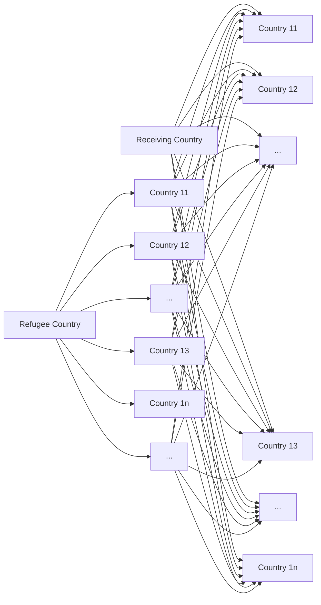

A recent UN ruling has made environmental refugees a matter of great concern. Among them, the issue of climate refugee resettlement due to climate change has also entered the public eye. In order to better understand and effectively deal with this problem, we decomposed the problems to be solved and established corresponding models in turn.

In clarifying the research objects, we simplified the definition of climate refugees in the model and only predicted the number of climate refugees due to sea level rise. The subsequent models are based on this premise.

First, we built a regression function based on the landforms and population distributions of the six selected countries, combined with current sea level change data, and linear regression.Through the application of the model, it is estimated that by 2080, there will be about 200,000 to 300,000 climate refugees. Secondly, the six factors affecting cultural loss were selected, and the influencing mechanism of different factors was clarified through principal component analysis, which provided a direction for supranational organizations to formulate policies to mitigate the risk of cultural loss in their countries of origin.

Then, in order to find the best destination for refugee flows, we extended the complete bipartite graph by analogy analytic hierarchy process (AHP). The use of easy-to-detect indicators to determine the four general factors of acceptance of the target country, climate refugees, natural factors, and environmental responsibility of the target country, which means the establishment of a fitness evaluation system. As for the optimal flow direction, we use the KM algorithm to achieve the optimal matching between climate refugees and receiving countries based on the complete bipartite graph with matching degree.

Third, we have considered the dynamics of the protection of climate refugees' human rights and the impact of their cultural exchange and dissemination. We use the five factors of per capita education level, per capita medical level, per capita food production, per capita pension expenditure, and per capita housing area to reflect the human rights protection status of climate refugees, and we use PCA to combine these indicators into new indicators, namely, human rights protection Degree indicator.In the early stages of the migration of climate refugees, this article considers the knock-on effects of the number of climate refugees on the human rights protection capabilities of refugee-receiving countries. Undoubtedly, the influx of population has diluted the per capita share of resources, which has reduced the human rights protection capacity of refugee-receiving countries. But from a long-term perspective, the future potential contribution of climate refugees will have an impact on human rights protection capabilities, and its operating mechanism is important for problem solving.Due to the nature of culture, communication and dissemination often require time to support it. We assume that in the early stages of the migration of climate refugees, the receiving countries of climate refugees themselves have different types of culture in equilibrium. Due to the migration of climate refugees, the exchange and spread of the two cultures will have an effect. Here, we define culture as three types: income-type, loss-type, and swing-type. Different culture types have different gains or losses due to communication and spread.We quantify the gains or losses from the exchange and spread of the three cultures, and simulate how they reach equilibrium. The System Dynamics Model (SDM) clearly shows the dynamic changes of the system. Any parameter change will have different effects on the results, whether it is the protection of human rights or the balance of cultural gains and losses.

Fourth, based on the above-mentioned system dynamics model, we clarify the impact mechanism of policy-related parameters on the model. We set the goals of the proposed policy and extend the policy forward. The implementation of these policies to protect the human rights and culture of climate refugees will change some parameters, and the model results suggest the potential impact of the policies. At the same time, in order to further optimize the model, we added new parameters based on the analysis results to improve the accuracy of the model.

Finally, based on the results of all the above models, we shed light on the importance of implementing the proposed policy.

## Content

1 Introduction.

1.1 Background..  
1.2 Statement of the problem. .

2 General Assumptions and Justifications 3

..... ....  
...... ..

3 Task 1. 5

3.1 Forecast of refugee numbers....... ...  
3.2 Possible cultural loss due to transfer.. .

4 Task 2. 6

....... ..

5 Task 3. 8

5.1 Analysis of human rights protection.. ...  
5.2 Analysis of cultural protection. .

6 Task 4. 13

6.1 Policy report... ..  
.....

7 Task 5. 17

7.1 Model optimization....... .  
7.2 Policy importance..... . 18

8 Conclusion. .

8.1 Strength... ....  
8.2 Weakness....... .. 19  
...... ..

Work cited. 20

## 1 Introduction

## 1.1 Background

Immigration is a phenomenon of population migration around the world that has never ceased since the birth of human society. The population distribution on the earth is the result of people's continuous migration in space and time. Along with changes in global climate patterns, ocean surface temperatures have continued to rise, global ocean storms have continued to increase in duration and intensity, and sea levels have continued to rise.Several island nations such as the Maldives, Tuvalu, Kiribati and Marshall Islands In danger of disappearing completely.

The actual or potential large number of climate migrants caused by climate change and its adverse effects have become a serious challenge facing human society in the 21st century. Humanitarian crises, refugee flows, regional conflicts, and other issues caused by climate migration are receiving increasing attention and attention from governments and the international community. The issue of human rights and cultural loss is particularly important. According to the prediction made by the United Nations Intergovernmental Panel on Climate Change (IPCC), there will be 150 million environmental refugees on the planet by 2050. Although a few island countries are easily accepted by migrant receiving countries, the serious consequences of climate change It is still impossible to predict how to coordinate and plan immigration on a large scale, and to protect the human rights of climate refugees and the unique culture of the country as issues to be resolved.

Displacement caused by environmental factors will also trigger a variety of incidental problems or aggravate the original socio-economic contradictions and problems. Because of its unprecedented severity, complexity, and urgency, climate change is recognized by scholars from all walks of life as one of the most challenging issues currently facing, and has received great attention from countries around the world. The issue of climate refugees due to climate change has also entered the public eye. Climate refugees, on the one hand, provide labor-receiving countries with the labor force needed for economic development, and on the other hand, they have extremely negative effects on the political, social, and cultural identity of the refugee-delivering countries.

In fact, this is not a problem in a completely new field of research, and many politicians and scholars have discussed this topic on different important occasions. Despite the growing threat of large-scale refugee flows and displacement, international cooperation to address this crisis is still at a relatively low level. Therefore, this problem may have a more serious impact in the future. Under the current circumstances, it will be difficult for humankind to meet this challenge without the extensive cooperation of States or international organizations.

## 1.2 Statement of the problem

The International Climate Migration Foundation (ICM-F) hired us to develop a model to advise the United Nations on climate refugee resettlement and its cultural heritage protection, and simulate the potential impact and importance of the policy. First, we must give a clear definition of climate refugees for model studies.

The recent ruling by the United Nations that governments cannot return people to countries where their lives might be threatened by climate changeis a potential gamechanger — not just for climate refugees, but also for global climate action. At the same time, the ruling elaborates further to say: “Given the risk of an entire country becoming submerged under water is such anextreme risk, the conditions of life in such a country may become incompatible with the right to life with dignity before the may become incompatible with the right to life with dignity before the risk is realised. Based on the above explanations and the requirements of the problem, we have reduced the scope of climate refugees studied in the model and defined that th e rise in sea level due to the gel due to the greenhouse effect has continuously eroded its living space, making it a collective effort to escape from the threat. Sexual migration refugees. Residents of coastal small island states such as Tuvalu, Maldives, and Kisbass will all become climate refugees in the future.

In order to solve the problems of refugee resettlement and cultural heritage protection caused by climate change, we have decided to take the following measures:

Task 1: Through the establishment of a model, select six countries at risk to predict the number and development trend of climate refugees due to sea level rise in the future. At the same time, the model we establish should determine the mechanism by which selected factors affect the risk of cultural heritage loss to climate refugees.

Task 2: Our model is used to determine the optimal flow of climate refugees. We establish an index system consisting of subtypes to measure the degree of fit, and build a bipartite graph model between climate refugees and receiving countries based on the fit. Use the model to optimally match the two to determine the optimal flow of climate refugees.

Task 3: Use our model to assess the human rights protection capabilities of climate refugee receiving countries and the impact of two cultural exchanges and disseminations to see how migration will impact their human rights and the net benefits of cultural exchanges and dissemination. Over time, what will change between the two. If we define a corresponding return-loss equilibrium point, the model should predict when this critical point can be reached.

Task 4: Formulate corresponding policies based on the results of Task 3. Make our model show how state-driven interventions will affect changes in human rights protection capacity and net gains to illustrate the potential impact of policy interventions.

Task 5: Determine the dynamic effects that the model ignores and modify our model accordingly. Based on the results of the above models, the importance of policy implementation is explained.

## 2 General Assumptions and Justifications .

## 2.1 Assumptions

As discussed above, we make several assumptions in our model.

1. When the sea level of a country is below 5 meters, the residents of that country will be considered as climate refugees and need to be relocated.  
2. Assuming that the selected countries are representative, the identified cultural loss impact mechanism can be applied to other countries.  
3. Climate refugee migration must be carried out in groups, that is, the population of the country of origin moves completely into the same receiving country. However, the receiving country can accommodate multiple groups.  
4. Refugees do not choose which countries they are settled in, they are told this by the UNHCR

and other organizing groups.

5. Refugee-receiving countries must accept refugees allocated by international organizations, but the capacity is limited, and they can be refused when the capacity is reached.

6. After the climate refugees moved in, there were no unexpected terrorist incidents or disasters in the receiving country.

7. After the climate refugees move in, they will have the same legal status as the original inhabitants of the receiving country.

8. There is no isolation between ethnic groups, and the exchange and spread of two cultures will definitely occur.  
9. The policies of international organizations are compulsory, and the corresponding refugee receiving countries must perfectly implement the policy recommendations provided by the international organizations.

## 2.2 Variable Description

We start the analysis by giving a list of parameters involved in the model as shown in Table1.

<table><tr><td>Parameter</td><td>Description</td></tr><tr><td> $e_{ij}$ </td><td>Factors Affecting the Risk of Cultural Loss</td></tr><tr><td>r</td><td>Acceptance between climate refugees and receiving countries</td></tr><tr><td> $r_1$ </td><td>Acceptance of receiving countries to immigrants</td></tr><tr><td> $r_2$ </td><td>Adaptation of climate refugees to receiving countries</td></tr><tr><td> $r_3$ </td><td>Natural factors of migration</td></tr><tr><td>S</td><td>Total number of people who have moved to the receiving country in the past</td></tr><tr><td> $S_1$ </td><td>Number of climate refugees living in peace</td></tr><tr><td> $z_1$ </td><td>Climate refugees&#x27; education per capita</td></tr><tr><td> $z_2$ </td><td>Per capita medical level of climate refugees moving into countries</td></tr><tr><td> $z_3$ </td><td>Per Capita Food Production by Climate Refugees</td></tr><tr><td> $z_4$ </td><td>Per capita pension expenditure for climate refugees moving into countries</td></tr><tr><td> $z_5$ </td><td>Per capita housing area of climate refugees relocating</td></tr><tr><td> $z_6$ </td><td>Employment of Climate Refugees</td></tr><tr><td> $z_7$ </td><td>National Tax Revenue for Climate Refugee Migration Countries</td></tr><tr><td>t</td><td>Year (t≥0,t=0 represents the initial situation)</td></tr><tr><td>P</td><td>Refugee-receiving country original population</td></tr><tr><td>P(t)</td><td>Climate Refugee Immigrants</td></tr><tr><td> $C_1(t)$ </td><td>Early, human rights protection capabilities of receiving countries in t phase</td></tr><tr><td> $C_2(t)$ </td><td>Late, human rights protection capabilities of receiving countries in t phase</td></tr><tr><td>A</td><td>Country of origin of climate refugees</td></tr><tr><td>B</td><td>Receiving country of climate refugees</td></tr><tr><td>R</td><td>Cultural Benefits of Country B</td></tr><tr><td>X</td><td>Impact of policies on profitable culture(0.2≤X&lt;1)</td></tr><tr><td> $GDP_B$ </td><td>GDP of country B</td></tr><tr><td> $GDP_Gi$ </td><td>Country G Industry i GDP Output Value (X=A or B; 1=Culture Industry; 2=Tourism industry; 3=Catering; 4=Clothing industry)</td></tr><tr><td> $n_i$ </td><td>Average growth rate of GDP of country B&#x27;s i industry</td></tr><tr><td>S</td><td>Loss of country B</td></tr><tr><td>z</td><td>Number of nations in country B</td></tr><tr><td>d</td><td>Scale of the riot in country B</td></tr><tr><td>BS</td><td>Standard loss rate</td></tr><tr><td>SS</td><td>Actual loss rate</td></tr><tr><td>K</td><td>Likelihood of riots in country B</td></tr><tr><td>b</td><td>Policy tolerance for neutral culture (0</td></tr><tr><td>m1</td><td>Birth rate of country B</td></tr><tr><td>m2</td><td>Mortality of country B</td></tr></table>

Table 1： List of Parameters and Notations

## 3 Task 1

## 3.1 Forecast of refugee numbers

By analyzing the sea level data of the past ten years, and combining the specific terrain data of each country, the method of regression analysis was used to predict which countries will face a crisis due to sea level rise in the next few years. We mainly analyze the island states of Kiribati, Nauru, Marshall Islands, Bahamas, Maldives, and Tuvalu. Because according to related reports, these countries are the countries most likely to face an environmental crisis caused by sea levels in the coming decades. By consulting the relevant sea level data of these countries and the landforms and population distribution of these countries, we have preliminary predicted that by 2080, there will be about 200,000 to 300,000 environmental refugees.

In terms of the possibility of cultural loss, we mainly considered various indicators. In the end, we decided to use the nationalist tendency of the receiving country, the geographic location of the refugees, the fit of production and lifestyle, the carriers required by culture, the cohesion of refugees, The economic benefits of culture are measured as an important indicator of the risk of cultural loss. We use principal component analysis to determine the range of cultural risk indicators we have selected.

By predicting the number of future EDPs and the risk of cultural loss due to transfer, we can realize that climate change has had a great negative impact. In order to better resettle EDPs, we use a graph theory method to evaluate the number of EDPs. Possible orientation modeling.

Data:

<table><tr><td>Country Name</td><td>Population (10,000 people)</td><td>Proportion of land area below 5 meters</td><td>Terrain strength (m)</td><td>Annual sea level growth (mm)</td><td>Whether the population lives below 5m above sea level</td></tr><tr><td>Kiribati</td><td>12.2</td><td>54.56%</td><td>1</td><td>4.1</td><td>T</td></tr><tr><td>Nauru</td><td>1.3</td><td>6.65%</td><td>31.1</td><td>4.2</td><td>T</td></tr><tr><td>Bahamas</td><td>41</td><td>51.94%</td><td>5.5</td><td>4.1</td><td>T</td></tr><tr><td>Marshall Islands</td><td>5.3</td><td>43.82%</td><td>1.4</td><td>4.1</td><td>T</td></tr><tr><td>Tuvalu</td><td>1</td><td>32.65%</td><td>2.5</td><td>4.3</td><td>T</td></tr><tr><td>Maldives</td><td>44</td><td>45.51%</td><td>1.2</td><td>4.1</td><td>T</td></tr></table>

Table 2

We conducted a regression analysis of the sea level data collected in previous years and found that the sea level of these island countries rose at a rate of about 4 mm per year. Referring to relevant literature and combining relevant map data, we find that by the end of the 21st century, many territories of these countries will no longer be habitable, and they must have residents move out of the area for migration. It is expected that there will be about 300,000 to 400,000 refugees due to rising sea levels.

## 3.2 Possible cultural loss due to transfer

In terms of the risk of cultural loss, after considering the characteristics of culture and some examples of the European refugee crisis, we consider the following factors to measure the cultural loss risk of immigrants: nationalist tendencies, the geographical location of refugees, the fit of production and lifestyle, and Needed carriers, refugee cohesion, cultural economic benefits.

<table><tr><td></td><td>Nationalist tendency $e_1$ </td><td>Geographical location of refugees $e_2$ </td><td>Production and lifestyle fit $e_3$ </td><td>The carrier required by culture $e_4$ </td><td>Refugee cohesion $e_5$ </td><td>Economic benefits of culture $e_6$ </td></tr><tr><td>A</td><td> $e_{11}$ </td><td> $e_{21}$ </td><td> $e_{31}$ </td><td> $e_{41}$ </td><td> $e_{51}$ </td><td> $e_{61}$ </td></tr><tr><td>B</td><td> $e_{12}$ </td><td> $e_{22}$ </td><td> $e_{32}$ </td><td> $e_{42}$ </td><td> $e_{52}$ </td><td> $e_{62}$ </td></tr><tr><td>C</td><td> $e_{13}$ </td><td> $e_{23}$ </td><td> $e_{33}$ </td><td> $e_{43}$ </td><td> $e_{53}$ </td><td> $e_{63}$ </td></tr><tr><td>D</td><td> $e_{14}$ </td><td> $e_{24}$ </td><td> $e_{34}$ </td><td> $e_{44}$ </td><td> $e_{54}$ </td><td> $e_{64}$ </td></tr><tr><td>E</td><td> $e_{15}$ </td><td> $e_{25}$ </td><td> $e_{35}$ </td><td> $e_{45}$ </td><td> $e_{55}$ </td><td> $e_{65}$ </td></tr><tr><td>F</td><td> $e_{16}$ </td><td> $e_{26}$ </td><td> $e_{36}$ </td><td> $e_{46}$ </td><td> $e_{56}$ </td><td> $e_{66}$ </td></tr></table>

Table 3

The principal component analysis method provides us with a simple and comprehensive evaluation method. Through the principal component analysis method, we can select the most important characteristic roots and use the characteristic roots as weights to construct a comprehensive evaluation model of principal components. From the above data, it is not difficult to obtain several feature roots yi with high contribution rates and their corresponding feature vectors bi. To obtain a comprehensive evaluation index for the risk of cultural loss:

$$
Z = y _ {i} \times b _ {i} \times e _ {j}
$$

The most basic characteristics of each self-risk: First, the deeper the refugees' dependence on culture, the lower the risk of loss. There is also the degree of exclusion of the receiving country from the foreign population. The more intense the exclusion of the foreign population, the higher the risk. Then there is the right carrier for the culture itself. The more complicated the carrier, the higher the risk.

## 4 Task 2

## 4.1 Refugee destination

In order to properly arrange the climate refugees who have lost their homes, we use the graph theory theory and analog analytic hierarchy process (AHP) to model the optimal flow of climate refugees. We first calculated the degree of matching between refugee countries and countries that might accept them. Then decided to use the KM algorithm to calculate the best match for refugees to the country. In this model, we use r to indicate the degree of matching between refugees and receiving countries. More specifically, it is an evaluation index for whether refugees can be integrated into receiving countries. We categorized the risks that affect the degree of matching for accurate modeling. After consulting relevant literature, we decided to divide r into three main influencing factors: the acceptance of foreign migrants in r1 receiving countries (including but not limited to the economic development level and national education level of receiving countries), and r2 refugees receiving countries The degree of adaptation (including but not limited to language, production and lifestyle), natural factors of r3 migration (including but not limited to distance, climate difference), different receiving countries have different degrees of matching refugees in different countries.

$$
r _ {1} = \vec {a} \times (\vec {r}) ^ {T} \quad \vec {r} = (r _ {1}, r _ {2}, r _ {3})
$$

Where $\overset {  } { a }$ is the weight vector. Obviously, sub-risks are affected by many factors, but in order to simplify the model, we only consider the most important ones for each.

First, referring to previous surveys of the willingness of many European media to s accept refugee , we believe we believe that the higher the education level of the people in the receiving country and the more developed velor e 关注数学模型the economy, hereconomy the higher their acceptance of foreign immigrants. So r1 should be equal to the education level of the people times the level of economic development. We divide the education level into 1 to 6 levels and calculate the average education level of the people. It can reflect the average education level of a country, and then use the per capita GDP to measure the economic development level of a country. For example: if the education level of a country's nationals is 2.8, and the per capita GDP is 1 (US \$ 10,000), then its acceptance of immigrants is 2.8.

Secondly, in terms of refugee adaptation to the country, we believe that the degree of language similarity between refugees and receiving countries, differences in production and lifestyle, and ethnic differences will affect their adaptation. As these data are difficult to quantify directly, we consider using the situation of those who have migrated into the recipient country from the country of origin of the refugee. That is to say, the immigrants who have moved into country B are S people, and the people who can live in stability (no crime, have a stable job, and have not moved out again) are $\mathbf { S } _ { 1 }$ , then the adaptation degree of Country A to the residents of Country B is $\mathbf { S } _ { 1 } / \mathbf { S }$ .

Influencing factors in the migration process also need to be considered. This includes distance, distance, and policy. By comparing the refugee crisis in Europe, we realize that distance is the main natural factor affecting migration, so we mainly use distance to measure the impact of natural factors. The longer the distance, the more difficult it is.

At the same time, we also referred to the Paris Agreement, and believed that some large carbon-emitting countries should assume more responsibility for accepting refugees. It is considered that some developed countries now pass carbon dioxide emissions to developing countries through trade, so we consider using the consumption-based carbon dioxide emissions to measure the obligation of a country to receive refugees. In this way, we can use the ratio of carbon dioxide emissions at the consumer end to the distance between countries as an indicator of the influencing factors in the migration process.

Finally, we need to determine the weight of different factors. The analogy is that in the analytic hierarchy process, the weights of different standards on the target are estimated according to the importance comparison between different standards. The comparison result is stored in a reciprocal matrix, and the feature vector is calculated.

Similarly, we try to determine the weight of different sub-risks to the total risk through likelihood comparison. For example, if the probability of r11 is greater than r12, then the first row and second column of elements (1,2) will range from 1 to 9 indicating the degree of probability. The following matrix represents a reasonable likelihood:

<table><tr><td></td><td>r1</td><td>r2</td><td>r3</td></tr><tr><td>r1</td><td>1</td><td>3</td><td>4</td></tr><tr><td>r2</td><td>1/3</td><td>1</td><td>2</td></tr><tr><td>r3</td><td>1/4</td><td>1/2</td><td>1</td></tr></table>

Table 4

The weights thus obtained are: $\stackrel {  } { a } = ( 0 . 5 7 , 0 . 3 4 , 0 . 0 8 )$ .

Let's use an example to illustrate our model: for example, the refugees from country A want to migrate to country B, then the local acceptance is 3.1, the refugee's fitness is 0.8, and the factor in the migration process is 0.0327. Then the matching degree from country A to country B should be:

$$
r _ {1} = \vec {a} \times (\vec {r}) ^ {T} = (0. 5 7, 0. 3 4, 0. 0 8) \times (3. 1, 0. 8, 0. 0 3 2 7) ^ {T} = 2. 0 4 1 6
$$

In this way, the fit between each refugee and the potential recipient country is modeled by us. In this way we can build a complete bipartite graph from the refugee country to the receiving country. Use the degree of agreement between the two countries as the weight of the corresponding side.

We can also use an association matrix to represent this bipartite graph:

flowchart

Figure 1

Here, each point on the left indicates a refugee country, and each point on the right indicates a receiving country. The path of representation between them indicates the degree of matching between the country and the receiving country.

Then we can use the KM algorithm to continuously recurse to solve the optimal matching of the weights of this bipartite graph. This optimal matching corresponds to the best destination of the refugees.

## 5 Task 3

## 5.1 Analysis of human rights protection

## 5.1.1 Theoretical elaboration

The concept of human rights refers to "the basic rights that human beings, as human beings, should enjoy". The main content is that each human being should be treated in a human rights-compliant manner. It is a general, direct right that excludes special factors such as class, nationality, clan, nationality, and gender.(参考资料）

In our model, we provide for the following five basic indicators to reflect the human rights protection capabilities of receiving countries:

Education level per capita: The right to education is the right to education enjoyed by citizens and guaranteed by the state. It is a basic right granted by the Constitution and a prerequisite and basis for citizens to enjoy other cultural education. It means that citizens have the right to receive cultural education from the country and to

receive material help for education. The right to education is a basic human right.

really citizens of the receiving countries, they still have the right to education. This is also the refugee's need to adapt to the life of the new country.

Per capita medical level: Medical expenditure is the final consumption of medical products and services. It includes the expenditure of public resources on medical products such as treatment, rehabilitation and long-term care, as well as pharmaceuticals. It also includes public health and prevention programs and administrative management. Of expenditure. Refugees who come to the new country will inevitably have physical and psychological diseases, such as soil and water discomfort, psychological trauma, etc. In order to protect the refugees' right to life, increased medical expenditure is necessary.

Per Capita Grain Output: Grain production is a major grain and represents the country's grain supply capacity. No one can leave the food and it will be difficult to survive without it. Ensuring the necessary food supply is also a form of protecting refugees' right to life.

Per capita pension expenditures: Pension expenditures refer to all cash expenditures (including one-time payments) for pensions and survivors' pensions. This indicator represents the welfare of the country. Some elderly or disabled refugees cannot work in the refugee-receiving country and need the state's financial expenditure to protect their lives.

Level of per capita housing area: Per capita residential area refers to the residential building area owned by each person. Refugee survival in the receiving country first requires housing.

## 5.1.2 Model building

The principal component analysis (PCA) is used to combine five indicators into a new indicator to measure the degree of protection of refugees' human rights in refugee countries:

(1) Per capita education level z1  
(2) Per capita medical level $_ { z 2 }$  
(3) Per capita grain output $^ { z 3 }$  
(4) Per capita pension expenditure z4  
(5) Per capita housing area level $^ { z 5 }$

PCA is mathematically defined as an orthogonal linear transformation that transforms the data to a new coordinate system(C1,C2,C3 … … ) such that the greatest variance by some projection of the data comes to lie on the first coordinate, the second greatest variance on the second coordinate, and Ci, Cj should be uncorrelated. So we had theprincipal below:

$$
\begin{array}{l} \left\{ \begin{array}{c} C _ {1} = \mu_ {1 1} X _ {1} + \mu_ {1 2} X _ {2} + \dots + \mu_ {1 p} X _ {p} \\ C _ {2} = \mu_ {2 1} X _ {1} + \mu_ {2 2} X _ {2} + \dots + \mu_ {2 p} X _ {p} \\ \vdots \\ C _ {p} = \mu_ {p 1} X _ {1} + \mu_ {p 2} X _ {2} + \dots + \mu_ {p p} X _ {p} \end{array} \right. \\ \operatorname{var} \left(Y _ {i}\right) = \operatorname{var} \left(\mu_ {i} ^ {\prime} X\right) = \mu_ {i} ^ {\prime} \sum \mu_ {i} \\ \end{array}
$$

(1) $\mu _ { \mathrm { i } } ^ { ' } \mu _ { \mathrm { i } } = 1$  
(2) Ci,Cj should be uncorrelated $( i \neq j )$ .  
(3) C1 has the greatest variance in linear conversion of X1,X2,X3,... ...,Xp.

In this case, we use a five-column data matrix ${ \sf X } { = } ( { \sf X } _ { 1 } , { \sf X } _ { 2 } , { \sf X } _ { 3 } , { \sf X } _ { 4 } , { \sf X } _ { 5 } )$ to represent five features:Per capita education level, per capita medical level, per capita food production, per capita pension expenditure, per capita housing area.Then, a new coordinate system is obtained through the principal component analysis (PCA). We define C as the human rights protection index. The index formula is as follows:

$$
\mathrm{C} = 0. 2 6 9 \mathrm{z} _ {1} (0) + 0. 0 5 4 \mathrm{z} _ {2} (0) + 0. 2 5 7 \mathrm{z} _ {3} (0) + 0. 2 7 9 \mathrm{z} _ {4} (0) + 0. 3 0 9 \mathrm{z} _ {5} (0)
$$

When climate refugees migrate to receiving countries, the original resources that refugees migrate into will be diluted. Below we take the per capita food production as an example for analysis:

$$
\mathrm{Z} _ {3} = \frac {\mathrm{Z} _ {3}}{P} \tag {1}
$$

Among them, z3 is the per capita food output before climate refugees moved in, Z3 is the total food output before refugees moved in, and P is the original population of the receiving country before climate refugees moved in.

When climate refugees moved into the receiving country, the above formula changed to:

$$
z _ {3} ^ {\prime} = \frac {Z _ {3}}{P + P (t)} \tag {2}
$$

Among them, $\mathbf { Z } _ { 3 }$ is the per capita food output after the migration of climate refugees, and P(t) is the number of refugees. It can be seen that when climate refugees move into the receiving country, the calculation of per capita food production changes from formula (1) to formula (2), that is, the denominator becomes larger, the per capita food production becomes smaller, and the resources of the refugee migrating country are diluted.

A country's resources are limited. The diversion of its own resources due to the immigration of refugees will inevitably cause dissatisfaction among the local people and lead to social unrest. Considering the protection of the human rights of climate refugees, we need to formulate relevant policies to achieve a balanced allocation of resources between nationals and refugees.

## 5.1.3 Model analysis

Based on the system dynamics model, we further simulated the dynamic changes of human rights protection indicators. The following assumptions are used in the simulation:

(1) No policy at this time.  
(2) Due to the lack of policies, refugees have failed to create value by integrating into local society.  
(3) Changes in relevant per capita resource indicators should take into account both the number of refugees and the impact of resource conditions.  
(4) The increase in the population of receiving countries is only affected by migrant climate refugees.

In fact, by simulation we get Figure 2. We find that over time, as the number of climate refugees will continue to increase, no policy or a small policy intervention index will lead to a decline in per capita resources, which will negatively affect refugees and the country. This implies the need for policy intervention.

  
Current human rights protection index of the receiving country  
Human rights protection Index of receiving country losses

Figure 2

## 5.2 Analysis of cultural protection

## 5.2.1Theoretical elaboration

How can policies be formulated to protect foreign cultures? From our model, we found that the answer to the question differed according to the nature of a certain type of culture. Because the role of culture is affected by time, we assume that the culture carried by country A will not have any impact on the culture of country B in the early stage of migration, that is, the income and loss of country B are in an equilibrium state at the initial stage, and the difference between the two is zero.

We reviewed the literature on cultural definitions. The famous anthropologist Tylor, Edward defines culture in his book "Primitive Culture":Culture or Civilization, taken in its wide ethnographic sense, is that complex whole which includes knowledge, belief, art, morals, law, custom, and any other capabilities and habits acquired by man as a member of society.In order to make the problem clearer, we have given more specific types of culture in our model based on the different nature of the culture and divided the culture into three categories. First, a country's artistic and intangible cultural heritage is defined as a profitable culture. Income-based culture can be transmitted by people, and its impact is always positive, which means that after the EDPs migrate, the artistic and intangible cultural heritage they carry will bring benefits to the host country.

Second, the religion and customs of a country are considered to be loss-making cultures. Due to the particularity of religious beliefs and customs, it does not have the same universality as art and intangible cultural heritage. To make matters worse, different ethnic groups often have different religious beliefs and customs. Differences often lead to conflicts. The expansion of conflicts may lead to riots. More serious situations are wars. Both will affect the economy of a country.

The "crusade" in history is a typical example. Looking at the modern world, religion and the intensification of disputes in the Middle East cannot be separated. For example, the Iran-Iraq war that broke out from 1980 to 1988. Even if there are historical factors such as politics and economy, the impact of religious issues on the war cannot be ignored . It should be noted that, due to the characteristics of the loss-based culture, contradictions are inevitable, and we can only minimize the negative impacts as much as possible.

Third, the lifestyle of a country is defined as a neutral culture. Life style is often understood as clothing, food, shelter, and transportation. These four aspects all hide unique cultures. These cultures often affect the economy in an indirect way, and the impact of these cultures will change depending on the environment. Take food culture and clothing culture as an example. If a country's food culture and clothing culture are spread, i ea H t D undoubtedly promote the development of the catering industry or the clothing industry. At this ti 关注数学模型al style is the same as the revenue-based culture. However, if this cultural feature is not only not recognized, but also discriminated against, it will lead to its transformation into a loss-oriented culture, cause conflicts, and gradually have a negative impact on the economy. Below we will quantify the economic impact of three different types of culture in terms of gains and losses.

## 5.2.2 Model building

First, we measure the gains from the culture of Country A in terms of both art and intangible cultural heritage. When residents of Country A become EDPs due to rising sea levels, they will move to Country B. As they migrate, their artistic and intangible cultural heritage will contribute to the economy of Country B over time. Obviously, different cultural protection policies will lead to different benefits for the two. Taking art as an example, now we can naturally define the benefits it generates:

$$
\mathrm{R} = \left(\mathrm{GDP} _ {\mathrm{A} 1} \times \mathrm{X} + \mathrm{GDP} _ {\mathrm{B} 1}\right) \times \left(1 + \mathrm{n} _ {1}\right) ^ {\mathrm{t}}
$$

Here, GDPA1 represents the contribution of the art of Country A to its economy, and GDPB1 represents the contribution of the art of Country B to its economy. At the same time, we introduced X as the policy impact degree to measure the degree to which the policy promoted the cultural marketization of Country A. n1 is the average growth rate of the GDP of the cultural industry of country B.

Second, we measure the potential loss caused by the culture of country A in the territory of country B from the perspective of religious beliefs and customs. Based on the previous discussion, we can understand that differences caused by the contradiction between religious beliefs and customs will hinder economic development. As with the revenue-generating culture, the tolerance of policies for religious beliefs and customs will undoubtedly have an impact on riots. A more inclusive policy is conducive to the peaceful coexistence of different ethnic groups, which will reduce the possibility of riots and minimize the negative impact of a lossbased culture on the economy. Here, we have considered the role of nationalism in it. Due to the diversity of national cultures in multi-ethnic countries, the religious beliefs of the people will also tend to diversify. This makes the multi-national nations more culturally inclusive and will undoubtedly reduce riot The scale of the outbreak or riot. Therefore, we believe that the losses caused by this type of culture can be:

$$
\mathrm{S} = \mathrm{K} \times \mathrm{SS} \times \mathrm{GDP} _ {\mathrm{B}}
$$

K is the possibility of riots, K  f (t) Obviously, the policy's tolerance determines its value. SS is the actual loss rate, which is defined as:

$$
\mathbf {S S} = \mathbf {B S} \times \mathbf {d}
$$

Among them, BS is the standard loss rate, and d is the influence of nationalism on the riots.

d is a subtraction function with respect to w:

$$
\mathrm{d} = f (w) ^ {3}
$$

Finally, let's look at the lifestyle as a neutral culture. Under different policy tolerances, residents of country B will adopt different attitudes towards the lifestyle of EDPs emigrated to country A. Different attitudes will actually lead to a change in their cultural nature. Country B with a high cultural tolerance is bound to help commercialize the food and clothing culture of country A and create value, but if the cultural tolerance of country B is low, the food and clothing culture of country B will eventually be excluded. May cause riots. For the sake of simplicity, we believe that the impact of a neutral culture on the economy is a combination of gain and loss, that is：

$$
Y = \left\{ \begin{array}{l} \left(G D P _ {A 3} + G D P _ {B 3}\right) \times \left(1 + n _ {3}\right) ^ {t} + \left(G D P _ {A 3} \times X + G D P _ {B 3}\right) \times \left(1 + n _ {3}\right) ^ {t}, b > 0. 5 \\ S = (K + 0. 2) \times S S \times G D P _ {B}, b <   0. 5 \end{array} \right.
$$

Here, b, as a policy tolerance, plays an important role in determining the final attributes of a neutral culture.

## 5.3.3 Model analysis

It is not difficult to find that in the early stage of refugee migration, the gains and losses of country B are in equilibrium, but over time, the culture of country B will continue to have effects, and these effects include both positive and negative. Similar to the ability to protect human rights, we simulated the model's policyless state, and the results show that the multi-ethnic state will reach a new equilibrium, but the single-ethnic state will show more losses than benefits, which suggests that we need to formulate policies to combat climate Refugee culture is protected to guide them to play a greater positive role.

## 6 Task 4

## 6.1 Policy report

On the basis of the previous model, we have proposed relevant policies for the United Nations to ensure that refugee-receiving countries can maximize the protection of refugees' human rights and culture, both through financial assistance and by formulating international law to implement policies. The primary criteria for evaluating the effectiveness of policies are the gains and losses of human rights protection indexes and refugee culture in receiving countries. Regarding the predictability of the policy in the future, we find that the effect of policy implementation over time affects the protection of EDPs. We mainly use the parameter changes contained in the model to analyze the working mechanism of the proposed policies.

## 6.1.1 Police on human rights protection

## a. Recognition of refugee status

Human rights include the right to racial equality, and refugees should not be discriminated against because of differences in race, religion, nationality, etc.

## b. Adopt a suitable refugee resettlement method

(1) Agricultural resettlement: Relying on land, it engages in the primary industries of agriculture, forestry, animal husbandry, and fishery, mainly developing land resettlement and adjusting land resettlement. The advantage of this method is that the resettlement risk is small, land is used for security, basic livelihoods are maintained, and there are fewer worries. This approach is suitable for most refugees from countries with less advanced social development;

(2) Non-agricultural resettlement: Reliance on other means of production other than land for resettlement. After resettlement, refugees no longer occupy agricultural land and are mainly engaged in the secondary and tertiary industries. The advantage of this method is that the conflict between people and land is reduced, which is beneficial to the transfer of refugees to secondary, tertiary industries and towns. This method is more suitable for economically developed or areas with a certain scale in the development of the secondary and tertiary industries, and the refugees can independently solve the problem of production and life.

## c. Strengthen infrastructure construction and ensure the allocation of basic living resources

The implementation of assistance operations requires priority protection of refugees' medical, living, and dietary needs. As resources dilute, scarcity of food, shelter and medical services is threatening the health and safety of refugees. At the same time, subsidies to refugees are another way to improve their living conditions. Therefore, for countries where refugees have moved in, increasing financial expenditures on food, housing, and public health services is of great significance to protecting human rights.

## d. Attaching importance to the integration of refugees and local society

From the perspective of refugee immigration, integration is a long-term process in which the government takes measures to promote the acceptance of all immigrants who legally reside in the country. This requires the joint efforts of the government, society and refugees. The government should encourage social organizations or businesses Provide assistance to address refugee work and social integration issues in receiving countries.

(1) Establish related institutions to provide assistance in legal materials, job search, capacity building, psychological counseling, cultural activities, communication methods, and residence, and increase investment in educational resources;  
(2) In addition, refugees can also encourage refugees to participate in citizen life through voluntary activities, and coordinate the supply and demand balance of jobs through flexible, fast and high-quality management.

From the perspective of refugees, integration means being familiar with or even mastering the language, culture and national conditions of the host country, and respecting and observing the laws and policies of the host country. Generally speaking, refugees, due to asylum needs and convenience of living and working, will work hard to adapt to the environment of the receiving country, and subjectively hope and are willing to actively integrate into the receiving country.

Mastery of local influence on refugees' access to vocational training and employment in receiving countries, and good education and job opportunities are the key to successful integration.

## e. Increase investment in refugee education

How to guide refugees to understand and accept as many mainstream values, systems and cultural traditions of their country as possible while respecting and guaranteeing their own culture and characteristics, while taking measures to prevent refugees from being marginalized by the local society has become its treatment. A big problem when it comes to refugees. In this regard, refugee relocation requires efforts to:

(1) Enhancing the education of refugees includes improving the conditions of teachers, helping refugees to be accepted into schools, fully considering the environment in which refugees grow up, providing unique and personalized care in teaching centers, setting up telephone hotlines and webpages to solve refugee and education related issues, Assisting refugees with accreditation;  
(2) In refugee education, combine language training with the spread of national values;  
(3) Do a good job of communicating with refugee parents, and obtain the active cooperation of refugee parents, encourage them to actively send their children to local kindergartens, so that children can learn and use local languages from an early age;

## f. Promote and encourage refugees to participate in employment

In terms of employment, it is necessary to provide assistance actions such as a labor-management dialogue platform, job information, and safety vocational training within the scope permitted by laws and policies, reduce refugee wage deductions, reduce employers' refusal to sign labor contracts and detain documents, etc. Live and work in peace. In addition, refugee immigration countries can provide more short-term labor quotas to address the sudden increase in employment tensions caused by refugee immigration.

## g. Provide targeted policy support to refugees

In order to improve the effectiveness of refugee governance and the protection of human rights of refugees, the government should provide diverse policy support to different types of refugee groups. For example, families are provided as a unit to provide them with a guarantee of basic living; most of the young people who do not have family burdens are arranged in areas with better industrial development rather than refuge centers.

## 6.1.2 Policy on cultural protection

## a. When resettling refugees, try to resettle in groups.

Dealing with the cultural conflicts and conflicts between refugees and local residents is also one of the difficulties that the receiving countries must face. Efforts should be made to enable b to be activated oth cultures be activated and developed, instead of conflicting with each other, or even causing one party to die out. 关注数学模型2     Promote the mutual Pre t heuua growth of refugee culture and the culture of refugee receiving countries, minimize conflicts between them, and promote harmony between refugees and residents of receiving countries It's not a simple thing. As far as possible in the refugee resettlement process, resettlement in groups is ensured, because settlement communities can form cultural cohesion than scattered communities.

## b. Increase protection for cultural heritage

Culture inherits its skills and culture through the activities of "people". The mobility and variability of people are both special and difficult in the process of inheritance and protection. The real subject of cultural protection and inheritance are those who come from social life and directly grasp the essence of culture, and are not other auxiliary organizations or departments. Cultural inheritors, especially those of intangible cultural heritage, are generally older and frail, and require policy support such as pension subsidies and appropriate funding.

## c. Enhance refugees' identity with their own culture

The culture of the receiving country is equivalent to the strong culture, and the culture of the refugee ’s country of origin is equivalent to the weak culture. It is necessary to improve the cultural awareness and self-confidence of the vulnerable subjects, so as to give full play to cultural advantages and increase their influence. Only in this way can the culture be better protected. You can do the following:

(1) Adopting scientific and standardized protection methods for intangible cultural heritage, such as video recording, sound recording, text recording, etc., to carry out early "record protection".  
(2) Record the oral history of immigrants and cultivate their cultural awareness and pride.

## d. Market-oriented protection of profitable culture

For income-oriented cultural protection, the receiving country can take measures of cultural "marketization" and "cultural reproduction" to protect it. Productive protection of culture is a kind of positive protection that produces economic benefits. The development of a profitable culture can not only enhance cultural pride, but also contribute to the receiving country, such as creating employment opportunities, and improve the harmony between refugees and the native residents of the receiving country. You can do the following:

(1) Include the refugees' unique cultural expressions, such as music, dance, painting, arts and other arts, as protection objects, and encourage integration into the market and develop cultural industries.  
(2) Establish "productive protection bases" for intangible culture, intangible cultural museums, etc. Museums are one of the best carriers for inheriting and protecting culture, and they often spread culture through pictures, videos, and text. Museums will undoubtedly promote the development of tourism.

## e. Minimize the loss of loss-based culture

Different ethnic groups often have different religious beliefs and customs. Differences often lead to conflicts. The expansion of conflicts may lead to riots. More serious situations are wars. Both will affect the economy of a country. Contradictions in this area are unavoidable, and what is to be done is to ensure that losses are minimized.

## f. Guide the development of swing culture to profitable culture

Recipient countries should fully respect this type of culture and should not force refugees to obey assimilation. Generate income for the economy by transforming it into a profitable culture, such as developing the food and clothing industry.

## 6.2 Policy impact

Based on the theory of system dynamics, we take the human rights protection index model as an example to simulate the potential impact of human rights protection policies. The specific steps are as follows:

The implementation of relevant policies will have an impact on per capita resour ce indicators. Taking grain Taking grain 关注数学模型output Z3 as an example, the policy indicates that national organizations will provide assistance to recipient idelassistand toi recipient countries where food resources are in a tight situation. Whether it is material assistance or technical support, this will make per capita food Yield increases. At this time,

$$
z _ {3} ^ {\prime \prime} = \frac {Z _ {3} + Z _ {3} ^ {\prime}}{P + P (t)}
$$

!! $Z _ { 3 } ^ { ' }$ Among them, $z _ { 3 }$ is the per capita food possession after the implementation of the policy, and is the increased grain output due to the introduction of the policy.

In addition to the changes in the original per capita resource indicators, due to the introduction of policies at this time, most climate refugees who flooded into the receiving countries were able to create value through employment and have a positive impact on tax increases. We still stipulate that the linear combination of the original five indicators affecting the human rights protection index remains the same, but due to the positive effects mentioned above, we have added positive functions. The positive function is measured by the level of refugee employment and the country's tax revenue. At the same time, the total resources will change due to the role of policies.

Therefore, the formula of the human rights protection index at this time is:

$$
\mathrm{C} _ {1} (\mathrm{t}) = 0. 2 6 9 \mathrm{z} _ {1} (\mathrm{t}) + 0. 0 5 4 \mathrm{z} _ {2} (\mathrm{t}) + 0. 2 5 7 \mathrm{z} _ {3} (\mathrm{t}) + 0. 2 7 9 \mathrm{z} _ {4} (\mathrm{t}) + 0. 3 0 9 \mathrm{z} _ {5} (\mathrm{t}) + f \left(\mathrm{z} _ {6}, \mathrm{z} _ {7}\right)
$$

Among them, z6 and z7 are the number of employees in the receiving country and the tax revenue of the country.

We simulated the protection of human rights according to the new dynamic model, and the results are shown in Figure 3.

  
Current human rights protection index of the receiving country  
Human rights protection Index of receiving country losses

Figure 3

## 6.2.1 Potential economic impact

(1) With the implementation of the policy, the United Nations will assist the receiving country's resource input, such as increasing the number of doctors and building new housing, etc. This will make all people pick up and further improve the human rights protection capacity of the receiving country.  
(2) The policy requires increased investment in refugee education and encourages refugees to participate in employment. With the popularization of refugee education and vocational training, refugees can gradually integrate into refugee receiving countries and obtain job opportunities, which can create value for receiving countries; In addition, the policy encourages the "marketization" of income-oriented culture and the transformation of "swing-oriented" culture into a income-oriented culture, which means that not multipl industries will develop rapidly, but more employment opportunities will be created. Both Both will drive 关注数学模型

economic growth. The task at this time is the middle stage after the refugees move in. The newly created value and the economic loss of the country's increased investment in resources can offset each other, so that the losses in the refugee receiving countries are reduced.

(3) With the development of time and the implementation of policies, refugees can basically integrate into the local society and live in harmony with local residents without conflict, which is beneficial to the economy. At this time, the refugees can move into the refugee receiving country at a later stage. Refugees can create wealth on their own and pay taxes to increase the country's fiscal revenue. The country can recover to the level of economic development before receiving the refugees, even better than before.  
(4) Because the conflict between the religions and customs of the peoples of the two countries is unavoidable, our high tolerance policy is conducive to peaceful coexistence among different ethnic groups, which will reduce the possibility of riots and make loss-oriented culture The negative effects of the economy are minimized.

## 6.2.2 Potential cultural impact

(1) When we provide policies with a high degree of tolerance and an open attitude towards the culture of refugees, the cultural consciousness and cultural self-confidence of vulnerable groups will be enhanced, and the culture of refugees and the culture of refugee-receiving countries will be strengthened.  
(2) In the marketization process of profitable culture, art and intangible cultural heritage will be promoted and understood by more people, so that culture can be better protected and inherited. In addition, the two cultures complement each other and diversify and merge to create greater cultural wealth.  
(3) The policy recognizes the human rights of refugees and the legitimacy of their religious beliefs and customs, which reflects the protection of refugee culture to a certain extent. The proposed policy will enable refugees and residents of receiving countries to respect each other on issues such as religion, reduce the possibility of riots, and promote the normal development of religion and the continuation of customs.

## 7 Task 5

## 7.1 Model optimization

Through the analysis of the model results, we find that the dynamic changes in the human rights protection capacity after the impact of policy implementation are different from our assumptions. Considering that a country's population growth is affected by birth rates and mortality rates, it is not constant, which will largely affect the state of per capita resources. To optimize the model, we introduced birth rates and mortality.

At this time, taking the per capita food output as an example, the formula becomes:

$$
z _ {3} ^ {\prime \prime \prime} = \frac {Z _ {3} + Z _ {3} ^ {\prime}}{\left[ P + P (t) \right] ^ {m _ {1} - m _ {2}}}
$$

Accordingly, we define the new human rights protection index as:

$$
\mathrm{C} _ {2} (\mathrm{t}) = 0. 2 6 9 \mathrm{z} _ {1} (\mathrm{t}) + 0. 0 5 4 \mathrm{z} _ {2} (\mathrm{t}) + 0. 2 5 7 \mathrm{z} _ {3} (\mathrm{t}) + 0. 2 7 9 \mathrm{z} _ {4} (\mathrm{t}) + 0. 3 0 9 \mathrm{z} _ {5} (t) + \left(\mathrm{m} _ {1} - \mathrm{m} _ {2}\right) \times f \left(z _ {6}, z _ {7}\right)
$$

Simulating it, we get Figure 4. Obviously, the above results are more in line with the actual situation.

  
Current human rights protection index of the receiving country  
Human rights protection Index of receiving country losses

Figure 4

## 7.2 Policy importance

Through the decomposition of the problem, we have made many suggestions above, which are important. Our model calculates that around 2080, there will be around 200,000 to 300,000 people who will be homeless due to rising sea levels. Based on the limitations of our method and data, the actual number of refugees is larger than this forecast. In 2014, Iceland's total population was 326,600. Imagine that if these refugees abandoned their homeland and suddenly emigrated to other countries, contradictions and conflicts would inevitably exist. More importantly, immigration may also mean a loss of human rights and cultural assimilation, and addressing the issue is important to the United Nations, because no one wants the European refugee crisis to repeat itself. According to our model, policy interventions are effective, and losses are minimal. Although policy is ideal, it at least indicates the future direction. It is worth noting that the quantification of certain cultural connotations by models is difficult, but this does not mean that they are not important. The simulation of the model is a kind of practice, but it is too idealistic, and policy practice in the real sense is already on the way, and all stakeholders cannot ignore it.

## 8 Conclusion

## 8.1 Strength

(1) In the refugee optimal flow model, consider the environmental responsibility of the receiving country. More importantly, we measure based on consumer-side carbon emission indicators to avoid unfair distribution caused by trade-off emissions.  
(2) Dividing culture into three types: income culture, loss culture and swing culture, which simplifies the problem of cultural protection that is difficult to quantify.  
(3) Taking into consideration the perspective of nationalism.  
(4) Consider the long-term impact caused by the policy, in order to improve the accuracy of the model, incorporate new influencing factors and further optimize the dynamic results.

## 8.2 Weakness

(1) Only 6 representative countries have been selected to reduce the scope of prediction.  
(2) The establishment of the index system is measured by representative influence factors, and there may be deviations.  
(3) In addition to the above parameters, the role of other NGOs will also affect the protection of human rights and culture in our model.  
(4) Due to the difficulty of quantification, we ignore the impact of non-marketization of cultural existence.

Lack of dynamic analysis from a nationalist perspective.

## 8.3 Future

(1) When predicting future refugee numbers, more indicators should be considered, such as the rate of temperature rise, the rate of disappearance of organisms such as "coral reefs" and "marine fishes", because coral reefs can protect the land.  
(2) The definition of disappearance of land and emergence of climate refugees must be clarified again: Is the hurricane and tsunami brought by the rise of sea level that make residents unable to survive and have to flee? Or is the land completely sunk to survive? Or is it because of the salinity of the land that the crops cannot grow and the people have no food? This requires a better assumption, so that the next step of modeling can be further optimized.  
(3) When researching cultural protection and cultural assimilation issues in the future, it is necessary to consider that the refugees will be assimilated into the local culture in the migrating area, and models need to be established to simulate the process of cultural assimilation in order to better formulate cultural protection policies.  
(4) The rise of nationalist forces will have an important impact on the migration of climate refugees, and it is necessary to analyze them dynamically in the future.

## Work cited

[1]Norman Myers, "Environmental Refugees in a Globally Warmed World", BioScience, Vol. 43, No.11(December, 1993), p.758.  
[2]Su, Y. (2020, January 29). UN ruling on climate refugees could be gamechanger for climate action. Retrieved from https://www.climatechangenews.com/2020/01/29/un-ruling-climate-refugees-gamechanger-climate-action/.  
[3]Steven J. Davis, Ken Caldeira，2010，Consumption-based accounting of CO2 emissions: Proceedings of the National Academy of Sciences Mar, 107 (12) 5687-5692.  
[4]Claesson, S., 2011, The Value and Valuation of Maritime Cultural Heritage: International Journal of Cultural Property, v. 18, p. 61-80.  
[5]Tabucanon, G. M. P., 2014, Social and Cultural Protection for Environmentally Displaced Populations: Banaban Minority Rights in Fiji: International Journal on Minority and Group Rights, v. 21, p. 25-47.  
[6] Chang Chang, 2012, Study on "Environmental Refugees" in Tuvalu, Central China Normal University, p 47.  
[7] Liang Gaoyang, 2019, Research on Risk Management and Simulation of Cultural Industry Projects Based on System Dynamics——Taking Hebei Cultural Industry Project as an Example: Management Observation, p. 59- 61.  
[8] Han Ruonan. Overview of the concept of human rights and international human rights [J]. Law Expo, 2019 (17): 104-105.  
[9]Primitive Culture: Research into the Development of Mythology, Philosophy, Religion, Art, and Custum. London: John Murray. Volume 1, page 1.  
[10] By Zhao Zhaohui. Resettled migrants in Wangxiang and their cultural thoughts. Zhejiang: Zhejiang University Press, 2017.12