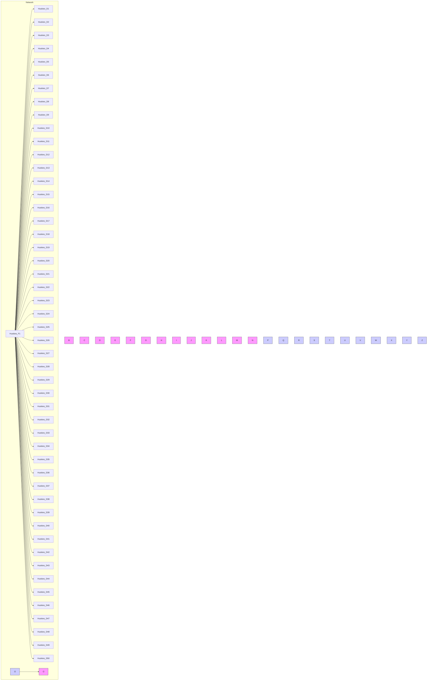
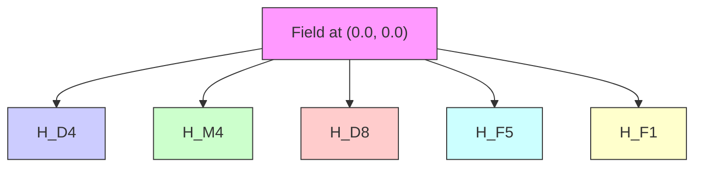
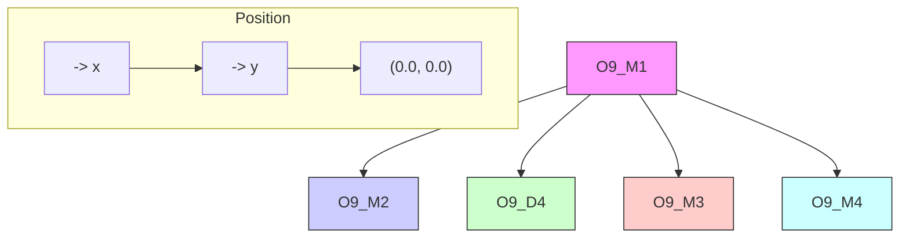
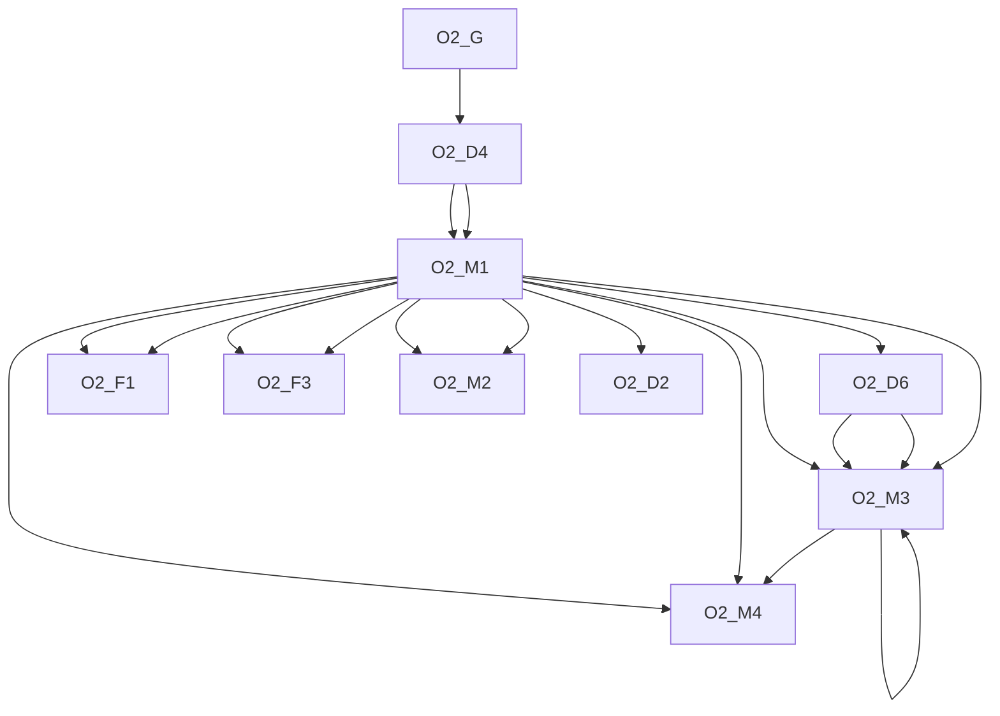
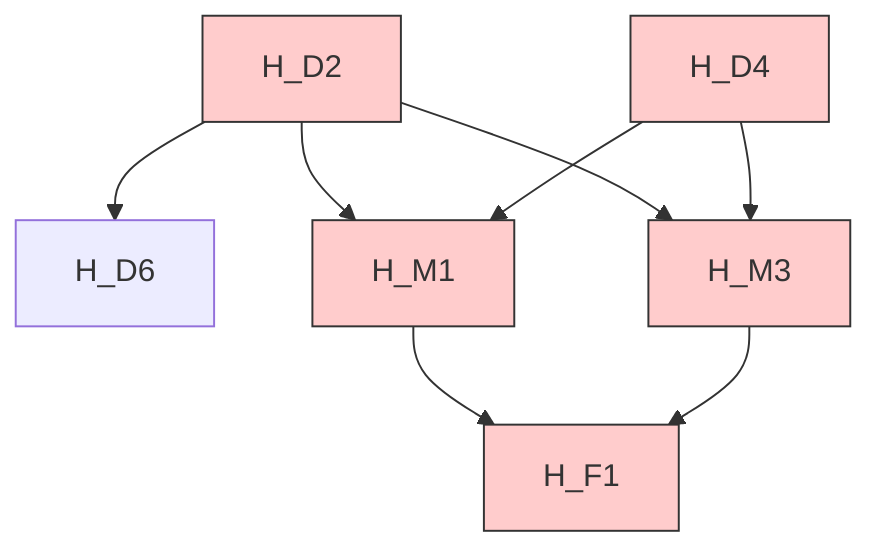
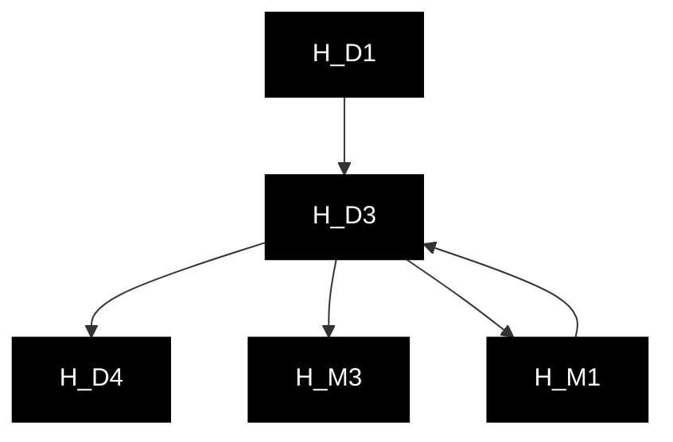
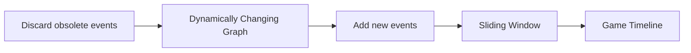

Analysis Cooperation Structure of Network and Making Teaming Strategies

based on Sliding Window Model

Teamwork can solve complex problems that may be difficult for individuals to handle, so improving team effectiveness is meaningful. We analyzes the typical from the ball passing network, and establishes the Sliding Window Model to identify the cooperation mode suitable for the Huskies, and then puts forward the suggestions of strategic adjustment.

Firstly, we set up a directed ball flow network with the soccer players as the node and the passing as the arc. The we select the structure of all passes larger than 5 from network as and set the feature vector for it. According to the feature vector value, we use the average-linkage method of hierarchical clustering to cluster the path, and use the main component analysis method to reduce the dimension. Eventually, we extract six kinds of typical strategy patterns from the network and analyze their structural characteristics.

Secondly, we choose the ,  and other indicators to measure teamwork. We establishes a Sliding Window Model to describe the changes of the performance indicators during the match, which sets a 900-second (1/3-half-time) window to slide. The window is a time-sharing subplot of the match, which can precisely capture the configuration and dynamic strategy of the team at that time sliding the position of the highlight time period .

Thirdly, after analyzing the structure that the Huskies often used in highlight performance., we find that the Huskies is more inclined to use defensive counterattack strategy. The Huskies usually performs better in the middle-front and back courts, but is very weak in the middle-back courts. Therefore, we recommend that the Huskies carries forward the long-pass punching mode and use the 4-4-2 formation.

Finally, we find that enhancing the flexibility of the team structure and establishing a local coordination structure are beneficial to improve the team's efficiency. It is necessary to refine and analyze the main mode of team contact. When the overall indicators are too difficult to explain in detail, the idea of sliding window may be useful. If we can capture more information about the characteristics of successful teams, we may be able to build a more generalized model for measuring team performance.

Keywords: Network, Cooperation Structure, Sliding Window Model, Teaming Strategies

## Contents

## Contents.

1 Introduction .. . 2

1.1 Background..  
1.2 Restatement of the Problem 2  
1.3 Core Tasks at hand . 2

2 Assumptions.. 3

3 Model Developments .... . 3

3.1 From global to local: Identify Cooperation Structure .... 4  
3.2 The Features of Different Cooperation Structures ........

4 Performance Evaluation & Structure Characterization.. . 10

4.1 Selection of performance indicators .... . 10  
4.2 Sliding Window Model . 11

5. Characteristic Analysis and Structural Advice.. . 14

5.1 Universality Analysis Based on Performance .. ... 14  
5.2 Our Advice.. . 14

6. how to design more effective teams ........ .... 16

6.1 Key elements of designing effective teams ....... .... 16  
6.2 Other aspects of teamwork we want to know ..... . 16

7 Strengths and Weaknesses ... . 16

7.1 Strength .. 16  
7.2 Weakness ..... ... 17

8 References . 17

8 Appendices ..... . 18

8.1 Codes .. .. 18

## 1 Introduction

## 1.1 Background

Soccer is a complex system based on people’s general understanding. The overall performance of a team does not equal to the sum of all players’ skills. The victory of a game calls for suitable strategies and flawless cooperation. Both attack and defense subsystems are relatively independent in structure, functions, and behaviors. They are interrelated and restrict each other. Meanwhile, soccer match is also an open system interacting with outside. A variety of factors influence the outcome of a match.

## 1.2 Restatement of the Problem

According to the competition data of this season, our home soccer team Huskie did not behave so well. We are invited by their coach to explore how their interactions lead to final results. Various types of team style and strategy may affect team’s performance greatly, sometimes even be a constraint. Thus, we will also offer suggestions based on past defect to improve Huskie’s outcome next season.

Problem 1 requires us to create a network in accordance with passing data. We use nodes and edges to represent players and the ball passing routes respectively. The number of passing routes reflects the player’s importance in a match. Moreover, the direction of arrows shows a player’s function such as forward and center. We identify the network’s pattern both in space and time dimension.

Problem 2 requires us to explore indicators of successful teams in addition to scores and wins. We briefly summarize several indexes to describe Huskie’s performance despite the final result. All indexes are come from full events data. There are thirty-eight matches in total. We only use half of them to set up a model. And the next half is used to evaluate the model’s universality.

Problem 3 requires us to give Huskies’ coach some suggestions. We analyze the network of problem 1 and consider all the success indicators. There are mainly three kinds of team style, which is defensive, offensive and balanced one. We will offer structural tactics depending on opponents’ level. When the team is competing against low-level opponents, athletes often have more space and time to apply techniques because of less confrontation or even none. Since players can fulfill observation and judgement timely, the success rate of a technique is relatively high. On the contrary, high-level opponents oppress our players in space and time. Their strong defense ability causes the declination of our technique success rate.

Problem 4 requires us to widen the use of our model. With the specialization process becomes popular, team work gains great popularity in the society. Since we have functions to evaluate the effect of a collaborative working system, it is easy to pick out the best combination. We generalize the characteristic of a large number of excellent teams; then give a model of team work which can apply universally. We need extra information if put into common use.

## 1.3 Core Tasks at hand

Design a network for passing activities.  
Identify elements that can lead to success in addition to points.  
Offer some advice to coach on the strategy improvement of next season.

Summarize our results and think further about team effort in other fields.

## 2 Assumptions

All teams can play in the competition with all their strength, regardless of the weather conditions, good luck and other factors may have an impact on the outcome of the game.  
The skill level of the athletes playing football remains the same.  
The match results are absolutely fair, regardless of false balls, black whistles and other circumstances.  
The players can fully implement the coach's tactics and strategy.

## 3 Model Developments

Based on the passing data between players, we establish a directed ball flow network. We use circle node to represent players. The size of nodes is proportional to the degree of nodes. The arcs between two nodes link two players together, which width depends on the successful passes. We can intuitively understand the cooperation structure of Huskies by drawing this network. Also, we can make a preliminary qualitative analysis on the basis of it. On the left of Figure 1, it is the passing network between 14 players of the first match, which shows the closeness between different players. In this way, we can find the core player in team cooperation with simple analysis based on the degree of the nodes and the weight of the edges. For instance, Huskies\_M1 in this match takes great responsibility in passing. On the right of Figure 1, it is the passing network between all players during the season. Compared with outer nodes, links between 14 inner nodes are closer. That is to say, a section of Huskies’ 30 players participate in more team cooperation and contribute more in the match.


<details>
<summary>flowchart</summary>


</details>


<details>
<summary>flowchart</summary>


</details>

```mermaid
graph TD
  Huxkies_M1 --> Huxkies_D1
  Huxkies_M2 --> Huxkies_F5
  Huxkies_M3 --> Huxkies_D7
  Huxkies_M4 --> Huxkies_M4
  Huxkies_M5 --> Huxkies_M6
  Huxkies_M6 --> Huxkies_D2
  Huxkies_D1 --> Huxkies_F2
  Huxkies_D2 --> Huxkies_F3
  Huxkies_D3 --> Huxkies_M1
  Huxkies_D4 --> Huxkies_M12
  Huxkies_D5 --> Huxkies_F6
  Huxkies_D6 --> Huxkies_F5
  Huxkies_D7 --> Huxkies_M9
  Huxkies_D8 --> Huxkies_M6
  Huxkies_D9 --> Huxkies_M11
  Huxkies_M12 --> Huxkies_M13
  Huxkies_M13 --> Huxkies_F5
  Huxkies_M14 --> Huxkies_F2
  Huxkies_M15 --> Huxkies_F6
  Huxkies_M16 --> Huxkies_F3
  Huxkies_M17 --> Huxkies_M5
  Huxkies_M18 --> Huxkies_M10
  Huxkies_M19 --> Huxkies_M7
  Huxkies_M20 --> Huxkies_F6
  Huxkies_M21 --> Huxkies_F3
  Huxkies_M22 --> Huxkies_M5
  Huxkies_M23 --> Huxkies_F1
  Huxkies_M24 --> Huxkies_M4
  Huxkies_M25 --> Huxkies_F4
  Huxkies_M26 --> Huxkies_F5
  Huxkies_M27 --> Huxkies_F6
  Huxkies_M28 --> Huxkies_F3
  Huxkies_M29 --> Huxkies_F5
  Huxkies_M30 --> Huxkies_F4
  Huxkies_M31 --> Huxkies_F3
  Huxkies_M32 --> Huxkies_F5
  Huxkies_M33 --> Huxkies_F6
  Huxkies_M34 --> Huxkies_F3
  Huxkies_M35 --> Huxkies_F5
  Huxkies_M36 --> Huxkies_F5
  Huxkies_M37 --> Huxkies_F6
  Huxkies_M38 --> Huxkies_F5
  Huxkies_M39 --> Huxkies_F6
  Huxkies_M40 --> Huxkies_F5
  Huxkies_M41 --> Huxkies_F6
  Huxkies_M42 --> Huxkies_F5
  Huxkies_M43 --> Huxkies_F6
  Huxkies_M44 --> Huxkies_F5
  Huxkies_M45 --> Huxkies_F6
  Huxkies_M46 --> Huxkies_F5
  Huxkies_M47 --> Huxkies_F6
  Huxkies_M48 --> Huxkies_F5
  Huxkies_M49 --> Huxkies_F6
  Huxkies_M50 --> Huxkies_F5
  Huxkies_M51 --> Huxkies_F6
  Huxkies_M52 --> Huxkies_F5
  Huxkies_M53 --> Huxkies_F6
  Huxkies_M54 --> Huxkies_F5
  Huxkies_M55 --> Huxkies_F6
  Huxkies_M56 --> Huxkies_F5
  Huxkies_M57 --> Huxkies_F6
  Huxkies_M58 --> Huxkies_F5
  Huxkies_M59 --> Huxkies_F6
  Huxkies_M60 --> Huxkies_F5
```

Figure 1: The ball flow network

## 3.1 From global to local: Identify Cooperation Structure

To depict the passing network between players, we need to extract possibly valuable accesses1 for statistics to analyze the feature of passing event.

Now we must define a professional concept cooperation structure. It represents a short-time cooperation tactics between several players, which can be reflected by continuous soccer ball passing access. Unlike overall strategies in a match, cooperation structure more emphasizes the effect on the micro level.

Every cooperation structure is regarded as a unit. Continuous passes per unit is a significant standard describing structure characteristic. More passes will result in the lack of cooperation structure. If we choose fewer passes as initial screening conditions for cooperation structure, although we can get enough data, it cannot reflect obvious features. Considering the actual situation, we select all cooperation structure that passes is larger than 5 for quantitative process.

## 3.1.1 Selecting Accesses and Feature Vector Calculation

We find the feature vector that can describe the property of a cooperation structure.

$$
\left[ \bar {\mathrm{X}}, \bar {Y}, a v g (\sqrt {\Delta \mathrm{x} _ {i} ^ {2} + \Delta \mathrm{y} _ {i} ^ {2}}), \rho , N, \bar {T} \right]
$$

The definition of variables is as follows2:

<table><tr><td>Variable Name</td><td>Explanation</td></tr><tr><td> $\overline{X}$ </td><td>the arithmetic center&#x27;s horizontal coordinate, reflects the position of cooperation structure</td></tr><tr><td> $\overline{Y}$ </td><td>the arithmetic center&#x27;s vertical coordinate, reflects the position of cooperation structure</td></tr><tr><td> $avg(\sqrt{\Delta x_i^2 + \Delta y_i^2})$ </td><td>average passing distance, directly describes the size of cooperation structure</td></tr><tr><td> $\rho$ </td><td>passes, reflects the scale and complexity of cooperation structure</td></tr><tr><td>N</td><td>number of passer, reflects the scale and complexity of cooperation structure</td></tr><tr><td> $\overline{T}$ </td><td>average passing time3, reflect the tempo of cooperation structure</td></tr></table>

We select 1352 accesses to represent typical cooperation structure. Since the change of field, it is easy to misjudge the average passing time. We get rid of seven abnormal accesses data and get 1345 accesses.

## 3.1.2 Cluster and Dimension reduction

When analyzing the cooperation structure, we use hierarchical clustering method. It has perfect visual and explaining effect, but requires extremely high time complexity O(m2logm) and space complexity O(m2). Considering the amount of data is not so large, it is feasible to use hierarchical clustering. Besides, it can directly solve the K value for the convenience of cooperation structure classification.

Average-Linkage: It calculates the distance between each data point and all the other ones in two cooperation structures. Then use the average as the distance between data of two cooperation structures. The disadvantage is enormous calculation amount. However, its result simulates the real soccer match better.  
Distance Measurement Method: Use Euclidean (two-norm) to calculate distance between points.

Calculate the distance between two clusters:

$$
d (u, v) = \sum_ {i j} \frac {d (u [ i ] , v [ j ])}{(| u | * | v |)}
$$

We get a clustermap by calculation. Number on the right side is the order number of each cooperation structure. Feature vectors are at the bottom of Figure 2. We used D and P for average passing distance and average number of passers respectively. Other variables’ meaning is the same as figure 1 above. Cluster tree is on the left and upper part of the figure. The left one represents cooperation structure’s cluster and the upper one represents feature vectors’ cluster.


<details>
<summary>heatmap</summary>

| ID | D | T | P | N | X | Y |
| --- | --- | --- | --- | --- | --- | --- |
| 1000 | 20 | 476 | 392 | 1160 | 808 | 374 |
| 476 | 20 | 374 | 1199 | 1186 | 410 | 746 |
| 392 | 20 | 470 | 1047 | 1305 | 983 | 470 |
| 1160 | 20 | 1305 | 136 | 235 | 64 | 1304 |
| 808 | 20 | 1135 | 663 | 593 | 529 | 1175 |
| 374 | 20 | 529 | 445 | 516 | 299 | 348 |
| 1199 | 20 | 529 | 1175 | 445 | 299 | 831 |
| 1186 | 20 | 529 | 1175 | 445 | 299 | 831 |
| 410 | 20 | 529 | 1175 | 445 | 299 | 831 |
| 746 | 20 | 529 | 1175 | 445 | 299 | 831 |
| 983 | 20 | 529 | 1175 | 445 | 299 | 831 |
| 470 | 20 | 529 | 1175 | 445 | 299 | 831 |
| 1047 | 20 | 529 | 1175 | 445 | 299 | 831 |
| 1305 | 20 | 529 | 1175 | 445 | 299 | 831 |
| 136 | 20 | 529 | 1175 | 445 | 299 | 831 |
| 235 | 20 | 529 | 1175 | 445 | 299 | 831 |
| 64 | 20 | 529 | 1175 | 445 | 299 | 831 |
| 1304 | 20 | 529 | 1175 | 445 | 299 | 831 |
| 1135 | 20 | 529 | 1175 | 445 | 299 | 831 |
| 663 | 20 | 529 | 1175 | 445 | 299 | 831 |
| 593 | 20 | 529 | 1175 | 445 | 299 | 831 |
| 529 | 20 | 529 | 1175 | 445 | 299 | 831 |
| 1175 | 20 | 529 | 1175 | 445 | 299 | 831 |
| 445 | 20 | 529 | 1175 | 445 | 299 | 831 |
| 516 | 20 | 529 | 1175 | 445 | 299 | 831 |
| 299 | 20 | 529 | 1175 | 445 | 299 | 831 |
| 348 | 20 | 529 | 1175 | 445 | 299 | 831 |
| 831 | 20 | 529 | 1175 | 445 | 299 | 831 |
| 686 | 20 | 529 | 1175 | 445 | 299 | 831 |
| 617 | 20 | 529 | 1175 | 445 | 299 | 831 |
| 325 | 20 | 529 | 1175 | 445 | 299 | 831 |
</details>

Figure 2: Clustermap

Since the data dimension is over three, it limits the visualization process of cluster results. We use principal component analysis to reduce the dimension. Utilizing two principal components with 95% variance, we draw the figure below:


<details>
<summary>scatterplot</summary>

| PCA1(52.12%) | PCA2(40.91%) |
| ------------ | ------------ |
| -40          | 30           |
| -20          | 10           |
| 0            | 0            |
| 20           | -20          |
| 40           | -30          |
</details>

Figure 3: PCA

Link figure 2 and 3 together, our final cluster result is as following:


<details>
<summary>bar-line hybrid chart</summary>

| Cluster | Value |
|---------|-------|
| Green   | 27    |
| Red     | 25    |
| Cyan    | 20    |
| Yellow  | 18    |
| Blue    | 43    |
| Black   | 28    |
</details>

Figure 4: Cluster result

We summarize unique cooperation structure after analyzing their features. In figure 5, every circle’s color represents the same cooperation structure as figure 4.


<details>
<summary>text_image</summary>

(0.0, 0.0)
y
x
y
</details>

Figure 5: The distribution of cooperation structure

Its location means where the average place a cooperation structure located. The size of a circle stands for the appearing times of a cooperation structure.

## 3.2 The Features of Different Cooperation Structures

The figure below shows the feature vector’s value of six cooperation structure. We can directly generalize some characteristic to use in real soccer games. For instance, the average passes and average number of passers of the first cooperation structure are both small. Moreover, it costs the least average time to pass. Thus, we can infer that this cooperation structure is suitable for fast and short passes. It often appears near the opponent's goal and requires players’ strong explosiveness.


<details>
<summary>bar chart</summary>

Average passing distance
| Category | Average passing distance |
| :--- | :--- |
| 1 | 20 |
| 2 | 20 |
| 3 | 24 |
| 4 | 21 |
| 5 | 25 |
| 6 | 25 |
</details>


<details>
<summary>bar chart</summary>

| Category | Average Passes |
| -------- | -------------- |
| 1        | 6              |
| 2        | 7              |
| 3        | 5              |
| 4        | 29             |
| 5        | 8              |
| 6        | 8              |
</details>


<details>
<summary>bar chart</summary>

| Category | Average number of passers |
| -------- | ------------------------- |
| 1        | 5                         |
| 2        | 5                         |
| 3        | 5                         |
| 4        | 9.5                       |
| 5        | 6.2                       |
| 6        | 6                         |
</details>


<details>
<summary>bar chart</summary>

Average passing time
| Category | Average passing time |
|---|---|
| 1 | 2.03 |
| 2 | 2.09 |
| 3 | 2.41 |
| 4 | 2.43 |
| 5 | 2.36 |
| 6 | 2.42 |
</details>

Figure 6: The analysis of cooperation structure

Combine all the analysis above, we get six excellent cooperation structures. Nodes and edges represent players and accesses between them respectively.

## Winger Machine Gun

This cooperation structure is not outstanding in average passing distance and average number of passers. However, it costs a really short average passing time. We can infer that players are required to run very fast. The location is exactly beside opponent’s goal. If Huskies can break through their defense system effectively, it is easy to seek shot opportunities.


<details>
<summary>flowchart</summary>


</details>

<table><tr><td>Match ID</td><td>30</td></tr><tr><td>Team ID</td><td>Huskies</td></tr><tr><td>Event Time5</td><td>2H 2017.65</td></tr></table>

## Sidewalk Tiger

This kind of cooperation structure is similar to the above one except for location. They are both offensive cooperation structure. The core player attacks from the left sidewalk.


<details>
<summary>flowchart</summary>


</details>

<table><tr><td>Match ID</td><td>9</td></tr><tr><td>Team ID</td><td>Opponent 9</td></tr><tr><td>Event Time</td><td>2H2077.539009</td></tr></table>

## Defensive Shield

When opponents are very close to Huskies’ goal, players can turn from a offensive state to a defensive one. This cooperation structure requires long average passing distance and time. That is to say, rear guard may be passing in the backfield to adjust the tempo. Or it includes passing back to slow down opponents’ fierce offend.


<details>
<summary>flowchart</summary>

```mermaid
graph TD
  A["H_D1"] --> B["H_G1"]
  B --> C["H_D9"]
  D["H_D8"] --> E["Field"]
    style A fill:#000,stroke:#000,color:#fff
    style B fill:#000,stroke:#000,color:#fff
    style C fill:#000,stroke:#000,color:#fff
    style D fill:#000,stroke:#000,color:#fff
    style E fill:#000,stroke:#000,color:#fff
    note right of A (x)
        (0.0, 0.0)
    end
```
</details>

<table><tr><td>Match ID</td><td>27</td></tr><tr><td>Team ID</td><td>Huskies</td></tr><tr><td>Event</td><td>1H</td></tr><tr><td>Time</td><td>1991.672292</td></tr></table>

## Absolute Suppress

This cooperation structure is relatively special compared with others. In full events data, it only appears seven times. A star player with strong ability is the core. The whole structure almost involves all players and their action range is really wide. It only happens when one side wholly control the ball.


<details>
<summary>flowchart</summary>


</details>

<table><tr><td>Match ID</td><td>32</td></tr><tr><td>Team ID</td><td>Opponent 2</td></tr><tr><td>Event Time</td><td>1H883.854199</td></tr></table>

## Midfield Overall Planning

This cooperation structure can adjust the tempo of a team, and is used most frequently. Its average passing distance and average passing time are both large, but smaller than Absolute Suppress. It usually appears when players are seeking for offending opportunities.


<details>
<summary>flowchart</summary>


</details>

<table><tr><td>Match ID</td><td>1</td></tr><tr><td>Team ID</td><td>Huskies</td></tr><tr><td>Event Time</td><td>1H286.49734</td></tr></table>

## Backfield Location Adjustment

It is almost the same as Midfield Overall Planning except for the location. Because opponents’ location is very close to Huskies’ goal in this cooperation structure, it is important to choose players with high-level defense ability. All players should be very careful about opponents’ offensive actions in this process


<details>
<summary>flowchart</summary>


</details>

<table><tr><td>Match ID</td><td>37</td></tr><tr><td>Team ID</td><td>Huskies</td></tr><tr><td>Event Time</td><td>1H1808.786016</td></tr></table>

## 4 Performance Evaluation & Structure Characterization

## 4.1 Selection of performance indicators

## 4.1.1 Average Node Connectivity

Considering the concept of the average node connectivity of a graph, we define it to be the average, over all pairs of vertices, of the maximum number of internally disjoint paths connecting these vertices. 6 It is obvious fact that the connectivity ??(??) is equal to ??????{ $k G ( u , v ) \colon u , v \in V ( G ) \}$ . When the order of ?? is n, then the average node connectivity of ??, denoted $\overline { { k } } \left( G \right)$ , can be described as

$$
\bar {k} (G) = \frac {\sum_ {u , v} k _ {G} (u , v)}{\binom {n} {2}}
$$

Edmonds-Karp algorithm is used to calculate the maximum flow between a pair of nodes. Average node connectivity reflects coordination between players, and if each member of a team has a high level of participation, then the overall level of connectivity is high. It can reflect whether the players are widely involved or not, and the value is lower if some players are playing alone. This also shows the comparison of players’ contribution. If the whole team only passes the ball to a couple of star players to fight, rather than play together, the value is low.

## 4.1.2 Transitivity

Football games are through clever tactical cooperation to get more offensive opportunities, and the ever-changing tactical cooperation is always inseparable from the cooperation of three people. Because in soccer, if we want to form an effective attack, is often to form a formation in somewhere of the field with the majority against the minority, and in defense also to form such a formation. According to the statistics of all the goals scored in the 15th World Cup in the United States, nearly 60% of the goals were scored locally through the cooperation of three players. Here are some typical triadic configurations, in which nodes represent players and arcs represent passing paths.


<details>
<summary>flowchart</summary>

```mermaid
graph TD
  A1[" "] --> B1[" "]
  A2[" "] --> B2[" "]
  A3[" "] --> B3[" "]
  A4[" "] --> B4[" "]
  A5[" "] --> B5[" "]
  A6[" "] --> B6[" "]
  A7[" "] --> B7[" "]
  A8[" "] --> B8[" "]
  A9[" "] --> B9[" "]
  A10[" "] --> B10[" "]
  A11[" "] --> B11[" "]
  A12[" "] --> B12[" "]
  A13[" "] --> B13[" "]
  A14[" "] --> B14[" "]
  A15[" "] --> B15[" "]
  A16[" "] --> B16[" "]
  A17[" "] --> B17[" "]
  A18[" "] --> B18[" "]
  A19[" "] --> B19[" "]
  A20[" "] --> B20[" "]
  A21[" "] --> B21[" "]
  A22[" "] --> B22[" "]
  A23[" "] --> B23[" "]
  A24[" "] --> B24[" "]
  A25[" "] --> B25[" "]
  A26[" "] --> B26[" "]
  A27[" "] --> B27[" "]
  A28[" "] --> B28[" "]
  A29[" "] --> B29[" "]
  A30[" "] --> B30[" "]
  A31[" "] --> B31[" "]
  A32[" "] --> B32[" "]
  A33[" "] --> B33[" "]
  A34[" "] --> B34[" "]
  A35[" "] --> B35[" "]
  A36[" "] --> B36[" "]
  A37[" "] --> B37[" "]
  A38[" "] --> B38[" "]
  A39[" "] --> B39[" "]
  A40[" "] --> B40[" "]
  A41[" "] --> B41[" "]
  A42[" "] --> B42[" "]
  A43[" "] --> B43[" "]
  A44[" "] --> B44[" "]
  A45[" "] --> B45[" "]
  A46[" "] --> B46[" "]
  A47[" "] --> B47[" "]
  A48[" "] --> B48[" "]
  A49[" "] --> B49[" "]
  A50[" "] --> B50[" "]
  A51[" "] --> B51[" "]
  A52[" "] --> B52[" "]
  A53[" "] --> B53[" "]
  A54[" "] --> B54[" "]
  A55[" "] --> B55[" "]
  A56[" "] --> B56[" "]
  A57[" "] --> B57[" "]
  A58[" "] --> B58[" "]
  A59[" "] --> B59[" "]
  A60[" "] --> B60[" "]
  A61[" "] --> B61[" "]
  A62[" "] --> B62[" "]
  A63[" "] --> B63[" "]
  A64[" "] --> B64[" "]
  A65[" "] --> B65[" "]
  A66[" "] --> B66[" "]
  A67[" "] --> B67[" "]
  A68[" "] --> B68[" "]
  A69[" "] --> B69[" "]
  A70[" "] --> B70[" "]
  A71[" "] --> B71[" "]
  A72[" "] --> B72[" "]
  A73[" "] --> B73[" "]
  A74[" "] --> B74[" "]
  A75[" "] --> B75[" "]
  A76[" "] --> B76[" "]
  A77[" "] --> B77[" "]
  A78[" "] --> B78[" "]
  A79[" "] --> B79[" "]
  A80[" "] --> B80[" "]
  A81[" "] --> B81[" "]
  A82[" "] --> B82[" "]
  A83[" "] --> B83[" "]
  A84[" "] --> B84[" "]
  A85[" "] --> B85[" "]
  A86[" "] --> B86[" "]
  A87[" "] --> B87[" "]
  A88[" "] --> B88[" "]
  A89[" "] --> B89[" "]
  A90[" "] --> B90[" "]
  A91[" "] --> B91[" "]
  A92[" "] --> B92[" "]
  A93[" "] --> B93[" "]
  A94[" "] --> B94[" "]
  A95[" "] --> B95[" "]
  A96[" "] --> B96[" "]
  A97[" "] --> B97[" "]
  A98[" "] --> B98[" "]
  A99[" "] --> B99[" "].
```
</details>

Typical Triadic Configuration

Such a triadic configuration is often represented as triangles and triads (two edges with a shared vertex) in the diagram. So we define transitivity as

$$
T r a n s i t i v i t y = \# t r i a n g l e s + \# t r i a d s
$$

In this equation, #?????????????????? the number of triangles in the passing network at the current moment, and #???????????? represents the number of triads. As we see in our previous analysis, the higher the value, the more transitive and flexible the team is.

## 4.2 Sliding Window Model

Performance indicator is often valuable in a whole soccer game. In addition to wins and goals, we propose another two indicators.

It is troublesome to find key details from the overall indicator while partial indicators can solve the puzzle. Since the match result also depends on opponents’ ability level largely, we cannot evaluate Huskies’ concrete performance through goals effectively. Actually we are more concerned about how indicators change over time. From the changes we can discover a team’s real-time match state. If performance indicator changes fiercely in a certain time period, we can locate what happened by full events data. After exploring the structure and adjustment, we can select some configuration patterns full of team characteristics.

The indicators we propose both meet the requirement of partial analysis.

We use the Sliding Window Model to judge partial performance. The window diagram is as follows:


<details>
<summary>flowchart</summary>


</details>

To start with, we make a metaphor to explain the concept of sliding window. When we take a distant view photograph, it is often too large to see the details clearly. Then the most common method is sliding from left to right on the screen.

The sliding window concept is the same. As the window slides on the game timeline, the right side adds new passing events continuously. Meanwhile, the left side discards some obsolete passing events to obtain the window’s size7. These events directly influence how the directed graph looks like in the window. Since different graph types have different performance, we can find out its changing process over time.

It is obvious that the size of sliding window t is a significant parameter. Too large size goes against the concept of partial indicator while smaller ones cannot clarify the situation clearly. Standard soccer game lasts about 5400 seconds (90 minutes). Average soccer player often get into competition state after 15 minutes. Considering about the objective fact, we choose 900 second (one third of Halftime, 15 minutes) as sliding window size.

Based on this model, time between 0 and t is the process of network establishment, so there is no data generation. From time t to the end of match8, it generates data consistently.

Next we utilize the sliding window model to capture team’s highlight moment, which is helpful to locate team structure and configuration.

## 4.2.1 Average Node Connectivity

<table><tr><td>Match ID</td><td>Opponent ID</td><td>Result $^{9}$ </td></tr><tr><td>15</td><td>15</td><td>2:0</td></tr></table>


<details>
<summary>line chart</summary>

| Time (s) | Huskies | Opponent15 |
| -------- | ------- | ---------- |
| 1000     | 1.5     | 1.8        |
| 1500     | 2.7     | 2.5        |
| 2000     | 2.6     | 2.4        |
| 2500     | 2.3     | 2.2        |
| 3000     | 2.6     | 0.4        |
| 3500     | 2.9     | 2.8        |
| 4000     | 2.7     | 2.3        |
| 4500     | 2.0     | 1.6        |
| 5000     | 1.8     | 1.0        |
| 5500     | 2.9     | 0.5        |
</details>

The Average Node Connectivity represents every player’s involvement degree at the moment. The figure above shows that Huskies’ highlight performance time is obviously more than the opponent. Opponent 15’s highlight time does not last so long while Huskies’ connectivity almost above average level. We can get empirical support from the result 2:0.

## 4.2.2 Transitivity

We use transitivity to depict the players’ flexibility. High transitivity implies perhaps excellent cooperation happens at the moment.

The figure below shows a match between Huskie and Opponent 4. Over the match process, almost all Huskies’ transitivity value is smaller than the opponent. Moreover, opponent 4’s highlight time is longer than Huskies at a large scale. Thus, it is easy to explain why the result is so cruel.

Failure result can give a lesson to Huskie. We can locate according to the happening time and collect opponent 4’s highlight cooperation structure in order to prepare for the next match.


<details>
<summary>line chart</summary>

| Time (s) | Huskies | Opponent4 |
| -------- | ------- | --------- |
| 1000     | 120     | 210       |
| 1500     | 80      | 280       |
| 2000     | 140     | 260       |
| 2500     | 130     | 240       |
| 3000     | 120     | 250       |
| 3500     | 90      | 230       |
| 4000     | 80      | 270       |
| 4500     | 110     | 360       |
| 5000     | 70      | 250       |
| 5500     | 130     | 240       |
</details>

## 5. Characteristic Analysis and Structural Advice

## 5.1 Universality Analysis Based on Performance

In this part we will analyze Huskies’ characteristics and offer some advice on structure.

The figure on the right side shows the difference between Huskies and other opponents on the use of cooperation structure. The two green bars are above horizontal axis, showing the high using frequency. Tactics three and five represents Midfield Overall Planning and Defensive Shield respectively. Thus, we can infer that Huskies often use defensive counterattack strategy in this season. In professional soccer pattern, this is called to be Long Ball. Players are waiting for opportunities to break through opponents’ goal. When the time is ripe for an easy long ball, forward can control the ball and shot.

After exploring Huskies’ common use cooperation structure, we need to find the most suitable one. This figure shows the difference between Huskies and other opponents on the use of cooperation structure during the highlight period.

This figure has obvious result and is more helpful to work out overall strategies. We can infer that Huskies do well in structure two, three and five, which means Sidewalk Tiger, Defensive Shield and Midfield Overall Planning respectively. When Huskies uses them, highlight performance appears more easily.

Looking back on the figure below, we discover that Huskies is more proficient in backfield and mid-forth field while really weak in mid-back field. Hence Huskies is right to use counter attack and long ball this season.

## 5.2 Our Advice

Reinforce to develop the skill of counter attack and long ball in order to produce the best possible results.  
From the Highlight Performance figure, Sidewalk Tiger’s performance is also slightly higher than the average of whole season. However, the using times of this cooperation structure is smaller than the average. Thus, we think it is possible to make a break-through in sidewalk attack.  
Squad: $4 - 4 - 2 ^ { 1 0 }$

Structure Frequency  


<details>
<summary>bar chart</summary>

| Category | Value (%) |
|---|---|
| 1 | -1.30 |
| 2 | -1.50 |
| 3 | 0.40 |
| 4 | -0.50 |
| 5 | 3.30 |
| 6 | -0.30 |
</details>

Highlight Structure Frequency  


<details>
<summary>bar chart</summary>

| Category | Value (%) |
|---|---|
| 1 | -2.00 |
| 2 | 0.50 |
| 3 | 1.00 |
| 4 | -0.50 |
| 5 | 17.00 |
| 6 | -15.00 |
</details>


<details>
<summary>text_image</summary>

(0.0, 0.0)
y
D4
M4
G1
D3
M3
D5
M1
F2
F1
D1
M6
(0.0, 0.0)
</details>

##  A Warning on Special Opponent & cooperation structure:

In our cooperation structure, Absolute Suppress is a really special one. Its passing times is very large and with a wide passing range. Almost all players involve in this structure, which represents a kind of champion grace. Huskies’ ability cannot meet this structure’s requirement. However, opponents using Absolute Suppress can be extremely cruel to Huskies. Only in the match 16, Huskies end in tie. Another three matches are all bitter failure. Especially in the match 32 (indicator figures are as follows), opponent 2 create four times of this structure and Huskies’ tempo is wholly destroyed. Huskies’ Average Node Connectivity and Transitivity are both extremely low. On the contrary, opponent 2’s indicators are very high, which means they wholly control the ball. Therefore, coaches should pay full attention to precaution opponents’ Absolute Suppress structure.


<details>
<summary>line chart</summary>

| Time (s) | Huskies | Opponent2 |
| -------- | ------- | --------- |
| 1000     | 0.2     | 3.4       |
| 1500     | 0.4     | 3.6       |
| 2000     | 0.6     | 4.2       |
| 2500     | 0.7     | 3.8       |
| 3000     | 1.1     | 4.5       |
| 3500     | 0.1     | 5.2       |
| 4000     | 0.3     | 4.8       |
| 4500     | 0.8     | 3.9       |
| 5000     | 1.0     | 5.1       |
| 5500     | 1.4     | 4.3       |
</details>


<details>
<summary>line chart</summary>

| Time (s) | Huskies | Opponent2 |
| -------- | ------- | --------- |
| 1000     | 30      | 250       |
| 1500     | 35      | 320       |
| 2000     | 40      | 310       |
| 2500     | 35      | 280       |
| 3000     | 45      | 350       |
| 3500     | 35      | 380       |
| 4000     | 20      | 320       |
| 4500     | 30      | 260       |
| 5000     | 50      | 400       |
| 5500     | 70      | 450       |
</details>

## 6. how to design more effective teams

## 6.1 Key elements of designing effective teams

If we want to design an effective team, the first step is expected to be finding the basic pattern of team cooperation. The collaboration between team members may be seem messy at first glance , which is difficult to find useful messages. So it is important to find the typical features of cooperation among team members. Like the football team analyzed in this article, the players have a variety of actions on the field, but passing is the most common and typical interaction among the players, so we can first analyze information about passing. By the same token, other teams can be treated it in a similar way.

For example, a research group whose main goal is writing paper of high quality , its members may have multiple communication each day, but the most typical cooperation of them is to share the task and progress of the paper. Therefore, in order to improve the team effectiveness of the research team, it is necessary to first count the task documents they shared during the study period and further study their collaborative characteristics.

When thinking about team strategy, in addition to considering the overall changes in parameter indicators, using windows to capture changes in indicators at each moment may give more enlightening conclusions. Windows are useful for small-minded, and can be more accurately identified for the team-friendly construction patterns. Making good use of this model and its ideology is beneficial to our team efficiency.

## 6.2 Other aspects of teamwork we want to know

If we can capture the reaction and characteristics of teamwork after external interference, a more comprehensive model of team performance may be established. Besides, to enhance the measurement accuracy of performance indicators, more information about successful teams’ characteristics is required (e.g. If there is more information on goalscoring, we can identify more features about paths of success and then let people follow suit).

## 7 Strengths and Weaknesses

In future work, we would like to address the weaknesses of our model and improve on the computational efficiency of our simulations. This model had a number of strengths and weaknesses.

## 7.1 Strength

Our model innovates in designing Sliding Window Model.  
Like distant view photograph, soccer teams can analyze their performance of each time period. Then design strategies of macro level based on micro data.  
Our model is robust and with great generalization ability.  
The parameters are flexible, which means the model can capture differen fields’ data characteristics other than soccer game.

Our model has excellent visualization figures.

To identify the typical cooperation structure, we draw six figures on the basis of real data. They reflect the tactics intuitively.

## 7.2 Weakness

The arithmetic is large in time complexity.

Since the figure reconstitutes partly at every time point, the model should be used cautiously when data amount is enormous.

Slight distortion in the processing of sliding windows

Since the data set is a point in time, a slight change in window size occurs.

## 8 References

[1]Duch J, Waitzman J S, Amaral L A N. Quantifying the performance of individual players in a team activity[J]. PloS one, 2010, 5(6).  
[2]GÜRSAKAL N, YILMAZ F M, ÇOBANOĞLU H O, et al. Network motifs in football[J]. Turkish Journal of Sport and Exercise, 2018, 20(3): 263-272.  
[3]Buldu, Javier & Busquets, J. & Echegoyen, Ignacio & Seirul.lo, F.. (2019). Defining a historic football team: Using Network Science to analyze Guardiola’s F.C. Barcelona. Scientific Reports. 9. 10.1038/s41598-019-49969-2.  
[4]Cintia P , Rinzivillo S , Pappalardo L . A network-based approach to evaluate the performance of football teams[C]// Machine Learning and Data Mining for Sports Analytics workshop (MLSA'15), ECML/PKDD conference 2015. 2015.  
[5]Lloyd Smith, Bret Lipscomb, and Adam Simkins. 2007. Data mining in sports: predicting Cy Young award winners. J. Comput. Sci. Coll. 22, 4 (April 2007), 115–121.  
[6]Clemente, F. M., Couceiro, M. S., Martins, F. M. L., & Mendes, R. S. (2015). Using Network Metrics in Soccer: A Macro-Analysis. Journal of Human Kinetics, 45(1), 123–134.

## 9 Appendices

## 9.1 Codes

```python
import networkx as nx
import matplotlib.pyplot as plt
import pandas as pd
import numpy as np
import matplotlib.patches as mpathes
```

```python
def InitG(data):
    G = nx.DiGraph()
    ET = np.array(data['EventTime'])
    i = 0
    while(ET[i] < 900):
    i += 1
    length = i    # 未来的 front

    Weight = np.ones(length, dtype=int)
    Ori = np.array(data['OriginPlayerID'])
    Des = np.array(data['DestinationPlayerID'])
    for j in range(0, length):
    if(G.has_node(Ori[j]) & (G.has_node(Des[j]))):
    if(G.has_edge(Ori[j], Des[j])):
    G[Ori[j]][Des[j]]['weight'] += 1
    else:
    G.add_edge(Ori[j], Des[j], weight = Weight[j])
    else:
    G.add_edge(Ori[j], Des[j], weight = Weight[j]) # 边的起点，终点，权重
    # pos = nx.circular_layout(G)
    # print(G.edges(data=True))
#
# nx.draw_networkx_edges(G, pos, with_labels=True, edge_color='black', alpha=1, font_size=10, width=[float(v['weight'] * 0.5) for (r, c, v) in G.edges(data=True)])
# # nx.draw_networkx_nodes(G, pos, with_labels=True)
# nx.draw(G, pos, alpha = 0.8, with_labels=True, font_size=10, width=[float(v['weight'] * 1) for (r, c, v) in G.edges(data=True)])
#
plt.show()
data = data[(data['MatchPeriod'] == '1H')]
return G, length, np.array(data['EventTime']) [len(data['EventTime']) - 1]
```

```python
def Calc1(String1,String2,MatchID):
    data = pd.read_excel('gogofootball.xlsx',sheet_name='Sheet1')
    data = data[(data['TeamID'] == String1) &(data['MatchID'] == MatchID)]

    G,edgeNum,last1H = InitG(data)
    # 时间数据处理
    data['EventTime'][(data['MatchPeriod'] == '2H']) += last1H

    front = edgeNum    # 前指针
    rear = 0    # 后指针
    zongchang = len(data['TeamID'])

    # Degree = []    # 图的密度
    # Clustering = []    # 图或网络中节点的聚类系数
    Transitivity = []    # 图或网络的传递性
    T1 = []    # 时间轴
    Triangles = []
    Triads = []
    Anc = []

    ET = np.array(data['EventTime'])
    Ori = np.array(data['OriginPlayerID'])
    Des = np.array(data['DestinationPlayerID'])

    while(front < zongchang):
    t = ET[front]
    T1.append(t)

    # 删东西
    while(ET[front] - ET[rear] > 900):
    if(ET[front] - ET[rear] < 900):
    break
    if(G[Ori[rear]][Des[rear]]['weight'] > 1):
    G[Ori[rear]][Des[rear]]['weight'] -= 1
    else:
    G.remove_edge(Ori[rear],Des[rear])
    if(G.degree(Ori[rear]) == 0): G.remove_node(Ori[rear])
    if(G.degree(Des[rear]) == 0): G.remove_node(Des[rear])
    rear += 1

    # 加东西
    if(G.has_node(Ori[front]) &(G.has_node(Des[front]))) {
    if(G.has_edge(Ori[front],Des[front])) {
    G[Ori[front]][Des[front]]['weight'] += 1
    else:
    G.add_edge(Ori[front],Des[front],weight=1)
    else:
    G.add_edge(Ori[front],Des[front],weight=1)
```

```python
# 计算并附加
#Degree.append(nx.degree(G))
#Clustering.append(nx.clustering(G))

# tri = np.sum(list(nx.triangles(G).values())/3
# triads = (tri*3)/nx.transitivity(G)
# Transitivity.append(tri + triads)

Anc.append(nx.average_node_connectivity(G))
# 步长
front+=1
# return T1,Transitivity
return T1,Anc
```

```python
def Calc2(String1,String2,MatchID):
    data = pd.read_excel('gogofootball.xlsx',sheet_name='Sheet1')
    data = data[(data['TeamID'] == String2) & (data['MatchID'] == MatchID)]
    G,edgeNum,last1H = InitG(data)
    # 时间数据处理
    data['EventTime'][(data['MatchPeriod'] == '2H')] += last1H

    front = edgeNum    # 前指针
    rear = 0    # 后指针
    zongchang = len(data['TeamID'])
```

```toml
# Degree = []    # 图的密度
# Clustering = []    # 图或网络中节点的聚类系数
Transitivity2 = []    # 图或网络的传递性
T2 = []    # 时间轴
Triangles = []
Triads = []
Anc = []
```

```python
ET = np.array(data['EventTime'])
Ori = np.array(data['OriginPlayerID'])
Des = np.array(data['DestinationPlayerID'])
while(front<zongchang):
```

```python
t = ET[front]
T2.append(t)

# 删东西
while(ET[front] - ET[rear] > 900):
    if(ET[front] - ET[rear] < 900):
    break
    if(G[Ori[rear]][Des[rear]]['weight'] > 1):
    G[Ori[rear]][Des[rear]]['weight'] -= 1
    else:
    G.remove_edge(Ori[rear], Des[rear])
    if(G.degree(Ori[rear]) == 0): G.remove_node(Ori[rear])
    if(G.degree(Des[rear]) == 0): G.remove_node(Des[rear])
    rear += 1
```

```python
# 加东西
if(G.has_node(Ori[front])&(G.has_node(Des[front]))) {
    if(G.has_edge(Ori[front],Des[front])):
    G[Ori[front]][Des[front]]['weight']+=1
    else:
    G.add_edge(Ori[front],Des[front],weight=1)
else:
    G.add_edge(Ori[front],Des[front],weight=1)
```

```txt
# 计算并附加
#Degree.append(nx.degree(G))
#Clustering.append(nx.clustering(G))
```

```python
# tri = np.sum(list(nx.triangles(G).values())/3
# triads = (tri*3)/nx.transitivity(G)
# Transitivity2.append(tri + triads)
```

```python
Anc.append(nx.average_node_connectivity(G))
# 步长
front+=1
# return T2,Transitivity2
return T2,Anc
```

```python
def Calc(String1,String2,MatchID):
    # T1,Transitivity = Calc1(String1,String2,MatchID)
    # T2,Transitivity2 = Calc2(String1,String2,MatchID)
```

```csv
T1,Anc1 = Calc1(String1,String2,MatchID)
T2,Anc2 = Calc2(String1,String2,MatchID)
# return T1,T2,Transitivity,Transitivity2
return T1,T2,Anc1,Anc2
```

```txt
# Main Program
String1 = 'Huskies'
String2 = 'Opponent18'
MatchID = 18
#T1,T2,Transitivity,Transitivity2 = Calc(String1,String2,MatchID)
T1,T2,Anc1,Anc2 = Calc(String1,String2,MatchID)
```

```python
plt.figure(figsize=(15, 6))
# 线条颜色 black, 线宽 2, 标记大小 13, 标记填充颜色从网上找 16 进制好看的颜色
plt.plot(T1, Anc1, '-o', color='black', markersize=13, markerfacecolor='#44cef6', linewidth=2, label=String1)
# plt.plot(T2, Anc2, '-o', color='black', markersize=13, markerfacecolor='#e29c45', linewidth=2, label=String2)
plt.plot(T2, Anc2, '-o', color='black', markersize=13, markerfacecolor='#9cef43', linewidth=2, label=String2)
```

```python
font = {'family': 'Times New Roman', 'weight': 'normal', 'size': 15}
plt.legend(prop=font)
```

```python
# 字体设置：字体名称 Times New Roman, 字体大小 34
font_format = {'family':'Times New Roman', 'size':25}
plt.xlabel('Time (s)', font_format)
```

```python
# plt.ylabel('Transitivity', font_format)
plt.ylabel('Average Node Connectivity', font_format)
# 设置坐标轴 x 范围 0~3*pi, y 范围 -1.2~1.2
```

```txt
#plt.axis([0, 3*np.pi, -1.2, 1.2])
```

```python
# 横纵坐标上的字体大小与类型(不是 xlabel, 是 xticks)
plt.xticks(fontproperties='Times New Roman', size=25)
plt.yticks(fontproperties='Times New Roman', size=25)
# 整个图像与展示框的相对位置
plt.subplots_adjust(left=0.19, right=0.94, bottom=0.13)
# 调整上下左右四个边框的线宽为 2
ax=plt.gca()
ax.spines['bottom'].set_linewidth(2)
ax.spines['left'].set_linewidth(2)
```

```txt
ax.spines['right'].set_linewidth(2)
ax.spines['top'].set_linewidth(2)
```

```python
# rect1 = mpathes.Rectangle((1550,0),700,400,color='wheat')
# ax.add_patch(rect1)

# # plt.text(1800,350,'Opponent4's highlight performance',fontsize=15,verticalalignment="center",horizontalalignment="center")
# rect2 = mpathes.Rectangle((4000,0),1300,400,color='wheat')
# ax.add_patch(rect2)
```

```python
# rect1 = mpathes.Rectangle((1750,0),300,3.1,color='lightgreen')
# ax.add_patch(rect1)
# rect2 = mpathes.Rectangle((2900,0),500,3.1,color='lightblue')
# ax.add_patch(rect2)
# rect3 = mpathes.Rectangle((3400,0),400,3.1,color='lightgreen')
# ax.add_patch(rect3)
# rect4 = mpathes.Rectangle((3800,0),200,3.1,color='lightblue')
# ax.add_patch(rect4)
# rect5 = mpathes.Rectangle((5200,0),550,3.1,color='lightblue')
# ax.add_patch(rect5)
```

```txt
plt.show()
```

```txt
____ cluster ↓ ____
```

```txt
# 找到传球路径，提取特征值，保存为 Excel
import networkx as nx
import matplotlib.pyplot as plt
import pandas as pd
import numpy as np
```

```toml
MID = []
TEAM = []
ET = []
X = []
Y = []
D = []
P = []
N = []
T = []
```

```javascript
HOWLONGISQUEQUE = 5
```

```python
data = pd.read_excel('full.xlsx', sheet_name='Sheet1')

MatchID = np.array(data['MatchID'])
TeamID = np.array(data['TeamID'])
EventTime = np.array(data['EventTime'])
EventType = np.array(data['EventType'])
OriginPlayerID = np.array(data['OriginPlayerID'])
DestinationPlayerID = np.array(data['DestinationPlayerID'])
Ox = np.array(data['EventOrigin_x'])
Oy = np.array(data['EventOrigin_y'])
Dx = np.array(data['EventDestination_x'])
Dy = np.array(data['EventDestination_y'])

i = 0
while (i < len(MatchID) - HOWLONGISQUEQUE):
    # 找到第一个符合条件的（PASS）
    if (EventType[i] != 'Pass'):
    i += 1
    continue
    flag = True
    # 筛选连续出现 HOWLONGISQUEQUE 次的
    for j in range(1, HOWLONGISQUEQUE):
    if (MatchID[i] != MatchID[i + j] or TeamID[i] != TeamID[i + j] or EventType[i] != EventType[i + j]
    or str(DestinationPlayerID[i + j]) == 'nan'):
    flag = False
    break

    if (flag == False):
    i += 1
    continue
    else:
    # 此时 i 是路径的开始，找到路径末尾。
    for k in range(HOWLONGISQUEQUE - 1, 200):
    if (MatchID[i] != MatchID[i + k] or TeamID[i] != TeamID[i + k] or EventType[i] != EventType[i + k] or str(DestinationPlayerID[i + k]) == 'nan'):
    move = k
    break
    # 此时 i 是路径的开始，i + move 是路径的结尾 + 1，move 是路径的长度。
    # print(i, i + move, move)
    MID.append(MatchID[i])
    TEAM.append(TeamID[i])
    ET.append(EventTime[i])
    P.append(move)
    T.append((EventTime[i + move - 1] - EventTime[i])/move)
    sumX = sumY = sumD = 0
    Peo = set()
    for l in range(i, i + move):
    sumX += Ox[l] + Dx[l]
    sumY += Oy[l] + Dy[l]
```

```python
sumD += ((Dy[l] - Oy[l])**2 + (Dx[l] - Ox[l])**2)**0.5
Peo.add(OriginPlayerID[l])
Peo.add(DestinationPlayerID[l])

# if(np.nan in Peo):
#    Peo.remove(np.nan)
sumX+=Ox[i]
sumY+=Dy[i+move-1]
X.append(sumX/(move*2))
Y.append(sumY/(move*2))
D.append(sumD/move)
N.append(len(list(Peo)))

i+=move

#print(MID,TEAM,ET,X,Y,D,P,N,T)
#print(N)
#arr1 = np.array(MID,TEAM,ET,X,Y,D,P,N,T)
# columns=['MID','TEAM','ET','X','Y','D','P','N','T'],
temp = pd.DataFrame(data=[MID,TEAM,ET,X,Y,D,P,N,T])
temp.to_excel('xzz.xlsx')
```

import pandas as pd

import seaborn as sns #用于绘制热图的工具包

from scipy.cluster import hierarchy #用于进行层次聚类，话层次聚类图的工具包

from scipy import cluster

import matplotlib.pyplot as plt

from sklearn import decomposition as skldec #用于主成分分析降维的包

df = pd.read\_excel("xzz - test.xlsx",index\_col=0)

Z = hierarchy.linkage(df, method ='average',metric='euclidean')

label = cluster.hierarchy.cut\_tree(Z,height=30)

label = label.reshape(label.size)

label

#lable = np.array(label)

temp = pd.DataFrame(data=[label])

temp.to\_excel('label.xlsx')

```python
import pandas as pd
import seaborn as sns  #用于绘制热图的工具包
from scipy.cluster import hierarchy  #用于进行层次聚类，话层次聚类图的工具包
from scipy import cluster
import matplotlib.pyplot as plt
from sklearn import decomposition as skldec  #用于主成分分析降维的包
```

```python
plt.figure(figsize=(15, 6))
df = pd.read_excel("xzz - test.xlsx", index_col=0)
Z = hierarchy.linkage(df, method='average', metric='euclidean')
hierarchy.dendrogram(Z, labels = df.index)
```

```txt
plt.show()
label = cluster.hierarchy.cut_tree(Z,height=30)
label = label.reshape(label.size)
```

```python
#根据两个最大的主成分进行绘图
pca = skldec.PCA(n_components = 0.95)    #选择方差95%的占比
pca.fit(df)    #主城分析时每一行是一个输入数据
result = pca.transform(df)    #计算结果
plt.figure()    #新建一张图进行绘制
plt.scatter(result[:, 0], result[:, 1], c=label, edgecolor='k')  #绘制两个主成分组成坐标的散点图
```

```python
# for i in range(result[:,0].size):
#    plt.text(result[i,0],result[i,1],df.index[i])    #在每个点边上绘制数据名称
```

```txt
x_label = 'PCA1(%s%%)' % round((pca.explained_variance_ratio_[0]*100.0),2) #x 轴标签字符串
y_label = 'PCA2(%s%%)' % round((pca.explained_variance_ratio_[1]*100.0),2) #y 轴标签字符串
```

\# 字体设置: 字体名称 Times New Roman, 字体大小 34

font\_format = {'family':'Times New Roman', 'size':15}

plt.xlabel(x\_label, font\_format) #绘制x轴标签

plt.ylabel(y\_label, font\_format) #绘制 y轴标签

\# 设置坐标轴 x 范围 0\~3\*pi, y 范围-1.2\~1.2

```txt
#plt.axis([0, 3*np.pi, -1.2, 1.2])
```

```python
# 横纵坐标上的字体大小与类型(不是 xlabel, 是 xticks)
plt.xticks(fontproperties='Times New Roman', size=15)
plt.yticks(fontproperties='Times New Roman', size=15)
# 整个图像与展示框的相对位置
plt.subplots_adjust(left=0.19, right=0.94, bottom=0.13)
# 调整上下左右四个边框的线宽为 2
ax=plt.gca()
ax.spines['bottom'].set_linewidth(2)
ax.spines['left'].set_linewidth(2)
ax.spines['right'].set_linewidth(2)
ax.spines['top'].set_linewidth(2)
plt.show()
```

sns.clustermap(df,method ='average',metric='euclidean',cmap='RdBu\_r')