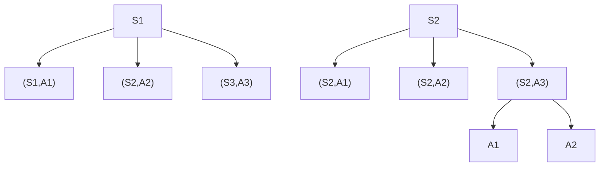

<table><tr><td>Problem Chosen</td><td>2020</td><td>Team Control Number</td></tr><tr><td>F</td><td>MCM/ICM</td><td>2013733</td></tr><tr><td></td><td>Summary Sheet</td><td></td></tr></table>

2020

MCM/ICM

Summary Sheet

# Comprehensive policy models developed for EDPs Abstract

The global climate change has become increasingly important, therefore this paper contributes to proposing propriate policies. In the first part, we build two models that calculate the number of people at risk from two aspects. The sea level rise model forecasts the number under the direct impact of rising sea. The perceptional environment model is constructed to measure intangible influence by climate change. To understand the risk of culture loss, we construct a stochastic culture index model to simulate the culture development process.

In the second part, we propose our policies on the basis of part1. We develop three models to help carry out our policies. The decision-making model provides various solutions for different people affected by climate disasters. The matching model chooses best matching areas for EDPs. The charging model allocates the cost of disaster management to each country

The third part evaluates the effect of our policies proposed in part2 from economics and culture perspectives. This part discusses some further influence ignored in policy proposing process. We adopt Specific-Factor Model and find that the input of EDPs will expand the local industries and lower average wage in the short-run. In the long run, it will cause the growth of low-end industries and the shrink of high-end industries. As for the culture impact, we explain the three potential outcomes for the immigrant culture and give our corresponding measures for each scenario.

In the last part, based on our model analysis and policies, we comprehensively evaluate the advantages and highlights of our polices. Balance between individual-freedom and order, human rights, fairness, Quantification of multiple factors, economic and cultural impact, responsibility sharing and the possibility of extreme weather are all been covered.

Key words: Markov-Chain, Specific-Factor model, charging model, Discrete MDP

## Content

## 1 Introduction....

1.1 Background. 3  
1.2 Overview of our work. 3

## 2 Evaluation of Current Situation ..........

2.1 Overview.. ..3  
2.2 Notations.. .3  
2.3 Homeless people caused by sea level rise..  
2.4 Perceptual Environment Model. 6  
2.5 Stochastic Culture Index Model.

## 3 Policy Purposed for EDPs .... .10

3.1 General Policy and Mechanism. .10  
3.2 Notations.. .10  
3.3 Decision making process - The balance of choosing the destination.. .11  
3.4Match Model. 12  
3.5 Charging Model. 14

## 4 Potential Impact of Policy ....... 17

4.1 Profile 17  
4.2 Notations.. .17  
4.3 Impact on Economy, with Specific-Factor Model. 17  
4.4 Culture Impact: Nationalism and Globalism.. .20

## 5 Model Extension........ 2

5.1 Profile .21  
5.2 Reflection from the perspective of economic relevance. 21  
5.3 Reflection on the Aspect of Culture. .21

## 6 The importance of Proposed Policy.............. .22

## Reference...... 23

## 1 Introduction

## 1.1 Background

The global climate change has caused a series of problems to every country in the world. On the one hand, Global warming is causing tons of melting ice flowing into the ocean, putting those small-island nations at tremendous danger. On the other hand, extreme whether has become more and more frequent in all corners of the world, worsening our human beings living situation.

In the meantime, the problem of climate refugees is getting worse and worse. The world bank has estimated a total of over 140-million refugees that need to be relocated by 2050. Under the circumstances, the highest priority lies in how to evaluate the situation and how to design policies for it properly.

## 1.2 Overview of our work

```mermaid
graph TD
  A["Sea level Rise Model"] -->|Estimates| B["The Number of People at Risk"]
  C["Perceptual Environment Model"] -->|Estimates| D["The Risk of Culture loss"]
  E["Stochastic Culture Index Model"] -->|Estimates| F["Estimation of Current Situation"]
  G["Match Model"] --> H["Cultural Similarity, Objective Conditions Similarity, Agglomeration, Employment"]
  I["Charge Model"] --> J["Capital Stock, Carbon Emission"]
  K["Decision-Making Model"] --> L["Human Right, Personal Choice"]
  M["Specific-Factor Model"] --> N["Lower wage, short-term"]
  O["Assimilation VS Pluralism"] --> P["Change Industry Structure, long-term"]
  Q["Economy"] --> R["Culture"]
  S["Policy Effect (long-term &short-term)"] --> T["Policy Purposing (long-term &short-term)"]
  U["Reflection on Policy"] --> V["Logic of Our Work"]
  W["Demand for Policy"] --> X["Estimation of Current Situation"]
  Y["Requirement of Estimation"] --> Z["Policy Purposing (long-term &short-term)"]
  AA["Sequence of Modeling"] --> AB["Policy Effect (long-term &short-term)"]
```

flowchart

Fig.1 Sequence of modeling

## 2 Evaluation of Current Situation

## 2.1 Overview

We develop three models to estimate the severity of EDPs problems human beings face. Sea level rise model measures the direct impact of climate challenge while perceptual environment model measures the impact of overall worsening environment. Finally, a stochastic culture index model reveals the risk of culture loss in a time-span way.

## 2.2 Notations

<table><tr><td>Symbol</td><td>Defination</td><td>Symbol</td><td>Defination</td></tr><tr><td>A</td><td>The geographic center of the island</td><td>CI</td><td>Comprehensive index</td></tr><tr><td>X</td><td>The distance from geographic center A</td><td>acc</td><td>Access to Clean Fuels and Tech for Cooking(%)</td></tr><tr><td>D(X)</td><td>The population density function</td><td>rank</td><td>Environmental Policy Ratings from CPIA</td></tr><tr><td>DO</td><td>The density population at the geographic center A</td><td>watpe</td><td>Reneable Fresh Water Per Head</td></tr><tr><td>Vs</td><td>the speed of the rise of sea level</td><td>pm</td><td>Population Exposed to excess PM2.5</td></tr><tr><td>PRt</td><td>People at risk at year t</td><td>co</td><td>CO2 Emission Per Person</td></tr><tr><td>Urbant</td><td>The urban population at year t</td><td>popd</td><td>Population Density</td></tr><tr><td>S</td><td>The land&#x27;s original area</td><td>PoE</td><td>Probability of Escape</td></tr><tr><td>Pt</td><td>The island&#x27;s population at year t</td><td>MDV</td><td>Maldives</td></tr><tr><td>Rt</td><td>The retreating rate of waterfront lines at year t</td><td>Ed</td><td>Education</td></tr><tr><td>θ</td><td>The slope angle of the sea coast</td><td>De</td><td>Development</td></tr><tr><td>βt</td><td>The density slope at year t</td><td>Bu</td><td>Buffer</td></tr><tr><td>Y</td><td>Random variable of De</td><td>Dl</td><td>Drown land</td></tr><tr><td>Z</td><td>Random variable of Bu</td><td>X</td><td>Random variable of Ed</td></tr></table>

## 2.3 Homeless people caused by sea level rise

## 2.3.1 Model Assumption

The shape of the island is approximately a round from above.  
Residents mainly assemble at the center of the island and the population density evenly radiates in all directions.

## 2.3.2 Model building and Result

We establish the sea level rise model to analyze the effect of sea level rise. During this process, we build the population density function based on Clark’s[1] negative exponential function and we also explore the relationship between sea level rise and coast erosion based on Brunne’s[2] theory. Eventually, we combine these two results and estimated the scale of people at risk caused by sea level rise.

Due to the first assumption, the island could be regarded as a round, therefore we could solve the radius by making the area of circle equal to its real area.

$$
R _ {1} = \sqrt {\frac {s}{\pi}}
$$

Due to the first three assumptions, an island’s population density function could be fitted with the negative exponential model. (Clark, 1951)

$$
D (x) = D _ {0} * e ^ {- \beta x ^ {2}}
$$

We take the central 10% of the total island as its major urban area, so population density in urban area is

$$
D _ {0} = \frac {\text {Urban} _ {t}}{0 . 1 \times s}
$$

We could solve β by equating the model’s population to its real population

$$
2 \pi \int_ {0} ^ {R _ {t}} x D (x) d x = P _ {t}
$$

Because the sea level is significant on the rise only in the recent 15 years, we take the average speed of the recent 15 years as an average speed. As the sea rises, the water encroaches the land, pushing sea coast landward. Bruun(1962) has put forward a model describing the relationship between sea level rise and the change of the beach. Due to the island is relative small compared to the whole earth, the nearshore slope

could be approximately estimated by the geocentric angle

$$
\theta_ {t} = \frac {\widehat {\mathsf {A B}}}{R _ {E}} \approx \frac {R _ {t}}{R _ {E}}
$$

The sea water encroaches forward

$$
L _ {t} = \frac {V _ {S}}{t a n \theta_ {t}}
$$

The people at risk at year t:

$$
P R _ {t} = 2 \pi \int_ {0} ^ {L _ {t}} D (x) (R _ {t} - L _ {t}) d x
$$

text_image

A
Lt
B
Vs
O
α

Fig.1 Island’s site on the globe

Our team collects relevant data from the World Bank and NOAA databases. As Maldives is one of the most endangered island nations facing the climate disaster, we choose this country to empirically test the practicability of our model. Our data includes its total population, urban population, and the record of the highest sea level each year. Based on the model, we successfully predict the annual amount of people at risk each year and the accumulated people at risk caused by sea level rise.

line chart

| Year | People at risk each year | Accumulated People at risk |
| ---- | ------------------------ | -------------------------- |
| 2004 | 1000                     | 0                          |
| 2100E | 7000                     | 350000                     |

Fig.2 People at risk in Maldives

## 2.4 Perceptual Environment Model

Climate change doesn’t only influence people in a visible way, other sectors could also have impacts on people’s life. Our team develop the Perceptual Environment Model to measure the possibility of becoming EDPs due to worsening surroundings.

## 2.4.1 Basic Idea

We divide the perceptual aspects into three dimensions: environment, material conditions and national effect. Environment measures the degree of people’s comfort. Material conditions represent the living conditions. National efforts weigh people’s attitude. A compounded index is generated to describe the potential impact on people.

Comprehensive Index = f(ⅇ??????????????ⅇ????, ??????ⅇ???????? ??????ⅆ??????????, ???????????????? ⅇ????????????) Based on the comprehensive index, the probability of escape could be expressed by the following function:

$$
\operatorname{Prob} (\text { escape }) = f (\text { Comprehensive   index })
$$

## 2.4.2 Assumption

To make the model more accessible we make the follow assumptions

Individuals can feel the change of environments from the above three dimensions.  
Individuals are homogeneous and utility maximizers.  
Individuals adopt the comprehensive index as their utility function.  
The probability of escape has an exponential relationship with the comprehensive index.

## 2.4.3 Model Building and Results

Based on this idea, we choose 6 variables from world bank: $\mathrm { C O } _ { 2 }$ emission per person, population exposed to excess PM2.5, access to clean fuels and technologies for cooking, population density and renewable fresh water per person. Environmental Policy Ratings from CPIA are adopted as a proxy for National effort. And then, we clean and reshape the data properly.

$$
\mathrm{CI} = \mathrm{f} (a c c, r a n k, w a t p e, p m, c o, p o p d)
$$

Then, with the method of principal component analysis(PCA) we observe that the differences of contribution between components are not large, which implies the factors we choose do not have a strong collinearity.

line chart

| x | Proportion | Accumulated Proportion |
|---|------------|------------------------|
| 1 | 0.3        | 0.3                    |
| 2 | 0.25       | 0.5                    |
| 3 | 0.15       | 0.7                    |
| 4 | 0.1        | 0.8                    |
| 5 | 0.08       | 0.9                    |
| 6 | 0.05       | 1.0                    |

line chart

| Component | Eigenvalue |
| --------- | ---------- |
| 1         | 1.7        |
| 2         | 1.4        |
| 3         | 0.9        |
| 4         | 0.8        |
| 5         | 0.7        |
| 6         | 0.4        |

## Fig.4 Eigenvalue and Proportion by Vectors

We take the first 4 eigenvectors into our modeling to form our comprehensive input as they contribute to over 80% information of original data. The equation we get is below. The constant term 5 is added to make further data step more smooth.

$$
\begin{array}{l} \mathrm{CI} = - 0. 0 3 5 7 7 \mathrm{Acc} + 0. 2 7 6 8 \mathrm{rank} + 1. 0 2 1 \mathrm{watpe} + 0. 6 9 1 7 \mathrm{pm} + 0. 8 6 7 9 \mathrm{co} \\ + 1. 2 8 3 \text {popdens} + 5 \\ \end{array}
$$

95% quantile is adopted to determine at how much extent the people will surely become EDPs, where every variable at the extreme condition. By contrast, if using the average of every variable, the possibility close to 0.

<table><tr><td></td><td>Acc</td><td>rank</td><td>watpe</td><td>pm</td><td>co</td><td>popd</td></tr><tr><td>average</td><td>60.70</td><td>3.12</td><td>3.92E-05</td><td>7.551</td><td>-1.7E-05</td><td>-4.32</td></tr><tr><td>Percentile(95%)</td><td>1.35</td><td>2.03</td><td>1.14E-07</td><td>0</td><td>-9E-05</td><td>-6.50</td></tr></table>

According to our assumptions, we calculate the function of PoE (Probability of escape).

$$
P o E = \left\{ \begin{array}{c} 1 (C I \leq - 2. 8 2 5) \\ 1. 6 5 5 9 - 1. 1 6 0 9 9 8 ^ {C I} (- 2. 8 2 5 <   C I \leq 3. 3 7 8 6) \\ 0 (3. 3 7 8 6 <   C I) \end{array} \right.
$$

The comprehensive index in a stable condition is equal to 3.3786. When it drops to -2.825, people will surely become EDPs. As the influence factors to EDPs are quite various, we adopt an exponential model with the comprehensive index as an input to describe the probability of people becoming EDPs in certain situation.

line chart

| X Value | Prob of Stay | Prob of Escape |
| ------- | ------------ | -------------- |
| -2.975  | 0.0          | 1.0            |
| -2.8    | 0.0          | 1.0            |
| -2.625  | 0.0          | 1.0            |
| -2.45   | 0.0          | 1.0            |
| -2.275  | 0.0          | 1.0            |
| -2.1    | 0.0          | 1.0            |
| -1.925  | 0.0          | 1.0            |
| -1.75   | 0.0          | 1.0            |
| -1.575  | 0.0          | 1.0            |
| -1.4    | 0.0          | 1.0            |
| -1.225  | 0.0          | 1.0            |
| -1.05   | 0.0          | 1.0            |
| -0.875  | 0.0          | 1.0            |
| -0.7    | 0.0          | 1.0            |
| -0.525  | 0.0          | 1.0            |
| -0.35   | 0.0          | 1.0            |
| -0.175  | 0.0          | 1.0            |
| 0       | 0.0          | 1.0            |
| 0.175   | 0.0          | 1.0            |
| 0.35    | 0.0          | 1.0            |
| 0.525   | 0.0          | 1.0            |
| 0.7     | 0.0          | 1.0            |
| 0.875   | 0.0          | 1.0            |
| 1.05    | 0.0          | 1.0            |
| 1.225   | 0.0          | 1.0            |
| 1.4     | 0.0          | 1.0            |
| 1.575   | 0.0          | 1.0            |
| 1.75    | 0.0          | 1.0            |
| 1.925   | 0.0          | 1.0            |
| 2.1     | 0.0          | 1.0            |
| 2.275   | 0.0          | 1.0            |
| 2.45    | 0.0          | 1.0            |
| 2.625   | 0.0          | 1.0            |
| 2.8     | 0.0          | 1.0            |
| 2.975   | 0.0          | 1.0            |
| 3.15    | 0.0          | 1.0            |
| 3.325   | 0.0          | 1.0            |
| 3.5     | 1.0          | 1.0            |

Fig.5 Probability of Stay and Escape

We use data of Maldives in 2014 to test our model and find that the CI of Maldives is 62.66, which illustrate the perceptual environment tend to attract citizens of Maldives, rather than pushing them away.

<table><tr><td></td><td>Acc</td><td>rank</td><td>watpe</td><td>pm</td><td>co</td><td>popd</td></tr><tr><td>average</td><td>60.698</td><td>3.1154</td><td>3.92E-05</td><td>7.5519</td><td>-1.7E-05</td><td>-4.31501</td></tr><tr><td>MDV</td><td>91.71</td><td>4</td><td>6.9E-08</td><td>100</td><td>-7.1E-06</td><td>-7.27935</td></tr></table>

## 2.5 Stochastic Culture Index Model

## 2.5.1 Basic Idea

Since cultures are products of human interactions, we develop our model in this part with the core ideal, “people”. We use education to measure the internal motivation of a culture, adopt the change in GDP growth rate to describe the tendency

text_image

People(Education)
Development(div2 GDP)
Climate(drown land)
Interaction(Tourism)

Fig.6 Aspects of Culture

of the culture; then we use the inundated area each years divided by the remaining land to illustrate direct climate pressure. At last, we use the tourism GDP (%) as an index of culture interaction in our modeling. As the future is unpredictable, we set the whole process as a completely random one.

## 2.5.2 Assumptions

The state that happens in the next year depends on current state and education, percent change in GDP growth rate, inundated land, and Tourism

One of the three states of culture happens every year: boom, stable, recession

This means $\mathrm { P } \big ( X _ { t + 1 } \big | X _ { t } , O t h e r _ { t } , X _ { t - 1 , } O t h e r _ { t - 1 } , X _ { t - 2 } \ldots \big ) = \mathrm { P } ( X _ { t + 1 } | X _ { t } , O t h e r _ { t } )$

IL(inundated land) happens at each term, while the ED(education), DE(development), BU(buffer) in the future are random variables and obey the same Gaussian distribution.

Every variable generate a possibility based on different information.

In a very long time, a culture will ultimately disappear.

## 2.5.3 Model Building and Results

We model carefully with assumptions above, and first determine the distribution those variables obey. Because rising sea level will damage the culture, we add it into the distribution function to express its importance.

<table><tr><td>Last State</td><td>ED</td><td>DE</td><td>BU</td><td>Distribution</td></tr><tr><td>Boom</td><td>X1</td><td>Y1</td><td>Z1</td><td>X1,Y1,Z1~N(0.51-0.05IL,0.05)</td></tr><tr><td>Stable</td><td>X2</td><td>Y2</td><td>Z2</td><td>X2,Y2,Z3~N(0.5-0.1IL,0.05)</td></tr><tr><td>Recession</td><td>X3</td><td>Y3</td><td>Z3</td><td>X3,Y2,Z3-N(0.49-0.15IL,0.05)</td></tr></table>

Then we determine the condition of transformation to each state and make efforts to estimate the effect on culture. We set the original year as 100 as a benchmark to better evaluate the risk.

<table><tr><td colspan="2">If</td><td>State of Next Period</td></tr><tr><td>&gt;</td><td>1.5</td><td>Boom</td></tr><tr><td>∈</td><td>(1.45, 1.5]</td><td>Stable</td></tr><tr><td>&lt;</td><td>1.4</td><td>Recession</td></tr></table>

<table><tr><td></td><td>Culture index i+1</td></tr><tr><td>Boom</td><td>X+Y+Z/1.5*Culture index i</td></tr><tr><td>Stable</td><td>Culture index i</td></tr><tr><td>Recession</td><td>X+Y+Z/1.4*Culture index i</td></tr></table>

Taking our first estimation result as an input, we simulate the culture index of

Maldives in 60 years. Under the normal situation, 23 years is the most extreme condition that the culture shrinks to 1/10 of origin level, meaning that the culture actually lose a lot. A 20% increase in climate sector’s effect brings the time forward for two years. On the contrary, a 20% decrease in climate sector’s effect will delay the time for two years. However, if there is no negative impact from the climate change, the culture will still exist for 60 years, according our estimation.

  
Fig.7 Culture Index Simulation

We generate 1000 simulations and calculate the means. With population deviation estimated by sample deviation and under the condition of Law of Large numbers, we draw the prediction line with 95% confidence level borders below.

line chart

| x  | Solid Line | Dashed Line |
|----|------------|-------------|
| 1  | 100        | 100         |
| 4  | 95         | 98          |
| 7  | 90         | 95          |
| 10 | 85         | 92          |
| 13 | 80         | 88          |
| 16 | 75         | 85          |
| 19 | 70         | 80          |
| 22 | 65         | 75          |
| 25 | 60         | 70          |
| 28 | 55         | 65          |
| 31 | 50         | 60          |
| 34 | 45         | 55          |
| 37 | 40         | 50          |
| 40 | 35         | 45          |
| 43 | 30         | 40          |
| 46 | 25         | 35          |
| 49 | 20         | 30          |

95% confidence lower bound  
Fig.8 Prediction of Culture Index

Based on our model, the most optimistic one begins to fade after 10 years. And the half-life or the culture is between 14 to 22 year, while the most extreme case without effect of rising sea is 29-year. At the 95 percent confidence level, the culture will reduce to 1/10 of initial vigor in 28-year. And in most of cases, if there is no protection, the cultures seem to come to the end in 43-year.

## 3 Policy Purposed for EDPs

## 3.1 General Policy and Mechanism

The implementation of our policies requires the cooperation of EDPs, countries and cross-country organizations. First, we divide people affected by climate disasters into two types and adopt different policies respectively. One is the people whose original houses can no longer meet the living requirements and have to move out or rebuild their homes. For these people, our policy is that they are free to choose

A1: receive a compensation and move out by their will

A2: move out under our plan

A3: receive a compensation and go to places with a higher sea level

With the principle of encouraging choice A2, in our policies, those who choose A2 will be provided with new houses and jobs similar to their previous ones as far as possible.

The other type is people who don’t have to leave. But they may have relatives belonging to the first type and they want to move out together. They may also fear that future disasters will hurt them or have other concerns. Anyway, we provide type2-people who want to leave with A2 policy. They can get jobs but they have to pay something for houses because their previous ones are still worthy.

The plan in A2 is that we will choose the area which is most suitable for EDPs under consideration of various factors such as culture, objective conditions, degree of their aggregation in new area, employment prospects, etc. EDPs can’t also choose locations of free houses on their own. Under the consideration of national sovereignty, the planning of the housing address will be completed by the area. But international organizations and EDPs can participate in consultation and discussion.

Our policies also include cost allocation part. We adopt the principle of charging each country an annual fee based on its capital stock per capita and annual carbon emissions per capita. After covering the necessary direct economic costs such as compensations and houses, the rest of collected fees will be used for the construction of cultural activities.

## 3.2 Notations

<table><tr><td>Symbol</td><td>Defination</td><td>Symbol</td><td>Defination</td></tr><tr><td>E</td><td>The cost of moving abroad</td><td>Ai/Bi</td><td>percentage of i industry in gross output value for the island/area</td></tr><tr><td>S</td><td>Selling house discount</td><td> $Y_i$ </td><td>yield per year per capita for area i</td></tr><tr><td>S1</td><td>State of in danger</td><td> $C_i$ </td><td>cost charged to settle EDPs per year per capita for area i</td></tr><tr><td>S2</td><td>State of not in danger</td><td>CSi</td><td>capital stock per capita for area i</td></tr><tr><td>Q(Si,Aj)</td><td>Action value function</td><td>CEi</td><td>carbon emissions per year per capita for area i</td></tr><tr><td> $\alpha_i$ </td><td>the value of dimension i</td><td> $\alpha_{Ai/Bi}$ </td><td>the value of dimension i for island/area</td></tr><tr><td> $\beta_i$ </td><td>the value of aspect i</td><td> $N_{EDPs/na}$  $t$ </td><td>the entire population on the planned housing land range of EDPs/natives</td></tr><tr><td>Var(i)</td><td>the variance of dimension i</td><td> $S_{EDPs/nat}$ </td><td>the total space of the planned housing land range of EDPs/natives</td></tr><tr><td> $\alpha_{ilow}/\beta_{ilow}$ </td><td>the lowest value of dimension/aspect i</td><td> $\alpha_{i}^{high}/\beta_{i}^{h}$  $igh$ </td><td>the highest value of dimension/aspect i</td></tr></table>

## 3.3 Decision making process - The balance of choosing the destination

## 3.3.1 Assumption

People who decide to choose their own living country can only start working in the next stage. In the contrary, those following policies can start working in the first period.

## 3.3.2 Decision-Making Process

Everyone has his own preference, so what exactly an individual will choose is based on his utility function. We assume that it is a two-stage process. In the first stage, people on the island choose where they would like to go. If the people are not at risk, In the second stage, people that choose to live abroad could find a job and start working. The other who choose to stay on the island in the previous period have to leave now due to the worsening living situation.

flowchart

Fig.9 Decision making process

$$
\begin{array}{l} Q (S _ {1}, A _ {1}) = W * \delta - E + d \\ Q (S _ {1}, A _ {2}) = 2 W + C \\ Q (S _ {1}, A _ {3}, A _ {1}) = W - e - E * \delta + d \\ Q (S _ {1}, A _ {3}, A _ {2}) = (1 + \delta) W - e - E * \delta + C * \delta \\ Q (S _ {2}, A _ {1}) = W * \delta - S - E + d \\ Q (S _ {2}, A _ {2}) = 2 W + C \\ Q (S _ {2}, A _ {3}, A _ {1}) = W - E * \delta + d \\ Q (S _ {2}, A _ {3}, A _ {1}) = (1 + \delta) W - E * \delta + C * \delta \\ \end{array}
$$

Each parameter above represents how much they value those things in their eyes. And we could analyze which behavior a person would choose by comparing those action value functions. The model indicates that whatever state the person is in, the equilibrium choice depends on how much those benefits and troubles weigh in their own mind.

## 3.3.3 Results

For a person at risk, if $d > E + C + ( 2 - \delta ) * W$ , meaning the freedom choice values more, then he will choose to live by his will. If $\mathbf { C } + ( 2 - \delta ) * W > d - E ,$ , meaning the convenience our policies bring is more valuable than the freedom of choosing living place, then he will comply to policy-driven migration. And if $e <$ $( 1 - \delta ) * ( W - E )$ , meaning he believes moving abroad is more inconvenient that he would rather stay in the island for a couple of years.

In conclusion, if our goal is making as many residents as possible to follow the policy-driven migration, emphasizing how hard it is to find houses and jobs on their own and how many troubles our policies could save can be an extremely useful way.

## 3.4 Match Model

## 3.4.1 Basic Idea

Our EDPs-area match model is established in the following four aspects.

Cultural similarity: In areas with higher cultural similarities, it is easier for EDPs to resettle and integrate into the local society, and it is also conducive for the preservation of the original cultural customs.

Similarity of objective conditions: Besides cultural and social factors, economy and geography will also affect the choice of the area for immigration.

Agglomeration: Living together is good for cultural preservation. But excessive agglomeration may annoy the government, for it increases instability. EDPs and government need to negotiate to determine what level of agglomeration is acceptable.

Employment: At the individual level, people will attach great importance to the future income level and stability. And the similarity of industrial structure between this area and island is a good prediction of the convenience of EDPs’ future employment. The higher the similarity is, the easier the EDPs will find jobs. (It will be further discussed later)

## 3.4.2 Cultural Similarity

Based on the psychologist Geert Hofstede’s cultural differences research (2010) ,we construct our model on six cultural dimensions.

<table><tr><td>Power distance index (PDI)</td><td>Uncertainty avoidance index (UAI)</td></tr><tr><td>Individualism versus collectivism (IDV)</td><td>Long term orientation versus short (LTO)</td></tr><tr><td>Indulgence versus restraint (IVR)</td><td>Masculinity versus femininity (MVF)</td></tr></table>

The above six aspects are scored separately for the island and potential candidate immigration areas, remarked as αi(i=1,2,3,4,5,6). So the island and area are respectively represented as follows.

$$
\text { Island } = \left(\alpha_ {\mathrm{A} 1}, \alpha_ {\mathrm{A} 2}, \alpha_ {\mathrm{A} 3}, \alpha_ {\mathrm{A} 4}, \alpha_ {\mathrm{A} 5}, \alpha_ {\mathrm{A} 6}\right)
$$

$$
\text { Area } = \left(\alpha_ {\mathrm{B} 1}, \alpha_ {\mathrm{B} 2}, \alpha_ {\mathrm{B} 3}, \alpha_ {\mathrm{B} 4}, \alpha_ {\mathrm{B} 5}, \alpha_ {\mathrm{B} 6}\right)
$$

Then we get the cultural similarity index defined by the following function:

$$
\beta_ {1} = 1 / \sqrt {\sum_ {\mathrm{i} = 1} ^ {6} \frac {\left(\alpha_ {\mathrm{Ai}} - \alpha_ {\mathrm{Bi}}\right) ^ {2} / \operatorname{var} (i)}{6}}
$$

After applying data from the website of GEERT HOFSTED and other relevant information into our model, we have two pictures to display. Picture 1 shows the six scores of four countries. Picture 2 shows some countries’ similarity with New Zealand: the larger the bubble is, the more cultural similarity they have with New Zealand.

radar chart

Six cultural dimensions
| Category | China | Netherlands | Russia | U.S.A. |
|---|---|---|---|---|
| 1 | 6 | 5 | 4 | 3 |
| 2 | 5 | 6 | 5 | 6 |
| 3 | 4 | 4 | 5 | 4 |
| 4 | 3 | 3 | 6 | 3 |
| 5 | 2 | 2 | 4 | 2 |
| 6 | 1 | 1 | 3 | 1 |

bubble chart

| Country   | Longitude | Latitude | Bubble Size |
| --------- | --------- | -------- | ----------- |
| Australia | 150       | -40      | Large       |
| U.S.A.    | -50       | 60       | Medium      |
| Finland   | 20        | 60       | Small       |
| Austria   | 30        | 50       | Small       |
| Denmark   | 20        | 60       | Medium      |
| Spain     | 10        | 40       | Small       |
| Turkey    | 120       | 40       | Small       |
| Mexico    | 120       | 40       | Small       |
| Japan     | 120       | 40       | Small       |
| China     | 120       | 40       | Small       |
| Russia    | 120       | 40       | Small       |

Fig.10 Cultural Dimensions(left), Cultural Distance (right)

## 3.4.3 Similarity of objective conditions

As for culture similarity, the same method for calculating the similarity is adopted. Dimension such as longitude, latitude, official language, skin color (0or1, same:1; different:0), colonial history(0or1), GDP per capita, welfare and social security expenditure per capita .

These dimensions have different units of measurement, so they must be standardized first as follows. Then we get the similarity index β2. For economic dimensions (GDP, expenditure on welfare),it is better that the area has the same level as the island instead of a higher absolute level.

$$
\alpha = \frac {\alpha - \alpha^ {\mathrm{low}}}{\alpha^ {\mathrm{high}} - \alpha^ {\mathrm{low}}}
$$

$$
\beta_ {2} = 1 / \sqrt {\sum_ {\mathrm{i} = 1} ^ {7} \frac {\left(\alpha_ {\mathrm{Ai}} - \alpha_ {\mathrm{Bi}}\right) ^ {2} / \operatorname{var} (i)}{7}}
$$

## 3.4.4 Agglomeration.

The method of calculating the relative density of population on the planned housing land range is mainly used.

$$
\beta_ {3} = \frac {\left(\mathrm{N} _ {\mathrm{EDPs}} / \mathrm{S} _ {\mathrm{EDPs}}\right) \times 100 \%}{\left(\mathrm{N} _ {\mathrm{nat}} / \mathrm{S} _ {\mathrm{nat}}\right) \times 100 \% + \left(\mathrm{N} _ {\mathrm{EDPs}} / \mathrm{S} _ {\mathrm{EDPs}}\right) \times 100 \%}
$$

The function means if the area provides EDPs with a immigration village, we have $\beta _ { 3 } { = } 1$ .And if they were scattered everywhere, $\beta _ { 3 } { \approx } 0$ .

## 3.4.5 Employment

We make use of the industrial structure similarity index proposed by Krugman(K1, 1991) and the United Nations Industrial Development Organization（K2, 1980）.We can find that the value range of K1 is [0,2] and the one of K2 is [0,1]. And their 0 and 1 indicate the opposite direction of similarity. So we have constructed a new index β4.

$$
\mathrm{K} _ {1} = \sum_ {\mathrm{i} = 1} ^ {\mathrm{n}} \left| \mathrm{A} _ {\mathrm{i}} - \mathrm{B} _ {\mathrm{i}} \right| \quad \mathrm{K} _ {2} = \frac {\sum_ {\mathrm{i} = 1} ^ {\mathrm{n}} \left(\mathrm{A} _ {\mathrm{i}} \bullet \mathrm{B} _ {\mathrm{i}}\right)}{\sqrt {\sum_ {\mathrm{i} = 1} ^ {\mathrm{n}} \mathrm{A} _ {\mathrm{i}} ^ {2} \bullet \sum_ {\mathrm{i} = 1} ^ {\mathrm{n}} \mathrm{B} _ {\mathrm{i}} ^ {2}}}
$$

$$
\beta_ {4} = 1 - \frac {1}{2} \times \sum_ {\mathrm{i} = 1} ^ {\mathrm{n}} \left| \mathrm{A} _ {\mathrm{i}} - \mathrm{B} _ {\mathrm{i}} \right| + \frac {1}{2} \times \frac {\sum_ {\mathrm{i} = 1} ^ {\mathrm{n}} \left(\mathrm{A} _ {\mathrm{i}} \bullet \mathrm{B} _ {\mathrm{i}}\right)}{\sqrt {\sum_ {\mathrm{i} = 1} ^ {\mathrm{n}} \mathrm{A} _ {\mathrm{i}} ^ {2} \bullet \sum_ {\mathrm{i} = 1} ^ {\mathrm{n}} \mathrm{B} _ {\mathrm{i}} ^ {2}}}
$$

Referring to Analytic Hierarchy Process (AHP) developed by Thomas L. Saaty in the 1970s, we use a weighted model to combine the four aspects above. In order to save space, we skipped the AHP process and only keep the results.

$$
\mathrm{Index} = 0. 3 6 5 * \beta_ {1} + 0. 2 7 7 * \beta_ {2} + 0. 1 2 5 * \beta_ {3} + 0. 2 3 3 * \beta_ {4}
$$

Then we can use the model and necessary data to select the best matched one from the candidate areas.

## Why will the selected area accept EDPs and who will undertake the costs?

Some governments are unwilling to accept EDPs because they think that it may bring them expenses that they should not have undertaken. Therefore, based on the principle of fairness, our policy separates the charging part from the matching part. We will calculate all the costs, and use our model below to allocate them to all countries in the form of charges, and provide compensation to EDPs and countries involved.

## 3.5 Charging Model

## 3.5.1 Basic idea

After selecting the immigration area, we will calculate all costs and find countries to pay for it. And we will build a model to analyze how much each area will pay.

Our charging model assumes that before the necessary immigration, people on the island are relatively free to move to other similar areas. For those similar areas, the additional social security and other burdens brought by immigrants have the nearly same amount with the economic contributions they bring. Thus the only direct economic cost is just new houses and the compensation for those who choose to be paid in cash.(It will be further discussed later.)

But our world needs to pay more. In order to preserve culture, it is helpful to establish a database of pictures and videos, and even museums if necessary. Besides, cultural activities and festivals may need to be held regularly. The total cost can be expressed as below:

$$
\mathbf {C} _ {\text { total }} = \left(\mathbf {C} _ {\text { house }} + \mathbf {C} _ {\text { compensation }}\right) + \left(\mathbf {C} _ {\text { database }} + \mathbf {C} _ {\text { activity }}\right)
$$

As the direct economic cost is necessary, it can also be understood as fixed cost, while the culture cost can be adjusted because it is hard to decide what kind of cultural activities is necessary. It can be written as below:

$$
\mathbf {C} _ {\text { total }} = \mathbf {C} _ {\text { fixed }} + \mathbf {C} _ {\text { variable }}
$$

We believe that evaluating cultural activities cost is hard. We construct our model from the money source side—the charging for each area.

## 3.5.2 Model Process

Assumption 1: For area i, annual economic yield per capita is related to capital stock per capita(CS) and annual carbon emissions capita(CE).

Assumption 2: For each area, its capital stock per capita can be regarded as almost constant. (especially when the global economic growth is slow nowadays.)

On the basis of production function in economics, we assume the yield function has a constant return to scale:

$$
\mathrm{Y} _ {\mathrm{i}} = \mathrm{CS} _ {\mathrm{i}} ^ {\alpha} \times \mathrm{CE} _ {\mathrm{i}} ^ {1 - \alpha} (0 <   \alpha <   1)
$$

Assumption 3: Area’s capital stock is related to the its past carbon contribution.

So we charge areas on the basis of capital stock per capita and annual carbon emissions per capita. For capital stock, it should has a smaller return to scale in the charging model than the return in yield model(0<γ<α).And for carbon emissions, it should has an increasing return to scale because people has to pay more for the damage(β>1).So we have the charging function.

$$
\mathbf {C} _ {\mathrm{i}} = \mathbf {k} \times \mathbf {C S} _ {\mathrm{i}} ^ {\gamma} \times \mathbf {C E} _ {\mathrm{i}} ^ {\beta} (0 <   \gamma <   \alpha , \beta > 1)
$$

Then for area i, it has the yield-cost curve and marginal yield-marginal cost curve as below.

line chart

| Category | Value |
| -------- | ----- |
| Y-rich   | 0     |
| C-rich   | 0     |
| Y-poor   | 0     |
| C-poor   | 0     |

Fig.11 Y-C curve(left)

line chart

| CE | MY-rich | MC-rich | MY-poor | MC-poor |
| --- | --- | --- | --- | --- |
| 0 | 1.0 | 0.0 | 0.5 | 0.0 |
| 1 | 0.8 | 0.2 | 0.4 | 0.1 |
| 2 | 0.7 | 0.4 | 0.3 | 0.2 |
| 3 | 0.6 | 0.6 | 0.25 | 0.3 |
| 4 | 0.55 | 0.8 | 0.2 | 0.4 |
| 5 | 0.5 | 1.0 | 0.15 | 0.5 |
| 6 | 0.45 | 1.2 | 0.1 | 0.6 |
| 7 | 0.4 | 1.4 | 0.05 | 0.7 |
| 8 | 0.35 | 1.6 | 0.0 | 0.8 |
| 9 | 0.3 | 1.8 | 0.0 | 0.9 |
| 10 | 0.25 | 2.0 | 0.0 | 1.0 |
| 11 | 0.2 | 2.2 | 0.0 | 1.1 |
| 12 | 0.15 | 2.4 | 0.0 | 1.2 |
| 13 | 0.1 | 2.6 | 0.0 | 1.3 |
| 14 | 0.05 | 2.8 | 0.0 | 1.4 |
| 15 | 0.0 | 3.0 | 0.0 | 1.5 |
| 16 | -0.05 | 3.2 | -0.05 | 1.6 |
| 17 | -0.1 | 3.4 | -0.1 | 1.7 |
| 18 | -0.15 | 3.6 | -0.15 | 1.8 |
| 19 | -0.2 | 3.8 | -0.2 | 1.9 |
| 20 | -0.25 | 4.0 | -0.25 | 2.0 |
| 21 | -0.3 | 4.2 | -0.3 | 2.1 |
| 22 | -0.35 | 4.4 | -0.35 | 2.2 |
| 23 | -0.4 | 4.6 | -0.4 | 2.3 |
| 24 | -0.45 | 4.8 | -0.45 | 2.4 |
| 25 | -0.5 | 5.0 | -0.5 | 2.5 |
| 26 | -0.55 | 5.2 | -0.55 | 2.6 |
| 27 | -0.6 | 5.4 | -0.6 | 2.7 |
| 28 | -0.65 | 5.6 | -0.65 | 2.8 |
| 29 | -0.7 | 5.8 | -0.7 | 2.9 |
| 30 | -0.75 | 6.0 | -0.75 | 3.0 |
| 31 | -0.8 | 6.2 | -0.8 | 3.1 |
| 32 | -0.85 | 6.4 | -0.85 | 3.2 |
| 33 | -0.9 | 6.6 | -0.9 | 3.3 |
| 34 | -0.95 | 6.8 | -0.95 | 3.4 |
| 35 | -1.0 | 7.0 | -1.0 | 3.5 |
| 36 | -1.05 | 7.2 | -1.05 | 3.6 |
| 37 | -1.1 | 7.4 | -1.1 | 3.7 |
| 38 | -1.15 | 7.6 | -1.15 | 3.8 |
| 39 | -1.2 | 7.8 | -1.2 | 3.9 |

MY-MC curve(right)

（Rich means that people in this area have a higher capital stock per capita）

Assumption 4: Everyone is rational and wants to maximize his benefit. Then for area i, it has the following behavior:

$$
\text { Max }: \quad \mathrm{B} _ {\mathrm{i}} = \mathrm{Y} _ {\mathrm{i}} - \mathrm{C} _ {\mathrm{i}} = \mathrm{CS} _ {\mathrm{i}} ^ {\alpha} \times \mathrm{CE} _ {\mathrm{i}} ^ {1 - \alpha} - \mathrm{k} \times \mathrm{CS} _ {\mathrm{i}} ^ {\gamma} \times \mathrm{CE} _ {\mathrm{i}} ^ {\beta}
$$

$$
\mathrm{st}: \mathrm{CE} _ {\mathrm{i}} > 0
$$

$$
\frac {\partial \mathrm{B} _ {\mathrm{i}}}{\partial \mathrm{CE} _ {\mathrm{i}}} = (1 - \alpha) \left(\frac {\mathrm{CS} _ {\mathrm{i}}}{\mathrm{CE} _ {\mathrm{i}}}\right) ^ {\alpha} - (\mathrm{k} * \beta) \left(\mathrm{CS} _ {\mathrm{i}} ^ {\gamma} * \mathrm{CE} _ {\mathrm{i}} ^ {\beta - 1}\right)
$$

$$
\frac {\partial^ {2} \mathrm{B} _ {\mathrm{i}}}{\partial \mathrm{CE} _ {\mathrm{i}} ^ {2}} = (- \alpha) * (1 - \alpha) (\mathrm{CS} _ {\mathrm{i}}) ^ {\alpha} (\mathrm{CE} _ {\mathrm{i}}) ^ {- \alpha - 1} - (\mathrm{k} * \beta) (\beta - 1) (\mathrm{CS} _ {\mathrm{i}} ^ {\gamma} * \mathrm{CE} _ {\mathrm{i}} ^ {\beta - 2}) <   0
$$

$$
(\text { Because } \alpha <   0, 1 - \alpha > 0, \beta - 1 > 0)
$$

So for people who wants to maximize the benefit ,there is only one equilibrium point:

$$
\mathbf {C E} _ {\mathrm{i}} ^ {* (\alpha + \beta - 1)} = \frac {1 - \alpha}{\beta * \mathbf {k}} \times \mathbf {C S} _ {\mathrm{i}} ^ {\alpha - \gamma}
$$

$$
\mathrm{CE} _ {\mathrm{i}} ^ {*} = \frac {1 - \alpha^ {1 / (\alpha + \beta - 1)}}{\beta * \mathrm{k}} \times \mathrm{CS} _ {\mathrm{i}} ^ {(\alpha - \gamma) / (\alpha + \beta - 1)}
$$

Under inequalities (0<γ<α) and (β>1), we have the index range for CE\*:

$$
0 <   \frac {\alpha - \gamma}{\alpha + \beta - 1} <   1
$$

So we have the CE-CS curve:

line chart

| CS   | CE-CS curve | straight line with constant return |
| ---- | ----------- | ---------------------------------- |
| Low  | Low         | Low                                |
| High | High        | High                               |

Fig.12 CE-CS curve

This means that the balanced carbon emissions per capita are related to the area’s economic stock per capita, and the larger economic stock per capita is, the larger the balanced carbon emissions are. This is reasonable because people in more developed areas will produce more carbon inevitably for their work and lifestyle. Besides, it has a diminishing return to scale, which means the increasing effect for balanced carbon emissions per capita brought by the increase of economic stock per capita is weakening. This is in line with our common sense.

And we can find that for area i & j:

$$
\frac {\mathrm{CE} _ {\mathrm{i}} ^ {*}}{\mathrm{CE} _ {\mathrm{j}} ^ {*}} = \left(\frac {\mathrm{CS} _ {\mathrm{i}}}{\mathrm{CS} _ {\mathrm{j}}}\right) ^ {(\alpha - \gamma) / (\alpha + \beta - 1)}
$$

With assumption 2 that CSi is constant for area i, we come to a conclusion that there is a fixed proportion of annual balanced carbon emissions per capita among areas. So the total amount of carbon emissions is determined by parameter k.

This means if we set a goal of annual carbon emissions in the whole world for environmental protection, it can be easily achieved by adjusting the charging parameter k.

In the end, for area i, it will pay the charge as

$$
\mathrm{C} _ {\text { area   i }} = \text { population } * \mathrm{CS} _ {\mathrm{i}} ^ {\gamma} \times \mathrm{CE} _ {\mathrm{i}} ^ {* \beta}
$$

And the total charging for the whole world is

$$
\mathrm{C} _ {\text { total }} = \sum_ {\mathrm{i}} \mathrm{C} _ {\text { area   i }}
$$

And the cost for cultural activities is

$$
\mathrm{C} _ {\text { variable }} = \mathrm{C} _ {\text { total }} - \mathrm{C} _ {\text { fixed }}
$$

Parameter $\gamma$ and $\beta$ can be adjusted so that $\mathbf { C } _ { \mathrm { v a r i a b l e } }$ can be maintained at a certain level.

## 3.5.3 Adaptation for Climate Emergency

Our policy model can also be used to deal with climate emergency. In the decision-making process model, we also give islanders the freedom to choose to leave their home or rebuild in situ. For the matching policy part, based on historical data and our model, the best matching area for every island has been selected before the disaster, and no temporary reassessment is needed. For the charging part, we can adjust the parameters of our policy model so as to add average annual costs of climate emergency into the annual fees charged.

## 4 Potential Impact of Policy

## 4.1 Profile

At the process of our policy proposing, we have already considered the financial cost brought to the whole world. We consider the potential problems taken to government and locals whose country receive those EDPs, with Special-Factor Model (Stolper and Samuelson, 1941). We also take a closer look at how the cultures interact with local people, assimilation and accommodation.

## 4.2 Notations

<table><tr><td>Symbol</td><td>Defination</td><td>Symbol</td><td>Defination</td></tr><tr><td>h</td><td>High-end industry</td><td>R</td><td>Rental of Capital</td></tr><tr><td>lo</td><td>Low-end industry</td><td>Q</td><td>Output of Industry</td></tr><tr><td>K</td><td>Capital</td><td>MPK</td><td>Marginal Productivity of capital</td></tr><tr><td>L</td><td>Labor</td><td>MPL</td><td>Marginal Productivity of Labor</td></tr><tr><td>PPF</td><td>Possible Productivity Frontier</td><td>P</td><td>Price of Goods</td></tr></table>

## 4.3 Impact on Economy, with Specific-Factor Model

## 4.3.1 Basic idea

A large amount of EDPs flow in will absolutely shock the country who receive them. In the market of employment, EDPs may enter nation’s industry and make their influence. Specific-Factor model is adopted to describe the impact on the EDPs-import country, under the assumption that EDPs have the opportunity to find a job.

## 4.3.2 Assumption

The quality of EDPs labor is the same with of native labor  
There are two industries in a country, high-end industry and low-end industry. EDPs have both high-skill and low-skill, so they can choose both industries.  
Each industry has two production factors: labor(L) and capital(K), and the output is a Cobb-Douglas production function. In high-end industry, more capital is needed for the increasing labor so as to maximize the output.

$$
Q _ {h} = A _ {h} K _ {h} ^ {\alpha} L _ {h} ^ {1 - \alpha} Q _ {l o} = A _ {l o} K _ {l o} ^ {\beta} L _ {l o} ^ {1 - \beta}
$$

The relative price is determined by the world, which means $\frac { P _ { h } } { P _ { l o } }$ ???? ??????ⅇⅆ ??????  
⚫ In the long-term, there is no limit in terms of the flow of labor and capital.

$$
W _ {h} = \frac {\partial Q _ {h}}{\partial L _ {h}} \times P _ {h} W _ {l o} = \frac {\partial Q _ {l o}}{\partial L _ {l o}} \times P _ {l o} M P L = \frac {\partial Q}{\partial L}
$$

$$
R _ {h} = \frac {\partial Q _ {h}}{\partial K _ {h}} \times K _ {h} R _ {l o} = \frac {\partial Q _ {l o}}{\partial K _ {l o}} \times P _ {l o} M P K = \frac {\partial Q}{\partial K}
$$

???????? − ??ⅇ???? ⅇ????????????????????: $R _ { h } = R _ { l o } W _ { h } = W _ { l o }$

The amount of capital and labor are stable, when EDPs go in, labor increases.

## 4.3.3 Model Building

## Initial State

Based on our calculation and simulation, at the initial state, labor and capital exist in two industries. Capital and labor

line chart

| Total labor in the economy, L | Wage, W |
| ---------------------------- | ------- |
| Lh × L                       | Plo × M |
| L                          | PLlo    |
| A                            | Ph × MP |
| Lh                           | Lh      |

adjust to the best case for Production. In a nutshell, wage, factors, outputs are all at equilibrium.

line chart

| Point | Output of high-end product, Qh | Output of low-end product, Qlo |
|-------|-------------------------------|--------------------------------|
| A     | High value (approx)           | Low value (approx)             |
| PPF   | Approx. 0.5                      | Approx. 0.3                      |

line chart

| Category                     | Label        | Value |
| ---------------------------- | ------------ | ----- |
| Labor allocated to low-end, Llo | L            | 0     |
| Labor allocated to high-end, Lh | L            | 0     |
| Total amount of capital in the country, K | K            | 0     |
| Total amount of labor in the country, L | L            | 0     |

Fig.13 The equilibriums of wage, output, and production factors in initial state

## 4.3.4 Results

## Short-term

When the EDPs move in, the labor in country increases by the amount ΔL, the origin for low-end shifts to the right by that amount, the marginal product of labor curve in low-end also shifts right by the amount ΔL，and the equilibrium in the labor market is now at point B. Average wages have fallen to W’ and the amount of labor in both industries increase.

line chart

| Total labor in the economy, L | EDPs, ΔL |
| ---------------------------- | -------- |
| L×                           | ΔL       |
| L                            | Ph×MPLh  |
| L'                           | Ph×MPLh  |

Fig.14 Short-term equilibrium in wage

With the increase in labor, the production possibilities frontier shifts outward and the output of both industries increases, from point A to point B. Capital don’t move between the industry and the extra labor ΔL in the economy is shared between both industries.

line chart

| Country | Laos (Change in Laos) | High-end Product Output (Qh) | High-end Product Output (Qlo) |
|---------|------------------------|------------------------------|-------------------------------|
| A       | Increase in Laos due to EDPs | Not labeled                  | Not labeled                  |
| B       | Increase in Laos due to EDPs | Not labeled                  | Not labeled                  |

Fig.15 Short-term equilibrium in output

## Long-term

Based on our model, in the long-term, industry outputs adjust so that the capital-labor ratios in both high-end and low-end industry at point B are unchanged from the initial equilibrium point A. This means all EDPs are allocated to the low-end industry, and capital and additional labor are transferred from high-end to low-end.

text_image

Decrease in labor in the high-end industry
Increase in capital in the low-end industry
K'
K
B
K'
Decrease in capital in the high-end industry
A
L
L'
Increase in labor in the low-end industry
Δ L
L

Fig.16 Long-term equilibrium in production-factors

At the same time, with an increase in the amount of labor, the PPF shifts outward, the output of low-end product increases while the output of high-end decreases, and the equilibrium point in PPF shifts from A to B.

line chart

| Point | Output of high-end product, Qh | Output of low-end product, Qlo |
|-------|-------------------------------|--------------------------------|
| A     | Low                           | High                           |
| B     | High                          | Low                            |

Fig.17 Long-term equilibrium in output

The model suggests that an increase in EDPs will expand the low-end industry, which requires less capital per labor while contract high-end industry in the long run. And this will expand both kind of industry in the short run. At the same time, EDPs will lower natives’ wages both in the long-run and short-run, which may dissatisfy the natives.

## 4.4 Culture Impact: Nationalism and Globalism

As the nationalism grows all over the world, the new coming culture could face the serious threat of being assimilated. Culture conflicts and extinction will always exist. Culture assimilation is an expression of nationalism. An overaction of nationalism sometimes will abuse refugees’ human rights and lead to international discontent. Moreover, in the long run, assimilation will eventually cause a nation losing their culture identity and blending into other nations completely, which is definitely against our initial wish of preserving their culture. On the contrary, culture pluralism is an expression of globalism. It is a way of seeking common ground while putting aside differences. In this situation, the local and foreign cultures communicate closely and flourish together. But in the long run, the foreign culture might develop and grow so rapidly that it posses a threat to the local culture.

As for our proposal, we advise that in order for better culture preservation, local government should plan out a gathering place to settle most of the climate refugees. Based on our analysis, we think the cultural impact varies in three scenarios.

If there is no continuous immigration input, the original culture might face the danger of extinction. The scale of the immigrants is much smaller than the local people, which puts them at a disadvantage. They have an incline to adapt themselves to the local environment, but there is no continuous immigration coming here to refresh their own culture.  
If there is a continuous immigration, their culture stands a chance of surviving and flourishing. The China Town in San Francisco is a vivid example. Due to nearly two hundred years of constant immigration and the tolerance of the local people, The Chinatown in San Francisco has now developed into a beautiful culture community.  
There could also exist a chance of culture conflict. The local people might have a desire to keep the purity of their culture and worry that the foreign culture will replace the local ones as they grow. Thus the local government might want to adopt assimilation policy, requiring the immigrants to learn the local language and culture and completely forget their own culture. This is likely to infuriate immigrants and abuse their human rights.

## 5 Model Extension

## 5.1 Profile

We review our model after previous analysis, finding some of our assumptions are quite solid. And we also find that the continuity of policy is of great importance, and a more detailed plan need to be made.

## 5.2 Reflection from the perspective of economic relevance

The outbreak of EDPs may drag natives’ wage and jeopardize countries’ high-end industry. While our policies previous assume a similar industry structure benefits EDPs, we know the cost is natives’ welfare. This is a situation that quite serious. If natives think EDPs occupy their jobs, the society will be instable.

Based on this point, we reconsider the factor of employment in our polices. Since the cost of offering a job is too high, we recommended arrange them in a more flexible way. Country could encourage do some jobs that natives have not tried before, or just offer them some special occupations.

## 5.3 Reflection on the Aspect of Culture

From UN’s standing point, our team wants to preserve the vanishing culture as best as possible. Therefore, our proposed policies should include an extra part of negotiation with the local government. We sincerely hope that the local government could adopt culture pluralism and show more tolerance towards the coming immigrants, for example arranging a special gathering place for the climate refugees. In addition to the requirements for the local people, we also hope that UN’s arrangement could remain consistent. As we mention before, constant immigration is of vital importance to the survival of the vanishing culture. If the climate refugees abroad could not be amply supplied with new immigrants, then the first group might easily be adapted and lose their old culture.

## 6 The importance of Proposed Policy

1.Successfully Balance between individual-freedom and order: Our immigration policies provide people with full freedom to choose whether to leave or stay. Freedom is also given to those who needn’t but want to leave. But our policy becomes tough when deciding where to go. The limit of EDPs’ choice gives full respect to other countries and avoids chaos as people may all want to move to Switzerland (the most comfortable country by Times).

2.Fully consider Fairness: Fairness to EDPs: Our policies provide them with the most economically similar area instead of the most developed one because they shouldn’t get better welfare from more developed countries free of charge.

Fairness to areas: We allocate costs to all countries fairly and the immigration area shouldn’t undertake more. This is also the reason that our policy does not take ‘financially able to accept EDPs" as the assessment criteria.

3.Good Quantification makes it practical in reality: Our policies take various factors into consideration, such as culture index, charging fees and culture similarity and quantifies those factors properly.

4.Charging policy could limit countries carbon emission

A)The equilibrium result produced by our policy model is of great rationality and fairness.

B)As the expenditure on cultural activities is hard to determine, our policy model is developed from the other side—money source.

C)Incentive. After balancing our charging policy and their yield, areas have the incentive to voluntarily achieve a carbon emission target and pay the corresponding fees. This avoids the dissatisfaction and implementation cost caused by unfair and arbitrary setting of the charge amount.

D)Controllability. By adjusting the parameters of the charging policy, the world's total balanced carbon emissions can be controlled to meet the requirements of sustainable development. Similarly, the expenditure on cultural activities can be maintained at a certain level by adjusting parameters.

## Reference

[1]Letman, J. (2018, November 19). Rising seas give island nation a stark choice: relocate or elevate. National Geographic. Retrieved from https://www.nationalgeographic.com/environment/2018/11/rising-seas-force-marshall -islands-relocate-elevate-artificial-islands/.  
[2]The World Bank Report. (2018, March 19). Climate Change Could Force Over 140-Million to Migration Within Countries by 2050. Retrieved from https://www.worldbank.org/en/news/press-release/2018/03/19/climate-change-could-f orce-over-140-million-to-migrate-within-countries-by-2050-world-bank-report.  
[3]Clark,C.. Urban Population densities[J]. Journal of the Royal Statistical Society, 1951, 114 (4): 490-496.  
[4]Bruun P. Sea-level rise as a cause of shore erosion[J]. Journal of Waterways and Harbours Divisions, 1962, 88: 117-130.  
[5]Mi lliman J D, Emery K O .Sea levels during the past 35 000 years[J] .Science , 1968 , 162 :1 121 —1123 .  
[6]Saaty T L.Modeling unstructured decision problems-the theory of analytical hierarchies[J]. Math Comput Simulation, 1978, 20:147-158.  
[7]Hofstede, G., Hofstede, G.J., Minkov, M. (2010) "Cultures and Organizations: Software of the Mind," Third Revised Edition, Mc GrawHill.  
[8]A measure of \`export similarity' and its possible uses The Economic Journal, 1979, vol.89 (356), pp.905-912  
[9]Krugman P,1991,Geography and Trade, MIT Press  
[10]Abramvitz, M., 1956, “Resource and Output Trends in the United States Since 1870”, American Economic Review 46  
[11]Solow, R.M., 1957, “Technical Change and the Aggregate Production Function”, Review of Economics and Statistics 39.  
[12]Cobb, Charles W., and Paul H.Douglas.1928.“ A Theory of Production.” American Economic Review 18 (1) :139-165.  
[13]Bray M J, Hooke J M. Prediction of soft-cliff retreat with accelerating sea-level rise[J]. Journal of Coastal Research, 1997, 13(2): 453-467.  
[14]Stockdon H F, Sallenger Jr A H, Holman R A, et al. A simple model for the spatially-variable coastal response to hurricanes[J].  
[15]Allen J R L. Morphodynamics of Holocene salt marshes: A review sketch from the Atlantic and Southern North Sea coasts of Europe[J].  
[16]Zhang Yuhua. Erosion hazards and their control in coastal regions of China[J]. Journal of Catastrophology, 1996, 11(3): 15-21.  
[17] Stolper，W.F and P.A. Samuelson, 1941 “Protection and Real Wages” Review of Economic Studies, 9 (1), 58-73