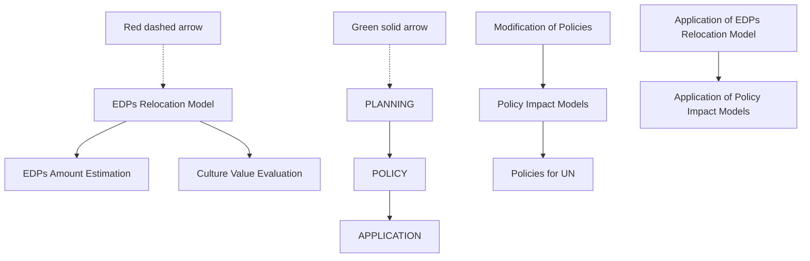
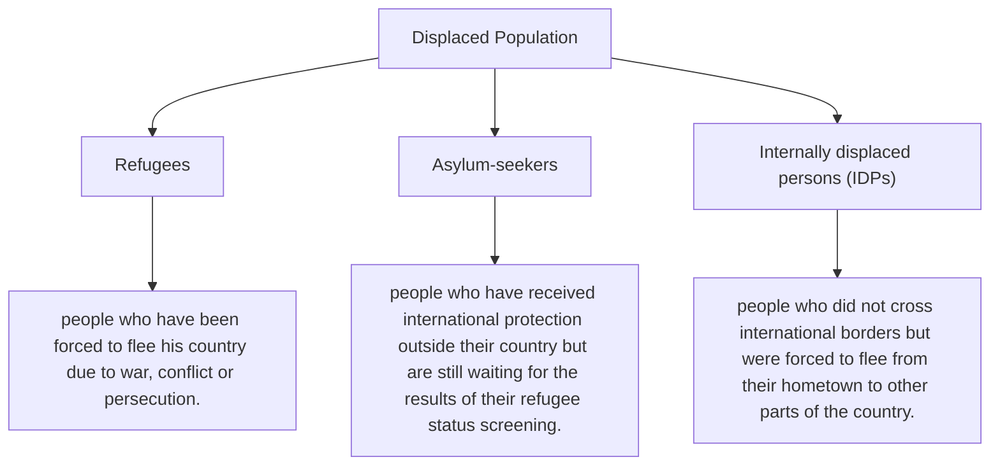
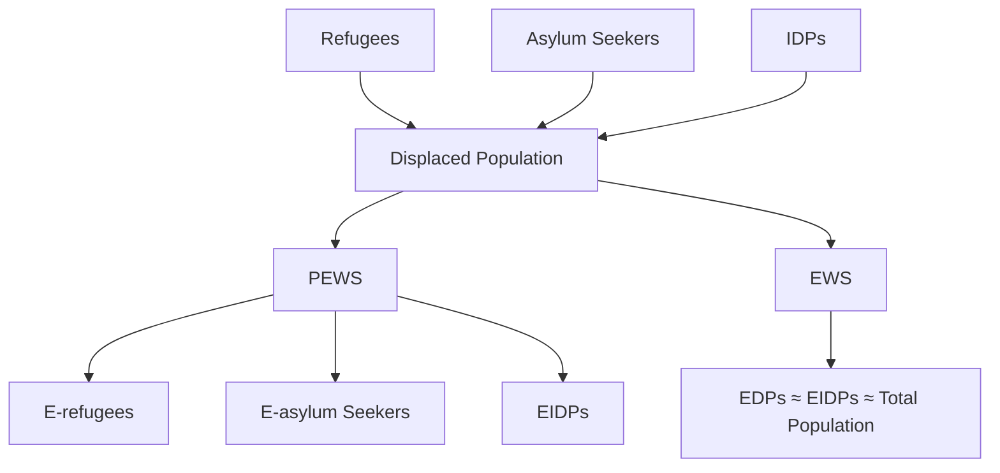
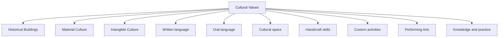
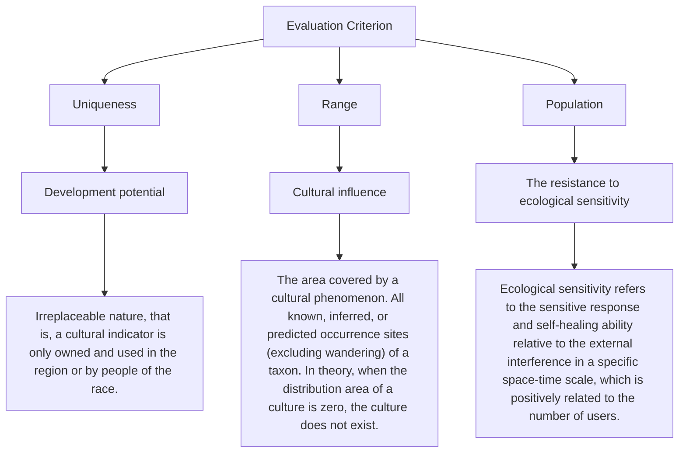
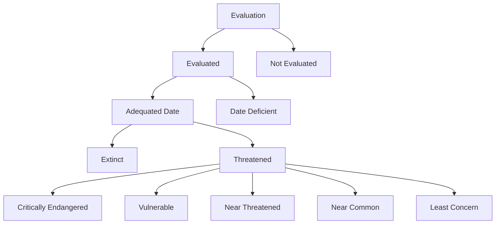
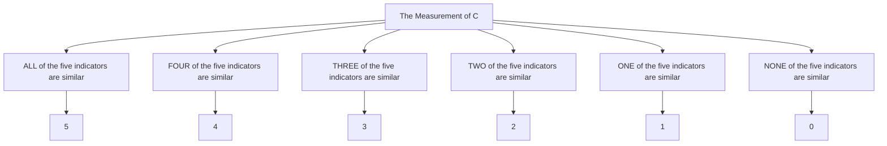
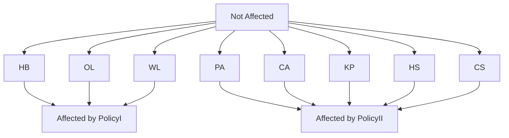
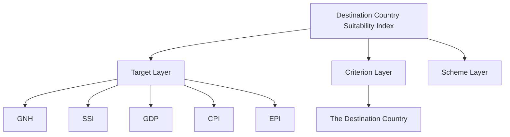

# Models for EDPs Relocation and Relative Policies

## Summary

Both in deep distress, the so-called climate refugees obviously face a more difficult situation compared to traditionally-recognized refugees due to forever loss of homeland and lack of response from the international community. Also, as survivors of the demise of their homeland, these people have a great mission: to inherit the culture of their own.

With the aim of briefing the UN on guidance for EDPs, our efforts can be divided into three parts: PLANNING, POLICY and APPLICATION.

For Planning Part, we originally introduce two states of environmentally-affected nations: PEWS and EWS to indicate the level of emergency and clarify the definition of EDPs and environmental refugees according to the classification of Displaced Population (DPs) provided by UNHCR; we explore to quantify the culture value on the lines of the IUCN Red List of Threated Species; finally we design the respective destination country suitability index S using Z-score standardization method and analytic hierarchy process and establish the EDPs Relocation Model by two-objective planning approach to reasonably allocate EDPs into destination countries.

For Policy Part, we propose policies in four fields, establish three sub-models accordingly to measure the policy impacts and give some modifications to the policy. Economically, we establish an efficient labor model to explore the effect of EDPs on the destination country after they enter the labor market as human capital. The state space model is used to fit the relation between GDP capital stock and human capital stock. Through these two models, we calculate the contribution rate of human capital to GDP growth. Socially, we set up an textbfoptimal time allocation model under uncertain conditions from the perspective of crime economics. It is concluded that the time spent on illegal activities can be reduced by increasing social welfare expenditure. Culturally, we use the definition of language extinction provided by UNESCO to estimate the future trends of language users and measures the direct impact on the Culture Value Score (CVS). We find that unique languages are most likely to extinct in a few decades without encouraging policies, and that each drop of affected indicator criterion level will cause the final CVS score to decrease by 0.825 points. Environmentally, we quantify the impacts of policies on countries by modifying the PM2.5 air pollution (PAP) and Carbon Dioxide Emissions (CDE) indicators.

For Application Part, in order to directly reflect the feasibility of our models, we selected Maldives as an example to apply them. We examined the three intended destination countries respectively and obtained the optimized relocation scheme: 127,200 of Maldives EDPs move to Australia; 107,200 of Maldives EDPs move to Sri Lanka; 205,600 of Maldives EDPs move to India. We put the data of these three countries into formulas and acquired suggested quantified policies for UN, for example, UN should raise Australia’s standard for total carbon dioxide emissions to 359,462 thousand metric tons.

In conclusion, our models stand out due to its interdisciplinary approaches, innovation, cohesiveness and high practical value.

## Contents

## 1 Introduction 2

1.1 Problem Background 2  
1.2 Restatement of the Problem 2

## 2 Assumptions 3

## 3 Glossary and Symbols 4

## 4 Models for Planning: Scope of the Issue and Relocation Plans 4

4.1 Number of People at Risk 4  
4.2 Cultural Value Evaluation System . . 6

4.2.1 Selection of Indicators . . 6  
4.2.2 Establishment of Evaluation System . . 7

4.3 EDPs Relocation Model 8

## 5 Models for Policies: Policies for UN and their Impacts 11

5.1 The Policies 11  
5.2 The Impact of Economic and Social Policies . . . 12  
5.3 The Impact of Cultural Policies 14  
5.4 The Impact of Environmental Policies 16

## 6 Application of the Models 16

6.1 Optimized Relocation Plans for Maldives . . . 16  
6.2 Quantified Policies for UN . . 17

## 7 Testing the model 18

7.1 Consistency Inspection of Pairwise Comparison Matrix A . . . . . 18  
7.2 Test of effective labor model . . . 18

## 8 Strengths and Weaknesses 19

8.1 Strengths . . 19  
8.2 Weaknesses 19

## References 20

## Appendix A: AHP 21

## Appendix B: The Calculation Process of Five Indicators: India, Australia and Sri Lanka 21

## 1 Introduction

## 1.1 Problem Background

With global warming and environmental deterioration, sea level rise and land degradation have emerged in various regions of the world. The problem of environmental displaced persons caused by climate change has aroused widespread concern in all countries. This is the negative feedback of man’s transformation of nature. Since the Egyptian scholar Essam El-Hinnawi first proposed the concept of environmental refugees in the 1970s, the issue has become one of the most serious crises in the world today.[1]

There are many manifestations of environmental degradation. Through analysis of the available information, the following aspects are mainly included: The first thing to mention is global warming. It is responsible for global sea-level rise, which has forced small island states such as Tuvalu to relocate . The second is lack of water and drought. The third is land degradation, such as the annual migration between Mexico and the United States caused by desertification.[2]

There is no denying that climate change does have some direct or indirect effects on the enjoyment of human rights. With the development of the situation, the refugee convention issued in 1951 has been constantly improved. Although the concept of refugee has been constantly supplemented, there is still no clear conclusion on the protection of this group. The harsh environment has left the indigenous people in a desperate situation with no choice but to seek refuge elsewhere.[3]

Because of their size, complexity and importance, environmental displaced persons have become a central issue of policy on the global public agenda in the 21st century. The influx of large Numbers of environmentally displaced persons will increase the risk of instability in the country. For this reason, scholars have suggested that states parties have the right to reject them when they threaten national security and public order . There are also some scholars who argue that there is a humanitarian imperative for the world to help this group. Due to a variety of factors, the loss and damage protection mechanism related to climate change has not been established.

The international community should actively seek multiple avenues of protection. Environmental displaced persons are a special vulnerable group, and it is the due responsibility and attitude of the international community to relocate them. Only in this way can we create a good international environment.

## 1.2 Restatement of the Problem

Hired by ICM-F, we abstract our tasks from the requirements and try to brief the UN on guidance for the EDPs issue (see in Figure 1). Our work is divided into three steps: PLANNING, POLICY and APPLICATION.

flowchart

Figure 1: Restatement and Analysis of the Problem

## 2 Assumptions

• When a nation suffers a disaster, its nationals prefer to relocate to other safer places in the very country. Considering that the difficulty of relocating abroad is much higher than that of domestic relocation, and the nations discussed here are mainly underdeveloped countries and even least developed countries (LDCs), it is reasonable to believe that the vast majority of refugees do not meet the demanding immigration standards of other countries and choose to stay inside the country,as figure 2.

bar chart

| Country | Gross National Product (million dollars) | Real GDP per capita (dollar) |
| :--- | :--- | :--- |
| America | 1,000,000.00 | 50,000.00 |
| China | 250,000.00 | 150,000.00 |
| Tuvalu | 30,000.00 | 25,000.00 |
| Maldives | 40,000.00 | 35,000.00 |
| Kiribati | 45,000.00 | 40,000.00 |
| Marshall | 55,000.00 | 45,000.00 |

Figure 2: Comparison of Some Countries Figure

• The trend of sea level rise is irreversible in the foreseeable future. We will simulate and suggest without considering the probability of global cooling caused by human change.  
• After people move to different places, their lifestyles do not change without external pressure (politically or environmentally). Therefore, befo the migration, the carbon dioxide emissions per capita and emissions othe pollutants remained unchanged.

• Only one country claims to be in PEWS or EWS each time and is acknowledged by the international community. All the other countries are not in the two states or out of the states as their nationals’ relocation process are finished.  
• Individuals can engage in both economically illegal and legal activities, and that there is no cost involved when switching between these two activities,hat is to say, individuals can realize arbitrage operation completely through the conversion of expected returns in legal and illegal activities.  
• The rational self-interest motive is the dominant motive of people and everyone will pursue the maximization of personal interests.A unified explanation of human behavior will be based on reason and self-interest.

## 3 Glossary and Symbols

<table><tr><td>Glossary and Symbols</td><td>Meaning</td></tr><tr><td>EWS</td><td>Environmental Warfare State</td></tr><tr><td>PEWS</td><td>Pre-environmental Warfare State</td></tr><tr><td>KP</td><td>Knowledge and Practice</td></tr><tr><td>PA</td><td>Performing Arts</td></tr><tr><td>CA</td><td>Custom Activities</td></tr><tr><td>HS</td><td>Handicraft skills</td></tr><tr><td>CS</td><td>Cultural Space</td></tr><tr><td>HB</td><td>Historical Buildings</td></tr><tr><td>OL</td><td>Oral Language</td></tr><tr><td>WL</td><td>Written Language</td></tr><tr><td>CVS</td><td>Culture Value Score</td></tr><tr><td>GNH</td><td>Gross National Happiness</td></tr><tr><td>SSI</td><td>Social Security Index</td></tr><tr><td>GDP</td><td>Gross Domestic Product</td></tr></table>

## 4 Models for Planning: Scope of the Issue and Relocation Plans

## 4.1 Number of People at Risk

From the issue paper given and the cited references[4], we know that the ambiguity of “environmental refugees” or EDPs causes dilemma of persons like Mr Ioane Teitiota from Kiribati and lack of effective response from the international communtiy.

Also, according to UNHCR, the global displaced population can be divided into three categories,as figure3: refugees, asylum-seekers and internally displaced persons (IDPs) who are displaced yet still in his/her own country[5]. Based on these present situations, we introduce two new terms and propose the following schem the actual number of EDPs:

flowchart

Figure 3: The Description of Three Kinds of Displaced Population All Over the World

• Environmental Warfare State (EWS): A state where national security is seriously threatened due to environmental issues such as sea-level rise, extreme weather events, and drought and water scarcity.[6] In this state, the whole nation is predicted as permanently uninhabitable in the near future.  
• Pre-environmental Warfare State (PEWS): A state where the nation is predicted to enter EWS based on historical climate change data and the occurrence of natural disasters. In this state, the whole nation is suffering from one of three environmental issues and a large proportion of its people is or will be affected.  
• If the nation declares to be in PEWS and is acknowledged by the international community, we regard its total population to be divided into three categories: Environmental Refugees, Environmental Asylum Seekers and Environmentally internally displaced persons (EIDPs) and offered equivalent rights from the UN.

As we assumed before (Assumption 1: When a nation suffers a disaster, its nationals prefer to relocate to other safer places in the very country), most members of nationals will remain to be in their own country as EIDPs.

If the nation declares to be in EWS and is acknowledged by the international community, we regard its total population to be Environmental Refugees and the international community have the responsibility to provide humanitarian aid with the aim of relocating the people and protect the culture.

flowchart

Figure 4: Schematic Classification of Displaced population

In these two cases, the very nation’s total population can be regarded as EDPs (see in figure 4). In November 2001, for example, Tuvalu’s leaders said in a statement that their efforts to combat rising sea levels had been declared a failure. nation can be defined as EWS and its people should be defined as EDPs 2mental Refugees, thus receiving effective response from the international commun m

## 4.2 Cultural Value Evaluation System

The culture of the environmentally displaced plays an irreplaceable role in the development of the world’s cultural diversity. As an important cultural resource, this kind of culture has not been evaluated as it should be. How to scientifically establish a set of EDPs Cultural Value Evaluation System is a difficult task to protect the culture of environmental displaced persons.

## 4.2.1 Selection of Indicators

EDPs cultural value evaluation is a process of comprehensive evaluation of local culture and other factors according to certain value standards. It provides a theoretical basis for the reasonable protection of local culture and is an important prerequisite for the resettlement of environmental displaced persons. According to the evaluation

flowchart

bar chart

| Category | Percentage (%) |
| :--- | :--- |
| Knowledge and practice | 11 |
| Performing Arts | 11 |
| Custom activities | 11 |
| Handicraft skills | 11 |
| Cultural space | 11 |
| Historical buildings | 13 |
| Oral language | 14 |
| Written language | 18 |

Figure 5: Stratified Evaluation Index

index selection principle proposed by Anderson[7], we set four principles of EDPs cultural value evaluation index, namely reference principle, feasibility principle, comprehensiveness principle and dominant principle. By referring to various cultural evaluation methods at home and abroad and combining with the characteristics of EDPs cultural value, we finally established the evaluation index system of EDPs cultural value,as figure 5.

In order to have a unified understanding and mastery of the technical terms involved, the relevant terms are defined and explained as follows

• Historical buildings: Buildings of certain popularity recognized in the international directory, including temples, tombs, ancient bridges, etc. Cultural value increases with the increase of building quantity and the expansion of building distribution.  
• Oral language: Natural language, a spoken language in which listening and speaking are the means of communication. It is only used in specific areas or groups, and its uniqueness is inversely related to geographical area tion. L

• Written language: An image or symbol characteristic of a race that has become a system for recording and communicating ideas.  
• Performing Arts: Artistic forms that must be completed through performance, such as music performance, singing, dance, quyi, etc.  
• Custom activities: The general name of folk customs and life culture. It also refers to the customs created and inherited by people living in a region, including etiquette, festivals, religion and so on.  
• Knowledge and practice: The results of human exploration for the material and spiritual world, including both natural and human aspects.  
• Handicraft skills: An important part of traditional culture which refer to handicrafts made by hand with a unique artistic style.  
• Cultural space: A stage and carrier for the performance of intangible cultural heritage related to a cultural form.

After determining the evaluation index system, it is necessary to quantify these indicators. Since the evaluation index itself has incomparably dimensionality, we conduct dimensionless treatment after determining the evaluation index system. The evaluation weight reflects the relative importance of each factor in the evaluation model. Delphi method and paired comparison method are used to determine the weight of evaluation factors and to correct each other according to the actual situation as in figure6. The weights of the three criteria mentioned above are 0.4, 0.3and0.3. There are

flowchart

Figure 6: Evaluation Criterion

two evaluation criteria for uniqueness: Yes or no. The distribution is divided into four levels: less than10,10 − 50,50 − 100 ,and more than10 . The number of users is divided into four levels: $\leq 1 0 0 0 , 1 0 0 0 - 5 0 0 0 , 5 0 0 0 - 1 0 0 0 0 , \mathrm { a n d } \geq 1 0 0 0 0 . \Lambda$ ccordingly, the grades will be set as 4 or 0 (for uniqueness); 1 − 4 (for range); 1 − 4 (for population), and then be transferred into 100 scale.

## 4.2.2 Establishment of Evaluation System

By comparing similar cases and referring to the theoretical model, we have estab lished a set of EDPs cultural value evaluation system, which has made a clear an de aclearran objective classification standard for the cultural value of the environmental displaced persons. This method has the characteristics of clear thinking, simple method, wide application, strong systematization and relatively high reliability. According to the weight distribution, the culture of a country can be evaluated by the above indicators, and the total score is the final evaluation score as in figure 7.

flowchart

Figure 7: EDPs Cultural Value Evaluation System

• Extincnt (Ex): a culture is considered extinct if there is conclusive evidence that a taxon has disappeared.  
• Critically Endangered (CE): The total evaluation score is between 80 and 100. This means that this culture is extremely rare.  
• Vulnerable (VU): The total evaluation score is between 60 and 80. With local characteristics, the scope of application of this culture is small.  
• Near Threatened (NT): The total evaluation score is between 40 and 60. This culture is of average universality. While most elements are not rare, some are unique.  
• Near Common (NN): The total evaluation score is between 40 and 60. This kind of culture has strong universality.  
• Least Concern (LE): The total evaluation score is between 0 and 20. This culture is common.  
• Data Dicfient (DD): If there is not enough data to evaluate the cultural value of a taxon directly or indirectly according to its distribution and number of people, it is considered that the taxon is lack of data.  
• Not evaluated (NE): If a taxon is not evaluated by applying this standard, it can be classified that it is not evaluated.

The cultural value evaluation system is a developing system. With the development of society, the content of evaluation will also change and need to be updated in time.

## 4.3 EDPs Relocation Model

Only if the nation claims to be in EWS or PEWS and is acknowledged tional community, can its people be regarded as EDPs and be afforded rights. For EWS nations, the relocation plan is an emergency, so the relocation distance is the primary factor when planning. For PEWS nations, the relocation plan focuses more on EDPs’ demand, culture preservation and the features of destination countries. Here we build a Destination Country Suitability Index System to solve the relocation issue.

This system includes five parts of indicators: Gross National Happiness (GNH), Social Security Index (SSI), Gross Domestic Product (GDP), Culture Pull Index (CPI) and Environment Pull Index (EPI), in which GNH and GDP are classic indexes used to measure the development of a country, while SSI, CPI and EPI are set in this paper.

## STEP 1 Design the Indicators

• Gross National Happiness (GNH)

In 1970, the King of Bhutan first proposed the concept of GNH. It is proposed that the GDP indicator cannot reflect many other aspects such as the quality of life of the people, the happiness of the people, and the sustainable development of the economy.There are two different calculating methods for GNH, and we present one of them below. In symbols,II=Increasing Income; Gini=Gini coefficient; UR=unemployment rate;IF=Inflation, therefore,we have calculation1.

$$
G N H = \frac {I I \times U R \times I F}{\text { Gini }} \tag {1}
$$

The Gini coefficient (Gini) in this formula is an indicator that reflects the fairness of income distribution and measures the inequality of social income distribution. The range of Gini is from 0 to 1. The closer the Gini coefficient is to zero, the more equal the income distribution is.

• Social Security Index (SSI)

When calculating the social security level of a country, the government’s expendi ture on residents’ health and transfer payments to unemployed groups (including pensions and minimum living standard security) are mainly examined. So our definition of SSI is as calculation2

$$
S S I = \frac {H S + G T}{T A X} \tag {2}
$$

In symbols, HS=healthcare spending; GT=government transfer payments to nonworkers including senior citizens and those who are unemployed; TAX= government revenue. The value of SSI ranges from 0 to 1.

• Gross Domestic Product (GDP)

Gross domestic product (GDP) is the market value of all final goods and services newly produced within a nation during a fixed period of time. GDP per capita is often used as an indicator of living standards. Higher GDP per capita means that people living in this country will benefit more from the good conditions of their economy and have higher consumption capacity. and living standards.

• Culture Pull Index

As for cultural pull for EDPs, we choose to focus on two aspects: re space index (RLS) and cultural similarity (CSI). The religious livin (RLS) reflects the state’s tolerance for religion and other special c ustoms is a function of the country’s amount of nationalities n and the degree of freedom r.

Referring to cultural value evaluation system (in section 4.2), cultural similarity is mainly reflected in three aspects: historical building (HB, the architectural style), written language(WL) and oral language (OL). We standardize the weights of these three aspects in the cultural value system to obtain the weight distribution when considering cultural similarity.

$$
\mathrm{CSI} = 0. 2 8 \mathrm{HB} + 0. 3 9 \mathrm{WL} + 0. 3 2 \mathrm{OL} \tag {3}
$$

We multiply these two indexes to get the new indicator CPI

$$
\mathrm{CPI} = \mathrm{RLS} \times \mathrm{CSI} \tag {4}
$$

## • Environment Pull Index

Environmental Pull Index (EPI) is an important index when planning EDPs’ relocation, as the environmental similarity between countries and suitability of the environment will affect not only the living standard of people but also the inheritance and development of culture. Climate similarity and pollution are the influencing factors of the environmental pull index. We introduce the Cobb-Douglas utility function $u ( C , P ) = C ^ { \alpha } P ^ { 1 - \alpha }$ take the natural logarithm at the same time and get the linear expression of EPI as calculation 5

$$
\mathrm{EPI} = \alpha \mathrm{C} + (1 - \alpha) \mathrm{P} \tag {5}
$$

where C=climate similarity; P= pollution degree.

APGHR Score System is the most widely used neonatal scoring standards in the world which makes a quick overall assessment and immediately determine if a newborn needs immediate first aid. We follow the APGAR method to measure climate similarity as figure 7. The five indicators include: summer temperature, summer precipitation, winter temperature, winter precipitation, and seasonal differences. Annual average API is used to reflect a country’s level of air

flowchart

Figure 8: The Measurement of C

pollution when considering pollution as calculation 6.

$$
\mathrm{P} = \frac {5}{\mathrm{API}}
$$

STEP 2 Integrate the Indicators We standardize the above indicators separately, and then use the analytic hierarchy process (AHP)(See in Appendix 1) to determine the weights of the indicators.so we have the following formula 7

$$
S = 0. 1 4 6 1 G N H + 0. 2 7 5 1 S S I + 0. 4 7 9 8 G D P + 0. 0 3 4 0 C P I + 0. 0 6 5 0 E P I \tag {7}
$$

STEP 3 the Modification: Capacity of EDP Destination Countries and Factor of Accessibility In the end, we get a comprehensive index that combines the survival and development of EDPs and the retention of the unique culture of the country. But for destination countries, there must be limits on the number of EDPs they can accept. A country has limited space and living resources. On the one hand, labor force and culture diversity of EDPs will benefit the destination country; on the other hand, disproportionate flow of population from another country may also cause dissatisfaction among the local people, leading to social unrest. In determining the refugee quotas in each country, the European Union considers factors such as population, economy, and unemployment. The quotas are also roughly coordinated with the population of the country, and some countries have set the proportion of the population as an upper limit. Therefore, we define 0.5% of the population as the maximum capacity to receive EDPs.

For EDPs in EWS countries, who urgently need immigration due to the loss of inhabitable land, the accessibility factor of the immigration route needs to be added. Although some areas are more attractive to EDPs and more conducive to protecting their culture, EDPs cannot be transferred to those areas within a short period of time due to distance and financial issues. We here adopt a two-objective planning approach to solve this problem. The goal of this approach is to maximize the destination country suitability index (S) while maximizing the accessibility index (A)

$$
A _ {i j} = \frac {1 0 0}{\left(1 - D _ {i j}\right) T _ {i j}} \tag {8}
$$

where $D _ { i j }$ =the death rate when traveling from place i toj; $T _ { i j }$ =the time used to travel from placei toj.

## 5 Models for Policies: Policies for UN and their Impacts

EDPs should not simply be treated in the same way as refugees or immigrants. Based on EDPs’ special features of national integrity and cultural uniqueness, we propose several policies for UN in four different fields: economy, society, culture and environment; design three sub-models to measure the impacts and finally make a few improvements to the policies.

## 5.1 The Policies

• Economy:UN should appeal to EDP destination countries to provide EDPs with vocational training and equal jobs and career opportunities to make it easier for EDPs to enter the labor market.  
• Society:Peacekeeping forces should be deployed by UN to EDPs in order to de torder crease the crime rate and increase the time EDPs work on legal pro 2 duct activities

Such kind of social security will be beneficial to economy and social situation in the long run.

• Culture:UN should urge EDP destination countries to adopt preferential policies to protect their cultural heritage as much as possible. These policies include: reduce or even cancel the language requirements of entry; provide EDPs with areas in which climate features and geographical features are close to the original environment.  
• Environment:UN should encourage international community to give appropriate economic and technical assistance to EDP destination countries and raise their standards for greenhouse gas emissions and emissions of other pollutants within a reasonable range.

## 5.2 The Impact of Economic and Social Policies

The receiving country should adopt an expansionary fiscal policy and monetary policy to some extent to enable refugees to participate in production as a large labor force, which can generate an increase in GDP. At the same time, the return of refugee production can also expand the domestic consumer market, thus boosting the domestic economic development. As we can see, the crime rate is extremely high in a few European countries. This caused serious social unrest. But the main reason is that the receiving countries have not actually accepted these refugees. From the perspective of economics, the key to reduce the refugee crime rate is to increase the opportunity cost of refugee crime. The implementation of the above-mentioned policy can improve the living standard of refugees while increasing the opportunity cost of crimes. And in the long run it will help the receiving country expand its Labor force, its markets and its GDP.

We establish an effective labor model [8]to analyze the impact of refugees entering the human resource market after transforming them into human capital on national economic growth. The effective labor model is shown in equation 9

$$
Y _ {t} = A _ {t} K _ {t} ^ {\alpha} H _ {t} ^ {\beta} \tag {9}
$$

$H _ { t } , K _ { t } , Y _ { t }$ are functions oft, $H _ { t }$ is the Human Capital Stock, $K _ { t }$ is Capital Input $, Y _ { t }$ is Total Output. We introduce the factor of human capital level into the model and fully consider its functional characteristics. $\alpha ,$ βrespectively represent the elasticity coefficient of marginal output of capital input and the elasticity coefficient of boundary output of human capital, that is, the share of capital and human in output.

Share of Human Capital Contribution $= \beta \frac { \Delta H _ { t } } { H _ { t } }$ Human Capital to Economic growth (CHE).

$$
\mathrm{CHE} = \beta \frac {\Delta H _ {t} Y _ {t}}{H _ {t} \Delta Y _ {t}} \tag {10}
$$

Since technological progress $A _ { t }$ is real-time and unobservable, we use the state space model [9]to estimate . So here we’re assuming that $A _ { t }$ corresponds to formula 11.

$$
\ln A _ {t} = \gamma + \theta \ln A _ {t - 1} + v _ {t}
$$

The coefficient can be determined from annual data on GDP, capital stock and human capital stock. Then we get the contribution of climate refugees to GDP growth as human capital training. Taking Australia as an example, according to the data of GDP, capital stock K and human capital stock H of Australia from 1990 to 2012, we estimate the 10,11 formula and get the economic growth model of Australia.

$$
\begin{array}{l} \begin{array}{r l} \ln Y _ {t} & = \ln A _ {t} + 0. 5 7 3 \ln K _ {t} + 0. 9 2 3 \ln H _ {t} \\ \ln A _ {t} & = - 0. 6 9 0 + 0. 7 2 8 A _ {t} \end{array} \tag {12} \\ \ln A _ {t} = - 0. 6 9 0 + 0. 7 3 8 A _ {t - 1} \\ \end{array}
$$

We can get the elasticity of human capital outputβ = 0.923.

Factor contribution

$$
= \frac {\text {(Factor growth rate} \times \text {Factor yield elasticity)}}{\text {Output growth rate}} \times 100 \%
$$

Therefore, for Australia, the Contribution of Human Capital to GDP growth is

$$
C H E = \frac {2 . 4 1 \times 0 . 9 2 3}{3 . 1 6} \times 100 \% = 70.4 \% \tag{13}
$$

We conclude that for capital-intensive countries, absorbing immigrants into the Labour market is extremely beneficial to GDP growth and economic development. And there’s a positive correlation between them.

As for the refugee crime rate, we establish an optimal time allocation model under uncertain conditions. Crime economics holds that crime is a rational choice of people on the basis of weighing costs and benefits, rather than due to moral decadence or psychological distortion [10]. Therefore, whether an individual commits a crime or not becomes a decision of how to allocate his time to achieve maximum effectiveness in legal and illegal activities.

We assume that income from both types of activities is a concave function of working time. We set the legal wage income as $w _ { l } ( t _ { l } )$ and the illegal income as $w _ { i } ( t _ { i } )$ . As illegal activities violate legal norms, once illegal acts are discovered, the violators will be punished by the system and have to pay additional punishment costs. We set the probability that an individual’s illegal behavior is detected as $p .$ . Meanwhile, the penalty cost $\dot { f } _ { i } ( t _ { i } )$ paid by illegal personnel is a concave function of the illegal activity time. In order to incorporate the influence of social welfare on individual time distribution into the model, we consider the problem of unemployment. We set the social unemployment rate as u, and the individuals in the state of unemployment can receive social security payment w from the government. At this point, the individual will have the following four decision states.

• Someone has a job and his illegal activities go undetected. His personal income consists of legal salary $w _ { l } ( t _ { l } )$ and illegal incomewi(ti).  
• Someone is in employment and his illegal activity has been detected. In this situation, the individual income includes the legal wage incomew (t ) and the illegal income $w _ { i } ( t _ { i } )$ minus the penalty cos $t f _ { i } ( t _ { i } )$ .  
• Someone is unemployed and his illegal behavior has not been discovered. In this case, individual income is equal to illegal incom ${ \because } w _ { i } ( t _ { i } )$ and social securit odialsecur income w received from the government.

• Someone is unemployed and his illegal behavior has been discovered. Then in dividual income includes illegal incomewi $\left( t _ { i } \right)$ minus the penalty cost $f _ { i } ( t _ { i } )$ , and is not entitled to the social security payment issued by the government.

In the four states mentioned above, the well-being I of individuals’ decisions can be expressed as

$$
\mathrm{I} _ {1} = \mathrm{w} _ {1} (t _ {1}) + \mathrm{w} _ {\mathrm{i}} (t _ {i}), \text {   with   prob.   } (1 - p) (1 - u)
$$

$$
\begin{array}{l} \mathrm{I} _ {2} = \mathrm{w} _ {1} (t _ {l}) + \mathrm{w} _ {\mathrm{i}} (t _ {i}) - f (t _ {i}), \text {with prob.} p (1 - u) \\ \mathrm{I} _ {3} = \mathrm{w} _ {2} (t _ {1}) + \mathrm{w} _ {3} \text {with prob.} (1 - u) v ^ {+} \end{array} \tag {14}
$$

$$
\mathrm{I} _ {3} = w _ {i} \left(t _ {i}\right) + w, \text {   with   prob.   } (1 - p) u ^ {+}
$$

$$
\mathrm{I} _ {4} = w _ {i} \left(t _ {i}\right) - f \left(t _ {i}\right), \text {with prob.} p u
$$

In order to maximize their expected utility, individuals choose to allocate their time resources optimally in legal and illegal activities.

$$
\begin{array}{c} \text { Max }: \mathrm{EU} \left(\mathrm{I} _ {\mathrm{s}}\right) = \sum_ {s = 1} ^ {4} \pi_ {s} U \left(I _ {s}\right) \\ \text { s.t.t } _ {\mathrm{i}} + t _ {l} \leq t _ {0} \end{array} \tag {15}
$$

π means the probability that an individual is in state $s , t _ { 0 }$ means the time constraints faced by individuals. According to the Kuhn-Tucker condition, the first-order condition of this program is

$$
\begin{array}{r l} (1 - p) (1 - u) \left(w _ {i} ^ {\prime} - w _ {l} ^ {\prime}\right) U _ {1} ^ {\prime} + p (1 - u) \left(w _ {i} ^ {\prime} - f _ {i} ^ {\prime} - w _ {l} ^ {\prime}\right) U _ {2} ^ {\prime} + (1 - p) u w _ {i} ^ {\prime} \\ + p u \left(w _ {i} ^ {\prime} - f _ {i} ^ {\prime}\right) U _ {4} ^ {\prime} = 0 \end{array} \tag {16}
$$

When an individual is risk averse, the second-order condition $\Delta \le 0$ satisfies By deriving the implicit function of the above formula, we can get

$$
\frac {\partial t _ {i} ^ {*}}{\partial w} = - \frac {\left[ (1 - p) u w _ {i} ^ {\prime} U _ {3} ^ {\prime \prime} \right]}{\Delta} <   0 \tag {17}
$$

Therefore, we can conclude that increased social welfare spending by the government can reduce the time spent by individuals in illegal activities. For climate refugees, a small amount of social welfare assistance provided by the government can effectively reduce the refugee crime rate. This could boost productivity by increasing the total time refugees spend in legal work.

## 5.3 The Impact of Cultural Policies

Of all the 8 indicators set in the Cultural Value Evaluation System, many will be affected by the policy in cultural field as shown in Figure 11. Policy 1: lower the language requirements of entry When we say that a language is extinct, we mean that it is no longer the first tongue that infants learn in their homes, and that the last speaker who did learn the language in that way has passed on within the last five decades.[11]Languages live only if people speak or write. If the community no longer teach the newborns their language, the language will fade away as persons pass away. Therefore,we have

$$
N B = E D P _ {j} (1 - D R) ^ {t}, N B \in N \tag {18}
$$

Where:NB=number of language users; DR=death rate.

However, if the community encourages their offspring to speak and write their own language, number of language users will continue to grow.

$$
N B = E D P _ {j} (1 + B R) ^ {t}, N B \in N _ {+}
$$

flowchart

Figure 9: The Policy-affected Indicators of Culture Value

WhereBR= birth rate.

If the destination country government refuse to implement the policy of language, it can be predicted that a unique language will be likely to face extinction in decades as the utility of language largely reduces; if language protection is encouraged and an effective system is established, the huge loss of culture will be prevented as it is presented in figure 12. Policy 2: Provide EDPs with Similar Living Environment Similar

line chart

| t/yr | EDP_j (NB) |
| ---- | ---------- |
| t₀   | EDPⱼ       |
| t₀+50| EDPⱼ       |

Figure 10: Future Trends of Language Users in Place j under Two Different Circumstances

living environment makes a big difference. Traditions and customs will be better preserved, and cultural space which refers to necessary room for culture inheritance and development will be better set. A single indicator can hardly measure or represent the potential impact, while the Cultural Value Score (CVS) proposed in section 4.2which can be assessed periodically reflects the total influence.

Indicators of custom activities (CA), knowledge and practice (KP) and cultural space (CS) have the same weight in the Cultural Value Evaluation System. When quantifying the indicators, except for the relatively stable Uniqueness Criterion (yes or no) each drop of the Range Criterion (1 to4) and Population Criterion (1 to 4) will cause the

final CVS score to decrease by 0.825 points.

## 5.4 The Impact of Environmental Policies

The Nationally Determined Contributions (NDCs), as part of the heart of the Paris Agreement 2015, embodies each countries’ post-2020 climate actions. We designed our policies for UN based on the analysis of Intended nationally determined contributions (INDCs, anticipation of NDCs submitted by each country).[12] Here we define an indicator EDP Accommodation Rate (AR) to prepare for the next steps

$$
A R = \frac {E D P _ {j}}{T P _ {j}} \tag {20}
$$

If the destination country receives a group of EDPs, what will be affected environmentally? We searched the indicators displayed on the World Bank website and find that PM2.5 air pollution (PAP) and Carbon Dioxide Emissions (CDE) can be used to measure the implications. When EDPs from place i move to placej, the PAP and CDE of place j will alter accordingly.

As we assumed (in Assumption 2), before and after the migration, the carbon dioxide emissions per capita and emissions of other pollutants remained unchanged. We have the following formulas to calculate new PAP and CDE.

$$
P A P = \frac {P A P _ {j} \times T P _ {j} + P A P _ {i} \times E D P _ {i}}{T P _ {j} + E D P _ {i}} = P A P _ {j} \times (1 - A R) + P A P _ {i} \times A R \tag {21}
$$

$$
\mathrm{CDE} = \frac {C D E _ {j} \times T P _ {j} + C D E _ {i} \times E D P _ {i}}{T P _ {j} + E D P _ {i}} = C D E _ {j} \times (1 - A R) + C D E _ {i} \times A R
$$

Therefore, to quantify the environmental policy, we suggest UN to raise the standards of EDP destination countries for greenhouse gas emissions and emissions of other pollutants according to formula 21.

## 6 Application of the Models

Here we use Maldives as an example to apply our models. As reported, the country might be the first country to be submerged by the rising seawater. According to the interview of the then-president Mohamed Nasheed in 2012, there are three possible options for Maldivians to relocate: India, Australia, and Sri Lanka.[13]

## 6.1 Optimized Relocation Plans for Maldives

step1: By searching the data and putting them into EDPs Relocation Model, we get the results in table 13.

Table 1: The Value of Indicators of India, Australia and Sri Lanka

<table><tr><td>Indicators</td><td>India</td><td>Australia</td><td>Sri Lanka</td></tr><tr><td>GNH</td><td>4.4400</td><td>7.2840</td><td>4.3150</td></tr><tr><td>SSI</td><td>0.0199</td><td>0.2921</td><td>0.0036</td></tr><tr><td>GDP per capita (dollar)</td><td>2,010.0000</td><td>57,373.7000</td><td>4,102.4800</td></tr><tr><td>CPI</td><td>54.1664</td><td>18.6950</td><td>62.4166</td></tr><tr><td>EPI</td><td>0.4505</td><td>0.0550</td><td>0.5848</td></tr></table>

\* The calculation process can be found in Appendix 2

STEP 2: Standardization is a necessary step. Here we use the Z-score standardization method to process the data according to the mean µ and standard deviation σ of the original data. The processed data conforms to the standard normal distribution, that is, the mean is 0 and the standard deviation is 1. The conversion function is

$$
x = \frac {x - \mu}{\sigma} \tag {22}
$$

After the standardization step (result presented in table 2), we use formula 7 to get the final value of S for each country. STEP 3:EDPs are allocated to the country with

Table 2: The Value of Standardized Indicators of India, Australia and Sri Lanka

<table><tr><td>Standardized Indicators</td><td>India</td><td>Australia</td><td>Sri Lanka</td></tr><tr><td>GNH</td><td>-0.5457</td><td>1.1479</td><td>-0.6201</td></tr><tr><td>SSI</td><td>-0.5263</td><td>1.1532</td><td>-0.6269</td></tr><tr><td>GDP per capita</td><td>-0.6104</td><td>1.1541</td><td>-0.5437</td></tr><tr><td>CPI</td><td>0.3906</td><td>-1.1363</td><td>0.7457</td></tr><tr><td>EPI</td><td>-1.1199</td><td>0.8038</td><td>0.3161</td></tr><tr><td>S</td><td>-0.5769</td><td>1.0523</td><td>-0.4828</td></tr></table>

highest S value, if the total number of EDPs exceeds 0.5% of the destination country population, the rest of EDPs will be allocated to the other countries accordingly.

S(Australia) >S(Sri Lanka) >S(India), therefore, the relocation plan is as follows: 127,200 of Maldives EDPs move to Australia; 107,200 of Maldives EDPs move to Sri Lanka; 205,600 of Maldives EDPs move to India.

## 6.2 Quantified Policies for UN

Put the data from each country in table 3 into formulas 20,21. We will get the intended new PAP and CDE in table 4. Therefore, when it comes to estimating EDP

Table 3: The Value of Standardized Indicators of India, Australia and Sri Lanka

<table><tr><td rowspan="2">Country</td><td rowspan="2">Population (million)</td><td colspan="2">Carbon Dioxide Emissions</td><td>PM2.5 air pollution</td></tr><tr><td>Total (thousand metric tons)</td><td>Per captica(metric tons)</td><td>Mean annual exposure (micrograms per cubic meter)</td></tr><tr><td>Maldives</td><td>0.44</td><td>1,335</td><td>3.1</td><td>8</td></tr><tr><td>Australia</td><td>25.44</td><td>361,262</td><td>15.4</td><td>9</td></tr><tr><td>India</td><td>1,324.00</td><td>2,238,377</td><td>1.7</td><td>91</td></tr><tr><td>Sri Lanka</td><td>21.44</td><td>18,394</td><td>0.9</td><td>11</td></tr></table>

Table 4: The Value of Standardized Indicators of India, Australia and Sri Lanka

<table><tr><td>Country</td><td>EDP Accommodation Rate (AR)</td><td>PAP, mean annual exposure (micrograms per cubic meter)</td><td>CDE,Total (thousand metric tons)</td></tr><tr><td>Australia</td><td>0.50%</td><td>8.995</td><td>359,462</td></tr><tr><td>India</td><td>0.02%</td><td>90.987</td><td>2,238,019</td></tr><tr><td>Sri Lanka</td><td>0.50%</td><td>10.89</td><td>18,309</td></tr></table>

destination countries’ standards for greenhouse gas emissions and emissions of other pollutants, UN should refer to the data above to raise the standard accordingly.

## 7 Testing the model

## 7.1 Consistency Inspection of Pairwise Comparison Matrix A

Here is the consistency index (CI) of the matrix A(5-times-5)

$$
\mathrm{Cl} = \frac {\lambda_ {\max} - n}{n - 1} \tag {23}
$$

Where nis equal to the rank of matrix. The rank of Matrix A is 5.

Another parameter RI can be acquired by using random method to construct 500 5-times-5 sample matrices: randomly extracting numbers from 1 − 9 and its reciprocal to construct a positive reciprocal matrix, and obtaining the average value of the largest eigenvalue $\lambda _ { m a x } ^ { \prime ^ { - } } ,$ , then

$$
\mathrm{RI} = \frac {\lambda_ {\max} ^ {\prime} - n}{n - 1} \tag {24}
$$

Therefore, consistency ratio (CR) can be acquired

$$
\mathrm{CR} = \frac {C I}{R I} \tag {25}
$$

We regard the consistency of the matrix as acceptable when $C R < 0 . 1$ . Here

$$
C R = 0. 0 5 5 <   0. 1 \tag {26}
$$

So the consistency of the matrix A is acceptable.

## 7.2 Test of effective labor model

In the efficient labor model, we determine the elasticity of human capital output and the elasticity of capital output through the data of Australia from 1990 to 2012. Since the economic structure of a country will not change significantly in a short time, the accuracy of this model will be verified by the data from 2013 to 2016 as shown in the Figure

line chart

| Year | Real GDP | Predicted GDP |
| ---- | -------- | ------------- |
| 2013 | 1.252    | 1.198         |
| 2014 | 1.284    | 1.253         |
| 2015 | 1.312    | 1.294         |
| 2016 | 1.348    | 1.306         |

Figure 11: The testing of Effective Labor Model

Compared with the real data, the errors of GDP data estimated by th 2013 to 2016 are 4.3%,2.4%, 1.4% and 3.1% respectively. These errors are W able limits.

## 8 Strengths and Weaknesses

## 8.1 Strengths

• Interdisciplinary approaches: We established our models after extensive reading of reference materials. For example, we referred to the 1951 Convention relating to the Status of Refugees and the 1967 Protocol as well as the Paris Agreement 2015 before proposing the policies; we use the classification of Displaced Population (DPs) provided by UNHCR, the definition of language extinction provided by UNESCO and PM2.5 air pollution (PAP) and Carbon Dioxide Emissions (CDE) indicators on the World Bank Website to establish and support our models.  
• Innovation:We innovates by apply methods in one field another. For example, we quantify the culture value on the lines of the IUCN Red List of Threated Species; we measure the climate similarity following the APGHR Score System in clinical medicine field.  
• Cohesiveness:The primary models including the estimation of EDPs and the evaluation of culture value are used and integrated into the whole model from different perspectives. For example, the indicators of cultural value system benefit both the establishment of EDPs relocation model, the impact modelling of cultural policies.  
• High practical value: Judging from the results of Maldives simulation, the models can be well applied to the real world.

## 8.2 Weaknesses

• We didn’t model global warming process so it’s hard to know what will happen to the sea level dozens of years later from our model.  
• We don’t propose solutions for people who are looking for a suitable place to live because of the impact of climate change on agriculture

## References

[1] Christopher,M. Kpzpll. Poisoning the Well: Persecution, the Environment and Refugee Status [J],Colorado Journal of International Environmental Law and Policy,2004.1:1-4.  
[2] Benoit Mayer, The International Legal Challenges of Climate- Induced Migration: Proposal for an International Legal Framework, Colorado Journal of International Environmental Law and Policy, Vol. 22, 2011, pp.11-12.  
[3] William, Thomas, Worster. The Evolving Definition of the Refugee in Contemporary International Law [J]. Berkeley Journal of International Law, 2012:18-19.  
[4] Nicle, Angeline, Cudiamat. Displacement Disparity: Filling The Gap of Protection for The Environmentally Displaced Person[J]. Valparaiso University Law Review,2012,1:5-7.  
[5] UNHCR-Global Trends: Forced Displacement in 2017[EB/OL]. https://www.unhcr.org/5b27be547  
[6] F. Bierman and I. Boas, Preparing for a Warmer World: Towards a Global Governance System to Protect Climate Refugees[J]Global Governance Working Paper, No 33, 2007, pp. 18–19  
[7] Araújo Miguel B, Anderson Robert P,Márcia Barbosa A, Beale Colin M, Dormann Carsten F, Early Regan, Garcia Raquel A, Guisan Antoine, Maiorano Luigi, Naimi Babak, O’Hara Robert B, Zimmermann Niklaus E, Rahbek Carsten. Standards for distribution models in biodiversity assessments.[J]. Science advances,2019,5(1).  
[8] Wenjing Wang. Study on the Effect of Human Capital on Regional Economic Growth and Its Convergence [D]. Northeast Normal University,2013.  
[9] Xuheng Zang, Hao Chen, Mingyue Song. Study on the Dynamic Influence Mechanism of Habit Formation on Urban Residents’ Consumption in China [J]. South China Journal of Economics,2020(01):60-75.  
[10] Agnew R,1992,“Foundation for a General Strain Theory of Crime and Delinquency", Criminology, Vol.30, pp.47 87.  
[11] Endangered Languages FAQ[EB/OL]. http://www.unesco.org/new/zh/culture/themes/end languages/faq-on-endangered-languages/  
[12] Yidan Chen, Wenjia Cai, Can Wang. Research on Characteristics of National Independent Decision Contribution [J]. Advances in Climate Change Research, 2018, 14 (03): 295-302.  
[13] Zhongdong Li. In Response to Global Warming, The Country is Flooded to Avoid Danger of Climate Disaster. Maldives May Migrate to Australia [J]. Resources and Habitat Environment, 2012 (03): 74-75.

## Appendix A: AHP

flowchart

Figure 12: AHP model graph

According to relevant information in real life, we compare the importance of the five indicators of the criterion layer pair by pair to construct a 5-times-5 Pairwise Comparison Matrix A.

$$
A = \left[ \begin{array}{c c c c c} 1 & \frac {1}{3} & \frac {1}{3} & 5 & 3 \\ 3 & 1 & \frac {1}{3} & 7 & 5 \\ 3 & 3 & 1 & 9 & 7 \\ \frac {1}{5} & \frac {1}{7} & \frac {1}{9} & 1 & \frac {1}{3} \\ \frac {1}{3} & \frac {1}{5} & \frac {1}{7} & 3 & 1 \end{array} \right] \tag {27}
$$

The weights of 5 indicators are:0.1461; 0.2751; 0.4798; 0.0340; 0.0650; and $\lambda _ { m a x } = 5 . 2 2 0 3 .$

## Appendix B: The Calculation Process of Five Indicators: India, Australia and Sri Lanka

For the sake of narrative convenience, the corresponding data for the three countries mentioned below are presented in the same order as India, Australia and Sri Lanka. We found that India has a population of 126.6 billion, Australia has 22.73 million and Sri Lanka has 20.42 million. According to the calculation method of GNH, the corresponding index of these three countries is 4.440, 7.284 and 4.315. The SSI for the three countries is as follows.

$$
\begin{array}{l} S S I _ {I} = \frac {1 5 6 . 9 \times 1 2 . 6 6}{1 0 7 6 6 0 0 0 0 0 0 0 0 0 0} = 0. 0 1 9 9 \\ S S I _ {A} = \frac {4 0 6 8 . 2}{3 1 6 6 4 0 0 0 0 0 0 0} = 0. 0 2 9 2 1 \tag {28} \\ S S I _ {S} = \frac {1 8 9 . 4}{9 0 8 9 1 1 0 0 0 0 0 0 0} = 0. 0 0 3 6 \\ \end{array}
$$

Others are the same. For GDP per capita, the figures for the three countries are 2010.0 dollars,57373.7 dollars and 4102.48 dollars.

The CPI is calculated slightly differently in the three countries, Australia is a country of early settlers. There is a provision in the Australian constitution that the government shall not interfere in any way with the freedom of worship of the people. We count the number of ethnic groups in Australia with a population of more than one million at 269.

The official language of the Maldives is Dhivehi, and only 20 percent of the pop he 2 ulation speak English. Their diet is no different from that of most countries in Sout

Asia. Most people believe in Islam, so they don’t eat pork or drink alcohol. It is worth mentioning that their traditional music and dance are the same as those in East Africa. We calculated the subordinate index of CSI according to the information mentioned above.

Next, we use the calculation method in the text to get CPI of the three countries are 54.1664,18.6950 and 62.4166. In terms of EPI, Maldives has high temperature all year round without obvious four seasons. Sri Lanka and India have distinct dry and rainy seasons. Australia has many climate types and parts of the country are similar to the Maldives. As a result, India, Australia and Sri Lanka are rated as 4, 5 and4.