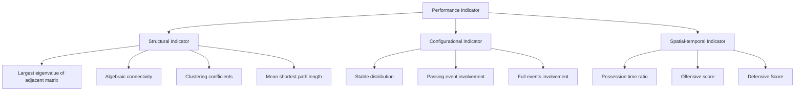

## 2020

## MCM/ICM

## Summary Sheet

(Your team's summary should be included as the first page of your electronic submission.)

Type a summary of your results on this page. Do not include the name of your school, advisor, or team members on this page.

# Teamwork Analysis of Huskies Based on Passing Networks

Summary

We create undirected weighted passing networks to describe team behavior in soccer matches. In passing networks, the nodes are players participating in the match and the weight of an edge equals to the number of passes between these two players. Based on the constructed networks, we successfully identify some network patterns. Besides, we consider some quantitative metrics to characterize the networks. To capture short-term properties, we modify the basic model to l-pass networks and investigate the evolution of structural indicators. To capture long-term characteristics during the entire season, we propose a Markov Chain model, which can be regarded directed weighted network model.

To evaluate the success of teamworks, we devise a performance indicator. The indicator consists of three indices: structural indicators, configurational indicators and spatial-temporal indicators. Statistical $\chi^{2}$ -test confirms that the indicators are informative. We then calculate the indicators for each match and analyze the reason why the Huskies won or lost. Furthermore, we conduct sensitivity analysis to demonstrate that the performance indicator is robust.

Based on these indicators, we give suggestions to the Huskies on how to improve teamwork in the future. For three different coaches we give different suggestions. We also find that the Huskies performs differently in home games and away games. Therefore, we offer some advice targeted at home and away games.

Finally, we discuss how to generalize the methods to other team activities. We argue that the methods can be extended to sports such as basketball and volleyball, but cannot be used in others like curling and gymnastics. Taking basketball as a concrete example, we point out how to adjust the model according to the features of basketball games. We further explore the possibility of applying the methods on general social activities.

## Contents

## 1 Introduction 1

1.1 Background and Outline 1  
1.2 Problem Restatement 1

## 2 Assumptions 1

## 3 Passing Network Analysis 2

3.1 Network Construction 2  
3.2 Network Patterns 2

3.2.1 Dyadic and Triadic Configurations ..... 2  
3.2.2 Team Formations 3

3.3 Network Metrics 4

3.3.1 Largest Eigenvalue of Adjacent Matrix $(\lambda_1)$ 4  
3.3.2 Algebraic Connectivity $(\hat{\lambda}_2)$ 4  
3.3.3 Clustering Coefficients (CE) 4  
3.3.4 Mean Shortest-path Length (MSP) 5  
3.3.5 Quantitative Analysis of Passing Networks ..... 5

3.4 Short-term Dynamics: $l$ -pass Networks 5

3.4.1 Construction of $l$ -pass Networks 5  
3.4.2 Temporal Evolution of Network Metrics ..... 5

3.5 Long-term Dynamics: Markov Chain Model 6

3.5.1 Markov Chain Model 6  
3.5.2 Transition Probability and Stable Distribution ..... 7

## 4 Performance Indicators for Teamwork 8

4.1 Structural Indicators (SI) 8  
4.2 Configurational Indicators (CI) 9

4.2.1 Stable Distribution Importance Score (SDS) ..... 9  
4.2.2 Pass Event Involvement Score (PIS) 9

4.2.3 Full Event Involvement Score (FIS) 10  
4.2.4 Configurational Score and Player Importance Indices . . . 10

## 4.3 Spatial-temporal Indicators (STI) 11

4.3.1 Possession Time Ratio (PR) 11  
4.3.2 Offensive Score (OS) 11  
4.3.3 Defensive Score (DS) 11

## 4.4 Teamwork Performance Indicator (PI) 12

4.4.1 Visualization of Performance Indicators for Huskies . . . . 12  
4.4.2 Statistical $\chi^2$ -Tests 14  
4.4.3 Sensitivity Analysis and Discussion 14

## 5 Advice for Huskies 15

5.1 Conditioned on Coaches 15  
5.2 Conditioned on Sides 15

## 6 Generalizations 16

6.1 For Other Sports Activities ..... 16  
6.2 For General Social Activities ..... 17

## 7 Conclusions 17

7.1 Conclusions of the Problem 17  
7.2 Strengths 18  
7.3 Weakness 18

## References 19

## 1 Introduction

## 1.1 Background and Outline

In today's world, with the help of rapid-developing technologies, a huge amount of data becomes easily available to us. This convenient access considerably boosts the development of Network Science, which has been investigated and utilized in solving classical problems like the spreading of epidemics, the buildup of social network, and the structure of financial markets. Given the diversity of the application of network science, we are now curious about its potential use in soccer analysis. The problem provides us abundant data collected from soccer matches and requires us to create passing networks to unveil the main characteristics of a team. Firstly, we made six brief assumptions about the given datasets. Then, we construct a model to evaluate a soccer team from structural, configurational, spatial-temporal perspectives. Finally, we validate the effectiveness of the model based on historical data, provide advice for coaches, and discuss how to generalize the methods to other team activities.

## 1.2 Problem Restatement

(a) Create a network for the passes between players and use the passing network to identify network patterns. Consider other structural indicators and network properties. Discuss short-term and long-term dynamics.  
(b) Identify performance indicators that reflect successful teamwork. Clarify whether the strategies are universally effective or dependent on opponents' counter-strategies. Use the performance indicators to create a model that captures structural, configurational, and dynamical aspects of teamwork.  
(c) Advise the coach on what changes they should make next season to improve team success based on the network analysis.  
(d) Discuss how to generalize the findings and models to other team activities.

## 2 Assumptions

Our model relies on the following assumptions:

(a) All the recorded data is accurate, including event time, players participated in each event, coordinations between players, and so on. Although this assumption may be too strict in practice due to measurement errors, we can relax to assume the records are unbiased instead.

(b) All the important events occurred during the matches were recorded without omission. Besides, all the events recorded actually happened.  
(c) The effects of external factors including weather, football field conditions, and so on, are negligible.  
(d) The games are fair, that is to say, the referees have no personal judgement on any of the participating teams.  
(e) Physiological functions, health conditions, and emotion status of the players have no significant change across the games.  
(f) The Huskies keeps the same level of team cohesion during the season.

## 3 Passing Network Analysis

## 3.1 Network Construction

The passing network [1] for a match is a weighted undirected graph $G = (V, E, \mathbf{A})$ , where V denotes the set of nodes representing the Huskies players. Note that we take all the players participating in the match into consideration, so the number of nodes will be greater than 11 if there is at least one player switch during the game. Without loss of generality, we write $V = \{1, 2, \cdots, p\}$ , then it is obvious that $E \subset V \times V$ and $A \in R^{p \times p}$ . There exists an edge $(i, j) \in E$ if and only if a pass between player i and player j is recorded. Furthermore, the weight $A_{ij}$ of an edge is the number of passes between player i and player j regardless of direction. Since we do not take pass direction into consideration, the adjacency matrix A is symmetric, which enables us to calculate some important metrics as will be introduced in Section 3.3.

We visualize the passing networks for match 1,2,3, and 4 in Figure 1. From these graphs, we can observe the relationships between players.

## 3.2 Network Patterns

## 3.2.1 Dyadic and Triadic Configurations

From Figure 1, we can identify some typical dyadic configurations. For example, in match 1, the pairs (D1, D2), (D2, D3), (D1, M1), (M1, F2) have strong connections.

  
Figure 1: The passing networks for match 1,2,3 and 4. The line-width of an edge is proportional to its weight, and the size of a node is proportional to its degree. Forward, midfielder, defender and goal keeper are represented as green pentagon, yellow circle, orange square and red octagon respectively. The position of the player is given by the average positions of the starting point of all passes made by the player during the match.

There are also some closely connected triplets such as (D1, D2, D3), (D1, M1, M3). Note that in match 1, defenders played a more important role than forwards did in the typical configurations, which means the Huskies defended more than offended in match 1. This observation is consistent with the result that the opponent was beaten by the Huskies without scoring any goal.

Now we turn to match 3. The typical dyadic configurations include (G1, D1), (G1, D3), (D1, D2), (D2, D3), (D3, D4), (D6, F2), and typical triadic configurations include (G1, D1, D2) and (G1, D1, D3). What do these observations tell us? The goal keeper was very busy! Therefore, the defense of Huskies in match 3 was not quite successful, which gave the opponent many shooting opportunities. The outcome (Huskies 0 - Opponent 2) also confirms our analysis.

## 3.2.2 Team Formations

We can also analyze team formations from the passing network. For match 2, we observe the asymmetrical relationship between the left wing and the right wing. Besides, M4 and F2 were too close to each other, and M7 was too far from the midfield. Thus, we conclude that the formation of the Huskies in match 2 was problematic, which

partially explains why the outcome is 'tie'.

For match 4, M1 and M9 were too close, so were M2 and M6. In addition, almost all players gathered around the midfield, giving the forwards little opportunities to attack. Also, the defenders abandoned the backfield. Given the inefficient team formation, it is not difficult to guess the outcome: Huskies 0 - Opponent 4.

## 3.3 Network Metrics

In the previous subsection, we analyze the Huskies' teamwork based on passing networks qualitatively. In this subsection, we introduce several important network metrics and use them to analyze the passing networks quantitatively.

## 3.3.1 Largest Eigenvalue of Adjacent Matrix ( $\lambda_{1}$ )

The largest eigenvalue $\lambda_{1}$ of the adjacency matrix A of a network is a measure of the network strength [2]. Empirically, a large $\lambda_{1}$ indicates that there are many edges in the network, so the network is highly connected. In the case of passing network, a large $\lambda_{1}$ means it is convenient to pass the ball across the team. Therefore, we argue that $\lambda_{1}$ is a reflection of teamwork success.

## 3.3.2 Algebraic Connectivity ( $\hat{\lambda}_{2}$ )

In graph theory, the second largest eigenvalue $\hat{\lambda}_{2}$ of the associated Laplacian matrix S - A (where S is diagonal and $S_{ii} = \sum_{j=1}^{p} A_{ij}$ ) is called algebraic connectivity [3]. Intuitively, a low $\hat{\lambda}_{2}$ indicates that there exists independent groups in the network. We hope the players cooperate with each other actively and unite together, so a higher $\hat{\lambda}_{2}$ corresponds to a better teamwork.

## 3.3.3 Clustering Coefficients (CE)

The clustering coefficient [4] of a node $i \in V$ is defined as

$$
\mathbf {C E} _ {i} = \frac {\sum_ {j , k} \mathbf {A} _ {i j} \mathbf {A} _ {i k} \mathbf {A} _ {j k}}{\sum_ {j , k} \mathbf {A} _ {i j} \mathbf {A} _ {i k}}.
$$

Intuitively, $\mathrm{CE}_i$ measures how many triangles are in node $i$ 's neighborhood. Furthermore, we define $\mathrm{CE} = \frac{1}{p}\sum_{i=1}^{p}\mathrm{CE}_i$ to be the average of individual clustering coefficients. In soccer games, a large CE usually means the team tends to form balanced triangles between players.

## 3.3.4 Mean Shortest-path Length (MSP)

For a pair of nodes $(i,j)\in E$ , we define the topological distance between them to be $1/A_{ij}$ . Then we can calculate the length of shortest path $SP_{i,j}$ between each pair of players $(i,j)$ by Dijkstra's algorithm [5]. Note that $SP_{i,j}$ may not equal $1/A_{ij}$ even though $(i,j)\in E$ , since the topological distances may not satisfy triangle inequality, and $SP_{i,j}<1/A_{ij}$ means it is easier to pass between player i and j indirectly than directly. The mean shortest-path length $\mathrm{MSP}=\frac{1}{p(p-1)}\sum_{i\neq j}\mathrm{SP}_{i,j}$ is the average length of shortest paths [1]. Obviously, a lower MSP indicates successful teamwork.

## 3.3.5 Quantitative Analysis of Passing Networks

bar chart

| MatchID | λ₁   |
| ------- | ---- |
| 0       | 70   |
| 1       | 60   |
| 2       | 55   |
| 3       | 65   |
| 4       | 70   |
| 5       | 60   |
| 6       | 55   |
| 7       | 65   |
| 8       | 70   |
| 9       | 60   |
| 10      | 55   |
| 11      | 65   |
| 12      | 70   |
| 13      | 60   |
| 14      | 55   |
| 15      | 65   |
| 16      | 70   |
| 17      | 60   |
| 18      | 55   |
| 19      | 65   |
| 20      | 70   |
| 21      | 60   |
| 22      | 55   |
| 23      | 65   |
| 24      | 70   |
| 25      | 60   |
| 26      | 55   |
| 27      | 65   |
| 28      | 70   |
| 29      | 60   |
| 30      | 55   |
| 31      | 65   |
| 32      | 70   |
| 33      | 60   |
| 34      | 55   |
| 35      | 65   |
| 36      | 70   |
| 37      | 60   |
| 38      | 55   |
| 39      | 65   |
| 40      | 70   |

bar chart

| MatchID | Value |
| ------- | ----- |
| 0       | 115   |
| 1       | 80    |
| 2       | 105   |
| 3       | 90    |
| 4       | 115   |
| 5       | 90    |
| 6       | 110   |
| 7       | 45    |
| 8       | 40    |
| 9       | 70    |
| 10      | 85    |
| 11      | 20    |
| 12      | 90    |
| 13      | 60    |
| 14      | 95    |
| 15      | 65    |
| 16      | 80    |
| 17      | 75    |
| 18      | 60    |
| 19      | 85    |
| 20      | 65    |
| 21      | 90    |
| 22      | 70    |
| 23      | 80    |
| 24      | 65    |
| 25      | 75    |
| 26      | 60    |
| 27      | 85    |
| 28      | 65    |
| 29      | 95    |
| 30      | 60    |
| 31      | 85    |
| 32      | 65    |
| 33      | 95    |
| 34      | 60    |
| 35      | 85    |
| 36      | 65    |
| 37      | 95    |
| 38      | 60    |
| 39      | 85    |
| 40      | 65    |

bar chart

| MatchID | CE  |
| ------- | --- |
| 0       | 5.0 |
| 1       | 3.8 |
| 2       | 4.5 |
| 3       | 5.0 |
| 4       | 4.2 |
| 5       | 2.0 |
| 6       | 2.2 |
| 7       | 1.5 |
| 8       | 3.0 |
| 9       | 3.5 |
| 10      | 4.8 |
| 11      | 5.0 |
| 12      | 3.0 |
| 13      | 3.2 |
| 14      | 3.8 |
| 15      | 4.5 |
| 16      | 5.0 |
| 17      | 3.0 |
| 18      | 3.2 |
| 19      | 3.5 |
| 20      | 4.8 |
| 21      | 5.0 |
| 22      | 4.5 |
| 23      | 3.0 |
| 24      | 3.2 |
| 25      | 3.8 |
| 26      | 4.5 |
| 27      | 3.0 |
| 28      | 2.5 |
| 29      | 1.5 |
| 30      | 1.0 |
| 31      | 4.5 |
| 32      | 4.8 |
| 33      | 4.5 |
| 34      | 4.0 |
| 35      | 3.8 |
| 36      | 3.5 |
| 37      | 3.8 |
| 38      | 4.0 |
| 39      | 4.5 |
| 40      | 4.8 |

bar chart

| MatchID | MSP   |
| ------- | ----- |
| 0       | 0.60  |
| 1       | 0.88  |
| 2       | 0.58  |
| 3       | 0.60  |
| 4       | 0.78  |
| 5       | 0.52  |
| 6       | 0.78  |
| 7       | 0.92  |
| 8       | 0.68  |
| 9       | 0.64  |
| 10      | 0.64  |
| 11      | 0.64  |
| 12      | 0.64  |
| 13      | 0.64  |
| 14      | 0.64  |
| 15      | 0.64  |
| 16      | 0.64  |
| 17      | 0.64  |
| 18      | 0.64  |
| 19      | 0.64  |
| 20      | 0.64  |
| 21      | 0.64  |
| 22      | 0.64  |
| 23      | 0.64  |
| 24      | 0.64  |
| 25      | 0.64  |
| 26      | 0.64  |
| 27      | 0.64  |
| 28      | 0.64  |
| 29      | 0.64  |
| 30      | 0.64  |
| 31      | 0.64  |
| 32      | 0.64  |
| 33      | 0.64  |
| 34      | 0.64  |
| 35      | 0.64  |
| 36      | 0.64  |
| 37      | 0.64  |
| 38      | 0.64  |
| 39      | 0.64  |
| 40      | 0.64  |

Figure 2: Network metrics of passing networks.

The network metrics of passing networks for the Huskies in 38 matches are shown in Figure 2. These metrics measure the Huskies' teamwork qualitatively. Specifically, these indices reveal that Huskies' teamwork is relatively successful in match 1, 5, 7, 10, 14, 17, 21, 30, 31, 34, 35, while the teamwork is not satisfying in match 2, 9, 12, 16, 33.

## 3.4 Short-term Dynamics: l-pass Networks

## 3.4.1 Construction of l-pass Networks

The passing network constructed in Section 3.1 ignores temporal information. Taking time evolution into consideration, we construct the l-pass networks [1]. While passing network G contain all pass events in the match, l-pass network (note that the last movement is $t_{t}h$ pass) $G_{t}$ contain only l consecutive passes until the $t_{t}h$ pass (Figure 3).

## 3.4.2 Temporal Evolution of Network Metrics

For each l-pass network of match 1, we calculate the metrics - $\lambda_{1}$ , $\hat{\lambda}_{2}$ , CE, MSP and show their evolutions in Figure 4. It is clear that at the beginning of the game, the teamwork was not good enough, but they improved rapidly as time went on. The teamwork was very successful near the end of the game.

  
Figure 3: Visualization of evolving 100-pass networks for match 1. We plot the network every 20 steps, the plots represent $G_{100}, G_{120}, \cdots$ from left to right and top to bottom.

  
Figure 4: The evolution of network metrics of 50-pass network for match 1.

## 3.5 Long-term Dynamics: Markov Chain Model

## 3.5.1 Markov Chain Model

In macro and long-term scale, we use all pass events during the season and propose a Markov Chain model to describe the pass behavior. There are 30 states in total, corresponding to 30 players of Huskies respectively and the i-th state denotes player i is holding the ball. State transition is triggered by a pass event. Markov Chain assumption means pass behavior is memoryless, i.e., the player who will hold the ball next time only depends on the player who is holding the ball now. Mathematically, let $X_{t}$ denote the player holding the ball at time t, this assumption can be written as

$$
\mathbb {P} (X _ {t + 1} = i | X _ {t} = j, X _ {t - 1}, X _ {t - 2}, \dots , X _ {0}) = \mathbb {P} (X _ {t + 1} = j | X _ {t} = i) = \mathbf {P} _ {i j}.
$$

Therefore, the dynamics of the model is fully characterized by the transition probability matrix P.

The Markov Chain model can also be regarded as a directed network model: each state corresponds to a node, each nonzero transition probability $P_{ij}$ corresponds to a directed edge $(i,j)$ and its associated weight.

## 3.5.2 Transition Probability and Stable Distribution

The transition probability matrix can be estimated from the data:

$$
\mathbf {P} _ {i j} \approx \frac {\text { The   number   of   passes   from   player } i \text { to   player   j }}{\text { The   number   of   passes   from   player } i}.
$$

The estimated transition probability matrix is shown in Figure 5. From this figure, we find several dyadic configurations: (D10, D3), (M10, D7), (M7, M1), (M8, D7) and so on. We also calculate the stable distribution $\pi$ , in which $\pi_{i}$ characterizes the probability that player i holds the ball as time evolves to infinity.

  
Figure 5: Transition probability matrix of the Markov Chain model and the stable distribution. Left: heatmap of the transition probability matrix. Right: barplot of the stable distribution.

## 4 Performance Indicators for Teamwork

In this section, we propose a performance indicator for teamwork based on three aspects: structural, configurational and spatial-temporal. The general framework is illustrated in Figure 6.

## 4.1 Structural Indicators (SI)

Structural indicators have been discussed in Section 3.3. We calculate the metrics $\lambda_{1}^{m}, \hat{\lambda}_{2}^{m}, CE^{m}, MSP^{m}$ for each match, where m denotes the ID of the match. Then we normalize the indicators to make them comparable,

$$
\lambda_ {1} ^ {m} \leftarrow \frac {\lambda_ {1} ^ {m} - \min _ {l} \lambda_ {1} ^ {l}}{\max _ {l} \lambda_ {1} ^ {l} - \min _ {l} \lambda_ {1} ^ {l}}, \quad \hat {\lambda} _ {2} ^ {m} \leftarrow \frac {\hat {\lambda} _ {2} ^ {m} - \min _ {l} \hat {\lambda} _ {2} ^ {l}}{\max _ {l} \hat {\lambda} _ {2} ^ {l} - \min _ {l} \hat {\lambda} _ {2} ^ {l}},
$$

$$
\mathrm{CE} ^ {m} \leftarrow \frac {\mathrm{CE} ^ {m} - \min _ {l} \mathrm{CE} ^ {l}}{\max _ {l} \mathrm{CE} ^ {l} - \min _ {l} \mathrm{CE} ^ {l}}, \quad \mathrm{MSP} ^ {m} \leftarrow \frac {\max _ {l} \mathrm{MSP} ^ {l} - \mathrm{MSP} ^ {m}}{\max _ {l} \mathrm{MSP} ^ {l} - \min _ {l} \mathrm{MSP} ^ {l}}.
$$

After normalization, every indicator ranges in $[0,1]$ . And higher value corresponds to better performance. We sum these scores to obtain the structural indicator

$$
\mathrm{SI} ^ {m} = \lambda_ {1} ^ {m} + \hat {\lambda} _ {2} ^ {m} + \mathrm{CE} ^ {m} + \mathrm{MSP} ^ {m}.
$$

flowchart

Figure 6: An illustration of components of the proposed performance indicator.

## 4.2 Configurational Indicators (CI)

The configurational indicators measure the performance of the players in each match. The scores introduced in this subsection rely on certain player score $S_{player}^{i}$ . Let $V_{m}$ be the set of players participating in match m, then the score of the team is the weighted summation of certain individual player scores,

$$
\sum_ {i \in V _ {m}} \omega_ {m, i} S _ {\mathrm{player}} ^ {i} \quad \text {where} \quad \omega_ {m, i} = \frac {1}{2} \frac {\text {number of passes involving player} i \text {in match m}}{\text {number of passes in match} m}.
$$

## 4.2.1 Stable Distribution Importance Score (SDS)

Stable distribution importance score $SDS_{player}^{i}$ measures the importance of player i according to the stable distribution $\pi$ . We define $SDS_{player}^{i} = \frac{\pi_{i}}{\max_{j} \pi_{j}}$ , then the stable distribution importance score for match m is given by the normalized weighted summation

$$
\mathrm{SDS} ^ {m} = \sum_ {i \in V _ {m}} \omega_ {m, i} \mathrm{SDS} _ {\mathrm{player}} ^ {i}, \quad \mathrm{SDS} ^ {m} \leftarrow \frac {\mathrm{SDS} ^ {m} - \min _ {l} \mathrm{SDS} ^ {l}}{\max _ {l} \mathrm{SDS} ^ {l} - \min _ {l} \mathrm{SDS} ^ {l}}.
$$

## 4.2.2 Pass Event Involvement Score (PIS)

Pass event involvement score $PIS_{player}^{i}$ for player i measures the activeness of player i in pass events. Formally,

$$
\mathrm{PIS} _ {\text {player}} ^ {i} = \frac {\text {number of passes involving player i in all matches}}{\text {number of passes in all matches}}, \mathrm{PIS} _ {\text {player}} ^ {i} \leftarrow \frac {\mathrm{PIS} _ {\text {player}} ^ {i}}{\max _ {j} \mathrm{PIS} _ {\text {player}} ^ {j}}.
$$

One should not confuse this score with $\omega_{m,i}$ since this score is calculated from all pass events during the season while $\omega_{m,i}$ only considers pass events in match m. The pass event involvement score for match m is

$$
\mathrm{PIS} ^ {m} = \sum_ {i \in V _ {m}} \omega_ {m, i} \mathrm{PIS} _ {\mathrm{player}} ^ {i}, \quad \mathrm{PIS} ^ {m} \leftarrow \frac {\mathrm{PIS} ^ {m} - \min _ {l} \mathrm{PIS} ^ {l}}{\max _ {l} \mathrm{PIS} ^ {l} - \min _ {l} \mathrm{PIS} ^ {l}}.
$$

## 4.2.3 Full Event Involvement Score (FIS)

Full event involvement score $FIS_{player}^{i}$ for player i measures how active is player i in all kinds of events. Formally,

$$
\mathrm{FIS} _ {\mathrm{player}} ^ {i} = \frac {\text {number of events involving player i in all matches}}{\text {number of all events in all matches}}, \mathrm{FIS} _ {\mathrm{player}} ^ {i} \leftarrow \frac {\mathrm{FIS} _ {\mathrm{player}} ^ {i}}{\max _ {j} \mathrm{FIS} _ {\mathrm{player}} ^ {j}}.
$$

One should not confuse this score with $PIS_{player}^{i}$ since this score is calculated from all events while $PIS_{player}^{i}$ only considers pass events. The full event involvement score for match m is

$$
\mathrm{FIS} ^ {m} = \sum_ {i \in V _ {m}} \omega_ {m, i} \mathrm{FIS} _ {\mathrm{player}} ^ {i}, \quad \mathrm{FIS} ^ {m} \leftarrow \frac {\mathrm{FIS} ^ {m} - \min _ {l} \mathrm{FIS} ^ {l}}{\max _ {l} \mathrm{FIS} ^ {l} - \min _ {l} \mathrm{FIS} ^ {l}}.
$$

## 4.2.4 Configurational Score and Player Importance Indices

The final configurational score is simply the summation of these three scores:

$$
\mathrm{CI} ^ {m} = \mathrm{SDS} ^ {m} + \mathrm{PIS} ^ {m} + \mathrm{FIS} ^ {m}.
$$

Furthermore, the player scores offer us an index to characterize each player by adding $SDS_{player}^{i}$ , $PIS_{player}^{i}$ and $FIS_{player}^{i}$ . The resulting evaluation indices for players are shown in Figure 7. The indices reveal that player F2, M1 may be star players, while M7, D10 may be substitutes.

stacked bar chart

| Player | stable distribution score | passing events involvement score | all events involvement score |
| ------ | -------------------------- | --------------------------------- | ---------------------------- |
| F1     | 0.45                       | 0.30                              | 0.60                         |
| F2     | 0.90                       | 0.70                              | 0.80                         |
| F3     | 0.10                       | 0.05                              | 0.15                         |
| F4     | 0.30                       | 0.15                              | 0.25                         |
| F5     | 0.25                       | 0.15                              | 0.25                         |
| F6     | 0.30                       | 0.20                              | 0.30                         |
| M1     | 1.00                       | 0.85                              | 1.15                         |
| M2     | 0.15                       | 0.10                              | 0.15                         |
| M3     | 0.70                       | 0.65                              | 0.75                         |
| M4     | 0.55                       | 0.45                              | 0.65                         |
| M5     | 0.10                       | 0.05                              | 0.15                         |
| M6     | 0.55                       | 0.45                              | 0.65                         |
| M7     | 0.15                       | 0.10                              | 0.15                         |
| M8     | 0.20                       | 0.15                              | 0.25                         |
| M9     | 0.15                       | 0.15                              | 0.25                         |
| M10    | 0.15                       | 0.15                              | 0.15                         |
| M11    | 0.15                       | 0.15                              | 0.15                         |
| M12    | 0.25                       | 0.20                              | 0.25                         |
| M13    | 0.15                       | 0.15                              | 0.15                         |
| D1     | 0.60                       | 0.65                              | 0.85                         |
| D2     | 0.45                       | 0.45                              | 0.65                         |
| D3     | 0.55                       | 0.65                              | 0.75                         |
| D4     | 0.60                       | 0.65                              | 0.75                         |
| D5     | 0.60                       | 0.65                              | 0.75                         |
| D6     | 0.30                       | 0.35                              | 0.45                         |
| D7     | 0.45                       | 0.45                              | 0.65                         |
| D8     | 0.30                       | 0.35                              | 0.45                         |
| D9     | 0.15                       | 0.15                              | 0.15                         |
| D10    | 0.15                       | 0.15                              | 0.15                         |
| G1     | 0.40                       | 0.45                              | 0.65                         |

Figure 7: Player importance indices calculated from stable distribution scores, pass event involvement scores and full event involvement scores.

## 4.3 Spatial-temporal Indicators (STI)

## 4.3.1 Possession Time Ratio (PR)

Possession time $[6,7]$ is a vital index that reflects the performance of football teams. Generally, a longer possession time than the opponent indicates the team has the upper hand. The possession time ratio for match m is defined as

$$
\mathrm{PR} ^ {m} = \frac {\text {possession time of Huskies}}{\text {possession time of opponent}}, \quad \mathrm{PR} ^ {m} \leftarrow \frac {\mathrm{PR} ^ {m} - \min _ {l} \mathrm{PR} ^ {l}}{\max _ {l} \mathrm{PR} ^ {l} - \min _ {l} \mathrm{PR} ^ {l}}.
$$

The data provided does not record possession time, but we can estimate the possession time from fullevents.csv. We take Huskies for example and the possession times for the rivals can be calculated similarly. For two consecutive events, if both of them are executed by Huskies, the difference in EventTime is counted in the possession time of Huskies; if one of them is executed by Huskies, then half of the difference in EventTime is counted in the possession time of Huskies. Besides, we assume the last event of first half or second half marks the end of half.

## 4.3.2 Offensive Score (OS)

The offensive score measures the offensive performance of the Huskies. Heuristically, the positions of Huskies' offensive players and opponent's defensive players reflect how well Huskies is doing on attack. The offensive score for match $m$ is

$$
\begin{array}{l} \mathrm{OS} ^ {m} = \text { average   position   of   Huskies } ^ {\prime} \text { forwards   and   midfielders } \\ + (1 0 0 - \text { average   position   of   opponent's   defenders }). \\ \end{array}
$$

The calculated OS $^{m}$ are then normalized as before. Here, ‘position’ means the x-coordinate (EventOrigin\_x or EventDestination\_x) in fullevents.csv.

## 4.3.3 Defensive Score (DS)

The defensive score measures the defensive performance of the Huskies. Heuristically, the positions of Huskies' defensive players and opponent's offensive players reflect how well Huskies is doing on attack. The offensive score for match $m$ is

$$
\mathrm{DS} ^ {m} = \text { average   position   of   Huskies } ^ {\prime} \text { defenders }
$$

$$
+ (1 0 0 - \text { average   position   of   opponent's   forwards   and   mid }
$$

The calculated $DS^{m}$ are then normalized as before. The final spatial-temporal indicator for match m is the summation of these scores,

$$
\mathrm{STI} ^ {m} = \mathrm{PR} ^ {m} + \mathrm{OS} ^ {m} + \mathrm{DS} ^ {m}.
$$

## 4.4 Teamwork Performance Indicator (PI)

## 4.4.1 Visualization of Performance Indicators for Huskies

The teamwork performance indicator is just the summation of structural indicators, configurational indicators and spatial-temporal indicators,

$$
\mathrm{PI} ^ {m} = \mathrm{SI} ^ {m} + \mathrm{CI} ^ {m} + \mathrm{STI} ^ {m}.
$$

Using this formula, we calculate the performance indicators and show the indices in Figure 8. The detailed scores are shown in Figure 9.

We can see that Huskies' teamwork in match 1, 7, 10, 18, 31, 35 is successful, while their teamwork is poor in match 12, 16, 32. For match 12, structural indicators are very low; for match 16, both structural scores and spatial-temporal scores are low. However, the configurational scores for match 12 and match 16 are fairly good. Therefore, the 'tie' outcomes are attributed to formations and strategies. For match 32, the spatial scores are good but the temporal scores, configurational scores and structural scores are low. Therefore, in order to improve teamwork, the team should try increasing possession time and adjusting the formation.

stacked bar chart

| MatchID | SI   | CI   | STI  |
| ------- | ---- | ---- | ---- |
| 0       | 4.0  | 2.0  | 1.0  |
| 1       | 1.0  | 2.0  | 2.0  |
| 2       | 3.0  | 2.0  | 1.0  |
| 3       | 3.0  | 2.0  | 1.0  |
| 4       | 3.0  | 2.0  | 1.0  |
| 5       | 3.0  | 2.0  | 1.0  |
| 6       | 3.0  | 2.0  | 1.0  |
| 7       | 3.0  | 2.0  | 1.0  |
| 8       | 3.0  | 2.0  | 1.0  |
| 9       | 3.0  | 2.0  | 1.0  |
| 10      | 3.0  | 2.0  | 1.0  |
| 11      | 3.0  | 2.0  | 1.0  |
| 12      | 3.0  | 2.0  | 1.0  |
| 13      | 3.0  | 2.0  | 1.0  |
| 14      | 3.0  | 2.0  | 1.0  |
| 15      | 3.0  | 2.0  | 1.0  |
| 16      | 3.0  | 2.0  | 1.0  |
| 17      | 3.0  | 2.0  | 1.0  |
| 18      | 3.0  | 2.0  | 1.0  |
| 19      | 3.0  | 2.0  | 1.0  |
| 20      | 3.0  | 2.0  | 1.0  |
| 21      | 3.0  | 2.0  | 1.0  |
| 22      | 3.0  | 2.0  | 1.0  |
| 23      | 3.0  | 2.0  | 1.0  |
| 24      | 3.0  | 2.0  | 1.0  |
| 25      | 3.0  | 2.0  | 1.0  |
| 26      | 3.0  | 2.0  | 1.0  |
| 27      | 3.0  | 2.0  | 1.0  |
| 28      | 3.0  | 2.0  | 1.0  |
| 29      | 3.0  | 2.0  | 1.0  |
| 30      | 3.0  | 2.0  | 1.0  |
| 31      | 3.0  | 2.0  | 1.0   |
| 32      | 3.0   | -1.0 | -1.0 |
| 33      | -1.0 | -1.0 | -1.0 |
| 34      | -1.0 | -1.0 | -1.0 |
| 35      | -1.0 | -1.0 | -1.0 |
|    |    |    |    |
    A    |    |    |    |
    B    |    |    |    |
    C    |    |    |    |
    D    |    |    |    |
    E    |    |    |    |
    F    |    |    |    |
    G    |    |    |    |
    H    |    |    |    |
    I    |    |    |    |
    J    |    |    |    |
    K    |    |    |    |
    L    |    |    |    |
    M    |    |    |    |
    N    |    |    |    |
    O    |    |    |    |
    P    |    |    |    |
    Q    |    |    |    |
    R    |    |    |    |
    S    |    |    |    |
    T    |    |    |    |
    U    |    |    |    |
    V    |    |    |    |
    W    |    |    |    |
    X    |    |    |    |

Figure 8: Performance indicators of Huskies for 38 matches.

Radar plot of detailed performance indicators for Huskies in 30 matches.

  
Figure 9: Radar plot of detailed performances indicators of Huskies for 38

## 4.4.2 Statistical $\chi^{2}$ -Tests

A natural question is whether the performance indicator faithfully reflects the success of teamwork. In this subsection we perform $\chi^{2}$ -tests to demonstrate the effectiveness of the proposed indicators. We first discretize the indicators to form contingency tables with respect to outcomes. The thresholds for SI, CI, STI and PI are 2.2, 1.7, 1.2, 5.5 respectively. The statistical tests confirm that the indicators are highly correlated with the outcomes.

## 4.4.3 Sensitivity Analysis and Discussion

Although we have assume the data are accurate and all the events have been recorded in Section 2, this assumption is too strict. In practice, the data collected are always noisy. Is the performance indicator sensitive to noises? For each match, we use 80% of the original data, re-calculate the performance scores and compare the scores with full data. The comparison is shown in Figure 10. We observe that missing data influences the scores to a certain extent, but the relative magnitude keeps the same.

<table><tr><td>SI</td><td>win</td><td>tie</td><td>loss</td><td>total</td></tr><tr><td>high</td><td>12</td><td>4</td><td>10</td><td>26</td></tr><tr><td>low</td><td>1</td><td>6</td><td>5</td><td>12</td></tr><tr><td>total</td><td>13</td><td>10</td><td>15</td><td>38</td></tr></table>

Table 1: p-value:0.03

<table><tr><td>STI</td><td>win</td><td>tie</td><td>loss</td><td>total</td></tr><tr><td>high</td><td>11</td><td>6</td><td>14</td><td>31</td></tr><tr><td>low</td><td>2</td><td>4</td><td>1</td><td>7</td></tr><tr><td>total</td><td>13</td><td>10</td><td>15</td><td>38</td></tr></table>

Table 3: p-value:0.10

<table><tr><td>CI</td><td>win</td><td>tie</td><td>loss</td><td>total</td></tr><tr><td>high</td><td>11</td><td>4</td><td>7</td><td>22</td></tr><tr><td>low</td><td>2</td><td>6</td><td>8</td><td>16</td></tr><tr><td>total</td><td>13</td><td>10</td><td>15</td><td>38</td></tr></table>

Table 2: p-value:0.05

<table><tr><td>PI</td><td>win</td><td>tie</td><td>loss</td><td>total</td></tr><tr><td>high</td><td>12</td><td>3</td><td>8</td><td>23</td></tr><tr><td>low</td><td>1</td><td>7</td><td>7</td><td>15</td></tr><tr><td>total</td><td>13</td><td>10</td><td>15</td><td>38</td></tr></table>

Table 4: p-value:0.01

bar chart

| MatchID | Full data | Partial data |
| ------- | --------- | ------------ |
| 0       | 8.2       | 8.6          |
| 1       | 4.8       | 4.6          |
| 2       | 6.1       | 6.5          |
| 3       | 7.0       | 7.3          |
| 4       | 7.8       | 7.1          |
| 5       | 7.6       | 7.2          |
| 6       | 9.0       | 8.6          |
| 7       | 7.1       | 6.9          |
| 8       | 4.4       | 4.1          |
| 9       | 8.2       | 7.9          |
| 10      | 4.7       | 5.0          |
| 11      | 3.4       | 2.5          |
| 12      | 4.8       | 5.4          |
| 13      | 6.1       | 5.9          |
| 14      | 5.9       | 5.6          |
| 15      | 2.1       | 3.0          |
| 16      | 6.8       | 6.2          |
| 17      | 7.7       | 7.8          |
| 18      | 4.7       | 3.8          |
| 19      | 6.8       | 6.5          |
| 20      | 4.7       | 4.6          |
| 21      | 5.2       | 5.1          |
| 22      | 5.4       | 5.5          |
| 23      | 6.8       | 7.4          |
| 24      | 5.9       | 6.0          |
| 25      | 5.7       | 4.5          |
| 26      | 5.8       | 4.8          |
| 27      | 6.8       | 6.5          |
| 28      | 2.7       | 1.8          |
| 29      | 5.3       | 5.6          |
| 30      | 6.5       | 6.0          |
| 31      | 7.5       | 7.7          |
| 32      | 2.7       | -            |
| 33      | -         | -            |
| 34      | -         | -            |
| 35      | -         | -            |
| 36      | -         | -            |
| 37      | -         | -            |
| 38      | -         | -            |
| 39      | -         | -            |

Figure 10: Comparison of performance scores calculated from full data and

Our performance indicator consists of three scores: structural score, configurational score and spatial-temporal score. Obviously, the spatial-temporal score also depends on the opponent. If the opponent is strong, then Huskies may have fewer possession time. If the opponent is good at attacking, then the Huskies may have lower defensive score. Similarly, if the rival is good at defense, the Huskies may have a lower offensive score.

As for the structural score, it is also related to the opponent. If the rival is good at breaking the formation, the Huskies will have low structural score. Structural score also relies on how many pass opportunities the Huskies have during the game, which is the result of competition between two sides.

However, the configurational score is irrelevant with the opponent. It only depends on whether the players are excellent. Therefore, improving players' levels is a universally effective strategy for winning in the future.

## 5 Advice for Huskies

## 5.1 Conditioned on Coaches

We plot the distribution of performance indicators conditioned on different coaches in Figure 11. From this figure, we provide the following suggestions for three coaches on how to improve teamwork in the future.

- For coach 1: the indicators show that coach 1 did well in team formation and configuration. There is room for growth in terms of defensive/offensive strategies and possession time.  
- For coach 2: we can see coach 2 is not as good as the other coaches, especially in SI and CI. Therefore, coach 2 should rethink the strategies and team formations.  
- For coach 3: coach 3 did a really good job in STI. However, perhaps coach 3 could consider rearranging the line-up in the future.

## 5.2 Conditioned on Sides

It is well-known that home or away influences the outcome significantly in sports. We also plot the distribution of performance indicators conditioned on sides in Figure 12. First of all, the left-most panel tells us that the teamwork at home is slightly better than away. Besides, from the right-most panel, we conclude that Huskies should improve STI when they are away. Specifically, they should strive for longer possession time and pay more efforts in defense and attack.

Violin plot of team performance indicators for different coaches  

violin chart

| Coach  | PI   | Ū    | U    |
|--------|------|------|------|
| Coach1 | 8.0  | 4.0  | 2.5  |
| Coach2 | 6.0  | 3.0  | 1.5  |
| Coach3 | 7.0  | 2.0  | 2.0  |

Figure 11: Violin plot of team performance indicators conditioned on coaches.

Violin plot of team performance indicators for different coaches  

violin chart

| Group | P (mean) | S (mean) | U (mean) | STI (mean) |
|-------|----------|----------|----------|------------|
| home  | 6.0      | 3.5      | 2.0      | 2.5        |
| away  | 7.0      | 4.0      | 2.5      | 2.0        |

Figure 12: Violin plot of team performance indicators conditioned on sides.

## 6 Generalizations

## 6.1 For Other Sports Activities

Although our analysis is aimed at football teamwork analysis, the method can be easily generalized to other sports. In fact, in the very first paper $[8]$ in this area utilized the network method in analyses of intra-team collective behaviors in the team sport of water polo. We claim that our method also applies to other sports as long as passing is the most important event in this sport. For example, we can analyze teamworks of basketball, volleyball, rugby, field hockey and so on. However, for curling, gymnastics, equestrian, we can not construct networks as in Section 3.1.

The indicators we devised in Section 4 can be further modified according to the sport we are concerned about. Take basketball for an example. Some major differences between basketball and football are as followings:

\- The basketball rule allowed more substitutions than those in soccer game. Therefore, we should consider how to encode substitution information into the network and performance indicators.

- The area of basketball is much smaller than that of basketball, thus the methods of defense and offense are very different. We are supposed to modify the definitions of offensive score and defensive score to better describe the behaviors in basketball.  
- The duration of basketball is shorter and the tempo of basketball is faster, so we need to pay more attention to short-term dynamics rather than long-term dynamics.  
- It is easier to score in basketball. Although passing is very important in both basketball and soccer, the proportions of score events are different. Taking score events into consideration when we construct the network for basketball games may be helpful.

## 6.2 For General Social Activities

It is also possible to extend the method of network analysis to general social activities. The key-point is to identify what is the key event in the problem, like pass events in soccer games. For example, we want to investigate the relationships of researchers in an area. We may construct a network based on how many papers two researchers have co-authored. In this case, publishing a paper together is a key event. Suppose we want to analyze the teamwork of employees in a company. We have many choices of indicators to construct the network, depending on what are key events in this company. Some key events can be attending a meeting together, emailing or making a phone call to each other and so on.

## 7 Conclusions

## 7.1 Conclusions of the Problem

We analyze the teamworks of Huskies soccer team based on passing networks. The passing networks are constructed from pass events during the games, which enable us to analyze the team behavior qualitatively and quantitatively. We propose a performance indicator to measure the success of teamworks from three aspects: structural, configurational and spatial-temporal. Based on the performance scores, we give advice for Huskies on how to improve teamwork in the future. Finally, we discuss how to generalize the methods to other sports activities and social activities.

## 7.2 Strengths

- The network model only relies on pass events, which is very easy to construct. The network metrics are also easy to calculate.  
- Simple variations of the passing network, $l$ -pass networks and Markov Chain models can capture short-term and long-term characteristics.  
- The performance indicator of teamworks considers three different aspects, and has been proved on history data to be very informative and robust.  
- The performance indicators reveals why the Huskies won or lost, and guides the Huskies on how to improve in the future.  
- The model can be generalized to other team activities.

## 7.3 Weakness

- The passing network and $l$ -pass networks ignore the directions of passes.  
- The Markov Chain model, we only consider pass events and ignore other types of events.  
- We do not consider network motifs [9], passing zone [10] or possession zone [11] in the analysis.  
- Some of the performance indicators are problem-specific and should be adjusted according to the problem we are handling.

## References

[1] Javier M Buldu, J Busquets, Ignacio Echegoyen, et al. Defining a historic football team: Using network science to analyze guardiola's fc barcelona. Scientific reports, 9(1):1–14, 2019.  
[2] Jacobo Aguirre, David Papo, and Javier M Buldú. Successful strategies for competing networks. Nature Physics, 9(4):230–234, 2013.  
[3] Juan A Almendral and Albert Díaz-Guilera. Dynamical and spectral properties of complex networks. New Journal of Physics, 9(6):187, 2007.  
[4] Sebastian E Ahnert, Diego Garlaschelli, TMA Fink, and Guido Caldarelli. Ensemble approach to the analysis of weighted networks. Physical Review E, 76(1):016101, 2007.  
[5] Edsger W Dijkstra. A note on two problems in connexion with graphs. Numerische mathematik, 1(1):269–271, 1959.  
[6] PD Jones, Nic James, and Stephen D Mellalieu. Possession as a performance indicator in soccer. International Journal of Performance Analysis in Sport, 4(1):98–102, 2004.  
[7] Luca Pappalardo, Paolo Cintia, Alessio Rossi, Emanuele Massucco, Paolo Ferragina, Dino Pedreschi, and Fosca Giannotti. A public data set of spatio-temporal match events in soccer competitions. Scientific data, 6(1):1–15, 2019.  
[8] Pedro Passos, Keith Davids, Duarte Araújo, N Paz, J Minguéns, and Jose Mendes. Networks as a novel tool for studying team ball sports as complex social systems. Journal of Science and Medicine in Sport, 14(2):170–176, 2011.  
[9] Joris Bekkers and Shaunak Dabadghao. Flow motifs in soccer: What can passing behavior tell us? Journal of Sports Analytics, (Preprint):1–13, 2017.  
[10] Paolo Cintia, Fosca Giannotti, Luca Pappalardo, Dino Pedreschi, and Marco Malvaldi. The harsh rule of the goals: Data-driven performance indicators for football teams. In 2015 IEEE International Conference on Data Science and Advanced Analytics (DSAA), pages 1–10. IEEE, 2015.  
[11] Claudio A Casal, Rubén Maneiro, Toni Ardá, Francisco J Marí, and José L Losada. Possession zone as a performance indicator in football. the game of the best teams. Frontiers in psychology, 8:1176, 2017.