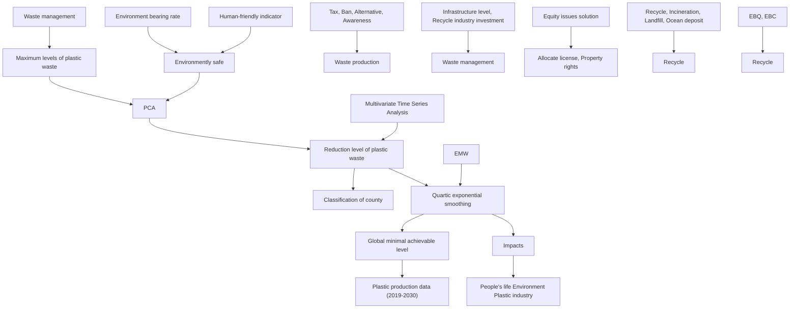
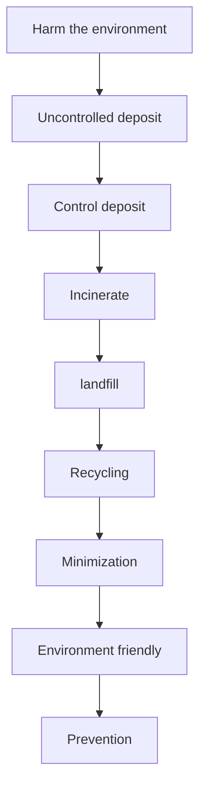
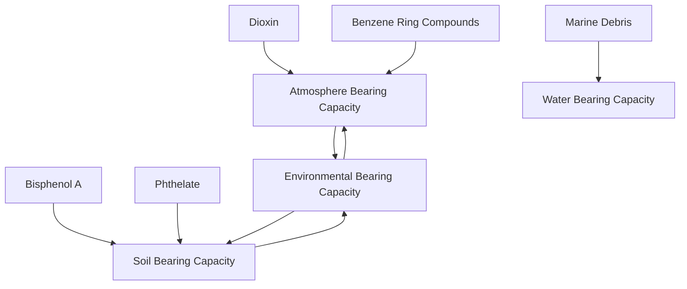
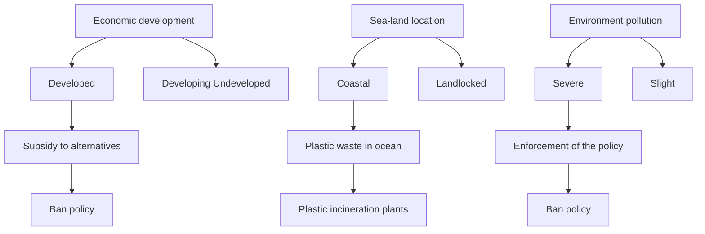
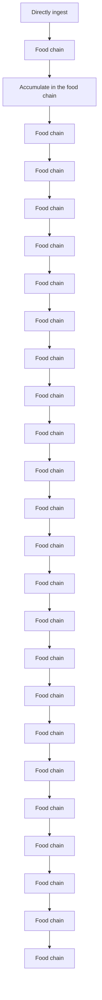

## Global Disposable Plastic Waste Crisis Summary

The plastic waste pollution, is posing a great threat to the global ecosystem and human health while causing global equity issues, and the rise of disposable plastics is even worsening the situation. To better understand and tackle these problems, this paper focuses on measuring disposable plastic waste’s influence, predicting its trend and give some reasonable advice.

For sake of estimating the maximum levels of disposable plastic waste that can safely be alleviated without further environmental damage, we created an Environment Bearing Rate Model (EBRM). Firstly, the relationship of disposable plastic waste and Environmental Bearing Quantity (EBQ) are given by analyzing the source and disposal of plastic waste. Secondly, we derive the interaction relationship between EBQ and Environmental Bearing Capacity (EBC) to get the Threshold Conditions for environmental self-recovery, which is EBQ equals to EBC. Finally, the maximum level of disposable plastic waste is deduced.

To discuss the extent disposable plastic waste level can be reduced to, we establish a DPWPM (Disposable Plastic Waste Prediction Model). Firstly, 11 quantifiable indicators influencing the generation and management of disposable plastic waste are selected. Then we classify the regions according to development degree, pollution level and whether it is coastal. Next, we do Principal Component Analysis with these indicators to reduce dimensionality. Finally, we use Multivariate Time Series Model to obtain the relationship between the disposable plastic waste proportion and these indicators and predict to what extent it will be reduced. To verify the model, we apply it to Ireland and the results are the disposable plastic waste rate in total waste will decrease to 0.3%, close to official statistic data. What’s more, we analyze the policy effectiveness in different regions and measure how the reduction will influence ecosystem and human health using the EBRM and Human-Friendly Indicator.

For giving a minimal achievable level of global waste of disposable plastic, we firstly use Quadratic Exponential Smoothing Model to predict total global plastic production. Then, DPWPM is used to predict the its proportion in plastic waste in different country groups. Combined with EWM (Entropy Weight Method), we get a global curve of its proportion in plastic. At last, we get the result that the minimal achievable level of global waste of disposable plastic is 15.88 million tones till 2030. Besides, we also draw a conclusion of how the target will influence human life, environmental and the plastic industry.

The unfair problems of the global plastic waste crisis are mainly reflected in the uneven distribution of plastic waste production and pollution and the different economic investment in the disposal of plastic waste of different countries. We propose four intended solutions including allocating Permits for the plastic waste and clarification of inter-state property rights.

Finally, we use Rotation Estimation and Gaussian noise to test the robustness for the models and write a memo to the ICM about the minimal achievable level of global plastic waste.

## Contents

## 1. Introduction..

1.1 Background. .2  
1.2 Restatement of Problem. 2  
1.3 Overview of Our Work

2. Assumptions and Justifications. .3  
3. Notations . .3  
4. Maximum Levels of Disposable Plastic Waste .. .3

4.1 Source of the waste ... 3  
4.2 Waste Management. .4

4.2.1 Recycling  
4.2.2 Incineration .. 4  
4.2.3 Landfill 4  
4.2.4 Uncontrolled Deposit in Ocean..

4.3 Environmental Bearing Rate Model. 5

4.3.1 Environmental Bearing Rate. 6  
4.3.2 Environmental Bearing Quantity Measurement  
4.3.3 Environmental Bearing Capacity Measurement 8

4.4 Maximum Levels of Disposable Plastic Product Waste .... .8

4.4.1 Current Waste Quantity and Capacity .8

## 5. Reduction of Plastic Waste and the Environmentally Safe Level after Reduction. .8

5.1 Factors Influencing Plastic Waste Reduction 9

5.1.1 Factors in the Waste Production of Disposable Plastic C  
5.1.2 Factors in the Waste Management of Disposable Plastic 1

5.2 Classification of the Country .. 12  
5.3 Disposable Plastic Waste Prediction Model ..13

5.3.1 Principal Component Analysis of Influencing Indicators. .13  
5.3.2 Multivariate Time Series Analysis with Principal Component .14  
5.3.3 Model Application ... .14

5.4 Environmentally Safe Level .15

5.4.1 Environmental Bearing Rate after Reduction of Plastic Waste ... .16  
5.4.2 Human-friendly Indicator .. .16

6. Targets and Impacts for Achieving the Minimal Achievable Level of Global Waste.........16

6.1 Targets for Minimal Achievable Level of Global Waste... 17

6.1.1 Prediction of Global Plastics Production . 17  
6.1.2 Prediction of Disposable Plastic Waste Proportion .. .17  
6.1.3 Result of Achievable Level of Disposable Plastic Waste. .18

6.2 Impacts for Achieving the Minimal Achievable Level of Global Waste .. ..18

6.2.1 Impacts on Human Life .19  
6.2.2 Impacts on the Environment . .19  
6.2.3 Impacts on the Plastic Industry .. 19

7. Equity Issues and Solutions 19

7.1 Equity Issues .... ..20  
7.2 Solutions to Equity Issues.. ..20

8. Sensitivity Analysis .20

8.1 Rotation Estimation for Multivariate Time Series Model ..20  
8.2 Gaussian Noise . ..21

9. Evaluation of the Model. 21

9.1 Strength .. ..21  
9.2 Weakness .. ..21

## 1. Introduction

## 1.1 Background

Single-use plastics products, referred to as items intended to be used only once before thrown away, are almost everywhere in our life, including grocery bags, food packaging, bottles, straws, containers, cups, cutlery, etc.[2] However, with the large-scale production of single-use plastic products, the white pollution caused by them is severe nowadays. According to a UNEP report[2], single-use plastics take most of the spots in the Top Ten most common finds during international coastal cleanups. What’s worse, poor waste management systems will exacerbate the extent of pollution. At present, several methods are used to dispose them, including incineration, dump, recycling, landfill and discard in the natural environment[1].

Since the plastic waste take even several hundred year to break down, it is posing a great threat to the ecosystem and human health[2].Especially, Marine ecosystems are being hit hard as most plastic waste flows into the ocean. Effects can be seen by the approximately 4-12 million tons of plastic waste that enter the oceans each year[1]. The economic damage caused by plastic waste is vast. Plastic litter in the Asia-Pacific region alone costs its tourism, fishing and shipping industries \$1.3 billion per year[3].

Recently years, many governments has taken positive interventions to tackle this problem, mainly by improving waste management practices, introduce financial incentives, financing more research and development of alternative materials, raising awareness among consumers and so on[3]. However, there are little research about the prediction of disposable plastic waste.

## 1.2 Restatement of Problem

In order to solve the plastic waste problem, we need to formulate a plan to reduce or even eliminate disposable plastic products by slowing down plastic production and improving waste utilization. Considering that plastics is mostly single-use, we focus particularly on disposable Plastic Products.

What we need to do is as follows:

Establish a model to estimate the maximum level of disposable plastic product waste Under the premise that waste can safely be mitigated without further environmental pollution.  
Research how much plastic waste can be reduced to reach an environmentally safe level.  
Based on the above research, set a goal for minimal achievable level of disposable plastic waste globally and explore the impact on many aspects of reaching that goal.  
Considering that the causes and consequences of disposable plastic problems vary from place to place, discuss related equity issues and propose solutions.

## 1.3 Overview of Our Work

We have established a model to determine the maximum level of the disposable plastic waste using the theory of environment bearing rate. Moreover, a model for predicting the extent the level of the disposable plastic waste can be reduced to according to many influence factors and historic data. Using the two models, we evaluate the effectiveness of different policies in different kinds of regions and give a reasonable minimum targeted achievable level for the global disposable plastic waste and advocates some solutions to solve the equality issues caused by the global plastic waste crisis. The whole modeling process are shown in Fig 1.


<details>
<summary>flowchart</summary>


</details>

Figure 1: whole modeling process of the paper

## 2. Assumptions and Justifications

To simplify the cost benefit analysis model, this paper makes following basic assumption, each of which is properly justified.

We assume that the increase in Environmental Bearing Capacity can be ignored because the evolution of the ecosystem is a long-time process.  
We assume that all the regions will react positively to the worsening problems of dis posable plastic waste and take suitable measures to improve it. This assumption is m ade according to reactions of most countries.

Sudden change in the environment can be ignored, because of its rareness.

## 3. Notations

We list the symbols and notations used in this paper in Table 1.

<table><tr><td colspan="3">Table 1: Symbols and Definitions</td></tr><tr><td>Symbols</td><td>Meanings</td><td>Unit</td></tr><tr><td>C(t)</td><td>Environmental Bearing Capacity in year t</td><td>--</td></tr><tr><td>Q(t)</td><td>Environmental Bearing Quantity in year t</td><td>--</td></tr><tr><td>EBR</td><td>Environmental Bearing Rate</td><td>--</td></tr><tr><td>HFI</td><td>Human-friendly Indicator</td><td>--</td></tr></table>

## 4. Maximum Levels of Disposable Plastic Waste

If the amount pollution caused by the plastic waste is within the controllable range, it won’t cause damage to the environment. However, when the single-use plastic product waste reaches a certain level, it will exceed the environment's own ability to repair, making the environment worse and difficult to recover. Therefore, we hope to develop a model to estimate the maximum levels of single-use or disposable plastic product waste that can safely be mitigated without further environmental damage.

## 4.1 Source of the waste

In most situation, single-use plastics are used for packaging, such as shopping bags, wrappers and bottles. After the use of these products, they will be discarded and become plastics waste. Among these wastes, as stated in the UNEP report[2], plastic bags and foamed plastic products are perceived as the most problematic source of the plastic wastes. It is because single-use plastic bags are the most common disposable plastic products in life to hold items[1]. And as for foamed plastics, its lightness, strength and thermal insulation make it great for disposable tableware such as lunch boxes. In china, with the rise of the takeaway industry,

the use of foam has increased uncontrollably[1].

To simplify our model, only two sources of the waste mentioned above is considered. Also, $P _ { b }$ and $P _ { f }$ are introduced to represent the annual production of plastic bags and foamed plastic products respectively.

## 4.2 Waste Management

The current consumption of plastic waste is large, which makes it more important to manage their end-of-life in an environment-friendly way. Scientifically speaking, “energy recovery processes are preferable to landfilling or improper forms of disposal[2]”. To show this more clearly, a waste management hierarchy, reflecting the degree of impact on the environment during different process of plastic wastes is shown in Fig. 2.


<details>
<summary>flowchart</summary>


</details>

Figure 2: Different ways to deal with $\mathrm { p l a s t i c }$ waste and the degree of impact on the environment.

For each level of the waste management hierarchy: Recycling is quite environmentfriendly because it decrease the production of disposable plastics. Landfill has a bad impact on the environment because it takes thousands of years for plastics to decompose. Incineration harms the environment due to the toxic gas in the burning process of plastics. Uncontrolled deposit in places like ocean is extremely detrimental to the environment owing to its harm to marine wildlife.

Thus, we mainly focus on four of them. They are recycling, incineration, landfill and uncontrolled deposit in ocean.

## 4.2.1 Recycling

Some disposable plastic products, usually made of thermoplastic materials, can be recycled through factory processing. In this way, not only the consumption of resources is reduced, but also the plastic waste does, thereby greatly reducing environmental pollution.

To measure the availability of the resources to recycle the waste, the percentage of plastic waste recycled $p _ { r } ( t )$ is introduced. The larger the value of $p _ { r } ( t )$ is, the more available the recycling resources are.

## 4.2.2 Incineration

Although the plastic waste can be decomposed through incineration, large amount of exhaust gas released will damage the atmosphere and have a negative impact on the environment

To measure the availability of the resources to incinerate the waste, the percentage of plastic waste incinerated $p _ { i } ( t )$ is introduced. The larger the value of $p _ { i } ( t )$ is, the more available the incineration resources are.

## 4.2.3 Landfill

Landfill means to bury the plastic waste in soil. It’s widely used in China because of low cost and good sanitation. However, chemical substances decomposed will also harm the soil.

To measure the availability of the resources to landfill the waste, the percentage of plastic waste landfilled $p _ { l } ( t )$ is introduced. The larger the value of $p _ { l } ( t )$ is, the more available the landfill resources are.

## 4.2.4 Uncontrolled Deposit in Ocean

Every year, there is a large amount of plastic product waste entering the ocean in various ways. And scientists estimate that the amount of plastic into the ocean is up to 4.8–12.7 million metric tons in 2010[3]. $2 0 1 0 ^ { [ 3 ] }$

During weathering and biological processes, plastic wastes into the ocean will gradually turn into plastic debris, which is easy to be ingested by marine wildlife. This is extremely harmful to marine ecology. Also, there is large plastics, which can interfere the navigation of ships. And the toxic chemicals in plastics will also pollute seawater, putting marine life at risk of being poisoned

To measure the availability of the resources to deposit the waste in ocean uncontrollably, the percentage of plastic waste deposited into the ocean $p _ { o } ( t )$ is introduced. The larger the value of $p _ { o } ( t )$ is, the more plastic waste is deposited into the ocean.

## 4.3 Environmental Bearing Rate Model

As we all know, ecosystems are capable of self-regulating. When they suffer certain damage, such as environmental pollution and reduction in the number of species, as long as these impacts do not exceed the threshold for ecosystem self-regulation, the environment can self-recover within a certain period of time.

Ecologically, terms like Environmental Bearing Capacity (EBC) and Environmental Bearing Quantity (EBQ) are applied to descript the process above.

When the plastic waste related EBQ is smaller than EBC, the single-use plastic product waste that can safely be mitigated without further environmental damage. The definition and property of EBC and EBQ are as follows:

Environmental Bearing Quantity (EBQ). This refers to the impacts that human activities make to the environment in a period. For example, human activities such as emitting the exhaust, discharging the plastic waste into the ocean will cause damage to the natural environment. The harmful influence includes but is not limited to the increase of the exhaust, the reduction in species, etc. All of these impacts to nature in a period belong to EBQ. And this can be measured by some metrics described in Section 5.3.2.  
Environmental Bearing Capacity (EBC). This refers to the maximum impacts that human activities make to the environment, otherwise the environment will suffer irreversible damage. In other words, EBC is the threshold of EBQ. For example, when the amount of exhaust emitted exceeds what the environment can afford, the ecosystem is damaged.

There are 2 cases of the relationship between EBQ and EBC. When EBQ is less than EBC, that is, the difference between them $\Delta < 0$ , the EBC won’t change in the near future because of the ecological stability. However, when EBQ is more than EBC, that is, $\Delta > 0$ , the EBC will decrease in the near future because of the irreversible damage, with the damage rate $f ( \Delta )$ resembling the Sigmoid function. Thus, we have

$$
\left\{ \begin{array}{l} C (t + 1) = C (t) [ 1 - f (\Delta) ] \\ \Delta = C (t) - Q (t) \end{array} \right. \tag {1}
$$

where and represents the amount of EBC and EBQ in year t respectively, the expression of is presented below.

$$
f (\Delta) = \left\{ \begin{array}{l} \frac {1}{1 + e ^ {- \Delta + 5}}, \Delta > 0 \\ 0, \Delta <   0 \end{array} \right.
$$

And the figure of $f ( \Delta )$ is shown in Fig.3.


<details>
<summary>line chart</summary>

| Δ   | f(Δ) |
| --- | ---- |
| 0   | 0.0  |
| 1   | 0.05 |
| 2   | 0.1  |
| 3   | 0.2  |
| 4   | 0.4  |
| 5   | 0.6  |
| 6   | 0.8  |
| 7   | 0.9  |
| 8   | 0.95 |
| 9   | 0.98 |
| 10  | 1.0  |
</details>

Figure 3: The shape of

## 4.3.1 Environmental Bearing Rate

Considering that the relationship between EBC an EBQ can serve as a criterion to EBR judge whether the ecosystem is damaged, Environmental Bearing Rate (EBR) is introduced to simplify the analysis.

The EBR is defined as the ratio of EBQ and EBC, which is shown as Eq.3.

$$
E B R = \frac {E B Q}{E B C} \tag {3}
$$

As Section 5.3.2 will mention, EBC and EBQ can be divided into several categories such as water, atmosphere and soil. Thus, the overall EBR is the weighted sum of the ratio, which can be expressed as Eq.4.

$$
E B R = \sum_ {i = 1} ^ {n} W _ {i} \cdot \frac {E B Q _ {i}}{E B C _ {i}} \tag {4}
$$

where $W _ { i } , \ E B Q _ { i }$ ,and $E B C _ { i }$ represent the weight, the value of and the value o of the category respectively.

When $E B R \ll 1$ : This refers to the situation that EBQ is far more less than EBC. The ecosystem won’ be damaged, so the EBC won’t change either. The relationship between EBQ and time t at this situation is showed in Fig.4.  
When $E B R \leq 1$ : This refers to the situation that EBQ is less than EBC. The ecosystem will be slightly damaged, so the EBC will fluctuate but also can be back to normal. The relationship between EBQ and time t at this situation is showed in Fig.4.  
When $E B R > 1$ : This refers to the situation that EBQ is larger than EBC. The ecosystem will be damaged, so the EBC will decline continuously. Then, although people may take actions to decrease the pollution, as the drop of EBC, the value of EBR is still more than 1, and this will create a vicious circle. The relationship among EBQ, EBC and time t at this situation is showed in Fig.4.


<details>
<summary>line chart</summary>

| EBR Category | EBC (t) | EBQ (t) |
| ------------ | ------- | ------- |
| EBR<<1       | -       | -       |
| EBR<1        | -       | Peak    |
| EBR>1        | -       | Peak    |
</details>

Figure 4: The relationship among EBQ, EBC and time t when EBR is different

To sum up, to safely mitigate the plastic waste without further environmental damage, the value of EBR must be controlled under 1. And the maximum levels of plastic waste refers to the situation when EBR equals 1.

## 4.3.2 Environmental Bearing Quantity Measurement

Based on the analysis in Section 5.2, we develop some EBQ metrics according to the ways to process the plastic waste, in order to measure the impacts that processing the waste makes to the environment.

To embrace a more detailed description of the measurements of EBQ, pay attention to Fig.5.


<details>
<summary>flowchart</summary>


</details>

Figure 5: Measurements of EBQ

Water Bearing Quantity(WBQ). It refers to the amount of plastic marine debris in a period. Study shows that the plastic contamination is threatening marine wildlife[5]. It is estimated by UNEP that marine litter harms over 600 marine species and about 15% of species affected by ingestion & entanglement from marine litter are endangered. And the plastic marine debris is produced by the plastic waste which is discharged into the ocean[5],cf. Eq.5.

$$
W B Q = p _ {o} \cdot (P _ {b} + P _ {f}) \tag {5}
$$

where  refers to the percentage of plastic waste deposited into the ocean,  and $p _ { o } ( t )$ $P _ { b } \mathrm { \mathrm { \ a n d } } \ P _ { f }$ represent the annual production of plastic bags and foamed plastic products respectively.

− Atmosphere Bearing Quantity(ABQ). It refers to the amount of dioxin and benzene ring compounds produced by burning the plastic waste in a period. The main compound of plastic products is PVC(polyvinyl chloride). The chemical equation in the process can be expressed as Eq.6.

$$
\left(C H _ {2} C H C l\right) _ {n} + \frac {5}{2} n O _ {2} \rightarrow 2 n C O _ {2} \uparrow + n H _ {2} O \uparrow + n H C l \uparrow \tag {6}
$$

During combustion, the polyvinyl chloride will also release highly toxic gas such dioxin and benzene ring compound, which can damage the immune system of animal, interfere with hormones and also cause cancer[6]. What’ more, dioxin and benzene ring compound are produced by the plastic waste which is incinerated, cf. Eq.7.

$$
A B Q = \left(q _ {d} + q _ {b}\right) \cdot p _ {i} \cdot \left(P _ {b} + P _ {f}\right) \tag {7}
$$

where $q _ { d }$ and $q _ { b }$ refer to the amount of dioxin and benzene ring compounds produced in the incineration of plastics, $p _ { i }$ represents the percentage of plastic waste incinerated.

Soil Bearing Quantity(SBQ). It refers to the amount of Phthalate and Bisphenol A produced by the decomposition of plastic waste in landfill in a period. When plastic particles break down, additives like phthalates and bisphenol A (BPA) will leach, which will disrupt the hormone systems of animals[7]. Moreover, phthalate and bisphenol A are produced by the plastic waste which is landfilled, cf. Eq.8.

$$
S B Q = \left(q _ {p} + q _ {a}\right) \cdot p _ {l} \cdot \left(P _ {b} + P _ {f}\right)
$$

where $q _ { p }$ and $q _ { a }$ refer to the amount of phthalate and bisphenol A produced in the landfill of plastics, $p _ { l }$ represents the percentage of plastic waste landfilled.

## 4.3.3 Environmental Bearing Capacity Measurement

Based on the calculation of ecosystem’s ability to self-recovery, we determine the value of EBC corresponding with the measurement in Section .3.3

⚫ Water Bearing Capacity (WBC). It refers to the amount of plastic marine debris that people can salvage from the ocean in a period. Considering that the marine wildlife can’t digest and decompose plastic waste, we assume that any amount of plastic marine debris over WBC will damage the ecosystem.  
Atmosphere Bearing Capacity (ABC). It refers to the amount of dioxin and benzene ring compounds that the microorganism can decompose in a period. Research shows that some enzymes existing in the fungus and bacterial are effective in decomposing these toxic gas[8]. Although there may be other ways to decompose them in the environment, we only consider microorganism to simply our model. Thus, we assume that any amount of dioxin and benzene ring compounds over ABC will damage the ecosystem.  
⚫ Soil Bearing Capacity (SBC). It refers to the amount of Phthalate and Bisphenol A that the microorganism can decompose in a period. It is similar to what is going on in the description above. And we assume that any amount of dioxin and benzene ring compounds over SBC will damage the ecosystem.

## 4.4 Maximum Levels of Disposable Plastic Product Waste

## 4.4.1 Current Waste Quantity and Capacity

Considering that the waste situation is accumulating with time, the total waste in the future definitely equals what the waste currently adding the waste that will increase in a period. Therefore, to better reflect the cumulative nature of waste, Current Waste Quantity (CWQ) and Current Waste Capacity(CWC) are introduced. The calculation of CWQ and CWC be analogized to equations in Section 4.3.2 and Section 4.3.3, with the only difference that the value in the above equations is not what will be in the future, but what is at present. Meanwhile, we can modify our previous equation, Eq.9, to the following format:

$$
E B R = \sum_ {i = 1} ^ {n} W _ {i} \cdot \frac {E B Q _ {i} + C W Q _ {i}}{E B C _ {i} + C W C _ {i}} \tag {9}
$$

where i (i=1,2,3)represents the measurement in water, atmosphere, or soil,

In order to have a specific view of the relationship between the amount of plastic waste and EBR, pay attention to Eq.10.

$$
E B R = \sum_ {i = 1} ^ {3} W _ {i} \cdot \frac {E B Q _ {i} + C W Q _ {i}}{E B C _ {i} + C W C _ {i}} \tag {10}
$$

When EBR equals 1, we can get the maximum levels of single-use plastic products that can be safely reduced without further environmental damage.

## 5. Reduction of Plastic Waste and the Environmentally Safe Level after Reduction

Research shows that plastic waste is exerting great pressure on both ecological environment and human health, among which disposable waste makes the problem even more serious[2][9]. Given the time constraints, we mainly focus on the single-use plastics. Meanwhile, people have made great efforts to limit the production and consumption of disposable plastics nowadays, such as introducing related laws and alternatives. However, the amount of disposable plastic that can be reduced after these trials still remains a question, along with the impact on the environment and human beings.

## 5.1 Factors Influencing Plastic Waste Reduction

In recent decades, due to the improvement of people's environmental protection awareness and the promotion of the government legislation, the level of disposable plastic waste shows a decreasing trend. How much disposable waste can be reduced, however, remains a complex question, which is closely related to factors like policy, market, etc.

According to their roles in plastic waste reduction, influencing factors are divided into two categories: waste production and waste management. Specifically speaking, factors in waste production affect the amount of disposable plastic produced and entering the market; while factors in waste management affect the amount of pollution in plastic waste disposal.

What’s more, according to the survey[15], if the policy is effective, the reduction of singleuse plastic waste will decreases significantly in the short term, after that, the reduction trend may also rebound.

## 5.1.1 Factors in the Waste Production of Disposable Plastic

In this section, factors about waste production will be introduced, including the effectiveness of local policies like bans or taxes, alternatives to plastics, citizen’s environmental protection awareness, supply and demand relationship in the single-use plastic market, etc. What’s more, it is worth noting that most conditions such as demand, policies and even the effectiveness of policies may vary from the degree of local development, geographical conditions and some other regional-specific restraints.

## C Ban Policy

Ban policy, usually targeted at the production, import, marketing and distribution of nonbiodegradable plastic bags, is the most effective way to decrease the plastic waste[2]. Unfortunately, not all countries are suitable for this approach. Take Rwanda and China as examples. After Rwanda implemented its ban policy, although the smuggling of plastics occurred in the beginning, plastic waste decreased significantly in the long run. However, China did so in 1999 and few effects taken on disposable plastic waste. Impact of national bans (based on more than 60 countries experience)[2] shows that the influence of ban policy varies greatly from country to country. That is to say, some countries are suitable for controlling disposable plastic waste through bans, but others are not. And the detailed discussion will be presented in Section 4.2. Here we introduce a 0-1 variable $x _ { 1 }$ cf. Table 2.

Table 2: Selected indictors in terms of ban policy

<table><tr><td>Indicators</td><td>Brief explanation</td></tr><tr><td rowspan="2"> $x_{1}$ </td><td>When  $x_{1}=0$ , the country is unsuitable for ban policy</td></tr><tr><td>When  $x_{1}=1$ , the country is suitable for ban policy</td></tr></table>

## Alternatives

Alternatives to plastics, serving as an environmental friendly replacement, are correlated with the price and quantity demanded of the target goods[10]. They include materials like paper and cloth. Although they can’t perfectly replace plastics due to their higher manufacturing costs and inconvenience in some cases, they will still play a positive role in promoting the reduction of disposable plastics under the appropriate policy guidance.

Economically, Cross-Price Elasticity of Demand is used to describe the competitive process[11],cf. Eq.11.

$$
E _ {a b} = \frac {\Delta Q _ {a} / Q _ {a}}{\Delta P _ {b} / P _ {b}} \tag {11}
$$

where $E _ { a b }$ represents the cross-price elasticity of demand, $Q _ { a }$ refers to the demand change for product ?? and $P _ { b }$ refers to the price of product ?? . Therefore, the supply and demand diagram is shown as follows.


<details>
<summary>line chart</summary>

| Px  | Qy  |
| --- | --- |
| Low | Low |
| High | High |
</details>

Figure 6: Q-P curve of the disposable plastic product and its substitute goods

Obviously, the demand for single-use plastic products will decrease with the fall of the price of alternatives. To quantify the competitiveness of alternatives in a region, the financial investment by government will also be considered.

To sum up, two indicators are selected to measure the competitiveness of alternatives, cf. Table 3.

Table 3: Selected indictors in terms of alternatives

<table><tr><td>Indicators</td><td>Brief explanation</td></tr><tr><td> $x_{2}$ </td><td>Price of Alternatives to Disposable Plastic Products</td></tr><tr><td> $x_{3}$ </td><td>Financial Investment by Government in Alternative Industries</td></tr></table>

## − Environmental Protection Awareness

Environmental protection awareness plays an important role in the effectiveness of policies and consuming behaviors in plastics. Study shows that general environmental awareness of citizens may be influenced by the education level received, level of government advocacy, efforts made by social welfare organizations, etc[12]. Considering the uncertainty of other factors, only the first two factors are discussed here. They are the average education level of citizens and the government’s advocation rate on environmental protection.

Average education level of citizens counts because there are environmental education courses carried out in universities, colleges, and elementary schools, which will effectively improve citizens' awareness of ecology and environment protection[12]. Also, government’s advocation rate on environmental protection is important because if the government is committed to popularizing the environmental protection knowledge and guiding citizens to ecological consumption[12], it will be easier for people to be environmentally awareness.

To sum up, two indicators are selected to measure the level of the environmental protection awareness, cf. Table 4.

Table 4: Selected indictors in terms of environmental awareness

<table><tr><td>Indicators</td><td>Brief explanation</td></tr><tr><td> $x_{4}$ </td><td>Average Education Level of Citizens</td></tr><tr><td> $x_{5}$ </td><td>Government’s Advocation Rate on Environmental Protection</td></tr></table>

## Tax Policy

Tax policy is the most common-used economic incentive[13] to address waste. Up tp June 2019, over 60 countries in the world have taken distinct steps in the form of bans and taxes on single-use plastic products to decrease the plastic waste[14]. Nowadays, there are many kinds of tax system and charges, which vary from region to region. In general, three kinds of tax system are considered. They are production tax, landfill tax and carrier bag charge[13].

Production tax is targeted at the manufacturing level and tax on the factories whose amount of plastic products produced exceeds the regulation value. Landfill tax is concentrated on the waste management level and tax on the amount of factories who landfilled plastic waste. Carrier bag charge is focused on the consumption level and tax on single-use plastic packaging.

From an economic point of view, we take the effect of the carrier bag charge as an example. We assume that when there is no plastic bags charge, people will use a disposable plastic bag as long as they buy one item.


<details>
<summary>line chart</summary>

| Condition                     | Q1   | Q2   |
| ----------------------------- | ---- | ---- |
| No plastic bags change        | Q1 = Q2 | Q2   |
| Implement plastic bags charge | Q1 < Q2 | Q2   |
</details>

Figure 7：The relationship between the amount of single-use plastic bags and items sold.

where $Q _ { 1 }$ represents volume of single-use plastic bags, $Q _ { 2 }$ represents sales volume of items of the supermarket.

When there is plastic bags charge, people may reuse the bags so that the number of plastic bags will decrease.

To sum up, three indicators are selected to measure the tax policy, cf. Table 5.

Table 5: Selected indictors in terms of tax policy

<table><tr><td>Indicators</td><td>Brief explanation</td></tr><tr><td> $x_{6}$ </td><td>Production Tax</td></tr><tr><td> $x_{7}$ </td><td>Landfill Tax</td></tr><tr><td> $x_{8}$ </td><td>Carrier Bag Charge</td></tr></table>

## 5.1.2 Factors in the Waste Management of Disposable Plastic

In this section, factors about waste management will be introduced, including the effectiveness of local policies like encouraging the recycling of the plastic waste, increasing subsidies for environment-friendly factories, as well infrastructures like trash bins, plastic incineration plants, etc.

## Recycling Industry Investment

Infrastructure will affect the behavior of citizens, which will indirectly influence the recycle rate of disposable plastic. To measure and simplify this relationship, this paper uses the number of trash cans to represent the plastic-relative infrastructure level. To verify the conjecture, we analyzed the correlation of the data by investigating the number of garbage cans and the recycling rate of their disposable garbage in a range of regions or cities.


<details>
<summary>line chart</summary>

| Category | No. of garbage cans (10,000) | Recovery rate of disposable plastics |
| -------- | ---------------------------- | ------------------------------------- |
| A        | 4.5                          | 0.2                                   |
| B        | 6.5                          | 0.25                                  |
| C        | 3.5                          | 0.25                                  |
| D        | 7.0                          | 0.25                                  |
| E        | 7.5                          | 0.3                                   |
| F        | 4.0                          | 0.25                                  |
| G        | 2.5                          | 0.15                                  |
| H        | 2.0                          | 0.1                                   |
| I        | 5.0                          | 0.15                                  |
</details>

Figure 8: Correlation of recovery rate and garbage can number in ten cities.

we can learn from Fig.8 that the Pearson Correlation Coefficient between the number of garbage cans and the recycling rate of disposable garbage was 0.7631, indicating a relatively strong linear relationship between them. What’s more, the government investment are supposed to be considered, since this will determined the future infrastructure level increase[11].

To sum up, two indicators are selected to measure the recycling infrastructure level, cf. Table 6.

Table 6: Selected indictors in terms of the recycling industry investment

<table><tr><td>Indicators</td><td>Brief explanation</td></tr><tr><td> $x_{9}$ </td><td>Number of Trash Cans</td></tr><tr><td> $x_{10}$ </td><td>Financial Investment by Government in Recycling Industry</td></tr></table>


## − Infrastructure Level

According to a scientific estimate, almost 79% of the plastic waste produced sits in landfills or in the natural environment such as ocean, while about 12% has been incinerated and only 9% has been recycled[2]. Although the incineration of the plastics will produce lots of toxic gas, we can use chemical methods to decompose them, which makes the harm caused by incineration is far less than that is caused by landfill and uncontrolled deposit.

Uncontrolled deposit in ocean is detrimental to the environment, especially the marine environment, as what is discussed in Section 4.2.4. Based on a survey published by UNEP[2], the uneven proportion of different ways of plastic waste management is partially because of the lack of the plastic waste incineration infrastructure, usually measured by the amount of plastic waste incineration plant.

The following predictions are made by UNEP, that is, if the amount of the plastic waste incineration plant increases by 50%, the percentage of the plastic waste landfilled or deposited in the environment will decrease greatly[2]. To get an intuitive understanding, the percentage data is presented in the pie chart in Fig.9.


<details>
<summary>pie chart</summary>

| Category | Percentage (%) |
| :--- | :--- |
| Incinerated | 65 |
| Recycled | 9 |
| Land filled or deposited in the environment | 26 |
| Other | 79 |
| Other (Left) | 12 |
| Other (Right) | 9 |
</details>

Figure 9: Global flow of plastic packaging waste in 2015 and predictions in 2030 when the amount of the plastic waste incineration plant increases by 50%

Therefore, by increasing the amount of plastic waste incineration plant, the marine plastic litter may decline greatly, which is beneficial for marine environment.

To sum up, one indicator is selected to measure the incineration infrastructure level, cf. Table 7.

Table 7: Selected indictors in terms of incineration infrastructure level

<table><tr><td>Indicators</td><td>Brief explanation</td></tr><tr><td> $x_{11}$ </td><td>Amount of Plastic Waste Incineration Plant</td></tr></table>

## 5.2 Classification of the Country

Although plastic waste is a global issue, the causes behind them may vary from countries, due to some regional-specific constraints. In this section, three categories are considered. They are the degree of economic development, sea-land location and degree of environmental pollution caused by plastics waste.

With respect to the degree of economic development, it is closely related to whether the ban policy can be implemented in the country. For developed countries like Denmark and Belgium, ban policies such as banning on the use of single-use plastic bags take effects, cf. Appendix 2. However, in some developing or undeveloped countries like China and Bangladesh, things are different. This is because plastics is a necessity owing to its convenience and low production cost, and banning plastics will certainly require alternatives, whose cost is likely to be higher than plastics. Only when the government provide subsidies to alternatives, can the price of this goes down, leading to the success of ban policy. Therefore, it’s easy to think of that, the wealthier the country is, the more success probability in ban policy.

With respect to the sea-land location, it is closely related to whether the amount of plastic waste incineration plant is more important than others. For coastal areas, plastics wastes that isn’t be recycled or incinerated is more likely to be littered into the ocean, which causes irreversible impacts on marine environment. However, for landlocked areas, it is harder to deposit the plastics in ocean.

With respect to the degree of environmental pollution caused by plastics waste, it is also closely related to whether the ban policy can be implemented in the country, especially in especiall undeveloped countries. If the environmental pollution is extremely serious in the country, the corresponding enforcement will be stricter, which makes the policy more effective.

For example, Rwanda, though undeveloped, still managed to replace all the plastic bags with paper bags, cf. Appendix 1.

The graphical view of the classification of the country is shown in Fig.10.


<details>
<summary>flowchart</summary>


</details>

Figure 10: Cause and effects of the classification of the country

## 5.3 Disposable Plastic Waste Prediction Model

Based on the qualitative analysis in Section 6.1, indicators affecting the amount of plastic waste has been extracted. Then, in this section, the quantitative relationship between indicators and the amount of plastic waste will be determined correspondingly. First, PCA (Principle Components Analysis) was applied to decrease the internal correlation. Then, to predict the proportion of disposable plastic waste in total waste, MTSA (Multivariate Time Series Analysis) is used. Finally, the effectiveness of policies with regional-specific constraints was analyzed by comparing the weights of influence factors in different countries.

## 5.3.1 Principal Component Analysis of Influencing Indicators

Since there may be strong internal correlation among the 11 indicators, we first conduct principal component analysis on these indicators to realize the dimensionality reduction of date and eliminate the collinearity between variables. The analysis steps are as follows.

## Data normalization

Because the units and orders of magnitude of different indicators are greatly different, in order to eliminate this effect, data normalization is done first, which means the value of all data will be converted to the number between 0 and 1 without the units.

Let $x _ { i j }$ denotes the $i _ { t h }$ influencing indicators of the $j _ { t h }$ region[16], cf. Eq.12.

$$
x _ {i j} = \frac {x _ {i j} - x _ {j m e a n}}{s _ {j}} \tag {12}
$$

where $i = 1 , 2 \dots n , j = 1 , 2$ … ??. ?? and ?? is the number of indicators and sample areas

respectively $x _ { j m e a n } = \sum _ { i = 1 } ^ { n } x _ { i j } / n , s _ { j } = \sqrt { \sum _ { i = 1 } ^ { n } \left( x _ { i j } - x _ { i n e a n } \right) ^ { 2 } / \left( n - 1 \right) }$

## C Principal component determination

Step 1: Calculate the covariance matrix of the matrix $\left[ x _ { i j } \right] _ { n \times m }$

Step 2: Calculate the eigenvalues and normalized eigenvectors of the covariance matrix.

Step 3: All principal components are derived from the computed eigenvalues and eigenvectors.

$$
Z _ {i} = \sum_ {j = 1} ^ {m} C _ {i j} x _ {i j} \tag {13}
$$

where ?? = 1,2 … ??, ?? is ?? principal component, is the elements of the covariance he varia ce matrix.

Step 4: Choose the number of principal components by determining whether the cumulative contribution rate is greater than 85%. We suppose that the number is $P ^ { [ { 1 7 } ] }$ .

## 5.3.2 Multivariate Time Series Analysis with Principal Component

Multivariate time series analysis can not only predict the trend of the target variable, but also give the relationship of horizontal relationship of different variables[18]. Its normal expression is as follow.

$$
\left\{ \begin{array}{c} y _ {t} = \mu + \sum_ {k = 1} ^ {P} \frac {\Theta_ {i} (B)}{\Phi_ {i} (B)} B ^ {l _ {i}} z _ {i t} + \varepsilon_ {t} \\ \varepsilon_ {t} = \frac {\Theta_ {i} (B)}{\Phi_ {i} (B)} a _ {t} \end{array} \right. \tag {14}
$$

where $\Phi _ { i } \left( B \right)$ is the polynomial of the autoregressive coefficient of the $i _ { t h }$ input variable, $\Theta _ { i } \left( B \right)$ is the polynomial of the moving average coefficient of the $i _ { t h }$ input variable, $l _ { i }$ is the delay order of the $i _ { t h }$ input variable, $\mathcal { E } _ { t }$ is the regression residual sequence, and $a _ { t }$ is the sequence of zero mean white noise.

These parameters can be estimated by the Maximum Likelihood Method, but the process is rather complex and needs large amount of calculation. Therefore, we choose Multiple Linear Regression and Least Squares Difference Method to simplify it, in which the former can be used to get the relationship of $y _ { t }$ and $x _ { i t }$ of each year, cf. Eq.15.

$$
y _ {l} = \mu_ {l} + \sum_ {i = 1} ^ {P} \omega_ {i l} x _ {i l} \tag {15}
$$

Then, using $\omega _ { i t }$ to estimate $\omega _ { i }$ with the constraint

$$
\min \{\sum_ {l = 1} ^ {Q} (y _ {l} - y _ {l}) ^ {2} \} \tag {16}
$$

where ?? denotes the current year, and  is the length of statistical time period. At last, we can get the Least Squares Difference relationship between $y _ { t }$ and $x _ { i t }$ .

$$
y _ {t} = \mu_ {t} + \sum_ {i = 1} ^ {P} \omega_ {i t} x _ {i t} \tag {17}
$$

So, if we can predict the future influence factor $x _ { i t }$ ,we can predict the targeted variables $y _ { t }$ .

## 5.3.3 Model Application

## Results of Principal Component Analysis

For the six regions divided according to different standards, nine indicators of 10 regions in different categories were selected for principal component analysis, and the cumulative curve of principal component contribution was shown in Fig.11.


<details>
<summary>bar chart</summary>

Contribution accumulation diagram
| Principal component serial number | developed areas | developing areas | coastal areas | landlocked areas | extremely polluted areas | normally polluted areas |
| :--- | :--- | :--- | :--- | :--- | :--- | :--- |
| 1 | 0.68 | 0.72 | 0.69 | 0.67 | 0.65 | 0.73 |
| 2 | 0.79 | 0.81 | 0.84 | 0.83 | 0.85 | 0.81 |
| 3 | 0.89 | 0.90 | 0.89 | 0.88 | 0.87 | 0.86 |
| 4 | 0.92 | 0.93 | 0.94 | 0.93 | 0.92 | 0.91 |
| 5 | 0.95 | 0.94 | 0.97 | 0.96 | 0.95 | 0.94 |
| 6 | 0.97 | 0.97 | 0.96 | 0.96 | 0.96 | 0.97 |
| 7 | 0.98 | 0.98 | 0.98 | 0.98 | 0.97 | 0.97 |
| 8 | 0.99 | 0.99 | 0.99 | 0.99 | 0.98 | 0.98 |
| 9 | 1.00 | 1.00 | 1.00 | 1.00 | 1.00 | 1.00 |
</details>

Figure 11: curve of principal component contribution

As can be seen from the figure, in all cases, the sum of contributions of the first three principal components is greater than 85%, so we selected the first three principal components for subsequent analysis.

## ⚫ Prediction of Disposable Plastic Waste Reduction in Ireland

Since disposable plastic bags account for the majority of Ireland's disposable plastic waste[20]. We use the MTSA to predict the proportion of disposable plastic bags in the country's total waste. Using the Multivariate Time Series Analysis, we adapt the data from 2000 to 2010[20], and give the prediction from 2011 to 2015.The results is in Fig.12.


<details>
<summary>line chart</summary>

| year | predicted value | real value |
| ---- | --------------- | ---------- |
| 2000 | 0.3             | 5.0        |
| 2005 | 0.6             | 0.4        |
| 2010 | 0.2             | 0.2        |
| 2015 | 0.2             | 0.2        |
</details>

Figure 12: The prediction of the proportion of disposable plastic bags in the country's total waste

As seen in Fig.12, the predicted data is similar with the official one. In fact, the Relative Mean Square Deviation is just 4.2%, which demonstrates the effectiveness of the model.

## Effectiveness of Policy

The effectiveness of policy can be measured by the coefficient of each indicator. If the policy is effective, the reduction of the plastic production will be obvious, reflected in big coefficients. We make predications on the coefficients of some typical countries according to the classification in Section 5.2. and the corresponding radar chart is shown in Fig.13.


<details>
<summary>radar chart</summary>

| Policy Category | Developed& Landlocked Country (Ban policy) | Developed& Landlocked Country (Tax policy) | Developed& Coastal Country (Tax policy) | Developed& Coastal Country (Incineration infrastructure) | Developed& Coastal Country (Recycling infrastructure) | Undeveloped& Slight Country (Tax policy) | Undeveloped& Slight Country (Tax policy) | Undeveloped& Serious Country (Tax policy) | Undeveloped& Serious Country (Incineration infrastructure) | Undeveloped& Serious Country (Recycling infrastructure) | Undeveloped& Serious Country (Environmental protection awareness) |
| --- | --- | --- | --- | --- | --- | --- | --- | --- | --- | --- | --- |
| Ban policy | 3 | 2 | 1 | 0 | 0 | 3 | 2 | 1 | 0 | 0 | 0 |
| Tax policy | 2 | 1 | 0 | 0 | 0 | 2 | 1 | 0 | 0 | 0 | 0 |
| Incineration infrastructure | 1 | 0 | 0 | 0 | 0 | 1 | 0 | 0 | 0 | 0 | 0 |
| Environmental protection awareness | 0 | 0 | 0 | 0 | 0 | 0 | 0 | 0 | 0 | 0 | 0 |
| Alternatives | 3 | 3 | 3 | 3 | 3 | 3 | 3 | 3 | 3 | 3 | 3 |
| Recycling infrastructure | 1 | 1 | 1 | 1 | 1 | 1 | 1 | 1 | 1 | 1 | 1 |
| Recycling infrastructure | 0 | 0 | 0 | 0 | 0 | 0 | 0 | 0 | 0 | 0 | 0 |
| Tax policy (Developed & Landlocked Country) | -1 | -1 | -1 | -1 | -1 | -1 | -1 | -1 | -1 | -1 | -1 |
| Tax policy (Developed & Landlocked Country) (Developed & Coastal Country) | -2 | -2 | -2 | -2 | -2 | -2 | -2 | -2 | -2 | -2 | -2 |
</details>

Figure 13: Comparison of coefficients of indicators between different kinds of countries

As shown above, in terms of the incineration indicator, the policy is more effective in coastal countries than landlocked ones. As for the ban policy indicator, the policy is more effective in developed countries than undeveloped ones and in serious pollution countries than in slight ones, which match the analysis in Section 5.2.

## 5.4 Environmentally Safe Level

To measure whether the level of the plastic waste after reduction is environmentally safe, two aspects are considered. One aspect is the Environmental Bearing Rate(EBR) mentioned in Section 5.4, which is used to measure the damage that the plastic waste does to the environment. The other one is human-friendly indicator, applied to measure the threat that plastic waste poses to human health.

## 5.4.1 Environmental Bearing Rate after Reduction of Plastic Waste

The calculation of EBR is based on Eq.10. To get the EBR after the reduction of the plastic waste, the predicted amount of annual plastic production has to substitute the relating variable in Eq.10. Next, based on the analysis in Section 5.4, if the value of EBR is less than 1, then it reaches an environmentally safe level.

## 5.4.2 Human-friendly Indicator

The plastic waste is also harmful to human’s health in both direct and indirect ways. In direct ways, people will take in water or air polluted by plastic waste. And in indirect ways, people may intake the toxic chemicals in plastics though food chain. What’s more, because humans are at the top of the food chain, the toxic accumulation is quite high comparing to other animals, which may do great harm to human health. Two ways are showed in Fig.14.


<details>
<summary>flowchart</summary>


</details>

Figure 14: Direct and Indirect way that plastic waste harms human health

In this section, we mainly focused on the impacts of in the indirect way, because the harm caused by the direct way can be calculated through the previous analysis in environment in Section 6.4.1. Here we propose the Human Risk Index(HRI) to measure the threat that plastic waste poses to human health.

More specifically, we consider humans to be on the top of food chains with $m _ { i }$ food grade. And the weight of plastic waste is kg. Considering the difference in food chains, we donate $u _ { i }$ as the plastic waste absorbed by bottom species, $R _ { i j }$ as the transfer efficiency of different stages in food chains. And the expression of HRI can be expressed as Eq.18.

$$
H R I = \ln (W \sum_ {i = 1} ^ {n} \prod_ {j = 1} ^ {m _ {i}} u _ {i} R _ {i j}) \tag {18}
$$

If plastic waste can be reduced by a% by prediction, then Eq.19 can modified as follows.

$$
HRI = \ln \left(\left(1 - a\%\right)W \sum_ {i = 1} ^ {n} \prod_ {j = 1} ^ {m _ {i}} u _ {i} R _ {i j}\right) \tag{19}
$$

Therefore, with the reduction of plastic waste, HRI will be improved, and the risk of people being harmed by plastic waste will decrease.

## 6. Targets and Impacts for Achieving the Minimal Achievable Level of Global Waste

The problem of plastic waste has become a global issue. According to UNEP[2], in 2010, the global plastic waste was 275 million tons, and the amount of mismanaged waste is up to 31.9 million tons, which is at the significant risk of leakage to the environment[2]. Therefore, to protect our Mother Earth, target for global waste of single-use plastic products have to be set. Meanwhile, we are also looking forward to changes in human life, environment and plastic industries after the goals are reached.

## 6.1 Targets for Minimal Achievable Level of Global Waste

The problem of plastic waste has become a global issue. To set a realistic target to tackle this, we plan to predict the amount of disposable plastic waste in the future, after some policies have been enforced.

Firstly, we will use Second Exponential Smoothing Method(SESM) to predict the Global Plastics Production till 2030. Then, based on the regional classification criteria in Section 5.2, all countries will be divided into 6 categories, then, proportion and recycling rate of disposable plastic waste of each category will be estimated. At last, the minimal achievable level of single-use plastic waste will be obtained.

## 6.1.1 Prediction of Global Plastics Production

According to the research of UNDP, the amount of global plastic production is predicted to increase in a long period. Therefore, we use the Second Exponential Smoothing Method to establish the Global Plastics Production Prediction Model, cf. Eq.20.

$$
Y _ {t + T} = a _ {t} + b _ {t} T
$$

$$
S _ {t} ^ {(2)} = a S _ {t} ^ {(1)} + (1 - a) S _ {t - 1} ^ {(2)} \tag {20}
$$

$$
\left\{ \begin{array}{c} a _ {t} = 2 S _ {t} ^ {(1)} + S _ {t} ^ {(2)} \\ b _ {t} = \frac {a}{1 - a} (S _ {t} ^ {(1)} - S _ {t} ^ {(2)}) \end{array} \right.
$$

where $S _ { t } ^ { ( 1 ) }$ is smooth value of the primary index, $S _ { t } ^ { ( 2 ) }$ is the smooth value of the second index and $Y _ { _ { t + T } }$ is the predicted global plastics production of $t _ { t h }$ year. Results are shown in Fig. 15.


<details>
<summary>line chart</summary>

| year | real value (million tonnes) | predicted value (million tonnes) |
| ---- | --------------------------- | --------------------------------- |
| 1950 | 0                           | 0                                 |
| 1960 | ~0.1×10⁸                   | ~0.1×10⁸                         |
| 1970 | ~0.4×10⁸                   | ~0.4×10⁸                         |
| 1980 | ~0.7×10⁸                   | ~0.7×10⁸                         |
| 1990 | ~1.2×10⁸                   | ~1.2×10⁸                         |
| 2000 | ~2.0×10⁸                   | ~2.0×10⁸                         |
| 2010 | ~3.0×10⁸                   | ~3.0×10⁸                         |
| 2020 | ~4.5×10⁸                   | ~4.5×10⁸                         |
| 2030 | ~5.5×10⁸                   | ~5.5×10⁸                         |
</details>

Figure 15: The prediction of global plastics production

## 6.1.2 Prediction of Disposable Plastic Waste Proportion

According Section 6.2, countries are divided into 6 categories. With multivariate time series model, we obtained the prediction of the proportion of disposable plastics in Fig.16.


<details>
<summary>line chart</summary>

| Year | Developed coastal countries | Developed landlocked countries | Developing coastal countries | Developing inland countries | Undeveloped and heavily polluted countries |
|------|-----------------------------|----------------------------------|------------------------------|-----------------------------|-------------------------------------------|
| 2019 | 13                          | 13                               | 44                           | 44                          | 25                                        |
| 2020 | 2                           | 8                                | 30                           | 30                          | 20                                        |
| 2021 | 1                           | 5                                | 25                           | 25                          | 15                                        |
| 2022 | 1                           | 4                                | 23                           | 23                          | 13                                        |
| 2023 | 1                           | 4                                | 27                           | 27                          | 12                                        |
| 2024 | 1                           | 4                                | 28                           | 28                          | 11                                        |
| 2025 | 1                           | 4                                | 25                           | 25                          | 10                                        |
| 2026 | 1                           | 3                                | 20                           | 20                          | 15                                        |
| 2027 | 1                           | 3                                | 15                           | 15                          | 10                                        |
| 2028 | 1                           | 3                                | 10                           | 10                          | 8                                         |
| 2029 | 1                           | 2                                | 8                            | 8                           | 6                                         |
| 2030 | 1                           | 1                                | 6                            | 6                           | 5                                         |
</details>

Figure 16: The predicted proportion of disposable plastic waste in different regions Then we combine them with Entropy weight method to make the prediction.

## 6.1.3 Result of Achievable Level of Disposable Plastic Waste

## Annual Amount of Production of Disposable Plastic Waste

The production of disposable plastic waste is demonstrated in Fig. 17.


<details>
<summary>line chart</summary>

| Year | Disposable Plastic Waste (Million tonnes) | comprehensive rate (%) |
|------|------------------------------------------|------------------------|
| 2018 | 127.0                                    | 30.0                   |
| 2020 | 92.0                                     | 22.0                   |
| 2022 | 75.0                                     | 16.0                   |
| 2024 | 78.0                                     | 16.0                   |
| 2026 | 42.0                                     | 8.0                    |
| 2028 | 25.0                                     | 4.0                    |
| 2030 | 15.88                                    | 3.0                    |
</details>

Figure 17: The prediction of global disposable plastic waste and its proportion in global waste

Therefore, we set the targeted level as 15.88 Million tones, based on the assumption that policy of limiting disposable plastic won’t change in the next ten years.

## Percentage of Ways of Plastic Waste Management

Due to the policy of increasing the number of plastic waste incineration plants, the percentage of the two ways of waste management will change in the future, cf.Fig18


<details>
<summary>line chart</summary>

| Year | percentage of disable plastic into ocean (%) | percentage of disable plastic incinerated (%) |
|---|---|---|
| 2019 | 69 | 12 |
| 2020 | 67 | 15 |
| 2021 | 64 | 16 |
| 2022 | 55 | 19 |
| 2023 | 43 | 28 |
| 2024 | 36 | 35 |
| 2025 | 30 | 44 |
| 2026 | 24 | 50 |
| 2027 | 20 | 57 |
| 2028 | 19 | 61 |
| 2029 | 18 | 63 |
| 2030 | 17 | 65 |
</details>

Figure 18: The percentage of two ways of plastic waste management

Therefore, we set the targeted percentage of plastics into ocean declining to 18% and the percentage of plastics incinerated increasing to 65%.

## 6.2 Impacts for Achieving the Minimal Achievable Level of Global Waste

If the target of 15.88 million tons is reached, there will be profound impact on wide range of our world, including the human life, the environment and the plastic industry.

To get a better understanding of the impacts, cf. Fig 19.

  
Figure 19: Impacts on the human life, environment and plastic industry

## 6.2.1 Impacts on Human Life

Based on Section 6.1, the factors can be divided into 2 categories. From the aspect of plastic waste production, the financial investment to alternative industry $\left( { { x } _ { 3 } } \right)$ will lead to the decrease of the price of substitutes( $x _ { 2 } )$ . Meanwhile, the price of single-use plastic products will rise due to the carrier bag $\mathrm { c h a r g e } ( x _ { 8 } )$ and the production tax on the production( $x _ { 6 } )$ ) of plastic. Therefore, according to $\mathbf { Q - P }$ curve in Fig.6, the consumption of single-use products will decline, also due to the government’s advocation on environmental protection( $\left( x _ { 5 } \right)$ . It is estimated that by that time, most people will use paper or cloth bags instead of plastic ones.

## 6.2.2 Impacts on the Environment

In analogy to analysis in Section 7.2.1, from the aspect of plastic waste production, if these policies such as ban, tax, alternatives (factors $x _ { 1 } \sim x _ { 9 } )$ are effective, the amount of production will decrease by 55%. From the aspect of plastic waste management, the financial investment in recycling( $x _ { 1 0 } )$ will increase the percentage of recycling, which lead to 47% decline of toxic exhaust. What’s more, with the rise of incineration plant( $x _ { 1 1 } )$ , the percentage of depositing the waste in the ocean will decline to 12%, which is good for marine life.

## 6.2.3 Impacts on the Plastic Industry

Although the government's policies on enterprises are not the same in the short term, they will all lead to a reduction in the production of disposable plastics in the long run. In addition, with the increase of peoples' environmental awareness and government ’s supervision, the production of disposable plastics will be gradually reduced, and many companies may face bankruptcy and transformation.

## 7. Equity Issues and Solutions

The pollution caused by disposable plastics is a global problem, but the distribution of mismanaged waste varies significantly among countries, cf. Fig.20.


<details>
<summary>heatmap</summary>

| Country/Region | Value |
| --- | --- |
| North America | 30% |
| Europe | 10% |
| Asia | 10% |
| Africa | 5% |
| South America | 5% |
| Australia | 0.1% |
| Central America | 0.1% |
| Middle East/Africa | 0.1% |
| Southeast Asia | 0.1% |
| Eastern Europe | 0.1% |
| Western Europe | 0.1% |
| North Africa | 0.1% |
| South Asia | 0.1% |
| Central Asia | 0.1% |
| Southern Africa | 0.1% |
| Middle East & Africa | 0.1% |
| North America | 0.1% |
| Europe | 0.1% |
| Asia | 0.1% |
| South America | 0.1% |
| Central America | 0.1% |
| Eastern Europe | 0.1% |
| Western Europe | 0.1% |
| Northern Africa | 0.1% |
| Southern Africa | 0.1% |
| Middle East & Central Africa | 0.1% |
| North America | 0.1% |
| Europe | 0.1% |
| Asia | 0.1% |
| South America | 0.1% |
| Central America | 0.1% |
| Eastern Europe | 0.1% |
| Western Europe | 0.1% |
| Northern Africa | 0.1% |
| Southern Africa | 0.1% |
| Middle East and Africa | 0.1% |
| North America | 0.1% |
| Europe | 0.1% |
| Asia | 0.1% |
| South America | 0.1% |
| Central America | 0.1% |
| Eastern Europe | 0.1% |
| Western Europe | 0.1% |
| Northern Africa | 0.1% |
| Southern Africa | 0.1% |
</details>

Figure 20: The distribution of mismanaged waste around the world, 2010

As shown above, the share of mismanaged waste in China is 27.7%, while that in some countries is less than 0.1 %, which shows inequity in plastic wastes. This is a visual description.

## 7.1 Equity Issues

The reasons that cause equity issues can be divided into two aspects[19]. One is the difference in the generation of waste or pollution. The other is the difference in the economic expenditure of disposable waste. And the corresponding solutions will be introduced next.

## 7.2 Solutions to Equity Issues

After analyzing the equity issues caused by disposable plastic waste, the following schemes are proposed.

## License for the Plastic Waste

The first solution is to introduce a license that only permits for certain amount of plastic waste according to population and economic levels of the country.

Not only can the license regulate the total amount of plastic waste, but also circulate between countries as a commodity. Countries that able to decrease the production of plastic waste can sell their licenses to those that can’t in the short term. In this way, countries with high share of mismanaged waste can compensate the ones with low share. What’s more. considering that the production of excess plastic waste may increase the cost, countries will consider reducing their waste production.

## ⚫ Clarification of Inter-state Property Rights

The second solution is to clarify of property rights of environmental resources.

Economically, the equity issue is partly caused by the ambiguity of the ownership of the property rights in environmental resources. According to Coase's theorem[19], without the negotiation cost, as long as the resource allocation is clear, the market will reach the most effective configuration. Therefore, the clarification of property rights of environmental resources is helpful to solve the issue.

## Seeking International Cooperation

The third solution is to combine experts and professional organizations in various fields worldwide to develop more practical solutions to protect the environment[19].

## Strengthening international legislation

The fourth solution is to enhance the effectiveness of global policies can help solve the equity issues, considering that the intensity of policy implementation will affect the effectiveness of policies to some extent.

## 8. Sensitivity Analysis

## 8.1 Rotation Estimation for Multivariate Time Series Model

Since we use the data of different regions to construct the Multivariate Time Series Model Based on Principal Component Analysis, rotation estimation will be applie d to make sur that the model is well-adapted. Since 10-fold cross validation is the most commonly used method. we randomly partition the data of 10 regions into tenths, and for each tenth, the remaining nine are used to calculate its Mean Square Error.


<details>
<summary>bar chart</summary>

test set error VS cross validation
| Category | Relative mean square deviation (%) |
| :--- | :--- |
| test set error | 4 |
| cross validation | 6.50 |
</details>

Figure 21: Error contrast


<details>
<summary>line chart</summary>

| standard deviation of guassian noise | Relative Deviation(%) |
| ------------------------------------ | --------------------- |
| 0.0                                  | 2.0                   |
| 0.1                                  | 4.0                   |
| 0.2                                  | 5.0                   |
| 0.3                                  | 6.0                   |
| 0.4                                  | 8.0                   |
| 0.5                                  | 10.0                  |
| 0.6                                  | 18.0                  |
| 0.7                                  | 25.0                  |
| 0.8                                  | 33.0                  |
| 0.9                                  | 45.0                  |
| 1.0                                  | 75.0                  |
</details>

Figure 22: Gaussian Noise Curve

As shown in Fig.21, the Cross-Validation Error is only slightly higher than the Testing Set Error, demonstrating the robustness of the model.

## 8.2 Gaussian Noise

In setting a minimum target for the world's single-use plastic waste, we used the historical amount of production of global waste. However, we found the data is slightly different because it comes from different sources, which could lead to inaccuracy of the input data. And this may bring some deviations to the results of our model. Therefore, to verify the stability of our Global Garbage Forecasting Model, we add some gaussian noise to the input data to see how the relative deviation of results changes with the standard deviation increasing, cf. Fig.22.

It can be seen that when the standard deviation of gaussian noise is no more than 0.6, the relative deviation of the results does not exceed 20%, showing the robustness of our model.

## 9. Evaluation of the Model

## 9.1 Strength

The data are from official website and official journal, which is relatively rigorous.  
Considering the changes in the environment, our model is extensible and can add new environment variables to get accurate results.  
Through the combination of the established mathematical model and the knowledge of economics, we have proposed feasible solutions to equity issues caused by the disposable plastic products.  
Lots of factors are taken into account ranging from economics to social behavior, Therefore, we have obtained a reliable result.

## 9.2 Weakness

Although we try to use appropriate methods to deal with missing values, the lack of real data still affects the model.  
Our model does not take the natural disasters into account, so there is bias in our analysis.

From: Team 2016287, ICM 2020

To: the International Council of Plastic Waste Management(ICM)

Date: February 17, 2020

Subject: Realistic global target of single-use plastic waste

Dear ICM, we are honored to describe the realistic global target of single-use plastic waste for you.

After the careful study of global single-use plastic product waste and policies, we get the following results. First, a realistic target for the annual amount of production of global singleuse plastics in 2030 is 15.88 Million tones, with the percentage of plastics into ocean declining to 18% and the percentage of plastics incinerated increasing to 65%. To reach the target, considering the regional-specific constraints, different countries should enforce different policies.

We divided the countries into 6 categories. Here we provide advice for three of them.

For developed and coastal countries, we suggest they focus on the ban policy about plastic bags, alternatives to plastics and building more plastic incineration plants to decrease the amount of plastic into the ocean.  
For developing and coastal countries, we suggest they focus on the tax policies including the landfill tax, production tax and carrying bag charge. Also, they should pay attention to the plastic incineration plants.  
For undeveloped and severely polluted countries, we suggest they focus on the ban policy, alternatives to plastics and the improvement of people’s environmental protection awareness.

Second, the target that we set is environmentally safe. In 2030, the reduction of plastic waste will have profound impact in the wide range of our world, including the human life, the environment and the plastic industry. At that time, with the improvement of environmental protection awareness, people will use cloth bags or paper bags more frequently, rather than plastic bags. Due to the ban policy, many traditional plastic companies may face a fate of transformation or bankruptcy. Instead, some high-tech companies that produce biodegradable plastics will rise and replace most of the traditional ones. All of these are good for both environment and human beings. With the decrease of plastic debris in ocean, marine wildlife such as sea turtle and seagull will be prevented from digesting plastics, which is beneficial for marine ecosystem. As for the human beings, we can take in food with less chemicals in plastic accumulated in the food chain, which will extend the life span of human beings.

Third, although the vision of the target is wonderful, there may be some obstacles in the process. The timeline of our target is 10 years. According to the previous data and the prediction of our model, in the first 2 years, the effects of the policies may not be as good as we expect. Due to the low cost and inconvenience of the single-use plastic products, most people will feel uncomfortable when the carrier bags are charged or they have to use paper or cloth bags. Feelings of resistance may appear among people and this may hinder the enforcement of policies. However, in the 3rd to 8th year, the situation begins to change. With the embedding of the environmental protection awareness, people start to realize the importance of the Mother Earth and harm brought by the single-use plastic waste. Then, they begin to obey these policies and try a greener lifestyle. That’s when the amount of production of single-use plastic products decline most rapidly. And the environment is improved to a great extend. In the last two years, most people are accustomed to green life and the market share of single-use plastics and alternatives is relatively fixed. Therefore, the amount of production of single-use plastics decrease slowly and finally reaches the target of 15.88 million tones at the end of 2030.

Despite what is mentioned above, our team has to remind you that there are some other circumstances that may accelerate or hinder the achievement of the target.

Other circumstances that may accelerate the achievement of the target are as follows:

The price of crude oil is on the rise. It is because crude oil serves as the raw material of the single-use plastics. And the price of the plastics will increase along with it. According to the theory of Supply and Demand economically, the plastics will become less competitive to alternatives, thus accelerating the achievement of the target.  
Alternatives like biodegradable materials have a big breakthrough in technology. This will promote mass production and lead to the drop in the cost, which makes it more competitive in the market and replace the single-use plastics more rapidly.

Other circumstances that may hinder the achievement of the target are as follows:

The law enforcement in a country is not strong enough. If so, even though a strict law is enacted, it is still difficult to control the production of plastics. Take the country, Bangladesh as an example, although strict limits had been released on plastic, the single-use plastic waste has not declined significantly.

Countries don’t take on their own international responsibilities and don’t join agreements on reduction of the production of the single-use plastics. If so, the plastic industry in these countries may flourish uncontrollably, making it extremely difficult to meet global targets. What’s more, it also does harm to the equity issue among countries.

We hope that our analysis will help you to tackle the plastic waste problem in the future. And we draw a poster to send our best wishes to the world.


<details>
<summary>text_image</summary>

SAY NO
TO SINGLE-USED PLASTIC PRODUCTS
</details>

Yours Sincerely,

Team # 2016287

## References

[1] Geyer, R., Jambeck, J. R., & Law, K. L. (2017). Production, use, and fate of all plastics ever made. Science Advances, 3(7), e1700782.  
[2] UN environment, SINGLE-USE PLASTICSA Roadmap for Sustainability  
[3] Kara Lavender Law, Plastics in the Marine Environment, Sea Education Association, Woods Hole, Massachusetts 02543;  
[4] Jianwu, T., & Wenhu, Y. (1998). Study on environmental bearing capacity and its quantification.[J]. China Environmental Science, 3.  
[5] Li, W. C., Tse, H. F., & Fok, L. (2016). Plastic waste in the marine environment: A review of sources, occurrence and effects. Science of the Total Environment, 566, 333-349.  
[6] Ahlborg, U. G., Becking, G. C., Birnbaum, L. S., Brouwer, A. A., Derks, H. J. G. M., Feeley, M., ... & Safe, S. H. (1994). Toxic equivalency factors for dioxin-like PCBs. Chemosphere, 28(6), 1049-1068.  
[7] Forschungsverbund Berlin. (2018, February 5). An underestimated threat: Land-based pollution with microplastics. ScienceDaily. Retrieved February 14, 2020 from www.sciencedaily.com/releases/2018/02/180205125728.htm  
[8] Hu, Y., Zhang, P., Chen, D., Zhou, B., Li, J., & Li, X. W. (2012). Hydrothermal treatment of municipal solid waste incineration fly ash for dioxin decomposition. Journal of hazardous materials, 207, 79-85.  
[9] Galloway T.S. (2015) Micro- and Nano-plastics and Human Health. In: Bergmann M., Gutow L., Klages M. (eds) Marine Anthropogenic Litter.  
[10] https://en.wikipedia.org/wiki/Substitute\_good  
[11] https://en.wikipedia.org/wiki/Market\_(economics)  
[12] Wang Weiwei. Cultivation of Chinese citizens' ecological and environmental protection awareness from the perspective of ecological culture [D] .Bohai University, 2017.  
[13] Treasury, H. M. (2018). Tackling the Plastic Problem. Using the Tax System or Charges to Address Single-Use Plastic Waste.  
[14] https://www.azocleantech.com/article.aspx?ArticleID=928  
[15] Liao Qin, Wang Jinping, Wang Fang. International Single-use Plastic Pollution Control Policy and Its Implications for China [J]. Global Economic Outlook,2018,33(07):63-71.  
[16] Wei-Xiang XU, Quan-shou ZHANG. An Algorithm of Meta-Synthesis Based on the Grey The- ory and Fuzzy Mathematics [J].Systems engineering theory and practice, 2001,(4): 114-119  
[17] Westerhuis J A , Kourti T , Macgregor J F . Analysis of multiblock and hierarchical PCA and PLS models[J]. Journal of Chemometrics, 1998, 12(5):301-321.  
[18] Chan, N. H. . (1973). Multivariate Time Series. Time Series: Applications to Finance with R and S-Plus, Second Edition. John Wiley & Sons, Inc.  
[19] Dawei He, Jingsheng Chen On the International Law Solution to Transnational Pollution from the Perspetive of Efficiency and Equity (Department of Urban and Environmental Sciences, Peking University, Beijing 100871)  
[20] The Litter Monitoring Body. The National Litter Pollution Monitoring System: Systems Survey Report 2015[R/OL].(2016-04-26)[2017-11-16].

## Appendix

Appendix 1: Ban policies of some countries

Appendix 2: Ban policies of some countries

<table><tr><td>Country</td><td>Year</td><td>Policy</td><td>Impact</td></tr><tr><td>Belgium</td><td>2016</td><td>Ban on the use of single-use plastic bags in Wallonia.Exception of thin compostable bags for foods that can be moist, until the end of 2018 (Surfrider Foundation Europe, 2017).</td><td>Over time, plastic bags were replaced by paper bags.</td></tr></table>


<table><tr><td>China</td><td>2008</td><td>Ban on non-biodegradable plastic bags &lt;25 μ</td><td>Ban has been ineffectively enforced in food markets and among small retailers. (Xanthos, 2017).</td></tr><tr><td>Bangladesh</td><td>2002</td><td>Ban on polyethylene plastic bags.</td><td>Initial positive response from the public. Use of plastic bags increased after some years due to lack of enforcement and absence of cost-effective alternatives (IRIN, 2011).</td></tr><tr><td>Rwanda</td><td>2008</td><td>Ban on the production, use, importation and sale of all polyethylene bags.</td><td>In the first phase the ban resulted in a black market for plastic bags. Over time, plastic bags were replaced by paper bags (Clavel, 2014; Pilgrim, 2016).</td></tr></table>

Appendix 2: Main Code  
```matlab
alpha=0.3;
beta=0.3;
gamma=0.5;
fc=12;
k=12;
%% 
X=load('passengers.txt');
S=reshape(X,[144,1]);
plot(S,'r');
n=length(S);
a(1)=sum(S(1:k))/k;
b(1)=(sum(S(k+1:2*k))-sum(S(1:k)))/k^2;
s=S-a(1);
y=a(1)+b(1)+s(1);
```

```matlab
f=zeros(144,1);
for i=1:n+fc
    if i==length(S)
    S(i+1)=a(end)+b(end)+s(end-k+1);
    end
    a(i+1)=alpha*(S(i)-s(i))+(1-alpha)*(a(i)+b(i));
    b(i+1)=beta*(a(i+1)-a(i))+(1-beta)*b(i);%
    s(i+1)=gamma*(S(i)-a(i)-b(i))+(1-gamma)*s(i);%
    y(i+1)=a(i+1)+b(i+1)+s(i+1);
end
```

```txt
hold on
plot(y,'b');
hold off
```