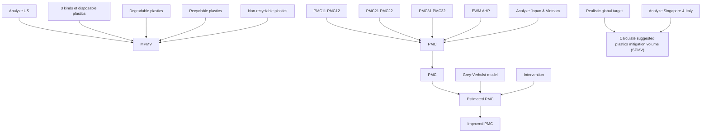
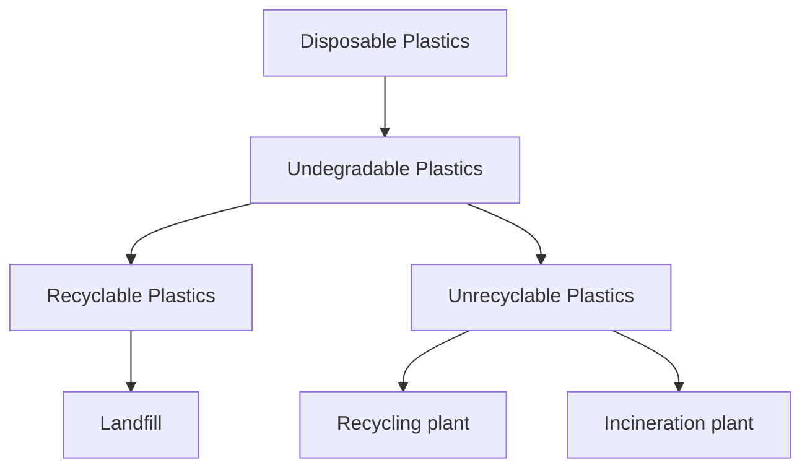
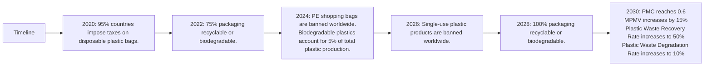

“I want to say one word to you. Just one word: Plastics!”. This occurs in Mike Nichols’s 1967 film The Graduate. In the film, “plastics” is regarded as a cheap, sterile, ugly, and meaningless way of life. Now, the large amount of single-use and disposable plastic products have severe environmental consequences. Furthermore, the time these products are useful is significantly shorter than the time it takes to decompose. Therefore, it is desirable to design a plan to significantly reduce, if not eliminate, the single-use and disposable plastic product waste.

To this end, we make the following main contributions:

• We first propose the model, MPMV, that estimates the maximum levels of single-use or disposable plastic product waste that can safely be mitigated without further environmental damage. Specifically, we classify the single-use or disposable plastic product waste into degradable, recyclable, and non-recyclable plastic product waste. The former two kinds of plastic product waste can be wholly mitigated without further environmental pollution, and the latter are incinerated and may generate carbon dioxide and other toxic gases. So, we consider the amount of exhaust gas that the environment can withstand and the proportion of waste gas absorbed by incineration plants, and on this basis, we quantify the maximum levels of plastic product waste mitigated in an environmentally safe way.  
• Then, we design a three-level evaluation system for plastic waste reduction capability, PMC, to investigate the minimal achievable level of global waste of single-use or disposable plastic products. To concrete, based on Analytic Hierarchy Process (AHP) and Entropy Weight Method (EWM), we select six indicators indicating generating less and mitigating more single-use or disposable plastic product waste, and on this basis, construct the three-level evaluation system. To validate the generalization of the designed three-level evaluation system, we apply it to Japan and Vietnam and compare the minimal achievable level of waste of single-use or disposable plastic products in Japan and Vietnam. On this basis, we highlight several suggestions for future mitigation of single-use or disposable plastic product waste.  
• Thereafter, we propose a target for the minimum achievable level of global waste of single-use or disposable plastic products in 2030 via perturbing the indicators in the PMC model. To concrete, we use the Grey-Verhulst model to predict and compare the PMC curve and the perturbed PMC curve to evaluate the effectiveness of the perturbed PMC. Then, on this basis, we discuss the impacts of achieving such a level on laws and regulations, human life, ecological environment, and the multi-trillion-dollar plastic industry.  
• Finally, we conduct the in-depth analysis of MPMV and PMC models, and put forward the SPMV model based on the careful consideration of national plastic waste reduction potential and development status, in order to ensure the equity of task distribution of plastic waste reduction among countries.

In summary, the proposed models formalize a fairer globally achievable goal and promotion measures for mitigating single-use or disposable plastic product waste. What’s more, they can dynamically adapt according to, including but not limited to, the amount of plastic product waste, national development capacity.

## Contents

## 1 Introduction 2

1.1 Background 2  
1.2 Our work 2

## 2 Symbol Table and Assumptions 3

2.1 Symbol table 3  
2.2 Assumptions 3

## 3 Maximum Plastics Mitigation Volume 4

3.1 Overview of our approach 4  
3.2 Incineration of disposable plastic waste 5

3.2.1 $C O _ { 2 }$ constraint on incineration volume 5  
3.2.2 Other toxic gases constraint on incineration volume . . 5

3.3 A simple case: US 6

## 4 Plastics Mitigation Capability Assessment 6

4.1 Indicator selection . . . 6  
4.2 Data normalization 8  
4.3 Weight determination . 8  
4.4 The result 9  
4.5 Application of PMC model: Japan and Vietnam . . 10

## 5 Target for the Level of Plastic Waste 11

5.1 Outline 11  
5.2 The process of setting targets . . 12

5.2.1 Current situation 12  
5.2.2 The intervention idea . 12

5.3 Impacts for achieving such levels . 12

5.3.1 Laws and regulations . . 12  
5.3.2 Human life 13  
5.3.3 Ecological environment 13  
5.3.4 Plastic industry 14

5.4 Outcome of intervention 14

## 6 Equity Issues 15

6.1 Overview 15  
6.2 An improved approach 15  
6.3 Application to Singapore and Italy 15

## 7 Strengths and Weaknesses 16

7.1 Strengths 16  
7.2 Weaknesses 16

## 8 Memo 17

## 1 Introduction

## 1.1 Background

While bringing convenience to life, single-use or disposable plastic products also pose a severe threat to the environment, like 83 trillion tons of plastic products are generated in the world by the 1950s, resulting in 63 trillion tons single-use or disposable plastic product waste [1]. According to the statement from the U.N. Environment Programme (UNEP), 500 billion plastic bags are used worldwide every year, and at least 8 million tons of plastic product waste is injected into the ocean [2]. U.N. secretary-general Antonio Guterres claims that the amount of plastic product waste in the ocean will be much larger than the number of fishes by 2050 [3] [4] [5]. Therefore, it is desirable to improve the way we mitigate single-use or disposable plastic product waste and develop a plan to significantly reduce the amount of single-use or disposable plastic product waste in the world.

## 1.2 Our work

flowchart

Figure 1: The structure of our paper.

First, we propose the model, MPMV, that estimates the maximum levels of single-use or disposable plastic product waste that can safely be mitigated without further environmental damage. Specifically, the MPMV model considers the environmental carrying capacity and waste gas purification level of incineration plants and calculates the maximum plastics mitigation volume in an ideal way. We take the United States as an example to validate the proposed MPMV model.

Second, we design a three-level evaluation system for plastic waste reduction capability, PMC, to investigate the minimal achievable level of global waste of single-use or disposable plastic products. PMC model considers six indicators from the ecological, economic, and political perspectives to evaluate a country or region’s ability to mitigate the single-use or disposable plastic waste. We applied the proposed model to Japan and Vietnam and verified the applicability of the proposed model compared with the practical case.

Then, we propose a target for the minimum achievable level of global waste of single-use or disposable plastic products in 2030 via perturbing the indicators in the PMC model. Specifically, we use the Grey-Verhulst model to predict and compare the PMC curve and the perturbed PMC curve to evaluate the effectiveness of the perturbed PMC. The perturbed PMC curve is expected to grow by 21.9% by 2030 compared to the PMC curve. On this basis, we further discuss the impacts of achieving such a level on laws and regulations, human life, ecological environment, and the multi-trillion-dollar plastic industry.

Thereafter, we discuss the equity issues that might arise in allocating national responsibility for plastic waste mitigation. We conduct an in-depth analysis of MPMV and PMC models and finally propose the SPMV model based on the careful consideration of national plastic waste reduction potential and development status to ensure the equity of task distribution of plastic waste reduction among countries.

Finally, in the memo to ICM, we first conclude our models and highlight several insights. Then we introduce the refined global target for the minimum achievable level of global single-use or disposable plastic product waste in 2030 and analyze the measures that the state, businesses, and consumers should take. Last, we put forward the timeline to reach the global target for the minimum achievable level of plastic product waste and investigate the circumstances that may hinder the achievement of the global target for the minimum achievable level.

## 2 Symbol Table and Assumptions

## 2.1 Symbol table

Note: Symbols are listed in the order of the first occurrence in the text.

Table 1: Symbol table.

<table><tr><td>Symbol</td><td>Definition</td></tr><tr><td> $V_1$ </td><td>The volume of degradable plastics</td></tr><tr><td> $V_2$ </td><td>The volume of recyclable plastics</td></tr><tr><td>PIV</td><td>Plastics Incineration Volume</td></tr><tr><td>MPMV</td><td>Maximum Plastics Mitigation Volume</td></tr><tr><td>PMC</td><td>Plastics Mitigation Capability</td></tr><tr><td> $PMC_1$ </td><td>Ecological indicator</td></tr><tr><td> $PMC_2$ </td><td>Economic indicator</td></tr><tr><td> $PMC_3$ </td><td>Political indicator</td></tr><tr><td> $PMC_{11}$ </td><td>Forest area per capita</td></tr><tr><td> $PMC_{12}$ </td><td>Technical ability to decompose plastics</td></tr><tr><td> $PMC_{21}$ </td><td>GDP per capita</td></tr><tr><td> $PMC_{22}$ </td><td>Trade per capita</td></tr><tr><td> $PMC_{31}$ </td><td>Enforcement of laws</td></tr><tr><td> $PMC_{32}$ </td><td>Laws governing plastics</td></tr><tr><td> $w_j$ </td><td>Weight of  $j$ th sub-indicator</td></tr><tr><td>SPMV</td><td>Suggested Plastics Mitigation Volume</td></tr></table>

## 2.2 Assumptions

We assume that the areas we study are concerned about plastic waste pollution.

Plastic waste pollution is a global issue that concerns every region, so we expect the authorities to take a proactive approach to it.

We assume that the region is the smallest unit of analysis.

For the convenience of analysis, we do not consider the differences within the region, such as the different distribution of cities and forests.

We assume that the data obtained are accurate and reliable.

We get data from trusted websites and papers.

## 3 Maximum Plastics Mitigation Volume

## 3.1 Overview of our approach

As shown in the figure 2, disposable plastics can be classified into two categories: degradable plastics and non-degradable plastics. Degradable plastics are a new kind of environmentally friendly plastics that can degrade into harmless substances under certain conditions after use. Non-degradable plastics can be subdivided into recyclable and non-recyclable plastics. The American plastics industry association mandated recycling labeling for plastics in 1988 [6]. This set of signs uses plastic identification codes on containers or packages, from 1 to 7. Among them, #1-PET, #2-HDPE, and #5-PP are recyclable plastic materials, while other plastic materials are challenging to recycle.

flowchart

Figure 2: Classification and treatment of disposable plastics.

In order to maximize the mitigation of plastic waste without imposing further damage to the environment, recyclable plastics are recycled as far as possible and continue to enter production activities. There are two main routes for the remaining non-recyclable plastics: landfill and incineration. Landfills are passive and straightforward, where plastics take thousands of years to break down and slowly release methane, a greenhouse gas 25 times more potent than carbon dioxide [7]. Therefore, incineration is one of the most innocuous ways of disposing of plastic waste in the mainstream of society; thus, it is the treatment method adopted in our model.

Inevitably, incinerating plastic does not entirely evade the risks of environmental pollution. The incineration of plastics produces carbon dioxide and a certain amount of toxic gases containing sulfur or nitrogen [8]. These gases need to be cleaned by the incinerator plant before they can be discharged. Nevertheless, we need to understand that an area has a limited capacity for toxic gases.

Therefore, to discuss the maximization of plastic waste mitigation, our model’s core is to determine the maximum capacity of an area for the waste generated by incineration. Incineration in less than the limit can purify the environment; otherwise, the aggravate in air pollution will outweigh the reduction in plastic pollution. Note that the maximum volume for incineration in this area is not a threshold at which the environment is on the verge of collapse, but a state of equilibrium at which the environment is just capable of purifying itself.

To sum up, in our model, there are three ways to treat disposable garbage: natural degradation, recycling, and incineration. Degradable plastics degrade by themselves, and nondegradable but recyclable plastics can be recycled. For non-degradable and non-recyclable plastics, incineration is the only environmentally friendly treatment. Next, we focus on the incineration of disposable plastic waste.

## 3.2 Incineration of disposable plastic waste

Incineration of disposable waste produces $C O _ { 2 }$ and other toxic gases. Therefore, evaluating the maximum level of plastic waste reduction is equivalent to evaluating the amount of plastic incineration when $C O _ { 2 }$ and toxic gases reach the maximum environmental capacity.

## 3.2.1 $C O _ { 2 }$ constraint on incineration volume

First, we need to determine the amount of plastic incineration when $C O _ { 2 }$ reaches the maximum capacity of the environment. We believe that the amount of plastic incineration when $C O _ { 2 }$ emissions reach the maximum capacity of the environment is closely related to the planned $C O _ { 2 }$ emissions in a given year and the carbon dioxide generated by the incineration of one ton of plastic, so we have equation 1:

$$
P I V _ {C O _ {2}} = \frac {M _ {1} \times P _ {1}}{M _ {2}}, \tag {1}
$$

where $M _ { 1 }$ is planned $C O _ { 2 }$ emissions, $P _ { 1 }$ is the ratio of $C O _ { 2 }$ emitted by an incinerator to total $C O _ { 2 }$ emissions, and $M _ { 2 }$ is the carbon dioxide generated by burning a ton of plastic.

## 3.2.2 Other toxic gases constraint on incineration volume

Then we need to determine the amount of plastic incineration when the toxic gases reach its maximum environmental capacity. The toxic gases from burning plastic are equal to the total amount of toxic gases produced by incineration multiplied by the emission ratio. The maximum limit for incinerating plastic is the maximum amount of toxic gases emitted by burning plastic divided by the mass of toxic gases produced by burning a ton of plastic. We acquire equation 2:

$$
P I V _ {t o x} = \frac {M _ {3}}{\left(1 - P _ {2}\right) \times M _ {4}}, \tag {2}
$$

where $M _ { 3 }$ is maximum toxic gas emissions, $P _ { 2 }$ is the proportion of toxic gases absorbed by incineration plants to the total amount of toxic gases generated, $M _ { 4 }$ is the mass of toxic gases produced by burning a ton of plastic in an incineration plant.

When the amount of plastic incineration exceeds the maximum carrying capacity of the environment, it exceeds the maximum level at which disposable plastic waste can be safely reduced, causing further damage to the environment. The maximum capacity of the environment to bear the toxic gases released by the incineration of plastics is the minimum values of $P I V _ { C O _ { 2 } }$ and $P I V _ { t o x }$ .

$$
P I V = \operatorname{Min} \left(P I V _ {C O _ {2}}, P I V _ {t o x}\right). \tag {3}
$$

Therefore, we can get the maximum plastics mitigation volume:

$$
M P M V = V _ {1} + V _ {2} + P I V, \tag {4}
$$

where $V _ { 1 }$ is the volume of degradable plastics, $V _ { 2 }$ is the volume of recyclable plastics.

## 3.3 A simple case: US

To illustrate our model more intuitively, we choose the United States in 2010 as a case. According to Hannah Ritchie and Max Roser’s work on plastic pollution [9],the United States discarded 40,580,700 tons of plastic in 2010, including about 405,807 tons of biodegradable plastic. According to Rick Lingle’s report on plastic recycling [10], the United States had 1,179,360 tons of recycled plastic in 2010. Also, the study shows that the United States plans to emit 5,702,880,000 tons of $C O _ { 2 }$ in 2010 [11],the proportion of carbon dioxide emitted by incineration plants is about 0.506% [12]. Excluding power generation potential, the net carbon dioxide emissions would be 2.9 metric tons for every ton of plastic burned. We believe that the United States has one of the world’s leading waste gas treatment capabilities and that the primary constraint on its environmental carrying capacity lies in $C O _ { 2 }$ emissions. Based on the data above and equation 1,2 and 3, the amount of plastic incineration when $C O _ { 2 }$ emission reaches the maximum capacity of the environment is

$$
\frac {5 7 0 2 8 8 0 0 0 0 \times 0 . 5 0 6 \%}{2 . 9} = 9 9 5 0 5 4 2 t o n.
$$

According to equation 4, the total amount of disposable plastic that can be safely reduced in the United States in 2010 is:

$$
M P M V _ {U S} = V _ {1} + V _ {2} + P I V = 4 0 5 8 0 7 + 1 1 7 9 3 6 0 + 9 9 5 0 5 4 2 = 1 1 5 3 5 7 0 9 t o n.
$$

## 4 Plastics Mitigation Capability Assessment

The above model discusses the maximum incineration limit of non-recyclable plastics in the optimal case, that is, all recyclable plastics are recycled, all degradable plastics are degraded, and all non-recyclable plastics are incinerated at the maximum. However, in reality, that is hard to achieve. In order to make countries or regions have a clear understanding and measurement of their own plastic waste mitigation capability, we combine the Analytic Hierarchy Process (AHP) with Entropy Weight Method (EWM) to establish a plastic waste mitigation capability evaluation system.

## 4.1 Indicator selection

Every piece of plastic waste is first generated, then littered. Thus, to reduce plastic waste to a minimal level, we should consider both the capability to lessen plastic waste generation (hereinafter referred to as Cap1) and the capability to mitigate plastic without further environmental damage (hereinafter referred to as Cap2) . Therefore, the evaluation model we built will include the above two factors. However, while selecting indicators, we found that some of them can evaluate Cap1 and Cap2 simultaneously. Hence, for the sake of convenience, we need to find out more precise boundaries to classify various indicators. The evaluation system of plastic mitigation capability is divided into three layers: the target layer A, the indicator layer B and the sub-indicator layer C. Combined with the source of disposable plastic, the availability of plastic substitute, impact on residents’ lives as well as the national policy , we selected the indicators which are not only convenient to obtain but also easy for the comparison in the study area to reflect a region’s plastic mitigation capability from various angles. Finally, six indicators were put into three categories: ecological, economic, political, to construct a three-level evaluation system for plastics mitigation capability, as shown in table 2.

Table 2: Introduction to indicators

<table><tr><td>Target Layer</td><td>Indicator layer</td><td>Sub-indicator layer</td><td>Direction</td><td>Belongs to</td></tr><tr><td rowspan="6">Plastics mitigation capability(PMC)</td><td rowspan="2">Ecological indicator (PMC1)</td><td>Forest area per capita(PMC11)</td><td>+</td><td>Cap1,Cap2</td></tr><tr><td>Technical ability to decompose plastics(PMC12)</td><td>+</td><td>Cap2</td></tr><tr><td rowspan="2">Economic indicator (PMC2)</td><td>GDP per capita(PMC21)</td><td>+</td><td>Cap1</td></tr><tr><td>Trade per capita(PMC22)</td><td>+</td><td>Cap1</td></tr><tr><td rowspan="2">Political indicator (PMC3)</td><td>Government bribery rate(PMC31)</td><td>-</td><td>Cap1,Cap2</td></tr><tr><td>Effectiveness of laws governing plastics(PMC32)</td><td>+</td><td>Cap1,Cap2</td></tr></table>

## Ecological indicator

\- Forest area per capita: It refers to the average forest area owned by each person in the region, and it is a vital indicator to reflect the availability of forest resources and woodland in an area. Here is what it means:

Extensive forest cover could provide a significant number of alternatives to plastics, thereby reducing plastic production from the origin.  
The large forest area per capita indicates that the area has a sizeable ecological environment capacity and a strong capability to deal with the waste gas generated by burning plastics.

\- Technical ability to decompose plastic: It refers to the ability to use scientific and technological means to break down plastic waste. To quantify this, we introduced the human development index (HDI) for evaluation.

## Economic Indicator

- GDP per capita: It is one of the most important macroeconomic indicators, reflecting the economic development of a region. If GDP per capita is high, then the region’s economy is going well, and people are more likely to accept plastic items made from degradable materials at slightly higher prices.  
- Trade per capita: It reflects both the prosperity of a region’s foreign economic exchanges and the economic strength of the region. The more foreign trade per capita, the more likely it is to import materials that can replace plastic, such as bamboo and paper.

## Political Indicator

- Government bribery rate: It reflects the transparency of a country’s system of government. We use the country’s corruption index to evaluate. The higher the level of corruption, the weaker the enforcement of environmental laws. It also indirectly hampers income growth.  
- Effectiveness of laws governing plastics: It reflects the soundness of the relevant laws in a country. The stronger the regulations, the less disposable plastic is used and discarded by businesses and residents.

## 4.2 Data normalization

The data used to evaluate the indicators comes from multiple databases, including World Bank [13]. If data in a region is missing, we do not evaluate the region so that to get the most accurate results. We obtained data from 162 countries and regions for four separate years. Since the evaluation indicators contain both positive and negative ones and there exist dimensional differences among most indicators, we use range normalization to normalize data [14].

While analyzing all the indicators, we find that they can be divided into two types. Symbol + means that for the indicator, the higher, the better. Similarly, Symbol − means that the lower, the better. Therefore, for those indicators with symbol +, the equation should be

$$
r _ {i j} = \frac {x _ {i j} - r _ {m i n}}{r _ {m a x} - r _ {m i n}}.
$$

As for those indicators with symbol , the equation should be

$$
r _ {i j} = \frac {r _ {m i n} - x _ {i j}}{r _ {m a x} - r _ {m i n}},
$$

where $x _ { i j }$ and $r _ { i j }$ represent the original value and standardized value of item $j$ in the ith region, while $r _ { m i n }$ and $r _ { m a x }$ represent the minimum and maximum value of item $j$ in all years.

## 4.3 Weight determination

The determination of indicators’ weight plays a crucial role and has a direct impact on the accuracy of evaluation results. Entropy weight method (EWM) is an objective weighting method; therefore we use it to determine the weight of the indicators. [15]

First, we calculate the weight of the jth indicator in the ith country.

$$
f _ {i j} = \frac {r _ {i j}}{\sum_ {i = 1} ^ {n} r _ {i j}}.
$$

According to the concept of self-information and entropy in information theory, the information entropy $e _ { j }$ of each evaluation indicator can be calculated, and thus

$$
e _ {j} = - l n (n) ^ {- 1} \sum_ {i = 1} ^ {n} f _ {i j} l n (f _ {i j}).
$$

Based on the information entropy, we will further calculate the weight of each evaluation indicator we defined before.

$$
w _ {j} = \frac {1 - e _ {j}}{n - \sum_ {j} e _ {j}}, j = 1, 2, \dots , n.
$$

We also used AHP to cover the shortages that indicator weight under EWM vary with samples.

## 4.4 The result

After determining the weight of each indicator, we weighted and summed each indicator to get PMC:

$$
P M C _ {i} = \sum_ {j = 1} ^ {n} r _ {i j} w _ {j}, \tag {5}
$$

where $P M C _ { i } , w _ { j }$ and $r _ { i j }$ represent the comprehensive indicator of the P MC for the ith country, the weight of item j and the normalized value of item j for the ith country respectively. Besides, $P M C _ { i }$ values range from 0 to 1, the larger the value, the higher the plastics mitigation capability.

bar chart

| Country | HDI |
| :--- | :--- |
| Germany | 0.76 |
| India | 0.68 |
| Philippines | 0.34 |
| Vietnam | 0.41 |
| Canada | 0.80 |
| Yemen | 0.25 |
| Japan | 0.75 |
| Brazil | 0.45 |
| Chile | 0.52 |
| Cuba | 0.43 |
The chart displays HDI values for each country, with a color scale ranging from 0 to 0.9 on the right. The first row of the bars is labeled 'HDI PMC'. The second row is labeled '0.9' but corresponds to the top row of the bar chart.

Figure 3: Effect of HDI on PMC composite score.

Table 3: The PMC and HDI values of 10 countries.

<table><tr><td></td><td>Germany</td><td>India</td><td>Philippines</td><td>Vietnam</td><td>Canada</td><td>Yemen</td><td>Japan</td><td>Brazil</td><td>Chilie</td><td>Cuba</td></tr><tr><td>PMC</td><td>0.7653</td><td>0.3837</td><td>0.3445</td><td>0.4167</td><td>0.819</td><td>0.2739</td><td>0.7754</td><td>0.4784</td><td>0.5487</td><td>0.3731</td></tr><tr><td>HDI</td><td>0.939</td><td>0.647</td><td>0.712</td><td>0.693</td><td>0.922</td><td>0.463</td><td>0.915</td><td>0.761</td><td>0.847</td><td>0.778</td></tr></table>

Then, we assigned weights to each indicator based on the discussion of 4.3 and 4.4, and the weight results are as follows: Forest area per capita(0.1524), technical ability to decompose plastic(0.2530), GDP per capita(0.1734), trade per capita(0.1012), the degree of corruption(0.1833)and related laws and regulations(0.1316).

We selected ten countries with different levels of development in 2018 for analysis. As can be seen in figure 3, there was a strong correlation between the HDI and the PMC in these countries, indicating that technology plays a significant role in mitigating the level of single-use plastic waste. Germany, Canada, and Japan scored high on the PMC, which is reasonable for their high HDI levels as they are developed countries. Yemen, on the other hand, had a deficient HDI level, only half that of developed countries, which primarily affected its PMC. In India, the Philippines and Vietnam, where HDI levels were not poor, the PMC remained at a low level, mainly because such indicators as the corruption indicator for developing countries had a more pronounced effect on PMC levels. In general, HDI played a decisive role in promoting PMC levels.

## 4.5 Application of PMC model: Japan and Vietnam

To verify the applicability of the model, we applied two cases for analysis. Based on the six indicators, we collected and processed the raw data related to Japan and Vietnam in 2018. As a result, the PMC was 0.769571 for Japan and 0.405891 for Vietnam.

By investigating the bar chart, we can intuitively analyze their capability to mitigate plastic waste. In terms of $P M C _ { 1 2 } $ , which contributes the most to PMC, Japan scores much higher than Vietnam, indicating that Japan has a higher technical ability to decompose plastic waste than Vietnam. Vietnam is also well behind Japan in the PMC’s second-most-weighted indicator of corruption and has lost initiatives in mitigating plastic waste because of the inefficient political system. As a developed Asian country, Japan’s GDP per capita is approximately six times that of Vietnam, which means the residents in Vietnam struggle financially to afford more expensive biodegradable plastics. Additionally, Vietnam only scored slightly higher than Japan in forest area per capita, which ranked fourth in PMC weighting. Obviously, Vietnam’s lead in this aspect did not contribute enough to the comprehensive PMC. Therefore, our model has implications

bar chart

| Category | Vietnam | Japan |
|---|---|---|
| PMC₁₁ | 0.35 | 0.32 |
| PMC₁₂ | 0.57 | 0.91 |
| PMC₂₁ | 0.41 | 0.87 |
| PMC₂₂ | 0.45 | 0.62 |
| PMC₃₁ | 0.28 | 0.92 |
| PMC₃₂ | 0.29 | 0.78 |

Figure 4: Comparison of the PMC indicators between Vietnam and Japan.

Table 4: Indicator values of Japan and Vietnam.

<table><tr><td></td><td> $PMC_{11}$ </td><td> $PMC_{12}$ </td><td> $PMC_{21}$ </td><td> $PMC_{12}$ </td><td> $PMC_{31}$ </td><td> $PMC_{32}$ </td><td>PMC</td></tr><tr><td>Vietnam</td><td>0.3449</td><td>0.5796</td><td>0.418</td><td>0.4614</td><td>0.2992</td><td>0.3142</td><td>0.4059</td></tr><tr><td>Japan</td><td>0.3155</td><td>0.9128</td><td>0.8896</td><td>0.6396</td><td>0.9397</td><td>0.8016</td><td>0.7696</td></tr></table>

for the Vietnamese government to improve its plastic waste mitigation capability. By collecting information on plastic waste in Vietnam, we learn that the country ranks third in Southeast Asia in terms of plastic waste per capita, and has increased more than tenfold in the last 30 years. According to a report by Ipsos Business Consulting, a global growth strategy consulting firm, Vietnam consumed 41.3kg of plastic per capita in 2018 [16].

The reasons for the problematic situation are complicated. In addition to the low local recycling rate and a large number of landfills, the people’s environmental awareness is not keen, and the national policy and regulatory system for plastics are not sound. Therefore, many countries take advantage of the policy gap to send plastic waste to Vietnam [17]. Applying our model to confirm it, we found that Vietnam has an inferior technical ability in decomposing plastic waste, which results in a low degradation rate of plastic waste. Thus the majority can merely be decomposed by such simple and negative methods as landfills. Vietnam’s economic level is relatively backward. Since the economic level of a country has a fundamental impact on education. In weak areas, it is not very easy to require people to have a keen environmental awareness. Vietnam’s low PMC score in political indicators is in line with the government’s inadequate policies and legislations on plastics. Therefore, the Vietnamese government should continue to innovate and promote the environmentally friendly treatment of plastics. At the same time, it should vigorously develop the economy in a green way and avoid the route of ‘pollution first, treatment later.’ Last but not least, the governments should strengthen legislation to ban foreign shipments of plastic waste, support the production of biodegradable plastics, offer subsidies, and impose higher taxes on non-recyclable and non-biodegradable plastics.

Meanwhile, our model can also inspire the Japanese government. According to the information from the Asahi Shimbun and the United Nations [18], Japan is second only to the United States in single-use plastic consumption. Japan also produces more plastic per capita than China and the rest of Asia combined, at 106 kilograms, according to Statista, an online statistics website [19]. Moreover, according to a study by CarterJMRN in 2018, Japanese attitudes toward plastic products have reached ‘fever levels’, with Japanese consumers taking an average of 400 plastic shopping bags a year [20]. In 2018, Japan even refused to sign the G7 agreement to mitigate the use of single-use plastics and prevent plastic pollution. Japan’s PMC score indicates that it has sound plastic waste mitigation capability. In the long run, however, if Japan does not intervene in the abuse of plastic, the ecological consequences will be irreversible sooner or later. Therefore, from the perspective of sustainable development, Japan must change its attitude towards plastic at the cultural level and use as many recyclable and environmentally friendly materials as possible. The government should also call for mitigation in the use of single-use plastics through policies and stricter legislation.

## 5 Target for the Level of Plastic Waste

## 5.1 Outline

Based on our models and discussions, we can assess a country’s capability to mitigate plastic waste. There is no doubt that the process of mitigating plastic waste is the process of getting plastic waste to a minimum level. Therefore, to set a target for the minimum level of plastic waste on a global scale which is to assess the global target capability to mitigate plastic waste. In other words, when $P M C = P M C _ { t a r g e t } .$ , the global level of plastic waste reaches the lowest.

## 5.2 The process of setting targets

## 5.2.1 Current situation

With an average of 162 regions, according to the world bank, we got a result for the six indicators of PMC. In 2018, the global forest area per capita indicator was 0.42, the HDI indicator was 0.65, the GDP per capita indicator was 0.49, trade per capita indicator was 0.54, the corruption indicator was 0.39, and the relevant policies and regulations indicator was 0.38. By multiplying the six indicators by the corresponding weight, we obtained the total global PMC of 0.4921 in 2018.

## 5.2.2 The intervention idea

In order to maximize the global capability to mitigate plastic waste, but also in line with the discipline of social development, we plan to intervene in several aspects. All the countries are working hard to develop their economies, which relate closely to the HDI, trade per capita and GDP per capita. Therefore, we assume that these three indicators will continue to grow at the current average rate. GDP per capita will continue to grow by 4.8%, the HDI index will grow by 0.72%, and trade per capita will grow by 1.56% annually. The level of forest area per capita has shown a negative growth trend in recent years, with an annual degradation rate of 0.125%. While we argued that this indicator would have a particular impact on the global capability to mitigate plastic waste. So we decided to intervene in this indicator and set it to increase by 0.6% in the future. The global corruption indicator scored lowly, indicating much room for improvement. However, due to the complexity of political issues and the low feasibility of the intervention, we assume that it will continue to grow at the current average rate of 0.4%. The related laws and regulations indicator was the lowest among the six indicators in 2018, and the plastic waste issue is now getting increasing global attention with the promotion of the United Nations, so we intervene and set it to grow at a rate of 3.59% in the future.

With our intervention, the six global indicators will change 12 years later, in 2030, as follows: $P M C _ { 1 1 }$ will rise to 0.45, $P M C _ { 1 2 }$ to 0.7, $P M C _ { 2 1 }$ to 0.76, $P M C _ { 2 2 }$ to 0.65, $P M C _ { 3 1 }$ to 0.41, and $P M C _ { 3 2 }$ to 0.58. We ended up with a PMC of 0.6. Compared to 2018, the PMC has increased by 21.90%, which is our target, meaning that the global plastic waste can reach the lowest level.

## 5.3 Impacts for achieving such levels

In order to achieve the minimum level of the global plastic waste, we discussed the impact on laws and regulations, human life, ecological environment and the plastic industry.

## 5.3.1 Laws and regulations

In 2019, at the Congress of the Basel Convention, 187 countries around the world revised the convention to include plastic waste as an import and export restriction object, deciding to include plastic waste pollution as one of the globally recognized environmental problems[21]. In March 2007, San Francisco became the first city in the U.S. to ban the use of non-biodegradable plastic bags, encouraging using recyclable and biodegradable plastic bags [22]. After that, although global countries started to implement ‘plastic limit orders’, proposing to restrict and ban the use of disposable plastic products, there were differences in the implementation effect between countries. Therefore, as a global target, governments should revise laws and regulations, extend the ‘plastic limit orders’ to all industries. Also, we should continue to increase investment in R&D and marketing of biodegradable plastics, providing tax incentives to encourage the production of biodegradable plastics. Last but not least, global countries have to speed up the construction of a more comprehensive marine plastic waste monitoring system, monitoring key areas in real time.

radar chart

|        | Before Intervention | After Intervention |
| ------ | ------------------- | ------------------ |
| PMC₁₁  | 0.45                | 0.48               |
| PMC₁₂  | 0.60                | 0.70               |
| PMC₂₁  | 0.40                | 0.65               |
| PMC₂₂  | 0.50                | 0.55               |
| PMC₃₁  | 0.35                | 0.30               |
| PMC₃₂  | 0.25                | 0.45               |

Figure 5: Comparison of global PMC before and after intervention.

## 5.3.2 Human life

According to the report by Medical University of Vienna and Austria’s Federal Environment Agency, preliminary confirmation that plastic ends up in the human gut proves that the spread of plastic waste could have harmful effects on human health [23]. Therefore, the importance of harmless treatment of plastic waste is evidenced. However, the vast majority of the world’s material cannot be recycled, especially plastic waste, only about 9% of which can be recycled [24]. The main reasons lie in the neglect of waste classification and the abuse of plastic products. In order to mitigate plastic waste to a great extent, people have to substitute eco-friendly materials for plastics gradually and do household waste sorting consciously.

natural_image

Illustration of a sea turtle with visible fins and open mouth (no text or symbols)

Figure 6: The danger of plastic waste to marine life.

## 5.3.3 Ecological environment

The ways of dealing with plastic waste are accelerating the mitigation of plastic products and controlling the use of plastic products. Expanding the size of forests will help in both ways: it will increase the environment’s capacity to withstand harmful emissions, and it will also provide the raw materials to make plastic substitutes. The governments need to ban deforestation and balance production with environmental protection. They should also formulate and implement ecological engineering projects which will help to reduce disasters.

## 5.3.4 Plastic industry

When the idea of ‘controlling plastics’ emerges, the plastic industry has to reform. The traditional plastic industry would suffer if it did not actively seek change. Not only will these plastic manufacturer be pressured by policies and taxes from the top, but sales will suffer as demands fall. Therefore, the plastic industry must actively respond to the national call for plastic control and take the initiative to innovate plastic production technology.

In addition to plastic factories that need to change, plastic waste companies need to keep up. Incinerators do most of the work, but doubts remain about whether they can safely dispose of plastic without causing air pollution. Incineration plants need to continually improve their treatment to ensure that the waste gases can be purified to the maximum extent before discharge. Relevant authorities need to adequately evaluate the emission channels of incineration plants before deciding whether to approve them.

## 5.4 Outcome of intervention

To show the change of PMC before and after the intervention, we used the Grey-Verhulst model to predict the PMC curve without intervention. Grey-Verhulst model can better reflect the saturation state of indicators than the commonly used grey GM(1,1). After calculation, the whitened differential equation is finally obtained:

$$
\frac {d x ^ {(1)}}{d t} - 0. 1 8 3 8 x ^ {(1)} = - 0. 3 0 8 4 \left(x ^ {1}\right) ^ {2}.
$$

line chart

| Year | Before intervention | After intervention |
|------|---------------------|--------------------|
| 2030 | 0.53505             | 0.6                |
| 2030.02 |                     | X 2030.02          |

Figure 7: Global PMC curves before and after intervention.

From figure 7, it can be seen that the PMC curve without intervention is relatively flat, reaching 0.535 in 2030, an increase of 8.7% from 0.4921 in 2018. After the human intervention, the PMC curve is steeper, and the PMC growth rate is faster, reaching 0.6 in 2030, an increase of 21.9% over 2018. By 2030, the PMC with the intervention is 1.12 times higher than the PMC without the intervention. This result suggests that the intervention we have developed will have a positive impact on global plastic waste mitigation capability and contribute to the goal of minimizing plastic waste in the world.

## 6 Equity Issues

## 6.1 Overview

When it comes to the apportionment of national responsibility for plastic waste, it is generally assumed that better-developed countries should shoulder more of the burden, as also demonstrated by the PMC score. However, the target set by the PMC model assumes the global capability to deal with plastic waste from six indicators at the aspects of Cap1 and Cap2, the volume of each country is not taken into account. For example, if country A has a shallow level of development, it gets a meagre PMC score. But it relies heavily on industrial development, such as incineration plants, and has a large population, so the country’s theoretical MPMV is greater. The development level of country B is also very low, but the country as a whole is small, and the MPMV is small. If we allocate the responsibility for plastic waste to them equally, it raises the issue of unfairness. In fact, country A should bear more of the burden than country B. Therefore, we need to take equity into account and improve our approach.

## 6.2 An improved approach

Based on the discussion above, we decided to consider the maximum plastic mitigation volume and plastic mitigation capability when recommending the plastic waste mitigation volume of a country or a region. The equation is as follows:

$$
S P M V = M P M V \times P M C. \tag {6}
$$

Such consideration not only takes into account a country’s industrial development background, national size, population, environmental carrying capacity and other factors but also takes into account the country’s ability to reduce plastic waste. The SPMV thus generated can minimize the risk of a country taking on a mismatched task of reducing plastic waste.

## 6.3 Application to Singapore and Italy

To verify the validity of the model, we will analyze two examples. In 2018, the PMC value of Singapore was 0.7052, while that of Italy was 0.7049, showing a small gap between the two countries. Both from a PMC perspective and from a common-sense perspective, one would argue that the two countries should undertake similar plastic waste reduction tasks. But in fact, because Singapore has a smaller land area than Italy and different geographical locations, it can carry different emissions, the calculated MPMV is quite different. The MPMV of the two is multiplied by the corresponding PMC to obtain the SPMV which is of referable significance to the relevant plans and measures of the two countries.

Table 5: Indicator values of Singapore and Italy.

<table><tr><td></td><td> $PMC_{11}$ </td><td> $PMC_{12}$ </td><td> $PMC_{21}$ </td><td> $PMC_{22}$ </td><td> $PMC_{31}$ </td><td> $PMC_{32}$ </td><td>PMC</td><td>MPMV</td><td>SPMV</td></tr><tr><td>Singapore</td><td>0.06</td><td>0.9</td><td>0.93</td><td>0.9</td><td>0.87</td><td>0.43</td><td>0.7052</td><td>347945</td><td>245370.81</td></tr><tr><td>Italy</td><td>0.27</td><td>0.87</td><td>0.81</td><td>0.66</td><td>0.69</td><td>0.83</td><td>0.7049</td><td>967969</td><td>682321.35</td></tr></table>

## 7 Strengths and Weaknesses

## 7.1 Strengths

Our PMC model inherits the advantages of AHP and EWM.

When weighing the indicators, we utilize weight average method combining the AHP with EWM. To some extent, this method not only provides a supplement of indicator’s horizontal comparison with EWM but also covers the shortages that indicator weight under EWM vary with samples and is even overwhelmingly dependent on samples. Furthermore, this method reduces the subjectivity of AHP.

Our model combines the potential and reality of each region.

In the construction of the SPMV model, we have included the maximum plastic mitigation volume and plastic mitigation capability of each region, taking full account of the development potential and reality. It is fairer and more comprehensive to use our model to distribute national responsibilities.

The indicators selected by the PMC model cover a comprehensive range of fields.

## 7.2 Weaknesses

Possible landfills were not considered when studying the timeline.

Our model does not take into account landfills that could put further stress on the environment, which could happen in practice.

Some areas are not included in the analysis due to data missing.

Due to the limited time, we did not interpolate the missing data.

## 8 Memo

To: International Council of Plastic Waste Management (ICM)

From: Team # 2017963

Date: 2020/2/16

Re: A realistic global target and its timeline

In response to your questions regarding global plastic waste mitigation, I’m writing to inform you of our findings.

We first propose the model, MPMV, that estimates the maximum levels of single-use or disposable plastic product waste that can safely be mitigated without further environmental damage. Then, we design a three-level evaluation system for plastic waste mitigation capacity, PMC, to investigate the minimal achievable level of global waste of single-use or disposable plastic products. Thereafter, we propose a target for the minimum achievable level of global waste of single-use or disposable plastic products in 2030 via perturbing the indicators in the PMC model, i.e., increasing the PMC curve to 0.6 by 2030. Finally, we put forward the SPMV model via combining MPMV and PMC models, to ensure the equity of task distribution of plastic waste reduction among countries.

Based on the in-depth analysis of the proposed models, we highlight the following insights:

• MPMV model investigates the mitigation of degradable, recyclable, and non-recyclable plastic product waste, and estimates the maximum levels of single-use or disposable plastic product waste that can safely be mitigated.  
• PMC model considers the six indicators indicating generating less and mitigating more single-use or disposable plastic product waste, and finds that HDI is the most effective indicator to the levels of mitigation of plastic waste.  
• The perturbed PMC model can be applied to estimate the target for the minimum achievable level of global waste of single-use or disposable plastic products, and it can be evaluated by predicting the PMC curve utilizing Grey-Verhulst model.  
• It is a dynamic cycle process to establish the target for the minimum achievable level of plastic product waste in the PMC model. Therefore, the target can be dynamically adjusted according to the actual situations, and thereby it is possible to propose more effective countermeasures.  
• Both MPMV model and PMC model ignore the equity of task distribution of plastic waste reduction among countries. Thus SPMV model combining MPMV and PMC models can more appropriately distribute the responsibility of mitigating global plastic waste according to the country’s size and its current development status.

The proposed models refine the global target for the minimum achievable level of global single-use or disposable plastic product waste in 2030. That is, the degradable plastics will account for 10% of total plastic production, while the plastic recycling rate will be increased to 50%, and the ability to incinerate plastic product waste achieves the maximum. To achieve the target for the minimum achievable level of plastic product waste, the state, businesses, and consumers need to work together. First, ICM should advocate that global countries include plastic waste in their import and export restrictions and incorporate the goal of reducing singleuse plastics into national strategies. Besides, global countries should actively cooperate in developing alternative materials for disposable plastics and reducing the production cost of degradable plastics. Meanwhile, countries should establish stricter laws and regulations, impose more taxes on single-use plastics and subsidize the biodegradable plastics. Countries need to step up R&D of offshore plastic waste treatment technology as well. Second, plastic manufacturers should extend their responsibility to recycle plastic waste. In terms of plastic packaging manufacturers, they should apply technology to produce bags by degradable and recyclable materials. For incineration plants, incineration technology should be improved to minimize the emission of toxic gases. Third, ICM needs to advocate for the improvement of the situation similar to the ‘plastic fever’ among Japanese consumers. Governments should strengthen the education of plastic recycling and garbage sorting, thus reduce the pressure on recycling stations. At the same time, consumers should be encouraged to use more sustainable and eco-friendly materials. The timeline to reach the global target for the minimum achievable level of plastic product waste in 2030 is as follows:

flowchart

Figure 8: Timeline for achieving the 2030 targets.

The circumstances that may hinder the achievement of the global target for the minimum achievable level are as follows.

In some underdeveloped countries, the government pays more attention to economic development than to environmental issues, which leads to the people’s lack of environmental protection awareness such as garbage classification and fewer plastics using. Also, people in a weak area cannot accept heavy taxes or expensive alternatives to plastic, prompting a lucrative black market in plastics. Some countries may be too aggressive with plastic waste, such as opening burning, which will cause secondary pollution.

Although many countries have issued bans on plastics, some are not fully enforced, and businesses prefer to use cheap plastic. Some companies will take advantage of loopholes and still use plastic bags in industries such as clothing retailing that are not covered by the policy.

However, as a result of globalization, the increasing economic and technological exchange between countries may have benefits in improving the overall level of global plastic waste technology.

## References

[1] National Geographic. A whopping 91% of plastic isn’t recycled. (2017). Retrived from: https://www.nationalgeographic.com/news/2017/07/plastic-produced-recyclingwaste-ocean-trash-debris-environment/.  
[2] UNEP. This World Environment Day, it’s time for a change. (2018). Retrived from: https://www.unenvironment.org/interactive/beat-plastic-pollution/.  
[3] United Nations. (2018). ‘We face a global emergency’ over oceans: UN chief sounds the alarm at G7 Summit event. Retrived from: https://news.un.org/en/story/2018/06/1011811.  
[4] COMAP. (2020). 2020 ICM Problem E.pdf. Retrived from: https://www.comap.com/und ergraduate/contests/mcm/contests/2020/problems/2020\_ICM\_Problem\_E.pdf.  
[5] Galloway T.S. (2015) Micro- and Nano-plastics and Human Health. In: Bergmann M., Gutow L., Klages M. (eds) Marine Anthropogenic Litter.  
[6] Wikipedia. (2018). Resin identification code. Retrived from: https://en.wikipedia.org/wiki/Resin\_identification\_code.  
[7] Royer, Sarah-Jeanne & Ferrón, Sara & Wilson, Samuel T. & Karl, David M.(2018). Production of methane and ethylene from plastic in the environment. Public Library of Science, 13, 1-13.  
[8] Rinku Verma, K.S. Vinoda, M. Papireddy, A.N.S. Gowda. (2016). Toxic Pollutants from Plastic Waste- A Review, Procedia Environmental Sciences, 35, 701-708.  
[9] Hannah Ritchie and Max Roser (2020) - Plastic Pollution. Published online at OurWorldIn-Data.org. Retrieved from: ‘https://ourworldindata.org/plastic-pollution’.  
[10] American Chemistry Council. (2016). Plastics and Sustainability: A Valuation of Environmental Benefits, Costs and Opportunities for Continuous Improvement. Retrived from: https://plastics.americanchemistry.com/Plastics-and-Sustainability.pdf.  
[11] WorldBank. (2020). CO2 emissions (kt) - United States. Retrived from: https://data.worldbank.org/indicator/EN.ATM.CO2E.KT?locations=US.  
[12] GAIA. (2018). The Hidden Climate Polluter: Plastic Incineration. Retrived from: https://www.no-burn.org/hiddenclimatepolluter/.  
[13] Worldbank. (2020). Retrived from: https://data.worldbank.org/.  
[14] Codecademy. (2016). Normalization. Retrived from: https://www.codecademy.com/articles/norm alization.  
[15] Wang, Yang and Wu, Shou Rong and Wang, Zu He. (2011). Study of the Comparison and Selection Method of the Mining Project Investment Based on Entropy-Weight Method. Advances in Structural Engineering, 94, 1752-1756.  
[16] Vnexpress. (2019). Vietnam plastic waste problem goes from bad to worse. Retrived from: https://e.vnexpress.net/news/news/vietnam-plastic-waste-problem-goes-from-badto-worse-3978124.html.  
[17] Reuters. (2018). Vietnam to limit waste imports as shipments build up at ports. Retrived from: https://www.reuters.com/article/us-vietnam-waste/vietnam-to-limit-wasteimports-as-shipments-build-up-at-ports-idUSKBN1KG0KL.  
[18] The Asahi Shimbun. (2019). EDITORIAL: Japan must get with program, stop incinerating plastic waste. Retrived from: http://www.asahi.com/ajw/articles/AJ201907310028.html.  
[19] Statista. (2019). Disposal volume of plastic waste in Japan from 2006 to 2015. Retrived from: https://www.statista.com/statistics/695382/japan-plastic-waste-disposal-volume/.  
[20] Carterjmrn. (2019). PLASTIC IS NO LONGER FANTASTICMARKET POTENTIAL FOR ALTERNATIVES IN JAPAN. Retrived from: https://www.carterjmrn.com/marketresearch-blog/plastic-is-no-longer-fantastic-market-potential-for-alternatives-injapan.php.  
[21] CNN. (2019). Over 180 countries – not including the US – agree to restrict global plastic waste trade. Retrived from: https://edition.cnn.com/2019/05/11/world/basel-conventionplastic-waste-trade-intl/index.html.  
[22] The New York Times. (2007). San Francisco Board Votes to Ban Some Plastic Bags. Retrived from: https://www.nytimes.com/2007/03/28/us/28plastic.html.  
[23] Medicalxpress. (2018). Microplastics discovered in human stools across the globe in ‘first study of its kind’ (2018). Retrived from https://medicalxpress.com/news/2018-10- microplasticshuman-stools-globe-kind.html.  
[24] Geyer, R., Jambeck, J. R., & Law, K. L. (2017). Production, use, and fate of all plastics ever made. Science Advances, 3(7), e1700782.  
[25] The Guardian. (2019). ‘Plastic recycling is a myth’: what really happens to your rubbish? . Retrived from: https://www.theguardian.com/environment/2019/aug/17/plasticrecycling-myth-what-really-happens-your-rubbish.  
[26] Zheng-xin Wang, Yao-guo Dang, Si-feng Liu.(2009). Unbiased Grey Verhulst Model and Its Application, Systems Engineering - Theory & Practice, 29, 138-144.