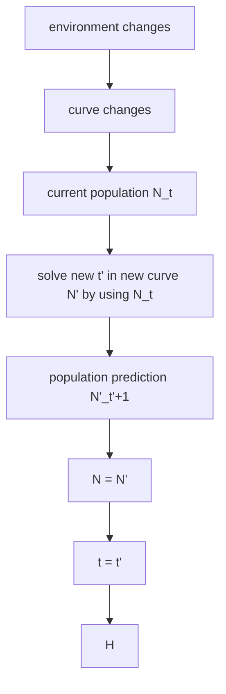

## Migration of Herring and Mackerel

Global ocean temperature changes greatly nowadays, some ocean-dwelling species are likely to migrate, which might seriously affect the companies who depend on these species.

In order to predict the ocean temperature in next 50 years, we collect the global sea surface temperature data for past 50 years, and deal with them as signals in time dimension. We adopt moving average filtering method to reduce the influence of random interference. Then, we build a linear prediction model to forecast the temperature in next 50 years. And the annual average temperature will increase 1℃ to 3℃ gradually at the region of Scottish coast in next 50 years. In order to predict the locations of herring and mackerel, we get the optimum living temperature of herring and mackerel by consulting relevant references. With the temperature prediction data above, we can get the most likely center location of herring is (61°N, 7°W) and (60°N, 1°W), and the mackerel’s is (62°N, 4°W).

Aiming at the problem of estimating the time that the small fishing companies can hardly harvest, we build a cellular automaton based prediction model. By analyzing the migration and reproduction law of fish with the Logistic Curve and normal distribution, we set corresponding rules to the cellular automaton to operate. Supposing that the extra 100 kilometer to catch fish will make the small fishing companies hardly harvest, we take 1000 independent repeat experiments, then get the most likely elapsed time of herring and mackerel is 24 years and 10 years, the best cases are 35 years and 23 years, and the worst cases are 16 years and 9 years.

To estimate the effectiveness of strategy, we use the fuzzy comprehensive evaluation method to analyze several factors that affecting the economic benefit including short term cost, long term cost, fishing harvest, sales revenue and implementation difficulty. After giving the weights of them, we can get the strategy rated as excellent, which is relocating some of fishing company’s assets in the port that fish populations moving. To address the impact of fish moving into the territorial water of other country, we adjust the weights of fishing harvest in fuzzy comprehensive evaluation model above, none of them are rated as excellent. Then we propose a new method that the company can try fish processing instead of fishing, which is rated as excellent.

We analyze the sensitivity of the linear prediction model, while we add 5% random disturbance, the maximum relative error is 3.98%, the model can be considered stable. Finally, We write an article for Hook Line and Sinker Magazine.

Key Words: Linear Prediction, cellular automaton, fuzzy comprehensive evaluation method

## Contents

## 1 Introduction 1

1.1 Background 1  
1.2 Our work . 1

## 2 Assumptions 2

## 3 Notations 2

## 4 Herring and mackerel position model 3

4.1 Signal filtering processing 3  
4.2 Linear prediction model 4  
4.3 Relationship between sea surface temperature and fish school position . 7

## 5 Cellular Automata based prediction model 9

5.1 Cellular automata model . 9  
5.2 Results of cases 13

## 6 Evaluation of small fishing company policy model 14

6.1 Change management analysis . . 14  
6.2 Fuzzy comprehensive evaluation model 14  
6.3 Evaluation results . 16

## 7 Adjusted Evaluation Strategy Model for Small Fisheries Companies 17

## 8 Sensitivity Evaluation of the Model 19

## 9 Strengths and Weaknesses 19

9.1 Strengths . . 19  
9.2 Weaknesses 20

## 10 Conclusion 20

## 11 References 20

## 12 Appendix 24

## 1 Introduction

## 1.1 Background

The temperature of the ocean affects the habitat quality of ocean-dwelling species. When temperature changes too much for them to thrive, these species migrate to other habitats that are more suitable for their survival and reproductive success. This geographic shift can disrupt the livelihoods of companies that depend on the stability of ocean-dwelling species. Our team is working to better understand how Scottish herring and mackerel may migrate from existing habitats near Scotland as global ocean temperatures rise. Changes in the location of herring and mackerel populations can affect the economies of smaller fishing companies in Scotland.

There are many models for predicting sea surface temperature, such as time series, linear prediction [1] and so on. Herring and mackerel have the most suitable seawater temperature, they are sensitive to the seawater temperature and migrate to the most suitable seawater temperature [2]. This article studies the effects of seawater temperature on herring and mackerel migration in the context of global warming. Based on the migration of these two species of fish, small fisheries companies need to adjust their economic strategies.

## 1.2 Our work

The title requires us to find out the position of herring and mackerel. We consider using a linear prediction model to predict sea surface temperatures in the territorial sea around Scotland over the next 50 years. Fish are very sensitive to seawater temperature, and they migrate to the optimum seawater temperature. We obtain the sea surface temperature where herring and mackerel are most suitable for survival. Based on the predicted sea surface temperature, we can obtain the most likely location of the two fish.

If herring and mackerel are too far from the small fishery company, the small fishery company will have nothing to harvest. We considered the use of cellular automata to simulate the migration of fish schools and formulated several rules. Randomly simulate 1000 times, taking the time with the most occurrences as the most likely case. The shortest time is the worst case, and the longest time is the best case.

Therefore, small fisheries companies need to make adjustments to their economic strategies. We consider three options. The first is to transfer all the assets of the fishing company from the current position of the Scottish port to a position closer to the movement of two fish stocks. The second is to transfer some of the assets of the fishing company from the current position of the Scottish port The location shifts closer to where the two fish populations move, and the third is the use of a small percentage of small fishing boats. We consider using fuzzy comprehensive evaluation to evaluate three strategies.

When herring and mackerel migrate to the territorial seas of other countries, we need to adjust the weights and judgment matrices of factors. We consider continuing to use fuzzy comprehensive evaluation to evaluate the three strategies and propose new strategies for small fisheries companies.

Based on the above analysis, we need to solve the following problems.

Build a mathematical model to identify the most likely locations for Scottish herring and mackerel over the next 50 years.

Use our model to predict best case, worst case, and most likely elapsed time based on the rate at which ocean water temperature changes.  
Change the economic strategy of small fisheries companies.  
Use our model to illustrate the impact on our proposal if a certain percentage of the fishery enters another country's territorial waters.  
•Prepare a one to two page article for Hook Line and Sinker magazine.

## 2 Assumptions

Herring and mackerel are temperature-sensitive and always migrate to the right temperature. Because fish are most sensitive to changes in sea temperature, changes of $0 . 1 ^ { \circ } C$ to $0 . 2 ^ { \circ } C$ can cause changes in fish behavior.  
The adaptation of fish to temperature follows a gaussian distribution. Fish have the strongest survivability at the optimum temperature, and the survivability decreases with the change of temperature.  
The increase in herring and mackerel populations in the ocean follows a logistic growth curve. Fish populations are saturated under stable environmental conditions.  
For the next 50 years, we will ignore extreme events such as volcanic eruptions. In other words, the surface temperature of seawater will not change suddenly, but the trend of warming seawater temperature will not change.

## 3 Notations

For convenience, we introduce some notations below.

Table 1: Notations

<table><tr><td>Symbols</td><td>Descriptions</td></tr><tr><td>e(n)</td><td>The prediction error</td></tr><tr><td>εp</td><td>The mean square of the error</td></tr><tr><td>ap(k)</td><td>Linear prediction coefficient</td></tr><tr><td>T0</td><td>Optimal sea temperature for school of fish</td></tr><tr><td>N</td><td>Logical Curve Equation</td></tr><tr><td>K</td><td>Environmental capacity</td></tr><tr><td>α</td><td>Number of fish at the initial moment</td></tr><tr><td>U</td><td>Factor set</td></tr><tr><td>V</td><td>Evaluation Set</td></tr><tr><td>A</td><td>Weight of each factor</td></tr><tr><td>Ri(i=1,2,3)</td><td>Judgment matrix</td></tr></table>

## 4 Herring and mackerel position model

## 4.1 Signal filtering processing

According to Met Office Hadley Centre observations datasets [3], we get the sea surface temperature (SST) from 1970 to 2019. For each year, there are 12 data for each month. The $S S T$ data are the temperature data of the grid that divides the globe into grids using longitude and latitude as integer lines. The intersection of the latitude and longitude lines with integer values of latitude and longitude is taken as the center of the grid, 0.5 degrees up and down, and 0.5 degrees left and right are used as grids. We take the average sea surface temperature of a grid for 12 months as the sea surface temperature of that year. Based on the latitude and longitude of Scotland, we analyze the SST of 300 grids ranging from $- 1 7 ^ { \circ }$ to $3 ^ { \circ }$ longitude and $4 8 . 5 ^ { \circ }$ to $\bar { 6 3 ^ { \circ } }$ north latitude. We number the 300 grid centers from left to right, top to bottom, and the partial annual mean $S S T$ of part of the grid was shown in Table 2.

Table 2: Partial annual mean sea surface temperature of part of the grid

<table><tr><td>number\temperature(°C)year</td><td>1970</td><td>1980</td><td>1990</td><td>2000</td><td>2010</td></tr><tr><td>1</td><td>8.895270864</td><td>9.095693787</td><td>8.830128948</td><td>9.167598645</td><td>9.791239222</td></tr><tr><td>2</td><td>8.976814866</td><td>9.060541868</td><td>8.827538053</td><td>9.183705529</td><td>9.68282187</td></tr><tr><td>3</td><td>9.031771421</td><td>8.975657781</td><td>8.82588474</td><td>9.175647577</td><td>9.595830719</td></tr><tr><td>4</td><td>9.059002479</td><td>8.839903355</td><td>8.824031353</td><td>9.142286857</td><td>9.529127041</td></tr></table>

In order to reduce the influence of random interference, we use Fast Fourier Transform $( F F T )$ to analyze the characteristics in frequency domain, the result is shown in Figure 1.


<details>
<summary>line chart</summary>

| Frequency | Amplitude |
| --------- | --------- |
| 0         | 9.0       |
| 1         | 0.5       |
| 2         | 0.1       |
| 3         | 0.05      |
| 4         | 0.02      |
| 5         | 0.01      |
| 6         | 0.01      |
| 7         | 0.01      |
| 8         | 0.01      |
| 9         | 0.01      |
| 10        | 0.01      |
| 11        | 0.01      |
| 12        | 0.01      |
| 13        | 0.01      |
| 14        | 0.01      |
| 15        | 0.01      |
| 16        | 0.01      |
| 17        | 0.01      |
| 18        | 0.01      |
| 19        | 0.01      |
| 20        | 0.01      |
| 21        | 0.01      |
| 22        | 0.01      |
| 23        | 0.01      |
| 24        | 0.01      |
| 25        | 0.01      |
| 26        | 0.01      |
| 27        | 0.01      |
| 28        | 0.01      |
| 29        | 0.01      |
| 30        | 0.01      |
</details>

Figure 1: The result in Fast Fourier Transform

We can get that the noise exits mainly in high frequency region. Naturally, it is a good way to use a low pass filter to reduce the influence of noise, which moving average filter is widely used to smoothing noise data [4]. The $\omega$ in the equation is defined as the size of window, which contains several sequential origin data to predict next value. The expression of moving average filter is

$$
y (n) = \frac {1}{\omega} [ x (n) + x (n - 1) + \dots + x (n - (\omega - 1)) ] \tag {1}
$$

The original data and filtered data of sea surface temperature of a certain grid are shown in Figure 2.


<details>
<summary>line chart</summary>

| Year | Origin | Filtered |
|------|--------|----------|
| 1970 | 8.9    | 9.0      |
| 1971 | 9.3    | 9.05     |
| 1972 | 8.9    | 8.95     |
| 1973 | 8.8    | 8.85     |
| 1974 | 8.9    | 8.75     |
| 1975 | 8.5    | 8.75     |
| 1976 | 8.9    | 8.75     |
| 1977 | 8.8    | 8.8      |
| 1978 | 8.5    | 8.75     |
| 1979 | 8.6    | 8.75     |
| 1980 | 9.1    | 8.7      |
| 1981 | 8.5    | 8.55     |
| 1982 | 8.5    | 8.55     |
| 1983 | 8.6    | 8.6      |
| 1984 | 8.9    | 8.8      |
| 1985 | 9.1    | 8.9      |
| 1986 | 8.7    | 8.9      |
| 1987 | 9.0    | 8.9      |
| 1988 | 8.9    | 8.85     |
| 1989 | 8.7    | 8.8      |
| 1990 | 8.9    | 8.75     |
| 1991 | 8.6    | 8.7      |
| 1992 | 8.6    | 8.65     |
| 1993 | 8.6    | 8.6      |
| 1994 | 8.6    | 8.6      |
| 1995 | 8.6    | 8.6      |
| 1996 | 9.0    | 9.0      |
| 1997 | 9.4    | 9.3      |
| 1998 | 9.5    | 9.4      |
| 1999 | 9.3    | 9.3      |
| 2000 | 9.2    | 9.2      |
| 2001 | 9.4    | 9.4      |
| 2002 | 9.5    | 9.6      |
| 2003 | 9.9    | 9.7      |
| 2004 | 9.4    | 9.6      |
| 2005 | 9.4    | 9.5      |
| 2006 | 9.5    | 9.5      |
| 2007 | 9.5    | 9.5      |
| 2008 | 9.6    | 9.6      |
| 2009 | 9.7    | 9.7      |
| 2010 | 9.8    | 9.7      |
| 2011 | 9.5    | 9.6      |
| 2012 | 9.4    | 9.5      |
| 2013 | 9.5    | 9.6      |
| 2014 | 9.7    | 9.4      |
| 2015 | 8.9    | 9.3      |
| 2016 | 9.3    | 9.3      |
| 2017 | 9.5    | 9.4      |
| 2018 | 9.2    | 9.4      |
| 2019 | 9.6    | -        |
| 2020 | -      | -        |
</details>

Figure 2: Original data and filtered data of sea surface temperature of a certain grid

It can be seen from Figure 2 that the noise is reduced after the filter is used for processing

## 4.2 Linear prediction model

The basic concept of linear prediction is that the sum of squares of the difference between the actual sampling and the linear prediction sampling reaches the minimum value, that is, the approximation of the minimum mean square error can determine the unique set of predictor coefficients [1].

## 4.2.1 The fundamentals of linear prediction

In the process of model parameter estimation, the following systems is called linear predictor.

$$
\hat {x} (n) = \sum_ {k = 1} ^ {p} \omega_ {p} (k) x (n - k) \tag {2}
$$

Let $\omega _ { p } ( k )$ be the linear predictive coefficient and p is the predictive order.The prediction error function is

$$
e (n) = x (n) - \hat {x} (n) \tag {3}
$$

That is

$$
e (n) = x (n) - \sum_ {k = 1} ^ {p} \omega_ {p} (k) x (n - k) \tag {4}
$$

Let

$$
a _ {p} (k) = - \omega_ {p} (k) \tag {5}
$$

Then, (4) becomes

$$
e (n) = x (n) + \sum_ {k = 1} ^ {p} a _ {p} (k) x (n - k) \tag {6}
$$

$\begin{array} { r } { \varepsilon _ { p } = \sum _ { n = p } ^ { N } | e ( n ) | ^ { 2 } } \end{array}$ T that is, the partial derivative is zero.

$$
\frac {\partial \varepsilon_ {p}}{\partial a _ {p} (k)} = \frac {\partial \sum_ {n = p} ^ {N} | e (n) | ^ {2}}{\partial a _ {p} (k)} = 2 \sum_ {n = p} ^ {N} [ e (n) x (n - k) ] = 0 \tag {7}
$$

That is

$$
\frac {\partial \varepsilon_ {p}}{\partial a _ {p} (k)} = 2 \sum_ {n = p} ^ {N} [ e (n) x (n - k) ] = 0 \tag {8}
$$

Substituting (6) into (7), we get

$$
\sum_ {n = p} ^ {N} \left\{\left[ x (n) + \sum_ {k = 1} ^ {p} a _ {p} (k) x (n - k) \right] x (n - k) \right\} = \sum_ {n = p} ^ {N} x (n) \cdot x (n - k) + \sum_ {k = 1} ^ {p} a _ {p} (k) \cdot \sum_ {n = p} ^ {N} [ x (n - k) \cdot x (n - k) ] \tag {9}
$$

Let

$$
\sum_ {n = p} ^ {N} x (n) \cdot x (n - k) + \sum_ {k = 1} ^ {p} a _ {p} (k) \cdot \sum_ {n = p} ^ {N} [ x (n - k) \cdot x (n - k) ] = 0 \tag {10}
$$

In the finite sampling interval, the autocorrelation function of the real field is defined as

$$
r _ {x} (k) = \sum_ {n = k} ^ {N} x (n) \cdot x (n - k) (k = 0, 1, \dots , p) \tag {11}
$$

Substituting (11) into (9), we get

$$
r _ {x} (k) + \sum_ {k = 1} ^ {p} a _ {p} (k) r _ {x} (n - k) = 0 \tag {12}
$$

That is

$$
\sum_ {k = 1} ^ {p} a _ {p} (k) r _ {x} (n - k) = - r _ {x} (k) \tag {13}
$$

We represent (13) as a matrix.

$$
\left( \begin{array}{c c c c} r _ {x} (0) & r _ {x} (1) & \dots & r _ {x} (p - 1) \\ r _ {x} (1) & r _ {x} (0) & \dots & r _ {x} (p - 2) \\ \vdots & \vdots & \ddots & \dots \\ r _ {x} (p - 1) & r _ {x} (p - 2) & \dots & r _ {x} (0) \end{array} \right) \left( \begin{array}{c} a _ {p} (1) \\ a _ {p} (2) \\ \vdots \\ a _ {p} (p) \end{array} \right) = - \left( \begin{array}{c} r _ {x} (1) \\ r _ {x} (2) \\ \vdots \\ r _ {x} (p) \end{array} \right) \tag {14}
$$

## 4.2.2 Solve for the linear predictive coefficient

Levinson  durbin algorithm is an effective algorithm to solve the predictive coefficient $a _ { p } ( k )$ in regular equations [3]. This algorithm makes use of special symmetries in autocorrelation matrices.

Since all the entries on the diagonal of $r _ { x } ( n - k )$ are equal, this autocorrelation matrix is the Toeplitz matrix.

The levinson — durbin algorithm is shown in Table 3.

Table 3: The pseudo code for the levinson — durbin algorithm

<table><tr><td>Step1:</td><td> $\varepsilon^{(0)} = r_x(0);$ </td></tr><tr><td>Step2:</td><td>for  $i = 1, 2, \cdots, p$ ; $k_i = [r_x(i) - \sum_{j=1}^{i-1} a_j^{(i-1)} r_x(i-j)] / \varepsilon^{(i-1)};$ </td></tr><tr><td>Step3:</td><td> $a_i^{(i)} = k_i$ ;</td></tr><tr><td>Step4:</td><td>if  $i > 1$  then for  $j = 1, 2, \cdots, i-1$ ; $a_j^{(i)} = a_j^{(i-1)} - k_i a_{i-j}^{(i-1)};$ end</td></tr><tr><td>Step5:</td><td> $\varepsilon^{(i)} = (1 - k_i^2) \varepsilon^{(i-1)};$ end;</td></tr><tr><td>Step6:</td><td> $a_j = a_j^{(p)}$   $j = 1, 2, \cdots, p.$ </td></tr></table>

We calculate the value of the linear prediction coefficient $a _ { p } ( k )$ . The linear predictive coefficients of the grid numbered 1 are

$$
\left[ \begin{array}{l l l l} a _ {p} (1), & a _ {p} (2), & a _ {p} (3,) & a _ {p} (4), \quad \dots \end{array} \right] = \left[ \begin{array}{l l l l} - 0. 9 7 1 9, & - 0. 0 0 7 9, & 0. 0 1 0 7, & 0. 0 0 1 7, \quad \dots \end{array} \right] \tag {15}
$$

## 4.2.3 Inspection of the model

We take the data of five grids for linear prediction, and then predict the data from 2016 to 2019. The calculated the relative error with the original data is shown in Table 4.

Table 4: Relative error with the original data

<table><tr><td>relative error/yearnumber</td><td>2016</td><td>2017</td><td>2018</td><td>2019</td></tr><tr><td>1</td><td>-0.1217434%</td><td>-1.7128775%</td><td>-1.0831556%</td><td>-0.6427662%</td></tr><tr><td>2</td><td>-0.6837878%</td><td>-1.919732%</td><td>-0.0767442%</td><td>-0.2858284%</td></tr><tr><td>3</td><td>0.2893183%</td><td>0.4946315%</td><td>1.6335465%</td><td>0.7534763%</td></tr><tr><td>4</td><td>-0.5592422%</td><td>-1.2492618%</td><td>-0.1000664%</td><td>-1.157083%</td></tr><tr><td>5</td><td>0.1337365%</td><td>-1.1253948%</td><td>1.2810934%</td><td>0.3537306%</td></tr></table>

According to Table $^ { 4 , }$ The relative error between the predicted values and the original values from 2016 to 2019 is very small. Therefore, our prediction model is reasonable. Next, we predict the sea surface temperatures of the 300 grids over the next 50 years.

## 4.2.4 Sea surface temperature prediction results

We predict the sea surface temperature of the 300 grids in the next 50 years and filter them to get the sea surface temperature in the next 50 years. Some predicted sea surface temperature data is shown in Table 5.

Table 5: Partial predicted sea surface temperature data

<table><tr><td>forecast data(°C) year number</td><td>2029</td><td>2039</td><td>2049</td><td>2059</td><td>2069</td></tr><tr><td>1</td><td>10.59786043</td><td>10.74726028</td><td>11.64798332</td><td>12.17058423</td><td>12.3905122</td></tr><tr><td>2</td><td>9.685269207</td><td>10.7765888</td><td>11.67017968</td><td>11.7317968</td><td>12.26169669</td></tr><tr><td>3</td><td>10.63991197</td><td>10.89229402</td><td>11.50819184</td><td>11.95282418</td><td>12.57341431</td></tr><tr><td>4</td><td>9.875280303</td><td>10.40262107</td><td>10.71773155</td><td>10.96991424</td><td>11.57410006</td></tr><tr><td>5</td><td>9.661692276</td><td>9.928452383</td><td>10.12434056</td><td>10.86677475</td><td>11.15184388</td></tr></table>

It can be seen that the sea surface temperature increases year by year. And the annual average temperature will increase $1 ^ { \circ } C$ to $3 ^ { \circ } C$ gradually at the region of Scottish coast in next 50 years.

## 4.3 Relationship between sea surface temperature and fish school position

Fish have the optimum sea surface temperature. Fish are most sensitive to the adaptability of sea water temperature, when the water temperature changes between $0 . 1 ^ { \circ } C$ and $0 . 2 ^ { \circ } C ,$ the position of fish will change [2]. Next, we determine the optimum sea surface temperatures for herring and mackerel.

## 4.3.1 Establishment of optimum SST for herring and mackerel

We find spawning areas for herring and mackerel [5] and the number of fish caught in the waters around Scotland in 2012 [5]. From the above two pictures, we get the positions of herring and mackerel in 2012. Since the sea surface temperature data for 2012 are known, we give the sea surface temperature and the location of the two species of fish as shown in Figure 3.


<details>
<summary>heatmap</summary>

| latitude | longitude | Herring | Mackerel |
| -------- | --------- | ------- | -------- |
| 64       | -20       |         |          |
| 62       | -15       |         |          |
| 60       | -10       |         |          |
| 58       | -5        |         |          |
| 56       | 0         |         |          |
| 54       | 5         |         |          |
| 52       | 10        |         |          |
| 50       | 15        |         |          |
| 48       | 20        |         |          |
</details>

Figure 3: The location of herring and mackerel and sea surface temperatures in 2012

According to Figure 3, the location of the herring and mackerel and the surface temperature of the water they are in are known. Because fish are very sensitive to sea temperatures, they migrate to the optimum temperature and stay there for a long time. We think the surface temperature of the water where the two fish are is the optimum surface temperature for them. We get the suitable sea surface temperature for herring is $1 1 . 0 5 ^ { \circ } C$ to $1 1 . 4 ^ { \circ } C ,$ and the suitable sea surface temperature for mackerel is $9 . { \bar { 9 } } 8 ^ { \circ } C$ to $1 0 . 2 ^ { \circ } C$

## 4.3.2 Determination of the most likely locations of herring and mackerel

Based on the linear prediction model, we predict the sea surface temperature over the next 50 years. The optimum sea surface temperatures for herring and mackerel are known, so we believe that both species are most likely to be present at their respective optimum sea surface temperatures. We give six year predictions for sea surface temperatures in 2020, 2029, 2039, 2049, 2059 and 2069. The most likely locations for the two species of fish, as shown in Figure 4.


<details>
<summary>heatmap</summary>

| latitude | longitude | Herring | Mackerel |
| -------- | --------- | ------- | -------- |
| 64       | -20       |         |          |
| 62       | -15       |         |          |
| 60       | -10       |         |          |
| 58       | -5        |         |          |
| 56       | 0         |         |          |
| 54       | 5         |         |          |
| 52       | 10        |         |          |
| 50       | 15        |         |          |
| 48       | 20        |         |          |
</details>


<details>
<summary>heatmap</summary>

| latitude | longitude | Herring | Mackerel |
| --- | --- | --- | --- |
| 64 | -20 | 10 | 0 |
| 64 | -15 | 10 | 0 |
| 64 | -10 | 10 | 0 |
| 64 | -5 | 10 | 0 |
| 64 | 0 | 10 | 0 |
| 62 | -20 | 10 | 0 |
| 62 | -15 | 10 | 0 |
| 62 | -10 | 10 | 0 |
| 62 | -5 | 10 | 0 |
| 62 | 0 | 10 | 0 |
| 60 | -20 | 10 | 0 |
| 60 | -15 | 10 | 0 |
| 60 | -10 | 10 | 0 |
| 60 | -5 | 10 | 0 |
| 60 | 0 | 10 | 0 |
| 58 | -20 | 10 | 0 |
| 58 | -15 | 10 | 0 |
| 58 | -10 | 10 | 0 |
| 58 | -5 | 10 | 0 |
| 58 | 0 | 10 | 0 |
| 56 | -20 | 10 | 0 |
| 56 | -15 | 10 | 0 |
| 56 | -10 | 10 | 0 |
| 56 | -5 | 10 | 0 |
| 56 | 0 | 10 | 0 |
| 54 | -20 | 10 | 0 |
| 54 | -15 | 10 | 0 |
| 54 | -10 | 10 | 0 |
| 54 | -5 | 10 | 0 |
| 54 | 0 | 10 | 0 |
| 52 | -20 | 10 | 0 |
| 52 | -15 | 10 | 0 |
| 52 | -10 | 10 | 0 |
| 52 | -5 | 10 | 0 |
| 52 | 0 | 10 | 0 |
| 50 | -20 | 10 | 0 |
| 50 | -15 | 10 | 0 |
| 50 | -10 | 10 | 0 |
| 50 | -5 | 10 | 0 |
| 50 | 0 | 10 | 0 |
| 48 | -20 | 10 | 0 |
| 48 | -15 | 10 | 0 |
| 48 | -10 | 10 | 0 |
| 48 | -5 | 10 | 0 |
| 48 | 0 | 10 | 0 |
</details>


<details>
<summary>heatmap</summary>

| latitude | longitude | Herring | Mackerel |
| --- | --- | --- | --- |
| 64 | -15 | 9 | 0 |
| 62 | -10 | 10 | 0 |
| 60 | -5 | 11 | 0 |
| 58 | 0 | 12 | 0 |
| 56 | 5 | 13 | 0 |
| 54 | 10 | 14 | 0 |
| 52 | 15 | 15 | 0 |
| 50 | 20 | 14 | 0 |
| 48 | 25 | 13 | 0 |
| 64 | -15 | 9 | 0 |
| 62 | -10 | 10 | 0 |
| 60 | -5 | 11 | 0 |
| 58 | 0 | 12 | 0 |
| 56 | 5 | 13 | 0 |
| 54 | 10 | 14 | 0 |
| 52 | 5 | 15 | 0 |
| 50 | 0 | 14 | 0 |
| 48 | -5 | 13 | 0 |
| 64 | -15 | 9 | 0 |
| 62 | -10 | 10 | 0 |
| 60 | -5 | 11 | 0 |
| 58 | 0 | 12 | 0 |
| 56 | 5 | 13 | 0 |
| 54 | 10 | 14 | 1 |
| 52 | 5 | 15 | 1 |
| 50 | 0 | 14 | 1 |
| 48 | -5 | 13 | 1 |
| 64 | -15 | 9 | 0 |
| 62 | -10 | 10 | 0 |
| 60 | -5 | 11 | 0 |
| 58 | 0 | 12 | 0 |
| 56 | 5 | 13 | 0 |
| 54 | 10 | 14 | 0 |
| 52 | 0 | 13 | 0 |
| 50 | -5 | 12 | 0 |
| 48 | -15 | 9 | 0 |
| 64 | -15 | 9 | 0 |
| 62 | -10 | 10 | 0 |
| 60 | -5 | 11 | 0 |
| 58 | -10 | 12 | 0 |
| 56 | -5 | 13 | 0 |
| 54 | -10 | 14 | 0 |
| 52 | -5 | 15 | 0 |
| 50 | -10 | 14 | 0 |
| 48 | -15 | 9 | 0 |
</details>


<details>
<summary>heatmap</summary>

| latitude | longitude | Herring | Mackerel |
| --- | --- | --- | --- |
| 64 | -15 | 10 | 0 |
| 62 | -10 | 10 | 0 |
| 60 | -5 | 10 | 0 |
| 58 | 0 | 10 | 0 |
| 56 | 5 | 10 | 0 |
| 54 | 10 | 10 | 0 |
| 52 | 15 | 10 | 0 |
| 50 | 20 | 10 | 0 |
| 48 | 25 | 10 | 0 |
| 64 | -15 | 10 | 0 |
| 62 | -10 | 10 | 0 |
| 60 | -5 | 10 | 0 |
| 58 | 0 | 10 | 0 |
| 56 | 5 | 10 | 0 |
| 54 | 10 | 10 | 0 |
| 52 | -5 | 10 | 0 |
| 50 | -10 | 10 | 0 |
| 48 | -15 | 10 | 0 |
| 64 | -15 | 10 | 0 |
| 62 | -10 | 10 | 0 |
| 60 | -5 | 10 | 0 |
| 58 | 0 | 10 | 0 |
| 56 | 5 | 10 | 0 |
| 54 | 10 | 10 | -1 |
| 52 | -5 | 10 | -1 |
| 50 | -10 | 10 | -1 |
| 48 | -15 | 10 | -1 |
| 64 | -20 | 10 | -1 |
| 62 | -25 | 10 | -1 |
| 60 | -30 | 10 | -1 |
| 58 | -35 | 10 | -1 |
| 56 | -40 | 10 | -1 |
| 54 | -45 | 10 | -1 |
| 52 | -50 | 10 | -1 |
| 50 | -55 | 10 | -1 |
| 48 | -60 | 10 | -1 |
| 64 | -65 | 10 | -1 |
| 62 | -70 | 10 | -1 |
| 60 | -75 | 10 | -1 |
| 58 | -80 | 10 | -1 |
| 56 | -85 | 10 | -1 |
| 54 | -90 | 10 | -1 |
| 52 | -95 | 10 | -1 |
| 50 | -100 | 10 | -1 |
| 48 | -105 | 10 | -1 |
| 64 | -150 | 10 | -1 |
| 62 | -155 | 10 | -1 |
| 60 | -200 | 10 | -1 |
| 58 | -250 | 10 | -1 |
| 56 | -300 | 10 | -1 |
| 54 | -350 | 10 | -1 |
| 52 | -400 | 10 | -1 |
| 50 | -450 | 10 | -1 |
| 48 | -500 | 10 | -1 |
| 64 | -650 | 10 | -1 |
| 62 | -700 | 10 | -1 |
| 60 | -750 | 10 | -1 |
| 58 | -800 | 10 | -1 |
| 56 | -850 | 10 | -1 |
| 54 | -900 | 10 | -1 |
| 52 | -950 | 10 | -1 |
| 50 | -1000 | 10 | -1 |
| 48 | -950 | 10 | -1 |
</details>


<details>
<summary>heatmap</summary>

| latitude | longitude | Herring | Mackerel |
| --- | --- | --- | --- |
| 64 | -15 | 9 | 0 |
| 62 | -10 | 10 | 0 |
| 60 | -5 | 11 | 0 |
| 58 | 0 | 12 | 0 |
| 56 | 5 | 13 | 0 |
| 54 | 10 | 14 | 0 |
| 52 | 15 | 15 | 0 |
| 50 | 20 | 14 | 0 |
| 48 | 25 | 13 | 0 |
| 64 | -15 | 9 | 0 |
| 62 | -10 | 10 | 0 |
| 60 | -5 | 11 | 0 |
| 58 | 0 | 12 | 0 |
| 56 | 5 | 13 | 0 |
| 54 | 10 | 14 | 0 |
| 52 | 5 | 15 | 0 |
| 50 | 0 | 14 | 0 |
| 48 | -5 | 13 | 0 |
| 64 | -15 | 9 | 0 |
| 62 | -10 | 10 | 0 |
| 60 | -5 | 11 | 0 |
| 58 | 0 | 12 | 0 |
| 56 | 5 | 13 | 0 |
| 54 | 10 | 14 | 1 |
| 52 | 5 | 15 | 1 |
| 50 | 0 | 14 | 1 |
| 48 | -5 | 13 | 1 |
| 64 | -15 | 9 | 0 |
| 62 | -10 | 10 | 0 |
| 60 | -5 | 11 | 0 |
| 58 | 0 | 12 | 0 |
| 56 | 5 | 13 | 0 |
| 54 | 10 | 14 | 0 |
| 52 | 0 | 13 | 0 |
| 50 | -5 | 12 | 0 |
| 48 | -15 | 9 | 0 |
| 64 | -15 | 9 | 0 |
| 62 | -10 | 10 | 0 |
| 60 | -5 | 11 | 0 |
| 58 | 0 | 12 | 0 |
| 56 | -5 | 13 | 0 |
| 54 | -10 | 14 | 0 |
| 52 | -5 | 15 | 0 |
| 50 | -10 | 14 | 0 |
| 48 | -15 | 9 | 0 |
</details>


<details>
<summary>heatmap</summary>

| latitude | longitude | Herring | Mackerel |
| :--- | :--- | :--- | :--- |
| 64 | -15 | 9 | 0 |
| 62 | -10 | 10 | 0 |
| 60 | -5 | 11 | 13 |
| 58 | 0 | 12 | 14 |
| 56 | 5 | 13 | 15 |
| 54 | 10 | 14 | 14 |
| 52 | 15 | 15 | 13 |
| 50 | 20 | 14 | 12 |
| 48 | 25 | 13 | 11 |
| 62 | -5 | 10 | 9 |
| 60 | -10 | 11 | 10 |
| 58 | -15 | 12 | 9 |
| 56 | -20 | 13 | 8 |
| 54 | -25 | 14 | 7 |
| 52 | -30 | 15 | 6 |
| 50 | -35 | 14 | 5 |
| 48 | -40 | 13 | 4 |
| 62 | -45 | 12 | 3 |
| 60 | -50 | 11 | 2 |
| 58 | -55 | 10 | 1 |
| 56 | -60 | 9 | 0 |
| 54 | -65 | 8 | -1 |
| 52 | -70 | 7 | -2 |
| 50 | -75 | 6 | -3 |
| 48 | -80 | 5 | -4 |
The image displays a color-coded grid with a color scale ranging from -9 to +15. The x-axis represents longitude from -20 to +5, and the y-axis represents latitude from -20 to +20. The legend indicates 'Herring' (circle) and 'Mackerel' (cross). The color bar on the right maps values from blue (low) to yellow (high).
</details>

Figure 4: The most likely locations for the two species of fish in 2020,2029,2039,2049,2059 and 2069

According to the picture, we can see that herring and mackerel are gradually moving north. With the temperature prediction data above, we can get the most likely center location of herring is $( 6 1 ^ { \circ } N ,$ $7 ^ { \circ } W )$ and $( 6 0 ^ { \circ } N , 1 ^ { \circ } W )$ , and the mackerelars is $\bar { ( 6 2 ^ { \circ } N , 4 ^ { \circ } W ) }$ -.

## 5 Cellular Automata based prediction model

## 5.1 Cellular automata model

Cellular Automata is a grid dynamic model with local spatial interaction and temporal causality, which is effective to simulate the biological behavior by discretizing the time and space. The state of the current position at the next moment depends on the current state of the surrounding cells (Moore Neighborhood, square grid), which is

$$
s _ {i, j} ^ {t + 1} = f (s _ {i - 1, j - 1} ^ {t}, s _ {i - 1, j} ^ {t}, s _ {i - 1, j + 1} ^ {t}, s _ {i, j - 1} ^ {t}, s _ {i, j} ^ {t}, s _ {i, j + 1} ^ {t}, s _ {i + 1, j - 1} ^ {t}, s _ {i + 1, j} ^ {t}, s _ {i + 1, j + 1} ^ {t}). \tag {16}
$$

To encode the state of the herrings and mackerels in the sea, we can set that every single grid contains 10000 shoals of herring or mackerel. By setting some specific rules of evolution, we can get prediction of the herrings and mackerels state.

## 5.1.1 Migration

The positions of herring and mackerel follow the normal distribution with mean value $\mu$ and variance $\overset { \cdot } { \sigma ^ { 2 } } N ( \mu , \sigma ^ { 2 } )$ $\mu$ is the optimum sea surface temperature. The probability of fish distribution at the optimum sea surface temperature is 100%, while the probability of fish distribution at other temperatures is less than 100%. And fish migrate to the optimum sea surface temperatures. The principle of 3σ is

$$
P \{| X - \mu | <   3 \sigma \} = 99.37 \%. \tag{17}
$$

As we discussed above, fish are sensitive to the adaptability of sea water temperature. When the water temperature changes between $0 . 1 ^ { \circ } C$ and $0 . 2 ^ { \circ } C ,$ the position of fish will change [2]. We do not think there are any fish in the water above the optimum temperature of $0 . 5 ^ { \circ } C$ . Therefore,

$$
3 \sigma = 0. 5 ^ {\circ} C. \tag {18}
$$

For the Cellular Automata, the temperature of the grids around is likely to be different with the current grid, so there will be a probability of migration between two grids, as shown in Figure 5.


<details>
<summary>line chart</summary>

| T    | Value |
| ---- | ----- |
| T₁   | Low   |
| T₂   | Medium|
| T₀   | High  |
</details>

Figure 5: Fish normal distribution

T1 indicates the temperature of the seawater where the school of fish is currently located, and $T _ { 2 }$ indicates the temperature of the seawater where the school of fish migrates. M is the event of fish migration from the location at temperature of $T _ { 1 }$ to the location at temperature of $T _ { 2 }$ . While $T _ { 0 }$ is the optimum temperature, the probability of M is

$$
P (M) = \left\{ \begin{array}{l l} \frac {\phi (T _ {2}) - \phi (T _ {1})}{\phi (T _ {0}) - \phi (T _ {0} - 3 \sigma)} & , \phi (T _ {0}) > \phi (T _ {2}) \geq \phi (T _ {1}) \\ \frac {\phi (T _ {1}) - \phi (T _ {2})}{\phi (T _ {0} + 3 \sigma) - \phi (T _ {0})} & , \phi (T _ {1}) \geq \phi (T _ {2}) > \phi (T _ {0}) \\ 0 & , \text { otherwise }. \end{array} \right. \tag {19}
$$

## 5.1.2 Reproduction

The natural rate of increase is birth minus death minus fishing. The natural growth of a shoal of fish is logical. We throw 10000 points into each grid, in shoals of fish [6]. The formula for the Logistic curve is [7]

$$
N = \frac {K}{1 + e ^ {\alpha - r t}}. \tag {20}
$$

Where K is environmental capacity, α is the number of fish at the initial moment and $r$ is required parameter. Herring and mackerel population tend to stabilize in a grid of waters[8], and we think $K = 1 0 0 0 0$ . a is the number of fish at $t = 0$ and we take $a = 1 0$ . In equation (20), only the parameter r needs to be solved. If we know the coordinates of some point on the curve, and we plug it in, we can figure out what r is.

It takes about 5 years for the herring to reach ${ \frac { K } { 2 } } .$ , the coordinates (5,5000), and r is solved by substituting it into the equation of the Logistic curve of the herring. The value of r is 2 and the equation of the curve is

$$
N = \frac {1 0 0 0 0}{1 + e ^ {1 0 - 2 t}}. \tag {21}
$$

Mackerel breeding time is longer than the herring. It takes about 7.5 years for the mackerel to reach $\begin{array} { l } { { \frac { K } { 2 } } } \end{array}$ of the mackerel. The value of r is 1.35 and the equation of the curve is

$$
N = \frac {1 0 0 0 0}{1 + e ^ {1 0 - 1 . 3 5 t}}. \tag {22}
$$

The Logistic curve for herring and mackerel are shown in Figure 6 and Figure 7, respectively.


<details>
<summary>line chart</summary>

| Year | Number |
| ---- | ------ |
| 0    | 0      |
| 1    | 0      |
| 2    | 0      |
| 3    | 500    |
| 4    | 2000   |
| 5    | 6000   |
| 6    | 9000   |
| 7    | 9800   |
| 8    | 10000  |
| 9    | 10000  |
| 10   | 10000  |
</details>

Figure 6: Herring Logistic curve


<details>
<summary>line chart</summary>

| Year | Number |
| ---- | ------ |
| 0    | 0      |
| 5    | 500    |
| 10   | 9500   |
| 15   | 10000  |
</details>

Figure 7: Mackerel Logistic curve

Fitting with the Cellular Automata, while discretizing the time dimension, the population of the fish next year depends on the current population. While we have the Logistic Curve and the population of current grid, the population prediction is shown in Figure 8.


<details>
<summary>flowchart</summary>


</details>

Figure 8: the population prediction flow chart

## 5.1.3 Environmental tolerance

Naturally, fish have different K values at different temperature, as shown in Figure 9.


<details>
<summary>line chart</summary>

| T     | f(T) |
|-------|------|
| T₁    | f(T₁) |
| T₀    | f(T₀) |
</details>

Figure 9: Different K values at different temperature

Suppose the optimal temperature is $T _ { 0 , }$ , and its K value is $K ( T _ { 0 } ) = 1 0 0 0 0$ . We need to find the K value at different temperature $T _ { 1 }$

According to the normal distribution map, the distribution probability of fish swarm corresponding to temperature $T _ { 0 }$ is $f ( T _ { 0 } )$ , and the distribution probability of fish swarm corresponding to temperature $T _ { 1 }$ is $f ( T _ { 1 } )$ )

To some extent, the K value is proportional to the distribution probability, the expression is

$$
\frac {K \left(T _ {0}\right)}{K \left(T _ {1}\right)} = \frac {f \left(T _ {0}\right)}{f \left(T _ {1}\right)} \tag {23}
$$

Then, we can figure out the value of K at $T _ { 1 }$

As we discussed above, we use Cellular Automata to simulate the population of each grid from 2020 to 2069 by using the $S S T$ data we predicted before.

## 5.1.4 Operation of Cellular Automata

To some small fishing companies, it is not affordable to catch fish while is too far from them. We set that while the fish migrates away from the coast in the distance of one grid (about 70 to 100 kilometers), the small fishing companies can hardly harvest. Then we take notes on the year that the all fish is more than one grid away from the small fishing companies.

The operation figure are shown in Figure 10.


<details>
<summary>heatmap</summary>

| latitude | longitude | value |
| --- | --- | --- |
| 64 | -20 | 0 |
| 64 | -15 | 2000 |
| 64 | -10 | 4000 |
| 64 | -5 | 6000 |
| 64 | 0 | 8000 |
| 64 | 5 | 10000 |
| 64 | 10 | 12000 |
| 64 | 15 | 10000 |
| 64 | 20 | 8000 |
| 64 | 25 | 6000 |
| 64 | 30 | 4000 |
| 64 | 35 | 2000 |
| 64 | 40 | 0 |
| 64 | 45 | 2000 |
| 64 | 50 | 4000 |
| 64 | 55 | 6000 |
| 64 | 60 | 8000 |
| 64 | 65 | 10000 |
| 64 | 70 | 12000 |
| 64 | 75 | 10000 |
| 64 | 80 | 8000 |
| 64 | 85 | 6000 |
| 64 | 90 | 4000 |
| 64 | 95 | 2000 |
| 64 | 100 | 0 |
| 64 | 105 | 2000 |
| 64 | 110 | 4000 |
| 64 | 115 | 6000 |
| 64 | 120 | 8000 |
| 64 | 125 | 10000 |
| 64 | 130 | 12000 |
| 64 | 135 | 10000 |
| 64 | 140 | 8000 |
| 64 | 145 | 6000 |
| 64 | 150 | 4000 |
| 64 | 155 | 2000 |
| 64 | 160 | 0 |
| 64 | 165 | 2000 |
| 64 | 170 | 4000 |
| 64 | 175 | 6000 |
| 64 | 180 | 8000 |
| 64 | 185 | 10000 |
| 64 | 190 | 12000 |
| 64 | 195 | 10000 |
| 64 | 200 | 8000 |
| 64 | 205 | 6000 |
| 64 | 210 | 4000 |
| 64 | 215 | 2000 |
| 64 | 220 | 0 |
| 64 | 225 | 2000 |
| 64 | 230 | 4000 |
| 64 | 235 | 6000 |
| 64 | 240 | 8000 |
| 64 | 245 | 10000 |
| 64 | 250 | 12000 |
| 64 | 255 | nan |
| 64 | nan | nan |
| -35 | -25 | nan |
| -35 | -25 | nan |
| -35 | -25 | nan |
| -35 | -25 | nan |
| -35 | -25 | nan |
| -35 | -25 | nan |
| -35 | -25 | nan |
| -35 | -25 | Nan |
| -35 | -25 | Nan |
| -35 | -25 | Nan |
| -35 | -25 | Nan |
| -35 | -25 | Nan |
| -35 | -25 | Nan |
| -35 | -25 | Nan |
| -35 | -25 | Nan (unlabeled) |
| -35 | -25 | Nan (unlabeled) |
| -35 | -25 | Nan (unlabeled) |
| -35 | -25 | Nan (unlabeled) |
| -35 | -25 | Nan (unlabeled) |
| -35 | -25 | Nan (unlabeled) |
</details>


<details>
<summary>heatmap</summary>

| latitude | longitude | value  |
| -------- | --------- | ------ |
| 64       | -20       | 0      |
| 64       | 5         | 12000  |
| 64       | 5         | 10000  |
| 64       | 5         | 8000   |
| 64       | 5         | 6000   |
| 64       | 5         | 4000   |
| 64       | 5         | 2000   |
| 64       | 5         | 0      |
| 48       | -20       | 0      |
| 48       | 5         | 12000  |
| 48       | 5         | 10000  |
| 48       | 5         | 8000   |
| 48       | 5         | 6000   |
| 48       | 5         | 4000   |
| 48       | 5         | 2000   |
| 48       | 5         | 0      |
</details>


<details>
<summary>heatmap</summary>

| latitude | longitude | value  |
| -------- | --------- | ------ |
| 64       | -20       | 0      |
| 64       | -10       | 2000   |
| 64       | 0         | 4000   |
| 64       | 10        | 6000   |
| 64       | 20        | 8000   |
| 64       | 30        | 10000  |
| 64       | 40        | 12000  |
| 64       | 50        | 1000   |
| 48       | -20       | 0      |
| 48       | -10       | 2000   |
| 48       | 0         | 4000   |
| 48       | 10        | 6000   |
| 48       | 20        | 8000   |
| 48       | 30        | 10000  |
| 48       | 40        | 8000   |
| 48       | 50        | 6000   |
</details>


<details>
<summary>heatmap</summary>

| latitude | longitude | value  |
| ------- | --------- | ------ |
| 64      | -20       | 0      |
| 64      | -3        | 12000  |
| 64      | 4         | 0      |
| 64      | 5         | 0      |
| 48      | -20       | 0      |
| 48      | -3        | 0      |
| 48      | 4         | 0      |
| 48      | 5         | 0      |
</details>

Figure 10: The operation figure in 2019, 2029, 2049 and 2069

## 5.1.5 The flow chart of the Algorithm

The flow chart of the cellular automaton is shown in Figure 11.


<details>
<summary>flowchart</summary>

```mermaid
graph TD
  A["experiment start count = 0"] --> B{end of experiment? (count = 1000?)}
  B -->|Y| C["END"]
  B -->|N| D["initialize CA"]
  D --> E{available to harvest?}
  E -->|Y| F["for each grid in CA"]
  E -->|N| G["stop update"]
  G --> H["record current year"]
  H --> I["update states"]
  I --> J["year = year+1"]
  F --> K["reproduction"]
  K --> L["migration"]
  L --> M["neighborhood temperature comparison"]
  M --> N["update Logistic Curve"]
  N --> O["update SST"]
  O --> H
    H -.-> P["population prediction"]
```
</details>

Figure 11: The flow chart of the cellular automaton

## 5.2 Results of cases

To achieve universality, we take 1000 independent repeat experiments, then write down the best case worst case, and most likely elapsed time as shown in Table 6

Table 6: Results of cases

<table><tr><td>time(year) case fish</td><td>best case</td><td>worst case</td><td>most likely elapsed time</td></tr><tr><td>herring</td><td>35</td><td>16</td><td>24</td></tr><tr><td>mackerel</td><td>23</td><td>9</td><td>10</td></tr></table>

We take the time with the most occurrences as the most likely case. The shortest time is the worst case, and the longest time is the best case. It can be seen that for herring, it is most likely that small fisheries companies will have nothing to harvest in 24 years and the frequency of occurrence is 31% For mackerel, it is most likely that small fisheries companies will lose nothing in 10 years and the frequency of occurrence is 33%. Therefore, small fisheries companies need to change their economic strategies.

## 6 Evaluation of small fishing company policy model

## 6.1 Change management analysis

Our predictive analysis shows that over time, if the small fishing companies continue to fish at their current location, the small fishing companies will have nothing to harvest. Therefore, small fishing companies need to change their operations in order to be economically viable and sustainable According to the known conditions, we give three options.

Of all their assets to fishing companies from Scotland port moved closer to the current position of two fish populations of mobile location.  
Parts of the fishery company assets from Scotland port moved closer to the current position of two fish populations of mobile location.  
Using a proportion of small boats allows fishing without relying on land support for a period of time, while still ensuring freshness and high quality of the fish caught

Then, we use fuzzy comprehensive evaluation method to evaluate and analyze the strategies of smal fishery companies.

## 6.2 Fuzzy comprehensive evaluation model

## 6.2.1 Establishment of factor set and comment set

There are a number of factors that need to be taken into account, whether it is transferring the assets of a fishing company or using boats for transport.

Moving some or all of a fishery company's assets to another location incurs short-term costs such as moving costs, rebuilding costs, and employee transfers. There are also short-term costs associated with buying new fishing boats, upgrading old ones and maintaining them. Therefore, the first factor to consider is the short term costs.

From the point of a long time, the relocation fishery company's assets will impact on company profits in the future. After moving for a while, there will be less and less fish around and fishing companies will have to adjust accordingly. After the purchase of new fishing boats, the subsequent personnel training, the daily expenses of employees, and the long-term maintenance of fishing boats will generate certain costs. Therefore, the second factor to consider is the long term costs.

Both the transfer of assets from fishing companies and the use of boats have an impact on the amount of fish caught. Therefore, the third factor to consider is fishing harvest.

After all assets are transferred, fishery companies will lose their original sales channels, so they need to open up new sales channels in new places. Fishing boats can not only retain the original sales channels, but also open up new sales channels. Therefore, the fourth factor to consider is sales revenue.

It is more difficult for fishery companies to transfer all assets, but less difficult to transfer some assets and use fishing boats. Therefore, the fourth factor to consider is implementation difficulty.

In a word, factors are short term cost $u _ { 1 }$ , long term cost $u _ { 2 } ,$ fishing harvest $u _ { 3 } ,$ , sales revenue $u _ { 4 }$ and implementation difficulty $u _ { 5 }$ . Let

$$
U = \left\{u _ {1}, u _ {2}, u _ {3}, u _ {4}, u _ {5} \right\}. \tag {24}
$$

Comments are excellent $v _ { 1 , }$ good $v _ { 2 } ,$ average v3, relatively poor $v _ { 4 }$ and poor $v _ { 5 }$ . Let

$$
V = \left\{v _ {1}, v _ {2}, v _ {3}, v _ {4}, v _ {5} \right\}. \tag {25}
$$

## 6.2.2 Evaluation of all assets transferred

For transfering of all assets, fishing harvest has the greatest impact, followed by short-term and longterm costs, and finally sales revenue and implementation difficulty. Next, we determine the weight of each factor as long as the weight can reflect the importance of each factor, the specific weight is not important. The weight of each factor is

$$
A = \left( \begin{array}{l l l l l} 0. 1 5 & 0. 1 5 & 0. 5 & 0. 1 & 0. 1 \end{array} \right) \tag {26}
$$

The evaluation matrix is

$$
R _ {1} = \left( \begin{array}{c c c c c} 0 & 0 & 0. 2 & 0. 2 & 0. 6 \\ 0. 5 & 0. 4 & 0. 1 & 0 & 0 \\ 0. 3 & 0. 5 & 0. 2 & 0 & 0 \\ 0 & 0 & 0. 1 & 0. 3 & 0. 6 \\ 0 & 0 & 0. 2 & 0. 6 & 0. 2 \end{array} \right) \tag {27}
$$

We calculate the matrix synthesis

$$
\begin{array}{l} B _ {1} = A \cdot R _ {1} \\ = \left( \begin{array}{c c c c c} 0. 1 5 & 0. 1 5 & 0. 5 & 0. 1 & 0. 1 \end{array} \right) \cdot \left( \begin{array}{c c c c c} 0 & 0 & 0. 2 & 0. 2 & 0. 6 \\ 0. 5 & 0. 4 & 0. 1 & 0 & 0 \\ 0. 3 & 0. 5 & 0. 2 & 0 & 0 \\ 0 & 0 & 0. 1 & 0. 3 & 0. 6 \\ 0 & 0 & 0. 2 & 0. 6 & 0. 2 \end{array} \right) \\ = \left( \begin{array}{l l l l l} 0. 2 2 5 & 0. 3 1 & 0. 1 7 5 & 0. 1 2 & 0. 1 7 \end{array} \right) \tag {28} \\ \end{array}
$$

Take the evaluation with the largest value as the comprehensive result, then the evaluation result is good.

## 6.2.3 Evaluation of transfer of some assets

For transfering some assets, fishing harvest has the greatest impact, followed by short-term and longterm costs, and finally sales revenue and implementation difficulty. The evaluation matrix is

$$
R _ {2} = \left( \begin{array}{c c c c c} 0 & 0 & 0. 2 & 0. 6 & 0. 2 \\ 0. 4 & 0. 4 & 0. 2 & 0 & 0 \\ 0. 4 & 0. 3 5 & 0. 2 & 0. 0 5 & 0 \\ 0. 5 & 0. 2 & 0. 2 & 0. 1 & 0 \\ 0. 2 & 0. 2 & 0. 5 & 0. 1 & 0 \end{array} \right) \tag {29}
$$

We calculate the matrix synthesis

$$
\begin{array}{l} B _ {2} = A \cdot R _ {2} \\ = \left( \begin{array}{c c c c c} 0. 1 5 & 0. 1 5 & 0. 5 & 0. 1 & 0. 1 \end{array} \right) \cdot \left( \begin{array}{c c c c c} 0 & 0 & 0. 2 & 0. 6 & 0. 2 \\ 0. 4 & 0. 4 & 0. 2 & 0 & 0 \\ 0. 4 & 0. 3 5 & 0. 2 & 0. 0 5 & 0 \\ 0. 5 & 0. 2 & 0. 2 & 0. 1 & 0 \\ 0. 2 & 0. 2 & 0. 5 & 0. 1 & 0 \end{array} \right) \\ = \left( \begin{array}{l l l l l} 0. 3 3 & 0. 2 7 5 & 0. 2 3 & 0. 1 3 5 & 0. 0 3 \end{array} \right) \tag {30} \\ \end{array}
$$

Take the evaluation with the largest value as the comprehensive result, then the evaluation result is excellent.

## 6.2.4 Evaluation of the use of vessels

For transfering of the use of vessels, fishing harvest has the greatest impact, followed by short-term and long-term costs, and finally sales revenue and implementation difficulty. The evaluation matrix is

$$
R _ {3} = \left( \begin{array}{c c c c c} 0 & 0 & 0. 2 & 0. 2 & 0. 6 \\ 0. 5 & 0. 4 & 0. 1 & 0 & 0 \\ 0 & 0. 2 & 0. 5 & 0. 2 & 0. 1 \\ 0. 2 & 0. 5 & 0. 2 & 0. 1 & 0 \\ 0. 5 & 0. 4 & 0. 1 & 0 & 0 \end{array} \right) \tag {31}
$$

We calculate the matrix synthesis

$$
\begin{array}{l} B _ {3} = A \cdot R _ {3} \\ = \left( \begin{array}{l l l l l} 0. 1 5 & 0. 1 5 & 0. 5 & 0. 1 & 0. 1 \end{array} \right) \cdot \left( \begin{array}{c c c c c} 0 & 0 & 0. 2 & 0. 2 & 0. 6 \\ 0. 5 & 0. 4 & 0. 1 & 0 & 0 \\ 0 & 0. 2 & 0. 5 & 0. 2 & 0. 1 \\ 0. 2 & 0. 5 & 0. 2 & 0. 1 & 0 \\ 0. 5 & 0. 4 & 0. 1 & 0 & 0 \end{array} \right) \\ = \left( \begin{array}{l l l l l} 0. 1 4 5 & 0. 2 5 & 0. 3 2 5 & 0. 1 4 & 0. 1 4 \end{array} \right) \tag {32} \\ \end{array}
$$

Take the evaluation with the largest value as the comprehensive result, then the evaluation result is average.

## 6.3 Evaluation results

For the transfer of all assets, the evaluation result is excellent. For the transfer of some assets, the evaluation result is good. For the transfer of the use of vessels, the evaluation result is average.Therefore, the transfer of part of the assets of the fishing companies from the current position to the Scottish port of fish stocks moving closer to the two positions is the best choice.

## 7 Adjusted Evaluation Strategy Model for Small Fisheries Companies

According to the 1982 United Nations Convention on the Law of the Sea [9], small Scottish fishing companies prohibit fishing in other countries' territorial waters without the permission. If some proportion of the fishery moves into the territorial waters (sea) of another countryñthis part of the fishery will not be used by small Scottish fishing companies.

According to the predictive results of the prediction model, there is a big possibility that some proportion of the fishery moves into the territorial waters (sea) of another country, as shown in Figure 12.


<details>
<summary>heatmap</summary>

| latitude | longitude | Herring | Mackerel |
| -------- | --------- | ------- | -------- |
| 64       | -20       |         |          |
| 62       | -15       |         |          |
| 60       | -10       |         |          |
| 58       | -5        |         |          |
| 56       | 0         |         |          |
| 54       | 5         |         |          |
| 52       | 10        |         |          |
| 50       | 15        |         |          |
| 48       | 20        |         |          |
| 64       | -20       |         |          |
| 62       | -15       |         |          |
| 60       | -10       |         |          |
| 58       | -5        |         |          |
| 56       | 0         |         |          |
| 54       | 5         |         |          |
| 52       | 10        | Bales   | Bales   |
| 50       | 15        | Bales   | Bales   |
| 48       | 20        | Bales   | Bales   |
</details>


<details>
<summary>heatmap</summary>

| latitude | longitude | Herring | Mackerel |
| --- | --- | --- | --- |
| 64 | -20 | 10 | 0 |
| 64 | -15 | 12 | 0 |
| 64 | -10 | 14 | 0 |
| 64 | -5 | 13 | 0 |
| 64 | 0 | 11 | 0 |
| 64 | 5 | 9 | 0 |
| 62 | -20 | 10 | 0 |
| 62 | -15 | 12 | 0 |
| 62 | -10 | 14 | 0 |
| 62 | -5 | 13 | 0 |
| 62 | 0 | 11 | 0 |
| 62 | 5 | 9 | 0 |
| 60 | -20 | 10 | 0 |
| 60 | -15 | 12 | 0 |
| 60 | -10 | 14 | 0 |
| 60 | -5 | 13 | 0 |
| 60 | 0 | 11 | 0 |
| 60 | 5 | 9 | 0 |
| 58 | -20 | 10 | 0 |
| 58 | -15 | 12 | 0 |
| 58 | -10 | 14 | 0 |
| 58 | -5 | 13 | 0 |
| 58 | 0 | 11 | 0 |
| 58 | 5 | 9 | 0 |
| 56 | -20 | 10 | 0 |
| 56 | -15 | 12 | 0 |
| 56 | -10 | 14 | 0 |
| 56 | -5 | 13 | 0 |
| 56 | 0 | 11 | 0 |
| 56 | 5 | 9 | 0 |
| 54 | -20 | 10 | 0 |
| 54 | -15 | 12 | 0 |
| 54 | -10 | 14 | 0 |
| 54 | -5 | 13 | 0 |
| 54 | 0 | 11 | 0 |
| 54 | 5 | 9 | 0 |
| 52 | -20 | 10 | 0 |
| 52 | -15 | 12 | 0 |
| 52 | -10 | 14 | 0 |
| 52 | -5 | 13 | 0 |
| 52 | 0 | 11 | 0 |
| 52 | 5 | 9 | 0 |
| 50 | -20 | 10 | 0 |
| 50 | -15 | 12 | 0 |
| 50 | -10 | 14 | 0 |
| 50 | -5 | 13 | 0 |
| 50 | 0 | 11 | 0 |
| 50 | 5 | 9 | 0 |
| 48 | -20 | 10 | 0 |
| 48 | -15 | 12 | 0 |
| 48 | -10 | 14 | 0 |
| 48 | -5 | 13 | 0 |
| 48 | 0 | 11 | 0 |
| 48 | 5 | 9 | 0 |
</details>

Figure 12: Location of fish in 2012 and 2069

The waters in Figure 12 are the waters around Scotland, and the waters outside the map are the waters of other countries. The number of mackerel in 2069 is significantly smaller than in 2012, indicating that mackerel migrated to the waters of other countries.

As a result, the fishing harvest of these proposals will be greatly affected. When the fishing harvest decreases, we need to adjust the weight of each factor and the evaluation of the fishing harvest of different proposals. For the weights of factor set, the importance of fishing harvest is down when fishing harvest decreases. Correspondingly, the weights of costs and sales revenue will rise. Therefore, the adjusted weights of each factor are

$$
A ^ {\prime} = \left( \begin{array}{l l l l l} 0. 3 & 0. 1 5 & 0. 3 & 0. 1 5 & 0. 1 \end{array} \right) \tag {33}
$$

At the same time, our comments on fishing harvest of the proposals should be reduced accordingly.

For the transfer of all assets, the adjusted evaluation matrix is

$$
R _ {1} ^ {\prime} = \left( \begin{array}{c c c c c} 0 & 0 & 0. 2 & 0. 2 & 0. 6 \\ 0. 5 & 0. 4 & 0. 1 & 0 & 0 \\ 0. 1 & 0. 2 & 0. 5 & 0. 2 & 0 \\ 0 & 0 & 0. 1 & 0. 3 & 0. 6 \\ 0 & 0 & 0. 2 & 0. 6 & 0. 2 \end{array} \right) \tag {34}
$$

We calculate the matrix synthesis is

$$
B _ {1} ^ {\prime} = A ^ {\prime} \cdot R _ {1} ^ {\prime} = \left( \begin{array}{l l l l l} 0. 1 0 5 & 0. 1 2 & 0. 2 6 & 0. 2 2 5 & 0. 2 9 \end{array} \right) \tag {35}
$$

Take the evaluation with the largest value as the comprehensive result, then the evaluation result is average.

For the transfer of some assets, the adjusted evaluation matrix is

$$
R _ {2} ^ {\prime} = \left( \begin{array}{c c c c c} 0 & 0 & 0. 2 & 0. 6 & 0. 2 \\ 0. 4 & 0. 4 & 0. 2 & 0 & 0 \\ 0 & 0. 2 & 0. 5 & 0. 2 & 0. 1 \\ 0. 5 & 0. 2 & 0. 2 & 0. 1 & 0 \\ 0. 2 & 0. 2 & 0. 5 & 0. 1 & 0 \end{array} \right) \tag {36}
$$

We calculate the matrix synthesis is

$$
B _ {2} ^ {\prime} = A ^ {\prime} \cdot R _ {2} ^ {\prime} = \left( \begin{array}{l l l l l} 0. 1 5 5 & 0. 1 7 & 0. 3 2 & 0. 2 6 5 & 0. 0 9 \end{array} \right) \tag {37}
$$

Take the evaluation with the largest value as the comprehensive result, then the evaluation result is average.

For the transfer of the use of vessels, the adjusted evaluation matrix is

$$
R _ {3} ^ {\prime} = \left( \begin{array}{c c c c c} 0. 5 & 0. 5 & 0 & 0 & 0 \\ 0 & 0 & 0. 2 & 0. 4 & 0. 4 \\ 0 & 0. 2 & 0. 5 & 0. 2 & 0. 1 \\ 0. 2 & 0. 5 & 0. 2 & 0. 1 & 0 \\ 0. 5 & 0. 4 & 0. 1 & 0 & 0 \end{array} \right) \tag {38}
$$

We calculate the matrix synthesis is

$$
B _ {3} ^ {\prime} = A ^ {\prime} \cdot R _ {3} ^ {\prime} \left( \begin{array}{l l l l l} 0. 2 3 & 0. 3 2 5 & 0. 2 2 & 0. 1 3 5 & 0. 0 9 \end{array} \right) \tag {39}
$$

Take the evaluation with the largest value as the comprehensive result, then the evaluation result is good.

According to our newly established weights and fuzzy judgment matrices, the use of a small percentage of small fishing vessels that can operate over time without relying on land support, while still ensuring the freshness and quality of the catch is the best option

When a percentage of the fishery is transferred to the territorial sea (sea area) of another country, the three proposed harvests are not enough. At this time, although using fishing boats is a better choice, it is not excellent. As a result, we propose a new option. When the decline in fishing harvest is inevitable, we suggest changing the business model to complete the industrial upgrading. On the basis of the use of vessels, increase the added value of products through the development of fish processing technology. We propose that small fishing companies shift their focus from fishing and selling to processing fish products, improving sales revenue by increasing the added value of products. We set up the fuzzy comprehensive evaluation matrix for the new proposal. The adjusted evaluation matrix is

$$
R _ {4} = \left( \begin{array}{c c c c c} 0 & 0 & 0. 2 & 0. 2 & 0. 6 \\ 0. 6 & 0. 3 & 0. 1 & 0 & 0 \\ 0. 4 & 0. 4 & 0. 2 & 0 & 0 \\ 0. 6 & 0. 3 & 0. 1 & 0 & 0 \\ 0 & 0. 3 & 0. 4 & 0. 3 & 0 \end{array} \right) \tag {40}
$$

We calculate the matrix synthesis is

$$
B _ {4} = A ^ {\prime} \cdot R _ {4} = \left( \begin{array}{l l l l l} 0. 3 & 0. 2 4 & 0. 1 9 & 0. 0 9 & 0. 1 8 \end{array} \right) \tag {41}
$$

Take the evaluation with the largest value as the comprehensive result, then the evaluation result is excellent. So our final proposal is transforming fishery processing industry and developing fishery processing technology, at the same time, using some proportion of small fishing vessels capable of operating without land-based support for a period of time while still ensuring the freshness and high quality of the catch to obtain raw materials.

## 8 Sensitivity Evaluation of the Model

According to (42),

$$
e (n) = x (n) + \sum_ {k = 1} ^ {p} a _ {p} (k) x (n - k) \tag {42}
$$

we can know that the fluctuates of SST may influence the solution of vector ${ a _ { p } , }$ thus making it potentially to get the inaccurate temperature prediction. So, it is necessary to test its stability.

We set a random disturbance from 1% to 5% for the vector ${ a _ { p } , }$ then predict the temperature by using the Linear prediction model. The results are shown in Table 7.

Table 7: The results of sensitivity evaluation

<table><tr><td>relative error / number</td><td>perturbation of  $a_p$ </td><td>1%</td><td>2%</td><td>3%</td><td>4%</td><td>5%</td></tr><tr><td>1</td><td></td><td>-0.9954%</td><td>-1.2751%</td><td>1.9677%</td><td>3.1652%</td><td>3.6792%</td></tr><tr><td>2</td><td></td><td>0.5987%</td><td>1.4874%</td><td>-2.1759%</td><td>-2.8612%</td><td>2.9489%</td></tr><tr><td>3</td><td></td><td>0.9675%</td><td>-1.3226%</td><td>2.0563%</td><td>2.2887%</td><td>3.1244%</td></tr><tr><td>4</td><td></td><td>0.3723%</td><td>1.9844%</td><td>2.2196%</td><td>-2.1505%</td><td>-3.9789%</td></tr><tr><td>5</td><td></td><td>-0.2689%</td><td>1.1835%</td><td>-1.5630%</td><td>1.9409%</td><td>3.1976%</td></tr></table>

We can find that the disturbance of vector $a _ { p }$ will influence the prediction to some extent but in the acceptable range.

## 9 Strengths and Weaknesses

## 9.1 Strengths

Compared with the continuous solution, the computing speed has been significantly increased Besides, Discretization is stable even has the abnormal or extreme data.  
The theory of signal and system is used to deal with the prediction problem. In this way, we have built a linear prediction model that can reasonably predict the temperature change of sea water in the next 50 years.

The simulation model of fish migration is established by using cellular automata. The migration of fish with the temperature of sea water is well simulated.  
The Fuzzy comprehensive evaluation model is established to evaluate various options for small fishing companies. This method can be changed according to the actual situation of small fishery companies , which has good adaptability.

## 9.2 Weaknesses

The factors of food and natural enemies are not taken into account when establishing the simulation model of fish migration.  
To deal with data more conveniently, we use discretize the space. To some extent, some continuous condition cannot be reflected, which can cause some error.  
Fuzzy comprehensive evaluation has some subjectivity, In practical application, some deviation may occur due to the company's subjective judgment

## 10 Conclusion

As global temperatures warm, sea surface temperatures will rise. Fish are very sensitive to the temperature of the sea, and they migrate to the proper sea temperature. We collect data from 1970-2019 in the territorial waters around Scotland, and predict the sea surface temperature in the next 50 years by a linear prediction method. Herring and mackerel both have sea surface temperatures that are most suitable for survival. Based on the predicted sea surface temperature, we get the position of the two fishes over the next 50 years. When the school of fish migrates too far from the small fishery company, the small fishery company will have nothing to gain. We use cellular automata to find the best case, worst case, and most likely case. Therefore, small fisheries companies need to adjust their economic strategies. Small fisheries companies can transfer all or part of their assets or use small fishing vessels. We use fuzzy comprehensive evaluation to evaluate the three strategies. Small fishery companies are best to transfer some assets. When the two fish migrate to the territorial sea of another country, we adjust the weights and judgment matrices of the factors and continue to evaluate the three strategies using fuzzy comprehensive evaluation. Small fishing companies are better off using small fishing vessels. On this basis, we propose to vigorously develop the fish product processing industry with the reduction of fishing volume. Human beings need to pay attention to the phe nomenon of global warming, reduce carbon dioxide emissions, reduce deforestation and plant more trees. Only by protecting the ecological environment and carrying out sustainable development can man and nature live in harmony.

## 11 References

[1] CAO Hua, LI Wei, TAN Yanmei: Linear Prediction Coding and Its Implementation Based on Matlab. 2009.7.  
[2] LI Xuedu: Relationship between sea temperature and fishing grounds. 1982.1  
[3] Met office Hadley Centre observations datasets. https:/ /www.metoffice.gov.uk/hadobs/hadisst/data/download.html  
[4] ZHAO Yi: Sliding Mean Method and Low Pass Filtering Method of Digital Filter. 2011.5.  
[5] https:/ /www2.gov.scot.  
[6] ZHOU Yingqi, WANG Jun, QIAN Weiguo, CAO Daomei, ZHANG Zhongqiu: Review on fish schooling behavior study. 2013.6  
[7] Yu Aihua: Study of logistic model. 2003.6  
[8] Sun Duoru: Mathematical model of biological population. 2007.5.10.  
[9] https:/ /en.wikipedia.org/wiki/Territorial\_waters.

## An Article for Hook Line and Sinker Magazine

In recent years, the production of human life produce large amounts of carbon dioxide. Forests have been cut down heavily and their ability to absorb carbon dioxide has weakened. Carbon dioxide and other greenhouse gas emissions cause global warming. According to Met $O f f i c e$ Hadley Centre observations datasets, we get the sea surface temperature (SST) from 1970 to 2019. Here we show the sea surface temperature of 3 regions from 1970, 1980, 1990, 2000 and 2010, as shown in Table 8.

Table 8: Partial annual mean sea surface temperature of part of the grid

<table><tr><td>number\temperature(°C) year</td><td>1970</td><td>1980</td><td>1990</td><td>2000</td><td>2010</td></tr><tr><td>1</td><td>8.895270864</td><td>9.095693787</td><td>8.830128948</td><td>9.167598645</td><td>9.791239222</td></tr><tr><td>2</td><td>8.976814866</td><td>9.060541868</td><td>8.827538053</td><td>9.183705529</td><td>9.68282187</td></tr><tr><td>3</td><td>9.031771421</td><td>8.975657781</td><td>8.82588474</td><td>9.175647577</td><td>9.595830719</td></tr></table>

Global warming produce a series of problems, such as rising sea levels, affecting industrial production in agriculture, biological effects of migration and so on. In this article, we focus on the effects of global warming on herring and mackerel migration. Fish have the optimum sea surface temperature. And fish are most sensitive to the adaptability of sea water temperature, when the water temperature changes between $0 . 1 ^ { \circ } C$ and $0 . 2 ^ { \circ } C ,$ , the position of fish will change [2]. We get the suitable sea surface temperature for herring is $1 1 . 0 5 ^ { \circ } C$ to ${ \bar { 1 } } 1 . 4 ^ { \circ } C ,$ and the suitable sea surface temperature for mackerel is $9 . 9 8 ^ { \circ } C$ to $1 0 . 2 ^ { \circ } C$ . We give four year predictions for sea surface temperatures in 2029, 2039, 2049 and 2059, and the most likely locations for the two species of fish, as shown in the Figure 13.


<details>
<summary>heatmap</summary>

| latitude | longitude | Herring | Mackerel |
| --- | --- | --- | --- |
| 64 | -15 | 9 | 0 |
| 62 | -10 | 10 | 1 |
| 60 | -5 | 11 | 2 |
| 58 | 0 | 12 | 3 |
| 56 | 5 | 13 | 4 |
| 54 | 10 | 14 | 5 |
| 52 | 15 | 15 | 6 |
| 50 | 20 | 14 | 7 |
| 48 | 25 | 13 | 8 |
| 64 | -15 | 9 | 0 |
| 62 | -10 | 10 | 1 |
| 60 | -5 | 11 | 2 |
| 58 | 0 | 12 | 3 |
| 56 | 5 | 13 | 4 |
| 54 | 10 | 14 | 5 |
| 52 | 10 | 15 | 6 |
| 50 | 10 | 14 | 7 |
| 48 | 0 | 13 | 8 |
| 64 | -10 | 9 | 0 |
| 62 | -5 | 10 | 1 |
| 60 | -5 | 11 | 2 |
| 58 | -5 | 12 | 3 |
| 56 | -5 | 13 | 4 |
| 54 | -5 | 14 | 5 |
| 52 | -5 | 15 | 6 |
| 50 | -5 | 14 | 7 |
| 48 | -5 | 13 | 8 |
| 64 | -5 | 9 | 0 |
| 62 | -5 | 10 | 1 |
| 60 | -5 | 11 | 2 |
| 58 | -5 | 12 | 3 |
| 56 | -5 | 13 | 4 |
| 54 | -5 | 14 | 5 |
| 52 | -5 | 15 | 6 |
| 48 | -5 | 14 | 7 |
| -64 | -20 | 9 | 0 |
| -62 | -20 | 10 | 1 |
| -60 | -20 | 11 | 2 |
| -58 | -20 | 12 | 3 |
| -56 | -20 | 13 | 4 |
| -54 | -20 | 14 | 5 |
| -52 | -20 | 15 | 6 |
| -50 | -20 | 14 | 7 |
| -48 | -20 | 13 | 8 |
| -48 | -20 | 12 | 9 |
| -48 | -20 | 11 | 10 |
| -48 | -20 | 10 | 11 |
| -48 | -20 | 9 | 12 |
| -48 | -20 | 9 | 13 |
| -48 | -20 | 9 | 14 |
| -48 | -20 | 9 | 15 |
</details>


<details>
<summary>heatmap</summary>

| latitude | longitude | Herring | Mackerel |
| --- | --- | --- | --- |
| 64 | -15 | 9 | 0 |
| 62 | -10 | 10 | 13 |
| 60 | -5 | 11 | 14 |
| 58 | 0 | 12 | 15 |
| 56 | 5 | 13 | 14 |
| 54 | 10 | 14 | 13 |
| 52 | 15 | 15 | 12 |
| 50 | 20 | 14 | 11 |
| 48 | 25 | 13 | 10 |
| 62 | -10 | 9 | 0 |
| 60 | -5 | 10 | 13 |
| 58 | 0 | 11 | 14 |
| 56 | 5 | 12 | 15 |
| 54 | 10 | 13 | 14 |
| 52 | 15 | 14 | 13 |
| 50 | 20 | 15 | 12 |
| 48 | 25 | 14 | 11 |
| -62 | -10 | 9 | 0 |
| -60 | -5 | 10 | 13 |
| -58 | 0 | 11 | 14 |
| -56 | 5 | 12 | 15 |
| -54 | 10 | 13 | 14 |
| -52 | 15 | 14 | 13 |
| -50 | 20 | 15 | 12 |
| -48 | 25 | 14 | 11 |
| -62 | -10 | 9 | 0 |
| -60 | -5 | 10 | 13 |
| -58 | 0 | 11 | 14 |
| -56 | 5 | 12 | 15 |
| -54 | 10 | 13 | 14 |
</details>


<details>
<summary>heatmap</summary>

| latitude | longitude | Herring | Mackerel |
|---|---|---|---|
| 64 | -15 | 10 | 0 |
| 62 | -10 | 12 | 0 |
| 60 | -5 | 13 | 0 |
| 58 | 0 | 14 | 0 |
| 56 | 5 | 15 | 0 |
| 54 | 10 | 14 | 0 |
| 52 | 15 | 13 | 0 |
| 50 | 20 | 12 | 0 |
| 48 | 25 | 11 | 0 |
| 48 | 30 | 10 | 0 |
| 48 | 35 | 9 | 0 |
The image contains a color-coded grid where each cell's color corresponds to its value on the right side (ranging from ~9 to ~15). The left side is labeled with a negative number (e.g., “-20” for Herring). The chart is divided into four quadrants by vertical lines at integer multiples of 2π. The legend indicates symbols: circles for “Herring” and crosses for “Mackerel”.
</details>

Figure 13: The most likely locations for the two species of fish in 2029, 2039, 2049 and 2059

According to the picture, we can see that herring and mackerel are gradually moving north. If herring and mackerel are located too far from the small fishery company, the small fishery company will have nothing to harvest. We get the best case, worst case, and most likely elapsed time as shown in Table 9.

Table 9: Results of cases

<table><tr><td>time(year)/case fish</td><td>best case</td><td>worst case</td><td>most likely elapsed time</td></tr><tr><td>herring</td><td>35</td><td>16</td><td>24</td></tr><tr><td>mackerel</td><td>23</td><td>9</td><td>10</td></tr></table>

It can be seen that for herring, it is most likely that small fisheries companies will have nothing to harvest in 24 years. For mackerel, it is most likely that small fisheries companies will lose nothing in 10 years. Therefore, small fisheries companies need to change their economic strategies. There are three options.

Of all their assets to fishing companies from Scotland port moved closer to the current position of two fish populations of mobile location.  
Parts of the fishery company assets from Scotland port moved closer to the current position of two fish populations of mobile location.  
Using a proportion of small boats allows fishing without relying on land support for a period of time, while still ensuring freshness and high quality of the fish caught

It is difficult for small fishery companies to transfer all assets, and it will lose their original sales channels and affect economic returns. When the herring and mackerel migration distance is small, small fisheries companies are best to transfer some assets. Because it is cheaper and easier to implement Not only can the original sales channels be retained, but also new sales channels can be opened up. After some assets of small fishery companies, the fishing volume will also increase, and economic returns will increase.

When herring and mackerel migrate to the territorial seas of other countries, small fisheries companies will reduce their fishing volume after transferring assets, thus reducing economic returns. Therefore, using a small percentage of small fishing boats has become the best choice. The use of fishing vessels enables operation over time without relying on land support, while still ensuring the freshness and quality of the catch. Our suggestion is that on the basis of using a certain percentage of small fishing boats, small fishery companies should vigorously develop the processing and manufacturing of fish products. Processing fish products such as canned fish and salted fish can increase the price of fish. Even if fish catches are reduced, the price of fish products will increase through processing, and the economic benefits of small fisheries companies will increase.

## 12 Appendix

Sea surface temperature prediction program  
```matlab
clear
clc
close all

path = 'SST.nc';
lon = ncread(path, 'longitude');
lat = ncread(path, 'latitude');
sst = ncread(path, 'sst');

lon_area = (lon >= -17 & lon <= 3);
lat_area = (lat >= 48.5 & lat <= 63);

lon = lon(lon_area);
lat = lat(lat_area);
sst = sst(lon_area, lat_area, length(sst) - 50 * 12 + 1 : length(sst));

for i = 1 : length(lon)
    for j = 1 : length(lat)
    for k = 1 : 50
    sst_mean(i, j, k) = mean(sst(i, j, (k - 1) * 12 + 1 : k * 12));
    end
    end
end

a_temp = [];

for i = 1 : length(lon)
    for j = 1 : length(lat)
    series = reshape(sst_mean(i, j, :), 1, size(sst_mean, 3));

    if sum(isnan(series))
    sst_prd(i, j, :) = ones(1, 100) * NaN;
    sst_flt(i, j, :) = ones(1, 100) * NaN;
    a_temp = [a_temp; ones(1, 50) * NaN];
    continue;
    end

    order = 50;
    year = 50;
    n = series(end-order + 1 : end)';
[r, lg] = xcorr(n, 'biased');
r(lg < 0) = [];
[a, e] = levinson(r);
a_temp = [a_temp; a];
k = 1;
add_flag = 0;
sub_flag = 0;
```

```matlab
while k <= 50
n=series(end-order+1:end)';
    w = -a(2:end);

    series(end+1) = w*flip(n(2:end))
    + (0.55*sqrt(e)*rand - 0.05*sqrt(e)) ;
    if series(end) - series(end-1) > 0
    add_flag = add_flag + 1;
    sub_flag = 0;
    else 
    sub_flag = sub_flag + 1;
    add_flag = 0;
    end 
    if k > 1
    if series(end) - series(end-1) > 0.3 ||
    series(end) - series(end-1) < -0.22 ||
    add_flag > 2 || sub_flag > 2
    series(end) = [];
    continue;
    else 
    k = k + 1;
    end 
    else 
    k = k + 1;
    end 
end 

sst_prd(i,j,:) = series;

windowSize = 3;
b = (1/windowSize)*ones(1,windowSize);
a = 1;
flt = filter(b,a,series);

sst_flt(i,j,:) = flt;
end 

end 

hold on
plot(reshape(sst_prd(1,1,3:end),1,98))
plot(reshape(sst_flt(1,1,3:end),1,98))

filename = 'sst_predict.nc';
nccreate(filename,'lon','Dimensions','lon',length(lon)))
nccreate(filename,'lat','Dimensions','lat',length(lat)))
nccreate(filename,'time','Dimensions','time',100))
nccreate(filename,'sst_prd','Dimensions',
{'lon',length(lon),'lat',length(lat),'time',100})
nccreate(filename,'sst_flt','Dimensions',
{'lon',length(lon),'lat',length(lat),'time',100})
ncwrite(filename,'lon',lon)
```

```csv
ncwrite(filename,'lat',lat)
ncwrite(filename,'time',1970:2019)
ncwrite(filename,'sst_prd',sst_prd)
ncwrite(filename,'sst_flt',sst_flt)
```

Sea Surface Temperature Distribution Program  
```matlab
clear
clc
close all

path='sst_predict.nc';
lon=ncread(path, 'lon');
lat=ncread(path, 'lat');
sst_prd=ncread(path, 'sst_prd');
sst_flt=ncread(path, 'sst_flt');

[X,Y]=meshgrid(lon, lat);

fig1=sst_flt(:,:,50);
fig2=sst_flt(:,:,60);
fig3=sst_flt(:,:,70);
fig4=sst_flt(:,:,80);
fig5=sst_flt(:,:,90);
fig6=sst_flt(:,:,100)';

fig = fig1;
for i = 1 : length(lat)
    for j = 1 : length(lon)

    if j~=1 && ~isnan(fig(i,j))

    ii = i;
    jj = j - 1;

    if fig(i,j) - fig(ii,jj) >= 0.5
    m = (abs(fig(i,j)) + abs(fig(ii,jj))) / 2;
    fig(i,j) = m;
    fig(ii,jj) = m;

    elseif fig(ii,jj) - fig(i,j) >= 0.5
    m = (abs(fig(i,j)) + abs(fig(ii,jj))) / 2;
    fig(i,j) = m;
    fig(ii,jj) = m;

    end
    end
    end
end

surf(X,Y, fig)
```

```python
xlabel('longitude')
ylabel('latitude')
grid off
```

Cellular Automaton Program  
```matlab
clear
clc
close all

path='sst_predict.nc';
lon=ncread(path,'lon');
lat=ncread(path,'lat');
sst_prd=ncread(path,'sst_prd');
sst_flt=ncread(path,'sst_flt');

time=50;
tem_arr=sst_flt(:,: ,time);

fsh_arr1=[[3,14];[3,15];[3,16];[4,13];[4,14];[4,15];[4,16];[4,17]];
fsh_arr2=[[5,10];[6,8];[6,9];[7,9];[7,15]];
grd_arr1=[[3,14];[3,15];[3,16];[4,13];[4,14];[4,15];[4,16];[4,17]];
grd_arr2=[[5,10];[6,8];[6,9];[7,9];[7,15]]

[X,Y]=meshgrid(lon,lat);
year_count1=[];
year_count2==[];

pos_arr1=zeros(length(lon),length(lat));
pos_arr2=zeros(length(lon),length(lat));
for i=1:length(fsh_arr1)
pos_arr1(fsh_arr1(i,2),fsh_arr1(i,1))=10000;
end
for i=1:length(fsh_arr2)
pos_arr2(fsh_arr2(i,2),fsh_arr2(i,1))=10000;
end

for year=50:100
pos_arr=pos_arr1+pos_arr2;

imagesc(pos_arr');
axis equal;
colormap hot;
xlabel('longitude')
ylabel('latitude')
drawnow;
pause(0.5);

pos_arr1=new_state(pos_arr1,sst_flt(:,: ,year),2);
pos_arr2=new_state(pos_arr2,sst_flt(:,: ,year),1);
end
```

```matlab
function count=find_fish(pos_arr, grd_arr)
pos_tmp=[[0,-1];[-1,0];[1,0];[0,1]];
for i=1:length(grd_arr)
count=0;
for k=1:length(pos_tmp)
temp_i=grd_arr(i,2)+ pos_tmp(k,2);
temp_j=grd_arr(i,1)+ pos_tmp(k,1);
if pos_arr(temp_i,temp_j)>1000
count=count+1;
return;
end
end
end
end

function pos_cur=next_state(pos_arr,sst_arr,label)
pos_tmp=[[-1,-1];[0,-1];[1,-1];[-1,0];[1,0];[-1,1];[0,1];[1,1]];
pos_cur=pos_arr;
for i=1:size(pos_arr,1)
for j=1:size(pos_arr,2)
num=pos_arr(i,j);
if num==0
continue;
end
for k=1:8
temp_i=i_POS_tmp(k,1);
temp_j=j_POS_tmp(k,2);
if temp_i<=0 || temp_i>size(pos_arr,1)
continue;
end
if temp_j<=0 || temp_j>size(pos_arr,2)
continue
end
if isnan(sst_arr(temp_i,temp_j))
continue;
end
m_num=move_num(pos_arr(i,j)/8,sst_arr(i,j),sst_arr(temp_i,temp_j),label);
num=num-m_num;
if num<=0
num=0;
else
pos_cur(temp_i,temp_j)=pos_cur(temp_i,temp_j)+m_num;
end
end
num=new_num(pos_arr(i,j),sst_arr(i,j),label);
pos_cur(i,j)=num;
end
end
end
```

```txt
function num=move_num(pos_curr, sst_curr, sst_next, label)
```

```matlab
if label==1
u=11.23;
s=0.167;
end
if label==2
u=10.09;
s=0.167;
end
p1=mynorm(sst_curr,u,s);
p2=mynorm(sst_next,u,s);
p=p2-p1;
p=p*2;
p=p+0.5*p*rand-0.25*p;
if p<=0
num=0;
else
num=0;
for i=1:length(pos_curr)
    if rand<p
num=num+1;
end
end
end
end

function num=new_num(pos, sst, label)
if pos<=0
num=0;
else
if label==1
u=11.23;
s=0.167;
K1=10000;
end
if label==2
u=10.09;
s=0.167;
K1=10000;
end
if sst>u
sst=2*u-sst;
end
y1=mynorm(u,u,s);
y2=mynorm(sst,u,s);
K2=K1*y2/y1;
x=solvelogistic(pos, label,K2);
y=mylogistic(x+1,label,K2);
num=floor(y);
end
end
```

```matlab
function y=mynorm(x,u,s)
y = norm cdf(x,u,s);
end

function y=mylogistic(x,label,K)
if label==1
r=2;
else
r=1.35;
end
a=10;
y≡K./(1+exp(a-r*x));
end

function x=solvelogistic(y,label,K)
if label==1
r=2;
else
r=1.35;
end
a=10;
if y>K
y≡K*0.95;
end
x=(a-log(K/y-1))/r;
end
```