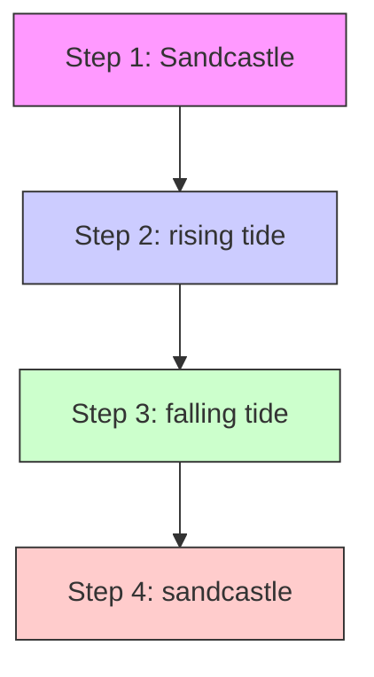

# Optimal 3D Sandcastle Shape under Erosion

## Summary

Waves, tides and rainfall could erode the foundation of sandcastle. We used the fluid-structure interaction theory, considering the characteristics of sand, establishes sandcastle-erosion model and sandcastle-rain-erosion model, and solved them based on the genetic algorithm, multi-step design, iterative calculation, data analysis and optimization, finally confirmed the optimal three-dimensional geometry of sandcastle to resist erosion under different influence factors.

The effect of sea water on sandcastle is categorized as two modes: waves and tides. We study the simplified model of flow-solid interaction. The sand foundation is cut off by the crashing of waves layer by layer, while the tide rises slowly to immerse the sandcastle. Sand layer falls out of sandcastle when it is saturated with water which reduces cohesion between sand grains.

As for problem 1, it is referred that resistance to erosion reaches its maximum when the water-faced surface is smooth.[4] Thus, we take frustum of a cone (including cylinder but not cone, for castle will be built above it) as an initial research object, to investigate the value of radius of the bottom ????, radius of the top ???? and height ???? to maximum remaining proportion of foundation in the same amount of time when initial volume $V _ { 0 } = 0 . 2 m ^ { 3 }$ . Partial derivatives and genetic algorithms are used to obtain the maximum remaining proportion , which is 62.4%, when $\pmb { R } = \mathbf { 0 } . 6 4 m$ , $\pmb { r } = \mathbf { 0 } . 2 \mathbf { 0 } m$ , $\pmb { H } = \mathbf { 0 } . 3 3 m$ . For any fixed volume of sand, the optimal shape to resist seawater erosion is a frustum of a cone maintaining the ratio of the above $R , r$ and ???? values. As the velocity and flux of the water-faced surface is bigger, more force is applied on water-faced surface, the geometry is optimized as a frustum of an ellipsoidal cone to maximum its effectiveness of resistance to erosion.

As for problem 2, relationship between water-to-sand proportion ???? and the thickness of sand layers cut by waves is established. First assume the shape of sandcastle is given by problem 1, regard $\beta$ as a variable and solve the value of ???? when ???? reaches its maximum. Currently when $\alpha _ { m a x } = 6 5 . 0 \%$ , $\beta = 2 2 \%$ . Next, as $\beta$ is correlated to the shape of optimal geometry, based on problem 1 and relationship between the length cut under erosion and the rate of water absorption saturation to solve the value of $R , r , H , \beta$ when ???? reaches its maximum. The result is $R =$ $0 . 5 8 m$ , $r = 0 . 2 3 m$ , $H = 0 . 3 7 m$ , $\beta = 2 4 \%$ when ???? reaches its maximum $\alpha _ { m a x } = 6 8 . 6 \%$ . Therefore, the optimal water-to-sand proportional is 24%.

Problem 3 is discussed in two cases: sandcastle is affected by both seawater and rainfall and sandcastle is only affected by rainfall. In the first case, the optimal geometry in problem 1 remains $\alpha = 5 5 . 7 \%$ after erosion, reducing a volume of 6.7% compared with not affected by rainfall. The geometry model is improved that $R =$ 0.52????, $r = 0 . 1 6 m$ , $H = 0 . 5 0 m$ , when ???? reaches its maximum $\alpha _ { m a x } = 5 9 . 2 \%$ . In the second case, the optimal geometry in problem 1 remains $\alpha = 9 2 . 6 \%$ after erosion. As ???? increases, ???? increases. Thus, in both cases, optimal geometry in problem 1 is not optimal in problem 3.

Four advice is given in problem 4: increase initial volume; build sandcastle away from the sea; add adhesive into sand-water mixture; build a sand wall around the sandcastle.

Finally, sensitivity analysis of coefficient of length cutting $\lambda _ { c } ,$ coefficient of saturated water absorption $\lambda _ { s } ,$ initial volume $V _ { 0 }$ is given.

Key Words: 3D Sandcastle Model; Fluid-Structure Interaction; Optimizing Model;

## Contents

## 1 Introduction ...........

1.1 Background.  
1.2 Restatement of the Problem.

## 2 Analysis of the problem .................

2.1 Literature Review  
2.2 Problem Analysis.

## 3 Assumptions and Justifications...............

## 4 Notations............

## 5 Model and Solution .............

5.1 Sandcastle-Erosion Model.  
5.2 Solution to Optimal Water-to-Sand Mixture Proportion 12  
5.3 Sandcastle-Rain-Erosion Model. 14

## 6 Advice on Building a Sandcastle .................

## 7 Sensitivity Analysis .............. ..18

## 8 Strengths and Weakness ............. ..20

8.1 Strengths . .20  
8.2 Weakness .. .20

## Article for Fun in the Sun .................. 21

## References ................. .23

## Appendix.. .24

## 1 Introduction

## 1.1 Background

Beach is a paradise for children, while sandcastle is an indispensable part of it. Various kinds of sandcastles are constructed, decorated with roofs, turrets, windows and steps. Every child who played on a beach knows that dry sand could only loosely pile up like a comicalness, and will collapse while mixed up with too much water. Thus, what is the golden ratio of sand and water that will keep the sandcastle standing? Naturally, here comes the question of how to make the sandcastle survive longer under the erosion of waves and tides. This article aims to discuss “perfect sandcastle” in consideration of factors as waves, tides and rainfall.

## 1.2 Restatement of the Problem

Considering the background information and restricted conditions identified in the problem statement to address the following issues:

 Problem 1. On the premise of ensuring the use of sand with the same kind of material and same water-to-sand proportion with similar quality of sand, establish a mathematical model to determine the geometry that mostly remains intact for the longest time under the influence of waves and tides.  
 Problem 2. Use the same model in Problem1 to solve the most suitable water-to-sand proportion to make foundation remain longer.  
 Problem 3. Change the mathematical model of the first question to determine whether the geometry solved above is still optimal when rainfall conditions are considered.  
 Problem 4. Give advice on how to make sandcastles last longer.

## 2 Analysis of the problem

## 2.1 Literature Review

The problem with building a sandcastle for the longest duration is essentially one of wet granular materials. Torsten, G. and David, M. modelled and measured the cohesion in wet granular materials by using a Cohesive Discrete Element Method (CDEM)[1]. Nowak, S., Samadani, A. and Kudrolli, A. had taken a model called frictionless liquid-bridge model to observe dependence of the stability angle on some paraments of the system, such as system size

and surface tension[2].

As for the physical property of granular media mixed with wetting liquid, Hornbaker, D., Albert, R., Albert, I. et al. reached that nanometer-scale layers of liquid on millimeter-scaled grains could sharply change the properties of granular media, which could even cause new physical phenomena not found in dry materials[3]. The ratio of raw materials is important in industrial production, because the ratio of raw materials will determine the physical properties of the product. Emiroğlu, M., Yalama, A., & Erdoğdu, Y. proved by experiment that there is a great difference in the physical properties of ready-mixed clay plaster produced in different clay/sand proportions [4].

For the consideration of the bond between sand grain and water in a certain proportion, Kudrolli, A. states that the inherit cohesion is highly relevant with volume fractions [5], which could explain the importance of water-to-sand ratio in the process of building a sandcastle. As to the reason that causes the sandcastle to collapse, Thomas C. Halsey and Alex J. Levine states that the failure point occurs in the majority of the sandpile rather than on the surface [6], which mainly points to the dry sandpile. Finally, Pakpour, M., Habibi, M., Møller, P., and Bonn, D. gave a model on investigating the maximum height of wet sand column while considering the stability of sandcastle [7].

## 2.2 Problem Analysis

fluid-structure interaction is a branch of mechanics theory that studies the interaction between fluids and solids. We simplify the model involved in this theory and only study the flow to solid one-way interaction.

Problem 1: The goal of problem 1 is to establish the geometry of the sandcastle with the longest duration under the erosion of waves and tides, with the constraints that the sandcastles have 1) roughly same volume, 2) the same raw material, 3) the same sand-to-water ratio and 4) roughly the same distance from the water source (that is, the distance from the erosion source). In order to simplify and solve problem 1, a sandcastle-erosion model with geometric parameters as independent variables is established to find the most defensively geometry.

Problem 2: The goal of problem 2 is to investigate the optimal sand-to-water mixture proportion to make the sandcastle most defensible. In addition to the constraints of problem 1, and regardless of the impact of changes in the geometry of the sandcastle, problem 2 requires that raw materials of the sandcastle could be nothing but sand and water. In order to solve problem 2, the sandcastle-erosion model based on problem 1 is changed, which takes the sand-to-water mixture proportion as independent variable. The algorithm of solving the optimization model is used to solve the optimal value of the sand-to-water mixture proportion.

Problem 3: The goal of problem 3 is to investigate the geometry of the sandcastle that could remain longest time under the erosion of not only waves and tides, but the effect of rainfall as well. The solution of problem 3 is to establish a sandcastle-rain-erosion model based on the sandcastle-erosion model of problem 1, adding rainfall factors besides the influence of waves and tides. Problem 3 could be solved by using same algorithm in problem 1.

Problem 4: Problem 4 asks for advice to increase the survival time of sandcastles. The solution method is to discuss the model results of problems 1-3 to obtain useful advice. Besides, theoretical analysis based on literature, sandcastle structures and common sense will also be conducted in this article.

## 3 Assumptions and Justifications

• The initial volume of the sandcastle before the erosion process began was large enough that all the sandcastles of different shapes which we investigate have positive volumes at the end of the observation period. If there are sandcastles with zero volume (that is, the sandcastle is completely destroyed) after the erosion process, or all sandcastles are in volume of zero after the erosion process, it is impossible to compare the influence of shape and geometric parameters on the stability of sandcastles in the modelling process.  
• Sand falls out of the sandcastle simply because the sand is saturated with water and a tiny external force is applied on the sand. When there is no liquid between the sand grains, cohesion is negligible, which explains why dry sand could not construct sandcastles. At small volume fractions, liquid bridges which induce cohesion between grains are formed. At higher volume fractions, large contiguous wet clusters form. However, when the volume fractions exceed the threshold value, cohesion becomes negligible again [5], which is the main reason that causes sand fall out.  
• The crash of the waves causes the sand to absorb water more quickly than it would if it were simply immersed in seawater. Since the initial velocity is not zero when the waves hit the outer surface of the sandcastle, while some of the water carried in the waves will penetrate into the sandcastle, the crashing process can be regarded as the speed of water penetration into the sandcastle is accelerated.  
• The effectiveness of seawater erosion on sandcastle is not correlated with time. That is, the volume reduction caused by the part of water penetrating into the sandcastle caused by waves is ignored. Compared with sandcastle, the volume of sea water is extremely massive, so the loss of water caused by each wave crash could be ignored, which explains the effectiveness of seawater

erosion on sandcastle is not affected by time.

• Ignore crash effects caused by tide on sandcastle. According to the tidal conditions in different sea areas around the world [8] sea surfaces in different sea areas rises and falls at a relatively steady and slow speed. Only the penetrating influence caused by the tide on the sandcastle is considered.  
• Ignore the evaporation of water in the sand. As the sand-to-water mixture proportion plays an important role under lots of circumstances, not considering the evaporation can achieve goals more directly by removing interference.  
•The sandcastle stands on the beach which is horizontal. If the sandcastle stands on a slope, calculations like saturated time for water-positive surface and top surface will become too much complicated, which causes unnecessary trouble when solving our core question.

## 4 Notations

<table><tr><td>Definitions</td><td>Descriptions</td></tr><tr><td> $\alpha$ </td><td>Remaining proportion of the sandcastle</td></tr><tr><td> $\beta$ </td><td>Water-to-sand mixture proportion</td></tr><tr><td> $\lambda_c$ </td><td>Coefficient of length cutting</td></tr><tr><td> $\lambda_s$ </td><td>Coefficient of saturated water absorption</td></tr><tr><td> $\nu_t$ </td><td>Velocity that tide rises and falls</td></tr><tr><td> $h_e$ </td><td>Maximum height of tide</td></tr><tr><td> $h_{tide}$ </td><td>Height of tide</td></tr><tr><td> $l_i$ </td><td>Length cut in different conditions</td></tr><tr><td> $t_e$ </td><td>Time when sea level reaches its peak at the first time</td></tr><tr><td> $t_f$ </td><td>Time when sea level reaches the top of sandcastle at the first time</td></tr><tr><td>F</td><td>Cohesion between sand grains</td></tr><tr><td>H</td><td>Height of sandcastle</td></tr><tr><td> $L_p$ </td><td>Saturated water absorption at the bottom of water-position surface</td></tr><tr><td> $L_n$ </td><td>Saturated water absorption at the bottom of water-negative surface</td></tr><tr><td> $L_t$ </td><td>Saturated water absorption at the top surface</td></tr><tr><td> $V_0$ </td><td>Initial volume of the sandcastle</td></tr><tr><td>r</td><td>Radius of top surface of a frustum-shaped sandcastle</td></tr><tr><td>R</td><td>Radius of bottom surface of a frustum-shaped sandcastle</td></tr><tr><td> $k_1, k_2, k_3$ </td><td>Constants</td></tr></table>

## 5 Model and Solution

## 5.1 Sandcastle-Erosion Model

It is referred that resistance to erosion reaches its maximum when the water-faced surface is smooth[4]. That means the shape with corner angle is easier to be eroded than cylinders. Thus, we take frustum of a cone (including cylinder but not cone, for castle will be built) as an initial research object. In this section, the sandcastle-erosion model is discussed in detail and a concrete calculation method to evaluate the stability of sandcastles is proposed to obtain the optimal geometry required in problem 1.

In order to more concisely and accurately quantify the effect of erosion on the sandcastle, the following two-dimensional surfaces of sandcastle are defined:

Water-positive surface: the surface of the sandcastle facing the sea, that is, the curved surface of the sandcastle that is visible from the direction of the sea.

Water-positive section: the maximum section of sandcastle visible from the direction of the sea.

Water-negative surface: the surface of the sandcastle back to the sea, that is, the curved surface of the sandcastle that is invisible from the direction of the sea.

Top surface: the surface that is parallel to the bottom surface.

Whole surface: the surface that involves water-positive surface, water-negative surface and top surface.

  
Figure 1 The sketch of each position（the yellow part）

According to the tidal data of various of places in the world [8], the variation of tide height is rather obvious in 24 hours. In order to study the influence of tidal change on sandcastle, the following model takes the tidal data of Dandong, China on March 6, 2020 as an example for analysis. Meanwhile, in order to avoid the excessive impact of the tide on the sandcastle, which was immersed in the sea for most of the observation time, the model choose to build the sandcastle at a height of 200cm, and the maximum height of the sandcastle is required to be less than 1m, so as to reflect the erosion effect of both tide and waves.

The goal of problem 1 is to seek the sandcastle that has the longest duration under the erosion of waves and tides. The duration is defined as the time it takes for the volume of the sandcastle to decrease (the surface sand falls off the main body) to a certain value, which is equivalent to the maximum volume retained by the sandcastle under the same erosion of waves and tides.


<details>
<summary>line chart</summary>

The height of tide(cm)
| Time (hrs) | Height (cm) |
|---|---|
| 00:00 | 100 |
| 01:00 | 80 |
| 02:00 | 65 |
| 03:00 | 55 |
| 04:00 | 60 |
| 05:00 | 85 |
| 06:00 | 125 |
| 07:00 | 155 |
| 08:00 | 155 |
| 09:00 | 140 |
| 10:00 | 120 |
| 11:00 | 95 |
| 12:00 | 75 |
| 13:00 | 65 |
| 14:00 | 55 |
| 15:00 | 50 |
| 16:00 | 65 |
| 17:00 | 115 |
| 18:00 | 190 |
| 19:00 | 250 |
| 20:00 | 275 |
| 21:00 | 250 |
| 22:00 | 210 |
| 23:00 | 175 |
</details>

Figure 2 Tidal data from Dandong, China on March 6, 2020

Assuming that the wave height is small enough, so when the sea level is less than 200 centimeters, it can be regarded as sandcastle is not affected by the tide and waves, as sandcastle is built at the height of 200 centimeters. According to the tidal table, the erosion condition of sandcastle is studied only for four hours, from 18:00 to 24:00. It has also assumed that the initial volume $V _ { 0 }$ of the sandcastle is large enough that the all sandcastles can maintain a positive volume after four hours of erosion, while the roughly shape of sandcastle remains largely unchanged after the erosion.

Due to the slow rising speed of the tide (approximately 50 ), the crashing impact of the tide on the sandcastle is neglected, the immersing impact of the tide on the sandcastle is merely considered. In contrast to the long impacting period of tides, waves crash rather rapidly (approximately 10 ), which is regarded as a continuous impact on the sandcastle. Since the wave height is assumed to be small relative to the height of the sandcastle, while the waves hit the sandcastle continuously and the sea water rises at a constant speed, the time length that every part of water-position surface was impacted remains same.

Assume $t _ { 0 }$ represents the crashing time length of waves of the same height on water-positive surface at each point as the sea surface rises at a constant speed. In a fixed interval of time $t _ { 0 } { \mathrm { : } }$ , the length cut by waves from water-positive sand surface stands for $l _ { 1 } .$ , while $l _ { 1 }$ is in proportion to the ratio of the area of water-positive surface $S _ { 1 }$ and the area of water-positive section ${ { S } _ { 1 } } ^ { \prime }$ , that is

$$
l _ {1} = \lambda_ {c} \times \frac {S _ {1} ^ {\prime}}{S _ {1}} \tag {1}
$$

Among them,

$\lambda _ { c }$ represents coefficient of length cutting, which is corelated to water-to-sand mixture proportion and considered a constant in problem 1.

In order to simply the calculation, it is assumed that after the sand on the water-position surface was crashed, part of the sand should have fallen out but remains saturated slightly attaching to the majority of sandcastle.

The following discussion is based on the initial height of 200 centimeters, while initial time is based on the moment sea level reaches initial height. As the tide rises and falls at a constant speed, the height of tide $h _ { t i d e }$ satisfies:

$$
h _ {t i d e} = \left\{ \begin{array}{l l} \nu_ {t} \times t & t \leqslant t _ {e} \\ h _ {e} - \nu_ {t} \times (t - t _ {e}) & t > t _ {e} \end{array} \right. \tag {2}
$$

Among them,

$\nu _ { t }$ represents the velocity that tide rises and falls,

$h _ { e }$ represents maximum height of tides,

$t _ { e }$ represents the time at which the sea level reaches its peak.

In unit interval, the length that immersion causes the water to penetrate vertically from the whole surface of the sand stands for $l _ { 2 }$ , that is,

$$
l _ {2} = \lambda_ {s} \times t \tag {3}
$$

Among them,

$\lambda _ { s }$ represents coefficient of saturated water absorption, which is corelated to water-to-sand mixture proportion and considered a constant in problem 1.

$$
\lambda_ {c} = 9. 8 \times 1 0 ^ {- 2}, \lambda_ {s} = 7. 0 \times 1 0 ^ {- 6} \text {is assumed[7].}
$$

The following is a schematic of the reduction of sandcastle:


<details>
<summary>text_image</summary>

seaside
shoreside
</details>

Figure 3 The schematic of the reduction of sandcastle

The outermost green section is the part that is saturated with the increase of the tide height. Since the water absorption of different part reaches saturation at the same rate, the lower part has a rather longer time interval to contact with the seawater and absorbs more, while the upper part absorbs less.  
The purple section is the sand layer on the water-positive surface cut by the waves. Since the waves are continuously having an impact on the sandcastle is assumed, and the wave height is rather small, while sea water is rising slowly at a constant speed, the length of the upper and lower parts cut by the waves remains approximately same.  
Considering that the sand piles formed at the same volume are of different heights and the maximum height of rising tide $h _ { e }$ is fixed, thus, if different shapes are located in the same position, the sandcastle with a small height will be submerged. The blue section represents the length of water absorption saturation. As the whole sandcastle is immersed in the sea, the water absorption length of each surface of the sandcastle is the same.  
The green section of the inner part is the saturated water absorption length of the sandcastle at falling tide, while the purple section of the inner part is the length of the sandcastle cut by waves during the falling tide.  
The red part is the remaining sandcastle after a whole period of rising and falling tide.

The segmentation process is shown as follows


<details>
<summary>flowchart</summary>


</details>

Figure 4 The segmentation process

Assume $t _ { f }$ stands for time that sea level rises just above the sandcastle (the rise of height equals to ????, where ???? represents the height of the sandcastle).

Step 1: From time $t = 0$ to $t = t _ { f }$ , when the sea level rises from exactly touching the bottom of the sandcastle to exactly reaching the top of the sandcastle, the length of water-positive surface cut by waves add on the length that the lowest level absorbs water to reach saturation could be described as

$$
l _ {1} + l _ {2} (t _ {f}) \tag {4}
$$

Step 2 (completely immersed): from time $t = t _ { f }$ to $t = t _ { e }$ , when the sea level rises from the top of the sandcastle to the top water level, the length that the lowest level of water-position surface absorbs water to reach saturation could be described as

$$
l _ {2} (t _ {e} - t _ {f}) \tag {5}
$$

 Step 3 (completely immersed): from time $t = t _ { e }$ to $t = t _ { e } + ( t _ { e } - t _ { f } )$ , when the sea level falls from the top water level to the top of the sandcastle, the length that the lowest level of water-position surface absorbs water to reach saturation could be described as

$$
l _ {2} \left(t _ {e} - t _ {f}\right) \tag {6}
$$

Step 4: from time $t = t _ { e } + ( t _ { e } - t _ { f } )$ to $t = 2 t _ { e }$ , when the sea level falls from the top of the sandcastle to completely have no contact with sandcastle, the length of water-positive surface cut by waves add on the length that the lowest level absorbs water to reach saturation could be described as

$$
l _ {1} + l _ {2} (t _ {f}) \tag {7}
$$

In the whole process, the saturated water absorption length $L _ { p }$ at the bottom of the water-positive surface is the sum of equation (4)\~(7), that is:

$$
L _ {p} = 2 \times l _ {1} + 2 \times l _ {2} (t _ {e}) \tag {8}
$$

In a similar way, the saturated water absorption length $L _ { n }$ at the bottom of the water-negative surface is described as:

$$
L _ {n} = 2 \times l _ {2} (t _ {e}) \tag {9}
$$

The saturated water absorption length $L _ { t }$ at the top surface is described as

$$
L _ {t} = 2 \times l _ {2} (t _ {e} - t _ {f}) \tag {10}
$$

The radius $R ^ { \prime }$ of the bottom of the sandcastle after erosion is

$$
R ^ {\prime} = \frac {2 R - L _ {p} - L _ {n}}{2} \tag {11}
$$

The radius $r ^ { \prime }$ of the top of the sandcastle after erosion is

$$
r ^ {\prime} \approx \frac {2 r - \left[ 2 \times l _ {1} + 2 \times l _ {2} (t _ {e} - t _ {f}) \right]}{2} = r - \left[ l _ {1} + l _ {2} (t _ {e} - t _ {f}) \right] \tag {12}
$$

The height of the sandcastle after erosion is

$$
H ^ {\prime} = H - L _ {t} \tag {13}
$$

As the initial volume of sandcastle $V _ { 0 } = 0 . 2 m ^ { 3 }$ is constant,

$$
V _ {0} = \frac {1}{3} \pi H (R ^ {2} + r ^ {2} + R \times r) \tag {14}
$$

To maximize the remaining proportion ????, that is,

$$
\max \alpha = \frac {\frac {1}{3} \pi \times H ^ {\prime} \times \left(R ^ {\prime 2} + r ^ {\prime 2} + R ^ {\prime} \times r ^ {\prime}\right)}{V _ {0}} \times 100 \%
$$

$$
s. t. V _ {0} = \frac {1}{3} \pi H (R ^ {2} + r ^ {2} + R \times r) \tag {15}
$$

$$
0 <   H <   0. 7 5
$$

$$
0 \leqslant r \leqslant R
$$

Genetic algorithm toolbox in MATLAB and partial derivative method are used to solve the problem. Results are as follows:


<details>
<summary>stacked bar chart</summary>

| R (m) | α | 0-0.1 | 0.1-0.2 | 0.2-0.3 | 0.3-0.4 | 0.4-0.5 | 0.5-0.6 | 0.6-0.7 |
| --- | --- | --- | --- | --- | --- | --- | --- | --- |
| 0.05 | 0.0 |  |  |  |  |  |  |  |
| 0.15 | 0.1 |  |  |  |  |  |  |  |
| 0.25 | 0.2 |  |  |  |  |  |  |  |
| 0.35 | 0.3 |  |  |  |  |  |  |  |
| 0.45 | 0.4 |  |  |  |  |  |  |  |
| 0.55 | 0.5 |  |  |  |  |  |  |  |
| 0.65 | 0.6 |  |  |  |  |  |  |  |
| 0.75 | 0.7 |  |  |  |  |  |  |  |
| 0.85 | 0.8 |  |  |  |  |  |  |  |
| 1.05 | 0.9 |  |  |  |  |  |  |  |
</details>

Figure 5 The result of sandcastle-erosion model

That is, at the value of $V _ { 0 } = 0 . 2 m ^ { 3 }$ , $R = 0 . 6 4 m$ , $r = 0 . 2 0 m$ , $H = 0 . 3 3 m$ , remaining proportion ???? takes the maximum value $\alpha _ { m a x } = 6 2 . 4 \%$ .

The shape and proportion of the optimal 3D shape are shown in figure 6.


<details>
<summary>text_image</summary>

0.20m
0.33m
0.64m
</details>

Figure 6 the optimal 3D model

Because the velocity and flux of the water-positive surface is bigger, more force is applied on water-positive surface. Similarly, there is less force applied on the water-negative surface and side of the geometry. On this aspect, the model could be further optimized as ellipsoidal cone sets to make water-positive side more stable. The optimized geometric model is eroded proportionally from four directions to maximize the resistance of the geometry. Optimized three-dimensional geometry model shows as follows(the blue one):


<details>
<summary>natural_image</summary>

3D illustration of a cone with yellow and blue surfaces (no text or symbols)
</details>

Figure 7 The optimized three-dimensional geometry model

## 5.2 Solution to Optimal Water-to-Sand Mixture Proportion

As is discussed in problem analysis, the goal of problem 2 is to investigate the optimal sand-to-water mixture proportion to make the sandcastle most defensible. Water-to-sand proportion $\beta$ is defined as the volume of water divided by the volume of sandcastle (based on the hypothesis that the volume of sandcastle would not increase when the sandcastle absorbs water).

When $\beta$ is of small magnitude, the cohesion between sand grains turns to be weak, while cohesion increases sharply as $\beta$ increases. The cohesion of sand is considered to quickly disappear when the sand is saturated with water.

It is assumed that ???? and $\beta$ have a relationship of

$$
F = k _ {1} \times \beta^ {2} \tag {16}
$$

at certain realms. Among them, $k _ { 1 }$ is a constant.

Cohesion ???? is required to have a lower bound to make sure the sandcastle would not collapse without the influence of water. Correspondingly, $\beta$ is required to have a lower bound $\beta _ { m i n }$ ≈ 10%.[2] Thus, the range of $\beta$ should be

$$
\beta \in \left(\beta_ {\min}, \beta_ {\max}\right) \tag {17}
$$

Among them, $\beta _ { m a x }$ represents water-to-sand mixture proportion when the whole sandcastle is saturated with water. It is referred that $\beta _ { m a x } \approx 3 0 \% . [ 2 ]$ Assume $t _ { 0 }$ represents the crashing time of waves on every point of the water-positive surface with sea level rises in a constant speed. The thickness $T$ cut by the waves and cohesion have an inverse relationship at a fixed duration $t _ { 0 }$ , that is,

$$
T = \frac {k _ {2}}{F} \tag {18}
$$

Among them, $k _ { 2 }$ is a constant. Thus, coefficient of length cutting $\lambda _ { c }$ and $T$ have a relationship of

$$
\lambda_ {s} = T \tag {19}
$$

According to equations (1), (16)\~(19) , it is concluded that the length $l _ { 1 }$ which is cut perpendicularly of the water-positive surface and water-to-sand mixture proportion $\beta$ have a relationship of

$$
l _ {1} = \frac {k _ {2}}{k _ {1} \times \beta^ {2}} \times \frac {S _ {1} ^ {\prime}}{S _ {1}} \tag {20}
$$

Among them, $S _ { 1 }$ represents the area of water-positive surface, ${ { S } _ { 1 } } ^ { \prime }$ represents the area of

water-positive section.

When the sand is in the condition of absorbing water, $\beta$ and the time to reach saturated have a relationship of power function with exponent $1 / 2$ . Thus, the coefficient of saturated water absorption $\lambda _ { s }$ and water-to-sand proportion $\beta$ have a relationship of

$$
\lambda_ {s} = k _ {3} \times \beta^ {2} \tag {21}
$$

Among them, $k _ { 3 }$ is a constant. According to equations (3) and (21), it is concluded that

$$
l _ {2} = k _ {3} \times \beta^ {2} \times t \tag {22}
$$

It is referred that $k _ { 2 } / k _ { 1 } = 1 \times 1 0 ^ { - 2 } , \ k _ { 3 } = 7 \times 1 0 ^ { - 4 }$ .[3] Equation(22) indicates that in the same time, the larger the water-to-sand ratio is, the longer the sand layer reaches saturated.

To simplify calculation, we first calculate the water-to-sand mixture proportion based on the geometry of problem 1.

Results are as follows:


<details>
<summary>bar chart</summary>

| β | α |
| --- | --- |
| 0.1 | 0.575 |
| 0.11 | 0.568 |
| 0.12 | 0.562 |
| 0.13 | 0.558 |
| 0.14 | 0.562 |
| 0.15 | 0.572 |
| 0.16 | 0.582 |
| 0.17 | 0.598 |
| 0.18 | 0.618 |
| 0.19 | 0.632 |
| 0.2 | 0.642 |
| 0.21 | 0.648 |
| 0.22 | 0.652 |
| 0.23 | 0.648 |
| 0.24 | 0.644 |
| 0.25 | 0.638 |
| 0.26 | 0.628 |
| 0.27 | 0.618 |
| 0.28 | 0.608 |
| 0.29 | 0.598 |
| 0.3 | 0.582 |
</details>

Figure 8 The best $\beta$ of the optimal shape in problem 1

Within the limitation of , when $\beta$ takes the value of $\beta _ { 1 } = 2 2 \%$ , the remaining proportion of sandcastle could take its maximum value, which is approximately . The optimal water-to-sand proportion is , based on the geometry of problem 1. That is, for every 100 volumes of sand pile (with gaps in the sand), about 22 volumes of water are added to make the sandcastle.

Since the best structure of foundation is related to water-to-sand mixture proportion, in the following calculations $\beta$ is considered as an independent variable of ratio $\alpha ,$ to compute the value of $\beta$ under the restricted conditions of (17).

Similarly, genetic algorithm toolbox of MATLAB and partial derivative method are used to solve the problem. As the function of three variables $\alpha ( R , r , \beta )$ is involved, the graph of the function is inconvenient to be shown. Only numerical results are given as follows:

Table 1 The result of optimal Water-to-Sand mixture proportion

<table><tr><td>R</td><td>r</td><td>β</td><td>α</td></tr><tr><td>0.58m</td><td>0.23m</td><td>24%</td><td>68.6%</td></tr></table>

Therefore, the optimal water-to-sand proportion is $\beta = 2 4 \%$ based on the consideration of various shapes of the frustrum of the cone. For every 100 volumes of sand pile (with gaps in the sand), about 24 volumes of water are added to make the sandcastle. The ratio of water to sand volume is about 1:5 when making the foundation of the sandcastle.

## 5.3 Sandcastle-Rain-Erosion Model

When rainfall is taken into consideration, in order to establish sandcastle-rain-erosion model, problem 3 is discussed in two situations: one is that sandcastle is eroded by both seawater and rainfall; the other is that sandcastle is eroded only by rainfall.

In situation 1, the impact of rainfall and the impact of seawater are superimposed directly, that is, rainfall directly affect the sandcastle that is eroded by seawater. Assume raindrops are particles with mass and vertically hit on the sandcastle, which have a same applied force compared with waves. Every part of the sandcastle was hit by the raindrops for the same time, which was represented as $t _ { 1 }$ .

Assuming that the length that the raindrops vertically cut from the surface of the sandcastle stands for $l _ { 4 }$ in a period $t _ { 1 }$ , which is proportional to the ratio of ${ S _ { 2 } } ^ { \prime }$ and $S _ { 2 }$ .

$$
l _ {4 i} = a _ {1} \times \frac {S _ {2 i} ^ {\prime}}{S _ {2 i}} \tag {23}
$$

Among them,

$\lambda _ { c }$ represents coefficient of length cutting,

${ S _ { 2 i } } ^ { \prime }$ represents the area of the vertical projection of top surface or side surface,

$S _ { 2 i }$ represents the area of top surface or side surface,

represents situation on top surface, water-positive surface or water-negative surface.


<details>
<summary>natural_image</summary>

Simple line drawing of a cone with a dashed circular base (no text or symbols)
</details>

vertical projection of side surface


<details>
<summary>natural_image</summary>

Simple line drawing of a cone with a shaded base (no text or symbols)
</details>

vertical projection of top surface  
Figure 9 The sketch of vertical projection of each face

In order to simplify subsequently processing steps, it is similarly assumed that after the sand on the surface was eroded by the rain, part of the sand should have fallen out but remains saturated slightly attaching to the majority of sandcastle. Another schematic of the reduction of sandcastle is showed below.


<details>
<summary>text_image</summary>

seaside
shoreside
</details>

Figure 10 Another schematic of the reduction of sandcastle

Based on the schematic of problem 1, the yellow section is the part that is saturated by the rainfall, the angle of inclination of the sandcastle remains same after the erosion of the rain.

The remaining height of sandcastle ${ H _ { 1 } } ^ { \prime \prime }$ superimposed with rain erosion is

$$
H _ {1} ^ {\prime \prime} = H ^ {\prime} - l _ {4 1} \tag {24}
$$

The radius of top surface of sandcastle ${ r _ { 1 } } ^ { \prime \prime }$ superimposed with rain erosion is

$$
r _ {1} ^ {\prime \prime} = \frac {2 r ^ {\prime} - l _ {4 2} - l _ {4 3}}{2} \tag {25}
$$

The radius of bottom surface of sandcastle ${ R _ { 1 } } ^ { \prime \prime }$ superimposed with rain erosion is

$$
R _ {1} ^ {\prime \prime} = \frac {2 R ^ {\prime} - l _ {4 2} - l _ {4 3}}{2} \tag {26}
$$

When the remaining proportion ${ \alpha _ { 1 } } ^ { \prime \prime }$ is

$$
\max \alpha_ {1} ^ {\prime \prime} = \frac {\frac {1}{3} \pi \times H _ {1} ^ {\prime \prime} \times \left(R _ {1} ^ {\prime \prime 2} + r _ {1} ^ {\prime \prime 2} + R _ {1} ^ {\prime \prime} \times r _ {1} ^ {\prime \prime}\right)}{V _ {0}} \times 100 \%
$$

$$
s. t. V _ {0} = \frac {1}{3} \pi H (R ^ {2} + r ^ {2} + R \times r) \tag {27}
$$

$$
0 <   H <   0. 7 5
$$

$$
0 \leqslant r \leqslant R
$$

According to the data processed in problem 1 $( R = 0 . 6 4 m , r = 0 . 2 0 m )$ , it is concluded that $\alpha _ { 1 } ^ { \prime \prime } =$ 55.7%.

Using the algorithm similar to problem 1, results are as follows.


<details>
<summary>stacked bar chart</summary>

| 0.2-0.3 | 0.75 | 0.65 | 0.55 | 0.45 | 0.35 | 0.25 | 0.15 | 0.05 | - | - | - | - | - | - | - | - | - | - | - | - | - | - |
| --- | --- | --- | --- | --- | --- | --- | --- | --- | --- | --- | --- | --- | --- | --- | --- | --- | --- | --- | --- | --- | --- | --- |
| 0.3-0.4 | 0.65 | 0.55 | 0.45 | 0.35 | 0.25 | 0.15 | - | - | - | - | - | - | - | - | - | - | - | - | - | - | - | - |
| 0.4-0.5 | 0.55 | 0.45 | 0.35 | 0.25 | 0.15 | - | - | - | - | - | - | - | - | - | - | - | - | - | - | - | - | - |
| 0.5-0.6 | 0.45 | 0.35 | 0.25 | 0.15 | - | - | - | - | - | - | - | - | - | - | - | - | - | - | - | - | - | - |
</details>

Figure 11 The result of Sandcastle-Rain-Erosion model for situation 1

That is, at the value of $V _ { 0 } = 0 . 2 m ^ { 3 }$ , $R = 0 . 5 2 m , r = 0 . 1 6 m$ , $H = 0 . 5 0 m$ , remaining proportion $\alpha _ { 1 } ^ { \prime \prime }$ takes the maximum value $\alpha _ { 1 m a x } ^ { \prime \prime } = 6 2 . 4 \% . \mathrm { \ A s } \alpha _ { 1 } ^ { \prime \prime }$ reaches $\alpha _ { 1 m a x } ^ { \prime \prime }$ , the remaining volume of the latter three-dimensional geometry model increases approximately 4% compared to the geometry model established in problem 1. Thus, three-dimensional geometry in problem 1 is not the optimum in the situation 1 of problem 3.

In situation 2, only the impact of rainfall is considered. The schematic of the reduction of sandcastle is showed below:


<details>
<summary>text_image</summary>

seaside
shoreside
</details>

Figure 12 The schematic of the reduction of sandcastle

Similarly, the yellow section is the part that is saturated by the rainfall, the angle of inclination of the sandcastle remains same after the erosion of the rain.

The remaining height of sandcastle ${ H _ { 2 } } ^ { \prime \prime }$ only with rain erosion is

$$
H _ {2} ^ {\prime \prime} = H - l _ {4 1} \tag {28}
$$

The radius of the top surface of sandcastle ${ r _ { 2 } } ^ { \prime \prime }$ only with rain erosion is

$$
r _ {2} ^ {\prime \prime} = \frac {2 r - l _ {4 2} - l _ {4 3}}{2} \tag {29}
$$

The radius of the bottom surface of sandcastle ${ R _ { 2 } } ^ { \prime \prime }$ only with rain erosion is

$$
R _ {2} ^ {\prime \prime} = \frac {2 R - l _ {4 2} - l _ {4 3}}{2} \tag {30}
$$

When the remaining proportion ${ \alpha _ { 2 } } ^ { \prime \prime }$ is

$$
\max \alpha_ {2} ^ {\prime \prime} = \frac {\frac {1}{3} \pi \times H _ {2} ^ {\prime \prime} \times \left(R _ {2} ^ {\prime \prime 2} + r _ {2} ^ {\prime \prime 2} + R _ {2} ^ {\prime \prime} \times r _ {2} ^ {\prime \prime}\right)}{V _ {0}} \times 100 \%
$$

$$
s. t. V _ {0} = \frac {1}{3} \pi H (R ^ {2} + r ^ {2} + R \times r) \tag {31}
$$

$$
0 <   H <   0. 7 5
$$

$$
0 \leqslant r \leqslant R
$$

The results are as follows.

According to the data processed in problem 1 $( R = 0 . 6 4 m , r = 0 . 2 0 m )$ , it is concluded that $\alpha _ { 2 } ^ { \prime \prime } =$ 92.6%. It is observed that $\operatorname* { l i m } _ { h  + \infty } \alpha _ { 2 } ^ { \prime \prime } = 1 0 0 \%$ . As the relationship between the height and the stability of the sandcastle was not considered in the model, $\alpha _ { 2 m a x } ^ { \prime \prime }$ is unsolvable. However, it is confirmed that three-dimensional geometry in problem 1 is not the optimum in this situation.

## 6 Advice on Building a Sandcastle

Advice 1: Increase the initial volume of sandcastles.

When the sandcastle is extremely small, it is difficult to withstand the waves and tides. The results of the sandcastle-erosion model also show that increasing the initial volume $V _ { 0 }$ within a certain range can increase the proportion of remaining sandcastle after the erosion of waves.


<details>
<summary>line chart</summary>

| V0   | α    |
| ---- | ---- |
| 0.2  | 0.63 |
| 0.3  | 0.68 |
| 0.5  | 0.75 |
| 0.7  | 0.80 |
</details>

Figure 13 The relationship between $\alpha _ { m a x }$ and $V _ { 0 }$

Advice 2: Build the sandcastle on a beach far from the sea.

The beach is inclined to the sea in reality. The farther the sandcastle is from the sea and the higher the sandcastle is, the less sandcastle is affected by the waves. When the distance is far enough, the erosion of the sea can be completely eliminated.

Advice 3: Add some adhesive to the sand-water mixture.

The adhesive can enhance the cohesion between sand grains, which helps the surface sand adhere to the main body of the sandcastle. Meanwhile, the adhesive can reduce the surface sand exposure to the gap in the sea water, reducing the rate of sand saturation to a certain extent. Using adhesive could also reduce the volume that sandcastle lost in the same period.

Advice 4: Build a sand wall around the sandcastle.

When kids are building sandcastles, moats around sandcastles are often built. On the one hand, sand walls absorb the force caused by the crashing of waves; on the other hand, sand walls can delay the time that sandcastle contacts tides.

## 7 Sensitivity Analysis

As coefficient of length cutting $\lambda _ { c }$ and coefficient of saturated water absorption $\lambda _ { s }$ and initial volume $V _ { 0 }$ have an important influence on the optimum, sensitivity analysis is processed. For three coefficients $\lambda _ { c } , \lambda _ { s }$ and $V _ { 0 }$ , a change of is applied. The relative influence on the optimal radius of bottom surface , radius of top surface , height of the sandcastle and remaining proportion of the sandcastle is observed.

Table 2 The sensitivity analysis of $\lambda _ { c }$

<table><tr><td> $\lambda_c$  result</td><td>R</td><td>r</td><td>H</td><td>α</td></tr><tr><td>+5%</td><td>0.73%</td><td>1.24%</td><td>1.92%</td><td>1.96%</td></tr><tr><td>+4%</td><td>0.59%</td><td>1.00%</td><td>1.55%</td><td>1.57%</td></tr><tr><td>+3%</td><td>0.44%</td><td>0.75%</td><td>1.18%</td><td>1.18%</td></tr><tr><td>+2%</td><td>0.29%</td><td>0.50%</td><td>0.78%</td><td>0.78%</td></tr><tr><td>+1%</td><td>0.15%</td><td>0.25%</td><td>0.40%</td><td>0.39%</td></tr><tr><td>-1%</td><td>0.15%</td><td>0.25%</td><td>0.40%</td><td>0.34%</td></tr><tr><td>-2%</td><td>0.29%</td><td>0.51%</td><td>0.81%</td><td>0.81%</td></tr><tr><td>-3%</td><td>0.44%</td><td>0.77%</td><td>1.21%</td><td>1.20%</td></tr><tr><td>-4%</td><td>0.58%</td><td>1.03%</td><td>1.61%</td><td>1.72%</td></tr><tr><td>-5%</td><td>0.73%</td><td>1.29%</td><td>1.74%</td><td>2.01%</td></tr></table>

Table 3 The sensitivity analysis of $\lambda _ { s }$

<table><tr><td> $\lambda_s$  result</td><td>R</td><td>r</td><td>H</td><td>α</td></tr><tr><td>+5%</td><td>0.50%</td><td>1.05%</td><td>1.54%</td><td>3.50%</td></tr><tr><td>+4%</td><td>0.42%</td><td>0.83%</td><td>1.31%</td><td>2.60%</td></tr><tr><td>+3%</td><td>0.31%</td><td>0.63%</td><td>0.96%</td><td>1.93%</td></tr><tr><td>+2%</td><td>0.21%</td><td>0.44%</td><td>0.65%</td><td>1.30%</td></tr><tr><td>+1%</td><td>0.11%</td><td>0.22%</td><td>0.31%</td><td>0.64%</td></tr><tr><td>-1%</td><td>0.11%</td><td>0.21%</td><td>0.30%</td><td>0.58%</td></tr><tr><td>-2%</td><td>0.25%</td><td>0.44%</td><td>0.65%</td><td>1.30%</td></tr><tr><td>-3%</td><td>0.35%</td><td>0.69%</td><td>1.04%</td><td>2.00%</td></tr><tr><td>-4%</td><td>0.48%</td><td>0.92%</td><td>1.32%</td><td>2.73%</td></tr><tr><td>-5%</td><td>0.55%</td><td>1.11%</td><td>1.60%</td><td>3.44%</td></tr></table>

Table 4 The sensitivity analysis of $\mathrm { V } _ { 0 }$

<table><tr><td> $V_0$  result</td><td>R</td><td>r</td><td>H</td><td>α</td></tr><tr><td>+5%</td><td>1.60%</td><td>1.58%</td><td>1.76%</td><td>1.83%</td></tr><tr><td>+4%</td><td>1.27%</td><td>1.27%</td><td>1.45%</td><td>1.52%</td></tr><tr><td>+3%</td><td>0.94%</td><td>0.93%</td><td>1.09%</td><td>1.15%</td></tr><tr><td>+2%</td><td>0.63%</td><td>0.62%</td><td>0.74%</td><td>0.78%</td></tr><tr><td>+1%</td><td>0.32%</td><td>0.31%</td><td>0.37%</td><td>0.39%</td></tr><tr><td>-1%</td><td>0.32%</td><td>0.30%</td><td>0.38%</td><td>0.38%</td></tr><tr><td>-2%</td><td>0.65%</td><td>0.63%</td><td>0.74%</td><td>0.81%</td></tr><tr><td>-3%</td><td>0.94%</td><td>0.93%</td><td>1.10%</td><td>1.19%</td></tr><tr><td>-4%</td><td>1.30%</td><td>1.31%</td><td>1.48%</td><td>1.61%</td></tr><tr><td>-5%</td><td>1.62%</td><td>1.61%</td><td>1.79%</td><td>2.02%</td></tr></table>

The results show that the coefficients $\lambda _ { c } , \lambda _ { s }$ and initial volume $V _ { 0 }$ have high stabilities. Thus, the error of the final results is within the acceptable range. The results that including the optimal sandcastle shape under the influence of seawater based on sandcastle-erosion model, the optimal water-to-sand proportion and the optimal sandcastle shape under the influence of rainfall and seawater based on sandcastle-rain-erosion model are reliable.

## 8 Strengths and Weakness

## 8.1 Strengths

In this article, the erosion effects of waves, tides and rainfall on sand grains are analyzed based on the related principles of fluid-structure interaction. The effect of seawater on sandcastle is simplified as the wave crashing to cut sand layer and the tide immersing to make the sand become saturated with water and be on the verge of falling off. More attention is paid to the main aspects of the solid-liquid interaction, and the tedious microscopic analysis is avoided.  
Sandcastle-erosion model simulates the scenario in which an ordinary family builds a sandcastle on the beach, based on the assumption that the amount of sand is appropriate, so that people can directly use the results of this model to build the foundation of sandcastle in their real lives.  
Combined with the partial derivative and MATLAB genetic algorithm toolbox to solve the result greatly reduce the computation time, while ensuring the accuracy of the result.

## 8.2 Weakness

In order to facilitate calculation and reality constructions, only relatively regular three-dimensional geometries are considered, while the ignored geometries including frustum of elliptic cone and eccentric frustum of a cone may have a better resistance to erosion.  
It is assumed the waves have the same impact effect on each point of the water-positive surface of the sandcastle. However, the thickness of the sand layer crashed by the waves in the front is larger than the thickness of the sides.  
The saturated water absorption rate of different sand is different, so is the minimum water-to-sand proportion that makes sandcastle stable. As there are various kinds of sands, estimation in this article could cause much difference.

## Article for Fun in the Sun

## How to build a perfect sandcastle?

Have you ever tried to build a sandcastle when you are at the beach? Of course, I have. However, the ‘sandcastle’ I built was just nothing but a shapeless mound of sand decorated with shells and other objects. I believe there are many people concerning about how to build a perfect sandcastle. If the tide rises, have you ever thought about what shape it will be in order to be more resistant to the erosion of the sea?

Some people may think that building sandcastle is just a mechanical building game like building a house, other people may consider it as a game identifying combinations of different shapes. However, the game of building a sandcastle may seem easy, it actually involves the mechanics of the interaction between fluid and solid. Specialized research in the knowledge of this area can be used in the construction of bridges, navigation and aviation industries. Now let’s talk about how to use knowledge to build a perfect sandcastle!

First, we need to understand why a sandcastle could stand before explaining the best method to build a perfect sandcastle. Kids who experienced playing on a beach are aware that dry sand create nothing useful. Sand becomes sticky only when it is mixed with water. This is because the water will disperse into small drops and fill in the gaps between the grains of sand. The bridge of water droplets between the grains creates an attraction called “surface tension” between the connected grains, and it is this attraction that makes sand grain difficult to separate. (If you don't know the surface tension, you can fill the glass with a glass of water, the circular projections at the top of the cup are the result of surface tension attraction between water droplets)

Now you have known the reason behind the sandcastle's standing. Anyone who has ever built a sandcastle will know that the first step in building a sandcastle is to build a large foundation on which to build a more elaborate sandcastle. The foundation is always very important, because you never know when the waves will rise and destroy the hard-built sandcastle. So how do we build a properly shaped sandcastle foundation that could mostly resist other effects? Don't worry, our team provides you with answers by building mathematical models.

In order to find the most suitable shape for building the sandcastle foundation, taking the factors that threaten the sandcastle into account, such as frequent and rapid waves and gradually rising tides, we built the sandcastle-erosion model. To ensure the accuracy of the model results, we used the same kind of sand and mixed it with water in the same proportion.

By simulating the residual states of sandcastles of different shapes under different erosion conditions under the same volume and comparing them, we finally get the best geometry for sandcastle foundation. It is a round platform with a height of about 30 cm and a bottom radius of about 64 cm. You’re going to make it a little bit narrower on the top, with a radius of about 20 centimeters on the top. When building the foundation, you can make the side facing the waves steeper to enhance the stability of the foundation.

Since the ratio of sand to water is important to the success of a sandcastle, the golden ratio of sand to water is also a concern for sandcastle builders. To find this best proportion, we also use the sandcastle-erosion model to determine the ratio of raw materials that can make the sandcastle the most stable, and this ratio is about 22%. In other words, during the construction process, foundation of sandcastles with about five parts of sand for one part of water is the most stable.

People usually choose to play by the beach on a sunny day. However, as the weather is unpredictable, sudden rain is often the case. Considering the factor of rainfall, in order to find the most stable geometry of sandcastle in rainy days, we improved the previous sandcastle-erosion model to the sandcastle-rain-erosion model. In this model, we found that the sandcastles that were most resistant to erosion on sunny days does not show the same strength on rainy days, but the basic shape was not much different. The final result is also a round platform with bottom radius of about 52 cm, top radius of about 16 cm, a height of about 50 cm. Our model also shows that sandcastles break down faster in rainy days.

How's that? After looking at the results of our models, I believe you can also build a perfect sandcastle. Try with your friends and family next time!

## References

[1] Gröger, T., Tüzün, U., & Heyes, D. M. (2003). Modelling and measuring of cohesion in wet granular materials. Powder Technology, 133(1-3), 203–215.  
[2] Nowak, S., Samadani, A., & Kudrolli, A. (2005). Maximum angle of stability of a wet granular pile. Nature Physics, 1(1), 50–52.  
[3] Hornbaker, D. J., Albert, R., Albert, I., Barabási, A.-L., & Schiffer, P. (1997). What keeps sandcastles standing? Nature, 387(6635), 765–765.  
[4] Emiroğlu, M., Yalama, A., & Erdoğdu, Y. (2015). Performance of ready-mixed clay plasters produced with different clay/sand ratios. Applied Clay Science, 115, 221–229.  
[5] Kudrolli, A. (2008). Sticky sand. Nature Materials, 7(3), 174–175.  
[6] Halsey, T. C., & Levine, A. J. (1998). How Sandcastles Fall. Physical Review Letters, 80(14), 3141– 3144.  
[7] Pakpour, M., Habibi, M., Møller, P., & Bonn, D. (2012). How to construct the perfect sandcastle. Scientific Reports, 2(1).  
[8] National Marine Data Information Center. [DB/OL]. https://www.cnss.com.cn/tide/2020.

## Appendix

1. The partial derivative of problem 1  
```matlab
clear;clc
v=0.2;
a1=0.1;
a2=2*10^(-5.5);
b=1/6000;
te=7200;
syms R r;
h=3*v/(pi*(R^2+r^2+R*r));
tf=3*v/(b*pi*(R^2+r^2+R*r));
hfinal=h-2*a2*(te-tf);
s21=2*h/(pi*sqrt((R-r)^2+h^2));
l1=a1*s21;
L1=2*l1+2*a2*te;
L2=2*a2*te;
Rfinal=(2*R-L1-L2)/2;
rfinal=r-(l1+a2*(te-tf));
a=pi*hfinal*(Rfinal^2+rfinal^2+Rfinal*rfinal)/(3*v);
f1=diff(a,R);
f2=diff(a,r);
[R,r]=solve(f1==0,f2==0,R,r)
```

2. The partial derivative of problem 2  
```matlab
clear;clc
v=0.2;
b=1/6000;
te=7200;
R=0.65;
r=0.2;
dc=2*10^(-2);
e=2*10^(-4);
syms beita;
a1=dc*beita^(-2);
a2=e*beita^2;
h=3*v/(pi*(R^2+r^2+R*r));
tf=3*v/(b*pi*(R^2+r^2+R*r));
hfinal=h-2*a2*(te-tf);
s21=2*v/(pi*sqrt((R-r)^2*(R^2+r^2+R*r)^2+v^2));
l1=a1*s21;
L1=2*l1+2*a2*te;
L2=2*a2*te;
Rfinal=(2*R-L1-L2)/2;
rfinal=r-(l1+a2*(te-tf));
a=pi*hfinal*(Rfinal^2+rfinal^2+Rfinal*rfinal)/(3*v);
f=diff(a,beita);
solve(f==0,beita)
```

3. The partial derivative of problem 3  
```matlab
clear;clc
v=0.2;
a1=0.1;
a2=2*10^(-5.5);
b=1/6000;
te=7200;
syms R r;
h=3*v/(pi*(R^2+r^2+R*r));
tf=3*v/(b*pi*(R^2+r^2+R*r));
s21=2*h/(pi*sqrt((R-r)^2+h^2));
l1=a1*s21;
L1=2*l1+2*a2*te;
L2=2*a2*te;
l41=a1;
l42=(R-r)/sqrt((R-r)^2+h^2);
l43=(R-r)/sqrt((R-r)^2+h^2);
hfinal_1=h-2*a2*(te-tf)-l41;
Rfinal_1=(2*R-L1-L2-l42-l43)/2;
rfinal_1=(2*r-2*(l1+a2*(te-tf))-l42-l43)/2;
a=pi*hfinal_1*(Rfinal_1^2+rfinal_1^2+Rfinal_1*rfinal_1)/(3*v);
f1=diff(a,R);
f2=diff(a,r);
[R,r]=vpasolve(f1==0,f2==0,R,r)
```