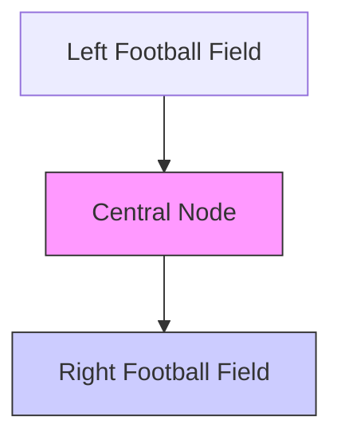
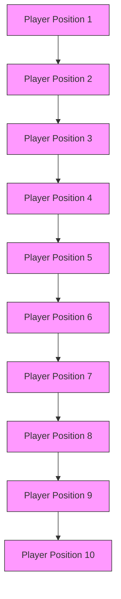

We all share one goal - making our home team, the Huskies, the best in the league! Using the data from their lackluster 13-10-15 season, we aim to analyze their performance and see how they can improve.

First, we created passing networks for each game, game half, and n-passes. Within these passing networks, we looked for dyadic and triadic configurations to analyze team coordination on an inter-player scale. However, we found that these structures had little impact on the Huskies overall success.

Next, examining these same passing networks, we considered numerous metrics from recent studies and also invented several new metrics which focused on changes in possession. We ranked the correlation of all of these metrics with shot count and found that three metrics we created-Offensive Duel Centroid, Defensive Duel Centroid, and Press time - appeared among the highest ranked in the list. This simple linear regression model was able to predict the number of shots taken during each half of a match within 1.5 shots 51.3% of the time. However, we found no single metric was a universal indicator of success. We conjectured that considering overall playing style may better capture the complex factors that lead to teams winning games.

Thus, we examined four prevalent playing styles - Tiki-Taka, Long Ball, High Pressing, and Parking the Bus - and characterized them according to our six most successful metrics. We then categorized each team's passing network by which playing style the team most aligned with using minimum Euclidean distance. While we did find that Tiki-Taka was the most universally effective with a win rate of 58.1%, we learned that the Huskies can achieve a much better win rate by adapting their strategy to their opponent's counter-strategy. Using our Rock-Paper-Scissors Model, we direct coaches to choose their strategy as a function of their opponent. Doing so, the win likelihood never falls short of 37.5%, and the loss likelihood never exceeds 33.3%.

Analyzing our home team, we found that the Huskies employed the High Pressing strategy almost half the time even though it was their second least effective playing style, resulting in a win only 3o% of the time. Their most effective playing style was instead the Tiki-Taka playing style, where they won more than half the time.

# R O C K , P A P E R , S C I S S O R S , S H O O T !

A Network Analysis of Football Playing Styles against Each Other

team 2022868

## Contents

1 Problem Statement 1  
2 Background Research . . 1  
3 Assumptions & Rationales 1  
4 Model Development . . 2

4.1 Dyadic and Triadic Configurations . . 2  
4.2 Analysis of Potential Performance Indicators . . 7  
4.3 Refining the Model: Dependence on Opponent’s Counter-Strategy . . 9  
4.4 Analysis of Specific Playing Styles . . 10

5 Sensitivity Analysis . . . 13  
6 Error Analysis . . 14  
7 Generalization to Other Teams 16  
8 Conclusions 17

8.1 Strengths . . 17  
8.2 Weaknesses 18

9 Future Considerations 18

10 Letter to the Huskies’ Coach . . 20  
11 Appendix . . 22

## List of Figures

Figure 1 A Link between Husky Wing and Forward — A Reciprocal Link between an Opponent Center Midfielder — A Triad in the Husky Center . . . . . . . 3  
Figure 2 Brief summary of regression output used to choose which metrics to move forward with . . 10  
Figure 3 Two different strength properties give the same triad of Opponents as the strongest in Game 37 with 11.7 in “Relative Value” and 41 in Number of Passes . 13  
Figure 4 Style categorizations are highly sensitive to centroid scaling . . . . 14  
Figure 5 The simple linear regression model was able to capture the number of shots taken each half within 1.5 shots 51.3% of the time. . 15

## 1 Problem Statement

The coach of the Huskies has a goal familiar to all football coaches - win the most games by playing the best football. Using game data from the Huskies’ last season, we hope to give the coach a complete analysis of their team’s player interactions, strategy, and structure. First, we will analyze the Huskies’ passing networks by looking at which groups of two or three players pass to each other most often in a game, looking at the average locations of players sending and receiving passes, and by looking at how many passes each player sent and received. Next, we will use characteristics of these passing networks and events like corner kicks, fouls, and duels to see which of these characteristics correlate most with increased team performance, where team performance is measured by number of shots on goal and game result. These characteristics will then inform which styles of play and formations are most effective for the Huskies, and how they need to adapt when playing opponents of different playing styles. Finally, we will take what we learned about teamwork and generalize it to other types of teams - teams at work, teams at competitions, and other sports teams.

## 2 Background Research

In response to new tools that collect massive amounts of data on football games, a number of academic articles have emerged which use this data to analyze football in terms of network theory. Buldu et al. takes the approach of generating passing networks for full games and 50 pass periods and then looking at the networks’ centroid coordinates, largest eigenvalue, and clustering coefficient to predict game performance. [1] P. Cintia summarizes passing statistics to create a ’H Indicator’ and a secondary score metric, the Pezzali Score, which quantifies how often a team scores and is scored on. [2] Another article looks to quantify the performance of individual players through flow networks and looking at each player’s flow centrality and betweenness centrality. [3] N. Gursakal takes the approach of analyzing football passing networks in terms of motifs, small-scale passing patterns that frequently appear. [4]

A good summary of recent approaches to passing network analysis was done by J.M. Buldu in “Using Network Science to Analyse Football Passing Networks: Dynamics, Space, Time, and the Multilayer Nature of the Game.” [5] F. Clemente took a different approach by considering the two halves of a football game separately, and by using different network metrics such as network centralization and network heterogeneity. [6] We also referenced an article explaining the 6 most common football tactics so we could understand modern football playing styles and identify them in our models. [?]

Throughout our model building process, we focused on considering components of game-play that we felt were unconsidered in most existing network analyses. We thus endeavored to design a model that would provide new insights on applying network theory to football matches while still making use of what we felt were the most powerful tools mentioned in these articles.

## 3 Assumptions & Rationales

In order to construct a powerful model of football team dynamics with our provided data, we made several key assumptions:

1. We assume that data involving only actions on the ball is sufficient to construct a meaningful model of the various aspects of football game-play.

In other words, although we do not know the position of every player at every second, knowing their positions when they act on the ball is enough to gather insights about a team’s playing style, structure, and effectiveness. Because it is widely understood that effective football teams maintain possession of the ball and move it around the field efficiently, we claim this is a reasonable and practical assumption to make. This assumption is essential to our model, which is based entirely on actions on the ball.

2. We assume that distinguishing between unsuccessful and successful shots is unimportant in terms of understanding a team’s strategy and overall effectiveness.

Whether a shot goes in generally depends on the individual ability of both the shooter and the goalkeeper, rather than the playing style and the team network as a whole. Instead, effective passing networks and strategies lead to shot opportunities, which measure team success whether or not they become goals. Thus, we analyzed the events and styles that create these shot opportunities rather than the percentage of successful shots, which could easily be understood from looking at player statistics. Accordingly, all of our metrics were measured in correlation to shot count.

3. We assume that Premier League goal distributions are representative of our home team’s league’s goal distribution.

Our home team’s league is composed of games from comparable professional leagues including the English Premier league, the German Bundesliga, the Italian Serie A, the French Ligue 1, and Spanish La Liga. This is important because Premier League goal distributions are used to justify measuring shot attempts rather than goals.

## 4 Model Development

## 4.0.1 Whole Game, Half Game, and n-pass Networks

We modeled the Huskies’ game play and strategies by generating passing networks for whole games, game halves, and for n-pass networks of n passes during a game. A passing network is a digraph, where each node is a player and the directed edges between nodes have a weight equal to the number of passes from a given player node to another. Passing networks for whole games, halves, and n-passes allow us to look at the playing style happening at different scales of time. For each network, we looked at various network characteristics and used simple linear regression to find which characteristics correlated most with our performance metric, the shot count.

## 4.1 Dyadic and Triadic Configurations

The Gursakal et al. paper introduced the idea of network motifs to analyze football teams, particularly 3-node and 4-node bidirectional structures in the passing network. Their sample size was not large enough to confirm their hypothesis, but they retain that with more data, we would learn that “breaking these motifs makes an important contribution to the success of a team”.[4]

```mermaid
graph TD
  A["Node"] --> B["Node"]
  B --> C["Node"]
  C --> D["Node"]
  D --> E["Node"]
  E --> F["Node"]
  F --> G["Node"]
  G --> H["Node"]
  H --> I["Node"]
  I --> J["Node"]
  J --> K["Node"]
  K --> L["Node"]
  L --> M["Node"]
  M --> N["Node"]
  N --> O["Node"]
  O --> P["Node"]
  P --> Q["Node"]
  Q --> R["Node"]
  R --> S["Node"]
  S --> T["Node"]
  T --> U["Node"]
  U --> V["Node"]
  V --> W["Node"]
  W --> X["Node"]
  X --> Y["Node"]
  Y --> Z["Node"]
  Z --> A
    style A fill:#f9f,stroke:#333
    style B fill:#ccf,stroke:#333
    style C fill:#cfc,stroke:#333
    style D fill:#fcc,stroke:#333
    style E fill:#cff,stroke:#333
    style F fill:#ffc,stroke:#333
    style G fill:#cfc,stroke:#333
    style H fill:#fcc,stroke:#333
    style I fill:#cfc,stroke:#333
    style J fill:#fcc,stroke:#333
    style K fill:#cfc,stroke:#333
    style L fill:#fcc,stroke:#333
    style M fill:#cfc,stroke:#333
    style N fill:#fcc,stroke:#333
    style O fill:#cfc,stroke:#333
    style P fill:#fcc,stroke:#333
    style Q fill:#cfc,stroke:#333
    style R fill:#fcc,stroke:#333
    style S fill:#cfc,stroke:#333
```

flowchart

flowchart

natural_image

Diagram of a soccer field with goal grid and player positions (no text or labels)

Figure 1: A Link between Husky Wing and Forward — A Reciprocal Link between an Opponent Center Midfielder — A Triad in the Husky Center

We also hypothesized that chemistry between players would indicate the strong configurational aspect of teamwork on the pitch. However, we disagreed with the authors that motifs were the solution. Motifs commonly describe relationships between networks, but those relationship configurations change drastically in different domains.[7] We hypothesized instead that strong network cooperation should be specific to position or location. The Gursakal et al. paper would treat a triad between two fullbacks and the keeper as interchangeable with that of two strikers and a center midfielder. This should not be the case. Thus, we proposed the following methods to identify the strength of players’ chemistry within the ball passing network.

$$
L _ {i, j} = P _ {i, j}
$$

$$
R _ {i, j} = P _ {i, j} + P _ {j, i}
$$

$$
T _ {i, j, k} = R _ {i, j} + R _ {i, k} + R _ {j, k}
$$

where $\mathrm { L } _ { \mathrm { i , j } }$ is the strength of a “Link” between players i and j, $\mathsf { R } _ { \mathrm { i , j } }$ is the strength of a “Reciprocal Link” between those players, and $\mathsf { T } _ { \mathrm { i , j , k } }$ is the strength of a “Triad” between three players. $\mathsf { P } _ { \mathrm { i , j } }$ is defined as the number of passes from player i to j in a ball passing network - this could be the network over a whole game, any n-pass subset of a game, or even a whole season. We propose that the strength of these dyads and triads indicate coordination between players on a “micro” scale and that the presence of strong dyads and triads will correlate with shots on goal for the short timescales (n passes and game halves) and wins for the long timescale (full games).

We also considered measuring the strength of these configurations with more than just the number of passes. By scaling each outgoing edge relative to the number of passes made by the origin player, we can see who each player specifically favors in passing. We can see particularly strong relationships between the goalkeeper and a defender with few passes, but this inevitably means that its occurrence in the game is much more rare.

## 4.1.1 Introduction of New and Existing Potential Performance Indicators

In order to analyze football game play from as many angles as possible, we considered numerous metrics that quantify different aspects of the game based on passing networks and other event data. The network metrics most commonly used to study passing networks are the following:

<table><tr><td>Symbol</td><td>Explanation</td><td>Data Type</td></tr><tr><td> $P_{i,j}$ </td><td>Passing between Players</td><td>Input</td></tr><tr><td> $(\bar{x},\bar{y})$ </td><td>Passing Network Centroid</td><td>Metric</td></tr><tr><td>C</td><td>Player Dispersion</td><td>Metric</td></tr><tr><td> $\frac{\Delta y}{\Delta y}$ </td><td>Advance Ratio</td><td>Metric</td></tr><tr><td> $\frac{\Delta y}{\Delta y}$ </td><td>Advance Ratio</td><td>Metric</td></tr><tr><td> $c_i$ </td><td>Clustering Coefficient</td><td>Metric</td></tr><tr><td> $\kappa_i$ </td><td>Closeness Centrality</td><td>Metric</td></tr><tr><td> $\lambda_1$ </td><td>Largest Eigenvalue of Adjacency Matrix</td><td>Metric</td></tr><tr><td>b</td><td>Betweenness Centrality</td><td>Metric</td></tr><tr><td>ω</td><td>Network Centralization</td><td>Metric</td></tr><tr><td> $\tilde{\lambda}_2$ </td><td>Algebraic Connectivity</td><td>Metric</td></tr><tr><td> $t_{press}$ </td><td>Average Press Time</td><td>Metric</td></tr><tr><td> $L_{i,j}$ </td><td>Link Strength</td><td>Output</td></tr><tr><td> $R_{i,j}$ </td><td>Reciprocal Link Strength</td><td>Output</td></tr><tr><td> $T_{i,j,k}$ </td><td>Triad Strength</td><td>Output</td></tr><tr><td>S</td><td>Shot Count</td><td>Output</td></tr><tr><td>S</td><td>Playing Style</td><td>Output</td></tr><tr><td> $d_{i,S}$ </td><td>Euclidean Distance from Network to Style</td><td>Output</td></tr><tr><td>i,j,j</td><td>Players</td><td>Index</td></tr><tr><td>m</td><td>Metric</td><td>Index</td></tr></table>

Table 1: Model Notation

## 1. Passing Network Centroid

The centroid of a passing network for a team is calculated as the average start position of all passes. In particular, the x-coordinate of a passing network centroid indicates the average position of the passing network along the length of the field and is a metric of how aggressively a team is playing as a whole.

## 2. Dispersion of Players around Centroid

The dispersion of players around the centroid represents how spread out a passing network is with respect to its average position. It is calculated as:

$$
C = \sqrt {\frac {1}{n} \sum_ {i} (x _ {i} - \bar {x}) ^ {2} + (y _ {i} - \bar {y}) ^ {2}} \tag {1}
$$

where $\left( { { x } _ { \mathrm { { i } } } } , { { y } _ { \mathrm { { i } } } } \right)$ is the average position from which player i sends passes, (x¯, y¯ ) is the passing network centroid, and i ranges from 1 to n, which represents the 11 players on the team in this case.

3. Advance Ratio Advance ratio is intended to measure the average direction of a teams’ passes. Advance ratio for a passing network is calculated as:

$$
\frac {\Delta y}{\Delta y} = \frac {\sum_ {j} \left| y _ {j} ^ {\text {end}} - y _ {j} ^ {\text {start}} \right|}{\sum_ {i} x _ {j} ^ {\text {end}} - x _ {j} ^ {\text {start}}} \tag {2}
$$

where $x _ { \mathrm { j } } ^ { s \mathrm { t a r t } }$ and $x _ { \mathrm { j } } ^ { e n \mathrm { d } }$ respectively represent the start and endpoints of pass j and j ranges from 1 to the total number of passes in the network. While a high advance ratio indicates frequent lateral passes, a lower advance ratio suggests more aggressive passes down the length of the field.

## 4. Clustering Coefficient

A passing network’s clustering coefficient measures the tendency of players in the network to form triangular pass patterns. Associated with each player i is a local clustering coefficient calculated as:

$$
c _ {i} = \frac {\sum_ {j , k} w _ {i , j} w _ {i , k} w _ {j , k}}{\sum_ {j , k} w _ {i , j} w _ {i , k}} \tag {3}
$$

where $w _ { \mathrm { i , j } }$ represents the total number of passes from player i to player j and j, k include every pair of players j and k where $\mathbf { j } \neq \mathbf { k } , \mathbf { i } \neq \mathbf { j }$ , and $\mathrm { i } \neq \mathsf { k } .$ Taking c¯, the average of all local clustering coefficients, we get a clustering coefficient for the whole team, a metric of local robustness.

## 5. Closeness Centrality

Network closeness centrality is a measure of the average topological distance between players, similar to J.M. Buldu’s “average shortest path” metric.[1] The local closeness centrality for some player i is calculated as:

$$
\kappa_ {i} = \frac {n - 1}{\sum_ {j} d _ {i , j}} \tag {4}
$$

where $\mathbf { j } \neq \mathbf { i }$ ranges from 1 to n, the total number of players, and ${ \mathrm { d } } _ { \mathrm { i , j } }$ denotes the topological distance between players i and j. Using Dijkstra’s algorithm, this distance can be calculated as the shortest path length between two players where edge length is simply the inverse of edge weight (number of passes associated with that edge). Averaging all players local closeness centrality yields a metric for how connected pairs of players are on the team in general.

## 6. Largest Eigenvalue of Adjacency Matrix

The largest eigenvalue $\lambda _ { 1 }$ of a weighted adjacency matrix of a network is a standard metric of network strength. The weighted adjacency matrix of a passing network is a matrix with a zero diagonal and entry ${ \mathrm { a } } _ { \mathrm { i , j } }$ equal to the number of passes from player i to j. A larger $\lambda _ { 1 }$ suggests strong connections between the most important players in the network.

## 7. Betweenness Centrality

The local betweenness centrality of player i measures how involved player i is paths between every other pair of players. The local betweenness centrality of player i is calculated as the fraction of paths between other players j and k that pass through player i. The local betweenness centralities of all players can be averaged to estimate the overall betweenness centrality of a team. We are skeptical of the significance of this average, however, since it may be skewed by the very low betweenness centrality of the goalkeeper.

## 8. Network Centralization

Network centralization of a passing network is a metric designed to quantify how dependent the team is on one player for passing. This metric was analyzed in the F. Clemente’s “Using Network Metrics in : A Macro-Analysis.”[6] Network centralization is calculated as:

$$
\omega = \frac {n}{(n - 1) (n - 2)} (\max (\deg_ {i}) - \text { mean } (\deg_ {i})) \tag {5}
$$

## 9. Algebraic Connectivity

Algebraic connectivity $\tilde { \lambda } _ { 2 }$ is a standard network metric based on the size of the second smallest eigenvalue of the Laplacian matrix associated with the network. The Laplacian matrix is defined as the diagonal matrix containing the degrees of each node minus the adjacency matrix. A lower $\tilde { \lambda } _ { 2 }$ indicates the network is close to splitting into two distinct subnetworks while a higher ${ \tilde { \lambda } } _ { 2 }$ suggests greater overall cohesion.

## 10. n-Pass Network Time

In “Defining a historic football team: Using Network Science to analyze Guardiola’s F.C. Barcelona,” J.M. Buldu considers the time it takes for a team to form a 50-pass network as a metric of performance.[1] Although this metric, along with similar pace-based metrics are likely correlated with team success, they say little about playing style. Regardless of strategy, football teams always try to maintain a rapid pace. Thus, we decided additional analysis of n-pass network time would not generate new information.

We also considered original potential performance metrics:

## 1. Advance Ratio: Offensive Vs. Defensive

While researching prevalent football strategies, we found that many aspects of play vary depending on which half of the field the team is on. Thus, we decided to separately compute advance ratios for all passes on the defensive and offensive sides of the field.

## 2. Duel Centroid: Offensive Vs. Defensive

We believe what current network-based studies of football lack the most is consideration of changes of possession. Passing networks yield lots of information regarding team behavior while they are in possession but we wanted to analyze how the Huskies’ react when their opponents have the ball. Our data included the location of every “duel” that took place on the field. Each time a team initiates a duel, they contest possession of the ball. We thus calculated an offensive duel centroid for the duels on the opponents’ side of the field and a defensive centroid for the duels on the teams’ side of the field.

## 3. Average Press Time

One of the most common strategical components of football is “pressing,” which means charging opposing players and contesting their possession as soon as it is gained. To further analyze changes in possession, we designed a quantitative method for measuring the average amount of time it takes for a team to press. We defined the time team A gains possession $( \mathrm { t } _ { \mathrm { A } } ^ { \mathsf { p o s s } } )$ as the first time any player on team A makes a pass, whether successful or unsuccessful (which must follow team A not having possession). We then defined the time team B initiates a duel $( \mathrm { t } _ { \mathrm { B } } ^ { \mathrm { d u e l } } )$ as the first duel team B initiates after $\mathbf { t } _ { A } ^ { \mathsf { p o s s } }$ . We calculated press time for every attempted change of possession as:

$$
t _ {B} ^ {\text { press }} = t _ {B} ^ {\text { duel }} - t _ {A} ^ {\text { poss }} \tag {6}
$$

or as:

$$
t _ {B} ^ {\text { press }} = t _ {B} ^ {\text { poss }} - t _ {A} ^ {\text { poss }} \tag {7}
$$

$\mathrm { t _ { B } ^ { p o s s } < \mathrm { t _ { B } ^ { d u e l } } }$ thus were able to calculate average press time for any series of events in a game. Note that we factor unsuccessful attempts to regain possession into press time, since these attempts are still indicative of pressing.

## 4.2 Analysis of Potential Performance Indicators

## 4.2.1 Shots on Goal as a Performance Metric

After creating a list of potential team performance indicators that was as comprehensive as possible, we chose shot count as our dependent variable measuring success. We felt that effective football team play leads to a large number of shot opportunities. What distinguishes successful and unsuccessful shot opportunities, however, is primarily the individual skill levels of the shooter and the goalkeeper, along with other factors unrelated to teamwork such as penalty kicks.

This is evidenced in the fact that, according to Premier League data [8], a nontrivial percentage of 7.2% of goals are scored off of free kicks or penalty kicks. Some teams depend even more heavily on these shot opportunities, such as Crystal Palace F.C., which scores 17.8% of their goals off of penalty kicks alone. We also suspect that this is the reason P. Cintia found the “Pezzali Score,”[2] which measures the success of a teams’ shooting and goalkeeping, accounts for wins and losses that other metrics based on passing networks failed to predict. A team’s success in terms of shooting accuracy is clearly correlated with their likelihood of winning but considering such variables as performance indicators offers no information that can’t already be gathered from player statistics.

Likewise, we felt J.M. Buldu disregarded the many arbitrary factors leading to successful shot attempts in his analysis of 50-pass networks preceding goals scored and goals received. Buldu analyzes the networks with team play metrics such as advance ratio and player dispersion but does not account for the fact that many of these goals may have been more the result of star players, tired goalkeepers, or free kicks[1].

We thus decided to focus on the correlation between each of our metrics and the number of shots.

## 4.2.2 Analysis of Dyadic and Triadic Configurations throughout n-Pass Networks

To determine the predictive capability of our configurational aspect of teamwork - dyads and triads - we used structure strength as an input into a simple linear regression where the number shots served as the response for n-pass networks of size 50 and 100. The feature input consisted of the strength of the best Link, the strength of the best Reciprocal Link, and the strength of the best Triad within the n-pass network as well as the strengths within the n-pass network of the Links, Reciprocal Links, and Triads that had been strongest in the full game.

<table><tr><td></td><td>Coefficients</td><td>Standard Error</td><td>t Stat</td><td>P-value</td></tr><tr><td>Intercept</td><td>1.1539</td><td>0.2477</td><td>4.6579</td><td>5.26E-06</td></tr><tr><td>Link</td><td>-0.0934</td><td>0.1662</td><td>-0.5624</td><td>0.5744</td></tr><tr><td>R_Link</td><td>-0.0325</td><td>0.1291</td><td>-0.2517</td><td>0.8015</td></tr><tr><td>Triad</td><td>0.0507</td><td>0.0615</td><td>0.8235</td><td>0.4110</td></tr><tr><td>G_Link</td><td>-0.1323</td><td>0.0959</td><td>-1.3803</td><td>0.1688</td></tr><tr><td>G_R_Link</td><td>0.01923</td><td>0.0733</td><td>0.2629</td><td>0.7929</td></tr><tr><td>G_Triad</td><td>0.0442</td><td>0.0385</td><td>1.1481</td><td>0.2521</td></tr></table>

Table 2: Correlation of Dyadic and Triadic Configurations with Shot Count

<table><tr><td colspan="2">Regression Statistics</td><td colspan="6">Analysis of Variance (ANOVA)</td></tr><tr><td> $R^2$ </td><td>0.3143</td><td></td><td>df</td><td>SS</td><td>MS</td><td>F</td><td>Signif. F</td></tr><tr><td>Standard Error</td><td>1.3566</td><td>Regression</td><td>17</td><td>373.7658</td><td>21.9862</td><td>11.9461</td><td>2.935E-27</td></tr><tr><td>Count of X variables</td><td>17</td><td>Residual</td><td>443</td><td>815.3232</td><td>1.8405</td><td></td><td></td></tr><tr><td>Observations</td><td>461</td><td>Total</td><td>460</td><td>1189.0889</td><td></td><td></td><td></td></tr><tr><td>Adjusted  $R^2$ </td><td>0.2880</td><td></td><td></td><td></td><td></td><td></td><td></td></tr></table>

Table 3: Structure and dynamical metrics ] predict shots throughout games with $\mathsf { R } ^ { 2 } = 0 . 3 1 4 3$

Our results with 100-pass networks were not promising with an ${ \tt R } ^ { 2 }$ value of 0.0298. As seen in Table $^ { 2 , }$ each feature coefficient was approximately $^ { \mathrm { ~ O ~ } , }$ and the only indicator with a strong P-value was the y-intercept. This essentially says that our feature information had no predictive capability, and it’s better to guess that one shot occurred during the 100-pass segment than to predict anything with the given dyad/triad strengths.

Our results with 50-pass networks were even worse with an ${ \tt R } ^ { 2 }$ value of 0.0137 where, again, the intercept performed the bulk of the predicting.

Like the Gursakal et al. paper, we retain that coordination among players still holds a place in the success of team, but this model appears not to describe that relationship correctly.

## 4.2.3 Analysis of Other Performance Indicators over n-Pass networks

We also analyzed our structural indicators such as centrality measures and duel centroids along with other metrics like press times and advance ratios in relation to shot performance within 100-pass networks. Like with the dyads and triads, we gathered this data to form our feature matrix for another linear regression. This time, our analysis proved stronger with an ${ \tt R } ^ { 2 }$ value of 0.3143. Better yet, our incredibly small significance F output indicates that our feature data actually have some non-neglible relationship with shots in each network!

Although this correlation is still not strong, some of our metrics - particularly Largest Eigenvalue, Press Time, Closeness, Offensive and Defensive Duel Centroids, and the Pass Centroid - were somewhat capable of indicating shot performance during short time intervals. This is particularly pleasing because Press Time and the Duel Centroids are metrics of our own design that are competing with some of the best from the literature.

## 4.2.4 Analysis of Other Performance Indicators over Full Games and Halves

Following our n-pass network analysis, we considered the same structural and dynamical metrics to predict success at longer timescales - full games and halves. Like with our previous models, we used simple linear regression to tie this feature data from the passing networks to the response - shot count. We still do not use goals as our dependent variable for the same reasons as before - they are not as indicative of successful teamwork because significant portion of goals arise from set pieces, accidents, and individual successes and failures (an incredible shot from a star player all alone, a goalkeeper’s fumble, etc.).

As seen in Table $^ { 4 \prime }$ this collection of structural indicators such as closeness and dynamical indicators such as press time were successful in predicting shot counts with an ${ \tt R } ^ { 2 }$ value of 0.4668. While the strongest of our regressions still does not boast a particularly impressive coefficient, it should not be dismissed that our indicators can explain 48.68% of the variance in shots. Football is a noisy game, we’re choosing to advance the state of the field by leaving individual players’ abilities behind, and we can achieve this with a dataset of only $3 8$ games. Additionally, this model successfully predicts the shot count in a $4 5$ minute half within $\mathbf { 1 . 5 }$ of the actual value $5 1 . 3 \%$ of the time.

Regression Statistics

<table><tr><td>Multiple R</td><td>0.68326</td></tr><tr><td>R Square</td><td>0.466844</td></tr><tr><td>Adjusted R Square</td><td>0.403655</td></tr><tr><td>Standard Error</td><td>2.531209</td></tr><tr><td>Observations</td><td>152</td></tr></table>

Table 4: Metrics predict shots at longer time scales with $\mathsf { R } ^ { 2 } = 0 . 4 6 6 8$ .

## 4.3 Refining the Model: Dependence on Opponent’s Counter-Strategy

Because our previous models were not particularly successful in identifying universally effective structural, configurational, or dynamical factors in teamwork and success on the pitch, we began formulating a new model based on the counter-strategy of an opponent. First, we cut down on the number of metrics with which we would move forward - limiting our selection just to the most significant and indicative of particular playing styles.

We ranked the correlation of all of our metrics with shot count using p-value in Figure 2. Because corner kicks are a well known source of goals and do not correspond to specific playing styles, we did not consider them in our analysis of specific playing styles. We also felt that defensive duel centroid x-coordinate was more important in distinguishing playing styles than algebraic connectivity, even though algebraic connectivity was ranked slightly higher. After making these slight adjustments, we choose the top six performance metrics and analyzed them throughout the remainder of our model. We assumed all performance metrics that were ranked lower were either mostly unrelated to shot count or did not describe game play in a meaningful way.

<table><tr><td></td><td>A</td><td>B</td><td>C</td><td>D</td><td>E</td><td>F</td><td>G</td></tr><tr><td>1</td><td></td><td>R-Squared Alone</td><td>R-Squared Together</td><td>P-Value Alone</td><td>P-Value Together</td><td>Mean</td><td>Standard Deviation</td></tr><tr><td>2</td><td>CORNERS</td><td>0.3088</td><td>0.4668</td><td>1.0805E-13</td><td>0.0001</td><td>2.38</td><td>1.88</td></tr><tr><td>3</td><td>LARGEST EIGENVALUE</td><td>0.1859</td><td>0.4668</td><td>2.9227E-08</td><td>0.1654</td><td>15.34</td><td>7.15</td></tr><tr><td>4</td><td>PRESS TIME</td><td>0.1574</td><td>0.4668</td><td>4.1814E-07</td><td>0.1870</td><td>16.57</td><td>4.54</td></tr><tr><td>5</td><td>OFFENSIVE DUEL CENTROID X</td><td>0.1366</td><td>0.4668</td><td>2.7936E-06</td><td>0.0149</td><td>72.20</td><td>2.80</td></tr><tr><td>6</td><td>CLOSENESS</td><td>0.0656</td><td>0.4668</td><td>1.4493E-03</td><td>0.1542</td><td>0.57</td><td>0.05</td></tr><tr><td>7</td><td>PASS CENTROID_X</td><td>0.0292</td><td>0.4668</td><td>3.5211E-02</td><td>0.2788</td><td>49.03</td><td>4.75</td></tr><tr><td>8</td><td>ALGEBRAIC CONNECTIVITY</td><td>0.0283</td><td>0.4668</td><td>3.8310E-02</td><td>0.3812</td><td>5.02</td><td>2.89</td></tr><tr><td>9</td><td>DEFENSIVE DUEL CENTROID X</td><td>0.0264</td><td>0.4668</td><td>4.5665E-02</td><td>0.5213</td><td>27.78</td><td>2.82</td></tr><tr><td>10</td><td>NETWORK CENTRALIZATION</td><td>0.0192</td><td>0.4668</td><td>8.8849E-02</td><td>0.1105</td><td>-0.23</td><td>1.57</td></tr><tr><td>11</td><td>CLUSTER COEFFICIENT</td><td>0.0184</td><td>0.4668</td><td>9.5281E-02</td><td>0.6548</td><td>0.22</td><td>0.06</td></tr><tr><td>12</td><td>BETWEENNESS CENTRALITY</td><td>0.0152</td><td>0.4668</td><td>1.2968E-01</td><td>0.0899</td><td>0.08</td><td>0.01</td></tr><tr><td>13</td><td>THROW INS</td><td>0.0110</td><td>0.4668</td><td>1.9948E-01</td><td>0.2575</td><td>11.78</td><td>4.27</td></tr><tr><td>14</td><td>SUBSTITUTIONS</td><td>0.0071</td><td>0.4668</td><td>3.0308E-01</td><td>0.2585</td><td>1.41</td><td>1.42</td></tr><tr><td>15</td><td>OFFSIDES</td><td>0.0066</td><td>0.4668</td><td>3.1984E-01</td><td>0.3780</td><td>0.92</td><td>1.10</td></tr><tr><td>16</td><td>DEFENSIVE ADVANCE RATIO</td><td>0.0062</td><td>0.4668</td><td>3.3585E-01</td><td>0.2073</td><td>5.96</td><td>7.13</td></tr><tr><td>17</td><td>PLAYER DISPERSION</td><td>0.0046</td><td>0.4668</td><td>4.0871E-01</td><td>0.5371</td><td>29.04</td><td>3.82</td></tr><tr><td>18</td><td>FOULS</td><td>0.0041</td><td>0.4668</td><td>4.3279E-01</td><td>0.6995</td><td>5.59</td><td>2.16</td></tr><tr><td>19</td><td>OFFENSIVE ADVANCE RATIO</td><td>0.0025</td><td>0.4668</td><td>5.4465E-01</td><td>0.2978</td><td>6.49</td><td>21.88</td></tr></table>

Figure 2: Brief summary of regression output used to choose which metrics to move forward with

## 4.4 Analysis of Specific Playing Styles

One of the major objectives of our model was to identify the specific football playing styles used by different teams and to compare them to one another in terms of effectiveness. After analyzing our list of potential performance indicators in Figure 2, we found that press time, closeness centrality, offensive and defensive duel centroid x-coordinate, largest eigenvalue, and pass centroid x-coordinate were the most correlated with shot count. We then choose the four most prevalent playing styles and estimated reasonable values they would correspond to for each metric. This allowed us to compare a teams’ performance to every playing style, generate percentages representing their relative similarities to each one.

## 4.4.1 Introduction to Football Playing Styles

The four football playing styles we considered were Tiki-Taka, Long Ball, High Pressing, and Park the Bus.[9]

## 1. Tiki-Taka

Tiki-Taka is a playing style defined by short, intricate passing between every player on the field and is famous for being used by teams such as Barcelona and Spain. In Tiki-Taka, maintaining possession through passing is the key to success. A team playing Tiki-Taka relies most heavily on its midfielders but all players on the field must be strongly connected by passes.

## 2. Long Ball

Long Ball is a defensive playing style with a primary focus on keeping the ball on the opponent’s side of the court. Most players stay on their side of the field, attacking the opponent’s offense and repeatedly sending long passes to keep the ball as far away from the goal as possible. Offenders then try to receive these long passes and make plays before the opposing time can reset their defense. Counter Attack is a similar strategy focused on rapid offensive play off of quick turnovers. Because this playing style is similarly characterized by our metrics, we considered Counter Attack to be part of Long Ball.

## 3. High Pressing

High Pressing is a playing style defined by regaining possession as efficiently as possible. A team employing High Pressing will attack quickly and aggressively whenever they lose possession, at the risk of having less time to set up defense. This playing style is also characterized by the entire team playing a very high line, maintaining constant pressure on their opponents.

## 4. Parking the Bus

The sole objective of Parking the Bus is to prevent the opposing team from scoring a goal. This playing style is characterized by most of the team playing extremely defensively, shutting down offensive attempts on their side of the field. The team then allows the opponent to have space on their own side, using only a few players in offensive plays.

Based on the characteristic features of each playing style, we estimated our six metrics for all of them. For defining characteristics of the playing styles, e.g. press time for High Pressing, we chose values two standard deviations above or below the mean (indicated by +2 or −2). For less defining but still important characteristics, we used values one standard deviation above or below the mean (indicated by +1 or −1). Finally, for metrics that didn’t relate to certain playing styles, we selected mean values (represented by 0). These values may be referenced in Table 5

We recognize that these seemingly arbitrary choices in the number of standard deviations has an enormous impact on our model’s results. Thus, our team verbally debated each one and deeply considered the purposes and traits of each playing style before making decisions.

<table><tr><td></td><td>Press Time</td><td>Closeness Centrality</td><td>Off. Duel Cent. &lt; x &gt;</td><td>Def. Duel Cent. &lt; x &gt;</td><td>Largest Eigenvalue</td><td>Pass Cent. &lt; x &gt;</td></tr><tr><td>Tiki-Taka</td><td>+1</td><td>+2</td><td>-1</td><td>+1</td><td>+2</td><td>0</td></tr><tr><td>Park-the-Bus</td><td>-2</td><td>+1</td><td>-1</td><td>-1</td><td>0</td><td>-2</td></tr><tr><td>Long-Ball</td><td>-1</td><td>-1</td><td>0</td><td>-2</td><td>-2</td><td>-1</td></tr><tr><td>High-Press</td><td>+2</td><td>0</td><td>+2</td><td>+2</td><td>0</td><td>+1</td></tr><tr><td>Tiki-Taka</td><td>21.14</td><td>0.67</td><td>69.40</td><td>30.62</td><td>29.59</td><td>49</td></tr><tr><td>Park-the-Bus</td><td>7.53</td><td>0.62</td><td>69.40</td><td>24.98</td><td>15.30</td><td>39.49</td></tr><tr><td>Long-Ball</td><td>12.06</td><td>0.52</td><td>72.20</td><td>22.16</td><td>1.01</td><td>44.25</td></tr><tr><td>High-Press</td><td>25.67</td><td>0.57</td><td>77.79</td><td>33.44</td><td>15.30</td><td>53.75</td></tr></table>

Table 5: Standard Deviations of Performance Metrics and Centroid for each Playing Style

Once we defined the centroid of each playing style (i.e. the point in 6-dimensional space where this style of play is), we compared each of them to every half by each opponent in all 38 games in the data set. We then calculated which playing style best represented each team in each half with 6-dimensional Euclidean Distance:

$$
d _ {i, S} = \sqrt {\sum_ {m \in M e t r i c s} (i _ {m} - \mathbb {S} _ {m}) ^ {2}}
$$

where ${ \mathrm { d } } _ { \mathrm { i } , { \mathrm { S } } }$ is the 6-dimensional distance, i is one team’s half in one game measured through our metrics, $\mathrm { i } _ { \mathrm { m } }$ is that team’s half as measured by metric m, and $\mathbb { S } _ { \mathrm { m } }$ is the centroid value at metric m of play style S. Smaller distances d mean that the team was playing more aligned with that play style during that half. We took each team to be “playing with play style $\mathbb { S } ^ { \prime \prime }$ during a particular half if the distance to that play style was the smallest.

Given these team-half-strategy categorizations, we then considered the success of each one.

## 4.4.2 Universal Effectiveness of Playing Styles

Observing wins, draws, and losses by playing style as shown in Table 6, we learned that Tiki Taka is universally the most effective. When a team aligns itself most with Tiki Taka, they have both the greatest chance of victory with 58.1% and the least chance of losing with 9.7%. We also learned that Long Ball was the style least likely to win with 20.5%, and High Pressing was most likely to lose with 50%. However, likelihood of winning can be improved by adapting your strategy to your opponent’s counter-strategy as seen in this next section.

<table><tr><td></td><td>Win</td><td>Draw</td><td>Loss</td></tr><tr><td>Tiki-Taka</td><td>58.1%</td><td>32.3%</td><td>9.7%</td></tr><tr><td>Park the Bus</td><td>40.4%</td><td>26.9%</td><td>32.7%</td></tr><tr><td>Long Ball</td><td>20.5%</td><td>45.5%</td><td>34.1%</td></tr><tr><td>High Press</td><td>28.0%</td><td>22.0%</td><td>50.0%</td></tr></table>

Table 6: Probabilities of Win, Draw, or Loss depending on choice of own playing style

## 4.4.3 Dependence on Opponent’s Counter-Strategy - The Rock-Paper-Scissors Model of Playing Styles

To determine how to play with regard to your opponent’s playing style, we compiled each pair of halves with the strategies associated with both teams and compared them to wins, losses, and draws. This information is visible in Table 7 where the numerator refers to the number of wins using the strategy on the left against the counter-strategy above. The denominator includes the numbers of wins and ties together. On the diagonal, because those playing styles are played against themselves, the numerator represents both the number of wins or losses.

Using these counts, we could extrapolate the likelihood of of winning, drawing or losing a game with one strategy A against your opponent’s counter-strategy B. We reduced all of these many probabilities into a handy chart, Table 8 that could inform football coaches around the world which playing style to emulate in order to defeat your opponent who is either known to play by a particular playing style or demonstrates a certain style in the first half of the match.

<table><tr><td rowspan="2" colspan="2"></td><td colspan="4">LOSS</td></tr><tr><td>Tiki-Taka</td><td>Park-the-Bus</td><td>Long-Ball</td><td>High-Press</td></tr><tr><td rowspan="4">WIN</td><td>Tiki-Taka</td><td>4/4</td><td>3/4</td><td>2/6</td><td>11/16</td></tr><tr><td>Park-the-Bus</td><td>0/1</td><td>5/5</td><td>2/5</td><td>6/9</td></tr><tr><td>Long-Ball</td><td>0/4</td><td>1/4</td><td>1/2</td><td>3/5</td></tr><tr><td>High-Press</td><td>1/6</td><td>5/8</td><td>3/5</td><td>10/11</td></tr></table>

Table 7: Wins, Draws, and Losses by playing styles pairs between opponents with wins in the numerator and wins and ties in denominator.

<table><tr><td>IF</td><td colspan="6">Then</td></tr><tr><td rowspan="2"></td><td colspan="2">Max W</td><td colspan="2">Max D</td><td colspan="2">Min L</td></tr><tr><td>Style</td><td>%</td><td>Style</td><td>%</td><td>Style</td><td>%</td></tr><tr><td>Tiki-Taka</td><td>Tiki-Taka</td><td>50%</td><td>Long-Ball</td><td>66.7%</td><td>Long-Ball</td><td>33.3%</td></tr><tr><td>Park-the-Bus</td><td>Tiki-Taka</td><td>75%</td><td>Long-Ball</td><td>50.0%</td><td>Tiki-Taka</td><td>0%</td></tr><tr><td>Long-Ball</td><td>High-Press</td><td>37.5%</td><td>Tiki-Taka</td><td>66.7%</td><td>Tiki-Taka</td><td>0%</td></tr><tr><td>High-Press</td><td>Tiki-Taka</td><td>64.7%</td><td>Tiki-Taka</td><td>29.4%</td><td>Tiki-Taka</td><td>5.98%</td></tr><tr><td>Best Case</td><td>PB → TT</td><td>75%</td><td>TT/LB → LB/TT</td><td>66.7%</td><td>PB/LB → TT</td><td>0%</td></tr><tr><td>Worst Case</td><td>LB → HP</td><td>37.5%</td><td>HP → TT</td><td>29.4%</td><td>TT → LB</td><td>33.3%</td></tr></table>

Table 8: Choosing playing style based on opponent’s playing style greatly improves the opportunity for victory, to secure a draw, or to avoid a loss.

This model of strategy vs. counter-strategy is of the utmost importance when your team faces an opportunity to advance or be relegated into a lower league. There are situations when a win is nonnegotiable. There are others when anything but a loss will suffice. This handy model described in Table 8 will recommend the strategy in order to maximize win probability, maximize draw probability, or minimize loss probability given your opponent’s playing style. For instance, if your opponent is High Pressing, adapting to a Tiki-Taka strategy will enable your team to win with a 64.7% likelihood. If your team is facing relegation with one more loss and your opponent is aligned with a Tiki-Taka playing style, choosing to play the Long Ball counterattack style, will minimize your probability of losing at $3 3 . 3 \%$ . The simplicity of use led us to denoting it the “Rock-Paper-Scissors Model”.

## 5 Sensitivity Analysis

Our Dyad-Triad coordination model ultimately failed to exemplify any predictive capability. What if we defined strength of connections differently? If we defined strength relative to the passing player instead of by exact number of passes, we would end up with entirely different Links, Reciprocal Links, and Triads with different meaning. However, as shown in Figure 3, we show that the same triad arises between Opponent13 M1, Opponent13 D3, and Opponent13 D6 when scored by Relative Value and by Number of Passes. With more time and resources, we would run the same regression analysis with this and other strength-weighting methods.

flowchart

flowchart

Figure 3: Two different strength properties give the same triad of Opponents as the strongest in Game 37 with 11.7 in “Relative Value” and 41 in Number of Passes

In terms of our network structures, we largely found little correlation with shot counts. This continued to be true even when we varied n in our n-pass networks through values ranging from 50 to 100.

Our Rock-Paper-Scissors model is highly dependent on the location of the playing style centroids, and without a truly objective way to do this, these decisions were made only by our team’s discussion and consent. Consider first that our judgments of what a defining factor of each style was objectively correct but that the degree to which we scaled the metric values with standard deviations was incorrect. In our model, we added or subtracted two standard deviations from the mean for each of the six metrics for each of the four playing styles for any “defining characteristics” of the style and one standard deviation for any other non-neutral indicators. What if we scaled by one and one half standard deviation instead? Our new centroid would be scaled in much more, and the team-half pairs would be categorized differently as demonstrated in Figure 4. Given that our scaling method gave an only slightly varied distribution by style, our scaling method was not unreasonable. But given that a single win by a Long Ball team against a team Parking the Bus would marginally alter our win probability by a full 11.9%, any difference in scaling would result in wildly different probabilities even if the trends remain the same. With more time, we would try a more objective approach like the Entropy Weighting Method.

bar chart

| Standard Scaling | Tiki-Taka | Park the Bus | Long Ball | High Pressing |
| ---------------- | --------- | ------------ | --------- | ------------- |
| Half-Scaled      | 40        | 35           | 40        | 40            |
| Our Scale        | 35        | 35           | 25        | 60            |
| Double Scaled    | 5         | 140          | 0         | 10            |

Figure 4: Style categorizations are highly sensitive to centroid scaling

## 6 Error Analysis

In this section, we analyze each aspect of our model in terms of error and provide explanations of what we expected were the main sources of inaccuracy.

## Dyadic and Triadic Configurations:

The first part of our model focused on the identification and analysis of dyadic and triadic configurations within passing networks. We expected strong configurations to suggest high shot count but found there was very little correlation with an ${ \tt R } ^ { 2 }$ value of 0.0298. From this, we conclude that focusing on specific player configurations is not a good indicator of how effectively a team is generating shot opportunities. One possible explanation of this is that strong configurations suggest effective movement of the ball in the middle of the field, a different aspect of the game than what leads to shots. Another possible explanation is that the strength of relationships between groups of two to three players does not equate to the strength of the team as a whole and broader network metrics are more important to success.

## Correlation between Network Metrics and Shot Count:

bar chart

Error in Predicting Number of Shots per Half
| Shot Error Range | Number of Shot Errors in Range |
| :--- | :--- |
| <1 | 53 |
| <1.5 | 25 |
| <2 | 14 |
| <2.5 | 15 |
| <3 | 13 |
| <3.5 | 11 |
| <4 | 10 |
| <4.5 | 3 |
| <5 | 4 |
| <5.5 | 0 |
| >5.5 | 4 |

Figure 5: The simple linear regression model was able to capture the number of shots taken each half within 1.5 shots $5 1 . 3 \%$ of the time.

The second part of our model focused on analyzing as many network metrics as possible in terms of correlation to shot count. We found the overall ${ \tt R } ^ { 2 }$ value of all the metrics to be .4668 and most individual metrics to have relatively low ${ \tt R } ^ { 2 }$ values when predicting shots alone, ranging from .0025 for Offensive Advance Ratio to .3088 for number of corner kicks. While these ${ \tt R } ^ { 2 }$ values are not exemplary, our regression model did succeed in predicting the number of shots per team per half within 1.5 shots 51.3% of time time as displayed in Figure 5.

We concluded that although these performance metrics still have reasonable predictive ability as a whole, none of them may be taken as a universal sign of team effectiveness. We believe this is because success in football is less about focusing on specific aspects of game play and more about responding to opponent’s playing style effectively. For example, having a high offensive centroid x-coordinate value may be very effective on a team with weaker defense but be ineffective on a team that shuts down offensive attempts then attacks on quick turnarounds. This realization led us to develop our third part of the model, which quantified how specific playing styles work against each other.

## Playing Style Analysis:

The results of the third part of our model yielded estimations of different playing styles’ effectiveness against one another that lined up with our intuitive understanding. For example, Tiki-Taka, a playing style based on strategic passing had a 64.71% success rate against High Pressing, a playing style in which players charge the ball upon losing possession, inevitably leaving weak spots in their defense. We acknowledge, however, that the accuracy of this analysis was severely weakened because it depended on a small sample size of games involving only the

Huskies. With more instances of each match-up, our predictions for playing styles’ success rates could shift substantially. This also means some estimations of success rate are much better than others. For example, if there were more match up of Tiki-Taka and High Pressing, the success rate of Tiki-Taka might change by at most about 3.59% whereas one more match up of Long Ball and Park the Bus could change the success rate of Long Ball by 11.90%.

## 7 Generalization to Other Teams

Upon completing our model of football team play, we considered a generalization of each part of our model to other types of teams.

## Dyadic and Triadic Configurations:

The first part of our model focused on identifying dyadic and triadic configurations within passing networks. For teams in general, these correspond to strong relationships between individual team members. We found that these configurations had a very low correlation to success rate. This suggests that strong relationships between individuals are less important than the cohesion of the team as a whole. Still, for any team, it is important to be aware of your most connected team members and encourage the formation of other strong connections. This application of our findings would probably be less relevant to teams such as groups of researchers, for which the strong connection between the two primary authors might be key to success.

## Correlation between Network Metrics and Shot Count:

The second part of our model focused on identifying the most important metrics of success in football. Many of these metrics, such as press time, are football specific. Others, such as network centralization, are potentially relevant to many types of teams. Our major conclusion from this section is that none of the metrics we considered can be viewed as primary indicators of team success. Based on our model, we advise teams to avoid focusing on any single metric of teamwork as a key to success.

The metrics that may still be worth considering include largest eigenvalue of the network, closeness centrality, and network centralization. To maximize the largest eigenvalue, a team should focus on strengthening the connection between its most important team members. To maximize closeness centrality, a team should ensure that every member of the team is connected to every other member of the team by either direct connections or strong paths. Although network centralization did not seem very correlated with success in football, the value of exceptional team members versus balance throughout the team is an important question that should be investigated in many different contexts.

## Playing Style Analysis:

The third part of our model analyzed specific football strategies and their success rates against one another. This led us to our biggest conclusion which can be generalized to all teams: the most important aspect of teamwork is adaptability to circumstances. Individual metrics do not consider the many different situations which may arise for teams. In the same way a football team should adopt Tiki-Taka when their opponents use High Pressing, every team should consider their circumstances at each given time and respond to them accordingly. By being able to vary different aspects of teamwork, a team can be prepared for the numerous types of adversity they may face.

Limitations and Other Teamwork Metrics:

One of the biggest limitations to generalizing our model is that football is a point-based game where the sole factor that ultimately determines victory is number of goals. Many other types of teams, such as branches of local government or math modeling teams, must consider numerous distinct success factors. Aspects of teamwork that are not well represented in our model of football include leadership and preparation. Without data regarding coaches or practices, we were unable to analyze these factors for football but for most teams, one or both of these would come into play. Another important consideration is the effectiveness of a team of generalists versus specialists. Because our model focused on measuring teamwork and playing style overall, we did not compute any metrics measuring individual technique and thus could not measure this balance. We believe examining football and other team activities from this angle could yield powerful results.

## 8 Conclusions

The construction and analysis of our model led to the several major conclusions. While it is potentially useful to identify the strongest dyadic and triadic configurations within a football team, the strength of these configurations has little to no correlation with shot count. We suspect there may be other more effective ways of analyzing these configurations’ impact on the game but conclude, in general, they are not the key to a team’s success. Next, although there are many different metrics for analyzing foot ball team play, no single metric may be considered the key to a team’s success. Instead, it is more effective to analyze the way many different metrics define a team’s playing style. Our final conclusion is that the most effective team can employ different playing style depending on that of their opponents.

## 8.1 Strengths

## • Analyzing Specific Football Playing Styles

A flaw we found in a number of articles was that they directly applied standard network metrics to football rather than considering the complex nature of football game play on its own then employing network metrics to create a model. To avoid this, we selected the four most prevalent strategies in modern football then quantified them using our network metrics. We were then able to analyze the success rate of different styles of play and found the results lined up with our intuition.

## • Including Possession Changes

Unlike all of the articles we found throughout our background research, we considered changes of possession by using three different metrics: offensive duel centroid, defensive duel centroid, and press time. All three of these metrics appeared among the highest ranked in terms of correlation to shot count. Half of the game is about regaining possession and our model takes this into account.

## • Measuring Shot Count rather than Goal Count

What distinguishes a shot from a goal is mainly the individual skill levels of the shooter and the goalkeeper. By focusing only on shot count, we analyzed a much better metric of the performance of the entire team.

## • Separating Games Half by Half

Between the halves of a football game, the team has a chance to regroup and strategize. By considering the halves of each game separately, we were able to account for the differences between each half and factor this into our analysis of playing style. Our data confirmed that playing style, along with specific metrics, change significantly between the first and second half.

## • Separating the Field Half by Half

Football teams’ playing styles also shift depending on which half of the field they are on. This is another factor that was disregarded in current literature on the topic. We separated two of our metrics, duel centroid and advance ratio, into distinct metrics for offensive and defensive play. While advance ratio had very little correlation with shot count, our offensive and defensive duel centroids became important tools in defining and analyzing different playing styles.

## 8.2 Weaknesses

## • Measuring the Impact of Small-Scale Configurations on Team Success

In our analysis of dyadic and triadic configurations, we found little to no correlation between the strength of these structures and the success of a team. We suspect these configurations do have an impact on team success and that we were unable to measure this impact effectively.

## • Simple Linear Regression

We exclusively used simple linear regression to analyze the correlation between our performance metrics and shot count. Using other types of regression to analyze the relationship between these variables may have led to a more comprehensive understanding of all of these metrics.

## • Playing Style Definitions

In order to distinguish between playing styles, we associated each one with values for all of our most important performance metrics. These values were selected to be integer numbers of standard deviations from the mean for each metric. With more time for sensitivity analysis, we could have constructed more precise definitions and potentially collected more powerful results.

## 9 Future Considerations

We believe this resolves all remaining questions on this topic. No further research is needed.[10] Just kidding! Football is a complicated game, and we could study this for years. Although we worked with a number of different models, these are some of the factors we would most like to investigate given more time:

• Positions of all Players: Player position is important to overall football strategy and includes players that are not an active part of play. How these players position themselves to anticipate when the ball will come to them or how the ball will be moved by the opponent demonstrates intelligent gameplay.

• Other Player Interrelationship Measures and Configurations With more time and resources, we would run the regression analysis with other methods weighing strength of chemistry between players.  
• Nonlinear Models We realize that we only tied shot counts and wins to our network metrics and dyad-triad structures with simple linear regression models. We realize also that nonlinear relationships exist. With more time, we would perform stronger analysis using nonlinear models.  
• Identifying Hot Zones With more time, we could create networks using a partitioning of the field where each region is a node. We could then consider weighted edges based on the number of passes starting and ending in different regions and also analyze these regions with respect to other events. This would allow us to identify hot zones as well as specific strategies based on location.

## 10 Letter to the Huskies’ Coach

Dear Coach of the Huskies,

We’ve analyzed your team’s games over the past season, and we wanted to commend you for all the things your team is doing well, as well as give you some pointers for what we think the Huskies can do to improve.

Firstly, we identified the small groups of players among your team that are the best at passing to each other. We found that Husky midfielder 3 was the most involved in groups of three that pass often with one another. Moreover, when he was involved in these groups, the Huskies were more likely to win than lose. We concluded that midfielder 3 is a star player on your team and should be played as often as possible. In general however, we found the strength of these small passing groups doesn’t relate much to your success as a team. Instead, we concluded employing optimal playing styles depending on the circumstances of the game is the key to success.

The Huskies are adept at employing the High Pressing strategy, but it is not their most successful play style. Despite playing in a High Pressing style for almost half their games, it only yielded wins 30% of the time. Conversely, when the Huskies played more Tiki-Taka style, they won more than half the time. We would recommend focusing more on developing these Tiki-Taka skills. As Tiki-Taka expert Pep Guardiola does with his teams, we recommend starting and ending practice with rondos, a common passing drill involving eight players in a circle and two players in the middle of the circle who try to get the ball from the outside players. [11]

But we don’t want you to get the wrong idea that focusing on only one strategy is the key to success. In fact, our analysis showed that being flexible and changing the Huskies’ play style in response to their opponent greatly improves chances for victory, draws, or avoiding a loss. For each play style your opponent employs, reference this table, Table 9, to see which strategy will yield the result you want.

<table><tr><td>Opponent Play Style</td><td>Maximize Win</td><td>Maximize Tie</td><td>Minimize Loss</td></tr><tr><td>Tiki-Taka</td><td>Tiki-Taka</td><td>Long-Ball</td><td>Long-Ball</td></tr><tr><td>Park-the-Bus</td><td>Tiki-Taka</td><td>Long-Ball</td><td>Tiki-Taka</td></tr><tr><td>Long-Ball</td><td>High-Press</td><td>Tiki-Taka</td><td>Tiki-Taka</td></tr><tr><td>High-Press</td><td>Tiki-Taka</td><td>Tiki-Taka</td><td>Tiki-Taka</td></tr></table>

Table 9: Choosing playing style based on the opponent’s to secure a victory, to secure a draw, or to avoid a loss.

Sincerely,

Team 2022868

## References

[1] I. Echegoyen F. Seirullo J.M. Buldu, J. Busquets. Defining a historic football team: Using network science to analyze guardiola’s f.c. barcelona, 2019.  
[2] Dino Pedreschi Fosca Giannotti Marco Malvaldi Paolo Cintia, Luca Pappalardo. The harsh rule of the goals: Data-driven performance indicators for football teams, 2015.  
[3] Luis A. Nunes Amaral Jordi Duch, Joshua S. Waltzman. Quantifying the performance of individual players in a team activity, 2010.  
[4] Halil Orbay Cobanoglu Sandy Cagliyor Necmi Gursakal, First Melih Yilmaz. Network motifs in football, 2018.  
[5] Johann H. Martinez Jose L. Herrera-Diestra Ignacio Echegoyen Javier Galeano Jordi Luque Javier M. Buldu, Javier Busquets. Using network science to analyse football passing networks: Dynamics, space, time, and the multilayer nature of the game, 2018.  
[6] Fernando Manuel Lourenco Martins Rui Sousa Mendes Filipe Manuel Clemente, Micael Santos Couceiro. Using network metrics in soccer: A macro analysis, 2015.  
[7] S. Itzkovitz N. Kashtan D. Chklovskii U. Alon R. Milo, S. Shen-Orr. Network motifs: Simple building blocks of complex networks, 2002.  
[8] Premier league club stats, 2020.  
[9] Will Hinch. Soccer tactics explained: 6 of the most common, 2016.  
[10] Randall Munroe. Further research is needed, 2020.  
[11] How guardiola harnessed the power of the rondo at barcelona, bayern, and now manchester city, 2019.

## 11 Appendix