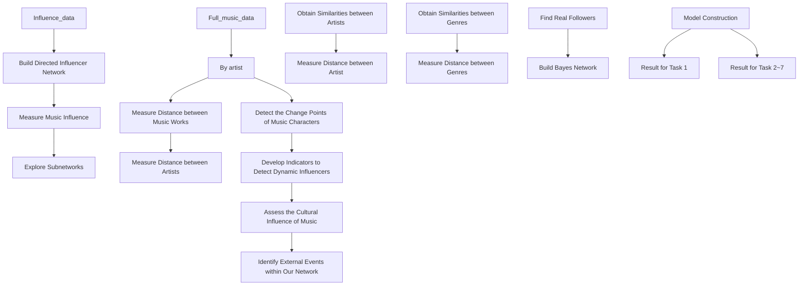
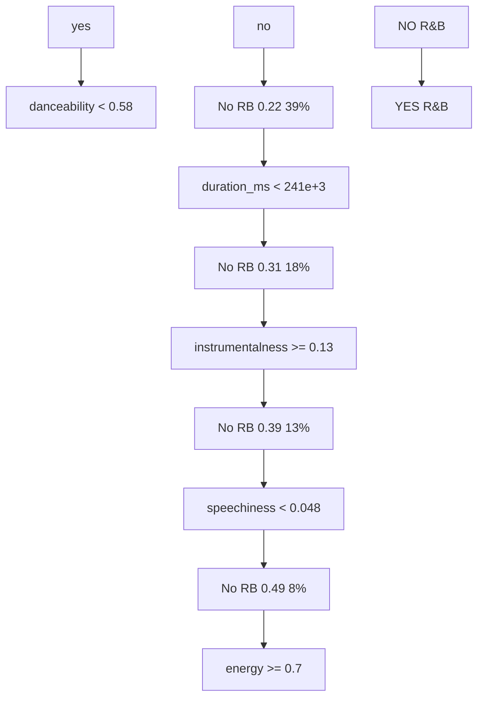

## Music Influence and Evolution Analysis Based on Networks

## Summary

“Music is like a psychiatrist. It will answer you with things people can’t tell you.” said the Beatles, one of the most famous Pop/Rock artist. In this paper, we deeply explore the magic of music - its influence network, evolution path, and effects on the culture.

For Task 1, we build a directed network between influencers and followers. Based on network theory, we proposed three different metrics - Degree Centrality, Weighted Degree Centrality and Eigen Centrality. Then we develop a combination of these metrics as a comprehensive measure of music influence. After that, we create a subnetwork to illustrate our influence measure.

For Task 2, we first preprocess the data using Principal Component Analysis to reduce dimension and collinearity. Then we define and calculate the distance between different tracks to obtain the similarity between artists. By calculating the average similarity, we apply Mann-Whitney test. Results show that with the probability of 62.8% and p-value smaller than 0.001, artists within a genre are more similar than those between genres.

For Task 3, according to proposed music similarity measure, we find that similarities and influences within and between genres differ greatly when we analyse different genres. To distinguish one genre from others, we build a Genre Classification Tree Model. By analysing the number of influencers in different period, we explore the evolution path of genres. Based on the directed network on genre scale, we find Pop/Rock has a strong relationship with R&B, Blues and Folk.

For Task 4, we build a Similarity Bayesian Network to identify the real followers based on the music characterstic similarity in tracks. Then we apply a multivariate two-sample mean test and find there is no strong evidence (p-value > 0.1) that any music characteristic are more “contagious” than others.

For Task 5, we first analyze the rise and decline of genres and find the music revolution in 1950s. We proposed a Dynamic Programming Algorithm to detect change points in music characteristics which are consistent with the revolution. Our results show that acousticness, energy, danceability and loudness might signify revolutions. Based on the Bayesian Network, Elvis Presley and Cliff Richard represent revolutionaires.

For Task 6, to get a further insight into the evolution in Pop/Rock, we propose an Dynamic Influencer Indicator based on the lagging trend in music characteristics of the whole genre. From 1960s to 2010s, there are 10 dynamic influencers, each has his/her unique influence on the genre. Moreover, we explain the evolution of Pop/Rock.

For Task 7, three important periods are detected based on time series analysis, which show the culture-influence of music. Based on the model established, we identify social changes like countercultural movement and technological changes such as the proliferation of the Internet.

At last, we conduct sensitivity analysis, which shows the robustness of our model. We also summerize the stengths and weaknesses and provide insights to ICM society about the evolution and cultural influence of music.

Keywords: Directed Network; Bayesian Network; Change Points Analysis

## Contents

1 Introduction 3

2 Problem Restatement and Analysis 3

3 Assumptions and Notations 4

3.1 Assumptions and Justifications . . 4

3.2 Notations 5

4 Models and Solutions 5

4.1 Task 1 5

4.1.1 Directed Influencer Network . . 5

4.1.2 Music Influence Measure . . 6

4.1.3 Solutions

4.2 Task 2 7

4.2.1 Data Preprocessing . . . 7

4.2.2 Similarity Measure and Test . . 8

4.2.3 Solutions 9

4.3 Task 3 10

4.3.1 Genre Similarity and Influence . 10

4.3.2 Genre Classification Tree 10

4.3.3 Solutions 10

4.4 Task 4 13

4.4.1 Similarity Bayesian Network . . 13

4.4.2 Contagious Characteristic Test . 14

4.4.3 Solutions 15

4.5 Task 5 16

4.5.1 Definition of Revolution 16

4.5.2 Change Points Detection (DP Algorithm) 16

4.5.3 Solutions 17

4.6 Task 6 19

4.6.1 Dynamic Influencer Indicator 19

4.6.2 Solutions 20

4.7 Task 7 . 21

4.7.1 Cultural Influence of music 21

4.7.2 Changes identified within the network . . . 21

5 Sensitivity Analysis 22

6 Strengths and Weaknesses 23

6.1 Strengths 23

6.2 Weaknesses 23

References 23

A Document to ICM Society 24

## 1 Introduction

Nowadays, various kinds of music has increasingly become an indispensable part of human life. Thousands of music artists influence each other and form a complex music influence network. While some genres show great similarity to each other, other genres are quite different in music characteristics. Some artists are passionate revolutionaries, who lead to an emergeence of a new genre or reinvention of an existing genre. Despite culture influence, the change of music characteristics of artists also indicate external events like the proliferation of the Internet. In order to further explore the music influence network and the role music has played on the society, it is necessary to quantify music evolution.

## 2 Problem Restatement and Analysis

• Task 1 requires us to build a complex network between influencers and followers based on dataset “influnce\_data.csv” and develop metrics to capture the music influence in the network. The key to this problem is to define directed influencer network and propose metrics that comprehensively measure the music influence of each influencers in the network.  
• Task 2 requires us to use various musical characteristics in dataset “full\_music\_data.csv” to measure music similarity and judge whether musicians in the same genre are more similar than those in different genres. It is of great essence to define the distance between music works of artists, from which we can obtain the similarities between artists.  
• Task 3 requires us to compare similarities and influences between and within genres. It is necessary to define the distance between genres and measure similarities between them. We plan to build a classication tree to distinguish one genre from others. Besides, we can show how genres changing over time and the relationship between genres using visualization.  
• Task 4 requires us to get a further insight into the similarity of music characters between influencers and followers. We plan to build a Bayesian Network to find the real influencer and use hypothesis test to evaluate whether some music characteristics are more ‘contagious’ than others.  
• Task 5 requires us to identify the characteristics and major artists that signify music evolution. To handle this problem, we propose a Change Point Detection model based on DP algorithm and match the change of music characters with the musical revolution. Then find revolutionaries via Bayesian Network.  
• Task 6 requires us to develop indicators to analyse dynamic influencers and corresponding influence processes of musical evolution in one genre. In this problem, we will focus on Pop/Rock and then discuss the major contributors to the Pop/Rock evolution through decades.  
• Task 7 requires us to identify the effects of social, political, or technological changes within the network and find the cultural influence of music. Based on time series analysis, we intend to find the connection between the change in music characteristics and the external events. We also detect several culture-influence of music in different time or circumstances.

The workflow of this paper is shown in Figure 1.

flowchart

Figure 1: Workflow of the paper

## 3 Assumptions and Notations

## 3.1 Assumptions and Justifications

• The similarity of artists is represented by the similarity of their musical characteristics. In all available datasets, the most reliable souce of information about an artist’s characteristics is tracks he/she released. Therefore, it is reasonable to use musical characteristics to represent the characteristics of artists.  
• The reinvention and revolution of exisiting genre can be can be signified by the sharp change in music characteristics. Revolution shifts in a genre will denitely change the music characteristics, thus we can capture revolutions based on these changes.  
• In different stages of genre development, music characters changed with a linear trend over time. This assumption is a reasonable simplification to make breakpoints identification possible.

## 3.2 Notations

The primary notations are shown in Table 1.

Table 1: Notations

<table><tr><td>Symbol</td><td>Definition</td></tr><tr><td> $DC_i$ </td><td>the local influence Degree Centrality of i th influencer</td></tr><tr><td> $WDC_i$ </td><td>weighted degree centrality for i th influencer</td></tr><tr><td> $EC_i$ </td><td>eigen centrality for i th influencer</td></tr><tr><td> $F - Score_i$ </td><td>the comprehensive score of i th influencer</td></tr><tr><td> $Sim_{i,j}$ </td><td>music similarity between track i and track j</td></tr><tr><td> $Acv_{i,j}$ </td><td>absolute coefficient of variation of music character j in genre i</td></tr><tr><td> $ρ_{AB}$ </td><td>similarity score between artist A and artist B</td></tr><tr><td> $μ$ </td><td>length of lagging year</td></tr></table>

## 4 Models and Solutions

## 4.1 Task 1

## 4.1.1 Directed Influencer Network

We consider influencers and followers as nodes and collect all musicians together to make up the set $V = \{ \nu _ { i } \} _ { i = 1 } ^ { n }$ . If artist i has an influence on artist j, then an edge from node i to node j will be generated. All the edges make up the set $E = \left\{ e _ { j } \right\} _ { j = 1 } ^ { m }$ , and the edges from node i make up set N(i). Based on the dataset “influnce\_data. $\displaystyle \boldsymbol { . } \boldsymbol { \mathrm { c s v } } ^ { \boldsymbol { , } \boldsymbol { \mathbf { \check { \xi } } } }$ , we build a complex network involving n=5603 nodes (artists) and m=42770 edges (influence) in total, as shown in Figure 2.

radar chart

| Category | Value Range |
| -------- | ----------- |
| Number of Followers | [0, 5] |
| Number of Followers | [5, 10] |
| Number of Followers | [10, 15] |
| Number of Followers | [15, +∞) |

Figure 2: 3D Directed Influencer Network

## 4.1.2 Music Influence Measure

We now define some essential metrics to measure the music influence in the network.

Degree Centrality: Degree is an important concept in network theory. In directed graph, out degree of node v represents the number of edges from node v[1].

$$
\text { outdegree } _ {v} = \# N (v) \tag {1}
$$

A naive idea to measure the local importance of the node is the out degree of the node. In other words, we use the number of followers to measure the local influence of a musician. We call the local influence Degree Centrality and define the Degree Centrality of influencer i as follows:

$$
D C _ {i} = \text { outdegree } _ {i} / n \tag {2}
$$

Where n is the number of nodes in the network.

Weighted Degree Centrality: Some genres interact with each other closely, while others seem to have little connection. As a result, we can’t treat all the influences equally, and the edges of the network should share different weights. If a musician has an influence on artists of other genres, it means that the musician has a wide range of influence. Similarly, if a musician has an influence on future musical generations decades later, it indicates that the influence lasts for a long time. In the cases above, we align greater weight.

We define the genre of musician i as $G ( i )$ . The yeargap between followers and influencers is defined as the time difference between the start of their careers. When the yeargap exceeds the threshold, we call it long-time influence, otherwise short-time influence. Here we set the threshold = 20.

The weight matrix $W = \left( W _ { i j } \right)$ is defined by integrating influence range and influence duration as follows:

$$
W _ {i j} = \left\{ \begin{array}{c c} \frac {1}{3} * (1 + I _ {\{S (i) \neq S (j) \}} + I _ {\{\text { yeargap } > \text { threshold } \}}), & j \in N (i) \\ 0, & \text { else } \end{array} \right. \tag {3}
$$

Then we propose the Weighted Degree Centrality (WDC) to modify the Degree Centrality above:

$$
W D C _ {i} = \frac {1}{n} * <   W _ {i}, 1 _ {n} > \tag {4}
$$

Where $W _ { i }$ represent the ith row of matrix $\mathrm { W } , 1 _ { n }$ is a column vectors with all entries 1. DC and WDC both measure the local influence of an influencer.

Eigen Centrality: The basic idea of Eigen Centrality is to regard the influence of a node as a function of local influence of its adjacent node. In other words, the higher influence the artist’s followers have on others, the greater the Eigen Centrality of the artist himself/herself is.

Eigen Centrality is defined as follows:

$$
E C _ {i} = \frac {1}{n} * <   W _ {i}, O D > \tag {5}
$$

Where $O D = ( o u t d e g r e e _ { 1 } , o u t d e g r e e _ { 2 } , \ldots , o u t d e g r e e _ { n } ) ^ { T }$ and $W _ { i } = ( W _ { i 1 } , W _ { i 2 } , \ldots , W _ { i n } ) ^ { T }$ both denote a column vector. Intuitively, Eigen Centrality proportionally allocate the Degree Centrality from adjacent nodes to all nodes, which seems to "spread out" the Degree Centrality.

Comprehensive F-Score: The three different degrees above measure the mu influen 号：MATHmodelsof artists in the network in different aspects. In order to get the comprehensive measure of e2 influencer, we use weighted sum of the three degrees. In order to measure relative values, each degree is divided by the corresponding maximum value before the weighted sum:

$$
F - S c o r e _ {i} = w _ {1} * \frac {D C _ {i}}{\max _ {k} (D C _ {k})} + w _ {2} * \frac {W D C _ {i}}{\max _ {k} (W D C _ {k})} + w _ {3} * \frac {E C _ {i}}{\max _ {k} (E C _ {k})} \tag {6}
$$

F-score, as a combinaiton of all three metrics, comprihensively measures the music influence of each influencer in the complex network.

## 4.1.3 Solutions

Based on the music influence measurement F-score (here we set $\begin{array} { r } { w _ { 1 } = w _ { 2 } = w _ { 3 } = \frac { 1 } { 3 } ) } \end{array}$ , we extracted 10 directed influencer subnetworks from the original network, as shown in Figure 3. All metrics of these 10 influencers is shown in Table 2. The size of the core in each small subnetwork indicates the music influence of the top artist. It is clear that the subnetwork shows a radial-structure, with a great artist as the center, connecting to his followers.

network graph

| Node ID | Connected To (Node 1) | Connected To (Node 2) | Connected To (Node 3) | Connected To (Node 4) | Connected To (Node 5) | Connected To (Node 6) | Connected To (Node 7) | Connected To (Node 8) | Connected To (Node 9) | Connected To (Node 10) |
|---|---|---|---|---|---|---|---|---|---|---|
| 1 | 0.95 | 0.85 | 0.75 | 0.65 | 0.55 | 0.45 | 0.35 | 0.25 | 0.15 | 0.05 |
| 2 | 0.90 | 0.80 | 0.70 | 0.60 | 0.50 | 0.40 | 0.30 | 0.20 | 0.10 | 0.05 |
| 3 | 0.85 | 0.75 | 0.65 | 0.55 | 0.45 | 0.35 | 0.25 | 0.15 | 0.05 | 0.05 |
| 4 | 0.80 | 0.70 | 0.60 | 0.50 | 0.40 | 0.30 | 0.20 | 0.10 | 0.05 | 0.05 |
| 5 | 0.75 | 0.65 | 0.55 | 0.45 | 0.35 | 0.25 | 0.15 | 0.05 | 0.05 | 0.10 |
| 6 | 0.70 | 0.60 | 0.50 | 0.40 | 0.30 | 0.20 | 0.10 | 0.05 | 0.15 | 0.15 |
| 7 | 0.65 | 0.55 | 0.45 | 0.35 | 0.25 | 0.15 | 0.10 | 0.25 | 0.35 | 0.25 |
| 8 | 0.60 | 0.50 | 0.40 | 0.30 | 0.20 | 0.15 | 0.15 | 0.35 | 0.45 | 0.35 |
| 9 | 0.55 | 0.45 | 0.35 | 0.25 | 0.15 | 0.10 | 0.25 | 0.45 | 0.55 | 0.45 |
| ... (Repeated) | ... (Repeated) | ... (Repeated) | ... (Repeated) | ... (Repeated) | ... (Repeated) | ... (Repeated) | ... (Repeated) | ... (Repeated) | ... (Repeated) | ... (Repeated)

Musical Influencer  
The Beatles  
Bob Dylan  
The Rolling Stones  
Hank Williams  
David Bowie  
Jimi Hendrix  
James Brown  
Howlin' Wolf  
Marvin Gaye  
Led Zeppelin  
Figure 3: Directed Influencer Subnetwork

Generally, artist with higher music influence has more followers. However, Howlin’ Wolf has less followers than Marvin Gaye, whereas has greater music influence. This is because followers of Howlin’ Wolf are more famous and influential.

## 4.2 Task 2

## 4.2.1 Data Preprocessing

First, we preprocess the dataset “full\_music\_data.csv”. There are 14 characteristics related to music included in dataset, including danceability, energy, loudness, etc. Through data visualization, we find that the Boolean variable “Explicit” is invalid: Out of 98430 tracks, only 3647 tracks are marked as 1, which means less than 4% tracks have explicit lyrics. As it conflicts with common sense, we believe most lyrics in tracks remained undetected. Thus, we remove “Explicit” data. After that, we standardize all continuous variables.

Table 2: Metrics of top 10 artists

<table><tr><td>Id</td><td>Name</td><td>Genre</td><td>DC</td><td>WDC</td><td>EC</td><td>F-Score</td></tr><tr><td>754032</td><td>The Beatles</td><td>Pop/Rock</td><td>0.11</td><td>0.14</td><td>2.3</td><td>1.00</td></tr><tr><td>66915</td><td>Bob Dylan</td><td>Pop/Rock</td><td>0.07</td><td>0.1</td><td>1.65</td><td>0.68</td></tr><tr><td>894465</td><td>The Rolling Stones</td><td>Pop/Rock</td><td>0.06</td><td>0.07</td><td>1.24</td><td>0.52</td></tr><tr><td>549797</td><td>Hank Williams</td><td>Country</td><td>0.03</td><td>0.07</td><td>1.57</td><td>0.49</td></tr><tr><td>531986</td><td>David Bowie</td><td>Pop/Rock</td><td>0.04</td><td>0.06</td><td>0.71</td><td>0.37</td></tr><tr><td>354105</td><td>Jimi Hendrix</td><td>Pop/Rock</td><td>0.04</td><td>0.05</td><td>0.94</td><td>0.37</td></tr><tr><td>128099</td><td>James Brown</td><td>R&amp;B</td><td>0.03</td><td>0.05</td><td>1.11</td><td>0.36</td></tr><tr><td>276085</td><td>Howlin’ Wolf</td><td>Blues</td><td>0.02</td><td>0.04</td><td>1.3</td><td>0.35</td></tr><tr><td>316834</td><td>Marvin Gaye</td><td>R&amp;B</td><td>0.03</td><td>0.06</td><td>0.72</td><td>0.34</td></tr><tr><td>139026</td><td>Led Zeppelin</td><td>Pop/Rock</td><td>0.04</td><td>0.05</td><td>0.65</td><td>0.34</td></tr></table>

Some of the music characteristics have similar meanings, for example, “energy” and “loudness” both reflect the intensity and activity of tracks. To reduce the influence of collinearity when calculating similarity, we use PCA (Principal Component Analysis) to reduce the dimension of the data while preserving as much of the data’s variation as possible. After calculation, the cumulative variance contribution rate is shown in Table 3.

Table 3: Cumulative Variance Contribution Rate

<table><tr><td>Number of Principal Component</td><td>1</td><td>2</td><td>3</td><td>4</td><td>5</td><td>6</td><td>7</td><td>8</td></tr><tr><td>Cumulative Variance Contribution Rate</td><td>0.23</td><td>0.37</td><td>0.49</td><td>0.59</td><td>0.67</td><td>0.74</td><td>0.81</td><td>0.85</td></tr></table>

Based on the result of PCA, we choose first seven principal component and ignore the rest. The seven new variables maintain more than 80% information of the original data.

## 4.2.2 Similarity Measure and Test

Inspired by the Euclidean distance, we define music similarity between track i and track j as follows:

$$
\operatorname{Sim} _ {i j} = \frac {1}{\sqrt {\sum_ {t = 1} ^ {m} \left(x _ {i t} - x _ {j t}\right) ^ {2}}} \quad i, j = 1, 2, \dots , m \tag {7}
$$

Comparing to other measures like Mahalanobis distance, this simple measure doesn’t need any assumption on data and is easy to calculate.

To explore whether artists in the same genre are more similar than those in different genres, we construct Mann-Whitney hypothesis test. Comparing to traditional tests such as two-sample t-test, Mann-Whitney statistic does not require distributional assumptions for its validity. In this problem, the distributions of music similarity within and between genres are quite far away from the normality. Thus, this statistic will bring about better results.

We first calculate the average music similarity within genre and between genres, which can

be expressed as

$$
\operatorname{Sim} _ {i n, i} = \frac {1}{n} \sum_ {j = 1} ^ {n} \operatorname{Sim} _ {i j} \tag {8}
$$

$$
\operatorname{Sim} _ {\text {bet}, i} = \frac {1}{m} \sum_ {k = 1} ^ {m} \operatorname{Sim} _ {i k} \tag {9}
$$

where j, k denote individual in the same genre and different genres with artist i, and n, m denote number of above individuals, respectively.

Then we calculate Mann-Whitney statistic as:

$$
U = \frac {1}{(n + m) ^ {2}} \sum_ {i = 1} ^ {n + m} \sum_ {j = 1} ^ {n + m} I \left(S i m _ {i n, i} <   S i m _ {b e t, j}\right) \tag {10}
$$

Based on Central Limit Theorem, the asymptotic distribution of $\begin{array} { r } { Z = \frac { U - \frac { 1 } { 2 } n m } { \frac { 1 } { 1 2 } n m ( n + m + 1 ) } } \end{array}$ is normal distribution[4]. Based on this, we can construct Mann-Whitney Test to find out whether artists within a genre are more similar than those between genres.

## 4.2.3 Solutions

Similarity between all artists are shown in Figure 4. Mann-Whitney statistic shows that with a probability of 62.8% and p-value smaller than 0.001, artists within genre are more similar than those between genres.

stacked bar chart

| Similarity Range | Within Renre Count | Between Renres Count |
| ---------------- | ------------------ | --------------------- |
| 0.0 - 0.1        | 0                  | 50                    |
| 0.1 - 0.2        | 150                | 200                   |
| 0.2 - 0.3        | 50                 | 800                   |
| 0.3 - 0.4        | 300                | 600                   |
| 0.4 - 0.5        | 100                | 200                   |
| 0.5 - 0.6        | 50                 | 10                    |

Figure 4: Similarity between artists within a genre and between genres

## 4.3 Task 3

## 4.3.1 Genre Similarity and Influence

To compare music similarity and influence on the genre level, we first merge genre in dataset “influnce\_data.csv” to dataset “data\_by\_artist.csv”, then we group the data by different genres.

We define the similarity between genres as

$$
\operatorname{Sim} _ {i j} = \frac {1}{\sqrt {\sum_ {k = 1} ^ {n _ {g}} \left(c _ {i k} - c _ {j k}\right) ^ {2}}} \quad i, j = 1, 2, \dots , n _ {g} \tag {11}
$$

where $n _ { g }$ is the number of genres, $c _ { i k }$ is the kth average music characteristic value in genre i.

To evaluate the similarity within genres, we calculate the Absolute Coefficient of Variation of each music character in different genres, which quantifies the variation of some characteristics within genres. Let $A c \nu _ { i j }$ denote the Absolute Coefficient of Variation of music character j in genre i, then:

$$
A c v _ {i j} = \frac {\sqrt {\frac {1}{\# G (i)} \sum_ {k \in G (i)} \left(x _ {j k} - \frac {1}{\# G (i)} \sum_ {k \in G (i)} x _ {j k}\right) ^ {2}}}{\left| \frac {1}{\# G (i)} \sum_ {k \in G (i)} x _ {j k} \right|} \tag {12}
$$

where $x _ { j k }$ denotes the music character j of the artist k. By averaging the Acv of all continues music characters, we obtain the Average Absolute Coefficient of Variation for each genre.

## 4.3.2 Genre Classification Tree

According to our assumption, when we distinguish one genre from another, the main difference lies in the creation styles - the various features of the music created by the artists. Considering each genre has its unique style, we separately analyze the distinguishing features of each genre.

Classification tree can distinguish the relative importance of features: A feature closer to the root node is more important than those closer to the leave node. The specific steps to construct a Genre Classfication Tree are listed as follows:

1. Identify the genre to be analyzed. Mark the artists in the genre as positive and the remaining artists as negative.  
2. Construct the classification tree and choose the appropriate tree size to keep the simplicity of the classification standard.  
3. Sort the importance of features according to their relative position in the tree, visualize the tree and offer distinguishing strategy to identify the genre from others.

## 4.3.3 Solutions

Figure 12 shows the Similarity Matrix and Influence Matrix between Genres. Blues and Easy Listening share some similar characteristics in musical features, whereas Electronic and Vocal are more similar. As for influence, Pop/Rock significantly influences other genr estingly, Pop/Rock has a strong influence on R&B, but they do not share significant similari 号：MATHmodelsin musical characteristics, which we will discuss the reason later.

heatmap

| Jazz | 1650 | 1600 | 1550 | 1500 | 1450 | 1400 | 1350 | 1300 | 1250 | 1200 | 1150 | 1100 | 1050 | 1000 | 950 | 90 | 85 |
| --- | --- | --- | --- | --- | --- | --- | --- | --- | --- | --- | --- | --- | --- | --- | --- | --- | --- |
| Country | 1600 | 1550 | 1500 | 1450 | 1400 | 1350 | 1300 | 1250 | 1200 | 1150 | 1100 | 1050 | 1000 | 950 | 90 | 85 | 8 |
| Comedy/Spoken | 1550 | 1500 | 1450 | 1400 | 1350 | 1300 | 1250 | 1200 | 1150 | 1100 | 1050 | 1 | - | - | - | - | - |
| R&B: | 1500 | - | - | - | - | - | - | - | - | - | - | - | - | - | - | - | - |
| Classical | - | - | - | - | - | - | - | - | - | - | - | - | - | - | - | - | - |
| Latin | - | - | - | - | - | - | - | - | - | - | - | - | - | - | - | - | - |
| Vocal | - | - | - | - | - | - | - | - | - | - | - | - | - | - | - | - | - |
| Folk | - | - | - | - | - | - | - | - | - | - | - | - | - | - | - | - | - |

(a) Influence between and within genres

heatmap

| Genres of Followers | Pop/Rock | Electronic | Reggae | Jazz | Country | Comedy/Spoken | R&B | Classical | Latin | Vocal | Folk | Easy Listening | International | Avant-Garde | Blues | Stage & Screen | New Age | Religious | Children's | Unknown |
| --- | --- | --- | --- | --- | --- | --- | --- | --- | --- | --- | --- | --- | --- | --- | --- | --- | --- | --- | --- | --- |
| Pop/Rock | 1.0 | 0.95 | 0.92 | 0.88 | 0.85 | 0.75 | 0.65 | 0.55 | 0.45 | 0.35 | 0.25 | 0.15 | 0.05 | 0.02 | 0.01 | 0.005 | 0.002 | 0.001 | 0.0005 | 0.0002 |
| Electronic | 0.98 | 0.93 | 0.89 | 0.84 | 0.81 | 0.72 | 0.62 | 0.52 | 0.42 | 0.32 | 0.22 | 0.12 | 0.01 | 0.005 | 0.002 | 0.001 | 0.0005 | 0.0002 | 0.0001 | 0.00005 |
| Reggae | 0.95 | 0.89 | 0.84 | 0.79 | 0.76 | 0.66 | 0.56 | 0.46 | 0.36 | 0.26 | 0.16 | 0.06 | 0.11 | 0.14 | 0.18 | 0.14 | 0.11 | 0.11 | 0.11 | 0.11 |
| Jazz | 0.92 | 0.84 | 0.79 | 0.73 | 0.70 | 0.61 | 0.51 | 0.41 | 0.31 | 0.21 | 0.11 | 0.14 | 0.17 | 0.21 | 0.24 | 0.21 | 0.18 | 0.18 | 0.18 | 0.18 |
| Country | 0.89 | 0.74 | 0.70 | 0.65 | 0.62 | 0.53 | 0.43 | 0.33 | 0.23 | 0.13 | 0.12 | 0.23 | 0.26 | 0.29 | 0.32 | 0.31 | 0.28 | 0.28 | 0.28 | 0.28 |
| Comedy/Spoken | 0.86 | 0.67 | 0.63 | 0.58 | 0.55 | 0.45 | 0.35 | 0.25 | 0.15 | 0.11 | 0.11 | 0.33 | 0.36 | 0.39 | 0.42 | 0.41 | 0.38 | 0.38 | 0.38 | 0.38 |
| R&B: | 0.83 | 0.62 | 0.58 | 0.53 | 0.50 | 0.41 | 0.31 | 0.22 | 0.12 | 0.11 | 0.11 | 0.32 | 0.35 | 0.38 | 0.41 | 0.41 | 0.39 | 0.39 | 0.39 | 0.39 |
| Classical | 0.81 | 0.59 | 0.55 | 0.51 | 0.48 | 0.39 | 0.32 | 0.24 | 0.14 | 0.13 | 0.13 | 0.31 | 0.34 | 0.37 | 0.41 | 0.41 | 0.39 | 0.39 | 0.39 | 0.39 |
| Latin | -1 | -1 | -1 | -1 | -1 | -1 | -1 | -1 | -1 | -1 | -1 | -1 | -1 | -1 | -1 | -1 | -1 | -1 | -1 | -1 |

(b) Similarity between genres  
Figure 5: Influence and Similarity between and within genres

Figure 6 and Figure 12a show the similarity and influence within a genre. Some genres like R&B and Country have more variation within the genre than others, which indicates artist’s desire for true freedom of expression.At the same time, Pop/Rock and Jazz have a greater influence on themselves than others, which means they tend to maintain a consistent style.

bar chart

| Genre             | Variation within Genres |
| ----------------- | ----------------------- |
| Religious         | 0.95                    |
| Country           | 0.65                    |
| R&B               | 0.62                    |
| Pop/Rock          | 0.61                    |
| Electronic        | 0.58                    |
| Blues             | 0.57                    |
| Jazz              | 0.54                    |
| Classical         | 0.44                    |
| Easy Listening    | 0.33                    |

Figure 6: Similarity within genres

Set R&B as an example, we construct classfication tree as shown in Figure 7. danceability, duration and instrumentalness are vital features that distinguish R&B from other genres. Based on this approach, we can find the vital features of every genre.

flowchart

Figure 7: R&B Classification tree

We use dataset “influence\_data.csv” to depict how genres change over time. Based on the number of influencers in different genres through different time period, we draw Figure 8. As shown in the figure. Blues and Jazz flourished from 1930s to 1950s, and then met a smooth decline. On the other hand, Country kept popular from 1930s to 1990s. Pop/Rock, similar to R&B, thrived between 1960s and 1990s.

bar chart

| Years | Blues | Classical | Country | Jazz | Pop/Rock | R&B; |
| --- | --- | --- | --- | --- | --- | --- |
| 1930 | 400 | 50 | 600 | 700 | 30 | 35 |
| 1935 | 500 | 10 | 600 | 1000 | 70 | 40 |
| 1940 | 500 | 10 | 600 | 1000 | 70 | 40 |
| 1945 | 500 | 5 | 10 | 800 | 150 | 150 |
| 1950 | 100 | 10 | 100 | 800 | 200 | 200 |
| 1955 | 60 | 60 | 60 | 150 | 200 | 200 |
| 1960 | 15 | 15 | 600 | 500 | 1000 | 150 |
| 1965 | 25 | 4 | 600 | 120 | 700 | 80 |
| 1970 | 15 | 15 | 600 | 120 | 700 | 80 |
| 1975 | 6 | 1 | 250 | 35 | 600 | 60 |
| 1980 | 15 | 15 | 25 | 35 | 600 | 60 |
| 1985 | 3 | 15 | 35 | 12 | 250 | 65 |
| 1990 | 15 | 15 | 35 | 12 | 350 | 65 |
| 2000 | 15 | 15 | - | - | 35 | - |
| 2010 | - | - | - | - | - | - |

Figure 8: Genres changing over time (Part)

To further explore the relationship between different genres, we construct a directed genre network based on the Influence matrix, as shown in Figure 9. Intuitively, if a genre is closely related to another, artists tend to have a great influence on each other’s tracks. Therefore, we consider “music influence” as the major measure of relationship.

The Genre Network illustrates that Pop/Rock artists have a great influence on many other genres, especially R&B, Blues and Folk etc., relating these genres together. In addition, Pop/Rock artists are deeply influenced by Electronic. Learning from Pop/Rock Musicians, artists in R&B have a number of interactions with artists in Avant-Grade.

network graph

| Category | Number of Followers |
| --- | --- |
| Classical | [0, 100) |
| Religious | [100, 200) |
| Stage&Screen | [200, 1000) |
| Avant-Grade | [1000, +∞) |
| Pop/Rock | [1000, +∞) |
| Electronic | [200, 1000) |
| Folk | [100, 200) |
| Country | [200, 1000) |
| Jazz | [100, 200) |
| Blues | [200, 1000) |
| Reggae | [100, 200) |
| Easy Listening | [100, 200) |
| Latin | [100, 200) |
| New Age | [100, 200) |
| R&B | [100, 200) |
| Stage&Screen | [200, 1000) |
| Avant-Grade | [100, 200) |
| Pop/Rock | [100, 200) |
| Country | [200, 1000) |
| Folk | [100, 200) |
| Reggae | [100, 200) |
| Easy Listening | [100, 200) |
| Jazz | [100, 200) |
| Blues | [100, 200) |
| Reggae | [100, 200) |
| Easy Listening | [100, 200) |
| Latin | [100, 200) |
| Classical | [100, 200) |
| Religious | [100, 200) |
| Folk | [100, 200) |
| Country | [200, 1000) |
| Jazz | [100, 200) |
| Blues | [100, 200) |
| Reggae | [100, 200) |
| Easy Listening | [100, 200) |
| Latin | [100, 200) |
| Classical | [100, 200) |
| Religious | [100, 35] |
| Folk | [15, 35] |
| Country | [35] |
| Jazz | [35] |
| Blues | [35] |
| Reggae | [35] |
| Easy Listening | [35] |
| Latin | [35] |
| Classical | [35] |
| Religious | [35] |
| Folk | [35] |
| Country | [35] |
| Jazz | [35] |
| Blues | [35] |
| Reggae | [35] |
| Easy Listening | [35] |
| Latin | [35] |
| Classical | [35] |
| Religious | [35] |
| Folk | [35] |
| Country | [35] |
| Jazz | [35] |
| Blues | [38] |
| Reggae | [38] |
| Easy Listening | [38] |
| Latin | [38] |
| Classical | [38] |
| Religious | [38] |
| Folk | [38] |
| Country | [38] |
| Jazz | [38] |
| Blues | [38] |
| Reggae | [38] |
| Easy Listening | [38] |
| Latin | [38] |
| Classical | [38] |
| Religious | [38] |
| Folk | [38] |
| Country | [38] |
| Jazz | [38] |
| Blues | [38] |
| Reggae | [38] |
| Easy Listening | [39] |
| Latin | [39] |
| Classical | [39] |
| Religious | [39] |
| Folk | [39] |
| Country | [39] |
| Jazz | [39] |
| Blues | [41] |
| Reggae | [41] |
| Easy Listening | [41] |
| Latin | [41] |
| Classical | [41] |
| Religious | [41] |
| Folk | [41] |
| Country | [41] |
| Jazz | [41] |
| Blues | [41] |
| Reggae | [41] |
| Easy Listening | [41] |
| Latin | [41] |
| Classical | [41] |
| Religious | [41] |
| Folk | [41] |
| Country | [41] |
| Jazz | [41] |
| Blues | [41] |
| Reggae | [41] |
| Easy Listening | [42] |
| Latin | [42] |
| Classical | [42] |
| Religious | [42] |
| Folk | [42] |
| Country | [42] |
| Jazz | [42] |
| Blues | [42] |
| Reggae | [42] |
| Easy Listening | [42] |
| Latin | [42] |
| Classical | [42] |
| Religious | [42] |
| Folk | [42] |
| Country | [42] |
| Jazz | [42] |
| Blues | [42] |
| Reggae | [42] |
| Easy Listening | [42] |
| Latin | [42] |
| Classical | [42] |

Figure 9: Genre Network

## 4.4 Task 4

## 4.4.1 Similarity Bayesian Network

This subsection aims to explore whether so-called ‘influencers’ truly have an influence on music created by ‘followers’, in other words, whether there is a significant similarity between influencers’ music and pieces created by their followers.

To tackle this problem, we construct a Bayesian network based on similarity data. Here we define the similarity score between artist A and artist B as

$$
\rho_ {A B} = \frac {\sum_ {i} ^ {n _ {c}} \left(C h a _ {A i} - C \bar {h} a _ {A}\right) \left(C h a _ {B i} - C \bar {h} a _ {B}\right)}{\sqrt {\sum_ {i} ^ {n _ {c}} \left(C h a _ {A i} - C \bar {h} a _ {A}\right) ^ {2} \sum_ {i} ^ {n _ {c}} \left(C h a _ {B i} - C \bar {h} a _ {B}\right) ^ {2}}} \tag {13}
$$

which has similar form to Pearson correlation, $n _ { c }$ denotes the number of music characteristics, $C h a _ { A i }$ denotes ith standardized music characteristic score of artist A, and $C h \bar { a } _ { A i }$ denotes the mean.

In our Bayesian Network, nodes denote artists, edges denote similarity scores. According to Fisher Z-Test[2], if A and B doesn’t have any similarity given C, then

$$
\frac {\sqrt {n - \left| C h a _ {C} \right| - 3}}{2} \log \frac {1 + \rho_ {A B | C}}{1 - \rho_ {A B | C}} \rightarrow N (0, 1) \tag {14}
$$

Based on the asymptotic distribution, we can calculate the similarity score between any two artists, then construct a Similarity Bayesian network. However, this traversal algorithm has NP problem. Therefore, we used Hill-Climbing algorithm with Random Starts instead. Define the Bayesian information as

$$
B I C = \sum_ {i = 1} ^ {n _ {c}} l o g f _ {A _ {i}} (A _ {i} | \Pi_ {A _ {i}}) - \frac {d}{2} l o g (n)
$$

Algorithm 1 Similarity Bayesian Network  
while $i \leq Max\_RandomNumber$ do
    Randomly generate a Similarity Bayesian network
    Calculate BIC_init
    BIC_best ← BIC_init
    while $j \leq Max\_iterations$ do
    Randomly choose add or delete an edge
    Calculate BIC_new
    if BIC_new ≤ BIC_best then
    Net_best ← CurrentBayesianNetwork
    BIC_best ← BIC_new
    end if
    end while
end while
Rank the BIC_best of each i and find the best Similarity Bayesian network
Postprocess results and visualization

Where $l o g f _ { A _ { i } } \left( A _ { i } | \Pi _ { A _ { i } } \right)$ is the conditional density function, the pseudocode of the algorithm is shown as follows:

To improve the stability of the solution, we use bootstrap method to calculate 500 different solutions and take an average.

## 4.4.2 Contagious Characteristic Test

In this subsection we analyse if some music characteristics are more‘contagious’ than others, or they all have similar roles in influencing a particular artist’s music. Based on the results in the last subsection, we tackle this task by analyzing The Beatles and their major followers: The Beach Boys, Led Zeppelin, Gram Parsons and David Bowie.

To find out if there exists characteristics significantly more contagious than others, we apply multivariate two-sample test[3]. The null hypothesis $H _ { 0 }$ is

$$
H _ {0}: \mu_ {1} = \mu_ {2} \tag {16}
$$

Where $\mu _ { 1 }$ denotes the average music characteristic vector of all tracks released by The Beatles. $\mu _ { 2 }$ denote the average music characteristic vecter of one of their followers.

According to asymptotic statistic theory, when p is fixed and n tends to infinity, by the Central Limit Theorem and Slutsky Theorem:

$$
(\bar {X} - \bar {Y}) ^ {T} \left(\frac {S _ {1}}{n _ {1}} + \frac {S _ {2}}{n _ {2}}\right) ^ {- 1} (\bar {X} - \bar {Y}) \rightarrow \chi^ {2} (p) \tag {17}
$$

where X¯ and Y¯ denote the sample mean respectively, and $S _ { 1 }$ and $S _ { 2 }$ denote the sample covariance matrix respectively.

Since the number of music characteristic $( { \mathsf { p } } = 9 )$ is much smaller than the sample size, we do not need to make any distribution assumption for the data. The Chi-squared statistic follows a Chi-squared distribution with 9 degrees of freedom. By calculating the statistic, we can obtain the p-value according to the asymptotic distribution.

If the null hypothesis is accepted, we conclude that all music characteristics 号：MATHmodelsequally similar to their influencer, indicating no characteristics are significant ly ‘contagious2

On the other hand, if the null hypothesis is rejected, we can further apply BH multiple hypothesis testing to further find out which characteristic is more ‘contagious’.

## 4.4.3 Solutions

Without the loss of generality, we put our focus on the most popular band – The Beatles and their followers. Setting similarity score threshold as 0.21, the Similarity Bayesian Network of the Beatles and their 29 most popular followers is shown in Figure 10.

```mermaid
graph TD
  A["The Beatles"] --> B["The Beach Boys"]
  A --> C["Led Zeppelin"]
  A --> D["Mac5"]
  A --> E["Rahones"]
  A --> F["Sly & the Family Stone"]
  A --> G["Deep Purple"]
  A --> H["Brian Eno"]
  A --> I["Wire"]
  A --> J["Stade"]
  A --> K["Jimi Hendrix"]
  A --> L["Alice Cooper"]
  A --> M["Black Sabbath"]
  A --> N["Gram Parsons"]
  A --> O["David Bowie"]
  A --> P["Kraffwerk"]
  A --> Q["The Who"]
  A --> R["Elton John"]
  A --> S["Funkadelic"]
  A --> T["Roxy Music"]
  A --> U["Neil Young"]
  A --> V["The Stooges"]
  A --> W["Can"]
  A --> X["Jean Baez"]
```

flowchart

Figure 10: Similarity Bayesian Network of the Beatles and their followers

As shown in figure 10, directly or indirectly, 72% alleged ‘followers’ have similar composing style to the Beatles, their ‘influencer’. However, 28 % artists who claim they are influenced have insignificant (lower than the threshold) similarity to their ‘influencer’. In other words, based on similarity data, nearly three out of ten artists aren’t affected by their so-called ‘influencers’.

Table 4: Contagious Characteristic Test

<table><tr><td>Follower Name</td><td>chi-square value</td><td>p-value</td></tr><tr><td>Led Zeppelin</td><td>3.183</td><td>0.957</td></tr><tr><td>Gram Parsons</td><td>5.971</td><td>0.743</td></tr><tr><td>David Bowie</td><td>7.232</td><td>0.613</td></tr><tr><td>The Beach Boys</td><td>14.284</td><td>0.113</td></tr></table>

The results of Contagious Characteristic test is shown in Table 4. Under the significant level of 5%, all four null hypotheses are accepted, which indicates that all musical characteristics of The Beatles equally influence its followers, in other words, no characteristics are more contagious and prominent than others.

we should emphasize that in the above process, Type I error may accumulate due to multiple hypothesis tests. However, in this problem, all hypotheses are accepted. Thus, Type I rrors can still be controlled within the significance level.

## 4.5 Task 5

## 4.5.1 Definition of Revolution

To tackle task 5, we first define “music revolution”. The number of influencers in major genres is shown in figure 11. As time went by, some genre flourished and others went out of favor.

bar chart

| Time | Electronic | Folk | Jazz | Latin | Pop.Rock | R.B. | Reggae | Vocal |
|------|------------|------|------|-------|----------|------|--------|-------|
| 1930 | 500        | 700  | 100  | 50    | 50       | 50   | 50     | 50    |
| 1940 | 100        | 1000 | 50   | 50    | 50       | 50   | 50     | 50    |
| 1950 | 300        | 700  | 50   | 1700  | 200      | 200  | 200    | 300   |
| 1960 | 400        | 400  | 200  | 8500  | 200      | 200  | 200    | 400   |
| 1970 | 200        | 200  | 100  | 750   | 200      | 200  | 200    | 300   |
| 1980 | 100        | 100  | 50   | 450   | 200      | 200  | 200    | 100   |
| 1990 | 50         | 50   | 50   | 250   | 250      | 250  | 250    | 100   |
| 2000 | 20         | 20   | 20   | 30    | 25       | 25   | 25     | 10    |
| 2010 | 10         | 10   | 10   | 15    | 15       | 15   | 15     | 5     |

Figure 11: The number of influencers in major genres

We define the revolution time for genres as the time when there are some genres declined and others springing up or dominating. From Figure 11, we find in the 1950s, Electronic flourished gradually, while Vocal all went from boom to bust. The popularity of Pop/Rock and R&B also met a sharp increase. These phenomena indicate that 1950s is one of the revolution periods.

After defining revolution periods, we focus on finding a significant change point of music characteristics in the 1950s to explain what we discussed above. The key to this problem is turned to identify the change points in time series of the music features. Based on the change points we find, we then can identify artists that represent the revolutionaries.

## 4.5.2 Change Points Detection (DP Algorithm)

We define the set of the change points as $\Theta = \{ \theta _ { i } \} _ { i = 1 } ^ { m }$ . Let the time series of some music character $\{ Y _ { t } \} _ { t = 1 } ^ { n }$ admit:

$$
Y _ {t} = a _ {i} + b _ {i} * \left(\frac {t}{n}\right) + \varepsilon_ {t} \quad \theta_ {i - 1} + 1 \leq t \leq \theta_ {i} \tag {18}
$$

Where $a _ { i }$ is the intercept term, $b _ { i }$ measures the speed of linear trend, and the error term $\varepsilon _ { t }$ is a white noise process.

In order to ensure that the stability of parameters and change points, we also need to limit

$$
\theta_ {i} - \theta_ {i - 1} > \tau \tag {19}
$$

and we suggest $\tau = [ 0 . 1 n ]$ , which will be disucssed in detail in sensitivity analysis.

Since $y _ { t }$ changes with a linear trend in different stages, when $\varepsilon _ { i }$ follows independent and identical distribution, it is apparent to estimate parameters by minimizing the sum of squared residuals.

$$
\{\theta_ {i} \} _ {i = 1} ^ {m} = \underset {\theta \in \Theta} {\operatorname{argmin}} \sum_ {t = 1} ^ {n} (y _ {t} - \widehat {y _ {t}}) ^ {2}
$$

When the number of change points is given, the key of using Dynamic Programming algorithm in this problem is to establish the recursive relationship of the sum of squared residuals before and after a new change point is added.

Let $\delta \left( m , n \right)$ denote the sum of squared residuals associated with the optimal partition containing m breaks using first n observations, $R S S ( i , j )$ denote the sum of squared residuals obtained by applying least-squares to a segment start from i to j.

Then, we can achieve the global minimization of overall sum of squared residuals by solving recursive problem as follows:

$$
\delta (m, n) = \min _ {m \tau \leq j \leq n - \tau} \delta (m - 1, j) + R S S (j + 1, n) \tag {21}
$$

where τ is a trimming parameter that constrains the distance between two change points not to be too close.

It is important to note that the DP algorithm is $O ( T ^ { 2 } )$ and does not depend on the number of change points. Therefore, we can quickly estimate all the change points which are consistent for real ones[5].

Obviously, we also need to penalize the number of change points. Considering the number of change points as a tuning parameter, We recommend to use BIC criterion to determine the optimal number of change points m∗.

$$
m ^ {*} = \underset {m} {\operatorname{argmin}} R S S _ {\text { overall }} + \log (n) * \hat {\sigma} ^ {2} * m \tag {22}
$$

## 4.5.3 Solutions

line chart

| Time | Energy |
|------|--------|
| 1930 | 0.25   |
| 1932 | 0.26   |
| 1934 | 0.27   |
| 1936 | 0.28   |
| 1938 | 0.29   |
| 1940 | 0.30   |
| 1942 | 0.31   |
| 1944 | 0.32   |
| 1946 | 0.33   |
| 1948 | 0.34   |
| 1950 | 0.35   |
| 1952 | 0.36   |
| 1954 | 0.37   |
| 1956 | 0.38   |
| 1958 | 0.39   |
| 1960 | 0.40   |
| 1962 | 0.41   |
| 1964 | 0.42   |
| 1966 | 0.43   |
| 1968 | 0.44   |
| 1970 | 0.45   |
| 1972 | 0.46   |
| 1974 | 0.47   |
| 1976 | 0.48   |
| 1978 | 0.49   |
| 1980 | 0.50   |
| 1982 | 0.51   |
| 1984 | 0.52   |
| 1986 | 0.53   |
| 1988 | 0.54   |
| 1990 | 0.55   |
| 1992 | 0.56   |
| 1994 | 0.57   |
| 1996 | 0.58   |
| 1998 | 0.59   |
| 2000 | 0.60   |
| 2002 | 0.61   |
| 2004 | 0.62   |
| 2006 | 0.63   |
| 2008 | 0.64   |
| 2010 | 0.65   |
| 2012 | 0.66   |
| 2014 | 0.67   |
| 2016 | 0.68   |
| 2018 | 0.69   |
| 2020 | 0.70   |

(a) Energy

line chart

| Time  | Acoustiveness |
|-------|---------------|
| 1936  | 0.9           |
| 1956  | 0.8           |
| 1976  | 0.3           |
| 1996  | 0.25          |
| 2016  | 0.2           |

(b) Acousticness  
Figure 12: Change points detection of acousticness and energy

By using the DP algorithm above, we detected the change points of 11 continuous music characteristics in the dataset “data\_by\_year.csv”, as shown in table 5.

It can be seen in table 5 that four music characters (acousticness, energy, danceability and loudness) show significant changes around 1950.

Table 5: Revolution date of music characteristics

<table><tr><td rowspan="2">Characteristic</td><td colspan="8">Revolution date</td></tr><tr><td>1930s</td><td>1940s</td><td>1950s</td><td>1960s</td><td>1970s</td><td>1980s</td><td>1990s</td><td>2000s</td></tr><tr><td>Instrumentalness</td><td>1933</td><td>1946</td><td>-</td><td>1964</td><td>-</td><td>-</td><td>-</td><td>-</td></tr><tr><td>Duration_ms</td><td>-</td><td>1946</td><td>-</td><td>1966</td><td>-</td><td>-</td><td>-</td><td>2007</td></tr><tr><td>Acousticness</td><td>-</td><td>-</td><td>1950</td><td>1964</td><td>1979</td><td>-</td><td>-</td><td>-</td></tr><tr><td>Tempo</td><td>-</td><td>1947</td><td>-</td><td>-</td><td>1979</td><td>-</td><td>1996</td><td>2008</td></tr><tr><td>Danceability</td><td>-</td><td>-</td><td>1950</td><td>-</td><td>-</td><td>-</td><td>1997</td><td>2008</td></tr><tr><td>Valence</td><td>-</td><td>1947</td><td>-</td><td>1966</td><td>-</td><td>-</td><td>-</td><td>2005</td></tr><tr><td>Energy</td><td>-</td><td>-</td><td>1951</td><td>-</td><td>1979</td><td>-</td><td>-</td><td>2008</td></tr><tr><td>Liveness</td><td>-</td><td>-</td><td>1956</td><td>-</td><td>1976</td><td>-</td><td>-</td><td>2008</td></tr><tr><td>Speechness</td><td>-</td><td>-</td><td>1956</td><td>-</td><td>-</td><td>-</td><td>-</td><td>2006</td></tr><tr><td>Popularity</td><td>-</td><td>-</td><td>1953</td><td>-</td><td>1970</td><td>-</td><td>-</td><td>2006</td></tr><tr><td>Loudness</td><td>1936</td><td>-</td><td>1950</td><td>-</td><td>-</td><td>-</td><td>-</td><td>2008</td></tr></table>

To get a further insight into the revolution related to music characteristics in different genres, we draw boxplots of energy and acousticness respectively in figure 13. Obviously, the new genres (Pop/Rock, R&B and Electronic) have significant higher energy, yet their acousticness is much lower than the old ones. This is consistent with the time series analysis above. Thus, we convinced that the four music characters: acousticness, energy, danceability and loudness might signify revolutions in musical evolution.

box plot

| genre      | energy |
| ---------- | ------ |
| Classical  | 0.25   |
| Vocal      | 0.30   |
| Folk       | 0.40   |
| Jazz       | 0.45   |
| R&B        | 0.70   |
| Pop/Rock   | 0.85   |
| Electronic | 0.85   |

(a) Energy

box plot chart

| genre | acoustiveness |
| --- | --- |
| Classical | 0.95 |
| Classical | 0.98 |
| Classical | 0.97 |
| Classical | 0.96 |
| Classical | 0.94 |
| Classical | 0.93 |
| Classical | 0.92 |
| Classical | 0.91 |
| Classical | 0.90 |
| Classical | 0.89 |
| Classical | 0.88 |
| Classical | 0.87 |
| Classical | 0.86 |
| Classical | 0.85 |
| Classical | 0.84 |
| Classical | 0.83 |
| Classical | 0.82 |
| Classical | 0.81 |
| Classical | 0.80 |
| Classical | 0.79 |
| Classical | 0.78 |
| Classical | 0.77 |
| Classical | 0.76 |
| Classical | 0.75 |
| Classical | 0.74 |
| Classical | 0.73 |
| Classical | 0.72 |
| Classical | 0.71 |
| Classical | 0.70 |
| Classical | 0.69 |
| Classical | 0.68 |
| Classical | 0.67 |
| Classical | 0.66 |
| Classical | 0.65 |
| Classical | 0.64 |
| Classical | 0.63 |
| Classical | 0.62 |
| Classical | 0.61 |
| Classical | 0.60 |
| Classical | 0.59 |
| Classical | 0.58 |
| Classical | 0.57 |
| Classical | 0.56 |
| Classical | 0.55 |
| Classical | 0.54 |
| Classical | 0.53 |
| Classical | 0.52 |
| Classical | 0.51 |
| Classical | 0.50 |
| Classical | 0.49 |
| Classical | 0.48 |
| Classical | 0.47 |
| Classical | 0.46 |
| Classical | 0.45 |
| Classical | 0.44 |
| Classical | 0.43 |
| Classical | 0.42 |
| Classical | 0.41 |
| Classical | 0.40 |
| Classical | 0.39 |
| Classical | 0.38 |
| Classical | 0.37 |
| Classical | 0.36 |
| Classical | 0.35 |
| Classical | 0.34 |
| Classical | 0.33 |
| Classical | 0.32 |
| Classical | 0.31 |
| Classical | 0.30 |
| Classical | 0.29 |
| Classical | 0.28 |
| Classical | 0.27 |
| Classical | 0.26 |
| Classical | 0.25 |
| Classical | 0.24 |
| Classical | 0.23 |
| Classical | 0.22 |
| Classical | 0.21 |
| Classical | 0.20 |
| Classical | 0.19 |
| Classical | 0.18 |
| Classical | 0.17 |
| Classical | 0.16 |
| Classical | 0.15 |
| Classical | 0.14 |
| Classical | 0.13 |
| Classical | 0.12 |
| Classical | 0.11 |
| Classical | 0.10 |
| Classical | 0.09 |
| Classical | 0.08 |
| Classical | 0.07 |
| Classical | 0.06 |
| Classical | 0.05 |
| Classical | 0.04 |
| Classical | 0.03 |
| Classical | 0.02 |
| Classical | 0.01 |
| Classical | 0.00 |
| Vocal | - |
| Vocal | - |
| Vocal | - |
| Vocal | - |
| Vocal | - |
| Vocal | - |
| Vocal | - |
| Vocal | - |
| Vocal | - |
| Vocal | - |
| Vocal | - |
| Vocal | - |
| Vocal | - |
| Vocal | - |
| Vocal | - |

(b) Acousticness  
Figure 13: Energy and Acousticness in different genres

We define two types of revolutionaries: artists who make a major change to existing genres and artists who create a new genre. For the first type, we focus on Pop/Rock, which shows a dramatic change in 1950s. For the second type, we put our emphasis on Electronic, which first emerges in early 1950s.

To find out revolutionaries in our network, we first filter Pop/Rock and Electronic tracks released in 1950s, then build a Similarity Bayesian Network based on the artists of these tracks. Intuitively, artists at the core of our network are revolutionaries, as they have a major influ on artists during this period.

network graph

| Artist | Label |
|---|---|
| Elvis Presley | 
| Cliff Richard | 
| Moti | 
| Freestyle | 
| 
| 
| 
| 
| 
| 
| 
| 
| 
| 
| 
| 
| 
| 
| 
| 
| 
| 
| 
| 
| 
| 
| 
| 
| 
| 
| 
| 
| 
| 
| 
| 
| 
| 
| 
| 
| 
| 
| 
| 
| 
| 
| 
| 
| 
| 
| 
| 
| 
| 
 | 
| 
| 
| 
| 
| 
| 
| 
| 
| 
| 
| 
| 
| 
| 
| 
| 
| 
| 
| 
| 
| 
| 
| 
| 
| 
| 
| 
| 
| 
| 
| 
| 
| 
| 
| 
| 
| 
| 
| 
| 
| 
| 
| 
| 
| 
| 
| 
| 
| 

Jerry Lee Lewis | 
| Eddie Ochran | 
The Molly Elkhz | 
Mary Orton | 
Eric Brown | 
Warty Burnburn | 
Bobie Martin | 
The Little | 
Chuck Barry | 
The Ever Brothers | 
Franklin Avilon | 
Harry Wilson |

Figure 14: Similarity Bayesian Network of Pop/Rock and Electronic in 1950s

Our Similarity Bayesian Network is shown in figure 14. Elvis Presley, an influencer who has the most followers in 1950s in Pop/Rock, leads a countercultural movement in the United States. At the same time, Cliff Richard, an English artist, makes a dramatic change on the evolution of the genre. These two revolutionaries not only reinvent the existing genre, but also inspire artists like Moti and Freestyle to create a new genre – Electronic. Therefore, Elvis Presley and Cliff Richard represent revolutionaries in 1950s music revolution.

## 4.6 Task 6

## 4.6.1 Dynamic Influencer Indicator

In this task, we choose Pop Rock as the genre for research since it exists for a long time and there are several reinventions.

Intuitively, dynamic influencers dramatically change the trend of the genre in a specific period of time. Thus a dynamic influencer of a period should satisfy

1. He/She released more than 10 tracks in this period.  
2. The music characteristics of these tracks are consistent with the lagging trend of Pop/Rock.

Based on the definition above, we construct an indicator of dynamic influencer as

$$
d _ {i} = \frac {1}{\left| A _ {i} \right|} \sum_ {t \in A _ {i}} \left(\sum_ {j \in F} \left(x _ {i, j, t} - \bar {x} _ {j, t - v}\right) ^ {2}\right) ^ {1 / 2} \tag {23}
$$

where $x _ { i , j , t }$ is the music characteristics j of tracks released by the ith artist in the year t, $\bar { x } _ { j , t }$ is the average value of artists, F is the set of music characteristics, is the lag year. Here we set υ = 1 , which means the dynamic influencer will lead the music trend a year after tracks are released.

## 4.6.2 Solutions

Changes of music characteristics in Pop/Rock are shown in figure 15 Preliminary data analysis shows that most Pop/Rock songs are released after 1956 (the dotted line). Before 1956, the fluctuation of musical characteristics is caused by small sample size. Therefore, we only analyze changes after 1956. We set F = {acousticness, danceability, energy, loudness, valence}, as only these characteristics show significant fluctuations after 1956.

  
Figure 15: Changes of music characteristics in Pop/Rock

By calculating the value of dynamic influencer indicator of 99 most famous artists, we find out top 10 dynamic Influencers that have giant impact on Pop/Rock. The influencer and his/her active period is shown in figure 16.

timeline diagram

| Period         | Label             |
| -------------- | ----------------- |
| 1960-1971      | Moody Blues       |
| 1963-1970      | The Beatles      |
| 1965-1968      | The Byrds         |
| 1969-1982      | Led Zeppelin     |
| 1972-1980      | Eagles            |
| 1973-1992      | Queen             |
| 1975-1989      | Rush              |
| 2000-2007      | Lincoln Park      |
| 2006-2019      | Taylor Swift      |
| 2010-2016      | Rihanna           |

Figure 16: Changes of music characteristics in Pop/Rock

According to the figure 15, Some music characteristics of Pop/Rock have changed a lot over time. Acousticness and valence both experience a significant decline after 1956, while energy and loudness show a consistent increase.

The change above is mainly caused by the change of dynamic influencers. With the technology enhancements and electrical amplification, the Beatles, Led Zeppelin and Eagles poured more intense emotion and passion into Pop Rock music in the last century. These artists tend to express sadness or depressed emotions. However, in recent 20 years, some great Lincoln Park and Taylor Swift, switched the tone of Pop Rock music from sadness happiness 号：MATHmodelsThey make pop music smooth, relaxing and much more suitable for dancing. 17

## 4.7 Task 7

## 4.7.1 Cultural Influence of music

Based on the models in the previous section, we detect three important periods in musical evolution, as shown in figure 17. We discuss the culture-influence processes as follows:

line chart

| year | energy |
| ---- | ------ |
| 1925 | 0.3    |
| 1950 | 0.3    |
| 1975 | 0.5    |
| 2000 | 0.6    |
| 2020 | 0.6    |

line chart

| year | valence |
| ---- | ------- |
| 1925 | 0.63    |
| 1950 | 0.51    |
| 1975 | 0.58    |
| 2000 | 0.54    |
| 2025 | 0.43    |

line chart

| year | tempo |
| ---- | ----- |
| 1925 | 112   |
| 1950 | 108   |
| 1975 | 116   |
| 2000 | 120   |
| 2020 | 118   |

line chart

| year | danceability |
| ---- | ------------- |
| 1925 | 0.58          |
| 1950 | 0.48          |
| 1975 | 0.55          |
| 2000 | 0.60          |
| 2025 | 0.63          |

Figure 17: Culture-influence processes

Period I (1935-1945): This Period was shaped by the moods of the Great Depression. In these period, lots of artists begin to create music with high energy and fast tempo, as shown in Figure 17. Reinvention and fast growth of Pop/Rock and the glamorous beginning of Reggae form an upward look of culture.

Period II (1950-1960): Following the detrimental effects of World War II, people was about to embark on a musical journey and substantially change the music style, valence and danceability saw a sharp increase in music released in this period – the golden age of Pop/Rock. The whole culture becomes hopeful and energetic.

Period III (1995-2005): By late 1995, many young people were getting tired of the Pop/rock were inundating the airwaves with, the energy and tempo of music reached the peak and began to decline. A mature music culture is gradually formed.

## 4.7.2 Changes identified within the network

Social and Political Changes: According to Similarity Bayesian Network of Pop/Rock artists in 1950s. As shown in figure 18, 1950s’ Pop/Rock is diversified in several subgenres, which are rather different from each other (as there are no edges between artists in different subgenres). This feature of network identifies the countercultural movement in 1950s – people have increasing desire for true freedom of expression and the diversity of people become more and more prominent.

Technological Changes: According to the Wikipedia, we know that the emergence of the Internet mainly leads to the rise of the Electronic, as the Internet made it easier to spread the software for producing Electronic music. Such trends can be identified through change of numbers of influencers in Electronic over time, as shown in figure 19. Influence reaches its peak due to the proliferation of the Internet.

Analysis above shows that based the models established, we can find the cultural influe of music in time and circumstances, and identify the effects of social, political or technolo 号：changes.

```mermaid
graph TD
  A["Elvis Presley"] --> B["The Moody Blues"]
  A --> C["Dion & the Belmonts"]
  A --> D["Harry Nilsson"]
  A --> E["Nel Sedika"]
  A --> F["Bobby Durin"]
  A --> G["Jerry Lee Lewis"]
  A --> H["Pete Yarn"]
  A --> I["Werly Fairburn"]
  A --> J["The Big Bopper"]
  A --> K["Ray Orbison"]
  A --> L["Serge Gainsbourg"]
  A --> M["Eddie Cochran"]
  A --> N["The Everly Brothers"]
  A --> O["Frankie Avalon"]
  A --> P["The Cynkle"]
  A --> Q["Chuck Berry"]
  A --> R["Rookie Self"]
  A --> S["Cliff Richard"]
```

flowchart

Figure 18: Familiarity Beyesian Network of Pop/Rock in 1950s

line chart

| Time       | Number of influencers in Electronic |
| ---------- | ----------------------------------- |
| 1960-1970  | 50                                  |
| 1970-1980  | 200                                 |
| 1980-1990  | 160                                 |
| 1990-2000  | 280                                 |
| 2000-2010  | 35                                  |
| 2010-2020  | 5                                   |

Figure 19: Number of influencers in Electronic

## 5 Sensitivity Analysis

In Task 5, our Change Point Detection model involves a trimming parameter τ, which might have an effect on optimal change points detection. To test the robustness of the model, we apply a change to the trimming parameter and check whether the revolutionary in 1950s can be well detected.

Table 6: Influence of τ on change point detection

<table><tr><td rowspan="2">Characteristic</td><td colspan="4">τ</td></tr><tr><td>[0.05n]</td><td>[0.10n]</td><td>[0.15n]</td><td>[0.20n]</td></tr><tr><td>Acousticness</td><td>1950 1964 1979</td><td>1950 1964 1979</td><td>1950 1964 1979</td><td>1950 1964 1979</td></tr><tr><td>Danceability</td><td>1928 1951 1997 2008</td><td>1950 1997 2008</td><td>1950 1997 2008</td><td>1950 2008</td></tr><tr><td>Energy</td><td>1951 1983 1994 2008</td><td>1951 1979 2008</td><td>1951 1979 2008</td><td>1951 1979 2008</td></tr><tr><td>Loudness</td><td>1936 1951 1980 2008</td><td>1936 1950 2008</td><td>1935 1950 2008</td><td>1950 2008</td></tr></table>

As shown in table 6, the proposed model is very robust to change points when is g than or equal to [0.1n], which implies the value we selected is reasonable.

## 6 Strengths and Weaknesses

## 6.1 Strengths

• Effective models: For different problems, we build several models including Bayesian network, Change Point Detection model, which makes the analysis of each problem de tailed and convincing.  
• Statistical tests: Instead of simply comparing the value, we apply Mann-Whitney Test and Multivariate Mean Test to make our conclusions are reliable.  
• Vivid visualizations: We use many figures to show our results, make it easier to capture the key information.

## 6.2 Weaknesses

• Our analysis does not cover all genres in some models. Given space limitations, part of our analysis mainly focuses on two representive genres: Pop Rock and R&B.  
• We make a strong assumption on time series, which doen’t always hold in reality. We assume the error term follows independent normal distribution, however, it often follows a weakly dependent stationary process in reality.

## References

[1] Chen, Guanrong. Introduction to complex networks : Models, structures and dynamics [M]. Higher Education Press, 2012.  
[2] Lawley, D. N. "A generalization of Fisher’s z test." Biometrika 30.1/2 (1938): 180-187.  
[3] Rencher A C , Christensen W F . Methods of Multivariate Analysis[J]. Technometrics, 2002, 38(443):76-77.  
[4] McKnight, Patrick E., and Julius Najab. "Mann-Whitney U Test." The Corsini encyclopedia of psychology (2010): 1-1.  
[5] Bai J , Perron P . Computation and analysis of multiple structural change models[J]. Journal of Applied Econometrics, 2003.

# A Document to ICM Society

To: Integrative Collective Music Society

From: Team 2100112

In this document, we will show you how our networks offer a better understanding of the influence of music, and potential improvement given richer data. In addition, we will give you some recommendation about the further study of music and its cultural influence.

Our approach gives a comprehensive measure of an artist’s influence. We propose metrics based on network theory - the Degree Centrality, the Weighted Degree Centrality and the Eigen Centrality. The music influence measure consider both the number and the popularity of followers, making it more close to the reality.

Based on the Bayesian Network, our approach measures real connections between the influencers and followers. Although some followers claim they are influence by the influencer, their tracks don’t show any significant similarity to their inflencer’s. By applying our Bayes Network model, you can find out “true” followers and have a more objective understanding of the music influence network between artists.

Benefited from detailed time series analysis, our approach offer a further insight of the rise and decline of genres and music revolution. We propose a dynamic programming algorithm to detect the change points in music characteristics and revolutions. Combined with the Dynamic Influencer Indicator, you will learn a lot about the evolution process of music.

What’s more, our networks can be considerably improved if more data is introduced. Thanks to the strong learning ability of Bayesian Network, if more data are introduced (like the data with more genres or more music characteristics), we can get more accute parameter estimation, which will bring out better results.

They are a lot of topics about music worth further investigating. For example, if we find the music in some country is getting more and more energetic, then we can go to check if there are any social, political or technological changes, such as countercultural movements and the proliferation of the Internet. When music characteristics are changes, so does the society. For instance, The spread of positive music styles will form an upward look of culture.

Hope you will find our paper helpful and take our recommendations into consideration. We are looking forward to contributing our efforts to get deeper insight into music evolution.