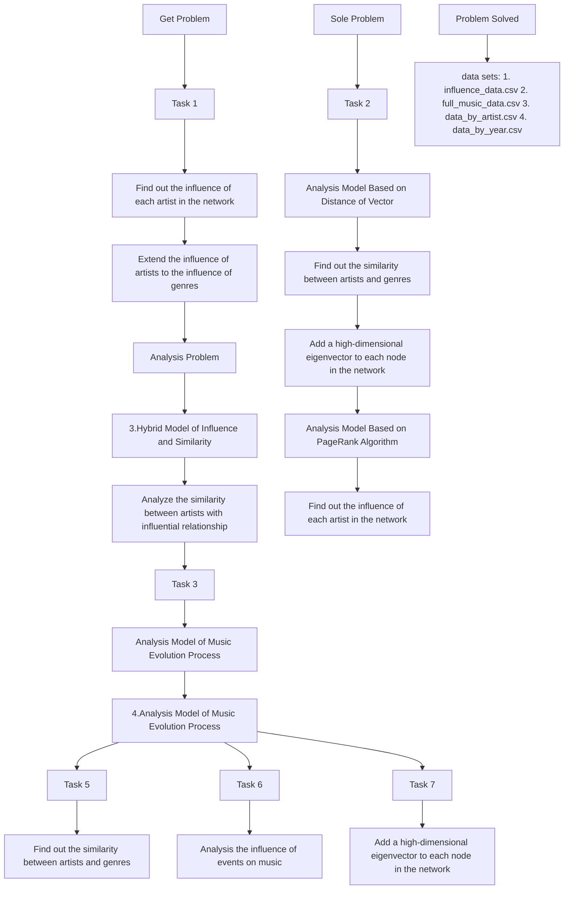

# Music Never Gets Old: Study On The Development And Evolution Of Music

Summary

Music does not evolve isolately, but is always influenced by other artists, other music, or by society and events. To quantify the musical influence, we developed four models based on building networks.

First, we established Influence Evaluation Model Based on PageRank Algorithm for problem 1. The influence relationship between follower and influencer is constructed into an artist influence directed network, where the influencers are the father nodes and the followers are the child nodes. We set sub network of artists by genre. Then, we improved the PageRank algorithm to calculate the absolute influence of each node in overall and sub network. Through this model, we sought for the nodes with high-influence, and got the top 20 influential artists as shown in the table 2.

Second, we established Similarity Model Based on Distance of Vector for problem 2. We developed the music characteristic vector of the artist, which is positively correlated with vector distance. By calculating the distance and drawing heatmap, we got the similarity between artists at each node. The results show that most of the artists had a high degree of similarity with artists of the same genre, but a few artists had a high degree of similarity with artists of other genres.

Third, we established Hybrid Model of Influence and Similarity for question 3 and question 4. We generalized the indexes of influence and similarity to describe genres. Based on this, we distinguished different genres and got the influence relation. We analyzed the changing ways of genres through line charts, completing question 3. Then, we established Inheriting Degree Model of Music Characteristics, combining the connection of network nodes with similarity to develop the inheriting degree index. According to the value of index, we completed question 4 and found that some musical characteristics are more "contagious" than others; the same musical characteristic has different influence in different genres.

Fourth, we established Analysis Model of Music Evolution Process for questions 5, 6 and 7. We selected musical characteristics with moderate inheriting degree, analyzing the major changes over time in music. Take the 1960’s for example, we found that the Beatles were the revolutionaries of music, completing question 5. We averaged the whole genre of music, obtained genre characteristics and its change over time. We set music popularity as an indicator of dynamic influencers, completing question 6. We calculated the overall influence of music genres, observed its change over time, analyzing the influence of social environment on music, completing question 7.

Finally, we conducted a sensitivity analysis for our model, and the result of test goes well. We have optimized the model to meet larger amounts of data. We analyzed the strengths and weakness of the model. In the end, we introduced our model to ICM Society.

Keywords: Network, PageRank, vector distance, inheriting degree, influence index.

## Contents

## 1 Introduction 2

1.1 Restatement of Problem 2  
1.2 Our Work . . 2

## 2 Assumptions and Justifications 3

## 3 Notations 3

## 4 Influence Evaluation Model Based on PageRank Algorithm 3

4.1 Establishment of Model 4  
4.2 Solution of Problem 1 . . . . 6

## 5 Similarity Model Based on Distance of Vector 7

5.1 Establishment of Model 8  
5.2 Solution of Problem 2 . . 9

## 6 Hybrid Model of Influence and Similarity 11

6.1 Generalization of The Two Indicators . 11

6.1.1 Generalization of The Influence Indicator . . 11  
6.1.2 Generalization of The similarity Indicator . . 12

6.2 Inheriting Degree Model of Music Characteristics 12  
6.3 Solution of Problem 3 . 13  
6.4 Solution of Problem 4 . 15

## 7 Analysis Model of Music Evolution Process 16

7.1 Establishment and Solution of Problem 5 16  
7.2 Establishment and Solution of Problem 6 16  
7.3 Establishment and Solution of Problem 7 18

## 8 Sensitivity Analysis 19

## 9 Optimization of Model 19

## 10 Strengths and Weaknesses 20

10.1 Strengths . . 20  
10.2 Weakness . . 20

## References 20

## Document to ICM Society 22

## 1 Introduction

## 1.1 Restatement of Problem

As a kind of art, music is an indispensable cultural element in the development of human civilization. Integrative Collective Music (ICM) Society invites our team to study the evolution and revolution process of music artists and music genres. Since the development of new music is bound to be affected by various factors, the study of the influence of music is the breakthrough point for our study. Therefore, we need to build models to measure musical influence.

Musical influence can be measured in three ways. First, artists are influenced by other artists. Second, new music are influenced by previously produced music, which can be seen from the similarities between previous and new music. Third, music changes over time because of social or technological events.

The model we are to build should solve the following problems:

1. Establish directed network and its subnetwork between music influencers and followers; find parameters that can describe the influence of influencers.  
2. Establish music similarity measure; compare similarity between and within the genres.  
3. Compare the "music similarity and artists influence" between and within genres; distinguish genres; describe change tendency and the relationship of the genre.  
4. Describe efforts "influence" makes on "similarity"; find music characteristics that are more "contagious".  
5. Find music characteristics and artists that represent revolution of music.  
6. Further analyze music genres’ and artists’ change over time; find a dynamic influencers measure.  
7. Describe how music is influenced by time and environment.

## 1.2 Our Work

After making reasonable assumptions to simplify the model, we built four models to solve the above seven problems, as shown in the flow chart, figure 1 below.

• First, we established the Influence Evaluation Model Based on PageRank Algorithm, to complete the question 1.  
• Second, we established the Similarity Model Based on Distance of Vector, to solve the question 2.  
• Third, we set up the Hybrid Model of Influence and Similarity, to analyze the question 3 and 4.

• Fourth, we set up the Analysis Model of Music Evolution Proces ：MATHmodanalysis of question 5, 6 and 7.

In addition to the models, we have also done optimization and sensitivity analysis of our models. Finally, we wrote a one-page document for the ICM Society.

flowchart

Figure 1: The flow chart of our models

## 2 Assumptions and Justifications

1. We assume that the influence from influencer to every follower is the same. Because it is not mentioned in the data set, that the influence weight of the influencers for one follower.  
2. We assume that the impact of a major change of music could be reflected in a year.  
3. We assume that the inheritance of music characteristic is pure probability inheritance.  
4. We assume that the most popular music of the year has a greater impact on the genre than any other music. Because a hit song is often a sign of genre development.

## 3 Notations

The notation we used is shown in the table 1.

## 4 Influence Evaluation Model Based on PageRank Algorithm

This model is built for question 1. According to the requirement, we need to create heedfo.orea a directed network graph connecting followers and influencers, with influencers as the corcas father nodes and followers as the child nodes. We also set parameters that represent musical influence. In social networks, PageRank algorithm can be used to get the information of "which pages are more important" through the network connection of web pages. Inspired by PageRank[1], we calculate the influence of nodes and the relative influence among nodes.

Table 1: Notations

<table><tr><td>Symbol</td><td>Definition</td></tr><tr><td> $V_i$ </td><td>Nodes in the network (artists)</td></tr><tr><td> $L(V_i)$ </td><td>The in-degree of node  $V_i$ </td></tr><tr><td>N</td><td>Number of nodes in the network</td></tr><tr><td> $F(V_i)$ </td><td>The node set of the outgoing chain of  $V_i$ </td></tr><tr><td>PR</td><td>Influence coefficient of nodes in network</td></tr><tr><td>p</td><td>Attenuation coefficient in PageRank algorithm</td></tr><tr><td> $C_i$ </td><td>Feature vector of music</td></tr><tr><td> $x_{ik}$ </td><td>The k-th feature of music i</td></tr><tr><td>d</td><td>Distance between eigenvectors</td></tr><tr><td>sim</td><td>Similarity between music</td></tr><tr><td>a</td><td>The number of the follower with the same genre as  $V_i$ </td></tr><tr><td>b</td><td>The number of the follower with different genres from  $V_i$ </td></tr><tr><td> $PR_{in}$ </td><td>The influence of the artists within the genre</td></tr><tr><td> $PR_{outk}$ </td><td>The influence of the artists on the genre k</td></tr><tr><td> $m_k$ </td><td>The number of artists and music in genre k</td></tr><tr><td> $FI_k$ </td><td>The influence of the genre k on the inner</td></tr><tr><td> $FO_{k1k2}$ </td><td>The influence of the genre k1 on the k2</td></tr><tr><td> $SI_k$ </td><td>The similarity of the inner music in genre k</td></tr><tr><td> $SO_{k1k2}$ </td><td>The similarity between genre k1 and genre k2</td></tr><tr><td>IH</td><td>The inheritance degree of the feature of the music</td></tr><tr><td> $E_k$ </td><td>The average of the feature vector of music in genre</td></tr><tr><td> $P_k$ </td><td>The most popular of the feature vector of music in genre</td></tr><tr><td> $P_g$ </td><td>The sum of the influence of the genre musicians</td></tr></table>

In this model, the value of PR is used as a parameter to measure influence. It should be noted that in the original PageRank algorithm, the edge of the network graph points to the parent node. In our model, however, the edge points to the child node.

## 4.1 Establishment of Model

According to the dataset influence-data, we built a directed network graph with artists as the point and the influence relationship between artists as the edge. The direction of each edge is from influencer to follower. The network is shown in the figure 2 below. The larger the area of the node, the more outgoing links of the node.

In the figure 2, different colors represent different music genres. The corresponding relationship between color and music genre is shown in the following pie chart as figure 3.

The network can be divided into some sub networks. Artists of th 号：MATHmodelsgenre form a sub network. For example, the blue part of the graph is the subnet o2 / rock music artists, while the orange part of the graph is the subnet of R&B artists.

text_image

Bob Drift
The Beatles
The Batting Star
The Boring Star
The Flaming Star
WBD
Prince
WBD at the Family House
WBD at the Family House
WBD at the Family House

Figure 2: The influence network of artists

The advanced PageRank algorithm[2] is applied to our network. The usage and meaning of this algorithm are as follows:

• The goal of this algorithm is to find out the "importance" of each node in the network, that is, "influence".  
• The father node has influence on the child node, and the child node reflects the influence of the parent node. The more child nodes a father node points to , the more the father node influences, and the greater the influence of the father node. In the network, the more the number of outgoing links of a node, the greater the influence of the node.  
• Every child node is called "next generation" relative to its parent node. With the increase of generation, the influence of the child node on the parent node is less and less obvious. Therefore, we introduce an attenuation coefficient of p.

The idea of PageRank algorithm is iterative operation. Before the calculation, each node is given the same PR value, and each iteration updates, the node will evenly allocate the new PR value to its outgoing nodes. The iteration continues until the allocated value of PR is no longer updated.

In our model, in order to adapt to the problem we need to solve, we change the PageRank algorithm to: in the iterative update, all nodes will allocate the new PR value to their own in chain nodes. That is, the propagation order of the value of PR is from the child node to the father node.

In the iterative update phase, the specific process of allocating PR value from the child node to the father node is as follows. Figure 4 shows the process as well

Assuming a network with only three nodes: A, B, C. If both B and

pie chart

| Category | Value |
|---|---|
| Pop/Rock | 50 |
| Others | 35 |
| R&B; | 25 |
| Jazz | 15 |
| Country | 15 |
| Latin | 10 |
| Electronic | 8 |
| Vocal | 7 |

radar chart

| PR of follower | PR of influencer |
| --- | --- |
| 1 | 0.7 |
| 0.6 | 0.7 |
| 0.6 | 0.2 |
| 0.6 | 0.2 |

Figure 3: The corresponding relationship be- Figure 4: The process of allocating PR value tween color and music genre

pointing to A, then the PR value of A will be the sum of B, C.

$$
P R (A) = P R (B) + P R (C) \tag {1}
$$

Continue assuming that B also has an edge pointing to C. The number of incoming links of B nodes is 2.

$$
P R (A) = \frac {P R (B)}{2} + P R (C) \tag {2}
$$

It is generalized to the general case,

$$
P R (A) = \frac {P R (B)}{L (B)} + \frac {P R (C)}{L (C)} \tag {3}
$$

where L(B) is the number of inbound links of node B.

As can be seen from the above figure 4, the child node will divide its own PR value equally, and then assign it to the father node. The PR value after allocation is the edge weight between two nodes. In this way, it forms a "music influence network". When the iteration stops, the edge weight between the two points means the influence of the parent node on the child node. At the same time, the calculation method of the PR value of any node $V _ { i }$ in the network is as follows:

$$
P R \left(V _ {i}\right) = \frac {1 - p}{N} + p \sum_ {V _ {j} \in F \left(V _ {j}\right)} \frac {P R \left(V _ {j}\right)}{L \left(V _ {j}\right)} \tag {4}
$$

Where p represents the attenuation coefficient to reduce the influence of generations, generally 0.85. N represents the total number of nodes in the network. $F ( V _ { i } )$ represents the node set of $V _ { i } ^ { \prime } \mathbf { s }$ outgoing chain, $V _ { j }$ is any point in this set. Obviously, the greater the PR value, the greater the influence of the artist.

## 4.2 Solution of Problem 1

The figure 2 shows influence-data set, an overall network of all artists. 号：MATHmodelspart is a subnet of Pop/Rock artists. The figure 5 below shows the top 10 artist2 the value of PR in the overall network, in which the columns with different colors represent different genres. The following table 2 shows the top 20 artists with PR value.

bar chart

Total List
| Player | Total |
| :--- | :--- |
| The Beatles | 0.012 |
| Lester Young | 0.0085 |
| Bob Dylan | 0.008 |
| The Mills Brothers | 0.0075 |
| Louis Jordan | 0.0072 |
| Mississippi Sheiks | 0.0065 |
| Roy Acuff | 0.006 |
| Woody Guthrie | 0.0058 |
| Mississippi Fred McDowell | 0.0057 |
| Billie Holiday | 0.0056 |

Figure 5: The top 10 artists in the overall network

We find that all the characters in the picture are legends of their genres. As an influence parameter, the value of PR is consistent with the reality and achieves our expected effect.

In order to prove the stability of our model, we apply our algorithm to Pop/Rock sub network and get the following results.

bar chart

Pop/Rock List
| Song | Value |
| :--- | :--- |
| The Beatles | 0.035 |
| Bob Dylan | 0.029 |
| Chuck Berry | 0.026 |
| Elvis Presley | 0.022 |
| Little Richard | 0.020 |
| Esquerita | 0.018 |
| The Rolling Stones | 0.017 |
| Buddy Holly | 0.016 |
| Bo Diddley | 0.015 |
| The Velvet Underground | 0.011 |

Figure 6: The top 10 artists in the Pop/Rock sub network

This is the top 10 most influential Pop/Rock artists. We find that the order of Pop/Rock artists in the general list is the same as that in the table 2, so we can prove that our model is stable. The Beatles is no doudt the most influencial band in the world.

Conclusion: Whether in the subnetwork or the overall network, influential artists will stand out with PR.

## 5 Similarity Model Based on Distance of Vector

This model is built for question 2. We use the characteristics of music to measure 号：the similarity of music. The characteristics of music, as already given in the dataset, are2 quantifiable. These characteristics include the following: danceability, energy, valence, tempo, loudness, and mode. We also consider the normalized human voice characteristics. After learning music theory, we think that key has little influence on music style, so we don’t consider key in music characteristics.

<table><tr><td>artist ID</td><td>artist name</td><td>artist genre</td><td>PR of artist</td></tr><tr><td>754032</td><td>The Beatles</td><td>Pop/Rock</td><td>0.011573239</td></tr><tr><td>259529</td><td>Lester Young</td><td>Jazz</td><td>0.007705564</td></tr><tr><td>66915</td><td>Bob Dylan</td><td>Pop/Rock</td><td>0.007210347</td></tr><tr><td>403120</td><td>The Mills Brothers</td><td>Vocal</td><td>0.006589893</td></tr><tr><td>287604</td><td>Louis Jordan</td><td>Jazz</td><td>0.006422992</td></tr><tr><td>898336</td><td>Mississippi Sheiks</td><td>Blues</td><td>0.005855095</td></tr><tr><td>848784</td><td>Roy Acuff</td><td>Country</td><td>0.00540526</td></tr><tr><td>577531</td><td>Woody Guthrie</td><td>Folk</td><td>0.005334219</td></tr><tr><td>898331</td><td>Mississippi Fred McDowell</td><td>Blues</td><td>0.005315981</td></tr><tr><td>79016</td><td>Billie Holiday</td><td>Vocal</td><td>0.00523804</td></tr><tr><td>894465</td><td>The Rolling Stones</td><td>Pop/Rock</td><td>0.004968142</td></tr><tr><td>317093</td><td>Nat King Cole</td><td>Jazz</td><td>0.004940834</td></tr><tr><td>549797</td><td>Hank Williams</td><td>Country</td><td>0.004919624</td></tr><tr><td>120521</td><td>Chuck Berry</td><td>Pop/Rock</td><td>0.004888935</td></tr><tr><td>608701</td><td>Muddy Waters</td><td>Blues</td><td>0.00452981</td></tr><tr><td>354105</td><td>Jimi Hendrix</td><td>Pop/Rock</td><td>0.004285491</td></tr><tr><td>128099</td><td>James Brown</td><td>R&amp;B;</td><td>0.004214594</td></tr><tr><td>200775</td><td>Ernest Tubb</td><td>Country</td><td>0.004151536</td></tr><tr><td>180228</td><td>Elvis Presley</td><td>Pop/Rock</td><td>0.004072049</td></tr><tr><td>824022</td><td>Little Richard</td><td>Pop/Rock</td><td>0.003939197</td></tr></table>

Table 2: The top 20 artists in overall network

The smaller the absolute value of the difference between the values of a certain characteristic of two music, the more similar the characteristics of two music. If we consider these characteristics as dimensions, then a music is a vector including these dimensions. The closer the two music vectors are, the higher the similarity between the two music vectors is.

For question 2, we need to use this model to calculate the music similarity between artists, and analyze whether the similarity between two musicians in different genres is higher than that between two artists in different genres. According to data set databy-artist, we can get the average level of each artist’s musical characteristics. In other words, we assume that each artist has only one piece of music, and we compare the similarity between two pieces of music, that is, we compare the similarity between two artists.

## 5.1 Establishment of Model

In order to make the data of music vector can be compared, we need to normalize the data. We normalized tempo and loudness in music characteristics, and other data have been normalized in data set. Fa that the eigenvector of artist i is $C _ { i } ( x _ { i 1 } , x _ { i 2 } , . . . , x _ { i m } )$ , and the eigenvector of artist j is $C _ { j } ( x _ { j 1 } , x _ { j 2 } , . . . , x _ { j m } )$ .

1. We use Minkowski Distance[3] to calculate the distance d between two vectors and transform it into similarity.

$$
d \left(C _ {i}, C _ {j}\right) _ {p} = \sqrt [ p ]{\left(x _ {i 1} - x _ {j 1}\right) ^ {p} + \left(x _ {i 2} - x _ {j 2}\right) ^ {p} + \cdots + \left(x _ {i m} - x _ {j m}\right) ^ {p}} \tag {5}
$$

Let $p = 2 ,$ , that is, we choose Euclidean distance as the calculation of vector distance. We convert the vector distance d into similarity sim. The smaller the d is, the greater the similarity is, as shown below.

$$
\operatorname{sim} \left(C _ {i}, C _ {j}\right) = e ^ {- d \left(C _ {i}, C _ {j}\right) _ {2}} \tag {6}
$$

2. We use cosine distance[4] to calculate the similarity of two vectors, as shown below.

$$
\cos \theta = \frac {\sum_ {k = 1} ^ {m} \left(x _ {i k} \times x _ {j k}\right)}{\sqrt {\sum_ {k = 1} ^ {m} x _ {i k} ^ {2}} \times \sqrt {\sum_ {k = 1} ^ {m} x _ {j k} ^ {2}}} = \frac {C _ {i}}{\| C _ {i} \|} \cdot \frac {C _ {j}}{\| C _ {j} \|} \tag {7}
$$

where θ is the angle between $C _ { i }$ and $C _ { j } .$ the smaller θ is, the greater cosθ is, the greater the similarity is. Therefore, the similarity sim is as follows.

$$
\operatorname{sim} \left(C _ {i}, C _ {j}\right) = \cos \theta \tag {8}
$$

## 5.2 Solution of Problem 2

We’ve sorted more than 5000 artists by doing the following. First, all the genres are arranged in dictionary order, and then all the artists in a genre are arranged in their ID.

After sorting, we use the model to calculate the Minkowski distance similarities and cosine distance similarities of any two artists. The heatmap figure 7 shows the Minkowski distance similarity of all artists we get, and the heatmap figure 8 is the cosine distance similarity. Among them, as shown in the color bar, the color at the top of the color bar represents high similarity, while the color at the bottom of the color bar represents low similarity.

heatmap

| 0 | 0.0 | 0.0 | 0.0 | 0.0 | 0.0 | 0.0 | 0.0 | 0.0 | 0.0 | 0.0 | 0.0 | 0.0 | 0.0 | 0.0 | 0.0 | 0.0 | 0.0 | 0,0 | 0,0 | 0,0 | 0,0 | 0,0 | 0,0 | 0,0 | 0,0 |
| --- | --- | --- | --- | --- | --- | --- | --- | --- | --- | --- | --- | --- | --- | --- | --- | --- | --- | --- | --- | --- | --- | --- | --- | --- | --- |
| 216 | 1.0 | 1.0 | 1.0 | 1.0 | 1.0 | 1.0 | 1.0 | 1.0 | 1.0 | 1.0 | 1.0 | 1.0 | 1.0 | 1.0 | 1.0 | 1.0 | 1.0 | 1,0 | 1,0 | 1,0 | 1,0 | 1,0 | 1,0 | 1,0 | 1,0 |
| 432 | -1.0 | -1.0 | -1.0 | -1.0 | -1.0 | -1.0 | -1.0 | -1.0 | -1.0 | -1.0 | -1.0 | -1.0 | -1.0 | -1.0 | -1.0 | -1.0 | -1.0 | -1,0 | -1,0 | -1,0 | -1,0 | -1,0 | -1,0 | -1,0 | -1,0 |
| 648 | -2.0 | -2.0 | -2.0 | -2.0 | -2.0 | -2.0 | -2.0 | -2.0 | -2.0 | -2.0 | -2.0 | -2.0 | -2.0 | -2.0 | -2.0 | -2.0 | -2.0 | -2,0 | -2,0 | -2,0 | -2,0 | -2,0 | -2,0 | -2,0 | -2,0 |
| 864 | -3.0 | -3.0 | -3.0 | -3.0 | -3.0 | -3.0 | -3.0 | -3.0 | -3.0 | -3.0 | -3.0 | -3.0 | -3.0 | -3.0 | -3.0 | -3.0 | -3.0 | -3,0 | -3,0 | -3,0 | -3,0 | -3,0 | -3,0 | -3,0 | -3,0 |

Figure 7: The heatmap of Minkowski distance Figure 8: The heatmap of cosine distance simsimilarity ilarity

• Although the colors of the two heatmaps are different, the shapes of the color blocks are basically the same. The two images are symmetrical about the main diagonal, and the effect is basically the same.  
• On both sides of the main diagonal are red (the color with higher similarity) square areas. In the sorting process, we arrange the artists of the same music genre together, which means that the similarity of artists within the genre is higher.  
• There are also light color areas on the main diagonal, which means that the similarity of very few artists in some genres is not high enough.  
• In other areas, we can also see the similarities and differences between different artists through different color shades.

Similar to question 1, we compare the similarity of the top ten influencers of the overall network and Pop/Rock subnet (using Minkowski distance), as shown in the following figure 9 and figure 10.

heatmap

| | The Beatles | Lester Young | Bob Dylan | The Mills Brothers | Levi Jordan | Mississippi Sheils | Roy Acuff | Woody Guthrie | Mississippi Fred McDowell | Billie Holiday |
|---|---|---|---|---|---|---|---|---|---|---|
| The Beatles | 0.95 | 0.85 | 0.75 | 0.65 | 0.55 | 0.45 | 0.35 | 0.25 | 0.15 | 0.05 |
| Lester Young | 0.90 | 0.80 | 0.70 | 0.60 | 0.50 | 0.40 | 0.30 | 0.20 | 0.10 | 0.05 |
| Bob Dylan | 0.85 | 0.75 | 0.65 | 0.55 | 0.45 | 0.35 | 0.25 | 0.15 | 0.05 | 0.05 |
| The Mills Brothers | 0.80 | 0.70 | 0.60 | 0.50 | 0.40 | 0.30 | 0.20 | 0.10 | 0.05 | 0.05 |
| Louis Jordan | 0.75 | 0.65 | 0.55 | 0.45 | 0.35 | 0.25 | 0.15 | 0.05 | 0.05 | 0.10 |
| Mississippi Sheiks | 0.70 | 0.60 | 0.50 | 0.40 | 0.30 | 0.20 | 0.10 | 0.05 | 0.15 | 0.25 |
| Roy Acuff | 0.65 | 0.55 | 0.45 | 0.35 | 0.25 | 0.15 | 0.05 | 0.10 | 0.25 | 0.35 |
| Woody Guthrie | 0.60 | 0.50 | 0.40 | 0.30 | 0.20 | 0.10 | 0.25 | 0.35 | 0.45 | 0.55 |
| Mississippi Fred McDowell | 0.55 | 0.45 | 0.35 | 0.25 | 0.15 | 0.25 | 0.35 | 0.45 | 0.55 | 0.65 |
| Billie Holiday | 0.50 | 0.40 | 0.30 | 0.20 | 0.10 | 0.35 | 0.45 | 0.55 | 0.65 | 0.75 |
The chart is a heatmap using a color scale from blue (low) to red (high). The legend is not explicitly labeled in the image.

Figure 9: Similarity of overall network

heatmap

| | The Beatles | Bob Dylan | Chuck Berry | Elvis Presley | Little Richard | Esquerita | The Rolling Stones | Buddy Holly | Bo Diddley | The Velvet Underground |
|---|---|---|---|---|---|---|---|---|---|---|
| The Beatles | 0.95 | 0.85 | 0.75 | 0.65 | 0.55 | 0.45 | 0.35 | 0.25 | 0.15 | 0.05 |
| Bob Dylan | 0.90 | 0.80 | 0.70 | 0.60 | 0.50 | 0.40 | 0.30 | 0.20 | 0.10 | 0.05 |
| Chuck Berry | 0.85 | 0.75 | 0.65 | 0.55 | 0.45 | 0.35 | 0.25 | 0.15 | 0.05 | 0.05 |
| Elvis Presley | 0.80 | 0.70 | 0.60 | 0.50 | 0.40 | 0.30 | 0.20 | 0.10 | 0.05 | 0.05 |
| Little Richard | 0.75 | 0.65 | 0.55 | 0.45 | 0.35 | 0.25 | 0.15 | 0.05 | 0.05 | 0.05 |
| Esquerita | 0.70 | 0.60 | 0.50 | 0.40 | 0.30 | 0.20 | 0.10 | 0.05 | 0.05 | 0.05 |
| The Rolling Stones | 0.65 | 0.55 | 0.45 | 0.35 | 0.25 | 0.15 | 0.05 | 0.05 | 0.15 | 0.25 |
| Buddy Holly | 0.60 | 0.50 | 0.40 | 0.30 | 0.20 | 0.10 | 0.15 | 0.25 | 0.35 | 0.45 |
| Bo Diddley | 0.55 | 0.45 | 0.35 | 0.25 | 0.15 | 0.25 | 0.35 | 0.45 | 0.55 | 0.65 |
| The Velvet Underground | 0.50 | 0.40 | 0.30 | 0.20 | 0.10 | 0.35 | 0.45 | 0.55 | 0.65 | 0.75 |
The Beatles (color intensity) is based on the color scale from ~1 to ~1 (color bar). The chart displays a grid of color intensity values corresponding to each musical title.

Figure 10: Similarity of Pop/Rock network

## Conclusions:

• In the overall network list, the similarity of artists of different genres is generally low.  
• In the sub network list, the similarity of artists in one genre is high.

We took the Beatles, Bob Dylan and Lester Young as examples, drew two radar maps of their musical characteristics, as shown in figure 11 and figure 12.

Obviously, the Beatles and Bob Dylan belong to the same genre, their musical characteristics are indeed very similar; The Beatles and Lester Young belong to different genres, their musical characteristics are very different. This confirms our conclusions.

• Most of the artists have high similarity with the artists of the same genre, while very few artists have high similarity with the artists of other genres.

We think this is reasonable. Music and art blend with each other. If an artist always studies one genre, he must have a higher similarity with the artists of that genre. But for some other artists, if they are involved in a wide range or like to create experimental music, their works will integrate the characteri ：of different genres of music.

radar chart

| Category         | The Beatles(Pop/Rock) | Lester Young(Jazz) |
| ---------------- | --------------------- | ------------------ |
| danceability     | 0.6                   | 0.6                |
| energy           | 0.5                   | 0.5                |
| valence          | 0.7                   | 0.7                |
| tempo            | 0.8                   | 0.8                |
| loudness         | 0.9                   | 0.9                |
| mode             | 1.0                   | 1.0                |
| acousticness     | 0.2                   | 0.3                |
| instrumentalness  | 0.1                   | 0.2                |
| liveness         | 0.1                   | 0.1                |
| speechiness      | 0.1                   | 0.1                |

Figure 11: Comparison of music characteris- Figure 12: Comparison of music characteristics of the Beatles and Lester Young tics of the Beatles and Bob Dylan

radar chart

| Category         | The Beatles(Pop/Rock) | Bob Dylan(Pop/Rock) |
| ---------------- | --------------------- | -------------------- |
| danceability     | 0.5                   | 0.4                  |
| energy           | 0.6                   | 0.5                  |
| valence          | 0.7                   | 0.6                  |
| tempo            | 0.8                   | 0.7                  |
| loudness         | 0.9                   | 0.8                  |
| mode             | 1.0                   | 0.9                  |
| acousticness     | 0.7                   | 0.6                  |
| instrumentalness | 0.5                   | 0.4                  |
| liveness         | 0.3                   | 0.2                  |
| speechiness      | 0.4                   | 0.3                  |

## 6 Hybrid Model of Influence and Similarity

This model is built for questions 3 and 4. Some people think that an artist is influenced by other artists as well as other music. Ours "influence evaluation model" is used to measure personal influence of an artist. But after generalization, this model can be used to measure the music influence an artist receives. Ours "Similarity model" is used to measure the similarity of music. But after generalization, this model can be used to measure the similarity between music genres. In question 3, we will compare A with B, C with D. Among them, A is the similarity among genres, B is the similarity within genres, C is the influence among genres and D is the influence within genres. In question 4, one of our tasks is to prove whether "influence" works on "similarity". Therefore, this model needs to combine and compare the above two models.

For question 3, we generalize the "influence index" and "similarity index" from single artist to music genres, and find the way to distinguish genres. For question 4, we start from similarity, analyze the "infectivity" of the characteristics of music.

## 6.1 Generalization of The Two Indicators

## 6.1.1 Generalization of The Influence Indicator

In the previous model, we considered the absolute influence of artists themselves and their relative influence on their followers. In this model, we generalize the "influence index" to the relative influence of artists on genres.

In question 1, we got the PR value of all artists: $P R ( V _ { i } )$ . The number of people influenced by artist $V _ { i }$ is $L ( V _ { i } )$ . We assumed that among the artists influenced by $V _ { i } ,$ there are a artists of the same genre as artist $V _ { i } ,$ , and b artists of different genres. therefore

$$
L \left(V _ {i}\right) = a + b \tag {9}
$$

$$
b = b _ {1} + b _ {2} + \dots + b _ {k} \tag {10}
$$

The formula (10) indicates that b artists may come from k different genres.

So we get the influence of the artist $V _ { i }$ on the inner genre as follows:

$$
P R _ {i n} (V _ {i}) = \frac {1 - p}{N} + p \alpha_ {i} \times P R (V _ {i})
$$

The influence of artist $V _ { i }$ on genre $k$ is:

$$
P R _ {\text { outk }} \left(V _ {i}\right) = p \beta_ {i k} \times P R \left(V _ {i}\right) \tag {12}
$$

where

$$
\alpha_ {i} = \frac {a}{L (V _ {i})} \tag {13}
$$

$$
\beta_ {i k} = \frac {b _ {k}}{L \left(V _ {i}\right)} \tag {14}
$$

Average the formula (11), the inner influence of genre k is

$$
F I _ {k} = \frac {\sum_ {i = 1} ^ {m _ {k}} \frac {1 - p}{N} + p \alpha_ {i} \times P R (V _ {i})}{\sum_ {i = 1} ^ {m _ {k}} P R (V _ {i})} \tag {15}
$$

where $m _ { k }$ is the number of artists in the genre $k .$ Average the formula (12), the influence of genre k1 on genre k2 is

$$
F O _ {k 1 k 2} = \frac {\sum_ {i = 1} ^ {m _ {k 1}} p \beta_ {i k 2} \times P R (V _ {k 1 i})}{\sum_ {i = 1} ^ {m _ {k 2}} P R (V _ {k 1 i})} \tag {16}
$$

## 6.1.2 Generalization of The similarity Indicator

It is known that the similarity between two pieces of music is sim $( V _ { i } , V _ { j } )$ . The same as in the previous section, taking the average similarity within the genre, then the inner music similarity of genre k is

$$
S I _ {k} = \frac {\sum_ {i = 1} ^ {m _ {k}} \sum_ {j = 1} ^ {m _ {k}} \operatorname{sim} \left(V _ {i} , V _ {j}\right)}{m _ {k} ^ {2}} \tag {17}
$$

The music similarity of genre k1 and genre k2 is

$$
S O _ {k 1 k 2} = \frac {\sum_ {i = 1} ^ {m _ {k 1}} \sum_ {j = 1} ^ {m _ {k 2}} \operatorname{sim} \left(V _ {k 1 i} , V _ {k 2 j}\right)}{m _ {k 1} m _ {k 2}} \tag {18}
$$

## 6.2 Inheriting Degree Model of Music Characteristics

When two artists have an influential relationship and their music has a certain similarity, we call one inheriting music characteristic from another one. Therefore, we mixed the two indexes and established a model to measure the inheriting degree.

We think that follower is influenced by many influencers, and it is impossible for him or her to completely inherit the musical characteristics of an artist. At the same time, artists have their own creativ ${ \mathrm { i t y } } ,$ and their musical characteristics are not completely inherited.

Because the characteristics of different genres are different, the same kind of music characteristics may have different inheritance ability in different genres. Music char acteristics inheriting degree can be divided into cross genre and within ge 号：genre music characteristics inheriting degree is affected by music gen re si

which is difficult to measure quantitatively. Therefore, we think that the inheriting degree within the genre can better reflect the inheritance of music characteristics.

The artist’s music feature vector is $C _ { i } ( x _ { i 1 } , x _ { i 2 } , . . . , x _ { i 9 } )$ . Setting Boolean variables $G ,$ which means whether a certain characteristic of two artists is similar in value, there is

$$
G (k) = \left\{ \begin{array}{l l} 1, & x _ {i k} \approx x _ {j k} \\ 0, & x _ {i k} \neq x _ {j k} \end{array} \right. \tag {19}
$$

We assume that, if $| x _ { i k } - x _ { j k } | \leq \pm 5 \% x _ { i k }$ , then $x _ { i k } \approx x _ { j k }$ . When $G ( k ) = 1 .$ , We think the characteristic k has been successfully inherited.

Let $I H ( x _ { k } )$ be $k ^ { t h }$ of the 10 music characteristics in a genre with a total population of $m ,$ it is reflected in the ratio of "the number of successful inheritees of characteristic ${ x _ { k } } "$ to "the total number of inheritees of characteristic ${ x _ { k } } "$ .

$$
I H \left(x _ {k}\right) = \frac {\sum_ {i = 1} ^ {m} \sum_ {j = 1} ^ {L \left(V _ {i}\right)} G (k)}{\sum_ {i = 1} ^ {m} L \left(V _ {i}\right)} \tag {20}
$$

The larger the index I H is, the easier it is to inherit the feature, and the more infectious it is.

## 6.3 Solution of Problem 3

According to formula (15) and formula (16), we draw the heatmap of genres influence, as shown in the figure 13 below.

heatmap

| Category | Avant-Garde | Blues | Children's | Classical | Comedy/Spoken | Country | Easy Listening | Electronic | Folk | International | Jazz | Latin | New Age | Pop/Rock | R&B | Reggae | Religious | Stage & Screen | Unknown | Vocal |
| --- | --- | --- | --- | --- | --- | --- | --- | --- | --- | --- | --- | --- | --- | --- | --- | --- | --- | --- | --- | --- |
| Avant-Garde | 0.85 | 0.12 | 0.05 | 0.78 | 0.35 | 0.42 | 0.08 | 0.02 | 0.01 | 0.01 | 0.01 | 0.01 | 0.01 | 0.01 | 0.01 | 0.01 | 0.01 | 0.01 | 0.01 | 0.01 |
| Blues | 0.82 | 0.15 | 0.06 | 0.75 | 0.38 | 0.45 | 0.09 | 0.03 | 0.02 | 0.02 | 0.02 | 0.02 | 0.02 | 0.02 | 0.02 | 0.02 | 0.02 | 0.02 | 0.02 | 0.02 |
| Children's | 0.88 | 0.18 | 0.07 | 0.79 | 0.41 | 0.48 | 0.11 | 0.04 | 0.03 | 0.03 | 0.03 | 0.03 | 0.03 | 0.03 | 0.03 | 0.03 | 0.03 | 0.03 | 0.03 | 0.03 |
| Classical | 0.84 | 0.21 | 0.08 | 0.76 | 0.43 | 0.49 | 0.12 | 0.05 | 0.04 | 0.04 | 0.04 | 0.04 | 0.04 | 0.04 | 0.04 | 0.04 | 0.04 | 0.04 | 0.04 | 0.04 |
| Comedy/Spoken | 0.86 | 0.23 | 0.11 | 0.77 | 0.45 | 0.51 | 0.13 | 0.06 | 0.05 | 0.05 | 0.05 | 0.05 | 0.05 | 0.05 | 0.05 | 0.05 | 0.05 | 0.05 | 0.05 | 0.05 |
| Country | 0.83 | 0.24 | 0.12 | 0.78 | 0.47 | 0.52 | 0.14 | 0.07 | 0.06 | 0.06 | 0.06 | 0.06 | 0.06 | 0.06 | 0.06 | 0.06 | 0.06 | 0.06 | 0.06 | 0.06 |
| Easy Listening | 0.87 | 0.26 | 0.13 | 0.81 | 0.49 | 0.54 | 0.15 | 0.11 | 0.11 | 0.11 | 0.11 | 0.11 | 0.11 | 0.11 | 0.11 | 0.11 | 0.11 | 0.11 | 0.11 | 0.11 |
| Electronic | 0.85 | 0.27 | 0.14 | 0.82 | 0.51 | 0.55 | 0.16 | 0.12 | 0.12 | 0.12 | 0.12 | 0.12 | 0.12 | 0.12 | 0.12 | 0.12 | 0.12 | 0.12 | 0.12 | 0.12 |
| Folk | 0.84 | 0.28 | 0.15 | 0.83 | 0.53 | 0.56 | 0.17 | 0.13 | 0.13 | 0.13 | 0.13 | 0.13 | 0.13 | 0.13 | 0.13 | 0.13 | 0.13 | 0.13 | 0.13 | 0.13 |
| International | 0.86 | 0.29 | 0.16 | 0.84 | 0.55 | 0.57 | 0.18 | 0.14 | 0.14 | 0.14 | 0.14 | 0.14 | 0.14 | 0.14 | 0.14 | 0.14 | 0.14 | 0.14 | 0.14 | 0.14 |

Figure 13: The heatmap of genres influence

heatmap

|  | Avant-Garde | Blues | Children's | Classical | Comedy/Spoken | Country | Easy Listening | Electronic | Folk | International | Jazz | Latin | New Age | Pop/Rock | R&B | Reggae | Religious | Stage & Screen | Unknown | Vocal |
| --- | --- | --- | --- | --- | --- | --- | --- | --- | --- | --- | --- | --- | --- | --- | --- | --- | --- | --- | --- | --- |
|  | Avant-Garde | 0.95 | 0.85 | 0.75 | 0.65 | 0.55 | 0.45 | 0.35 | 0.25 | 0.15 | 0.05 | 0.05 | 0.95 | 0.85 | 0.75 | 0.65 | 0.55 | 0.45 | 0.35 | 0.25 |
| Avant-Garde | Children's | 0.95 | 0.85 | 0.75 | 0.65 | 0.55 | 0.45 | 0.35 | 0.25 | 0.15 | 0.05 | 0.05 | 0.95 | 0.85 | 0.75 | 0.65 | 0.55 | 0 .45 | 0.35 | 0.25 |
| Avant-Garde | Children's / Classical | 0.95 | 0.85 | 0.75 | 0.65 | 0.55 | 0.45 | 0.35 | 0.25 | 0.15 | 0.05 | 0.05 | 0.95 | 0.85 | 0.75 | 0.65 | 0 .45 | 0 .35 | 0 .25 | 0 .15 |
| Avant-Garde / Classical / Comedy/Spoken / Country / Easy Listening / Electronic / Folk / International / Jazz / Latin / New Age / Pop/Rock / R&B / Reggae / Religious / Stage & Screen / Unknown / Vocal / Avant-Garde | Children's / Classical / Comedy/Spoken / Country / Easy Listening / Electronic / Folk / International / Jazz / Latin / New Age / Pop/Rock / R&B / Reggae / Religious / Stage & Screen / Unknown / Vocal / Avant-Garde | 0.95 | 0.85 | 0.75 | 0.65 | 0.55 | 0.45 | 0.35 | 0.25 | 0.15 | 0.05 | 0.05 | 0.95 | 0.85 | 0.75 | 0.65 | 0 .45 | 0.35 | 0 .25 | 0 .15 |
| Avant-Garde / Children's / Classical / Comedy/Spoken / Country / Easy Listening / Electronic / Folk / International / Jazz / Latin / New Age / Pop/Rock / R&B / Reggae / Religious / Stage & Screen / Unknown / Vocal / Avant-Garde | Children's / Classical / Comedy/Spoken / Country / Easy Listening / Electronic / Folk / International / Jazz / Latin / New Age / Pop/Rock / R&B / Reggae / Religious / Stage & Screen / Unknown / Vocal / Arval - Avant-Garde<fcel>1.12 | 1.12 | 1.12 | 1.12 | 1.12 | 1.12 | 1.12 | 1.12 | 1.12 | 1.12 | 1.12 | 1.12 | 1.12 | 1.12 | 1.12 | 1.12 | 1.12 | 1.13 | 1.13 | 1.13 |

Figure 14: The heatmap of genres similarity

In the heatmap, the diagonal blocks represent inner influence of the genres. The column of blocks represent the influence of other genres on diagonal music genre; the row of blocks represent the influence of diagonal music genre on other genres.

The heatmap directly reflects the influence degree of a certain genre on another genres. For example, the reddest block Pop/Rock is influenced by Blues, Country, Folk, Jazz, R&B (column) and so on. At the same time, Pop/Rock has a strong influence on Country and Electronic (row).

The rule of genres changing over time is: most genres have strong inheritance ability, and the larger the genre, the greater the inner influence. As shown in the color on the diagonal represents the degrees of the inner influence 号：MATHmodelsit can be seen that most of them are clearly visible color blocks. After cons ng the2 data, we found that our model results accord with the actual situation, so our influence model is successful.

According to formula (17) and formula (18), we draw the heatmap of similarity, as shown in the figure 14.

In the heatmap, the image is symmetrical about the diagonal, the diagonal blocks represent the average similarity within one genre, and the other blocks represent the average music similarity between two genres.

On the whole, genre similarity and artist similarity have the same features. The blocks on the diagonal show that the similarity within genres is greater than that between genres, showing the feature of centralization. What’s more, Pop/Rock is more similar to R&B, Country, Blues, Reggae and Latin in this similarity heatmap, because they are all dark red, and in the influence heat map above, it shows that Pop/Rock is influenced by them. The two heatmaps show a certain consistency. Therefore, our similarity model is also successful.

Based on the above analysis, we draw the following conclusions.

## Conclusions:

• The way of distinguishing different genres: music similarity model is used for clustering, and genre labels are added to the clustering results through the inner genre similarity.  
• The way music genres change over time: The change of influence parameters F I and FO over time can reflect the dynamic influence and dynamic stability of a genre. Considering the increasing number of people in a genre, we can analyze the development of a genre. Take Pop/Rock as an example, its change of F I and FO over time is shown as figure 15.

bar-line hybrid chart

| Year | increase | within genres | between genres |
|---|---|---|---|
| 1930 | 0.0 | 1000 | 0 |
| 1940 | 0.0 | 950 | 10 |
| 1950 | 0.18 | 880 | 60 |
| 1960 | 0.7 | 900 | 45 |
| 1970 | 0.71 | 920 | 40 |
| 1980 | 1.04 | 930 | 38 |
| 1990 | 1.15 | 940 | 38 |
| 2000 | 0.82 | 935 | 38 |
| 2010 | 0.2 | 925 | 38 |

Figure 15: Change of F I and FO over time

Pop/Rock was born in 1930. During the period of 1930-1940, this genre had a great inner influence, indicating that it was accepting the influence of other genres and was in its stage of infancy. In 1950, the population of genre increased for the first time, and its between genres influence increased. This new genre had a great impact on the music circles. Representing Pop/Rock entered stage of development. In 1960, a large number of artists invested in Pop/Rock music creation, Pop/Rock’s inner influence increased and maintain stability. Pop/Rock genre entered stage of mature. After 1960, F I = 0.9,

$F O = 0 . 1$ , the number of Pop/Rock genre is still increasing, but the influence of the genre is basically shaped, it has stable self-development power, and music influence. By 2010, only 100 artists joined this genre, and there is no significant change of $F I ,$ FO. Therefore, from the perspective of population growth, Pop / Rock may be being surpassed by other genres.

## 6.4 Solution of Problem 4

According to the model, we got the inheriting degree heatmap of $1 0 \times 2 0$ by calculation, as shown in the figure 16 below.

heatmap

| Category | Avant-Garde | Blues | Children's | Classical | Comedy/Spoken | Country | Easy Listening | Electronic | Folk | International | Jazz | Latin | New Age | Pop/Rock | R&B | Reggae | Religious | Stage & Screen | Unknown | Vocal |
| --- | --- | --- | --- | --- | --- | --- | --- | --- | --- | --- | --- | --- | --- | --- | --- | --- | --- | --- | --- | --- |
| danceability | 0.85 | 0.72 | 0.68 | 0.75 | 0.65 | 0.80 | 0.78 | 0.70 | 0.75 | 0.78 | 0.75 | 0.72 | 0.70 | 0.73 | 0.76 | 0.74 | 0.79 | 0.71 | 0.74 | 0.76 |
| energy | 0.82 | 0.68 | 0.65 | 0.72 | 0.62 | 0.85 | 0.79 | 0.73 | 0.76 | 0.79 | 0.74 | 0.71 | 0.69 | 0.72 | 0.75 | 0.73 | 0.78 | 0.72 | 0.75 | 0.77 |
| valence | 0.88 | 0.65 | 0.62 | 0.68 | 0.60 | 0.82 | 0.76 | 0.71 | 0.74 | 0.77 | 0.72 | 0.69 | 0.67 | 0.70 | 0.73 | 0.71 | 0.76 | 0.69 | 0.73 | 0.75 |
| tempo | 0.84 | 0.62 | 0.59 | 0.66 | 0.58 | 0.81 | 0.75 | 0.70 | 0.73 | 0.76 | 0.71 | 0.68 | 0.66 | 0.69 | 0.72 | 0.70 | 0.75 | 0.68 | 0.71 | 0.73 |
| loudness | 0.86 | 0.59 | 0.56 | 0.63 | 0.55 | 0.83 | 0.74 | 0.69 | 0.72 | 0.75 | 0.70 | 0.67 | 0.65 | 0.68 | 0.71 | 0.69 | 0.74 | 0.66 | 0.69 | 0.71 |
| mode | 0.83 | 0.56 | 0.53 | 0.61 | 0.49 | 0.84 | 0.73 | 0.68 | 0.71 | 0.74 | 0.69 | 0.66 | 0.64 | 0.67 | 0.70 | 0.68 | 0.73 | 0.65 | 0.68 | 0.7 |
| acousticness | 0.81 | 0.54 | 0.51 | 0.59 | 0.47 | 0.82 | 0.71 | 0.66 | 0.69 | 0.72 | 0.68 | 0.65 | 0.63 | 0.66 | 0.69 | 0.67 | 0.72 | 0.59 | 0.63 | 0.65 |
| instrumentalness | 0.85 | 0.52 | 0.49 | 0.57 | 0.45 | 0.83 | 0.72 | 0.67 | 0.70 | 0.73 | 0.68 | 0.65 | 0.63 | 0.66 | 0.69 | 0.67 | 0.72 | 0.58 | 0.61 | 0.63 |
| liveness | 0.82 | 0.51 | 0.48 | 0.55 | 0.43 | 0.81 | 0.71 | 0.66 | 0.69 | 0.72 | 0.67 | 0.64 | 0.62 | 0.65 | 0.68 | 0.66 | 0.71 | 0.57 | 0.61 | 0.63 |

Figure 16: Inheriting degree heatmap

In different genres, different musical characteristics are inherited with different degrees of inheritance. We assumed that when $I H \ge 0 . 6$ , musical characteristics are considered as good inheritance.

Among the 20 genres, at least four characteristics are inherited, and at most nine characteristics are inherited. For example, Avant-Garde inherits only tempo, dance ability, liveness and speech, while Children’s inherits all the characteristics. If we further increase the IH, we can further screen representative music characteristics of different genres, and show the differences between genres.

## Conclusions:

• The influencer does have influence on the followers, and the influence is reflected by the inheritance of music characteristics. For example, the characteristic speech of jazz genre has a 0.78 probability of being inherited in the process of influence between influencers and followers.  
• Some music characteristics are more "contagious" than others. For example, the speech (0.78) of jazz is more inheritable than the valence (0.61).  
• The same music characteristic has different influence ability in different genres. For example, the speech (0.78) of jazz genre is more inheritable than speech (0.44) of Comedy/Spoken genre.  
• The inheritance abilities of some music characteristics in all genre ：MATHmodelsnot weak, such as tempo (0.68-0.83).

• The inheritance abilities of some music characteristics in all genres are generally not strong, such as mode (0.16-0.77).

## 7 Analysis Model of Music Evolution Process

## 7.1 Establishment and Solution of Problem 5

We think that the stronger the inheriting degree of a certain musical characteristic is, the less the musical characteristic changes with time. Therefore, we take the mutation of musical characteristics with strong inheriting degree as an indicator, reflecting whether revolutionaries have taken place. However, if the inheriting degree is too strong, this characteristic will be too stable. If a strong inherited music characteristic in the data set data-by-year mutates in a certain year, according to the assumption, it shows that as a great revolutionaries, the artist played his role in that year.

We selected five music charateristics with moderate inheriting degree: energy, tempo, acousticness, instrumentalness, and speechiness. We drew a line chart, as shown in the figure 17.

line chart

| Year | energy | tempo | acousticiness | instrumentalness | speechiness |
|------|--------|-------|---------------|------------------|-------------|
| 1921 | 0.2    | 0.0   | 0.9           | 0.3              | 0.1         |
| 1925 | 0.3    | 0.8   | 0.9           | 0.4              | 0.2         |
| 1929 | 0.4    | 0.6   | 0.9           | 0.5              | 0.3         |
| 1933 | 0.3    | 0.7   | 0.9           | 0.4              | 0.2         |
| 1937 | 0.3    | 0.6   | 0.9           | 0.3              | 0.2         |
| 1941 | 0.3    | 0.5   | 0.9           | 0.3              | 0.2         |
| 1945 | 0.3    | 0.4   | 0.9           | 0.4              | 0.2         |
| 1949 | 0.3    | 0.5   | 0.9           | 0.3              | 0.2         |
| 1953 | 0.3    | 0.4   | 0.8           | 0.2              | 0.1         |
| 1957 | 0.3    | 0.5   | 0.7           | 0.2              | 0.1         |
| 1961 | 0.4    | 0.6   | 0.6           | 0.2              | 0.1         |
| 1965 | 0.5    | 0.7   | 0.5           | 0.2              | 0.1         |
| 1969 | 0.5    | 0.8   | 0.4           | 0.2              | 0.1         |
| 1973 | 0.6    | 0.9   | 0.3           | 0.2              | 0.1         |
| 1977 | 0.6    | 0.9   | 0.3           | 0.2              | 0.1         |
| 1981 | 0.6    | 1.0   | 0.3           | 0.2              | 0.1         |
| 1985 | 0.6    | 1.0   | 0.3           | 0.2              | 0.1         |
| 1989 | 0.6    | 1.0   | 0.3           | 0.2              | 0.1         |
| 1993 | 0.6    | 1.0   | 0.3           | 0.2              | 0.1         |
| 1997 | 0.6    | 1.0   | 0.3           | 0.2              | 0.1         |
| 2001 | 0.6    | 1.0   | 0.3           | 0.2              | 0.1         |
| 2005 | 0.6    | 1.0   | 0.3           | 0.2              | 0.1         |
| 2009 | 0.6    | 1.0   | 0.3           | 0.2              | 0.1         |
| 2013 | 0.6    | 1.0   | 0.3           | 0.2              | 0.1         |
| 2017 | 0.6    | 1.0   | 0.3           | 0.2              | 0.1         |

Figure 17: Music charateristics change over time

Conclusion: from 1964 to 1969, acousticness dropped sharply, and energy continued to rise. We found the active musicians and their albums in the corresponding period. We found that the Beatles were one of the most active influencers. Their following five songs had a very low level of acousticness and high energy, and were among the most popular in the same era.

The five songs are: a. Tomorrow Never Knows - Remastered \*\*\*\*; b. Sgt. Pepper’s Lonely Hearts \*\*\*\* Band (Reprise) - Remix; c. Sgt. Pepper’s Lonely Hearts \*\*\*\* Band - Reprise / Remastered \*\*\*\*; d.And Your Bird Can Sing - Remastered \*\*\*\*; e. Nowhere Man - Remastered \*\*\*\*. The information of the five songs is shown in the table 3.

## 7.2 Establishment and Solution of Problem 6

In question 6, we set up a model to represent the changes of music characteristics within the genre over time. We start with the dataset full-music-data to g value of the music characteristics of a certain genre every year, written n 号：MAE (ex , ext , ..., ex ).

<table><tr><td>song</td><td>energy</td><td>tempo</td><td>acoustic</td><td>instrumental</td><td>speechi</td><td>popularity</td><td>year</td></tr><tr><td>a</td><td>0.829</td><td>125.887</td><td>8.40E-05</td><td>0.00208</td><td>0.0405</td><td>58</td><td>1966</td></tr><tr><td>b</td><td>0.951</td><td>118.769</td><td>0.000249</td><td>0.214</td><td>0.0521</td><td>40</td><td>1967</td></tr><tr><td>c</td><td>0.889</td><td>118.773</td><td>0.0061</td><td>0.589</td><td>0.0453</td><td>52</td><td>1967</td></tr><tr><td>d</td><td>0.65</td><td>132.59</td><td>0.0067</td><td>0.0491</td><td>0.0282</td><td>59</td><td>1966</td></tr><tr><td>e</td><td>0.624</td><td>121.402</td><td>0.00797</td><td>0</td><td>0.0462</td><td>64</td><td>1965</td></tr></table>

Table 3: The information of the five songs

We draw a time-dependent curve of each dimension $e _ { t i }$ to show the evolution trend of music characteristics of one genre changed over time. Then we take the most popular song of the genre every year, drew the same curve of each dimension $P _ { k i }$ of the music characteristics of the song. We compared the changes and differences between the two. Here, we take Electronic as an example. We only select one characteristic valence and chose the representative work, Tangerine Dream, that is, compared $E _ { k i }$ with $P _ { k i } ,$ , as shown in the figure 18 below.

line chart

| Year | valence of most popular music of Electronic genre | valence of Electronic genre |
|---|---|---|
| 1974 | 0.33 | 0.40 |
| 1975 | 0.45 | 0.40 |
| 1976 | 0.68 | 0.49 |
| 1977 | 0.57 | 0.60 |
| 1978 | 0.49 | 0.53 |
| 1979 | 0.42 | 0.48 |
| 1980 | 0.53 | 0.44 |
| 1981 | 0.58 | 0.57 |
| 1983 | 0.50 | 0.55 |

Figure 18: comparison of $E _ { k i }$ with $P _ { k i }$ over time

As we can see from the figure, we draw the curve of $E _ { k i } ,$ , which reflected the overall evolution trend of the music characteristics of the Electronic genre. By comparing the evolution curve of the overall characteristics of genres, with the characteristic curve of the most popular music of genres, we draw conclusions.

## Conclusions:

• The trend of the two curves is similar.  
• The trend of $E _ { k i }$ is slightly behind that of $P _ { k i }$ .  
• $E _ { k i }$ is more stable than $P _ { k i }$ .

Therefore, we infer that the most popular music in the genre influences the whole genre and promotes and guides the evolution of the genre, which is the law of genre change. For a piece of music, we examined two indicators: popularity and $\mathbf { P _ { k } }$ . Among them, popular determines whether a piece of music can be rated as "contagious", and P determines the direction of music’s influence in the music circle. H

号：We think that the artists who make these music are "dynamic influ

## 7.3 Establishment and Solution of Problem 7

Any historical event is likely to influence on each genre and form a huge influence network. In order to simplify the model, we chose three genres (Blues, Electronic and Pop/Rock) and several historical events to illustrate the model.

We calculated the sum of artist influence of each genre in each era $P G _ { i k t }$ .

$$
P G _ {i k t} = \sum_ {i = 1} ^ {m _ {k}} P R (V _ {i k t}) \tag {21}
$$

We drew a total influence curve PG(t), as shown in the figure 19 below. Each influence curve is normalized into the same graph, and historical events are added to the time line for analysis.

line chart

| Year | Blues | Classical | Electronic | Pop/Rock | popularity |
|------|-------|-----------|------------|----------|------------|
| 1930 | 0     | 0         | 0          | 0        | 0          |
| 1940 | 0.6   | 0.6       | 0          | 0        | 0          |
| 1950 | 0.8   | 0.2       | 0          | 0.2      | 0          |
| 1960 | 1.0   | 0.8       | 0          | 0.4      | 0.2        |
| 1970 | 1.0   | 1.0       | 0          | 0.6      | 0.4        |
| 1980 | 0.8   | 0.9       | 0          | 0.8      | 0.6        |
| 1990 | 0.6   | 0.8       | 0          | 1.0      | 0.8        |
| 2000 | 0.4   | 0.7       | 0          | 1.2      | 1.0        |
| 2010 | 0.3   | 0.6       | 0          | 1.4      | 1.2        |

Figure 19: The total influence curve PG(t)

Combined with the actual history, the following conclusions can be drawn from the figure 19.

## Conclusions:

• After the end of the economic depression, the music curve shows an upward trend, and it is speculated that it will be frustrated during the depression.  
• In the Second World War, classical music suffered a serious setback[5]. Because the cost of classical music performance is high after the formation of the performance agent, the war leads to people’s retrenchment, and financial institutions invest their funds in the war, and the lack of funds has a huge impact on it. With the economic recovery after the war, the influence of classical music recovered with the improvement of people’s economic strength.  
• The rise of American civil rights movement from 1950 to 1970 promoted the development of Blues: 1. Blues originated from black slaves in the past[6]. 2. In the early 1950s, the center of blue was in Chicago, USA. 3. The music of the civil rights movement and the freedom of speech movement in the United States led to the study of the early black American music.  
• Since 1970, Moore’s law has created affordable music technology, and the use of electronic music has become more and more popular. In the 1970s, personal computers began to be popular, corresponding to the acceleration of the development of electronic music.  
• In the information age, the high-speed information flow keeps the influen ：MATHmeach school at a high level.

The change of $P G ( t )$ curve perfectly reflects the change of music influence, can make timely response to historical events, and conforms to historical common sense. So, our $P G ( t )$ curve is successful.

## 8 Sensitivity Analysis

Influence Evaluation Model and Similarity Model are our basic models, so we conducted sensitivity analysis on these two models.

• We changed the damping coefficient p in the PageRank algorithm to a range of $0 . 8 5 \pm 0 . 1 5 ,$ , and the error ratio of PR is shown in the figure 20 below. It can be seen that when the damping coefficient p changes, the error ratio is less than 5%, which meets our expectation. The model has passed the sensitivity analysis.  
• We changed the dimension of vector with a range of $1 0 \pm 3$ dimensions, and the error ratio of the similarity is shown in the figure 21 below. It can be seen that when the dimension changes, the error ratio is less than 2%, which meets our expectation. The model has passed the sensitivity analysis.

bar chart

| X-Axis | Value (%) |
|---|---|
| 0.7 | 3.9 |
| 0.75 | 1.8 |
| 0.8 | 0.5 |
| 0.9 | 0.4 |
| 0.95 | 2.9 |
| 1 | 3.2 |

Figure 20: Error ratio of PR

bar chart

| Category | Value (%) |
|---|---|
| 7 | 1.85 |
| 8 | 0.90 |
| 9 | 0.40 |
| 10 | 0.00 |
| 11 | 0.65 |
| 12 | 0.72 |
| 13 | 1.38 |

Figure 21: Error ratio of the similarity

## Optimization of Model

Since the data set given by ICM Society has certain limitation, we consider the optimization of our model when the data set becomes larger. When the generation involved in the data set increases, the time series becomes worse with the time span.

We introduced the time factor ∆t and the outcome indicator $W _ { i } [ 7 ]$ as the influence coefficient, where $W _ { i }$ is from evaluation system. So we got

$$
P _ {i} = a W _ {i} ^ {b} \times e ^ {- c \Delta t} \tag {22}
$$

$$
P R (V _ {i}) = (1 - p) P _ {i} + p \sum_ {V _ {j} \in F (V _ {j})} \frac {P R (V _ {j})}{L (V _ {j})} \tag {23}
$$

where $^ { a , }$ b and c are the parameters that need to be adjusted in the model. The PageRank algorithm itself is suitable for processing big data. After we add time factor, we can process data with long generation span better than the original algorithm.

## 10 Strengths and Weaknesses

## 10.1 Strengths

• Lightweight: Our models are not complicated in construction, and can use the least data to analyze the problem. The results are obvious. The time and space complexity of the algorithm is low.  
• Creativity: In order to analyze the changes of evolution progress, we have created several indicators. The analysis results can be verified quantitatively, which also makes our model original.  
• Accuracy: According to the results of quantitative analysis, our models are logically self-consistent and practical, making them successful and accurate.  
• Stability: Our basic models have been tested by sensitivity analysis, and the error is acceptable, so the model is stable.  
• Scalability: We optimize our model to handle much larger amounts of data.

## 10.2 Weakness

When it comes to problem 5, our model can only identify a few particular super influencers; For question 6, we chose the most popular music, ignoring the influence of other music on the list.

text_image

#2100242

## References

[1] Xu Hang, Zeng Wenhua, Zeng Xiangxiang, et al. An Evolutionary Algorithm Based on Minkowski Distance for Many-Objective Optimization.. 2019, 49(11):3968-3979.  
[2] Zang Sisi. Research on Evaluation Index of Author Influence Based on Improved PageRank Algorithm [D]. Qufu Normal University,2020.  
[3] Xu Hang, Zeng Wenhua, Zeng Xiangxiang, et al. An Evolutionary Algorithm Based on Minkowski Distance for Many-Objective Optimization.. 2019, 49(11):3968-3979.  
[4] Grieb Nora, Oltrup Theo, Bende Thomas, et al. The Cosine Similarity Technique: A new method for smart EXCIMER laser control.. 2020, 30(4):253-258.  
[5] John B. Strait. Geographical Study of American Blues Culture. 2010, 109(1):30-39.  
[6] Lawrence Grossberg. Urban Rhythms: Pop Music and Popular Culture. 1987, 6(1):104-106.  
[7] Li Chong, Wang Yuchen, Du Weijing, He Xiaotao, Liu Xuemin, Zhang Shibo, Li Shuren. PageRank Talent Mining Algorithm Based on Web of Science [J/OL]. Computer application: 1-7 [2021-02-08]. http://kns.cnki.net/kcms/detail/51.1307.TP.20201209.1623.020.html.

# Document to ICM Society

To: ICM Society

From: Team 2100242

Date: February 8th, 2021

Subject: Network based on PageRank: A better approach to understanding music

Thank you so much for inviting our team to explore the evolution of music!

We propose the following solutions based on the influence network. I will introduce to you the purpose, advantages and conclusions of our modes.

First, what can our model do? As is known to all, music, as a cultural product, influences itself. In this way, artists form a network of influences, and so do music works. However, the network between works is not intuitive. So, our music network is on top of the network of artists. For the artist network, we built the first model, Influence Evaluation Model Based on PageRank Algorithm, to calculate the absolute and relative influence of artists. Then, we treat music as a vector, assigning properties to the network nodes. This is the second model, Similarity Model Based on Distance of Vector. We use it to calculate the similarity between two nodes. Next, we build the third model,Hybrid Model of Influence and Similarity. With the connections between nodes and their own properties. this model can calculate the similarity and influence of the whole network.The inheriting degree between two pieces of music, known as "contagious", can be sovled as well. Finally, the fourth model, Analysis Model of Music Evolution Process is built to analyze the variation of eigenvectors of each node.

Second, what are the advantages of our model? Our models are simple to use, highly original, and calculate the influence of music quantitatively. The models passed sensitivity analysis, and we optimized the models to accommodate larger data sets.

Thirdly, based on the data set, our model draws the following conclusions.

• The Beatles are undoubtedly the most influential artists, both absolutely and relatively. At the same time, they are the revolutionaries of our music network.  
• In terms of genres, artists of most genres are similar in music characteristics. The more influential the genre is, the higher the internal similarity is, and the more stable the inheritance is.  
• Music similarity is indeed influenced by the influencer. Some music characteristics are more "contagious" than others. The same music characteristics has different influence ability in different genres.  
• In our network, the way we analyze social influences on music is by comparing changes in musical characteristics over time to historical axes of events.

As John Lennon said, "Music never gets old." Music is a bridge connecting human society, is a manifestation of human joys and sorrows. Music is always evolving, and artists are taking advantage of society and technology to add new vitality to the music. Artists learn from each other, making the development of music full of vitality. In this age of technology, artists, and ordinary people, have never been closer to art. It w arguably, the best age for music.