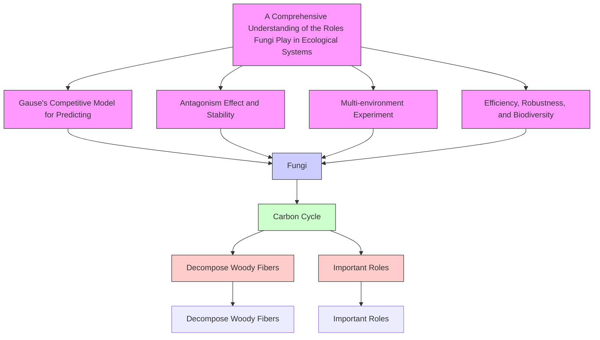

# GAME: A Seer on Fungi Living Strategies and Biodiversity Based on Gause’s Model

Summary

Decomposition of organic matters by fungi, an indispensable part of carbon cycle, can make carbon reused in the environment. A recent article explores the impact of different traits on its decomposition effeciency. In this paper, we focus on two main traits, hyphal extension rate and moisture tolerance, together with interactions among fungi and various environmental conditions, to simulate the breakdown of woody fibers and comprehend the importance of biodiversity.

Our GAME model is made up of the initials of four task names. Before we start our experiments, we build up a prediction model to simulate the cross action among different fungi and their effect on the decomposition process of woody fibers. We adopt Gause’s Competitive Model to uncover the interactions among species and derive a differential system by considering the change of woody fibers amount. The model describes growth, hyphal extension, competition, and decomposition of fungi.

Firstly, in order to simplify the model, we fix temperature $T = 2 2 \ { } ^ { \circ } { \mathrm { C } } ,$ , and set the trait parameters of three different fungi artificially. Experiment results shown that our model is of high reasonability since the predicted decomposition rate is nearly 30%, which approximately equals to verified research results.

Secondly, we are to choose five representitive fungi as our experiment objects, which are P.Flavidoalba.S., P.Hartigii.N., M.Tremellosus.N., P.Sangioneus.S., and H.Setigerum.N., respectively. After describing their typical characteristics, we introduce the Moisture/Temperature Tolerance Factor for calibrating. Based on the model proposed, we find that the species P.Flavidoalba.S. is always dominant at Columbus (temperate) in short-term (7 days) and long-term (122 days), due to its general advantage on moisture. Also, rapid fluctuation experiment indicates those who adapt the environment well will be in dominance.

Thirdly, we choose five cities, Santa Fe (Arid), Sioux Falls (semi-arid), Columbus (temperate), Atlanta (arboreal), and Codaja´s (rain forest), and do the same prediction on the previous step. The result shows that, except for the leading fungus P.Flavidoalba.S., other species’ density gradually decrease, but never tend to 0. Additionally, P.Flavidoalba.S., P.Sangioneus.S., M.Tremellosus.N. will have a consistent competition in tropical rain forest, since they have their unique advantages in this environment. The decomposition rate will be relatively better for higher temperature and moisture to some extent.

Fourthly, we explore the decomposition efficiency of the system by changing the number of fungus, and discover that they actually have positive correlation in all areas. Moreover, it is shown that compared with arid region, tropical rain forest will have a higher requirement for biodiversity since it has a relatively stable climate.

After modelling, we also conduct sensitivity analysis, which reveals our model’s robustness to some parameters. We finally summarize our strengths and weaknesses. A brief conclusion is also presented in the paper.

# GAME: A Seer on Fungi Living Strategies and Biodiversity Based on Gause’s Model

February 9, 2021

## Contents

## 1 Introduction 3

1.1 Background 3  
1.2 Our Work . 3  
1.3 Data Pre-processing . . . . 5

## 2 Assumptions 5

## 3 Abbreviation and Definitions 6

## 4 The GAME Model 7

4.1 Gause’s Model for Predicting Fungus’ Decomposition of Woody Fibers . . . . 7  
4.1.1 Model Description  
4.1.2 Inplementation 8

4.2 Antagonism Effect and Stability . . 10

4.2.1 Background of This Problem 10  
4.2.2 Moisture Tolerance Analysis 12  
4.2.3 Methods to Analyze Antagonism Effect . 12  
4.2.4 Inplementation 13

4.3 Multi-environment Experiment for Revealing Habitats 14

4.4 Efficiency, Robustness, and Biodiversity . 17

## 5 Sensitivity Analysis 18

## 6 Strengths and Weaknesses 19

6.1 Strengths 19  
6.2 Weaknesses 20

## 7 Conclusion 20

## 1 Introduction

## 1.1 Background

The carbon cycle is the biogeochemical cycle key to make Earth capable of sustaining life, by which carbon is exchanged among the biosphere, pedosphere, geosphere, hydrosphere, and atmosphere of the Earth. Part of the carbon cycle includes photosynthesis, vegetative growth and decomposition, allowing carbon to be renewed and used in other forms [1]. The decomposition of plant material and woody fibers is a key component in this cycle.

Fungi, a group of eukaryotic organisms, plays important role in decomposing woody fibers [2, 3]. The role of fungi in carbon cycle is schematically shown in Figure 1.

Recently, an article points out that wood decomposition rate varies greatly among fungi which have different traits [4]. In particular, the slow growing strains are less capable of decomposing woody fibers while has higher moisture tolerance. On the contrary, the fast growing strains tend to exist in more favorable environments, which has more stable moisture and temperature.


<details>
<summary>text_image</summary>

Carbon Cycle
CO₂
Woody Fibers
Decomposer Fungi
</details>

Figure 1: The Fungi and Carbon Cycle

## 1.2 Our Work

In this problem, the growth rate of the fungus and the fungus tolerance to moisture are the only two traits we considered. We evaluate the importance of biodiversity by accomplishing several tasks:

Task 1 We are to build a prediction model in order to reveal fungus’ evolution as well as their decomposition of woody fibers.

We use the data from the article mentioned in Section 1.1, making log-log linear regression to determine decomposition curve. Then we use Gause’s competitive model to make the prediction. We take the interaction of different fungus into consideration and design a 122-day-experiment to validate our model.

Task 2 We give the stimulation on a fixed region in both short- and long-term to describe the growcompetitive tendency of various species. A exploration on rapid fluctuation weather is also provided to show the system roundly. 010

Applying the model we established in Task 1, we first choose five typical fungi and excavate their trials in [7], and we pick up temperature and moisture data in Columbus, Ohio as from September to December. We set short-term a week while long-term 122 days. For rapid fluctuation stimulation, we choose a segment in Santa Fe, New Mexico and periodically extend it to 122 days, then we give analysis on what is predicted.

Task 3 To explore the advantages and disadvantages for each kind of fungus, we conduct the experiments to describe the dynamics of interactions in long-short terms. Different environments are also considered to achieve the generality and completeness.

First we choose five representitive cities in different climate and show their geographic locations. Then we do similar experiments in Task 2 under variant environments. By contrasting and analyzing the results in detail, we get a more comprehensive understanding and conclusion.

Task 4 We are to consider the influence of biodiversity in different environments, as well as the fungus diversity requirement of those regions.

Applying decomposition rate of 122 days as the indicator of biodiversity in various environments, we are to consider 5, 3 and 2 kinds of equal-total-density species and make corresponding experiment. Then, the conception of influence rate of diversity decrease is introduced to show the extent how a region requires biodiversity. From this we can dig out some results for reference.

For better understanding of the overall model, a flowchart is provided to describe our process.


<details>
<summary>flowchart</summary>


</details>

Figure 2: The Framework of the GAME Model

## 1.3 Data Pre-processing

The estimation for the decomposition rates, given the growth rate, is shown in Figure 3, each triangle represents a fungal isolate.


<details>
<summary>scatterplot</summary>

| x    | log(decomposition rate) |
| ---- | ------------------------ |
| -3   | 0.4                      |
| -2   | 0.8                      |
| -1   | 1.3                      |
| 0    | 1.7                      |
| 1    | 2.5                      |
</details>


<details>
<summary>scatterplot</summary>

| x    | y    |
| ---- | ---- |
| -1.8 | -1.0 |
| -1.5 | 0.7  |
| -1.2 | 1.9  |
| -0.8 | 2.4  |
| -0.5 | 1.3  |
| -0.2 | 1.8  |
| 0.0  | 2.0  |
| 0.3  | 1.7  |
| 0.6  | 1.2  |
| 0.9  | 1.9  |
| 1.2  | 2.3  |
| 1.5  | 2.8  |
| 1.8  | 3.0  |
| 2.0  | 3.1  |
| -1.6 | -2.2 |
| -0.9 | -2.0 |
| -0.3 | -1.8 |
| 0.1  | -0.9 |
| 0.4  | -0.5 |
| 0.7  | -0.2 |
| 1.0  | 0.6  |
| 1.3  | 1.8  |
| 1.6  | 2.9  |
| 1.9  | 3.2  |
| -1.4 | -0.8 |
| -0.7 | -0.4 |
| -0.1 | -0.1 |
| 0.2  | -0.7 |
| 0.5  | -1.1 |
| 0.8  | -1.4 |
| 1.1  | -1.6 |
| 1.4  | -1.9 |
| 1.7  | -2.1 |
| -1.3 | -0.6 |
| -0.6 | -0.2 |
| -0.0 | -0.5 |
| 0.2  | -0.8 |
| 0.5  | -1.0 |
| 0.8  | -1.3 |
| 1.1  | -1.5 |
| 1.4  | -1.7 |
| 1.7  | -1.9 |
| -1.2 | -0.4 |
| -0.4 | -0.1 |
| -0.8 | -0.6 |
| -1.1 | -0.9 |
| -1.4 | -1.2 |
| -1.7 | -1.4 |
| -2.0 | -1.6 |
| -2.3 | -1.8 |
| -2.6 | -2.0 |
| -2.9 | -2.2 |
| -3.2 | -2.4 |
| -3.5 | -2.6 |
| -3.8 | -2.8 |
| -4.1 | -3.0 |
| -4.4 | -3.2 |
| -4.7 | -3.4 |
| -5.0 | -3.6 |
| -5.3 | -3.8 |
| -5.6 | -4.0 |
| -5.9 | -4.2 |
| -6.2 | -4.4 |
| -6.5 | -4.6 |
| -6.8 | -4.8 |
| -7.1 | -5.0 |
| -7.4 | -5.2 |
| -7.7 | -5.4 |
| -8.0 | -5.6 |
| -8.3 | -5.8 |
| -8.6 | -6.0 |
| -8.9 | -6.2 |
| -9.2 | -6.4 |
| -9.5 | -6.6 |
| -9.8 | -6.8 |
| -10.1| -7.0 |
| -10.4| -7.2 |
| -10.7| -7.4 |
| -11.0| -7.6 |
| -11.3| -7.8 |
| -11.6| -8.0 |
| -11.9| -8.2 |
| -12.2| -8.4 |
| -12.5| -8.6 |
| -12.8| -8.8 |
| -13.1| -9.0 |
| -13.4| -9.2 |
| -13.7| -9.4 |
| -14.0| -9.6 |
| -14.3| -9.8 |
| -14.6| -10.0|
| -14.9| -10.2|
| -15.2| -10.4|
| -15.5| -10.6|
| -15.8| -10.8|
| -16.1| -11.0|
| -16.4| -11.2|
| -16.7| -11.4|
| -17.0| -11.6|
| -17.3| -11.8|
| -17.6| -12.0|
| -17.9| -12.2|
| -18.2| -12.4|
| -18.5| -12.6|
| -18.8| -12.8|
| -19.1| -13.0|
| -19.4| -13.2|
| -19.7| -13.4|
| -20.0| -13.6|
| -20.3| -13.8|
| -20.6| -14.0|
| -20.9| -14.2|
| -21.2| -14.4|
| -21.5| -14.6|
| -21.8| -14.8|
| -22.1| -15.0|
| -22.4| -15.2|
| -22.7| -15.4|
| -23.0| -15.6|
| -23.3| -15.8|
| -23.6| -16.0|
| -23.9| -16.2|
| -24.2| -16.4|
| -24.5| -16.6|
| -24.8| -16.8|
| -25.1| -17.0|
| -25.4| -17.2|
| -25.7| -17.4|
| -26.0| -17.6|
| -26.3| -17.8|
| -26.6| -18.0|
| -26.9| -18.2|
| -27.2| -18.4|
| -27.5| -18.6|
| -27.8| -18.8|
| -28.1| -19.0|
| -28.4| -19.2|
| -28.7| -19.4|
| -29.0| -19.6|
| -29.3| -19.8|
| -29.6| -20.0|
| -29.9| -20.2|
</details>


<details>
<summary>scatterplot</summary>

| x    | y    |
| ---- | ---- |
| -1.0 | 2.4  |
| -0.8 | 2.7  |
| -0.6 | 2.3  |
| -0.4 | 2.5  |
| -0.2 | 2.6  |
| 0.0  | 2.8  |
| 0.2  | 2.5  |
| 0.4  | 2.6  |
| 0.6  | 2.7  |
| 0.8  | 2.9  |
| 1.0  | 3.3  |
| 1.2  | 3.5  |
| 1.4  | 3.7  |
| 1.6  | 3.9  |
| 1.8  | 3.6  |
| 2.0  | 3.8  |
| 2.2  | 4.1  |
| 2.4  | 3.9  |
| 2.6  | 3.7  |
| 2.8  | 3.5  |
| 3.0  | 3.3  |
| 3.2  | 3.1  |
| 3.4  | 2.9  |
| 3.6  | 2.7  |
| 3.8  | 2.5  |
| 4.0  | 2.3  |
| -1.0 | 2.8  |
| -0.8 | 3.0  |
| -0.6 | 3.2  |
| -0.4 | 3.4  |
| -0.2 | 3.6  |
| 0.0  | 3.8  |
| 0.2  | 4.0  |
| 0.4  | 4.2  |
| 0.6  | 4.4  |
| 0.8  | 4.6  |
| 1.0  | 4.8  |
| 1.2  | 5.0  |
| 1.4  | 5.2  |
| 1.6  | 5.4  |
| 1.8  | 5.6  |
| 2.0  | 5.8  |
| -1.0 | 3.0  |
| -0.8 | 3.2  |
| -0.6 | 3.4  |
| -0.4 | 3.6  |
| -0.2 | 3.8  |
| 0.0  | 4.0  |
| 0.2  | 4.2  |
| -0.8 | -0.2 |
| -0.6 | -0.4 |
| -0.4 | -0.6 |
| -0.2 | -0.8 |
| -0.1 | -1.0 |
| -0.3 | -1.2 |
| -0.1 | -1.4 |
| -0.1 | -1.6 |
| -0.3 | -1.8 |
| -0.1 | -2.0 |
| -0.1 | -2.2 |
| -0.3 | -2.4 |
| -0.1 | -2.6 |
| -0.1 | -2.8 |
| -0.3 | -3.0 |
| -0.1 | -3.2 |
| -0.1 | -3.4 |
| -0.3 | -3.6 |
| -0.1 | -3.8 |
| -0.1 | -4.0 |
| -0.3 | -4.2 |
| -0.1 | -4.4 |
| -0.1 | -4.6 |
| -0.3 | -4.8 |
| -0.1 | -5.0 |
| -0.1 | -5.2 |
| -0.3 | -5.4 |
| -0.1 | -5.6 |
| -0.1 | -5.8 |
| -0.3 | -6.0 |
| -0.1 | -6.2 |
| -0.1 | -6.4 |
| -0.3 | -6.6 |
| -0.1 | -6.8 |
| -0.1 | -7.0 |
| -0.3 | -7.2 |
| -0.1 | -7.4 |
| -0.1 | -7.6 |
| -0.3 | -7.8 |
| -0.1 | -8.0 |
| -0.1 | -8.2 |
| -0.3 | -8.4 |
| -0.1 | -8.6 |
| -0.1 | -8.8 |
| -0.3 | -9.0 |
| -0.1 | -9.2 |
| -0.1 | -9.4 |
| -0.3 | -9.6 |
| -0.1 | -9.8 |
| -0.1 | -10.0|
| -0.3 | -10.2|
| -0.1 | -10.4|
| -0.1 | -10.6|
| -0.3 | -10.8|
| -0.1 | -11.0|
| -0.1 | -11.2|
| -0.3 | -11.4|
| -0.1 | -11.6|
| -0.1 | -11.8|
| -0.3 | -12.0|
| -0.1 | -12.2|
| -0.1 | -12.4|
| -0.3 | -12.6|
| -0.1 | -12.8|
| -0.1 | -13.0|
| -0.3 | -13.2|
| -0.1 | -13.4|
| -0.1 | -13.6|
| -0.3 | -13.8|
| -0.1 | -14.0|
| -0.1 | -14.2|
| -0.3 | -14.4|
| -0 .-1)|
</details>

log(Hyphal extension rate)  
Figure 3: The relationship between the log of hyphal extension rate (mm/day) of various fungi and the log of decomposition rate (% mass loss over 122 days) at various temperatures $( 1 0 ^ { \circ } \mathrm { C } , 1 6 ^ { \circ } \mathrm { C } , 2 2 ^ { \circ } \mathrm { C } )$ .

Using the data [4] provided by the research group mentioned in Section 1.1, we do least square regression for the relationship between the log of decomposition rate and the log of extension rate. Results are shown in Table 1.

Table 1: Parameter Estimates of Different Temperature Settings

<table><tr><td rowspan="2">Temperature Setting</td><td colspan="4">Parameter Estimates</td></tr><tr><td>Slope</td><td>Intercept</td><td>R-square</td><td>P-value</td></tr><tr><td>10°C</td><td>0.3847</td><td>1.5190</td><td>0.4477</td><td>&lt;0.0001</td></tr><tr><td>16°C</td><td>0.6930</td><td>1.5789</td><td>0.3464</td><td>0.0003</td></tr><tr><td>22°C</td><td>0.2225</td><td>2.6330</td><td>0.1568</td><td>0.0204</td></tr></table>

## 2 Assumptions

To simplify the problem, we make the following basic assumptions, each of which is properly justified.

• Assumption 1: The decomposition rate of a certain fungus is consistent in the decay cycle when all conditions are constant. Thus, we take the rate in the middle stage as the decomposition rate.

,→Justification: According to the research article mentioned in Section 1.1, the fungi examined are most relevant with respect to the decay of woody materials in the middle of their decay cycle. Therefore, we can assume that the decomposition rate of a certain fungus is consistent.

• Assumption 2: Inherent growth rate is positively correlate with inherent tension rate when all conditions are consistent. 210 ,→Justification: As the inherent growth rate and inherent hyphal extension rate are both drived by the growth of hyphae, we can assume that there exists positive correlation.

• Assumption 3: All fungi shares a common environmental capacity.

,→Justification: For model simplication, we suppose that they have a equal environmental capacity, since these cannot be discriminated in experimental environment.

• Assumption 4: The diffusion of external fungus should be ignored.

,→Justification: Here we only consider a relatively closed region where outside fungus can hardly diffuse in this area, which means the growth of each species will only depend on its proliferation rate.

• Assumption 5: No influential human being activities.

,→Justification: Though most of our data are driven from the nature, we design all experiment in laboratory environment which has nearly no human being activities except adjusting its temperature and moisture.

## 3 Abbreviation and Definitions

We begin by defining a list of nomenclature (symbols) used in this article, cf. Table 2.

Table 2: Nomenclature

<table><tr><td>Symbol</td><td>Definition</td><td>Unit</td></tr><tr><td> $T(t)$ </td><td>temperature at where fungi grow</td><td>°C</td></tr><tr><td> $\phi(t)$ </td><td>relative humidity at where fungi grow</td><td>/</td></tr><tr><td> $V(t)$ </td><td>relative density of woody fibers</td><td>/</td></tr><tr><td> $F_i(t)$ </td><td>density of the i-th fungus</td><td> $g/m^2$ </td></tr><tr><td> $l_i(t)$ </td><td>hyphal length of the i-th fungus</td><td>mm/day</td></tr><tr><td> $r_i(T, \phi)$ </td><td>inherent growth rate of the i-th fungus</td><td> $g/(m^2 \cdot day)$ </td></tr><tr><td> $m_i(T, \phi)$ </td><td>inherent hyphal extension rate of the i-th fungus</td><td>mm/day</td></tr><tr><td> $c_{ij}(T, \phi)$ </td><td>relative competitiveness of species i to species j</td><td>/</td></tr><tr><td> $n_i$ </td><td>the environmental capacity of the i-th fungus</td><td> $g/m^2$ </td></tr><tr><td>K</td><td>the comprehension capacity</td><td> $g/m^2$ </td></tr><tr><td>p</td><td>the growth-hyphal extension ratio</td><td>/</td></tr><tr><td> $\mu_1^i(T)$ </td><td>moisture-controlled relative hyphal extension rate for the i-th fungus</td><td>mm/day</td></tr><tr><td> $\mu_2^i(\phi)$ </td><td>temperature-controlled relative hyphal extension rate for the i-th fungus</td><td>mm/day</td></tr><tr><td> $G(\phi)$ </td><td>moisture tolerance factor</td><td>/</td></tr><tr><td> $H(T)$ </td><td>temperature tolerance factor</td><td>/</td></tr><tr><td> $D_i^j$ </td><td>122 days decomposition rate for i fungi in j-th region</td><td>/</td></tr><tr><td> $I^j$ </td><td>influence rate of diversity decrease for j-th region</td><td>/</td></tr></table>

## 4 The GAME Model

Now, we are to state our model in detail.

## 4.1 Gause’s Model for Predicting Fungus’ Decomposition of Woody Fibers

In this section, we apply Gause’s Competitive Model and use finite difference method to make the prediction.

## 4.1.1 Model Description

To predict the distribution of different species of fungi in the future, together with the efficiency of decomposition, we construct a differential equation model based on Gause’s Competitive Model for describing population competition [5]. Here we denote t as the time indicator, and $T ( t ) , \phi ( t )$ as the temperature and moisture, respectively.

Let $V ( t )$ be the density of woody fibers, and $F _ { i } ( t ) , l _ { i } ( t )$ be the density and hyphal length of the i-th fungus, respectively, $i = 1 , 2 , \cdots , s .$ . Following by the requirement of evaluating the importance of biodiversity, we assume that there are no woody fibers new produced in order to quantify the woody fibers decomposed by fungi. That is, the total weight loss of woody fiber equals to the decomposition amount. The change of V is composed of each fungus’ decomposition activity, which is associated with its extension rate and the total species density here. For each species $F _ { i } ,$ its growth will face the pressure of competition from other fungi. And for hyphal extension rate $l _ { i } ,$ based on its inherent growth rate, it will be influenced by species competition. A schematic map is presented in Figure 4.


<details>
<summary>natural_image</summary>

Illustration of three stages of mushroom growth showing root and shoot structures (no text or labels)
</details>

Figure 4: Competition Among Different Fungi

In the left cube (light green color), total species density is high. Consequently, their generative hyphaes meet and interact with each other. In the right cube (dark green color), there exists no competition as total species density is low.

Hence the ordinary differential functions for prediction are listed as follows:

$$
\left\{ \begin{array}{l} \frac {d V}{d t} = - \sum_ {i = 1} ^ {s} f (T, \phi , \frac {d l _ {i}}{d t}) \cdot V \cdot \left(1 - \frac {F _ {1} + F _ {2} + \cdots + F _ {s}}{K}\right) \\ \frac {d F _ {i}}{d t} = r _ {i} (T, \phi) \cdot F _ {i} \cdot \left(1 - c _ {i 1} (T, \phi) \frac {F _ {1}}{n _ {1}} - c _ {i 2} (T, \phi) \frac {F _ {2}}{n _ {2}} - \dots - c _ {i s} (T, \phi) \frac {F _ {s}}{n _ {s}}\right), \quad i = 1, 2, \dots , s \\ \frac {d l _ {i}}{d t} = m _ {i} (T, \phi) \left(1 - \frac {F _ {1} + F _ {2} + \cdots + F _ {s}}{K}\right), \quad i = 1, 2, \dots , s \end{array} \right. \tag {1}
$$

where

• $f ( \cdot , \cdot , \cdot )$ : The decomposition rate function, determined by Figure 3.  
• $K \colon$ The comprehensive environmental capacity for fungi.  
• $n _ { i } \colon$ The environmental capacity for each fungus.  
• $c _ { i j } ( \cdot , \cdot )$ : The relative competitiveness of species i. More precisely, we have

• $r _ { i } ( \cdot , \cdot )$ : The inherent growth rate for each species, related to temperature and moisture.

• $m _ { i } ( \cdot , \cdot )$ : The inherent hyphal extension rate for each species, related to temperature and moisture.

$$
C = \left(c _ {i j}\right) _ {s \times s} = \left( \begin{array}{c c c c} 1 & c _ {1} (T, \phi) & \dots & c _ {1} (T, \phi) \\ c _ {2} (T, \phi) & 1 & \dots & c _ {2} (T, \phi) \\ \dots & \dots & \dots & \dots \\ c _ {s} (T, \phi) & c _ {s} (T, \phi) & \dots & 1 \end{array} \right) \tag {2}
$$

where $\begin{array} { r } { c _ { i } ( T , \phi ) = 1 - \frac { m _ { i } ( T , \phi ) } { \displaystyle \sum _ { j = 1 } ^ { s } m _ { j } ( T , \phi ) } } \end{array}$ is the inherent competitive coefficient, negatively correlated to $m _ { i } .$ .

To approch the prediction of species as well as decomposition amount, we need a numerical scheme for explaining how they evolve in both short-term and long-term. Since it is an 1-order ordinary differential system which does not contain higher-order term and high-dimensional grid, we shall apply traditional Finite Difference Method for solving this system numerically [6]. we are able to derive results in simulating environments, which will be illustrated detailly in the next part.

## 4.1.2 Inplementation

To balance the calculating efficency and simulation vraisemblance, we create three representative species, which have great differences in inherent hyphal extension rate, inherent growth rate, and resource consumption rate, to simulate the circumstance of competition. The attribute of each species and set parameters are listed in Table 3. Other parameters set in this simulating experiment are listed in Table 4.

Table 3: Attributes and Parameter Set for Three Chosen Species

<table><tr><td rowspan="2">Species Number</td><td colspan="2">Attributes</td><td colspan="3">Parameter Set</td></tr><tr><td>Tolerance</td><td>Dominance</td><td>Extension Rate</td><td>Growth Rate</td><td>Consumption Rate</td></tr><tr><td>1</td><td>High</td><td>Low</td><td>1.5</td><td>0.1</td><td>1.2</td></tr><tr><td>2</td><td>Median</td><td>Median</td><td>4.5</td><td>0.3</td><td>1.1</td></tr><tr><td>3</td><td>Low</td><td>High</td><td>10.5</td><td>0.7</td><td>1.0</td></tr></table>

1 Extension rate, growth rate, and consumption rate are all relative value.

Table 4: Other Parameters in the Simulating Experiment

<table><tr><td>Parameter</td><td>Value</td></tr><tr><td>Environmental capacity for single species</td><td>100</td></tr><tr><td>Environmental capacity for multiple species</td><td>200</td></tr><tr><td>Environment temperature</td><td>22°C</td></tr><tr><td>Initial hyphal length</td><td>1 mm</td></tr><tr><td>Experiment period</td><td>122 days</td></tr></table>

In this experiment, we assume that temperature and moisture are both consistent and optimal for three species to grow and multiply, that is, competitiveness is the only factor we taken into consideration. Initial density of fungi is: 20 (species 1), 15 (species 2), and 0.5 (species 3), respectively. The simulating result is shown in Figure 5.


<details>
<summary>line chart</summary>

| Time(day) | species 1 | species 2 | species 3 |
| --------- | --------- | --------- | --------- |
| 0         | 20        | 15        | 0         |
| 20        | 28        | 54        | 20        |
| 40        | 22        | 40        | 45        |
| 60        | 15        | 25        | 65        |
| 80        | 10        | 15        | 75        |
| 100       | 7         | 10        | 85        |
| 120       | 4         | 4         | 90        |
</details>

Figure 5: The Density Change of Fungi by Time

By analyse the changing tendency in the gragh above, we can derive the following significant conclusions:

• Although species 3 has low density at the beginning, its density increases rapidly by time and gradually outcompetes other two species for its high competitiveness.  
• The density of species 1 and 2 decreases as time went by though they density. 0

• The species that has the highest competitiveness will be the only winner if environment keeps consistent, but other species may maintain a relatively low density, rather than extincting entirely.

Figure 6 shows relative decomposition efficiency of three species. Figure 7 shows relative density of woody fibers. We can find that: Decomposition efficiency decreases by time, giving the reason that competition between species and increase in its populaiton both make the contribution. In 0-15 days, the decrease rate is fast because it does not reach the balance. When it reaches the balance (15-122 days), the decrease rate becomes much slower. Besides, we can see that woody fibers mass loss is about 30% in an experiment period, which approximately equals to the result in the research article mentioned in Section 1.1, further validates the reasonability of our model.


<details>
<summary>line chart</summary>

| Time(day) | species 1 | species 2 | species 3 |
| --------- | --------- | --------- | --------- |
| 0         | 0.0010    | 0.00125   | 0.0015    |
| 20        | 0.0005    | 0.0006    | 0.00075   |
| 40        | 0.00045   | 0.00055   | 0.0007    |
| 60        | 0.00042   | 0.00052   | 0.00068   |
| 80        | 0.0004    | 0.0005    | 0.00065   |
| 100       | 0.00038   | 0.00048   | 0.00063   |
| 120       | 0.00035   | 0.00045   | 0.0006    |
</details>

Figure 6: Relative Decomposition Efficiency of Three Species by Time


<details>
<summary>line chart</summary>

| Time(day) | Relative density of woody fibers |
| --------- | --------------------------------- |
| 0         | 1.00                              |
| 20        | 0.95                              |
| 40        | 0.90                              |
| 60        | 0.85                              |
| 80        | 0.80                              |
| 100       | 0.75                              |
| 120       | 0.70                              |
</details>

Figure 7: Relative Density of Woody Fibers by Time

## 4.2 Antagonism Effect and Stability

In this part, we choose the temperate environment as experiment environment and analyze the impact of changing atmospheric trends on the growth mode of fungi and assess the impact of variation of local weather patterns on the rate of woody fiber decomposition.

## 4.2.1 Background of This Problem

We are to pick up 5 typical species for better readability and analyzability, without loss of generalizability. They are listed as follows, together with their major characteristics in graphs below, all data about fungi is acquired from a research article about fungi decomposition [7]. Figure 8 demonstrates the hyphal extension rate of five different species changed by temperature. Figure 9 shows the hyphal extension rate of five different species changed by water potential. Each Species’ strength and weakness are shown in Figure 10.

• P.Flavidoalba.S. This species has the ability of maintaining hyphal extension rate under pretty low water potential. There are great chance detecting this at arid or semiarid region.  
• P.Hartigii.N. This species is a representative of disadvantaged fun tively low hyphal extension rate. However, it may tolerate extreme weather and rapid pid

fluctuation, which may survive from catastrophe.

• M.Tremellosus.N. This species has a high requirement on water potential, since it decays rapidly when going away from its optimal moisture. Where it exists may have a relatively stable climate.  
• P.Sanguineus.S. This species can reach the maximum of hyphal extension rate, with a relatively high optimal temperature interval. Tropical region may be the best habitat for this fungus.  
• H.Setigerum.N. This species can proliferate well in extreme wet area, but it cannot tolerate a relatively high temperature. It may be the dominant fungus at where the water potential is sufficient large.


<details>
<summary>line chart</summary>

| Temperature(°C) | p.flav.s | p.har.n | m.trem.n | p.sang.s | h.seti.n |
| --------------- | -------- | ------- | -------- | -------- | -------- |
| 0               | 0.0      | 0.0     | 0.0      | 0.0      | 0.0      |
| 10              | 3.0      | 0.5     | 2.0      | 1.0      | 1.5      |
| 20              | 8.0      | 1.0     | 6.0      | 4.0      | 3.0      |
| 30              | 12.5     | 1.5     | 12.0     | 12.0     | 8.0      |
| 40              | 0.0      | 0.0     | 0.0      | 15.5     | 0.0      |
| 50              | 0.0      | 0.0     | 0.0      | 0.0      | 0.0      |
</details>

Figure 8: Hyphal Extension Rate of Five Species Changed by Temperature


<details>
<summary>line chart</summary>

| Water potential(MPa) | p.flav.s | p.har.n | m.trem.n | p.sang.s | h.seti.n |
| -------------------- | -------- | ------- | -------- | -------- | -------- |
| -5                   | 1.0      | 0.0     | 0.0      | 0.0      | 0.0      |
| -4                   | 2.5      | 0.0     | 0.0      | 0.0      | 0.0      |
| -3                   | 4.5      | 0.0     | 0.0      | 0.5      | 0.0      |
| -2                   | 7.0      | 0.5     | 1.0      | 2.0      | 0.5      |
| -1                   | 9.5      | 1.5     | 6.0      | 4.5      | 2.5      |
| 0                    | 11.0     | 2.0     | 11.0     | 5.0      | 4.5      |
</details>

Figure 9: Relative Density of Woody Fibers by Time


<details>
<summary>radar chart</summary>

| Model     | HT   | CT   | WT   | DT   | VT   |
|-----------|------|------|------|------|------|
| p.flav.s  | 100  | 95   | 90   | 85   | 92   |
| p.har.n   | 100  | 70   | 65   | 60   | 75   |
| m.trem.n  | 100  | 100  | 100  | 100  | 100  |
| p.sang.s  | 100  | 100  | 100  | 100  | 100  |
| h.seti.n  | 100  | 100  | 100  | 100  | 100  |
</details>

Figure 10: Ability Value of Each Fungus. (HT: Heat Tolerance, CT: Cold Tolerance, WT: Wet Tolerance, DT: Drought Tolerance, VT: decomposition rate of a fungus when at its optimal temperature, VM: decomposition rate of a fungus when at its optimal moisture)

In this problem, we choose Columbus, Ohio as our experiment environment, which is a representitive of temperate climate. All the climate data are acquired from the wunderground website [8].

Short-term and long-term climate trend including temperature and humidity in Columbus are shown in Figure 11 and Figure 12.


<details>
<summary>line chart</summary>

| Time(h) | Temperature(°C) | Humidity(%) |
| ------- | --------------- | ----------- |
| 0       | 20              | 95          |
| 24      | 25              | 65          |
| 48      | 22              | 90          |
| 72      | 28              | 60          |
| 96      | 15              | 40          |
| 120     | 25              | 90          |
| 144     | 20              | 75          |
| 168     | 28              | 95          |
</details>

Figure 11: Short-term Climate Trend in Columbus: Data collected from September $1 ^ { \mathrm { s t } }$ to September $7 ^ { \mathrm { t h } }$ at hourly intervals.


<details>
<summary>line chart</summary>

| Time(day) | Temperature(°C) | Humidity(%) |
| --------- | --------------- | ----------- |
| 0         | 25              | 85          |
| 10        | 22              | 90          |
| 20        | 18              | 70          |
| 30        | 20              | 80          |
| 40        | 15              | 75          |
| 50        | 18              | 95          |
| 60        | 12              | 85          |
| 70        | 20              | 70          |
| 80        | 5               | 30          |
| 90        | 10              | 90          |
| 100       | 15              | 80          |
| 110       | 5               | 90          |
| 120       | 2               | 75          |
</details>

Figure 12: Long-term Climate Trend in Columbus: Data collected from September $1 ^ { \mathrm { s t } }$ to December $3 1 ^ { \mathrm { s t } }$ at daily intervals.

## 4.2.2 Moisture Tolerance Analysis

It is well-known that if a fungus has a relatively better hyphal extension rate, it will perform relatively worsely on moisture or temperature tolerance. Good examples are m.trem.n and p.har.n above.

To measure this significant indicator and explore the influence on decomposition rate, we introduce the Moisture Tolerance Factor $G ( \phi )$ to quantificate this trait. Suppose $\mu _ { 1 } ^ { i } ( \phi )$ be the moisture-controlled relative hyphal extension rate for the i-th fungus (Figure 9), then we define $G ( \phi )$ as

$$
G (\phi) = \frac {\mu_ {1} ^ {i} (\phi)}{\mu_ {1} ^ {i} \left(\phi_ {0}\right)} \tag {3}
$$

where

$$
\phi_{0} = \underset {\phi \in [0,100\% ]}{Argmax}\mu_{1}^{i}(\phi)
$$

Taking $G ( \phi ) \geq 5 0 \%$ be the standard for optimal moisture, it can be calculated obviously that m.trem.n will have smaller optimal moisture interval than p.har.n, which can actually reflect the mositure tolerance of these species.

Similarly, we can determine $\begin{array} { r } { H ( T ) = \frac { \mu _ { 2 } ^ { i } ( T ) } { \mu _ { 2 } ^ { i } ( T _ { 0 } ) } } \end{array}$ be the Temperature Tolerance Factor, which will be applied in prediction later.

## 4.2.3 Methods to Analyze Antagonism Effect

In order to get the relationship between hyphal extension rate and deco we do interpolation use the linear regression result of $1 0 ^ { \circ } \mathrm { C } , 1 6 ^ { \circ } \mathrm { C } , 2 2 ^ { \circ } \mathrm { C }$ in Section 1.3. As the trend of $1 6 ^ { \circ } \mathrm { C }$ deviates largely from the other two temperature, we only use the regression result of $1 0 ^ { \circ } \mathrm { C }$ and $2 2 ^ { \circ } \mathrm { C }$ to do the linear interpolation of intercept. Besides, to reach better universality, we set slope λ to 0.44, which is the regression coefficient of log(geometric mean decomposition rate) across $1 0 ^ { \circ } \mathrm { C } , 1 6 ^ { \circ } \mathrm { C } , 2 2 ^ { \circ } \mathrm { C } \sim$ log(hyphal extension rate).

The interpolation result of decomposition rate versus hyphal extension rate on different temperature is shown in Figure 13.


<details>
<summary>scatterplot</summary>

| Hyphal extension rate(mm/day) | Decomposition rate(%) | Temperature |
| --- | --- | --- |
| 0.5 | 40 | 22°C |
| 0.8 | 15 | 22°C |
| 1.0 | 18 | 22°C |
| 1.2 | 16 | 22°C |
| 1.5 | 14 | 22°C |
| 1.8 | 12 | 22°C |
| 2.0 | 10 | 22°C |
| 2.5 | 8 | 22°C |
| 3.0 | 6 | 22°C |
| 3.5 | 10 | 22°C |
| 4.0 | 15 | 22°C |
| 4.5 | 20 | 22°C |
| 5.0 | 25 | 22°C |
| 5.5 | 30 | 22°C |
| 6.0 | 35 | 22°C |
| 6.5 | 40 | 22°C |
| 7.0 | 45 | 22°C |
| 7.5 | 50 | 22°C |
| 8.0 | 55 | 22°C |
| 8.5 | 60 | 22°C |
| 9.0 | 65 | 22°C |
| 9.5 | 70 | 22°C |
| 10.0 | 75 | 22°C |
| 10.5 | 80 | 22°C |
| 11.0 | 85 | 22°C |
| 11.5 | 90 | 22°C |
| 12.0 | 95 | 22°C |
| 12.5 | 100 | 22°C |
| 13.0 | 105 | 22°C |
| 13.5 | 110 | 22°C |
| 14.0 | 115 | 22°C |
| 14.5 | 120 | 22°C |
| 15.0 | 125 | 22°C |
| 15.5 | 130 | 22°C |
| 16.0 | 135 | 22°C |
| 16.5 | 140 | 22°C |
| 17.0 | 145 | 22°C |
| 17.5 | 150 | 22°C |
| 18.0 | 155 | 22°C |
| 18.5 | 160 | 22°C |
| 19.0 | 165 | 22°C |
| 19.5 | 170 | 22°C |
| 20.0 | 175 | 22°C |
| 20.5 | 180 | 22°C |
| 21.0 | 185 | 22°C |
| 21.5 | 190 | 22°C |
| 22.0 | 195 | 22°C |
| 22.5 | 200 | 22°C |
| 23.0 | 205 | 22°C |
| 23.5 | 210 | 22°C |
| 24.0 | 215 | 22°C |
| 24.5 | 220 | 22°C |
| 25.0 | 225 | 22°C |
| 25.5 | 230 | 22°C |
| 26.0 | 235 | 22°C |
| 26.5 | 240 | 22°C |
| 27.0 | 245 | 22°C |
| 27.5 | 250 | 22°C |
| 28.0 | 255 | 22°C |
| 28.5 | 260 | 22°C |
| 29.0 | 265 | 22°C |
| 29.5 | 270 | 22°C |
| 30.0 | 275 | 22°C |
| - | - | - |
| - | - | - |
| - | - | - |
| - | - | - |
| - | - | - |
| - | - | - |
| - | - | - |
| - | - | - |
| - | - | - |
| - | - | - |
| - | - | - |
| - | - | - |
| - | - | - |
| - | - | - |
| - | - | - |
| - | - | - |
| - | - | - |
| - | - | - |
| - | - | - |
| - | - | - |
| - | - | - |
| - | - | - |
| - | - | - |
| - | - | - |
| - | - | - |
| - | - | - |
| - | - | - |
| - | - | - |
| - | - | - |
| - | - | - |
| - | - | - |
| - | - | - |
| - | - | - |
| - | - | - |
| - | - | - |
| - | - | - |
| - | - | - |
| - | - | - |
| - | - | - |
| - | - | - |
| - | - | -4 |
| - | - | - |
| - | - | - |
| - | - | - |
| - | - | - |
| - | - | - |
| - | - | - |
| - | - | - |
| - | - | - |
| - | - | - |
| - | - | ... |
| ... | ... | ... |
| ... | ... | ... |
| ... | ... | ... |
| ... | ... | ... |
| ... | ... | ... |
| ... | ... | ... |
| ... | ... | ... |
| ... | ... | ... |
| ... | ... | ... |
| ... | ... | ... |
| ... | ... | ... |
| ... | ... | ... |
| ... | ... | ... |
| ... | ... | ... |
| ... | ... | ... |
| ... | ... | ... |
| ... | ... | ... |
| ... | ... | ... |
| ... | ... | ... |
| ... | ... | ... |
</details>

Figure 13: The Interpolation Result

As there exists good correlation between water potential and humidity [9], we unify water potential and relative humidity by making linear mapping from relative humidity to water potential. Higher relative humidity represents larger water potential.

## 4.2.4 Inplementation

Indeed, all parameters as well as coefficient functions need to be determined before we approach our results. First, we consider the inherent hyphal extension rate $m _ { i } ( T , \phi )$ as a production of optimal value times two inhibiting factors. More precisely, we set

$$
m _ {i} (T, \phi) = m _ {\max} ^ {i} \cdot G (\phi) \cdot H (T) \tag {4}
$$

where

$$
m _ {m a x} ^ {i} = \max \{\mu_ {1} ^ {i} (\phi_ {0}), \mu_ {2} ^ {i} (T _ {0}) \} \tag {5}
$$

Then, by the positive correlation between growth rate and hyphal extension rate mentioned in Assumption $^ { 2 , }$ we consider $r _ { i } = p \cdot m _ { i } ,$ , where p is a rescaling factor that we initially set it be 0.2. Here we also suppose that each fungus has a enviromental capacity $n _ { i } = 1 0 0 _ { , }$ , and the comprehensive enviromental capacity K = 300 since species competition will have an impact on it.

Then, we simulate the evolution process, with initial species density

$$
\left[ F _ {1} (0), F _ {2} (0), F _ {3} (0), F _ {4} (0), F _ {5} (0) \right] = [ 1, 2 5, 5, 1 5, 1 0 ] g \cdot m ^ {- 2}
$$

and hyphal length $l _ { i } ( 0 ) = 1$ mm. By the Python code presented in Appendix 7, we derive the evolution data as figures shown below.


<details>
<summary>line chart</summary>

| Time(day) | p.flav.s | p.har.n | m.trem.n | p.sang.s | h.seti.n |
| --------- | -------- | ------- | -------- | -------- | -------- |
| 0         | 1        | 25      | 5        | 15       | 10       |
| 1         | 3        | 26      | 8        | 23       | 14       |
| 2         | 5        | 26      | 15       | 29       | 19       |
| 3         | 8        | 26      | 21       | 32       | 23       |
| 4         | 12       | 26      | 21       | 32       | 23       |
| 5         | 16       | 25      | 21       | 32       | 22       |
| 6         | 24       | 24      | 21       | 31       | 21       |
| 7         | 36       | 23      | 20       | 30       | 20       |
</details>

Figure 14: Short-term Fungi’s Density Trend


<details>
<summary>line chart</summary>

| Time(day) | p.flav.s | p.har.n | m.trem.n | p.sang.s | h.seti.n |
| --------- | -------- | ------- | -------- | -------- | -------- |
| 0         | 0        | 30      | 10       | 40       | 20       |
| 20        | 70       | 15      | 15       | 20       | 10       |
| 40        | 75       | 10      | 15       | 20       | 5        |
| 60        | 70       | 5       | 20       | 18       | 5        |
| 80        | 80       | 5       | 25       | 15       | 5        |
| 100       | 75       | 5       | 25       | 15       | 5        |
| 120       | 70       | 5       | 30       | 15       | 5        |
</details>

Figure 15: Long-term Fungi’s Density Trend

From those curves above, we are able to analyse how different fungi grow and compete to each other. Some meaningful results are refined below:

• Though P.Flav.S has the lowest initial density, it can still be dominant at a visible speed, and finially be the only winner. This can be predicted by its general advantage on moisture.  
• Other species has a higher initial density, but after only a short growth period, they will be dominated by P.Flav.S, but they will tend to a lower amount rather than extinction, which indicates that once the environment has some dramatic change (like temperature increasing), they may have probability to be dominant.  
• The decomposition speed is becoming slower, since the temperate region has a relatively steady environmental mositure, as well as slowly decresing temperature since the data we take is from September to December.

Since the temperate environment is relatively mild in environment, we need to explore that if there’s a persistent rapid fluctuation on weather, how will the evolution become. Here we take part of data in an arid region, Santa Fe, New Mexico, which has some period rapid fluctuation in data. We select the segment from 21st, Oct. to 9th, Nov., and periodically continuous extend this segement to 122 days. The result is shown in Figure 16 and 17.

This achieves a consensus on our common sense: for rapid fluctuation, only those who have a high adaption will be probably dominant. P.Flav.S is just this kind of fungus since it performance well in a pretty wide range of moisture. It cannot be ignored that the fluctuation of temperature is still in middle and low range, and it can be predicted that higher fluctuation in temperature will weaken the advantages of P.Flav.S.

## 4.3 Multi-environment Experiment for Revealing Habitats

To get more comprehensive understanding of interaction between different fungi, we do similar experiments as in the last task in different environment including arid, semiarid, temperate, arboreal, and tropical rain forests in long-term. The represent choose are shown in Figure 18.


<details>
<summary>line chart</summary>

| Time(day) | Temperature(°C) | Humidity(%) |
| --------- | --------------- | ----------- |
| 0         | ~20             | ~45         |
| 10        | ~15             | ~95         |
| 20        | ~18             | ~35         |
| 30        | ~16             | ~30         |
| 40        | ~14             | ~25         |
| 50        | ~12             | ~90         |
| 60        | ~10             | ~50         |
| 70        | ~15             | ~30         |
| 80        | ~12             | ~75         |
| 90        | ~8              | ~90         |
| 100       | ~6              | ~85         |
| 110       | ~5              | ~70         |
| 120       | ~4              | ~75         |
</details>

Figure 16: The weather segment of Santa Fe (from 50th day to 69th day)


<details>
<summary>line chart</summary>

| Time(day) | p.flav.s | p.har.n | m.trem.n | p.sang.s | h.seti.n |
| --------- | -------- | ------- | -------- | -------- | -------- |
| 0         | 0        | 25      | 5        | 15       | 10       |
| 20        | 60       | 30      | 5        | 25       | 10       |
| 40        | 80       | 25      | 5        | 20       | 10       |
| 60        | 85       | 20      | 5        | 15       | 10       |
| 80        | 85       | 15      | 5        | 10       | 10       |
| 100       | 85       | 15      | 5        | 10       | 10       |
| 120       | 85       | 15      | 5        | 10       | 10       |
</details>

Figure 17: Fungi’s Density Trend in rapid fluctuation


<details>
<summary>text_image</summary>

Sioux Falls,
semi-arid
Santa Fe, arid
Columbus,
temperate
Atlanta, arboreal
Codajás,
rain-forest
</details>

Figure 18: The Location of Representitive Cities

Dynamics of the interactions in long-term trends is shown in Figure 19. We can make the following conclusions:

• The species p.flav.s (blue line) always shows predominance in the ecosystem due to its high competitiveness, which is also in accord with the radar map (Figure 10).  
• Other Species’ population gradually decrease though they have larger initial density than p.flav.s. However, they are not extinct but maintain a certain amount of their colonies under the great pressure of p.flav.s.  
• P.har.n (golden line) has low competitiveness. However, it can survive well in arid and semi-arid environment for it performs well in cold and dry conditions.  
• Although m.trem.n (green line) and h.seti.n (purple line) have low drought tolerance, it can also survive in arid and semi-arid area, feeling that they just hide away to protect themselves from the fierce competition between other fungi.  
• In tropical rain forest, p.flav.s (blue line), p.sang.s (red line), and m.trem.n (green line) are continuously competing. Although m.trem.n has poor performance in dry tolerance, this weakness can be neglected in this condition. For p.sang.s, its heat tolerance is much better than p.flav.s though its other attributes may be poorer. We can find that and m.trem.n shaken the dominant position of p.flav.s. A H

<table><tr><td>Condition</td><td>Temperature and Humidity Trend</td><td>Density of Fungi Change by Time</td></tr><tr><td>Arid</td><td></td><td></td></tr><tr><td>Semi-arid</td><td></td><td></td></tr><tr><td>Temperate</td><td></td><td></td></tr><tr><td>Arboreal</td><td></td><td></td></tr><tr><td>Tropical Rain Forest</td><td></td><td></td></tr></table>

Figure 19: Dynamics of Interaction of Five Fungi in Five Different Conditions: Left column is the trend of temperature (red line) and humidity (blue line) in a certain area; Right column is the density of fungi change by time, each color represents a certain species of fungi. Blue:关注  
信号：MATHmodelsp.flav.s, Golden: p.har.n, Green: m.trem.n, Red: p.sang.s, Purple: h.seti.n.

For deeply considering variable situations of different environments, we provide some comparison graphs of the total decomposition amount of these five regions in short- and long-term. It is consensus to our common sense that for relatively higher temperature and moisture in a certain range, the decomposition efficiency will be correspondingly better.


<details>
<summary>line chart</summary>

| Tropical rain forests | Decomposition rate |
|---|---|
| Arid | 0.4 |
| Semi-arid | 0.7 |
| Temperate | 2.0 |
| Arboreal | 2.95 |
| Tropical rain forests | 2.9 |
</details>

Figure 20: The decomposition amount in variable environments (in 7 days)


<details>
<summary>line chart</summary>

| Tropical rain forests | Decomposition rate |
| --------------------- | ------------------ |
| Arid                  | 2                  |
| Semi-arid             | 6                  |
| Temperate             | 13                 |
| Arboreal              | 25                 |
| Tropical rain forests | 64                 |
</details>

Figure 21: The decomposition amount in variable environments (in 122 days)

## 4.4 Efficiency, Robustness, and Biodiversity

In this section, we are to explore one of the most influential terminology of macrobiology, biodiversity in ecosystem. As we know, if an ecosystem has a strong robustness, this characteristic will frequently be linked to a rich biodiversity.

Here we are willing to show fungi diversity’s impact on ecosystem’s efficiency of decompositing ground litter and woody fibers. Firstly, we take tropical rain forest as our experiment environment. Promising the total density of fungi and density ratios of each selected one, we started to select the first 3 and first 2 species to evolve under this circumstance. Our model gives the predicitons of decomposition amount in 122 days, which is shown below.


<details>
<summary>line chart</summary>

| Time(day) | Relative density of woody fibers |
| --------- | --------------------------------- |
| 0         | 1.0                               |
| 20        | 0.85                              |
| 40        | 0.75                              |
| 60        | 0.65                              |
| 80        | 0.55                              |
| 100       | 0.45                              |
| 120       | 0.35                              |
</details>

Figure 22: The Decomposition Amount of Five Fungi Species in 122 Days


<details>
<summary>line chart</summary>

| Time(day) | Relative density of woody fibers |
| --------- | --------------------------------- |
| 0         | 1.0                               |
| 20        | 0.9                               |
| 40        | 0.8                               |
| 60        | 0.75                              |
| 80        | 0.7                               |
| 100       | 0.65                              |
| 120       | 0.6                               |
</details>

Figure 23: The Decomposition Amount of Three Fungi Species in 122 Days


<details>
<summary>line chart</summary>

| Time(day) | Relative density of woody fibers |
| --------- | --------------------------------- |
| 0         | 1.00                              |
| 20        | 0.95                              |
| 40        | 0.88                              |
| 60        | 0.80                              |
| 80        | 0.75                              |
| 100       | 0.70                              |
| 120       | 0.65                              |
</details>

Figure 24: The Decomposition Amount of Two Fungi Species in 122 Days

For preciseness, we provide the accurate consumption percentage:

$$
[ D _ {5} ^ {5}, D _ {3} ^ {5}, D _ {2} ^ {5} ] = [ 6 3. 8 0 3 \%, 4 3. 1 1 6 \%, 3 4. 1 1 0 \% ]
$$

It is actually decreasing as the reduction of the number of fungi species. For clea and universality, we also conduct the experiment in other four environments, with other conditions maintaining. And the comparison graph among five results is presented in Figure 25, which verifies this positive correlation between decomposition rate and fungi’s diversity.


<details>
<summary>line chart</summary>

| Species | Tropical rain forests | Arboreal | Temperate | Semi-arid | Arid |
| :--- | :--- | :--- | :--- | :--- | :--- |
| Two species | 34 | 12.5 | 6.5 | 3.5 | 1.5 |
| Three species | 43 | 15.5 | 8 | 4.5 | 1.8 |
| Five species | 64 | 25 | 12.5 | 6 | 2 |
</details>

Figure 25: The Influence of Diversity on Decomposition Rate in 122 days

Considering that the importance of biodiversity can be viewed clearly in environments with different degrees of variability, we design a comparison about the influence rate of diversity decrese between arid region and tropical rain forests since they are two typical environments of high and low variablity, respectively (see Figure 19). The representation of the influence rate of diversity decrease in i-th region is

$$
I ^ {i} = \frac {1}{3} [ \frac {D _ {5} ^ {i} - D _ {3} ^ {i}}{D _ {5} ^ {i}} + \frac {D _ {5} ^ {i} - D _ {2} ^ {i}}{D _ {5} ^ {i}} + \frac {D _ {3} ^ {i} - D _ {2} ^ {i}}{D _ {3} ^ {i}} ] \tag {6}
$$

By computation, we can obtain the arid $I ^ { 1 } = 1 8 . 4 0 5 \%$ , and rain forest $I ^ { 5 } = 3 3 . 2 8 3 \%$ . This indicates that to some extent, the tropical rain forest need a more adequate biodiversity than arid region, since the former has a more stable ecosystem, which requires more effective fungi to play a role as decomposers to avoid a single ruler.

## 5 Sensitivity Analysis

In our model, we have introduced some subjective parameters, which is necessary for us to experiment their sensitivity to them.

Here we comprehensively analyze probable unstable factors, typically we choose the growth-hyphal extension ratio $p$ and common environmental capacity $n _ { 1 } = n _ { 2 } = \cdot \cdot \cdot = n _ { s } =$ $n .$ . The ratio $p$ comes from the assumption that the growth rate positively correlates with hyphal extension rate, with initial value $p = 0 . 2$ . And the environmental capacity has an initial value 100, which is endowed with a strong artificiality. So here we take the range

$$
p \in [ 0. 0 5, 0. 3 ], \quad n \in [ 5 0, 1 7 5 ]
$$

to verify the robustness of our model. We design a heat map for explaining how these parameters affect total decomposition rate, which we actually regard as the indicato of hie diversity. It is worth mentioning that we do this experiment on Columbus, Ohio (temperate)

from 1st. September to 31st. December. totally 122 days, and the comprehensive environmental capacity K will be permanantly scaled by $K = 3 n$ .


<details>
<summary>heatmap</summary>

| Environmental capacity of each fungus | Growth-hyphal extension ratio | Value |
|---|---|---|
| 50 | 0.05 | 12.184 |
| 50 | 0.1 | 12.165 |
| 50 | 0.15 | 12.230 |
| 50 | 0.2 | 12.270 |
| 50 | 0.25 | 12.298 |
| 50 | 0.3 | 12.335 |
| 75 | 0.05 | 12.915 |
| 75 | 0.1 | 12.586 |
| 75 | 0.15 | 12.537 |
| 75 | 0.2 | 12.518 |
| 75 | 0.25 | 12.510 |
| 75 | 0.3 | 12.524 |
| 100 | 0.05 | 13.425 |
| 100 | 0.1 | 12.887 |
| 100 | 0.15 | 12.762 |
| 100 | 0.2 | 12.707 |
| 100 | 0.25 | 12.677 |
| 100 | 0.3 | 12.677 |
| 125 | 0.05 | 13.813 |
| 125 | 0.1 | 13.118 |
| 125 | 0.15 | 12.935 |
| 125 | 0.2 | 12.854 |
| 125 | 0.25 | 12.808 |
| 125 | 0.3 | 12.798 |
| 150 | 0.05 | 14.122 |
| 150 | 0.1 | 13.303 |
| 150 | 0.15 | 13.074 |
| 150 | 0.2 | 12.971 |
| 150 | 0.25 | 12.914 |
| 150 | 0.3 | 12.897 |
| 175 | 0.05 | 14.379 |
| 175 | 0.1 | 13.457 |
| 175 | 0.15 | 13.188 |
| 175 | 0.2 | 13.151 |
| 175 | 0.25 | 13.002 |
| 175 | 0.3 | 12.979 |
</details>

Figure 26: The corresponding decomposition amount for different growth-hyphal extension ratio p and environmental capacity n

From this graph, we are able to observe that fix other parameters and initial values, when the ratio p increses, the decomposition rate will monotonously decrease; when the environmental capacity n increses, the decomposition rate will monotonously increase. However, once we note that the growth/vanish rate is decreasing to 0, we will have sufficient reasons to deduce that in a certain interval, they will converge to a value which will be not far away from the decomposition rate driven by $p = 0 . 2 , n = 1 0 0 .$ .

Therefore, to some extent, our model is robust when considering change of these two parameters.

## 6 Strengths and Weaknesses

Here some strengths and weaknesses of our GAME Model are listed for better understanding and application.

## 6.1 Strengths

• Strong Universality. Our model is mainly based on a classical Gause’s model, which is used to revealing how species have interactions with each other, particularly for micro-organism like fungi. Indeed, we can also apply this to some associated prediction, like the proliferation, competition as well as reciprocal of different species. Namely, once we obtain the initial data as well as all personal features, environmental parameters, and how they evolve in the future, a reasonable and robust prediction will be presented.

• Precise Interpretability. The result reveals that our model performs well since it is consistent with our common sense and biological explanation. Moreover, results of some academic articles in micro-organism field can also vindicate the predicted conclusion wherever those fungi species live.  
• High Accuracy. Since fungi’s competition will be quite sensitive to outside circumstance, especially for fluctuation of timely temperature and moisture, our model can accomplish this sensitivity which can be rapidly reflected on predicted result.

## 6.2 Weaknesses

• Roughly Decision in Fitting. For log(Hyphal Extension Rate)-log(Decomposition Rate) curve, from original data, we can only get the regression information of $T = 1 0 ^ { \circ } C _ { \cdot }$ , $T = 1 6 { } ^ { \circ } C _ { \cdot }$ , and $T = 2 2 ^ { \circ } C .$ . We choose to use the linear interpolation of horizontal intercept for each temperature since decoration rate may be positively associated with temperature, but indeed this can be determined more meticulously, like parabolic interpolation or spline interpolation.  
• Simple Indicator of Competitive Factor. When establishing this model, we regard competitiveness $c _ { i } ( T , \phi )$ as an intrinsic feature of species i that is fair to all other species. However, the relative advantages may have difference when facing different kinds of fungi.

## 7 Conclusion

In this paper, we first do a significant pre-processing about the estimation for the decomposition rates, with the regression, as well as traits of these fungi like temperature and moisture situation. Then, we establish our model called GAME (Gause’s Competitive model, Antagonism effect, Multi-environment experiment, and Efficiency) to summarize our work for predicting how the fungi evolution game becomes when facing different circumstances and their decomposition efficiency as an indicator of biodiversity. During the boost of analysis, we offer a reasonable evolution of the five typical fungi at various stimulating environment in both short-term and long-term by Gause’s Competitive model and finite difference method. Also, we analyse these different species’ hyphal extension rate and moisture tolerance, then derive and compare their special advantages and disadcantages when facing different environment for correspondence. Through the creature decrease experiment, we compare the decomposition amount to verify that biodiversity plays an important role in general nature. To make our model more strict and precise, we make sensitivity analysis and discuss its strengths and weaknesses for reference. Moreover, an introductory college level biology textbook will also be provided for people to learn how fungi grow, compete as well as the contribution of significant biodiversity.


# Interaction Game Among Fungi and Ecosystem Stability

## OUTLINE

1.1 What is a Fungus?  
1.2 Roles of Fungi in Eco-system  
1.3 GAME Model——Interactions  
1.4 Importance of Biodiversity


## What is a Fungus?

Fungi are eukaryotic organisms that digest food outside their bodies. Many fungi are saprobes, which means that they absorb nutrients from dead organic matter like ground litter and woody fibers. Mushrooms, molds, and yeasts are the most common fungi. Unicellular yeast absorbs nutrients directly, while multicellular fungi use hyphae to absorb nutrients.


<details>
<summary>natural_image</summary>

Composite image showing green mushrooms, a close-up of orange-brown mushrooms growing on a log, and a close-up of white moss-like structures (no text or symbols)
</details>

## 1.1 Common Fungi (Yeasts, mushrooms, molds from left to right)

Researchers find that fungi has some intrinsic characters as follows:

•Decomposition rate varies among fungi which have different traits;  
Slow growing strains are less capable of decomposing woody fibers while has higher moisture tolerance, and vice versa.


## Roles of Fungi in Eco-system

The decomposer fungi play critical role in carbon cycle, which is a biogeochemical process that carbon exchanges among biosphere, pedosphere, hydrosphere, and atmosphere of the Earth. It participates in the decomposition of woody fibers as well as plant materials, and the decomposition rate is influenced by many factors like temperature, humidity, and the interaction between different species of fungi.

Gause Competitive Model is applied to describe population competition and analyze the impact of different weather conditions. There exist following patterns in the simulating experiment:

Strain which has higher competitiveness usua lly outcompete other strains;  
• For rapid fluctuation conditions (eg: drastic changes in temperature and humidity), only those adapt the environment well have the chance to survive;  
In different weather conditions, different species will occupy the dominant position.


## GAME Model——Interactions

To get more comprehensive understanding of interaction among different fungi, let's design a simple experiment GAME Model"

The GAME Model is set in four steps:

Gause's Model for Predicting Fungus Decomposition of Woody Fibers  
Antagonism Effect and Stability  
Multi-environment Experiment for Revealing Habitats  
Efficiency, Robustness, and Biodiversity

Suppose that there only exist five different species of fungi in an eco-system, which are all representative of fungi with total different attributes. Some may has good performance in drought tolerance while has slow growth rate and decompo-


<details>
<summary>radar chart</summary>

| Model     | HT   | CT   | WT   | DT   | VT   |
|-----------|------|------|------|------|------|
| p.flav.s  | 1.0  | 0.8  | 0.9  | 0.7  | 0.6  |
| p.har.n   | 0.9  | 0.7  | 0.8  | 0.6  | 0.5  |
| m.trem.n  | 0.8  | 0.6  | 0.7  | 0.5  | 0.4  |
| p.sang.s  | 0.7  | 0.5  | 0.6  | 0.4  | 0.3  |
| h.seti.n   | 0.6  | 0.4  | 0.5  | 0.3  | 0.2  |
</details>

## 1.2 Combat Effectiveness of Each Species

(HT: Heat Tolerance. CT: Cold Tolerance. WT: Wet Tolerance DT: Drought Tolerance, VT: decomposit ate ofa f when at its optimal temperature, VM: decombo a fungus when at its optimal moisture

sition rate, others may have high extension rate but is very sensitive to high humidity. Now, all five species are players of a SURVIVIAL GAME. Each species'fighting capacity is shown in Figure 1.2.

Game scenes are set in five different conditions, which is, arid, semi-arid, temperate, arboreal, and tropical rain forests, respectively. There are some interesting phenomena:

The species p.flav.s always shows predominance in the ecosystem due to its high competitiveness.  
• Other weak species' population gradually decrease though they have larger initial density than p.flav.s. However, they are not extinct but maintain a certain amount of their colonies under the great pressure of p.flav.s.  
The species p.har.n was once deemed low competitiveness. However, it turns to be the strong in arid and semi-arid conditions for its good performance in cold-tolerance and drytolerance ability.  
Although m.trem.n and h.seti.n have low drought tolerance, it can also survive in arid and semi-arid area, feeling that they just hide away to protect themselves from the fierce competition betreen other fungi.


Challenge the "Survival of the

## QUERY

It seems that there is no real the strong and the weak, as in different conditions, every species

is making its own strategies to survive in the fierce competition. Like Rock Paper Scissors, there is no competitive ranking in the three, the only life-saving tactics is fighting or flighting. Take scissors as an example, it has three options: fight with the paper, avoid to meet rock, or hide itself away.

Similarly, when a species is deemed low competitiveness, it can find shelter from other species or just do not reach out, staying in its own home and stop multiplying. The law of nature also permits and encourage species of low competitiveness to develop the ability to 信号

When more species are added to the community,thecompetitive advantages of the so-called the strong is weakened, providing the so-called the weak more chance to survive.


## Importance of Biodiversity

From the survival game in the last section, we can also find that:

Richer biodiversity contributes to higher decomposition rate;  
Tropical rain forest need a richer biodiversity system than arid region, reasoning that it requires more effective fungi to act as decomposers to avoid a single ruler.

Small changes in the environment can cause a species' extinction, like genetic drift, unpredictable extreme weather, human activities, or other accidental events.


<details>
<summary>line chart</summary>

| Species | Tropical rain forests | Arboreal | Temperate | Semi-arid | Arid |
| :--- | :--- | :--- | :--- | :--- | :--- |
| Two species | 34 | 12.5 | 6.0 | 3.5 | 1.5 |
| Three species | 43.5 | 15.5 | 7.5 | 3.5 | 1.5 |
| Five species | 64.0 | 25.0 | 12.5 | 5.5 | 1.5 |
</details>

1.3 Impact of Diversity on Decomposition Rate (The decomposition amount is measured in 122 days)

From the picture above, we can intuitively feel that change in biodiversity will greatly impact the decomposition rate of woody fibers, thus influence the balance of CARBON CYCLE.

In conclusion, change in biodiversity will both impact the effectiveness of the decomposition process and the stability of an eco-system. Therefore, it is a must for us to conserve the diversity of the endangered ecosystems. Only by maintain. sufficient biodiversity car the stability of eco-system be guarante and our future life be safegua 关注

## References

[1] Bush and Martin, “Climate change and renewable energy: How to end the climate crisis,” pp. 109–141, 2020.  
[2] “Why some mushrooms may be magic for climate change,” Time, 2014.  
[3] “Spore dispersal in fungi.” [Online]. Available: www.botany.hawaii.edu.  
[4] Nicky Lustenhouwer, Daniel S. Maynard, Mark A. Bradford, Daniel L. Lindner, Brad Oberle, Amy E. Zanne, and Thomas W. Crowther, “A trait-based understanding of wood decomposition by fungi,” Proceedings of the National Academy of Sciences of the United States, vol. 117, pp. 11 551–11 558, 2020.  
[5] G. F. Gause, “Experimental populations of microscopic organisms,” ECOLOGY, vol. 18, pp. 173–179, 1937.  
[6] R. L. Burden and J. D. Faires, Numerical analysis. 5th ed. PWS Publishing Co., 1988.  
[7] Daniel S. Maynard, Mark A. Bradford, Kristofer R. Covey, Daniel Lindner, Jessie Glaeser, Douglas A. Talbert, Paul Joshua Tinker, Donald M. Walker, and Thomas W. Crowther, “Consistent trade-offs in fungal trait expression across broad spatial scales,” Nature Microbiology, vol. 4, pp. 846–853, 2019.  
[8] “Temperature data.” [Online]. Available: https://www.wunderground.com/  
[9] “Water potential verses moisture.” [Online]. Available: https://www.metergroup.com/ environment/articles/defining-water-potential/

## Appendices

Source Code on Competitive Model  
```python
import numpy as np
import matplotlib.pyplot as plt
from math import exp
import pandas as pd
import Get_hyphal_rate
import dataprocess

fungi_names = ['p.flav.s', 'p.har.n', 'm.trem.n', 'p.sang.s', 'h.seti.n']

def lineartransform(x):  # turn moisture to water potential
    y = -5 + x / 20
    return format(y, '.2f')

def f(hyphal_rate, temperature, factor):  # get decomposition rate by interpolation
    delta = (2.633 - 1.519) / 120
    a = int((temperature - 10) / 0.1)*delta+1.519
    y = exp(a) * (hyphal_rate ** (0.44))*factor/100/122
    return y

def get_m(humidity, temperature, fungi_names):  # get the growth-hyphal extension ratio
    water_potential = lineartransform(humidity)
    m, factor = Get_hyphal_rate.get_hyphal_rate(fungi_names, water_potential,
    temperature)
    # get_hyphal_rate: get hyphal extension rate under certain moisture and temperature
    return m, factor

delta_t, s, t_step = 1, 5, 122
F, D, l = np.ones((s, t_step)), np.ones((s, t_step-1)), np.ones((s, t_step))
V = np.zeros(t_step)
V[0], K = 1, 300
F[:, 0] = np.array([1, 25, 5, 15, 10])
n = np.array([100, 100, 100, 100, 100])
T, H = dataprocess.get_longTH(0)

for i in range(t_step-1):
    humidity = H[i]
    temperature = T[i]
    print(i)
    m, factor = get_m(humidity, temperature, fungi_names)
    r = np.diag(m/5)
    c = [1-mi/np.sum(m) for mi in m]
    C = np.array([[1, c[0], c[0], c[0], c[0]], [c[1], i, c[1], c[1], c[1]], [c[2], c[2], i, c[2], c[2]], [c[3], c[3], c[3], i, c[3]], [c[4], c[4], c[4], c[4], 1]])
    vector = F[:, i]/n
    B = np.diag(np.diag(r*F[:, i]))@C
    F[:, i+1] = F[:, i]+(r@F[:, i]-B@vector)*delta_t
    l[:, i+1] = l[:, i]+delta_t*(l-(np.sum(F[:, i]))/K)*m.T
    D[:, i] = f((l-(np.sum(F[:, i]))/K)*m.T, temperature, factor)
    V[i+1] = V[i]+(-np.sum(D[:, i]))*delta_t*V[i]*(l-(np.sum(F[:, i]))/K)

t = [i*delta_t for i in range(t_step)]
plt.plot(t, F[0, :], c='steelblue', label='p.flav.s')
plt.plot(t, F[1, :], c='darkorange', label='p.har.n')
plt.plot(t, F[2, :], c='forestgreen', label='m.trem.n')
plt.plot(t, F[3, :], c='firebrick', label='p.sang.s')
plt.plot(t, F[4, :], c='mediumpurple', label='h.seti.n')
plt.xlabel("Time(day)", fontsize=16)
plt.ylabel("The density of fungi"+"+""(g/m"+"\\u0b2"+")", fontsize=16)
plt.tick_params(labelsize=14)
plt.legend(fontsize=10)
plt.show()

plt.plot(t, V, c='b', alpha=0.6, linewidth=2)
plt.xlabel("Time(day)", fontsize=14)
plt.ylabel("Relative density of woody fibers", fontsize=14)
plt.tick_params(labelsize=12)
plt.show()
```

## Source Code on Getting hyphal rate

```python
import numpy as np
import pandas as pd
import matplotlib.pyplot as plt
```

```python
def get_name():
```

```python
temp_dataset = pd.read_csv("Fungi_temperature_curves.csv")
temp_data = temp_dataset.values
fungi_name = np.unique(temp_data[:, 0])
return fungi_name

def get_temp(name_list, temp, temp_dataset):
    a = []
    for i in range(len(name_list)):
    slice = temp_dataset[(temp_dataset['species'] == name_list[i]) & (temp_dataset['type'] == 'smoothed')]
    slice1 = slice[slice['temp_c'] == float(temp)]
    a.append(slice1['hyphal_rate'].values[0])
    return np.array(a)

def get_moi(name_list, moi, moi_dataset):
    a = []
    for i in range(len(name_list)):
    slice = moi_dataset[(moi_dataset['species'] == name_list[i]) & (moi_dataset['type'] == 'smoothed')]
    a.append(slice[slice['matric_pot'] == float(moi)]['hyphal_rate'].values[0])
    return np.array(a)

def get_moi_max(name_list, moi_dataset):
    a = []
    for i in range(len(name_list)):
    slice = moi_dataset[(moi_dataset['species'] == name_list[i]) & (moi_dataset['type'] == 'smoothed')]
    a.append(np.max(np.array(slice['hyphal_rate'])))
    return np.array(a)

def get_temp_max(name_list, temp_dataset):
    a = []
    for i in range(len(name_list)):
    slice = temp_dataset[(temp_dataset['species'] == name_list[i]) & (temp_dataset['type'] == 'smoothed')]
    a.append(np.max(np.array(slice['hyphal_rate'])))
    return np.array(a)

def get_hyphal_rate(name_list, moi, temp):
    temp_dataset = pd.read_csv("Fungi_temperature_curves.csv")
    moi_dataset = pd.read_csv("Fungi_moisture_curves.csv")
    temp_max = get_temp_max(name_list, temp_dataset)
    moi_max = get_moi_max(name_list, moi_dataset)
    moi_hyphal_rate = get_moi(name_list, moi, moi_dataset)
    temp_hyphal_rate = get_temp(name_list, temp, temp_dataset)

    max_rate = np.array([max(temp_max[i], moi_max[i]) for i in range(len(temp_max))])
    a = moi_hyphal_rate/moi_max
    b = temp_hyphal_rate/temp_max
    hyphal_rate = max_rate*a*b
    return hyphal_rate, a

fungi_names = ['p.flav.s', 'p.har.n', 'm.trem.n', 'p.sang.s', 'h.seti.n']
x = np.linspace(0, -5, 501)

for name in fungi_names:
    moi_dataset = pd.read_csv("Fungi_moisture_curves.csv")
    moi_data = moi_dataset.values
    slice = moi_dataset[(moi_dataset['species'] == name) & (moi_dataset['type'] == 'smoothed')]
    y = slice["hyphal_rate"].values
    plt.plot(x,y,label=name)
    plt.yticks(np.linspace(0, 10, 6), fontsize=12)
    plt.xticks(np.linspace(-5, 0, 6), fontsize=12)
    plt.ylabel("Hyphal extension rate(mm/day)", fontsize=14)
    plt.xlabel("Water potential(MPa)", fontsize=14)
    plt.grid(color='grey', linestyle='--', linewidth=1, alpha=0.3)

plt.legend()
plt.show()

x = np.linspace(-5, 50, 5501)

for name in fungi_names:
    moi_dataset = pd.read_csv("Fungi_temperature_curves.csv")
    moi_data = moi_dataset.values
    slice = moi_dataset[(moi_dataset['species'] == name) & (moi_dataset['type'] == 'smoothed')]
    y = slice["hyphal_rate"].values
    plt.plot(x,y,label=name)
    plt.yticks(np.linspace(0, 15, 6), fontsize=12)
    plt.xticks(np.linspace(0, 50, 6), fontsize=12)
    plt.ylabel("Hyphal extension rate(mm/day)", fontsize=14)
    plt.xlabel("Temperature()", fontsize=14)
    plt.grid(color='grey', linestyle='--', linewidth=1, alpha=0.3)

plt.legend()
plt.show()
```