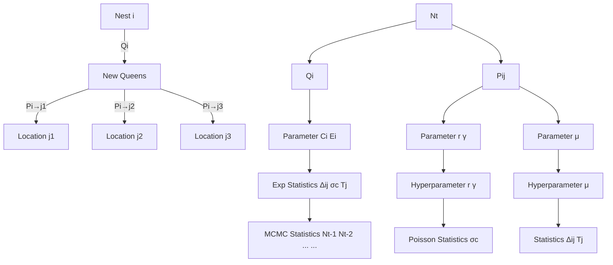
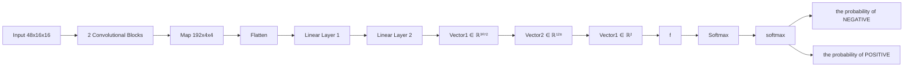
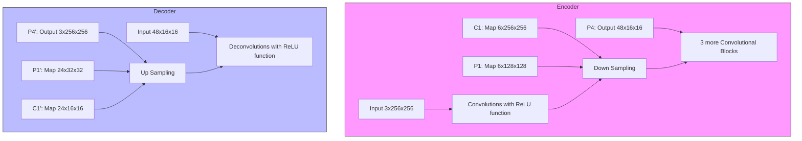
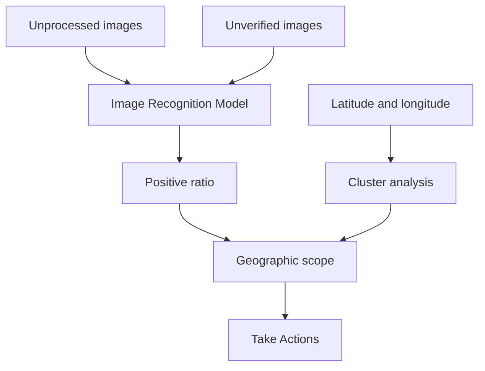
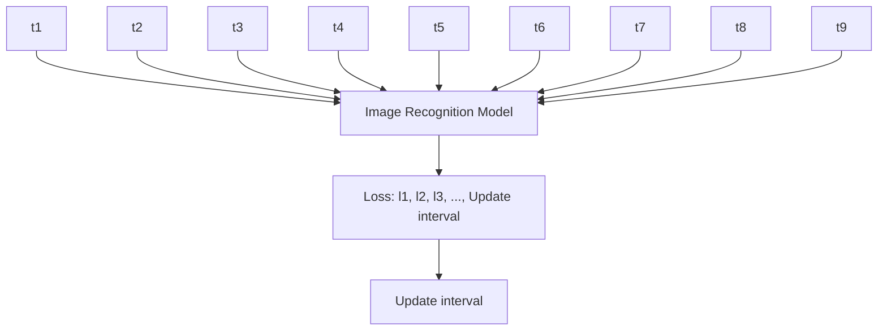
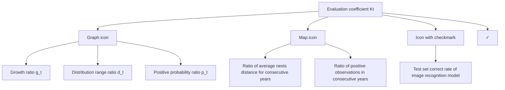
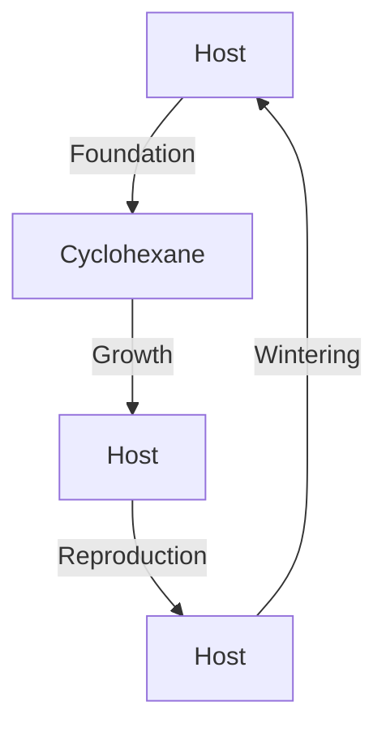
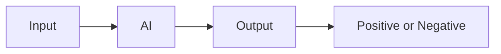
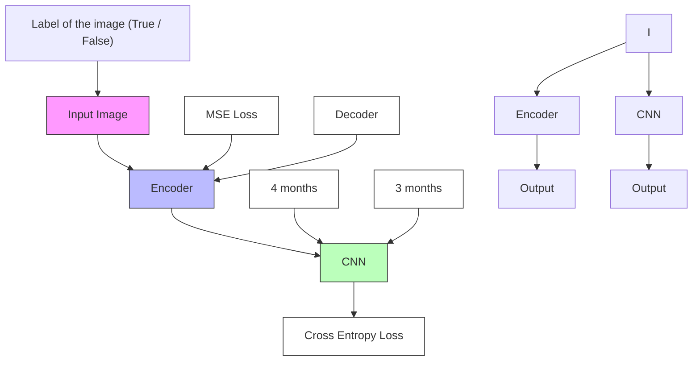

# Fight for Washington State: Can Artificial Intelligence Beat the Asian Giant Hornet?

Summary

Recently, the Asian giant hornet has been observed in Washington State, which may cause damage to the ecosystem in the future. Therefore, the Washington State Department of Agriculture (WSDA) has provided large amounts of observations on the species, hoping to get our assistance.

For problem 1, we propose two metrics: the resource competition coefficient and the environmental friendliness to construct a time-step difference equation, and simulate the population dispersal of the Asian giant hornet. We predict the distribution of nests in Washington State within 10 years, and gain the range of activities of an Asian giant hornet by adding noise. The results show that if no measures are taken against the spread of Asian giant hornets, the number of the species will show an approximate exponential growth at the initial stage in Washington State. To evaluate the accuracy of the model, we use Logistic Growth Model to test the accuracy of the model. The loss is 0.076, and the fastest growing year is the seventh year.These results indicate that we need to control the number of nests early.

In problem 2, we divide it into feature extraction and image classification. For the former, we establish a model based on auto-encoder to condense images information, of which the minimum testing loss dips to 0.0274. For the latter, we build three models, the Binary Logistic Regression, the Support Vector Machine, and the Convolutional Neural Network (CNN). The highest accuracy of the three models on the testing set is 0.5303, 0.5758, and 0.8030 respectively, so we choose CNN as our classification model. Finally, we summarize the features of negative images from three aspects: species characteristics, subject definition and background softness.

In terms of problem 3, we conduct Agglomerative Clustering according to the latitude and longitude of each sighting with unverified or unprocessed status, and divide them into 5 classes. Then we define the priority of a region based on the positive probabilities of input images in this area. Through analysis, we find that Seattle is located in the center of the highest probability area.

With regard to problem 4, we update the model with different intervals to find optimal update time interval. Selected indicators include the testing loss of auto-encoder and the accuracy of CNN in testing dataset. The optimal time interval for updating models is defined as the abscissa corresponding to the extremum of the numerical derivative of the time-varying indicators. Finally, we get the following conclusions: the auto-encoder needs to be updated every four months, and the CNN needs to be updated every three months.

As for problem 5, we design a number of variables based on observational data to characterize changes in the number of nests. We eliminate the influence of the image recognition model based on Bayesian inference. When K converges to 0, we think that the pest has been eradicate.

Last but not least, we summarize the suggestions and write a memorandum for the WSDA, to assist relevant departments in biological control.

## Contents

## 1 Introduction 3

1.1 Problem Background 3  
1.2 Clarifications and Restatements 3  
1.3 Our Work 3

## 2 Reasonable Assumptions 4

## 3 Problem 1: Propagation Simulation Based on Yearly Time-Step Difference Equation 5

3.1 Method Overview 5  
3.2 Model Construction . . 6  
3.3 Predictions of Population Dispersal 8

## 4 Problem 2: Image Recognition Model Based on Auto-Encoder and Convolutional Neural Network 9

4.1 Data Cleaning and Data Augmentation 10  
4.2 The Structure and Training Results of Auto-Encoder 12  
4.3 Results of the Binary Classification Problem 13  
4.4 Features for Negative Sightings 14

## 5 Problem 3: Priority Computation Model Based on Agglomerative Clustering 15

5.1 Region Division 15  
5.2 Positive Probability Prediction and Priority Definition 17

## 6 Problem 4: Optimal Updating Strategy Based on Numerical Derivative 17

## 7 Problem 5: Assessment Based on the Bayes Formula 19

## 8 Model Analysis 20

8.1 Strengths and Weaknesses 20  
8.2 Sensitivity Analysis 21

## 9 Conclusion 21

## Appendices 23

## Appendix A Core Codes for Auto-Encoder 23

## Appendix B Core Codes for CNN 23

## 1 Introduction

## 1.1 Problem Background

The Asian giant hornet is the largest hornet in the world, which is native to East Asia, South Asia, mainland Southeast Asia and some far east parts of the Russian. Recently, it was discovered in the American Northwest at the end of 2019, and there had been lots of sightings in 2020. In fact, the invasion of the Asian giant hornet is not an isolated incident. In 2004, it first appeared in Europe, and then began to spread to Spain, Belgium, Portugal and Italy, rapidly. According to European studies, the propagation speed of Asian giant hornet can reach 49.5 kilometers per year [2, 11].

Even worse, the Asian giant hornet attacks and hunts variety of insects such as bees, bumblebees, praying mantises and other insects. Moreover, if the Asian giant hornet reach all suitable habitats in North America, the cost for dealing with this disaster in America will exceed \$113.7 millions [1]. Therefore, it is very necessary to find and process the Asian giant hornet effectively.

## 1.2 Clarifications and Restatements

In this problem, we are given the data of observations on the Asian giant hornet, which is perceived by local citizens, including the time, location, latitude and longitude, and the corresponding observation photos. Washington State Department of Agriculture divided observations into four status based on photos, namely: positive, negative, unverified, and unprocessed. We will solve the following problems based on the historial observations:

1. Based on positive observations and corresponding latitudes and longitudes, combined with the biological characteristics of the Asian giant hornet, forecast the short-term spread of the species and analyze the accuracy of the prediction;  
2. Establish a model for judging whether a photo contains at least an Asian giant hornet, and analyze the image features that make the model output “Negative” results;  
3. Based on the above classification model, define the government’s priority in handling citizen observations, for the reason that some unprocessed or unverified observations are most likely to be positive and require the government to explore;  
4. Consider that more sightings have been observed, determine the update method and update frequency of the model;  
5. According to the model above, analyze what indicators of Washington State has achieved, it can be said that the pest has been “eliminated”;  
6. Submit a memorandum to to the Washington State Department of Agriculture to comprehensively supplement our research results and take corresponding protective measures at the same time.

## 1.3 Our Work

In problem 1, we construct and simulate a time-step difference equation with two metrics: the resource competition coefficient and the environmental friendliness. We use this model to predict the distribution of nests in Washington State. Then, we gain the range of activities of a single Asian giant hornet by adding noise. After that, we use the Logistic Growth Model to test the accuracy of the model.

We divide problem 2 into two subproblems: feature extraction, and image classifi- mager ifi-信号：cation. In order to reduce the impact of sample imbalance, we apply image flipping and关注2

Borderline-SMOTE methods for data augmentation first, and then divide the data into the training set and the validation set (testing set). Next, we utilize auto-encoder to collect key features of images. To prevent over-fitting, we store the best performance model in the testing set for subsequent use. Next, we establish three models, the Binary Logistic Regression, the Support Vector Machine, and the Convolutional Neural Network. After comparing their accuracy on the testing set, we choose CNN as our image classification model. Finally, we summarize the main features of having negative labels from three aspects: species characteristics, subject definition and background softness.

As for problem 3, we take the scope of activities of one-time inspection by the government into account, and conduct Agglomerative Clustering according to the latitude and longitude of each sighting. Then we define the priority of a region based on the positive probabilities of input images.

With regard to problem 4, we discuss the effect of updating the model with different time intervals on the testing results, including the loss of auto-encoder and the accuracy of CNN. The optimal time interval of updating models is defined as the abscissa corresponding to the extremum of the numerical derivative of the function, which is the maximum value for auto-encoder, and the opposite for CNN.

In terms of problem 5, the number of nests, the range of spatial distribution and the positive ratio in observations can all reflect the growth of pests. We design a number of variables to characterize changes in the number of nests. Since the image recognition model has a certain error probability, we have made a correction based on Bayesian inference.

```mermaid
graph TD
  A["Problem 1: Propagation Simulation"] --> B["Parameter"]
  A --> C["Parameter"]
  A --> D["Parameter"]
  A --> E["Parameter"]
  A --> F["Parameter"]
  A --> G["Parameter"]
  A --> H["Parameter"]
  A --> I["Parameter"]
  A --> J["Parameter"]
  A --> K["Parameter"]
  A --> L["Parameter"]
  A --> M["Parameter"]
  A --> N["Parameter"]
  A --> O["Parameter"]
  A --> P["Parameter"]
  A --> Q["Parameter"]
  A --> R["Parameter"]
  A --> S["Parameter"]
  A --> T["Parameter"]
  A --> U["Parameter"]
  A --> V["Parameter"]
  A --> W["Parameter"]
  A --> X["Parameter"]
  A --> Y["Parameter"]
  A --> Z["Parameter"]
  A --> AA["Parameter"]
  A --> AB["Parameter"]
  A --> AC["Parameter"]
  A --> AD["Parameter"]
  A --> AE["Parameter"]
  A --> AF["Parameter"]
  A --> AG["Parameter"]
  A --> AH["Parameter"]
  A --> AI["Parameter"]
  A --> AJ["Parameter"]
  A --> AK["Parameter"]
  A --> AL["Parameter"]
  A --> AM["Parameter"]
  A --> AN["Parameter"]
  A --> AO["Parameter"]
  A --> AP["Parameter"]
  A --> AQ["Parameter"]
  A --> AR["Parameter"]
  A --> AS["Parameter"]
  A --> AT["Parameter"]
  A --> AU["Parameter"]
  A --> AV["Parameter"]
  A --> AW["Parameter"]
  A --> AX["Parameter"]
  A --> AY["Parameter"]
  A --> AZ["Parameter"]
  A --> BA["Parameter"]
  A --> BB["Parameter"]
  A --> BC["Parameter"]
  A --> BD["Parameter"]
  A --> BE["Parameter"]
  A --> BF["Parameter"]
  A --> BG["Parameter"]
  A --> BH["Parameter"]
  A --> BI["Parameter"]
  A --> BJ["Parameter"]
  A --> BK["Parameter"]
  A --> BL["Parameter"]
  A --> BM["Parameter"]
  A --> BN["Parameter"]
  A --> BO["Parameter"]
  A --> BP["Parameter"]
  A --> BQ["Parameter"]
  A --> BR["Parameter"]
  A --> BS["Parameter"]
  A --> BT["Parameter"]
  A --> BU["Parameter"]
  A --> BV["Parameter"]
  A --> BW["Parameter"]
  A --> BX["Parameter"]
  A --> BY["Parameter"]
  A --> BZ["Parameter"]
  A --> CA["Parameter"]
  A --> CB["Parameter"]
  A --> CC["Parameter"]
  A --> CD["Parameter"]
  A --> CE["Parameter"]
  A --> CF["Parameter"]
  A --> CG["Parameter"]
  A --> CH["Parameter"]
  A --> CI["Parameter"]
  A --> CJ["Parameter"]
  A --> CK["Parameter"]
  A --> CR["Parameter"]
  A --> CS["Parameter"]
  A --> CT["Parameter"]
  A --> CU["Parameter"]
  A --> CV["Parameter"]
  A --> CW["Parameter"]
  A --> CX["Parameter"]
  A --> CY["Parameter"]
  A --> CZ["Parameter"]
  A --> DA["Parameter"]
  A --> DB["Parameter"]
  A --> DC["Parameter"]
  A --> DD["Parameter"]
  A --> DE["Parameter"]
  A --> DF["Parameter"]
  A --> DG["Parameter"]
  A --> DH["Parameter"]
  A --> DI["Parameter"]
  A --> DJ["Parameter"]
  A --> DK["Parameter"]
```


<details>
<summary>flowchart</summary>


</details>

Figure 1: The workflow.

## 2 Reasonable Assumptions

## Assumptions about the data provided.

1. The uploaded location (latitude and longitude) has high accuracy and no deviation from the map on Google1;  
2. The judgments made by the WSDA based on photos and the corresponding comments is accurate, and there is no error in recognition;

3. The date of the photo was taken is always equal to the corresponding detection date, i.e., there is no delay in uploading photos;  
4. Whether a photo contains an Asian giant hornet, is independent of the status of other photos.

## Assumptions about the behavior of Asian giant hornet.

1. When the surrounding geographical environment is similar, the Asian giant hornet preys randomly, as well as the population dispersal. At the same time, the species tends to prey and migrate nearby.  
2. The Asian giant hornet cannot build nests or prey in the water;  
3. The environment is similar in different regions, so fitted hyperparameters in a certain small area can be regarded as constants. Therefore, hyperparameters can be promoted throughout Washington State.

## 3 Problem 1: Propagation Simulation Based on Yearly Time-Step Difference Equation

The parameters used in our analysis in this section are as follows:

Table 1: Key parameters for problem 1.

<table><tr><td>Symbol</td><td>Interpretation</td><td>Symbol</td><td>Interpretation</td></tr><tr><td> $\mathcal{C}$ </td><td>the set of cells</td><td> $E_i$ </td><td>the environmental friendliness</td></tr><tr><td> $\mathcal{N}_t$ </td><td>the set of nests</td><td> $C_i$ </td><td>the resource competition coefficient</td></tr><tr><td>r</td><td>the growth rate</td><td> $\gamma$ </td><td>the resource dependence coefficient</td></tr><tr><td> $N_t$ </td><td>the number of nests</td><td> $\Delta_{ij}$ </td><td>the distance between cell i and cell j</td></tr><tr><td> $\sigma_c$ </td><td>the predation distance</td><td></td><td></td></tr></table>

## 3.1 Method Overview


<details>
<summary>donut chart</summary>

| Month | Value |
|---|---|
| Feb. | 10 |
| Mar. | 12 |
| Apr. | 14 |
| May | 16 |
| Jun. | 18 |
| Jul. | 20 |
| Aug. | 18 |
| Sep. | 22 |
| Oct. | 24 |
| Nov. | 26 |
| Dec. | 28 |
| Wintering | 30 |
| January | 32 |
| February | 34 |
| March | 36 |
| Foundation | 38 |
</details>


<details>
<summary>flowchart</summary>


</details>

(a) The life cycle of the Asian giant hornet. (b) Parameter relationship in propa tion.  
Figure 2: Introduction to pest extinction assessment mode  
  
关注数学模型 获取更多资讯

By clustering and plotting the existing positive data, we get that there are three nests near the State of Washington currently. Therefore, we set the initial number of nests to 3, and their location coordinates are the center of the latitude and longitude observed by citizens. We build a time-step difference equation [8] model in years to predict propagation. Based on the probability distribution of each parameter, we utilize Monte Carlo simulation to solve the model. The workflow is shown in Figure 2b.

## 3.2 Model Construction

Like other wasps, Asian giant hornets are an annual species, and the time points when queens produce male peak females are concentrated in September to November. Therefore, the life of the species has a strong periodicity, which belongs to rigid seasonal behaviour. This type of rigid seasonal behaviour is suitable for constructing a time-step difference equation, and iterating in units of years. In the annual Monte Carlo simulation, we conduct propagation on a single nest, and then calculate the number of nests each year.

## Parameters Selection.

When building the model, we select several parameters with practical significance such as biological populations and geographic conditions, which are introduced below.

First of all, we consider the influence between nests. Since the Asian giant hornet will inevitably produce more nests when spreads in Washington State, the resources suitable for the species in State of Washington will gradually become scarce, and intraspecific struggle will be inevitable. Therefore, we constructed a parameter to measure the competition for resources of different nests: the intra-species resource competition coefficient $C _ { i j }$ , the formula is shown as follows:

$$
\left\{ \begin{array}{l} C _ {i j} = \exp \left(- \frac {\Delta_ {i j} ^ {2}}{2 \sigma_ {c} ^ {2}}\right) \\ C _ {i} = \sum_ {j \in \mathcal {N}} \exp \left(- \frac {\Delta_ {i j} ^ {2}}{2 \sigma_ {c} ^ {2}}\right), \quad \forall i \in \mathcal {N}, \end{array} \right. \tag {1}
$$

where $\Delta _ { i j }$ represents the distance between nest i and nest $j ,$ and $\sigma _ { c }$ is the predation distance of the Asian giant hornet. According to the knowledge of species biology, the farther the nest is, the smaller the intra-species competition, and when the predation range overlaps, the intraspecies competition increases, so $C _ { i j }$ is represented by Gaussian competition kernel. Then add up $j$ to obtain the total intra-species resource competition coefficient $C _ { i }$ of nest i.

Second, the Asian giant hornet needs to forage and build nests in order to live and breed, so it has certain requirements for the surrounding environment. We constructed an index to measure the quality of the environment near nest i: the environmental friendliness $E _ { i j }$ , which mainly measures the geographical environment and spatial distribution of cell $j$ surrounding nest i, reflecting the quality of the predation and nesting environment of Asian giant hornets. The formula is shown as follows:

$$
\left\{ \begin{array}{l} E _ {i j} = \exp \left(- \frac {\Delta_ {i j} ^ {2}}{2 \sigma_ {c} ^ {2}}\right) \cdot T _ {j} \\ E _ {i} = \sum_ {j \in \mathcal {C}} \exp \left(- \frac {\Delta_ {i j} ^ {2}}{2 \sigma_ {c} ^ {2}}\right) \cdot T _ {j} \end{array} , \quad \forall i \in \mathcal {N}, \right. \tag {2}
$$

where parameter $T _ { j }$ represents the influence of terrain on environmental adaptation. Owing to the Asian giant hornet cannot prey or build nests at all when it is on the sea, the lake, or the river etc., so $T _ { j }$ equals 0 for all $j \in { \mathcal { C } } ,$ . Washington State haws good agricultural developm ent and good natural conditions. Therefore, we believe that places other than sea areas or rivers are关 more suitable for the survival of the Asian giant hornet, so $T _ { j }$ is 1 for any cell $j$ on land. From the perspective of spatial distribution, cell $j$ that is closer to nest i is more environmentally friendly to nest $i ,$ so $E _ { i j }$ is represented by the product of Gaussian competition kernel and $T _ { j }$ . Calculate the $E _ { i j }$ of nest i and cell $j ,$ , and add up to $j$ to obtain the total environmental friendliness $E _ { i }$ of nest i.

Model Hyperparameters Selection. For the total number of nests in a region, because of the small spatial range in the early stage of growth, the influence of spatial distribution on the total number of nests can be ignored. Therefore, we set the total number of nests in year t as $N _ { t }$ . According to the growth characteristics of nests, the total number of nests in year t is related to the situation in year $t - 1$ . We set $N _ { t }$ as a random variable and obey the following Poisson distribution formula. The expression of $N _ { t }$ is:

$$
N _ {t} = \text { Poisson } \left(\frac {r N _ {t - 1}}{1 + \gamma \bar {C} N _ {t - 1}}\right), \tag {3}
$$

where r and $\gamma$ are hyperparameters, respectively, representing growth rate and resource dependence coefficient. For parameter $\bar { C } ,$ we comprehensively consider the spatial distribution in the area, and the average is taken over all cells i and $j$ in this area.The expression of $\bar { C }$ is shown as follows:

$$
\bar {C} = \frac {1}{| \mathcal {C} | ^ {2}} \sum_ {i \in \mathcal {C}} \sum_ {j \in \mathcal {C}} \exp \left(- \frac {\Delta_ {i j} ^ {2}}{2 \sigma_ {c} ^ {2}}\right). \tag {4}
$$

## Time-Step Difference Equation.

After the above calculation, we construct an equation to measure nest $i \ { } ^ {  } \ { \mathrm { f e r t i l i t y } } ^ { \prime \dagger } \ Q _ { i }$ , which represents the number of successfully fertilized new queens produced by nest i in a certain year:

$$
Q _ {i} = \text { Poisson } \left(\frac {r \cdot E _ {i}}{1 + \gamma C _ {i}}\right), \quad \forall i \in \mathcal {N}. \tag {5}
$$

According to biological knowledge, when the growth rate $r$ is larger, the overall environmental friendliness $E _ { i }$ is larger, and the $Q _ { i }$ of nest $i$ is larger. When the total intra-species resource competition coefficient $C _ { i }$ is larger, the resource dependence coefficient $\gamma$ is larger, the $Q _ { i }$ of nest $i$ is smaller. Therefore, $r$ and $E _ { i }$ are proportional to $Q _ { i } .$ , and $C _ { i }$ and are inversely proportional to $Q _ { i }$ . According to reference materials, the queen’s successful fertilization rate is only 35%, i.e., $P _ { 0 } = 3 5 \%$ . Considering that some factors such as temperature and crowd density are not taken into consideration, instead of setting it to a constant, we set $Q _ { i }$ to a Poisson distribution, and introduce a certain noise to be more in line with the actual situation.

For the spatial distribution, we use $P _ { i j }$ to represent the probability that the new queen goes from nest i to cell j to build a nest. The expression of $P _ { i j }$ is as follows:

$$
P _ {i j} = \exp \left(- \frac {\Delta_ {i j}}{\mu}\right) \cdot T _ {j}, \quad \forall i \in \mathcal {N}, j \in \mathcal {C}. \tag {6}
$$

Considering that the Asian giant hornet cannot nest in sea areas or rivers, the terrain parameter $T _ { j }$ will affect $P _ { i j }$ . In terms of spatial distribution, because organisms always migrate to the nearest base when they migrate, that is, as the distance between nest i and cell $j$ increases, the probability of migration to cell $j$ decreases, which is expressed as an exponential in the formula.

## 3.3 Predictions of Population Dispersal

Algorithm 1: Simulation of the Asian giant hornet propagation  
Input: Due time $T_{total}$ , number of the initial population $N_{0}$ and corresponding coordinates ( $x_{0}, y_{0}$ ), growth rate r, resource dependence coefficient $\gamma$ .

Output: Population number $N_{t}$ and its corresponding coordinates ( $x_{t}, y_{t}$ ).

1 Initialize the set of cells C and the set of nests $N_{0}$ based on $N_{0}$ and ( $x_{0}, y_{0}$ );

2 for t = 0 to $T_{total} - 1$ do

3    for $i \in N_{t}$ do

4    Calculate $C_{i}$ and $E_{i}$ based on Equations (1) and (2);

5    Randomly select $Q_{i}$ based on Equation (5);

6    Calculate $P_{ij}$ for each $j \in C$ based on Equation (6);

7    Set $P_{i} = (P_{ij})_{|\mathcal{C}| \times 1}$ for all $j \in C$ ;

8    for x = 0 to $Q_{i}$ do

9    Selecting a destination j based on the probability vector $P_{i}$ ;

10    Add j into $N_{t+1}$ ;

11    end

12    end

13    return $N_{t+1}$ and its corresponding coordinates ( $x_{t+1}, y_{t+1}$ );

14 end

(a) Predicted nests in 2020.  


<details>
<summary>text_image</summary>

Vancouver
LA
LA
LA
LA
LA
LA
LA
LA
LA
LA
LA
LA
LA
LA
LA
LA
LA
LA
LA
LA
LA
LA
LA
LA
LA
LA
LA
LA
LA
LA
LA
LA
LA
LA
LA
LA
LA
LA
LA
LA
LA
LA
LA
LA
LA
LA
LA
LA
LA
LA
VAHAVA
VAHAVA
VAHAVA
VAHAVA
VAHAVA
VAHAVA
VAHAVA
VAHAVA
VAHAVA
VAHAVA
VAHAVA
VAHAVA
VAHAVA
VAHAVA
VAHAVA
VAHAVA
VAHAVA
VAHAVA
VAHAVA
VAHAVA
VAHAVA
VAHAVA
VAHAVA
VAHAVA
VAHAVA
VAHAMA USAA USAA USAA USAA USAA USAA USAA USAA USAA USAA USAA USAA USAA USAA USAA USAA USAA USAA USAA USAA USAA USAA USAA USAA USAA USAA USAA USAA USAA USAA USAA USAA USAA USAA USAA USAA USAA USAA USAA USAA USAA USAA USAA USAA USAA USAA USAA USAA USAA USAA USA A USA A USA A USA A USA A USA A USA A USA A USA A USA A USA A USA A USA A USA A USA A USA A USA A USA A USA A USA A USA A USA A USA A USA A USA A USA A USA A USA A USA A USA A USA A USA A USA A USA A USA A USA A USA A USA A USA A USA A USA A USA A USA A USA A USA A USA A USA A USA A USA A USA A USA
</details>

(b) Predicted nests in 2023.  


<details>
<summary>text_image</summary>

Map showing geographic locations with red markers indicating specific sites or points, including labeled cities like Seattle and Washington.
</details>


<details>
<summary>text_image</summary>

Map showing geographic distribution of events or locations across Seattle, with labeled cities and a highlighted cluster region.
</details>


<details>
<summary>text_image</summary>

Map showing geographic distribution of events or data points across a region with labeled locations and color-coded markers
</details>

(d) Predicted hornets in 2020  
(e) Predicted hornets in 2023.


<details>
<summary>line chart</summary>

| Year | Number of Nests |
|------|-----------------|
| 2020 | 0               |
| 2021 | 30              |
| 2022 | -50             |
| 2023 | 10              |
| 2024 | 50              |
| 2025 | 70              |
| 2026 | 150             |
| 2027 | 380             |
| 2028 | 450             |
| 2029 | 600             |
| 2030 | 600             |
</details>

(g) Fitted logistic growth curve with predicted values.

(c) Predicted nests in 2029.  


<details>
<summary>text_image</summary>

Vancouver
Sanahua
Seattle
Tacoma
Kamloops
Perfington
Kenya
Colville
RESERVATION
Sparta
Jagari Wenatchee
National Forest
Washington
Spoke
YAKAMA INDIAN
RESERVATION
Kennewick
Google
</details>


<details>
<summary>text_image</summary>

Vancouver Island
Vermilion
Vermilion
Vermilion
Vermilion
Vermilion
Vermilion
Vermilion
Vermilion
Vermilion
Vermilion
Vermilion
Vermilion
Vermilion
Vermilion
Vermilion
Vermilion
Vermilion
Vermilion
Vermilion
Vermilion
Vermilion
Vermilion
Vermilion
Vermilion
Vermilion
Vermillion
Vermillion
Vermillion
Vermillion
Vermillion
Vermillion
Vermillion
Vermillion
Vermillion
Vermillion
Vermillion
Vermillion
Vermillion
Vermillion
Vermillion
Vermillion
Vermillion
Vermillion
Vermillion
Vermillion
Vermillion
Vermillion
Vermillion
Vermillion
Vermillion
Vermmillion
Vermmillion
Vermmillion
Vermmillion
Vermmillion
Vermmillion
Vermmillion
Vermmillion
Vermmillion
Vermmillion
Vermmillion
Vermmillion
Vermmillion
Vermmillion
Vermmillion
Vermmillion
Vermmillion
Vermmillion
Vermmillion
Vermmillion
Vermmillion
Vermmillion
Vermmillion
Vermmillion
Vermmillion
Verm million
Verm million
Verm million
Verm million
Verm million
Verm million
Verm million
Verm million
Verm million
Verm million
Verm million
Verm million
Verm million
Verm million
Verm million
Verm million
Verm million
Verm million
</details>

(f) Predicted hornets in 2029.  
Figure 3: The results of problem 1, including predicted propagation diagrams (subfigure a tof) and the fitted logistic curve (subfigure g). 关

Finally, by iterating the time-step difference equation in years according to 1, we got the results of the Asian giant hornet spreading around Washington State. There are two series of results. The first series is the result of the location of the Asian giant hornet’s nest, and the second series is the result of a single hornet observed when the Asian giant hornet preys and wanders near the nest during propagation.

The pictures2 in Figure 3 show our results. Subfigure (a) to (c) in Figure 3 are migration process of nests of the Asian giant hornet and the red points are nests of hornets. Subfigure(d) to (f) in Figure 3 are the activity range of the Asian giant hornet in the current year.

It can be seen from the propagation image of nest that at the beginning of the simulation, the growth was slow, and the spread of the Asian giant hornet accelerated after the number of nests had reached a certain number. This phenomenon is consistent with biological knowledge.

## Error Analysis Based on Logistic Growth Model.

We utilize the Logistic Equation to measure the accuracy of our constructed model, which can be calculated as:

$$
f (t) = \frac {N \cdot \mathrm{e} ^ {r \left(t - t _ {0}\right)}}{1 + N \left(\mathrm{e} ^ {r \left(t - t _ {0}\right)} - 1\right)}, \tag {7}
$$

where r represents growth rate in time-step difference equation model, $t _ { 0 }$ represents the year with the fastest growth, and N represents stable population of the Asian giant hornet.

We have performed eleven iterations using the annual time-step difference equation. We use the RMSProp optimizer to fit the Logistic Equation, and apply the MSE as loss function, with the minimum value 0.076. The fitting result shows that the fastest growing year of the Asian giant hornet is 2027, which means $t _ { 0 }$ equals to $7 .$ . Due to the excellent fitting results, our model and the corresponding predictions conform to the actual theory of ecology.

## 4 Problem 2: Image Recognition Model Based on Auto-Encoder and Convolutional Neural Network


<details>
<summary>flowchart</summary>


</details>

Figure 4: The structure diagram of Convolutional Neural Network.

In the past decade, deep learning has been made a great success in both computer vision [9], speech recognition [5, 12] and even in playing Atari games [10]. A wild range of neural network architectures have been utilized including fully connected neural networks, convolutional neural networks, and recurrent neural network to those problems.

For problem 2, we establish two models based on auto-encoder [14] and convolutional neural network [4] respectively. One for feature extraction, and the other for prediction. In this section, we will first introduce our methods of data cleaning and data augmentation; and then, we will introduce the structure of auto-encoder and CNN, and give the prediction results on the validation set; finally, we will summarize the image features that are most possibly identified as “Negative” by our model.


<details>
<summary>flowchart</summary>


</details>

Figure 5: The structure diagram of Auto-Encoder.

## 4.1 Data Cleaning and Data Augmentation

As mentioned at part 1.2, we are given 4426 sightings of the Asian giant hornet, with 4 different status confirmed by the government: positive, negative, unverified, and unprocessed. The evidences provided by each sighting include image format, video format and even Microsoft Word format. We manually converted all the other format to image: the most suitable frame was extracted from videos, and save all the pictures in each Word or PDF. and remain 2127 valid observations in total.


<details>
<summary>bar chart</summary>

| Range | Value |
|---|---|
| [1, 26.3] | 460 |
| (26.3, 51.6] | 325 |
| (51.6, 76.9] | 300 |
| (76.9, 102.2] | 215 |
| (102.2, 127.5] | 170 |
| (127.5, 152.8] | 115 |
| (152.8, 178.1] | 90 |
| (178.1, 203.4] | 60 |
| (203.4, 228.7] | 40 |
| (228.7, 254] | 150 |
</details>

(a) For negative sightings’ comments length.


<details>
<summary>bar chart</summary>

| Range | Frequency |
|---|---|
| [1, 14.8] | 2 |
| (14.8, 28.6] | 3 |
| (28.6, 42.4] | 1 |
| (42.4, 56.2] | 2 |
| (56.2, 70] | 1 |
| (70, 83.8] | 1 |
| (83.8, 97.6] | 0 |
| (97.6, 111.4] | 0 |
| (111.4, 125.2] | 0 |
| (125.2, 139] | 1 |
</details>

(b) For positive sightings’ comments length.  
Figure 6: Frequency histograms of the comment length.

status are similar. For a more detailed discussion, we build a linear model, with the status x $( 0 / 1 )$ as input and the length of corresponding comment y as output:

$$
y = \beta_ {0} + \beta_ {1} x + \epsilon , \tag {8}
$$

where $\beta _ { 0 }$ and $\beta _ { 1 }$ are parameters to be fitted, and ϵ is an unobservable error term, which obeys normal distribution.

Table 2: Variance analysis for the linear regression model.

<table><tr><td></td><td>Degrees of Freedom</td><td>Sum of Squares (SS)</td><td>Mean Square (MS)</td><td>Value of F</td><td>Significance of F</td></tr><tr><td>Regression</td><td>1</td><td>17382.96</td><td>17382.96</td><td>3.25</td><td>0.072</td></tr><tr><td>Error</td><td>2052</td><td> $1.097 \times 10^{8}$ </td><td>5346.42</td><td></td><td></td></tr><tr><td>Total</td><td>2053</td><td> $1.099 \times 10^{8}$ </td><td></td><td></td><td></td></tr></table>

Table 2 shows the result of variance analysis and the corresponding significance. We can tell from the regression model that under the condition of 5% significance, whether the image is positive or not has no significant relationship with the length of comments sent when people upload the picture (the significance of F is bigger than 0.05). Therefore, we can conclude that the comments when uploading an image have nothing to do with the status of the image itself at the significance level of 0.05, so we only use images in the subsequent analysis, not the corresponding comments.

Data Cleaning. After deleting the invalid sightings, we divide the data set into four groups according to the status of each observation. There are 2043 sighting with negative status, 11 with positive, 67 with unverified, and 5 with unprocessed. In order to verify the training effect of the model, we divide the data set into the training set and the testing or verification set.

Reasons for Augmentation. According to the result of above, we find that the number of negative observations is above 2000, while the number of positive sightings is only $1 9 ^ { 3 }$ . Such imbalance of positive and negative samples will lead to various problems in model training [13], such as under fitting, gradient disappearance and so on. Therefore, in this paper, we first flip the positive images in three directions (vertical, horizontal and diagonal) to form 76 images including the original image; then we select 28 of them as the testing set, the rest as the training set, and randomly select 38 negative images as the testing set. However, the number of positive images in the training set (48) is still significantly less than the number of negative images, so we use the unbalanced data sampling method.

Methods for Augmentation. SMOTE (synthetic minority oversampling technique) [3] is an improved oversampling algorithm based on random sampling, which is easy to implement but has some obvious disadvantages at the same time. SMOTE treats all the minority samples equally and does not consider the class information of the nearest neighbor samples, it often leads to aliasing of samples, resulting in poor classification effect. Borderline-SMOTE [6] is an improved over sampling algorithm based on SMOTE, which only uses a few class samples on the boundary to synthesize new samples, so as to improve the class distribution of samples. According to [13], when dealing with the problem of binary classification, the ratio of positive and negative samples should not be less than 1 : 4. Therefore, we sampled 697 observations from the original 48 positive training sets through Borderline-SMOTE for subsequent training.

## 4.2 The Structure and Training Results of Auto-Encoder

As is shown in Figure 5, we establish an Auto-Encoder to reduce the dimension of input images, as well as extract their key features. The model has two main parts, the encoder and the decoder. In the following subsection, we will introduce the structure of these two parts in detail.

The Structure of Encoder. The encoder contains 4 convolutional blocks. Each block has 4 parts, the convolution, the activation function, the batch normalization, and the down sampling (pooling). For the convolution part, when we take $\pmb { x } _ { 1 } \in \mathbb { R } ^ { C } \times \mathbb { R } ^ { H } \times \mathbb { R } ^ { W }$ as input, we will get an output $\pmb { x } _ { 2 } \in \mathbb { R } ^ { C ^ { \prime } } \times \mathbb { R } ^ { H ^ { \prime } } \times \mathbf { \bar { R } } ^ { W ^ { \prime } }$ . The dimensions of $\mathbf { x } _ { 2 }$ depend on parameters of convolution (channel, padding, stride, and kernel size) and the stride of down sampling. In order to simplify the calculation, we set the channel equals to $2 C$ , the padding and the stride equals to 1, the kernel to 3x3 shape, and the stride of down sampling equals 2, which contribute to $\pmb { x } _ { 2 } \in \mathbb { R } ^ { 2 C } \times \mathbb { R } ^ { H / 2 } \times \mathbb { R } ^ { W / 2 }$ . Therefore, if we input an image $\pmb { x } _ { 1 } \in \mathbb { R } ^ { C } \times \mathbb { R } ^ { H } \times \mathbb { R } ^ { W }$ to our encoder, the output tensor $\mathbf { \boldsymbol { x } } _ { 2 }$ will be shape $( 2 ^ { 4 } C , 2 ^ { - 4 } H , 2 ^ { - 4 } W )$ , which will be activated by ReLU function.

The Structure of Decoder. Similar to the encoder, our decoder contains 4 deconvolutional blocks with the deconcolution part, the up sampling part, and the activation function. The only difference between the parameters of decoder and encoder is that, we set the channel equals to $C / 2$ rather than 2C. Therefore, if we input an image $\pmb { x } _ { 1 } \in \mathbb { R } ^ { C } \times \mathbb { R } ^ { H } \times \mathbb { R } ^ { W }$ to our decoder, the output tensor $\mathbf { \boldsymbol { x } } _ { 2 }$ will be shape $( 2 ^ { - 4 } C , 2 ^ { 4 } H , 2 ^ { 4 } W )$ , which will be also activated by ReLU function.

Training Results of Auto-Encoder. We set the loss function as MSE, which can be calculated as follows:

$$
\boldsymbol {f} \left(\boldsymbol {x} _ {1}, \boldsymbol {x} _ {2}\right) = \left| \left| \boldsymbol {x} _ {1} - \boldsymbol {x} _ {2} \right| \right| _ {2} ^ {2}, \tag {9}
$$

where $\pmb { x } _ { 1 }$ and $\mathbf { x } _ { 2 }$ are inputs. Figure 7a shows the trend of training losses and testing losses with the increase of training iterations. To increase the robustness of the model, we regard the model with the smallest testing loss as the best, and save its weights and biases for subsequent use. The minimum testing loss during the training is 0.0274 after training 1605 iterations. Figure 7b are examples of input image and decoded image, output by the best model.


<details>
<summary>line chart</summary>

| Training Iteration | train loss | test loss | minimum test loss |
| ------------------ | ---------- | --------- | ------------------ |
| 0                  | 0.07       | 0.07      | 0.03               |
| 250                | 0.025      | 0.045     | 0.03               |
| 500                | 0.02       | 0.04      | 0.03               |
| 750                | 0.018      | 0.038     | 0.03               |
| 1000               | 0.017      | 0.036     | 0.03               |
| 1250               | 0.016      | 0.035     | 0.03               |
| 1500               | 0.015      | 0.034     | 0.03               |
| 1750               | 0.014      | 0.033     | 0.03               |
</details>

(a) The loss curve for auto-encoder.


<details>
<summary>natural_image</summary>

Four-panel image comparing original and decoded views of an insect, showing detailed wing and body structures (no text or symbols)
</details>

(b) Examples of auto-encoder.  
Figure 7: The loss curve and results for auto-encoder.  
  
关注数学模型 获取更多资讯

## 4.3 Results of the Binary Classification Problem


<details>
<summary>flowchart</summary>

```mermaid
graph TD
  A["Input 3x256x256"] --> B["Encoder"]
  B --> C["CNN"]
  C --> D["Cross Entropy Loss"]
  D --> E["Forward evaluation"]
  E --> F["Back propagation"]
  F --> G["Decoder"]
  G --> H["MSE Loss"]
  H --> B
    B -.->|Update weights| G
    style A fill:#f9f,stroke:#333
    style B fill:#bbf,stroke:#333
    style C fill:#bfb,stroke:#333
    style D fill:#ffb,stroke:#333
    style E fill:#ffb,stroke:#333
    style F fill:#ffb,stroke:#333
    style G fill:#bbf,stroke:#333
    style H fill:#fbb,stroke:#333
    note right of B: Label of the image (True / False)
    note right of C: Update weights
    note right of D: Update weights
```
</details>

Figure 8: The workflow of predicting whether an input image contains an Asian giant hornet.

After extract features of input images by auto-encoder, we build three models: Binary Logistic Regression, Support Vector Machine (SVM), and Convolutional Neural Network (CNN) for forecasting. The workflow is shown in Figure 8, when we have an image to be recognized, we first put it into auto-encoder, and take the output of encoder as the classification model’s input, and then we will get the probability of positive or negative (they are equivalent because they always add up to one). After comparing the performance of each model on the testing set, we finally choose CNN as our prediction model.

Binary Logistic Regression. We utilize L2 norm as cost function which supposed to be minimized, and apply Newton’s method for iterative optimization. After optimization, the accuracy of the model in the testing set reaches 0.5303.

Support Vector Machine. Due to the small amount of samples and the large number of features, we use Gaussian kernel to experiment, and adjust the γ parameter, which influences the Gauss’s range of action corresponding to each support vector. We set γ range from 0 to 2 with an interval of 0.01. The maximum accuracy of testing set reaches 0.5758 when $\gamma = 1 . 6 4$ .

Convolutional Neural Network. As shown in Figure 4, CNN contains 2 convolutional blocks with batch normalization, and two fully connected layers. To prevent over fitting, the first layer has a 25% probability of dropping connections between nerves. We utilize the Cross Entropy loss while training, which can be calculated as follows:

$$
\boldsymbol {H} (p, q) = - \sum_ {\boldsymbol {x}} p (\boldsymbol {x}) \log q (\boldsymbol {x}), \tag {10}
$$

where p and q are two different probability density functions of the same random variable x, and p represents the ground truth and q is the current estimation. In our case, x is an input image, and both p and q are the PDFs of 0-1 distribution, whose output implies the probability of input x. Figure 9a shows the trend of losses and the accuracy in testing set. Similar to autoencoder, we regard the model with the maximum accuracy in testing set as the best model, and save its weights and biases. The maximum accuracy reaches 0.8030 after training 490 iterations. Figure 9b are 6 examples predictions sampled randomly, 5 of which are correct.


<details>
<summary>line chart</summary>

| Training Iteration | train loss | test loss | test accuracy |
| ------------------ | ---------- | --------- | ------------- |
| 0                  | 0.55       | 0.72      | 0.55          |
| 500                | 0.40       | 0.60      | 0.70          |
| 1000               | 0.35       | 0.58      | 0.75          |
| 1500               | 0.34       | 0.57      | 0.78          |
| 2000               | 0.33       | 0.56      | 0.76          |
| 2500               | 0.33       | 0.55      | 0.77          |
| 3000               | 0.33       | 0.54      | 0.78          |
| 3500               | 0.33       | 0.53      | 0.79          |
</details>

(a) The loss curve and testing accuracy for CNN.


<details>
<summary>text_image</summary>

Predict: True
Label: True
Predict: True
Label: True
Predict: False
Label: False
Predict: False
Label: False
Predict: True
Label: True
Predict: True
Label: False
</details>

(b) Examples of predictions and labels.  
Figure 9: The loss curve and results for CNN.

## 4.4 Features for Negative Sightings

(a) P=0.9998798  


<details>
<summary>natural_image</summary>

Two-panel image: top shows a bird perched on green leaves; bottom shows a black fence with a curved blade and frame (no text or symbols)
</details>

(f) P=0.9997500

(b) P=0.9998009  


<details>
<summary>natural_image</summary>

Two-panel image: top shows a green robotic device with a plastic container containing small objects; bottom shows dried plant stems and leaves in a garden (no text or symbols visible)
</details>

(g) P=0.9997412

(c) P=0.9997959  


<details>
<summary>natural_image</summary>

Two-panel image: top shows a green pesticide container with bees inside; bottom shows stacked bricks and a box with a purple cloth (no visible text or symbols)
</details>

(h) P=0.9997201

(d) P=0.9997670  


<details>
<summary>natural_image</summary>

Two-panel image: top shows a hand holding a transparent container with a small insect; bottom shows a close-up of a plant with green leaves and flowers (no text or symbols visible)
</details>

(i) P=0.9996906

(e) P=0.9997583  


<details>
<summary>natural_image</summary>

Two photos: top shows a glass jar with a small object, bottom shows a bowl containing an insect inside (no visible text or symbols)
</details>

(i) P=0.9996892  
Figure 10: Pictures with the highest negative probability and corresponding values.

Figure 10 shows the 10 images with the highest negative probability. The predictions about these pictures are all correct, i.e., ground truths of images above are all negative. To summarize, pictures containing following features are tend to be recognized as negative:

1. Other species in the picture, not wasps, let alone the Asian giant hornet. Obviously, there is an insect resembling a dragonfly in Figure 10a. Figure 10 is definitely not an Asian giant hornet, because the Asian giant hornet should have wings. Figure 10j contains something similar to a cocoon.  
2. The insect is too small. For both Figure 10f, Figure 10d, and Figure 10h, the insects are too small to distinguish.  
3. The background is difficult to discriminate from the insect itseand Figure 10g we can’t even see where the insect is at a glance because or Figure 10fnd. backgrou

In conclusion, for problem 2, we first clean the data and apply Borderline-SMOTE method to deal with the imbalanced training set. Next, we build a model to extract features in images based on auto-encoder. After that, we build 3 models, the Binary Logistic Regression, the SVM, and the CNN, and compare their performance on testing set, and select CNN for subsequent use. Finally, we choose 10 pictures with the highest negative probability output by CNN, and summarize their three most salient common characteristics.

## 5 Problem 3: Priority Computation Model Based on Agglomerative Clustering


<details>
<summary>flowchart</summary>


</details>

Figure 11: The workflow of problem 3.

In this section, we first conduct further screening based on the data set processed in problem 2. We select all valid data with unprocessed or unverified status, 63 in total. Next, we input each image into the prediction procedure shown in Figure 2b, and get the positive probability of each image. Meanwhile, we take the scope of activities of one-time inspection by government personnel into account, and conduct Agglomerative Clustering according to the latitude and longitude of each sighting, and divide them into five categories. Then, combining the clustering results and positive probabilities, we define the priority of a region, and finally we provide suggestions based on this priority for future treatments of government departments.

## 5.1 Region Division

Agglomerative clustering starts from n clusters, where n is the total number of samples. Each cluster initially contains only one object, and then the two most similar clusters are merged in each iteration, until a cluster almost containing all the data is formed. According to how to define the differences between different clusters, there are three variants of the algorithm, the single link (nearest neighbor), the complete link (furthest neighbor), and the average link. In this paper, we utilize the first method to calculate distances between clusters, shown as follows:

$$
D (\mathcal {I}, \mathcal {J}) = \min _ {i \in \mathcal {I}, j \in \mathcal {J}} d _ {i j}, \tag {11}
$$

where i and $j$ are points in cluster I and cluster ${ \mathcal { I } } .$ , respectively. $d _ { i j }$ represents the Euclidean distance between point i and point j, which is calculated according to their longitude and latitude, and $D ( \mathcal { T } , \mathcal { T } )$ means the distance between the two different clusters.

We utilize the siloette coefficient [7] to evaluate the quality of clustering. In order to calculate the siloette coefficient of point i in cluster I, we first define:

$$
\left\{ \begin{array}{l} \mathcal {K} = \arg \min _ {\mathcal {J} \neq \mathcal {I}} D (\mathcal {J}, \mathcal {I}) \\ a (i) = \frac {1}{| \mathcal {I} |} \sum_ {j \in \mathcal {I}} d _ {i j}, \quad b (i) = \frac {1}{| \mathcal {K} |} \sum_ {k \in \mathcal {K}} d _ {i k} \end{array} \right.,
$$

where $a ( i )$ means the average of distance from i to all other points in cluster I. K is the closet cluster to $\mathcal { T } ,$ and $b ( i )$ means the average distance from i to all points in cluster $\kappa .$ . Then, the siloette coefficient $S ( i )$ can be calculated as:

$$
S (i) = \frac {b (i) - a (i)}{\max \{a (i) , b (i) \}}, \tag {13}
$$

then the siloette coefficient $\bar { S }$ of the current clustering scheme is simply the average of S(i).


<details>
<summary>line chart</summary>

| Number of Clusters | Silhouette Coefficient |
| ------------------ | ---------------------- |
| 2                  | 0.75                   |
| 3                  | 0.48                   |
| 4                  | 0.55                   |
| 5                  | 0.60                   |
| 6                  | 0.52                   |
| 7                  | 0.48                   |
| 8                  | 0.47                   |
</details>


<details>
<summary>bar-line hybrid chart</summary>

| Category | Value |
| -------- | ----- |
| 组合     | 12.0  |
| 纯与     | 1.5   |
| 黄金     | 0.5   |
| 银行     | 0.3   |
| 债券     | 0.2   |
| 货币     | 0.1   |
| 深兑     | 0.1   |
| 其他     | 0.1   |
</details>

(a) The curve of Silhouette Coefficient changing (b) The dendrogram of Agglomerative Clustering with the number of clusters. when 5 clusters.  


<details>
<summary>scatter plot</summary>

| Longitude | Latitude |
| --------- | -------- |
| -123      | 45.5     |
| -122      | 46.0     |
| -121      | 47.0     |
| -120      | 48.0     |
| -119      | 49.0     |
| -118      | 46.5     |
| -117      | 47.5     |
</details>

(c) The number of clusters is equal to two.


<details>
<summary>scatter plot</summary>

| Cluster | Latitude | Longitude |
|---------|----------|---------|
| Blue    | 48.9     | -123.0  |
| Red     | 47.8     | -122.5  |
| Yellow  | 47.5     | -120.5  |
| Green   | 47.6     | -118.0  |
| Dark Green | 46.6   | -117.5  |
</details>

(d) The number of clusters is equal to five.  
Figure 12: Images for clustering results.

To select the best number of clusters, we calculate the siloette coefficient with the number of clusters varies from 2 to 9, shown in Figure 12a. From the Figure we can tell that cluster samples into 2 classes has the best S¯, followed by 5 clusters. In order to further select the most suitable number of clusters, we calculate the maximum distance points belong to the same cluster and its corresponding distance when the number of clusters is 2 and 5 respectively. The result of clustering is shown in Figure 12c and Figure 12d. In the case of different number of categories, the maximum distance pair of points in the same clusters is 329.2 kilometers when we divide the system into 2 classes, which is far beyond the diameter of a single operation of the government. When 5 groups were clustered, the value drops to 189.6 and decreases by 42%. A diameter of nearly 200 kilometers seems to make sense. Therefore, we decide to cluster the

system into 5 groups, whose dendrogram is shown in Figure 12b.

## 5.2 Positive Probability Prediction and Priority Definition

We assume that whether a photo contains an Asian giant hornet, is independent of the status of other photos. Therefore, when we take n pictures as a system $\pmb { x } = ( x _ { 1 } , x _ { 2 } , \cdots , x _ { n } )$ , the probability of the whole system being positive $\operatorname* { P r } ( { \pmb x } )$ is as follows:

$$
\begin{array}{l} \operatorname * {P r} (\boldsymbol {x}) = \operatorname * {P r} (x _ {1} \cup x _ {2} \cup \dots \cup x _ {n}) \\ = 1 - \prod_ {i = 1} ^ {n} (1 - \operatorname * {P r} (x _ {i})) \quad , \tag {14} \\ \end{array}
$$

where $\mathrm { P r } ( x _ { i } )$ represents the positive probability of image i, which is the output of our prediction model–CNN. If the positive probability of a system reaches a high value (e.g., 0.8, 0.9, or even higher), the Asian giant hornet will be likely to exist in this area, and the government should prioritize the observation. Based on this reasoning, we define the probability of system positivity $\operatorname* { P r } ( { \pmb x } )$ as the priority of the region. Observations sent from places of high priority should be processed first. Table 3 shows the detailed information of each cluster, including the number of observations, central latitude and longitude, and priority etc.

Table 3: Attributes of clusters.

<table><tr><td>Index</td><td>Central Longitude</td><td>Central Latitude</td><td>Observations</td><td>Priority</td><td>Rank</td><td>Color</td></tr><tr><td>0</td><td>-122.2903</td><td>47.5641</td><td>41</td><td>0.9982</td><td>1</td><td>Red</td></tr><tr><td>1</td><td>-117.6439</td><td>47.3892</td><td>4</td><td>0.0036</td><td>5</td><td>Green</td></tr><tr><td>2</td><td>-122.4812</td><td>48.7551</td><td>20</td><td>0.6507</td><td>2</td><td>Blue</td></tr><tr><td>3</td><td>-120.4284</td><td>47.2251</td><td>5</td><td>0.0746</td><td>4</td><td>Yellow</td></tr><tr><td>4</td><td>-122.5077</td><td>45.6566</td><td>3</td><td>0.2480</td><td>3</td><td>Black</td></tr></table>

So far, we can give the government the following advice:

1. If an observation is sent from an area close to the central coordinate of cluster 0, it should be highly valued;  
2. If an observation is sent from an area close to the central coordinate of cluster 1 or 3, it is most likely to be negative;  
3. If an observation is sent from an area close to the central coordinate of cluster 3 or 4, there is a certain possibility that he may be positive, so the government can check carefully when it is not in an emergency situation.

## 6 Problem 4: Optimal Updating Strategy Based on Numerical Derivative

In this section, we will discuss the effect of updating the model at different intervals on the testing results, including the testing loss of auto-encoder and the accuracy of CNN in testing dataset. To figure this out, we keep the same testing set as problem two in section 4, but the images of the training set are screened twice according to the time interval.

We first utilize the latest detection date in the data, November 20, 2020, as the current time, and select a series of time interval thresholds. We make the difference between the observa n the obser ion ion time and the current time, and apply the threshold strategy to filter the images. That is, when关注 s5 Thatis wheu: Wpom we set the threshold of time interval to $t _ { 0 }$ , we only consider the observation images whose time difference is greater than $t _ { 0 }$ .


<details>
<summary>flowchart</summary>


</details>

Figure 13: The workflow of problem 4.

## Update Frequency.

We chose 11 different threshold, 0, 5, 10, 15, 25, 40, 60, 80, 100, 120, and 150, in days. The results in details, including the testing loss of auto-encoder and the testing accuracy of CNN, are shown in Table 4.

Table 4: Detailed results of problem 4.

<table><tr><td> $t_0$ </td><td>Loss</td><td>Accuracy</td><td> $t_0$ </td><td>Loss</td><td>Accuracy</td><td> $t_0$ </td><td>Loss</td><td>Accuracy</td></tr><tr><td>0</td><td>0.0274</td><td>0.8030</td><td>25</td><td>0.0280</td><td>0.8030</td><td>100</td><td>0.0298</td><td>0.7576</td></tr><tr><td>5</td><td>0.0280</td><td>0.8030</td><td>40</td><td>0.0278</td><td>0.8030</td><td>120</td><td>0.0363</td><td>0.7727</td></tr><tr><td>10</td><td>0.0280</td><td>0.8030</td><td>60</td><td>0.0291</td><td>0.7879</td><td>150</td><td>0.0424</td><td>0.7879</td></tr><tr><td>15</td><td>0.0280</td><td>0.8030</td><td>80</td><td>0.0313</td><td>0.7727</td><td></td><td></td><td></td></tr></table>

In order to further analyze the loss and the accuracy, we apply cubic spline interpolation method, and obtain their corresponding numerical derivatives by using the central difference formula:

$$
f _ {k} ^ {\prime} (x) \approx \frac {f _ {k + 1} (x) - f _ {k - 1} (x)}{2 h}, \tag {15}
$$

where h is the small step size. The smaller h is, the more accurate the result is. The truncation error of central difference has been proofed to be $\mathrm { o } ( h ^ { 2 } / 6 )$ . The optimal time interval for updating models is defined as the abscissa corresponding to the extremum of the numerical derivative of the time-varying functions (the testing loss curve for auto-encoder, and the testing accuracy for CNN).

Figure 14 shows the testing loss of auto-encoder and the testing accuracy of CNN changing with the time interval. According to the diagram, we can draw the following conclusions:

## 1. The auto-encoder model needs to be updated every 4 months.

Because when $t _ { 0 } = 1 1 9 . 3 9$ , the numerical derivative of the testing loss reaches the maximum value of 0.0042, which indicates at this time the error grows the fastest;

## 2. The CNN model needs to be updated every 3 months.

Because when t = 85.71, the numerical derivative of accuracy reac m 号：value of −0.0092, which implies at this time the accuracy decreases th e faste 关


<details>
<summary>line chart</summary>

| Time Interval for Updating Models (day) | the loss of auto-encoder | Numerical Derivation of loss |
| ---------------------------------------- | ------------------------ | ----------------------------- |
| 0                                        | 0.028                    | 0.001                         |
| 20                                       | 0.028                    | 0.001                         |
| 40                                       | 0.028                    | 0.001                         |
| 60                                       | 0.032                    | 0.001                         |
| 80                                       | 0.032                    | 0.001                         |
| 100                                      | 0.030                    | 0.001                         |
| 120                                      | 0.044                    | 0.004                         |
| 140                                      | 0.044                    | 0.004                         |
| 150                                      | 0.042                    | -0.001                        |
</details>

(a) The loss of auto-encoder.


<details>
<summary>line chart</summary>

| Time Interval for Updating Models (day) | the accuracy of CNN | Numerical Derivation |
| ---------------------------------------- | ------------------- | -------------------- |
| 0                                        | 0.805               | 0.000                |
| 20                                       | 0.805               | 0.000                |
| 40                                       | 0.805               | 0.000                |
| 60                                       | 0.795               | -0.005               |
| 80                                       | 0.775               | -0.010               |
| 100                                      | 0.760               | -0.010               |
| 120                                      | 0.785               | 0.010                |
| 140                                      | 0.795               | -0.005               |
| 150                                      | 0.785               | -0.010               |
</details>

(b) The accuracy of CNN.  
Figure 14: The loss and the accuracy changing with time interval for updating models. The light shade is the numerical derivative calculated based on the central difference.

Update Method. The method to update the model is to utilize the data cleaning and enhancement methods mentioned in section 4 to process the newly generated observations, and then put them into the training set.

## 7 Problem 5: Assessment Based on the Bayes Formula

For invasive species, due to their strong survivability and reproductive ability, it is still possible to erupt again when the destruction is not thorough enough. Therefore, we need to establish a sufficiently complete monitoring and evaluation system. Since the actual number and distribution of nests are difficult to obtain directly, we made judgments based on positive observations and established a multi-dimensional evaluation system as follows:

Growth Ratio $g _ { t }$ . For the number of positives, growth rate refers to the ratio of the current population to the previous year, which can reflect the growth of nests. When $g _ { t }$ is less than 1, the size of population will decrease.

$$
g _ {t} = \frac {N _ {t}}{N _ {t - 1}}. \tag {16}
$$

Distribution Range Ratio $d _ { t }$ . As different nests compete with each other, the distribution range of nests will increase as the number grows. We calculate the average value between all positive positions i and $j$ to represent the distribution range of nests. In order to reflect the dynamic change characteristics of the distribution range, we calculate the ratio of the current average to the average of the previous year.

$$
d _ {t} = \frac {\sum_ {i , j \in \mathcal {N} _ {t - 1}} \Delta_ {i j} ^ {2}}{\sum_ {i , j \in \mathcal {N} _ {t}} \Delta_ {i j} ^ {2}}. \tag {17}
$$

Positive Probability Ratio $p _ { t }$ . From the perspective of probability theory, each sighting can be regarded as a sampling, so the ratio of all positive observation reports can imply the proportion of the Asian giant hornet in the nature of all bees. Similarly, we calculate the ratio of the current value to the previous year’s average.

$$
p _ {t} = \frac {P o s i t i v e _ {t} / A l l _ {t}}{P o s i t i v e _ {t - 1} / A l l _ {t - 1}},
$$

where P ositive represents the number of positive observations in year t, while $A l l _ { t }$ is the total number of sightings.

Evaluation Coefficient $K _ { t }$ . It can be obtained by multiplying the above three parameters. Considering that the neural network model has a certain error rate, we use Bayesian inference to correct it. Suppose the posterior probability of $K _ { t }$ is $\operatorname* { P r } ( K _ { t } \mid \theta )$ , and the correct rate of neural network model is θ.

$$
\operatorname * {P r} \left(K _ {t} \mid \theta\right) = \frac {\operatorname* {P r} \left(K _ {t}\right) \cdot \operatorname* {P r} \left(K _ {t} \mid \theta\right)}{\sum_ {i \in \mathcal {N} _ {t}} \operatorname* {P r} \left(K _ {t} ^ {(i)}\right) \cdot \operatorname* {P r} \left(K _ {t} ^ {(i)} \mid \theta\right)}. \tag {19}
$$

When K converges to 0, we are fully confident that the pest has been eradicated. We test the accuracy of the evaluation model by simulating the increase and decrease of nests. In the growth phase, the number of nests conforms to the logistic growth, and K is always greater than 1. After measures are taken, the environmental carrying capacity is greatly reduced, nests begin to decrease rapidly, and K decreases rapidly. This shows that the observation indicators are effective.


<details>
<summary>flowchart</summary>


</details>

(a) Introduction of Evaluation coefficient.


<details>
<summary>line chart</summary>

| Time Period | Evaluation Coefficient K | Number of Nests N |
| ----------- | ------------------------ | ----------------- |
| 0           | 1.35                     | 0                 |
| 20          | 1.15                     | 500               |
| 40          | 1.05                     | 550               |
| 60          | 0.85                     | 300               |
| 80          | 0.30                     | 100               |
| 100         | 0.10                     | 0                 |
</details>

(b) Changes in N and K after taking actions.  
Figure 15: Introduction to pest extinction assessment model.

## 8 Model Analysis

## 8.1 Strengths and Weaknesses

## Strengths.

1. When setting the parameters of the equation in problem 1, many influencing factors such as intraspecific competition and environmental parameters are considered;  
2. In problem 1,the model uses a suitable probability distribution to get random results, which makes the model more realistic; 3. We use auto-encoder to effectively condense the image information in problem 2, making CNN training faster and better;  
4. In the data processing, a regression analysis is performed on the comments, and it is concluded that the photo category and the length of the comments are irrelevant under the 95% significance condition, which proves to a certain extent that the text does not need to be considered in problem 2.

## Weaknesses.

1. Due to the lack of data used to fit hyperparameters, there may be some errors in the estimation of hyperparameters in problem 1;  
2. Although we take various measures to solve the problem of category imbalance, the problem of category imbalance still exists due to the large disparity between the negative samples and positive samples in the dataset.

## 8.2 Sensitivity Analysis


<details>
<summary>3d surface plot</summary>

| growth rate r | resource performance coefficient V | Number of Nents |
| ------------- | ----------------------------------- | --------------- |
| 0.16          | 1.50                                | 50              |
| 0.18          | 1.60                                | 75              |
| 0.20          | 1.70                                | 100             |
| 0.22          | 1.80                                | 125             |
| 0.24          | 1.90                                | 150             |
| 0.26          | 1.85                                | 175             |
| 0.28          | 1.80                                | 200             |
| 0.30          | 1.75                                | 225             |
| 0.32          | 1.70                                | 250             |
| 0.34          | 1.65                                | 275             |
| 0.36          | 1.60                                | 300             |
</details>

(a) The number of nests at the end of the 9th year changing with r and .


<details>
<summary>line chart</summary>

| Number of Negative Images | Loss    | Ratio   |
| ------------------------- | ------- | ------- |
| 250                       | 0.042   | 0.035   |
| 500                       | 0.037   | 0.025   |
| 750                       | 0.035   | 0.020   |
| 1000                      | 0.031   | 0.015   |
| 1250                      | 0.030   | 0.012   |
| 1500                      | 0.029   | 0.010   |
| 1750                      | 0.0285  | 0.009   |
| 2000                      | 0.028   | 0.008   |
</details>

(b) The loss of auto-encoder changing with the number of negative images


<details>
<summary>line chart</summary>

| Number of Negative Images | Accuracy | Ratio of positive/negative |
| ------------------------- | -------- | -------------------------- |
| 250                       | 0.82     | 0.035                      |
| 500                       | 0.83     | 0.025                      |
| 750                       | 0.83     | 0.015                      |
| 1000                      | 0.77     | 0.01                       |
| 1250                      | 0.79     | 0.008                      |
| 1500                      | 0.80     | 0.006                      |
| 1750                      | 0.81     | 0.005                      |
| 2000                      | 0.82     | 0.004                      |
</details>

(c) The accuracy of CNN changing with the number of negative images  
Figure 16: Figures for sensitivity analysis

Figure 16a, shows the variation trend of nest number with r and γ. From the figure we can tell that: the number of nests is positively correlated with r and negatively correlated with γ, which is consistent with Equation (3) and (5). In addition, when r increases or γ decreases separately, N has little effect. But when r and γ change synchronously, N increases rapidly.

From Figure 16b and c, we can tell that: as the negative images increases, the imbalance of positive and negative samples increases, and the loss of auto-encoder tends to drop at the same time. This is because the loss is negatively correlated with the number of images, i.e., the more training pictures, the smaller the error. Furthermore, with the increase of sample imbalance, the testing accuracy first decreases significantly and then increases slowly. This is because at the beginning, the sample imbalance is the dominant factor affecting the accuracy, and with the increasing number of training images, the size of training set is gradually dominant.

## 9 Conclusion

Nowadays, the biological invasion of the Asian giant hornet has become an issue that needs attention in Washington State. Therefore, accurately identifying the Asian giant hornet, predicting the future spread of the Asian giant hornet in Washington State, and establishing an effective evaluation system is of great significance to Washington State’s biological control.

In this project, we first carefully screened the dataset to retain meaningful pictures and geographic information. After that, we use time-step difference equation to simulate the population migration process of the Asian giant hornet, and use auto-encoder and CNN to identify the Asian giant hornet images, and use Agglomerative Clustering and image recognition methods to help prioritize regional investigations. In the end, we built an evaluation system to assist the Washington State Department of Agriculture in judging Asian giant hornet biological invasion.

## References

[1] A. Alaniz, M. Carvajal, and P. Vergara. Giants are Coming? Predicting the Potential Spread and Impacts of the Giant Asian hornet (Vespa Mandarinia, Hymenoptera: Vespidae) in the USA. Pest Management Science, 77(1):104–112, 2021.  
[2] S. Bertolino, S. Lioy, D. Laurino, A. Manino, and M. Porporato. Spread of the Invasive Yellow-Legged Hornet Vespa Velutina (Hymenoptera: Vespidae) in Italy. Applied Entomology and Zoology, 51(4):589–597, 2016.  
[3] N. Chawla, K. Bowyer, L. Hall, and W. Kegelmeyer. SMOTE: Synthetic Minority Over-Sampling Technique. Journal of Artificial Intelligence Research, 16(1):321–357, 2002.  
[4] M. Egmont-Petersen, D. Ridder, and H. Handels. Image Processing with Neural Networksa Review. Pattern Recognition, 35(10):2279–2301, 2002.  
[5] A. Graves, A. Mohamed, and G. Hinton. Speech Recognition with Deep Recurrent Neural Networks. Acoustics Speech & Signal Processing .icassp.international Conference on, 2013.  
[6] H. Han, W. Wang, and B. Mao. Borderline-SMOTE: A New Over-Sampling Method in Imbalanced Data Sets Learning. In Advances in Intelligent Computing, pages 878–887, 2005.  
[7] Peter J. Silhouettes: A Graphical Aid to the Interpretation and Validation of Cluster Analysis. Journal of Computational and Applied Mathematics, 20:53–65, 1987.  
[8] M. Keeling, D. Franklin, S. Datta, M. Brown, and G. Budge. Predicting the Spread of the Asian Hornet (Vespa Velutina) Following its Incursion into Great Britain. Scientific Reports, 7(1), 2017.  
[9] A. Krizhevsky, I. Sutskever, and G. Hinton. ImageNet Classification with Deep Convolutional Neural Networks. Communications of the Acm, 60(6):84–90, 2017.  
[10] V. Mnih, K. Kavukcuoglu, D. Silver, A. Graves, I. Antonoglou, D. Wierstra, and M. Riedmiller. Playing Atari with Deep Reinforcement Learning. Computer ence, 2013.  
[11] C. Robinet, C. Suppo, and E. Darrouzet. Rapid Spread of the Invasive Yellow-Legged Hornet in France: the Role of Human-Mediated Dispersal and the Effects of Control Measures. Journal of Applied Ecology, 54(1):205–215, 2017.  
[12] P. Sermanet, K. Kavukcuoglu, S. Chintala, and Y. LeCun. Context-Dependent Pre-Trained Deep Neural Networks for Large-Vocabulary Speech Recognition. IEEE Transactions on Audio, Speech, and Language Processing, 20(1):30–42, 2012.  
[13] M. Zheng, T. Li, L. Sun, T. Wang, B. Jie, W. Yang, M. Tang, and C. Lv. An Automatic Sampling Ratio Detection Method Based on Genetic Algorithm for Imbalanced Data Classification. Knowledge-Based Systems, page 106800, 2021.  
[14] H. Zhou, C. Long, and D. Huang. Cross-Lingual Sentiment Classification Based on Denoising Autoencoder. Communications in Computer Information Science, 496:181–192, 2014.

## Appendices

Appendix A Core Codes for Auto-Encoder  
```python
import torch
import torch.nn as nn

class AutoEncoder(nn.Module):
    def __init__(self):
    super(AutoEncoder, self).__init__()
    self.DownSampling = nn.Sequential(
    nn.Conv2d(3, 6, 3, 1, 1), nn.ReLU(),
    nn.BatchNorm2d(6), nn.MaxPool2d(2),
    nn.Conv2d(6, 12, 3, 1, 1), nn.ReLU(),
    nn.BatchNorm2d(12), nn.MaxPool2d(2),
    nn.Conv2d(12, 24, 3, 1, 1), nn.ReLU(),
    nn.BatchNorm2d(24), nn.MaxPool2d(2),
    nn.Conv2d(24, 48, 3, 1, 1), nn.ReLU(),
    nn.BatchNorm2d(48), nn.MaxPool2d(2),
    )
    self.UpSampling = nn.Sequential(
    nn.Conv2d(48, 24, 3, 1, 1),
    nn.ConvTranspose2d(24, 24, 3, 2, 1, 1), nn.ReLU(),
    nn.Conv2d(24, 12, 3, 1, 1),
    nn.ConvTranspose2d(12, 12, 3, 2, 1, 1), nn.ReLU(),
    nn.Conv2d(12, 6, 3, 1, 1),
    nn.ConvTranspose2d(6, 6, 3, 2, 1, 1), nn.ReLU(),
    nn.Conv2d(6, 3, 3, 1, 1),
    nn.ConvTranspose2d(3, 3, 3, 2, 1, 1),
    )
    def forward(self, x):
    return self.DownSampling(x), self.UpSampling(self.DownSampling(x))
```

Appendix B Core Codes for CNN  
```python
import torch
import torch.nn as nn

class CNN(nn.Module):
    def __init__(self):
    super(CNN, self).__init__()
    self.conv = nn.Sequential(
    nn.Conv2d(48, 96, 3, 1, 1), nn.ReLU(),
    nn.BatchNorm2d(96), nn.MaxPool2d(2),
    nn.Conv2d(96, 192, 3, 1, 1), nn.ReLU(),
    nn.BatchNorm2d(192), nn.MaxPool2d(2),
    )
    self.out = nn.Sequential(
    nn.Linear(3072, 128), nn.Dropout(0.25), nn.ReLU(),
    nn.Linear(128, 2), nn.Softmax(dim=1),
    )
    def forward(self, x):
    return self.out(self.conv(x).view(x.shape[0], -1))
```

## Background

In December 2019, WSDA received and verified two reports of the Asian giant hornet near Blaine. In 2020, both Washington and Canada have had new confirmed sightings of Asian giant hornet in October of 2020. This is not an isolated incident. In 2004, it first appeared in Europe, and spread to Spain, Belgium, Portugal and Italy, rapidly.

## Characteristics of Asian giant hornet:

Aggressive: attack many kinds of insects.  
Strong: destroy a hive in a matter of hours.  
Fast: the population spreads quickly.


<details>
<summary>text_image</summary>

Distribution de Vespa velutina
Premier nid
Départements coloniés
Échec de l'installation / Éradiqué
Sans données / probablement absent
0 200 km
© O.D. France - bilir du Vuitre
http://www.vespa-velutina/
© Environnement des vits et les fonctions
2020
</details>

Actual distribution of Asian giant hornets in Europe

## Descriptions

## How fast will the Asian giant hornet spread?

We combine the biological information and ecological principles of the Asian giant hornet.


<details>
<summary>flowchart</summary>


</details>

If the Asian giant hornet is allowed to breed freely, Washington State will be filled with the Asian giant hornet’s nests in just a few years.


<details>
<summary>line chart</summary>

| Year | Fitted Curve |
|---|---|
| 2020 | 10 |
| 2021 | 15 |
| 2022 | 25 |
| 2023 | 40 |
| 2024 | 60 |
| 2025 | 100 |
| 2026 | 180 |
| 2027 | 300 |
| 2028 | 450 |
| 2029 | 600 |
</details>


<details>
<summary>text_image</summary>

Predict: True
Label: True
Predict: True
Label: True
Predict: False
Label: False
Predict: False
Label: False
Predict: True
Label: True
Predict: True
Label: False
</details>

## How can we identify the Asian giant hornet?

We conduct deep learning with the data provided. After inputting the observation picture, the model can give positive and negative judgments.


<details>
<summary>flowchart</summary>


</details>

The accuracy of the model reached 80.3%, which can effectively judge the observation photos.

## Which area has the highest risk?

Number: priority of the area  


<details>
<summary>text_image</summary>

Map of South America with numbered regions and colored circles highlighting specific areas
</details>

The most risk city: Seattle

## How often to update the model?

As new observations increase, errors will gradually increase.  


<details>
<summary>flowchart</summary>


</details>

## Descriptions

## How can we make sure the Asian giant hornet has been eradicated?


<details>
<summary>line chart</summary>

| Time Period | Evaluation Coefficient K | Number of Nests N |
| ----------- | ------------------------ | ----------------- |
| 0           | 1.3                      | 0                 |
| 20          | 1.1                      | 500               |
| 40          | 1.0                      | 600               |
| 60          | 0.8                      | 300               |
| 80          | 0.4                      | 100               |
| 100         | 0.1                      | 0                 |
</details>

We design three indicators to characterize changes in the population.


<details>
<summary>text_image</summary>

Number of nests
Range of spatial distribution
Positive ratio in observations
Converges to 0
</details>

## Suggestions

As the number of nests of the Asian giant hornet explodes in the simulation, we suggest that the government should pay close attention to the biological invasion of the Asian giant hornet.

## 7 How to educate the public?

We recommend that the Asian giant hornet be popularized with the people of Washington State through the media or popular science books.


• Popularize the biological characteristics of the species to the public.  
• Emphasize the selection of the background which is easy to distinguish when taking photos.  
• Upload the correct image, not the reference image downloaded from the official website.  
• Write comments carefully and realistically, which describe the scene of the photo.  
• Unify the upload format into the picture format.

## What should we do in the future?

We suggest that you and your department conduct identification of uploaded samples on a regular basis.


• Update the auto-encoder for every 3 months, and the CNN for every 4 months.  
• Set up a professional team to assist the further iteration of image recognition algorithm.  
• Employ computer vision algorithm engineers to further improve the accuracy of the model.  
• Handle observations strictly according to priority.

## References

S. Bertolino, S. Lioy, D. Laurino, A. Manino, and M. Porporato. Spread of the Invasive Yellow-Legged Hornet Vespa Velutina (Hymenoptera: Vespidae) in Italy. Applied Entomology and Zoology, 51(4):589–597, 2016.

A. Alaniz, M. Carvajal, and P. Vergara. Giants are Coming? Predicting the Potential Spread and Impacts of the Giant Asian hornet (Vespa Mandarinia, Hymenoptera: Vespi-dae) in the USA. Pest Management Science, 77(1):104–112, 2021.

M. Keeling, D. Franklin, S. Datta, M. Brown, and G. Budge. Predicting the Spread of the Asian Hornet (Vespa Velutina) Following its Incursion into Great Britain. Scientific Reports, 7(1), 2017.

P. Sermanet, K. Kavukcuoglu, S. Chintala, and Y. LeCun. Context-Dependent Pre-Trained Deep Neural Networks for Large-Vocabulary Speech Recognition. IEEE Transac-tions on Audio, Speech, and Language Processing, 20(1):30–42, 2012.

H. Zhou, C. Long, and D. Huang. Cross-Lingual Sentiment Classification Based on De-noising Autoencoder. Communications in Computer Information Science, 496:181–192,2014.