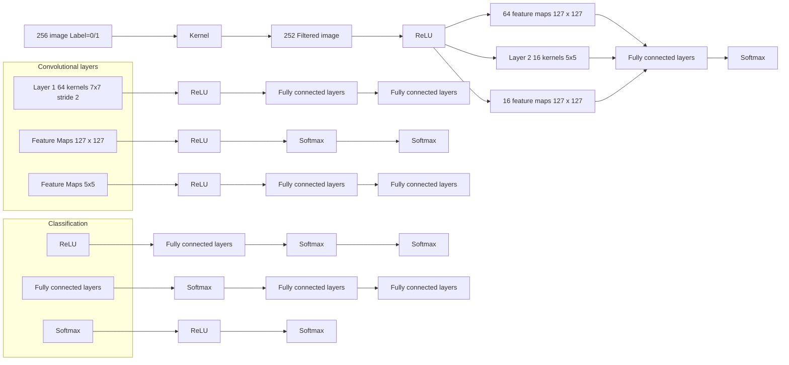
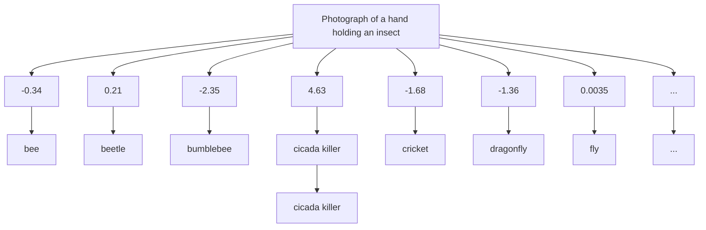

# Fighting the Horde: a Comprehensive Model for Monitoring and Controlling Hornet Invasions

Summary

Reported sightings of Asian Giant Hornets (Vespa mandarinia) on Vancouver Island and in Washington State have become a major concern both for the public and for ecologists. These hornets can cause damage to local bee populations, and in turn threaten the farming industry. This paper explores the possibility of monitoring the spread of the Hornets through enhancing the efficiency of processing sightings, predicting the reproduction process itself, and judging if the horde has been defeated.

In this paper, we first use the Poisson Distribution to determine the possible locations of the hornet nest by tracing back from currently confirmed sightings. Then, considering the unique characteristics of the hornet, we combine Poisson Distribution and the gradient of altitude data using Analytic Hierarchy Processing, and we predict the spread of the hornets based on the probability distribution of the possible locations of the current nest. Afterwards, we use Natural Language Processing to tag photos with their corresponding insects according to their respective comments, a Web Crawler to gather photos regarding these insects, and use the Convolutional Neural Network to train the algorithm used in identifying pictures that will be provided in the future. In the end, the model incorporates all the above factors and selects the sightings worthy of human examination.

To determine when the pest can be deemed eradicated, we first consider the most active periods of the worker hornets, and apply the Solow-Robert’ Non-Parametric Equation to assess the relationship between the trend of time gaps between two sightings and the frequency of sightings. This gives a probability of the eradication of the pest based on new sightings.

The result is a comprehensive model for monitoring and controlling the spread of the Asian giant hornet. The model is capable of giving advice to wildlife officers on where to search for hornet nests, giving priority to certain pictures for examination and rejecting some others. The model can evolve by itself and can achieve almost 98% accuracy in photo evaluation. The model also provides, although not definitely, a way of determining if the invasive species has been eradicated: if the probability of survival given by the model is lower than 0.05, we can almost be sure of successful eradication.

Finally, we conduct a self-evaluation of the model and present our work to the Washington State Department of Agriculture in a two-page memo.

Keywords: Vespa Mandarinia, Pest Control, Machine Learning, Natural Language Processing, Convolutional Neural Network

# Fighting the Horde: a Comprehensive Model for Monitoring and Controlling Hornet Invasions

February 8, 2021

## Contents

1 Introduction 4  
2 Assumptions 5  
3 Abbreviations and Symbols 6  
4 Predicting Reproductive Trends 6

4.1 Scouring for traces of the nest 6

4.1.1 The Nest Locating Model 6  
4.1.2 Processing the Data .  
4.1.3 Results 8

4.2 Determining trends of Possible Spread . 9

4.2.1 The Hornet Spread Model . 9

5 Applying Machine Learning to Evaluate Sightings 10

5.1 Pretreatment of Data 10  
5.2 Training the Neural Network 11  
5.3 Improving Accuracy 11  
5.4 Result of the Classification Algorithm 12

6 Improving Efficiency by Using the Model 13

6.1 The Prioritizing Model 13  
6.2 Examples 14  
6.3 Testing the Effect 15

7 Possible Model Update in Future 16

8 Signal of Victory

## 9 Strengths and Weaknesses 18

9.1 Strengths . . . 18  
9.2 Weaknesses 18

## 10 Memorandum 20

## Appendices 23

## Appendix A Code 23

A.1 Convolutional Neural Network Training . . . 23  
A.2 Convolutional Neural Network Evaluation 23  
A.3 Group Queueing 24

## 1 Introduction

Since the discovery of a nest of Asian giant hornets (Vespa mandarinia) on Vancouver Island in the fall of 2019, public safety and ecological issues have recaptured people’s attention. The situation is further complicated by a specimen found in Washington State, whose DNA has been deemed unrelated. The Asian giant hornet is an invasive species which severely threatens local honeybees and through that cause damage to agriculture. Therefore, pressure is on the authorities and experts to locate the hornet nests and destroy them before the hornets spread out of control.

The Washington State government has been encouraging the public to report sightings of the hornet via telephone and internet, but the majority of these reports are mistaken. Given that the state has finite resources to spend on this subject, we have great need to design a model to enhance the overall performance of the response mechanism in the face of the pest crisis.

Our model needs to fulfill the following tasks:

• predict how the hornet may spread its colony  
• screen sightings of the hornet to increase the efficiency of relevant government agencies  
• a rule for self-improving over time as new detection data comes in  
• and when we can declare victory in the fight against these hornets.

Similar cases of hornet invasion have been documented both in Continental Europe and on the British Isles [1]. The eradication of the pests in these cases has mainly depended on wildlife officers with expertise, not visual detection from the public. Some researchers have explored the possibility of utilizing machine learning in pest control [2], but such research directly aimed at the Asian giant hornet is lacking. As to the ways of determining the eradication of a species, although significant amounts research has been done in this area, they are either based on the assumption of possible false reports of sightings [3] (which is almost impossible with expertly-examined photos), or aimed at determining the protection status of endangered species [4]. In other words, few similar research has been done in the field of pest control.

In this paper, we propose a comprehensive model which provides a more reasonable way of allocating resources to the examination of reports of the Asian giant hornet. The model uses machine learning to identify insects in a photo, and also takes factors related to the hornet’s habit into consideration. It is capable of guessing the locations of nests and making evaluations and predictions based on the knowledge. It is also capable of updating itself according to perceived new nests and new pictures. The result gives insight into how priority can be given to more reliable sightings, and when the pest can be deemed eradicated.

## 2 Assumptions

In order to simplify the model, we make the following assumptions and justify their use:

• The behavior of the worker Asian giant hornets follow the Poisson Distribution: The Poisson Distribution arises in naturally occurring phenomena commonly found in wildlife. Since the hornets’ patrol area never has a negative distance from their nest, it is reasonable to make this assumption.  
• There are abundant trees in the mountainous areas: The queen Asian giant hornet likes to build its nest under tree roots and in steep terrain. Taking both into consideration would severely complicate the model, and moreover information regarding the location of trees is hard to find. However, we found by examining the satellite map that these two factors largely coincide with each other, thus justifying the assumption.  
• All the results given by experts are true: Comparing to us who lack knowledge of insects, it is much more reasonable to believe in the judgement of experts. Although humans make errors, it is still necessary to assume that we have been given correct data and will be given correct data in the future, so that the results of machine learning can be presumed satisfactory.  
• The attentiveness of the people in Washington State regarding the Asian giant hornet does not change: An important premise in the use of the Solow-Roberts’ Nonparametric Equation is that the frequency of observation does not change with time, otherwise this may be mistaken for a rise or drop in the frequency of sightings. As the people in Washington State are so energetic as to mistake dragonflies for Asian giant hornets, this assumption is automatically justified.

## 3 Abbreviations and Symbols

Before we begin analyzing the problems, it is necessary to clarify the abbreviations and symbols that we will be using in our discussion. These are shown below in Table 1:

Table 1: Abbreviations and Symbols

<table><tr><td>Symbol/Abbreviation</td><td>Description</td></tr><tr><td> $[Long_{min},Long_{max}]$ </td><td>The range of longitude</td></tr><tr><td> $[Lat_{min},Lat_{max}]$ </td><td>The range of latitude</td></tr><tr><td> $P_{pt}(long,lat)$ </td><td>The possibility that a nest locates there</td></tr><tr><td> $ASL(long,lat)$ </td><td>The elevation of one location</td></tr><tr><td> $ASL_{std}(long,lat)$ </td><td>The standardized elevation data of one location</td></tr><tr><td>λ</td><td>The average of Poisson Distribution</td></tr><tr><td>λi</td><td>The maximum eigenvalue (used in AHP)</td></tr><tr><td> $CR_j$ </td><td>The coincidence indicator (used in AHP)</td></tr><tr><td>CNN</td><td>Convolutional Neural Network</td></tr><tr><td> $c_{sight}$ </td><td>The credibility of the sighting</td></tr><tr><td> $p_{vm}$ </td><td>The possibility that it is a sighting of an Asian giant hornet</td></tr><tr><td> $ds_{sight}$ </td><td>The distance between the sighting and the predicted current nest</td></tr><tr><td> $dn_{sight}$ </td><td>The distance between the sighting and the predicted new nest</td></tr><tr><td>p</td><td>The probability of the Asian giant hornet surviving</td></tr><tr><td>n</td><td>The number of sightings in the observing period</td></tr><tr><td> $t_n$ </td><td>The time of the  $n^{th}$ sighting</td></tr><tr><td>T</td><td>The duration of the observing period</td></tr><tr><td>f</td><td>The average sighting frequency of Asian giant hornet</td></tr><tr><td>c</td><td>The change of sighting frequency</td></tr></table>

## 4 Predicting Reproductive Trends

## 4.1 Scouring for traces of the nest

Dealing with invasive species requires insight into their behavior: whether they attack humans unprovoked, whether they cause damage to crops or domestic animals, how they move from one place to another, etc. To predict the spread of the pest, we must first determine the possible location of their nests, since hornet reproduction relies on the queen who seldom leaves the nest. However, according to Makoto Matsura and Shôichi F. Sakagami [5] (the following discussion will use a lot of information about the habits of the hornet from this article, so we omit further citations), the Asian giant hornet likes to make its nests underground, making the detection of a colony very difficult. We thus establish the Nest Locating Model to imitate the behavior of worker hornets and to guess the location of the original nest.

## 4.1.1 The Nest Locating Model

The workers in an Asian giant hornet colony do not typically wander too far away from their nest (on average a distance of 2 km and a maximum distance 8 km). This is confirmed ned by sightings given in the problem’s data on Vancouver Island, since we already know the existence of a nest there. As for the nest in Washington State, we start from observing the longitudinal and latitudinal information of confirmed sightings and then retrace our steps. The area where the nest most probably hides is the set of all points within the patrolling distance from every sighting location nearby.

According to previous reports of the Asian giant hornet in the U.S., the queens almost always build their nests near the roots of trees. They also prefer mountain outskirts and hillsides to plain land. Therefore, the elevation and the distribution of trees are the two main geographical features we should consider when trying to locate the nests. The elevation data of the State of Washington is obtained from https://www.freemaptools. com/elevation-finder.htm, using a python web crawler to request the altitude at a particular position. We did not find suitable information regarding the coverage of trees and forests in Washington State, yet fortunately we found by observing the satellite map data that the distribution of trees largely coincides with the mountain areas. To simplify the model, we use the elevation data as the representative of the two.

We determine the probability layout of nests by considering the following factors:

• the distribution of workers in confirmed sightings on the map  
• the preferred geographical features related to the building of a nest

## 4.1.2 Processing the Data

In the Nest Locating Model, the range of the possible locations of the nest is limited to a circle with a radius of 10 kilometers with the location of the reported sighting as its center. We first calculate the probability distribution of the workers’ distance from the nest based on their patrolling habits. For each hive, the distribution of the distance of workers from the hive should follow the Poisson Distribution. The distribution of the hives’ possible locations should also follow this rule.

The Poisson Distribution here can be written as:

$$
P (x) = \frac {\lambda^ {x}}{x !} \times e ^ {- \lambda}
$$

where x represents its distance to the hive, which can be calculated using longitudinal and latitudinal information.

For any sighting, Figure 1 represents the relationship between the possibility of a nest and the distance from the spot. Figure 2 illustrates the influence of a sighting spot on our prediction.

For every sighting spot, we calculate the probability distribution of the corresponding hive and $P _ { p t } ( l o n g , l a t )$ is the sum of all the values, which represents the probability of a hive being at that spot.


<details>
<summary>line chart</summary>

| x    | y      |
| ---- | ------ |
| 0.0  | 0.135  |
| 1.0  | 0.270  |
| 2.0  | 0.270  |
| 3.0  | 0.200  |
| 4.0  | 0.100  |
| 5.0  | 0.040  |
| 6.0  | 0.015  |
| 7.0  | 0.005  |
| 8.0  | 0.002  |
| 9.0  | 0.001  |
| 10.0 | 0.001  |
| 11.0 | 0.001  |
| 12.0 | 0.001  |
| 13.0 | 0.001  |
| 14.0 | 0.001  |
| 15.0 | 0.001  |
| 16.0 | 0.001  |
| 17.0 | 0.001  |
| 18.0 | 0.001  |
| 19.0 | 0.001  |
| 20.0 | 0.001  |
</details>

Figure 1: The distribution of the hive


<details>
<summary>heatmap</summary>

| Location         | Value |
| ---------------- | ----- |
| Central Bay      | High  |
| South Bay        | High  |
| West Virginia    | High  |
| East Virginia    | High  |
| North Virginia   | High  |
| South Virginia   | High  |
| West Virginia    | High  |
| East Virginia    | High  |
| North Virginia    | High  |
| South Virginia   | High  |
| West Virginia    | High  |
| East Virginia    | High  |
| North Virginia    | High  |
| South Virginia    | High  |
| West Virginia    | High  |
| East Virginia    | High  |
| North Virginia    | High  |
| South Virginia    | High  |
| West Virginia    | High  |
| East Virginia    | High  |
| North Virginia    | High  |
| South Virginia    | High  |
| West Virginia    | High  |
| East Virginia    | High  |
| North Virginia    | High  |
| South Virginia    | High  |
</details>

Figure 2: The influence of one spot

After that, we standardize the elevation data. For each location in this area, the standardized elevation data is:

$$
A S L _ {s t d} (l o n g, l a t) = \frac {A S L (l o n g , l a t) - m i n (A S L)}{m a x (A S L) - m i n (A S L)}
$$

where max(ASL) and min(ASL) represent the highest elevation and lowest in this area.

The elevation data of this area is shown below as Figure 3:


<details>
<summary>text_image</summary>

Strait of Georgia
Parkville
Nanaimo
Vancouver Island Panges
San Juan River
Capital
Juhin De Fuca Provincial Park
Duncan
San Juan Island
Historical Park
Saaich Victoria
North Vancouver
Coquitlam
Richmond
Surrey
Delta
Albotsford
Chillwad
White Rock
Gulf Islands, Natiwan Park Reserve
Jerseyam
Upper Shasta Reservation
Mt Vernon
Legend all High Low
</details>

Figure 3: Geographical influence on the nest location

## 4.1.3 Results

In order to find out the most possible location of a nest, we should combine all the factors together, including all verified sighting spots and geographical features. We use Analytic Hierarchy Processing (AHP) to determine the weight of the factors. According to research, the queen prefer to nest under the roots of trees and not on plain areas. It is therefore reasonable to suppose that the coverage of trees and the steepness of the terrain play a more important role in determining the nesting site than the distance distribution. Trees have a greater impact on the nest location because these insects feed on tree sap, and tree roots serve as ideal locations for a nest. The judging matrix is shown below in Table 2.

Table 2: The Judging Matrix

<table><tr><td></td><td>Distance</td><td>Tree</td><td>Elevation</td></tr><tr><td>Distance</td><td>1</td><td>1/2</td><td>3/2</td></tr><tr><td>Tree</td><td>2</td><td>1</td><td>2</td></tr><tr><td>Elevation</td><td>2/3</td><td>1/2</td><td>1</td></tr></table>

Table 3: The Results

<table><tr><td>$ \lambda_{i} $</td><td>3.02</td></tr><tr><td>$ CR_{j} $</td><td>0.016</td></tr></table>

<table><tr><td></td><td>Distance</td><td>Tree</td><td>Elevation</td></tr><tr><td>W</td><td>0.285</td><td>0.498</td><td>0.217</td></tr></table>

We then use Matlab to calculate the weight of the three factors and a consistency check is introduced to test the rationality of the judging matrix (Table 3). Since $C R _ { j } < 0 . 1 0$ , the result is confirmed to be reliable. For every single point, the corresponding score is the weighted average of the three factors. The probability distribution of nest is shown below in Figure 4.


<details>
<summary>text_image</summary>

Legend
all
High
Low
</details>

Figure 4: Possible locations of the existing nest

## 4.2 Determining trends of Possible Spread

Generally speaking, Asian giant hornet queens exit hibernation in spring and start establishing a new nest in late April, at a distance of around 30 kilometers from the previous site. We propose a Poisson Distribution to imitate this phenomenon.

In addition to this, the probable future nesting site is also influenced by the following criteria:

• existence of trees (preferably pine trees)  
• steep terrain

This is because the queens like to nest by tree roots or in tree trunks, and they also prefer mountain outskirts and hillsides to plains.

## 4.2.1 The Hornet Spread Model

Based on the results from Section 4.1.3, we have determined the possible locations of nest. Using the same data processing method and the same theory mentioned before, we establish the Hornet Spread Model, as shown below in Figure 5:


<details>
<summary>text_image</summary>

North Vancouver
科里特勒姆
波那长
切削比
黑土满
萨雷
Delta
Langley
阿伯茨塔堡
White Rock
Dur Island,
Nasima Park
Reserve
Bellevton
Upper Stage
Reservation
Chilwack
罗尼堡
德多利亚州
San Juan Nand
Nasima
Reserve Park
Legend
all
High
Low
</details>

Figure 5: Possible locations of the nest in the next year

## 5 Applying Machine Learning to Evaluate Sightings

The most important part of evaluating reports of the Asian giant hornet is determining if the picture provided resembles the actual insect. Doing so manually by comparison is an extremely exhausting task, and is a major hindrance to efficiency. In this section, we use Machine Learning to help experts filter out the images most likely to be illustrating this type of hornet by assigning a probability of falsehood to each picture.

Since there are too few pictures of the Asian giant hornet in the given files, it is more reasonable to train the algorithm to determine the type of insect illustrated in a photo instead of judging whether a photo depicts the Asian giant hornet.

## 5.1 Pretreatment of Data

Before training the algorithm, it is important to cleanse the data so that they would not interfere with the process. We first delete all the accounts of sighting with Lab Status Unverified or Unprocessed, because we essentially lack visual data regarding these reports. Then we use Natural Language Processing on the rest of the data to extract all nouns under the tab Lab Comments. We manually identify the 13 species of insects mentioned in the comments and refer to the pictures given via the GlobalID.

Those 13 species are bee, beetle, bumblebee, cicada killer, cricket, dragonfly, fly, grasshopper, hornet, sawfly, Vespa mandarinia (known as the Asian giant hornet), wasp, and yellowjacket.

We then tag these pictures with their corresponding insect species. This serves as an identification mechanism for noting the information related to a photo.

The information and photos provided by the people who claimed to have see the Asian giant hornet are far from satisfactory and are too few in numbers, so we used additional pictures from buggide.net to aid in the training. We downloaded 200 pictures for each of these 13 species and tagged them with the proper insect species.

## 5.2 Training the Neural Network

We use a deep learning algorithm called Convolutional Neural Network (known as CNN), which consists of the Convolutional layer, the Pooling layer, the ReLU layer, the Fully Connected layer and the Loss layer, shown below in Figure 6:


<details>
<summary>flowchart</summary>


</details>

Figure 6: Convolutional Neural Network

ResNet is a traditional CNN model for classification, using Residual learning.

To test the performance of the algorithm, we divide the pictures into two sets, the training set and the evaluation set. One-tenth of the pictures are in the evaluation set and the others are in the training set.

We train and test ResNet with three different depth layers (18 layers, 34 layers and 50 layers). The resulting performance measured by accuracy is shown below in Table 4:

Table 4: ResNet Accuracy

<table><tr><td></td><td>ResNet18</td><td>ResNet34</td><td>ResNet50</td></tr><tr><td>picture from website</td><td>71.74%</td><td>74.34%</td><td>78.26%</td></tr><tr><td>uploaded photo</td><td>12.64%</td><td>19.83%</td><td>18.30%</td></tr></table>

## 5.3 Improving Accuracy

As seen in Table 4, the accuracy of the algorithm trained using pictures downloaded from the website is much higher than the accuracy of the algorithm trained using photographs taken by people who reported to have seen the Asian giant hornet. The main reason is that most of the pictures downloaded from bugguide.net are close-ups, which means that the insect is in the middle of the picture and has a high resolution, while the photos taken by local people are on average much blurrier and the insects’ position in their photos vary greatly. This made it really difficult for the algorithm to classify the insects correctly.

Because of this, we manually crop the pictures given in the files to position the insects in the middle of the picture. The process is shown below in Figure 7:


<details>
<summary>natural_image</summary>

Two-panel image showing a person holding a small insect outdoors, and a close-up of a hand holding a large insect specimen (no text or symbols visible)
</details>

Figure 7: Image Cropping

We cropped 107 pictures, including all the pictures of the Asian giant hornet, and tested ResNet with 50 layers. The accuracy of the algorithm regarding these processed pictures rose from 18.3% to 25.23%, which is shown below in Table 5:

Table 5: ResNet Accuracy

<table><tr><td></td><td>ResNet18</td><td>ResNet34</td><td>ResNet50</td></tr><tr><td>picture from website</td><td>71.74%</td><td>74.34%</td><td>78.26%</td></tr><tr><td>uploaded photo</td><td>12.64%</td><td>19.83%</td><td>18.30%</td></tr><tr><td>processed photo</td><td>18.69%</td><td>27.10%</td><td>25.23%</td></tr></table>

However, there is still a big gap between the accuracy of downloaded pictures and taken photographs even after we have cropped them. This is probably because after cropping, the pictures have fewer pixels and thus they become unclear. Fewer pixels means a greater possibility of the characteristics of the insects being ignored.

If we only consider whether the insect in a picture is the Asian giant hornet, the model’s accuracy increases to a much more acceptable value, as is shown below in Table 6:

Table 6: True or False Accuracy

<table><tr><td></td><td>ResNet18</td><td>ResNet34</td><td>ResNet50</td></tr><tr><td>picture from website</td><td>99.60%</td><td>99.60%</td><td>99.60%</td></tr><tr><td>uploaded photo</td><td>99.18%</td><td>98.97%</td><td>97.88%</td></tr><tr><td>processed photo</td><td>90.65%</td><td>94.39%</td><td>92.52%</td></tr></table>

The accuracy of processed photos is relatively low because there are 107 photos in all and it contains all the pictures of the Asian giant hornet. To compare with, there are more than one thousand pictures in the reports,and only a few of them are our target, the Asian giant hornet.

## 5.4 Result of the Classification Algorithm

The confusion matrix of the algorithm testing photos provided in the files is shown below in Figure 8:


<details>
<summary>heatmap</summary>

| True label \ Predicted label | 0 | 1 | 2 | 3 | 4 | 5 | 6 | 7 | 8 | 9 | 10 | 11 | 12 |
| :--- | :--- | :--- | :--- | :--- | :--- | :--- | :--- | :--- | :--- | :--- | :--- | :--- | :--- |
| 0 | 0.95 | 0.95 | 0.95 | 0.95 | 0.95 | 0.95 | 0.95 | 0.95 | 0.95 | 0.95 | 0.95 | 0.95 | 0.95 |
| 1 | 0.95 | 0.95 | 0.95 | 0.95 | 0.95 | 0.95 | 0.95 | 0.95 | 0.95 | 0.95 | 0.95 | 0.95 | 0.95 |
| 2 | 0.95 | 0.95 | 0.95 | 0.95 | 0.95 | 0.95 | 0.95 | 0.95 | 0.95 | 0.95 | 0.95 | 0.95 | 0.95 |
| 3 | 0.95 | 0.95 | 0.95 | 0.95 | 0.95 | 0.95 | 0.95 | 0.95 | 0.95 | 0.95 | 0.95 | 0.95 | 0.95 |
| 4 | 0.95 | 0.95 | 0.95 | 0.95 | 0.95 | 0.95 | 0.95 | 0.95 | 0.95 | 0.95 | 0.95 | 0.95 | 0.95 |
| 5 | 0.95 | 0.95 | 0.95 | 0.95 | 0.95 | 0.95 | 0.95 | 0.95 | 0.95 | 0.95 | 0.95 | 0.95 | 0.95 |
| 6 | 0.95 | 0.95 | 0.95 | 0.95 | 0.95 | 0.95 | 0.95 | 0.95 | 0.95 | 0.95 | 0.95 | 0.95 | 0.95 |
| 7 | 0.85 | 0.85 | 0.85 | 0.85 | 0.85 | 0.85 | 0.85 | 0.85 | 0.85 | 0.85 | 0.85 | 0.85 | 0.85 |
| 8 | 1.12 | -1.12 | -1.12 | -1.12 | -1.12 | -1.12 | -1.12 | -1.12 | -1.12 | -1.12 | -1.12 | -1.12 | -1.12 |
| 9 | -1.12 | -1.12 | -1.12 | -1.12 | -1.12 | -1.12 | -1.12 | -1.12 | -1.12 | -1.12 | -1.12 | -1.12 | -1.12 |
| 10| -1.12 | -1.12 | -1.12 | -1.12 | -1.12 | -1.12 | -1.12 | -1.12 | -1.12 | -1.12 | -1.12 | -1.12 | -1.12 |
| 11| -1.12 | -1.12 | -1.12 | -1.12 | -1.12 | -1.12 | -1.12 | -1.12 | -1.12 | -1.12 | -1.12 | -1.12 | -1.12 |
| 12| -1.44 | -1.44 | -1.44 | -1.44 | -1.44 | -1.44 | -1.44 | -1.44 | -1.44 | -1.44 | -1.44 | -1.44 | -1.44 |
The heatmap visualizes the correlation or probability of predicted labels versus true labels, with darker shades indicating higher correlation values.
</details>

Figure 8: Confusion Matrix

The x-axis of the matrix is the label assigned by the algorithm and the y-axis is its true label. So the value in $( x , y )$ means the probability that the algorithm thinks it is label x while actually it is label y.

Label No.10 is the Asian giant hornet. From the matrix we can figure out that the classification algorithm has some probability of mistaking the Asian giant hornet for a fly, a normal hornet or a bee, while mistaking cicada killers for Asian giant hornets.

## 6 Improving Efficiency by Using the Model

In order to allocate resources to the investigation of sightings more efficiently, we need to evaluate the reliability of each sighting. The reliability of a sighting is determined to a large extent by the photo provided, but also by its distance to previously confirmed sightings. A new report close to those before is more likely to be real because sightings of hornets means nests nearby, and nests nearby means a greater probability of hornets wandering about.

The range between new sightings and previously confirmed ones determines the possible origins of the new hornet: they might be from the same colony if close enough, or be the offspring from a new nest if they are at a distance from each other and have a gap of around a year, or be completely unrelated if they are too far away.

## 6.1 The Prioritizing Model

To be specific, we set up the Prioritizing Model, which determines the credibility of sightings according to the following steps:

• Input: Coordinates of the new sightings, their respective evidence photos  
• Output: Credibility of the sightings  
• For every newly reported sighting:

1. If the sighting occurred more than 70 kilometers away from any other confirmed sighting, we assign group number 3 and only consider the results given by the photo identification algorithm.

$$
c _ {s i g h t} = p _ {v m}
$$

2. If the sighting occurred less than 70 kilometers but more than 20 kilometers away from a confirmed sighting, we assign group number 2 and consider the following factors:

– The results of the algorithm - 60%  
– The results of the Hornet Spread Model - 40%

$$
p _ {s p r e a d} = P (d s _ {s i g h t}) = \frac {2 ^ {d s _ {s i g h t}}}{d s _ {s i g h t} !} \times e ^ {- 2}
$$

$$
c _ {s i g h t} = 0. 6 \times p _ {v m} + 0. 4 \times p _ {s p r e a d}
$$

3. If the sighting occurred less than 20 kilometers away from a confirmed sighting, we assign group number 1 and consider the following factors:

– The results of the algorithm - 50%  
– The results of the Hornet Spread Model - 20%  
– The results of the Nest Locating Model - 30%

$$
p _ {s p r e a d} = P (d s _ {s i g h t}) = \frac {2 ^ {d s _ {s i g h t}}}{d s _ {s i g h t} !} \times e ^ {- 2}
$$

$$
p _ {n e s t} = P (d n _ {s i g h t}) = \frac {2 ^ {d n _ {s i g h t}}}{d n _ {s i g h t} !} \times e ^ {- 2}
$$

$$
c _ {s i g h t} = 0. 5 \times p _ {v m} + 0. 2 \times p _ {s p r e a d} + 0. 3 \times p _ {n e x t}
$$

• Delete the photos from the groups if the probability is too low $( c _ { s i g h t } < 0 . 0 1 )$ .  
• Assign different proportions of people with the task of manually examining the photos in Group 1, Group 2, and Group 3, according to relative importance: Group 1 is more important than Group 2, and Group 2 is more important than Group 3.  
• If any group has no more photos to examine, temporarily allocate resources to the examining of the next most important group.

## 6.2 Examples

Consider the situation where a new sighting occurred at (46.73, −120.56). It can easily be calculated that it is 268 kilometers away from the nearest confirmed sighting (shown below in Figure 9). Therefore, it will be assigned to group No. 3 and its examination will only take the results of the classification algorithm into consideration.


<details>
<summary>text_image</summary>

268km
(1/2)
negative
Latitude 46.729429
Longitude -120.556863
</details>

Figure 9: A new report

The algorithm will assign a value (which may be negative) that represents the possibility of the insect in the picture belonging to each species. The largest value means that it is most probably that kind of insect. In this case, the algorithm thinks it is a cicada killer, as is shown in Figure 10.


<details>
<summary>flowchart</summary>


</details>

Figure 10: Machine Learning Classification Example

So the picture will be in the latter part of group No.3. The whole process is completed automatically.

## 6.3 Testing the Effect

According to the research conducted by Makoto Matsura and Shôichi F. Sakagami, the first batch of worker Asian giant hornets start working in May, and their numbers reach the peak in August. Meanwhile, the number of reported sightings also increases dramatically, the result of which is a lot of remaining unverified photos.

Using the previous verified data from May to August, we simulate the progress again and compare the simulation with reality.

First, we sort the verified photos according to the time sequence and then mark the rankings of the 5 Asian giant hornets (shown as Figure 11). They rank [84, 138, 166, 190, 1257] in the total 1400 photos.

Then we use the Prioritizing Model to evaluate the priority of each photo and rank the photos accordingly. The 5 photos illustrating Asian giant hornets now rank [1, 2, 3, 4, 16]. As shown in Figure 12, the improvement of efficiency is incredible!


<details>
<summary>text_image</summary>

No.1257
No.190
</details>

Figure 11: 1400 Photos queuing in one Row


<details>
<summary>text_image</summary>

No.16
No.4
No.3
No.2
No.1
</details>

Group 1


<details>
<summary>natural_image</summary>

Stacked photos of various animal and plant samples arranged in a row (no visible text or labels)
</details>

Group 2


<details>
<summary>natural_image</summary>

Stack of photographs showing various insect photos and close-ups of a hand holding an insect, no visible text or symbols
</details>

Group 3  
Figure 12: 1400 Photos classified in 3 Groups

Although our model provides little help when only a few photos are reported in a time interval (since the experts are able to manually verify all the reports on time) , it contributes significantly to the improvement of efficiency when the experts are buried in piles of reports waiting to be verified.

## 7 Possible Model Update in Future

We have established 2 models to locate the existing nest and to predict the trend of spreading, the Nest Locating Model and the Hornet Spread Model, and have used Convolutional Neural Network to train an algorithm for recognizing the photos uploaded.

1. The Nest Locating Model: This model is based on all confirmed sighting points and the geographical features in that area. Each sighting point contributes to the locating of the nest, so every new sighting point should be updated in the model. When a new year comes, the sighting points in the year before should be removed from the data set. The geographical data (e.g. forest distribution and elevation) should be updated when the hornets spread to other areas.  
2. The Hornet Spread Model: This model is also based on the previous locations of nest and the geographical features. Since the hornet queen will build a new nest each year, which suggests that the old nest become empty, the data in the year before should be removed from the data set. When a nest is found, the model should also be updated.  
3. Convolutional Neural Network: Once a new photo is labeled by the insect experts, the photo can be added to the training set to help the neural network give more accurate judgement.

## 8 Signal of Victory

The Prioritizing Model improves the efficiency of verifying the photos uploaded by citizens and the Nest Locating Model and the Hornet Spread Model help us locate the existing nests and predict the nest location in the coming year based on the verified sighting of Asian giant hornets. It can be foreseen that the pest will be eradicated in the near future.

In order to quantitatively evaluate the survival of the Asian giant hornet, we introduce p as the probability of its survival. According to A.R. Solow and D.L. Roberts [6], the probability p can be written as:

$$
p = \frac {t _ {n} - t _ {n - 1}}{T - t _ {n - 1}}
$$

where $t _ { n }$ represents the time of the $n ^ { t h }$ sighting of a species and $T$ the total length of the observing period.

To take the average sighting frequency into consideration, we replace $\left( { t _ { n } } - { t _ { n - 1 } } \right)$ by

$$
f = \frac {\sum_ {i = 2} ^ {n} t _ {i} - t _ {i - 1}}{n - 1} = \frac {t _ {n} - t _ {1}}{n - 1}
$$

$$
p = \frac {f}{f + (T - t _ {n})}
$$

Furthermore, to add the change of sighting frequency into the equation, the average of second order difference of t is introduced:

$$
\begin{array}{l} c = \frac {\sum_ {x = 2} ^ {n - 1} \left(\left(t _ {x + 1} - t _ {x}\right) - \left(t _ {x} - t _ {x - 1}\right)\right)}{n - 2} \\ p = \frac {f + c}{f + c + (T - t _ {n})} = \frac {\frac {t _ {n} - t _ {1}}{n - 1} + c}{\frac {t _ {n} - t _ {1}}{n - 1} + c + (T - t _ {n})} \\ \end{array}
$$

In our model, $t _ { n }$ can be obtained by verified photos and traps, n can easily be counted and $T$ can be regarded as the length of observing period. For the Asian giant hornet, the best observing period is from May to November, when the worker Asian giant hornets leave the nest frequently in search of food.

Generally, when p is under 0.05, the pest can be regarded as eradicated in one area.

## 9 Strengths and Weaknesses

## 9.1 Strengths

• Dynamic adaptation to new events: This model is capable of evolving whenever a new expert-examined picture is put into its inventory. This means the algorithm can improve in accuracy over time fairly quickly.  
• High generalizability: Theoretically, This model can be used to monitor and predict the spread of any invasive species, so long as we adjust the model according to the behavior and the appearance of the species.  
• Objective results: All results of this model can be visualized and represented mathematically. There is no trial by thought.  
• Comprehensive consideration of factors: We consider factors other than distance when it comes to determining nesting sites; we consider factors other than appearance when it comes to determining credibility. Simply put, this model puts the uniqueness of the Asian giant hornet into the equation.  
• Clarity: This model incorporates complicated concepts such as machine learning, but the basic nature of the model can be understood by everyone.  
• Great increase in efficiency: Our model successfully prioritizes the examination of the most suspicious photos. This save a great deal of time for the experts.

## 9.2 Weaknesses

• Not enough consideration of forest coverage: Although we have illustrated that treecovered areas largely coincides with the mountain areas, we still didn’t distinguish clearly the actual influence of forest and mountain area. Moreover, the Asian giant hornet prefers some trees to other trees, i.e. pine trees, which requires more detailed information to be added in the model.  
• No consideration of time and ambient temperature: Time and temperature are also significant issues when it comes to determining the credibility of a picture. In addition to the yearly nesting cycle that we considered in this paper, the hornets may probably have a daily schedule as well. Examining the time when photos were taken can solve this problem, but this adds too much complexity to the model. We also lack information of ambient temperature associated with each photo, so neither was this part considered.  
• Possible inaccurate use of models: We do not know the exact behavior of the hornet; only the average of the data is given. So some parts of our model like Poisson Distribution may not accurately reflect the real situation.

• Classification Algorithm not accurate enough: If we want to further improve the accuracy, we need to sharpen the pictures and improve the clearness of the pictures. We would then be able to process the pictures with the help of machine learning more easily.

## 10 Memorandum

Dear Sir/Madam,

We are sorry for the unfortunate event of the Asian giant hornet invasion. We know how problematic this situation is for agriculture and how it causes worries in the community. To help with the endeavor to eradicate the pest, we propose a model to improve the efficiency of processing the reports, and provide insight into how they can be monitored.

Simply put, the model works in three steps:

1. Determine the current nesting area through processing current confirmed sightings.  
2. Predict the distribution of future nests using data from the first step.  
3. Judge the credibility of sightings by considering results from the two steps before and the characteristics of the hornet.

This model makes reliable guesses at where the nest of a hornet may be found by tracing the tracks of sighted workers, and makes predictions on where new nests may be found. This information can aid wildlife officers in their search-and-destroy tasks, and also warn beekeepers of possible danger zones.

It can also sort pictures of sightings by placing them in different groups belonging to different insects. This helps improve the efficiency of the government agency in examining the reports by aiding entomologists through doing a rough screening of incoming pictures first. Besides this, factors such as geographical information and coordinates are also taken into consideration, because of the habits of the insect. The resulting algorithm can reach 98% when it comes to identifying only the pictures of the Asian giant hornet.

The model is also capable of updating itself when new information is given. Depending on the circumstance, the model will change:

• by updating its figure set if any new photo comes in;  
• by adding a new site as a possible nest if confirmed sightings occur far away from any known nest;  
• every year by deleting information of current nests, since queens migrate and old nests die out.

Fighting a horde of invasive species can be a hard task, but our model can be of great help, especially when it comes to the examination of sighting reports. When the amount of sightings peaks at around august, your experts will be overloaded with pictures to examine. Besides the aforementioned ability of roughly screening the photos, it is also capable of flagging and prioritizing the most probable photos for further examination. Our tests show that it can correctly prioritize 5 photos out of the bulk of 1400 photos for human intervention.

We can almost convince ourselves of victory when no new confirmed sighting occurs from May to November, since the hornets are most active at these times of the year. But to be more confident with this judgement, we would want to see a declining trend in the number of confirmed sightings to reassure ourselves of victory. According to our calculations, a trend of sighting numbers decreasing representing a probability of survival lower than 0.05

would be sufficient to demonstrate that the pest has been eradicated.

  
Sighting reports  
Possible existing nest locations  
Possible next-year nest locations  
P = 0.53

  
Figure 13: User Interface

The Figure 13 above is an illustration of how the model will work: you can select the map view by checking the three boxes on the top-left. The three pictures below the map represent the results after expert analysis in the three groups. The figure on the bottom-left illustrates how the photo identification algorithm improves itself over time: it makes fewer mistakes. The text on the middle-left is the output of p and the predicted situation of the hornet colony.

We hope this model can serve as a valuable tool in our united effort to fight the horde. After all, the eradication of this invasive species is the common goal of both our team and the civilians of Washington State. If there are any further questions or problems regarding this model, please contact us and we will do whatever we can to explain and/or improve the model.

We are looking forward to your good news.

Yours Sincerely,

Team # 2101587

## References

[1] Eleanor P. Jones, Chris Conyers, Victoria Tomkies, Nigel Semmence, David Fouracre, Maureen Wakefield, and Kirsty Stainton. Managing incursions of Vespa velutina nigrithorax in the UK: an emerging threat to apiculture. Scientific Reports, 10(19553), 2020.  
[2] Carsten Kirkeby, Klas Rydhmer, Samantha M. Cook, Alfred Strand, Martin T. Torrance, Jennifer L. Swain, Jord Prangsma, Andreas Johnen, Mikkel Jensen, Mikkel Brydegaard, and Kaare Græsbøll. Advances in automatic identification of flying insects using optical sensors and machine learning. Scientific Reports, 11(1555), 2021.  
[3] T.E. Lee, M.A. McCarthy, B.A. Wintle, M. Bode, D.L. Roberts, and M.A. Burgman. Inferring extinctions from sighting records of variable reliability. Journal of Applied Ecology, 51:251–258, 2014.  
[4] Ivan Jari´c and Torbjörn Ebenhard. A method for inferring extinction based on sighting records that change in frequency over time. Wildlife Biology, 16:267–275, 2010.  
[5] Makoto Matsura and Shôichi F. Sakagami. A bionomic sketch of the giant hornet, vespa mandarinia, a serious pest for Japanese apiculture. Journal of the Faculty of Science Hokkaido University, 19:125–162, 1973.  
[6] A.R. Solow and D.L. Roberts. A nonparametric test for extinction based on a sighting record. Ecology, 84:1329–1332, 2003.

## Appendices

## Appendix A Code

A.1 Convolutional Neural Network Training  
```python
import torch
import torchvision
import matplotlib.pyplot as plt
import numpy as np
import os
from PIL import Image
import torchvision.models as models
import torch.nn as nn
import torch.nn.functional as F
import torchvision.datasets as normal_datasets
import torchvision.transforms as transforms
from torch.autograd import Variable
from torch.optim.lr_scheduler import *
import torch.utils.data as data
import random
from utils import *
transform_train = transforms.Compose([
    transforms.Resize((224, 224)),
    transforms.ToTensor(),
    transforms.Normalize((0.485, 0.456, 0.406), (0.229, 0.224, 0.225)))
trainset = loaddata('C:\\Users\\wennitao\\Desktop\\MCM2021\\ProblemC\\ResNet\\data\\eval_partition.txt', 'C:\\Users\\wennitao\\Desktop\\MCM2021\\ProblemC\\ResNet\\data\\attrs_TZ.csv', '0', 'C:\\Users\\wennitao\\Desktop\\MCM2021\\ProblemC\\ResNet\\train_data\\', transform=transform_train)
trainloader = torch.utils.data.DataLoader(trainset, batch_size=32, shuffle=True, num_workers=4)
resnetmodels.resnet18(pretrained=True)
num_ftrs = resnet.fc.in_features
resnet.fc = nn.Linear(num_ftrs, 13)
cnn=resnet
if torch.cuda.is_available():
    cnn = cnn.cuda()
num_epochs=30
batch_size=64
learning_rate=0.005
loss_func = nn.CrossEntropyLoss()
optimizer = torch.optim.SGD(cnn.parameters(), lr=0.005,weight_decay=1e-4, momentum=0.9)
scheduler = StepLR(optimizer, step_size=3)
scheduler.step()
cnn.train()
i=0
for epoch in range(num_epochs):
    for batch_idx, (images, labels, id) in enumerate(trainloader):
    images = get_variable(images)
    labels = torch.Tensor(np.array(labels,dtype=np.int64)).t()
    labels = labels.cuda().type(torch.cuda.LongTensor)
    outputs = cnn(images)
    loss = loss_func(outputs, labels.squeeze())
    optimizer.zero_grad()
    loss.backward()
    optimizer.step()
    i+=1
    if ((i-1) % 10 == 0):
    print('Epoch [%d/%d], Iter [%d/%d] Loss: %.4f' % (epoch + 1, num_epochs, i, trainset.length // batch_size, loss.item()))
torch.save(cnn, 'resnet18.pkl')
```

## A.2 Convolutional Neural Network Evaluation

```python
from sklearn.metrics import confusion_matrix
import torch
import torchvision
import torchvision.models as models
import torch.nn as nn
import torch.nn.functional as F
```

```python
import torchvision.datasets as normal_datasets
import torchvision.transforms as transforms
from torch.autograd import Variable
from torch.optim.lr_scheduler import *
import torch.utils.data as data
import matplotlib.pyplot as plt
import numpy as np
import os
from PIL import Image
import random
from utils import *
batch_size=32
transform_train = transforms.Compose([
    transforms.Resize((224, 224)),
    #transforms.RandomHorizontalFlip(),
    transforms.ToTensor(),
    transforms.Normalize((0.485, 0.456, 0.406), (0.229, 0.224, 0.225)),
])
val = loaddata('C:\\Users\\wennitao\\Desktop\\MCM2021\\ProblemC\\ResNet\\data\\processed_test.txt', 'C:\\Users\\wennitao\\Desktop\\MCM2021\\ProblemC\\ResNet\\data\\attrs_TZ_processed.txt', '1', 'C:\\Users\\wennitao\\Desktop\\MCM2021\\ProblemC\\ResNet\\verified_processed\', transform=transform_train)
valloader = torch.utils.data.DataLoader(val, batch_size=batch_size, shuffle=False, num_workers=4)
cnn=torch.load("resnet50.pkl")
insects = ['bee', 'beetle', 'bumblebee', 'cicada_killer', 'cricket', 'dragonfly', 'fly', 'grasshopper', 'hornet', 'sawfly', 'vespa_mandarinia', 'wasp', 'yellowjacket']
torch.cuda.empty_cache()
cnn.eval()
cnn=cnn.cpu()
correct = 0
wrong = 0
total = 0
y_real = []
y_predict = []
count=0
for batch_idx, (images, labels, id) in enumerate(valloader):
    images = get_variable(images)
    attrs1=labels
    attrs1=torch.Tensor(np.array(attr1,dtype=float)).t()
    labels=attrs1
    images = images.type(torch.FloatTensor)
    outputs = cnn(images)
    _, predicted = torch.max(outputs.data, 1)
    cur_correct = 0
    for i in range (0, labels.size(0)):
    print ('label:', insects[round ((labels.data.detach().cpu().numpy().T)[0][i])], 'predict:', insects[(predicted.numpy())[i]])
    if round ((labels.data.detach().cpu().numpy().T)[0][i]) == 10 and (predicted.numpy())[i] != 10:
    wrong += 1
    if round ((labels.data.detach().cpu().numpy().T)[0][i]) != 10 and (predicted.numpy())[i] == 10:
    wrong += 1
    y_real.append (round ((labels.data.detach().cpu().numpy().T)[0][i]))
    y_predict.append ((predicted.numpy())[i])
    if round ((labels.data.detach().cpu().numpy().T)[0][i]) == (predicted.numpy())[i]:
    cur_correct += 1
    print (str (cur_correct) + '/' + str (labels.size(0)))
    total += labels.size(0)
    correct += cur_correct

print ('accuracy:', (100.0 * correct / total), '%')
print (100.0 * (total - wrong) / total, '%')

cm = confusion_matrix(y_real, y_predict,)
plot_confusion_matrix(cm, range(0, 13), " ")
plt.savefig('confusion_matrix.png', format='png')
plt.show()
```

## A.3 Group Queueing

```python
import pandas as pd
import datetime
from geopy.distance import geodesic
insects = ['bee', 'beetle', 'bumblebee', 'cicada_killer', 'cricket', 'fly', 'grasshopper', 'hornet', 'sawfly', 'vespa_mandarinia',
```

```python
yellowjacket'
report = []
vespa_mandarinia = []
report_data = pd.read_excel('2021MCMProblemC_DataSet.xlsx')
path_data = pd.read_excel('2021MCM_ProblemC_ Images_by_GlobalID.xlsx')
label_data = pd.read_excel('true_data2.xlsx')
fo = open('data\\queue_eval_partition.txt','w')
fo2 = open('data\\queue_attrs_TZ.csv','w')
for row_index, row in report_data.iterrows():
    cur_status = row['Lab Status']
    if cur_status == 'Unprocessed' or cur_status == 'Unverified':
    continue
    cur_date = row['Submission Date']
    if cur_date.month < 5 or cur_date.month > 8:
    continue
    cur_id = row['GlobalID']
    if len (path_data[path_data['GlobalID'] == cur_id]) == 0:
    continue
    jpg_str = path_data[path_data['GlobalID'] == cur_id]['FileName'].values[0]
    jpg_str = jpg_str.replace (' ', ' _')
    tmp = label_data[label_data['pic_name'] == jpg_str]['name']
    if len (tmp.values) == 0:
    continue
    label = tmp.values[0]
    label_id = 0
    for i in range (0, len (insects)):
    if label == insects[i]:
    label_id = i
    break
    lat = row['Latitude']
    longt = row['Longitude']
    report.append ([cur_date, jpg_str, label_id, lat, longt])
    fo.write (jpg_str + '\t1\n')
    fo2.write (jpg_str + '\t' + str (label_id) + '\n')
fo.close()
fo2.close()
for i in range (0, len (report)):
    if report[i][2] == 10:
    vespa_mandarinia.append(i)

import math
lati = [48.980994, 48.971949, 49.149394, 48.955587, 49.025831, 49.060215,
    48.777534, 48.993892, 48.927519, 48.984269, 48.979497, 48.983375, 48.984172,
    48.98422]
longti = [-122.688503,-122.700941,-123.943134,-122.661037,-122.810653,-122.641648,
-122.418612,-122.702242,-122.745016,-122.574809,-122.581335,-122.582465,
-122.57472,-122.574726]
predicted_cur_nest = [48.99, -122.66]
predicted_new_nest = [48.89, -122.24]
report_value = [[], [], []]

for cur in range (0, len (report)):
    cur_list = report[cur]
    lat = cur_list[3]
    longt = cur_list[4]
    min_dis = 1e18
    for i in range (0, len (lati)):
    dis = geodesic ((lat, longt), (lati[i], longti[i])).km
    min_dis = min (min_dis, dis)
    if min_dis > 70:
    report_value[0].append ((possibility[cur], cur))
    elif min_dis > 20:
    dis1 = geodesic ((lat, longt), (predicted_new_nest[0],
predicted_new_nest[1])).km
    px1 = math.pow (dis1, 2) / math.factorial (int (dis1)) * math.exp (-2)
    report_value[1].append ((possibility[cur] * 0.6 + px1 * 0.4, cur))
else:
    dis1 = geodesic ((lat, longt), (predicted_new_nest[0],
predicted_new_nest[1])).km
    px1 = math.pow (dis1, 2) / math.factorial (int (dis1)) * math.exp (-2)
    dis2 = geodesic ((lat, longt), (predicted_cur_nest[0],
predicted_cur_nest[1])).km
    px2 = math.pow (dis2, 2) / math.factorial (int (dis2)) * math.exp (-2)
    report_value[2].append ((possibility[cur] * 0.5 + px1 * 0.2 + px2 * 0.3,
    cur))
for i in range (0, 3):
    report_value[i].sort (reverse = True)
```