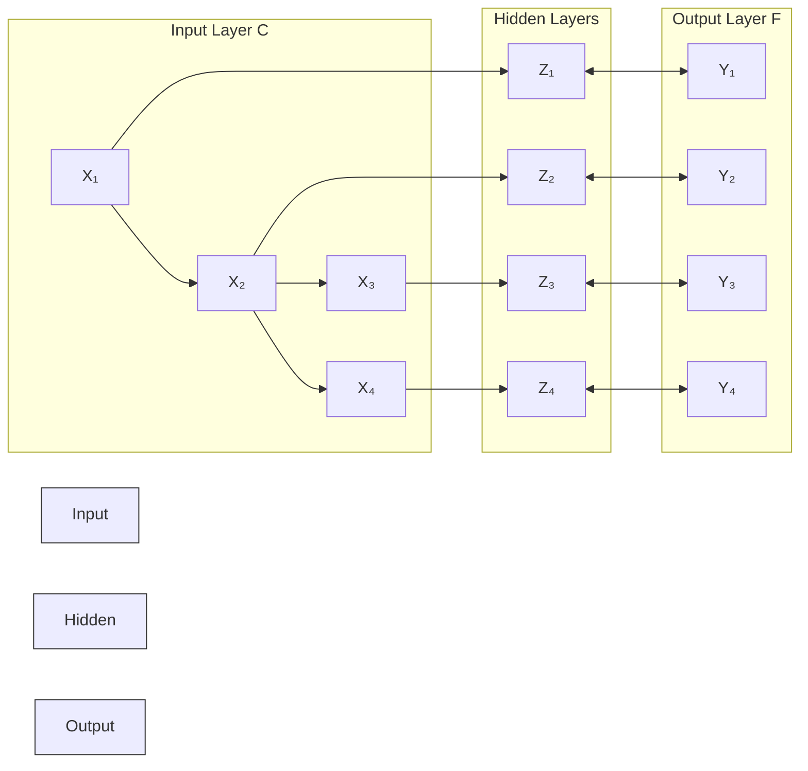

# Measure of Influence and Similarity in Dynamic Networks of Musicians

Summary

To measure the evolution and revolution of musicians’ community, our team introduces a model to quantify their identities across time based on the dynamic networks from interactions between musicians across time. The model contains three core parts: rescaled PageRank to measure influence, optimization of weighted cosine distance to measure similarity with time structure, and a comprehensive measure combing influence and similarity.

To measure importance of nodes in network more accurately, we improve the traditional PageRank model by introducing a method of "rescaling". This is a method taking corresponding nodes’ relative positions among contemporaries into account which effectively solves the problem of time preference in the ordinary PageRank and allow us to compare influence of musicians vertically.

Then, based on musical characteristics of their works across time, we design a weighted cosine distance as the measure of similarity. And in order to determine the weight vector, we optimize the error function of MSE with its labels from the structure of networks by Stochastic Gradient Descent. Except from similarity of musical identities from the same period, we also consider the potential lag effects of previous works in our model. This makes the similarity model precisely capture musicians within a same genre.

In addition, we conbime the similarity into rescaled PageRank model in order to making use of more information than indegree. With this update, our model can better overcome the problem of time-bias. Also, by the comparison of results between two measures, we are able to take a glimpse at the relationship between influence and similarity. And by evolution of influence and musical characteristics, we can also trace how a genre change over time with different positions in the network. Some cases studies are presented to show how it works.

Finally, we made some tests to check whether we can dig out more information from the graph structure by Graph Convolutional Network(GCN). Sensitivity analysis is also held to determine the width of average window in the process of rescaling. Strength and weakness of the model are also summarized for further imporving the measures.

Keywords: Music classification; Dynamic Social Networks; Rescaled PageRank; Weight Cosine Similarity

## Contents

## 1 Introduction 4

1.1 Background 4  
1.2 Restatement of the Problem 4

## 2 Assumptions and Notations

2.1 Assumptions . . . . 4  
2.2 Notations . . 5

## 3 Benchmark Models and Overall Analysis 5

3.1 Framework of Musicians’ Social Network . . . 5

3.1.1 Static Network . . 5  
3.1.2 Dynamic Network . . . 6

3.2 Measure of Influence: Time-Balanced Network Centrality . . . . 6

3.2.1 Model of Rescaled PageRank . . . 6  
3.2.2 Example from Subnetwork of the 80s L

3.3 Measure of Similarity . . . . 8

3.3.1 Determine Weight Vector from Structure of Networks . . . 8  
3.3.2 Time Structure of Similarity . 9  
3.3.3 Test of Validity of Similarity Metric . . . . 9

## 4 Relation between Influence and Similarity: Updated Rescaling PageRank Model 9

4.1 Updated Rescaled PageRank Model 10  
4.2 Relation between Similarity and Influence . . 10

4.2.1 Within Genres . 10  
4.2.2 Between Genres . 11

4.3 A Case Study: Did Influencer Really Affect Followers? 11

## 5 Evolution of Different Genres 12

5.1 Basis for Differentiating Genres . 12

5.1.1 Size and Influence 12  
5.1.2 Musical identity: Measure of Relationship between Genres . . . . 13

5.2 Identification of Revolutions . 14

5.2.1 Revolutions from Outer Part 14  
5.2.2 Revolutions from Inner Part . 15

5.3 A Case Study: Evolution of Blue Music . . . 16

## 6 Test and Sensitivity Analysis 17

6.1 Sensitivity Analysis on the Average Window of Rescaled PageRank . . . 17  
6.2 Evidence from GCN: Can We Find More Information from the Structure of Network? 18

## 7 Strengths and Weaknesses 19

7.1 Strengths . . 19  
7.2 Weaknesses 20

## 8 Further Discussion 20

References 22

Appendix A: Information of Dynamic Networks 23

Appendix B: Namelist of "Benchmark" Artists in GCN 23

## 1 Introduction

## 1.1 Background

Long been regarded as one of the most creative masterpieces of humankind, music plays an important role in every age with distinctly different genres and contents, while some masters’ works survived and influenced generations of musicians as well as listeners with their unique vitality.

Great works have their own identities, but beauty is their common denominator. New musicians learn from their predecessors, which could render some similarities between works across different times. But how musicians influenced each other? Did they learn more from those great artists or those more similar to their interest? Can we identify those revolutionary artists and events? These questions require us to discover the community structure of musicians for more information.

## 1.2 Restatement of the Problem

1. How to portray the dynamic community structure of musicians?  
2. How to quantify the influence between different artists?  
3. How to measure the similarity of creators by the characteristics of their works? How to determine its relationship with influence?  
4. What is the basis for distinguishing between genres?  
5. With all the metrics above, how to trace the evolution and revolution of all the genres?

## 2 Assumptions and Notations

## 2.1 Assumptions

To simplify the analysis of our problem, we make the following assumptions, each of which is properly justified.

1. Assumed that for a connecting subgraph with less than 1% musicians compared to the maximum connecting subgraph, it can be ignored during analysis due to its tiny contribution to the whole community of musicians.  
2. Assumed that the interaction built up as soon as the follower got active.  
3. Assumed that songs released in 1920s are classified into 1930s.  
4. Assumed that songs released before the musicians active years make no difference to the artist’s overall music style.  
5. Assumed that one artist’s style can be represented by the average characteristics o his/her works every decade.

6. Assumed that the influence of past works on the present musicians decays geometrically.

## 2.2 Notations

The primary notations used in this paper are listed in Table 1.

Table 1: Notations

<table><tr><td>Symbol</td><td>Definition</td></tr><tr><td> $n_t$ </td><td>Number of nodes in graph at period t</td></tr><tr><td> $m_t$ </td><td>Number of edges in graph at period t</td></tr><tr><td> $k_t$ </td><td>Average degree of graph at period t</td></tr><tr><td> $l_t$ </td><td>Average geodesic distance at period t</td></tr><tr><td>d</td><td>Diameter of graph</td></tr><tr><td>N</td><td>Set of nodes in the network</td></tr><tr><td> $k_{n,t}^{in}, k_{n,t}^{out}$ </td><td>Indegree and outdegree of node n at period t</td></tr><tr><td>X</td><td>Network data of the graph</td></tr><tr><td>A</td><td>Adjacency matrix of the graph</td></tr><tr><td>Y</td><td>Labels for musicians</td></tr><tr><td> $S_n$ </td><td>Set of musician n&#x27;s works</td></tr><tr><td> $p_n, R_n(p)$ </td><td>PageRank Score and Rescaled PageRank score of musician n</td></tr><tr><td> $\mu_n(p), \sigma_n(p)$ </td><td>Mean and Standard Error of musician n in averaging window</td></tr><tr><td> $dis(n_1, n_2)$ </td><td>Geodesic distance between  $n_1$  and  $n_2$ </td></tr><tr><td> $Sim(n_1, n_2)$ </td><td>Similarity between  $n_1$  and  $n_2$ </td></tr><tr><td>a</td><td>Weight vector in determining similarity</td></tr><tr><td>E</td><td>Error term in training</td></tr><tr><td> $W^{(0)}, W^{(1)}$ </td><td>Weight matrices for hidden layers in GCN</td></tr><tr><td> $y_L$ </td><td>Set of node indices with labels in GCN</td></tr><tr><td> $\gamma_n$ </td><td>Label for musician n from GCN</td></tr></table>

## 3 Benchmark Models and Overall Analysis

## 3.1 Framework of Musicians’ Social Network

## 3.1.1 Static Network

According to the data, it’s intuitively to build up a static social network by the existent interactions, which present many network identities that are common to other real social networks.Part of the network’s statistics are shown in Table 2.

During the data processing, we found that two pairs of musicians never built up any other relationships, while other 5599 musicians are on a connecting subgraph. Based on Assumption 1, these 4 musicians, and with and  are abandoned in our following analysis. 1

Table 2: Descriptive statistics of static network

<table><tr><td></td><td>n</td><td>m</td><td>k</td><td>l</td></tr><tr><td>Directed</td><td>5599</td><td>42768</td><td>7.639</td><td>1.333</td></tr><tr><td>Undirected</td><td>5599</td><td>42729</td><td>7.632</td><td>3.724</td></tr></table>

n is the Number of Nodes, m is the Number of Edges, k is the Average Degree, l is the Mean Geodesic Distance.

Some very interesting phenomena can be observed. The difference between the number of edges is rather small, which shows that there is rather few two-way influence between musicians. At the same time, the average distance in directed graph is way shorter than that in undirected graph. The approaching-to-1 value represents that great stars often influenced others, while they weren’t influenced easily by his younger generations1. Contemporaries rarely influenced each other either.

This also shows the property of "small-world"[1]. Except from the small average distance, diameter of the undirected graph is 13 which is also relatively small compared to the scale of network.

This network can depict relationship between musicians in a way, though, it cares only about the relation of influence from the perspective of this decade, which is bound to aggrandize the importance of older generations. Also, it’s hard to observe the evolution of this community by a static network. All these reasons drive us to raise a dynamic network.

## 3.1.2 Dynamic Network

According to Assumption 3 as well as the characteristics of the data, all relationships built up at the beginning of each decade. Thus we can separate time between 1930-2010 into 9 periods. Remark 1930 as t , the community can be regarded as a growing network with the continuous supplement of new musicians2. By the package of DyNext[3], such a network can be built up by Python. Figure 1 shows how the network evolved throuth t = 0, 1, 2. More information for each period is in the appendix.

## 3.2 Measure of Influence: Time-Balanced Network Centrality

## 3.2.1 Model of Rescaled PageRank

For a social network, it’s natural to gauge the influence of nodes by methods including centrality, Pagerank etc. However, traditional PageRank will meet several problems in this question: 1. it ignores the time structure of the network, which could produce unrealistic features[4]; 2. the redistribution of PageRank is temporally strongly biased towards old nodes[5], which makes the PageRank scores of new nodes from 10s are all close to 0; 3. PageRank algorithm contains no more information than indegree of nodes[5], while in the adjacency matrix it simplifies the influence from all influencers as the same $\textstyle { \bigl ( } { \frac { 1 } { k ^ { i n } } } { \bigr ) }$ , which doesn’t correspond to reality. For example, for a R&B singer like  who is influenced by and at the same time, though, it’s hard to say they played an equal role in his process of growth.

Figure 1: Evolution of dynamic network  

```mermaid
graph TD
  A["Node"] --> B["Node"]
  A --> C["Node"]
  A --> D["Node"]
  A --> E["Node"]
  A --> F["Node"]
  B --> G["Node"]
  B --> H["Node"]
  B --> I["Node"]
  B --> J["Node"]
  C --> K["Node"]
  C --> L["Node"]
  C --> M["Node"]
  D --> N["Node"]
  D --> O["Node"]
  D --> P["Node"]
  E --> Q["Node"]
  E --> R["Node"]
  E --> S["Node"]
  F --> T["Node"]
  F --> U["Node"]
  F --> V["Node"]
  G --> W["Node"]
  G --> X["Node"]
  G --> Y["Node"]
  H --> Z["Node"]
  H --> AA["Node"]
  H --> AB["Node"]
  I --> AC["Node"]
  I --> AD["Node"]
  I --> AE["Node"]
  J --> AF["Node"]
  J --> AG["Node"]
  J --> AH["Node"]
  K --> AI["Node"]
  K --> AJ["Node"]
  K --> AK["Node"]
  L --> AL["Node"]
  L --> AM["Node"]
  L --> AN["Node"]
  M --> AO["Node"]
  M --> AP["Node"]
  M --> AQ["Node"]
  N --> AR["Node"]
  N --> AS["Node"]
  N --> AT["Node"]
```

flowchart

(a) t=0

natural_image

Abstract network diagram with interconnected nodes and blue nodes (no text or labels)

(b) t=1

natural_image

Abstract spherical structure composed of blue and black nodes, resembling a molecular or network model (no text or symbols)

(c) t=2

Based on these flaws, we raise a rescaled PageRank algorithm to capture the influence of music unbiasedly, which considers the relative position of corresponding musician among his/her contemporaries. By [6], it can be expressed in the following form:

$$
R _ {n} (p) = \frac {p _ {n} - \mu_ {n} (p)}{\sigma_ {n} (p)} \tag {1}
$$

Here, $p$ is calculated by ordinary PageRank algorithm from [7]. $\mu _ { n } ( p )$ and $\sigma _ { n } ( p )$ are computed over musicians from the same genre $j \in \left[ i - \Delta _ { p } / 2 , i + \Delta _ { p } / 2 \right]$ in order to taking its relative position into account, where $\Delta _ { p }$ represents the scale of musicians in averaging window. Here, we take $\Delta _ { p } = 2 5$ which is smaller than it used in [6] due to the smaller amount of musicians. However, it will meet some problem in processing artists from 10s, as there were very few musicians entering this community in the last decade. So when comparing the outcomes, it’s better to stick to the results before 2000s.

## 3.2.2 Example from Subnetwork of the 80s

As we’ve mentioned above, this network can be regarded as a growing network. So every period with $t < 8$ is a subnetwork of the ultimate one. Take 1980s as an example, the detailed information is in appendix A where t = 5. It’s a fast changing decade with a great many musicians entered the community and the interactions between musicians expanded at a surprising speed. These make it a good age for us to check our influence model.

Part of results from rescaled PageRank model are shown in Fig.2. From the distribution of top 100 musicians, it’s clear that 80s is the time of pop music(like every decade) and black music(Jazz, R&B, Blues, Religious etc.). For other types of music, there appear lower profiles with great but less influential musicians including (Electronic), (Country) etc.

At the same time, the generations of these musicians are also evenly distributed. Artists from 40s were most actively affecting young musicians, where new generations and older generations all have their influence on their recipients. There is still pos re is stil bo sibility of overestimating old nodes, but the overall results support the property o

time-balancing in rescaled PageRank.

Figure 2: Distribution of Genres and Active Years for Top 100 Musicians in 1980s  

pie chart

| Genre | Percentage (%) |
| :--- | :--- |
| Pop/Rock | 46 |
| Jazz | 17 |
| R&B | 12 |
| Blues | 9 |
| Country | 5 |
| Folk | 3 |
| Latin | 2 |
| New Age | 1 |

(a) Distribution of Genres

pie chart

| Year | Percentage (%) |
| :--- | :--- |
| 1930 | 17 |
| 1940 | 26 |
| 1950 | 14 |
| 1960 | 15 |
| 1970 | 13 |
| 1980 | 15 |

(b) Distribution of Active Years

## 3.3 Measure of Similarity

To clarify the similarity between musicians by the charateristics of their works, it’s hard to process without genres as labels which disenables us to optimize the weight of different factors unless we simply regard they share same effects to different music genres. Therefore, to measure similarity, we need to figure out how music differs by all these identities first.

## 3.3.1 Determine Weight Vector from Structure of Networks

Without extra information about labels, the structure of the dynamic networks actually contains similarity. It’s natural to believe that musicians affected by similar musicians and influenced similar musicians could have some common in their works.

Thus, from the information from networks, we build an adjusted weighted cosine distance to measure the similarity between musician $n _ { 1 }$ and $n _ { 2 } \colon$ j.

$$
\operatorname{Sim} \left(n _ {1}, n _ {2}\right) = \cos <   a x _ {n _ {1}}, a x _ {n _ {2}} > \tag {2}
$$

During training, we optimize weight vector a by minizing MSE in (3):

$$
\min E (a) = \sum_ {n _ {1} \in N} \sum_ {n _ {2} \in N, n _ {2} \neq n _ {1}} (\zeta (n _ {1}, n _ {2}) - S i m (n _ {1}, n _ {2})) ^ {2} \tag {3}
$$

Where the label of samples are defined by (2):

$$
\zeta (n _ {1}, n _ {2}) = \left\{ \begin{array}{l l} \cos (\frac {\text { dis } (n _ {1} , n _ {2})}{1 2} \pi) & 1 \leq \text { dis } (n _ {1}, n _ {2}) \leq 5 \\ 0 & \text { dis } (n _ {1}, n _ {2}) > 5 \end{array} \right. \tag {4}
$$

By the property of small-world, we consider the cosine similarity of nodes by its geodesic distance in the network. We don’t think for nodes whose distance above 5 still have similarities as it’s way bigger than the average distance even in the undirected network. So with geodesic distance below 6, we separate the space between [0, π ] into 6 parts to get an "expected similarity". By minimizing the squared similarity and "expected similarity", we are able to figure out the opti 号：MATHmodelvector by stochastic gradient descent[8]. M

## 3.3.2 Time Structure of Similarity

By Assumption 3 and $5 ,$ we are able to separate songs into different decades to analyze the transition of different elements. Based on data from "full\_music\_data.csv", we can express average characteristics of musician at period t by (5):

$$
x _ {n t} = \frac {\sum_ {s _ {n t} \in S _ {n t}} s _ {n t}}{| S _ {n t} |} \tag {5}
$$

, where $s _ { n t }$ represent the characteristics of his/her work in period t, and $\left| S _ { n t } \right|$ is the amount of songs in the period(This process is headed on the basis of Assumption 4).

By model presented in (2)-(5), weight vector $a _ { t }$ can be figured out through each period again by stochastic gradient descent, from which the core features of music from different decades can be compared vertically by its importance represented in weight vector.

## 3.3.3 Test of Validity of Similarity Metric

It’s an exhausting work to check similarity between all pairs of musicians. To simplify it, we randomly pick 500 musicians every time from the network when $t = 8$ . Then we compute similarity between each pairs and by their genres, we separately calculate the average similarity with genre and between genre.

By 10 rounds of iterations, it can be found from Fig.3 that almost in all samples, the average similarity within groups is all higher than that between groups for nearly 0.05. As the iterations have covered a great part of musicians, it substantiates that our metric of gauging similarity can distinguish between different genres of music.

Figure 3: Similarity within and between groups in ten iterations  

bar chart

| Group | Similarity_Within_Groups | Similarity_Between_Groups |
| :--- | :--- | :--- |
| 1 | 0.688 | 0.637 |
| 2 | 0.692 | 0.640 |
| 3 | 0.699 | 0.647 |
| 4 | 0.692 | 0.647 |
| 5 | 0.674 | 0.634 |
| 6 | 0.684 | 0.638 |
| 7 | 0.685 | 0.629 |
| 8 | 0.680 | 0.644 |
| 9 | 0.711 | 0.650 |
| 10 | 0.682 | 0.642 |

## 4 Relation between Influence and Similarity: Updated Rescaling PageRank Model

To check the relationship between influence and similarity among musicians, it’s hard to compare directly. At the same time, methods like regression ana available due to the dynamic structure. So we need to optimize our Page thc 号：MATHmodelsagain with more information about similarity except from just rescaling CTT

## 4.1 Updated Rescaled PageRank Model

First, we’d like to check ordinary PageRank adjacency matrix. For a node $n _ { 1 }$ in network, its corresponding element in initial matrix with node $n _ { 2 }$ that influences is represented by $\begin{array} { r } { A _ { n _ { 1 } , n _ { 2 } } = \frac { 1 ^ { - } } { k _ { n _ { 1 } , t } ^ { o u t } } } \end{array}$ .

However, there is actually another assumption beneath in this network using indegree as the basis of influence: every musician is equally affected by all his influencers. And we don’t regard this true. So we use similarity to replace the degree. Here, we build a new adjacency matrix denoted by A¯ which goes like:

$$
\bar {A} _ {n _ {1}, n _ {2}} = \frac {\operatorname{Sim} \left(n _ {1} , n _ {2}\right)}{\sum_ {i = 2} ^ {n} \operatorname{Sim} \left(n _ {1} , n _ {i}\right)} \tag {6}
$$

Here, adjacency matrix presented in (6) figures out the third problem discussed in ordinary PageRank. Also, as the similarity is time-varying in different decades, we’re able to consider the lag effects from influencers. Again, we can update this A¯ as:

$$
\bar {A} _ {t n _ {1}, n _ {2}} = \sum_ {j = 0} ^ {t} \beta^ {t - j} \frac {\operatorname{Sim} _ {j} \left(n _ {1} , n _ {2}\right)}{\sum_ {i = 2} ^ {n} \operatorname{Sim} _ {j} \left(n _ {1} , n _ {i}\right)} \tag {7}
$$

Where $\beta$ is the discount factor of decades from Assumption 6. Here, the matrix contains more information about similarity as well the influence from time. And by rescaled PageRank algorithm above with the updated adjacency matrix, we can get influence that considers similarity.

After processing, some of results are presented in 4 below. And by comparing it with results from 3.3.2, we can consider the effects from similarity and influence comprehensively.

Figure 4: Revised Distribution of Genres and Active Years for Top 100 Musicians in 1980s  

pie chart

| Genre | Percentage (%) |
| :--- | :--- |
| Pop/Rock | 45 |
| R&B | 16 |
| Jazz | 14 |
| Country | 6 |
| Vocal | 7 |
| Blues | 6 |
| Folk | 3 |
| Stage & Screen | 2 |

(a) Distribution of Genres

pie chart

| Year | Percentage (%) |
| :--- | :--- |
| 1930 | 19 |
| 1940 | 14 |
| 1950 | 14 |
| 1960 | 17 |
| 1970 | 21 |
| 1980 | 12 |
| 1990 | (unlabeled) |
| 2000 | (unlabeled) |

(b) Distribution of Active Years

## 4.2 Relation between Similarity and Influence

## 4.2.1 Within Genres

In the rescaling process, we’ve considered characteristics within th 号：MATHmodelsrescaled PageRank actually represents the relative position of musician i s genre 2 a way. And by researching the distribution of the age of musicians can help find their time-balancing effects within genres.

From Fig.2b, where influence is represented by "the amount of juniors one influences", it can be observed that even under rescaled indicator, old musicians’ influence is tend to be bigger. This is natural – more experienced artists deserve higher status.

While after considering similarity, it concerns more about prevalence now. It’s hard to learn from works decades ago though, fad of the moment will be more often imitated. So similarity actually measures the degree of impact as shown in Fig.4b. More musicians that defined styles at his/her time are emphasized in the updated model so younger musicians appear more in Top 100. This shows our measure contains both sides of influence.

## 4.2.2 Between Genres

The impact between genres can be shown in importance of different genres. Comparing genres presented in Fig.2a and Fig.4a, tiny increase in share of Pop/Rock and black music can be observed in updated model. Both model fail to capture those miche genres. So, though we can distinguish genres by similarity in a way, it doesn’t determine difference between genres.

This shows the degree of mainstreaming of genre determines its influence. While similarity’s effect is less common. It may perform an essential role in creating though, listeners could prefer music that’s more mainstream and similar to mainstream music.

## 4.3 A Case Study: Did Influencer Really Affect Followers?

From observations presented in 4.2.1, it can be found that the similarity between musicians is not fully measured when only influence is considered in PageRank. In order to identify whether the musicians have actually influenced each other, we need to take a closer look at the similarities between different musicians.

Take   and   as examples, who were both influenced by many musicians across periods as well as continuously affected newcomers. In Table 3, we presented their average change on musical characteristics from t = 1 to 3 compared to those when t = 1, and their average difference from their influencers to check if there existed some kind of correlation.

Table 3: Average Change in Percent of Identities for Musicians and Influencers in 40s

<table><tr><td>Char</td><td>1</td><td>2</td><td>3</td><td>4</td><td>5</td><td>6</td><td>7</td><td>8</td><td>9</td><td>10</td><td>11</td><td>12</td></tr><tr><td>John</td><td>-3.3</td><td>50.2</td><td>13.9</td><td>-4.5</td><td>-23.6</td><td>150</td><td>50</td><td>-15.9</td><td>-25</td><td>28.3</td><td>0.3</td><td>-2.9</td></tr><tr><td>John&#x27;s Infl-er</td><td>2.3</td><td>-32</td><td>18.5</td><td>-6</td><td>20.3</td><td>50</td><td>72.5</td><td>3.6</td><td>-0.9</td><td>-14.4</td><td>0.4</td><td>27</td></tr><tr><td>Ross</td><td>24</td><td>22.5</td><td>95.6</td><td>-27.5</td><td>-23.6</td><td>-33</td><td>+</td><td>-18.9</td><td>+</td><td>32.7</td><td>91</td><td>1.5</td></tr><tr><td>Ross&#x27;s Infl-er</td><td>18</td><td>6.3</td><td>102</td><td>-5.6</td><td>-23.1</td><td>0</td><td>+</td><td>-2.3</td><td>+</td><td>96.2</td><td>27</td><td>-3.8</td></tr></table>

Percent change of identities except from "Popularity" are presente 号：MATHmodelsmeans that the element in the corresponding position is equal to or clos n can be observed that between musicians and their influencers, musical characteristics tend to change in the same direction and scale, while for type of vocals, they don’t always change in unison.

Besides, different genres emphasize different identities in mutually influencing. For example, bigger change had taken place in Valence and Tempo for Jazz compared to Stage & Screen music. This is also correlated to the evolution of music genres.

However, this kind of relation may not always exist. Though as we shown in Fig.3, in samples the average similarity is between 0.6-0.7. However, if we calculate all similarity between all pairs of musicians with influence relation, the average is about 0.802. And the distribution from 5 shows there are some relations whose similarity are extremely low. Thus, in general this pattern holds, but there may be deviations in individual samples.

Figure 5: Overall Distribution of Similarities among Musicians  

bar chart

| X-Axis | Frequency |
|---|---|
| 1 | 6800 |
| 0.95 | 7000 |
| 0.9 | 6200 |
| 0.85 | 5400 |
| 0.8 | 4300 |
| 0.75 | 3400 |
| 0.7 | 2600 |
| 0.65 | 1800 |
| 0.6 | 1400 |
| 0.55 | 1000 |
| 0.5 | 700 |
| 0.45 | 550 |
| 0.4 | 350 |
| 0.35 | 250 |
| 0.3 | 150 |
| 0.25 | 100 |
| 0.2 | 50 |
| 0.15 | 30 |
| 0.1 | 20 |
| 0.05 | 10 |

However, we can conclude from this case study, that influence really entered into force for followers especially on musical identities in most cases. And for different genres and periods, there existed totally different contagious characteristics. This asks us to analyze the overall muscial identities of genres across time.

## 5 Evolution of Different Genres

## 5.1 Basis for Differentiating Genres

To separate different genres, there are at least 3 factors to be considered: its size, influence and musical identities.

## 5.1.1 Size and Influence

By the updated rescaled PageRank discussed above, dynamic rank of musicians can be figured out. Combining information from the same genre, its size and average influence can be used to determine whether it’s a mainstream or a niche genre.

Some important features can be found in Fig.6: Blues music lost its proportion while at the same time it lost its influence. Pop/Rock gradually takes its dominating position. And during its process of expanding, its average influence rank increase However, electronic music exploded from the end of 20th century with its influence dropped in a sudden due to its miche position and the newcomers diluted the average impact of it.

Figure 6: Size and Influence of Pop/Rock, Blues and Electronic  

bar-line hybrid chart

| Time Period | Rate_Pop | Rate_Blues | Rate_Elec | Rank_Pop | Rank_Blues | Rank_Elec |
|---|---|---|---|---|---|---|
| 40s | 0.12 | 0.18 | 0.39 | 0.51 | 0.39 | 0.39 |
| 50s | 0.25 | 0.25 | 0.14 | 0.52 | 0.44 | 0.14 |
| 60s | 0.36 | 0.37 | 0.41 | 0.42 | 0.55 | 0.39 |
| 70s | 0.42 | 0.42 | 0.32 | 0.44 | 0.55 | 0.32 |
| 80s | 0.47 | 0.47 | 0.41 | 0.48 | 0.51 | 0.41 |
| 90s | 0.53 | 0.53 | 0.55 | 0.55 | 0.33 | 0.67 |
| 00s | 0.51 | 0.53 | 0.55 | 0.52 | 0.38 | 0.61 |

So, comprehensively analyzing size and influence of a genre helps us determine the status of it from its scale and structure of musicians. But for creators, music characteristics are the core of distinguish.

## 5.1.2 Musical identity: Measure of Relationship between Genres

By different weight vector across different periods, we are able to calculate the average cosine distance of one specific genre to represent whether the genre is more similar to others or is more common among genres by its average musical characteristics. The relationships can also be observed from the similarity path between two genres.

By vertically comparison of this indicator across periods, we can observe whether the corresponding musical forms have become more homogeneous or more distinctive. For example, the result of Pop/Rock music is shown in Fig.7:

Figure 7: Total Similarity between Pop/Rock and Other Genres  

line chart

| Year | Value |
| ---- | ----- |
| 1930 | 0.68  |
| 1940 | 0.81  |
| 1950 | 0.86  |
| 1960 | 0.88  |
| 1970 | 0.87  |
| 1980 | 0.84  |
| 1990 | 0.86  |
| 2000 | 0.85  |
| 2010 | 0.87  |

It can be found that during the process of Pop/Rock music getting popular in 40- 60s, it also got more similar to other genres rapidly. Causality may also be reversed, its pravalence could render other genres learning from it, so its assimilation could also come from its influence. But one thing is for sure that, the higher it’s status, the more atus the mor similar it is also to other genres.

Combining Fig.6 and $^ { 7 , }$ we can trace how genres change over time with its size, influence and its overall characteristics of music.

## 5.2 Identification of Revolutions

According to literatures [9] in terms of music history, we could find two sources of revolution – the inner part and the outer part. For the inner part, new generations brought in new blood and spread inside the musician network. For the outer part, issues including social and political events, technology development, etc., emerged outside the network and resulted in exogenous influence.

## 5.2.1 Revolutions from Outer Part

Some of the exogenous shocks are so significant that result in an overall change in music, which could be identified by the general trend from or the weight vector we generated. We think the sharp change in overall music characteristics at a certain period could be a signal. And some main revolutions are listed below:

1. Acousticness & Instrumentness: The importance of acousticness was greatly weakened in 60s with the rise of electronic music, when the Columbia - Princeton Electronic Music Lab was established in 50s. While at the same time instrumentness decreased which shows vocal played a more important role as the popularity of synthesizer technology actually endowed vocal with the property of instruments. This observation is supported by the fact from Fig.8 that the average acousticness of electronic music is 0.233 while that of whole sample is 0.414. At the same time, genres that are not technologically sensitive(Classical, Vocal etc.) appeared more stable in the changing trend of acousticness.

Figure 8: Evolution of Acousticness of Genres  

line chart

| Year | Country | Jazz | Reggae | Blues | Children's | Classical | Comedy/Spoken | Electronic | Folk | International | Latin | New Age | Pop/Rock | Unknown | Vocal |
|---|---|---|---|---|---|---|---|---|---|---|---|---|---|---|---|
| 1940 | 35 | 25 | 30 | 30 | 30 | 30 | 30 | 30 | 30 | 30 | 30 | 30 | 30 | 30 | 30 |
| 1960 | 30 | 20 | 25 | 25 | 25 | 25 | 25 | 25 | 25 | 25 | 25 | 25 | 25 | 25 | 25 |
| 1980 | 25 | 15 | 20 | 20 | 20 | 20 | 20 | 20 | 20 | 20 | 20 | 20 | 20 | 20 | 20 |
| 2000 | 20 | 10 | 15 | 15 | 15 | 15 | 15 | 15 | 15 | 15 | 15 | 15 | 15 | 15 | 15 |
| 2020 | 15 | 5 | 10 | 10 | 10 | 10 | 10 | 10 | 10 | 10 | 10 | 10 | 10 | 10 | 10 |

2. Energy & Valence: During more turbulent phases of the world, the valence of music dropped. This can be observed through World Wars(30s-50s) and periods around 2008 Financial Crisis(00s-10s). While at a relatively peaceful period, music tended to be more energetic. That’s probably why Rock music expanded rapidly through 50s-70s as shown in Fig.6.  
3. Duration: From the beginning of 21th century, the average duration of musi faster than ever. This could be rendered by the rise of platforms including TikTo 号：MATHmodelsand so on which made people less patient for longer music.

## 5.2.2 Revolutions from Inner Part

Sometimes, musicians benefit from their innate ingenuity or personal experience, thus contributes or even reshaped the music world. They, correspondingly, might become legends whose masterpieces inspire future generations. According to our model and the given data, we believe a revolutionary should meet up with the following three standards:

1. He/She should be influential, having a high influence rank. Chances are a musician was claimed to be influential, but the followers actually don’t share many common features with him or her. The measure of influence take similarity into consideration, which indicates a more reliable impact. Musicians with higher influence rank include Muddy Waters, Billie Holiday, Lester Young, Elvis Presley, etc., which also correspond to our common sense.  
2. He/She should define a style, that is, determine the developing direction of his or her genre in some period. According to the data, we may take notice of the trend of a musician whose moving pattern is similar to that of the whole genre, especially leading it. This criteria is critical, since pieces of music might be significantly different from its original genre, while seldom musicians follow those attempts. We won’t consider them to be revolutionary.(The trend of genre would exclude the musician itself)  
3. He/She/They should be distinguishable, which means being different from his or her pioneers. However, this criterion is not feasible out of two reasons. Firstly, we have some inefficient musical identities for us to measure, such as melody. Thus, similarity in the given features including danceability, energy, etc., doesn’t necessarily mean similarity between two whole pieces of music. Secondly, proportion of influential musicians become active at the beginning of 30s and they dont have any pioneers in this data.

In consideration of his/her influence and the leading role of genres average trend, we mainly regard the top 5 musicians to be revolutionaries by characteristics shown in Fig.9, among them are Little Richard.

For example, Billie Holiday has a second highest influence among all the musicians, and we can recognize an explicit similarity between the trend of her and other musicians in vocal. E.g. valence, tempo, key. We assume that she is especially revolutionary in 1930-40s, according to the Fig.9a .

Figure 9: Comparison of Characteristics between Revolutionaries and Average Trend  

line chart

| Time | Devodability | Strategy | Valence | Torque |
| --- | --- | --- | --- | --- |
| 0:00 | -1.5 | -0.8 | 1.3 | 1.1 |
| 0:30 | -1.2 | -0.6 | 1.2 | 1.0 |
| 0:60 | -1.0 | -0.4 | 1.1 | 0.9 |
| 0:90 | -0.8 | -0.2 | 1.0 | 0.8 |
| 1:20 | -0.6 | 0.0 | 0.9 | 0.7 |
| 1:50 | -0.4 | 0.2 | 0.8 | 0.6 |
| 1:80 | -0.2 | 0.4 | 0.7 | 0.5 |
| 2:10 | 0.0 | 0.6 | 0.6 | 0.4 |
| 2:40 | 0.2 | 0.8 | 0.5 | 0.3 |
| 2:70 | 0.4 | 1.0 | 0.4 | 0.2 |
| 3:00 | 0.6 | 1.2 | 0.3 | 0.1 |
| 3:30 | 0.8 | 1.4 | 0.2 | 0.0 |
| 3:60 | 1.0 | 1.6 | 0.1 | -0.1 |
| 3:90 | 1.2 | 1.8 | 0.0 | -0.2 |
| 4:20 | 1.4 | 2.0 | -0.1 | -0.3 |
| 4:50 | 1.6 | 2.2 | -0.2 | -0.4 |
| 4:80 | 1.8 | 2.4 | -0.3 | -0.5 |
| 5:11 | 2.0 | 2.6 | -0.4 | -0.6 |
| 5:24 | 2.2 | 2.8 | -0.5 | -0.7 |
| 5:56 | 2.4 | 3.0 | -0.6 | -0.8 |
| 5:88 | 2.6 | 3.2 | -0.7 | -0.9 |
| 6:21 | 2.8 | 3.4 | -0.8 | -1.0 |
| 6:53 | 3.0 | 3.6 | -0.9 | -1.1 |
| 6:85 | 3.2 | 3.8 | -1.0 | -1.2 |
| 7:18 | 3.4 | 4.0 | -1.1 | -1.3 |
| 7:41 | 3.6 | 4.2 | -1.2 | -1.4 |
| 7:73 | 3.8 | 4.4 | -1.3 | -1.5 |
| 8:05 | 4.0 | 4.6 | -1.4 | -1.6 |
| 8:37 | 4.2 | 4.8 | -1.5 | -1.7 |
| 8:70 | 4.4 | 5.0 | -1.6 | -1.8 |
| 9:02 | 4.6 | 5.2 | -1.7 | -1.9 |
| 9:25 | 4.8 | 5.4 | -1.8 | -2.0 |
| 9:57 | 5.0 | 5.6 | -1.9 | -2.1 |
| 9:90 | 5.2 | 5.8 | -2.0 | -2.2 |
| 10:23 | 5.4 | 6.0 | -2.1 | -2.3 |
| 10:55 | 5.6 | 6.2 | -2.2 | -2.4 |
| 11:87 | 5.8 | 6.4 | -2.3 | -2.5 |
| 12:19 | 6.0 | 6.6 | -2.4 | -2.6 |
| 12:51 | 6.2 | 6.8 | -2.5 | -2.7 |
| 13:83 | 6.4 | 7.0 | -2.6 | -2.8 |
| 14:19 | 6.6 | 7.2 | -2.7 | -2.9 |
| 14:51 | 6.8 | 7.4 | -2.8 | -3.0 |
| 15:83 | 7.0 | 7.6 | -2.9 | -3.1 |
| 16:17 | 7.2 | 7.8 | -3.0 | -3.2 |
| 16:49 | 7.4 | 8.0 | -3.1 | -3.3 |
| 17:81 | 7.6 | 8.2 | -3.2 | -3.4 |

(a) Billie Holiday

line chart

| Time | Metric | Value 1 | Value 2 |
| --- | --- | --- | --- |
| 0 | (disploability) | 1.05 | 0.95 |
| 1 | (energy) | 0.75 | 0.65 |
| 2 | (service) | 0.85 | 0.75 |
| 3 | (tampa) | 0.65 | 0.55 |
| 4 | (disploability) | -0.5 | -0.4 |
| 5 | (energy) | -0.6 | -0.3 |
| 6 | (service) | -0.4 | -0.2 |
| 7 | (tampa) | -0.3 | -0.1 |
| 8 | (disploability) | -0.2 | 0.0 |
| 9 | (energy) | 0.65 | 0.55 |
| 10 | (service) | 0.75 | 0.65 |
| 11 | (tampa) | 0.65 | 0.55 |
| 12 | (disploability) | -0.4 | -0.3 |
| 13 | (energy) | -0.5 | -0.2 |
| 14 | (service) | -0.3 | -0.1 |
| 15 | (tampa) | -0.2 | 0.0 |
| 16 | (disploability) | -0.1 | 0.1 |
| 17 | (energy) | 0.65 | 0.55 |
| 18 | (service) | 0.75 | 0.65 |
| 19 | (tampa) | 0.65 | 0.55 |
| 20 | (disploability) | -0.3 | -0.2 |
| 21 | (energy) | -0.4 | -0.1 |
| 22 | (service) | -0.2 | 0.0 |
| 23 | (tampa) | -0.1 | 0.1 |
| 24 | (disploability) | -0.2 | 0.2 |
| 25 | (energy) | 0.65 | 0.55 |
| 26 | (service) | 0.75 | 0.65 |
| 27 | (tampa) | 0.65 | 0.55 |
| 28 | (disploability) | -0.3 | -0.2 |
| 29 | (energy) | -0.4 | -0.1 |
| 30 | (service) | -0.2 | 0.0 |
| 31 | (tampa) | -0.1 | 0.1 |
| 32 | (disploability) | -0.2 | 0.2 |
| 33 | (energy) | 0.65 | 0.55 |
| 34 | (service) | 0.75 | 0.65 |
| 35 | (tampa) | 0.65 | 0.55 |
| 36 | (disploability) | -0.3 | -0.2 |
| 37 | (energy) | -0.4 | -0.1 |
| 38 | (service) | -0.2 | 0.0 |
| 39 | (tampa) | -0.1 | 0.1 |
| 40 | (disploability) | -0.2 | 0.2 |
| 41 | (energy) | 0.65 | 0.55 |
| 42 | (service) | 0.75 | 0.65 |
| 43 | (tampa) | 0.65 | 0.55 |
| 44 | (disploability) | -0.3 | -0.2 |

(b) Muddy Waters

line chart

| Model | Time Point | Performance (%) |
| --- | --- | --- |
| gamma | 0 | 100 |
| gamma | 20 | 95 |
| gamma | 40 | 85 |
| gamma | 60 | 75 |
| gamma | 80 | 65 |
| gamma | 100 | 55 |
| gamma | 120 | 45 |
| gamma | 140 | 35 |
| gamma | 160 | 25 |
| gamma | 180 | 15 |
| gamma | 200 | 5 |
| gamma | 220 | -5 |
| gamma | 240 | -15 |
| gamma | 260 | -25 |
| gamma | 280 | -35 |
| gamma | 300 | -45 |
| gamma | 320 | -55 |
| gamma | 340 | -65 |
| gamma | 360 | -75 |
| gamma | 380 | -85 |
| gamma | 400 | -95 |
| gamma | 420 | -105 |
| gamma | 440 | -115 |
| gamma | 460 | -125 |
| gamma | 480 | -135 |
| gamma | 500 | -145 |
| gamma | 520 | -155 |
| gamma | 540 | -165 |
| gamma | 560 | -175 |
| gamma | 580 | -185 |
| gamma | 600 | -195 |
| gamma | 620 | -205 |
| gamma | 640 | -215 |
| gamma | 660 | -225 |
| gamma | 680 | -235 |
| gamma | 700 | -245 |
| gamma | 720 | -255 |
| gamma | 740 | -265 |
| gamma | 760 | -275 |
| gamma | 780 | -285 |
| gamma | 800 | -295 |
| gamma | 820 | -305 |
| gamma | 840 | -315 |
| gamma | 860 | -325 |
| gamma | 880 | -335 |
| gamma | 900 | -345 |
| gamma | 920 | -355 |
| gamma | 940 | -365 |
| gamma | 960 | -375 |
| gamma | 980 | -385 |
| gamma | 1000 | -395 |
| valence | 0 | 100 |
| valence | 20 | 95 |
| valence | 40 | 85 |
| valence | 60 | 75 |
| valence | 80 | 65 |
| valence | 100 | 55 |
| valence | 120 | 45 |
| valence | 140 | 35 |
| valence | 160 | 25 |
| valence | 180 | 15 |
| valence | 200 | 5 |
| valence | 220 | -15 |
| valence | 240 | -25 |
| valence | 260 | -35 |
| valence | 280 | -45 |
| valence | 300 | -55 |
| valence | 320 | -65 |
| valence | 340 | -75 |
| valence | 360 | -85 |
| valence | 380 | -95 |
| valence | 400 | -105 |
| valence | 420 | -115 |
| valence | 440 | -125 |
| valence | 460 | -135 |
| valence | 480 | -145 |
| valence | 500 | -155 |
| valence | 520 | -165 |
| valence | 540 | -175 |
| valence | 560 | -185 |
| valence | 580 | -195 |
| valence | 600 | -205 |

(c) Bob Dy  

line chart

| Year | Growth Rate (%) | Price ($) | Volume (M) | Economic Indicators (%) |
| --- | --- | --- | --- | --- |
| 1990 | 14.5 | 13.8 | 1600 | - |
| 1995 | 13.2 | 13.5 | 1550 | - |
| 2000 | 12.8 | 13.2 | 1500 | - |
| 2005 | 12.5 | 13.0 | 1450 | - |
| 2010 | 12.2 | 12.8 | 1400 | - |
| 2015 | 12.0 | 12.5 | 1350 | - |
| 2020 | 11.8 | 12.3 | 1300 | - |
| 1990 | 6.75 | 6.65 | 600 | - |
| 1995 | 6.65 | 6.55 | 550 | - |
| 2000 | 6.60 | 6.50 | 500 | - |
| 2005 | 6.55 | 6.45 | 450 | - |
| 2010 | 6.50 | 6.40 | 400 | - |
| 2015 | 6.45 | 6.35 | 350 | - |
| 2020 | 6.40 | 6.30 | 300 | - |
| 1990 | -4.95 | -4.90 | -4.85 | - |
| 1995 | -4.90 | -4.85 | -4.80 | - |
| 2000 | -4.85 | -4.80 | -4.75 | - |
| 2005 | -4.80 | -4.75 | -4.70 | - |
| 2010 | -4.75 | -4.70 | -4.65 | - |
| 2015 | -4.70 | -4.65 | -4.60 | - |
| 2020 | -4.65 | -4.60 | -4.55 | - |
| 1990 | -3.95 | -3.90 | -3.85 | - |
| 1995 | -3.90 | -3.85 | -3.80 | - |
| 2000 | -3.85 | -3.80 | -3.75 | - |
| 2005 | -3.80 | -3.75 | -3.70 | - |
| 2010 | -3.75 | -3.70 | -3.65 | - |
| 2015 | -3.70 | -3.65 | -3.60 | - |
| 2020 | -3.65 | -3.60 | -3.55 | - |
| 1990 | -3.85 | -3.80 | -3.75 | - |
| 1995 | -3.80 | -3.75 | -3.70 | - |
| 2000 | -3.75 | -3.70 | -3.65 | - |
| 2005 | -3.70 | -3.65 | -3.60 | - |
| 2010 | -3.65 | -3.60 | -3.55 | - |
| 2015 | -3.60 | -3.55 | -3.50 | - |
| 2020 | -3.55 | -3.50 | -3.45 | - |
| 1990 | -4.85 | -4.80 | -4.75 | - |
| 1995 | -4.80 | -4.75 | -4.70 | - |
| 2000 | -4.75 | -4.70 | -4.65 | - |
| 2005 | -4.70 | -4.65 | -4.60 | - |
| 2010 | -4.65 | -4.60 | -4.55 | - |
| 2015 | -4.60 | -4.55 | -4.50 | - |
| 2020 | -4.55 | -4.50 | -4.45 | - |
| 1990 | -4.85 | -4.80 | -4.75 | - |
| 1995 | -4.80 | -4.75 | -4.70 | - |
| 2000 | -4.75 | -4.70 | -4.65 | - |

(a) The Beatles

  
(b) Little Richard

## 5.3 A Case Study: Evolution of Blue Music

Here we choose Blues for our case study based on the following reasons: (1)Its amount of musicians remains relatively stable which benefits visualization; (2).A significant number of influential musicians rose from it; (3)It has a deep cultural background and is strong correlated with social campaigns.

Based on what we’ve discussed in 5.1, first we take a look at its influence present in Fig.11. Its overall popularity, average influence of top 5 musicians were increasing through 40s-90s, which shows the old generations were getting more and more influential which can also been observed in Fig.12.3 However, the number of active musicians didn’t increase much, while at the same time the average influence of all and last 5 musicians even decreased a bit. These shows Blues gradually lost its vitality without influential newcomers where the bottom right corner of the network had always been rather sparse.

Figure 11: Evolution of Influence and Popularity of Blues from 40s-90s  

bar-line hybrid chart

| Year | popularity | number of active artists | last5_mean | influence_year | top5_mean |
|---|---|---|---|---|---|
| 1940 | 4 | 6 | -0.35 | 10 | 12 |
| 1950 | 11 | 22 | -0.45 | 6 | 34 |
| 1960 | 24 | 34 | -0.45 | 8 | 35 |
| 1970 | 32 | 39 | -0.45 | 8 | 43 |
| 1980 | 34 | 32 | -0.55 | 6 | 40 |
| 1990 | 41 | 40 | -0.6 | 5 | 43 |

Figure 12: Social Network of Blues Musicians from 40s-90s  

natural_image

Abstract geometric network diagram with interconnected nodes and dots (no text or symbols)

natural_image

Abstract network diagram with intersecting black lines forming a spherical structure (no text or symbols)

natural_image

Abstract network of black lines forming a dense, overlapping sphere on white background (no text or symbols)

While for the genre’s musical identities, based on discussion in 5.2, it can be found in Fig.14 as we predicted, its energy increased with the rise of Jumps Blues from after 30s. Which influenced rockers including   in a way later.

At the same time, its acousticness and sharply decreased after 50s. It’s the age of Chicago Blues( ). In 60s, and British Blues rose with less instrumental elements in music, which rendered sharp drop of instrumentness in 60s.[10]

However, the length of Blues music kept increasing. This is probably rendered by the development of recording techniques that allowed more works to be recorded rather than only being performed live as it once was.

Figure 14: Evolution of Musical Identities of Blues from 40s-90s  

bar-line hybrid

| Year | energy | acousticness | instrumentalness | duration_ms |
|---|---|---|---|---|
| 1940 | 0.35 | 0.9 | 0.16 | 180000 |
| 1950 | 0.43 | 0.78 | 0.17 | 170000 |
| 1960 | 0.45 | 0.59 | 0.07 | 220000 |
| 1970 | 0.48 | 0.45 | 0.12 | 250000 |
| 1980 | 0.5 | 0.43 | 0.01 | 245000 |
| 1990 | 0.51 | 0.43 | 0.06 | 270000 |

From the case oF Blues above, we’ve shown how the music is changed with the external circumstances across time. Also, changes can be identified in the model by all means: social environment changed people’s aesthetic tastes, political factors influenced the popularity of genres and the content of music, while technological improvements changed music in its propogation channels as well as its methods of creating. All these could be observed based on our influence and similarity indicators as well as the musicial characteristics of all genres.

## 6 Test and Sensitivity Analysis

## 6.1 Sensitivity Analysis on the Average Window of Rescaled PageRank

As discussed above, due to the limitation of the amount of musicians, the average window is narrower in (1) that discussed in [6]. How to determine the value of $\Delta _ { p }$ is needed to be discussed. The best way to determine it is to research i its property of "Time-Balanced". Therefore, we observe how the mean and standa 号：MATHmodelsdeviation of R (p) change under different ∆ shown in Fig.15.

As presented in Fig.15a, with the increase of $\Delta _ { p } ,$ , the mean is converging to 0 and this process of rescaled actually turns into standardization, this will make $R ( p )$ lose its ability of horizontally compared with musicians from the same age. At the same time, standard deviation of $R ( p )$ increases. When $\Delta _ { p }$ approaches 0, $R ( p ) \to p ,$ , the process can’t reverse the overestimation of old nodes.

So, a moderate value for $\Delta _ { p }$ is necessary. From the pattern of mean and standard deviation, we suppose that $\Delta _ { p } \doteq [ 2 0 , 3 5 ]$ may have a good time-balanced effect without weakening the ability of comparing horizontally.

Figure 15: Effect of Different $\Delta _ { p }$  

line chart

| Δp | Average Rescaled PageRank for Musicians from 30s |
|----|--------------------------------------------------|
| 10 | -0.8                                             |
| 15 | -0.7                                             |
| 20 | -0.6                                             |
| 25 | -0.5                                             |
| 30 | -0.45                                            |
| 35 | -0.4                                             |
| 40 | -0.35                                            |
| 45 | -0.3                                             |
| 50 | -0.25                                            |

(a) Mean

line chart

| Δp | Standard Deviation of Rescaled PageRank for Musicians from 30s |
|----|---------------------------------------------------------------|
| 10 | 0.43                                                          |
| 15 | 0.48                                                          |
| 20 | 0.53                                                          |
| 25 | 0.57                                                          |
| 30 | 0.60                                                          |
| 35 | 0.62                                                          |
| 40 | 0.64                                                          |
| 45 | 0.65                                                          |
| 50 | 0.67                                                          |

(b) Standard Deviation

## 6.2 Evidence from GCN: Can We Find More Information from the Structure of Network?

In training process of getting weight vectors above, we discovered information from distance between nodes in the networks. However, with twenty types of music genres, in (4) we actually implicitly assumed that there only exists 6 different types in the real distribution of musicians. So we need to check if the structure of network itself contains enough information for us to separate it into twenty types. However, ordinary unsupervised learning methods including K-Means++, PCA and spectral decomposition meet a failure to work due to the multiple of types, limited music characteristics and the property of small-world, which are even hard for us to find clustering centers by all rules[11].

This drives us to raise a semi-supervised approach with model of neural networks which contains a little bit more information than our measure of similarity to check the idea. By the average PageRank score4 through their active years, twenty artists are picked out representing their genres. Among these musicians, there are The Beatles, T-Bones Walker, Roy Acuff etc. The full namelist is in the Table 5. With 20 labels, semisupervised learning can be held based on analysis of graph structure to generate labels barely correlated with genres.

Based on [12], consider a two-layer GCN presented in forward model (8) and cross

entropy error (9):

$$
Z = f (X, A) = \text { softmax } (\hat {A} R e L U (\hat {A} X W ^ {(0)}) W ^ {(0)}) \tag {8}
$$

$$
E = \sum_ {l \in y _ {L}} \sum_ {f = 1} F Y _ {l f} \ln Z _ {l f} \tag {9}
$$

Where A is a symmetric adjacency matrix and $\hat { A } = \tilde { D } ^ { - \frac { 1 } { 2 } } \tilde { A } \tilde { D } ^ { - \frac { 1 } { 2 } } . \ W ^ { ( 0 ) } \in \mathbb { R } ^ { C \times H }$ is input-to-hidden weight matrix with H feature maps and $W ^ { ( 1 ) } \in \mathbb { R } ^ { H \times F }$ is hidden-tooutput weight matrix. Some of principles are presented in Fig.16a. Again, by stochastic gradient descent, the weights matrices can be trained to find the label.

By TensorFlow[13] we can calculate the labels for nodes in a relatively low time complexity. Some of clustering results are shown in Fig.16b. It can be found that the model has a relatively good recognition of mainstream genres, while it still can identify the genres with few musicians. This is probably because that most musicians were easily affected by pop stars even he/she had a different style. This endows the model with great ability of identifying Pop/Rock. Therefore, though it’s hard to determine miche music style in both models, less sample labels actually help reducing the misspecification from overestimating the role of Pop/Rock music, as the network itself doesn’t contain enough information of doing so. This also supports the reasonableness of (4).

Figure 16: Principles and Results for GCN  

flowchart

(a) Graph Convolutional Network(Source:[12])

bar-line hybrid

| Category | Right (Count) | Wrong (Count) | Correct Rate |
|---|---|---|---|
| Pop/Rock | 1500 | 2800 | 0.6 |
| International | 50 | 100 | 0.2 |
| Electronic | 200 | 100 | 0.1 |
| Vocal | 150 | 50 | 0.05 |
| Classical | 20 | 30 | 0.02 |

(b) Results from GCN

## 7 Strengths and Weaknesses

## 7.1 Strengths

With a dynamic network, we consider a growing community of musicians which allows us to understand the evolution of musicians comprehensively.  
We measure the similarity from maximising the information in their community interactions, musical identities of works as well as the temporal characteristics which can make a good distinct between different genres overall.  
We modify the time-biased PageRank model and its measure of no was further optimised with a similarity metric that better represents the Her ：MATHbetween musicians.

We conducted detailed case studies, tests as well as sensitivity analysis to fully ensure the reasonableness and validity of our model.

## 7.2 Weaknesses

Due to the limitation of data about musicians and their works, we can only measure similarity and influence every decade, which may weaken the accuracy of the model without capturing more delicate dynamic information.  
Exogenous shock can be observed by outcomes presented by our model though, we don’t consider it in designing which could render bias in the ultimate rank of musicians across periods under different circumstances.

## 8 Further Discussion

In this project, we raised a measure of musicians’ influence by their importance in community and interactions between them. However, it should be noticed that based on the limitation of data, we had to make some assumptions that may not be too realistic. They could reduce the credibility of our model. And provided with the following types of data, we can We can improve our model to better explore the patterns in the musician community:

1. Data of Lyrics: Though we traced the revolution of genres by its overall characteristics, it’s hard to analyze its contents without lyrics especially for genres with relevance. Therefore, with data of lyrics, we can use methods including semantic analysis and sentiment analysis to show how ideas change in music, in order to better explore the relationship between musicians’ community influences and social influences.  
2. Data of Audio: In the project, we are provided with overall indicators about characteristics of musicians’ works. However, it is difficult to discover the true similarities between the works through these quantitative indicators. If we could have audio information about these songs, algorithms including MFCC[14] and so on could be used to explore interactions between musicians better.

Overall, however, this model closely matches the data provided, and we believe with more data, it is bound to play a greater role in the future of related analysis.

## Letter

To: Integrative Collective Music Society

From: Team 2101855

Date: February 8th, 2021

Subject: A better measure of music’s influence: updated rescaled PageRank

In the memo, we want to introduce you an alternate measure of music’s influence: updated rescaled PageRank. In fact, the PageRank has been used in measuring the importance of nodes in a network for long. However, it encounters some problem in tracing the evolution of music. Thus, we make the following imporvements to it.

Firstly, by taking corresponding nodes’ relative positions among contemporaries into account, we solve the problem of time-bias in growing networks including musicians’ community.

Secondly, we design a measure of similarity based on musical identities of musicians’ works combining the structure of networks. And this measure has proven useful in finding musicians from the same genre.

Lastly, we replace the indegree in rescaled PageRank by similarity estimated above. This endows the model with more information from musical characteristics with a better effect of reversing time-bias.

By the measure above and corresponding tests, we’ve substantiated the effectiveness of our measure. Case studies are also held to illustrate the relationship between influence and similarity as well as how to trace the evolution and revolution of these genres by our approaches.

However, we admit that our method still have some flaws more or less. The biggest problem among them is the limitation of data. Without data of new musicians, it’s hard to research into the network after 2000, which could also render bias in result from different periods.

In addition, the overview indicators of musical characteristics make it hard to find more information from songs themselves. For example, it we have data about lyrics, we can trace the evolution of songs’ contents which reflect the trend of thoughts by algorithms for semantic analysis and sentiment analysis. And more detailed audio information about music can help more precisely compare similarities between genres with algorithms including MFCC etc.

After all, I believe that with our update, the rescaled PageRank algorithm is compatible with the specificity of the musician community and captures the evolution of each genre effectively. We think it’s quite a useful tool for us to know about musicians as well the culture. So we wholeheartedly hope you consider our measure, and hopefully it will come in handy in real life applications.

Thank you!

## References

[1] Cano, P., Celma, O., Koppenberger, M., & Buldu, J. M. (2006). Topology of music recommendation networks. Chaos: An interdisciplinary journal of nonlinear science, 16(1), 013107.  
[2] Leskovec, J., Kleinberg, J., & Faloutsos, C. (2007). Graph evolution: Densification and shrinking diameters. ACM transactions on Knowledge Discovery from Data (TKDD), 1(1), 2-es.  
[3] Rossetti, G. (2020) DyNetx: dynamic network analysis library, v0.2.1, Zenodo, doi: 10.5281/zenodo.3953119.  
[4] Ren, Z. M., Mariani, M. S., Zhang, Y. C., & Medo, M. (2018). Randomizing growing networks with a time-respecting null model. Physical Review E, 97(5), 052311.  
[5] Mariani, M. S., Medo, M., & Zhang, Y. C. (2015). Ranking nodes in growing networks: When PageRank fails. Scientific reports, 5(1), 1-10.  
[6] Mariani, M. S., Medo, M., & Zhang, Y. C. (2016). Identification of milestone papers through time-balanced network centrality. Journal of Informetrics, 10(4), 1207- 1223.  
[7] Page, L., Brin, S., Motwani, R., & Winograd, T. (1999). The PageRank citation ranking: Bringing order to the web. Stanford InfoLab.  
[8] Bottou, L. (2012). Stochastic gradient descent tricks. In Neural networks: Tricks of the trade (pp. 421-436). Springer, Berlin, Heidelberg.  
[9] Burkholder, J. P., Grout, D. J., & Palisca, C. V. (2019). A History of Western Music: Tenth International Student Edition. WW Norton & Company.  
[10] Bromell, N. (2000). " The Blues and the Veil": the cultural work of musical form in blues and’60s rock. American Music, 193-221.  
[11] Kodinariya, T. M., & Makwana, P. R. (2013). Review on determining number of Cluster in K-Means Clustering. International Journal, 1(6), 90-95.  
[12] Kipf, T. N., & Welling, M. (2016). Semi-supervised classification with graph convolutional networks. arXiv preprint arXiv:1609.02907.  
[13] Abadi, M., Agarwal, A., Barham, P., Brevdo, E., Chen, Z., Citro, C., ... & Zheng, X. (2016). Tensorflow: Large-scale machine learning on heterogeneous distributed systems. arXiv preprint arXiv:1603.04467.  
[14] Logan, B. (2000, October). Mel frequency cepstral coefficients for music modeling. In Ismir (Vol. 270, pp. 1-11).

# Appendix A: Information of Dynamic Networks

Table 4: Descriptive Statistics of Dynamic Networks

<table><tr><td>t</td><td>n</td><td>m</td><td>k</td></tr><tr><td>0</td><td>246</td><td>129</td><td>0.524</td></tr><tr><td>1</td><td>625</td><td>826</td><td>1.322</td></tr><tr><td>2</td><td>1304</td><td>3506</td><td>2.609</td></tr><tr><td>3</td><td>2562</td><td>10149</td><td>3.961</td></tr><tr><td>4</td><td>3584</td><td>16962</td><td>4.733</td></tr><tr><td>5</td><td>4645</td><td>25448</td><td>5.474</td></tr><tr><td>6</td><td>5479</td><td>36446</td><td>6.647</td></tr><tr><td>7</td><td>5593</td><td>41956</td><td>7.496</td></tr></table>

n is the Number of Nodes, m is the Number of Edges, k is the Average Degree. Note that diameter and mean geodesic distance can’t be calculated here as for early times, the networks weren’t connected, which can also be seen in 1a.

## Appendix B: Namelist of "Benchmark" Artists in GCN

Table 5: Benchmark Artists

<table><tr><td>Avant-Garde Terry Riley</td><td>Blues T-Bone Walker</td><td>Childrens Alvin&amp;The Chipmunks</td><td>Classical John Cage</td></tr><tr><td>Comedy/Spoken Spike Jones</td><td>Country Roy Acuff</td><td>Easy Listening Bert Kaempfert</td><td>Electronic Kraftwerk</td></tr><tr><td>Folk Woody Guthrie</td><td>International Ravi Shankar</td><td>Jazz Cab Calloway</td><td>Latin Lecuona Cuban Boys</td></tr><tr><td>New Age Mike Oldfield</td><td>Pop/Rock The Beatles</td><td>R&amp;B Ray Charles</td><td>Reggae Lord Invader</td></tr><tr><td>Religious Sister Rosetta Tharpe</td><td>Stage&amp;Screen Harold Arlen</td><td>Unknown The Bothy Band</td><td>Vocal Billie Holiday</td></tr></table>