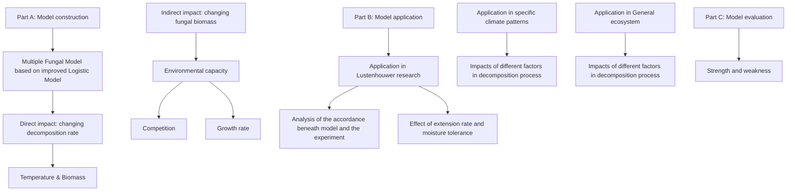
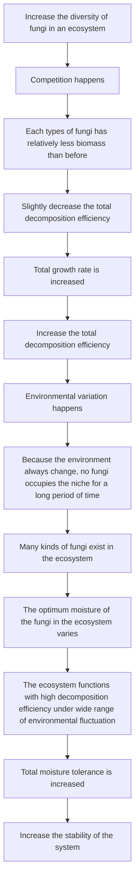

# A Simulation Based Modelling of Multiple Fungal Ecosystems

This work has established a Multiple Fungal Model to analyze the breakdown of ground litter and woody fibers through fungal activity in different ecosystems, and uses this model to investigate the importance of biodiversity in different environments.

For Problem 1, we first distinguish the factors that directly impact the decomposition rate ( ????), i.e. temperature, moisture and the biomass of the fungi from those indirect ones, e.g., environmental capability and competition factor. Then we establish an improved logistic competition model to obtain a set of ordinary differential equations (ODEs) of decomposition rate and fungal biomass growth, each of which represents the direct and indirect impacts on the ecosystem of fungal communities.

For Problem 2, we apply Lustenhouwer et al.’s data into our model to quantify the factors that defined in the model and to determine the effect of hyphal extension rate (????) and moisture tolerance (????) on the simulation results. When we analyze the factors’ impact on the result of the experiment, hypothesis testing method is used to determine the explicit expression of the differential equations and to obtain the values of each coefficients. To simulate the dynamics of the growth of fungi and the mass loss of organic compounds, we used numerical integrations as our ODEs are non-integrable. Our simulated ???? − ???? curve is in a good agreement with Figure 1C of Lustenhouwer et al’s work. We find that ???? is approximately inversely proportional to ????, where the slope is -0.154 and the intercept is 2.96. Applying this correlation into our model, we could conclude that when multiple fungal species were competing in one system, the one with medium extension rate are likely to outcompete the others in the long-term.

For Problem 3, we use the expression of the Multiple Fungal Ecosystem Model that are derived from Problem 2 to run simulation. After dividing the factors into fungal traits, competition factors and weather variation, qualitative analysis and quantitative analysis methods are used to analyze each factors’ impact on the ecosystem in both short- and long- term. Below are our key conclusions:

Competition influence has a direct-negative influence on the growth of fungal biomass, but it has indirect-positive influence of total decomposition efficiency.  
In the case that the weather variation is not very violent, the Multiple Fungal Ecosystem decomposes in a slower rate but more steadily compared with the Single Fungal Ecosystem.  
The more difference in the optimal moisture level between each species of a fungal community, the higher resistances of the ecosystem to the environment variations; the greater the competition ability differ between two fungi, the more likely this combination to be persistent.  
Moderate environmental variations increase decomposition speed, but higher variations are likely to cause priority effect. Such an ecosystem is more likely to reach to priority effect in the long-term.  
The Multiple Fungal Ecosystem is more stable than the Single Fungal Ecosystem when confronting with rapid environmental fluctuations.

For Problem 4, we apply our model to five different weather patterns. As a result, the multiple-species system is more stable than the single-species system in all environments, and is more efficient than the simple-species system except for in the tropical rain forest and temperate weather.

For Problem 5, we find that the biodiversity is usually high in more fluctuating environments and plays a crucial role in maintaining the stability of local ecosystems.

Keywords: Fungal consortia, wood decomposition, multiple fungal modelling, biodiversity

## Contents

## 1 Introduction.. 2

1.1 Problem Background  
1.2 Restatement of the Problems .

## 2 Overview...

## 3 Model Preparation. 3

3.1 Notations .... 3  
3.2 Basic Assumptions.. 3  
3.3 Glossary

## 4 Solution to problem 1: Model Construction .

4.1 The Influencing Factors of the Decomposition Process 4  
4.2 The Differential Equation of Decomposition Rate .......  
4.3 The Differential Equation of Fungal Biomass .. 5  
4.4 The Final Expression of the Multiple Fungi Model. 6

## 5 Solution to Problem 2: Model Application on the Experiment . . 6

5.1 Applicability of the model to the single fungus condition. 6

5.1.1 Quantified Analysis of Fungal Biomass’s Change  
5.1.2 Quantified Analysis of Decomposition Rate’s Change. 8

5.2 Quantification of the Environmental Capacity  
5.3 Classification of fungi. 10  
5.4 The Result of Model Application on the Experiment ..

## 6 Solution to Problem 3: Model Application to General Multiple Fungal Ecosystem ....... .. 12

6.1 Qualitative Analysis......... 12  
6.2 Quantitative Analysis... 13

6.2.1 Multiple Fungal Ecosystem Performance in General Condition .13  
6.2.2 The Impact of Competition in the Multiple Fungal Ecosystem .. .15  
6.2.3 The Impact of Weather Pattern Variation in the Multiple Fungal Ecosystem .. .17

## 7 Solution to Problem 4 . 18

## 8 Solution to Problem 5 .. 20

## 9 Model Evaluation. .. 21

9.1 Strength.. .21  
9.2 Weakness .... .21

## References... 21

## Our Article: A Humble Hero in the Ecosystem——Fungi. .22

## Appendix. 24

## 1 Introduction

## 1.1 Problem Background

Decomposition of compounds is a vital part of the carbon cycle, allowing carbon to be renewed and used in other forms. One key component of this part of the process is the decomposition of plant material and woody fibers, in which fungi act as key agents. Recent research shows identified fungi traits that determine decomposition rates and notes links between two traits of interest--growth rate and moisture tolerance. To better understand the process and apply it to ecological balance, we need to figure out inner relationship among decomposition rate, hyphal traits and environment condition.


<details>
<summary>scatterplot</summary>

| Hyphal extension rate | Decomposition rate | T (°C) |
| --------------------- | ------------------ | ------ |
| 0.0                   | 0                  | 10     |
| 0.0                   | 5                  | 16     |
| 0.0                   | 10                 | 22     |
| 2.5                   | 10                 | 10     |
| 2.5                   | 15                 | 16     |
| 2.5                   | 20                 | 22     |
| 5.0                   | 15                 | 10     |
| 5.0                   | 20                 | 16     |
| 5.0                   | 25                 | 22     |
| 7.5                   | 20                 | 10     |
| 7.5                   | 25                 | 16     |
| 7.5                   | 30                 | 22     |
| 10.0                  | 25                 | 10     |
| 10.0                  | 30                 | 16     |
| 10.0                  | 35                 | 22     |
</details>


<details>
<summary>scatterplot</summary>

| moisture trade-off (tolerance → dominance) | log (decomposition rate) |
| ------------------------------------------- | ------------------------- |
| -1.0                                        | 0.5                       |
| -0.5                                        | 1.0                       |
| 0.0                                         | 1.5                       |
| 0.5                                         | 2.0                       |
| 1.0                                         | 2.5                       |
</details>

Figure 1C: The estimation for the decomposition rates, given the growth rate.  
Figure 1A: The estimation of the decomposition rates, given the relative moisture tolerance.

## 1.2 Restatement of the Problems

Build a mathematical model that describes the breakdown of ground litter and woody fibers through fungal activity in the presence of multiple species of fungi, and incorporate the interactions between different species of fungi, which have different growth rates and different moisture tolerances as shown in Figures 1 and 2.  
Provide an analysis of the model and describe the interactions between the different types of fungi. The dynamics of the interactions should be characterized and described including both short- and long-term trends. Your analysis should examine the sensitivity to rapid fluctuations in the environment, and you should determine the overall impact of changing atmospheric trends to assess the impact of variation of local weather patterns.  
Include predictions about the relative advantages and disadvantages for each species and combinations of species likely to persist, and do so for different environments including arid, semi-arid, temperate, arboreal, and tropical rain forests.  
Describe how the diversity of fungal communities of a system impacts the overall efficiency of a system with respect to the breakdown of ground litter. Predict the importance and role of biodiversity in the presence of different degrees of variability in the local environment.

## 2 Overview

The figure shown as follows presents our approach in this research.


<details>
<summary>flowchart</summary>


</details>

Figure 2: Overview of this work

## 3 Model Preparation

## 3.1 Notations

Table 1. Notations

<table><tr><td>Symbol</td><td>Description</td></tr><tr><td> $\eta_D$ </td><td>Decomposition rate</td></tr><tr><td>M</td><td>Moisture</td></tr><tr><td> $x_k$ </td><td>Relative hyphal area of  $k^{th}$  fungus ( $k = 1..n$ )</td></tr><tr><td> $x_{km}$ </td><td>The maximum carrying capacity of the  $k^{th}$  fungus in a fixed patch of land</td></tr><tr><td> $ER_k$ </td><td>Extension rate of  $k^{th}$  fungus</td></tr><tr><td> $MT_k$ </td><td>Moisture tolerance of  $k^{th}$  fungus</td></tr><tr><td> $Rate_k$ </td><td>Growth coefficient of  $k^{th}$  fungus</td></tr><tr><td> $Env_k$ </td><td>Environmental capability term of  $k^{th}$  fungus</td></tr><tr><td> $Com_{ki}$ </td><td>The competition factor the  $i^{th}$  fungus exerts on the  $k^{th}$  fungus.</td></tr></table>

\*Other notations instructions will be given in the text.

## 3.2 Basic Assumptions

To simplify the problem, we make the following basic assumptions, each of which is properly justified.

Assumption 1: Under constant external conditions, the rate of wood fiber decomposition by the same fungus is positively correlated with fungal biomasses.  
Assumption 2: Fungi’s adaptability to environment changes is determined by its moisture tolerance.  
Assumption 3: Fungi’s extension rate and moisture tolerance are two constant values, and don’t vary with the change of the rest of nutrient resources.  
Assumption 4: Take mean value of moisture niche minimum $( M _ { m i n } ,$ lower bound of moisture niche width) and moisture niche maximum $( M _ { m a x }$ , upper bound of moisture niche width) as fungi’s optimal decomposition moisture $( M _ { s } )$ , that is, $\begin{array} { r } { M _ { s } = \frac { \hat { M } _ { m i n } ^ { \star } + M _ { m a x } } { 2 } . } \end{array}$  
Assumption 5: The rules obtained from Lustenhouwer’s experiment[1] are applicable to general cases.

## 3.3 Glossary

Moisture Tolerance: It is used to represent the robustness of the growth of a fungus to changes in moisture condition.  
ER-Dominant Fungi: A group of fungi with extension rate higher than average and moisture tolerance lower than average.  
MT-Dominant Fungi: A group of fungi with extension rate lower than average and moisture tolerance higher than average.  
Decomposition Speed: The derivative of the decomposition rate with respect to time.  
Minimum Viable Population: In practice, when the biomass of a species is less than a threshold, it will lose growth ability and extinct. This threshold is named as minimum viable population.  
Control Variable Method: A research method that turns one multi-factor problem into some single-factor problems.  
Multiple Fungal Ecosystem: An ecosystem in which multiple fungi co-exist in the same environment.  
Single Fungal Ecosystem: An ecosystem in which only one fungus exists in the environment.  
Priority Effect: A condition in which a Multiple Fungal Ecosystem degenerates into a Single Fungal Ecosystem as the environment changes.

## 4 Solution to problem 1: Model Construction

## 4.1 The Influencing Factors of the Decomposition Process

Decomposition rate is the criterion that represents the breakdown of ground litter and woody fibers. In a Multiple Fungal Ecosystem with n species, the decomposition rate made by the $k ^ { t h }$ type of fungi is $\eta _ { D k } ( t )$ . The change rate of $\eta _ { D k } ( t )$ is determined by the biomass of the $k ^ { t h }$ type of fungus $( x _ { k } ( t ) )$ and the current environmental factors (the temperature ?? and the Moisture ??). That is:

$$
\frac {d \eta_ {D k} (t)}{d t} = F (x _ {k} (t), T, M) \tag {4-1}
$$

The biomass of the $k ^ { t h }$ type of fungus is a dependent variable as well, which is determined by environmental factors, the competition factor against other species (??????) and the biomass of itself (environmental capacity):

$$
\frac {d x _ {k} (t)}{d t} = G \left(x _ {k} (t), T, M, C o m\right) \tag {4-2}
$$

The total decomposition rate is the sum of the rate made by all the fungi, so

$$
\frac {d \eta_ {D} (t)}{d t} = \sum_ {i = 1} ^ {n} \frac {d \eta_ {D i} (t)}{d t} = \sum_ {i = 1} ^ {n} F (x _ {i} (t), T, M) \tag {4-3}
$$

Edmundo Acevedo’s research shows that in the same Fungal Ecosystem (the biomass is not changed), ????????(??) $\frac { d \eta _ { D k } ( t ) } { d t }$ is apparently increased with the increase of temperature, but it does not has obvious change with the increase of moisture [2]. Garrido-Jurado’s research shows that with the increase of moisture, $\frac { d x _ { k } ( t ) } { d t }$ ) rises first then fall, but $\frac { d x _ { k } ( t ) } { d t }$ does not has so apparent change when temperature varies [3]. Hence, ignoring the factors that have little effect:

$$
\left\{ \begin{array}{c} \frac {d \eta_ {D} (t)}{d t} = \sum_ {i = 1} ^ {n} F \left(x _ {i} (t), T\right) \\ \text {For k = 1..n,} \quad \frac {d x _ {k} (t)}{d t} = G \left(x _ {k} (t), M, C o m\right)) \end{array} \right. \tag {4-4}
$$

## 4.2 The Differential Equation of Decomposition Rate

Assumption 1 shows the decomposition rate’s linear and positive correlation with the biomass of the fungi( $F ( x _ { i } ( t ) , T ) = f ( T ) x _ { i } ( t ) \rangle$ ). So temperature has the same facilitate effects on every species:

$$
\frac {d \eta_ {D} (t)}{d t} = f (T) \cdot \sum_ {i = 1} ^ {n} x _ {i} (t) \tag {4-5}
$$

??(??) is well-determined by current temperature.

## 4.3 The Differential Equation of Fungal Biomass

Logistic model is a common and relatively accurate model when analyzing and simulating the growth of fungi [4]. However, traditional logistic model does not consider the effect of competition when there are multiple species in the ecosystem. In this case, M. Jabed A. Choudhury analyzes the influence of competition on the biomass growth of the fungi and obtain an improved logistic model of fungal growth [5]. Apply M. Jabed A. Choudhury’s conclusion into our condition and get the differential equation of fungal biomass:

$$
For k = 1..n, \quad \frac{dx_{k}(t)}{dt} = Rate_{k}x_{k}(t)\cdot \left(1 - \frac{x_{k}(t)}{Env_{k}} -\sum_{\substack{1\leq i\leq n\\ i\neq k}}Com_{ik}\right) \tag{4 - 6}
$$

$R a t e _ { k }$ and $E n v _ { k }$ are the factors inherited from classic logistic model, so $\pmb { R a t e } _ { k }$ is determined by the extension rate of $k ^ { t h }$ fungus and ${ \pmb E } { \pmb n } { \pmb v } _ { \pmb k }$ is the environmental capacity for the $k ^ { t h }$ fungus. According to the property of logistic model, ?????? is the maximum biomass that the fungus can grow under certain environmental conditions without competition [6].

$c o m _ { i k }$ is the competition factor the $i ^ { t h }$ fungus exerts on the $k ^ { t h }$ fungus.

Competition happens because different types of fungi secrets chemical substances to repel others, fight for the local resource and compete for the space [7]. So competition only happens where two species are overlap. Thus, assume that in a fixed patch of land without total area of $S _ { T }$ , there are two groups of species named fungus 1 (with area $S _ { 1 } )$ and fungus 2 (with area $S _ { 2 } ) , C o m _ { 1 2 }$ is directly proportional to the overlap area of two types of fungi $( S _ { 1 2 } )$ :

$$
C o m _ {1 2} \propto S _ {1 2} \tag {4-7}
$$


<details>
<summary>text_image</summary>

dσ
Growing region of fungus 1
Growing region of fungus 2
Overlap region
</details>

Figure 3: The illustration of two types of fungi in the same patch of land

Denoting each units of the land as ????, then apply the geometric scheme in probability theory, one can obtain the mathematical expectation of $S _ { 1 2 } \mathrm { : }$

$$
\mathrm{E} (S _ {1 2}) = \frac {S _ {1} \cdot S _ {2}}{S _ {T}} \tag {4-8}
$$

Because $S _ { 1 } \propto x _ { 1 } , S _ { 2 } \propto x _ { 2 }$ ,

$$
C o m _ {1 2} \propto x _ {1} \cdot x _ {2} \tag {4-9}
$$

Because the competition factor fungus 2 exerts on fungus 1 is determined by fungus 2, define the ratio of $C o m _ { 1 2 }$ and $x _ { 1 } \cdot x _ { 2 }$ as $\mathbf { C } _ { 2 } ,$ which is the competitive capability of fungus 2:

$$
C o m _ {1 2} = x _ {1} \cdot c _ {2} x _ {2} \tag {4-10}
$$

Put the formula (4-10) into the formula (4-6):

$$
For k = 1..n, \frac{dx_{k}(t)}{dt} = Rate_{k}x_{k}(t)\cdot \left(1 - \frac{x_{k}(t)}{Env_{k}} -x_{1}\cdot \sum_{\substack{1\leq i\leq n\\ i\neq k}}c_{2}x_{2}\right) \tag{4 - 11}
$$

## 4.4 The Final Expression of the Multiple Fungi Model

Combine the results of 4.1\~4.3, we can get a fundamental equation of the mathematical model that describes the breakdown of ground litter and woody fibers through fungal activity in the presence of multiple species of fungi, named as the Multiple Fungal Model:

$$
\left\{ \begin{array}{c}\frac {d \eta_ {D} (t)}{d t} = f (T) \cdot \sum_ {i = 1} ^ {n} x _ {i} (t) \\ \text {For k = 1..n,} \quad \frac {d x _ {k} (t)}{d t} = R a t e _ {k} x _ {k} (t) \cdot (1 - \frac {x _ {k} (t)}{E n v _ {k}} - x _ {k} (t) \cdot \sum_ {\substack {1 \leq i \leq n \\ i \neq k}} c _ {i} \cdot x _ {i} (t)) \end{array} \right. \tag{4 - 12}
$$

Initial

conditions:

$$
\left\{ \begin{array}{c} \eta_ {D} | _ {t = 0} = 0 \\ \text { For } k = 1.. n, \quad x _ {k} | _ {t = 0} = x _ {k 0} \end{array} \right. \tag {4-13}
$$

Constraints:

$$
\eta_ {D} \leq 100 \% \tag{4 - 14}
$$

$R a t e _ { k }$ is determined by the extension rate of $k ^ { t h }$ fungus, which is $R a t e _ { k } = R a t e _ { k } ( E R _ { k } )$

$E n v _ { k }$ is determined by the moisture tolerance of $k ^ { t h }$ fungus, which is $E n v _ { k } = E n v _ { k } ( M T _ { k } )$

$c _ { i }$ is determined by the competitive capability of $i ^ { t h }$ fungus.

## 5 Solution to Problem 2: Model Application on the Experiment

In order to test the reliability of the model and specify the items and parameters of the model by experimental data, apply the model to the experiment result shown in Figures 1 and 2 of Problem A. To discuss the interactions between different species of fungi, based on the trade-off between the fungus extension rate and moisture tolerance, we divide fungus into two categories. The interactions between the two kinds of fungi are indicated by how the decomposition rate changes when they are symbiotic in the same environment.

## 5.1 Applicability of the model to the single fungus condition

To solve $f ( T )$ , $R a t e _ { k }$ and $x _ { k 0 }$ , firstly, we apply the model to simulate the environmental parameters and conditions of Nicky Lustenhouwer's original experiment, that ${ \mathrm { i s } } ,$ the experiment with a single fungus in a standard laboratory environment, so as to achieve the purpose of simplifying the model. When there is only the $k ^ { t h }$ fungus, the competition part in the growth rate model disappears, and the model becomes:

$$
\left\{ \begin{array}{c} \frac {d \eta_ {D} (t)}{d t} = f (T) \cdot x _ {k} (t) \\ \frac {d x _ {k} (t)}{d t} = R a t e _ {k} x _ {k} (t) \cdot \left(1 - \frac {x _ {k} (t)}{E n v _ {k}}\right) \end{array} \right. \tag {5-1}
$$

Nicky Lustenhouwer's experiment maintained relatively constant standard laboratory environmental conditions [1]. Therefore, it is considered that for any $k ^ { t h }$ fungus, $E n v _ { k }$ is a constant value during the experiment. At the same time, we believe that for $\mathrm { k ^ { \mathrm { { t h } } } }$ fungus, the environmental values (temperature, humidity, etc.) are adjusted to the most suitable values for its growth during the experiment, so $E n v _ { k }$ takes the maximum value. Suppose the maximum value of $E n v _ { k }$ under different environmental conditions is $x _ { k m }$ , then:

$$
E n v _ {k} = x _ {k m} \tag {5-2}
$$

Therefore, Formula (15) becomes:

$$
\left\{ \begin{array}{c} \frac {d x _ {k} (t)}{d t} = \text { Rate } _ {k} x _ {k} (t) \cdot \left(1 - \frac {x _ {k} (t)}{x _ {k m}}\right) \\ x _ {k} | _ {t = 0} = x _ {k 0} \end{array} \right. \tag {5-3}
$$

Where only $x _ { k }$ changes with time. When $t \to \infty , x _ { k }$ takes the maximum value $x _ { k m }$ . The physical meaning of $x _ { k m }$ is the maximum number of a single fungus that can be accommodated in a patch of land, $x _ { k m }$ is determined by the total amount of resources in the space, according to M. Jabed A. Choudhury’s research [5]. Solve Formula (17):

$$
x _ {k} (t) = \frac {x _ {k m}}{1 + (\frac {x _ {k m}}{x _ {k 0}} - 1) \cdot e ^ {- R a t e _ {k} t}} \tag {5-4}
$$

## 5.1.1 Quantified Analysis of Fungal Biomass’s Change

In the equation, $R a t e _ { k } , x _ { k 0 }$ and $x _ { k m }$ are all unknown. Then, solve the above unknown parameters according to the data of Nicky Lustenhouwer’s experiment. Considering that in the experiment of Nicky Lustenhouwer, the experimental environment of different fungi are wooden blocks of 10 ???? × 10 ???? × 5 ????, and the nutrient content is fixed. Therefore, according to the principle of controlling variables, it is considered that in the experiment, the initial biomass and the maximum biomass of different strains is the same.

$$
x _ {k 0} = x _ {0}, x _ {k m} = x _ {m} \tag {5-5}
$$

The experimental data table of Nicky Lustenhouwer’s experiment shows the experimental data of the extension rate and decomposition rate of 20 kinds of fungi from Phellinus robiniae to Xylobolus subpileatus. In Nicky Lustenhouwer’s experiment, hyphal extension rate was measured after 2 weeks (14 days), because $x _ { k }$ is so large that it may affect the normal result of extension rate data in a long time span (more than 14 days) [1]. This confirms that the growth of a single fungus follows our model. Because $x _ { k }$ is small in the early stage of strain growth, the equation can be transformed into:

$$
\frac {d x _ {k} (t)}{d t} = \text { Rate } _ {k} x _ {k} (t) \tag {5-6}
$$

Solve the differential equation:

$$
x _ {k} (t) = x _ {0} e ^ {\text { Rate } _ {k} t} \approx x _ {0} (1 + \text { Rate } _ {k} t) \tag {5-7}
$$

Therefore, in the early stage of strain growth (within 14 days), the rate of change of $x _ { k }$ is approximately constant. So the rate of change of $x _ { k }$ is the extension rate at this time:

$$
E R _ {k} = \frac {d x _ {k} (t)}{d t} \approx x _ {0} \text {Rate} _ {k} \Longrightarrow \text {Rate} _ {k} = \frac {E R _ {k}}{x _ {0}} \tag {5-8}
$$

If the time span is more than 14 days, $( 1 - \frac { x _ { k } ( t ) } { x _ { k m } } )$ can no longer be ignored, and $\frac { d x _ { k } ( t ) } { d t }$ will reduce. The ?????? rate of change of $x _ { k }$ measured at this time can no longer be regarded as the extension rate. The above analysis shows that the experimental results of Nicky Lustenhouwer highly match the Hyphal Logistic Model.

Substituting (5-4) into (5-8), we have

$$
x _ {k} (t) = \frac {x _ {m}}{1 + (\frac {x _ {m}}{x _ {0}} - 1) \cdot e ^ {- \frac {E R _ {k}}{x _ {0}} t}} \tag {5-9}
$$

Set $t _ { s } = 1 4 \left( d a y \right)$ . According to (5-7) and (5-8)：

$$
\left\{ \begin{array}{c} x _ {k} (t _ {s}) = \frac {x _ {m}}{1 + (\frac {x _ {m}}{x _ {0}} - 1) \cdot e ^ {- \frac {E R _ {k}}{x _ {0}} t _ {s}}} \\ x _ {k} (t _ {s}) \approx x _ {0} (1 + R a t e _ {k} t _ {s}) = x _ {0} + E R _ {k} t _ {s} \end{array} \right. \tag {5-10}
$$

So

$$
x _ {0} + E R _ {k} t _ {s} = \frac {x _ {m}}{1 + (\frac {x _ {m}}{x _ {0}} - 1) \cdot e ^ {- \frac {E R _ {k}}{x _ {0}} t _ {s}}} \tag {5-11}
$$

For the reason that $x _ { 0 }$ and $x _ { m }$ do not change with the change of fungi, it is safe to regard $E R _ { k }$ in 5-11 as the mean extension rate of the hyphal involved in the experiment. According to the experimental data table of Nicky Lustenhouwer, the average extension rate of 20 kinds of fungi: $E R _ { m e a n } = 2 . 9 6 m m / d a y$ . Substituting it into equation:

$$
x _ {0} + E R _ {\text { mean }} t _ {s} = \frac {x _ {m}}{1 + (\frac {x _ {m}}{x _ {0}} - 1) \cdot e ^ {- \frac {E R _ {\text { mean }}}{x _ {0}} t _ {s}}} \tag {5-12}
$$

Set $x _ { 0 } = 5 0 . 0 m m$ , because we found that this value can make the curve obtained by the model fit the curve in 1C best during the process of model tuning. Substituting it into equation and solving it by the dichotomy of solving implicit functions：

$$
x _ {m} = 2 1 7. 6 m m \tag {5-13}
$$

## 5.1.2 Quantified Analysis of Decomposition Rate’s Change

If there is only $k ^ { t h }$ fungus in the environment,

$$
\left\{ \begin{array}{c} \frac {d \eta_ {D} (t)}{d t} = f \cdot x _ {k} (t) \\ x _ {k} (t) = \frac {x _ {m}}{1 + (\frac {x _ {m}}{x _ {0}} - 1) \cdot e ^ {- \frac {E R _ {k}}{x _ {0}} t}} \end{array} \right. \tag {5-14}
$$

At the same temperature, ?? is a constant. ${ \bf S 0 , }$

$$
\left\{ \begin{array}{c} \frac {d \eta_ {D} (t)}{d t} = f \cdot \frac {x _ {m}}{1 + (\frac {x _ {m}}{x _ {0}} - 1) \cdot e ^ {- \frac {t}{x _ {0}} E R _ {k}}} \\ \eta_ {D} | _ {t = 0} = 0 \end{array} \right. \tag {5-15}
$$

Solve the above equation using the difference method. Set the difference step $\Delta { \sf t } = 1 \ h _ { 0 } \mathrm { u r } = 0 . 0 4 1 6 7$ day and set $t _ { e n d } = 1 2 2$ ???????? which is the total duration of the experiment for observing the decomposition rate. The pseudo code of the difference method is as follows:

$$
\eta_ {D} (0) = 0;
$$

$$
f o r n = 0.. [ \frac {t _ {e n d}}{\varDelta t} ]:
$$

$$
\eta_ {D} \big ((n + 1) \cdot \varDelta t \big) = \eta_ {D} (n \cdot \varDelta t) + f \cdot \frac {x _ {m}}{1 + (\frac {x _ {m}}{x _ {0}} - 1) \cdot e ^ {- \frac {n \cdot \varDelta t}{x _ {0}} \cdot E R _ {k}}};
$$

??????

Substituting known parameters and conditions into the program can get different final decomposition rate $\eta _ { D e n d }$ corresponding to $E R _ { k } .$ . Therefore, given the specified value of $f ,$ , a unique relationship curve $\eta _ { D e n d } ( E R _ { k } )$ of decomposition rate-extension rate can be obtained. According to the curve and data in Figure 1C, the optimal ?? under different temperature conditions are as follows:

Table 2: The values of ?? under $1 0 ^ { \circ } \mathrm { C } , 1 6 ^ { \circ } \mathrm { C } , 2 2 ^ { \circ } \mathrm { C }$

<table><tr><td>T/°C</td><td> $f/mm^{-1}$ </td></tr><tr><td>10</td><td> $3.5 \times 10^{-4}$ </td></tr><tr><td>16</td><td> $5.5 \times 10^{-4}$ </td></tr><tr><td>22</td><td> $7.9 \times 10^{-4}$ </td></tr></table>

Because faster growing strains tend to be less robust to the environmental changes, when the growth rate is too fast, $E n v _ { k }$ cannot be regarded as a constant value. At this time, the classic Logistic Model does not hold, and the relationship curve obtained by the model has a certain degree of deviation from the actual situation. So we only consider the condition of $\mathrm { E R } \in [ 0 \AA , 3 ]$ . The following figure shows the fitting effect of the model on Figure 1C.

  
(a)  
(b)  
Figure 4: (a) Hyphal extension rate-Decomposition rate relationship curve obtained by our model (b) The comparison between our model’s result and the experimental result

It can be seen from the Table 2 that ?? is approximately linear with ??. Fitting by the least square method:

$$
f (T) = \kappa_ {1} T + \kappa_ {2} \tag {5-16}
$$

Where $\kappa _ { 1 } = 3 . 7 \times 1 0 ^ { - 5 \circ } \mathsf { C } ^ { - 1 } \cdot m m ^ { - 1 } , \kappa _ { 2 } = - 2 . 3 \times 1 0 ^ { - 5 } m m ^ { - 1 } ( r = 0 . 9 9 8 6 )$

## 5.2 Quantification of the Environmental Capacity

Garrido-Jurado’s research[3] shows the properties of environmental capacity $E n v _ { k }$ of fungus k, which conform to common sense:

(1) $E n v _ { k }$ is related with the moisture deviation from the fungal optimum moisture degree $\begin{array} { r } { \varDelta M = M - M _ { k s } } \end{array}$ , where $M _ { k s }$ is the optimum moisture of fungus k. $\mathrm { W h e n } \ : \varDelta M  0 , E n v _ { k }  x _ { m } . \ E n v _ { k }$ is negatively correlate to $\vert { \varDelta { M } } \vert$ , who is approximately symmetric about $M = M _ { k s }$ .  
(2) $E n v _ { k }$ is related with the moisture tolerance $( M T _ { k } )$ . Fungi with higher $M T _ { k }$ can slow the decrease of $E n v _ { k }$ when $\vert { \varDelta { M } } \vert$ increases  
(3) $E n v _ { k }$ is positive. When $\varDelta M \to \infty , E n v _ { k } \to 0 ^ { + }$ .

According to central-limit theorem, when the sample size is close to infinite, the regularities of distribution of the fungus $\mathrm { ~ k ~ } ^ { \prime } \mathrm { ~ s ~ } \ E n v _ { k }$ is close to normal distribution. Thus, follow those properties of $E n v _ { k }$ and construct the formula:

$$
E n v _ {k} = x _ {m} e ^ {- \lambda_ {m} \left(\frac {M - M _ {k s}}{M T _ {k}}\right) ^ {2}} \tag {5-17}
$$

$\lambda _ { m }$ is the attenuation coefficient.

Let $M _ { m i n k }$ be the minimum moisture levels in which the biomass of a fungal community can grow up to half of $x _ { m }$ and let $M _ { m a x k }$ be the maximum moisture levels in which the biomass of a fungal community can grow up to half of $x _ { m } . \mathrm { S o } M T _ { k } = M _ { m a x k } - M _ { m i n k }$ .

According to the Assumption 4,

$$
M _ {s k} = \frac {\left(M _ {m i n k} + M _ {m a x k}\right)}{2} \tag {5-18}
$$

${ \mathrm { S o } } ,$ when $M = M _ { m a x k }$ ?? = ?????????? we have

$$
\frac {M - M _ {s k}}{M T _ {k}} = \frac {M _ {\text {max} k} - M _ {s k}}{M T _ {k}} = \frac {1}{2} \tag {5-19}
$$

Because $\begin{array} { r } { \frac { d x _ { k } ( t ) } { d t } = R a t e _ { k } x _ { k } ( t ) \cdot ( 1 - \frac { x _ { k } ( t ) } { E n v _ { k } } ) } \end{array}$ ??????(??) , when the fungal community reach to fastest growth rate, $\begin{array} { r } { \frac { x _ { k } ( t ) } { E n v _ { k } } = } \end{array}$ ?????? ???????? ${ \frac { 1 } { 2 } } ,$ where $\begin{array} { r } { ( \frac { d x _ { k } ( t ) } { d t } ) _ { m a x } = \frac { 1 } { 4 } R a t e _ { k } E n v _ { k } \propto E n v _ { k } } \end{array}$ (Because of inequality of arithmetic and geometric means).

When $E n v _ { k } = x _ { m }$ , all the fungal community can maintain its fastest growth rate. When half of a fungal community can maintain its fastest growth rate:

$$
\frac {d x _ {k} (t)}{d t} _ {\max} = \frac {1}{2} \frac {d x _ {k} (t)}{d t} _ {\max (\text { fastest })} \Rightarrow E n v _ {k} = \frac {x _ {m}}{2} \tag {5-20}
$$

So we have

$$
\frac {x _ {m}}{2} = x _ {m} e ^ {- \frac {\lambda_ {m}}{4}} \Longrightarrow \lambda_ {m} = 4 l n 2 \tag {5-21}
$$

$$
E n v _ {k} = x _ {m} e ^ {- 4 l n 2 \cdot (\frac {M - M _ {k s}}{M T _ {k}}) ^ {2}} \tag {5-22}
$$

## 5.3 Classification of fungi

According to Nicky Lustenhouwer’s experiment, in the standard laboratory environment, there is a tradeoff phenomenon between the extension rate and the moisture tolerance of one kind of fungus [1]. The fitting result based on the original experimental data also confirms the existence of this trade-off to a certain extent. When the extension rate of a fungus rises to a certain level, its moisture tolerance will inevitably be restricted by trade-off and present a lower level, so that the fungus cannot survive well under a volatile environment condition. This shows that there are almost no fungal species with both extension rate higher than average and moisture tolerance higher than average. Therefore we can divide most of fungus into two categories. The first kind is fungi with extension rate higher than average and moisture tolerance lower than average. It is called ERdominant fungi. This kind of fungus grows more rapidly under relatively suitable water conditions and contributes a lot to the decomposition rate, but its growth rate is more affected when the environment fluctuates. The second kind is fungi with extension rate below average and moisture tolerance above average. It is called MT-dominant fungi. This kind of fungus grows slowly, but tends to be better able to survive and grow in the presence of environmental changes.

$$
f (T) = \mu_ {1} T + \mu_ {2} \tag {5-23}
$$

Where

$$
\mu_ {1} = - 0. 1 5 4, \mu_ {2} = 2. 9 6
$$

Regression coefficients: ?? = 0.3255


<details>
<summary>scatterplot</summary>

| extension rate | moisture tolerance |
| -------------- | ----------------- |
| 0.1            | 4.3               |
| 0.2            | 4.2               |
| 0.3            | 3.7               |
| 0.4            | 3.0               |
| 0.5            | 2.6               |
| 0.6            | 2.4               |
| 0.7            | 2.2               |
| 0.8            | 2.0               |
| 0.9            | 1.8               |
| 1.0            | 1.6               |
| 1.1            | 1.4               |
| 1.2            | 1.2               |
| 1.3            | 1.0               |
| 1.4            | 0.8               |
| 1.5            | 0.6               |
| 1.6            | 0.4               |
| 1.7            | 0.2               |
| 1.8            | 0.0               |
| 1.9            | -0.2              |
| 2.0            | -0.4              |
| 2.1            | -0.6              |
| 2.2            | -0.8              |
| 2.3            | -1.0              |
| 2.4            | -1.2              |
| 2.5            | -1.4              |
| 2.6            | -1.6              |
| 2.7            | -1.8              |
| 2.8            | -2.0              |
| 2.9            | -2.2              |
| 3.0            | -2.4              |
| 3.1            | -2.6              |
| 3.2            | -2.8              |
| 3.3            | -3.0              |
| 3.4            | -3.2              |
| 3.5            | -3.4              |
| 3.6            | -3.6              |
| 3.7            | -3.8              |
| 3.8            | -4.0              |
| 3.9            | -4.2              |
| 4.0            | -4.4              |
| 4.1            | -4.6              |
| 4.2            | -4.8              |
| 4.3            | -5.0              |
| 4.4            | -5.2              |
| 4.5            | -5.4              |
| 4.6            | -5.6              |
| 4.7            | -5.8              |
| 4.8            | -6.0              |
| 4.9            | -6.2              |
| 5.0            | -6.4              |
| 5.1            | -6.6              |
| 5.2            | -6.8              |
| 5.3            | -7.0              |
| 5.4            | -7.2              |
| 5.5            | -7.4              |
| 5.6            | -7.6              |
| 5.7            | -7.8              |
| 5.8            | -8.0              |
| 5.9            | -8.2              |
| 6.0            | -8.4              |
| 6.1            | -8.6              |
| 6.2            | -8.8              |
| 6.3            | -9.0              |
| 6.4            | -9.2              |
| 6.5            | -9.4              |
| 6.6            | -9.6              |
| 6.7            | -9.8              |
| 6.8            | -10.0             |
| 6.9            | -10.2             |
| 7.0            | -10.4             |
| 7.1            | -10.6             |
| 7.2            | -10.8             |
| 7.3            | -11.0             |
| 7.4            | -11.2             |
| 7.5            | -11.4             |
| 7.6            | -11.6             |
| 7.7            | -11.8             |
| 7.8            | -12.0             |
| 7.9            | -12.2             |
| 8.0            | -12.4             |
| 8.1            | -12.6             |
| 8.2            | -12.8             |
| 8.3            | -13.0             |
| 8.4            | -13.2             |
| 8.5            | -13.4             |
| 8.6            | -13.6             |
| 8.7            | -13.8             |
| 8.8            | -14.0             |
| 8.9            | -14.2             |
| 9.0            | -14.4             |
| 9.1            | -14.6             |
| 9.2            | -14.8             |
| 9.3            | -15.0             |
| 9.4            | -15.2             |
| 9.5            | -15.4             |
| 9.6            | -15.6             |
| 9.7            | -15.8             |
| 9.8            | -16.0             |
| 9.9            | -16.2             |
| 10.0           | -16.4             |
| 10.1           | -16.6             |
| 10.2           | -16.8             |
| 10.3           | -17.0             |
| 10.4           | -17.2             |
| 10.5           | -17.4             |
| 10.6           | -17.6             |
| 10.7           | -17.8             |
| 10.8           | -18.0             |
| 10.9           | -18.2             |
| 11.0           | -18.4             |
| 11.1           | -18.6             |
| 11.2           | -18.8             |
| 11.3           | -19.0             |
| 11.4           | -19.2             |
| 11.5           | -19.4             |
| 11.6           | -19.6             |
| 11.7           | -19.8             |
| 11.8           | -20.0             |
| 11.9           | -20.2             |
| 12.0           | -20.4             |
</details>

Figure 5: The original data points and the fitting curve of ER and MT

## 5.4 The Result of Model Application on the Experiment

Combining the conclusions of 5.1 and 5.2, the specified universal differential equation of the model is obtained:

$$
\left\{ \begin{array}{c} \frac {d \eta_ {D} (t)}{d t} = f (T) = (\kappa_ {1} T + \kappa_ {2}) \cdot \sum_ {i = 1} ^ {n} x _ {i} (t) \\ \frac {d x _ {k} (t)}{d t} = \frac {E R _ {k}}{x _ {0}} \cdot x _ {k} (t) \cdot (1 - \frac {x _ {k} (t)}{x _ {m}} e ^ {- 4 l n 2 \cdot (\frac {M - M _ {k s}}{M T _ {k}}) ^ {2}} - \sum_ {\substack {1 \leq i \leq n \\ i \neq k}} c _ {i} \cdot x _ {i} (t)) \end{array} \right. \tag{5 - 24}
$$

Initial conditions:

$$
\left\{ \begin{array}{c} \eta_ {D} | _ {t = 0} = 0 \\ \text { For } k = 1.. n, \quad x _ {k} | _ {t = 0} = x _ {0} \end{array} \right. \tag {5-25}
$$

Constraints:

$$
\eta_ {D} \leq \mathbf {1 0 0 \%} \tag{5 - 26}
$$

Parameters:

Table 3:value of parameters mentioned in the model

<table><tr><td>Parameter</td><td>Value</td></tr><tr><td> $x_0$ </td><td>50.0mm</td></tr><tr><td> $x_m$ </td><td>217.6mm</td></tr><tr><td> $κ_1$ </td><td> $3.7 × 10^{-5}°C^{-1} · mm^{-1}$ </td></tr><tr><td> $κ_2$ </td><td> $-2.3 × 10^{-5}mm^{-1}$ </td></tr></table>

It can be seen from the equation that the decomposition rate depends on the internal factors of the fungus the extension rate and the moisture tolerance, and the external environmental conditions temperature T and moisture M, which are four factors. In the equation, $c _ { i }$ measures the ability of each fungus to repel other types of fungi, and $c _ { i }$ is determined by the competitive capability of $\mathrm { i ^ { \mathrm { t h } } }$ fungus, which expresses the interspecies competition when different species of fungi coexist. In the multiple fungi model, $c _ { i }$ changes the contribution to the decomposition rate of other kinds of fungi by influencing the biomass of them, which indirectly affects the total decomposition rate.

Take the case of a symbiosis of ER-dominant fungi A and MT-dominant fungi B as an example. At first, the growth rate of A is higher than that of B. In the short term, biomass of A is greater than biomass of B, so contribution to decomposition rate of A is greater than that of B. When the environment fluctuates to a certain degree, since $\mathbf { A } ^ { \prime } \mathbf { s } M T$ is less than B’s ????, the negative impact of environmental fluctuations on the growth of A will be more dramatic than that of B. If the environmental moisture conditions become very unfavorable to the growth of A, then the biomass of B will gradually surpass the biomass of A, thus occupying an advantageous position in the contribution to total decomposition rate. Besides, in the whole process of decomposition, the competition between A and B has a certain degree of inhibition on the growth of both. Finally, when the organic matter is completely decomposed, that is, when decomposition rate reaches 100%, neither A nor B grows. Hence, when multiple fungal species were competing in a low-fluctuation system, ER-dominant fungi are likely to outcompete the others, while in a high-variation system, MT-dominant fungi take the advantage. In general conditions, the one with low extension rate and high extension rate are both likely to lose, so the one with medium extension rate are likely to outcompete the others in the long-term.

# 6 Solution to Problem 3: Model Application to General Multiple Fungal Ecosystem

Apply dynamic simulation to the Multiple Fungi Model and obtain the rules of the variables changing with time. Most theses use two fungi interaction to stand for multiple fungi interaction when analyzing their models. Thus, consider there are two types of fungi in the fixed patch of land, and they constitute an ecosystem. Respectively denote the fungi as species 1 and species 2.

Set the initial total biomass of the Fungal Ecosystem do not change, and both species have same initial biomass, so $\begin{array} { r } { x _ { 1 } ( 0 ) = x _ { 2 } ( 0 ) = \frac { 1 } { 7 } x _ { 0 } = 2 5 . 0 m m } \end{array}$ . In this case, this multiple Fungal Ecosystem has the same initial condition as single Fungal Ecosystem, so that their results are comparable. Convert the equation (5-24) into the difference equation:

$$
\left\{ \begin{array}{c} \eta_ {D} ^ {\prime} (t) = \frac {d \eta_ {D} (t)}{d t} = (\kappa_ {1} T + \kappa_ {2}) \cdot \left(x _ {1} (t) + x _ {2} (t)\right) \\ x _ {1} (t + \Delta t) = x _ {1} (t) + \Delta t \cdot \frac {E R _ {1}}{x _ {0}} \cdot x _ {1} (t) \cdot \left(1 - \frac {x _ {1} (t)}{x _ {m}} e ^ {4 l n 2 \cdot \left(\frac {M - M _ {s}}{M T _ {1}}\right) ^ {2}} - x _ {1} (t) \cdot c _ {2} x _ {2} (t)\right) \\ x _ {2} (t + \Delta t) = x _ {2} (t) + \Delta t \cdot \frac {E R _ {2}}{x _ {0}} \cdot x _ {2} (t) \cdot \left(1 - \frac {x _ {2} (t)}{x _ {m}} e ^ {4 l n 2 \cdot \left(\frac {M - M _ {s}}{M T _ {2}}\right) ^ {2}} - x _ {2} (t) \cdot c _ {1} x _ {1} (t)\right) \\ x _ {1} (0) = x _ {2} (0) = 2 5 \end{array} \right. \tag {6-1}
$$

Where $M T _ { k } = \mu _ { 1 } E R _ { k } + \mu _ { 2 }$ (moisture tolerance) is well-determined by $E R _ { k }$ . Knowing the ???? (extension rate) of a fungus, the growing and tolerance property can be determined, so ???? is the characteristic trait of fungi. In (6-1), the values of the constant parameters $x _ { 0 } , x _ { m } , \kappa _ { 1 } , \kappa _ { 2 } , \mu _ { 1 } , \ \mu _ { 2 }$ can be found in Table 3 in 5.4.

Denote ${ \eta _ { D } } ^ { \prime } ( t )$ as the decomposition speed. A good ecosystem means that ${ \eta _ { D } } ^ { \prime } ( t )$ is high.

In practice, when the biomass of a species is less than a threshold, it will lose growth ability and extinct. This threshold is named as minimum viable population [8]. In the simulation of the multiple fungi model, set a reasonable value of the fungi as $x _ { m i n } = 5 . 0 m m$ . If ${ \boldsymbol { x } } ( t ) < x _ { m i n }$ , it will not grow.

Use recurrence method to obtain $x _ { 1 } ( t ) , x _ { 2 } ( t )$ and ${ \eta _ { D } } ^ { \prime } ( t )$ functions relating to time ?? in the equation (6-1) by the program in Appendix, and use both qualitative analysis and quantitative analysis to analyze each single factor’s impact on the results of the equation (6-1) in different conditions.

## 6.1 Qualitative Analysis

The result of the dynamic simulation is determined by the traits of the fungi (internal factors), the environment (external factors) and the competition between both species (interaction factors):

## (a) Competition

Competition influence has a directly negative influence on the growth of fungi, but it has indirect positive influence of total decomposition efficiency, because it automatically weeds out the species that performs bas, so that the species perform well can obtain more resources to facilitate its decomposition process.

## (b) Moisture variation

If the moisture degree is close to the optimum moisture of both types of fungi, the overall decomposition speed is relatively high, otherwise the decomposition speed is low. The moisture variation directly influence the growth of the fungi, so that indirectly influence the decomposition rate. If the current moisture is more deviated from the optimum moisture, the biomass of the fungi $( x _ { 1 } ( t )$ and $x _ { 2 } ( t ) )$ ) will decelerate or even decrease. Furthermore, long-term fluctuation of moisture variation has different impact from short-term fluctuation. Because the ecosystem needs time to respond and adapt, the negative effect of long-term fluctuation is smaller than short-term fluctuation.

## (c) Temperature

The temperature ?? does not largely influence the biomasses of the fungi $( x _ { 1 } ( t )$ and $x _ { 2 } ( t ) ,$ , but it affects the gradient of decomposition rate. The higher the ?? is, the faster $\eta _ { D } ( t )$ increase.

## (d) Growth rate and moisture tolerance

In 5.3, we have obtained the linear relationship between extension rate and moisture tolerance. So the moisture tolerance (????) of a fungus is well determined by the extension rate (????). Thus we regard ???? as the unique independent variable of the internal factor of a fungus. The extension rate ???? influence the growth of the fungi, and extension rate has dual effect on the growth of the fungi:

•Positive effect: ER-dominant fungi grows faster, so the decomposition speed can quickly reach to a high level. Furthermore, the ER-dominant $f u n g i ^ { \gamma } { \bf s }$ biomass can quickly expand and forestall the niche quicker than other species, so that this type of fungi have the advantage in the competition against others.

•Negative effect: $E R ^ { \prime } { \bf s }$ increment is accompanied by $M T ^ { \prime } { \bf s }$ decrement, so ER-dominant fungi are more sensitive to the same moisture variation than MT-dominant fungi. ER-dominant fungi’s ???? (moisture tolerance) is lower, so the “??1(??) $\begin{array} { r } { \ L _ { \infty } . . . \frac { x _ { 1 } ( t ) } { x _ { m } } e ^ { 4 l n 2 \cdot \left( \frac { M - M _ { S } } { M T _ { 1 } } \right) ^ { 2 } } , } \end{array}$ ????1 ” item in (6-1) is larger, which makes the biomass of the fungus has a tendency to ???? decrease.

## (e) The deviation of the species optimum environment

If a fungus fits low moisture environment, and the other fungus fits high moisture environment, when we put both species into the ecosystem, the ecosystem will be more stable as the moisture vary. It is because that in low moisture and high moisture period, there exists a group of species that adopts to the moisture degree and has high biomass to work in the decomposition process. So the decomposition efficiency of the ecosystem remains stable in a large moisture range. The more different the two species’ optimum environment is, the higher environment variation the ecosystem can remain stable in. Admittedly, the difference value of the two species’ optimum environment cannot be too high, since the two species may not coexist if their optimum environment is largely different.

## 6.2 Quantitative Analysis

## Our quantitative analysis method:

When analyze a particular factor, we apply control variable method to eliminate the variance of another factors.

To quantify the impact of the two Fungal Ecosystem, set two assessment criteria:

(1) ${ \bf E } ( \pmb { \eta } _ { D } ^ { \prime } ( t ) )$ ): the mathematical expectation of decomposition speed.  
(2) $\mathbf { D } ( \pmb { \eta } _ { D } ^ { \prime } ( t ) )$ : the variance of decomposition speed.

$\mathrm { E } ( \eta _ { D } ^ { \prime } ( t ) )$ shows the average decomposition efficiency of the ecosystem. Higher $\mathrm { E } ( \eta _ { D } ^ { \prime } ( t ) )$ means better efficiency of the ecosystem. According to the equation $( 6 \mathrm { - } 1 ) , \mathrm { E } ( \eta _ { D } ^ { \prime } ( t ) )$ is directly proportional to the average value of $( x _ { 1 } ( t ) + x _ { 2 } ( t ) )$ in the time span. $\mathsf { D } ( \eta _ { D } ^ { \prime } ( t ) )$ shows the variation degree of the decomposition efficiency. Higher $\mathrm { D } ( \eta _ { D } ^ { \prime } ( t ) )$ means that the ecosystem is more stable.

Use recurrence method to solve the equation (6-1) to obtain the quantified simulation results of $x _ { 1 } ( t )$ , $x _ { 2 } ( t )$ and ${ \eta _ { D } } ^ { \prime } ( t )$ curve. The program used is shown in Appendix. When simulating the weather pattern variation, we use sin function to represent periodical variation, and use random pulse function to represent rapid environmental fluctuation:

$$
M (t) = M _ {0} + M _ {1} \cdot \sin \left(\frac {2 \pi}{T} t\right) + M _ {2} \cdot \delta (t - t _ {\text {rand}}) \tag {6-2}
$$

## 6.2.1 Multiple Fungal Ecosystem Performance in General Condition

Before illuminating the particular influence of each single factors, we should analyze two fundamental properties of the Multiple Fungal Ecosystem:

The possible results of Multiple Fungal Ecosystem.  
• The essential difference between Multiple Fungal Ecosystem and the Single Fungal Ecosystem.

Adjust the values of controlled variables, which means that the competition factor is moderate, the temperature is normal $( 1 6 ^ { \circ } \mathrm { C } )$ , the moisture fluctuation is moderate and the extension rate of both fungi is same.

There are two possible conditions of the Multiple Fungal Ecosystem. In one case, both types of fungi can coexist, which is what we want. In the other case, one fungus becomes extinct because of competition and environment, and the ecosystem degrades to the Single Fungal Ecosystem, where the subsequent condition is the same as single fungi model but not multiple fungi model, so this circumstance is not we want, which is named as priority effect [5].


<details>
<summary>line chart</summary>

| t/day | x1(t) (mm) | x2(t) (mm) |
|-------|------------|------------|
| 0     | 25         | 25         |
| 50    | 100        | 40         |
| 100   | 125        | 30         |
| 150   | 120        | 35         |
| 200   | 110        | 50         |
| 250   | 90         | 65         |
| 300   | 80         | 75         |
| 350   | 95         | 60         |
</details>

(a)


<details>
<summary>line chart</summary>

| t/day | x1(t) (mm) | x2(t) (mm) |
|-------|------------|------------|
| 0     | 25         | 40         |
| 50    | 145        | 10         |
| 100   | 155        | 0          |
| 150   | 180        | 0          |
| 200   | 210        | 0          |
| 250   | 170        | 0          |
| 300   | 160        | 0          |
| 350   | 210        | 0          |
</details>

(b)


<details>
<summary>line chart</summary>

| t/day | η_D'(t) / day⁻¹ |
| ----- | --------------- |
| 0     | 0.03            |
| 50    | 0.08            |
| 100   | 0.09            |
| 150   | 0.09            |
| 200   | 0.09            |
| 250   | 0.09            |
| 300   | 0.09            |
| 350   | 0.09            |
</details>

(c)


<details>
<summary>line chart</summary>

| t/day | η_D'(t) / day⁻¹ |
| ----- | --------------- |
| 0     | 0.03            |
| 50    | 0.08            |
| 100   | 0.09            |
| 150   | 0.11            |
| 200   | 0.12            |
| 250   | 0.10            |
| 300   | 0.09            |
| 350   | 0.12            |
</details>

(d)  
Figure 6: (a) The biomass’s change in the Multiple Fungal Ecosystem, (b) The decomposition speed’s change in the Multiple Fungal Ecosystem, (c) The biomass’s change in the Multiple Fungal Ecosystem, (d) The decomposition speed’s change in the Multiple Fungal Ecosystem,

Table 4: Comparison of the assessment criteria in Multiple and single condition

<table><tr><td>Condition</td><td> $\mathrm{E}(\eta_D'(t))/10^{-2}day^{-1}$ </td><td> $\mathrm{D}(\eta_D'(t))/10^{-4}day^{-2}$ </td></tr><tr><td>Coexist Condition (Multiple Fungi)</td><td>8.43</td><td>0.892</td></tr><tr><td>Priority effect Condition (Single Fungi)</td><td>8.75</td><td>3.84</td></tr></table>

There are 3 remarkable phenomena in the both conditions:

(1) In coexist condition, both species wane and wax on the contrary rule, while in priority condition, one species disappear and the other prospers. The survived fungus in priority condition has more biomass than which in coexist condition. The survived fungus in priority effect condition fluctuates heavier than which in coexist condition.  
(2) $\mathrm { E } ( \eta _ { D } ^ { \prime } ( t ) )$ is higher in priority effect condition.  
(3) $\mathrm { D } ( \eta _ { D } ^ { \prime } ( t ) )$ is smaller in coexist condition.

Conclusion:

(1) In contrast with the Single Fungal Ecosystem, in the Multiple Fungal Ecosystem, every fungi has less biomass.  
(2) When experiencing same environmental fluctuation, every fungi in the Multiple Fungal Ecosystem has less biomass fluctuation with time than which in the Single Fungal Ecosystem.  
(3) In the case that environmental fluctuation is not very violent, Multiple Fungal Ecosystem decomposes slower than Single Fungal Ecosystem. It is because that Multiple Fungal Ecosystem has competition factor which restrict the biomass of every species, decelerating the total decomposition.  
(4) Multiple Fungal Ecosystem is more stable than Single Fungal Ecosystem in the decomposition process.

## 6.2.2 The Impact of Competition in the Multiple Fungal Ecosystem

In the equation (6-1), competition force is $\^ { \ast \ast } { - } x _ { 1 } ( t ) \cdot c _ { 2 } x _ { 2 } ( t ) ^ { \ast }$ , which is determined by three items:

A fungus’s competitive ability ?? influence the growth of another fungus. That means that the higher $c _ { 1 }$ is, the slower $x _ { 2 } ( t )$ grows. If both species initially has the same biomass, the species that has larger ?????? will win out by decreasing the other one faster.  
A fungus’s own biomass is directly proportional to the competition force exerting on itself, which is based on the analysis in 4.3.  
• The more the biomass of the other fungus is, the more the competition force a fungus bears.

When analyzing the competition influence, control the values of other factors. There are 2 characteristics of competition that affect the Multiple Fungal Ecosystem:

(a) The competition intensity

Set $\begin{array} { r } { c _ { 1 } = c _ { 2 } = c , } \end{array}$ observe the results of the model in different value of ??: (The blue curve is species 1, and the red one is species 2.)


<details>
<summary>line chart</summary>

| t/day | x1(t) | x2(t) |
| ----- | ----- | ----- |
| 0     | 20    | 20    |
| 50    | 200   | 200   |
| 100   | 210   | 210   |
| 150   | 215   | 215   |
| 200   | 218   | 218   |
| 250   | 219   | 219   |
| 300   | 220   | 220   |
| 350   | 220   | 220   |
</details>

q?? → 0


<details>
<summary>line chart</summary>

| t/day | x1(t) (mm) | x2(t) (mm) |
| ----- | ---------- | ---------- |
| 0     | 20         | 20         |
| 50    | 180        | 90         |
| 100   | 180        | 85         |
| 150   | 180        | 95         |
| 200   | 175        | 105        |
| 250   | 170        | 115        |
| 300   | 165        | 120        |
| 350   | 170        | 110        |
</details>

?? = 10−4


<details>
<summary>line chart</summary>

| t/day | x1(t) | x2(t) |
| ----- | ----- | ----- |
| 0     | 30    | 25    |
| 50    | 40    | 20    |
| 100   | 50    | 15    |
| 150   | 60    | 10    |
| 200   | 50    | 15    |
| 250   | 40    | 20    |
| 300   | 30    | 25    |
| 350   | 30    | 30    |
</details>

?? = 10−3


<details>
<summary>line chart</summary>

| t/day | x1(t) | x2(t) |
| ----- | ----- | ----- |
| 0     | 0     | 0     |
| 50    | 100   | 0     |
| 100   | 180   | 0     |
| 150   | 200   | 0     |
| 200   | 210   | 0     |
| 250   | 215   | 0     |
| 300   | 218   | 0     |
| 350   | 220   | 0     |
</details>

?? = 10−2  
Figure 7: results of the model in different value of ??

Conclusion: According to the simulation results shown above, as the competition intensity change, the ecosystem has 4 different performances:

(1) When there is no competition intensity $( c  0 )$ , both species can reach to their maximum biomass, and moderately fluctuate as the environment change. They have no influence on each other.  
(2) When there is a few competition intensity $( c = 1 0 ^ { - 4 } )$ , Changes happen. Initially, both species has small biomass, so the competition is not severe. Thus, in the short-term trend, the biomass and decomposition speed of a fungus is only depends on its extension rate. The species that has higher

extension rate grows faster, so it can forestall the niche and impede the growth of the other species in the competition by its large biomass. As a result, in the long-term trend, the species with lower extension rate can only keep a low biomass, while the species with higher extension rate does not largely influenced by the competition.

(3) When the competition become more intense $( c = 1 0 ^ { - 3 } )$ , even if the initial biomass is small, both species bear severe competition all the time from the outset because of the large coefficient ??????. So both species have no chance to reach to a large biomass. Consequently, they compete against each other and fluctuate around a low level of biomass.  
(4) When the competition become extremely severe $( c = 1 0 ^ { - 2 } )$ , a species becomes extinct, so priority effect happens and the Multiple Fungal Ecosystem is destroyed.

The change of $\mathrm { E } ( \eta _ { D } ^ { \prime } ( t ) )$ with the change of ?? is shown as follows:


<details>
<summary>line chart</summary>

| log(Com) | E(η_D^(1)) / day^-1 |
| -------- | ------------------- |
| Low      | High                |
| High     | Low                 |
</details>

Figure 8: The change of $\mathrm { E } ( \eta _ { D } ^ { \prime } ( t ) )$ with the change of ??

The figure shows that the higher ?? is, the lower $\mathrm { E } ( \eta _ { D } ^ { \prime } ( t ) )$ becomes. So in order to increase the efficiency of a Multiple Fungal Ecosystem, one should make the competition intensity of distinct species as low as possible.

## (b) The influence of the competitive ability’s deviation

Now we consider the condition that $c _ { 1 } \neq c _ { 2 }$ . The figures shown as follows display the difference between $c _ { 1 } = c _ { 2 }$ condition and $c _ { 1 } \neq c _ { 2 }$ condition. (The blue curve is species 1, and the red one is species 2)


<details>
<summary>line chart</summary>

| t/day | x1(t) | x2(t) |
| ----- | ----- | ----- |
| 0     | 0     | 20    |
| 50    | 180   | 0     |
| 100   | 200   | 0     |
| 150   | 210   | 0     |
| 200   | 215   | 0     |
| 250   | 210   | 0     |
| 300   | 215   | 0     |
| 350   | 220   | 0     |
</details>

(a)?? = ?? = 1 × 10−2


<details>
<summary>line chart</summary>

| t/day | x1(t) | x2(t) |
| ----- | ----- | ----- |
| 0     | 20    | 10    |
| 50    | 60    | 5     |
| 100   | 70    | 5     |
| 150   | 65    | 5     |
| 200   | 55    | 5     |
| 250   | 45    | 10    |
| 300   | 35    | 15    |
| 350   | 40    | 10    |
</details>

(b) $c _ { 1 } = 0 . 5 \times 1 0 ^ { - 2 } , c _ { 2 } = 2 \times 1 0 ^ { - 2 }$


<details>
<summary>line chart</summary>

| Com₁ | Com₂ |
|------|------|
| Low  | High |
| High | Low  |
</details>

(c)  
Figure 9: (a) The competitive abilities are same, (b) The competitive abilities are different, (c) The results of the ecosystem with different $c _ { 1 }$ and $c _ { 2 }$ values. the priority effect region means that the species cannot coexist, and the no priority effect region means that the species can coexist.

Conclusion: Consider that the competition intensity is unchanged, if the competitive abilities are different, the combination of the multiple fungi is more likely to persist.

## 6.2.3 The Impact of Weather Pattern Variation in the Multiple Fungal Ecosystem

According to 4.1, the growth of fungi is mainly impacted by moisture fluctuation when the weather pattern changes [3]. When analyzing the impact of environmental variation, control the values of other factors. There are 2 characteristics of environmental variation that affect the Multiple Fungal Ecosystem:

## (a) The amplitude of the variation

The figures shown as follows manifest the results of the ecosystem when the environment fluctuation is low, moderate or high.


<details>
<summary>line chart</summary>

| t/day | x1(t) (mm) | x2(t) (mm) |
|-------|------------|------------|
| 0     | 0          | 0          |
| 50    | 60         | 60         |
| 100   | 60         | 60         |
| 150   | 60         | 60         |
| 200   | 60         | 60         |
| 250   | 60         | 60         |
| 300   | 60         | 60         |
| 350   | 60         | 60         |
</details>


<details>
<summary>line chart</summary>

| t/day | Decomposition speed: η_D(t) / day⁻¹ |
| ----- | ---------------------------------- |
| 0     | 0.02                               |
| 50    | 0.06                               |
| 100   | 0.06                               |
| 150   | 0.06                               |
| 200   | 0.06                               |
| 250   | 0.06                               |
| 300   | 0.06                               |
| 350   | 0.06                               |
</details>

No Variation


<details>
<summary>line chart</summary>

| t/day | x1(t) (mm) | x2(t) (mm) |
| ----- | ---------- | ---------- |
| 0     | 20         | 20         |
| 50    | 90         | 40         |
| 100   | 80         | 50         |
| 150   | 90         | 40         |
| 200   | 120        | 20         |
| 250   | 160        | 10         |
| 300   | 180        | 10         |
| 350   | 140        | 20         |
</details>


<details>
<summary>line chart</summary>

| t/day | η_D*(t) / day⁻¹ |
| ----- | --------------- |
| 0     | 0.02            |
| 50    | 0.08            |
| 100   | 0.08            |
| 150   | 0.08            |
| 200   | 0.09            |
| 250   | 0.10            |
| 300   | 0.11            |
| 350   | 0.10            |
</details>

Moderate Variation


<details>
<summary>line chart</summary>

| t/day | x1(t) (mm) | x2(t) (mm) |
|-------|------------|------------|
| 0     | 20         | 20         |
| 50    | 80         | 60         |
| 100   | 40         | 90         |
| 150   | 60         | 60         |
| 200   | 120        | 20         |
| 250   | 180        | 0          |
| 300   | 200        | 0          |
| 350   | 210        | 0          |
</details>


<details>
<summary>line chart</summary>

| t/day | η_D'(t) / day⁻¹ |
| ----- | --------------- |
| 0     | 0.02            |
| 50    | 0.07            |
| 100   | 0.08            |
| 150   | 0.07            |
| 200   | 0.09            |
| 250   | 0.12            |
</details>

High Variation

Figure 10: the reflex of ecosystem when the environment variation is low, moderate or high  
Table 5: Expectation and Variance of ${ \eta _ { D } } ^ { \prime }$ under different conditions

<table><tr><td>Condition</td><td> $\mathrm{E}(\eta_D'(t))/10^{-2}day^{-1}$ </td><td> $\mathrm{D}(\eta_D'(t))/10^{-4}day^{-2}$ </td></tr><tr><td>No Variation</td><td>6.79</td><td>0.184</td></tr><tr><td>Moderate Variation</td><td>8.50</td><td>2.95</td></tr><tr><td>High Variation</td><td>4.43</td><td>4.54</td></tr></table>

There are 3 remarkable phenomena:

(1) $\mathrm { E } ( \eta _ { D } ^ { \prime } ( t ) )$ is higher in moderate-variation condition. It is because that environmental variation helps to reduce the biomass of the species that performs bas in the environment, so that the species perform well has more resources and bear less competition force. As a result, this kind of species expend and has more biomass to facilitate its decomposition process.  
(2) $\mathrm { D } ( \eta _ { D } ^ { \prime } ( t ) )$ is smaller in no-variation condition, which accords to common sense, because environmental fluctuation inevitably causes the dynamic change of decomposition process.  
(3) In the case that the variation is high, the species can coexist in short-term, but one type of fungus become extinct in long term. (Priority effect happens.)

## Conclusion:

(1) Moderate environmental variation increases decomposition speed. However, the variation cannot be too high, for fear that extremely high variation may cause priority effect which worsen the performance of the ecosystem. This conclusion is similar to Ylva K. Toljander’s experiment [9].  
(2) The ecosystem is more likely to have a trend to reach to priority effect in the long-term than in the short-term. Thus, in the long-term, the ecosystem is less likely to be stable. However, the definition of “short-term” and “long-term” is related to the frequency of the variation or fluctuation. For the same observing time span $t _ { t o t a l }$ (in this article ‘s model, $t _ { t o t a l } = 3 6 5 d a y s )$ , if the variation frequency is high (say, $1 / 3 0 d a y ^ { - 1 } )$ , ???????????? is a long-term, and it follows the rules of long-term trend. However, if the frequency is low $( \mathrm { s a y } , 1 / 1 0 0 0 d a y ^ { - 1 } ) , t _ { t o t a l }$ is a short-term. Hence, for the same time span, the higher the frequency of variation is, the more likely the condition reach to long-term trend, and the more likely the ecosystem become unstable.

## (b) The influence of rapid environmental fluctuations

Add random rapid change of moisture to the model to simulate the rapid fluctuations in the environment. Analyze the stability of the Multiple Fungal Ecosystem and the Single Fungal Ecosystem. The results are shown as follows:


<details>
<summary>line chart</summary>

| t/day | x1(t) (mm) | x2(t) (mm) |
|-------|------------|------------|
| 0     | 0          | 0          |
| 50    | 120        | 40         |
| 100   | 120        | 40         |
| 150   | 120        | 40         |
| 200   | 180        | 40         |
| 250   | 160        | 40         |
| 300   | 80         | 60         |
| 350   | 40         | 100        |
</details>

(a)


<details>
<summary>line chart</summary>

| t/day | n_D(t) / day⁻¹ |
| ----- | -------------- |
| 0     | 0.02           |
| 50    | 0.08           |
| 100   | 0.09           |
| 150   | 0.09           |
| 200   | 0.10           |
| 250   | 0.11           |
| 300   | 0.08           |
| 350   | 0.08           |
</details>

(b)


<details>
<summary>line chart</summary>

| t/day | x1(t) / mm |
| ----- | ---------- |
| 0     | 0          |
| 50    | 180        |
| 100   | 190        |
| 150   | 20         |
| 200   | 25         |
| 250   | 0          |
| 300   | 0          |
| 350   | 0          |
</details>

(c)


<details>
<summary>line chart</summary>

| t/day | η_b(t) / day⁻¹ |
| ----- | -------------- |
| 0     | 0.02           |
| 50    | 0.16           |
| 100   | 0.18           |
| 150   | 0.14           |
| 200   | 0.12           |
| 250   | 0.06           |
| 300   | 0.04           |
| 350   | 0.02           |
</details>

(d)  
Figure 11: (a) biomass change of the Multiple Fungal Ecosystem, (b) decomposition speed change of the Multiple Fungal Ecosystem, (c) biomass change of the Single Fungal Ecosystem, (d) decomposition speed change of the Single Fungal Ecosystem,

In Figure 11(a), the ecosystem experiences two rapid environment change. Although the biomasses change heavily because of the erratic environment, the species remain coexisting, and make the decomposition speed as stable as possible. However, in Figure 11(c), when there is only one type of fungus, the biomass of the fungus wanes and declines during the second rapid environment change, and it eventually become extinct.

Conclusion: The Multiple Fungal Ecosystem is more stable than Single Fungal Ecosystem when confronting with rapid environmental fluctuation.

## 7 Solution to Problem 4

Based on the weather data of the major areas throughout the world [10], several rules can be obtained:

(1) The average value of moisture degree: tropical rain forest > semi-arid ≈ temperate ≈ arboreal > arid  
(2) The amplitude of moisture variation: tropical rain forest (10%) < arid (31%) ≈ temperate (32%) ≈ arboreal (33%) ≈ semi-arid (40%)  
So the moisture variation in rain forest is low, and the variation in others are high.  
(3) The frequency of moisture variation: arboreal averagely has two fluctuations per year, and their environments averagely has three fluctuations per year.  
(4) The probability of rapid environmental fluctuation: temperate environment has apparently less.

Respectively put the traits of those five types of forests into the Multiple fungi model and run simulation. Then compare the performance of the Single Fungal Ecosystem and the Multiple Fungal Ecosystem in different environments.

The results of the Single Fungal Ecosystem:  
  
Figure 12: The change of the biomass and the decomposition speed of the Single Fungal Ecosystem under arid, semi-arid, temperate, arboreal, and tropical rain forests.

The results of the Multiple Fungal Ecosystem:  
  
Figure 13: The change of the biomass and the decomposition speed of the Multiple Fungal Ecosystem under arid, semi-arid, temperate, arboreal, and tropical rain forests.

The table shown as follows presents the advantages and disadvantages for single species and combinations of species likely to persist in different environments:

Table 6: the advantages and disadvantages for single species and combinations of species

<table><tr><td>Environment</td><td>Decomposition efficiency(single fungus)</td><td>Stability(single fungus)</td><td>Decomposition efficiency(multiple fungi)</td><td>Stability(multiple fungi)</td></tr><tr><td>arid</td><td>low</td><td>low</td><td>low</td><td>high</td></tr><tr><td>semi-arid</td><td>high</td><td>low</td><td>high</td><td>high</td></tr><tr><td>temperate</td><td>moderate</td><td>high</td><td>moderate</td><td>high</td></tr><tr><td>arboreal</td><td>low</td><td>moderate</td><td>moderate</td><td>high</td></tr><tr><td>tropical</td><td>moderate</td><td>low</td><td>low</td><td>high</td></tr></table>

## Analysis and conclusions:

(1) The multiple species pattern can remain stable all year round.(same as 6.1(e))  
(2) Because the range of weather variation in tropical rain forest environment is low, only the species adapting to this moisture degree can persist. So both species belongs to the same niche, causing severe competition and relatively low total biomass compared with single species pattern (same as 6.2.2(a) Conclusion(3)).

Thus, in tropical environment, single (or simple kinds of) species pattern has relative advantage of higher decomposition speed.

(3) In most environments (except temperate), rapid environmental change frequently happens, so the fluctuation in the Single Fungal Ecosystem is higher and single fungus is more likely to become extinct. So multiple fungi pattern has the advantage to smooth the biomass change in rapid environment fluctuation. (same as 6.2.3(b) Conclusion)  
(4) In temperate environment, both $\mathrm { E } ( \eta _ { D } ^ { \prime } ( t ) )$ and $\mathrm { D } ( \eta _ { D } ^ { \prime } ( t ) )$ of the Single Fungal Ecosystem are higher than the Multiple Fungal Ecosystem, so in this kind of environment, the relative advantage of single species is high average decomposition speed, and the relative advantage of the combination of species is that the decomposition speed varies little with time. (same as 6.2.1 Conclusion).  
(5) In most environments (except arboreal), the weather variation frequency is high, increasing the probability of priority effect (same as 6.2.3 Conclusion(2)) However, the Multiple Fungal Ecosystem does not have this kind of risk. Thus, in arid, semi-arid, temperate, and tropical rain forests environments, the combination of species has an advantage that species extinction is less likely to happen. Nevertheless, in arboreal environment, because the low variation frequency, this advantage is soft-pedaled.  
(6) The species that has high optimum moisture has relative advantage in tropical rain forest. The species that has low optimum moisture has relative advantage in arid environment. (same as 6.1(c))

## 8 Solution to Problem 5

The impacts of fungal system diversity is shown as follows:


<details>
<summary>flowchart</summary>


</details>

Figure 14: The impacts of fungal system diversity

According to the flow chart, biodiversity has dual effect on the ecosystem in the local environment. On the one hand, if the fungi in the ecosystem is more diverse, the competition between different species will became more severe, so the biomass of each species will decrease, which has negative impact on the decomposition process. On the other hand, biodiversity certainly increase the stability of the ecosystem. When the environment fluctuates, the ecosystem with high biodiversity is more likely to remain its decomposition efficiency and avoid collapse.

Hence, the importance of biodiversity in different degrees of variability in the local environment is different. Low-variation environment prefers low biodiversity, because in this case, environment is steady, so keeping high efficiency is prior. With the increase of variation, remaining the stability of the system becomes more important, so the biodiversity should be higher. Thus, in high-variation environment, the biodiversity is high.

## 9 Model Evaluation

## 9.1 Strength

For the Single Fungi Ecosystem, after substituting the corresponding parameters, the decomposition curve solved by the model matches the curve in Figure 1C well. This shows that our model can accurately reflect and predict the decomposition of organic matter by a single fungus under specified conditions.  
Our model is reasonably improved on the basis of the logistic growth model, taking into account the impact of fungi's environmental adaptation and water tolerance on fungal growth and organic matter decomposition.  
In the analysis of problem 4, when the environmental parameters of different climate types are substituted, the model can give the prediction of the growth of fungi and the decomposition of organic matter, indicating that the model is robust to changes in environmental parameters.

## 9.2 Weakness

Our model assumes that temperature has a linear increase in the effect of organic matter decomposition rate. Although the model is simplified, the authenticity of the model is weakened.  
In this paper, the discussion of the competition between different types of fungi is limited to adjusting the competition coefficient along a certain trend or assuming that the competition coefficients of all types of fungi are equal, and it is hard to quantitatively discuss the competition effect more accurately.

## References

[1] Nicky Lustenhouwer, Daniel S. Maynard, Mark A. Bradford, Daniel L. Lindner, Brad Oberle, Amy E. Zanne, and Thomas W. Crowther, "A trait-based understanding of wood decomposition by fungi," Proceedings of the National Academy of Sciences of the United States, May 13, 2020.  
[2] Edmundo Acevedo. "Evaluation of a predictive model of the effect of temperature and humidity on wheat straw decomposition". 63.1(2003)  
[3] Garrido-Jurado and P. Valverde-García and E. Quesada-Moraga. "Use of a multiple logistic regression model to determine the effects of soil moisture and temperature on the virulence of entomopathogenic fungi against pre-imaginal Mediterranean fruit fly Ceratitis capitata". 59.3(2011):366-372.  
[4] Philippe Dantigny et al. "A new model for germination of fungi". 146.2(2011):176-181.  
[5] M. Jabed A. Choudhury and Philip M. J. Trevelyan and Graeme P. Boswell. "A mathematical model of nutrient influence on fungal competition". 438(2018):9-20.  
[6] Bock J R and Afifi A A. "Estimation of probabilities using the logistic model in retrospective studies.". 21.5(1988):449-470.  
[7] SÉBASTIEN GOURBIERE and FFRANÇOIS GOURBIERE. "Competition between Unit-restricted Fungi: A Metapopulation Model". 217.3(2002):351-368.  
[8] Barry W. Brook et al. "Minimum viable population size: not magic, but necessary". 26.12(2011):619-620.  
[9] Ylva K. Toljander et al. "Environmental fluctuations facilitate species co-existence and increase decomposition in communities of wood decay fungi". 148.4(2006):625-631.  
[10] “National Meteorological Science Data Center” url: http://data.cma.cn/analysis/yearbooks.html

# A Humble Hero in the Ecosystem——Fungi

It is well known that mater cycle and energy flow are important functions for the maintenance and development of ecosystems. Material circulation rate varies with space and time, and the most important factors are biological growth rate and decomposition rate of organic matter: suitable environment condition promotes the survival of disintegrator, fasters the decomposition process, and quickly releases biological substances back into circulation.

Efficient material circulation, especially carbon cycle with high-efficiency, helps to maintain the stability of the ecosystem and promote the development of the ecosystem. Part of the carbon cycle includes the decomposition of compounds, allowing carbon to be renewed and used in other forms. One key component of this part of the process is the decomposition of plant material and woody fibers. Some of the key agents in decomposing woody fibers are fungi.

Actually, the decomposition of organic matter by fungi is not as simple as it seems. The factors influencing fungal decomposition rate can be divided into internal and external factors. Internal factors consist of fungal biomass, environmental adaptability and competitiveness, while external factors mainly include temperature and moisture level.

Fungal biomass is determined by extension rate and moisture tolerance. Both extension rate and moisture tolerance are positively correlated with fungal biomass. However, at the same time, there is a trade-off between extension rate and moisture tolerance. For fungi with higher extension rate, due to trade-off restrictions, their moisture tolerance levels will be lower, making it difficult for them to survive in environments with large fluctuations in moisture conditions. In a sense, this phenomenon also reflects the balance and stability of natural biological growth.

The environmental adaptability of fungi is closely related to its moisture niche width and outer moisture fluctuation. Environmental fluctuations weaken fungi’s adeptness and slow down growing process and decomposition process. It is found that the negative effect vary with duration, amplitude and frequency. In terms of time length, the negative effect of longterm fluctuation is smaller than short-term fluctuation. In terms of the amplitude of moisture fluctuation, moderate environmental fluctuation increases decomposition speed. Besieds, the multiple fungal ecosystem is more likely to degenerate into the single fungal ecosystem in the long-term than in the short-term. In terms of the frequency of fluctuation, the more frequent the fluctuation is, the more likely the condition reach to long-term trend, making ecosystem become unstable.

Competition Influence is mainly reflected in the competition for resource of nutrient. The stronger the competitive intensity of one fungi is, the greater its biomass will be.

Various types of fungi grow throughout the biosphere and can survive in various climate types, even though the size of the fungus is small, and the growth area of fungi is narrow compared to other large animals and plants.


<details>
<summary>natural_image</summary>

Petri dish containing fungal colonies with yellow and white colonies (no text or labels visible)
</details>

Figure 1: Fungi growing in nature


<details>
<summary>natural_image</summary>

Mushroom scene with three orange mushrooms and red berries growing among moss and green foliage (no text or symbols visible)
</details>

Figure 2: Fungi growing in a petri dish

Here are some conclusions about growth of fungi in different climate types:

Because the range of weather variation in tropical rain forest environment is low, only the species adapting to this moisture degree can persist. So both species belongs to the same niche, causing severe competition and relatively low total biomass compared with single species pattern. Thus, in tropical environment, single species pattern has relative advantage of higher decomposition speed.  
In most environments (except temperate), rapid environmental change frequently happens, so the fluctuation in the single fungi system is higher and single fungus is more likely to become extinct. So multiple fungi pattern has the advantage to smooth the biomass change in rapid environment fluctuation.  
In temperate environment, both fungal growth and breakdown of organic matter in the Single Fungi Ecosystem are higher than the Multiple Fungi Ecosystem, so in this kind of environment, the relative advantage of single species is high average decomposition speed, and the relative advantage of the combination of species is that the decomposition speed varies little with time.

Above all, under different climate types in the biosphere, there is always a multiple fungal community. Different kinds of fungi silently deal with wastes metabolized by the natural environment and contribute to the carbon cycle of the ecosystem in which they survive. Once human knowledge could not be able to explain the significance of the existence of microorganisms like fungi in nature, people may just regard them as food, or even completely ignore their existence. However, with the improvement of human science, many prejudices and misunderstandings about nature have been corrected in nowadays. No one can ignore that many species of fungi actually play an important role in maintaining the efficiency of carbon cycle and improving the biodiversity and the stability of the ecosystem anymore.

## Appendix

Simulation.m:  
```matlab
delta_t=1/24;
xm=217.6;
Com1=0.0002;Com2=0.0002;
tmax=366;
T=16;
x10=25; x20=25;
ER1=5; ER2=3;
Ms1=14.8; Ms2=15.2;

MT1=-0.154*ER1+2.5953;MT2=-0.154*ER2+2.5953;
f=3.7*10^-5*T-2.3*10^-5;
show_x1=zeros(1,tmax);show_x2=zeros(1,tmax);

k=0;
x1=x10;x2=x20;
show_x1(1)=x10;show_x2(1)=x20;
for t=1:delta_t:tmax
    Env1=exp(4*log(2)*((Moisture(t)-Ms1)/MT1)^2);
    Env2=exp(4*log(2)*((Moisture(t)-Ms2)/MT2)^2);
    survive1=(x1>=5);
    survive2=(x2>=5);
    x1=x1+ER1/x10*x1*(survive1-x1/xm*Env1-Com2*x2*x1)*delta_t;
    x2=x2+ER2/x10*x2*(survive2-x2/xm*Env2-Com1*x1*x2)*delta_t;
    if (k*delta_t)>=1
    k=0;
    show_x1(round(t))=x1;
    show_x2(round(t))=x2;
    end
    k=k+1;
end

figure,plot([0:tmax-1],1.5*show_x1,'b');
axis([0 tmax-1 0 220]);xlabel('t/day','FontSize',15);ylabel('x1(t) x2(t) / mm','FontSize',15);title('The Change of x1(t) and x2(t)', 'FontSize',15);
hold on
plot([0:tmax-1],1.5*show_x2,'r');
DR=1.5*f*(show_x1+show_x2);
figure,plot([0:tmax-1],DR,'color',[238/255 118/255 0],'LineWidth',2);
axis([0 tmax-1 0 0.2]);xlabel('t/day','FontSize',15);ylabel('|C_D;(t) / day^-^1','FontSize',15);title('The Change of the Decomposition Speed','FontSize',15);
E=mean(DR);
D=var(DR);

function M=Moisture(t)
    M=15+0.2*sin(2*pi*3/365*t)-0.2*sin(2*pi/365*t);
end
```