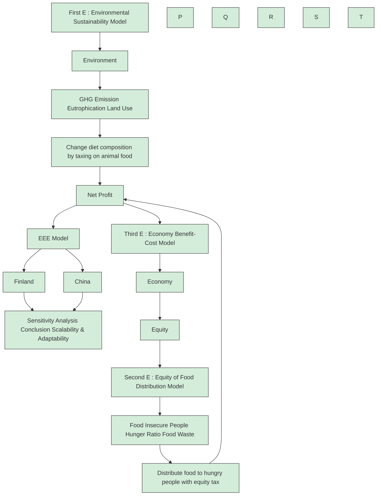

## Summary

In the past few years, food system considered the efficiency and profitability as priorities and ignored the environmental sustainability and social equity. The resulted severe environmental damage and hunger problem are hanging over our heads and waiting to be solved.

In this paper, we incorporate the Environment and Equity factors together with Economic factor to build an Environment-Equity-Economy Model (EEE Model) to re-optimize the current food system. EEE Model consists of three interlocking submodels. They are Environmental Sustainability Model, Equity of Food Distribution Model and Economy Benefit-Cost Analysis Model. By factoring in some parameters, sustainability and equity are upgraded to priorities at the sacrifice of economic profit.

The first E : Environment Model involves three environmental indicators which are Greenhouse gas (GHG) emission and Eutrophying emission from food system and Land use for food production. After examining massive data, we find that transforming the national citizens’ diet composition will have significant effect on reduction of the above three indicators. We use Logistic Model to predict the future situation and time coefficient r is introduced to measure the time needed to achieve environmental sustainability. Animal product tax is used to drive this transformation.

The second E : Equity Model is based on the social uneven food distribution. Our concept is to reduce hunger ratio by slowing down the increasing rate of food insecure people. To achieve this goal, government can deliver the redundant food to the food scarcity region and offer them to the food insecure people. The assistance factor A is applied to mearsure the intensity of government assistance. As for the freight, government can charge Food Equity Tax from food producers and distributers.

The third E : Economy Model considers the net profit of food producers and distributers. In our re-optimized food system model, the economy net profit is not just the difference between benefit and cost. It need to include the animal porduct tax and food equity tax from first E and second E model.

We choose China and Finland to be the target countries and employ our model in case studies. After simulation, we obtian the result that

• China will have 25.79% fewer GHG emission, 16.15% fewer eutrophication and 32.79% more spared land. Also in 2021, the hunger ratio will begin to reduce, and there’s no food insecure people by 2029. And the cost is 5.14% fewer net profit for food production.  
• Finland will have 33.22% fewer GHG emission, 32.03% fewer eutrophication and 26.98% more spared land. Also in the first month after the plan is carried out, the hunger ratio will begin to reduce, and there’s no food insecure people by the middle of 2027. And the cost is 9.77% fewer net profit for food production.

We also discuss the scalability and profitability of our model, determine the strength and weakness of our model, explore the probability of future work.

## Contents

## 1 Introduction 2

1.1 Problem Background 2  
1.2 Problem Restatement . . 2  
1.3 Our Approach . . 2

## 2 Assumptions 3

## 3 Notation 4

## 4 Basic Idea of Environment-Equity-Economy Model (EEE Model) 5

## 5 First E : Environmental Sustainability Model 5

5.1 Selection of Indicators 5  
5.2 Adjustment of Food System 6  
5.3 Establishment of Environmental Sustainability Model (First E) . . . 7

## 6 Second E : Equity of Food Distribution Model 9

6.1 Introduction 9  
6.2 Food Equity Model . 10

## 7 Third E : Economy Benefit-Cost Analysis Model 11

7.1 Economic Costs . . . 11  
7.2 Economic Benefits . 11  
7.3 Profits . . . 12

## 8 Difference from Currnet System 12

## 9 Case Study : China 13

9.1 Environmental Benefit from First E 13  
9.2 Food Delivery and Net Profits from Second and Third E . . 15  
9.3 Conclusions for Chinese Food System 15

## 10 Case Study : Finland 16

10.1 Environmental Benefit from First E . 16  
10.2 Food Delivery and Net Profits from Second and Third E . . 18  
10.3 Conclusions for Finnish Food System 19

## 11 Discussion 19

11.1 Difference In Developed and Developing Countries . . . 19  
11.2 Scalability 20  
11.3 Adaptability 20  
11.4 Sensitivity Analysis . . 20

## 12 Strengths and Weaknesses 21

12.1 Strengths . . 21  
12.2 Weaknesses 21  
12.3 Future Work 22

## 1 Introduction

## 1.1 Problem Background

According to the FAO1, the nowaday food systems has yielded many positive results over the last few decades. However, the highly-developed food system has also resulted in increasingly severe problems, including many highly processed, high-calorie and low nutritional value food items, high levels of food loss and waste, ecological footprint associated with current food system, and most importantly, the unreasonable food distribution of food[1], just like Figure 1 from website2.

Challenged by ICM, we decide to build a model to modify the food system by considering the balance among Environment, Equity and Economic.

text_image

35154

Figure 1: Barrier Between Hungry People And Waste Food

## 1.2 Problem Restatement

Having understood the problem, we’re required to do the following work:

R Develop a food system model to optimize the priority levels of efficiency, profitability, sustainability and equity. Then compare the re-optimized food system with the current one and predict the time needed to achieve it.  
R Find the benefits and costs of the changes of the re-optimized food system and predict when they’ll happen.  
R Tell the differences of our model between developed and developing countries, and employ the model to the actual situations.  
R Make further exploration of the scalability and adaptability of our model when used in different regions with different sizes.

## 1.3 Our Approach

For convenience, we draw a flow chart to represent our spproach.

We begin by establishing our modified food system model : Environment-Equity-Economy Model, we’ll adress it as EEE Model in the following paper for short. Our EEE Model try to obtain the balance among environmental sustainability, social equity and economic profit. The model consists of three submodels, each stands for a “E”. We shall show the principles of them in the following paper.

Then we choose China and Finland as our target countries for case study, employing our model into the countries. We find that our model has huge progress on environmental recovery and social equity. At last, we discuss the scalability and adaptability of our model, make a sensitivity analysis, and describe the future work.

flowchart

Figure 2: Our Approach

## 2 Assumptions

To simiplify the problem, we make the following basic assumptions, each of which is properly justified.

Assumptions 1 : We only consider calories and proteins as the basic diet need of one person.

, Justification : For food insecure people, calories provide the sufficient energy and proteins maintain a healthy body. Thus they’re the most needed nutrition. By contrast, other nutrients like vitamins and microelement can be neglected.

Assumptions 2 : The price of the food is stable and constant.

, Justification : As the problem says, there’re enough food to feed everyone in the world, thus the supply is more than the demand, the food producers and distributers can’t change the price of the food, it’s stable.

Assumptions 3 : The greenhouse gas emission of food transportation can be neglected.

, Justification : According to the statistic on website Our World In Data, the greenhouse gas emission of food transportation is much smaller compared to the food production, thus we can ignore this part of emission.

Assumptions 4 : We will ignore the influence of the extreme events.

, Justification : The tendency of development will not change as we predict the development of our modified food system. The influence of the force majeure won’t be considered. We assume our target countries are regular and stable.

Assumptions 5 : Those factors we don’t mention have few influence on the system.

, Justification : In reality, factors that can affect food system are too plenty to be considered. Thus, this assumption is reasonable and helps avoid unnecessary troubles when building the model.

Assumptions 6 : The statistic we captured from website are precise and reliable. , Justification : We collect most data from the authoritative websites, which we consider it trustworthy. Also, this is a premise under which our model is practical.

Other specific assumption, if necessary, will be mentioned and illustrated while we’re building models.

## 3 Notation

For convenience, we introduce some notations below.

Table 1: Notations

<table><tr><td>Symbol</td><td>Meaning</td></tr><tr><td>T</td><td>Tax Rate on Animal Products</td></tr><tr><td>δ</td><td>Population Growth Rate</td></tr><tr><td>N(t)</td><td>Total Population</td></tr><tr><td>μ(t)</td><td>Percentage of calories provided from Vegetal Food</td></tr><tr><td>λ(t)</td><td>Percentage of proteins provided from Vegetal Food</td></tr><tr><td>x</td><td>Daily Need for Proteins</td></tr><tr><td>y</td><td>Daily Need for Calories</td></tr><tr><td>α, β</td><td>Preference Weights on Vegetal and Animals Food</td></tr><tr><td>H(t)</td><td>Food Insecure People in Current System</td></tr><tr><td>H*(t)</td><td>Food Insecure People in Modified System</td></tr><tr><td>A</td><td>Assistance Factor</td></tr><tr><td>R(t)</td><td>People who Receive Help from Government</td></tr><tr><td>GA(t)</td><td>Government Assistance Investment</td></tr><tr><td>h(t)</td><td>Hunger Ratio</td></tr><tr><td>mfood</td><td>Total Food Sale</td></tr><tr><td>pnet</td><td>Net Profit of One Unit Food</td></tr><tr><td>Wnet</td><td>Total Net Profits of Food System</td></tr></table>

Other specific notations, if necessary, will be mentioned and illustrated while we’re building models.

## 4 Basic Idea of Environment-Equity-Economy Model (EEE Model)

The current food system considers efficiency and profitability as priorities, which can be seen as economic factors. The producers have the goals of chasing the maxima of economic profits, which ignores the environmental sustainability and social equity. As time goes by, the consequence tends to be more severe. The natural environment becomes worse, more people suffer from food scarcity, causing larger gap of wealth. To avoid the further deterioration in the future, we need to improve the current food system.

In short, the current food system ignores sustainability and equity and we need to make changes in seeking the balance among Environment, Equity and Economy.

To optimize the food system by considering efficiency, profitability, sustainability and euqity, we establish our food system model : Environment-Equity-Economy Model, we shall call it EEE Model in the following paper for short. Our EEE Model is combined of three submodels, including:

• First E : Environmental Sustainability Model

To decrease the damage of the environment, we can transform the diet composition by taxing on animal foods, then we will build a model based on this idea.

• Second E : Equity of Food Distribution Model

To relieve the hunger problem of food insecure people, government could intervene by delivering redundant food to the people in need. The costs can be paid by food producers and distributers in the form of Food Equity Tax.

• Third E : Economy Benefit-Cost Analysis Model

We shall re-analyse the economy cost and benefits because of the animal food tax and the food equity tax. We find out that there’s economic profits loss, which removes the priorities from efficiency and profitability to make sustainable development.

## 5 First E : Environmental Sustainability Model

## 5.1 Selection of Indicators

According to the website Our World in $D a t a ^ { [ 2 ] }$ and inspired by the information given in the problem, the environmental impacts of food and agriculture are negative in many aspects. For convenience, three major indicators are selected to measure the environmental sustainability of one country’s food system. They are respectively greenhouse gas emission from food system per year, eutrophying emission from food system per year, land use for food system.

• Greenhouse Gas (GHG) Emission

Food is responsible for approximately 26% of global GHG emissio global warming, glacier melting, and elevation of the sea level. Ther ：MATHmodelsagement and control of agricultural greenhouse gas emission by adju rent food system is key to emission reduction. $C O _ { 2 }$ is the most important greenhouse gas, but not the only one. According to Our World In $D a t a ^ { [ 2 ] }$ , to include all GHG emissions from food system, we can therefore express them in kilograms of “carbon dioxide equivalents”, denote it as GHE.

As we shall mention in the following subsection, production of animal food emits much more GHG than vegetal food. Thus one of the useful methods of decreasing level of GHG emission is to change the citizens’ diet composition.

## • Eutrophication Emission (EUE)

Eutrophication is the pollution of water bodies and ecosystems due to excess nutrients[2]. Excess nitrogen and other nutrients from food production system run into the surrounding environment. Eutrophication of water severely harms the balance of freshwater ecosystem and has a detrimental effect on the supply of drinking water. Precautions must be taken to curb the further pollution of water resulted from food system.

Again, we can express the degree of eutrophication in the unit of grams of phosphate equivalents, since phosphate is the most important contaminant for it.

## • Land Use (LU)

Food system requires farmland and most farmland is made from forests. The expansion of agriculture has great impacts on the environment, causing sharp decline of forest area and biodiversity. What’s more, as more land is turned into farmland, plenty of species lost their habitat and this could damage biodiverrsity.

To prevent the biodiversity and our forests getting worse and worse, we can take actions by returning some farmlands back to the nature.

## 5.2 Adjustment of Food System

As the global population increases, more food must be produced to feed people. If nothing is done, what follows is more greenhouse gas emission and eutrophying emission from food system per year, further deforestation and loss of biodiversity.

After examining the data from Our World in Data[2], we notice that offering the same protein and calories, animal products generally emit more greenhouse gas, more eutrophic materials and occupy more land than vegetal products.

Thus, we can change the diet composition of national citizens by providing more vegetal products and less animal products, so as to achieve the environmental sustainability of food system.

Governmnet can be the driving force in this adjustment by taxing on the animal products. Denote the tax rate as T, $\mathsf { T } \in [ 0 , 1 ]$ . This will raise the economic cost for food producers, so they’ll produce less animal products and gradually the national citizens’ diet composition is changed.

## 5.3 Establishment of Environmental Sustainability Model (First E)

## 5.3.1 Model of Transformation of Diet Composition

Calories and proteins are chosen as the basic nutrition need of a person. Calories provide the sufficient energy and proteins maintain a healthy body of one person. To simplify the problem, other nutrients like vitamin and trace elements are neglected.

Since there’re enough food for human, we assume the population of a country in year t is $N ( t )$ given by

$$
N (t) = N _ {0} (1 + \delta) ^ {t} \tag {1}
$$

where $N _ { 0 }$ is population in 2020, δ is the population growth rate, and we set $t = 0$ in 2020.

Assume one person consumes x kcal calories and y g proteins per day. Here we define $\mu ( t )$ as the percentage of calories offered by vegetal products and $\lambda ( t )$ as the percentage of proteins offered by vegetal products.

Thus, the food production of the whole country per year must offers 365Nx kcal calories and 365Ny g proteins, among which 365µNx kcal calories and 365λNy g proteins are provided by vegetal products.

We can enlarge $\pmb { \mu }$ and λ to transform the national citizens’ diet composition to vegetal-preferred state. The transformation takes time to completely accomplish and is expected to take 30-50 years. The increasement of $\mu$ and $\lambda$ with time t satisfies the Logistic Model.

$$
\left\{ \begin{array}{l} \frac {d \mu}{d t} = r \mu \left(1 - \frac {\mu}{\mu_ {\max}}\right), \mu (0) = \mu_ {0} \\ \frac {d \lambda}{d t} = r \lambda \left(1 - \frac {\lambda}{\lambda_ {\max}}\right), \lambda (0) = \lambda_ {0} \end{array} \right. \tag {2}
$$

The solution is

$$
\left\{ \begin{array}{l} \mu (t) = \frac {\mu_ {\max}}{1 + \left(\frac {\mu_ {\max}}{\mu (0)} - 1\right) e ^ {- r t}} \\ \lambda (t) = \frac {\lambda_ {\max}}{1 + \left(\frac {\lambda_ {\max}}{\lambda (0)} - 1\right) e ^ {- r t}} \end{array} \right. \tag {3}
$$

in these functions, $\mu _ { m a x }$ and $\lambda _ { m a x }$ are final value of $\mu$ and λ after complete transformation, which we expect to achieve. The value of $\mu _ { m a x }$ and $\lambda _ { m a x }$ are different depend on the national conditions of different countries. r is the time coefficient which determines how long it will take to achieve the total conversion of diet composition. Larger r translates to shorter time needed to achieve the transformation.

## 5.3.2 Introducing the Parameters

## Part I : Parameters of Vegetal Products

To calculate the greenhouse gas and eutrophic materials emissions per year due to vegetal products and areas of land used to cultivate vegetal products, we introduce the following parameters:

GH $E _ { c a l , v e g }$ : GHG emission per 1000 kcal calories provided by vegetal products, kg CO eq/1000kcal calories.

GHEpro,veg: GHG emission per 100g proteins provided by vegetal products, 号：MATkg CO2 eq/100g calories. − C

$E U E _ { c a l , v e g } { \mathrm { : } }$ Eutrophying emission per 1000 kcal calories provided by vegetal products, $g P O _ { 4 } \ : e q / 1 0 0 0 k c a l$

$E U E _ { p r o , v e g : }$ Eutrophying emission per $1 0 0 \mathrm { g }$ proteins provided by vegetal products, $g P O _ { 4 } e \dot { q } / 1 0 \dot { 0 } g$

$L U _ { c a l , v e g } { : }$ Land use required to produce 1000 kcal calories provided by vegetal products, $\bar { m ^ { 2 } } / 1 0 0 0 k c a l$ calories

$L U _ { p r o , v e g }$ : Land use required to produce 100g proteins provided by vegetal products, $m ^ { 2 } / 1 0 0 g$ proteins

Consider that different countries prefer different vegetal and animal products. Therefore, parameters above will be specifically calculated in the case study based on the eating habit of the target country. Their general form is

$$
G H E _ {c a l, v e g} = \sum_ {i = 1} ^ {n} \alpha_ {i} \times G H E _ {c a l, i} \tag {4}
$$

where n is the number of typical vegetal food, $G H E _ { c a l , i }$ is greenhouse gas emission per 1000 kcal calories provided by the i th vegetal food, $\alpha _ { i }$ is the weight of the i th vegetal food $( 0 < \alpha _ { i } < 1 )$ . Other parameters are calculated in the similar way.

## Part II : Parameters of Animal Products

Animal products cause the similar effects to the environment, the only difference is the amount. Here, we introduce the parameters of environmental effects:

$G H E _ { c a l , a n i } \mathrm { : }$ GHG emission per 1000 kcal calories provided by animal products, $k g C O _ { 2 } e q / 1 0 0 0 k c a l$ calories.

GH $E _ { p r o , a n i }$ GHG emission per 100g proteins provided by animal products, $k g C O _ { 2 } \dot { e q } / 1 0 0 g$ calories.

$E U E _ { c a l , a n i } .$ Eutrophying emission per 1000 kcal calories provided by animal products, $g P O _ { 4 } e q / 1 0 0 0 k c a l$

$E U E _ { p r o , a n i } \mathrm { : }$ Eutrophying emission per 100g proteins provided by animal products, $g P O _ { 4 } e \dot { q } / 1 0 0 g$

$L U _ { c a l , a n i } .$ Land use required to produce 1000 kcal calories provided by animal products, $m ^ { 2 } / 1 0 0 0 k c a l$ calories

$L U _ { p r o , a n i } .$ Land use required to produce 100g proteins provided by animal products, $m ^ { 2 } / 1 0 \dot { 0 } g$ proteins

Consider that different countries prefer different vegetal and animal products. Therefore, parameters above will be specifically calculated in the case study based on the eating habit of the target country. Their general form is

$$
G H E _ {c a l, a n i} = \sum_ {j = 1} ^ {m} \beta_ {j} \times G H E _ {c a l, j} \tag {5}
$$

where m is the number of typical animal food consumed by specific country citizens GHE is greenhouse gas emission per 1000 kcal calories provided by the j th a 6iml food, $\beta _ { j }$ is the weight of the j th animal food $( 0 < \beta _ { j } < 1 )$ . And animal products provide $3 6 5 ( 1 - \mu ) N x$ kcal calories and $3 6 5 ( 1 - \lambda ) N y$ g proteins per year.

## 5.3.3 Effect of Changing Diet Composition

Since producing vegetal food emits less greenhouse gas, less eutrophic materials and occupy less land, as the proportion of vegetal food increases with time, environmental sustainability can be achieved through three significant effects:

• Decrease of greenhouse gas emission from food system per year  
• Reduction of eutrophying emission from food system per year  
• Decline of land use for food system

Their functions with time are respectively

$$
\begin{array}{l} G H E (t) = \frac {3 6 5 \mu N x}{1 0 0 0} G H E _ {\text {cal,veg}} + \frac {3 6 5 \lambda N y}{1 0 0} G H E _ {\text {pro,veg}} \tag {6} \\ + \frac {3 6 5 (1 - \mu) N x}{1 0 0 0} G H E _ {c a l, a n i} + \frac {3 6 5 (1 - \lambda) N y}{1 0 0} G H E _ {p r o, a n i} \\ \end{array}
$$

$$
\begin{array}{l} E U E (t) = \frac {3 6 5 \mu N x}{1 0 0 0} E U E _ {\text {cal,veg}} + \frac {3 6 5 \lambda N y}{1 0 0} E U E _ {\text {pro,veg}} \tag {7} \\ + \frac {3 6 5 (1 - \mu) N x}{1 0 0 0} E U E _ {\text { cal,ani }} + \frac {3 6 5 (1 - \lambda) N y}{1 0 0} E U E _ {\text { pro,ani }} \\ \end{array}
$$

$$
\begin{array}{l} L U (t) = \frac {3 6 5 \mu N x}{1 0 0 0} L U _ {\text {cal,veg}} + \frac {3 6 5 \lambda N y}{1 0 0} L U _ {\text {pro,veg}} \tag {8} \\ + \frac {3 6 5 (1 - \mu) N x}{1 0 0 0} L U _ {\text {cal,ani}} + \frac {3 6 5 (1 - \lambda) N y}{1 0 0} L U _ {\text {pro,ani}} \\ \end{array}
$$

The total eutrophying emission EUE(t) and land use $L U ( t )$ can be calculated by changing the parameters of environmental factors. It will be shown in the following case study that three functions are decreasing with time after 2020 when national citizens’ diet composition starts to transform.

## 6 Second E : Equity of Food Distribution Model

## 6.1 Introduction

Since massive food producers and distributers prioritize efficiency and profitability (Economic cost and benefit), they have no responsibility for aiding hungry people, causing uneven food distribution and negative consequences, such as redundance of food in one place and famine in other place.

To achieve equity, government must take actions by delivering redundant food to the food insecure people. By doing this, we could save the wasted food and reduc hunger ratio. What’s more, when the famine victim have enough to eat Chevbec 号：healthy, indicating that they can work and produce more value to the so ciety.

As for the freight of the food delivery, government can collect Food Equity Tax from the massive food producers and distributers. This may raise the economic cost but could bring benefit to the equity.

## 6.2 Food Equity Model

## 6.2.1 Current system

As we can see from above, the population $N ( t )$ is

$$
N (t) = N _ {0} (1 + \delta) ^ {t} \tag {9}
$$

where $N _ { 0 }$ is the initial value of $N ( t )$ , and δ is the population growth rate.

If we do nothing, the hunger ratio will stay constant, which means that the food insecure people population $H ( t )$ shall keep rising, causing the more severe social inequality.

$$
H (t) = H _ {0} (1 + \delta) ^ {t}, \frac {H ^ {\prime} (t)}{N ^ {\prime} (t)} = \frac {H _ {0}}{N _ {0}} \tag {10}
$$

where $N _ { 0 }$ and $H _ { 0 }$ are the initial value of $N ( 0 )$ and $H ( 0 )$ .

## 6.2.2 Modified system

To improve this situation, we need government to make interventions to deliver food. Our ultimate aim is to decrease the hunger ratio $h ( t )$ with time, we can express this goal by mathematical formulae. We denote the modified food insecure population function as $H ^ { * }$ . To make the decreasement in hunger ratio, we can let the increasing rate of modified food insecure population smaller than that of population. That is

$$
H ^ {* \prime} (t) <   N ^ {\prime} (t) \tag {11}
$$

To be more specific, we can change (9) into an equation by denoting A as “Assistance Factor” to measure the degree of government assistance, larger A means larger intensity of government assistance and shorter time to decrease hunger ratio. Therefore we have an initial value problem.

$$
\frac {H ^ {* \prime} (t)}{N ^ {\prime} (t)} = \frac {H _ {0}}{N _ {0}} - A t, H ^ {*} (0) = H _ {0} \tag {12}
$$

We solve this problem with MATLAB, and get the expression of $H ^ { \ast } ( t )$

$$
H ^ {*} (t) = \left(H _ {0} - A N _ {0} t\right) (\delta + 1) ^ {t} - \frac {A N _ {0}}{\ln (\delta + 1)} + \frac {A N _ {0} (\delta + 1) ^ {t}}{\ln (\delta + 1)} \tag {13}
$$

which is the food insecure population in our modified system. Hence we can find out the function of population who can receive assistance from government, denoted as $R ( t )$ , that is

$$
\begin{array}{l} R (t) = H (t) - H ^ {*} (t) \\ = H _ {0} (\delta + 1) ^ {t} - \left(\left(H _ {0} - A N _ {0} t\right) (\delta + 1) ^ {t} - \frac {A N _ {0}}{\ln (\delta + 1)} + \frac {A N _ {0} (\delta + 1) ^ {t}}{\ln (\delta + 1)}\right) \tag {14} \\ = A N _ {0} t (\delta + 1) ^ {t} + \frac {A N _ {0}}{\ln (\delta + 1)} - \frac {A N _ {0} (\delta + 1) ^ {t}}{\ln (\delta + 1)} \\ \end{array}
$$

According to the previous section, one person needs x kcal calories and y g proteins per day to guarantee health. And we denote $F _ { c a l }$ and $F _ { p r o }$ as the calories and proteins food delivery freight. Therefore the total expense of Government Assistance is

$$
G A (t) = R (t) \times 3 6 5 \left(x F _ {c a l} + y F _ {p r o}\right) \tag {15}
$$

This expense could be paid by massive food producers and distributers in the form of “Food Equity $\mathbf { T a x } ^ { \prime \prime }$ . Although this may reduce the economic profit, this assistance contributes to the social equity.

## 7 Third E : Economy Benefit-Cost Analysis Model

## 7.1 Economic Costs

We consider that there’re three main ecnomic cost in food system, including material, land and labor. Then we assume that these three costs have linear relation with the amount of food production, and the slope is the price p of raw material, labor and land, therefore we have the following equations

$$
\left\{ \begin{array}{l} C _ {m a t} = \sum_ {i = 1} ^ {k} m _ {\text {food}, i} \times p _ {m a t, i} \\ C _ {\text {labor}} = \sum_ {i = 1} ^ {k} m _ {\text {food}, i} \times p _ {\text {labor}, i} \\ C _ {\text {land}} = \sum_ {i = 1} ^ {k} m _ {\text {food}, i} \times p _ {\text {land}, i} \end{array} \right. \tag {16}
$$

where $m _ { f o o d , i }$ and $p _ { i }$ means the amount and the price of producing i th food, there’re $\sum _ { i = 1 } ^ { k }$ k k kinds of foods in total. We add the sign because there’re different types of foods, and the $\sum _ { i = 1 } ^ { k }$ means we calculate the sum of all foods. The same signs in the passage are similar.

Thus we define the economic costs as

$$
E c o n o m i c \text { Costs } = C _ {\text { mat }} + C _ {\text { labor }} + C _ {\text { land }} \tag {17}
$$

## 7.2 Economic Benefits

In our modified food system, food producers and distributers are just sellers, we ignore their financial activities, and as it’s mentioned in Assumption 2, the price of the food is stable, thus the economic benefits is

$$
\text { Economic   Benefits } = \sum_ {i = 1} ^ {k} m _ {\text { food }, i} \times p _ {\text { food }, i} \tag {18}
$$

where $p _ { f o o d , i }$ is the price of i th food.

## 7.3 Profits

Thus the economic profits are

$$
\begin{array}{l} W (t) = \text { Economic   Benefits } - \text { Economic   Costs } \\ = \sum_ {i = 1} ^ {k} m _ {\text { food }, i} \times \left(p _ {\text { food }, i} - p _ {\text { mat }, i} - p _ {\text { labor }, i} - p _ {\text { land }, i}\right) \tag {19} \\ = \sum_ {i = 1} ^ {k} m _ {\text { food }, i} \times p _ {\text { net }, i} \\ \end{array}
$$

for convenience, we denote $p _ { n e t }$ as the combination of four prices and it can also be seen as the net profit of one unit of food. Then $m _ { f o o d }$ is the amount of food sold to the customer per year, where customers are the people who are neither food insecure nor receiving assistance, that is

$$
m _ {f o o d} (t) = 3 6 5 (x + y) \times (N (t) - H (t)) \tag {20}
$$

Note that because of the environmental adjustment, government need to charge animal products taxes, with the tax rate T, and then together with the Food Equity Tax, we can obtain the net profit of our modified food system, that is

$$
\begin{array}{l} W _ {n e t} (t) = W _ {\text {taxed}} (t) - G A (t) \tag {21} \\ = W _ {v e g} (t) + (1 - T) W _ {a n i} (t) - G A (t) \\ \end{array}
$$

## 8 Difference from Currnet System

After introducing the principles of our EEE model, we summarize our essential concept in this section. The biggest difference between our modified system and the current system is that we remove the priorities from the efficiency and profitability by considering the environmental and social factors into our model and by tranforming the diet composition and taxing for food equity.

As we have mentioned before, after putting the statistics into the programme calculation, we obtain the results and list them :

• The greenhouse gas emission will decrease. (Benefit)  
• The degree of eutrophication shall reduce. (Benefit)  
• More land would be released back to the nature for recovery of biodiversity. (Benefit)  
• More food insecure people will have food to eat and the hunger ratio will fall to zero. (Benefit)  
• The net economy profit of food producers and distributers will decrease to a certain limit. (Costs)

Judging from the benefits and costs that the benefits are in the aspect of environmental sustainability and social equity, while the costs are economic. As we shall mention in the following case study that the amount of increasement of environmental and social factors.

In the following case studies, we apply our formula of net profit to analyse the food system of our target countries : China and Finland.

## 9 Case Study : China

We choose China to be our first target country, China is a developing country with relatively large scale in population, economy and land area.

China has the largest food system in the world, which has to feed nearly one fifth of the world population. During the last few decades, Chinese food system development considers efficiency and profitability as their priorities, ignoring the environmental and social adverse impact. Thus, China has severe environmental problems and hunger problems which need to be mitigated by adjusting the current food system.

In the following subsections, we use our model to improve Chinese food system. After the simulation of our model, we illustrate the benefits and costs of our modification.

## 9.1 Environmental Benefit from First E

Considering that China has a huge population, the transformation of citizens diet composition takes relatively long time. We expect 30 years for the complete transformation to achieve, with the corresponding time coefficient $r = 0 . 0 1$ . And our plan is that µ increase from 0.8 to 0.9, λ increase from 0.6 to 0.8. For Chinese, we choose rice and wheat as representative vegetal products; pig, poultry, beef, mutton and eggs as representative animal products. Their weights are listed at Table 2. Accroding to the website Our World In Data and our reasonable assumptions, we determine the following constants of Chinese food system in Table 2, including the preferrence of Chinese citizens’ diet, essential need for nutrition and so on.

Table 2: Chinese Constants

<table><tr><td>Constant</td><td>Value</td><td>Weights</td><td>Value</td></tr><tr><td>Calories(kcal) x</td><td>2500</td><td> $\alpha_{rice}$ </td><td>0.5</td></tr><tr><td>Protein(g) y</td><td>80</td><td> $\alpha_{wheat}$ </td><td>0.5</td></tr><tr><td> $\mu_0$ </td><td>0.8</td><td> $\beta_{pig}$ </td><td>0.3</td></tr><tr><td> $\lambda_0$ </td><td>0.6</td><td> $\beta_{poultry}$ </td><td>0.2</td></tr><tr><td> $\mu_{max}$ </td><td>0.9</td><td> $\beta_{beef}$ </td><td>0.1</td></tr><tr><td> $\lambda_{max}$ </td><td>0.8</td><td> $\beta_{mutton}$ </td><td>0.1</td></tr><tr><td>Time Coefficient r</td><td>0.1</td><td> $\beta_{egg}$ </td><td>0.3</td></tr></table>

Using weights and environmental parameters (GHE, EUE, LU) of selected food from website Our World In Data, we calculate the parameters for vegetal animal products, indicated in Figure 3.

bar chart

| Category | Value |
|---|---|
| Red Bar | 11.5 |
| Green Bar | 3.5 |
| Red Bar | 8.2 |
| Green Bar | 0.7 |

(a) : GHG Emission (kg CO eq)

bar chart

| Category | Value |
|---|---|
| Red Bar | 45 |
| Green Bar | 27 |
| Red Bar (Right) | 33 |
| Green Bar (Left) | 6 |

(b) : Eutrophication (g PO4 eq)

bar chart

| Category | Value |
|---|---|
| Red Bar | 41 |
| Green Box | 3 |
| Light Green Box | 28 |

Figure (c) : Land Use(m2)

Red : Environmental Effects of Animal Food  

Green : Environmental Effects of Vegetal Food  
  
Figure 3: Comparison between Vegetal and Animal Products

It is obvious to see that all parameters for animal products are much larger than parameters for vegetal products. This means that offering the same amount of calories and proteins, animals food cause more severe consequences than vegetals. Thus, it can be reasonably deduced that the transformation of diet composition will have significant effect on the environmental protection.

We insert all parameters into function GHE(t), EUE(t), LU(t) and plot the result in Figure 4.

line chart

| year | Nothing is done (×10¹² kg) | Adjustment is made (×10¹² kg) |
| ---- | -------------------------- | ----------------------------- |
| 2020 | 5.9                        | 5.9                           |
| 2030 | 6.1                        | 5.0                           |
| 2040 | 6.3                        | 4.8                           |
| 2050 | 6.5                        | 4.7                           |
| 2060 | 6.7                        | 4.8                           |
| 2070 | 6.8                        | 4.9                           |

Figure (a) : GHG Emission

line chart

| year | Nothing is done (×10¹³ g) | Adjustment is made (×10¹³ g) |
| ---- | -------------------------- | ----------------------------- |
| 2020 | 2.9                        | 2.9                           |
| 2040 | 3.1                        | 2.6                           |
| 2070 | 3.4                        | 2.8                           |

Figure (b) : Eutrophication

line chart

| year | Land use for food system (×10¹² m²) | Spared land (×10¹² m²) |
| ---- | ----------------------------------- | ---------------------- |
| 2020 | 16.0                                | 0.0                    |
| 2030 | 12.5                                | 3.5                    |
| 2040 | 11.5                                | 4.8                    |
| 2050 | 11.0                                | 5.2                    |
| 2060 | 11.0                                | 5.1                    |
| 2070 | 11.0                                | 5.0                    |

Figure (c) : Land Use  
Figure 4: Future Environmental Effects of China

In figure (a) and (b), the blue dotted line represents the future situation when nothing is done, while the red full line means the future situation in our modified food system. In figure (c), blue line is the total area of farmland, and the red line is spared land.

From Figure 4, we can see that in our modified food system, GHE(t), EUE(t), LU(t) immediately declines due to adjustment. After 30 years in 2050, the future environment has huge progress, we list our improvement quantitatively, including :

• Total GHG emission per year will decrease 25.79% in 2050.

• To slow down the rate of eutrophication, total amount of PO− will ：in 2050.

• There’ll be 32.79% of land given back to the environment for recovering biodiversity in 2050.

Judging from figures and our results, we can draw a conclusion that our modified food system is feasible in keeping environmental sustainability.

## 9.2 Food Delivery and Net Profits from Second and Third E

According to the website Our World In Data, the hunger ratio of China is 1%. To improve this inequal situation, government can make inverventions by delivering the redundant food to the food insecure area. This may need investment as the freight of the food delivery, government can charge “Food Equity $\operatorname { T a x } ^ { \prime \prime }$ to the massive food producers and distributers.

Considering the Chinese national comprehensive power, we set the assistance factor $A = 0 . 0 1$ , and the “Animals Products Ta $\times ^ { \prime \prime } T = \mathsf { \bar { 0 } } . 0 5$ , then put the numbers into MATLAB calculation, we obtain the $R ( t )$ population which government can assistance and the $W _ { n e t } ( t )$ net profit. We plot our result in Figure 5.

line chart

| year | Hunger ratio | Hunger population |
| ---- | ------------ | ----------------- |
| 2020 | 1.0%         | 15.0×10⁶          |
| 2022 | 1.0%         | 14.5×10⁶          |
| 2024 | 0.8%         | 13.0×10⁶          |
| 2026 | 0.6%         | 10.0×10⁶          |
| 2028 | 0.3%         | 5.0×10⁶           |
| 2030 | 0.0%         | 0.0×10⁶           |

Figure (a) : Hunger Ratio

area chart

| year | Profit per year (RMB) ×10^12 |
| :--- | :--- |
| 2020 | 1.06 |
| 2030 | 1.10 |
| 2040 | 1.14 |
| 2050 | 1.18 |
| 2060 | 1.22 |
| 2070 | 1.24 |

Figure (b) : Net Profit  
Figure 5: Chinese Hunger Rate and Net Profits

In figure (a), red line is the hunger population $H ^ { * } ( t )$ , blue line is hunger ratio $h ( t )$ .

In figure (b),the blue line represent the future profit per year when nothing is done, while the red line means the future profit in our modified food system, and cyan area is the loss of net profit

As we can see from figure 5-(a), when government make interventions by deliverying food to the food insecure people, things are getting better, the hunger population start to decrease in 2021, and by 2029 there’s no food insecure people in China.

Such progress requires cost. When we apply our modified food system and simulate the future net profit, we find that $W _ { n e t } ( t )$ shall decrease 5.14% per year. We consider that it’s reasonable sacrifice for sustainable development.

## 9.3 Conclusions for Chinese Food System

To summarize the effects of our re-optimizing food system, we list 号：MAquences in Table 3

Table 3: Effects of Chinese Modified Food System

<table><tr><td>Aspects</td><td>Effects</td></tr><tr><td>Modification</td><td>Remove the priorities from efficiency and profitability</td></tr><tr><td>Benefits</td><td>25.79%Fewer GHG emission in 205016.15%Fewer eutrophication in 205032.79%More spared land back to the nature in 2050More people are fed and smaller hunger rate</td></tr><tr><td>Costs</td><td>5.14% Fewer economic profit</td></tr><tr><td>Implement Time</td><td>Hunger ratio begin to reduce by 2021</td></tr><tr><td>Accomplish Time</td><td>No food insecure people by 2029</td></tr></table>

To sum up, in our case study of Chinese food system, we sacrifice a part of economic profit, with the return of a better nature environment and a more equal country, we consider our model meets the criterion of sustainable development.

## 10 Case Study : Finland

We choose Finland to be our second target country, Finland is a developed country with relatively small scale in population, economy and land area.

Located in Northern Europe, Finland has highly-developed economy, and yet Finnish food system still exists some problems in environmental sustainability and social equity, according to website Our World In Data, the current hunger rate of Finland is 2%, which is worse than China.

Thus in the following subsections,we’ll simulate our modified food system in Finland to see whether there’ll be some improvement in sustainability and equity.

## 10.1 Environmental Benefit from First E

Consider that Finland has a relatively small population, the transformation of citizens diet composition takes a shorter time than China. Thus We expect 20 years for the complete transformation to achieve, with the corresponding time coefficient r = 0.2. And our plan is that µ increase from 0.5 to 0.7, λ increase from 0.4 to 0.6.

For Finnish, we choose potato and wheat as representative vegetal products; pig, poultry, beef, fish and milk as representative animal products. Their weights are listed at Table 4

Accroding to the website Our World In Data and our reasonable assumption, we determine the following constant of Finnish food system in Table 4, including the preferrence of Finnish citizens’ diet, essential need for nutrition and so on.

Using weights and environmental parameters (GHE, EUE, LU) of selected food from website Our World In Data, we calculate the parameters for vegetal animal prod n ucts, indicated in Figure 6.

Table 4: Finland Constants

<table><tr><td>Constant</td><td>Value</td><td>Weights</td><td>Value</td></tr><tr><td>Calories(kcal) x</td><td>3000</td><td> $\alpha_{potato}$ </td><td>0.7</td></tr><tr><td>Protein(g) y</td><td>110</td><td> $\alpha_{wheat}$ </td><td>0.3</td></tr><tr><td> $\mu_0$ </td><td>0.5</td><td> $\beta_{pig}$ </td><td>0.1</td></tr><tr><td> $\lambda_0$ </td><td>0.4</td><td> $\beta_{poultry}$ </td><td>0.1</td></tr><tr><td> $\mu_{max}$ </td><td>0.7</td><td> $\beta_{fish}$ </td><td>0.3</td></tr><tr><td> $\lambda_{max}$ </td><td>0.6</td><td> $\beta_{beef}$ </td><td>0.3</td></tr><tr><td>Time Coefficient r</td><td>0.2</td><td> $\beta_{milk}$ </td><td>0.2</td></tr></table>

bar chart

| Category | Value |
|---|---|
| Category 1 | 20 |
| Category 2 | 15 |
| Category 3 | 2 |

(a) : GHG Emission (kg CO2 eq)

bar chart

| Category | Value |
|---|---|
| Yellow Bar | 90 |
| Blue Bar | 15 |
| Light Blue Bar | 80 |

(b) : Eutrophication (g PO4 eq)

bar chart

| Category | Value |
|---|---|
| Yellow Bar | 57 |
| Blue Box | 5 |
| Yellow Box | 41 |
| Blue Box | 2 |

Figure (c) : Land Use(m2)

Yellow : Environmental Effects of Animal Food

Effects from Animal Food Supplying Calories

Effects from Animal Food Supplying Proteins

Blue : Environmental Effects of Vegetal Food

Effects from Vegetal Food Supplying Calories

  
Figure 6: Comparison between Vegetals and Animals

Effects from Vegetal Food Supplying Proteins

It is obvious to see that all parameters for animal products are much larger than parameters for vegetal products. We insert all parameters into function GHE(t), EUE(t), LU(t) and plot the result in Figure 7.

In figure (a) and (b), the blue dotted line represent the future situation when nothing is done, while the red full line means the future situation in our modified situation. In figure (c), blue line is the total area of farmland, and the red line is spared land.

From Figure 7, we can see that in our modified food system, GHE(t), EUE(t), LU(t) immediately declines due to adjustment. After 20 years in 2040, the future environment has huge progress, we list our improvement quantitatively, including :

• Total GHG emission per year will decrease 33.22% in 2040.  
• To slow down the rate of eutrophication, amount of $P O _ { 4 } ^ { - }$ will reduce 32.03% in 2040.  
• There’ll be 26.98% of land given back to the environment for recovering biodiversity in 2040.

line chart

| year | Nothing is done (×10¹⁰ kg) | Adjustment is made (×10¹⁰ kg) |
| ---- | -------------------------- | ----------------------------- |
| 2020 | 7.5                        | 7.5                           |
| 2040 | 8.5                        | 5.5                           |
| 2070 | 9.0                        | 6.0                           |

Figure (a) : GHG Emission

line chart

| year | Nothing is done (g) | Adjustment is made (g) |
| ---- | --------------------- | ----------------------- |
| 2020 | 3.9                   | 3.8                     |
| 2030 | 4.1                   | 2.9                     |
| 2040 | 4.3                   | 2.8                     |
| 2050 | 4.5                   | 2.9                     |
| 2060 | 4.6                   | 3.0                     |
| 2070 | 4.7                   | 3.2                     |

Figure (b) : Eutrophication

line chart

| year | Land use for food system (×10¹¹ m²) | Spared land (×10¹¹ m²) |
| ---- | ---------------------------------- | ---------------------- |
| 2020 | 2.1                                | 0.0                    |
| 2030 | 1.6                                | 0.5                    |
| 2040 | 1.5                                | 0.6                    |
| 2050 | 1.5                                | 0.55                   |
| 2060 | 1.55                               | 0.5                    |
| 2070 | 1.6                                | 0.45                   |

Figure (c) : Land Use  
Figure 7: Future Environmental Effects of Finland

## 10.2 Food Delivery and Net Profits from Second and Third E

According to the website Our World In Data, the hunger ratio of Finland is 2%. To improve this inequal situation, government can make inverventions by delivering the redundant food to the food insecure area. This may need investment as the freight of the food delivery, government can charge “Food Equity Tax” to the massive food producers and distributers.

Considering the Finnish national comprehensive power, we set the assistance factor $A = 0 . 2 ,$ , then put the numbers into MATLAB calculation, we obtain the R(t) population which government can assistance and the $W _ { n e t } ( t )$ net profit. We plot our result in Figure 8.

According to the website Our World In Data, the hunger ratio of Finland is 2%. To improve this inequal situation, government can make inverventions by delivering the redundant food to the food insecure area. This may need investment as the freight of the food delivery, government can charge “Food Equity $\operatorname { T a x } ^ { \prime \prime }$ to the massive food producers and distributers.

Considering the Finnish national comprehensive power, we set the assistance factor $A = 0 . 2 ,$ , and the “Animals Products $\mathrm { T a x ^ { \prime \prime } } T = 0 . 1$ , then put the numbers into MATLAB calculation, we obtain the R(t) population which government can assistance and the $W _ { n e t } ( t )$ net profit. We plot our result in Figure 8.

line chart

| year | Hunger ratio | Hunger population |
|------|--------------|-------------------|
| 2020 | 2%           | 12000             |
| 2021 | ~1.9%        | ~11500            |
| 2022 | ~1.7%        | ~11000            |
| 2023 | ~1.5%        | ~10000            |
| 2024 | ~1.3%        | ~8000             |
| 2025 | ~1.1%        | ~6000             |
| 2026 | ~0.8%        | ~4000             |
| 2027 | ~0.5%        | ~2000             |
| 2028 | 0%           | 0                 |

Figure (a) : Hunger Ratio

area chart

| year | Profit per year (dollars) |
| :--- | :--- |
| 2020 | 7.8e8 |
| 2030 | 8.1e8 |
| 2040 | 8.4e8 |
| 2050 | 8.7e8 |
| 2060 | 9.0e8 |
| 2070 | 9.3e8 |

Figure (b) : Net Profit  
Figure 8: Finland Hunger Rate and Net Profits

In figure (a), red line is the hunger population $H ^ { * } ( t )$ , blue line is hunger ratio $h ( t )$ . In figure (b),the blue line represent the future situation when nothing is done, while the red line means the future situation in our modified situation, and cyan area is the decreasement of net profit

As we can see from figure 8-(a), when government make interventions by deliverying food to the food insecure people, things are getting better, the hunger population start to decrease within one month, and by the middle of 2027 there’s no food insecure people in Finland.

Such progress requires investment, when we apply our modified food system and simulate the future net profit, we find that $W _ { n e t } ( t )$ shall decrease 9.77% per year, we consider that it’s reasonable sacrifice for sustainable development.

## 10.3 Conclusions for Finnish Food System

To summarize the effects of our re-optimizing food system, we list all the consequences in Table 5

Table 5: Effects of Finnish Modified Food System

<table><tr><td>Aspects</td><td>Effects</td></tr><tr><td>Modification</td><td>Remove the priorities from efficiency and profitability</td></tr><tr><td>Benefits</td><td>33.22% Fewer GHG emission in 204032.05% Fewer eutrophication in 204026.98% More spared land back to the nature in 2040More people are fed and smaller hunger rate</td></tr><tr><td>Costs</td><td>9.77% Fewer economic profit</td></tr><tr><td>Implement Time</td><td>Hunger ratio begin to reduce by one month after carried out</td></tr><tr><td>Accomplish Time</td><td>No food insecure people by the middle of 2027</td></tr></table>

To sum up, in our case study of Finnish food system, we sacrifice a part of economic profit, with the return of a better nature environment and a more equal country, we consider our model meets the criterion of sustainable development.

## 11 Discussion

## 11.1 Difference In Developed and Developing Countries

## • Benefits difference:

In developed countries, because they prefer animal food initially, changing the priorities of the food systems contributes to a higher decrement in greenhouse gas emission and eutrophying emission than developing countries. In addition, with highly-developed economy in developed countries, they hav tance factor, so that the food insecure population will be cut down ：MATHmodfast than developing countries.

## • Costs difference:

For the reason of higher animal product tax in developed countries, their profit has a higher decrement than developing countries.

## 11.2 Scalability

Our first target country China, has the largest population on the world (1.4billion), which means it has the largest food system in the world. Our second target country Finland, has 5.5million population, which means the food system of Finland is 250 times smaller than Chinese food system.

To sum up, our model predicts and simulate well on both countries, which indicates that our modified food system model works well on both large and small system and behave well in scalability

However, our model mainly focus on the food system of one single country. Therefore, our model is limited in the food system much smaller than country like villages, as well as food system much larger than country like continents or even the whole world. To make the model more adaptable, we can adjust model to be suitable for some much larger places like a continent and some much smaller place like a village.

## 11.3 Adaptability

Consider that people in some extremely poor regions almost dont consume animal products, the environmental aspect of our model cant work well on these regions. But also because of that, the environmental pollution from food system of these regions, which mainly produce vegetal products, is relatively small. These food systems can naturally satisfy the environmental sustainability.

In some highly developed countries, like Norway, Singapore, Sweden Luxembourg and so on, there are few hungry people and their government has sufficient funding for these hungry people. The assistance expenses need not paid by food producers in the form of tax. So equity model may not work well on these hilghly developed regions.

To sum up, our model has relatively good adaptability in most regions but limited to some extremely poor and extremely rich area.

## 11.4 Sensitivity Analysis

We change the weights of specific foods in vegetal food and animal food, i.e. $\alpha _ { i }$ and $\beta _ { j }$ . The following changes of environmental parameters for vegetal and animal food, i.e. $G H E _ { c a l , v e g } , G H E _ { c a l , a n i }$ and so on, are slight.

We plot of our result of sensitivity analysis of cases in China and Finland. As we can see from the Figure 9 and Figure 10,the overall tendency of the curve of GHE(t), EUE(t) and $L U ( t )$ stays stable, which suggests the robustness of our model.

line chart

| year | Nothing is done | Adjustment is made | Sensitivity analysis 1 | Sensitivity analysis 2 |
| ---- | --------------- | ------------------ | ---------------------- | ---------------------- |
| 2010 | 5.8e12          | 5.7e12             | 5.7e12                 | 5.7e12                 |
| 2020 | 6.0e12          | 5.9e12             | 5.9e12                 | 5.9e12                 |
| 2030 | 6.2e12          | 5.0e12             | 4.9e12                 | 4.8e12                 |
| 2040 | 6.4e12          | 4.8e12             | 4.8e12                 | 4.7e12                 |
| 2050 | 6.6e12          | 4.8e12             | 4.8e12                 | 4.7e12                 |
| 2060 | 6.7e12          | 4.9e12             | 4.9e12                 | 4.8e12                 |
| 2070 | 6.8e12          | 5.0e12             | 5.0e12                 | 4.9e12                 |

line chart

| year | Nothing is done | Adjustment is made | Sensitivity analysis 1 | Sensitivity analysis 2 |
| ---- | --------------- | ------------------ | ---------------------- | ---------------------- |
| 2010 | 2.8             | 2.8                | 2.8                    | 2.8                    |
| 2020 | 2.9             | 2.9                | 2.9                    | 2.9                    |
| 2030 | 3.0             | 2.7                | 2.7                    | 2.7                    |
| 2040 | 3.1             | 2.65               | 2.65                   | 2.65                   |
| 2050 | 3.2             | 2.7                | 2.7                    | 2.7                    |
| 2060 | 3.3             | 2.8                | 2.8                    | 2.8                    |
| 2070 | 3.4             | 2.8                | 2.8                    | 2.8                    |

line chart

| year | Land use for food system (×10¹² m²) | Sensitivity analysis 1 (×10¹² m²) | Sensitivity analysis 2 (×10¹² m²) | Spared land (×10¹² m²) | Sensitivity analysis 3 (×10¹² m²) | Sensitivity analysis 4 (×10¹² m²) |
|------|-------------------------------------|-----------------------------------|-----------------------------------|------------------------|-----------------------------------|-----------------------------------|
| 2020 | 16.0                                | 16.0                              | 16.0                              | 0.0                    | 0.0                               | 0.0                               |
| 2030 | 12.5                                | 12.5                              | 12.5                              | 4.0                    | 4.0                               | 4.0                               |
| 2040 | 11.5                                | 11.5                              | 11.5                              | 5.0                    | 5.0                               | 5.0                               |
| 2050 | 11.0                                | 11.0                              | 11.0                              | 5.5                    | 5.5                               | 5.5                               |
| 2060 | 11.0                                | 11.0                              | 11.0                              | 5.5                    | 5.5                               | 5.5                               |
| 2070 | 11.0                                | 11.0                              | 11.0                              | 5.5                    | 5.5                               | 5.5                               |

Figure 9: Sensitivity Analysis of China

line chart

| year | Nothing is done | Adjustment is made | Sensitivity analysis 1 | Sensitivity analysis 2 |
| ---- | --------------- | ------------------ | ---------------------- | ---------------------- |
| 2010 | 7.5e10          | 7.5e10             | 7.5e10                 | 7.5e10                 |
| 2020 | 7.8e10          | 7.6e10             | 7.6e10                 | 7.6e10                 |
| 2030 | 8.0e10          | 5.8e10             | 5.8e10                 | 5.8e10                 |
| 2040 | 8.2e10          | 5.6e10             | 5.6e10                 | 5.6e10                 |
| 2050 | 8.4e10          | 5.7e10             | 5.7e10                 | 5.7e10                 |
| 2060 | 8.6e10          | 5.9e10             | 5.9e10                 | 5.9e10                 |
| 2070 | 9.0e10          | 6.1e10             | 6.1e10                 | 6.1e10                 |

line chart

| year | Nothing is done | Adjustment is made | Sensitivity analysis 1 | Sensitivity analysis 2 |
| ---- | --------------- | ------------------ | ---------------------- | ---------------------- |
| 2010 | 3.8             | 3.8                | 3.8                    | 3.8                    |
| 2020 | 4.0             | 4.0                | 4.0                    | 4.0                    |
| 2030 | 4.2             | 3.0                | 3.0                    | 2.9                    |
| 2040 | 4.4             | 2.9                | 2.9                    | 2.8                    |
| 2050 | 4.6             | 3.1                | 3.1                    | 2.9                    |
| 2060 | 4.7             | 3.2                | 3.2                    | 3.0                    |
| 2070 | 4.8             | 3.3                | 3.3                    | 3.1                    |

line chart

| year | Land use for food system | Sensitivity analysis 1 | Sensitivity analysis 2 | Spent land | Sensitivity analysis 3 | Sensitivity analysis 4 |
|------|--------------------------|------------------------|------------------------|------------|------------------------|------------------------|
| 2020 | 2.0                      | 2.0                    | 2.0                    | 2.0        | 2.0                    | 2.0                    |
| 2030 | 1.5                      | 1.5                    | 1.5                    | 1.5        | 1.5                    | 1.5                    |
| 2040 | 1.5                      | 1.5                    | 1.5                    | 1.5        | 1.5                    | 1.5                    |
| 2050 | 1.5                      | 1.5                    | 1.5                    | 1.5        | 1.5                    | 1.5                    |
| 2060 | 1.5                      | 1.5                    | 1.5                    | 1.5        | 1.5                    | 1.5                    |
| 2070 | 1.5                      | 1.5                    | 1.5                    | 1.5        | 1.5                    | 1.5                    |

Figure 10: Sensitivity Analysis of Finland

## 12 Strengths and Weaknesses

## 12.1 Strengths

P Our sensitivity analyses show that our models are fairly robust to changes in parameter value.  
P The results of our models also agrees with common sense and experience.  
P We consider various indicators in environmental and social aspects, making our model conprehensive and objective.  
P After simulation, we find that our model has significant progress on four indicators(GHG eimission, eutrophication, land use, hunger rario), indicating that our model is effective.  
P Our model works well on both large and small food systems, which means that our model is adaptable.

## 12.2 Weaknesses

C Some of the parameters are baesd on semi-educated guess because there’re some data are unavaliable.  
C We only consider the calories and proteins as the main nutritions, other nutrition like vitamin and microelements aren’t considered.

C As we’ve mentioned before that in extremely poor countries, people has severe lack of animal food, transformation of diet composition doesn’t work well. Thus it’s the limitation of our model.  
C The benefit of our model won’t last forever, it’ll decrease as the rise of population, therefore our model may need upgrade for long-trem development. The most essential method is to restrict the excessive population growth.

## 12.3 Future Work

We notice from the case study that the effect of transformation of diet composition can last for decades, but can’t last forever due to the increasing of population. It is hard to produce more food while not causing elevation of emissions of greenhouse gas and eutrophic materials, as well as further land reclamation. Therefore, more work has to be done to deal with the future problem.

There are several practical plans. One of them is improving the pattern of agricultural production and adopting environmentally friendly way. Soilless culture, for instance, has the advantage of producing more food of higher quality, with less use of water, fertilizer and labor. However, because of the higher investment and stricter production management, soilless culture can’t be widely extended. But we believe that with the development of agricultural technology, these environmentally friendly but economically unfriendly agricultural production pattern will one day be globally extended, which helps to build a more productive and sustainable food system.

## References

[1] Food and Agriculture Organization of the United Nations. 2018. Sustainable food systems. CA2079EN/1/10.18.  
[2] The page about environmental impacts of food in wedsite Our World in Data. https://ourworldindata.org/environmental-impacts-of-food  
[3] The page about global health in wedsite Our World in Data. https://ourworldindata.org/health-meta  
[4] The page about global poverty in wedsite Our World in Data. https://ourworldindata.org/extreme-poverty  
[5] https://www.un.org/sustainabledevelopment/food-systems-summit-2021/  
[6] J. Poore. Reducing foods environmental impacts through producers and consumers. Poore et al., Science 360, 987992 (2018)  
[7] Review of greenhouse gas emissions from crop production systems and fertilizer management effects. C.S. Snyder AGEE-3418 (2009)  
[8] Foreign food system research review and reference. H.Guo. 2018, 33(6): 992-1002  
[9] A simple global food system model. Li JIANG. Mark ROUNSEVELL60, 2014 (4): 188197  
[10] Characterizing diversity of food systems in view of sustainability transitions. Laurens Klerkx. Agronomy for Sustainable Development (2019) 39: 1  
[11] MacLeod, M. Gerber, P., Mottet, A., Tempio, G., Falcucci, A., Opio, C., Vellinga, T., Henderson, B. & Steinfeld, H. (2013). Greenhouse gas emissions from pig and chicken supply chains A global life cycle assessment. Food and Agriculture Organization of the United Nations (FAO), Rome.