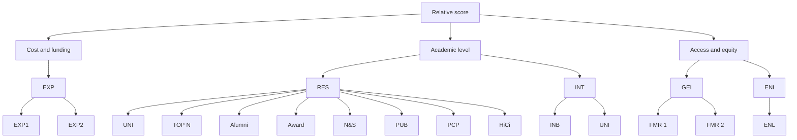

## Summary

With the promotion of world globalization and the continuous improvement of science and technology, the competition of comprehensive national strength among countries is intensifying. The health and sustainability of higher education system reflects the level of science and technology and comprehensive strength of a country. A healthy and sustainable higher education system provides talents for the country and intellectual support for the development of social science and technology. It will be rather meaningful to evaluate the health and sustainability of a nation's higher education system and learn how to make it healthier and more sustainable.

First of all, we establish a three-dimensional crosswise contrast model to evaluate the health and sustainability of a nation's higher education system. The three dimensions are cost and capital, access and equity, and academic level. For each dimension, there are one or two indices for quantification. The five indices include the Expenditure index, Gender equity index, Enrolment index, Research level and education quality index, and Internationalization index, which are calculated by 14 factors. With these 5 indices scored respectively we can calculate the total relative score of one nation's higher education system among a range of nations.

Then we apply the model to Australia, Japan, Sweden, India and the United Kingdom, and get the scores of these nations' higher education systems. Based on the result, we select India with the lowest score meaning that India's higher education system has the largest room for promotion, and put forward four five-year plans for the improvement of India's education system. The plans are designated to overcome the current shortcomings and we put forward a series of policies based on the current situation and the vision we proposed.

We modified our model into a vertical contrast model to measure the health and sustainability of India's education system every five years. After implementing all the four five-year plans, in 2037, the score of each index that used to be a shortcoming will greatly improve, and the score of India's higher education system will significantly increase.

Finally, we discuss the effectiveness of the implementation of the policy and the practical impact of the implementation of the plan in the final state. Considering the social situation and the nation-wide problems in India, we predict that the implementation of these institutional changes will be difficult.

Keywords: Higher Education system; Health; Sustainability; Crosswise contrast; Vertical contrast; Relative score; Vision; Five-year plans; Policies;

# Crosswise and Vertical Contrast Models

February 8, 2021

## Summary

With the promotion of world globalization and the continuous improvement of science and technology, the competition of comprehensive national strength among countries is intensifying. The health and sustainability of higher education system reflects the level of science and technology and comprehensive strength of a country. A healthy and sustainable higher education system provides talents for the country and intellectual support for the development of social science and technology. It will be rather meaningful to evaluate the health and sustainability of a nation's higher education system and learn how to make it healthier and more sustainable.

First of all, we establish a three-dimensional crosswise contrast model to evaluate the health and sustainability of a nation's higher education system. The three dimensions are cost and capital, access and equity, and academic level. For each dimension, there are one or two indices for quantification. The five indices include the Expenditure index, Gender equity index, Enrolment index, Research level and education quality index, and Internationalization index, which are calculated by 14 factors. With these 5 indices scored respectively we can calculate the total relative score of one nation's higher education system among a range of nations.

Then we apply the model to Australia, Japan, Sweden, India and the United Kingdom, and get the scores of these nations' higher education systems. Based on the result, we select India with the lowest score meaning that India's higher education system has the largest room for promotion, and put forward four five-year plans for the improvement of India's education system. The plans are designated to overcome the current shortcomings and we put forward a series of policies based on the current situation and the vision we proposed.

We modified our model into a vertical contrast model to measure the health and sustainability of India's education system every five years. After implementing all the four five-year plans, in 2037, the score of each index that used to be a shortcoming will greatly improve, and the score of India's higher education system will significantly increase.

Finally, we discuss the effectiveness of the implementation of the policy and the practical impact of the implementation of the plan in the final state. Considering the social situation and the nation-wide problems in India, we predict that the implementation of these institutional changes will be difficult.

Keywords: Higher Education system; Health; Sustainability; Crosswise contrast; Vertical contrast; Relative score; Vision; Five-year plans; Policies;

## Contents

## 1 Introduction 3

1.1 Background 3  
1.2 Restatment of the problem 3

## 2 General Assumption 3

## 3 Symbol Table 4

## 4 Models 4

4.1 Detailed indices 5

4.1.1 Expenditure index 5  
4.1.2 Enrolment index 5  
4.1.3 Gender equity index 6  
4.1.4 Research level and education quality index 6  
4.1.5 Internationalization index 8

4.2 Using TOPSIS-like algorithm $^{[12]}$ to build evaluation model 8

4.2.1 Crosswise contrast model 8  
4.2.2 Vertical contrast model 9

## 5 Select a higher education system with room for improvement 10

## 6 A concrete analysis of India's higher education system 11

6.1 Problems 11  
6.2 Vision and vision assessment 12

6.2.1 The proposal of vision 12  
6.2.2 Measure the health of the vision 13

6.3 Policy proposal 14

6.3.1 Promote higher education enrollment rate 14  
6.3.2 Improvement of HEIs(higher education institutions) ..... 14  
6.3.3 Internationalization 15

6.4 Policy effectiveness evaluation 16  
6.5 The practical influence and difficulty of implementing the plan ..... 16

7 Sensitivity analysis 17  
8 Strength and weakness of the models 18

8.1 Strength 18

8.2 Weakness 18

Appendices 20

Appendix A Data processing 20

## 1 Introduction

## 1.1 Background

The higher education system is an important factor in a country's efforts to further educate its citizens beyond the scope of its basic education and secondary education. As we look around the world, many developed countries take a variety of national approaches to higher education and these countries not only educate their own students, but also attract a large number of international students every year. The higher education systems of these countries have their own advantages and disadvantages. In order to further accommodate the development in the new era, the concept of healthy and sustainable system of higher education is established. Because the concept is new, there is no existing standard to describe what the healthy and sustainable system looks like actually. The institutional changes required to advance any system are difficult and require policies implemented over an extended period of time.

Therefore, it is important for us to establish a standard taking some factors into account, and with this standard to develop models to measure and assess the health of a system of higher education. Finally, we can propose and analyze a suite of policies to migrate a nation's higher education system from its current state to the healthy and sustainable state according to the models.

## 1.2 Restatment of the problem

1. Build a crosswise contrast model to assess the health and the sustainability of any country's higher education system.  
2. Apply the crosswise contrast model to several countries, from those select a country with room for improvement of higher education system according to the analysis. And put forward a realizable and reasonable vision for a healthy and sustainable higher education system.  
3. Use the vertical contrast model to measure the health and sustainability of the current system and the proposed system.  
4. Propose targeted policies and implementation schedules to support the transition from the current state to our proposed state, and use the model to evaluate the effectiveness of policies.  
5. Discuss the practical impact of implementing the plans during the migration and in the final state, and acknowledge that changes are difficult to realize.

## 2 General Assumption

1. Assume that the number of higher education institutions (HEIs) in a country is relatively stable. Generally speaking, the period for preparation of setting up a new university is long, so the number of universities will not fluctuate too much in a short term;  
2. It is assumed that there is a unified standard for defining the government's education expenditure among countries. Due to the difference of education policies, it is inevitable that different countries will adopt different standards when calculating the government's higher education investment. Therefore, in order to make the selected factors describe the model more accurately, it is necessary to unify the standards of different countries;

3. We assume that the statistics we collected from the websites and reports are reliable and accurate. The data we use in our model is mainly collected from some statistics websites such as Academic Ranking of World Universities $^{[1]}$ and Ranking Web of Universities $^{[2]}$ and reports like Project Atlas $^{[3]}$ .

4. We assume that the nations we selected to analyze have relatively stable political, social and economic environment, meaning that there will not be natural disasters like great earthquake and human disruptive events such as war, economic crisis and terrorist attacks and so on.

3 Symbol Table

<table><tr><td>Symbol</td><td>Meaning</td></tr><tr><td> $x_{ij}$ </td><td>The value of the i-th country&#x27;s j-th index</td></tr><tr><td> $y_{ij}$ </td><td>The value of the j-th index in i-th point of time</td></tr><tr><td>EXP1</td><td>Expenditure on tertiary education (% of government expenditure on education) $^{[4]}$ </td></tr><tr><td>EXP2</td><td>Government expenditure on education, total (% of government expenditure) $^{[5]}$ </td></tr><tr><td>EXP</td><td>Expenditure index</td></tr><tr><td>FMR1</td><td>Enrollment ratio of female to male in higher education institutions (\%) $^{[6]}$ </td></tr><tr><td>FMR2</td><td>Ratio of female to male of the nation (\%) $^{[7]}$ </td></tr><tr><td>GEI</td><td>Gender equity index</td></tr><tr><td>ENL</td><td>Enrollment rate of Higher Education $^{[8]}$ </td></tr><tr><td>ENI</td><td>Enrollment index</td></tr><tr><td>INB</td><td>Number of inbound international students in a country $^{[3]}$ </td></tr><tr><td>INT</td><td>Internationalization index</td></tr><tr><td>TOPN</td><td>Number of universities of a nation entering the top500 rank of ARWU $^{[9]}$ </td></tr><tr><td>RES</td><td>Research level and education quality index</td></tr><tr><td>UNI</td><td>Number of universities in a country $^{[10]}$ </td></tr><tr><td>Alumni</td><td>Alumni of an institution winning Nobel Prizes and Fields Medals</td></tr><tr><td>Award</td><td>Staff of an institution winning Nobel Prizes and Fields Medals</td></tr><tr><td>HiCi</td><td>Highly cited researchers in 21 broad subject categories</td></tr><tr><td>N&amp;S</td><td>Papers published in Nature and Science*</td></tr><tr><td>PUB</td><td>Papers indexed in Science Citation Index-expanded and Social Science Citation Index</td></tr><tr><td>PCP</td><td>Per capita academic performance of an institution</td></tr></table>

## 4 Models

We believe that a healthy and sustainable higher education system should have the following characteristics: high degree of national attention (enough government investment), high degree of popularization of higher education, high academic achievement, high degree of international recognition and no sexual discrimination. Therefore, in order to comprehensively and scientifically evaluate the health of a country's higher education system, we establish models with three dimensions: cost, opportunity and equity, academic level. Each dimension has 1 or 2 indices, and there are five indices in total, including Expenditure index, Gender equity index, Research level and education quality index, and Internationalization index. The five indices are quantified with 14 factors. The relationship between dimensions, indices and factors are shown in Figure 1.

flowchart

Figure 1: The relationship between dimensions, indices and factors

## 4.1 Detailed indices

## 4.1.1 Expenditure index

$$
E X P = E X P 1 \times E X P 2 \tag {1}
$$

Where EXP is Expenditure index, EXP1 is expenditure on tertiary education (\% of government expenditure on education), EXP2 is government expenditure on education, total (\% of government expenditure).

The Expenditure index reflects the ratio of higher education investment to government expenditure. Sufficient higher education expenditure is the capital basis to ensure the healthy and sustainable development of higher education. Generally speaking, countries with higher Expenditure index attach more importance to higher education, and their education quality is more likely to be higher than those with lower Expenditure index.

## 4.1.2 Enrolment index

$$
E N I = E N L \tag {2}
$$

Where ENI is the Enrolment index, and ENL is the enrolment rate of higher education.

The enrollment rate of higher education shows the ratio of the number of students receiving higher education in the country to the number of people in the five-year-old age group starting from the official secondary school graduation age. The higher this index is, the higher the penetration rate of higher education is, and the healthier and more sustainable the higher education in the country is. Therefore, the enrollment index is an important index to measure the health of higher education.

## 4.1.3 Gender equity index

$$
G E I = 1 - \frac {\left| \frac {F R M 1}{F R M 2} - 1 \right|}{\frac {F R M 1}{F R M 2}} \tag {3}
$$

Where FRM1 represents the enrollment ratio of female to male in higher education institutions (\%), FRM2 represents the ratio of female to male of the nation (\%), and GEI represents Gender equity index.

The Gender equity index reflects the sexual balance in higher education taking the ratio of female to male of the nation into account. Due to historical reasons, female participation in higher education in the past was relatively low. With the development of society, female have more opportunity to take part in higher education. In the case of a healthy higher education system, the enrollment of female and male is expected to be balanced.

## 4.1.4 Research level and education quality index

$$
R E S = \frac {T O P N}{U N I} \tag {4}
$$

Where RES is Research level and education quality index, TOPN is the number of universities of a nation entering the top500 rank of ARWU, UNI is the number of universities in a country.

We supposed that the higher the Research level and education quality index is, the higher education would be healthier and more sustainable. The data of the world's top 500 universities comes from Academic Ranking of world universities (ARWU). According to ARWU website, universities are ranked by several indicators of academic or research performance, including alumni and staff winning Nobel Prizes and Fields Medals, highly cited researchers, papers published in Nature and Science, papers indexed in major citation indices, and the per capita academic performance of an institution. For each indicator, the highest scoring institution is assigned a score of 100, and other institutions are calculated as a percentage of the top score. The distribution of data for each indicator is examined for any significant distorting effect; standard statistical techniques are used to adjust the indicator if necessary. Scores for each indicator are weighted as shown below to arrive at a final overall score for an institution. The highest scoring institution is assigned a score of 100, and other institutions are calculated as a percentage of the top score. An institution's rank reflects the number of institutions that sit above it $^{[11]}$ .

Indicators and Weights for ARWU

<table><tr><td>Criteria</td><td>Indicator</td><td>Code</td><td>Weight</td></tr><tr><td>Quality of Education</td><td>Alumni of an institution winning Nobel Prizes and Fields Medals</td><td>Alumni</td><td>10%</td></tr><tr><td rowspan="2">Quality of Faculty</td><td>Staff of an institution winning Nobel Prizes and Fields Medals</td><td>Award</td><td>20%</td></tr><tr><td>Highly cited researchers in 21 broad subject categories</td><td>HiCi</td><td>20%</td></tr><tr><td rowspan="2">Research Output</td><td>Papers published in Nature and Science*</td><td>N&amp;S</td><td>20%</td></tr><tr><td>Papers indexed in Science Citation Index-expanded and Social Science Citation Index</td><td>PUB</td><td>20%</td></tr><tr><td>Per Capita Performance</td><td>Per capita academic performance of an institution</td><td>PCP</td><td>10%</td></tr><tr><td>Total</td><td></td><td></td><td>100%</td></tr></table>

\* For institutions specialized in humanities and social sciences such as London School of Economics, N&S is not considered, and the weight of N&S is relocated to other indicators.

Figure 2: Indicators and weights for ARWU $^{[11]}$

And the data of these 6 indicators are obtained in complicated ways as shown below.

■ Definition of Indicators

<table><tr><td>Indicator</td><td>Definition</td></tr><tr><td>Alumni</td><td>The total number of the alumni of an institution winning Nobel Prizes and Fields Medals. Alumni are defined as those who obtain bachelor&#x27;s, master&#x27;s or doctoral degrees from the institution. Different weights are set according to the periods of obtaining degrees. The weight is 100% for alumni obtaining degrees in 2001-2010, 90% for alumni obtaining degrees in 1991-2000, 80% for alumni obtaining degrees in 1981-1990, and so on, and finally 10% for alumni obtaining degrees in 1911-1920. If a person obtains more than one degrees from an institution, the institution is considered once only.</td></tr><tr><td>Award</td><td>The total number of the staff of an institution winning Nobel Prizes in Physics, Chemistry, Medicine and Economics and Fields Medal in Mathematics. Staff is defined as those who work at an institution at the time of winning the prize. Different weights are set according to the periods of winning the prizes. The weight is 100% for winners after 2011, 90% for winners in 2001-2010, 80% for winners in 1991-2000, 70% for winners in 1981-1990, and so on, and finally 10% for winners in 1921-1930. If a winner is affiliated with more than one institution, each institution is assigned the reciprocal of the number of institutions. For Nobel prizes, if a prize is shared by more than one person, weights are set for winners according to their proportion of the prize.</td></tr><tr><td>HiCi</td><td>The number of Highly Cited Researchers selected by Clarivate Analytics. The Highly Cited Researchers list issued in November 2016 (2016 HCR List as of November 16 2016) was used for the calculation of HiCi indicator in ARWU 2017. Only the primary affiliations of Highly Cited Researchers are considered.</td></tr><tr><td>N&amp;S</td><td>The number of papers published in Nature and Science between 2012 and 2016. To distinguish the order of author affiliation, a weight of 100% is assigned for corresponding author affiliation, 50% for first author affiliation (second author affiliation if the first author affiliation is the same as corresponding author affiliation), 25% for the next author affiliation, and 10% for other author affiliations. When there are more than one corresponding author addresses, we consider the first corresponding author address as the corresponding author address and consider other corresponding author addresses as first author address, second author address etc. following the order of the author addresses. Only publications of &#x27;Article&#x27; type is considered.</td></tr><tr><td>PUB</td><td>Total number of papers indexed in Science Citation Index-Expanded and Social Science Citation Index in 2016. Only publications of &#x27;Article&#x27; type is considered. When calculating the total number of papers of an institution, a special weight of two was introduced for papers indexed in Social Science Citation Index.</td></tr><tr><td>PCP</td><td>The weighted scores of the above five indicators divided by the number of full-time equivalent academic staff. If the number of academic staff for institutions of a country cannot be obtained, the weighted scores of the above five indicators is used. For ARWU 2017, the numbers of full-time equivalent academic staff are obtained for institutions in USA, UK, France, Canada, Japan, Italy, China, Australia, Netherlands, Sweden, Switzerland, Belgium, South Korea, Czech, Slovenia, New Zealand etc.</td></tr></table>

Figure 3: Definition of indicators $^{[11]}$

## 4.1.5 Internationalization index

$$
I N T = \frac {I N B}{U N I} \tag {5}
$$

Where INT is Internationalization index, UNI is the number of universities in a country, and INB represents the number of inbound international students in a country.

The Internationalization index of a country is quantified by the ratio of total number of foreign students to the total number of universities. Although there are differences in international enrollment policies in various countries, the health of higher education is still the primary attraction to most foreign students when they are choosing which country to study in. Therefore, the Internationalization index reflects the international recognition of the nation's higher education system.

## 4.2 Using TOPSIS-like algorithm $^{[12]}$ to build evaluation model

## 4.2.1 Crosswise contrast model

The crosswise contrast model selected 5 countries and obtain the relative scores for the countries. Based on the scores, we can clearly find out which country's higher education system has the largest room for improvement (the one which gets the lowest total score). The detailed procedure is as follows.

First of all, we establish a matrix X for the indices.

$$
X = \left( \begin{array}{c c c c c} x _ {1 1} & x _ {1 2} & x _ {1 3} & x _ {1 4} & x _ {1 5} \\ x _ {2 1} & x _ {2 2} & x _ {2 3} & x _ {2 4} & x _ {2 5} \\ \vdots & \vdots & \vdots & \vdots & \vdots \\ x _ {i 1} & x _ {i 2} & x _ {i 3} & x _ {i 4} & x _ {i 5} \\ \vdots & \vdots & \vdots & \vdots & \vdots \\ x _ {n 1} & x _ {n 2} & x _ {n 3} & x _ {n 4} & x _ {n 5} \end{array} \right) \tag {6}
$$

Where $x_{ij}(i=1\sim n,j=1\sim5)$ represents the initial value of the i-th country's j-th index. In order to eliminate the influence of different dimensions of indices, we standardize the matrix. The standardization formula is as follows $^{[12]}$ .

$$
z _ {i j} = \frac {x _ {i j}}{\sqrt {\sum_ {i = 1} ^ {n} x _ {i j} ^ {2}}} \tag {7}
$$

The standardized matrix Z is obtained.

$$
Z = \left( \begin{array}{c c c c c} z _ {1 1} & z _ {1 2} & z _ {1 3} & z _ {1 4} & z _ {1 5} \\ z _ {2 1} & z _ {2 2} & z _ {2 3} & z _ {2 4} & z _ {2 5} \\ \vdots & \vdots & \vdots & \vdots & \vdots \\ z _ {i 1} & z _ {i 2} & z _ {i 3} & z _ {i 4} & z _ {i 5} \\ \vdots & \vdots & \vdots & \vdots & \vdots \\ z _ {n 1} & z _ {n 2} & z _ {n 3} & z _ {n 4} & z _ {n 5} \end{array} \right) \tag {8}
$$

Each index can have an output between the range of 0-20, meaning the healthiest and the most sustainable higher education system would have a score of 20 for each metric, which then sums to 100. Score for each index of a nation is calculated with the equation below:

$$
s _ {i j} = z _ {i j} \times 2 0 \tag {9}
$$

Total score of a nation's higher education system is:

$$
S _ {i} = \sum_ {j = 1} ^ {5} s _ {i j} \tag {10}
$$

## 4.2.2 Vertical contrast model

The vertical contrast model combines time series analysis and TOPSIS-like algorithm, using data at different time points and obtaining the relative scores for each point. With this model, we can measure the health of India's current education system and the proposed education system more accurately. Based on the analysis, the development trend is easy to analyze and we can clearly find out whether the higher education is advancing to the targeted vision. The detailed procedure is as follows.

The raw data of five indices of India in different periods are taken to form the following matrix:

$$
Y = \left( \begin{array}{c c c c c} y _ {1 1} & y _ {1 2} & y _ {1 3} & y _ {1 4} & y _ {1 5} \\ y _ {2 1} & y _ {2 2} & y _ {2 3} & y _ {2 4} & y _ {2 5} \\ \vdots & \vdots & \vdots & \vdots & \vdots \\ y _ {i 1} & y _ {i 2} & y _ {i 3} & y _ {i 4} & y _ {i 5} \\ \vdots & \vdots & \vdots & \vdots & \vdots \\ y _ {n 1} & y _ {n 2} & y _ {n 3} & y _ {n 4} & y _ {n 5} \end{array} \right) \tag {11}
$$

Where $y_{ij}(i=1\sim n,j=1\sim5)$ represents the value of the j-th index at the i-th point of time. In order to eliminate the influence of different dimensions of indices, we standardize the matrix. The standardization formula is as follows $^{[12]}$ .

$$
z _ {i j} = \frac {y _ {i j}}{\sqrt {\sum_ {i = 1} ^ {n} y _ {i j} ^ {2}}} \tag {12}
$$

The standardized matrix Z is obtained.

$$
Z = \left( \begin{array}{c c c c c} z _ {1 1} & z _ {1 2} & z _ {1 3} & z _ {1 4} & z _ {1 5} \\ z _ {2 1} & z _ {2 2} & z _ {2 3} & z _ {2 4} & z _ {2 5} \\ \vdots & \vdots & \vdots & \vdots & \vdots \\ z _ {i 1} & z _ {i 2} & z _ {i 3} & z _ {i 4} & z _ {i 5} \\ \vdots & \vdots & \vdots & \vdots & \vdots \\ z _ {n 1} & z _ {n 2} & z _ {n 3} & z _ {n 4} & z _ {n 5} \end{array} \right) \tag {13}
$$

Score for each index of a nation is calculated with the equation below:

$$
s _ {i j} = z _ {i j} \times 2 0 \tag {14}
$$

Total score of a nation's higher education system at a certain point of time is:

$$
S _ {i} = \sum_ {j = 1} ^ {5} s _ {i j} \tag {15}
$$

## 5 Select a higher education system with room for improvement

We applied the model to Australia, India, Japan, Sweden and the United Kingdom, and comprehensively considered the development level of different countries. Using the crosswise contrast model with the data in 2017 we evaluated and scored the health status of the higher education system of these five countries. The results are as follows:

stacked bar chart

| Country | EXP | GEI | ENI | INT | RES |
| :--- | :--- | :--- | :--- | :--- | :--- |
| Australia | 9.44 | 8.94 | 14.04 | 13.21 | 8.17 |
| India | 10.37 | 9.41 | 3.41 | | |
| Japan | 4.27 | 8.65 | 8.16 | | |
| Sweden | 9.85 | 8.56 | 8.32 | 5.69 | 15.71 |
| UK | 9.39 | 9.13 | 7.45 | 13.83 | 9.24 |

Figure 4: Scores of selected countries

According to the results of the model, the health status of higher education in each country was evaluated as follows: Australia 53.8, India 23.29, Japan 23.54, Sweden 48.13 and Britain 49.01. The results show that the five countries have similar scores in the balance of gender ratio in higher education, but it is still necessary to continue to promote the gender equality of higher education. Australia’s education system is relatively perfect, with relative high scores in all indices, especially in the enrollment rate of higher education, which is far ahead of the other four countries. Australia’s high investment in higher education, especially in scientific research, has brought a large number of excellent academic achievements, encouraged a large number of capable students to accept higher education, and built a number of world-class universities. The higher education system is relatively healthy, attracting international students to study in Australia. The Research level and education quality index of Sweden is far higher than that of other countries, with high academic level and strong faculty. Britain’s higher education system is also relatively healthy, with balanced development of various indices. Like Australia, the Internationalization index is high, which indicates that the higher education systems of the two countries have high international recognition and great attraction. The scores of India and Japan are low and similar. However, the scores of Japan are slightly higher, and they also occupy an advantage in the balanced development of various indicators. The scores of India’s higher education system are low, and the development of education evaluation indices is not balanced. India’s higher education system has large room for improvement. Next, we will select India to evaluate the health and sustainability of the country’s higher education and put forward a vision

for sustainable development.

## 6 A concrete analysis of India's higher education system

We compare the scores of India's indicators with the highest scores of the 5 indices of the five selected countries, as shown in figure5.

radar chart

| Category | India | Max  |
| -------- | ----- | ---- |
| EXP      | 10    | 10   |
| GEI      | 8     | 9    |
| ENI      | 3     | 14   |
| INT      | 0     | 14   |
| RES      | 0     | 14   |

Figure 5: Comparing scores of 5 indices of India with the highest scores of the 5 indices

## 6.1 Problems

Among the selected countries, India has the highest Expenditure index, but Research level and education quality index is far lower than other countries, which suggests that the ratio of education investment to academic output is seriously inconsistent, and the utilization rate and allocation efficiency of funds invested in higher education are low. The score of gender balance in higher education is slightly higher than that in other countries, and gender balance in education should continue to be promoted. However, the scores of the other three indices are extremely unsatisfactory. India's enrollment rate of higher education is low. As a country with a large population, the proportion of students receiving higher education is very low, and the penetration rate of higher education is not high. The score of Research level and education quality index is pretty low, meaning that there are few achievements of academic research and the national innovation is not strong enough. The Internationalization index is also awfully low which reflects the fact that the system is not attractive to international students enough, and acquires little international recognition, leading to brain drain. There would be a vicious circle. The development of Indian higher education system is unbalanced and completely unhealthy and unsustainable. Under the world development trend of focusing on education and talent development, India's higher education system is likely to be outrage soon. Therefore, Indian government needs to improve India's higher education system and put forward policies and standards to help realize India's sustainable development.

## 6.2 Vision and vision assessment

## 6.2.1 The proposal of vision

By analyzing the scores of India's higher education system, we can find that ENI, RES and INT are the shortcomings of India. Therefore, in order to improve India's education system and make it a healthy and sustainable higher education system, considering India's national conditions, we have formulated a feasible and reasonable vision for India's higher education system according to the three low indices. In twenty years, after implementing four five-year plans, India's higher education system is expected to reach the expected state(The starting year is 2017).

## 1. Improve the enrollment rate of Higher Education

The total number of low castes and "untouchables" in India accounts for about 70% of the total population of India. However, there is a wide gap between the higher education enrollment rates of the low-level groups and the high-level groups in India. Consequently, in order to accurately formulate a reasonable and feasible standard for India, we have designed the following scheme: Among the five countries we investigated, the highest enrollment rate is 113% in Australia. We expect that in the top 30% of India, the enrollment rate of higher education can reach 113%, while the enrollment rate of lower castes and "untouchables" is $k \times 113\%$ . The values of k in the first, second, third and fourth five years are 0.1, 0.2, 0.3 and 0.4 respectively. Thus, India's expected enrollment rate is $(0.3 + 0.7k) \times 113\%$

## 2. Improve the academic level

For the academic level, we aim to increase the number of Indian universities entering the top500. After consulting reference materials on other similar countries' development, we predicted that in the first five years, five universities will enter the top500, eight universities in the second five years, nine universities in the third five years and seven universities in the fourth five years. There are strict requirements for entering the top500 universities in the world, including that the research results, teaching staff and education quality of universities should meet certain standards. Thereby, with the continuous improvement of India's higher education system, the growth rate of the number of universities entering the top500 rank would be higher at first in theory, then decline and finally be stable.

## 3. Enhance the level of internationalization

Based on the low Internationalization index, we aim to increase the number of inbound foreign students in India. We hope that in the first five years, the number of inbound foreign students in India will increase by 7% annually on the basis of the base year. In the second five years, the number will increase by 11% annually. After that, the velocity of increase of the number will fluctuate around 5%.

## 4. Reduce the number of universities.

By abolishing or restructuring the universities, we suppose to reduce the number of universities in India by 50% in the first five years.

The implementation schedule is as follows:

  
Figure 6: Implementation schedule

## 6.2.2 Measure the health of the vision

We take the predicted data into the vertical contrast model operation, and get the score of each index and the total score of the system in current status and after implementing every five-year plan, then use the obtained scores to evaluate the health of the improved higher education system. As shown in the figure, after the implementation of our plans, the scores of each index will increase every five years and the enrollment rate, internationalization level and academic level of higher education will continue to increase. With the comprehensive development of various aspects, the health of India's higher education system has been effectively improved, and the total score will increase from 24.79 in 2017 to 57.96 in 2037.

stacked bar chart

| Year | EXP | GEI | ENI | INT | RES |
|---|---|---|---|---|---|
| 2017 | 8.94 | 8.94 | 4.89 | 1.56 | 0.00 |
| 2022 | 8.94 | 8.94 | 7.45 | 4.98 | 2.94 |
| 2027 | 8.94 | 8.94 | 8.86 | 8.39 | 6.87 |
| 2032 | 8.94 | 8.94 | 10.27 | 10.71 | 11.29 |
| 2037 | 8.94 | 8.94 | 11.68 | 13.67 | 14.72 |

Figure 7: Scores at different points of time

<table><tr><td>2017</td><td>2022</td><td>2027</td><td>2032</td><td>2037</td></tr><tr><td>24.79</td><td>33.27</td><td>42.01</td><td>50.16</td><td>57.96</td></tr></table>

Figure 8: Total score at different points of time

## 6.3 Policy proposal

In order to develop India's current higher education system to our vision. We will put forward corresponding policies according to the target and the actual situation.

## 6.3.1 Promote higher education enrollment rate

Due to the existence of caste system, higher education opportunities in India are mainly in the hands of the senior caste class, preferring to the privileged class, which is a problem left over from history and is difficult to solve. In addition, there is a large gap between the rich and the poor in India. Due to the lack of government investment (although the ratio of expenditure on tertiary education to government's total expenditure is high) and improper allocation of funds, the cost of accessing higher education is still prohibitive to the poor. The government assistance funds allocated to a person has little meaning for the rich, but far from enough for the poor. Moreover, the proportion of the poor receiving higher education is low, and most of the funds flow into the rich, while most students from poor families are forced to work to increase their family income instead of taking higher education. Because they have no chance to receive higher education, they also lose the chance to get well-paid jobs, which has exacerbated the gap between the rich and the poor, forming a vicious circle. Another reason for this vicious cycle is that the government's tax revenue is scattered among the masses, not merely among the middle class and the rich, and most of the revenue comes from the poor $^{[13]}$ . In view of these problems, we believe that the Indian government should:

1. Adjust the tax system, increase the burden on the middle and high class, and reduce the burden on the low class.  
2. Adjust the distribution mode of government funds for higher education students, and increase the support for poor students.  
3. Government higher education expenditure can be combined with private investment to increase the investment in higher education.

## 6.3.2 Improvement of HEIs(higher education institutions)

Given the low proportion of students pursuing post-graduate and doctoral degrees, the lack of qualified teachers is a further problem, even troubling the best universities in India. High entry threshold, poor incentive mechanism, strict tenure and rigid promotion mode lead to limited supply of teachers. On the other hand, the teacher evaluation system and the teacher training system are outrage, and the existing teacher level is deficient. At the same time, insufficient investment in research and inadequate industry links aggravate the limited absorption of high-quality independent research in all disciplines and the lack of innovation $^{[14]}$ . Therefore, we believe that the Indian government and relevant departments should:

1. Reorganize the universities, abolish the lowest 30% of the universities, reorganize the middle 40% of the universities by merging (we briefly suppose that two universities are merged into one universities) and sharing resources, keep the top 30% of the universities unchanged, and finally reduce the number of universities to half of the original, so as to simplify the higher education system and improve the quality of universities, and finally turn all universities into large, multidisciplinary institutions.  
2. Endow HEIs with more autonomy in finance, academy and management. Adjust the proportion of fiscal expenditure and increase academic expenditure in HEIs. The allocation of funds should be rationalized, and education spending should be transparent and precise. Meanwhile, HEIs should take the initiative to generate funds and constantly improve the operation level of funds.  
3. India's red tape is infamous which structural reform is required to cut through. It is worthwhile establishing an independent National Research Foundation, making it more convenient to provide competitive research funding and to effectively coordinate grants offered by government agencies [15].  
4. Combine the training of domestic higher education teachers with the introduction of foreign teachers to improve the level of higher education teachers. We should develop a complete teacher evaluation and training system to continuously improve teachers' professional knowledge. At the same time, international teacher exchange meeting is held to share educational experience and promote the construction of international higher education.  
5. Overhaul the curriculum, 'easier' Board exams, and make a reduction in the syllabus to retain 'core essentials' and thrust on 'experiential learning and critical thinking' $^{[16]}$

## 6.3.3 Internationalization

The weak education system, shortage of faculty and other factors lead to the low Internationalization index in India, reflecting the insufficient attraction to international students.

1. Formulate or improve relevant laws to support the internationalization of higher education, such as simplifying the procedures for studying abroad, setting up international scholarships, etc.  
2. Introduce multi-disciplinary international courses and international faculty, develop distance network learning method and promote all-round internationalization, so as to enhance academic attraction.  
3. Improve urban construction and university facilities to attract foreign students.  
4. Publicize the information of studying in India through various channels to attract foreign students.  
5. Twinning programs can be of help, where students complete part of a degree at an Indian university and another part at a foreign institution; Visa processes for visiting foreign students and scholars are supposed to be simplified; It is meaningful to encourage Indian students and faculty to go overseas for short-term programs and exchanges $^{[17]}$

6. Attract universities from among the top 100 in the world to set up campuses in India and introduce a new law that includes details of how foreign universities will operate in India $^{[16]}$ .

## 6.4 Policy effectiveness evaluation

We hope that these policies can promote the healthy development of India's higher education system. Based on the social reality, we make some adjustment on the expenditure in higher education to improve the enrollment rate. Based on the current situation of academic level, we improve the universities to increase the number of universities entering the top500 rank of ARWU. Based on the weak internationalization level, we propose some policies to improve the internationalization level and attracting international students, which is accordant to our vision. After twenty years, that is, in 2037, the comparison of each index with the current system is as follows:

radar chart

| Category | 2037 | 2017 |
| -------- | ---- | ---- |
| EXP      | 8    | 8    |
| GEI      | 9    | 9    |
| ENI      | 10   | 5    |
| INT      | 12   | 2    |
| RES      | 14   | 1    |

Figure 9: Comparing 2017 and 2037

After the implementation of the policy, on the basis of maintaining a high score in higher education investment and gender balance in education, the enrollment rate of higher education, the ratio of entering top 500 universities and the number of international students have been greatly improved, and the health and sustainability of India's higher education system have been effectively improved, which shows that the implementation of the policy is effective.

## 6.5 The practical influence and difficulty of implementing the plan

To sum up, the effective implementation of the plan can greatly improve the health of India's higher education system, and all aspects of the system of a country are closely linked. The implementation of a reform plan is bound to trigger a chain effect, which will have a huge impact on various aspects. The main impacts are as follows:

1. It would bring some impact on the caste system in India. India's original higher education was still under the grip of upper castes. It was a status stabiliser rather than an invader on status rigidities $^{[7]}$ . Our plan aims to increase the proportion of poor people in higher education and higher vocational education, and enhance their competitiveness. This is bound to strike at the control of high caste groups over absolute power and superior status, thus forming an impact on the caste system.  
2. It will improve India's tax system and optimize the mode of wealth redistribution. India's tax system distributes taxes equally among the people, but this actually violates the fair concept of wealth redistribution. We plan to increase taxes on the middle and high classes and reduce taxes on the lower classes, so as to improve the wealth redistribution model in India.  
3. India's education system will be streamlined and optimized. Increasing the support for poor students will balance the proportion of high and low castes in Indian higher education and promote the overall popularization of Indian higher education; the combination of government higher education expenditure and private investment can introduce more sources of education funds. The reorganization of colleges and universities can simplify the education system and make it run more effectively. At the same time, the establishment of a complete teacher training mode will guarantee the teaching quality of colleges and universities and ameliorate the allocation of educational resources.  
4. It will enhance Indian education's international influence. Through the simplification and improvement of the international study system, India's international education competitiveness can be promoted, thus enhance its international education influence..

If India can make a perfect transition from the current stage to the target state, India's higher education system will be fully ameliorated and become a healthy and sustainable system. This positive impact will also benefit India's scientific research, economy, politics and other aspects, and finally enhancing India's comprehensive national strength. However, we have to admit that the policies are hard to implement. During the implementation of the plan, many policies will offend the interests of the high class and some stakeholders in HEIs. The social system can't be changed in a short of period of time and the restructuring of the HEIs also required a long time. In addition, a large amount of capital investment is also needed in the process of the implementation of the plan, which is closely related to the economic development of India. Meanwhile, the top universities around the world have shown little interest in entering the Indian market. As a result, the amelioration of India's education system is likely to face many difficulties.

## 7 Sensitivity analysis

We conducted a sensitivity analysis on the five indicators. The figures of each indicator were changed by 5% and 10% and we obtain a new score for each indicator. This process illustrated a linear relationship between the scores and figures of indicators. And the total score for a higher education system also response to the five scores linearly.

## 8 Strength and weakness of the models

## 8.1 Strength

## 1. Inclusive

Our model includes 5 independent indicators which are calculated by 13 parameters, these indicators or parameters can well represent most of the major factors determining the health and sustainability of the higher education system, and make the models relatively reliable and inclusive.

## 2. Quantification

In our model, we calculate the figures of the five indicators then obtain the scores respectively and finally get the total score of a high school education system, making the evaluation of the health and sustainability of the higher education system clearer and more intuitive.

## 3. Simple but universal

The model might seems simple, however, by introducing inclusive parameters, the model can be conveniently applied to every country around the world. Therefore, our model is relatively universal.

## 4. Take advantage of comparison

Score of one education system is meaningless unless the score is obtained by comparison with other systems. For example, when calculate the score of higher education system, we select 5 countries and normalize the data then obtain the final scores of each systems. The scores have relative meanings and clearly show that which nation's higher education has room for improvement.

## 8.2 Weakness

## 1. Accuracy relies on statistics

In our model, most of statistics are acquired from some websites and reports. The accuracy of the score calculated using our model is dependent on the data.

## 2. Subjective

Some parameters using in the model are obtained subjectively. Although we have taken many government reports and development of other countries into account, the parameters seem subjective in some degree.

## 3. Disasters are not included

In our model, exigence events including nature disasters and human disruptive events are not taken into consideration. Our model is not reliable when faced with destructive disasters.

## References

[1] Academic Ranking of World Universities http://www.shanghairanking.com/ARWU2017.html

[2] Ranking Web of Universities http://www.webometrics.info/en/distribution\_by\_country  
[3] 2017 Project Atlas Infographics https://www.iie.org/en/Research-and-Insights/Project-Atlas/Explore-Data/Infographics/2017-Project-Atlas-Infographics  
[4] World Bank Open Data https://data.worldbank.org/indicator/SE.XPD.TERT.ZS  
[5] World Bank Open Data https://data.worldbank.org/indicator/SE.XPD.TOTL.GB.ZS  
[6] World Bank Open Data https://data.worldbank.org.cn/indicator/SE.ENR.TERT.FM.ZS  
[7] World Bank Open Data https://data.worldbank.org.cn/indicator/SP.POP.TOTL.FE.ZS?view=chart  
[8] World Bank Open Data https://data.worldbank.org.cn/indicator/SE.TER.ENRR  
[9] Academic Ranking of World Universities http://www.shanghairanking.com/ARWU-Statistics-2017.html  
[10] Ranking Web of Universities http://www.webometrics.info/en/distribution\_by\_country  
[11] Academic Ranking of World Universities http://www.shanghairanking.com/ARWU-Methodology-2017.html  
[12] jianshu https://www.jianshu.com/p/13f30de4e172  
[13] A. Abdul Salim. Opportunities for Higher Education: An enquiry into entry barriers. Discussion Paper No. 71. Published by: Dr K. N. Nair, Programme Co-ordinator, Kerala Research Programme on Local Level Development, Centre for Development Studies, Prasanth Nagar, Ulloor, Thiruvananthapuram. ISBN No: 81-87621-74-5  
[14] Shamika Ravi, Neelanjana Gupta, and Puneeth Nagaraj. Reviving Higher Education in India. Wednesday, November 27, 2019 https://www.brookings.edu/research/reviving-higher-education-in-india/  
[15] Expanding Indian Higher Education by Joyce Lau for Times Higher Education. August 6, 2020 https://www.insidehighered.com/news/2020/08/06/india-adopts-major-plan-higher-education-expansion  
[16] Explained: India's National Education Policy, 2020 by Ritika Chopra. January 30, 2021 https://indianexpress.com/article/explained/reading-new-education-policy-india-schools-colleges-6531603/  
[17] Plan or Pipe Dream? by Elizabeth Redden. June 21, 2019 https://www.insidehighered.com/news/2019/06/21/indias-draft-national-education-policy-outlines-ambitious-and-difficult-achieve

## Appendices

Appendix A Data processing

<table><tr><td>Country</td><td>EXP</td><td>GEI</td><td>ENI</td><td>INT</td><td>RES</td></tr><tr><td>Australia</td><td>3.65</td><td>0.94</td><td>113.142</td><td>1697.440</td><td>11.9171</td></tr><tr><td>India</td><td>4.01</td><td>0.99</td><td>27.442</td><td>10.368</td><td>0.0228</td></tr><tr><td>Japan</td><td>1.65</td><td>0.91</td><td>65.722</td><td>168.759</td><td>1.6765</td></tr><tr><td>Sweden</td><td>3.81</td><td>0.90</td><td>66.988</td><td>731.250</td><td>22.9167</td></tr><tr><td>UK</td><td>3.63</td><td>0.96</td><td>59.996</td><td>1776.755</td><td>13.4752</td></tr></table>

Figure 10: Crosswise contrast model: raw data input

<table><tr><td>Country</td><td>EXP</td><td>GEI</td><td>ENI</td><td>INT</td><td>RES</td></tr><tr><td>Australia</td><td>0.471929</td><td>0.446941</td><td>0.702211</td><td>0.660654</td><td>0.408373</td></tr><tr><td>India</td><td>0.518475</td><td>0.470714</td><td>0.170318</td><td>0.004035</td><td>0.000781</td></tr><tr><td>Japan</td><td>0.213338</td><td>0.432676</td><td>0.407901</td><td>0.065682</td><td>0.057450</td></tr><tr><td>Sweden</td><td>0.492616</td><td>0.427922</td><td>0.415758</td><td>0.284607</td><td>0.785305</td></tr><tr><td>UK</td><td>0.469343</td><td>0.456450</td><td>0.372363</td><td>0.691524</td><td>0.461765</td></tr><tr><td>Year</td><td>EXP</td><td>GEI</td><td>ENI</td><td>INT</td><td>RES</td></tr><tr><td>2017</td><td>4.01</td><td>0.99</td><td>27.44200</td><td>10.368000</td><td>0.022800</td></tr><tr><td>2022</td><td>4.01</td><td>0.99</td><td>41.86254</td><td>29.091100</td><td>0.273973</td></tr><tr><td>2027</td><td>4.01</td><td>0.99</td><td>49.78248</td><td>49.020196</td><td>0.639269</td></tr><tr><td>2032</td><td>4.01</td><td>0.99</td><td>57.70242</td><td>62.563572</td><td>1.050228</td></tr><tr><td>2037</td><td>4.01</td><td>0.99</td><td>65.62236</td><td>79.848734</td><td>1.369863</td></tr></table>

Figure 11: Crosswise contrast model: data after standardization

Figure 12: Vertical contrast model: raw data input

<table><tr><td>Year</td><td>EXP</td><td>GEI</td><td>ENI</td><td>INT</td><td>RES</td></tr><tr><td>2017</td><td>0.447214</td><td>0.447214</td><td>0.244282</td><td>0.088752</td><td>0.012251</td></tr><tr><td>2022</td><td>0.447214</td><td>0.447214</td><td>0.372650</td><td>0.249026</td><td>0.147209</td></tr><tr><td>2027</td><td>0.447214</td><td>0.447214</td><td>0.443151</td><td>0.419624</td><td>0.343487</td></tr><tr><td>2032</td><td>0.447214</td><td>0.447214</td><td>0.513653</td><td>0.535558</td><td>0.564300</td></tr><tr><td>2037</td><td>0.447214</td><td>0.447214</td><td>0.584154</td><td>0.683522</td><td>0.736044</td></tr></table>

Figure 13: Vertical contrast model: data after standardization