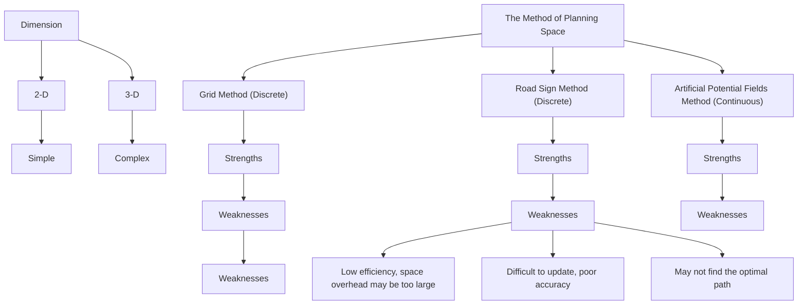
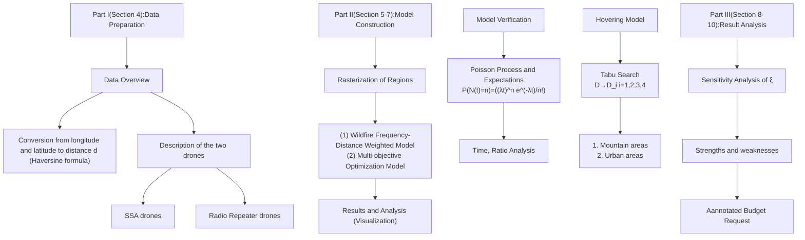
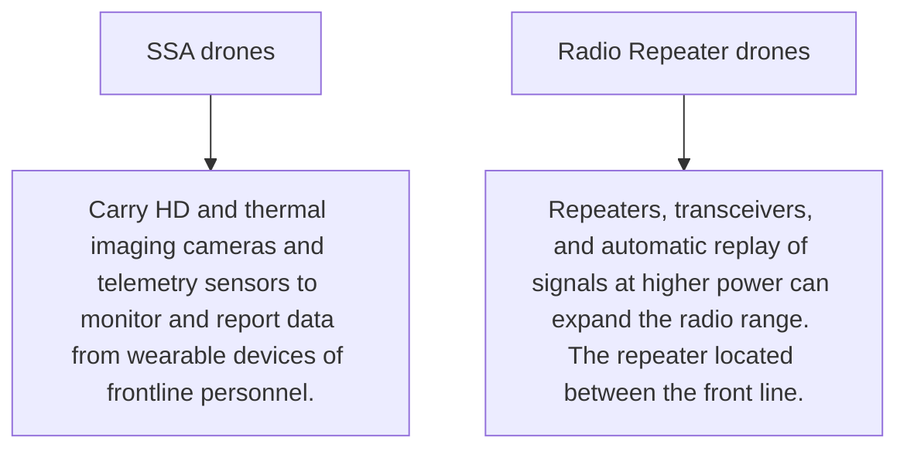
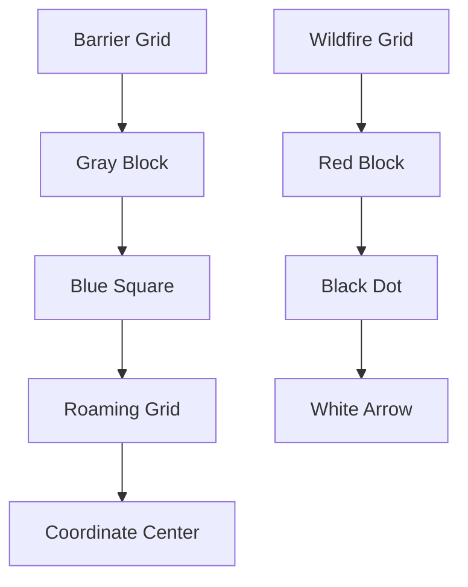
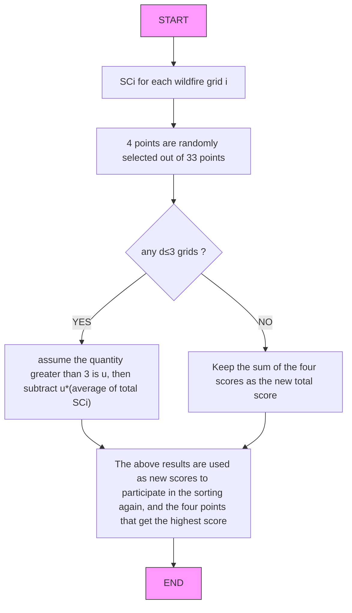

## Build an Army of Drones to Fight Wildfires

Global warming, El Niño... With the emergence of various extreme climates, Australia's wildfires occur more frequently. The greenhouse gases emitted after combustion have exacerbated global warming, which seems to have entered an endless loop. At the same time, hundreds of millions of lives have been killed in the fire, which makes us sad. In order to better control wildfires, we modeled the distribution of drones assisting in the observation to achieve the best balance between economy and efficiency.

Several models are established: Model I: Rasterized Multi-Objective Optimization Model; Model II: Model Verification Simulated by Poisson Process; Model III: Hovering Model Based on Tabu Search, etc.

Before all the models are established, we rasterize the area to be studied. Through the discrete grid, we can do better analysis. Moreover, we use a variety of visualization methods to make the results more intuitive.

For Model I: According to the heat map about distribution of fires in Victoria in recent years, we found that the main fire areas are the plains along the eastern coast. Inspired by weights and Multi-Objective Optimization algorithms, we built a brand-new model to find the best location for EOCs and draw up a suitable hover position and reconnaissance route for the drone. Based on the different positions of the fire site, calculate the maximum number of two types of drones and their ratio. The results are shown in Figure 9.

For Model II: This model is actually a supplement to Model I. In the Model I, the fire only appeared in a small area, and there was a possibility of extreme fire events in the study area. Combining the data about nearly half a century and using the Poisson Distribution to obtain the probability and mathematical expectation, it can be concluded that 2.99431 extreme fire events may occur in the next ten years, which is approximately considered to be 3 times. After that, use the mobile EOC to deal with extreme fire events, and utilize the method of Model I to rebuild the drone network to find out what equipment costs need to be increased. Due to the diversity of the results, it will be shown in section 6.2.

For Model III: To tackle the problem of how to optimize the hover position of drones in different terrains, the Tabu Search algorithm (TS) is a good choice. Using the Tabu Search algorithm can make the hover position of the drones achieve the global optimal effect under different terrain conditions. Since drone signals are severely interfered in urban areas, the reasonable distribution of EOCs enables it to quickly network to respond to sudden urban fires. The obstruction of mountainous terrain restricts the drone's flying range. Therefore, dividing the area into blocks and managing them separately can effectively improve efficiency.

In addition, because rich terrain and emergencies have been discussed in the above three models, our model has strong adaptability. Not only can it be used in the area we are studying, but it can also be used in the rest of Australia.

Finally, sensitivity analysis of the mathematical expectation of extreme fire events shows that our model is not sensitive to changes in , that is, it can be applied to areas with different extreme fire invents. Meanwhile, robustness of our model has also been tested. While adding 5% random disturbance to $d ^ { \alpha } { } _ { k i }$ and $d _ { \ k i } ^ { \beta }$ , the maximum time error is 3.2657%. The model can be considered stable. Afterwards, a Budget Request supported by our stable models has been written for CFA.

Keywords: Fighting Wildfires; Multi-Objective Optimization; Poisson Distribution; Tabu Search

Algorithm; Sensitivity Analysis

## Contents

## 1 Introduction ...

1.1 Problem Background . 3  
1.2 Restatement of the Problem . (  
1.3 Literature Review ..  
1.4 Our Work . 5

## 2 Assumptions and Explanations .

## 3 Notations .....

## 4 Model Preparation ..

4.1 Data Overview .. 6  
4.2 Conversion from longitude and latitude to distance .  
4.3 Description of the two drones . . 8

## 5 Rasterized Multi-Objective Optimization Model ... . 8

5.1 Rasterization of Regions . 8  
5.2 Wildfire Frequency-Distance Weighted Model . C  
5.3 Multi-objective Optimization Model .  
5.4 Results and Analysis 12

## 6 Model Verification Simulated by Poisson Process ..... 13

6.1 Poisson Process of Extreme Fire Events . 13  
6.2 Model Verification and Analysis . 15

## 7 Hovering Model Based on Tabu Search .

7.1 Model construction of mountains and urban areas .. 17  
7.2 Simulation Results . 18

## 8 Sensitivity and Robustness Analysis .

8.1 Sensitivity Analysis. . 19  
8.2 Sensitivity Analysis .. . 20

## 9 Evaluation of Strengths and Weaknesses ...... . 21

9.1 Strengths 21  
9.2 Weaknesses and Further Improvements . . 21

## Budget Request ... . 22

## References ...... . 24

## Appendices .. . 25

## 1 Introduction

## 1.1 Problem Background

"Just like you, I was pain and fear when the fire destroyed the land and everything : life, houses, animals and trees. But for us aborigines, what the fire burns down is our memories, our holy land, and all the things that define our identity. " said by an aborigine. In recent years, the scale of fires in Australia has become larger and larger, causing huge economic and cultural losses. With the climate warming, the probability of fire is also greatly increased, so that it cannot be ignored anymore. We can see the fire situation in Australia from the figure below:


<details>
<summary>line chart</summary>

| Month | Feb 2020-Feb 2021 |
|-------|-------------------|
| Feb   | ~5k               |
| Mar   | ~10k              |
| Apr   | ~25k              |
| May   | ~15k              |
| Jun   | ~18k              |
| Aug   | ~5k               |
| Sep   | ~15k              |
| Oct   | ~18k              |
| Nov   | ~35k              |
| Dec   | ~5k               |
| Jan   | ~2k               |
</details>

Figure 1: Fire Situation in Australia (Feb 2020 - Feb 2021)

The data above comes from the website GLOBAL FOREST WHATCH[1], The GFW Fires interactive map includes near real-time fire alerts from NASA and NOAA, real-time wind direction and air quality data, maps of concessions and forest cover, high-resolution satellite images, and geo-tagged social media conversations about where fires occur.

As can be seen above: In Australia, the peak fire season typically begins in early January and lasts 45 weeks. There were 636,731 VIIRS fire alerts reported between February 2020 and February 2021. In response to the situation above, establishing a mathematical model driven by a swarm of drones to quickly deal with forest fires is very necessary and urgent.

## 1.2 Restatement of the Problem

Wildfire is a serious natural disaster with many complexities. Through in-depth analysis and research on the background of the problem, combined with the specific constraints given, the restate of the problem can be expressed as follows:

Build a mathematical model to determine the optimal number and combination of SSA drones and Radio Repeater drones. The model should balance several factors.  
Based on the model, explain how it adapts to the changing possibilities of extreme fire events in the next ten years.

Optimize the position of hovering VHF/UHF radio repeater drones based on an improved model for fires of different sizes on different terrains.  
Considering the results obtained above, prepare one to two pages of annotated budget request and submit to the Victorian Government.

## 1.3 Literature Review

This question is mainly about mobilizing cluster drones to extinguish wildfires. In recent years, research on optimization algorithms for UAV(drone) cluster path planning is very hot, Generally, it can be divided into two parts, the Swarms of UAVs’ Path Planning Model and the Swarms of UAVs’ Path Planning Optimization Algorithm, this section mainly discusses the models that have been proposed.

 First of all, in terms of the dimensionality of the space: In[2] HU et al. sets the planning space to three dimensions. However, in order to simplify the model, more authors tend to consider the space as two dimensions[3].  
 Secondly, in terms of the method of planning space: the commonly used methods include Grid Method[4], Road Sign Method, and Artificial Potential Fields Method.  
 Finally, the objective function of the UAV Cluster Path Planning Model generally uses flight distance, threat cost, etc. For example, Xu et al. [5] takes the weighted sum of threat cost and time cost as the optimization target. What’s more, Constraints often include selfconstraints and environmental constraints, such as flight speed and geographic altitude.  
 The strengths and weaknesses of the planning space can be visually presented and is shown below:


<details>
<summary>flowchart</summary>


</details>

Figure 2: Literature Review Framework

## 1.4 Our Work

The problem requires us to fight fires by optimizing the locations of two type of drones. Our work mainly includes the following:

1) Based on the data of wildfires, a rasterized Multi-Objective Optimization Model is established;  
2) The mixture of the two drones is given and the extreme fire events is considered;  
3) Based on the verification model simulated by Poisson process and the hovering model based on Tabu Search, this article effectively demonstrates the validity and applicability.

In order to avoid complicated description, intuitively reflect our work process, the flow chart is shown in Figure 3:


<details>
<summary>flowchart</summary>


</details>

Figure 3: Flow Chart of Our Work

## 2 Assumptions and Explanations

Considering that practical problems always contain many complex factors, first of all, we need to make reasonable assumptions to simplify the model, and each hypothesis is closely followed by its corresponding explanation:

Assumption 1: Only the influence of terrain on the drone is considered, and other factors such as temperature, humidity, and atmosphere are ignored.

Explanation: The UAV's radiation communication range is only affected by terrain factors, and other factors are minimal. In fact, these factors affect each other, but in order to simplify the model ,we ignore the interactions between these factors.

Assumption 2: The location of the EOC can be deployed around the fire due to an emergency.

Explanation: The position of the EOC is not clearly given in the question. So, we assume that EOC can be set in a fire-free area around the wildfire site, since the glossary of the problem said that mobile EOC can be deployed near the site of an emergency.

Assumption 3: The "boots-on-the-ground" forward teams can be approximated as near the fire site.

Explanation: The actual movement of the team is very complicated, and it is difficult to accurately calculate its position. Therefore, it is assumed that the squad is near the fire field and the drone arrives at the fire field to establish a connection with the squad.

Assumption 4: The collected data can be considered reliable and can reflect the changing laws of the Victorian wildfire.

Explanation: The historical Victorian wildfire data, latitude, longitude and other data come from authoritative websites, such as the official website of FEC in Australia and NASA, with high accuracy.

Additional assumptions are made to simplify analysis for individual sections. These assumptions will be discussed at the appropriate locations.

## 3 Notations

Some important mathematical notations used in this paper are listed in Table 1.

Table 1: Notations used in this paper

<table><tr><td>Symbol</td><td>Description</td></tr><tr><td> $x_{i}$ </td><td>Longitude within the i-th Wildfire Grid</td></tr><tr><td> $y_{i}$ </td><td>Latitude within the i-th Wildfire Grid</td></tr><tr><td> $\Omega_{i}$ </td><td>The area of the i-th grid</td></tr><tr><td> $d_{ki}$ </td><td>the distance  $d_{ki}$  between the k-th roaming grid and the i-th grid</td></tr><tr><td> $SC_{k}$ </td><td>Score for evaluating the k-th wildfire grid</td></tr><tr><td> $x^{(\alpha)}{}_{ki}$ </td><td>the  $SSA_{\alpha}$  drone sent by the k-th EOC to the i-th wildfire grid</td></tr><tr><td> $x^{(\beta)}{}_{ki}$ </td><td>the  $RR_{\beta}$  drone sent by the k-th EOC to the i-th wildfire grid</td></tr><tr><td> $t_{fly}^{\delta}$ </td><td>The flight time of drones ( $\delta = \alpha$  or  $\beta$ )</td></tr></table>

Note: There are some variables that are not listed here and will be discussed in detail in each section.

## 4 Model Preparation

## 4.1 Data Overview

The question did not provide us with data directly, so we need to consider which data to collect in the model building. Through the analysis of the problem, we need to collect the relevant information of Victoria, Australia, such as latitude and longitude, altitude, number of wildfires and so on. Due to the large amount of data, it is not convenient to list them all, so visualizing the data for display is a good method.

## 4.1.1 Data Collection

The official website of FEC in Victoria, Australia was queried and lots of data about wildfires were obtained. And other data sources are shown in Table 2.

Table 2: Data and Database Websites

<table><tr><td>Database Names</td><td>Database Websites</td></tr><tr><td>Fire Alerts</td><td>https://www.globalforestwatch.org/map/</td></tr><tr><td>Altitude</td><td>https://search.earthdata.nasa.gov/search</td></tr><tr><td>Latitude and Longitude</td><td>https://www.kaggle.com/carlosparadis/fires-from-space-australia-and-new-zeland/data</td></tr><tr><td>Google Scholar</td><td>https://scholar.google.com/</td></tr><tr><td>Maps</td><td>© 2021 Mapbox © OpenStreetMap</td></tr></table>

## 4.1.2 Data Screening

Judging from the map of Victoria in Figure 4 (right), the eastern region is mainly forest, while the western region is almost no forest. Furthermore, to demonstrate better the situation of wildfires, we plot over a heat map in Figure 4 (left).

Considering the heat map we made, it shows the number of wildfires in various states of Victoria from 2012 to 2021, the darker the color, the greater number of fires. Although fires have also occurred in the western region, the number of eastern regions is much higher than that in the western region.


<details>
<summary>choropleth map</summary>

| Region | Sum(A Alert Count) |
| --- | --- |
| Central Florida | 1200 |
| Southwest Texas | 850 |
| Northeast Texas | 700 |
| Southeast Florida | 650 |
| Midwest Florida | 600 |
| Mountain West Texas | 550 |
| Pacific Northwest | 500 |
| Southern California | 450 |
| Northern California | 400 |
| Texas | 350 |
| Florida | 300 |
| New York City | 250 |
| Pennsylvania | 200 |
| Ohio | 150 |
| Michigan | 100 |
| Illinois | 50 |
| Georgia | 25 |
| North Carolina | 20 |
| Virginia | 15 |
| Tennessee | 10 |
| Kentucky | 5 |
| Alabama | 2 |
| Mississippi | 1 |
| Louisiana | 0.5 |
| Arkansas | 0.25 |
| Oklahoma | 0.1 |
| West Virginia | 0.05 |
| Maine | 0.025 |
| Mississippi Delta | 0.01 |
| South Dakota | 0.005 |
| Nebraska | 0.0025 |
| Kansas | 0.001 |
| Minnesota | 0.0005 |
| Iowa | 0.00025 |
| Missouri | 0.0001 |
| Montana | 0.00005 |
| North Dakota | 0.000025 |
| South Dakota | 0.00001 |
| Nebraska | 0.000005 |
| Kansas | 0.0000025 |
| Oklahoma | 0.000001 |
| Montana | 0.0000005 |
| North Dakota | 0.00000025 |
| South Dakota | 0.0000001 |
| Nebraska | 0.00000005 |
| Kansas | 0.000000025 |
| Oklahoma | 0.00000001 |
| Montana | 0.000000005 |
| North Dakota | 99.9999999999999999999999999999999999999999999999999999999999999999999999999999999999999999999999999999<nl> |
</details>


<details>
<summary>text_image</summary>

Bredige Airport
Australian Capital Territory
Victoria
Melbourne
</details>

Figure 4: Data Screening

Through the heat map above, when building the model, a reasonable choice of the size of the area can be made, because the main problem needs to be solved is the emergency treatment of wildfires, so we take the eastern part as the model building area. Bendigo Airport (36.7346S,144.3305E) has been chosen as the boundary of the division, using this longitude as the basis for division, and keep the eastern part, especially taking Southeast Coastal Area into consideration.

## 4.2 Conversion from longitude and latitude to distance

Haversine formula can determine the distance between the two places. It can well reflect the influence of the curvature of the earth and is a common way to determine the distance between the two places with given latitude and longitude in geography[6], seen in the equation(1):

$$
d = 2 \operatorname{Rarcsin} \left(\sqrt {\sin^ {2} \left(\frac {\varphi_ {2} - \varphi_ {1}}{2}\right) + \cos (\varphi_ {1}) \cos (\varphi_ {2}) \sin^ {2} \left(\frac {\lambda_ {2} - \lambda_ {1}}{2}\right)}\right) \tag {1}
$$

Where R represents the radius of the earth, $\mathcal { P } _ { 1 }$ and $\varphi _ { 2 }$ indicates the latitude of the two places, $\lambda _ { 1 }$ and $\lambda _ { 2 }$ express the longitude of them, d is the distance between the them.

## 4.3 Description of the two drones

Although the two types of drones have different names, they all use the same drone, but they have different equipment and functions. The following part refers to Radio Repeater drones as RR drones. A brief schematic diagram is shown in Figure 5:


<details>
<summary>flowchart</summary>


</details>

Figure 5: Two Types of Drones

## 5 Rasterized Multi-Objective Optimization Model

## 5.1 Rasterization of Regions

The work of the predecessors has given us some inspiration. For this problem, we should first determine its spatial model[7]. The purpose is to use a mathematical model to express the actual physical environment, which is convenient for computer processing. According to the survey results in the literature review, this article uses grid method to tackle the problem.

Therefore, the grid label N of any point can be expressed as:

$$
N = I N T \left(\frac {x}{G _ {\mathrm{s}}}\right) + M \times I N T \left(\frac {y}{G _ {s}}\right) \tag {2}
$$

where $( x , y )$ is the coordinate of a potential place, the abscissa represents the longitude and the ordinate represents the latitude, is the grid size, $G _ { \mathrm { s } }$ $M = \frac { x _ { m a x } } { G _ { s } } , \ x _ { m a x }$ Gs , is the maximum length of the horizontal axis.

Further, the coordinates of the grid center position can be obtained:

$$
\left\{ \begin{array}{l} x _ {G} = (N \% M) \cdot G _ {s} + \frac {G _ {s}}{2} \\ y _ {G} = I N T (N / M) \cdot G _ {s}, + \frac {G _ {s}}{2} \end{array} \right. \tag{3}
$$

The grid is divided into three types, Barrier Grid, Roaming Grid and Wildfire Grid, the specific introduction is as follows:

 Barrier Grid: The grid of obstacles is used to represent the mountains in the actual map. Because the flying height of drones is limited, it is very difficult to fly over areas with high altitude. Therefore, grids with altitude exceeding a certain limit are transformed into grids of obstacles. This grid cannot be reached by any drones.  
 Roaming Grid: The roaming grid is a location for emergency mobile EOC settings, that is, in the event of a big fire, the EOC can be set up in the roaming grid.  
 Wildfire Grid: As the name suggests, the grid where the wildfire occurs is called the wildfire grid, which is the place that the SSA drones will fly to.

These Grids can be easily visualized by Figure 6:


<details>
<summary>flowchart</summary>


</details>

Figure 6: Three types of grids

## 5.2 Wildfire Frequency-Distance Weighted Model

Firstly, the map of eastern Victoria is rasterized, and the grid size is = 10km. Secondly, the frequency of forest wildfires is the key data for establishing the drone swarm model. Through the Frequency-Distance Weighted Model, we can obtain the EOCs around the wildfires. Due to the limited pages, the paper presents the southeast area (147.2915\~149.1503E, 35.8000 \~ 39.1005S) with the largest number of wildfires.

Furthermore, the results of the number of drones in this area will be given in section 5.4. Although the results are given for this area, the model is extensible and can be easily extended to all areas of Victoria. Firstly, the heat map drawn by Python after rasterization is plotted as shown in Figure 7:

  
Figure 7: Heat map after Rasterization

The blue grid represents the roaming grid surrounding the yellow wildfire grid. There is no barrier grid in this terrain, so it will temporarily not be considered here. Altitude is assumed to be the same. In practice, there is a slight difference, but it is understandable to make some simplifications.

It can be seen that after rasterization, the discrete model is a bit more convenient to solve. In Table 3, we give some of the data searching from the website:

Table 3: Latitude and longitude data of VIIRS

<table><tr><td>latitude</td><td>longitude</td><td>bright_ti4</td><td>scan</td><td>instrument</td><td>version</td><td>daynight</td></tr><tr><td>-37.5296</td><td>143.4565</td><td>344.8</td><td>0.54</td><td>VIIRS</td><td>1.0NRT</td><td>D</td></tr><tr><td>-38.0547</td><td>143.9076</td><td>329.8</td><td>0.51</td><td>VIIRS</td><td>1.0NRT</td><td>D</td></tr><tr><td>-38.0593</td><td>143.9081</td><td>339.4</td><td>0.51</td><td>VIIRS</td><td>1.0NRT</td><td>D</td></tr><tr><td>-38.0566</td><td>143.9038</td><td>336.7</td><td>0.52</td><td>VIIRS</td><td>1.0NRT</td><td>D</td></tr><tr><td>-38.0562</td><td>143.9098</td><td>327.7</td><td>0.52</td><td>VIIRS</td><td>1.0NRT</td><td>D</td></tr><tr><td>...</td><td>...</td><td>...</td><td>...</td><td>...</td><td>...</td><td>...</td></tr></table>

Note: The longitude and latitude will be used in the data, and one occurrence represents a wildfire in the place, total amount of the data is $S _ { V I I R S }$ .

Through data processing, we can get the relevant statistical data information in this area for the simulation. For the -th wildfire grid, suppose the frequency of it is $N _ { i }$ , when the longitude and latitude $( x _ { i } , y _ { i } ) \in \varOmega _ { i }$ , should be increased by 1, so it can be expressed as following:

$$
N _ {i} = N _ {i} + 1, \text {   if   } (x _ {i}, y _ {i}) \in \Omega_ {i} \& j \in (1, S _ {V I I R S}) \tag {4}
$$

Where represents the -th row of Table 3 for traversing, $i \in ( 1 , \psi )$ , represents the number of the wildfire grid in Figure 8. Eq. (4) can get the total fire frequencies of each grid. Therefore, combined with the distance $d _ { k i }$ between the -th roaming grid and the -th grid, the value of quantitative index $S C _ { k }$ can be modified as:

$$
S C _ {k} = \sum_ {i = 1} ^ {\psi} N _ {i} \cdot \frac {1}{d _ {k i}} \quad k \in (1, 3 3) \tag {5}
$$

The larger $S C _ { k }$ , the EOC should be more likely to set up for the -th roaming area.

Through Eq. (5), the descending scores of 33 roaming grids can be obtained. Since the eastern region has a large span, and the question requires rapid forest fire response, 2\~3 EOCs are not enough to form a communication network in a short time. Considering the construction cost of EOC, we select the top 4 EOCs.

Furthermore, the EOC distribution obtained by this sorting alone is relatively concentrated, and the balance is not considered, so the following algorithm is used to improve it. This algorithm can be viewed in the flowchart in Figure 8:


<details>
<summary>flowchart</summary>


</details>

Figure 8: Algorithm to select EOCs

Using this method, the best EOCs can be found more reasonable and accurate, the results would be given in 5.4.

## 5.3 Multi-objective Optimization Model

The Multi-objective Optimization Model is an model that uses mathematical programming methods to determine the optimal solution. In this question, it is under the established goals (such as minimum cost and shortest distance) and given constraints (such as flight time and radiation range) , determine how to effectively deal with drone’s resources and solve the problem of the best combination of SSA drones and RR drones.

## Decision Variable

The labels of the SSA drones and RR drones are and $\beta , \ x ^ { ( \alpha ) } { } _ { k i }$ represents the drone sent by the k-th EOC to the i-th wildfire grid. Similarly, $\boldsymbol { x } ^ { ( \beta ) } { } _ { k i }$ represents the $R R _ { \beta }$ that was dispatched by the k-th EOC to the i-th wildfire grid; both of them can only be 0 and 1, which is $x ^ { ( \alpha ) } { } _ { k i } = 0 \ o r \ 1 , x ^ { ^ { ( \beta ) } } { } _ { k i } = 0 \ o r \ 1 ; \alpha , \ \beta \in \mathbb { N } ^ { + }$ ;

## Objective Function

The two goals can be attributed to the smallest number of drones and the shortest time.

The mission scenario is to put out a bushfire quickly. Therefore, the requirement of drone execution efficiency is very high, so one optimization goal should be set as the minimum time to complete the Rapid Bushfire Response; and the completion time can be expressed by minimizing the maximum flight distance of each drone, so the first objective function is:

$$
\min \max \sum \left(d _ {k i} ^ {\alpha} \cdot x _ {k i} ^ {(\alpha)} + d _ {k i} ^ {\beta} \cdot x _ {k i} ^ {(\beta)}\right) \quad k = k _ {1}, k _ {2}, k _ {3}, k _ {4} \tag {6}
$$

$k _ { 1 } , k _ { 2 } , k _ { 3 } , k _ { 4 }$ are the roaming grids that selected by simulation. It will be shown in section 5.4. Eq.(6) reflects that the minimization of the maximum firefighting distance of the k-th EOC can be presented by the sum of the two types of drone's dispatch label and its corresponding distance.

The other goal is to minimize the number of drones deployed, since $\boldsymbol { x } ^ { ( \alpha ) } { } _ { k i }$ 2 and x(β) $\boldsymbol { x } ^ { ( \beta ) } { } _ { k i }$ can only be 0 and 1, so the sum of them is the total number of drones:

$$
\min \sum x _ {k i} ^ {(\alpha)} + x _ {k i} ^ {(\beta)} \quad k = k _ {1}, k _ {2}, k _ {3}, k _ {4} \tag {7}
$$

There are two common methods to deal with multi-objective optimization, i.e. staged optimization and weighted optimization. Considering the time cost, the weighted method has been chosen to deal with the problem. Therefore, from (6),(7), we have Eq.(8):

$$
\min \max \left[ \mu \sum \left(d _ {k i} \cdot x _ {k i} ^ {(\alpha)} + d _ {k i} \cdot x _ {k i} ^ {(\beta)}\right) + (1 - \mu) \left(\sum x _ {k i} ^ {(\alpha)} + x _ {k i} ^ {(\beta)}\right) \right] \cdot \xi \tag {8}
$$

Where $0 < \mu < 1$ , the parameter will be optimized by simulation, of course, their order of magnitude should have been taken into consideration. $\xi$ reflects the proportion of drones that need to be added when a extreme fire events comes, normally, $\xi \geqslant 1$ .

## Constraints

The time constraint requires that the working time of drones should not exceed its working time after charging once. Subject to the constraint by (9):

$$
\left\{ \begin{array}{l} t _ {f l y} ^ {\delta} + t _ {h o v e r} ^ {\delta} \leqslant 2. 5 h \\ t _ {f l y} ^ {\delta} = \frac {d _ {k i}}{v} \end{array} \right. \tag {9}
$$

Where, ${ t _ { f l y } } ^ { \delta }$ t fly and $t _ { h o v e r } { } ^ { \delta }$ are flight time and hover time, respectively. refers to the speed of the drones, $\delta = \alpha o r \beta$ . If the drone is about to run out of power, it needs to be returned to the EOC for charging. Assuming that when the drone at a certain location needs to return, there will be a drone from EOC to take over. The distance constraints can be expressed as:

$$
\left\{ \begin{array}{l} d _ {k i} ^ {\beta = 1} \leqslant 3 0 \\ d _ {k i} ^ {\delta} \leqslant 2 0 \end{array} \quad i \in \mathbb {N} ^ {+}, k = k _ {1}, k _ {2}, k _ {3}, k _ {4}; \right. \tag {10}
$$

$$
\delta = \alpha o r \beta \& \beta \neq 1
$$

There are also other constraints, for example, in view of the terrain, the altitude restriction et al. should be added. However, due to the limited pages, there is no way to give them all in the article; the simulation results will be directly given in the next section.

## 5.4 Results and Analysis

We use Python for simulation, the intermediate process is a bit complicated and will not be redundantly given in this part; the results of the region are displayed directly as Figure 9:


<details>
<summary>text_image</summary>

EOC
Radio Repeater drone
SSA drone
</details>

Figure 9:The results of Problem1

The Figure 9 shows the number of EOCs, RR drones and SSA drones under the condition that the farthest distance each EOC could manage, which means that the reflects the maximum number of drones dispatched when rapid response is required in the event of a wildfire in the area. This can be used as the total number of drones in the area.

The range in the red circle indicates the area that can be covered by drones. By analyzing the above figure, we can find: Most of the fire area can be effectively covered, and this is the path planning for the worst case of the fire location. When the fire is closer to the EOC, fewer drones can be used to complete the task. A total of 4 SSA drones and 4 RR drones were dispatched throughout the region. The ratio of the two types of drones is close to 1:1. Considering the time required for charging, a total of 8 SSA drones and 8 repeater drones are required in the area

## 6 Model Verification Simulated by Poisson Process

## 6.1 Poisson Process of Extreme Fire Events

The possibility of extreme fire events in the next decade can be predicted by the occurrence of such events in the past few decades. Detailed data on extreme fire incidents in Australia in previous years were found on website[8].

In [9], the author presents a general statistical methodology for the prediction of forest fires in the context of Poisson models. The article has inspired us for model building.

Poisson distribution is a discrete probability distribution commonly seen in statistics and probability. Therefore, we use the Poisson distribution model to predict the number of extreme fire events in the next ten years:

$$
P (N (t) = n) = \frac {(\lambda t) ^ {n} e ^ {- \lambda t}}{n !} \tag {11}
$$

represents the average occurrence rate of extreme fire incidents per unit time (here set to 10 years), that is, fire incidents frequency; N(t) represents the number of occurrences of the event within t, n and N(t) share the same meaning; e is natural constant.

According to the obtained sets of extreme fire incidents data, we can obtain the expression of :

$$
\lambda = \frac {1}{\Theta} \sum_ {z = 1} ^ {\Theta} \frac {n _ {z}}{t} \tag {12}
$$

Put it into Eq.(11) and use the idea of traversal to find the probability distribution of n from 1 to 10.

Because there is no function to directly calculate the Poisson distribution in Python, we design our own algorithm to calculate the probability density distribution. The pseudocode is as follows:

Algorithm : Probability distribution of extreme fire events  
Input: $t, x_{i}$ ( $i = 1, 2 \cdots$ )

Output: $p(x, t, n)$ for k = 1 to 10000 do

According to $x_{i}, t$ , the parameter $\lambda$ of Poisson distribution can be calculated

Randomly select an integer a from the aggregate $A = \{0, 1, 2 \cdots 9, 10\}$ The probability of a in the entire dataset can be predicted based on the Poisson distribution

Then the probability is recorded as $p(x, t, a)$ end

Draw the probability density distribution of extreme fire events

Through simulation, the probability density distribution is shown in Figure 10:


<details>
<summary>histogram</summary>

| N(t) | p(N(t)) |
|------|---------|
| 0    | 0.05    |
| 1    | 0.15    |
| 2    | 0.22    |
| 3    | 0.21    |
| 4    | 0.17    |
| 5    | 0.10    |
| 6    | 0.05    |
| 7    | 0.02    |
| 8    | 0.01    |
| 9    | 0.005   |
| 10   | 0.002   |
| 11   | 0.001   |
| 12   | 0.001   |
| 13   | 0.001   |
| 14   | 0.001   |
</details>

Figure 10: The Probability Density Distribution of Extreme Fire Events

It can be seen from Figure 10 that the position with the highest probability density is roughly between 2 and 4, and the average number of occurrences can be accurately calculated by the mathematical expectation in the above figure.

Mathematical expectations, also written as mean, can represent the number of extreme fires that may occur in Victoria in the next 10 years. It is recorded as $\xi$ , and its expression is as follows:

$$
\xi = \sum_ {n = 1} ^ {1 0} n \cdot p (N (t) = n) = \sum_ {n = 1} ^ {1 0} \frac {(\lambda t) ^ {n} e ^ {- \lambda t}}{(n - 1) !} \tag {13}
$$

Substituting relevant variables into Eq. (13), the result is 2.99431, To simplify the problem, take $\xi = 3 . \xi$ reflects the proportion of drones that need to be added when an extreme fire events come in Eq. (8). After substituting the influence factor $\xi$ into the Multi-objective Optimization Model, via simulation, the result will be shown in section 6.2.

## 6.2 Model Verification and Analysis

Substituting the parameters into the model we have established in 5.3, we can simulate the new drone path and the result of the assigned quantity. Considering that the occurrence of extreme fires is mainly manifested as an increase in the area of overfire, we will give simulation results under 1 to 10 times size of the unit area (unit area means area in the 5.3 model).

Cubic Spline Interpolation can be used to smooth the curve. It is defined as follows:

For the interval $[ p , q ]$ $( p = 1 , q = 1 0 )$ , $p = S _ { o } < S _ { I } < . . . < S _ { n } = q$ , these n+1 nodes and the function values at these points $f ( S _ { i } ) = y _ { i } ( i { = } 0 , 1 , . . . , n )$ , $y _ { i }$ is the dependent variable we need to study. if the function $g ( S )$ satisfies three conditions, then $g ( S )$ is the cubic spline interpolation function of with respect to n nodes.

The biggest advantage of using it is when the density of interpolation nodes gradually increases, the cubic spline interpolation function converges not only to the function itself and its derivative, but also to the derivative of the function, which is better than polynomial interpolation.

Due to the large number of path diagrams obtained but limited pages, what we need to focus on is how to verify the rationality and analysis of the model; so we directly give the curves with the area of the wildfire as follows:

##  From the perspective of quantity


<details>
<summary>line chart</summary>

| S/times of unit area | RR  | SSA |
| --------------------- | --- | --- |
| 1                     | 8   | 8   |
| 2                     | 18  | 9   |
| 3                     | 26  | 10  |
| 4                     | 32  | 12  |
| 5                     | 36  | 16  |
| 6                     | 39  | 21  |
| 7                     | 41  | 27  |
| 8                     | 42  | 35  |
| 9                     | 43  | 45  |
| 10                    | 43  | 56  |
</details>

Figure 11 Number of the two drones

1.In terms of the number of the two kinds of drones, when the fire area begins to increase, the number of RR drones grows faster. Probably because with the expansion of the fire area, more repeaters are needed to communicate to establish the connection between the front team and EOC.  
2.However, when the fire area exceeds equal to or even greater than 9 times, the number of SSA drones exceeds that of RR drones, and the growth rate is increasing. The number of RR drones is almost unchanged. Through the observation and inference of the path, we guess that it may be because the fire area is too large and more SSAs are required for detailed detection. Since one RR drone can communicate with multiple SSA drones, after the fire area increases to a certain degree, the area has been fully covered by RR drones, so basically only SSA drones continue to grow.

 From the perspective of time and ratio  


<details>
<summary>line chart</summary>

| S/times of unit area | time to cover all area |
| --------------------- | ---------------------- |
| 1                     | 1.0                    |
| 2                     | 1.1                    |
| 3                     | 1.25                   |
| 4                     | 1.15                   |
| 5                     | 1.15                   |
| 6                     | 1.17                   |
| 7                     | 1.18                   |
| 8                     | 1.2                    |
| 9                     | 1.15                   |
| 10                    | 2.0                    |
</details>


<details>
<summary>line chart</summary>

| S/times of unit area | Ratio of RR to SSA |
| --------------------- | ------------------ |
| 1                     | 1.0                |
| 2                     | 2.0                |
| 3                     | 2.7                |
| 4                     | 2.7                |
| 5                     | 2.3                |
| 6                     | 1.9                |
| 7                     | 1.6                |
| 8                     | 1.3                |
| 9                     | 1.0                |
| 10                    | 0.8                |
</details>

Figure 12:Time to Cover and Ratio of RR to SSA

## From Figure12 (left), it can be seen that:

1. At the beginning, the time to cover the fire area rose rapidly, exceeding 1.2 times compared with the original time.  
2. However, when the burned area is increased from 3 times to 4 times, the time to deploy drones decreases briefly. This may be because the geometric distribution of drones under this area can be optimized for a shorter time.  
3. When increasing from 4 times to 8 times, the coverage time of drones only slowly increases, reaching a state of equilibrium with the overfire area.  
4. Continue to increase the burned area, the coverage time is growing rapidly. We suspect that the out of control has led to an increase in the number of SSA drones and a longer deployment time.

## From Figure12 (right), it can be seen that:

The ratio of the two drones changes with the burned area. The ratio curve first rises and then falls. This provides a good basis for CFA to provide the ratio of two kinds of drones. After judging the fire area observed by satellite, when the number of two kinds of drones is equipped, the optimal effect can be obtained by following the ratio.

Of course, our model is not perfect, and more factors can be considered to make the analysis more accurate. However, within the allowable range of error, we can draw the conclusion

that:

1. The cost of RR drones will increase compared to SSA drones under the premise when the burned area does not increase much;  
2. When the burned area exceeds a certain limit, SSA drones’ costs will highly increase.

## 7 Hovering Model Based on Tabu Search

Since the first question has already discussed the hovering situation and distribution of drones in plain areas, the plain terrain of eastern Victoria will not be discussed in this model. We will focus on mountain areas and urban areas.

ALTITUDINAL MAP OF VICTORIA  


<details>
<summary>choropleth map</summary>

| Range         | Color  |
| ------------- | ------ |
| 0 - 150 m     | Yellow |
| 600 - 1200 m  | Green  |
| 150 - 300 m   | Pink   |
| above 1200 m  | Black  |
| 300 - 600 m   | Cyan   |
</details>

Figure 13:Altitudinal Map of Victoria[10]

There are some additional assumptions to simplify analysis for the question.

Hypothesis 1: Since the signal attenuation rate of the radio in the city is 50%, we also consider the signal attenuation rate of the repeater to be 50%.  
Hypothesis 2: In mountainous terrain, due to the complex terrain, the signal of the repeater will drop as the flying height of the drone rises. We assume that it is a linear relationship.  
Hypothesis 3: According to the information obtained on the Internet[11], the maximum flight altitude of the drone does not have the ability to directly cross mountain peaks. We assume that its maximum flight altitude threshold is 800m.

Considering the page constraint, the article can not discuss all the cities and mountains in eastern Victoria. We focus on selecting the mountains and the famous city Melbourne in the diagram given by the problem to construct and optimize the model. Due to the altitude limitation of drones, we will deploy EOCs on the north and south sides of the mountains, and their drones will not bypass the mountains for relay and detection missions.

## 7.1 Model construction of mountains and urban areas

For the optimization of the hovering position of RR drones, Tabu Search(TS) is undoubtedly a suitable algorithm. We still follow the grid method in question 1, set the grids with boundary intersection lines as mutual neighborhoods, that is, for any grid , the neighborhood grid can be understood as the neighborhood mapping on .Determine the four neighborhoods

as $\{ D _ { 1 } , D _ { 2 } , D _ { 3 } , D _ { 4 } \}$ . the expression is:

$$
D \rightarrow D _ {i} i = 1, 2, 3, 4 \tag {14}
$$

For the optimal hovering position of the repeater drone, considering economic factors and efficiency, the grid that is closest to the line between the grid where is located and the grid which the fire source is located in can be considered to have the highest temporary evaluation value. Put it into the candidate set. By analogy, we can integrate a temporarily considered optimal path, and calculate the cost of $\omega _ { 1 }$ .

Since this process completely follows the principle of local optimality, over-fitting may occur. We go back to the root node , and at the same time list $D _ { 1 }$ that has just been selected as a taboo object, and put it in the taboo table and have a discussion. Select an element in the remaining neighborhood to enter the candidate set, repeat the above algorithm again, and calculate the cost $\omega _ { 2 }$ .

We define that grid is needed to walk from to a certain grid, and set it as the -th neighborhood map on . When the first level of neighborhood mapping is completely traversed, we find that over-fitting will also occur from the second level of mapping.

At this time, we will amnesty all the elements in the taboo table and use the same method to treat the next few levels of neighbors. The domain is traversed layer by layer, and $\omega _ { i }$ under different paths is calculated separately and put into the taboo table. Finally, through the comparison, the path with the smallest $\omega$ value is determined.

After that, let us consider the attenuation of repeater and radio signals as the altitude increases, which conforms to the following expression:

$$
l = l _ {0} - \mu h \tag {15}
$$

Where is the distance that the radio can emit after attenuation, $l _ { 0 }$ refers to the distance that the radio can emit before attenuation, represents the attenuation coefficient, and is the altitude.

Compared with cities, there is no interference from other electromagnetic waves in the mountains, so its attenuation coefficient is smaller than that in cities. After consulting the data, we have calculated that it is between 0.4 and 0.45. We set it to 0.4 for easy calculation.

## 7.2 Simulation Results

Based on the above, the distribution position of the RR drones can be basically determined. Affected by space, all calculation results will not be released here, the optimal results will be displayed through the following visual drawing:


<details>
<summary>text_image</summary>

Mount St. Louis
Vancouver
Park
Bright
Hammville
A
A
A
A
A
A
A
A
A
A
A
A
A
A
A
A
A
A
A
A
A
A
A
A
A
A
A
A
A
A
A
Baltimore
Baltimore Park
Crisse
Baltimore Park
Baltimore Park
</details>


<details>
<summary>text_image</summary>

Mount Buffalo National Park
Alpom Regional
Alpom Regional
Alpom Regional
</details>

Figure 14: Mountain Areas

 The yellow area in the left picture shows the coverage of the RR drones, it shows that the results obtained by using TS algorithm can well cover the mountainous area.  
 The figure on the right shows the movement path of the RR drones. It can be seen from the figure that such a planning scheme can use fewer repeater drones to achieve full coverage of the mountains. From the side, the method we use is fast and effective.  
 The network also takes into account the time cost. Therefore, when constructing the network, the maximum number of layers is 3. If setting fewer EOCs, the number of layers of the network will be too many, and the time to deploy drones will increase significantly. We are supposed to meet the requirements for rapid emergency response.

Similarly, the construction of the urban area model uses the same tabu search algorithm as the mountain model to find the most economical path. Only for the smaller cities around Melbourne, we also need to take into account the situation that they face sudden fires, so we set up EOCs on the surrounding of Melbourne in case of the sudden fires in Geelong and Cranbourne. Since the title clearly states that the radio will attenuate to 2 kilometers in the city, no more expressions are added here. The finally calculated hovering position of the RR drones is shown in the figure below:


<details>
<summary>text_image</summary>

Map showing a geographic region with red tree icons and orange circles highlighting specific locations across the city grid.
</details>


<details>
<summary>text_image</summary>

Map showing a route network with red arrows and location markers, likely indicating a path or route from a central point to surrounding areas.
</details>

Figure 15: Urban Areas

So far, our model has been established, perfected and verified. It can be seen that the optimized model can be applied to different terrains, and it takes into account economic and time costs. It is a highly usable model result.

## 8 Sensitivity and Robustness Analysis

## 8.1 Sensitivity Analysis

In section 5.3, factor is introduced to estimate the parameters of the extreme fire events. Therefore, change the size of this parameter, that is, the average number of extreme fires per decade has changed. We want to analyze the sensitivity of this parameter.

$$
\xi_ {i} = \xi + 0. 0 5, \xi + 0. 1, \xi + 0. 1 5, \xi + 0. 2 \quad i = 1, 2, 3, 4 \tag {16}
$$

The reason for the only consider increase rather than decrease of is to reflect the worst case, that is, the average number of fires per decade is more, and observe whether our model is sensitive to this parameter.

Therefore, Re-simulate the calculation results and obtain 4 sets of curves as shown in Figure 16:


<details>
<summary>line chart</summary>

| S/times of unit area | Number of two drones (Red Line) | Number of two drones (Blue Line) |
| --------------------- | --------------------------------- | ---------------------------------- |
| 1                     | 10                                | 10                                 |
| 3                     | ~35                               | ~12                                |
| 4                     | ~40                               | ~15                                |
| 6                     | ~45                               | ~25                                |
| 7                     | ~48                               | ~30                                |
| 10                    | ~50                               | ~65                                |
</details>


<details>
<summary>line chart</summary>

| S/times of unit area | Ratio of RR to SSA |
| --------------------- | ------------------ |
| 1                     | 1.0                |
| 2                     | 2.0                |
| 3                     | 2.8                |
| 4                     | 3.0                |
| 5                     | 2.7                |
| 6                     | 2.2                |
| 7                     | 1.8                |
| 8                     | 1.5                |
| 9                     | 1.2                |
| 10                    | 1.0                |
</details>

Figure 16: Sensitivity analysis of

It is indicated that with the increase of 5% of each step length, the number of both types of drones is on the rise. However, the growth of both did not change in the form of a curve.

Correspondingly, the ratio of the two drones that CFA needs to be equipped has also increased, which is reasonable and can be explained. The trend of the curve obtained by sensitivity test is consistent with the actual situation.

## 8.2 Sensitivity Analysis

Furthermore, we also verified the robustness of our model. While we add 5% random disturbance to $d ^ { \alpha } { } _ { k i }$ and $d { ^ \beta } _ { k i }$ , Its practical significance is: We hope to study whether the drones can accurately reach the destination when there is a certain deviation in the data between the two places and calculate how much the required time is disturbed:

$$
\left\{ \begin{array}{l} d _ {k i} ^ {\alpha} * = d _ {k i} ^ {\alpha} \times (1 \pm 5 \% \times \varepsilon_ {\text {rand}}) \\ d _ {k i} ^ {\beta} * = d _ {k i} ^ {\beta} \times (1 \pm 5 \% \times \varepsilon_ {\text {rand}}) \end{array} \right. \tag{17}
$$

$$
t _ {\text {error}} = \left(t ^ {*} - t\right) \times 100 \% \tag{18}
$$

We did 1000 simulations. The calculation found that 95.7% of UAVs can reach the destination correctly, and the degree of deviation from the original time is shown in the table:

Table 4: Degree of Deviation from The Original Time

<table><tr><td>Number</td><td>Time Error</td><td>Number</td><td>Time Error</td></tr><tr><td>1</td><td>-0.9654%</td><td>6</td><td>0.2689%</td></tr><tr><td>2</td><td>1.5987%</td><td>7</td><td>-3.2657%</td></tr><tr><td>3</td><td>2.1391%</td><td>8</td><td>2.1894%</td></tr><tr><td>4</td><td>-1.9439%</td><td>9</td><td>UNFOUND</td></tr><tr><td>5</td><td>0.3823%</td><td>10</td><td>-1.2243%</td></tr><tr><td>...</td><td>...</td><td>...</td><td>...</td></tr></table>

We can find that the disturbance of $d ^ { \alpha } { } _ { k i }$ has a certain influence on the result, but it is within an acceptable range. Therefore, when the CFA handles a fire, even if there is a slight error in the distance calculation, the task can be completed to a large extent, and the time error does not exceed 5%.

## 9 Evaluation of Strengths and Weaknesses

## 9.1 Strengths

Our model offers the following strengths:

 The main strength is its enormous extensible and including all factors into a single, robust framework. For instance, the rapid deployment plan of locations of hovering VHF/UHF radio-repeater drones for fires can be applied not only to Victoria, Australia, but also to New South Wales and others by Calculating and use the algorithm presented by Figure 9;  
 The Rasterized Multi-Objective Optimization Model is scientific and reasonable. Moreover, the idea of rasterization is used creatively by us, and can be suitable for different practical situations. Results of extreme fire events prediction based on Poisson distribution have a reliable statistical description;  
 The visualization work is done very well by us, such as the framework of the research method in the literature review, the schematic diagram of the two drones in the introduction, the heat map made in the fire research, and the curve of the Poisson distribution etc. Boring data may be able to reflect the law, but not as intuitive as so many images;  
 Our model effectively achieved all of the goals. It was not only fast and could handle large quantities of data, but also had the flexibility we desired. For example, compared to the basic model, the occurrence of extreme fire invents is also taken into account and have a good result;  
 Effectiveness of the model can be demonstrated under different parameter of the model by sensitivity analysis. So the model can be applied to much more wildfire events.

## 9.2 Weaknesses and Further Improvements

Our model has the following limitations and related improvements:

The analysis of locations of hovering VHF/UHF radio-repeater drones for fires can be more accurate if we have more complete data;  
The assumption that the "boots-on-the-ground" forward teams can be approximated as near the fire site is a bit idealized. If the trajectory of the team is taken into account, a more practical model and results can be obtained.  
Some approximate analysis methods are applied to model other places, which may lead to the situation that not to be the most optimal.

## Budget Request

Dear Victoria State Government:

Forest fires have always been the greatest threat to Australia. Tens of thousands of lives are lost every year in these fires. We are very worried about this situation. After our investigation, we found that the eastern coastal plain of Victoria

is the most frequent place for fires, which can be clearly shown from the figure on the right.

It is too dangerous for people to enter the fire scene directly. Therefore, we believe that drones should be used to detect the fire scene and ensure safety before allowing people to enter. Meanwhile, we also know that


<details>
<summary>text_image</summary>

Australian
Capital
territory
Victoria
</details>

(The red dots indicate the fire scene)

drones are very expensive, so we optimize the model as much as possible to reduce the budget. But some necessary expenses are still inevitable:

For eastern coastal plain areas, since it is the most frequent for fires, we have deployed more drones to ensure the safety. We have arranged a total of sixteen drones to face various emergencies happened in this area, which may cost around 160,000 dollars. Based on the data from the past half century, we found that there is a possibility of extreme fire events in this area. Because of this, we predicted the number of extreme fire events in the next ten years and planned corresponding countermeasures. Conservatively estimated, it may take about 970,000 dollars to deal with extreme fire events in the next ten years.

For mountain areas, due to the obstruction of terrain, drones cannot cross the mountains, so we deployed the EOCs in the north and south of the mountains to improve the efficiency of firefighting. Thus, we need much more drones to overcome various obstacles from signal and terrain. According to the calculation results, about 830,000 dollars are needed to meet the above demand.

For metropolitan areas, because of the blocking of buildings and the interference of electromagnetic waves, the effect of radio signals in the city is poor. Considering these, the layout of drones is more difficult. It’s more complex. After many optimizations, we finally found a better method, but it still needs 570,000 dollars as the equipment cost.

At the end, to facilitate your better reading, we show all the funds needed in the

following table:

<table><tr><td>Condition\Cost</td><td>Normal events($)</td><td>Extreme events($)</td><td>Total($)</td></tr><tr><td>Eastern coast plain</td><td>160,000</td><td>970,000</td><td>1,130,000</td></tr><tr><td>Mountains</td><td>10,000</td><td></td><td>830,000</td></tr><tr><td>Metropolis</td><td>10,000</td><td></td><td>570,000</td></tr></table>

From CFA in Victoria

February 8, 2021

## References

[1] GLOBAL FOREST WHATCH OF AUSTRALIA https://www.globalforestwatch.org/topics/fires/?topic=fires#footer  
[2] HU Teng, LIU Zhanjun, LIU Yang, et al. 3D reconnaissance path planning of multiple UAVs. Journal of Systems Engineering and Electronics, 2019, 41(7): 1551 – 1559.  
[3] BASBOUS B. 2D UAV path planning with radar threatening areas using simulated annealing algorithm for event detection. The 2018 International Conference on Artificial Intelligence and Data Processing. Malatya, Turkey: IEEE, 2018: 1 – 7.  
[4] WANG W F, WU Y C, ZHANG X. Research of the unit decomposing traversal method based on grid method of the mobile robot. Techniques of Automation and Applications, 2013, 32(11): 34 – 38.  
[5] XU Jian, ZHOU Deyun, HUANG He. Multi UAV path planning based on improved genetic algorithm. Aeronautical Computing Technique, 2009, 39(4): 43 – 46.  
[6] G T S Lee, Lee G T S, Arisandi D, et al. Travel App - showing nearest tourism site using Haversine formula and directions with Google Maps. 2020, 852(1):012161-.  
[7] Chen Kun. Research and Verification of Multi-UAV Cooperative Control Technology in Dynamic Environment. 2019  
[8] List of major bushfires in Australia From Wikipedia, the free encyclopedia https://en.wikipedia.org/wiki/List\_of\_major\_bushfires\_in\_Australia  
[9] Mandallaz, D,R Ye. Prediction of forest fires with Poisson models. Journal of Forest Research . 1997  
[10] ALTITUDINAL MAP OF VICTORIA http://romseyaustralia.com/rombook1map1.html  
[11] Drone Laws in Australia https://web.archive.org/web/20170515150737/http://uavcoach.com/drone-laws-in-australia/

## Appendices

Python code  
```python
from haversine import haversine, Unit
import folium
import pandas as pd
from folium.plugins import HeatMap
import numpy as np
def mark_Repeater(location: tuple, longth, color = 'red'):
    folium.Circle(
    radius=longth,
    location=location,
    color='orange',
    fill=True,
).add_to(m)
    folium Medal( location, icon=folium. Icon(color=color, prefix='fa', icon='tree')).add_to(m)
def fill_grid(m, boundary, color):
    for (a, b) in boundary:
    a = a-1
    b = b-1
    folium.Polygon([
    [-35.8 - (b - 1) * 0.09, 144.4 + (a - 1) * 0.1158849],
    [-35.8 - (b - 1) * 0.09, 144.4 + a * 0.1158849],
    [-35.8 - b * 0.09, 144.4 + a * 0.1158849],
    [-35.8 - b * 0.09, 144.4 + (a - 1) * 0.1158849],
], color=color, weight=2, fill=True, fill_color=color, fill_opacity=0.3).add_to(m)
```