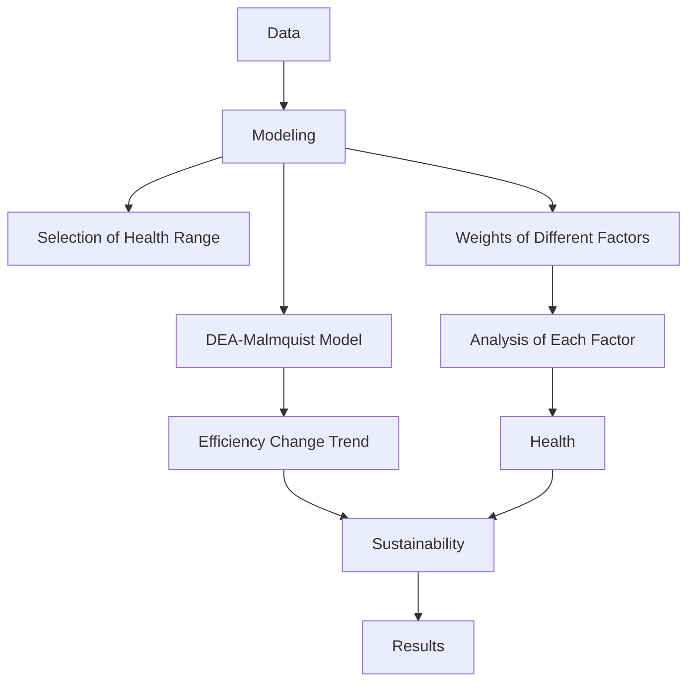
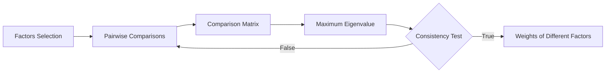
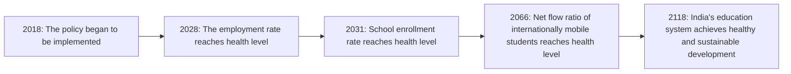

# Health Status and Treatment Plan: A Physical Examination Report for Higher Education in Different Countries

Summary

Higher education system is an essential part of the development of a country. It directly undertakes the national scientific research tasks, providing most of the major research results. More importantly, the system has been cultivating talents for the future, which ensures the nation’s future development.

Every country has its unique higher education system, with the corresponding strengths and weaknesses. It is necessary to analyze and evaluate a system comprehensively, continuing its strengths and adjusting its weaknesses. However, the discrepancy between systems of different countries has made it hard to build a uniform evaluation standard for every country. In this article, we build a suite of measurement models to assess the health and sustainability of higher education systems.

To measure the health status of each country’s system, we select raw data for six main factors and fourteen indicators of fifty countries, with the time period from 2009 to 2018. Then we verify the distribution law of the data and choose 80% quantile as the health range for each indicator. Afterwards, we use the analytic hierachy process (AHP) to determine the weight for each indicator. We introduce the concept of overall point gain (OPG), representing the general health status of a system.

We also establish the method for examine sustainability by using DEA - Malmquist model. It is a highly objective model, commonly applied in time series analysis. According to the comparisons of the relative efficiency between different years, we can obtain the efficiency change trend. Then we can analyze the sustainability with the trend.

Then we select five countries as analysis objects: the US, the UK, Germany, Japan, India. With our models, we evaluate the health and sustainability of them. Our conclusion is: The US’ system is sub-healthy and sustainable, the UK’s system is sub-healthy with poor sustainability, the Germany’s system is completely healthy with excellent sustainability, the Japan’s system is unhealthy but sustainable, the India’s system is unhealthy and unsustainable. Since the higher education system of India has much room for improvement, we choose India to analyze further.

First, we measure India’s current system. Limited resources, large population, and economic pressure cause the low enrollment rate and high unemployment rate. Second, based on the analysis above, we propose our three-phase vision, including short-term, mid-term and long-term. For our vision, we propose some targeted policies. In short-term policies, we increase the indicators quickly. The policies includes to reduce the cost of education for the poor, to lower the minimum wage standard, and to Lower the admission standards for foreign students. In long-term policies, we take the social situation of India into considered. The policies includes Family planning, Economic structure transformation, and Educational environment improvement. We also use Markov Chain to predict the implementation of policies in the future, which can reflect the flexibility of policies. Then, we assess the real-world impacts and the difficulty to the policy implementation.

Finally, we discuss the strengths and weaknesses of our models, leaving room for further studies.

Keywords: higher education system, AHP model, Kolmogorov - Smirnov test, DEA-Malmquist model, targeted policies, Markov chain

## Contents

## 1 Introduction 4

1.1 Background 4  
1.2 Our Works 4

## 2 General Assumption and Symbol Explanation 4

2.1 General Assumption . 4  
2.2 Symbol Explanation 5

## 3 Main Factors and Data Selection 5

3.1 Main Factors . . 5

3.1.1 Investment . . 5  
3.1.2 Accessibility . . . 5  
3.1.3 Education Level . 6  
3.1.4 Research Level 6  
3.1.5 Educational Equity . . 6  
3.1.6 Attraction 6

3.2 Data Selection . . 6

## 4 Diagnosis Methods: Models for Health and Sustainability 8

4.1 Health Model 8

4.1.1 Determine the Weight of Indicators 8  
4.1.2 Select Health Range 10  
4.1.3 Diagnosis of Health Conditions . . 11

4.2 Sustainability analysis with DEA-Malmquist model 12

4.2.1 Basic DEA model . 12  
4.2.2 DEA-Malmquist model 13  
4.2.3 Sustainability analysis 13

## 5 Case Tracking: Model Application on Different Countries 13

5.1 the United States 14  
5.2 the United Kingdom 14  
5.3 Germany 15  
5.4 Japan 15  
5.5 India 15

## 6 Treatment Plan: Case Study on the Higher Education System of India 16

6.1 The Analysis of Current System . . 16

6.1.1 Health . . . . . . . . . . 17 17

6.1.2 Sustainability 17

6.2 Our Vision and Comparison . . 17

6.3 Treatment Plan: Our Targeted Policies 18

6.3.1 Declaration for Our Policies . . 18

6.3.2 Policy Implementation Model Realized by Using Markov Chain . 20

6.3.3 Implementation Timeline for India . . 20

6.4 the Real-World Impacts and Difficulties 22

## 7 Model Strengths and Weaknesses 23

7.1 Strengths . . 23

7.2 Weaknesses 23

## Appendices 24

## Appendix A Codes 24

A.1 Code for AHP 24

A.2 Code for Malkov Chain . . 25

## 1 Introduction

## 1.1 Background

The higher education system is the core competitiveness of a country’s education system. The system not only undertakes the task of cultivating talents for the country, but also shoulders its unique economic and research responsibilities. Therefore, it is of great significance to establish a model that can fully evaluate the higher education system.

However, countries in the world have different national conditions, and the problems they face in higher education construction are also different. Just building an evaluation model is far from enough. How to determine the weak part of a country’s higher education and how to give reasonable policies in accordance with the national conditions is a question worth pondering.

## 1.2 Our Works

In order to deal with the situation, we have completed the following tasks:

• We select raw data for 14 indicators of 50 countries with the time period from 2009 to 2018. Then we verify the distribution law of the data through Kolmogorov - Smirnov test and choose 80% quantile as the acceptance range (health range). This quantile is a choice based on our basic assumptions.  
• We use the analytic hierachy process to determine the weight for each indicator. The result can be used to measure the health status for specific countries. We also establish the method for examine sustainability using DEA - Malmquist model.  
• Then we apply our models to five selected countries to test the efficiency. By applying the models, we make brief diagnosis for their health and sustainability conditions.  
• By comparing the test results of five countries, we selected India, which has a larger upside potential, as the case we study. After evaluating its status, we build our vision and develop targeted policies. We then use Markov chain to predict the effect of our polies and draw the timeline for prediction. Afterwards, we analyzed the impact of the policy on the actual situation and possible obstacles.

## 2 General Assumption and Symbol Explanation

## 2.1 General Assumption

In order to enable the model to accurately reflect the health status of higher education system, we analogize the health evaluation method of the medical system and make the following assumptions.

1. Statistics we collect from the website are actual and reliable.  
2. The overall health of higher education is only related to our evaluation indicators.  
3. The indicators we choose possess the same distribution law as the population of higher education system, so the overall situation can be estimated through samples.  
4. The population of the higher education system conforms to the hypothetical distribution law and can be used to measure the health status. The population does not actually exist, it is not inconsistent with the totality of all countries.

5. Similar to physical examination indicators, there is a specific interval that determines whether ether the values for indicators are healthy. 关注

6. Within a certain period of time, some indicators will not be affected by the implementation of policies and can be regarded as constants.

Based on the above assumptions, we have selected a reasonable data set and used corresponding processing methods to establish a comprehensive evaluation standard for the higher education system.

## 2.2 Symbol Explanation

<table><tr><td>Name</td><td>Explanation</td></tr><tr><td> $I_{ij}$ </td><td>Input indicators for sustainability analysis</td></tr><tr><td> $O_{ij}$ </td><td>Output indicators for sustainability ananlysis</td></tr><tr><td>Sig.</td><td>Significance level for K-S test</td></tr><tr><td>OPG</td><td>Overall point gain</td></tr><tr><td> $\{p_i\}$ </td><td>0 - 1 sequence showing the health status</td></tr><tr><td>PIE</td><td>Policy implementation effect</td></tr><tr><td>BU</td><td>Buffer for modeling parameters</td></tr><tr><td>DCN</td><td>Difference between the current value and the normal value of the index</td></tr></table>

## 3 Main Factors and Data Selection

## 3.1 Main Factors

In order to make a sound assessment of the higher education system, we need to measure its health and sustainability. Similar to the defination of biological health, the health of a system refers to its ability to perform normal functions and respond to changes in the outside world. For a healthy higher education system, it needs to have the normal function of education, and be able to repair and renew itself [1]. The sustainability consists of normativity, equity, integration, and dynamism [2], it measures the ability of a system to maintain and update itself.

Based on the above definitions, we have compiled the six factors that measure the higher education system, which will be described below.

## 3.1.1 Investment

The investment factor measures a government’s willingness to invest in higher education, making it one of the most important indicators. With limited resources, the more the government invests in higher education, the more the country attaches importance to it. This factor will be qualified through two indicators: government expenditure on tertiary education and research and development expenditure. The former one measures how willing the country wants to enhance its higher education, the latter one shows the government support on further education.

## 3.1.2 Accessibility

Accessibility measures the difficulty of receiving higher education in a country. Higher accessibility can reflect a better construction for the system. In this part, we take the admission rate and number of higher education institutions per capita as detailed indicators. The admission rate can intuitively show the degree of higher education of the right-age population, and can be used to measure the perfection of the education system. The number of higher education institutions per capita can reflect the difficulty of individual receiving higher education, which is another description from the micro level.

## 3.1.3 Education Level

Education level (written as "E-level" below) is the evaluation for teaching level in different countries. This is the measure of system efficiency. In this section, we have selected three indicators as representatives. The number of top 1000 universities per capita reflects the country’s high-level educational capabilities. This determines the academic reputation of the country. Net flow of internationally mobile students works as an important output indicator for education sustainability. When the indicator is negative, it means that the current country’s higher education system is relatively weak. The third indicator, pupil-teacher ratio, measures the distribution of educational resources in the country. The lower the ratio, the more educational resources the individual gets.

## 3.1.4 Research Level

Research level (written as "R-level" below) is the evaluation for research level. This part is relatively complicated, so we discribe it with three indicators: highly cited paper per institution, nature-index research per institution, and patent per institution. The three indicators measure the level of scientific research education, the level of experimental research and the level of applied research. Considering the values of these three indicators comprehensively, we can infer the corresponding research level through the research results.

## 3.1.5 Educational Equity

Educational equity (written as "equity" below) is a measure of achievement, fairness, and opportunity in education [3]. It consists of socioeconomic equity, gender equity and racial equity. Since racial inequality is not a global phenomenon, and there is no unified evaluation standard, this element will not be considered.

We use the ratio of average tuition fee and GDP per capita to evaluate the socioeconomic equity, and gender equity is measured with school enrollment gender parity index (GPI).

## 3.1.6 Attraction

In addition to the aforementioned reasons, the attraction of the higher education system is also an important evaluation factor for healthy and sustainable development. In general, we evaluate the attractiveness through research interest and educational interest. The attractiveness of research comes from the collision of excellent thinking and the birth of inspiration, which can be measured by academic exchanges. We initially selected the number of academic conferences and the number of outstanding award winners as indicators for this content. However, academic conferences are highly mobile and are not suitable for national assessments, so we chose the award winners (including Nobel, Turing and Fields) as the indicator. Educational interest is measured by Employment rate of people with higher education1. Too low the employment rate indicates that the national education system is inperfect, while too high shows that the system is not attractive enough.

## 3.2 Data Selection

To assess health status and sustainable development, we use the same set of data but different evaluation methods. To assess the health status, we will calculate the weight of the data and list the main indicators, thereby constructing a confidence interval similar to the pathology test.

The method of assessing sustainability is slightly different. We select indicators for evaluating several aspects of sustainability based on the sustainability principle discussed before and use them as output variables. The remaining indicators will be used as input variables to determine changes in output indicators. In short, we treat decision variables as input variables and reflection variables as output variables to measure sustainability. When assessing sustainability, we will select appropriate indicators from the given input and output.

Here is a table of selected indicators. The letter $\prime \mathrm { P ^ { \prime } }$ for impact column means the indicator has a positive effect on higher education. ‘N’ refers to the opposite. Certain indicators will have a negative impact on the results when they are too high or too low, so we allocate letter $\prime _ { \mathrm { B ^ { \prime } } }$ to them.

For input variables, they are encoded with $I _ { i j } ,$ , for the output ones, we use symbol $O _ { i j }$ as the representatives. ‘i’ shows the number of each indicator and $\mathrm { ^ { \prime } j ^ { \prime } }$ represents the country.

Table 1: Indicators for higher education

<table><tr><td>Factor</td><td>Indicator</td><td>Symbol</td><td>Unit</td><td>Impact</td><td>D.S.</td></tr><tr><td rowspan="2">Investment</td><td>Government expenditure on tertiary education as % Of GDP</td><td> $I_{1j}$ </td><td>%</td><td>P</td><td>a</td></tr><tr><td>Research and development expenditure (% of GDP)</td><td> $I_{2j}$ </td><td>%</td><td>P</td><td>a</td></tr><tr><td rowspan="2">Accessibility</td><td>School enrollment, tertiary (% gross)</td><td> $I_{3j}$ </td><td>%</td><td>P</td><td>a</td></tr><tr><td>Number of higher education institutions per capita</td><td> $I_{4j}$ </td><td>-</td><td>P</td><td>b</td></tr><tr><td rowspan="3">E-level</td><td>Number of top 1000 universities per capita</td><td> $I_{5j}$ </td><td>-</td><td>P</td><td>c</td></tr><tr><td>Net flow ratio of internationally mobile students (inbound - outbound)</td><td> $O_{1j}$ </td><td>%</td><td>P</td><td>a</td></tr><tr><td>Pupil-teacher ratio, tertiary</td><td> $I_{6j}$ </td><td>-</td><td>N</td><td>a</td></tr><tr><td rowspan="3">R-level</td><td>Highly cited paper per institution</td><td> $O_{2j}$ </td><td>-</td><td>P</td><td>d</td></tr><tr><td>Nature-index research per institution</td><td> $O_{3j}$ </td><td>-</td><td>P</td><td>e</td></tr><tr><td>Patent per institution</td><td> $O_{4j}$ </td><td>-</td><td>P</td><td>a</td></tr><tr><td rowspan="2">Equity</td><td>Ratio of average tuition fee and GDP per capita</td><td> $O_{5j}$ </td><td>-</td><td>N</td><td>c</td></tr><tr><td>School enrollment, tertiary (gross), gender parity index (GPI)</td><td> $I_{7j}$ </td><td>-</td><td>B</td><td>a</td></tr><tr><td rowspan="2">Attraction</td><td>Important award winners</td><td> $O_{6j}$ </td><td>-</td><td>P</td><td>b</td></tr><tr><td>The labor force with advanced education (% of total working-age population with advanced education)</td><td> $O_{7j}$ </td><td>%</td><td>B</td><td>a</td></tr></table>

Note: D.S. is the abstract of data source. D.S. a is collected from World Bank World Development Indicators [4] and Education Statistics - All Indicators [5]. D.S. b is quoted from the corresponding page of Wikipedia. D.S. c is compiled from the public information of QS Rankings [6]. D.S. d and e come from webofscience [?] and Nature-index [7], respectively.

Considering assumption 3 and 4, we randomly sample from countries with more complete higher education systems and investigate their indicators from 2009 to 2018. The 50 selected samples are shown below.

Table 2: 50 countries we select (in alphabetical order)

<table><tr><td>Countries</td><td>1</td><td>2</td><td>3</td><td>4</td><td>5</td></tr><tr><td>1</td><td>Argentina</td><td>Czech Republic</td><td>Ireland</td><td>New Zealand</td><td>South Korea</td></tr><tr><td>2</td><td>Australia</td><td>Denmark</td><td>Israel</td><td>Norway</td><td>Spain</td></tr><tr><td>3</td><td>Austria</td><td>Egypt</td><td>Italy</td><td>Pakistan</td><td>Sweden</td></tr><tr><td>4</td><td>Belarus</td><td>Estonia</td><td>Japan</td><td>Philippines</td><td>Switzerland</td></tr><tr><td>5</td><td>Belgium</td><td>Finland</td><td>Kazakhstan</td><td>Poland</td><td>Thailand</td></tr><tr><td>6</td><td>Brazil</td><td>France</td><td>Lebanon</td><td>Portugal</td><td>Turkey</td></tr><tr><td>7</td><td>Canada</td><td>Germany</td><td>Malaysia</td><td>Russia</td><td>Ukraine</td></tr><tr><td>8</td><td>Chile</td><td>Greece</td><td>Mexico</td><td>Saudi Arabia</td><td>United Arab Emirates</td></tr><tr><td>9</td><td>China</td><td>India</td><td>Mongolia</td><td>Singapore</td><td>United Kingdom</td></tr><tr><td>10</td><td>Colombia</td><td>Iodonesia</td><td>Netherlands</td><td>South Africa</td><td>United States</td></tr></table>


<details>
<summary>text_image</summary>

World map with color-coded regions indicating different countries or regions, including Europe, Asia, and Africa.
</details>

Figure 1: Map for countries we select

With reference to the indicators in Table 1, we surveyed 50 countries and completed the standardization of the data, making preparations for the establishment of the model.

## 4 Diagnosis Methods: Models for Health and Sustainability

In this section, we build up the health model and sustainability model for higher education system. Using both models together, we are able to run the physical examination and make a diagnosis of the health and sustainability of each country. The process can be described with the following graph.


<details>
<summary>flowchart</summary>


</details>

Figure 2: Process for the physical examination

## 4.1 Health Model

During the physical examination, the doctor usually checks the patient’s various indicators and judges whether they are in the normal range. These indicators possess different weights, and indicators with larger weights have a greater impact on health conditions. We use similar methods to measure the health of the higher education system. Based on the previous assumptions, we determined the corresponding health range for each indicator, and determined the weight of each indicator through Analytic Hierarchy Process. The overall health status and the health status of each factor will be given through these analyses.

## 4.1.1 Determine the Weight of Indicators

The main method we use to determine the weight is analytic hierachy process.


<details>
<summary>flowchart</summary>


</details>

Figure 3: Process of AHP

Analytic Hierarchy Process (AHP) is an accurate approach for quantifying the weights of decision criteria, widely used in different decision situations, in fields like government, business, healthcare, shipbuilding, industry and education [8]. In our analysis, we use this method to determine weights of different main factors. Similarly, we determine the weights of different indicators in each factor. The following are the steps.

## • Factors selection

We have selected several main factors previously. For each main factor, we have chosen some indicators as well.

## • Pairwise comparisons between different factors

According to pairwise comparisons, we establish priorities among the factors. We think that the importance of main factors satisfies the following relationship:

$$
I n v e s t m e n t \approx A c c e s s \geqslant E d u c a t i o n \approx R e s e a r c h \geqslant E q u i t y \approx A t t r a c t i o n
$$

## • Calculation of comparison matrix

With the relationship discussed before, we get our comparison matrix $( b _ { i j } ) _ { 6 \times 6 }$ .

$$
\begin{array}{c c c c c c} & F _ {1} & F _ {2} & F _ {3} & F _ {4} & F _ {5} & F _ {6} \\ F _ {1} & 1 & \frac {1}{3} & \frac {1}{5} & \frac {1}{5} & \frac {1}{7} & \frac {1}{9} \\ F _ {2} & 3 & 1 & \frac {1}{3} & \frac {1}{3} & \frac {1}{5} & \frac {1}{7} \\ F _ {3} & 5 & 3 & 1 & 1 & \frac {1}{3} & \frac {1}{5} \\ F _ {4} & 5 & 3 & 1 & 1 & \frac {1}{3} & \frac {1}{5} \\ F _ {5} & 7 & 5 & 3 & 3 & 1 & \frac {1}{3} \\ F _ {6} & 9 & 7 & 5 & 5 & 3 & 1 \end{array} ,
$$

where $F _ { i }$ for $i = 1 , 2 , \cdots , 6$ represent investment, access, education, research, equity, attraction respectively.

## • Consistency Test

We can calculate the eigenvalues and eigenvectors of the matrix before. Next we need to perform consistency test with the maximum eigenvalue $\lambda _ { m a x } .$ .

$$
C I = \frac {\lambda_ {m a x} - n}{n - 1}, \tag {1}
$$

$$
C R = \frac {C I}{R I}, \tag {2}
$$

where $R I = 1 . 2 4$ when $n = 6 .$ . For the above comparison matrix, we obtain $C R = 0 . 0 4 1 6 \leqslant 0 . 1$ , thus the comparison matrix is acceptable.

• Calculation of weights Passing the consistency test, we can get the weights of main factors by the eigenvector corresponding to the maximum eigenvalue: investment (0.4615), access (0.2402),

education (0.1095), research (0.1095), equity(0.0515), attraction (0.0515) .

With the same method, we get the weights of different indicators of each factor, shown in the following graph.

Weight of each indicator  


<details>
<summary>pie chart</summary>

| Category | Value (%) |
|---|---|
| Education Access | 12.01 |
| Higher education institutions | 12.01 |
| School enrollment | 12.01 |
| Employment rate | 3.6 |
| Major award winners | 1.55 |
| Gender parity index | 1.55 |
| Tuition fee | 3.6 |
| Research | 3.6 |
| Net flow ratio | 1.79 |
| Highly cited paper | 6.37 |
| Nature-index | 3.38 |
| Patent | 1.2 |
| Top 1000 universities | 5.91 |
| Research and development | 23.075 |
Education | 23.075 |
</details>

Figure 4: Weight of each indicator

Through weight analysis, we can get the rankings of indicators according to weight. The top-ranked indicator is called the main indicator, which has a huge impact on the overall health. The lower-ranked indicators are called secondary indicators, which have little impact on the overall health, but their cumulative effects cannot be ignored.

## 4.1.2 Select Health Range

Most countries with complete higher education systems have healthy higher education. By applying analysis from QS Rankings, we fix the ratio of healthy higher education to 0.8. This shows that 80% of the population is healthy. Based on the assumptions, we have developed the following principles for healthy range selection.

• Positive indicators: Select the sample data from high to low 80% quantile as the estimator of the overall lower bound2.  
• Negative indicators: Select the sample data from low to high 80% quantile as the estimator of the overall upper bound.  
• Others: Estimate the distribution law of the population through the sample and determine the interval.

The health range corresponding to positive and negative indicators is better given, and what needs to be considered is the distribution law of other indicators: GPI and employment rate. By drawing the frequency histograms of these two indicators, we found that they have a law similar to the normal distribution. In order to verify this conjecture, we performed the Kolmogorov - Smirnov test (K-S test) [9] on these two indicators using SPSS. Due to space limitations, the detailed principles of K-S test will not be discussed here, only the results will be shown.

Given the significance level α = 0.05, we obtain the results of the K-S test for the two indicators, as shown below. Since the significance levels for both indicators are above α, we can conclude that they all passed the K-S test.

Here are the Q-Q plots of the two data to verify the correctness of the results. It can be seen that the data points are distributed near the straight line, and the results of the K-S test can be accepted.

Tests of Normality

<table><tr><td rowspan="2"></td><td colspan="3">Kolmogorov-Smirnov</td><td colspan="3">Shapiro-Wilk</td></tr><tr><td>Statistic</td><td>df</td><td>Sig.</td><td>Statistic</td><td>df</td><td>Sig.</td></tr><tr><td>GPI</td><td>0.087</td><td>47</td><td>0.200</td><td>0.981</td><td>47</td><td>0.615</td></tr></table>

Tests of Normality

<table><tr><td rowspan="2"></td><td colspan="3">Kolmogorov-Smirnov</td><td colspan="3">Shapiro-Wilk</td></tr><tr><td>Statistic</td><td>df</td><td>Sig.</td><td>Statistic</td><td>df</td><td>Sig.</td></tr><tr><td>Empl. Rate</td><td>0.122</td><td>50</td><td>0.061</td><td>0.964</td><td>50</td><td>0.129</td></tr></table>

nificance Correction Figure 5: K-S result for GPI  


<details>
<summary>scatter plot</summary>

| Observed Value | Expected Normal |
| -------------- | --------------- |
| 0.9            | -2.0            |
| 0.95           | -1.5            |
| 1.0            | -1.0            |
| 1.05           | -0.5            |
| 1.1            | 0.0             |
| 1.15           | 0.5             |
| 1.2            | 1.0             |
| 1.25           | 1.5             |
| 1.3            | 2.0             |
| 1.35           | 2.5             |
| 1.4            | 3.0             |
</details>

Figure 7: Q-Q plot for GPI

Figure 6: K-S result for employment rate  


<details>
<summary>scatterplot</summary>

| Observed Value | Expected Normal |
| -------------- | --------------- |
| 60             | -2              |
| 65             | -1              |
| 70             | 0               |
| 75             | 1               |
| 80             | 2               |
| 85             | 3               |
| 90             | 4               |
</details>

Figure 8: Q-Q plot for employment rate

In result, the acceptable health range of the two can be given by using normal distribution properties.

Table 3: Health Range

<table><tr><td>Indicator</td><td>Upper Bound</td><td>Lower Bound</td></tr><tr><td>Education expenditure</td><td>100</td><td>1</td></tr><tr><td>Research and development expenditure</td><td>100</td><td>0.6</td></tr><tr><td>School enrollment</td><td>-</td><td>50</td></tr><tr><td>Number of higher education institutions per capita</td><td>-</td><td> $1.63 \times 10^{-6}$ </td></tr><tr><td>Number of top 1000 universities per capita</td><td>-</td><td> $1.15 \times 10^{-7}$ </td></tr><tr><td>Net flow ratio</td><td>-</td><td>0</td></tr><tr><td>Pupil-teacher ratio</td><td>22</td><td>0</td></tr><tr><td>Highly cited paper per institution</td><td>-</td><td>1</td></tr><tr><td>Nature-index per institution</td><td>-</td><td>0.76</td></tr><tr><td>Patent per institution</td><td>-</td><td>3.27</td></tr><tr><td>Average tuition fee ratio</td><td>0.54</td><td>-</td></tr><tr><td>GPI</td><td>1.344</td><td>0.966</td></tr><tr><td>Major award winners</td><td>-</td><td>2</td></tr><tr><td>Employment rate</td><td>84.57</td><td>68.98</td></tr></table>

## 4.1.3 Diagnosis of Health Conditions

We use a simple acceptance/rejection model (0-1 model) to determine the health conditions.

The overall health condition can be measured with point gain and the occuring problem can be located. For each indicator i, if the value falls in the range of health, the point $p _ { i } = 1$ , otherwise $p _ { i } = 0 .$ . $\omega _ { i }$ is the weight of indicator i.

We caculate the point gain with the equation below:

$$
O P G = \sum_ {i = 1} ^ {1 4} \omega_ {i} p _ {i} \tag {3}
$$

Overall point gain (OPG) describes the health condition of a system, but only when its value is 1 can it prove that the system is completely healthy. If the OPG value is too low, it means that the countrys education system has at least one main indicator or a large number of secondary indicators that are wrong. 关注

We have classified the health status as follows:

• Healthy: $O P G = 1  \it$ , showing that all indicators are normal.  
• Sub-healthy: $O P G \geqslant 0 . 9 ,$ , showing that the system has small problems.  
• Unhealthy: $0 . 6 \leqslant O P G < 0 . 9 ,$ showing that one or more main indicators are wrong, which can be improved.  
• Extremely unhealthy: $0 . 4 \ \leqslant \ O P G \ < \ 0 . 6 ,$ , showing that the overall problem of the system is serious, and more reasonable construction of higher education is needed.  
• Serious: 0.2 $\leqslant O P G < 0 . 4 ,$ , showing that the higher education system is seriously out of balance and cannot perform its normal functions.  
• Bad: $O P G \leqslant 0 . 2 ,$ showing that the country has no higher education system.

The following figure shows the lower bound for each status more intuitively.


<details>
<summary>bar chart</summary>

| Health Status       | OPG  |
| ------------------- | ---- |
| Healthy             | 1.0  |
| Sub-Healthy         | 0.9  |
| Unhealthy           | 0.6  |
| Extremely Unhealthy  | 0.4  |
| Serious             | 0.2  |
</details>

Figure 9: Lower bound for OPG rankings

## 4.2 Sustainability analysis with DEA-Malmquist model

## 4.2.1 Basic DEA model

Data envelopment analysis (DEA) is one of the most common methods in the analysis of the performance of universities. There are several models of DEA. Among them, the CCR model by Charnes, Cooper and Rhodes, has a simple form and a complete theory. The model is easy to understand and perform.

Without prior weights on the inputs and outputs, DEA can be used to evaluate the relative efficiency among multiple-input and multiple-output different decision making units (DMUs) [10]. In a oneinput, one-output situation, efficiency is usually defined as the ratio of output over input [11]. Similarly, the efficiency is defined as Equation 4:

$$
\theta_ {j} = \frac {\sum_ {m = 1} ^ {M} y _ {m j} u _ {m j}}{\sum_ {n = 1} ^ {N} x _ {n j} v _ {n j}}, \tag {4}
$$

where $x _ { n j } ( n = 1 , 2 , \cdots , N ) , y _ { m j } ( m = 1 , 2 , \cdots , M )$ represent N inputs and M outputs of the $j _ { t h }$ DMU respectively, with the corresponding input weights and output weights $u _ { m j } , v _ { n j } ,$ with all inputs, outputs and weights non-negative.

Thus the analysis to the performance of the system is transformed to the following linear programming problem:

$$
\max \theta_ {j} = \frac {\sum_ {m = 1} ^ {M} y _ {m j} u _ {m j}}{\sum_ {n = 1} ^ {N} x _ {n j} v _ {n j}},
$$

$$
\text { s.t. } \left\{ \begin{array}{l} \frac {\sum_ {m = 1} ^ {M} y _ {m k} u _ {m j}}{\sum_ {n = 1} ^ {N} x _ {n k} v _ {n j}} \leqslant 1, k = 1, 2, \dots , K, \\ u _ {m j}, v _ {n j} \geqslant 0, m = 1, 2, \dots , M; n = 1, 2, \dots , N, \end{array} \right. \tag {5}
$$

where K is the total of DMUs. If the optimal solution of the above problem exists and max $\theta _ { j }$ is 1, then we can judge this DMU is effective, meaning the corresponding ratio of outputs to inputs can be maxmized.

## 4.2.2 DEA-Malmquist model

As discussed above, DEA can be used to measure the relative efficiency among a series of DMUs. However, in the analysis of time series, basic CCR model just calculate and compare the values of efficiency of different time. It ignores the temporal change of productivity. Therefore, we use DEA-Malmquist model, more commonly applied in time series analysis. This method introduces the Malmquist distance, considering the time-varying productivity. We can make a dynamic analysis to efficiency with it.

## 4.2.3 Sustainability analysis

From DEA-Malmquist model, we obtain the efficiency ratio between two adjacent years. The results can be calculated fast by DEAP, a software of DEA related model. If we assume that the efficiency of the first year were 1, then we can get the temporal trend of efficiency. Based on the four aspects of sustainability and the trend, we propose the following criteria:

• If in the last five years, one country’s efficiency has declined for three consecutive years, then its system is not considered sustainable.  
• If in the last five years, one country’s efficiency has declined for only two consecutive years, then its system’s sustainability is considered poor.  
• If in the last five years, one country’s efficiency has declined for no more than one year, then its system is considered highly sustainable.

In the first scenario, we think this system cannot maintain its effectiveness. In the second scenario, the system can sometimes maintain its current situation. Finally, we believe the existence of fluctuation, but a highly sustainable system can recover from its decline quickly.

## 5 Case Tracking: Model Application on Different Countries

Since the measuring models are completed, we try to apply our models to specific countries to evaluate their health and sustainability status. We randomly select the following five countries, and the situation for each country will be discussed detailedly. 关注


<details>
<summary>text_image</summary>

India
Japan
Germany
Great Britain
US
</details>

Figure 10: Five countries we analyse

## 5.1 the United States

We first evaluate the current health status of the US compared to the health range in Table 3. The indicator point sequence $\{ p _ { i } \}$ and OPG are as follows:

$$
\{p _ {i} \} = \{1, 1, 1, 1, 1, 1, 1, 1, 1, 1, 0, 1, 1, 1 \}, O P G = 0. 9 6 4
$$

We found that the average tuition fee ratio of the US is abnormal, making the status of the US subhealthy. The abnormality of this indicator shows that the cost of education in the United States is high, and the equity of education is not strong enough.

For sustainability, the efficiency (2009 to 2018) can be shown in the following plot:


<details>
<summary>line chart</summary>

| Year | Value |
| ---- | ----- |
| 2009 | 1.0   |
| 2010 | 1.1   |
| 2011 | 1.1   |
| 2012 | 1.1   |
| 2013 | 1.0   |
| 2014 | 0.9   |
| 2015 | 1.0   |
| 2016 | 1.2   |
| 2017 | 1.3   |
| 2018 | 1.3   |
</details>

Figure 11: Sustainability analysis for the US

The efficiency turns out to have a steady and growing trend, showing that the higher education in the US is sustainable and innovative.

## 5.2 the United Kingdom

Similar to the former ways, we first evaluate the grade sequence and OPG:

$$
\{p _ {i} \} = \{1, 1, 1, 1, 1, 1, 1, 1, 1, 1, 1, 1, 0 \}, O P G = 0. 9 6 4
$$

And then the efficiency for sustainability:

The health status for the UK is sub-healthy. The employment rate is a little bit higher than the upper bound. This shows that the UK’s vocational education and scientific research education are not balanced, and need to be improved through policies and teaching methods. The sustainability of UK

is a bit poor, the policies should be improved actively.


<details>
<summary>line chart</summary>

| Year | Sustainability Index |
| ---- | --------------------- |
| 2009 | 1.0                   |
| 2010 | 1.05                  |
| 2011 | 0.98                  |
| 2012 | 0.9                   |
| 2013 | 0.87                  |
| 2014 | 0.87                  |
| 2015 | 0.87                  |
| 2016 | 0.87                  |
| 2017 | 0.82                  |
| 2018 | 0.78                  |
</details>

Figure 12: Sustainability analysis for the UK

## 5.3 Germany

The situation for Germany is slightly different from former countries. For health status, we have:

$$
\{p _ {i} \} = \{1, 1, 1, 1, 1, 1, 1, 1, 1, 1, 1, 1, 1, 1 \}, O P G = 1. 0 0
$$

This means that the higher education system in Germany is completely healthy. As for sustainability, we have:


<details>
<summary>line chart</summary>

| Year | Sustainability Index |
| ---- | --------------------- |
| 2009 | 1.0                   |
| 2010 | 1.2                   |
| 2011 | 1.35                  |
| 2012 | 1.45                  |
| 2013 | 1.5                   |
| 2014 | 1.6                   |
| 2015 | 1.75                  |
| 2016 | 1.85                  |
| 2017 | 1.9                   |
| 2018 | 2.1                   |
</details>

Figure 13: Sustainability analysis for Germany

It is a completely growing trend, showing that German system possesses great sustainability.

## 5.4 Japan

For Japan, the point sequence, OPG and sustainability plot are as follows:

$$
\left\{p _ {i} \right\} = \{0, 1, 1, 1, 1, 1, 1, 1, 1, 1, 1, 0, 1, 1 \}, O P G = 0. 7 7 7 4
$$

The health status for Japan is unhealthy, causing by the lack of education investment and gender inequalty. However, the sustainability plot shows that the higher education is sustainable, the government is trying to deal with the problems and improve its system structure, creating a better future for Japanese education.

## 5.5 India

Compared with the above-mentioned countries, India’s higher education system has more serious problems. This can be reflected through the structure of point sequence: 关注


<details>
<summary>line chart</summary>

| Year | Value |
| ---- | ----- |
| 2009 | 1.0   |
| 2010 | 1.05  |
| 2011 | 1.0   |
| 2012 | 1.1   |
| 2013 | 1.15  |
| 2014 | 1.2   |
| 2015 | 1.25  |
| 2016 | 1.3   |
| 2017 | 1.35  |
| 2018 | 1.2   |
</details>

Figure 14: Sustainability analysis for Japan

$$
\{p _ {i} \} = \{1, 1, 0, 0, 0, 0, 0, 1, 1, 1, 0, 1, 1, 0 \}, O P G = 0. 5 7 8 3
$$

The health condition for India is extremely unhealthy, resulting in different factors. The problem mainly occurs in accessibility, education level, reasearch level, educational equity, and attraction. This shows that there is still much room for improvement in Indian higher education.

As for the sustainability, we have the plot below:


<details>
<summary>line chart</summary>

| Year | Sustainability Index |
| ---- | --------------------- |
| 2009 | 1.0                   |
| 2010 | 1.1                   |
| 2011 | 1.0                   |
| 2012 | 1.1                   |
| 2013 | 1.2                   |
| 2014 | 1.4                   |
| 2015 | 1.3                   |
| 2016 | 1.2                   |
| 2017 | 1.1                   |
| 2018 | 0.9                   |
</details>

Figure 15: Sustainability analysis for India

The higher education in India seems to be unstable, presenting a unsustainable development in recent years. The education department should take appropriate actions to deal with it.

## 6 Treatment Plan: Case Study on the Higher Education System of India

By comparing the five countries mentioned above, we find that the state of higher education in India is worrying. To study the impact of policies on the higher education system, India acts as an ideal sample. In this section, we will treat India as our "patient", give out a complete analysis and determine the treatment plan. After that, we will analyze the feasibility of the plan in combination with reality.

This case study can provide clearer policy guidance for the current dilemma of higher education in India, making itself a strong social application value.

## 6.1 The Analysis of Current System

We have already evaluated the health condition for India in subsection 5.5, and n ow we will con duct duct a more detailed analysis of its health problems based on the real world situation.

## 6.1.1 Health

## • Education investment

The investment factor of India reaches the standard, but it can still reflect many problems. The state’s insufficient funding of public educational institutions has led to the rapid growth of private higher education. More and more public institutions are forced to develop self-financed courses, with the rising tuition fees [12]. As a result, the popularization and development of higher education are further restricted.

## • Universality of higher education

India’s higher education enrollment rate is only 29%, far below 50%. The number of higher education institutions is also relatively low. The average tuition fee is much higher than the standard. In addition, the population receiving higher education is mainly composed of urban residents, meaning the low enrollment rate in rural areas. These indicators represent that higher education is not popular enough in India. Large amount of low-income people cannot afford the high cost of education, and most people do not have the opportunity to receive higher education.

## • The level of research

India has excellent performance in research factor with more than ten important award winners, which contrasts with India’s relatively low research expenditures.

## • Educational gap

The student-teacher ratio in India is as high as 25, which indicates the lack of educational resources and quality of education in most universities in India. In contrast, among the top 1,000 universities in QS, there are 24 in India, reflecting that Indias top universities still have a high level of teaching and research. On the other hand, many graduates from top schools will choose to go abroad for further studies, and prefer to stay there after graduation. Too much human capital flight further aggravates the decline in India’s education level, forming a vicious circle.

## • High unemployment rate

Among the population with higher education in India, the employment rate is only 60%, which is also not up to standard. The Indian curriculum lacks both the main elements of learning content and the depth and fluency of the international curriculum. The lack of quality of education has led to unqualified and unclear knowledge acquired by students, causing mass unemployment among educated young people. [wiki-India]

## 6.1.2 Sustainability

According to DEA-Malmquist model, the India’s efficiency has declined for four adjacent years. The expenditure have been increasing, while the results have hardly increased. It can be predicted that without policy intervention, Indias efficiency will continue to decline in the future. Thus, its system is not considered sustainable.

## 6.2 Our Vision and Comparison

The problems in the Indian higher education system are complex and serious, and it is difficult to make changes simply. In order to normalize higher education in India, we have to build ou different period of time. With the goal of achieving a comprehensive health of education (OP G = 1),

we have formulated the following three-phase vision for short-term, medium-term and long-term关注.

• Short-term vision: Normalize the main indicators (including school enrollment, employment rate, and related indicators) in 10 - 15 years.

The first requirement for disease treatment is to prevent the deterioration of the disease. Similarly, for the higher education in India, our vision is to prevent the deterioration of the higher education in India and make it develop sustainably. Compared with the current situation, the OPG value of India, which has realized its short-term vision, will be greater than 0.7324, approaching the current situation of Japan. At the same time, the stability of the system will be greatly improved, from a downward trend to an upward trend.

• Mid-term vision: Adjust the remaining indicators except the number of higher education institutions to make the system close to the sub-health state in 50 years.

Through economic development and education construction, gradually improve the entrance fees and the treatment of foreign students, and increase the number of teachers. According to the best estimate, in about 50 years, India’s net flow ratio will break through zero, while other indicators will basically normalize. The value of OPG will be close to 0.8799, reaching the lower bound of sub-healthy. Compared with the previous sustainable growth rate, it will gradually slow down and approach a steady state.

• Long-term (final) vision: build a healthy higher education system in a hundred years.

Through centuries of continuous efforts, gradually increase the number of higher education institutions in India and improve educational capabilities. Our vision is to make the value of OPG equal to 1, while maintaining sustainability without decline. This is the final destination for our policies.

## 6.3 Treatment Plan: Our Targeted Policies

Considering the vision given before, we have formulated the short-term policies to realize the shortand medium-term vision and the long-term policies to realize the final vision. We will give the specific impact of the policies and the methods to measure the changes in the indicators after the implementation of the policies. Based on these contents, we will determine the implementation timeline from the original state to the target state.

## 6.3.1 Declaration for Our Policies

## 1. Short-term policies

Due to India’s limited resources, large population, and economic pressure, it is not realistic to invest extensively to improve all relevant variables. In the long run, the problem of education quality is also a problem of economic development. Only when the economy is sufficiently developed can there be a chance to invest enough in education. Without that, the basic problems like school coverage, the allocation of education resources etc. cannot be solved radically. However, the problem of India’s education system is too serious to hold any longer, the actions shall be taken immediately. Considering the situation, we formulate policies that can quickly change indicators with unhealthy conditions in a short period of time.

## • Reduce the cost of education for the poor.

In our statistics, we can find that the average education cost of the 50 countries accounts for 49.3% of the GDP per capita, but the ratio in India is as high as 238.1%. Many people cannot receive higher education because of unaffordable high education costs. In this regard, we suggest that the government lower the tuition fees of higher education or give more education subsidies to poor families to support their higher education (this solution partly refers to the suggestion given in [13]). Incr

## • Lower the minimum wage standard.

Refering to multiple research results in history, it is found that the minimum wage standard has a negative correlation with the enrollment rate. Compared to the high cost for higher education, Indian teenagers prefer getting a job directly to furthering their studies. If the minimum wage declines, the proportion of the labor force receiving higher education will increase, and the higher education enrollment rate will increase accordingly.

## • Lower the admission standards for foreign students.

India has 24 universities ranking top 1000 in the world, which is higher than the world’s average. However, the international students admitted is less than the students studying abroad. It is mainly caused by the lack of high scholarships and appropriate standards for international students. For top business schools in India, the GMTA score requirement is around 710 points. This score is sufficient for 6-7 top American universities to provide full tuition waivers for such students. In India, less than 10% of the local students can reach the standard, and domestic education may not be able to satisfy the international students who rank the top in India. Therefore, the standards should be lowered to attract more foreign students and improve the enviroment for academic exchanges.

## 2. Long-term policies

In contrast, the purpose of short-term policies is to move indicators closer to healthy values. But in order to achieve a healthy state, we also need to consider sustainable long-term policies. Therefore, we made the following recommendations.

## • Family planning.

We found that India’s education expenditure and research & development expenditure is higher than the normal value, which means that its education investment is already healthy. If more investment is applied to build more facilities, it will put more pressure to the on the economy, and the quality of education cannot be guaranteed. It is more reasonable to solve the problem from the population than to solve the problem from the investment. Therefore, it is imperative to slow the growth of population down, and the policy should encourage family planning. Reducing the population of the right age can significantly reduce the pressure on education and increase the enrollment rate.

## • Economic structure transformation.

When the national education becomes healthy, the increase of enrollment rate and the net flow ratio of international students will increase the workforce receiving higher education. In that case, we are able to invest more talents for economic construction. These talents will serve as the guiding force for economic development and contribute to increasing education investment. This input-output-input model realizes the positive feedback of the economic system, possessing good sustainability.

## • Educational environment improvement.

The teacher-student ratio in India is a difficult problem to deal with. Teachers in India are treated well. They are paid with high salaries and are always respected. However ,even if the current enrollment rate is very low. higher education is still facing the dilemma of insufficient teachers in India Why is this happening? After consulting relevant information, we found that the educational environment in India is the main reason affecting the number of teachers. Indias own educational environment has greatly increased the difficulty of recruiting foreign teachers, while local students with teacher potential usually choose to find employment or go abroad. In conclusion, improving the educational environment in India is a necessary condition for solving the problem of insufficient teachers, it must

be considered while excuting the policies.

## 6.3.2 Policy Implementation Model Realized by Using Markov Chain

Since we have selected a healthy range for each indicator, we put forward specific policy recommendations for its ‘unhealthy’ indicators to converge towards ‘healthy’. However, our policies can only provide the direction for the changes, the efficiency can not be specified. In that case, we believe that the effect of policy implementation is a random process.

In order to facilitate subsequent modeling, we make the following assumptions based on the general assumptions:

• One of the three states of policy implementation is excuted every year: good, poor, counterproductive. If the policy is effectively implemented, the indicator will change quickly to approach the normal value, but if the policy is not effectively implemented, the indicator state will remain unchanged or even worse.  
• The state that happens in the next year depends on the current state and value of current indicators. If the policy functions well in the previous year, it is easier to implement in the next year. Moreover, the closer the current indicator is to the normal, the weaker the role regulatory policy plays. This assumption is made in consideration of the relationship between the degree of unhealthy indicators and the role of policies. The more unhealthy the indicators, the greater the willingness to implement the corresponding policies and the greater the acceptability of the policies. On the contrary, if the indicators are reaching the health limit, the policies will not result so obvious.  
• Under the control of the policies, unhealthy education indicators will eventually reach normal values. The policies are flexible. When the effect is reduced due to its close to the normal value, the policies will be adjusted appropriately, and finally the index will converge to the normal value.

We model with the assumptions above, determine the to use Markov chain to predict the trend of indicators under policy intervention. We believe that policy implementation effect ( PIE ) and buffer ( BU ) are factors determining the current state and they are random variables, whose distribution are shown below. Since the difference between the current value and the normal value of the index ( DCN ) affects the policy intensity, we add it to the distribution function of PIE to represent its role. The distribution law of PIE and BU is shown in the following table:

Table 4: Distribution law for modeling parameters

<table><tr><td>Last state</td><td>PIE</td><td>BU</td><td>Distribution law</td></tr><tr><td>Good</td><td>X1</td><td>Y1</td><td> $X1 \sim N(k \cdot DCN + 0.01, 0.01), Y1 \sim N(0.01, 0.01)$ </td></tr><tr><td>Poor</td><td>X2</td><td>Y2</td><td> $X2 \sim N(k \cdot DCN, 0.01), Y2 \sim N(0, 0.01)$ </td></tr><tr><td>Counterproductive</td><td>X3</td><td>Y3</td><td> $X3 \sim N(k \cdot DCN - 0.01, 0.01), Y3 \sim N(-0.01, 0.01)$ </td></tr></table>

The variable k is used to control the severity of the value change. It varies from indicator to indicator. As for modeling, if $X + Y > 0 . 0 5$ , it indicates that the policy is in good state. If $X + Y < 0 . 0 5$ , it indicates that the policy has counterproductive effect.

With the discussion above, we We can use the indicator value of the i-th year to determine the value of the $i + 1 { \cdot } \mathrm { t h } \ y \mathrm { e a r } ,$ and the transfer equation can be given in the following form:

$$
\operatorname{value} (i + 1) = \operatorname{value} (i) \times (1 - (X + Y)) \tag {6}
$$

## 6.3.3 Implementation Timeline for India

Based on the above model, we have predicted the effect of the policy implementation. Due to the large amount of forecast data, we choose the changes in the main indicators of each stage to reflect the overall changes.

For the short-term vision, the main indicators are the enrollment and the emploVmentrateA pply- oplying flexible policies to both indicators, the prediction curves are as follows: 关注

The Prediction for Employment Rate  


<details>
<summary>line chart</summary>

| x | 0 | 1 | 2 | 3 | 4 | 5 | 6 | 7 | 8 | 9 | 10 | 11 | 12 | 13 | 14 | 15 | 16 | 17 | 18 | 19 |
| --- | --- | --- | --- | --- | --- | --- | --- | --- | --- | --- | --- | --- | --- | --- | --- | --- | --- | --- | --- | --- |
| 0 | 60 | 60 | 60 | 60 | 60 | 60 | 60 | 60 | 60 | 60 | 60 | 60 | 60 | 60 | 60 | 60 | 60 | 60 | 60 | 60 |
| 5 | 65 | 65 | 65 | 65 | 65 | 65 | 65 | 65 | 65 | 65 | 65 | 65 | 65 | 65 | 65 | 65 | 65 | 65 | 65 | 65 |
| 10 | 70 | 70 | 70 | 70 | 70 | 70 | 70 | 70 | 70 | 70 | 70 | 70 | 70 | 70 | 70 | 70 | 70 | 70 | 70 | 70 |
| 15 | 75 | 75 | 75 | 75 | 75 | 75 | 75 | 75 | 75 | 75 | 75 | 75 | 75 | 75 | 75 | 75 | 75 | 75 | 75 | 75 |
| 20 | 80 | 80 | 80 | 80 | 80 | 80 | 80 | 80 | 80 | 80 | 80 | 80 | 80 | 80 | 80 | 80 | 80 | 80 | 80 | 80 |
| 25 | 85 | 85 | 85 | 85 | 85 | 85 | 85 | 85 | 85 | 85 | 85 | 85 | 85 | 85 | 85 | 85 | 85 | 85 | 85 | 85 |
| 30 |  |  |  |  |  |  |  |  |  |  |  |  |  |  |  |  |  |  |  |  |
</details>

Figure 16: Prediction for employment rate

The Prediction for Enrollment Rate  


<details>
<summary>line chart</summary>

| x  | 0    | 1    | 2    | 3    | 4    | 5    | 6    | 7    | 8    | 9    | 10   | 11   | 12   | 13   | 14   | 15   | 16   | 17   | 18   | 19   |
|----|------|------|------|------|------|------|------|------|------|------|------|------|------|------|------|------|------|------|------|------|
| 0  | 30   | 30   | 30   | 30   | 30   | 30   | 30   | 30   | 30   | 30   | 30   | 30   | 30   | 30   | 30   | 30   | 30   | 30   | 30   | 30   |
| 5  | 40   | 40   | 40   | 40   | 40   | 40   | 40   | 40   | 40   | 40   | 40   | 40   | 40   | 40   | 40   | 40   | 40   | 40   | 40   | 40   |
| 10 | 50   | 50   | 50   | 50   | 50   | 50   | 50   | 50   | 50   | 50   | 50   | 50   | 50   | 50   | 50   | 50   | 50   | 50   | 50   | 50   |
| 15 | 55   | 55   | 55   | 55   | 55   | 55   | 55   | 55   | 55   | 55   | 55   | 55   | 55   | 55   | 55   | 55   | 55   | 55   | 55   | 55   |
| 20 | 58   | 58   | 58   | 58   | 58   | 58   | 58   | 58   | 58   | 58   | 58   | 58   | 58   | 58   | 58   | 58   | 58   | 58   | 58   | 58   |
| 25 | 60   | 60   | 60   | 60   | 60   | 60   | 60   | 60   | 60   | 60   | 60   | 60   | 60   | 60   | 60   | 60   | 60   | 60   | 60   | 60   |
| 30 | 62   | 62   | 62   | 62   | 62   | 62   | 62   | 62   | 62   | 62   | 62   | 62   | 62   | 62   | 62   | 62   | 62   | 62   | 62   | 62   |
</details>

Figure 17: Prediction for enrollment rate

After twenty independent repeated experiments (different curves in the plot), we found that employment rate achieves the lower bound of health range with the average of 10 years and the school enrollment rate turns normal in about 13 years. The short-term vision seem to be achieved successfully.

As for the mid-term vision, it can be represented by the net flow ratio of international mobile students. For the vision we proposed, its value would turn normal in 50 years. The Markov chain gives out prediction results shown below:

  
Figure 18: Prediciton for net flow ratio of international mobile students

The average cost for the net flow ratio to be normal is 48 years, meeting the requirement of midterm vision.

For the long-time vision, the main factor, number of higher education institutions, act as a discrete variable. Although it cannot be predicted through Markov chain, we can set specified goals for the government to achieve. Here is the implementation timeline for health status:

Policy Implementation Effect Schedule  


<details>
<summary>flowchart</summary>


</details>

Figure 19: Timeline for health visions

For the sustainability part, our policies begin with curing and maintaining a sustainable system, so a sharp turn can be observed at the beginning. With short-term and mid-term visions achieved, the关注 growth of sustainability slows down and shows a stable trend. Using DEA-Malmquist model, we can plot the timeline for sustainability. Observation concluded that all our visions are achieved properly.

Sustainbility Analysis  


<details>
<summary>line chart</summary>

| Year | Efficiency |
| ---- | ---------- |
| 2009 | ~1.0       |
| 2015 | ~1.4       |
| 2021 | ~0.9       |
| 2027 | ~1.8       |
| 2033 | ~2.2       |
| 2038 | ~2.5       |
| 2045 | ~2.7       |
| 2051 | ~2.8       |
| 2057 | ~2.9       |
| 2063 | ~2.95      |
| 2069 | ~3.0       |
| 2075 | ~3.05      |
| 2081 | ~3.1       |
| 2087 | ~3.1       |
| 2093 | ~3.15      |
| 2099 | ~3.15      |
| 2105 | ~3.15      |
| 2111 | ~3.15      |
| 2117 | ~3.15      |
</details>

Figure 20: Timeline for sustainability

## 6.4 the Real-World Impacts and Difficulties

We believe that the short-term policies we designed are for the transition period, and the long-term policies are for the end state. If they can be implemented well, the India’s education system will reach file:///C:/Users/asus/Downloads/area-pieces.svg the state of healthy and sustainable in a hundred years. But in fact, the policies may encounter many problems when implementing in India. These problems will hinder the implementation of policies to some extent, creating obstacles for the excution. Here are some of them.

1. Higher education in India is elite education. The cost is relatively high. The government may only be able to afford tuition for a small portion of outstanding students. The increase in enrollment rate may not be as ideal as predicted.  
2. Although lowering the minimum wage can motivate young people to receive higher education, there is still a large number of people who can only support their families by doing odd jobs in India. If the minimum wage is suddenly lowered, their lives will be severely affected.  
3. Newly added domestic and foreign students may put great pressure on teachers. India inherently lacks teachers in higher education. If the increase in foreign students and the increase in teachers cannot maintain a relative balance, the teacher retention rate will decrease. This will constitute a negative feedback: the teacher’s departure leads to the decrease of students, making the attempt to increase the number of foreign students fail.  
4. The most serious problem is dealing with social concepts.A Although the caste system has been abolished in law, the idea of hierarchy still exists. Indians of the lowest rank cannot receive normalized education as the others do, and there is no real fairness for people with low caste. This backward feudal concept severely limited India’s development potential. If changes are not made, the efficiency of the policy will be affected.

However, we are still optimistic about the development of higher education in India. Although change is difficult, it is not impossible. We believe that through the reasonable guidance of policies, the national education environment and the education level of citizens will be gradually improved.

Education in India will eventually reach a healthy and sustainable state.

## 7 Model Strengths and Weaknesses

## 7.1 Strengths

• We have established clear criteria for health and sustainability.

For each indicator, we have determined a clear range of health through data analysis. For the measurement of sustainability, we adopted the DEA-Malmquist model by comparing the relative efficiency of higher education in different years. The relative efficiency between different years can reflect the changes in system quality over time and can be used to measure sustainability.

• We have selected enough indicators.

We have selected six main factors and fourteen indicators, which can fully reflect the health of the higher education system. Meanwhile, it also provides specific directions for our policy analysis.

• DEA is a completely objective method.

Using DEA to analyze efficiency does not need to specify the weights of various indicators in advance. Each weight is completely determined by the data. It is a completely objective method. Moreover, the basic DEA model is not suitable for analyzing time series. We adopt the DEA-Malmquist model that considers the changes in productivity over time. Thus, the analysis is more reasonable.

• Markov chain can predict the impact of policy well.

The premise of Markov chain is that the next state of the system is only related to the current state. In the process of policy implementation, the government will adjust the policy direction of the next year according to the implementation in that year. Therefore, the Markov chain is very suitable for analyzing the impact of policies.

## 7.2 Weaknesses

• There are not enough countries.

When determining the health range, we assumed and verified that certain indicators obey a normal distribution, thereby determining the reasonable range of the indicators. However, due to the small total number of countries in the world, our calculated range may deviate from the range of true normal distribution.

• We did not consider the changes in standards over time.

When analyzing the vision system, we followed the standards in 2018. However, the various indicators of different countries may change in the future. In our model, we have not considered changes in standards.

## References

[1] M. T. Dooris, J. Cawood, S. Doherty, and S. Powell, “Healthy universities: Concept, model and framework for applying the healthy settings approach within higher education in england,” 2010.  
[2] T. Waas, J. Hug, K. Ceulemans, W. Lambrechts, J. Vandenabeele, R. Lozano, and T. Wright, “Sustainable higher education. understanding and moving forward,” 2012.  
[3] Wikipedia, “Educational equity,” https://en.wikipedia.org/wiki/Educational\_equity.  
[4] World Bank, “World development indicator,” https://databank.worldbank.org/reports.aspx? source=world\_development\_indicators.  
[5] ——, “Education statistics,” https://databank.worldbank.org/source/education-statistics\_all\_ indicators.  
[6] QS, “Topuniversities,” https://www.topuniversities.com/.  
[7] natureindex.com, “nature index,” https://www.natureindex.com/.  
[8] Wikipedia, “Analytic hierarchy process,” https://en.wikipedia.org/wiki/Analytic\_hierarchy\_ process.  
[9] ——, “Kolmogorov smirnov test,” https://en.wikipedia.org/wiki/Kolmogorov\_Smirnov\_test.  
[10] F.-H. F. Liu and P. hsiang Wang, “Dea malmquist productivity measure: Taiwanese semiconductor companies,” International Journal of Production Economics, vol. 112, no. 1, pp. 367–379, 2008, special Section on Recent Developments in the Design, Control, Planning and Scheduling of Productive Systems. [Online]. Available: https://www.sciencedirect.com/science/article/pii/ S0925527307001739  
[11] Wikipedia, “Data envelopment analysis,” https://en.wikipedia.org/wiki/Data\_envelopment\_ analysis.  
[12] ——, “India,” https://en.wikipedia.org/wiki/India.  
[13] X. Wei, “Wales’ new measures to increase enrollment in higher education,” 2006.

## Appendices

## Appendix A Codes

## A.1 Code for AHP

```matlab
clc, clear
B=[1 1/3 1/5 1/5 1/7 1/9 %Attraction
    3 1 1/3 1/3 1/5 1/7 %Equity
    5 3 1 1 1/3 1/5 %Research
    5 3 1 1 1/3 1/5 %Education
    7 5 3 3 1 1/3 %Access
    9 7 5 5 3 1]; %Expenditure

[n,m]=size(B);

for i=1:n
    for j=1:n
    if B(i,j)*B(j,i)~=1
    fprintf('i=%d, j=%d, B(i,j)=%d, B(j,i)=%d\n', i, j, B(i, j), B(j, i))
    end
end
```

```matlab
[Vec, Dig] = eig(B); %Eigenvalues and eigenvectors
eigen = max(Dig);
eigmax = max(eigen); %The maximum eigenvalue
c1 = find(eigen(1, :) == max(eigen));
```

```matlab
eigmaxv=Vec(:,cl);%eigenvector corresponding to the maximum eigenvalue
weight=zeros(n,1);
for i=1:n
    weight(i,1)=eigmaxv(i,1)/sum(eigmaxv);
end
    weight=weight'
%Consistency test
RI=[0,0,0.58,0.9,1.12,1.24,1.32,1.41,1.45,1.49,1.52,1.54,1.56,1.58,1.59];
CI=(eigmax-n)/(n-1);
CR=CI/RI(1,n);
CR
if CR>=0.1
    fprintf('Consistency test failed\n');
else
    fprintf('Consistency test passed\n');
end
```

A.2 Code for Malkov Chain  
```python
import numpy as np
import pandas as pd

def loadDatadet(infile):
    f=open(infile,'r')
    sourceInLine=f.readlines()
    dataset=[]
    for line in sourceInLine:
    temp1=line.strip('\n')
    temp2=temp1.split('\t')
    dataset.append(temp2)

    return dataset
    infile='data.txt'
    infile=loadDatadet(infile)
    k=0.0017
    tmp=0
    normal=77
    n=100
    j=0
    all=[]
    writer=pd.ExcelWriter("output2.xlsx")
    while j < 20:
    a=60
    al=[a]
    i=0
    while i < n:
    p=float(infile[j+30][i])+float(infile[j+31][i])+k*(a-normal)+tmp
    a = a*(1-p)
    i=i+1
    if p>0.05:
    tmp=0.01
    if p<-0.05:
    tmp=-0.01
    else:
    tmp=0
    print('a'+str(i)+':'+str(a))
    al.append(a)
    all.append(al)
    j+=1
data=pd.DataFrame(all)
data.to_excel(writer,'page_1',float_format='% .5f')
writer.save
writer.close()
```