# Tiny Fungi: The Defender of Carbon Cycle Balance

Summary

Fungi, as almost the only lignin-decomposing species on Earth, play an important role in the global carbon cycle. In this paper, a mathematical model is established to analyze various factors affecting the decomposition rate of woody fibers by fungi, so as to deepen the understanding of the relationship between fungal communities and ecosystem functions.

Firstly，we establish a Logistic Growth Model based on the interactions between different species of fungi. Considering the growth model and the moisture tolerance of the fungus, the decomposition rate model of fungi on woody fibers is constructed. Then, we use the collected fungal dataset and obtain the unknown parameters of the model. Next, we choose a combination of fungi to test the model. The relative error between the calculated decomposition rate and the actual value is as low as 5.5%. Meanwhile, the interactions between different species of fungi in a fixed patch of land are analyzed.

Secondly, considering the rapid environmental fluctuations, we analyze the effect of humidity on fungal activity in detail. We select a typical climate to study the short-term and long-term trends of fungal growth and decomposition rate, as well as the interaction between fungi. We find that the increase of environmental humidity can promote the growth of fungi with different promotion degree. Meanwhile, the relative competitive advantages of various fungi are different when atmospheric trends change. This will lead to the succession of fungal communities in different directions. Moreover, we also find that fungi with stronger moisture tolerance are more likely to occupy a dominant position in the arid environment.

Thirdly, we employ K-means algorithm to cluster the collected dataset of fungi and analyze the advantages and disadvantages of fungal species and combinations of species in different environments. In terms of the difference of environmental humidity, we find that fungal communities with stable characteristics are more dominant in low humidity environments. When the changing rate of environmental humidity is different, fungi with slower hyphal extension rate and stronger moisture tolerance are more robust to the environmental changes. For the environment with little climate change, such as tropical rain forest, fungi with faster growth rate and weaker moisture tolerance are more dominant. What’s more, fungi with similar characteristics are more likely to coexist.

Fourthly, the result of negative impact of environmental changes on a relatively single fungal community indicates that the more abundant species diversity, the more capable of adapting to the environmental changes. Thus, the decomposition rate can be maintained at a high level, which is conducive to the carbon cycle.

Finally, we analyze the sensitivity of the unknown parameters, and it shows that the model has strong adaptability and is easier to popularize. In addition, the advantages and disadvantages of the model are also analyzed.

Keywords: Logistic Growth Model; Decomposition Rate; Moisture Tolerance; Competitive Relations; Biodiversity

## Content

## 1 Introduction

1.1 Problem Restatement..  
1.2 Literature Review ..  
1.3 Our Work.

## 2 Assumptions and Justifications ...

## 3 Notations... 3

## 4 Wood Decomposition Model of Multiple Fungi in a Patch of land. 3

4.1 Growth of fungi . 3  
4.2 Competition among different species of fungi .  
4.3 Decomposition of woody fibers

4.3.1 Fungal traits impact factors... 6  
4.3.2 Ambient impact factors...  
4.3.3 Decomposition model of wood fiber ..

4.4 Model Solving 8

4.4.1 Methods and results of solution .... 8  
4.4.2 Model testing 9

## 5 Effects of environmental changes on interactions between fungi . 10

5.1 Introduction of humidity 10  
5.2 The short-term trends  
5.3 The long-term trends .. 12

## 6 Predictions about fungal activities under the various ambient changes . . 13

6.1 Clustering of fungi. 13  
6.2 Advantages and disadvantages prediction.... 14

6.2.1 Difference of ambient humidity...... 14  
6.2.2 Difference of the changing rate of ambient humidity.. 16  
6.2.3 Analysis of the advantages and disadvantages of fungi in tropical rain forest . 16

## 7 How does fungal biodiversity impose magic to the carbon cycle . 17

## 8 Sensitivity Analysis . . 18

8.1 Impact of α1 on decomposition rate. 18  
8.2 Impact of α2 on decomposition rate. 19

## 9 Model Evaluation and Further Discussion 19

9.1 Evaluation of Models 19  
9.2 Further Discussion and future work . 20

## References. . 20

## Article.. . 21

## Appendix. . 23

## 1 Introduction

## 1.1 Problem Restatement

As the dominant decomposers of organic plant material, fungi play an important role in the global carbon cycle. Fungi can decompose plant material and woody fibers, allowing carbon to be renewed and used in other forms. The diversity of fungal communities can provide a tangible link between biological communities and ecosystem functions. Therefore, fungi are the key driver of ecosystem function, and researches on fungal function have great significance on exploring biodiversity and realizing the material cycle in the ecosystem.

In order to explore the large-scale modeling of the carbon cycle and global climate models, we will conduct research on the factors that affect the decomposition rate of fungi to wood based on the growth rate of the fungus and the fungus’ tolerance to moisture. Our research needs to include the following tasks:

Establish a mathematical model to describe the decomposition of woody fibers in the presence of multiple species of fungi.  
Incorporate the interactions between different species of fungi.  
Make dynamic analysis of the model and the interactions between different kinds of fungi, and consider the influence of environmental fluctuations on the model.  
Analyze the relative advantages and disadvantages of each species or species combination, and predict the wood decomposition rate for different environments.  
Explore the effect of fungal community diversity on decomposition rate, and predict the importance of biodiversity when the environment changes.

## 1.2 Literature Review

A number of researchers have previously contributed to wood decomposition by fungi. Diogenis A. Kiziridis et al. used ordinary and partial differential equations to establish spatially explicit simulation models to incorporate factors that influence fungal interactions, thus predicting the dynamics of fungal communities[1]. The study of Tiina Rajala et al. found that fungal communities in wood depend on C : N ratio which is different in different regions, thereby affecting the decomposition rate of woody fibers[2]. Daniel S. Maynard et al. designed a trait-based approach to explore the dominance-tolerance trade-offs of fungi at broad spatial scales, strengthening the understanding of fungal biogeography[3]. In recent studies, Nicky Lustenhouwer et al. found that the decomposition rates were consistent with dominancetolerance life-history trade-off of fungi through detailed trait-based assays, which improved the ability to predict wood decay[4]. The above studies provide a wide range of ideas for our model establishment.

## 1.3 Our Work

We mainly build two models to solve this problem. The influence of environment on the activity of fungi and the importance of biodiversity are studied by selecting the fungi combination with representative traits. After establishing and solving the model, we carry out a sensitivity analysis, providing the advantages and disadvantages of the model, and make a prospect for the future work. At the end, we write an article for a college biology textbook about our understanding of fungal activity in the ecological environment.

```mermaid
graph TD
  A["Logistic growth model"] --> B["A Logistic Growth Model based on the interactions"]
  C["Interaction between fungi"] --> B
  D["Growth rate"] --> E["Wood decomposition model"]
  F["Relative moisture tolerance"] --> E
  E --> G["solve the unknown parameters in wood decomposition model"]
  H["K-means algorithm to cluster the collected dataset of fungi"] --> I["Obtain our colonies with specific traits (such as fast growth rate and weak robustness to moisture changes)"]
  I --> J["Analyze the advantages and disadvantages of the different species and species combination in different environments"]
  J --> K["Describe the impact of the diversity of fungi communities on decomposition rate"]
  K --> L["Biodiversity poses magic to the carbon cycle"]
  B --> M["Specific combination of 3 kinds of fungi"]
  M --> N["Study the impact of the change of the environment on the three kinds of fungi with a short and long term trends"]
  N --> O["assess the impact of variation of weather patterns"]
  O --> P["solve the unknown parameters in wood decomposition model"]
```

flowchart

Figure 1: Flow chart of our work

## 2 Assumptions and Justifications

In order to simplify the model, we make the following assumptions:

Fungi can only reproduce asexually. Since the model focus on the vegetative stage of fungi, we assume that there is no gender difference in the fungi studied.  
The growth of mycelia spreads outward in a circular form and has a maximum growth radius. The growth of mycelium usually starts from the position of spores and spreads radially around. In addition, due to the limitation of environmental resources, mycelium cannot grow indefinitely. Considering the hyphal extension rate is the focus of research, we make this assumption to simplify the model.  
The decomposition rate of fungi to ground litter and woody fibers is the mass loss rate of woody fibers over time. The decomposition of plant material and woody fibers is a key component of the carbon cycle, so we just focus on the role of fungi in the global carbon cycle.  
Only fungal activity causes the decomposition of ground litter and woody fibers, and wood decomposition is regarded as the only nutrient source of fungi. Fungi are almost

the only creatures on earth that can decompose lignin, so in order to better analyze fungal activity, we only consider the effect of this point on wood decomposition.

The effect of fungi on all stages of wood decomposition is consistent with the middle stage of wood decay cycle. According to the Research Article Synopsis provided by the problem, fungi are most associated with the decay of woody materials in the middle of their decay cycle. Therefore, for the purpose of modeling exercise, we make this assumption.

## 3 Notations

The primary notations used in this paper are listed in Table 1.

Table 1: Notations

<table><tr><td>Symbol</td><td>Definition</td></tr><tr><td> $r^{(k)}$ </td><td>Growth radius of the k-th fungus</td></tr><tr><td> $v_{ex}^{(k)}$ </td><td>Hyphal extension rate of the k-th fungus</td></tr><tr><td> $R_m$ </td><td>Maximum value of the growth radius of a fungus</td></tr><tr><td> $Rank_D^{(k)}$ </td><td>Standard value of the competitive ranking of the k-th fungus (scaled to the range of [0,1])</td></tr><tr><td> $Width_M^{(k)}$ </td><td>Standard value of the moisture niche width of the k-th fungus (scaled to the range of [0,1])</td></tr><tr><td> $MT^{(k)}$ </td><td>Relative moisture tolerance of the k-th fungus</td></tr><tr><td> $v_F^{(k)}$ </td><td>the rate of growth of the k-th fungus</td></tr><tr><td> $σ_i^{(k)}$ </td><td>Relative value of the competitive ranking of the i-th fungus compared with that of the k-th fungus</td></tr><tr><td> $M_L^{(k)}$ </td><td>Mass loss of woody fibers caused by the decomposition of the k-th fungus</td></tr><tr><td> $ΔM_{Lmax}$ </td><td>Maximum value of the mass loss of woody fibers</td></tr></table>

## 4 Wood Decomposition Model of Multiple Fungi in a Patch of land

## 4.1 Growth of fungi

In this paper, fungi grow through the extension of hypha, and the aggregation of hypha is mycelium. In addition, the fungi studied in this paper all propagate asexually through spores produced by hyphal differentiation. Since the growth of mycelium usually starts from the position of spores and spread radially around, we regard the growth of fungi as a concentric circle expansion process. The extension speed of the radius is the mycelial growth speed of fungi. The schematic diagram is shown in Figure 2.

text_image

radius

Figure 2: Equivalent circle diagram of mycelium growth

We first consider the ideal situation where the mycelium can reproduce endlessly in the case of unlimited space and natural resources. Assuming that the hyphal extension rate is $\nu _ { e x }$ , the growth radius  r of mycelium should conform to the following equation:

$$
\frac {d r}{d t} = v _ {e x} r \tag {1}
$$

Due to the limited growth environment, the growth radius of mycelium has a maximum value $R _ { { \scriptscriptstyle m } }$ , so the blocking factor of the maximum growth radius should be included on the right side of equation (1). Therefore, we introduce the Logistic Growth Model, then the equation (1) can be rewritten as follows:

$$
\frac {d r}{d t} = v _ {e x} r \left(1 - \frac {r}{R _ {m}}\right) \tag {2}
$$

In a fixed patch of land, we consider that there may be a variety of fungi, and each fungus has multiple colonies. Let $r ^ { ( k ) }$ denote the growth radius of the k-th fungus in the same land, which should meet the following equation:

$$
\frac {d r ^ {(k)}}{d t} = v _ {e x} ^ {(k)} \bullet (1 - \frac {r ^ {(k)}}{R _ {m}}) r ^ {(k)} \tag {3}
$$

In addition, we should also choose the initial growth radius of fungi. The initial growth radius of all kinds of fungi is the same, which is $r _ { 0 }$ .

$$
\left. r ^ {(k)} \right| _ {t = t _ {0}} = r _ {0} \tag {4}
$$

Finally, we can get the following first order linear differential equation that reflects the relationship between the growth radius of fungi and time.

$$
\left\{ \begin{array}{l} \frac {d r ^ {(k)}}{d t} = v _ {e x} ^ {(k)} \bullet (1 - \frac {r ^ {(k)}}{R _ {m}}) r ^ {(k)} \\ r ^ {(k)} \Big | _ {t = t _ {0}} = r _ {0} \end{array} \right. \tag {5}
$$

By solving the above differential equations, we can get the relationship between the growth radius of fungi and time.

$$
\left. r ^ {(k)} \right| _ {t} = \frac {R _ {m}}{1 + \left(\frac {R _ {m}}{r _ {0}} - 1\right) \exp \left\{- \left[ v _ {e x} ^ {(k)} \right] (t - t _ {0}) \right\}} \tag {6}
$$

## 4.2 Competition among different species of fungi

When a variety of fungi exist in the same patch of land, certain interactions will occur among different species of fungi. In this paper, the interaction is regarded as the competition among different fungal communities. Since we assume that woody materials are the only nutrient source of fungi, the competition among different species of fungi is the competition for nutrients.

Competitive ranking is the advantage measure of a fungus in competition compared with other fungi under the same conditions. We introduce it into the logistic model of fungus growth. For a species of fungus, when it competes with other types of fungi, there is a relative value between the advantages of other kinds of fungi and that of this kind of fungus. This relative value will become a factor that block the growth of this fungus.

Assuming that there are n kinds of fungal colonies in a fixed patch of land, then we study the effects of other kinds of fungi (i) on the k-th kind of fungi. The equation (3) that the growth radius of the k-th kind of fungi satisfies should be rewritten as:

$$
\frac {d r ^ {(k)}}{d t} = v _ {e x} ^ {(k)} \left(1 - \frac {r ^ {(k)}}{R _ {m}} - \sum_ {i} ^ {n - 1} \sigma_ {i} ^ {(k)} \frac {r ^ {(i)}}{R _ {m}}\right) r ^ {(k)} \tag {7}
$$

Where ${ \boldsymbol { \sigma } } _ { i } ^ { ( k ) }$ is the relative value of the competitive ranking of the i-th fungus compared with that of the k-th fungus, i.e.,

$$
\sigma_ {i} ^ {(k)} = \frac {\text {Rank} _ {D} ^ {(i)}}{\text {Rank} _ {D} ^ {(k)}} \tag {8}
$$

The variable ${ R a n k } _ { D } ^ { ( k ) }$ whose value is the standard values that are scaled to the range of [0,1] represents the competitive ranking of the k-th fungus.

Therefore, we introduce the competition relationship between different species of fungi into the model. This competition relationship will block the growth of fungi, and then affect the decomposition rate of wood by fungi.

## 4.3 Decomposition of woody fibers

The mycelium as the basic structure is compatible with its nutritional mode. It can be found from the figures provided in the problem that fungi are affected by factors such as hyphal extension rate, moisture tolerance and temperature during the decomposition of woody fibers.

Therefore, we divide the factors affecting the decomposition rate into two aspects: fungal traits impact factors and ambient impact factors when establishing the mathematical model of the decomposition process of woody fibers by fungi.

The decomposition rate of fungi to woody fibers is the mass loss rate of woody fibers, that is $d \Delta M _ { L } ( t ) / d t$ , where $\Delta M _ { L } ( t )$ is the mass loss in woody fibers.

## 4.3.1 Fungal traits impact factors

In this part, we analyze a certain kind of fungus ( ) k in a given patch of land.

Growth rate ${ \nu _ { F } } ^ { ( k ) }$

The extension speed of fungus radius is regarded as the rate of growth of a fungus, i.e.,

$$
v _ {F} ^ {(k)} = \frac {d r ^ {(k)}}{d t} \tag {9}
$$

We obtained the trend of the relationship between the growth rate and the decomposition rate from the dataset of 34 species of fungi, as shown in Figure 3.

scatterplot

| Hyphal extension rate | Decomposition rate | Temperature |
| --- | --- | --- |
| 0.5 | 10 | 10°C |
| 0.8 | 15 | 10°C |
| 1.2 | 20 | 10°C |
| 1.5 | 25 | 10°C |
| 2.0 | 30 | 10°C |
| 2.5 | 35 | 10°C |
| 3.0 | 40 | 10°C |
| 3.5 | 45 | 10°C |
| 4.0 | 50 | 10°C |
| 4.5 | 55 | 10°C |
| 5.0 | 60 | 10°C |
| 5.5 | 65 | 10°C |
| 6.0 | 70 | 10°C |
| 6.5 | 75 | 10°C |
| 7.0 | 80 | 10°C |
| 7.5 | 85 | 10°C |
| 8.0 | 90 | 10°C |
| 8.5 | 95 | 10°C |
| 9.0 | 100 | 10°C |
| 9.5 | 105 | 10°C |
| 10.0 | 110 | 10°C |
| 10.5 | 115 | 10°C |
| 11.0 | 120 | 10°C |
| 11.5 | 125 | 10°C |
| 12.0 | 130 | 10°C |
| 0.5 | 12 | 16°C |
| 0.8 | 17 | 16°C |
| 1.2 | 22 | 16°C |
| 1.5 | 27 | 16°C |
| 2.0 | 32 | 16°C |
| 2.5 | 37 | 16°C |
| 3.0 | 42 | 16°C |
| 3.5 | 47 | 16°C |
| 4.0 | 52 | 16°C |
| 4.5 | 57 | 16°C |
| 5.0 | 62 | 16°C |
| 5.5 | 67 | 16°C |
| 6.0 | 72 | 16°C |
| 6.5 | 77 | 16°C |
| 7.0 | 82 | 16°C |
| 7.5 | 87 | 16°C |
| 8.0 | 92 | 16°C |
| 8.5 | 97 | 16°C |
| 9.0 | 102 | 16°C |
| 9.5 | 107 | 16°C |
| 10.0 | 112 | 16°C |
| 10.5 | 117 | 16°C |
| 11.0 | 122 | 16°C |
| 11.5 | 127 | 16°C |
| 12.0 | 132 | 16°C |
| - | - | 22°C |
| - | - | - |
| - | - | - |
| - | - | - |
| - | - | - |
| - | - | - |
| - | - | - |
| - | - | - |
| - | - | - |
| - | - | - |
| - | - | - |
| - | - | - |
| - | - | - |
| - | - | - |
| - | - | - |
| - | - | - |
| - | - | - |
| - | - | - |
| - | - | - |
| - | - | - |
| - | - | - |
| - | - | - |
| - | - | - |
| - | - | - |
| - | - | - |
| - | - | - |
| - | - | - |
| - | - | - |
| - | - | - |
| - | - | - |
| - | - | - |
| - | - | - |
| - | - | - |
| - | - | - |
| - | - | - |
| - | - | - |
| - | - | - |
| - | - | - |
| - | - | - |
| - | - | - |
| - | - | - |
| - | - | -42°C |
| - | - | - |
| - | - | - |
| - | - | - |
| - | - | - |
| - | - | - |
| - | - | - |
| - | - | - |
| - | - | - |
| - | - | - |
| - | - | - |
| - | - | - |
| - | - | - |
| - | - | - |
| - | - | - |
| - | - | - |
| - | - | - |
| - | - | - |
| - | - | - |
| - | - | - |
| - | - | -44°C |
| - | - | - |
| - | - | - |
| - | - | - |
| - | - | - |
| - | - | - |
| - | - | - |
| - | - | - |
| - | - | - |
| - | - | ~73°C |
| ~8.5 | ~75 | ~73°C |
| ~9.0 | ~78 | ~73°C |
| ~9.5 | ~80 | ~73°C |
| ~10.0 | ~82 | ~73°C |
| ~10.5 | ~84 | ~73°C |
| ~11.0 | ~86 | ~73°C |
| ~11.5 | ~88 | ~73°C |
| ~12.0 | ~90 | ~73°C |
| ~12.5 | ~92 | ~73°C |
| ~13.0 | ~94 | ~73°C |
| ~13.5 | ~96 | ~73°C |
| ~14.0 | ~98 | ~73°C |
| ~14.5 | ~100 | ~73°C |
| ~15.0 | ~102 | ~73°C |
| ~15.5 | ~104 | ~73°C |
| ~16.0 | ~106 | ~73°C |
| ~16.5 | ~108 | ~73°C |
| ~17.0 | ~110 | ~73°C |
| ~17.5 | ~112 | ~73°C |
| ~18.0 | ~114 | ~73°C |
| ~18.5 | ~116 | ~73°C |
| ~19.0 | ~118 | ~73°C |
| ~19.5 | ~120 | ~73°C |
| ~20.0 | ~122 | ~73°C |
| ~20.5 | ~124 | ~73°C |
| ~21.0 | ~126 | ~73°C |
| ~21.5 | ~128 | ~73°C |
| ~22.0 | ~130 | ~73°C |
| ~22.5 | ~132 | ~73°C |
| ~23.0 | ~134 | ~73°C |
| ~23.5 | ~136 | ~73°C |
| ~24.0 | ~138 | ~73°C |
| ~24.5 | ~140 | ~73°C |
| ~25.0 | ~142 | ~73°C |
| ~25.5 | ~144 | ~73°C |
| ~26.0 | ~146 | ~73°C |
| ~26.5 | ~148 | ~73°C |
| ~27.0 | ~150 | ~73°C |
| ~27.5 | ~152 | ~73°C |
| ~28.0 | ~154 | ~73°C |
| ~28.5 | ~156 | ~73°C |
| ~29.0 | ~158 | ~73°C |
| ~29.5 | ~160 | ~73°C |
| ~30.0 | ~162 | ~73°C |
| ~30.5 | ~164 | ~73°C |
| ~31.0 | ~166 | ~73°C |
| ~31.5 | ~168 | ~73°C |
| ~32.0 | ~170 | ~73°C |
| ~32.5 | ~172 | ~73°C |
| ~33.0 | ~174 | ~73°C |
| ~33.5 | ~176 | ~73°C |
| ~34.0 | ~178 | ~73°C |
| ~34.5 | ~180 | ~73°C |
| ~35.0 | ~182 | ~73°C |
| ~35.5 | ~184 | ~73°C |
| ~36.0 | ~186 | ~73°C |
| ~36.5 | ~188 | ~73°C |
| ~37.0 | ~190 | ~73°C |
| ~37.5 | ~192 | ~73°C |
| ~38.0 | ~194 | ~73°C |
| ~38.5 | ~196 | ~73°C |
| ~39.0 | ~198 | ~73°C |
| ~39.5 | ~200 | ~73°C |
| ~40.0 | ~202 | ~73°C |
| ~40.5 | ~204 | ~73°C |
| ~41.0 | ~206 | ~73°C |
| ~41.5 | ~208 | ~73°C |
| ~42.0 | ~210 | ~73°C |
| ~42.5 | ~212 | ~73°C |
| ~43.0 | ~214 | ~73°C |
| ~43.5 | ~216 | ~73°C |
| ~44.0 | ~218 | ~73°C |
| ~44.5 | ~220 | ~73°C |
| ~45.0 | ~222 | ~73°C |
| ~45.5 | ~224 | ~73°C |
| ~46.0 | ~226 | ~73°C |
| ~46.5 | ~228 | ~73°C |
| ~47.0 | ~230 | % |

Figure 3: Decomposition rate - Hyphal extension rate curve

Relative moisture tolerance  ( ) k MT $M T ^ { ( k ) }$

The equation of relative moisture tolerance is as follows:

$$
M T ^ {(k)} = \operatorname{Rank} _ {D} ^ {(k)} - \operatorname{Width} _ {M} ^ {(k)} \tag {10}
$$

The variable ${ W i d t h _ { M } } ^ { ( k ) }$ whose value is the standard value that scaled to the range of [0,1]. represents moisture niche width. The definition of moisture niche width is the humidity range that can make the hyphal extension rate greater than or equal to 50% of its maximum value. The range of $M T ^ { ( k ) }$ is [-1,1].

It is found that moisture niche width is negatively correlated with hyphal extension rate and competitive ranking, which is consistent with the conclusion in the references given in the problem. Fungi that can be better able to survive in more diverse humidity conditions have slower decomposition rate of wood. Therefore, the smaller the value of $M T ^ { ( k ) }$ is, the stronger moisture tolerance of the fungus is and the slower the decomposition rate of the fungus is.

We explore the relationship between relative moisture tolerance and decomposition rate of 34 kinds of fungi, and obtain the relationship curve shown in Figure 4. Finally, it is found that the decomposition rate has a logarithmic relationship with relative moisture tolerance, i.e.,

$$
\ln \left[ \frac {d M _ {L} ^ {(k)}}{d t} \right] \propto M T ^ {(k)}.
$$

scatterplot

| moisture trade-off (tolerance→dominance) | log(decomposition rate) |
| ----------------------------------------- | ------------------------ |
| -0.8                                      | 0.7                      |
| -0.6                                      | 1.9                      |
| -0.4                                      | 1.7                      |
| -0.2                                      | 0.6                      |
| -0.1                                      | 1.5                      |
| 0.0                                       | 1.6                      |
| 0.2                                       | 1.9                      |
| 0.3                                       | 1.5                      |
| 0.4                                       | 2.1                      |
| 0.5                                       | 1.6                      |
| 0.6                                       | 2.3                      |
| 0.7                                       | 2.0                      |
| 0.8                                       | 3.5                      |
| 0.9                                       | 3.0                      |
| 1.0                                       | 2.8                      |

Figure 4: log (Decomposition rate) – Moisture tolerance curve

## 4.3.2 Ambient impact factors

Related studies[3] have shown that ambient humidity, etc. can also affect the rate of decomposition of woody fibers by fungi. However, in this part, we only discuss the decomposition process in a certain patch of land, and regard the environmental variables as constant values. In the follow-up discussion of the effect of environmental changes on the rate of decomposition of woody fibers, we will make a detailed analysis of the ambient impact factors.

## 4.3.3 Decomposition model of wood fiber

Through the above analysis, when multiple fungi exist in a fixed patch of land, the characteristics of fungi (including growth rate and relative moisture tolerance) and the competition between different kinds of fungi will affect the decomposition rate of woody fibers in this land. Therefore, assuming that $\Delta { M _ { L } } ^ { ( k ) }$ represents the mass loss of woody fibers caused by the decomposition of the k-th fungus, the rate of mass loss can be expressed as:

$$
\frac {d \Delta M _ {L} ^ {(k)}}{d t} = \alpha_ {1} v _ {F} ^ {(k)} \cdot e ^ {\alpha_ {2} \cdot M T ^ {(k)}} \tag {11}
$$

Where ${ \nu _ { F } } ^ { ( k ) }$ is the growth rate (determined by equation 9); $M T ^ { ( k ) }$ is the relative moisture tolerance (determined by equation 10); $\alpha _ { 1 }$ and $\alpha _ { 2 }$ are the unknown parameters.

The mass loss of the woody fibers in a fixed patch of land is the result of the combined action of all kinds of fungi in unit time. Meanwhile, considering that the mass of woody fibers cannot be lost indefinitely, we define a maximum mass loss value $\Delta M _ { \mathrm { { z m a x } } }$ , which can also be regarded as the initial mass of wood. Thus, the decomposition rate of woody fibers in a patch of land satisfies the following equation:

$$
\frac {d \Delta M _ {L}}{d t} = (1 - \frac {\Delta M _ {L}}{\Delta M _ {L \max}}) \bullet \sum_ {k} \left[ \alpha_ {1} v _ {F} ^ {(k)} \cdot e ^ {\alpha_ {2} \cdot M T ^ {(k)}} \right] \tag {12}
$$

## 4.4 Model Solving

## 4.4.1 Methods and results of solution

We consider that the unknown parameters $\alpha _ { 1 }$ and $\alpha _ { 2 }$ of the above model are constant under the same conditions. In order to solve the unknown parameters in the model, we collect the experimental data of 34 species of fungi, including hyphal extension rate, moisture tolerance, competitive ranking and decomposition rate of wood fiber. And we select six groups of three kinds of fungi which are shown in Table 2 as the training set for our solution. Then we search the values of parameters $\alpha _ { 1 }$ and $\alpha _ { 2 }$ in a reasonable range, and use the obtained parameters to calculate the decomposition rate of all combinations of fungi. By comparing the obtained decomposition rate with the actual decomposition rate, we choose the parameters which can minimize the error of decomposition rate as the values of $\alpha _ { 1 }$ and $\alpha _ { 2 }$ .

Table 2: Six groups of combination of fungi

<table><tr><td></td><td>Fungus 1</td><td>Fungus 2</td><td>Fungus 3</td></tr><tr><td>Group 1</td><td>Armillaria_gallica_FP102531_C6D</td><td>Hyphoderma_setigerum_FP150263_B2C</td><td>Merulius_tremellosus_FP150849_C3F</td></tr><tr><td>Group 2</td><td>Armillaria_gallica_EL8_A6F</td><td>Armillaria_gallica_SH1_A4A</td><td>Armillaria_tabescens_FP102622_A3C</td></tr><tr><td>Group 3</td><td>Armillaria_gallica_EL8_A6F</td><td>Armillaria_gallica_FP102534_A5A</td><td>Armillaria_gallica_FP102535_A5D</td></tr><tr><td>Group 4</td><td>Armillaria_gallica_FP102531_C6D</td><td>Armillaria_sinapina_PR9</td><td>Armillaria_gallica_OC1_A6E</td></tr><tr><td>Group 5</td><td>Armillaria_gallica_SH1_A4A</td><td>Armillaria_sinapina_PR9</td><td>Armillaria_tabescens_FP102622_A3C</td></tr><tr><td>Group 6</td><td>Phellinus_gilvus_HHB11977_C4H</td><td>Phellinus_hartigii_DMR94_44_A10E</td><td>Porodisculus_pendulus_HHB13576_B12C</td></tr></table>

\* The fungal data are available in ref. 3.

The specific steps for solving and testing parameters $\alpha _ { 1 }$ and $\alpha _ { 2 }$ are as follows：

Step 1: Select 6 groups of fungi among all 34 species.

Step 2: Search for the unknown parameters $\alpha _ { 1 }$ and $\alpha _ { 2 }$ with the step size of 0.01 in the range of [0,0.5], and find the more accurate range of the parameters to minimize the error.

Step 3: Search the parameters $\alpha _ { 1 }$ and $\alpha _ { 2 }$ with the step size of 0.01 in the accurate range to find the accurate values that minimize the error. The values are taken as the final parameters $\alpha _ { 1 }$ and $\alpha _ { 2 }$ of the decomposition model.

Step 4: Choose another combination of three kinds of bacteria, and use the calculated parameters to solve the decomposition rate. Use the relative error between the calculated value and the actual value to test the correctness of our model and the reliability of parameter selection.

The results of parameters are shown in Table 3.

Table 3: The solution results of model parameters

<table><tr><td> $\alpha_{1}$ </td><td> $\alpha_{2}$ </td><td>Root Mean Square Error</td></tr><tr><td>0.0033</td><td>0.1674</td><td>123.42</td></tr></table>

## 4.4.2 Model testing

We choose another three kinds of fungi (Armillaria\_gallica\_FP102542\_A5B, Hyphoderma\_setigerum\_HHB12156\_B3H, Mycoacia\_meridionalis\_FP150352\_C4E) in order to test the rationality of our model and parameters. Their actual decomposition rate is 29.61% in a certain environment. By computing the model, we get that the decomposition rate is 33.48% with the 5.5% relative error. The error is within the acceptable range, which proves that our model and parameters are reasonable.

Figure 5 and Figure 6 show the relationship between decomposition rate and time, growth radius of different fungi and time respectively.

line chart

| Time(day) | The wood decomposition rate per day(%) |
| --------- | -------------------------------------- |
| 0         | 0.0                                    |
| 5         | 0.05                                   |
| 10        | 0.18                                   |
| 15        | 0.27                                   |
| 20        | 0.28                                   |
| 40        | 0.28                                   |
| 60        | 0.28                                   |
| 80        | 0.27                                   |
| 100       | 0.27                                   |
| 120       | 0.26                                   |

Figure 5: The growth rate of different fungi - Time curve

line chart

| Time(day) | Armillaria gallica FP102542 A5B | Hyphoderma setigerum HHB12156 B3H | Mycoacia meridionalis FP150352 C4E |
| --------- | ------------------------------- | ---------------------------------- | ----------------------------------- |
| 0         | 0                               | 0                                  | 0                                   |
| 50        | 0                               | 10                                 | 95                                  |
| 100       | 0                               | 30                                 | 80                                  |
| 150       | 0                               | 60                                 | 50                                  |
| 200       | 0                               | 90                                 | 0                                   |
| 250       | 0                               | 100                                | 0                                   |
| 300       | 0                               | 100                                | 0                                   |
| 350       | 0                               | 100                                | 0                                   |
| 400       | 0                               | 100                                | 0                                   |
| 450       | 0                               | 100                                | 0                                   |
| 500       | 0                               | 100                                | 0                                   |

Figure 6: The wood decomposition rate per day – Time curve

Some interactions between different species of fungi can be reflected from Figure 6. For the convenience of description, in the following analysis, the fungi represented by the blue, red, black lines are referred to as fungus in blue line, fungus in red line, fungus in black line. It can be seen from the figure that the growth radius of the fungus in black line increases to the maximum in a short period of time, while the fungus in blue line only survives for the first few days, and then die. The growth radius of the fungus in red line increases slowly in the early stage. In the later stage, the radius of the fungus in black line gradually decrease to 0, while the radius of the fungus in red line increase to the peak. Therefore, we can conclude that black strain is dominant in the short term, and its competitiveness is the strongest, followed by red, and the weakest is blue. However, for some reason, the competitiveness of the fungus in red line is higher than that of the fungus in black line in the later stage. The resources for the black are occupied by the red, causing the radius of the fungus in red line to reach the maximum and the black to die.

## 5 Effects of environmental changes on interactions between fungi

The focus of this paper are two traits of a fungus: the growth rate of the fungus and the fungus’ moisture tolerance. In fact, fungal activity is not only affected by fungal traits, but also by a variety of environmental factors. The study of Daniel S. Maynard et al. [3] finds that ambient humidity has a great influence on the growth rate of the fungus, and they are positively correlated, which can be approximately regarded as a linear relationship. There is also a positive correlation between growth rate and decomposition rate. Meanwhile, when the humidity condition changes, the fungi with different moisture tolerance will show different activity characteristics, and then affect the decomposition rate. Therefore, we will analyze the effects of ambient humidity changes on fungal activities and the interactions between the different types of fungi in detail.

## 5.1 Introduction of humidity

In this part, we study the influence of ambient humidity (in time dimension) on the number of different kinds of fungi. The change of the number of fungi can reflect the interaction between different types of fungi. We choose 3 types of fungi as a group, and study the short-term and long-term activity trends in tropical monsoon climate. The species and characteristics of fungi are shown in Table 4.

Table 4: Selection of fungal species

<table><tr><td>No.</td><td>Name</td><td>Moisture tolerance</td><td>Robustness</td></tr><tr><td>1</td><td>Armillaria_gallica_FP102542_A5B</td><td>0.00156</td><td>Strong</td></tr><tr><td>2</td><td>Hyphoderma_setigerum_HHB12156_B3H</td><td>0.75337</td><td>Weak</td></tr><tr><td>3</td><td>Mycoacia_meridionalis_FP150352_C4E</td><td>0.5695</td><td>Ordinary</td></tr></table>

We first select the annual precipitation data of Mumbai, a representative city of tropical monsoon climate, as is shown in Figure 7. The data can represent the annual humidity change with time of Mumbai. In the existing fungal data, the humidity range corresponding to growth rate is [-5,0], and is adjusted to [0,1] through data standardization. Then, the growth rate and humidity are linearly fitted. Finally, we obtain the three equations of the humidity and growth rate of the fungi, which are as follows:

$$
\begin{array}{l} y _ {1} = 0. 1 4 2 1 x + 0. 1 2 1 4 \\ y _ {2} = 5. 4 3 6 3 x - 0. 3 2 9 3 \tag {13} \\ \end{array}
$$

$$
y _ {3} = 6. 9 4 8 5 x - 1. 3 9 4 3
$$

Where  x is ambient humidity, and $y _ { 1 } , y _ { 2 } , y _ { 3 }$ represent the growth rate of three fungi respectively.

bar-line hybrid chart

| Month | Precipitation(mm) |
|---|---|
| 1 | 5 |
| 2 | 5 |
| 3 | 5 |
| 4 | 5 |
| 5 | 20 |
| 6 | 460 |
| 7 | 620 |
| 8 | 350 |
| 9 | 270 |
| 10 | 60 |
| 11 | 20 |
| 12 | 10 |

Figure 7: The annual precipitation data of Mumbai

Corresponding to the above humidity, the range of annual precipitation data of Mumbai is also adjusted to [0,1]. Thus, the growth rate of different fungi under a certain precipitation condition can be calculated.

## 5.2 The short-term trends

Based on the time span of three months, we divided the trend of humidity change into three categories: increasing humidity, decreasing humidity and ligering drought. Then, we use the established model to solve the change of the decomposition rate of fungi, so as to analyze the short-term interaction between fungi.

line chart

| Time(day) | Armillaria gallica FP102542 A5B | Hyphoderma setigerum HHB12156 B3H | Mycoacia meridionalis FP150352 C4E |
| --------- | ------------------------------- | ---------------------------------- | ---------------------------------- |
| 0         | 0.0000                          | 0.0000                             | 0.0000                             |
| 10        | 0.0000                          | 0.0180                             | 0.0180                             |
| 20        | 0.0000                          | 0.0190                             | 0.0210                             |
| 30        | 0.0000                          | 0.0190                             | 0.0220                             |
| 40        | 0.0000                          | 0.0150                             | 0.0260                             |
| 50        | 0.0000                          | 0.0120                             | 0.0290                             |
| 60        | 0.0000                          | 0.0070                             | 0.0330                             |
| 70        | 0.0000                          | 0.0080                             | 0.0320                             |
| 80        | 0.0000                          | 0.0100                             | 0.0310                             |
| 90        | 0.0000                          | 0.0120                             | 0.0290                             |

a. Increasing humidity (6, 7, 8 months)

line chart

| Time(day) | Armillaria gallica FP102542 ASB | Hyphoderma setigerum HHB12156 B3H | Mycoacia meridionalis FP150352 C4E |
| --------- | ------------------------------- | ---------------------------------- | ----------------------------------- |
| 0         | 0.0000                          | 0.0000                             | 0.0000                              |
| 10        | 0.0000                          | 0.0050                             | 0.0025                              |
| 20        | 0.0000                          | 0.0250                             | 0.0150                              |
| 30        | 0.0000                          | 0.0350                             | 0.0150                              |
| 40        | 0.0000                          | 0.0375                             | 0.0125                              |
| 50        | 0.0000                          | 0.03875                            | 0.0100                              |
| 60        | 0.0000                          | 0.039375                           | 0.0075                              |
| 70        | 0.0000                          | 0.0396875                          | 0.0050                              |
| 80        | 0.0000                          | 0.03989375                         | 0.0025                              |
| 90        | 0.0000                          | 0.04               | 0.001                               |

b. Decreasing humidity (8, 9, 10 months)

line chart

| Time(day) | Armillaria gallica FP102542 A5B | Hyphoderma setigerum HHB12156 B3H | Mycoacia meridionalis FP150352 C4E |
| --------- | ------------------------------- | ---------------------------------- | ----------------------------------- |
| 0         | 0.0003                          | 0.0003                             | 0.0003                              |
| 20        | 0.0006                          | 0.0006                             | 0.0001                              |
| 40        | 0.0008                          | 0.0007                             | 0.0000                              |
| 60        | 0.0010                          | 0.0005                             | 0.0000                              |
| 80        | 0.0012                          | 0.0003                             | 0.0000                              |
| 100       | 0.0014                          | 0.0002                             | 0.0000                              |

c. Lingering drought (10, 11,12 months)  
Figure 8: The change of the decomposition rate with time in the short time

It can be seen from Figure 7 that the decomposition rate of fungi in 6, 7, 8, 9 months with more precipitation is much better than that in 10, 11, 12 with less precipitation. As shown in Figure 7 (a), the decomposition rate of fungus 1 is at a very low level in the early stage, and the decomposition stops shortly after. This is because fungus 1 has strong moisture tolerance and slow growth rate, so it is at a disadvantage in the early stage and is eliminated. It can be seen from equation (13) that the growth rate of fungus 3 changes faster with humidity changes than fungus 2. Due to the decomposition rate is proportional to the growth rate, when the humidity increases from June to July, fungus 3 is dominant in the decomposition system; when the humidity decreases from January to August, fungus 3 is at a disadvantage due to its faster growth rate.

As for Figure 7 (b), similar to the above analysis, during the period of declining humidity from August to October, fungus 2 has an advantage over fungus 3 because of its slower growth rate. It can be seen from Figure 7 (c) that when the environment is relatively arid and the humidity change range is not large, the fungus 1 gradually shows an advantage in the competition process. Therefore, we believe that when the decomposition rate of the strains is at a low level, fungi with stronger moisture tolerance are more likely to occupy a dominant position in arid environments.

In summary, when there are differences in the level and changing trend of atmospheric humidity, there are differences in the interaction between fungal communities, which will cause fungal communities to succeed in different directions in the short-term, that is, the dominant species of the communities are different.

## 5.3 The long-term trends

We take June as the initial date to analyze the growth of various fungi and the decomposition rate of wood in this year. The results are shown in Figure 9 and Figure 10.

line chart

| Time(day) | Armillaria gallica FP102542 A5B | Hyphoderma setigerum HHB12156 B3H | Mycoacia meridionalis FP150352 C4E |
| --------- | ------------------------------- | ---------------------------------- | ----------------------------------- |
| 0         | 0                               | 0                                  | 0                                   |
| 50        | 0                               | 45                                 | 80                                  |
| 100       | 0                               | 20                                 | 60                                  |
| 150       | 0                               | 95                                 | 20                                  |
| 200       | 0                               | 100                                | 0                                   |
| 250       | 0                               | 100                                | 0                                   |
| 300       | 0                               | 100                                | 0                                   |
| 350       | 0                               | 100                                | 0                                   |

Figure 9: The change of growth radius with time different types in the long term

line chart

| Time(day) | Armillaria gallica FP102542 A5B | Hyphoderma setigerum HHB12156 B3H | Mycoacia meridionalis FP150352 C4E | The result of the three fungus' decomposition |
| --------- | ------------------------------- | ---------------------------------- | ----------------------------------- | --------------------------------------------- |
| 0         | 0.0000                          | 0.0150                             | 0.0150                              | 0.0350                                        |
| 50        | 0.0000                          | 0.0050                             | 0.0350                              | 0.0350                                        |
| 100       | 0.0000                          | 0.0000                             | 0.0350                              | 0.0350                                        |
| 150       | 0.0000                          | 0.0350                             | 0.0350                              | 0.0350                                        |
| 200       | 0.0000                          | 0.0350                             | 0.0350                              | 0.0350                                        |
| 250       | 0.0000                          | 0.0350                             | 0.0350                              | 0.0350                                        |
| 300       | 0.0000                          | 0.0350                             | 0.0350                              | 0.0350                                        |
| 350       | 0.0000                          | 0.0350                             | 0.0350                              | 0.0350                                        |

Figure 10: The wood decomposition rate of of fungi

As shown in Figure 9, in the process of interaction between the three fungi, fungus 1 is always at a disadvantage due to the slow growth rate. In the early stage of the increase in humidity, fungus 2 was at a disadvantage in the competition, but in the later period, as the humidity gradually decreased, the growth rate of fungus 2 gradually accelerated, and finally occupied the dominant position. Combined with the analysis of short-term trends, this is related to its better robustness, that is, a more stable growth rate. At the same time, it also confirms that fungi with stronger moisture tolerance are more able to adapt to more drastic changes in the environment and are in an advantageous position.

Meanwhile, the change of growth rate affects the decomposition rate of woody fibers. It can be seen from Figure 10 that in the early stage, when fungus 3 are in a dominant position in the competition, the decomposition rate of woody fibers is also increasing. At the same time, the decomposition rate of fungi 2 is inhibited to a very low degree. It is worth noting that the ordinate in the Figure 10 represents the percentage of daily decomposed wood fiber mass in the total mass. However, the growth rate of fungus 2 increases and the decomposition rate of woody fibers also increases when the humidity drops later. Concurrently, the decomposition rate of woody fibers by fungus 3 is inhibited. In this fixed patch of land, fungus 2 is the dominant specie.

## 6 Predictions about fungal activities under the various ambient changes

## 6.1 Clustering of fungi

When analyzing single species and combinations of species, 34 species of fungi are clustered for convenience of discussion. Taking hyphal extension rate and relative moisture tolerance as characteristic quantities, we use K-means to get the clustering results as shown in Figure 11:

scatterplot

| Hyphal extension rate (mm/day) | Relative moisture tolerance | Cluster |
| ------------------------------ | ---------------------------- | -------- |
| ~0.2                           | ~-0.8                        | Center   |
| ~0.3                           | ~-0.6                        | Clustering 4 |
| ~0.4                           | ~-0.4                        | Clustering 4 |
| ~0.5                           | ~-0.2                        | Clustering 4 |
| ~0.6                           | ~0.0                         | Clustering 2 |
| ~0.7                           | ~0.2                         | Clustering 2 |
| ~0.8                           | ~0.4                         | Clustering 2 |
| ~0.9                           | ~0.5                         | Clustering 2 |
| ~1.0                           | ~0.6                         | Clustering 2 |
| ~1.1                           | ~0.7                         | Clustering 3 |
| ~1.2                           | ~0.8                         | Clustering 3 |
| ~1.3                           | ~0.9                         | Clustering 3 |
| ~1.4                           | ~0.8                         | Clustering 3 |
| ~1.5                           | ~0.7                         | Clustering 3 |
| ~1.6                           | ~0.6                         | Clustering 3 |
| ~1.7                           | ~0.5                         | Clustering 3 |
| ~1.8                           | ~0.4                         | Clustering 3 |
| ~1.9                           | ~0.3                         | Clustering 3 |
| ~2.0                           | ~0.2                         | Clustering 3 |
| ~3.0                           | ~0.6                         | Clustering 1 |
| ~3.2                           | ~0.8                         | Clustering 1 |
| ~3.4                           | ~0.9                         | Clustering 1 |
| ~3.6                           | ~1.0                         | Clustering 1 |
| ~3.8                           | ~1.0                         | Clustering 1 |
| ~3.9                           | ~1.0                         | Clustering 1 |
| ~3.7                           | ~0.9                         | Center   |
| ~3.5                           | ~0.8                         | Center   |
| ~3.3                           | ~0.7                         | Center   |
| ~3.1                           | ~0.6                         | Center   |
| ~2.9                           | ~0.5                         | Center   |
| ~2.7                           | ~0.4                         | Center   |
| ~2.5                           | ~0.3                         | Center   |
| ~2.3                           | ~0.2                         | Center   |
| ~2.1                           | ~0.1                         | Center   |
| ~1.9                           | ~0.0                         | Center   |
| ~1.7                           | -0.1                         | Center   |
| ~1.5                           | -0.2                         | Center   |
| ~1.3                           | -0.3                         | Center   |
| ~1.1                           | -0.4                         | Center   |
| ~0.9                           | -0.5                         | Center   |
| ~0.7                           | -0.6                         | Center   |
| ~0.5                           | -0.7                         | Center   |
| ~0.3                           | -0.8                         | Center   |
| ~0.1                           | -0.9                         | Center   |
| ~-0.1                          | -1.0                         | Center   |
| ~-0.3                          | -0.9                         | Center   |
| ~-0.5                          | -0.8                         | Center   |
| ~-0.7                          | -0.7                         | Center   |
| ~-0.9                          | -0.6                         | Center   |
| ~-1.1                          | -0.5                         | Center   |
| ~-1.3                          | -0.4                         | Center   |
| ~-1.5                          | -0.3                         | Center   |
| ~-1.7                          | -0.2                         | Center   |
| ~-1.9                          | -0.1                         | Center   |
| ~-2.1                          | 0.0                          | Center   |
| ~-2.3                          | 0.1                          | Center   |
| ~-2.5                          | 0.2                          | Center   |
| ~-2.7                          | 0.3                          | Center   |
| ~-2.9                          | 0.4                          | Center   |
| ~-3.1                          | 0.5                          | Center   |
| ~-3.3                          | 0.6                          | Center   |
| ~-3.5                          | 0.7                          | Center   |
| ~-3.7                          | 0.8                          | Center   |
| ~-3.9                          | 0.9                          | Center   |
| ~-4.1                          | 1.0                          | Center   |
| ~-4.3                          | 1.1                          | Center   |
| ~-4.5                          | 1.2                          | Center   |
| ~-4.7                          | 1.3                          | Center   |
| ~-4.9                          | 1.4                          | Center   |
| ~-5.1                          | 1.5                          | Center   |
| ~-5.3                          | 1.6                          | Center   |
| ~-5.5                          | 1.7                          | Center   |
| ~-5.7                          | 1.8                          | Center   |
| ~-5.9                          | 1.9                          | Center   |
| ~-6.1                          | 2.0                          | Center   |
| ~-6.3                          | 2.1                          | Center   |
| ~-6.5                          | 2.2                          | Center   |
| ~-6.7                          | 2.3                          | Center   |
| ~-6.9                          | 2.4                          | Center   |
| ~-7.1                          | 2.5                          | Center   |
| ~-7.3                          | 2.6                          | Center   |
| ~-7.5                          | 2.7                          | Center   |
| ~-7.7                          | 2.8                          | Center   |
| ~-7.9                          | 2.9                          | Center   |
| ~-8.1                          | 3.0                          | Center   |
| ~-8.3                          | 3.1                          | Center   |
| ~-8.5                          | 3.2                          | Center   |
| ~-8.7                          | 3.3                          | Center   |
| ~-8.9                          | 3.4                          | Center   |
| ~-9.1                          | 3.5                          | Center   |
| ~-9.3                          | 3.6                          | Center   |
| ~-9.5                          | 3.7                          | Center   |
| ~-9.7                          | 3.8                          | Center   |
| ~-9.9                          | 3.9                          | Center   |
| ~-4.8                          | -0.9                         | Clustering 4 |
| ~-4.6                          | -0.8                         | Clustering 4 |
| ~-4.4                          | -0.7                         | Clustering 4 |
| ~-4.2                          | -0.6                         | Clustering 4 |
| ~-4.0                          | -0.5                         | Clustering 4 |
| ~-3.8                          | -0.4                         | Clustering 4 |
| ~-3.6                          | -0.3                         | Clustering 4 |
| ~-3.4                          | -0.2                         | Clustering 4 |
| ~-3.2                          | -0.1                         | Clustering 4 |
| ~-3.0                          | 0.0                          | Clustering 4 |
| ~-2.8                          | 0.1                          | Clustering 4 |
| ~-2.6                          | 0.2                          | Clustering 4 |
| ~-2.4                          | 0.3                          | Clustering 4 |
| ~-2.2                          | 0.4                          | Clustering 4 |
| ~-2.0                          | 0.5                          | Clustering 4 |
| ~-1.8                          | 0.6                          | Clustering 4 |
| ~-1.6                          | 0.7                          | Clustering 4 |
| ~-1.4                          | 0.8                          | Clustering 4 |
| ~-1.2                          | 0.9                          | Clustering 4 |
| ~-1.0                          | 1.0                          | Clustering 4 |
| ~-0.8                          | 1.1                          | Clustering 4 |
| ~-0.6                          | 1.2                          | Clustering 4 |
| ~-0.4                          | 1.3                          | Clustering 4 |
| ~-0.2                          | 1.4                          | Clustering 4 |
| 0.0                            | -1.5                         | Clustering 4 |
| >-0, <Clustering>                <Clustering>    end

Figure 11: The results of clustering

Through the previous analysis, we conclude that the larger the relative moisture tolerance value, the weaker the robustness of fungi to ambient humidity changes. Therefore, according to the clustering results, we summarize the characteristics of four types of fungi and list them in Table 5 respectively. The specific classification results can be seen in the appendix.

Table 5: Characteristics of four types of fungi

<table><tr><td></td><td>Clustering 1</td><td>Clustering 2</td><td>Clustering 3</td><td>Clustering 4</td></tr><tr><td>Growth rate</td><td>fast</td><td>slow</td><td>slower</td><td>slow</td></tr><tr><td>Robustness to moisture changes</td><td>weak</td><td>weaker</td><td>weaker</td><td>stronger</td></tr></table>

In order to analyze the influence of environmental humidity on different species and combinations of species, we make the relationship between the hyphal extension rate of the above four kinds of fungi and humidity, as shown in Figure 12. In order to describe the overall trend of the hyphal extension rate of each kind of fungi with the change of humidity, trend lines are added to distinguish the change rate. We think that extremely high humidity is rare in the natural environment, so we don't consider the decline stage of hyphal extension rate.

line chart

| Relative moisture | Hyphal rate of clustering 1 | Trend line of clustering 1 | Hyphal rate of clustering 2 | Trend line of clustering 2 | Hyphal rate of clustering 3 | Trend line of clustering 3 | Hyphal rate of clustering 4 | Trend line of clustering 4 |
| ----------------- | --------------------------- | -------------------------- | --------------------------- | -------------------------- | --------------------------- | -------------------------- | --------------------------- | -------------------------- |
| 0.0               | 1.0                         | 0.0                        | 0.0                         | 0.0                        | 0.0                         | 0.0                        | 0.0                         | 0.0                        |
| 0.2               | 2.5                         | 1.0                        | 0.5                         | 0.2                        | 0.3                         | 0.1                        | 0.1                         | 0.05                       |
| 0.4               | 5.0                         | 2.5                        | 1.5                         | 0.8                        | 1.0                         | 0.5                        | 0.3                         | 0.2                        |
| 0.6               | 7.5                         | 4.5                        | 3.0                         | 1.5                        | 2.5                         | 1.0                        | 0.8                         | 0.5                        |
| 0.8               | 10.0                        | 6.5                        | 4.5                         | 2.5                        | 4.0                         | 2.0                        | 1.5                         | 1.0                        |
| 1.0               | 11.5                        | 8.0                        | 6.0                         | 3.5                        | 5.5                         | 3.0                        | 2.5                         | 1.5                        |

Figure 12: The relationship between hyphal extension rate and humidity of four types of fungi The four trend lines’ equations in the figure are shown in Table 6.

Table 6: Equations of trend lines

<table><tr><td>Clustering 1</td><td>Clustering 2</td><td>Clustering 3</td><td>Clustering 4</td></tr><tr><td> $y_1 = 9.72x - 1.51$ </td><td> $y_2 = 2.10x - 0.32$ </td><td> $y_3 = 4.39x - 0.60$ </td><td> $y_3 = 0.20x + 0.20$ </td></tr></table>

## 6.2 Advantages and disadvantages prediction

Here we use the wood decomposition rate of fungi to measure the advantages and disadvantages of species. If the decomposition rate of one species of fungus is larger than that of another over time, we think that the fungus with higher decomposition rate has the advantage.

## 6.2.1 Difference of ambient humidity

We select the value of the average annual precipitation in arid and semi-arid areas, and through the numerical range transformation, we get the relative humidity value of 0.08 in the arid area and 0.15 in the semi-arid area.

## Arid area

The wood decomposition rate of different types of fungi in the arid area is shown in Figure 13.

line chart

| Time(day) | The wood decomposition rate per day(%) |
| --------- | -------------------------------------- |
| 0         | 0.0000                                 |
| 500       | 0.0250                                 |
| 1000      | 0.0250                                 |
| 1500      | 0.0250                                 |

Figure 13: Changes of the wood decomposition rate with time in arid area

Curve 4 represents the fungal species with slow hyphal extension rate and strong moisture tolerance; curve 1 represents the fungal species with fast hyphal extension rate and weak moisture tolerance; the hyphal extension rate and moisture tolerance of curve 2, 3 are not outstanding. The wood decomposition rate of curve 4 increases at the beginning, and goes up to the peak after about 400 days, and then remains unchanged.

The figure indicates that even if the wood decomposition rate of fungus 1 is relatively large at a suitable temperature, due to the limitation of its moisture tolerance, its decomposition rate is lower than that of the other three fungi under drought conditions. In contrast, due to its excellent moisture tolerance, the decomposition rate of fungus 4 has little change compared with the best condition, and is higher than that of the other three kinds of fungi. Therefore, we get the first Prediction.

Prediction 1: In the case of low environmental humidity, the fungal community with more stable characteristics is in a dominant position. On the contrary, fungal community with unstable characteristics is also at a disadvantage even if its decomposition rate of woody fibers is high.

## Semi-arid area

It can be seen from Figure 14 that the wood decomposition rate of fungus 1 is increasing. In the other three fungi, their wood decomposition rates increase first and then decrease.

line chart

| Time(day) | 1     | 2     | 3     | 4     |
| --------- | ------- | ------- | ------- | ------- |
| 0         | 0.0000 | 0.0000 | 0.0000 | 0.0000 |
| 500       | 0.0160 | 0.0000 | 0.0035 | 0.0110 |
| 1000      | 0.0185 | 0.0000 | 0.0015 | 0.0105 |
| 1500      | 0.0205 | 0.0000 | 0.0015 | 0.0095 |

Figure 14: Changes of the wood decomposition rate with time in semi-arid area

In the semi-arid climate, fungus 1 is the most competitive among all types of fungi. Therefore, it can be inferred that the species with the largest increase rate of daily decomposition rate is more competitive. As for the other three fungi, their wood decomposition rates increase first and then decrease. The competitiveness of fungus 4 is close to that of fungus 1, thus can coexist with fungus 1 for a long time. In general, the combination of fungus 1 and fungus 4 has more competitive advantage than the other two species in semi-arid area.

## 6.2.2 Difference of the changing rate of ambient humidity

line chart

| Time(day) | 1     | 2     | 3     | 4     |
| --------- | ----- | ----- | ----- | ----- |
| 0         | 0.000 | 0.000 | 0.000 | 0.000 |
| 500       | 0.040 | 0.000 | 0.000 | 0.040 |
| 1000      | 0.040 | 0.040 | 0.040 | 0.040 |
| 1500      | 0.040 | 0.040 | 0.040 | 0.040 |

a． decomposition rate changes with the slow-changing rate of humidity

line chart

| Time(day) | 1     | 2     | 3     | 4     |
| --------- | ----- | ----- | ----- | ----- |
| 0         | 0.000 | 0.000 | 0.000 | 0.000 |
| 200       | 0.040 | 0.001 | 0.005 | 0.015 |
| 400       | 0.040 | 0.000 | 0.000 | 0.000 |
| 600       | 0.040 | 0.000 | 0.000 | 0.000 |
| 800       | 0.040 | 0.000 | 0.000 | 0.000 |
| 1000      | 0.040 | 0.000 | 0.000 | 0.000 |

b. decomposition rate changes with the fast-changing rate of humidity  
Figure 15: Changes of the growth radius with time under different humidity growth rate

First, we select the appropriate humidity range [0.1, 0.7], and adjust the humidity value with the rising rate of 0.005 and 0.2 respectively. The figure on the left shows the rising rate of 0.005, and the figure on the right shows the rising rate of 0.2.

It can be seen from the Figure 15 that when the changing rate of environmental humidity is slow, the time for fungus 4 to maintain the maximum wood decomposition rate is longer than that of fungus under the fast-changing rate of environmental humidity. So, we get the second prediction.

Prediction 2: Under the condition that the surrounding environment is suitable for living organisms, the slower the environmental changing rate is, the higher the possibility of coexistence of multiple species is, and the richer the biodiversity of the community is.

Using this analysis, we study the evolution of fungal communities in temperate marine climate and temperate monsoon climate, and find that the diversity of fungal communities in temperate marine climate is more abundant than that in temperate monsoon climate, which is consistent with our analysis.

What’s more, Figure 15 (b) also shows that fungus 4 has the stronger ability to maintain stability against environmental changes than fungus 3. Thus, we get the third prediction.

Prediction 3: Fungi with slower hyphal extension rate and stronger moisture tolerance are more robust to the environmental changes. That is to say, under the influence of repeated environmental changes, the fungi with stronger moisture tolerance have greater advantages.

## 6.2.3 Analysis of the advantages and disadvantages of fungi in tropical rain forest

The climate of tropical rain forest is characterized by high temperature and rainy all year round, so its environmental humidity is maintained at a high level and has little change. According to the data, the monthly average precipitation of tropical rainforest climate is 200 mm. Then, we draw the curve of the relationship between the wood decomposition rate and time under the tropical rainforest climate. It shows that fungus is dominant in this climate condition.

line chart

| Time(day) | The wood decomposition rate per day(%) |
| --------- | -------------------------------------- |
| 0         | 0.0000                                 |
| 20        | 0.0320                                 |
| 50        | 0.0320                                 |
| 100       | 0.0320                                 |
| 150       | 0.0320                                 |
| 200       | 0.0320                                 |

Figure 16: Changes of the wood decomposition rate with time in tropical rain forest

Furthermore, we select another fungus in clustering 1 instead of that in clustering 2 and draw the following image. The result shows that the wood decomposition rate of red line and blue line both maintain high values for a long time, so we can make the fourth prediction.

Prediction 4: Fungi with similar characteristics are more likely to coexist in a fixed patch of land.

line chart

| Time(day) | 1     | 2     | 3     | 4     |
| --------- | ----- | ----- | ----- | ----- |
| 0         | 0.000 | 0.000 | 0.000 | 0.000 |
| 50        | 0.016 | 0.014 | 0.001 | 0.000 |
| 100       | 0.016 | 0.014 | 0.001 | 0.000 |
| 150       | 0.016 | 0.014 | 0.001 | 0.000 |
| 200       | 0.016 | 0.014 | 0.001 | 0.000 |

Figure 17: Changes of the wood decomposition rate with time

## 7 How does fungal biodiversity impose magic to the carbon cycle

As we all know, without biodiversity, the planet would be at its wit's end in the event of a particular climate change. So how does biodiversity act on the ecological circulation system? In this section, fungi are used as an example to study their essential role in the carbon cycle.

We still use the three specific fungi (Armillaria\_gallica\_FP102542\_A5B, Hyphoderma\_setigerum\_HHB12156\_B3H, Mycoacia\_meridionalis\_FP150352\_C4E) to qualitatively derive the influence of fungal biodiversity on the decomposition efficiency of ground litters by the system. In the analysis of the results in Capture 5, we have realized that in the tropical monsoon climate, the types of fungi decrease from 3 to 1, and the population gradually tends to be unitary (as is shown in Figure 18). Therefore, we can predict that if an environmental change with negative impact is added to a kind of still-living fungi, this fungus will also tend to die.

line chart

| Time(day) | Armillaria gallica FP102542 A5B | Hyphoderma setigerum HHB12156 B3H | Mycoacia meridionalis FP150352 C4E |
| --------- | ------------------------------- | ---------------------------------- | ----------------------------------- |
| 0         | 0.0000                          | 0.0000                             | 0.0000                              |
| 50        | 0.0000                          | 0.0190                             | 0.0330                              |
| 100       | 0.0000                          | 0.0120                             | 0.0280                              |
| 150       | 0.0000                          | 0.0380                             | 0.0150                              |
| 200       | 0.0000                          | 0.0400                             | 0.0050                              |
| 250       | 0.0000                          | 0.0400                             | 0.0020                              |
| 300       | 0.0000                          | 0.0400                             | 0.0010                              |

Figure 18: Natural succession

line chart

| Time(day) | Armillaria gallica FP102542 A5B | Hyphoderma setigerum HHB12156 B3H | Mycoacia meridionalis FP150352 C4E |
| --------- | ------------------------------- | ---------------------------------- | ---------------------------------- |
| 0         | 0.0000                          | 0.0000                             | 0.0000                             |
| 50        | 0.0000                          | 0.0190                             | 0.0330                             |
| 100       | 0.0000                          | 0.0130                             | 0.0280                             |
| 150       | 0.0000                          | 0.0380                             | 0.0150                             |
| 200       | 0.0000                          | 0.0400                             | 0.0050                             |
| 250       | 0.0000                          | 0.0390                             | 0.0020                             |
| 300       | 0.0000                          | 0.0360                             | 0.0010                             |
| 350       | 0.0000                          | 0.0280                             | 0.0005                             |

Figure 19: manual intervention

In order to verify our conjecture, we reduced the humidity to 0.01 after the 175th day (this will have a negative impact on the surviving fungi Hyphoderma\_setigerum\_HHB12156\_B3H). The result is shown in Figure 19. It can be clearly seen that under the influence of negative climate change, the decomposition rate of the surviving fungi gradually decreases, which will eventually make the entire fungal community extinct. Thus, the system cannot well adapt to drastic environmental changes.

On the contrary, if the species diversity of a system is very rich, and then, when the local climate changes, there will be different species to occupy the dominant position, so as to make up for the decreased decomposition rate of woody fibers caused by the decrease of the number of the original dominant fungi. Therefore, the decomposition system can well adapt to the changes of the environment, and the decomposition rate has been maintained at a high level, so the carbon cycle can continue smoothly.

## 8 Sensitivity Analysis

In the decomposition rate model, $\alpha _ { 1 }$ and $\alpha _ { 2 }$ are the unknown parameters, which are calculated by our algorithm above. They have impact on the model’s result——the decomposition rate. In this part, we change the value of $\alpha _ { 1 }$ and $\alpha _ { 2 }$ artificially to assess the sensitivity of our model.

## 8.1 Impact of ${ \pmb { a } } _ { I }$ on decomposition rate

In order to assess the impact of $\alpha _ { 1 }$ on decomposition rate, we fix the value of $\alpha _ { 2 }$ as 0.1674. Then, we set $\alpha _ { 1 }$ value as 0.0023, 0.0033, 0.0043 and plot the wood decomposition rate per day-Time Curve.As we can see in the Figure 20, the peak of wood decomposition rate per day varied, which has positive correlation with the value of $\alpha _ { 1 }$ . In conclusion, the value of $\alpha _ { 1 }$ is crucial to the accuracy of the model, which means that the model is sensitive to $\alpha _ { 1 }$ . It shows that the model has strong adaptability and is easier to popularize.

## 8.2 Impact of ${ \pmb { a } } _ { 2 }$ on decomposition rate

For the sake of evaluating the impact of $\alpha _ { 2 }$ on decomposition rate, we fix the value of $\alpha _ { 1 }$ as 0.0033. Then, we set $\alpha _ { 2 }$ value as 0.1574, 0.1674, 0.1774 and plot the wood decomposition rate per day-Time Curve. In the Figure 21, we can also see the various peak of wood decomposition rate per day as the value of $\alpha _ { 2 }$ changes. However, compared to the impact of $\alpha _ { 1 }$ , the value of $\alpha _ { 2 }$ is less significance to the accuracy of the model. The model is robust to the variation of $\alpha _ { 2 }$ .

line chart

| Time(day) | α1=0.0023 | α1=0.0033 | α1=0.0043 |
| --------- | --------- | --------- | --------- |
| 0         | 0.1       | 0.3       | 0.4       |
| 120       | 0.22      | 0.3       | 0.4       |

Figure 20: The wood decomposition rate change (α1)

line chart

| Time(day) | α2=0.1574 | α2=0.1674 | α2=0.1774 |
| --------- | --------- | --------- | --------- |
| 0         | 0.14      | 0.14      | 0.14      |
| 5         | 0.31      | 0.31      | 0.31      |
| 10        | 0.31      | 0.31      | 0.31      |
| 15        | 0.31      | 0.31      | 0.31      |
| 20        | 0.31      | 0.31      | 0.31      |
| 25        | 0.31      | 0.31      | 0.31      |
| 30        | 0.31      | 0.31      | 0.31      |
| 35        | 0.31      | 0.31      | 0.31      |
| 40        | 0.31      | 0.31      | 0.31      |
| 45        | 0.31      | 0.31      | 0.31      |
| 50        | 0.31      | 0.31      | 0.31      |

Figure 21: The wood decomposition rate change(α2)

## 9 Model Evaluation and Further Discussion

## 9.1 Evaluation of Models

The decomposition of microorganisms is a very important part in the carbon cycle. By establishing models of wood decomposition and fungal growth, we have perfectly met the requirements of question, drawing a series of conclusions about the impact of environmental changes on bacterial species and the importance of biodiversity.

During our modeling process, we set reasonable assumptions to simplify our models. Also, we take the sensitivity analysis which verified the stability of the models.

The specific advantages of our models are as follows:

We adopt the Logistics growth model with the competition among fungi including in the model, so as to simulate the interaction between species well. Moreover, we reasonably analyze the advantages and dis advantages of species with different characteristics in various environments.  
The calculation of unknown parameters is scientific. Reasonable training set and test set help us make sure the accuracy of parameters.

However, our models still have the following weaknesses:

Our hypothesis only considers two parameters affecting fungal decomposition, ignoring endogenous and exogenous factors.

We can only use the existing experimental dataset to calculate the unknown parameter values in our model, and most of the prediction in the biological field can only be predicted qualitatively.  
Our model directly takes the values of humidity tolerance and elongation rate at the center of each cluster as the value to represent the characteristics of that cluster which may leads to some errors in the analysis of the interaction among species.

## 9.2 Further Discussion and future work

In our model, we only discuss the changes in fungal interactions and decomposition rates under different environmental conditions. But our work only restricted to the fungus point of view. Future work is supposed to focus on whether we can artificially alter the weather conditions to affect the fungal decomposition process in a way that would have a positive impact on the carbon cycle. This theoretical research may provide a plausible solution to the global warming.

## References

[1] Kiziridis, D. A., Fowler M. S., Yuan C. MODELLING FUNGAL COMPETITION FOR SPACE: TOWARDS PREDICTION OF COMMUNITY DYNAMICS. Discrete and Continuous Dynamical Systems-Series B 25, 4411-4426 (2020).  
[2] Rajala, T., Peltoniemi M., Pennanen T., Makipaa R. Fungal community dynamics in relation to substrate quality of decaying Norway spruce ( Picea abies L. Karst.) logs in boreal forests. FEMS Microbiol Ecol 81, 494-505 (2012).  
[3] Maynard, D. S. et al. Consistent trade-offs in fungal trait expression across broad spatial scales. Nature Microbiology 4, 846-853 (2019).  
[4] Lustenhouwer, N. et al. A trait-based understanding of wood decomposition by fungi. Proc Natl Acad Sci U S A 117, 11551-11558 (2020).

# Chapter ——

# What Role Does Fungi Play In The Geochemical Cycle Of The Earth ?

As a key member of the decomposers of plant materials and woody fibers, fungi play an extremely essential role in the global carbon cycle. The growth rate and the tolerance to moisture of fungi can affect the decomposition rate, and the two traits are negatively correlated. In addition, environmental changes will affect the decomposition process by affecting the interaction between different pieces of fungi, and different pattern of environmental changes makes different types of influence. Finally, the diversity of the fungal communities can ensure the anti-interference ability and recovery ability of the decomposition system.

The carbon element in the Earth's Biosphere is exchanged, transformed and renewed through the carbon cycle, which is an important part of the geochemical cycle. As the main decomposer of plant materials and woody fibers, fungi play a key role in the carbon cycle. Related studies[1] have shown that some traits of fungi play a decisive role in its decomposition rate, and there is a certain correlation between these traits. For example, strains with a fast hyphal extension rate often cannot adapt to a rapidly changing environment, but their decomposition rate is higher. Furthermore, environmental factors will also affect the decomposition rate of fungi.

In the presence of multiple fungi, how to describe the decomposition process of the fungal community on the ground litter and woody fiber? How do environmental factors under different changing patterns affect the succession and decomposition of fungal communities? How does the diversity of fungal communities in the system improve the carbon cycle efficiency? There is a guiding significance for a better understanding of the role of fungi in the ecosystem through the discussion of the above-mentioned issues.

First, we consider the decomposition of woody fibers on a given patch of land by fungal activities in the presence of multiple fungi. The Logistic Growth Model is introduced to describe the growth rate of fungi, and the interactions between different species of fungi are added to it as the first variable that affects the decomposition rate of fungi. At the same time, we collect relevant fungal dataset to analyze the function of the relative moisture tolerance and decomposition rate. Based on this, the relative moisture tolerance is introduced into the decomposition rate model of fungi as the second variable.

Through fitting, the values of two unknown parameters related to these two variables are obtained respectively. Using the obtained decomposition rate model to predict a new combination of species, the relative error between the predicted value and the actual value is 5.5%, which proves that the model is reliable.

# Chapter ——

Then, we introduce an environmental variable into the model, which is the relative humidity. Related studies[2] have pointed out that the increase of environmental humidity will promote the hyphae extension rate of fungi in a wide range. Therefore, we apply the influence of humidity on the growth rate of fungi to the model, and analyze the changes in fungal decomposition activities by adding humidity fluctuations.

We selected a typical climate type—the tropical monsoon climate, and applied the changes of relative humidity within a year of this climate type to the decomposition activity of a fungus combination. Through analysis, the following conclusions about short-term and long-term trends are obtained:

When there are differences in the changing trend of atmospheric humidity, the fungal communities succeed in different directions in the short-term, that is, the dominant species of the communities are different.  
Fungi with stronger moisture tolerance are more likely to occupy a dominant position in arid environments  
Fungi with stronger moisture tolerance are more able to adapt to more drastic changes in the environment and are in an advantageous position.

After analyzing the decomposition activities of fungi under a typical climate, we tried to predict the advantages and disadvantages of each species and the combination of species likely to persist under various climate models. The predictions obtained are as follows:

Prediction 1: In the case of low environmental humidity, the fungal community with more stable traits is in a dominant position. On the contrary, fungal community with unstable traits is also at a disadvantage even if its decomposition rate of woody fibers is high.  
Prediction 2: Under the condition that the environment is suitable for living organisms, the slower the environmental changing rate is, the higher the possibility of coexistence of multiple species is, and the richer the biodiversity of the community is.  
Prediction 3 : Fungi with slower hyphal extension rate and stronger moisture tolerance are more robust to the environmental changes.  
Prediction 4: Fungi with similar traits are more likely to coexist in a fixed patch of land.

Finally, it is discussed that how the diversity of fungal communities affects the carbon cycle process. If the species diversity of a system is very rich, and then, when the local climate changes, there will be different species to occupy the dominant position. This can make up for the decreased decomposition rate of woody fibers caused by the decrease of the number of the original dominant fungi. Therefore, the decomposition system can well adapt to the changes of the environment, and the decomposition rate has been maintained at a high level, so the carbon cycle can continue smoothly.

Similarly, biodiversity is particularly important to any ecosystem. The diversity of producers, consumers, and decomposers ensures the circulation of various chemical elements in the ecosystem and maintains the normal flow of energy among the components.

## Reference

[1] Lustenhouwer, N. et al. A trait-based understanding of wood decomposition by fungi. Proc Natl Acad Sci U S A 117, 11551-11558 (2020).  
[2] Maynard, D. S. et al. Consistent trade-offs in fungal trait expression across broad spatial scales. Nature Microbiology 4, piology 4, 846-853 (2019). 关注数学

## Appendix

Clustering results:

<table><tr><td>Clustering</td><td>Species of fungi</td></tr><tr><td>Clustering 1</td><td>Merulius_tremullosus_FP102301_C3EMerulius_tremellosus_FP150849_C3FPhlebiopsis_flavidoalba_FP150451_A8GPhlebia_acerina_MR4280_B9GPhlebia_acerina_DR60_A8A</td></tr><tr><td>Clustering 2</td><td>Armillaria_gallica_FP102542_A5BArmillaria_gallica_SH1_A4AArmillaria_sinapina_PR9Armillaria_tabescens_TJV93_261_A1EFomes_fomentarius_TJV93_7_A3EHyphoderma_setigerum_FP150263_B2CMycoacia_meridionalis_FP150352_C4EPhellinus_hartigii_DMR94_44_A10EPhellinus_robiniae_FP135708_A10GPhellinus_robiniae_AZ15_A10HBanik/MarkPycnoporus_sanguineus_PR_SC_95_A11C</td></tr><tr><td>Clustering 3</td><td>Hyphodontia_crustosa_HHB13392_B7BHyphoderma_setigerum_HHB12156_B3HLaetiporus_conifericola_HHB15411_C8BLentinus_crinitus_PR2058_C1BPhlebiopsis_flavidoalba_FP102185_B12DPhellinus_gilvus_HHB11977_C4HPorodisculus_pendulus_HHB13576_B12CSchizophyllum_commune_TJV93_5_A10ASchizophyllum_commune_PR1117Tyromyces_chioneus_HHB11933_B10F</td></tr><tr><td>Clustering 4</td><td>Armillaria_gallica_FP102531_C6DArmillaria_gallica_EL8_A6FArmillaria_gallica_FP102534_A5AArmillaria_gallica_FP102535_A5DArmillaria_gallica_HHB12551_C6CArmillaria_gallica_OC1_A6EArmillaria_tabescens_FP102622_A3CXylobolus_subpileatus_FP102567_A11A</td></tr></table>