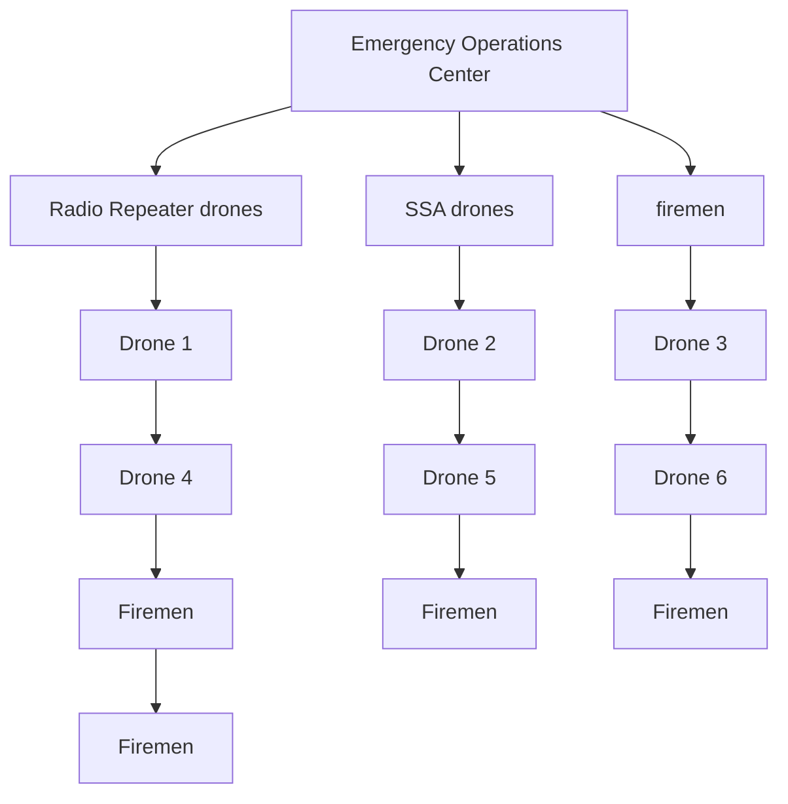
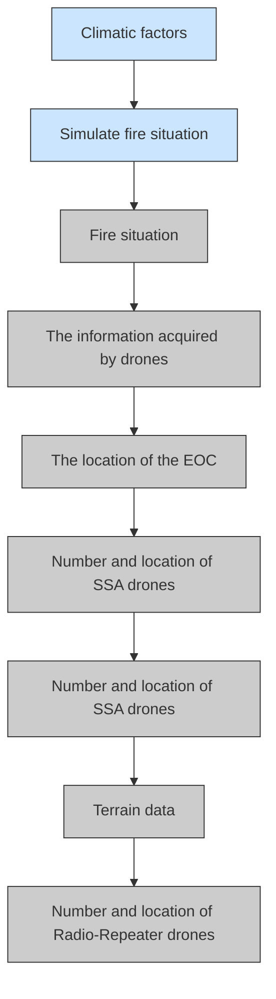
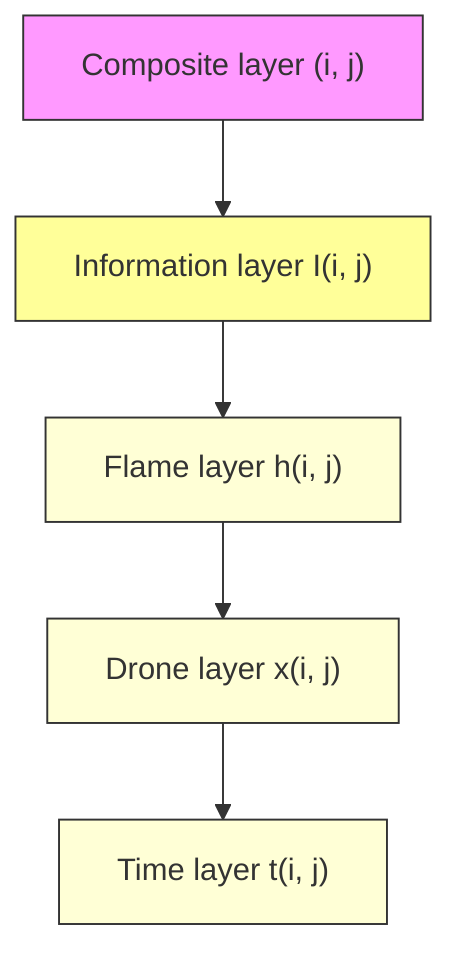
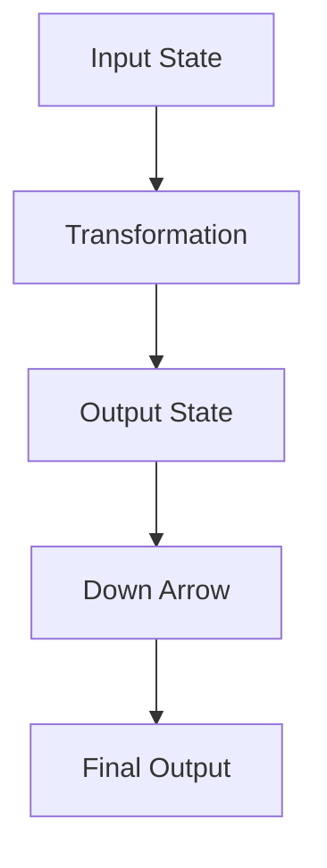

# ‘Rapid Bushfire Response’ UAV System

summary

Due to the drought of southeast Australia, forest fires burn across the country, impacting New South Wales and eastern Victoria. To help Victoria government response to future wildfire disasters, we established the ‘Rapid Bushfire Response’ system.

For model 1, to address the irregularity of fire regions and SSA drones’ information acquisition areas, we used regional discretization method, turning fire data and multi-drone cooperation in to constraint equations. We then divide the information in discreated area into different layers, the drone layer and information layer indicate an SSA drone’s different search mode and search zone, and the flame layer represents the severity of wildfire, we optimized SSA drone’s search pattern balancing information detection revenue and SSA drone numbers. Finally, we optimized the location of EOC and repeater with the further obtained SSA drone location while considering communication constrains and drones’ traveling distance.

For model 2, we discussed the changes in fire under global warming circumstances. We first formed a two-level function that maps temperature to average fire probability, and average fire probability to burned area size. To obtain the equation, we build cellular automata to simulate fire probability’s effect on burned area and fitted the relation between temperature and fire probability. We then estimated the temperature variance due to climate change from further studies and calculated the estimated average fire probability of this year and the next decade. Finally, we simulated average fire scenes and estimated their fire severity.

For model 3, while referring to the number of SSA drones obtained without terrain conditions, we refined the regional discretization model to bring into the terrain influence. For SSA drones, we considered topographical influence on a drone’s traveling time and discussed path planning considering the varying time cost of different areas. As for repeaters, we evaluated the influence of terrain on communication, and measures a regions’ communication shielding effect with the terrain’s second gradient. We then further considered the reliability of communication and estimated the schedule change in different terrains.

Based on the above three models, we estimated that 10 SSA drones and 2 radio repeater drones is required to build the ‘Rapid Bushfire Response’ system. For next decade, the cost of imaging cameras and telemetry sensors (for SSA drones) will increase. We also suggest that while fire zone area has an influence on drone arrangements, topographical conditions plays a less important role.

Keyword: Drone, Optimization, Regional Discretization, Fire Dynamic Models, Cellular Automata

## Content

summary..........

## 1 Introduction .........

1.1 Problem Background ...  
1.2 Restatement of the Problem ..  
1.3 Model Framework 3

## 2 Assumptions and Justifications ...............

## 3 Notations ...

3.1 Notations used in this paper .........

## 4 Model Derivation ....

4.1 Model Preparation . 6  
4.2 Model 1: SSA Drones Optimization Model.  
4.3 Model 2: CA Fire Prediction model . 9  
4.4 Model 3: Ratio-Repeater Drones Optimization Model.. 13

## 5 Test the Model... 15

5.1 Model 1 Sensitivity Analysis 15  
5.2 Model 2 Sensitivity Analysis . 16

## 6 Conclusion ............................ .......................... 17

6.1 Summary of Results. 17

## 7 Model Evaluation and Further Discussion.................. . 19

7.1 Strengths 19  
7.2 Possible Improvements. 19

## 8 Budget Request . 21

References 19

# 1 Introduction

## 1.1 Problem Background

Since September 2019, mountain fires in Australia have been burning for more than 200 days, covering an area of nearly 6 million hectares. The fire in Australia is equivalent to burning half of Jiangsu, three Beijing and two Belgium, which is 7 times of the Amazon rainforest fire that shocked the world (burning 900000 hectares of land), and 60 times of the California fire last year (burning 102000 hectares of land).

There were 39 fires in Victoria, the second most serious state, which destroyed 300 houses. The insurance commission estimated the loss at a \$700 million. Victoria is a state located on the southeast coast of Australia, and adjacent to South Australia and New South Wales in the north and west respectively. It is the smallest continental state in Australia. The northeast is a mountainous area with towering peaks, mostly between 1000 and 2000 meters above sea level.

Due to the extremely large wildfire and a great number of injured citizens and firefighters, the importance of drone-detection system is found. It can be widely used in aerial photography, environmental detection and other fields, and has a huge industrial prospect [1]. For a sudden wildfire, no matter in the early or middle stage of a fire, we can detect real-time data and communicate with firefighters through UAV system.

## 1.2 Restatement of the Problem

We need to develop a wildfire disaster relief response system named “Rapid Bushfire Response” and improve its response capabilities based on the situations of Victoria, Australia.

## What we Know:

➢ Distribution of wildfire severity of Australia  
➢ Geographic information of Southeast Australia

## What we Have:

➢ 2 kinds of drones. SSA drones are used for video & telemetry and Radio Repeater drones are used to extend the range of low power radios on the front lines.  
➢ 1 mobile EOC. central command and control point for emergency related operations and activities, and for requests for activation and deployment of resources

## What we Should Do:

➢ Determine the type and number of UAV. The UAV fleet should satisfy and balance the need of capability, safety and economics.  
➢ Identify the most-demanded locations for SSA drones. SSA drones has the capability of video & telemetry so that they are the main part of UAV fleet to guarantee the safety of firefighters and the data of the most serious fire areas  
➢ Identify the best hovering locations for radio-repeater drones. Radio-repeater drones are the core of several SSA drones to transmit information to EOC.  
➢ Propose dispatching schedule. Assign flight plan to each type of drones to ensure the Continuous information transmission. 030

The simple structure of the “Rapid Bushfire Response” UAV system is shown in figure 1.1.


<details>
<summary>flowchart</summary>


</details>

Figure 1 “Rapid Bushfire Response” UAV system

## 1.3 Model Framework

In this paper, we establish three models to solve the problem. Firstly, because this model is established to monitor wildfire, and is incapable of monitoring the whole area. We define a variable to determine the observation revenue of UAV in a certain area in a certain period. Secondly, to balance the capability, safety and economics, the number of SSA drones and the location of EOC are optimized by using the optimization model according to the size of the fire and the frequency of the fire. And we use the number of SSA drones to optimize the number and the location of ratio repeater drones. In the last, we built a model to simulate the size and scale of the possible wildfires in the next decade based on the Cellular Automata model. And then we substituted the predicted data to the model we built to testify whether model adapts to the changing likelihood of extreme fire events over the next decade. The overall algorithm flow chart of the model is shown in the figure 2:


<details>
<summary>flowchart</summary>


</details>

Figure 2 Model Overview

## 2 Assumptions and Justifications

## 1. The UAV will not be damaged or malfunction during the mission.

Justification: The probability of UAV's sudden damage due to its own reasons during the mission is ignored.

2. All drones can only be recharged in the Emergency Operations Center and they are fully charged when leaving the Emergency Operations Center.

Justification: Due to a large forest fire in the mission area, we conclude that the electrical equipment in the area is not working properly.

3. All drones fly at the maximum speed of 20m/s until they reach the designated location.

Justification: This is because the drones has the limitation of flight time. Flying at the maximum speed can minimize the time consumed on the road to make the mission time as long as possible.

4. The ascending and descending process of UAV is not considered.

Justification: This is because drones have very short ascent and descent times compared to flight times.

5. The terrain and weather do not have influence in the performance of drones.

Justification: Because the drones are hovering well above the ground, the terrain doesn’t affect the speed and battery life of drones. Meanwhile, the influence of weather on the performance of drones is ignore.

6. The atmosphere temperature has no effect on the battery life of drones.

Justification: Because the drones are hovering well above the ground, the atmosphere temperature doesn’t affect the battery life of drones and battery life.

7. Each UAV is regarded as a particle in the model

Justification: The shape, size and mass of UAV have no influence on the performance of drones.

8. The spread of the flame has nothing to do with the terrain.

Justification: For the cellular automata model, the probability of flame propagation from a certain area to all surrounding areas is the same. Therefore, this model ignores the influence of terrain on flame propagation.

9. In the next ten years, the temperature changes with time, and the humidity and wind speed do not change.

Justification: For 3 factors that affect the probability of fire propagation, the humidity and wind speed aren’t influenced by the global warming, which is regarded as constant value. And the temperature will increase slowly in the next decade.

## 3 Notations

## 3.1 Notations used in this paper

Table 1 Notations used in this paper

<table><tr><td>Symbol</td><td>Description</td><td>Unit</td></tr><tr><td> $v$ </td><td>Maximum speed of drones</td><td> $km/hr$ </td></tr><tr><td> $M,N$ </td><td>The element division method of the rectangular fire area, M is the number of elements of one side</td><td>-</td></tr><tr><td> $S$ </td><td>The number of the location of radio repeater</td><td>-</td></tr><tr><td> $R_{SSA}$ </td><td>The range of low power radios on the front lines</td><td>km</td></tr><tr><td> $R_{repeater}$ </td><td>The range of radio repeater's signal</td><td>km</td></tr><tr><td> $t_{max}$ </td><td>Maximum flight time</td><td>hr</td></tr><tr><td> $t_{charge}$ </td><td>Recharge time for the built-in battery of drones</td><td>hr</td></tr><tr><td> $t_{ijk}$ </td><td>The docking time of the drone in this area</td><td>hr</td></tr><tr><td> $S_t$ </td><td>Coverage area of the detected area</td><td> $km^2$ </td></tr><tr><td> $S_d$ </td><td>The area of the largest square that UAV can cover</td><td> $km^2$ </td></tr><tr><td> $R_d$ </td><td>Detection range of UAV</td><td>km</td></tr><tr><td> $R_f$ </td><td>The flight range of WileE-15.2X Hybrid Drone</td><td>km</td></tr><tr><td> $(i_{EOC},j_{EOC})$ </td><td>The location of Emergency Operations Center</td><td>-</td></tr><tr><td> $(a_r,b_r)$ </td><td>The location of radio repeater drone</td><td>-</td></tr><tr><td> $x_{ijk}$ </td><td>State variable indicating whether the SSA drone is in this area.  $x_{ijk}=1$  means the drone is in this area;  $x_{ijk}=0$  means the drone is not in this area.</td><td>-</td></tr><tr><td> $y_{ij}$ </td><td>State variable indicating whether the ratio repeater drone is in this area.  $y_{ij}=1$  means the drone is in this area;  $y_{ij}=0$  means the drone is not in this area.</td><td>-</td></tr><tr><td> $I_{ijk}$ </td><td>The amount of information acquired by UAV in this area</td><td>-</td></tr><tr><td> $h_{ij}$ </td><td>The severity of the fire in this area.  $h_{ij}\in[0,1)$ </td><td>-</td></tr><tr><td> $g_{ij}$ </td><td>Minimum transit time of the unit</td><td>-</td></tr><tr><td> $o_{ijk}$ </td><td>Sequence of UAV passing through units</td><td>-</td></tr><tr><td> $w_{ij}$ </td><td>The state value of each unit area's fire state in the cellular automata.  $w_{ij}=0,1,2,3,4,5$ </td><td>-</td></tr><tr><td>λ</td><td>UAV detection performance index</td><td>-</td></tr><tr><td>k</td><td>Monitoring types of SSA drones</td><td>-</td></tr><tr><td>α</td><td>The boundary parameter</td><td>-</td></tr><tr><td>T</td><td>Ground temperature in fire area (before fire)</td><td>°C</td></tr><tr><td> $p_f,p_{uf}$ </td><td>The influence factors in the cellular automata model. It will affect the area and distribution of the fire</td><td>-</td></tr></table>

## 4 Model Derivation

## 4.1 Model Preparation

## 4.1.1 The Data

## 1. Data Collection

The data we used mainly include Elevation data of southwest Australia, Australian wildfire data set, Forest fire areas in Australia\_ 2019-2020, Global Forest Watch. The data sources are summarized in Table 2.

Table 2 Data source collation

<table><tr><td>Database Names</td><td>Database Websites</td><td>Data Type</td></tr><tr><td>Elevation data of southwest Australia</td><td>https://topex.ucsd.edu/cgi-bin/get_data.cgi</td><td>Geography</td></tr><tr><td>Australian wildfire data set</td><td>https://www.kesci.com/mw/dataset/5e21588a2823a10036b575bf</td><td>Geography</td></tr><tr><td>Forest fire areas in Australia_2019-2020</td><td>https://www.datafountain.cn/datasets/5395</td><td>Geography</td></tr><tr><td>Global Forest Watch</td><td>https://www.globalforestwatch.org/</td><td>Geography</td></tr><tr><td>FW_Veg_Rem_Combined</td><td>https://github.com/var-unr89/smokey/blob/master/Wild-fire_att_description.txt</td><td>Climate</td></tr></table>

## 2. Data Cleaning

According to the latitude and longitude range and the administrative boundary of Victoria, Australia, we extracted data of terrain and fire details of Victoria from all the data. The fire in Victoria is shown in the figure 3 below.


<details>
<summary>3d surface chart</summary>

| latitude(°) | longitude(°) | altitude(m) | value |
| ----------- | ------------ | ----------- | ----- |
| -36         | 150          | 0           | 0     |
| -38         | 145          | 500         | 200   |
| -40         | 140          | 1000        | 600   |
| -42         | 135          | 1500        | 1000  |
| -44         | 130          | 1800        | 1400  |
| -46         | 125          | 1600        | 1200  |
| -48         | 120          | 1400        | 800   |
| -50         | 115          | 1200        | 600   |
| -52         | 110          | 1000        | 400   |
| -54         | 105          | 800         | 200   |
| -56         | 100          | 600         | 0     |
</details>


<details>
<summary>heatmap</summary>

| longitude(°) | latitude(°) | value |
| --- | --- | --- |
| 142 | -39 | 0 |
| 142 | -38 | 0 |
| 142 | -37 | 0 |
| 142 | -36 | 0 |
| 142 | -35 | 0 |
| 142 | -34 | 0 |
| 144 | -39 | 0 |
| 144 | -38 | 0 |
| 144 | -37 | 0 |
| 144 | -36 | 0 |
| 144 | -35 | 0 |
| 144 | -34 | 0 |
| 146 | -39 | 0 |
| 146 | -38 | 0 |
| 146 | -37 | 0 |
| 146 | -36 | 0 |
| 146 | -35 | 0 |
| 146 | -34 | 0 |
| 148 | -39 | 0 |
| 148 | -38 | 0 |
| 148 | -37 | 0 |
| 148 | -36 | 0 |
| 148 | -35 | 0 |
| 148 | -34 | 0 |
| 150 | -39 | 0 |
| 150 | -38 | 0 |
| 150 | -37 | 0 |
| 150 | -36 | 0 |
| 150 | -35 | 0 |
| 150 | -34 | 0 |
| 152 | -39 | 0 |
| 152 | -38 | 0 |
| 152 | -37 | 0 |
| 152 | -36 | 0 |
| 152 | -35 | 0 |
| 152 | -34 | 0 |
| 154 | -39 | 0 |
| 154 | -38 | 0 |
| 154 | -37 | 0 |
| 154 | -36 | 0 |
| 154 | -35 | 0 |
| 154 | -34 | 0 |
| 156 | -39 | 0 |
| 156 | -38 | 0 |
| 156 | -37 | 0 |
| 156 | -36 | 0 |
| 156 | -35 | 0 |
| 156 | -34 | 0 |
| 158 | -39 | 0 |
| 158 | -38 | 0 |
| 158 | -37 | 0 |
| 158 | -36 | 0 |
| 158 | -35 | 0 |
| 158 | -34 | 0 |
| 160 | -39 | 0 |
| 160 | -38 | 0 |
| 160 | -37 | 0 |
| 160 | -36 | 0 |
| 160 | -35 | 0 |
| 160 | -34 | 0 |
| 162 | -39 | 0 |
| 162 | -38 | 0 |
| 162 | -37 | 0 |
| 162 | -36 | 0 |
| 162 | -35 | 0 |
| 162 | -34 | 0 |
| 164 | -39 | 0 |
| 164 | -38 | 0 |
| 164 | -37 | 0 |
| 164 | -36 | 0 |
| 164 | -35 | 0 |
| 164 | -34 | 0 |
| 166 | -39 | 0 |
| 166 | -38 | 0 |
| 166 | -37 | 0 |
| 166 | -36 | 0 |
| 166 | -35 | 0 |
| 166 | -34 | 0 |
| 168 | -39 | 0 |
| 168 | -38 | 0 |
| 168 | -37 | 0 |
| 168 | -36 | 0 |
| 168 | -35 | 0 |
| 168 | -34 | 0 |
</details>

Figure 3 Topographic map and brief contour of Southeast Australia

## 4.1.2 Geographic Coordinate System

We have collected the geographic coordinates (longitude and latitude) of Victoria. To find the true distance between any two points in the map, we map the spherical coordinate system to the plane rectangular coordinate system. With the latitude and longitude range of the fire area, a rectangular fire field area can be obtained in a rectangular coordinate system. The linear distance between any two points in the rectangular coordinate system is the actual distance between the two places.


<details>
<summary>text_image</summary>

z
y
x
O
x
y
</details>

Figure 4 Spherical coordinate transformation

## 4.2 Model 1: SSA Drones Optimization Model

Due to area detection requirements, UAVs continuously monitor fire regions. However, limited by power and communication, it is impossible to detect all regions of interest continuously. Therefore, We optimized the detection time of different regions according to their importance. [2]

## 4.2.1 Regional Discretization Model

We first discretize the area into a M×N matrix, each unit area is which is the minimum transmit area of 5-watt transmitters. We then divide the matrix in to 4 layers to analyze different information, the time layer (t, a matrix representing the hover time of the unit), the drone layer (x, a 0-1 state variable matrix representing a drone’s hovering zone and t, a matrix storing a drone’s hovering time), the information layer (I, a matrix representing the information SSA drones collected form the unit) and the flame layer (h vector representing the severity of wildfire). We combine these three layers to optimize the number of SSA drones and balance the capability and economics.


<details>
<summary>flowchart</summary>


</details>

Figure 5 different levels in the optimization model

Considering a SSA drone’s power limitations, we hypothesize that a drone detects one or two block at once, hence a SSA drones has 5 different detection modes:


<details>
<summary>flowchart</summary>


</details>

Figure 6 detection modes of SSA drones

As we identify each detection mode with the position of its upper left corner, we could represent a drones detection behavior by dividing the drone layer into 5 sub-layers, $\it { \Delta } x _ { \it { s u b } }$ and $t _ { s u b }$ . For drone layers we have:

$$
t _ {i j} = \sum_ {\substack {k = 1 \\ k = 1}} ^ {5} t _ {s u b, i j k} \tag{1}
$$

For the amount of information acquired by UAV in a certain area $I _ { i j } ,$ , we have:

$$
I _ {i j} = 1 - e ^ {- \lambda t _ {i j}} \tag {2}
$$

For the variables in equation 1,

$$
\left\{ \begin{array} { l } \lambda = \frac { v R } { S _ { d } } \\ t _ { s u b , i j 1 } = x _ { i j 1 } \bigg ( t _ { \operatorname* { m a x } } - \frac { 2 \sqrt { ( i - i _ { E O C } ) ^ { 2 } + ( j - j _ { E O C } ) ^ { 2 } } } { v } \times \sqrt { S _ { d } } \bigg ) \\ t _ { s u b , i j 2 } = \frac { 1 } { 2 } \bigg ( x _ { i j ^ { \prime } 2 } \bigg ( t _ { \operatorname* { m a x } } - \frac { 2 \sqrt { ( i - i _ { E O C } ) ^ { 2 } + ( j - j _ { E O C } ) ^ { 2 } } } { v } \times \sqrt { S _ { d } } \bigg ) + x _ { i - 1 j 2 } \bigg ( t _ { \operatorname* { m a x } } - \frac { 2 \sqrt { ( i + 0 . 5 - i _ { E O C } ) ^ { 2 } + ( j - j _ { E O C } ) ^ { 2 } } } { v } \times \sqrt { S _ { d } } \bigg ) \bigg ) \\ t _ { s u b , i j 3 } = \frac { 1 } { 2 } \bigg ( x _ { i j 3 } \bigg ( t _ { \operatorname* { m a x } } - \frac { 2 \sqrt { ( i - i _ { E O C } ) ^ { 2 } + ( j - j _ { E O C } ) ^ { 2 } } } { v } \times \sqrt { S _ { d } } \bigg ) + x _ { i - 1 j - 1 3 } \bigg ( t _ { \operatorname* { m a x } } - \frac { 2 \sqrt { ( i + 0 . 5 - i _ { E O C } ) ^ { 2 } + ( j + 0 . 5 - j _ { E O C } ) ^ { 2 } } } { v } \times \sqrt { S _ { d } } \bigg ) \bigg ) \\ t _ { s u b , i j 4 } = \frac { 1 } { 2 } \bigg ( x _ { i j 4 } \bigg ( t _ { \operatorname* { m a x } } - \frac { 2 \sqrt { ( i - i _ { E O C } ) ^ { 2 } + ( j - j _ { E O C } ) ^ { 2 } } } { v } \times \sqrt { S _ { d } } \bigg ) + x _ { i j - 1 4 } \bigg ( t _ { \operatorname* { m a x } } - \frac { 2 \sqrt { ( i - i _ { E O C } ) ^ { 2 } + ( j + 0 . 5 - j _ { E O C } ) ^ { 2 } } } { v } \times \sqrt { S _ { d } } \bigg ) \bigg ) \\ t _ { s u b , i j 5 } = \frac { 1 } { 2 } \bigg ( x _ { i - 1 j 5 } \bigg ( t _ { \operatorname* { m a x } } - \frac { 2 \sqrt { ( i + 0 . 5 - i _ { E O C } ) ^ { 2 } + ( j - j _ { E O C } ) ^ { 2 } } } { v } \times \sqrt { S _ { d } } \bigg ) + x _ { i j - 1 5 } \bigg ( t _ { \operatorname* { m a x } } - \frac { 2 \sqrt { ( i - i _ { E O C } ) ^ { 2 } + ( j + 0 . 5 - j _ { E O C } ) ^ { 2 } } } { v } \times \sqrt { S _ { d } } \bigg ) \bigg ) \\ \end{array} \right. \\ ( 3 )
$$

In multiple-goods-condition, we consider the drones optimization problem as a Multiple-objective integer programming problem. Therefore, the objective function of the optimization model is

$$
\max \sum_ {k = 1} ^ {5} \sum_ {i = 0} ^ {M} \sum_ {j = 0} ^ {N} I _ {i j k} h _ {i j} x _ {i j} - \alpha \sum_ {k = 0} ^ {5} \sum_ {i = 0} ^ {M} \sum_ {j = 0} ^ {N} x _ {i j} \tag {4}
$$

where $\sum _ { k = 1 } ^ { 5 } \sum _ { i = 0 } ^ { M } \sum _ { j = 0 } ^ { N } x _ { i j }$ represents the total number of SSA UAVs, Here serves as an threshold, It prevents the algorithm from adding drones when a new drone’s contribution is smaller than $\alpha ,$ , balancing economic needs and fire zone detection. $\sum _ { k = 1 } ^ { 5 } \sum _ { i = 0 } ^ { M } \sum _ { j = 0 } ^ { N } I _ { i j k } h _ { i j } x _ { i j }$ represents the detection revenue of SSA drones. $h _ { i j }$ is the severity of the fire area $( i , j ) , \mathrm { A s }$ “Boots-on-the-ground” Teams faces more danger in severe areas, The higher the value of $h _ { i j } .$ , the more valuable the information of this fire unit is. $h _ { i j }$ is calculated with emulations methods and will be further

discussed in the next section.

## 4.2.2 EOC Constraint Conditions

Apart from constrains with in the regional discretization model, we have

The EOC locates inside the discrete zone.

$$
0 \leqslant i _ {e o c} \leqslant M, 0 \leqslant j _ {e o c} \leqslant N \tag {5}
$$

− The EOC locates outside the fire.

$$
h _ {i j} \leqslant h _ {i j} \times \left(\left(i _ {e o c} - i\right) \times (M + 1) - \left(j _ {e o c} - j\right)\right) ^ {2} \tag {6}
$$

Equation 6 casts no effect when $h _ { i j }$ is zero, yet when $h _ { i j }$ is not zero which indicates fire, it restrains $\left( i _ { e o c } - i \right) \times \left( M + 1 \right) - \left( j _ { e o c } - j \right)$ from being zero, hence EOC will not be optimized in to firezone.

## 4.2.3 Terrain Adapting Regional Discretization Model

To further adapt the integer programming discretization model, we introduced path planning to consider the cost of complex terrain. We assume that as SSA drones pass each area unit, it’s time cost varies according to the height change, hence we could brought in terrain information in the form of minimum passing time g. Furthermore to indicate a drone’s flying behavior, we introduced o, $o _ { i j k }$ is zero when unit area $( i , j )$ is not in the drone’s path, hence we have:

$$
t _ {i j k} \times o _ {i j k} \geqslant g _ {i j} \times o _ {i j k} \tag {7}
$$

To ensure all $t _ { i j k }$ are marked on the path $( t _ { i j k }$ is not zero only when $o _ { i j k }$ is not zero), we have:

$$
t _ {i j k} \leqslant g _ {i j} \times o _ {i j k} \tag {8}
$$

As a drone’s path is continuous, we must constrain the connectivity of matrix $\mathbf { o } ^ { \prime } \mathbf { s }$ non-zero elements. To achieve this, we restrict $o _ { i j k }$ to be integer and gradually increases as SSA travels unit by unit, while appointing the starting point to be 1, we have:

$$
o _ {i j k} (t o t a l p o i n t _ {k} - o _ {i j k}) (o _ {i + 1 j - 1} - o _ {i j} - 1) (o _ {i j - 1} - o _ {i j} - 1) (o _ {i - 1 j - 1} - o _ {i j} - 1)
$$

$$
\left(o _ {i + 1 j} - o _ {i j} - 1\right) \left(o _ {i - 1 j} - o _ {i j} - 1\right) \left(o _ {i + 1 j + 1} - o _ {i j} - 1\right) \left(o _ {i j + 1} - o _ {i j} - 1\right) \left(o _ {i - 1 j + 1} - o _ {i j} - 1\right) = 0
$$

While

$$
\text { totalpoint } _ {k} \times (\text { totalpoint } _ {k} - 1) = \sum_ {i} ^ {M} \sum_ {j} ^ {N} o _ {i j k} \tag {10}
$$

The model could be optimized with the same target as the regional discretization model.

## 4.3 Model 2: CA Fire Prediction model

Considering the lack of spatial distribution data of fire field, we use cellular automata model to simulate the fire field distribution in a rectangular area. In the simulation process, there are two parameters related to temperature. Considering global warming, these two parameters will change with time, thus affecting the area and distribution of fire field. Therefore, the model can be used to predict the fire distribution in the next ten years and optimize the number and types of SSA drones.

## 4.3.1 Simulation of the Wildfire

## 1. Simulation Preparation

In order to build cellular automata to simulate the fire severity distribution, it is necessary to determine the state of the unit area. In this paper, we set up three states: after-burning, burning and unburned. And Considering the duration of combustion, this model defines a life for the fire of each point. If firing, the state value $w _ { i j }$ of this point decreases by 1 as time increases by 1. Therefore, $w _ { i j } = 0 , 1 , 2 , 3 , 4 , 5 . ~ w _ { i j } = 5$ represents the unburned state; $w _ { i j } = 1 , 2 , 3 , 4$ represents the burning state, whose value represents the residual life of the unit; $w _ { i j } = 0$ represents the after-burning state of the unit.

What’s more, note that the ‘unit area’ of this model is different from the ‘unit area’ in the previous model. The ‘unit area’ in this model is the subset of the ‘unit area’ in the previous model, representing the fire state in this area, thus determining the severity of fire in the larger ‘unit area’

After determining the unit area state, we build a fire field, which is the same as the fire field in the previous model, but the division of unit area is different. The unit area is much smaller so that high accuracy can be obtained.

Next, considering the probability of unit fire in the fire region, whether a certain point in a fire is on fire at a certain time depends on the distance from the known ignition point. At each time, the ignition probability of each point is obtained by applying the gaussian filter of MATLAB to the whole matrix. When the probability value of the point divided by the critical probability value is large than the random number, then at this moment, the point becomes a new ignition point, that is, $w _ { i j } = 5$ becomes $w _ { i j } = 4$ .

## 2. Simulation Method

The simulation algorithm is as follows: Firstly, the four points in the center of the fire site are set as fire, namely $w _ { i j } = 5$ becomes $w _ { i j } = 4$ . Secondly, the probability of a new fire point at the next moment is calculated and compared with the critical probability to get the location of the new fire point. Thirdly, the state variable of ignition point, that is, the unit state value $w _ { i j } = 1 , 2 , 3 , 4$ , minus one. Fourthly, judge the probability that the fire of all units will be extinguished. If the extinction probability of the unit flame is less than the critical extinction probability, the state variable at this point becomes 0, that is, $w _ { i j } = 0$ . Fifthly, update the burning-time matrix for judgment of flame severity. In the last, recalculate the ignition probability of all points. The specific algorithm flow chart is as follows.


<details>
<summary>flowchart</summary>

```mermaid
graph TD
  A["START"] --> B["The middle four points are burning"]
  B --> C{Exist units 0<w(i,j)<5}
  C -->|No| D["END"]
  C -->|Yes| E["Calculate the fire probability of units"]
  E --> F{> the critical fire probability}
  F -->|No| D
  F -->|Yes| G["Create a new ignition point w(i,j)=4"]
  D --> H["For the fire point w(i,j)-1"]
  H --> I{< the critical flameout probability}
  I -->|No| J["The flame at this unit goes out w(i,j)=0"]
  I -->|Yes| K["Update the burn time matrix"]
  J --> K
```
</details>

Figure 7 Algorithm of fire simulation model based on Cellular Automata

We can simulate the process of this year's Australian mountain fire through simulation, and the simulation results are as follows


<details>
<summary>scatterplot</summary>

| axis i | axis j |
| ------ | ------ |
| 150    | 200    |
| 200    | 250    |
| 250    | 300    |
| 300    | 350    |
| 350    | 400    |
| 400    | 450    |
</details>

Figure 8 Simulation result of wildfire course based on the cellular automata

In this model, there exist two parameters, the critical fired probability and critical unfired proba- $p _ { f }$ bility $p _ { u f } .$ These two parameters can decide the wildfire distribution. For the critical fired probability, the value of it is determined by the temperature before wildfire happens, which means it has a relationship with the global warming. For the critical unfired probability, it’s the same for the different wildfire events for the decade. But the critical unfired probability will increase as the fire scale increases. H

As for how to determining the severity of the fire, we accumulate the time each point is burned and rescaled to 0-1 as fire are more severe at the starting point. We then transforms it into a M×N dimensional matrix to characterize the spatial severity distribution of the fire, which is the value $h _ { i j }$ we used for the last model. We can visualize this matrix as follows


<details>
<summary>text_image</summary>

i
0 0.1 0.2 0.3 0.4 0.5 0.6 0.7 0.8 0.9 1
</details>

Figure 9 Fire severity matrix (5 times simulations)

The lighter the color in the figure, the lower the flame severity of the unit.

## 4.3.2 The Influence of Global Warming on Wildfire Simulation

To analyze the impact of global warming on this model, we established the following relationships. Firstly, by traversing the critical fire probability from 0.7 to 0.95, we get the simulation results between the critical fire probability and the fire area size. Then the relationship between the two variables is determined by curve fitting tool of MATLAB, which is shown as below.

$$
S _ {f} = 6 4. 1 2 p _ {f} ^ {- 7. 0 5 1} \left(p _ {f} \in [ 0. 6, 1 ]\right) \tag {11}
$$

Through the fire data of this year's Australian fire, we can get the relevant data of the fire area and the average temperature of the area before the fire. By using the above formula (1.6), we can transform the fire area data into different probability value so that we can get the relationship between the critical fire probability and average temperature of the area.

$$
p _ {f} = - 0. 1 2 2 6 T + 2. 9 2 4 (T \in [ 1 6, 1 8. 9 ]) \tag {12}
$$

Finally, when analyzing the relationship between time and temperature, the temperature we find that the change of temperature includes seasonal periodic change and long-term growth change. For the annual temperature prediction, we can ignore the seasonal periodic change of temperature. Therefore, the temperature in this area increases exponentially with time. Due to an average temperature rise of 1.5 degrees Celsius over the past 50 years, their relationship is as follows

$$
T = 1 7. 3 e ^ {0. 0 0 1 1 t} (t = 1, 2, 3,..., 1 0) \tag {13}
$$


<details>
<summary>line chart</summary>

| Critical Ignition Probability | Wildfire Area (km²) |
| ----------------------------- | ------------------- |
| 0.6                           | 2200                |
| 0.7                           | 800                 |
| 0.8                           | 400                 |
| 0.9                           | 200                 |
| 1.0                           | 100                 |
</details>

(a) The relationship between the critical fire probability and the wildfire area


<details>
<summary>scatterplot</summary>

| Average Temperature of the region(centigrade) | Critical Ignition Probability |
| --------------------------------------------- | ----------------------------- |
| 17.3                                          | 0.8033                        |
| 17.5                                          | 0.7795                        |
</details>

(b) The relationship between the critical average temperature and the fire probability


<details>
<summary>line chart</summary>

| Year | Average Temperature of the region (centigrade) |
| ---- | ----------------------------------------------- |
| 0    | 17.30                                           |
| 2    | 17.34                                           |
| 4    | 17.38                                           |
| 6    | 17.42                                           |
| 8    | 17.46                                           |
| 10   | 17.50                                           |
</details>

(c) The relationship between the critical time and the average temperature (global warming)  
Figure 10 Relationship between fire area and critical ignition point probability

With all mentioned above, we can get the critical fire probability of this year and ten years later $p _ { f } = 0 . 7 6 , p _ { f } = 0 . 7 9$ . Taking them into the simulation model, we can get the difference of fire distribution between this year and 10 years later. Finally, the demand change of UAV system can be determined.

## 4.4 Model 3: Ratio-Repeater Drones Optimization Model

Due to the continuity of communication requirements, the radio repeater UAV needs to hover at a certain position all the time as the intermediate of the signal. According to the location and number of the SSA drones. We can get the location and number of radio repeater drones by optimization model.

## 4.4.1 Influence of Terrain on Radio Range

Considering the influence of terrain on the drone communication, we extract terrain data from a fire region in Victoria. The matrix is denoted as . Laplace operator is used for the terrain data matrix to obtain the change amplitude of terrain is obtained. Then the rate of change data is converted into the signal transmission range data of the place. The specific transformation methods are as follows.

$$
M = k \ln \left(| \nabla^ {2} L | + 1\right) \tag {14}
$$

is the parameter make sure the range of value is . This matrix represents the signal receiving range of SSA drone at the fire region for each unit.


<details>
<summary>3d surface plot</summary>

| axis j | axis i | nominal range based on the terrain data (km) |
| ------ | ------ | ------------------------------------------ |
| 17     | 18     | 17.0                                       |
| 18     | 19     | 18.0                                       |
| 19     | 20     | 19.0                                       |
</details>

Figure 11 the signal receiving range of SSA drone at the fire region for each unit

## 4.4.2 Radio Repeater Drones Optimization Model

## 1. Optimization objective

The optimization object is sum of distance between ratio repeater and EOC.

$$
\min \sum_ {r = 1} ^ {S} \sqrt {\left(a _ {r} - j _ {E O C}\right) ^ {2} + \left(b _ {r} - j _ {E O C}\right) ^ {2}} \tag {15}
$$

## 2. Constraint Conditions

The distance between UAV and EOC is less than the flight distance of UAV.

$$
\sqrt {\left(a _ {r} - j _ {E O C}\right) ^ {2} + \left(b _ {r} - j _ {E O C}\right) ^ {2}} \times \sqrt {S _ {k}} \leqslant R _ {f} \tag {16}
$$

Radio repeater drones can communicate with SSA drones.

$$
\sqrt {\left(a _ {k} - i _ {S S A}\right) ^ {2} + \left(b _ {k} - j _ {S S A}\right) ^ {2}} \times \sqrt {S _ {k}} \leqslant m _ {i j} \tag {17}
$$

## 4.4.3 Radio repeater drones scheduling scheme

For radio repeater drones, the reliability of communication needs to be considered, so we need to ensure that there is a ratio repeater drones at the position we get throughout the wildfire course. Therefore, when the drone needs to return for charging, another drone needs to replace it.

For the WileE–15.2X hybrid drone, hovering time and charging time of UAV determine how many UAVs are needed in this position as follow.

$$
n s _ {r} = \left\{ \begin{array}{l l} 2 & t _ {\text { charge }} + t _ {\text { road }} \leqslant t _ {\text { stay }} \\ 3 & t _ {\text { charge }} + t _ {\text { road }} > t _ {\text { stay }} \end{array} \right. \tag {18}
$$

For the formula 13, we know that

$$
t _ {s t a y} = t _ {\max} - t _ {r o a d} = t _ {\max} - \frac {\sqrt {\left(a _ {r} - i _ {E O C}\right) ^ {2} + \left(b _ {r} - j _ {E O C}\right) ^ {2}}}{v} \times \sqrt {S _ {k}} \tag {19}
$$

To sum up, we can know the total number of radio repeater drones, namely, $\sum _ { r } ^ { S } n s _ { r }$ .

## 5 Test the Model

## 5.1 Model 1 Sensitivity Analysis

## 1. UAV detection performance index sensitivity analysis

For the model 1, UAV detection performance index depend on the detection range of the UAV. Different detectors have different detection capabilities, and we can find out how different detection range will affect the number and distribution of UAVs in this model by solving different parameters in its neighborhood range to testify the sensitivity analysis.

For the UAV detection performance index, we take 0.005 as the step size within the range of [0.01,0.03], and observe the effect of the change of the value on the model solution result. The results are shown in the following table:

Table 3 The relationship between UAV detection performance index and drone number

<table><tr><td>λ</td><td>Drone number</td></tr><tr><td>0.010</td><td>3</td></tr><tr><td>0.015</td><td>5</td></tr><tr><td>0.020</td><td>6</td></tr><tr><td>0.025</td><td>5</td></tr><tr><td>0.030</td><td>5</td></tr></table>


<details>
<summary>line chart</summary>

| λ | drone number |
| --- | --- |
| 0.01 | 3 |
| 0.014 | 5 |
| 0.02 | 6 |
| 0.025 | 5 |
| 0.03 | 5 |
</details>

It can be seen from the results that when the value of λ is greater than a certain threshold, the number of UAVs solved by the model stabilizes at 5. It can be seen that the stability of the parameter is robust.

## 2 The boundary parameter sensitivity analysis

The boundary parameter measures the increase of costs by adding SSA drone. When the detection revenue is greater than the increased cost, continue to increase SSA drones; when the detection revenue is less than the increased cost, stop increasing SSA drones.

For the boundary parameter ??, we use 0.1 as the step size in the range of [0.3, 0.7] to observe the influence of the change of its value on the model solution result. The results are shown in the table 4 below

Table 4 The relationship between the boundary parameter and drone number

<table><tr><td>α</td><td>Drone number</td></tr><tr><td>0.3</td><td>7</td></tr><tr><td>0.4</td><td>6</td></tr><tr><td>0.5</td><td>6</td></tr><tr><td>0.6</td><td>4</td></tr><tr><td>0.7</td><td>3</td></tr></table>


<details>
<summary>line chart</summary>

| α    | drone number |
| ---- | ------------ |
| 0.3  | 7            |
| 0.4  | 6            |
| 0.5  | 6            |
| 0.6  | 4            |
| 0.7  | 3            |
</details>

It can be seen from the table that this parameter has a great influence on the result of UAV. It is known that this parameter has high sensitivity and poor stability. Based on the physical meaning of this parameter, this is understandable.

## 5.2 Model 2 Sensitivity Analysis

For cellular automata, due to the random simulation process involved in the model, any parameter value change may result in different fire field distributions, and multiple solution results of the same parameter value may also obtain different fire field distributions. Therefore, we can change the value of a certain parameter and solve the model twice for each value to verify the sensitivity of the model.

For the critical fire probability $p _ { f } ,$ we use 0.03 as the step size in the range of [0.74, 0.83] to observe the influence of the change of its value on the model solution result. The results are shown in the table 5 below:

Table 5 The relationship between the critical fire probability $\underline { p { f } }$ and drone number

<table><tr><td> $p_f$ </td><td>Drone number(1 $^{st}$  time result)</td><td>Drone number(2 $^{nd}$  time result)</td></tr><tr><td>0.74</td><td>10</td><td>10</td></tr><tr><td>0.77</td><td>6</td><td>6</td></tr><tr><td>0.80</td><td>6</td><td>5</td></tr><tr><td>0.83</td><td>4</td><td>4</td></tr></table>


<details>
<summary>line chart</summary>

| the critical fire probability | first time simulation | second time simulation |
| ----------------------------- | --------------------- | ---------------------- |
| 0.74                          | 10                    | 10                     |
| 0.77                          | 6                     | 6                      |
| 0.8                           | 6                     | 5                      |
| 0.83                          | 4                     | 4                      |
</details>

Figure 2 Sensitivity Analysis for the critical fire probability

It can be seen from the solution result that the change of the value of k has a greater influence on the solution result of the model, indicating that the sensitivity of parameter $p _ { f }$ is high. Therefore, it is necessary to accurately simulate the value of k in the process of model building, otherwise the solution result will produce errors.

## 6 Conclusion

## 6.1 Summary of Results

## 6.1.1 Result of Problem 1

Through cellular automata, according to the fire data of the Australian fire, we can get the distribution of one of the fires as follows, where the critical fire probability is $p _ { f } = 0 . 7 9 9 6$ . We ran five simulations. Then we got the flame severity distribution matrix. We visualize it as shown in the figure 10.


<details>
<summary>text_image</summary>

i
0 0.1 0.2 0.3 0.4 0.5 0.6 0.7 0.8 0.9 1
</details>

Figure 3 flame severity distribution matrix

The optimization objectives and constraints of SSA drones are as follows. Bring the fire severity data in the figure 11 into the planning model in the figure below.

$$
\begin{array}{l} \max \sum_ {k = 1} ^ {5} \sum_ {i = 0} ^ {M} \sum_ {j = 0} ^ {N} I _ {i j k} h _ {i j} x _ {i j k} - k \sum_ {k = 0} ^ {5} \sum_ {i = 0} ^ {M} \sum_ {j = 0} ^ {N} x _ {i j k} \\ s. t \left\{ \begin{array}{l} \sqrt {\left(i - i _ {E O C}\right) ^ {2} + \left(j - j _ {E O C}\right) ^ {2}} \times \sqrt {S _ {d}} \leqslant R _ {f} \\ h _ {i j} \leqslant h _ {i j} (i -) \end{array} \right. \tag {20} \\ \end{array}
$$

Through lingo, the matrix for 5 kinds of SSA drones monitoring mode and the location of EOC is obtained. Meanwhile, the total number of SSA UAVs is known as $\sum _ { k = 0 } ^ { 5 } \sum _ { i = 0 } ^ { M } \sum _ { j = 0 } ^ { N } x _ { i j k } = 8$ . The location of EOC is (1,6).

The optimization objectives and constraints of radio repeater drones are as follows.

$$
\min \sum_ {r = 1} ^ {S} \sqrt {\left(a _ {r} - j _ {E O C}\right) ^ {2} + \left(b _ {r} - j _ {E O C}\right) ^ {2}}
$$

$$
s. t \left\{ \begin{array}{l} \sqrt {\left(a _ {r} - j _ {E O C}\right) ^ {2} + \left(b _ {r} - j _ {E O C}\right) ^ {2}} \times \sqrt {S _ {k}} \leqslant R _ {f} \\ \sqrt {\left(a _ {k} - i _ {S S A}\right) ^ {2} + \left(b _ {k} - j _ {S S A}\right) ^ {2}} \times \sqrt {S _ {k}} \leqslant m _ {i j} \end{array} \right. \tag {21}
$$

Through lingo, the matrix for the location of radio repeater drones is obtained. Meanwhile, the total number of radio repeater drones is known as $\sum _ { r } ^ { S } n s _ { r } = 2$ . Ultimately, the total number of 2 kinds of drones is 10.

## 6.1.2 Result of Problem 2

Due to global warming, the surface temperature of Victoria will increase, which will affect the fire probability of the region. The critical fire probability after ten years is $p _ { f } = 0 . 7 9$ . Through cellular automata, we can get the distribution of one of the fires as follows.

The optimization objectives and constraints of SSA drones and the optimization objectives and constraints of radio repeater drones for the ten years later are the same as what the paper showed in model 1&3. Therefore, we can get the UAV configuration for the ‘Rapid Bushfire Response’ system.

The number of SSA drones is known a $\sum _ { k = 0 } ^ { 5 } \sum _ { i = 0 } ^ { M } \sum _ { j = 0 } ^ { N } x _ { i j k } = 1 0$ . The number of radio repeater drones is known as $\sum _ { r } ^ { S } n s _ { r } = 2$ . r

Therefore, for the next decade, due to global warming, the cost of thermal imaging cameras and telemetry sensors increases.

## 6.1.3 Result of Problem 3

We can get the different area data of fire region by changing the critical fire probability so that the location of radio repeater drones is available. By changing the critical fire probability $p _ { f }$ from 0.74 to 0.83 by the step of 0.03, areas of wildfire region and the locations of radio repeater drones are shown in the Table 6.

Table 6 The location of radio repeater for different fire area

<table><tr><td>Critical fire probability</td><td>Area of fire region (km2)</td><td>Location of radio repeater drone</td></tr><tr><td rowspan="2">0.74</td><td>79.2342</td><td>(3,4)</td></tr><tr><td>81.3212</td><td>(2,5)</td></tr><tr><td rowspan="2">0.77</td><td>80.8094</td><td>(0,3)</td></tr><tr><td>81.0506</td><td>(0,3)</td></tr><tr><td rowspan="2">0.80</td><td>77.7141</td><td>(0,3)</td></tr><tr><td>76.3213</td><td>(2,5)</td></tr><tr><td rowspan="2">0.83</td><td>72.7502</td><td>(2,4)</td></tr><tr><td>74.0506</td><td>(2,4)</td></tr></table>

As for the location of different terrains, because the terrain characteristic is considered into the model 3, we choose 3 different area to simulate the results. The locations of radio repeater are all the same because the terrain has a much less infect on the location of radio repeater drones. The reason that the effect is small is the effect of terrain on the radio range is not large enough to counteracting SSA drones impact on the location of radio repeater drones. What’s more, it turns out that ratio repeater will get close to the area where the altitude changes rapidly.

## 7 Model Evaluation and Further Discussion

## 7.1 Strengths

The model has wide applicability. Knowing the fire situation, the deployment position of EOC and UAV can be quickly solved, which can improve the efficiency of fire rescue.  
The model can predict the future fire situation according to the weather conditions, so that EOC and drones can be deployed in advance to improve fire rescue efficiency and reduce losses.

## 7.2 Possible Improvements

The impact of weather and other factors on the flight of the UAV is not considered, which leads to a certain error between the model prediction results and reality. As the planning model is relatively large, in order to simplify the model, we have to give up thinking about factors such as weather.  
Due to the lack of detailed fire and climate data in Victoria, the prediction of fire sites in the next ten years lacks accuracy.  
The fire field prediction model assumes that fires are likely to occur in every area. In fact, fires are likely to occur only in places covered by vegetation, which is inconsistent with reality.

## 8 References

[1] W. Wei, M. Hao, X. Jin-qi, and S. Chang-yin, “Research on standardized design method of airframe for multi-rotor uav,” no. 5, pp. 147150, 2014.  
[2]Xiang Tingli, Wang Hongjun, Shi Yingchun. Multi-aircraft cooperative detection task allocation strategy for area coverage[J]. Journal of Air Force Engineering University (Natural Science Edition), 2019, 20(06): 33-38+71.  
[3] Niu Ruoyun, Zhai Panmao, Sun Minghua. Review of Forest Fire Risk Meteorological Index and Its Construction Method[J]. Meteorology, 2006(12): 3-9.  
[4] Zhang Wenwen, Wang Qiuhua, Wang Ruichen, Long Tengteng, Wei Jianheng, Gao Zhongliang. Research progress on Australian eucalyptus forest fires[J/OL]. World Forestry Re-search:1- 10[2021-02-07].https://doi.org/10.13348/j.cnki.sjlyyj.2021.0004.y.  
[5] Li Chengxin, Zhao Liangchen, Li Dongyun, Ma Jiahui. Australian forest fire spread prediction model based on CA system and application of emergency supplies dispatching [J]. Forestry Investigation and Planning, 2020, 45(05): 62-69+89.  
[6] Liu Jiachang, Tang Bin, Zou Yuan. Using GIS to analyze the factors affecting the occurrence of forest fires and their temporal and spatial distribution characteristics: Taking California as an example [J]. Journal of Northeast Forestry University, 2020, 48(07): 70-74.  
[7] Li Binghua, Zhu Jiping, Xiaodezhi, Peng Chen. A method for estimating the frequency of major fires based on the information diffusion of small sample data[J]. Fire Science, 2010, 19(02): 82- 88.  
[8] Liu Chang. Research and simulation of forest fire spread model based on cellular automata[D]. Dalian University of Technology, 2012.  
[9] Yang Fulong. Three-dimensional simulation of forest fire spread based on cellular automata[D]. Beijing Forestry University, 2016.  
[10] Zhou Peiheng. Research on the evolution model of regional disaster consequences based on cellular automata [D]. Dalian University of Technology, 2015.

# Budget Request

To: CFA

From: MCM/ICM Team #2104673

Date: Friday, February 5, 2021

Subject: Budget request for establishing ‘Rapid Bushfire Response’ UAV system for Victoria state government

Dear Sir or Madam:

Hearing that CFA is preparing to set up a new department called “Rapid Bushfire Response” and recently developing a drone system to deal with forest fires. We are more than glad to share our mathematical model to give some recommendations.

From 2019 to 2020, Australia has launched devastating forest fires, causing serious damage to the environment in every state and seriously affecting people's normal lives. In order to curb the spread of fire and reduce property losses, emergency systems must be designed to better help the Victorian government to rescue fires.

Since the drones are not restricted by road conditions, they can observe the situation in the disaster area, transport relief supplies, and provide communication services to support post-disaster rescue. Therefore, it is widely used in the rescue of natural disasters such as fires, earthquakes and hurricanes. Our team has developed an drone system for fire detection and information transmission. The system can be used to observe forest fires and provide communication services between firefighters and the command center.

First, we built a fire prediction model based on climate data. By collecting climate data from Victoria and combining with future climate change trends, we can predict the probability and magnitude of fires in this area in the next ten years. Then by discretizing the fire area, comprehensively considering the impact of Victoria's terrain on the signal transmission of drones and the performance indicators of drones to construct a planning model. Solve the model to get the number and location of SSA drones. Through the number and location of SSA drones, combined with the performance indicators of dornes, we can obtain the number and location of Radio Repeater drones, thereby obtaining the position of the EOC.

In order to reduce the government's financial burden, we propose to purchase rechargeable drones and find the minimum number of drones that can meet the rescue requirements. We recommend that you purchase 10 SSA drones and 2 radio repeater drones to deal with forest fires in Victoria in the next ten years, otherwise it may not be able to cover the entire fire scene and ensure the communication safety of all firefighters.

We hope that our model can help CFA improve the efficiency of fire rescue, ensure the safety of firefighters, and reduce the loss caused by fire.

Yours Sincerely,

Team # 2104673

<table><tr><td colspan="4">Budget Request</td></tr><tr><td colspan="2">Project for Requesting Department</td><td colspan="2">Effective Date</td></tr><tr><td colspan="2">‘Rapid Bushfire Response’ UAV system</td><td colspan="2">Friday, February 5, 2021</td></tr><tr><td colspan="4">Title: UAV system for fire detection and information transmission</td></tr><tr><td colspan="4">Purpose: Detect fire conditions to improve fire rescue efficiency and reduce losses caused by fire. Provide communication services between firefighters and rescue centers to ensure the safety of firefighters.</td></tr><tr><td colspan="4">How are funds used: The money is mainly used to purchase WileE-15.2X Hybrid Drones, handheld two-way radios, thermal imaging cameras and telemetry sensors and repeaters.</td></tr><tr><td>Estimated Expenditures</td><td>Price</td><td>Number</td><td>Comments</td></tr><tr><td>WileE-15.2X Hybrid Drone</td><td>$12000</td><td>12</td><td>An UVA equipped with radio repeaters or video and telemetry functions.</td></tr><tr><td>thermal imaging cameras and telemetry sensors</td><td>$1000</td><td>10</td><td>Portable communication equipment between firefighters and EOC.</td></tr><tr><td>Repeater</td><td>$1000</td><td>2</td><td>Transceivers that automatically rebroadcast signals at higher powers.</td></tr><tr><td colspan="4">Reporting Department: Team #2104673 MCM/ICM</td></tr><tr><td colspan="4">Requested by: CFA</td></tr><tr><td colspan="4">Date: Friday, February 5, 2021</td></tr></table>

## Appendices

## Appendix 1 —— Tools and software

Lingo & Matlab

## Appendix 2 —— Code

<table><tr><td>Appendix 2.1</td></tr><tr><td>Introduce: Regional Discretization Model</td></tr><tr><td>sets:x/1..COLS/;y/1..ROWS/;actions/1..5/;link(x,y):H,totaltime;link3(x,y,actions):t,delta;endsetsdronenum = @sum(link3(i,j,k):delta(i,j,k));value = @sum(x(i):@sum(y(j):(1-@exp(lambda*@sum(actions(k):t(i,j,k))))*H(i,j)) - boundary * dronenum;@gin(eocx);@gin(eocy);eocx&lt;=COLS;eocy&lt;=ROWS;@for(link3(i,j,k):@bin(delta(i,j,k)));@for(link(i,j):t(i,j,1)=delta(i,j,1)*(Gmax-@sqrt((eocx-i)^2+(eocy-j)^2)*dtime));@for(link(i,j)|i#gt#1:t(i,j,2)=(delta(i,j,2)*(Gmax-@sqrt((eocx-i-0.5)^2+(eocy-j)^2)*dtime) + delta(i-1,j,2)*(Gmax-@sqrt((eocx-i+0.5)^2+(eocy-j)^2)*dtime))/2);@for(link(i,j)|j#gt#1:t(i,j,3)=(delta(i,j,3)*(Gmax-@sqrt((eocx-i)^2+(eocy-j-0.5)^2)*dtime) + delta(i,j-1,3)*(Gmax-@sqrt((eocx-i)^2+(eocy-j+0.5)^2)*dtime))/2);@for(link(i,j)|i#gt#1 #and# j#gt#1:t(i,j,4)=(delta(i-1,j,4)*(Gmax-@sqrt((eocx-i+0.5)^2+(eocy-j-0.5)^2)*dtime) +delta(i,j-1,4)*(Gmax-@sqrt((eocx-i-0.5)^2+(eocy-j+0.5)^2)*dtime))/2);@for(link(i,j)|i#gt#1 #and# j#gt#1:t(i,j,5)=(delta(i,j,5)*(Gmax-@sqrt((eocx-i-0.5)^2+(eocy-j-0.5)^2)*dtime) +delta(i-1,j-1,5)*(Gmax-@sqrt((eocx-i+0.5)^2+(eocy-j+0.5)^2)*dtime))/2);@for(link(i,j):H(i,j)&lt;=H(i,j)*(eocx-i)*(COLS+1)-(eocy-j))^2);@for(link(i,j):totaltime(i,j)=@sum(link3(i,j,k):t(i,j,k)));value = @sum(x(i):@sum(y(j):(1-@exp(lambda*@sum(actions(k):t(i,j,k))))*H(i,j)) - boundary * dronenum;max=value;</td></tr><tr><td>Appendix 2.2</td></tr><tr><td>Introduce: Cellular automata simulation</td></tr><tr><td>a = 500;b = 400;k = 0.005;veg = 5*ones(a,b);imh = image(cat(3,veg,veg,veg));W = fspecial(&#x27;gaussian&#x27;,[51,51],0.9);vegpast = zeros(a,b);resultmat = zeros(5,25);for burn = 0.6:0.02:1for turn = 1:5</td></tr></table>

```matlab
veg=5*ones(a,b);
veg(a/2:a/2+1,b/2:b/2+1)=[4 4;4 4];
for i=1:1000
    vegpast = veg;
    vegavg = imfilter(double(veg<5&veg>1), W, 'replicate');
    veg = veg - 1 + (veg==5) + (veg==0) + (veg<0) ...
    - (veg==5).*(vegavg >= burn * rand(a,b)) ...
    - 5*((1<veg&veg<5).*rand(a,b) > exp(-k*i));
    set(imh, 'cdata', cat(3,(1<veg&veg<5),(veg==5),zeros(a,b)));
    drawnow
    if sum(sum((vegpast==5) == (veg==5))) == a * b
    break;
    end
end
resultmat(turn,int16(50*burn-29)) = a*b-sum(sum((veg==5)));
end
end
```  
Appendix 2.3

Introduce: Terrain Adapting Regional Discretization Model  
```julia
sets:
x/1..COLS/;
y/1..ROWS/;
z/1..DRONES/:totalpoint;
link(x,y):G,H,oinit1,oinit2,oinit3,tinit1,tinit2,tinit3;
link3(x,y,z):t,o,delta;
endsets
@for(z(k):@sum(link(i,j):t(i,j,k))<=Gmax);
@for(link3(i,j,k):o(i,j,k)*t(i,j,k)>=o(i,j,k)*G(i,j));
@for(link3(i,j,k):t(i,j,k)<o(i,j,k)*Gmax);
@for(z(k):totalpoint(k)*(totalpoint(k)-1) = @sum(x(i):@sum(y(j):o(i,j,k)));
@for(z(k):@for(x(i):@for(y(j):o(i,j,k) <= totalpoint(k)));
@for(z(k):@for(x(i)|i#gt#1 #and# i#lt#COLS:@for(y(j)|j#gt#1 #and# j#lt#ROWS: delta(i,j,k) * (totalpoint(k) - o(i,j,k))* 
(o(i-1,j-1,k)-o(i,j,k)-1) * (o(i,j-1,k)-o(i,j,k)-1) * (o(i+1,j-1,k)-o(i,j,k)-1)* 
(o(i-1,j,k)-o(i,j,k)-1)    * (o(i+1,j,k)-o(i,j,k)-1) *
(o(i-1,j+1,k)-o(i,j,k)-1)* (o(i,j+1,k)-o(i,j,k)-1) * (o(i+1,j+1,k)-o(i,j,k)-1) 
= 0)));
@for(z(k):@for(link(i,j):delta(i,j,k)=@smin(o(i,j,k),1)));
@for(z(k):o(startx, starty, k) = 1);
@for(z(k):@for(x(i):o(i,1,k)=0));
@for(z(k):@for(x(i):o(i,ROWS,k)=0));
@for(z(k):@for(y(j):o(1,j,k)=0));
@for(z(k):@for(y(j):o(COLS,j,k)=0));
max = @sum(link3(i,j,k):t(i,j,k)*H(i,j));
```

In order to meet the page number requirements of the paper, only the most important part of the most important code solution is included in the attachment