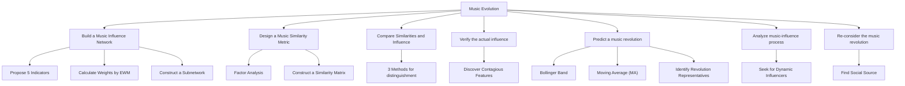
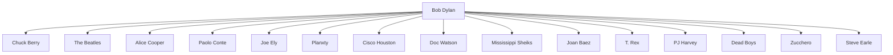

# Mining the Influence of Music Based on Social Network Analysis and Statistical Methods

Summary

As the productivity has developed rapidly since last century, people have been paying more and more attention to their spiritual life. As an important part of art and culture, music also changes as times goes by, produces many branches and gains popularity all over the world.

In this paper, we systematically study influence of music through networks and our work can be summarized as following:

• In Problem 1, we construct the influence network as a directed graph, and propose an overall measure for music influence based on several metrics of the network.  
• In Problem 2, we analyze the correlation between music features and propose to measure the distance and similarity of music in a latent space by using factor analysis.  
• In Problem 3, we discuss the similarity, influence and relation within genre and between genres, propose to distinguish genre by outlier detection, and describe the process of genre changing over time.  
• In Problem 4, we show by correlation analysis that reported influncers really affect the style of followers. We also find acousticness and valence, which just correspond to the first latent variable, are more contagious.  
• In Problem 5, based on the strategy of Bollinger Bands, we identify the signals of revolutions as those points outside the band. We observe strong signals of revolution in the 1960s and discover that Nat King Cole and The Beatles are the best representatives of revolutionary during this period.  
• In Problem 6, we think some artists of high influence and popularity might lead the trend of genre development. Therefore, we select the dynamic influencer according to these two indicators and show by visualization that genre leaders do play a guiding role and interact with the whole genre closely.  
• In Problem 7, we discuss the sociality of music using the music revolution in the 1960s raised by the counterculture movement as an example. We also explore the significant and possible influence of Internet.

Finally we conduct sensitivity analysis on the hyper-parameters used in our model, which proves the stability of our model and shows the rationality of our choice for hyper-parameters. The pros and cons of our model are discussed deeply as well.

Keywords: Social network, Factor analysis, Correlation analysis, Bollinger Bands, Music evolution

## Mining the Influence of Music Based on Social Network Analysis and Statistical Methods

## Contents

## 1 Introduction 4

1.1 Problem Background 4  
1.2 Our Work . 4

## 2 Problem 1: Network Building and Measures Development 5

2.1 Network Building . . 5  
2.2 Music Influence Measures Development 6  
2.3 Construct a Subnetwork . . . 8

## 3 Problem 2: Music Similarity Metric 9

## 4 Problem 3: Genre Relation and Development 11

4.1 Similarity and Influence Comparison . . 11  
4.2 Genre Distinguishment . 12

4.2.1 Low-Variance Features . . 12  
4.2.2 Analyzing Components 12  
4.2.3 Outlier Detection 12

4.3 Genre Evolution and Relations 13

4.3.1 How Does the Number of Musicians in a Genre Change Over Time? . . 13  
4.3.2 How Does the Number of Works in a Genre Change Over Time? . . . . 14  
4.3.3 How Do the Features of Each Genre Change Over Time? 14

## 5 Problem 4: Similarity Verification and Feature Mining 15

## 6 Problem 5: Signals and Pioneers of Revolution 16

6.1 Identify Signals of Revolutions in Music Evolution . . 16  
6.2 Discover Musicians Who Can Represent Revolutionary Changes . . . 17

## 7 Problem 6: Case Study on Dynamic Influencers 18

7.1 Music Evolution over Time . . . . . . . . 18 18

7.2 Indicators of Dynamic Influencers 19  
7.3 Interaction Between Genre and its Musician . 19

## 8 Problem 7: The Sociality of Music 20

## 9 Sensitivity Analysis 21

9.1 Sensitivity of Moving Average Window 21  
9.2 Sensitivity of Revolutionary Threshold . 22

## 10 Strengths and Weaknesses 22

10.1 Strengths 22  
10.2 Weaknesses 23

## 11 Conclusion 23

## 12 Document to the ICM Society 24

## 1 Introduction

## 1.1 Problem Background

The culture and art industry has witnessed an unprecedented boom recently. Delighted with an ample supply of excellent masterpieces of art, audiences around the world are grateful for the effort made by those great artists. Among these popular productions, musical pieces are the most influential.

With a burning desire to understand the role of music in the collective human experience, we try to develop a method to quantify musical evolution. There are many factors that can influence artists when they create a new piece of music, including their innate ingenuity, current social or political events, access to new instruments or tools, or other personal experiences. Our goal is to comprehend and measure the influence of previous music productions.

Many musicians admit that there are lots of predecessors who influence their works profoundly. It has also been suggested that influence can be measured by the degree of similarity between song characteristics, such as structure, rhythm, or lyrics. There are sometimes revolutionary shifts in music, offering new sounds or tempos, such as when a new genre emerges, or there is a reinvention of an existing genre (e.g. classical, pop/rock, jazz, etc.). This can result from a sequence of small changes, a cooperative effort of artists, a series of influential artists, or a shift within society.

There are many artists who have contributed to the great shifts of music genres. Sometimes these shifts are due to one artist influencing another. Sometimes it is a change that emerges in response to external events (such as major world events or technological advances). By considering networks of songs and their musical characteristics, we can begin to capture the influence that musical artists have on each other. And we can also obtain a comprehensive picture of how music evolves through societies over time.

## 1.2 Our Work

Our work follows the following workflow, as shown in Figure 1.

flowchart

Figure 1: Work Flow

• In Problem 1, we build a music influence network and propose 5 indicators to quantitively measure the influence of each musician: 1. Betweeness Centrality. 2. Eigenvector Centrality. 3. Three Degree of Influence. 4. Follower Loyalty. 5. Diversity of Influenced Genres. Then we use entropy weight method(EWM) to calculate the weight of each indicator and thus formulate the music influence of each musician. Based on Breadth-First Search(BFS) and the indicators above, we easily construct a subnetwork and reveal latent properties of the subnetwork.  
• In Problem 2, we design a Music Similarity Metric. By applying Factor Analysis to reduce dimensions, we obtain 3 components to describe the music features of each artist and further, each genre. We also construct a similarity matrix to quantify the similarity of artists within and between genres.  
• In Problem 3, we compare similarities and influences between and within genres. Then we put forward 3 approaches to distinguish a genre and depict genre evolution and relations over time.  
• In Problem 4, we verify whether influencers indeed affect the music features of the followers through hypothesis testing, and discover that ‘acousticness’ and ‘energy’ are more ‘contagious’ than other features.  
• In Problem 5, we use the three components from Problem 2 to draw time series diagrams. We can predict the occurrence of a music revolution by observing whether the Moving Average(MA) crosses the Bollinger Band, and thus infer that 1961-1968 is a potential revolution period. We also identify Nat King Cole and The Beatles as representatives of revolutionaries.  
• In Problem 6, we analyze the process of music influence and seek for dynamic influencers, who are considered to play a guiding role in music evolution.  
• In Problem $^ { 7 , }$ we re-consider the drastic music revolution in the 1960s, and find its social source is the counterculture movement in western countries. We also discuss the influence possibly induced by the development of Internet.

## 2 Problem 1: Network Building and Measures Development

## 2.1 Network Building

First, we create a directed network $G = \{ V , E \} ( v _ { i } \in V )$ of musical influence, where each vertex $v _ { i } = \langle i d _ { i } , g _ { i } , s t _ { i } \rangle$ i represents a corresponding musician. As is known to all, musicians may be influenced by their predecessors and then influence future generations of musicians, so each vertex can be either an influencer or a follower. In fact, this network describes a oneto-many or many-to-one mapping between influencers and followers. Here, musician $v _ { i }$ with ID $i d _ { i }$ and main genre $g _ { i }$ started to influence others or to follow someone at time $s t _ { i }$ . We can easily obtain the data above from influence\_data.

Then we connect influencers to followers with directed edges. Suppose $e ( i , j )$ denotes the directed edge (and its weight for simplicity) from influencer $v _ { i }$ to follower $v _ { j }$ . We can get Figure 2, where different colors represent different genres.

flowchart

Figure 2: A local example of music influence network

## 2.2 Music Influence Measures Development

In this paper, we mainly consider the genres and topology of the music influence network and propose 5 indicators to quantitatively measure the influence of nodes. We also give the calculation methods of these indicators as follows.

## • Betweenness Centrality (BC)[3, 4]

Betweenness Centrality refers to the number of times that one node acts as the shortest bridge between the other two nodes in a network. Obviously, a node with higher betweenness centrality will have more control over the network, as more influence will pass through that node. We can define the Betweenness Centrality of node v as

$$
B C (v) = \sum_ {s \neq v \neq t} \frac {\sigma_ {s t} (v)}{\sigma_ {s t}}.
$$

Here, $\sigma _ { s t }$ is the total number of shortest paths from node s to node t and $\sigma _ { s t } ( v )$ is the number of those paths that pass through v. Furthermore, we can normalize the results above and obtain a scaled betweenness centrality

$$
n o r m a l (B C (v)) = \frac {g (v) - m i n (g)}{m a x (g) - m i n (g)}
$$

For simplicity, we denote normal $\left( B C ( v ) \right)$ as $B C ( v )$ in the following paragraphs.

## • Eigenvector Centrality (EC)[5, 6, 7, 1]

We also take the neighbors’ influence of a node into account. Suppose that nodes with higher-influence neighbor nodes have higher influence on their descendant nodes and vise versa. A high eigenvector centrality score means that a node is connected to many nodes who themselves are highly influencial.

To calculate this indicator, we define the adjacency matrix of graph G as $A = \left( a _ { v , t } \right)$ , i.e. $a _ { v , t } = 1$ if vertex v is linked to vertex $t ,$ and $a _ { v , t } = 0$ otherwise. The eigenvector centrality of vertex v can be formulated as

$$
E C (v) = \frac {1}{\lambda} \sum_ {t \in I (v)} E C (t) = \frac {1}{\lambda} \sum_ {t \in G} a _ {v, t} E C (t)
$$

where $I ( v )$ is a set of the influencers of v and λ is the largest eigenvalue of eigenvector equation $\mathbf { A } \mathbf { x } = \lambda \mathbf { x }$ .

## • Three Degree of Influence (TDI)[2]

Fowler et al.[2] proposed Three Degree of Influence Rule, indicating that nodes can affect not only their neighbor nodes (one degree), but also the neighbor nodes of the neighbor nodes (two degrees), and even the neighbor nodes of the neighbor nodes of the neighbor nodes (three degrees). Influence between nodes will decline or disappear when it comes to more than three degrees.

To calculate the exact score of Three Degree of Influence of one node, we adopt Breadth-First Search (BFS) on vertex $v _ { i }$ with depth equals to 3 and obtain a subnetwork $G _ { i } \ =$ $\{ V ^ { ( i ) } , E ^ { ( i ) } \}$ , which contains the subsequent three generations of $v _ { i }$ . We define Three Degree of Influence of $v _ { i }$ as

$$
T D I (v _ {i}) = | V ^ {(i)} |.
$$

That is, Three Degree of Influence of $v _ { i }$ equals to the number of elements in the subnetwork $G _ { i }$ . The more descendants $v _ { i }$ have, the higher influence it holds.

## • Follower Loyalty (FL)

We can infer that if a follower is influenced by many influencers, then the follower will be less loyal to each influencer compared with the case where a follower is only influenced by one influencer. On the other hand, if an influencer can influence more followers, then his music influence should be greater.

We assume that the sum of each follower’s loyalty ratios to all his influencers equals to 1, and it is evenly distributed to each of his influencers. Namely, the contribution of each follower’s loyalty to the influencer’s Follower Loyalty F L equals to the reciprocal of the follower’s In-Degree. Then we can get the Follower Loyalty of musician v by

$$
F L (v) = \sum_ {t \in F (v)} L o y (t)
$$

where follower t’s loyalty is defined by

$$
L o y (t) = \frac {1}{I D (t)}
$$

Here, ID(t) represents In-Degree of node t. $F ( v )$ is a set consisting of the immediate successor nodes of node $v ,$ namely, the follower set of musician $v .$ Obviously, the higher score of $L o y ( t )$ has, the more deeply the follower t was influenced by each of his influ encer.

## • Diversity of Influenced Genres (DIG)

It can be noticed from the dataset that follower’s main genre may be different from that of the influencer. Suppose that the more genres a musician influences, the more influential he is in the network. So we count the number of different genres in the subsequent three generations of each node and define Diversity of Influenced Genres of musician $v _ { i }$ as

$$
D I G (v _ {i}) = \sum_ {j \in V ^ {(i)}} 1 _ {\{g _ {j} = g _ {i} \}}
$$

where

$$
1 _ {\{g _ {j} = g _ {i} \}} = \left\{ \begin{array}{l l} 1, & \text { if } \quad g _ {j} = g _ {i}, \\ 0, & \text { if } \quad g _ {j} \neq g _ {i}. \end{array} \right.
$$

Apparently, the first four indicators reflect the topology of the network, and the last indicator reflects the influence genres.

Now we can use these 5 indicators to develop the measurement of music influence. We adopt the entropy weight method(EWM) to caculate the weights of each indicator, denote by $w _ { 1 } , w _ { 2 } , w _ { 3 } , w _ { 4 } , w _ { 5 }$ . To be more specific, the greater the dispersion degree of an indicator is, the greater its information entropy will be, and the greater the influence (i.e. weight) of the indicator on the response variable will be. If all the values of an indicator are equal, the index will play no role in the response variable. From this point, our target function Music Influence can be represent in Equation (1).

$$
M I (v) = w _ {1} \cdot B C (v) + w _ {2} \cdot E C (v) + w _ {3} \cdot T D I (v) + w _ {4} \cdot F A (v) + w _ {5} \cdot D I G (v) \tag {1}
$$

Thus, musician v’s influence on follower t can be formulated as

$$
\begin{array}{l} M I (v) _ {t} = M I (v) \cdot L o y (t) \\ = \left[ w _ {1} \cdot B C (v) + w _ {2} \cdot E C (v) + w _ {3} \cdot T D I (v) + w _ {4} \cdot F L (v) + w _ {5} \cdot D I G (v) \right] \cdot L o y (t) \\ \end{array}
$$

We put the results in Table 1 and Table 2.

Table 1: Weights of 5 indicators by EWM

<table><tr><td> $w_1$ </td><td> $w_2$ </td><td> $w_3$ </td><td> $w_4$ </td><td> $w_5$ </td></tr><tr><td>0.1801</td><td>0.3163</td><td>0.2343</td><td>0.1152</td><td>0.1539</td></tr></table>

Table 2: Music Influence score of several artists

<table><tr><td>Name</td><td>Genre</td><td>TDI</td><td>BC</td><td>EC</td><td>DIG</td><td>FL</td><td>MI score</td></tr><tr><td>The Beatles</td><td>Pop/Rock</td><td>3758</td><td>0.017854</td><td>2.48E-05</td><td>18</td><td>72.9157</td><td>0.587118</td></tr><tr><td>Miles Davis</td><td>Jazz</td><td>3588</td><td>0.024155</td><td>2.09E-05</td><td>18</td><td>19.53379</td><td>0.520501</td></tr><tr><td>Willie Nelson</td><td>Country</td><td>1453</td><td>0.037038</td><td>0.000311</td><td>14</td><td>5.200698</td><td>0.479064</td></tr><tr><td>The Kingston Trio</td><td>Folk</td><td>2195</td><td>0.029905</td><td>3.05E-05</td><td>16</td><td>2.317591</td><td>0.457585</td></tr><tr><td>Sly &amp; the Family Stone</td><td>R&amp;B;</td><td>2932</td><td>0.021835</td><td>4.64E-05</td><td>18</td><td>6.813955</td><td>0.443942</td></tr></table>

## 2.3 Construct a Subnetwork

Using measurements in the previous subsection, we can easily create a subnetwork of the directed music influence network above. For influencer $v _ { i } ,$ we adopt Breadth-First Search (BFS) on vertex $v _ { i }$ with depth equals to 3 and obtain a subnetwork $\dot { G } _ { i } = \{ V ^ { ( i ) } , E ^ { ( i ) } \}$ , which contains the subsequent three generations of descendants of $v _ { i }$ . We have the following descriptions of subnetwork $G _ { i }$ .

1. Betweenness Centrality indicates the importance of musician $v _ { i }$ in the whole network, thus the importance of the subnetwork compared to the whole network. Furthermore, we can explore Betweenness Centrality of each node in the subnetwork and determine their importance compared to the subnetwork.

2. Eigenvector Centrality reveals how close musician $v _ { i }$ connects with influential musicians. That is, the followers of more influential musicians have higher influence and therefore higher scores of Eigenvector Centrality. We can also extend this attribute to the subnetwork, measuring whether the musicians in the subnetwork are affected by extremely influential predecessors or not.  
3. Three Degree of Influence represents the quantity of musicians influenced by musician $v _ { i } ,$ which exactly equals to $| \hat { v ^ { ( i ) } } |$ . As Three Degree of Influence Rule suggests, we can conclude that the influence of $v _ { i }$ continues to the third generation. Evidently, the more descendants $v _ { i }$ have, the higher influence it holds.  
4. Follower Loyalty shows the extent of distraction of each follower, and in turn the dispersion of influence. By applying this property to the subnetwork, we can determine the level of influence and the distribution of loyalty of each follower.  
5. Diversity of Influenced Genres reveals the diversity of genres in the subnetwork. The more genres $v _ { i }$ influenced, the higher influence it holds. Judging from this indicator of the subnetwork, we can also gain a general picture of how genres influenced each other and how they evoluted over time.

## 3 Problem 2: Music Similarity Metric

In the provided dataset, a music masterpiece is recorded as a group of numerical features, including danceability, valence, acousticness, etc. These features characterize the music from certain perspectives, such as emotion, rhythm and melody, while some of them might be strongly correlated. For example, we learn from common sense that positive emotions are often conveyed by faster tempo in music, which indicates that valence and tempo might have positive correlation. To form an intuition about this, we conduct a correlation analysis on all informative features and the result is shown in Figure 3.

From Figure 3, it is clear that some features might have strong correlation with others, and thus the Euclidean distance in original feature space is not a reasonable metric for music similarity. To address this problem, we adopt Factor Analysis (FA), which views original features as linear combinations of latent variables, to form a lower dimension space, where the Euclidean distance has much better performance as the measurement for music similarity.

FA is a widely-used method for mining latent variables, which is also called components sometimes. For a dataset $\mathbf { X } \in \mathbb { R } ^ { m \times n }$ , we assume X is produced by some invisible random variables $\mathbf { H } \in \mathbb { R } ^ { m \times d }$ in a latent space with lower dimension $d < n$ . The relationship between H and X has the form of Equation (3)

$$
\mathbf {X} = \mathbf {H} W + \mathbf {M} + \mathbf {E} \tag {3}
$$

where $W \in \mathbb { R } ^ { d \times n }$ is weight matrix of latent variables, M is the empirical mean of each feature estimated from the dataset, and E is the stochastic error term with zero mean.

Equation (3) indicates that we might conduct a linear transform, which turns X into H, and utilize the distance metric of H space to measure the similarity of music. We then use the standard Factor Analysis function in the scikit-learn python package to obtain the representations of X in a 3-D latent space by setting dimension $d = 3$ . The result is shown as Figure 4.

In Figure $^ { 4 , }$ we visualize each piece of music as a point in the latent space, of the first musician (Some of the work was completed by several musician s. In this case, we we choose only the first musician in the given data to identify the genre of the work) to determine its color. It is obvious that music pieces belonging to the same genre gather at a specific region. Meanwhile, different genres form separate ’clusters’ in the latent space. We can infer from the figure that music pieces of the same genre are more similar than pieces of different genres, which also meets people’s intuitions and confirms the rationality and effectiveness of our solution.

heatmap

| lanceability | 1.0000 | 0.1427 | 0.5633 | -0.0818 | 0.1983 | -0.0325 | 0.0145 | -0.1738 | -0.2136 | -0.1302 | 0.0798 | 0.0540 | -0.0940 | 0.1831 | 0.1689 |
| --- | --- | --- | --- | --- | --- | --- | --- | --- | --- | --- | --- | --- | --- | --- | --- |
| energy | 0.1427 | 1.0000 | 0.3578 | 0.2449 | 0.7854 | -0.0356 | 0.0300 | -0.7573 | -0.1983 | 0.1558 | 0.1382 | 0.1513 | 0.0330 | 0.3898 | 0.4712 |
| valence | 0.5633 | 0.3578 | 1.0000 | 0.1477 | 0.2661 | 0.0199 | 0.0158 | -0.2209 | -0.1864 | -0.0109 | 0.0338 | -0.0461 | -0.1830 | 0.0207 | -0.0274 |
| tempo | -0.0818 | 0.2449 | 0.1477 | 1.0000 | 0.1915 | 0.0148 | 0.0032 | -0.2021 | -0.0714 | 0.0274 | 0.0527 | 0.0162 | -0.0203 | 0.0942 | 0.1133 |
| loudness | 0.1983 | 0.7854 | 0.2661 | 0.1915 | 1.0000 | -0.0095 | 0.0193 | -0.5948 | -0.3606 | 0.0720 | 0.0493 | 0.1600 | -0.0240 | 0.4203 | 0.4843 |
| mode | -0.0325 | -0.0356 | 0.0199 | 0.0148 | -0.0095 | 1.0000 | -0.1134 | 0.0391 | -0.0580 | 0.0141 | -0.0452 | -0.0494 | -0.0834 | -0.0363 | -0.0396 |
| key | 0.0145 | 0.0300 | 0.0158 | 0.0032 | 0.0193 | -0.1134 | 1.0000 | -0.0288 | -0.0109 | 0.0003 | 0.0244 | 0.0091 | -0.0045 | 0.0150 | 0.0207 |

Figure 3: Correlation coefficient matrix of music features

scatterplot

| Acoustics-energy | Valence | Instrumentalness |
| ---------------- | ------- | ---------------- |
| -2               | 0       | 6                |
| -1               | 0       | 4                |
| 0                | 0       | 2                |
| 1                | 0       | 0                |
| 2                | 0       | -2               |

Figure 4: Representations on 3-D latent space

heatmap

| Electronic | 0.15 | 0.05 | 0.05 | 0.05 | 0.05 | 0.05 | 0.05 | 0.05 | 0.05 | 0.05 | 0.05 | 0.05 | 0.05 | 0.05 | 0.05 | 0.05 | 0.05 | 0.05 | 1.85 | 0.05 |
| --- | --- | --- | --- | --- | --- | --- | --- | --- | --- | --- | --- | --- | --- | --- | --- | --- | --- | --- | --- | --- |
| R&B: | 0.25 | 0.15 | 0.15 | 0.15 | 0.15 | 0.15 | 0.15 | 0.15 | 0.15 | 0.15 | 0.15 | 0.15 | 0.15 | 0.15 | 0.15 | 0.15 | 0.15 | 0.15 | 2.75 | 0.15 |
| Vocal | 0.35 | 0.25 | 0.25 | 0.25 | 0.25 | 0.25 | 0.25 | 0.25 | 0.25 | 0.25 | 0.25 | 0.25 | 0.25 | 0.25 | 0.25 | 0.25 | 0.25 | 0.25 | 4.35 | 0.25 |
| Pop/Rock | 0.45 | 0.35 | 0.35 | 0.35 | 0.35 | 0.35 | 0.35 | 0.35 | 0.35 | 0.35 | 0.35 | 0.35 | 0.35 | 0.35 | 0.35 | 0.35 | 0.35 | 0.35 | 6.15 | 0.35 |
| Religious | 0.55 | 0.45 | 0.45 | 0.45 | 0.45 | 0.45 | 0.45 | 0.45 | 0.45 | 0.45 | 0.45 | 0.45 | 0.45 | 0.45 | 0.45 | 0.45 | 0.45 | 0.45 | 7.85 | 0.45 |
| Blues | 0.65 | 0.55 | 0.55 | 0.55 | 0.55 | 0.55 | 0.55 | 0.55 | 0.55 | 0.55 | 0.55 | 0.55 | 0.55 | 0.55 | 0.55 | 0.55 | 0.55 | 0.55 | 9.45 | 0.45 |
| Country | 0.75 | 0.65 | 0.65 | 0.65 | 0.65 | 0.65 | 0.65 | 0.65 | 0.65 | 0.65 | 0.65 | 0.65 | 0.65 | 0.65 | 0.65 | 0.65 | 0.65 | 0.65 | 11.15 | 0.45 |

Figure 5: Music similarity between genres

At the end of this section, we look into the problem of similarity within genre and between genres. In total we have $n _ { g } = 2 0 $ genres including an Unknown for unlabelled artists. We construct a similarity matrix $S = \{ \bar { S _ { i j } } \} \in \mathbb { R } ^ { n _ { g } \times n _ { g } }$ satisfy

$$
S _ {i j} = \frac {1}{\left| g _ {i} \right| \left| g _ {j} \right|} \sum_ {x \in g _ {i}} \sum_ {y \in g _ {j}} \text { sim } (x, y), \tag {4}
$$

where

$$
\operatorname{sim} (x, y) = \frac {\langle x , y \rangle}{\| x \| _ {2} \| y \| _ {2}}. \tag {5}
$$

Here, x represent a musician from genre $g _ { i }$ and y regresent a musician from genre $\begin{array} { r l } { g _ { j } . } & { { } S _ { i j } } \end{array}$ measures the average similarity of artists between music genres $g _ { i }$ and $g _ { j }$ . We use the cosine function on vectors as the metric sim (·) for music similarity, and show the results by drawing a heat map in Figure 5.

From Figure 5, we find that the similarity within genre is usually higher than that between genres, as the elements on the diagonal are relatively larger. However, there are also a few exceptions, which might be due to the profound influence from great masters and influential genres to artists of newborn genres.

## 4 Problem 3: Genre Relation and Development

## 4.1 Similarity and Influence Comparison

Although musicians within a genre is prone to communicate more and create masterpieces in more similar styles, some newborn genres can also be deeply influenced by that genre and thus highly similar to others. At specific periods in history, a popular genre might form multiple branches and finally be divided into new genres. Both cases shows that the development of genres are not isolated, but closely related. In this section, we mainly discuss the relation about derivation, which corresponds to the former case.

In Section 3, we have proposed a similarity for music, and obtain the average similarity as plotted in Figure 5. Generally speaking, the more accumulated loyalty a musician pays to a genre, the more he or she might be influenced by musicians of that genre. Therefore, we will take these two metric for the following discussion on the similarity and influence with genre and between genres.

Based on the influence network built in Section 2, we compute the total accumulated loyalty of all artists within genre to another as the weight of edge from the former genre to the latter, and plot the influence between genres in Figure 6. In this figure, we use the width and color of an arc between genres to represent the weight and source genre of the edge. For example, the black arc from R&B to Pop/Rock is wider than the green arc from Pop/Rock to Electronic, and this means the total accumulated loyalty paid to Pop/Rock by R&B artists are l that to Electronic by Pop/Rock artists.

sankey diagram

| Genre       | Value |
|-------------|-------|
| Electronic  | 100   |
| R&B         | 80    |
| Pop/Rock    | 90    |
| Latin       | 30    |
| Vocal       | 20    |
| Blues       | 15    |
| Country     | 10    |
| Jazz        | 5     |
| Folk        | 5     |

Figure 6: Influence within genre and between genres

## 4.2 Genre Distinguishment

Now we focus on mining significant features for each genre and employ 3 approaches to distinguish a certain genre.

## 4.2.1 Low-Variance Features

For better interpretability, we return to the original high-dimension representation in the given dataset to seek common characteristics. From the theory of statistics, we know that the common features within a genre tends to have lower variance since its values are close to each other. To be specific, assume we have a musical feature $c ,$ in a dataset containing m examples, the mathematical expectation of sample variance will be

$$
E \left[ \frac {1}{m} \sum_ {i = 1} ^ {m} (c - \bar {c}) ^ {2} \right] \approx \operatorname{Var} (c)
$$

That means we can approximately substitute sample variance for population variance.

## 4.2.2 Analyzing Components

We can see from Figure 4 that after factor analysis, the feature coordinates of the same genre are inclined to gather together. By analyzing the distribution characteristics of each genre, we can summarize the features of each genre.

## 4.2.3 Outlier Detection

Some genres may be extreme in certain characteristics. Based on this consideration, we propose a method of drawing violin plots to detect whether some genres have extreme performance in certain characteristics (outlier detection). To be specific, we draw Figure 7 and

Figure 8. from these two figures, we can see that

violin chart

| Genre           | Instrumentalness |
| --------------- | ----------------- |
| New Age         | 0.7               |
| Folk            | 0.1               |
| International   | 0.2               |
| Reggae          | 0.1               |
| Comedy/Spoken   | 0.1               |

Figure 7: Violin plot of instrumentalness in several genres

violin chart

| Genre      | acoustichness |
| ---------- | ------------- |
| Electronic | 0.2           |
| R&B        | 0.3           |
| Vocal      | 0.8           |
| Pop/Rock   | 0.2           |
| Religious  | 0.4           |

Figure 8: Violin plot of acousticness in several genres

• The acousticness score of Vocal is higher than that of all other genres. ${ \mathrm { S o } } ,$ , we can distinguish Vocal from other genres by identifying acousticness.  
• The instrumentalness score of New Age is higher than that of all other genres. So, we can distinguish New Age from other genres by identifying instrumentalness.

## 4.3 Genre Evolution and Relations

We specify the problem into three parts. The number of musicians and the number of works in a genre can reasonably represent the scale of that genre and thus descride genre evolution. Furtheremore, we also explore the change of each genre’s components to depict the trend.

## 4.3.1 How Does the Number of Musicians in a Genre Change Over Time?

In this part, we take influencer\_active\_start and follower\_active\_start into account. We have not yet considered the length of time a musician staying active (in fact, there is no data for us to consider). In particular, we select several genres and plot a trend chart of the number of musicians in the genres as is shown in Figure 9. Due to incomplete data collection after 2010, Figure 9 is only drawn to 2000 (2000-2010).

line chart

| Decade | Electronic | R&B | Vocal | Pop/Rock | Religious |
| ------ | ---------- | --- | ----- | -------- | --------- |
| 1920   | 0          | 0   | 0     | 0        | 0         |
| 1940   | 0          | 0   | 0     | 0        | 0         |
| 1960   | 0          | 120 | 0     | 420      | 0         |
| 1980   | 30         | 80  | 0     | 620      | 0         |
| 2000   | 50         | 80  | 0     | 480      | 0         |

Figure 9: How the number of musicians in a genre changes over time

line chart

| Decade | Electronic | R&B | Vocal | Pop/Rock | Religious |
| ------ | ---------- | --- | ----- | -------- | --------- |
| 1920   | 0          | 0   | 0     | 0        | 0         |
| 1940   | 0          | 0   | 500   | 0        | 0         |
| 1960   | 0          | 1500| 2000  | 6000     | 0         |
| 1980   | 0          | 1500| 0     | 10500    | 0         |
| 2000   | 0          | 1500| 500   | 8000     | 0         |

Figure 10: How the number of works in a genre changes over time

We can see from Figure 9 that

1. Pop/Rock has developed rapidly since 1940 with a large group of musicians.  
2. Vocal, Religious, Electronic music have relatively smaller scales.  
3. All genres peaked in 1990-2000 and declined in 2000-2010.

## 4.3.2 How Does the Number of Works in a Genre Change Over Time?

On the other hand, we can also identify how genres change by tracking the number of works in them. Similarly, we select several genres and plot a trend chart of the number of works in the genres as is shown in Figure 10.

As shown in Figure 10, we can conclude that

1. Vocal music flourished between 1920 and 1950, and then its number of works declined.  
2. Pop/Rock has develop rapidly since 1960 and reached its peak between 1970 and 1990.  
3. Musicians-number and works-number of R&B have changed roughly synchronously.  
4. Religious and Electronic are relatively small-scale and produce very limited works.

## 4.3.3 How Do the Features of Each Genre Change Over Time?

With time passed, the features of each genre may change dramatically. We use the result of factor analysis in Problem 2 to analyze the trend of the three components of different genres. Here, we still take those 5 genres previously selected as examples, and analyze acousticsenergy component and valence component to draw Figure 11 and Figure 12.

line chart

| Year | Electronic | R&B | Vocal | Pop/Rock | Religious |
|------|------------|-----|-------|----------|-----------|
| 1920 | -          | -0.5 | 1.2 | -        | -         |
| 1930 | 1.2 | 0.4 | 1.1 | 1.2 | 0.8 |
| 1940 | 1.3 | 0.6 | 1.1 | 0.5 | 0.7 |
| 1950 | 0.2 | 0.6 | 1.1 | 0.2 | -0.1 |
| 1960 | -0.2 | 0.2 | 0.9 | 0.1 | 0.2 |
| 1970 | 0.1 | -0.1 | 0.6 | -0.1 | -0.2 |
| 1980 | -0.3 | -0.2 | 0.8 | -0.5 | -0.1 |
| 1990 | -0.2 | -0.1 | 1.1 | -0.5 | -0.1 |
| 2000 | -0.4 | -0.2 | 1.0 | -0.7 | -0.3 |
| 2010 | -0.5 | -0.2 | 0.9 | -0.4 | -0.2 |
| 2020 | -0.5 | -0.2 | 0.8 | -0.3 | -0.1 |

Figure 11: How Acoustics-energy Component of a genre changes over time

line chart

| Year | Electronic | R&B; | Vocal | Pop/Rock | Religious |
|------|------------|------|-------|----------|-----------|
| 1920 | -1.0       | -1.0 | -0.8  | -1.0     | -0.8      |
| 1940 | 0.2        | -0.3 | 0.1   | -0.5     | -0.2      |
| 1960 | -0.5       | -0.7 | -0.1  | -0.3     | 0.0       |
| 1980 | 0.6        | -0.5 | 0.0   | 0.2      | 0.3       |
| 2000 | 0.5        | -0.2 | 0.3   | 0.4      | 0.5       |
| 2020 | 0.8        | 0.6  | 0.2   | 0.3      | 0.3       |

Figure 12: How Valence Component of a genre changes over time

Figure 11 shows that in terms of acoustic energy component, Pop/Rock, Electronic, and Religious music had a similar trend from 1920 to 1960, all of which surged in 1920 to 1930 and then fell back in the next 20 years. Acoustic-energy component of all genres fluctuated in a small range from 1980 to 2010.

As for Valence component, there has been an overall upward trend in all 1920 to the present. Among them, Electronic fluctuated sharply from 1950 to 1980, while Vocal, 19w

Religious and R&B approximately increased synchronously. It is worth noting that the Valence component of Pop/Rock dropped after reaching a local maximum value in 1930, but steadily increased since 1950.

## 5 Problem 4: Similarity Verification and Feature Mining

In this section, we will examine whether followers are indeed influenced by influencers from the network, i.e., whether those interrelated musicians in the directed music influence network will have higher similarities. We will use hypothesis testing to explore this problem.

$$
\left\{ \begin{array}{l} H _ {0}: \text { Followers   are   indeed   influenced   by   influencers. } \\ H _ {1}: \text { Followers   are   not   completely   influenced   by   influencers. } \end{array} \right. \tag {6}
$$

Before testing this hypothesis, we need to clarify a confusing concept.

Definition 1. (Similarity between musician x and y) As defined in Equation (5), similarity between musician x and y can be formulated as

$$
\mathrm{sim} (x, y) = \frac {\langle x , y \rangle}{\| x \| _ {2} \| y \| _ {2}},
$$

which is a combination of various musical features of the works of musician x and y.

In other words, musician $x , y$ might be similar to each other in a certain feature or another, whereas sim $( x , y )$ measures a comprehensive level of similarities in these features.

On the other hand, We hold the opinion that the interrelation between musician x and y on the music influence network is determined by the direct connection betwee x and y. Namely, as long as there exists a directed edge from x to y or from y to x, we consider x and y are interrelated.

Then, to test $H _ { 0 }$ in (6), we only need to verify that both those various features’ similarity and the similarity function in Equation (5) of interrelated musicians are higher than that of any two randomly selected musicians. To calculate the similarity function and each feature’s similarity, we put forward the following method.

1. There are 12 original features and 3 compound features(components), a total of 15 features. For the sake of storing two musicians to be compared, we set two arrays for each feature, namely, $A _ { i } , B _ { i } ( i = 1 , 2 , \cdots , 1 5 )$ .

2. Pair the musicians and devide them into two groups:

(Group 1: Musician-pairs in which direct interrelation exists. Group 2: Randomly-selected musician-pairs, which is considered to be unrelated.

3. Put the musical features $i ( i = 1 , 2 , \cdots , 1 5 )$ of the musicians in Group 1 into the array $A _ { i } ( i = 1 , 2 , \cdots , 1 5 )$ and the other one in the pairs into $B _ { i } ( i = 1 , 2 , \cdots , \bar { 1 5 } )$ .  
4. Do Jarque-Bera test to verify whether the data in the array obey normal distribution. If yes, we will use Pearson correlation coefficients in the following step. If H Spearman correlation coefficients.

5. Calculate the correlation coefficients of each feature.  
6. Repeat Step 3-5 for Group 2.

7. Compare the results using hypothesis testing and draw conclusions.

We show the results in Figure 13. All of the features have considerably higher Spearman correlation coefficients in Group 1 than in Group2. After hypothesis testing, we can claim that the similarity caused by the connection between musicians is by no means accidental. Therefore, We can accept the null hypothesis $H _ { 0 }$ : Followers are indeed influenced by influencers.

bar chart

| Musical Metric          | Group 1 | Group 2 |
| ----------------------- | ------- | ------- |
| similarity               | 0.5     | 0.8     |
| Instrumental Component  | 0.4     | 0.001   |
| Valence Component       | 0.6     | 0.05    |
| Acoustics-energy Component | 0.5     | 0.03    |
| valence                  | 0.4     | 0.03    |
| tempo                   | 0.1     | 0.03    |
| speechiness              | 0.5     | 0.01    |
| mode                    | 0.4     | 0.03    |
| loudness                 | 0.1     | 0.003   |
| liveness                | 0.3     | 0.08    |
| key                     | 0.5     | 0.01    |
| instrumentalness         | 0.5     | 0.003   |
| energy                  | 0.4     | 0.003   |
| duration ms             | 0.5     | 0.03    |
| danceability            | 0.4     | 0.001   |
| acousticness            | 0.7     | 0.001   |

Figure 13: Spearman correlation coeffients of Group 1 and Group 2

## 6 Problem 5: Signals and Pioneers of Revolution

## 6.1 Identify Signals of Revolutions in Music Evolution

On the one hand, we know that some music genres may change rapidly over time. On the other hand, even if the music genre stays the same, we can still find that the intrinsic characteristics of some genres have changed. Music evolution can be interpreted as the change of those three components found in Problem 2. A drastic music revolution is a period in which these three components change dramatically.

So, what is the period of dramatic change? To solve this problem, we draw a time sequence diagram of the three components over time, and analyze it by using Bollinger Bands, which is a confidence interval band obtained by statistical methods. We adopt Bollinger Bands and slope of Moving Average(MA) as predictors of the musical revolution. In this section, we set the sliding window of the Bollinger Band as 3 years, and the standard deviation factor $\beta = 2$ . The results are shown in Figure 14a, 14b, 14c.

According to the Pauta Criterion, if random variable $X \sim N ( \mu , \sigma ^ { 2 } )$ , then

$$
P (X \in (\mu - 3 \sigma , \mu + 3 \sigma)) \approx 0. 9 9 7 3.
$$

line chart

| Year | Moving Average | Bollinger Band |
|------|----------------|----------------|
| 1920 | ~1.8           | ~1.7           |
| 1940 | ~1.5           | ~1.4           |
| 1960 | ~0.5           | ~0.3           |
| 1980 | ~-1.0          | ~-0.8          |
| 2000 | ~-1.5          | ~-1.3          |
| 2020 | ~-0.8          | ~-0.6          |

(a) Acoustics Component

line chart

| Year | Moving Average | Bollinger Band |
|------|----------------|----------------|
| 1920 | -2.0           | -3.0           |
| 1940 | -1.0           | -1.5           |
| 1960 | -0.5           | -0.8           |
| 1980 | 0.0            | 0.2            |
| 2000 | 0.5            | 0.7            |
| 2020 | 1.5            | 2.0            |

(b) Valence Component

line chart

| Year | Moving Average | Bollinger Band |
|------|----------------|----------------|
| 1920 | 7.0            | 8.0            |
| 1940 | 5.0            | 6.0            |
| 1960 | 4.0            | 4.5            |
| 1980 | 3.5            | 3.0            |
| 2000 | 2.0            | 1.5            |
| 2020 | 0.0            | 0.0            |

(c) Instrumental Component  
Figure 14: Time series of components

We claim that a musical revolution occurred when MovingAverage(MA) broke through the Bollinger Bands with a high slope.

By analyzing Bollinger Bands and slope of Moving Average(MA) in Figure 14a, 14b, 14c, we find that all of the 3 components broke through the Bollinger Bands during 1961-1968. Meanwhile, the slopes of these three Moving Average(MA) are considerably high. Therefore, 1961- 1968 is very likely to be the musical revolution we are looking for.

## 6.2 Discover Musicians Who Can Represent Revolutionary Changes

In Section 6.1, We figure out that 1961-1968 is very likely to be the period in which music revolution took place. In this section, we will seek for the musicians who may lead the music revolution from those who published their works during 1961-1968.

Through the music influence network established in problem 1, we trace the source of these music-revolution-leader candidates to find relatively ‘sophisticated’ musicians. Music revolution leaders are those who have high MusicInfluence(MI) scores and at the same time, their features change in sync with that of the whole music industry.

As shown in Equation (7), we calculate The First Order of Temporal Correlation Coefficient of one musician’s score and music industry’s average with regard to a fixed feature, in order to determine whether the feature of that musician changes in sync with that of the whole music industry.

$$
C O R T \left(X _ {T}, A v e r a g e _ {T}\right) = \frac {\sum_ {t = 1} ^ {T - 1} \left(x _ {t + 1} - x _ {t}\right) \cdot \left(a v e r a g e _ {t + 1} - a v e r a g e _ {t}\right)}{\sqrt {\sum_ {t = 1} ^ {T - 1} \left(x _ {t + 1} - x _ {t}\right) ^ {2}} \cdot \sqrt {\sum_ {t = 1} ^ {T - 1} \left(a v e r a g e _ {t + 1} - a v e r a g e _ {t}\right) ^ {2}}} \tag {7}
$$

Here, $X _ { T }$ represents the time series of a certain characteristic of a musician. AverageT denotes the time series of music industry’s average value on this characteristic. $x _ { t } , a v e r a g e _ { t }$ is the value of $X _ { T }$ , Average at time t.

If $C O R T ( X _ { T } , A v e r a g e _ { T } ) \approx 1$ , then the two time series have similar trends and they will rise or fall simultaneously. Namely, that musician are very likely to be the leader of the music revolution in terms of the fixed feature.

We can do this with pseudo-code in Algorithm 1.

Through looking up for ancestors in the music influence network, analzin Influence(MI), calculating the The First Order of Temporal Correlation Coefficient between th m11 sicians, and the music industry average, we find the Beatles and Nat King Cole as the pioneers of this musical revolution, as shown in Table 6. As revolutionary might be promoted by several musicians, we might not observe very strong correlation between the mean of the whole community and a single musician.

Table 3: Dynamic Influencer Evaluation Index(DIEI) score in 1965 when $c _ { 1 } = 0 . 3 , c _ { 2 } = 0 . 5$

<table><tr><td>Name</td><td>Acoustics-energy Component</td><td>Valence Component</td><td>Instrumental Component</td></tr><tr><td>The Beatles</td><td>-0.018271926</td><td>-0.229203397</td><td>0.408461158</td></tr><tr><td>Nat King Cole</td><td>0.142897328</td><td>0.040045023</td><td>0.052714147</td></tr></table>

Algorithm 1: Algorithm for finding revolutionary artists

Input: Influence network G, Influence threshold $c_{1}$ , Correlation threshold $c_{2}$ , Artist set S, Artist component matrix by year $\mathbf{F} = \{F(y)\}$ Output: List of revolutionary artists L

1 Initialize L to ∅;
2 With Bollinger band computed before, select years $Y = \{y\}$ in which revolutionaries might happen;
3 for Each $y \in Y$ do

4 Find all revolutionary artists $A = \{a\}$ who published their works in y;
5 Mark revolutionary artists in G as candidates;
6 for Each $a \in A$ do
7 if An influencer of a is revolutionary then
8 Mark a with an extra eliminated symbol;
9 end
10 end
11 Eliminate all artists a with eliminated symbol from A;
12 Compute the influence score for each a remained in A and sort them by score;
13 for Each $a \in A$ and influence score of a is larger than $c_{1}$ do
14 Compute a trend correlation coefficient s for a;
15 if s is larger than $c_{2}$ then
16 Recognize a as a revolutionary artist and append a to L
17 end
18 end
19 end
20 return The list of revolutionary artists L;

## 7 Problem 6: Case Study on Dynamic Influencers

## 7.1 Music Evolution over Time

We believe that there is(are) one(or many) leader(s) (that is, dynamic influenc genre who lead the evolution of the whole genre. Only musicians with great music influence can perform such a role. Therefore, the dynamic influencers must be those contemporary musicians who are most popular and influential. In particular, the evolution trend of the whole genre and the leader should be approximately the same. Many musicians in the genre may follow those leaders in their creation.

## 7.2 Indicators of Dynamic Influencers

Now we take a further step to identify indicators that reveal the leaders(dynamic influencers). We raise 3 indicators to sole this problem.

1. Music Influence score(MI score). From Problem 1 we obtain Music Influence scores of each musician which are employed as an indicator in this section.  
2. AverageP opularity score of each musician. Dataset full\_music\_data provide us with he Popularity of each work (P opularity). Suppose that every musician will get the corresponding Popularity score as long as he gets involved in the creation of the work.  
3. T otalP opularity score of each musician.

Note that Music Influence score(MI score) does not vary over time because we do not have relevant data as support, whereas P opularity score is measured by year. We still adopt Entropy Weight Method(EWM) to calculate the weights of the above three indicators, which will change over year. Now we can represent Dynamic Influencer Evaluation Index(DIEI) of musician v in Equation (8).

$$
D I E I (v) = w _ {1} (t) \cdot M I (v) + w _ {2} (t) \cdot P O P _ {\text { Average }} (v, t) + w _ {3} (t) \cdot P O P _ {\text { Total }} (v, t) \tag {8}
$$

Thus, the Dynamic Influencer Evaluation Index(DIEI) score of this question can be obtained, and the musicians with the highest score in each genre will be selected as the dynamic influencer. We draw a graph of the weight over time in Figure 15 and Then we take the data in 1965 for example, calculate the weights of 3 indicators as shown in Table 4 and list some of the results in Table 5.

line chart

| Year | W1    | W2    | W3    |
|------|-------|-------|-------|
| 1940 | 0.05  | 0.45  | 0.50  |
| 1960 | 0.10  | 0.42  | 0.48  |
| 1980 | 0.12  | 0.41  | 0.47  |
| 2000 | 0.13  | 0.40  | 0.46  |
| 2020 | 0.10  | 0.43  | 0.47  |

Figure 15: How weights of 3 indicators change over time

Table 4: Weights of 3 indicators in 1965

<table><tr><td> $w_1$ </td><td> $w_2$ </td><td> $w_3$ </td></tr><tr><td>0.09355</td><td>0.40601</td><td>0.50043</td></tr></table>

## 7.3 Interaction Between Genre and its Musician

Based on the approaches in Section 7.2, we can successfully identify those dynamic influencers and we show some of our results in Figure 16a and Figure 16b. For C H set 3 years as the Lag of Moving Average(MA), namely, the genre mean.

Table 5: Dynamic Influencer Evaluation Index(DIEI) score of several artists in 1965

<table><tr><td>name</td><td>genre</td><td>MI score</td><td> $POP_{Average}$ </td><td> $POP_{Total}$ </td><td>DIEI score</td></tr><tr><td>The Beatles</td><td>Pop/Rock</td><td>0.587118</td><td>59.10714</td><td>1655</td><td>0.913469</td></tr><tr><td>Bob Dylan</td><td>Pop/Rock</td><td>0.428424</td><td>28.58571</td><td>2001</td><td>0.765057</td></tr><tr><td>Otis Redding</td><td>R&amp;B;</td><td>0.292864</td><td>29.13846</td><td>1894</td><td>0.720494</td></tr><tr><td>The Rolling Stones</td><td>Pop/Rock</td><td>0.392363</td><td>29.83333</td><td>1790</td><td>0.715112</td></tr></table>

line chart

| Year | Vocal Mean | Vocal Leader |
| ---- | ---------- | ------------ |
| 1940 | 0.90       | 0.92         |
| 1950 | 0.88       | 0.89         |
| 1960 | 0.78       | 0.75         |
| 1970 | 0.65       | 0.68         |
| 1980 | 0.55       | 0.38         |
| 1990 | 0.75       | 0.85         |
| 2000 | 0.70       | 0.65         |
| 2010 | 0.78       | 0.62         |
| 2020 | 0.65       | 0.68         |

(a) Evolution of acousticness

line chart

| Year | Latin Mean | Latin Leader |
| ---- | ---------- | ------------ |
| 1960 | 0.58       | 0.48         |
| 1970 | 0.55       | 0.45         |
| 1980 | 0.52       | 0.48         |
| 1990 | 0.62       | 0.60         |
| 2000 | 0.68       | 0.75         |
| 2010 | 0.65       | 0.72         |
| 2020 | 0.68       | 0.78         |

(b) Evolution of danceability  
Figure 16: Evolution of Latin’s leaders and genre-mean

From Figure 16a and Figure 16b, we can clearly see that

• The leaders (dynamic influencers) in a genre play a guiding role in genre evolution.  
• The evolution of the leaders is basically in sync with that of the genre.  
• The features of leaders fluctuate sharply, indicating that leaders are minority groups in each genre, making the indicators of leaders more sensitive to extreme values.  
• The genre-mean reflects the average level of that indicator within the genre, so the variation is relatively moderate.

## 8 Problem 7: The Sociality of Music

Music world is not an isolated island, as any changes in the real world might have a significant and profound influence on the developing trend of music within a period of several years. In this section we will take the revolution happend in the 1960s, which was discussed only from the perspective of music feature above, as an example to show the sociality of music.

According to the modern western history, there was once a counterculture movement lasted from the 1960s to the 1970s. As the era unfolded, what emerged were new cultural forms and a dynamic subculture that celebrated experimentation, modern incarnations of Bohemianism, and the rise of the hippie and other alternative lifestyles. This embrace of creativity is particularly notable in the works of British Invasion bands such as the Beatles [8]. Music, as a sort of culture, get deeply affected during this extraordinary period, and it became more bolshy, more unrestrained and more emotional, which we can also observe from Figure 16a and 16b. It was in this era that Pop/Rock had developed at an astonishing spee 1 and gained much more popularity. We can find the trace of this movement from data in many

It is worth mentioning that the rapid and wide spread of the Internet is another example which shows reflects the external influence on music. The Internet provides a fast and convinient way for music spread, and also promotes fan economy and the leisure industry. The former helps great masterpieces to harvest more popularity while the latter might lead to the formation of many non-mainstream styles. Due to space limitation, we do not discuss it deeply here, and this topic might be fully explored when more sufficient and fresh data are provided.

## 9 Sensitivity Analysis

## 9.1 Sensitivity of Moving Average Window

In Section 6, we set the moving average window to 3-year to better capture the overall developing trend and the signals of revolution in music community. This is somehow a hyperparameter in our model, and we choose different values here to verify the choice of 3-year.

Adjust the window length to 5-year and 9-year, we can obtain the moving average results and corresponding Bollinger Bands as shown in Figure 17.

line chart

| Year | Moving Average | Bollinger Band |
|------|----------------|----------------|
| 1920 | ~1.8           | ~1.5–2.0       |
| 1940 | ~1.5           | ~1.3–1.7       |
| 1960 | ~1.0           | ~0.8–1.2       |
| 1980 | ~-1.0          | ~-0.8–-0.5     |
| 2000 | ~-1.5          | ~-1.3–-1.0     |
| 2020 | ~-1.2          | ~-1.0–-0.8     |

(a) Acoustics, W = 5

line chart

| Year | Moving Average | Bollinger Band (Lower) | Bollinger Band (Upper) |
|------|----------------|------------------------|------------------------|
| 1920 | 1.0            | -3.0                   | 1.5                    |
| 1940 | -1.5           | -2.5                   | 0.5                    |
| 1960 | -0.5           | -1.0                   | 1.0                    |
| 1980 | -0.2           | -0.8                   | 0.3                    |
| 2000 | 0.5            | 0.0                    | 1.5                    |
| 2020 | 1.5            | 1.0                    | 2.5                    |

(b) Valence, W = 5

line chart

| Year | Moving Average | Bollinger Band |
|------|----------------|----------------|
| 1920 | 7.0            | 8.0            |
| 1940 | 4.0            | 6.0            |
| 1960 | 3.0            | 5.0            |
| 1980 | 4.0            | 4.0            |
| 2000 | 2.0            | 2.0            |
| 2020 | -1.0           | -1.0           |

(c) Instrumental, W = 5

line chart

| Year | Moving Average | Bollinger Band |
|------|----------------|----------------|
| 1920 | 1.8            | 1.5            |
| 1940 | 1.5            | 1.3            |
| 1960 | 1.0            | 0.8            |
| 1980 | -1.0           | -0.8           |
| 2000 | -1.5           | -1.3           |
| 2020 | -1.2           | -1.0           |

(d) Acoustics, $W = 9$

line chart

| Year | Moving Average | Bollinger Band |
|------|----------------|----------------|
| 1920 | -1.5           | -3.0           |
| 1940 | -0.5           | -2.5           |
| 1960 | -0.8           | -1.0           |
| 1980 | -0.2           | -0.5           |
| 2000 | 0.5            | 0.0            |
| 2020 | 1.5            | 1.0            |

(e) Valence, W = 9

line chart

| Year | Moving Average | Bollinger Band |
|------|----------------|----------------|
| 1920 | 7.0            | 8.0            |
| 1940 | 5.0            | 6.0            |
| 1960 | 4.0            | 5.0            |
| 1980 | 3.5            | 4.5            |
| 2000 | 1.0            | 2.0            |
| 2020 | -1.0           | 0.5            |

(f) Instrumental W = 9  
Figure 17: Times series of components

From the figures above we can see that as the sliding window becomes longer, the curve becomes smoother, and the revolutions are harder to detect. However, the overall trend and the breakthrough made by revolutionaries remains roughly the same, which proves the stability of our method, as well as the choice of 3-year sliding window, considering the purpose of detect revolutions.

## 9.2 Sensitivity of Revolutionary Threshold

Another important hyper-parameter in our model is the influence and correlation threshold for detecting revolutionary pioneers. In Section 6.2, we critical value $c _ { 1 } = 0 . 3$ and $c _ { 2 } = 0 . 5$ , now we take other values for $c _ { 1 }$ and $c _ { 2 }$ to verify the stability of our model here.

Table 6: Dynamic Influencer Evaluation Index(DIEI) score in 1965 when $c _ { 1 } = 0 . 3 , c _ { 2 } = 0 . 5$

<table><tr><td>Name</td><td>Acoustics-energy Component</td><td>Valence Component</td><td>Instrumental Component</td></tr><tr><td>The Beatles</td><td>-0.018271926</td><td>-0.229203397</td><td>0.408461158</td></tr><tr><td>Nat King Cole</td><td>0.142897328</td><td>0.040045023</td><td>0.052714147</td></tr></table>

Table 7: Dynamic Influencer Evaluation Index(DIEI) score in 1965 when $c _ { 1 } = 0 . 6 , c _ { 2 } = 0 . 9$

<table><tr><td>Name</td><td>Acoustics-energy Component</td><td>Valence Component</td><td>Instrumental Component</td></tr><tr><td>The Beatles</td><td>-0.019367252</td><td>-0.257729132</td><td>0.430968754</td></tr><tr><td>Nat King Cole</td><td>0.127946278</td><td>0.083617453</td><td>0.059204672</td></tr></table>

As is clear in Table 6 and Table 7, although the result can possibly change a little bit when the two hyper-parameters are set to different values, our algorithm can always find a decent pioneer the revolutions. This shows that our algorithm is not sensitive to these two parameters and can keep working well in a wide range.

## 10 Strengths and Weaknesses

## 10.1 Strengths

1. Comprehensive and reasonable measures for network and music.

We select several indices for the influence network of musicians, and each of them respectively describes the property of network from some different perspectives. As for the similarity, we analyze the correlation between music features from the dataset and propose a metric based on factor analysis and cosine similarity. Both of the two metrics comes up with full consideration.

2. Effective data-driven methods for data insights without human interference.

We utilize powerful and effective statistical methods, such as correlation analysis, factor analysis, hypothesis test, etc. to explore patterns of data. We also use entropy weight method to determine weights for factors when computing the score of music influence. Most parts of our model are fully data-driven, which rules out possible impacts induced by human interference. We just let data speak.

3. Analysis from latent and feature spaces with high visual interpretability.

As the original features of music locate in a high-dimension space, we can hardly master the mathematical and numerical properties of their distances. Therefore, we lower the number of dimension by extract major factors and visualize the distribution of music in the latent space, which improves the interpretability of our mode l. In addition, we ,we perform analysis in either space according to our actual demands, and this enhances the expressive power and flexibility.

## 10.2 Weaknesses

## 1. Inadequate data for full utilization of data-driven model.

As discussed in the strengths of our model, we hear the voice of data without much human interference. However, we have access to only a small part of music dataset, which might lead to problems like distribution mismatch of music works, misjudegement on the developing trend of genres, etc. When the dataset is larger and cleaner, these problems are likely to be lessened.

## 2. Appropriate simplification of indirect musical influence.

In Problem 4, we adopt an alternative approach by defining an REL function, to represent Interrelationship between musician x and y, which is determined by the reciprocal of harmonic mean of shortest path between two points. However, the correlation coefficients calculated by this method is very small and the results are not satisfying. So we give up this method, which might be reasonable to some extent.

## 3. Neglect indirect-connected musicians.

In Problem 4, we only consider the nodes having direct interrelations whereas neglect the potential interrelations between indirect-connected nodes. As Three Degree of Influence suggests, a musician can influence his successors up to three generations. In fact, we have tried to take three generations of successors into account, the results are still not satisfying.

## 11 Conclusion

In this paper, we systematically study influence of music through networks and our results: First, we construct music influence network, derive the influence score based on four network metrics. Second, we find strong correlation between music features and thus measure music similarity in a latent space of three main components by factor analysis. Third, we discuss the similarity, influence and relation within genre and between genres, propose to distinguish genre by outlier detection, and describe the process of genre changing over time. Fourth, we prove the actual influence of reported influencers and find more contagious features of music. Fifth, we observe revolutionary in the 1960s and discover that Nat King Cole and The Beatles represents this revolutionary. Sixthly, we claim that there are dynamic influencers playing a leader role of a genre, who guides the trend of genre developing and interact with the whole genre closely. Last, we discuss the sociality of music taking the revolutionary in the 1960s as example and the significant and possible influence of Internet.

## 12 Document to the ICM Society

Dear ICM Society,

The culture and art industry has witnessed an unprecedented boom recently. Among these popular productions, musical pieces are the most influential. Accurately identifying music influence and mining important features are of vital importance to understand the evolution of music. As response to your association’s requirement, we are here pretty glad to have the opportunity to introduce our research and findings to you, with the hope that it may give you some insights of future music development.

It is a great opportunity to build a music influence network through which we have found the factors that affect a musician’s influence in the music industry. By our model we can predict the development trend of music well.Music is an important field in culture. If we can predict the development trend of music well, We can quickly complete the transformation of music and culture and maintain a leading position in the music revolution. Therefore, our method has high academic and economic value.

Due to limited time and energy, we mainly use some relatively basic and reliable models for data mining. But as the amount of data increases, ordinary machine learning models can no longer meet our demand for higher precision. We can consider using LSTM/VAE to analyze time series, using graph neural network for social network analysis and so on.

We recognize that the development of music is affected by the social environment. Music and culture both promote and restrict each other. The appearence of music is closely related to culture. Music is rooted in culture, and it blends with, relies on and promotes each other. From the music of a period, we can see the specific environment of this period and the cultural characteristics of different ethnic groups and different regions. Music can promote the cultural development of the same period. Good music can inspire and purify the soul. Therefore, music originates from culture, but at the same time it is higher than culture.Culture is the concepts and thoughts formed by a nation or country in a period of time. It represents the values and behaviors of this nation and nation, and reflects the state of life of this group in a certain period of time. Music influences and infects people’s thoughts and hearts through the influence of beauty. It is a bridge connecting national culture and regional culture and the best way to sustain national culture.

We are really appreciated for this opportunity to assist you in exploring music evolution and comprehending the influence of music by building networks, and we are convinced that our approach can be utilized in future music evolution. Please feel free to contact us for further information on this project.

Sincerely yours, MCM 2021 Team

## References

[1] Stephen P Borgatti. Centrality and network flow. Social networks, 27(1):55–71, 2005.  
[2] James H Fowler and Nicholas A Christakis. Dynamic spread of happiness in a large social network: longitudinal analysis over 20 years in the framingham heart study. Bmj, 337, 2008.  
[3] Linton C Freeman. A set of measures of centrality based on betweenness. Sociometry, pages 35–41, 1977.  
[4] Mark EJ Newman. A measure of betweenness centrality based on random walks. Social networks, 27(1):39–54, 2005.  
[5] Mark EJ Newman. The mathematics of networks. The new palgrave encyclopedia of economics, 2(2008):1–12, 2008.  
[6] Britta Ruhnau. Eigenvector-centrality—a node-centrality? Social networks, 22(4):357–365, 2000.  
[7] Karen Stephenson and Marvin Zelen. Rethinking centrality: Methods and examples. Social networks, 11(1):1–37, 1989.  
[8] Wikipedia. Counterculture of the 1960s, 2021.