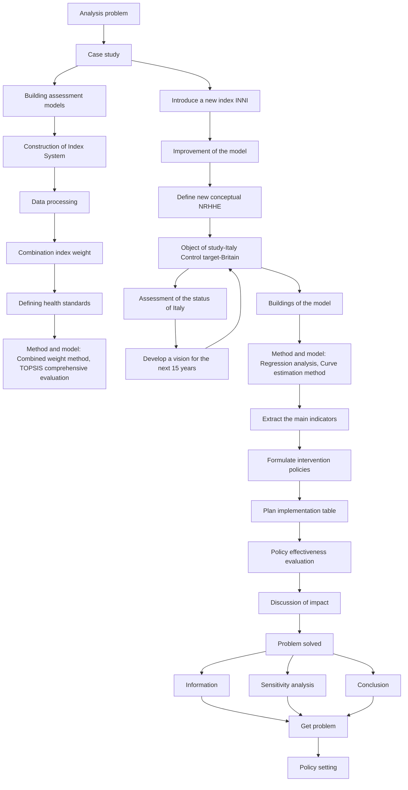
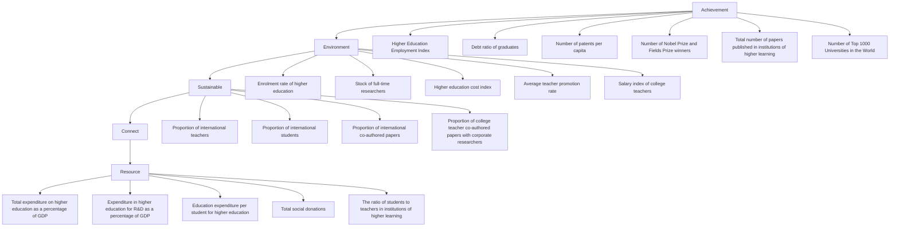
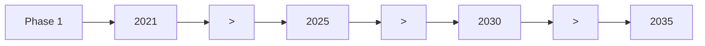
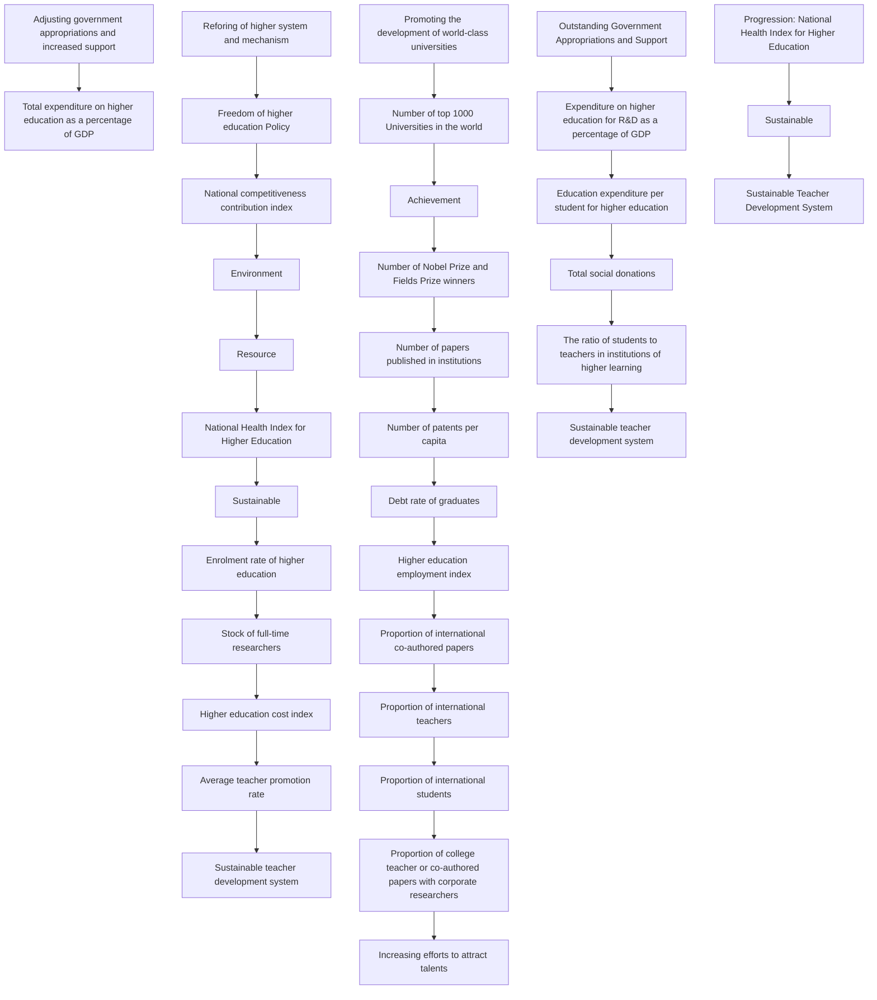

## Do a "physical examination" for the country's higher education

Summary

A healthy, sustainable higher education system can bring a series of values to the nation. Although the higher education systems in different nations in the world are different, they all have more or less shortcomings. In order to do a "physical examination" for each nation’s higher education system and put forward corresponding improvement policies, we have developed a National Health Index for Higher Education (NHHE) evaluation model and other related models.

For the purpose of establishing the national health index for higher education evaluation model, we consider five superior indicators and 23 inferior indicators. We carry out complicated but meaningful data processing and use different methods to forward and standardize the data. Considering the error of calculating weight, we synthesize subjective Analytic Hierarchy Process , objective Entropy Weight Method and Coefficient of Variation method to eliminate subjective error and data error to the maximum extent ， making our model more accurate by using the combined weight method. Then we use TOPSIS comprehensive evaluation method to calculate the NHHE. Finally, we put 40 countries in our evaluation model, and carry out fuzzy clustering analysis of their calculation results. Three standard lines are drawn, and the NHHE score greater than 0.5 is defined as super healthy. The score between 0.36-0.5 is defined as subhealthy and less than 0.22 as unhealthy.

Based on the above model, we introduce a new indicator: Index Number of National Income (INNI) to represent a country's level of economic development. We analyzed the INNI and the inferior indicators by regression analysis, and found that most of the indicators have strong correlation with the INNI. On the basis of the above research, we estimate the curve of NHHE and INNI and find that they are exponentially distributed. Based on the prediction curve and the real data of the selected countries, we define a new index: the National Relative Health Index of Higher Education (NRHHE), that is, the health level of system of higher education after considering the level of national economic development. Combining the two models, we selected Italy as the research object, and selected UK with the same level of economic development as Italy as a contrast, develop a vision for Italy for the next 15 years to support a healthy and sustainable system of higher education. Finally, we evaluate the health status of higher education and the relative health status of higher education in Italy under the current and future vision respectively.

In order to support the improvement of the health status of Italian higher education, we have formulated relevant policies for it. We use correlation coefficient to analyze the relationship between each subordinate index, and find that many indexes have strong correlation. In order to extract the main influencing factors, we conducted one-way ANOVA on each index and NHHE, and extracted five indexes with the most significant correlation. Next, we formulate intervention policies from five aspects and give a planning schedule. The intervention policy will be carried out in three stages.

In order to evaluate the effectiveness of the policy, we consider four aspects: design, transmission, implementation and feedback of the policy. Among them, we developed a System Dynamics model between intervention policies and indicators to analyze their internal influence relationship, and calculated that according to our plan, Italy can achieve our health vision in 2035. Finally, we discussed the impact of our plan on Italy during the transition period and after reaching the final state. Considering all factors, we admit that change is difficult.

## Content

1 Introduction. .

1.1 Background. ..  
1.2 Our work... 3

2 Assumption and Notation..... 4

2.1 Assumption. 4  
2.2 Notation. 4

3 Establish NHHE Evaluation Model.

3.1 Discussion of the Superior and Inferior Indicators.. 5  
3.2 Normalization of Inferior Indicators.. 6  
3.3 Determination of the Weights for Indicators...... 8  
3.4 Calculate the National Health Index For Higher Education.. 9  
3.5 Determine their health 10

4 Case study: Italy. 11

4.1 Introduction of new indicator: INNI. 11  
4.2 Vision for the next 15 years.. 12

4.2.1 Forecast the change of INNI. 12  
4.2.2 A comparative analysis of Italy and UK.... 13  
4.2.3 Vision development. 14

4.3 Assessment of health status in Italy............. 14

5 Presentation of policies.... 15

5.1 Extraction of key indicators... .15  
5.2 Formulation of policy.. .

6 Evaluation of the effectiveness of policies......... 19

6.1 Effectiveness of policy design..... .

6.1.1 Multi-objective policy helps achieve optimization..... .  
6.1.2 Targeted policies can effectively meet Italy's needs.... .  
6.1.3 Continuity and stability of policy design...... 19

6.2 Effectiveness of policy impact transmission.. . 19  
6.3 Effectiveness of policy implementation.. 20  
6.4 Effectiveness of policy feedback.. .

7 The impact of our plan on Italy. . 21

7.1 Impact on students. 21  
7.2 Impact on faculty. 21  
7.3 Impact on schools.. 21  
7.4 Impact on communities. .  
7.5 Impact on nation. 22

8 Sensitivity Analysis. 22

9 Strengths and Weaknesses.. .23

Strengths. 23  
Weaknesses.. .

10 Conclusion............... 23

Reference. 24

## 1 Introduction

## 1.1 Background

The system of higher education is an organizational structure that consists of higher educational institutions (colleges, universities, etc.) as well as personnel and infrastructure required to educate students beyond the secondary level. Whether the higher education system is healthy determines whether a country can flourish in the future. A system of higher education can run on a long-term and effective basis can bring a lot of value to the country.

However, for current studies, researchers usually focus on the health of a university's education system, and rarely evaluate the national system of higher education. But the higher education system of each country is different, there are some problems more or less, need to be improved and adjusted. Especially when there are some unexpected situations, countries need to reflect on their higher education system and adjust to a healthy and stable state. Otherwise, the country's system of higher education may collapse.

Therefore, it is meaningful to establish an index evaluation model to assess the health of the national higher education system as a guide for decision makers.

## 1.2 Our work

According to this problem, we built a model that can evaluate the National Health Index for Higher Education （ NHHE ） of any country. In the model, we combine subjective analytic hierarchy process with objective entropy weight method and coefficient of variation method to obtain the weight of each index, and then use TOPSIS comprehensive evaluation method to calculate NHHE. Then we applied the model to 40 countries and calculated their NHHE. Through the fuzzy clustering method, we will draw three standard lines to divide the country into super health, health, sub-health and unhealthy.

We also consider that the health level of the national higher education system is also related to the national economic development level, so we introduce the national income index as an index, and use the curve fitting method to analyze the exponential correlation between NHHE and INNI. Therefore, we define a new concept: the National Relative Health Index of Higher Education (NRHHE), which takes into account the country's economic development level and only compares the relative health status. Based on the above two models, we choose Italy as the research object, and take UK as the reference object to formulate a vision for Italy in the next 15 years. At the same time, we use two models to evaluate the health of Italian higher education in the present and future vision.

According to one-way ANOVA, we selected five main indicators for policy making. We have formulated a "three-step" policy plan for Italy. Each five-year plan has corresponding specific policies and gives a timetable for implementation. Finally, we use the system dynamics model to evaluate the effectiveness of the policy, and discuss the impact of our plan on the transition period and the final state. Considering various factors, we admit that change is difficult.

The structure of our paper is as follows:

flowchart

Figure 1：The structure of our paper

## 2 Assumption and Notation

## 2.1 Assumption

To simplify the given problems and modify it more appropriate for simulating reallife conditions, we make the following basic hypotheses.

Assuming that the health status of a country's higher education is mainly affected by resource, environment, connect, achievement and sustainable, we have established a more comprehensive evaluation model.  
Assuming that if the difference between INNI of the two countries is within 0.03, the two countries are considered to have the same level of economic development.  
Assuming that Italy will adopt the intervention policy we formulated for it to actively improve the health level of its higher education. This is the premise of our policy effectiveness analysis.  
Assuming that UK will not carry out a large-scale reform of its higher education system in the next 15 years, so its NHHE will not change significantly. This is the premise for us to formulate our vision with UK as the reference object.

2.2 Notation

<table><tr><td>Symbol</td><td>Notation</td></tr><tr><td>NHHE</td><td>National health index for higher education</td></tr><tr><td>INNI</td><td>Index number of national income</td></tr><tr><td>NRHHE</td><td>National relative health index for higher education</td></tr><tr><td>F</td><td>Statistical value in F test</td></tr><tr><td> $X_{ij}$ </td><td>The value of the  $j$ th indicator in the  $i$ th year</td></tr><tr><td> $Y_{ij}$ </td><td>The standardized data corresponding to indicators  $X_{ij}$ </td></tr></table>

## 3 Establish NHHE Evaluation Model

As one of the most important industries in a country, higher education is responsible for cultivating talents for the future development of the country. Different countries have different basic national conditions and have different system of higher education. To help policy makers provide favorable policy advice, it is urgent to build a model to judge the health of a country's higher education system. Consequently, we define the NHHE as a measure and establish a model that can be applied to evaluate the NHHE in any country to quantify this index.

## 3.1 Discussion of the Superior and Inferior Indicators

A country's system of higher education that consists of higher educational institutions (colleges, universities, etc.) as well as personnel and infrastructure required to educate students beyond the secondary level. So it's an organizational structure that combines different subjects. A healthy system of higher education means that teachers and students have sufficient learning resources, a good educational environment within the country, good communication with other organizations and systems outside the world, and excellent achievement. Finally, it must have the ability and potential of sustainable development. To that end, we believe that a healthy system of higher education requires five simultaneous conditions: resources, environment, connect, achievement and sustainable. For a comprehensive measure of the health of a country's system of higher education, five superior indicators are given. A specific assemblage I is given for them:

$$
\mathrm{I} = \{\mathrm{R} 、 \mathrm{E} 、 \mathrm{C} 、 \mathrm{A} 、 \mathrm{S} \}
$$

where R, E, C, A, S represent Resource, Environment, Connect, Achievement, Sustainable.

There are many inferior indicators under each superior indicator. 23 inferior indicators and 5 superior indicators are considered in our NHHE model, as shown in Figure 2. The determination of the weights will be discussed later. Those indicators measure the health of a national education system.

flowchart

Figure 2: Framework of NHHE model

We are going to introduce the inferior indicators and normalize each of them into the same pattern. After that, the weights of each superior and inferior indicator will be determined using combination weighting method.

The model is constructed based on five superior indicators and the superior indicators are determined by the inferior indicators. We are going to discuss about them in detail.

## Resource

Resources are a necessary condition for the development of higher education. Only with sufficient funds and teacher resources can we have a healthy system of higher education. Accordingly, we choose: total expenditure on higher education as a percentage of GDP (R1), expenditure in higher education for R&D as a percentage of GDP (R2), education expenditure per student for higher education (R3), total social donations (R4), the ratio of students to teachers in institutions of higher learning (R5) as the inferior indicators of resources.

## Environment

Having a healthy and reasonable higher education environment can greatly help a country to improve the health of its higher education system. Among them, education equity, national policy and economic development are all environmental factors related to education. Accordingly, we choose : higher education equity index (E1), freedom of higher education policy (E2), national competitiveness contribution index (E3) as the inferior indicators of environment.

## Connect

International exchanges are becoming more and more important in higher education, as is cooperation between schools and enterprises. Good cooperation can help higher education grow faster. Accordingly, we choose : proportion of international teachers (C1), proportion of international students (C2), proportion of international co-authored papers (C3), proportion of college teacher co-authored papers with corporate researchers (C4) as the inferior indicators of connect.

## Achievement

Achievement is one of the most important factors to measure the development level of higher education. There can be no healthy system of higher education without good achievement. Accordingly, we select higher education employment index (A1), debt ratio of graduates (A2), number of patents per capita (A3), number of Nobel Prize and Fields Prize winners (A4), total number of papers published in institutions of higher learning (A5), number of Top 1000 universities in the world (A6) as the inferior indicators of achievement.

## Sustainable

Sustainability is now one of the most concerned indicators, and higher education is no exception. Ensuring the sustainability of a healthy higher education system is of paramount importance. Hence, we select enrolment rate of higher education (S1), stock of full-time researchers (S2), higher education cost index (S3), average teacher promotion rate (S4), salary index of college teachers (S5) as the inferior indicators of sustainable.

## 3.2 Normalization of Inferior Indicators

The inferior indicators need to be normalized into the range of [0,1]. Meanwhile, the inferior indicators need to be transformed to the benefit-type indicators which means that the larger the better. We use different normalization methods to normalize different kinds of indicators according to their characteristics. These methods include the logistic function, the maximum normalization method, the moderate normalization method, the minimum normalization method and the subordinate function of fuzzy mathematics. We are going to show the applications of each method we use.

##  Logistic function

This normalization method is applied to indicators which do not have a specific upper limitation, such as proportion of international students. There are some rules of normalization for this kind of indicators. When the original indicator is close to 0, the normalized indicator should be 0; when the original indicator approaches infinity, the normalized indicator should be close to 1. Meanwhile, the normalized indicators should rise sharply when it is close to 0. For these reasons, we choose logistic function to be the normalization function:

$$
y = \frac {1}{1 + e ^ {- b (x - x _ {0})}}
$$

where is the normalized indicator; is the original indicator; $x _ { 0 }$ is the minimum standard of the indicator; is a parameter to control the climbing speed of the normalization function. The value of will be determined in the solution of model.

##  Maximum normalization method

This method is used to normalize the benefit-type indicators, like enrolment rate of higher education. The greater the indicator is, the better the situation is. The way to normalize the indicators is:

$$
x ^ {\prime} = \frac {x}{x _ {\mathrm{max}}}
$$

where $x _ { \mathrm { m a x } }$ is the maximum of the indicator.

##  Minimum normalization method

This method is similar to the maximum normalization method. It is used to normalize the cost-type indicators, such as debt ratio of graduates. The way to normalize the indicators is:

$$
x ^ {\prime} = \frac {| x - x _ {o p} |}{\max \{| x _ {\max} - x _ {o p} | , | x _ {\min} - x _ {o p} | \}}
$$

where $x _ { o p }$ is the optimal value of the indicator.

## Subordinate function

This method is used to normalize the discrete indicators. These indicators can be divided into several intervals with a discrete grade, like national policy and regulatory environment. According to the theory of fuzzy mathematics, we choose the correspondence of the value set and the comment set as:

$$
\{A w f u l, B a d, N o r m a l, E x c e l l e n t \} = \{1, 2, 3, 4, 5 \}
$$

The partial large Cauchy distribution membership function is determined as:

$$
f (x) = \left\{ \begin{array}{c} \frac {1}{1 + \frac {a}{(x - b) ^ {2}}}, 1 \leqslant x <   3 \\ c \ln x + d, 3 \leqslant x \leqslant 5 \end{array} \right.
$$

We set that when the grade value is 1, the membership grade should be 0.01; when the grade value is 3, the membership grade should be 0.8; when the grade value is 5, the membership grade should be 1. Here, the parameters of the partial large Cauchy distribution membership function can be determined as:

$$
\left\{ \begin{array}{l} a = 1. 1 0 8 6, b = 0. 8 9 4 2 \\ c = 0. 3 9 1 5, d = 0. 3 6 9 9 \end{array} \right.
$$

Using these normalization methods, all the inferior indicators can be normalized. The normalized data form a Y matrix. Here we omit the detailed methods for each inferior indicator.

## 3.3 Determination of the Weights for Indicators

There are many methods to determine the weight of indicators. In order to make our model more accurate, we decide to use the combination weighting method to calculate the weight of all indicators. Our combination weighting method combines Analytic Hierarchy Process (AHP) in subjective weighting method and Entropy Weight Method (EWM) and Coefficient of Variation Method (CVM) in objective weighting method. Because the AHP judgment is more subjective, it is easy to change by the subjective influence of the decision maker. At the same time, because of the high sensitivity of the data, it may cause errors due to the data itself. Therefore, our combination weighting method synthesizes these methods to help us reduce errors and improve accuracy.

##  Analytic Hierarchy Process

 Establish hierarchical structure model, as shown in figure 1.  
 Construct all judgment matrices in Superior indicator layer and inferior indicator layer:

$$
A = \left(a _ {i j}\right) _ {n \times n}
$$

where is judgment matrix； $a _ { i j }$ is the importance of $x _ { i }$ relative to $x _ { j } ; n$ is the quantity of inferior indicators in each group. Because of the limited space, we will not show the judgment matrix.

 Calculate the weight of each layer and perform a consistency check. The results are shown below.

##  Entropy Weight Method

After normalization We get a Y matrix. Then, we use the Entropy Weight Method (EWM) to calculate the weight of the inferior indicators.

We calculate the probability matrix $P _ { i j }$ .

According to the concepts of self-information and entropy in the information theory, we can calculate the information entropy $E _ { i }$ of each inferior evaluation indicator, hence we can obtain:

$$
E _ {i} = - \ln (n) ^ {- 1} \sum_ {j = 1} ^ {n} P _ {i j} \ln \left(P _ {i j}\right)
$$

On the basis of the information entropy, we will further compute the weight of each inferior evaluation indicator we defined before:

$$
w _ {i} = \frac {1 - E _ {i}}{k - \sum_ {i} E _ {i}} \quad i = 1, 2, \dots , k
$$

##  Coefficient of Variation Method

Furthermore, we apply Coefficient of Variation Method (CVM) to weight these five superior indicators. Therefore, we will introduce the application of Coefficient of Variation Method briefly.

Coefficient of Variation Method utilizes the information from various indicators and achieve the weight of each superior indicators through calculating, which shows to be an objective approach to give weight.

Owing to the influence of different dimension, it is hard to compare the superior indicators directly, so it needs the coefficient of variation of each superior indicators to measure the difference extent of them. The formula of each indicators can be expressed as:

$$
V _ {i} = \frac {\theta_ {i}}{z _ {i}} \quad i = 1, 2, 3, 4, 5
$$

where $V _ { i }$ is the coefficient of variation of the superior indicators , which can also be called as standard deviation coefficient, and $\theta _ { i }$ means the standard deviation of the superior indicators. Then the weight of each superior indicators comes to us:

$$
W _ {i} = \frac {V _ {i}}{\sum_ {i = 1} ^ {n} V _ {i}} \quad i = 1, 2, 3, 4, 5
$$

##  Combination weight

We set the weight calculated by Analytic Hierarchy Process as $W _ { i 1 }$ . The weight of the inferior indicators calculated by the Entropy Weight Method and the weight of the superior indicators calculated by the Coefficient of Variation Method are set to $W _ { i 2 }$

pie chart

| Category | Value |
|---|---|
| A1 | 0.8 |
| A2 | 0.7 |
| A3 | 0.6 |
| A4 | 0.5 |
| A5 | 0.9 |
| S1 | 0.7 |
| S2 | 0.6 |
| S3 | 0.5 |
| S4 | 0.4 |
| S5 | 0.3 |
| Resource | 0.8 |
| Environment | 0.5 |
| Connect | 0.4 |
| R1 | 0.3 |
| R2 | 0.2 |
| R3 | 0.1 |
| R4 | 0.1 |
| R5 | 0.1 |
| E1 | 0.3 |
| E2 | 0.3 |
| E3 | 0.3 |
National Health Index for Higher Education

Figure 3: Indicators weights

## 3.4 Calculate the National Health Index For Higher Education

We selected 40 countries with different continents and different development situations as research objects to calculate their NHHE.

We use TOPSIS comprehensive evaluation method to evaluate NHHE of 40 countries, and obtain the NHHE scores of 40 countries. The higher the score, the healthier the national higher education system. We collect data from 40 countries and calculate.

From the above calculations we can get a standardized Y matrix, and now we determine the optimal scheme and the worst scheme for each indicator:

$$
Y ^ {+} = \left(\max \{y _ {1 1}, y _ {2 1}, \dots , y _ {n 1} \}, \max \{y _ {1 2}, y _ {2 2}, \dots , y _ {n 2} \}, \dots \max \{y _ {1 m}, y _ {2 m}, \dots , y _ {n m} \}\right)
$$

$$
= \left(Y _ {1} ^ {+}, Y _ {2} ^ {+}, \dots , Y _ {m} ^ {+}\right)
$$

The worst scheme $Y ^ { + }$ composed of the maximum value of each column element in the :

$$
Y ^ {-} = \left(\min \left\{y _ {1 1}, y _ {2 1}, \dots , y _ {n 1} \right\}, \min \left\{y _ {2 1}, y _ {2 2}, \dots , y _ {n 2} \right\}, \dots , \min \left\{y _ {1 m}, y _ {2 m}, \dots , y _ {n m} \right\}\right)
$$

$$
= \left(Y _ {1} ^ {-}, Y _ {2} ^ {-}, \dots , Y _ {m} ^ {-}\right)
$$

Calculate the proximity of each indicator to the optimal scheme and the worst scheme:

$$
D _ {i} ^ {+} = \sqrt {\sum_ {j = 1} ^ {m} w _ {j} \left(Y _ {j} ^ {+} - y _ {i j}\right) ^ {2}}, \quad D _ {i} ^ {-} = \sqrt {\sum_ {j = 1} ^ {m} w _ {j} \left(Z _ {j} ^ {-} - z _ {i j}\right) ^ {2}}
$$

Calculate the closeness of each indicator to the optimal scheme:

$$
N H H E _ {i} = \frac {D _ {i} ^ {-}}{D _ {i} ^ {+} + D _ {i} ^ {-}}
$$

The higher the $N H H E _ { i }$ score, the healthier and more sustainable the country's system of higher education.

## 3.5 Determine their health

By using the NHHE model, we have calculated the selected 40 countries' NHHE. Below, we have carried out fuzzy cluster analysis of these 40 countries, divided all countries into four categories and defined them as: super healthy, healthy, sub-healthy, unhealthy. The results of clustering are shown in Figure 4. On this basis, we can show our results with more intuitive map.

world map

| Country | Health Status Category |
| --- | --- |
| USA | Super healthy |
| Canada | Super healthy |
| Mexico | Healthy |
| Brazil | Healthy |
| Argentina | Sub-healthy |
| Colombia | Sub-healthy |
| Peru | Unhealthy |
| India | Unhealthy |
| China | Unhealthy |
| Russia | Unhealthy |
| South Africa | Unhealthy |
| Australia | Healthy |
| Japan | Healthy |
| Germany | Healthy |
| France | Healthy |
| Italy | Healthy |
| Spain | Healthy |
| UK | Healthy |
| Netherlands | Healthy |
| Sweden | Healthy |
| Norway | Healthy |
| Denmark | Healthy |
| Finland | Healthy |
| Austria | Healthy |
| Poland | Healthy |
| Ukraine | Healthy |
| Israel | Healthy |
| United Kingdom | Unhealthy |
| Ireland | Unhealthy |
| Portugal | Unhealthy |
| Greece | Unhealthy |
| Iceland | Unhealthy |
| Greenland | Unhealthy |
| North Korea | Unhealthy |
| South Korea | Unhealthy |
| Taiwan | Unhealthy |
| Hong Kong | Unhealthy |
| Singapore | Unhealthy |
| Malaysia | Unhealthy |
| Thailand | Unhealthy |
| Vietnam | Unhealthy |
| Philippines | Unhealthy |
| Indonesia | Unhealthy |
| Pakistan | Unhealthy |
| Bangladesh | Unhealthy |
| Myanmar | Unhealthy |
| Nepal | Unhealthy |
| Sri Lanka | Unhealthy |
| Bhutan | Unhealthy |
| Sri Lanka (not labeled) | Unhealthy (not labeled) |
| Jordan | Unhealthy (not labeled) |
| Lebanon | Unhealthy (not labeled) |
| Lebanon (not labeled) | Unhealthy (not labeled) |
| Jordan (not labeled) | Unhealthy (not labeled) |
| Jordan (not labeled) | Unhealthy (not labeled) |
| Jordan (not labeled) | Unhealthy (not labeled) |
| Jordan (not labeled) | Unhealthy (not labeled) |
| Jordan (not labeled) | Unhealthy (not labeled) |
| Jordan (not labeled) | Unhealthy (not labeled) |
| Jordan (not labeled) | Unhealthy (not labeled) |
| Jordan (no label) | Unhealthy (not labeled) |
| Jordan (no label) | Unhealthy (not labeled) |
| Jordan (no label) | Unhealthy (no label) |
| Jordan (no label) | Unhealthy (no label) |
| Jordan (no label) | Unhealthy (no label) |
| Jordan (no label) | Unhealthy (no label) |
| Jordan (no label) | Unhealthy (no label) |
| Jordan (no label) | Unhealthy (no label) |
| Jordan (no label) | Unhealthy (no label) |
| Jordan (no label) | Unhealthy (no label) |

Figure 4: Classification map

forest plot

| Country       | Value |
| ------------- | ----- |
| Italy         | 21    |
| South Africa  | 24    |
| Poland        | 23    |
| Greece        | 27    |
| China         | 19    |
| Chile         | 22    |
| Malaysia      | 20    |
| Japan         | 15    |
| Korea         | 18    |
| Saudi Arabia  | 16    |
| Spain         | 17    |
| Brazil        | 30    |
| Thailand      | 32    |
| Mexico        | 34    |
| Iran          | 33    |
| Indonesia     | 36    |
| Argentina     | 29    |
| Serbia        | 31    |
| Turkey        | 28    |
| Egypt         | 39    |
| Russia        | 25    |
| Algeria       | 37    |
| Kenya         | 40    |
| Sudan         | 38    |
| India         | 35    |
| New Zealand   | 11    |
| Germany       | 12    |
| France        | 13    |
| Israel        | 14    |
| Switzerland   | 2     |
| Denmark       | 3     |
| Ukraine       | 26    |
| Singapore     | 4     |
| Sweden        | 5     |
| Finland       | 8     |
| UK            | 6     |
| Australia     | 9     |
| Canada        | 7     |
| Netherlands   | 10    |
| US            | 1     |

Figure 5: Fuzzy clustering

According to Figure 5, we can know that once a country's NHHE is determined, the health level of a country's system of higher education can be determined. We also carry on the fuzzy cluster analysis to these five superior indicators respectively, and determine the classification standard of the health status of each superior indicator. Because the focus of each indicator is different. So the classification criteria of five composite indicators and one comprehensive indicator are slightly different. Specific classification standard are shown in Figure 6:

stacked bar chart

| Category | Unhealthy (%) | Sub-healthy (%) | Healthy (%) | Healthy (%) |
|---|---|---|---|---|
| Sustainable | 0.35 | 0.25 | 0.25 | 0.65 |
| Achievement | 0.15 | 0.15 | 0.35 | 0.65 |
| Connect | 0.18 | 0.40 | 0.25 | 0.55 |
| Environment | 0.35 | 0.25 | 0.20 | 0.45 |
| Resource | 0.12 | 0.35 | 0.35 | 0.65 |
| NHHE | 0.22 | 0.25 | 0.25 | 0.65 |

Figure 6：Classification standard of health level

## 4 Case study: Italy

## 4.1 Introduction of new indicator: INNI

After 40 countries are brought into the NHHE model calculation, the health level of the system of higher education is ranked. From the ranking we can find that countries with higher health levels of the system are usually high-income countries. Therefore, we assume that the health level of higher education in the country is not only related to the indicators of the system of higher education itself, but also to the level of economic development of the country. For this reason, we introduce a new indicator: Index Number of National Income(INNI) to represent a country's level of economic development.

$$
I N N I = \frac {\ln (G N I _ {P C}) - \ln (\alpha_ {\mathrm{min}})}{\ln (\alpha_ {\mathrm{max}}) - \ln (\alpha_ {\mathrm{min}})}
$$

where $\alpha _ { \mathrm { m i n } }$ is the minimum of $G N I _ { P C }$ for all countries， $\alpha _ { \mathrm { m a x } }$ is the maximum of $\mathit { C N I } _ { \mathit { P C } }$ in all countries.

To test our assumption, we used data from the selected 40 countries to analyze the correlation between the INNI and each inferior indicators by linear and quadratic regression, respectively. Of the 23 indicators, the value of all indicators increased with the increase of INNI, except for the debt ratio of graduates (A2) and the higher education cost index (S3). Therefore, we believe that the INNI is an important factor affecting the health level of national higher education. This is likely to occur when a country's economy is growing particularly fast, and although it has shown progress in higher education, the NHHE may also decline in the adjusted ranking. On the contrary, if economic growth is slow or negative, a country's NHHE may rise in the adjusted ranking because of the inherent lag in the system of higher education.

Using the INNI of 40 countries in 2019, we make a scatter plot to observe the general trend, and carry out multiple regression fitting according to the model. By comparison, we found that the index trend had the best fitting. Let the trend equation of the exponential curve be as follows:

$$
Y = a e ^ {b x}
$$

where is NHHE, is INNI, are undetermined coefficients.

We get the equation of the fitting curve:

$$
Y = 0. 1 0 9 0 3 2 4 9 3 1 9 7 2 7 9 5 e ^ {1. 5 3 1 5 3 3 5 0 9 1 6 0 9 1 4 x}
$$

The fitting results are shown in Figure 7:

scatterplot

| Country | INNI | NHHE |
| --- | --- | --- |
| US | 0.95 | 0.52 |
| Switzerland | 0.92 | 0.47 |
| Denmark | 0.91 | 0.46 |
| Singapore | 0.93 | 0.45 |
| Finland | 0.90 | 0.44 |
| Sweden | 0.88 | 0.43 |
| Netherlands | 0.87 | 0.42 |
| Canada | 0.86 | 0.41 |
| Germany | 0.85 | 0.40 |
| France | 0.84 | 0.39 |
| Japan | 0.83 | 0.38 |
| Korea | 0.82 | 0.37 |
| Saudi Arabia | 0.81 | 0.36 |
| Spain | 0.80 | 0.35 |
| Italy | 0.79 | 0.34 |
| Greece | 0.78 | 0.33 |
| Poland | 0.77 | 0.32 |
| Russia | 0.76 | 0.31 |
| Mexico | 0.75 | 0.30 |
| Argentina | 0.74 | 0.29 |
| Turkey | 0.73 | 0.28 |
| Serbia | 0.72 | 0.27 |
| Chile | 0.71 | 0.26 |
| China | 0.70 | 0.25 |
| Malaysia | 0.69 | 0.24 |
| Israel | 0.68 | 0.23 |
| New Zealand | 0.67 | 0.22 |
| Australia | 0.66 | 0.21 |
| UK | 0.65 | 0.20 |
| Ukraine | 0.64 | 0.19 |
| India | 0.63 | 0.18 |
| Iran | 0.62 | 0.17 |
| Thailand | 0.61 | 0.16 |
| Egypt | 0.60 | 0.15 |
| South Africa | 0.59 | 0.14 |
| Serbia | 0.58 | 0.13 |
| Brazil | 0.57 | 0.12 |
| Indonesia | 0.56 | 0.11 |
| Algeria | 0.55 | 0.10 |
| Sudan | 0.54 | 0.09 |
| Kenya | 0.53 | 0.08 |
| Kenya | 0.52 | 0.07 |
| Kenya | 0.51 | 0.06 |
| Kenya | 0.50 | 0.05 |
| Kenya | 0.49 | 0.04 |
| Kenya | 0.48 | 0.03 |
| Kenya | 0.47 | 0.02 |
| Kenya | 0.46 | 0.01 |
| Kenya | 0.45 | -0.01 |
| Kenya | -0.44 | -0.11 |
| Kenya | -0.43 | -0.21 |
| Kenya | -0.42 | -0.31 |
| Kenya | -0.41 | -0.41 |
| Kenya | -0.40 | -0.51 |
| Kenya | -0.39 | -0.61 |
| Kenya | -0.38 | -0.71 |
| Kenya | -0.37 | -0.81 |
| Kenya | -0.36 | -0.91 |
| Kenya | -0.35 | -1.01 |
| Kenya | -0.34 | -1.11 |
| Kenya | -0.33 | -1.21 |
| Kenya | -0.32 | -1.31 |
| Kenya | -0.31 | -1.41 |
| Kenya | -0.30 | -1.51 |
| Kenya | -0.29 | -1.61 |
| Kenya | -0.28 | -1.71 |
| Kenya | -0.27 | -1.81 |
| Kenya | -0.26 | -1.91 |
| Kenya | -0.25 | -2.01 |
| Kenya | -0.24 | -2.11 |
| Kenya | -0.23 | -2.21 |
| Kenya | -0.22 | -2.31 |
| Kenya | -0.21 | -2.41 |
| Kenya | -0.20 | -2.51 |
| Kenya | -0.19 | -2.61 |
| Kenya | -0.18 | -2.71 |
| Kenya | -0.17 | -2.81 |
| Kenya | -0.16 | -2.91 |
| Kenya | -0.15 | -3.01 |
| Kenya | -0.14 | -3.11 |
| Kenya | -0.13 | -3.21 |
| Kenya | -0.12 | -3.31 |
| Kenya | -0.11 | -3.41 |
| Kenya | -0.10 | -3.51 |
| Kenya | -0.09 | -3.61 |
| Kenya | -0.08 | -3.71 |
| Kenya | -0.07 | -3.81 |
| Kenya | -0.06 | -3.91 |
| Kenya | -0.05 | -4.01 |
| Kenya | -0.04 | -4.11 |
| Kenya | -0.03 | -4.21 |
| Kenya | -0.02 | -4.31 |
| Kenya | -0.01 | -4.41 |
| Kenya | +0.01 | -4.51 |
| Kenya | +0.02 | -4.61 |
| Kenya | +0.03 | -4.71 |
| Kenya | +0.04 | -4.81 |
| Kenya | +0.05 | -4.91 |
| Kenya | +0.06 | -5.01 |
| Kenya | +0.07 | -5.11 |
| Kenya | +0.08 | -5.21 |
| Kenya | +0.09 | -5.31 |
| Kenya | +0.10 | -5.41 |
| Kenya | +0.11 | -5.51 |
| Kenya | +0.12 | -5.61 |
| Kenya | +0.13 | -5.71 |
| Kenya | +0.14 | -5.81 |
| Kenya | +0.15 | -5.91 |
| Kenya | +0.16 | -6.01 |
| Kenya | +0.17 | -6.11 |
| Kenya | +0.18 | -6.21 |
| Kenya | +0.19 | -6.31 |
| Kenya | +0.20 | -6.41 |
| Kenya | +0.21 | -6.51 |
| Kenya | +0.22 | -6.61 |
| Kenya | +0.23 | -6.71 |
| Kenya | +0.24 | -6.81 |
| Kenya | +0.25 | -6.91 |
| Kenya | +0.26 | -7.01 |
| Kenya | +0.27 | -7.11 |
| Kenya | +0.28 | -7.21 |
| Kenya | +0.29 | -7.31 |
| Kenya | +0.30 | -7.41 |
| Kenya | +0.31 | -7.51 |
| Kenya | +0.32 | -7.61 |
| Kenya | +0.33 | -7.71 |
| Kenya | +0.34 | -7.81 |
| Kenya | +0.35 | -7.91 |
| Kenya | +0.36 | -8.01 |
| Kenya | +0.37 | -8.11 |
| Kenya | +0.38 | -8.21 |
| Kenya | +0.39 | -8.31 |
| Kenya | +0.40 | -8.41 |
| Kenya | +0.41 | -8.51 |
| Kenya | +0.42 | -8.61 |
| Kenya | +0.43 | -8.71 |
| Kenya | +0.44 | -8.81 |
| Kenya | +0.45 | -8.91 |
| Kenya | +0.46 | -9.01 |
| Kenya | +0.47 | -9.11 |
| Kenya | +0.48 | -9.21 |
| Kenya | +0.49 | -9.31 |
| Kenya | +0.50 | -9.41 |
| Kenya | +0.51 | -9.51 |
| Kenya | +0.52 | -9.61 |
| Kenya | +0.53 | -9.71 |
| Kenya | +0.54 | -9.81 |
| Kenya | +0.55 | -9.91 |

scatterplot

| Country | X     | Y     |
|---------|-------|-------|
| UK      | 0.80  | 0.42  |
| Italy   | 0.80  | 0.30  |

INNI (b)  
Figure 7：Index regression fitting results

The fitting equation gives the expected value of a NHHE variable. In the Figure (a), the vertical coordinates corresponding to the points on the curve are the NHHE expectations of each country at the corresponding INNI level. So we'll define a new index: NRHHE. The country above the curve is the relatively healthy country of the system of higher education, and the country below the curve is the relatively unhealthy country of the system.

We choose Italy, which is the furthest vertical distance from the curve. Without considering the impact of national economic development on national higher education, Italy ranks 26th with 0.31. While after introducing the INNI, we find that Italy falls to 40th out of 40 countries. The health of Italy's current system of higher education is clearly not in line with its current level of economic development. Therefore, we choose Italy as the research object, and put forward a attainable and reasonable vision for Italy.

If we assume that the national income index has little effect on a country's economic develop ment level when the gap ±0.03, we can think that there is the same level of economic developme nt, so we should have the same level of higher education health.

The INNI of Italy in our model is 0.80, so we set a level range of economic development, that is ,0.77-0.83. We believe that all countries’ INNI in this range should have the same level of economic development, so their health level of the system of higher education should also be consistent.

We make this interval in Figure 6 and find that the level of economic development in UK is basically the same as that in Italy, but the NHHE in UK is significantly higher than that in Italy. Therefore, we choose UK as the reference object we develop a attainable and reasonable vision of higher education for Italy.

## 4.2 Vision for the next 15 years

## 4.2.1 Forecast the change of INNI

Because it is not easy to change the health of a country's system of higher education, it is necessary to implement policies over a longer period of time to move forward with the reforms any system in order to achieve a more healthy and sustainable system. Therefore, it is not easy to improve Italy's system of higher education, all of which we set a vision for Italy's system of higher education for the next fifteen years. This vision wants Italy to help the system of higher education become healthier and more sustainable through reforms.

According to our improved evaluation model, we know that the health of a country's system of higher education is closely related to its level of economic development, so we need to consider the factors of economic development when setting a vision for the future. Therefore, we calculate the INNI of Italy and UK from 1995 to 2019 by collecting data, using simple nonlinear exponential smoothing model, Holt linear trend exponential smoothing model, Brown linear trend exponential smoothing model and damping trend exponential smoothing model respectively.

Table 1: Fitting the value of $R ^ { 2 }$ with four modes

<table><tr><td>Model Type</td><td>Simple</td><td>Holt&#x27;s linear trend</td><td>Brown&#x27;s linear trend</td><td>Damped trend</td></tr><tr><td>R square(Italy)</td><td>0.0940</td><td>0.6367</td><td>0.5983</td><td>0.0936</td></tr><tr><td>R square(UK)</td><td>0.0647</td><td>0.6393</td><td>0.5989</td><td>0.0962</td></tr></table>

From the fitting results, the $R ^ { 2 }$ of Holt model is 0.6367 and 0.6393, respectively, which is the highest, followed by Brown linearity, damping trend and simple nonlinearity. Holt model has the best fitting degree, so it is selected for prediction. Using Holt linear trend exponential smoothing prediction requires two basic smoothing formulas and one prediction formula. Two smoothing formulas are applied to two factors of time series respectively. They are:

$$
L _ {t + 1} = a D _ {t} + (1 - a) \left(L _ {t} + T _ {t}\right)
$$

$$
T _ {t + 1} = b \left(L _ {t + 1} - L _ {t}\right) + (1 - b) T _ {t}
$$

and a prediction formula:

$$
F _ {t + 1} = L _ {t + 1} + T _ {t + 1}
$$

where and are two smoothing parameters that affect the predicted value; $D _ { t }$ is the actual value; $F _ { t + 1 }$ is the predicted value; $L _ { t }$ is the average demand; $T _ { t }$ is the trend growth. $L _ { t + 1 } = a D _ { t } + \left( 1 - a \right) \left( L _ { t } + T _ { t } \right)$ is a smoothing formula for time series trends and $T _ { t + 1 } = b ( L _ { t + 1 } - L _ { t } ) + ( 1 - b ) T _ { t }$ is a smoothing formula for trend increments.

  
Figure 8: Prediction curve

## 4.2.2 A comparative analysis of Italy and UK

We make radar charts of the scores of NHHE and five superior indicators in UK and Italy, as shown in Figure 8. We can clearly see that Italy's scores are lower than those in the UK, so Italy needs to make corresponding changes in these five areas. We also analyzed the 23 lower-level indicators set in the Task 1 evaluation model. As can be seen from Figure 9, Italy's performance in the 15 inferior indicators is worse than that of UK. Therefore, we can refine the set vision into these lower-level indicators that need to be improved to help Italy support a healthy and sustainable system of higher education.

radar chart

| Category     | UK   | Italy |
| ------------ | ---- | ----- |
| Resource     | 0.4  | 0.3   |
| Environment  | 0.6  | 0.5   |
| Connect      | 0.7  | 0.4   |
| Achievement  | 0.2  | 0.1   |
| Sustainable  | 0.4  | 0.3   |
| NHHE         | 0.3  | 0.2   |

Figure 9: Comparison of superior indicators

line chart

| Category | UK | Italy |
|---|---|---|
| R1 | 28.9 | 28.9 |
| R2 | 38.8 | 32.1 |
| R3 | 63.1 | 30.8 |
| R4 | 64.7 | 33 |
| R5 | 24 | 24 |
| E1 | 100 | 100 |
| E2 | 89.5 | 63.8 |
| E3 | 75.5 | 60 |
| E4 | 22 | 9 |
| E5 | 65.8 | 19.5 |
| C1 | 72.1 | 62.9 |
| C2 | 68.9 | 54.2 |
| C3 | 34.4 | 34.4 |
| C4 | 14 | 14 |
| A1 | 19.2 | 19.2 |
| A2 | 19.795 | 19.795 |
| A3 | 137 | 22 |
| A4 | 31 | 15.7 |
| A5 | 58.1 | 29.4 |
| A6 | 66 | 66 |
| S1 | 53.1 | 27.8 |
| S2 | 37.5 | 24 |
| S3 | 0.8 | 0.8 |
| S4 | 136 | 123 |
The chart displays two data series: UK (blue line) and Italy (purple line). The values for each category are explicitly labeled on the chart.

Figure 10: Comparison of inferior indicators

## 4.2.3 Vision development

In order to develop a vision for the next 15 years, we first predict the health of higher education in the UK for the next 15 years. We assume that there will be no a large-scale reform of the system of higher education in the next 15 years, so that its system reform will not change significantly. According to our forecast of the UK's INNI for the next fifteen years, the INNI of the UK increased from 0.81296 to 0.83129. Accordingly, we forecast indicators for the next 15 years in the United Kingdom, as shown in Table 2:

Table 2：Forecast of UK’s indicator in the next fifteen years

<table><tr><td>Indicator</td><td>NHHE</td><td>Resource</td><td>Environment</td><td>Connect</td><td>Achievement</td><td>Sustainable</td></tr><tr><td>Score</td><td>0.44</td><td>0.49853</td><td>0.75650</td><td>0.76877</td><td>0.28799</td><td>0.49862</td></tr></table>

According to the forecast, we found that the INNI in the UK increased from 0.81296 to 0.83129 over the next 15 years. After taking into account the factors of comprehensive national strength and basic national conditions, we believe that in the next 15 years, Italy can reach 95% of the UK’s NHHE through effective national intervention and policy adjustments in related sectors. When formulating a more detailed vision, we comprehensively consider the gap between the current superior indicators and set the resource target to reach 95% of the UK; Environmental indicators reach 95% of UK's; Connect indicators reach 90% of that of the UK; Achievement indicators reached 95% of that of UK; Sustainable indicators reach 100% of that of UK. The specific vision is as follows:

Table 3：Vision score

<table><tr><td>Indicator</td><td>NHHE</td><td>Resource</td><td>Environment</td><td>Connect</td><td>Achievement</td><td>Sustainable</td></tr><tr><td>Score</td><td>0.41823</td><td>0.47360</td><td>0.71868</td><td>0.69189</td><td>0.28799</td><td>0.47369</td></tr></table>

## 4.3 Assessment of health status in Italy

Now we assess the current health status of higher education in Italy and the health status of our vision. Below we evaluate NHHE and NRHHE respectively.

## Assessment of NHHE

We substitute the present data with the forecast data after the vision into the NHHE evaluation model we established in the Task 1. The score of each indicator is shown in Figure 11 below:

area chart

| Category | Unhealthy | Sub-healthy | Healthy | Super healthy | Present | Future |
|---|---|---|---|---|---|---|
| NHHE | 0.4 | 0.15 | 0.25 | 0.75 | 0.1 | 0.22 |
| Resource | 0.3 | 0.15 | 0.3 | 0.65 | 0.1 | 0.28 |
| Environment | 0.15 | 0.25 | 0.35 | 0.7 | 0.35 | 0.75 |
| Connect | 0.35 | 0.25 | 0.35 | 0.7 | 0.2 | 0.72 |
| Achievement | 0.35 | 0.15 | 0.25 | 0.65 | 0.15 | 0.1 |
| Sustainable | 0.15 | 0.15 | 0.3 | 0.65 | 0.25 | 0.28 |

Figure 11: Comparison of changes of educational health in Italy

From Figure 11 we can see that Italy is in a state of sub-health, and in 15 years will become healthy; The three indicators of resource, achievement and sustainable promote from sub-healthy to healthy; environmental indicator promote from sub-healthy to super healthy; and connect indicator from healthy to super healthy.

## Assessment of NRHHE

According to our previous analysis, the relative health of a country's system of higher education needs to consider its economic development factors, and again using our improved evaluation model, the state of the present and the next 15 years is shown in Figure 12:

line chart

| INNI | NHHE |
|------|------|
| 0.8  | 0.42 |
| 0.8  | 0.30 |

Figure 12: Changes in health status in Italy

From Figure 12, we can see that the changed point moves from below the curve to above the curve, indicating that the relative health of higher education in Italy has changed from relatively unhealthy to relatively healthy.

## 5 Presentation of policies

## 5.1 Extraction of key indicators

In order to make our model more comprehensive, we selected 23 inferior indicators in the initial evaluation model. Now we want to put forward some targeted policy suggestions to Italy's system of higher education, and we need to simplify our model through some methods to help us better target some main indicators. Our approach is as follows:

First of all, we analyze the correlation coefficient of 23 indicators in pairs to study the correlation between the indicators. The value range of correlation coefficient is between 1 and -1. The closer the data is to 0, the weaker the correlation is. The following is the formula for calculating the correlation coefficient:

$$
r _ {x y} = \frac {S _ {x y}}{S _ {x} S _ {y}}
$$

where $r _ { x y }$ is correlation coefficient between indicators; $S _ { x y }$ is sample covariance; $S _ { x }$ is sample standard deviation of $x ; S _ { y }$ is sample standard deviation of $y$ .

Formula for $S _ { x y }$ :

$$
S _ {x y} = \frac {\sum_ {i = 1} ^ {n} \left(X _ {i} - \bar {X}\right) \left(Y _ {i} - \bar {Y}\right)}{n - 1}
$$

Through the analysis, we find that there is a strong correlation between many inferior indicators, which shows that we can select a few indicators that have the greatest impact on NHHE for policy improvement. These indicators will directly affect NHHE and indirectly affect NHHE by affecting other indicators. In order to select the most important indicators, we conducted one-way ANOVA to judge which indicators have a significant impact on the NHHE. Taking each factor increase of 10% and 20% as the control group, the total variance $V$ , intragroup variance $V _ { W }$ , and inter-group variance $V _ { B }$ were obtained at different levels:

$$
V = \sum \left(x _ {i j} - \bar {x}\right) ^ {2}
$$

$$
V _ {W} = \sum \left(x _ {i j} - \overline {{x _ {i}}}\right) ^ {2}
$$

$$
V _ {B} = b \sum \left(\overline {{x}} _ {i} - \overline {{x}}\right) ^ {2}
$$

On this basis, the inter-group mean square error $\hat { \boldsymbol S } _ { B }$ and the intra-group mean square error $\hat { S } _ { W } ^ { \phantom { \dagger } 2 }$ can also be obtained:

$$
\hat {S} _ {B} = \frac {V _ {B}}{a - 1}
$$

$$
\hat {S} _ {W} ^ {2} = \frac {V _ {W}}{a b - a}
$$

Under the assumption that the variance is equal, applying F statistics to variance test:

$$
F = \frac {V _ {B} / (a - 1)}{V _ {W} / (a b - b)} = \frac {\hat {S} _ {B} ^ {2}}{\hat {S} _ {W} ^ {2}}
$$

It is found that the five indicators R1, E2, C1, A6 and S2 have significant effects on NHHE. So we can propose specific improvement policies for these five indicators.

## 5.2 Formulation of policy

Our policy implementation takes five years as a phase, divided into three phases from 2021- 2035, as shown below:

flowchart

Figure 13: Division of policy implementation phases

## Resource

If higher education wants to change from a sub-healthy state to a healthy state, investing resources is a necessary condition. The most important aspect affecting educational resources is the state's investment in higher education. First of all, we should break the previous uniform standards of financial allocation, introduce competition mechanisms, and pay attention to the improvement of quality and efficiency.According to the research and teaching quality assessment results of major colleges and universities; Secondly, after perfecting the allocation mechanism, we can increase the financial support for higher education properly, and help students, teachers and schools have more perfect and first-class educational conditions; Finally, special results incentives can be introduced. When colleges and universities exceed the established tasks or make major breakthroughs in some aspects, they can reward a certain amount of educational funds according to the situation to encourage the competition and innovation of colleges and universities.

## Environment

At present, Italy has a serious waste of educational resources, which makes the Italian education system inefficient, reasonable national regulatory policy can help Italy improve the current serious institutional problems. First, there is a need for changes in the organizational form of the University and the reorganization of the university's governing bodies, which may include the rector, the academic council, the administrative committee, the board of auditors, the evaluation body and the director-general; Secondly, in order to avoid all kinds of drawbacks brought by the principal's lifelong system, we can appoint a policy to stipulate the maximum term of office of the principal. If the principal does not finish his work well during the term of office, the school can remove the principal. This will greatly avoid the bad phenomenon of a single family; Finally, the subject reorganization within the university is needed. For example, some colleges lack enrollment all year round, which greatly wastes educational resources. It is necessary to reduce the number of colleges within the university, and if the annual teacherstudent ratio is higher than a critical point, the conversion or merger of colleges can be cancelled.

## − Connect

Take the initiative to participate in international talent competition, implement a more open talent policy, formulate more attractive preferential policies, and speed up the introduction of domestic and overseas high-level talents from various aspects of policy and capital; Establish a scientific talent evaluation mechanism, study and establish a set of diversified talent evaluation indicators and parameter systems that reflect the characteristics of all kinds of talents, and constantly update the management of existing high-level talents; At the same time, it is necessary to safeguard their rights and interests, grasp and apply leading technology in a timely manner, grasp the development direction and practical needs of outstanding talents in various fields, perfect policies from the aspects of training, evaluation first, selection and employment, and perfect mechanisms to create an atmosphere of people-oriented environment and reduce the brain drain.

## Achievement

Italy has now become a sacred place in the hearts of artists, which is an excellent place to study in art, can provide corresponding preferential policies to attract more students at home and abroad to exchange and study, multiculturalism coexist, promote the construction of first-class disciplines, enhance competitiveness; Nowadays, the world is entering the stage of knowledge and technology becoming the core competitive resource. Most of the important scientific research achievements and invention patents in the world come from higher education institutions. We should pay attention to the cultivation of high-level universities and cutting-edge innovative talents.

## Sustainable

A dynamic teacher development policy is key to the development of higher education institutions. The department in charge of education should arouse the enthusiasm of teachers, give full play to their role as talents, and invest in guiding teachers to teaching and scientific research activities to support and care for the development of teachers' career; Through the rational development of the system of promotion and salary increase, the titles are awarded by universities through open selection, and teachers are encouraged to receive continuous education and training in various new knowledge, theories and techniques; To carry out projects and activities to meet the diversified development needs of teachers' scientific research, teaching and personal development in colleges and universities, to provide all-round support for the growth of teachers, and to effectively and continuously promote the development of teachers.

The policy implementation schedule is as follows:

Table 4: Policy implementation schedule

<table><tr><td></td><td>Resource</td></tr><tr><td>First stage</td><td>Introduction of competition mechanisms for financial allocations</td></tr><tr><td>Second stage</td><td>Appropriate increase in financial support</td></tr><tr><td>Third stage</td><td>Setting results incentive mechanisms</td></tr><tr><td></td><td>Environment</td></tr><tr><td>First stage</td><td>Reform of the organization of universities</td></tr><tr><td>Second stage</td><td>Cancellation of President&#x27;s Lifelong System</td></tr><tr><td>Third stage</td><td>Reorganization of disciplines within universities</td></tr><tr><td></td><td>Connect</td></tr><tr><td>First stage</td><td>Increase the preferential treatment of studying abroad</td></tr><tr><td>Second stage</td><td>Establishment of dynamic talent evaluation mechanism</td></tr><tr><td>Third stage</td><td>Establishment of special fund for talent support</td></tr><tr><td></td><td>Achievement</td></tr><tr><td>First stage</td><td>Using natural advantages to promote the construction of first-class disciplines</td></tr><tr><td>Second stage</td><td>Promoting the construction of Top 1000 universities in the world</td></tr><tr><td>Third stage</td><td>Increase the types of special support funds for scientific research and invention patents</td></tr><tr><td></td><td>Sustainable</td></tr><tr><td>First stage</td><td>Establishment of a reasonable system of promotion and pay increases</td></tr><tr><td>Second stage</td><td>Improve the performance evaluation system and allocate incentive funds</td></tr><tr><td>Third stage</td><td>Implementation of teacher development projects</td></tr></table>

## 6 Evaluation of the effectiveness of policies

In order to evaluate the effectiveness of the policy, we analyze and consider it from the following four aspects: the effectiveness of policy design, the effectiveness of policy influence transmission, the effectiveness of policy implementation and the effectiveness of policy feedback.

## 6.1 Effectiveness of policy design

## 6.1.1 Multi-objective policy helps achieve optimization

The policy we designed is comprehensively considered from five aspects, which improves the comprehensiveness of the policy. Such a policy design will not make us only consider a single indicator and ignore the overall situation, resulting in the final failure to achieve the optimal goal. Considering a number of important indicators related to the higher education system as a whole, we can finally achieve the optimization of multiple objectives.

## 6.1.2 Targeted policies can effectively meet Italy's needs

When formulating policies, we considered the basic national conditions of Italy, the historical situation of higher education and the current situation of higher education. The comprehensive understanding based on the target research object helps us to formulate more targeted measures, which greatly increases the effectiveness of policy design.

## 6.1.3 Continuity and stability of policy design

The continuity and stability of policies are important prerequisites for the effective implementation of policies, because the continuity and stability of policies are largely related to the recognition and acceptance of policies by policy implementers. In our policy, the policy is divided into the first stage, the second stage and the third stage according to three five-year periods. Each stage has corresponding specific policies, which greatly ensures the continuity and stability of policies and is conducive to the implementation of policies.

## 6.2 Effectiveness of policy impact transmission

If the formulated policy wants to take effect successfully, it must have a good intervention path, and there must be a reasonable internal logical relationship between the policy intervention indicators and objectives. At the same time, if we want to analyze the effectiveness of policies, we must analyze the relationship between variables and the dynamic changes after intervention. We have analyzed the correlation between indicators before formulating policies, and now we need a reasonable model to analyze the internal logical relationship of these indicators, System Dynamic Model (SDy) is one of these systems. The understanding of problems by system dynamics is based on the close dependence between system behavior and internal mechanism, and is obtained through the establishment and operation process of mathematical models. It is good at dealing with complex, nonlinear, multi-factor, multi-loop feedback problems. Therefore, we introduce the system dynamics model to analyze the effectiveness of policy transmission.

The model flow chart is shown in the Figure 14. The red hexagon is the objective variable, while the pink rectangles are the 5 intervention policy. The red arrow indicates the implementation of the policy, the green and light blue arrows indicate the mutual influence relationship between subordinate indicators, and the blue arrow indicates the direct influence relationship.

flowchart

Figure 14: The flow graph of system dynamic model

## 6.3 Effectiveness of policy implementation

We have considered a certain incentive mechanism and competition mechanism when formulating each policy. This measure will greatly mobilize the enthusiasm of policy implementers and is conducive to the effective implementation of policies.

We consider the cost of policy implementation and use the optimization model to calculate the effectiveness of policy implementation. Through inquiry, we know that Italy's current investment in higher education accounts for 1.5% of GDP. We assume that the total investment in higher education has increased to 2% after the implementation of our policy to reform the higher education system. We quantify the annual policy as a numerical input into the system dynamics model, and influence the NHHE in Italy through the functional relationship between the internal indicators of the dynamic system. Enter the policies that change dynamically every year and ensure the implementation of the policies. See Italy's NHHE changes in the past 15 years as shown in the following figure:

line chart

| Year | NHHE  |
|------|-------|
| 2020 | 0.29  |
| 2025 | 0.31  |
| 2030 | 0.35  |
| 2035 | 0.43  |

Figure 15：Italy's NHHE changes

From the figure, we can see that with the continuous strengthening of policy implementation, Italy's NHHE is gradually increasing. At the same time, from the first five-year plan to the third five-year plan, with the implementation of more and more policies, the growth rate of NHHE in Italy has accelerated year by year. This shows that the policy implementation is effective.

## 6.4 Effectiveness of policy feedback

Our policy-making is divided into a three-step plan. If the policy feedback of the previous period gives bad results, we can make corresponding adjustments in the next period, continuously optimize our policy-making, and through continuous and effective feedback and correction, we can finally help the health of Italy's higher education system reach our vision.

## 7 The impact of our plan on Italy

## 7.1 Impact on students

The cost of receiving education is reduced and the enrollment rate is increased; At the initial stage of the realization of cultural creativity, only with the strong support of capital can we start at a high end. The investment in research and development of some scientific research achievements is faced with the problems of large demand for capital investment, long investment return period and difficulty in determining value evaluation. Various support funds are used as a strong guarantee to cultivate students' innovative spirit and ability.

The investment in education is affected by the level of economic development, and it is impossible to reach the ideal level. Especially under the influence of novel coronavirus pneumonia, the national economy has been greatly impacted, and it is difficult to increase investment; If there is no better employment mechanism, there will be a loss of people and money; There are few cases of independent research and development and final success. There is a risk of waste of funds in the increase of types of support funds, as well as risks of policy failure and corruption caused by inadequate management measures.

## 7.2 Impact on faculty

To promote the continuous improvement of teachers themselves and the improvement of their own abilities and accomplishments, and to improve the quality and efficiency of teaching; Knowing the gap with others can motivate and play a promoting role; To carry out teacher development projects, the development of university teachers includes teaching development, professional development, personal development and organizational development. This comprehensive and systematic system can promote the all-round growth of teachers.

Paying attention to teachers' personal development will consume a lot of resources, and the general organizational training is based on the externally defined role of teachers and lacks efficiency. Once the training is mandatory, it will also reduce the training effect; There is a lack of evaluation system for training results, and the evaluation subject of many teacher training is the training institutions themselves, which leads to the phenomenon of evaluation distortion.

## 7.3 Impact on schools

Funding with the theme of performance and competition is conducive to promoting schools to enhance their awareness of reform, pursue better teaching quality and efficiency; Upgrading the teaching hardware is an important material basis for the development of education; Discipline reorganization is conducive to highlighting advantageous disciplines, enhancing the competitiveness of schools, concentrating on development in a certain direction, and achieving high precision.

The development level of the school itself is different, and taking performance as the evaluation standard will lead to serious polarization of the schools; The government's funding for schools is limited, and the funds from social donations and fund raising are far less than the infrastructure expenditure; Some schools simply superimpose and integrate similar disciplines and specialties, which is counterproductive. The large and complete discipline structure formed is too scattered in terms of limited funds and resource allocation, and it is difficult to obtain substantial promotion.

## 7.4 Impact on communities

It provides high-quality employees for community construction and activities, and effectively relieves the great pressure of lack of human resources in the community; Community education, which makes up for the single content and carrier of education, enriches the educational work of the community, makes the community education more diversified, better meets people's personalized needs, and provides a strong guarantee for the development and construction of the community.

Residents' cognition of community education is relatively single, and there is a lack of hardware facilities. The development of community education is inconsistent with the status of community education and cannot meet the fundamental needs of building a harmonious society; The implementation in the community will be hindered by residents who hold traditional ideas and cannot accept the new things and ideas of the times in a short period of time.

## 7.5 Impact on nation

Introducing foreign high-level talents to meet the needs of national innovation and development, forming a trend and trend of gathering elites, building a first-class scientific research team, and conducting breakthrough research; Only by cultivating high-quality citizens can we lead the world in cities, humanities, legal system and economy.

The proportion of investment in education is limited, limited by funds, and the development of some policies encounters bottlenecks; It is necessary to consider the polarization between the rich and the poor and provide fair services for every citizen. The increase in the cost of higher education will lead to an increase in the graduation debt ratio of the educated and a decrease in the enrollment rate.

To sum up, the conditions for the development of higher education are insufficient and unstable, and there is still a certain distance between reality and plan. Main difficulties: waste of resources, low efficiency and insufficient funds restrict development. Combined with the complex and changeable environment at home and abroad, the development policy of higher education should be dynamically adjusted to promote the healthy and sustainable development of higher education.

## 8 Sensitivity Analysis

The stability of a model is very important. It is related to whether the model will change due to interference from some other factors. In order to test the sensitivity of our model, we select the system dynamics model established when predicting the health status of higher education in Italy in the next 15 years for sensitivity analysis. We increased and decreased Italy's investment in higher education by 0.5% of GDP respectively, and input the changed data into the model we established. The prediction results of the three situations are shown in the following figure:

line chart

| Year | Increase by 0.5% of GDP | The original forecast | Decrease by 0.5% of GDP |
|------|--------------------------|------------------------|--------------------------|
| 2020 | 0.3                      | 0.3                    | 0.3                      |
| 2025 | 0.32                     | 0.31                   | 0.3                      |
| 2030 | 0.36                     | 0.34                   | 0.32                     |
| 2035 | 0.45                     | 0.42                   | 0.38                     |

Figure 16： Trends in the forecast NHHE value for Italy when national investment changes by 0.5% of GDP

From the figure, we can see that when the state's investment in higher education increases or decreases by 0.5% of GDP, the change trend of its health level will not be changed, and the deviation is small and within an acceptable range. Therefore, we can think that our model is stable and can solve practical problems.

## 9 Strengths and Weaknesses

## Strengths

Comprehensive consideration of the health status of the national higher education system

When evaluating the health status of a country's higher education system, we have constructed two models. One model does not consider the country's economic development, while the other model adds the influence of the country's economic development level, and obtains the relative health of a country's higher education. These two considerations are more objective and accurate, making our evaluation model more effective.

Set a reasonable vision

When setting the future vision for Italy, we did not blindly set it randomly, but chose UK, which is similar to Italy's economic development level, as the reference target to set the vision. This method is more objective and avoids subjective conjecture out of thin air.

 Comprehensive assessment of the effectiveness of policies

When evaluating the effectiveness of policies, we evaluate the effectiveness of policies through four aspects: policy design, transmission, implementation and feedback. The system dynamic model established by the transmission and implementation of policies makes the evaluation results quantitative and more accurate.

## Weaknesses

Subjectivity and Limitation in the Process of Index Selection

Although some references are referred to, the selection of some indicators is still subjective. Secondly, our classification of several indicators is vague and lacks definite reference basis.

 There is no analysis of the health status of higher education before Italy and UK

When predicting the future health status of higher education systems in Italy and UK without policy intervention, the previous data are not calculated, but the predicted national income index is used, and the results may have certain deviations.

## 10 Conclusion

This paper establishes a model that can evaluate the health status of higher education in any country, and quantitatively describes the health status of national higher education. We use the model to calculate the NHHE of 40 countries, use fuzzy cluster analysis to delimit the health standard line, and define four health conditions: super health, health, sub-health and unhealth. At the same time, we consider the influence of national economic development and the health status of higher education, and establish a new model to judge the relative health status of higher education in a country.

Based on the above two models, we choose sub-healthy Italy and healthy UK as the reference object to formulate a vision for Italy in the next 15 years. At the same time, we use two models to evaluate the health status of higher education in Italy at present and in the vision state, and find that the health status of higher education in Italy has been greatly improved in the vision state.

Using one-way ANOVA, we selected five main impact indicators to formulate intervention policies for Italy in the next 15 years. At the same time, we gave a detailed plan every five years. In order to evaluate the effectiveness of the policy, we set up a system dynamic model to simulate the intervention process of the policy, and get that the policy can be effectively implemented and reach the ideal state. Finally, we analyzed the impact of the plan and admitted that the change was difficult

## Reference

[1] Winston,Gordon C.,and D.J.Zimmerman ." Peer Effects in Higher Education." Williams Project on the Economics of Higher Education 39.2(2003)：65-77."6  
[2] Henkel, Mary , and B. Askling . Higher Education Institutions.  
[3] Su, H. Jenny , and T. C. Chang . "Sustainability of higher education institutions in Taiwan." International Journal of Sustainability in Higher Education 11.2(2010):163-172.  
[4] Volchik, Vyacheslav , and E. Maslyukova . "Performance and Sustainability of Higher Education: Key Indicators versus Academic Values." Social Science Electronic Publishing 6.3(2017):501-512.  
[5] Srivastava, Anugamini Priya , M. Venkatesh , and M. Yadav . "Evaluating the implications of STAKEHOLDER'S role towards sustainability of higher education." Journal of Cleaner Production 240.Dec.10(2019):118270.1-118270.10.  
[6] Alex, et al. "A Global Survey of University Ranking and League Tables." Higher Education in Europe 32.1(2007):5-15.  
[7] Checchi, and Daniele. "University education in Italy." International Journal of Manpower 21.3/4(2000):177-205.  
[8] Fabbris, Luigi . "Effectiveness of University Education in Italy." (2007).  
[9] Vught, Van , and Frans. "Mission Diversity and Reputation in Higher Education." Higher Education Policy 21.2(2008):151-174.  
[10]Stephens, Jennie C. , and A. C. Graham . "Toward an empirical research agenda for sustainability in higher education: exploring the transition management framework." Journal of Cleaner Production 18.7(2010):611-618.  
[11]Guzdial, Mark , J. Rick , and C. Kehoe . "Beyond Adoption to Invention: Teacher-Created Collaborative Activities in Higher Education." Journal of the Learning Sciences 10.3(2001):265- 279.  
[12]Hayat, Naeem , and M. T. Riaz . "The Entrepreneurial Orientation Can Enhance the Teacher Performance in Higher Education." Revista Romaneasca Pentru Educatie Multidimensionala 3.8(2011):12.  
[13]Saaty, Thomas L. . "Decision making with the analytic hierarchy process." International Journal of Services Sciences 1.1(2008):83-.  
[14]Omkarprasad, et al. "Analytic hierarchy process: An overview of applications." Operations Research (2006).  
[15]Velazquez, Luis , N. Munguia , and M. Sanchez . "Deterring sustainability in higher education institutions." International Journal of Sustainability in Higher Education 6.4(2005):383-391.  
[16]Wals, et al. ""Sustainability" in higher education: From doublethink and newspeak to critical thinking and meaningful learning." International Journal of Sustainability in Higher Education (2002).