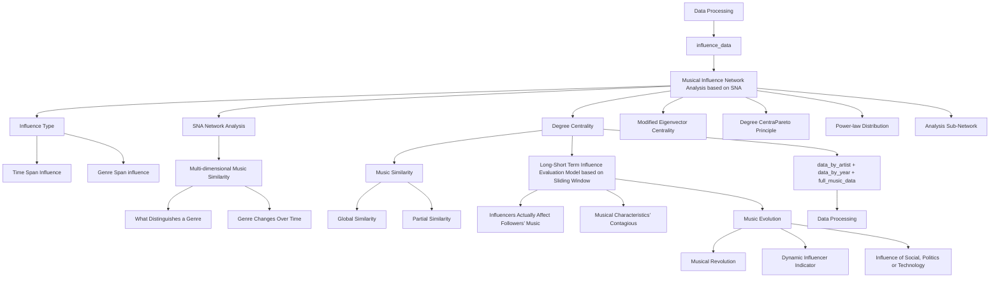
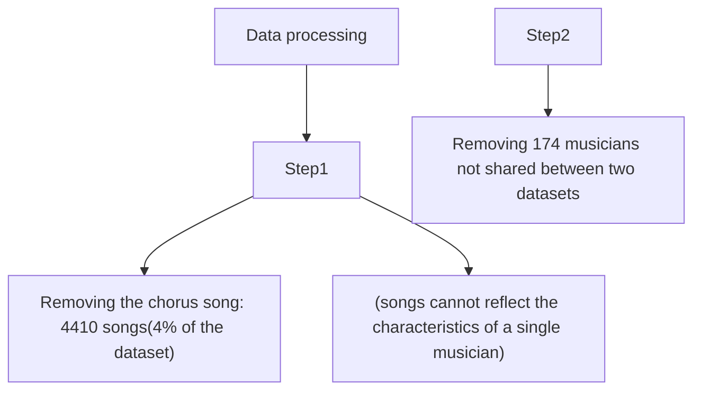
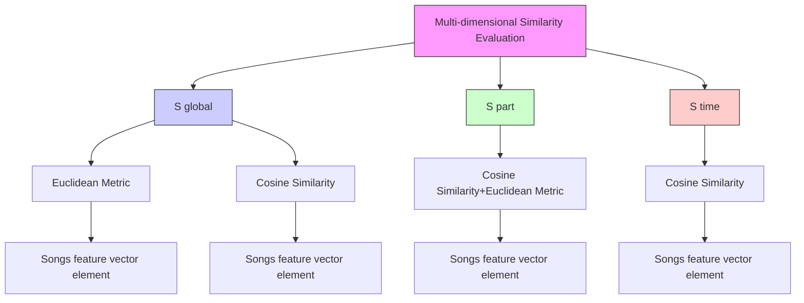
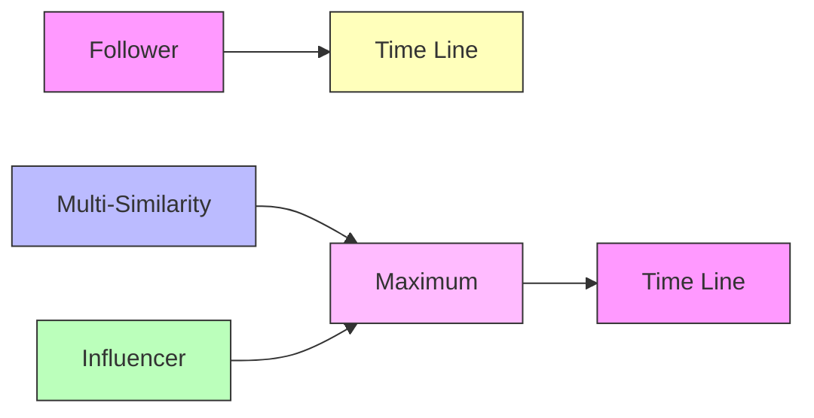

# How Does Musical Influence Lead to Musical Revolution?

## Summary

During the revolution of music, interactions within and between genres can have a critical impact on the direction of musical change. In this paper, we develop models to analyze the influence between musicians, measure the degree of similarity between music, and reveal the changes in genres over time, as well as the influence of social, cultural, and historical aspects.

In TASK 1: First, we take each musician as a node and calculate the directed influence between musicians as weights by considering the factors of time span and genre span to build a directed music influence network. Then we use social network analysis (SNA) to analyze the influence network. The Degree Centrality of musicians in the network is calculated, and the Pagerank-modified eigenvector centrality is further used to measure the influence of musicians(MI), obtaining that Bob Dylan, The Rolling Stones, Chuck Berry, and Elvis Presley have the highest influence. We also find that MI obeys power-law distribution, implying that the influence network between influencers and followers is a scale-free network. Finally, we explore the sub-network to analyze the meaning of the subset of MI.

In TASK 2 & 3: First, we use Cosine similarity and Euclidean similarity to measure global similarity $S _ { g l o b a l }$ and local similarity $S _ { p a r t }$ in two aspects of music, and consider the influence of popular trends to build Multi-dimensional music similarity evaluation model to measure the similarity of music (MS). Music within genres is found to be more similar than between genres. Then, to investigate the distinguishing features of genres, we combine different features and built the Discrimination evaluation model of feature combination to select the feature combinations that better distinguish genres from each other. Finally, we analyze changes in genres over time.

In TASK 4: To investigate whether the influencers actually influence the followers’ music, we develop a Long-short term influence model based on sliding window to calculate the influence degree score (IDS), considering the time sequence of release of the followers’ music and the influencers’ music, and determine the influence threshold. The result shows that followers are indeed influenced by the influencers. Subsequently, to determine the "contagiousness" of specific musical characteristics to musicians, we also consider specific musical characteristics, analyze the degree of closeness (DC) of characteristics of followers’ and influencers’ music, and establish the Contagious evaluation model of musical characteristics to find the most contagious musical characteristics for different followers.

In TASK 5 & 6 & 7: First we establish constraint equations to identify musical revolution points based on the musical characteristics of the genre and the number of musicians in the genre. And based on the popularity before and after the musical revolution point to identify the main influencers in the musical revolution. Then we take 10 years as the examination period to calculate the IDS of the analyzed object to everyone within the genre based on the IDS in Task 4, and weight the sum to get the dynamic influencer index (DII) for identifying the leading figures within the genre in different generations. Ultimately, we analyze the relationship between music and politics, culture, and society.

Finally, we perform a sensitivity analysis of the model and investigate the effect of changes in the variable parameters of the model on the results.

Keywords: SNA, Slide Window, Scale-free Network, Pareto’s Principle, PageRank, Combina tion of Features

## Contents

## 1 Introduction 3

1.1 Background and Problem Statement 3  
1.2 Our work 3

## 2 Preparation of the Models 3

2.1 Assumptions 3  
2.2 Notations 4

## 3 TASK 1: Musical Influence Network Analysis Based on SNA 4

3.1 Data Processing . . . 4  
3.2 Model Overview 4  
3.3 Musical Influence Network Analysis Based on SNA . 5

3.3.1 Establishment of Musical Influence Network and Analysis Using SNA . 5  
3.3.2 Model Test on Musical Influence Network . 7

3.4 Analysis of The Result 7  
3.5 Analysis of Musical Influence Sub-network 8

## 4 TASK 2 & 3: Multi-dimensional Music Similarity Evaluation Model 9

4.1 Model Overview 9  
4.2 Establishment of Multi-dimensional Music Similarity Evaluation Model 10

4.2.1 Global Similarity of Music . . 10  
4.2.2 Partial Similarity of Music 10  
4.2.3 Fashion Trends Impact Factor 11

4.3 Evaluation of Music Similarity 11  
4.4 Analysis of the Musical Discrimination and Influences of Genres . . 13

4.4.1 Discrimination Evaluation Model of Feature Combination 13  
4.4.2 Analysis of Genre Changes Over Time 15

## 5 Task 4 :Long-Short Term Influence Evaluation Model Based on Sliding Window 16

5.1 Establishment of Sliding Window Model . . 16  
5.2 Test of the Established Model . 17  
5.3 Contagious Evaluation of Musical Characteristics 18

## 6 Task 5 & 6 & 7: Analysis of Music Revolution Over Time 18

6.1 The Identification of the Musical revolution 18  
6.2 Major Influencers of Revolution 20  
6.3 Dynamic Influencer Evaluation Indicator . . 20  
6.4 Influence from Social, Political and Cultural Aspects 21

## 7 Sensitive Analysis 22

7.1 Sensitive Analysis of Model in TASK 2 22

7.2 Sensitive Analysis of Model in TASK 4 22

## 8 Strengths and Weaknesses 24

8.1 Strengths . . . 24  
8.2 Weaknesses 24

References

号：MEMO

## 1 Introduction

## 1.1 Background and Problem Statement

Music is a cultural product that people use to express their emotions and relax their bodies and minds. The influence of musicians on each other has a very important impact on the development and evolution of music. The development of computer technology allows us unprecedented access to data and computing power to analyze the network of influences between musicians, from which we can extract and analyze the key factors that influence the process of musical development, which will also help us understand the meaning of music better. In this problem, we need to accomplish the following objectives:

• Create a music influence network to analyze the influence between musicians and capture the music influence parameters in the influence network.  
• Develop similarity evaluation model to explore the degree of influence and similarity between or within genres and between musicians.  
• Identify indicators of revolution in genres and analyze the interplay between them in relation to society, politics, and culture.  
• Applying a dynamic analysis of the similarities and influences between and within genres of musicians over time.

## 1.2 Our work

The work we have done in this problem is mainly shown in the following Figure(1).


<details>
<summary>flowchart</summary>


</details>

Figure 1: Our Work

## 2 Preparation of the Models

## 2.1 Assumptions

We made the following assumptions to help us with our modeling. These assumptions are the promise of our subsequent analysis.

• Assuming that the data is accurate and there is no falsified data: This means our analysis accords with the truth.  
• Assuming that followers can only be influenced by songs released before he cur and that songs after the current year have no effect on the follower’s for that year: th do 号：MATHmodelsto measure the true influenceability of the influencers in a sliding window model.

• Assuming that the decade when the musician begin his carrer is the year when they debut, because the accurate years when the musicians debut are not given.  
• Assuming that the musician’s genre is limited to the genre provided by the data, and have no genre changes, that all his/her songs are in the style of his or her genre

## 2.2 Notations

The primary notations used in this paper are listed in Table 1.

Table 1: Parameter Settings

<table><tr><td>parameter</td><td>description</td></tr><tr><td>T</td><td>time-span influence factor</td></tr><tr><td> $D_{Ci}$ </td><td>degree centrality</td></tr><tr><td> $E_{Ci}$ </td><td>eigenvector centrality</td></tr><tr><td>MI</td><td>music influence</td></tr><tr><td> $S_{global}$ </td><td>global similarity</td></tr><tr><td> $S_{part}$ </td><td>partial similarity</td></tr><tr><td> $V^{(i)}$ </td><td>music feature vector</td></tr><tr><td>MS</td><td>multi-similarity</td></tr><tr><td>SMS</td><td>short-term similarity</td></tr><tr><td>LMS</td><td>long-term similarity</td></tr><tr><td>IDS</td><td>influence degree score</td></tr><tr><td>DC</td><td>degree of closeness</td></tr><tr><td>DII</td><td>dynamic influencer indicator</td></tr></table>

## 3 TASK 1: Musical Influence Network Analysis Based on SNA

## 3.1 Data Processing

An overview of the given data shows that some songs are sung by more than one person (e.g. It Can’t Happen Here and I Wonder If I Take You Home), and such songs cannot reflect the characteristics of a single musician, so to avoid disturbing the model, we remove the data of a total of 4410 chorus songs (4.4% of the original data). Since there are singers with only choral music, they have no music data after the deletion of choral music, which are invalid data. We remove these people, including those who are not shared between two dataset, to prevent any effect on the model. The data processing is shown in the Figure(2).


<details>
<summary>flowchart</summary>


</details>

Figure 2: Data Processing

## 3.2 Model Overview

To analyze the musical influences among musicians, we establish a directed ne 号：MATHmodelsmusical influences with each musician as a node and directional influences among musicians a2 weights. We then further explore the influence among musicians using social network analysis (SNA) to capture the music influence in the network to measure the influence of each musician. Finally, we explore the sub-networks of the influence network and explore the significance of music influence in the sub-networks.

## 3.3 Musical Influence Network Analysis Based on SNA

## 3.3.1 Establishment of Musical Influence Network and Analysis Using SNA

## ▶ Establishment of Musical Influence Network

The directed graph can be well used to describe the mutual influence relationship among musicians. Based on the relationship between influencers and followers among musicians given by influence\_data, we build a directed network of musical influence among musicians with each musician as a node and the directed influence among musicians as a weight.

Exploring the data reveals that the types of influence between musicians are divided into two categories: influence within the same genre and influence among different genres. Influence among musicians exists not only that a predecessor influences a junior, but also that a junior influences a predecessor. Therefore, we classify the types of inter-musician influence as follows.

From genre span: Influence occurs within the same genre and between different genres.

From time span: Junior influences predecessor and predecessor influences junior.

Fully considering the difference between the span of genres and the span of time in which the influence occurs, we define the weight of each side of the music influence network:

## • Time span impact factor

Assuming that existing musician i influences musician $j ,$ the time difference ∆t is defined as follows: $\Delta t = t _ { j } - t _ { i }$ (1)

where $t _ { i }$ and $t _ { j }$ are the debut times of musician i and musician $j ,$ respectively.

In general, juniors are more likely to be influenced by predecessors as they grow up, while predecessors are less likely to be influenced by juniors. Therefore, we can conclude that the probability of the older generation being influenced by the younger generation is lower. And if this happens, it means the influence of the younger generation is very strong. Compared to predecessors influencing juniors, juniors influencing predecessors should be considered that the juniors have a stronger influence. We therefore define the time-span influence factor $T$ as follows

$$
T = \left\{ \begin{array}{c l} - \beta \Delta t, & \text { if } \Delta t <   0 \\ \Delta t, & \text { if } \Delta t \geq 0 \end{array} \right. \tag {2}
$$

In equation(2), $\beta$ is a set parameter and $\beta > 1$ , indicating the difference in the effect of the two influence categories.

## • Genre span impact factor

Generally speaking, musicians in the same genre are more likely to influence each other because they share the same direction and research areas. In contrast, musicians from different genres are less likely to influence each other because their work styles rarely overlap. Therefore, we argue that cross-genre influencers have stronger influence compared to within-genre influencers. The genre-spanning influence factor $a _ { i j }$ between influencer i and follower j is given as follows:

$$
a _ {i j} = \left\{ \begin{array}{l l} 1, & \text { cross - genre } \\ 0, & \text { within - genre } \end{array} \right. \tag {3}
$$

## • Edge weights of a directed graph

Combining the above analysis on the time span and genre span impact factors, we give the formula for the directed graph weights $w _ { i j }$ as follows:

$$
w _ {i j} = \left(1 + a _ {i j}\right) \cdot e ^ {\frac {T}{8 0}} \tag {4}
$$

In equation(4), $w _ { i j }$ is the weight of the directed edge between musician nodes i to $j .$ The time interval $\lvert \Delta t \rvert$ between the influencer and the influenced is at most 80, so T is normalized using T . wi j also represents the intensity of the influence of musician i on musician j. The $\frac { T } { 8 0 }$ $w _ { i j }$ $j .$ larger the value of $w _ { i j }$ , the stronger the intensity of musician i’s influence.

## ▶ SNA Network Analysis Method

In order to capture the musical influence in the established musical influence directed network, we analyze the directed network using social network analysis (SNA) method[1]. The influence of each musician is measured and analyzed by calculating the Degree Centrality of each musician in the musical influence directed network and further calculating the Eigenvector Centrality modified by the PageRank idea. The specific steps are as follows:

## Step 1: Calculating Degree Centrality

In an undirected network, the degree of a node can be used to measure the centrality of that point. Analogously, in the music influence directed network we built, we can use the sum of the out-degree weights of a node to measure the importance of a node’s influence at the microscopic level. The assumption behind this metric is that nodes with many connections are important nodes, which means that musicians who have an impact on more people have a stronger influence. We therefore give the definition of degree centrality $\left( D _ { C i } \right)$ for point i as shown in the equation(5)

$$
D _ {C i} = \sum_ {j = 1} ^ {n} w _ {i j} d _ {i j} \tag {5}
$$

In equation(5) n represents the total number of nodes in the network and $d _ { i j }$ denotes the existence of directed edges between node i to node j. And $d _ { i j }$ is defined as follows:

$$
d _ {i j} = \left\{ \begin{array}{l l} 1, & \text { no   directed   edge   from } i \text { to } j \\ 0, & \text { there   is   directed   edge   from } i \text { to } j \end{array} \right. \tag {6}
$$

## Step 2: Calculating Eigenvector Centrality

The importance of a node depends both on the number of its neighboring nodes and on the importance of its neighboring nodes. This means that the more important the nodes connected to node i, the more important node i will be. We define the eigenvector centrality $E _ { C i }$ to measure the importance of node i at the macro level, as shown in the iterative equation(7)

$$
\text { iterative   equation: } \quad E _ {C i} = \lambda \sum_ {j = 1} ^ {n} d _ {i j} E _ {C j} \tag {7}
$$

where lambda is a scaling constant and the initial value of the iteration is set in the equation(8)

$$
\text { initial   value: } \quad E _ {C j} = D _ {C j}, \quad j = 1 \sim n \tag {8}
$$

However, for the directed network we build, the above analysis process only takes the importance of neighboring nodes into account. To increase the influence of the nodes themselves on the outside, we modify the equation based on the PageRank idea.

PageRank[2] is an algorithm proposed by Sergey Brin and Lawrence Page 号：MATHmodelsportance of nodes in a network. The PageRank algorithm assumes that a node on the system is the result of its own influence combining with the results of its followers’ influences. Therefore, we modify the model shown in the following equation: Therefore, we modify the model shown in the following equation:

$$
\text { iterative   equation: } \quad E _ {C i} = \lambda \sum_ {j = 1} ^ {n} d _ {i j} E _ {C j} + (1 - \lambda) E _ {C i} \tag {9}
$$

After several iterations, $E _ { C i }$ converges to a fixed value $E _ { C i } ^ { \prime } .$ . We define the musical influence (MI ) of musician i as follows:

$$
M I _ {i} = \frac {E _ {C i} ^ {\prime}}{\max \left\{E _ {C j} ^ {\prime} , j = 1 , 2 , \dots , n \right\}} \tag {10}
$$

## 3.3.2 Model Test on Musical Influence Network

Using all data given in the influence\_data, the musical influence (MI) of each musician is calculated, and the MI of somes musician are shown in the Table(2).

Table 2: MI of Musicians

<table><tr><td>Musician</td><td>MI</td><td>Musician</td><td>MI</td></tr><tr><td>The Beatles</td><td>1</td><td>Bob Dylan</td><td>0.738</td></tr><tr><td>The Rolling Stones</td><td>0.546</td><td>Chuck Berry</td><td>0.5</td></tr><tr><td>Hank Williams</td><td>0.424</td><td>Elvis Presley</td><td>0.424</td></tr><tr><td>Jimi Hendrix</td><td>0.397</td><td>Little Richard</td><td>0.39</td></tr><tr><td>James Brown</td><td>0.387</td><td>The Velvet Underground</td><td>0.356</td></tr></table>

As can be seen from the above table, The Beatles has the highest MI, followed by Bob Dylan, The Rolling Stones, Chuck Berry, Elvis Presley and so on. The similarity between the most influential musicians we analyzed and The 20 Most Representative Musicians in the World Jointly selected by CNN and Songlines[3] (a world-class music publication) is relatively high. We can conclude that the establishment and analysis process of the model is accurate, reasonable and feasible.

## 3.4 Analysis of The Result

Most real-world networks are not random networks, and a few nodes tend to have a large number of connections, while most nodes have only a small number of connections, generally obeying the Pareto Principle law[4]. Complex networks with degree distribution conforming to power-law distribution are usually called scale-free networks[5].

In section 3.2.3, we calculated the musical influence (MI) of each musician. A line graph of the frequency distribution of MI is plotted as shown in the blue solid line in the Figure(3).


<details>
<summary>line chart</summary>

| MI    | Frequency distribution of MI | Fitting power-law distribution |
|-------|------------------------------|--------------------------------|
| 0.00  | 1.00                         | 1.00                           |
| 0.05  | 0.30                         | 0.30                           |
| 0.10  | 0.10                         | 0.10                           |
| 0.15  | 0.05                         | 0.05                           |
| 0.20  | 0.02                         | 0.02                           |
| 0.25  | 0.01                         | 0.01                           |
| 0.30  | 0.01                         | 0.01                           |
| 0.35  | 0.01                         | 0.01                           |
| 0.40  | 0.01                         | 0.01                           |
| 0.45  | 0.01                         | 0.01                           |
| 0.50  | 0.01                         | 0.01                           |
| 0.55  | 0.01                         | 0.01                           |
| 0.60  | 0.01                         | 0.01                           |
| 0.65  | 0.01                         | 0.01                           |
| 0.70  | 0.01                         | 0.01                           |
| 0.75  | 0.01                         | 0.01                           |
| 0.80  | 0.01                         | 0.01                           |
| 0.85  | 0.01                         | 0.01                           |
| 0.90  | 0.01                         | 0.01                           |
| 0.95  | 0.01                         | 0.01                           |
| 1.00  | 0.01                         | 0.01                           |
</details>

Figure 3: The Frequency Distribution of MI

To investigate the nature of the MI distribution, we fit the frequency distribution curve of MI. Observe that the distribution of MI in the figure resembles a power-law distribution, so the complementary cumulative distribution function of the power-law distribution is defined as equation(11)

$$
P (X \mid X > x) = c x ^ {- a}, \quad c > 0, a > 0 \tag {11}
$$

We solve for the power-law distribution parameters using the maximum likelihood estimation, and the distribution parameters at a confidence level of 95% are shown in the Table(3).

Table 3: Distribution Parameters

<table><tr><td>distribution parameter</td><td>estimated value</td><td>95% Confidence interval</td></tr><tr><td>c</td><td>0.001173</td><td>(0.0009809, 0.001366)</td></tr><tr><td>α</td><td>-1.526</td><td>(-1.565, -1.488)</td></tr></table>

With the goodness of fit $R ^ { 2 } = 0 . 9 9 3 1$ , we can consider that the Musical Influence Network is a scale-free network. Musical influence network obeys the law of Pareto Principle, i.e., only a small number of musicians influence many other musicians, while most musicians do not influence other musicians. This also means that a small number of highly influential musicians will have an impact on the music world. And this will be analyzed in detail in the subsequent analysis.

## 3.5 Analysis of Musical Influence Sub-network

In the model building process, we categorize time span and genre span: influence within genre, influence across genre, influence of predecessors on juniors, and influence of juniors on predecessors. We build independent sub-networks on genre and time span separately and use SNA analysis to explore each musician’s influence on predecessors and on juniors $E I _ { p r e } \& E I _ { j u n } .$ , influence within and across genres $E I _ { w i t } \ \& E I _ { o u t } . \ E I _ { p r e } , E I _ { j u n } , E I _ { w i t }$ , and $E I _ { o u t }$ are all subsets of the total influence EI.

The cross-genre influence data, within-genre influence data, predecessor influence data, and juniors influence data are selected from influence\_data, respectively, to establish the musical influence sub network. Then the musical influences are calculated separately and normalized. The results of the calculation of each type of influence and the musical influence sub-network are shown in the Figure(4).

In the Figure(4), the size of nodes in each subnetwork represents the MI of the corresponding type of singer, while the thickness of the directed curve represents the weight of influence. As can be seen from the Figure(4), the occurrence frequency of influence within genres is higher than that between genres, and the occurrence frequency of influence of predecessors on their successors is higher than that of the latter on their predecessors. It can be concluded that in the interaction of musicians, musicians are more likely to influence musicians in the same genre, and musicians are more likely to influence younger generations rather than predecessors. It can also be seen from The MI subseries that The Beatles and Bob Dylan have a huge influence on musicians both in and out of The genre, and Bob Dylan goes one step further and has a strong influence on his predecessors as well.

  
Figure 4: Sub-network of Musical Influence

## 4 TASK 2 & 3: Multi-dimensional Music Similarity Evaluation Model

## 4.1 Model Overview

To adequately measure the similarity between the music, we evaluate the similarity between the music using cosine similarity and Euclidean similarity, respectively. The global similarity $S _ { g l o b a l }$ between the music is first calculated. We further explore the partial similarity $S _ { p a r t }$ between music. Finally, the trend of the year when the music was released is considered to influence $S _ { t i m e } .$ . The multidimensional similarity evaluation between music is constructed to obtain the similarity between music. An overview of the model is shown in the Figure(5).


<details>
<summary>flowchart</summary>


</details>

Figure 5: Multi-dimensional Music Similarity Evaluation Model

## 4.2 Establishment of Multi-dimensional Music Similarity Evaluation Model

## 4.2.1 Global Similarity of Music

## • Euclidean similarity

The Euclidean similarity measure is based on the absolute distance between the feature vectors and is used to reflect the absolute difference in the feature values between the two songs. Then the distance between the eigenvectors of music A and music B $d i s t a n c e _ { A B }$ is defined as follows:

$$
\text { distance } _ {A B} = \sqrt {\sum_ {i = 1} ^ {n} (A _ {i} - B _ {i}) ^ {2}} \tag {12}
$$

Then the Euclidean similarity between music AB $S _ { E } ( \mathbf { A } , \mathbf { B } )$ is defined by the following equation:

$$
S _ {E} (\mathbf {A}, \mathbf {B}) = \frac {1}{1 + \text { distance } _ {A B}} \tag {13}
$$

## • Cosine similarity

Different from Euclidean similarity, cosine similarity uses the cosine of the angle between two vectors in vector space to measure the similarity between two vectors. The cosine similarity focuses more on the difference between the two vectors in terms of direction rather than the difference between the values. The cosine similarity between the eigenvectors of music A and music B $S _ { c o s } ( \mathbf { A } , \mathbf { B } )$ is defined by the following equation(14)

$$
S _ {c o s} (\mathbf {A}, \mathbf {B}) = 1 + \frac {\cos \theta}{2} = 1 + \frac {\mathbf {A} \cdot \mathbf {B}}{2 \cdot | | \mathbf {A} | | \cdot | | \mathbf {B} | |} = 1 + \frac {1}{2} \cdot \frac {\sum_ {i = 1} ^ {n} A _ {i} \cdot B _ {i}}{\sqrt {\sum_ {i = 1} ^ {n} \left(A _ {i} ^ {2}\right)} + \sqrt {\sum_ {i = 1} ^ {n} \left(B _ {i} ^ {2}\right)}} \tag {14}
$$

The final global similarity $S _ { g l o b a l }$ between music A and B is defined by the following equation(15)

$$
S _ {g l o b a l} (\mathbf {A}, \mathbf {B}) = S _ {E} (\mathbf {A}, \mathbf {B}) + S _ {c o s} (\mathbf {A}, \mathbf {B}) \tag {15}
$$

## 4.2.2 Partial Similarity of Music

The global similarity measure between music is defined above, and the high-latitude feature vectors containing all the music features are considered. But this does not fully reflect the similarities between the music. The similarity measurement of music should be multi-dimensional and separate measurements should be made between different characteristic dimensions of music. In fact, in life, music can be considered similar if it is similar in some aspects such as rhythm, emotional tendencies, and instrumentation, but not in all characteristics. At the same time, songs from the same genre are not similar in all characteristics but may be similar only in certain aspects. To weigh the similarity between the whole dimension and the partial dimension of music, we explore the local similarity of music from the micro point of view, in terms of each feature.

We randomly select two, three, and four features from the key features of music to form different feature vectors V. There are a total of N new feature vectors composed of the extracted features.

$$
N = C _ {1 2} ^ {2} + C _ {1 2} ^ {3} + C _ {1 2} ^ {4} + C _ {1 2} ^ {5} = 1 5 7 3
$$

The new feature vectors are V (1),V (2), · · · ,V (1573), respectively. For music i 号：MATHmodelsfirst calculate the S of each combination of their features and select the hi ghes 50 Sglob2 to calculate the average value as the partial similarity $( S _ { p a r t } ( i , j ) )$ between music i and music j. $S _ { p a r t } ( i , j )$ is defined in the equation(16).

$$
S _ {\text { part }} (i, j) = \frac {\sum_ {k = 1} ^ {5 0} S _ {\text { global }} (\mathbf {V} _ {\mathbf {i}} ^ {(\mathbf {k})} , \mathbf {V} _ {\mathbf {j}} ^ {(\mathbf {k})})}{5 0} \tag {16}
$$

## 4.2.3 Fashion Trends Impact Factor

Considering that music is a literary and artistic product with strong social and cultural attributes, we should also consider the influence of the popular trend in the year of music release when analyzing the similarity of two pieces of music. Usually, the style of the song will evolve in the direction of the popular trend of the year. If there is a big difference in the popularity of the two songs in the year of their release, then the difference in melody and vocals between the two songs will change with the pop trends of the two songs in the year of their release.

Therefore, when measuring music similarity, the influence of pop trends on the music itself should be reduced, so as to explore the intrinsic similarity of songs after stripping away the impact of pop trends. For the two songs released in year a and year b, we defined the trend impact factor $S _ { t i m e }$ as:

$$
S _ {\text { time }} = S _ {\text { global }} \left(\text { Year } _ {a}, \text { Year } _ {b}\right) \tag {17}
$$

Where $Y e a r _ { a }$ and $Y e a r _ { b }$ are the music style attribute vectors of year a and $^ { b , }$ respectively.

In summary, we establish a multidimensional music similarity (MS) evaluation model considering the influence of popular trends, defined as follows, $\beta$ is a parameter defined later (0< <1).

$$
M S = \left((1 - \delta) S _ {\text { global }} + \delta S _ {\text { part }}\right) \cdot \left(1 + \frac {0 . 1}{S _ {\text { time }}}\right) \tag {18}
$$

## 4.3 Evaluation of Music Similarity

We count the number of genres to which all influencers and followers belonged, and plot the following Figure(6) for each type of musician’s genre.


<details>
<summary>pie chart</summary>

Influencer number of Main Genre | Follower number of Main Genre | Count |
| :--- | :--- | :--- |
| Folk | 2,676 | 135 |
| Blues | 351 | 292 |
| Reggae | 378 | 470 |
| Electronic | 182 | 273 |
| Vocal | 147 | 164 |
| Latin | 125 | 111 |
| Country | 88 | 85 |
| Jazz | 79 | 81 |
| R&B; | 114 | 128 |
| Pop/Rock | 147 | 135 |
</details>

Figure 6: Statistics of Musicians by Genre

As can be seen from the Figure(6), Pop/Rock, R&B, and Jazz have the largest number of influencers, accounting for nearly 75% of all musicians. Therefore the subsequent analysis is based mainly on songs and musicians from these three genres.

• Similarity of Songs

Table 4: The Music Chosen from Pop/Rock, R&B, and Jazz

<table><tr><td colspan="4">Pop/Rock</td></tr><tr><td>Blind Faith</td><td>So Alone</td><td>Africa</td><td>Long Cool Woman</td></tr><tr><td colspan="4">R&amp;B</td></tr><tr><td>Thinking of You</td><td>Long Way Go</td><td>Who’s Loving You</td><td>Don’t Stop ’Til You···</td></tr><tr><td colspan="4">Jazz</td></tr><tr><td>**** ’N Boogie</td><td>What’s New</td><td>Floatin</td><td>Summer Breeze</td></tr></table>

We select four songs from Pop/Rock, R&B, and Jazz as shown in the Table(4) and then analyzed their similarity.

The established Multi-dimensional Music Similarity Evaluation Model is used to calculate the overall similarity $S _ { g l o b a l }$ between each song and the similarity MS after adding the partial similarity $S _ { p a r t }$ . Set $\delta = 0 . 5$ , the calculation results of $S _ { g l o b a l }$ and MS are shown in the Figure(7) and (8).


<details>
<summary>heatmap</summary>

|  | Pop/Rock | R&B | Jazz |
| --- | --- | --- | --- |
| 1.00 | 0.39 | 0.30 | 0.49 |
| 0.39 | 1.00 | 0.23 | 0.33 |
| 0.30 | 0.23 | 1.00 | 0.38 |
| 0.49 | 0.33 | 0.38 | 1.00 |
| 0.52 | 0.33 | 0.36 | 0.62 |
| 0.60 | 0.37 | 0.34 | 0.63 |
| 0.32 | 0.24 | 0.63 | 0.39 |
| 0.47 | 0.41 | 0.26 | 0.42 |
| 0.28 | 0.23 | 0.47 | 0.33 |
| 0.17 | 0.15 | 0.27 | 0.19 |
| 0.45 | 0.29 | 0.36 | 0.47 |
| 0.34 | 0.29 | 0.37 | 0.39 |
| 1.00 | 0.39 | 0.37 | 0.37 |
| 0.52 | 1.00 | 0.64 | 1.00 |
| 0.64 | 1.00 | 1.00 | 0.64 |
| 0.38 | 1.00 | 1.00 | 0.38 |
| 0.44 | 1.00 | 1.00 | 0.47 |
| 1.00 | 1.00 | 1.00 | 1.00 |
| 1.52 | 1.52 | 1.52 | 1.52 |
| 1.52 | 1.52 | 1.52 | 1.52 |
| 1.52 | 1.52 | 1.52 | 1.52 |
| 1.52 | 1.52 | 1.52 | 1.52 |
| 1.52 | 1.52 | 1.52 | 1.57 |
| 1.52 | 1.52 | 1.52 | 1.52 |
| 1.52 | 1.52 | 1.52 | 1.52 |
| 1.52 | 1.52 | 1.52 | 1.52 |
| 1.52 | 1.52 | 1.52 | 1.56 |
| 1.52 | 1.52 | 1.52 | 1.52 |
| 1.52 | 1.52 | 1.52 | 1.52 |
| 1.52 | 1.52 | 1.52 | 1.56 |
| 1.52 | 1.52 | 1.52 | 1.56 |
| 1.52 | 1.52 | 1.52 | 1.56 |
| 1.52 | 1.52 | 1.52 | 1.56 |
| 1.52 | 1.52 | 1.52 | 1.57 |
| 1.52 | 1.52 | 1.52 | 1.57 |
| 1.52 | 1.52 | 1.52 | 1.57 |
| 1.52 | 1.52 | 1.52 | 1.57 |
</details>

Figure 7: Global Similarity


<details>
<summary>heatmap</summary>

| | Pop/Rock | R&B | Jazz |
|---|---|---|---|
| 1 | 0.58 | 0.55 | 0.69 |
| 0.58 | 1 | 0.4 | 0.58 |
| 0.55 | 0.4 | 1 | 0.59 |
| 0.69 | 0.58 | 0.59 | 1 |
| 0.57 | 0.46 | 0.46 | 0.64 |
| 0.64 | 0.46 | 0.47 | 0.5 |
| 0.47 | 0.35 | 0.66 | 0.46 |
| 0.5 | 0.49 | 0.38 | 0.52 |
| 0.33 | 0.23 | 0.47 | 0.33 |
| 0.27 | 0.22 | 0.34 | 0.27 |
| 0.43 | 0.29 | 0.41 | 0.42 |
| 0.36 | 0.28 | 0.4 | 0.37 |
| 1 | 0.57 | 0.64 | 0.47 |
| 0.57 | 1 | 0.75 | 0.55 |
| 0.75 | 1 | 1 | 0.56 |
| 0.55 | 0.56 | 1 | 1 |
| 0.65 | 0.7 | 0.46 | 1 |
| 1 | 0.31 | 0.26 | 0.41 |
| 0.33 | 0.27 | 0.41 | 0.37 |
| 0.48 | 0.34 | 0.45 | 0.38 |
| 0.24 | 0.23 | 0.31 | 0.3 |
| 1 | 0.46 | 0.53 | 0.49 |
| 0.46 | 1 | 0.41 | 0.38 |
| 0.53 | 0.41 | 1 | 0.48 |
| 0.49 | 0.38 | 0.48 | 1 |
The values in the table represent the correlation coefficients between these pairs for each genre (Pop/Rock, R&B, Jazz). The values in the cells represent the absolute correlation coefficients.
</details>

Figure 8: Multi–Similarity

Figure(7) shows the similarity between songs in each genre without the addition of $S _ { p a r t } ,$ , and Figure(8) shows the similarity between songs in each genre with the addition of $S _ { p a r t }$ . As can be seen from the figure that songs within the same genre have higher similarity scores between them. Comparing Figure(7) and Figure(8) with the part circled by the box (i.e., the similarity scores between songs and songs within the same genre), it can be found that: the similarity scores between songs of the same genre have increased after the introduction of the parital similarity of songs $( S _ { p a r t } )$ , while the similarity between songs of different genres has decreased. The addition of local similarity makes the measurement of musical similarity more accurate and reasonable.

Thus we can consider the discussion about local similarity in 4.2.2 to be accurate: that is, songs in the same genre may have high similarity in the characteristics of several dimensions. Songs within the same genre can be distinguished from songs in other genres by rgenres combination of several features.

## • Similarity of Musicians

We used the established Multi-dimensional Music Similarity Evaluation Model to calculate the similarity of Pop/Rock, R&B, and Jazz musicians within and between genres. The specific values are shown in the Table(5).

Table 5: Similarity of Musicians from Pop/Rock, R&B, and Jazz

<table><tr><td></td><td colspan="3">Within genres</td><td colspan="3">Between genres</td></tr><tr><td>Genres</td><td>Pop/ROCK</td><td>R&amp;B</td><td>Jazz</td><td>Pop and R&amp;B</td><td>Pop and Jazz</td><td>R&amp;B and Jazz</td></tr><tr><td>Average</td><td>0.659</td><td>0.683</td><td>0.627</td><td>0.647</td><td>0.560</td><td>0.592</td></tr><tr><td>Min</td><td>0.399</td><td>0.439</td><td>0.382</td><td>0.309</td><td>0.374</td><td>0.359</td></tr><tr><td>Max</td><td>0.917</td><td>0.906</td><td>0.916</td><td>0.949</td><td>0.869</td><td>0.898</td></tr></table>

Observing the Table(5), we can learn that the intra-genre artists of each genre are more similar than the similarity with the artists of other genres. Therefore we can assume that the artists within each genre are more similar than the artists between genres. At the same time, we can also see that the average similarity between POP and R&B artists reached 0.647, which is very close to the average similarity within Pop. From this, it can be concluded that there may be more similarities between genres. To visualize the relationship between genres, we used PCA to downscale the characteristics of Pop/Rock, R&B, Jazz and plot the distribution of their musicians in three dimensions, as shown in the Figure(9).


<details>
<summary>scatterplot</summary>

| Category | X | Y |
| --- | --- | --- |
| Pop/Roc | -0.5 | 0.8 |
| Pop/Roc | 0.2 | 0.6 |
| Pop/Roc | 0.7 | 0.4 |
| Pop/Roc | -1.2 | 0.9 |
| Pop/Roc | 0.1 | 0.7 |
| Pop/Roc | -0.8 | 0.5 |
| Pop/Roc | 0.6 | 0.3 |
| Pop/Roc | -1.5 | 0.7 |
| Pop/Roc | 0.3 | 0.5 |
| Pop/Roc | -0.3 | 0.6 |
| Pop/Roc | 0.9 | 0.4 |
| Pop/Roc | -1.8 | 0.8 |
| Pop/Roc | 0.4 | 0.6 |
| Pop/Roc | -0.6 | 0.5 |
| Pop/Roc | 0.7 | 0.3 |
| Pop/Roc | -1.1 | 0.7 |
| Pop/Roc | 0.2 | 0.5 |
| Pop/Roc | -0.2 | 0.6 |
| Pop/Roc | 0.8 | 0.4 |
| Pop/Roc | -1.3 | 0.8 |
| Pop/Roc | 0.5 | 0.6 |
| Pop/Roc | -0.4 | 0.5 |
| Pop/Roc | 0.6 | 0.3 |
| Pop/Roc | -1.6 | 0.7 |
| Pop/Roc | 0.1 | 0.5 |
| Pop/Roc | -0.7 | 0.6 |
| Pop/Roc | 0.9 | 0.4 |
| Pop/Roc | -1.9 | 0.8 |
| Pop/Roc | 0.3 | 0.6 |
| Pop/Roc | -0.5 | 0.5 |
| Pop/Roc | 0.7 | 0.3 |
| Pop/Roc | -1.2 | 0.7 |
| Pop/Roc | 0.4 | 0.5 |
| Pop/Roc | -0.8 | 0.6 |
| Pop/Roc | 0.6 | 0.4 |
| Pop/Roc | -1.4 | 0.8 |
| Pop/Roc | 0.2 | 0.6 |
| Pop/Roc | -0.3 | 0.5 |
| Pop/Roc | 0.8 | 0.3 |
| Pop/Roc | -1.7 | 0.7 |
| Pop/Roc | 0.5 | 0.5 |
| Pop/Roc | -0.6 | 0.6 |
| Pop/Roc | 0.9 | 0.4 |
| Pop/Roc | -1.1 | 0.8 |
| Pop/Roc | 0.3 | 0.6 |
| Pop/Roc | -0.4 | 0.5 |
| Pop/Roc | 0.7 | 0.3 |
| Pop/Roc | -1.3 | 0.7 |
| Pop/Roc | 0.4 | 0.5 |
| Pop/Roc | -0.2 | 0.6 |
| Pop/Roc | 0.6 | 0.4 |
| Pop/Roc | -1.5 | 0.8 |
| Pop/Roc | 0.2 | 0.6 |
| Pop/Roc | -0.7 | 0.5 |
| Pop/Roc | 0.8 | 0.3 |
| Pop/Roc | -1.8 | 0.7 |
| Pop/Roc | 0.5 | 0.5 |
| Pop/Roc | -1.2 | 0.6 |
| Pop/Roc | 0.9 | 0.4 |
| Pop/Roc | -1.6 | 0.8 |
| R&B | -1.1 | -1.2 |
| R&B | -1.4 | -1.4 |
| R&B | -1.7 | -1.6 |
| R&B | -2.1 | -1.8 |
| R&B | -2.5 | -2.1 |
| R&B | -2.9 | -2.4 |
| R&B | -3.3 | -2.7 |
| R&B | -3.7 | -3.1 |
| R&B | -4.1 | -3.4 |
| R&B | -4.5 | -3.7 |
| R&B | -4.9 | -4.1 |
| R&B | -5.3 | -4.4 |
| R&B | -5.7 | -4.7 |
| R&B | -6.1 | -5.1 |
| R&B | -6.5 | -5.4 |
| R&B | -6.9 | -5.7 |
| R&B | -7.3 | -6.1 |
| R&B | -7.7 | -6.4 |
| R&B | -8.1 | -6.7 |
| R&B | -8.5 | -7.1 |
| R&B | -8.9 | -7.4 |
| R&B | -9.3 | -7.7 |
| R&B | -9.7 | -8.1 |
| R&B | -10.1 | -8.4 |
| R&B | -10.5 | -8.7 |
| R&B | -10.9 | -9.1 |
| R&B | -11.3 | -9.4 |
| R&B | -11.7 | -9.7 |
| R&B | -12.1 | -10.1 |
| R&B | -12.5 | -10.4 |
| R&B | -12.9 | -10.7 |
| R&B | -13.3 | -11.1 |
| R&B | -13.7 | -11.4 |
| R&B | -14.1 | -11.7 |
| R&B | -14.5 | -12.1 |
| R&B | -14.9 | -12.4 |
| R&B | -15.3 | -12.7 |
| R&B | -15.7 | -13.1 |
| R&B | -16.1 | -13.4 |
| R&B | -16.5 | -13.7 |
| R&B | -16.9 | -14.1 |
| R&B | -17.3 | -14.4 |
| R&B | -17.7 | -14.7 |
| R&B | -18.1 | -15.1 |
| R&B | -18.5 | -15.4 |
| R&B | -18.9 | -15.7 |
| R&B | -19.3 | -16.1 |
| R&B | -19.7 | -16.4 |
| R&B | -20.1 | -16.7 |
| R&B | -20.5 | -17.1 |
| R&B | -20.9 | -17.4 |
| R&B | -21.3 | -17.7 |
| R&B | -21.7 | -18.1 |
| R&B | -22.1 | -18.4 |
| R&B | -22.5 | -18.7 |
| R&B | -22.9 | -19.1 |
| R&B | -23.3 | -19.4 |
| R&B | -23.7 | -19.7 |
| R&B | -24.1 | -20.1 |
| R&B | -24.5 | -20.4 |
| R&B | -24.9 | -20.7 |
| R&B | -25.3 | -21.1 |
| R&B | -25.7 | -21.4 |
| R&B | -26.1 | -21.7 |
| R&B | -26.5 | -22.1 |
| R&B | -26.9 | -22.4 |
| R&B | -27.3 | -22.7 |
| R&B | -27.7 | -23.1 |
| R&B | -28.1 | -23.4 |
| R&B | -28.5 | -23.7 |
| R&B | -28.9 | -24.1 |
| R&B | -29.3 | -24.4 |
| R&B | -29.7 | -24.7 |
| R&B | -30 | -25 |
| R&B | -30 .5) | -24 .5 |
| R&B | -31 | -24 .2 |
| R&B | -31 .5) | -23 .9 |
| R&B | -32 | -24 .6 |
| R&B | -32 .5) | -24 .3 |
| R&B | -33 | -25 .0 |
| R&B | -33 .5) | -24 .6 |
| R&B | -34 | -25 .3 |
| R&B | -34 .5) | -24 .9 |
| R&B | -35 | -25 .8 |
| R&B | -35 .5) | -25 .4 |
</details>

Figure 9: Statistics of Musicians by Genre

As can be seen from the Figure(9), the artists in the genres are more similar, but there is no clear line of distinction between genres. This coincides with the conclusion of our analysis of the Table(5).

## 4.4 Analysis of the Musical Discrimination and Influences of Genres

## 4.4.1 Discrimination Evaluation Model of Feature Combination

Combining with the discussion of partial similarity in music in 4.2.2 and 4.3: songs between similar genres may do not share a high degree of similarity in all features, while the combination of several particular features may give music in the same genre a very high degree of similarity and thus distinguish it from music in other genres. Similarly, there may be a high similarity between different genres in the combination of certain characteristics.

To analyze what combination of features distinguishes a genre, we arrange 号：MATHmodels12 musical features except popularity in two-two, three-three, four-four, and five-five combina2 tions to obtain a total of $N ^ { \prime }$ types of new feature combinations: $V ^ { ( 1 ) } , V ^ { ( 2 ) } , \cdots , V ^ { ( 1 5 7 3 ) }$

$$
N ^ {\prime} = C _ {1 2} ^ {2} + C _ {1 2} ^ {3} + C _ {1 2} ^ {4} + C _ {1 2} ^ {5} = 1 5 7 3 \tag {19}
$$

Based on the new combination $V ,$ the partial similarity $S _ { p a r t }$ defined by the equation(16) in 4.2.2 between the genres and the other genres is calculated. The minimum value of $S _ { p a r t }$ is $\frac { 1 } { 2 }$ , which represents the minimum local similarity. For the $i _ { t h }$ new feature combination $V ^ { ( i ) }$ , a metric vector $\mathbf { S _ { p a r t \ I } } = [ S _ { p a r t \ 1 } , S _ { p a r t \ 2 } , \cdot \cdot \cdot , S _ { p a r t \ 1 8 } ] ^ { T }$ is obtained by the partial similarity between the genre to be evaluated and other genres, as shown in the Figure(10).


<details>
<summary>flowchart</summary>

```mermaid
graph TD
  A["Pop/Rock"] --> B["Blue"]
  A --> C["Jazz"]
  A --> D["..."]
  A --> E["Folk"]
  A --> F["Country"]
  A --> G["Vocal"]
  B --> H["C12^2"]
  C --> I["C12^3"]
  D --> J["C12^4"]
  E --> K["C12^5"]
  F --> L["C12^6"]
  G --> M["C12^7"]
    H -.-> N["Valence & tempo mode & key"]
    I -.-> O["Mode & energy & key"]
    J -.-> P["Muti-Similarity between Pop and Vocal by [mode,key"]]
    K -.-> P
```
</details>

Figure 10: Partial Similarity Evaluation Vector

$\mathbf { S _ { p a r t i } }$ reflects the similarity of the genre between other genres when only the features contained within $V ^ { ( i ) }$ are considered. If the features contained within $V ^ { ( i ) }$ can well distinguish the genre from other genres, then these features can be considered as the significant differences between the music of the genre and other genres. Ideally, if the combination of features chosen can completely distinguish the genre from other genres, then the optimal partial similarity vector $\mathbf { S } _ { \mathbf { p a r t } } ^ { \prime } \dot { = } [ \frac { 1 } { 2 } , \frac { \dot { 1 } } { 2 } , \cdots , \frac { 1 } { 2 } ] ^ { T }$ is defined.

Cosine similarity and Euclidean similarity are used to measure the discriminationi of feature combination vector V (i) $V ^ { ( i ) }$

$$
\text { discrimination } _ {i} = S _ {\cos} (\mathbf {S} _ {\text { part }} ^ {\prime}, \mathbf {S} _ {\text { part   i }}) + S _ {E} (\mathbf {S} _ {\text { part }} ^ {\prime}, \mathbf {S} _ {\text { part   i }}) \tag {20}
$$

We selected two genres, Electronic and Latin, for analysis, and obtained the top three discrimination scores as shown in the Table(6).

Table 6: Feature Combination Discrimination

<table><tr><td rowspan="4">Electronic</td><td>Feature combination</td><td>Discrimination</td></tr><tr><td>[acousticness, instrumentalness, speechiness]*</td><td>1.1588</td></tr><tr><td>[energy, acousticness, instrumentalness, speechiness]*</td><td>1.1588</td></tr><tr><td>[energy, acousticness, instrumentalness, liveness, speechiness]</td><td>1.1586</td></tr><tr><td rowspan="4">Latin</td><td>Feature combination</td><td>Discrimination</td></tr><tr><td>[energy, valence, tempo, danceability]*</td><td>1.1474</td></tr><tr><td>[energy, valence, loudness, danceability]</td><td>1.1473</td></tr><tr><td>[energy, valence, tempo, danceability, liveness]</td><td>1.1470</td></tr></table>

As can be seen from the Table(6):

• For Electronic: Electronic is different from other genres in four aspects, including acousticness, instrumentalness, speechiness, and energy. These characteristics are in line with those of electronic-synth music, which has a strong sense of rhythm and is more likely to evoke the desire to dance.  
• For Latin: Its concentrated characteristics are embodied in energy, valence, tempo danceability, which coincide with the energetic, dynamic, rhythm-centered c Latin music. M

## 4.4.2 Analysis of Genre Changes Over Time

## • Analysis of single genre changes over time

Take Electronic’s music characteristics change as an example. The analysis process is shown below:

## Step 1: Data visualization

We use the four most distinguishing attributes of Electronic: acousticness, instrumentalness, speechiness, and energy, which are analyzed in 4.4.1. We add the number of musicians within the genre and the popularity to obtain six variables. The curves of these six variables over time are plotted as Figure(11).


<details>
<summary>line chart</summary>

| Year | energy | acousticness | instrumentalness | speechiness |
|------|--------|--------------|------------------|-------------|
| 1930 | 0.0    | 0.0          | 0.0              | 0.0         |
| 1940 | 0.1    | 0.3          | 0.0              | 0.9         |
| 1950 | 0.3    | 0.8          | 0.1              | 0.1         |
| 1960 | 0.3    | 0.8          | 0.1              | 0.1         |
| 1970 | 0.4    | 0.6          | 0.3              | 0.1         |
| 1980 | 0.5    | 0.5          | 0.6              | 0.1         |
| 1990 | 0.6    | 0.4          | 0.5              | 0.1         |
| 2000 | 0.6    | 0.3          | 0.4              | 0.1         |
| 2010 | 0.6    | 0.2          | 0.3              | 0.1         |
| 2020 | 0.6    | 0.2          | 0.3              | 0.1         |
</details>

Figure 11: Changes of Electronic Over Time

## Step 2: Identification of mutation points

From the Figure(11), we can see that electronic music mutated in the 1950s and characteristics changed from 1970 to 1980. In total, it can be divided into three development stages: in the 1950s, 1970∼1980, and after the 1980s.

## Step 3: Analysis with historical facts

1. In the 1950s, there were significant changes in the variety of attributes of electronic music, from 0.93 to 0.10, and the score for acousticness, instrumentalness, iTunes, and energy increased by more than 200%. After the 1950s, electronic music became more intense and electrically enhanced. According to Wikipedia[6], the first electronic music recorded on tape was composed by Louis and Bebe Barron in 1950, signifying the creation of true electronic music.  
2. From the 1970s to the 1980s, there were a lot of innovations in electronic music equip ment. Digital synthesizers and samplers replaced analog synthesizers, and more musicians could use a synthesizer for music creation.  
3. After the 1980s, the Acid House movement in the UK pushed the development of electronic music into the mainstream, and between the late 1990s and the beginning of the 21st century, electronic music using only electronic instruments became increasingly popular, a trend that continues today. Nightclubs around the world are playing electronic music on a regular basis.

## • Analysis of correlation of changes between genres over time

号：MATHmodelsWe use Easy listening and New age as examples to analyze the interplay their change over time. We choose three characteristics of acousticness, tampo, and speechiness of these two genres to analyze how they change over time.


<details>
<summary>line chart</summary>

| acousticness | eacy listening | new age |
| ------------ | ------------- | ------- |
| 1921         | 0.0           | 0.0     |
| 1940         | 1.0           | 1.0     |
| 1959         | 0.7           | 1.0     |
| 1978         | 0.7           | 0.9     |
| 1997         | 0.7           | 0.8     |
| 2016         | 0.7           | 0.8     |
</details>


<details>
<summary>line chart</summary>

| tampo | eacy listening | new age |
| ----- | -------------- | ------- |
| 1921  | 0.0            | 0.0     |
| 1940  | 0.4            | 0.4     |
| 1959  | 0.45           | 0.4     |
| 1978  | 0.45           | 0.45    |
| 1997  | 0.45           | 0.45    |
| 2016  | 0.45           | 0.45    |
</details>


<details>
<summary>line chart</summary>

| speechiness | eacy listening | new age |
| ----------- | -------------- | ------- |
| 1921        | 0.0000         | 0.0000  |
| 1940        | 0.0600         | 0.0650  |
| 1959        | 0.0450         | 0.0650  |
| 1978        | 0.0450         | 0.0600  |
| 1997        | 0.0450         | 0.0450  |
| 2016        | 0.0450         | 0.0450  |
</details>

Figure 12: Changes of New age and Easy listening Over Time

As can be seen from the Figure(12), both Easy listening and New age have a similar trend: acousticness gradually decreases, tempo stabilizes, and speechiness continues to decrease on top of the already low values. This is also in line with the development history of the real Easy listening and New age, that is, the rhythm is soothing, there is less spoken word, and gradually introduced a small number of electronic instruments.

Exploring the sequential correlation between the changes of the two curves, we can also learn that the changes of New age always lag behind Easy listening and change in the direction of Easy listening changes. It can be further concluded that New age is influenced by Easy listening as it changes over time, which coincides with the fact that New age started later and is influenced by Easy listening.

## 5 Task 4 :Long-Short Term Influence Evaluation Model Based on Sliding Window

## 5.1 Establishment of Sliding Window Model

To explore whether influencers influence the music created by followers, we evaluated the similarity between the music of influencers and followers by MS. Considering that the influence of followers by influencers changes continuously over time, we add sliding windows[9] to explore the short-term similarity MS of music based on the similarity evaluation model established in TASK 2 & 3, to capture the short-term influence ST S of influencers on followers’ music. Finally, the magnitude of the change in short-term similarity is summed to obtain the long-term influence LT S of the influencer on the follower. An overview of the model is shown in the Figure(13).

We arrange the songs of influencers and followers by time, and as the window slides along the time line, new songs are added continuously on the right side, while some outdated songs are dropped on the left. We swipe two windows on the timelines of the works of influencers and followers at different times. Additionally, we ensure that the music in the influencer window is released earlier than the music in the follower window. Then calculate the similarity of influencer’s music and follower’s music MS in both windows.

In order to find the most similar songs (songs with real influence relationships), we define the similarity of the song in the i th follower window to the influencer (MS ):

$$
M S _ {i} = \max \left\{M S (F l _ {i}, I n _ {j}), \quad j = 1 t o n \right\} \tag {21}
$$

$F l _ { i }$ and $I n _ { j }$ are the music within the follower window i and the influencer window $j ,$ respectively. $M S ( F l _ { i } , I n _ { j } )$ represents the short-term similarity of music within the influence win j to music within the follower window i. To satisfy that the music within the influencer window 号：MATHmodelsis released earlier than the followers, n changes as i changes. M


<details>
<summary>flowchart</summary>


</details>

Figure 13: Long-Short Term Influence Evaluation Model Based on Sliding Window

Define the magnitude of similarity change $( \Delta M S ) _ { i }$ for the follower’s timeline window:

$$
(\Delta M S) _ {i} = \frac {M S _ {i} - M S _ {i - 1}}{M S _ {i - 1}} \tag {22}
$$

Define short-term similarity (ST S) and long-term similarity (LT S):

$$
\left\{ \begin{array}{l} S T S = \max \left\{\left(\Delta M S\right) _ {i} \right\} \\ L T S = \sum (\Delta M S) _ {i} \end{array} \right. \tag {23}
$$

We consider that when $ S T S > 0 . 0 1 , { \mathrm { i . e . } }$ , in the short term, there is a period of time when followers’ song styles are substantially closer to those of the influencers, and this is when the influencers can be considered to have influenced the followers. When $L T S > 0 .$ , the follower’s music style is generally close to the influencer’s in the long run, and the influencer can be considered to have a long-term influence on the follower. Defining the degree of influence long-term-short-term score IDS, when $I D S > 0$ , the influencer can be considered to have an influence on the follower.

$$
I D S = \max (0, L T S) + \max (0, S T S - 0. 0 1) \tag {24}
$$

## 5.2 Test of the Established Model

We set the window size to 5 and the move step to 3 for window sliding detection. The IDS between all influencers and followers are calculated using the model developed above and find that 86.08% of the IDS are greater than 0. It can be concluded that in general influencers do influence the music created by their followers.

We choose the influencer: Black Box, and his followers: Soda Stereo and Dave Matthews Band as an example, the results are shown in the Table(7).

Table 7: Result of Sliding Window Model

<table><tr><td>Influencer</td><td>Follower</td><td>LTS</td><td>STS</td><td>IDS</td></tr><tr><td>Black Box</td><td>Soda Stereo</td><td>0.00033</td><td>0.01251</td><td>0.000334</td></tr><tr><td>Black Box</td><td>Dave Matthews Band</td><td>0.00553</td><td>0.00549</td><td>0.00553</td></tr></table>

It can be seen that Black Box did influence the music making of its followers, Soda Stereo and Dave Matthews Band, to varying degrees.

• For Soda Stereo: STS≫LTS, the short-term impact is greater.Inspired by a few songs from an influencer and subsequently less influenced by the influencer.  
• For Dave Matthews Band: LTS>STS, the long-term impact is greater. 号：MATHmodelsBand has been influenced by influencers for a long time and is a loyal follower.

## 5.3 Contagious Evaluation of Musical Characteristics

Music has many different characteristics, and in order to explore whether there are more contagious (easy to spread) ones among different characteristics, we established a contagious evaluation system for music characteristics based on the timeline of influencers’ and followers’ works in the previous section, and the music similarity (MS) evaluation model in 4.2.1. For a specific musician (as a follower), the contagious evaluation steps of musical features $\nu ^ { ( k ) }$ are as follows.

Step 1: Build the timelines of the works of this musician (single) and his influencer (possibly multiple) respectively, as shown in Figure(13) (4.4.2).

Step 2: For a musician’s song $i ,$ it is combined with an influencer’s song $j ,$ and then calculate the difference $d i f ( i , j ) ^ { ( k ) }$ of the musical characteristics $\nu ^ { ( k ) }$ of the two songs.

$$
d i f (i, j) ^ {(k)} = v _ {i} ^ {(k)} - v _ {j} ^ {(k)} \tag {25}
$$

Step 3: Musicians’ works may be influenced by only a relatively small number of enlightening works, so there should be the smallest feature difference between them on $\nu _ { ( k ) }$ . We choose the three smallest values of $d i f ( i , j ) ^ { ( k ) }$ for weighted summation to obtain the difference $D I F _ { i } ^ { ( k ) }$ between the follower’s song i on feature $\nu ^ { ( k ) }$ and and its corresponding enlightening work. $d i f _ { 1 } ^ { ( k ) } , d i f _ { 2 } ^ { ( k ) } , d i f _ { 3 } ^ { ( k ) }$ for the first three smallest characteristic differences.

$$
D I F _ {i} ^ {(k)} = \frac {1}{2} d i f _ {1} ^ {(k)} + \frac {1}{3} d i f _ {2} ^ {(k)} + \frac {1}{6} d i f _ {3} ^ {(k)} \tag {26}
$$

Step 4: Analyze the contagion of all the features within this musician’s works. Define the degree of closeness $D C ^ { ( k ) }$ of all songs of a follower to the songs of its influencer on $\nu ^ { ( k ) }$ . And $D [ d ] ^ { ( k ) }$ is the variance of all songs of this musician on the feature $\nu ^ { ( k ) }$ . The smaller the final value of $D C ^ { ( k ) }$ is, the more susceptible the musician is to influencers on $\nu ^ { ( k ) }$ , and the more contagious the v(k) $\nu ^ { ( k ) }$ is.

$$
D C ^ {(k)} = \left(\left(1 + \text { average } (D I F _ {i} ^ {(k)})\right) \cdot \left(1 + \text { minimum } (D I F _ {i} ^ {(k)})\right) \cdot D [ d ] ^ {(k)} \right. \tag {27}
$$

Using the above analysis process, Soda Stereo and Dave Matthews are selected as followers for the contagious analysis of music characteristics, and the results are obtained as shown in the following Table(8).

Table 8: Contagious of Musical Characteristics

<table><tr><td rowspan="2">Soda Stereo</td><td>Characteristics</td><td>speechiness</td><td>energy</td><td>instrumentalness</td></tr><tr><td>DC</td><td>0.000249</td><td>0.0068</td><td>0.007554</td></tr><tr><td rowspan="2">Dave Matthews</td><td>Characteristic</td><td>speechiness</td><td>instrumentalness</td><td>danceability</td></tr><tr><td>DC</td><td> $8.5279 \times 10^{-5}$ </td><td> $9.6721 \times 10^{-5}$ </td><td>0.012702</td></tr></table>

As can be seen from the Table(8), not all characteristics are highly contagious to a particular musician, and the most contagious characteristics vary from one musician to another. For Soda Stereo, the musical characteristic speechiness is the most contagious. For Dave Matthews, the musical characteristics of speechiness and instrumentalness are the most contagious.

## 6 Task 5 & 6 & 7: Analysis of Music Revolution Over Time

## 6.1 The Identification of the Musical revolution

We analyze the given data to identify musical revolutions in terms of two symbol: chang 号：MATHmodelsin existing musical genres, the creation of new musical genres. 2

## • Changes in existing musical genres

Dramatic changes in musical characteristics within existing musical genres can be recognized as temporal musical revolution. The following are the conditions for determining the point in time when an evolution occurs:

A. The musical characteristics of the genre remained stable before and after the revolution.  
B. In the year of the revolution, the musical characteristics of the genre change greatly.  
C. There are at least two features that have taken a significant turn at the same time.

The above conditions are quantified using mathematical formulas to explore whether a significant change occurs within a six-year period of analysis. For the characteristic $\nu ^ { ( k ) }$ of the genre, the condition for determining that an evolution occurs in the $3 _ { t h } \sim 4 _ { t h }$ year of the analysis cycle is defined by the equation(28)

$$
\left\{ \begin{array}{l} \left| v _ {3} ^ {(k)} - v _ {2} ^ {(k)} \right| <   0. 0 3 \\ \left| v _ {2} ^ {(k)} - v _ {1} ^ {(k)} \right| <   0. 0 3 \\ \left| v _ {4} ^ {(k)} - v _ {3} ^ {(k)} \right| > 0. 1 \\ \left| \left(v _ {5} ^ {(k)} - v _ {4} ^ {(k)}\right) - \left(v _ {4} ^ {(k)} - v _ {3} ^ {(k)}\right) \right| <   0. 0 2 \text { or } \left| v _ {5} ^ {(k)} - v _ {4} ^ {(k)} \right| <   0. 0 3 \\ \left| \left(v _ {6} ^ {(k)} - v _ {5} ^ {(k)}\right) - \left(v _ {5} ^ {(k)} - v _ {4} ^ {(k)}\right) \right| <   0. 0 2 \text { or } \left| v _ {6} ^ {(k)} - v _ {5} ^ {(k)} \right| <   0. 0 3 \end{array} \right. \tag {28}
$$

Using a six-year time span as the width of the sliding window, a sliding window model is used for analysis to identify the years in which the upper constraint is satisfied, i.e., the time when a revolution occurs. If the trend of change continues in the years following a turning point, we consider a long-term change to have occurred during that period. Electronic is selected as the study object to explore the characteristics of significant revolution in Electronic. With the above constraint equation, we capture the year 1950 and 1969 as the time points of the revolution. And the characteristics of Electronic in 1950 and 1969 are shown in the Table(9).

Table 9: Identification of Revolution of Electronic

<table><tr><td>Year</td><td colspan="3">1950</td><td colspan="2">1969</td></tr><tr><td>Characteristic</td><td>speechiness</td><td>acousticness</td><td>energy</td><td>instrumentalness</td><td>acousticness</td></tr><tr><td>Change</td><td>0.796</td><td>0.513</td><td>0.210</td><td>0.131</td><td>0.123</td></tr></table>

From the Table(9), it can be seen that Electronic in 1950 speechiness, energy and acousticness changed a lot. In 1969 instrumentalness and acousticness changed a lot. This is also similar to the conclusion of our analysis of Electronic in 4.4.2, and it can be considered that the established constraint equations can identify the revolution in the existing music genres.

## • Creation of new musical genres

To identify the new generation of music genres, we visualize the number of musicians in each genre over time in Figure(14). Each surge in the number of musicians in each genre can be considered as an evolution in the genre. The first surge in the number of musicians in each genre can be identified as the creation of a new genre.

Observe the Figure(14), using the analysis of R&B and Country as an example:

1. The first explosion in the number of musicians in R&B occurred in 1950. There had not been an explosion in the number of musicians in the genre before that, so it can be argued that an evolution happened in 1950, when R&B was created. This also coincides with the start date of the R&B genre, according to Sound and Music from Xinhua News Agency[7].

2. The first surge in the number of musicians in Country occurred in 1920


<details>
<summary>stacked bar chart</summary>

| year | Vocal | Reggae | Latin | Electronic | Blues | R&B; | Jazz | Country |
|------|-------|--------|-------|------------|-------|------|------|---------|
| 1930 | 50    | 20     | 10    | 5          | 2     | 10   | 8    | 3       |
| 1950 | 200   | 100    | 50    | 30         | 10    | 80   | 60   | 40      |
| 1970 | 400   | 200    | 100   | 60         | 20    | 250  | 150  | 80      |
| 1990 | 600   | 300    | 150   | 100        | 30    | 450  | 250  | 120     |
| 2010 | 800   | 400    | 200   | 150        | 40    | 650  | 350  | 180     |
</details>

Figure 14: Changes in the Number of Musicians Over Time

of the analysis are also consistent with the facts[7].

## 6.2 Major Influencers of Revolution

For a genre revolution, we analyze the music published within the genre in the two years before and after the evolution, looking for the most popular artists during that part of the time. We sum the popularity of each musician’s works released during that period separately to obtain the popularity of each musician during that period, with the highest being the most influential in the evolution. Electronic is analyzed using the above method.

In 1950, Freestyle’s music has the highest sum of popularity: 144, can be considered as a major influencer on the 1950 evolution. In 1969, Jean-Jacques Perrey’s music has the highest sum of popularity: 139, can be considered as a major influencer for the 1969 evolution.

The trend of evolution in 1969 was maintained from the beginning of the evolution in 1969 to 1978, and we believe that a long-term change was produced during this period. We also identified the major influencers near 1969 to 1979 as Kraftwerk : sum of popularity=822, Yellow Magic Orchestra: sum of popularity=495, Vangelis: sum of popularity= 473.

## 6.3 Dynamic Influencer Evaluation Indicator

In the equation(24) in 5.1, we define IDS to measure the degree of influence that influencers have on their followers. As genres develop over time, there may be different key influencers within the genre at different times who will influence other musicians within the genre and lead the direction of the genre. To reveal the dynamic influencers within genre i, we define the Dynamic Influencer Indicator DII as follows.

For musician i, first calculate its degree of influence $I D S _ { i , j }$ on all musicians within the genre in turn and sum up IDS, to obtain the dynamic influencer index $D I I _ { i }$ for musician i:

$$
D I I _ {i} = \sum_ {j = 1} ^ {n} I D S _ {i, j} \tag {29}
$$

Within this genre, the musicians are ranked according to the DII of each musician. From the analysis of the percentage of major influencers in 3.3, a point threshold of 20% is used based on the law of Pareto’s Principle[4]. Musicians with DII ranking in the top 20% are then identified as dynamic influencers within this genre. We take Pop/Rock as an example, taking ten years as the analysis period, the DII of musicians within the genre of every period is calculated, and we list the two largest DII after normalization of musicians every decade shown in the Table(10).

As can be seen from the Table(10), the dynamic influencers within Pop/Rock are not th same in different eras, which is a good indication of the turnover of leading figures within the genre. The recognition threshold of DII is 0.8127, and musicians above this threshold can be identified as dynamic influencers.

Table 10: DII of Musicians Over Time

<table><tr><td>Year</td><td>1950s</td><td>1960s</td><td>1970s</td><td>1980s</td><td>1990s</td></tr><tr><td>Musician</td><td>Elvis Presley</td><td>Bob dylan</td><td>The Clash</td><td>Sex Pistols</td><td>Blur</td></tr><tr><td>DII</td><td>0.9951</td><td>0.9926</td><td>0.9635</td><td>0.8964</td><td>0.9131</td></tr><tr><td>Musician</td><td>Little Richard</td><td>Beatles</td><td>David Bowie</td><td>Nirvana</td><td>Beach Boys</td></tr><tr><td>DII</td><td>0.9814</td><td>1</td><td>0.9804</td><td>0.8413</td><td>0.8971</td></tr></table>

## 6.4 Influence from Social, Political and Cultural Aspects

Changes in musical genre attributes often reflect the social, political, and cultural aspects of the time to some extent. We explore the social and cultural changes of the time by analyzing the changes in musical attributes such as valence related to emotions and acousticness related to the use of science and technology in the music influence network across genres.

## • From the general trends in the music industry

Taking the analysis of the emotional tendency of music as an example, we count the emotional tendency valence statistics of several genres of music that account for a relatively large proportion of the genre as shown in the Figure(15).


<details>
<summary>line chart</summary>

| year | Comedy/Spoken | Jazz | R&B | Religious |
| ---- | -------------- | ---- | ---- | --------- |
| 1921 | 0.0            | 0.85 | 0.0  | 0.0       |
| 1931 | 0.0            | 0.75 | 0.80 | 0.0       |
| 1941 | 0.75           | 0.65 | 0.55 | 0.50      |
| 1951 | 0.60           | 0.55 | 0.25 | 0.45      |
| 1961 | 0.50           | 0.50 | 0.60 | 0.60      |
| 1971 | 0.55           | 0.48 | 0.65 | 0.58      |
| 1981 | 0.52           | 0.48 | 0.66 | 0.55      |
| 1991 | 0.48           | 0.48 | 0.65 | 0.52      |
| 2001 | 0.47           | 0.48 | 0.64 | 0.48      |
| 2011 | 0.47           | 0.48 | 0.63 | 0.47      |
</details>

Figure 15: Changes of valence Over Time

From the Figure(15), we can see that the emotional tendency of most genre songs started to become negative in 1947 and then became positive after 1965. Combined with the historical fact that the African-American Civil Rights Movement started in 1950 and ended in 1970, African-Americans were oppressed by society prior to the Civil Rights Movement, and the musicians used music to express their long-held negative feelings. After the civil rights movement, the future of African-Americans became clearer and they used music to express their desire for a better life. Thus we can consider that the emotional tendencies of music can, to some extent, reflect the implicit tendencies of society, politics, and culture, and be used to predict social revolution.

## • From trends in specific music genres

Take the analysis of Electronic characteristics over time in 4.4.2 as an example. As shown in the Figure(11) in 4.4.2, the acousticness of Electronic increased significantly in 1950, and so did the energy. It can be considered that Electronic has become more energetic and dynami which is related to the fact that people were in the ecstasy of achieving victory in the anti-fascist war after the Second World War in the 1950s. The cultural products of this historical period also fully reflect the optimistic and exciting social trends.

## • From the listener’s reaction to the music

In addition to the music itself, the connection between music and social development can also be glimpsed in the changes in listeners’ reactions to music. The trend of popularity in each category over time is plotted in Figure(16). It can be seen that there are more and more music listeners, which reflects the unprecedented increase in people’s ability to access information through the Internet as a result of the development of science and technology, making music accessible to a wider audience. This will further increase the influence of music on society, politics, and culture.


<details>
<summary>stacked bar chart</summary>

| Year | Vocal | Religious | Reggae | R&B; | Pop/Rock | Latin | Jazz | Electronic | Blues |
|------|-------|-----------|--------|------|----------|-------|------|------------|-------|
| 1921 | ~10   | ~5        | ~3     | ~2   | ~1       | ~1    | ~1   | ~1         | ~0    |
| 1940 | ~20   | ~15       | ~10    | ~8   | ~5       | ~5    | ~3   | ~3         | ~1    |
| 1959 | ~50   | ~40       | ~30    | ~25  | ~20      | ~20   | ~15  | ~15        | ~5    |
| 1978 | ~100  | ~80       | ~60    | ~50  | ~40      | ~40   | ~30  | ~30        | ~10   |
| 1997 | ~150  | ~120      | ~90    | ~70  | ~60      | ~60   | ~45  | ~45        | ~15   |
| 2016 | ~200  | ~160      | ~120   | ~80  | ~70      | ~70   | ~55  | ~55        | ~20   |
</details>

Figure 16: Changes of popularity Over Time

## 7 Sensitive Analysis

## 7.1 Sensitive Analysis of Model in TASK 2

In Task 2 to build the Multi-dimensional Music Similarity Evaluation Model, we weight the local similarity $S _ { p a r t }$ and the global similarity $S _ { g l o b a l }$ to obtain MS:

$$
M S = \left((1 - \delta) S _ {\text { global }} + \delta S _ {\text { part }}\right) \cdot \left(1 + \frac {0 . 1}{S _ {\text { time }}}\right) \tag {30}
$$

The different weights  may affect the evaluation results of similarity. Therefore, we choose 12 pieces of music from 3 genres to study the effect of different $\delta$ on the results, and choose $\delta = 0 . 2 , 0 . 5 , 0 . 8$ to obtain the results of MS as Figure(17).

Looking at the above Figure(17) we can see that a change in $\delta$ does not change the broad similarity results respectively. However, the number of the parameter can have some effect on some specific categories of music, resulting in changes in musical similarity between or within genres, respectively.

• When  is small, we can see higher similarity between genres. And $S _ { g l o b a l }$ has a large weight and pays more attention to the differences of songs in all characteristics, which leads to lower similarity within the genre.  
• When is large, it can be seen that the similarity between genres is lower. $S _ { p a r t }$ has a larger weight and pays more attention to the differences in important features of songs, which makes the the similarity within the genre become higher.

Therefore, we choose $\delta = 0 . 5$ in the model of the main text to make our similarity evaluation more balanced between local and global features.

## 7.2 Sensitive Analysis of Model in TASK 4

In the sliding window model in Task 4, the size of the window and step size may lead 号：MATHmodelsdifferent results. We use a variance-based sensitivity analysis method (Sobol method)[8]2 investigate the effect on the results when multiple hyperparameters are varied simultaneously. The Sobol method simulates Monte Carlo sampling of the parameters in the feasible space and obtains a large number of outputs. The variance of the model output is the sum of all order variances of a single parameter. The equation for the contribution of the computed variance of the Sobol method is as follows:


<details>
<summary>heatmap</summary>

|  | Stash | Old | Treat | Red | Alma | Lady | Halo | **** | Doxy | Oleo | Work | Maria |
| --- | --- | --- | --- | --- | --- | --- | --- | --- | --- | --- | --- | --- |
| Stash | 1.00 | 0.65 | 0.69 | 0.60 | 0.68 | 0.68 | 0.62 | 0.61 | 0.59 | 0.60 | 0.72 | 0.51 |
| Old | 0.47 | 1.00 | 0.59 | 0.67 | 0.57 | 0.66 | 0.71 | 0.70 | 0.49 | 0.51 | 0.58 | 0.44 |
| Treat | 0.52 | 0.39 | 1.00 | 0.36 | 0.49 | 0.51 | 0.58 | 0.44 | 0.62 | 0.68 | 0.67 | 0.53 |
| Red | 0.42 | 0.52 | 0.36 | 1.00 | 0.42 | 0.51 | 0.43 | 0.57 | 0.63 | 0.43 | 0.42 | 0.36 |
| Almaz | 0.51 | 0.40 | 0.51 | 0.40 | 1.00 | 0.51 | 0.43 | 0.57 | 0.52 | 1.00 | 0.43 | 0.42 |
| Lady | 0.51 | 0.51 | 0.43 | 0.50 | 0.52 | 1.00 | 0.63 | 0.57 | 0.44 | 0.63 | 0.49 | 0.40 |
| Halo | 0.44 | 0.57 | 0.39 | 0.57 | 0.44 | 0.63 | 1.00 | 0.72 | 0.36 | 0.35 | 0.43 | 0.38 |
| **** | 0.43 | 0.56 | 0.37 | 0.63 | 0.41 | 0.57 | 0.72 | 1.00 | 0.35 | 0.34 | 0.42 | 0.37 |
| Doxy | 0.44 | 0.34 | 0.49 | 0.34 | 0.47 | 0.41 | 0.36 | 0.35 | 1.00 | 0.51 | 0.43 | 0.35 |
| Oleo | 0.44 | 0.35 | 0.58 | 0.33 | 0.43 | 0.39 | 0.35 | 0.34 | 0.51 | 1.00 | 0.45 | 0.37 |
| Work | 0.64 | 0.45 | 0.56 | 0.42 | 0.54 | 0.49 | 0.43 | 0.42 | 0.43 | 0.45 | 1.00 | 0.31 |
| Maria | 0.41 | 0.37 | 0.44 | 0.36 | 0.42 | 0.40 | 0.38 | 0.37 | 0.35 | 0.37 | 0.31 | 1.00 |
</details>

Figure 17: Sensitive Analysis of the Model in Task 2

$$
V (Y) = \sum_ {i = 1} ^ {p - 1} \sum_ {j = i + 1} ^ {p} V _ {i j} + \dots + V _ {1, \dots , p} \tag {31}
$$

$$
S _ {T _ {i}} = \frac {E _ {X _ {\sim i}} (V a r _ {X _ {i}} (Y | X _ {\sim i}))}{V a r (Y)} = 1 - \frac {V a r _ {X _ {\sim i}} (E _ {X _ {i}} (Y | X _ {\sim i})}{V a r (Y)}
$$

The above equation measures the proportion of variance change caused by the interaction between one variable and other variables that change simultaneously. We then use the Sobol method on the sliding window model to study the sensitivity of window size and step size and show the sensitivity (S ) as Figure(18).


<details>
<summary>bar chart</summary>

| Category | ST |
| :--- | :--- |
| influence_step | 0.011 |
| follow_step | 0.053 |
| inf window size fol window size | 0.142 |
| Total | 1.0 |
| St (approximate) | 0.793 |
</details>

Figure 18: Sensitive Analysis of the Model in Task 4

It can be seen that the change in the size of the window of followers has the greatest impact on the results, which can indicate that the number of music selected in the calcu short-term influences has the greatest impact on the final influence results. This represents tha 号：MATHmodelsfor different musicians, when influenced by an influencer, different musicians may efl2

influence of the influencer on several consecutive different songs. Some musicians may be inspired only in the short term with only a small time period of songs reflecting this influence. While others may be inspired in the long term, with multiple songs over a long period of time reflecting the influence of an influencer on them.

## 8 Strengths and Weaknesses

## 8.1 Strengths

• We used the theory of SNA to construct a network of influences between musicians and to measure the internal parameters of the network with more well-considered metrics.  
• In analyzing whether influencers actually have an impact on followers, we used a sliding window time series approach to synthesize the short- and long-term impact of influencers on followers.  
• We have done sufficient visualization work on the algorithms and results of the model to facilitate understanding.  
• Most of our models are built with innovative ideas or improved based on original theories and specific problems, making our models both theoretical and innovative.

## 8.2 Weaknesses

• We could also go deeper into the analysis of certain issues, but due to space limitations, we can only stop here.  
• Due to the lack of actual numerical reference, we can only observe the accuracy of our model from the actual situation and cannot numerically measure the accuracy of our model.

## References

[1] Zhang Cungang, Li Ming, Lu Demei. Social Network Analysis: An Important Sociological Research Method [J]. Gansu Social Sciences, 2004.  
[2] Haveliwala T H . Topic-sensitive PageRank: a context-sensitive ranking algorithm for Web search[J]. IEEE Transactions on Knowledge and Data Engineering, 2003, 15(4):p.784- 796.  
[3] The 20 Most Representative Musicians in the World Jointly selected by CNN and Songlines from http://edition.cnn.com/2010/SHOWBIZ/Music/08/04/your.music.i con/index.html  
[4] Chen Dao-lan. The Discriminatory Relationship Between the Law of Two and Eight and the Long Tail Theory[J]. Talent, 2010(15):280.  
[5] LIU Yan-xia, XIAO Wen-jun, XI Jian-qing, et al. Properties of Scale-free Networks with Power Index Less than 2 [J]. Journal of Nanchang University (Science Edition), 2013, 37(004):350-354.  
[6] Electronic Music.Wikipedia https://en.wikipedia.org/wiki/Electronic\_music  
[7] Sound and Music – 1890-2010, World Pop Music Echoes (news.cn) from the Xinhua News Agency http://fms.news.cn/swf/2016\_sjxw/yqfm\_2016/index.html  
[8] Zadeh, Farkhondeh Khorashadi,Nossent, Jiri,Sarrazin, Fanny, et al.Comparison of Variance-based and Moment-independent Global Sensitivity Analysis Approaches by Application to the SWAT Model [J].Environmental modelling & software,2017,91(May):210- 222.  
[9] Tan H Q, Niu Q Q. A Time Series Symbolization Method Based on Sliding Window an Local Features[J]. Computer Application Research, 2013, 30(003):796-798.

# MEMO

To: Experts in The ICM Society

From: Team 2107091

Date: February 8th, 2021

Subject: Analysis of Music Influence and Similarity, Suggestions for Futher Study

Dear experts in the ICM Society:

We are honored to inform you our achievement after performing data analysis and establishing the music influence and similarity evaluation model.

Our team conducted a modeling analysis of the interactions between and within musicians across genres from 1921 to 2020. We develop a directed network for analyzing the interactions between musicians to understand the interactions that exist between musicians. An evaluation model to measure the similarity between the music is developed to provide an evaluation of the similarity between and within genres and to give the distinctive features of music in each genre. An evaluation model based on a sliding window is developed to select the leaders of each genre in different time periods. With the model we developed, we obtained the following valuable conclusions:

• The influence of musicians on each other is consistent with Pareto’s Principle, which states that a very small number of musicians have influenced the vast majority of musicians. We can consider that a very small number of outstanding musicians led the entire music world, and in-depth exploration of the works of these musicians may deepen our understanding of music.  
• Although there are differences between the genres, they are not completely independent but have no clear boundaries. As a carrier of human emotions, music has similarities among genres. The study of the evolutionary process of musical alternation and fusion among genres is conducive to enhancing our perception of the evolution of music as a whole.  
• Changes in music can clearly reflect social change. Music is a tool for people to express their feelings, and by monitoring changes in musical emotions, we can probe into the pent-up emotions in society and thus make predictions about social revolution.

The model we developed still has limitations due to incomplete data and space limitations. We also need more data to achieve the following objectives

• We found that some of the artists are not common to both datasets, and some of the artists’ debut dates are unknown, which causes some inaccuracy in our analysis. We hope to obtain a more complete dataset of artists and music.  
• If we know the specific year in which the followers were influenced by the influencer, then we can refine the model for determining the contagiousness of music and whether it actually produces change by the change in the music of the follower before and after the year of influence. Also, the dynamic impact indicators of influencers can be refined based on the change in the number of influenced people.  
• If we know the album information where the song is located, then we can modify our sliding window model to capture the short-term impact by directly comparing the similarity between albums.

We expect to build a dynamic network in the future in the dimension of time and genre.We also hope to make a more detailed division in genre and to develop a set of visualiza in the future, to more describe the internal development. The above are the resul fours 号：MATHmodelsresearch, and we sincerely hope they can provide you with useful information and da