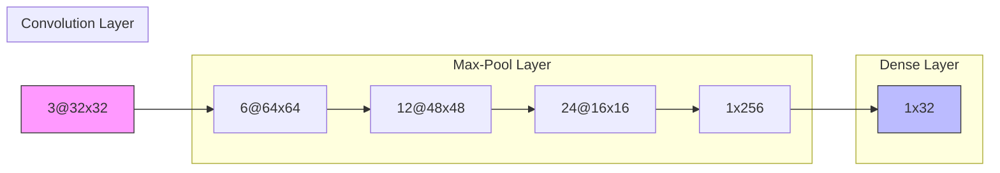
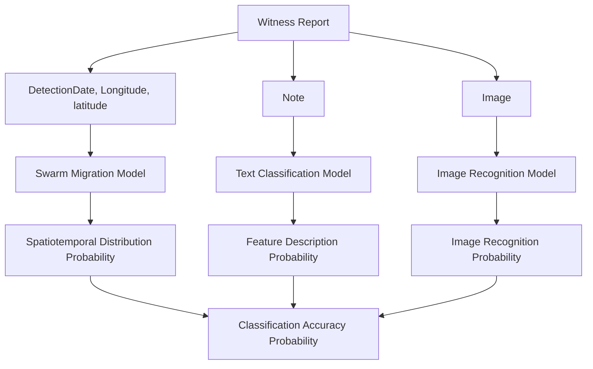
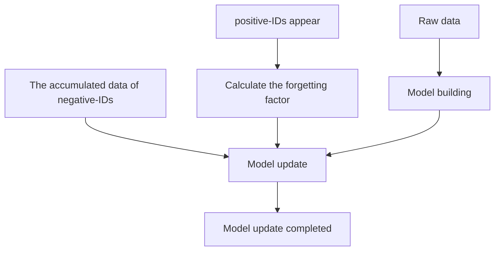

# Strategies to Analyze the Invasion of the Vespa Mandarinia: A Comprehensive Three-dimensional Model

The appearance of the Vespa mandarinia in Washington State may have a potential negative impact on the local ecology.In view of the limited resources of government agencies, researchers need to develop some strategies to analyze the investigation priorities of these wasps' public sighting reports. The specific task is divided into 5 questions.

As for question 1, we need to integrate the biological characteristics of the wasp and the data characteristics provided by the title to establish a growth-proliferation model for the wasp population. First of all, based on the Logistic-Model, we completed the establishment of a basic wasp colony growth model on the basis of changes of environmental factors such as temperature and the life habits. After that, we use Gaussian distribution function to describe the probability of natural events to simulate the time and space position of each sighting event, and establish a wasp colony propagation and prediction model so that we could analyze the probability of sighting events. This is because we fully consider that the sighting reports don‘t completely represent the accurate location of the wasp population and their occurrence has a certain randomness. The spatiotemporal location of the incident has established a wasp colony propagation and prediction model. In the model's simulation of the positive-ID data distribution of the data set, the simulated distribution and the actual data point distribution are relatively close. Based on the distance relationship between the earliest occurrence point of the sighting event and each occurrence point, we established a method to analyze the fitting accuracy. In the verification, the fitting accuracy of the correct witness report is about 84.6%.

As for question 2, in order to make full use of the various data in the data set, we divide the data set into three dimensions: spatio-temporal data, text and image. After that, we use the growth-diffusion model to analyze spatio-temporal data, establish a text classification model based on the LDA for text analysis, and establish an image analysis model based on CNN. The verification results of each independent model show that the analysis of the possibility of the classification of the prediction data set requires the synthesis of all types of data provided in the data set. Therefore, we synthesize the prediction confidence levels independently given by the three-dimensional models and assign weights to them by the effective information of each dimension to complete the three-dimensional comprehensive data analysis and prediction model. The model obtained 92.86% (positive-ID) and 85.22% (negative-ID) goodness of fit in the fitting of existing data. The prediction results of the model can also be well explained for each data point.

As for question 3, we use the prediction confidence obtained by the model of question 2 to divide the data into six levels of S, A, B, C, D, and E according to the confidence interval. S grade is the highest grade. The higher the level is, the higher the investigation priority of the sighting report is.

As for to question 4, we proposed an incremental model update method based on the forgetting factor. When a new wasp sighting report is updated, the model calculates the defined forgetting factor and updates the original training data. The test shows that this update method increases the goodness of fit of the model by 10.68% (negative-ID), and can make certain self-correction to the predicted results.

As for question 5, we put forward three conditions which can prove that the wasps have been eradicated based on various factors,. We used the data from 2019 to 2020 for analysis and demonstration, which proved the correctness of the evaluation criteria. Finally, we forecast the development trend of events in 2021.

The model established in this paper has high comprehensiveness and accuracy. Besides, it can also give the prediction confidence of each data point and optimizes the researcher's strategy of analyzing the survey report.At the same time, we provided a two-page memorandum to the Washington State Department of Agriculture.

Key Words: Logistic-Model; LDA; CNN; Forgetting Factor; Correlation Analysis.

## Contents

## 1 Introduction. 3

1.1 Problem Background. 3  
1.2 Restatement of The Problem 3  
1.3 Our Approach . . 3

## 2 Assumptions and Notations ..

2.2 Notations . 4

## 3 Data Pre-Analysis

3.1 Data Preprocessing .  
3.2 Data Analysis  
3.3 Trend Analysis 6

## 4 The Diffusion and Prediction Model of Vespa Mandarinia. 6

4.1 The Establishment of The Model 6  
4.2 Model Validation.  
4.3 Model Accuracy Analysis . 8

4.3.1 Preliminary Demonstration 8  
4.3.2 Precise Demonstration . 9

## 5 Establishment and Validation of Three Dimensional Comprehensive Analysis and Prediction

## Model . . 10

5.1 Data Information Description. . 10  
5.2 LDA Based Text Classification Model . 10

5.2.1 The Establishment of Text Classification Model . . 10  
5.2.2 Text Analysis .

5.3 CNN Based Image Recognition Model. . 13

5.3.1 Model Construction 13  
5.3.2 Model evaluation . 14

5.4 Establishment of Comprehensive Analysis and Prediction Model . 14  
5.5 Verification and Prediction of Three-Dimensional Comprehensive Model. . 15  
5.6 The Analyze of The Priority of The Investigation ..... 17

## 6 Update Method and Update Frequency . 18

6.1 Method construction and frequency determination. . 18  
6.2 Method verification . 19

## 7 Proof of Eradication . 21

7.1 Data Analysis and Evaluation Standard Establishment . . 21  
7.2 Evaluation Standard Demonstration and Development Trend Prediction . . 21

## 8 Strengths and Weaknesses . . 22

8.1 Strengths. . 22  
8.2 Weaknesses . 22

## 9 Conclusion . . 23

## 10 Reference . . 23

## Memo ... 24

## 1 Introduction

## 1.1 Problem Background

In September 2019, a colony of Vespa mandarinia (also known as the Asian giant hornet) was discovered on Vancouver Island in British Columbia, Canada. The news of the event spread rapidly throughout the area. Since that time, several confirmed sightings of the pest have occurred in neighboring Washington State, as well as a multitude of mistaken sightings. Vespa mandarinia is the largest species of hornet in the world, and the occurrence of the nest was alarming. They are voracious predators of other insects that are considered agricultural pests. At the same time, much detailed information on Asian hornets is included in the problem attachments and can also be found online.

Due to the potential severe impact caused by the Vespa mandarinia, The State of Washington has created helplines and a website for people to report sightings of these hornets and must decide how to prioritize its limited resources to follow-up with additional investigation.

## 1.2 Restatement of The Problem

Build a mathematical model to address and discuss the spread of this pest over time and evaluate the level of precision.  
Using only the data set file provided and (possibly) the image file provided, build a model to analyze, discuss and predict the likelihood of a mistaken classification.  
Use the model to discuss how classification analyses lead to prioritizing investigation of the reports most likely to be positive sightings.  
⚫ Build a method to update the model given additional new reports over time and discuss the update frequency.  
Address a kind of evidence that the pest has been eradicated in Washington State.

## 1.3 Our Approach

The topic requires us to address and discuss the spread of this pest over time, and use the data provided to analyze and predict the likelihood of a mistaken classification, find a method to determine the priority of the investigation for the positive sightings. What’s more, we need to build a method to update the model and address a kind of evidence that the pest has been eradicated in Washington State. Based on those, our work mainly includes the following:

Based on the biological habits of the Vespa mandarinia and the characteristics of the data provided, a model which can analyze and predict the propagation of the Vespa mandarinia colony is established with a method to evaluate the level of precision.  
To make full use of all kinds of information in the data set, a comprehensive analysis model is established in three dimension is established to analyze all the space-time, text, and image information, which gives the likelihood of a mistaken classification. The model is verified on the test and prediction data sets and gets the confidence of the result. Using this model, we create a way to decide the priority of the investigation for the positive sightings.  
Based on the model incremental updating algorithm with the forgetting factor, a method is built to update the model get the update frequency. In the test results, this update method is proved to be able to significantly improve the analysis accuracy of the model.  
Using the model we built and the data provided, we come up with a piece of evidence that the pest has been eradicated in Washington State, discuss and analyze the validity of the evidence.

## 2 Assumptions and Notations

## 2.1 Assumptions

To simplify our model and eliminate the complexity, we make the following main assumptions in this paper.

Assumptions.1 The colony nests are distributed in a certain area around the location of the positive witness. Since the data provided only reported the occurrence of the sightings, according to the habits of the Vespa mandarinia, we believe that the correctly witnessed wasps came from a certain area around the incident site. This assumption makes the model better fit the distribution of data points.

Assumptions.2 The data provided have included the influence of human factors on the colony. It can be seen from the analysis of this problem that the witness event data of the Vespa mandarinia in the data can not fully represent the natural growth and diffusion of the Vespa mandarinia. Because the Vespa mandarinia colony has the advantage of invasive species, the eradication of the Vespa mandarinia in Washington state also needs the intervention of human factors and cannot grow completely naturally.

Assumptions.3 In a certain period, there will not be a huge impact of climate change on the Vespa mandarinia colony. This assumption is to simplify the calculation of the model and remove the influence of unknown factors on the model.

Assumptions.4 The data provided in the topic are true and reliable to a certain degree. Because the model we built is base on the data provided in the topic, Only the high validity of the data can guarantee the high reliability of the model.

## 2.2 Notations

The main symbols we use in this paper and the explanations of them are put in Table 1. The symbols which are not frequently used will be introduced once we use them.

Table.2-1

<table><tr><td>Symbol</td><td>Explanation</td></tr><tr><td> $N(x_i, y_i, t_i)$ </td><td>population density</td></tr><tr><td>r</td><td>correction factor</td></tr><tr><td> $\alpha$ </td><td>reproduction rate of the colony at the current time</td></tr><tr><td> $\beta$ </td><td>mortality rate of the colony at the current time</td></tr><tr><td>K</td><td>population density threshold</td></tr><tr><td> $d_{max}$ </td><td>farthest distance between the predicted point and the propagation starting point of the propagation model</td></tr><tr><td>w</td><td>weight value</td></tr><tr><td> $P_{Space-Time}$ </td><td>probability of space time</td></tr><tr><td> $P_{Text}$ </td><td>probability of text</td></tr><tr><td> $P_{Image}$ </td><td>probability of image information</td></tr><tr><td> $P_{classification}$ </td><td>final classification possibility</td></tr><tr><td> $S_{last}$ </td><td>farthest distance between the positive-ID point and the starting point</td></tr><tr><td> $S_{new}$ </td><td>distance between the predicted point and the positive-ID points</td></tr><tr><td> $\lambda$ </td><td>forgetting factor</td></tr><tr><td> $D_{LDA}$ </td><td>original data of LDA text classification model</td></tr><tr><td> $D_{CNN}$ </td><td>original data of CNN image recognition model</td></tr><tr><td> $D^{new}$ </td><td>updated new data</td></tr></table>

## 3 Data Pre-Analysis

## 3.1 Data Preprocessing

The timeliness of some data is low.  
The data correspondence is chaotic.  
The picture format is not unified.

To solve the problems existing in the data and establish an effective data set, we have taken the following measures:

First of all, we screened the data in the table "2021MCMProblemC\_DataSet.xlsx" according to the time. Considering that the first wasp was found in September 2019, and combined with the breeding Law of the wasp population, we only kept the records reported in 2019 and 2020.

Then, according to the corresponding relationship between the image name and its GlobalID in the table "2021MCM\_ProblemC\_Images\_by\_GlobalID.xlsx", we screen out all the corresponding data in the table"2021MCMProblemC\_DataSet.xlsx" and record them as "valid data set". Through the Python program, all the images are preliminarily classified according to the image name and category in the "valid data set". There are 2127 data in the valid dataset.

Finally, considering that our model may use image recognition algorithm, we transform all PNG format images, MOV format video, PDF format documents into JPG format images for subsequent processing.

## 3.2 Data Analysis

After getting the effective data set, we can make a preliminary assessment of wasp invasion from the following two aspects:

The scale of the invasion.  
The harmfulness of intrusion.

Firstly, according to the label of "Lab status", the “Notes” text data is divided into "positive-ID" and "negative-ID" as the analysis data of the model.

By analyzing the proportion of different kinds of data in the data, we divide all kinds of data in the "effective data set" into four categories: "unverified", "positive ID", "negative ID" and "unprocessed" according to the qualitative judgment given in the "lab status", and get the data proportion, as shown in the Fig.3-1 below:


<details>
<summary>bar chart</summary>

IMAGE STATISTICS
| Category | Count |
| :--- | :--- |
| UNPROCESSED | 5 |
| UNVREFIED | 68 |
| NEGATIVE ID | 2043 |
| POSITIVE ID | 11 |
The total number of valid image:2127
</details>

Fig.3-1 Image Statistics


<details>
<summary>text_image</summary>

2000 m
2000 m
200 m
200 m
200 m
200 m
200 m
200 m
200 m
200 m
200 m
200 m
200 m
200 m
200 m
200 m
200 m
200 m
200 m
200 m
200 m
200 m
1400 m
2000 m
800 m
1000 m
800 m
800 m
1000 m
1000 m
600 m
1000 m
2000 m
2000 m
200 m
1 400 m
</details>

Fig.3-2 High Line Map of Washington State.

Combined with the geographic coordinates of various reports, we obtained the DEM data of Washington state by consulting the open source data of the website[2], and drew the contour map of wasp invasion area and its surrounding area, as shown in the Fig.3-2.

Based on the analysis of the images, combined with the living habits of wasps living below 3000 meters above sea level, we believe that wasps are suitable for the survival and reproduction of wasps in the invasion area and its surrounding areas. Therefore, the geographical conditions of Washington state can not form an effective control on the reproduction and diffusion of wasps, and as an alien species, it has no natural enemies. Therefore, we think that the wasp invasion is more harmful.

## 3.3 Trend Analysis

According to the description of the topic, we first analyzed the changing trend of the number of effective reports and suspected reports over time, in order to observe the changing trend of the wasp population over time. According to the data in the "valid data set", the following results are obtained:


<details>
<summary>area chart</summary>

| Date | POSITIVE ID | UNVIREFIED |
| --- | --- | --- |
| 2019-01 | 0 | 0 |
| 2019-02 | 0 | 0 |
| 2019-03 | 0 | 0 |
| 2019-04 | 0 | 0 |
| 2019-05 | 0 | 0 |
| 2019-06 | 0 | 0 |
| 2019-07 | 0 | 0 |
| 2019-08 | 0 | 0 |
| 2019-09 | 2 | 0 |
| 2019-10 | 1 | 0 |
| 2019-11 | 1 | 0 |
| 2019-12 | 1 | 0 |
| 2020-01 | 0 | 0 |
| 2020-02 | 0 | 0 |
| 2020-03 | 0 | 0 |
| 2020-04 | 0 | 0 |
| 2020-05 | 2 | 0 |
| 2020-06 | 1 | 0 |
| 2020-07 | 1 | 0 |
| 2020-08 | 1 | 0 |
| 2020-09 | 4 | 0 |
| 2020-10 | 1 | 0 |
| 2020-11 | 1 | 0 |
| 2020-12 | 1 | 0 |
</details>

Fig.3-3 Quantity-Time Curve

According to the results of our pre-analysis, combined with the data, we believe that the wasp will enter the wintering state from November to march of the next year, and the population number will decrease; after entering the spring, the first breeding peak of wasp will be ushered in from April to May of the next year, and the population number will increase rapidly; due to the hot weather from June to July of each year, the reproduction of queen bee will increase from August to September every year, the second breeding peak of wasp will be ushered in, and its population will increase rapidly; from October to November every year, when the weather turns cold, the population of Vespa Mandarinia will decrease rapidly.

As an invasive species, wasps first appeared in North America in 2019, so the number of wasps reported in 2019 is not very large. It can be seen from the figure that after one year of adaptation and reproduction, the population of wasps will increase explosively in 2020.

These analyses provide the basis for the subsequent model establishment.

## 4 The Diffusion and Prediction Model of Vespa Mandarinia

## 4.1 The Establishment of The Model

As an insect population, the propagation of wasp colony should have certain biological characteristics. Therefore, the establishment of colony propagation model should first consider the biological characteristics of the Vespa Mandarinia.

In the study of the growth diffusion model of insect population[3], the author proposed a propagation model considering both growth and diffusion of insects. It can meet both the growth and diffusion of insects. Therefore, in this study, we first established a biological growth diffusion model based on its biological characteristics.

As the specific growth model of bee colony is not the focus of this paper, the established model mainly focuses on the propagation of wasp colony. For the colony itself in a certain place, let the population density be $N ( x _ { i } , y _ { i } , t _ { i } )$ , where ?? and ?? are the longitude and latitude of the colony. ?? is the time. At the same time, the population density threshold is ??.

We know that when：

$$
N (x _ {i}, y _ {i}, t _ {i}) <   \frac {K}{2}
$$

The growth rate of biological population density is high. And the colony density of a certain position at a certain time is as follows:

$$
N (x _ {i}, y _ {i}, t _ {i + 1}) = \propto N (x _ {i}, y _ {i}, t _ {i}) - \beta N (x _ {i}, y _ {i}, t _ {i})
$$

Where, ∝ is the reproduction rate of the colony at the current time and ?? is the mortality rat 微信号：at the current time. When:

(Eq. 4-1)

$$
N (x _ {i}, y _ {i}, t _ {i}) \geq \frac {K}{2}
$$

The growth rate of biological population density gradually slowed down. In this case, based on the logistic growth model, the colony density at a certain position at a certain time is as follows:

$$
N (x _ {i}, y _ {i}, t _ {i + 1}) = \propto \cdot N (x _ {i}, y _ {i}, t _ {i}) \cdot (1 - \frac {N (x _ {i} , y _ {i} , t _ {i})}{K}) / (1 + e ^ {- r \cdot t _ {i}}) \tag {Eq.4-2}
$$

As to ∝ , according to the data analysis in the previous section, in different months of the year, due to temperature changes and other environmental factors, the breeding rate of the Vespa Mandarinia colony is different. After correction, the following results of $\propto _ { i }$ are obtained:

$$
\alpha = \left\{ \begin{array}{l l} & 0, \quad N o v - M a r \\ & \propto_ {1}, A p r - M a y \\ & \propto_ {2}, J u n - J u l \\ & \propto_ {3}, A u g - S e p t \\ & \propto_ {4}, J u n - J u l \\ & \propto_ {5}, O c t - N o v \end{array} \right. \tag {Eq.4-3}
$$

So far, the basic colony growth model has been completed.

Combined with the introduction of the Vespa Mandarinia (2021mcm)\_ ProblemC\_ Vespamandarina.pdf ） According to the relevant information[2], we get that when the colony exceeds ??, the colony begins to migrate outward. At this time, the queen of the colony will take away about half of the colony, and the maximum migration distance of the colony is about 30 km.

Based on this, each time the colony moves out:

$$
N (x _ {i + 1}, y _ {i + 1}, t _ {i + 1}) = \frac {N (x _ {i} , y _ {i} , t _ {i})}{2} - \mu N (x _ {i}, y _ {i}, t _ {i}) \tag {Eq.4-4}
$$

Represents the population density change of the next coordinate position. At the same time, the distance between ?? and ?? coordinates will not change more than 30 km.

From the analysis of the topic and the study of the characteristics of the data, we found that the data given by the topic are eyewitness reports at different times and places, but not necessarily represent the nest location of the Vespa Mandarinia. The time and space of its report are random due to certain human factors. In order to analyze the probability of eyewitness events, we use Gaussian distribution function to describe the probability of spontaneous combustion events

$$
p (x) = \frac {1}{\sqrt {2 \pi} \sigma} e ^ {\left(- \frac {(x - \mu) ^ {2}}{2 \sigma^ {2}}\right)} \tag {Eq.4-5}
$$

Then the change of each coordinate point is as follows：

$$
\left(x _ {i + 1}, y _ {i + 1}\right) = \left(x _ {i} + p (x _ {i}) \cdot d x, y _ {i} + p (y _ {i}) \cdot d y,\right) \tag {Eq.4-6}
$$

Where ???? and ???? represent the maximum degree of each latitude-longitude change.

So far, we have completed the establishment of the colony propagation and prediction model for the sighting of the wasp. It should be noted that since the data given by the topic is the time and place of the eyewitness event, the propagation and prediction model is fitting and analyzing the eyewitness event rather than the population itself. Due to the randomness of human witness, the analysis results of the model will give the maximum latitude and longitude range of possible eyewitness events in the future.

## 4.2 Model Validation

Since the data corresponding to the "positive-ID" is the report of witnessing Vespa mandarinia which has been confirmed manually, we verify the model based on the "positive-ID" in the data set, so as to fit the real propagation range of the Vespa Mandarinia population as correctly as possible.

Take all the data of "positive-ID" and make the distribution map based on space:


<details>
<summary>text_image</summary>

49°N
48°N
47°N
46°N
45°N
125°W 124°W 123°W 122°W
</details>

Fig.4-1 Data Distribution


<details>
<summary>scatterplot</summary>

| Event Type              | X Value   | Y Value |
| ----------------------- | --------- | ------- |
| Prediction of event occurrence | -122.70   | 49.05   |
| Actual event point      | -122.75   | 48.93   |
| Actual event point      | -122.68   | 48.98   |
| Actual event point      | -122.65   | 48.96   |
| Actual event point      | -122.60   | 48.99   |
| Actual event point      | -122.58   | 48.97   |
| Actual event point      | -122.55   | 48.98   |
</details>

Fig.4-2 Comparison of "Positive ID" Prediction and Actual Distribution

We can see that most of the "positive-ID" eyewitness events are concentrated in one area. As for the sightings on Vancouver Island, we do not think that the local bee colony may continue to spread because the nest were destroyed rapidly after the incident. For the relative deviation from the event concentration area (48.777534 °N, 22.418612 °W), we think that the wasp colony may arrive there for some reason, so we don't add its data in the validation of the model.

For the data of the "positive-ID" centralized area, we select the point where the "positive-ID" witness event first occurs in this area as the propagation point of the propagation model, and apply the model to predict. The distribution range of "positive-ID" predicted by the model and the actual distribution map of "positive-ID" are as Fig.4-2.

It can be seen from the results that the maximum distribution range of predicted points basically includes the actual distribution of data points. And the distribution of predicted points is more fit with the distribution of actual data points. This proves the validity of the model to a certain extent.

## 4.3 Model Accuracy Analysis

## 4.3.1 Preliminary Demonstration

As mentioned earlier, the propagation model predicts the longest distance between the predicted point and the starting point of the communication as $d _ { m a x }$ . Besides, the radius of the range of activity of Vespa Mandarinia is 30 km, If $d _ { m a x }$ is less than 30km or close to 30km, the accuracy of the propagation model is high and the model is reasonable. Because the probability of eyewitness events can be described by Gaussian distribution function:

$$
p (x) = \frac {1}{\sqrt {2 \pi} \sigma} e ^ {\left(- \frac {(x - \mu) ^ {2}}{2 \sigma^ {2}}\right)} \tag {Eq.4-5}
$$

So ??he distribution of $d _ { m a x }$ also conforms to Gaussian distribution function.

After many simulations, we get a lot of $d _ { m a x }$ After data statistics and curve fitting, the results are as follows:


<details>
<summary>bar-line hybrid chart</summary>

| data | predicted data distribution | Fitting curve |
| ---- | --------------------------- | ------------- |
| 5    | 0.018                       | 0.010         |
| 10   | 0.032                       | 0.025         |
| 15   | 0.055                       | 0.040         |
| 20   | 0.040                       | 0.043         |
| 25   | 0.027                       | 0.040         |
| 30   | 0.017                       | 0.030         |
| 35   | 0.003                       | 0.015         |
| 40   | 0.006                       | 0.008         |
| 45   | 0.007                       | 0.004         |
| 50   | 0.006                       | 0.002         |
</details>

modelsFig.4-3 Distribution Curve of ????????

Its mean value is 20.9638km, less than 30km, which can preliminarily demonstrate the rationality and accuracy of the propagation model based on time and space.

## 4.3.2 Precise Demonstration

Since the eyewitness events of "positive ID" are concentrated in one area, the farther the location of the eyewitness report to be confirmed is from the area of "positive $\mathrm { I D } "$ eyewitness events is, the lower the probability of it being determined as "positive $\mathrm { I D } "$ is, that is to say, the lower the accuracy of the model is.

We record the longest distance between the prediction point and the propagation starting point of the propagation model as $d _ { m a x }$ based on this, we establish the relationship between the confidence degree ?? and the distance ?? between the incident point of the eyewitness report and the propagation starting point of the propagation model:

$$
\left\{ \begin{array}{c c} y = - \frac {0 . 5}{\left(d _ {\max} + 3 0\right)} d ^ {2} + 1 & 0 \leq d \leq d _ {\max} + 3 0 \\ y = \frac {0 . 5 \left(d _ {\max} + 3 0\right)}{x} & d \geq d _ {\max} + 3 0 \end{array} \right. \tag {Eq.4-7}
$$

$d _ { m a x }$ is the farthest distance between the predicted point and the propagation starting point of the propagation model, while the radius of the range of activity of Vespa Mandarinia is 30km, so the distance between the predicted point and the propagation starting point of the propagation model is greater than $d _ { m a x } +$ 30, the probability of occurrence of Vespa Mandarinia will be greatly reduced, and the accuracy of the model will decline, that is to say, the confidence y will decline.

The change curve of model confidence ?? with distance ?? is as follows:


<details>
<summary>line chart</summary>

| km  | probability |
| --- | ----------- |
| 0   | 1.0         |
| 50  | 0.5         |
| 100 | 0.25        |
| 150 | 0.15        |
| 200 | 0.1         |
</details>

Fig .4-4 The Change Curve of Model Confidence ?? with Distance ??

Based on this consideration, after completing the model construction, we test the spatial position of the original "positive ID" and "negative $\mathrm { I D } "$ and get the verification results. The classification verification results of "positive ID" and "negative ID" are shown in the following table:

<table><tr><td>positive-ID</td><td>Classification results</td><td>Classification confidence</td><td>negative-ID</td><td>Classification results</td><td>Classification confidence</td></tr><tr><td>Location_1</td><td>positive-ID</td><td>0.999632807</td><td>Location_1</td><td>negative-ID</td><td>0.100877</td></tr><tr><td>Location_2</td><td>positive-ID</td><td>0.869928517</td><td>Location_2</td><td>negative-ID</td><td>0.07113</td></tr><tr><td>Location_3</td><td>positive-ID</td><td>0.99715875</td><td>Location_3</td><td>negative-ID</td><td>0.082362</td></tr><tr><td>Location_4</td><td>positive-ID</td><td>0.990021233</td><td>Location_4</td><td>negative-ID</td><td>0.16729</td></tr><tr><td>Location_5</td><td>positive-ID</td><td>0.973325095</td><td>Location_5</td><td>negative-ID</td><td>0.163856</td></tr><tr><td>Location_6</td><td>positive-ID</td><td>0.804770475</td><td>Location_6</td><td>negative-ID</td><td>0.165152</td></tr><tr><td>Location_7</td><td>positive-ID</td><td>0.999273953</td><td>Location_7</td><td>negative-ID</td><td>0.065973</td></tr><tr><td>Location_8</td><td>positive-ID</td><td>0.987370301</td><td>Location_8</td><td>positive-ID</td><td>0.749729</td></tr><tr><td>Location_9</td><td>positive-ID</td><td>0.998269998</td><td>Location_9</td><td>negative-ID</td><td>0.147732</td></tr><tr><td>Location_10</td><td>positive-ID</td><td>0.998453137</td><td>Location_10</td><td>negative-ID</td><td>0.127431</td></tr><tr><td>Location_11</td><td>positive-ID</td><td>0.998503002</td><td>Location_11</td><td>negative-ID</td><td>0.123332</td></tr><tr><td>Location_12</td><td>positive-ID</td><td>0.998269081</td><td>Location_12</td><td>positive-ID</td><td>0.800434</td></tr><tr><td>Location_13</td><td>positive-ID</td><td>0.998268418</td><td>Location_13</td><td>negative-ID</td><td>0.259934</td></tr></table>

Table.4-1 The classification verification results of "positive ID" propagation model and part of "negative ID" propagation model

The accuracy of positive ID is higher than that of negative ID, which is 84.6%. For this result, we think that the appearance of negative ID does not have absolute spatiotemporal characteristics because negative ID may also appear near positive ID. At the same time, it also shows that it is obviously insufficient to classify and predict the topic data set only from the perspective of temporal and spatial communication model. A comprehensive analysis of various types of data is needed. This will be elaborated in the subsequent model building.

## 5 Establishment and Validation of Three Dimensional Comprehensive Analysis and Prediction Model

## 5.1 Data Information Description

We build three models according to the three parts of valid data

Communication model for analyzing the time and location of eyewitness reports.  
LDA based text classification model for analyzing reporter's language description.  
Image recognition model based on CNN for analyzing eyewitness report pictures.

In order to improve the accuracy of the first mock exam and reduce the influence of single model error, we add a weighted sum to the three models according to certain weights and combine them into a comprehensive model to improve the accuracy of recognition.

## 5.2 LDA Based Text Classification Model

## 5.2.1 The Establishment of Text Classification Model

We already know that the “Notes” text information in the data set contains a certain description of the insect features in the report. The analysis and research of these feature description information will improve the sufficiency of the data feature utilization of the model. For this reason, according to the text characteristics of “Notes” information, we establish a text feature classification model based on LDA (Latent Dirichlet Allocation) model[4] to analyze the possibility of prediction error classification based on “Notes” text features.

The core of text classification is how to extract the key features that can reflect the characteristics of the text from the text, and capture the mapping between the features and the categories[5]. Using the bag-of-word model, we assume that each paragraph of "Notes" is a bag composed of characteristic words, and each word appears independently, regardless of the order of words. We can think that such an analysis method is effective in the context of this article.

When analyzing the characteristics of the text, we can regard the text as the result of constantly generating words randomly. Each word is generated independently. Then, we need to analyze two issues:

Solution of model parameters  
The correspondence of the rules of generating words in the model.

As to the “Notes” text, we assume that the corpus has ?? segments: $\omega _ { 1 } , \omega _ { 2 } , \ldots \ldots \omega _ { n }$ , and there are ?? words: $\nu _ { 1 } , \nu _ { 2 } , \dots \dots \nu _ { m }$ .The probability of each word is as follows:

$$
\vec {p} = \{p _ {1}, p _ {2}, \dots \dots , p _ {m} \} \tag {Eq.5-1}
$$

And it obeys multinomial distribution:

$$
\nu \sim M u l t (\nu | \vec {p}) \tag {Eq.5-2}
$$

Each time, the model independently generates a word to become the ??th word of the text, and l process to generate the corresponding text. When considering that all parameters should be random variables, the model should have a variety of words, and the probability of each word being selected is not the same. The parameter $\vec { p }$ of each word should obey a probability distribution $p ( \vec { p } )$ , which is called the prior distribution of ${ \vec { p } } .$ At the same time, we choose the Dirichlet distribution as the best choice of the prior distribution:

$$
D i r (x _ {1}, x _ {2}, \dots \dots x _ {k} | \alpha_ {1}, \alpha_ {2}, \dots \dots \alpha_ {k}) = \frac {\Gamma (\sum_ {i = 1} ^ {k} \alpha_ {i})}{\prod_ {i = 1} ^ {k} \Gamma (\alpha_ {i})} \prod_ {i = 1} ^ {m} x _ {i} ^ {\alpha_ {i} - 1} \tag {Eq.5-3}
$$

Since the conjugate prior distribution of multinomial distribution is Dirichlet distribution, the posterior distribution also follows Dirichlet distribution

$$
D i r (\vec {p} | \vec {n} + \vec {a}) = \frac {\Gamma \left(\sum_ {i = 1} ^ {k} \left(\alpha_ {i} + n _ {i}\right)\right)}{\prod_ {i = 1} ^ {k} \Gamma \left(\alpha_ {i} + n _ {i}\right)} \prod_ {i = 1} ^ {m} p _ {i} ^ {\alpha_ {i} + n _ {i} - 1} \tag {Eq.5-4}
$$

Then, we use the expectation of Dirichlet distribution to estimate $\vec { p } \colon$

$$
E (\vec {p}) = \left(\frac {\alpha_ {1} + n _ {1}}{\sum_ {i = 1} ^ {m} (\alpha_ {i} + n _ {i})}, \frac {\alpha_ {2} + n _ {2}}{\sum_ {i = 1} ^ {m} (\alpha_ {i} + n _ {i})}, \dots \dots \frac {\alpha_ {m} + n _ {m}}{\sum_ {i = 1} ^ {m} (\alpha_ {i} + n _ {i})}\right) \tag {Eq.5-5}
$$

According to the analysis of the “Notes” information in the data set, we think that when a reporter writes a paragraph of “Notes”, he may involve both "positive" and "negative" topics. Under each topic, the probability of words appearing is also different. When the best choice of prior distribution is still Dirichlet distribution, we set up LDA topic model which can be used to analyze “Notes” text features. The main process is shown in the figure:

It can be seen from the figure that the model mainly includes two processes:

Randomly Extracting a topic ??⃗?? from text topics. Generating the topic and get the topic number ????,??. $ { \vec { \theta } } _ { m }$ $z _ { m , n }$  
Randomly selecting ?? words from the subject words, and choose $z _ { m , n }$ as the number for the subject of $\vec { \varphi } _ { k }$ . And randomly Generating words $\omega _ { m , n }$ .


<details>
<summary>flowchart</summary>

```mermaid
graph TD
  A["α"] --> B["θ_m"]
  C["β̂"] --> D["φ_k"]
  B --> E["z_{m,n}"]
  E --> F["ω_{m,n}"]
  D --> G["n ∈ [1, N_m"]]
  F --> H["m ∈ [1, M"]]
    style A fill:#fff,stroke:#000
    style C fill:#fff,stroke:#000
    style B fill:#fff,stroke:#000
    style E fill:#fff,stroke:#000
    style F fill:#fff,stroke:#000
    style G fill:#fff,stroke:#000
    style H fill:#fff,stroke:#000
```
</details>

Fig.5-1 LDA Probability Graph Model

So far, we have completed the establishment of LDA based text classification model for analyzing “Notes” text features. The Gibbs sampling algorithm is used to solve the topic distribution in each piece of text information and the word distribution in two kinds of topics.

## 5.2.2 Text Analysis

According to the data set provided by the topic “2021mcmproblem C\_ DataSet.xlsx”, We extract the "Notes" comment text information as text analysis data.

Firstly, according to the label of "Lab status", the "“Notes”" text data is divided into "positive-ID" and "negative-ID" as the analysis data of the model.

After building the bag of words and using the model to analyze the data, we get the probability distribution of the feature words analyzed by the model in the two types of label text data:

<table><tr><td>Feature words positive-ID</td><td> $\vec{p}$ </td><td>Feature words negative-ID</td><td> $\vec{p}$ </td></tr><tr><td>hornet</td><td>0.017</td><td>picture</td><td>0.014</td></tr><tr><td>inch</td><td>0.016</td><td>found</td><td>0.013</td></tr><tr><td>WSDA</td><td>0.011</td><td>dead</td><td>0.013</td></tr><tr><td>photo</td><td>0.008</td><td>killed</td><td>0.011</td></tr><tr><td>wasp</td><td>0.007</td><td>hornet</td><td>0.011</td></tr><tr><td>Asian</td><td>0.007</td><td>caught</td><td>0.010</td></tr><tr><td>dead</td><td>0.006</td><td>inch</td><td>0.008</td></tr><tr><td>yellow</td><td>0.005</td><td>stinger</td><td>0.006</td></tr><tr><td>flew</td><td>0.005</td><td>September</td><td>0.005</td></tr><tr><td>orange</td><td>0.004</td><td>feature</td><td>0.004</td></tr></table>

From this, it is not difficult for us to see that the "Notes" text information classified as "positive-ID" has a higher probability of feature words, such as "hornet", "wasp", "Asian" and "yellow", which are more prepared to describe the characteristics of Vespa mandarinia. However, the "Notes" text information feature words classified as "negative-ID" are relatively lack of accuracy. This proves the validity of the text classification model. Moreover, this classification result is more convenient for us to analyze the confidence level of the results produced by the model. In the "Notes" text analysis of this paper, we think that the classification result generated by the direct application model is the probability of a "Notes" information belonging to the correct or wrong classification.

Based on this consideration, after completing the model construction, we test the original "positive-ID" and "negative-ID" texts and get the verification results. The classification verification results of "positive ID" are shown in the following table:

Table.5-2 "Positive-ID" Text Classification Verification Results and Some "Negative-ID" Text Classification Verification Results

<table><tr><td>positive-ID</td><td>Classification Results</td><td>Classification Confidence</td><td>negative-ID</td><td>Classification Results</td><td>Classification Confidence</td></tr><tr><td>“Notes”_1</td><td>positive-ID</td><td>0.087097965</td><td>“Notes”_1</td><td>positive-ID</td><td>0.083589226</td></tr><tr><td>“Notes”_2</td><td>negative-ID</td><td>0.462730795</td><td>“Notes”_2</td><td>positive-ID</td><td>0.128571451</td></tr><tr><td>“Notes”_3</td><td>unknown</td><td>0.5</td><td>“Notes”_3</td><td>positive-ID</td><td>0.394981176</td></tr><tr><td>“Notes”_4</td><td>unknown</td><td>0.5</td><td>“Notes”_4</td><td>negative-ID</td><td>0.917768717</td></tr><tr><td>“Notes”_5</td><td>positive-ID</td><td>0.067911513</td><td>“Notes”_5</td><td>negative-ID</td><td>0.948983371</td></tr><tr><td>“Notes”_6</td><td>unknown</td><td>0.5</td><td>“Notes”_6</td><td>unknown</td><td>0.5</td></tr><tr><td>“Notes”_7</td><td>negative-ID</td><td>0.127468228</td><td>“Notes”_7</td><td>negative-ID</td><td>0.950886071</td></tr><tr><td>“Notes”_8</td><td>positive-ID</td><td>0.951170862</td><td>“Notes”_8</td><td>negative-ID</td><td>0.941335261</td></tr><tr><td>“Notes”_9</td><td>positive-ID</td><td>0.932664335</td><td>“Notes”_9</td><td>negative-ID</td><td>0.961205304</td></tr><tr><td>“Notes”_10</td><td>positive-ID</td><td>0.865896285</td><td>“Notes”_10</td><td>negative-ID</td><td>0.952122569</td></tr><tr><td>“Notes”_11</td><td>negative-ID</td><td>0.150539279</td><td>“Notes”_11</td><td>negative-ID</td><td>0.967354596</td></tr><tr><td>“Notes”_12</td><td>positive-ID</td><td>0.903999627</td><td>“Notes”_12</td><td>unknown</td><td>0.5</td></tr><tr><td>“Notes”_13</td><td>negative-ID</td><td>0.121834569</td><td>“Notes”_13</td><td>negative-ID</td><td>0.720488369</td></tr></table>

In the above experimental results, the confusion matrix of model classification is obtained:


<details>
<summary>heatmap</summary>

Confusion matrix
| Predicted \ Actual | positive | negative |
| :--- | :--- | :--- |
| positive | 0.46 | 0.31 |
| negative | 0.15 | 0.7 |
</details>

Fig.5-2 LDA Model Classification Result Confusion Matrix

In the statistical results, the classification accuracy of "negative-ID" is higher, while the c accuracy of "positive $\mathrm { I D } "$ is less than 50%. For this result, we think that too few text samples of "positive ID" may be the main reason for the low classification accuracy of the model, because the model can not fully understand the characteristics of "positive $\mathrm { I D } "$ . At the same time, it also shows that it is obviously insufficient to classify and predict the topic data set only from the text aspect. A comprehensive analysis of various types of data is needed. This will be elaborated in the subsequent model building.

## 5.3 CNN Based Image Recognition Model

## 5.3.1 Model Construction

Suppose we have a training set $T r i a n = \{ ( X _ { 1 } , y _ { 1 } ) , ( X _ { 2 } , y _ { 2 } ) , ( X _ { 3 } , y _ { 3 } ) , \ldots , , ( X _ { n } , y _ { n } ) \}$ , which includes a set of n valid training pictures. Test set $T e s t = \{ ( U _ { 1 } , v _ { 1 } ) , ( U _ { 2 } , v _ { 2 } ) , ( U _ { 3 } , v _ { 3 } ) , \ldots , , ( U _ { m } , v _ { m } ) \}$ , which includes a set of n valid test pictures. The number ratio between the training set and the test set is best maintained at around 7:3. Our goal is to design a deep learning model f, let:

$$
f (X ^ {\prime}) = y ^ {\prime} \tag {Eq.5-11}
$$

Where $X ^ { \prime }$ is the picture to be recognized, and $y ^ { \prime }$ is the classification result output by the model.

According to the above model, we have constructed a convolutional neural network structure with 6 layers. The first layer is the input layer, and the first layer of the network receives a 32´32 3-channel image. Then through multiple convolutions and pooling operations, and finally access to the fully connected layer, softmax classification of features is performed to obtain the inference result.

The softmax cross entropy loss function is a commonly used loss function, and its formula is as follows:

$$
\mathrm{E} (\mathrm{t}, \mathrm{y}) = - \sum_ {j} t _ {j} \log y _ {i} \tag {Eq.5-12}
$$

Among them, t and y represent the target label and output of the neural network, respectively, and $y _ { i }$ represents the softmax loss function:

$$
y _ {i} = \operatorname{softmax} \left(z _ {j}\right) = \frac {e ^ {z _ {j}}}{\sum_ {j} e ^ {z _ {j}}} \tag {Eq.5-13}
$$

The neural network model we built is shown in the figure below;

In the data set provided by the title, there are 14 positive-IDs, while the number of negative-IDs is as high as 3194. The number of positive-ID is too scarce, and the ratio of negative-ID to positive-ID is obviously out of balance. Therefore, if we directly use the data provided by the title, it may cause under-fitting or over-fitting.

In order to solve this problem, we downloaded dataset D from the open source dataset obtained on the website [7], which includes 4943 positive-IDs and 3183 negative-IDs and other insect data. The quality of the downloaded data is high, and the classification and labeling work has been done. We divide the data set D into two parts, the first part is TRAIN, training set, and the second part is VALIDATION, validation set. Finally, use the data set given by the title as the TEST, the test set.

Randomly select part of the data in the above data sets (train set, validation set, test set) as the model. Visualize the selected data, as shown in the figure below:

Based on the above convolutional neural network model, 15 rounds of iterative training are performed, and the performance evaluation of the model is completed by analyzing the accuracy value.


<details>
<summary>flowchart</summary>


</details>

Fig.5-3 CNN Neural Network Model


<details>
<summary>bar chart</summary>

Data split
| Category | Value |
|---|---|
| Train | 4950 |
| Validation | 1050 |
| Test | 1550 |
</details>

Fig.5-4 Train、Validation、Test Validation

## 5.3.2 Model evaluation

After 15 iterations of the training set, validation set, and test set with the above neural network, we visualize the value of the training set loss, categorical\_accuracy, and the test set loss val\_loss, val\_categorical\_accuracy values:


<details>
<summary>line chart</summary>

| Epoch | loss  | val_loss |
|-------|-------|----------|
| 0     | 0.48  | 0.35     |
| 1     | 0.34  | 0.32     |
| 2     | 0.30  | 0.31     |
| 3     | 0.29  | 0.30     |
| 4     | 0.28  | 0.30     |
| 5     | 0.27  | 0.31     |
| 6     | 0.27  | 0.30     |
| 7     | 0.26  | 0.30     |
| 8     | 0.25  | 0.30     |
| 9     | 0.25  | 0.30     |
| 10    | 0.25  | 0.30     |
| 11    | 0.24  | 0.30     |
| 12    | 0.24  | 0.30     |
</details>


<details>
<summary>line chart</summary>

| Step | categorical_accuracy | val_categorical_accuracy |
| ---- | -------------------- | ------------------------ |
| 0    | 0.82                 | 0.87                     |
| 1    | 0.88                 | 0.89                     |
| 2    | 0.89                 | 0.88                     |
| 3    | 0.89                 | 0.89                     |
| 4    | 0.90                 | 0.90                     |
| 5    | 0.89                 | 0.88                     |
| 6    | 0.90                 | 0.89                     |
| 7    | 0.91                 | 0.89                     |
| 8    | 0.91                 | 0.90                     |
| 9    | 0.91                 | 0.90                     |
| 10   | 0.91                 | 0.89                     |
| 11   | 0.92                 | 0.89                     |
| 12   | 0.92                 | 0.89                     |
| 13   | 0.92                 | 0.90                     |
</details>

Fig.5-5 Trend Graph

First of all, according to the trend, the loss of the training set continues to decline, and the loss of the test set also continues to get down, indicating that the network is still learning, showing that the model has no data set problems. The continuous decrease of training set loss indicates the correctness of the parameter setting of the learning rate.

On the test set, the accuracy rate is above 75%, and the highest is 91.75%. It shows that the text identification model can accurately complete the classification of positive-IDs, negative-IDs and insect, and achieve good performance.

In summary, this paper transforms the recognition problem of bees and wasps into a pattern recognition problem by classifying the images of bees and wasps. We built a convolutional neural network model and set up an experimental environment. Through the evaluation and analysis of the experimental results, we achieved good experimental results. The above statement shows that this method can well identify different kinds of bees.

## 5.4 Establishment of Comprehensive Analysis and Prediction Model

At present, we have completed the establishment and verification of the analysis model of spatiotemporal, text and image information in the dataset. At the same time, from the verification results of each independent model, we can also see that only relying on a single type of information analysis model, we can not get higher goodness of fit for the two types of data. It also shows that it is necessary to integrate all types of data provided in the data set to analyze the possibility of correct and wrong classification of the prediction data set.


<details>
<summary>flowchart</summary>


</details>

HmodelsFig.5-6 3-D Analysis Model Structure

Here, we build a three-dimensional analysis model based on the above analysis. The model divides spatiotemporal, text and image information into three dimensions, and considers the final analysis results by integrating the effective information weight of each dimension. The structure of the model is shown in the Fig 5- 6.

The basic process is as follows:

⚫ For the eyewitness report in the data, extracting the space-time, text and image information, and give each dimension of the model.  
The model of each dimension analyzes the given information and gives the classification possibility of a single dimension.  
The model comprehensively reports the amount of effective information of each dimension and gives weight to the classification possibility provided by each dimension:

$$
w _ {1} \times P _ {\text {Space - Time}}
$$

$$
w _ {2} \times P _ {T e x t}
$$

$$
w _ {3} \times P _ {I m a g e}
$$

Where, $w _ { 1 }$ ， $w _ { 2 }$ and $w _ { 3 }$ is the weight value given to different dimensions, $P _ { 1 }$ ， $P _ { 2 }$ 和 $P _ { 3 }$ is the classification possibility provided by each dimension model.

The final classification possibility given by the model is as follows:

$$
P _ {\text { classification }} = w _ {1} \times P _ {\text { Space - Time }} + w _ {2} \times P _ {\text { Text }} + w _ {3} \times P _ {\text { Image }} \tag {Eq.5-14}
$$

So far, this paper has completed the establishment of data set comprehensive three-dimensional analysis and prediction model.

## 5.5 Verification and Prediction of Three-Dimensional Comprehensive Model

After the establishment of the model, we first use the positive-ID and negative-ID which have been manually labeled in the dataset to verify the goodness of fit of the model.After extracting the data, according to the algorithm flow of the three-dimensional comprehensive model, we assign three different kinds of data in the data to three-dimensional models and test them.

Table.5-3 Goodness of Fit of Test Data

<table><tr><td>Data Type</td><td>Goodness of Fit</td></tr><tr><td>positive-ID</td><td>92.86%</td></tr><tr><td>negative-ID</td><td>85.22%</td></tr></table>

Table.5-4 Analysis Confidence of Each Data Point (Positive-ID and Partial Negative-ID Results)

<table><tr><td>positive-ID</td><td>Classification Results</td><td>Classification Confidence</td><td>negative-ID</td><td>Classification Results</td><td>Classification Confidence</td></tr><tr><td>data_1</td><td>positive-ID</td><td>0.590298</td><td>data_1</td><td>negative-ID</td><td>0.941994</td></tr><tr><td>data_2</td><td>positive-ID</td><td>0.588034</td><td>data_2</td><td>negative-ID</td><td>0.739541</td></tr><tr><td>data_3</td><td>negative-ID</td><td>0.446313</td><td>data_3</td><td>negative-ID</td><td>0.776686</td></tr><tr><td>data_4</td><td>positive-ID</td><td>0.658625</td><td>data_4</td><td>negative-ID</td><td>0.771844</td></tr><tr><td>data_5</td><td>positive-ID</td><td>0.645371</td><td>data_5</td><td>negative-ID</td><td>0.684035</td></tr><tr><td>data_6</td><td>positive-ID</td><td>0.50535</td><td>data_6</td><td>negative-ID</td><td>0.7519</td></tr><tr><td>data_7</td><td>positive-ID</td><td>0.621527</td><td>data_7</td><td>negative-ID</td><td>0.781358</td></tr><tr><td>data_8</td><td>positive-ID</td><td>0.525908</td><td>data_8</td><td>negative-ID</td><td>0.804744</td></tr><tr><td>data_9</td><td>positive-ID</td><td>0.781534</td><td>data_9</td><td>negative-ID</td><td>0.66207</td></tr><tr><td>data_10</td><td>positive-ID</td><td>0.778071</td><td>data_10</td><td>negative-ID</td><td>0.749756</td></tr><tr><td>data_11</td><td>positive-ID</td><td>0.545667</td><td>data_11</td><td>positive-ID</td><td>0.473413</td></tr><tr><td>data_12</td><td>positive-ID</td><td>0.753277</td><td>data_12</td><td>negative-ID</td><td>0.761956</td></tr><tr><td>data_13</td><td>positive-ID</td><td>0.578013</td><td>data_13</td><td>negative-ID</td><td>0.801141</td></tr><tr><td>data_14</td><td>positive-ID</td><td>0.541431</td><td>data_14</td><td>negative-ID</td><td>0.865888</td></tr></table>

From the analysis confidence of each data point, after integrating the information of space-time, text and image, the analysis confidence of each data point is lower than that of the single-dimension model. But at the same time, the goodness of fit of the three-dimensional comprehensive model is more than 80%, which indicates that after considering all aspects of data factors, according to the amount of information that each report can give, the confidence based on its total effective information is given, which is more reliable than the single-dimension model. This result verifies the correctness of the model.

Then, we use the total unverified data after data preprocessing to predict the correct and wrong eyewitness reports, and get the existing data distribution of different categories and the prediction classification distribution for unverified as follows:


<details>
<summary>scatterplot</summary>

| Category                  | Count |
| ------------------------- | ----- |
| negative-ID               | 120   |
| unverified-predict-negative-ID | 85    |
| positive-ID              | 35    |
| unverified-predict_positive-ID | 20    |
</details>

Fig.5-7 Existing Data Distribution and Prediction Classification Distribution for Unverified

Among them, due to too many data, the confidence level of prediction classification of some data is as follows:

Table.5-5 Prediction Classification and Confidence of Some Unverified Data

<table><tr><td>Unverified_data</td><td>Classification Results</td><td>Classification Confidence</td><td>Unverified_data</td><td>Classification Results</td><td>Classification Confidence</td></tr><tr><td>data_1</td><td>negative-ID</td><td>0.836039</td><td>data_1</td><td>negative-ID</td><td>0.785515</td></tr><tr><td>data_2</td><td>negative-ID</td><td>0.826574</td><td>data_2</td><td>negative-ID</td><td>0.782773</td></tr><tr><td>data_3</td><td>negative-ID</td><td>0.820433</td><td>data_3</td><td>negative-ID</td><td>0.785515</td></tr><tr><td>data_4</td><td>negative-ID</td><td>0.808652</td><td>data_4</td><td>positive-ID</td><td>0.80851</td></tr><tr><td>data_13</td><td>negative-ID</td><td>0.80664</td><td>data_13</td><td>positive-ID</td><td>0.882065</td></tr><tr><td>data_14</td><td>negative-ID</td><td>0.787758</td><td>data_14</td><td>positive-ID</td><td>0.901519</td></tr></table>

According to the prediction results of the model, we draw the distribution map of possible "positive ID". After our manual verification, we find that two prediction points(circled in the picture Fig.5-7) deviate from the rest of the centralized distribution area. Given this abnormal situation, we find the picture and text information of the two abnormal data according to the effective data set:

<table><tr><td>Unverified_data</td><td>Number of words</td><td>Unverified_data</td><td>Number of words</td></tr><tr><td>Abnormal_data_1</td><td>20</td><td>Abnormal_data_2</td><td>54</td></tr></table>

Table.5-6 Abnormal Data Text Information


<details>
<summary>natural_image</summary>

Close-up of a textured fabric with abstract green and purple patterns, no visible text or symbols
</details>

Fig.5-8 Abnormal\_Data\_1


<details>
<summary>natural_image</summary>

Close-up of construction materials including a concrete block, yellow sandbag, and red bucket with gravel (no text or symbols visible)
</details>

Fig.5-9 Abnormal\_Data\_2

The prediction classification confidence of the two abnormal data is as follows:

<table><tr><td>Unverified_data</td><td>Classification Results</td><td>Classification Confidence Space_Time</td><td>Classification Confidence Text</td><td>Classification Confidence Image</td><td>Classification Confidence</td></tr><tr><td>Abnormal_data_1</td><td>positive-ID</td><td>0.164281</td><td>0.873577</td><td>0.994101</td><td>0.543034</td></tr><tr><td>Abnormal_data_2</td><td>positive-ID</td><td>0.179588</td><td>0.954202</td><td>0.890325</td><td>0.55412</td></tr></table>

Table.5-7 Abnormal Data Classification Confidence Level

Based on the above data, we can analyze the reasons for the anomalies: because the reporter's text description is more, the credibility of the text model prediction results is reduced; because the main part of the picture is not clear enough, the credibility of the image recognition model prediction results is reduced. This kind of phenomenon also proves that the comprehensive model is more reliable than the single dimension model.

It can be seen that the predicted classification results of the unverified data are relatively consistent with the original manually verified classification data in the temporal and spatial distribution of the data, so it can be considered that the prediction of the model has certain reliability. At the same time, the model gives the confidence of each prediction classification, which provides a reference for researchers to analyze the priority of processing reports, which will be described in detail below.

## 5.6 The Analyze of The Priority of The Investigation

In 5.5, we fitted our model, and used the total Unverified data obtained after data preprocessing to predict correct and false witness reports, and obtained the existing data distributions of different categories and the predicted classification for Unverified distributed.

For government departments, when there are multiple positive sighting reports, they need to prioritize the targets with high positive probability. Therefore, it is necessary to prioritize the collected sighting reports.

Here we define that the priority levels are divided into S, A, B, C, D, E 6 levels according to accuracy, and the corresponding accuracy rates are 100%\~90%, 90%\~80%, 70%\~70%, 70%-60%, 60%-50% and below 50%. As shown in the following table:

Table.5-8 Priority Level

<table><tr><td>Level</td><td>S</td><td>A</td><td>B</td><td>C</td><td>D</td><td>E</td></tr><tr><td>Classification Confidence</td><td>100%~90%</td><td>90%~80%</td><td>80%~70%</td><td>70%~60%</td><td>60%~50%</td><td>Below 50%</td></tr></table>

The data detected as positive in Unverified and their Classification Confidence are listed in the following table:

<table><tr><td>Unverified_data</td><td>Classification Results</td><td>Classification Confidence</td><td>Unverified_data</td><td>Classification Results</td><td>Classification Confidence</td></tr><tr><td>data_1</td><td>positive-ID</td><td>0.507015</td><td>data_10</td><td>positive-ID</td><td>0.705296</td></tr><tr><td>data_2</td><td>positive-ID</td><td>0.539997</td><td>data_11</td><td>positive-ID</td><td>0.741258</td></tr><tr><td>data_3</td><td>positive-ID</td><td>0.543034</td><td>data_12</td><td>positive-ID</td><td>0.766886</td></tr><tr><td>data_4</td><td>positive-ID</td><td>0.55412</td><td>data_13</td><td>positive-ID</td><td>0.780861</td></tr><tr><td>data_5</td><td>positive-ID</td><td>0.573099</td><td>data_14</td><td>positive-ID</td><td>0.781631</td></tr><tr><td>data_6</td><td>positive-ID</td><td>0.596436</td><td>data_15</td><td>positive-ID</td><td>0.80851</td></tr><tr><td>data_7</td><td>positive-ID</td><td>0.646236</td><td>data_16</td><td>positive-ID</td><td>0.882065</td></tr><tr><td>data_8</td><td>positive-ID</td><td>0.647331</td><td>data_17</td><td>positive-ID</td><td>0.901519</td></tr><tr><td>data_9</td><td>positive-ID</td><td>0.70002</td><td></td><td></td><td></td></tr></table>

Table.5-9

The 17 data are counted in priority levels, as shown in the following figure:


<details>
<summary>bar chart</summary>

| Category | Value |
|---|---|
| E | 0 |
| D | 6 |
| C | 2 |
| B | 6 |
| A | 2 |
| S | 1 |
</details>

Fig.5-10

As you can see, there is one S-level, which should be the highest priority to be investigated. In the Unverified prediction classification distribution in 5.5, two unverified\_predict\_ID points are far away from the positive-ID point, and the probability of being positive should be relatively low. After querying, it can be known that the priority level corresponding to these two points is D level, which is in line with the result.

## 6 Update Method and Update Frequency

## 6.1 Method construction and frequency determination

Over time, there may be new sighting reports of wasps. The existence of new reports may affect the accuracy of the model's predictions. Therefore, when a new sighting report appears, it should be judged whether the report will affect the existing model, and if it does, update the report.

In the data given in the title, there are 14 positive-IDs. The specific locations of these 14 positive-IDs have been marked down in Washington State. The appearance time of positive-IDs changes in order, and we record the first positive-ID in the data as the starting point O. At the same time, in the remaining 13 positive-IDs, the point farthest from the starting point is marked as point P. The distance between point O and point P is denoted as $S _ { l a s t }$ . When a new positive-ID appears, this positive-ID will have a distance deviation from the starting point, which is counted as ????????. $S _ { n e w } .$

The update method we use is the incremental update method of the model based on the forgetting factor. This update method is to set a forgetting factor that decays over time to decay the weight of the model vector, or to decay the weight of the text vector used to create the model.

In the process of model learning, when new data is added, some old data may not have that great influence on the model's fitting effect. The amount of information provided by the new data gradually weakens the old data. In order to prevent data saturation, we introduce the concept of forgetting factor to allow the model to properly forget part of the old data while accepting new data. The value of the forgetting factor is set to λ, as shown below:

$$
\lambda = \left\{ \begin{array}{c} 0, S _ {n e w} \leq S _ {l a s t} \\ 1 - \mathrm{e} ^ {- (1 - \frac {S _ {l a s t}}{S _ {n e w}}) ^ {2}}, S _ {n e w} > S _ {l a s t} \end{array} \right. \tag {Eq.6-1}
$$

In this formula, taking into account the model we have established, if the new positive-ID $S _ { n e w } \leq S _ { l a s t } .$ , We think that this positive-ID is the target in the existing hive, so the value of the forgetting factor λ is 0. If $S _ { n e w } >$ $S _ { l a s t }$ of the new positive-ID appears, then there may be a phenomenon of diffusion. At this time, set the forgetting factor $\lambda = 1 - \mathrm { e } ^ { - ( 1 - \frac { S _ { l a s t } } { S _ { n e w } } ) ^ { 2 } }$ ( ?????????? 2 ????????

When the value of λ is 0, we believe that there is no need to update the model. Therefore, our update frequency judgment is: when the new positive-ID $S _ { n e w } > S _ { l a s t }$ , we need to update the model.

The above-mentioned forgetting factor λ mainly acts on the data of the LDA text classificatio 微信号：MATHmodelsthe CNN image recognition model in our model. Suppose we have trained the model with existing 2 the emergence of a positive-IDs, we may receive new negative-IDs data one after another, but the negative-IDs hardly affect the prediction of the model. We will save the new negative-IDs data we received. Assuming that the original data of our LDA text classification model and CNN image recognition model are $D _ { L D A }$ and $D _ { C N N }$ , when positive-ID appears, we have:

$$
\mathrm{D} _ {L D A} ^ {\prime} = D _ {L D A} \times (1 - \lambda) \tag {Eq.6-2}
$$

$$
\mathrm{D} _ {C N N} ^ {\prime} = D _ {C N N} \times (1 - \lambda) \tag {Eq.6-3}
$$

Assuming that the data volume of the new negative-IDs collected at this time is $D _ { n e g }$ , there is

$$
D _ {L D A} ^ {\text {new}} = D _ {L D A} \times (1 - \lambda) + D _ {\text {neg}} \tag {Eq.6-4}
$$

$$
\mathrm{D} _ {C N N} ^ {\text {new}} = D _ {C N N} \times (1 - \lambda) + D _ {\text {neg}} \tag {Eq.6-5}
$$

We use $\mathsf { D } _ { L D A } ^ { n e w }$ and $\mathrm { w } _ { C N N } ^ { n e w }$ as the updated new data, and then use the new data to retrain the LDA text classification model and CNN image recognition model, and then integrate the propagation model into a new model. The flowchart is as Fig. 6-1:


<details>
<summary>flowchart</summary>


</details>

Fig.6-1 Flowchart

## 6.2 Method verification

In order to verify whether our method has good correctness, we use the positive-ID and negative-ID that have been manually labeled in the data set to verify the goodness of fit of the model. The following table is the update time node we selected:

The following table is the update time node we selected:

Table.6-1 Update Time Node

<table><tr><td>Frequency</td><td>Time</td><td>radius</td><td>Forgetting factor</td></tr><tr><td>1</td><td>September 30, 2019 (discovered)</td><td> $2.4401(S_{last})$ </td><td></td></tr><tr><td>2</td><td>November 13, 2019 (updated)</td><td>3.9742</td><td>0.1384372799</td></tr><tr><td>3</td><td>May 15, 2020 (updated)</td><td>7.4248</td><td>0.1942510696</td></tr><tr><td>4</td><td>June 7, 2020 (updated)</td><td>7.4381</td><td> $3.19726 \times 10^{-6}$ </td></tr><tr><td>5</td><td>No more updates</td><td></td><td></td></tr></table>

Using the above update nodes and the update method we built, the model is updated and tested, and the testing goodness of fit results and the analysis confidence of each data point are:

Table.6-2 Goodness of Fit of Test Data

<table><tr><td>Data Type</td><td>Goodness of Fit</td></tr><tr><td>positive-ID</td><td>92.88%</td></tr><tr><td>negative-ID</td><td>95.90%</td></tr></table>

Table.6-3 Analysis Confidence of Each Data Point (Positive-ID and Partial Negative-ID Results)

<table><tr><td>positive-ID</td><td>Classification Results</td><td>Classification Confidence</td><td>negative-ID</td><td>Classification Results</td><td>Classification Confidence</td></tr><tr><td>data_1</td><td>positive-ID</td><td>0.529977</td><td>data_1</td><td>negative-ID</td><td>0.931902913</td></tr><tr><td>data_2</td><td>positive-ID</td><td>0.678211</td><td>data_2</td><td>negative-ID</td><td>0.976342632</td></tr></table>


关注数学模型 获取更多资讯

<table><tr><td>data_3</td><td>positive-ID</td><td>0.446543</td><td>data_3</td><td>negative-ID</td><td>0.816905799</td></tr><tr><td>data_4</td><td>positive-ID</td><td>0.658624</td><td>data_4</td><td>negative-ID</td><td>0.95720497</td></tr><tr><td>data_5</td><td>positive-ID</td><td>0.648936</td><td>data_5</td><td>negative-ID</td><td>0.918108949</td></tr><tr><td>data_6</td><td>positive-ID</td><td>0.5079</td><td>data_6</td><td>negative-ID</td><td>0.963946508</td></tr><tr><td>data_7</td><td>positive-ID</td><td>0.621742</td><td>data_7</td><td>negative-ID</td><td>0.96480972</td></tr><tr><td>data_8</td><td>positive-ID</td><td>0.538165</td><td>data_8</td><td>negative-ID</td><td>0.762568601</td></tr><tr><td>data_9</td><td>positive-ID</td><td>0.782645</td><td>data_9</td><td>negative-ID</td><td>0.771223866</td></tr><tr><td>data_10</td><td>positive-ID</td><td>0.779281</td><td>data_10</td><td>negative-ID</td><td>0.942466441</td></tr><tr><td>data_11</td><td>positive-ID</td><td>0.7671</td><td>data_11</td><td>positive-ID</td><td>0.955948677</td></tr><tr><td>data_12</td><td>positive-ID</td><td>0.540662</td><td>data_12</td><td>negative-ID</td><td>0.602054031</td></tr><tr><td>data_13</td><td>positive-ID</td><td>0.820679</td><td>data_13</td><td>negative-ID</td><td>0.89882576</td></tr><tr><td>data_14</td><td>positive-ID</td><td>0.54537</td><td>data_14</td><td>negative-ID</td><td>0.92329102</td></tr></table>

From the analysis confidence of each data, after updating the model, the goodness of fit of our model is more than 90%. Compared with before the update, the goodness of fit of the model has increased by about 10%, indicating that after the update, our prediction results for positive-IDs and negative-IDs have been improved, indicating the reliability of the method.

After that, we use the updated model to predict correct and false witness reports on the total Unverified data obtained after data preprocessing, and obtain the existing data distributions of different categories and the predicted classification distributions for Unverified as:


<details>
<summary>scatterplot</summary>

| Category                  | Count |
| ------------------------- | ----- |
| negative-ID               | 120   |
| unverified_predict_negative-ID | 85    |
</details>


<details>
<summary>scatterplot</summary>

| Category                     | Value |
| ---------------------------- | ----- |
| positive-ID                  | Green |
| unverified_predict_positive-ID | Red   |
</details>

Fig.6-2 Data Distribution and Prediction Classification Distribution for Unverified

We show the prediction classification confidence of the data after updating the model in the following table:

Table.6-4 Partial Unverified Data Prediction Classification and Confidence (After Update)

<table><tr><td>Unverified_data</td><td>Classification Results</td><td>Classification Confidence</td><td>Unverified_data</td><td>Classification Results</td><td>Classification Confidence</td></tr><tr><td>data_1</td><td>negative-ID</td><td>0.841778</td><td>data_1</td><td>negative-ID</td><td>0.888772</td></tr><tr><td>data_2</td><td>negative-ID</td><td>0.86378</td><td>data_2</td><td>negative-ID</td><td>0.94193</td></tr><tr><td>data_3</td><td>negative-ID</td><td>0.958737</td><td>data_3</td><td>negative-ID</td><td>0.917276</td></tr><tr><td>data_4</td><td>negative-ID</td><td>0.818994</td><td>data_4</td><td>positive-ID</td><td>0.893923</td></tr><tr><td>data_13</td><td>negative-ID</td><td>0.906906</td><td>data_13</td><td>positive-ID</td><td>0.915533</td></tr><tr><td>data_14</td><td>negative-ID</td><td>0.825228</td><td>data_14</td><td>positive-ID</td><td>0.909485</td></tr></table>

It can be seen that the predicted classification results for Unverified data are relatively consistent with the original manually verified classification data in the temporal and spatial distribution of the data. This shows that fthe data. This shows that the prediction of the model has a certain degree of reliability. And compared with the forecast classification关注数学模型 heHfemast.ciNctom distribution map in 5.5, the lower-left corner of the right figure is missing two more remote positive-ID points, which also reflects that the model has a certain degree of rationality.

## 7 Proof of Eradication

## 7.1 Data Analysis and Evaluation Standard Establishment

In order to prove that this invasive species has been eradicated, we first need to delimit an area affected by the invasion of the Vespa mandarinia. According to the established model, we define a variable $R _ { n o w }$ representing the distance between the location of the new "positive $\mathrm { I D } "$ and the starting point. Now, take the starting point as the center, draw a circle for the radius $R _ { n o w }$ , which is the area affected by the invasion of Vespa mandarinia. $R _ { n o w }$ will continue to adjust with the new "positive $\mathrm { I D } "$ to ensure that our designated area can fully cover the area affected by the invasion of Vespa mandarinia. According to the existing "positive $\mathrm { I D } "$ data, we can get the following images:


<details>
<summary>line chart</summary>

| Date       | Rnow  |
| ---------- | ----- |
| 2019/8/23  | 0     |
| 2019/10/12 | 2.4401|
| 2019/12/1  | 3.9742|
| 2020/1/20  | 3.9742|
| 2020/3/10  | 5.0   |
| 2020/4/29  | 7.4248|
| 2020/6/18  | 7.4248|
| 2020/8/7   | 7.4381|
| 2020/9/26  | 7.4381|
| 2020/11/15 | 7.4381|
</details>


<details>
<summary>area chart</summary>

POSITIVE ID
| Date | POSITIVE ID |
|---|---|
| 2019-08 | 0 |
| 2019-09 | 2 |
| 2019-10 | 1 |
| 2019-11 | 1 |
| 2019-12 | 1 |
| 2020-01 | 0 |
| 2020-04 | 0 |
| 2020-05 | 2 |
| 2020-06 | 1 |
| 2020-07 | 0 |
| 2020-08 | 1 |
| 2020-09 | 4 |
| 2020-10 | 1 |
| 2020-11 | 0 |
| 2020-12 | 0 |
</details>

Fig.7- 1 “Positive $\mathrm { I D } ^ { \prime \prime }$ Curve along with the Time  
Fig.7-2 $R _ { n o w }$ Curve along with Time

According to the living habits of C. sinensis, the breeding peak is from May to October every year:

And its growth cycle (from egg to adult) is $t = 2 5 \mathrm { d a y s } ^ { [ 2 ] }$ , so we set a time threshold $T = 3 \times t = 7 5$ days. If the value of $R _ { n o w }$ does not change, then the integrated model will not be updated according to the updated rules of the integrated model established by us, which indicates that the influence scope of the invasion event of the Wasp has not spread; if the "positive" is added in the delimited area, it can be concluded that If the number of $" \mathrm { I d } "$ eyewitness reports is always 0 within a time threshold T, it can be used as direct evidence that the Vespa mandarinia has been eradicated in this area.

According to the above inference, we set up an evaluation standard when the following conditions are met:

Condition 1: between May and October in a year.  
Condition 2: on the premise of satisfying condition 1, $R _ { n o w }$ does not change within a time threshold ??.  
Condition 3: on the premise of meeting conditions 1 and 2, the number of new "positive ID" eyewitness reports in the delimited area is always 0 within a time threshold ??.

It can be considered that the invasive species of Vespa mandarinia has been eradicated in relevant areas of Washington state.

## 7.2 Evaluation Standard Demonstration and Development Trend Prediction

According to the evaluation criteria established by us, combined with the above two images, we need to do the following work:

Analyze the data in 2019 as known data, and judge the correctness and rationality of the evaluation standard based on the data in 2020.  
And then analyze the data in 2020 as known data to predict the development trend in 2021.

Between May and October in 2019, $R _ { n o w }$ does not remain unchanged within a complete time threshold ??, only meets the evaluation standard condition 1, but does not meet the evaluation standard condition it can be determined that the Vespa mandarinia has not been eradicated in Washington state in 2019. According 关注数学模型 to its living habits and population reproduction rules, it can be inferred that the impact scope of the invasion of Vespa mandarinia will increase in 2020, and its population number will increase The quantity will increase. Combined with the data of 2020, we can verify the correctness and rationality of our evaluation criteria.

Between May and October $2 0 2 0 , R _ { n o w }$ remains unchanged from April to July, but the number of new "positive $\mathrm { I D } "$ eyewitness reports in the delimited area does not remain unchanged within a time threshold ??, which meets condition 1 and condition 2 but does not meet condition 3. Therefore, we speculate that in July 2020, Vespa mandarinia will not be eradicated in Washington state; $R _ { n o w }$ remains unchanged from July to October, but the number of newly added "positive ID" eyewitness reports in the delimited area does not remain unchanged within a time threshold ??, "positive ID" The decrease in the number of " positive ID " eyewitness reports is due to the natural factors of cold weather. Condition 1 and condition 2 are met, but condition 3 is not met. Therefore, we speculate that in July 2020, the Vespa mandarinia will not be eradicated in Washington state.


<details>
<summary>scatterplot</summary>

| Actual event point | -122.70 | 48.99 |
| --- | --- | --- |
| Actual event point | -122.75 | 48.99 |
| Actual event point | -122.70 | 48.99 |
| Actual event point | -122.65 | 48.99 |
| Actual event point | 122.70 | 48.99 |
| Actual event point | 122.75 | 48.99 |
| Actual event point | 122.70 | 48.99 |
| Actual event point | 122.65 | 48.99 |
| Actual event point | 122.70 | 48.99 |
| Actual event point | 122.75 | 48.99 |
| Actual event point | 122.70 | 48.99 |
| Actual event point | 122.65 | 48.99 |
| Actual event point | 122.70 | 48.99 |
| Actual event point | 122.75 | 48.99 |
| Actual event point | 122.70 | 48.99 |
| Actual event point | 122.65 | 48.99 |
| Actual event point | 122.70 | 48.99 |
| Actual event point | 122.75 | 48.99 |
| Actual event point | 122.70 | 48.99 |
| Actual event point | -122.75 | 48.99 |
| Actual event point | -122.70 | 48.99 |
| Actual event point | -122.65 | 48.99 |
| Actual event point | -122.70 | 48.99 |
| Actual event point | 122.75 | 48.99 |
| Actual event point | 122.70 | 48.99 |
| Actual event point | 122.65 | 48.99 |
| Actual event point | 122.70 | 48.99 (estimated) |
| Actual event point | 122.75 | 48.99 (estimated) |
| Actual event point | 122.70 | 48.99 (estimated) |
| Actual event point | 122.65 | 48.99 (estimated) |
| Actual event point | 122.70 | 48.99 (estimated) |
| Actual event point | 122.75 | 48.99 (estimated) |
| Actual event point | 122.70 | 48.99 (estimated) |
| Actual event point | 122.65 | 48.99 (estimated) |
</details>

Fig.7-3 Distribution range of "positive $\mathrm { I D } "$ in 2019


<details>
<summary>scatterplot</summary>

| Point Type                     | X Value   | Y Value |
| ------------------------------ | --------- | ------- |
| Start point                    | -122.85   | 48.8    |
| Actual event point             | -122.8    | 49.0    |
| Actual event point             | -122.75   | 48.9    |
| Actual event point             | -122.7    | 48.95   |
| Actual event point             | -122.65   | 49.05   |
| Actual event point             | -122.6    | 48.95   |
| Actual event point             | -122.55   | 48.9    |
| Prediction scale of event occurrence | -122.8    | 48.9    |
| Prediction scale of event occurrence | -122.75   | 48.95   |
| Prediction scale of event occurrence | -122.7    | 49.0    |
| Prediction scale of event occurrence | -122.65   | 48.95   |
| Prediction scale of event occurrence | -122.6    | 48.9    |
| Prediction scale of event occurrence | -122.55   | 48.95   |
</details>

Fig. 7-4 Distribution Scope of "Positive $\mathrm { I D } "$ in 2020

According to the evaluation criteria, after May 2021, Vespa mandarinia will influence Washington state, but combined with $R _ { n o w }$ from the curve, we can find that the growth rate of its influence area is slowing down, which indicates that Washington state has taken positive measures to curb the development of the invasion of the Vespa mandarinia.

## 8 Strengths and Weaknesses

## 8.1 Strengths

Strength-1 Comprehensiveness : Our model makes full use of the spatiotemporal data, text and image information in the data set, and extracts the data features from the three-dimensional perspective, which is comprehensive.

Strength-2 Accuracy: When the forgetting factor is not added to update the model, the fitting degree of our model to the verified positive and negative data reaches 92.86% and 85.22%, and the fitting degree of the model reaches 95.50% and 92.86% after adding the updated measure. Moreover, the model with updating measures owns the ability of self-correcting. It has good accuracy.

Strength-3 Applicability: In the case of no huge climate change, over time, the model can be applied for a long time in the continuous self-renewal and has strong applicability.

Strength-4 Innovative: Our model can analyze and forecast the updated report in three dimensions, which is innovative.

## 8.2 Weaknesses

Weakness-1 Time consuming: Due to the combination of deep learning image processing model in 3D comprehensive analysis model, the model needs to be retrained every time the model is updated, which takes a certain amount of time. However, once the update is completed, the model can be used for a long time. So the time. So the influence of time cost is relatively small. 关注数学模型

Weakness-2 Lack of human factor analysis: Due to the lack of description of human intervention factors in the data set, the model can not effectively analyze these factors.

## 9 Conclusion

Asian giant hornets are called the "Murder Hornet" by the media, and its recent appearance in the United States has attracted national attention. If the wasp’s nest is not destroyed in time, the species invasion of this species will seriously affect the diversity of local species, cause local economic losses, and even casualties. How to predict the spread of wasp in a period time and other information is of great significance and effect to curb its spread.

In this project, we have designed a three-dimensional analysis model. This model divides time and space, text and image information into three dimensions, and considers the final analysis results based on the effective information weight of each dimension. Spatio-temporal corresponds to the propagation model, text corresponds to the LDA model, and image corresponds to the CNN model. We use the established model to process the given data set and the open source data set collected on the Internet. It turns out the results has a high accuracy rate, and other information such as the location of the wasp appears reasonably and well-documented.

When a new positive sighting report appears, the existing model needs to be updated. We use the method of model increment based on the forgetting factor to update our existing data set. After being tested, it proves that this method has a high degree of classification confidence.

Finally, we set a set of evaluation criteria to determine whether this pest has died out in Washington State.

## 10 Reference

[1] http://www.gscloud.cn/  
[2] https://baike.baidu.com/  
[3] GuoFa Zhou. Study on The Growth Diffusion Model of Insect Population [J].JOURNAL OFBIOMATHEMATICS，1996，11（4）：172-175  
[4] https://zhuanlan.zhihu.com/p/106009940  
[5] https://blog.csdn.net/u014248127/article/details/80774668  
[6]https://baike.baidu.com/item/%E5%8D%B7%E7%A7%AF%E7%A5%9E%E7%BB%8F%E7%BD%9 1%E7%BB%9C/17541100?fr=aladdin  
[7] https://www.kaggle.com/jerzydziewierz/bee-vs-wasp

## Memo

To：The Washington State Department of Agriculture

From: Team #2107815

Date: February 8, 2020

Subject: The Analysis of Public Reports and Strategies for Additional Investigation

The Vespa mandarinia is the largest wasp species in the world. Since they are predators of European bees, their invasion may have a devastating impact on European bees in a short time. Besides, they are also agricultural pests. After the sighting in September 2019, the invasion of the Vespa mandarinia also attracted the attention of Washington state. Although, the Washington state has established a website for the public to report possible Bumblebee sightings, the situation of wasp invasion has not been fundamentally improved. How to deal with a large number of eyewitness reports with limited national resources has become an urgent problem.

Based on this, our team used the data provided to analyze the information reflected by the data. At the same time, a three-dimensional comprehensive data analysis and prediction model was established on the basis of using the biological characteristics and the data provided by the title, which could comprehensively utilize the spatiotemporal data, comment description text and image information in the eyewitness report. Our team introduced the forgetting factor to establish an effective incremental updating method for the model. In the test of the existing data with the complete model, our model reaches a considerable accuracy: 92.88% (positive ID) and 95.90% (negative ID).

## Result:

Based on the modeling and analysis of the data, we got the following results:

(1) Most of the correct eyewitness reports of the Vespa mandarinia occur in month from June to October every year and there are two peaks in May and September. The reason is that there are two breeding peak of wasps before this two months, one is from April to May, the other is from August to September. During these months, not only increases the activity of wasps but also expands the activity of wasps at the same time. Moreover, the occurrence locations of correct sighting reports are relatively concentrated, which indicates that the spatial and temporal distribution of correct sighting reports should be relatively concentrated in a certain event segment due to the limitation of wasp population propagation distance.  
(2) On the basis of the above conclusion, we first use the verified data to update and train the model incrementally, and then use the completed model to predict the data that has not been verified manually.


<details>
<summary>scatterplot</summary>

| Category                     | Color  |
| ---------------------------- | ------ |
| negative-ID                  | Green  |
| unverified-predict-negative-ID | Red    |
</details>

Fig.11-1 The classification and Distribution of Forecast Data, and Comparison to the Distribution of Actual Data

(3) The prediction results Fig.11-1 clearly show that: t Among the data that has not been manually verified, the data that may be reported as correct sightings are still distributed around 48°N, 122°W. At the same time, the model also gives the confidence of each data point that may be correct eyewitness reports of wasps, which establishes the basis for the distribution strategy of investigation resources.

## Strategies:

Because of the limited human resources, it is impossible to verify every eyewitness report manually in time. At the same time, the investigation of a large number of actually wrong eyewitness reports can be a great waste of resources, since the correct eyewitness reports only account for about 0.5% of all eyewitness reports. Therefore, we have established a six-level system of priority investigation for the eyewitness reports provided based on the confidence prediction results of the model. With this the six-level system, staff can decide whether to give priority to investigation or give up investigation. The system is shown in the table below:

Table. Priority Level

<table><tr><td>Level</td><td>S</td><td>A</td><td>B</td><td>C</td><td>D</td><td>E</td></tr><tr><td>Classification Confidence</td><td>100%~90%</td><td>90%~80%</td><td>80%~70%</td><td>70%~60%</td><td>60%~50%</td><td>Below 50%</td></tr></table>

The six-level system will optimize the resource allocation of laboratory report investigation.

Considering the existence of human intervention, we use the model to put forward the evidence to judge whether the population of Vespa mandarinia is eradicated from Washington state.

Condition 1: Between May and October in a year.  
Condition 2: Under the premise of satisfying condition 1, the $R _ { n o w }$ provided by the model does not change within a time threshold ??. ?? is about 75 days.  
Condition 3: On the premise of meeting conditions 1 and 2, the number of new "positive-ID" eyewitness reports in the delimited area is always 0 within a time threshold ??.

In conclusion, based on the analysis using the three-dimensional comprehensive data analysis and prediction model, we provide the following measures for the official classification staff:

Update the report data in the database in time. When updating the data, the model will introduce the incremental updating method of forgetting factor to constantly self revise and optimize, so as to achieve higher analysis and prediction accuracy.  
When a new data report is generated, the staff should determine the priority investigation order of the new report based on the predicted confidence of the correct sighting report given by the model and the six-level priority investigation level, and the lowest-level report can appropriately abandon the investigation.  
⚫ Whether or not the wasp has been eradicated in Washington State should be judged based on the above three reference conditions.

Yours sincerely,

Team #2107815