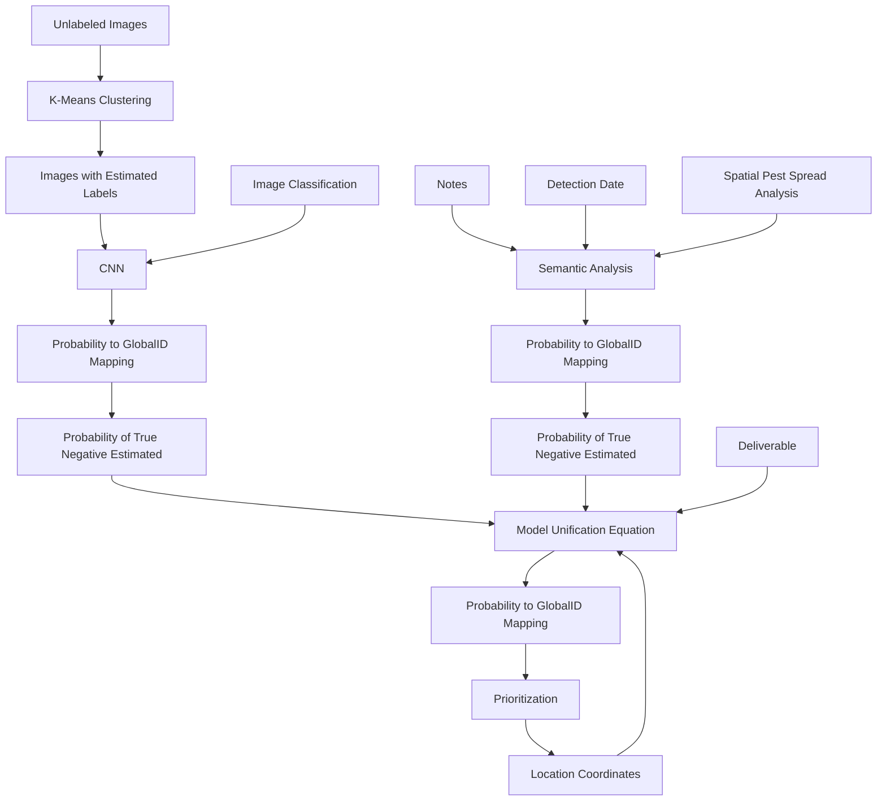
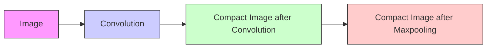
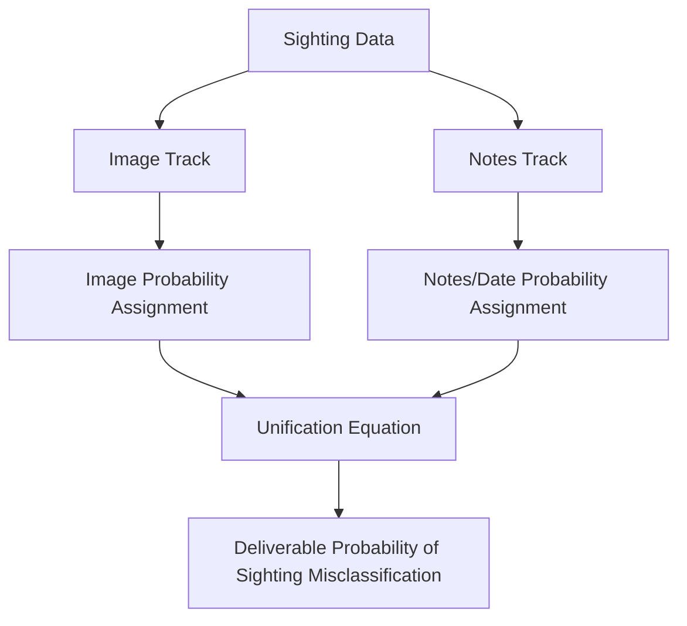

## Swarming with Data: Prioritizing Sightings of Vespa Mandarinia with Semi-Supervised Learning

Vespa mandarinia has been a highly discussed, invasive species since their non-native introduction to the State of Washington. Vespa mandarinia are known to decimate honey bees, while the bees native to North America have no defense mechanisms against their attack.11 The Washington State Department of Agriculture (WSDA) made a call for public submissions of Vespa mandarinia sightings to address the disruption this invasive species could cause. This led to a swarm of data sent their way.

We developed a model that assigns a probability of misclassification as Vespa mandarinia to each civilian sighting used to prioritize WSDA investigations. Our model consists of two tracks through which the data is fed and analyzed: image analysis and notes/detection date analysis.

The image analysis track implements a Semi-Supervised Machine Learning algorithm by estimating PositiveID or NegativeID labels for Unverified or Unprocessed images using K-Means Clustering. These images and labels alongside the pre-labeled images (given as PositiveID or NegativeID) are used to train a Convolutional Neural Network. The network produces a mapping of GlobalIDs to probabilities of the sighting being positive for Vespa mandarinia.

The notes/detection date track implements Semantic Analysis by identifying key phrases in the notes that indicate a sighting is either more or less likely to be Vespa mandarinia. Some of the key phrases are dependent on the detection date; this means the probability of a sighting being a PositiveID increases when a particular phrase is found during one time of year and decreases for another time of year. This time dependency is based on the life-cycle of Vespa mandarinia. This track also produces a mapping of GlobalIDs to probabilities of each sighting being positive for Vespa mandarinia.

These two mappings of GlobalIDs to probabilities are unified into a singular metric for the probability of a misclassification (NegativeID for Vespa mandarinia). This is executed by deriving the probability of true negative classification for each of the two tracks. Spatial bounds for unlikely citings of Vespa mandarinia are then used to adjust the final deliverable: a mapping of GlobalIDs to probability of misclassification. The mapping is then used to create intervals of high, medium, and low priority of investigation based upon the mean and standard deviation of the probabilities assigned to the respective NegativeID and PositiveID sightings.

We discuss a potential Reaction-Diffusion Model to demonstrate how the pest could spread over time; however, we find that the current data given by the problem is insufficient to properly model the Spatial Species Spread. Implementation of this model should reflect the precision of similar models in past literature.

With PositiveID data and the addition of climate data, we can update our model to better incorporate the Spatial Species Spread. The model should be updated every Vespa mandarinia seasonal cycle (annually) to evaluate spread.

Based upon our model, the eradication of Vespa mandarinia is conservatively evidenced by all probabilities of sightings being in the low priority interval within 30km of the known pest locations of the last 2 seasonal cycles.

Our model is unique in that it uses Semi-Supervised Learning techniques to account for the small amount of data on PositiveID sightings of Vespa mandarinia. This is an approach we have yet to see in the pre-existing literature on insect classification using Machine Learning. This allows us to provide accurate standards for how WSDA can allocate its resources for maximum species containment.

Key Terms: Semi-Supervised Learning, K-Means Clustering, Convolutional Neural Network, Semantic Analysis, Spatial Species Spread, Reaction-Diffusion Model

## Contents

## 1 Introduction 1

1.1 Problem Restatement  
1.2 Literature Review .  
1.3 Our Model . .  
1.4 Data Cleaning/Preprocessing . . 2

## 2 Assumptions and Nomenclature 3

2.1 Photo/Video Submission of Reported Insect . . 4  
2.2 Distinctive Features of Vespa mandarinia versus Look-alike Species 4  
2.3 Location and Life Cycle of Vespa mandarinia 5  
2.4 Probability of Misclassification with Zero Information 5

## 3 Image Classification 5

3.1 K-Means Clustering . . 6  
3.2 Convolutional Neural Network . . 8

## 4 Semantics Analysis 11

## 5 Spatial and Temporal Pest Spread Analysis 12

## 6 Model Unification Equation 13

## 7 Results and Discussion 14

7.1 Discussion of Spread Over Time 14  
7.2 Results of Sighting Classification . . 14  
7.3 Prioritizing Investigation 15  
7.4 Evidence for Eradication 17

## 8 Sensitivity Analysis 17

## 9 Model Evaluation 18

9.1 Strengths 18  
9.2 Weaknesses . 19

## 10 Conclusion and Updating the Model for Future Work 20

## 11 Memorandum to the Washington State Department of Agriculture 21

## 1 Introduction

## 1.1 Problem Restatement

The discovery of a non-native Vespa mandarinia 2019 nest in Vancouver, B.C., Canada set off alarms in the neighboring state of Washington. The state of Washington instated a program to collect alleged citizen sightings of Vespa mandardia in the form of pictures and textual reports. However, verifying the sightings has become an issue given the massive number of reports submitted and the limited resources of the state. In order to optimize the states allocation of resources, the following paper will:

• Model the likelihood of a mistaken classification using the citizen sighting reports  
• Discuss the use of our model to prioritize investigation of sightings most likely to be positive sightings  
• Discuss to what precision the spread of this pest can be predicted over time given the sightings and describe what would constitute evidence of Vespa mandarinia eradication in the State of Washington  
• Assess the ability and need to update our model given new data over time

## 1.2 Literature Review

The spread of a related species of Asian hornet (Vespa velutina) in Europe in 2004 has been studied using various methods. A study was done modeling the invasion in France using verified nest sightings over the span of 2004 to 2009. They used a Reaction-Diffusion model to describe the population growth and spread throughout the districts of France.15 The information collected from this research was used to create a simulation of the potential invasiveness of Vespa velutina into Great Britian.10 In addition to confirmed sightings, both papers utilized climate data to enhance their predictions.

Supervised machine learning techniques have successfully been applied by Kasinathan et. al to classify insect images.9 Supervised learning is characterized by training a model to classified (or labeled) training data.4 This approach is less applicable in this problem, given the majority of data points are unlabeled. A common approach to handling limited amounts of labeled data is semi-supervised learning: machine learning models that self-cluster classifications and feed the estimated labels (as Pos itiveID or NegativeID) alongside the known labels into a supervised learning algorithm.4,13 Therefore, semi-supervised learning can be applied to the problem of insect image classification. This technique can improve upon the pre-existing insect classification works by rectifying a common issues: labeling data is expensive.

## 1.3 Our Model

The objective of our model is to produce a probability to GlobalID Mapping for the probability that the given sighting (corresponding to the GlobalID) was misclassified as Vespa mandarinia. From there, we perform an analysis of probabilities associated with Positive IDs and Negative IDs to produce intervals corresponding to high, medium, and low priority for further investigation.

The overall probability to GlobalID mapping is produced by three contributing mappings of probability to GlobalID corresponding to three tracks: Image Classification, Semantic Analysis, and Spatial Pest Spread Analysis.

Each of these three tracks operates on different input types (e.g. images, notes, dates, and spatial location) to produce their own probability to GlobalID mapping and a probability corresponding to the probability of a true negative identification. These two inputs are run through the Model Unification Equation to produce the generalized probability to GlobalID mapping that as mentioned above is used to prioritize investigation.

flowchart

Figure 1: Model Activity Diagram-made using LucidChart

## 1.4 Data Cleaning/Preprocessing

The provided data included reported sightings given a unique GlobalID, Detection Date, Notes (from reporter of bug), Lab Status (i.e. Positive ID, Negative ID, Unprocessed, or Unverified), Lab Comments, Submission Date, Latitude of Sighting, and Longitude of Sighting. The Global IDs were often matched to provided photo or video files of the insect in question.

1. Video and Image Data Cleaning/Prepossessing: The video and image data set was parsed into 3 groupings: positive (corresponding to Positive IDs), negative (corresponding to Negative IDs), and unlabeled (corresponding to Unverified or Unprocessed Lab Status). Initially, we examined the videos and took screenshots of the insect in question resulting in data only consisting of still images. We also transformed all file types to JPEG file formats. All of the images were resized to be of size 224x224, and each pixel was divided by 255 to shift the values of the pixels into the range [0,1]. From there, the processing of the classes of image data diverged based on which was being fed into the K-Means Clustering and/or the Convolutional Neural Network:

• K-Means Clustering: Unlabeled data was:

(a) filtered by hand (throwing away data that were not images of insects or that were unclear images and zooming into insect when backgrounds were noisy)  
(b) estimated by eye to determine which we thought were PositiveIDs  
(c) undersampled majority/reduced sample size of majority, so there were equal amounts of supposed NegativeID images and PositiveID images to reduce the effect of the data majority being NegativeIDs18  
(d) augmented saturation and value to increase sample size: we added to the set by adjusting the saturation and value (stochastically, so each image was adjusted in the same way as every other image, but this adjustment was not fixed) for each image four times to be within ±50 of their original saturation and value valuesopencv\_2020  
(e) augmented orientation to increase sample size: we then added rotated versions (rotated by 90, 180, and 270 degrees) of the images to the setopencv\_2020  
(f) flattened images to 1-dimensional arrays and fed this into the k-Means Clustering

After, the 𝑘 clusters were formed, all of the unlabeled image data was flattened into 1- dimensional arrays and fed into the k-Means Clustering for the resulting classification predictions.

• Convolutional Neural Network: The positive images were augmented in eringturation and value with the same method as in the K-Means clustering to increase the sample size of the minority (PositiveIDs)opencv\_2020

2. Notes/Textual Data Cleaning/Preprocessing: The notes data set was parsed into the same three groupings as the video and image data set: positive, negative and unlabeled. The pairings between Detection Date, Global ID, and Notes were kept in tact. The Detection Date was parsed into month alone. The Notes were transformed into all lower case. After this preprocessing, each individual notes submission was searched for a set of references to key characteristics identifying Vespa mandarin and misconceptions identifying look-alike species.

3. Location and Time Data Cleaning/Prepossessing: Data was isolated to the State of Washington’s area, clearing the data point of the 2019 Vancouver nest. Data with missing Detection Date values and date values that can be attributed to civilian submission mistakes were removed. This cleared noise from data reported in the year 1899.

## 2 Assumptions and Nomenclature

## Nomenclature

𝐷 Diffusion Coefficient 𝑘𝑚2/𝑦𝑒𝑎𝑟

𝐹𝑁 False Negative: Classification of sighting as Negative ID for Vespa mandarinia when the sighting was actually a Positive Id

𝐹𝑃 False Positive: Classification of sighting as Positive ID for Vespa mandarinia when the sighting was actually a Negative Id  
𝐾 Carrying Capacity $1 / k m ^ { 2 }$  
𝜇 Mean  
𝑁 Nest Density $1 / k m ^ { 2 }$  
𝑃(𝐹𝑁) Probability of False Negative classification  
𝑃(𝐹𝑃) Probability of False Positive classification  
𝑃(𝑇 𝑁) Probability of True Negative classification  
𝑃(𝑇 𝑃) Probability of True Positive classification  
𝑟 Growth Rate 1/𝑦𝑒𝑎𝑟  
𝜎 Standard Deviation  
𝑇 𝑁 True Negative: Classification of sighting as Negative ID for Vespa mandarinia when the sighting was actually a Negative Id  
𝑇 𝑃 True Positive: Classification of sighting as Positive ID for Vespa mandarinia when the sighting was actually a Positive Id

## 2.1 Photo/Video Submission of Reported Insect

For the Image Classification, we assumed that if a sighting was submitted with a video or photo and that this video or photo was of an insect, that this insect was the insect sighted and that is being reported. In other words, we assumed that the submitted picture or video was not of a different insect than the one being reported. This is a reasonable assumption given that most people submit relevant information/images about the sighting. It is a necessary assumption, because the image-based classification attempts to model the probability that a submitted insect’s image is Vespa mandarinia.

## 2.2 Distinctive Features of Vespa mandarinia versus Look-alike Species

For Semantic Analysis of the Notes Data provided with each submission, we configured a series of words/phrases that reflects the distinguishing features of Vespa mandarinia from other species in the same Genus. The distinguishing words/phrases are references to color, size, and nest qualities of a Vespa mandarinia. Additionally, words/phrases not indicative of Vespa mandarinia that are tell-tale features of look-alike species were configured to extend the model’s applications of mistaken classification of Vespa mandarinia. The key phrases in our Semantics Analysis akin to Vespa mandarinia are: "orange", "brown", "yellow head", "decapitate", "forest"/"wood", "big/giant", "2"/2 inch". The size "2 inch" was chosen because humans have the optical tendency to increase the size of an object based on perspective and shock value. The key phrases akin to look-alike species Vespa crabro (European hornet) and Sphecius speciosus (Eastern cicada killers) are: "dirt", "red", "black head", "orange legs". These assumptions were pulled from the scientific data presented in the PennState Extension supplement.11

## 2.3 Location and Life Cycle of Vespa mandarinia

Based on the DNA analysis showing that the Vancouver specimens and the Washington specimens came from different parts of the Asian continent , we assumed that the initial introduction into the state of Washington occurred in 2019 and the nest site was located at the mean of the 2019 positive ID hornet sighting points. We also assumed that the spread of Vespa mandarinia came by way of boat along routes into the bay connecting Vancouver and Seattle. This assumption was based off of the locations of the alternate introduction sites. From the Penn State Extension’s Vespa mandarinia nesting cycle, we assumed positive sightings of live hornets and nest would not occur during the winter months, specifically, November through February. Based on entomological observations and data concerning similar hornets, it was also assumed that new nesting sites were bounded below a certain elevation constraint. For this reason we assumed Vespa mandarinia would not spread into or beyond the Cascade mountain range located at 121°W.

## 2.4 Probability of Misclassification with Zero Information

We assumed that when given no information on a sighting, the probability that it is a PositiveID sighting or a NegativeID sighting is equal (50%). This is because without information on a sighting, we can make no reasonable conclusions about whether or not it is actually a sighting of Vespa mandarinia.

## 3 Image Classification

There are two objectives for the Image Classification Track:

1. Develop Probability to GlobalID Mapping  
2. Estimate metric accuracy of this probability assignment,

so that the probability for a submission can have its image analyzed, and then this probability will contribute to the overall metric for probability of false classification as Vespa mandarinia, while still taking into account the propensity for inaccurate probability assignment in the Image Classification track.

Each of these two objectives are accompanied by a major challenge:

1. Approximately 53.09% of the data is unlabeled (lab status of Unverified or Unprocessed). Therefore, the classification of images as positive or negative with only labeled data greatly reduces the amount of data at our disposal. Predicting the probability of a particular image as a classification would be significantly less reliable as a result of a less generalized representation of the data learned by the algorithm.  
2. The likelihood of a Vespa mandarinia sighting is much lower than the likelihood of a misclassification. We can see from the data that only approximately 0.672% of the labeled (as PositiveID or NegativeID) data is labeled as a positive identification. This incentives a learning-based algorithm to assign all images to NegativeID if certain actions to deal with such imbalanced data are not taken. For this same reason, accuracy alone is not a reliable metric of modeling

success. A model could guess NegativeID every time but still have a high accuracy, because the negative cases far outweigh the positive cases in population. This would not accomplish the goal of assessing the probability of a particular sighting being a misclassification so as to motivate the prioritization of investigation.

We chose to solve the first problem by using Semi-Supervised Machine Learning to infer the labels of the unlabeled data via K-Means Clustering (a non-supervised learning algorithm), and then feed these labeled data points (accompanied by the given labeled data points) into the Convolutional Neural Network (a supervised learning algorithm) for binary classification.

We chose to solve the second problem with the estimation of 𝑃(𝑇 𝑃), 𝑃(𝑇 𝐹), 𝑃(𝐹𝑃), and 𝑃(𝐹𝑁) in order to accurately represent the "confusion" of the model, which will serve the same purpose as accuracy typically does by capturing the likelihood of a particular classification as positive or negative being accurate.

## 3.1 K-Means Clustering

K-Means Clustering groups data points into 𝑘 clusters by minimizing the the inertia within each cluster, which is defined as written by scikit-learn official documentation as:

$$
\text { inertia } = \sum_ {i = 0} ^ {n} \min _ {\mu_ {j}} (| x _ {i} - \mu_ {j} | ^ {2})
$$

where 𝐶 is the set of clusters and $\mu _ { j }$ is the mean (also known as centroid) of each cluster $j \in C . ^ { 1 }$ This algorithm works by

1. initializing 𝑘 centroids (in this case choosing far initial centroids to avoid convergence to a local minimum)  
2. assigning each data point to the cluster with the closest centroid  
3. redefining the centroids as the new means of each cluster 𝐶  
4. repeating steps 2-3 until the centroids stop moving

in order to form 𝑘 clusters of minimal inertia.1 We used the sklearn package’s implementation of K-Means Clustering to group the images into clusters of minimal variance from one another.1

In choosing a 𝑘 value for 𝑘-Means Clustering, we identified 3 prioritizes (ordered highest priority to lowest priority):

• Maximizing accuracy as measured by

$$
\mathrm{acc} = \frac {T P + T N}{T P + T N + F P + F N} \quad 9
$$

where 𝑇 𝑃, 𝑇 𝑁, 𝐹𝑃, and 𝐹𝑁 were estimated by our eyeball identification of positive images for Vespa mandarinia.

• Minimizing 𝐹𝑃, because these assignments as positive or negative would be fed into the CNN as their "true" labels and our goal is to use the CNN to recognize distinctive features of Vespa mandarinia, so false positives skew this ability

• Minimizing variance in assigned clusters for the images estimated (by our eyeball measure) to be positive

Running several tests for 𝑘−values yielded:

<table><tr><td>k</td><td>FP</td><td> $\frac{TP+TN}{TP+TN+FP+FN}$ </td><td>Variance</td></tr><tr><td>2</td><td>2</td><td>0.6428571429</td><td>0.5345224838</td></tr><tr><td>3</td><td>3</td><td>0.5714285714</td><td>0.6900655593</td></tr><tr><td>4</td><td>4</td><td>0.5</td><td>0.9511897312</td></tr><tr><td>5</td><td>2</td><td>0.5714285714</td><td>1.214985793</td></tr><tr><td>6</td><td>3</td><td>0.4285714286</td><td>1.527525232</td></tr><tr><td>7</td><td>4</td><td>0.4285714286</td><td>1.032795559</td></tr><tr><td>8</td><td>2</td><td>0.5</td><td>2.497617913</td></tr><tr><td>9</td><td>1</td><td>0.5714285714</td><td>2</td></tr><tr><td>10</td><td>2</td><td>0.6428571429</td><td>1.133893419</td></tr><tr><td>11</td><td>2</td><td>0.5714285714</td><td>1.463850109</td></tr><tr><td>12</td><td>0</td><td>0.6428571429</td><td>3.408672413</td></tr><tr><td>13</td><td>0</td><td>0.6428571429</td><td>3.552329886</td></tr><tr><td>14</td><td>0</td><td>0.6428571429</td><td>3.804758925</td></tr><tr><td>15</td><td>1</td><td>0.5714285714</td><td>3.236694375</td></tr><tr><td>16</td><td>1</td><td>0.5714285714</td><td>3.785938897</td></tr><tr><td>17</td><td>0</td><td>0.6428571429</td><td>2.811540842</td></tr><tr><td>18</td><td>3</td><td>0.4285714286</td><td>4.84522347</td></tr><tr><td>19</td><td>0</td><td>0.6428571429</td><td>3.690399385</td></tr><tr><td>20</td><td>0</td><td>0.5714285714</td><td>3.302235895</td></tr></table>

Figure 2: 𝑘-Value Analysis

From the table, we can see that 𝑘 = 17 yields the optimal values according to our priorities, so we choose such a 𝑘. From the 𝑇 𝑃, 𝑇 𝑁, 𝐹𝑃, 𝐹𝑁 data we were able to derive estimations for the probability of these terms for the K-Means Clustering:

$$
P (T N) = \frac {T N}{T N + F N} = 0. 5 8 3 3 3 3 3 3 3 3
$$

$$
P (F N) = \frac {F N}{T N + F N} = 0. 4 1 6 6 6 6 6 6 6 7
$$

Algorithm 1: Applying K-Means Clustering. In developing the code for this algorithm we referenced Hrishi Patel’s article on K-Means Clustering for Image Segregation and utilized libraries sklearn, glob, OpenCV, numpy, os, and OpenPyxl

1. Pre-process image data (see section 1.5) including filtration by hand, estimation of labels, undersampling majority, augmenting the photos to increase sample size (using OpenCV), and flattening the 2D image arrays to flat 1D arrays  
2. Fit k-clusters to the pre-proceessed image data.  
3. Average the cluster assignments of each image across all of its augmented versions (rotated and adjusted saturation/value), so that each image is assigned one cluster.  
3. Track the classifications of the images that are estimated as positive cases, average these values, and find the most common occurring cluster classification for the supposedly positive data. If the most common occurring cluster classification only occurs in the set of positive images once, then take the average to be the cluster corresponding to the positive images. Otherwise, take the cluster classification of positive images to be the cluster classification that occurs most often in this set.  
4. Classify 58.33% of the images that differ from the cluster chosen as the positive cluster as negative cases. This percentage corresponds to the probability of a true negative classification, which serves to potentially correct the error in k-means classification when feeding these estimated labels into the Convolutional Neural Network.  
5. Classify all images that have the same cluster classification as the positive cluster as positive cases.  
Yields: Estimated labels for the unclassified images that will be fed into the training of the Convolutional Neural Network alongside the labeled data.

## 3.2 Convolutional Neural Network

Convolutional Neural Networks (CNN) are commonly used in problems of computer vision.8 Convolutional neural networks apply learned filters to images in order to reduce the size of an image and illuminate salient features of the image.16 As any deep learning technique, it is characterized by several layers that the data is fed through (and that the gradients are back-propagated through).3 For this reason, lower level layers in a CNN typically learn the lower level features (lines, basic shapes, etc.); whereas, higher level layers in a CNN learn the higher level features (e.g. object classification). This leads to CNNs often being called hierarchical in nature.

CNNs go through repeated steps of applying convolutions and performing pooling. In convolution, you step through each grouping of pixels equal in size to the filter. You multiply corresponding entries and add those values to one another forming a more compact image. Then pooling reduces each grouping of pixels the size of the filter down to one value. In our model, we used a process called max-pooling where you take the maximum value of the pixels in this grouping so as to reduce noise in the image.16

flowchart

Figure 3: Convolutional Neural Network Process-made using LucidChart

We used TensorFlow with Keras to create our CNN, referencing examples from Chollet’s Deep Learning with Python and utilizing os, glob, numpy, openpyxl, and OpenCV as helper libraries7. In forming the network, we chose to use 3 2D Convolutional layers with 3 corresponding 2D maxpooling layers. From there, we flattened the tensor (structure holding the data) being passed through the network and passed it into two densely connected layers for classification using the Sigmoid activation function and the Binary-Cross Entropy loss function:

• The Sigmoid activation function is a non-linear function to which the probability of a positive classification of an image is fit. It ranges in values from 0 to 1, making it ideal for a binary classification problem (positive or negative for Vespa mandarinia), and is differentiable, which allows for the use of the backpropogation method essential to adjusting the weights of a neural network according to the loss function717.  
• The Binary-Cross Entropy loss function measures the difference in entropy of an approximated (by the neural net) entropy and the actual entropy of a probability distribution (in this case one for binary classification)godoy\_daniel\_20182. It is given by Daniel Godoy as

$$
- \frac {1}{N} \sum_ {i = 1} ^ {n} y _ {i} \log (p (y _ {i})) + (1 - y _ {i}) * \log (1 - p (y _ {i})) \quad \text { godoy\_daniel\_2018 }
$$

where 𝑁 is the number of points in an input data vector (e.g. our image), $y _ { i }$ is the actual probability of a positive classification, and $p ( y _ { i } )$ is the approximated probability of a positive classification by the modelgodoy\_daniel\_2018. The idea behind such a loss function is that for low probabilities of $y _ { i } \ l o g ( p ( y _ { i } ) )$ will be large causing a high loss and vice versa for when the probability of 𝑦𝑖 is highgodoy\_daniel\_2018. $y _ { i }$

In our CNN, we input images in the shape (224, 224, 3) where the image was 224 by 224 with 3 color channels (red, green, blue). The model summary showing the changing of tensor shape as well as the number of trainable parameters in each layer of the model is detailed below. From this figure we can see the gradual reduction in size of the image.

<table><tr><td>Layer (type)</td><td>Output Shape</td><td>Param #</td></tr><tr><td>conv2d (Conv2D)</td><td>(None, 222, 222, 32)</td><td>896</td></tr><tr><td>max_pooling2d (MaxPooling2D)</td><td>(None, 111, 111, 32)</td><td>0</td></tr><tr><td>conv2d_1 (Conv2D)</td><td>(None, 109, 109, 64)</td><td>18496</td></tr><tr><td>max_pooling2d_1 (MaxPooling2</td><td>(None, 54, 54, 64)</td><td>0</td></tr><tr><td>conv2d_2 (Conv2D)</td><td>(None, 52, 52, 128)</td><td>73856</td></tr><tr><td>max_pooling2d_2 (MaxPooling2</td><td>(None, 26, 26, 128)</td><td>0</td></tr><tr><td>flatten (Flatten)</td><td>(None, 86528)</td><td>0</td></tr><tr><td>dense (Dense)</td><td>(None, 512)</td><td>44302848</td></tr><tr><td>dropout (Dropout)</td><td>(None, 512)</td><td>0</td></tr><tr><td>dense_1 (Dense)</td><td>(None, 1)</td><td>513</td></tr><tr><td colspan="3">Total params: 44,396,609
Trainable params: 44,396,609
Non-trainable params: 0</td></tr></table>

Figure 4: CNN Model Summary

We apply dropout to this model in order to curb the effects of the model overfitting to the data (especially given the relatively small data set). Dropout is the process of randomly dropping values in a neural network in order to add stochasticity and prevent overfitting.7 Adding a dropout rate of 0.5 is a relatively common practice in Deep Learning.

We also set the initial bias value of the CNN in order to accommodate for how skewed the data is towards the majority of negative classification. This manual bias initialization allows the network to immediately begin approximating better probability values for the classification of the images and is found using:

$$
b _ {0} = \log (\frac {p o s}{n e g}) = \log (\frac {T P}{T N})
$$

as specified by Tensor Flow tutorials/documentation5.

## Algorithm 2: Applying CNN

1. Pre-process image data (see section 1.5) including by resizing and augmenting the photos (by adding copies with stochastically changed saturation and value within ±50 of the original values) to increase sample size (using OpenCV).  
2. Under-sample the majority (negative classifications) to two-thirds of their original sample-size to allow for less of a bias towards negative classification.  
3. Train the CNN on the preprocessed data and their accompanying labels (including those estimated by the K-Means Clustering) for a total of 25 epochs with a batch size of 128 images.  
4. Preprocess all of the image data (that was not thrown out for being irrelevant or for being unclear/noisy) by resizing to 224 by 224.  
5. Allow the model to predict the probabilities of each image being a positive classification.

Yields: Probabilities for all of the image data where higher probabilities represent a higher likelihood of being Vespa mandarinia.

Probability distributions for PositiveID, NegativeID, and Unlabeled image datasets made using matplotlib:

box plot

|   Val |   e |
|------:|----:|
|  0.9994 | nan |
|  0.9995 | nan |
|  0.9996 | nan |
|  0.9997 | nan |
|  0.9998 | nan |
|  0.9999 | nan |
|  1    | nan |
|  0.9998 | nan |
|  0.9997 | nan |
|  0.9996 | nan |
|  0.9995 | nan |
|  0.9994 | nan |
|  0.9993 | nan |
|  0.9992 | nan |
|  0.9991 | nan |
|  0.9990 | nan |
|  0.9989 | nan |
|  0.9988 | nan |
|  0.9987 | nan |
|  0.9986 | nan |
|  0.9985 | nan |
|  0.9984 | nan |
|  0.9983 | nan |
|  0.9982 | nan |
|  0.9981 | nan |
|  0.9980 | nan |
|  0.9979 | nan |
|  0.9978 | nan |
|  0.9977 | nan |
|  0.9976 | nan |
|  0.9975 | nan |
|  0.9974 | nan |
|  0.9973 | nan |
|  0.9972 | nan |
|  0.9971 | nan |
|  0.9970 | nan |
|  0.9969 | nan |
|  0.9968 | nan |
|  0.9967 | nan |
|  0.9966 | nan |
|  0.9965 | nan |
|  0.9964 | nan |
|  0.9963 | nan |
|  0.9962 | nan |
|  0.9961 | nan |
|  0.9960 | nan |
|  0.9959 | nan |
|  0.9958 | nan |
|  0.9957 | nan |
|  0.9956 | nan |
|  0.9955 | nan |
|  0.9954 | nan |
|  0.9953 | nan |
|  0.9952 | nan |
|  0.9951 | nan |
|  0.9950 | nan |
|  0.9949 | nan |
|  0.9948 | nan |
|  0.9947 | nan |
|  0.9946 | nan |
|  0.9945 | nan |
|  0.9944 | nan |
|  0.9943 | nan |
|  0.9942 | nan |
|  0.9941 | nan |
|  0.9940 | nan |
|  0.9939 | nan |
|  0.9938 | nan |
|  0.9937 | nan |
|  0.9936 | nan |
|  0.9935 | nan |
|  0.9934 | nan |
|  0.9933 | nan |
|  0.9932 | nan |
|  0.9931 | nan |
|  0.9930 | nan |
|  0.9929 | nan |
|  0.9928 | nan |
|  0.9      | nan |

box plot

| Val       | e            |
|:----------|:-------------|
| 0.0000   |              |
| 0.0010   |              |
| 0.0025   |              |
| ...      |              |
| (100 val | es in total) |

box plot

| Unlabeled Data | Probability |
| -------------- | ----------- |
| 1              | 0.000       |
| 2              | 0.001       |
| 3              | 0.005       |
| 4              | 0.010       |

Figure 5: Box Plots for Unlabeled, Positive, and Negative Probability Distributions.

Note: The scale of the y-axis in the above plots has been adjusted.

## 4 Semantics Analysis

The objective for the Semantics Track is to develop a probability reflecting whether a civilian report and its associated Detection Date and Notes Description suggest a PositiveID Vespa mandarinia. This probability will contribute to the overall metric for probability of a false classification as Vespa mandarinia. The first step in this analysis is the already referenced data cleaning and preprocessing. The cleaned monthly data and lower case notes data was then passed for semantics analysis.

The objective of parsing through language data posed a massive challenge. By the conventions of the English language semiotics, there can be many different signifiers (words) to a signified (object) meaning. For example, in describing the nest location of Vespa mandarinia some civilians referred to the "forest" others the "woods". Both reference the same signified object but do so using different signifiers.

Based off the Penn State Extension on Vespa mandarinia, we made assumptions stemming from the scientific journal about the qualities and timelines associated with this species versus look-alike species. Each key word was given equal weight in determining the probability of whether the Detection Date, Global ID and Notes triad reflected a possible PositiveID. Using key word extraction, we parse through the Notes data for the following terms: (1) orange, (2) brown, (3) yellow head / yellowish head, (4) decapitate, (5) forest / wood, (6) $2 " / 2$ inch, (7) big / giant, (8) dirt, (9) red, (10) black head, (11) orange legs.

Each phrase parsed through in the data was given a positive or negtive weight of 0.05 depending on whether this phrase was indicative of Vespa manadrina, its description and life cycle. Terms 8 - 11 are indicative of look-alike species to the Vespa mandarinia; for this reason, it is less likely that a report is of Vespa mandarinia if terms 8-11 are referenced. These terms were included to gauge the misclassification of Vespa mandarinia.

The probability that the sighting was a positive classification was initialized to 0.5 to reflect our assumption that a sighting is equally likely to be positive or negative with zero information.

If a phrase from Terms 1 - 7 was found in the notes section, we increased the probability of positive classification by 0.05. If a phrase from Terms 8 - 11 was found in the notes section, we decreased the probability of a positive classification by 0.05.

Certain phrases’ probability assignments are dependent upon the life cycle of Vespa mandarinia: (1) dead / specimen, (2) live / killed, (3) nest / hive. If phrase 1 is presen with detection date between October and January (Winter months), the probability of positive classification increases by 0.05. If it is present in other times, the probability decreases by 0.05. If phrase 2 is present in February through September, then the probability of positive classification increases by 0.05, and decreases otherwise. Lastly, if phrase 3 is present with detection date in March or April, then the probability of positive classification increases by 0.05 and decreases otherwise.

The resulting distribution of probability assignments for PositiveID, NegativeID, and Unlabeled Notes and Detection Date datasets made using matplotlib:

  
Figure 6: Box Plots for Unlabeled, Positive, and Negative Probability Distributions.  
Note: The scale of the y-axis in the above plots has been adjusted.

## 5 Spatial and Temporal Pest Spread Analysis

The common method of modeling the population growth and spread of an invasive species is the Reaction-Diffusion Model as used by Robinet et al. when modeling the spacial spread of Vespa velutina in France.15 The model is described by the Fisher equation:

$$
\frac {\partial N}{\partial t} = D \left(\frac {\partial^ {2} N}{\partial x ^ {2}} + \frac {\partial^ {2} N}{\partial x ^ {2}}\right) + r N \left(1 - \frac {N}{K}\right) \tag {1}
$$

whose solution produces the following travelling wave equation: $c = 2 \sqrt { r D }$

This model is effective when accurate estimations of c, K, and r can be made from empirical data. Unfortunately, there is relatively little historical data concerning the Vespa mandarinia’s population growth. The Citizen Sighting data itself also lacks sufficient positive ID data points to estimate these metrics. In order to use this model given the current data, the variables had to be derived from entomological observations11. The estimations are as follows: $\mathrm { c } = 9 . 7 4 , \mathrm { K } = 1 , \mathrm { r } = 1 . 3 5$ .

Given that these are merely estimates, the entire model could not be reliably implemented to help predict the spread of Vespa mandarinia in the state of Washington. However it allowed us to create maximum area bounds outside of which we applied a zero probability of a Vespa mandarinia sighting, along with an area of maximum interest for further study.

The maximum area bounds were made by evaluating the worst case scenario. We made the assumptions of long-range dispersal (c=30 km/year) and multiple introduction locations into various port cities of the state of Washington, as far south as Olympia, WA (47.0379°N, 122.9007°W). These assumptions were made for this situation because the value of c is not currently backed by empirical data, and the form of introduction of the species to the Pacific Northwest is still unknown. It is for these reasons that the probabilities of these events are still nonzero and should be considered in the spacial realm of possibility.

The area of maximum interest for further study was calculated as the area predicted to have the highest nest density in the state of Washington in 2021. Where the spacial sample mean of the 2019 positive ID sightings was taken as the initial nest location and the values of c, K, and r come from the table above. This metric was calculated solely as a recommendation to the state as an area whose study could help produce an accurate prediction of the spread of Vespa mandarinia, not as a probability contribution to our model.

## 6 Model Unification Equation

The Model Unification Equation produces a singular metric for the probability of a reported sighting being misclassified as a sighting of Vespa mandarinia (meaning it is not genuinely Vespa mandarinia). It does so by adding 1 minus the probabilities produced by the image track and the notes track weighted by the probability of a true negative for each of these tracks. From there, the probability of misclassification is set to 1 if the longitude is greater than -121 or if the latitude is less than 46.7 due to the practical impossibility of Vespa mandarinia existing in these locations unless they were intentionally moved there.

• $P _ { n o t e s } ( T N )$ is estimated by finding the estimated probability of all of the sightings with Lab Statuses of Negative. Then the mean and standard deviation of this set of probabilities is found using the statisics library in python. Any sightings with probability, from semantic analysis, within the range of $[ 0 , \mu + \sigma )$ are labeled negative and all others are labeled positive sightings. Then the estimated labels from the K-Means Clustering algorithm as well as the given labels are compared against these newly assigned labels to determine estimated values for 𝑇 𝑃, 𝑇 𝑁, 𝐹𝑃, 𝐹𝑁. Then 𝑃(𝑇 𝑁) = $\begin{array} { r } { P ( T N ) = \frac { T N } { F N + T N } } \end{array}$ .  
• $P _ { i m a g e s } ( T N )$ is a metric tracked by the convolutions neural network as it trains.

Let $M _ { i }$ be the mapping of GlobalIDs to probabilities from images and $M _ { n }$ be the mapping of GlobalIDs to probabilities from notes. The resulting unified value for the probability of misclassified sighting corresponding to a particular Global ID, 𝑖, is given by

$$
p = \left\{ \begin{array}{l l} (1 - p _ {\text { notes }}) * P _ {\text { notes }} (T N) + (1 - p _ {\text { images }}) * P _ {\text { images }} (T N) & i \in M _ {i}, M _ {n} \\ (1 - p _ {\text { notes }}) * P _ {\text { notes }} (T N) & \text { if } i \in M _ {n}, i \notin M _ {i} \\ (1 - p _ {\text { images }}) * P _ {\text { images }} (T N) & \text { if } i \in M _ {i}, i \notin M _ {n} \\ 0. 5 \text { if } i \notin M _ {n}, M _ {i} \\ 1 \text { if   lat } > - 1 2 2. 0 6 \text { or   long } <   4 6. 7 \end{array} \right.
$$

If this equation produces some $p > 1$ , then $p$ is set to 1. If this equation produces some $p < 0$ , then $p$ is set to 0.

## 7 Results and Discussion

## 7.1 Discussion of Spread Over Time

Given the small amount of current data of Vespa mandarinia sightings in the state of Washington, it is not possible to produce an accurate prediction of species spread and population growth over time. However, comparing estimates based on entomological observations to values of similar species (french spread) allowed us to produce spacial bounds outside of which the probability of a positive sighting in 2020 is zero. (Maximum Easterly Longitude Bound: -122.063°, Maximum Southerly Latitude Bound: 46.77°)

The area of maximum interest for further study lies within 23.63 km circle of the assumed initial nest site (-122.72558475, 48.9931665). The furthest point from the spacial mean using a simplified shortdistance dispersal model would be located 29.22 km away from the assumed point of introduction. It is within this area that data points could be gathered that would give further insight into Vespa mandarinia nesting patterns, specifically lending data that would allow for empirical estimations of carrying capacity and population growth rate.

If high-integrity data is collected in the spring, summer and fall seasons, regarding nest locations and hornet sights, the spread of Vespa mandarinia could be accurately modelled using the reactiondiffusion model. Integrating research on habitat suitability metrics from CLIMEX modelling15 into the spacial model would create a metric that could strengthen our current model by determining the spacial probability of a positive sighting.

An uncertainty analysis done using a similar model with a larger dataset15, showed a sensitivity in the model to calculation of r. Their calculations of r depended on habitat suitability metrics that incorporated CLIMEX modelling. The modelling showed estimations of K and c as the mean baseline to be the optimal solution and the model to be considered robust. Therefore, given more high-integrity data in 2021, our model can be utilized to produce a similar precision.

Once this portion of the model is implemented and integrated into the generalized model, annual updates to the true pest locations are necessary in order to adjust the probability that a sighting is positive or negative for Vespa mandarinia.

## 7.2 Results of Sighting Classification

From the Model Unification Equation, we received a probability mapping from each GlobalID to the probability that the sighting was a misclassification (negative for Vespa mandarinia). From this mapping, we could split the probabilities into three sets: positive, negative, and unlabeled (Unverified or Unprocessed) as given by the original dataset. The standard deviation and mean of the probabilities corresponding to each of these three sets is given below-found using statistics library in python:

<table><tr><td>Set</td><td> $\mu$ </td><td> $\sigma$ </td></tr><tr><td>Positive</td><td>0.4798952739096558</td><td>0.02384031216308337</td></tr><tr><td>Negative</td><td>0.9710264772650146</td><td>0.11967336173438212</td></tr><tr><td>Unlabeled</td><td>0.5982794013488542</td><td>0.2213738686521228</td></tr></table>

Figure 7: Probability Mean and Deviation

The probabilities associated with each set is demonstrated by these box plots made using matplotib:

box plot

| Unlabeled Data   |   Probability |
|:-----------------|-------------:|
| 0.9978788282229495 |          nan |
| 0.998033418181693  |          nan |
| 0.998157815151963  |          nan |
| 0.998267815151963  |          nan |
| 0.9983788282229495 |          nan |
| ...              |          nan |

box plot

| Probabilities of Positive Data |
| ------------------------------ |
| 1                              |

line chart

| Label | Value |
|-------|-------|
| 1     | 1.00  |

Figure 8: Box Plots for Unlabeled, Positive, and Negative Probability Distributions.  
Note: The scale of the y-axis in these plots has been adjusted.

## 7.3 Prioritizing Investigation

Based upon the probability associated with each of the 3 sets mentioned in section 7.2 (Positive, Negative, and Unlabeled) as well as their associated mean and standard deviations (found using the statistics library in python), we have come up with intervals of probabilities from the model corresponding to high, medium and low priority for investigation:

<table><tr><td>Priority Level</td><td>Interval</td></tr><tr><td>Low</td><td>[0.8513531155306324, 1]</td></tr><tr><td>Medium</td><td>[0.5037355860727392, 0.8513531155306324]</td></tr><tr><td>High</td><td>[0, 0.5037355860727392]</td></tr></table>

Figure 9: Priority Levels and Corresponding Intervals of Probability

The idea behind these intervals is that the Washington State Department of Agriculture would be able to feed the sightings data point (as characterized by detection date, image of insect, reported notes, latitude of detection, and longitude of detection), which would be analyzed by the model in the following process:

flowchart

Figure 10: View of the model from the Washington State Department made using LucidChart.

resulting in a single metric for the probability of misclassification of sighting as Vespa mandarinia. The priority level of investigation would then be determined by under which of the above intervals the assigned probability falls.

For example, sighting {09F8A9C3-1692-4DE3-9EE1-3FD1DEACFFD5} was assigned a probability of being a misclassification of 0.965601349, which is within the low priority interval. Here are the corresponding relevant data points for this sighting:

natural_image

Close-up of an insect specimen with exposed legs, antennae, and a black head (no text or symbols visible)

Figure 11: Sighting {09F8A9C3-1692-4DE3-9EE1-3FD1DEACFFD5} Image.

<table><tr><td>Detection Date</td><td>Notes</td><td>Latitude</td><td>Longitude</td></tr><tr><td>7/31/20</td><td>Null</td><td>48.06114</td><td>-122.1769</td></tr></table>

Figure 12: Detection Date, Notes, and Location data for sighting {09F8A9C3-1692-4DE3-9EE1- 3FD1DEACFFD5}.

The Notes data was not included within the data and the location is well within the bounds of a valid sighting; however, the image classification track deems this insect dissimilar to Vespa mandarinia; therefore, it is assigned to the low priority interval for investigation.

## 7.4 Evidence for Eradication

We are able to extrapolate our model out in time to discuss how our Model Unification Equation, that gives discrete probability points, can be mapped to determine the status of eradicating Vespa mandarinia in the State of Washington. Based on our Spatian and Temporal Pest Spread Analysis, the long range dispersal is a generous 30 km spread per year. This metric was based on a short distance dispersal model and reflects the ability of Vespa mandarinia to not only navigate the Washington terrain and altitude, and also the confidence in understanding species in a smaller range based on the relative size of the habitable locations in Washington for Vesapa mandarinia. Based on our model, the eradication of Vespa mandarinia is conservatively evidenced by all probabilities of sightings being in the low priority interval within 30km of the known pest locations of the last 2 seasonal cycles.

map chart

| County | County Lines (e6) | 2019 PositiveID Sighting (e6) | 2020 PositiveID Sighting (e6) | Initial Nest Location (e6) |
| --- | --- | --- | --- | --- |
| Whatcom County | 6.3 | 6.3 | 6.3 | Yes |
| Skagit County | 6.2 | 6.2 | 6.2 | Yes |
| Island County | 6.1 | 6.1 | 6.1 | Yes |
| Snohomish County | 6.1 | 6.1 | 6.1 | Yes |
| Jefferson County | 6.0 | 6.0 | 6.0 | Yes |
| Krasap County | 6.0 | 6.0 | 6.0 | Yes |
| King County | 6.0 | 6.0 | 6.0 | Yes |
| Pierce County | 5.9 | 5.9 | 5.9 | Yes |
| Thurston County | 5.9 | 5.9 | 5.9 | Yes |
| Pacific County | 5.8 | 5.8 | 5.8 | Yes |
| Lewis County | 5.8 | 5.8 | 5.8 | Yes |
| Cowlitz County | 5.8 | 5.8 | 5.8 | Yes |
| Skamania County | 5.7 | 5.7 | 5.7 | Yes |
| Clark County | 5.7 | 5.7 | 5.7 | Yes |
| San Juan County | 6.2 | 6.2 | 6.2 | Yes |
| Clallam County | 6.1 | 6.1 | 6.1 | Yes |
| Mason County | 6.0 | 6.0 | 6.0 | Yes |
| Grays Harbor County | 5.9 | 5.9 | 5.9 | Yes |
| Walkkialum County | 5.8 | 5.8 | 5.8 | Yes |

Figure 13: 30 km range around all current 2019 and 2020 PostiveID Vespa mandarinia.

This evidence must be applied to all 30km ranges of the Northwest most part of the state. Evidence for Eradication by our model is most accurate after the unverified data has been parsed and after the urgent locations have been excavated.

## 8 Sensitivity Analysis

In order to determine the sensitivity of the image-based model against differing sets of training data, we performed K-Fold Cross Validation with 𝑘 = 3 folds. K-Fold Cross Validation involves seperating all of the image data into two groups: training and validation with the size of those two datasets being equal to length(image dataset)/3 and 2 ∗ length(image dataset)/3 respectively, when 𝑘 = 3. 3 models are run after having been trained on 3 disjoint training sets and validated on the rest of the data. The result is an ability to assess the sensitivity of the model to different training data sets. Below are the confusion matrices for each of these 3 iterations at training and validation (made using seaborn and referencing TensorFlow’s documentation/examples).

heatmap

Confusion Matrix at 0.50
| Actual Label | Predicted Label 0 | Predicted Label 1 |
| :--- | :--- | :--- |
| 0 | 1059 | 0 |
| 1 | 3 | 134 |

heatmap

Confusion Matrix at 0.50
| Actual Label | Predicted Label 0 | Predicted Label 1 |
| :--- | :--- | :--- |
| 0 | 1058 | 4 |
| 1 | 2 | 132 |

heatmap

Confusion Matrix at 0.50
| Actual Label | Predicted Label 0 | Predicted Label 1 |
| :--- | :--- | :--- |
| 0 | 1050 | 2 |
| 1 | 4 | 140 |

Figure 14: Confusion Matrices for each of 3-folds with division between positive and negative at $p = 0 . 5$ where 0 coresponds to negative classification and 1 responds to positive classification.

As we can see above, the largest difference in 𝑇 𝑃, 𝑇 𝑁, 𝐹𝑁, 𝐹𝑃 is in the last iteration’s 𝑇 𝑁 and 𝑇 𝑃 rates, which, respectively, only differ by 0.84% and 6.06% maximally. Therefore, we can conclude that the image classifications are largely unsensitive to changes in training data.

## 9 Model Evaluation

## 9.1 Strengths

1. Our model utilizes diverse methods of parsing through the unstructured data. We leverage the use of image processing in a convolutional neural net, automated keyword extraction in the submission notes to create a comprehensive metric of whether the submission is likely to be

Vespa mandarinia. The use of image, video, date, location, notes, and lab status data allows gives our model the necessary scalability to combat the high volumes of reporting.

2. Data fed through our Semantics model is evaluated with consistent criteria.  
3. Our model produces real time analysis and probabilities that predict the likelihood of a mistaken classification. This gives our model the needed flexibility to process additional new reports over time, bolstering the longevity of our model with the only requirement being an annual update to the spatial portion of the model to reflect pest spread.  
4. Many of the assumptions made for the model image, description and location analysis were rooted in validated scientific knowledge on Vespa mandarinia by Penn State Extension.  
5. Our model has a modular approach allowing the Image, Semantics, and Spatial Analysis to be updated individually without influencing the other forms of analysis.

## 9.2 Weaknesses

1. The Convolutional Neural Net would produce greater accuracy in identification if there was more PositiveID image data available. More data over time will only strengthen the model.  
2. The variability in the English language and the ability to convey the same idea using a myriad of word combinations took a toll on the Semantics Analysis. Some key words or phrases may be overlooked because the civilian chose a unique, nontrivial description of the alleged Vespa mandarinia.  
3. There is a large amount of variance within the probabilities associated with the NegativeID set in particular (made using matplotlib):

scatter plot

| Label | Probability |
|-------|-------------|
| 1     | 1.0         |
| 1     | 0.6         |
| 1     | 0.5         |
| 1     | 0.5         |
| 1     | 0.4         |

Figure 15: Boxplot with outliers for NegativeID probability distribution.

This leads to difficulty in defining eradication with certainty given some negative data will be assigned high level investigation priority.

4. Image segmentation was not performed by the Convolutional Neural Network, meaning image classification may be less accurate when there are multiple insects of varying species in an image.

## 10 Conclusion and Updating the Model for Future Work

In this paper we formulated a model that the Washington State Department of Agriculture can apply to prioritize investigating the species Vespa mandarinia. We produced probabilities of positive identification as Vespa mandarinia based on Image, Semantics, and Spatial Classification techniques. We modeled the likelihood of TN data classification from each of the approaches. 𝑃(𝑇 𝑁), as well as the Image, Semantics and Spatial Classifications were all fed into the Model Unification Equation.

Our results indicate that modeled probabilities are to be classified into 3 priority levels based upon the mean and standard deviation of probabilities assigned to the classes of NegativeID and PositiveID data:

<table><tr><td>Priority Level</td><td>Interval of Probability</td></tr><tr><td>Low</td><td>[0.8513531155306324, 1]</td></tr><tr><td>Medium</td><td>[0.5037355860727392, 0.8513531155306324]</td></tr><tr><td>High</td><td>[0, 0.5037355860727392]</td></tr></table>

Given additional new reports over time, we can update our model by strengthening our evaluation of pest spread. For future work, our model should be updated to include additional climate data. Outlined in the strengths, our model allows for real-time analysis, so our updates can occur within moments of a proper submission. Climate data can be easily integrated into the Species Spatial Spread to reconfigure our Model Unification Equation deliverable.

The Spatial Analysis portion should be updated annually to reflect the pest spread over time, which effects the overall probability of a positive or negative classification as Vespa mandarina.

While our Model leverages every subset of the given data set to configure a metric to prioritizing civilian report investigation, there are many improvements that can be made given extended time and research.

1. Access to a pre-trained neural net would produce better accuracy of shape recognition. This would be complemented with more data on PostiveIDs of Vespa mandarinia to continue to train the CNN on.  
2. Rather than doing statistical key word extraction from the Notes data subset, an improvement of this model would be to create a text sentiment neural net. Crafting a second neural net would make our model more robust in analysing human patterns and deviations.  
3. With more data on the density of the spread of the data, a better picture of the spread of this pest over time can be predicted with increasing precision. There were only 12 verified PositiveIDs of Vespa mandarinia which allows for sparse conclusions to be made on the origins of any infestations or nests.

# 11 Memorandum to the Washington State Department of Agriculture

TO: The Washington State Department of Agriculture

FROM: MCM Team 2107870

DATE: February 8, 2021

SUBJECT: Analysis of Vespa mandarinia Sightings and Recommendations for Investigation

We are writing to address the State of Washington’s ongoing efforts to detect occurrences and spread of the Vespa mandarinia species, commonly known as the Asian Giant Hornet. Vespa mandarinia poses a great threat to the Washington state ecology. In our new partnership, we are dedicated to protecting the State of Washington and greater area ecology, helping the community find safety in nature, and most importantly, developing a concrete metric that allows better allocation your resources in these efforts.

By sifting through the image, text and location data collected in your initial efforts to track public sightings of Vespa mandarinia, our team has developed a long-term process and metric which will assist your department in identifying which civilian submissions should be allocated highest priority and conversely lowest priority investigation. We will walk you through the development of the model used to process reports, and furthermore provide concrete recommendations to your department.

## OUR APPROACH

We developed a model with two analysis tracks: image data analysis and notes/date of detection analysis.

1. The image data analysis track requires the input of still images of the insect being reported. The output of this track is a list that links the GlobalIDs of the sighting to the probability that the image is of Vespa mandarinia. These probabilities range from 0 to 1. A value of 0 means the image is not of Vespa mandarinia, and a value of 1 means the image is an image of Vespa mandarinia.  
2. The notes/date of detection detection analysis requires the input of these two data points and outputs the a list linking the GlobalIDs of the sightings to the probability that the notes data of that sighting refers to Vespa mandarinia on a the same scale of 0 to 1.

Our model takes these two lists from the separate tracks, as well as the location data of longitude and latitude, and combines them. You are given a list of pairings between GlobalIDs and the probability that the reported sighting is not of Vespa mandarinia on a scale of 0 to 1. A value 1 indicates that the sighting is not Vespa mandarinia and 0 indicates that the sighting is Vespa mandarinia. The following table presents the priority levels assigned to the probability deliverable:

<table><tr><td>Priority Level</td><td>Criteria</td></tr><tr><td>Low</td><td>assigned probability is greater than 0.8513531155306324 and less than or equal to 1</td></tr><tr><td>Medium</td><td>assigned probability is greater than 0.5037355860727392 and less than or equal to 0.8513531155306324</td></tr><tr><td>High</td><td>assigned probability is greater than or equal to 0 and less than or equal to 0.5037355860727392</td></tr></table>

Figure 16: Priority Levels Table

To continue our ongoing partnership, we also propose a model for future use that assigns a probability of a sighting being Vespa mandarinia based upon pest spread from past seasonal cycles. Such a model will be useful as more data on the location of positive sightings are collected.

## OUR FINDINGS AND RECOMMENDATIONS

Our short term recommendations follow as such:

1. The most urgent locations that should be investigated are: Whatcom county, Skagit County, and San Juan County. After running our model on all the unverified and unprocessed data, these three counties scored the highest probability of being a Vespa mandarinia sighting.  
2. Our short term logistical recommendation is that the Agricultural Department make great amend ments to the civilian submission form. When preprocessing the initial data, our team had to remove many submissions because records contained incorrect dates and photos. The preprocessed notes suffered from noisy data because many submissions contained additional irrelevant description of possibly identifying Vespa mandarinia, but did not go into any details of what the alleged insect looked like. This makes distinction of ID increasingly difficult. We suggest specifying on the form uploads of "Insect Photos" and "Vivid Description of Insect Seen" to curate better civilian data.

Our long term recommendations follow as such:

1. Investigation into high priority sightings (according to the Priority Levels Table above) should be emphasized most; however, this is not to say that a sighting with a low priority level is not Vespa mandarinia. It is simply less likely to be Vespa mandarinia than the other sightings. For this reason, some level of investigation into all of the priority levels should be allocated; however, the most urgent are the sightings in the high priority level.  
2. Evidence of eradication of this pest in a region can be determined by this model when all of the reported sightings exist in the low priority level within a 30km radius of the region of interest for two Vespa mandarinia seasonal cycles (two years).

We appreciate your time and consideration and hope to expand upon this partnership to help ensure the ecological safety of the State of Washington in the future.

Sincerely,

Team 2107870

## References

[1] 2.3. Clustering. url: https://rb.gy/kqg4bx.  
[2] Binary Cross Entropy. url: https://rb.gy/0dlvzz.  
[3] Jason Brownlee. A Gentle Introduction to the Rectified Linear Unit (ReLU). Aug. 2020. url: https://rb.gy/rbdwcl..  
[4] Jason Brownlee. Supervised and Unsupervised Machine Learning Algorithms. Aug. 2020. url: https://rb.gy/wfcmao.  
[5] Classification on imbalanced data nbsp;: nbsp; TensorFlow Core. url: https://rb.gy/ 02grv4.  
[6] Paige Embry. How Mitochondrial DNA Offers Clues to Giant Hornets’ Invasion. Nov. 2020. url: https://rb.gy/27qs0p.  
[7] Chollet François. Deep learning with Python. Manning Publications Co., 2018.  
[8] Implementing k-means Clustering with TensorFlow. June 2019. url: https://rb.gy/onthws.  
[9] Thenmozhi Kasinathan, Dakshayani Singaraju, and Srinivasulu Reddy Uyyala. Insect classification and detection in field crops using modern machine learning techniques. Oct. 2020. url: https://rb.gy/jqp7as.  
[10] Matt J. Keeling et al. Predicting the spread of the Asian hornet ( Vespa velutina ) following its incursion into Great Britain. July 2017. url: https://www.nature.com/articles/ s41598-017-06212-0.  
[11] Michael J Michael J. Skvarla. Asian Giant Hornets. Jan. 2021. url: https://extension. psu.edu/asian-giant-hornets.  
[12] Hrishi Patel. Using K-Means Clustering for Image Segregation. June 2020. url: https://rb. gy/dxbxpt.  
[13] Jernej Puc. Semi-supervised learning in satellite image classification. Feb. 2020. url: https: //rb.gy/5plbhc.  
[14] Python cv2.add() Examples. url: https://www.programcreek.com/python/example/ 89358/cv2.add.  
[15] Christelle Robinet, Christelle Suppo, and Eric Darrouzet. “Rapid spread of the invasive yellowlegged hornet in France”. In: Journal of Applied Ecology 54.1 (June 2016). doi: https : //doi.org/10.1111/1365-2664.12724.  
[16] Sumit Saha. A Comprehensive Guide to Convolutional Neural Networks-the ELI5 way. Dec. 2018. url: https://rb.gy/nxajwf.  
[17] Sagar Sharma. Activation Functions in Neural Networks. Sept. 2017. url: https://rb.gy/ kvihlt.  
[18] Zichen Wang. Practical tips for class imbalance in binary classification. Jan. 2019. url: https: //rb.gy/qtfmqx.

Coding Packages Used: matplotlib, numpy, geopandas, pandas, scipy, seaborn, OpenCv, Open-Pyxl, numpy, statistics, os, glob